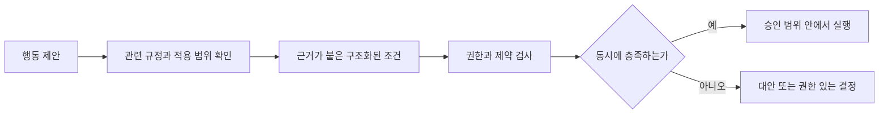
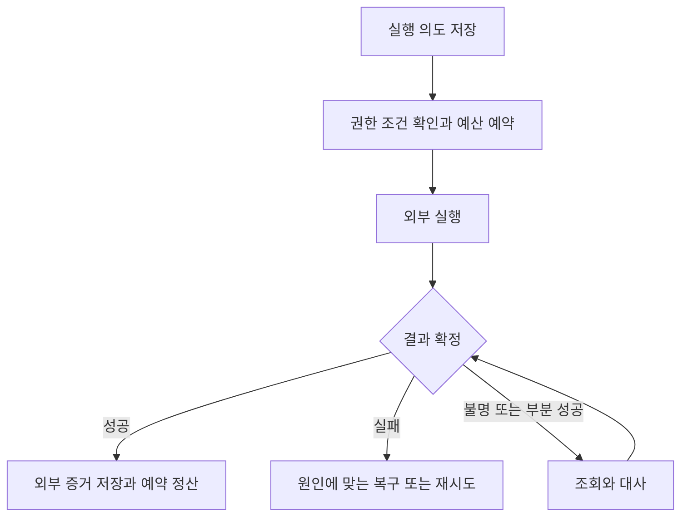

# 실행과 데이터

[목표 문서로](../전문가%20에이전트%20정의.md) · [평가 규약](evaluation.md)

## 공통 실행 계약

모델은 문제 정의·근거 해석·방법 선택·재계획을 맡는다. 결정적 계산·형식 검사·권한·예산·상태 저장은 코드가 맡는다. 경계는 검증 결과로 조정하며, 모델이 강해졌다는 이유로 권한 검사나 기록의 내구성을 제거하지 않는다.

실행기는 모델 호출과 도구 결과를 연결하고, 중단·대기·재시작을 처리한다. 모델이 최종 답변을 냈다는 사실은 실행 턴의 종료일 뿐 업무 성공의 증거가 아니다. 완료는 잠긴 조건을 외부 증거로 확인한 뒤 판정한다.

| 계약 | 필수 내용 |
|---|---|
| 입력 | 조직·고객·업무·요청자, 자료 참조와 판본, 위임 범위, 완료 조건, 기한·예산 |
| 모델의 결정 | 제안 행동, 대상과 매개변수, 근거, 기대 결과, 가정, 검증·복구 방법 |
| 도구 호출 | 실행 의도 ID, 인증된 주체, 권한·승인·정책 판본, 대상 상태 판본, 비용 예약 |
| 도구 결과 | 확정 성공·확정 실패·부분 성공·결과 불명 중 하나, 외부 영수증·상태, 다음 확인 방법 |
| 종료 | 실행 상태, 목표 달성 상태, 검증 증거, 사람 기여, 사용 비용, 후속 책임 |

각 인터페이스는 형식 검사 외에 의미 제약을 가진다. 허용 필드와 단위, 대상 범위, 오류 종류, 타임아웃, 재시도 조건, 보존·비밀 등급을 정의한다. 모듈 수는 이 계약을 지키는 데 필요한 만큼만 둔다.

## 복합 업무의 상태·전략·협력

실행 계약은 한 문서나 한 사건의 처리뿐 아니라 서로 영향을 주는 업무 묶음에 적용한다. 아래 레코드는 논리적 책임이며 별도 서비스나 고정된 폴더 수를 요구하지 않는다. 전체 사건 상태 하나에 모든 고객의 비밀을 모으지 않고, 접근 가능한 참조와 팀별 상태를 연결한다.

| 계약 | 필수 내용 | 책임 |
|---|---|---|
| 사건·쟁점 | 업무 묶음·개별 사건·당사자·기관·행위·기준시점·기한·관련 사건 | M25·M41 |
| 사실·주장·가설 | 명제·종류·주장자·찬반 근거·적용 범위·불명 사항·전환 조건·정정 이력 | M18·M25·M34·M47 |
| 당사자 관계 | 의뢰인·비용 지급자·대표자·수혜자·상대·결정권자, 목적·의무·정보 공유·관계 변경 | M27·M31·M32·M38 |
| 통합 전략 | 목표별 우선순위·절대 제약·대안·전제·상대 반응 후보·실행 순서·보존할 선택권·전환 신호 | M33·M34·M35·M38 |
| 결합 손실 | 공유 담보·거래상대·자료·설비·인력, 연쇄 조건·현금 필요·비선형 손실·모형 및 확률 불확실성 | M33·M44·M53·M54 |
| 공동 판단 | 팀별 역할·공유 상태 판본·비밀 경계·이견·근거 차이·검토자·결정 책임·변경 통지 | M04·M25·M43 |
| 외부 수행 | 취득할 증거·관측 조건·계측 교정·수행자·권한·일정·비용·인수·실패 대안·전문 기여 | M07·M10·M39·M40·M54 |

사실, 당사자의 주장, 분석 가설, 법·회계 해석, 전략상 가정은 다른 종류다. 같은 사실에 대한 조건부·예비적 주장이나 분야별 다른 해석을 무조건 모순으로 삭제하지 않는다. 양립 가능성은 해당 절차·관할·명시한 전제로 검토한다. 새 반대 증거가 오면 결론·전략·문서·다른 사건의 약속을 재검토한다. 이미 낸 문서와 실행은 기록에서 지우지 않고 정정·추가 조치가 필요한지 판단한다.

통합 전략은 할 일 목록 외에 관측별 다음 선택을 가진다. 같은 행동도 순서가 바뀌면 권리·증거·상대 반응·현금이 달라질 수 있다. 개별 세액·승률·매출만 최적화하지 않으며, 목표 간 교환과 우선순위는 유효한 위임에 근거한다. 불법 대안은 높은 기대이익으로 선택하지 않는다. 확률을 알 수 없으면 범위·대안 모형·민감도로 비교하고 임의의 확률이나 통합 점수로 불확실성을 감추지 않는다. 무한한 경우의 수를 펼치지 않고 정보 가치·치명적 손실·탐색 예산에 따라 추가 조사와 모의실험을 선택한다.

공동 작업에는 상호 질의·공유 사건 상태·부분 결과 교환을 허용한다. 직역별 독립 검토와 공동 작성은 목적에 맞게 선택한다. 이견은 사실·추출·방법·해석·목표 차이로 분해해 반증과 추가 확인으로 좁힌다. 표 수나 직함으로 정답을 정하지 않는다. 남은 이견은 근거·전제·영향과 결정 책임을 남긴다. 필수 하위 작업이 미회수되면 대체·범위 조정 또는 미완료로 처리하며 단순히 빠진 결과를 합쳐 전체 완료라고 하지 않는다.

회사·총수·주주처럼 가까운 당사자도 같은 의뢰인이나 같은 목적이라고 가정하지 않는다. 새 이해충돌·대표권 분쟁·관계 변경은 수임 가능성, 기존 위임, 공유 자료와 파생물, 기억·학습 재사용까지 재검토하게 한다. 비밀 차단만으로 수임 제한이 해결되는 것은 아니다. 이미 정당하게 공유·제출된 외부 사본을 소급 회수할 수 있다고 가정하지 않으며 후속 통제·통지·정정을 확인한다.

현장 실측·증언·진료·기관 판단·실물 시험은 모델의 추론이나 렌더로 대체되지 않는다. 원래 위임 범위의 외주·장비가 있으면 그 결과의 조건·품질·기한을 인수하고, 접근할 수 없으면 해당 사실은 미확인으로 남긴다. 외부 수행자의 전문 분석과 자격 행위, 단순 자료 전달을 구분해 사람 기여와 총비용에 기록한다.

실시간·긴급 경로는 업무별 응답 기한과 필수 의미 검증을 함께 정한다. 사전 검증된 행동·표현 범위, 추가 확인 요청, 즉시 정정, 과부하 때의 범위 축소를 사용한다. 치명적인 숫자·부정어·권한·대상 확인을 시간 부족이라는 이유로 일괄 사후 검증으로 넘기지 않는다. 기한 내 필요한 검증을 할 수 없으면 그 한계와 가능한 대응을 표시한다.

## 전문 작업과 산출물 계약

M35 업무 절차·설계 명세가 요구를 구체화하고 M36 완료 조건이 판정 조건을 잠근다. M07 자료·구조 읽기와 M55 업무 자산으로 원본을 확보하고, M52 데이터 처리·M53 계산·분석·최적화·M54 실험·시뮬레이션·M09 산출물 제작·편집 중 필요한 기능을 연결한다. M10 도구·전문 작업 환경이 실행을 담당하며 M25 작업 기억·의존관계가 상태와 변경 영향을 유지한다. M42·M46의 검증 뒤 M40 보고·납품·인수로 넘긴다. 파일 없는 거래·서비스 운영은 외부 상태와 업무 성과를 확인한다.

아래는 논리 계약이다. 모든 형상을 JSON이나 표 하나로 변환하지 않고, 원래 프로그램의 객체·프로젝트와 안정적인 참조를 유지한다. 해당 업무에 필요 없는 필드는 제외 이유를 기록한다.

| 계약 | 필수 내용 |
|---|---|
| 요구·설계 | 요구 ID·출처·목적·필수 여부·단위·허용 오차·우선순위·변경 권한·미정 사항, 설계 객체·작업·검사 연결 |
| 입력·객체 | 원본 ID·판본·형식·프로그램 버전·객체 위치·참조·단위/좌표계·추출 경로·읽기 불확실성·정보 손실 |
| 업무 자산 | 자산 ID·출처·판본·해시·권리·고객 경계·호환성·의존 자산·수정/납품 허용 범위 |
| 작업 환경 | OS·프로그램·엔진·플러그인·라이브러리·글꼴·인증·라이선스·GPU/메모리/저장 공간, 지원 API·SDK·CLI·MCP·GUI 기능 |
| 데이터 처리 | 원천·스키마·키·단위·결측/중복/정정 정책·배치/스트림·변환 판본·계보·품질 기준·재실행 조건 |
| 계산·학습 | 목적함수·제약·입력/데이터 분할·단위·허용 오차·솔버/학습 설정·불확실성·난수 조건·수렴/해 상태·모델 산출물 |
| 실험 | 가설·대안·대조·배정·표본·기간·측정·중단 기준·권한, 시뮬레이션 모형과 실제 조건의 차이 |
| 실행 작업 | 작업 ID·종류·입력/환경 판본·예상 자원·진행·출력·로그·완료 증거·취소/재시작 조건·한도 |
| 산출물 | 원본/편집본/납품본 ID·판본·해시·형식·객체 구조·연결 자산·생성/변환 설정·허용 손실·수신 환경 |
| 검증·인수 | 요구 ID·대상/환경 판본·외형/구조/기능/성과 검사·예상/관측·결함·미검증 범위·수신 확인·후속 책임 |

모델 API가 직접 생성하는 텍스트·이미지·음성 등과 외부 프로그램이 수행하는 편집·계산·빌드·저장을 구분한다. 함수 호출 제안은 실제 실행 완료가 아니다. 엔진 호출 성공, 파일 생성, 구조 검사 통과, 실제 사용 가능성은 각각 별도 증거다.

문서·PPT·표는 지정된 서식·마스터가 있으면 보존하고, 없거나 신규 설계가 목적이면 설계한다. 차트·수식·객체·각주·참조·노트 등 계약상 필요한 기능을 보존한다. 텍스트를 바꾸고 확장자만 붙이거나 미리보기를 원본 대신 넣는 것으로 제작을 끝내지 않는다. 구형 형식과 신규 형식은 읽기·수정·변환별 지원 범위를 따로 검증한다.

시각용 3D, 기계 CAD, BIM, 회로, GIS는 형상·리깅·치수·공차·조립·속성·연결·좌표계처럼 각자 필요한 구조를 다룬다. 모델이 같은 모양으로 보인다는 사실을 설계 조건 충족으로 간주하지 않는다. 코드·앱·게임은 소스 저장 뒤 필요한 빌드·실행·패키징을 거친다. 표와 예측 모델은 표시 값 외에 재계산·추론 조건까지 보존한다.

### 변경 영향과 인수

요구·원천·설계 객체·계산·산출물·검사 사이의 의존관계를 판본과 함께 기록한다. 치수·수식·원천 자료가 바뀌면 영향받은 파생물과 합격 기록을 무효화하고 의존 순서로 다시 생성·검증한다. 순환 의존은 함께 재계산하며 의존관계가 불명확하면 검사 범위를 넓히고 불명확한 부분을 기록한다. 관계가 없는 결과물까지 무조건 다시 만들지는 않는다.

기존 원본 인수·부분 수정·변환·동시 편집에서도 요청하지 않은 내용을 보존한다. 객체 ID와 판본 대조로 변경을 추적하고 충돌은 병합·재검사한다. 변환 손실이 허용 범위를 넘으면 승인된 대체 형식 또는 미완료 상태로 처리한다. 원본·파생물 보존은 공통 보존·삭제 정책을 따른다.

납품에는 최종본·편집 원본·연결 자산·실행 조건·필요한 사용 안내와 결함·제약 목록을 포함한다. 받는 환경에서 열기·객체 수정·재계산·재생·실행을 요구에 맞게 확인한다. 전달 성공과 인수 완료, 사후 성과 확정을 구분한다. 계약이 요구하지 않는 사람 확인을 모든 납품에 추가하지 않는다. 외부 승인·실물 시험이 필요한 경우에는 책임자와 받을 증거를 기록한다.

### 전문 도구 실행과 능력 확장

실행 가능한 기능은 `기능 + 형식 + 프로그램/버전 + 작업 종류 + 환경`으로 구분하고 지원·미지원·미검증 조건과 시험 증거를 남긴다. 재료의 planned·implemented·verified는 구현 상태이며 이 기능별 지원 범위를 대신하지 않는다. 읽기 지원을 편집 지원으로, 신규 생성 지원을 원본 보존 지원으로 확대하지 않는다.

필요한 도구가 없으면 M50 자동 학습·능력 확장이 사용법·권리·입출력 조건을 조사하고, 허용된 범위에서 연동 코드와 실행 환경을 마련한다. 실제 작업·경계 조건·기존 회귀·보호된 새 과제 평가 뒤에만 지원 상태를 갱신한다. 새 도구가 기존 권한이나 데이터 이동 경계를 넓힐 때는 그 변경에 필요한 결정부터 받는다.

렌더·해석·학습·빌드 등 장시간 작업은 작업 ID와 완료 상태를 조회하고 자원·비용 한도를 적용한다. 프로세스 중단·응답 유실·부분 출력에서 재시작 조건을 확인하고 임시 파일을 최종본으로 인수하지 않는다. 버전·플러그인·글꼴이 바뀌면 영향받는 기능과 산출물을 재검증한다.

실험·시뮬레이션은 시험 환경과 별개 책임이다. 시험 환경은 외부 효과를 격리하고, 실험 기능은 어떤 가설을 어떻게 비교할지 정한다. 시뮬레이션의 하중·재료값·경계조건·보정 근거를 보존하며 가상 결과를 실제 측정으로 보고하지 않는다. 데이터 처리·계산·모델 학습에서는 단위 혼합·중복 결합·평가 데이터 누출·미래 정보 사용·수렴 실패를 확인한다.

## 규칙의 적용

규칙은 플랫폼의 변경할 수 없는 제한, 적용되는 법·직업 의무, 계약·기관 조건, 조직 정책, 위임자의 목표·선호로 구분한다. 이것을 숫자 다섯 개의 순서만으로 해결하지 않는다. 여러 의무가 동시에 적용될 수 있고, 사용자 취향 속에도 손대지 않을 대상처럼 권한 경계를 정하는 내용이 있다.

규칙 레코드는 ID·종류·원문 참조·관할·대상·효력·해석 근거·구조화된 조건·행동 제한·예외·승인 주체·판본을 가진다. 자연어를 실행 규칙으로 옮길 때 해석 후보와 근거를 검증한다. 확정되지 않은 법적 해석을 조건식으로 포장해 자동 통과시키지 않는다.

OPA 같은 정책 엔진은 구조화된 입력에 대한 결정을 계산하는 선택지다. 자연어 해석, 더 엄한 규정의 의미, 적용 관할을 스스로 해결하는 장치로 가정하지 않는다. [OPA 공식 설명](https://www.openpolicyagent.org/docs)

충돌은 적용 범위·우선 적용 근거를 먼저 확인하고, 양쪽을 지킬 대안을 찾는다. 해결할 수 없으면 권한 있는 담당자에게 판단을 요청하거나 해당 실행을 보류한다. 손실이 작다는 이유만으로 위반을 선택하지 않는다. 충돌이 없는 무관한 작업은 계속할 수 있다.

안전 관련 규칙을 토큰 예산 때문에 폐기하지 않는다. 모델에는 관련 규칙의 설명을 선택해 제공하고, 실행 경로는 전체 적용 제약을 확인한다. 규칙 저장 수·프롬프트 줄 수는 법령의 수가 아니라 측정된 성능과 유지 가능성에 따라 조정한다.

## 승인과 위임

사전 위임은 범위가 명확한 행동을 반복 실행할 근거다. 비가역성만으로 매번 다시 묻거나, 위임받았다는 이유로 모든 행동을 허용하지 않는다. 특정 자격자가 직접 해야 하는 행위는 확인된 제도·기관 조건을 따르고, 자동 위임 가능하다고 가정하지 않는다.

| 승인에 묶을 것 | 이유 |
|---|---|
| 승인자와 권한 근거 | 그 행동을 허용할 권리가 있는 사람인지 확인 |
| 조직·고객·업무·대상·행동 | 다른 고객·건·대상으로 승인이 전용되지 않게 함 |
| 매개변수 또는 허용 범위 | 금액·수신자·문서 해시·변경 내용·반복 조건을 고정 |
| 선행 조건과 정책 판본 | 어떤 조건이 충족된다는 전제로 승인했는지 확인 |
| 횟수·기간·누적 한도 | 일회 승인과 반복 위임을 구별 |
| 만료·철회·재확인 조건 | 중요한 사실·대상·정책 변경에 대응 |

승인자는 준비된 안·대안·손실·미실행 결과·응답 기한을 받아 결정한다. 승인자가 분석을 고치거나 새 해결책을 제공하면 [전문 개입](evaluation.md)으로 기록한다. 사실 질문과 권한 결정은 별도 경로다.

| 응답 | 처리 |
|---|---|
| 승인 | 승인에 묶인 내용으로만 실행한다. 실행 직전에 권한·조건·대상 판본·남은 한도를 다시 확인한다 |
| 조건부 승인 | 모든 조건을 제약으로 저장하고 충족할 수 있는지 확인한다. 조건을 제거·완화해야 하면 해당 승인을 사용할 수 없으며 수정된 안에 대한 결정을 받아야 한다 |
| 거절 | 같은 행동을 이름만 바꿔 재시도하지 않는다. 거절 이유를 반영해 범위 안의 다른 방법을 찾거나 미완료로 종료한다 |
| 무응답 | 사전에 정한 시간에 독촉·상향한다. 응답 기한이 지나도 승인이 된 것으로 보지 않는다. 사전 위임된 보호 조치는 수행할 수 있으나 요청한 미승인 행동은 실행하지 않는다 |
| 권한 없는 답·충돌하는 답 | 승인으로 취급하지 않는다. 미리 정한 결정권 순서와 규칙 적용 절차로 해결한다 |

승인 유효 기간은 행동 위험·반복 주기·정책 변동성으로 정한다. 모든 승인에 90일을 강제하지 않는다. 중요한 정책 변경이면 즉시 해당 승인을 무효화하고, 무관한 설명 변경이면 관련성을 기록해 유효 여부를 판단한다. 실행자가 판단에 필요한 정보를 숨겨 승인받지 못하도록 승인 요청에 입력 판본과 변경 요약을 고정한다.

## 도구와 외부 실행

MCP·직접 API·허용된 브라우저 조작 중 업무 시스템이 지원하고 검증 가능한 경로를 선택한다. 연결 규격은 업무 권한이나 외부 서비스의 멱등성을 보장하지 않는다. 셸·브라우저·범용 코드 실행을 통해 제한된 API를 우회할 수 있는 경로도 같은 실행 경계에서 통제한다.

| 도구 대장 항목 | 내용 |
|---|---|
| 기능·접근 | 어떤 대상에 어떤 행위를 하는지, 읽기·쓰기와 비밀 범위 |
| 실행 조건 | 인증·승인·정책·입력·대상 판본·비용 확인 |
| 영향 | 외부 부작용, 예상 손실 노출, 비가역 부분과 전파 범위 |
| 복구 | 실제 되돌리기, 보상 조치, 되돌릴 수 없음 중 하나와 그 근거 |
| 시간 | 타임아웃, 멱등 키 유지 기간, 복구 가능한 창, 결과 확정 지연 |
| 결과 확인 | 외부 상태·접수 번호·거래 ID, 부분 성공과 결과 불명의 조회 절차 |
| 장애 | 재시도 조건, 대체 도구, 중단 기준, 비상 연락 |

진짜 되돌리기는 상태와 권리가 이전과 동등하게 복구되는 것이다. 반대 거래·취하·환불·정정은 비용이나 흔적이 남는 보상 조치일 수 있다. 점진 적용은 노출을 제한할 뿐 과거 실행을 취소하지 않는다. 되돌릴 수 없는 도구도 필요하면 쓸 수 있지만, ‘되돌릴 수 없음’을 명시하고 그에 맞는 승인·검증·손실 조건을 통과해야 한다.

조회도 무한 반복하지 않는다. 확인 기한·횟수·비용이 소진되면 결과 불명 상태로 대기하거나 운영자에게 넘기고, 원래 행동을 재전송하지 않는다.

도구가 멱등 키를 지원하면 동일한 논리 행동의 재시도에 같은 키를 사용한다. 키는 조직·외부 계정·업무·행동·대상과 결합해 충돌을 막는다. 다른 행동이나 새로운 판본의 실행에는 새 키를 쓴다. 신호 번호 하나를 후속 모든 행동의 키로 재사용하지 않는다.

멱등성이 없는 외부 서비스에서는 실행 의도 저장·단일 실행권·외부 영수증 조회·대사로 중복 위험을 낮춘다. 응답이 유실됐고 처리 여부를 확인할 수 없다면 자동 재시도를 보류한다. 내부 로그만으로 정확히 한 번 실행됐다고 보장하지 않는다.

여러 외부 시스템을 바꾸는 일은 모두 원자적이라고 가정하지 않는다. 실제 트랜잭션을 지원하는 부분만 묶고, 나머지는 단계별 확정·보상·중단 후 유효 상태를 설계한다. 한 단계의 보상 실패도 추적한다.

## 예산과 동시 실행

예산은 시간·호출 비용·실제 손실·아직 확정되지 않은 약정과 노출을 구분한다. 비용이 정산된 뒤에만 세면 동시 실행이 한도를 넘길 수 있으므로 실행 전에 최대 예상 비용·노출을 예약한다. 공유 예산은 원자적 예약으로 보호하고 결과 확정 때 정산한다. 하위 작업도 부모 예산과 전체 고객·기간 한도에 포함한다.

검증과 복구 비용을 먼저 확보하되 비율을 모든 직종에 고정하지 않는다. 70/90/100% 알림선, 재시도 3회, 분담 8개, 감시 20개 같은 값은 사용하는 업무의 초기 가설로만 둘 수 있다. 측정 근거·조정 주체·영향을 기록한다. 필요한 위험 검사를 예산 때문에 삭제해 성공 처리하지 않는다.

여러 일꾼의 작업 선점은 트랜잭션 잠금만으로 끝내지 않는다. 대기열은 임대 기간·heartbeat·소유자·단조 증가 실행 세대 번호를 가지며, 오래된 일꾼이 새 소유자의 상태를 덮지 못하게 한다. 외부 행동도 현재 실행권을 확인한다. 이런 장치를 지원하는 내구 실행 엔진을 쓰면 그 계약과 장애 시험으로 확인한다.

일이 여러 조각으로 나뉘어도 전체 업무 ID·예산·승인·상태를 잇는다. 이음새 검증과 검토 비용을 포함해 단독 처리와 비교한다. 정보·소유권을 자를 수 없는 부분을 억지로 나누지 않는다. 정보 주고받음이 필요하다는 이유만으로 협력 자체를 금지하지도 않는다.

## 상태와 재시작

| 별도 상태 축 | 값 |
|---|---|
| `execution_status` | queued, running, waiting, stopped, closed |
| `goal_status` | pending, achieved, partial, failed, cancelled, out_of_scope |
| `verification_status` | pending, passed, failed, unknown |
| `outcome_status` | pending, provisional, confirmed, revised |

closed라고 achieved는 아니다. achieved는 완료 조건과 필수 검증을 만족하고 유효한 외부 증거가 있을 때만 가능하다. 이후 결함이 드러나면 정정 사건과 새로운 판정을 추가하고 과거의 주장·측정 이력을 보존한다. 취소·범위 밖 분류도 변경 이유와 권한을 남긴다.

긴급 조치는 사전 위임·한도·대상·첫 조치의 조건을 확인한 뒤 우선 실행하고 나중에 정식 분석을 보완한다. 보호 조치라고 새 손실이나 권한 문제가 사라지지 않는다. 사람의 답이 없을 때의 기본 행동은 명시적으로 위임한 범위에서만 한다.

| 목적 | 방식 | 같아야 하는 것 |
|---|---|---|
| 장애 복구 | 기록된 결과를 사용해 실행 상태를 복원 | 이전 외부 행동을 중복 실행하지 않음 |
| 사후 설명 | 당시 자료·승인·도구 결과·결정 연결을 펼침 | 그때 알았던 것과 실제 했던 것 |
| 재계획 | 상태 복원 후 새 입력이나 판단 무효화 사건을 받아 새 결정을 추가 | 과거의 오류와 수정 이유를 보존 |
| 성능 재평가 | 격리 환경에서 모델을 새로 실행 | 결론의 글자 일치가 아닌 품질·허용 결과·근거 타당성 |

기록 재생 중 과거의 답이 틀렸다는 이유로 임의로 모델을 다시 호출하지 않는다. 먼저 사실대로 상태를 복원하고, 무효화와 새 실행을 별도 사건으로 처리한다. [Temporal의 이벤트 설명](https://docs.temporal.io/workflow-execution/event)은 기록 재생에서 비결정적 결과를 재사용하는 방식과 실행 이력의 한계를 설명한다. 특정 엔진을 채택하면 그 엔진의 reset·versioning·history 한도까지 검증한다.

모델 공급자가 과거 모델을 계속 제공한다고 가정하지 않는다. 과거 호출 결과와 근거를 남겨 설명 가능성을 유지하고, 같은 모델로 재실행할 수 없는 경우 재평가의 제한을 표시한다.

## 장기 기억과 상황 갱신

현재 목표·권한·활성 가정·약속·기한·남은 작업·이미 실행한 부작용은 구조화된 상태에 둔다. 요약문 하나를 유일한 사실 원본으로 쓰지 않는다. 요약에는 원본 참조, 누락 범위, 무효화된 결정, 최근 상태 판본을 남긴다.

새 약속·기한·중요 사실은 업무 종료 때까지 기다리지 않고 확인되는 시점에 기록한다. 장기 기억 승격은 출처·확인 상태·유효 기간·접근 권한을 검증한 뒤 한다. 삭제된 개인정보나 뒤집힌 판단을 요약·캐시에서 다시 사실로 부활시키지 않는다.

장기 업무는 정기적으로 목표 유효성·외부 변화·예측 오차·전체 비용·기한을 검토한다. 변화가 없다는 조회 실패와 실제로 변화가 없음을 구별한다. 몇 년간 저장할 수 있다는 사실을 몇 년간 올바르게 판단할 능력으로 대신하지 않는다.

## 자료·구조 읽기와 근거 검증

입력은 실제 고객이 주는 PDF·스캔·표·이미지·음성·메시지를 포함한다. 중요 숫자·날짜·이름·단위는 독립 추출이나 원천 대조로 확인하고, 값마다 원본 위치와 읽기 불확실성을 보존한다. 못 읽은 값을 지어내지 않고 재취득·대체 원천·추가 질문을 시도한다.

| 검증 | 검사 |
|---|---|
| 형식과 무결성 | 스키마·단위·해시·문서 위치·전송 상태 |
| 실제 사실 | 기록을 누가 언제 만들었는지, 변경 가능성, 다른 증거와의 일치 |
| 적용 가능성 | 사건·목적·관할·시점·예외·조건에 맞는지 |
| 주장과 근거 | 인용이 주장을 뒷받침하는지, 생략·과장·반대 근거 누락 여부 |
| 추론과 계산 | 여러 자료에서 나온 결론의 전제와 계산을 독립적으로 확인 |

직접 인용은 원문 일치를 검사한다. 요약·추론은 같은 글자가 있는지로 판정하지 않는다. 결론→전제·계산→증거의 연결을 남기고 의미를 검증한다. 계산 도구끼리 다르면 한쪽을 무조건 믿지 않고 입력·단위·판본·구현을 대조한다.

출처의 인증 여부·권위·독립성·신선도·변경 가능성·사건 적합성을 별도 속성으로 둔다. 원천 시스템은 그 시스템에 어떤 상태가 기록됐는지의 증거다. 조작 가능성·반영 지연·입력 오류를 배제하지 않는다. 사람이 한 말도 진술·증거·추정을 구분해 평가하며 출처 종류만으로 사실성을 결정하지 않는다.

검색은 키워드·의미 검색·구조 조회를 질문에 맞춰 사용한다. 관할·권한·목적 등 명확한 제약을 먼저 적용하되, 적용법을 아직 판단하지 않았으면 관련 후보를 과도하게 제거하지 않는다. 필요한 근거와 예외의 검색 재현율, 잘못된 인용, 근거의 충분성을 따로 평가한다. 누락된 근거가 검색되지 않았는데 원문 대조가 저절로 찾아줄 것이라고 가정하지 않는다.

자료가 없거나 너무 많으면 질의 재정의·다른 원천·범위 추론을 먼저 시도한다. 사용자만 아는 사실이 결론을 가를 때 질문한다. 검색 실패 자체를 즉시 사람의 전문 판단으로 넘기지 않는다.

## 시점과 판본

자료의 효력과 시스템의 관측은 두 시간 축이다.

| 필드 | 뜻 |
|---|---|
| `valid_from`, `valid_to` | 그 내용이 현실에서 적용되는 구간. 구간은 기본적으로 시작 포함·끝 제외 |
| `recorded_at`, `superseded_at` | 시스템이 그 판을 알고 있던 구간 |
| `observed_at` | 외부 자료를 읽은 시각. 효력일을 모르면 이를 효력일로 바꿔 쓰지 않음 |
| `source_revision`, `correction_id` | 출처가 제공한 판본과 정정 식별자 |
| `applicability` | 사건 종류·관할·거래 시점·경과규정 등 적용 조건 |
| `freshness_policy` | 재확인 주기와 기한 초과 시 허용 행동 |

같은 효력일에 정정 판이 여러 개 생길 수 있다. 동일 조각의 효력 구간이 겹친다는 이유로 모든 삽입을 차단하지 않는다. 시스템 관측 시점과 정정 관계를 함께 사용해 ‘그때 알던 판’과 ‘현재 아는 정확한 판’을 구별한다. 중복 수집은 안정적인 출처·조각·판본·내용 식별자로 막는다.

효력 구간 조회는 후보 찾기다. 부칙·경과규정·목적별 값·여러 기준일을 판단해 최종 적용 판을 고른다. 필요한 옛 판을 먼저 제거한 뒤 부칙만 읽히게 하지 않는다. 역사적 사건도 필요한 방식으로 검색 가능해야 하며, 현재 효력 판에만 벡터를 두는 정책은 과거 과제의 품질을 검증한 경우에만 사용한다.

개정 감시는 이미 인용된 카드뿐 아니라 관련 주제·의무·계약·진행 업무에도 영향을 분석한다. 새 의무는 옛 카드에 대한 참조가 없어도 업무를 바꿀 수 있다. 자료·규칙·검색 색인의 적용 판을 묶어 배포하고, 뒤처진 색인이 최신 자료나 삭제된 자료를 잘못 반환하지 않도록 신선도·권한을 조회 시 다시 확인한다.

## 저장 구조

사람이 검토하는 설정·지식·절차·개발 시험은 git, 검색·대사·상태·실행 기록은 데이터 저장소, 원본·결과 파일은 객체 저장소에 둔다. 보호된 평가와 고객별 비밀 설정은 실행자가 읽는 공통 git에 두지 않는다. 지식의 성격과 접근 범위에 따라 저장하고 파일 또는 표라는 이유만으로 성능을 단정하지 않는다.

| 논리 데이터 | 필수 내용 |
|---|---|
| `work_scopes`, `releases` | 업무 계약, 적용 설정, 모델·도구·자료·규칙·평가 판본과 배포 이력 |
| `cases`, `case_events` | 네 상태 축, 단계·의존·예산·실행 세대, 변경 사건 |
| `artifacts`, `evidence_links` | 원본·산출물·주장·검증 간 관계, 권한·판본·보존 |
| `requirements`, `artifact_dependencies` | 요구·설계·원천·파생물·검사의 판본별 연결, 변경과 무효화 범위 |
| `assets`, `environments`, `capabilities` | 업무 자산의 권리·호환성, 실행 환경 판본, 기능별 지원 범위와 시험 증거 |
| `data_runs`, `compute_runs`, `experiment_runs` | 데이터 계보·계산/학습 조건·실험 계획·실행 작업·결과·불확실성 |
| `source_versions` | 자료 조각, 두 시간 축, 관할·목적·정정·적용 조건 |
| `action_intents`, `action_receipts` | 제안·승인·실행·부분 성공·불명 상태와 외부 영수증 |
| `approvals`, `delegations` | 범위·조건·해시·횟수·만료·철회·승인자 |
| `budget_reservations`, `budget_usage` | 미확정 노출과 정산, 부모·공유 한도 |
| `inbox`, `outbox`, `timers` | 신호 수신·발신의 내구성, 중복·역순·재전송·독촉 |
| `run_events`, `checkpoints` | 실행 사건과 상태 사본, 복원 위치, 자료와 도구 결과 참조 |
| `memories`, `assumptions`, `commitments` | 사실·가정·약속, 출처·유효성·무효화·삭제 관계 |
| `subtasks`, `encounters` | 소유권·인계 계약·사람 기여·대화와 합의 |
| `checks`, `evaluations`, `outcomes` | 기대·실제·품질·사람 개입·성과·불확실성 |
| `change_proposals`, `incidents` | 원인 가설·변경·배포·되돌림·사후 정정 |
| `deletion_jobs`, `retention_policies` | 파생물 전체의 보존·삭제·법적 보류·확인 증거 |

이것은 논리 계약이며 테이블 수를 고정하지 않는다. 스키마에는 참조 무결성·상태 전이·고유성·접근 범위의 검사를 둔다. 반대로 자연어의 타당성을 DB 제약 하나로 검증했다고 표시하지 않는다.

이벤트는 덧붙이되 현재 상태·검색 색인은 재구축 가능한 파생물로 둘 수 있다. 조회 최적화를 위해 최신 상태를 갱신하는 것과 감사 기록을 수정하는 것을 구분한다. 저장점은 단계 번호 하나가 아니라 실행·사건 순번·시도·판본으로 식별해 재계획 전후를 모두 남긴다.

객체를 먼저 저장하고 메타데이터를 확정하는 작업은 업로드 의도·조직·권한·상태를 함께 기록한다. 고아 객체를 찾았다고 아무 고객의 카드로 자동 복원하지 않는다. 확정되지 않은 업로드는 재조정하거나 보존 정책대로 청소한다. 저장 순서만으로 영구적인 무결성을 보장하지 않는다.

## 격리와 데이터 이동

조직·고객·건의 접근 범위는 인증된 주체에서 유도한다. 모델이나 도구 인자가 제출한 고객 번호를 신뢰하지 않는다. 공용 자료와 비밀 자료, 같은 고객의 별도 권한이 있는 건을 구별한다.

PostgreSQL RLS를 사용한다면 실행 계정이 superuser·BYPASSRLS·소유자 우회를 갖지 않도록 구성하고, 필요 시 FORCE ROW LEVEL SECURITY를 적용한다. 연결 풀의 세션 상태·보안 함수·관리 경로도 검사한다. [PostgreSQL 공식 문서](https://www.postgresql.org/docs/current/ddl-rowsecurity.html)

검색 필터는 검색 조건이며 그 자체를 보안 경계로 보지 않는다. OpenSearch를 쓸 경우 인증 주체에 묶인 문서 수준 보안 또는 격리된 인덱스·접근 게이트웨이를 적용한다. 직접 API·집계·스크롤·캐시·디버그 경로로 우회할 수 없는지 시험한다. [OpenSearch 문서 수준 보안](https://docs.opensearch.org/latest/security/access-control/document-level-security/)

| 이동 경로 | 확인할 것 |
|---|---|
| 모델·검사자 호출 | 전송 내용, 계약상 처리 범위, 보관 설정, 지역, 접근 주체 |
| 임베딩·OCR·음성·이미지 | 원문과 파생 특징의 외부 이동·보관 여부 |
| 로그·추적·오류 보고 | 프롬프트·응답·토큰·계좌 정보의 불필요한 평문 수집 여부 |
| 도구·협력자 | 최소 필요한 자료와 권한만 전달하는지 |
| 캐시·백업·평가 | 고객 구분과 삭제·보존 정책이 파생물에도 적용되는지 |

외부 반출 금지 환경은 위 모든 경로가 허용된 경계 안에 있음을 확인해야 한다. 저장 서버의 사내 설치만으로 충족했다고 선언하지 않는다. 사용 가능한 사내 모델의 능력이 부족하면 그 환경에서의 대체는 미입증으로 표시한다.

프롬프트 주입은 ‘자료’라고 표시하는 것만으로 차단했다고 간주하지 않는다. 외부 콘텐츠의 출처를 보존하고, 도구 권한·네트워크 목적지·실행 격리·데이터 전달 정책을 적용한다. 공격 시험과 정상 업무 헛막음을 함께 평가한다. 모든 주입을 완벽히 탐지한다고 주장하지 않는다.

## 보존과 삭제

보존은 자료 종류·목적·관할·계약·법적 보류에 따른 정책 ID로 정한다. 복구·사후 설명에 필요한 원본·호출 결과·승인·정책·검증 기록이 같은 주장 기간 동안 유지되어야 한다. 10년 설명을 약속한다면 그 증거를 5년에 지우지 않는다. 법적 의무가 확인되지 않은 임의 기간을 법정 기간으로 부르지 않는다.

Object Lock은 특정 객체 버전의 보존·삭제 제한 기능이다. 백업이나 재해 복구 자체가 아니다. 잠금 적용 범위와 기간은 정책에 맞게 정한다. [S3 Object Lock 공식 문서](https://docs.aws.amazon.com/AmazonS3/latest/userguide/object-lock.html)

고객별 암호화는 객체·민감 필드·백업·파생물의 키 경계를 설계해야 한다. 암호화 삭제를 사용할 때는 관련 키의 복사본·복구본과 평문·검색 색인·임베딩·캐시가 남지 않는지 확인한다. 적용 요건을 확인하지 않은 키 삭제만으로 전체 삭제 완료를 선언하지 않는다. [NIST 미디어 삭제 지침](https://csrc.nist.gov/pubs/sp/800/88/r2/final)

삭제 작업은 요청 권한 확인 → 보류·보존 의무 확인 → 원본과 파생물 의존 추적 → 접근 차단 → 삭제/키 폐기 → 백업 복구 시 재삭제 적용 → 읽기 불가 검증 → 결과 통지 순서다. 사례·지식·회귀 시험에 반영된 자료도 추적한다. 이미 학습된 모델에서 제거를 보증할 수 없으면 학습 허용 여부를 먼저 제한하고, 삭제 한계를 기록한다.

이름 제거만으로 익명화가 끝났다고 보지 않는다. 날짜·금액·희귀 조합의 재식별 가능성을 검토하고 필요한 경우 합성 사례나 별도 권한의 평가 환경을 사용한다. 공개 원본만 고객 간 중복 제거하고, 비밀 객체의 식별자는 고객·키 경계에 묶는다.

## 장애와 운영

| 장애 | 대응과 재개 조건 |
|---|---|
| 주 DB 중단 | 독립된 내구 수신 저장소 또는 발신자의 재전송 보장으로 입력을 보존한다. 둘 다 없으면 수신 불가를 표시하고 복구 후 원천과 대사한다 |
| DB 과거 시점 복구 | 외부 실행은 되돌아가지 않았음을 전제로 영수증·수신 기록·객체·승인·예산을 대사한다. 신호를 그대로 재실행하지 않는다 |
| 객체·검색 손실 | 별도 장애 영역의 백업·복제로 복구한다. 파생 색인은 원본에서 재구축하며 권한·삭제 상태도 재적용한다 |
| 정책 지연 | 최신 git 커밋이 아닌 활성 배포 manifest와 실제 정책 revision을 비교한다. 영향을 받는 행동만 차단하고 동기화·검증한다 |
| 모델·도구 장애 | 제한된 재시도와 검증된 대체를 사용한다. 모델 교체가 의미·품질을 바꾸면 제한 모드 또는 재평가로 전환한다 |
| 작업자 중복·멈춤 | 임대·실행 세대·외부 실행 의도를 확인해 중복 소유를 해소한다 |
| 감시 실패 | 신호 수신·예약 지연·원천 대사·heartbeat를 외부 운영 감시에서 확인한다. 에이전트가 멈췄는데 자기 감시만 믿지 않는다 |

RPO(허용 데이터 손실 구간), RTO(복구 시간), 수신·실행 지연, 백업 복구 주기, 비상 담당자를 업무 요구로 정한다. 복구 시험은 백업 파일 존재 확인이 아니라 실제로 새 환경에 복원해 외부 상태와 대사하는 것이다.

원치 않은 실행이 나가면 추가 실행 차단, 상태 보존, 영향 범위 확인, 허용된 복구·보상, 상대와 고객에 대한 통지, 권한 회수, 원인 분석을 수행한다. 사고 대응은 원래 건과 연결된 별도 사건으로 추적하며 양쪽 비용을 합산한다. 통지 기한은 확인한 업무·관할 규약으로 정하고 모든 직종에 1시간·24시간을 강제하지 않는다.

## 변경과 학습

실패 원인은 데이터·해석·모델·계획·도구 구현·환경·권한·검증·목표·인과 불명 등 복수 후보일 수 있다. 원인 가설, 관측 증거, 재현·반례, 수정 대상, 영향 범위를 기록한다. 도구 버그는 도구를 수리하고, 환경 변화는 필요한 데이터·전략·평가를 갱신한다. 분류명 하나로 고칠 모듈을 자동 결정하지 않는다.

| 변경 종류 | 반영 경로 |
|---|---|
| 확인된 사실·상태 수정 | 원천 대조 후 즉시 버전 갱신. 중요한 판단과 산출물의 영향을 재검증 |
| 결정적인 계산·도구 결함 | 재현 시험과 관련 회귀 검증 후 배포. 통계적 유의성이 생길 때까지 알려진 오류를 방치하지 않음 |
| 전략·검색·절차 개선 | 개발 실험, 보호된 평가 접근 제한, 전체 비용·위험 확인 후 제한 배포와 사후 관찰 |
| 새 도구·형식·전문 작업 기능 | 사용법·환경·권리 조사, 연동 구현, 실제 원본과 새 과제 시험, 기존 회귀 후 기능별 지원 범위 갱신 |
| 권한·한도·의무·고객 목적 | 해당 권리자의 명시적 결정 필요. 학습 기능은 후보만 제안 |
| 평가 기준·보호된 시험 | 독립 평가 책임자가 관리. 수행자와 자동 학습·능력 확장에 변경 권한을 주지 않음 |

저위험 변경은 사전 승인된 자동 배포 정책 안에서 사람의 건별 승인 없이 반영할 수 있다. 정책 밖 변경만 사람에게 보낸다. 모든 변경에 승인받는 절차와 자동 학습·능력 확장을 동시에 약속하지 않는다. 연결된 수정은 하나의 변경 묶음으로 검증할 수 있으며, 배포 단위와 되돌림 범위를 명확히 한다.

실험으로 효과를 확인할 때는 선택한 여러 후보와 반복 관측의 영향을 포함한다. 배포 뒤 악화되면 원인을 확인하고 해당 변경을 되돌리거나 제한한다. 되돌림은 이미 외부에 생긴 결과나 새로 확인한 사실까지 삭제하는 것이 아니다.

## 운영 검증의 최소 시나리오

실제 구현에서 다음을 시험하고 입력·예상·관측·판정·환경 판본을 남긴다. 문서에 대응 장치를 적어 둔 것은 시험을 통과한 증거가 아니다.

| 시나리오 | 확인할 결과 |
|---|---|
| 실행 성공 뒤 응답 유실 | 결과 조회 없이 중복 실행하지 않음 |
| 조건부 승인에서 조건 제거 | 원래 승인으로 실행이 나가지 않음 |
| 승인 직후 대상·금액·정책 변경 | 중요한 변경이 실행 직전 검사에 걸림 |
| 공유 예산에 동시 실행 | 예약과 미확정 노출까지 포함해 한도 유지 |
| 죽은 일꾼이 뒤늦게 복귀 | 새 실행 세대의 상태를 덮거나 중복 행동하지 않음 |
| 옛 시점 DB 복구 | 이미 발생한 외부 행동을 대사하고 재실행하지 않음 |
| 같은 효력일의 정정·경과규정 | 당시 관측 판과 현재 적용 판을 올바르게 구별 |
| 새 의무가 기존 참조 밖에 생김 | 관련 업무를 찾아 재평가함 |
| 다른 고객의 직접 검색·집계·객체 접근 | 권한 경계에서 차단되고 추적 가능함 |
| 삭제 후 백업 복원 | 삭제 지시가 재적용되고 정보가 다시 노출되지 않음 |
| 여러 차례 요약·재시작·목표 변경 | 활성 제약·약속·외부 행동을 유지하고 낡은 판단을 재사용하지 않음 |
| 검사기 장애·예산 소진 | 필수 검증을 생략한 성공으로 종료하지 않음 |
| PPT가 열리지만 차트가 그림으로 바뀜 | 편집 요구 위반을 검출하고 원본 객체를 보존해 다시 제작함 |
| XLSX에 이전 계산 결과만 남음 | 입력 변경·재계산으로 수식과 참조 오류를 검출함 |
| CAD 치수 변경 뒤 도면·부품표가 옛 값 | 관련 파생물·검사를 무효화하고 함께 갱신함 |
| 렌더·해석·학습 중단과 부분 파일 | 작업 상태를 조회하고 재개·취소하며 부분 출력을 납품하지 않음 |
| 결합 키 중복·지연 정정·단위 혼합 | 데이터 손실·행 증폭·잘못된 집계가 후속 계산에 들어가지 않음 |
| 해 없음·수렴 실패·미래 정보 누출 | 그럴듯한 숫자를 성공 결과로 보고하지 않음 |
| 가상 실험은 통과했지만 현실 전제가 다름 | 모형의 적용 한계를 밝히고 실제 확인을 별도 조건으로 남김 |
| 수신 환경에 글꼴·플러그인·참조 자산 없음 | 인수 실패를 잡고 허용된 대체·패키징 후 다시 확인함 |
| 새 도구는 예제만 성공하고 기존 기능은 실패 | 지원 범위 확대를 보류하고 회귀 결함과 환경 영향을 해결함 |
