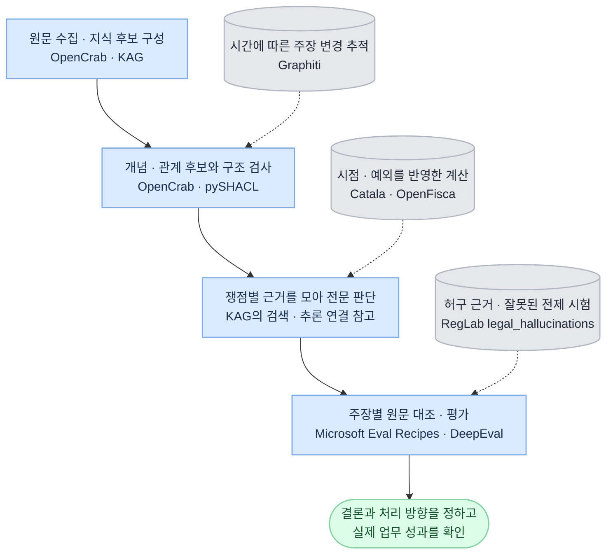

# GitHub의 전문 판단 구현 — 기능, 한계, 적용 조건

전문가 에이전트는 근거를 확보하고, 이번 건의 조건과 예외를 적용해 결론과 처리 방향을 정해야 한다. 필요한 것은 전문 판단을 재현·검증하는 구현이다. 온톨로지는 개념과 관계의 뜻을 제공하고, 원문 수집·규칙 계산·결론 검증은 각 기능이 담당한다.

이 목적에는 **OpenCrab의 근거 연결과 확정 절차, KAG의 구조화 지식과 원문을 함께 쓰는 추론, Catala·OpenFisca의 규칙 계산, 주장별 검증과 반례 시험**을 조합해 참고할 수 있다. 각 프로젝트의 구성요소가 확인된 것과 전문 업무에서 정확도가 입증된 것은 구분한다. 아래 검토는 공개 문서와 선택한 코드·테스트 경로에 대한 분석이며, 설치·실행 성능이나 한국어 전문 업무 정확도를 측정한 결과는 아니다.

## 검토 대상과 적용 범위

실선은 우리 업무의 연결이고, 점선은 계산·변경 추적·반례 시험의 연결이다. 도구명은 각 자리에서 참고할 구현을 표시한다. 실제 기능과 도입 조건은 아래 표에서 구분한다.

2026-09-30에 조회한 기본 브랜치의 판본을 링크했다. 마지막 push는 저장소 활동 정보이며 배포 안정성이나 성능을 뜻하지 않는다. 세부 원문 위치와 판본은 [출처 목록](../../바깥조사/전문판단-github-2026-09-30/sources.json)에 있다.

| 프로젝트 · 확인 판본 | 공개 구현·문서의 범위 | 프로젝트에서 가져올 것 | 한계·도입 조건 |
|---|---|---|---|
| OpenCrab [d34352ce](https://github.com/AlexAI-MCP/OpenCrab/tree/d34352cec9d99c755c1e891f811911461a460280) | 근거 수집, 종류·관계 검사, 후보·확정 상태, 팩 배포 | 원문부터 관계·주장까지의 연결과 확정 전 검사 | Alpha 표시. 문서의 품질 요구와 코드의 강제 범위가 다름. 저장소 마지막 push 2026-06-03 |
| KAG [fdab15b3](https://github.com/OpenSPG/KAG/tree/fdab15b3929d2ee40dfcdd388f90233096a6afc9) | 스키마를 따르는 지식 추출, 원문·그래프 검색, 질문 분해와 계산 | 쟁점별 필요한 근거·관계·계산을 연결 | 계산 코드의 생성·실행이 승인된 전문 규칙의 실행과 같지는 않음. 마지막 push 2026-01-28 |
| Catala [21eab86f](https://github.com/CatalaLang/catala/tree/21eab86f6453d45e54f6f547c3d0ee2b50748539) | 법 규정을 코드와 함께 표현하고 기본 규칙·중첩 예외를 계산 | 조항과 코드의 연결, 예외 충돌·경계 사례 시험 | 모호한 법 해석이나 사실 판정까지 해결하지 않음. README가 연구 프로젝트·컴파일러 불안정성을 명시 |
| OpenFisca [3e9841d6](https://github.com/openfisca/openfisca-core/tree/3e9841d66fbeaa566fd64310aff2da6976a889f6) | 시점별 계산식, 국가별 제도 모형, 계산 의존 추적 | 규칙 판본·기준일·입력·중간값을 남기는 계산 계약 | 국가별 규칙은 별도 패키지. 한국 규칙과 금액 정밀도·반올림 적합성은 별도 검증 |
| pySHACL [469cca7a](https://github.com/RDFLib/pySHACL/tree/469cca7a22a078b36c167c1e8dadecf5e5ec6c75) | RDF 데이터가 정한 제약을 만족하는지 검사 | RDF 교환 자료의 필수 값·형식·관계 제약 검사 | 구조가 맞아도 사실과 결론이 틀릴 수 있음. JSON·DB 자료는 해당 형식의 검사기로 처리 |
| Graphiti [852ca401](https://github.com/getzep/graphiti/tree/852ca401d89f54cf47fd66e11ee35724cabe202b) | 시간 정보가 붙은 관계, 중복·충돌 판정과 갱신 | 변경된 주장과 영향을 받는 판단을 추적 | LLM이 고른 모순 관계를 무효화하는 경로를 확정 지식에 그대로 연결하면 안 됨 |
| Microsoft Eval Recipes [dd07383f](https://github.com/microsoft/eval-recipes/tree/dd07383fb6045448139a288917a92f621cfe1372) | 문장·주장 분해, 출처 구간 연결, 주장 검증 | 결론의 주장별 검사 기록과 원문 대조 | 초기 라이브러리. 모델이 ‘일반 지식’으로 분류한 주장이 근거 점수 분모에서 빠질 수 있음 |
| DeepEval [b13093cf](https://github.com/confident-ai/deepeval/tree/b13093cf9c9b5468dbe7d00529e8f20e14300d55) | 검색 근거 충실도, 도구·과업·실행 경로 평가 | 검색·생성·도구 사용을 구분한 회귀 시험 | LLM 채점의 오통과·오차단과 모호한 판정의 점수 처리 확인 필요 |
| RegLab legal_hallucinations [620734a1](https://github.com/reglab/legal_hallucinations/tree/620734a1ccb84efc6827635ac76a2fb6504b2f64) | 허구 판례·잘못된 전제 등 법률 환각 평가 | 실제처럼 보이는 가짜 근거를 넣는 반례 구성 | 마지막 push 2024-06-26. 과거 연구 재현 코드이며 현재 모델·한국 법률의 성능 근거가 아님 |

## OpenCrab에서 가져올 것과 보완할 것

여기서 OpenCrab은 **AlexAI-MCP/OpenCrab**이다. 같은 이름의 개인화 모델 학습 도구와 데스크톱 제품이 검색되지만, 이 저장소가 온톨로지 맥락과 맞는다. 공개 저장소는 LocalCrab의 근거 수집·온톨로지 제작과 MCP 연계를 담는다. `opencrab.sh`의 비공개 SaaS 구현은 포함하지 않는다. [프로젝트의 공개 범위](https://github.com/AlexAI-MCP/OpenCrab/blob/d34352cec9d99c755c1e891f811911461a460280/README.md), [Alpha·버전 표시](https://github.com/AlexAI-MCP/OpenCrab/blob/d34352cec9d99c755c1e891f811911461a460280/pyproject.toml)

### 유용한 설계

- 원문과 파싱 결과, 쪽·구간, 추출한 대상·관계를 근거 ID로 연결한다. 실패·건너뜀·OCR 불일치도 기록해 자료 손실을 드러낸다.
- 원문의 적용 제외·금지·변경 이유를 관계와 주장에 보존한다. 관계가 있다는 사실과 그 관계가 이번 상황에 적용되는 이유를 함께 찾게 한다.
- 후보, 검토된 후보, 확정된 지식을 구분한다. 원문·그래프·검사 보고서·대표 질문을 함께 배포해 무엇이 들어갔는지 대조할 수 있게 한다.

이는 공장 문서와 팩 형식의 설계다. 문서에 적힌 기준이 모든 쓰기 경로에서 강제되는지는 아래 코드와 따로 대조해야 한다. [공장 작업 흐름](https://github.com/AlexAI-MCP/OpenCrab/blob/d34352cec9d99c755c1e891f811911461a460280/docs/localcrab-factory-workflow.md), [배포 팩 형식](https://github.com/AlexAI-MCP/OpenCrab/blob/d34352cec9d99c755c1e891f811911461a460280/docs/opencrab-pack-v1.md)

### 코드에서 확인되는 한계

| 코드 경로 | 확인되는 동작 | 전문 판단에 쓰려면 필요한 보완 |
|---|---|---|
| `PromotionEngine.promote()` | 전달받은 속성에 `promoted`를 쓰며 이전 상태·검사 완료를 직접 조회하지 않음. `evidence_ids`는 선택 항목 | 저장된 현재 판본과 검사·승인 기록을 서비스가 조회해 확정 조건을 강제 |
| 같은 함수의 근거 연결 | 확정 상태를 쓴 뒤 근거 연결을 시도하며, 연결 예외를 결과에 기록하고 반환 | 근거 연결 실패 시 확정 상태를 공개하지 않도록 상태와 기록의 일관성 확보 |
| `validate_node_properties()` | 등록 스키마가 없으면 통과. 있는 경우 필수 항목·열거값을 검사 | 수치형·범위·참조·관계별 조건까지 필요한 검사를 추가하고, 필수 검사를 못 했으면 미확인 처리 |
| CrabHarness 의미 채점 | Claude API가 없으면 질문 속 특정 단어와 수집 요약 수치로 대체 채점. API 경로에도 원문 전체가 아닌 요약·지표를 전달 | 수집 충분성 점수와 주장 진위 검사를 분리. 원문을 확인하지 못한 전문 판단은 검증 완료로 처리하지 않음 |
| `legal.yaml` | Contract·Clause·Party·Obligation·Regulation·Jurisdiction 등의 이름을 나열 | 직무별 정의·요건·적용 조건·예외·반례를 별도로 채워야 함 |

근거: [확정 상태 처리](https://github.com/AlexAI-MCP/OpenCrab/blob/d34352cec9d99c755c1e891f811911461a460280/opencrab/ontology/promotion.py), [MCP의 해당 함수 호출](https://github.com/AlexAI-MCP/OpenCrab/blob/d34352cec9d99c755c1e891f811911461a460280/opencrab/mcp/tools.py), [속성 검사](https://github.com/AlexAI-MCP/OpenCrab/blob/d34352cec9d99c755c1e891f811911461a460280/opencrab/grammar/validator.py), [의미 채점](https://github.com/AlexAI-MCP/OpenCrab/blob/d34352cec9d99c755c1e891f811911461a460280/crabharness/crabharness/semantic.py), [법률 스키마 팩](https://github.com/AlexAI-MCP/OpenCrab/blob/d34352cec9d99c755c1e891f811911461a460280/opencrab/schemas/packs/legal.yaml). 위 한계는 이 공개 경로의 코드 분석이다. 비공개 서비스의 실제 동작이나 전체 시스템의 우회 가능성을 시험한 결과는 아니다.

OpenCrab의 아홉 space는 대상·근거·주장 등을 나누는 자체 분류다. 우리 프로젝트의 아홉 계통과 같은 분류로 대응시키지 않는다. 팩의 근거 연결·검사·판본 관리 방식을 기존 업무 지식, 자료 처리, 판단 근거 기록, 검증 재료에 적용한다.

## 규칙을 판단과 계산으로 옮기는 구현

### KAG: 질문에 필요한 검색·관계·계산을 연결

KAG는 구조화 지식과 원문 조각을 함께 검색하고 질문을 검색·추론·계산 단계로 나눈다. `SchemaConstraintExtractor`는 프로젝트 스키마를 읽어 대상·사건·관계 추출에 사용한다. 자동 추출이 항상 정의 없이 이루어진다는 설명은 맞지 않는다. 다만 스키마를 따른 결과도 근거 검증을 거쳐야 한다. [KAG 구조](https://github.com/OpenSPG/KAG/blob/fdab15b3929d2ee40dfcdd388f90233096a6afc9/README.md), [스키마 기반 추출 구현](https://github.com/OpenSPG/KAG/blob/fdab15b3929d2ee40dfcdd388f90233096a6afc9/kag/builder/component/extractor/schema_constraint_extractor.py)

`PyBasedMathExecutor`는 LLM이 만든 Python을 임시 파일로 실행한다. 이 경로에는 모른다는 결과를 받았을 때 유사 구현·추정을 이용해 재시도하도록 요구하는 문구도 있다. 이는 이미 검토된 조항과 예외를 고정해 실행하는 전문 계산기와 구분해야 한다. 우리 계산은 승인된 규칙, 명시한 가정, 독립 검산을 연결하고, 실행 성공만으로 정답 처리하지 않는다. [계산 실행 코드](https://github.com/OpenSPG/KAG/blob/fdab15b3929d2ee40dfcdd388f90233096a6afc9/kag/solver/executor/math/py_based_math_executor.py)

### Catala: 원칙·예외를 코드와 시험으로 표현

Catala는 법 원문과 계산 코드를 함께 읽을 수 있게 하고, 조건부 정의와 기본 규칙·예외를 표현한다. 테스트에는 예외의 예외가 적용되는 정상 사례와 예외가 순환해 오류가 되는 사례가 있다. 가져올 것은 이 구분과 시험 방식이다. 코드로 옮긴 해석이 해당 관할에서 맞는지는 전문 검토로 확정해야 한다. [목적·한계](https://github.com/CatalaLang/catala/blob/21eab86f6453d45e54f6f547c3d0ee2b50748539/README.md), [중첩 예외 시험](https://github.com/CatalaLang/catala/blob/21eab86f6453d45e54f6f547c3d0ee2b50748539/tests/exception/good/exceptions_squared.catala_en), [예외 순환 시험](https://github.com/CatalaLang/catala/blob/21eab86f6453d45e54f6f547c3d0ee2b50748539/tests/exception/bad/exceptions_cycle.catala_en)

### OpenFisca: 적용 시점과 계산 의존을 추적

OpenFisca의 변수는 날짜가 붙은 계산식을 선택하고, 추적 결과는 계산 변수·기간·의존 변수·사용 매개값·결과를 보존한다. 에이전트의 결론도 최종 금액만 남기지 않고 이 연결을 따라 검산할 수 있어야 한다. [시점별 계산식 선택](https://github.com/openfisca/openfisca-core/blob/3e9841d66fbeaa566fd64310aff2da6976a889f6/openfisca_core/variables/variable.py), [계산 의존과 값 기록](https://github.com/openfisca/openfisca-core/blob/3e9841d66fbeaa566fd64310aff2da6976a889f6/openfisca_core/tracers/flat_trace.py)

OpenFisca Core에는 각국 제도 전체가 들어 있지 않다. 별도 국가 패키지와 직무 데이터가 필요하며, 우리 금액 계산의 십진 정밀도·반올림 규칙도 대조해야 한다. [국가 패키지·엔진 범위](https://github.com/openfisca/openfisca-core/blob/3e9841d66fbeaa566fd64310aff2da6976a889f6/README.md)

**구현 원칙:** OPA는 권한·실행 조건 판정을 계속 담당한다. 전문 계산은 요구하는 예외·기간·단위·정밀도와 재현성을 충족하는 계산기로 처리한다. 서로 다른 엔진을 쓰면 규칙·계산기 판본의 승인된 조합을 함께 배포한다. 이는 위 프로젝트를 비교해 정한 설계 제안이며 해당 도구들이 우리 업무를 이미 수행한다는 뜻은 아니다.

## 검사기의 판정을 검사하는 구현

### 구조 검증과 사실 검증

pySHACL은 데이터 그래프, 제약 그래프와 선택적인 온톨로지를 받아 적합성을 검사한다. RDF로 교환하는 사전·관계의 형식·참조 제약에 적용할 수 있다. 그러나 ‘A가 B의 계약 당사자’라는 관계의 형식이 맞는 것과 실제 계약 당사자가 맞는 것은 별도 질문이다. [기능·검증 결과](https://github.com/RDFLib/pySHACL/blob/469cca7a22a078b36c167c1e8dadecf5e5ec6c75/README.md), [검사기 구현](https://github.com/RDFLib/pySHACL/blob/469cca7a22a078b36c167c1e8dadecf5e5ec6c75/pyshacl/validator.py)

### 주장 추출과 원문 대조

Microsoft Eval Recipes는 문장 주변 문맥을 포함해 주장을 분해하고 원문의 출처 ID·행 범위를 연결한다. 가져올 것은 주장을 원문 구간에 대응시키는 방식이다. 추출 모델이 놓친 주장이나 잘못 잘라낸 조건은 뒤의 검증 단계에서도 빠질 수 있으므로 주장 추출 자체를 시험한다. [주장 추출](https://github.com/microsoft/eval-recipes/blob/dd07383fb6045448139a288917a92f621cfe1372/src/eval_recipes/evaluations/claim_verification/claim_extraction.py), [주장·인용 기록](https://github.com/microsoft/eval-recipes/blob/dd07383fb6045448139a288917a92f621cfe1372/src/eval_recipes/evaluations/claim_verification/schemas.py)

해당 구현의 근거 점수는 모델이 `open-domain`으로 분류한 주장을 분모에서 제외한다. 일반 지식 분류를 이유로 법·회계 기준과 핵심 사실을 검사에서 빼면 안 된다. 기본 모델·허용 모델 설정도 이 프로젝트의 선정 기준에 맞춰야 한다. [판정과 점수 집계](https://github.com/microsoft/eval-recipes/blob/dd07383fb6045448139a288917a92f621cfe1372/src/eval_recipes/evaluations/claim_verification/claim_verification_evaluator.py)

DeepEval의 Faithfulness는 답의 주장과 검색으로 받은 내용을 대조한다. 소스 코드에는 모호한 판정을 감점할지 정하는 설정도 있다. 출처 자체가 틀렸거나 필요한 예외를 검색하지 못했다면 높은 충실도 점수가 올바른 판단을 뜻하지 않는다. 검색 누락, 사실 오류, 적용 오류, 최종 과업 성과를 별도로 재야 한다. [충실도 검사 구현](https://github.com/confident-ai/deepeval/blob/b13093cf9c9b5468dbe7d00529e8f20e14300d55/deepeval/metrics/faithfulness/faithfulness.py)

### 갱신 판단과 반례

Graphiti의 관계 처리에는 LLM이 중복·모순 후보를 고르고 시간 정보에 따라 관계를 무효화하는 경로가 있다. 변경 추적 방식은 참고하되, 서로 다른 주장·관할·기준일을 먼저 구별한다. 충돌 후보 탐지와 승인된 사실의 정정은 별도 절차로 둔다. [관계 대조·무효화 구현](https://github.com/getzep/graphiti/blob/852ca401d89f54cf47fd66e11ee35724cabe202b/graphiti_core/utils/maintenance/edge_operations.py)

RegLab의 평가 코드는 허구 판례, 존재하지 않는 반대의견, 잘못된 판례 변경 전제 등을 묻는다. 이런 반례 구조를 한국어 직무 시험으로 새로 만들 수 있다. 당시 모델의 성적과 미국 판례 정답을 현재 모델·한국 업무의 성적으로 옮기지는 않는다. [잘못된 전제 시험](https://github.com/reglab/legal_hallucinations/blob/620734a1ccb84efc6827635ac76a2fb6504b2f64/tasks_contrafactual.py), [연구 범위](https://github.com/reglab/legal_hallucinations/blob/620734a1ccb84efc6827635ac76a2fb6504b2f64/README.md)

## 문서에 적용할 책임과 합격 조건

| 담당 재료 | 구체화할 내용 | 확인할 실패 사례 |
|---|---|---|
| 정보·자료 읽기 / 자료 정리·결합 | 원문·쪽·표·첨부·파싱 누락과 추출 결과 연결 | 예외가 적힌 첨부만 누락됐는데 완전한 자료로 판정 |
| 업무 지식 | 뜻·관계·후보·검사·승인 판본을 연결하고 서비스가 확정을 강제 | 모델이 상태를 ‘검증됨’으로 적거나 근거 저장에 실패했는데 확정 |
| 분석 / 기준 적용·판정 | 쟁점 → 사실 → 요건·예외 → 반대 근거 → 선택한 결론·처리 방향 | 인용은 맞지만 요건 하나를 빠뜨리거나 판단을 의뢰자에게 다시 떠넘김 |
| 계산 / 규칙의 적용·우선순위 | 승인된 식·시점·단위·예외·판본과 계산 의존 기록 | 개정 전후·경계값·중첩 예외에서 잘못된 계산 |
| 판단 근거 기록 / 결과 검증·재검증 | 구조·원문 지지·사실 정확성·적용·성과의 판정을 구분 | 핵심 오류 하나가 평균 점수에 가려져 최종 통과 |
| 변경 감시·반영 | 실제 변경·소급 정정·출처 간 이견을 구분하고 의존 결과 재검사 | 다른 조건의 새 주장이 들어와 기존 승인 사실을 자동 무효화 |
| 업무 능력 시험 / 결과 품질 평가 | 전문가 정답과 정상·반례를 묶어 검사기와 에이전트를 따로 평가 | 모두 거절해 환각 건수만 줄거나 검사기의 자기 채점만 좋아짐 |

필수 검사를 통과한 구현끼리 정확한 판단·업무 성과·불필요한 거절·유지 비용을 비교한다. 보호된 업무 평가를 거치기 전에는 코드의 존재, 저장소의 인기, 형식 검사 통과를 전문 판단 능력의 증거로 쓰지 않는다.
