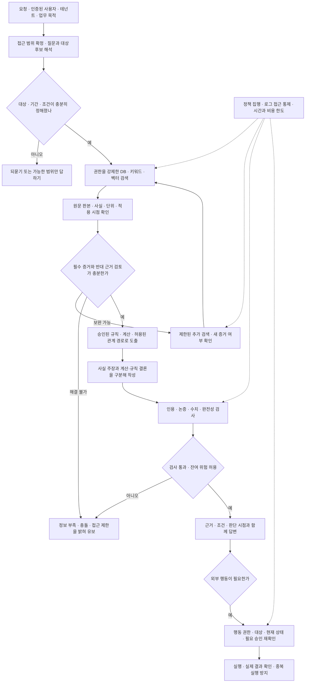

# 온톨로지 계층 설계 검토

검토 기준일: **2026-09-28, 한국 시간**

**판정: 그대로 구현 기준으로 승인하기 어렵다.** 개념·대상·출처·시점·권한을 연결한다는 방향은 타당하다. 그러나 이 문서는 분류표, 연구 결과, 기술 선택을 연결하면서 **“검사할 정보를 갖춘다”를 “오류를 막는다”로 바꿔 말한다.** 온톨로지가 있다고 정확한 사실이 들어오거나, 규칙이 올바르게 번역되거나, 검증기가 틀린 답을 반드시 잡는 것은 아니다.

가장 먼저 고칠 것은 새 모델 선택이 아니다. **대상과 개념의 구분, 불확실한 상태의 보존, 검색 경로별 권한 강제, 근거의 충분성 판정, 규칙의 검증, 검증기 자체의 평가**다.

검토 대상은 첨부한 「온톨로지 계층」 전문이다. 재료 개수와 연결 관계는 작업 폴더의 「전문가 에이전트 정의 1.md」에 있는 79개 목록과도 대조했다. 관련 재료에서 이미 다루는 책임도 있으므로, 아래의 ‘누락’은 주로 **이 계층의 설명·데이터 구조·연결 계약에서 빠졌다는 뜻**이다. 실행 시스템의 코드 감사나 한국어 업무 성능 실험은 하지 않았다. 논문 수치는 해당 실험 결과이며, 이 설계의 예상 성능으로 환산하지 않았다.

## 1. 먼저 고쳐야 할 결함

P0는 구현 전에 해결할 결함, P1은 실증 시험 전에 해결할 결함이다. 심각도는 이 설계에 대한 검토 판단이며 외부 표준의 점수가 아니다.

| 우선 | 원문의 문제 | 실제로 생길 실패 | 필요한 수정 |
|---|---|---|---|
| P0 | 개념 번호 하나로 대상 식별·분류·행동을 처리 | ‘회사’라는 종류, ‘애플’이라는 말, 특정 법인과 계약 당사자를 혼동 | `concept_id`, `entity_id`, `mention`, `assertion_id`를 구분 |
| P0 | 온톨로지에 전제가 없으면 전제를 바로잡음 | 사전에 없는 새 사실을 거짓으로 단정 | ‘확인됨·반박됨·미확인·충돌’을 구분. 등록되지 않았다는 이유만으로 거짓 처리 금지 |
| P0 | PostgreSQL RLS로 검색 권한을 해결한다고 설명 | OpenSearch·캐시·재정렬 입력·로그를 통해 다른 고객 자료 노출 | 각 저장소와 모든 도구 진입점에 권한 강제. 검색 전 제한과 반출 전 재확인 |
| P0 | 개념에 붙은 출처 수로 충분성을 검사 | 출처는 많지만 예외·조건·기간·반대 증거가 없는 답을 통과 | 질문을 필요한 사실·조건·반증 항목으로 분해하고 증거의 충족 여부 검사 |
| P0 | 효력 기간 하나로 시점을 처리 | 소급 정정, 과거 판단 재현, 경과조치, 개정 전 사건 처리 오류 | 사실의 유효 시점과 시스템이 알게 된 시점 분리. 법 적용에는 사건 시점·부칙·적용례 추가 |
| P0 | ‘같은 대상의 기간 중복 금지’를 일반 규칙으로 제시 | 여러 관계와 상충 증거를 저장하지 못하거나 한쪽을 지워 버림 | 단일값이어야 하는 승인 사실에만 적절한 키로 제약. 원천 주장들은 동시 보존 |
| P0 | 규칙 엔진으로 결론을 내면 적용 오류가 해결됨 | 잘못 추출한 사실·잘못 옮긴 규칙을 정확하게 계산 | 사실 검증, 규칙 명세·승인·경계 시험, 실행 추적을 각각 마련 |
| P0 | 원문이 주장에 동의하는지 예·아니오로 검사 | 틀린 원문을 충실하게 옮긴 답, 반례 누락, 계산 결론의 부당한 탈락 | 원천 정확성·근거 연결·논증·계산을 구별하고 미확인·충돌 상태 제공 |
| P1 | 오류를 최초 칸 하나에만 기록 | 검증 실패·권한 우회·잘못된 변환이 통계에서 사라짐 | 대표 원인과 함께 전파 경로·놓친 방어 장치·최종 영향을 기록 |
| P1 | 11칸에 모든 분류가 들어가므로 빠짐이 없다고 주장 | 넓은 ‘연결’과 ‘식 밖’ 범주로 미설계 문제를 숨김 | 범위가 제한된 진단 분류라고 명시하고 별도 실행·보안·검증 실패 축 유지 |
| P1 | 모든 환경에 같은 구성, 판정 모델만 변경 | 사내 서버·DGX Spark의 메모리·동시성·운영 조건을 무시 | 논리 계약은 공유하고 배포·모델·자원·외부 전송 정책은 환경별 검증 |
| P1 | 오류 감소량과 비용을 직접 비교 | 오류 건수와 돈이라는 다른 단위를 비교 | 업무별 오류 손실과 거절·검토 비용까지 같은 단위로 평가 |

## 2. 숫자와 연구 결과 대조

‘원문 확인’은 그 논문이나 개발사가 그렇게 보고했다는 뜻이다.

| 원문의 수치·주장 | 판정 | 확인 결과와 바꿀 표현 |
|---|---|---|
| 추론 학습이 답변 유보를 평균 24% 낮춤 | 조건을 붙여 유지 | [AbstentionBench](https://arxiv.org/html/2506.09038)는 해당 비교에서 평균 24% 저하를 보고한다. 특정 모델·학습·데이터셋의 결과이지 모든 추론 모델의 법칙이 아니다. 24%p로 바꾸면 안 된다. 이 수치는 개념 번호 매핑이 문제를 해결한다는 증거도 아니다. |
| 대상 이름 오류가 성능 저하의 87~96% | 분모 수정 | [ASR 연구](https://arxiv.org/abs/2608.22872)는 합성 음성·영어 억양 조건에서 **2WikiMultiHopQA의 성능 저하 사례 중** 개체명 훼손이 차지하는 비중을 보고한다. 전체 손실 크기의 87~96%를 인과적으로 설명한 값도, 일반 텍스트 질의의 비율도 아니다. |
| Qwen2.5-14B의 F1 0.92 → 열 번 중 한 번 틀림 | **명백한 오류** | [LLMs4OL 2026 표 2·4](https://arxiv.org/html/2608.27101v2): 제약된 Reuse 과제의 term typing에서 precision 0.9324, recall 0.9079, F1 0.9200. 비제약 Flagship 과제의 같은 지표는 F1 0.4956이다. 비분류 관계 추출 F1은 두 과제 모두 0.0000이다. 모델 단독 성과도 아니며 F1은 정답률이 아니다. |
| Zep가 정확도를 최대 18.5% 높임 | 수치·인과 해석 보완 | [Zep 표 2](https://arxiv.org/html/2501.13956)는 GPT-4o의 60.2%→71.2%를 제시한다. **+11.0%p, 표시값 기준 상대 +18.27%**다. 본문 요약의 18.5%와 약간 다르다. 전체 시스템 비교이므로 기간 필드만 추가한 효과로 읽으면 안 된다. |
| 반복된 저신뢰 출처가 출처 선호를 뒤집음 | 조건부 확인 | [Whose Facts Win?](https://arxiv.org/abs/2601.03746)는 영어의 통제된 합성 출처와 13개 공개 가중치 모델을 조사했다. 중복·재인용 경로를 확인해야 한다는 근거이며, 등급표만 두면 해결된다는 근거는 아니다. |
| 충돌을 따지게 하면 정답률 최대 약 24%p 상승 | **실험 조건·지표 왜곡** | [DRAG 표 5](https://arxiv.org/html/2506.08500): 약 24점은 **정답 충돌 유형을 미리 제공한 Oracle의 평균 Expected Behavior 향상**이다. 일반 프롬프트의 최대 정답률 향상이 아니다. 예를 들어 GPT-4o의 Vanilla→Pipeline은 67.2→74.9, +7.7%p이고 Oracle은 88.6이다. |
| 충분성을 판단하면 답한 것의 정답 비율 2~10% 상승 | 수치는 유지, 해결책 연결은 기각 | [Sufficient Context](https://arxiv.org/html/2411.06037)는 충분성 신호와 자신감 등을 이용한 **선택적 답변**을 평가한다. 답변 비율과 함께 봐야 한다. 개념별 출처 수를 세는 실험이 아니다. |
| 그래프 검색은 여러 단계를 건너는 질문에서만 유리 | 과도한 일반화 | [RAG vs. GraphRAG](https://arxiv.org/html/2502.11371)는 단순·세부 질문과 다단계 질문 사이의 경향, 요약 과제, 두 방식의 상호 보완성을 보고한다. ‘여러 단계에서만’이라는 배타적 법칙을 입증하지 않는다. |
| 반복 RAG가 정답 자료 일괄 제공보다 최대 25.6%p 우수 | 조건부 확인 | [해당 연구](https://arxiv.org/abs/2601.19827)는 화학 분야 ChemKGMultiHopQA, 11개 모델, 특정 제어기에서 보고한다. 단계별 검색뿐 아니라 추가 추론·문맥 구성·종료 판단이 결합돼 있다. 한국 법률이나 모든 질문에 같은 이득을 예상할 근거는 없다. |
| 가장 좋은 모델도 어려운 규칙 문제 44.4% | 범위 축소 | [DeonticBench](https://arxiv.org/html/2604.04443)의 44.4%는 SARA Numeric의 hard subset 결과다. 모든 규칙 추론의 상한도, 최신 모델 전체의 정답률도 아니다. |
| 법조문→논리 조건 정확도 86.2%, 100배 이상 빠름 | 조건부 확인 | [Neuro-Symbolic Compliance](https://arxiv.org/html/2601.06181)는 대만 금융 감독 87개 사례의 SMT 코드 생성 정확도를 보고한다. 생성 오류가 약 13.8% 남는다. 풀이·교정 단계의 속도를 원문 수집·번역·검토까지 포함한 전체 지연으로 확대하면 안 된다. |
| 상용 법률 AI의 환각 17~33% | 역사적 결과로 유지 | [Magesh 외](https://arxiv.org/html/2405.20362)가 평가한 당시의 특정 미국 법률 제품·질의·환각 정의에 해당한다. 2026년 현행 제품의 실패율로 쓰면 안 된다. |
| 맥락 추가+재정렬로 검색 실패 5.7%→1.9% | 조건 명시 후 유지 | [Anthropic](https://www.anthropic.com/engineering/contextual-retrieval)의 **Contextual Embeddings+Contextual BM25+reranking**에서 top-20 조각 검색 실패율이 그렇게 변했다. 절대 −3.8%p, 상대 약 −66.7%. ‘앞뒤 문장 한두 개만 붙이면 같은 효과’가 아니다. |
| 그래프 구축이 41~57배 오래 걸림 | 수치의 적용 범위 수정 | [비교 연구 표 4](https://arxiv.org/html/2502.11371): MultiHop-RAG에서 RAG 135초, KG-GraphRAG 7,702초, Community-GraphRAG 5,560초. 약 57.1배·41.2배다. 두 구현의 특정 실험이며 LightRAG·HippoRAG 2·직접 작성한 관계 테이블 모두의 비용이 아니다. |
| OG-RAG가 사실 재현율 55%, 답 정확성 40% 향상 | 결과는 존재, 설계 효과로 인용 불가 | [EMNLP 원문](https://aclanthology.org/2025.emnlp-main.1674/)은 농업·뉴스 영역, 온톨로지 기반 **하이퍼그래프 구축과 검색 최적화**를 평가했다. 단순 개념 필터의 효과가 아니다. 상대 향상 수치를 +55%p·+40%p로 읽거나 현재 설계에 그대로 대입하면 안 된다. |
| Jev 정확도 약 68%, 공개 근거는 자체 수치뿐 | 지표 수정·‘뿐’ 삭제 | [개발사 평가](https://evals.typesafe.ai/)의 기준 답은 GPT-6 Astra와 Claude Fable 5.1의 응답을 평균한 것이다. 약 68%라는 인용값은 **모델 기준 답과의 일치 지표**로 취급해야 한다. 텍스트로 공개된 평가 방법은 확인했지만 이번 검토에서 그래프의 67.8%를 별도 원시 데이터로 재산출하지는 않았다. [소규모 독립 실험](https://github.com/yibie/laya-jev-lab)도 존재하므로 ‘자체 수치뿐’은 현행화가 필요하다. 독립 실험의 존재가 한국어 근거 검사 성능을 입증하지는 않는다. |
| 재료 79개 중 34개 | 개수는 맞음, 선정 근거는 불완전 | 로컬 원문 목록에 고유 재료 79개, 첨부 선택표에 중복 없는 34개가 있고 모두 79개 목록에 속한다. 그러나 제외된 ‘현재 작업 정보’, ‘판단 근거 기록’, ‘반대 근거·다시 확인’, ‘기록 입력·수정’, ‘나눠 맡기기’ 등도 선언한 기준상 출처·규칙·권한을 읽거나 쓴다. ‘관련된 것은 정확히 34개’라는 결론은 성립하지 않는다. |

특히 ASR→Splink, 충분성 연구→출처 개수, OG-RAG→개념 필터의 연결에는 직접적인 실험 근거가 없다.

## 3. 수식은 현재 형태로 계산에 쓸 수 없다

### 3.1 여섯 요소의 곱

‘물음×대상×권한×자료×추론×주장’은 **설명용 비유**로는 가능하다. 그러나 각 항의 값·단위·측정법이 없으므로 신뢰도 수식은 아니다. 권한을 위반한 답도 내용은 참일 수 있고, 부정확한 자료를 일부 받아도 이를 배제해 올바른 답을 낼 수 있다. ‘하나라도 틀리면 참인 답이 불가능하다’는 해석은 잘못이다.

통과 기준을 나타내려면 다음처럼 정의한다.

\[
G(x)=\bigwedge_{j\in\mathcal H}g_j(x),\qquad g_j(x)\in\{0,1\}
\]

`H`는 그 업무에 반드시 필요한 검사 집합이다. 예를 들어 권한 허용, 필수 증거 확보, 적용 규칙 승인, 실행 전 상태 확인 등이 들어간다. **이 식은 검사 통과를 뜻할 뿐, 답이 참이라는 증명은 아니다.** 검사기에도 오류가 있다.

확률을 표현하려면, 필요한 검사들이 실제로 옳게 수행됐다는 사건을 \(A_1,\ldots,A_m\)으로 정의한 후 조건부 확률을 쓴다.

\[
P\!\left(\bigcap_{i=1}^{m}A_i\right)
=\prod_{i=1}^{m}P\!\left(A_i\mid A_1,\ldots,A_{i-1}\right)
\]

첫 항은 \(P(A_1)\)이다. 조건부가 아닌 성공률을 단순히 곱하려면 독립성 같은 별도 가정이 필요하다. 같은 모델이 사실 추출·생성·검증을 맡으면 오류가 함께 움직일 수 있다. 이 교집합의 확률도 곧바로 최종 답의 정답률은 아니다. 최종 성과는 별도로 측정해야 한다.

### 3.2 F1의 올바른 해석

\[
P=\frac{TP}{TP+FP},\quad R=\frac{TP}{TP+FN},\quad
F_1=\frac{2PR}{P+R}
\]

F1에는 일반적인 정확도 \((TP+TN)/(TP+FP+FN+TN)\)와 달리 `TN`이 들어가지 않는다. 따라서 F1 0.92에서 오류율 8%나 ‘열 번 중 한 번’을 도출할 수 없다. 문서 수준 오류율, 주장 수준 오류율, 자동 승인한 결과의 오류율도 서로 다른 지표다.

### 3.3 온톨로지 부품의 곱

‘개념×관계×규칙×출처×권한’도 필수 구성 요소를 강조하는 표기이지 검증된 수식이 아니다. 아래처럼 **구성 목록**으로 쓰는 것이 정확하다.

\[
\mathcal K=(C,E,A,R,P,V),\qquad \mathcal Z=\text{권한 정책과 집행 장치}
\]

여기서 `C`는 개념·스키마, `E`는 실제 대상, `A`는 출처가 붙은 사실 주장, `R`은 승인된 규칙, `P`는 출처·생성 이력, `V`는 판본과 시간 정보다. 이 표기는 본 검토의 설명용 제안이며 표준 공식이 아니다. 권한 정의와 집행은 지식 저장소를 포함한 모든 접근 경로에 적용한다.

### 3.4 비용과 오류 감소의 비교

‘잘못이 줄어든 만큼이 비용보다 크다’에는 단위가 없다. 비교 기간과 업무량을 정한 뒤 다음처럼 계산해야 한다.

\[
\Delta U=\mathbb E[L_{\text{기존}}-L_{\text{변경}}]
-\Delta C_{\text{운영}}-\Delta C_{\text{유지}}-C_{\text{구축·전환}}
\]

`L`에는 업무 오류, 잘못된 실행, 정답을 거절한 손실, 사람 검토 비용 등을 일관된 기준으로 반영한다. 비용 항목과 중복 계산하지 않는다. 보안·의무상 반드시 지켜야 하는 조건은 경제성이 좋다는 이유로 면제하지 않는다.

## 4. 11개 오류와 해결책은 얼마나 맞물리는가

아래는 통제의 설계 검토이며, 실제로 통과했다는 시험 결과가 아니다.

| 칸 | 현재 대응의 한계·반례 | 필요한 대응 | 통과를 확인할 시험 |
|---|---|---|---|
| 파악 | 질문 단어를 개념 번호로 바꿔도 회계연도·비교 기준·부정·가정은 남는다. 온톨로지에 없다는 사실은 거짓의 증거가 아니다 | 대상·요구 결과·시점·단위·범위·완료 조건을 구조화하고 모호한 항목을 유지 | 같은 단어지만 기간·범위·가정이 다른 질문, 새 대상, 잘못된 전제, 주입된 지시 |
| 식별 | 동의어 사전과 레코드 합치기는 다른 문제다. 이름·주소가 비슷한 별도 법인을 합칠 수 있다 | 후보 생성→문맥 기반 개체 연결→식별자 확인. 실제 레코드 중복은 별도 연결 모델. 합치기 취소 이력 | 동명이인, 계열사, 법인명 변경, 합병 전후, 한국어·영문 혼용, 잘못된 합침과 누락 |
| 분류 | `skos:broader`는 법적 자격을 증명하지 않는다. ‘종류가 맞다’와 ‘현재 요건을 만족한다’도 다르다 | 어휘 계층·타입 관계·규칙으로 판정한 상태를 분리. 사실·관할·기간을 포함한 자격 판정 | 경계값, 예외, 복수 분류, 미상 값, 일시적으로만 성립하는 자격 |
| 범위 | RLS는 PostgreSQL 밖을 지키지 않는다. 역할을 넘는 것과 데이터 권한을 넘는 것도 다르다 | 사용자·테넌트·목적·대상·행동 기준의 정책을 실제 실행 지점에서 강제 | 타 고객 자료, 권한 회수, 캐시 재사용, 검색 결과 수·메타데이터 노출, 임의 대상 ID |
| 최신 | 최신 판본과 적용 판본은 다르다. 원문이 바뀌었는데 색인·요약·캐시가 남을 수 있다 | 유효 시간·기록 시간, 원문 버전, 사건 시점, 경과조치, 파생 데이터 무효화 | 소급 정정, 미래 시행, 과거 사건, 판본 혼합, 늦게 도착한 수정, 검색 동기화 지연 |
| 정확 | 유명 기관의 원문에도 오기·정정·측정 오류가 있다. 출처 등급은 참을 보증하지 않는다 | 원천 시스템 대조, 단위·스키마 검증, 원본 해시, 정정·철회 확인, 독립 근거 구분 | 공식 원문 오기, OCR 부호 누락, 천 원/원 혼동, 같은 원문의 복제 기사 |
| 우선 | 자료의 신빙성과 규범의 우선순위는 다른 축이다. 어떤 충돌은 해소할 수 없다 | 적용 대상·관할·기간·위임·예외를 따져 비교. 패한 증거도 보존. 미해결 충돌을 명시 | 상위 규정의 위임, 특별 규정, 양립 가능한 규칙, 비교 불가 자료, 충돌하는 전문가 의견 |
| 충분 | 출처가 1개 있어도 필요한 내용이 없을 수 있다. 출처가 0개여도 승인된 DB 값으로 답할 수 있다 | 질문별 필요한 사실과 필수 증거 묶음, 예외·반증 탐색, 미확보 이유 기록 | 자료 없음/접근 불가/검색 실패/내용 부족/명시적 부재를 각각 구분 |
| 연결 | 관계가 존재하고 타입이 맞아도 참인 관계는 아닐 수 있다. 경로의 시간·권한이 서로 어긋날 수 있다 | 주장별 출처, 방향·타입·시간 교집합·허용 경로 검사. 도구 상태와 의미도 검사 | 반대 방향, 중간 대상 누락, 서로 다른 시점의 경로 연결, 빈 결과·부분 성공·시간 초과 |
| 적용 | 풀이기는 입력받은 명세만 보장한다. 사실 추출과 규칙 번역 오류는 남는다 | 승인된 규칙·단위·반올림·기간 경계·불명 값 처리, 독립 예제와 회귀 시험 | 임계값 바로 아래·같음·위, 예외 중첩, 분모 0, 사실 누락, 규칙 충돌·해 없음·시간 초과 |
| 근거 | 인용 일치가 원천 진실성·답변 완전성·논리 타당성을 보장하지 않는다 | 직접 사실/계산/규칙 결론/추정을 구분하고 서로 다른 검사 적용 | 존재하는 인용으로 반대 주장을 함, 조건 생략, 복합 주장 일부만 지원, 원문 밖의 계산 결론 |

**현재 조합으로 11칸 모두를 완전히 해결할 수 있다는 근거는 없다.** 위 대응을 넣어도 현실의 미확인 사실, 해석상 이견, 새로운 공격, 검증기의 오류는 남는다. 목표는 범위를 정한 업무에서 오류를 줄이고, 모를 때 행동을 제한하며, 실패를 되짚을 수 있게 만드는 것이다.

## 5. 이론과 표준을 끌어오는 방식도 수정해야 한다

### Palantir와 dbt는 같은 구조가 아니다

Palantir Ontology는 객체·속성·관계와 함께 행동·함수·동적 보안을 다룬다. dbt Semantic Layer는 분석용 지표·차원·결합 의미를 정의해 질의를 생성하는 데 초점이 있다. 공통점은 업무 의미를 명시한다는 점이다. 이를 근거로 두 제품이 이 문서의 다섯 부품을 똑같이 갖는다고 할 수 없다. [Palantir 공식 개요](https://www.palantir.com/docs/foundry/ontology/overview), [dbt 2026 비교 실험](https://docs.getdbt.com/blog/semantic-layer-vs-text-to-sql-2026).

첨부의 dbt URL은 이번 접근에서 열리지 않았고, 실제 개발자 블로그 문서는 위 `docs.getdbt.com` 주소에서 확인했다. dbt 실험 역시 의미 계층이 커버하는 질의와 전체 질의를 구분해서 읽어야 한다.

### ISO 25012의 정확성·신빙성·일관성은 같은 것이 아니다

ISO 공식 소개는 데이터 품질을 15개 특성으로 나눈다. 2008판은 2025년에 재확인돼 현재 유효하다. 원문의 다섯 고유 특성을 업무용 네 칸으로 재구성하는 것은 가능하지만 **그 재구성이 ISO의 분류인 것처럼 말하면 안 된다.** 정확성은 사실·값이 맞는가, 신빙성은 믿을 만하다고 여길 근거가 있는가의 문제다. 일관성 문제에는 단위·코드·스키마·논리 모순도 있으므로 ‘어느 출처가 앞서는가’로 대체되지 않는다. [ISO 공식 설명](https://www.iso.org/standard/35736.html).

### 툴민 모형은 신뢰도 곱셈식의 근거가 아니다

자료에서 주장으로 넘어가는 보증과 그 보증의 뒷받침을 구분한다는 점은 유용하다. 그러나 backing을 ‘출처가 정확한가’에만 넣으면 **왜 그 추론 규칙을 적용해도 되는가**가 빠진다. qualifier는 주장 강도의 한정이고, rebuttal은 결론이 성립하지 않을 조건·반론이다. 각각 기록할 자리가 있어야 한다. 이 항목들을 넓은 ‘근거·적용’ 칸에 넣었다는 것만으로 모두 구현한 것이 되지는 않는다. [Purdue의 툴민 설명](https://owl.purdue.edu/owl/general_writing/academic_writing/historical_perspectives_on_argumentation/toulmin_argument.html).

### SKOS의 칸 이름만 빌리면 상호운용이 완성되지 않는다

`prefLabel`, `altLabel`, `broader`는 좋은 어휘다. 하지만 언어 태그, 개념 체계, 안정된 URI, 동치·근접 매핑과 내보내기 형식도 맞춰야 한다. 특히 **`broader` 자체는 추이적 속성으로 정의되지 않으며, `broaderTransitive`와 구분한다.** SKOS 개념 계층을 곧바로 객체의 `instanceOf`나 법적 `is-a`로 사용하면 의미가 바뀐다. [W3C SKOS 8.6.6](https://www.w3.org/TR/skos-reference/).

PROV-O도 `wasDerivedFrom`은 파생 관계, `wasAttributedTo`는 귀속, `generatedAtTime`은 해당 엔터티의 생성 시점이다. 원문 작성자, 추출 모델, 추출 실행, 추출 결과를 서로 다른 대상으로 기록해야 한다. `generatedAtTime` 하나로 원문 발행일·수집일·법적 효력일을 모두 나타낼 수 없다. [W3C PROV-O](https://www.w3.org/TR/prov-o/).

## 6. ‘발표된 분류를 모두 담았다’는 주장의 검토

서로 다른 논문의 오류 이름을 11칸에 옮기는 것은 용어 대조다. **오류가 빠지지 않았다는 증명도, 원인 분석의 검증도 아니다.** 입력·검색·생성·검증·실행을 여러 층위로 나누는 원문 분류를 하나의 칸에 강제로 넣으면 오히려 진단 정보가 줄어든다.

| 인용한 분류 | 검토 판단 |
|---|---|
| [Barnett의 7개 실패](https://arxiv.org/html/2401.05856) | 큰 대응은 가능하다. 다만 자료 자체의 부재, 검색 누락, 문맥 구성에서 탈락은 서로 다른 원인·담당·해결법이다. 전부 ‘충분’으로 묶더라도 하위 원인을 보존해야 한다. |
| [RAGChecker](https://arxiv.org/html/2408.08067) | 검색 정밀도는 **정답 주장을 지원하는 조각의 비율**이다. 같은 회사의 무관한 문서를 가져와도 낮아지므로 ‘식별’과 같지 않다. 잡음 민감성 역시 생성기의 문맥 활용 문제를 포함하므로 ‘정확’ 하나로 고정하면 부정확하다. |
| [Huang 외 환각 분류](https://arxiv.org/abs/2311.05232) | 사실 모순은 틀린 원천을 읽어서만 생기지 않는다. 올바른 원천을 오독하거나 잘못 계산해도 생긴다. 최종 출력의 오류 유형과 발생 원인을 구분해야 한다. |
| [지식 충돌 분류](https://arxiv.org/abs/2403.08319) | 충돌의 위치를 나눈 분류이지 모든 충돌에 고정된 승자가 있다는 주장이 아니다. 구분 가능한 조건 차이나 해소 불가능한 이견을 남겨야 한다. |
| [AbstentionBench](https://arxiv.org/html/2506.09038) | 유보가 필요한 질문의 범주를 배치한 것으로 볼 수 있다. 주관적 질문을 무조건 ‘근거 부족’으로 처리하면 안 된다. 선호를 확인하거나 관점을 나누는 답도 적절하다. |
| [Magesh 외](https://arxiv.org/html/2405.20362) | 사례를 분류하는 것은 가능하다. 판결 요지 오독은 사실 이해 실패일 수도, 규칙 적용 실패일 수도 있어 실행 기록 없이 한 칸으로 확정할 수 없다. |
| [MAST](https://arxiv.org/html/2503.13657) | 맡은 역할 이탈과 접근 권한 위반을 동일시하지 말 것. 특히 검증 누락·잘못된 검증을 원래 오류 속에 숨기면 논문이 강조한 검증 체계의 결함을 추적하지 못한다. |
| [TRAIL](https://arxiv.org/abs/2505.08638) | 최종 답만 보는 분류가 아니라 실행 추적의 문제 위치를 다룬다. 도구 선택·조율·시스템 실패를 ‘식 밖’에 두려면 그 바깥의 통제와 이 계층의 연결을 명시해야 한다. |
| [AgentErrorTaxonomy](https://arxiv.org/abs/2509.25370) | 기억·반성·계획·행동·시스템 모듈의 실패를 설명한다. 이것을 ‘연결’로 크게 묶으면 모듈별 개선 책임을 잃는다. |
| [AgentRx](https://arxiv.org/html/2602.02475) | 실행 궤적에서 오류를 진단하는 접근이다. 최초 실패를 찾는 목적이 있다고 해서 검증 장치의 실패나 다른 기여 원인을 기록하지 않아도 되는 것은 아니다. |
| [ToolFailBench](https://arxiv.org/abs/2607.04686) | 도구 생략이 검색 누락으로 이어질 수는 있다. 하지만 쓰기·검증·실행 도구를 생략한 모든 사례가 자료 부족은 아니다. 필요한 행동을 하지 않은 실패도 별도로 남겨야 한다. |
| [OWASP 2025](https://genai.owasp.org/llmrisk/llm082025-vector-and-embedding-weaknesses/) | 벡터 약점을 ‘범위’로만 매핑하면 오염·행동 변조 등을 놓친다. 프롬프트 주입을 질문 오해로만 다루는 것도 부족하다. 최신 검토에는 아래의 2026판과 Agentic 분류를 추가해야 한다. |
| [NIST AI 600-1](https://nvlpubs.nist.gov/nistpubs/ai/NIST.AI.600-1.pdf) | 위험 관리 분류와 답변 오류 분류는 목적이 다르다. 대부분을 식 밖에 배치한 상태에서 ‘빠진 위험이 없다’고 주장할 수 없다. 바깥 책임의 시험 증거와 연결이 필요하다. |

집계는 다음처럼 바꾼다. 대표 원인은 중복 없는 관리 통계에 쓰되, `origin`, `contributing_factors`, `propagation`, `failed_controls`, `impact`를 별도로 남긴다. 예를 들어 ‘잘못된 개체 합침→다른 고객 문서 선택→검색 권한 검사 실패→인용 검증 통과’는 식별과 권한·검증 모두를 고칠 사건이다.

## 7. 저장 구조에서 반드시 분리할 것

### 개념과 실제 대상

‘상시근로자’, ‘사업장’은 개념이다. 특정 사업장은 실제 대상이고, 특정 시점의 근로자 수는 그 대상에 대한 사실 주장이다. 그 사업장이 특정 조항의 적용 대상이라는 결론은 사실과 규칙의 판정 결과다. 이 네 가지를 하나의 ‘개념 번호’로 다루면 변경과 검증이 꼬인다.

| 구분 | 최소 기록 | 중요한 불변 조건 |
|---|---|---|
| 개념·스키마 | `concept_id`, 이름·언어·별명, 개념 체계, 판본, 관계의 허용 타입 | 어휘 관계와 법적 분류 규칙을 혼동하지 않음 |
| 실제 대상 | `entity_id`, 원천 식별자, 테넌트, 종류, 합침·분리 이력 | 이름이 같아도 동일 대상이라고 가정하지 않음 |
| 원문 | `source_id`, `source_version`, 원본 해시, 위치, 발행·수집 시각, 접근 정책, 정정 상태 | 원문과 생성한 요약·맥락을 구별 |
| 사실 주장 | `assertion_id`, 주어·술어·목적어/값, 단위, 한정 조건, 극성, 출처 위치, 시간, 검증 상태 | 상충 주장을 서로 덮어쓰지 않음 |
| 규칙 | `rule_id`, 버전, 적용 범위·관할·기간, 입력 타입, 조건·예외, 원문, 승인·시험 결과 | 미확인 값을 `false`나 `0`으로 바꾸지 않음 |
| 판정 | 입력 사실 버전, 규칙 버전, 계산·도출 과정, 결론, 유보·충돌 이유 | 같은 스냅샷으로 결과를 재현할 수 있음 |
| 권한 | 주체·역할·위임·목적·자원·행동·기간·정책 버전 | 모델의 주장이나 임의 입력만으로 권한을 부여하지 않음 |

이 표는 구현에 필요한 설계 제안이다. 모든 항목을 별도 서비스로 만들라는 뜻은 아니다. PostgreSQL 표와 명확한 API만으로 시작할 수 있다.

### 사실의 시간과 시스템이 알게 된 시간

원문은 효력 기간과 기록 시각을 일부 갖고 있지만, 그것만으로 과거 상태를 복원하는 계약이 명확하지 않다. 예를 들어 9월 20일 수집한 문서가 ‘9월 1일부터 수량은 12가 아니라 10이었다’고 정정되면 다음 두 질문이 다르다.

- 지금 아는 사실로 9월 10일의 수량은 얼마였는가?
- 9월 10일 당시 시스템은 무엇을 알고 판단했는가?

유효 기간과 기록 이력을 모두 남겨야 두 질문에 답할 수 있다. Zep 논문도 실제로 두 시간축을 구분한다. 기간 종료로 이전 사실을 무효화하는 것과, 당시 시스템이 보유했던 기록을 삭제하는 것은 구별해야 한다. [Zep의 시간 모델](https://arxiv.org/html/2501.13956).

법령은 추가로 사건 발생일·신청일·거래일 등 적용 조건, 조문별 시행, 부칙·경과조치를 따져야 한다. 법제처 API의 시행일 필터는 후보 판본을 찾는 기능이지 개별 사건의 적용법을 자동 확정하는 기능이 아니다. [법제처 API](https://open.law.go.kr/LSO/openApi/guideResult.do?htmlName=lsEfYdListGuide), [법제처의 경과규정 검토](https://www.moleg.go.kr/mpbleg/mpblegInfo.mo?mid=a10402020000&mpb_leg_pst_seq=130252).

### 기간 중복 금지의 적용 범위

`UNIQUE (id, valid_at WITHOUT OVERLAPS)`는 같은 `id`의 범위 중복을 막는다. 이를 모든 대상·관계에 걸면 한 사람이 같은 기간에 여러 직책을 갖거나 여러 문서가 다른 값을 주장하는 현실을 저장할 수 없다. `PERIOD` 외래 키는 시간 범위를 포함하는 참조 무결성에 쓰이며, 참조한 내용의 진실성까지 확인하지 않는다. [PostgreSQL 18 CREATE TABLE](https://www.postgresql.org/docs/18/sql-createtable.html).

원천 주장 저장과 승인된 현재 사실을 분리하고, 후자의 **단일값이어야 하는 속성**에만 대상·속성·관할 등 의미에 맞는 키로 중복 제약을 건다. 상충 자료를 없애 일관돼 보이게 만들면 안 된다.

## 8. 권한과 검증의 가장 위험한 빈틈

### 검색 전 필터링은 필요하지만 그것으로 끝나지 않는다

PostgreSQL RLS는 해당 DB의 표에 적용된다. 관리자·`BYPASSRLS` 역할과 일반적인 표 소유자의 우회도 고려해야 한다. OpenSearch 색인은 별도 DLS와 쓰기 권한이 필요하다. **OpenSearch DLS는 읽기를 제한하며 쓰기를 제한하지 않는다.** [PostgreSQL RLS](https://www.postgresql.org/docs/18/ddl-rowsecurity.html), [OpenSearch DLS](https://docs.opensearch.org/latest/security/access-control/document-level-security/).

반드시 구체화할 경로는 다음과 같다.

1. 대상 후보 검색 전부터 인증된 주체·테넌트 범위를 적용한다. 현재 그림처럼 대상 확정이 먼저 끝나는 구조는 비공개 대상의 존재를 노출할 수 있다.
2. 키워드·벡터·그래프·원문 조회 모두 같은 권한 계약을 적용한다. LLM이 필터를 빼고 질의할 수 없어야 한다.
3. 재정렬 모델과 외부 판정 모델에도 허용된 자료만 보낸다. 사용자의 열람 권한과 회사 밖 전송 허용은 다른 정책이다.
4. 문서 전체에서 생성한 맥락 문구에 다른 권한 영역의 정보가 섞이지 않도록 한다. 파생 요약의 권한도 그 근거를 따른다.
5. 캐시·장기 기억·로그·인용 링크·검색 결과의 개수와 제목까지 다룬다. 권한 회수 때 오래된 캐시가 살아 있으면 안 된다.
6. 실제 행동 직전에 대상·행동·정책·현재 상태를 재확인한다. 승인받은 내용과 실행 인자가 같은지도 확인한다.

‘찾은 뒤에 거르지 않는다’는 표현도 너무 절대적이다. 올바른 목표는 **비허용 정보가 모델·사용자·외부 서비스에 도달하지 않는 것**이다. 검색 경로의 강제 필터를 기본으로 하고, 정책 변경이나 색인 동기화 지연을 잡는 반환 직전 검사도 둔다.

### 프롬프트 주입은 질문 오해만의 문제가 아니다

외부 문서를 자료로 취급하라는 지시는 유용하지만 강제 보안 경계가 아니다. 읽기 권한이 있는 문서의 악성 지시가 쓰기 도구·외부 전송 도구를 조종할 수 있다. Simon Willison이 정리한 비공개 자료 접근·신뢰할 수 없는 내용·외부 통신의 결합도 이 지점을 설명한다. [원문](https://simonwillison.net/2025/Jun/16/the-lethal-trifecta/).

최신 [OWASP LLM Top 10 2026](https://genai.owasp.org/resource/owasp-genai-llm-top-10-2026/)의 공개는 [9월 공식 발표](https://genai.owasp.org/2026/09/01/owasp-genai-security-project-unveils-2026-top-10-for-llm-applications-new-agent-control-standard-and-sponsors-as-community-tops-30000-members/)에서도 확인된다. 예를 들어 Excessive Agency는 `LLM03:2026`, Vector and Embedding Weaknesses는 `LLM09:2026`이다. 기존 `LLM08:2025` 링크는 2025판 설명으로는 맞지만 최신 번호가 아니다. [Agentic Applications 2026](https://genai.owasp.org/resource/owasp-top-10-for-agentic-applications-for-2026/)과 9월 공개된 [Agent Control Standard](https://genai.owasp.org/resource/agent-control-standard-acs/)도 함께 봐야 한다.

새 표준을 인용하는 것만으로 안전해지는 것은 아니다. 실제 도구 허용 목록, 서버에서 검증한 인자, 쓰기·외부 전송 범위 제한, 분리 실행, 중단과 복구를 연결하고 공격 시험으로 확인해야 한다.

### Jev도, 주 모델도 최종 진실 판정기가 아니다

Jev의 공식 한계 문서는 다단계 간접 추론·정밀한 수·무관한 내용이 많은 긴 상태·적대적 입력에 약점이 있다고 명시한다. 이 설계가 검증하려는 법률·조건·예외·수치 주장과 겹친다. 또 **틀렸지만 자신감이 높은 경우는 ‘애매한 것만 주 모델에 보낸다’는 설계에서 빠져나간다.** [Jev 1.13 한계](https://docs.typesafe.ai/model-jaggedness/jev-1.13).

`confidence`는 확률 분포의 모양을 요약한 통계다. 원문의 ‘주 모델에게 예·아니오로 묻고 그 확률을 쓴다’도 구현이 불명확하다. 말로 출력한 0.9, 다음 토큰 확률, `yes/no` 후보를 정규화한 값, 별도 정답률 보정값은 서로 다르다. 출력값과 실제 정답률의 관계를 한국어 검증 데이터로 측정해야 한다. [TypeSafe confidence 문서](https://docs.typesafe.ai/confidence).

개선 순서는 다음과 같다.

- 원문 위치·인용 문자열·숫자·단위는 가능한 범위에서 코드로 먼저 검사한다.
- 문장의 의미 지원은 ‘지원·반박·정보 부족’으로 구분한다. 여러 원문이 충돌하면 별도 상태로 보존한다.
- 복합 주장은 나누고, 여러 근거가 함께 필요한 주장은 묶음으로 검증한다.
- 계산·규칙 결론은 원문과의 단순 문장 일치가 아니라 입력 사실·규칙·도출 과정으로 검사한다.
- 틀린 주장을 통과시킨 비율을 핵심 지표로 삼는다. 한국어·숫자·부정·예외·긴 문맥·주입 조건별로 따로 측정한다.
- 고신뢰 자동 통과 결과도 표본 감사한다. 최종 검토를 같은 주 모델에게 맡기는 것만으로 독립 검증이 되지 않는다.

TypeSafe의 공식 인용 검사 예제조차 문자열 존재 검사를 먼저 하고, `verified`, `unsupported`, `contradicted`, `fabricated`를 구분한다. 원문의 단일 예·아니오 구조보다 세분화돼 있다. 이 예제의 소수 사례 성과를 일반 성능으로 쓰지는 말아야 한다. [공식 예제](https://docs.typesafe.ai/cookbooks/citation_check).

## 9. 수정한 처리 흐름

아래 그림은 제안 구조다. 도구를 더 많이 쓰는 것이 목적이 아니라, 실패가 생기는 위치에 검사를 두는 구성이다.

권한은 원문의 ③에 한 번 등장하는 절차가 아니다. 검색·원문 조회·판정 모델 호출·캐시·출력·행동에 계속 적용되는 조건이다. 반복 검색에는 재시도 한도, 새 증거가 없을 때의 종료, 정책 장애 시 거절, 사람 검토가 지연될 때의 처리도 필요하다.

지식 수정은 답변 도중 즉시 승인 지식을 바꾸는 순환과 분리한다.

‘사람이 승인’에도 입력 근거·검토 기준·판본·책임자가 필요하다. 사람이 눌렀다는 사실만으로 정확성을 주장할 수 없다. 문서가 비어 있거나 잘못된 추출이 반복된다고 즉시 온톨로지를 확장하면 잘못된 가정이 승인 지식으로 굳어질 수 있다.

## 10. 기술과 버전: 2026-09-28 확인 결과

최신 안정판과 개발판을 구분했다. ‘오늘 가장 새롭다’와 ‘이 업무에 가장 낫다’는 별도 판단이다. 배포 시점에는 아래 확인값을 다시 조회하고 정확한 패키지·이미지·모델 버전을 고정해야 한다.

| 기술 | 원문 | 확인 결과 | 선택 판단 |
|---|---|---|---|
| PostgreSQL | 18 기능, 19 beta 언급 | 현재 안정 계열은 **18.6**. 19는 Beta 4. [버전 정책](https://www.postgresql.org/support/versioning/) | PostgreSQL을 기본 저장소로 쓰는 선택은 합리적. 18이라고만 적지 말고 검증한 패치 버전까지 기록 |
| SQL/PGQ | 19 베타에서 철회 | **맞음**. [Beta 4 공지](https://www.postgresql.org/about/news/postgresql-19-beta-4-released-3386/) | 현 설계의 의존 기능으로 잡지 않은 판단은 타당 |
| `FOR PORTION OF` | 19 베타에서 철회 | **맞음**. 같은 공식 공지에서 철회 확인 | 유효 시간 갱신과 이력 보존은 별도로 구현·시험 |
| `WITHOUT OVERLAPS`, `PERIOD` | PostgreSQL 18 | 기능은 **맞음**. [정의](https://www.postgresql.org/docs/18/sql-createtable.html) | 표마다 의미에 맞는 키·범위·제약 설계가 전제 |
| Apache AGE | 1.8.0 | Apache 목록의 1.8.0 공개와 GitHub의 PG18용 태그 `PG18/v1.8.0-rc0` 확인. [Apache 릴리스 목록](https://release-catalog.apache.org/age/index.html), [프로젝트 릴리스](https://github.com/apache/age/releases) | `Latest` 표시만으로 모든 PostgreSQL 버전용 빌드를 안정판으로 간주하지 말 것. 확장 설치만으로 기존 관계 표나 권한 정책이 자동 이관된다고 가정하지 말 것 |
| Neo4j | 2026.08.1 | **최신 아님. 2026.09.0이 9월 21일 출시**. [공식 공지](https://neo4j.com/release-notes/database/neo4j-2026-09-0/) | 새 버전 존재는 수정해야 하지만 도입 필요성은 그래프 질의·동시성·운영 비용 실측으로 결정 |
| OPA | 1.21.0 | 확인 시점 최신 릴리스와 일치. [릴리스](https://github.com/open-policy-agent/opa/releases) | 권한·명시적 정책에 적합. 법 해석과 출처의 진실성을 알아서 결정하는 엔진은 아님 |
| Catala | 1.2.1 | 안정 릴리스와 일치. nightly와 구분. [릴리스](https://github.com/CatalaLang/catala/releases) | 법규의 조건·예외 계산 후보. 모든 법률 판단을 자동화하는 도구가 아님. ‘한국 공개 사례 없음’은 이번 조사에서도 존재 여부를 단정할 근거 부족 |
| clingo | 5.8.2 | 최신 릴리스와 일치. [릴리스](https://github.com/potassco/clingo/releases) | ASP로 명시한 문제를 풀 뿐 법적 충돌의 정답을 발명하지 않음. 복수 해·해 없음·미완료를 업무 상태로 변환할 계약 필요 |
| Splink | 4.0.17, MIT | 안정 패키지 4.0.17 확인. [배포·라이선스](https://pypi.org/project/splink/) | 중복 레코드 연결에 적합. 단어의 의미 판별 전체를 대체하지 않음. 오합침 비용과 확률 보정·합침 취소를 평가 |
| OpenSearch | 버전 없음 | 다운로드 기본은 **3.8.0**. 3.9.0의 9월 29일은 당시 일정이며 오늘 출시판으로 세면 안 됨. [다운로드](https://opensearch.org/downloads/), [일정](https://opensearch.org/releases/) | 실제 설치판과 Security·분석기·재정렬 플러그인 호환성이 빠져 있음 |
| `synonym_graph`, `updateable` | 동의어 갱신 | 지원 확인. 검색 분석기 갱신 API와 ISM 요구를 확인해야 함. [공식 설명](https://docs.opensearch.org/latest/query-dsl/analyzers/refresh-analyzer/) | 동음이의어를 전역 동의어로 만들면 정밀도 악화. 도메인·문맥별 확장과 한국어 형태소 분석을 검증 |
| SKOS·PROV-O | 필드명 표준화 | 해당 W3C 권고 사용은 타당. [SKOS](https://www.w3.org/TR/skos-reference/), [PROV-O](https://www.w3.org/TR/prov-o/) | 오래된 안정 표준이라는 이유로 교체할 필요 없음. 필드명보다 의미와 교환 형식 준수가 중요 |
| Jev | 모델 버전 없음 | 현재 모델은 **`jev-1.13.0`**. [모델 목록](https://docs.typesafe.ai/models) | 후보로 실험하되 근거 검증의 정답기로 취급하지 말 것. 버전별 한국어 보정·오승인 시험 필요 |
| MiniCheck | 한국어 미지원이라 제외 | 인용한 공개 모델의 영어 설정 확인. [모델 카드](https://huggingface.co/lytang/MiniCheck-RoBERTa-Large) | 한국어 업무 검증 없이 바로 채택하지 않는 판단은 타당. 전체 계열의 영구 미지원으로 일반화하지 말 것 |
| HHEM-2.1-Open | 한국어 미지원이라 제외 | 공개판이 영어용이라는 설명은 맞음. 상용 HHEM은 한국어를 포함한 확대 지원을 이미 발표함. [공개판 카드](https://huggingface.co/vectara/hallucination_evaluation_model), [상용 지원](https://www.vectara.com/blog/hhem-expanded-language-support) | 폐쇄망용 공개판과 외부 서비스 후보를 구분. ‘한국어 검증 기술이 없으니 주 모델만’이라는 결론은 성립하지 않음 |
| LettuceDetect | 한국어 미지원이라 제외 | 다국어판은 존재하지만 확인한 공개 언어 목록에 한국어는 없음. [개발자 발표](https://huggingface.co/blog/adaamko/lettucedetect-multilingual) | 한국어 학습·평가 없이 지원을 가정하지 않는 판단은 타당 |
| Microsoft GraphRAG | 3.2.0, 유지 관리 모드 | 둘 다 확인. [저장소](https://github.com/microsoft/graphrag), [변경 이력](https://github.com/microsoft/graphrag/blob/main/CHANGELOG.md) | 도입 보류의 한 근거가 될 수 있음. 유지 관리 모드는 모든 그래프 검색 기법이 낡았다는 뜻이 아님 |
| LightRAG·HippoRAG 2 | 통째로 제외 | [LightRAG](https://github.com/HKUDS/LightRAG), [HippoRAG](https://github.com/OSU-NLP-Group/HippoRAG) 프로젝트를 확인. 원문에는 검토한 릴리스·설정이 없음 | 다른 두 GraphRAG 구현의 41~57배를 이 프로젝트들의 비용으로 쓰지 말 것. 통째로 도입하지 않는 선택은 가능하나 비교 근거를 바로잡아야 함 |
| OWL 추론기 | 미도입 | ‘OWL 추론기’는 제품·버전이 아니다 | 복잡한 형식 추론 요구가 없다면 보류 가능. 규칙 엔진이 있다는 이유만으로 스키마 일관성·분류 검증이 자동 대체되지는 않음 |
| DGX Spark | 같은 기술 조합 | Arm CPU와 **128GB 공유 메모리** 환경. [NVIDIA 공식 문서](https://docs.nvidia.com/dgx/dgx-spark/hardware.html) | 모델 가중치뿐 아니라 KV cache·배치·임베딩·재정렬·DB 자원을 합쳐 검증. 원격 API와 같은 응답 시간·동시성을 가정하면 안 됨 |
| 보안 기준 | OWASP LLM 2025 | **현행화 필요: LLM 2026, Agentic 2026, ACS 추가 확인** | 문헌 대조표와 통제 책임을 갱신할 것 |

## 11. 더 나은 선택과 도입 순서

공개 자료만으로 ‘한국어 특정 직종에서 가장 좋은 조합’을 확정할 수 없다. 다음은 실패 원인에 대응하는 후보와 채택 조건이다.

| 목적 | 먼저 할 선택 | 추가 후보와 조건 |
|---|---|---|
| 검색 누락·잡음 감소 | 기존 OpenSearch의 키워드+벡터 검색, RRF 또는 검증한 점수 결합, 한국어 재정렬, 원문 문맥 복원 | [OpenSearch RRF](https://docs.opensearch.org/latest/vector-search/ai-search/hybrid-search/rrf/)는 서로 단위가 다른 점수의 단순 합을 피하는 출발점. 개념 필터는 잘못된 개체 연결 때문에 정답을 잘라내지 않는지 함께 시험 |
| 임베딩·재정렬 개선 | 한국어 업무 데이터에서 모델을 비교하고 실제 모델 ID를 명시 | [Qwen3 Embedding/Reranker](https://qwenlm.github.io/blog/qwen3-embedding/)는 공개 후보. 표·도면·스크린샷이 중요한 과제는 2026-01-07 공개된 [Qwen3-VL Embedding/Reranker](https://qwen.ai/blog?id=qwen3-vl-embedding)도 후보. 더 새롭다는 이유만으로 텍스트 과제에서 우위라고 할 수 없음 |
| 저장소 운영 단순화 | OpenSearch가 이미 운영 중이면 우선 활용 | 아직 운영 전이고 규모가 작다면 PostgreSQL 전문 검색+[pgvector](https://github.com/pgvector/pgvector)도 비교 가능. 한국어 검색 품질·필터 후 재현율·부하를 충족할 때만 단순화 |
| 개념·관계의 잘못된 구조 방지 | SQL 제약·타입·스키마 버전·사용 사례 시험 | RDF 교환이 필요하면 [SHACL](https://www.w3.org/TR/shacl/) 검증 후보. OWL 추론기 전체 도입 없이 구조적 제약을 명시할 수 있음. 구조 유효성과 사실 진실성은 구분 |
| 과거 사실·정정 추적 | PostgreSQL에 유효 시간과 기록 이력, 파생 관계와 무효화 구현 | 실시간 지식 그래프가 핵심이면 [Graphiti](https://github.com/getzep/graphiti) 비교. 사용자 정의 엔터티·관계 타입과 이중 시간 모델을 지원하므로 ‘그래프 틀은 전부 개념 없이 마음대로 추출’이라는 일반화의 반례다. 자동 추출 결과의 승인 문제는 여전히 남음 |
| 규칙 적용 오류 감소 | OPA는 정책, 계산은 승인된 업무 함수/규칙으로 책임 분리 | 예외 구조가 실제로 복잡할 때 Catala, 조합적 제약 탐색이 필요한 때 clingo/SMT 계열을 검토. 세 엔진을 기본으로 묶기 전에 하나로 설명·시험 가능한지 확인 |
| 한국어 근거 검사 | 코드 검증+한국어로 평가한 의미 판정+고위험 표본 감사 | 외부 전송 가능하면 Jev와 한국어 지원 HHEM을 비교. 폐쇄망이면 실제 사용할 주 모델 또는 별도 모델을 로컬 평가. 승자는 오승인율·처리량·비용으로 결정 |
| 위험한 행동 통제 | 도구 진입점의 서버 검증, 최소 권한, 실행 전 재확인, 실제 결과 확인 | OWASP ACS의 런타임 제어 인터페이스를 비교하되 신생 표준의 존재를 운영 성숙도 보증으로 읽지 말 것 |

**권장하는 초기 조합은 PostgreSQL+기존 검색기+정책 집행+검증된 계산·규칙+근거 검사다.** 개념·관계는 이들의 공통 식별자와 검사 기준을 제공한다. AGE·Neo4j·Graphiti·별도 풀이기는 특정 질의나 유지 비용의 문제가 실측됐을 때 추가한다.

그래프 DB 도입 기준을 ‘몇 단계면 느리다’로 고정하면 안 된다. 대상·관계 수, 분기 수, 필터 선택도, 권한 조건, 동시 질의, 갱신률, p95 지연과 운영 비용을 비교해야 한다. 프레임워크를 배제해도 직접 만드는 추출·개체 연결·정정·검색 로직의 비용은 남는다.

## 12. 검증 기준은 이렇게 바꿔야 한다

### 동일 조건에서 단계별 효과를 분리한다

한 직종에서 시작하는 제안은 유지한다. 다만 전후 비교 한 번으로 온톨로지의 효과를 주장하지 않는다. 같은 모델·동일한 원문 스냅샷·동일한 권한·비용 예산 아래 비교한다.

| 비교 | 확인할 질문 |
|---|---|
| A. 현행 DB+RAG | 현재 오류·비용·처리량은 얼마인가? |
| B. A+검색·문맥 구성 개선 | 온톨로지 없이 해결되는 오류는 얼마인가? |
| C. B+대상 연결·개념 사전 | 식별·분류 이득이 실제로 있는가? 잘못된 필터로 재현율이 떨어지는가? |
| D. C+시점·출처·충돌 처리 | 오래된 사실과 충돌 처리 오류가 줄었는가? |
| E. D+승인된 규칙·계산 | 규칙 적용 오류 감소가 사실 추출 오류에 가려지는가? |
| F. E+검증·선택적 답변 | 같은 답변 비율에서 오류가 감소하는가? |
| G. 필요한 질문에만 그래프·반복 검색 | 추가 시간·비용 대비 어떤 질문군에서 이득인가? |

이 순서는 실행 가능한 시작안이다. 효과가 서로 상호작용하므로 중요 부품은 제거 실험도 병행한다. 버전 교체·질문 구성 변화·검토자 변화가 결과와 섞이지 않도록 기록한다. 정답 자료를 이미 아는 질문만 평가하면 미확인·충돌·권한·실행 실패가 사라지므로 별도 시험군이 필요하다. 코드 검사·모델 판정·사람 검토를 함께 쓰고, 실행 결과를 직접 확인하는 접근은 [Anthropic의 에이전트 평가 지침](https://www.anthropic.com/engineering/demystifying-evals-for-ai-agents/)과도 맞는다.

### ‘전부 유보’해서 좋아지는 지표를 막는다

\[
\text{Coverage}=\frac{\#\text{실질적인 답변을 낸 과제}}{\#\text{전체 평가 과제}}
\]

\[
\text{SelectiveRisk}=\frac{\#\text{답변한 과제 중 오답 과제}}{\#\text{답변한 과제}}
\]

답변한 과제가 0이면 두 번째 값은 0%가 아니라 **정의되지 않음**이다. 부분 답변의 인정 범위와 과제 정답 기준은 평가 전에 고정한다. 주장 단위 지표도 유용하지만 과제 단위와 섞지 않는다.

검증기의 오류 지표도 분모를 나눠야 한다. `W`를 실제로 틀린 주장, `A`를 검증기가 자동 통과시킨 사건으로 정의하면 다음 두 값은 다르다.

\[
\text{오류 통과율}=P(A\mid W),\qquad
\text{통과 결과의 오류율}=P(W\mid A)
\]

첫 값은 틀린 주장을 얼마나 놓치는지, 둘째 값은 사용자에게 내보낸 결과가 얼마나 잘못됐는지 측정한다. 두 번째 값은 실제 업무에 들어오는 오류의 비율에도 달라진다. 정상·오류를 반반 섞은 시험의 값을 그대로 운영 오류율이라고 부르면 안 된다. ‘0.9 이상이면 통과’ 같은 공통 임계값을 임의로 정하지 말고, 업무 손실과 목표 답변 비율을 정한 다음 별도의 보정 데이터로 임계값을 선택하고 미사용 평가 자료로 확인한다.

| 측정 대상 | 추가하거나 고칠 지표 |
|---|---|
| 질문 이해 | 필수 조건 보존율, 잘못된 전제의 교정과 정상 전제의 오교정, 불필요한 되묻기 |
| 대상 연결 | 오합침·분리 누락, 개체 연결 정확도, 후보가 없는 경우, 잘못된 개념 필터로 빠진 정답 |
| 근거 검색 | 필요한 사실 묶음의 recall@k, 관련 조각 정밀도, 재정렬 뒤 탈락, 문맥 절단 손실 |
| 충분성 | 충분/불충분 판단의 precision·recall, 필수 예외 누락, 부재를 잘못 단정한 비율 |
| 출처와 사실 | 원천 자체 오류와 원천 전사 오류 분리, 독립 출처 수, 정정 반영 지연 |
| 충돌 | 충돌 탐지 재현율, 잘못 해소한 비율, 해소 불가를 올바르게 유보한 비율 |
| 규칙 | 규칙 번역 오류, 사실 입력 오류, 계산·예외 적용 오류, 해 없음·복수 해의 처리 |
| 근거 검사 | 틀린 주장 자동 통과율, 올바른 주장 오거절률, 지원·반박·정보 부족별 성적 |
| 최종 성과 | Coverage–SelectiveRisk 곡선, 과제 성공률, 부분 답변 품질, 불필요한 유보·검토 |
| 권한·행동 | 비허용 문서 접근·외부 전송·쓰기 시도와 성공을 각각 기록, 권한 회수 뒤 잔류 접근 |
| 시간·운영 | p50/p95 지연, 전체 추론·검색·검토 비용, 승인 대기, 색인 지연, 재현·복구 성공률 |

원문의 ‘정확’ 지표인 ‘원천 시스템·원문과 다른 사실 비율’은 **원문 충실성**에 가깝다. 원천 자체가 틀린 경우를 놓치므로 별도 원천 검증이 필요하다. ‘충분’ 지표도 출처의 존재가 아니라 답변 가능성을 측정해야 한다.

### 0건 관측은 오류 확률 0의 증명이 아니다

안전 목표로 위반 0건을 정하는 것은 가능하다. 다만 시험에서 0건이 나왔다는 사실은 미지의 실패율이 0이라는 뜻이 아니다.

독립적이고 동일한 실패 확률을 갖는 베르누이 시험 `n`건에서 실패가 0건일 때, 실패 확률의 **단측 95% 정확 상한**은 다음과 같다.

\[
p_{\mathrm{upper}}=1-0.05^{1/n}\approx \frac{3}{n}
\]

| 0회 실패를 관측한 시험 수 | 실패율의 단측 95% 상한 |
|---:|---:|
| 300 | 약 0.994% |
| 1,000 | 약 0.299% |
| 3,000 | 약 0.0998% |

이는 위 가정에 따른 계산 예시이며 제품 기준이 아니다. `(1-p)^n=0.05`를 풀어 얻는 상한이다. 허용 상한을 0.1%로 두는 예시에서는 최소 2,995개의 독립적인 0실패 관측이 필요하다. 같은 문서에서 만든 비슷한 질문을 늘린 것을 독립 표본 증가로 세면 안 된다. 실제 공격은 독립·동일 분포가 아닐 수 있어 이 숫자를 공격 안전 보장으로 쓰면 안 된다. 공격 시험은 별도로 한다.

### 구현 승인 전에 통과해야 할 반례

아래 사례의 ‘기대 결과’를 데이터와 실행 기록으로 확인한다. 정상 성공 사례도 함께 넣어 전부 거절하는 시스템을 통과시키지 않는다.

| 반례 | 기대 결과 |
|---|---|
| 질문에 새 회사 이름이 있고 사전에 없음 | 존재하지 않는다고 단정하지 않고 후보 검색·확인 |
| 같은 이름의 두 법인이 서로 다른 고객에 속함 | 정확한 대상 연결과 테넌트 격리 |
| 원문이 존재하지만 질문의 금액·기간을 설명하지 않음 | 출처 수가 1이어도 충분하다고 판정하지 않음 |
| 공식 원문에 오기가 있고 정정 공지가 있음 | 정정과 이력을 반영하고 과거 판단도 복원 |
| 이미 폐지된 규정이 과거 사건·경과조치에 필요함 | 현재 시행 중이 아니라는 이유만으로 버리지 않음 |
| 같은 시각에 두 출처가 상반된 사실을 주장함 | 양쪽을 보존하고 충돌 상태를 표시 |
| 관계 경로의 각 간선은 존재하지만 유효 기간이 겹치지 않음 | 같은 시점의 사실 경로로 사용하지 않음 |
| 권한 회수 후 이전 검색 결과가 캐시에 남음 | 재노출하지 않음 |
| 허용 문서 속에 비공개 문서를 조회하라는 지시가 있음 | 권한 없는 조회·외부 전송·쓰기 실행이 차단됨 |
| OCR가 ‘이하’를 ‘이상’으로 읽거나 음수 부호를 잃음 | 구조화 결과와 원문 대조에서 잡거나 유보 |
| 규칙에 필요한 입력값이 누락됨 | 0·거짓으로 대체해 결론 내리지 않음 |
| 인용 문장은 맞지만 그 뒤에 예외가 있음 | 예외를 포함해 주장을 다시 평가 |
| 계산 결론 문장이 원문에 그대로 없음 | 계산 입력·규칙·재계산으로 검증 가능 |
| 검사기가 틀린 주장을 높은 확률로 통과시킴 | 표본 감사와 별도 정답 평가에서 검출·보정 |
| 외부 쓰기 도구가 시간 초과했으나 실제 처리는 완료됨 | 성공을 단정하거나 즉시 재실행하지 않고 실제 상태 조회·중복 방지 |
| 자료 보완을 반복하지만 새 증거가 없음 | 정해진 예산 내 종료·유보, 같은 순환 무한 반복 금지 |

## 13. 문서에 바로 반영할 수정 문장

아래는 검토 결과를 반영한 교체용 문장이다.

**계층의 정의**

> 온톨로지 계층은 업무의 개념, 실제 대상, 관계와 적용 조건을 공통 식별자로 연결한다. 출처·시점·규칙·권한 체계가 이 식별자를 함께 사용하도록 한다. 이 계층은 오류를 검사할 기준과 추적 경로를 제공하며, 자료의 진실성이나 최종 답의 정확성을 자체적으로 보장하지 않는다.

**11개 분류의 의미**

> 11개 항목은 사실·판단 답변의 오류를 진단하기 위한 업무용 분류다. 일부 연구의 실패 유형을 참고했지만 완전성이나 상호 배타성이 입증된 표준은 아니다. 대표 원인과 함께 오류 전파, 놓친 검사, 권한·실행 영향을 기록한다.

**자료가 없는 경우**

> 개념·관계·출처가 등록되지 않았다는 이유만으로 사실이 없거나 전제가 거짓이라고 판단하지 않는다. 필요한 사실과 조건이 확인됐는지 검사하고, 검색 실패·접근 제한·자료 부족·명시적인 부재를 구분한다. 충분한 근거가 없으면 조건을 밝혀 부분 답변하거나 유보한다.

**권한**

> 인증된 사용자와 업무 목적의 권한을 대상 검색부터 적용한다. DB·검색 색인·원문·캐시·기억·외부 모델·출력·행동마다 정책을 강제하고, 권한 회수와 정책 변경을 반영한다. 실제 행동 직전에는 대상·인자·현재 상태·필요 승인을 다시 확인한다.

**시간과 규칙**

> 사실이 유효한 시점과 시스템이 그 사실을 알게 된 시점을 구분한다. 법·계약·정책은 사건 시점과 적용 조건, 예외·경과조치를 함께 검사한다. 모델이 뽑은 사실과 코드로 옮긴 규칙은 별도로 검증하고, 승인된 규칙과 입력 버전을 남겨 계산을 재현한다.

**근거 검사**

> 주장을 직접 확인한 사실, 계산 결과, 규칙에 따른 결론, 추정으로 나눈다. 인용의 존재와 의미 지원, 계산의 정확성, 적용 규칙과 반대 근거를 각각 확인한다. 자동 판정기는 한국어 업무 시험에서 오승인율과 거절률을 측정하고, 불확실하거나 위험한 경우에는 유보·추가 확인·사람 검토로 넘긴다.

**확대 조건**

> 직종별로 고정한 평가 과제에서 검색 개선, 대상 연결, 시점·출처 처리, 규칙 실행, 근거 검사의 효과와 비용을 나눠 측정한다. 답변 비율을 함께 보고, 권한·고위험 행동의 필수 조건을 충족한 뒤에만 적용 범위를 넓힌다. 다른 논문의 향상률을 이 시스템의 성능으로 제시하지 않는다.

실제 수정의 우선순위는 **① 잘못된 수치 해석과 완전 해결 표현 삭제 → ② 대상·사실·시간 스키마 수정 → ③ 저장소별 권한과 증거 충분성 계약 명시 → ④ 규칙·검증기 시험 → ⑤ 필요할 때 그래프와 전용 모델 추가**다.
