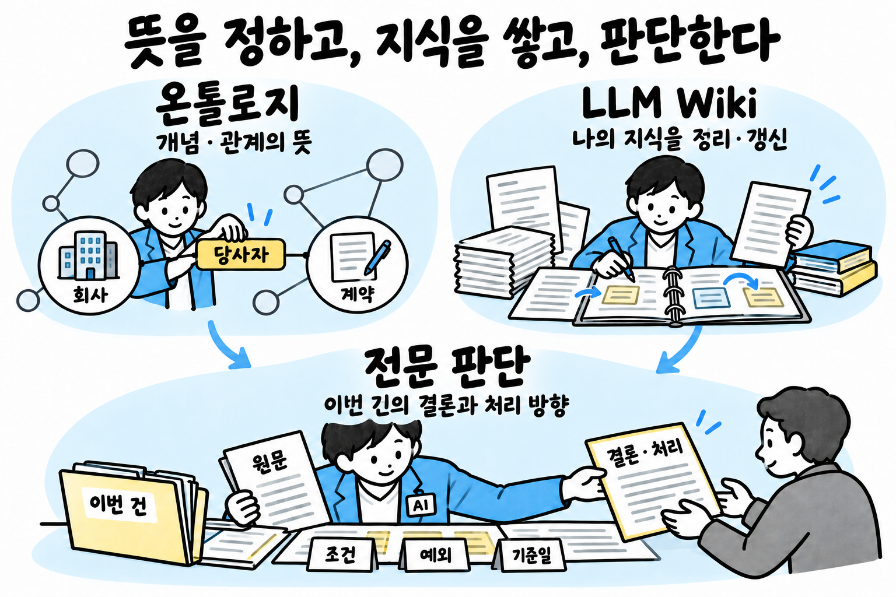

# 온톨로지 재검토 — 문제, 해결책, 기술 선택

프로젝트가 요구하는 것은 전문 지식에 근거해 정확한 판단과 업무 결과를 내는 에이전트다. [정의 1의 전문 판단의 신뢰성](<../../../전문가 에이전트 정의 1.md#전문-판단의-신뢰성>)이 그 요구와 문제·원인·확인 기준을 다룬다. 이 문서는 그 요구를 충족하는 수단 가운데 온톨로지의 역할과 연계 기술을 검토한다.

온톨로지의 중심 과제는 **개념·속성·관계의 의미를 명시하고, 여러 자료와 에이전트가 같은 뜻으로 사용하게 하는 것**이다. LLM Wiki의 중심 과제는 **읽은 자료와 분석 결과를 문서로 축적·통합·갱신하는 것**이다. 지식 축적 속도를 온톨로지의 핵심 문제로 삼거나, 이를 이유로 개념 승인 조건을 완화하는 권고는 근거가 부족하다.

이 프로젝트의 온톨로지는 의미 구분·관계 표현·분류·정합성을 기준으로 재검토한다. 위키의 축적·편집 방식, 개별 사실의 저장·검증, 검색·권한·계산은 연계 기능으로 구분한다.

## 0. 온톨로지와 LLM Wiki의 역할

| 구분 | 중심 역할 | 예 |
|---|---|---|
| 온톨로지 | 개념·속성·관계·공리의 의미와 구조를 명시 | 법인과 사업장은 어떻게 다른가, 계약 당사자 관계는 무엇을 뜻하는가, 어떤 분류·연결을 추론할 수 있는가 |
| 개별 대상·사실 데이터 | 특정 대상과 그 대상에 관한 사실·주장을 표현 | A법인, B사업장, 계약 C의 당사자가 A라는 기록 |
| LLM Wiki | 원문을 읽어 설명·요약·비교·연결·분석 결과를 지속적으로 정리하고 갱신 | A회사 관련 자료를 종합한 페이지, 계약 C 분석, 새 자료로 수정된 비교 문서 |

이는 역할 구분이다. 온톨로지가 실제 대상·사실을 포함할 수도 있고, 위키에도 개념 설명과 링크가 있다. 그러나 위키의 문서 링크만으로 관계의 형식적 의미가 정해지지는 않는다. 온톨로지가 있다는 이유만으로 위키의 지속적인 편집·종합 기능이 생기지도 않는다. [W3C OWL 2 Primer](https://www.w3.org/TR/owl2-primer/)

Karpathy의 LLM Wiki는 원자료, LLM이 유지하는 위키, 위키의 구성·작업 방식을 정한 문서로 이루어진 패턴이다. 원문의 `schema`는 위키 운영 규약이며 자동으로 형식적 온톨로지가 되는 것은 아니다. 개인 지식 기반에서 시작하지만 원문은 팀·기업 위키도 적용 사례로 든다. [LLM Wiki 원문](https://gist.github.com/karpathy/442a6bf555914893e9891c11519de94f)

두 기능을 함께 쓸 때는 위키의 개념·대상에 온톨로지 식별자를 연결할 수 있다. 위키에 새 요약을 쓰는 것과 온톨로지의 개념 정의·관계 의미를 바꾸는 것을 같은 작업으로 취급하지 않는다. 위키를 먼저 운영하고 나중에 온톨로지를 연결하는 구성도 가능하다.

## 1. 현재 불편함과 문제

### 의미와 관계를 다룰 때 생기는 불편함

| 문제 | 에이전트에서 생길 수 있는 오류 | 온톨로지에서 정할 것 |
|---|---|---|
| 같은 말의 뜻이 분야·업무마다 다름 | 계약상 용어와 일상어를 같은 뜻으로 적용 | 개념의 정의·적용 범위와 분야별 대응 |
| 다른 이름이 같은 개념을 가리킴 | 동의어 자료 누락, 중복 개념 생성 | 대표 이름·별칭과 구분 기준 |
| 법인·사업장·부서 같은 대상 단위가 섞임 | 계약 주체와 적용 사업장을 혼동 | 종류의 경계, 실제 대상과 종류의 구분 |
| 관계를 모두 ‘관련 있음’으로 연결 | 소속·소유·대리·적용 관계를 구별하지 못함 | 관계별 뜻·방향·연결 대상·조건 |
| 상하 관계·부분 관계·동일성을 혼동 | 하위 종류, 부품, 같은 대상에 서로 다른 추론을 잘못 적용 | 관계별 허용 추론과 금지할 추론 |
| 분류에 필요한 정보가 없음 | 미분류를 해당 없음으로 확정 | 미확인·부정·분류 충돌의 구분 |
| 여러 직무의 정의를 합칠 때 뜻이 충돌 | 한 직무의 정의가 다른 직무를 덮어씀 | 공통·직무별 모듈, 이름 공간, 대응 관계와 판본 |
| 정의가 바뀌어 기존 연결의 뜻도 바뀜 | 같은 관계 이름으로 다른 의미의 데이터를 조회 | 의미 변경의 영향 분석과 데이터 전환 조건 |

이 표는 점검할 설계 위험이며 실제 발생 빈도를 측정한 결과는 아니다. 문제의 중심은 의미의 일관성과 표현력이다.

기존 [직무별 판단 계약](../../실험결과/판례24건-대입검토/03_구조결함과_보완안.md#b-법률-직무-안에서-채워야-할-8개-계약)에 있는 당사자·쟁점·의견·절차·적용시점 구분은 온톨로지의 표현 범위를 정하는 입력으로 쓸 수 있다. 원문 수집 실패나 위키 갱신 지연은 별도 기능에서 진단해야 한다.

### 현재 설계가 추가로 만드는 부담

| 현재 문구·방식 | 문제 | 보완 방향 |
|---|---|---|
| 43개 재료가 모두 거쳐 오류를 한 번에 막음 | 공통 기준의 적용 범위와 실제 오류 방지 효과를 혼동 | 공통 데이터와 검사 결과를 재사용하되 실행 책임은 해당 재료가 소유 |
| 개념·관계·사실 주장을 한 승인 문장으로 묶음 | 온톨로지 변경과 지식 문서 편집·개별 사실 반영의 적용 범위가 불명확 | 무엇의 의미가 바뀌는지에 따라 변경 대상을 구분. 승인 병목 여부는 별도 측정 |
| 기존 개념에 이어지는 후보만 생성 | 새 업무 분야·새 개념을 처음 넣을 경로가 막힘 | 직무 시작 시 초기 사전 구축과 독립 후보 검토 경로 마련 |
| 전 과정을 정해진 순서로 반복 | 간단한 원문 조회에도 불필요한 호출·대기 발생 | 권한 등 필수 검사는 유지하고 관계 탐색·계산은 질문에 따라 수행 |
| 개념·관계 보완 뒤 항상 ①부터 재시작 | 일부 지식 수정이 전체 확인 절차의 재실행으로 번짐 | 바뀐 입력에 의존하는 단계만 다시 수행 |
| 90일 미사용 후보 일괄 삭제 | 연간 업무나 드물지만 중요한 예외 후보도 사라질 수 있음 | 미사용 기간 외에 다음 사용 시점·영향·원문 유효성으로 보존 결정 |

근거 위치: [정의 1의 전문 판단의 신뢰성](<../../../전문가 에이전트 정의 1.md#전문-판단의-신뢰성>), [정의 2의 업무 지식](<../../../전문가 에이전트 정의 2.md#업무-지식>), [기존 OpenKB 대조](OpenKB-온톨로지-대조-2026-09-30.md).

## 2. 먼저 고쳐야 할 설계

### 2.1. 검사 통과와 정답을 구분한다

`물음 × 대상 × 권한 × 자료 × 추론 × 주장`은 빠짐없이 살필 항목을 설명하는 데 쓸 수 있다. 그러나 검사기 자체가 틀릴 수 있으므로 모두 1이라고 정답이 보장되지는 않는다. ‘믿을 수 있는 답의 식’ 대신 **답변을 내보내기 전에 확인할 항목**으로 설명한다.

판정은 통과·실패·미확인·해당 없음으로 구분한다. 미확인일 때는 결론에 미치는 영향에 따라 추가 조회, 조건부 답변, 사람 판단으로 연결한다. ‘점검표가 다 찼으면 삼가지 않는다’도 없앤다. 점검표 자체가 불완전하거나 근거가 충돌할 수 있다.

43개는 현재 대응표에 등장하는 서로 다른 재료 수다. 온톨로지로 해결되는 재료 수나 오류 감소율이 아니다. 오류 원인은 자료 결함, 검색 누락, 해석 오류, 권한 강제 실패 등으로 따로 확인한다.

### 2.2. 용어, 실제 대상, 주장을 다른 기록으로 다룬다

‘회사’라는 개념, 실제 A회사, ‘A회사의 대표가 B다’라는 주장은 서로 다르다. 여기에 주장한 사람, 적용 시점, 출처, 확인 상태가 붙는다. 용어 사이의 상하 관계만으로 특정 대상의 법적 지위나 사실 여부를 확정하면 안 된다.

SKOS는 용어의 이름·동의어·상하·연관 관계에 사용한다. `skos:broader`를 곧바로 종류의 논리적 포함 관계로 해석하지 않는다. 실제 대상과 주장은 별도 스키마로 정의한다. [W3C SKOS §1.3](https://www.w3.org/TR/skos-reference/)

분류에는 적용 목적·규칙 판본·시점을 붙인다. 같은 대상도 업무 목적에 따라 여러 분류에 들 수 있다. 정보가 부족해 분류하지 못한 경우는 ‘해당 종류 없음’과 구분한다. 이름의 일치, 개념 간 유사성, 실제 대상의 동일성도 별도로 판단한다.

SKOS는 상하 관계의 순환을 그 자체로 표준 위반이라고 하지 않는다. 현재처럼 상위 개념·우선 관계에 순환 검사를 둘 수는 있지만, 이는 업무상 선택한 제약임을 명시한다. 다른 종류의 관계까지 같은 조건으로 막지 않는다. [W3C SKOS §8.6.8](https://www.w3.org/TR/skos-reference/)

### 2.3. 온톨로지 변경과 위키 편집을 구분한다

| 변경 | 판단할 것 |
|---|---|
| 개념의 정의·상하 관계·관계 의미 변경 | 기존 분류·추론·조회 결과가 어떻게 바뀌는가 |
| 별칭·외부 사전 대응 추가 | 다른 개념을 같은 것으로 잘못 연결하지 않는가 |
| 실제 대상·사실 반영 | 기존 의미에 맞는 기록인가, 대상 식별과 근거가 맞는가 |
| 위키의 요약·비교·분석 페이지 편집 | 원문에 충실한가, 기존 설명·링크와 충돌하거나 내용을 잃지 않았는가 |

온톨로지 변경 검토는 정의·관계·공리의 차이와 영향받는 분류·질문을 중심으로 한다. 위키 편집은 원문과 문서 내용의 검토로 다룬다. 위키가 새 개념을 제안할 수는 있지만 페이지가 생겼다는 이유만으로 공통 개념 정의가 확정되지는 않는다.

정의 2의 ‘개념·관계·사실 주장은 사람 승인’이 어느 저장 대상과 작업을 뜻하는지 먼저 명확히 해야 한다. 승인 대기 자료가 없는 상태에서 이것을 실제 지식 축적 병목이라고 단정하거나, 온톨로지 승인을 완화해야 한다고 결론 내릴 수 없다.

### 연계 기능의 점검

아래 권한·출처·시점·계산 항목은 온톨로지와 연결하는 실행 계약이다. 온톨로지 자체의 성과나 LLM Wiki의 축적 기능으로 세지 않는다.

### 2.4. 접근 제한은 첫 조회부터 적용한다

현재 순서도는 대상 확정 뒤에 권한을 거른다. 대상 후보를 찾는 데 비공개 사전·기록을 사용한다면 그 단계에서 이미 정보가 새어 나갈 수 있다. 인증된 주체와 업무 범위를 첫 저장소 조회 전에 정하고, 대상 후보·검색·관계 탐색·요약·최종 전달에 동일하게 적용해야 한다.

검색어의 고객 번호나 필터만으로 권한을 강제하지 않는다. PostgreSQL의 행 보안, OpenSearch의 문서 보안, 파일·도구 접근을 통제하는 실행 경계를 사용한다. 훅은 보조 검사이고 실제 접근 경로가 우회되지 않아야 한다. [PostgreSQL RLS](https://www.postgresql.org/docs/current/ddl-rowsecurity.html), [OpenSearch 문서 보안](https://docs.opensearch.org/latest/security/access-control/document-level-security/)

권한 철회 시에는 우선 조회·사용·전달을 막는다. 파생물의 물리 삭제는 보존·삭제 정책에 따라 별도로 완료한다. ‘허락이 거둬지면 함께 지운다’ 한 문장으로 백업·감사 기록·보존 보류까지 처리하지 않는다. 이 구분은 [runtime의 저장·격리 계약](../../runtime.md#격리와-데이터-이동)에 연결한다.

### 2.5. 출처 등급과 사실 판정을 분리한다

결론을 좌우하는 사실에 독립된 자료를 찾는 것은 유용하다. 그러나 계약 원본이나 원천 시스템의 특정 거래처럼 자료 하나가 해당 사실의 직접 근거인 경우까지 무조건 미확인으로 낮추면 정상 업무를 막는다. 필요한 교차 확인은 주장 종류와 영향에 맞춰 정한다. 같은 원문을 베낀 자료 두 개는 독립된 근거 둘로 세지 않는다.

원본 해시는 수집한 뒤 내용이 바뀌었는지 비교하는 데 쓴다. 발행 주체의 진위, 원래 내용의 정확성, 문서 전체의 확보 여부는 별도다. 주장에는 출처 외에도 **관찰·당사자 주장·추정·가정·계산 결과**의 구분이 필요하다.

‘앞선다’ 관계에는 어떤 쟁점·관할·조건·판본에서 적용되는지 붙인다. 전역적인 출처 순위 하나로 사실 충돌과 규칙 충돌을 모두 풀지 않는다. 두 주장 모두 보존하고, 이번 결론에서 채택한 이유를 연결한다.

### 2.6. 효력 시점과 알게 된 시점을 함께 조회한다

예를 들어 9월 20일에 받은 정정 자료가 7월 1일부터 적용되는 사실을 바꾼다면, ‘8월 당시 자료로 낸 답’과 ‘지금 확인한 8월의 사실’은 달라질 수 있다. 효력 기간만으로는 둘을 재현하기 어렵다.

[runtime의 시점과 판본](../../runtime.md#시점과-판본)에 이미 있는 `valid_from/valid_to`, `recorded_at/superseded_at`, 원천 판본·정정 관계를 온톨로지의 조회와 도출 기록에 적용한다. 원문뿐 아니라 사용한 개념·규칙·검색 색인의 판본도 연결한다.

날짜 필터로 필요한 옛 판을 먼저 제거하지 않는다. 적용 조건을 판단할 후보를 찾고, 경과 조건 등을 본 뒤 사용할 판을 고른다. 하나의 확정 값에 필요한 중복 방지와, 같은 시점에 충돌하는 주장·정정 이력의 보존을 구별한다.

### 2.7. 정책 판정과 전문 계산의 책임을 나눈다

OPA는 구조화된 입력으로 정책을 판단하며 산술도 지원한다. 따라서 ‘OPA는 계산을 못 한다’는 이유로 배제할 필요는 없다. 다만 **이미 권한을 검사하니 모든 전문 계산도 OPA로 옮긴다**는 선택에는 근거가 부족하다. [OPA 공식 개요](https://www.openpolicyagent.org/docs)

권한·실행 한도·정형 정책은 OPA가 맡고, 기간·반올림·단위·복잡한 수치 계산은 기존 계산 재료의 검증된 함수로 수행하는 것을 기본안으로 권한다. 작은 판정식은 OPA에 둘 수 있다. 자연어 해석이 필요한 판단은 근거·대안·불확실성을 남긴다.

판본 일치는 규칙 엔진을 하나로 만드는 대신 **개념·정책·계산 함수의 판본을 한 배포 구성으로 묶고 실행 시 대조**해 확보한다. 기존 계산 재료를 활용하는 변경이며 새 재료를 추가하지 않는다.

### 2.8. 검색, 구조 검사, 의미 검사를 각각 검증한다

단일 원문 확인은 원문 조회로, 정형 값의 집계는 데이터 조회·계산으로, 여러 문서의 연결이 필요한 질문은 관계 탐색으로 처리한다. 개념 번호가 없다고 원문 검색을 막지 않는다. 후보 개념의 잘못된 분류가 검색 대상을 제거하지 않게 한다.

관계가 저장돼 있지 않다는 사실은 현실에서 관계가 없다는 뜻이 아니다. ‘없다’는 결론에는 검색 범위·시점·자료의 완전성 근거가 필요하다. OWL의 열린 세계 가정도 미기록과 거짓을 구분한다. 다만 OWL 도입 자체가 자료 완전성 검사를 대신하지는 않는다. [W3C OWL 2 Primer §2](https://www.w3.org/TR/owl2-primer/#What_is_OWL_2.3F)

구조 검사는 필수 필드·자료형·참조·관계 방향·허용 연결을 확인한다. 의미 검사는 원문이 주장을 뒷받침하는지, 예외와 반대 자료를 다뤘는지 확인한다. 근거의 판정은 지지·반박·근거 부족으로 구분하고, 검사기 오류·검사 불가는 별도 상태로 남긴다. 수집 자료 전체를 무차별 대조하기보다 결론을 좌우하는 주장과 검색 누락을 우선 검사한다.

같은 주 모델을 새 대화에서 사용하면 앞 답변의 영향을 줄이는 데 도움이 될 수 있으나, 독립된 정답 판정자가 되지는 않는다. 한국어 오류 사례와 사람이 정한 정답으로 오통과·오차단을 측정해야 한다. ‘공개 소형 판정 모델은 한국어를 지원하지 않는다’는 전면적인 배제 문구는 근거가 부족하며, 모델 선정 기준과 별도로 검사 방식의 적합성을 검증한다.

## 3. 기술의 역할과 최신 상태

아래 상태는 2026-09-30 기준 공식 문서에 따른다. 의미 표현에는 SKOS·RDFS/OWL, RDF 데이터 제약 검사에는 SHACL이 직접 관련된다. 그래프 저장소·검색·메모리 도구는 이를 저장하거나 활용하는 선택지다. LLM Wiki는 이들과 구별되는 지식 문서 운영 방식이다.

온톨로지 기술은 필요한 표현력으로 고른다. 용어·동의어·분류 안내만 필요하면 SKOS가 맞고, 종류의 포함·배타성·관계 특성에서 형식적 추론이 필요하면 RDFS/OWL과 추론기를 검토한다. 필수 값 누락이나 허용하지 않은 연결을 검사하려면 SHACL 같은 데이터 검증을 별도로 둔다. OWL의 domain·range는 종류를 추론하는 의미를 가지므로 DB의 입력 차단 제약처럼 다루지 않는다. [W3C OWL 2 Primer](https://www.w3.org/TR/owl2-primer/)

SKOS만으로 충분하다거나 OWL 추론기가 불필요하다는 결론은 실제로 답해야 할 질문과 반례를 정한 뒤 내린다.

| 기술 | 공식 자료에서 확인되는 기능·상태 | 프로젝트 적용 판단 |
|---|---|---|
| SKOS | 용어와 분류 체계의 표현·교환을 위한 W3C 권고안 | 승인 사전의 이름·동의어·상하·연관 관계에 사용. 실제 대상·주장 전체의 저장 형식으로 확대하지 않음. [공식 문서](https://www.w3.org/TR/skos-reference/) |
| RDFS/OWL 2 | 종류·속성·공리와 형식적 추론을 위한 의미 표현 | 포함·배타·역관계·관계 연쇄 등 필요한 표현력을 검토. 온톨로지의 논리적 일관성과 현실의 사실 정확성을 구분. [공식 문서](https://www.w3.org/TR/owl2-primer/) |
| JSON Schema 2020-12 / SHACL | JSON Schema는 JSON 구조를, SHACL은 RDF 그래프의 제약을 기술·검사. SHACL 권고안은 2017판 | 기존 JSON·PostgreSQL 기록에는 JSON Schema와 DB 제약부터 적용. RDF 교환 데이터는 SHACL 검사. [JSON Schema](https://json-schema.org/draft/2020-12), [SHACL](https://www.w3.org/TR/shacl/) |
| PROV-O | 자료·활동·주체와 생성·파생·사용 관계를 표현하는 W3C 권고안 | 원문 → 추출 → 주장 → 계산·답의 출처 연결에 활용. 문서 위치·권한·두 시간 축은 별도로 연결. [공식 문서](https://www.w3.org/TR/prov-o/) |
| PostgreSQL 18 시간 제약 | `WITHOUT OVERLAPS`, 외래 키의 `PERIOD` 지원 | 승인된 단일 값의 기간 제약에 선택 적용. 충돌 주장 전체를 막지 않고 두 시간 축은 별도 모델링. [공식 문서](https://www.postgresql.org/docs/18/sql-createtable.html) |
| OpenSearch hybrid query | 키워드·의미 검색의 결합과 공통 필터 지원 | 기존 검색을 비교 기준으로 사용. 권한은 문서 보안과 함께 강제하고 관계 탐색의 추가 효과를 측정. [공식 문서](https://docs.opensearch.org/latest/query-dsl/compound/hybrid/) |
| Splink | 고유 식별자가 부족한 여러 열의 기록을 확률적으로 연결 | 이름·주소 등 복수 속성의 동일 대상 후보 생성에 적합. 이름 한 열만 있는 경우에는 부적합하며 자동 합침 임계값은 업무 데이터로 검증. [공식 문서](https://moj-analytical-services.github.io/splink/) |
| Neo4j GraphRAG Python | 미리 정한 대상·관계·속성·연결 패턴으로 추출을 유도하고 구조화 출력을 지원 | 사전을 따르는 후보 추출의 비교 후보. 기본 대상 결합은 같은 이름·종류를 합칠 수 있어 그대로 사용하지 않고 원천 ID 기반 판단으로 교체. [공식 문서](https://neo4j.com/docs/neo4j-graphrag-python/current/user_guide_kg_builder.html) |
| Graphiti | 시간에 따라 바뀌는 주장, 출처 연결, 점진적 갱신, 사용자 정의 대상·관계 형식 | 고객·사건의 변경 이력을 다루는 실험 후보. 자동 충돌 해소를 확정 지식의 승인으로 받아들이지 않음. 그래프 저장소와 운영 경계가 추가로 필요. [공식 저장소](https://github.com/getzep/graphiti), [시간 필드 구현](https://github.com/getzep/graphiti/blob/main/graphiti_core/edges.py) |
| LightRAG | 문서·관계 검색, 점진적 갱신·문서 삭제 후 영향 부분 재구성. 2026년 OpenSearch 저장 연동과 문서 처리 기능 확장 | 기존 저장소와 함께 관계 검색을 비교할 후보. 근거 원문 위치·시간·권한·삭제 전파가 우리 계약을 충족하는지는 별도 시험. [공식 저장소](https://github.com/HKUDS/LightRAG) |
| Microsoft GraphRAG | 공식 저장소가 유지보수 위주이며 새 기능·외부 PR을 받지 않는다고 명시 | 문서 집합의 관계·요약 검색 비교 후보로 한정. 신규 기본 기반의 우선 후보로 삼지 않음. [공식 저장소](https://github.com/microsoft/graphrag) |

최근 표준 작업 중에는 **RDF 1.2의 triple term·reifier**가 주장 자체에 출처와 속성을 붙이는 데 관련 있다. 다만 RDF 1.2 Concepts는 2026-04-07 Candidate Recommendation Snapshot이며, SHACL 1.2 Core는 2026-09-18 Working Draft다. 둘을 확정 권고안이라고 적으면 안 된다. 당장은 기존 형식의 주장 ID로 같은 요구를 충족하고, 교환이 필요할 때 도구 지원을 확인한다. [RDF 1.2 Concepts](https://www.w3.org/TR/rdf12-concepts/), [SHACL 1.2 Core](https://www.w3.org/TR/shacl12-core/)

제품형 온톨로지의 참고 사례로 Palantir는 대상·속성·관계와 행동·함수·동적 보안을 함께 제공한다. 넓은 온톨로지 계층이라는 개념 자체가 틀린 것은 아니다. 이 프로젝트에서도 넓은 이름을 사용할 수 있지만, 각 기능의 입력·출력·강제 위치는 구분해야 한다. 제품 전체를 도입하는 판단은 별개다. [Palantir 공식 개요](https://www.palantir.com/docs/foundry/ontology/overview)

현재 문서의 자동 관계 추출 배제 근거는 **‘정의 없이 마음대로 추출한다’에서 ‘정의에 맞게 추출해도 사실 검증은 필요하다’로 바꾼다.** 반면 그래프 DB와 OWL 추론기는 필요한 질문·규모·검사 요구가 드러날 때 비교하면 된다. 최신 도구 이름만으로 기본 저장소를 교체할 이유는 없다.

## 4. 프로젝트에서의 연결

온톨로지는 개념·관계의 공통 의미를 제공한다. 개별 대상·사실 데이터는 그 의미를 사용해 기록하고, LLM Wiki를 적용한다면 문서의 축적·종합·갱신을 별도 기능으로 둔다. 아래는 연계 책임이며 모두를 온톨로지의 내부 구성으로 묶는 표가 아니다.

| 다룰 내용 | 최소 기록 | 기존 담당 |
|---|---|---|
| 승인된 뜻과 관계 종류 | 안정적인 개념 ID, 이름·별칭, 정의, 적용 범위, 관계의 방향·허용 연결, 판본 | 업무 지식 M21 |
| 실제 대상 | 내부 ID, 원천 시스템과 원천 ID, 연결 근거, 합침·분리 이력 | 자료 정리·결합 M52 |
| 근거가 붙은 주장 | 주장 ID, 주체·관계·대상/값·단위, 주장자, 원문 위치·판본, 적용 조건, 두 시간 축, 확인 상태 | 근거 평가 M18·업무 지식 M21 |
| 정책·판단·계산 | 입력 주장 ID, 적용 규칙·함수 판본, 조건·가정, 결과, 판단 불가 이유 | 규칙의 적용·우선순위 M26·판단 M34·계산 M53 |
| 출처와 접근 범위 | 원문·주장·파생물의 연결, 인증된 접근 범위, 사용·전달·보존 조건 | M18·업무 권한 M31·안전장치 M32 |

### 질문을 처리하는 순서

1. 인증된 주체·업무 범위를 정하고, 허용된 자료에서 질문의 대상·기준 시점·필요한 답을 확인한다.
2. 기존 기록을 조회한다. 이번 질문에 필요한 구조화 자료와 원문을 검색하며, 관계 탐색이 필요할 때만 이어서 찾는다.
3. 근거·예외·반대 자료·적용 조건을 확인한다. 자료 부족, 조회 실패, 접근 불가, 실제 부재를 구분하되 권한 밖 자료의 존재를 노출하지 않는다.
4. 정해진 계산은 코드로 수행하고, 해석이 필요한 부분은 근거와 대안을 붙여 판단한다.
5. 결론을 좌우하는 주장·계산·권한을 검사한 뒤 답한다. 공통 지식에 반영할 후보는 별도 처리한다.
6. 원문·규칙·권한이 바뀌면 영향받은 주장·계산·결과를 다시 확인한다.

같은 입력·판본·적용 조건에 대한 검증 결과는 재사용할 수 있다. 현재 권한·시세처럼 변하는 조건은 다시 확인한다. 되묻기는 사용자의 선택이나 사용자만 아는 사실이 필요할 때 사용하고, 자료를 더 찾아 해결할 문제와 구분한다.

### 예: 서로 다른 ‘직원 수’가 들어온 경우

‘A회사 직원 수 20명’과 ‘A회사 직원 수 18명’을 바로 충돌로 표시하거나 최신 값 하나로 덮어쓰지 않는다. 회사의 동일성, 사업장 범위, 기준일, 집계 목적, 포함 대상이 같은지 먼저 확인한다.

범위가 다르면 다른 주장으로 함께 사용한다. 범위가 같은데 값이 다르면 각 출처와 상태를 보존하고 원천에 재확인한다. 법적 판정에 사용할 인원 수는 해당 규칙과 입력 내역을 연결해 따로 계산한다. 새 자료가 들어오면 그 계산과 연결된 결과만 다시 확인한다.

### 환경별 구현 범위

| 환경 | 먼저 구현할 범위 |
|---|---|
| ① 에이전트 하네스 | 사전·스키마·규칙 판본은 파일로 관리. 건별 주장·출처는 보호된 기록 서비스로 저장. 파일·도구 접근과 승인 검사는 실제 실행 경로에서 강제 |
| ②·③ 사내 플랫폼 | 같은 스키마·판본을 PostgreSQL에 적용하고 원문 검색과 연결. 인증된 권한을 조회·탐색·파생 결과에 적용 |

그래프 도구는 위 데이터 계약을 유지하는 어댑터로 비교한다. 기본 모델·자동 병합·자동 정정·외부 전송 설정을 그대로 받아들이지 않는다. 확정된 모델과 세 환경에서 작동하는지가 채택 조건이다.

## 5. 온톨로지의 도입 순서와 검증

### 먼저 정할 것

1. 직무에서 온톨로지가 답을 도와야 할 구체적인 질문을 정한다. 예: ‘계약 당사자와 적용 사업장을 구분할 수 있는가’, ‘두 자료의 대상이 같은가’, ‘이 관계를 역으로 따라가도 같은 뜻인가’.
2. 그 질문에 필요한 개념·속성·관계·조건과 반례를 정한다. 용어 사전으로 충분한 부분과 형식적 추론이 필요한 부분을 구분한다.
3. 기존 표준·업무 사전을 재사용할 수 있는지 확인하고, 공통 정의와 직무별 정의의 충돌을 해결한다.
4. 데이터 검증과 추론을 분리해 시험한다. 위키를 연결할 경우에는 문서의 개념·대상 식별자가 맞게 연결되는지 별도로 본다.

### 온톨로지 자체의 시험

| 시험 | 확인할 것 |
|---|---|
| 동의어와 동음이의어 | 같은 뜻은 연결하고 다른 뜻은 구별하는가 |
| 종류와 실제 대상 | 개념 정의를 특정 대상의 사실로 오인하지 않는가 |
| 관계의 방향·특성 | 역방향·상하·부분·동일성에 허용된 추론만 하는가 |
| 여러 분야의 개념 대응 | 유사 개념을 완전한 동일 개념으로 과도하게 합치지 않는가 |
| 조건부 분류·미확인 | 정보 부족과 부정, 목적에 따른 분류 차이를 보존하는가 |
| 정의 변경 | 기존 데이터·질문·추론에 미치는 영향과 전환 조건을 확인하는가 |

온톨로지의 효과는 개념·대상 구분 오류, 관계 해석 오류, 의도하지 않은 추론, 업무 질문의 답변 가능 범위로 평가한다. 지식 페이지 수나 축적 속도는 LLM Wiki의 별도 평가 항목이다.

### 연계 기능에서 구분해 볼 시험

| 시험 | 통과 조건 |
|---|---|
| 같은 이름의 다른 고객·회사 | 대상 후보 단계부터 섞이지 않고 잘못된 결합을 되돌릴 수 있음 |
| 같은 원천 ID의 새 판본·소급 정정 | 이전 답을 재현하면서 현재 정정 자료로 다시 판단할 수 있음 |
| 같은 날짜의 상충 자료 | 한쪽을 삭제하지 않고 범위 차이와 실제 충돌을 구분 |
| 원문에는 있지만 사전에는 없는 개념 | 원문으로 답할 수 있으며, 공통 사전의 승인은 별도로 진행 |
| 오류 응답·빈 본문·누락 이미지 | 유효한 근거로 수입하지 않고 자료 확보 상태를 표시 |
| 관계가 없거나 검색 결과가 비어 있음 | 조회 실패·미수집을 실제 부재로 단정하지 않음 |
| 권한 철회·다른 고객의 파생 요약 | 검색·대상 후보·관계 탐색·모델 입력·전달에서 차단 |
| 규칙·단위·반올림 조건 변경 | 영향받은 계산만 재수행하고 입력·규칙 판본으로 결과 재현 |
| 잘못된 원문과 그 원문을 정확히 인용한 답 | 인용 정확성과 사실 정확성을 따로 평가 |
| 문서 속 악성 지시 | 사전에 등록된 내용이어도 도구 권한과 실행 경계를 바꾸지 못함 |

비교군은 **기존 검색**, **검색 + 대상·주장·근거 관리**, **여기에 관계 탐색 추가**로 둔다. 안전·권한 조건은 모두 동일하게 적용한다. 최종 답의 정확도, 필요한 근거의 회수율, 잘못된 대상 결합, 시점 오류, 불필요한 답변 거절, 검사기의 오통과·오차단, 응답 시간과 비용, 사람의 유지 시간을 함께 본다.

오류 건수는 건 ID로 중복을 제거하되 원인과 후속 피해는 함께 기록한다. 현행의 권한 오류 우선 집계는 누설을 별도로 보는 데 유용하지만, 그것만 남기면 앞선 대상 결합 오류 같은 원인을 잃는다. 대표 오류 칸과 원인·후속 피해를 함께 보존하고, 원인을 확인할 수 없으면 미확인으로 둔다.

권한·자료 격리 등 필수 조건을 먼저 충족한 후보끼리 비용과 효용을 비교한다. 일반 오류의 절감액이 크다는 이유로 권한 위반을 허용하지 않는다. 오류가 한 번도 관찰되지 않았다는 결과도 앞으로 오류가 없다는 보증으로 표시하지 않는다.

## 6. 정의 문서에 적용할 수정 범위

| 위치 | 수정할 내용 |
|---|---|
| 정의 1 · 온톨로지 계층의 문제·해결식 | 오류 분류, 공통 기준, 실제 검사 효과를 구분. 정답 보증으로 읽히는 문구 수정 |
| 정의 1 · 일하는 순서 | 첫 조회부터 권한 적용, 질문별 필요한 검색·계산, 영향받은 단계만 재검토 |
| 정의 1 · 막는 법 | 조건부 출처 평가, 목적별 분류·우선순위, 두 시간 축, 불명 상태, 권한 철회와 삭제 분리 |
| 정의 1 · 기술 선택 | SKOS의 범위, 스키마에 맞춘 후보 추출, 정책과 계산의 책임, 새 대화 검사기의 한계 명시 |
| 정의 2 · 업무 지식 | 온톨로지의 의미 변경, 개별 사실 반영, 위키 문서 편집의 범위와 연결을 명확히 함 |
| 정의 2 · 검색·자료 결합·규칙 적용·검증 | 주장 ID·원천 ID·판본·접근 범위로 연결하고 기능별 검사 기준 구체화 |
| runtime · 지식·시간·격리 계약 | 이미 있는 계약을 정본으로 참조하고 본문과 충돌하는 표현 정리 |

직무별 질문·개념·관계·공리와 필요한 추론 범위가 먼저 확정되어야 한다. 위키 운영 방식, 원천 수입, 자동 반영, 근거 판정, 관계 검색의 효과는 각각의 기능에서 별도로 검증해야 한다.
