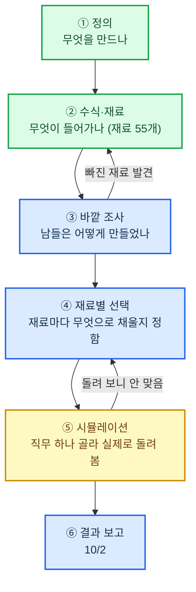

# 전문가 에이전트 만들기 — 진행 계획

보고일 2026-09-11 · 1차 마감 **9/18(금)** · 2차 마감 **10/2(금)**

## 한 줄로

전문가가 하던 일을 AI가 처음부터 끝까지 대신 끝내게 만드는 일임. "무엇을 만들지" 정하는 설계는 끝났고, 이제 "무엇으로 만들지" 고르고 한 번 돌려 보는 단계임.

## 전체 흐름

초록 = 끝남 · 노랑 = 절반 · 파랑 = 앞으로 할 일

## 어디까지 했나

| 단계 | 한 것 | 남은 것 | 진행 |
|---|---|---|---:|
| ① 정의 | 목표, 인간 전문가의 조건, 직무 166개, "대체"의 뜻, 업무 처리 흐름 한 장 — 전부 확정 | 없음 | 100% |
| ② 수식·재료 | 구성식(6항)과 재료 55개 표 확정. 재료마다 맡는 것·짜는 방식·됐다는 기준 초안 | 초안 55개 확정 도장 | 90% |
| ③ 바깥 조사 | — | 밖에서 만든 에이전트 3곳 이상을 같은 잣대로 비교 | 0% |
| ④ 재료별 선택 | 고르는 기준만 있음 | 재료 55개마다 후보 비교 → 하나 결정 | 10% |
| ⑤ 시뮬레이션 | 종이 위 모의: 직무 166개 × 변화 2개, 계산 모델 8개, 법률 복합사건 1건 | 실제로 돌리는 모의: 직무 1개 | 40% |
| **전체** | | | **약 45%** |

## 일정

| 마감 | 할 일 | 끝났다는 증거 |
|---|---|---|
| **9/18(금)** | ② 재료 55개 확정 · ③ 조사 대상 목록과 비교표 뼈대 · ④ 재료 55개 중 환경 계통 14개 선택 | 확정 표시된 재료 문서 · 비교표 · 선택표 14줄 |
| **10/2(금)** | ③ 조사 완료 · ④ 나머지 41개 선택 · ⑤ 첫 직무 1개 실제 모의 · ⑥ 결과 보고 | 비교표 완성 · 선택표 55줄 · 모의 결과 기록 · 이 문서 최종판 |

- 9/18 이후 일할 수 있는 날은 **8일**임. 추석 연휴 9/24(목)~9/27(일)을 뺀 수임.
- 진행률은 매주 금요일 이 문서에서 고침.

## 일하는 방식

- **순서를 지킴** — 정의 → 재료 → 선택 → 시험. 앞 단계에서 확정된 것만 다음 단계로 넘김.
- **한 직무부터** — 55개 재료를 한꺼번에 채우지 않고 직무 하나를 골라 끝까지 연결해 봄.
- **근거를 남김** — 밖에서 가져온 사실·숫자는 원문을 확인하고 출처와 확인 날짜를 적음.
- **되돌아감을 허용** — 시뮬레이션에서 안 맞으면 선택으로, 조사에서 빠진 재료가 보이면 재료로 돌아감.

## 결정 받을 것

- **첫 직무** — 초기 후보는 세무사 신고·기장임. 실제 자료와 도구를 구할 수 있는지 확인한 뒤 9/18까지 확정하겠음.
