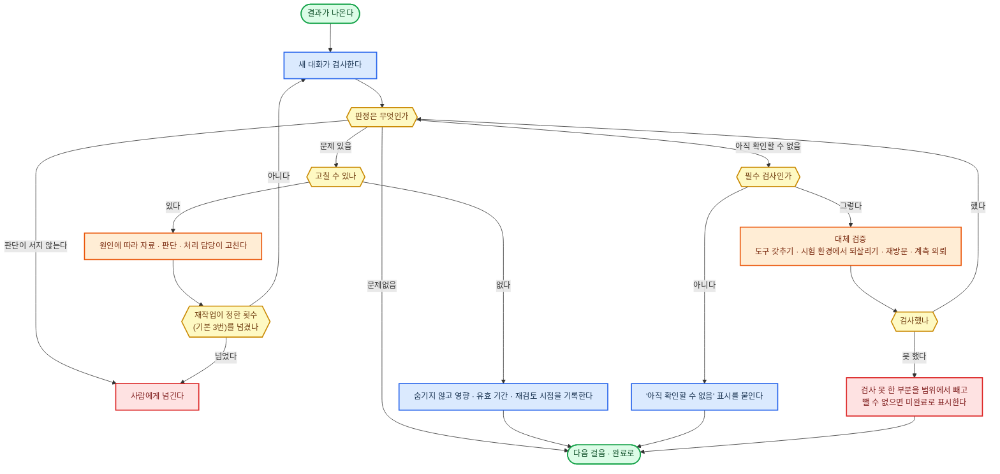
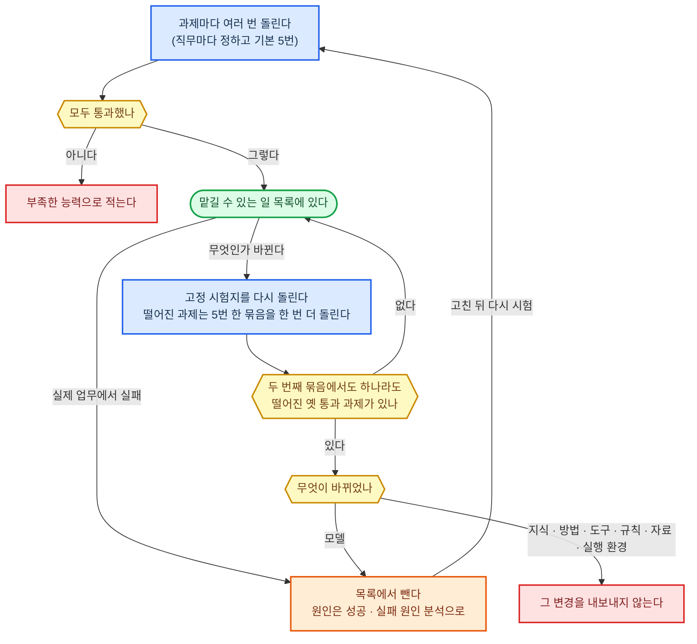

#### 판단 근거 기록

근거 고리는 결론에서 그 결론을 받친 자료, 그 자료를 가져온 행동의 실행 기록까지 끊김 없이 이어진 줄이다.

**원칙**
- 결론마다 근거 고리를 잇는다. 끊긴 자리를 다시 얻을 수 있으면(아직 못 받은 실물, 상대에게 물으면 되는 것) 다시 받아 채우고, 다시 얻을 수 없으면 그 결론에 "근거 없음"을 붙여 보고에도 그대로 적는다.
- 도구에 넣은 값과 돌려받은 값은 실행 제어가 부를 때마다 저절로 남긴다. 모델이 "했다"고 적은 글은 행동 기록으로 치지 않는다.
- 판단 이유는 모델이 판단하면서 적어 낸 것(고른 것, 버린 것, 근거의 원문 위치, 가정과 그 가정이 틀리면 달라지는 것)으로 남긴다. 모델 속 추론 원문은 실제 이유와 다를 수 있어 근거로 치지 않는다.
- 기록과 원본은 모델이 고치거나 지울 수 없는 곳에 덧붙이기만 한다. 고친 내용과 검사 결과는 새 줄로 남긴다.
- 비밀 값은 값이 아니라 있는 곳만 적는다. 법적 다툼·신고·심사에 쓰일 남의 원본은 손대지 않고 사본으로 일한다.
- 함수로 돈 걸음은 기록만 보고 같은 자료·판본·도구로 다시 돌려 같은 값이 나와야 한다. 다시 얻을 수 없는 자료(그때의 통화, 그때의 현장)는 보관한 녹취·사진·계측 원본을 가리킨다.

**기록 수단 고르기**
1. 모델의 작업 공간에서 고치거나 지울 수 없는 곳에 쌓는 것만 남긴다.
2. 그중 모델을 거치지 않고 부를 때마다 저절로 남기는 것을 고른다.
3. 넣은 값과 돌려받은 값을 자르지 않고 온전히 남기는 것을 고른다.

**환경별 정답**

| 구분 | ① 에이전트 하네스 | ②·③ 사내 서버 |
|------|------|------|
| 행동 기록 | 도구를 부를 때마다 도는 하네스 훅이 넣은 값과 돌려받은 값을 기록 보관 폴더에 건마다 나눠 덧붙인다. 이 폴더는 저장소 밖에 두고 모델에게 쓰기 권한을 주지 않으며, 하네스 훅만 덧붙인다. 일하면서 읽고 쓰는 건 파일과 캐시는 저장소 안 건 폴더에 둔다 | 실행 제어가 걸음마다 넣은 값과 돌려받은 값을 PostgreSQL에 덧붙이기만 한다. 모델의 작업 공간에서는 닿지 않는다 |
| 근거 자료 원본 | 기록 보관 폴더에 해시(SHA-256)를 이름으로 둔다 | 해시 창고. Object Lock으로 보존 기간 동안 지우지 못하게 한다 |
| 보관 기간 | 법·의무 기준이 정한다. 하네스의 대화 기록 자동 삭제(Claude Code 기본 30일)는 그보다 길게 늘린다 | 법·의무 기준이 정한다 |

---

#### 보고 주체 확인

분담 번호는 일을 나눠 맡길 때 조각마다 붙이는 번호이고, 지문은 결과물 내용으로 계산한 해시(SHA-256)다.

**원칙**
- 신원과 분담 번호는 낸 쪽이 적어 보낸 값을 믿지 않는다. 맡길 때 적어 둔 값과, 실행 제어가 기록한 "이 결과를 돌려준 것이 누구인가"를 대조한다.
- 지문은 받는 쪽이 직접 잰다. 받을 때 한 번, 쓰거나 밖으로 내보내기 직전에 한 번 더 재고, 다르면 쓰지 않고 낸 쪽에서 다시 받는다.
- 보고에 적힌 행동(시험 통과, 발송, 저장)은 그 일꾼의 실행 기록에 해당 줄이 있어야 받는다. 줄이 없거나 다른 일꾼의 줄이면 받지 않는다. 같은 분담이 두 번 막히면 사람에게 넘긴다.
- 사람에게 받는 결과물 승인은 승인 요청 문장에 결과물 지문을 넣어 보내고, 답을 그 지문과 함께 기록한다. 승인 뒤 지문이 바뀌면 그 승인은 없던 것으로 본다. 하네스 권한 확인 창은 도구 호출 하나를 허락할 뿐이라 결과물 승인 통로로 쓰지 않는다.
- 사내 로그인으로 온 승인은 그 계정으로 본인을 확인한다. 메일·문자·전화처럼 로그인이 없는 통로로 온 승인은 요청을 보낸 통로와 다른 통로로 한 번 더 확인한다.
- 명의를 걸고 밖으로 내보내는 건은 만든 쪽, 명의자, 명의자가 승인한 지문을 함께 기록하고, 그 지문이 지금 지문과 같을 때만 내보낸다.

**대조 수단 고르기**
1. 낸 쪽이 스스로 적거나 고칠 수 없는 값(실행 제어의 기록, 로그인 계정)으로 신원을 가르는 것만 남긴다.
2. 그중 하네스나 실행 제어가 이미 주는 값을 쓰고, 새로 만드는 것은 대조하는 일 하나로 줄인다.

**환경별 정답**

| 구분 | ① 에이전트 하네스 | ②·③ 사내 서버 |
|------|------|------|
| 일꾼 신원·분담 번호 | 하네스가 하위 에이전트를 띄울 때 준 번호. 하위 에이전트가 끝날 때 도는 훅이 그 번호와 하위 에이전트 대화 기록을 받아 대조한다(Claude Code·Codex 둘 다 이 훅이 있다) | 실행 제어가 기록한 일꾼·걸음 번호. 실행 제어의 정답을 따른다 |
| 보고한 행동 대조 | 하위 에이전트 대화 기록의 도구 호출 줄 | 판단 근거 기록의 실행 기록 줄 |
| 지문 | 받는 쪽이 SHA-256으로 잰다 | 같다. 결과물은 해시 창고에 두고 그 해시로 찾는다 |
| 사람 승인 | 사람에게 넘기기의 통로로 지문을 넣은 요청을 보내고, 답을 지문과 함께 판단 근거 기록에 남긴다 | 사내 통합 로그인으로 들어온 승인 화면에 지문을 보이고, 답을 지문과 함께 남긴다 |

---

#### 결과 검증·재검증

**원칙**
- 기대 상태(요구 번호, 대상 판본, 기대 값, 어디서 확인하는지, 반영이 늦어지는 시간)는 실행하기 전에 적는다. 결과를 본 뒤 기대를 고쳐 쓰지 않는다.
- 검사하는 새 대화에는 요구·원본·결과물만 주고, 만든 대화의 설명과 자기 평가는 주지 않는다. 검산은 입력·단위·코드를 원래 계산과 따로 써서 둘이 같이 틀리지 않게 한다.
- 자료·입력·조건이 바뀌면 판단 근거 기록의 고리를 거꾸로 따라가 그것에 기댄 결과만 다시 검사한다. 예전 검사 기록은 덮지 않고 새 판본에 새 기록을 단다.

**검사 수단 고르기** — 검사 항목마다 위에서부터 처음 되는 것을 쓴다.
1. 결과가 실제로 쓰이는 곳에서 확인한다. 원천 시스템의 상태를 조회하고, 받는 쪽 프로그램으로 열고, 빌드해 실행한다.
2. 1이 안 되면 따로 한 계산이나 답이 알려진 기준 문제로 검산한다.
3. 둘 다 안 되는 것(뜻과 정도로 갈리는 것)만 새 대화의 모델이 원문과 대조한다.

| 구분 | ① 에이전트 하네스 | ②·③ 사내 서버 |
|------|------|------|
| 새 대화 | 새 하위 에이전트 | 실행 제어가 앞 대화 없이 새로 여는 주 모델 호출 |
| 기계 검사 | 하네스 셸에서 시험·재계산·형식 검사 도구를 돌린다 | 분리 실행 공간에서 돌린다 |
| 끝내기 막기 | 끝내기 직전에 도는 훅이 필수 검사 판정이 다 적혔는지 보고, 빠졌으면 끝내지 못하게 돌려보낸다 | 필수 검사 판정이 다 적혔는지를 OPA 규칙으로 확인해야 다음 걸음이 열린다 |

---

#### 반대 근거·다시 확인

**원칙**
- 중요한 판단을 내리거나 알리기 전, 그리고 판단이나 그 바탕이 된 사실·가정·근거가 바뀌었을 때 거친다. 중요한 판단은 되돌릴 수 없는 행동 직전의 판단, 사람에게 알리는 결론, 돈·권리에 닿는 판단이고, 그 밖의 판단은 직무마다 정한다.
- 결론을 낸 대화가 아닌 새 대화가 한다. 먼저 결론을 가리고 원자료만 주어 스스로 판단하게 한 뒤, 그다음에 원래 결론과 대조한다.
- 검토 전에 "이 결론을 뒤집을 사실"을 적고 그것부터 찾는다. 반대 근거는 원문 위치가 붙어야 받아들이고, 위치 없는 반대는 버린다.
- 다른 회사 모델이라서, 표가 많아서 독립이라고 보지 않는다. 독립은 다른 원자료나 다른 방법에서만 나온다. 같은 자료·모형·도구로 한 확인에는 "독립 확인 아님"을 붙인다.
- 결론이 갈리면 반증과 추가 증거로 좁힌다. 한 번 더 확인해도 갈리면 조건을 단 결론으로 알리고, 되돌릴 수 없는 행동이 걸렸으면 판단이 서지 않는 것으로 보고 사람에게 넘긴다. 남은 이견과 누가 정했는지를 기록한다.
- 반드시 거치는 확인에 쓸 비용은 미리 잡아 두고, 비용을 이유로 건너뛰지 않는다.

**다시 확인 방법 고르기** — 위에서부터 처음 되는 것을 쓴다.
1. 처음 판단에 쓰지 않은 다른 원자료로 같은 사실을 확인한다.
2. 다른 원자료가 없으면 다른 계산법이나 다른 모형으로 같은 답이 나오는지 본다.
3. 둘 다 없으면 같은 자료를 새 대화가 상대편 입장에서 읽고, "독립 확인 아님"을 붙인다.

**환경별 정답**

| 구분 | ① 에이전트 하네스 | ②·③ 사내 서버 |
|------|------|------|
| 새 대화 | 새 하위 에이전트에 결론을 빼고 원자료만 넘긴다 | 실행 제어가 새로 여는 주 모델 호출에 결론을 빼고 원자료만 넘긴다 |
| 다른 원자료 찾기 | 하네스의 웹 검색·조회 도구 | 정보·자료 찾기의 정답(OpenSearch) |
| 다른 계산 | 하네스 셸 | 분리 실행 공간 |

---

#### 빠진 위험 확인

위험 목록은 직무마다 두고 매번 전부 훑는 위험의 목록이다.

**원칙**
- 업무를 맡거나 계획할 때, 실행하기 전, 진행 중 상황이 바뀌었을 때, 결과를 넘기기 전에 목록을 골라 보지 않고 그때 훑을 줄을 전부 훑고, 훑은 수를 M/N으로 남긴다.
- 위험 한 줄에는 다섯 칸을 둔다. 언제 훑나, 무엇이 걸리나, 어떻게 검사하나, 걸리면 등급이 무엇인가, 업무 완료에 필수인 검사인가.
- 걸린 위험은 등급으로 할 일을 정한다. 높음(되돌릴 수 없는 피해: 법 위반, 권리 침해, 돈, 개인정보 유출)은 멈추고 사람에게 넘긴다. 중간(다시 하면 고쳐지는 것)은 원인에 따라 자료·판단·처리 담당에게 돌려보내 고치고 목록을 처음부터 다시 훑는다. 낮음(받는 사람이 불편한 정도)은 기록만 남기고 간다.
- 검사를 못 한 위험은 결과 검증·재검증과 같게 처리한다. 검사 방식도 결과 검증·재검증의 검사 수단 고르기를 따른다.
- 목록 밖 위험은 예상과 실제의 차이, 서로 맞지 않는 자료, 되풀이되는 오류, 낯선 조건을 단서로 찾는다. 찾으면 성공·실패 원인 분석을 거쳐 목록에 한 줄 늘리고 늘린 날짜와 까닭을 적는다.
- 사람에게 직접 영향을 주는 결정은 결과가 집단별로 갈렸는지를 건마다가 아니라 주기(직무마다 정하고 기본값은 한 달)로 본다. 판단에 쓰면 안 되는 변수와 그것을 대신 드러내는 변수(동네, 이름)를 함께 본다.

**목록 채우기** — 직무를 처음 세울 때 셋을 모두 넣는다.
1. 그 직무의 규칙 재료(법·의무 기준, 직업 윤리·의무, 계약·합의 조건, 플랫폼·제출처 규정, 조직 규칙)가 금지하거나 요구하는 것
2. 성공·실패 원인 분석이 모은 실제 실패
3. 에이전트 자체의 위험으로 OWASP 에이전트 응용 10대 위험(2026년판) 열 가지

**환경별 정답**

| 구분 | ① 에이전트 하네스 | ②·③ 사내 서버 |
|------|------|------|
| 기계 검사 | 하네스 훅이 도구 호출 직전과 끝내기 직전에 돌린다 | OPA 규칙 |
| 정도 검사 | 새 하위 에이전트 | 실행 제어가 새로 여는 주 모델 호출 |
| 집단별 주기 검사 | 시작 신호의 예약이 헤드리스 실행을 띄워 기록을 모아 센다. 기록 보관 폴더는 모델이 직접 읽지 못하므로, 하네스 훅이나 감싼 스크립트가 필요한 구간을 잘라 넘긴다 | 시작 신호의 예약이 PostgreSQL 기록을 모아 센다 |

---

#### 일하는 과정 평가

**원칙**
- 단계별 평가는 각 단계가 끝날 때, 건 전체 평가는 건이 끝날 때 한다. 결과는 성공·실패 원인 분석에 넘긴다.
- 평가는 새 대화가 남은 기록(판단 근거 기록, 실행 기록, 위임 기록)만 보고 한다. 건 전체 평가도 걸음을 하나씩, 그 걸음 시점까지의 기록만 주고 평가한 뒤 모은다. 결과를 알고 보면 그때의 선택을 결과로 재단한다.
- 채점은 직무마다 고정한 점검표로 한다. 항목마다 판단 근거 기록의 줄을 가리키고, 가리킬 줄이 없으면 통과가 아니라 "기록 없음"으로 적는다. 모델 속 추론 원문이 없다는 것만으로 "기록 없음"이 되지는 않는다.
- 급한 대응, 여러 업무를 함께 돌린 것, 이유 있는 보류, 도구 없이 한 판단, 전화·방문으로 한 처리, 사람에게 넘긴 뒤 사람이 한 일도 같은 점검표로 채점한다.
- 사람을 부른 일은 사실 제공, 권한 행사, 자격 행위, 전문 판단 지원으로 나눠 실제 기여를 적는다. 불러야 할 때 부른 것은 깎지 않고, 사람 없이 밀어붙인 것에 점수를 더 주지 않는다.

**환경별 정답**

| 구분 | ① 에이전트 하네스 | ②·③ 사내 서버 |
|------|------|------|
| 평가하는 대화 | 새 하위 에이전트에 평가할 걸음 시점까지의 기록을 준다. 기록 보관 폴더는 모델이 직접 읽지 못하므로, 하네스 훅이나 감싼 스크립트가 필요한 구간을 잘라 넘긴다 | 실행 제어가 새로 여는 주 모델 호출에 PostgreSQL 기록을 평가할 걸음 시점까지 잘라 준다 |
| 평가 결과 | 하네스 훅이 기록 보관 폴더에 덧붙인다 | PostgreSQL에 덧붙인다 |

---

#### 결과 품질 평가

기준표는 항목마다 무엇을 보고 어느 수준이면 넘는지 적은 채점표다.

**원칙**
- 기준표는 결과를 만들기 전에 쓸 목적, 받는 사람, 그 분야 품질 기준으로 정하고, 만든 뒤에 바꾸지 않는다.
- 항목마다 점수를 따로 매기고 결과물의 어디를 보고 매겼는지 적는다. 최소 기준 항목이 하나라도 못 넘으면 다른 점수가 높아도 넘기지 않는다.
- 결과물은 쓰이는 모양 그대로 평가한다. 문서는 받는 프로그램으로 연 화면, 프로그램은 실행, 게임은 해 본 경험, 음악은 들어 본 소리, 설계는 실제 사용·제조 조건, 상담·교육·협상은 동의받은 대화 기록을 본다.
- 새 대화가 평가하고, 만든 대화의 설명은 주지 않는다.
- 모델이 채점하는 항목은 직무마다 좋은 견본 3개와 나쁜 견본 3개를 두고, 채점하는 대화가 6개를 모두 맞게 가를 때만 채점을 시작한다. 모델이 바뀌면 다시 가르게 한다.
- 잘된 점과 고칠 점은 결과물의 위치를 붙여 결과물 만들기·수정에 넘긴다.

**평가 방식 고르기** — 기준표 항목마다 위에서부터 처음 되는 것을 쓴다.
1. 재거나 셀 수 있는 항목(속도, 오류 수, 분량, 형식)은 기계로 잰다.
2. 견본 6개를 모두 맞게 가른 항목은 새 대화의 모델이 기준표로 채점한다.
3. 견본을 하나라도 틀리게 가른 항목은 사람 전문가가 평가한다.

**환경별 정답**

| 구분 | ① 에이전트 하네스 | ②·③ 사내 서버 |
|------|------|------|
| 모델 채점 | 새 하위 에이전트 | 실행 제어가 새로 여는 주 모델 호출 |
| 쓰이는 모양 만들기 | 하네스 셸에서 결과물을 열어 찍은 화면과 실행 결과. 웹 화면은 하네스의 브라우저 조작 도구 | 분리 실행 공간에서 받는 쪽 프로그램으로 열어 찍은 화면과 실행 결과 |
| 사람 전문가 평가 | 사람에게 넘기기의 통로 | 같다 |

---

#### 성과 추적

**원칙**
- 무엇을, 언제, 무엇과 견주어 잴지는 바꾸기 전에 적어 둔다. 결과를 본 뒤 지표나 비교 기간을 바꾸지 않는다.
- 성공뿐 아니라 실패·거절·미완료·어려운 건·사람에게 넘긴 건도 분모에 넣는다.
- 난도, 주변 상황, 쓴 시간과 자원, 사람 도움이 다른 기간은 한 숫자로 견주지 않고 나눠서 견준다. 차이가 우연으로 설명되는 범위(95% 신뢰구간)를 벗어날 때만 "나아졌다" 또는 "나빠졌다"로 적고, 아니면 "아직 모름"으로 적는다.
- 숫자로 쌓이지 않는 성과(고객이 말로 전한 반응, 현장 결과, 바깥 기관이나 상대가 알려 온 결론)는 받아 적는 서식, 확인 담당, 주기를 정해 같은 지표에 넣는다.
- 늦게 나오는 성과는 확정일을 시작 신호의 예약에 건다. 확정되면 성공·실패 원인 분석과 능력 개선·확장에 넘긴다.

**지표 고르기**
1. 목표를 이룬 상태를 바로 보여 주는 값을 주 지표로 둔다(예약 누락 건수, 같은 질문이 되풀이된 수).
2. 주 지표가 너무 늦게 나오면 먼저 움직이는 값을 보조 지표로 두되, 확정일에 주 지표와 다시 대조한다. 보조 지표가 좋아져도 주 지표가 그대로면 나아진 것으로 치지 않는다.
3. 사람이 한 몫과 총비용(모델 사용량, 사람 시간)은 어느 직무든 함께 잰다.

**환경별 정답**

| 구분 | ① 에이전트 하네스 | ②·③ 사내 서버 |
|------|------|------|
| 쌓기 | 하네스 훅이 기록 보관 폴더에 덧붙이고, 하네스가 내는 OpenTelemetry 지표(사용량, 비용, 시간)를 함께 쓴다. 기록 보관 폴더는 모델이 직접 읽지 못하므로, 하네스 훅이나 감싼 스크립트가 필요한 구간을 잘라 넘긴다 | OpenTelemetry 지표와 PostgreSQL |
| 확인 시점 | 시작 신호의 예약 | 같다 |

---

#### 업무 능력 시험

**원칙**
- 시험지(과제와 통과 기준)는 시험 전에 고정하고 판본을 붙인다. 통과 여부는 결과 검증·재검증, 결과 품질 평가, 일하는 과정 평가의 검사와 기계가 확인한 완료 기록으로 가린다.
- 시험지는 예전에 풀던 고정 시험지, 한 번도 공개하지 않은 새 과제, 여러 단계가 얽힌 복합 과제 세 묶음이다. 새 과제는 지시문·기억·지식에 들어가지 않게 따로 두고, 회차마다 세부 업무당 1개 이상 넣으며, 한 번 쓰면 고정 시험지로 옮긴다.
- 묶음마다 함수만 도는 경로, 함수와 AI가 섞인 경로, 병렬 작업의 일부 실패·결과 누락·중단 뒤 재개(이미 끝난 바깥 처리가 되풀이되지 않는지)를 넣는다. 견줄 전문가의 결과가 있으면 같은 자료·도구·기한으로 견준다.
- 맡길 수 있는 일 목록은 판본과 함께 만들고 업무 권한이 받아 쓴다. 모델은 AI 모델 절의 기준으로만 고르고, 이 시험 결과로 고르거나 되돌리지 않는다.
- 검사 재료도 시험한다. 오류를 심어 둔 결과물에서 오류를 찾는지, 멀쩡한 결과물을 틀렸다고 하지 않는지 잰다.

**시험 도구 고르기**
1. 실제로 쓰는 에이전트를 하네스 설정·로그인·샌드박스를 바꿔 끼우지 않고 그대로 돌리는 것만 남긴다. 모델 호출을 가로채 다른 곳에서 부르는 것도 뺀다.
2. 시험 환경의 시험 자리에서 같은 과제를 여러 번 돌리되 실행마다 깨끗한 새 시험 자리(작업 나무 사본)에서 시작하고, 과제마다 우리 검사 절차를 채점으로 끼울 수 있는 것을 고른다.
3. 둘 이상 남으면 새로 들일 부품이 적은 쪽을 고른다.

| 구분 | ① 에이전트 하네스 | ②·③ 사내 서버 |
|------|------|------|
| 시험 도구 | 우리 실행 스크립트가 Claude Code·Codex의 헤드리스 실행을 설정·로그인·샌드박스 그대로 두고 시험 자리에서 돌린다 | 우리 실행 스크립트가 사내 플랫폼 시험용 인스턴스에 과제를 넣고 결과를 받는다 |
| 로그인과 동시 수 | Claude Code는 시험용 계정의 구독 로그인으로 동시 5줄. Codex는 시험용 계정 하나에 한 번에 한 줄 | 동시 10줄(나눠 맡기기와 같다) |
| 끊김·재개 시험 | 돌고 있는 하네스를 강제로 끝낸 뒤 이어서 하기로 다시 연다 | 시험 환경에서 일꾼을 실제로 끊는다 |
| ③ 추가 | — | 동시 2줄(분리 실행과 같다). 주 1회 점검 창(일요일 새벽 2시간) 안에서만 돌리고, 못 끝나면 다음 주 창에서 이어서 한다. 그동안 맡길 수 있는 일 목록은 그대로 둔다 |
