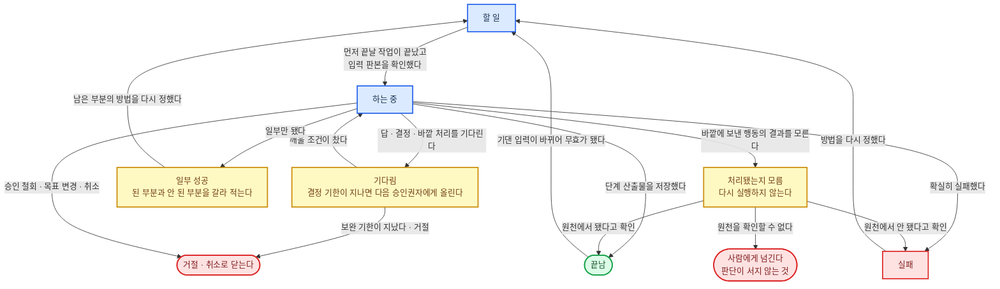
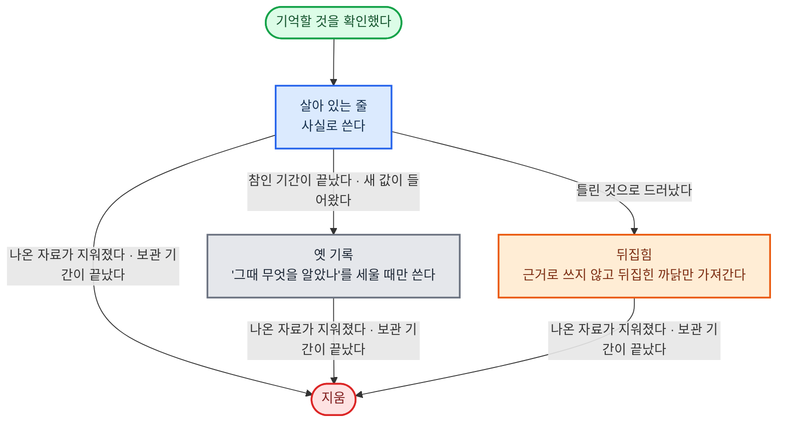

#### 현재 진행 상태

**원칙**

- 실행 기록은 뒤에 덧붙이기만 하고 앞 줄은 고치지 않으며, 건이 끝난 뒤 1년 둔다. 직종이 덮어쓰고, 법이 정한 보존 기간이 있으면 그 기간을 따른다. 지금 상태는 이 기록에서 만든다.
- 산출물마다 쓴 입력의 번호와 판본을 적어, 입력이 바뀌면 무효로 돌릴 끝난 작업을 찾을 수 있게 한다.
- 기다림에는 무엇을, 누구에게서, 깨울 조건, 기한, 담당 다섯 칸을 채운다. 한 칸이라도 비면 기다림으로 두지 않는다.

**진행 상태 두는 곳 고르기**

1. 대화나 프로그램이 끊겨도 남고, 하네스나 실행 엔진이 스스로 지우거나 압축하지 않으며, 줄마다 칸이 정해져 기계가 상태 값과 빈 칸을 검사할 수 있는 곳만 남긴다.
2. 쓰기 직전에 판본을 대 보고 읽은 뒤 바뀌었으면 거절하며, 여러 줄을 한 번에 쓰다 하나라도 실패하면 모두 되돌리는 것을 고른다.

**환경별 정답**

| 구분 | ① 에이전트 하네스 | ②·③ 사내 서버 |
|------|------|------|
| 실행 기록과 지금 상태 | 건 폴더의 기록 파일 하나. 쓰기는 하네스 훅 하나가 받은 순서대로 한 줄씩 덧붙이고, 요청이 읽은 마지막 줄 번호가 지금과 다르면 거절한다. 하위 에이전트는 기록 요청만 보내고 직접 쓰지 않는다. 성공·실패는 돌려받은 결과를 읽어 적는다. 대화를 이어 할 때 이 파일부터 읽는다 | PostgreSQL. 덧붙이기만 허용한다 |

---

#### 장기 기억

**원칙**

- 넣는 것은 다음 건의 판단을 바꿀 것뿐이다. 사실, 약속, 기한, 선호와 거절, 결정과 그 이유, 이 고객에게 효과 없던 방법이다. 약속과 기한은 건이 끝나기를 기다리지 않고 확인하는 즉시 넣고, 기한은 시작 신호에 건다.
- 여러 건에 통하는 교훈·요령은 여기 두지 않고 고객 정보를 뗀 뒤 업무 지식으로 보내 능력 개선·확장의 문(서로 다른 건에서 3번 이상 되풀이, 고정 시험지와 새 문항 통과, 같은 업무 종류 10건에 먼저 써 봄)을 지나게 하고, 사례는 적용 사례로 보낸다.
- 줄마다 고객·건 번호, 나온 자료의 번호, 기댄 규칙·근거의 번호와 판본, 언제부터 언제까지 참인지를 단다. 줄은 고치지 않고 덧붙인다.
- 한 고객의 기억은 다른 고객의 일에 쓰지 않는다. 막는 일은 모델이 아니라 분리 실행이 한다.
- 고객 관계가 끝난 뒤 3년 둔다. 직종이 덮어쓰고, 법이 정한 보존 기간이 있으면 그 기간을 따른다.
- 접수 단계에서 이 고객의 현재 요약 한 장, 아직 안 끝난 약속, 다가오는 기한 셋만 작업창에 올린다. 나머지는 모델이 필요할 때 번호로 꺼낸다.

**기억 담는 곳 고르기**

1. 고객별로 갈라 두고, 다른 고객의 일에서 읽히지 않게 모델 밖에서 막히는 것만 남긴다.
2. 옛 값을 지우지 않고 참이던 기간을 줄마다 남기는 것만 남긴다. 모델이 알아서 요약해 덮어쓰는 방식은 뺀다.
3. 고객·건 번호로 한 번에 펼치고, 규칙·근거·나온 자료의 번호로 거꾸로 찾을 수 있는 것만 남긴다.
4. 둘 이상 남으면 현재 진행 상태와 같은 저장소를 쓰는 쪽을 고른다.

**환경별 정답**

| 구분 | ① 에이전트 하네스 | ②·③ 사내 서버 |
|------|------|------|
| 담는 곳 | 고객 폴더의 기억 파일. 칸이 정해져 있고 덧붙이기만 한다. 건마다 폴더를 가른다. 셸은 샌드박스 읽기 범위로, 파일 읽기·고치기 도구는 하네스 권한 규칙으로 이번 건 폴더와 그 고객의 기억 파일 밖을 막는다 | PostgreSQL. 값이 하나여야 하는 사실은 같은 기간에 두 값이 겹치지 않게 저장소가 막는다 |
| 하네스 자체 기억 | Claude Code 자동 기억은 끄고, Codex 기억은 켜지 않는다 | — |
| 거꾸로 찾기 | 파일 검색 | PostgreSQL |
