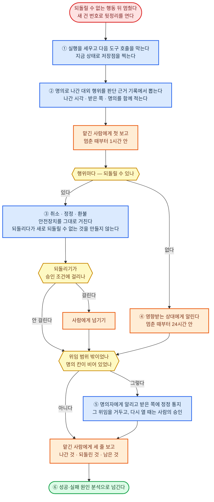
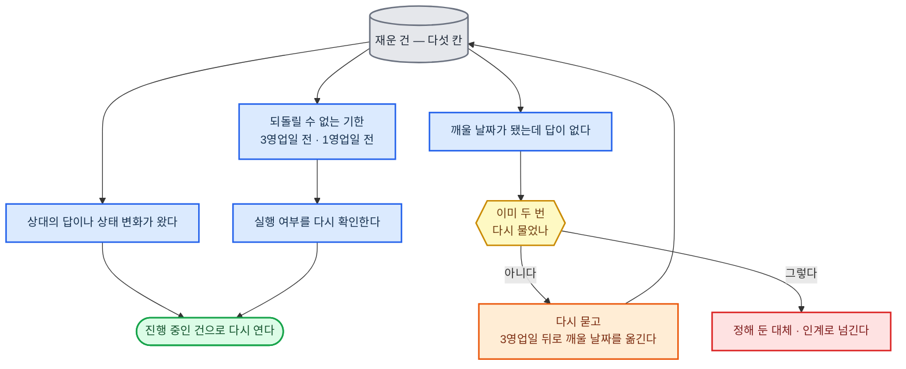

#### 작업 진행·연결

**원칙**

- 여러 건은 한 줄에 세워 차례로 꺼낸다. 순서는 되돌릴 수 없는 기한이 가까운 건 → 그 밖의 기한이 가까운 건 → 접수 순이다. 긴급 갈래로 들어온 건은 줄을 서지 않고 바로 시작한다. 직종이 다른 순서를 정하면 그것을 따른다.
- 다음 작업은 시작하기 전에 받은 입력이 지금 판본이고 검사를 통과했는지 확인한다. 아니면 시작하지 않고 앞 작업으로 돌려보낸다.
- 한 작업이 막히면 그 건은 대기·후속 관리에 넘겨 재우고 줄의 다음 건을 꺼낸다.
- 걸음이 실패하면 실행 제어의 규칙대로 한다. 실패 기록은 성공·실패 원인 분석이 볼 수 있게 남긴다.
- 건마다 걸린 시간, 모델을 부른 횟수, 업무에 쓴 돈(도구 요금·수수료·결제액)을 쌓는다. 모델 사용료는 넣지 않는다.
- 되돌릴 수 없는 행동을 한 뒤 멈췄으면(한도 초과·안전장치·사람이 멈춤·검증 실패) 새 건 번호로 아래 뒷정리를 연다. 보고 시한 1시간·24시간은 기본값이고 직종이 바꾼다. 법·계약이 더 짧게 정하면 그것을 따른다.

**환경별 정답**

| 구분 | ① 에이전트 하네스 | ②·③ 사내 서버 |
|------|------|------|
| 건의 줄과 차례 | 건 폴더의 건 파일 목록. 한 대화 안의 단계 점검은 하네스의 할 일 목록 | 실행 제어의 정답을 따른다. 줄은 PostgreSQL |
| 건마다 쌓는 숫자 | 건 파일 | OpenTelemetry 지표 |
| 직종마다 다른 것 | 줄 순서, 보고 시한 | 같다 |

---

#### 대기·후속 관리

상대(고객·기관)의 답을 기다리는 동안 건을 줄에서 빼 두는 것을 재운다고 한다. 사람의 결정을 기다리는 건은 사람에게 넘기기를 따른다.

**원칙**

- 재우는 건에는 다섯 칸을 채운다. 무엇을 기다리나, 누구 몫인가, 깨울 날짜, 기한이 지나면 할 일(재확인·대체·인계 가운데 하나), 되돌릴 수 없는 기한인가. 깨울 날짜가 빈 건은 재우지 않는다.
- 깨울 날짜는 상대가 약속한 기한의 다음 영업일이다. 약속한 기한이 없으면 5영업일 뒤다.
- 깨웠는데 답이 없으면 다시 묻고 3영업일 뒤로 다시 재운다. 두 번 물어도 없으면 정해 둔 대체·인계로 넘긴다.
- 되돌릴 수 없는 기한은 3영업일 전과 1영업일 전에 깨워 실행 여부를 다시 확인한다.
- 날짜·횟수·간격은 모두 기본값이고 직종이 바꾼다.
- 되풀이 업무는 한 회차를 닫을 때 다음 회차를 등록하고, 못 끝낸 일은 넘어온 표시를 붙여 다음 회차로 옮긴다. 담당이 바뀌면 재운 건과 남은 약속은 새 담당이 받았다고 확인할 때까지 옛 담당 몫으로 둔다.

**환경별 정답**

| 구분 | ① 에이전트 하네스 | ②·③ 사내 서버 |
|------|------|------|
| 재운 건 목록 | 건 파일의 기다림 칸 | PostgreSQL |
| 깨우기·되풀이 회차 | 시작 신호의 정답을 따른다 | 같다 |
| 기한 날짜 세기 | 먼저 알아채기의 정답을 따른다 | 같다 |
| 직종마다 다른 것 | 깨울 날짜, 다시 묻는 횟수·간격, 되돌릴 수 없는 기한 앞 깨움 날 | 같다 |

---

#### 자료 선별·분류

꼬리표는 자료 하나에 붙이는 분류 이름이다.

**원칙**

- 꼬리표 목록은 직종이 준 것을 쓰고, 없으면 나누기 전에 꼬리표마다 들어가는 기준과 보기 하나를 정한다. 목록에는 판본을 붙이고, 도중에 꼬리표를 새로 만들지 않는다.
- 맞는 꼬리표가 없으면 "미정"에 넣고, 둘 이상 맞으면 모두 붙이고 "겹침"을 표시한다.
- 미정이 전체의 10%를 넘으면 목록을 고쳐 판본을 올리고 처음부터 다시 나눈다. 다시 나누기는 두 번까지다. 그래도 넘으면 미정 비율과 미정 자료의 공통점을 결과에 붙여 낸다. 비율은 기본값이고 직종이 바꾼다.
- 자료마다 붙인 꼬리표와 그 근거가 된 원문 구간을 함께 남긴다.
- 칸 값만으로 갈리는 분류(날짜·금액 구간·코드 값)는 모델이 읽어 나누지 않고 코드로 나눈다.
- 이름만 같다고 같은 대상으로 잇지 않는다. 확신하지 못한 연결은 "미정 연결"로 남기고, 자료 정리·결합에는 확정된 연결만 넘긴다. 학습용·평가용으로 나눈 자료와 서로 보면 안 되는 자료의 경계는 나눈 뒤에도 섞지 않는다.

**같은 대상 가리는 방법 고르기**

1. 양쪽에 같은 고유 번호(사업자 번호·주문 번호 같은)가 있으면 번호가 같은 것만 잇는다.
2. 번호가 없고 견줄 후보 쌍이 1천 쌍 이하면 주 모델이 쌍마다 판단한다.
3. 1천 쌍을 넘으면 여러 칸의 닮음을 점수로 합치는 확률 연결 도구로 점수를 매긴다. 0.95 이상은 같은 대상, 0.50 미만은 다른 대상, 그 사이는 주 모델이 보고 그래도 모르면 미정 연결로 둔다. 쌍 수와 문턱은 기본값이고 직종이 바꾼다.

**환경별 정답**

| 구분 | ① 에이전트 하네스 | ②·③ 사내 서버 |
|------|------|------|
| 뜻으로 가르는 분류 | 주 모델 | 같다 |
| 칸 값으로 가르는 분류 | 셸에서 DuckDB | 분리 실행 공간의 DuckDB. 자료가 PostgreSQL에 있으면 거기서 |
| 확률 연결 | 셸에서 Splink(DuckDB 위) | 분리 실행 공간의 Splink(DuckDB 위) |
| 직종마다 다른 것 | 꼬리표 목록, 미정 비율, 쌍 수와 문턱 | 같다 |

---

#### 자료 정리·결합

**원칙**

- 원본은 고치지 않는다. 정리는 사본에서 하고, 바꾼 값마다 어느 원본의 어느 줄에서 왔고 어떤 규칙으로 바뀌었는지 잇는다. 규칙 하나를 되돌리면 그 규칙이 바꾼 값만 원래대로 돌아와야 한다.
- 표 자료의 값은 모델이 옮겨 적지 않는다. 합치기·나누기·중복 빼기는 규칙을 코드로 적어 돌린다. 모델은 규칙을 정하고, 규칙으로 못 가르는 줄만 본다.
- 정리 전후로 줄 수와 금액 합계를 맞대어 본다. 빠진 줄과 늘어난 줄의 까닭이 한 줄씩 설명될 때까지 끝난 것으로 치지 않는다.
- 빠진 값·튀는 값은 지우거나 메우지 않고 표시만 한다. 메워야 하면 메운 방법을 값 옆에 적는다.
- 합치기는 원천의 고유 번호와 판본을 기준으로 덮어쓴다. 같은 입력이 두 번 오거나 늦게·순서가 바뀌어 와도 결과가 같아야 한다.

**처리 도구 고르기**

1. 규칙을 코드로 적어 같은 입력이면 같은 결과가 나오는 것만 남긴다. 손으로 고친 스프레드시트와 모델이 다시 쓴 표는 뺀다.
2. 자료가 이미 데이터베이스에 있으면 옮기지 않고 그 데이터베이스에서 처리한다.
3. 파일로 받은 자료는 SQL 엔진 하나가 CSV·Parquet·엑셀 파일을 직접 읽고 쓰며, 실행 파일 하나로 설치되고, 장비 메모리보다 큰 자료를 처리하는 도구로 처리한다. 엑셀 읽기가 공식 확장이면 분리 실행 공간에 미리 넣어 둔다.

**환경별 정답**

| 구분 | ① 에이전트 하네스 | ②·③ 사내 서버 |
|------|------|------|
| 파일로 받은 자료 | 셸에서 DuckDB. 엑셀 확장도 미리 넣어 둔다 | 분리 실행 공간의 DuckDB |
| 저장된 자료 | — | PostgreSQL 안에서 SQL |
| 전후 대조 | 처리한 도구로 줄 수·합계를 다시 센다 | 같다 |
| 직종마다 다른 것 | 식별 번호, 단위·시간대 기준, 중복 판정 기준 | 같다 |

---

#### 형식·구조 변환

**원칙**

- 내용은 모델이 다시 쳐서 옮기지 않고 변환 도구로 옮긴다. 모델은 도구가 못 옮긴 부분만 손본다.
- 변환 전에 옮겨야 할 요소(표·칸·수식·그림·쪽·자막 줄·항목 연결)를 원본에서 세고, 변환 뒤 결과에서 같은 것을 세어 맞댄다. 개수가 다르면 끝난 것으로 치지 않는다. 시간 값은 원본과 1초 넘게 어긋나면 끝난 것으로 치지 않는다. 1초는 기본값이고 직종이 바꾼다.
- 옮기지 못한 요소와 달라진 요소는 목록으로 만들어 결과와 함께 넘기고, 받는 쪽이 쓸 대체 형식을 함께 낸다.
- 항목 구조를 바꿀 때(옛 시스템에서 새 시스템으로)는 옛 항목 하나하나가 새 항목 어디로 가는지, 버리면 왜 버리는지 대응표를 먼저 만든다. 대응표에 없는 항목이 남아 있으면 옮기지 않는다.

**변환 수단 고르기**

1. 원본 프로그램이 그 환경에 설치돼 있고 내보내기 기능이 있으면 그것을 쓴다.
2. 없으면 사내에 설치해 명령으로 돌릴 수 있고, 그 형식 짝을 공식 문서가 지원한다고 적은 공개 도구를 쓴다. 둘 이상이면 쪽 모양을 지켜야 할 때는 원본을 쪽 단위로 그리는 사무 프로그램을, 글 구조만 옮길 때는 구조 변환 도구를 쓴다.
3. 둘 다 없으면 그 형식으로 내지 않고 받는 쪽이 쓸 수 있는 대체 형식으로 낸다. 제출처가 그 형식을 요구하면 사람에게 넘기기로 간다.

**환경별 정답**

| 구분 | ① 에이전트 하네스 | ②·③ 사내 서버 |
|------|------|------|
| 원본 프로그램이 설치돼 있을 때 | 그 프로그램의 내보내기 | 같다 |
| 글 구조 바꾸기(워드·마크다운·HTML 사이) | 셸에서 Pandoc | 분리 실행 공간의 Pandoc |
| 쪽 모양 그대로 PDF 만들기 | 셸에서 LibreOffice(화면 없이 실행) | 분리 실행 공간의 LibreOffice |
| 한글(hwp·hwpx) 읽어 다른 형식으로 | 셸에서 LibreOffice에 H2Orestart 확장 | 분리 실행 공간의 LibreOffice에 H2Orestart 확장 |
| 한글로 내보내기 | 하지 않는다. PDF로 내고, 제출처가 한글을 요구하면 사람에게 넘기기로 간다 | 같다 |
| 영상·음성·자막 | 셸에서 FFmpeg | 분리 실행 공간의 FFmpeg |
| 표·항목 구조 | 셸에서 DuckDB | 분리 실행 공간의 DuckDB |
| 직종마다 다른 것 | 전용 형식(도면·인쇄용 파일·전표 등)과 그 도구, 시간 허용 차 | 같다 |

---

#### 계산

**원칙**

- 수치는 모델이 머리로 셈하지 않고 모두 코드로 돌린다. 결과에 들어가는 셈이면 한 자리 덧셈도 코드로 한다.
- 금액처럼 자릿수가 정해진 값은 십진 계산으로 한다. 반올림·절사는 법·계약·제출처가 정한 자리와 방식으로 정한 단계에서만 하고, 정한 것이 없으면 마지막에 한 번만 한다.
- 값에는 단위를 붙인 채 셈한다. 단위가 맞지 않는 식은 돌리지 않는다.
- 입력에 오차 범위가 있으면 입력을 그 범위 안에서 고르게 1만 번 뽑아 돌려 결과에도 범위를 붙인다. 적는 자릿수는 그 범위가 받쳐 주는 데까지다.
- 되풀이 계산이 한 값에 모이지 않거나 값이 흔들리면 성공으로 치지 않고, 원인을 찾아 다른 방법으로 다시 푼다.
- 남이 낸 계산은 그 풀이를 따라가지 않고 원래 입력에서 따로 풀어 맞댄다. 다르면 계산이 틀렸는지 전제가 틀렸는지 갈라 알린다.

**계산 수단 고르기**

1. 코드로 돌리는 것만 남긴다. 스프레드시트가 받는 사람의 결과물이면 결과물 만들기·수정이 만들고, 그 값은 여기서 따로 검산한다.
2. 값의 종류로 고르되 위 칸이 먼저다. 자릿수가 정해진 값(금액 포함)은 단위가 있어도 십진 계산 도구, 그 밖의 단위가 있는 값은 단위 계산 도구, 식을 기호 그대로 풀어야 하면 기호 계산 도구, 적분·미분방정식처럼 근삿값을 구하는 계산은 수치 계산 도구.
3. 법이나 제출처가 인정한 전용 계산기가 있으면 그것으로 내고, 2의 도구로 한 번 더 검산한다.

**환경별 정답**

| 구분 | ① 에이전트 하네스 | ②·③ 사내 서버 |
|------|------|------|
| 돌리는 자리 | 셸의 Python | 분리 실행 공간의 Python |
| 자릿수가 정해진 값 | Python 표준 십진 계산 | 같다 |
| 단위가 있는 값 | Pint | 같다 |
| 기호 계산 | SymPy | 같다 |
| 수치 계산 | SciPy | 같다 |
| 날짜·기한 | 먼저 알아채기의 정답을 따른다 | 같다 |
| 직종마다 다른 것 | 전용 계산기 | 같다 |

---

#### 분석

**원칙**

- 결론에 들어가는 숫자는 모두 원자료에서 코드로 다시 뽑은 값이다. 모델이 표를 눈으로 읽어 옮긴 숫자는 쓰지 않는다.
- 원인이라고 쓰려면 다른 설명을 둘 이상 적고 각각을 배제한 근거를 댄다. 배제하지 못하면 "관련이 있다"까지만 쓴다.
- 결론 옆에 자료의 수(몇 건·몇 명), 기간, 빠진 자료를 적는다.
- 자료를 여러 갈래로 쪼개 보다 나온 차이는 쪼갠 횟수와 함께 적고, 새 자료로 다시 확인하기 전까지 가설로 둔다.
- 면담·문의 같은 글 자료에서 찾은 주제에는 원문 인용과 그 말을 한 사람 수를 붙인다. 인용이 없는 주제는 내지 않는다.

**분석 도구 고르기**

1. 코드로 돌려 같은 입력이면 같은 값이 나오고 사내에 설치할 수 있는 공개 도구만 남긴다. 화면에서 눌러 쓰는 분석 서비스는 뺀다.
2. 모으기·세기는 자료 정리·결합과 같은 SQL 도구로 한다.
3. 통계는 계산과 같은 언어(Python)에서, 표준 통계 검정·회귀·시계열 검정을 문서화된 이름 그대로 한 도구 안에 갖춘 것을 쓴다.

**환경별 정답**

| 구분 | ① 에이전트 하네스 | ②·③ 사내 서버 |
|------|------|------|
| 모으기·세기 | 셸에서 DuckDB | 분리 실행 공간의 DuckDB. 자료가 PostgreSQL에 있으면 거기서 |
| 통계 검정·회귀 | 셸에서 statsmodels | 분리 실행 공간의 statsmodels |
| 글 자료의 주제 찾기 | 주 모델, 인용은 원문 대조 | 같다 |
| 직종마다 다른 것 | 그 분야 전용 분석 기법 | 같다 |

---

#### 기준 적용·판정

**원칙**

- 기준을 항목으로 쪼개고, 항목마다 대조한 사실·그 증거가 있는 자리·결과를 한 줄로 적는다. 결과는 충족·미충족·해당 없음·확인 불가 넷 가운데 하나다. 전체 인상으로 결론 내지 않는다.
- 숫자·날짜·목록 대조로 끝나는 항목은 모델이 판단하지 않고 코드로 대조한다. 뜻을 따져야 하는 항목만 모델이 본다.
- 예외·단서("다만"으로 시작하는 조항)·경과 규정이 걸린 항목은 고른 해석과 버린 해석을 근거와 함께 남긴다.
- 확인 불가가 하나라도 있으면 "충족"으로 결론 내지 않는다. "확인 불가 ○개를 뺀 나머지는 충족"처럼 범위를 붙인다.
- 기준이 여럿이면 판정 전에 규칙의 적용·우선순위로 순서를 정한다.
- 기준 판본이 바뀌면 옛 판본으로 낸 판정 가운데 아직 유효한 것을 목록으로 뽑아 다시 본다.

**대조 수단 고르기**

1. 뜻을 따져야 하는 항목은 주 모델이 본다.
2. 숫자·날짜·목록 비교로 끝나는 항목은 계산과 같은 코드로 대조한다.
3. 같은 기준을 계속 맡은 업무에서 되풀이 적용하면, 기준을 판본 붙은 규칙 묶음 한 벌로 적고 규칙마다 통과·차단 사례를 시험으로 함께 둔다.

**환경별 정답**

| 구분 | ① 에이전트 하네스 | ②·③ 사내 서버 |
|------|------|------|
| 뜻을 따지는 항목 | 주 모델 | 같다 |
| 한 번 대조 | 셸의 Python | 분리 실행 공간의 Python |
| 되풀이 대조 | 셸에서 OPA 실행 파일로 같은 규칙 묶음 | OPA 규칙 묶음 |
| 직종마다 다른 것 | 요건·기준표 | 같다 |

---

#### 예측

**원칙**

- 예측은 한 값이 아니라 가운데 값과 범위로 낸다. 범위는 실제 값이 그 안에 들 확률 80%의 폭이 기본이고, 직종이 바꾼다.
- 숫자 예측은 먼저 가장 단순한 기준선을 만든다. 철이 있는 자료는 지난 같은 철의 값, 철이 없는 자료는 직전 값을 그대로 쓴다. 고른 방법이 기준선보다 채점이 낫지 않으면 기준선을 낸다.
- 과거 구간으로 되돌려 맞혀 볼 때는 그 시점에 알 수 없었던 정보를 쓰지 않고, 평가 구간 자료를 학습에 넣지 않는다.
- 사람·상대의 반응처럼 숫자 자료가 없는 예측은 비슷한 일이 얼마나 자주 그렇게 됐는지에서 출발해 이번 사정으로 고치고, 확률로 적는다.
- 낸 예측은 결과가 나올 날짜와 함께 남긴다. 결과가 나오면 성과 추적이 채점하고, 채점이 기준선보다 나쁜 방법은 다음 예측에 쓰지 않는다.
- 겪어 보지 못한 조건의 입력이면 예측에 그 사실을 붙인다.

**예측 방법 고르기**

1. 숫자 시계열이 있으면 후보는 둘이다. 기준선과, 시계열 예측 공개 순위표(fev-bench)의 범위 예측(SQL) 표의 승률에서 가장 높은 모델 가운데 가중치가 공개되고 사내에서 써도 되는 것.
2. 이 자료의 과거를 시간 순서대로 세 구간 이상 되돌려 맞혀 보고, 범위를 채점하는 핀볼 손실(실제 값이 범위를 벗어난 만큼 벌점을 주는 잣대)을 0.1부터 0.9까지 아홉 분위에서 재어 평균이 작은 쪽을 쓴다.
3. 숫자 시계열이 없으면 주 모델이 원칙의 확률 예측으로 한다.

**환경별 정답**

| 구분 | ① 에이전트 하네스 | ②·③ 사내 서버 |
|------|------|------|
| 기준선 | 셸에서 statsforecast | 분리 실행 공간의 statsforecast |
| 순위표 1위 모델 | 셸에서 CPU로 | GPU에서 |
| 숫자 자료가 없는 예측 | 주 모델 | 같다 |
| 직종마다 다른 것 | 예측할 값, 범위 폭 | 같다 |

---

#### 조건 안에서 최선 찾기

**원칙**

- 풀기 전에 목적(무엇을 가장 작게 또는 크게), 반드시 지킬 조건, 바꿀 수 있는 것, 풀이 시간 한도를 적는다. 목적이 여럿이면 우선순위나 비중을 문제·목표·완료 조건에서 받고, 받지 못한 비중을 임의로 채우지 않는다.
- 결과는 셋 가운데 하나로 적는다. 최선이라고 증명된 답, 찾아본 범위에서 가장 나은 답(최선과 얼마나 떨어져 있을 수 있는지 함께), 조건을 다 지키는 답이 없다고 증명됨. 못 찾은 것을 "답이 없다"로 적지 않는다.
- 답이 없으면 서로 부딪히는 조건을 가려내고, 어느 조건을 얼마나 풀면 답이 생기는지와 그때 치르는 값을 함께 낸다. 조건은 여기서 풀지 않고 문제·목표·완료 조건과 대안·전략 판단으로 돌려보낸다.
- 풀이 시간 한도는 기본 10분이고 직종이 바꾼다. 한도에 닿으면 그때까지 가장 나은 답을 남은 간격과 함께 내고, 다른 풀이법이나 모형으로 한 번 더 돌린다.
- 고른 답에는 주요 입력을 하나씩 ±10% 바꿨을 때 답이 바뀌는지를 붙인다.

**풀이 수단 고르기**

1. 후보가 1만 개 이하이고 후보 하나를 계산하는 데 1초가 안 걸리면 전부 계산해 견준다.
2. 결과를 식으로 쓸 수 없고 돌려 봐야 값이 나오면(화질과 파일 크기를 맞바꾸는 설정처럼) 시도 결과로 다음 시도를 고르는 탐색 도구를 쓴다.
3. 식으로 쓸 수 있고 바꿀 것이 모두 정수나 예·아니오면(배치·순서·일정·배차) 정수 조합 풀이기를 쓴다. 그 도구 모음에 문제 종류 전용 풀이기(차량 경로 같은)가 있으면 그것을 쓴다.
4. 식으로 쓸 수 있고 연속 값이 들어 있으면, 식이 선형·이차면 선형 계획 풀이기를, 그 밖이면 수치 최적화 도구를 쓴다.

**환경별 정답**

| 구분 | ① 에이전트 하네스 | ②·③ 사내 서버 |
|------|------|------|
| 돌리는 자리 | 셸의 Python | 분리 실행 공간의 Python |
| 시도로 찾기 | Optuna | 같다 |
| 정수 조합 | OR-Tools CP-SAT. 차량 경로는 OR-Tools 경로 풀이기 | 같다 |
| 연속 값 선형·이차 | HiGHS | 같다 |
| 그 밖의 연속 값 | SciPy 최적화 | 같다 |
| 직종마다 다른 것 | 목적·조건의 모양, 풀이 시간 한도 | 같다 |

---

#### 결과물 설계

**원칙**

- 요구 하나하나가 설계의 어느 요소와 어느 검사 항목으로 이어지는지 대응표로 남긴다. 요소에 닿지 않은 요구나 요구에 닿지 않은 요소가 있으면 설계를 끝내지 않는다.
- 제출처 양식·조직 규격·기존 디자인 체계가 있으면 그 위에서 설계하고 새 양식을 만들지 않는다.
- 분량·크기·시간·쪽 수처럼 셀 수 있는 규격은 숫자로 정한다. "짧게"·"적당히"로 두지 않는다.

**설계 표기 고르기**

1. 결과물 만들기·수정이 고쳐 적지 않고 그대로 이어받을 수 있는 글 형식을 고른다.
2. 그 가운데 이 정의 문서와 하네스가 이미 쓰는 형식을 고른다.

**환경별 정답**

| 구분 | ① 에이전트 하네스 | ②·③ 사내 서버 |
|------|------|------|
| 글의 짜임(목차·핵심 내용) | Markdown | 같다 |
| 흐름·연결 | Mermaid | 같다 |
| 요구·요소·검사 대응 | Markdown 표 | 같다 |
| 직종마다 다른 것 | 화면·도면·장면 설계 도구 | 같다 |

---

#### 내용 재구성

**원칙**

- 숫자·날짜·금액·고유 이름은 원문과 결과에서 코드로 뽑아 맞댄다. 조건("~하면")·부정("~않는다")·예외("다만")는 새 대화에서 원문과 한 문장씩 맞댄다. 빠지거나 뒤집힌 것이 있으면 내지 않는다.
- 번역은 용어집이 있으면 따르고, 없으면 처음 옮긴 말을 용어표에 적어 끝까지 같게 쓴다.
- 여러 자료를 종합한 결과는 문장마다 출처 번호를 붙인다. 출처가 없는 문장은 내지 않는다.

**환경별 정답**

| 구분 | ① 에이전트 하네스 | ②·③ 사내 서버 |
|------|------|------|
| 요약·번역·풀어 쓰기 | 주 모델 | 같다 |
| 숫자·이름 맞대기 | 셸의 Python | 분리 실행 공간의 Python |
| 조건·부정·예외 맞대기 | 새 하위 에이전트 | 새 대화 |
| 실시간 통역 | 실시간 대화의 정답을 따른다 | 같다 |
| 직종마다 다른 것 | 용어집 | 같다 |
