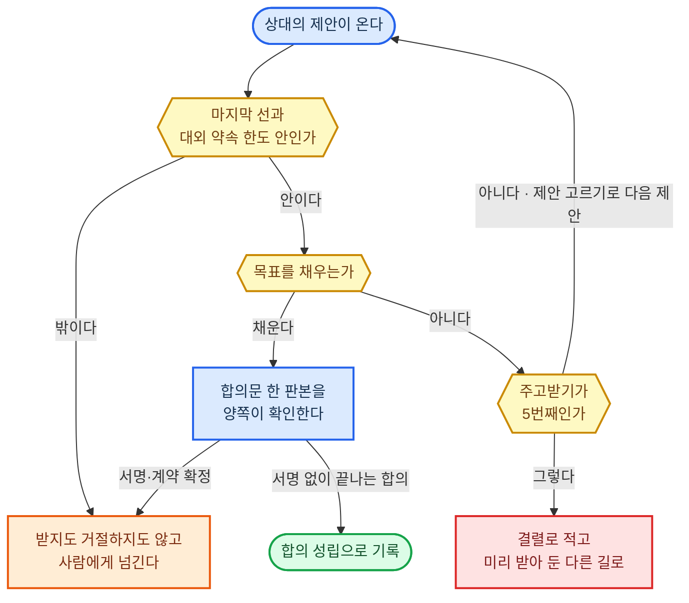
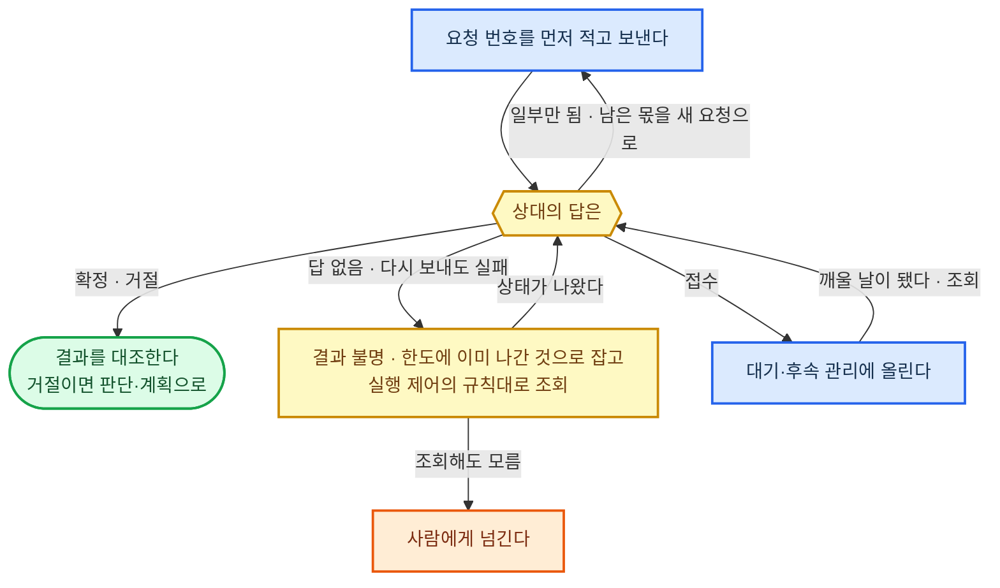
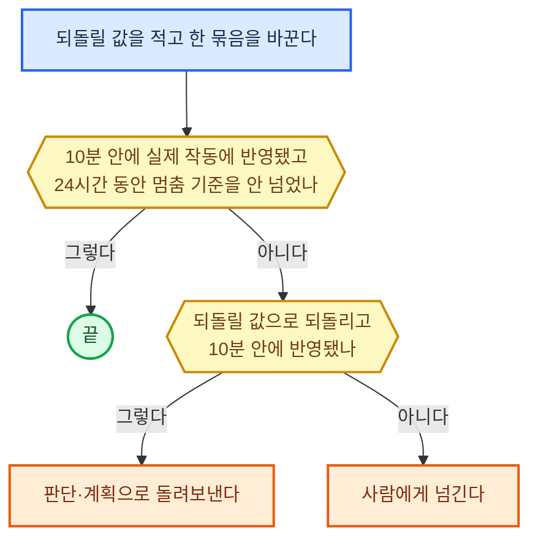
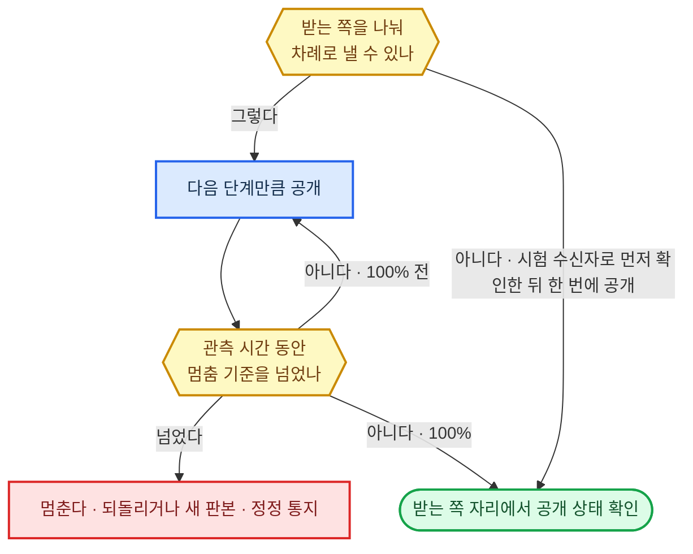
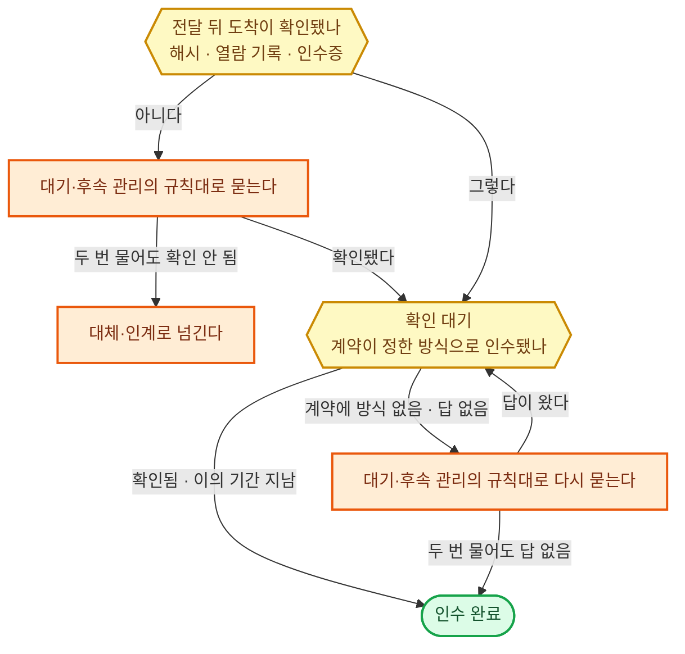

#### 결과물 만들기·수정

**원칙**

- 결과물은 받는 쪽이 쓰는 제작 프로그램에서 다시 열어 고칠 수 있는 원본 형식으로 만든다. 고칠 수 없는 형식(PDF·그림 파일 같은 것)은 원본에서 뽑아낸 납품본으로만 낸다.
- 고칠 때는 요청받은 부분만 고치고, 통째로 다시 만들지 않는다. 고친 뒤 전후 판본을 견주어 요청 밖에서 바뀐 곳이 하나도 없어야 끝난다.
- 요청 때문에 따라 바뀌는 목차·상호 참조·수식·연결 자산은 요청 밖 변경에 들지 않는다. 이것들은 함께 맞추고, 끊긴 참조가 하나라도 남으면 끝난 것이 아니다.
- 결과물마다 어떤 경로로 만들었는지와 그 경로에서 잃은 기능(다시 고칠 수 있는지, 수식·글꼴·연결이 살았는지)을 함께 남긴다.

**만드는 경로 고르기**

1. 원본 형식을 만드는 프로그램을 업무 도구·시스템이 정한 연결 방식으로 부를 수 있으면 그것으로 만든다.
2. 부를 수 없으면 능력 개선·확장으로 그 프로그램을 갖춘 뒤 1로 간다.
3. 갖출 수 없으면 편집 기능이 남는 대체 형식이나 중간 형식으로 만들고, 받는 쪽과 그 형식을 맞춘다.
4. 그래도 안 되면 사람에게 넘긴다.

**환경별 정답**

| 구분 | ① 에이전트 하네스 | ②·③ 사내 서버 |
|------|------|------|
| 만드는 자리 | 건 폴더(하네스 샌드박스 안) | 건마다 띄운 격리 컨테이너(분리 실행의 정답) |
| 제작 프로그램 | 셸에서 부르는 제작 프로그램의 명령줄 | 같은 프로그램을 컨테이너에 담아 부른다 |
| 부분 고치기 | 글 파일은 하네스의 파일 편집 도구, 구조가 있는 파일은 그 형식의 편집 라이브러리로 해당 요소만 | 그 형식의 편집 라이브러리로 해당 요소만 |
| 낸 판본 | 건 폴더에 두고 파일 해시를 건 파일에 적는다 | 해시 창고 |
| 직종이 채운다 | 형식별 제작 프로그램과 편집 라이브러리 목록 | 같다 |

---

#### 사람과 소통

이 절의 상대는 맡긴 사람이 아닌 바깥 사람(고객·상대방·관계자)이다. 맡긴 사람과의 대화는 지시·의도 파악이 맡는다.

**원칙**

- 상대에게 설명한 뒤에는 상대가 자기 말로 핵심을 되말하게 해서 이해를 확인한다. "이해되셨나요" 같은 예·아니오 물음은 확인으로 치지 않는다.
- 대화가 끝나면 합의한 것·아직 다른 것·다음 할 일과 기한을 글로 적어 상대에게 보내고 확인받는다. 확인 답이 오기 전에는 합의로 기록하지 않고 대기·후속 관리에 올린다.
- 말한 내용이 근거가 될 상대(목격자·민원인·면담 대상)에게는 답을 암시하는 질문을 하지 않는다. 열린 질문부터 묻고, 답은 요약하지 않고 원문으로 남긴다.
- 상대나 제3자에게 묻기 전에, 그 접촉이 증거를 없애게 하거나 말을 서로 맞추게 하거나 우리 사정을 알릴 위험이 있는지 판정한다. 위험이 있으면 묻는 순서·통로·문구를 먼저 정하고, 판정이 서지 않으면 사람에게 넘긴다.
- 회사를 묶는 말(금액·기한·조건)은 업무 권한의 대외 약속 한도 안에서만 한다.

**통로 고르기**

1. 법·계약·제출처가 정한 통로가 있으면 그것만 쓴다. 예: 서면 통지, 지정 접수 창구.
2. 없으면 상대가 먼저 연락해 온 통로로 답한다. 우리가 먼저 연락할 때는 상대가 알려 둔 연락처로 한다.
3. 상대가 알려 둔 연락처가 여럿이면 글이 남는 쪽(메일·메신저)을 고른다.

**환경별 정답**

| 구분 | ① 에이전트 하네스 | ②·③ 사내 서버 |
|------|------|------|
| 글 | 메일·메신저를 업무 도구·시스템의 연결 방식으로 | 같다 |
| 음성 | 맡지 않고 ②로 넘긴다 | 실시간 대화의 통화 서버 |
| 오간 말의 원문 | 건 폴더 | 해시 창고 |
| ③ 추가 | — | 음성을 맡지 않는다 |
| 직종이 채운다 | 법·계약이 통로를 정해 둔 행위, 말한 내용이 근거가 되는 상대의 종류 | 같다 |

---

#### 협상·조율

**원칙**

- 시작 전에 맡긴 사람에게서 네 가지를 글로 받는다: 목표, 물러설 수 있는 마지막 선, 합의가 안 될 때 택할 가장 나은 다른 길, 항목별 중요도 순서. 하나라도 없으면 제안하지 않는다.
- 제안은 마지막 선과 업무 권한의 대외 약속 한도 안에서만 한다. 주고받기는 5번까지다. 선 밖의 요구, 결렬, 서명·계약 확정은 아래 그림대로 간다.
- 마지막 선·다른 길·맡긴 사람의 속사정은 상대에게 보내는 글과 말에 넣지 않는다. 나가기 전에 이 셋이 섞였는지 대조한다.
- 음성으로 협상할 때는 통화 전에 제안 고르기 1~3단계로 뽑은 선 안의 제안 목록만 올리고, 마지막 선과 다른 길은 올리지 않는다. 목록 밖의 새 조건은 통화 중에 약속하지 않고 글로 확정한다.
- 여러 부서·당사자 사이의 조율은 각자의 요구와 조정할 수 있는 범위를 한 표에 모은 뒤, 조건 안에서 최선 찾기로 후보 안을 만든다.

**제안 고르기**

1. 마지막 선이나 대외 약속 한도 밖의 안은 뺀다.
2. 남은 안을 맡긴 사람의 항목별 중요도로 값을 매기고, 이번에 물러서는 폭 안에 드는 안만 남긴다. 폭은 직무마다 정한다. 기본값은 첫 양보가 남은 여유(직전 제안과 마지막 선 사이)의 3분의 1 이하, 그다음부터는 매번 직전 양보보다 작게다.
3. 남은 안 가운데 맡긴 사람에게 값이 같은 안을, 상대가 밝힌 관심사를 많이 채우는 순으로 2~3개 골라 한꺼번에 낸다. 상대가 어느 안을 고르는지로 상대의 우선순위를 알아낸다.

**환경별 정답**

| 구분 | ① 에이전트 하네스 | ②·③ 사내 서버 |
|------|------|------|
| 음성으로 하는 협상 | 맡지 않고 ②로 넘긴다 | 실시간 대화의 통화 서버 |
| 합의문 판본 | 건 폴더에 두고 파일 해시를 건 파일에 적는다 | 해시 창고 |
| ③ 추가 | — | 음성을 맡지 않는다 |
| 직종이 채운다 | 협상 항목의 종류와 항목별 값 매기는 법 | 같다 |

---

#### 기록 입력·수정

**원칙**

- 대상마다 어느 시스템의 기록이 기준(정본)인지 먼저 정하고, 정본에만 쓴다. 사본에 먼저 쓰고 나중에 맞추지 않는다.
- 확인과 쓰기를 한 번에 할 수 있는 시스템에서는 그렇게 한다. 판본은 읽을 때의 판본이 그대로일 때만 쓰고, 새 기록은 같은 거래 번호·요청 번호의 기록이 없을 때만 넣는다. 판본이 달라져 쓰기가 막히면 다시 읽어 바꿀 범위를 새로 맞춘다. 못 하는 시스템은 아래 고르기 3단계대로 한다.
- 여러 건을 한꺼번에 바꾸거나 지울 때는 바뀔 기록 목록과 전후 값을 먼저 뽑아 둔다. 실행 뒤 실제로 바뀐 목록과 한 건도 다르지 않아야 끝난다.
- 고칠 때는 전 값·새 값·근거·명의를 변경 이력으로 남긴다. 지울 때는 무엇을·언제·왜 지웠는지만 남기고, 지운 값은 원본 표에도 변경 이력에도 남기지 않는다. 먼저 뽑아 둔 목록의 지운 값은 대조가 끝나면 함께 지운다.
- 법정 보존 기간이 남은 기록은 지우지 않는다.

**겹쳐 쓰기 막는 방식 고르기**

1. 대상 시스템이 확인과 쓰기를 한 번에 해 주면(읽을 때 받은 판본 번호가 그대로일 때만 쓰기, 같은 번호의 기록을 두 번 받지 않기) 그것을 쓴다.
2. 없고 편집 잠금을 주면, 잠근 뒤 다시 읽고 쓰고 푼다.
3. 둘 다 없으면 쓰기 직전에 다시 읽어 견주고, 다른 값이 끼어들었으면 쓰지 않은 채 사람에게 넘긴다. 쓴 뒤 곧바로 다시 읽어, 기록이 둘이면 우리가 넣은 것을 되돌리고 사람에게 넘긴다. 쓴 뒤에 다른 값이 끼어든 것이 보이면 되돌리지 않고 사람에게 넘긴다.

**환경별 정답**

| 구분 | ① 에이전트 하네스 | ②·③ 사내 서버 |
|------|------|------|
| 쓰는 길 | 업무 도구·시스템의 연결 방식 | 같다 |
| 우리 쪽 변경 이력 | 건 폴더의 건 파일 | PostgreSQL |
| 직종이 채운다 | 대상별 정본 시스템, 그 시스템이 주는 겹쳐 쓰기 막는 기능 | 같다 |

---

#### 신청·거래 처리

**원칙**

- 요청 번호를 적고 보내기, 다시 보내기, 결과 조회는 실행 제어의 규칙대로 한다.
- 조회할 번호는 이 순서로 고른다. 상대가 요청 번호로 조회하게 해 주면 그 번호로 조회한다. 번호는 받지만 조회하는 길이 없으면 같은 번호로 다시 보내 돌아온 결과가 조회다. 번호를 받지 않으면 상대 쪽에 남는 참조 칸(주문 번호·거래 메모)에 실어 둔 우리 번호로, 참조 칸도 없으면 금액·대상·보낸 시각을 함께 맞춰 조회한다.
- 결과는 접수·확정·거절·부분 처리·결과 불명 다섯 가운데 하나로 적는다. 접수는 대기·후속 관리에 올려 그 규칙대로 깨워 조회한다. 결과 불명인 동안 그 금액·수량은 이미 나간 것으로 한도에 잡아 둔다. 상대의 알림은 깨우는 신호로만 쓰고, 상태는 조회 결과로 바꾼다.
- 부분 처리는 남은 몫만, 취소·변경·환불은 원거래에 이어 붙인 새 거래로 한다. 둘 다 새 요청 번호로 이 절을 처음부터 거친다. 이미 생긴 비용과 바깥 결과는 기록에서 지우지 않는다.
- 상대의 거래 내역과 우리 기록을 한 줄씩 맞춰 본다. 주기는 직무마다 정하고 기본값은 하루 한 번이다. 어긋난 줄은 결과 불명으로 돌린다.

**환경별 정답**

| 구분 | ① 에이전트 하네스 | ②·③ 사내 서버 |
|------|------|------|
| 요청 번호와 상태 | 건 폴더의 건 파일 | PostgreSQL |
| 직종이 채운다 | 거래처별 요청 번호·번호 조회 지원 여부와 참조 칸 | 같다 |

---

#### 설정·작동 제어

**원칙**

- 바꾸기 전에 지금 값을 되돌릴 값으로 적어 둔다. 적지 못했으면 바꾸지 않는다. 되돌릴 수 없는 설정(열쇠 폐기·계정 삭제)은 되돌릴 값과 아래 시험 대신 사람의 승인을 받고 한다.
- 한 번에 한 묶음만 바꾸고, 반영을 확인한 뒤 다음 묶음을 바꾼다. 반영은 설정 화면의 값이 아니라 실제 작동으로 확인한다. 예: 접근 권한을 거뒀으면 그 계정의 접근이 실제로 막히는지 본다.
- 반영을 기다리는 시간은 기본 10분, 바꾼 뒤 멈춤 기준을 지켜보는 관측 기간은 기본 24시간이다. 운영 중 조정은 한 번에 지금 값의 20% 이내로 하고, 다음 조정은 관측 기간이 끝난 뒤 한다. 폭을 넘는 조정은 사람에게 넘긴다.
- 설정 종류마다 처음 쓰기 전에 바꾸기와 되돌리기를 시험 환경에서 해 본다. 시험 환경을 만들 수 없는 대상은 시험 환경의 예행 규칙을 따른다.

**바꾸는 방식 고르기**

1. 대상이 원하는 상태를 파일에 적어 두면 그대로 맞춰 주는 방식을 공식으로 주면 그것을 쓴다. 적어 둔 파일이 판본이 되고, 되돌리기는 옛 판본을 다시 적용하는 것이다.
2. 없으면 업무 도구·시스템의 연결 방식으로 하나씩 바꾼다.

**환경별 정답**

| 구분 | ① 에이전트 하네스 | ②·③ 사내 서버 |
|------|------|------|
| 적용과 되돌릴 값 | 건 폴더의 상태 파일을 셸에서 대상의 적용 명령으로, 되돌릴 값은 건 파일에 | 같은 파일을 격리 컨테이너에서 대상의 적용 명령으로, 되돌릴 값은 PostgreSQL에 |
| 직종이 채운다 | 대상별 멈춤 기준, 되돌릴 수 없는 설정 목록, 반영·관측 시간이 기본값과 다른 대상 | 같다 |

---

#### 게시·배포

**원칙**

- 요청 번호를 적고 보내기, 다시 보내기, 결과 조회는 실행 제어의 규칙대로 한다.
- 내보낼 판본은 검증을 통과한 판본 하나로 해시를 붙여 고정하고, 한 글자라도 바뀌면 검증부터 다시 한다. 내보내기 전에 멈춤 기준(오류율·불만 수·핵심 지표)을 숫자로 정하고 되돌리는 방법을 준비한다. 기준을 넘으면 사람을 기다리지 않고 멈춘다.
- 공개 뒤에는 로그인하지 않은 상태와 대상 밖 계정으로 열어, 보여야 할 곳에 보이고 보이면 안 될 곳에 안 보여야 끝난다.
- 되돌려도 이미 받아 간 것은 남는다. 앱 마켓처럼 받은 쪽을 되돌릴 수 없는 게시처는 멈추고 고친 판본을 새로 낸다. 이미 받은 사람이 있으면 따로 정정 통지를 낸다.

**공개 방식 고르기**

1. 받는 쪽을 나눠 차례로 낼 수 있으면(게시처의 단계 공개 기능, 받는 사람을 나눠 보내기) 단계 공개로 한다. 게시처가 정한 일정이 있으면 따르고, 없으면 5% → 25% → 100%다. 단계 사이 관측 시간은 기본 앱·서비스 판본 24시간, 발송 1시간이다.
2. 나눌 수 없으면 시험 수신자나 비공개 미리 보기로 먼저 내 보고, 받는 쪽 화면에서 확인한 뒤 한 번에 공개한다.

**환경별 정답**

| 구분 | ① 에이전트 하네스 | ②·③ 사내 서버 |
|------|------|------|
| 공개 상태 확인 | 하네스의 브라우저 조작 도구로 로그인 없이 | 격리 공간의 브라우저 자동화 도구로 로그인 없이 |
| 고정 판본·요청 번호 | 건 폴더(해시·번호는 건 파일에) | 판본은 해시 창고, 번호는 PostgreSQL |
| 직종이 채운다 | 게시처별 단계 공개·되돌리기 가능 여부, 멈춤 기준 지표 | 같다 |

---

#### 납품 준비

**원칙**

- 인수 조건 항목마다 그것을 채우는 파일과 검사 기록을 하나씩 짝지은 대조표를 만든다. 짝이 없는 항목은 미완료로 적어 묶음에 그대로 드러낸다.
- 검사 기록은 지금 묶는 판본과 해시가 같은 판본의 것만 쓴다. 이전 판본의 검사로 채우지 않는다.
- 묶음에는 파일마다 해시를 적은 목록을 넣어, 받는 쪽이 온전히 받았는지 스스로 확인할 수 있게 한다.
- 인수에 필요 없는 고객 비밀·내부 기록·다른 고객의 자료는 넣지 않는다.
- 인계 자료는 받는 사람이 우리에게 묻지 않고 이어 갈 수 있어야 한다. 새 대화에 인계 묶음만 주고 다음 할 일·담당·기한을 말하게 해서, 원래 계획과 맞아야 끝난다.

**묶는 형식 고르기**

1. 계약·제출처가 형식과 파일 구성을 정해 두었으면 그것을 따르고, 대조표와 해시 목록은 그 형식이 허락하는 자리에 넣는다.
2. 정해 둔 것이 없으면 BagIt(파일 목록과 해시를 함께 담는 공개 묶음 규격) 폴더를 압축 파일 하나로 묶는다.

**환경별 정답**

| 구분 | ① 에이전트 하네스 | ②·③ 사내 서버 |
|------|------|------|
| 묶는 자리 | 건 폴더 | 건마다 띄운 격리 컨테이너 |
| BagIt 묶기 | 셸에서 bagit-python(미국 의회도서관이 관리하는 도구) | 같은 도구를 컨테이너에서 |
| 묶음 보관 | 건 폴더에 두고 묶음 해시를 건 파일에 적는다 | 해시 창고 |
| 직종이 채운다 | 결과물 종류별로 함께 넣을 원본·연결 자산·사용 설명 | 같다 |

---

#### 전달·인수 확인

**원칙**

- 요청 번호를 적고 보내기, 다시 보내기, 결과 조회는 실행 제어의 규칙대로 한다.
- 상태는 전달·확인 대기·인수 완료 셋이다. 도착은 경로마다 다르게 확인한다: 파일 전달은 받는 쪽에서 잰 해시, 공유 주소는 열람 기록, 우편·현장 인도는 인수증. 파일이 없는 서비스·거래는 원천 시스템의 상태로 본다. 도착이 확인되지 않으면 대기·후속 관리의 규칙대로 받는 쪽에 묻고, 두 번 물어도 확인되지 않으면 그 규칙의 대체·인계로 넘긴다. 도착이 확인되지 않은 것은 인수 완료로 보지 않는다.
- 인수 완료는 계약이 정한 확인 방식(검수 확인서·시운전 확인·이의 기간)으로 적는다. 계약에 없으면 대기·후속 관리의 규칙대로 두 번 묻고, 그래도 답이 없으면 그 규칙의 대체로 인수 완료로 본다. 계약에 없는 사람 확인 절차는 덧붙이지 않는다.
- 검증 단계에서 확인한 것은 그 기록을 쓰고, 받는 쪽 환경이 다를 때만 그 환경에서 다시 확인해 달라고 요청한다. 문제·수정 요청이 오면 무엇이·어느 판본에서·어떤 환경에서 안 되는지 정리해 알린다. 받는 사람만 열어야 하는 결과는 받는 사람 계정으로만 열리는 공유로 보내고, 인수 완료 뒤 공유를 거둔다.

**전달 경로 고르기**

1. 계약·제출처가 경로를 정해 두었으면 그것을 쓴다.
2. 정해 둔 것이 없으면 도착을 우리가 확인할 수 있는 경로(받는 사람 계정 공유, 수신 확인이 되는 통로)를 쓰고, 그런 경로가 없으면 우편·현장 인도로 하고 인수증을 받는다.

**환경별 정답**

| 구분 | ① 에이전트 하네스 | ②·③ 사내 서버 |
|------|------|------|
| 상태·요청 번호 | 건 폴더의 건 파일 | PostgreSQL |
| 직종이 채운다 | 결과물 종류별 인수 확인 방식, 법이 정한 검수 기한 | 같다 |

---

#### 관찰·측정

**원칙**

- 재기 전에 대상·항목·단위·방법·시점과 허용 오차를 정한다. 허용 오차를 맞추지 못하는 도구와 원천 값은 쓰지 않는다.
- 처음 쓰는 측정 도구는 답을 아는 대상으로 먼저 재서 허용 오차 안에 드는지 본다.
- 값마다 잰 시각(시간대 포함)·도구와 그 판본·당시 조건·잰 주체를 함께 적고, 원본(사진·녹음·기기 출력)을 남긴다.
- 빠진 값과 믿기 어려운 값은 0이나 앞뒤 값으로 채우지 않고 빈칸과 까닭으로 표시한다.
- 사람에게 물어 얻은 값은 누구에게·언제·어느 통로로 들었는지와 함께 같은 시계열에 담되, 기계로 잰 값과 같은 근거 등급으로 섞지 않는다.

**재는 수단 고르기**

1. 원천 시스템이 이미 재어 남기는 값(기록·지표)이 허용 오차를 맞추면 그것을 읽는다. 새로 재지 않는다.
2. 없거나 맞추지 못하면 허용 오차를 맞추는 도구로 직접 잰다. 그런 도구가 여럿이면 값을 표준 형식(OpenTelemetry)으로 내는 쪽을 고른다.
3. 기계로 잴 수 없으면 사람의 관찰이나 답으로 얻고, 근거 등급을 낮춰 적는다.

**환경별 정답**

| 구분 | ① 에이전트 하네스 | ②·③ 사내 서버 |
|------|------|------|
| 직접 재기 | 셸에서 부르는 측정 도구 | 같은 도구를 격리 컨테이너에서 |
| 값 모으기 | 도구 출력을 건 폴더의 건 파일에 | OpenTelemetry로 모으고, 판단에 쓴 값은 PostgreSQL의 건 기록에 옮긴다 |
| 사진·영상·음성 원본 | 건 폴더 | 해시 창고 |
| 직종이 채운다 | 대상별 측정 항목·허용 오차·측정 도구, 원천 시스템의 지표 목록 | 같다 |

---

#### 실험

**원칙**

- 시작 전에 한 장으로 고정한다: 알아낼 질문, 가설, 바꿀 것, 주 측정값 하나, 대조군, 무작위 배정, 표본 수, 기간, 중단 기준, 예산. 시작 뒤에는 주 측정값과 표본 수를 바꾸지 않는다.
- 표본 수는 알아내려는 가장 작은 차이로 미리 계산한다. 가장 작은 차이는 직종이 채우고 기본값은 주 측정값의 5% 변화다. 유의 수준은 5%, 검정력은 80%다.
- 정한 표본에 닿기 전에는 결과를 보고 끝내지 않는다. 도중에 멈추는 것은 미리 정한 해로움 기준을 넘었을 때뿐이다.
- 분석 전에 배정 비율이 설계와 맞는지 카이제곱 검정으로 보고, p가 0.0005보다 작으면 결과를 쓰지 않고 원인부터 찾는다. 측정값이나 안을 여럿 견줄 때는 견준 횟수만큼 판정 기준을 보정한다.
- 불리한 결과와 실패한 실험도 지우지 않고 남긴다. 시험 환경에서 본 것을 실제 운영 성과로 쓰지 않는다.

**실험 방법 고르기**

1. 실제 대상에게 해 볼 수 없으면(위험·비용·권한) 시험 환경이나 시뮬레이션으로 한다.
2. 해 볼 수 있고, 대상을 무작위로 나눠 기간 안에 계산한 표본 수를 채울 수 있으면 두 안을 나눠 보여 주는 무작위 대조 실험을 한다.
3. 표본 수를 채울 수 없으면 소수 대상에게 과업을 시키고 관찰하는 사용자 조사로 방향만 얻는다. 차이의 크기는 주장하지 않는다.

**환경별 정답**

| 구분 | ① 에이전트 하네스 | ②·③ 사내 서버 |
|------|------|------|
| 나눠 보여 주기 | 게시처가 주는 실험 기능(광고 플랫폼의 실험, 앱의 기능 스위치) | 같다 |
| 표본 수 계산·분석 | 셸에서 SciPy·statsmodels | 격리 컨테이너에서 SciPy·statsmodels |
| 실행 환경·관측 원본 | 건 폴더 | 해시 창고 |
| 직종이 채운다 | 주 측정값 후보, 가장 작은 차이, 배정 어긋남 판정선, 해로움 기준 | 같다 |

---

#### 시뮬레이션

**원칙**

- 시작 전에 가정·모형·입력 범위·비교할 대안과, 무엇을 알면 끝인지를 적는다.
- 쓰기 전에 실제 관측이 있는 과거 사례를 하나 이상 모형으로 다시 돌려, 결과가 관측과 10% 안으로 맞는지 본다. 이 오차는 직종이 채운다. 맞춰 볼 관측이 없으면 결과에 "현실 대조 없음"을 붙인다.
- 핵심 가정마다 값을 흔들어 결론이 뒤집히는 가정을 찾아 적는다. 무작위가 들어가는 모형은 난수 시작값을 적고 기본 1,000번 돌려 결과를 범위로 낸다.
- 과거 자료로 돌릴 때는 그 시점에 알 수 있던 자료만 넣는다.
- 역할 연기에서 상대 역은 새 대화가 맡고, 우리 쪽 계획과 마지막 선을 보여 주지 않는다.
- 모의 결과는 실제 증거로 세지 않는다. 같은 모형으로 되풀이해 통과한 결과는 증거 하나로만 센다.

**시뮬레이션 방법 고르기**

1. 대상의 움직임이 물리 법칙으로 정해지면(구조·열·유체·회로) 공학 해석 프로그램으로 계산한다.
2. 과거 자료가 쌓인 되풀이 현상(수요·대기 줄·가격)이면 그 자료로 모형을 맞춰 확률 모의나 과거 자료 되돌려 보기(백테스트)를 한다.
3. 사람의 반응이 결과를 정하면(협상·응대·장애 대응 연습) 역할 연기로 한다.
4. 과거 자료도 법칙도 없는 새 상황(주문이 갑자기 는 배송 흐름)은 단계별 처리 규칙과 걸리는 시간을 가정으로 적어 규칙 기반 흐름 모형으로 돌린다.

**환경별 정답**

| 구분 | ① 에이전트 하네스 | ②·③ 사내 서버 |
|------|------|------|
| 확률 모의·백테스트 | 셸에서 NumPy·SciPy, 대기 줄은 SimPy | 격리 컨테이너에서 같은 도구 |
| 규칙 기반 흐름 모형 | 셸에서 SimPy | 격리 컨테이너에서 SimPy |
| 공학 해석 | 직종이 정한 해석 프로그램을 셸에서 | 같은 프로그램을 격리 컨테이너에서 |
| 역할 연기 | 새 하위 에이전트가 상대 역 | 주 모델의 새 대화가 상대 역 |
| 30분 넘는 계산 | 분리 실행의 시간 상한을 직종이 늘려 따로 돌린다 | 같다 |
| 직종이 채운다 | 해석 프로그램, 대상별 모형·맞춰 볼 과거 사례·허용 오차 | 같다 |
