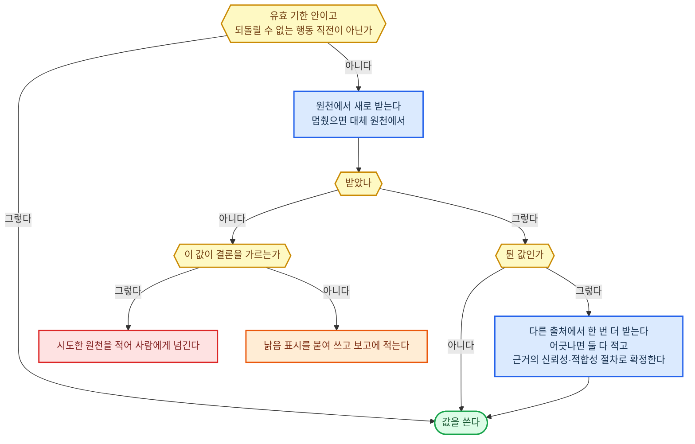
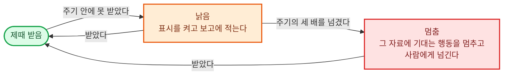

#### 근거의 신뢰성·적합성

원문 한 조각에 출처·판본·시점 같은 꼬리표를 붙인 기록을 **자료 카드**라 한다.

**원칙**

- 믿을 만한지(이 재료)와 시점이 맞는지(자료의 시점·버전)는 따로 검사하고 결과도 따로 남긴다.
- 사진·영상·녹취·계측값·말로 한 진술도 글과 같은 등급 매기기를 거친다. 누가·무엇으로·언제·어떤 조건에서 얻었는지와 원본 파일·기기 기록이 남았는지를 함께 적는다.
- 근거마다 등급과 그 이유를 적고, 결론마다 기댄 근거를 잇는다. 등급이 없는 근거에 기댄 결론은 내보내지 않는다.
- 같은 첫 출처를 옮긴 자료는 몇 개든 근거 하나로 센다. 첫 출처까지 따라가지 못했으면 서로 독립이라고 적지 않는다.
- 사실을 단정하는 결론에는 원본이나 구속 규칙 등급의 근거가 하나 이상 있어야 한다. 참고·사후 작성 등급뿐이면 추정으로 적는다. 직무마다 결론 종류별로 이 선을 더 높일 수 있다.
- 같은 사실을 두고 근거끼리 어긋나면 등급으로 한쪽을 버리지 않는다. 더 확인해서 어느 쪽이 맞는지 확정하고, 확정하지 못하면 어긋난 채로 두고 조건을 달아 결론을 낸다. 다른 재료가 "먼저 믿을 쪽"을 정해 두었어도 확정은 이 절차로 한다.

**근거 등급 매기기**

1. 판정할 곳이 받아 주지 않는 근거와 허용되지 않은 경로로 얻은 근거는 "못 씀"으로 두고 등급을 매기지 않는다. 판정할 곳이 무엇을 받아 주는지는 규칙·기준 원문에서 읽는다.
2. 구속력으로 넷 가운데 하나를 준다. 원본(그 사실을 직접 담은 원천 기록·원 파일), 구속 규칙(따라야 하는 규칙의 원문), 참고(해설·연구·남이 정리한 것), 사후 작성(다툼이나 요청이 생긴 뒤 한쪽이 만든 것). 둘에 걸치면 낮은 쪽을 준다.
3. 같은 등급 안에서는 원천 기록이나 제3자 기록과 맞춰 본 근거를 맞춰 보지 못한 근거보다 앞에 둔다.
4. 같은 사실에 어긋나는 근거가 확정되지 않고 남으면 판정할 곳이 채택할 가능성이 높은 순으로 줄 세우고 이유를 한 줄씩 적는다.

**환경별 정답**

| 구분 | ① 에이전트 하네스 | ②·③ 사내 서버 |
|------|------|------|
| 등급 기록 | 건 파일에 근거마다 등급·이유·첫 출처 | 자료 카드의 꼬리표 |
| 결론을 내보내기 전 기계 검사(등급 없는 근거, 추정을 단정으로 쓴 곳) | 하네스 훅이 셸에서 OPA 실행 파일 하나를 돌린다. 규칙은 ②·③과 한 벌 | OPA |
| 뜻을 따지는 검사(첫 출처가 같은지, 이 건에 맞는 근거인지) | 새 하위 에이전트 | 새 대화의 주 모델 |

---

#### 자료의 시점·버전

자료마다 시각을 둘로 나눠 적는다. 그 내용이 현실에서 맞거나 효력이 있던 기간을 **효력 기간**, 우리가 그것을 받아 적은 때를 **기록 시각**이라 한다.

**원칙**

- 자료마다 효력 기간과 기록 시각을 따로 적고, 발행·관측 시각과 판본 번호도 남긴다. 그래야 "지금 아는 것으로 본 과거"와 "그때 알던 것"을 가를 수 있다.
- 새 판본이 와도 옛 판본을 지우거나 덮지 않는다. 소급 정정이 와도 정정 전 판과 그 판으로 내린 판단을 그대로 둔다.
- 결론과 지식 문장마다 기댄 원문의 판본과 위치를 잇는다. 판본 없이 문서 이름만으로 잇지 않는다.
- 날짜 표시 없이 조용히 바뀌는 자료(플랫폼 정책·누리집 안내)는 우리가 읽은 시각을 그 판의 시작으로 본다.

**쓸 판본 고르기**

모든 재료가 판본을 고를 때 이 규칙 하나를 쓴다.

1. 판단 대상 시점을 정한다. 건에 기준일이 적혀 있으면 그날, 없으면 판단할 일이 일어난 날, 앞으로 할 일이면 실행할 날이다.
2. 그 시점에 효력이 있던 판본을 고른다.
3. 새 판본의 부칙·경과조치가 그 일에 새 판을 적용하라고 정하고 있으면 새 판으로 바꾼다.
4. 같은 시점을 가리키는 판이 정정 전후로 둘이면 정정된 판을 쓴다. 당시 판단이 옳았는지 되짚는 일이면 그때 기록돼 있던 판을 쓴다.

**환경별 정답**

| 구분 | ① 에이전트 하네스 | ②·③ 사내 서버 |
|------|------|------|
| 판본 보관 | 건 폴더와 직무 자료 폴더에 판본마다 따로 받은 원문 파일 | 해시 창고에 판본마다 따로, 덮어쓰기를 막아 둔다 |
| 효력 기간·기록 시각 | 건 파일에 두 칸으로 | PostgreSQL에 두 시간 축으로 |

---

#### 규칙·기준 원문

**원칙**

- 원문은 받은 그대로 두고 한 글자도 고치지 않는다. 남이 줄인 요약·해설은 원문 자리에 넣지 않는다. 해설은 적용 사례나 참고 자료로 간다.
- 원문으로 치는 것은 원천에서 내려받은 파일 그대로다. 가져오면서 요약해 주는 도구(①의 하네스 웹 가져오기)로 받은 글은 원문으로 치지 않는다.
- 원문은 그 문서의 번호 체계 한 덩어리(조·항·호, 번호 체계가 다르면 절·항목·부속서·표) 단위로 자르고 쪽 수로 자르지 않는다. 조각마다 어느 문서의 몇 번인지 적는다.
- 통째로 쌓을 수 없는 유료 표준·규격은 산 판본·절·표 번호와 열어 본 기록만 남기고, 결론에 쓸 때마다 그 자리를 다시 연다.
- 원문을 아직 못 구한 규칙은 미확보 목록에 올리고, 그 규칙에 기대는 결론은 가정으로 적는다.
- 받은 원문을 다시 확인하지 않고 써도 되는 기간(유효 기한)은 하루다. 직무마다 바꿀 수 있다. 계약서는 계약·합의 조건이 담는다.

**받는 곳 고르기**

1. 규칙을 낸 기관이 연 프로그램 창구가 있으면 거기서 받는다.
2. 창구가 없으면 그 기관의 공식 배포 문서·공식 누리집에서 받는다. 로그인해야 보이는 공지, 메일로만 오는 통지, 관리 화면 알림도 이 단계이며 받은 화면·메일 원문을 그대로 붙여 둔다.
3. 돈을 내야 보는 것은 발행 기관에서 사거나 구독한다. 값이 비용·위험 한도 안이면 바로 사고, 넘으면 사람의 결재를 받는다.
4. 셋 다 안 되면 낸 기관에 원문을 요청하고, 받을 때까지 미확보로 둔다. 남이 옮겨 적은 것으로 대신하지 않는다.

**환경별 정답**

| 구분 | ① 에이전트 하네스 | ②·③ 사내 서버 |
|------|------|------|
| 한국 법령·행정규칙·자치법규·조약·별표 | 국가법령정보 공동활용 Open API를 셸에서 직접 불러 파일로 받는다 | 국가법령정보 공동활용 Open API |
| 그 밖의 공식 문서 | 셸에서 원 파일을 내려받는다 | 원 파일을 내려받아 해시 창고에 둔다 |
| 로그인 공지·메일 통지 | 업무 도구·시스템이 연결한 전용 계정으로 읽고, 시작 신호가 받아 넘긴 원문을 그대로 둔다 | 같다 |
| 조각 색인 | 직무 자료 폴더에 조각 파일 | OpenSearch |

---

#### 업무별 정보

**원칙**

- 원천 시스템의 기록을 남이 정리해 준 표보다 앞세운다. 정리본은 원천에서 다시 뽑아 맞춰 본 뒤에만 쓴다.
- 사람에게 들은 것은 녹취·메일·문서 원문을 남기고, 말한 사람과 그 사람의 이해관계, 진술·증거·추정 가운데 무엇인지를 적는다. 돈을 낸 사람, 자료를 준 사람, 결정권자를 갈라 적는다.
- 말과 시스템에 남은 행동 기록이 어긋나면 행동 기록을 먼저 믿되, 근거의 신뢰성·적합성의 절차로 확정한다.
- 업무에 필요 없는 개인정보(주민등록번호·계좌번호 등)는 받을 때부터 담지 않는다.
- 계약서는 계약·합의 조건이 받는다.

**받는 길 고르기**

1. 받을 권한이 있는 원천 시스템의 창구에서 직접 뽑는다. 권한이 없으면 업무 권한이 정한 절차로 신청하고 다음 영업일까지 기다린다. 그때까지 허가가 없으면 2단계로 간다. 시스템이 멈춰 있으면 1시간 뒤 한 번 더 뽑고, 그래도 멈춰 있으면 2단계로 간다.
2. 창구가 막혀 있으면 그 시스템이 내보내는 파일(명세서·거래 내역서·내보내기 파일)을 받아 읽는다.
3. 그것도 없으면 고객·거래처에 원본 문서(영수증·발급 증명·거래 명세서)를 요청한다.
4. 여기까지 못 얻은 것만 가정 목록에 올리고, 밟은 단계와 다시 시도할 날(기본은 다음 영업일)을 적는다. 사람의 말로 원천 기록을 대신하지 않는다.

**환경별 정답**

| 구분 | ① 에이전트 하네스 | ②·③ 사내 서버 |
|------|------|------|
| 원천에서 뽑기 | 업무 도구·시스템이 연결한 CLI·MCP | 원천 시스템의 공식 API |
| 사람에게 들은 원문 | 건 폴더에 원 파일 | 해시 창고에 원 파일, 갈라 적은 내용은 자료 카드 |

---

#### 정보·자료 이해

**원칙**

- 뽑은 내용마다 원본 위치(쪽·표·칸·재생 시각·그림 속 자리)와 어느 길로 읽었는지를 붙인다. 위치가 없는 내용은 근거로 넘기지 않는다.
- 숫자·단위·고유명사는 원본 그대로 옮긴다. 바꿔 적어야 하면 원래 값을 옆에 둔다.
- 못 읽었거나 뜻이 흐린 자리는 추측으로 메우지 않고 "못 읽음"이나 "흐림"으로 표시해 넘긴다.
- 결론을 가르는 숫자·이름은 첫 번째와 다른 계열의 도구로 한 번 더 읽는다. 주 모델이 그 형식을 직접 받으면 주 모델(①의 주 모델은 사진을 받는다), 못 받으면 예비로 둔 다른 계열 공개 모델(문자는 Tesseract 한국어, 소리는 Whisper large-v3)로 읽는다. 두 읽기가 어긋난 곳만 사람에게 원본 확인을 받는다.
- 처음 보는 형식도 "못 읽음"으로 끝내지 않는다. 읽을 도구를 업무 도구·시스템으로 잇고, 안 되면 제공자에게 다른 형식으로 다시 받는다.

**읽는 길 고르기**

1. 주 모델이 그 형식을 직접 받으면 주 모델이 읽는다.
2. 못 받으면 주 모델이 받는 형식으로 바꿔서 읽힌다. 영상은 1초에 한 장씩 뽑은 그림과 소리로 나눈다.
3. 바꾸는 도구는 그 환경의 기계에서 돌고 사업에 써도 되는 공개 도구 가운데 고른다. 문서 형식은 한 도구로 hwp·hwpx·옛 오피스 형식을 모두 여는 것, 소리 파일 받아쓰기(실시간 대화가 아니다)는 실시간 대화가 고른 받아쓰기 모델을 함께 쓰고, 문자 인식은 한국어를 읽고 vLLM에서 도는 것 가운데 [OmniDocBench](https://github.com/opendatalab/OmniDocBench) 점수가 가장 높은 것이다.

**환경별 정답**

| 구분 | ① 에이전트 하네스 | ②·③ 사내 서버 |
|------|------|------|
| 글·PDF·그림 | 주 모델이 직접 읽는다(하네스가 넘겨준다) | 주 모델이 그림을 받으면 주 모델, 못 받으면 PaddleOCR-VL-1.6 |
| 한글(hwp·hwpx)·옛 오피스 형식 | LibreOffice에 H2Orestart 확장을 얹어 글로 바꾼다 | 같다 |
| 소리 파일 | 같은 PC에서 Qwen3-ASR-1.7B | 서버의 Qwen3-ASR-1.7B |
| ③ 추가 | — | 주 모델과 그 작업 메모리를 뺀 남은 메모리에 Qwen3-ASR-1.7B가 들어갈 때만 ③에서 돌리고, 아니면 ②로 넘긴다 |
| 영상 | ffmpeg로 그림과 소리를 나눈다 | 같다 |

---

#### 정보·자료 찾기

**원칙**

- 사실 문장은 검색 점수로 확정하지 않는다. 후보를 원문에서 열어 그 내용이 거기 있고 뜻이 같은지 확인한 뒤에만 쓴다.
- 개수·합계는 표 조회로만 센다. 검색 결과의 건수를 세어 답하지 않는다.
- 한 원천에서 찾는 말을 바꿔 가며 연달아 3번 새 후보가 없으면 다음 원천으로 넘어가 횟수를 0부터 다시 센다. 밟을 원천이 남지 않으면 멈추고, 돌린 질의·원천·시각을 못 찾음·없음 구분에 넘긴다. 3번은 기본값이고 직무마다 바꿀 수 있다.

**찾는 길 고르기**

1. 조문 번호·사건 번호·대상 번호처럼 정확한 번호가 있으면 그 번호로 원문을 바로 연다.
2. 개수·합계·기간 조건을 묻는 것이면 표 조회로 한다.
3. 글 속의 내용이면 원천을 이 순서로 밟는다. 우리 자료(낱말 검색과 뜻 검색을 등수로 합친 상위 20개를 주 모델이 읽어 추린다), 공식 기관 창구 검색, 웹 검색, 사람·기관에 묻기(사람과 소통이 한다). 재순위 모델은 쓰지 않는다.
4. 웹 검색 창구는 새로 가입할 수 있고 사업 이용 조건과 요금이 공개된 공식 검색 API 가운데 고른다. 한국어는 인터넷트렌드 국내 검색 점유율이 가장 높은 엔진의 것, 그 밖의 언어는 자기 색인에서 낱말로 찾고 결과에 광고가 없는 것 가운데 색인한 페이지 수가 가장 많은 것이다.
5. 뜻 검색 부품은 가중치가 공개되고 사내 업무 허가가 있으며 vLLM에서 도는 모델 가운데 [MTEB](https://huggingface.co/spaces/mteb/leaderboard) 한국어 묶음 MTEB(kor, v2) 검색 과제 순위 1위다. ③은 주 모델과 함께 장비 메모리에 올라가는 것만 본다. 부품을 바꾸면 모든 조각의 뜻 색인을 새로 만든 뒤 옮긴다.

**환경별 정답**

| 구분 | ① 에이전트 하네스 | ②·③ 사내 서버 |
|------|------|------|
| 우리 자료 검색 | 하네스 파일 검색. 낱말만 찾으므로 비슷한 말로 바꿔 여러 번 돌린다 | OpenSearch 혼합 검색(한국어 형태소 분석기 nori + 뜻 검색, RRF) |
| 한국 법령·판례 | 국가법령정보 공동활용 Open API 검색 | 같다 |
| 웹 | Claude Code 웹 검색, Codex는 실시간 웹 검색 | 한국어는 네이버 검색 API, 그 밖의 언어는 Brave Search API |

---

#### 못 찾음·없음 구분

**원칙**

- 전수 목록으로 인정하는 원천은 직무마다 미리 목록으로 정해 둔다. 그 목록 밖의 원천으로는 "없음"을 적지 못하게 기계가 막는다.
- "없음"과 "해당 없음" 문장에는 원천·질의·찾은 시각·증거 등급이 붙어 있어야 내보낸다.
- 못 찾음에는 까닭을 셋 가운데 하나로 붙인다. 질의 한계, 열어 보지 못함(권한 없음·원천 멈춤), 찾은 범위 밖이다.
- 전수 확인은 그 원천이 그 시각까지 담은 것에만 유효하다. 그 원천 자료의 유효 기한이 지나면 다시 찾아야 "없음"을 유지한다.
- 빈손으로 끝난 검색도 질의·원천·시각을 남기고, 같은 물음을 다시 찾을 때 이 기록부터 본다.

**결과 이름 붙이기**

1. 쓸 만한 후보가 있으면 찾음이다. 원문에서 열어 확인했으면 원문 확인, 검색 결과로만 봤으면 찾아봄 등급을 붙인다. 찾아봄 등급은 사실을 단정하는 근거로 쓰지 않는다.
2. 후보가 없고, 찾은 곳이 직무가 정한 전수 목록이며, 그 목록 전체를 대상의 이름·번호로 대조했으면 없음(전수 확인)이다.
3. 그 밖은 모두 못 찾음이다. "찾은 범위 안에는 없다"로 적고 범위와 까닭을 붙인다.

**환경별 정답**

| 구분 | ① 에이전트 하네스 | ②·③ 사내 서버 |
|------|------|------|
| 전수 목록 원천 목록 | 직무 자료에 적어 둔다 | 같다 |
| 찾기 기록 | 건 파일 | PostgreSQL |
| "없음" 문장 기계 검사 | 하네스 훅이 셸에서 OPA 실행 파일 하나를 돌린다. 규칙은 ②·③과 한 벌 | OPA |

---

#### 적용 사례

**원칙**

- 사례마다 그 사례가 해석한 원문 조각과 판본을 잇는다.
- 효력 있는 상급 판단이 그 조문을 해석해 두었으면 그 해석을 따른다. 그런 판단이 없을 때만 원문을 직접 읽어 판단한다.
- 뒤집히거나 정정된 사례는 지우지 않고, 뒤집혔다는 사실과 뒤집은 사례를 달아 남긴다. 근거로는 쓰지 않는다.
- 우리가 직접 실험해 알아낸 작동 방식(노출·추천 알고리즘 등)은 공식 설명과 갈라 두고, 잰 날짜·표본 수·바꾼 조건을 적는다. 공식 설명과 어긋나면 둘 다 남기고 근거의 신뢰성·적합성의 절차로 확정한다.
- 출처를 댈 수 없는 "보통 이렇게 한다"는 여기 넣지 않는다. 그것은 실전 경험·감각의 몫이다.
- 확인한 사례의 유효 기한은 7일이다. 직무마다 바꿀 수 있다.

**앞세울 사례 고르기**

1. 뒤집히거나 폐기된 사례를 뺀다.
2. 사례의 결론을 가른 조건이 이번 건과 같은 사례만 남긴다. 조건을 하나씩 대어 보고 다른 조건은 적어 둔다.
3. 같은 관할(같은 나라, 같은 플랫폼, 같은 기관 계통)의 사례를 앞에 둔다.
4. 그 안에서는 상급 기관의 것을, 같은 급이면 최근 것을 앞에 둔다.

**환경별 정답**

| 구분 | ① 에이전트 하네스 | ②·③ 사내 서버 |
|------|------|------|
| 한국 판례·법령해석례·행정심판례·헌법재판소 결정례 | 국가법령정보 공동활용 Open API를 셸에서 직접 불러 파일로 받는다 | 국가법령정보 공동활용 Open API |
| 플랫폼 해설·제재 사례 | 그 회사 공식 문서·고객센터 글의 원 파일 | 같다 |
| 보관·검색 | 직무 자료 폴더 | OpenSearch |

---

#### 참고 자료

**원칙**

- 누가·언제·어디에 냈는지와 문서 고유 번호(논문은 DOI)를 붙인다. 철회·정정 여부는 그 DOI를 등록한 기관의 공식 자료로 확인하고, 철회된 논문은 근거로 쓰지 않는다.
- 원문은 여기 두고, 익혀서 쓰는 꼴(정리한 개념·방법)은 업무 지식에 둔다.
- 통계는 만든 기관의 창구에서 숫자를 그대로 받고, 기준 시점·단위·집계 범위·표본을 함께 적는다. 남이 옮겨 적은 숫자는 쓰지 않는다.
- 통째로 쌓을 수 없는 책·유료 보고서는 서지와 산 판본의 쪽·줄만 적고, 결론에 쓸 때 그 쪽을 열어 확인한 기록을 남긴다.
- 통계의 유효 기한은 다음 공표까지다. 논문·책은 유효 기한을 두지 않는다.

**원문 구하는 길 고르기**

1. 합법 공개본(낸 곳이나 기관 저장소의 공개판)을 찾는다. DOI로 공개본 위치를 요금 없이 알려 주는 공식 창구를 쓴다.
2. 조직이 이미 가진 구독이나 도서관 열람으로 받는다.
3. 정식으로 산다. 값이 비용·위험 한도 안이면 바로 사고, 넘으면 사람의 결재를 받는다.
4. 쓴 사람이나 낸 기관에 원문을 요청하고 5영업일 기다린다.
5. 그래도 없으면 같은 것을 잰 다른 기관 자료나 공표 원표로 갈아탄다. 여기까지 못 구한 것만 가정으로 올리고, 밟은 단계와 다시 시도할 날을 적는다.

**환경별 정답**

| 구분 | ① 에이전트 하네스 | ②·③ 사내 서버 |
|------|------|------|
| 논문 서지·철회 확인 | Crossref | 같다 |
| 공개본 찾기 | Unpaywall | 같다 |
| 국내 통계 | 국가통계는 KOSIS 공유서비스, 한국은행이 만든 통계는 한국은행 ECOS | 같다 |
| 보관 | 직무 자료 폴더 | 글은 자료 카드, 통계는 PostgreSQL |

---

#### 재사용 자료

**원칙**

- 원본은 고치지 않는다. 고쳐 쓸 때는 사본을 만들고, 어느 원본의 어느 판에서 왔는지 적는다.
- 자산마다 권리(누가·어디에·언제까지 쓸 수 있는지, 한 고객 전용인지), 판본, 맞는 도구와 그 판본을 적는다. 셋 가운데 하나라도 비어 있으면 내주지 않는다.
- 한 고객 전용 자산은 다른 고객 건에 내주지 않는다. 권리가 끝났거나 폐기된 판은 찾기 결과에서 뺀다.
- 자산을 어느 건에 썼는지 잇는다. 권리가 끝나거나 결함이 드러나면 이 연결로 그 자산을 쓴 건을 찾는다.
- 바깥에서 가져온 코드·글꼴·그림은 이용 허가 조건을 확인하고, 그 조건(출처 표시, 같은 조건으로 공개)을 결과물에 반영한다. 코드의 이용 허가는 파일 안쪽까지 훑고 서버 없이 명령줄로 도는 공개 도구로 확인한다.

**가져다 쓸 자산 고르기**

1. 이번 쓰임(고객·용도·기간)에 권리가 있는 것만 남긴다.
2. 이번 도구·환경의 판본에서 열리고 도는 것만 남긴다.
3. 같은 자산의 판은 자료의 시점·버전의 쓸 판본 고르기로 고른다.
4. 서로 다른 자산이 남으면 앞서 쓴 건들에서 되돌리거나 고친 기록이 적은 것을 고른다.

**환경별 정답**

| 구분 | ① 에이전트 하네스 | ②·③ 사내 서버 |
|------|------|------|
| 코드·서식 | git 저장소 | 같다 |
| 그림·영상 등 큰 원본 | 직무 자료 폴더 | 해시 창고 |
| 권리·판본·사용 이력 | 자산 옆 설명 파일 | PostgreSQL |
| 바깥 코드의 이용 허가 확인 | ScanCode Toolkit | 같다 |

---

#### 현재 값·상태 확인

**원칙**

- 값마다 값·단위·출처·읽은 시각·그 값이 적용되는 시점을 한 줄로 남긴다.
- 다시 받지 않고 써도 되는 기간(유효 기한)의 기본값은 직무마다 바꿀 수 있다. 공표되는 값(매매기준율·기준금리·코픽스·실거래가·공시가)은 다음 공표까지가 먼저다. 공표 주기가 없는 값은 실시간 시세(은행·거래소 창구 값) 10분, 시장 금리 호가·공급처 납기 하루, 업계 동향 7일이다.
- 튄 값은 직전 값과의 차이가 최근 30개 값에서 본 가장 큰 한 번의 변동보다 큰 값이다. 30개가 쌓이기 전에는 이 검사를 하지 않고 값만 쌓는다.

**원천 고르기**

1. 그 값을 정하거나 처음 내는 곳의 공식 창구에서 받는다. 창구가 API를 열지 않았으면 그곳의 공식 누리집에서 받는다. 받던 창구가 멈추면 직무가 미리 정해 둔 대체 원천에서 받는다. 대체 원천도 이 순서를 따라 정한다.
2. 실시간 값이 필요한데 1이 하루 한 번만 내면, 실제로 거래하는 곳(거래 은행·거래소)의 창구에서 받는다.
3. 1·2가 없으면 직무가 정한 매체 목록 안에서만 받고 매체 이름을 적는다. 사람을 거쳐야만 아는 값(납기·호가·견적 단가)은 사람과 소통이 물어 받고, 누구에게·언제·어느 통로로 들었는지 적는다.

**환경별 정답**

| 구분 | ① 에이전트 하네스 | ②·③ 사내 서버 |
|------|------|------|
| 원/달러 매매기준율 | 서울외국환중개 고시(하루 한 번, 유효 기한은 다음 고시까지). 실시간이 필요하면 거래 은행의 환율 API | 같다 |

---

#### 변경 감시·반영

**원칙**

- 바뀐 것을 받으면 새 판본과 함께 줄 단위로 견준 바뀐 곳 목록을 남긴다.
- 결과물과 지식 문장마다 기댄 자료 조각과 판본을 적어 둔다. 바뀐 조각에서 거꾸로 따라가, 진행 중인 건에는 시작 신호로 알리고(어디로 돌아갈지는 그 건의 업무 처리 흐름이 정한다), 끝난 건은 재검토 대상에 올려 알리고, 지식 문장은 업무 지식에 재검토를 알린다.
- 감시 주기는 그 자료의 유효 기한이다. 유효 기한이 정해지지 않은 자료는 30일이다.

**감시 방법 고르기**

1. 지켜볼 원천은 그 변화를 처음 공표하는 곳이다. 개정 예고는 예고한 기관의 창구, 계류 중인 법률안은 국회, 계류 중인 상급 판단은 그 법원이다.
2. 원천이 바뀔 때 알려 주는 신호(웹훅·구독 알림)를 주면 그것을 받는다. 받는 문은 시작 신호가 맡는다. 놓친 신호를 되찾도록 3의 주기 조회도 함께 돌린다.
3. 신호가 없으면 주기마다 조건부 요청(전에 받은 것과 같으면 보내지 말라고 묻는 방식)으로 묻는다. 받아 주지 않는 원천은 통째로 받아, 광고·날짜처럼 매번 바뀌는 자리를 뺀 본문을 전 판과 견준다.
4. 기계가 받을 수 없는 곳(관보 종이, 우편 공문, 단체 대화방, 설명회)은 넣을 사람과 주기를 정해 손으로 넣는다. 받은 종이·사진은 정보·자료 이해로 읽는다.

**환경별 정답**

| 구분 | ① 에이전트 하네스 | ②·③ 사내 서버 |
|------|------|------|
| 주기 조회 | 시작 신호의 예약이 띄운 헤드리스 실행 | 실행 제어의 정답을 따른다 |
| 한국 법령 개정·입법예고·행정예고 | 국가법령정보 공동활용 Open API의 법령 연혁·신구법 비교, 공공데이터포털의 법제처 입법예고·행정예고 API | 같다 |
| 국회 계류 법률안 | 열린국회정보 Open API의 계류의안 | 같다 |
| 계류 중인 상급 판단 | 대법원 누리집의 전원합의체 회부·공개변론 안내, 헌법재판소 누리집의 선고·변론사건 목록과 전자헌법재판센터 사건 조회(모두 감시 방법 3의 본문 비교) | 같다 |
| 거래 상대 회사의 지위 변화 | 전자공시 OpenDART 공시 검색. 공시 대상이 아닌 회사는 법인 등기부를 손으로 넣는 갈래로 | 같다 |
