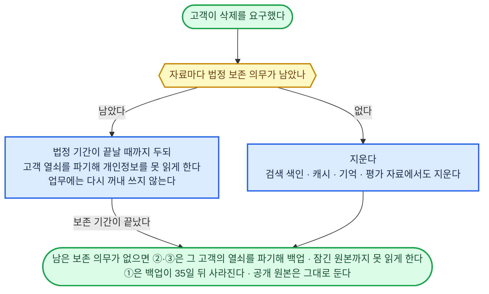

## 구성 원칙

### 공통으로 만들 것과 직종마다 채울 것

| 구분 | 들어가는 내용 | 예시 |
|---|---|---|
| 공통 기반 | 작업 실행·저장·검색·권한 확인·검증·배포, 중단 뒤 재개, 기록, 재료끼리 잇는 방식 | 답을 기다리던 일을 기한에 맞춰 다시 확인하는 기능 |
| 직종별 구성 | 그 일의 전문 지식·판단 요령·사례·방법·도구·규정·완료 조건·시험 과제 | 번역 용어집, 회계 계산법, 설계 프로그램과 검사 기준 |
| 개별 업무 | 이번에 맡은 고객·목표·범위·자료·권한·기한·예산과 진행 상태 | 이번 계약의 수정 범위, 납기, 승인된 발송 대상 |

### 모든 재료가 주고받을 내용

- **시작 조건** — 업무 번호, 담당, 목적, 입력 자료와 그 판본, 먼저 끝나야 할 작업, 권한·한도
- **처리 방법** — 쓸 지식·규칙·도구, 바꿔도 되는 대상, 반복·중단 조건
- **돌려줄 결과** — 결과값·파일·바깥 상태, 단위·형식, 근거, 불확실한 점
- **확인 방법** — 기대한 상태, 검사할 대상과 방법, 허용 오차, 확인 기록
- **실패·대기 처리** — 실패 이유, 이미 처리된 부분, 다음 담당, 확인 기한, 다시 시작할 조건

## 기술과 관리 체계

### 기술 고르기

1. ②·③의 기반 부품(실행·저장·검색·규칙 검사·기록·모델 서빙)은 회사 안에 설치해 바깥 서비스 없이 돌고, 사용 허가에 회사 업무 제한이 없는 것만 남긴다.
2. 필요한 기능을 정식 판에서 공식 지원하는 것만 남긴다. 시험 제공 기능은 지원으로 치지 않고, 한국어가 걸린 기능은 한국어 지원이 공식이어야 한다.
3. 실제 업무 자료로 해 본 시험을 통과한 것만 남긴다.
4. 지원 기간 안의 안정 주 판본 가운데 최신을 쓴다. 마지막 배포가 12개월 넘게 없고 열린 보안 결함이 있는 것은 뺀다.
5. 둘 이상 남으면 이미 쓰는 부품으로 해결되어 운영할 부품이 늘지 않는 쪽을 고른다.

### 자료가 사는 자리

| 자료 | ① 에이전트 하네스 | ②·③ 사내 서버 |
|---|---|---|
| 운영자가 고치고 승인하는 것 지시문·기술 파일·운영자 규칙·규칙 묶음·시험지·도구 연결 설정·코드 | git 저장소(직종 공통 폴더 포함). 공개하지 않은 새 시험 과제는 에이전트가 읽지 못하는 별도 저장소 | 같은 git 저장소에서 배포 |
| 고객 규칙 | 그 고객의 기억 폴더. 이번 업무만의 규칙은 건 파일 | PostgreSQL 규칙 줄. 범위 꼬리표로 고객 전체·프로젝트·이번 업무를 가른다 |
| 진행 상태·자료 카드·기억 | 건 폴더의 건 파일, 그 고객의 기억 폴더. 공개 자료는 직종 공통 폴더 | PostgreSQL |
| 들어온 신호 | 사내 서버 수신 문 프로그램의 PostgreSQL | PostgreSQL |
| 실행 기록·판단 근거 기록·승인 기록 | 저장소 밖 기록 보관 폴더. 훅만 쓴다 | PostgreSQL. 덧붙이기만 된다 |
| 받은 원본·낸 결과물·녹취 | 건 폴더. 근거 원본은 기록 보관 폴더에 해시를 이름으로 | 해시 창고 |
| 검색 색인 | 따로 두지 않는다(파일 검색) | OpenSearch. 위 자리에서 언제든 다시 만든다 |

- 같은 값은 한 곳에만 두고, 모든 직종 → 분야 → 직종 → 고객 → 건 순으로 앞의 값을 덮는다. 겸업 직종은 분야를 둘 이상 적고, 같은 칸이 부딪히면 앞에 적은 분야가 이긴다.
- git에는 고객 정보를 넣지 않는다. ①의 건 폴더와 기억 폴더는 git 기록에 올리지 않고, 사례·시험 문항은 고객 정보를 가린 것만 커밋 전 검사를 거쳐 넣는다.
- ②·③에서 개인정보가 든 줄과 원본은 고객마다 다른 열쇠로 암호화한다. 해시 창고는 모든 고객이 같이 쓰는 공개 원본 칸(법령·공시·표준)과 고객마다 저장 칸으로 나눈다. 창고에 먼저 넣고 그다음 데이터베이스 줄을 써서, 줄이 가리키는 해시가 창고에 없는 일을 막는다. 남이 믿어야 하는 시각은 시각 도장을 함께 둔다.
- Object Lock은 규정 준수 모드로 걸고, 잠금 기간은 그 자료의 보관 기간과 같게 한다. 저장 칸의 잠금 기간을 정하거나 늘리는 일은 풀 방법이 없으므로 되돌릴 수 없는 행동으로 다룬다.

### 보관 기간과 지우기

| 자료 | 보관 기간 |
|---|---|
| 실행 기록·판단 근거 기록·승인 기록과 그 근거 원본 | 5년 |
| 받은 원본·낸 결과물·고객 자료 카드 | 건이 끝난 뒤 5년 |
| 진행 상태(건 파일) | 건이 끝난 뒤 1년 |
| 장기 기억 | 고객 관계가 끝난 뒤 3년 |
| 녹취 | 90일. 판단 근거 기록이 가리키면 그 기록의 기간 |
| 건이 되지 못한 신호 | 1년. 건이 된 신호는 그 건을 따른다 |
| 시계열·통계 값 | 2년. 판단에 쓴 값은 판단 근거 기록에 남는다 |
| 공개 원본과 그 자료 카드·판본 | 지우지 않는다 |
| 백업 | 35일. 날마다 새로 떠서 돌려 쓴다 |

직종이 기간을 바꾸되 판단 근거 기록의 5년보다 줄이지 않고, 법이 더 길게 정하면 그 기간을 따른다. 원본을 지울 때는 그 원본에서 나온 검색 색인·캐시·기억·평가 자료도 함께 지운다. 고객이 삭제를 요구하면 법이 보존을 요구하는 것만 남기고 지운다. 우리 정책인 5년은 삭제 요구에 앞서지 않는다.

### 변경·배포·복구

- 지시문·기술 파일·규칙 묶음·도구 연결 설정·시험지·코드는 git에서만 고친다. 돌고 있는 규칙 묶음이나 데이터베이스를 직접 고치는 길은 막는다. 고친 것이 나가는 문은 능력 개선·확장이 정한다. 법·규정이 바뀌면 그 조문을 가리키는 규칙 조건식과 시험 문항을 재검토에 올린다.
- 배포 판본은 코드·지시문·기술 파일·규칙 묶음·도구 연결 설정·데이터 구조·평가 기준의 판본과 시험 통과 기록을 한 묶음으로 묶은 것이다. 모델 지정은 넣지 않는다. 실행기는 배포 판본대로만 돈다. 운영 판본이 개발 중인 최신 커밋과 다른 것은 장애가 아니다. 되돌릴 때는 옛 배포 판본을 다시 배포하고, 데이터베이스 상태·적용 중인 규칙 판본·검색 색인·바깥 처리 결과가 서로 맞는지 대조한다.
- 데이터 구조는 옛 판본과 새 판본이 함께 읽을 수 있게 늘리는 변경을 먼저 내고, 빼는 변경은 옛 판본으로 도는 건이 다 끝난 뒤에 낸다. 실행 흐름이나 데이터 구조가 바뀌어도 기다리던 건은 옛 판본으로 끝낸다. 옛 판본으로 끝낼 수 없으면 그 건의 상태를 새 판본으로 옮기는 시험을 통과한 뒤 옮기고, 통과하지 못하면 그 건을 멈추고 운영 경보를 낸다.
- 검색 색인은 하루 한 번 새로 만들어 검색 시험 문제를 통과하면 바꿔 끼우고, 점수가 떨어지면 옛 색인으로 되돌린다. 뜻 검색 벡터는 효력 중인 판본에만 둔다. 바꾸는 동안에도 철회·삭제된 자료는 나오지 않는다.
- 백업은 ②·③의 데이터베이스·해시 창고, ①의 건 폴더·기억 폴더·기록 보관 폴더를 다른 장비에 뜬다. git은 원격 저장소에 둔다. 잃어도 되는 기간은 5분, 되살리는 시간은 4시간이 기본이고 직종이 바꾼다. 분기마다 한 번 실제로 되살려 본다.

### 세 자리가 어긋났을 때

| 어긋남 | 알아채는 법 | 기계가 하는 것 | 운영자에게 넘어오는 때 | 그 직종은 멈추나 |
|---|---|---|---|---|
| 데이터베이스와 창고가 서로를 가리키지 않는다 | 날마다 한 번 둘을 대조한다 | 창고에 없는 원본은 적어 둔 곳에서 다시 받아 해시가 같으면 넣는다. 데이터베이스에 없는 원본은 공개 칸이면 카드를 다시 만들고, 고객 칸이면 그 고객의 줄에만 다시 잇는다 | 다시 받은 해시가 다를 때, 어느 고객 것인지 모를 때. 그 원본은 어느 건에도 잇지 않는다 | 안 멈춘다. 그 카드만 못 쓴다 |
| ②·③ 적용 중인 규칙 판본이 배포 판본과 다르다 | 배포 뒤 60초가 지나도 OPA가 알리는 적용 판본이 다르다 | 규칙 묶음을 다시 받게 한다. 3번까지 | 3번 다 안 맞을 때 | 맞을 때까지 그 직종의 바깥으로 나가는 행동을 멈춘다 |
| ① 규칙 묶음·지시문이 배포 판본과 다르다 | 훅이 도구를 부를 때마다 직종 공통 폴더의 규칙 묶음 판본 파일과 지시문 해시를 배포 판본과 대조한다 | 그 대화를 멈추고 새 배포 판본으로 새 대화를 열어 잇는다 | 새 대화에서도 다를 때 | 그 대화만 멈춘다 |
| ① 건 파일이 깨졌다 | 대화를 이어 열 때 건 파일이 읽히지 않거나 마지막 실행 기록보다 뒤에 있다 | 기록 보관 폴더의 판단 근거 기록·실행 기록에서 현재 진행 상태의 칸을 다시 세운다 | 다시 세울 수 없을 때 | 그 건만 멈춘다 |
| 데이터베이스가 깨졌다 | 데이터베이스 오류, 대조에서 있어야 할 줄이 사라짐 | 그 직종을 멈추고 시점 복구를 건 뒤 창고 대조와 색인 다시 만들기를 돌린다 | 언제나. 어느 시점으로 되돌릴지, 사라진 건을 받은 신호에서 다시 만들지 정한다 | 멈춘다. 대조에서 끊긴 것이 0이면 다시 켜고, 아니면 그 카드만 빼고 켠다. 멈춘 동안 들어온 신호는 쌓아 두었다가 받은 순서대로 건이 된다 |

### 규모와 비용을 정하는 법

- 서버 대수와 분리 기준은 미리 정하지 않고, 시험용 직무 한 건을 완주한 뒤 잰 값으로 정한다. 목표 수치는 재기 전에 적어 두고 잰 값과 나란히 본다. 재는 것은 모델의 입력·출력·추론 양과 캐시 재사용·재시도, 원본·파생물 크기와 판본이 늘어나는 속도, 한국어 검색 품질과 지연, 전문 도구의 메모리·GPU·실행 시간·부분 실패, 최고 부하와 백업·복구 시간, 사람의 검사·수정·승인·운영 시간이다. 이 값으로 장비 대수·호출 한도·저장량·색인 구성·동시 처리 수·여유 자원을 정한다. PostgreSQL 하나로 시작하고, 초당 쓰기나 저장량이 장비가 견디는 양의 절반을 넘으면 실행 기록부터 다른 데이터베이스로 뗀다.
- 업무당 비용은 모델(구독료·장비값의 배분) + 도구 + 검색·저장 + 검증·재시도 + 복구 + 사람 작업 + 처음 만든 비용의 배분으로 센다. 평균과 함께 비용·지연이 큰 상위 5% 업무를 따로 보고한다.

## 공장 설계

공장은 새 직종의 요구를 받아 공통 기반과 직종별 구성을 잇고, 검사·시험·배포·변경 반영까지 같은 절차로 되풀이하는 장치다.

### 공장에 넣을 것

- **업무 범위** — 직종·세부 업무·대상·난도·관할·운영 환경, 맡을 일과 뺄 일
- **전문성** — 개념·방법·단위·전제·예외·사례·판단 갈림·치명적 오류
- **자료·도구** — 실제 입력 형식, 원천 접근, 전문 프로그램·계정·권한·이용 조건
- **규칙** — 의무·계약·조직·사용자 조건, 승인·위임·한도·자료 경계
- **완료·평가** — 단계별 검사·인수·성과, 대표 과제·새 과제·비교 전문가·채점 방법
- **운영** — 담당·기한·예산·감시·복구·보존·갱신·종료 조건

### 조립부터 배포까지

| 순서 | 할 일 | 넘어갈 조건 |
|---|---|---|
| 1. 재료 고르기 | 적용 조건을 가리는 조회·진단 도구를 조립과 따로 먼저 준비하고, 79개 재료를 업무 요구에 대 본다 | 재료마다 필요·조건부·제외가 정해지고, 제외에는 이유가 있다 |
| 2. 공통부와 직종 값 잇기 | 있는 지식·코드·도구를 다시 쓰고 직종 값을 채운다 | 새로 만들 기능이 목록으로 나온다 |
| 3. 빠진 연결 검사 | 요구 → 입력 → 판단 → 처리 → 검사 → 인수마다 담당을 확인한다 | 담당 없는 칸이 0이다 |
| 4. 충돌 검사 | 권한·규칙·단위·판본·자원·선후 관계를 대조하고, 조건 확인과 진단이 서로 기다리는 곳을 찾는다 | 풀리지 않은 충돌이 0이다 |
| 5. 시험용 조립 | 시험 환경에서 실제 입력·도구·실패 조건으로 돌린다 | 연결·복구가 되고 기존 직종의 시험도 그대로 통과한다 |
| 6. 직무 능력 평가 | 처음 보는 과제로 숙련 전문가와 견준다 | 맡길 수 있는 업무 범위와 그 증거·제약이 적힌다 |
| 7. 배포·관찰 | 합격한 배포 판본을 좁은 범위부터 운영한다 | 관찰 결과로 넓힐지 멈출지 정한다 |
| 8. 변경 반영 | 바뀐 공통부·규정·자료·도구가 닿는 직종을 찾는다 | 닿는 직종은 5번부터 다시 거친다 |

### 공장이 됐다고 볼 기준

- 문서 중심·계산 중심·바깥 거래나 상시 운영 중심의 서로 다른 직종 3개를 같은 절차로 조립하고, 직종마다 더 든 일감과 시간, 공통부를 다시 쓴 정도, 기존 직종이 받은 영향을 적는다.
- 새 직종마다 실행 기반을 다시 만들어야 하면 실패다. 꼭 필요한 도구나 평가가 빠졌는데 조립을 끝냈다고 처리해도 실패다. 다시 쓸 수 없는 전문 도구를 새로 잇는 것은 되지만 그 비용과 시험을 따로 적는다.

## 만드는 순서

| 순서 | 할 일 | 넘어갈 조건 |
|---|---|---|
| 1. 설계 확정 | 정의 1의 목표·흐름·재료를 요구와 검사에 잇고, 재료 구상·기술·저장·공장 절차를 대조한다 | 79개 재료의 책임·입출력·예외·다음 담당에 빈 곳이 없고, 미정 사항에 결정할 근거가 붙었다 |
| 2. 핵심 가정 확인·평가 준비 | 1번과 함께 굴린다. 자료·계정·이용 조건을 확보하고 중요한 도구·복구를 작은 시험으로 확인한다. 비교 전문가·채점자·표본·예산을 확보하고 새 평가 자료를 개발 자료와 떼어 둔다 | 구현을 막을 의존이 드러났고, 합격선·비교 조건이 시험 전에 정해졌다 |
| 3. 공통 기반과 한 건 완주 | 재료 1단계를 만들고 시험용 직무 한 건을 입력부터 인수까지 돌린다 | 함수와 AI가 섞인 경로, 병렬 일부 실패, 중단·재개가 이어진다 |
| 4. 복합·안전·연동 시험 | 협업·여러 건·공유 예산·공격·모델 교체·사내 시스템 연동·부하·판본 변경을 시험한다 | 경계와 필수 검사가 유지되고, 기다리던 건의 옮기기·되돌리기가 된다 |
| 5. 공장과 직종별 제작 | 공장을 만들고 우선순위대로 직종을 조립한다 | 새 직종을 같은 절차로 만들고 기존 직종이 그대로 통과한다 |
| 6. 대체 증명 | 같은 조건에서 숙련 전문가와 견준다 | 미리 정한 품질·자율성·비용·기한·성과 기준을 채운다 |
| 7. 제한 운영 | 자료·진행 건을 옮기고 좁은 범위부터 운영한다 | 실제 환경의 관찰 결과로 넓힐지 멈출지 정했다 |

### 첫 직종 고르기

공통 기반을 검증하는 **시험용 직무**와 판매·운영할 **첫 직종**은 따로 정한다. 첫 직종은 아래 증거를 다 갖춘 직종만 고르고, 여럿이면 실패 손해가 가장 작은 것을, 같으면 예시가 가장 많은 것을 고른다. 첫 후보는 세무사 신고·기장, 다음 후보는 관세·취약점 관리·QA다. 시험 범위는 그 직무의 실제 입력과 실패로 칠 기준으로 좁혀 정한다. 공개 통계나 임의 점수만으로 고르지 않고, 쉬운 직무의 성적을 다른 직종에 옮겨 붙이지 않으며, 어려운 직무를 영영 빼지도 않는다.

- **실제 업무 접근** — 비식별 원자료·전문 도구·기관 환경·바깥 수행 결과를 합법적으로 확보할 수 있다
- **맞는 비교 대상** — 그 난도의 숙련 전문가·팀이 같은 조건에서 한 일과 견줄 수 있다. 업계 평균 통계는 곁들이는 자료다
- **결과 판정** — 서류 정확도뿐 아니라 사실·해석·선택·실행·뒤따르는 결과까지 검증할 수 있고, 사람 전문가의 평가를 받을 수 있다
- **안전한 시험** — 실제 피해를 막은 시험·복구·전문가 감독을 짤 수 있다. 고칠 절차가 있다고 손해가 없다고 보지 않는다
- **표본** — 계절 차이·난도·드문 사건·결과가 늦게 나오는 점을 담은 표본을 구할 수 있다
- **필수 바깥 의존** — 실사·실측·진료·촬영·자격 행위가 필요하면 그 조건·비용·사람 몫을 셀 수 있다

### 재료 79개를 채우는 순서

그 직무에 꼭 필요한 재료는 첫 업무 시험 전에 갖춘다. 실시간 대화·변경 감시·반영·나눠 맡기기가 처음부터 필요하면 4단계를 기다리지 않고 앞당긴다. 뒤 단계에서 앞 단계 재료가 모자라면 앞 단계로 돌아가 채운다.

| 단계 | 재료 | 넘어갈 조건 |
|---|---|---|
| **1단계 실행 기반 · 17개** | 운영 감시·복구, AI 모델, 실행 제어, 현재 진행 상태, 현재 작업 정보, 시작 신호, 분리 실행, 업무 도구·시스템, 시험 환경, 에이전트 기본 원칙, 업무 권한, 안전장치, 비용·위험 한도, 결과 검증·재검증, 판단 근거 기록, 보고 주체 확인, 업무 능력 시험 | 실행·중단·재개·권한·예산·기록·검사가 시험 환경에서 이어진다 |
| **2단계 입력·지식·자산 · 15개** | 정보·자료 이해, 규칙·기준 원문, 적용 사례, 참고 자료, 현재 값·상태 확인, 업무별 정보, 근거의 신뢰성·적합성, 자료의 시점·버전, 정보·자료 찾기, 못 찾음·없음 구분, 업무 지식, 실전 경험·감각, 표현 방식·스타일, 장기 기억, 재사용 자료 | 실제 입력의 값·구조·판본과 필요한 제작 자산을 확보했다 |
| **3단계 설계·전문 처리·납품 · 41개** | 기록 입력·수정, 신청·거래 처리, 설정·작동 제어, 게시·배포, 결과물 설계, 내용 재구성, 결과물 만들기·수정, 법·의무 기준, 직업 윤리·의무, 계약·합의 조건, 플랫폼·제출처 규정, 조직 규칙, 사용자 지정 규칙, 규칙의 적용·우선순위, 지시·의도 파악, 대안·전략 판단, 업무 절차·실행 계획, 문제·목표·완료 조건, 사람과 소통, 협상·조율, 사람에게 넘기기, 납품 준비, 전달·인수 확인, 작업 진행·연결, 대기·후속 관리, 반대 근거·다시 확인, 빠진 위험 확인, 일하는 과정 평가, 결과 품질 평가, 성공·실패 원인 분석, 자료 선별·분류, 자료 정리·결합, 형식·구조 변환, 계산, 분석, 예측, 조건 안에서 최선 찾기, 기준 적용·판정, 관찰·측정, 실험, 시뮬레이션 | 업무를 끝내고 대상별 검증·인수와 전문가 비교 기준을 통과한다 |
| **4단계 지속 운영·확장 · 6개** | 나눠 맡기기, 실시간 대화, 변경 감시·반영, 먼저 알아채기, 능력 개선·확장, 성과 추적 | 필요한 범위에 적용하고 옛 과제·새 과제·운영 성과를 확인했다 |

### 형태별로 빠지는 재료

위임형·고용형·운영형이라는 이름으로 재료를 빼지 않고, 업무의 입력·행동·산출물·쓰는 환경·뒤따르는 성과를 보고 뺀다. 형태의 차이는 계약·승인·조직 규칙·지켜볼 기간을 정할 때만 쓴다. 조건부 재료를 켜려면 그 재료가 기대는 재료부터 채우고, 해당 여부를 확인하느라 다른 일까지 멈춰 세우지 않는다. 사람의 손·바깥 승인·실물 시험에 기댄 부분은 결과에 적는다.

## 평가와 운영

### 무엇을 증명하나

| 확인 단계 | 증거 | 말할 수 있는 범위 |
|---|---|---|
| 정의 검사 | 재료·입출력·책임·예외 연결의 대조 | 검토한 요구를 설계가 다룬다 |
| 모형 시험 | 적어 둔 가정 아래 반례와 상태 변화 검사 | 그 모형에서 연결과 제한이 돈다 |
| 실제 연결 시험 | 정한 계정·환경·판본에서 실제로 처리하고 복구한 기록 | 시험한 도구·행동을 그 환경에서 해낸다 |
| 전문 업무 평가 | 새 과제, 숙련 전문가 비교, 바깥에서 받은 완료 증거 | 시험한 업무 범위에서 해내는 것과 한계 |
| 운영 평가 | 실제 성과·오류·사람이 한 몫·총비용·늦어서 본 손해 | 지켜본 조건과 기간에서 얼마나 잘 돌았나 |

기존 166개 직무 사례와 복합 사건 검토는 설계에서 빠진 곳을 찾는 개발 자료다. 전문가 166개를 만들고 검증했다는 증거로 쓰지 않고, 공개된 사례를 처음 보는 시험으로 다시 세지 않는다.

### 합격 기준

- 품질·안전의 최소 기준, 전문가와 견줄 때 봐줄 차이, 사람이 끼어드는 정도, 기한·총비용, 뒤에 나오는 성과를 시험 전에 정한다. 증거가 모자란 범위는 미검증으로 남기고 더 필요한 시험을 적는다. 표본 수는 허용 오류율로 정한다. 오류가 0건일 때 표본은 3 ÷ 허용 오류율 이상이다(허용 5%면 60건). 결과가 늦게 확정되는 일은 확정될 때까지 지켜본다.
- 비교 전문가는 그 업무를 최근에 해 본 숙련자(복합 업무는 숙련 팀)로 고르고, 자료·도구·권한·기한·지원 조건을 AI와 똑같이 맞춘다. 누가 만들었는지 가릴 수 있으면 가리고 채점하고, 채점자도 정상·오류 사례로 먼저 검증한다. 전문가가 손대지 않고 끝낸 비율과 처음 맡긴 뒤 도움 없이 끝낸 비율을 따로 보고한다. 자격 행위를 이어 붙였다고 그 자격자의 업무까지 AI가 했다고 하지 않는다.
- ②·③ 공통 기반은 넷을 실제로 해 보여야 합격이다. 고객 A의 실행 계정으로 고객 B의 줄·색인·창고를 조회하면 0건이다(데이터베이스 행 보안 우회 시험 포함). 시험 고객의 열쇠를 파기하면 그 고객의 원본·줄·백업이 읽히지 않고 공개 원본은 그대로다. 색인을 지우고 다시 만들면 검색 시험 문제 100개의 점수가 같다. 시점 복구로 되살린 뒤 창고 대조에서 끊긴 것이 0이다.
- ①은 둘을 해 보여야 합격이다. 한 건의 대화에서 다른 건 폴더를 셸과 파일 도구 양쪽으로 읽으려 하면 막히고 그 시도가 기록 보관 폴더에 남는다. 법정 보존 의무가 없는 시험 고객의 자료를 지운 뒤 그 고객의 건 폴더·기억 폴더·기록 보관 폴더·백업 어디서도 읽히지 않는다.

### 운영에서 계속 확인할 것

- 서비스를 줄이거나 끝낼 때는 새 접수와 예약을 멈추고, 남은 건·약속·원본·결과·권한을 넘기고, 계정을 거두고, 보존·삭제가 된 것을 확인한다.

## 재료별 구상

### 환경

| 환경 | 기본 뼈대 |
|---|---|
| ②·③ 부품 | 실행 엔진 Temporal, 상태·기록·자료 카드·기억 PostgreSQL 18, 원문 검색 OpenSearch 3(한국어 형태소 분석기, 재순위 모델 없음), 규칙 검사 OPA, 기록·지표 OpenTelemetry, 해시 창고 SeaweedFS(Object Lock 규정 준수 모드) |
| ③ 차이 | 모든 부품을 DGX Spark 한 대에 올린다. 실시간 음성 대화는 맡지 않고, 시험은 주 1회 점검 시간에 같은 장비에서 한다 |
