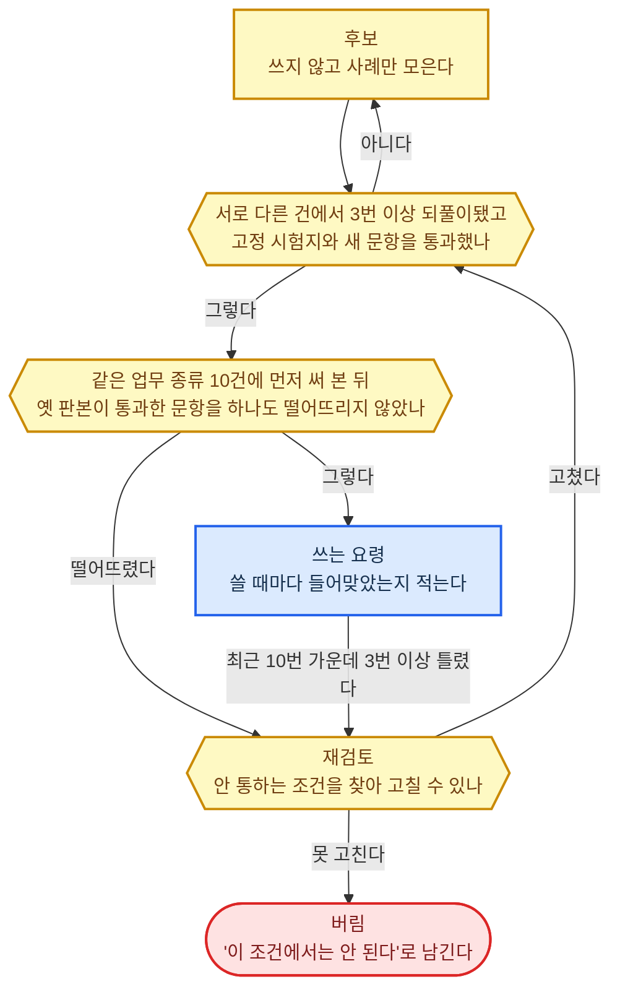

#### 업무 지식

기술 파일은 한 가지 일의 방법·절차를 적은 파일 묶음이다. 절차의 이름과 한 줄 설명은 작업창 앞부분에 두고, 본문은 그 일을 할 때 뒷부분에 붙인다.

**원칙**

- 직무의 지식 범위는 자격시험 출제 기준과 공식 매뉴얼로 세운다. 둘 다 없는 직종은 실제 업무 산출물, 업계 교육 과정 목차, 숙련자의 작업 기록으로 세운다.
- 지식 한 덩이마다 근거 원문의 위치와 판본, 적용 조건·예외·이견, 효력 기간, 관계 상태(온톨로지 계층의 확인·반박·미확인·충돌·정정됨)를 붙인다. 원문은 옮겨 담지 않고 가리킨다.
- 재검토 중 표시는 관계 상태와 다른 층의 표시로, 덩이 전체에 붙는다. 변경 감시·반영이 재검토 대상을 알린 때부터 다시 확인이 끝날 때까지 붙고, 그동안 그 덩이는 확인된 지식으로 쓰지 않는다.
- 업무 종류마다 점검 목록을 둔다. 답이 되려면 확인해야 할 항목과 항목마다 필요한 증거의 종류를 적는다.
- 개념·관계와 사실 주장은 사람이 승인한 것만 확정 지식에 넣는다. 방법·절차·점검 목록과 새로 들어온 교훈·요령은 능력 개선·확장의 문(서로 다른 건에서 3번 이상 되풀이, 고정 시험지와 새 문항 통과, 같은 업무 종류 10건에 먼저 써 봄)을 지나면 사람 승인 없이 합치고, 되돌릴 수 있게 판본을 붙인다.
- 지식을 모델 가중치에 넣지 않는다. 미세 조정으로 가르친 지식은 근거 원문을 가리키지 못하고, 원문이 정정돼도 뺄 수 없으며, 주 모델을 바꾸면 사라진다.
- 여러 건에 통하는 교훈·요령은 고객 정보를 뗀 뒤 능력 개선·확장의 문(서로 다른 건에서 3번 이상 되풀이, 고정 시험지와 새 문항 통과, 같은 업무 종류 10건에 먼저 써 봄)을 지나면 여기에 넣는다. 사례 자체는 적용 사례에 두고, 한 고객에게만 해당하는 사실은 장기 기억에 둔다.

**방법·절차 담는 꼴 고르기**

1. 덩이마다 근거 원문과 판본을 가리키고, 고친 이력과 이전 판본이 남는 것만 남긴다.
2. 초안과 확정본을 갈라 두고, 둘의 차이를 사람이 승인하거나 시험 통과 기록으로 합칠 수 있는 것만 남긴다.
3. 작업창에는 목록만 두고 본문은 그 일을 할 때 불러오는 것만 남긴다.
4. 둘 이상 남으면 한 번 쓴 것을 세 환경이 같은 꼴 그대로 쓰는 공개 규격을 고른다.

**환경별 정답**

| 구분 | ① 에이전트 하네스 | ②·③ 사내 서버 |
|------|------|------|
| 방법·절차 본문 | 기술 파일(Agent Skills 공개 규격). git 저장소에 두고 판본을 붙인다. 일할 때 뒷부분에 붙인다 | ①과 같은 기술 파일을 같은 git 저장소에서 배포 때 온톨로지 데이터베이스(PostgreSQL)에 넣고, 일할 때 거기서 꺼내 뒷부분에 붙인다 |
| 점검 목록 | 그 일의 기술 파일 | 온톨로지 데이터베이스 |
| 절차의 이름·설명 목록 | 작업창 앞부분. 하네스가 기술 파일의 이름·설명을 지시문 파일과 함께 올린다 | 작업창 앞부분. 배포 때 직종별로 미리 묶어 둔 앞부분에 넣는다 |
| 확정본에 합치기 | git 병합. 개념·관계·사실 주장은 사람이 승인하고, 방법·절차·점검 목록·교훈·요령은 능력 개선·확장의 문을 지난 기록으로 합친다 | 방법·절차·교훈·요령은 ①과 같다. 개념·관계·사실 주장은 사람 승인 기록과, 점검 목록은 시험 통과 기록과 함께 온톨로지 데이터베이스에 넣는다 |
| 근거 원문 조각 찾기 | 파일 검색 | OpenSearch 혼합 검색 |

---

#### 실전 경험·감각

요령은 조건, 먼저 볼 단서, 대응, 안 통하는 조건 네 칸으로 적은 한 덩이다.

**원칙**

- 요령마다 그 요령을 낳은 사례의 번호를 단다. 사례는 적용 사례에 있다. 사례를 댈 수 없는 요령과, 실제로 한 일의 원본·과정·결과와 맞춰 보지 않은 숙련자의 말은 넣지 않는다.
- 같은 요령이 서로 다른 건에서 되풀이된 횟수를 건 번호로만 센다. 성공·실패 원인 분석이 판단 과정이 맞았다고 본 건만 센다.
- 요령은 규칙과 업무 지식의 개념·관계·사실 주장을 이기지 못하고, 무엇을 먼저 볼지와 어느 대응을 고를지만 바꾼다. 부딪치면 규칙·지식을 따르고 그 사례를 원인 분석에 넘긴다.
- 그림의 숫자는 직무마다 정하고, 적힌 값은 기본값이다.

**요령 두는 곳 고르기**

1. 업무 종류와 대상 종류로 나눠 두어, 이번 건에 맞는 요령만 작업창에 올라가는 것만 남긴다.
2. 요령과 근거 사례의 번호가 함께 올라가는 것만 남긴다.
3. 둘 이상 남으면 업무 지식과 같은 곳에 두는 쪽을 고른다. 나눠 두면 같은 조건의 지식과 요령이 따로 낡는다.

**환경별 정답**

| 구분 | ① 에이전트 하네스 | ②·③ 사내 서버 |
|------|------|------|
| 쓰는 요령 | 그 일의 기술 파일 안에 대상 종류마다 나눈 요령 파일. 기술 파일 본문이 이번 대상 종류의 요령 파일만 열게 한다 | 같은 요령 파일을 사내 플랫폼이 업무 종류와 대상 종류로 골라 작업창 뒷부분에 붙인다 |
| 후보와 적중 기록 | 기술 파일 저장소 밖의 기록 파일. 덧붙이기만 한다 | PostgreSQL |
