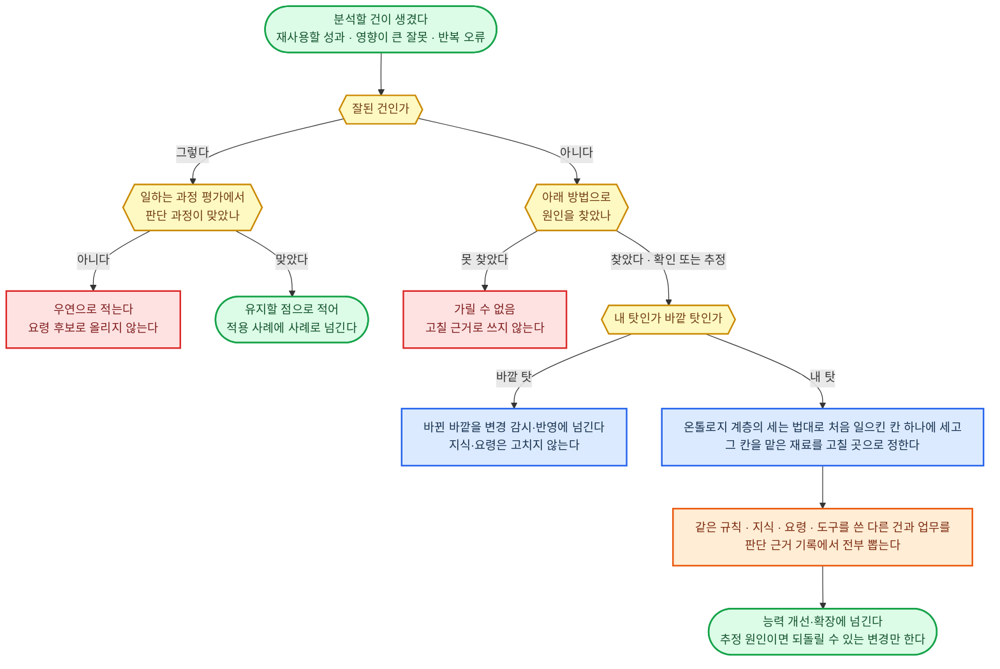
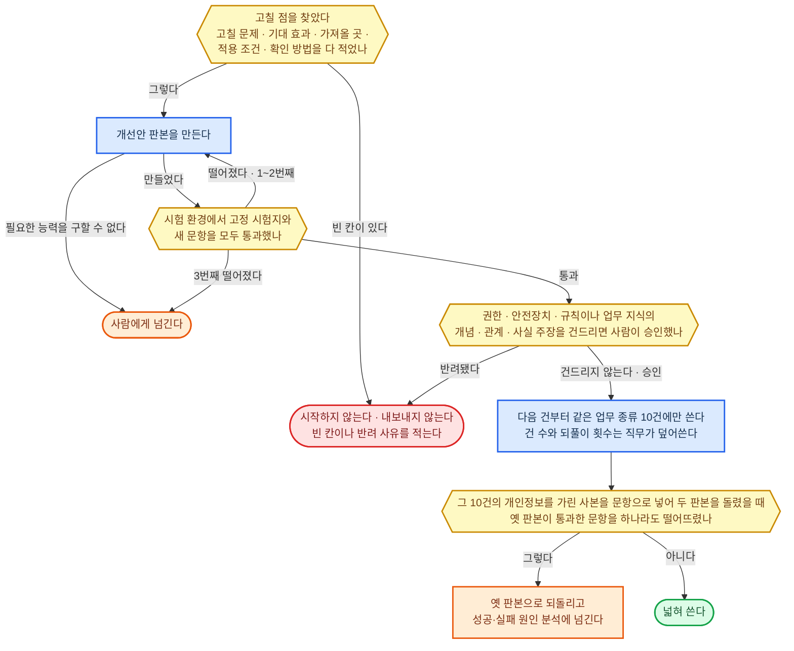

#### 성공·실패 원인 분석

**원칙**

- 영향이 큰 잘못은 되돌릴 수 없는 행동에 닿았거나 손해가 난 것이고, 한 번에도 분석한다. 반복 오류는 같은 칸의 잘못이 같은 업무 종류에서 30일 안에 두 번 나온 것이다. 직무가 덮어쓴다.
- 추정 원인으로 한 변경은 같은 업무 종류의 다음 10건에서 그 잘못이 다시 나오면 되돌린다. 다시 안 나와도 추정으로 남고, 확인은 재현·대조로 찾은 원인뿐이다.
- 원인과 교훈은 이 고객에게만 해당하면 장기 기억에, 여러 건에 통하면 고객 정보를 뗀 뒤 업무 지식에 남긴다. 사례는 적용 사례에 넘긴다.

**원인 찾는 방법 고르기**

1. 같은 입력·판본·도구를 다시 댈 수 있으면 개인정보를 가린 사본으로 시험 환경에서 다시 돌리고, 의심 원인을 하나씩만 바꿔 결과가 갈리는지 본다. 여기서 찾은 원인은 확인이다.
2. 다시 댈 수 없으면(지나간 시세, 바깥 상대의 반응) 같은 업무 종류에서 잘된 건의 판단 근거 기록과 나란히 놓고 처음 갈라진 걸음을 찾는다. 여기서 찾은 원인은 추정이다. 둘 다 할 수 없으면 가릴 수 없음이다.

**환경별 정답**

| 구분 | ① 에이전트 하네스 | ②·③ 사내 서버 |
|------|------|------|
| 분석하는 대화 | 그 건을 처리하지 않은 새 하위 에이전트 | 그 건을 처리하지 않은 새 대화 |
| 기록 찾기 | 건 폴더의 실행 기록과 판단 근거 기록을 파일 검색으로 찾는다 | PostgreSQL의 실행 기록과 판단 근거 기록, OpenTelemetry 추적 |

---

#### 능력 개선·확장

**원칙**

- 건 도중에 판본을 바꾸지 않는 것은 도구와 방법뿐이다. 규칙·법이 바뀌면 현재 작업 정보의 규칙대로 작업창 앞부분을 새 판본으로 갈고, 진행 중인 건도 다시 판단한다. 모델 지정은 판본에 넣지 않고 AI 모델 절의 기준으로만 바꾼다.
- 목적·권한·평가 기준·시험 문항을 에이전트가 스스로 낮추거나 빼지 않는다.
- 바깥에서 들여오는 기술 파일과 도구는 안전장치의 검사를 거친 뒤에 시험에 올린다.

**판본을 담고 내보내는 수단 고르기**

1. 바꾼 것마다 판본이 붙어 옛 판본으로 한 번에 되돌릴 수 있고, 시험 통과 기록이 없는 판본은 기계가 막아 실제 업무에 나가지 못하게 하는 것만 남긴다.
2. 둘 이상 남으면 업무 지식·실전 경험·감각과 같은 저장소를 쓰는 쪽을 고른다.

**환경별 정답**

| 구분 | ① 에이전트 하네스 | ②·③ 사내 서버 |
|------|------|------|
| 판본과 되돌리기 | 기술 파일과 도구 연결 설정을 git 저장소에 둔다. 시험 통과 기록이 없는 병합은 저장소가 막고, 되돌리기는 옛 판본으로 되돌리는 커밋이다 | 같은 git 저장소에서 직종별 묶음으로 배포한다. 시험 통과 기록이 없는 묶음은 배포되지 않고, 되돌리기는 옛 묶음을 다시 배포한다 |
| 10건에만 쓰기 | 새 판본을 갈래로 두고, 정한 업무 종류의 다음 건만 그 갈래에서 연다 | 사내 플랫폼이 건을 맡길 때 판본을 고른다 |
