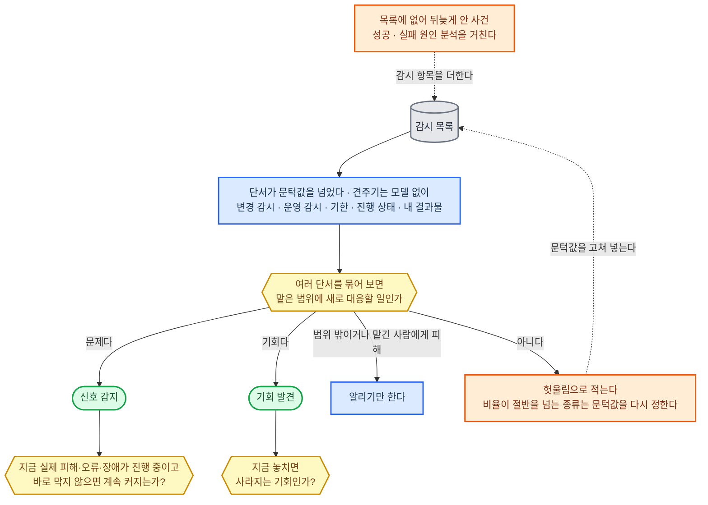

#### 지시·의도 파악

맡긴 말을 여덟 칸으로 옮겨 적은 것을 요청 정리라 한다. 여덟 칸은 한 문장 목표, 쓰임새(결과를 어디에 왜 쓰나), 받는 사람, 결과물, 범위, 하지 않을 일, 가정, 한도(기한·비용)다.

**원칙**

- 요청 정리는 일을 시작하면서 맡긴 사람에게 보내고, 결과 보고 첫 줄에도 같은 목표 문장을 적는다. 어긋났다는 답이 오면 그때 멈추고 다시 파악한다.
- 물음은 한 번에 모아 넷까지 보내고, 넷을 넘으면 가정할 수 없는 칸부터 묻는다. 물음마다 추천 답을 첫째 선택지로 둔다. 이미 확인된 내용은 다시 묻지 않는다.
- 되묻는 통로는 사람이 화면 앞에 있는 대화형 세션이면 그 대화이고, 그 밖에는 사람에게 넘기기의 통로다. 답을 기다리는 동안 그 칸에 기대지 않는 일은 진행하고, 다시 묻는 때는 사람에게 넘기기의 답 기한을 따르되, 다른 사람에게 올리지 않고 맡긴 사람에게 다시 묻는다.

**칸마다 판정하기**

업무 처리 흐름의 의도 파악 갈림을 칸마다 아래처럼 가른다.

1. "요청·지시만으로 원하는 결과가 한 가지로 정해지고 맡긴 말의 분류가 실제 자료와 맞는가": 첨부 자료·장기 기억·앞서 받은 지시로 칸이 한 뜻으로 채워지고, 맡긴 말이 붙인 분류(예: 단순 계약 검토)가 첨부 자료 내용과 맞으면 "예"다. 분류 대조는 자료를 처음 읽을 때와 새 자료가 들어올 때마다 한다.
2. "예"가 아닌 칸은 모두 맡긴 사람에게 묻는다.
3. "원하는 결과가 확인됐는가"는 물은 직후 한 번 보고, 답이 올 때마다 다시 본다. 답이 온 칸은 그 답을 쓴다.
4. "확인 없이 가정해도 결과·권리·비용에 큰 영향이 없는가": 뜻에 따라 목표나 범위가 달라지는 칸, 잘못 읽으면 되돌릴 수 없는 행동·돈·권리에 닿는 칸은 "아니오"다. 분류와 자료가 어긋난 칸은 범위가 달라지므로 늘 "아니오"다. 답이 올 때까지 그 칸에 기대는 일은 하지 않는다.
5. 그 밖의 칸은 "예"다. 직종 기본값이 있으면 그 뜻으로, 없으면 잘못 읽었을 때 다시 하는 품이 가장 적은 뜻으로 가정하고, 가정과 틀렸을 때의 영향을 가정 칸에 적는다. 뒤에 답이 오면 답으로 바꾼다.

**환경별 정답**

| 구분 | ① 에이전트 하네스 | ②·③ 사내 서버 |
|------|------|------|
| 화면 앞 대화형 세션 | Claude Code는 선택지 질문 도구로 묻는다. Codex는 기본 모드에서도 질문 도구를 실험 설정으로 켜서 묻는다. 질문이 답 없이 닫히면(Codex 기본 모드는 1~2분) 사람이 자리를 비운 것으로 보고 사람에게 넘기기의 통로로 다시 보낸다 | 요청이 들어온 사내 플랫폼 창에 선택지 질문으로 묻는다 |
| 헤드리스 실행 | 사람에게 넘기기의 통로로 보낸다 | 사람에게 넘기기의 통로로 보낸다 |

---

#### 문제·목표·완료 조건

**원칙**

- 일을 시작하기 전에 전체와 단계마다 완료 조건을 적는다. 조건마다 끝났다고 볼 상태, 확인 방법, 남길 증거 세 가지를 쓴다. 셋 중 하나라도 비면 조건으로 치지 않는다.
- 문제는 세 목록으로 닫는다. 풀 문제, 풀지 않을 문제, 이미 닫힌 부분이다. 풀지 않을 문제는 결과 보고에 그대로 옮긴다.
- 완료는 업무 처리 흐름 순서대로 여섯 층을 따로 센다. 만들기 끝, 바깥 처리 끝, 검증 끝, 전달, 받는 사람의 인수, 나중에 확정되는 성과다. 앞 층이 확인되기 전에는 다음 층으로 가지 않으며, 부분 완료 보고만 못 채운 층을 적어 전달한다. 이번 건이 어디까지 책임지는지는 인수 조건(받는 사람이 무엇을 확인하면 받아 주나)이 정하고, 인수 조건에 나중 성과가 들면 성과 확정일을 후속 확인으로 남긴다.
- 일이 어렵다는 이유로 조건을 낮추지 않는다. 조건을 바꾸는 것은 목표나 범위를 바꾸는 것으로 보고 맡긴 사람의 확인을 받으며, 확인이 오기 전에는 옛 조건으로 판정한다.
- 목표끼리 함께 이룰 수 없으면 법·계약 기한처럼 규칙이 정한 목표를 먼저, 그다음 맡긴 사람이 밝힌 순서를 따른다. 그래도 순서가 서지 않으면 판단이 서지 않는 것으로 보고 사람에게 넘기기로 보낸다. 규칙끼리의 순서는 규칙의 적용·우선순위를 따른다.
- 일부만 된 건, 취소된 건, 안전하게 멈춘 건은 부분 완료로 센다. 안전하게 멈춘 건과 사람이 거절·반려한 건은 "추가 처리하면 완료할 수 있는가"를 거치지 않고 그대로 완료 판정으로 간다. 그 밖의 건은 이 갈림이 같은 조건 때문에 끝내기가 세 번 막히기 전까지 "예"이고, 세 번째에 "아니오"가 되어 부분 완료 보고로 넘어간다.

**확인 방법 고르기**

완료 조건마다 아래 순서로 처음 들어맞는 것을 고른다.

1. 결과가 바깥 시스템이나 상대 쪽에 상태로 남으면(예약 확정·입금·제출 접수) 그 원천을 직접 조회한다.
2. 결과물 자체의 성질이면 기계가 다시 돌려 보는 검사로 한다. 시험 실행, 계산 다시 하기, 형식·항목 검사, 원문 대조다.
3. 뜻을 따져야 하는 품질(설득력·읽기 쉬움)이면, 결과를 만든 대화가 아닌 새 대화가 조건마다 합격선을 적은 채점표로 판정한다.
4. 셋 중 어느 것으로도 확인할 수 없는 조건은 쓰지 않고, 셋 중 하나로 확인할 수 있는 모양으로 고쳐 쓴다.

**환경별 정답**

| 구분 | ① 에이전트 하네스 | ②·③ 사내 서버 |
|------|------|------|
| 끝내기를 막는 문 | Claude Code·Codex의 멈춤 훅이 완료 조건 확인 기록을 보고, 조건이 다 확인되지 않았고 부분 완료 보고도 없으면 끝내지 못하게 돌려보낸다 | 실행 제어의 정답을 따른 흐름에서 완료 걸음 바로 앞에 같은 검사 걸음을 둔다 |
| 새 대화 채점 | 새 하위 에이전트가 채점한다 | 주 모델을 새 대화로 불러 채점한다 |

---

#### 대안·전략 판단

**원칙**

- 대안마다 같은 여덟 칸을 채운다. 전제, 효과, 비용·시간, 위험·부작용, 상대·제3자의 예상 반응과 그들의 승낙이 필요한 조건, 다른 항목에 미치는 연쇄 효과, 되돌릴 수 있는지와 이 선택이 닫는 뒤 선택지, 다른 안으로 갈아탈 신호다. 여러 건이 걸려 있으면 다른 건에 주는 영향도 연쇄 효과 칸에 넣는다.
- 정보를 더 구하는 것은 그 정보로 선택이 바뀔 수 있을 때만이다. 1위와 2위 안의 순서를 뒤집을 수 있는 사실부터 구하고, 어떤 결과가 나와도 선택이 그대로면 조사를 멈춘다.
- 갈아탈 신호는 먼저 알아채기의 감시 목록에 올리고, 신호가 오면 이 판단을 다시 한다.
- 되돌릴 수 없는 결정을 잠그는 선택은 고르기 전에 반대 근거·다시 확인을 거친다.

**방법 고르기**

업무 처리 흐름의 판단·계획 갈림을 아래처럼 가른다.

1. 가능한 방법과 대안 만들기: 기존 규칙·사례대로 하는 방법이 있으면 넣고, 그 밖의 방법을 하나 이상 넣는다.
2. 견주기: 규칙, 업무 권한, 비용·위험 한도 밖에 있는 대안과, 완료 조건을 기한 안에 채우지 못하는 대안을 뺀다. 남은 대안이 없으면 접수 전에는 거절하고 이유와 가능한 대안을 안내하며, 진행 중에는 현재 상태·원인·대안을 붙여 사람에게 넘기기로 보낸다.
3. "기존 규칙이나 사례가 이 사실을 덮고 전제가 유효하며 해석이 갈리지 않는가": 기존 방법이 2에서 남았고 세 조건을 다 채우면 "예"이며, 기존 방법을 고른다.
4. "아니오"면 원리와 다른 분야의 같은 구조 사례로 새 방법을 만들고, 규칙 자체를 바꾸는 절차도 대안에 둔다.
5. "작은 범위에서 먼저 시험할 수 있는가": 되돌릴 수 있고 시험 비용이 건 예산의 10% 이하인 안은 "예"다(10%는 직종이 바꾸는 기본값). 시험 전에 어떤 결과가 나오면 멈출지 적고, 멈춤 결과가 나온 안은 뺀다. 시험을 통과한 안이 있으면 그 안들을 목표 순서대로 견준다.
6. 시험을 통과한 안이 없고 남은 안이 모두 시험할 수 없는 안이면, 흐름의 "되돌리기 쉬운 방법을 우선"대로 되돌리기 쉬운 순으로 고르고 불확실한 점을 적는다. 남은 안이 되돌릴 수 없는 안뿐이거나 하나도 없으면 판단이 서지 않는 것으로 보고 사람에게 넘기기로 보낸다.
7. 목표 순서는 문제·목표·완료 조건이 정한 순서다. 두 안의 추정치가 불확실한 범위 안에서 겹치면 그 목표에서는 같다고 보고 다음 목표로 넘어간다. 모든 목표에서 같으면 비용이 적은 쪽을, 그것도 같으면 대안 목록에 먼저 적힌 쪽을 고른다.

**환경별 정답**

| 구분 | ① 에이전트 하네스 | ②·③ 사내 서버 |
|------|------|------|
| 안을 해 보는 자리 | 시험 환경의 정답을 따른다 | 시험 환경의 정답을 따른다 |

---

#### 사람에게 넘기기

사람에게 판단이나 작업을 부탁하는 한 건을 결정 요청이라 한다.

**원칙**

- 넘기는 것은 다섯 경우뿐이다. 되돌릴 수 없는 행동, 승인 조건, 판단이 서지 않는 것, 한도 초과, 자격자 전속 행위다.
- 되돌릴 수 없는 행동의 기본 목록은 돈이 나가는 것(송금·결제·주문), 나가면 거둘 수 없는 것(발송·제출·게시), 복구본 없는 지우기·덮어쓰기, 서명·계약처럼 법적 효력이 생기는 의사 표시, 기한이 지나면 다시 고를 수 없게 닫히는 선택(이의 제기 포기 등)이다. 직종마다 이 목록에 더한다. 목록의 행동이라도 맡길 때 받은 승인이 그 대상·범위·한도를 덮으면 넘기지 않는다. 그 승인이 아직 유효한지는 업무 권한이 확인한다.
- 되돌릴 수 없는 행동은 되돌릴 수 있는 조각으로 나눌 수 있는지 먼저 본다(예: 발송 전 초안 저장). 나눌 수 있으면 되돌릴 수 있는 조각까지 끝내고 마지막 조각만 넘긴다.
- 결정 요청에는 결정 하나마다 예·아니오 물음 하나를 둔다. 물음마다 추천 답과 그 이유, 다른 안과 각 안의 결과, 근거 자료, 답 기한, 아니오일 때 갈 길을 붙인다. 같은 사람에게 같은 때 필요한 결정이 여럿이면 한 요청에 묶되 답은 물음마다 받는다. 긴급 승인은 묶지 않으며 답 기한은 15분이다.
- 답 기한은 보낸 때부터 24시간이다. 전체 기한에서 남은 일에 드는 시간을 뺀 시점이 그보다 이르면 그 시점으로 하고, 이미 지났으면 전체 기한을 지킬 수 없다는 사실을 요청에 적고, 답 기한은 24시간으로 한다. 24시간은 직종이 바꾸는 기본값이다.
- "기한 안에 결정이 왔는가"는 답 기한이 되었을 때 답이 아직 안 왔는지로 본다. 안 왔으면 다음 결정권자에게 올리고, 그쪽 답 기한도 올린 때부터 처음과 같은 길이(보통 24시간, 긴급 15분)다. 목록에 더 올릴 사람이 없으면 마지막 결정권자에게 같은 길이마다 다시 올린다. 기한이 지난 뒤 온 답도 받는다.
- 답이 없는 것은 승인이 아니다. 기다리는 동안 그 결정에 기대지 않는 일은 계속한다.
- 답을 받을 때 본인인지와 무엇에 답했는지는 보고 주체 확인이 대조한다. "아니오"면 반려·보류 사유와 남은 일을 기록하고 완료 판정으로 간다. 사람이 내린 판단, 고친 내용, 들인 시간은 성과 추적에 넘긴다.

**결정권자와 통로 고르기**

1. "현재 결정권자가 권한이 있고 이해충돌이 없으며 결정의 위험이 그 사람 주변에 미치지 않는가": 업무 권한에 적힌 그 결정의 권한자가 세 조건을 다 채우면 그 사람에게, 하나라도 어긋나면 미리 정한 다른 결정권자에게 보낸다.
2. 통로는 결정권자가 등록한 통로 가운데, 답한 사람이 누구인지 로그인으로 가려지고 답이 기록으로 남는 것만 남긴다.
3. 그중 결정권자가 자리를 비워도 휴대전화까지 알림이 가는 통로를 고른다.

**환경별 정답**

| 구분 | ① 에이전트 하네스 | ②·③ 사내 서버 |
|------|------|------|
| 결정 요청 통로 | 결정 요청(결정할 것 한 문장·선택지·결과물 지문)을 건 기록에 적고 휴대전화까지 가는 알림을 보낸다. 세션이 열려 있는 동안은 Claude Code는 Remote Control, Codex는 ChatGPT Remote로 알림을 보내 답을 받는다. 세션이 잠들 때는 시작 신호의 수신 문 프로그램(사내 서버)이 사내 메신저나 이메일로 알림을 보내고, 답은 사내 메신저의 웹훅으로만 받아 시작 신호로 건을 깨운다. 잠들기 전 실행 제어의 정답대로 이어 갈 자리를 적는다 | 사내 플랫폼의 결정 요청함. 알림은 사내 메신저 |
| 확인 창·질문 도구 | 사람이 화면 앞에 있는 대화형 세션에서만 쓴다 | — |

---

#### 업무 절차·실행 계획

**원칙**

- 작업 하나는 완료 조건으로 끝을 확인할 수 있는 크기로 자른다. 작업마다 입력, 출력, 먼저 끝나야 할 작업, 담당, 완료 조건, 중단 한도(시간·비용·시도 횟수), 실패하면 갈 길을 적는다. 중단 한도의 숫자는 비용·위험 한도에서 받는다.
- 모든 작업의 완료 조건을 합치면 전체 완료 조건을 빠짐없이 덮어야 한다. 덮지 못하는 조건이 남으면 작업을 더한다.
- 서로의 출력을 입력으로 쓰지 않는 작업은 동시에 돌린다. 결과를 모으는 지점에는 무엇이 다 모여야 시작하는지와, 꼭 있어야 하는 결과가 빠졌을 때 갈 길을 적는다.
- 갈림은 두 가지로 나눠 적는다. 적힌 값·상태로 가를 수 있는 갈림은 규칙으로 적어 모델 없이 가르고, 뜻을 따져야 하는 갈림만 모델 판단으로 적는다.
- 되돌릴 수 없는 결정이 든 작업은 따로 표시하고 그 바로 앞에 검사 작업을 넣는다. 사람에게 넘기기에서 승인이 필요하다고 나오면 승인 작업도 넣는다.
- 입력 수에 따라 작업 수가 달라지면 "자료 한 건마다 같은 작업"으로 적었다가 입력이 들어온 뒤 펼친다. 작업끼리 서로의 결과를 기다리며 돌면 되풀이 상한(기본 3회)과 멈출 조건을 적는다.
- "주기적으로 반복하는 업무인가"가 "예"면 주기, 사람 없이 돌려도 되는 범위, 회차마다의 한도, 다음 점검 시점을 계획에 적는다. 주기는 달력 표준(RRULE)으로 적는다.
- 그 작업 형식을 업무 능력 시험에서 통과한 기록이 없으면, 시험 환경에서 먼저 돌려 본다. 이 시험에 드는 비용은 건 예산의 10% 안이며(직종이 바꾸는 기본값), 넘으면 사람에게 넘기기로 보낸다. 떨어진 형식은 능력 개선·확장으로 넘기고 계획에 빈 칸으로 표시한다.
- "계획의 핵심 전제가 지금도 유지되는가"가 "아니오"이거나, "같은 실패가 반복되고 있는가"가 "예"이면 다시 짠다. 입력·권한 실패는 실행 제어와 같게 첫 번에 바로 다시 짠다. 잠깐 생긴 실패는 실행 제어가 다시 보내는 3번을 다 쓰고도 실패하면 한 번으로 세고, 같은 작업이 같은 이유로 이렇게 3번 실패하면 "예"다. 끝난 작업은 다시 돌리지 않고 영향을 받는 작업만 다시 짠다.

**작업 담당 고르기**

작업마다 아래 순서로 처음 들어맞는 것을 고른다.

1. 사람을 부르는 다섯 경우에 들면 사람 작업이다. 사람에게 넘기기로 보낸다.
2. 입력에서 출력이 정해진 규칙으로 계산·조회·변환되면 함수 작업이다. 모델 없이 돌린다.
3. 실시간 음성 대화, 사진·음성 인식, 장비 메모리가 모자라 주 모델을 올리지 못하는 환경의 일이면 다른 모델 작업이다. 모델은 AI 모델의 정답을 따른다.
4. 필요한 자료가 주 모델 하나의 작업창에 다 들어가지 않거나, 서로 독립인 조각을 동시에 돌려야 기한을 맞추면 다른 AI 작업이다. 나눠 맡기기로 보낸다.
5. 나머지는 주 모델 작업이다.

**환경별 정답**

| 구분 | ① 에이전트 하네스 | ②·③ 사내 서버 |
|------|------|------|
| 계획을 적는 곳 | 하네스의 할 일 목록 도구는 켜지 않고, 현재 진행 상태의 건 기록에 적는다. 주 모델이 건 기록을 읽고 다음 작업을 한다 | 현재 진행 상태의 건 기록에, 실행 제어가 그대로 읽어 돌리는 작업 연결 모양으로 적는다 |

---

#### 먼저 알아채기

감시할 대상을 적은 목록을 감시 목록이라 하고, 울렸는데 대응할 일이 없었던 신호를 헛울림이라 한다.

**원칙**

- 감시 항목은 무엇을, 어디서, 얼마나 자주, 어떤 값이면 신호, 울리면 무엇을 시작하나 다섯 칸을 채운다. 다섯째 칸이 빈 항목은 넣지 않는다. 내가 낸 결과물(올린 글, 세운 서비스, 낸 서류)의 상태도 항목에 넣는다.
- 모델은 여러 단서를 묶어 뜻을 볼 때만 쓴다. 진행 중인 건마다 하루 한 번 모아 보고, 긴급 표시가 붙은 단서는 받는 즉시 본다.
- 신호 종류 가운데 그림의 "지금 실제 피해·오류·장애가 진행 중이고…" 갈림에서 "예"가 나올 수 있는 것(장애·침해·유출·잘못 나간 결제나 전송·긴급 연락)은 긴급 표시를 붙여 시작 신호에 넘긴다. 판정이 갈리면 긴급으로 본다. 긴급은 감지에서 첫 대응(추가 피해 막기 시작)까지 15분 안이며, 15분은 직무마다 줄일 수 있는 기본값이다.
- 알림에는 발견한 것, 대응이 필요한 까닭, 권하는 대응, 그 대응의 기한을 적는다.
- 울릴 때마다 대응할 일이었는지 적고, 헛울림 비율은 운영 감시가 센다. 비율이 절반을 넘는 종류에는 서로 다른 두 조치가 함께 걸린다. 시작 신호는 그 종류를 하루 한 번 모아 내어 깨우는 횟수를 줄이고, 이 재료는 문턱값을 다시 정해 울리는 조건을 고치며 바꾼 날과 까닭을 남긴다.
- 감시에 드는 값은 건마다의 항목은 건 예산의 10%, 직종 공통 항목은 비용·위험 한도가 정한 직종 공통 감시 예산(월)의 10%를 넘지 않는다. 넘으면 90일 동안 한 번도 울리지 않은 항목부터 확인 주기를 두 배로 늘리고, 날짜로 오는 항목은 늘리지 않는다. 10%는 직종이 바꾸는 기본값이다.

**환경별 정답**

| 구분 | ① 에이전트 하네스 | ②·③ 사내 서버 |
|------|------|------|
| 감시 목록 | 직종 공통 항목은 지시문에, 건마다의 항목은 현재 진행 상태의 건 기록에 적는다 | 업무 기록(PostgreSQL)에 적되, 건마다의 항목은 그 건에, 직종 공통 항목은 직종에 묶는다 |
| 문턱값 견주기와 하루 한 번 모아 보기 | 시작 신호의 정답을 따른 예약 실행에서, 견주기는 모델을 부르지 않는 스크립트가, 모아 보기는 주 모델이 한다 | 견주기는 실행 제어의 함수 걸음이, 모아 보기는 주 모델이 한다 |
