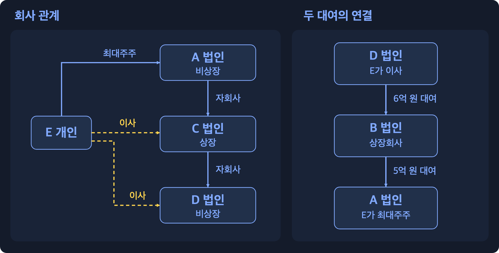
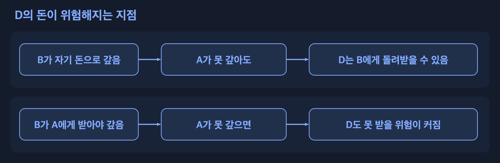

# 법인 간 대여와 E의 책임

## 결론

<table style="width:100%; table-layout:fixed;"><colgroup><col style="width:17%"><col style="width:21%"><col style="width:31%"><col style="width:31%"></colgroup><thead><tr><th style="color: #82AAFF;">문제 되는 주장</th><th style="color: #82AAFF; white-space: nowrap;">판정</th><th style="color: #82AAFF;">결론과 이유</th><th style="color: #FFD54F;">쉽게 말하면</th></tr></thead><tbody>
<tr><td style="color: #82AAFF;"><strong>배임</strong> E가 A의 최대주주이자 D의 이사라는 지위를 이용해, B를 통하여 D의 자금을 A에 부당하게 지원했다는 의심.</td><td style="color: #82AAFF; vertical-align: top;"><strong>문제 없음.</strong> 회사 관계와 대여 연결 자체는 문제되지 않는다.  그러나 D의 손해를 알면서 A를 부당하게 지원했다면 <strong>위법.</strong></td><td style="color: #82AAFF;"><strong>E의 지위와 D→B→A의 대여 연결만으로 배임은 성립하지 않는다.</strong> D는 B에 대한 6억 원의 반환채권을 취득하므로 A의 자금 확보가 곧 D의 손해는 아니다. 그러나 E가 D의 이사로서 재산보호의무를 고의로 위반하여 A에 이익을 주고, D에 구체적인 회수 위험이나 부당한 이자 손실을 발생시켰다면 배임이다. B의 상장 여부나 계약상 반환의무만으로 회수 가능성을 인정해서는 안 된다.</td><td style="color: #FFD54F;">‘배임’은 남의 재산을 맡아 관리하는 사람이 지켜야 할 의무를 어기고 다른 사람에게 이익을 주어, 맡긴 사람에게 손해를 입히는 범죄입니다. E는 D의 이사이므로 D의 돈을 맡아 관리하는 사람입니다. E가 A의 주식을 가장 많이 가진 사람이고 D의 돈이 B를 거쳐 A로 갔다는 사실만으로는 배임이 되지 않습니다. D는 돈을 그냥 준 것이 아니라 B에게 6억 원을 돌려받을 권리를 얻었기 때문입니다. 다만 그 권리는 B가 실제로 갚을 수 있어야 값어치가 있습니다. B의 주식이 증권시장에서 거래된다는 점이나 계약서에 갚겠다고 적혀 있다는 점만으로 갚을 수 있다고 보아서는 안 됩니다. 그래서 E가 A를 도우려고 돈을 돌려받지 못할 위험을 알면서도 대책 없이 빌려주었거나, 마땅한 이유 없이 D가 받을 이자를 포기하게 했다면 배임이 됩니다. D를 위해 지켜야 할 의무를 일부러 어겨 D에 손해를 주었기 때문입니다.</td></tr>

<tr><td style="color: #82AAFF;"><strong>A 지원을 숨긴 승인 회피</strong> E가 A를 위한 D의 대여를, A와의 이해관계를 공개하지 않고 사전 승인 없이 결정했다는 의심.</td><td style="color: #82AAFF; vertical-align: top;"><strong>문제 없음.</strong> A를 지원했다는 사실만으로 승인 위반은 아니다.  그러나 알려야 할 A 지원 내용을 숨기거나, 받아야 할 D의 사전 승인을 생략했다면 <strong>위법.</strong></td><td style="color: #82AAFF;"><strong>A 지원 사실만으로 상법 제398조 위반이 성립하지 않는다.</strong> E와 법정 가족 등이 A의 의결권 있는 주식 50% 이상을 보유하는 등 법정 대상자·거래 요건에 해당하여야 한다. 그 대상 거래에서는 E와 A의 관계, 지원 목적과 조건을 공개하고 원칙적으로 D 이사회의 사전 승인을 받아야 한다. <strong>B를 거쳤더라도 실질이 이러한 거래이고 공개·승인 의무를 위반했다면 위법하다.</strong> E가 최대주주라는 말만으로 위 50% 요건이 충족되는 것은 아니다.</td><td style="color: #FFD54F;">회사의 이사가 자기와 관계 깊은 사람이나 회사와 거래할 때에는 그 관계와 거래 내용을 다른 이사들에게 알리고 미리 허락을 받아야 한다는 규칙이 상법에 있습니다. 이런 거래를 ‘자기거래’라고 합니다. 다만 이 규칙은 모든 거래에 적용되는 것이 아닙니다. E와 배우자·부모·자녀 등 법이 정한 가까운 사람들이 가진 A 주식을 합쳐 회사 일을 결정하는 표결에 참여할 수 있는 주식의 절반 이상이 되는 경우처럼, 법이 정한 조건에 해당하는 거래에만 적용됩니다. E가 A의 주식을 가장 많이 가진 사람이라고 해서 반드시 절반이 넘는 것은 아니므로 실제 지분을 확인해야 합니다. 조건에 해당한다면 D의 이사들이 E와 A의 관계, 돈을 빌려주는 이유와 조건을 알고 미리 허락해야 합니다. D가 A에게 직접 빌려주지 않고 B를 거쳤더라도 실제로는 A를 돕는 거래라면 이 절차를 건너뛸 수 없습니다. 그러므로 A를 도왔다는 사실만으로 규칙을 어긴 것은 아니지만, 알려야 할 내용을 숨기거나 허락을 받지 않았다면 법을 어긴 것이 됩니다.</td></tr>

</tbody></table>

## 1. 사건 관계와 돈의 흐름

<strong>E는 A의 최대주주이자 C·D의 이사이다.</strong> A의 자회사가 C, C의 자회사가 D이므로 A·C·D는 계열관계에 있으나 각각 독립된 법인이고, D의 재산은 A 또는 E의 재산과 구별된다. B는 A·C·D와 별개의 상장회사이다. E가 최대주주라는 사정은 A의 주식을 가장 많이 보유한다는 뜻일 뿐, 개별 규정이 요구하는 지분 요건의 충족을 뜻하지 않는다.

E는 A의 주식을 가장 많이 가진 사람이면서, C와 D에서는 회사 일을 맡아 결정하는 ‘이사’입니다. A가 C를, C가 D를 자식 회사처럼 거느리고 있어 세 회사는 한 집안처럼 묶여 있습니다. 이런 관계를 ‘계열관계’라고 합니다. 그래도 회사마다 법이 따로 인정하는 ‘법인’이므로 D의 돈은 A의 돈도, E의 개인 돈도 아닙니다. B는 이 세 회사와 별개의 회사이고, 증권시장에서 주식이 거래되는 ‘상장회사’입니다. ‘최대주주’는 주식을 가장 많이 가졌다는 뜻일 뿐입니다. 주식의 절반 이상을 가졌다는 뜻은 아니므로, 뒤에서 절반 이상을 따지는 규정이 나오면 따로 확인해야 합니다.

<strong>돈의 흐름은 두 개의 대여계약이다.</strong> D는 B에 6억 원을 대여하였고, B는 A에 5억 원을 대여하였다. 각 계약의 당사자가 다르므로 D는 B에 대한 6억 원의 반환채권을, B는 A에 대한 5억 원의 반환채권을 취득한다. 두 대여를 연결하면 D가 자금을 내놓고 A가 자금을 확보하는 구조가 되므로, 계약이 별개라는 이유만으로 연계 의혹을 배척할 수 없다. 반대로 연결되어 있다는 사정만으로 D의 손해가 인정되는 것도 아니다. D의 손해 여부는 대여 당시 B의 실질적 상환능력, 이자·조건 및 D의 자금 부담으로 판단한다.

돈은 두 번 오갔습니다. 먼저 D가 B에게 6억 원을 빌려주었고, 다음으로 B가 A에게 5억 원을 빌려주었습니다. 돈을 빌려준 쪽이 갚으라고 요구할 수 있는 권리를 ‘반환채권’이라고 합니다. D는 B에게 6억 원을, B는 A에게 5억 원을 갚으라고 할 수 있습니다. 두 계약을 이어 보면 결국 D의 돈이 나가고 A가 돈을 얻은 모양이 됩니다. 그래서 계약이 따로따로이니 관계없다고만 할 수는 없습니다. 반대로 이어져 있다는 것만으로 D가 손해를 봤다고 단정할 수도 없습니다. D가 손해를 봤는지는 빌려주던 그때 B가 실제로 갚을 힘이 있었는지, 이자와 조건이 D에게 알맞았는지로 판단합니다.

<strong>E는 D의 이사로서 A의 이익과 D의 이익이 충돌하는 거래에서도 D에 대한 직무상 의무를 이행하여야 한다.</strong> E의 지위와 대여의 연결 자체는 위법이 아니다. 문제는 그 결정이 D의 이익을 기준으로 이루어졌는지, 그리고 A와의 이해관계가 법정 요건에 해당하는 경우 필요한 공개와 사전 승인을 거쳤는지이다. 아래 2.는 이 두 물음을 차례로 판단한다.

E는 A의 큰 주주이므로 A가 잘되면 이익을 얻습니다. 동시에 D의 이사이므로 D의 돈을 D에 도움이 되게 써야 합니다. 이렇게 한 사람 안에서 개인의 이익과 맡은 일이 서로 부딪치는 상황을 ‘이해충돌’이라고 합니다. 이해충돌이 있는 자리에 있었다는 것만으로 잘못은 아닙니다. 잘못이 되는 것은 두 가지입니다. 하나는 D가 손해 볼 것을 알면서 A를 챙긴 경우이고, 다른 하나는 법이 정한 관계에 해당하는데도 D의 이사들에게 알리고 미리 허락받는 절차를 건너뛴 경우입니다. 다음 2.에서 이 둘을 차례로 살핍니다.

## 2. E에게 책임을 묻는 주장과 판단

### ① A를 위해 D에 손해를 주었다는 배임 주장

<strong>검사나 D 측이 제기할 가장 강한 주장은 E가 A의 자금 수요를 충족하기 위하여 D→B→A의 거래를 설계하고 D에 불리한 조건을 수용하였다는 것이다.</strong> E의 A 지분은 지원 동기를 의심하게 하는 사정이고, D 이사 지위는 대여에 관여할 가능성을 뒷받침한다. 두 대여를 연결하면 A는 자금을 확보하고 D는 자금을 내놓는 구조가 되므로, 대여계약이 서로 다르다는 이유로 연계 의혹을 배척해서는 안 된다.

<strong>상대방은 E가 자기 이해관계가 있는 A를 돕느라 D를 손해 보게 했다고 주장할 수 있습니다.</strong> E는 A가 잘되면 주주로서 이익을 얻을 수 있고, D에서는 돈을 빌려주는 결정에 관여할 수 있는 이사이기 때문입니다. 그래서 두 대여를 한꺼번에 살펴야 합니다.

<strong>그러나 이 구조에서 D가 취득하는 재산은 B에 대한 6억 원의 반환채권이다.</strong> 배임상 손해는 현금의 유출액만으로 정할 수 없고, 대여 당시 그 채권의 실질적 회수 가능성, 이자·비용 조건 및 D의 자금 부담을 평가하여야 한다. B의 상장 여부나 계약상 반환의무만으로 회수 가능성을 인정해서도 안 된다. <strong>따라서 E의 방어는 거래의 연결을 형식적으로 부인하는 데 있지 않고, D가 감수한 위험과 얻은 이익이 당시 합리적이었음을 설명하는 데 있다.</strong>

<strong>채권은 D가 B에게 “빌린 6억 원을 갚으라”고 요구할 수 있는 권리입니다.</strong> 종이에 받을 돈이 적혀 있어도 B에게 갚을 돈이 없다면 D의 돈은 위험합니다. E에게 필요한 설명은 <strong>빌려주던 때 B에게 어떻게 돈을 돌려받을 수 있었고, 그 조건이 왜 D에도 합당했는지</strong>입니다.

#### 우회지원이 배임이 되는 기준

<a href="https://www.law.go.kr/LSW//lsSideInfoP.do?docCls=jo&amp;joBrNo=00&amp;joNo=0355&amp;lsiSeq=284025&amp;urlMode=lsScJoRltInfoR" style="color: inherit;">형법 제355조 제2항</a>의 배임죄는 <strong>타인의 사무를 처리하는 자가 그 임무에 위배하는 행위로 재산상 이익을 취득하거나 제3자로 하여금 이를 취득하게 하여 본인에게 재산상 손해를 가한 때</strong> 성립한다. 업무상의 임무에 위배하여 이를 범한 경우 <a href="https://law.go.kr/lsLinkCommonInfo.do?lsJoLnkSeq=1026978703" style="color: inherit;">형법 제356조</a>의 업무상배임죄가 문제 되며, 회사 임원에 대해서는 <a href="https://www.law.go.kr/%EB%B2%95%EB%A0%B9/%EC%83%81%EB%B2%95/%EC%A0%9C622%EC%A1%B0" style="color: inherit;">상법 제622조 제1항</a>의 특별배임죄가 적용될 수 있다. <strong>E는 D의 이사로서 D의 사무를 처리하는 자에 해당한다.</strong> E 자신의 현금 수령은 필요하지 않으며, A 또는 B에 부당한 이익을 주는 경우도 포함된다. E의 의무 위반·고의와 D의 재산상 손해는 각각 인정되어야 한다.

<strong>배임은 남의 재산을 맡은 사람이 자기나 다른 사람을 챙기려고 맡은 일을 일부러 어겨, 재산의 주인에게 손해를 주는 범죄입니다.</strong> 이 사건에서는 D의 돈을 지킬 사람인 E가 A·B를 위해 D에 손해를 주었는지가 문제입니다. 돈을 E가 직접 가져가야만 배임이 되는 것은 아닙니다. 회사 일을 하면서 저지른 배임을 다루는 규정이 업무상배임·특별배임입니다.

#### 검사에게 의심받을 사정과 법원이 가를 사실

<table style="color: #82AAFF;"><thead><tr><th style="color: #82AAFF;">쟁점</th><th style="color: #82AAFF;">E에게 불리해지는 사정</th><th style="color: #82AAFF;">책임을 가르는 기준</th></tr></thead><tbody>
<tr><td style="color: #82AAFF;">두 대여는 한 묶음인가</td><td style="color: #82AAFF;">E가 A의 자금 수요에 맞춰 B와 D의 대여를 교환조건으로 정했거나, 송금·만기·상환이 서로 연동된 경우.</td><td style="color: #82AAFF;">선행 합의, 협의 경위, 조건과 자금 흐름을 종합한다. <strong>B가 먼저 대여했거나 다른 자금과 섞였다는 사실만으로 연계성이 부정되지는 않는다.</strong> 연계성 인정과 거래의 부당성 인정은 별개이다.</td></tr>
<tr><td style="color: #82AAFF;">왜 B를 거쳤는가</td><td style="color: #82AAFF;">B가 독자적인 심사·회수 능력 없이 A에 자금을 전달하거나, 별도 약정으로 A의 부실 위험을 D·C에 되돌린 경우.</td><td style="color: #82AAFF;">B가 제공한 신용·담보·위험 부담과 보수의 합리성을 평가한다. B가 상장회사이거나 계약상 채무자라는 사정만으로 안전한 거래가 되는 것은 아니다.</td></tr>
<tr><td style="color: #82AAFF;">D는 무엇을 얻었는가</td><td style="color: #82AAFF;">D의 운영자금을 소진하면서 회수 대책이나 위험에 상응하는 대가 없이 A·B를 지원한 경우.</td><td style="color: #82AAFF;">대여 당시 원금 회수 가능성, 적정 이자·비용, D의 자금 여력과 구체적 사업상 이익을 비교한다. <strong>A의 이익을 곧 D의 이익으로 대체해서는 안 된다.</strong></td></tr>
<tr><td style="color: #82AAFF;">E는 무엇을 알고 했는가</td><td style="color: #82AAFF;">회수 곤란 보고를 받고도 실행을 지시하거나, A 지원 조건·보증·부실 정보를 의사결정자에게 숨긴 경우.</td><td style="color: #82AAFF;">직함 대신 보고 수령·협의·지시·의결·집행 관여를 연결한다. 위험 보고를 배척한 경위와 제공한 정보는 고의 판단의 근거가 된다. 직접 서명·송금이 없다고 관여가 부정되지는 않는다.</td></tr>
</tbody></table>

<strong>우회지원은 다른 회사를 거쳐 돈을 대주는 것</strong>입니다. B가 A에 빌려주는 조건으로 D도 B에 빌려주기로 약속했다면 두 대여는 서로 묶인 거래입니다. 이때에는 송금 순서보다 그 약속의 내용이 중요합니다.

<strong>E의 방어에는 거래 당시 D의 합리적 회수 가능성과 대여 규모의 적정성이 중요하다.</strong> B가 A의 상환과 관계없이 D에 대한 채무 전액을 이행할 능력·의무를 부담하고, 대여 규모가 D의 자금 여력에 비추어 합리적이었던 사정은 원금 손해·임무위배 주장을 반박한다. 반면 A가 갚지 못하면 B도 갚지 못하는 구조라면 D의 위험 평가에 A의 재무상태까지 포함하여야 한다.

<strong>D가 6억 원을 돌려받을 수 있는지는 실제로 B에게 갚을 돈이 있는지를 보아야 합니다.</strong> B가 A에서 받은 돈으로만 갚을 계획이었다면, A의 형편까지 살펴야 합니다. D가 당장 사업에 써야 할 돈을 내준 것은 아닌지도 대여 결정의 잘잘못을 가리는 기준입니다.

#### B의 상환능력은 대여 당시를 기준으로 판단한다

<table style="color: #82AAFF;"><thead><tr><th style="color: #82AAFF;">판례</th><th style="color: #82AAFF;">판단 기준과 이 사건의 적용</th></tr></thead><tbody>
<tr><td style="color: #82AAFF;"><a href="https://www.law.go.kr/LSW/precInfoP.do?precSeq=177773" style="color: inherit;">대법원 2014. 7. 10. 선고 2013도10516</a></td><td style="color: #82AAFF;"><strong>복수 회사를 실질적으로 경영한 사람이 변제능력 없는 계열회사에 합리적인 회수조치 없이 대여한 부분의 배임 유죄를 유지하였다.</strong> 대주주의 양해·이사회 결의만으로 면책되지 않는다. E에게도 실제 관여, B 및 필요한 경우 A의 상환능력, 회수 대책을 대입한다.</td></tr>
<tr><td style="color: #82AAFF;"><a href="https://www.law.go.kr/LSW/precInfoP.do?precSeq=67148" style="color: inherit;">대법원 2003. 10. 10. 선고 2003도3516</a></td><td style="color: #82AAFF;">변제능력 상실·손해발생을 인식한 대여나 합리적 회수조치 없는 대여는 배임이 될 수 있다. B의 당시 자금 사정과 E가 받은 보고를 대조한다. 금융기관의 강화된 주의의무를 일반회사 D에 그대로 적용하지 않는다.</td></tr>
<tr><td style="color: #82AAFF;"><a href="https://www.law.go.kr/LSW/precInfoP.do?precSeq=128184" style="color: inherit;">대법원 2008. 6. 19. 선고 2006도4876 전원합의체</a></td><td style="color: #82AAFF;">대출한도 위반과 배임상 손해는 별개이다. 당시 재무상태·차입·사업 전망·용도·담보를 종합한다. 승인 누락이나 나중의 부실만으로 대여 당시의 손해 위험을 단정할 수 없다.</td></tr>
</tbody></table>

<strong>빌려주던 날, 돈을 돌려받을 만한 근거가 있었는지를 봅니다.</strong> 그때 B의 재산·수입과 담보를 제대로 확인했다면 E의 결정이 정당했다는 근거가 됩니다. 갚기 어렵다는 보고를 받고도 대책 없이 빌려주게 했다면 E에게 불리합니다. 해야 할 일을 어긴 것이 <strong>임무위배</strong>, 그 잘못과 손해 위험을 알면서 행동한 것이 <strong>고의</strong>입니다.

#### 원금을 돌려받아도 이자를 부당하게 포기했다면 문제 된다

<table style="color: #82AAFF;"><thead><tr><th style="color: #82AAFF;">손해의 종류</th><th style="color: #82AAFF;">판단할 내용</th></tr></thead><tbody>
<tr><td style="color: #82AAFF;">원금을 회수하지 못할 위험</td><td style="color: #82AAFF;">D→B는 B의, B→A는 A의 상환재원을 대여 시점에서 평가한다. B가 A의 상환에만 의존한다면 D의 위험 평가에도 A의 사정을 반영한다.</td></tr>
<tr><td style="color: #82AAFF;">부당하게 포기한 이자·비용</td><td style="color: #82AAFF;">원금이 안전해도 정당한 이유 없이 불리한 이자·비용 조건을 주었다면 그 차액에 관한 배임이 문제 된다. 같은 신용·기간·담보 조건의 거래와 비교하고 E의 인식을 판단한다.</td></tr>
</tbody></table>

<strong>D는 원금뿐 아니라 받아야 할 이자도 잃을 수 있습니다.</strong> E가 A·B를 챙기려고 정당한 이유 없이 이자를 깎아 줬다면, 나중에 원금을 받아도 이자 손해는 남습니다. <strong>담보</strong>는 빌린 사람이 못 갚을 때 그 대신 팔아서 돈을 받을 수 있도록 잡아 둔 재산입니다.

#### A 지원이 D에도 이익이었다는 방어

<strong>D 자신의 이익을 포함한 합리적인 공동이익을 위한 지원이라야 경영판단으로 정당화될 수 있다.</strong> <a href="https://www.scourt.go.kr/sjudge/1510556940869_160900.pdf" style="color: inherit;">대법원 2017. 11. 9. 선고 2015도12633</a>는 계열회사 사이의 실질적 결합, 특정인·특정회사만의 이익인지 여부, 지원회사의 의사·자금 여력, 정상적이고 합법적인 방법 및 위험에 상응하는 보상 가능성을 고려하도록 한다. 이 사건에서는 A 지원으로 D가 보전할 거래·매출 등 구체적 이익과 지원하지 않을 경우의 불이익을 대여 부담과 비교하여야 한다.

<strong>A를 도운 결정이 D에도 이익이었는지를 설명해야 합니다.</strong> 예를 들어 A가 문을 닫으면 D도 중요한 거래를 잃는다면 A를 도울 이유가 생깁니다. 법원은 그 이익이 D가 떠안을 위험과 부담에 비해 합리적이었는지, D가 감당할 돈이 있었는지, 정상적인 절차로 결정했는지를 함께 봅니다.

#### E의 지시가 문서에 없어도 당시 경위로 판단한다

<strong>고의와 공모는 직접적인 지시 문서가 없어도 관련 간접사실의 결합으로 증명될 수 있다.</strong> <a href="https://www.law.go.kr/LSW/precInfoP.do?precSeq=147340" style="color: inherit;">대법원 2010. 9. 9. 선고 2010도5972</a> 판결은 고의와 관련된 간접사실을 합리적으로 연결하여 판단하도록 한다. 이 사건에서는 E의 경제적 이해관계에 협의 내용·위험 보고·거래 조건·집행 경위가 더해지는지를 보아야 한다. 유리한 당시 기록도 같은 거래 경위 속에서 함께 평가하여야 한다.

<strong>법원은 E가 받은 보고, 나눈 대화, 내린 지시를 이어서 E가 무엇을 알고 결정했는지 판단합니다.</strong> 이렇게 주변 사정을 통해 사실을 밝히는 자료를 간접사실이라고 합니다. E에게 유리한 자료도 같은 방식으로 봅니다. 당시 갚을 돈과 담보를 확인한 기록이 그 예입니다.

#### B의 부당한 대여에 가담한 책임도 따로 남는다

E가 직접 서명·송금하지 않았더라도 <a href="https://www.law.go.kr/%EB%B2%95%EB%A0%B9/%ED%98%95%EB%B2%95/%EC%A0%9C30%EC%A1%B0" style="color: inherit;">형법 제30조</a>·<a href="https://www.law.go.kr/법령/형법/제31조" style="color: inherit;">제31조</a>·<a href="https://www.law.go.kr/법령/형법/제32조" style="color: inherit;">제32조</a>·<a href="https://www.law.go.kr/%EB%B2%95%EB%A0%B9/%ED%98%95%EB%B2%95/%EC%A0%9C33%EC%A1%B0" style="color: inherit;">제33조</a>에 따른 공범 요건을 충족하면 책임을 부담한다. <strong>D→B 대여가 적정하더라도 B→A 대여가 B에 대한 배임이고 E가 가담하였다면 별도 책임이 문제 된다.</strong> <a href="https://www.law.go.kr/LSW/precInfoP.do?precSeq=147340" style="color: inherit;">대법원 2010. 9. 9. 선고 2010도5972</a>는 대출 부탁만으로 수익자를 공동정범으로 인정하지 않고 배임 인식과 적극 가담을 요구하였다. 따라서 단순한 자금 요청과, 부실을 알면서 대여를 유도하거나 허위 자료·보증 구조를 함께 설계한 행위를 구별한다.

<strong>B의 돈을 부당하게 A에 빌려주는 일에 E가 함께 관여했다면, B에 대한 배임 책임도 생깁니다.</strong> 함께 실행하면 공동정범, 범행을 시키면 교사, 범행인 줄 알면서 도우면 방조입니다. 단순히 대여를 부탁한 행동을 넘어, E가 B의 손해를 알면서 그 잘못에 관여했는지가 핵심입니다.

<strong>대여를 직접 지시하지 않았다는 사정만으로 고의적 관여가 배제되지는 않는다.</strong> <a href="https://www.law.go.kr/법령/형법/제18조" style="color: inherit;">형법 제18조</a>·<a href="https://www.law.go.kr/법령/형법/제32조" style="color: inherit;">제32조</a>에 따라, E에게 범행을 저지할 법적 의무와 실제 가능성이 있고 이를 인식하면서 범행을 용이하게 한 경우에는 부작위에 의한 책임도 심사한다. 이사의 단순한 부주의와 고의로 범행을 돕는 행위는 구별되어야 한다.

<strong>E가 범행을 막을 의무와 능력이 있는데도 돕기 위해 일부러 내버려 뒀다면 책임을 질 수 있습니다.</strong> 해야 할 일을 하지 않는 것을 부작위라고 합니다. 실수로 놓친 일을 범행을 일부러 도운 일과 똑같이 처벌하는 것은 아닙니다.

#### 거짓 설명으로 돈을 빌리게 했다면 사기가 문제 된다

E가 대여 당시 B 또는 D의 의사결정자에게 상환재원·담보·자금 용도 등 중요한 사항을 기망하여 착오에 빠뜨리고, 그로 인하여 대여가 실행되어 A 등 제3자가 재물 또는 재산상 이익을 취득하였다면 <a href="https://www.law.go.kr/LSW/lsSideInfoP.do?docCls=jo&joNo=0347&joBrNo=00&lsiSeq=284025&urlMode=lsScJoRltInfoR" style="color: inherit;">형법 제347조 제1항·제2항</a>의 사기죄 또는 그 공범이 성립할 수 있다. <strong>부실·연체 자체가 사기는 아니며, 속인 내용과 대여 결정 사이의 인과관계가 필요하다.</strong> <a href="https://www.law.go.kr/LSW/precInfoP.do?precSeq=158543" style="color: inherit;">대법원 2011. 10. 13. 선고 2011도8829</a>는 대여자가 사업의 자금 사정과 위험을 알고 관여한 경위 등을 보아 기망·착오를 판단하였다.

<strong>사기는 거짓말로 상대를 속여 돈을 내놓게 하는 범죄입니다.</strong> E가 없는 담보를 있다고 꾸미고, B가 그 말을 믿어 A에 돈을 빌려줬다면 E에게 문제가 됩니다. B가 실제 위험을 알고 빌려줬다면 그 위험 때문에 속았다고 할 수는 없습니다. B의 임원과 함께 B에 손해를 주기로 했다면 앞의 배임 문제가 됩니다.

### ② E 개인에게 돈을 물어내라는 청구

#### 일부러 한 잘못이 아니어도 손해배상은 생길 수 있다

<strong>형사상 고의가 증명되지 않더라도 이사의 과실에 기한 민사상 손해배상책임은 성립할 수 있다.</strong> <a href="https://www.law.go.kr/LSW//lsSideInfoP.do?docCls=jo&amp;joBrNo=00&amp;joNo=0399&amp;lsiSeq=273629&amp;urlMode=lsScJoRltInfoR" style="color: inherit;">상법 제399조 제1항~제3항</a>에 따라 이사가 고의·과실로 법령·정관에 위반한 행위를 하거나 임무를 해태하여 회사에 손해를 가한 경우에는 손해배상책임을 부담한다.

<strong>손해배상은 E의 잘못 때문에 회사가 잃은 돈을 E가 메우는 것입니다.</strong> 일부러 한 일이 아니어도 필요한 확인을 빠뜨려 손해를 냈다면 배상해야 할 수 있습니다. 그 부주의가 <strong>과실</strong>이고, 그 부주의 때문에 손해가 났다는 연결이 <strong>인과관계</strong>입니다.

<table style="color: #FFD54F;"><thead><tr><th style="color: #FFD54F;">예로 든 E의 행동</th><th style="color: #FFD54F;">배임죄</th><th style="color: #FFD54F;">개인 배상</th></tr></thead><tbody>
<tr><td style="color: #FFD54F;">필요한 확인을 거쳐 합리적으로 빌려줬지만 예상하기 어려운 사고로 손실이 남</td><td style="color: #FFD54F;">그 손실만으로는 배임이 아닙니다.</td><td style="color: #FFD54F;">그 손실만으로 배상하지 않습니다.</td></tr>
<tr><td style="color: #FFD54F;">확인해야 할 위험을 부주의로 놓쳐 D가 돈을 잃음</td><td style="color: #FFD54F;">부주의만으로는 배임이 아닙니다.</td><td style="color: #FFD54F;"><strong>그 잘못으로 생긴 손해를 배상합니다.</strong></td></tr>
<tr><td style="color: #FFD54F;">D가 손해 볼 줄 알면서 의무를 일부러 어겨 A·B에 부당한 이익을 줌</td><td style="color: #FFD54F;"><strong>배임입니다.</strong></td><td style="color: #FFD54F;"><strong>처벌과 별도로 손해도 배상합니다.</strong></td></tr>
</tbody></table>

이사는 <a href="https://www.law.go.kr/%EB%B2%95%EB%A0%B9/%EC%83%81%EB%B2%95/%EC%A0%9C382%EC%A1%B0" style="color: inherit;">상법 제382조 제2항</a> 및 <a href="https://www.law.go.kr/%EB%B2%95%EB%A0%B9/%EB%AF%BC%EB%B2%95/%EC%A0%9C681%EC%A1%B0" style="color: inherit;">민법 제681조</a>에 따른 선량한 관리자의 주의의무를 부담하고, <a href="https://www.law.go.kr/LSW/lsSideInfoP.do?docCls=jo&amp;joBrNo=03&amp;joNo=0382&amp;lsiSeq=273629&amp;urlMode=lsScJoRltInfoR" style="color: inherit;">상법 제382조의3 제1항·제2항</a>에 따라 회사 및 주주를 위하여 충실하게 직무를 수행하며 전체 주주를 공평하게 대우하여야 한다.

<strong>충실의무</strong>는 회사와 주주들을 위해 성실하게 일하고 특정 주주만 부당하게 챙기지 말아야 한다는 뜻입니다. <strong>선관주의의무</strong>는 이사라면 해야 할 확인을 하고 신중하게 결정해야 한다는 뜻입니다.

#### 직접 대여를 실행하지 않은 이사의 감시책임

<strong>대여를 직접 지시하지 않은 이사도 감시의무 위반과 손해 사이의 인과관계가 인정되면 배상책임을 부담할 수 있다.</strong> <a href="https://www.law.go.kr/법령/상법/제393조" style="color: inherit;">상법 제393조 제2항·제3항</a> 및 제399조가 근거이다. <a href="https://www.law.go.kr/LSW/precInfoP.do?precSeq=221751" style="color: inherit;">대법원 2022. 5. 12. 선고 2021다279347</a> 판결은 사외이사에 대해서도 다른 이사의 위법한 업무집행에 대한 감시의무와 합리적인 정보·보고 및 내부통제시스템의 구축·운영에 관한 의무를 인정하였다.

<table style="color: #82AAFF;"><thead><tr><th style="color: #82AAFF;">상황</th><th style="color: #82AAFF;">법률상 책임</th></tr></thead><tbody>
<tr><td style="color: #82AAFF;">결의 찬성 이사</td><td style="color: #82AAFF;">상법 제399조 제2항·제3항. 위법한 결의에 찬성한 이사도 책임을 부담하며, 의사록에 이의가 기재되지 않은 참석 이사는 찬성한 것으로 추정된다. 이는 반증 가능한 민사상 추정으로서 형사상 공모의 추정과는 구별된다.</td></tr>
<tr><td style="color: #82AAFF;">제3자에 대한 직접 손해</td><td style="color: #82AAFF;"><a href="https://www.law.go.kr/%EB%B2%95%EB%A0%B9/%EC%83%81%EB%B2%95/%EC%A0%9C401%EC%A1%B0" style="color: inherit;">상법 제401조</a>에 따라 고의 또는 중대한 과실로 임무를 해태하여 제3자에게 손해를 발생시킨 경우 책임을 부담한다. 회사 손해에 따른 주가 하락만으로 주주의 직접 손해배상청구권이 당연히 인정되는 것은 아니다.</td></tr>
<tr><td style="color: #82AAFF;">업무집행지시자 등</td><td style="color: #82AAFF;"><a href="https://www.law.go.kr/%EB%B2%95%EB%A0%B9/%EC%83%81%EB%B2%95/%EC%A0%9C401%EC%A1%B0%EC%9D%982" style="color: inherit;">상법 제401조의2 제1항·제2항</a>의 업무집행지시자 등 요건을 충족하면 등기이사가 아니더라도 해당 행위에 관하여 이사와 함께 책임질 수 있다. E가 A·B의 업무를 사실상 지시한 경우에도 적용 여부를 판단한다.</td></tr>
<tr><td style="color: #82AAFF;">모·자회사 손해의 중복</td><td style="color: #82AAFF;">동일한 경제적 손해를 중복하여 산정하여서는 안 된다. E의 C 이사로서의 책임에는 C에 대한 별도의 의무 위반 및 손해·인과관계의 인정이 필요하다.</td></tr>
</tbody></table>

<strong>감시의무</strong>는 다른 이사의 업무에도 잘못이 없는지 살펴야 한다는 뜻입니다. 위험한 대여라는 보고를 받고도 필요한 조치를 하지 않아 손해가 났다면 E도 배상책임을 질 수 있습니다. 그런 위험을 보고하고 막을 수 있도록 회사 안에 마련하는 절차가 <strong>내부통제</strong>입니다.

<strong>회의에 참석했는데 반대한 기록이 없으면 손해배상 재판에서는 일단 찬성한 것으로 봅니다.</strong> 실제로 반대했다는 증거로 이를 뒤집을 수 있습니다. 이 회의록 규칙만으로 E가 배임 범행에 가담했다고 확정하지는 않습니다. C에 대한 배상을 청구할 때에는 C에 대한 E의 잘못과 C의 손해를 밝혀야 합니다.

#### B의 반환책임과 E의 배상책임은 금액부터 다르다

<table style="color: #82AAFF;"><thead><tr><th style="color: #82AAFF;">청구 관계</th><th style="color: #82AAFF;">청구 내용과 E의 대응</th></tr></thead><tbody>
<tr><td style="color: #82AAFF;">D → B</td><td style="color: #82AAFF;">유효한 대여계약에 따른 원리금 반환청구는 <a href="https://www.law.go.kr/법령/민법/제598조" style="color: inherit;">민법 제598조</a>에 기초한다. 계약이 무효이고 무효를 B에게 대항할 수 있다면 <a href="https://www.law.go.kr/법령/민법/제741조" style="color: inherit;">민법 제741조</a>의 부당이득반환을 검토한다. 반환 범위·이자와 상계 가능성은 각 청구요건에 따라 판단한다.</td></tr>
<tr><td style="color: #82AAFF;">D → E</td><td style="color: #82AAFF;">상법 제399조의 의무 위반·손해·인과관계를 다툰다. B에 대한 채권의 실제 가치와 회수액을 반영하여야 하며, 동일 손해를 B와 E로부터 이중으로 전보받을 수 없다. E의 배상책임은 원금 6억 원과 자동으로 일치하지 않는다.</td></tr>
<tr><td style="color: #82AAFF;">B → A·E</td><td style="color: #82AAFF;">A에 대해서는 대여계약상 반환을 청구한다. E가 B의 업무를 사실상 지시하였다면 상법 제401조의2, 위법한 대여에 가담하여 손해를 발생시켰다면 <a href="https://www.law.go.kr/법령/민법/제760조" style="color: inherit;">민법 제750조·제760조</a>의 요건을 심사한다. D의 채권이 안전하다는 사정만으로 B의 손해에 관한 E의 책임이 배제되지는 않는다.</td></tr>
<tr><td style="color: #82AAFF;">C 또는 주주 → E</td><td style="color: #82AAFF;">C 자신의 손해배상청구와 D를 위한 대표소송을 구별한다. 손해를 입은 법인, 행사하는 권리 및 법정 소송 요건을 특정하고, C·D의 동일한 경제적 손해가 중복 청구되지 않도록 한다.</td></tr>
</tbody></table>

<strong>B는 빌린 돈을 갚고, E는 자신의 잘못으로 생긴 손해를 물어냅니다.</strong> D가 같은 손해를 두 번 받을 수는 없습니다. 배상할 손해가 1억 원이고 B에게 그중 4,000만 원을 돌려받았다면, 같은 손해로 E에게 더 받을 수 있는 금액은 최대 6,000만 원입니다.

<strong>무효</strong>는 법이 그 계약의 효력을 인정하지 않는다는 뜻입니다. 그래도 B는 받은 돈을 돌려줘야 합니다. 돈을 가질 법적 이유가 없어 돌려주는 것이 <strong>부당이득반환</strong>입니다. 서로 받을 돈과 갚을 돈을 같은 금액만큼 없애는 것은 <strong>상계</strong>이며, 법이 정한 조건을 갖춰야 합니다.

#### E가 개인 보증을 했다면 배임 여부와 별개로 갚아야 한다

<strong>주주·이사의 지위는 법인 채무에 대한 개인 보증을 의미하지 않는다.</strong> 다만 E가 별도로 유효한 보증계약을 체결하였다면 <a href="https://www.law.go.kr/법령/민법/제428조" style="color: inherit;">민법 제428조</a>에 따른 보증채무를 부담한다. <a href="https://www.law.go.kr/법령/민법/제428조의2" style="color: inherit;">민법 제428조의2</a>의 보증의사표시 방식 등 유효요건과 보증 범위를 확인하여야 한다.

<strong>개인 보증은 회사가 못 갚을 때 E가 자기 돈으로 갚겠다는 약속입니다.</strong> 유효한 보증을 했다면 범죄를 저지르지 않았어도 약속한 책임을 집니다. E가 회사 담당자로 서명한 것인지, 개인 보증인으로도 서명한 것인지 계약서에서 확인해야 합니다.

### ③ E가 필요한 공개·승인을 생략했다는 주장

<strong>E를 위한 이해상반 거래에 필요한 사전 공개·승인을 누락하였다면 상법 제398조 위반이다.</strong> <a href="https://law.go.kr/lsLinkCommonInfo.do?chrClsCd=010202&amp;lsJoLnkSeq=1027000963" style="color: inherit;">상법 제398조</a>의 거래에는 <strong>중요사실의 사전 공개, 이사 3분의 2 이상의 승인, 내용·절차의 공정성</strong>이 필요하다. D→B 대여라도 E 또는 법정 관계자를 위한 이해상반 거래이면 적용된다. <a href="https://www.law.go.kr/LSW/precInfoP.do?precSeq=185817" style="color: inherit;">대법원 2017. 9. 12. 선고 2015다70044</a> 판결은 계열회사 주식 매각에서 이해충돌과 중요사실 공개 여부를 판단하였다. <strong>두 대여가 A 지원을 조건으로 연계되었다면 E의 A 지분관계, 전체 지원 목적, B의 역할 및 D의 실제 위험을 중요사실로 공개하여야 한다.</strong> E가 특별이해관계인인 경우 의결권이 제한된다. 제398조상 대상자·계산 관계는 해당 조문의 지분·거래 요건에 따라 특정한다.

<strong>이사회는 이사들이 모여 회사의 중요한 일을 결정하는 회의입니다.</strong> 이 승인 대상 거래에서는 D의 이사 3분의 2 이상이 찬성해야 합니다. 거래에 특별한 이해관계가 있는 E는 표결에 참여할 수 없습니다. D는 A가 받을 혜택과 떠안을 위험까지 알아야 판단할 수 있으므로, B와의 계약 내용만 알리고 A 지원 약속을 숨겨서는 안 됩니다.

#### E와 이해가 부딪치지 않아도 큰 거래는 이사회가 결정한다

중요한 자산의 처분·양도, 대규모 재산의 차입 등 중요한 업무집행은 <a href="https://law.go.kr/LSW/lsLinkCommonInfo.do?chrClsCd=010202&amp;lsJoLnkSeq=1026992105" style="color: inherit;">상법 제393조 제1항</a>에 따른 이사회 결의를 요한다. <strong>D의 대여, B의 차입·대여 및 A의 차입에 관하여 각 법인별 결의 요부를 판단하여야 하며, C의 결의가 D의 결의를 대체하지 않는다.</strong> <a href="https://law.go.kr/LSW/precInfoP.do?precSeq=209125" style="color: inherit;">대법원 2019. 8. 14. 선고 2019다204463</a>은 재산의 가액, 회사의 규모·재산상태, 영업 현황 및 종래 취급 등을 종합하도록 한다. 다만 <a href="https://www.law.go.kr/법령/상법/제383조" style="color: inherit;">상법 제383조 제1항 단서·제6항</a>에 따라 자본금 10억 원 미만으로 이사를 1명 또는 2명 둔 회사에서는 각 이사 또는 정관상 대표이사가 제393조 제1항의 이사회 기능을 담당한다.

<strong>6억 원이 D에 중요한 금액이면 D의 이사회가 대여를 결정해야 합니다.</strong> 회사 규모와 자금 사정을 함께 따집니다. 자본금 10억 원 미만에 이사가 1명 또는 2명인 회사는 그 이사나 정관에서 정한 대표이사가 결정하는 예외가 있습니다. C가 허락해도 D에서 필요한 결정을 대신하지는 못합니다.

#### 승인을 빠뜨렸다면 나중에 회의록만 만들어 해결할 수 없다

<table style="color: #82AAFF;"><thead><tr><th style="color: #82AAFF;">문제</th><th style="color: #82AAFF;">계약의 효력과 판례</th></tr></thead><tbody>
<tr><td style="color: #82AAFF;">이해충돌 거래의 사전승인 누락</td><td style="color: #82AAFF;"><a href="https://www.law.go.kr/LSW/precInfoP.do?precSeq=235513" style="color: inherit;">대법원 2023. 6. 29. 선고 2021다291712</a>: 특별한 사정이 없으면 무효이며 사후승인만으로 치유되지 않는다.</td></tr>
<tr><td style="color: #82AAFF;">D가 B에게 무효를 주장하는 경우</td><td style="color: #82AAFF;"><a href="https://www.law.go.kr/LSW/precInfoP.do?precSeq=175501" style="color: inherit;">대법원 2014. 6. 26. 선고 2012다73530</a>: 보호되는 제3자에게 승인 흠결을 대항하려면 그가 알았거나 중대한 과실로 몰랐음을 회사가 증명하여야 한다. B의 제3자 해당성과 실제 인식을 심사한다. 개정 전 거래에 관한 판결이므로 사후승인은 위 2021다291712 법리와 구별한다.</td></tr>
<tr><td style="color: #82AAFF;">중요한 업무집행의 이사회 결의 누락</td><td style="color: #82AAFF;"><a href="https://www.law.go.kr/LSW/precInfoP.do?precSeq=213713" style="color: inherit;">대법원 2021. 2. 18. 선고 2015다45451 전원합의체</a>: 상법 제393조상 결의 흠결을 알았거나 중대한 과실로 모른 상대방에게 무효를 주장할 수 있다. 상대방에게 일반적인 의사록 확인 의무가 있는 것은 아니다.</td></tr>
</tbody></table>

<strong>미리 받아야 할 이해충돌 거래 승인을 나중에 받아 과거의 잘못을 없앨 수는 없습니다.</strong> 계약도 무효가 될 수 있습니다. 다만 B가 승인 누락을 몰랐고 모른 데 큰 잘못도 없다면 법이 B를 보호하는 경우가 있습니다. 법률에서 <strong>선의</strong>는 그 사정을 몰랐다는 뜻이고, <strong>중과실</strong>은 모른 데 큰 잘못이 있다는 뜻입니다.

### ④ 상장회사 자금지원 금지를 피했다는 주장

<strong>비상장 D의 대여는 상법 제542조의9의 직접 적용 대상이 아니다.</strong> <a href="https://www.law.go.kr/LSW/lsLinkCommonInfo.do?chrClsCd=010202&amp;lsJoLnkSeq=1026974505" style="color: inherit;">상법 제542조의9 제1항</a>은 상장회사가 주요주주 등 법정 상대방에 대하여 또는 그를 위하여 신용공여를 하는 것을 원칙적으로 금지한다. <strong>적용 대상 관계는 신용공여를 하는 상장회사를 기준으로 판단한다.</strong> 같은 조 제2항 및 시행령에 따른 법정 예외의 충족 여부는 별도로 심사하여야 한다.

<strong>D는 비상장회사이므로 상장회사에 적용하는 이 금지 조항을 D의 대여에 바로 적용하지 않습니다.</strong> C가 자기 재산을 담보로 내놓거나 대신 갚겠다고 보증했다면 그것은 C가 한 지원으로 봅니다. 이렇게 대여·보증·담보로 돈을 쓰도록 돕는 것이 <strong>신용공여</strong>입니다.

<table style="color: #82AAFF;"><thead><tr><th style="color: #82AAFF;">회사</th><th style="color: #82AAFF;">이번 거래에 적용하는 방법</th></tr></thead><tbody>
<tr><td style="color: #82AAFF;">D</td><td style="color: #82AAFF;"><strong>비상장회사로서 상법 제542조의9의 직접 적용 대상이 아니다.</strong> 다만 자기거래 승인 및 이사의 선관주의·충실의무 등에 관한 규율은 적용된다.</td></tr>
<tr><td style="color: #82AAFF;">B</td><td style="color: #82AAFF;">A·E 등이 <strong>B를 기준으로</strong> 주요주주 등 금지 상대방에 해당하는지 판단한다. E가 C의 이사라는 사정만으로 B의 대여가 금지되는 것은 아니다.</td></tr>
<tr><td style="color: #82AAFF;">C</td><td style="color: #82AAFF;">C 자신의 대여·보증·담보 제공 등 신용공여가 있는 경우 그 행위를 판단한다. D의 모회사라는 지위만으로 D의 대여를 C의 신용공여로 의제할 수 없다.</td></tr>
</tbody></table>

금지 대상은 해당 상장회사의 주요주주 및 그 특수관계인, 이사·집행임원·감사 등이다. 상법 제401조의2에 따른 업무집행지시자 등도 법정 범위에 포함되며, 주요주주의 특수관계인 범위는 상법 시행령 제34조 제4항에 따른다.

<strong>B의 대여는 B와 A·E의 관계를 기준으로 판단합니다.</strong> 가족·지분·지배력으로 가까워 법이 정한 범위에 들어가는 사람과 회사를 <strong>특수관계인</strong>이라고 합니다. 정식 이사 직함 없이 영향력으로 이사에게 일을 시킨 사람은 <strong>업무집행지시자</strong>로 책임질 수 있습니다.

#### B를 거친 거래에도 실제 지원자를 기준으로 적용한다

<strong>본건이 연계거래로 밝혀져도 제542조의9 위반이 자동으로 성립하지는 않는다.</strong> 위 규정상 직접·간접 지원에 해당하는 B 또는 C 자신의 행위, 그 상장회사를 기준으로 한 금지 상대방 및 법정 예외의 부존재를 특정하여야 한다. 다만 실제 금지된 지원을 B와의 교차거래·별도 상환지원 약정으로 실행하였다면 계약상 상대방의 외형만으로 금지 적용을 피할 수 없다. 이러한 별도 약정은 D의 배임상 위험 평가에도 반영하여야 한다.

<strong>법이 금지한 지원을 B를 거쳐 했어도 금지를 피할 수 없습니다.</strong> 실제로 돈을 대거나 대신 갚을 책임을 진 B·C의 행동을 봅니다. D가 비상장회사라는 이유로 D에서 한 배임까지 허용되는 것은 아닙니다.

#### 사업상 필요한 법인 주요주주 지원에는 법정 예외가 있다

상법 제542조의9 제2항 제3호·시행령 제35조 제3항 제1호는 <strong>경영상 목적 달성에 필요하고 적법한 절차를 거친 법인 주요주주에 대한 신용공여</strong>를 허용한다. A가 C의 법인 주요주주에 해당하는 경우에는 위 예외의 적용 가능성을 검토하여야 한다.

다른 관계법인을 지원하는 시행령 제35조 제3항 제2호·제3호의 예외는 각 호의 지분 비교도 충족하여야 한다. 수혜법인에 대한 회사·자회사 및 법인 주요주주 측의 합산 지분이 개인 주요주주·특수관계인 측의 합산 지분보다 큰지를 법정 범위대로 계산한다.

<strong>법인인 주요주주를 사업상 필요로 지원하는 등 법에서 허용한 예외도 있습니다.</strong> 일부 관계회사 지원은 회사 측과 개인 주요주주 측의 지분을 비교합니다. 회사 측 60%, 개인 측 40%라면 그 지분 비교는 통과하지만, 사업상 필요성과 승인 등 다른 조건도 갖춰야 합니다.

#### 이사회 승인으로 금지된 거래를 허용할 수는 없다

<strong>금지된 신용공여는 이사회 결의 또는 추인으로 유효하게 되지 않는다.</strong> <a href="https://www.law.go.kr/LSW/precInfoP.do?precSeq=226861" style="color: inherit;">대법원 2021. 4. 29. 선고 2017다261943</a> 판결은 주요주주·대표이사의 채무를 보증하고 회사 채권을 담보양도한 사안에서 금지 위반 신용공여의 무효를 판시하였다. 다만 위반 사실에 관하여 선의이며 중대한 과실이 없는 제3자에게는 그 무효를 대항할 수 없다.

<strong>이사들이 모두 찬성해도 법이 금지한 지원을 허용할 수는 없습니다.</strong> 그 보증·담보 약속은 무효가 될 수 있습니다. 다만 금지에 해당하는 줄 몰랐고 모른 데 큰 잘못도 없는 제3자는 보호될 수 있습니다.

### ⑤ A의 차입과 E 개인의 세금

#### A가 사업에 쓴 돈에는 E의 개인 소득세가 붙지 않는다

<strong>A의 차입금을 A의 사업에 사용한 사정만으로 E에게 소득세 납세의무가 발생하지 않는다.</strong> 다만 자금이 사외유출되어 E의 개인 채무 변제·소비·투자 등에 귀속된 경우에는 <a href="https://www.law.go.kr/LSW/lsInfoP.do?lsiSeq=280349&amp;efYd=20260701&amp;ancYnChk=0" style="color: inherit;">법인세법 제67조</a>·<a href="https://www.law.go.kr/LSW/lsLinkCommonInfo.do?lsJoLnkSeq=1033247143" style="color: inherit;">법인세법 시행령 제106조 제1항</a>에 따라 귀속자의 지위와 소득의 성질에 맞는 소득처분을 하여야 한다.

<strong>A가 사업에 쓴 돈은 E가 번 돈이 아닙니다.</strong> 그 돈으로 E의 개인 빚을 갚았다면 E에게 돌아간 이익을 따집니다. 회사 밖으로 나간 돈이 누구에게 어떤 성격으로 돌아갔는지 정하는 것이 <strong>소득처분</strong>입니다. 월급 성격이면 상여, 주주에게 나눈 이익이면 배당 등으로 처리합니다.

사외유출액의 귀속이 불분명한 경우에는 시행령 제106조에 따른 대표자 상여처분이 문제 된다. 다만 E가 이사라는 사정만으로 대표자 상여처분의 귀속자가 되는 것은 아니다.

<strong>회사 밖으로 나간 돈을 누가 받았는지 밝히지 못하면 세법상 대표자가 받은 상여로 처리할 수 있습니다.</strong> E가 C·D의 이사라는 사실만으로 그 대표자가 되는 것은 아닙니다. 이 과세 규칙을 적용했다고 E가 실제로 돈을 가져갔다는 사실까지 확정되는 것도 아닙니다.

회사 자금의 사적 사용에 관한 과세와 형사책임은 별개이다. E가 회사 자금을 보관하는 지위에서 불법영득의사로 임의 사용하였다면 <a href="https://www.law.go.kr/법령/형법/제355조" style="color: inherit;">형법 제355조 제1항</a>·제356조에 따른 횡령·업무상횡령이 성립할 수 있다. 최대주주라는 지위만으로 회사 자금의 보관자 지위가 인정되는 것은 아니다.

<strong>횡령은 맡아 둔 남의 돈을 자기 것처럼 가져다 쓰는 범죄입니다.</strong> E가 회사 돈을 맡아 두다가 마음대로 개인 빚을 갚는 데 썼다면 문제가 됩니다. 회사 업무 중 저질렀다면 업무상횡령입니다. 그 돈에 세금을 냈어도 마음대로 쓴 잘못은 없어지지 않습니다.

#### A가 받은 특혜가 E의 증여이익으로 계산될 수 있다

<a href="https://law.go.kr/lsLinkCommonInfo.do?lsJoLnkSeq=1032160653" style="color: inherit;">상속세 및 증여세법 제45조의5</a>는 지배주주등의 보유비율이 30% 이상인 특정법인이 법정 관계인과의 무상·저가 거래 등으로 얻은 이익을 주주에게 증여한 것으로 보아 과세한다. <strong>E에게 현금이 직접 지급되지 않아도 적용될 수 있으나, 법정 방식으로 계산한 E의 증여의제이익이 1억 원 이상이어야 한다.</strong> 대여원금이 곧 증여이익은 아니며, 이자 혜택·법인세 상당액·주주 지분 및 합산할 거래를 반영한다.

<strong>A가 싼 이자로 돈을 빌려 아낀 이자 중 일부를 E가 선물받은 이익으로 계산하는 세금 규칙입니다.</strong> 이를 <strong>증여의제</strong>라고 합니다. 법이 정한 회사·거래 관계에 해당하고, E의 주식 몫 등을 반영해 계산한 이익이 1억 원 이상이어야 합니다. A가 빌린 원금 5억 원 전체가 E의 선물은 아닙니다.

#### A가 세금을 못 내면 E에게 대신 낼 의무가 생기는가

<strong>E가 A의 최대주주라는 사정만으로 제2차 납세의무가 발생하지는 않는다.</strong> 비상장 A의 재산으로 국세와 강제징수비를 충당할 수 없고, 해당 국세의 납세의무 성립일 현재 E가 법정 과점주주에 해당하면 <a href="https://www.law.go.kr/법령/국세기본법/제39조" style="color: inherit;">국세기본법 제39조</a>에 따라 책임을 부담한다. 과점주주는 본인과 법정 특수관계인의 합산 지분이 50%를 초과하면서 법인 경영에 지배적인 영향력을 행사하는 자이다. 관계인의 범위는 <a href="https://www.law.go.kr/법령/국세기본법시행령/제20조" style="color: inherit;">국세기본법 시행령 제20조</a> 제2항·<a href="https://www.law.go.kr/법령/국세기본법시행령/제18조의2" style="color: inherit;">국세기본법 시행령 제18조의2</a>·제1조의2에 따른다. 한도는 부족액에 E가 실질적으로 권리를 행사하는 의결권 있는 주식의 비율을 곱한 금액이다.

<strong>제2차 납세의무는 A가 재산으로 세금을 다 내지 못할 때 법이 정한 주주에게 일부를 대신 내게 하는 제도입니다.</strong> E와 법이 정한 가까운 사람들의 지분이 합쳐서 절반을 넘는지, E가 경영을 지배하는지 등 법정 조건을 따집니다. 최대주주라는 이유만으로 A의 세금을 대신 내는 것은 아닙니다.

지방세는 <a href="https://www.law.go.kr/법령/지방세기본법/제46조" style="color: inherit;">지방세기본법 제46조</a>·<a href="https://www.law.go.kr/법령/지방세기본법시행령/제24조" style="color: inherit;">지방세기본법 시행령 제24조</a>·제2조를 적용한다. 법정 합산 지분 50% 초과와 주식에 관한 권리의 실질적 행사, 회사 재산의 부족 및 과세기준일·납세의무성립일 등 법정 기준일을 충족하여야 한다. 국세의 경영 지배 요건과 문언을 혼동하여서는 안 된다.

<table style="color: #FFD54F;"><thead><tr><th style="color: #FFD54F;">가정한 상황</th><th style="color: #FFD54F;">E가 부담하는 범위</th></tr></thead><tbody>
<tr><td style="color: #FFD54F;">E가 30%로 최대주주이고, 법에 따라 합산한 지분도 30%</td><td style="color: #FFD54F;"><strong>이 지분으로는 과점주주 요건에 해당하지 않습니다.</strong></td></tr>
<tr><td style="color: #FFD54F;">A의 재산으로 내고도 남는 세금이 1억 원, E가 권리를 행사하는 주식이 60%, 나머지 법정 요건도 모두 충족</td><td style="color: #FFD54F;"><strong>그 부족액 중 E의 한도는 6,000만 원입니다.</strong> 1억 원 × 60%.</td></tr>
</tbody></table>

### ⑥ 공시·부당지원·이사 자격에 관한 책임

#### 실제 지원 약정이나 회수 위험을 숨겨서는 안 된다

<strong>E가 C·D의 의사결정·회계 담당자에게 A 지원 약정이나 D의 회수 위험을 숨기게 하였다면 은폐·허위기재에 관한 책임을 심사하여야 한다.</strong> 기재의무는 적용되는 공시규정·회계기준으로 특정하고, E의 지시·가담과 감독상 과실을 구별한다. 계약상 차주가 B라는 이유로 중요한 부수약정·위험을 누락해서는 안 된다. 다만 B의 공시의무가 C·D의 이사인 E에게 당연히 귀속되는 것은 아니다.

<strong>공시는 투자자가 알아야 할 회사 정보를 공개하는 일입니다.</strong> A 지원 약속이나 D가 돈을 못 받을 위험이 신고·장부에 들어가야 할 내용이라면, E가 숨기도록 시켜서는 안 됩니다. C·D의 이사라는 이유만으로 B의 공시 잘못까지 E에게 돌아가지는 않습니다.

#### B를 거쳐 A에 특혜를 준 경우도 부당지원 규제 대상이다

<strong>B를 매개로 A에 유리한 자금을 공급한 경우에도 공정거래법상 부당지원 규제가 적용될 수 있다.</strong> <a href="https://www.law.go.kr/법령/독점규제및공정거래에관한법률/제45조" style="color: inherit;">공정거래법 제45조 제1항 제9호</a>·<a href="https://www.law.go.kr/법령/독점규제및공정거래에관한법률시행령/제52조" style="color: inherit;">공정거래법 시행령 제52조·별표 2 제9호</a>·<a href="https://www.law.go.kr/LSW/admRulInfoP.do?admRulSeq=2100000216628" style="color: inherit;">「부당한 지원행위의 심사지침」</a>에 따라 지원행위 및 그 부당성을 판단한다. <strong>계열관계 또는 대여 사실만으로 위반이 인정되는 것은 아니며, 정상조건 대비 유리성, 지원 규모 및 공정거래저해성을 종합하여야 한다.</strong> 위 부당지원 규제는 대기업집단에 한정하여 적용되지 않는다.

<a href="https://www.law.go.kr/LSW/precInfoP.do?precSeq=126661" style="color: inherit;">대법원 2001두6364</a> 판결은 지원 조건·규모 및 관련 시장의 경쟁에 미치는 영향 등을 종합하여 부당성을 판단하도록 하였다. 공시대상기업집단 등 법정 요건을 충족하는 경우에는 특수관계인에 대한 부당한 이익제공 금지 및 대규모 내부거래 승인·공시의무도 별도로 적용된다.

<strong>부당지원은 특정 회사에 좋은 조건이나 큰 규모로 혜택을 주어 공정한 경쟁을 해치는 지원입니다.</strong> A만 거의 공짜로 큰돈을 쓰게 되는 경우가 그 예입니다. B를 거쳐 돈을 대줘도 대상이 될 수 있으며, 실제 조건·규모·경쟁에 미친 영향을 함께 봅니다.

#### 일반 이사 겸직과 독립이사의 자격 제한은 다르다

<strong>E의 일반 이사 겸직 자체는 상법 위반이 아니다.</strong> 독립이사 결격사유, 경업금지 및 회사기회 유용금지 해당 여부는 각각의 법정 요건에 따라 별도로 판단하여야 한다.

<strong>일반 이사 겸직 자체는 잘못이 아닙니다.</strong> 그러나 C의 <strong>독립이사</strong>는 경영진과 거리를 두고 감시해야 하는 자리여서 법정 자회사 D의 이사를 함께 맡는 것이 제한됩니다. 그 자리에 앉을 수 없게 하는 법정 조건이 <strong>결격사유</strong>입니다.

<table style="color: #82AAFF;"><thead><tr><th style="color: #82AAFF;">E의 지위·행위</th><th style="color: #82AAFF;">적용되는 제한</th></tr></thead><tbody>
<tr><td style="color: #82AAFF;">E가 C의 독립이사이면서 D의 이사</td><td style="color: #82AAFF;">상법 제382조 제3항 제5호·제542조의8 제2항. D가 법정 자회사에 해당하면 독립이사 결격사유가 문제 된다.</td></tr>
<tr><td style="color: #82AAFF;">경쟁업종 회사의 이사를 겸하거나 경쟁 거래 수행</td><td style="color: #82AAFF;"><a href="https://www.law.go.kr/%EB%B2%95%EB%A0%B9/%EC%83%81%EB%B2%95/%EC%A0%9C397%EC%A1%B0" style="color: inherit;">상법 제397조</a>. 이사회 승인 없이 자기 또는 제3자의 계산으로 동종 영업에 속하는 거래를 하거나 동종 영업회사의 이사가 되는 것은 제한된다.</td></tr>
<tr><td style="color: #82AAFF;">C·D의 사업기회를 자기나 다른 회사에 넘김</td><td style="color: #82AAFF;"><a href="https://law.go.kr/lsLinkCommonInfo.do?chrClsCd=010202&amp;lsJoLnkSeq=1008158985" style="color: inherit;">상법 제397조의2</a>. 직무상 취득하거나 회사 사업과 밀접한 사업기회의 이용에는 이사 3분의 2 이상의 승인을 요한다. 위반으로 회사에 손해가 발생하면 이사·제3자가 얻은 이익을 회사의 손해로 추정한다.</td></tr>
</tbody></table>

C와 D가 법에서 정한 같은 종류의 영업을 한다면 겸직에도 승인이 필요할 수 있습니다. 이것이 <strong>경업금지</strong>의 문제입니다. D가 얻을 수 있던 사업을 E가 필요한 승인 없이 자기나 다른 회사에 가져다 쓰는 것은 <strong>회사기회 유용</strong>입니다.

#### 형사처벌과 별도로 이사직을 잃을 수 있다

<strong>E의 이사 해임에 배임 유죄판결이 선행되어야 하는 것은 아니다.</strong> <a href="https://law.go.kr/lsLinkCommonInfo.do?chrClsCd=010202&amp;lsJoLnkSeq=1008160085" style="color: inherit;">상법 제385조 제1항</a>·<a href="https://www.law.go.kr/법령/상법/제434조" style="color: inherit;">제434조</a>에 따라 주주총회 특별결의로 해임할 수 있다. 임기를 정한 E를 정당한 이유 없이 임기 만료 전에 해임하면 E는 회사에 손해배상을 청구할 수 있다. 또한 이 사건 배임 등으로 특정경제범죄법 제3조의 유죄판결이 확정되면 같은 법 제14조의 취업제한이 별도로 적용될 수 있다.

<strong>주주들은 유죄판결 전에도 법에서 정한 수의 찬성을 모아 E를 이사에서 해임할 수 있습니다.</strong> 임기가 남았는데 정당한 이유 없이 해임했다면 E가 회사에 배상을 요구할 수 있습니다. 가중처벌되는 배임 등의 유죄판결이 확정되면 관련 회사에서 일하는 것도 제한될 수 있습니다.

## 3. E가 지금 해야 할 일

<table style="color: #82AAFF;"><thead><tr><th style="color: #82AAFF;">할 일</th><th style="color: #82AAFF;">확보할 내용과 처리 방법</th></tr></thead><tbody>
<tr><td style="color: #82AAFF;">1. 거래 경위와 E의 역할을 한 번에 정리</td><td style="color: #82AAFF;"><strong>E·D 담당자:</strong> A의 자금 요청, B와의 협의, 각 회사 승인, 송금·상환을 날짜순으로 맞춘다. E의 메일·보고·지시와 계약·부수약정·의사록을 원본대로 보존한다. 지금 작성한 정리에는 실제 작성일을 적는다. B의 내부 자료는 B의 적법한 협조로 확보하고 실제 연계 내용대로 설명한다.</td></tr>
<tr><td style="color: #82AAFF;">2. D가 받을 돈과 조건을 확인</td><td style="color: #82AAFF;"><strong>D 담당자:</strong> 대여 당시와 현재의 B 상환재원·담보·이자를 구별해 정리한다. B가 A의 상환에 의존하면 A의 재원도 반영한다. 연체·담보 부족이 있으면 적법한 회사 대표자를 통해 회수·보완한다. 추가 대여·만기 연장·담보 해제는 D의 이익과 적법성을 다시 심사한 후 결정한다.</td></tr>
<tr><td style="color: #82AAFF;">3. 승인·보증·신고를 바로잡기</td><td style="color: #82AAFF;"><strong>각 회사의 권한 있는 담당자:</strong> 실제 지원 전체를 승인받았는지, C의 보증·담보나 E의 개인 보증이 있는지 확인한다. 무효·금지 거래는 적법하게 반환·정산하고, 허용되는 거래만 새 절차를 거쳐 체결한다. 세무·공시 담당자가 누락 신고와 장부를 정정하고 E는 C·D에서 이행을 확인한다.</td></tr>
<tr><td style="color: #82AAFF;">4. E에게 청구·조사 통지가 오면</td><td style="color: #82AAFF;"><strong>E:</strong> 통지서와 제출 기한을 보존하고, 본인이 한 일·직접 아는 사실·문서로 확인한 사실을 구별해 답한다. 회사의 반환채무, E의 배상·보증·세금을 한꺼번에 인정하지 않는다. 각 청구 근거와 금액에 맞춰 아래 조문 및 당시 자료로 대응한다.</td></tr>
</tbody></table>

#### 큰 손해의 위험을 알았다면 즉시 보고해야 한다

<strong>E가 C 또는 D에 현저한 손해를 미칠 염려가 있는 사실을 발견하면 해당 회사의 감사에게 즉시 보고하여야 한다.</strong> <a href="https://www.law.go.kr/법령/상법/제412조의2" style="color: inherit;">상법 제412조의2</a>의 의무이다. 감사위원회 설치 회사에는 <a href="https://www.law.go.kr/법령/상법/제415조의2" style="color: inherit;">제415조의2 제7항</a>에 따라 준용하고, 자본금 10억 원 미만으로 적법하게 감사를 선임하지 않은 회사에서는 <a href="https://www.law.go.kr/법령/상법/제409조" style="color: inherit;">제409조 제4항·제6항</a>에 따라 주주총회에 보고한다. 보고와 함께 추가 손해 방지·채권 회수에 필요한 직무상 조치를 취하여야 한다.

<strong>D가 큰돈을 잃을 위험을 발견하면 감사나 감사위원회에 바로 알려야 합니다.</strong> 이들은 회사 업무를 감시하는 사람 또는 조직입니다. 법에 따라 감사를 두지 않은 작은 회사에서는 주주총회에 알립니다. E는 맡은 권한에 따라 돈을 돌려받고 추가 손해를 막는 조치도 해야 합니다.

#### 회수·합의로 줄일 수 있는 책임

사후 변제·담보 보완·합의는 피해 회복과 민사 손해액 등에 반영되지만 이미 성립한 배임을 소멸시키지는 않는다. 회사의 회수·정산은 적법한 대표자가 수행하여야 하며 E가 자기 책임의 면제를 일방적으로 결정할 수 없다. <a href="https://www.law.go.kr/법령/상법/제400조" style="color: inherit;">상법 제400조</a> 제1항에 따른 제399조 책임 면제에는 총주주 동의가 필요하다. 이와 형사·조세상 책임의 소멸은 구별하여야 한다.

<strong>지금 돈을 돌려받으면 D의 손실과 E가 배상할 금액을 줄일 수 있습니다.</strong> 이미 저지른 배임죄까지 없어지는 것은 아닙니다. 회사가 E에게 배상을 요구할 권리를 포기하는 일도 E가 혼자 정할 수 없으며 법정 절차를 거쳐야 합니다.

#### D가 E에게 소송하면 회사 대표를 따로 정한다

D가 E를 상대로 손해배상소송을 제기하는 경우에는 <a href="https://www.law.go.kr/법령/상법/제394조" style="color: inherit;">상법 제394조 제1항</a>에 따라 감사가 회사를 대표한다. 감사위원회 설치 회사는 제415조의2 제4항·제7항에 따라 위원회가 정한 대표자가 담당한다. 자본금 10억 원 미만으로 적법하게 감사를 선임하지 않았다면 <a href="https://www.law.go.kr/법령/상법/제409조" style="color: inherit;">제409조 제5항</a>에 따라 회사·이사 또는 이해관계인이 법원에 회사 대표자 선임을 신청하여야 한다. <strong>E가 자신의 배상책임과 D의 청구권을 양쪽에서 임의로 정리할 수는 없다.</strong>

<strong>D가 E에게 배상을 청구하는 소송에서는 E가 D 쪽 입장까지 정해서는 안 됩니다.</strong> 감사가 D를 대표하고, 감사위원회가 있으면 위원회가 대표자를 정합니다. 법에 따라 감사를 두지 않은 작은 회사는 법원에 대표자를 정해 달라고 신청합니다.

#### 잘못된 세금 신고는 오류 종류에 맞게 고친다

실제 세금 오류에는 <a href="https://www.law.go.kr/법령/국세기본법/제45조" style="color: inherit;">국세기본법 제45조</a>·<a href="https://www.law.go.kr/법령/국세기본법/제45조의3" style="color: inherit;">국세기본법 제45조의3</a>의 수정신고·기한 후 신고를 적용한다. 기한 후 신고는 세무서장이 해당 국세의 과세표준·세액을 결정하여 통지하기 전까지 할 수 있다. 과다 신고에는 <a href="https://www.law.go.kr/법령/국세기본법/제45조의2" style="color: inherit;">국세기본법 제45조의2</a>의 경정청구를 적용한다. 결정·경정 통지 및 법정 기간을 확인하고 <a href="https://www.law.go.kr/법령/국세기본법/제48조" style="color: inherit;">국세기본법 제48조</a>의 가산세 감면 요건을 검토한다. 과거 행위의 적용법은 거래 당시 법령·부칙 및 <a href="https://www.law.go.kr/법령/형법/제1조" style="color: inherit;">형법 제1조</a>에 따라 정한다.

<table style="color: #FFD54F;"><thead><tr><th style="color: #FFD54F;">잘못된 신고</th><th style="color: #FFD54F;">담당 회사 또는 E가 할 처리</th></tr></thead><tbody>
<tr><td style="color: #FFD54F;">적게 신고함</td><td style="color: #FFD54F;">빠진 금액을 더해 <strong>수정신고</strong>하고 부족한 세금을 냅니다.</td></tr>
<tr><td style="color: #FFD54F;">신고하지 않음</td><td style="color: #FFD54F;">세무서가 해당 세금을 결정해 통지하기 전이면 <strong>기한 후 신고</strong>하고 낼 세금을 냅니다.</td></tr>
<tr><td style="color: #FFD54F;">너무 많이 신고함</td><td style="color: #FFD54F;"><strong>경정청구</strong>로 세금을 줄이거나 돌려달라고 요구합니다. 이미 처분 통지를 받았다면 그 처분에 맞는 불복 절차와 기한을 따릅니다.</td></tr>
</tbody></table>

## 4. 조문별 세부 기준과 회사 실무

### 형사책임의 증명·금액·처벌 기준

#### 5억 원 기준을 넘으면 처벌이 무거워진다

<a href="https://www.law.go.kr/LSW/precInfoP.do?evtNo=2000%EB%8F%8428" style="color: inherit;">대법원 2000. 3. 24. 선고 2000도28</a> 판결에 따르면 부실대출 배임의 재산상 손해 및 제3자의 이득액은 사후 미회수 잔액에 한정되지 않고 대출금 전액으로 평가될 수 있다. <strong>이득액이 5억 원 이상 50억 원 미만인 경우 특정경제범죄 가중처벌 등에 관한 법률 제3조 제1항 제2호의 가중처벌 대상이 된다.</strong> 담보·상환액의 존재만으로 이득액에서 이를 기계적으로 공제할 수 없으며, 원금 회수위험 없이 부당한 이자 감면만 문제 되는 사안과는 구별하여야 한다.

<strong>가중처벌의 5억 원은 범죄로 얻거나 다른 사람에게 준 이익을 기준으로 합니다.</strong> 6억 원 전부를 부당하게 빌려준 배임이면 전액이 기준이 될 수 있고, 이자만 부당하게 깎아 줬다면 그 이자 이익을 따집니다. 나중에 돌려받은 돈을 범죄 금액에서 자동으로 빼지는 않습니다.

<a href="https://www.law.go.kr/LSW/precInfoP.do?precSeq=187682" style="color: inherit;">대법원 2015. 9. 10. 선고 2014도12619</a> 판결은 특경법상 이득액에 관한 엄격한 증명을 요구하고, 가액을 구체적으로 산정할 수 없는 경우 가중처벌 규정의 적용을 부정하였다. 그 사건은 지급보증에 관한 것이므로 현금 6억 원이 교부된 본건과 구별하여야 한다. <strong>배임 자체의 불성립을 우선 주장하고, 그 주장이 받아들여지지 않을 경우에 대비하여 이득액의 산정 근거·중복 계산 및 5억 원 이상이라는 증명을 다툰다.</strong>

<strong>5억 원과 6억 원을 무조건 더해 11억 원의 배임이라고 해서는 안 됩니다.</strong> 각 거래가 범죄인지, 같은 이익을 두 번 센 것은 아닌지를 먼저 가려야 합니다. 5억 원 미만이라고 배임죄 자체가 없어지는 것도 아닙니다.

#### 처벌 규정과 범죄사실의 증명

<table style="color: #82AAFF;"><thead><tr><th style="color: #82AAFF;">규정</th><th style="color: #82AAFF;">처벌·판단 기준</th></tr></thead><tbody>
<tr><td style="color: #82AAFF;">형법 제355조 · 단순배임</td><td style="color: #82AAFF;">5년 이하의 징역 또는 1,500만 원 이하의 벌금.</td></tr>
<tr><td style="color: #82AAFF;">형법 제356조·상법 제622조 제1항</td><td style="color: #82AAFF;">각각 10년 이하의 징역 또는 3,000만 원 이하의 벌금.</td></tr>
<tr><td style="color: #82AAFF;"><a href="https://www.law.go.kr/LSW//lsSideInfoP.do?docCls=jo&amp;joBrNo=00&amp;joNo=0003&amp;lsiSeq=199773&amp;urlMode=lsScJoRltInfoR" style="color: inherit;">특정경제범죄 가중처벌 등에 관한 법률 제3조 제1항 제2호·제2항</a></td><td style="color: #82AAFF;">이득액 5억 원 이상 50억 원 미만: 3년 이상의 유기징역. 이득액 이하에 상당하는 벌금을 병과할 수 있다.</td></tr>
<tr><td style="color: #82AAFF;"><a href="https://www.law.go.kr/LSW/lsInfoP.do?lsiSeq=281865&amp;efYd=20260701&amp;ancYnChk=0" style="color: inherit;">형사소송법 제307조 제2항</a>·제325조</td><td style="color: #82AAFF;">범죄사실은 검사가 합리적인 의심이 없는 정도로 증명하여야 한다. 범죄의 증명이 없는 때에는 무죄를 선고하여야 한다.</td></tr>
</tbody></table>

<strong>유기징역</strong>은 기간을 정한 징역이고, <strong>벌금 병과</strong>는 징역과 벌금을 함께 부과한다는 뜻입니다. 검사가 E의 범죄를 법에서 요구하는 수준으로 증명하지 못하면 법원은 무죄를 선고해야 합니다.

사기죄의 현행 법정형은 형법 제347조 제1항·제2항에 따라 <strong>20년 이하의 징역 또는 5,000만 원 이하의 벌금</strong>이다. 사기 또는 배임으로 취득하거나 제3자에게 취득하게 한 이득액이 5억 원 이상이면 특경법 제3조의 적용 여부를 판단한다. 형법 제1조 및 개정 부칙에 따라 행위 시점에 맞는 법률을 적용하여야 한다.

<strong>나중에 처벌이 무거워졌다고 과거 행동에 새 형량을 그대로 적용하지 않습니다.</strong> 행동한 날짜에 적용되던 법과 개정 규칙을 확인해야 합니다. 가중처벌의 금액도 계약서 숫자가 아니라 범죄로 얻은 이익을 계산합니다.

#### 배임 미수와 외부 가담자의 처벌

<a href="https://www.law.go.kr/LSW/lsSideInfoP.do?docCls=jo&amp;joBrNo=00&amp;joNo=0359&amp;lsiSeq=284025&amp;urlMode=lsScJoRltInfoR" style="color: inherit;">형법 제25조·제359조</a> 및 <a href="https://www.law.go.kr/법령/상법/제624조" style="color: inherit;">상법 제624조</a>에 따라 배임의 미수도 처벌된다. 손해나 구체적·현실적 위험이 부정되더라도 배임의 고의와 실행의 착수가 인정되는지는 별도로 판단한다.

<strong>배임의 손해에는 돈을 잃을 구체적인 위험도 포함됩니다.</strong> 그 위험이 이미 생겼다면 실제로 돈을 떼인 날까지 기다리지 않습니다. 위험도 생기지 않았지만 배임을 실행하다가 중단됐다면 <strong>미수</strong>, 즉 끝내 이루어지지 않은 범죄로 처벌할 수 있습니다.

E에게 B의 사무를 업무상 처리하는 신분이 없고 B 임원과의 공모만 인정되는 경우에는 형법 제33조 단서에 따라 <strong>단순배임죄에 정한 형으로 처단</strong>하여야 한다. <a href="https://law.go.kr/LSW/precInfoP.do?evtNo=2012%EB%8F%846676" style="color: inherit;">대법원 2012. 11. 15. 선고 2012도6676</a> 판결은 직무발명 사건에서 외부 공범에 대한 위 단서 적용 누락을 위법하다고 판단하였다. 본건에서도 E의 C·D 이사 지위와 B에 대한 업무상 사무처리자 지위를 구별한다. 다만 이득액 5억 원 이상 등 특경법 제3조의 요건을 충족하면 그 가중처벌 규정은 별도로 적용한다.

<strong>B의 일을 맡지 않은 E에게는, B의 임원이라는 이유로 높아지는 형량을 그대로 적용하지 않습니다.</strong> 형법 제33조에 따라 일반 배임죄의 형량을 적용합니다. 다만 범죄 이익이 5억 원 이상이면 특경법에 따라 가중처벌할 수 있습니다.

#### 가중처벌 유죄판결이 확정되면 관련 회사 취업도 제한된다

<a href="https://law.go.kr/LSW/lsLinkCommonInfo.do?chrClsCd=010202&amp;lsJoLnkSeq=1026237401" style="color: inherit;">특정경제범죄법 제14조 제1항</a> 및 <a href="https://law.go.kr/LSW/lumLsLinkPop.do?chrClsCd=010202&amp;lspttninfSeq=131192" style="color: inherit;">같은 법 시행령 제10조 제2항</a>에 따른 취업제한대상에는 해당 범죄로 이득을 취득하거나 손해를 입은 기업체, 공범의 임원 재직 기업체 및 법정 출자관계의 기업체 등이 포함된다. 이 사건에서는 <strong>유죄로 인정된 범행과 A·B·C·D의 관계를 각각 대입</strong>하여야 한다. <a href="https://www.law.go.kr/LSW/precInfoP.do?precSeq=233055" style="color: inherit;">대법원 2022. 10. 27. 선고 2022두44354</a>는 집행유예기간도 취업제한기간에 포함된다고 판시하였다.

<table style="color: #82AAFF;"><thead><tr><th style="color: #82AAFF;">선고 내용·예외</th><th style="color: #82AAFF;">취업제한 기준</th></tr></thead><tbody>
<tr><td style="color: #82AAFF;">징역 실형</td><td style="color: #82AAFF;">유죄판결 확정 후 형 집행 종료 또는 집행을 받지 않기로 확정된 날부터 5년까지.</td></tr>
<tr><td style="color: #82AAFF;">징역형의 집행유예</td><td style="color: #82AAFF;">유죄판결 확정 후 집행유예기간 및 그 종료일부터 2년까지.</td></tr>
<tr><td style="color: #82AAFF;">징역형의 선고유예</td><td style="color: #82AAFF;">선고유예기간.</td></tr>
<tr><td style="color: #82AAFF;">취업승인 예외</td><td style="color: #82AAFF;">법무부장관의 승인을 받은 경우에는 예외. <a href="https://www.law.go.kr/LSW/lsInfoP.do?lsiSeq=287199" style="color: inherit;">시행령 제13조</a>에 따라 취업하려는 날의 1개월 전까지 승인신청서를 제출한다.</td></tr>
</tbody></table>

<strong>집행유예</strong>는 유죄판결을 내리되 징역 집행을 일정 기간 미루는 것입니다. 집행유예 3년이라면 해당 취업제한은 그 3년과 종료 후 2년 동안 적용됩니다. <strong>선고유예</strong>는 형을 선고하는 것부터 미루는 것입니다. 취업제한을 받는 회사에서 일하려면 법무부장관의 승인이 필요합니다.

### 이사회 승인과 이해관계인 범위

#### 누구의 거래에 적용하며 몇 명의 승인이 필요한가

<table style="color: #82AAFF;"><thead><tr><th style="color: #82AAFF;">구분</th><th style="color: #82AAFF;">적용 기준</th></tr></thead><tbody>
<tr><td style="color: #82AAFF;">이사·주요주주</td><td style="color: #82AAFF;">상법 제398조 제1호. 주요주주는 <a href="https://law.go.kr/lsLinkCommonInfo.do?chrClsCd=010202&amp;lsJoLnkSeq=1008158975" style="color: inherit;">상법 제542조의8 제2항 제6호</a>에 따라 의결권 없는 주식을 제외한 발행주식총수의 10% 이상을 자기 계산으로 보유하거나 주요 경영사항에 사실상 영향력을 행사하는 주주이다.</td></tr>
<tr><td style="color: #82AAFF;">배우자·직계존비속</td><td style="color: #82AAFF;">상법 제398조 제2호·제3호. 제1호 해당자의 배우자·직계존비속 및 배우자의 직계존비속.</td></tr>
<tr><td style="color: #82AAFF;">관계회사</td><td style="color: #82AAFF;">상법 제398조 제4호: 제1호~제3호 해당자가 단독·공동으로 의결권 있는 발행주식총수의 50% 이상을 보유하는 회사 및 그 자회사. 제5호: 위 해당자가 제4호의 회사와 합하여 50% 이상을 보유하는 회사.</td></tr>
<tr><td style="color: #82AAFF;">특별이해관계인의 의결권</td><td style="color: #82AAFF;"><a href="https://www.law.go.kr/lsLinkCommonInfo.do?chrClsCd=010202&amp;lsJoLnkSeq=1026992187" style="color: inherit;">상법 제391조 제3항</a>이 준용하는 <a href="https://www.law.go.kr/%EB%B2%95%EB%A0%B9/%EC%83%81%EB%B2%95/%EC%A0%9C368%EC%A1%B0" style="color: inherit;">제368조 제3항</a>·<a href="https://www.law.go.kr/%EB%B2%95%EB%A0%B9/%EC%83%81%EB%B2%95/%EC%A0%9C371%EC%A1%B0" style="color: inherit;">제371조 제2항</a>에 따라 특별이해관계인의 의결권을 제한하고 출석·찬성 정족수를 산정하여야 한다.</td></tr>
<tr><td style="color: #82AAFF;">소규모 주식회사의 특례</td><td style="color: #82AAFF;"><a href="https://www.law.go.kr/%EB%B2%95%EB%A0%B9/%EC%83%81%EB%B2%95/%EC%A0%9C383%EC%A1%B0" style="color: inherit;">상법 제383조 제1항 단서·제4항</a>에 따라 자본금 10억 원 미만이고 이사가 1명 또는 2명인 회사는 제398조의 승인 기관을 주주총회로 한다.</td></tr>
</tbody></table>

<strong>최대주주는 주식이 가장 많은 사람, 이 조문의 주요주주는 지분이나 영향력이 법정 기준에 이른 사람입니다.</strong> 가장 큰 주주라도 10% 미만이고 주요 결정을 실제로 좌우하지 않으면 주요주주가 아닐 수 있습니다. 표의 <strong>직계존비속</strong>은 부모·조부모·자녀·손자녀입니다.

<strong>이 규칙이 적용되는 거래는 원칙적으로 이사 3분의 2 이상의 승인을 받아야 합니다.</strong> 특별한 이해관계가 있는 이사는 투표할 수 없습니다. 자본금 10억 원 미만에 이사가 1명 또는 2명인 회사는 주주총회에서 승인받습니다. <strong>자본금</strong>은 회사의 기본 자본으로 정해 둔 금액이며 통장 잔액이 아닙니다.

A가 상법 제398조 제4호·제5호의 관계회사에 해당하지 않더라도, 거래가 E 자신의 계산에 의한 이해상반 거래로 평가되면 같은 조의 적용 대상이 될 수 있다. 다만 A의 이익 발생만으로 E 자신의 계산에 의한 거래임이 당연히 인정되는 것은 아니다.

<strong>A가 지분 기준에 들지 않아도 실제로 E 개인을 위한 거래라면 승인이 필요할 수 있습니다.</strong> A가 도움받았다는 사실만으로 정하지 않고, 거래의 이익과 부담이 실제 누구에게 돌아갔는지를 봅니다.

#### 자산 2조 원 이상인 B·C에는 추가 승인·보고가 있다

상법 제542조의9 제3항~제5항 및 <a href="https://www.law.go.kr/LSW/lsLinkCommonInfo.do?chrClsCd=010202&amp;lspttninfSeq=75829" style="color: inherit;">상법 시행령 제35조</a> 제4항~제9항에 따른 일정한 이해관계자 거래에는 다음 절차를 추가한다. 아래 비율은 일반 비금융회사 기준이며 금융회사는 업종별 기준을 적용한다.

<table style="color: #82AAFF;"><thead><tr><th style="color: #82AAFF;">대상</th><th style="color: #82AAFF;">승인·보고 기준</th></tr></thead><tbody>
<tr><td style="color: #82AAFF;">단일 거래</td><td style="color: #82AAFF;">최근 사업연도 말 자산총액 또는 매출총액의 1% 이상 등 법정 기준 충족 시 이사회 승인.</td></tr>
<tr><td style="color: #82AAFF;">사업연도 중 특정인과의 거래총액</td><td style="color: #82AAFF;">같은 기준액의 5% 이상 등 법정 기준 충족 시 이사회 승인.</td></tr>
<tr><td style="color: #82AAFF;">승인 거래</td><td style="color: #82AAFF;">정기주주총회에 거래 목적·상대방·내용 등 법정 사항 보고.</td></tr>
</tbody></table>

<strong>큰 상장회사의 이 승인 규칙은 한 번의 거래액과 같은 상대방과 한 해 동안 거래한 합계를 모두 봅니다.</strong> 표의 <strong>자산총액</strong>은 가진 재산의 합계, <strong>매출총액</strong>은 한 해 물건·서비스를 팔아 올린 금액입니다.

### 상장회사 신용공여의 세부 범위·벌칙

<table style="color: #82AAFF;"><thead><tr><th style="color: #82AAFF;">형태</th><th style="color: #82AAFF;">적용 규정</th></tr></thead><tbody>
<tr><td style="color: #82AAFF;">대여·보증·담보 등</td><td style="color: #82AAFF;">상법 제542조의9 제1항·<a href="https://www.law.go.kr/LSW/lsLinkCommonInfo.do?chrClsCd=010202&amp;lspttninfSeq=75829" style="color: inherit;">상법 시행령 제35조</a> 제1항.</td></tr>
<tr><td style="color: #82AAFF;">제3자를 통한 교차거래 등</td><td style="color: #82AAFF;">시행령 제35조 제1항 제4호 및 <a href="https://www.law.go.kr/LSW/lsLinkCommonInfo.do?lsJoLnkSeq=1026974529" style="color: inherit;">자본시장법 시행령 제38조 제1항 제4호 가목·나목</a>. 별도 상환지원 약정은 같은 항 제5호 및 <a href="https://www.law.go.kr/LSW/admRulInfoP.do?admRulSeq=2100000285020" style="color: inherit;">금융투자업규정 제3-72조 제1항</a>에 따라 실질을 판단한다.</td></tr>
</tbody></table>

위반 행위자는 <a href="https://www.law.go.kr/%EB%B2%95%EB%A0%B9/%EC%83%81%EB%B2%95/%EC%A0%9C624%EC%A1%B0%EC%9D%982" style="color: inherit;">상법 제624조의2</a>에 따라 5년 이하의 징역 또는 2억 원 이하의 벌금에 처할 수 있고, <a href="https://www.law.go.kr/%EB%B2%95%EB%A0%B9/%EC%83%81%EB%B2%95/%EC%A0%9C634%EC%A1%B0%EC%9D%983" style="color: inherit;">상법 제634조의3</a>의 양벌규정에 따라 법인에도 벌금형이 부과될 수 있다. 금지 대상·신용공여행위 및 고의 등은 입증되어야 하나, 배임죄와 달리 회사의 재산상 손해는 독립된 구성요건이 아니다.

<strong>금지된 자금지원은 나중에 전액을 돌려받아도 위반한 사람을 처벌할 수 있습니다.</strong> 돈을 잃었는지와 관계없이 지원행위 자체를 금지하는 규정이기 때문입니다. 법정 조건에 따라 행위자와 회사에 함께 벌금을 물리는 것이 <strong>양벌규정</strong>입니다.

### E의 특정법인 증여이익 계산

<table style="color: #82AAFF;"><thead><tr><th style="color: #82AAFF;">조건</th><th style="color: #82AAFF;">기준</th></tr></thead><tbody>
<tr><td style="color: #82AAFF;">대상 회사</td><td style="color: #82AAFF;">지배주주등의 주식보유비율이 <strong>30% 이상</strong>인 특정법인. 지배주주 및 직·간접 보유비율은 법 제45조의3·시행령 제34조의3에 따라 산정한다.</td></tr>
<tr><td style="color: #82AAFF;">혜택을 주는 거래</td><td style="color: #82AAFF;">지배주주 또는 그 특수관계인과의 무상·저가 등 법정 거래. 금전 무상·저리 대여이익 및 채무면제이익 등 거래유형별 이익을 구별한다.</td></tr>
<tr><td style="color: #82AAFF;">주주별 이익</td><td style="color: #82AAFF;"><a href="https://www.law.go.kr/lsLinkCommonInfo.do?lsJoLnkSeq=1031635235" style="color: inherit;">상속세 및 증여세법 시행령 제34조의5 제4항</a>에 따라 거래이익에서 법인세 상당액 등을 반영한 후 주주별 지분율을 적용한다.</td></tr>
<tr><td style="color: #82AAFF;">과세 금액 기준</td><td style="color: #82AAFF;">시행령 제34조의5 제5항의 증여의제이익 <strong>1억 원 이상</strong> 요건 및 <a href="https://www.law.go.kr/%EB%B2%95%EB%A0%B9/%EC%83%81%EC%86%8D%EC%84%B8%EB%B0%8F%EC%A6%9D%EC%97%AC%EC%84%B8%EB%B2%95/%EC%A0%9C43%EC%A1%B0" style="color: inherit;">상속세 및 증여세법 제43조 제2항</a>의 거래 합산 규정을 적용한다.</td></tr>
<tr><td style="color: #82AAFF;">세액의 상한</td><td style="color: #82AAFF;">법 제45조의5 제2항·시행령 제34조의5 제9항·<a href="https://www.law.go.kr/법령/상속세및증여세법시행규칙/제10조의7" style="color: inherit;">상속세 및 증여세법 시행규칙 제10조의7</a>. 직접 증여 시 산출되는 증여세액에서 해당 주주 지분에 대응하는 법인세 상당액을 공제한 금액을 한도로 한다.</td></tr>
</tbody></table>

대여금의 적정 이자율은 시행령 제34조의5 제7항이 준용하는 법 제41조의4, <a href="https://law.go.kr/lsLinkCommonInfo.do?chrClsCd=010202&amp;lspttninfSeq=75713" style="color: inherit;">상속세 및 증여세법 시행령 제31조의4 제1항 단서</a> 및 <a href="https://www.law.go.kr/%EB%B2%95%EB%A0%B9/%EC%83%81%EC%86%8D%EC%84%B8%EB%B0%8F%EC%A6%9D%EC%97%AC%EC%84%B8%EB%B2%95%EC%8B%9C%ED%96%89%EA%B7%9C%EC%B9%99/%EC%A0%9C10%EC%A1%B0%EC%9D%985" style="color: inherit;">같은 법 시행규칙 제10조의5</a>와 연계하여 판단한다. 법인이 대여한 금전에는 법인세법 시행령 제89조 제3항의 이자율을 적용한다. 개인에 대한 직접 금전대여 이익의 1,000만 원 기준을 특정법인을 통한 증여의제에 그대로 적용하여서는 안 된다.

<strong>A가 아낀 이자에서 법인세 상당액을 반영하고, E의 주식 몫을 계산합니다.</strong> 직접 가진 지분과 다른 회사를 통해 가진 지분은 법정 방식으로 합산합니다. 아래는 A가 5억 원을 1년간 무이자로 빌렸고 적용 금리 4.6%, E 지분 40%, 합산할 다른 거래가 없다고 가정한 계산입니다.

<table style="color: #FFD54F;"><thead><tr><th style="color: #FFD54F;">A가 아낀 이자</th><th style="color: #FFD54F;">E의 몫을 계산하면</th><th style="color: #FFD54F;">이 예의 결론</th></tr></thead><tbody>
<tr><td style="color: #FFD54F;">5억 원 × 4.6% = 2,300만 원</td><td style="color: #FFD54F;">2,300만 원 × 40% = 920만 원</td><td style="color: #FFD54F;"><strong>이 거래만으로는 증여세 금액 기준에 미달합니다.</strong> 법인세를 빼기 전부터 1억 원보다 작습니다.</td></tr>
</tbody></table>

### A·B·D의 세금과 이자 처리

#### 회사의 대여 원금에는 법인세를 매기지 않는다

<strong>차입원금의 수령은 대응하는 반환채무를 수반하므로 그 자체로 익금에 해당하지 않는다.</strong> 본건 두 거래에 따른 B의 현금 차액 1억 원 역시 독립적인 수익 또는 수수료로 볼 수 없다. 이자수익 및 채무면제이익 등은 <a href="https://www.law.go.kr/LSW/lsInfoP.do?lsiSeq=280349&amp;efYd=20260701&amp;ancYnChk=0" style="color: inherit;">법인세법 제15조</a>·<a href="https://www.law.go.kr/%EB%B2%95%EB%A0%B9/%EB%B2%95%EC%9D%B8%EC%84%B8%EB%B2%95%EC%8B%9C%ED%96%89%EB%A0%B9/%EC%A0%9C11%EC%A1%B0" style="color: inherit;">법인세법 시행령 제11조</a>에 따라 구별하여 처리하여야 한다.

<strong>B는 1억 원을 번 것이 아니라, 6억 원을 빌려 그중 5억 원을 다시 빌려준 것입니다.</strong> 법인세는 회사가 번 이익에 매기는 세금입니다. 아래 원금 계산에는 이자·수수료·손실을 넣지 않았습니다. 나중에 빚을 면제받아 생기는 이익에는 과세할 수 있습니다.

<table style="color: #FFD54F;"><thead><tr><th style="color: #FFD54F;">B에게 있는 재산</th><th style="color: #FFD54F;">B가 갚을 빚</th><th style="color: #FFD54F;">이 거래로 번 돈</th></tr></thead><tbody>
<tr><td style="color: #FFD54F;">현금 1억 원 + A에게 받을 돈 5억 원</td><td style="color: #FFD54F;">D에 갚을 돈 6억 원</td><td style="color: #FFD54F;">6억 원 − 6억 원 = <strong>0원</strong></td></tr>
</tbody></table>

#### 이자를 너무 적게 받으면 D·B의 세금이 늘 수 있다

<strong>특수관계인과의 거래로 법인의 소득에 대한 조세부담을 부당하게 감소시킨 것으로 인정되는 경우, 과세관청은 부당행위계산 부인을 통하여 정상적인 거래를 기준으로 각 사업연도 소득금액을 계산할 수 있다.</strong> <a href="https://www.law.go.kr/LSW/lsInfoP.do?lsiSeq=280349&amp;efYd=20260701&amp;ancYnChk=0" style="color: inherit;">법인세법 제52조 제1항·제2항</a> 및 <a href="https://www.law.go.kr/LSW//lsSideInfoP.do?docCls=jo&amp;joBrNo=00&amp;joNo=0088&amp;lsiSeq=283635&amp;urlMode=lsScJoRltInfoR" style="color: inherit;">법인세법 시행령 제88조</a>가 근거이다.

<strong>부당행위계산 부인은 가까운 상대에게 이자를 적게 받아 세금을 부당하게 줄인 회사에 정상 이자를 받은 것으로 세금을 계산하는 제도입니다.</strong> 계약 자체를 없애는 것은 아닙니다. 아래는 이 규칙이 적용되고 D가 6억 원을 1년간 1%로 빌려줬으며 정상 금리가 4.6%라고 가정한 계산입니다.

<table style="color: #FFD54F;"><thead><tr><th style="color: #FFD54F;">정상 이자</th><th style="color: #FFD54F;">약정 이자</th><th style="color: #FFD54F;">D의 과세소득에 더할 금액</th></tr></thead><tbody>
<tr><td style="color: #FFD54F;">6억 원 × 4.6% = 2,760만 원</td><td style="color: #FFD54F;">6억 원 × 1% = 600만 원</td><td style="color: #FFD54F;"><strong>2,160만 원</strong></td></tr>
</tbody></table>

<strong>2,160만 원은 더 내야 할 세금이 아니라, 세금을 계산할 때 추가하는 D의 이익입니다.</strong> 못 받은 이자를 이익에 더하는 것이 <strong>인정이자 익금산입</strong>입니다. 실제 추가 세금은 D의 다른 이익·손실과 세율을 함께 계산해야 하며, 이 금액을 바로 E의 개인 소득으로 보는 것은 아닙니다.

#### 세무서가 B를 거친 거래의 실질을 판단하는 기준

<table style="color: #82AAFF;"><thead><tr><th style="color: #82AAFF;">판단 대상</th><th style="color: #82AAFF;">적용 기준</th></tr></thead><tbody>
<tr><td style="color: #82AAFF;">E와 각 회사의 관계</td><td style="color: #82AAFF;"><a href="https://www.law.go.kr/LSW/lsInfoP.do?lsiSeq=280349&amp;efYd=20260701&amp;ancYnChk=0" style="color: inherit;">법인세법 제2조 제12호</a>·<a href="https://www.law.go.kr/lsLinkCommonInfo.do?chrClsCd=010202&amp;lsJoLnkSeq=1027216419" style="color: inherit;">법인세법 시행령 제2조 제8항 제3호</a>에 따라 E는 이사로 재직하는 C·D와 특수관계에 해당한다. E와 A 및 법인 상호 간 관계는 지분·경영지배에 따라 판단한다. 지배관계에는 <a href="https://www.law.go.kr/%EB%B2%95%EB%A0%B9/%EA%B5%AD%EC%84%B8%EA%B8%B0%EB%B3%B8%EB%B2%95%EC%8B%9C%ED%96%89%EB%A0%B9/%EC%A0%9C1%EC%A1%B0%EC%9D%982" style="color: inherit;">국세기본법 시행령 제1조의2 제4항</a>을 적용한다.</td></tr>
<tr><td style="color: #82AAFF;">B의 독립적인 역할</td><td style="color: #82AAFF;">B가 자체 결정으로 위험과 이익을 부담하면 각 대여의 실질을 존중한다. 과세관청이 거래를 재구성하려면 사전 약정, 자금 지배, 상환위험·수익의 실제 귀속 등으로 그 근거를 밝혀야 한다. B가 형식적인 중간회사이고 D가 실질적으로 A를 지원했다면 <a href="https://www.law.go.kr/LSW//lsSideInfoP.do?docCls=jo&amp;joBrNo=00&amp;joNo=0088&amp;lsiSeq=283635&amp;urlMode=lsScJoRltInfoR" style="color: inherit;">법인세법 시행령 제88조</a> 제1항 제6호·제7호·제9호 및 제2항, <a href="https://www.law.go.kr/lsLinkCommonInfo.do?chrClsCd=010202&amp;lsJoLnkSeq=1029615893" style="color: inherit;">국세기본법 제14조 제1항~제3항</a>에 따라 실질을 판단한다.</td></tr>
<tr><td style="color: #82AAFF;">정상 이자와의 차이</td><td style="color: #82AAFF;">시행령 제88조 제3항의 해당 유형에는 차액 3억 원 이상 또는 시가의 5% 이상 기준을 적용한다. 이자 거래에서는 원금이 아닌 정상 이자와 실제 이자의 차액을 비교한다.</td></tr>
</tbody></table>

<strong>세무서는 B가 실제로 돈을 빌리고 갚을 책임과 위험을 맡았는지 봅니다.</strong> B가 이름만 빌려 돈을 전달했다면 실제로 D가 A를 지원한 거래로 판단할 수 있습니다. 이름보다 실제 거래 내용으로 세금을 매기는 것이 <strong>실질과세</strong>, 이름만 빌려주는 중간회사가 <strong>도관</strong>입니다.

<strong>표의 5%는 빌려준 원금이 아니라 정상 이자의 5%입니다.</strong> 앞의 정상 이자 2,760만 원에 5%를 곱하면 138만 원입니다. 덜 받은 이자 2,160만 원이 이를 넘으므로 이 금액 기준에 걸립니다. 특수관계와 부당한 세금 감소 등 나머지 조건도 갖춰야 과세합니다.

#### 4.6%를 받았다고 모든 문제가 해결되지는 않는다

<a href="https://www.law.go.kr/LSW//lsSideInfoP.do?docCls=jo&amp;joBrNo=00&amp;joNo=0089&amp;lsiSeq=283635&amp;urlMode=lsScJoRltInfoR" style="color: inherit;">법인세법 시행령 제89조 제3항</a>·<a href="https://www.law.go.kr/LSW//lsSideInfoP.do?docCls=jo&amp;joBrNo=00&amp;joNo=0043&amp;lsiSeq=287787&amp;urlMode=lsScJoRltInfoR" style="color: inherit;">법인세법 시행규칙 제43조</a>에 따른 금전대여의 시가 이자율은 원칙적으로 가중평균차입이자율로 한다. 당좌대출이자율은 가중평균차입이자율의 적용이 불가능한 경우 등 법정 예외 또는 신고 시 선택에 따라 적용한다.

<strong>가중평균차입이자율은 회사가 빌려 온 돈의 금리를, 빌린 금액의 비중에 따라 평균 낸 것입니다.</strong> 1억 원을 3%, 3억 원을 5%로 빌렸다면 연 이자는 총 1,800만 원입니다. 이를 총차입금 4억 원으로 나누면 4.5%가 됩니다.

<table style="color: #82AAFF;"><thead><tr><th style="color: #82AAFF;">순서·조건</th><th style="color: #82AAFF;">계산 방법과 조문</th></tr></thead><tbody>
<tr><td style="color: #82AAFF;">가중평균차입이자율 산정</td><td style="color: #82AAFF;">시행규칙 제43조 제1항·제6항. 대여 시점의 각 차입금 잔액에 해당 이자율을 곱한 합계액을 총잔액으로 나눈다. 특수관계인 차입금 및 채권자·매입자 불분명 사채·채권·증권 조달액은 제외한다. 변동금리 차입금은 변경된 금리로 재차입한 것으로 계산한다.</td></tr>
<tr><td style="color: #82AAFF;">가중평균차입이자율 적용 불가</td><td style="color: #82AAFF;">시행규칙 제43조 제1항 후단·제2항·제3항. 비특수관계인 차입금이 없거나, 전액이 채권자·매입자 불분명 조달액이거나, 대여법인의 산출금리 또는 대여금리가 차입법인의 가중평균차입이자율보다 높은 경우 해당 대여금에 <strong>연 4.6%</strong>를 적용한다.</td></tr>
<tr><td style="color: #82AAFF;">5년 초과 대여금</td><td style="color: #82AAFF;">시행령 제89조 제3항 제1호의2·시행규칙 제43조 제4항. 대여일에서 사업연도 종료일까지의 기간이 5년을 초과하는 대여금에 연 4.6%를 적용한다. 계약 갱신 시 갱신일, 해당 사업연도 중 상환 시 상환일을 적용한다. 약정 만기만을 기준으로 최초 대여 시부터 적용하지 않는다.</td></tr>
<tr><td style="color: #82AAFF;">당좌대출이자율 선택</td><td style="color: #82AAFF;">시행령 제89조 제3항 제2호·시행규칙 제43조 제5항. 별지 제19호서식 「가지급금 등의 인정이자조정명세서(갑)」를 제출한다. 선택 사업연도 및 그 이후 2개 사업연도에 적용한다.</td></tr>
</tbody></table>

<a href="https://www.law.go.kr/LSW/precInfoP.do?precSeq=237939" style="color: inherit;">대법원 2023. 10. 26. 선고 2023두44443</a> 판결은 당좌대출이자율을 선택한 사업연도와 그 이후 2개 사업연도에 그 이자율을 적용하여야 하고, 재선택 시에도 동일한 적용기간의 구속을 받는다고 판시하였다.

<strong>당좌대출이자율 4.6%는 위 평균을 적용할 수 없는 등 법정 예외가 있거나 신고로 선택했을 때 씁니다.</strong> 선택했다면 그해와 다음 두 해, 모두 3개 사업연도에 적용합니다.

<a href="https://www.law.go.kr/LSW/precInfoP.do?precSeq=178834" style="color: inherit;">대법원 2014. 12. 11. 선고 2014두40517</a> 판결은 부당행위계산 부인의 시가에 관한 증명책임이 과세관청에 있음을 확인하였다. 상품거래 판결이므로 본건 대여금리는 시행령 제89조·시행규칙 제43조로 산정한다. 과세의 특수관계·귀속연도·이자율·계산기간을 대조하여 잘못된 부분을 다툰다.

<strong>세금 계산에 맞는 금리를 받았어도 위험한 대여를 정당한 대여로 바꾸지는 못합니다.</strong> 세금은 적용 금리·계산 기간·받은 이자를 대조하고, 배임은 실제 회수 위험과 부당한 이자 손해를 따집니다.

#### 정상 이자를 받아도 사업과 무관한 지원에는 세금 불이익이 있다

<strong>특수관계인에 대한 업무무관 가지급금 등은 정상 이자 수취 여부와 별개로 지급이자 손금불산입 및 대손금 손금산입 제한의 대상이 될 수 있다.</strong> <a href="https://www.law.go.kr/LSW/lsInfoP.do?lsiSeq=280349&amp;efYd=20260701&amp;ancYnChk=0" style="color: inherit;">법인세법 제28조 제1항 제4호 나목</a>·<a href="https://www.law.go.kr/LSW//lsSideInfoP.do?docCls=jo&amp;joBrNo=00&amp;joNo=0053&amp;lsiSeq=283635&amp;urlMode=lsScJoRltInfoR" style="color: inherit;">법인세법 시행령 제53조</a> 및 <a href="https://www.law.go.kr/LSW/lsInfoP.do?lsiSeq=280349&amp;efYd=20260701&amp;ancYnChk=0" style="color: inherit;">법인세법 제19조의2 제2항 제2호</a>가 적용된다.

업무무관 가지급금은 장부상 명칭이 아니라 실제 용도로 판단한다. 외부 차입·대여 목적·지급이자를 기초로 시행령 제53조에 따라 계산하고, 같은 조 제1항 단서·<a href="https://www.law.go.kr/%EB%B2%95%EB%A0%B9/%EB%B2%95%EC%9D%B8%EC%84%B8%EB%B2%95%EC%8B%9C%ED%96%89%EA%B7%9C%EC%B9%99/%EC%A0%9C28%EC%A1%B0" style="color: inherit;">법인세법 시행규칙 제28조</a>의 제외금액을 반영한다.

<strong>지급이자 손금불산입은 회사가 낸 이자 일부를 세금 계산에서 비용으로 빼 주지 않는다는 뜻입니다.</strong> D가 은행 돈을 빌려 자기 사업과 관계없이 가까운 상대를 지원하면 적용될 수 있습니다. 그 대여금을 나중에 못 받아도 세금 계산에서 손실로 인정받는 데 제한이 있습니다.

<strong>업무무관 가지급금은 회사 사업과 관계없이 가까운 상대에게 빌려준 돈 등을 말합니다.</strong> 장부에 대여금이라고 써도 실제 용도가 같으면 이 규칙을 적용합니다.

#### 이자를 지급하는 A·B가 세금을 떼어 낸다

<strong>이자 지급자인 A·B는 <a href="https://www.law.go.kr/LSW/lsInfoP.do?lsiSeq=280349&amp;efYd=20260701&amp;ancYnChk=0" style="color: inherit;">법인세법 제73조 제1항</a>에 따른 원천징수의무를 부담한다.</strong> 다만 <a href="https://www.law.go.kr/%EB%B2%95%EB%A0%B9/%EB%B2%95%EC%9D%B8%EC%84%B8%EB%B2%95%EC%8B%9C%ED%96%89%EB%A0%B9/%EC%A0%9C111%EC%A1%B0" style="color: inherit;">법인세법 시행령 제111조</a>의 원천징수 제외 여부를 판단하여야 한다. 법인지방소득세 특별징수에는 <a href="https://www.law.go.kr/%EB%B2%95%EB%A0%B9/%EC%A7%80%EB%B0%A9%EC%84%B8%EB%B2%95/%EC%A0%9C103%EC%A1%B0%EC%9D%9829" style="color: inherit;">지방세법 제103조의29 제1항</a>을 적용한다.

원천징수의 과세대상은 원금이 아닌 이자소득이다. 일반 원천징수 대상 이자의 국세 세율은 14%, 소득세법 제16조 제1항 제11호의 비영업대금 이익은 25%이며, 지방세 포함 세율은 각각 15.4%·27.5%이다. 금융회사 등에 대한 제외 범위는 법인세법 시행령 제111조에 따른다.

<strong>원천징수는 이자를 주는 회사가 받는 회사 몫의 세금을 미리 떼어 정부에 내는 것입니다.</strong> B가 D에 이자를 주면 B가, A가 B에 이자를 주면 A가 처리합니다. 일반 과세 이자는 지방세를 포함해 15.4%, 돈을 빌려주는 영업이 아닌 대여의 이익은 27.5%이며 금융회사 등에는 예외가 있습니다.

<table style="color: #FFD54F;"><thead><tr><th style="color: #FFD54F;">27.5% 적용, 세전 이자 1,000만 원의 예</th><th style="color: #FFD54F;">돈의 도착지</th></tr></thead><tbody>
<tr><td style="color: #FFD54F;">725만 원</td><td style="color: #FFD54F;">이자를 받는 D</td></tr>
<tr><td style="color: #FFD54F;">250만 원 + 25만 원</td><td style="color: #FFD54F;">국세 + 지방세</td></tr>
</tbody></table>

#### 원천세 납부와 세무조정은 지급 회사가 처리한다

원천징수세액은 원칙적으로 지급·징수한 달의 <strong>다음 달 10일</strong>까지 납부하여야 한다. 이자소득 지급명세서 제출의무는 <a href="https://www.law.go.kr/LSW/lsInfoP.do?lsiSeq=280349&amp;efYd=20260701&amp;ancYnChk=0" style="color: inherit;">법인세법 제120조</a>·<a href="https://www.law.go.kr/%EB%B2%95%EB%A0%B9/%EB%B2%95%EC%9D%B8%EC%84%B8%EB%B2%95%EC%8B%9C%ED%96%89%EB%A0%B9/%EC%A0%9C162%EC%A1%B0" style="color: inherit;">법인세법 시행령 제162조</a>에 따른다.

인정이자 익금산입과 실제 이자 지급에 따른 원천징수는 구별하여야 한다. 다만 세무조정에 따른 상여·배당 등 소득처분에 지급시기의제 규정이 적용되는 경우에는 법정 의제일에 따른 원천징수의무를 판단한다.

<strong>이자를 주는 회사는 원칙적으로 다음 달 10일까지 떼어 둔 세금을 내야 합니다.</strong> 누구에게 얼마를 줬는지 적은 지급명세서도 제출합니다. 못 받은 이자를 D의 과세소득에 더했다고 B가 그날 지급한 것은 아닙니다. 다만 상여·배당 등에는 법이 지급한 것으로 정하는 날짜가 있어 별도 확인이 필요합니다.

#### 추가 세금과 탈세 범죄는 다르다

<table style="color: #82AAFF;"><thead><tr><th style="color: #82AAFF;">문제</th><th style="color: #82AAFF;">적용 결과</th></tr></thead><tbody>
<tr><td style="color: #82AAFF;">금융용역의 부가가치세</td><td style="color: #82AAFF;"><a href="https://www.law.go.kr/%EB%B2%95%EB%A0%B9/%EB%B6%80%EA%B0%80%EA%B0%80%EC%B9%98%EC%84%B8%EB%B2%95/%EC%A0%9C26%EC%A1%B0" style="color: inherit;">부가가치세법 제26조 제1항 제11호</a>·<a href="https://www.law.go.kr/%EB%B2%95%EB%A0%B9/%EB%B6%80%EA%B0%80%EA%B0%80%EC%B9%98%EC%84%B8%EB%B2%95%EC%8B%9C%ED%96%89%EB%A0%B9/%EC%A0%9C40%EC%A1%B0" style="color: inherit;">같은 법 시행령 제40조 제1항 제18호·제2항</a>의 금융용역에 해당하는 대여 이자는 면세이다. 주된 사업에 부수하는 대여를 포함한다. 별도 자문·주선 수수료는 용역의 실질에 따라 판단한다.</td></tr>
<tr><td style="color: #82AAFF;">금전소비대차 증서의 인지세</td><td style="color: #82AAFF;">일반 비금융법인 간 단순 금전소비대차 증서는 금융·보험기관과의 금전소비대차 증서에 관한 인지세 과세대상이 아니다. 지정 기관과 거래하는 경우 <a href="https://www.law.go.kr/%EB%B2%95%EB%A0%B9/%EC%9D%B8%EC%A7%80%EC%84%B8%EB%B2%95/%EC%A0%9C3%EC%A1%B0" style="color: inherit;">인지세법 제3조 제1항 제2호</a>·<a href="https://www.law.go.kr/%EB%B2%95%EB%A0%B9/%EC%9D%B8%EC%A7%80%EC%84%B8%EB%B2%95%EC%8B%9C%ED%96%89%EB%A0%B9/%EC%A0%9C2%EC%A1%B0%EC%9D%982" style="color: inherit;">인지세법 시행령 제2조의2</a>를 적용하며, 과세문서의 조건 변경에는 <a href="https://www.law.go.kr/%EB%B2%95%EB%A0%B9/%EC%9D%B8%EC%A7%80%EC%84%B8%EB%B2%95%EC%8B%9C%ED%96%89%EA%B7%9C%EC%B9%99/%EC%A0%9C4%EC%A1%B0" style="color: inherit;">인지세법 시행규칙 제4조</a>를 적용한다.</td></tr>
<tr><td style="color: #82AAFF;">과소신고·납부지연 등</td><td style="color: #82AAFF;"><a href="https://www.law.go.kr/%EB%B2%95%EB%A0%B9/%EA%B5%AD%EC%84%B8%EA%B8%B0%EB%B3%B8%EB%B2%95" style="color: inherit;">국세기본법</a> 제47조의3·제47조의4·제47조의5의 과소신고·납부지연·원천징수납부 등 불성실가산세가 문제 된다.</td></tr>
<tr><td style="color: #82AAFF;">조세포탈</td><td style="color: #82AAFF;"><a href="https://www.law.go.kr/LSW/lsLinkCommonInfo.do?chrClsCd=010202&amp;lsJoLnkSeq=1024562515" style="color: inherit;">조세범 처벌법 제3조 제1항·제6항</a>에 따른 사기나 그 밖의 부정한 행위, 조세포탈 및 고의의 요건을 충족하여야 한다. 세무조정 또는 추징 사실만으로 조세포탈죄가 성립하지 않는다.</td></tr>
<tr><td style="color: #82AAFF;">원천징수 불이행·징수세액 미납</td><td style="color: #82AAFF;">정당한 사유 없는 원천징수 불이행 또는 징수세액 미납은 <a href="https://www.law.go.kr/%EB%B2%95%EB%A0%B9/%EC%A1%B0%EC%84%B8%EB%B2%94%EC%B2%98%EB%B2%8C%EB%B2%95/%EC%A0%9C13%EC%A1%B0" style="color: inherit;">조세범 처벌법 제13조</a>의 적용 대상이 될 수 있다. E의 형사책임은 지시·공모 등 관여행위에 따라 판단한다.</td></tr>
</tbody></table>

<strong>부가가치세 면제 요건에 드는 대여 이자에는 부가가치세를 붙이지 않습니다.</strong> 회사가 그 이자로 번 이익에는 법인세를 계산합니다. <strong>인지세</strong>는 법이 정한 계약서 등을 작성할 때 내는 세금이며, 일반 비금융회사 사이의 대여계약에 모두 붙는 것은 아닙니다.

<strong>가산세는 잘못 신고하거나 늦게 낸 세금에 더해지는 금액입니다.</strong> <strong>조세포탈</strong>은 거짓 장부 등 속이는 수단으로 일부러 세금을 피하는 범죄입니다. E가 그런 조작을 시키거나 함께 했는지가 중요합니다. 정당한 이유 없이 원천징수를 하지 않거나 떼어 둔 세금을 내지 않는 행위에도 별도 처벌 규정이 있습니다.

### B·C의 공시와 C·D의 회계

#### 대여·차입과 자회사 거래의 공시 기준

<strong>B의 대여·차입 결정이 해당 시장의 수시공시 요건을 충족하면 공시의무가 발생한다.</strong> C의 자회사·종속회사 관련 공시는 지주회사 해당성 및 열거된 공시사유에 따라 판단하여야 한다. <a href="https://rule.krx.co.kr/out/index.do" style="color: inherit;">한국거래소의 시장별 공시규정·시행세칙</a>이 적용된다.

<table style="color: #82AAFF;"><thead><tr><th style="color: #82AAFF;">거래·시장</th><th style="color: #82AAFF;">공시 기준</th></tr></thead><tbody>
<tr><td style="color: #82AAFF;">B→A 대여 · 유가증권시장</td><td style="color: #82AAFF;">공시규정 제7조 제1항 제2호 다목 (7). 자기자본 <strong>5% 이상</strong>, 대규모법인 <strong>2.5% 이상</strong>.</td></tr>
<tr><td style="color: #82AAFF;">B→A 대여 · 코스닥</td><td style="color: #82AAFF;">공시규정 제6조 제1항 제2호 다목 (5). 자기자본 <strong>10% 이상</strong>, 대기업 <strong>5% 이상</strong>.</td></tr>
<tr><td style="color: #82AAFF;">B가 D에서 6억 원을 단기차입</td><td style="color: #82AAFF;">각 시장 공시규정 제7조·제6조 제1항 제2호 다목 (1). 자기자본 <strong>10% 이상</strong>, 대규모법인·대기업 <strong>5% 이상</strong>. 기존 차입금 상환 목적의 차입 등 규정상 제외를 반영한다.</td></tr>
<tr><td style="color: #82AAFF;">C가 공시규정상 지주회사</td><td style="color: #82AAFF;">유가증권시장 제8조·코스닥 제7조. C 보유 D 주식 가액이 C의 최근 사업연도 말 자산총액의 <strong>10% 이상</strong>이고 D의 대여가 해당 공시 기준에 이르면 원칙적으로 사유 발생 다음 날까지 C가 공시한다. 주식 가액은 최근 결산 장부가액, 연중 편입 시 취득가액에 따른다.</td></tr>
<tr><td style="color: #82AAFF;">C가 일반 지배회사</td><td style="color: #82AAFF;">유가증권시장 제8조의2·코스닥 제6조의2. D의 단순 대여 사실만으로 C의 즉시 공시의무가 발생하지 않으며, C 자신의 보증·담보 제공·출자는 개별 판단한다.</td></tr>
<tr><td style="color: #82AAFF;">코넥스</td><td style="color: #82AAFF;">코넥스 공시규정 제6조에는 위와 같은 일반 금전대여 비율 항목이 없다. 제6조의 개별 공시사유 및 제7조 자율공시·제8조 조회공시 규정을 적용한다.</td></tr>
</tbody></table>

자기자본의 산정·조정 및 대규모법인·대기업 해당성은 각 시장 공시규정 제2조·제3조에 따른다. 거래금액만으로 공시의무를 판단하지 않고 상장시장 및 법인 구분에 따른 기준을 적용하여야 한다.

<strong>자기자본은 회사 재산에서 빚을 뺀 몫을 기본으로 계산합니다.</strong> B의 자기자본이 100억 원이라면 5억 원 대여는 그 5%입니다. 대규모법인·대기업 여부와 상장시장에 따라 표의 공시 기준을 적용합니다.

<table style="color: #FFD54F;"><thead><tr><th style="color: #FFD54F;">B의 시장</th><th style="color: #FFD54F;">이 예의 대여 공시 결론</th></tr></thead><tbody>
<tr><td style="color: #FFD54F;">유가증권시장</td><td style="color: #FFD54F;"><strong>5% 이상이므로 공시 금액 기준에 해당합니다.</strong></td></tr>
<tr><td style="color: #FFD54F;">코스닥</td><td style="color: #FFD54F;">10% 기준에는 미달합니다. 장부 기록·정기보고 의무까지 없어지는 것은 아닙니다.</td></tr>
</tbody></table>

<strong>지주회사는 다른 회사의 주식을 보유해 지배하는 일을 주된 사업으로 하는 회사입니다.</strong> C가 공시규정상 지주회사라면 표의 자회사 공시 기준을 적용합니다. 일반 모회사가 자회사의 모든 대여를 대신 공시하는 것은 아닙니다.

#### 공시해야 할 거래는 결정한 때부터 기한을 지킨다

<table style="color: #82AAFF;"><thead><tr><th style="color: #82AAFF;">사항</th><th style="color: #82AAFF;">기한·기재 내용</th></tr></thead><tbody>
<tr><td style="color: #82AAFF;">공시대상인 대여 결정</td><td style="color: #82AAFF;">원칙적으로 당일 18시까지. 유가증권시장 시행세칙 제25조 제5호·코스닥 시행세칙 제23조 제4항·제5조의 불가피한 사유가 있으면 다음 거래일 장 개시 전까지 신고하는 예외를 적용한다.</td></tr>
<tr><td style="color: #82AAFF;">코스닥의 대여 기간 연장</td><td style="color: #82AAFF;">공시대상 대여의 연장 결정도 포함한다. 시행세칙 제6조의2에 따라 상대방의 최대주주·대표이사·감사의견·재무상황, B 및 B의 최대주주·임원과의 관계, 최근 3년간 비일상적 거래 등을 기재한다.</td></tr>
</tbody></table>

<strong>공시 기한은 대여를 결정한 때부터 계산합니다.</strong> 송금하는 날까지 기다리면 늦을 수 있습니다. 코스닥에서는 공시 대상 대여의 기간을 늘리는 결정도 포함됩니다. C·D는 E와 거래의 관계까지 담당자에게 알리고, C의 공시 담당자가 C에 필요한 신고를 해야 합니다.

#### 공시 기준 미달이어도 못 받을 위험은 장부에 반영한다

<strong>수시공시 기준 미달과 정기보고·회계처리 의무의 면제는 별개이다.</strong> <a href="https://www.law.go.kr/LSW/lsInfoP.do?lsiSeq=283193&amp;efYd=20260804&amp;ancYnChk=0" style="color: inherit;">자본시장법 제159조</a>·제160조의 사업·반기·분기보고서에는 작성기준에 따라 대여금, 특수관계인 거래, 보증 및 우발채무 등을 기재하여야 한다.

한국채택국제회계기준 적용법인은 제1024호에 따른 특수관계자 공시 및 제1109호에 따른 대여금 평가·기대신용손실 회계처리를 하여야 한다. 대응 국제기준은 <a href="https://www.ifrs.org/issued-standards/list-of-standards/ias-24-related-party-disclosures/" style="color: inherit;">IFRS 재단 IAS 24</a>·<a href="https://www.ifrs.org/issued-standards/list-of-standards/ifrs-9-financial-instruments/" style="color: inherit;">IFRS 9</a>이다. 코넥스 등은 해당 법인의 적용 회계기준에 따라 판단한다.

대여금 부실 은폐 또는 허위 재무제표 작성은 <a href="https://www.law.go.kr/%EB%B2%95%EB%A0%B9/%EC%A3%BC%EC%8B%9D%ED%9A%8C%EC%82%AC%EB%93%B1%EC%9D%98%EC%99%B8%EB%B6%80%EA%B0%90%EC%82%AC%EC%97%90%EA%B4%80%ED%95%9C%EB%B2%95%EB%A5%A0" style="color: inherit;">주식회사 등의 외부감사에 관한 법률</a> 제5조·제6조·제39조 및 자본시장법상 허위기재 책임의 대상이 될 수 있다.

<strong>장부에는 받을 권리가 있다는 사실뿐 아니라 실제로 얼마나 받을 수 있는지도 반영해야 합니다.</strong> D가 6억 원을 받을 권리는 있지만 2억 원밖에 못 받을 것으로 예상된다면 6억 원을 온전한 재산처럼 적어서는 안 됩니다. 앞으로 못 받을 금액을 계산해 반영하는 것이 <strong>기대신용손실</strong>입니다.

<strong>우발채무</strong>는 보증처럼 앞으로 다른 회사 대신 갚아야 할 수 있는 빚입니다. 이런 사정을 재무제표의 설명인 <strong>주석</strong>에 적어야 하는지 따집니다. C·D의 장부를 합치는 <strong>연결회계</strong>를 해도, B가 합치는 범위 밖에 있다면 D가 B에게 받을 돈은 그대로 남습니다.

### 부당지원과 기업집단별 추가 의무

#### 일반 부당지원의 금리·거래액 예외

부당지원 심사지침 Ⅲ.1.파는 정상금리 대비 금리 차이가 <strong>7% 미만</strong>이고 해당 연도 당사자 간 자금거래 총액이 <strong>30억 원 미만</strong>인 경우 지원행위가 성립하지 않는 것으로 판단할 수 있도록 정한다. 같은 지침 Ⅳ는 지원금액 1억 원 이하이고 공정거래저해성이 크지 않은 경우의 예외를 정한다.

<strong>금리 차이 7%는 정상 금리에 비해 얼마나 차이 나는지를 계산한 비율입니다.</strong> 정상 금리 5%, 실제 금리 4.8%인 경우의 계산은 아래와 같습니다.

<table style="color: #FFD54F;"><thead><tr><th style="color: #FFD54F;">깎아 준 금리</th><th style="color: #FFD54F;">정상 금리에 대한 할인 비율</th><th style="color: #FFD54F;">예외의 금액 조건</th></tr></thead><tbody>
<tr><td style="color: #FFD54F;">5% − 4.8% = 0.2%포인트</td><td style="color: #FFD54F;">0.2 ÷ 5 × 100 = <strong>4%</strong></td><td style="color: #FFD54F;">7% 미만입니다. 이 예외에는 연간 당사자 간 자금거래 총액 30억 원 미만도 필요합니다.</td></tr>
</tbody></table>

#### 지정 기업집단의 총수 일가 지원과 내부거래 공시

<a href="https://www.law.go.kr/법령/독점규제및공정거래에관한법률/제47조" style="color: inherit;">공정거래법 제47조</a>·<a href="https://www.law.go.kr/법령/독점규제및공정거래에관한법률시행령/제54조" style="color: inherit;">공정거래법 시행령 제54조·별표 3</a>·<a href="https://www.law.go.kr/LSW/admRulInfoP.do?admRulSeq=2100000223610" style="color: inherit;">특수관계인에 대한 부당한 이익제공행위 심사지침</a>은 동일인이 자연인인 공시대상기업집단 소속 국내 회사의 법정 특수관계인 등에 대한 부당한 이익제공을 규율한다.

<table style="color: #82AAFF;"><thead><tr><th style="color: #82AAFF;">규제</th><th style="color: #82AAFF;">적용 범위·기준</th></tr></thead><tbody>
<tr><td style="color: #82AAFF;">총수 일가에 부당한 이익 제공 금지</td><td style="color: #82AAFF;">공정거래법 제47조 제1항. 상대방은 동일인·친족, 동일인이 단독 또는 친족과 합산하여 주식 20% 이상을 보유한 국내 계열회사, 그 회사가 단독으로 주식 50%를 초과 보유한 국내 계열회사이다. 법정 거래를 통한 동일인·친족에 대한 부당한 이익 귀속을 금지한다.</td></tr>
<tr><td style="color: #82AAFF;">E 자신의 관여</td><td style="color: #82AAFF;">제47조 제4항. E가 동일인·친족에 해당하면서 금지행위를 지시하거나 관여한 경우 책임이 문제 된다. A의 최대주주 지위만으로 동일인·친족 해당성이 인정되지는 않는다.</td></tr>
<tr><td style="color: #82AAFF;">유리한 자금 거래의 제외 기준</td><td style="color: #82AAFF;">해당 심사지침 Ⅳ.1.마. 정상조건과의 차이 7% 미만 및 연간 당사자 간 거래총액 50억 원 미만인 자금거래는 상당히 유리한 조건에서 제외한다. 일반 부당지원 심사지침의 30억 원 기준과 구별한다.</td></tr>
<tr><td style="color: #82AAFF;">대규모 내부거래 승인·공시</td><td style="color: #82AAFF;"><a href="https://www.law.go.kr/법령/독점규제및공정거래에관한법률/제26조" style="color: inherit;">공정거래법 제26조</a>·<a href="https://www.law.go.kr/법령/독점규제및공정거래에관한법률시행령/제33조" style="color: inherit;">공정거래법 시행령 제33조</a>·<a href="https://www.law.go.kr/LSW/admRulInfoP.do?admRulSeq=2100000245370" style="color: inherit;">「대규모내부거래 등에 대한 이사회 의결 및 공시에 관한 규정」</a> 제2조 제3항 제2호·제4조. 공시대상기업집단 소속회사의 특수관계인과의 거래 또는 그를 위한 지원 중 100억 원 이상 또는 자본총계·자본금 중 큰 금액의 5% 이상에 적용한다. 5% 산정액이 5억 원 미만이면 5억 원을 기준으로 한다. 제3자를 통한 간접지원도 포함한다.</td></tr>
</tbody></table>

<strong>동일인은 해당 기업집단을 지배하는 사람이나 회사입니다.</strong> E가 A의 최대주주라고 바로 그 집단의 동일인이 되는 것은 아닙니다. 지정 기업집단의 총수 일가 지원 규칙에서는 유리한 자금거래의 제외 기준으로 연간 50억 원을 사용합니다. 앞의 일반 부당지원 기준 30억 원과 구분해야 합니다.

본건 5억·6억 원의 대여도 자본 대비 기준을 충족하면 대규모 내부거래 승인·공시 대상이 될 수 있다. <strong>대상 거래는 사전 이사회 의결을 거쳐야 하며</strong>, 관련 고시 제3조·제6조에 따라 상장회사는 3영업일, 비상장회사는 7영업일 이내에 공시하여야 한다.

<strong>지정 기업집단의 내부거래는 100억 원 미만이어도 자본 대비 기준에 걸리면 미리 의결하고 공시해야 합니다.</strong> 이 사건 5억·6억 원도 해당할 수 있으므로, 실제 기업집단과 회사 자본을 기준으로 계산해야 합니다.

### 대여금 회수와 주주에 의한 책임 추궁

#### 이자율·상환일이 없어도 회수할 방법은 있다

<table style="color: #82AAFF;"><thead><tr><th style="color: #82AAFF;">빠진 약정</th><th style="color: #82AAFF;">반환 청구 기준</th></tr></thead><tbody>
<tr><td style="color: #82AAFF;">이자율</td><td style="color: #82AAFF;">무이자 특약이 없는 상인의 영업상 금전대여에는 <a href="https://www.law.go.kr/법령/상법/제55조" style="color: inherit;">상법 제55조 제1항</a>·<a href="https://www.law.go.kr/법령/상법/제54조" style="color: inherit;">제54조</a>에 따라 연 6%의 법정이자를 청구할 수 있다. 단순한 이자 약정의 부재와 무이자 특약을 구별한다.</td></tr>
<tr><td style="color: #82AAFF;">상환일</td><td style="color: #82AAFF;"><a href="https://www.law.go.kr/LSW/lsSideInfoP.do?docCls=jo&amp;joBrNo=00&amp;joNo=0603&amp;lsiSeq=284415&amp;urlMode=lsScJoRltInfoR" style="color: inherit;">민법 제603조 제1항·제2항</a>. 약정일에 반환을 청구하고, 반환시기를 정하지 않은 경우에는 상당한 기간을 정하여 반환을 최고한다.</td></tr>
</tbody></table>

<strong>이자율을 쓰지 않았더라도 회사의 영업상 대여이고 무이자 약속이 없다면 연 6%의 법정이자를 청구할 수 있습니다.</strong> 갚을 날짜도 없다면 갚을 준비를 할 만한 기간을 정해 반환을 요구합니다. 이런 요구를 <strong>최고</strong>라고 합니다. D를 대표할 권한이 있는 사람이 B에게 통지하고 받은 기록을 남깁니다.

#### D가 청구하지 않아도 주주가 E에게 책임을 물을 수 있다

<table style="color: #82AAFF;"><thead><tr><th style="color: #82AAFF;">방법</th><th style="color: #82AAFF;">누가, 어떤 절차로 하는가</th></tr></thead><tbody>
<tr><td style="color: #82AAFF;"><a href="https://www.law.go.kr/%EB%B2%95%EB%A0%B9/%EC%83%81%EB%B2%95/%EC%A0%9C402%EC%A1%B0" style="color: inherit;">위법행위 중지 청구 · 상법 제402조</a></td><td style="color: #82AAFF;">감사 또는 D 발행주식총수의 1% 이상 보유 주주가 청구할 수 있다. 법령·정관 위반행위로 회사에 회복할 수 없는 손해가 생길 염려가 있어야 한다.</td></tr>
<tr><td style="color: #82AAFF;"><a href="https://www.law.go.kr/%EB%B2%95%EB%A0%B9/%EC%83%81%EB%B2%95/%EC%A0%9C403%EC%A1%B0" style="color: inherit;">D 주주의 대표소송 · 상법 제403조</a></td><td style="color: #82AAFF;">D 주식 1% 이상 보유 주주가 이유를 기재한 서면으로 회사에 제소를 청구하고, 회사가 30일 내 제소하지 않으면 대표소송을 제기할 수 있다. 지체로 회복할 수 없는 손해가 생길 우려가 있는 경우에는 즉시 제소할 수 있다.</td></tr>
<tr><td style="color: #82AAFF;"><a href="https://www.law.go.kr/LSW/lsLinkCommonInfo.do?lsJoLnkSeq=1032336999" style="color: inherit;">C 주주의 다중대표소송 · 상법 제406조의2</a></td><td style="color: #82AAFF;">C가 D 주식 50%를 초과 보유하는 모회사이어야 한다. C 주식 1% 이상 보유가 일반 요건이며, <a href="https://law.go.kr/LSW/lsLawLinkInfo.do?chrClsCd=010202&amp;lsJoLnkSeq=900360126" style="color: inherit;">상법 제542조의6 제7항·제10항</a>의 특례는 6개월 계속 보유·0.5% 이상이다. D에 대한 서면 제소청구, 30일 대기 및 긴급 예외가 적용된다.</td></tr>
</tbody></table>

<strong>대표소송은 법정 조건을 갖춘 주주가 회사를 대신해 이사에게 배상을 청구하는 소송입니다.</strong> 일정한 C 주주가 D를 위해 하는 것은 <strong>다중대표소송</strong>입니다. 받아 낸 돈은 D에 돌아갑니다. 진행 중인 위법행위를 멈춰 달라는 요구는 <strong>유지청구</strong>입니다.

#### 회수 조건을 고쳐도 이자 상한을 넘길 수는 없다

일반 비금융회사 간 금전대차에 적용되는 <a href="https://www.law.go.kr/법령/이자제한법/제2조" style="color: inherit;">이자제한법 제2조</a> 및 <a href="https://law.go.kr/LSW/lsRvsDocListP.do?chrClsCd=010202&lsId=010468&lsRvsGubun=all" style="color: inherit;">「이자제한법 제2조제1항의 최고이자율에 관한 규정」</a>상 현행 최고이자율은 연 20%이다. <a href="https://www.law.go.kr/법령/이자제한법/제4조" style="color: inherit;">같은 법 제4조</a>에 따라 채권자가 대차와 관련하여 받는 수수료 등도 법정 범위에서 이자로 산입한다. 초과 부분의 무효·원본 충당·반환은 제2조, 위반 수령에 대한 처벌은 <a href="https://www.law.go.kr/법령/이자제한법/제8조" style="color: inherit;">제8조</a>를 적용한다. 인허가·등록 금융업 등은 <a href="https://www.law.go.kr/법령/이자제한법/제7조" style="color: inherit;">제7조</a>와 해당 업법에 따른다.

<strong>일반 비금융회사 사이의 대여에서 넘지 말아야 할 이자 상한은 연 20%입니다.</strong> 수수료라고 이름 붙인 돈도 이자로 계산될 수 있습니다. 세금 계산에 쓰는 4.6%, 이자를 정하지 않았을 때의 법정이율 6%, 최고 한도 20%는 각각 쓰는 목적이 다릅니다.

