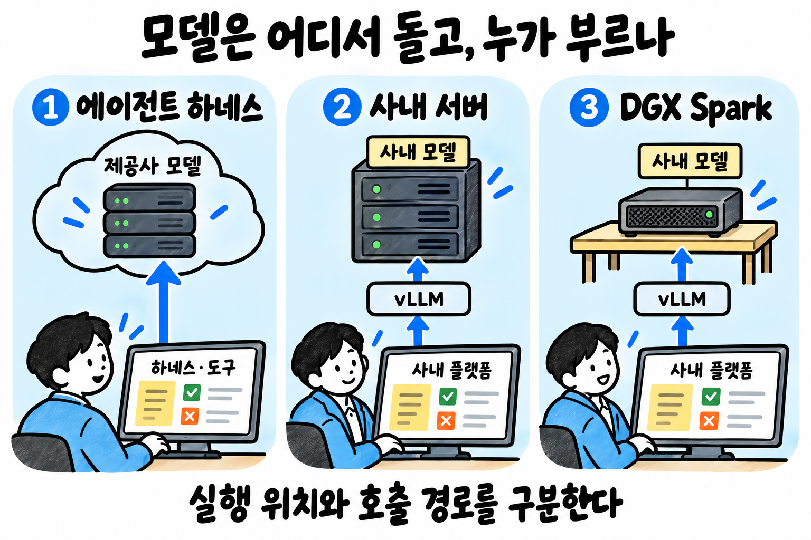
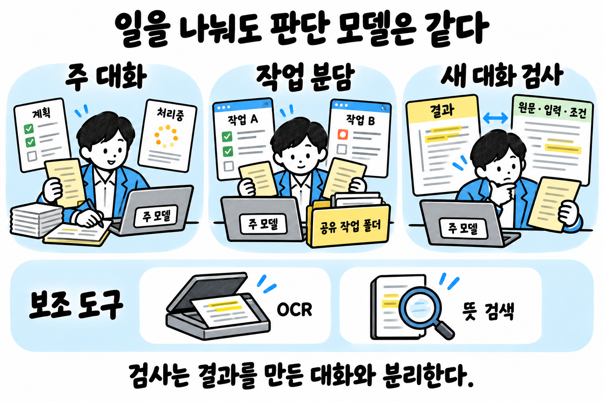
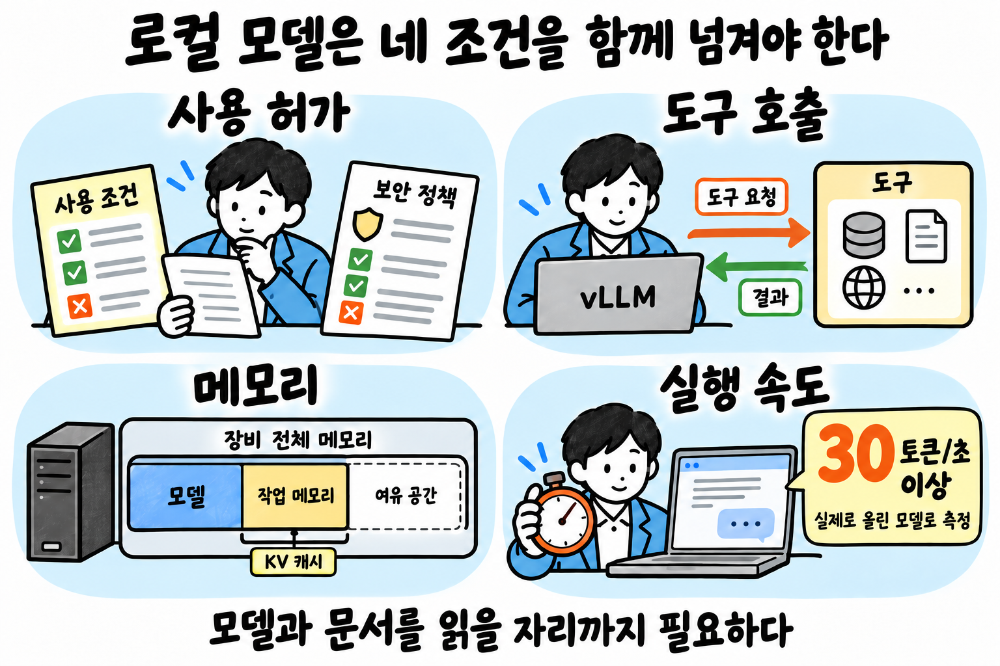
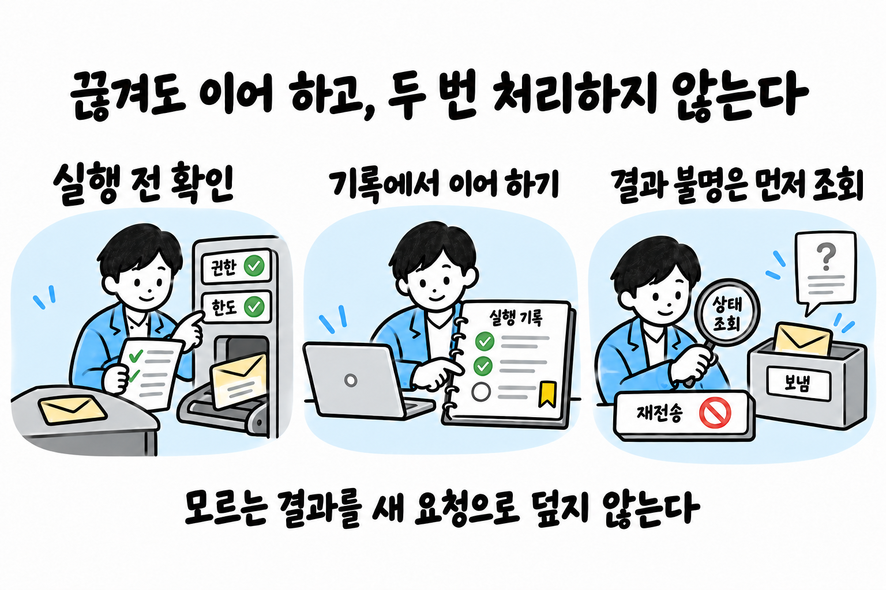
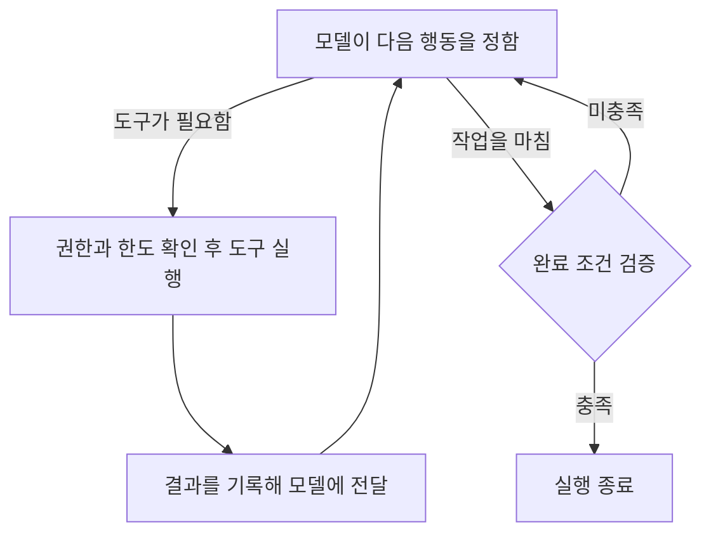

# 재료별 구현

## 환경 ✅

| 구분 | ① 에이전트 하네스 | ② 사내 서버 + 사내 플랫폼 | ③ 사내 서버 + DGX Spark |
|------|------|------|------|
| 예 | Claude Code, Codex | Mybee | Mybee + DGX Spark |
| 모델이 도는 곳 | ▶️ 제공사 서버 ▶️ (하네스·도구는 한 사람의 PC) | ▶️ 사내 서버 ▶️ 주 모델 MiMo-V2.6-Pro는 가중치 1.02조 개라 8bit로 약 1TB, GPU 메모리 합계가 1.5TB 이상이어야 한다 | ▶️ DGX Spark 한 대 ▶️ (통합 메모리 128GB) |
| 지금의 주 모델 | ▶️ Claude Code: Claude Opus 5.5 ▶️ Codex: GPT-6 Astra | MiMo-V2.6-Pro | ▶️ Qwen3.8-Flash-Next ▶️ (모델을 API로 빌려주는 사업이나 코딩·사무 보조 AI 제품 사업에 쓰려면 Qwen의 별도 허가가 필요하다) |
| 모델 부르기 | 하네스가 부른다 | 사내 플랫폼이 vLLM(모델 실행 프로그램)으로 띄워 부른다 | ②와 같다 |
| 자료가 가는 곳 | ▶️ 모델 회사 서버로 나간다 ▶️ 회사 밖으로 내보내면 안 되는 자료를 다루는 일은 ②·③에서 돌린다 | 회사 밖으로 나가지 않는다 | ②와 같다 |
| 요금 | 구독 요금 안에서 쓴다 | ▶️ 장비값만 든다 ▶️ 부를 때마다 드는 돈은 없다 | ②와 같다 |

## AI 모델 ✅

**원칙**

- **주 모델**: 모든 작업에 그때 가장 뛰어난 모델 하나를 쓴다. ①에서는 주 대화와 하위 에이전트(일을 나눠 맡는 보조 대화)에 모두 이 모델을 지정한다.
- **추론 강도**: 추론 강도는 모델이 답하기 전에 생각하는 정도다. AA 점수를 잰 가장 높은 설정으로 돌린다. ②·③에서 그 설정으로는 아래 속도 조건을 넘지 못하면, 속도 조건을 넘는 설정 가운데 가장 높은 것으로 돌린다.
- **결과 검사**: 주 모델이 하되, 결과를 만든 대화가 아닌 새 대화에서 한다. 같은 대화에서 검사하면 자기 답을 후하게 본다. ①에서는 새 하위 에이전트가 맡는다.
- **다른 모델**: 주 모델이 못 하는 일에만 쓴다. 실시간 음성 대화, 사진·음성 인식, 장비 메모리가 모자라 주 모델을 올리지 못하는 경우다. 뜻 검색 모델, 시계열 예측 모델, 문서·소리를 두 번째로 읽는 도구(OCR·받아쓰기)는 판단하는 모델이 아니라 도구라 이 규칙 밖이다.

**가장 뛰어난 모델 고르기**

[Artificial Analysis 지수](https://artificialanalysis.ai/leaderboards/models)(AA 지수)로, 그 환경에서 쓸 수 있는 모델(①은 그 하네스가 부르는 모델, ②·③은 아래 로컬 모델 조건을 넘은 모델) 가운데 아래 순서대로 거른다. 점수는 모델마다 가장 높은 설정의 것을 쓴다.

1. 40점 미만은 뺀다. 1점 차이까지는 40점으로 본다.
2. 그중 1위보다 2점 이상 낮으면 뺀다. 1점 차이까지는 같은 점수로 본다.
3. 남은 모델 가운데 AA가 지수를 잴 때 쓴 출력 토큰이 적은 모델을 고른다. 같은 실력이면 적게 쓰는 모델이 빨리 끝나고, 구독 한도와 장비를 덜 쓴다.
4. 출력 토큰 수도 비슷하면, 그 환경에서 직접 돌려 보아 답을 더 빨리 내는 모델을 고른다.

**주 모델이 바뀔 때**

- 주 모델 이름은 환경 설정 한 곳에만 적는다. ①은 하네스의 모델 설정이고, ②·③은 vLLM 실행 설정이다. 전문가 정의와 지시문에는 이름 대신 "주 모델"이라고 쓴다. 이름을 여러 곳에 적으면 모델이 바뀔 때 빠뜨린 곳이 생긴다.
- 새 모델이 나왔을 때, AA가 지수를 개편했을 때, 쓰던 모델의 제공이 끝나거나 사용 허가가 바뀌었을 때 위 순서로 다시 거른다. 모델이 그대로여도 지수가 바뀌면 순위가 바뀐다. 이런 소식이 없어도 한 달에 한 번은 다시 거른다. ②·③은 로컬 모델 조건도 다시 잰다.
- 결과가 지금 주 모델과 같으면 그대로 둔다. 다르면 환경을 맡은 사람에게 알리고, 그 사람이 설정 한 곳을 고쳐 바꾼다.
- 주 모델에 장애가 났다고 바로 다른 모델로 넘기지 않는다. 바꾸는 것은 이 절차를 거친 때뿐이다.

**②·③ 로컬 모델 조건**

| 조건 | 기준 | 이유 |
|------|------|------|
| 사용 허가 | 가중치가 공개되어 있고, 사내 업무에 써도 된다는 허가가 있으며, 회사 보안 정책이 막지 않는다 | 허가 없이 쓰면 법적 문제가 생긴다 |
| 도구 호출 | vLLM에서 도구 호출이 된다 | 도구를 못 부르면 에이전트로 쓸 수 없다 |
| 메모리 | 모델과 함께, 한 건의 문서를 읽을 작업 메모리(KV 캐시)가 장비에 올라간다 | 모델만 올라가면 긴 문서를 못 읽어 일을 끝내지 못한다 |
| 속도 | ▶️ 질문을 받고 답의 첫 토큰이 나오기까지 짧은 질문은 1초 이내, 한 건의 문서(3만 토큰)를 넣은 질문은 10초 이내다 ▶️ 첫 토큰이 나온 뒤에는 답을 1초에 30토큰 이상 써 낸다 ▶️ 용량을 줄여 올리는 모델이면 줄인 그 모델로, 이미 읽어 둔 부분이 없는 새 입력으로 잰다 | ▶️ 사람은 기다림이 1초를 넘으면 느끼고 10초를 넘으면 딴생각을 한다 ▶️ 첫 토큰이 늦으면 답이 빨리 써져도 기다리는 시간이 길다 ▶️ 사람이 한국어를 읽는 속도는 1초에 한글 약 10자(토큰 약 10개)다 ▶️ 30토큰은 그 3배라서 읽는 사람이 글을 기다리지 않는다 ▶️ 30토큰보다 느리면 4만 토큰짜리 긴 작업 한 건이 20분을 넘긴다 |

## 실행 제어

실행 반복과 종료 조건 보기

**지금의 선택**

| 환경 | 실행 | 끊긴 뒤 이어 가기 |
|---|---|---|
| ① 하네스 | Claude Code나 Codex의 모델 호출과 도구 실행 기능을 쓴다 | 업무 기록을 대화 밖에도 저장해, 대화를 다시 열면 남은 일을 잇는다 |
| ②·③ 사내 실행 | ▶️ 모델 호출, 도구 실행, 대기를 코드로 짠다 ▶️ 그 코드를 Temporal로 실행한다 | 진행 기록을 저장해, 장애가 나도 이어서 처리한다 |

**②·③에서 단계를 잇는 것 고르기**

| 흐름 | 쓰는 것 |
|---|---|
| 단순한 순서로 처리할 수 있다 | Temporal 안의 코드로 잇는다 |
| 판단 단계가 여러 갈래로 나뉘거나 앞 단계로 돌아간다 | ▶️ LangGraph를 더한다 ▶️ LangGraph는 판단 단계의 연결을 맡는다 ▶️ 대기와 장애 복구는 Temporal이 맡는다 |

**업무에 맞춰 더할 코드**

세 코드는 같은 업무 번호를 써서, 모델이 받은 자료와 실제 실행 결과를 함께 추적한다.

| 코드 | 맡는 일 |
|---|---|
| 입력 구성 코드 | 업무 기록에서 이번 판단에 필요한 내용을 골라 모델에 준다 |
| 기록 프로그램 | ▶️ 새 판단과 실행 결과를 업무 기록에 저장한다 ▶️ 권한과 기존 버전을 확인해, 잘못 덮어쓰는 것을 막는다 |
| 실행 프로그램 | ▶️ 승인과 한도를 검사한 뒤 업무 도구를 호출한다 ▶️ 외부 시스템에 실제로 반영됐는지 확인한다 |

### 요청 접수

| 항목 | 기준 |
|---|---|
| 받는 곳 | 수신 서버가 시작 신호를 받아 PostgreSQL 대기열에 넣는다 |
| 새 업무인지 가리기 | 요청 번호로 새 업무인지, 진행 중인 업무에 온 답인지 가른다 |
| 같은 알림이 여러 번 올 때 | 한 번만 접수한다 |
| 외부 알림 | 보낸 쪽을 인증한 뒤 받는다 |
| 반복 일정 | ▶️ 시간대를 함께 저장한다 ▶️ 빠진 실행이 있는지 확인한다 |
| ①에서 업무 시작 | ▶️ 수신 서버가 PC의 하네스를 실행한다 ▶️ PC가 꺼져 있으면 요청을 보관했다가, PC가 돌아온 뒤 처리한다 |
| ②·③에서 업무 시작 | Temporal이 업무를 시작하거나 다시 잇는다 |

### 업무 도구 연결

**연결 방법 고르기**

| 경우 | 쓰는 것 |
|---|---|
| 기본 | 공식 API, SDK, CLI |
| 에이전트용 호출 방식이 필요하다 | MCP |
| API로 처리할 수 없는 화면 업무 | Playwright로 화면을 조작한다 |

| 항목 | 기준 |
|---|---|
| 도구마다 등록할 것 | 하는 일, 접근 범위, 읽기와 쓰기 구분, 결과 확인 방법 |
| 쓰기 요청 | ▶️ 실행 프로그램이 권한과 한도를 확인한다 ▶️ 확인이 끝나면 실행 프로그램이 인증 정보를 넣어 처리한다 |
| 쓸 수 있는 도구 | ▶️ 연결만 확인한 도구는 쓰지 않는다 ▶️ 실제 호출과 반영 결과까지 시험한 도구만 쓴다 |

### 진행 조정과 작업 분담

| 재료 | 기준 |
|---|---|
| **작업 진행·연결** | ▶️ 자료가 바뀌면 영향을 받은 작업만 다시 한다 ▶️ 순서는 급한 정도와, 놓치면 되돌리기 어려운 기한을 기준으로 조정한다 |
| **나눠 맡기기** | ▶️ 목표, 완료 조건, 자료 버전, 적용 전제, 미확인 사항, 권한과 예산을 함께 넘긴다 ▶️ ①은 하위 에이전트를, ②·③은 Temporal의 Child Workflow를 쓴다 ▶️ 동시에 맡기는 수는 모델과 장비의 처리 능력에 맞춘다 ▶️ 담당을 바꿀 때는 이전 담당의 쓰기 권한을 거둔다 |
| 총괄이 결과를 합칠 때 | ▶️ 의견이 다르면 사실과 기준 가운데 어디서 갈렸는지 본다 ▶️ 다수결로 결론 내리지 않는다 ▶️ 이미 실행한 일에 문제가 있으면 외부의 실제 상태를 조회한다 ▶️ 조회한 상태를 바탕으로 정정이나 복구 작업을 만든다 |

### 대기, 중단과 재개

| 상황 | 처리 |
|---|---|
| 답이나 승인을 기다린다 | ▶️ 진행 상태를 저장하고 실행을 멈춘다 ▶️ 답이 오거나 확인할 때가 되면 남은 작업을 시작한다 |
| 통신 장애가 잠깐 났다 | 정해 둔 횟수와 시간 안에서 다시 시도한다 |
| 입력 오류나 권한 부족 | 원인을 고친 뒤 실행한다 |
| 보냈는데 응답을 받지 못했다 | ▶️ 상대 시스템에서 처리됐는지 먼저 조회한다 ▶️ 결과를 모르는 채 같은 행동을 새 요청으로 되풀이하지 않는다 |
| 송금이나 제출처럼 중복되면 안 되는 행동 | ▶️ 보내기 전에 요청 번호와 내용을 저장한다 ▶️ 다시 보낼 때는 상대가 중복 방지 기능을 지원하고 그 유효 기간 안일 때만 같은 번호로 보낸다 |
| 중단 요청이나 권한 철회 | ▶️ 새 실행과 재시도를 막는다 ▶️ 실행 중인 도구에 취소를 요청한다 ▶️ 취소를 요청한 것과 실제로 취소된 것은 따로 확인한다 ▶️ 중단 범위에 드는 하위 작업, 예약, 구독도 함께 정리한다 |
| 작업을 다시 잇는다 | 저장한 기록과 외부 처리 결과를 대조해, 이미 끝난 행동은 되풀이하지 않는다 |
| 외부 처리 결과를 끝내 확인하지 못하거나, 기한 안에 다시 이을 수 없다 | 확인한 내용과 남은 일을 담당자에게 넘긴다 |

## 기억과 업무 기록

**원칙**

▶️ 모델은 기록을 읽고 판단만 한다. 
▶️ 기록을 고치는 일은 기록 프로그램이 맡는다. 여러 담당이 같은 기록을 덮어쓰지 않게 하려는 것이다.

**지금의 선택**

| 기록 | ① 하네스 | ②·③ 사내 실행 |
|---|---|---|
| 장기 기억 | 고객별 파일 | PostgreSQL |
| 진행 상태 | 모델이 직접 고칠 수 없는 상태 파일 | PostgreSQL |
| 판단 근거 | 모델이 직접 고칠 수 없는 기록 폴더와 별도 기록 프로그램 | ▶️ PostgreSQL과 원본 저장소 ▶️ 원본 저장소의 선정안은 SeaweedFS와 Object Lock |
| 모델에 줄 정보 | 하네스의 입력 재사용과 요약 기능 | vLLM의 Automatic Prefix Caching과 입력 구성 코드 |

### 장기 기억

▶️ 업무를 시작할 때 해당 고객의 선호, 이전 약속, 미해결 사항을 불러온다. 
▶️ 기억마다 출처와 유효 기간을 붙인다. 
▶️ 하네스의 자동 기억은 따로 쌓이지 않게 설정한다. 고객 정보가 공통 기억에 섞이지 않게 하려는 것이다.

### 진행 상태

▶️ 진행 상태에는 기한과 권한도 저장한다. 
▶️ 쓴 자료의 버전을 남긴다. 자료가 바뀌었을 때 어느 판단을 다시 확인할지 찾으려는 것이다. 
▶️ 한 건의 완료와 상시 업무의 종료를 따로 기록한다.

### 판단 근거

▶️ 원문, 확인한 사실, 적용 기준, 계산, 결론을 모은다. 
▶️ 실행 요청과 실제 응답, 전달한 최종 버전도 남긴다. 
▶️ 검사자는 이 기록을 따라가며 판단과 처리를 다시 확인한다. 
▶️ 인증 정보는 기록하지 않는다.

### 모델에 줄 정보

| 항목 | 기준 |
|---|---|
| 넣는 순서 | ▶️ 이번 단계의 목표와 지시를 먼저 넣는다 ▶️ 그 판단에 필요한 원문, 앞선 결과, 미확인 사항을 뒤에 붙인다 |
| 승인과 남은 예산 | 요약된 대화가 아니라 저장된 원기록에서 확인한다 |
| 대화가 길어질 때 | ▶️ 중간 대화를 줄인다 ▶️ 약속, 출처, 실행 결과는 업무 기록에 보존한다 |
| 새 결정과 결과 | 다음 단계로 넘어가기 전에 업무 기록에 저장한다 |

## 규칙과 권한

**원칙**

OPA는 실행 요청이 정해 둔 조건에 맞는지 검사하는 프로그램이다.

| 조건 | 맡는 쪽 | 기준 |
|---|---|---|
| 요청, 계약, 규정의 뜻을 해석해야 한다 | 주 모델 | 원문과 이번 사실을 함께 준다 |
| 대상, 금액, 기한처럼 분명히 검사할 수 있다 | 실행 프로그램이 OPA로 검사 | ▶️ 자료를 조회하거나 행동하기 직전에 검사한다 ▶️ 허용할 요청과 막을 요청을 `opa test`로 시험한다 ▶️ 원문이 개정되면 규칙과 시험도 함께 고친다 |

### 이번 업무에 적용할 규칙

규칙은 출처별로 모으고, 이번 업무에 실제로 적용되는 조항만 골라 쓴다.

| 재료 | 가져오는 곳 | 적용 방법 |
|---|---|---|
| **법·의무 기준** | 지역과 분야에 맞는 법령 | ▶️ 자격이 필요한 행위, 법정 기한, 보관과 삭제 의무를 뽑는다 ▶️ 기한은 해당 조항과 기간을 세기 시작하는 날을 놓고 달력으로 계산한다 |
| **직업 윤리·의무** | 법, 계약, 전문단체 권고 | ▶️ 법적 의무, 계약상 의무, 전문단체 권고를 나눈다 ▶️ 비밀 유지는 당사자마다 따로 적용한다 |
| **에이전트 기본 원칙** | 시스템 지침 | ▶️ 작업을 나누거나 대화를 요약해도 빠지지 않게 한다 ▶️ 서비스와 결과물에 AI가 한 업무임을 알린다 |
| **조직 규칙** | 인사와 결재 시스템 | ▶️ 결정권자와 절차를 조회한다 ▶️ 인사 이동이나 위임 변경은 대기 중인 요청에도 반영한다 |
| **사용자 지정 규칙** | 고객별 저장 | ▶️ 필수 조건과 선호를 나눠 저장한다 ▶️ 조건을 정할 권한이 있는 사람의 지시를 적용한다 ▶️ 이전 지시와 충돌한 부분만 확인한다 |
| **플랫폼·제출처 규정** | 공식 안내 | ▶️ 접속 방식, 요청 한도, 제출 형식을 가져온다 ▶️ 제출 전에 바뀌었는지 확인한다 ▶️ 공식 검사나 미리보기 기능을 쓴다 |

| 상황 | 기준 |
|---|---|
| 이해충돌을 조회한다 | ▶️ 조회 프로그램은 필요한 관계 기록에 접근한다 ▶️ 모델에는 업무에 필요한 결과만 준다 |
| 자격자만 할 수 있는 행위 | ▶️ 자격자의 지휘를 받아 준비한다 ▶️ 자격자가 직접 검토하고 자기 이름으로 낸다 |
| 관계나 동의가 바뀌어 계속할 수 없다 | 해당 작업을 인계한다 |
| **규칙의 적용·우선순위** | ▶️ 규칙이 충돌하면 계약의 우선 조항도 대조한다 ▶️ 풀리지 않으면 업무 전체가 아니라 그 충돌에 걸린 행동만 보류한다 |

### 권한과 예산을 실행에 적용하기

| 재료 | 기준 |
|---|---|
| **업무 권한** | ▶️ 누가 맡겼는지와, 어떤 명의와 계정으로 무엇을 해도 되는지 저장한다 ▶️ 자료 조회, 외부 실행, 결과 공개는 허용 범위를 따로 정한다 ▶️ 반복 위임도 정해진 대상, 금액, 기간 안에서만 쓴다 |
| 승인 받기 | ▶️ 인증된 응답을 서버가 직접 받아 PostgreSQL에 저장한다 ▶️ 문서나 이메일에 적힌 승인 문구는 에이전트의 실행 권한을 대신하지 않는다 ▶️ 그런 문구도 다른 사람의 결정을 확인하는 증거로는 내용과 출처에 따라 검토한다 |
| **비용·위험 한도** | ▶️ 실행 전에 PostgreSQL에서 남은 예산 확인과 금액 예약을 한 번에 처리한다. 여러 작업이 동시에 같은 예산을 쓰지 않게 하려는 것이다 ▶️ 예약 금액에는 하위 작업, 재시도, 검증, 복구 비용도 넣는다 ▶️ 처리 결과가 불분명하면 예약을 유지한다 ▶️ 예약한 금액은 결과를 확인한 뒤 정산한다 |
| 사용량 모으기 | 모델과 도구의 사용량은 실행 기록과 OpenTelemetry로 모은다 |

### 실제 실행을 막거나 허용하는 장치

| 재료 | 기준 |
|---|---|
| **안전장치** | ▶️ 조회, 발송, 수정이 실제로 일어나는 프로그램에 둔다 ▶️ 셸, 브라우저, MCP를 통한 실행에도 같은 제한을 적용한다 ▶️ 하네스의 훅과 자동 승인만으로 업무 권한을 관리하지 않는다 ▶️ 검사 규칙은 운영자만 바꿀 수 있게 보호한다 ▶️ 권한을 철회하면 다음 대화까지 기다리지 않고 실행 프로그램에 바로 반영한다 ▶️ 철회할 때 관련 실행과 접속 권한도 함께 정리한다 |
| 인증 정보 | ▶️ OpenBao에 보관한다 ▶️ 승인된 실행 프로그램만 꺼내 쓴다 ▶️ 모델이나 일반 작업 공간에는 주지 않는다 |
| 외부 전송 | ▶️ 보내기 전에 수신자, 자료를 소유한 고객, 첨부 내용을 대조한다 ▶️ 비밀값은 Betterleaks 등으로 검사한다 ▶️ 외부 모델이 볼 필요가 없는 개인정보는 가린다 ▶️ 제출에 원래 값이 필요하면 실행 프로그램이 넣는다 |

**분리 실행**

| 대상 | ① 하네스 | ②·③ 사내 실행 |
|---|---|---|
| 코드 실행 | 업무별 계정 또는 컨테이너와 샌드박스 | 컨테이너와 gVisor |
| 업무 자료 | 허용된 폴더만 연결 | PostgreSQL 행 수준 접근 제어 |
| 검색 | 허용된 폴더 안에서 검색 | OpenSearch 문서별 접근 제어 |
| 공통 지식 | 읽기 전용 | 읽기 전용 |

| 항목 | 기준 |
|---|---|
| 외부 파일과 생성한 코드 | 네트워크를 제한한 환경에서 실행한다 |
| 대화와 기억 | ▶️ 고객별로 나눈다 ▶️ 다른 고객의 자료에 접근할 수 없는지 실제로 시험한다 |
| 개인정보 | ▶️ 실행 기록, 판단 근거와 따로 저장하고 식별자로 잇는다 ▶️ 삭제는 사본에도 반영한다 ▶️ 법적 보관 대상은 접근을 제한해 따로 보관한다 |

## 자료와 업무 지식

### 원본 가져오기와 내용 읽기

| 재료 | 가져오는 곳 | 기준 |
|---|---|---|
| **업무별 정보** | ▶️ 원본 시스템의 API ▶️ ①은 연결된 CLI나 MCP | ▶️ 고객, 거래, 사건 자료를 가져온다 ▶️ 직접 조회가 안 되면 시스템 발급 내역이나 제출된 증빙을 확보한다 |
| **규칙·기준 원문** | ▶️ 공식 API, 발행 기관의 파일, 정식 구독 자료 ▶️ 한국 법령은 국가법령정보 공동활용 서비스 | |
| **적용 사례** | 판례와 해석례 | ▶️ 사실관계, 적용 규칙, 결론을 함께 가져온다 ▶️ 반대 사례와 이후 변경도 찾는다 |
| **참고 자료** | ▶️ 논문, 책, 통계의 원문 ▶️ 공개 논문 탐색은 Unpaywall ▶️ 국가통계는 KOSIS ▶️ 한국은행 통계는 ECOS | |

가져온 요약표는 원본 기록과 대조한다.

▶️ **정보·자료 이해**는 주 모델이 맡는다. 
▶️ 주 모델이 직접 읽을 수 없는 형식은 판독 도구를 거친다.

| 자료 | 지금의 선택 | 대신하거나 교차 확인할 때 |
|---|---|---|
| 문서와 이미지 | 주 모델 | 이미지 입력이 안 되면 PaddleOCR-VL-1.6 |
| 핵심 값의 별도 판독 | PaddleOCR 또는 Tesseract | |
| 음성 | Qwen3-ASR-1.7B | 교차 확인은 Whisper large-v3 |
| HWP와 HWPX | LibreOffice와 H2Orestart | |
| 영상 | FFmpeg로 필요한 장면과 음성을 뽑는다 | |

| 항목 | 기준 |
|---|---|
| 숫자 | 표의 제목과 단위를 함께 읽는다 |
| 결론을 좌우하는 값 | 다른 수단으로 다시 판독한다 |
| 서로 다르게 읽히거나 읽지 못한 부분 | 미확인으로 남긴다 |
| 중요한 번역 | 해석의 기준이 되는 언어본과 대조한다 |
| 읽는 모델이 돌려주는 것 | ▶️ 내용과 분류 결과를 돌려준다 ▶️ 추가 조회나 실행이 필요하면 권한을 검사하는 프로그램을 거친다 |

### 자료를 맞추고 근거로 쓸 수 있는지 확인하기

| 재료 | 기준 |
|---|---|
| **자료 선별·분류** | ▶️ 식별자와 문서 내용을 대조해 이번 일에 해당하는 자료를 고른다 ▶️ 결론을 좌우하는 분류는 실제 사실과 법이나 계약의 정의에 다시 대조한다 |
| **자료 정리·결합** | ▶️ DuckDB나 PostgreSQL에서 한다 ▶️ 원본은 보존한다 ▶️ 작업용 사본에서 단위, 식별자, 시간대를 맞춘다 ▶️ 합치기 전후의 행 수, 대상 수, 금액 합계를 비교해 누락과 중복을 찾는다 ▶️ 충돌한 값을 고른 이유를 남긴다 ▶️ 고객끼리의 자료 결합은 허용된 범위 안에서만 한다 |
| **자료의 시점·버전** | ▶️ 효력 기간, 발행이나 측정 시각, 수집 시각을 나눠 저장한다 ▶️ 적용 버전을 알 수 없고 버전에 따라 결론이 달라지면 발행처에 확인한다 |
| **근거의 신뢰성·적합성** | ▶️ 논문은 철회와 정정을 확인한다 ▶️ 통계는 기준 시점과 집계 범위를 확인한다 ▶️ 출처끼리 충돌하면 더 확인한다 ▶️ 그래도 풀리지 않으면 결론에 미치는 영향을 밝힌다 |

### 반복해서 쓸 지식과 방법 저장하기

**지금의 선택**

| 내용 | 선정안 |
|---|---|
| 용어, 동의어, 상하위 개념 | [SKOS](https://www.w3.org/TR/skos-primer/) 기반 용어집 |
| 실제 대상과 관계 | ① 구조화 파일, ②·③ PostgreSQL |
| 검증된 업무 방법 | Skills 파일과 Git |
| 검사 기준 | 기준과 시험 사례를 연결한 기록 |

| 재료 | 기준 |
|---|---|
| **업무 지식** | ▶️ 관계에는 방향과 유효 기간을 붙인다 ▶️ 모델이 뽑은 관계는 후보로 저장한다 ▶️ 후보는 형식 검사와 원문 대조를 거쳐 확정한다 ▶️ 공통 개념과 판단 기준을 바꿀 때는 대표 업무와 반례로 시험한다 ▶️ 그 변경은 전문가의 승인을 받는다 ▶️ 자주 바뀌는 사실은 고정된 지식에 넣기보다 필요할 때 조회한다 |
| **실전 경험·감각** | ▶️ 효과가 있었던 방법을 어떤 상황에 썼는지, 무엇을 보고 판단했는지, 언제 실패하는지와 함께 기록한다 ▶️ 새 방법은 기존 방법과 비교해 검증한 뒤 직종별 Skills에 반영한다 ▶️ 한 고객에게만 해당하는 정보는 공통 경험에 넣지 않는다 |

### 질문에 맞는 자료 찾기

**정보·자료 찾기**는 질문에 따라 방법을 나눈다. 모든 질문을 문장 검색으로 처리하면 정확한 합계나 여러 문서의 관계를 놓칠 수 있다.

| 필요한 정보 | 찾는 방법 |
|---|---|
| 문서 번호나 대상 ID가 있음 | 해당 원문 직접 조회 |
| 개수나 합계 | 원본 데이터베이스 조회와 계산 |
| 문서 내용 | 원문 RAG |
| 여러 대상과 문서의 연결 | GraphRAG로 관계를 따라가고 원문 확인 |

**지금의 선택**

| 쓰임 | 선정안 |
|---|---|
| ① 검색 | 파일 검색과 하네스의 웹 검색 |
| ②·③ 검색 | OpenSearch에서 키워드 검색과 벡터 검색을 함께 쓴다 |
| 한국어 분석 | nori |
| 두 검색의 순위 합치기 | RRF |
| 일반 웹 검색 | Brave Search API |
| 질문 분류와 근거 관련성 판단 | ▶️ 주 모델이 기본이다 ▶️ Jev에 맡길 일과 결과를 읽는 방법은 전문 판단의 신뢰성 문서를 따른다 |

| 항목 | 기준 |
|---|---|
| 검색 범위 | 권한과 기준일로 제한한다 |
| 찾은 원문 읽기 | ▶️ 조문, 표, 별첨 같은 문서 구조를 유지해 읽는다 ▶️ 필수 별첨까지 확인한다 |
| 결과가 잘렸을 때 | 잘렸거나 받지 못한 페이지의 범위를 표시한다 |
| 검색 모델을 바꿀 때 | 새 색인에서 같은 질문으로 비교한 뒤 바꾼다 |
| 저장이 제한된 자료 | 허용된 열람 경로로 확인한다 |
| **못 찾음·없음 구분** | ▶️ 이 구분을 검색 기록마다 남긴다 ▶️ 권한이나 원본 시스템의 장애로 열지 못한 것은 못 찾은 것과 따로 적는다 |
| **현재 값·상태 확인** | ▶️ 환율, 재고, 거래 상태는 원본 시스템에서 조회한다 ▶️ 조회가 안 되거나 출처끼리 값이 다르면 이전 값을 현재 값처럼 쓰지 않는다 ▶️ 그때는 그 값에 기대는 판단을 보류한다 |

## 요청 해석과 실행 계획

**원칙**

▶️ 계산과 예측은 해당 도구에 맡긴다. 
▶️ 주 모델은 도구의 결과를 해석해 실행 계획을 만든다. 
▶️ 조건과 예외를 적용하고 결론을 확인하는 방법은 전문 판단의 신뢰성 문서를 따른다.

### 목표와 맡은 범위

| 재료 | 기준 |
|---|---|
| **지시·의도 파악** | ▶️ 주 모델이 맡는다 ▶️ 이미 정해진 내용은 다시 묻지 않는다 |
| **계약·합의 조건** | ▶️ 업무 범위, 기한, 대가와 책임은 효력이 확인된 계약, 메시지, 구두 합의를 근거로 정한다 ▶️ 협의 중인 제안과 확정된 약속을 나눈다 ▶️ 새 약속은 고객 기억과 일정에 반영한다 |
| **문제·목표·완료 조건** | ▶️ 제작만 맡았는지, 발송과 인수까지 맡았는지에 따라 완료 조건을 다르게 정한다 ▶️ 필수 조건을 채운 결과가 있어야 완료로 저장한다 |
| 첨부 문서에 적힌 지시 | ▶️ 사용자가 그 문서대로 작업하라고 맡겼으면 적용한다 ▶️ 문서에 적힌 수신자나 권한 변경이 맡은 범위를 넘는지는 따로 확인한다 |

### 사실 분석과 기준 적용

| 재료 | 기준 |
|---|---|
| **관찰·측정** | ▶️ 단위와 허용 오차를 먼저 정한다 ▶️ 쓴 도구, 시각, 조건을 원자료와 함께 남긴다 ▶️ 원본 시스템의 기록으로 충분하면 다시 측정하지 않는다 |
| **분석** | ▶️ 대상, 기간, 비교 기준을 먼저 정한다 ▶️ 집계는 DuckDB나 PostgreSQL로 한다 ▶️ 통계 분석은 Python의 statsmodels로 한다 ▶️ 자료의 누락과 분석 방법의 가정을 확인한다 ▶️ 입력과 코드를 보관해 다시 계산할 수 있게 한다 ▶️ 관련이 있다는 것만으로 원인이라고 단정하지 않는다 ▶️ 면담에서 찾은 주제는 실제 발언을 근거로 내놓는다 |
| **기준 적용·판정** | ▶️ 항목마다 충족, 불충족, 미확인, 해당 없음 가운데 하나로 기록한다 ▶️ 분명한 조건은 코드로 검사한다 ▶️ 해석이 갈리는 조항은 해석마다 적용한 결과와 근거를 비교한다 |

### 계산과 예측

▶️ **계산**은 모델의 암산이 아니라 코드로 한다. 
▶️ 입력의 출처, 단위, 기준일, 적용 규칙을 먼저 확인한다.

| 계산 | 선정안 |
|---|---|
| 금액과 정확한 십진수 | Python `Decimal` |
| 단위 변환 | Pint |
| 기호식 | SymPy |
| 수치해석 | SciPy |
| 법령이나 제출처가 지정한 계산 | 공식 계산기와 독립 검산 |

| 항목 | 기준 |
|---|---|
| 반올림 | 법, 계약, 제출처가 정한 단계에서 한다 |
| 기한 | ▶️ 별도 계산기로 계산한다 ▶️ 계산기에는 기간을 세기 시작하는 날, 첫날을 세는지, 마지막 날이 휴일일 때의 처리, 영업일 달력, 시간대를 반영한다 |
| 반복해서 쓰는 계산기 | ▶️ 적용 규칙의 버전과 연결한다 ▶️ 경계값과 예외를 시험한다 |
| 입력이 불확실할 때 | 근거 있는 범위나 시나리오별로 계산한다 |
| **예측** | ▶️ statsforecast로 직전 값이나 계절성을 쓰는 단순한 방법부터 시험한다 ▶️ 다른 모델은 실제 업무 자료에서 이 방법보다 나은지 비교한 뒤 채택한다 ▶️ 과거 시점에 알 수 있었던 자료만으로 이후 결과를 예측해 오차를 잰다 ▶️ 실제 결과가 나오면 예측값과 비교한다 ▶️ 자료가 부족한 사람의 반응은 정밀한 확률 대신 가능한 시나리오로 설명한다 |

### 대안을 비교하는 방법

**방법 고르기**

| 방법 | 쓰는 때 | 기준 |
|---|---|---|
| **조건 안에서 최선 찾기** | 목표와 제약이 수치로 정해졌을 때 | ▶️ 목표의 우선순위가 비어 있으면 대안별 차이를 보여 주고 결정받는다 ▶️ 최적임을 증명한 결과와 제한 시간 안에 찾은 최선의 결과를 나눈다 ▶️ 조건을 만족하는 답이 없으면 충돌한 조건을 알린다 ▶️ 허락 없이 조건을 느슨하게 하지 않는다 |
| **실험** | 실제 효과를 확인해야 할 때 | ▶️ 결과를 보기 전에 대조군, 주 지표, 배정 방법, 표본 수, 기간, 중단 기준을 정한다 ▶️ 고객에게 영향을 주는 시험은 필요한 권한 안에서 한다 ▶️ 불리한 결과도 남긴다 |
| **시뮬레이션** | 직접 시험하기 어려울 때 | ▶️ 가정과 입력 범위를 정한다 ▶️ 관측 자료로 모형을 확인한다 ▶️ 결과는 그 가정 아래의 추정으로 다룬다 ▶️ 협상 연습의 모의 상대에게 우리 최저 수용 조건을 알려 주지 않는다 ▶️ 모의 상대의 반응을 실제 상대의 뜻으로 여기지 않는다 |

**조건 안에서 최선 찾기의 지금의 선택**

| 문제 | 선정안 |
|---|---|
| 후보가 적음 | 전체 후보 비교 |
| 실행해야 성능을 알 수 있음 | Optuna |
| 배치와 일정 | OR-Tools CP-SAT |
| 차량 경로 | OR-Tools 경로 최적화 |
| 선형계획과 지원되는 이차계획 | HiGHS |
| 그 밖의 수치 최적화 | SciPy |

### 방법을 고르고 작업으로 나누기

| 재료 | 기준 |
|---|---|
| **대안·전략 판단** | ▶️ 주 모델이 기존 절차와 대안을 비교한다 ▶️ 선택을 바꿀 수 있는 사실부터 조사한다 ▶️ 되돌릴 수 있는 방법은 작은 범위에서 먼저 시험한다 ▶️ 어떤 변화가 생기면 다른 방법으로 바꿀지 미리 정한다 |
| **업무 절차·실행 계획** | 새 종류의 작업은 시험 환경에서 먼저 실행한다 |
| **사람에게 넘기기** | ▶️ 결정할 내용, 추천안, 대안별 결과, 근거, 답 기한을 함께 넘긴다 ▶️ 답 기한은 업무 기한에서 결정과 실행에 걸릴 시간을 빼서 정한다 ▶️ 이미 받은 유효한 승인은 다시 요구하지 않는다 ▶️ 답이 없으면 승인으로 보지 않는다 ▶️ 늦게 온 답은 지금 상황과 권한을 다시 확인한 뒤 적용한다 |

| 결정 받는 곳 | 지금의 선택 |
|---|---|
| ① 하네스 | 인증된 메신저 응답을 수신 서버가 기록한다 |
| ②·③ 사내 실행 | 사내 플랫폼의 결정 요청함 |

## 결과물 제작과 외부 실행

### 결과물 제작

| 재료 | 기준 |
|---|---|
| **결과물 설계** | ▶️ 기존 양식이나 디자인 체계가 있으면 그것을 쓴다 ▶️ 화면과 도면은 제작 도구에서 초안을 만들어 실제 사용 흐름을 확인한다 |
| **재사용 자료** | ▶️ 출처, 사용 권한, 버전을 확인한 서식, 코드, 이미지, 글꼴만 쓴다 ▶️ 원본과 수정본을 나눈다 ▶️ 어느 결과물에 썼는지 남긴다. 결함이나 권리 변경이 생겼을 때 해당 결과물을 찾으려는 것이다 |
| **표현 방식·스타일** | ▶️ 기준은 실제 견본으로 남긴다 ▶️ 글자 수와 필수 문구는 Vale로 검사한다 ▶️ 자연스러움과 전체 인상은 견본과 완성물을 비교해 판단한다 |
| **내용 재구성** | ▶️ 사실, 조건, 부정, 예외를 유지한다 ▶️ 앞에서 한 말이나 이해에 필요 없는 설명은 덜어 낸다 |
| **결과물 만들기·수정** | ▶️ 제작 프로그램의 자동화 기능이나 해당 파일 형식의 편집 라이브러리로 만든다 ▶️ 고친 내용에 맞춰 목차, 수식, 참조도 고친다 ▶️ 원본 프로그램에서 열어 편집할 수 있는지와 글꼴, 링크, 배치를 확인한다 ▶️ 요구한 형식을 만들지 못하면 대체 형식을 협의한다 ▶️ 그때도 필수 형식을 채운 것으로 처리하지 않는다 ▶️ 사용한 작품, 얼굴, 음성의 권리를 확인한다 |
| **형식·구조 변환** | ▶️ 원본 프로그램의 내보내기를 먼저 쓴다 ▶️ 변환한 뒤 표, 수식, 그림, 연결 관계를 원본과 대조한다 ▶️ 시스템 사이에 자료를 옮길 때는 필드 대응표를 먼저 만든다 |

**결과물 설계의 지금의 선택**

| 담을 것 | 선정안 |
|---|---|
| 목차와 내용 | Markdown |
| 과정과 관계 | Mermaid |
| 요구사항 대응 | 표 |

별도 변환 도구가 필요할 때는 다음을 쓴다.

| 변환 대상 | 선정안 |
|---|---|
| 문서 구조 | Pandoc |
| 페이지 배치를 유지한 PDF | LibreOffice |
| HWP와 HWPX 읽기 | LibreOffice와 H2Orestart |
| 영상, 음성, 자막 | FFmpeg |
| 표 데이터와 필드 구조 | DuckDB |

### 대화와 협상

| 재료 | 기준 |
|---|---|
| **사람과 소통** | ▶️ 확인할 사실이나 전달할 결론을 먼저 정한다 ▶️ 상대가 쓰는 통로로 연락한다 ▶️ 법이나 계약이 정한 통로가 있으면 그것을 따른다 ▶️ 질문은 답할 수 있을 만큼 구체적으로 쓴다 ▶️ 관련된 질문은 한 번에 묶는다 ▶️ 외부 발송은 그 수신자와 내용에 대해 위임받은 범위 안에서 한다 |
| **실시간 대화** | ▶️ 바로 답할 수 있는 내용과 조사가 필요한 내용을 나눈다 ▶️ 조사하는 동안에는 확인 질문이나 대기 안내를 한다 ▶️ 확인하지 않은 금액이나 권리로 약속하지 않는다 ▶️ 외부 통화는 사내 서버에서 처리한다 ▶️ 한국어 품질과 응답 지연은 실제 통화로 시험한다 ▶️ AI가 응대한다는 것과 녹음 여부를 알린다 ▶️ 필요한 동의를 받는다 ▶️ 이미 시작한 거래는 취소할지 따로 확인한다 ▶️ 중요한 금액, 날짜, 합의는 글로도 확인한다 |
| **협상·조율** | ▶️ 위임자, 목표, 최저 수용 조건, 결렬 때의 대안을 먼저 정한다 ▶️ 이 범위를 넘는 제안은 준비한 안과 차이를 보여 주고 결정받는다 ▶️ 양쪽이 같은 버전의 합의문을 확인하게 한다 ▶️ 서명과 계약 확정은 그 행동에 필요한 권한으로 한다 ▶️ 확정된 약속은 업무 기록과 일정에 반영한다 |

**실시간 대화의 지금의 선택**

| 기능 | 선정안 |
|---|---|
| 통화 서버 | 사내 LiveKit |
| 음성 인식 | Qwen3-ASR-1.7B |
| 짧은 대화 응답 | GLM-5.3-Flash |
| 음성 합성 | Qwen3-TTS-12Hz 1.7B-CustomVoice |
| 텍스트 연결 | 하네스 대화 또는 WebSocket |

### 업무 시스템에 반영하기

시스템을 바꾸는 작업은 요청을 보냈는지와 실제로 반영됐는지를 나눠 확인한다.

| 재료 | 실행 | 결과 확인 |
|---|---|---|
| **기록 입력·수정** | ▶️ 원본 시스템에 먼저 반영한다 ▶️ 확인된 결과를 다른 시스템에 동기화한다 ▶️ 요청 ID로 중복 생성을 막는다 ▶️ 기존 버전을 확인해 다른 사람이 고친 값을 덮어쓰지 않는다 ▶️ 삭제한 개인정보를 변경 이력에 다시 복제하지 않는다 ▶️ 보관 의무가 있는 기록은 따로 보호한다 | 일괄 수정은 변경 전후 목록과 실제 반영 내역을 대조한다 |
| **신청·거래 처리** | 요청 ID와 내용을 저장한 뒤 보낸다 | 원본 시스템에서 최종 상태를 조회한다 |
| **설정·작동 제어** | ▶️ 현재 값, 바꿀 값, 확인 방법, 복구 방법을 준비한다 ▶️ 설정 파일은 버전으로 관리한다 ▶️ 되돌릴 수 없는 변경과 자동 삭제 예약에는 필요한 결정을 받는다 ▶️ 사용 중지처럼 되돌릴 수 있는 단계로 먼저 확인할 수 있으면 그 단계를 활용한다 | 바꾼 뒤 실제 작동 상태를 조회한다 |
| **게시·배포** | ▶️ 검사한 버전만 배포한다 ▶️ 게시물에는 필요한 AI 생성 표시를 붙인다 | 배포한 뒤 실제 URL과 접근 권한을 확인한다 |
| 취소, 변경, 환불 | 원거래를 참조하는 별도 거래로 처리한다 | 외부 내역과 내부 기록을 대조한 뒤 비용과 한도를 정산한다 |
| 정정 발송 | 필요한 승인 범위 안에서 한다 | |

## 검증과 전달

되돌리기 어려운 실행은 실행 전에 판단을 검사하고, 실행 뒤에 반영 결과를 확인한다.

### 보고한 담당자와 결과 확인

| 재료 | 기준 |
|---|---|
| **보고 주체 확인** | ▶️ 배정한 작업 ID, 돌아온 실행 ID, 인증된 계정을 대조한다 ▶️ 보고서에 적힌 이름만으로 담당자를 확인하지 않는다 ▶️ 외부 명의로 낼 결과에는 그 위임이나 승인과 실제 결과물 버전을 연결한다 |

### 판단과 결과 검사

| 재료 | 기준 |
|---|---|
| **반대 근거·다시 확인** | ▶️ 돈, 권리, 되돌릴 수 없는 행동을 좌우하는 판단은 따로 검사한다 ▶️ 검사자는 기존 결론을 보기 전에 같은 사실, 명시한 전제, 권한과 한도로 먼저 판단한다 ▶️ 그 뒤 두 결과를 비교한다 ▶️ 결과가 다르면 사실, 기준, 계산 가운데 어디서 갈렸는지 원문과 독립 계산으로 확인한다 ▶️ 같은 모델의 답이 되풀이된 것을 새 증거로 세지 않는다 |
| **빠진 위험 확인** | ▶️ 직종별 목록에서 이번 작업에 해당하는 항목을 검사한다 ▶️ 항목마다 생기는 조건, 검사 시점, 방법을 정한다 ▶️ 분명한 값은 OPA로 검사한다 ▶️ 해석이 필요한 내용은 주 모델이 원문과 대조해 검사한다 ▶️ 정보 유출, 이해충돌, 사람에게 미치는 피해도 넣는다 ▶️ 필수 항목을 확인하지 못하면 관련 행동을 보류한다 |
| **결과 품질 평가** | ▶️ 제작 전에 정한 사용 목적과 합격 기준으로 평가한다 ▶️ 필수 항목의 실패를 다른 항목의 높은 점수로 상쇄하지 않는다 ▶️ 모델에게 맡길 평가 항목은 정상 사례와 오류 사례로 먼저 시험한다 ▶️ 그 시험에서 틀린 결과를 통과시키는 비율과 맞는 결과를 거절하는 비율을 확인한다 |

**결과 검증·재검증**

| 대상 | 검증 방법 |
|---|---|
| 파일과 화면 | 수신자가 쓸 프로그램에서 열어 확인 |
| 코드와 기능 | 실제 입력으로 실행 |
| 예약, 입금, 제출 같은 외부 처리 | 원본 시스템에서 최종 상태 조회 |
| 계산 | 원자료에서 입력을 다시 확인해 독립 계산 |
| 파일 형식 | 파일 검사 |
| 설명, 제안, 제작물 | 사용 목적과 요구사항에 맞는지 검토 |
| 전문 결론 | 적용 기준, 예외, 반대 근거와 최종 문장 대조 |

| 상황 | 기준 |
|---|---|
| 명시한 전제에서만 성립한다 | 조건부로 남긴다 |
| 틀린 것으로 드러난 결론 | 사람이 승인해도 확정하지 않는다 |
| 풀리지 않은 쟁점 | ▶️ 해석별 결과와 영향을 정리한다 ▶️ 기한 전에 준비한 결과와 남은 일을 인계한다 |

### 납품과 인수

| 재료 | 기준 |
|---|---|
| **납품 준비** | ▶️ 검사한 파일과 보낼 파일이 같은지 확인한다 ▶️ 계약이나 제출처가 정한 형식과 폴더 구성으로 묶는다 ▶️ 원본은 편집할 수 있는 파일로 넣는다 ▶️ 업무를 인계할 때는 이어서 할 일의 기한도 넘긴다 |
| **전달·인수 확인** | ▶️ 접수 번호나 수신 확인을 남긴다 ▶️ 답이 필요한 건은 후속 확인을 예약한다 ▶️ 계약에 없는 인수 절차를 더하지 않는다 ▶️ 수정 요청이 오면 대상 버전과 문제를 확인해 새 작업으로 잇는다 |

## 후속 관리와 변경 대응

### 기다리는 일과 변경 사항 확인

| 재료 | 기준 |
|---|---|
| **대기·후속 관리** | ▶️ 기다리는 결과, 담당자, 답 기한, 다음 확인일, 답이 없을 때의 조치를 저장한다 ▶️ 확인일이 되면 예약 실행으로 상태를 조회하거나 다시 묻는다 ▶️ 법정 기한과 계약 기한은 해당 계산 규칙으로 관리한다 ▶️ 기간을 세기 시작하는 날이 바뀌면 기한을 다시 계산한다 ▶️ 담당이 바뀌면 새 담당이 인수를 확인할 때까지 추적한다 |
| **변경 감시·반영** | ▶️ 공식 변경 알림과 정기 조회를 함께 쓴다 ▶️ 새 원본을 이전 본문과 비교한다 ▶️ 영향받은 부분만 다시 확인한다 ▶️ 이미 전달한 결과가 틀렸다면 수정 내용과 영향을 알린다 ▶️ 색인 갱신에 실패한 자료는 최신 자료로 표시하지 않는다 |
| **먼저 알아채기** | ▶️ 맡은 업무에서 감시할 대상, 출처, 주기, 대응 조건을 정한다 ▶️ 다가오는 기한, 계획을 바꿀 신호, 서비스 이상을 발견하면 관련 작업을 시작한다 ▶️ 일반 알림은 묶어서 검토한다 ▶️ 피해가 커지는 신호는 바로 처리한다 ▶️ 조사는 맡은 목적과 예산 안에서 한다 ▶️ 오탐은 줄이되, 기한과 급한 위험의 감시는 유지한다 |

## 운영 감시와 복구

**운영 감시·복구**를 맡을 도구는 업무를 실행하는 장비 밖에 둔다. 실행 장비가 멈추면 그 안의 감시도 함께 멈출 수 있기 때문이다.

**지금의 선택**

| 용도 | 선정안 |
|---|---|
| 생존 신호 확인 | 별도 장비의 Healthchecks |
| 실행 시간과 오류 수집 | OpenTelemetry |
| 서버 상태와 경보 | Prometheus와 Grafana |
| 데이터 복구 | PostgreSQL WAL과 별도 장비의 원본 백업 |

| 상황 | 기준 |
|---|---|
| 장애로 담당을 바꾼다 | 이전 담당의 쓰기를 막아, 같은 일이 두 번 실행되지 않게 한다 |
| 복구한 뒤 | 저장된 상태와 외부 거래 내역을 대조한 뒤 남은 작업을 다시 잇는다 |
| 백업 | 실제로 복원해 보는 시험으로 확인한다 |
| 자료와 규칙의 버전이 맞지 않는다 | 영향받은 작업을 보류한다 |
| 주 모델에 장애가 났다 | ▶️ 같은 모델의 다른 서버를 쓴다 ▶️ 쓸 서버가 없으면 복구를 기다리거나 기한 전에 담당자에게 인계한다 |

## 평가와 개선

### 과정과 실제 성과 비교

| 재료 | 기준 |
|---|---|
| **일하는 과정 평가** | ▶️ 해당 건을 하지 않은 새 대화에서 한다 ▶️ 기한을 지켰는지 확인한다 ▶️ 필요한 인계와 쓸데없는 판단 떠넘기기를 구분한다 ▶️ 우연히 결과가 좋았어도 잘못된 과정은 고친다 |
| **성과 추적** | ▶️ 지표, 비교 대상, 측정 시점은 실행 전에 정한다 ▶️ 전달한 뒤의 실제 효과, 수정에 든 수고, 사람의 개입, 전체 시간과 비용을 잰다 ▶️ ①은 기록 파일, ②·③은 PostgreSQL에 저장한다 ▶️ 재지 못한 값은 0으로 채우지 않는다 |
| **성공·실패 원인 분석** | ▶️ 같은 입력과 버전으로 재현한다 ▶️ 의심 원인을 바꿔 본다 ▶️ 재현이 어려우면 성공한 건과 실패한 건이 처음 달라진 단계를 찾는다 ▶️ 확인한 원인과 추정을 나눈다 ▶️ 한 원인으로 여러 결과가 잘못됐으면 원인은 한 번만 센다 ▶️ 그 원인에 영향받은 결과를 함께 남긴다 |
| 배운 것 반영 | ▶️ 고객별 내용은 고객 기억에 반영한다 ▶️ 공통 개선은 고객 정보를 지운 뒤 업무 지식과 방법에 반영한다 |

### 변경한 방법을 시험하고 적용하기

| 재료 | 기준 |
|---|---|
| **능력 개선·확장** | ▶️ 변경은 Git으로 관리한다 ▶️ 기존 업무와 새 업무의 시험을 통과한 버전만 적용한다 ▶️ 목적, 권한, 안전장치, 평가 기준, 공통 전문 지식을 바꿀 때는 사람의 승인을 받는다 |
| **시험 환경** | ▶️ 운영과 같은 제품과 설정을 쓴다 ▶️ 계정, 인증 정보, 저장소는 운영과 나눈다 ▶️ 고객 자료는 알아볼 수 없게 바꾸거나 시험 자료로 대신한다 ▶️ 실제 발송과 결제 권한은 주지 않는다 ▶️ 실제 환경과 다른 조건은 시험 결과를 어디까지 적용할지에 반영한다 |
| **업무 능력 시험** | ▶️ 실제 과제에 같은 자료, 도구, 권한, 기한을 주고 숙련 전문가와 비교한다 ▶️ 결론의 정확성, 실제 처리 결과, 사람의 개입, 시간과 비용을 평가한다 ▶️ 정답과 채점 코드는 시험받는 에이전트가 볼 수 없게 나눈다 ▶️ 개발에 쓴 사례는 공개하지 않은 평가 자료에서 뺀다 ▶️ 복합 과제도 넣는다 ▶️ 지어낸 근거, 권한 없는 실행, 자료 속 지시 수행, 결론을 뒤집는 오류가 하나라도 나오면 그 과제는 실패다 ▶️ 중단 후 재개, 권한 철회, 중복 요청, 응답 유실도 실제로 시험한다 ▶️ 통과한 업무와 버전만 허용 목록에 올린다 |

| 시험 환경 | 지금의 선택 |
|---|---|
| ① | 별도 계정이나 컨테이너 |
| ② | 별도 시험 인스턴스 |
| ③ | ▶️ 운영과 같은 장비를 쓴다면 운영과 시험의 시간을 나눈다 ▶️ 서로의 자료와 실행에 접근하지 못하게 한다 |

| 상황 | 기준 |
|---|---|
| 진행 중인 건 | 쓰던 버전을 유지한다 |
| 새 버전으로 옮겨야 한다 | 상태 이전을 시험한다 |
| 적용한 뒤 문제가 생겼다 | ▶️ 이전 버전으로 되돌린다 ▶️ 자료와 외부 처리 결과를 대조한다 ▶️ 실패 기록을 남겨 같은 변경을 되풀이하지 않게 한다 |
| 운영 중 검토 | ▶️ 무작위 표본과 추가 고위험 건을 전문가가 검토한다 ▶️ 전체 오류율은 무작위 표본으로만 추정한다 |
| 정해 둔 중지 기준을 넘었다 | ▶️ 같은 원인을 공유하는 구현을 멈춘다 ▶️ 진행 중인 건을 인계한다 |
