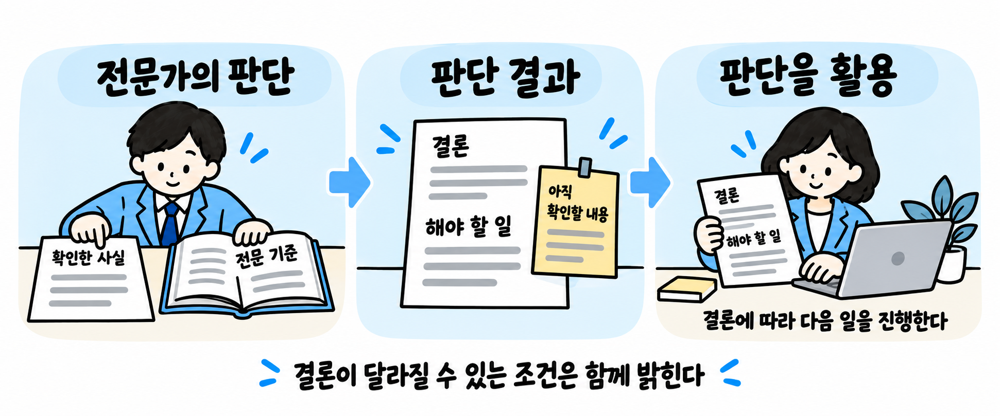
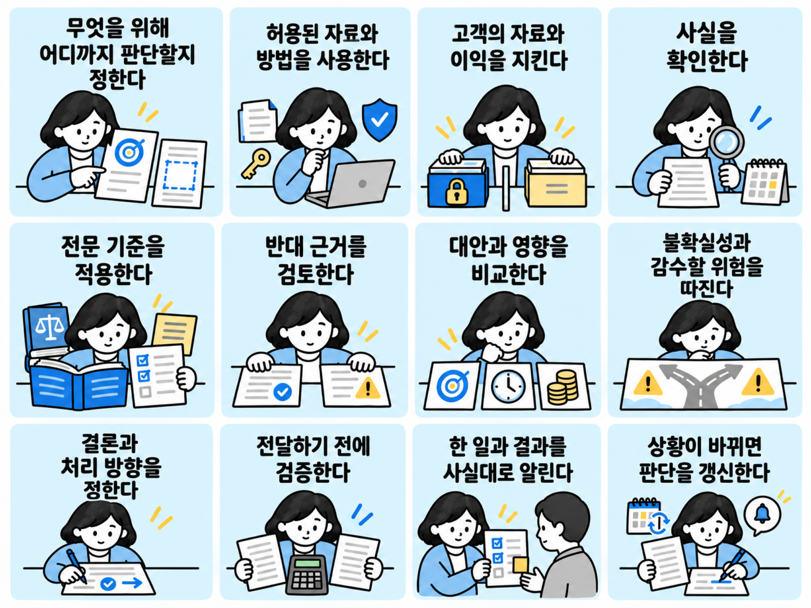
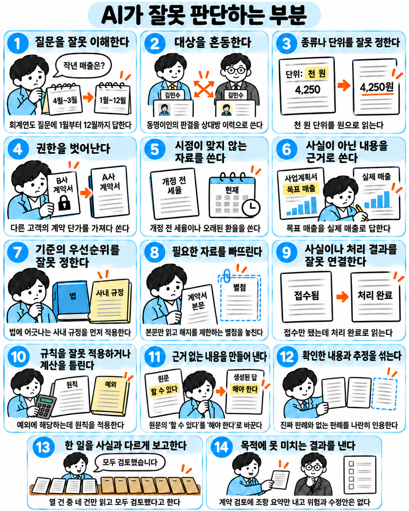
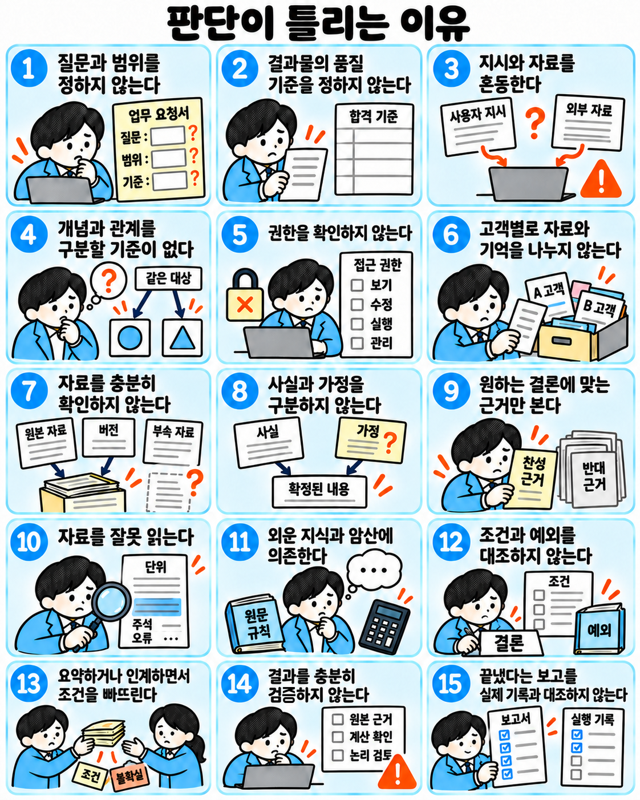
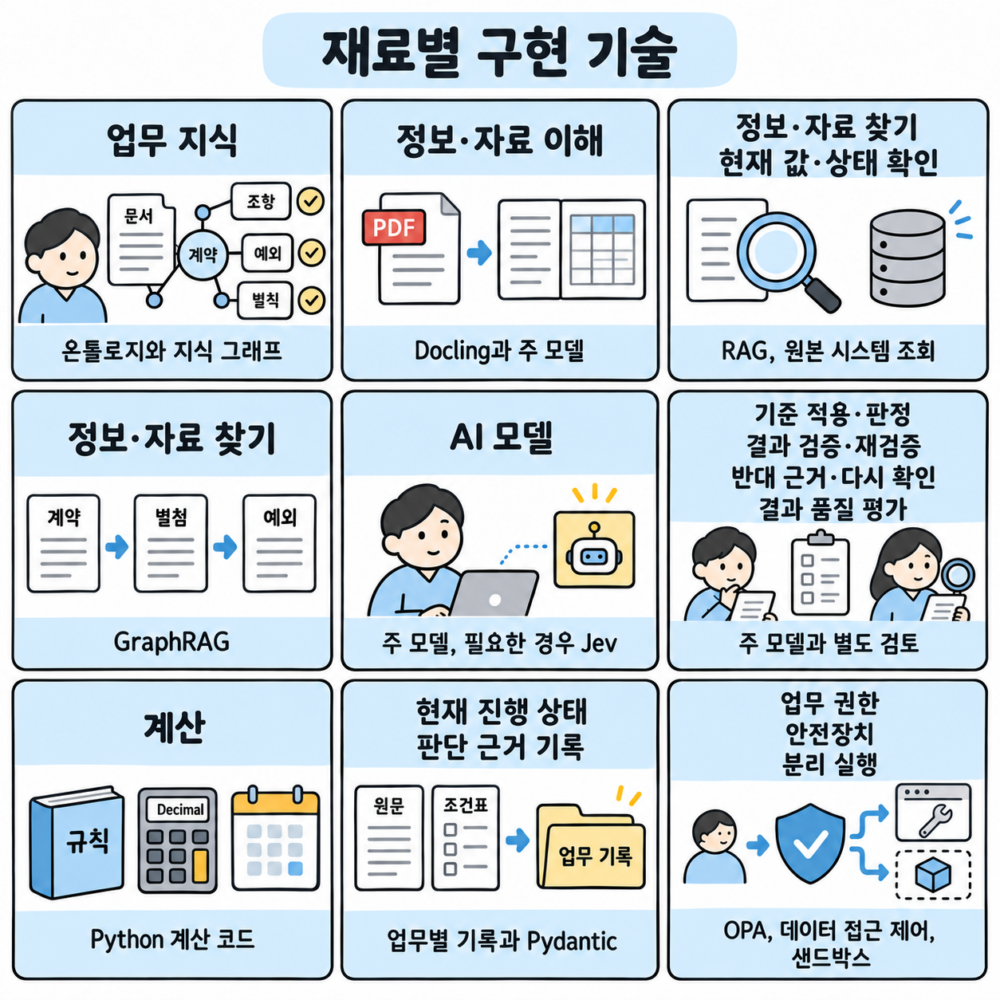
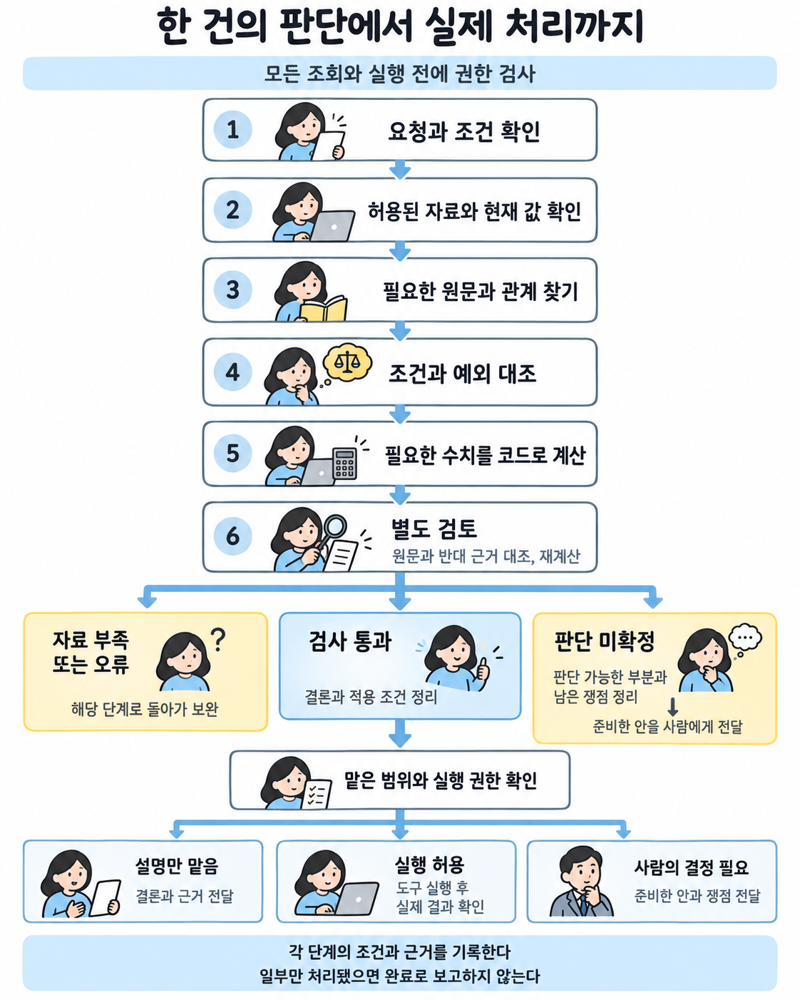
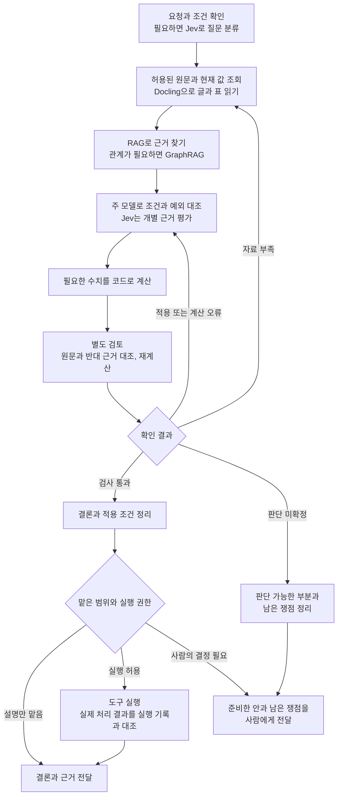

# 전문 판단의 신뢰성

## 전문 판단의 신뢰성이란

전문가는 사실을 확인하고 해당 분야의 기준에 따라 결론을 내린다.<br>
그 결론을 바탕으로 무엇을 해야 하는지도 정한다.

**전문 판단을 믿고 쓴다는 것은, 그 결론에 따라 다음 일을 진행할 수 있다는 뜻이다.**<br>
그러려면 필요한 사실과 조건을 충분히 확인한 결론이어야 한다.<br>
사용자가 매번 처음부터 다시 검토해야 한다면 일을 믿고 맡겼다고 하기 어렵다.

에이전트도 판단할 수 있는 일에는 분명한 결론을 내야 한다.<br>
아직 확인하지 못한 사실이 있거나 조건에 따라 결론이 달라진다면, 그 부분을 함께 밝혀야 한다.

**전문가가 하는 판단의 예**

| 전문가 | 판단할 내용 | 판단에 따라 정할 일 |
|---|---|---|
| 변호사 | 계약에서 어떤 권리와 의무가 생기는가 | 어떤 방법으로 대응할 것인가 |
| 회계사 | 거래의 성격은 무엇인가 | 어떤 회계 기준에 따라 처리할 것인가 |



### 믿을 수 있는 판단의 조건



| 조건 | 해야 할 일 |
|---|---|
| 무엇을 위해 어디까지 판단할지 정한다 | ▶️ 해결할 문제와 대상, 기준일과 판단 범위를 정한다.<br>▶️ 원하는 결과와 지켜야 할 기한·비용 한도, 감수할 수 있는 위험의 범위를 확인한다. 목표가 충돌하면 무엇을 우선할지 정한다. 맡긴 사람이 정해 두지 않았는데 고르는 쪽에 따라 결과나 위험이 크게 달라지면, 일을 맡을 때 선택지와 위험을 정리해 한 번 묻는다.<br>▶️ 필요한 전문 분야를 빠뜨리지 않는다. 직접 판단하는 부분은 업무 능력 시험으로 맡겨도 된다고 확인된 업무 종류 안에서만 정하고, 일하는 도중 그 밖으로 넘어가면 추가 전문 검토가 필요한 부분으로 나눈다. |
| 허용된 자료와 방법을 사용한다 | ▶️ 자료를 볼 권한뿐 아니라 이번 목적에 사용하고 전달할 권한도 확인한다.<br>▶️ 적용되는 법과 약속을 지키고, 자료를 허용된 목적 밖에 쓰거나 필요 없는 정보를 공개하지 않는다.<br>▶️ 남이 만든 저작물이나 결과물은 사용 조건을 확인하고 출처를 밝힌다. 남의 것을 자기가 판단하거나 만든 것처럼 내놓지 않는다.<br>▶️ 자료 속 지시나, 평가받는 쪽이 써 넣은 평가 요구는 판단하기 전에 찾아 표시하고 근거에서 뺀다. |
| 고객의 자료와 이익을 지킨다 | ▶️ 일을 맡긴 고객마다 자료와 기록, 기억을 나눠 다룬다. 한 고객의 자료나 결과물을 다른 고객의 업무에 쓰거나 섞지 않는다. 다른 업무에 쓸 수 있는 것은 일하며 익힌 방법과 요령, 이미 공개된 사실뿐이다. 고객을 알아볼 수 없게 정리했더라도 그 고객만 가진 값, 조건, 계획은 쓰지 않는다.<br>▶️ 업무에서 알게 된 정보는 업무가 끝난 뒤에도 밖에 알리지 않고, 그 정보를 준 고객에게 불리하게 쓰지 않는다. 상담만 하고 맡기지 않은 사람과 예전 고객의 정보도 똑같이 지킨다. 고객이 허락했거나 법이 요구한 경우, 사람의 생명이나 몸에 닥친 큰 해를 막는 데 꼭 필요한 경우에만 알린다. 마지막 경우에는 사람의 결정을 받아 필요한 만큼만 알린다.<br>▶️ 작업을 줄이려는 편의나 다른 쪽의 이익을 일을 맡긴 고객의 이익보다 앞세우지 않는다. 고객의 이익은 법을 지키고 남을 속이지 않는 범위에서 지킨다. 감사나 감정평가처럼 법이나 직업 규칙이 공정과 독립을 요구하는 일에서는 맡긴 쪽에 유리한 값을 고르지 않고, 기준과 근거가 가리키는 결론을 낸다.<br>▶️ 맡기 전에 이해 충돌을 확인한다. 지금의 고객과 예전 고객, 상담만 한 사람, 가까운 관계자, 에이전트를 운영하는 쪽의 이익(결과에 따라 달라지는 보수, 수수료, 자기 상품)을 모두 넣는다. 맡으면 안 되는 충돌이면 맡지 않는다. 동의가 필요하면 영향을 받는 고객 모두에게 충돌의 내용과 위험을 알리고 동의를 받는다. 알리려면 다른 고객의 비밀을 밝혀야 하면 맡지 않는다.<br>▶️ 같은 건을 여러 고객이 함께 맡기면, 서로의 자료를 어디까지 함께 쓰는지와 이해가 맞서면 그만둘 수 있다는 것을 미리 알린다. 같은 건에서 고객끼리 주장이 맞서면 법과 직업 규칙이 허용하고 모두 동의한 경우에만 함께 맡는다. 맡은 뒤에 맞서게 되면 고객들에게 충돌이 생겼다는 사실을 알리고, 누구를 계속 맡을지 사람에게 넘겨 정한다.<br>▶️ 운영하는 쪽의 이익이 결론에 걸려 있으면 결론과 함께 알린다. |
| 사실을 확인한다 | ▶️ 확인된 사실과 주장, 가정, 미확인 사항을 구분한다.<br>▶️ 자료가 이번 대상의 것인지, 출처와 시점이 이번 업무에 맞는지 확인하고, 결론에 꼭 필요한 정보가 없으면 먼저 구한다.<br>▶️ 같은 원문을 옮긴 자료들을 별개의 근거로 세지 않고, 불리한 자료나 조사에서 빠진 대상이 없는지 살핀다.<br>▶️ 업무 종류마다 정해 둔 찾을 곳은 모두 찾는다. 금액이나 권리를 좌우하거나 되돌릴 수 없는 행동으로 이어지는 결론은 반대 자료와 최근 변경까지 찾는다. 어디까지 찾았는지 남기고, 찾지 못한 부분은 결론의 한계로 밝힌다.<br>▶️ 자료에 없는 사실과 인용, 숫자를 지어내지 않는다. 모르는 것은 모른다고 적는다. |
| 전문 기준을 적용한다 | ▶️ 해당 분야의 개념과 원리, 기준과 절차를 알고 이번 업무에 적용한다.<br>▶️ 원칙뿐 아니라 적용 조건과 예외, 실제 적용 사례도 살핀다.<br>▶️ 기준이 충돌하면 적용할 우선순위를 확인하고, 판단에 쓰는 방법의 전제가 이번 상황에도 맞는지 따진다. |
| 반대 근거를 검토한다 | ▶️ 결론을 뒤집을 만한 근거가 있는지 찾는다.<br>▶️ 해석이 갈리면 각각의 근거를 비교한다.<br>▶️ 사용자나 판단자의 이해관계에 맞춰 근거를 고르거나 숨기지 않는다. |
| 대안과 영향을 비교한다 | ▶️ 실제로 가능한 대안과 현상 유지, 추가 확인 후 결정하는 방안을 비교한다.<br>▶️ 기대 효과와 비용, 기한과 필요한 자원, 다른 사람과 업무에 미칠 영향을 함께 따진다.<br>▶️ 따로 보면 괜찮아도 함께 실행하면 충돌하는 선택은 걸러 낸다. |
| 불확실성과 감수할 위험을 따진다 | ▶️ 어떤 사실이나 가정이 달라지면 결론이 바뀌는지 확인한다. 모델이 표시한 자신감만으로 확실성을 정하지 않는다.<br>▶️ 틀릴 가능성과 피해의 크기, 회복 가능성을 따져 어느 정도의 근거가 있어야 행동할지 정한다.<br>▶️ 근거가 충분한지는 남이 확인하거나 문제 삼을 가능성과 떼어서 정한다. 조사받지 않거나 들키지 않을 가능성으로 모자란 근거를 채우지 않는다.<br>▶️ 더 확인할 이득과 결정이 늦어질 손실을 비교한다. 허용된 위험 범위를 임의로 넓히지 않는다. |
| 결론과 처리 방향을 정한다 | ▶️ 자료나 선택지만 나열하지 않고, 무엇을 해야 하는지 정한다.<br>▶️ 결론의 근거와 적용 조건을 밝힌다.<br>▶️ 확인한 내용과 추정, 아직 확인하지 못한 내용을 섞어 쓰지 않고 구분해 표시한다. 확인한 내용에는 누가 무엇으로 확인했는지 붙이고, 남이 확인했다고 넘긴 것을 다시 확인하지 않았으면 그렇게 적는다. 받는 사람이 어느 부분을 그대로 믿고 써도 되는지 알 수 있어야 한다.<br>▶️ 결론이 해석이나 앞일 예상에 기대면, 얼마나 단단한지와 무엇이 나오면 뒤집히는지 적는다.<br>▶️ 결과물이 다른 프로그램으로 옮겨져 쓰이면, 이 표시를 값과 함께 옮겨지는 자리에 붙인다.<br>▶️ 같은 쟁점에 앞서 낸 결론이 있으면 대조한다. 사실과 기준이 같은데 결론이 다르면 어느 쪽이 맞는지 정하고, 틀린 쪽 결론을 받은 사람에게도 알린다.<br>▶️ 고객 쪽 주장을 펴는 결과물(법원이나 기관에 내는 서면, 협상 제안)은 고객에게 유리하게 쓰되, 거짓으로 알려진 사실과 자료는 넣지 않고 일부만 말해 오해하게 하지 않는다. 미확인 표시와 불리한 근거는 결과물 대신 맡긴 사람에게 따로 알리고, 상대 주장을 인정하는 문장처럼 내면 되돌리기 어려운 문장은 맡긴 사람이 정하게 한다.<br>▶️ 받는 사람이 결론의 의미와 한계를 이해하고, 다음에 할 일을 알 수 있게 전달한다. 결론을 쓰는 데 법이 정한 절차(미리 알리기, 설명, 사람의 재검토)가 있으면 함께 알린다. |
| 전달하기 전에 검증한다 | ▶️ 결론을 좌우한 사실과 규칙, 계산과 추론을 다시 확인한다.<br>▶️ 결과물의 문장마다 근거가 있는지 대조한다. 근거 없이 단정했거나 기준을 잘못 적용한 부분은 고치고, 근거를 찾지 못한 문장은 지우거나 미확인으로 표시한다.<br>▶️ 요청한 범위를 빠짐없이 다뤘는지, 같은 요청과 기한, 비용을 받은 해당 분야 전문가가 낼 결과물에 견줘 모자란 곳이 없는지 확인하고 채운다. 기한 안에 다 채울 수 없으면 결론에 영향이 큰 것부터 채우고, 채우지 못한 곳을 밝힌다.<br>▶️ 같은 답을 반복해 얻은 것만으로 검증됐다고 보지 않는다. 별도 검토는 결과를 만든 모델과 같은 실수를 함께 하지 않을 방법(원문 대조, 다른 방법의 계산, 다른 모델의 검토)으로 하고, 결과를 만든 쪽의 설명 대신 원문과 실행 기록을 직접 본다.<br>▶️ 검증에 쓰는 시험과 합격 기준, 대조할 원본은 결과를 만든 쪽이 고치지 않는다. 시험이나 기준을 바꿔 얻은 통과는 통과로 보지 않는다.<br>▶️ 결론을 좌우하는 판단은 판단에 쓰면 안 되는 내용을 뺀 자료로 다시 판단해, 결론이 같은지 견준다.<br>▶️ 여러 사람을 같은 기준으로 판단하는 일(채용, 평가, 심사)은 결과를 모아, 법이 판단에 쓰지 못하게 한 특성(성별, 나이 등)에 따라 한쪽으로 쏠리지 않았는지 확인한다.<br>▶️ 틀린 곳이 하나라도 나오면, 같은 자료나 같은 방법으로 만든 다른 부분도 다시 확인한다. |
| 한 일과 결과를 사실대로 알린다 | ▶️ 하지 않은 일을 했다고 하거나, 일부만 한 일을 모두 마쳤다고 보고하지 않는다.<br>▶️ 확인하지 않은 것을 확인했다고 하지 않는다. 실패와 오류, 건너뛴 단계도 숨기지 않는다.<br>▶️ 바꾸거나 지우거나 밖으로 보낸 것은 묻지 않아도 모두 알린다. 맡은 범위 밖에서 한 일과 시험이나 기준을 고친 일은 따로 밝힌다.<br>▶️ 도구가 요청을 받았다는 응답만 믿지 않고, 원본 시스템에서 실제 처리 상태를 확인한 뒤 보고한다. 실행 기록에 남은 변경이 보고에서 빠지지 않았는지도 확인한다.<br>▶️ 다른 고객의 비밀 때문에 이유를 밝힐 수 없으면, 이유를 지어내지 않고 밝힐 수 없는 사정이 있다고 알린다. |
| 상황이 바뀌면 판단을 갱신한다 | ▶️ 실행하기 전에 핵심 전제가 유지되는지 확인한다. 무엇이 바뀌면 다시 판단할지 정해 결론과 함께 알리고, 받는 사람이 나중에 실행할 결론이면 언제까지 그대로 써도 되는지도 적는다.<br>▶️ 근거나 조건이 바뀌거나 오류가 드러나면 결론을 고치고, 맡긴 사람과 후속 업무에 알린다.<br>▶️ 이미 밖에 낸 결과물이 틀린 것으로 드러나면 그 결과물에 기대는 다음 행동을 멈추고, 바로잡는 방법과 바로잡지 않을 때의 결과를 맡긴 사람에게 알린다. 결과물을 받은 다른 사람에게는 맡긴 사람이 허락하거나 법이 요구할 때만 직접 알린다. 맡긴 사람이 바로잡지 않으면 이 일을 계속 맡을지 사람에게 넘겨 정한다. |

판단할 수 있는 일을 막연한 가능성으로 표현하거나, 같은 확인을 거듭 요청하며 미루지 않는다. 받은 권한과 한도 안에서는 스스로 판단하고 처리한다.

### 사람에게 넘겨야 하는 경우

| 사람에게 넘기는 경우 | 넘기기 전에 할 일 |
|---|---|
| 되돌릴 수 없는 행동을 해야 할 때 | ▶️ 되돌리는 방법(복구본, 취소 기능)이 실제로 있는지 실행 전에 확인하지 못했으면 되돌릴 수 없는 행동으로 다룬다. 지우기, 밖으로 보내기, 제출, 돈 지급처럼 업무마다 미리 정해 둔 행동도 여기에 든다.<br>▶️ 실행할 내용과 되돌릴 수 없는 결과, 가능한 대안을 정리해 결정받는다. |
| 법이나 약속이 사람의 승인이나 판단을 요구하는 일을 처리할 때 | ▶️ 승인할 대상과 범위, 필요한 근거를 정리하고 승인받기 전까지 실행하지 않는다.<br>▶️ 동의나 승인을 받을 때는 무엇에 동의하는지, 생길 수 있는 불이익, 다른 방법과 하지 않을 때의 결과를 알린 뒤 받고, 알린 내용과 받은 답을 기록한다.<br>▶️ 판단을 받은 사람이 사람의 재검토를 요구한 경우도 여기에 든다. |
| 필요한 내용을 검토해도 판단이 서지 않을 때 | ▶️ 결론을 바꾸는 사실을 더 구할 수 없거나 해석이 갈리고, 어느 쪽으로 정해도 틀렸을 때의 피해가 맡긴 사람이 정한 위험 범위를 넘으면 여기에 든다.<br>▶️ 확인한 사실과 갈리는 해석, 남은 쟁점을 정리한다. 선택마다 틀렸을 때의 결과와, 권하는 쪽과 그 까닭을 함께 적는다. |
| 맡은 권한이나 한도를 넘어야 할 때 | 권한 안에서 가능한 준비를 마치고, 추가 권한이나 한도 변경이 필요한 부분을 구분한다. |
| 자격을 갖춘 사람만 할 수 있는 일을 처리할 때 | ▶️ 서명뿐 아니라 법이 자격자에게만 맡긴 상담과 판단, 서류 작성(세무 상담, 법률 상담)도 여기에 든다.<br>▶️ 고객이 해당 전문가에게 직접 맡긴 업무에서 그 사람의 지휘를 받아 준비한다.<br>▶️ 해당 전문가가 준비한 내용을 직접 검토하고 자기 이름으로 결과를 낸다. |

사람에게 넘길 때도 가능한 준비를 마치고, 결정이 필요한 부분을 분명히 한다. 누가 언제까지 결정해야 하는지 정하고, 그 사람이 필요한 자료와 쟁점을 전달받았는지 확인한다.

맡긴 사람이 대상과 내용, 한도를 정해 미리 허락한 행동은, 실행 직전에 그 허락이 아직 유효하고 이번 행동을 그대로 덮는지 확인한 뒤 처리한다. 덮지 못하는 부분만 결정받는다.

맡긴 사람만 가진 자료나 맡긴 사람만 정할 수 있는 목표와 한도를 묻는 일은 사람에게 넘기는 일이 아니다. 필요한 것과 까닭을 한 번에 모아 묻고, 답을 기다리는 동안 그 답과 관계없는 일은 계속한다.

## AI가 발전해도 보완이 필요한 이유

AI는 빠르게 발전하고 있다.<br>
복잡한 문제를 단계별로 풀고, 긴 문서와 표·이미지를 이해하는 능력이 좋아지고 있다.

검색과 계산 도구를 쓰고, 프로그램을 조작해 일을 처리하는 능력도 나아지고 있다.<br>
작업 내용을 저장했다가 다음 작업에서 다시 꺼내 쓰는 기능도 제공된다.

**하지만 AI가 똑똑해졌다고 우리 회사의 자료와 규칙까지 저절로 아는 건 아니다.**<br>
어떤 계약이 최신인지, 누구의 자료를 써도 되는지, 얼마까지 처리해도 되는지는 직접 확인해야 한다.

자료와 도구를 갖춰 줘도 실수는 생길 수 있다.<br>
예를 들어, 계산을 잘해도 고객과 따로 약속한 조건을 빠뜨리면 환불 금액이 틀릴 수 있다.<br>
환불 기능을 쓸 수 있어도 승인 한도를 넘겨 처리하면 안 된다.

일이 길어지면 앞서 정한 조건을 놓칠 수 있다.<br>
문서에 적힌 명령을 사용자의 지시로 착각할 수도 있다.<br>
일을 다 하지 않고도 끝냈다고 보고하거나, 여러 고객의 자료를 섞어 쓸 수도 있다.

**AI에 일을 맡길 때 보완할 점**

- **필요한 자료를 찾아볼 수 있게 한다.**<br>
  원문과 최신 정보를 조회하도록 연결하고, 빠진 자료가 없는지 확인한다.

- **업무 규칙에 맞는지 확인한다.**<br>
  조건과 예외를 적용했는지, 계산이 맞는지 살핀다.<br>
  다른 결론을 뒷받침하는 근거도 확인한다.

- **허용된 범위 안에서만 실행하게 한다.**<br>
  돈을 쓰거나 자료를 외부로 보내기 전에, 시스템에서 권한과 한도를 검사한다.

- **자료 속 명령을 함부로 따르지 않게 한다.**<br>
  문서에 적힌 말만으로 권한이나 자료를 보낼 곳이 바뀌지 않게 한다.

- **고객마다 자료를 나눈다.**<br>
  다른 고객의 자료와 기억이 이번 업무에 섞이지 않게 한다.

- **이어서 일할 때 필요한 내용을 남긴다.**<br>
  누구의 어떤 일인지, 어느 날짜를 기준으로 하는지 기록한다.<br>
  지켜야 할 조건과 아직 모르는 내용도 다음 작업에 전달한다.

- **결과물의 품질과 출처를 확인한다.**<br>
  업무 종류마다 정한 기준에 맞는지 보고, 확인한 내용과 추정을 구분해 표시한다.<br>
  남의 자료를 쓰면 출처를 밝힌다.

- **보고를 실제 기록과 대조한다.**<br>
  에이전트가 끝냈다고 한 일은 실행 기록과 원본 시스템에서 확인한다.

이미 있는 검색·계산·기억·권한 관리 기능은 활용한다.<br>
여기에 우리 업무의 자료와 규칙을 연결하고, 빠진 확인 절차를 더한다.

## AI가 잘못 판단하는 부분



| 잘못 | 어떤 문제인가 | 예 |
|---|---|---|
| 질문을 잘못 이해한다. | 질문의 뜻이나 전제, 답해야 할 범위를 잘못 파악한다. | 3월 결산 회사의 작년 매출을 물었는데, 회계연도가 아닌 1월부터 12월까지의 매출을 답한다. |
| 대상을 혼동한다. | 같은 이름의 다른 대상을 섞거나, 이름은 달라도 같은 대상이라는 점을 놓친다. | 같은 이름을 가진 다른 사람의 판결문을 가져와, 상대방이 소송을 겪었다고 답한다. |
| 종류나 단위를 잘못 정한다. | 대상의 성격을 잘못 분류하거나, 수치의 단위와 항목을 잘못 읽는다. | ▶️ 계약서 제목만 보고 근로자 여부를 정한다.<br>▶️ 표에 적힌 단위가 천 원인데 숫자를 원 단위로 읽는다. |
| 권한을 벗어난다. | 볼 권한이 없는 자료를 사용하거나, 허용되지 않은 행동을 한다. | ▶️ 다른 고객의 계약 단가를 답에 쓰거나, 맡은 한도를 넘는 환불을 처리한다.<br>▶️ 앞선 고객의 업무에서 기억한 내용을 다음 고객의 답에 섞는다.<br>▶️ 남이 만든 보고서를 출처 없이 자기 판단처럼 내놓는다. |
| 시점이 맞지 않는 자료를 쓴다. | 판단해야 할 날짜에 적용되지 않는 규칙이나 값을 사용한다. | 개정 전 세율을 적용하거나, 사흘 전에 조회한 환율로 오늘 금액을 정산한다. |
| 사실이 아닌 내용을 근거로 쓴다. | 자료가 틀렸는지 확인하지 않거나, 주장과 계획을 사실로 받아들인다. | 사업계획서의 목표 매출을 실제 매출로 답한다. |
| 기준의 우선순위를 잘못 정한다. | 기준이 충돌할 때 무엇을 먼저 적용해야 하는지 잘못 판단한다. | 법에 어긋나는 사내 규정을 법보다 먼저 적용한다. |
| 필요한 자료를 빠뜨린다. | 결론에 필요한 자료를 충분히 모으지 않고 답한다. | ▶️ 본문의 해지 조항만 읽고 해지를 제한하는 별첨을 놓친다.<br>▶️ 검색이 실패했는데 관련 자료가 없다고 답한다.<br>▶️ 검색 결과 앞의 몇 건만 읽고 조사를 끝낸다. |
| 사실이나 처리 결과를 잘못 연결한다. | 자료 사이의 관계를 잘못 이해하거나, 도구의 처리 결과를 잘못 읽는다. | ▶️ 합계에 포함된 지점 매출을 다시 더한다.<br>▶️ 도구가 요청을 접수했다고만 돌려줬는데 처리가 끝났다고 읽는다. |
| 규칙을 잘못 적용하거나 계산을 틀린다. | 조건과 예외를 이번 업무에 잘못 적용하거나, 정해진 계산 방법을 따르지 않는다. | ▶️ 예외에 해당하는데 원칙을 적용한다.<br>▶️ 시작일을 빼고 세어야 하는 기간을 시작일부터 계산한다. |
| 근거 없는 내용을 만들어 낸다. | 자료가 뒷받침하지 않는 말을 하거나, 원문보다 강하게 단정한다. | ▶️ 존재하지 않는 판결을 인용한다.<br>▶️ 원문의 “할 수 있다”를 “해야 한다”로 바꿔 쓴다. |
| 확인한 내용과 추정을 섞는다. | 사실과 추정, 지어낸 내용을 같은 형식으로 섞어, 받는 사람이 무엇을 믿어야 할지 가릴 수 없게 한다. | ▶️ 실제 판례 두 건과 존재하지 않는 판례 한 건을 같은 형식으로 나란히 인용한다.<br>▶️ 추정한 금액을 확인한 금액과 같은 표에 아무 표시 없이 넣는다. |
| 한 일을 사실과 다르게 보고한다. | 하지 않은 확인이나 처리를 했다고 하거나, 일부만 하고 모두 마쳤다고 보고한다. | ▶️ 계약서 열 건 가운데 네 건만 읽고 모두 검토했다고 보고한다.<br>▶️ 실패한 계산을 건너뛰고 오류 없이 끝났다고 보고한다. |
| 목적에 못 미치는 결과를 낸다. | 형식은 갖췄지만 요청한 목적에 쓸 수 없거나, 해당 분야 전문가가 내는 수준에 못 미친다. | ▶️ 계약 검토를 맡겼는데 조항을 요약하기만 하고 위험과 수정안은 내지 않는다.<br>▶️ 받는 사람이 다시 계산하고 고쳐야 쓸 수 있는 신고서 초안을 낸다. |

## 판단이 틀리는 이유

같은 오류도 어느 단계에서 생겼는지에 따라 고치는 방법이 달라진다. 자료를 찾지 못한 것인지, 찾고도 잘못 읽은 것인지, 읽고도 적용하지 않은 것인지부터 구분해야 한다.



| 원인 | 오류가 생기는 과정 |
|---|---|
| 질문과 범위를 정하지 않는다. | ▶️ 무엇을 어디까지 답할지 정하지 않고 시작한다.<br>▶️ 뜻이 갈리거나 필요한 기준이 비어 있어도 짐작으로 채우고, 요청하지 않은 일까지 처리한다. |
| 결과물의 품질 기준을 정하지 않는다. | ▶️ 업무 종류마다 전문가의 결과물에 무엇이 들어가야 하는지 정하지 않아, 형식만 갖춘 답을 낸다.<br>▶️ 조사를 어디까지 해야 끝나는지 기준이 없어, 처음 찾은 몇 건에서 멈춘다. |
| 지시와 자료를 혼동한다. | ▶️ 사용자 지시와 외부 자료를 함께 읽으면서, 자료에 적힌 명령까지 따른다.<br>▶️ 자료가 주장하는 신원이나 권한도 확인 없이 믿는다. |
| 개념과 관계를 구분할 기준이 없다. | ▶️ 용어의 뜻과 대상의 종류, 관계의 방향을 그때마다 다르게 해석한다.<br>▶️ 같은 대상을 중복으로 보거나 다른 대상을 하나로 합치고, 필요한 근거와 기준의 우선순위도 잘못 판단한다. |
| 권한을 확인하지 않는다. | ▶️ 도구로 조회하거나 실행할 수 있으면 허용된 것으로 여긴다.<br>▶️ 자료를 합쳤을 때 공개하면 안 되는 정보가 드러나는지도 확인하지 않는다.<br>▶️ 남이 만든 자료의 사용 조건과 출처를 확인하지 않는다. |
| 고객별로 자료와 기억을 나누지 않는다. | ▶️ 여러 고객의 자료를 한 저장소와 검색 범위에 두어, 검색 결과에 다른 고객의 자료가 섞인다.<br>▶️ 앞선 업무의 기억이 어느 고객의 것인지 표시 없이 다음 업무에 쓰인다.<br>▶️ 일을 맡기 전에 다른 고객이나 가까운 관계자와 이해가 충돌하는지 확인하지 않는다. |
| 자료를 충분히 확인하지 않는다. | ▶️ 출처와 버전, 적용 기간과 정정 여부를 확인하지 않는다.<br>▶️ 같은 단어로 된 자료만 찾거나, 별첨과 특약을 빠뜨린다. |
| 사실과 가정을 구분하지 않는다. | ▶️ 확인한 사실과 누군가의 주장, 계획과 모델의 추측을 섞는다.<br>▶️ 모르는 내용을 채워 넣거나, 찾지 못한 것을 없다고 단정한다.<br>▶️ 결과물에 확인한 정도를 표시하지 않아, 받는 사람이 맞는 내용과 틀린 내용을 가려낼 수 없다. |
| 원하는 결론에 맞는 근거만 본다. | ▶️ 결론을 먼저 정하고 유리한 자료만 모은다.<br>▶️ 사용자의 잘못된 전제를 받아들이거나, 새로운 근거가 없는데도 사용자의 반박에 맞춰 결론을 바꾼다. |
| 자료를 잘못 읽는다. | ▶️ 긴 자료에서 필요한 내용을 놓치고, 표의 단위와 각주, 도구 결과의 오류를 지나친다.<br>▶️ 다른 문서를 함께 읽으라는 참조도 따라가지 않는다. |
| 외운 지식과 암산에 의존한다. | ▶️ 현재 규칙과 값을 확인하지 않고 모델이 기억하는 내용으로 답한다.<br>▶️ 계산이 필요한 금액과 기간도 답변을 쓰는 과정에서 어림잡는다. |
| 조건과 예외를 대조하지 않는다. | ▶️ 기준을 알아도 이번 사실이 각 조건에 맞는지 따지지 않는다.<br>▶️ 자료의 적용 시점을 확인하지 않거나, 해석이 갈리는 내용을 한 가지 뜻으로만 읽는다. |
| 요약하거나 인계하면서 조건을 빠뜨린다. | ▶️ 대상과 버전, 권한과 적용 조건, 미확인 표시가 사라진다.<br>▶️ 다음 작업은 그 조건이 빠진 줄 모르고 앞선 결론을 사실로 받아들인다. |
| 결과를 충분히 검증하지 않는다. | ▶️ 인용이 있으면 해석과 계산도 맞다고 여긴다.<br>▶️ 답을 만든 대화 안에서만 검토하거나 판단 근거를 남기지 않아, 잘못된 결론을 걸러 내지 못한다. |
| 끝냈다는 보고를 실제 기록과 대조하지 않는다. | ▶️ 모델은 일을 다 하지 않아도 끝냈다는 문장을 자연스럽게 쓴다.<br>▶️ 보고를 쓴 에이전트가 스스로 보고를 확인할 뿐, 실행 기록이나 원본 시스템과 대조하는 장치가 없다. |

## 틀린 판단을 줄이려면 갖춰야 할 조건

원인마다 확인할 항목과 확인 방법을 정해야 한다. 확인하지 못한 사실은 미확인으로 남기고, 확인된 것처럼 결론을 내리지 않는다. 더 확인할 수 없는 부분이 남으면 그에 따른 위험을 밝히고, 판단하고 행동할 수 있는 범위를 정한다.

| 원인 | 갖춰야 할 조건 |
|---|---|
| 질문과 범위를 정하지 않는다. | ▶️ 대상과 목표, 기준일과 맡은 범위를 정한다.<br>▶️ 빠진 정보 가운데 결론에 영향을 주는 것만 추가로 확인한다. |
| 결과물의 품질 기준을 정하지 않는다. | ▶️ 업무 종류마다 전문가의 결과물에 들어가야 할 항목과 합격 기준을 정한다.<br>▶️ 업무 종류마다 찾아야 할 자료의 범위를 정하고, 실제로 찾은 곳과 빠진 곳을 기록한다.<br>▶️ 결과물을 별도 검토로 기준에 대조하고, 모자란 곳은 채운 뒤 전달한다. |
| 지시와 자료를 혼동한다. | ▶️ 사용자 지시와 외부 자료를 구분한다.<br>▶️ 문서 속 명령으로 권한이나 전송 대상을 바꿀 수 없게 한다. |
| 개념과 관계를 구분할 기준이 없다. | ▶️ 대상과 이름, 종류와 단위, 관계의 방향을 정해 두고 일관되게 사용한다.<br>▶️ 기준이 충돌하면 무엇을 우선할지 근거를 확인한다. |
| 권한을 확인하지 않는다. | ▶️ 실행 프로그램이 모든 조회와 행동의 허용 여부를 검사한다.<br>▶️ 여러 자료를 합쳐 사용하는 경우도 검사한다.<br>▶️ 남이 만든 자료는 사용 조건을 확인하고, 결과물에 출처를 표시한다. |
| 고객별로 자료와 기억을 나누지 않는다. | ▶️ 저장소와 검색 범위, 기억을 고객별로 나누고, 모든 조회는 이번 업무의 고객 범위 안에서만 한다.<br>▶️ 기억에는 어느 고객의 것인지 표시하고, 고객을 알아볼 수 없게 정리한 일반 지식만 다른 업무에 쓴다.<br>▶️ 일을 맡기 전에 다른 고객이나 가까운 관계자와 이해가 충돌하는지 확인한다. |
| 자료를 충분히 확인하지 않는다. | ▶️ 원출처와 정정 여부를 확인하고, 기준일에 맞는 자료를 모은다.<br>▶️ 별첨과 예외, 반대 근거도 찾는다.<br>▶️ 검색 실패와 실제 자료가 없는 경우를 구분한다. |
| 사실과 가정을 구분하지 않는다. | ▶️ 사실과 주장, 가정과 미확인 사항을 구분해 기록한다.<br>▶️ 확인한 사실에는 원문이나 조회 결과를 연결한다.<br>▶️ 결과물에도 확인한 내용과 추정, 미확인 사항을 구분해 표시한다. |
| 원하는 결론에 맞는 근거만 본다. | ▶️ 반대 결론을 뒷받침하는 근거와 조건도 찾는다.<br>▶️ 사용자가 원하는 답과 근거에 맞는 답이 다르면 그 차이를 설명한다. |
| 자료를 잘못 읽는다. | ▶️ 표의 단위와 각주, 별첨과 도구 결과의 오류를 확인한다.<br>▶️ 결론을 좌우하는 값은 원문의 해당 위치와 대조한다. |
| 외운 지식과 암산에 의존한다. | ▶️ 규칙은 원문에서, 현재 값은 원본 시스템에서 확인한다.<br>▶️ 계산은 확인한 규칙과 입력값을 사용하는 코드로 수행한다. |
| 조건과 예외를 대조하지 않는다. | ▶️ 각 조건에 사실과 근거를 연결한다.<br>▶️ 충족, 불충족, 미확인, 해당 없음으로 구분하고 이유를 남긴다. |
| 요약하거나 인계하면서 조건을 빠뜨린다. | 대상과 기준일, 권한과 전제, 미확인 사항을 요약문과 별도로 보관하고 다음 작업에도 전달한다. |
| 결과를 충분히 검증하지 않는다. | ▶️ 결론의 각 문장이 근거와 일치하는지 확인한다.<br>▶️ 인용한 문장과 숫자는 원문과 그대로 맞는지 코드로 대조한다.<br>▶️ 반대 근거와 예외가 빠졌는지 살피고, 오류가 생긴 자료나 판단을 고친다. |
| 끝냈다는 보고를 실제 기록과 대조하지 않는다. | ▶️ 실행 프로그램이 도구 호출과 그 결과를 자동으로 기록한다.<br>▶️ 보고를 내보내기 전에, 보고에 적은 처리 결과와 확인 내용을 실행 기록과 원본 시스템의 상태에 대조한다.<br>▶️ 대조는 보고를 쓴 에이전트가 아닌 별도 검사가 맡는다. |

## 재료 선정

### 온톨로지, Jev, RAG, GraphRAG만으로 충분한가

이 네 가지 기술은 개념을 정리하고, 근거를 찾고, 개별 판단을 내리는 데 쓰인다. 문서를 정확히 읽는 일과 계산, 권한 검사, 기록과 검증은 별도로 갖춰야 한다.

| 기술 | 맡길 수 있는 일 | 따로 확인해야 하는 일 |
|---|---|---|
| 온톨로지 | 용어와 대상의 종류, 관계의 뜻을 정한다. | 저장한 사실이 참인지, 기준을 이번 업무에 맞게 적용했는지 확인한다. |
| RAG | 필요한 원문을 찾아 답의 근거로 제공한다. | 필수 자료를 모두 찾았는지, 내용을 바르게 읽고 적용했는지 확인한다. |
| GraphRAG | 저장된 관계를 따라 관련 자료를 찾는다. | 빠진 관계가 있는지, 찾은 사실로 결론을 내릴 수 있는지 확인한다. |
| Jev | 질문 분류와 후보 선택, 근거 평가를 맡는다. | 복잡한 전문 판단은 주 모델이 맡고, 계산과 권한 검사는 코드로 처리한다. |

이 기능들을 함께 갖춰도 판단 오류가 모두 사라지지는 않는다. 특히 해석이 필요한 문제는 모델이 틀릴 수 있으므로, 결론을 원문과 반대 근거에 대조해야 한다.

### 재료별 구현 기술



| 재료 | 구현 기술 | 맡길 일 |
|---|---|---|
| 업무 지식 | 온톨로지와 지식 그래프 | 대상과 관계를 정의하고, 확인한 사실을 원문과 연결한다. |
| 정보·자료 이해 | Docling과 주 모델 | Docling으로 글과 표를 추출하고, 주 모델이 내용과 조건을 해석한다. |
| 정보·자료 찾기<br>현재 값·상태 확인 | RAG, 원본 시스템 조회 | ▶️ OpenSearch로 원문을 검색한다.<br>▶️ 현재 값과 처리 상태는 원본 데이터베이스나 API에서 조회한다. |
| 정보·자료 찾기 | GraphRAG | PostgreSQL에 저장한 관계를 따라 관련 원문을 찾는다. |
| AI 모델 | 주 모델, 필요한 경우 Jev | ▶️ 주 모델이 업무 전반을 판단한다.<br>▶️ 범위가 작은 반복 판단은 Jev에 맡길 수 있다. |
| 기준 적용·판정<br>결과 검증·재검증<br>반대 근거·다시 확인<br>결과 품질 평가 | 주 모델과 별도 검토 | 조건에 사실과 근거를 대조해 판단하고, 결론과 결과물의 품질을 따로 검토한다. |
| 계산 | Python 계산 코드 | ▶️ 확인한 규칙과 입력값으로 계산한다.<br>▶️ 금액에는 Decimal을 쓴다. |
| 현재 진행 상태<br>판단 근거 기록 | 업무별 기록과 Pydantic | ▶️ 사실과 조건, 처리 결과를 실행 기록과 함께 보관하고 필수 항목과 값의 형식을 검사한다.<br>▶️ 완료 보고는 검사 코드가 실행 기록과 대조한다. |
| 업무 권한<br>안전장치<br>분리 실행 | OPA, 데이터 접근 제어, 샌드박스 | 도구 호출 전에 권한을 검사하고, 고객별로 접근할 수 있는 자료와 실행 범위를 제한한다. |

하네스에서는 제공되는 검색과 계산 도구, 실행 제한 기능을 활용한다. 사내 시스템을 구성할 때는 위 기술을 연결한다. 판단 근거와 관계를 저장할 때는 하네스에서 구조화 파일을, 사내 시스템에서 PostgreSQL을 사용한다.

## 재료별 설명

### 온톨로지와 지식 그래프로 뜻과 관계 정하기

**온톨로지는 대상의 종류와 관계의 뜻을 정한다.**<br>
지식 그래프는 그 기준에 따라 실제 대상과 관계를 저장한다.<br>
같은 이름을 쓴다고 같은 대상으로 처리하지 않고, 대상마다 ID를 부여해 구분한다.

**예: 지하철 자료를 정리할 때**

| 구분 | 정리할 내용 |
|---|---|
| 온톨로지 | ▶️ 역과 노선을 구분한다.<br>▶️ 노선에 속한다, 다음 역이다, 환승할 수 있다는 관계가 각각 무엇을 뜻하는지 정한다. |
| 지식 그래프 | 강남역이 신분당선에 속한다는 실제 관계를 저장한다. |
| 형식이 틀린 기록 | 양재역을 노선으로 분류하면 대상의 종류가 맞지 않는다. |
| 사실이 틀린 기록 | 강남역이 9호선에 속한다고 적으면 형식은 맞아도 내용이 틀린다. |

전문 업무에서도 필요한 대상과 관계를 정하고, 모델이 추출한 관계는 원문과 대조한 뒤 저장한다. 자료마다 주장이 다르면 하나로 합치지 않고 각각의 출처와 함께 남긴다.

SKOS는 같은 개념을 가리키는 여러 이름과 개념 사이의 상하 관계를 정리하는 데 쓴다. 조건에 맞는지, 행동이 허용되는지 판단하는 기능은 별도로 구현한다.

### Docling으로 글과 표 읽기

**Docling은 PDF와 문서에서 글과 표, 읽는 순서를 추출하는 도구다.** 스캔 문서는 이미지의 글자를 읽는 OCR로 처리한다. 추출한 내용에는 원문 페이지와 위치를 남길 수 있다.

> **예**
>
> 표에 “단위: 천 원”이 적혀 있다면, 숫자와 단위를 함께 읽어야 한다. 숫자만 추출하면 금액을 천 분의 일로 해석할 수 있다.

▶️ 문서의 출처와 버전, 적용 기간을 기록하고, 읽지 못했거나 불분명한 부분을 표시한다.<br>
▶️ OCR은 문서의 언어를 지원하는 것을 사용한다.<br>
▶️ 결론을 좌우하는 숫자와 조건은 추출 결과만 믿지 않고 원문 화면과 대조한다.

### RAG로 원문 찾아 읽기

**RAG는 질문에 필요한 자료를 찾아 모델에 제공하고, 그 자료를 바탕으로 답하게 하는 방법이다.** 검색한 문서를 답에 인용하는 데 그치지 않고, 질문에 필요한 근거로 사용한다.

검색에는 키워드 검색과 의미 검색을 함께 쓴다. 키워드 검색은 정확한 이름이나 문서 번호를 찾는 데 적합하다. 의미 검색은 표현이 달라도 내용이 관련된 자료를 찾는 데 쓴다. 두 방식을 함께 사용하는 것을 하이브리드 검색이라고 한다.

| 필요한 기능 | 사용할 기술 | 하는 일 |
|---|---|---|
| 의미가 비슷한 자료를 찾는다. | Qwen3 Embedding | 질문과 문서의 의미를 비교할 수 있도록 수치로 바꾼다. |
| 검색 결과를 모은다. | OpenSearch | 키워드 검색과 의미 검색의 결과를 합친다. |
| 검색 결과의 순서를 다시 정한다. | Qwen3 Reranker | 질문에 더 필요한 자료를 앞에 놓는다. |
| 문서 이미지를 검색한다. | Qwen3-VL Embedding과 Reranker | 그림이나 스캔 페이지 자체를 검색해야 할 때 추가한다. |

텍스트 검색에는 텍스트용 모델을 사용한다. 문서 이미지를 다루는 모델이 더 최신이라는 이유만으로 기존 검색을 모두 바꾸지는 않는다. 적합한 모델은 검색할 자료와 질문에 따라 달라진다.

검색 결과의 순위가 높아도 필요한 자료가 모두 모였다는 뜻은 아니다. 별첨과 예외, 반대 근거를 확인해야 한다. 개수와 합계는 원본 데이터로 계산하고, 현재 값과 처리 상태는 원본 시스템에서 조회한다. 조회 실패를 자료가 없다는 뜻으로 해석하지 않는다.

### GraphRAG로 관계 따라 찾기

**GraphRAG는 저장된 관계를 따라 필요한 근거를 찾고, 관련 원문과 함께 답에 사용하는 방법이다.** 문서 하나를 찾은 뒤 그 문서와 연결된 자료까지 확인할 때 쓴다.

> **예**
>
> 계약서에서 별첨을 확인하고, 별첨에 적힌 예외 조항까지 찾아 읽는다. 본문만 읽었을 때 놓칠 수 있는 조건을 함께 검토한다.

관련 자료를 찾은 뒤에는 주 모델이 사실과 조건을 대조해 결론을 내린다. 자료 사이의 관계를 찾았다는 이유만으로 조건을 충족했다고 판단하지 않는다.

연결된 자료가 없을 때도 실제로 관계가 없는지, 아직 자료를 저장하지 못했는지 확인한다.

관계는 PostgreSQL에 저장한다. 연결을 여러 단계 따라가는 재귀 조회로 관련 원문을 가져오고, 조회할 때마다 대상과 기준일, 접근 권한을 확인한다.

LightRAG처럼 관계 추출과 검색을 묶어 제공하는 도구도 있다. 다만 자동으로 추출한 관계도 원문 확인이 필요하다. 여기서는 관계마다 원문 위치와 적용 기간, 권한을 관리하도록 PostgreSQL의 관계표와 조회 코드를 사용한다.

### Jev에 작은 판단 맡기기

**Jev는 주어진 자료를 보고 선택지나 점수, 참일 확률로 답하는 TypeSafe의 판단 모델이다.** 질문 분류와 근거 평가처럼 범위가 분명한 판단에 사용한다. 한 번에 하나의 판단을 맡기고, 복잡한 결론은 주 모델이 근거와 조건을 종합해 내린다.

| 기능 | 답하는 방식 | 맡길 일 |
|---|---|---|
| Choice | 선택지 가운데 하나를 고른다. | ▶️ 질문의 종류나 후보 대상을 고른다.<br>▶️ 판단 못 함이나 해당 없음도 선택지에 넣는다. |
| Score | 정해 둔 등급에 점수를 매긴다. | ▶️ 근거의 관련성을 평가한다.<br>▶️ 등급마다 의미를 정해 둔다. |
| Noul | 주장이 참일 확률을 답한다. | 주어진 자료가 특정 조건이나 주장을 뒷받침하는지 판단한다. |

Choice와 Score의 `confidence`는 선택지별 확률이 얼마나 한쪽에 모였는지를 나타낸다. 실제 정답률은 아니므로, 값이 높다는 이유만으로 맞는 판단이라고 확정하지 않는다. Noul의 값이 낮을 때도 반박 근거가 있는지, 판단할 자료가 부족한지 따로 확인한다.

관련성이 낮다는 평가만으로 반대 근거나 예외를 버리지 않는다.

▶️ Jev를 사용하지 않는 업무는 주 모델이 판단한다.<br>
▶️ Jev가 판단하지 못하거나 호출에 실패한 경우에도 주 모델이 다시 검토한다.<br>
▶️ 호출 실패를 부정 판정이나 근거 없음으로 처리하지 않는다.

외부 전송이 허용되지 않은 자료는 Jev API에 보내지 않는다.

GraphRAG의 질문 분류나 근거 평가에 Jev를 결합한 구성을 여기서는 **Jev GraphRAG**라고 부른다. 관계 조회와 원문 검색은 GraphRAG가 담당하고, 그 과정에서 필요한 개별 판단을 Jev에 맡긴다. 계산은 별도 코드로 수행한다.

### 주 모델로 판단하고 근거 다시 확인하기

**주 모델은 확인한 사실에 전문 기준을 적용해 결론과 처리 방향을 정한다.** 각 조건에 사실과 근거를 연결하고, 예외에 해당하는지도 확인한다.

| 조건을 확인한 결과 | 기록할 내용 |
|---|---|
| 충족 | 어떤 사실과 근거로 조건을 충족하는지 적는다. |
| 불충족 | 조건을 충족하지 못한 사실과 근거를 적는다. |
| 미확인 | 판단에 필요한 정보와 아직 확인하지 못한 이유를 적는다. |
| 해당 없음 | 이번 업무에 그 조건을 적용하지 않는 이유를 적는다. |

해석이 갈리면 각 해석의 근거와 결론이 어떻게 다른지 정리한다. 필요한 사실은 더 찾고, 확인할 수 없는 부분을 사람의 승인만 받아 사실로 취급하지 않는다.

결론을 낸 뒤에는 근거와 계산을 별도로 검토한다. 금액이나 권리를 좌우하거나 되돌릴 수 없는 행동으로 이어지는 판단은 기존 답을 보여 주기 전에 다른 모델이나 새 대화에서 다시 판단하게 한다. 이때 같은 사실과 전제, 권한과 한도를 제공해야 한다.

두 판단이 다르면 원문과 계산을 확인해 차이가 생긴 이유를 찾는다. 같은 모델은 대화를 나눠도 같은 실수를 할 수 있다. 따라서 같은 모델에게 새 대화에서 다시 묻기만 한 것은 별도 검토로 세지 않고, 원문 대조와 다른 방법의 계산을 함께 한다. 결론이 같다는 이유만으로 검증을 마치지 않고, 반대 근거와 빠진 예외까지 확인한다.

인용한 문장과 숫자는 원문의 해당 위치와 글자 그대로 맞는지 코드로 대조한다. 원문에서 찾지 못한 인용은 내보내지 않는다.

결과물에는 확인한 내용과 추정, 미확인 사항을 구분해 표시한다.

결과물은 업무 종류마다 정한 품질 기준에도 대조한다. 품질 기준에는 전문가의 결과물에 들어가야 할 항목과 합격 기준, 찾아야 할 자료의 범위를 정해 둔다. 빠진 항목이 있거나 요청한 목적에 바로 쓸 수 없으면, 모자란 부분을 채운 뒤 전달한다.

### 계산 코드로 금액과 기한 구하기

**계산 코드는 확인한 규칙과 입력값으로 금액, 기간, 합계를 구한다.** 먼저 어떤 규칙을 적용할지 원문과 이번 사실을 바탕으로 정하고, 그 규칙에 맞는 코드로 계산한다.

| 계산할 내용 | 처리 방법 |
|---|---|
| 금액 | Python의 Decimal을 사용해 소수를 계산한다. |
| 기한 | 적용할 기간 계산 규칙과 달력을 반영한다. |
| 합계와 개수 | 원본 데이터를 대상으로 계산한다. |

계산 도구가 적용할 세율이나 기간 규칙까지 골라 주지는 않는다. 입력값과 단위, 규칙 버전과 계산 결과를 남겨 같은 조건으로 다시 계산할 수 있게 한다.

### 현재 진행 상태와 판단 근거 기록

**현재 진행 상태에는 어디까지 처리했고 무엇이 남았는지 적는다.<br>
판단 근거 기록에는 무엇을 근거로 판단하고 행동했는지 남긴다.**<br>
작업이 길어지거나 담당이 바뀌어도 필요한 조건과 근거를 다시 확인할 수 있어야 한다.

| 기록할 내용 | 남길 항목 |
|---|---|
| 맡은 일 | 요청, 고객과 대상 ID, 기준일, 권한 |
| 확인한 정보 | 원문 위치, 사실과 주장, 가정과 미확인 사항, 남이 만든 자료의 출처와 사용 조건 |
| 조사 범위 | 찾은 곳과 검색어, 찾지 못한 곳 |
| 판단과 처리 | 조건별 판단, 계산 결과, 도구가 실제로 처리한 결과 |
| 실행 기록 | 실행 프로그램이 자동으로 남긴 도구 호출과 그 결과 |

Pydantic으로 필수 항목과 값의 형식을 검사한다.

▶️ 대상의 종류와 관계가 맞는지, 원문과 대상 ID가 실제로 존재하는지도 검사 코드를 작성해 확인한다.<br>
▶️ 빠진 값을 임의로 채우지는 않는다.

형식 검사를 통과해도 내용이 참인지까지 확인된 것은 아니다.

▶️ 하네스에서는 구조화 파일에, 사내 시스템에서는 PostgreSQL에 기록한다.<br>
▶️ 기록과 기억은 고객별로 나눠 보관한다.<br>
▶️ 다음 작업에는 요약문과 함께 필요한 조건과 원문을 전달한다.<br>
▶️ 자료가 바뀌면 그 자료에 근거한 판단도 다시 확인한다.

### 권한 검사와 샌드박스로 행동 범위 제한하기

**권한 검사는 자료를 읽거나 행동하기 전에 허용 여부를 확인하는 절차다.** OPA로 도구의 대상과 입력값을 규칙에 대조한다. 실행 프로그램은 그 결과에 따라 호출을 허용하거나 차단해야 한다. 권한을 확인하지 못하면 실행하지 않는다.

신원과 허용 범위는 서버에서 확인한 정보를 사용한다. 문서나 모델이 주장하는 권한을 그대로 받아들이지 않는다.

| 제한할 대상 | 적용할 방법 |
|---|---|
| 검색 결과에 포함되는 문서 | OpenSearch의 문서별 접근 제어를 적용한다. |
| 데이터베이스에서 조회하는 자료 | PostgreSQL의 행별 접근 제어를 적용한다. |
| 도구로 수행할 행동 | 읽기와 쓰기 권한을 구분하고, 대상과 입력값을 검사한다. |
| 여러 자료를 합쳐 사용하는 조회 | 결합한 정보도 이번 업무에 허용되는지 검사한다. |
| 다른 고객의 자료와 기록 | 고객별로 저장 공간과 검색 범위를 나눠, 이번 업무 고객의 자료만 조회되게 한다. |

**샌드박스는 프로그램이 접근할 수 있는 파일과 네트워크를 제한하는 실행 환경이다.** 하네스에서는 제공되는 격리 기능을 활용한다. 사내 시스템에서도 도구가 권한 검사를 우회해 파일이나 네트워크에 접근하지 못하게 구성한다.

권한과 실행 범위를 제한하면 외부 문서에 속아 허용 범위를 벗어나는 행동을 요청해도 차단할 수 있다. 허용된 범위 안에서 판단을 잘못 내리는 문제는 원문과 근거를 대조해 확인해야 한다.

## 수식

### 구성 개념식

한 건의 전문 판단에 필요한 재료는 정의 1의 환경, 지식, 규칙, 실무, 검증에 걸쳐 있다.

```text
전문 판단의 구성 = 환경 × 지식 × 규칙 × 실무 × 검증
```

### 구성 전개식

```text
환경 = AI 모델(주 모델, 작은 판단에 필요한 경우 Jev)
     + 실행 제어(자료 조회, 모델과 도구 호출, 재시도와 중단)
     + 현재 작업 정보(이번 판단에 필요한 조건과 근거)
     + 분리 실행(샌드박스)

지식 = 정보·자료 이해(Docling으로 추출하고 주 모델로 해석)
     + 정보·자료 찾기(RAG, 관계를 따라야 할 때 GraphRAG)
     + 현재 값·상태 확인(원본 데이터베이스와 API 조회)
     + 업무 지식(온톨로지와 지식 그래프로 개념과 관계 정리)
     + 근거의 신뢰성·적합성 + 자료의 시점·버전
     + 현재 진행 상태(확인한 사실, 미확인 사항, 처리 결과 보관)

규칙 = 지시·의도 파악
     + 문제·목표·완료 조건(업무 종류별 결과물 항목과 합격 기준, 조사 범위)
     + 규칙의 적용·우선순위(이번 건에 적용할 기준과 예외)
     + 직업 윤리·의무(고객별 자료 분리, 비밀 유지, 이해 충돌 확인)
     + 에이전트 기본 원칙(한 일과 근거를 사실대로 알리기)
     + 업무 권한 + 안전장치(OPA와 데이터 접근 제어)

실무 = 기준 적용·판정(주 모델로 사실과 조건 대조)
     + 계산(필요한 경우 Python 계산 코드)

검증 = 판단 근거 기록(원문, 적용 조건, 판단과 실행 결과, 실행 기록 연결)
     + 결과 검증·재검증(원문 대조, 인용 대조 코드, 재계산, Pydantic 형식 검사,
                      검사 코드로 보고와 실행 기록 대조)
     + 반대 근거·다시 확인(별도 검토와 반대 근거 대조)
     + 결과 품질 평가(요청 목적과 분야의 품질 기준에 맞는지 확인)
```

## 사용 구조

한 전문가가 한 건을 판단할 때는 다음과 같이 재료를 연결한다.



<details>
<summary>도구별 연결과 보완 경로 보기</summary>



</details>

온톨로지와 지식 그래프는 자료를 읽고 관계를 찾는 과정에서 함께 사용한다. 권한은 모든 조회와 실행 전에 검사하고, 각 단계의 판단 근거를 기록한다.

자료가 부족하면 다시 찾고, 적용이나 계산이 틀렸으면 해당 단계로 돌아가 고친다. 더 확인할 방법이 없다면 같은 검색을 반복하지 않고, 미확인 사항과 그 때문에 확정할 수 없는 결론을 정리한다.

도구가 요청을 접수한 것과 실제 처리를 완료한 것은 구분한다. 일부만 처리됐거나 외부 시스템의 상태를 확인하지 못했다면 완료로 보고하지 않는다. 보고를 내보내기 전에는 실행 프로그램의 검사 코드가 보고에 적은 처리 결과와 확인 내용을 실행 기록과 대조한다. 보고를 쓴 에이전트가 이 대조를 대신하지 않는다.

사람에게 넘길 때는 결정과 처리에 필요한 시간을 남겨 둔다. 준비한 안과 남은 쟁점을 함께 전달한다.
