# 전문 AI 에이전트 정의

## 전문 AI 에이전트

한 분야에서 20년차 수준으로 성과를 내어, 사람이 믿고 맡길 수 있는 AI. 처음 보는 상황이라고 사람에게 되묻지 않고, 20년차처럼 스스로 길을 찾아 해낸다.

---

### 대체의 뜻

20년차에게 맡기듯 AI에게 믿고 맡길 수 있으면 대체다. 믿을 수 없어서 사람이 중간에 확인하거나 고치거나 마무리해 주면 아직 대체가 아니다.

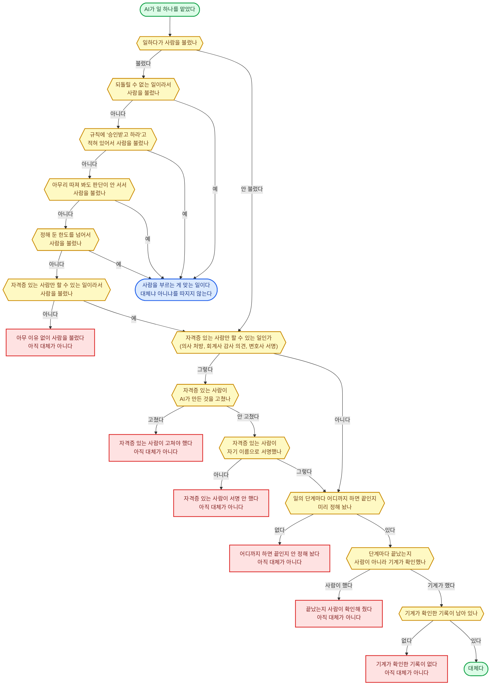

---

### AGI — 이뤄야 할 것

| 항목 | 내용 |
|------|------|
| 뜻 | 일반 인공지능 (AGI) 은 한 가지 일에 맞춰 만든 AI (좁은 AI) 와 달리, 사람이 머리로 하는 거의 모든 일을 사람과 같거나 더 나은 수준으로 해내고, 처음 보는 일도 따로 만들지 않아도 배워서 해내는 AI다<br>널리 쓰는 정의는 폭 (거의 모든 일) · 높이 (사람 이상) · 옮겨 쓰기 (새 일도 스스로) 셋을 다 요구한다<br>여기서는 지금 모델을 재는 잣대가 아니라 우리가 이뤄야 할 목표라는 뜻으로 쓴다 |
| 한 직무 대체 | 업무 처리 흐름 0~8을 20년차 수준으로, 대체의 뜻 절의 기준대로 사람 손 없이 끝까지 통과하는 것<br>이것은 아직 AGI가 아니라 좁은 AI가 한 직무에서 전문가 수준에 오른 것이다<br>항 정의표에서 실무 항을 "AGI에 가장 가까운 항"이라고 한 이유가 이것이다 |
| AGI | 한 직무 대체를 직무마다 이루고, 그 범위를 사람이 머리로 하는 거의 모든 일까지 넓힌 것 |
| 목표선 | 우리 목표는 한 분야의 숙련자 (상위 10%) 에서 최상위 (상위 1%) 까지다<br>널리 쓰는 AGI 등급표도 전문가 = 숙련된 어른 상위 10%, 거장 = 상위 1% 로 같은 눈금을 쓴다<br>[20년차 기준선](#20년차-기준선--어디서-어떻게-구하나) 의 상위 25% 는 통과선이고, 상위 10% ~ 1% 는 통과선을 넘은 뒤 올려 잡는 목표선이다<br>둘은 같은 눈금 위의 두 자리다<br>몇 시간·며칠·몇 주가 걸리는 일을 사람 손 없이 해내는 것은 모델 혼자가 아니라, 모델에 저장·이어받기와 기억을 붙여서 맡을 몫이다 |
| 지금 | 아직 AGI가 아니다<br>이 사실은 출발점을 재는 데만 쓰고, 목표를 낮추는 데는 쓰지 않는다 |
| 목표까지의 간격 | 지금 최상위 모델은 사람 전문가가 약 16시간 걸리는 일을 절반 확률로 해낸다 (성공률 80% 로 재면 약 3시간)<br>이 숫자는 모델이 혼자 돌아가는 시간이 아니라, 모델이 대신할 수 있는 사람 일의 길이다<br>그보다 긴 것은 지금 문제지 (228개 중 16시간 넘는 문제 5개) 로는 믿을 만하게 잴 수 없다<br>목표는 몇 주~몇 년<br>그 사이는 저장·이어받기와 기억이 잇는다<br>모델이 대신하는 일의 길이는 2019년부터 재면 약 7개월마다, 2023년부터 재면 약 4개월마다, 2024년부터 재면 약 3개월마다 두 배로 늘어 왔다<br>그래서 지금 모델로 흐름을 통과시키기 시작하되, 모델이 나아질수록 겉 장치 (하네스 = 모델을 태우고 일을 돌려 주는 장치) 는 할 일이 줄고 모델만 갈아 끼워도 성능이 오르게 짠다 |
| 이뤘다는 판정 | 남의 지표가 아니라 우리 잣대로 판정한다<br>판단 시험·성과 숫자·못 할 일 가리기 3개 기준의 재는 법을 그대로 쓴다<br>① 그 직무의 고정 시험지와 시험지에 없던 새 건을 사람 손 없이 통과 (판단 시험)<br>② 성과 추적 지표가 20년차 기준선 이상 (성과 숫자)<br>③ 사람에게 넘기기가 규칙에 정한 다섯 경우 안에서는 반드시, 밖에서는 일어나지 않음 (못 할 일 가리기)<br>모델이 맡는 몫 (판단이 갈리는 자리에서 20년차의 판단) 은 과정 평가로 따로 잰다 |
| 순서 | 한 직무 대체 → 같은 재료로 직무 늘리기 → AGI |
| 첫 직무의 조건 | 흐름 0~8이 화면과 문서 안에서 끝난다<br>성과 지표를 자기 자료로 잴 수 있다<br>틀렸을 때의 손실 한도를 숫자로 둘 수 있다 |

> **기준선 없는 점수는 아무리 높아도 판정에 쓰지 않는다.**

---

### 업무 처리 흐름

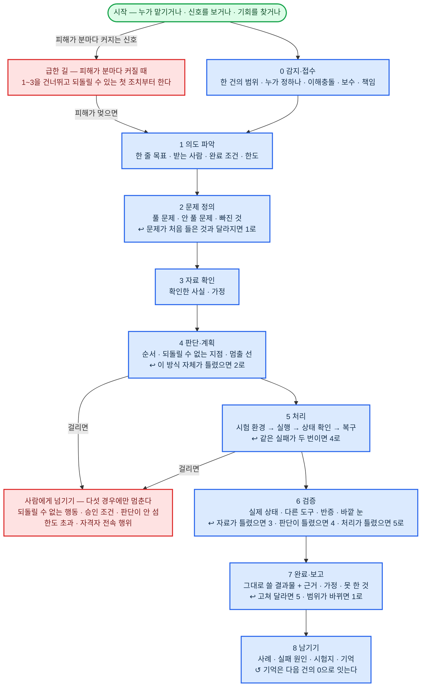

앞으로만 가고 되돌아가지 않으면 초보의 흐름이다. ↩ 가 되돌아가는 길이다.

| 되돌아가는 자리 | 돌아갈 곳 | 언제 |
|---|---|---|
| 2 문제 정의 | 1 의도 파악 | 문제가 처음 들은 것과 달라졌다 |
| 4 판단·계획 | 2 문제 정의 | 이 방식 자체가 틀렸다 |
| 5 처리 | 4 판단·계획 | 같은 실패가 두 번 났다 |
| 6 검증 | 3 자료 확인 | 자료가 틀렸다 |
| 6 검증 | 4 판단·계획 | 판단이 틀렸다 |
| 6 검증 | 5 처리 | 처리가 틀렸다 |
| 7 완료·보고 | 5 처리 | 고쳐 달라는 요청이 왔다 |
| 7 완료·보고 | 1 의도 파악 | 범위가 바뀌었다 |

> **되돌아가기에도 상한이 있다.** 한 건에서 같은 길로 3번, 여덟 길을 다 합쳐 10번까지다. 넘으면 또 돌지 않고 사람에게 넘긴다 (다섯 경우의 [한도 초과]). 숫자는 [책임·손실 한도](#책임손실-한도--책임-소재와-최대-손실-liability--loss-limits) 의 돌기 상한표에 있다.

| 순서 | 단계 | 하는 것 | 산출물 | 끝났다는 기준 | 막히면 |
|------|------|--------|--------|--------------|--------|
| 0 | 감지·접수 | 요청이 올 때까지 기다리지 않는다<br>누가 맡기든, 신호를 보든, 기회를 찾든 시작은 내가 한다<br>어디서 어디까지를 한 건으로 볼지 정한다<br>상대나 기관이 세는 건과 다르면 어느 것이 어느 것인지 적어 둔다<br>이 건을 누가 정할 수 있는지 (맡긴 사람의 권한, 당사자의 동의) 확인한다<br>이해충돌 (내 이익과 맡긴 사람의 이익이 부딪히는 것)·보수·책임을 확인한다<br>받을 일과 안 받을 일을 가른다. 안 받을 일은 이유를 말하고 돌려보낸다<br>조건을 붙여 받는 것도 답이다<br>맡은 건을 중간에 그만둘 때 (사임·해지·포기) 도 여기서 정한 조건 (미리 알리기·넘겨주기·비밀 지키기) 대로 한다 | 접수 기록 (한 건의 범위·누가·무엇을·언제까지), 맡는 범위, 권리·이해충돌·보수·책임 조건 | 무엇이 한 건인지, 맡는지, 어디까지 맡는지, 틀리면 누가 책임지는지가 적혀 있다 | 정할 권리가 없거나 맡지 않을 일은 이유를 붙여 돌려보낸다 |
| 1 | 의도 파악 | 말한 것과 말 뒤의 속뜻을 읽는다<br>결과물을 받는 사람이 누구인지 정한다. 맡긴 사람과 다를 수 있다<br>받는 사람이 결과물로 다음에 무엇을 할지 본다. 그 일이 실제로 일어난 상태가 완료 조건이다<br>한도 (시간·돈·시도 횟수) 를 정한다 | 한 줄 목표, 받는 사람, 완료 조건, 한도 | 맡긴 사람이 보고 "바로 그것"이라고 할 한 줄이 있다<br>완료 조건이 바깥에서 확인할 수 있는 상태로 적혀 있다 | 뜻이 두 갈래로 갈려 결과가 달라지고, 틀리면 되돌릴 수 없거나 한도를 넘으면 한 줄로 묻는다 (다섯 경우 안)<br>그 밖에는 가정을 적어 두고 그대로 간다 |
| 2 | 문제 정의 | 진짜 문제를 짚는다. 말한 사람도 모르는 문제까지 짚는다<br>풀 문제와 안 풀 문제를 가른다<br>있어야 하는데 없는 것을 찾고 왜 없는지 읽는다<br>필요하면 문제를 다시 잡는다. 문제를 다르게 잡으면 푸는 법도 답도 통째로 달라진다 | 풀 문제, 안 풀 문제와 이유, 빠진 것 목록 | 안 풀 문제와 그 이유가 적혀 있다 | 문제가 처음 잡은 것과 달라지면 1로 돌아가 목표를 다시 쓴다 |
| 3 | 자료 확인 | 자료를 스스로 모아 읽고 원문과 맞춰 본다<br>이 건의 기준일 (날짜를 따질 때 기준으로 삼는 날) 과 관할 (어느 나라·어느 기관의 규칙을 따르는지) 에 맞는 판본인지 본다<br>사람의 말은 셋으로 가른다: 진술 (그냥 한 말)·증거 (문서나 기록으로 남은 것)·추정 (짐작)<br>원천 시스템 (그 일이 실제로 벌어져 기록이 처음 남는 곳) 이나 제3자와 맞춰 본 뒤에만 사실로 쓴다<br>결론을 바꿀 정보만 골라, 가장 싸고 빠른 길로 얻는다<br>모자라면 가정을 드러내 적고 그대로 간다 | 사실 목록 (출처·시점·근거 등급 꼬리표), 가정 목록 | 결론을 바꿀 사실이 다 확인됐거나 가정으로 표시돼 있다 | 원문을 못 구하면 누구에게 무엇을 물어야 답이 나오는지 정해서 묻는다<br>자료끼리 어긋나면 미리 정한 출처 우선순위로 가린다<br>물어도 안 주면 강제할 수단 (기관의 힘·계약상 권리) 을 쓴다<br>그 수단도 없으면 자료 없이 갈 때의 가정과 누가 입증해야 하는지를 적는다<br>아직 없는 사실은 실험·시험으로 만들어 낸다 |
| 4 | 판단·계획 | 결과와 부작용, 상대의 움직임을 머릿속으로 끝까지 돌려 본다<br>여러 방법의 비용과 위험을 재서 고른다. 맞는 것이 없으면 새로 짠다<br>성과를 가르는 것부터 순서를 정한다<br>앞 걸음이 끝나야 다음 걸음을 갈 수 있으면, 가장 빠듯한 줄을 찾아 여유를 두고 걸음마다 대신할 방법을 둔다<br>되돌릴 수 없는 결정은 되돌릴 수 있는 작은 결정으로 쪼갠다<br>되돌릴 수 있다는 것은 셋이 다 맞을 때만이다: 되돌릴 시간이 남았다, 되돌려도 새 피해가 없다, 되돌릴 길이 살아 있다<br>쪼갤 수 없는 결정과 나가는 순간 끝나는 것 (발행·송출·통역) 은 되돌릴 수 없는 결정으로 다룬다<br>쪼갠 걸음은 중간에 멈춰도 괜찮은 상태로 자른다<br>아직 안 정해진 것을 안고 가야 하면 정해진 것과 안 정해진 것을 갈라, 안 정해진 쪽에 여지를 둔다<br>손실이 커지는 선 (돈·시간·시도 횟수) 을 책임·손실 한도 안에서 미리 긋는다. 넘으면 멈춘다고 정한다<br>내가 하지 않을 부분은 누가 하고 무엇을 증거로 받을지 정한다 | 계획 (순서·방법·되돌릴 수 없는 지점·멈출 선·맡길 사람과 받을 증거), 예측과 얼마나 확신하는지 | 계획대로 했을 때의 결과가 머릿속에서 끝까지 돌아간다<br>되돌릴 수 없는 지점과 멈출 선이 표시돼 있다 | 처음 보는 상황이면 원리와 비슷한 사례로 길을 새로 짠다. 되돌릴 수 있는 작은 걸음으로 먼저 가 본다<br>가 보기 전에 무엇이 나오면 이 길을 접을지 적는다<br>나온 것에 맞춰 3의 가정 목록과 계획을 고친다<br>그래도 판단이 서지 않으면 사람에게 넘긴다<br>계획의 전제 (시장·판·상대) 가 무너지거나 이 방식 전체가 틀렸으면 2로 돌아간다 |
| 5 | 처리 | 실행 전 조건 확인 → 실행 → 실행 뒤 상태 확인 → 실패하면 재시도·취소·복구<br>실제 고객·돈·시스템에 닿기 전에 시험 환경을 거치고 되돌릴 방법을 먼저 만든다<br>함께 돼야 뜻이 있는 여러 걸음은 한 묶음으로 실행한다. 하나가 실패하면 나머지도 되돌린다<br>서로가 서로의 조건이면 조건부로 묶어 같은 날 함께 성립시킨다<br>남과 같이 쓰는 것을 만질 때는 잠그거나 판본을 맞춰 봐서 서로 덮어쓰지 않게 한다<br>처리 중 들어오는 반응 (사람의 말·시스템의 응답·시장의 숫자) 마다 4와 5를 짧게 오간다. 그 자리에서 기록한다<br>머리로 하면 틀리는 것은 도구로 한다<br>중간 상태를 저장해 끊겨도 이어 간다 | 결과물, 실행 기록 (무엇을 언제 어떤 도구로), 반응 기록 (합의·미합의·다음 행동) | 결과물이 실제로 만들어졌고 실행 기록이 남아 있다 | 되돌릴 수 없는 행동·승인 조건·자격자 전속 행위 (법이 자격 있는 사람만 하게 정한 일) 에 걸리면 실행 전에 멈추고 사람에게 넘긴다<br>실패는 4에서 그은 선으로 잰다. 선 안이면 계속하고, 넘으면 멈추고 보고한다<br>같은 실패가 두 번이면 4로 돌아간다 |
| 6 | 검증 | 맞다고 생각하는 것이 아니라 실제 상태를 본다<br>잘했는지는 내 생각이 아니라 바깥의 실제 결과로 잰다<br>계산은 다른 도구로 다시 한다<br>행동의 결과는 그것이 닿은 곳 (시스템·상대·시장) 에서 본다<br>정답이 없는 결과물은 미리 적은 채점 기준과 바깥 눈 (다른 사람·다른 모델) 으로 채점한다<br>내 기록과 원천이 어긋나면 원천을 믿는다<br>반대편에 서서 내 결론을 깨 본다<br>놓치면 안 되는 위험을 놓쳤는지 본다<br>일한 쪽과 다른 쪽이 검사한다 | 검증 기록, 근거 추적 (결론마다 어떤 자료·도구·판단을 썼는지) | 실제 상태로 확인됐고, 반증 시도가 기록돼 있다 | 틀린 원인이 자료면 3, 판단이면 4, 처리면 5로 돌아간다<br>고칠 수 없는 잘못은 고친 척하지 않는다. 안고 갈 조건 (유효 기간·다시 볼 시점·정한 사람) 을 붙여 7에서 밝힌다 |
| 7 | 완료·보고 | 받는 사람이 손대지 않고 그대로 쓸 수 있는 꼴로 낸다<br>근거·가정·못 한 것을 같이 밝힌다<br>맡긴 사람에게 불리한 결론도 그대로 낸다<br>충분하면 멈춘다. 더 만지지 않는다 | 결과물, 보고 (결론·근거·가정·못 한 것) | 1에서 정한 완료 조건이 바깥 상태로 확인됐다<br>받는 사람이 되묻지 않는다 | 완료 조건에 못 미치면 N개 중 M개까지 됐다고 밝히고 낸다. 다 된 척하지 않는다<br>받는 사람이 고쳐 달라고 하면 5로, 범위가 바뀌면 1로 돌아간다 |
| 8 | 남기기 | 사례와 실패 원인, 틀린 자리를 기록한다<br>사례는 결과와 판단 과정을 따로 채점한다. 판단은 좋았는데 결과가 나쁜 것과, 판단은 나빴는데 결과가 좋은 것을 가른다<br>검증된 사례를 고정 시험지에 넣는다<br>성과가 확정되는 날을 적어 감시에 걸고, 확정되면 예측과 견줘 사례를 고친다<br>기억 (고객·건·기한·다음 감시 항목) 을 고쳐 다음 건의 0으로 잇는다 | 사례 기록, 시험지 추가분, 고친 기억, 성과 확정 예약 | 같은 실수가 다시 안 나게 규칙·지식·절차 중 어디를 고쳤는지 적혀 있다<br>성과 확정일이 기억에 적혀 있다 | 원인이 자료·지식·판단·절차·검증·바깥 변화 중 어디인지 못 찾으면 못 찾았다고 기록한다 |

| 단계와 상관없이 | 뜻 |
|----------------|-----|
| 산출물 저장 | 단계마다 산출물을 저장한다. 일이 끊겨도 다음 단계가 이어받는다<br>산출물이 없는 단계는 끝난 것이 아니다 |
| 되돌아가기 | 뒤 단계에서 앞 단계의 잘못이 드러나면 그 단계로 돌아간다<br>앞으로만 가고 되돌아가지 않으면 초보의 흐름이다<br>돌아갈 때 이미 만든 것을 통째로 버리지 않는다. 살릴 조각과 버릴 조각을 가른다<br>이미 낸 결과물에서 잘못이 드러나면 그것이 간 곳 (받은 사람·시스템·그것을 재료로 쓴 다른 건) 까지 되짚어 거두고 고친다. 못 거두는 것은 알린다 |
| 사람에게 넘기기 | 다섯 경우에만 멈추고 사람에게 넘긴다: 되돌릴 수 없는 행동, 승인 조건, 판단이 서지 않는 것, 한도 초과, 자격자 전속 행위<br>처음 보는 상황은 그 자체로 넘길 이유가 아니다<br>4에서 원리와 사례로 길을 짜 본 뒤에도 판단이 안 설 때만 '판단이 서지 않는 것'이다<br>넘길 때는 준비·기록·검증을 끝내고 결정만 넘긴다<br>결정은 0에서 확인한, 정할 권리가 있는 사람에게 간다<br>권리자가 여럿이고 답이 갈리면 0에서 정해 둔 순서로 가린다<br>정할 사람이 그 위험의 당사자거나 이해충돌에 걸리면 미리 정한 다른 사람에게 올린다<br>맡긴 사람이 내 결론을 덮으라고 하면 그 지시를 기록한다. 직업 규칙이 밖에 알리라고 하는 것은 알린다<br>답하는 순간 되돌릴 수 없는 행동이 되는 질문은 결정으로 친다<br>넘긴 뒤 답이 없어 기한이 위험해지면 정해 둔 다음 사람에게 올린다<br>그 밖에는 묻지 않고 끝낸다 |
| 여러 건 | 이 건과 다른 건 사이의 순서를 정한다<br>돈·시간·사람·자산이 모자라면 순서만이 아니라 건마다 얼마씩 나눌지도 정한다<br>동시에 걸어 둔 건 가운데 다 성사돼도 되는 수에 상한 (한 자리·한 예산) 이 있으면, 넘칠 확률을 재고 넘쳤을 때 어떻게 할지 (조건부·먼저 온 것부터·취소권) 를 걸기 전에 정한다<br>같은 상대·같은 자산·같은 뿌리로 묶인 건은 한 묶음으로 판단한다. 한 건에서 한 말·조치·약속이 다른 건을 묶기 때문이다. 손익도 묶음으로 잰다<br>건끼리 어긋나면 어느 건을 물릴지 규칙 층의 우선순위와 손실 한도로 정한다<br>상대의 답이나 맡긴 일의 결과를 기다리는 동안 그 건은 재워 두고 다른 건을 한다 |
| 긴급 경로 | 피해가 분마다 커지는 신호는 1~3을 건너뛴다<br>되돌릴 수 있는 첫 조치를 먼저 한다: 격리 (문제 난 곳을 다른 데와 끊어 놓기)·차단·이전 상태로 되돌리기·대체<br>피해가 멎으면 1로 돌아가 정식으로 돈다<br>첫 조치도 되돌릴 수 없으면 사람 승인을 받는다<br>첫 조치가 바깥 기관의 결정에 걸리면 신청과 동시에 내가 할 수 있는 차단부터 한다<br>첫 조치를 안 하면 사람이 다치는 것처럼 더 큰 되돌릴 수 없는 피해가 오면, 규칙에 미리 적어 둔 조치를 승인 없이 하고 바로 알린다<br>멈추는 것 자체가 피해인 곳 (멈출 수 없는 공정·생방송) 은 멈추지 않고 대체로 잇는다<br>그때 안 하면 사라지는 기회도 그 시한을 기한으로 삼아 같은 길로 다룬다 |
| 되풀이 | 흐름은 건마다 한 바퀴다<br>0에서 정한 건의 단위가 주기 (초·시간·일·회차) 면 주기마다 한 바퀴 돈다<br>4에서 정한 규칙은 주기마다 다시 정하지 않는다. 규칙 밖 상황이 생길 때만 4로 돌아간다<br>5·6은 주기 안에서 돌고, 7·8은 주기마다 묶어서 낸다<br>완료 조건은 끝난 상태가 아니라 계속 지킬 상태다<br>한 주기의 실패는 되돌아갈 이유가 아니라 다음 주기에 넣을 재료다<br>실패가 다음 주기의 출발점 (예산·평판·재고) 을 깎았으면 다음 주기 계획은 깎인 값에서 다시 짠다<br>사람 승인은 건마다가 아니라 규칙을 정할 때 한 번 받는다. 규칙 안에서 되풀이되는 실행 (주기 주문·게시·입찰) 은 그 승인으로 대신한다<br>규칙 밖으로 나가는 되돌릴 수 없는 행동만 다섯 경우대로 멈춘다<br>주기가 여러 층 (초·일·분기) 이면 층마다 바퀴를 따로 돌린다. 위층 바퀴가 아래층의 규칙을 고친다<br>규칙의 전제 (시장·판·상대) 가 무너진 것도 규칙 밖 상황이다 |

---

### 수식

**전체**

$$
\text{전문 AI 에이전트} = \text{환경} \times \text{지식} \times \text{규칙} \times \text{실무} \times \text{검증} \times \text{학습}
$$

**전개**

$$
\begin{aligned}
\text{환경} &= (\,\text{모델} + \text{실행 순환} + \text{저장}{\cdot}\text{이어받기} + \text{나눠 맡기기} + \text{작업창} + \text{시작 신호} \\
&\phantom{= (\,} + \text{자료 읽기} + \text{실시간 통로} + \text{그림}{\cdot}\text{영상 생성} + \text{도구} + \text{시험 환경}\,) \\[16pt]
\text{지식} &= \left\{ \begin{aligned}
\text{자료}{\cdot}\text{검색} &(\,\text{법규}{\cdot}\text{기준} + \text{플랫폼}{\cdot}\text{기관 규정} + \text{해석 자료} + \text{일반 자료} \\
&\phantom{(\,} + \text{현황 자료} + \text{고객}{\cdot}\text{회사 정보} + \text{출처}{\cdot}\text{시점}{\cdot}\text{판본} + \text{검색} + \text{자동 갱신}\,) \\[4pt]
+\;\text{지식}{\cdot}\text{경험} &(\,\text{업무 지식} + \text{감각}{\cdot}\text{사례}{\cdot}\text{암묵지} + \text{정체성}{\cdot}\text{작풍}\,) \\[4pt]
+\;\text{기억}{\cdot}\text{상태} &(\,\text{장기 기억} + \text{작업 기억}\,)
\end{aligned} \right\} \\[16pt]
\text{규칙} &= \left\{ \begin{aligned}
\text{규칙}{\cdot}\text{권한} &(\,[\,\text{절대 원칙} > \text{직업 규칙} > \text{계약}{\cdot}\text{플랫폼 규칙} > \text{회사 규칙} > \text{개인 취향}\,] \\
&\phantom{(\,} + \text{권한}{\cdot}\text{명의}{\cdot}\text{위임} + \text{안전장치} + \text{책임}{\cdot}\text{손실 한도}\,) \\[4pt]
+\;\text{행동 체계} &(\,\text{판단 규칙} + \text{업무 절차}{\cdot}\text{노하우} \\
&\phantom{(\,} + \text{완료 조건} + \text{먼저 감지하기} + \text{상대 응대} + \text{사람에게 넘기기} \\
&\phantom{(\,} + \text{보고}{\cdot}\text{결과물}\,)
\end{aligned} \right\} \\[16pt]
\text{실무} &= (\,\text{감지}{\cdot}\text{접수} \to \text{의도 파악} \to \text{문제 정의} \to \text{자료 확인} \to \text{판단}{\cdot}\text{계획} \\
&\phantom{= (\,} \to \text{처리} \to \text{검증} \to \text{완료}{\cdot}\text{보고} \to \text{남기기}\,) \\[16pt]
\text{검증} &= \left\{ \begin{aligned}
\text{검증}{\cdot}\text{평가} &(\,\text{결과 검증}{\cdot}\text{수정} + \text{반증}{\cdot}\text{교차 검증} + \text{위험 누락 검사} + \text{과정 평가} \\
&\phantom{(\,} + \text{결과물 평가} + \text{근거 추적}{\cdot}\text{재현}\,)
\end{aligned} \right\} \\[16pt]
\text{학습} &= \left\{ \begin{aligned}
\text{학습}{\cdot}\text{개선} &(\,\text{실패 원인 분석} + \text{고정 시험} + \text{자동 학습} + \text{성과 추적}\,)
\end{aligned} \right\}
\end{aligned}
$$

| 기호 | 뜻 |
|------|-----|
| × | 반드시 다 있어야 한다는 뜻 (필수 조건의 결합)<br>한 항 (× 로 곱해지는 큰 덩어리 하나) 이라도 빠지면 전문 AI 에이전트가 되지 않는다 |
| + | 구성 요소의 합. 요소가 갖춰질수록 그 항이 강해진다<br>다만 그 직종의 성과가 걸린 재료 (상대가 사람인 일이면 상대 응대, 결과물이 그림·영상인 일이면 그림·영상 생성) 가 없으면 그 항이 0이 되어 × 에서 걸린다<br>반대로 분야에 없는 재료는 0으로 두고 더한다<br>법규·기준과 플랫폼·기관 규정처럼 분야에 따라 한쪽만 있는 재료도 있고, 그때는 있는 것만 채우면 된다 |
| { } | 항을 이루는 계통 (항 안에서 성격이 비슷한 재료끼리 묶은 갈래) 의 묶음 |
| ( ) | 계통을 이루는 재료의 묶음 |
| [ > ] | 우선순위. 앞의 규칙이 뒤의 규칙보다 우선한다<br>같은 층 안의 규칙끼리 부딪힐 때 가리는 법은 규칙·권한 계통 머리말에 둔다 |
| → | 일하는 순서. 뒤 단계에서 앞 단계의 잘못이 드러나면 그 단계로 되돌아간다<br>피해가 분 단위로 커지면 뒤 단계의 첫 조치를 먼저 당겨 하고, 끝이 없는 일은 주기로 되풀이한다 |

여섯 항 아래 계통 9개, 재료 51개다. 계통 이름은 그대로 아래 재료 표의 제목이다.

| 항 | 뜻 | 계통 (재료 수) |
|----|-----|------|
| 환경 | 에이전트가 실제로 돌아가는 밑바탕 장치<br>판단하는 머리 (모델) 와, 그 머리를 태우고 다니며 바깥을 읽고 만지게 하는 장치 | 환경 (11) |
| 지식 | 일에 필요한 것을 아는 상태<br>사실은 자료에서 확인하고, 분야 지식·감각·정체성은 몸에 지니고, 진행 중인 건은 기억으로 붙든다 | 자료·검색 (9)<br>지식·경험 (3)<br>기억·상태 (2) |
| 규칙 | 해도 되는 것의 범위와 일하는 방식<br>다섯 층의 규칙 (절대 원칙 > 직업 규칙 > 계약·플랫폼 규칙 > 회사 규칙 > 개인 취향) 과 권한·안전장치·책임이 범위를 긋고, 행동 체계가 판단하고 일하는 방식을 정한다 | 규칙·권한 (8)<br>행동 체계 (7) |
| 실무 | 업무 처리 흐름 9단계 (0~8) 를 사람 손 없이 끝까지 해내는 능력<br>AGI에 가장 가까운 항 | 실무 (1) |
| 검증 | 과정과 결과의 오류를 스스로 찾아 고치고 근거를 남기는 장치<br>정답이 없는 결과물은 미리 정한 기준과 일한 쪽 아닌 바깥 눈으로 채점한다 | 검증·평가 (6) |
| 학습 | 실패와 측정된 성과에서 성능을 높이는 장치<br>쌓은 사례 자체는 지식·경험 계통에 둔다 | 학습·개선 (4) |

---

### 계통별 재료

흐름 표에는 직무가 바뀌어도 그대로인 원칙만 둔다. 재료 표에는 그 원칙을 되풀이하지 않고, 원칙을 실행하는 장치와 그 원칙이 이 직무에서 무엇인지 채워 넣을 자리만 둔다.

#### 환경 — 실행 기반

| 재료 | 무엇 | 원어 | 뜻 |
|------|------|------|-----|
| 모델 | 장기 실행형 프론티어 모델 | - | 몇 시간에서 하루 가까운 일을 사람 손 없이 한 번에 끝까지 해내는, 지금 나온 것 가운데 가장 앞선 (프론티어) 모델<br>생각하고 정하는 일 (판단) 을 맡는다<br>더 긴 건은 저장·이어받기와 기억이 이어 주고, 몇 초 안에 답해야 하는 일은 실시간 통로가 맡는다 |
| 실행 순환 | 모델 호출·도구 실행 순환 | Agent Loop·Runner | 모델을 부르고, 모델이 요청한 도구 호출을 실제 실행 기반에 연결하고, 그 결과를 다시 모델에 돌려주는 순환<br>판단은 모델에 맡기고, 모델이 못 하는 것만 여기에 남겨 얇게 유지한다<br>호출 횟수·시간·비용 한도를 기계로 세어 무한히 돌지 않게 한다<br>사람에게 넘기기가 정한 조건 앞에서는 기계로 멈추고, 실행 전후 검사 (안전장치) 도 여기에 끼워 넣는다<br>모델이 나아지면 순환에 박아 둔 가정이 낡으므로, 모델을 갈아 끼워도 순환은 그대로 돌게 짠다 |
| 저장·이어받기 | 실행 기록·저장점·재시작 | Session Log·Checkpoint·Durable Execution | 한 건에서 일어난 모든 것 (호출·도구 결과·승인·넘김) 을 순서대로 덧붙여 쓰는 실행 기록과, 단계마다 남기는 저장점을 작업창 밖에 둔다<br>끊기거나 실패하면 마지막 저장점에서 다시 시작한다<br>실패한 실행은 정한 규칙 (횟수·간격) 으로 재시도한다<br>상대의 답을 기다리는 건은 재워 두고 시작 신호가 깨우면 이어 간다<br>며칠·몇 달·몇 년짜리 건이 사람 손 없이 이어지게 하는 것은 이 재료가 맡는다<br>무엇을 남길지는 작업 기억이, 나중에 되짚어 재현하는 것은 근거 추적·재현이 맡는다 |
| 나눠 맡기기 | 여러 에이전트·사람 협력자에게 나누고 거두기 | Orchestration·Subagents·Handoff | 한 건을 여럿이 하는 구조<br>차례로 (순차), 동시에 (병렬), 될 때까지 (되풀이), 한 에이전트가 쪼개 나눠 주고 모으기 (오케스트레이터-워커), 만드는 쪽과 채점하는 쪽 나누기 (평가자-개선자), 대화 주도권을 통째로 넘기기 (핸드오프) 가운데 건에 맞는 것을 고른다<br>평가자-개선자에서 채점하는 쪽을 누구로 두는지는 반증·교차 검증이 정한다<br>받는 쪽은 새 작업창에서 시작하므로 목표·완료 조건·받을 산출물 형식·한도를 적어 넘기고 산출물로 돌려받는다<br>받는 쪽이 에이전트든 사람 협력자 (직원·외주·다른 전문가) 든, 넘기고 진행을 지켜보고 기한 전에 독촉해 거두는 구조는 같다<br>나눌수록 작업창은 가벼워지지만 넘기는 자리마다 정보가 샌다<br>그래서 나누는 것 자체가 아니라 어디서 자르고 무엇을 넘기는지가 성능을 가른다<br>사람 협력자는 지시가 아니라 설득과 동기로 움직인다고 보고 그렇게 대한다<br>여럿이 같은 대상을 고치면 잠금이나 판본 대조로 서로 덮어쓰지 않게 하고, 나눈 산출물끼리 맞대어 이음새를 검증한다<br>협력자의 산출물은 받을 때 정해 둔 기준으로 채택하거나 돌려보낸다<br>여러 안을 만들어 고르는 것과 실행 주체가 여럿일 때 편차를 재어 맞추는 것도 여기서 한다 |
| 작업창 | 작업창 운용 | Context Window | 작업창은 모델이 한 번에 읽고 기억할 수 있는 글의 양이다<br>책상처럼 크기가 정해져 있어 다 올리면 넘친다<br>그 시점에 필요한 자료와 규칙만 작업창에 올린다<br>프롬프트 (모델에게 주는 지시문) 한 장에 지침을 잔뜩 넣지 않는다<br>고정된 것 (규칙·자료) 은 앞에 두고 바뀌는 것만 뒤에 붙여 같은 앞부분을 싸게 다시 읽는다 (캐시)<br>작업창이 차면 실행 기록을 요약해 새 작업창에서 이어 간다<br>요약에서 빠진 것은 저장·이어받기의 실행 기록에서 다시 찾는다 |
| 시작 신호 | 예약·신호 수신·깨우기 | Triggers·Schedules·Webhooks | 정한 시각·주기에 깨우는 예약, 바깥에서 생긴 일 (알림·웹훅·메일·경보) 을 실시간으로 받는 수신, 재워 둔 건을 기한이나 답이 오면 깨우는 알람을 실행 순환 밖의 호스팅 층 (에이전트를 띄워 두는 서버) 에 기계로 둔다<br>밤·주말에도 끊기지 않게 하고, 같은 신호가 몰리면 묶고, 잘못 울린 경보는 걸러서 감각이 무뎌지지 않게 한다<br>무엇을 신호로 볼지와 받은 뒤 무엇을 할지는 먼저 감지하기가 정한다 |
| 자료 읽기 | 문서·표·이미지·음성·도면·실시간 입력 처리 | - | 스캔 문서·PDF·표·사진·도면·녹취 같은 실제 자료와, 음성·화상·채팅 같은 실시간 흐름을 정확히 읽어 표·항목으로 정리한다<br>사람을 상대할 때는 말투·표정·머뭇거림 같은 말 밖의 신호도 읽는다<br>여기서 잘못 읽으면 뒤의 판단이 전부 틀린다 |
| 실시간 통로 | 초 단위 응답 구성 | Realtime·Live API | 음성·화상·채팅·방송처럼 초 단위로 주고받는 건은 응답 지연 한도를 지키는 구성으로 따로 받고 내보낸다<br>장기 실행 모델은 깊이를, 이 구성은 속도를 맡고, 둘 사이에서 건의 상태를 주고받는다<br>끊겼을 때의 복구 방법을 둔다<br>초 단위 자리에서는 검증을 다 못 돌리므로 미리 정한 기계 검사만 그 자리에서 하고 나머지는 뒤에 돌린다<br>무엇을 말할지는 상대 응대가, 말 밖의 신호를 읽는 것은 자료 읽기가 맡는다 |
| 그림·영상 생성 | 글 밖 결과물의 생성·편집 | - | 그림·영상·자막·음성·음원·도면·화면처럼 글이 아닌 결과물을 생성 모델과 편집 도구로 실제로 만든다<br>만든 뒤에 플랫폼 규격 (해상도·길이·비율·음량·파일 형식) 과 정해 둔 작풍 (그 사람·브랜드만의 만드는 방식과 분위기) 에 맞는지 확인한다<br>자료 읽기가 입력의 정확도를 맡듯 이 재료가 출력의 품질을 맡는다 |
| 도구 | 도구·연동·실행 | - | 웹사이트·업무 시스템·외부 시스템을 MCP (AI가 도구를 꽂아 쓰는 표준 연결 방식) 와 외부 API (프로그램끼리 서로 부르는 창구) 로 직접 조작한다<br>이 직무에서 되돌릴 수 없는 실행 (배포·이전·주문·계약) 이 무엇이고, 그것을 되돌릴 방법 (이전 상태 보관·점진 적용 (한꺼번에 말고 조금씩 나눠 적용하기)·반대 거래 (산 것을 되파는 식으로 반대로 걸어 없던 일로 만들기)) 이 무엇인지 도구마다 적는다<br>되돌릴 창 (언제까지) 과 되돌릴 때 생기는 피해, 여러 실행을 한 묶음으로 넣고 하나가 실패하면 전부 되돌리는 방법도 같이 적는다<br>실행 전후 확인은 실행 순환이, 재시도는 저장·이어받기가 돌리고, 음성·영상·채팅·방송 채널은 실시간 통로가 맡는다 |
| 시험 환경 | 실제 조건을 재현한 격리 실행 환경 | Staging·Sandbox | 흐름 5단계의 시험 환경이 이 직무에서 무엇인지 적는다<br>소프트웨어는 실제와 똑같이 꾸민 시험용 서버 (스테이징) 와 진짜 기기, 창작·상품은 소량 시험 (테스트 광고, 두 가지 안을 나눠 보여 주고 어느 쪽이 나은지 재는 A/B 비교), 투자는 과거 자료로 돌려 보는 시험 (백테스트) 과 모의 매매를 시험 환경으로 둔다<br>시험을 통과하지 않은 것은 실제 환경에 내지 않는다<br>과거 자료에만 딱 맞아 실제에서는 안 통하는 것을 걸러 내려고, 시험에 쓰지 않은 자료로 다시 본다<br>시험 환경을 못 만드는 일은 되돌릴 수 있는 소량 범위로 실전에서 시험하고 그 한계를 적는다<br>참가자끼리 서로 값을 만드는 판 (시장·경매·네트워크) 은 일부만 떼어 낸 시험이 전체를 못 재므로, 모의 (시뮬레이션) 나 과거 재현으로 대신하고 그 한계를 적는다 |

---

#### 자료·검색 — 사실을 확인하는 자료와 찾는 수단

자료 종류는 누가 정했는지와 얼마나 자주 바뀌는지로 가르고, 두 종류에 걸치는 자료는 양쪽에 둔다.

| 재료 | 무엇 | 원어 | 뜻 |
|------|------|------|-----|
| 법규·기준 | 법령·시행령·기준·규격·지침 | - | 나라와 업계가 정한, 반드시 따라야 하고 틀리면 안 되는 규범 (모두가 지켜야 하는 정해진 규칙)<br>법률이면 법령, 세무면 세법·회계기준, 건설이면 설계 기준, 의료면 진료 지침, 광고면 심의 규정 |
| 플랫폼·기관 규정 | 플랫폼 정책·심사 지침, 발주처 시방서·입찰 조건, 승인 기관 내규·약관, 도구·서비스 업체 이용 조건, 이 건의 계약서 | - | 일을 올리거나 납품하거나 승인받는 곳이 정한 규정<br>나라가 아니라 회사·기관이 정한 규정이지만, 어기면 계정 정지·심사 탈락·대출 거절·대금 미지급 (일한 값을 못 받음) 이 따르므로 법규만큼 세게 묶는다<br>유튜브면 커뮤니티 가이드라인과 수익화 정책, 블로그면 애드센스 정책과 검색 가이드, 앱이면 스토어 심사 지침, 판매자면 오픈마켓 판매 정책, 건설이면 발주처 (일을 시킨 곳) 시방서 (무엇을 어떻게 만들라고 적어 준 설명서), 대출이면 은행·보증기관 심사 기준, 개발이면 클라우드·API·엔진의 요금·한도·라이선스<br>이 건을 묶는 계약서도 여기에 든다<br>원문과 판본은 여기에 두고, 어느 층에 서는지와 어기면 무엇이 따르는지는 계약·플랫폼 규칙에 둔다 |
| 해석 자료 | 판례·유권해석·공식 해설·심사·제재 사례, 노출·추천 알고리즘의 실제 작동 방식 | - | 원문을 실제로 어떻게 읽고 적용하는지 정해 주는 자료<br>법이면 판례 (법원이 실제로 내린 판결의 본보기) 와 유권해석 (담당 기관이 이 법은 이렇게 읽으라고 공식으로 알려 주는 것), 플랫폼이면 정책 해설·제재 사례·알고리즘 (무엇을 먼저 보여 줄지 정하는 계산 규칙) 이 실제로 밀어 주는 것 (공식 발표와 실험으로 알아낸 것 모두) |
| 일반 자료 | 논문·책·보고서·매뉴얼·공식 통계 | - | 배경이 되는 일반 지식과 공식 수치 |
| 현황 자료 | 시세·환율·금리·실거래가·공시가·공급처 납기·뉴스·업계 동향·경쟁사 움직임 | - | 법규나 책과 달리 날마다 바뀌는 바깥 세상의 지금 상태<br>부동산이면 실거래가와 매물, 금융이면 시세와 금리, 제조·물류면 공급처 납기와 물량, 마케팅이면 경쟁사 움직임과 업계 동향<br>자기 시스템에서 잰 값은 고객·회사 정보에 두고, 바깥에서 오는 값은 여기에 둔다<br>낡은 값으로 판단하면 틀린다 |
| 고객·회사 정보 | 고객·상대 상황, 거래처·상대방·담당 기관의 이력과 평판, 우리 회사 규정, 자기 운영 자료 | - | 이 건·이 고객·이 상대·이 회사에만 있는 사실<br>거래처·상대방·담당 기관의 이력과 평판도 여기에 둔다<br>자기 시스템·계좌·플랫폼에서 직접 뽑은 자료 (로그 (시스템이 자동으로 남기는 기록)·재고·매출·체결 (사고파는 거래가 실제로 맺어진 것)·시청 지표) 를 이 분야의 사실 기준으로 둔다<br>원천 시스템 기록이 문헌보다 우선하고, 기록끼리 어긋나면 원천에 가까운 것을 믿는다 |
| 출처·시점·판본 | 시점·관할·판본 관리와 출처·근거 등급, 충돌 해결 | - | 자료마다 국가·관할, 효력 발생일 (그 규칙이 실제로 힘을 갖기 시작하는 날), 폐지일 (그 규칙이 없어지는 날), 개정 이력 (언제 어떻게 고쳐졌는지의 내력) 을 꼬리표로 붙이고, 건의 기준일에 맞는 판본을 쓴다<br>한 건에 기준일이 여럿 (계약일·사고일·신고일·평가일) 이면 사실마다 어느 기준일의 것인지 적는다<br>같은 대상이 목적 (경영·세무·회계·담보·보험) 마다 다른 값을 가지면 목적을 꼬리표로 붙여 같이 두고 차이의 사유를 적는다<br>내용이 맞아도 기준일에 맞지 않는 판본이면 오답이다<br>시세처럼 초·분 단위로 낡는 자료는 읽은 시각을 붙인다<br>내 결과물이 딛고 선 남의 부품 (라이브러리·모델·규격·자료) 의 판본도 여기에 둔다<br>모든 사실에 출처와 근거 등급을 붙인다<br>원천 시스템 기록 > 공식 문서 > 제3자 확인 > 사람 말 순으로 믿는다<br>사람 말은 말한 사람의 이해관계를 읽어 신뢰도를 매긴다<br>말과 행동이 어긋나면 행동을 믿는다<br>흐름 3단계의 대조와 자료끼리 어긋날 때의 정리는 이 순서를 기준으로 한다<br>원천 기록이라도 이해관계자나 상대가 손댈 수 있는 것이면 등급을 낮추고 독립된 원천으로 다시 대조한다<br>같은 등급끼리 어긋나면 원천에 가깝고 기준일에 맞는 쪽을 택하고, 못 가리면 둘 다 가정으로 적는다<br>나쁜 경로 (불법 수집·비밀 침해) 로 얻은 자료는 등급이 높아도 쓰지 않고 얻은 경로를 적는다<br>옮겨 적을 때는 조건·예외·전제를 떼지 않고 같이 옮기고, 내 결론도 조건이 잘리면 뜻이 뒤집히지 않게 조건을 결론 문장 안에 넣는다 |
| 검색 | 하이브리드 검색 | Hybrid Search·RAG | 낱말이 똑같은 것을 찾는 검색 (키워드), 뜻이 비슷한 것을 찾는 검색 (벡터), 표로 정리된 데이터베이스 조회, 찾은 것을 원문과 대조하기를 함께 쓴다<br>검색이 나쁘면 행동 체계가 좋아도 성능이 크게 떨어진다 |
| 자동 갱신 | 법규·플랫폼 규정·현황 자동 갱신 | - | 법령·기준·플랫폼 정책이 바뀌거나 시세·납기 같은 현황이 움직이면 자료에 자동으로 반영된다<br>플랫폼 정책은 예고 없이 자주 바뀌므로, 여기서 놓치면 계정째 날아간다<br>바뀌었다는 신호는 시작 신호가 받고, 자료에 반영하는 것은 여기가 맡는다<br>규정이 바뀌면 진행 중인 건과 끝난 건 가운데 그 규정에 걸린 것을 전수 가려 다시 본다 |

---

#### 지식·경험 — 분야 지식·감각·정체성

| 재료 | 무엇 | 원어 | 뜻 |
|------|------|------|-----|
| 업무 지식 | 서식·계산법·용어·관행 | - | 실제 일에 쓰는 '무엇을 아는가'의 지식<br>정석이 왜 그렇게 만들어졌는지의 원리와 내력도 여기에 둔다<br>정석이 없는 처음 보는 건은 이 원리에서 풀어낸다<br>어떤 순서로 하는지는 업무 절차·노하우가 맡는다 |
| 감각·사례·암묵지 | 상황별로 먼저 확인할 것과 실전 사례·숙련자만 아는 것 | Case Memory | 수많은 원문 가운데 이 건에서 먼저 볼 것을 아는 감각<br>상대·기관·시장의 이해관계와 버릇을 읽어 움직임을 미리 내다보는 감각<br>실제 건의 성공·실패, 정석 (교과서에 적힌 정해진 방법) 이 안 통하는 함정, 놓치면 큰 문제가 되는 징후<br>암묵지는 글로 정리돼 있지 않고 해 본 사람 머릿속에만 남아 있는 요령이다<br>처음 넣어 주는 사례와 내 건에서 새로 쌓는 사례를 여기에 함께 두고, 고객·건별 사실은 장기 기억에 둔다<br>흐름 8단계에서 남긴 사례를 사례집과 기억으로 쌓는다<br>고객의 비밀은 사례에서 격리해 다른 고객의 건에 새지 않게 한다<br>동의가 철회되거나 삭제 요구가 오면 사례·기억·시험지·배운 규칙에서 그 자료를 빼내고, 뺀 범위와 못 뺀 것을 당사자에게 밝힌다<br>운에 크게 좌우되는 분야 (투자·흥행·초기 투자) 인지 적어, 결과 점수와 판단 과정 점수 가운데 어느 것을 앞에 둘지 정한다 |
| 정체성·작풍 | 채널·작가·브랜드의 고유한 목소리 | - | 독자·시청자·고객이 다시 찾아오는 이유가 되는 말투·시각·세계관·그림체·음색·금기·단골 형식·발행 약속 (요일·시각·길이) 을 정해 두고, 모든 산출물을 그것에 맞춘다<br>남의 브랜드를 맡으면 그쪽의 정체성을 이것으로 삼는다<br>두 목소리가 같이 살아야 하면 (매체와 필자, 회사와 대표) 반드시 고칠 곳과 손대지 않을 곳의 경계를 적는다<br>정체성을 바꾸는 것은 되돌리기 어려운 결정으로 다룬다<br>바꿀 때는 이유·시점·기대 효과를 기록하고, 시장 반응을 보고 되돌릴지 정한다<br>개인 취향 (맡긴 사람의 보고 취향) 과 구분한다 |

---

#### 기억·상태 — 진행 상황 파악

| 재료 | 무엇 | 원어 | 뜻 |
|------|------|------|-----|
| 장기 기억 | 오래 가는 기억 | Long-term Memory | 고객·건·과거 결정·기한·변경 사항·성과 확정 예정일을 오래 기억하고 이어 간다<br>연재·시리즈·시즌처럼 한 건이 몇 년에 걸치면 설정집 (인물·세계관·규칙), 복선 장부, 독자에게 한 약속을 따로 두고 매 회 산출물을 그것과 대조한다<br>내가 밖에 한 말·약속·제출한 진술은 건·상대별로 모아 두고 새 산출물마다 대조한다<br>직업 규칙이 칸막이를 건 것은 따로 두어 다른 건에 섞이지 않게 한다<br>필요할 때마다 자료를 찾아 읽는 검색 (RAG) 과는 다른 것이다 |
| 작업 기억 | 처리 중인 건의 상태와 상황 파악 | Working Memory·State | 진행 중인 건의 목표·중간 결과·남은 일<br>장기 기억과 섞지 않는다<br>건이 안고 가는 제약과 못 고친 잘못은 누가 왜 걸었는지·얼마나 물러설 수 있는지·유효 기간·다시 볼 시점·정한 사람을 붙여 한 목록 (제약 대장) 으로 두고, 되풀이 주기와 7단계 보고 때 다시 본다<br>무엇을 남길지는 여기가 정하고, 끊겨도 이어받게 저장하는 장치는 저장·이어받기가 맡는다<br>지금 무엇이 일어나고 있는지 계속 파악해, 요청이 없어도 다음에 할 일을 안다<br>신호를 받는 것은 시작 신호가, 무엇을 신호로 볼지는 먼저 감지하기가 맡고, 받은 신호로 지금의 그림을 갱신하는 것은 여기가 맡는다 |

---

#### 규칙·권한 — 허용 범위와 책임

규칙은 다섯 층으로 나누고 위층이 아래층을 이긴다. 개인 취향은 가장 아래층에 두어 규칙을 이기지 못하게 한다. 같은 층 안에서 두 규칙이 부딪히면 (두 나라의 법, 두 플랫폼의 정책, 두 계약) 관할·계약에 정해진 순서로 가리고, 없으면 둘 다 지키는 길을 먼저 찾고, 그래도 없으면 어겼을 때 더 되돌릴 수 있는 쪽을 어기고 이유를 기록한다.

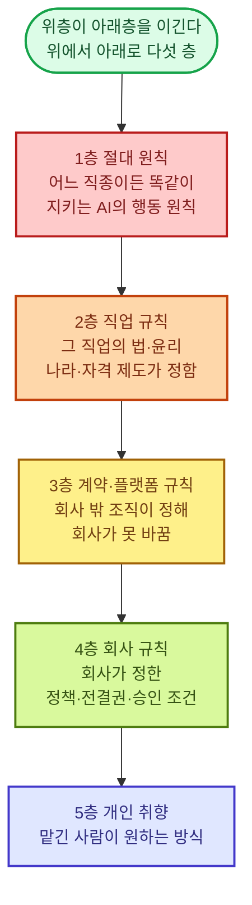

다음 셋은 층이 아니다. 어느 층에서 일하든 실행할 때 함께 묶는 장치다.

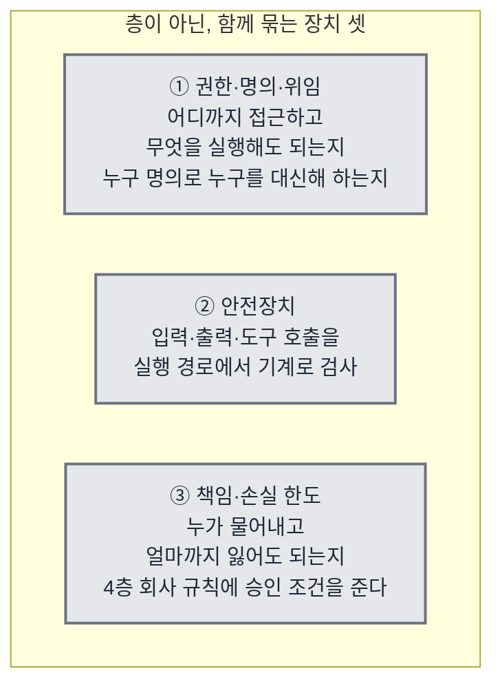

| 재료 | 무엇 | 원어 | 뜻 |
|------|------|------|-----|
| 절대 원칙 | AI의 절대 행동 원칙 | Constitution | 근거 없는 말 지어내기 금지, 생명·재산 해치기 금지, 사람과 말을 주고받을 때 AI임을 숨기지 않기처럼 분야를 가리지 않는 절대 원칙<br>나라의 헌법이 아니라 AI 자신이 지키는 원칙이다<br>법령은 직업 규칙에 둔다<br>변호·수사·보안 시험처럼 겉보기에 누군가를 해치는 듯해도 법이 허용한 정당한 직업 행위는 여기서 막지 않는다 |
| 직업 규칙 | 직업의 법·윤리 규칙 | Domain Rules | 그 직업의 법적·윤리적 규칙<br>자격 요건, 비밀 유지와 그 예외 (신고 의무), 이해충돌 회피, 맡는 일의 범위와 맡지 않을 일<br>이해충돌은 맡을 때 한 번이 아니라 당사자·상대·내 이해관계가 바뀔 때마다 다시 본다<br>법이 자격자에게만 허용한 행위 (서명·날인·처방·감사 의견) 의 목록을 두고, AI는 그 직전까지 준비하고 자격자가 자기 명의로 확정한다<br>당사자가 여럿이고 이해가 어긋나면 (회사와 직원, 은행과 차주 (돈을 빌린 사람), 파는 사람 (매도자) 과 사는 사람 (매수자)) 누구 편인지, 또는 어느 편도 아닌지 (중재·심판·감리) 를 규칙으로 둔다<br>한 건에서 안 것을 다른 건이나 다른 당사자에게 쓰거나 그것만으로 행동하면 안 되는 칸막이 (차단벽·내부자 정보) 는 건 사이와 한 건 안 당사자 사이 모두에 건다<br>AI 판단이 개인에게 법적·경제적 효과를 미치면 (채용·평가·대출·보험 인수 = 보험사가 이 사람을 받아 줄지 정하는 것) 이유를 당사자가 알아들을 말로 설명하고, 당사자가 요구하면 사람의 재검토로 넘긴다<br>금지 변수 (판단에 쓰면 안 되는 정보 항목 — 성별·연령·장애·병력) 로 결과가 갈리지 않게 한다<br>산출물이 AI가 만든 것임을 밝혀야 하는지와 저작권이 누구 것이 되는지도 여기에 둔다 |
| 계약·플랫폼 규칙 | 계약으로 나를 묶는 외부 조직의 규칙 | Contract & Platform Rules | 발주처 시방서·감리 (일이 제대로 되는지 발주처를 대신해 지켜보고 검사하는 사람) 지시·고객 규격·SLA (서비스 수준 약속)·신용장 (은행이 대금 지급을 보증해 주는 무역 서류) 조건·가맹 본부 규정·입점 약관·노출 정책·앱 심사 지침·방송 심의 (방송 내용이 규정에 맞는지 심사하는 것) 처럼 회사 밖에서 정해져 회사 규칙으로 바꿀 수 없는 규칙<br>어기면 해지·위약금 (약속을 어겼을 때 무는 돈)·퇴점 (입점한 자리에서 쫓겨남)·계정 정지·인증 취소가 따르므로 회사 규칙보다 위, 직업 규칙보다 아래에 둔다<br>원문·판본은 플랫폼·기관 규정에 두고 개정은 자동 갱신이 맡는다 |
| 회사 규칙 | 회사 정책과 승인 조건 | Organization Rules | '일정 금액 이상은 대표 승인'처럼 회사가 정한 정책·전결권 (윗사람 결재 없이 혼자 결정해도 되는 권한)·승인 조건 |
| 개인 취향 | 맡긴 사람이 원하는 방식 | User Preferences | '보고서는 결론부터'처럼 맡긴 사람이 원하는 방식 |
| 권한·명의·위임 | 접근·실행 범위와 누구 명의로, 누구를 대신해 하는가 | Permissions·Agent Identity·On-behalf-of | 어디까지 접근하고 무엇을 실행해도 되는지<br>사람에게 넘기기가 정한 되돌릴 수 없는 행동은 승인 없이는 실행 권한이 없는 것으로 둔다<br>비밀번호·API 키 (프로그램용 열쇠) 는 코드와 프롬프트 밖에 둔다<br>맡긴 사람에게 그 권한이 있는지와, 요청한 사람이 본인인지 (비밀번호 초기화·계좌 변경·지급처 변경) 는 따로 확인한다<br>본인이 스스로 판단할 상태인지와 남이 시켜서 하는 것은 아닌지도, 의심 신호가 있으면 확인한다<br>맡긴 사람의 승인과 당사자의 동의 (환자·직원·상대방) 는 다른 것이라 둘 다 받는다<br>견적·할인·납기 약속·발주·계약 서명처럼 회사를 묶는 대외 의사 표시 (회사 이름으로 바깥에 하는 약속) 는 정해진 명의와 금액·조건 한도 안에서만 한다<br>계좌·개발자 계정·서명 키·등기 (부동산·회사를 나라 장부에 올려 두는 것) 처럼 사람 명의로만 열리는 것은 명의자의 것으로 두고 위임받은 범위 안에서만 쓴다<br>명의자가 지게 될 책임은 미리 알린다<br>권한을 남에게 주고 거두는 것, 명의자·권리자가 바뀔 때 (사망·해임·양도) 위임이 끝나는 조건도 여기에 둔다<br>어디까지 접근하는지와 누구 명의인지를 여기가 함께 맡는다 |
| 안전장치 | 입력·출력·도구 호출 검사 | Guardrails | 자료 속에 숨은 지시 (프롬프트 주입) 를 따르지 않고, 개인정보·비밀을 밖으로 내지 않고, 위험한 도구 호출은 실행 전에 막는다<br>밖에서 들어오는 코드·자료·기여에 숨은 악성 코드·오염된 자료를 실행·학습 전에 검사한다<br>금액·보유량 (포지션)·손실·노출 (한 대상에 걸려 있어 손해를 볼 수 있는 금액) 한도와 거래 금지 목록은 모델의 판단이 아니라 실행 경로에 박힌 기계 검사로 둔다<br>한도를 넘는 주문·승인·집행은 실행 전에 막고, 한도에 가까워지면 자동으로 줄인다<br>남이 내 이름으로 나가는 통로에 넣은 것 (댓글·기여·대리 게시) 은 검사 없이 나가지 않게 한다 |
| 책임·손실 한도 | 책임 소재와 최대 손실 | Liability & Loss Limits | 이 일이 틀리면 누가 물어내는지 (운영자 자본·회사·보험·공제·플랫폼·본부·자격자) 와 어떤 책임이 따르는지 (배상 (손해를 물어 주는 것)·지체상금 (약속한 날보다 늦어서 무는 돈)·과징금 (규정을 어겨 나라가 물리는 돈)·자격정지·징계·형사 (죄로 다뤄져 처벌받는 것)) 를 건마다 정한다<br>고객 잘못과 내 잘못의 경계, 보험·계약 조항이 받쳐 주는 범위도 적는다<br>손실을 무엇으로 잴지 (손실의 축) 는 직무마다 고르고, 돈이 아닌 손실 (평판·선례·관계·신뢰) 과 계약 밖 제3자 (다음 매수인·이웃·이용자) 가 입는 손해도 축에 둔다<br>한 건 최대 손실과 기간 (하루·한 달·한 시즌) 누적 손실은 어느 직무에나 두고, 자기 돈을 거는 일은 한 대상 집중 비율·빚을 얹은 비율 (레버리지)·현금 잔고 하한 (선불로 받은 돈은 부채 = 아직 갚아야 할 빚) 을 숫자로 더 둔다<br>한 대상에 쏠리는 상한 (한 고객 매출·한 유통 경로·한 공급처·한 계정) 은 돈을 걸지 않는 일에도 둔다<br>한도를 넘는 집행을 실행 전에 기계로 막는 것은 안전장치가 맡고, 한도의 변경은 사람만 한다<br>성공보수·수수료처럼 내 보수가 판단을 기울일 수 있으면 그 구조를 밝히고, 보수가 유리해지는 쪽으로 갈릴 결정 (합의·중단·연장·추가 매수) 은 미리 가려 보수와 무관한 쪽 (검사자·맡긴 사람) 의 판정을 받는다<br>판단·계획 단계의 손실 한계선과 회사 규칙의 승인 조건은 여기서 나온다 |

---

#### 행동 체계 — 판단하고 일하는 방식

| 재료 | 무엇 | 원어 | 뜻 |
|------|------|------|-----|
| 판단 규칙 | 판단 순서·기준·예외·복구 | - | 어떤 정보를 찾고 → 무엇을 믿고 → 어떻게 판단하고 → 무엇을 할지의 순서<br>어떤 조건에서 무엇을 우선하는지, 예외는 어떻게 다루는지, 틀렸을 때 어떻게 되돌리는지<br>누구 편인지는 직업 규칙이 정한다<br>그 안에서 당사자별 이익의 순위와 그 순위가 바뀌는 조건은 건을 맡을 때 먼저 적는다<br>위층 규칙 (계약·플랫폼 규칙) 과 내 이익이 부딪히면 규칙층 우선순위를 따르되, 손실을 계산해 기록하고 협상·이의 제기의 재료로 남긴다<br>건이 여럿일 때 어느 건을 먼저 할지, 한정된 자원을 얼마씩 나눌지, 묶인 건을 어떻게 한 묶음으로 볼지 정하는 기준 (기한·손실 속도·되돌릴 수 없음) 도 여기에 둔다<br>어긋나지도 한도를 넘지도 않은 건이라도 이어 갈 때와 접을 때의 기대값 (될 확률 × 얻는 것 − 드는 것) 을 견주어 접을지 정하고, 접는 결정은 처분권자에게 보낸다<br>상대가 내 규칙·기준·조치를 읽고 역이용한다고 보고, 내 움직임 (문의·조회·주문·공개) 이 상대에게 무엇을 알려 주는지 재어 드러낼 것과 감출 것을 정한다<br>상대의 이해관계를 읽어 상대가 내가 원하는 수를 두게 판을 짜는 것 (무엇을 보이고 언제 제안하는지) 도 여기서 한다<br>내가 앞서 낸 판단은 선례로 나를 묶는다고 보고, 다르게 할 때는 이유를 적는다<br>규칙에 없는 처음 보는 상황은 멈추는 조건이 아니다<br>원리와 비슷한 사례로 되돌아가 판단하고, 되돌릴 수 있는 걸음으로 먼저 가 본 뒤에도 판단이 안 서면 그때 사람에게 넘긴다 |
| 업무 절차·노하우 | 일의 흐름, 표준 업무 절차, 분야별 노하우, 언제 어떤 도구를 쓰는가 | - | 무엇을 어떤 순서로 하는가<br>20년 노하우의 핵심은 자료 (무엇을 아는가) 가 아니라 방법 (어떻게 하는가) 이다<br>절차 지식과 회사 사정이 함께 있어야 한다<br>숙련자는 표준 절차대로만 일하지 않는다<br>표준이 안 맞는 애매한 건은 상황에 맞춰 절차를 새로 짠다 (동적 계획)<br>도구 개수가 아니라 언제 어떤 도구를 쓸지 판단하는 기준도 여기에 둔다<br>사람이나 모델의 반응 속도보다 빠른 대응이 필요한 일 (시장 체결·한도 차단·광고 입찰) 은 규칙과 한도를 미리 정해 기계 집행에 맡긴다<br>모델은 규칙을 정하고 결과를 감시하며, 규칙 밖 상황에서만 개입한다 |
| 완료 조건 | 목표와 완료 판정 기준 | - | 흐름 1단계의 완료 조건과 한도 (시간·비용·시도 횟수) 가 이 직무에서 무엇인지 적는다<br>남이 손을 대야 끝나는 건 (다른 팀의 조치·고객의 갱신·심사관의 판정) 은 그 조치가 확인된 상태를 완료로 두고, 기한 전 독촉과 상향 (윗사람에게 올려 보내는 것) 시점을 정한다<br>끝이 없는 운영 건은 유지해야 할 상태 (수준·한도) 를 완료로 둔다<br>유지할 상태가 여럿이고 서로 반대로 움직이면 (속도와 품질, 수익과 안전) 하나를 얼마나 내주고 다른 하나를 얼마나 얻을지의 교환 비율을 미리 적는다<br>정답이 시장 반응인 일은 시도 한도를 그 분야의 타율 (야구처럼 열 번 해서 몇 번 맞히는지의 비율) 로 정하고, 한 편이 실패했다고 실패로 세지 않는다<br>성과가 몇 달·몇 년 뒤에 나오면 그것을 미리 가리키는 앞선 지표 (첫 24시간 클릭률·연독률·예매율·재방문 예약) 로 임시 판정한다 |
| 먼저 감지하기 | 기한·규정·건·시장·신호 감시 | - | 흐름 0단계의 "신호로 감지하든, 기회를 찾아내든"이 이 직무에서 무엇인지 적는다<br>기한, 규정 변경, 건의 상태, 시장 변화, 성과 확정 시점, 잠재 고객·거래 기회 가운데 무엇을 신호로 볼지, 받으면 무엇을 시작할지를 정한다<br>기한은 계산 규칙 (기산일 (날짜를 세기 시작하는 첫날)·공휴일·관할별 가산 (지역마다 날짜를 더 얹어 주는 것)) 을 두고 센다<br>기산일이 아직 안 정해졌거나 다툼이 있으면 가장 이른 날로 세어 두고, 원천에서 확정되면 고친다<br>장애·침해 (남이 몰래 뚫고 들어오는 것)·급변·긴급 연락처럼 초·분 단위로 커지는 신호는 감지에서 첫 대응까지의 시간 한도를 둔다<br>자기 결과물 (서비스·모델·채널) 의 상태 저하, 나 자신이 멈추거나 헛도는 것, 남이 내 명의·결과물·브랜드를 도용·사칭·불법 유통·조작하는 것, 바깥 사건 (판례·사고·논란) 으로 이미 낸 산출물에 든 사람·회사·제품이 위험해지는 것도 감시 대상이다<br>신호를 실제로 받아 깨우는 장치는 시작 신호가 맡는다 |
| 상대 응대 | 사람 상대 실시간 상호작용 (협상·상담·면담·방송) | - | 협상·상담·면접·설명회·기자 응대·생방송 채팅·분쟁 조정처럼 상대가 사람이고 그 자리에서 성과가 갈리는 주고받기를 직접 한다<br>들어가기 전에 목표·양보 한계·물러날 선·상대의 이해관계와 예상 반응, 그 자리에서 해서는 안 되는 말 (법 위반 표현·권한 밖 약속) 을 적는다<br>자료 읽기가 읽은 말투·감정·의도로 다음 말을 바꾼다<br>상대가 말한 것은 그 자리에서 사실·주장·약속으로 갈라 기록하고, 새 정보가 나오면 계획을 고친다<br>상대의 됨됨이·의지처럼 말로 확인하기 어려운 것은 행동 기록 (약속 이행·응답 속도·과거 이력) 으로 판단한다<br>그 자리에서 판단이 서지 않으면 권한 밖 약속을 하지 않고, 확인 뒤 답하겠다고 시간을 벌어 사람에게 넘긴다<br>끝난 뒤 합의·미합의·다음 행동을 남긴다<br>상대가 조직이면 창구와 실제 결정권자를 가려 두고, 상대가 여럿이면 누구에게 무엇을 언제 알릴지 정하고 한쪽에 한 말이 다른 쪽에 간다고 본다<br>합의는 쌍방이 같은 내용으로 확인한 것만 합의로 친다<br>합의체·투표·여론처럼 다수를 상대하는 자리는 다수의 결정 규칙과 시간 창을 적는다<br>초 단위 응답과 끊김 복구는 실시간 통로가 맡는다 |
| 사람에게 넘기기 | 사람의 확인 요청 | Escalation·Human-in-the-loop | 흐름 표의 다섯 경우가 이 직무에서 무엇인지 적는다<br>어떤 행동이 되돌릴 수 없는지, 승인 조건은 무엇인지, 어디까지 길을 짜 봐도 안 서면 '판단이 서지 않는 것'으로 치는지, 어떤 한도를 넘으면 멈추는지, 누가 자격자인지<br>당사자의 처분권 (이 건을 합의할지·포기할지·동의할지 스스로 정할 권리) 이 누구에게 있는지는 0단계에서 확인해 두고, 결정은 그 사람에게 보낸다<br>넘긴 뒤 답이 없을 때 올릴 다음 사람의 사다리를 두어, 승인을 기다리느라 기한을 넘기지 않게 한다<br>모자란 정보를 상대나 기관에 묻는 것 (3단계) 은 결정을 넘기는 것이 아니므로 여기에 들지 않는다 |
| 보고·결과물 | 결과물 형식과 소통 | - | 흐름 7단계의 결과물과 보고가 이 직무에서 어떤 형태인지 적는다<br>자격자 명의가 필요한 결과물은 서명 직전 상태로 올린다<br>운영형은 주기 (일·주·월·시즌) 마감을 보고 단위로 삼고, 성과 지표를 자기 운영 자료에서 독립 도구로 계산해 보고한다<br>받는 곳의 규격 (길이·형식·잘림·배포 대상) 은 기계로 검사한다 |

---

#### 실무 — 일을 끝까지 처리

| 재료 | 무엇 | 원어 | 뜻 |
|------|------|------|-----|
| 업무 처리 흐름 | 감지·접수 → 의도 파악 → 문제 정의 → 자료 확인 → 판단·계획 → 처리 → 검증 → 완료·보고 → 남기기 | - | 일을 받거나 먼저 감지해 시작한다<br>맡긴 사람의 진짜 의도와 말 뒤의 진짜 문제를 짚는다<br>자료를 스스로 모아 읽고, 모자란 사실·규정·사례를 조사한다<br>판단한 뒤 실제 처리로 결과물을 내고, 실제 상태로 검증한다<br>답변을 내는 것이 아니라 일이 끝난 상태를 만들고, 사례와 기억을 남겨 다음 건으로 잇는다<br>건의 단위가 주기인 일은 주기마다 한 바퀴 돈다 |

---

#### 검증·평가 — 오류 검출과 수정

| 재료 | 무엇 | 원어 | 뜻 |
|------|------|------|-----|
| 결과 검증·수정 | 주장이 아니라 실제 결과 확인 | - | 흐름 6단계의 "실제 상태"가 이 직무에서 어디인지 적는다<br>시스템에 넣은 것은 넣은 뒤 상태를, 제출한 것은 접수 결과를, 내보낸 것은 내보낸 뒤 지표 (도달·신고·삭제 여부) 를 원천에서 직접 읽어 본다<br>내 기록과 원천이 어긋나면 차이의 원인을 찾는다<br>시점·일관성·계산을 다시 보고 틀리면 고친다 |
| 반증·교차 검증 | 스스로 반증, 일한 쪽 아닌 쪽이 검사 | Evaluator·LLM-as-a-judge | 내 결론이 틀릴 가능성을 일부러 찾고, 다른 길로 다시 확인한다<br>상대·기관·플랫폼의 원천을 제3자로 직접 조회해 대조한다<br>검사 도구·시험 항목·기준선 자체를 상대나 검사받는 쪽이 손댈 수 있으면 검사 수단도 독립 원천으로 대조한다<br>내는 것 자체가 되돌릴 수 없는 행동 (발표·제출·발송) 이면 내기 전에 반증을 돌린다<br>흐름 6단계의 "일한 쪽과 다른 쪽"을 이 직무에서 무엇으로 두는지 적는다<br>다른 모델·다른 에이전트·사람 가운데 고른다<br>사람이 실행하고 AI가 검사하는 반대 경우도 같은 원칙이다<br>검사자가 일한 쪽보다 덜 알면 검사가 되지 않으므로 검사자의 수준과 검사할 항목을 정해 둔다 |
| 위험 누락 검사 | 놓친 위험 찾기 | - | 이 직무에서 놓치면 안 되는 위험이 무엇인지 목록으로 둔다<br>무엇을 놓치면 안 되는지는 직무마다 다르다<br>창작이면 발표 전에 기존 저작물과의 유사도, 초상 (사람의 얼굴·모습을 쓸 권리)·상표·음원의 사용 허락을 대조한다<br>개인에게 효과를 미치는 결정이면 금지 변수와 그것을 대신 드러내는 변수 (동네·이름처럼 성별·나이를 짐작하게 하는 것) 로 결과가 갈리지 않았는지를 집단별로 정기 검사한다<br>목록에 없는 새 위험은 '이 건에서 무엇이 틀리면 되돌릴 수 없나'를 물어 찾는다<br>양이 커서 전수 검사가 안 되면 기계 검사와 표본으로 나누고 못 본 것을 밝히며, 전수를 보증해야 하는 직무 (실사·감사) 는 기계로 세어 빠짐이 없음을 확인한다<br>검사를 알고 피해 가는 상대가 있으면 검사 방법과 시점을 바꿔 가며 한다 |
| 과정 평가 | 행동 기록 평가 | Trajectory Eval | 자료를 확인했는지 → 맞는 출처를 봤는지 → 판단 순서가 맞았는지 → 예외를 처리했는지 → 처음 보는 상황에서 멈추지 않고 길을 짰는지 → 언제 사람에게 넘겼는지까지 전체 행동 기록을 평가한다 |
| 결과물 평가 | 결과물 채점 | Output Eval | 결과물이 20년차 수준인지 채점한다<br>정답이 없는 결과물 (전략·기획·디자인·창작·상품·메시지) 은 만들기 전에 채점 기준을 적어 둔다<br>채점 기준은 받는 사람의 다음 행동에 맞는가, 버린 대안보다 비용·위험이 나은가, 이미 있는 것과 얼마나 다른가 (독창성), 정해 둔 정체성·작풍에 맞는가다<br>채점은 혼자 낸 점수로 끝내지 않고 독립 심사자·전문가 패널의 비교 판정, 실사용자·플레이테스터 (나오기 전에 미리 해 보고 문제를 찾아 주는 사람), 표본·기간·판정선을 미리 정한 소량 실험 (A/B, 작게 먼저 해 보는 시험 운영인 파일럿) 으로 한다<br>시장·상대의 반응이 나오면 사후 채점을 덧붙여 사전 채점과 견주고, 실험을 못 하면 그 결정의 확신도를 낮춰 보고한다 |
| 근거 추적·재현 | 추적·재현 기록 | - | 결론마다 어떤 자료·도구·판단을 거쳤는지 남겨, 나중에 그대로 재현할 수 있게 한다<br>법적 다툼·신고·심사에 쓰일 남의 증거 (로그·디스크 이미지 (컴퓨터 저장장치를 통째로 복사해 뜬 것)·계약 원본·검사 성적서 (검사 결과를 적은 공식 문서)) 는 원본을 바꾸지 않고 그대로 보관하며, 얻은 경로와 시각을 남긴다<br>기록이 상대 손에 가면 무기가 되는 직무 (소송·취재·협상) 는 무엇을 남기고 무엇 (출처·비밀) 을 보호할지 직업 규칙에 따라 정한다 |

---

#### 학습·개선 — 꾸준한 성능 향상

| 재료 | 무엇 | 원어 | 뜻 |
|------|------|------|-----|
| 실패 원인 분석 | 틀린 자리 찾기 | - | 틀린 원인이 자료·지식·판단·절차·검증 중 어디인지 찾아 고친다<br>원인 목록에 바깥 변화 (시장·플랫폼·규정·경쟁 상대) 를 두어, 내 잘못이 아닌 하락을 내 규칙 탓으로 잘못 배우지 않게 한다<br>내 탓인지 바깥 탓인지는 같은 기간 비슷한 시장·집단의 지표와 견주어 가른다<br>안 통한 방법 (부정적 결과) 도 지식으로 남긴다 |
| 고정 시험 | 고정 시험지 재실행 | Regression Eval | 검증된 사례로 만든 고정 시험지를 두고, 규칙·지식·도구·모델을 바꿀 때마다 돌려 나빠진 데가 없는지 확인한다<br>고정 시험지는 이미 본 건이라 처음 보는 상황은 못 잰다<br>그래서 시험지에 안 넣은 새 건을 따로 두고 처음 보는 상황에서의 판단을 잰다<br>한 번 쓴 새 건은 시험지로 옮긴다<br>시장·플랫폼·OS (윈도우·안드로이드처럼 기기를 돌리는 기본 프로그램)·계절처럼 바탕이 바뀌는 분야는 문항마다 만든 시점·바탕 판본·유효 기간을 붙이고, 바탕이 바뀌면 옛 문항을 그대로 믿지 않고 갈아 끼운다<br>다시 돌릴 수 없는 시즌은 과거 기간의 자료에 새 규칙을 적용해 돌려 보는 방식 (백테스트) 으로 대신한다 |
| 자동 학습 | 스스로 배우기 | - | 사람이 따로 가르치지 않아도 돌아온 결과와 측정된 성과로 규칙·지식·절차·기억·시험지가 계속 고쳐진다<br>모델 자체를 다시 훈련하는 것은 채점된 사례가 쌓였을 때 따로 하는 일이고, 바꾼 모델은 교체 절차 (모델 재료) 를 거친다<br>시장 반응으로 배울 때는 운을 실력으로 잘못 배우지 않도록, 표본 수와 기간이 충분하고 우연으로는 안 나올 차이 (통계적 유의성) 가 있는 결과만 규칙에 반영한다<br>그것도 고정 시험을 통과한 뒤에만 바꾼다 |
| 성과 추적 | 성과 지표 측정과 귀속 | Outcome Tracking | 그 직종의 성과 지표 (승소율·환급액·공기 (공사 기간) 준수율·재등록률·잔존율 (계속 남아서 쓰는 사람의 비율)·수익률·손해율 (받은 보험료 가운데 물어 준 돈의 비율)) 를 정의와 계수식까지 미리 정해 두고, 자기 실행 기록·원천 시스템·계좌·플랫폼 통계에서 정한 주기로 스스로 재어 목표와의 차이를 보고한다<br>몇 달·몇 년 뒤에 나오는 성과는 앞선 지표로 먼저 재고, 확정 예정일을 먼저 감지하기에 걸어 둔다<br>결과가 오면 예측과 견주어 그 건의 사례에 되돌려 붙이고, 한 산출물 안 구간마다 숫자가 나오면 그 구간을 만든 판단에 잇는다<br>그 변화가 내 일 때문인지 시장·운·다른 부서 때문인지 (귀속 = 그 결과가 누구 덕분·누구 탓인지 가려 붙이는 것) 는 업계 평균 (벤치마크), 바꾸지 않은 집단과의 비교 (대조군), 전후 비교로 가른다<br>대조군을 못 두면 이웃 (같은 시장·옆 공정·다른 부서) 의 지표를 같이 재어 대신하고 그 한계를 밝힌다<br>잴 수 없는 지표 (거절한 우량 고객처럼 하지 않은 선택의 결과를 가정해야 하는 것) 는 추정 방법과 한계를 밝힌다<br>내 행동이 지표 자체를 움직이는 경우 (시장에서 내가 큰 손일 때) 와 여러 건의 효과가 섞이는 경우는 그것을 밝히고 잰다<br>지표를 좋게 보이게 하는 꼼수는 감시한다<br>원천을 못 보면 못 잰다고 밝힌다 |

---

## 재료별 구상

앞 절에서 이름만 부른 재료 51개를 하나씩 펼친다. **재료마다 소제목 네 개를 같은 차례로 둔다.** 어느 재료를 펴도 같은 자리에 같은 것이 있게 하기 위해서다.

| 소제목 | 무엇이 적혀 있나 | 누가 채우나 |
|------|------|------|
| 맡는 것 | 이 재료가 맡는 몫과, 남의 몫이라 맡지 않는 것 | 이 문서가 채운다 — 직무가 바뀌어도 안 바뀐다 |
| 짜는 방식 | 이 재료를 실제로 어떻게 만드는가 | 이 문서가 채운다 — 직무가 바뀌어도 안 바뀐다 |
| 이 직무에서 채울 것 | 직무마다 달라지는 자리와 그 예 | 직무를 만드는 사람이 채운다 |
| 됐다는 기준 | 다 됐는지 바깥에서 재는 법 | 이 문서가 채운다 |

> **'이 직무에서 채울 것'이 없는 재료가 일곱 있다.** 모델 · 실행 순환 · 저장·이어받기 · 작업창 · 절대 원칙 · 과정 평가 · 자동 학습이다. 직무가 무엇이든 똑같이 도는 장치라 채울 자리가 아예 없다. 빠뜨린 것이 아니라 없는 것이다.

---

### 환경 — 실행 기반

#### 모델 — 장기 실행형 프론티어 모델


##### 맡는 것

| 이 재료가 맡는다 | 맡지 않는다 |
|------|------|
| 판단<br>무엇을 찾을지, 무엇을 믿을지, 어떻게 할지, 언제 멈추고 사람에게 넘길지 | 순환 돌리기·상태 저장·끊긴 자리 이어받기·여럿에게 나누기는 실행 순환·저장·이어받기·나눠 맡기기가 맡는다<br>사실은 자료·검색이, 허용 범위는 규칙·권한이 맡는다 |

> 모델이 좋아도 나머지 재료가 비면 성능이 안 나온다.
> 나머지가 좋아도 모델의 판단이 짧게 끊기면 긴 일이 중간에 무너진다.
> 이 재료가 어디까지 가야 하는지는 앞의 [AGI — 이뤄야 할 것](#agi--이뤄야-할-것) 절에 적어 두었다.

##### 짜는 방식

**모델과 하네스의 경계**

> 하네스 (Harness) 는 모델을 둘러싸고 일을 돌려 주는 겉 장치다. 실행 순환·저장·이어받기·나눠 맡기기를 합쳐 하네스라 부른다. 모델이 머리라면 하네스는 그 머리를 싣고 다니는 몸이다.
> 모델이 하는 몫과 하네스가 하는 몫의 경계는 해마다 모델 쪽으로 옮겨 간다. 지금 모델이 못 해서 하네스에 코드로 넣어 둔 일을 다음 모델은 스스로 한다. 그래서 "모델은 이걸 못 하니 대신 해 준다"는 가정을 하네스에 넣어 두면, 모델이 좋아질 때마다 그 가정이 낡은 짐이 된다. 판단 규칙을 하네스에 두껍게 넣지 않는 이유다. 판단은 모델이 하고, 하네스는 모델을 새것으로 바꿀수록 할 일이 줄어들게 짠다.
> 하네스와 안전장치에 남기는 것은 모델이 못 하는 것뿐이다. 되돌릴 수 없는 실행 막기, 한도를 넘었는지 세기, 진행 상태 저장하기, 재우기·깨우기, 나누고 거두기, 프롬프트 주입·비밀 유출 막기, 악성 코드 검사처럼 기계가 해야 확실한 것들이다.
> 하네스를 두껍게 만든다고 성능이 오르지는 않는다. 복잡한 틀을 새로 짜는 것보다 단순한 부품을 조립하는 쪽이 잘 된다.

**고르는 기준과 배치**

| 기준 | 정한 것 |
|------|------|
| 등급 | 어떤 모델을 쓸지는 값이 아니라 일의 성격에 맞춰 등급으로 고른다<br>판단이 갈리는 자리 (문제 정의·판단·계획·검증) = 최상위 모델<br>틀이 정해진 일 (분류·초안·서식 채우기·요약) = 한 등급 아래<br>되풀이 노동 = 가장 싼 것<br>약한 모델을 어려운 일에 두면 다시 하는 일이 늘어 오히려 더 비싸진다 |
| 지금 배치 (2026-09 기준) | GPT-6 Astra = 수석 (주 실행자)<br>GPT-5.6 Sol = 직원<br>Claude Haiku 4.5 = 되풀이 노동<br>Claude Fable 5.1 = 자문·독립 검증 (반증·교차 검증의 다른 쪽 눈)<br>반증·교차 검증 재료의 "일한 쪽과 다른 쪽이 검사한다"를 모델끼리 하려면, 만든 회사가 다른 두 모델을 쓰는 것이 가장 싸고 확실하다<br>이 배치는 바뀐다. 모델 이름은 이 표에만 적고, 다른 재료는 이 표를 가리킨다 |
| 계약 | 달마다 정액을 내는 구독이 아니라 쓴 만큼 내는 API (프로그램이 모델을 직접 부르는 창구) 로 계약한다<br>오래 도는 일은 사람이 화면 앞에 없으니, 부른 횟수와 양대로 값을 치르는 쪽이 맞다<br>값 (토큰 = 모델이 글의 양을 세는 단위. 100만 토큰당 입력/출력): Astra $10/$50, Sol $5/$30, Haiku 4.5 $1/$5, Fable 5.1 $10/$50<br>실제 값은 캐시가 좌우한다<br>캐시는 한 번 읽힌 똑같은 앞부분을 저장해 두고 다음에 싸게 다시 읽는 것이다<br>Fable 5.1은 캐시로 읽으면 새로 읽는 값의 40분의 1, Astra·Sol·Haiku 4.5는 10분의 1<br>그래서 작업창 재료의 "고정된 것은 앞에, 바뀌는 것은 뒤에" 규칙이 곧 값을 정한다 |
| 추론 강도 | 모델이 답하기 전에 얼마나 오래 생각할지 (추론 강도) 는 일의 성격으로 정한다<br>판단 자리는 깊게, 되풀이 자리는 얕게 한다<br>한 건 안에서 바꾸면 그때까지 쌓인 앞부분을 캐시로 못 읽으므로 건 단위로 고정한다 |
| 실시간 응대 | 이 모델이 아니라 실시간 통로 재료가 맡는다<br>장기 실행 모델은 깊이를, 실시간 통로는 속도를 맡는다 |
| 교체 | 모델은 갈아 끼우는 부품이다<br>고정 시험지를 통과해야 바꾼다<br>바꾼 날짜와 이유를 남긴다 |
| 모델에 달린 것 | 처음 보는 상황에서 원리로 길을 짜는 것, 닮은 사례가 정말 닮았는지 가르는 것, 어긋난 결과에서 무엇이 틀렸는지 가리는 것은 지시문이나 하네스로 대신하지 못한다. 모델 자체의 능력이다<br>재료는 이 능력이 쓸 것 (원리·사례·확인표) 과 틀렸을 때 걸리는 장치 (반증·버림 표시·넘기기) 를 줄 뿐이다. 재료를 더 넣는다고 이 능력이 생기지는 않는다<br>그래서 이 능력은 새 건 묶음과 과정 평가 ⑤·④로만 확인하고, 통과 못 하면 재료나 지시문을 늘리지 않고 모델 등급이나 모델을 바꾼다 |

##### 됐다는 기준

| 잣대 | 어떻게 잰다 |
|------|------|
| 등급이 일에 맞는가 | 판단이 갈리는 자리에서 한 등급 아래 모델을 쓴 건이 있는지 과정 평가가 센다<br>있으면 실패다 |
| 갈아 끼워지는가 | 모델 이름을 바꾼 뒤 다른 재료를 하나도 안 고치고 고정 시험지를 다시 돌린다<br>다른 재료를 고쳐야 돌아가면 하네스가 두꺼운 것이다 |
| 바꿔도 되는가 | 새 모델이 고정 시험지를 통과해야 바꾼다<br>통과 못 하면 옛 모델로 되돌린다 |
| 기록이 남는가 | 바꾼 날짜와 이유가 남아 있는지 본다 |

---

#### 실행 순환 — 모델 호출·도구 실행 순환 (Agent Loop·Runner)

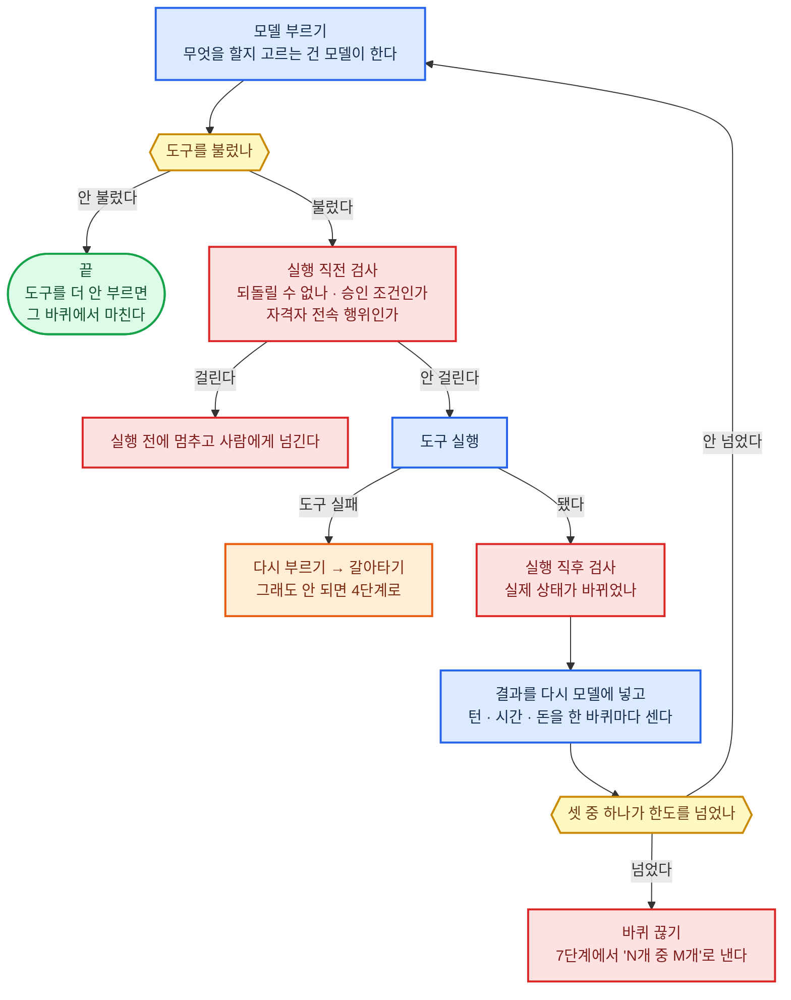

##### 맡는 것

| 이 재료가 맡는다 | 맡지 않는다 |
|------|------|
| 모델을 부르고, 모델이 고른 도구를 실제로 실행하고, 그 결과를 다시 모델에 넣는 한 바퀴<br>한 바퀴마다 횟수·시간·돈을 기계로 세기<br>도구 실행 직전·직후에 기계 검사 걸기<br>멈춤 조건에 걸리면 바퀴를 끊기 | 무엇을 할지 고르기는 모델이 맡는다<br>바퀴마다 나온 것을 저장하고 끊긴 자리에서 다시 시작하기는 저장·이어받기가 맡는다<br>한 건을 여럿에게 쪼개기는 나눠 맡기기가 맡는다<br>바퀴를 처음 돌리는 계기는 시작 신호가 맡는다<br>멈출 조건의 내용은 사람에게 넘기기·안전장치·책임·손실 한도가 맡는다<br>어떤 도구를 고를지는 업무 절차·노하우가 맡는다 |

> 이 순환에 판단 규칙을 넣지 않는다. 넣으면 모델이 좋아질 때마다 그 규칙이 낡은 짐이 된다.
> 여기 남기는 것은 세기·막기·끊기처럼 기계가 해야 확실한 것뿐이다.

##### 짜는 방식

| 기준 | 정한 것 |
|------|------|
| 뼈대 | 모델 부르기와 도구 실행을 되풀이하는 실행기 (Runner) 모양을 그대로 쓴다<br>모델이 도구를 더 부르지 않고 답만 내면 그 바퀴에서 끝난다 |
| 한 바퀴 세기 | 모델을 한 번 부른 것 (그때 딸린 도구 호출까지) 을 한 턴으로 센다<br>턴 한도를 넘으면 순환이 예외를 던지고 멈춘다<br>턴과 함께 걸린 시간과 쓴 돈도 센다<br>셋 중 하나만 넘어도 멈추고 흐름 7단계에서 "N개 중 M개"로 낸다 |
| 한도 값 | 숫자는 흐름 1단계에서 정한 한도를 그대로 받아 쓴다<br>이 직무를 고를 때 정한다 |
| 끼워 넣는 검사 | 도구 실행 직전에 되돌릴 수 없는 실행인지, 승인 조건인지, 자격자 전속 행위인지 본다<br>도구 실행 직후에 실제 상태가 바뀌었는지 본다<br>검사 내용은 안전장치와 권한·명의·위임이 정하고, 순환은 부르기만 한다 |
| 실패 | 도구가 실패하면 순서대로 간다. ① 정한 횟수만큼 다시 부르기 ② 업무 절차·노하우에 적어 둔 대신할 도구로 갈아타기 ③ 그래도 안 되면 바퀴를 끊고 흐름 4단계로 돌려보내기<br>이 순서는 여기서만 정하고, 다른 재료는 이 줄을 가리킨다 |
| 기록 | 한 바퀴마다 부른 모델·쓴 토큰·고른 도구·걸린 시간을 정해 둔 항목 이름 (`gen_ai.` 로 시작하는 이름표) 으로 남긴다<br>남기는 곳은 저장·이어받기다 |
| 모델 교체 | 순환 코드가 모델 이름을 모르게 짠다<br>모델을 바꿔도 순환은 한 줄도 안 고친다 |

##### 됐다는 기준

| 잣대 | 어떻게 잰다 |
|------|------|
| 안 멈추는 일이 없다 | 한도를 일부러 낮춘 시험 건에서 턴·시간·돈 한도마다 실제로 멈추는지 본다 |
| 막을 것을 막는다 | 되돌릴 수 없는 도구를 부르는 고정 시험지 건에서 실행 전에 멈춘 비율이 100%인지 본다<br>100% 인 까닭: 하나라도 새면 되돌릴 수 없는 자리라 비율로 봐줄 수 없다 |
| 얇은가 | 순환 코드 안에서 판단이 갈리는 자리 (조건에 따라 길이 갈라지는 곳) 의 수를 판본마다 센다<br>늘었으면 판단이 새어 들어온 것이다 |
| 갈아 끼워진다 | 모델만 바꾸고 순환 코드를 안 고친 채 고정 시험지를 다시 돌려 통과하는지 본다 |

---

#### 저장·이어받기 — 실행 기록·저장점·재시작 (Session Log·Checkpoint·Durable Execution)

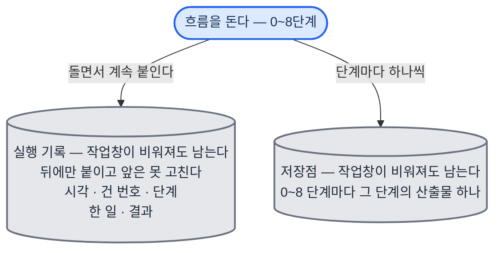

끊기거나 멈추면 세 갈래로 이어받는다.

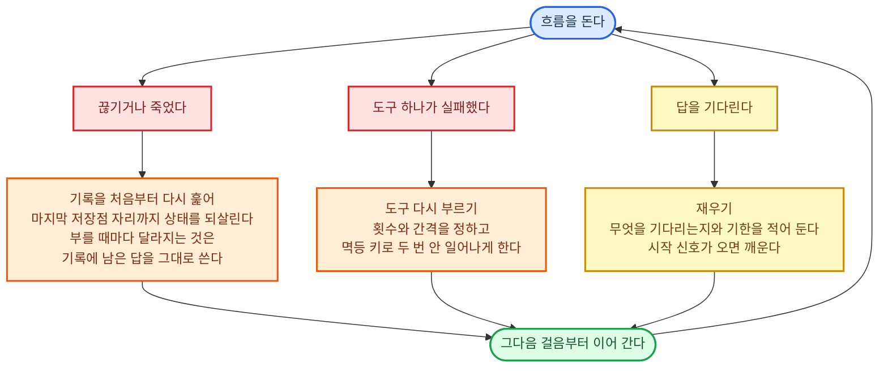

##### 맡는 것

| 이 재료가 맡는다 | 맡지 않는다 |
|------|------|
| 한 건에서 일어난 모든 것 (모델 호출·도구 결과·승인·넘김) 을 순서대로 덧붙여 쓰는 실행 기록<br>흐름 단계마다 산출물을 남기는 저장점<br>끊기면 마지막 저장점에서 다시 시작하기<br>실패한 실행을 정한 규칙으로 다시 하기<br>답을 기다리는 건을 재워 두기 | 무엇을 남길지 고르기는 작업 기억이 맡는다<br>재운 건을 깨우는 신호 받기는 시작 신호가 맡는다<br>남은 기록으로 결론을 되짚어 보이기는 근거 추적·재현이 맡는다<br>고객·건처럼 오래 가는 사실은 장기 기억이 맡는다<br>기록을 요약해 새 작업창에 올리기는 작업창이 맡는다 |

> 며칠·몇 달·몇 년짜리 건이 사람 손 없이 이어지는지는 이 재료가 가른다.
> 기록은 작업창 밖에 둔다. 작업창이 비워져도 기록은 남는다.

##### 짜는 방식

| 기준 | 정한 것 |
|------|------|
| 실행 기록 | 뒤에 이어 붙이기만 하고 앞을 고치지 않는 방식 (append-only) 으로 쌓는다<br>한 줄에 시각·건 번호·흐름 단계·무엇을 했는지·결과를 넣는다<br>지우기와 고치기를 코드로 막는다 |
| 저장점 | 흐름 0~8 단계마다 그 단계의 산출물을 저장하고 나서 다음 단계로 간다<br>산출물이 없는 단계는 끝난 것으로 치지 않는다 |
| 다시 시작 | 도중에 죽어도 남은 기록으로 이어서 끝내는 실행 방식 (Durable Execution) 을 쓴다<br>죽으면 기록을 처음부터 다시 훑어 (replay) 마지막 자리까지 상태를 되살린 뒤, 그다음 걸음부터 한다<br>되살리기가 성립하려면 같은 기록에서 같은 순서가 나와야 한다<br>모델 답처럼 부를 때마다 달라지는 것은 다시 부르지 않고 기록에 남은 답을 그대로 쓴다<br>단, 버림 표시가 붙은 산출물과 뒤집힘 표시가 붙은 판단은 되살리지 않는다. 그 자리부터는 모델을 다시 부른다. 틀렸다고 이미 가려낸 답을 기록이라는 이유로 다시 쓰면 같은 잘못을 그대로 되풀이한다 |
| 다시 하기 | 실패한 도구를 다시 부르는 횟수와 간격 (틀릴수록 간격을 늘림) 은 여기서 정한다<br>갈아타기와 흐름 4단계로 돌려보내기의 순서는 실행 순환이 정한 대로 따른다<br>다시 부를 때는 도구가 정한 멱등 키를 그대로 실어 두 번 보내도 두 번 일어나지 않게 한다 |
| 재우기 | 상대의 답이나 남에게 맡긴 결과를 기다리는 건은 재우고, 그 자리에 무엇을 기다리는지와 기한을 적어 둔다<br>깨우는 것은 시작 신호가 한다 |
| 보관 | 기록은 바깥 저장소에 두고, 보관 기간은 이 직무를 고를 때 정한다<br>법이 정한 보존 기간이 있으면 그것을 따른다 |

##### 됐다는 기준

| 잣대 | 어떻게 잰다 |
|------|------|
| 죽여도 이어진다 | 흐름을 도는 도중에 아무 때나 돌던 프로그램을 죽이고 다시 띄운다<br>끊기지 않고 돌린 것과 결과가 같은지 본다 |
| 저장점이 빠지지 않는다 | 끝난 건마다 0~8 단계의 산출물이 다 있는지 센다<br>한 개라도 비면 실패로 친다 |
| 두 번 안 일어난다 | 같은 요청을 일부러 두 번 보내 바깥 상태가 한 번만 바뀌는지 본다 |
| 오래 잔 건이 깨어난다 | 며칠 재운 시험 건이 기한에 깨어나 그다음 단계로 갔는지 본다 |

---

#### 나눠 맡기기 — 여러 에이전트·사람 협력자에게 나누고 거두기 (Orchestration·Subagents·Handoff)

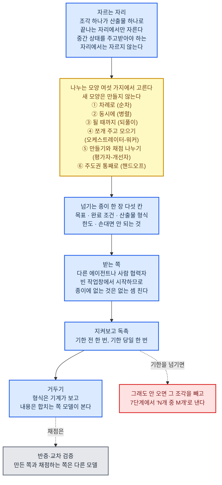

##### 맡는 것

| 이 재료가 맡는다 | 맡지 않는다 |
|------|------|
| 한 건을 어디서 자를지와 자른 조각을 누구에게 줄지 정하기<br>넘길 때 목표·완료 조건·받을 산출물 형식·한도를 적어 보내기<br>진행을 지켜보고 기한 전에 독촉하기<br>돌아온 산출물을 거둬 하나로 합치기 | 조각 안에서 무엇을 어떻게 할지는 받는 쪽의 모델이 맡는다<br>넘긴 자리와 거둔 자리를 기록에 남기기는 저장·이어받기가 맡는다<br>결정을 사람에게 올리기는 사람에게 넘기기가 맡는다<br>돌아온 산출물이 쓸 만한지 채점은 결과물 평가·반증·교차 검증이 맡는다<br>누가 무엇을 해도 되는지는 권한·명의·위임이 맡는다 |

> 나누는 것 자체가 아니라 어디서 자르고 무엇을 넘기는지가 성능을 가른다.
> 넘기는 자리마다 정보가 샌다. 그래서 자르는 자리를 적게 두고, 넘기는 종이를 두껍게 쓴다.

##### 짜는 방식

| 기준 | 정한 것 |
|------|------|
| 나누는 모양 | 차례로 (순차), 동시에 (병렬), 될 때까지 (되풀이), 한쪽이 쪼개 나눠 주고 모으기 (오케스트레이터-워커), 만드는 쪽과 채점하는 쪽 나누기 (평가자-개선자), 주도권을 통째로 넘기기 (핸드오프) 여섯 가지만 쓴다<br>새 모양을 만들지 않는다 |
| 자르는 자리 | 조각 하나가 산출물 하나로 끝나는 자리에서 자른다<br>중간 상태를 서로 주고받아야 하는 자리에서는 자르지 않는다 |
| 넘기는 종이 | 한 장에 다섯 칸을 담는다<br>목표 한 줄 / 완료 조건 / 받을 산출물 형식 / 한도 (시간·돈·시도 횟수) / 손대면 안 되는 것<br>받는 쪽은 빈 작업창에서 시작하므로, 이 종이에 없는 것은 없는 셈 친다 |
| 거두는 방식 | 형식이 맞는지 기계로 먼저 보고, 내용은 합치는 쪽 모델이 본다<br>기한을 넘기면 정한 횟수만큼 독촉하고, 그래도 없으면 그 조각을 뺀 채로 흐름 7단계에서 "N개 중 M개"로 낸다 |
| 사람 협력자 | 사람은 지시가 아니라 설득과 동기로 움직인다. 그렇게 여기고 대한다<br>보내는 글에 왜 필요한지와 언제까지인지를 같이 적는다<br>독촉은 기한 전에 한 번, 기한 당일에 한 번으로 정한다 |
| 검사자 | 만든 쪽과 채점하는 쪽은 반드시 다른 모델로 둔다<br>어느 모델을 어디에 두는지는 모델이 정한 배치를 따른다 |
| 겹 수·조각 수 상한 | 나누는 겹은 2겹 (수석 → 직원 → 보조) 까지, 세 번째 나누기는 금지, 한 번에 나누는 조각은 8개까지<br>나눠서 아끼는 시간이 조각 수 × (조각 지시문 쓰기 + 결과 검토) 값보다 클 때만 나눈다<br>숫자는 [책임·손실 한도](#책임손실-한도--책임-소재와-최대-손실-liability--loss-limits) 의 돌기 상한표에 있다 |

##### 이 직무에서 채울 것

| 채울 것 | 예 |
|------|------|
| 어디서 자르는가 | 변호사 (민사·상사 송무) = 서면 초안과 증거 정리를 자른다<br>인프라·DevOps = 고치는 일과 보안 검토를 자른다<br>유튜버 (정보·교육) = 대본과 편집을 자른다 |
| 누구에게 넘기는가 | 변호사 (민사·상사 송무) = 번역가 (산업·법률 문서) 에게 외국 증거 번역<br>인프라·DevOps = 정보보안 (취약점 관리) 에게 검토<br>유튜버 (정보·교육) = 영상 편집자에게 편집 |
| 무엇을 증거로 받는가 | 변호사 (민사·상사 송무) = 원문 대조표가 붙은 번역본<br>인프라·DevOps = 검토 의견과 남은 위험 목록<br>유튜버 (정보·교육) = 규격에 맞는 완성 영상과 자막 파일 |

##### 됐다는 기준

| 잣대 | 어떻게 잰다 |
|------|------|
| 새는 것이 없다 | 넘긴 종이에 다섯 칸이 다 찼는지 기계로 센다<br>빈 칸이 있으면 넘기지 못하게 막는다 |
| 나눈 값을 한다 | 같은 건을 안 나누고 한 번에 한 것과 견줘 걸린 시간·돈·결과물 점수를 본다<br>나눈 쪽이 더 나쁘면 그 자리는 자르지 않는다 |
| 거둬진다 | 넘긴 조각 중 기한 안에 산출물로 돌아온 비율을 센다 |
| 빠뜨리지 않는다 | 나눠 놓고 안 거둔 조각이 0인지 건마다 센다 |

---

#### 작업창 — 작업창 운용 (Context Window)


##### 맡는 것

| 이 재료가 맡는다 | 맡지 않는다 |
|------|------|
| 그 시점에 필요한 것만 골라 작업창에 올리기<br>올리는 순서를 고정 부분과 바뀌는 부분으로 가르기<br>작업창이 찰 때 요약해 새 작업창으로 넘기기<br>넣지 못한 것을 어디서 찾을지 자리를 적어 두기 | 무엇을 남길 값어치가 있는지, 지금 무슨 일이 벌어지는지를 그리는 것은 작업 기억이 맡는다<br>요약에서 빠진 원본은 저장·이어받기가 맡는다<br>찾아 오는 일은 검색이 맡는다<br>오래 가는 사실은 장기 기억이 맡는다 |

> 작업창은 책상이다. 크기가 정해져 있어 다 올리면 넘친다.
> 프롬프트 (모델에게 주는 지시문) 한 장에 지침을 잔뜩 넣지 않는다. 필요할 때 찾아 올린다.

##### 짜는 방식

| 기준 | 정한 것 |
|------|------|
| 올리는 순서 | 앞에서 뒤로 네 덩이로 고정한다<br>① 절대 원칙과 직업 규칙 ② 이 직무의 업무 절차·노하우 ③ 이 건의 사실과 산출물 ④ 지금 바퀴에서 새로 생긴 것<br>①②는 건 내내 안 바뀌고 ③④만 뒤에 붙는다 |
| 캐시 | ①②의 끝자리에 캐시 구분점을 찍는다<br>캐시는 5분짜리와 1시간짜리 두 가지가 있고, 구분점은 한 요청에 넉 점까지 찍을 수 있다<br>바퀴 사이 간격이 5분을 넘는 오래 도는 건은 1시간짜리로 둔다 |
| 넘치기 전 | 남은 자리가 정한 비율 아래로 떨어지면 요약을 시작한다<br>요약은 흐름 단계별 산출물만 남기고 중간 대화는 버린다<br>버린 것이 있던 자리에 저장·이어받기의 기록 번호를 적어 둔다 |
| 안 올리는 것 | 원문 전체를 통째로 올리지 않는다<br>필요한 조항·행·구간만 잘라 올리고 출처 표시를 붙인다 |
| 오염 막기 | 바깥에서 읽어 온 글은 지시가 아니라 자료로만 다룬다고 표시해 올린다<br>표시 방법은 안전장치가 정한다 |

##### 됐다는 기준

| 잣대 | 어떻게 잰다 |
|------|------|
| 앞부분이 안 흔들린다 | 캐시로 읽힌 토큰의 비율을 건마다 잰다<br>비율이 떨어지면 고정이어야 할 것이 뒤로 새어 나간 것이다 |
| 요약이 안 잃는다 | 요약 뒤에 이어 간 건과 요약 없이 끝낸 건의 결과물 점수를 견준다<br>차이가 100점 만점에 5점 안쪽이어야 한다<br>5점은 채점자 둘이 같은 결과물을 매길 때 갈리는 폭과 같게 잡은 가정이다. 실측 후 확정 |
| 다시 찾아온다 | 요약에서 버린 것을 다시 물었을 때 기록 번호로 찾아 오는 비율을 잰다<br>95% 이상이어야 한다<br>95% 는 가정이다. 실측 후 확정 |
| 안 넘친다 | 작업창이 꽉 차서 실패한 건이 0인지 센다 |

---

#### 시작 신호 — 예약·신호 수신·깨우기 (Triggers·Schedules·Webhooks)


##### 맡는 것

| 이 재료가 맡는다 | 맡지 않는다 |
|------|------|
| 정한 시각·주기에 깨우는 예약<br>바깥에서 오는 알림·웹훅 (바깥 시스템이 일이 생겼을 때 우리를 불러 주는 주소)·메일·경보 받기<br>재워 둔 건을 기한이나 답이 오면 깨우기<br>같은 신호가 몰리면 묶고, 잘못 울린 경보를 걸러 내기 | 무엇을 신호로 볼지와 받은 뒤 무엇을 할지는 먼저 감지하기가 맡는다<br>받은 신호로 지금의 그림을 고치기는 작업 기억이 맡는다<br>깨운 뒤 도는 바퀴는 실행 순환이 맡는다<br>재워 둔 자리를 저장해 두기는 저장·이어받기가 맡는다<br>법규·정책이 바뀐 것을 자료에 반영하는 일은 자동 갱신이 맡는다 |

> 이 장치는 실행 순환 밖의 호스팅 층 (에이전트를 띄워 두는 서버) 에 기계로 둔다. 에이전트가 자고 있어도 이것은 깨어 있다.
> 밤·주말에도 끊기지 않아야 한다. 사람이 화면 앞에 없는 시간에 신호가 온다.

##### 짜는 방식

| 기준 | 정한 것 |
|------|------|
| 예약 | 시각·주기는 cron (정한 시각에 프로그램을 돌려 주는 오래된 표준 방식) 형식으로 적는다<br>시간대는 그 건의 관할 시간대로 적고, 기한 계산은 그 시간대에서 한다 |
| 받는 문 | 웹훅은 Standard Webhooks 표준을 따른다<br>보낸 쪽이 진짜인지는 HMAC-SHA256 서명으로 확인하고, 신호에 붙은 고유 번호를 도구가 정한 멱등 키로 삼아 같은 신호가 두 번 와도 한 번만 처리한다<br>서명이 안 맞거나 시각이 너무 오래된 신호는 버리고 버린 사실만 남긴다 |
| 묶기 | 같은 뜻의 신호가 정한 시간 안에 여러 번 오면 하나로 묶어 한 번만 깨운다<br>묶는 시간은 이 직무를 고를 때 정한다 |
| 거르기 | 잘못 울린 경보의 비율을 세어, 정한 선을 넘는 종류의 신호는 깨우지 않고 모아서 하루 한 번 낸다<br>거르는 규칙을 바꾼 날짜와 이유를 남긴다 |
| 못 받았을 때 | 웹훅은 안 올 수 있다고 보고, 같은 것을 주기 예약으로 한 번 더 훑는다<br>둘이 겹쳐도 멱등 키가 있어 두 번 처리되지 않는다 |
| 긴급 | 피해가 분 단위로 커지는 신호는 따로 표시해 흐름 1~3을 건너뛰는 긴급 경로로 넣는다<br>어느 신호가 긴급인지는 먼저 감지하기가 정한다 |

##### 이 직무에서 채울 것

| 채울 것 | 예 |
|------|------|
| 예약으로 도는 것 | 세무사 (신고·기장) = 신고 기한 역산 일정<br>인프라·DevOps = 정해진 점검 주기<br>개인 투자자 (단기 매매) = 장 열고 닫는 시각 |
| 바깥에서 오는 신호 | 세무사 (신고·기장) = 기관 고지와 세법 변경 알림<br>인프라·DevOps = 경보와 배포 결과 웹훅<br>개인 투자자 (단기 매매) = 공시와 시세 급변 알림 |
| 깨어날 조건 | 세무사 (신고·기장) = 고객이 자료를 올렸을 때<br>인프라·DevOps = 맡긴 검토 의견이 왔을 때<br>개인 투자자 (단기 매매) = 걸어 둔 값에 닿았을 때 |

##### 됐다는 기준

| 잣대 | 어떻게 잰다 |
|------|------|
| 안 놓친다 | 보낸 쪽 기록과 우리가 받은 기록의 수를 맞춰 본다<br>차이가 0이어야 한다 |
| 두 번 안 한다 | 같은 신호를 일부러 두 번 보내 한 번만 깨어나는지 본다 |
| 늦지 않는다 | 신호가 온 시각과 첫 바퀴가 시작된 시각의 차이를 잰다<br>한도는 이 직무를 고를 때 정한다 |
| 무뎌지지 않는다 | 깨운 신호 중 실제로 할 일이 있던 비율을 센다<br>비율이 떨어지면 거르는 규칙을 고친다 |

---

#### 자료 읽기 — 문서·표·이미지·음성·도면·실시간 입력 처리

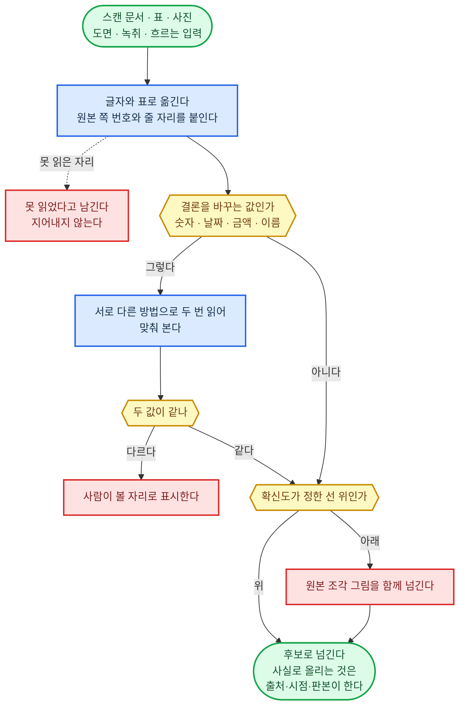

##### 맡는 것

| 이 재료가 맡는다 | 맡지 않는다 |
|------|------|
| 스캔 문서·PDF·표·사진·도면·녹취를 글자와 표로 정확히 옮기기<br>음성·화상·채팅처럼 흐르는 입력을 그때그때 옮기기<br>사람을 상대할 때 말투·머뭇거림 같은 말 밖의 신호를 적어 두기<br>잘못 읽었을 만한 자리를 표시해 넘기기 | 읽어 낸 것이 사실인지 가리기와 어느 판본인지는 출처·시점·판본이 맡는다<br>읽은 내용으로 판단하기는 모델이 맡는다<br>초 단위로 주고받는 통로 자체는 실시간 통로가 맡는다<br>글이 아닌 결과물 만들기는 그림·영상 생성이 맡는다 |

> 여기서 잘못 읽으면 뒤의 판단이 전부 틀린다. 그래서 정확도보다 "틀렸을 수 있는 자리를 표시했는가"를 먼저 본다.
> 읽어 낸 것은 사실이 아니라 후보다. 사실로 올리는 것은 출처·시점·판본이 한다.

##### 짜는 방식

| 기준 | 정한 것 |
|------|------|
| 옮기는 형식 | 문서는 원본 쪽 번호와 줄 자리를 같이 붙여 표로 옮긴다<br>어떤 값이 원본 어디에서 왔는지 되짚을 수 있어야 한다 |
| 두 번 읽기 | 숫자·날짜·금액·이름처럼 틀리면 결론이 바뀌는 값은 서로 다른 방법으로 두 번 읽어 맞춰 본다<br>두 값이 다르면 사람이 볼 자리로 표시한다 |
| 확신도 | 옮긴 값마다 확신도를 붙인다<br>정한 선 아래인 값은 그대로 쓰지 않고 원본 조각 그림을 함께 넘긴다 |
| 표와 도면 | 표는 칸 합계가 맞는지 기계로 검산한다<br>도면은 치수와 축척을 따로 뽑아 검산한다 |
| 말 밖의 신호 | 사람의 말은 진술·증거·추정으로 갈라 적고, 머뭇거림·되묻기·말 바꾸기를 따로 기록한다<br>그 신호로 무엇을 할지는 상대 응대와 감각·사례·암묵지가 정한다 |
| 못 읽을 때 | 흐리거나 가려서 못 읽은 자리는 지어내지 않고 못 읽었다고 남긴다<br>그 값이 결론을 바꾸면 흐름 3단계에서 원문을 다시 구한다 |

##### 이 직무에서 채울 것

| 채울 것 | 예 |
|------|------|
| 주로 읽는 자료 | 변호사 (민사·상사 송무) = 스캔 계약서·등기부·판결문·녹취록<br>인프라·DevOps = 경보 화면 갈무리·그래프·장애 통화 녹음<br>온라인 셀러 (소싱·오픈마켓) = 공급처 단가표·상품 사진·외국어 상세 이미지 |
| 틀리면 큰일 나는 값 | 변호사 (민사·상사 송무) = 날짜·금액·당사자 이름<br>인프라·DevOps = 시각·서버 이름·오류 번호<br>온라인 셀러 (소싱·오픈마켓) = 단가·수량·규격·원산지 |
| 검산하는 법 | 변호사 (민사·상사 송무) = 등기부와 계약서의 당사자 대조<br>인프라·DevOps = 화면 값과 원천 기록 대조<br>온라인 셀러 (소싱·오픈마켓) = 단가표 합계와 견적 총액 대조 |

##### 됐다는 기준

| 잣대 | 어떻게 잰다 |
|------|------|
| 결론 바꾸는 값이 맞다 | 정답을 아는 자료 묶음을 고정 시험지에 넣고, 날짜·금액·이름을 틀린 건수를 센다<br>이 값의 목표는 0이다 |
| 모르는 것을 안다 | 일부러 흐리게 만든 자료에서 "못 읽었다"고 표시한 비율을 본다<br>지어내면 실패로 친다 |
| 되짚어진다 | 옮긴 값을 무작위로 골라 원본 쪽·줄까지 되짚을 수 있는지 본다 |

---

#### 실시간 통로 — 초 단위 응답 구성 (Realtime·Live API)

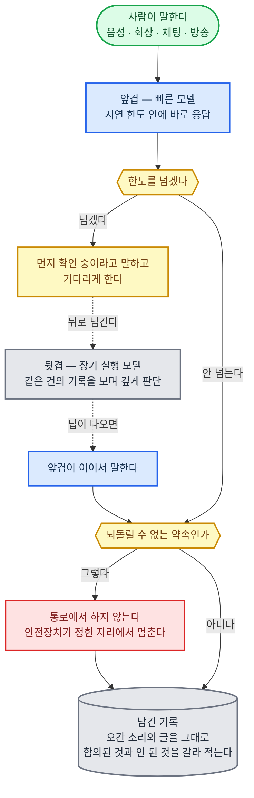

##### 맡는 것

| 이 재료가 맡는다 | 맡지 않는다 |
|------|------|
| 음성·화상·채팅·방송처럼 초 단위로 주고받는 건을 따로 받고 내보내기<br>응답 지연 한도를 지키는 구성 고르기<br>끊겼을 때 되살리기<br>깊이 생각하는 쪽과 이 통로 사이에서 건의 상태를 주고받기 | 무엇을 말할지는 상대 응대가 맡는다<br>말 밖의 신호 읽기는 자료 읽기가 맡는다<br>깊은 판단은 모델이 맡는다<br>주고받은 것을 남기기는 저장·이어받기가 맡는다<br>말한 대로 바깥을 바꾸기는 도구가 맡는다 |

> 장기 실행 모델은 깊이를, 이 통로는 속도를 맡는다. 둘을 한 모델로 겸하지 않는다.
> 통로가 빠르다고 판단까지 빨라지지 않는다. 오래 걸릴 일은 통로에서 "알아보고 다시 말하겠다"로 끊고 뒤로 넘긴다.

##### 짜는 방식

| 기준 | 정한 것 |
|------|------|
| 연결 방식 | 사람의 기기에서 바로 잇는 자리는 WebRTC (브라우저와 앱이 소리·영상을 실시간으로 주고받는 표준) 를 쓴다<br>브라우저와 모바일에서는 이 방식이 가장 잘 맞는다<br>서버끼리 잇는 자리와 전화망을 잇는 자리는 각각 다른 방식으로 둔다 |
| 두 겹 구성 | 앞겹은 빠른 모델이 맡아 바로 응답한다<br>뒷겹은 장기 실행 모델이 같은 건의 기록을 보며 깊게 판단한다<br>뒷겹의 답이 나오면 앞겹이 이어서 말한다 |
| 지연 한도 | 첫 소리가 나오기까지의 한도를 숫자로 정한다<br>숫자는 이 직무를 고를 때 정한다<br>한도를 넘으면 "확인 중"이라고 먼저 말하고 기다리게 한다 |
| 끊김 | 끊기면 같은 건 번호로 다시 붙고, 어디까지 말했는지를 기록에서 되살려 이어 말한다<br>다시 못 붙으면 정한 다음 수단 (전화·메일) 으로 옮긴다 |
| 말한 것의 무게 | 통로에서 한 말도 약속이 된다<br>되돌릴 수 없는 약속은 통로에서 하지 않고, 안전장치가 정한 자리에서 멈춘다 |
| 남기기 | 오간 소리와 글을 그대로 남기고, 합의된 것과 안 된 것을 갈라 적는다 |

##### 이 직무에서 채울 것

| 채울 것 | 예 |
|------|------|
| 어떤 통로인가 | 변호사 (민사·상사 송무) = 의뢰인 상담 전화, 조정 기일 화상<br>고객성공 = 고객 화상 회의와 채팅 상담<br>스트리머 = 방송 중 실시간 채팅 |
| 지연 한도 | 변호사 (민사·상사 송무) = 되묻기가 자연스러운 정도<br>고객성공 = 회의 흐름이 안 끊기는 정도<br>스트리머 = 방송 흐름에 얹히는 정도 |
| 통로에서 안 하는 것 | 변호사 (민사·상사 송무) = 법률 의견 확정<br>고객성공 = 값 깎기와 환불 확정<br>스트리머 = 협찬·판매 조건 확정 |

##### 됐다는 기준

| 잣대 | 어떻게 잰다 |
|------|------|
| 한도를 지킨다 | 첫 소리까지 걸린 시간을 건마다 재고, 한도를 넘은 비율을 본다<br>5% 아래여야 한다<br>5% 는 가정이다. 상대가 기다리다 끊는 비율을 실측해 확정 |
| 끊겨도 이어진다 | 통화 중 일부러 끊고 다시 붙여, 앞에서 한 말을 이어 가는지 본다 |
| 말과 기록이 같다 | 통로에서 한 말과 저장·이어받기의 기록을 맞춰 본다<br>어긋나면 실패로 친다 |
| 넘어야 할 때 넘긴다 | 통로에서 되돌릴 수 없는 약속을 요구받은 시험 건에서 멈춘 비율이 100%인지 본다<br>100% 인 까닭: 약속 하나가 새면 그것이 곧 되돌릴 수 없는 행동이다 |

---

#### 그림·영상 생성 — 글 밖 결과물의 생성·편집

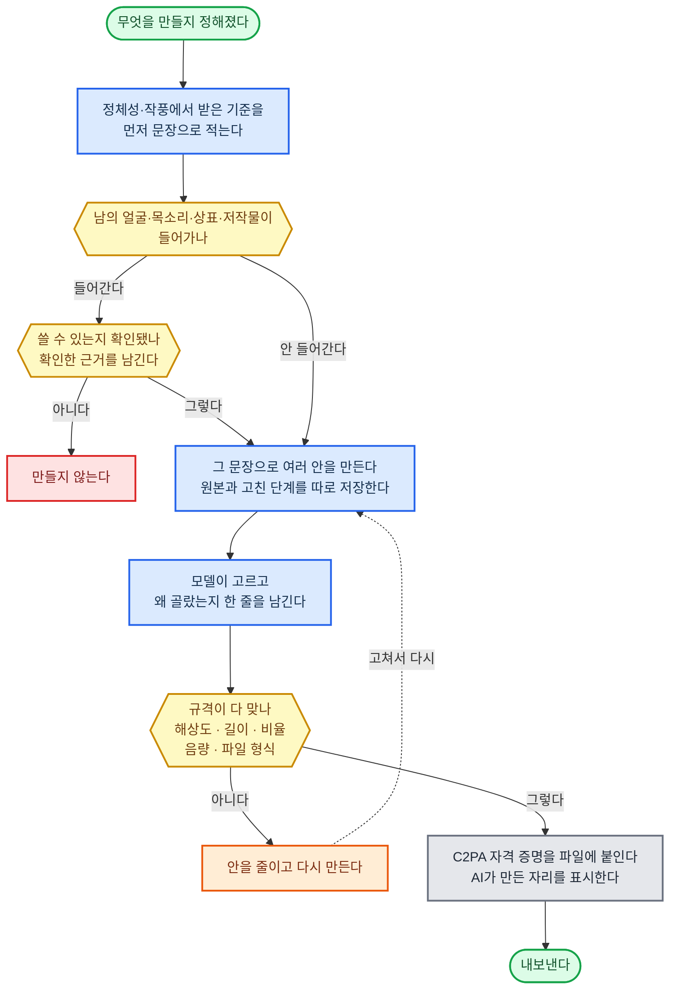

##### 맡는 것

| 이 재료가 맡는다 | 맡지 않는다 |
|------|------|
| 그림·영상·자막·음성·음원·도면·화면을 생성 모델과 편집 도구로 실제로 만들기<br>만든 뒤 규격 (해상도·길이·비율·음량·파일 형식) 에 맞는지 기계로 확인하기<br>만든 것이 정해 둔 작풍에 맞는지 확인하기<br>만든 내력을 파일에 새겨 두기 | 무엇을 만들지와 어떤 작풍인지는 정체성·작풍이 맡는다<br>플랫폼이 무엇을 금하는지는 플랫폼·기관 규정이 맡는다<br>결과물이 좋은지 채점은 결과물 평가가 맡는다<br>입력 자료 읽기는 자료 읽기가 맡는다<br>올리는 일은 도구가 맡는다 |

> 자료 읽기가 입력의 정확도를 맡듯 이 재료는 출력의 품질을 맡는다.
> 잘 나온 것을 고르는 눈은 모델이 갖고, 규격에 맞는지 세는 일은 기계가 한다.

##### 짜는 방식

| 기준 | 정한 것 |
|------|------|
| 만드는 순서 | 정체성·작풍에서 받은 기준을 먼저 문장으로 적고, 그 문장으로 여러 안을 만든다<br>고르는 것은 모델이 하고, 왜 골랐는지 한 줄을 남긴다 |
| 규격 검사 | 해상도·길이·비율·음량·파일 형식·글자 크기를 기계로 잰다<br>기준 값은 플랫폼·기관 규정에서 받아 온다<br>하나라도 안 맞으면 내보내지 않는다 |
| 만든 내력 | 파일에 C2PA 콘텐츠 자격 증명 (누가 무엇으로 만들고 어떻게 고쳤는지를 서명해 파일에 새기는 공개 표준) 을 붙인다<br>AI가 만든 자리는 표준이 정한 항목으로 표시한다 |
| 권리 | 남의 얼굴·목소리·상표·저작물이 들어갔는지 만들기 전에 확인하고, 확인한 근거를 남긴다<br>확인이 안 되면 만들지 않는다 |
| 고쳐 쓰기 | 처음부터 다시 만들지 않고 고칠 수 있게, 원본과 고친 단계를 따로 저장한다<br>어느 단계로도 되돌아갈 수 있어야 한다 |
| 값 | 만들 때마다 드는 돈을 세고, 한 결과물의 돈 한도를 정한다<br>한도를 넘으면 안을 줄이고 다시 만든다 |

##### 이 직무에서 채울 것

| 채울 것 | 예 |
|------|------|
| 무엇을 만드는가 | 영상 제작자 (광고·홍보) = 광고 영상과 자막<br>UI/UX·제품 디자인 = 화면 시안과 그림 조각<br>유튜버 (정보·교육) = 섬네일·본편·짧은 영상 |
| 규격 | 영상 제작자 (광고·홍보) = 발주처가 정한 길이·비율·음량<br>UI/UX·제품 디자인 = 화면 크기별 규격과 색 대비<br>유튜버 (정보·교육) = 올릴 곳이 정한 해상도·길이 |
| 작풍 잣대 | 영상 제작자 (광고·홍보) = 브랜드 지침서<br>UI/UX·제품 디자인 = 우리 디자인 규칙 묶음<br>유튜버 (정보·교육) = 채널의 색·글씨체·말투 |

##### 됐다는 기준

| 잣대 | 어떻게 잰다 |
|------|------|
| 규격을 다 맞춘다 | 내보낸 결과물 전부를 기계로 재서 규격 어긋남이 0인지 센다 |
| 작풍이 흔들리지 않는다 | 지난 결과물과 색·글씨체·구도·말투를 견줘 벗어난 정도를 잰다 |
| 내력이 붙어 있다 | 내보낸 파일에서 자격 증명 서명이 읽히는 비율을 센다 |
| 다시 안 만든다 | 규격이나 권리 때문에 처음부터 다시 만든 횟수를 센다 |

---

#### 도구 — 도구·연동·실행

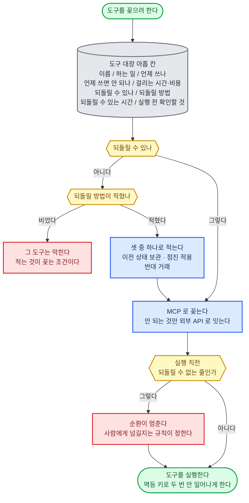

##### 맡는 것

| 이 재료가 맡는다 | 맡지 않는다 |
|------|------|
| 웹사이트·업무 시스템·외부 시스템을 실제로 조작하기<br>도구마다 무엇을 할 수 있고 무엇이 되돌릴 수 없는지 적어 두기<br>되돌릴 수 없는 실행마다 되돌릴 방법을 미리 만들어 두기<br>도구가 낸 결과를 그대로 돌려주기 | 언제 어떤 도구를 쓸지는 업무 절차·노하우가 맡는다<br>이 도구를 써도 되는지는 권한·명의·위임이 맡는다<br>실행 전후 검사와 다시 하기는 실행 순환·저장·이어받기가 맡는다<br>음성·영상·채팅·방송 채널은 실시간 통로가 맡는다<br>돈·손실의 한도는 책임·손실 한도가 맡는다 |

> 머리로 하면 틀리는 것 (계산·조회·대조) 은 반드시 도구로 한다.
> 되돌릴 방법이 안 적힌 도구는 꽂지 않는다. 적는 것이 꽂는 조건이다.

##### 짜는 방식

| 기준 | 정한 것 |
|------|------|
| 꽂는 방식 | 기본은 MCP (AI 가 도구를 꽂아 쓰는 공개 표준 연결 방식) 로 꽂는다<br>MCP 로 안 되는 것만 외부 API (프로그램끼리 서로 부르는 창구) 로 직접 잇는다 |
| 도구 대장 | 도구마다 아홉 칸을 채운 줄이 있어야 한다<br>도구 이름 / 하는 일 / 언제 쓰나 / 언제 쓰면 안 되나 / 걸리는 시간·비용 / 되돌릴 수 있나 / 되돌릴 방법 / 되돌릴 수 있는 시간 / 실행 전 확인할 것<br>앞 다섯 칸은 업무 절차·노하우가 도구를 고를 때 읽고, 뒤 네 칸은 실행 순환이 부르기 직전에 읽는다. 도구를 적는 곳은 이 대장 하나다<br>"되돌릴 수 있나"가 아니오인데 "되돌릴 방법"이 비면 그 도구는 막힌다 |
| 되돌릴 방법 | 세 가지 중 하나로 적는다<br>이전 상태 보관 (바꾸기 전 상태를 떠 두고 그대로 되돌리기)<br>점진 적용 (한꺼번에 말고 조금씩 나눠 적용해 이상하면 멈추기)<br>반대 거래 (산 것을 되파는 식으로 반대로 걸어 없던 일로 만들기) |
| 실행 직전 | 되돌릴 수 없는 줄의 도구는 실행 직전에 순환이 멈춘다<br>멈춘 뒤 사람에게 넘길지, 안전장치의 조건을 지나 그냥 갈지는 규칙이 정한다 |
| 두 번 막기 | 바깥을 바꾸는 도구는 멱등 키 (요청마다 붙이는 고유 번호. 같은 번호가 두 번 와도 결과가 한 번 한 것과 같게 해 준다) 를 받게 만든다<br>같은 키로 두 번 불러도 한 번만 일어나야 한다<br>멱등 키의 뜻과 꼴은 여기서만 정하고, 시작 신호·저장·이어받기·자동 갱신은 이 키를 그대로 쓴다 |
| 권한 | 도구마다 최소한의 권한만 준다<br>읽기만 해도 되는 도구에 쓰기 권한을 주지 않는다<br>열쇠는 코드에 넣지 않고 따로 보관한다 |

##### 이 직무에서 채울 것

| 채울 것 | 예 |
|------|------|
| 되돌릴 수 없는 실행 | 변호사 (민사·상사 송무) = 전자소송 제출, 내용증명 발송<br>인프라·DevOps = 실서버 배포, 자원 삭제<br>온라인 셀러 (소싱·오픈마켓) = 발주 확정, 광고 집행 |
| 되돌릴 방법 | 변호사 (민사·상사 송무) = 제출 전 초안 잠금과 마감 전 취하<br>인프라·DevOps = 이전 판본 보관과 점진 적용<br>온라인 셀러 (소싱·오픈마켓) = 발주 취소 기한과 광고 즉시 정지 |
| 되돌릴 수 있는 시간 | 변호사 (민사·상사 송무) = 기일까지<br>인프라·DevOps = 다음 배포 전까지<br>온라인 셀러 (소싱·오픈마켓) = 공급처가 정한 취소 기한까지 |

##### 됐다는 기준

| 잣대 | 어떻게 잰다 |
|------|------|
| 대장이 다 찼다 | 꽂힌 도구 수와 아홉 칸이 다 찬 줄의 수가 같은지 센다 |
| 되돌리기가 진짜 된다 | 시험 환경에서 도구마다 실제로 되돌려 보고, 되돌아간 비율을 센다<br>말로만 적힌 방법은 인정하지 않는다 |
| 두 번 안 일어난다 | 같은 멱등 키로 두 번 불러 바깥 상태가 한 번만 바뀌는지 본다 |
| 넘는 권한이 없다 | 도구가 가진 권한과 대장의 "하는 일"을 맞춰 본다<br>남는 권한이 있으면 줄인다 |

---

#### 시험 환경 — 실제 조건을 재현한 격리 실행 환경 (Staging·Sandbox)


##### 맡는 것

| 이 재료가 맡는다 | 맡지 않는다 |
|------|------|
| 실제 고객·돈·시스템에 닿기 전에 똑같은 조건을 흉내 낸 곳에서 먼저 해 보기<br>그곳을 실제와 끊어 두기<br>시험을 통과했는지 기계로 판정하기<br>과거 자료에만 딱 맞아 실제에서는 안 통하는 것을 걸러 내기 | 결과가 맞는지 따져 보기는 결과 검증·수정이 맡는다<br>일부러 반대편에서 공격하기는 반증·교차 검증이 맡는다<br>되돌릴 방법 만들기는 도구가 맡는다<br>시험을 통과한 사례 모으기는 고정 시험·감각·사례·암묵지가 맡는다 |

> 시험을 통과하지 않은 것은 실제 환경에 내지 않는다. 예외를 두지 않는다.
> 흉내가 실제와 다른 자리는 미리 적어 둔다. 적히지 않은 차이가 사고를 낸다.

##### 짜는 방식

| 기준 | 정한 것 |
|------|------|
| 끊어 두기 | 시험 환경은 실제와 다른 열쇠·다른 계정·다른 저장소를 쓴다<br>실제로 나가는 문 (결제·발송·게시) 은 코드로 막고, 막혔다는 기록만 남긴다 |
| 닮게 만들기 | 실제와 무엇이 같고 무엇이 다른지 목록을 만든다<br>다른 자리마다 그 차이가 결론을 바꾸는지 적는다<br>결론을 바꾸는 차이는 없앨 때까지 시험 통과로 치지 않는다 |
| 안 쓴 자료로 다시 | 시험에 쓴 자료와 다른 구간의 자료로 한 번 더 돌린다<br>두 결과의 차이가 정한 선을 넘으면 과거에만 맞춘 것으로 보고 버린다 |
| 통과 판정 | 사람 눈이 아니라 미리 적은 기준으로 기계가 판정한다<br>기준은 완료 조건에서 받아 온다 |
| 실제로 나가기 | 시험을 통과해도 한 번에 다 내지 않는다<br>작게 내고 지켜본 뒤 늘린다<br>되돌릴 방법은 도구 대장의 것을 쓴다 |
| 값 | 시험 환경을 돌리는 데 드는 돈과 시간을 세고, 한 건에서 시험에 쓸 몫을 정한다 |

##### 이 직무에서 채울 것

| 채울 것 | 예 |
|------|------|
| 소프트웨어 | 인프라·DevOps = 실제와 똑같이 꾸민 시험용 서버 (스테이징) 와 진짜 기기<br>통과 잣대는 시험 통과 여부와 되돌리기가 실제로 되는지다 |
| 창작 | 유튜버 (정보·교육) = 소량 시험 (일부에게만 먼저 보이기), 섬네일 두 가지 안을 나눠 보여 주고 어느 쪽이 나은지 재기 (A/B 비교)<br>통과 잣대는 미리 정한 반응 수치다 |
| 투자 | 개인 투자자 (단기 매매) = 과거 자료로 돌려 보는 시험 (백테스트) 과 모의 매매<br>통과 잣대는 시험에 안 쓴 구간에서도 성적이 유지되는지다 |
| 서류 | 변호사 (민사·상사 송무) = 제출 전 초안을 상대편 눈으로 공격해 보는 모의 검토<br>통과 잣대는 미리 적은 반박 목록이 다 막혔는지다 |

##### 됐다는 기준

| 잣대 | 어떻게 잰다 |
|------|------|
| 새지 않는다 | 시험 환경에서 실제 바깥으로 나간 요청이 0인지 센다<br>한 건이라도 있으면 실패다 |
| 걸러 낸다 | 일부러 망가뜨린 안을 시험에 넣어 걸러지는 비율을 잰다<br>95% 이상이어야 한다<br>95% 는 가정이다. 실측 후 확정 |
| 실제와 맞는다 | 시험에서 통과한 것이 실제에서 실패한 건수를 센다<br>이 수가 늘면 닮게 만들기 목록을 다시 짠다 |
| 안 건너뛴다 | 실제 환경에 낸 것 가운데 시험 기록이 없는 건이 0인지 센다 |

---

### 자료·검색 — 사실을 확인하는 자료와 찾는 수단

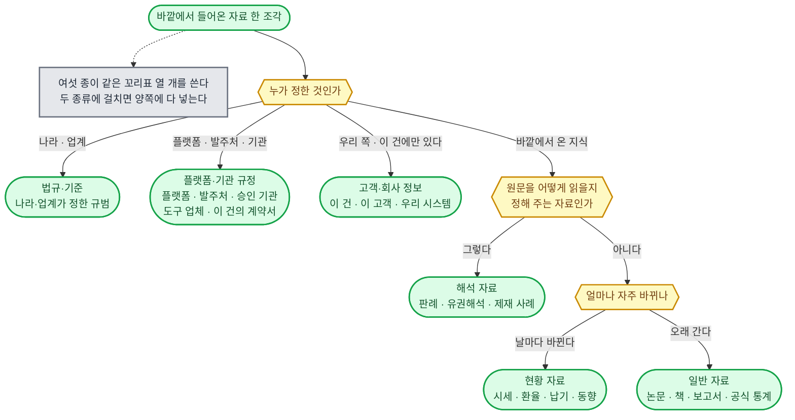

#### 법규·기준 — 법령·시행령·기준·규격·지침

##### 맡는 것

| 이 재료가 맡는다 | 맡지 않는다 |
|------|------|
| 나라와 업계가 정한 규범의 원문을 공식 출처에서 받아 와 자료 카드로 쌓기<br>조·항·호 단위로 쪼개 두기<br>어느 판본인지, 언제부터 힘을 갖는지 꼬리표 붙이기 | 이 규범이 다른 규칙보다 앞서는지는 절대 원칙·직업 규칙이 맡는다<br>원문을 실제로 어떻게 읽는지는 해석 자료가 맡는다<br>바뀌었다는 신호 받기는 시작 신호가 맡는다<br>바뀐 것을 자료에 넣기는 자동 갱신이 맡는다 |

> 원문만 여기에 둔다. 남이 줄여 쓴 요약은 원문 자리에 넣지 않는다.
> 받아 오고 견주는 것은 기계가 한다. 이 건에 어느 조문이 걸리는지 고르는 것은 모델이 한다.

##### 짜는 방식

| 기준 | 정한 것 |
|------|------|
| 어디서 받나 | 공식 기관이 연 창구 (프로그램이 자료를 직접 받아 가는 통로) 를 첫째로 둔다<br>법령은 그 창구에서 현행 법령·연혁·시행일·행정규칙·조약·별표를 받는다<br>창구가 없는 기준·규격은 공식 배포 문서를 내려받아 같은 꼴로 넣는다 |
| 저장 꼴 | 자료 카드 하나 = 원문 한 조각 + 꼬리표<br>원문은 한 글자도 고치지 않고 그대로 둔다<br>꼬리표 이름은 출처·시점·판본이 정한 열 개를 그대로 쓴다 |
| 쪼개는 단위 | 조·항·호 한 덩어리가 한 조각이다<br>쪽 수로 자르지 않는다<br>조각 하나만 봐도 어느 법 몇 조인지 알게 조각 위치를 적는다 |
| 판본을 쌓는 법 | 고쳐진 판본이 들어와도 옛 판본을 지우지 않고 나란히 쌓는다<br>건의 기준일에 맞는 판본을 고르는 규칙은 출처·시점·판본이 정한 것을 그대로 따른다 |
| 실패 처리 | 창구가 죽으면 마지막으로 받은 판본을 쓰되 낡음 표를 켠다<br>정한 주기의 세 배가 지나도록 못 받으면 그 분야의 결론에 낡음 경고를 붙여 내보낸다 |
| 넘겨주는 것 | 새 카드는 검색에 색인 재료로 바로 넘긴다<br>바뀐 조문 목록은 자동 갱신이 만들어 밀어 넣는다 |

##### 이 직무에서 채울 것

| 채울 것 | 예 |
|------|------|
| 받아 올 법령·기준 목록 | 변호사 (기업 자문) = 상법·공정거래법·개인정보보호법과 각 시행령<br>세무 (사내) = 법인세법·부가가치세법·회계기준<br>온라인 셀러 (소싱·오픈마켓) = 전자상거래법·표시광고법·제품안전 기준 |
| 무엇을 기준일로 잡나 | 변호사 (기업 자문) = 계약을 맺은 날<br>세무 (사내) = 과세 기간이 끝나는 날<br>온라인 셀러 (소싱·오픈마켓) = 상품을 올린 날 |
| 틀리면 가장 크게 다치는 조문 | 직무마다 따로 골라 적는다<br>그 조문은 갱신 주기를 절반으로 줄인다 |

##### 됐다는 기준

| 잣대 | 어떻게 잰다 |
|------|------|
| 원문이 같은가 | 카드에서 무작위로 20조각을 뽑아 공식 출처에서 다시 받아 글자 단위로 견준다<br>하나라도 다르면 실패다 |
| 판본이 맞는가 | 고정 시험지의 건마다 기준일을 주고, 그날에 맞는 판본을 골랐는지 과정 평가가 채점한다 |
| 빠진 것이 없는가 | 받기로 정한 목록 N개 가운데 실제로 들어온 수를 세어 M of N으로 적는다 |
| 낡지 않았는가 | 유효 기한을 넘긴 카드 수를 하루 한 번 센다<br>0이 아니면 그 수를 보고에 적는다 |

---

#### 플랫폼·기관 규정 — 플랫폼 정책·심사 지침, 발주처 시방서·입찰 조건, 승인 기관 내규·약관, 도구·서비스 업체 이용 조건, 이 건의 계약서

##### 맡는 것

| 이 재료가 맡는다 | 맡지 않는다 |
|------|------|
| 플랫폼·발주처·승인 기관·도구 업체가 정한 규정의 원문 보관<br>이 건을 묶는 계약서 원문을 조항 단위로 쪼개 두기<br>예고 없이 바뀌는 정책의 옛 판본을 남겨 무엇이 바뀌었는지 짚어 두기 | 어느 층에 서는지, 어기면 무엇이 따르는지는 계약·플랫폼 규칙이 맡는다<br>정책 해설과 제재 사례는 해석 자료가 맡는다<br>바뀐 것을 자료에 넣기는 자동 갱신이 맡는다 |

> **법규·기준과 저장 꼴이 같다. 다른 점은 공식 창구가 거의 없고, 웹 문서·PDF·계약서 파일에서 받아 온다는 것뿐이다.**

##### 짜는 방식

| 기준 | 정한 것 |
|------|------|
| 어디서 받나 | 정책 문서의 주소를 목록으로 고정해 두고 그 주소만 본다<br>바뀐 것만 받도록 조건부 요청 (전에 받은 것과 같으면 안 보내 달라고 묻는 방식) 을 쓴다<br>이 건의 계약서는 우리 문서함에서 받아 조항 단위로 넣는다 |
| 저장 꼴 | 자료 카드는 법규·기준과 같은 꼬리표를 쓴다<br>여기에만 더 붙이는 꼬리표: 어느 플랫폼·기관인지, 어느 계정·상점·건에 걸리는지 |
| 판본을 쌓는 법 | 받을 때마다 새 판본으로 쌓고 지우지 않는다<br>옛 판본과 줄 단위로 견주어 바뀐 곳 목록을 함께 저장한다<br>정책은 날짜를 안 적고 조용히 바뀌는 일이 많아, 우리 쪽 읽은 시각이 사실상의 효력일이 된다 |
| 계약서 다루기 | 계약서 카드는 건 꼬리표를 달아 그 건에서만 읽히게 한다<br>다른 건의 검색 결과에 섞이지 않게 기계가 걸러낸다 |
| 실패 처리 | 문서 주소가 바뀌어 못 읽으면 조용히 넘기지 않고 사람에게 넘긴다<br>정책 문서를 못 읽은 채로 그 플랫폼에 올리려 하면 안전장치에 신호를 보내 막는다 |

##### 이 직무에서 채울 것

| 채울 것 | 예 |
|------|------|
| 지켜볼 규정 목록 | 외주 개발 (시스템 구축·SI) = 발주처 시방서·입찰 조건·클라우드 이용 조건<br>퍼포먼스 마케팅 = 광고 매체의 소재 심사 지침과 금지 표현 목록<br>유튜버 (정보·교육) = 커뮤니티 가이드라인·수익화 정책 |
| 계정이 날아가는 규정 | 직무마다 한 줄로 적어 두고 갱신 주기를 가장 짧게 둔다 |
| 계약서에서 뽑을 조항 | 납기·검수 기준·대금 조건·손해배상 한도·비밀 유지 |

##### 됐다는 기준

| 잣대 | 어떻게 잰다 |
|------|------|
| 바뀐 것을 잡았는가 | 일부러 옛 판본을 넣고 새 판본을 받게 해, 바뀐 곳 목록이 실제 바뀐 줄과 같은지 센다 |
| 건 밖으로 안 새는가 | 다른 건의 검색을 100번 돌려 이 건 계약서 조각이 한 번도 안 나오는지 본다 |
| 놓친 개정 | 분기마다 사람이 정책 이력을 훑어 우리가 못 받은 개정 수를 센다<br>0이 아니면 실패 원인 분석으로 넘긴다 |

---

#### 해석 자료 — 판례·유권해석·공식 해설·심사·제재 사례, 노출·추천 알고리즘의 실제 작동 방식

##### 맡는 것

| 이 재료가 맡는다 | 맡지 않는다 |
|------|------|
| 원문을 실제로 어떻게 읽는지 정해 주는 자료의 보관<br>해석 조각과 그것이 해석하는 법규·기준·플랫폼·기관 규정 조각을 고리로 잇기<br>알고리즘이 실제로 무엇을 밀어 주는지를 공식 발표와 우리 실험 두 갈래로 나눠 쌓기 | 이 건에서 어느 해석을 고를지는 판단 규칙이 맡는다<br>숙련자만 아는 요령과 우리 건에서 새로 쌓는 사례는 감각·사례·암묵지가 맡는다 |

> **해석은 원문을 이기지 못한다. 해석 카드는 반드시 원문 조각을 가리키고, 가리킬 원문이 없으면 넣지 않는다.**

##### 짜는 방식

| 기준 | 정한 것 |
|------|------|
| 어디서 받나 | 한국 판례·법령해석례·행정심판례·위원회 결정문은 공식 창구에서 받는다<br>플랫폼 정책 해설과 제재 사례는 그 회사의 공식 블로그·고객센터 문서에서 받는다<br>알고리즘의 실제 작동은 공식 발표 말고 따로 실험해 잰다 |
| 저장 꼴 | 자료 카드 꼬리표는 여섯 종 공통 그대로다<br>여기에만 더 붙이는 꼬리표: 어느 원문 조각을 해석하는지, 어느 기관이 낸 것인지, 아직 살아 있는 해석인지 |
| 실험 기록 | 우리가 실험해 알아낸 알고리즘 작동은 근거 등급을 가장 낮게 두고 잰 날짜·표본 수·바뀐 조건을 함께 적는다<br>공식 발표와 어긋나면 둘 다 남기고 어긋난다고 표시한다 |
| 힘의 순서 | 같은 원문에 해석이 여럿이면 상급 판단·최근 것·같은 관할 순으로 앞세운다<br>뒤집힌 해석은 지우지 않고 뒤집힘 표를 달아 남긴다 |
| 모델과 기계 | 고리 잇기와 뒤집힘 표시는 기계가 검사한다<br>어느 해석이 이 건과 닮았는지 고르는 것은 모델이 한다 |

##### 이 직무에서 채울 것

| 채울 것 | 예 |
|------|------|
| 받아 올 해석 갈래 | 세무사 (조사·불복) = 심판 결정례·국세청 유권해석<br>법무 (규제·컴플라이언스) = 감독 기관 제재 사례와 공식 해설<br>블로거 = 검색 품질 문서와 노출이 떨어진 실제 글의 실험 기록 |
| 실험으로만 알 수 있는 것 | 블로거 = 어떤 글 형식이 실제로 더 노출되는지<br>같은 조건에서 20건 넘게 재고, 잰 날짜를 반드시 붙인다 |

##### 됐다는 기준

| 잣대 | 어떻게 잰다 |
|------|------|
| 고리가 이어졌는가 | 원문 조각을 가리키지 않는 해석 카드 수를 센다<br>0이어야 한다 |
| 죽은 해석을 쓰나 | 고정 시험지에 뒤집힌 해석을 일부러 넣어 두고 그것을 근거로 삼는지 본다 |
| 실험이 다시 나오는가 | 같은 실험을 한 달 뒤 다시 돌려 결론이 뒤집히는 비율을 잰다 |

---

#### 일반 자료 — 논문·책·보고서·매뉴얼·공식 통계

##### 맡는 것

| 이 재료가 맡는다 | 맡지 않는다 |
|------|------|
| 배경이 되는 일반 지식과 공식 수치의 원문 보관<br>통계는 표로, 글은 조각으로 나눠 저장<br>서지 꼬리표 (누가·언제·어디에 낸 것인지) 붙이기 | 익혀서 몸에 밴 분야 지식은 업무 지식이 맡는다<br>날마다 바뀌는 바깥 값은 현황 자료가 맡는다<br>이 자료를 근거로 쓸 때의 등급은 출처·시점·판본이 맡는다 |

> **자료는 원문이고 지식은 익힌 것이다. 같은 내용이라도 원문은 여기, 익혀 쓰는 꼴은 업무 지식에 둔다.**

##### 짜는 방식

| 기준 | 정한 것 |
|------|------|
| 어디서 받나 | 논문은 낸 곳의 공식 주소와 문서 고유 번호로 받는다<br>공식 통계는 만든 기관의 창구에서 숫자를 그대로 받는다<br>남이 옮겨 적은 숫자는 쓰지 않는다 |
| 저장 꼴 | 글 자료는 자료 카드로, 통계는 표로 나눠 담는다<br>표에는 기준 시점·단위·집계 범위를 칸으로 둔다<br>숫자를 셀 때는 검색이 아니라 표 조회로 센다 |
| 저작권 | 통째로 쌓을 수 없는 책·유료 보고서는 원문 대신 서지 꼬리표와 우리가 산 판본의 쪽·줄만 적는다<br>결론에 쓸 때는 사람이 그 쪽을 열어 확인한 기록을 남긴다 |
| 낡음 | 논문·책은 유효 기한을 길게 두고, 통계는 그 기관의 공표 주기를 그대로 유효 기한으로 쓴다 |
| 실패 처리 | 원문을 못 구하면 그 사실을 가정 목록에 올리고 결론에 가정 표를 붙인다<br>없는 자료를 있는 것처럼 지어내지 않게, 인용한 조각이 실제 있는지 검색이 매번 다시 본다 |

##### 이 직무에서 채울 것

| 채울 것 | 예 |
|------|------|
| 기본으로 깔아 둘 자료 | 감정평가사 = 평가 기준서·표준 지침·공표 통계<br>애널리스트 (리서치) = 산업 보고서·기업 공시·거시 통계<br>개인 투자자 (장기) = 기업 공시와 학술 논문 |
| 어느 통계를 사실 기준으로 삼나 | 직무마다 기관 하나를 정해 둔다<br>다른 기관 숫자와 어긋나면 출처·시점·판본의 우선순위로 가린다 |

##### 됐다는 기준

| 잣대 | 어떻게 잰다 |
|------|------|
| 숫자가 같은가 | 표에 담긴 숫자 30개를 뽑아 공표 원문과 다시 견준다 |
| 지어내지 않는가 | 고정 시험지에 없는 논문을 물어보고, 없다고 답하는지 본다 |
| 쪽이 맞는가 | 인용한 쪽·줄을 무작위로 열어 그 문장이 실제 있는지 센다 |

---

#### 현황 자료 — 시세·환율·금리·실거래가·공시가·공급처 납기·뉴스·업계 동향·경쟁사 움직임

##### 맡는 것

| 이 재료가 맡는다 | 맡지 않는다 |
|------|------|
| 바깥에서 오는 지금 값을 시각과 함께 받아 쌓기<br>같은 값을 덮어쓰지 않고 시각별로 줄줄이 쌓아 흐름을 남기기<br>값마다 얼마나 지나면 낡은 것인지 유효 기한 정하기 | 자기 시스템에서 잰 값은 고객·회사 정보가 맡는다<br>값이 움직였다는 신호 받기는 시작 신호가 맡는다<br>움직였을 때 무엇을 할지는 먼저 감지하기가 맡는다 |

> **낡은 값으로 내린 판단은 틀린 판단이다. 유효 기한을 넘긴 값은 검색에서 경고와 함께 나온다.**

##### 짜는 방식

| 기준 | 정한 것 |
|------|------|
| 어디서 받나 | 공식 창구가 있으면 창구에서 받는다<br>창구가 없는 뉴스·동향은 정한 매체 목록에서만 받고 매체 이름을 꼬리표에 남긴다 |
| 저장 꼴 | 숫자 값은 표에 시각·값·단위·출처를 한 줄로 쌓는다 (시계열)<br>글 자료는 여섯 종 공통 자료 카드로 담는다<br>둘 다 읽은 시각을 반드시 채운다 |
| 유효 기한 | 값 종류마다 숫자로 정한다<br>시세·환율은 분, 금리·납기는 하루, 실거래가·공시가는 공표 주기, 동향은 주 |
| 값이 튀면 | 앞선 값과 견주어 정한 폭을 넘게 튀면 바로 쓰지 않고 다른 출처로 한 번 더 받아 본다<br>두 출처가 어긋나면 둘 다 적고 출처·시점·판본의 우선순위로 가린다 |
| 실패 처리 | 창구가 죽으면 마지막 값에 낡음 표를 켜고, 그 값이 결론을 가르는 자리면 사람에게 넘긴다 |

##### 이 직무에서 채울 것

| 채울 것 | 예 |
|------|------|
| 지켜볼 값 목록과 주기 | 공인중개사 (상가·빌딩) = 실거래가·매물·공시가, 하루<br>구매 (직접재·자재) = 원자재 시세와 공급처 납기, 하루<br>온라인 셀러 (소싱·오픈마켓) = 경쟁 상품 가격과 품절 여부, 시간마다 |
| 결론을 뒤집는 값 | 직무마다 한둘만 고른다<br>그 값만 주기를 짧게 하고 나머지는 길게 둔다 |

##### 됐다는 기준

| 잣대 | 어떻게 잰다 |
|------|------|
| 얼마나 늦는가 | 바깥에서 값이 바뀐 시각과 우리 표에 들어온 시각의 차이를 잰다<br>값 종류마다 정한 한도 안이어야 한다 |
| 낡은 값을 썼나 | 지난 건을 되짚어 유효 기한을 넘긴 값으로 내린 결론 수를 센다<br>0이어야 한다 |
| 튄 값을 걸렀나 | 일부러 틀린 값을 넣고 두 번째 출처로 걸러 내는지 본다 |

---

#### 고객·회사 정보 — 고객·상대 상황, 거래처·상대방·담당 기관의 이력과 평판, 우리 회사 규정, 자기 운영 데이터

##### 맡는 것

| 이 재료가 맡는다 | 맡지 않는다 |
|------|------|
| 이 건·이 고객·이 상대에만 있는 사실을 원천 시스템에서 직접 뽑아 쌓기<br>사람의 말을 진술·증거·추정 셋으로 갈라 각각 다른 카드로 두기<br>우리 회사 규정 원문과 자기 운영 데이터 보관 | 오래 이어 갈 고객·건의 상태는 장기 기억이 맡는다<br>회사 규정이 어느 층에 서는지는 회사 규칙이 맡는다<br>비밀이 밖으로 못 나가게 막는 일은 안전장치가 맡는다 |

> **원천 시스템 기록이 문헌보다 앞선다. 남이 정리해 준 표는 쓰지 않고 원천에서 다시 뽑는다.**

##### 짜는 방식

| 기준 | 정한 것 |
|------|------|
| 어디서 받나 | 우리 계좌·상점·시스템의 창구에서 직접 뽑는다<br>사람에게 들은 것은 녹취·메일·문서 원문을 그대로 남기고 그 위에 갈라 적는다 |
| 저장 꼴 | 자료 카드 꼬리표는 여섯 종 공통 그대로다<br>여기에만 더 붙이는 꼬리표: 건, 말의 갈래 (진술·증거·추정), 말한 사람과 그 사람의 이해관계 |
| 갈라 적기 | 사람 말은 그 자체로 사실이 아니다<br>원천 시스템 기록이나 제3자로 맞춰 본 뒤에만 근거 등급을 올린다<br>말과 행동이 어긋나면 행동 쪽 기록을 사실로 둔다 |
| 비밀 | 카드마다 건 꼬리표를 달아 다른 건에서 안 읽히게 걸러낸다<br>주민등록번호·계좌처럼 안 담아도 되는 것은 접수 때 안 담기로 정한다<br>밖으로 나가는 글에 이 카드가 섞이는지는 안전장치가 마지막에 검사한다 |
| 실패 처리 | 원천 시스템이 안 열리면 사람 말로 대신하지 않는다<br>모자란 채로 가되 가정 목록에 올린다 |

##### 이 직무에서 채울 것

| 채울 것 | 예 |
|------|------|
| 무엇이 원천 시스템인가 | 노무사 (자문·급여) = 근태 기록과 급여 대장<br>여신심사 (기업) = 계좌 거래 내역과 재무제표 원본<br>부동산 투자자·임대 운영자 = 임대차 계약·입금 내역과 수리 기록 |
| 어떤 사람 말을 자주 듣나 | 노무사 (자문·급여) = 사업주와 근로자의 서로 다른 말<br>여신심사 (기업) = 대표가 말하는 매출 전망<br>부동산 투자자·임대 운영자 = 세입자가 남긴 항의 |
| 안 담을 개인 정보 | 직무마다 목록으로 못 박는다 |

##### 됐다는 기준

| 잣대 | 어떻게 잰다 |
|------|------|
| 원천과 맞는가 | 카드 30개를 뽑아 원천 시스템에서 다시 뽑아 견준다 |
| 갈라 적었는가 | 사람 말 카드 가운데 갈래 꼬리표가 빈 것 수를 센다<br>0이어야 한다 |
| 안 새는가 | 다른 건에서 이 건 카드가 검색에 잡히는 횟수를 센다<br>0이어야 한다 |

---

#### 출처·시점·판본 — 시점·관할·판본 관리와 출처·근거 등급, 충돌 해결

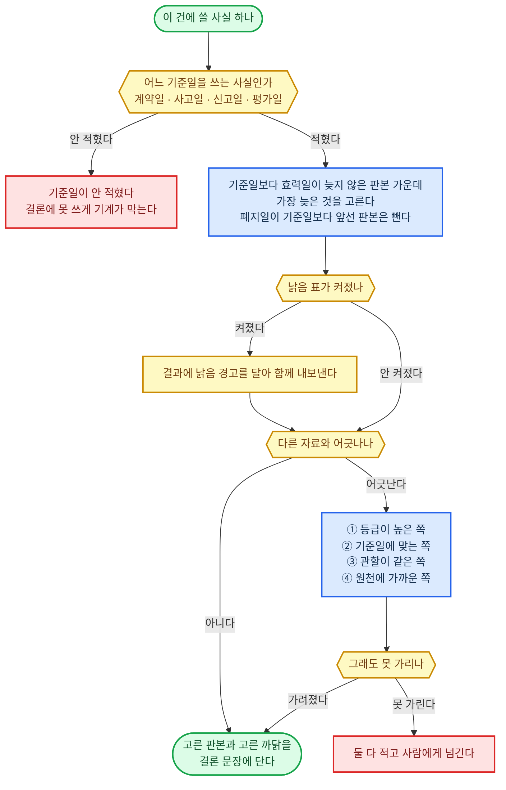

##### 맡는 것

| 이 재료가 맡는다 | 맡지 않는다 |
|------|------|
| 자료 여섯 종에 붙는 꼬리표의 이름과 꼴을 하나로 못 박기<br>건의 기준일에 맞는 판본을 고르는 규칙 정하기<br>기준일이 여럿인 건에서 사실마다 어느 기준일인지 적게 하기 | 바뀐 것을 받아 오는 일은 자동 갱신이 맡는다<br>꼬리표를 실제로 채워 카드를 쌓는 일은 자료 여섯 종이 맡는다<br>이 건의 기준일을 무엇으로 잡을지는 업무 처리 흐름 3단계가 맡는다 |

> **내용이 맞아도 기준일에 안 맞는 판본이면 오답이다. 이 잣대는 검증에서 자료 오류로 센다.**

##### 짜는 방식

| 기준 | 정한 것 |
|------|------|
| 꼬리표 이름 | 출처·근거 등급·관할·효력일·폐지일·판본·개정 이력·읽은 시각·유효 기한·조각 위치<br>열 개 이름을 자료 여섯 종이 글자까지 똑같이 쓴다<br>이름이 다르면 색인이 갈라져 검색이 못 찾는다 |
| 날짜 적는 꼴 | 날짜와 시각은 한 가지 꼴로만 적는다<br>보기: 2026-04-12T23:20:50Z 처럼 적고, 시간대는 Z 또는 +09:00으로 붙인다<br>시간대를 안 적은 시각은 기계가 받지 않는다 |
| 판본 고르는 규칙 | 기준일보다 효력일이 늦지 않은 판본 가운데 가장 늦은 것을 고른다<br>폐지일이 기준일보다 앞선 판본은 뺀다<br>고른 판본과 왜 골랐는지를 산출물에 함께 적는다 |
| 기준일이 여럿일 때 | 건 하나에 기준일 목록을 두고 이름을 붙인다 (계약일·사고일·신고일·평가일)<br>사실 카드마다 어느 기준일을 쓰는지 적는다<br>안 적힌 사실은 결론에 못 쓰게 기계가 막는다 |
| 낡음 표 | 읽은 시각에 유효 기한을 더한 때가 지나면 낡음 표가 저절로 켜진다<br>낡음 표가 켜진 카드는 검색 결과에 경고와 함께 나온다 |
| 등급 | 네 칸으로 못 박는다<br>A 원천 시스템 기록, B 공식 문서, C 제3자 확인, D 사람 말<br>등급은 사람이 고르지 않고 어디서 왔는지로 기계가 매긴다 |
| 사람 말 | D로 들어온다<br>말한 사람과 그 사람이 얻을 것·잃을 것을 함께 적는다<br>원천 시스템 기록이나 제3자와 맞춰 본 뒤에만 C 위로 올린다<br>말과 행동이 어긋나면 행동 기록을 앞세운다 |
| 어긋날 때 | 등급이 높은 쪽 → 기준일에 맞는 쪽 → 관할이 같은 쪽 → 원천에 가까운 쪽 순으로 가린다<br>그래도 못 가리면 둘 다 적고 사람에게 넘긴다 |
| 붙이는 자리 | 결론 문장 하나마다 쓴 카드 목록을 단다<br>이 목록을 근거 추적·재현에 그대로 넘긴다 |
| 모델과 기계 | 등급 매기기와 빈 출처 막기는 기계가 한다<br>어긋난 자료 가운데 어느 쪽이 이 건에 맞는지 읽는 것은 모델이 한다 |

##### 이 직무에서 채울 것

| 채울 것 | 예 |
|------|------|
| 기준일 목록 | 세무사 (신고·기장) = 과세 기간 끝 날·신고일<br>원가 = 원가 계산 마감일·자재 입고일<br>부동산 투자자·임대 운영자 = 계약일·잔금일·평가 기준일 |
| 관할 | 세무사 (신고·기장) = 한국 국세<br>원가 = 회사와 공장이 선 나라<br>부동산 투자자·임대 운영자 = 물건이 있는 시·군·구 |
| 이 분야의 A 등급 | 회계사 (자문·실사) = 회사 원장과 은행 잔액 증명<br>리스크 관리 = 거래 원장과 한도 시스템 기록<br>개인 투자자 (단기 매매) = 거래소 체결 기록 |
| 자주 부딪히는 자료 | 회계사 (자문·실사) = 회사가 준 표와 원장<br>리스크 관리 = 부서가 보고한 값과 시스템 값<br>개인 투자자 (단기 매매) = 뉴스와 실제 체결 값 |

##### 됐다는 기준

| 잣대 | 어떻게 잰다 |
|------|------|
| 꼬리표가 다 찼는가 | 열 개 꼬리표 가운데 빈 칸이 있는 카드 수를 센다<br>0이어야 한다 |
| 판본을 옳게 골랐는가 | 고정 시험지에 옛 판본과 새 판본을 같이 넣고 기준일을 바꿔 가며 100번 물어 맞힌 수를 센다 |
| 기준일을 적었는가 | 결론에 쓰인 사실 가운데 기준일이 안 적힌 수를 센다<br>0이어야 한다 |
| 다 붙었는가 | 결과물의 사실 문장 가운데 카드 목록이 빈 것 수를 센다<br>0이어야 한다 |
| 등급이 맞는가 | 무작위 30개를 사람이 다시 매겨 기계와 어긋난 수를 센다 |
| 어긋남을 가렸는가 | 고정 시험지에 일부러 어긋나는 자료 쌍을 넣고 정한 순서대로 골랐는지 채점한다 |

---

#### 검색 — 하이브리드 검색 (Hybrid Search·RAG)


##### 맡는 것

| 이 재료가 맡는다 | 맡지 않는다 |
|------|------|
| 쌓아 둔 자료에서 이 건에 필요한 조각을 찾아 주기<br>낱말 검색·뜻 검색·표 조회·원문 대조를 한 번에 돌리기<br>찾은 조각을 꼬리표와 함께 넘겨 작업창에 올릴 것만 고르기 | 자료를 받아 오고 쌓는 일은 자료 여섯 종이 맡는다<br>오래 이어 가는 기억은 장기 기억이 맡는다<br>찾은 것으로 무엇을 정할지는 판단 규칙이 맡는다 |

> **검색이 나쁘면 행동 체계가 좋아도 성능이 크게 떨어진다. 여기에 가장 많이 손을 쓴다.**

##### 짜는 방식

| 기준 | 정한 것 |
|------|------|
| 네 갈래를 같이 | 낱말이 똑같은 것 찾기 (키워드), 뜻이 비슷한 것 찾기 (벡터), 표 조회, 원문 대조를 한 질의에서 같이 돌린다<br>숫자를 세는 일은 검색이 아니라 표 조회로만 한다 |
| 순위 합치기 | 두 검색의 점수를 억지로 같은 자로 맞추지 않고, 각 검색에서 몇 등이었는지로 합친다 (RRF = 등수의 역수를 더하는 방식)<br>등수로 합치면 검색 종류가 늘어도 점수 자를 다시 맞출 일이 없다 |
| 걸러내기 먼저 | 꼬리표 (관할·효력일·판본·건·낡음 표) 를 걸러내기 칸으로 색인한다<br>걸러낸 뒤 그 안에서만 순위를 매긴다<br>기준일에 안 맞는 판본은 아예 후보에 안 들어온다 |
| 색인 갱신 | 새 카드는 들어오는 즉시 낱말 색인에 넣는다<br>뜻 색인은 하루 한 번 묶어서 다시 만든다<br>다시 만든 뒤 고정 시험지의 검색 문제를 돌려 떨어지면 옛 색인으로 되돌린다 |
| 원문 대조 | 모델이 쓴 사실 문장마다 인용한 조각 번호를 달게 한다<br>기계가 그 조각 원문에 그 글자가 실제로 있는지 다시 본다<br>없으면 그 문장을 버리고 다시 쓰게 한다 |
| 실패 처리 | 후보가 하나도 없으면 지어내지 않고 없다고 답한다<br>찾은 조각이 너무 많으면 걸러내기를 좁히지 않고 사람에게 물을 것을 정해 묻는다 |

##### 이 직무에서 채울 것

| 채울 것 | 예 |
|------|------|
| 무엇을 표 조회로 두나 | 변리사 (특허) = 출원 번호·심사 단계·기한<br>PM·PO (B2B SaaS) = 요청 목록과 지표 표<br>뉴스레터 작가 = 발행 이력과 열람률 |
| 검색 시험 문제 | 직무마다 실제 물음 100개와 정답 조각을 미리 짝지어 둔다 |

##### 됐다는 기준

| 잣대 | 어떻게 잰다 |
|------|------|
| 찾아내는가 | 시험 문제 100개에서 정답 조각이 위 10개 안에 든 비율을 잰다<br>합격선은 90% 이상이다<br>시험 문제는 고정 시험지의 건에서 뽑고, 정답 조각은 그 건을 푼 20년차가 실제로 쓴 자료로 둔다<br>20년차가 쓴 근거 열 개 가운데 아홉은 올라와야 빠진 하나를 원문 대조에서 잡을 수 있다<br>90% 아래면 색인이나 조각 나누기부터 고친다<br>문제가 100개인 까닭은 고정 시험지 100건에서 한 문제씩 뽑기 때문이다 |
| 헛것을 쓰나 | 원문 대조에서 버려진 문장 비율을 잰다<br>이 값이 오르면 색인이나 조각 나누기가 나빠진 것이다 |
| 낡은 것을 주나 | 기준일에 안 맞는 판본이 결과에 섞인 수를 센다<br>0이어야 한다 |

---

#### 자동 갱신 — 법규·플랫폼 규정·현황 자동 갱신

##### 맡는 것

| 이 재료가 맡는다 | 맡지 않는다 |
|------|------|
| 바깥이 바뀌었을 때 자료 여섯 종에 그것을 실제로 넣는 일<br>새 판본과 옛 판본을 견주어 바뀐 곳 목록 만들기<br>바뀐 곳이 진행 중인 건에 걸리면 그 건을 깨우기 | 바깥이 밀어 주는 신호 (웹훅) 를 받는 문은 시작 신호가 맡고, 우리가 때맞춰 물어보는 조회는 여기서 한다<br>무엇을 신호로 볼지 정하는 일은 먼저 감지하기가 맡는다<br>깨어난 건을 어떻게 고칠지는 판단 규칙이 맡는다 |

> **여기서 놓치면 계정째 날아간다. 못 받았을 때 조용히 지나가는 것을 가장 큰 실패로 본다.**

##### 짜는 방식

| 기준 | 정한 것 |
|------|------|
| 세 갈래 | 밀어 주는 신호 (웹훅 = 바깥이 일이 생겼을 때 우리를 불러 주는 주소), 우리가 때맞춰 물어보는 조회, 사람이 손으로 넣는 것<br>셋 다 같은 자료 카드 꼴로 들어온다 |
| 물어보는 법 | 바뀐 것만 받도록 조건부 요청을 쓴다<br>같은 요청이 두 번 와도 카드가 두 장 안 생기게, 조각 번호를 도구가 정한 열쇠로 삼는다<br>같은 요청을 몇 번 받아도 결과는 한 번 받은 것과 같아야 한다 |
| 주기 | 자료 종류마다 다르게 둔다<br>플랫폼·기관 규정은 하루, 법규·기준은 하루, 해석 자료는 주, 일반 자료는 달<br>현황 자료는 값마다 분·시간·하루로 나눈다<br>계정이 날아가는 규정과 결론을 뒤집는 값은 주기를 절반으로 줄인다 |
| 덮지 않기 | 새 판본을 쌓고 옛 판본을 남긴다<br>줄 단위로 견주어 바뀐 곳 목록을 함께 저장한다<br>무엇이 언제 바뀌었는지 되짚을 수 있어야 한다 |
| 건을 깨우기 | 바뀐 곳이 진행 중인 건이 쓴 카드에 닿으면 그 건을 깨워 판단·계획 단계로 되돌린다<br>이미 낸 결과물에 닿으면 받는 사람에게 알릴지 판단 규칙에 넘긴다 |
| 실패 처리 | 정한 주기 안에 못 받으면 낡음 표를 켜고 보고에 적는다<br>주기의 세 배를 넘기면 그 자료를 쓰는 행동을 멈추고 사람에게 넘긴다 |

##### 이 직무에서 채울 것

| 채울 것 | 예 |
|------|------|
| 무엇을 지켜보나 | 행정사 (인허가·지원금) = 지원 사업 공고와 신청 요건<br>인허가 RA (의료기기·의약품) = 허가 기준 개정과 고시<br>앱 개발자 (개인 앱) = 스토어 심사 지침 개정 |
| 놓치면 잃는 것 | 행정사 (인허가·지원금) = 신청 기한을 넘김<br>인허가 RA (의료기기·의약품) = 허가 반려<br>앱 개발자 (개인 앱) = 앱이 내려감 |

##### 됐다는 기준

| 잣대 | 어떻게 잰다 |
|------|------|
| 얼마나 늦는가 | 바깥이 바뀐 날과 우리 자료에 들어온 날의 차이를 잰다<br>자료 종류마다 정한 한도 안이어야 한다 |
| 놓친 것이 있는가 | 분기마다 공식 개정 이력을 훑어 우리가 못 받은 수를 센다<br>M of N으로 적고 0이 아니면 실패 원인 분석으로 넘긴다 |
| 건을 깨웠는가 | 일부러 개정을 넣고 그 자료를 쓰던 건이 실제로 깨어나는지 본다 |

---

### 지식·경험 — 분야 지식·감각·정체성

#### 업무 지식 — 서식·계산법·용어·관행

##### 맡는 것

| 이 재료가 맡는다 | 맡지 않는다 |
|------|------|
| 이 분야에서 '무엇을 아는가'<br>서식의 각 칸이 뜻하는 것, 계산하는 법, 용어, 업계 관행<br>정석이 왜 그렇게 굳었는지의 원리와 내력<br>정석이 없는 처음 보는 건을 푸는 출발점 | 어떤 순서로 하는지는 업무 절차·노하우가 맡는다<br>조문·규격·논문 원문 그 자체는 법규·기준, 일반 자료가 맡는다<br>원문을 찾아 오기는 검색이 맡는다<br>이 고객·이 건의 사실은 장기 기억이 맡는다<br>이 건에서 무엇부터 볼지는 감각·사례·암묵지가 맡는다 |

> 원문을 베껴 두지 않는다. 원문이 있는 자리 (조문 번호·문서 주소) 만 가리킨다.
> 원리와 내력 칸이 빈 항목은 미완성으로 친다. 그 칸이 없으면 처음 보는 건에서 쓸 것이 없다.

##### 짜는 방식

| 기준 | 정한 것 |
|------|------|
| 처음 넣는 법 | 20년차가 실제로 쓰는 서식 파일·계산 시트·용어 쪽지를 원본째 받는다<br>받은 파일마다 "이 칸은 왜 있나"·"이 칸이 틀리면 무엇이 깨지나"를 묻는다<br>묻는 틀은 일을 몇 단계로 쪼개게 하고 어느 단계가 머리를 쓰는 자리인지 짚게 하는 면담이다 |
| 저장 꼴 | 항목 하나에 글자 파일 하나<br>머리에 꼬리표 칸을 붙인다: 분야, 근거 원문 자리, 마지막 확인일, 고친 사람<br>본문은 [무엇인가]·[어떻게 센다]·[왜 이렇게 굳었나]·[어디서부터 안 통하나] 네 칸으로 고정한다 |
| 기계가 하는 것 | 꼬리표 칸이 비었는지 검사<br>근거 원문 자리가 죽은 주소인지 두드려 보기<br>마지막 확인일이 오래된 항목 골라내기 |
| 모델이 하는 것 | 이 건에 어떤 항목이 필요한지 고르기<br>항목과 원문이 어긋날 때 어느 쪽이 맞는지 읽고 정하기<br>맞는 항목이 없거나 이 건이 [어디서부터 안 통하나] 에 걸리면, [왜 이렇게 굳었나] 의 원리에서 이 건의 셈법을 새로 세우고 세운 셈법과 근거 원리를 계획에 적기<br>항목을 찾아 올린 것은 판단이 아니다. 어느 항목을 왜 이 건에 썼는지가 계획에 적혀야 판단이다 |
| 작업창에 올리는 때 | 흐름 3단계 (자료 확인)·4 (판단·계획) 에서 고른 항목만 올린다<br>모든 항목을 올리지 않는다<br>건마다 늘 쓰는 항목은 작업창 앞부분 고정 자리에 둔다<br>자리가 안 바뀌어야 앞서 읽은 것을 그대로 다시 쓰는 캐시가 걸려 값이 싸진다 |
| 낡았는지 아는 법 | 근거 원문이 바뀌면 자동 갱신이 알려 주고, 그 항목에 낡음 표시가 붙는다<br>낡음 표시가 붙은 항목은 결론에 쓰기 전에 원문과 다시 맞춰 본다 |
| 누가 고치나 | 원문이 바뀌어 생긴 수정은 에이전트가 초안을 쓰고 사람 전문가가 승인한다<br>일하다 틀린 것이 드러난 수정은 실패 원인 분석이 이 재료를 고칠 자리로 지목했을 때만 한다<br>고친 날과 이유를 남기고 옛 판본을 지우지 않는다. 지난 건은 그때 쓴 판본으로 다시 볼 수 있어야 한다 |

##### 이 직무에서 채울 것

| 채울 것 | 예 |
|------|------|
| 서식·계산법 항목 목록 | 변호사 (민사·상사 송무) = 소장·준비서면 서식, 인지대·송달료 계산, 소멸시효 기산<br>여신심사 (기업) = 재무비율 계산, 담보 인정 비율, 산업별 심사 기준표<br>온라인 셀러 (자체 브랜드·D2C) = 원가·마진 계산, 관세·부가세 처리, 채널별 수수료 표 |
| 원리·내력을 적을 항목 | 변호사 = 그 절차 규정이 왜 생겼는지<br>여신심사 = 그 비율 기준선이 어느 손실 경험에서 나왔는지<br>셀러 = 그 수수료 구조가 무엇을 막으려는 것인지 |
| 판본을 따라가야 하는 항목 | 변호사 = 서식·요율<br>여신심사 = 감독 기준<br>셀러 = 채널 정산 규정 |

##### 됐다는 기준

| 잣대 | 어떻게 잰다 |
|------|------|
| 덮는 범위 | 지난 건에 실제로 쓰인 서식·계산이 항목으로 다 있는지 센다. 없던 것은 빠진 항목으로 기록한다 |
| 원리 칸 채움 | 원리·내력 칸이 빈 항목 수를 센다. 여기가 0이어야 처음 보는 건 시험을 볼 수 있다 |
| 처음 보는 건 | 고정 시험지에 정석이 없는 건을 섞어 두고, 원리 칸만으로 길을 짜는지 과정 평가로 채점한다 |
| 안 낡았나 | 낡음 표시가 붙은 채 결론에 쓰인 항목 수를 센다. 0이어야 한다 |

---

#### 감각·사례·암묵지 — 상황별로 먼저 확인할 것과 실전 사례·숙련자만 아는 것 (Case Memory)

##### 맡는 것

| 이 재료가 맡는다 | 맡지 않는다 |
|------|------|
| 이 상황에서 수많은 원문 가운데 먼저 볼 것<br>그 단서가 보이면 무엇을 의심할지<br>상대·기관·시장이 무엇을 얻고 무엇을 잃는지, 늘 하는 수는 무엇인지<br>처음 넣어 주는 실제 건의 성공·실패<br>정석이 안 통하는 함정<br>놓치면 큰일 나는 징후와 그때의 첫 조치<br>흐름 8단계에서 나온 사례를 정해진 꼴로 쌓는 것<br>사례마다 결과 점수와 판단 과정 점수를 따로 붙이는 것<br>고객의 비밀이 다른 고객의 건으로 새지 않게 사례에서 떼어 내는 것 | 무엇이 사실인지는 자료·검색 계통이 맡는다<br>어떤 순서로 처리할지는 업무 절차·노하우가 맡는다<br>상대에게 실제로 무슨 말을 할지는 상대 응대가 맡는다<br>무엇을 신호로 감시하고 계속 지켜볼지는 먼저 감지하기가 맡는다<br>실패의 원인을 캐서 어디를 고칠지 정하기는 실패 원인 분석이 맡는다<br>고객·건별 사실과 진행 중인 건의 상태 기억은 장기 기억이 맡는다<br>닮은 사례를 찾아 오기는 검색이 맡는다<br>사례로 시험지 만들기는 고정 시험이 맡는다 |

> **이것은 확인 목록이지 판단 규칙이 아니다. 무엇을 볼지만 정하고, 무엇을 정할지는 모델이 한다.**

##### 짜는 방식

| 기준 | 정한 것 |
|------|------|
| 뽑아내는 법 | 20년차에게 "초보는 놓치는데 당신은 바로 알아채는 것"·"겉만 보고 잘못 짚기 쉬운 것"을 상황별로 말하게 하는 면담을 쓴다<br>말한 것을 표로 옮긴다<br>칸은 [무엇이 어려운가]·[초보는 왜 틀리나]·[무슨 단서를 보나] 셋이다 |
| 감각 한 줄의 꼴 | 감각 한 줄은 [상황] · [먼저 볼 것] · [보이면 의심할 것] · [이럴 때는 빗나감] 으로 적는다<br>한 줄은 한 상황만 맡는다. 여러 상황을 한 줄에 묶지 않는다 |
| 상대 읽기 | 상대·기관·시장마다 쪽지를 하나씩 둔다<br>칸은 [무엇을 얻으려 하나]·[무엇을 잃기 싫어하나]·[늘 하는 수]·[먹혔던 수]<br>건이 끝날 때마다 그 상대가 실제로 한 행동으로 쪽지를 고친다 |
| 기계·모델 나눔 (감각) | 기계는 상황 이름표로 걸리는 줄만 꺼내 작업창에 올린다<br>그 줄을 따를지, 빗나가는 자리인지 정하는 것은 모델이 한다<br>걸리는 이름표가 없으면 빈 채로 올리고, 그때는 판단 규칙의 처음 보는 상황 줄로 간다. 이름표가 없다는 것이 감각을 안 쓰는 이유는 아니다 |
| 감각 줄이 판단으로 가는 길 | 따르기로 한 줄의 [먼저 볼 것] 은 흐름 3단계의 확인 목록에, [보이면 의심할 것] 은 흐름 4단계의 반증 한 줄에 그대로 들어간다<br>어느 줄을 따랐고 어느 줄을 빗나가는 자리로 봤는지를 이유와 함께 작업 기억의 [지금까지 정한 것과 그 이유] 에 적는다<br>이 기록이 없으면 결과가 어긋났을 때 어느 줄 탓인지 가릴 수 없고, 낡음 표시도 못 단다 |
| 작업창에 올리는 때 | 흐름 1~4에서 이 건의 상황에 걸린 줄만 올린다<br>전체 목록은 올리지 않는다. 다 올리면 무엇이 먼저인지가 사라진다 |
| 낡았는지 아는 법 | 건마다 그 줄이 맞았는지 빗나갔는지 표시한다<br>빗나감이 이어지면 낡음 표시를 붙이고 사람 전문가에게 다시 묻는다<br>상대가 수를 바꾸면 그 쪽지부터 고친다 |
| 면담으로 뽑기 | 실제 있었던 어려운 건 하나를 놓고 20년차를 면담한다<br>같은 이야기를 여러 번 되짚으며 캐묻는 면담이다<br>첫 번은 그냥 이야기하게 두고, 다음은 시간 순으로 늘어놓고, 그다음 자리마다 "그때 무엇을 보고 그렇게 정했나"·"초보였다면 어떻게 했겠나"·"무엇이 조금만 달랐으면 결과가 뒤집혔나"를 묻는다 |
| 옆에서 보고 적기 | 면담만으로는 안 나오는 것이 있다<br>20년차가 실제 건을 처리하는 화면과 주고받은 글을 그대로 받는다<br>그가 손을 멈추거나 되돌아간 자리마다 그 자리에서 왜 그랬는지 묻고 적는다 |
| 실패 사례 모으기 | 잘된 건보다 깨진 건을 먼저 모은다<br>돈을 물어 준 건, 기한을 놓친 건, 상대에게 뒤집힌 건을 이름을 지우고 받는다<br>바깥에 공개된 제재·심사·판정 기록도 같은 꼴로 넣는다 |
| 받아 온 사례의 꼴 | 사례 한 건은 [상황]·[무엇이 걸려 있었나]·[갈림길과 고른 수]·[왜 그 수였나]·[결과]·[뒤집혔을 조건]<br>위험 신호는 [징후]·[이게 보이면 무엇이 진행 중인가]·[지금 할 첫 조치] 세 칸으로 따로 뺀다<br>사람·회사 이름은 지우고 넣는다 |
| 믿음의 등급 | 사람이 준 사례도 그대로 믿지 않는다<br>기록이 남은 건만 사실로, 기억으로만 남은 건은 추정으로 표시한다 |
| 기계·모델 나눔 (사례) | 기계는 빈칸과 남아 있는 이름을 검사해 막는다<br>닮은 사례를 골라 오는 것은 검색이 하고, 이 건과 정말 닮았는지는 모델이 정한다<br>닮았다고 정할 때는 이 건과 사례의 [상황]·[뒤집혔을 조건] 이 어디서 다른지를 적는다<br>차이가 [뒤집혔을 조건] 에 걸리면 그 사례의 [고른 수] 는 그대로 쓰지 않고, [왜 그 수였나] 의 까닭만 가져와 흐름 4단계에서 길을 새로 짠다<br>가져온 사례와 적은 차이는 계획에 붙여 남긴다. 결과가 어긋나면 그 차이부터 다시 본다 |
| 내 건에서 쌓는 사례의 꼴 | 사례 한 건은 여덟 칸이다<br>어떤 판이었나 / 갈림길에서 고른 것 / 버린 것과 이유 / 결과 / 결과 점수 / 판단 과정 점수 / 두 점수가 갈린 이유 / 다시 하면 무엇을 바꾸나 |
| 두 점수를 왜 따로 | 좋은 판단인데 나쁜 결과, 나쁜 판단인데 좋은 결과를 가르려면 한 점수로는 안 된다<br>결과 점수는 성과 추적이 주고, 판단 과정 점수는 과정 평가가 준다 |
| 어느 쪽을 앞에 | 운이 크게 좌우하는 분야는 판단 과정 점수를 앞에 둔다<br>결과가 곧바로 판단의 답으로 돌아오는 분야는 결과 점수를 앞에 둔다<br>어느 쪽인지는 이 직무를 고를 때 적는다 |
| 비밀 떼기 | 이름·금액·날짜는 자리 표시로 바꾸고 판단에 필요한 조건만 남긴다<br>저장 전에 비밀이 남았는지 기계가 검사한다<br>검사를 통과해야 저장된다 |
| 안 통한 방법 | 실패한 방법도 "이 조건에서는 안 된다" 사례로 조건과 함께 남긴다 |
| 다음 자리 | 검증된 사례는 고정 시험지로 넘긴다<br>성과가 나중에 확정되는 건은 확정일을 적어 두고 그날 결과 점수를 채워 사례를 갱신한다 |
| 면담 최소량 | 면담은 20년차 3명 이상 × 각 4시간 (2시간씩 두 번) 이다<br>각자 실제 건 20건을 놓고 결정 지점을 되짚고, 실제로 일하는 화면 기록을 사람당 최소 3건 더 받는다<br>3명인 까닭은 둘이 갈리면 한 사람의 버릇인지 직업의 규칙인지 못 가리기 때문이다<br>3명을 못 채우면 그 직종의 기준선은 미정으로 두고 쓰기 전 검사에서 막힌다 |

##### 이 직무에서 채울 것

| 채울 것 | 예 |
|------|------|
| 상황 이름표 목록 | 변호사 (민사·상사 송무) = 상대가 갑자기 합의를 꺼낼 때, 서증이 늦게 나올 때<br>여신심사 (기업) = 매출은 느는데 현금이 줄 때, 결산 직전에 거래처가 바뀔 때<br>온라인 셀러 (자체 브랜드·D2C) = 광고 성과가 하루 만에 꺾일 때, 후기 점수가 흔들릴 때 |
| 먼저 볼 것 | 변호사 = 상대 대리인이 누구인지, 시효가 언제 끝나는지<br>여신심사 = 매출채권 회수 기간, 특수관계자 거래<br>셀러 = 재고 회전과 반품률, 채널 노출 순위 |
| 상대 쪽지 | 변호사 = 상대 대리인·재판부<br>여신심사 = 차주·감독 기관<br>셀러 = 채널·경쟁 판매자 |
| 먼저 모을 깨진 건 | 변호사 (민사·상사 송무) = 시효를 놓친 건, 서증 없이 밀어붙인 건<br>여신심사 (기업) = 승인 뒤 일 년 안에 깨진 여신<br>온라인 셀러 (자체 브랜드·D2C) = 재고를 태운 건, 채널 규정을 어겨 내려간 건 |
| 위험 신호 목록 | 변호사 = 상대가 갑자기 조용해짐<br>여신심사 = 결산 직전 매출 몰아넣기<br>셀러 = 반품 사유가 한 가지로 쏠림 |
| 첫 조치 | 변호사 = 시효 중단 조치부터<br>여신심사 = 한도 동결 뒤 재심사<br>셀러 = 광고 정지 뒤 재고 잠금 |
| 어느 점수를 앞에 두나 | 엔젤 투자자 = 운이 크게 좌우하니 판단 과정 점수를 앞에 둔다<br>세무사 (신고·기장) = 답이 정해진 편이니 결과 점수를 앞에 둔다<br>퍼포먼스 마케팅 = 한 건은 흔들리고 묶으면 보이니 판단 과정 점수를 앞에 두고, 결과 점수는 여러 건을 묶어 본다 |

##### 됐다는 기준

| 잣대 | 어떻게 잰다 |
|------|------|
| 감각이 덮는 범위 | 지난 건에서 실제로 말썽이 났던 상황이 이름표 목록 안에 있는지 센다 |
| 겹치는 정도 | 고정 시험지의 건마다 '먼저 볼 것'을 내게 하고, 20년차가 짚은 것과 얼마나 겹치는지 잰다 |
| 쓸모 | 그 줄을 넣었을 때와 뺐을 때의 과정 평가 점수를 견준다. 차이가 없는 줄은 지운다 |
| 안 죽었나 | 맞음·빗나감 표시가 갱신되고 있는지, 낡음 표시가 방치된 줄이 있는지 센다 |
| 사례가 덮는 범위 | 그 직무에서 돈이 크게 걸리는 갈림길마다 사례가 하나 이상 붙어 있는지 센다 |
| 징후가 걸리나 | 지난 건 기록을 되돌려 넣었을 때, 실제로 터진 건에서 징후가 미리 잡히는 비율을 잰다 |
| 안 쓰이는 사례 | 오래 한 번도 안 꺼내진 사례를 골라내 지울지 사람에게 묻는다 |
| 빠진 것 | 위험 누락 검사가 잡은 놓친 위험이 이 목록에 없던 것이면 빠진 항목으로 기록하고 채운다 |
| 사례로 남은 비율 | 끝난 건 가운데 사례로 저장된 비율 |
| 두 점수가 다 찬 비율 | 결과 점수와 판단 과정 점수가 둘 다 채워진 사례의 비율 |
| 비밀 검사 통과율 | 저장 전 검사를 통과한 비율<br>전부여야 한다 |
| 사례가 쓸모 있었나 | 비슷한 사례를 꺼내 본 건과 안 본 건의 성과 차이를 견준다 |

---

#### 정체성·작풍 — 채널·작가·브랜드의 고유한 목소리

##### 맡는 것

| 이 재료가 맡는다 | 맡지 않는다 |
|------|------|
| 말투·시각·세계관·그림체·음색·금기·단골 형식·발행 약속을 정해 두기<br>모든 산출물이 그것에 맞는지 대는 잣대<br>남의 브랜드를 맡으면 그쪽의 목소리를 여기 담기 | 맡긴 사람이 보고를 어떤 식으로 받고 싶은지는 개인 취향이 맡는다<br>결과물 형식과 소통 방식은 보고·결과물이 맡는다<br>몇 년짜리 연재의 설정집·복선 장부는 장기 기억이 맡는다<br>그림·영상을 실제로 만들기는 그림·영상 생성이 맡는다<br>바꾼 뒤의 반응 숫자는 성과 추적이 맡는다 |

> **정체성은 취향이 아니라 지켜야 할 약속이다. 어긴 결과물은 밖으로 못 나간다.**

##### 짜는 방식

| 기준 | 정한 것 |
|------|------|
| 처음 넣는 법 | 사람이 쓴 선언문보다 이미 낸 결과물이 먼저다<br>잘된 것과 못된 것을 같이 받아, 잘된 쪽에만 있는 것을 뽑는다<br>말로 안 나오는 금기는 "우리가 절대 안 하는 것"을 묻는 면담으로 뽑는다 |
| 저장 꼴 | 규칙집 한 장이 아니라 [해야 하는 것]·[하면 안 되는 것]·[좋은 예 원문]·[나쁜 예 원문] 네 묶음<br>글로 적기 어려운 것은 원문 조각을 그대로 붙인다<br>그림체·음색은 견본 파일을 붙인다<br>발행 약속 (요일·시각·길이) 은 숫자로 못 박아 따로 둔다 |
| 작업창에 올리는 때 | 만들기 시작할 때 앞부분 고정 자리에 통째로 올린다<br>건마다 바뀌지 않는 것이라 캐시가 가장 잘 듣는 자리다 |
| 기계가 하는 것 | 금기 낱말과 발행 약속 (요일·시각·길이) 은 내보내기 직전에 기계로 막는다 |
| 모델이 하는 것 | 말투·시각·세계관이 맞는지는 좋은 예·나쁜 예를 옆에 놓고 다른 회사 모델이 채점한다<br>이 채점표를 결과물 평가가 받아 쓴다 |
| 바꿀 때 | 바꾸기 전에 이유·시점·기대 효과를 적고 옛 판본을 남긴다<br>바꾼 뒤 정한 기간의 반응 숫자를 성과 추적에서 받아 되돌릴지 정한다<br>되돌릴 수 없는 변경 (이름·간판) 은 사람에게 넘긴다 |

##### 이 직무에서 채울 것

| 채울 것 | 예 |
|------|------|
| 목소리의 알맹이 | 번역가 (출판·문학) = 원작자의 문체를 우리말로 옮길 때의 결<br>브랜드 마케팅 = 회사가 정한 말투와 색·서체<br>웹소설 작가 = 화자의 어투, 세계관, 회차 끝맺는 버릇 |
| 금기 | 번역가 = 원문에 없는 말 덧붙이기<br>브랜드 마케팅 = 경쟁사 깎아내리기<br>웹소설 작가 = 이미 죽인 인물 되살리기 |
| 발행 약속 | 번역가 = 회차 납품일<br>브랜드 마케팅 = 정기 발행 요일<br>웹소설 작가 = 연재 요일·시각·회차 길이 |

##### 됐다는 기준

| 잣대 | 어떻게 잰다 |
|------|------|
| 알아보나 | 이 에이전트가 낸 것과 남이 낸 것을 섞어 두고 바깥 눈이 골라내는 비율. 80% 이상<br>80% 는 가정이다. 사람 작가의 작풍을 사람이 알아보는 비율을 재어 확정한다 |
| 흔들림 | 같은 조건으로 여러 번 만들어 작풍 점수가 얼마나 벌어지는지 잰다 |
| 금기 | 금기를 어긴 결과물이 밖으로 나간 수를 센다. 0이어야 한다 |
| 약속 | 정한 요일·시각·길이에 실제로 나갔는지 기록으로 센다 |

---

### 기억·상태 — 진행 상황 파악

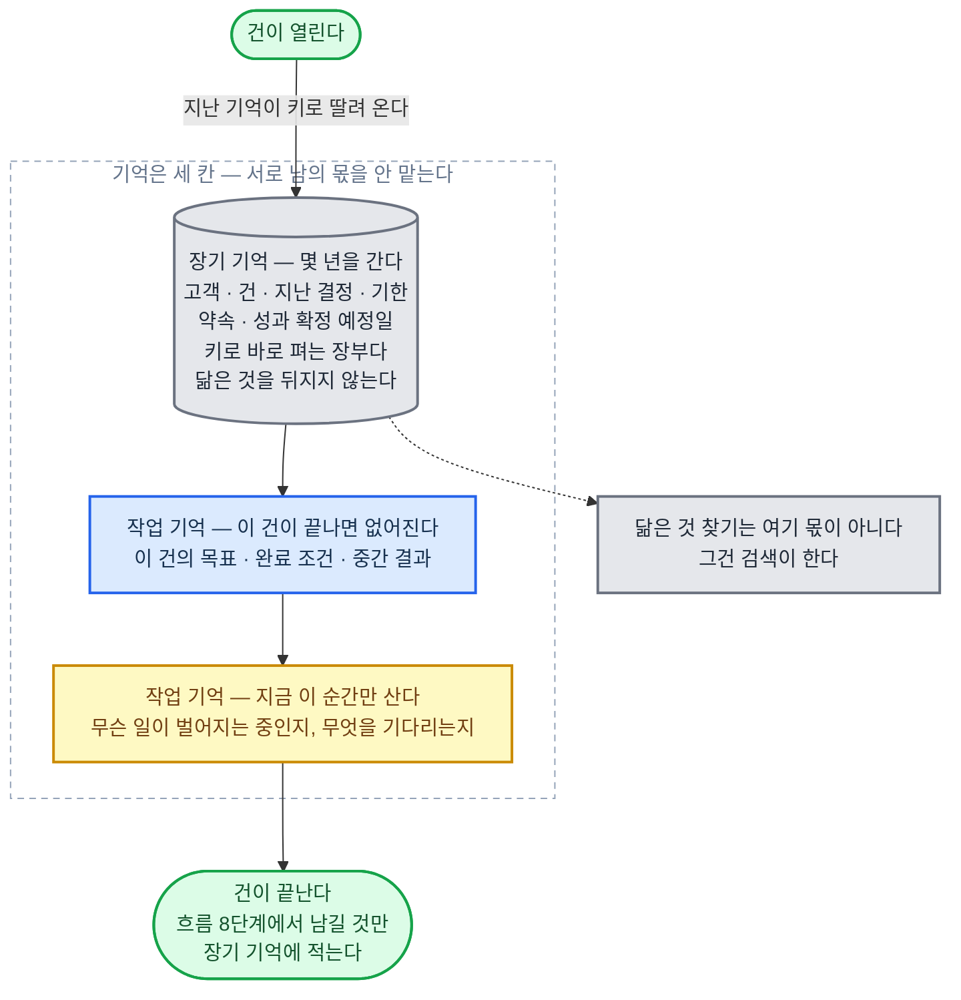

#### 장기 기억 — 오래 가는 기억 (Long-term Memory)

##### 맡는 것

| 이 재료가 맡는다 | 맡지 않는다 |
|------|------|
| 고객·건·과거 결정·기한·변경 사항·성과 확정 예정일을 오래 들고 있기<br>몇 년에 걸치는 연재의 설정집·복선 장부·독자에게 한 약속<br>새 건이 시작될 때 지난 기억을 이어 주기 | 진행 중인 건의 목표·중간 결과와 지금 무슨 일이 벌어지는지는 작업 기억이 맡는다<br>끊긴 자리에서 다시 시작하기는 저장·이어받기가 맡는다<br>필요할 때 찾아 읽는 바깥 자료는 검색이 맡는다<br>분야 지식 자체는 업무 지식이 맡는다 |

> 검색과 다른 점은 꺼내는 방식이다. 검색은 물어봐야 닮은 것을 찾아 오고, 장기 기억은 건이 열릴 때 키 (고객 번호·건 번호) 로 딸려 온다.
> 그래서 여기는 닮은 것을 뒤지는 곳이 아니라 키로 바로 펴는 장부다.

##### 짜는 방식

| 기준 | 정한 것 |
|------|------|
| 저장 꼴 | 칸이 정해진 표로 둔다<br>고객·건·결정·기한·약속·성과 확정 예정일을 각각 표 하나로 나눈다<br>고객 번호와 건 번호를 키로 삼아 한 번의 조회로 펴 낸다 |
| 저장 엔진 | PostgreSQL을 쓴다<br>키 조회, 기한 조회, 표끼리 잇기가 다 되고 기록이 날아가지 않는다<br>닮은 것을 찾는 일은 여기서 하지 않는다. 그것은 검색의 몫이다 |
| 덧붙이기만 | 줄을 고쳐 쓰지 않고 새 줄을 덧붙인다<br>바뀐 값에는 언제부터 그 값이었는지를 붙여 옛 값을 남긴다<br>그래서 "그때는 무엇을 알고 있었나"를 나중에 다시 세울 수 있다. 근거 추적·재현이 이것을 받아 쓴다<br>나중에 틀렸다고 드러난 결정도 지우지 않고 뒤집힘 줄을 덧붙인다. 다음 건은 뒤집힘 줄이 붙은 결정을 근거로 쓰지 않고, 왜 뒤집혔는지만 가져간다 |
| 무엇을 넣나 | 흐름 8단계 (남기기) 에서만 넣는다<br>넣는 것은 다음 건의 판단을 바꿀 것뿐이다: 사실, 약속, 기한, 결정과 그 이유<br>오간 말을 다 넣지 않는다 |
| 작업창에 올리는 때 | 흐름 0단계에서 이 건의 키로 꺼내 앞부분 고정 자리에 올린다<br>올리는 것은 [이 고객의 지금 한 장]·[아직 안 끝난 약속]·[다가오는 기한] 뿐이다<br>나머지는 모델이 필요하다고 할 때 키로 더 꺼낸다 |
| 유효 기간 | 줄마다 언제까지 믿을 수 있는지를 같이 적는다<br>기한이 지난 줄은 사실이 아니라 옛 기록으로 내려간다<br>보관 기간이 법으로 정해진 고객·회사 정보는 그 기간이 지나면 지운다 |
| 스스로 깨어나기 | 기한과 성과 확정 예정일은 시작 신호에 예약으로 걸어 그날 스스로 깨어나게 한다 |
| 연재물 | 설정집·복선 장부·독자 약속은 표를 따로 둔다<br>회차마다 결과물을 내기 전에 이 표와 어긋나는지 기계가 맞춰 보고, 어긋나면 못 낸다 |

##### 이 직무에서 채울 것

| 채울 것 | 예 |
|------|------|
| 키와 표 | 변호사 (민사·상사 송무) = 의뢰인·건 번호, 기일·시효 표<br>여신심사 (기업) = 차주·여신 번호, 약정 조건·재심사일 표<br>웹소설 작가 = 작품·회차 번호, 설정집·복선 장부 |
| 꼭 남길 결정 | 변호사 = 합의 조건과 거절 이유<br>여신심사 = 승인·거절의 근거와 예외 승인<br>웹소설 작가 = 독자에게 한 약속과 회수 예정 회차 |
| 예약 걸 날 | 변호사 = 시효 완성일<br>여신심사 = 재심사일<br>웹소설 작가 = 연재 재개일 |

##### 됐다는 기준

| 잣대 | 어떻게 잰다 |
|------|------|
| 안 잊나 | 고정 시험지에 오래된 건을 섞어 두고, 그때의 약속·기한을 지금 꺼내는지 잰다 |
| 안 지어내나 | 꺼낸 줄마다 언제 어디서 들어온 것인지 되짚을 수 있는지 근거 추적·재현으로 잰다 |
| 안 새나 | 이 고객의 키로 다른 고객의 줄이 딸려 나오는지 검사한다. 0이어야 한다 |
| 제때 깨나 | 예약한 기한 가운데 그날 실제로 깨어난 비율을 센다 |

---

#### 작업 기억 — 처리 중인 건의 상태와 상황 파악 (Working Memory·State)

##### 맡는 것

| 이 재료가 맡는다 | 맡지 않는다 |
|------|------|
| 진행 중인 건의 목표·중간 결과·남은 일<br>무엇을 남기고 무엇을 버릴지 정하기<br>건이 끝날 때 무엇을 장기 기억으로 넘길지 고르기<br>받은 신호로 상황판을 지금 상태로 갱신하기<br>맡은 건 전체가 지금 어떤 상태인지 한 장으로 들고 있기<br>요청이 없어도 다음에 할 일을 알기 | 끊겨도 잇게 저장하는 장치는 저장·이어받기가 맡는다<br>오래 가는 사실은 장기 기억이 맡는다<br>작업창의 자리 다툼과 요약은 작업창이 맡는다<br>신호를 받는 통로는 시작 신호가 맡는다<br>무엇을 신호로 볼지는 먼저 감지하기가 맡는다<br>실제로 무엇을 할지 정하기는 판단 규칙, 업무 처리 흐름이 맡는다 |

> 장기 기억과 섞지 않는다. 건이 끝나면 이 쪽지는 버리고, 남길 것만 골라 장기 기억으로 옮긴다.
> 무엇을 남길지는 여기가 정하고, 어디에 어떻게 저장할지는 저장·이어받기가 정한다.

##### 짜는 방식

| 기준 | 정한 것 |
|------|------|
| 저장 꼴 | 건마다 쪽지 한 장<br>칸은 [한 줄 목표]·[받는 사람]·[완료 조건]·[한도]·[지금까지 정한 것과 그 이유]·[드러낸 가정]·[남은 일]·[막힌 것]<br>흐름 단계가 끝날 때마다 이 쪽지를 지금 상태로 갈아 쓴다 |
| 작업창과의 관계 | 이 쪽지는 작업창 뒷부분에 늘 올라가 있다<br>건에서 가장 자주 바뀌는 자리라 앞부분 고정 자리에 두지 않는다<br>작업창이 차서 실행 기록을 요약할 때도 이 쪽지는 요약하지 않고 그대로 옮긴다 |
| 무엇을 남길지 | 단계를 마칠 때 모델이 쪽지를 다시 쓰면서 "다음 단계가 없으면 못 하는 것"만 남긴다<br>남기지 않은 것은 저장·이어받기의 실행 기록에 그대로 있으니 필요하면 다시 찾는다<br>되돌아가거나 검증에서 어긋나면, 틀린 것으로 드러난 가정과 결정은 지우지 않고 뒤집힘 표시로 남긴다<br>다음 단계는 뒤집힘 표시가 붙은 줄을 전제로 쓰지 못한다. 그래야 되돌아간 뒤에 같은 가정으로 같은 길을 다시 가지 않는다 |
| 기계가 하는 것 | 빈 칸 검사<br>한도 (시간·비용·시도 횟수) 를 세어 선을 넘으면 멈추기<br>같은 막힘이 몇 번 적혔는지 세기. 되돌릴지는 실행 순환이 정한 순서를 따른다 |
| 유효 기간 | 건이 끝나면 정한 기간만 두고 지운다<br>지우기 전에 사실·약속·기한·결정과 이유만 장기 기억으로 옮긴다<br>옮긴 줄에는 어느 건에서 왔는지 표시한다 |
| 여러 건 | 건마다 쪽지가 따로 있고 서로 섞이지 않는다<br>대기로 둔 건의 쪽지는 재워 두고, 시작 신호가 깨우면 그 쪽지부터 다시 읽는다 |
| 상황판의 꼴 | 한 장짜리 상황판<br>칸은 [지금 살아 있는 건과 각각 왜 대기인지]·[기다리는 답과 그 기한]·[지켜보는 숫자와 지금 값]·[한도까지 남은 여유]·[다음에 할 일] |
| 상황판 갱신하는 법 | 신호가 들어올 때마다 갱신한다<br>신호가 없어도 정한 주기마다 원천 시스템을 다시 읽어 갱신한다<br>신호가 안 온 것과 아무 일이 없는 것은 다르기 때문이다 |
| 상황판이 어긋날 때 | 상황판과 원천 시스템이 다르면 원천을 믿고 상황판을 고친다<br>어긋난 사실 자체를 기록한다. 어긋남이 잦으면 신호 통로가 고장 난 것이다 |
| 기계·모델 나눔 | 기계는 기한이 다가온 것과 한도에 가까워진 것을 위로 올린다<br>무엇을 먼저 할지, 급해 보이는데 안 급한 것이 무엇인지는 모델이 정한다 |
| 상황판을 작업창에 올리는 때 | 건을 시작할 때와 대기에서 깨어날 때 이 한 장을 올린다<br>한 장을 넘으면 넘친다는 뜻이므로 칸마다 줄 수 상한을 두고 오래된 줄부터 접는다 |
| 상황판 유효 기간 | 상황판은 지금만 담는다<br>끝난 건의 줄은 그날로 내리고, 남길 것은 장기 기억으로 보낸다 |

##### 이 직무에서 채울 것

| 채울 것 | 예 |
|------|------|
| 한 줄 목표 | 변호사 (민사·상사 송무) = 이 건에서 받아 낼 것과 포기할 것<br>여신심사 (기업) = 이 여신을 승인할지와 붙일 조건<br>온라인 셀러 (자체 브랜드·D2C) = 이 상품의 이번 달 목표 이익 |
| 한도 | 변호사 = 기일까지 남은 날, 쓸 수 있는 비용<br>여신심사 = 심사 마감일, 요청할 수 있는 자료 횟수<br>셀러 = 광고 예산 상한, 재고 잠금 한도 |
| 막힌 것 | 변호사 = 안 나온 서증<br>여신심사 = 안 온 재무 자료<br>셀러 = 답 없는 공급처 |
| 지켜보는 숫자 | 변호사 = 남은 기일까지의 날, 미제출 서증 수<br>여신심사 = 심사 대기 건 수, 연체 신호가 뜬 차주 수<br>셀러 = 재고 잔량, 광고 하루 소진액 |
| 원천 시스템 | 변호사 = 법원 전자 소송 기록<br>여신심사 = 여신 원장<br>셀러 = 채널 판매·정산 기록 |
| 다시 읽는 주기 | 변호사 = 하루 한 번<br>여신심사 = 업무 시간마다<br>셀러 = 광고가 도는 동안 짧은 주기 |

##### 됐다는 기준

| 잣대 | 어떻게 잰다 |
|------|------|
| 이어지나 | 일부러 중간에 끊고 새 작업창에서 이 쪽지만 주었을 때 하던 일을 그대로 잇는지 본다 |
| 안 섞이나 | 여러 건을 함께 돌렸을 때 다른 건의 목표·숫자가 넘어오는지 검사한다. 0이어야 한다 |
| 안 부푸나 | 건이 길어져도 쪽지 길이가 정한 상한 안에 있는지 잰다 |
| 잘 넘겼나 | 끝난 건에서 장기 기억으로 옮긴 줄이 다음 건에서 실제로 쓰인 비율을 센다 |
| 상황판이 맞나 | 정한 주기마다 상황판과 원천 시스템을 맞춰 보고 어긋난 줄 수를 센다 |
| 먼저 아나 | 사람이 알려 주기 전에 먼저 알아챈 비율을 잰다. 먼저 감지하기와 같은 지표를 쓴다 |
| 늦지 않나 | 신호가 생긴 시각과 상황판이 갱신된 시각의 차이를 잰다 |
| 놀지 않나 | 할 일이 있는데도 아무것도 안 한 시간을 센다 |

---

---

### 규칙·권한 — 허용 범위와 책임

#### 절대 원칙 — AI의 절대 행동 원칙 (Constitution)

##### 맡는 것

| 이 재료가 맡는다 | 맡지 않는다 |
|------|------|
| 어느 직종에서나 똑같이 지키는 1층 규칙<br>근거 없는 말 지어내기 금지, 생명·재산 해치기 금지, 사람과 말을 주고받을 때 AI임을 밝히기<br>다섯 층이 함께 쓰는 규칙 한 줄의 형식과, 층끼리 부딪힐 때 이기는 순서를 여기서 정한다 | 법령·자격은 직업 규칙이 맡는다<br>법령 원문과 그 판은 법규·기준이 맡는다<br>실행 경로에서 기계로 막기는 안전장치가 맡는다<br>어디까지 닿아도 되는지는 권한·명의·위임이 맡는다<br>판단 순서는 판단 규칙이 맡는다 |

> 이 층은 아무도 못 끈다. 아래 네 층이 반대해도 이긴다.
> 법이 허용한 정당한 직업 행위 (변호·수사·보안 시험) 는 여기서 막지 않는다.

##### 짜는 방식

| 기준 | 정한 것 |
|------|------|
| 규칙 한 줄의 형식 | 번호 / 조건 / 행동 / 근거 / 층 / 고친 날, 여섯 칸짜리 한 줄<br>다섯 층이 모두 이 형식을 쓴다. 층마다 다른 것은 근거 칸에 무엇을 적는지와 누가 고칠 수 있는지뿐이다 |
| 두는 자리 | 작업창 앞부분에 고정해 캐시로 싸게 다시 읽는다 (모델 절이 정한 것)<br>1층은 건이 바뀌어도 안 바뀌므로 가장 앞에 둔다 |
| 부딪히면 | 모델의 판단이 아니라 규칙 엔진이 가린다<br>층 번호가 작을수록 이긴다. 같은 층이면 조건이 좁은 줄이 이긴다. 그래도 갈리면 사람에게 넘긴다 |
| 엔진 | 규칙을 글이 아니라 돌아가는 코드로 둔다<br>정책을 코드로 적는 규칙 엔진 OPA 를 쓴다<br>OPA 는 Rego 라는 규칙 언어로 규칙을 적는 공개 소프트웨어다 |
| 고칠 권한 | 운영자 본인만 고친다. 맡긴 사람도 개인 취향으로 못 덮는다 |
| 고친 뒤 | 고정 시험을 돌려 통과해야 반영한다. 고친 날·이유·이전 줄을 남긴다 |
| 어기려 하면 | 실행 전에 막고, 막은 줄 번호와 이유를 기록한다<br>같은 자리에서 우회 요청이 두 번 오면 사람에게 넘긴다 |
| 줄 수 상한 | 흐름 한 단계에서 작업창에 올리는 규칙은 다섯 층 다 합쳐 100줄까지<br>층별 저장 상한은 1층 30 / 2층 300 / 3층 300 / 4층 500 / 5층 50 줄<br>숫자는 [책임·손실 한도](#책임손실-한도--책임-소재와-최대-손실-liability--loss-limits) 의 돌기 상한표에 있다 |

##### 됐다는 기준

| 잣대 | 어떻게 잰다 |
|------|------|
| 형식이 같은가 | 다섯 층의 모든 줄이 여섯 칸을 채웠는지 기계가 센다. 빈 칸 0 |
| 이기는 순서 | 층끼리 일부러 부딪히게 만든 문항을 고정 시험지에 넣고, 위층이 이긴 비율 100%. 한 번이라도 아래층이 이기면 층 구조가 없는 셈이다 |
| 지나친 막기 | 법이 허용한 직업 행위를 막았는지 반대 문항으로 센다. 헛막음 0 |
| 우회 | 자료 속 숨은 지시로 1층을 넘기려는 문항 통과율 100%. 안전장치와 같은 자료로 잰다. 하나라도 뚫리면 그 길로 다 뚫린다 |

---

#### 직업 규칙 — 직업의 법·윤리 규칙 (Domain Rules)

##### 맡는 것

| 이 재료가 맡는다 | 맡지 않는다 |
|------|------|
| 2층. 그 직업의 법·윤리 규칙을 한 줄씩 옮겨 적은 것<br>자격 요건, 비밀 유지와 그 예외, 이해충돌 회피, 맡지 않을 일<br>자격자 전속 행위 목록, 누구 편인지, 금지 변수, 결과물 표시와 저작권 | 법령 원문과 판을 보관하기는 법규·기준이 맡는다<br>법 개정 감지는 자동 갱신이 맡는다<br>편을 정한 뒤 당사자별 이익 순위는 판단 규칙이 맡는다<br>자격자에게 결정을 보내기는 사람에게 넘기기가 맡는다<br>금지 변수로 결과가 갈렸는지 검사는 위험 누락 검사가 맡는다 |

> **1층과 부딪히면 진다. 아래 세 층은 이 층을 못 바꾼다.**

##### 짜는 방식

| 기준 | 정한 것 |
|------|------|
| 형식 | 1층과 같은 여섯 칸. 근거 칸에 법령 이름·조문 번호·판본 날짜를 적는다 |
| 근거 잇기 | 줄마다 법규·기준에 있는 원문 자리의 주소를 넣는다<br>원문이 바뀌면 그 줄이 자동으로 '확인 필요'로 바뀌고, 확인 전에는 그 줄에 걸린 행위를 막는다 |
| 자격자 전속 행위 | 행위 이름을 목록으로 두고 실행 경로에서 막는다<br>AI는 서명 직전 상태까지 만들어 올리고 멈춘다 |
| 누구 편인지 | 건을 받을 때 (흐름 0단계) 당사자 목록과 내 편을 한 줄로 못 박는다<br>반대편 당사자가 같은 건에 들어오면 기계가 접수를 막는다 (이해충돌 검사) |
| 금지 변수 | 판단에 쓰면 안 되는 항목 이름을 목록으로 둔다<br>그 항목이 모델에 올라가는 자료에 섞이면 지우고 지운 사실을 기록한다 |
| 설명 의무 | 개인에게 법적·경제적 영향을 미치는 판단은 이유를 당사자가 알아들을 말로 적어 함께 낸다<br>당사자가 요구하면 사람의 재검토로 넘긴다 |
| 고칠 권한 | 회사는 못 고친다. 법이 바뀔 때만 바뀌고, 고치는 사람은 자격자나 운영자다 |

##### 이 직무에서 채울 것

| 채울 것 | 예 |
|------|------|
| 자격자 전속 행위 목록 | 변호사 = 소송 서류 제출 명의, 법정 진술<br>여신심사 = 없음. 대신 설명 의무와 거절 사유 고지가 그 자리<br>온라인 셀러 = 없음. 대신 표시·광고 규정이 그 자리 |
| 누구 편인지 | 변호사 = 의뢰인 한쪽. 상대방 건은 안 받는다<br>여신심사 = 은행 편이되 거절 이유는 당사자에게 설명한다<br>온라인 셀러 = 자기 편. 대신 소비자를 속이는 표시는 안 한다 |
| 금지 변수 | 여신심사 = 성별·연령·장애·병력과 그것을 짐작하게 하는 항목 |

##### 됐다는 기준

| 잣대 | 어떻게 잰다 |
|------|------|
| 전속 행위 | 목록의 모든 행위가 실행 경로에서 막히는지 전수로 시험한다. 뚫린 것 0 |
| 이해충돌 | 반대편 당사자를 넣은 시험 건을 주면 접수 전에 돌려보내는지 본다 |
| 금지 변수 | 금지 변수만 바꾼 짝 자료를 넣어 결과가 갈리는지 잰다. 갈리면 실패 |
| 근거 | 줄마다 법령 이름·조문·판본 날짜가 채워진 비율 100%. 근거 없는 줄은 규칙이 아니다 |

---

#### 계약·플랫폼 규칙 — 계약으로 나를 묶는 외부 조직의 규칙 (Contract & Platform Rules)

##### 맡는 것

| 이 재료가 맡는다 | 맡지 않는다 |
|------|------|
| 3층. 회사 밖에서 정해져 회사가 못 바꾸는 규칙을 한 줄씩 옮겨 적은 것<br>발주처 시방서, 감리 지시, 고객 규격, 서비스 수준 약정 (SLA), 신용장 조건, 가맹 본부 규정, 입점 약관, 노출 정책, 앱 심사 지침, 방송 심의 | 원문과 판을 보관하기는 플랫폼·기관 규정이 맡는다<br>개정 감지는 자동 갱신이 맡는다<br>어겼을 때 물어낼 돈은 책임·손실 한도가 맡는다<br>기한 세기는 먼저 감지하기가 맡는다 |

> **어기면 해지·위약금·퇴점·계정 정지가 따르므로 회사 규칙보다 위, 직업 규칙보다 아래에 둔다.**

##### 짜는 방식

| 기준 | 정한 것 |
|------|------|
| 형식 | 같은 여섯 칸. 근거 칸에 계약서 이름·조항 번호·판본 날짜를 적는다 |
| 옮겨 적기 | 원문은 플랫폼·기관 규정에 두고, 여기에는 '조건과 행동'으로 옮긴 줄만 둔다<br>옮긴 줄은 사람이 한 번 확인한 뒤에 켠다 |
| 유효 기간 | 줄마다 계약 기간을 붙인다. 기간이 지나면 자동으로 꺼지고 먼저 감지하기가 갱신을 깨운다 |
| 상대별로 나누기 | 고객·플랫폼마다 규칙 묶음을 따로 둔다<br>건이 어느 상대의 것인지에 따라 그 묶음만 작업창에 올려 자리를 아낀다 |
| 3층끼리 부딪히면 | 더 엄한 줄을 따른다. 두 규칙을 동시에 못 지키면 그 건을 받지 않고 이유를 적어 돌려보낸다 |
| 고칠 권한 | 우리는 못 고친다. 상대가 개정한 원문을 확인해야 바뀐다<br>바꾸고 싶으면 사람이 계약을 다시 맺는다 |
| 고친 뒤 | 바뀐 줄에 걸린 지난 건을 다시 훑어 이미 어긴 것이 있는지 본다 |

##### 이 직무에서 채울 것

| 채울 것 | 예 |
|------|------|
| 나를 묶는 규칙의 출처 | 변호사 = 법원 제출 규격, 의뢰인과의 위임 계약, 보수 약정<br>인프라·DevOps = 고객사 SLA, 클라우드 제공사 약관<br>온라인 셀러 = 오픈마켓 입점 약관, 노출 정책, 광고 심사 지침 |
| 자동 갱신에 걸 원문 | 각 출처의 원문 주소와 확인 주기 |
| 어기면 잃는 것 | 해지·위약금·퇴점·계정 정지 가운데 무엇인지. 금액은 책임·손실 한도가 정한다 |

##### 됐다는 기준

| 잣대 | 어떻게 잰다 |
|------|------|
| 다 옮겼나 | 계약서 조항 수와 규칙 줄 수를 맞춰 세고, 안 옮긴 조항은 이유를 적는다. 이유 빈 것 0 |
| 낡음 | 유효 기간이 지난 줄이 켜져 있는지 날마다 센다. 0 |
| 지켰나 | 지난 건의 실행 기록에서 3층 줄을 어긴 실행 수를 센다. 0 |
| 시험 | 플랫폼 규정을 일부러 어기게 만드는 문항을 고정 시험지에 넣어 막히는지 본다 |

---

#### 회사 규칙 — 회사 정책과 승인 조건 (Organization Rules)

##### 맡는 것

| 이 재료가 맡는다 | 맡지 않는다 |
|------|------|
| 4층. 회사가 정한 정책·전결권·승인 조건<br>어떤 행위를 얼마부터 누구 승인으로 하는지 적은 표 | 승인 구간 숫자의 뿌리는 책임·손실 한도가 맡는다<br>승인을 실제로 사람에게 보내기는 사람에게 넘기기가 맡는다<br>실행을 막기는 권한·명의·위임·안전장치가 맡는다<br>회사 사정과 절차 요령은 업무 절차·노하우가 맡는다 |

> **위 세 층에 걸리는 회사 규칙은 그 줄을 끄고 사람에게 알린다.**

##### 짜는 방식

| 기준 | 정한 것 |
|------|------|
| 형식 | 같은 여섯 칸. 조건 칸에 금액·구간, 행동 칸에 '누구 승인'을 적는다 |
| 전결권 표 | 행위 종류·금액 구간·승인자, 세 칸짜리 표 하나로 둔다<br>규칙 줄은 이 표를 가리키게 해서, 표만 고치면 규칙이 따라 바뀐다 |
| 숫자의 출처 | 금액 구간은 회사가 마음대로 적는 것이 아니라 책임·손실 한도가 정한 한 건 최대 손실에서 내려온다<br>같은 숫자를 두 군데 적지 않는다 |
| 표에 없으면 | 표에 없는 행위는 '승인 필요'로 떨어뜨린다 (모르면 막는 쪽)<br>같은 행위가 두 번 이상 떨어지면 표에 줄을 새로 넣자고 사람에게 올린다 |
| 승인 기다리기 | 몇 시간 안에 답이 없으면 다음 사람에게 올릴지를 줄마다 적는다. 기다리다 기한을 넘기지 않는다 |
| 고칠 권한 | 회사가 정한 사람만 고친다. 고친 날·고친 사람·이유를 남기고 고정 시험을 돌린다 |

##### 이 직무에서 채울 것

| 채울 것 | 예 |
|------|------|
| 전결 구간 | 변호사 (민사·상사 송무) = 합의 금액 얼마까지 담당 변호사, 넘으면 대표 변호사<br>여신심사 = 여신 금액 구간별로 심사역, 부장, 심사위원회<br>온라인 셀러 = 혼자 일하므로 승인자가 없다. 하루 광고비·할인율 상한을 자동 정지로 대신한다 |
| 승인 사다리 | 답이 없을 때 몇 시간 뒤 누구에게 올리는지 |

##### 됐다는 기준

| 잣대 | 어떻게 잰다 |
|------|------|
| 표대로 갔나 | 실행 기록에서 승인이 필요했던 건을 다 뽑아, 승인 없이 나간 것 0 |
| 헛승인 | 승인이 필요 없는데 사람을 부른 비율. 미리 정한 선보다 낮아야 한다 |
| 빈 칸 | 표에 없어서 '승인 필요'로 떨어진 행위 수가 달마다 줄어드는지 본다 |
| 늦음 | 승인을 기다리다 기한을 넘긴 건 0 |

---

#### 개인 취향 — 맡긴 사람이 원하는 방식 (User Preferences)

##### 맡는 것

| 이 재료가 맡는다 | 맡지 않는다 |
|------|------|
| 5층. 맡긴 사람이 원하는 방식<br>보고 길이와 순서, 연락 수단과 시각, 말투, 손대지 말라고 한 것 | 결과물 형식의 뼈대는 보고·결과물이 맡는다<br>우리가 정한 우리 색은 정체성·작풍이 맡는다<br>사람·건별로 기억해 두기는 장기 기억이 맡는다<br>상대와 주고받는 자리의 말 고르기는 상대 응대가 맡는다 |

> **취향과 규칙이 부딪히면 취향이 진다. 진 사실은 보고에 한 줄로 적는다.**

##### 짜는 방식

| 기준 | 정한 것 |
|------|------|
| 형식 | 같은 여섯 칸. 근거 칸에 누가 언제 그렇게 말했는지를 적는다 |
| 어떻게 들어오나 | 맡긴 사람이 말한 것만 규칙이 된다<br>모델이 눈치로 짐작한 것은 후보로만 두고, 두 번 확인되면 사람이 승인해 규칙으로 올린다 |
| 사람마다 | 맡긴 사람 한 명당 묶음 하나<br>다른 사람의 건에는 그 묶음을 안 올린다. 섞이면 사고다 |
| 부딪히면 | 위 네 층에 걸리는 취향 줄은 끄고, 못 지킨 이유를 결과물과 함께 한 줄로 낸다 |
| 자리 아끼기 | 줄마다 유효 기간을 붙여 오래 안 쓴 것은 잠재우고, 다시 쓰면 깨운다<br>묶음 하나의 줄 수 상한을 두어 취향이 작업창을 먹지 않게 한다 |
| 고칠 권한 | 맡긴 사람 본인만 고친다. 위 네 층은 못 건드린다 |

##### 이 직무에서 채울 것

| 채울 것 | 예 |
|------|------|
| 자주 나오는 취향 | 변호사 = 의뢰인 보고 주기, 합의로 일찍 끝낼지 끝까지 다툴지, 연락 수단<br>여신심사 = 심사 의견서 길이, 거절 문구의 말투<br>온라인 셀러 = 상세페이지 말투, 할인하지 않는 선 |
| 취향이 될 수 없는 것 | 규칙을 건너뛰어 달라는 요청. 후보로도 안 올린다 |

##### 됐다는 기준

| 잣대 | 어떻게 잰다 |
|------|------|
| 지켜졌나 | 줄마다 결과물에서 지켜졌는지 기계가 검사한다. 못 지킨 줄에 이유가 적혀 있는지도 본다 |
| 안 이겼나 | 취향이 위층을 이긴 경우 0. 일부러 부딪히게 만든 문항으로 잰다 |
| 되묻기 | 맡긴 사람이 형식·말투를 고쳐 달라고 다시 말한 횟수가 줄어드는지 본다 |
| 안 새나 | 다른 사람의 취향 묶음이 올라간 건 0 |

---

#### 권한·명의·위임 — 접근·실행 범위와 누구 명의로, 누구를 대신해 하는가 (Permissions·Agent Identity·On-behalf-of)

##### 맡는 것

| 이 재료가 맡는다 | 맡지 않는다 |
|------|------|
| 층 밖 장치. 어느 자료·시스템에 어디까지 닿고 무엇을 실행해도 되는지<br>도구 호출마다 허용 목록·승인 필요 목록·금지 목록<br>비밀번호·API 키 (프로그램용 열쇠) 를 코드와 프롬프트 밖에 두기<br>누구 이름으로 하는가, 누구를 대신하는가, 그 사람에게 그럴 권한이 있는가<br>요청한 사람이 본인인가<br>얼마까지 회사를 바깥에 묶어도 되는가 | 내용이 괜찮은지 검사는 안전장치가 맡는다<br>금액 한도는 책임·손실 한도가 맡는다<br>어떤 도구를 쓸지 판단은 업무 절차·노하우가 맡는다<br>도구 자체를 만들고 붙이기는 도구가 맡는다<br>승인 구간은 회사 규칙이 맡는다<br>누가 물어내는지는 책임·손실 한도가 맡는다<br>자격자 전속 행위 목록은 직업 규칙이 맡는다<br>결정을 사람에게 보내기는 사람에게 넘기기가 맡는다 |

> **권한·명의·위임은 "닿아도 되나", 안전장치는 "이 내용이 괜찮나". 둘 다 통과해야 실행한다.**

##### 짜는 방식

```mermaid
%%{init: {"flowchart": {"wrappingWidth": 640, "curve": "basis", "nodeSpacing": 45, "rankSpacing": 55, "padding": 14, "useMaxWidth": true}, "themeVariables": {"fontSize": "15px"}} }%%
flowchart TB
    CALL(["실행 순환이 도구를 부르려 한다"]):::good
    G1{{"닿아도 되나<br/>권한·명의·위임이 본다"}}:::note
    NO1["목록에 없거나 범위 밖이다<br/>부르지 않는다"]:::stop
    ASK["승인 필요 목록이면<br/>사람 승인을 받는다<br/>열쇠는 한 번만 열리고 닫힌다"]:::note
    G2{{"이 내용이 괜찮나<br/>안전장치가 본다"}}:::note
    NO2["한도 밖이거나 비밀이 섞였다<br/>막고 이유를 기록한다"]:::stop
    BACK["판단·계획 단계로 돌려보낸다"]:::back
    RUN["도구를 부른다<br/>누가 · 어떤 열쇠로 · 무엇에 했는지<br/>실행 기록에 남긴다"]:::main
    DONE(["실행이 끝난다"]):::good
    CALL --> G1
    G1 -- "아니다" --> NO1
    G1 -- "승인 필요" --> ASK
    G1 -- "허용" --> G2
    ASK --> G2
    G2 -- "아니다" --> NO2
    G2 -- "괜찮다" --> RUN --> DONE
    NO2 -.-> BACK
    classDef main fill:#dbeafe,stroke:#2563eb,stroke-width:2px,color:#17314f
    classDef stop fill:#fee2e2,stroke:#dc2626,stroke-width:2px,color:#7f1d1d
    classDef back fill:#ffedd5,stroke:#ea580c,stroke-width:2px,color:#7c2d12
    classDef store fill:#e5e7eb,stroke:#6b7280,stroke-width:2px,color:#1f2937
    classDef good fill:#dcfce7,stroke:#16a34a,stroke-width:2px,color:#14532d
    classDef note fill:#fef9c3,stroke:#ca8a04,stroke-width:2px,color:#713f12
```

| 기준 | 정한 것 |
|------|------|
| 검사 자리 | 실행 순환이 도구를 부르기 직전. 모델의 판단이 아니라 코드가 가린다 |
| 세 목록 | 바로 실행 (허용), 사람 승인 뒤 실행 (승인 필요), 아예 못 함 (금지)<br>목록에 없는 도구는 금지로 둔다 |
| 무엇으로 가르나 | 도구 이름만이 아니라 도구·대상·행동 세 가지를 함께 보고 가른다<br>같은 곳이라도 읽기는 허용, 쓰기는 승인으로 나뉜다 |
| 되돌릴 수 없는 행동 | 사람에게 넘기기가 정한 행동은 권한을 아예 안 준다<br>그 밖에 승인이 필요한 행동은 승인받은 열쇠가 한 번만 열리고 쓰는 즉시 닫힌다 |
| 열쇠 두는 곳 | 비밀번호·API 키는 코드·프롬프트·작업창 어디에도 안 넣는다<br>비밀 저장소에 두고 실행 순환이 부를 때만 꺼내 쓰고 곧 버린다 |
| 열쇠 범위 | 통짜로 받지 않고 필요한 범위만 받는다 (OAuth 2.0 의 권한 범위 scope) |
| 열쇠 수명 | 짧게 살고 스스로 죽는 열쇠를 쓴다. 건이 끝나면 회수한다 |
| 바깥 도구 창구 | 도구를 붙이는 창구는 표준을 쓴다 (MCP)<br>서버마다 권한을 따로 주고 한 서버가 뚫려도 나머지가 안 열리게 한다 |
| 기록 | 도구 호출마다 누가·어떤 열쇠로·무엇에 했는지 실행 기록에 남긴다 |
| 명의 세 줄 | 건마다 세 줄을 못 박는다. 실행하는 나 (에이전트), 대신하는 사람 (본인), 이름이 나가는 명의<br>세 줄이 비면 대외 행위를 막는다 |
| 대신하기와 사칭 가르기 | 토큰 교환은 이 둘을 갈라 쓴다. subject_token (대신받는 본인 칸) 에 본인을, actor_token (실행하는 나 칸) 에 나를 실어 누가 누구를 대신하는지 시스템이 알게 한다<br>나를 지우고 본인인 척하는 쪽 (사칭) 은 쓰지 않는다 |
| 권한 확인 | 맡긴 사람에게 그 권한이 있는지는 위임장·등기·계약서 원문으로 흐름 0단계에서 확인한다<br>확인 못 하면 접수하지 않는다 |
| 본인 확인 | 비밀번호 초기화·계좌 변경·지급처 변경처럼 바꾸면 돈이 새는 요청은 신원 확인 등급을 따로 둔다<br>요청이 온 통로 말고 다른 통로로 한 번 더 확인한다 |
| 대외 약속 한도 | 견적·할인·납기·발주·서명처럼 회사를 묶는 말은 금액·조건 한도표 안에서만 한다<br>한도를 넘는 말은 이 재료의 세 목록이 막는다 |
| 사람 명의뿐인 것 | 계좌·개발자 계정·서명 키·등기는 명의자 것으로 두고 위임받은 범위 안에서만 쓴다<br>명의자가 지게 될 책임을 미리 글로 알리고 받은 답을 남긴다 |
| AI임 밝히기 | 명의가 사람 것이어도 말하는 쪽이 AI라는 사실은 숨기지 않는다 (절대 원칙) |

##### 이 직무에서 채울 것

| 채울 것 | 예 |
|------|------|
| 세 목록 | 변호사 = 허용 (판례·등기 열람), 승인 (법원 제출, 의뢰인 예치금 출금), 금지 (상대방 시스템 접근)<br>인프라·DevOps = 허용 (기록 읽기, 시험 환경 배포), 승인 (운영 배포, 자료 구조 바꾸기), 금지 (운영 자료 지우기)<br>온라인 셀러 = 허용 (상품 등록, 가격 조회), 승인 (광고 예산 올리기), 금지 (정산 계좌 바꾸기) |
| 열쇠 목록 | 어느 시스템의 열쇠를 어떤 범위로 몇 시간짜리로 받는지 |
| 명의 세 줄 | 변호사 = 담당 변호사 명의로 법원 제출, 위임장 범위 안에서만<br>여신심사 = 은행 명의 결정, 승인 구간 안에서만<br>온라인 셀러 = 사업자 본인 명의, 계좌·정산 변경은 본인만 |
| 돈이 새는 요청 목록 | 각 직무에서 본인 확인을 다른 통로로 한 번 더 해야 하는 요청 |

##### 됐다는 기준

| 잣대 | 어떻게 잰다 |
|------|------|
| 목록 밖 | 목록에 없는 도구 호출이 실행된 수 0. 실행 기록 전수로 센다 |
| 열쇠 새기 | 작업창·프롬프트·결과물·기록에서 열쇠 모양의 글자를 찾는 검사. 발견 0 |
| 최소 권한 | 준 권한 가운데 90일 동안 한 번도 안 쓴 것을 세어 회수한다 |
| 금지 도구 시험 | 금지 도구를 부르도록 꾀는 문항을 고정 시험지에 넣는다. 막힌 비율 100%. 하나라도 통하면 금지가 아니다 |
| 명의 빈칸 | 실행 기록의 모든 대외 행위에 세 줄이 채워졌는지. 빈 것 0 |
| 한도 밖 약속 | 금액·조건 한도를 넘긴 대외 약속 0 |
| 본인 확인 | 다른 통로 확인 없이 나간 계좌·지급처 변경 0 |
| 위임·사칭 시험 | 위임 범위 밖 요청과 남을 사칭한 요청을 섞은 문항으로 잰다. 걸러 낸 비율 100%. 사칭 하나가 통하면 명의 전체가 뚫린다 |

---

#### 안전장치 — 입력·출력·도구 호출 검사 (Guardrails)

##### 맡는 것

| 이 재료가 맡는다 | 맡지 않는다 |
|------|------|
| 층 밖 장치. 입력·출력·도구 호출 세 자리에 박는 기계 검사<br>자료 속 숨은 지시 따르지 않기, 개인정보·비밀 안 내보내기, 위험한 도구 호출 막기<br>밖에서 온 코드·자료의 악성 검사, 한도를 넘는 주문 막기 | 무엇이 허용인지의 목록은 권한·명의·위임이 맡는다<br>한도 숫자를 정하기는 책임·손실 한도가 맡는다<br>결과가 맞는지 보기는 결과 검증·수정이 맡는다<br>놓친 위험 찾기는 위험 누락 검사가 맡는다 |

> **안전장치는 실행 앞뒤에서 기계가 막는 것, 검증·평가는 끝난 뒤 맞았는지 보는 것이다.**

##### 짜는 방식

| 기준 | 정한 것 |
|------|------|
| 세 검사 자리 | 들어올 때 (자료·메일·웹), 나갈 때 (결과물·보고), 도구를 부를 때 |
| 들어올 때 | 자료 안의 글은 지시가 아니라 자료로만 읽는다<br>숨은 지시 (프롬프트 주입) 는 표시해 두고 따르지 않는다<br>밖에서 온 코드·자료는 악성 검사와 시험 환경을 거친 뒤에만 실행·학습에 넣는다 |
| 나갈 때 | 개인정보·비밀·열쇠 모양을 찾아 막는다<br>다른 고객의 정보가 섞였는지 본다 |
| 도구 부를 때 | 권한·명의·위임 검사와 한도 검사를 다 통과해야 나간다<br>한도에 가까워지면 주문 크기와 속도를 자동으로 줄인다 |
| 모델이 아니라 코드 | 한도와 금지 목록은 모델에게 시키지 않고 실행 경로에 박는다<br>모델이 설득당해도 코드는 안 바뀐다 |
| 막았을 때 | 막은 줄 번호와 이유를 기록하고 판단·계획 단계로 돌려보낸다<br>같은 자리에서 두 번 막히면 사람에게 넘긴다 |
| 끄기 | 모델도 맡긴 사람도 못 끈다. 운영자가 끄면 그동안의 건에 꼬리표가 붙는다 |
| 고장 났을 때 | 검사가 실패하면 통과가 아니라 막힘으로 떨어진다 |
| 드는 비용 | 무거운 검사는 되돌릴 수 없는 행동 앞에만 둔다. 실시간 통로가 막히면 안 된다 |
| 판정 시간 상한 | 규칙 엔진 판정은 도구 호출 한 번당 50ms 안, 실시간 통로 응대는 200ms 안<br>넘긴 호출은 통과가 아니라 막힘으로 떨어진다<br>숫자는 [책임·손실 한도](#책임손실-한도--책임-소재와-최대-손실-liability--loss-limits) 의 돌기 상한표에 있다 |

##### 이 직무에서 채울 것

| 채울 것 | 예 |
|------|------|
| 나가면 안 되는 것 | 변호사 = 다른 의뢰인의 정보, 받은 기록 원문<br>여신심사 = 개인 신용정보와 심사 내부 점수<br>온라인 셀러 = 매입가, 정산 계좌, 거래처 이름 |
| 기계가 세는 숫자 | 변호사 = 제출 기한까지 남은 날<br>여신심사 = 여신 금액과 한도<br>온라인 셀러 = 하루 광고비와 할인율 |

##### 됐다는 기준

| 잣대 | 어떻게 잰다 |
|------|------|
| 새 나감 | 나간 결과물 전수 검사에서 비밀·열쇠·다른 고객 정보 0 |
| 숨은 지시 | 숨은 지시를 심은 시험 자료로 잰다. 따라간 수 0 |
| 헛막음 | 정상 일을 막은 비율. 미리 정한 선을 넘으면 검사 규칙을 고친다 |
| 고장 | 검사를 일부러 고장 내 막힘으로 떨어지는지 확인한다 |

---

#### 책임·손실 한도 — 책임 소재와 최대 손실 (Liability & Loss Limits)

##### 맡는 것

| 이 재료가 맡는다 | 맡지 않는다 |
|------|------|
| 층 밖 장치. 이 일이 틀리면 누가 물어내는지와 얼마까지 잃어도 되는지 적은 숫자표<br>한도에 닿으면 자동 정지, 한도 변경은 사람만<br>회사 규칙의 승인 구간과 판단·계획의 멈출 선이 여기서 내려간다 | 실행 경로에서 한도를 막기는 안전장치가 맡는다<br>승인 구간 표는 회사 규칙이 맡는다<br>실제 성과·손실 재기는 성과 추적이 맡는다<br>멈추고 사람에게 보내기는 사람에게 넘기기가 맡는다<br>손실이 났을 때 원인 찾기는 실패 원인 분석이 맡는다 |

> **접수 (0단계) 에서 책임표가 비면 그 건을 받지 않는다.**

##### 짜는 방식

| 기준 | 정한 것 |
|------|------|
| 책임표 | 건마다 누가 물어내는지 (운영자 자본·회사·보험·공제·플랫폼·본부·자격자) 와 어떤 책임이 따르는지를 한 줄로 적는다 |
| 한도표 | 손실을 무엇으로 잴지는 직무마다 고른다<br>한 건 최대와 기간 누적 (하루·한 달·한 시즌) 두 칸은 어느 직무에나 둔다 |
| 자기 돈을 거는 일 | 한 대상 집중 비율, 빚을 얹은 비율, 현금 잔고 하한을 숫자로 더 둔다 |
| 세 선 | 한도표의 숫자를 100 으로 놓고 세 선을 긋는다<br>70% 알림선 (사람에게 알림), 90% 줄이기선 (새 위험을 못 늘림), 100% 정지선 (자동 정지)<br>정지는 사람 승인 없이 즉시 걸린다 |
| 누가 고치나 | 숫자는 모델도 회사 규칙도 못 고친다. 사람만 고치고 고친 날·이유·이전 값을 남긴다 |
| 한 곳에만 적기 | 한도표가 바뀌면 회사 규칙의 승인 구간과 안전장치의 검사 숫자가 따라 바뀌게 잇는다 |
| 돈으로 못 재는 것 | 평판·자격정지·형사 책임은 돈 한도와 따로 두고, 걸리면 무조건 정지로 둔다 |
| 보수 구조 | 성공보수·수수료처럼 내 보수가 판단을 기울일 수 있으면 그 구조를 보고에 밝힌다 |

**돌기 상한표 — 끝없이 도는 것을 막는 숫자**

세 선이 잃어도 되는 크기를 막는다면, 이 표는 같은 자리를 끝없이 도는 것을 막는다. 아래 숫자는 모두 흐름 1단계에서 건마다 정한 한도 (시간·비용·시도 횟수) 아래의 세부다.

| 무엇 | 상한 | 넘으면 | 왜 이 숫자인가 |
|------|------|------|------|
| 한 건의 한도 | 시간·비용·시도 횟수를 흐름 1단계에서 건마다 정한다 | 이 세 칸이 빈 건은 4단계로 넘어가지 못한다 | 아래 줄은 모두 이 한도 안의 세부다<br>위 한도가 먼저 닿으면 아래 숫자가 남아 있어도 멈춘다 |
| 같은 단계로 되돌아가기 | 한 건에서 같은 되돌아가기 길 3회<br>모든 길 합쳐 10회 | 사람에게 넘긴다 (다섯 경우의 [한도 초과]) | 3회 안에 못 고치면 자료나 규칙이 없다는 뜻이다. 없는 것은 되풀이로 채워지지 않고 값만 든다<br>되돌아가는 길이 여덟 갈래이므로 길마다 한 번씩만 돌아도 8회다. 합 10회는 거기에 두 번 여유를 준 값이다 |
| 나눠 맡기기 겹 수 | 2겹까지 (수석 → 직원 → 보조)<br>세 번째 나누기는 금지<br>한 번에 나누는 조각은 8개까지 | 세 번째 나누기 요청은 막는다<br>조각이 9개째면 나누지 않고 차례로 한다 | 겹마다 넘기는 종이에서 새는 것이 쌓인다<br>3겹부터는 추적·재현 기록을 봐도 누가 무엇을 했는지 가려지지 않는다<br>조각 8개는 거두는 쪽이 한 작업창에서 한 번에 견줄 수 있는 수다 |
| 나누기 손익 | 나눠서 아끼는 시간 > 조각 수 × (조각 지시문 쓰기 + 결과 검토) 일 때만 나눈다 | 이 식이 안 서면 나누지 않고 혼자 한다 | 조각 하나에 지시문 쓰기와 결과 검토로 10분이 든다고 보면 조각 4개는 40분이다<br>혼자 2시간 걸릴 일을 4조각으로 30분에 끝내면 아낀 90분 > 40분 이라 나눈다<br>혼자 1시간 걸릴 일이면 아낀 30분 < 40분 이라 안 나눈다 |
| 감시 목록 크기 | 건당 20항목<br>에이전트 전체 500항목 | 감시에 드는 값이 건 예산의 10% 를 넘으면 신호가 한 번도 안 온 항목부터 줄인다 | 20항목은 상황판 한 장에 들어가는 줄 수다<br>500 = 20항목 × 동시에 안고 가는 건 25개 |
| 검증 예산 | 건 예산의 20% 를 시작할 때 미리 떼어 둔다<br>되돌릴 수 없는 행동이 있는 건은 30% | 뗀 몫을 다 쓰면 남은 반증 문항을 못 한 것으로 적어 보고에 넣는다 | 처리에 다 써 버리고 검증을 못 하는 일을 막는다<br>검증은 두 번 돈다 (결론이 정해진 뒤 한 번, 되돌릴 수 없는 행동 직전 한 번). 되돌릴 수 없는 행동이 있는 건은 한 번 값이 더 드니 30% 다 |
| 규칙 줄 수 | 흐름 한 단계에서 작업창에 올리는 규칙은 다섯 층 다 합쳐 100줄까지<br>층별 저장 상한은 1층 30 / 2층 300 / 3층 300 / 4층 500 / 5층 50 줄 | 100줄을 넘으면 단계와 건 종류로 더 걸러 낸다<br>저장 상한에 닿으면 새 줄을 넣기 전에 오래된 줄부터 접는다 | 늘 올리는 판단 규칙 10~20줄에 이 건에 걸리는 층별 규칙을 더해도 100줄이면 든다<br>1층 30 = 어느 직종에서나 똑같이 지키는 원칙이라 늘지 않는다<br>2·3층 300 = 법령 조문 수와 계약 조항 수를 그대로 받는다<br>4층 500 = 회사가 승인 구간을 가장 잘게 쪼갠다<br>5층 50 = 취향이 작업창을 먹지 못하게 가장 낮게 둔다 |
| 넘김 비율 | 다섯 경우 밖 넘김 0<br>다섯 경우 안 넘김은 건의 30% 까지 | 30% 를 넘으면 규칙과 고정 시험지를 점검한다 | 넘김이 많다는 것은 규칙이 판단을 못 덮는다는 뜻이다. 넘기기 목록을 늘려 덮으면 대체가 아니라 사람 손만 는다<br>10건에 3건까지는 자격자 전속 행위와 승인 조건처럼 원래 사람이 하는 몫으로 본다 |
| 규칙 엔진 판정 시간 | 도구 호출 한 번당 50ms 안<br>실시간 통로 응대는 200ms 안 | 넘긴 호출은 통과가 아니라 막힘으로 떨어진다 (안전장치의 [고장 났을 때] 와 같다) | 규칙 엔진 OPA 의 판정 자체는 1ms 안이고, 같은 서버에 두면 오가는 값을 더해도 몇 ms 다. 50ms 는 거기에 열 배 넘는 여유를 준 값이다<br>실시간 통로는 사람이 흐름이 끊겼다고 느끼는 1초 안에 판정·검사·응답이 다 끝나야 하므로 판정 몫으로 200ms 위는 주지 않는다 |
| 승인의 유효 기간 | 규칙 판본이 바뀌면 그 승인은 그 자리에서 무효<br>안 바뀌어도 90일마다 다시 받는다 | 무효가 된 승인으로 돌던 되풀이 실행을 멈추고 승인을 다시 받는다 | 경우 2 (상시로 맡기기)·경우 3 (계속 굴리기) 은 건마다가 아니라 규칙을 정할 때 한 번 받은 승인으로 돈다. 그 규칙이 바뀌면 승인의 근거가 없어진다<br>90일은 분기 한 번이라, 한도가 맞는지 보는 분기 점검과 같은 날에 묶는다 |

> **이 숫자들은 첫 직종 3개월 실측 뒤 고친다. 고치면 날짜와 이유를 남긴다.**

##### 이 직무에서 채울 것

| 채울 것 | 예 |
|------|------|
| 손실의 축 | 변호사 = 기한을 놓쳐 잃는 청구액, 배상책임보험 한도<br>트레이더 = 하루 손실, 보유량, 한 대상 집중 비율<br>개인 투자자 (단기 매매) = 계좌 대비 하루 손실 비율, 빚을 얹은 비율 |
| 누가 물어내나 | 변호사 = 자격자와 사무소, 그 위를 보험<br>트레이더 = 회사<br>개인 투자자 (단기 매매) = 본인 자본 |

##### 됐다는 기준

| 잣대 | 어떻게 잰다 |
|------|------|
| 넘었나 | 한도를 넘은 실행 0. 실행 기록과 원천 (계좌·시스템) 양쪽에서 센다 |
| 정지 속도 | 일부러 한도를 넘기는 시험에서 정지까지 걸린 시간이 정한 초 안인지 |
| 빈 칸 | 접수한 건 가운데 책임표가 빈 건 0 |
| 한도가 맞나 | 성과 추적이 잰 실제 손실 분포를 분기마다 본다<br>한도에 자주 닿으면 한도가 틀린 것이므로 사람이 다시 정한다 |

---

### 행동 체계 — 판단하고 일하는 방식

#### 판단 규칙 — 판단 순서·기준·예외·복구

```mermaid
%%{init: {"flowchart": {"wrappingWidth": 640, "curve": "basis", "nodeSpacing": 45, "rankSpacing": 55, "padding": 14, "useMaxWidth": true}, "themeVariables": {"fontSize": "15px"}} }%%
flowchart TB
    S(["건 하나를 맡는다"]):::good
    F["찾기 — 필요한 자료를 모은다"]:::main
    T["믿기 — 자료가 믿을 만한지 가른다"]:::main
    R{{"이 건에 걸리는 규칙이 있나"}}:::note
    J["판단 — 규칙층 위층이 이긴다<br/>진 쪽이 잃은 것을 숫자로 남긴다"]:::main
    ACTN(["행동 — 규칙 번호를 붙여 남긴다"]):::good
    BACK["흐름 2단계로 가서 문제를 다시 잡는다"]:::back
    MAKE["원리와 노하우의 까닭으로<br/>방법을 새로 짠다"]:::main
    ASM["이 길이 틀렸다면 무엇이 사실이어야<br/>하나를 한 줄로 적는다"]:::note
    STEP["되돌릴 수 있는 걸음부터 밟는다"]:::main
    OK{{"판단이 서나"}}:::note
    HAND["사람에게 넘기기로 간다"]:::stop
    S --> F --> T --> R
    R -- "있다" --> J
    J --> ACTN
    R -- "규칙에 없다" --> BACK
    BACK --> MAKE --> ASM --> STEP --> OK
    OK -- "선다" --> J
    OK -- "그러고도 안 선다" --> HAND
    STEP -. "새 정보가 나오면 가정과 계획을 고친다" .-> ASM
    classDef main fill:#dbeafe,stroke:#2563eb,stroke-width:2px,color:#17314f
    classDef stop fill:#fee2e2,stroke:#dc2626,stroke-width:2px,color:#7f1d1d
    classDef back fill:#ffedd5,stroke:#ea580c,stroke-width:2px,color:#7c2d12
    classDef store fill:#e5e7eb,stroke:#6b7280,stroke-width:2px,color:#1f2937
    classDef good fill:#dcfce7,stroke:#16a34a,stroke-width:2px,color:#14532d
    classDef note fill:#fef9c3,stroke:#ca8a04,stroke-width:2px,color:#713f12
```

##### 맡는 것

| 이 재료가 맡는다 | 맡지 않는다 |
|------|------|
| 찾기 → 믿기 → 판단 → 행동의 순서를 글로 적어 두기<br>누구의 이익을 먼저 놓을지의 순위와, 그 순위가 뒤집히는 조건<br>건이 여럿일 때 어느 건을 먼저 할지 정하는 잣대<br>판단이 틀렸을 때 어디까지 되돌릴지의 순서 | 누구 편인지는 직업 규칙이 맡는다<br>규칙층끼리 누가 위인지는 절대 원칙·직업 규칙·계약·플랫폼 규칙·회사 규칙·개인 취향이 맡는다<br>멈추고 넘기는 조건은 사람에게 넘기기가 맡는다<br>한도 숫자의 뿌리는 책임·손실 한도가 맡는다<br>순서를 실제로 돌리는 장치는 실행 순환이 맡는다 |

> 판단은 모델이 한다. 규칙은 판단을 대신하는 코드가 아니라 모델이 읽는 글이다.
> 하네스에 코드로 남기는 것은 세는 일과 막는 일뿐이다.

##### 짜는 방식

| 기준 | 정한 것 |
|------|------|
| 적는 꼴 | 규칙 하나 = 조건 / 행동 / 예외 / 근거 네 칸<br>근거 칸에는 어느 규칙층에서 왔는지, 어느 사례에서 왔는지를 적는다<br>근거가 빈 규칙은 규칙집에 넣지 않는다 |
| 두는 자리 | 규칙집은 파일로 두고 판본과 고친 날짜를 붙인다<br>작업창 앞부분에 자리를 고정해 올린다. 자리가 고정이라 캐시에 걸려 다시 읽는 값이 싸다 |
| 올리는 양 | 늘 올리는 것은 항상 지키는 규칙 10~20줄뿐이다<br>나머지는 단계와 건 종류로 걸러 그때 필요한 것만 올린다 |
| 부딪힐 때 | 규칙층 우선순위대로 위층이 이긴다<br>진 쪽에서 잃은 것을 숫자로 적어 남기고, 나중 협상과 이의 제기의 재료로 쓴다 |
| 여러 건 줄 세우기 | 기한까지 남은 시간, 시간마다 커지는 손실, 되돌릴 수 없음 셋을 점수로 매겨 기계가 줄을 세운다<br>줄 세운 결과는 모델이 뒤집을 수 있고, 뒤집으면 이유를 적는다 |
| 처음 보는 상황 | 규칙에 없다고 멈추지 않는다<br>먼저 흐름 2단계로 가서 문제를 다시 잡는다. 이름표가 안 걸리는 것은 문제를 잘못 잡은 신호일 때가 많다<br>원리 (업무 지식의 [왜 이렇게 굳었나]) 와 노하우의 까닭에서 방법을 새로 짜거나, 있는 절차의 조각을 조합한다<br>걸음을 밟기 전에 "이 길이 틀렸다면 무엇이 사실이어야 하나" 와 그것을 알려 줄 정보를 한 줄로 적는다<br>되돌릴 수 있는 걸음부터 밟아 보고, 그 정보가 나오면 가정 목록과 계획을 그 자리에서 고쳐 쓴다<br>그러고도 판단이 안 서면 그때만 사람에게 넘기기로 간다 |
| 되돌리기 | 규칙마다 틀렸을 때 어느 단계 산출물부터 버릴지 미리 적는다 |
| 기계가 하는 몫 | 규칙집이 작업창에 올랐는지 세기<br>어느 규칙도 안 붙은 채 내려진 판단에 표시 달기 |

##### 이 직무에서 채울 것

| 채울 것 | 예 |
|------|------|
| 이익 순위와 뒤집히는 조건 | 변호사 (민사·상사 송무) = 의뢰인의 이익이 먼저다. 법정에 거짓 자료를 내게 되는 순간 직업 규칙이 위로 올라간다<br>인프라·DevOps = 서비스가 살아 있는 것이 먼저다. 고객 정보가 새는 길이 열리면 그것이 위로 올라간다<br>온라인 셀러 (자체 브랜드·D2C) = 이익률이 먼저다. 플랫폼 규칙을 어겨 계정이 막히는 자리에서는 그것이 위로 올라간다 |
| 건을 줄 세우는 잣대 | 변호사 = 법이 정한 기한이 가장 무겁다<br>인프라·DevOps = 지금 못 쓰는 사용자 수가 가장 무겁다<br>온라인 셀러 = 광고비가 새는 속도가 가장 무겁다 |
| 되돌리는 순서 | 변호사 = 제출 전이면 서면을 고친다. 제출 뒤면 정정 서면을 낸다<br>인프라·DevOps = 이전 상태로 되돌리기 → 문제 난 곳 끊어 놓기 → 원인 찾기<br>온라인 셀러 = 광고 끄기 → 가격 되돌리기 → 상세 페이지 되돌리기 |

##### 됐다는 기준

| 잣대 | 어떻게 잰다 |
|------|------|
| 규칙이 다 채워졌나 | 조건·행동·예외·근거 네 칸 중 빈 칸 개수를 기계가 센다. 0이어야 한다 |
| 판단마다 근거가 붙나 | 근거 추적·재현 기록에서 규칙 번호가 붙은 판단의 비율 |
| 규칙이 성과를 갈랐나 | 고정 시험지를 규칙 없이 한 번, 규칙을 넣고 한 번 돌려 점수 차이를 본다. 규칙을 넣은 쪽이 100점 만점에 5점 이상 높아야 한다<br>5점은 채점자 사이의 흔들림 폭과 같게 잡은 가정이다. 실제로 재 본 뒤에 확정한다 |
| 규칙끼리 안 부딪히나 | 같은 조건에 서로 다른 행동을 시키는 짝을 기계가 찾아 0인지 본다 |
| 처음 보는 건에서 안 멈추나 | 시험지에 없던 새 건에서 사람에게 넘긴 횟수. 다섯 경우 밖이면 0 |

---

#### 업무 절차·노하우 — 워크플로우, 표준 업무 절차, 분야별 노하우, 언제 어떤 도구를 쓰는가

##### 맡는 것

| 이 재료가 맡는다 | 맡지 않는다 |
|------|------|
| 이 직무의 표준 절차를 단계·산출물·검사 항목으로 적어 두기<br>표준이 안 맞는 건에서 절차를 새로 짤 재료 주기<br>회사 사정 (누가 결재하는지, 어느 서식을 쓰는지, 거래처 관례)<br>도구를 고르는 잣대<br>사람이나 모델보다 빨라야 하는 일을 기계 집행에 넘기는 선<br>도구가 죽었을 때 갈아탈 다음 도구의 차례 | 흐름 0~8 자체는 업무 처리 흐름이 맡는다<br>분야의 원리와 사례는 업무 지식·감각·사례·암묵지가 맡는다<br>절차를 실제로 돌리는 장치는 실행 순환이 맡는다<br>새 절차를 캐내는 것은 감각·사례·암묵지·실패 원인 분석이 맡는다<br>도구를 붙이고 실제로 부르는 것은 도구가 맡는다<br>실행 전후 입력·출력 검사는 안전장치가 맡는다<br>초 단위로 주고받는 통로는 실시간 통로가 맡는다<br>한도 숫자는 책임·손실 한도가 맡는다 |

> 절차는 모델이 읽고 고쳐 쓰는 대본이지 코드로 박아 둔 길이 아니다.
> 코드로 박으면 애매한 건에서 절차를 새로 못 짠다. 숙련자와 초보의 차이가 거기서 사라진다.

##### 짜는 방식

| 기준 | 정한 것 |
|------|------|
| 적는 꼴 | 절차 하나 = 단계 / 그 단계의 산출물 / 넘어가기 전 검사 항목 / 자주 틀리는 자리 |
| 크기 | 한 절차는 30줄 안에 끝낸다. 넘으면 쪼갠다 |
| 고르기 | 건 종류·걸린 돈·기한을 보고 모델이 절차를 고른다<br>고른 절차 이름을 실행 기록에 남긴다 |
| 표준이 안 맞을 때 | 가장 가까운 절차를 뼈대로 삼고, 바꾼 단계와 바꾼 이유를 적어 새 절차로 낸다 (동적 계획 = 그 상황에 맞춰 그 자리에서 짜는 계획)<br>뼈대 절차와 이 건의 차이를 먼저 적고, 그 차이가 어느 단계의 검사 항목을 바꾸는지 고쳐 적는다<br>새로 짠 절차는 첫 단계를 되돌릴 수 있는 걸음으로 두고, 그 결과에 맞춰 다음 단계를 고친다 |
| 노하우 적는 꼴 | "이럴 때는 이렇게 한다"가 아니라 "이럴 때 이렇게 하면 이런 일이 벌어진다"로 적는다<br>까닭이 있어야 처음 보는 건에 옮겨 쓸 수 있다 |
| 어디서 오나 | 새 절차와 노하우는 감각·사례·암묵지와 실패 원인 분석이 올려 준다<br>여기서는 받아서 꼴을 맞추고 자리를 잡아 준다 |
| 낡음 | 절차마다 마지막으로 쓴 날과 그때 잘된 비율을 적는다<br>90일 넘게 안 쓴 절차에는 낡음 표시를 단다 |
| 회사 사정 | 결재선·서식·거래처 관례는 절차 옆 칸에 따로 둔다<br>회사가 바뀌면 이 칸만 갈아 끼운다 |
| 도구 적는 꼴 | 따로 적지 않는다. [도구](#도구--도구연동실행) 재료의 도구 대장 아홉 칸 가운데 앞 다섯 칸 (이름 / 하는 일 / 언제 쓰나 / 언제 쓰면 안 되나 / 걸리는 시간·비용) 을 그대로 읽는다<br>같은 도구를 두 곳에 적으면 한쪽만 고쳐져 어긋난다 |
| 붙이는 규약 | 바깥 시스템은 MCP (Model Context Protocol = 모델과 바깥 도구를 잇는 공개 규약) 로 붙인다<br>규약 하나로 붙여 두면 도구를 갈아 끼워도 고르는 잣대는 그대로 남는다 |
| 도구를 올리는 양 | 도구를 전부 작업창에 올리지 않는다<br>단계마다 그 단계에서 쓸 것만 올린다. 자료 확인 단계에 결제 도구를 올리지 않는다 |
| 세 갈래로 가르기 | 답이 정해진 계산·조회 = 도구가 한다<br>판단이 갈리는 것 = 모델이 한다<br>사람이나 모델보다 빨라야 하는 것 (체결·한도 차단·입찰) = 규칙과 한도를 미리 적어 기계 집행에 맡긴다 |
| 기계 집행의 꼴 | 조건·행동·한도·멈춤 조건을 숫자로 적은 규칙 파일 하나<br>모델은 이 파일을 쓰고 결과를 지켜본다<br>규칙 밖 상황이 오면 기계가 스스로 멈추고 모델을 부른다 |
| 도구가 죽었을 때 | 도구마다 대신할 도구와 손으로 가는 길을 적어 둔다<br>같은 도구가 두 번 실패하면 갈아탄다 |
| 되돌릴 수 없는 도구 | 표에 표시를 달아 두고 실행하기 전에 반드시 사람에게 넘기기 조건을 거치게 한다 |

##### 이 직무에서 채울 것

| 채울 것 | 예 |
|------|------|
| 표준 절차 목록 | 변호사 (민사·상사 송무) = 소장 쓰기, 답변서, 증거 신청, 조정 준비<br>인프라·DevOps = 배포, 장애 대응, 권한 요청 처리<br>온라인 셀러 (자체 브랜드·D2C) = 새 상품 올리기, 광고 집행, 반품 처리 |
| 절차를 새로 짜야 하는 건 | 변호사 = 판례가 갈리는 쟁점<br>인프라·DevOps = 처음 보는 장애<br>온라인 셀러 = 플랫폼 규칙이 바뀐 뒤 첫 판매 |
| 자주 틀리는 자리 | 변호사 = 기한 세기와 서류가 상대에게 닿았는지<br>인프라·DevOps = 되돌릴 방법을 안 만들고 배포하기<br>온라인 셀러 = 원가를 셀 때 플랫폼 수수료를 빼먹기 |
| 반드시 도구로 하는 것 | 변호사 (민사·상사 송무) = 기한 세기, 판례 원문 대조<br>인프라·DevOps = 지표 조회, 이전 판본으로 되돌리기<br>온라인 셀러 (자체 브랜드·D2C) = 원가와 수수료 셈, 재고 수 세기 |
| 기계 집행에 맡길 것 | 변호사 = 없음. 초 단위로 갈리는 자리가 없다<br>인프라·DevOps = 자동 늘리기, 이상 신호가 뜨면 끊어 놓기<br>온라인 셀러 = 광고 입찰가, 품절 시 판매 멈추기 |
| 되돌릴 수 없는 도구 | 변호사 = 전자소송 제출<br>인프라·DevOps = 자료 지우기, 운영 데이터베이스 고치기<br>온라인 셀러 = 발주, 가격 한꺼번에 바꾸기 |

##### 됐다는 기준

| 잣대 | 어떻게 잰다 |
|------|------|
| 절차대로 했나 | 실행 기록의 단계 이름을 절차와 맞춰 본 일치율 |
| 절차가 성과를 갈랐나 | 절차를 쓴 건과 안 쓴 건의 잘된 비율 차이를 성과 추적으로 잰다 |
| 새로 짠 절차가 살아남나 | 새 절차로 끝낸 건이 결과물 평가를 통과한 비율 |
| 낡은 절차가 없나 | 낡음 표시가 붙은 채 90일 넘게 그대로인 절차 수. 0 |
| 노하우에 까닭이 있나 | 벌어지는 일을 안 적은 노하우 수. 0 |
| 잣대대로 골랐나 | 실행 기록에서 고른 이유가 표의 "언제 쓰나"와 어긋난 횟수 |
| 머리로 계산한 자리가 없나 | 숫자·날짜가 들어간 결론 가운데 도구 기록이 없는 것의 수. 0 |
| 기계 집행이 선을 지켰나 | 규칙 파일의 한도를 넘긴 채 돌아간 시간. 0 |
| 도구가 죽어도 되나 | 시험 환경에서 주요 도구를 하나씩 꺼 보고 끝까지 가는지 본다 |
| 되돌릴 수 없는 것이 새지 않나 | 표시가 붙은 도구가 승인 없이 실행된 횟수. 0 |

---

#### 완료 조건 — 목표와 완료 판정 기준

##### 맡는 것

| 이 재료가 맡는다 | 맡지 않는다 |
|------|------|
| 흐름 1단계의 완료 조건과 한도를 적는 꼴<br>남의 손이 있어야 끝나는 건을 언제 독촉하고 언제 위 칸으로 올릴지<br>끝이 없는 운영 건에서 유지할 상태<br>성과가 늦게 나오는 일의 앞선 지표 | 다 됐는지 실제로 확인하는 것은 결과 검증·수정이 맡는다<br>결과물과 보고의 꼴은 보고·결과물이 맡는다<br>한도 숫자의 뿌리는 책임·손실 한도가 맡는다<br>기한을 세어 깨우는 것은 먼저 감지하기·시작 신호가 맡는다 |

> **완료 조건은 내가 다 했다고 느끼는 상태가 아니라 바깥에서 누가 봐도 확인되는 상태로 적는다.**

##### 짜는 방식

| 기준 | 정한 것 |
|------|------|
| 적는 꼴 | 완료 조건 하나 = 확인할 곳 (어느 원천 시스템·누구) / 확인할 값 / 그 값이 되면 끝<br>사람 눈이 아니라 도구가 읽도록 JSON (기계가 읽기 쉽게 짜인 글자 꼴) 으로 적는다 |
| 세 종류 | 끝나는 건 = 상태 하나가 목표 값이 되면 끝<br>남의 손이 있어야 끝나는 건 = 그 조치가 원천 시스템에서 확인되면 끝<br>끝이 없는 운영 건 = 정한 수준을 정한 기간 유지하면 한 주기가 끝 |
| 한도 | 시간·값·시도 횟수 셋을 반드시 숫자로 적는다<br>세는 것은 실행 순환이 하고, 넘으면 멈춘다 |
| 기다리는 건 | 재워 두고 독촉할 날짜와 사다리 위 칸으로 올릴 날짜를 박는다<br>답이 없으면 사람에게 넘기기의 사다리로 올린다 |
| 타율로 재는 일 | 한 번의 실패를 실패로 세지 않는다<br>시도 한도를 그 분야의 타율로 정하고 묶음 단위로 잰다 |
| 늦게 나오는 성과 | 앞선 지표를 완료 조건 옆에 같이 적는다<br>진짜 성과가 확정되는 날을 기억에 예약하고, 그날은 먼저 감지하기가 깨운다 |
| 못 미쳤을 때 | 다 된 척하지 않는다<br>N개 중 M개로 적고, 못 한 것마다 까닭과 다음 걸음을 붙인다 |

##### 이 직무에서 채울 것

| 채울 것 | 예 |
|------|------|
| 완료로 볼 바깥 상태 | 변호사 (민사·상사 송무) = 판결이나 조정 조서가 법원 기록에 뜨고 받을 돈이 실제로 들어온 상태<br>인프라·DevOps = 새 판본이 운영에서 돌고 지표가 정한 수준 안에 있는 상태<br>온라인 셀러 (자체 브랜드·D2C) = 주문이 배송 완료로 바뀌고 정산금이 들어온 상태 |
| 한도 | 변호사 = 심급마다 걸 시간과 값<br>인프라·DevOps = 장애 첫 대응까지의 분, 되돌리기까지의 분<br>온라인 셀러 = 상품 하나에 걸 시험 광고비와 시험 기간 일수 |
| 앞선 지표 | 변호사 = 상대 답변서의 논조, 조정에 넘어갔는지<br>인프라·DevOps = 배포 뒤 첫 30분 오류율<br>온라인 셀러 = 첫 24시간 클릭률과 장바구니에 담긴 수 |

##### 됐다는 기준

| 잣대 | 어떻게 잰다 |
|------|------|
| 바깥에서 확인되나 | 확인할 곳이 원천 시스템이 아닌 완료 조건의 수. 0 |
| 한도가 다 숫자인가 | 시간·값·시도 횟수 세 칸이 빈 건의 수. 0 |
| 기다리다 기한을 넘겼나 | 독촉할 날짜와 올릴 날짜를 그냥 지나친 건의 수. 0 |
| 다 된 척을 안 하나 | 완료라고 냈다가 결과 검증·수정에서 뒤집힌 비율 |
| 되묻지 않나 | 낸 뒤 받는 사람이 되물은 비율 |

---

#### 먼저 감지하기 — 기한·규정·건·시장·신호 감시

```mermaid
%%{init: {"flowchart": {"wrappingWidth": 640, "curve": "basis", "nodeSpacing": 45, "rankSpacing": 55, "padding": 14, "useMaxWidth": true}, "themeVariables": {"fontSize": "15px"}} }%%
flowchart TB
    W[("감시 목록 — 다섯 칸<br/>무엇을 보나 / 어디서 보나<br/>얼마나 자주 / 어떤 값이면 신호인가<br/>신호가 오면 무엇을 시작하나")]:::store
    subgraph KIND["신호는 세 갈래로 들어온다"]
        direction LR
        K1["날짜로 오는 것<br/>기한 · 갱신일 · 성과 확정일"]:::main
        K2["값이 넘으면 오는 것<br/>지표 · 재고 · 잔액"]:::main
        K3["바깥이 바뀌면 오는 것<br/>규정 · 정책 · 경쟁 상품"]:::main
        K1 ~~~ K2 ~~~ K3
    end
    SIG(["신호가 떴다"]):::good
    U{{"급한 갈래인가"}}:::note
    FAST["긴급 경로로 바로 간다<br/>감지에서 첫 대응까지 정한 분 안"]:::stop
    NORM["정한 건을 정한 단계부터 시작한다"]:::main
    CHK{{"아무 일도 아니었나"}}:::note
    GO(["대응이 돌아간다"]):::good
    FALSE["헛울림 — 두 번 잇달으면<br/>문턱값을 다시 정하고<br/>바꾼 날과 까닭을 남긴다"]:::back
    MISS["감시 목록에 없어 놓친 신호는<br/>실패 원인 분석을 거쳐 항목이 된다"]:::back
    W --> KIND
    KIND --> SIG --> U
    U -- "그렇다" --> FAST
    U -- "아니다" --> NORM --> CHK
    CHK -- "그렇다" --> FALSE
    CHK -- "아니다" --> GO
    FALSE -. "문턱값을 고쳐 넣는다" .-> W
    MISS -. "감시 항목을 늘린다" .-> W
    classDef main fill:#dbeafe,stroke:#2563eb,stroke-width:2px,color:#17314f
    classDef stop fill:#fee2e2,stroke:#dc2626,stroke-width:2px,color:#7f1d1d
    classDef back fill:#ffedd5,stroke:#ea580c,stroke-width:2px,color:#7c2d12
    classDef store fill:#e5e7eb,stroke:#6b7280,stroke-width:2px,color:#1f2937
    classDef good fill:#dcfce7,stroke:#16a34a,stroke-width:2px,color:#14532d
    classDef note fill:#fef9c3,stroke:#ca8a04,stroke-width:2px,color:#713f12
    style KIND fill:none,stroke:#94a3b8,stroke-width:1px,stroke-dasharray:5 4,color:#64748b
```

##### 맡는 것

| 이 재료가 맡는다 | 맡지 않는다 |
|------|------|
| 무엇을 신호로 볼지 정하기<br>신호가 오면 어느 건을 어느 단계부터 시작할지<br>기한을 세는 규칙<br>감지에서 첫 대응까지의 시간 한도 | 신호를 실제로 받아 깨우는 통로는 시작 신호가 맡는다<br>바깥 자료가 바뀌었는지 훑는 것은 자동 갱신이 맡는다<br>필요할 때 찾아 오는 것은 검색이 맡는다<br>기다리는 건을 재우고 이어받는 것은 저장·이어받기가 맡는다 |

> **요청을 기다리지 않는다. 감시 목록이 비어 있으면 흐름 0단계가 반쪽이다.**

##### 짜는 방식

| 기준 | 정한 것 |
|------|------|
| 감시 항목 적는 꼴 | 다섯 칸: 무엇을 보나 / 어디서 보나 / 얼마나 자주 / 어떤 값이면 신호인가 / 신호가 오면 무엇을 시작하나 |
| 세 갈래 | 날짜로 오는 것 (기한·갱신일·성과 확정일)<br>값이 넘으면 오는 것 (지표·재고·잔액)<br>바깥이 바뀌면 오는 것 (규정·플랫폼 정책·경쟁 상품) |
| 되풀이 주기 적는 꼴 | iCalendar RRULE (달력 프로그램이 되풀이 일정을 적는 공개 규약) 로 적는다<br>공휴일과 영업일 셈이 이미 풀려 있는 규약을 쓰고 직접 짜지 않는다 |
| 기한 세기 | 기산일·마감 시각·시간대·공휴일·관할별 가산을 한 곳에 모은 달력 자료로 센다<br>모델이 날짜를 머리로 세지 않는다 |
| 급한 신호 | 장애·침해·급변·긴급 연락은 갈래를 따로 두고 감지에서 첫 대응까지의 분을 숫자로 박는다<br>이 갈래는 흐름의 긴급 경로로 바로 들어간다 |
| 자기 감시 | 내가 낸 결과물의 상태도 감시 항목에 넣는다<br>서비스가 살아 있는지, 올린 글의 지표가 떨어졌는지를 본다 |
| 헛울림 | 신호마다 헛울림 비율을 센다<br>두 번 잇달아 헛울리면 문턱값을 다시 정하고 바꾼 날과 까닭을 남긴다 |
| 놓친 신호 | 나중에야 드러난 신호는 실패 원인 분석으로 보내 감시 항목을 늘린다 |
| 감시 목록 크기 | 건당 20항목, 에이전트 전체 500항목까지<br>감시에 드는 값이 건 예산의 10% 를 넘으면 신호가 한 번도 안 온 항목부터 줄인다<br>숫자는 [책임·손실 한도](#책임손실-한도--책임-소재와-최대-손실-liability--loss-limits) 의 돌기 상한표에 있다 |

##### 이 직무에서 채울 것

| 채울 것 | 예 |
|------|------|
| 날짜 신호 | 변호사 (민사·상사 송무) = 답변 기한, 항소 기한, 소멸시효<br>인프라·DevOps = 인증서 만료일, 정기 점검일<br>온라인 셀러 (자체 브랜드·D2C) = 정산일, 재고가 바닥날 예상일 |
| 값 신호 | 변호사 = 상대가 서면을 냈는지<br>인프라·DevOps = 오류율, 응답 시간, 남은 저장 공간<br>온라인 셀러 = 광고 효율, 리뷰 평점, 품절 임박 |
| 바깥 변화 | 변호사 = 법이 고쳐졌는지, 대법원 판례가 나왔는지<br>인프라·DevOps = 보안 구멍 공지<br>온라인 셀러 = 플랫폼 수수료·정책 변경, 경쟁 상품 가격 |

##### 됐다는 기준

| 잣대 | 어떻게 잰다 |
|------|------|
| 놓친 기한이 없나 | 그냥 지나간 기한의 수. 0 |
| 내가 먼저 알았나 | 사람이 먼저 알려 준 신호의 비율. 낮을수록 좋다 |
| 빨리 잡았나 | 신호가 생긴 때부터 첫 대응까지의 시간. 급한 갈래는 정한 분 안 |
| 헛울림이 적나 | 신호 가운데 아무 일도 아니었던 비율 |
| 감시 목록이 자라나 | 실패 원인 분석에서 올라와 새로 붙은 항목 수 |

---

#### 상대 응대 — 사람 상대 실시간 상호작용 (협상·상담·면담·방송)

##### 맡는 것

| 이 재료가 맡는다 | 맡지 않는다 |
|------|------|
| 자리에 들어가기 전에 적는 것<br>그 자리에서 무슨 말을 하고 무슨 말을 하면 안 되는지<br>상대의 말을 사실·주장·약속으로 가르는 것<br>자리가 끝난 뒤 남기는 것<br>자료 읽기가 넘겨준 상대의 말투·감정·의도에 맞춰 다음 말을 바꾸는 것 | 초 단위 응답과 끊김 복구는 실시간 통로가 맡는다<br>말할 수 있는 것의 법적 한계는 직업 규칙·계약·플랫폼 규칙이 맡는다<br>권한 밖 약속을 실제로 막는 것은 권한·명의·위임·안전장치가 맡는다<br>목소리와 화면 만들기는 그림·영상 생성이 맡는다<br>지난 상대의 행동 기록은 장기 기억이 맡는다 |

> **무슨 말을 할지는 여기가 정하고, 그 말을 몇 초 안에 내보내는 것은 실시간 통로가 맡는다.**

##### 짜는 방식

| 기준 | 정한 것 |
|------|------|
| 들어가기 전 한 장 | 목표 / 양보 한계 / 물러날 선 / 상대가 무엇을 얻고 무엇을 잃나 / 예상 반응 셋과 그때 할 말 / 해서는 안 되는 말<br>이 한 장을 작업창 앞부분에 고정해 자리 내내 그대로 둔다 |
| 해서는 안 되는 말 | 법을 어기는 표현과 권한 밖 약속을 목록으로 적는다<br>글로만 두지 않고 안전장치에 넘겨 나가는 말과 대조하게 한다 |
| 자리에서 기록 | 상대가 말한 것마다 사실 / 주장 / 약속 중 하나로 표를 채운다<br>약속에는 누가·언제까지를 붙인다 |
| 계획 고치기 | 새 사실이 나오면 그 자리에서 목표와 양보 한계를 다시 본다<br>물러날 선을 넘게 되면 그 자리에서 사람에게 넘긴다 |
| 말투에 맞추기 | 자료 읽기가 상대의 말투·감정·의도를 읽어 넘겨주면 그에 맞춰 다음 말의 세기와 순서를 바꾼다<br>화가 난 상대에게는 사실 확인보다 들었다는 표시를 먼저 한다<br>읽은 감정은 짐작이므로 약속이나 양보의 근거로는 쓰지 않는다 |
| 됨됨이 재기 | 상대의 의지는 말이 아니라 행동 기록으로 본다<br>약속을 지켰는지, 얼마나 빨리 답했는지, 지난 건에서 어땠는지를 장기 기억에서 가져온다 |
| 끝난 뒤 | 합의 / 미합의 / 다음 행동 / 상대가 새로 드러낸 이해관계 네 칸을 남긴다<br>합의는 그 자리에서 글로 확인받아 남긴다 |
| 기록 동의 | 자리를 녹음이나 글로 남길 때 동의를 먼저 받는다. 동의 없이 남기지 않는다 |
| 자리 뒤 대조 | 받아 적은 것과 원천 기록이 어긋나면 원천을 믿는다 |

##### 이 직무에서 채울 것

| 채울 것 | 예 |
|------|------|
| 어떤 자리가 있나 | 변호사 (민사·상사 송무) = 조정 기일, 상대 대리인과의 협의, 의뢰인 면담<br>인프라·DevOps = 장애 상황 통화, 권한 요청 심사, 협력사 점검<br>온라인 셀러 (자체 브랜드·D2C) = 공급처 단가 협상, 생방송 채팅, 반품 다툼 응대 |
| 물러날 선 | 변호사 = 의뢰인이 정한 최저 합의 금액<br>인프라·DevOps = 되돌리기를 미뤄 달라는 요청<br>온라인 셀러 = 원가 아래 단가, 재고 없이 하는 판매 약속 |
| 해서는 안 되는 말 | 변호사 = 결과를 장담하는 말<br>인프라·DevOps = 복구 시각을 못 박는 말<br>온라인 셀러 = 효능을 단정하는 말, 확정 안 된 할인 약속 |

##### 됐다는 기준

| 잣대 | 어떻게 잰다 |
|------|------|
| 한 장 없이 들어간 자리가 있나 | 자리 수 대비 들어가기 전 한 장이 없는 자리 수. 0 |
| 금지된 말이 나갔나 | 안전장치가 잡은 건수와 놓친 건수. 놓친 것 0 |
| 자리 기록이 남았나 | 자리마다 사실·주장·약속 표와 마무리 네 칸이 다 찼는지. 빈 칸 0 |
| 자리에서 성과가 났나 | 목표 대비 얻은 조건을 성과 추적으로 잰다 |
| 넘길 자리에서 넘겼나 | 물러날 선을 넘고도 그 자리에서 계속한 횟수. 0 |

---

#### 사람에게 넘기기 — 사람의 확인 요청 (Escalation·Human-in-the-loop)

```mermaid
%%{init: {"flowchart": {"wrappingWidth": 640, "curve": "basis", "nodeSpacing": 45, "rankSpacing": 55, "padding": 14, "useMaxWidth": true}, "themeVariables": {"fontSize": "15px"}} }%%
flowchart TB
    ACT(["무엇을 실행하려 한다"]):::good
    G{{"미리 적어 둔 다섯 경우 목록에 있나"}}:::note
    GO(["넘기지 않고 그냥 끝낸다"]):::good
    subgraph FIVE["다섯 경우 — 없으면 넘기지 않는다"]
        direction LR
        C1["① 되돌릴 수 없는 행동"]:::stop
        C2["② 승인 조건"]:::stop
        C3["③ 판단이 서지 않는 것<br/>4단계에서 길을 짜 보고<br/>되돌릴 수 있는 걸음을 실제로 밟아 본<br/>기록이 있을 때만 친다"]:::stop
        C4["④ 한도 초과"]:::stop
        C5["⑤ 자격자 전속 행위"]:::stop
        C1 ~~~ C2 ~~~ C3 ~~~ C4 ~~~ C5
    end
    PRE["준비 · 기록 · 검증을 먼저 끝낸다<br/>결정만 넘긴다"]:::main
    FORM["승인 요청서 한 장 여섯 칸<br/>무엇을 하려는가 / 어느 조건인가<br/>고른 안과 버린 안<br/>안 하면 벌어지는 일<br/>언제까지 / 예·아니오로 답하는 법"]:::main
    LADDER["사다리<br/>첫 사람 → 둘째 사람 → 셋째 사람<br/>기다릴 시간은 건의 기한에서 거꾸로 센다<br/>답이 없으면 다음 칸으로 올린다"]:::main
    SLEEP["작업창을 비우고 건을 재운다"]:::store
    ANS(["답이 오면 시작 신호가 깨운다"]):::good
    LAST["끝까지 답이 없고 기한이 닥치면<br/>되돌릴 수 있는 최소 조치만 하고 남긴다"]:::stop
    NOTE["곁설명 — 모자란 정보를 상대에게<br/>묻는 것은 흐름 3단계의 묻기다<br/>여기서 넘기는 것은 결정이다"]:::note
    ACT --> G
    G -. "묻기와는 다르다" .-> NOTE
    G -- "없다" --> GO
    G -- "있다" --> FIVE
    FIVE --> PRE --> FORM --> LADDER
    LADDER -- "기다리는 동안" --> SLEEP --> ANS
    LADDER -- "끝까지 답이 없으면" --> LAST
    classDef main fill:#dbeafe,stroke:#2563eb,stroke-width:2px,color:#17314f
    classDef stop fill:#fee2e2,stroke:#dc2626,stroke-width:2px,color:#7f1d1d
    classDef back fill:#ffedd5,stroke:#ea580c,stroke-width:2px,color:#7c2d12
    classDef store fill:#e5e7eb,stroke:#6b7280,stroke-width:2px,color:#1f2937
    classDef good fill:#dcfce7,stroke:#16a34a,stroke-width:2px,color:#14532d
    classDef note fill:#fef9c3,stroke:#ca8a04,stroke-width:2px,color:#713f12
    style FIVE fill:none,stroke:#94a3b8,stroke-width:1px,stroke-dasharray:5 4,color:#64748b
```

##### 맡는 것

| 이 재료가 맡는다 | 맡지 않는다 |
|------|------|
| 다섯 경우이 이 직무에서 구체적으로 무엇인지<br>멈추는 장치의 꼴과 승인 요청서의 꼴<br>답이 없을 때 올라가는 사다리<br>답을 기다릴 시간을 기한에서 거꾸로 세는 규칙 | 결정을 내리는 것은 사람이 맡는다<br>모자란 정보를 상대에게 묻는 것 (흐름 3단계의 묻기) 은 여기가 아니라 업무 처리 흐름이 맡는다<br>누가 결정할 권리를 가졌는지 확인은 흐름 0단계·권한·명의·위임이 맡는다<br>한도 숫자는 책임·손실 한도가 맡는다<br>실행을 실제로 막는 코드는 실행 순환·안전장치가 맡는다<br>재우고 깨우기는 저장·이어받기·시작 신호가 맡는다 |

> **넘기기는 묻기가 아니다.** 모자란 정보를 상대에게 물어 채우는 것은 흐름 3단계의 묻기이고, 그 답으로 일은 내가 이어서 한다.
> 여기서 말하는 넘기기는 준비·기록·검증을 다 끝낸 뒤 **결정만** 사람에게 돌리는 것이다. 결정이 돌아와야 다음 걸음이 있다.
> 처음 보는 상황은 그 자체로 넘길 이유가 아니다.

##### 짜는 방식

| 기준 | 정한 것 |
|------|------|
| 다섯 경우의 목록 | 되돌릴 수 없는 행동 / 승인 조건 / 판단이 서지 않는 것 / 한도 초과 / 자격자 전속 행위<br>각 조건을 직무별 목록으로 미리 적고, 목록에 없으면 넘기지 않는다 |
| 실시간 발화 | 통화·채팅처럼 나가는 순간 끝나는 말은 건마다 승인받지 않는다<br>말해도 되는 범위와 약속해도 되는 한도를 미리 승인받아 두고, 그 안은 넘기지 않는다. 범위 밖 약속을 요구받는 순간만 멈춘다<br>발화마다 사람을 부르면 실시간이 아니고 대체도 아니다 |
| 멈추는 장치 | 실행 순환이 도구를 부르기 직전에 그 도구가 목록에 있는지 본다<br>있으면 실행을 멈추고 승인 요청을 만든다<br>목록 대조는 코드가 하고, 무엇을 목록에 넣을지는 사람과 모델이 정한다 |
| 판단이 안 서는 것의 문턱 | 흐름 4단계에서 원리와 사례로 길을 짜 보고, 되돌릴 수 있는 걸음을 실제로 밟아 본 뒤에만 이 조건으로 친다<br>밟아 본 기록이 없는 승인 요청은 되돌려보낸다<br>이 조건으로 넘긴 건은 무엇이 안 섰는지를 적어 둔다. 같은 모양의 이유가 되풀이되면 판단이 안 선 것이 아니라 재료나 모델 실력이 모자란 것이므로 실패 원인 분석으로 보낸다<br>넘기기 목록을 늘려 덮지 않는다. 목록이 늘면 대체가 아니라 사람 손이 느는 것이다 |
| 승인 요청서 꼴 | 한 장 여섯 칸: 무엇을 하려는가 한 줄 / 다섯 경우 중 어느 것인가 / 고른 안과 버린 안, 각각 잃는 것 / 안 하면 벌어지는 일 / 언제까지 답이 필요한가 / 예·아니오나 고르기로 답하는 법<br>사람에게 긴 글을 쓰게 하지 않는다 |
| 누구에게 | 0단계에서 확인한 결정 권리를 가진 사람에게 간다<br>자격자만 할 수 있는 행위면 그 자격자에게 간다 |
| 사다리 | 첫 사람 → 둘째 사람 → 셋째 사람을 미리 적고 칸마다 기다릴 시간을 적는다 |
| 기다릴 시간 세기 | 건의 기한에서 실행에 걸리는 시간과 여유를 빼서 거꾸로 센다. 이 셈은 도구로 한다 |
| 답이 없으면 | 다음 칸으로 올린다<br>마지막 칸도 답이 없고 기한이 닥치면 되돌릴 수 있는 최소 조치만 하고 기록한다 |
| 기다리는 동안 | 작업창을 비우고 건을 재운다. 답이 오면 시작 신호가 깨운다 |
| 넘김 비율 점검 | 다섯 경우 밖 넘김 0. 다섯 경우 안 넘김이 건의 30% 를 넘으면 규칙과 고정 시험지를 점검한다<br>넘김이 많다는 것은 규칙이 판단을 못 덮는다는 뜻이다<br>숫자는 [책임·손실 한도](#책임손실-한도--책임-소재와-최대-손실-liability--loss-limits) 의 돌기 상한표에 있다 |

**답이 오면 — 다섯 갈래로 갈린다.** 승인 요청서는 보내는 것으로 끝나지 않는다. 답마다 되돌아가는 자리가 다르다.

| 답 | 하는 일 | 되돌아가는 단계 | 남기는 것 |
|------|------|------|------|
| 예 | 그대로 흐름 5단계 처리로 간다<br>요청서에 적은 것 말고 다른 것을 얹지 않는다 | 없다. 앞으로 간다 | 승인자·승인 시각·요청서 번호를 근거 추적·재현에 |
| 조건부 예 | 붙은 조건을 완료 조건에 줄로 넣고 진행한다. 완료 조건에 안 들어간 조건은 지켜지지 않는다<br>조건이 규칙과 부딪히면 규칙이 이긴다 (다섯 층). 부딪힌 조건은 빼고, 왜 뺐는지 승인자에게 답한다 | 없다. 완료 조건만 고친다 | 조건 원문, 완료 조건에 들어간 줄, 뺀 조건과 어느 층 어느 줄과 부딪혔는지 |
| 아니오 | 그 행동을 버린다. 같은 안을 다듬어 다시 올리지 않는다<br>흐름 4단계 판단·계획으로 되돌아가 다른 길을 짠다<br>다른 길이 없으면 못 한 채로 흐름 7단계 완료·보고로 간다 | 4단계 판단·계획 | 아니오의 이유를 사례에 붙여 자동 학습이 읽게 한다<br>버린 안과 버린 이유 |
| 무응답 | 답 기한의 절반이 지난 시각에 한 번 독촉한다. 절반이면 독촉 뒤에도 사람이 답할 시간이 같은 만큼 남는다<br>독촉은 한 번이다. 두 번 넘게 부르면 사람 손이 느는 것이라 대체가 아니게 된다<br>그래도 답이 없으면 하지 않음 쪽으로 두고 못 한 채로 낸다<br>기한이 지나 되돌릴 수 없는 손해가 나는 건은 손실 한도 안에서 하지 않는 쪽이 더 비싼지 셈만 하고 그 숫자를 보고에 같이 적는다. 셈이 비싸다고 나와도 스스로 하지는 않는다 | 없다. 7단계 완료·보고로 간다 | 독촉 시각, 답 기한, 답 없음, 하지 않음의 값 셈 |
| 규칙에 어긋난 답 | 따르지 않는다. 승인자가 권한 밖이거나 절대 원칙을 어기라는 지시면 전결권 표의 윗 칸에 다시 넘긴다<br>윗 칸이 없으면 멈추고 못 한 채로 낸다 | 없다. 사다리를 한 칸 올린다 | 어느 층 어느 줄과 부딪혔는지, 원래 답 원문, 누구에게 다시 넘겼는지 |

##### 이 직무에서 채울 것

| 채울 것 | 예 |
|------|------|
| 되돌릴 수 없는 행동 | 변호사 (민사·상사 송무) = 소·항소 내기, 합의서 날인, 취하<br>인프라·DevOps = 자료 지우기, 주소 옮기기, 열쇠 폐기<br>온라인 셀러 (자체 브랜드·D2C) = 발주, 대량 정산, 계정 연동 끊기 |
| 자격자 전속 행위 | 변호사 = 변호사 명의의 서면 제출과 법정 진술<br>인프라·DevOps = 없음. 회사 규칙이 정한 결재자가 대신한다<br>온라인 셀러 = 없음 |
| 사다리 | 변호사 = 의뢰인 담당자 → 의뢰인 대표 → 미리 정한 대리인<br>인프라·DevOps = 당직자 → 팀장 → 서비스 책임자<br>온라인 셀러 = 대표 한 사람. 사다리가 없으니 답 없을 때의 기본 행동을 미리 정해 둔다 |

##### 됐다는 기준

| 잣대 | 어떻게 잰다 |
|------|------|
| 밖에서 안 멈추나 | 다섯 경우 밖인데 넘긴 횟수. 0 |
| 안에서 반드시 멈추나 | 다섯 경우 안인데 안 멈추고 실행한 횟수. 0<br>시험 환경에서 조건을 일부러 밟아 확인한다 |
| 요청서가 한 장인가 | 여섯 칸이 다 찼고 예·아니오로 답할 수 있는 요청의 비율 |
| 답이 빨리 오나 | 요청부터 답까지 걸린 시간, 사다리로 올라간 비율 |
| 기다리다 기한을 넘겼나 | 승인을 기다리느라 넘긴 기한의 수. 0 |

---

#### 보고·결과물 — 결과물 형식과 소통

##### 맡는 것

| 이 재료가 맡는다 | 맡지 않는다 |
|------|------|
| 결과물의 꼴과 보고 한 장의 꼴<br>받는 사람이 손대지 않고 그대로 쓸 수 있는 선<br>자격자 명의가 필요한 것을 서명 직전 상태로 올리는 방식<br>운영형의 주기 마감 보고 | 다 됐는지 판정은 완료 조건이 맡는다<br>결과물이 맞는지 검사는 결과 검증·수정·결과물 평가가 맡는다<br>결론마다 근거를 되짚는 장치는 근거 추적·재현이 맡는다<br>문체와 이름은 정체성·작풍이 맡는다<br>그 자리에서 말하는 것은 상대 응대·실시간 통로가 맡는다 |

> **보고는 내가 한 일을 늘어놓는 것이 아니라 받는 사람이 다음에 할 일을 정하게 하는 것이다.**

##### 짜는 방식

| 기준 | 정한 것 |
|------|------|
| 둘로 나눈다 | 결과물은 받는 사람이 그대로 쓰는 물건이다<br>보고는 그 물건에 붙는 한 장이다 |
| 보고 한 장의 꼴 | 다섯 칸: 결론 한 줄 / 근거와 그 출처·시점 / 쓴 가정 / 못 한 것과 까닭 / 받는 사람이 다음에 할 일<br>과정 서술은 넣지 않는다 |
| 받는 사람에 맞추기 | 받는 사람마다 어떤 꼴로 받는지 (서식·파일 형식·올릴 자리) 를 미리 적어 둔다<br>맡긴 사람과 받는 사람이 다르면 둘 다 적는다 |
| 줄글보다 표 | 견주기·차례·위계·시간 흐름은 문단이 아니라 표나 그림으로 낸다<br>나열할 것이 셋을 넘으면 표로 바꾼다 |
| 자격자 명의 | 서명·날인·의견을 적을 칸 하나만 비우고 나머지를 다 채워 올린다<br>자격자가 한 군데도 안 고치고 확정하면 대체다 |
| 주기 마감 보고 | 지난 주기 지표 / 이번 주기에 한 것 / 다음 주기에 할 것을 한 장으로 낸다<br>지표는 자기 운영 자료에서 독립 도구로 다시 세어 적는다 |
| 못 한 것 | N개 중 M개로 적고, 못 한 것마다 왜 못 했고 언제 되는지를 붙인다 |
| 멈추기 | 완료 조건을 채운 뒤에는 더 만지지 않는다<br>더 만지고 싶은 것은 다음 건의 재료로 넘긴다 |
| 남기는 꼴 | 결과물마다 판본과 낸 날짜를 붙여 저장한다<br>고친 판본은 무엇이 왜 바뀌었는지 한 줄씩 남긴다 |

##### 이 직무에서 채울 것

| 채울 것 | 예 |
|------|------|
| 결과물의 꼴 | 변호사 (민사·상사 송무) = 소장·답변서·의견서, 법원 전자소송 서식<br>인프라·DevOps = 새 판본, 장애 보고서, 실행 설명서<br>온라인 셀러 (자체 브랜드·D2C) = 상품 상세 페이지, 광고 소재, 정산 대사표 |
| 자격자 칸 | 변호사 = 변호사 명의와 날인<br>인프라·DevOps = 배포 결재자의 승인<br>온라인 셀러 = 없음 |
| 보고 주기 | 변호사 = 기일마다, 심급이 끝날 때<br>인프라·DevOps = 배포마다, 장애마다, 주마다<br>온라인 셀러 = 하루 마감, 주 마감, 시즌 마감 |

##### 됐다는 기준

| 잣대 | 어떻게 잰다 |
|------|------|
| 손 안 대고 쓰나 | 낸 결과물에서 받는 사람이 고친 글자의 비율 |
| 되묻지 않나 | 낸 뒤 되물음이 온 비율 |
| 다섯 칸이 다 찼나 | 보고 한 장에서 빈 칸의 수. 0 |
| 미리 밝혔나 | 나중에 문제가 된 것 가운데 가정이나 못 한 것으로 이미 적혀 있던 비율 |
| 표로 냈나 | 견주기·차례·위계가 줄글 문단으로 남은 자리의 수. 0 |

---

### 실무 — 일을 끝까지 처리

#### 업무 처리 흐름 — 감지·접수 → 의도 파악 → 문제 정의 → 자료 확인 → 판단·계획 → 처리 → 검증 → 완료·보고 → 남기기

##### 맡는 것

| 이 재료가 맡는다 | 맡지 않는다 |
|------|------|
| 흐름을 실제로 돌리는 방식<br>단계마다 산출물을 어떤 꼴로 어디에 두나<br>되돌아갈 때 무엇을 버리고 무엇을 남기나<br>여러 건을 세우는 줄과 급한 건이 빠져나가는 문<br>주기로 되풀이하는 건의 한 바퀴 | 모델 호출과 도구 실행을 도는 코드는 실행 순환이 맡는다<br>산출물을 실제로 저장하고 이어받기는 저장·이어받기가 맡는다<br>각 단계 안의 판단과 절차는 판단 규칙·업무 절차·노하우가 맡는다<br>단계마다의 검사는 검증·평가 계통이 맡는다<br>건을 줄 세우는 점수는 판단 규칙이 맡는다 |

> **흐름은 그림이 아니라 상태다. 지금 이 건이 몇 단계이고 무엇이 남았는지 기계가 답할 수 있어야 한다.**

##### 짜는 방식

| 기준 | 정한 것 |
|------|------|
| 한 건의 꼴 | 건마다 상태 파일 하나: 건 번호 / 지금 단계 / 단계별 산출물 자리 / 정한 한도와 쓴 만큼 / 다음에 깨울 날짜<br>이 파일이 흐름의 현재 상태다 |
| 산출물 두는 꼴 | 단계마다 파일 하나, 이름은 단계 번호로 시작한다<br>파일이 없으면 그 단계는 안 끝난 것으로 친다<br>다음 단계는 앞 단계 파일을 읽고 시작한다 |
| 되돌아가기 장치 | 돌아갈 단계 번호를 정하면 그 뒤 단계 산출물에 버림 표시를 단다<br>지우지 않고 남겨 왜 버렸는지 적는다<br>왜 버렸는지에는 어느 판단·가정이 틀렸는지를 적고, 작업 기억의 [지금까지 정한 것과 그 이유]·[드러낸 가정] 에서 그 줄을 뒤집힘으로 고쳐 쓴다<br>뒤집힘이 붙은 판단은 이어받기에서 되살리지 않고 그 자리부터 모델이 다시 정한다<br>같은 자리로 두 번 되돌아가면 절차가 잘못된 것으로 보고 실패 원인 분석으로 보낸다 |
| 여러 건 줄 세우기 | 건을 한 줄로 세워 하나씩 꺼낸다<br>줄 세우는 점수는 판단 규칙이 주고, 꺼내는 것은 데이터베이스가 한다<br>PostgreSQL의 `SELECT ... FOR UPDATE SKIP LOCKED` (잠긴 줄은 건너뛰고 다음 줄을 집는 방식) 을 써서 여러 일꾼이 같은 건을 두 번 집지 않게 한다 |
| 대기 | 상대의 답이나 맡긴 일의 결과를 기다리는 건은 줄에서 빼서 재운다<br>재운 건에는 반드시 깨울 날짜를 붙인다. 날짜 없는 대기는 만들지 않는다 |
| 긴급 경로 | 급한 갈래로 들어온 신호는 줄과 흐름 1~3단계를 건너뛴다<br>되돌릴 수 있는 첫 조치 목록을 미리 적어 두고 그중 하나만 한다<br>첫 조치도 되돌릴 수 없으면 사람에게 넘기기로 간다<br>피해가 멎으면 그 건을 다시 줄에 넣고 흐름 1단계로 돌아가 정식으로 돈다 |
| 되풀이하는 건 | 주기를 RRULE로 적는다<br>주기마다 처리와 검증을 돌고, 완료·보고와 남기기는 주기 끝에 묶어 낸다 |
| 한 바퀴의 값 | 건마다 걸린 시간·부른 횟수·든 값을 상태 파일에 쌓는다<br>이 숫자가 한도 검사와 성과 추적의 재료가 된다 |

**멈춘 뒤 뒷정리.** 되돌릴 수 없는 행동을 이미 한 뒤에 멈춘 자리다. 한도 초과, 안전장치 발동, 사람의 정지, 검증 실패로 멈춘다. 멈추는 것으로 끝나지 않고 아래 여섯 순서를 돈다.

| 순서 | 하는 일 | 맡는 재료 |
|------|------|------|
| ① 더 진행 금지 | 실행 순환을 세우고 다음 도구 호출을 막는다<br>지금 상태로 저장점을 찍는다. 뒷정리 도중에 또 끊겨도 여기서 잇는다 | 실행 순환<br>저장·이어받기 |
| ② 이미 나간 것 목록 | 명의로 나간 대외 행위를 다 뽑는다: 보낸 글, 낸 서류, 건 돈, 바꾼 기록<br>목록은 기억이 아니라 근거 추적·재현 기록에서 뽑는다. 기억으로 세면 빠뜨린다<br>목록에는 나간 시각·받은 쪽·명의 세 줄을 같이 적는다 | 근거 추적·재현<br>권한·명의·위임 |
| ③ 되돌릴 수 있는 것을 되돌린다 | 취소·정정·환불을 한다<br>되돌리는 것도 실행이라 안전장치를 그대로 거친다. 되돌리다 새로 되돌릴 수 없는 것을 만들지 않는다<br>되돌리기가 또 승인 조건에 걸리면 사람에게 넘기기로 간다 | 안전장치<br>업무 처리 흐름 5단계<br>사람에게 넘기기 |
| ④ 남은 것을 알린다 | 되돌릴 수 없는 것은 영향받는 상대에게 알린다. 말투는 상대 응대의 규칙을 그대로 쓴다<br>맡긴 사람에게 보고한다: 무엇이 나갔나 / 무엇을 되돌렸나 / 무엇이 남았나 세 줄<br>맡긴 사람 보고는 멈춘 때부터 1시간 안, 상대에게 알리기는 24시간 안이다. 맡긴 사람이 먼저인 것은 다음 지시가 있어야 그다음 걸음이 정해지기 때문이고, 하루를 넘기면 상대가 이미 다음 걸음을 놓아 되돌릴 수 있던 것도 굳는다 | 상대 응대<br>보고·결과물 |
| ⑤ 명의 수습 | 위임 범위를 벗어난 대외 행위였으면 명의자에게 알리고, 받은 쪽에 정정 통지를 낸다<br>그 위임은 회수한다. 같은 명의로 다시 나가지 못하게 막고, 다시 열려면 사람 승인을 받는다<br>명의 세 줄이 비어 있던 행위는 전부 이 칸으로 온다 | 권한·명의·위임 |
| ⑥ 다시 안 나게 한다 | 실패 원인 분석으로 넘긴다. 왜 여기까지 나갔는지를 찾는다<br>같은 길을 막는 규칙이 필요하면 회사 규칙 후보로 올린다<br>고친 것은 고정 시험지에 문항으로 넣는다 | 실패 원인 분석<br>자동 학습<br>회사 규칙 |

> **뒷정리도 한 건이다.** 새 건 번호를 붙여 흐름 0~8을 그대로 돈다.
> 원래 건에 얹지 않는다. 얹으면 상태 파일 하나가 두 흐름을 담아, 지금 몇 단계인지 기계가 답하지 못한다.

##### 이 직무에서 채울 것

| 채울 것 | 예 |
|------|------|
| 건의 단위 | 변호사 (민사·상사 송무) = 소송 한 건. 심급이 바뀌면 다시 센다<br>인프라·DevOps = 배포 한 번, 장애 한 건. 상시 감시는 하루 주기<br>온라인 셀러 (자체 브랜드·D2C) = 상품 하나 올려 파는 것. 정산은 주 주기 |
| 긴급 경로의 첫 조치 | 변호사 = 기한이 닥치면 기간 연장 신청부터 낸다<br>인프라·DevOps = 이전 판본으로 되돌리기, 문제 난 곳 끊어 놓기<br>온라인 셀러 = 광고 끄기, 판매 멈추기 |
| 되풀이 주기 | 변호사 = 없음. 건 단위로 돈다<br>인프라·DevOps = 하루와 주<br>온라인 셀러 = 하루, 주, 시즌 |

##### 됐다는 기준

| 잣대 | 어떻게 잰다 |
|------|------|
| 지금 단계를 기계가 아나 | 상태 파일만 보고 단계와 남은 것을 답할 수 있는 건의 비율. 100%. 하나라도 못 답하면 이어받기가 끊긴다 |
| 산출물이 다 있나 | 끝났다고 표시된 단계 가운데 파일이 없는 것의 수. 0 |
| 끊겨도 이어지나 | 시험 환경에서 아무 단계에서나 꺼 보고 다시 켰을 때 이어 가는지 본다 |
| 되돌아가기가 도나 | 되돌아간 건과 앞으로만 간 건의 결과물 평가 점수를 견준다. 되돌아간 쪽이 같거나 높아야 한다<br>한 달 안에 되돌아간 건이 0이면 흐름이 안 도는 것으로 본다 |
| 사람 손이 없었나 | 한 바퀴 안에서 사람이 손댄 횟수. 다섯 경우 밖이면 0<br>다섯 경우 안의 손댐도 종류를 적는다: 결정만 받았나, 판단이나 결과물을 고쳐 받았나<br>고쳐 받은 것은 다섯 경우 안이어도 0으로 세지 않는다. 결정만 받은 것이 0이다 |

---

### 검증·평가 — 오류 검출과 수정

```mermaid
%%{init: {"flowchart": {"wrappingWidth": 640, "curve": "basis", "nodeSpacing": 45, "rankSpacing": 55, "padding": 14, "useMaxWidth": true}, "themeVariables": {"fontSize": "15px"}} }%%
flowchart TB
    OUT(["5단계가 낸 결과물과 판단"]):::good
    SEP["검사하는 쪽을 갈라 세운다<br/>만든 쪽 아닌 쪽이 검사한다"]:::store
    CHECK["무엇을 보나 — 실제 상태로 재는 세 검사<br/>① 결과 검증·수정 — 주장이 아니라 원천의 실제 상태를 본다<br/>② 반증·교차 검증 — 반대편에 서서 내 결론을 공격한다<br/>③ 위험 누락 검사 — 놓치면 안 되는 위험을 놓쳤는지 본다"]:::main
    SCORE["어떻게 채점하나 — 정답이 없는 것을 재는 두 잣대<br/>① 과정 평가 — 좋은 판단·나쁜 결과를 결과와 따로 잰다<br/>② 결과물 평가 — 미리 적은 채점 기준과 바깥 눈으로 잰다"]:::main
    TRACE["근거 추적·재현<br/>결론마다 어떤 자료·도구·판단이었는지 되짚을 수 있다<br/>근거가 안 붙으면 통과가 아니다"]:::store
    GATE{{"틀린 것을 찾았나"}}:::note
    BACKN["틀린 자리로 되돌아간다<br/>자료 탓이면 3단계 · 판단 탓이면 4단계 · 도구 탓이면 5단계"]:::back
    PASS(["통과 — 7단계 완료·보고로"]):::good
    OUT --> SEP --> CHECK --> SCORE --> TRACE --> GATE
    GATE -- "찾았다" --> BACKN
    GATE -- "없다" --> PASS
    classDef main fill:#dbeafe,stroke:#2563eb,stroke-width:2px,color:#17314f
    classDef stop fill:#fee2e2,stroke:#dc2626,stroke-width:2px,color:#7f1d1d
    classDef back fill:#ffedd5,stroke:#ea580c,stroke-width:2px,color:#7c2d12
    classDef store fill:#e5e7eb,stroke:#6b7280,stroke-width:2px,color:#1f2937
    classDef good fill:#dcfce7,stroke:#16a34a,stroke-width:2px,color:#14532d
    classDef note fill:#fef9c3,stroke:#ca8a04,stroke-width:2px,color:#713f12
```

```mermaid
%%{init: {"flowchart": {"wrappingWidth": 640, "curve": "basis", "nodeSpacing": 45, "rankSpacing": 55, "padding": 14, "useMaxWidth": true}, "themeVariables": {"fontSize": "15px"}} }%%
flowchart TB
    S(["5단계 결과물이 검증에 들어온다"]):::good
    A["① 결과 검증·수정<br/>원천의 실제 상태와 맞춰 본다"]:::main
    subgraph SG ["반증·교차 검증 재료가 맡는 두 걸음"]
    B["② 반증<br/>이 결론이 틀리려면<br/>무엇이 참이어야 하나"]:::main
    C["③ 교차 검증<br/>원천·도구·모델 중 둘 이상을 바꿔<br/>같은 사실을 다시 본다"]:::main
    end
    D["④ 위험 누락 검사<br/>놓치면 안 되는 위험 목록을<br/>N개 전부 훑는다"]:::main
    G{{"네 검사가 다 통과했나"}}:::note
    NG["못 한 검사는 검사 못 함으로 적고<br/>그 건의 확신도를 낮춘다"]:::stop
    BK["틀린 자리로 되돌아간다"]:::back
    OK(["채점으로 넘어간다<br/>과정 평가·결과물 평가"]):::good
    S --> A --> B --> C --> D --> G
    G -- "다 통과" --> OK
    G -- "틀린 것을 찾았다" --> BK
    G -- "검사를 못 했다" --> NG
    NG -.-> OK
    classDef main fill:#dbeafe,stroke:#2563eb,stroke-width:2px,color:#17314f
    classDef stop fill:#fee2e2,stroke:#dc2626,stroke-width:2px,color:#7f1d1d
    classDef back fill:#ffedd5,stroke:#ea580c,stroke-width:2px,color:#7c2d12
    classDef store fill:#e5e7eb,stroke:#6b7280,stroke-width:2px,color:#1f2937
    classDef good fill:#dcfce7,stroke:#16a34a,stroke-width:2px,color:#14532d
    classDef note fill:#fef9c3,stroke:#ca8a04,stroke-width:2px,color:#713f12
```

#### 결과 검증·수정 — 주장이 아니라 실제 결과 확인

##### 맡는 것

| 이 재료가 맡는다 | 맡지 않는다 |
|------|------|
| 흐름 6단계의 "실제 상태"를 원천에서 직접 읽어 내 기록과 맞춰 보고, 어긋나면 고치는 것<br>내가 한 행동이 정말 그 자리에 닿았는지 확인하는 것 | 내 결론이 틀렸을 가능성을 반대편에서 찾는 일과, 검사하는 쪽을 누구로 둘지는 반증·교차 검증이 맡는다<br>놓치면 안 되는 위험 목록 훑기는 위험 누락 검사가 맡는다<br>정답 없는 결과물 채점은 결과물 평가가 맡는다<br>틀린 원인이 어디였는지는 실패 원인 분석이 맡는다 |

> 잣대를 내 밖에 둔다. 모델이 "됐다"고 말한 것은 증거가 아니다.
> 내 기록과 원천이 다르면 원천이 맞다.

```mermaid
%%{init: {"flowchart": {"wrappingWidth": 640, "curve": "basis", "nodeSpacing": 45, "rankSpacing": 55, "padding": 14, "useMaxWidth": true}, "themeVariables": {"fontSize": "15px"}} }%%
flowchart TB
    P["행동 전에 원천 확인표를 적는다<br/>닿은 곳 / 읽을 값 / 읽는 방법 / 기대값<br/>기대값을 뒤에 적으면 결과에 맞춰 기대를 고치게 된다"]:::note
    ACT["행동한다"]:::main
    RD["넣은 직후 한 번, 원천에 반영되는 만큼<br/>지난 뒤 한 번 더 읽는다<br/>읽어 오기와 값 비교는 기계가 한다"]:::main
    NUM["숫자는 모델이 아니라 독립 도구로 다시 센다<br/>두 값이 다르면 도구 쪽을 믿는다"]:::note
    Q0{{"원천을 읽을 수 있나"}}:::note
    NR["'확인 못 함' 으로 적는다<br/>확인 못 한 것을 확인한 것으로 올리지 않는다"]:::stop
    Q1{{"내 기록과 원천이 같나"}}:::note
    OK(["읽은 값 · 시각 · 방법을<br/>근거 추적·재현에 넘긴다"]):::good
    Q2{{"어긋난 까닭이 넷 중 무엇인가<br/>(가르는 것만 모델이 한다)"}}:::note
    D1["내 기록이 틀림"]:::main
    D2["원천 반영이 늦음"]:::main
    D3["도구가 시킨 대로 못 함<br/>→ 흐름 5단계 처리로 되돌린다"]:::back
    D4["시킨 것 자체가 틀림<br/>자료면 3단계 · 판단이면 4단계로 되돌린다"]:::back
    CNT["되돌리기 전에 틀린 것 위에 세운 것을 센다<br/>그 값·판단을 재료로 쓴 뒤 단계 산출물<br/>이미 밖에 나간 행동"]:::note
    DROP["센 것은 버림 표시, 나간 것은 회수·정정<br/>어긋난 한 줄만 고치고 이어 가는 것은<br/>고친 것이 아니다"]:::stop
    P --> ACT --> RD --> Q0
    RD -.-> NUM
    Q0 -- "못 읽는다" --> NR
    Q0 -- "읽었다" --> Q1
    Q1 -- "같다" --> OK
    Q1 -- "다르다 · 원천이 맞다" --> Q2
    Q2 --> D1
    Q2 --> D2
    Q2 --> D3
    Q2 --> D4
    D1 --> CNT
    D3 --> CNT
    D4 --> CNT
    D2 -. "두 번째 읽을 시각까지 기다린다" .-> RD
    CNT --> DROP
    DROP -. "고친 뒤 같은 확인을 다시 돌린다" .-> RD
    classDef main fill:#dbeafe,stroke:#2563eb,stroke-width:2px,color:#17314f
    classDef stop fill:#fee2e2,stroke:#dc2626,stroke-width:2px,color:#7f1d1d
    classDef back fill:#ffedd5,stroke:#ea580c,stroke-width:2px,color:#7c2d12
    classDef store fill:#e5e7eb,stroke:#6b7280,stroke-width:2px,color:#1f2937
    classDef good fill:#dcfce7,stroke:#16a34a,stroke-width:2px,color:#14532d
    classDef note fill:#fef9c3,stroke:#ca8a04,stroke-width:2px,color:#713f12
```


##### 짜는 방식

| 기준 | 정한 것 |
|------|------|
| 무엇을 읽나 | 건마다 원천 확인표를 만든다<br>행동 한 줄마다 닿은 곳·읽을 값·읽는 방법·기대값을 적는다<br>기대값은 행동 전에 적는다<br>행동 뒤에 적으면 결과에 맞춰 기대를 고치게 된다 |
| 누가 하나 | 읽어 오기와 값 비교는 기계 (코드) 가 한다<br>차이가 왜 났는지 가르는 것만 모델이 한다 |
| 시점 | 넣은 직후 한 번 읽는다<br>원천에 반영되는 데 걸리는 만큼 지난 뒤 한 번 더 읽는다<br>두 시각은 건을 받을 때 적어 둔다 |
| 계산 | 숫자는 모델이 아니라 독립 도구로 다시 센다<br>두 값이 다르면 도구 쪽을 믿는다 |
| 어긋났을 때 | 차이를 네 갈래로 가른다<br>내 기록이 틀림 / 원천 반영이 늦음 / 도구가 시킨 대로 못 함 / 시킨 것 자체가 틀림 (도구는 제대로 했는데 판단이 틀림)<br>자료가 틀렸으면 흐름 3단계, 판단이 틀렸으면 4단계, 도구가 실패했으면 5단계로 되돌린다<br>되돌리기 전에 틀린 것 위에 세운 것을 센다: 그 값이나 판단을 재료로 쓴 뒤 단계 산출물, 이미 밖에 나간 행동<br>세어 낸 것은 되돌아가기 장치의 버림 표시를 받고, 나간 것은 흐름의 되돌아가기 줄대로 회수·정정한다<br>어긋난 한 줄만 고치고 이어 가는 것은 고친 것이 아니다<br>고친 뒤 같은 확인을 다시 돌려 통과해야 끝이다 |
| 못 읽을 때 | 원천을 못 보면 "확인 못 함"으로 적는다<br>확인 못 한 것을 확인한 것으로 올리지 않는다 |
| 기록 | 읽은 값·읽은 시각·읽은 방법을 근거 추적·재현에 넘긴다 |

##### 이 직무에서 채울 것

| 채울 것 | 예 |
|------|------|
| 원천이 어디인가 | 변호사 (민사·상사 송무) = 법원 전산의 접수 번호와 접수 일자<br>인프라·DevOps = 배포 뒤 가동 상태와 오류율 지표<br>온라인 셀러 (자체 브랜드·D2C) = 판매 채널의 주문·재고·반품 화면 |
| 두 번째로 읽을 시각 | 변호사 = 접수 다음 근무일<br>인프라·DevOps = 배포 직후와 하루 뒤<br>셀러 = 정산이 확정되는 날 |

##### 됐다는 기준

| 잣대 | 어떻게 잰다 |
|------|------|
| 원천 확인이 덮은 비율 | 되돌릴 수 없는 행동 가운데 원천 확인표가 붙은 비율<br>전부여야 한다 |
| 기대값 먼저 적은 비율 | 기대값 기록 시각이 행동 시각보다 앞선 비율을 실행 기록에서 기계가 센다 |
| 놓친 어긋남 | 나중에 사람이나 원천이 찾아낸 어긋남 가운데 이 재료가 못 잡은 건수<br>그 건을 고정 시험지에 넣고 다시 돌려 잡히는지 본다 |
| 고침 확인률 | 고친 뒤 같은 확인을 다시 돌려 통과한 비율 |

---

#### 반증·교차 검증 — 스스로 반증, 일한 쪽 아닌 쪽이 검사 (Evaluator·LLM-as-a-judge)

##### 맡는 것

| 이 재료가 맡는다 | 맡지 않는다 |
|------|------|
| 내 결론이 틀렸다면 어디서 틀렸을지 반대편에 서서 공격하는 것<br>같은 사실을 다른 길로 다시 확인하는 것<br>되돌릴 수 없는 행동 전에 반증을 먼저 돌리는 것<br>흐름 6단계의 "일한 쪽과 다른 쪽"을 이 직무에서 누구로 둘지 정하는 것<br>검사자가 만든 쪽의 생각과 초안을 못 보게 끊는 것 | 내가 한 행동의 결과를 원천에서 읽기는 결과 검증·수정이 맡는다<br>정해 둔 위험 목록 훑기는 위험 누락 검사가 맡는다<br>사실에 출처 등급 붙이기는 출처·시점·판본이 맡는다<br>무엇을 검사할지 항목을 정하는 것은 결과 검증·수정, 위험 누락 검사, 과정 평가, 결과물 평가가 맡는다<br>일을 여럿에게 나누는 구조 자체는 나눠 맡기기가 맡는다<br>어느 모델을 어디에 쓸지는 모델이 맡는다<br>사람에게 결정을 넘기는 다섯 경우는 사람에게 넘기기가 맡는다 |

> 반증은 결론이 나온 뒤 한 번이 아니라, 내보내기 전에 한 번 더 돈다.
> 두 길이 같은 자료를 보면 교차가 아니다. 길이 정말 다른지부터 따진다.

```mermaid
%%{init: {"flowchart": {"wrappingWidth": 640, "curve": "basis", "nodeSpacing": 45, "rankSpacing": 55, "padding": 14, "useMaxWidth": true}, "themeVariables": {"fontSize": "15px"}} }%%
flowchart TB
    S(["결론이 정해졌다"]):::good
    BUD["건 예산의 20% 를 시작할 때 떼어 둔다<br/>되돌릴 수 없는 행동이 있는 건은 30%"]:::note
    F["결론마다 반증 문항 한 줄<br/>'이 결론이 틀리려면 무엇이 참이어야 하나'<br/>확인할 자료와 조회처를 붙인다"]:::main
    C{{"원천·도구·모델 가운데<br/>둘 이상이 다른가"}}:::note
    NC["교차가 아니다<br/>같은 회사 모델끼리는 같은 자리에서 같이 틀린다"]:::stop
    CUT["검사자에게 넘길 것만 끊어 준다<br/>결과물 · 원천 자료 · 잠긴 채점 기준 (새 작업창)<br/>만든 쪽의 생각 과정 · 초안 · 자기 채점은 못 본다"]:::main
    RUN["다른 회사 모델이 반대편에 서서 공격한다<br/>상대·기관·플랫폼 상태는 상대가 준 문서가 아니라<br/>그 기관의 조회 창구에서 직접 읽는다"]:::main
    Q{{"반증 문항이 확인됐나"}}:::note
    LOW["그 결론의 확신도를 낮춰 보고한다<br/>한도를 다 쓰면 못 한 문항을 보고에 적는다"]:::back
    OKQ{{"결론이 뒤집혔나"}}:::note
    FLIP["뒤집힌 건은 감각·사례·암묵지로 보낸다"]:::back
    IRR{{"되돌릴 수 없는 행동인가"}}:::note
    G2["나가기 직전에 한 번 더 돈다<br/>통과하지 않으면 기계가 실행을 막아 세운다"]:::note
    OUT(["내보낸다"]):::good
    SAMP["검사자도 검사한다 — 통과시킨 건의 표본을 사람이 다시 본다<br/>놓친 것이 쌓이면 검사자를 바꾸거나 채점 기준을 다시 적는다"]:::note
    S --> BUD --> F --> C
    C -- "아니다" --> NC
    C -- "그렇다" --> CUT
    NC -. "다른 회사 모델로 바꾼다" .-> C
    CUT --> RUN --> Q
    Q -- "안 됐다" --> LOW
    Q -- "됐다" --> OKQ
    OKQ -- "뒤집혔다" --> FLIP
    FLIP -. "결론을 다시 세운다" .-> F
    OKQ -- "안 뒤집혔다" --> IRR
    LOW --> IRR
    IRR -- "그렇다" --> G2 --> OUT
    IRR -- "아니다" --> OUT
    OUT -.-> SAMP
    classDef main fill:#dbeafe,stroke:#2563eb,stroke-width:2px,color:#17314f
    classDef stop fill:#fee2e2,stroke:#dc2626,stroke-width:2px,color:#7f1d1d
    classDef back fill:#ffedd5,stroke:#ea580c,stroke-width:2px,color:#7c2d12
    classDef store fill:#e5e7eb,stroke:#6b7280,stroke-width:2px,color:#1f2937
    classDef good fill:#dcfce7,stroke:#16a34a,stroke-width:2px,color:#14532d
    classDef note fill:#fef9c3,stroke:#ca8a04,stroke-width:2px,color:#713f12
```


##### 짜는 방식

| 기준 | 정한 것 |
|------|------|
| 반증 문항 꼴 | 결론마다 "이 결론이 틀리려면 무엇이 참이어야 하나"를 한 줄로 적는다<br>그 한 줄을 확인할 자료와 조회처를 붙인다<br>확인이 안 되면 그 결론의 확신도를 낮춰 보고한다 |
| 교차의 조건 | 원천·도구·모델 가운데 최소 두 가지가 달라야 교차로 친다 |
| 다른 쪽 눈 | 만드는 쪽과 공격하는 쪽은 만든 회사가 다른 모델로 둔다. 어느 모델인지는 [모델](#모델--장기-실행형-프론티어-모델) 재료의 지금 배치 표에만 적는다<br>같은 회사 모델끼리는 같은 자리에서 같이 틀리므로 교차로 세지 않는다. 회사가 다른 두 모델을 쓰면 같이 틀리는 것을 가장 싸게 막는다 |
| 제3자 조회 | 상대·기관·플랫폼의 상태는 상대가 준 문서가 아니라 그 기관의 조회 창구에서 직접 읽는다 |
| 언제 도나 | 결론이 정해진 뒤 한 번<br>발표·제출·발송처럼 되돌릴 수 없는 행동 직전에 한 번 더<br>이 두 번은 기계가 막아 세운다<br>통과하지 않으면 실행이 나가지 않는다 |
| 한도 | 반증에 쓸 시간과 호출 횟수를 건의 한도 안에서 미리 떼어 둔다<br>다 쓰면 남은 문항을 못 한 것으로 적어 보고에 넣는다 |
| 기록 | 반증 문항·확인 결과·뒤집힌 결론을 근거 추적·재현에 남긴다<br>뒤집힌 건은 감각·사례·암묵지로 보낸다 |
| 검증 예산 | 건 예산의 20% 를 시작할 때 미리 떼어 둔다. 되돌릴 수 없는 행동이 있는 건은 30%<br>숫자는 [책임·손실 한도](#책임손실-한도--책임-소재와-최대-손실-liability--loss-limits) 의 돌기 상한표에 있다 |
| 무엇을 끊나 | 검사자는 만든 쪽의 생각 과정·초안·자기 채점을 못 본다<br>검사자에게는 결과물·원천 자료·잠긴 채점 기준만 새 작업창으로 넘긴다 |
| 사람이 검사자일 때 | 자격자 확인과 되돌릴 수 없는 것은 사람이 검사자다<br>사람에게는 결정만 넘기고 준비·기록·검증은 끝내 놓는다 |
| 반대 경우 | 사람이 만들고 AI가 검사하는 자리도 규칙은 같다<br>검사자는 만든 사람의 설명을 근거로 쓰지 않고 원천을 직접 본다 |
| 검사자도 검사한다 | 검사자가 통과시킨 건 가운데 표본을 사람이 다시 본다<br>검사자가 놓친 것이 쌓이면 검사자를 바꾸거나 채점 기준을 다시 적는다 |
| 못 나눌 때 | 다른 회사 모델에 넘길 수 없는 비밀 자료는 같은 모델을 새 작업창에 앉히고 결과물만 보여 검사하게 한다<br>이때는 분리가 약하다고 기록에 적고 사람 표본 재검사를 늘린다 |

##### 이 직무에서 채울 것

| 채울 것 | 예 |
|------|------|
| 다른 길이 무엇인가 | 변호사 (민사·상사 송무) = 의뢰인 말 대신 등기·법원 기록을 직접 조회<br>세무사 (신고·기장) = 장부 대신 국세 전산의 신고·납부 내역<br>유튜버 (정보·교육) = 감으로 고른 제목 대신 채널 통계의 클릭률 실측 |
| 되돌릴 수 없는 행동 | 변호사 = 소장·준비서면 제출<br>세무사 = 신고서 전송<br>유튜버 = 영상 공개 |
| 누가 검사자인가 | 변호사 (민사·상사 송무) = 제출 전 다른 회사 모델이 상대편에 서서 반박, 서명은 자격자인 사람<br>인프라·DevOps = 배포 계획을 짜지 않은 다른 에이전트가 되돌릴 방법을 검사<br>온라인 셀러 (자체 브랜드·D2C) = 광고 문구를 만든 쪽 아닌 쪽이 표현 규정과 대조 |

##### 됐다는 기준

| 잣대 | 어떻게 잰다 |
|------|------|
| 반증 붙은 비율 | 보고에 실린 결론 가운데 반증 문항이 붙은 비율 |
| 실행 전 통과율 | 되돌릴 수 없는 행동 가운데 반증을 통과하고 나간 비율<br>전부여야 한다 |
| 뒤집힌 비율 | 반증으로 뒤집힌 결론의 비율<br>이 값이 0이면 반증이 헐겁다는 뜻이므로 문항을 다시 짠다 |
| 놓친 반박 | 상대·심사·시장이 나중에 든 반박 가운데 반증 문항에 없던 것의 수<br>나올 때마다 고정 시험지에 넣는다 |
| 분리된 비율 | 검증이 붙은 건 가운데 만든 쪽과 검사 쪽이 실제로 다른 비율<br>전부여야 한다 |
| 정보 차단 위반 | 검사자 작업창에 만든 쪽 산출물이 섞여 들어간 건수를 기계가 센다<br>0이어야 한다 |
| 검사자가 놓친 건수 | 검사자가 통과시켰는데 나중에 문제가 된 건수 |
| 사람 표본과의 일치율 | 사람이 다시 본 표본에서 검사자 판정과 같은 비율 |

---

#### 위험 누락 검사 — 놓친 위험 찾기

##### 맡는 것

| 이 재료가 맡는다 | 맡지 않는다 |
|------|------|
| 이 직무에서 놓치면 안 되는 위험을 목록으로 두고, 결과물이 나가기 전에 목록 전부를 훑는 것<br>훑은 결과를 걸림·안 걸림·검사 못 함으로 남기는 것 | 실행 자체를 기계로 막기는 안전장치가 맡는다<br>어떤 법·규정이 걸리는지는 법규·기준, 플랫폼·기관 규정이 맡는다<br>반대편에서 결론을 공격하기는 반증·교차 검증이 맡는다<br>새 위험을 목록에 넣을 근거 찾기는 실패 원인 분석이 맡는다 |

> 표본으로 고르지 않는다. 목록이 N개면 N개를 다 훑고 M/N을 적는다.
> 위험은 결과물이 나간 뒤가 아니라 나가기 전에만 잡을 수 있다.

```mermaid
%%{init: {"flowchart": {"wrappingWidth": 640, "curve": "basis", "nodeSpacing": 45, "rankSpacing": 55, "padding": 14, "useMaxWidth": true}, "themeVariables": {"fontSize": "15px"}} }%%
flowchart TB
    S(["결과물이 나가기 전"]):::good
    L[("이 직무의 위험 목록 N개<br/>칸 넷 — 무엇이 걸리나 / 어떻게 검사하나<br/>걸리면 무엇을 하나 / 검사 못 하면 어떻게 하나")]:::store
    ALL["N개를 전부 훑는다<br/>표본으로 고르지 않는다 · M/N 을 적는다"]:::main
    K{{"있고 없고로 갈리나"}}:::note
    KM["기계가 검사한다<br/>기한 · 도장 · 금지 문구 · 사용 허락 파일"]:::main
    KL["모델이 본다<br/>기존 저작물과 닮은 정도 · 오해할 소지"]:::main
    R{{"훑은 결과가 셋 중 무엇인가"}}:::note
    R1["안 걸림"]:::good
    R2["검사 못 함<br/>그 건의 확신도를 낮춘다<br/>못 한 검사를 통과로 세지 않는다"]:::back
    R3{{"걸림 — 위험 등급이 무엇인가"}}:::note
    A1["멈추고 사람에게 넘긴다"]:::stop
    A2["소재를 바꿔 다시 만든다"]:::back
    A3["기록만 남기고 간다"]:::note
    FAIR["개인에게 직접 영향을 주는 결정은<br/>결과가 집단별로 갈렸는지 따로 본다<br/>금지 변수 + 그것을 대신 드러내는 변수 (동네·이름)<br/>건마다가 아니라 달력에 걸어 정해진 주기로"]:::note
    NEW["새로 터진 위험은 실패 원인 분석에서 받아<br/>목록에 한 줄 늘린다 (늘린 날짜와 이유도)"]:::note
    OUT(["나간다"]):::good
    S --> L --> ALL --> K
    K -- "그렇다" --> KM
    K -- "아니다" --> KL
    KM --> R
    KL --> R
    R -- "안 걸림" --> R1
    R -- "검사 못 함" --> R2
    R -- "걸림" --> R3
    R3 -- "높음" --> A1
    R3 -- "중간" --> A2
    R3 -- "낮음" --> A3
    R1 --> OUT
    R2 --> OUT
    A3 --> OUT
    A2 -. "다시 만들어 처음부터 훑는다" .-> ALL
    L -.-> FAIR
    L -.-> NEW
    classDef main fill:#dbeafe,stroke:#2563eb,stroke-width:2px,color:#17314f
    classDef stop fill:#fee2e2,stroke:#dc2626,stroke-width:2px,color:#7f1d1d
    classDef back fill:#ffedd5,stroke:#ea580c,stroke-width:2px,color:#7c2d12
    classDef store fill:#e5e7eb,stroke:#6b7280,stroke-width:2px,color:#1f2937
    classDef good fill:#dcfce7,stroke:#16a34a,stroke-width:2px,color:#14532d
    classDef note fill:#fef9c3,stroke:#ca8a04,stroke-width:2px,color:#713f12
```


##### 짜는 방식

| 기준 | 정한 것 |
|------|------|
| 목록 꼴 | 위험 하나에 네 칸이다<br>무엇이 걸리나 / 어떻게 검사하나 / 걸리면 무엇을 하나 / 검사 못 하면 어떻게 하나 |
| 기계와 모델 나누기 | 있고 없고로 갈리는 것은 기계가 검사한다 (기한, 도장, 금지 문구, 사용 허락 파일)<br>정도로 갈리는 것은 모델이 본다 (기존 저작물과의 닮은 정도, 오해할 소지) |
| 갈리는지 보기 | 개인에게 직접 영향을 주는 결정은 결과가 집단별로 갈렸는지 본다<br>금지 변수와, 그것을 대신 드러내는 변수 (동네·이름처럼 성별·나이를 짐작하게 하는 것) 를 같이 본다<br>이 검사는 건 단위가 아니라 달력에 걸어 정해진 주기로 돈다 |
| 걸렸을 때 | 위험 등급마다 할 일이 미리 정해져 있다<br>멈추고 사람에게 넘기기 / 소재를 바꿔 다시 만들기 / 기록만 남기고 가기 |
| 검사 못 할 때 | "검사 못 함"으로 적고 그 건의 확신도를 낮춘다<br>못 한 검사를 통과로 세지 않는다 |
| 목록 갱신 | 새로 터진 위험은 실패 원인 분석에서 받아 목록에 한 줄 늘린다<br>늘린 날짜와 이유를 같이 적는다 |

##### 이 직무에서 채울 것

| 채울 것 | 예 |
|------|------|
| 놓치면 안 되는 위험 | 변호사 (민사·상사 송무) = 기한 (소멸시효·항소 기간), 이해충돌, 관할<br>인프라·DevOps = 되돌릴 방법 없는 배포, 비밀 키 노출, 용량 한계<br>온라인 셀러 (자체 브랜드·D2C) = 상표, 초상, 광고 표현 규정, 수입 금지 품목 |
| 걸리면 무엇을 하나 | 변호사 = 멈추고 사람에게 넘기기<br>인프라·DevOps = 배포를 멈추고 이전 상태로 되돌리기<br>셀러 = 게시 보류와 소재 교체 |

##### 됐다는 기준

| 잣대 | 어떻게 잰다 |
|------|------|
| 목록을 다 훑은 비율 | 나간 결과물 가운데 목록 N개를 전부 훑은 비율<br>전부여야 한다 |
| 검사 못 함 비율 | 훑었으나 검사를 못 한 위험의 비율<br>이 값이 커지면 검사 방법을 다시 짠다 |
| 뒤늦게 터진 위험 | 나간 뒤에 문제가 된 위험 가운데 목록에 없던 것의 수 |
| 목록에 들어가기까지 걸린 시간 | 새 위험이 드러난 날부터 목록에 오른 날까지의 날수 |

---

#### 과정 평가 — 행동 기록 평가 (Trajectory Eval)

##### 맡는 것

| 이 재료가 맡는다 | 맡지 않는다 |
|------|------|
| 실행 기록을 정해진 채점표로 채점하는 것<br>결과가 좋아도 판단 순서가 틀렸으면 잡아내는 것 | 실행 기록을 남기고 이어받기는 저장·이어받기가 맡는다<br>결과물 자체 채점은 결과물 평가가 맡는다<br>성과 지표 재기는 성과 추적이 맡는다<br>틀린 원인 가르기는 실패 원인 분석이 맡는다 |

> **좋은 결과가 좋은 판단의 증거는 아니다. 그래서 과정을 따로 채점한다.**

##### 짜는 방식

| 기준 | 정한 것 |
|------|------|
| 기록 꼴 | 실행 기록을 정해 둔 에이전트 추적 꼴로 남긴다<br>에이전트 부르기 (invoke_agent), 계획 (plan), 도구 실행 (execute_tool) 이 위아래로 이어지고 부른 모델·쓴 토큰·끝난 이유·오류 종류가 칸으로 붙는다<br>채점기는 이 꼴만 읽으므로 하네스를 바꿔도 채점표는 그대로 쓴다 |
| 채점표 항목 | 흐름의 판단 순서 그대로 여섯 줄이다<br>① 결론을 바꿀 자료를 확인했나<br>② 맞는 출처와 판본을 봤나<br>③ 판단 순서가 맞았나 (문제 정의 → 자료 확인 → 판단·계획)<br>④ 예외와 어긋난 결과를 처리했나 (무엇이 틀렸는지 가리고, 그 위에 세운 것까지 고친 뒤 이어 갔나)<br>⑤ 처음 보는 상황에서 멈추지 않고 길을 짰나<br>⑥ 사람에게 넘긴 시점이 정해진 다섯 경우 안이었나 |
| 점수 꼴 | 항목마다 통과·미달·해당 없음 세 갈래로만 매긴다<br>판정마다 근거가 된 기록 줄 번호를 반드시 붙인다<br>근거 줄이 없는 판정은 무효로 버린다 |
| 누가 채점 | 기계가 먼저 훑는다 (자료 조회 호출이 있었나, 넘긴 시각이 다섯 경우 안인가)<br>순서와 예외 처리처럼 뜻을 봐야 하는 항목은 만든 회사가 다른 모델이 채점한다<br>어느 모델인지는 [모델](#모델--장기-실행형-프론티어-모델) 재료의 지금 배치 표에만 적는다 |
| 언제 | 끝난 건마다 전수로 돌린다<br>표본으로 고르지 않는다 |
| 어디에 쓰나 | ⑤와 ⑥ 점수는 모델 절의 AGI 판정 ①·③에 그대로 들어간다<br>판단 시험 기준이 요구하는 "판단 순서가 맞았는지, 멈추지 않았는지"가 이 채점표다 |
| 낮은 점수 | 과정 점수가 미달이면 결과가 좋아도 감각·사례·암묵지에 좋은 판단으로 넣지 않는다 |

##### 됐다는 기준

| 잣대 | 어떻게 잰다 |
|------|------|
| 채점이 덮은 비율 | 끝난 건 가운데 채점된 비율<br>전부여야 한다 |
| 근거 줄 붙은 비율 | 판정 가운데 기록 줄 번호가 붙은 비율<br>전부여야 한다 |
| 사람과의 일치율 | 표본을 사람이 다시 채점해 기계·모델 판정과 얼마나 같은지 본다<br>90% 이상이어야 한다<br>90% 는 가정이다. 사람 채점자끼리의 일치율을 먼저 재어 그 값으로 확정한다 |
| 항목별 미달 추세 | 여섯 항목 각각의 미달 비율이 주기마다 줄어드는지 본다 |

---

#### 결과물 평가 — 결과물 채점 (Output Eval)

##### 맡는 것

| 이 재료가 맡는다 | 맡지 않는다 |
|------|------|
| 결과물이 20년차 수준인지 채점하는 것<br>정답 없는 결과물의 채점 기준을 만들기 전에 적어 잠그는 것<br>시장·상대의 반응이 나오면 사후 채점을 사전 채점과 견주는 것 | 어떻게 만들었는지 채점은 과정 평가가 맡는다<br>원천 상태 확인은 결과 검증·수정이 맡는다<br>지표를 정해 재고 귀속 가르기는 성과 추적이 맡는다<br>무엇이 이 사람의 결이냐는 정체성·작풍이 맡는다<br>어디까지 하면 다 된 것인지는 완료 조건이 맡는다 |

> **만든 뒤에 기준을 정하면 자기 결과물에 맞춘 기준이 된다. 그래서 순서를 뒤집지 않는다.**

```mermaid
%%{init: {"flowchart": {"wrappingWidth": 640, "curve": "basis", "nodeSpacing": 45, "rankSpacing": 55, "padding": 14, "useMaxWidth": true}, "themeVariables": {"fontSize": "15px"}} }%%
flowchart TB
    T1["① 만들기 전 — 흐름 1단계<br/>채점 기준 네 줄을 완료 조건과 같이 적고 잠근다<br/>받는 사람의 다음 행동에 맞나 / 버린 대안보다 나은가<br/>이미 있는 것과 다른가 / 정체성·작풍에 맞나<br/>줄마다 '무엇이 보이면 통과' 라는 눈에 보이는 꼴로"]:::note
    T2["② 만든다"]:::main
    LOCK{{"만든 뒤에 기준을 고쳤나"}}:::note
    VOID["그 건의 점수는 무효<br/>고친 기준은 다음 건부터 쓴다"]:::stop
    T3["③ 사전 채점<br/>혼자 낸 점수는 점수로 세지 않는다<br/>다른 회사 모델이 둘을 나란히 놓고 고르는 비교 판정"]:::main
    T4["④ 바깥 눈<br/>실제로 쓸 사람에게 미리 보여 반응을 받는다<br/>소량 실험 — 표본 수·기간·판정선은 시작 전에 적는다"]:::main
    NOEXP["실험을 못 하면 그 결정의 확신도를 낮춰 보고한다"]:::back
    T5["⑤ 사후 채점<br/>반응 나오는 날을 먼저 감지하기에 걸어 둔다<br/>그날 다시 채점해 사전 점수 옆에 나란히 적는다"]:::main
    D{{"사전과 사후가 어긋났나"}}:::note
    D1["사전이 높고 사후가 낮다<br/>채점 기준이 틀린 것 → 기준을 고친다"]:::back
    D2["사전이 낮고 사후가 높다<br/>운일 수 있다 → 표본이 쌓이기 전에는 안 고친다"]:::note
    OK(["두 점수의 차이는 감각·사례·암묵지로 보낸다"]):::good
    T1 --> T2 --> LOCK
    LOCK -- "고쳤다" --> VOID
    LOCK -- "안 고쳤다" --> T3
    T3 --> T4
    T4 -. "못 한다" .-> NOEXP
    T4 --> T5
    NOEXP --> T5
    T5 --> D
    D -- "그렇다" --> D1
    D -- "반대다" --> D2
    D -- "아니다" --> OK
    D1 -. "다음 건부터" .-> T1
    classDef main fill:#dbeafe,stroke:#2563eb,stroke-width:2px,color:#17314f
    classDef stop fill:#fee2e2,stroke:#dc2626,stroke-width:2px,color:#7f1d1d
    classDef back fill:#ffedd5,stroke:#ea580c,stroke-width:2px,color:#7c2d12
    classDef store fill:#e5e7eb,stroke:#6b7280,stroke-width:2px,color:#1f2937
    classDef good fill:#dcfce7,stroke:#16a34a,stroke-width:2px,color:#14532d
    classDef note fill:#fef9c3,stroke:#ca8a04,stroke-width:2px,color:#713f12
```


##### 짜는 방식

| 기준 | 정한 것 |
|------|------|
| 언제 적나 | 채점 기준은 흐름 1단계에서 완료 조건과 같이 적고 잠근다<br>만든 뒤에 기준을 고치면 그 건의 점수는 무효다<br>고친 기준은 다음 건부터 쓴다 |
| 기준 네 줄 | 받는 사람의 다음 행동에 맞는가<br>버린 대안보다 비용과 위험이 나은가<br>이미 있는 것과 얼마나 다른가<br>정해 둔 정체성·작풍에 맞는가<br>줄마다 통과선을 "무엇이 보이면 통과"라는 눈에 보이는 꼴로 적는다 |
| 누가 채점 | 혼자 낸 점수는 점수로 세지 않는다<br>다른 회사 모델이 둘을 나란히 놓고 어느 쪽이 나은지 고르게 하는 비교 판정을 기본으로 한다<br>점수를 매기게 하는 것보다 견주게 하는 쪽이 덜 흔들린다 |
| 바깥 눈 | 실제로 쓸 사람에게 미리 보여 반응을 받는다<br>소량 실험 (A/B 시험, 작게 먼저 해 보는 파일럿) 으로 가른다<br>표본 수·기간·판정선은 실험을 시작하기 전에 적어 둔다<br>실험을 못 하면 그 결정의 확신도를 낮춰 보고한다 |
| 사후 채점 | 반응이 나오는 날을 먼저 감지하기에 걸어 둔다<br>그날 실제 반응으로 다시 채점해 사전 점수 옆에 나란히 적는다<br>두 점수의 차이는 감각·사례·암묵지로 보낸다 |
| 어긋날 때 | 사전이 높고 사후가 낮으면 채점 기준이 틀린 것이므로 기준을 고친다<br>사전이 낮고 사후가 높으면 운일 수 있으므로 표본이 쌓이기 전에는 기준을 안 고친다 |

##### 이 직무에서 채울 것

| 채울 것 | 예 |
|------|------|
| 사전 채점 기준 | 변호사 (민사·상사 송무) = 상대가 들 반박을 미리 막았나<br>퍼포먼스 마케팅 = 소재가 노리는 행동 한 가지로 좁혀졌나<br>유튜버 (정보·교육) = 첫 화면만 보고 무엇을 얻는지 알겠나 |
| 사후 채점 지표 | 변호사 = 신청·항소 인용률<br>퍼포먼스 마케팅 = 클릭률·구매 전환율<br>유튜버 = 평균 시청 비율·클릭률 |

##### 됐다는 기준

| 잣대 | 어떻게 잰다 |
|------|------|
| 기준 먼저 잠근 비율 | 결과물 가운데 만들기 전에 기준이 잠긴 비율<br>전부여야 한다 |
| 바깥 눈이 붙은 비율 | 비교 판정이나 실제 사용자 반응이 붙은 결과물의 비율 |
| 사전·사후 짝 맞춘 비율 | 사후 채점이 실제로 채워진 비율 |
| 두 점수의 차이 | 사전 점수와 사후 점수의 차이가 주기마다 줄어드는지 본다 |

---

#### 근거 추적·재현 — 추적·재현 기록

##### 맡는 것

| 이 재료가 맡는다 | 맡지 않는다 |
|------|------|
| 결론마다 어떤 자료·도구·판단을 거쳤는지 하나로 이어 붙이는 것<br>나중에 같은 입력으로 다시 돌려 같은 결론이 나오는지 확인할 수 있게 두는 것<br>남의 증거 원본을 손대지 않고 보관하는 것 | 기록을 쌓아 두고 끊긴 자리에서 이어받기는 저장·이어받기가 맡는다<br>무엇을 기억에 남길지는 작업 기억이 맡는다<br>사실에 출처·시점 꼬리표 붙이기는 출처·시점·판본이 맡는다<br>그 기록을 채점하기는 과정 평가가 맡는다 |

> **고리가 끊긴 결론은 근거 없는 결론이다. 보고에 그렇게 적는다.**

```mermaid
%%{init: {"flowchart": {"wrappingWidth": 640, "curve": "basis", "nodeSpacing": 45, "rankSpacing": 55, "padding": 14, "useMaxWidth": true}, "themeVariables": {"fontSize": "15px"}} }%%
flowchart TB
    C(["결론"]):::good
    AA["근거가 된 자료<br/>원본 · 얻은 곳 · 얻은 시각 · 판본 · 해시"]:::main
    TT["그 자료를 가져온 도구 호출<br/>부른 값과 돌려받은 값을 그대로"]:::main
    RR[("그 호출이 있던 실행 기록 줄")]:::store
    Q{{"고리가 끝까지 이어지나"}}:::note
    BRK["'근거 없음' 으로 표시하고 보고에 그렇게 적는다"]:::stop
    REP["재현 — 같은 입력 · 같은 판본 · 같은 도구로 다시 돌린다<br/>글자가 같은지가 아니라<br/>결론과 근거 고리가 같은지로 본다"]:::main
    OK(["근거 있는 결론"]):::good
    EV[("남의 증거 원본은 손대지 않고 사본을 떠서 일한다<br/>덮어쓰기·지우기가 안 되는 저장<br/>남이 믿어야 하면 바깥 기관의 시각 도장<br/>보관 기간은 그 분야의 법정 보존 기간")]:::store
    SEC["비밀은 값이 아니라 '어디에 있는지' 로 남긴다<br/>실행 기록에 그대로 찍히지 않게 가린다"]:::note
    C --> AA --> TT --> RR --> Q
    Q -- "끊겼다" --> BRK
    Q -- "이어진다" --> REP
    REP --> OK
    AA -.-> EV
    RR -.-> SEC
    classDef main fill:#dbeafe,stroke:#2563eb,stroke-width:2px,color:#17314f
    classDef stop fill:#fee2e2,stroke:#dc2626,stroke-width:2px,color:#7f1d1d
    classDef back fill:#ffedd5,stroke:#ea580c,stroke-width:2px,color:#7c2d12
    classDef store fill:#e5e7eb,stroke:#6b7280,stroke-width:2px,color:#1f2937
    classDef good fill:#dcfce7,stroke:#16a34a,stroke-width:2px,color:#14532d
    classDef note fill:#fef9c3,stroke:#ca8a04,stroke-width:2px,color:#713f12
```


##### 짜는 방식

| 기준 | 정한 것 |
|------|------|
| 잇는 꼴 | 결론 → 근거가 된 자료 → 그 자료를 가져온 도구 호출 → 그 호출이 있던 실행 기록 줄까지 한 줄로 이어지는 고리를 만든다<br>고리가 끊기면 그 결론은 "근거 없음"으로 표시한다 |
| 무엇을 남기나 | 자료마다 원본, 얻은 곳, 얻은 시각, 판본, 해시 (내용을 짧은 값으로 줄여 뒤에 바뀌었는지 알아보게 하는 것)<br>도구마다 부른 값과 돌려받은 값을 그대로 |
| 재현 | 같은 입력·같은 판본·같은 도구로 다시 돌려 본다<br>모델은 같은 입력에도 글자가 조금씩 달라지므로, 글자가 같은지가 아니라 결론과 근거 고리가 같은지로 본다 |
| 남의 증거 | 법적 다툼·신고·심사에 쓰일 원본은 손대지 않고 그대로 둔다<br>사본을 떠서 일하고 원본에는 얻은 경로·시각·해시를 붙인다<br>시각을 남이 믿어야 하는 자리는 바깥 기관의 시각 도장을 받는다 |
| 보관 | 원본은 덮어쓰기와 지우기가 안 되는 저장에 둔다<br>보관 기간은 그 분야의 법정 보존 기간을 따르고, 이 직무를 고를 때 정한다 |
| 비밀 | 고객·회사 정보는 고리에 값 자체가 아니라 어디에 있는지로 남긴다<br>실행 기록에 비밀이 그대로 찍히지 않게 가린다 |

##### 이 직무에서 채울 것

| 채울 것 | 예 |
|------|------|
| 원본으로 지킬 것 | 변호사 (민사·상사 송무) = 상대가 낸 문서, 통화 녹취, 법원 송달 기록<br>세무사 (신고·기장) = 증빙 원본과 전송 결과 화면<br>인프라·DevOps = 장애 당시의 기록과 상태 사본 |

##### 됐다는 기준

| 잣대 | 어떻게 잰다 |
|------|------|
| 고리 완결률 | 보고 속 결론 가운데 실행 기록 줄까지 이어진 비율<br>전부여야 한다 |
| 재현 성공률 | 표본을 다시 돌려 결론과 근거 고리가 같은 비율 |
| 원본이 그대로인 비율 | 보관한 원본의 해시가 처음 값과 같은 비율<br>전부여야 한다 |
| 비밀이 찍힌 건수 | 실행 기록에 고객·회사 정보가 값 그대로 남은 건수<br>0이어야 한다 |

---

### 학습·개선 — 꾸준한 성능 향상

```mermaid
%%{init: {"flowchart": {"wrappingWidth": 640, "curve": "basis", "nodeSpacing": 45, "rankSpacing": 55, "padding": 14, "useMaxWidth": true}, "themeVariables": {"fontSize": "15px"}} }%%
flowchart TB
    IN(["8단계가 남긴 것 — 건이 끝날 때마다 이 고리를 돈다"]):::good
    L1["감각·사례·암묵지<br/>결과와 판단 과정을 따로 채점해 쌓는다"]:::main
    MT["성과 추적<br/>성과가 확정되는 시점을 예약해 두고<br/>확정되면 예측과 견주어 사례를 갱신한다"]:::store
    L2["실패 원인 분석<br/>자료·지식·판단·절차·검증 중 어디가 틀렸나"]:::main
    L3["고정 시험<br/>검증된 사례를 시험지에 넣는다<br/>시험지에 없던 새 건도 함께 낸다"]:::main
    L4["자동 학습<br/>규칙·지식·절차 중 어디를 고칠지 정해 고친다"]:::main
    GATE{{"고친 판본이 고정 시험지를 통과했나"}}:::note
    KEEP(["새 판본을 쓴다 — 다음 건부터 이 판본으로 돈다"]):::good
    ROLL["옛 판본으로 되돌리고 다시 고친다"]:::back
    IN --> L1
    L1 -- "성과 확정일을 예약한다" --> MT
    L1 --> L2 --> L3 --> L4 --> GATE
    GATE -- "통과" --> KEEP
    GATE -- "떨어짐" --> ROLL
    classDef main fill:#dbeafe,stroke:#2563eb,stroke-width:2px,color:#17314f
    classDef stop fill:#fee2e2,stroke:#dc2626,stroke-width:2px,color:#7f1d1d
    classDef back fill:#ffedd5,stroke:#ea580c,stroke-width:2px,color:#7c2d12
    classDef store fill:#e5e7eb,stroke:#6b7280,stroke-width:2px,color:#1f2937
    classDef good fill:#dcfce7,stroke:#16a34a,stroke-width:2px,color:#14532d
    classDef note fill:#fef9c3,stroke:#ca8a04,stroke-width:2px,color:#713f12
```

#### 실패 원인 분석 — 틀린 자리 찾기

##### 맡는 것

| 이 재료가 맡는다 | 맡지 않는다 |
|------|------|
| 틀린 건의 원인을 자료·지식·판단·절차·검증·바깥 변화 여섯 갈래로 가르는 것<br>그 갈래에 정해진 재료를 실제로 고치고, 같은 뿌리에서 나온 다른 자리도 같이 고치는 것 | 틀렸다는 것을 찾아내기는 결과 검증·수정, 반증·교차 검증이 맡는다<br>고친 뒤 나빠졌는지 보기는 고정 시험이 맡는다<br>고치는 일을 사람 손 없이 돌리기는 자동 학습이 맡는다<br>지표가 왜 움직였는지 귀속은 성과 추적이 맡는다 |

> **내 탓과 바깥 탓을 못 가르면 멀쩡한 규칙을 버리게 된다.**

```mermaid
%%{init: {"flowchart": {"wrappingWidth": 640, "curve": "basis", "nodeSpacing": 45, "rankSpacing": 55, "padding": 14, "useMaxWidth": true}, "themeVariables": {"fontSize": "15px"}} }%%
flowchart TB
    S(["건 하나가 틀렸다"]):::good
    Q0{{"같은 기간 비슷한 시장·집단과<br/>견줄 수 있나"}}:::note
    NA["'가릴 수 없음' 으로 적는다<br/>규칙 고치는 근거로 쓰지 않는다"]:::stop
    Q1{{"내 탓인가 바깥 탓인가"}}:::note
    OUT["바깥 변화 갈래 — 고칠 것 없음"]:::store
    Q2{{"여섯 갈래 가운데 어디인가"}}:::note
    G1["자료 → 자료·검색을 고친다"]:::main
    G2["지식 → 업무 지식을 고친다"]:::main
    G3["판단 → 판단 규칙을 고친다<br/>시킨 것이 틀린 것도 여기"]:::main
    G4["절차 → 업무 절차·노하우를 고친다<br/>도구가 시킨 대로 못 한 것도 여기<br/>도구 대장의 '언제 쓰면 안 되나' 칸"]:::main
    G5["검증 → 검증·평가 계통 재료를 고친다"]:::main
    NF["못 찾았다고 기록한다<br/>지어내서 아무 갈래에나 넣지 않는다<br/>되풀이되면 사람에게 넘긴다"]:::stop
    ROOT["같은 뿌리에서 나온 다른 자리를<br/>도구로 전부 세어 같이 고친다<br/>한 자리만 막는 것은 안 고친 것이다"]:::back
    NOTE["안 통한 방법도 지식으로 남긴다<br/>'이 조건에서는 이 방법이 안 된다'"]:::note
    T{{"고정 시험을 통과했나"}}:::note
    OK(["살아 있는 규칙이 된다"]):::good
    S --> Q0
    Q0 -- "없다" --> NA
    Q0 -- "있다" --> Q1
    Q1 -- "바깥 탓" --> OUT
    Q1 -- "내 탓" --> Q2
    Q2 -- "자료" --> G1
    Q2 -- "지식" --> G2
    Q2 -- "판단" --> G3
    Q2 -- "절차" --> G4
    Q2 -- "검증" --> G5
    Q2 -- "못 찾겠다" --> NF
    G1 --> ROOT
    G2 --> ROOT
    G3 --> ROOT
    G4 --> ROOT
    G5 --> ROOT
    ROOT --> T
    ROOT -.-> NOTE
    T -- "아니다" --> Q2
    T -- "그렇다" --> OK
    classDef main fill:#dbeafe,stroke:#2563eb,stroke-width:2px,color:#17314f
    classDef stop fill:#fee2e2,stroke:#dc2626,stroke-width:2px,color:#7f1d1d
    classDef back fill:#ffedd5,stroke:#ea580c,stroke-width:2px,color:#7c2d12
    classDef store fill:#e5e7eb,stroke:#6b7280,stroke-width:2px,color:#1f2937
    classDef good fill:#dcfce7,stroke:#16a34a,stroke-width:2px,color:#14532d
    classDef note fill:#fef9c3,stroke:#ca8a04,stroke-width:2px,color:#713f12
```


##### 짜는 방식

| 기준 | 정한 것 |
|------|------|
| 원인 갈래 | 자료·지식·판단·절차·검증·바깥 변화 여섯 개로만 가른다<br>갈래마다 고칠 재료가 하나씩 정해져 있다<br>자료 → 자료·검색 / 지식 → 업무 지식 / 판단 → 판단 규칙 / 절차 → 업무 절차·노하우 / 검증 → 이 계통의 재료 / 바깥 변화 → 고칠 것 없음<br>도구가 시킨 대로 못 한 것은 절차 갈래에 넣고 도구 대장의 "언제 쓰면 안 되나" 칸을 고친다<br>시킨 것이 틀린 것은 판단 갈래다<br>둘을 섞으면 도구를 탓하며 판단을 안 고친다 |
| 내 탓과 바깥 탓 | 같은 기간 비슷한 시장·집단의 지표와 견주어 가른다<br>견줄 집단이 없으면 "가릴 수 없음"으로 적는다<br>가릴 수 없는 건은 규칙을 고치는 근거로 쓰지 않는다 |
| 어디까지 파나 | 왜 틀렸는지를 한 번 묻고 멈추지 않고, 그 조건이 다시 생기는지까지 본다<br>같은 뿌리에서 나온 다른 자리를 도구로 전부 세어 같이 고친다<br>한 자리만 막는 것은 안 고친 것이다 |
| 안 통한 방법 | 실패한 방법도 지식으로 남긴다<br>"이 조건에서는 이 방법이 안 된다"를 조건과 함께 적는다 |
| 못 찾을 때 | 여섯 갈래 어디인지 못 찾으면 못 찾았다고 기록한다<br>지어내서 아무 갈래에나 넣지 않는다<br>같은 모양의 못 찾음이 되풀이되면 사람에게 넘긴다 |
| 고친 뒤 | 고친 것은 고정 시험을 돌려 통과한 뒤에만 살아 있는 규칙이 된다 |

##### 이 직무에서 채울 것

| 채울 것 | 예 |
|------|------|
| 바깥 변화 목록 | 변호사 (민사·상사 송무) = 판례 흐름 변화, 재판부 교체<br>퍼포먼스 마케팅 = 광고 매체의 노출 방식 변경, 입찰 과열<br>온라인 셀러 (자체 브랜드·D2C) = 판매 채널 규정 변경, 계절, 환율 |
| 무엇과 견주나 | 변호사 = 같은 유형 건의 전체 인용률<br>퍼포먼스 마케팅 = 같은 기간 업계 평균 광고비 대비 매출 (ROAS)<br>셀러 = 같은 갈래 상품의 순위 변동 |

##### 됐다는 기준

| 잣대 | 어떻게 잰다 |
|------|------|
| 갈래로 가려진 비율 | 틀린 건 가운데 여섯 갈래 중 하나로 가려진 비율 |
| 고친 재료가 적힌 비율 | 가른 뒤 어느 재료를 고쳤는지 적힌 비율 |
| 같은 원인의 재발 | 같은 갈래·같은 뿌리로 다시 틀린 건수<br>주기마다 줄어야 한다 |
| 잘못 배운 건수 | 바깥 탓인데 내 규칙을 고쳤다가 되돌린 건수<br>0이어야 한다 |

---

#### 고정 시험 — 고정 시험지 재실행 (Regression Eval)

##### 맡는 것

| 이 재료가 맡는다 | 맡지 않는다 |
|------|------|
| 검증된 사례로 만든 고정 시험지를 두고, 규칙·지식·도구·모델을 바꿀 때마다 돌려 나빠진 데가 없는지 보는 것<br>시험지에 없던 새 건을 따로 두고 처음 보는 상황에서의 판단을 재는 것 | 사례를 쌓고 점수 붙이기는 감각·사례·암묵지가 맡는다<br>과정 채점표 만들기는 과정 평가가 맡는다<br>실제 성과 재기는 성과 추적이 맡는다<br>모델을 갈아 끼우는 절차는 모델이 맡는다 |

> **고정 시험지는 이미 본 건이라 처음 보는 상황을 못 잰다. 그래서 묶음을 둘로 나눈다.**

```mermaid
%%{init: {"flowchart": {"wrappingWidth": 640, "curve": "basis", "nodeSpacing": 45, "rankSpacing": 55, "padding": 14, "useMaxWidth": true}, "themeVariables": {"fontSize": "15px"}} }%%
flowchart TB
    C{{"규칙·지식·도구·모델 가운데<br/>하나라도 바뀌었나"}}:::note
    WAIT(["그대로 돈다"]):::good
    A1[("고정 시험지 — 이미 본 건<br/>최소 100건<br/>흔한 60 : 드문 25 : 함정 15")]:::store
    B1[("새 건 묶음 — 한 번도 안 보여 준 건<br/>매달 최소 20건<br/>일부에 틀린 자료·실패하는 도구 응답을 심는다")]:::store
    SC["채점을 두 번 따로 적는다<br/>결론 점수 (기대 결론과 대조)<br/>판단 과정 점수 (과정 평가 채점표)"]:::main
    P{{"합격선을 넘었나<br/>20년차 3명 평균 이상 + 함정 오답 0"}}:::note
    NO["바뀐 것을 되돌린다<br/>이 막음은 기계가 한다"]:::stop
    YES(["바뀐 것이 살아난다"]):::good
    MV["한 번 쓴 새 건은<br/>그날로 고정 시험지로 옮긴다"]:::back
    ST["바탕 판본이 바뀌거나 유효 기간이 지나면<br/>그 문항은 '확인 필요'<br/>갈아 끼우기 전까지 통과로 안 센다"]:::note
    C -- "아니다" --> WAIT
    C -- "그렇다" --> A1
    C -- "그렇다" --> B1
    A1 --> SC
    B1 --> SC
    SC --> P
    P -- "못 넘었다" --> NO
    P -- "넘었다" --> YES
    B1 -.-> MV
    MV -.-> A1
    A1 -.-> ST
    classDef main fill:#dbeafe,stroke:#2563eb,stroke-width:2px,color:#17314f
    classDef stop fill:#fee2e2,stroke:#dc2626,stroke-width:2px,color:#7f1d1d
    classDef back fill:#ffedd5,stroke:#ea580c,stroke-width:2px,color:#7c2d12
    classDef store fill:#e5e7eb,stroke:#6b7280,stroke-width:2px,color:#1f2937
    classDef good fill:#dcfce7,stroke:#16a34a,stroke-width:2px,color:#14532d
    classDef note fill:#fef9c3,stroke:#ca8a04,stroke-width:2px,color:#713f12
```


##### 짜는 방식

| 기준 | 정한 것 |
|------|------|
| 문항 꼴 | 문항 하나에 여섯 칸이다<br>입력 / 기대하는 결론 / 기대하는 판단 순서 / 만든 시점 / 바탕 판본 (그때의 법·규정·플랫폼 규칙) / 유효 기간 |
| 두 묶음 | 고정 시험지 (이미 본 건) 와 새 건 묶음 (한 번도 안 보여 준 건) 을 따로 둔다<br>고정 시험지는 나빠졌는지를 재고, 새 건 묶음은 처음 보는 상황에서의 판단을 잰다<br>새 건 묶음의 일부에는 중간에 틀린 자료나 실패하는 도구 응답을 심어 둔다<br>어긋남을 알아채고 무엇이 틀렸는지 가려 고친 뒤 이어 갔는지를 같이 잰다<br>한 번 쓴 새 건은 그날로 고정 시험지로 옮긴다 |
| 채점 | 결론이 맞았는지는 기대 결론과 대조한다<br>어떻게 풀었는지는 과정 평가의 채점표로 같은 자리에서 채점한다<br>두 점수를 따로 적는다 |
| 언제 돌리나 | 규칙·지식·도구·모델 가운데 하나라도 바뀌면 바뀐 것이 살아나기 전에 돌린다<br>통과 못 하면 바뀐 것을 되돌린다<br>이 막음은 기계가 한다 |
| 낡음 | 바탕 판본이 바뀌면 그 문항은 자동으로 "확인 필요"가 된다<br>유효 기간이 지난 문항은 갈아 끼우기 전까지 통과로 세지 않는다 |
| 다시 못 돌리는 것 | 지나간 시즌처럼 다시 못 돌리는 일은 과거 기간의 자료에 새 규칙을 넣어 돌려 보는 방식 (백테스트) 으로 대신한다<br>그때는 몰랐을 정보가 새어 들어가지 않게 시점을 잘라 쓴다 |
| 어디에 쓰나 | 모델 절의 AGI 판정 ① (고정 시험지와 시험지에 없던 새 건을 사람 손 없이 통과) 을 이 재료가 잰다 |
| 최소 규모 | 고정 시험지는 최소 100건이다 (100건이면 정답률의 흔들림이 5%p 안에 든다)<br>흔한 상황 60 : 드문 상황 25 : 함정 15 로 섞는다<br>정답은 20년차 3명이 서로 안 보고 따로 답해 만들고, 셋이 갈린 건은 판단 갈림 건으로 빼서 합격 계산에서 뺀다<br>합격선은 20년차 3명 평균 점수 이상 + 함정 건 오답 0 이고, 새 건은 매달 최소 20건 더한다 |

##### 이 직무에서 채울 것

| 채울 것 | 예 |
|------|------|
| 바탕 판본이 무엇인가 | 세무사 (신고·기장) = 그해 세법과 신고 서식<br>인프라·DevOps = 그때의 서버 구성과 배포 절차<br>온라인 셀러 (자체 브랜드·D2C) = 판매 채널의 노출·광고 규정 |
| 유효 기간 | 세무사 = 세법이 고쳐질 때까지<br>인프라·DevOps = 구성이 바뀔 때까지<br>셀러 = 채널 규정이 고쳐질 때까지 |

##### 됐다는 기준

| 잣대 | 어떻게 잰다 |
|------|------|
| 바꾸기 전 통과율 | 규칙·지식·도구·모델을 바꾼 건 가운데 시험을 먼저 통과한 비율<br>전부여야 한다 |
| 새 건 통과율 | 새 건 묶음에서의 결론 점수와 판단 과정 점수<br>같은 새 건을 20년차가 푼 점수를 기준선으로 두고, 그 위여야 통과다<br>기준선 없는 점수는 높아도 뜻이 없다<br>심어 둔 어긋남을 알아채고 고친 뒤 이어 간 비율을 따로 센다 |
| 낡은 문항 비율 | 유효 기간이 지났거나 바탕 판본이 바뀐 문항의 비율<br>10% 아래<br>10% 는 가정이다. 실제로 재어 본 뒤 확정한다 |
| 시험지가 놓친 실패 | 나중에 터졌는데 시험지에 없던 건수<br>나올 때마다 시험지에 넣는다 |

---

#### 자동 학습 — 스스로 배우기

##### 맡는 것

| 이 재료가 맡는다 | 맡지 않는다 |
|------|------|
| 결과로 돌아온 반응과 재어 둔 성과를 받아 규칙·지식·절차·기억·시험지를 사람 손 없이 고치는 것<br>무엇을 고쳐도 되고 무엇은 사람만 고치는지 선을 긋고 기계로 막는 것 | 무엇이 틀렸는지 가르기는 실패 원인 분석이 맡는다<br>지표를 재고 귀속 가르기는 성과 추적이 맡는다<br>고친 뒤 나빠졌는지 보기는 고정 시험이 맡는다<br>모델을 갈아 끼우기는 모델이 맡는다<br>모델 자체를 다시 훈련하는 것은 이 재료의 일이 아니라 따로 하는 일이다 (아래 표의 모델 다시 훈련) |

> **스스로 자기 한도를 넓힐 수 있는 길은 열어 두지 않는다.**

```mermaid
%%{init: {"flowchart": {"wrappingWidth": 640, "curve": "basis", "nodeSpacing": 45, "rankSpacing": 55, "padding": 14, "useMaxWidth": true}, "themeVariables": {"fontSize": "15px"}} }%%
flowchart TB
    R["결과로 돌아온 반응 + 재어 둔 성과"]:::main
    Q0{{"바깥 변화 때문인가<br/>(실패 원인 분석이 먼저 가른다)"}}:::note
    X0["가릴 수 없으면 배우지 않는다"]:::stop
    Q1{{"표본 수·기간이 미리 정한 선을 넘고<br/>우연으로는 안 나올 차이인가"}}:::note
    X1["한 건의 좋고 나쁨으로는 규칙을 안 고친다"]:::stop
    Q2{{"고쳐도 되는 자리인가"}}:::note
    CANT["사람만 고치는 셋<br/>절대 원칙 · 책임·손실 한도 · 권한·명의·위임<br/>기계가 손도 못 대게 막는다"]:::stop
    CAN["고칠 수 있는 다섯<br/>판단 규칙 · 업무 절차·노하우<br/>업무 지식 · 장기 기억 · 고정 시험지"]:::main
    ONE["고침을 하나씩 따로 내놓는다<br/>한 번에 여럿 반영하면<br/>무엇이 나빴는지 못 가른다"]:::main
    T{{"고정 시험을 통과했나"}}:::note
    NO["반영하지 않는다<br/>이 순서를 건너뛰는 길은 두지 않는다"]:::stop
    AP(["반영 · 반영 날짜와 이유 기록"]):::good
    W{{"반영 뒤 지표가 나빠졌나"}}:::note
    RB["그 고침만 되돌린다"]:::back
    OK(["배운 것으로 남는다"]):::good
    R --> Q0
    Q0 -- "바깥 탓 · 못 가림" --> X0
    Q0 -- "내 일 때문" --> Q1
    Q1 -- "아니다" --> X1
    Q1 -- "그렇다" --> Q2
    Q2 -- "아니다" --> CANT
    Q2 -- "그렇다" --> CAN
    CAN --> ONE --> T
    T -- "아니다" --> NO
    T -- "그렇다" --> AP
    AP --> W
    W -- "나빠졌다" --> RB
    W -- "괜찮다" --> OK
    classDef main fill:#dbeafe,stroke:#2563eb,stroke-width:2px,color:#17314f
    classDef stop fill:#fee2e2,stroke:#dc2626,stroke-width:2px,color:#7f1d1d
    classDef back fill:#ffedd5,stroke:#ea580c,stroke-width:2px,color:#7c2d12
    classDef store fill:#e5e7eb,stroke:#6b7280,stroke-width:2px,color:#1f2937
    classDef good fill:#dcfce7,stroke:#16a34a,stroke-width:2px,color:#14532d
    classDef note fill:#fef9c3,stroke:#ca8a04,stroke-width:2px,color:#713f12
```


##### 짜는 방식

| 기준 | 정한 것 |
|------|------|
| 고칠 수 있는 것 | 판단 규칙, 업무 절차·노하우, 업무 지식, 장기 기억, 고정 시험지<br>이 다섯은 사람 손 없이 고쳐진다 |
| 사람만 고치는 것 | 절대 원칙, 책임·손실 한도, 권한·명의·위임<br>여기는 자동 학습이 손을 못 대게 기계가 막는다 |
| 언제 고치나 | 표본 수와 기간이 미리 정한 선을 넘고, 우연으로는 안 나올 차이 (통계적 유의성) 가 확인된 결과만 반영한다<br>선은 건마다가 아니라 지표마다 미리 적어 둔다<br>한 건의 좋은 결과나 나쁜 결과로는 규칙을 안 고친다 |
| 순서 | 고칠 것 내놓기 → 고정 시험 통과 → 반영 → 반영 날짜와 이유 기록<br>통과 못 하면 반영하지 않는다<br>이 순서를 건너뛰는 길은 두지 않는다 |
| 되돌리기 | 고침은 하나씩 따로 반영한다<br>한 번에 여럿을 반영하면 무엇이 나빴는지 못 가른다<br>반영 뒤 지표가 나빠지면 그 고침만 되돌린다 |
| 운을 실력으로 안 배우기 | 성과가 바깥 변화 때문인지 실패 원인 분석에서 먼저 가른 뒤에 배운다<br>가릴 수 없으면 배우지 않는다 |
| 모델 다시 훈련 | 채점된 사례가 쌓였을 때 따로 하는 일이다<br>다시 훈련한 모델도 모델 재료의 교체 절차를 그대로 거친다 |

##### 됐다는 기준

| 잣대 | 어떻게 잰다 |
|------|------|
| 근거 붙은 비율 | 고침마다 어떤 지표가 얼마나 움직였는지 적힌 비율<br>전부여야 한다 |
| 시험 먼저 통과한 비율 | 반영된 고침 가운데 고정 시험을 먼저 통과한 비율<br>전부여야 한다 |
| 되돌린 고침 비율 | 반영 뒤 되돌린 고침의 비율<br>너무 높으면 반영 선이 헐거운 것이다 |
| 못 건드릴 자리 침범 | 사람만 고치는 자리를 자동 학습이 건드린 건수<br>0이어야 한다 |

---

#### 성과 추적 — 성과 지표 측정과 귀속 (Outcome Tracking)

##### 맡는 것

| 이 재료가 맡는다 | 맡지 않는다 |
|------|------|
| 그 직종의 성과 지표를 정의와 계수식까지 미리 적어 잠그는 것<br>정한 주기로 원천에서 스스로 재어 목표와의 차이를 보고하는 것<br>그 변화가 내 일 때문인지 가리는 것 (귀속) | 결과물 하나를 채점하기는 결과물 평가가 맡는다<br>판단 과정 채점은 과정 평가가 맡는다<br>확정 예정일에 깨우기는 먼저 감지하기가 맡는다<br>틀린 원인을 갈래로 가르기는 실패 원인 분석이 맡는다 |

> **일이 끝난 뒤에 잘 나온 지표를 고르는 것을 막는 것이 이 재료의 절반이다.**

```mermaid
%%{init: {"flowchart": {"wrappingWidth": 640, "curve": "basis", "nodeSpacing": 45, "rankSpacing": 55, "padding": 14, "useMaxWidth": true}, "themeVariables": {"fontSize": "15px"}} }%%
flowchart TB
    S(["일을 맡기 전"]):::good
    D["지표 정의표 일곱 칸을 적고 잠근다<br/>이름 / 계수식 / 원천 / 재는 주기<br/>확정 시점 / 목표선 / 못 잴 때의 대체"]:::main
    B{{"20년차 목표선을 어디서 구하나"}}:::note
    B1["① 그 직종의 공개 실적 통계 상위 25%"]:::store
    B2["② 맡긴 사람 쪽 20년차 실적 3년치 상위 25%"]:::store
    B3["③ 20년차 3명 이상이 푼 과거 건 60건 평균"]:::store
    B4["④ 기준선 미정 으로 적는다"]:::stop
    RUN["주기마다 원천에서 스스로 읽는다<br/>느린 성과는 앞선 지표로 미리 잰다<br/>(확정 성과와 같이 움직인 것만)"]:::main
    FIX["확정 예정일에 실제 값을 읽어<br/>예측과 견주고 그 건의 사례에 되돌려 붙인다"]:::main
    G["꼼수 감시 — 쉬운 건만 받기 · 어려운 건 미루기<br/>분모 줄이기. 분모가 갑자기 줄면 경보"]:::note
    AT{{"이 변화가 내 일 때문인가 (귀속)"}}:::note
    A1["업계 평균과 견주기"]:::main
    A2["바꾸지 않은 집단과 견주기"]:::main
    A3["바꾸기 전후 견주기"]:::main
    A4["셋 다 안 되면 '귀속 못 가림' 으로 보고"]:::stop
    P{{"이어진 두 주기에서 목표선을 넘었나"}}:::note
    OK(["넘은 것으로 센다<br/>한 주기는 운으로도 넘는다"]):::good
    S --> D --> B --> B1
    B1 -- "없다" --> B2
    B2 -- "없다" --> B3
    B3 -- "없다" --> B4
    B1 -- "있다" --> RUN
    B2 -- "있다" --> RUN
    B3 -- "있다" --> RUN
    RUN --> FIX --> AT
    RUN -.-> G
    AT --> A1
    AT --> A2
    AT --> A3
    AT --> A4
    A1 --> P
    A2 --> P
    A3 --> P
    P -- "그렇다" --> OK
    P -. "아니다 · 다음 주기" .-> RUN
    classDef main fill:#dbeafe,stroke:#2563eb,stroke-width:2px,color:#17314f
    classDef stop fill:#fee2e2,stroke:#dc2626,stroke-width:2px,color:#7f1d1d
    classDef back fill:#ffedd5,stroke:#ea580c,stroke-width:2px,color:#7c2d12
    classDef store fill:#e5e7eb,stroke:#6b7280,stroke-width:2px,color:#1f2937
    classDef good fill:#dcfce7,stroke:#16a34a,stroke-width:2px,color:#14532d
    classDef note fill:#fef9c3,stroke:#ca8a04,stroke-width:2px,color:#713f12
```


##### 짜는 방식

| 기준 | 정한 것 |
|------|------|
| 지표 정의표 꼴 | 지표 하나에 일곱 칸이다<br>이름 / 계수식 (분자와 분모를 따로) / 원천 (어디서 읽나) / 재는 주기 / 확정 시점 / 목표선 (20년차 기준선) / 못 잴 때의 대체 |
| 언제 적나 | 지표는 일을 맡기 전에 적고 잠근다<br>잠근 뒤 바꾸면 바꾼 날짜와 이유를 남기고, 그 전 기간은 옛 정의로 따로 센다 |
| 앞선 지표 | 몇 달·몇 년 뒤에 확정되는 성과는 먼저 움직이는 앞선 지표로 미리 잰다<br>앞선 지표는 확정 성과와 실제로 같이 움직였는지 확인된 것만 쓴다<br>확인 전에는 참고로만 적는다 |
| 확정 | 확정 예정일을 먼저 감지하기에 걸어 둔다<br>그날 실제 값을 읽어 예측과 견주고 그 건의 사례에 되돌려 붙인다 |
| 귀속 | 가리는 방법은 셋이다<br>업계 평균 (벤치마크) 과 견주기 / 바꾸지 않은 집단 (대조군) 과 견주기 / 바꾸기 전후 견주기<br>어느 것을 쓸지 미리 골라 적고, 셋 다 안 되면 "귀속 못 가림"으로 보고한다 |
| 못 재는 것 | 하지 않은 선택의 결과 (거절한 좋은 고객처럼) 는 추정 방법과 한계를 같이 적는다<br>원천을 못 보면 못 잰다고 밝힌다 |
| 꼼수 감시 | 지표를 좋게 보이게 하는 길 (쉬운 건만 받기, 어려운 건 미루기, 분모 줄이기) 을 목록으로 두고 기계가 센다<br>분모가 갑자기 줄면 경보를 올린다 |
| 어디에 쓰나 | 모델 절의 AGI 판정 ② (성과 지표가 20년차 기준선 이상) 를 이 재료가 잰다 |
| 목표선 구하는 법 | 목표선 (20년차 기준선) 은 넷 가운데 위에서부터 되는 것으로 구한다<br>① 그 직종의 공개 실적 통계 상위 25% → ② 맡긴 사람 쪽 20년차 실적 3년치의 상위 25% → ③ 20년차 3명 이상의 과거 건 60건을 채점한 평균 → ④ 그것도 없으면 기준선 미정으로 적는다<br>목표선은 이어진 두 주기에서 넘어야 넘은 것으로 센다. 한 주기는 운으로도 넘는다 |

##### 이 직무에서 채울 것

| 채울 것 | 예 |
|------|------|
| 이 직종의 성과 지표 | 변호사 (민사·상사 송무) = 유리한 종결률, 걸린 돈으로 무게를 준 유리 종결률, 신청·항소 인용률<br>인프라·DevOps = 가동률, 허용 오류량 (에러 버짓) 지키기, 배포 주기와 복구 시간<br>유튜버 (정보·교육) = 평균 시청 비율, 클릭률, 구독 전환율 |
| 확정 시점 | 변호사 = 판결이나 합의로 건이 끝난 날<br>인프라·DevOps = 달마다 마감하는 날<br>유튜버 = 영상 공개 뒤 반응이 굳는 날 |

##### 됐다는 기준

| 잣대 | 어떻게 잰다 |
|------|------|
| 정의표 먼저 잠근 비율 | 맡은 일 가운데 시작 전에 지표가 잠긴 비율<br>전부여야 한다 |
| 스스로 잰 비율 | 사람이 넣어 준 값이 아니라 원천에서 직접 읽은 값의 비율 |
| 예측과 실제의 차이 | 사전 예측과 확정된 실제 값의 차이가 주기마다 줄어드는지 본다 |
| 20년차 기준선 대비 위치 | 지표마다 목표선과의 차이를 주기마다 보고한다 |
| 꼼수 경보 | 경보가 올라온 뒤 실제로 꼼수였던 건수와 그 뒤 재발 건수 |

---


## 사용 구조

앞의 수식에는 무엇으로 만드는지를 적었다. 이 절에는 그렇게 만든 전문 AI 에이전트를 맡긴 사람이 어떻게 쓰는지를 적는다. 경우마다 시작에서 끝까지 어떤 순서로 무엇이 불려 나오는지 그림으로 둔다.

---

### 쓰기 전 검사

맡기기 전에 한 번만 한다. 수식의 × 는 하나라도 빠지면 0이라는 뜻이므로, 빠진 항이 있으면 그 에이전트는 아직 쓰는 것이 아니라 만드는 중이다.

```mermaid
%%{init: {"flowchart": {"wrappingWidth": 640, "curve": "basis", "nodeSpacing": 45, "rankSpacing": 55, "padding": 14, "useMaxWidth": true}, "themeVariables": {"fontSize": "15px"}} }%%
flowchart TB
    ST(["쓰려는 직무를 정한다"]):::good
    K1{{"여섯 항이 다 있나<br/>환경 · 지식 · 규칙 ·<br/>실무 · 검증 · 학습"}}:::note
    K2{{"이 직종의 성과가 걸린 재료가 있나<br/>상대가 사람이면 상대 응대<br/>결과물이 그림·영상이면 그림·영상 생성"}}:::note
    K3{{"규칙 다섯 층과 권한·명의·위임이<br/>이 직무의 말로 채워져 있나"}}:::note
    K4{{"완료 조건이 바깥에서 확인되는<br/>상태로 적혀 있나"}}:::note
    K5{{"성과 지표가 시작 전에 잠겨 있나"}}:::note
    K6{{"새 건 묶음을 사람 손 없이 통과했나<br/>처음 보는 건에서 길을 짰고,<br/>심어 둔 어긋남을 고친 뒤 이어 갔나"}}:::note
    NO["아직 쓸 수 없다<br/>빠진 재료를 채우고 다시 온다"]:::stop
    NO2["재료는 다 있지만 아직 능력이 없다<br/>모델 등급이나 모델을 바꾸고 다시 온다"]:::stop
    YES(["쓸 수 있다 — 경우 고르기로 간다"]):::good
    ST --> K1
    K1 -- "빠진 항이 있다" --> NO
    K1 -- "다 있다" --> K2
    K2 -- "없다" --> NO
    K2 -- "있다" --> K3
    K3 -- "비어 있다" --> NO
    K3 -- "채워져 있다" --> K4
    K4 -- "말로만 적혀 있다" --> NO
    K4 -- "상태로 적혀 있다" --> K5
    K5 -- "안 잠겼다" --> NO
    K5 -- "잠겼다" --> K6
    K6 -- "못 했다" --> NO2
    K6 -- "통과했다" --> YES
    classDef main fill:#dbeafe,stroke:#2563eb,stroke-width:2px,color:#17314f
    classDef stop fill:#fee2e2,stroke:#dc2626,stroke-width:2px,color:#7f1d1d
    classDef back fill:#ffedd5,stroke:#ea580c,stroke-width:2px,color:#7c2d12
    classDef store fill:#e5e7eb,stroke:#6b7280,stroke-width:2px,color:#1f2937
    classDef good fill:#dcfce7,stroke:#16a34a,stroke-width:2px,color:#14532d
    classDef note fill:#fef9c3,stroke:#ca8a04,stroke-width:2px,color:#713f12
```

| 검사 칸 | 왜 여기서 막나 |
|------|------|
| 여섯 항 | × 로 묶인 항이라 하나만 없어도 전체가 0이 된다 |
| 성과가 걸린 재료 | 분야에 없는 재료는 0으로 두고 더해도 되지만, 성과가 걸린 재료가 없으면 그 항 자체가 0이 된다 |
| 규칙 다섯 층 | 채워져 있지 않으면 에이전트가 무엇을 해도 되는지 몰라 멈추거나, 하면 안 되는 것을 한다 |
| 완료 조건 | 바깥 상태로 적혀 있지 않으면 끝났는지 아무도 판정할 수 없다 |
| 성과 지표 | 일이 끝난 뒤에 잘 나온 지표를 골라 잡는 것을 막는다 |
| 새 건 통과 | 앞의 다섯은 재료가 있는지를 보고, 이것만 능력이 있는지를 본다<br>재료가 다 있어도 처음 보는 건에서 판단과 복구가 안 되면 재료만 있고 능력은 없는 것이다<br>그때 고칠 것은 재료가 아니라 모델이다 |

---

### 경우 고르기

경우는 여섯 가지 물음으로 갈린다. 새 모양을 만들지 않고 아래 열세 가지 안에서 고른다.

**하나만 고르는 것이 아니다.** 물음은 층이라서 층마다 하나씩 골라 겹쳐 쓴다. 같은 층 안에서 둘을 고르지 않을 뿐이다.

| 물음 | 갈래 | 어느 층인가 |
|------|------|------|
| 건이 몇 개인가 | 한 개 / 여러 개 | 층 1 — 건 층 |
| 누가 시작하나 | 사람이 맡긴다 / 신호가 온다 / 스스로 찾아낸다 | 층 2 — 시작 층 |
| 한 번인가 되풀이인가 | 한 건 / 주기 | 층 2 — 시작 층 |
| 몇이 붙나 | 한 명 / 여럿 | 층 3 — 나누는 층 |
| 얼마나 빨리 답하나 | 초 단위 / 그 밖 | 층 4 — 속도 층 |
| 피해가 분 단위로 커지나 | 그렇다 / 아니다 | 층이 아니라 가로채기 |

```mermaid
%%{init: {"flowchart": {"wrappingWidth": 640, "curve": "basis", "nodeSpacing": 45, "rankSpacing": 55, "padding": 14, "useMaxWidth": true}, "themeVariables": {"fontSize": "15px"}} }%%
flowchart TB
    Q(["일이 하나 생겼다"]):::good
    L0{{"피해가 분 단위로 커지나"}}:::note
    C5["경우 5 — 긴급 경로<br/>아래 층을 가로채고 먼저 돈다"]:::back
    subgraph LA["층 1 — 건 층 : 건이 몇 개인가"]
        direction TB
        A0["한 개 — 더 고를 것 없다"]:::main
        C13["여러 개 → 경우 13"]:::main
    end
    subgraph LB["층 2 — 시작 층 : 누가 시작하나"]
        direction TB
        C1["사람이 맡긴다 → 경우 1 · 위임형"]:::main
        C2["신호가 오거나 스스로 찾는다 →<br/>경우 2 · 고용형"]:::main
        C3["끝이 없고 주기로 돈다 →<br/>경우 3 · 운영형"]:::main
    end
    subgraph LC["층 3 — 나누는 층 : 몇이 붙나"]
        direction TB
        S0["혼자 돈다 — 더 고를 것 없다"]:::main
        C6["앞뒤가 물린다 → 경우 6"]:::main
        C7["서로 상관없다 → 경우 7"]:::main
        C8["기준에 닿을 때까지 → 경우 8"]:::main
        C9["조각 수를 미리 모른다 → 경우 9"]:::main
        C10["채점이 필요하다 → 경우 10"]:::main
        C11["분야가 통째로 바뀐다 → 경우 11"]:::main
        C12["받는 쪽이 사람이다 → 경우 12"]:::main
    end
    subgraph LD["층 4 — 속도 층 : 초 단위인가"]
        direction TB
        T0["그 밖 — 더 고를 것 없다"]:::main
        C4["초 단위로 주고받는다 → 경우 4"]:::main
    end
    OUT(["층마다 하나씩 고른 것이<br/>이 일의 쓰는 모양이다"]):::good
    Q --> L0
    L0 -- "그렇다" --> C5
    C5 -. "피해가 멎으면" .-> LA
    L0 -- "아니다" --> LA
    LA --> LB --> LC --> LD --> OUT
    classDef main fill:#dbeafe,stroke:#2563eb,stroke-width:2px,color:#17314f
    classDef stop fill:#fee2e2,stroke:#dc2626,stroke-width:2px,color:#7f1d1d
    classDef back fill:#ffedd5,stroke:#ea580c,stroke-width:2px,color:#7c2d12
    classDef store fill:#e5e7eb,stroke:#6b7280,stroke-width:2px,color:#1f2937
    classDef good fill:#dcfce7,stroke:#16a34a,stroke-width:2px,color:#14532d
    classDef note fill:#fef9c3,stroke:#ca8a04,stroke-width:2px,color:#713f12
    style LA fill:none,stroke:#94a3b8,stroke-width:1px,stroke-dasharray:5 4,color:#64748b
    style LB fill:none,stroke:#94a3b8,stroke-width:1px,stroke-dasharray:5 4,color:#64748b
    style LC fill:none,stroke:#94a3b8,stroke-width:1px,stroke-dasharray:5 4,color:#64748b
    style LD fill:none,stroke:#94a3b8,stroke-width:1px,stroke-dasharray:5 4,color:#64748b
```

| 겹칠 때 | 바깥 층이 안쪽 층을 감싼다 |
|------|------|
| 층 순서 | 건 층 → 시작 층 → 나누는 층 → 속도 층<br>바깥 층이 정한 것 안에서 안쪽 층이 돈다 |
| 긴급 경로 | 층이 아니라 가로채기다<br>어느 조합으로 돌고 있든 먼저 끼어들고, 피해가 멎으면 원래 조합으로 돌아온다 |
| 같은 층 안 | 둘을 고르지 않는다<br>차례로와 동시에를 한 자리에 같이 쓰지 않는다 |
| 겹친 예 셋 | 여러 건 + 상시로 맡기기 + 동시에 = 경우 13 · 2 · 7<br>주기로 굴리며 사람 협력자에게 일부를 넘긴다 = 경우 3 · 12<br>상시로 받으며 초 단위로 응대한다 = 경우 2 · 4 |
| 대체인가 | 겹쳐도 판정은 하나다<br>고른 조합을 사람 손 없이 끝까지 돌았는지로 앞 절의 대체 판정을 그대로 쓴다 |

**도는 도중 경우 바꾸기.** 경우는 시작할 때 한 번 고르고 끝나는 것이 아니다. 도는 도중 층이 바뀌면 그 층만 다시 고른다.

| 언제 바꾸나 | 어디로 | 어떻게 |
|------|------|------|
| 건이 하나인 줄 알았는데 여럿이 됐다 | 층 1 — 경우 13을 겹친다 | 건마다 상태 파일을 갈라 주고 한 줄로 세운다<br>원래 건은 줄의 맨 앞에 둔다. 이미 돌던 건이 뒤로 밀리면 기한을 넘긴다 |
| 실시간 응대가 필요해졌다 | 층 4 — 경우 4를 겹친다 | 지연 한도를 먼저 정하고 겹친다<br>그 한도를 못 지키면 겹치지 않고, 상대에게 언제까지 답하겠다고 말하고 원래 속도로 돈다 |
| 혼자 하기엔 커졌다 | 층 3 — 경우 9로 옮긴다 | 지금까지 한 것을 조각 대장의 첫 조각으로 넣고 남은 것만 쪼갠다<br>처음부터 다시 하지 않는다 |
| 한 번으로 끝날 줄 알았는데 되풀이가 됐다 | 층 2 — 경우 2·3으로 옮긴다 | 승인을 다시 받는다. 한 건 승인은 되풀이 승인이 아니다<br>되풀이 주기를 RRULE로 적고 나서 돈다 |

| 바꿀 때 공통 | 정한 것 |
|------|------|
| 시작 | 저장점을 먼저 찍고 새 경우로 시작한다. 바꾸다 끊기면 저장점에서 잇는다 |
| 이어 가는 것 | 되돌아가기 횟수와 쓴 한도, 근거 추적·재현 기록은 새로 세지 않고 이어 간다<br>새로 세면 한 건에서 쓸 수 있는 한도가 두 배가 되어 한도가 뜻을 잃는다 |
| 남기는 것 | 바꾼 시각·바뀐 층·바꾼 이유를 상태 파일에 적고, 보고에 한 줄로 낸다 |
| 너무 자주 바꾸면 | 한 건 안에서 같은 층을 세 번 넘게 바꾸면 경우를 잘못 고른 것으로 보고 실패 원인 분석으로 보낸다<br>처음 고름 한 번에 고침 두 번까지가 정상 범위라 셋으로 정했다 |

---

### 단일 — 한 명에게 맡기는 다섯 경우

#### 경우 1 — 한 건 맡기기 (위임형)

사람이 건을 하나 맡기고 결과물을 받는다. 나머지 열두 경우는 모두 이 한 바퀴를 바탕으로 모양만 달라진다.

```mermaid
%%{init: {"flowchart": {"wrappingWidth": 640, "curve": "basis", "nodeSpacing": 45, "rankSpacing": 55, "padding": 14, "useMaxWidth": true}, "themeVariables": {"fontSize": "15px"}} }%%
flowchart TB
    U(["맡긴 사람이 일 한 건을 준다"]):::good
    subgraph LOOP["한 바퀴 — 0에서 8까지"]
        direction TB
        P0["0 감지·접수<br/>맡을 일인지 가르고 범위·책임을 적는다<br/>부르는 재료 —<br/>자료 읽기 · 고객·회사 정보 ·<br/>권한·명의·위임 · 책임·손실 한도"]:::main
        P1["1 의도 파악<br/>한 줄 목표 · 받는 사람 ·<br/>완료 조건 · 한도<br/>부르는 재료 — 완료 조건 ·<br/>개인 취향 · 장기 기억"]:::main
        P2["2 문제 정의<br/>풀 문제와 안 풀 문제를 가른다<br/>부르는 재료 —<br/>감각·사례·암묵지 · 업무 지식"]:::main
        P3["3 자료 확인<br/>사실 목록과 가정 목록을 만든다<br/>부르는 재료 — 검색 · 법규·기준 ·<br/>플랫폼·기관 규정 · 해석 자료 ·<br/>일반 자료 · 현황 자료 ·<br/>출처·시점·판본 · 자동 갱신"]:::main
        P4["4 판단·계획<br/>순서 · 되돌릴 수 없는 지점 ·<br/>멈출 선<br/>부르는 재료 — 판단 규칙 ·<br/>업무 절차·노하우 · 책임·손실 한도"]:::main
        P5["5 처리<br/>시험 환경 → 실행 →<br/>상태 확인 → 재시도·복구<br/>부르는 재료 — 시험 환경 · 도구 ·<br/>그림·영상 생성 · 저장·이어받기"]:::main
        P6["6 검증<br/>실제 상태를 보고 스스로 반증한다<br/>부르는 재료 — 결과 검증·수정 ·<br/>반증·교차 검증 ·<br/>위험 누락 검사 · 결과물 평가"]:::main
        P7["7 완료·보고<br/>손대지 않고 쓸 결과물과<br/>근거·가정·못 한 것<br/>부르는 재료 —<br/>보고·결과물 · 정체성·작풍"]:::main
        P8["8 남기기<br/>사례 · 실패 원인 ·<br/>시험지 · 기억 · 성과 확정일<br/>부르는 재료 — 감각·사례·암묵지 ·<br/>실패 원인 분석 · 고정 시험 ·<br/>성과 추적 · 장기 기억"]:::main
        P0 --> P1 --> P2 --> P3 --> P4 --> P5 --> P6 --> P7 --> P8
    end
    DB[("단계마다 산출물 저장<br/>산출물이 없는 단계는 끝난 것이 아니다")]:::store
    BASE["늘 켜져 있는 바탕 —<br/>단계와 상관없이 돈다<br/>모델 · 실행 순환 · 작업창 ·<br/>저장·이어받기 · 안전장치<br/>규칙 다섯 층 ·<br/>근거 추적·재현 · 작업 기억 ·<br/>업무 처리 흐름"]:::store
    OUT(["맡긴 사람이 결과물을 받는다"]):::good
    U --> P0
    P8 --> OUT
    LOOP -. "단계마다" .-> DB
    LOOP -. "늘" .-> BASE
    DB ~~~ BASE
    classDef main fill:#dbeafe,stroke:#2563eb,stroke-width:2px,color:#17314f
    classDef stop fill:#fee2e2,stroke:#dc2626,stroke-width:2px,color:#7f1d1d
    classDef back fill:#ffedd5,stroke:#ea580c,stroke-width:2px,color:#7c2d12
    classDef store fill:#e5e7eb,stroke:#6b7280,stroke-width:2px,color:#1f2937
    classDef good fill:#dcfce7,stroke:#16a34a,stroke-width:2px,color:#14532d
    classDef note fill:#fef9c3,stroke:#ca8a04,stroke-width:2px,color:#713f12
    style LOOP fill:none,stroke:#94a3b8,stroke-width:1px,stroke-dasharray:5 4,color:#64748b
```

되돌아가는 길만 따로 보면 아래와 같다. 칸 이름과 세로 순서는 위 그림의 단계와 같다. 실선은 앞으로 가는 길이고, 점선이 되돌아가는 길이다.

```mermaid
%%{init: {"flowchart": {"wrappingWidth": 640, "curve": "basis", "nodeSpacing": 45, "rankSpacing": 55, "padding": 14, "useMaxWidth": true}, "themeVariables": {"fontSize": "15px"}} }%%
flowchart TB
    P0["0 감지·접수"]:::main
    P1["1 의도 파악"]:::main
    P2["2 문제 정의"]:::main
    P3["3 자료 확인"]:::main
    P4["4 판단·계획"]:::main
    P5["5 처리"]:::main
    P6["6 검증"]:::main
    P7["7 완료·보고"]:::main
    P8["8 남기기"]:::main
    P0 --> P1 --> P2 --> P3 --> P4 --> P5 --> P6 --> P7 --> P8
    P2 -. "문제가 처음과 달라지면" .-> P1
    P5 -. "같은 실패 두 번" .-> P4
    P6 -. "자료가 틀렸으면" .-> P3
    P6 -. "판단이 틀렸으면" .-> P4
    P6 -. "처리가 틀렸으면" .-> P5
    P7 -. "수정 요청" .-> P5
    P7 -. "범위가 바뀌면" .-> P0
    P8 -. "기억을 다음 건의 0으로 잇는다" .-> P0
    classDef main fill:#dbeafe,stroke:#2563eb,stroke-width:2px,color:#17314f
    classDef stop fill:#fee2e2,stroke:#dc2626,stroke-width:2px,color:#7f1d1d
    classDef back fill:#ffedd5,stroke:#ea580c,stroke-width:2px,color:#7c2d12
    classDef store fill:#e5e7eb,stroke:#6b7280,stroke-width:2px,color:#1f2937
    classDef good fill:#dcfce7,stroke:#16a34a,stroke-width:2px,color:#14532d
    classDef note fill:#fef9c3,stroke:#ca8a04,stroke-width:2px,color:#713f12
```

사람에게 넘기는 자리는 되돌아가는 길이 아니라 멈추는 자리다. 그래서 따로 그린다.

```mermaid
%%{init: {"flowchart": {"wrappingWidth": 640, "curve": "basis", "nodeSpacing": 45, "rankSpacing": 55, "padding": 14, "useMaxWidth": true}, "themeVariables": {"fontSize": "15px"}} }%%
flowchart TB
    Q4["4 판단·계획"]:::main
    Q5["5 처리"]:::main
    H{{"넘겨야 하는 다섯 경우인가<br/>되돌릴 수 없는 행동 ·<br/>승인 조건 · 판단이 서지 않는 것<br/>한도 초과 · 자격자 전속 행위"}}:::note
    STOP["사람에게 넘기고 멈춘다"]:::stop
    KEEP["넘기지 않고 그대로 이어 간다"]:::main
    GO(["결정이 오면 5 처리로 돌아가 이어 간다"]):::good
    Q4 --> H
    Q5 --> H
    H -- "예" --> STOP
    H -- "아니오" --> KEEP
    STOP -. "결정이 온다" .-> GO
    classDef main fill:#dbeafe,stroke:#2563eb,stroke-width:2px,color:#17314f
    classDef stop fill:#fee2e2,stroke:#dc2626,stroke-width:2px,color:#7f1d1d
    classDef back fill:#ffedd5,stroke:#ea580c,stroke-width:2px,color:#7c2d12
    classDef store fill:#e5e7eb,stroke:#6b7280,stroke-width:2px,color:#1f2937
    classDef good fill:#dcfce7,stroke:#16a34a,stroke-width:2px,color:#14532d
    classDef note fill:#fef9c3,stroke:#ca8a04,stroke-width:2px,color:#713f12
```

| 이 경우에만 더 쓰는 재료 | 사람 손이 닿는 자리 | 끝났다는 기준 |
|------|------|------|
| 없다 — 이것이 바탕 모양이다 | 맡길 때 한 번, 다섯 경우에 걸릴 때만 중간에 한 번 | 1에서 정한 완료 조건이 바깥 상태로 확인되고, 받는 사람이 되묻지 않는다 |

#### 경우 2 — 상시로 맡기기 (고용형)

사람이 건마다 맡기지 않는다. 자리를 맡겨 두면 신호가 올 때마다 스스로 시작한다.

```mermaid
%%{init: {"flowchart": {"wrappingWidth": 640, "curve": "basis", "nodeSpacing": 45, "rankSpacing": 55, "padding": 14, "useMaxWidth": true}, "themeVariables": {"fontSize": "15px"}} }%%
flowchart TB
    ST(["자리를 맡겨 두었다 —<br/>건마다 맡기지 않는다"]):::good
    T1["예약 — 정한 시각·주기"]:::main
    T2["바깥에서 오는 일 —<br/>알림·웹훅·메일·경보"]:::main
    T3["재워 둔 건의 알람 —<br/>기한이 되거나 답이 온다"]:::main
    T4["스스로 찾아낸 기회"]:::main
    SIG["시작 신호<br/>실행 순환 밖의 호스팅 층에 기계로 둔다<br/>몰린 신호는 묶고 잘못<br/>울린 경보는 거른다"]:::main
    F{{"먼저 감지하기<br/>이 신호가 건이 되는가"}}:::note
    LOOP["경우 1의 한 바퀴 0~8을 그대로 돈다"]:::main
    SLEEP[("재워 두기<br/>저장·이어받기가 상태를 안고 잔다")]:::store
    OUT(["맡긴 사람은 결과만 받는다"]):::good
    ST --> T1
    ST --> T2
    ST --> T3
    ST --> T4
    T1 --> SIG
    T2 --> SIG
    T3 --> SIG
    T4 --> SIG
    SIG --> F
    F -- "건이 아니다" --> SLEEP
    F -- "건이다" --> LOOP
    LOOP --> OUT
    LOOP -. "상대의 답을 기다리면" .-> SLEEP
    SLEEP -. "신호가 깨우면 그 자리에서 이어 간다" .-> LOOP
    classDef main fill:#dbeafe,stroke:#2563eb,stroke-width:2px,color:#17314f
    classDef stop fill:#fee2e2,stroke:#dc2626,stroke-width:2px,color:#7f1d1d
    classDef back fill:#ffedd5,stroke:#ea580c,stroke-width:2px,color:#7c2d12
    classDef store fill:#e5e7eb,stroke:#6b7280,stroke-width:2px,color:#1f2937
    classDef good fill:#dcfce7,stroke:#16a34a,stroke-width:2px,color:#14532d
    classDef note fill:#fef9c3,stroke:#ca8a04,stroke-width:2px,color:#713f12
```

| 이 경우에만 더 쓰는 재료 | 사람 손이 닿는 자리 | 끝났다는 기준 |
|------|------|------|
| 시작 신호 · 먼저 감지하기 · 저장·이어받기 | 자리를 맡길 때 규칙과 한도를 한 번 정한다<br>그 뒤로는 다섯 경우에 걸릴 때만 | 놓친 신호가 0이고, 잘못 울린 경보가 걸러진 비율이 기준 위에 있다 |

#### 경우 3 — 계속 굴리기 (운영형)

끝이 있는 건이 아니라 주기로 도는 일이다. 완료 조건이 끝난 상태가 아니라 유지할 상태다.

```mermaid
%%{init: {"flowchart": {"wrappingWidth": 640, "curve": "basis", "nodeSpacing": 45, "rankSpacing": 55, "padding": 14, "useMaxWidth": true}, "themeVariables": {"fontSize": "15px"}} }%%
flowchart TB
    ST(["맡긴 사람이 자리를 맡긴다"]):::good
    R["규칙을 한 번 정한다 — 흐름 4단계<br/>사람 승인도 건마다가<br/>아니라 여기서 한 번 받는다"]:::main
    subgraph CYC["주기마다 도는 아래층 바퀴 — 5와 6"]
        direction TB
        C5["5 처리 — 규칙 안에서 되풀이되는 실행<br/>주기 주문 · 게시 · 입찰"]:::main
        H["규칙 밖으로 나가는<br/>되돌릴 수 없는 행동만<br/>사람에게 넘긴다"]:::stop
        C6["6 검증 — 이번 주기의 실제 상태"]:::main
        C5 --> C6
        C5 --> H
    end
    OUTQ{{"규칙 밖 상황인가<br/>규칙의 전제가 무너진 것도 규칙 밖이다"}}:::note
    B4["4로 돌아가 규칙을 다시 짠다"]:::back
    W["7·8은 주기를 묶어서 낸다<br/>부르는 재료 — 보고·결과물 ·<br/>성과 추적 · 감각·사례·암묵지"]:::main
    UP["위층 바퀴 — 분기·연<br/>아래층의 규칙을 고친다"]:::main
    OUT(["주기마다 결과물을 낸다"]):::good
    ST --> R --> CYC
    C6 --> OUTQ
    OUTQ -. "아니다" .-> C5
    OUTQ -- "그렇다" --> B4
    B4 -.-> R
    C6 --> W --> OUT
    W --> UP
    UP -. "규칙을 고쳐 다음 주기에 넣는다" .-> R
    classDef main fill:#dbeafe,stroke:#2563eb,stroke-width:2px,color:#17314f
    classDef stop fill:#fee2e2,stroke:#dc2626,stroke-width:2px,color:#7f1d1d
    classDef back fill:#ffedd5,stroke:#ea580c,stroke-width:2px,color:#7c2d12
    classDef store fill:#e5e7eb,stroke:#6b7280,stroke-width:2px,color:#1f2937
    classDef good fill:#dcfce7,stroke:#16a34a,stroke-width:2px,color:#14532d
    classDef note fill:#fef9c3,stroke:#ca8a04,stroke-width:2px,color:#713f12
    style CYC fill:none,stroke:#94a3b8,stroke-width:1px,stroke-dasharray:5 4,color:#64748b
```

| 이 경우에만 더 쓰는 재료 | 사람 손이 닿는 자리 | 끝났다는 기준 |
|------|------|------|
| 먼저 감지하기 · 성과 추적 · 자동 학습 · 고정 시험 | 규칙을 정할 때 한 번 승인한다<br>규칙 밖으로 나갈 때만 다시 부른다 | 한 주기의 실패는 되돌아가기 조건이 아니라 다음 주기에 넣을 재료가 된다<br>유지할 상태가 주기마다 유지된다 |

#### 경우 4 — 실시간 상대 응대

음성·화상·채팅·방송처럼 초 단위로 주고받는다. 그 자리에서는 다 못 돌리므로 검증을 앞뒤로 나눈다.

```mermaid
%%{init: {"flowchart": {"wrappingWidth": 640, "curve": "basis", "nodeSpacing": 45, "rankSpacing": 55, "padding": 14, "useMaxWidth": true}, "themeVariables": {"fontSize": "15px"}} }%%
flowchart TB
    IN(["상대가 말한다 — 음성·화상·채팅·방송"]):::good
    RD["자료 읽기<br/>말투·표정·머뭇거림 같은<br/>말 밖의 신호까지 읽는다"]:::main
    RT["실시간 통로<br/>응답 지연 한도를 지키는<br/>구성으로 받고 내보낸다"]:::main
    TALK["상대 응대<br/>무엇을 말할지 정한다"]:::main
    G["그 자리 검사 — 미리 정한 기계 검사만<br/>부르는 재료 — 안전장치 ·<br/>계약·플랫폼 규칙 · 직업 규칙"]:::main
    OUT(["초 단위로 답한다"]):::good
    DEEP["초 안에 못 정하는 판단은<br/>장기 실행 모델에 넘긴다<br/>그 사이 시간을 버는 말을 한다"]:::main
    LOG[("저장·이어받기<br/>말한 것과 합의·미합의를 그대로 남긴다")]:::store
    LATER["뒤에 돌리는 검증<br/>부르는 재료 — 결과 검증·수정 ·<br/>반증·교차 검증 · 과정 평가"]:::main
    CUT["자격자 전속 행위나<br/>되돌릴 수 없는 약속이면<br/>그 자리에서 멈추고 사람에게 넘긴다"]:::stop
    IN --> RD --> RT --> TALK --> G --> OUT
    TALK -. "깊은 판단이 필요하면" .-> DEEP
    DEEP -. "정해지면 다시" .-> TALK
    TALK --> CUT
    OUT --> LOG --> LATER
    LATER -. "틀린 것이 나오면 다음 응대에서 바로잡는다" .-> TALK
    classDef main fill:#dbeafe,stroke:#2563eb,stroke-width:2px,color:#17314f
    classDef stop fill:#fee2e2,stroke:#dc2626,stroke-width:2px,color:#7f1d1d
    classDef back fill:#ffedd5,stroke:#ea580c,stroke-width:2px,color:#7c2d12
    classDef store fill:#e5e7eb,stroke:#6b7280,stroke-width:2px,color:#1f2937
    classDef good fill:#dcfce7,stroke:#16a34a,stroke-width:2px,color:#14532d
    classDef note fill:#fef9c3,stroke:#ca8a04,stroke-width:2px,color:#713f12
```

| 이 경우에만 더 쓰는 재료 | 사람 손이 닿는 자리 | 끝났다는 기준 |
|------|------|------|
| 실시간 통로 · 상대 응대 · 자료 읽기 · 안전장치 | 말해도 되는 범위와 약속해도 되는 한도를 미리 승인받아 둔다. 그 안에서 하는 말은 다섯 경우 밖이라 사람을 부르지 않는다<br>범위 밖 약속을 요구받으면 그 자리에서 멈추고 넘긴다. 말 한 마디마다 승인받지는 않는다 | 지연 한도를 지킨 응답 비율과, 뒤에 돌린 검증에서 걸린 것을 바로잡은 비율 |

#### 경우 5 — 긴급 경로

피해가 분 단위로 커지는 신호다. 흐름 1~3을 건너뛴다.

```mermaid
%%{init: {"flowchart": {"wrappingWidth": 640, "curve": "basis", "nodeSpacing": 45, "rankSpacing": 55, "padding": 14, "useMaxWidth": true}, "themeVariables": {"fontSize": "15px"}} }%%
flowchart TB
    SIG(["피해가 분 단위로 커지는 신호"]):::good
    Q1{{"첫 조치가 되돌릴 수 있나"}}:::note
    Q2{{"첫 조치를 안 하면<br/>더 큰 되돌릴 수 없는 피해가 오나"}}:::note
    Q3{{"멈춤 자체가 피해인 구간인가<br/>멈출 수 없는 공정 · 생방송"}}:::note
    ACT["되돌릴 수 있는 첫 조치<br/>격리 · 차단 ·<br/>이전 상태로 되돌리기 · 대체"]:::main
    APP["사람 승인을 받는다"]:::stop
    PRE["규칙에 미리 적어 둔 조치를<br/>승인을 기다리지 않고 하고 바로 알린다"]:::main
    ALT["멈추지 않고 대체로 잇는다"]:::main
    HALT(["피해가 멎는다"]):::good
    N1["1로 돌아가 정식으로 한 바퀴 돈다"]:::back
    OUT(["정식 한 바퀴를 끝낸다"]):::good
    SIG --> Q3
    Q3 -- "그렇다" --> ALT --> HALT
    Q3 -- "아니다" --> Q1
    Q1 -- "있다" --> ACT
    Q1 -- "없다" --> Q2
    Q2 -- "아니다" --> APP --> ACT
    Q2 -- "그렇다" --> PRE --> HALT
    ACT --> HALT
    HALT -. "피해가 멎으면" .-> N1
    N1 --> OUT
    classDef main fill:#dbeafe,stroke:#2563eb,stroke-width:2px,color:#17314f
    classDef stop fill:#fee2e2,stroke:#dc2626,stroke-width:2px,color:#7f1d1d
    classDef back fill:#ffedd5,stroke:#ea580c,stroke-width:2px,color:#7c2d12
    classDef store fill:#e5e7eb,stroke:#6b7280,stroke-width:2px,color:#1f2937
    classDef good fill:#dcfce7,stroke:#16a34a,stroke-width:2px,color:#14532d
    classDef note fill:#fef9c3,stroke:#ca8a04,stroke-width:2px,color:#713f12
```

| 이 경우에만 더 쓰는 재료 | 사람 손이 닿는 자리 | 끝났다는 기준 |
|------|------|------|
| 먼저 감지하기 · 시작 신호 · 도구 · 책임·손실 한도 | 첫 조치가 되돌릴 수 없을 때만 승인<br>미리 적어 둔 조치는 사후 통보 | 피해가 멎었고, 멎은 뒤 정식 한 바퀴가 끝났다 |

---

### 복합 — 여럿이 나눠 하는 일곱 경우

여럿이 붙는 경우는 모두 나눠 맡기기 재료가 지휘한다. 뼈대는 모두 같다.

```mermaid
%%{init: {"flowchart": {"wrappingWidth": 640, "curve": "basis", "nodeSpacing": 45, "rankSpacing": 55, "padding": 14, "useMaxWidth": true}, "themeVariables": {"fontSize": "15px"}} }%%
flowchart TB
    S(["한 건을 여럿이 나눠 한다"]):::good
    CUT["자르는 자리를 정한다<br/>조각 하나가 산출물 하나로<br/>끝나는 자리에서만 자른다"]:::main
    PAPER["넘기는 종이 다섯 칸<br/>목표 한 줄 / 완료 조건 /<br/>받을 산출물 형식 /<br/>한도 / 손대면 안 되는 것"]:::main
    RUN["받는 쪽이 빈 작업창에서<br/>시작해 자기 바퀴를 돈다"]:::main
    WATCH["지켜보고 독촉 —<br/>기한 전 한 번, 기한 당일 한 번"]:::main
    GET["거두기 — 형식은 기계가, 내용은<br/>합치는 쪽 모델이 본다"]:::main
    MISS["기한을 넘기면 그 조각을 뺀 채로<br/>흐름 7단계에서 N개 중 M개로 낸다"]:::stop
    OUT(["합치는 쪽이 결과물을 낸다"]):::good
    S --> CUT --> PAPER --> RUN --> WATCH --> GET --> OUT
    WATCH -. "그래도 안 오면" .-> MISS
    classDef main fill:#dbeafe,stroke:#2563eb,stroke-width:2px,color:#17314f
    classDef stop fill:#fee2e2,stroke:#dc2626,stroke-width:2px,color:#7f1d1d
    classDef back fill:#ffedd5,stroke:#ea580c,stroke-width:2px,color:#7c2d12
    classDef store fill:#e5e7eb,stroke:#6b7280,stroke-width:2px,color:#1f2937
    classDef good fill:#dcfce7,stroke:#16a34a,stroke-width:2px,color:#14532d
    classDef note fill:#fef9c3,stroke:#ca8a04,stroke-width:2px,color:#713f12
```

#### 경우 6 — 차례로 (순차)

앞 조각의 산출물이 뒤 조각의 입력이 된다.

```mermaid
%%{init: {"flowchart": {"wrappingWidth": 640, "curve": "basis", "nodeSpacing": 45, "rankSpacing": 55, "padding": 14, "useMaxWidth": true}, "themeVariables": {"fontSize": "15px"}} }%%
flowchart TB
    S(["한 건"]):::good
    CUT["나눠 맡기기 — 앞뒤로 자른다"]:::main
    A["전문가 A — 앞 조각<br/>자기 작업창에서 0~8을 돈다"]:::main
    A2[("A의 산출물")]:::store
    B["전문가 B — 뒤 조각<br/>A의 산출물을 입력으로 받는다"]:::main
    B2[("B의 산출물")]:::store
    SEAM{{"이음새 검증<br/>A의 결론과 B의 전제가<br/>어긋나지 않는지 맞대어 본다"}}:::note
    M["합치는 쪽이 하나로 만든다"]:::main
    OUT(["결과물"]):::good
    BACK["A로 돌려보낸다"]:::back
    S --> CUT --> A --> A2 --> B --> B2 --> SEAM
    SEAM -- "어긋난다" --> BACK
    BACK -.-> A
    SEAM -- "맞는다" --> M --> OUT
    classDef main fill:#dbeafe,stroke:#2563eb,stroke-width:2px,color:#17314f
    classDef stop fill:#fee2e2,stroke:#dc2626,stroke-width:2px,color:#7f1d1d
    classDef back fill:#ffedd5,stroke:#ea580c,stroke-width:2px,color:#7c2d12
    classDef store fill:#e5e7eb,stroke:#6b7280,stroke-width:2px,color:#1f2937
    classDef good fill:#dcfce7,stroke:#16a34a,stroke-width:2px,color:#14532d
    classDef note fill:#fef9c3,stroke:#ca8a04,stroke-width:2px,color:#713f12
```

| 이 경우에만 더 쓰는 재료 | 사람 손이 닿는 자리 | 끝났다는 기준 |
|------|------|------|
| 나눠 맡기기 · 결과물 평가 | 없다 — 다섯 경우에 걸릴 때만 | 넘긴 조각이 다 거둬졌고 이음새가 맞다 |

#### 경우 7 — 동시에 (병렬)

조각끼리 상관이 없어 같이 보낸다. 가장 빠르지만 이음새가 가장 잘 어긋난다.

```mermaid
%%{init: {"flowchart": {"wrappingWidth": 640, "curve": "basis", "nodeSpacing": 45, "rankSpacing": 55, "padding": 14, "useMaxWidth": true}, "themeVariables": {"fontSize": "15px"}} }%%
flowchart TB
    S(["한 건"]):::good
    CUT["나눠 맡기기 —<br/>서로 안 물리는 조각으로 자른다"]:::main
    A["전문가 A"]:::main
    B["전문가 B"]:::main
    C["전문가 C"]:::main
    LOCK["같은 대상을 만지면<br/>잠그거나 판본을 대조해<br/>서로 덮어쓰지 않게 한다"]:::store
    JOIN["다 돌아올 때까지 기다린다"]:::main
    SEAM["나눈 산출물끼리 맞대어 이음새를 검증한다"]:::main
    DIFF["일하는 쪽이 여럿이면 편차를 재어 맞춘다"]:::main
    M["합치는 쪽이 하나로 만든다"]:::main
    OUT(["결과물"]):::good
    S --> CUT
    CUT -. "겹치는 대상이 있으면" .-> LOCK
    LOCK -.-> JOIN
    CUT --> A --> JOIN
    CUT --> B --> JOIN
    CUT --> C --> JOIN
    JOIN --> SEAM --> DIFF --> M --> OUT
    classDef main fill:#dbeafe,stroke:#2563eb,stroke-width:2px,color:#17314f
    classDef stop fill:#fee2e2,stroke:#dc2626,stroke-width:2px,color:#7f1d1d
    classDef back fill:#ffedd5,stroke:#ea580c,stroke-width:2px,color:#7c2d12
    classDef store fill:#e5e7eb,stroke:#6b7280,stroke-width:2px,color:#1f2937
    classDef good fill:#dcfce7,stroke:#16a34a,stroke-width:2px,color:#14532d
    classDef note fill:#fef9c3,stroke:#ca8a04,stroke-width:2px,color:#713f12
```

| 이 경우에만 더 쓰는 재료 | 사람 손이 닿는 자리 | 끝났다는 기준 |
|------|------|------|
| 나눠 맡기기 · 작업 기억 · 결과물 평가 | 없다 | 나눈 쪽이 안 나눈 쪽보다 시간·돈·결과물 점수에서 낫다<br>나쁘면 그 자리는 다음부터 자르지 않는다 |

#### 경우 8 — 될 때까지 (되풀이)

기준에 닿을 때까지 같은 조각을 다시 돌린다. 멈출 선이 없으면 끝없이 돈다.

```mermaid
%%{init: {"flowchart": {"wrappingWidth": 640, "curve": "basis", "nodeSpacing": 45, "rankSpacing": 55, "padding": 14, "useMaxWidth": true}, "themeVariables": {"fontSize": "15px"}} }%%
flowchart TB
    S(["한 건"]):::good
    STD["미리 적어 둔 채점 기준과 한도<br/>시간 · 돈 · 시도 횟수"]:::main
    DO["전문가가 한 번 만든다"]:::main
    CHK{{"기준에 닿았나"}}:::note
    LIM{{"한도를 넘었나"}}:::note
    FIX["무엇이 모자란지 적어 다시 넘긴다"]:::back
    OUT(["결과물"]):::good
    STOPR["멈추고 지금까지 된 것을<br/>N개 중 M개로 낸다"]:::stop
    S --> STD --> DO --> CHK
    CHK -- "닿았다" --> OUT
    CHK -- "아직" --> LIM
    LIM -- "아니다" --> FIX
    FIX -.-> DO
    LIM -- "넘었다" --> STOPR
    classDef main fill:#dbeafe,stroke:#2563eb,stroke-width:2px,color:#17314f
    classDef stop fill:#fee2e2,stroke:#dc2626,stroke-width:2px,color:#7f1d1d
    classDef back fill:#ffedd5,stroke:#ea580c,stroke-width:2px,color:#7c2d12
    classDef store fill:#e5e7eb,stroke:#6b7280,stroke-width:2px,color:#1f2937
    classDef good fill:#dcfce7,stroke:#16a34a,stroke-width:2px,color:#14532d
    classDef note fill:#fef9c3,stroke:#ca8a04,stroke-width:2px,color:#713f12
```

| 이 경우에만 더 쓰는 재료 | 사람 손이 닿는 자리 | 끝났다는 기준 |
|------|------|------|
| 나눠 맡기기 · 결과물 평가 · 완료 조건 · 책임·손실 한도 | 한도를 넘어 더 돌릴지는 한도 초과라 사람에게 넘긴다 | 기준에 닿았거나, 한도에서 멈추고 못 한 것을 밝혔다 |

#### 경우 9 — 쪼개 나눠 주고 모으기 (오케스트레이터-워커)

조각이 몇 개가 될지 미리 모른다. 한 에이전트가 그 자리에서 쪼개고 나눠 주고 모은다.

```mermaid
%%{init: {"flowchart": {"wrappingWidth": 640, "curve": "basis", "nodeSpacing": 45, "rankSpacing": 55, "padding": 14, "useMaxWidth": true}, "themeVariables": {"fontSize": "15px"}} }%%
flowchart TB
    S(["한 건 — 크기를 미리 모른다"]):::good
    ORCH["쪼개는 쪽<br/>지금 몇 조각인지 그 자리에서 정한다"]:::main
    W1["일하는 쪽 1"]:::main
    W2["일하는 쪽 2"]:::main
    WN["일하는 쪽 N"]:::main
    MORE{{"쪼갠 결과 조각이 더 생겼나"}}:::note
    GATHER["모으기"]:::main
    SEAM["이음새 검증"]:::main
    OUT(["결과물"]):::good
    S --> ORCH
    ORCH --> W1 --> GATHER
    ORCH --> W2 --> GATHER
    ORCH --> WN --> GATHER
    GATHER --> MORE
    MORE -. "생겼다" .-> ORCH
    MORE -- "없다" --> SEAM --> OUT
    classDef main fill:#dbeafe,stroke:#2563eb,stroke-width:2px,color:#17314f
    classDef stop fill:#fee2e2,stroke:#dc2626,stroke-width:2px,color:#7f1d1d
    classDef back fill:#ffedd5,stroke:#ea580c,stroke-width:2px,color:#7c2d12
    classDef store fill:#e5e7eb,stroke:#6b7280,stroke-width:2px,color:#1f2937
    classDef good fill:#dcfce7,stroke:#16a34a,stroke-width:2px,color:#14532d
    classDef note fill:#fef9c3,stroke:#ca8a04,stroke-width:2px,color:#713f12
```

| 이 경우에만 더 쓰는 재료 | 사람 손이 닿는 자리 | 끝났다는 기준 |
|------|------|------|
| 나눠 맡기기 · 작업창 · 실행 순환 | 없다 | 나눠 놓고 안 거둔 조각이 0이다 |

#### 경우 10 — 만드는 쪽과 채점하는 쪽 (평가자-개선자)

만든 쪽이 자기 것을 채점하면 후하게 준다. 그래서 채점하는 쪽을 반드시 다른 모델로 둔다.

```mermaid
%%{init: {"flowchart": {"wrappingWidth": 640, "curve": "basis", "nodeSpacing": 45, "rankSpacing": 55, "padding": 14, "useMaxWidth": true}, "themeVariables": {"fontSize": "15px"}} }%%
flowchart TB
    S(["한 건"]):::good
    STD["채점 기준을 먼저 적는다 — 만들기 전에"]:::main
    MAKE["만드는 쪽"]:::main
    JUDGE["채점하는 쪽 — 반드시 다른 모델<br/>부르는 재료 — 반증·교차 검증 ·<br/>결과물 평가 · 과정 평가"]:::main
    SC{{"몇 점인가"}}:::note
    FIX["어디가 왜 모자란지 적어 돌려보낸다"]:::back
    LIM{{"한도를 넘었나"}}:::note
    OUT(["결과물"]):::good
    STOPR["멈추고 못 한 것을 밝혀 낸다"]:::stop
    S --> STD --> MAKE --> JUDGE --> SC
    SC -- "기준 위" --> OUT
    SC -- "기준 아래" --> LIM
    LIM -- "아니다" --> FIX
    FIX -.-> MAKE
    LIM -- "넘었다" --> STOPR
    classDef main fill:#dbeafe,stroke:#2563eb,stroke-width:2px,color:#17314f
    classDef stop fill:#fee2e2,stroke:#dc2626,stroke-width:2px,color:#7f1d1d
    classDef back fill:#ffedd5,stroke:#ea580c,stroke-width:2px,color:#7c2d12
    classDef store fill:#e5e7eb,stroke:#6b7280,stroke-width:2px,color:#1f2937
    classDef good fill:#dcfce7,stroke:#16a34a,stroke-width:2px,color:#14532d
    classDef note fill:#fef9c3,stroke:#ca8a04,stroke-width:2px,color:#713f12
```

| 이 경우에만 더 쓰는 재료 | 사람 손이 닿는 자리 | 끝났다는 기준 |
|------|------|------|
| 반증·교차 검증 · 결과물 평가 · 과정 평가 | 없다 | 채점 기준이 만들기 전에 적혔고, 만든 쪽과 채점한 쪽이 다른 모델이다 |

#### 경우 11 — 주도권 넘기기 (핸드오프)

분야가 통째로 바뀌어 조각을 나누는 것이 아니라 건 자체를 다른 전문가에게 넘긴다.

```mermaid
%%{init: {"flowchart": {"wrappingWidth": 640, "curve": "basis", "nodeSpacing": 45, "rankSpacing": 55, "padding": 14, "useMaxWidth": true}, "themeVariables": {"fontSize": "15px"}} }%%
flowchart TB
    S(["A가 건을 맡아 돌고 있다"]):::good
    SEE{{"이 건이 내 분야를 벗어났나"}}:::note
    KEEP["A가 계속 돈다"]:::main
    RIGHT{{"넘겨도 되는 건인가<br/>부르는 재료 — 권한·명의·위임 ·<br/>계약·플랫폼 규칙"}}:::note
    NO["못 넘긴다 — 사람에게 넘긴다"]:::stop
    PASS["넘기는 종이 다섯 칸에<br/>여기까지 한 것과 남은 것을 붙인다"]:::main
    HAND["B가 주도권을 통째로 받는다<br/>이제 상대는 B와만 주고받는다"]:::main
    LOG[("넘긴 자리와 넘긴 내용을 기록에 남긴다")]:::store
    OUT(["B가 끝까지 하고 결과물을 낸다"]):::good
    S --> SEE
    SEE -- "아니다" --> KEEP
    SEE -- "그렇다" --> RIGHT
    RIGHT -- "안 된다" --> NO
    RIGHT -- "된다" --> PASS --> HAND --> OUT
    PASS --> LOG
    classDef main fill:#dbeafe,stroke:#2563eb,stroke-width:2px,color:#17314f
    classDef stop fill:#fee2e2,stroke:#dc2626,stroke-width:2px,color:#7f1d1d
    classDef back fill:#ffedd5,stroke:#ea580c,stroke-width:2px,color:#7c2d12
    classDef store fill:#e5e7eb,stroke:#6b7280,stroke-width:2px,color:#1f2937
    classDef good fill:#dcfce7,stroke:#16a34a,stroke-width:2px,color:#14532d
    classDef note fill:#fef9c3,stroke:#ca8a04,stroke-width:2px,color:#713f12
```

| 이 경우에만 더 쓰는 재료 | 사람 손이 닿는 자리 | 끝났다는 기준 |
|------|------|------|
| 나눠 맡기기 · 권한·명의·위임 · 저장·이어받기 | 명의가 바뀌는 넘김은 승인 조건이라 사람에게 넘긴다 | 넘긴 뒤 상대가 A와 B 양쪽에 같은 것을 다시 말하지 않는다 |

#### 경우 12 — 사람 협력자가 섞인다

받는 쪽이 에이전트가 아니라 사람이다. 넘기고 거두는 구조는 같고, 움직이는 방식만 다르다.

```mermaid
%%{init: {"flowchart": {"wrappingWidth": 640, "curve": "basis", "nodeSpacing": 45, "rankSpacing": 55, "padding": 14, "useMaxWidth": true}, "themeVariables": {"fontSize": "15px"}} }%%
flowchart TB
    S(["한 건"]):::good
    CUT["나눠 맡기기 —<br/>사람이 해야 하는 조각을 자른다"]:::main
    WHY["보내는 글에 왜 필요한지와<br/>언제까지인지를 같이 적는다<br/>사람은 지시가 아니라<br/>설득과 동기로 움직인다"]:::main
    SEND["넘기는 종이 다섯 칸을 보낸다"]:::main
    W1["기한 전 독촉 한 번"]:::main
    W2["기한 당일 독촉 한 번"]:::main
    GOT{{"산출물이 왔나"}}:::note
    JUDGE{{"받을 때 정해 둔 기준에 맞나"}}:::note
    BACK["무엇이 모자란지 적어 돌려보낸다"]:::back
    MISS["그 조각을 뺀 채로 N개 중 M개로 낸다"]:::stop
    OUT(["결과물"]):::good
    S --> CUT --> WHY --> SEND --> W1 --> W2 --> GOT
    GOT -- "왔다" --> JUDGE
    GOT -- "안 왔다" --> MISS --> OUT
    JUDGE -- "미달" --> BACK
    BACK -.-> SEND
    JUDGE -- "맞는다" --> OUT
    classDef main fill:#dbeafe,stroke:#2563eb,stroke-width:2px,color:#17314f
    classDef stop fill:#fee2e2,stroke:#dc2626,stroke-width:2px,color:#7f1d1d
    classDef back fill:#ffedd5,stroke:#ea580c,stroke-width:2px,color:#7c2d12
    classDef store fill:#e5e7eb,stroke:#6b7280,stroke-width:2px,color:#1f2937
    classDef good fill:#dcfce7,stroke:#16a34a,stroke-width:2px,color:#14532d
    classDef note fill:#fef9c3,stroke:#ca8a04,stroke-width:2px,color:#713f12
```

| 이 경우에만 더 쓰는 재료 | 사람 손이 닿는 자리 | 끝났다는 기준 |
|------|------|------|
| 나눠 맡기기 · 상대 응대 · 고객·회사 정보 | 협력자가 사람이므로 그 사람이 답할 때마다 닿는다 | 넘긴 조각 중 기한 안에 돌아온 비율이 기준 위에 있다 |

---

### 여러 건을 한꺼번에

#### 경우 13 — 여러 건이 겹친다

앞의 열두 경우 위에 겹쳐서 온다. 건마다 한 바퀴를 도는 것은 같고, 건 사이의 순서와 자원을 정하는 층이 하나 더 붙는다.

```mermaid
%%{init: {"flowchart": {"wrappingWidth": 640, "curve": "basis", "nodeSpacing": 45, "rankSpacing": 55, "padding": 14, "useMaxWidth": true}, "themeVariables": {"fontSize": "15px"}} }%%
flowchart TB
    IN(["건이 여러 개 들어와 있다"]):::good
    TIE{{"같은 상대·같은 자산·<br/>같은 뿌리로 묶인 건인가"}}:::note
    BUNDLE["한 묶음으로 판단하고<br/>손익도 묶음으로 잰다<br/>한 건의 진술·조치·약속이<br/>다른 건을 묶기 때문이다"]:::main
    PRI["우선순위를 정한다<br/>부르는 재료 — 판단 규칙 ·<br/>완료 조건 · 책임·손실 한도"]:::main
    ALLOC["한정된 자원을 건 사이에<br/>얼마씩 나눌지 정한다<br/>돈 · 시간 · 한 사람 · 한 자산"]:::main
    RUN["앞선 건부터 한 바퀴를 돈다"]:::main
    WAIT[("기다리는 건은 대기로 두고<br/>다른 건을 한다")]:::store
    CLASH{{"건끼리 어긋나나"}}:::note
    DROP["규칙층 우선순위와 손실 한도로<br/>어느 건을 물릴지 정한다"]:::back
    OUT(["건마다 결과물을 낸다"]):::good
    IN --> TIE
    TIE -- "그렇다" --> BUNDLE --> PRI
    TIE -- "아니다" --> PRI
    PRI --> ALLOC --> RUN --> CLASH
    CLASH -- "어긋난다" --> DROP
    DROP -.-> PRI
    CLASH -- "안 어긋난다" --> OUT
    RUN -. "상대의 답을 기다리면" .-> WAIT
    WAIT -. "답이 오면" .-> RUN
    classDef main fill:#dbeafe,stroke:#2563eb,stroke-width:2px,color:#17314f
    classDef stop fill:#fee2e2,stroke:#dc2626,stroke-width:2px,color:#7f1d1d
    classDef back fill:#ffedd5,stroke:#ea580c,stroke-width:2px,color:#7c2d12
    classDef store fill:#e5e7eb,stroke:#6b7280,stroke-width:2px,color:#1f2937
    classDef good fill:#dcfce7,stroke:#16a34a,stroke-width:2px,color:#14532d
    classDef note fill:#fef9c3,stroke:#ca8a04,stroke-width:2px,color:#713f12
```

| 이 경우에만 더 쓰는 재료 | 사람 손이 닿는 자리 | 끝났다는 기준 |
|------|------|------|
| 작업 기억 · 장기 기억 · 책임·손실 한도 | 어느 건을 물릴지가 한도 초과에 걸리면 사람에게 넘긴다 | 대기로 둔 건이 잊히지 않고, 묶인 건의 손익이 묶음으로 재어진다 |

---

### 단계마다 불려 나오는 재료

어느 경우든 한 바퀴 안에서 재료 51개가 아래 자리에 불려 나온다. 빈 자리가 있으면 그 단계는 맨손으로 도는 것이다.

```mermaid
%%{init: {"flowchart": {"wrappingWidth": 640, "curve": "basis", "nodeSpacing": 45, "rankSpacing": 55, "padding": 14, "useMaxWidth": true}, "themeVariables": {"fontSize": "15px"}} }%%
flowchart TB
    A["늘 도는 재료 — 0~8 모든 단계에서 함께<br/>모델 · 실행 순환 · 작업창 · 저장·이어받기 · 안전장치<br/>절대 원칙 &gt; 직업 규칙 &gt; 계약·플랫폼 규칙 &gt; 회사 규칙 &gt; 개인 취향<br/>작업 기억 · 근거 추적·재현 · 업무 처리 흐름"]:::note
    S0["0 감지·접수<br/>시작 신호 · 먼저 감지하기 · 자료 읽기<br/>고객·회사 정보 · 권한·명의·위임<br/>책임·손실 한도 · 장기 기억"]:::main
    S1["1 의도 파악<br/>완료 조건 · 개인 취향 · 정체성·작풍<br/>상대 응대 · 장기 기억"]:::main
    S2["2 문제 정의<br/>감각·사례·암묵지 · 업무 지식 · 판단 규칙"]:::main
    S3["3 자료 확인<br/>검색 · 법규·기준 · 플랫폼·기관 규정 · 해석 자료<br/>일반 자료 · 현황 자료 · 고객·회사 정보<br/>출처·시점·판본 · 자동 갱신 · 자료 읽기"]:::main
    S4["4 판단·계획<br/>판단 규칙 · 업무 절차·노하우 · 나눠 맡기기<br/>책임·손실 한도 · 사람에게 넘기기"]:::main
    S5["5 처리<br/>도구 · 시험 환경 · 그림·영상 생성 · 실시간 통로<br/>상대 응대 · 저장·이어받기 · 사람에게 넘기기"]:::main
    S6["6 검증<br/>결과 검증·수정 · 반증·교차 검증<br/>위험 누락 검사 · 결과물 평가 · 과정 평가"]:::main
    S7["7 완료·보고<br/>보고·결과물 · 정체성·작풍 · 그림·영상 생성"]:::main
    S8["8 남기기<br/>감각·사례·암묵지 · 실패 원인 분석 · 고정 시험<br/>자동 학습 · 성과 추적 · 장기 기억 · 먼저 감지하기"]:::main
    E(["한 바퀴 끝<br/>어느 칸이 비면 그 단계는 맨손으로 돈 것이다"]):::good
    A -.-> S0
    S0 --> S1 --> S2 --> S3 --> S4 --> S5 --> S6 --> S7 --> S8 --> E
    classDef main fill:#dbeafe,stroke:#2563eb,stroke-width:2px,color:#17314f
    classDef stop fill:#fee2e2,stroke:#dc2626,stroke-width:2px,color:#7f1d1d
    classDef back fill:#ffedd5,stroke:#ea580c,stroke-width:2px,color:#7c2d12
    classDef store fill:#e5e7eb,stroke:#6b7280,stroke-width:2px,color:#1f2937
    classDef good fill:#dcfce7,stroke:#16a34a,stroke-width:2px,color:#14532d
    classDef note fill:#fef9c3,stroke:#ca8a04,stroke-width:2px,color:#713f12
```


| 단계 | 불려 나오는 재료 |
|------|------|
| 단계와 상관없이 늘 | 모델 · 실행 순환 · 작업창 · 저장·이어받기 · 안전장치<br>절대 원칙 > 직업 규칙 > 계약·플랫폼 규칙 > 회사 규칙 > 개인 취향<br>작업 기억 · 근거 추적·재현 · 업무 처리 흐름 |
| 0 감지·접수 | 시작 신호 · 먼저 감지하기 · 자료 읽기 · 고객·회사 정보<br>권한·명의·위임 · 책임·손실 한도 · 장기 기억 |
| 1 의도 파악 | 완료 조건 · 개인 취향 · 정체성·작풍 · 상대 응대 · 장기 기억 |
| 2 문제 정의 | 감각·사례·암묵지 · 업무 지식 · 판단 규칙 |
| 3 자료 확인 | 검색 · 법규·기준 · 플랫폼·기관 규정 · 해석 자료 · 일반 자료 · 현황 자료<br>고객·회사 정보 · 출처·시점·판본 · 자동 갱신 · 자료 읽기 |
| 4 판단·계획 | 판단 규칙 · 업무 절차·노하우 · 나눠 맡기기<br>책임·손실 한도 · 사람에게 넘기기 |
| 5 처리 | 도구 · 시험 환경 · 그림·영상 생성 · 실시간 통로 · 상대 응대<br>저장·이어받기 · 사람에게 넘기기 |
| 6 검증 | 결과 검증·수정 · 반증·교차 검증 · 위험 누락 검사<br>결과물 평가 · 과정 평가 |
| 7 완료·보고 | 보고·결과물 · 정체성·작풍 · 그림·영상 생성 |
| 8 남기기 | 감각·사례·암묵지 · 실패 원인 분석 · 고정 시험 · 자동 학습 · 성과 추적<br>장기 기억 · 먼저 감지하기 |

수식은 항 6개 → 계통 9개 → 재료 51개의 세 층이다. 위 표는 재료 층이고, 계통 층으로 보면 아래처럼 자리가 갈린다.

| 계통 | 주로 도는 자리 |
|------|------|
| 환경 — 실행 기반 | 단계와 상관없이 늘 · 5 처리 |
| 자료·검색 | 3 자료 확인 |
| 지식·경험 | 2 문제 정의 · 4 판단·계획 · 7 완료·보고 |
| 기억·상태 | 0 감지·접수 · 8 남기기 · 단계와 상관없이 늘 |
| 규칙·권한 | 0 감지·접수 · 단계와 상관없이 늘 |
| 행동 체계 | 1 의도 파악 · 4 판단·계획 · 5 처리 · 7 완료·보고 |
| 실무 | 0에서 8까지 전체 |
| 검증·평가 | 6 검증 · 단계와 상관없이 늘 |
| 학습·개선 | 8 남기기 |

---

### 안 되는 조합

경우를 골랐어도 아래에 걸리면 그대로 쓰면 안 된다.

| 하려는 것 | 왜 안 되나 | 대신 |
|------|------|------|
| 중간 상태를 주고받아야 하는 자리에서 자른다 | 넘기는 자리마다 정보가 새는데, 그 자리는 주고받는 횟수가 너무 많다 | 한 명이 통째로 한다 |
| 만든 쪽이 자기 것을 채점한다 | 후하게 준다 | 채점하는 쪽을 다른 모델로 둔다 — 경우 10 |
| 되풀이 경우에서 건마다 승인을 받는다 | 되풀이가 안 돌아간다 | 규칙을 정할 때 한 번 받고, 규칙 밖만 넘긴다 — 경우 3 |
| 초 단위 응대 자리에서 검증을 다 돌린다 | 지연 한도를 못 지킨다 | 그 자리는 기계 검사만, 나머지는 뒤에 — 경우 4 |
| 한도를 안 적고 될 때까지 돌린다 | 멈추지 않는다 | 시간·돈·시도 횟수를 먼저 적는다 — 경우 8 |
| 긴급인데 정식 순서대로 1부터 돈다 | 도는 동안 피해가 커진다 | 되돌릴 수 있는 첫 조치부터 — 경우 5 |
| 나누면 무조건 빠르다고 본다 | 나눈 쪽이 더 느리고 더 나쁜 자리가 있다 | 안 나눈 것과 견줘 보고 나쁘면 그 자리는 자르지 않는다 |
| 성과 지표를 일 끝난 뒤에 정한다 | 잘 나온 지표를 골라 잡게 된다 | 맡기 전에 적고 잠근다 — 쓰기 전 검사 |

---


## 구현 구조 — 파일·폴더와 저장 자리

재료 51개를 실제로 놓을 자리다. 자리는 셋뿐이고, 무엇이 어디로 가는지는 한 물음으로 가른다.

> **사람이 손으로 고치는 것은 파일 (git), 기계가 받아 쌓는 것은 표 (데이터베이스), 한 글자도 못 고치는 것 (받은 원본과 낸 결과물) 은 해시 창고.**
> 법령 수십만 건을 폴더에 파일로 두지 않는다. 파일은 꼬리표로 걸러 낼 수 없고, 판본을 쌓으면 곱절로 불고, 나열·백업·git 어느 것도 수십만 개에서는 편하지 않다.

---

### 왜 파일이 아니라 표인가

```mermaid
%%{init: {"flowchart": {"wrappingWidth": 640, "curve": "basis", "nodeSpacing": 45, "rankSpacing": 55, "padding": 14, "useMaxWidth": true}, "themeVariables": {"fontSize": "15px"}} }%%
flowchart TB
    S(["자료 조각을 어디에 둘까"]):::good
    N["조각 규모<br/>현행 법령 166,650건<br/>× 조·항·호 수십 배"]:::note
    Q1{{"꼬리표 열 개로 걸러 내야 하나"}}:::note
    Q2{{"옛 판본을 지우지 않고 쌓아야 하나"}}:::note
    Q3{{"건의 기준일에 맞는 판본을 골라야 하나"}}:::note
    X1["파일 이름에 꼬리표 열 개가 안 들어간다<br/>거르려면 파일을 다 열어 봐야 한다"]:::stop
    X2["파일 수가 판본 수만큼 는다<br/>저장소 5 GB · 파일 하나 100 MiB 가 한도"]:::stop
    X3["큰 저장소용 git 도구도<br/>효력 구간으로 판본을 고르지는 못한다"]:::stop
    F["파일 (git)<br/>사람이 손으로 고치는 것만"]:::main
    T[("표 (데이터베이스)<br/>꼬리표 칸에 색인 · 판본은 줄 하나<br/>효력 구간 칸으로 고른다<br/>줄 수백만은 보통 크기")]:::store
    S --> N --> Q1
    Q1 -- "그렇다" --> X1
    Q1 -- "아니다" --> Q2
    Q2 -- "그렇다" --> X2
    Q2 -- "아니다" --> Q3
    Q3 -- "그렇다" --> X3
    Q3 -- "아니다" --> F
    X1 --> T
    X2 --> T
    X3 --> T
    classDef main fill:#dbeafe,stroke:#2563eb,stroke-width:2px,color:#17314f
    classDef stop fill:#fee2e2,stroke:#dc2626,stroke-width:2px,color:#7f1d1d
    classDef back fill:#ffedd5,stroke:#ea580c,stroke-width:2px,color:#7c2d12
    classDef store fill:#e5e7eb,stroke:#6b7280,stroke-width:2px,color:#1f2937
    classDef good fill:#dcfce7,stroke:#16a34a,stroke-width:2px,color:#14532d
    classDef note fill:#fef9c3,stroke:#ca8a04,stroke-width:2px,color:#713f12
```


| 규모 | 값 |
|------|-----|
| 현행 법령 (헌법·법률·대통령령·총리령·부령·기타) | 5,605건 (센 날 기준) |
| 현행 자치법규 (조례·규칙·기타) | 161,045건 |
| 현행 합계 | 166,650건 |
| 공포 누적 (연혁 포함, 법률·대통령령·총리령·부령) | 90,332건 (센 날 기준) |
| 조·항·호 조각 수 | 위 건수의 수십 배 (가정 — 법령당 조문 수는 세지 않음) |

한 조각마다 꼬리표 열 개가 붙고, 옛 판본을 지우지 않고 나란히 쌓으며, 건의 기준일에 맞는 판본을 골라야 한다. 이 셋은 전부 칸으로 걸러 내고 구간으로 고르는 일이고, 그 일은 표가 한다. 파일 이름에는 꼬리표 열 개가 들어가지 않는다.

큰 저장소를 견디는 git 도구는 있다. 그러나 그것들은 파일을 빨리 훑게 해 줄 뿐, 꼬리표로 거르고 효력 구간으로 판본을 고르는 일은 못 한다.

| 파일로 두면 | 표로 두면 |
|------|------|
| 관할·효력일·낡음 표로 거르려면 파일을 다 열어 봐야 한다 | 꼬리표 칸에 색인이 있어 거른 뒤에만 읽는다 |
| 옛 판본을 나란히 두면 파일 수가 판본 수만큼 는다 | 판본은 같은 표의 줄 하나, 효력 구간 칸으로 고른다 |
| 저장소 하나는 1 GB 아래로 두고 5 GB 를 넘기지 않는다. 파일 하나가 100 MiB 를 넘으면 git 이 아예 막는다. 조각 수백만 장은 이 한도를 넘는다 | 표 줄 수백만은 데이터베이스의 보통 크기다 |
| 원문이 바뀌었는지는 사람이 diff 를 봐야 안다 | 자동 갱신이 줄 단위로 견주어 바뀐 곳 목록을 표에 쌓는다 |
| 고객 A 의 계약서가 고객 B 의 건에 안 보이게 하려면 폴더 권한을 믿어야 한다 | 줄마다 고객 칸이 있고, 데이터베이스가 줄 단위로 막는다 (아래 격리) |

---

### 세 자리

```mermaid
%%{init: {"flowchart": {"wrappingWidth": 640, "curve": "basis", "nodeSpacing": 45, "rankSpacing": 55, "padding": 14, "useMaxWidth": true}, "themeVariables": {"fontSize": "15px"}} }%%
flowchart TB
    subgraph GIT["① git 저장소 — 사람이 고침, 판본 = 커밋"]
        direction TB
        JOB["jobs/<br/>166 직종의 '이 직무에서 채울 것'"]:::main
        KNOW["knowledge/<br/>업무 지식·감각·사례·정체성"]:::main
        RULE["rules/<br/>다섯 층 + 층 밖 장치 (OPA 번들)"]:::main
        BEH["behavior/<br/>판단 규칙·절차·노하우·상대 쪽지"]:::main
        EVAL["evals/<br/>고정 시험지·새 건 묶음"]:::main
        SRC["src/<br/>계통 9 = 폴더 9, 재료 = 하위 폴더"]:::main
    end
    subgraph DB["② 표 — 기계가 쌓음, 판본 = 줄 덧붙이기"]
        direction TB
        PG[("PostgreSQL<br/>자료 카드 · 판본 · 건 · 신호<br/>실행 기록 · 저장점 · 기억 · 만남<br/>확인표 · 사례 · 성과 · 시험 결과")]:::store
        OS[("OpenSearch<br/>카드 색인 (낱말 + 뜻<br/>+ 꼬리표 걸러내기)<br/>표에서 다시 만드는 파생물")]:::store
        PG -- "새 카드 즉시 / 뜻 색인 하루 한 번" --> OS
    end
    subgraph BLOB["③ 해시 창고 — 아무도 못 고침"]
        direction TB
        RAW[("받은 원본 + 낸 결과물 + 대화 녹취<br/>내용 해시 (SHA-256) 가 이름<br/>S3 Object Lock 또는 MinIO")]:::store
    end
    GIT -- "배포 때 읽어 작업창 앞부분을 만듦" --> PG
    RAW -- "조각으로 쪼개 꼬리표 붙임" --> PG
    PG -- "카드·결과물·녹취마다 해시를 가리킴" --> RAW
    classDef main fill:#dbeafe,stroke:#2563eb,stroke-width:2px,color:#17314f
    classDef stop fill:#fee2e2,stroke:#dc2626,stroke-width:2px,color:#7f1d1d
    classDef back fill:#ffedd5,stroke:#ea580c,stroke-width:2px,color:#7c2d12
    classDef store fill:#e5e7eb,stroke:#6b7280,stroke-width:2px,color:#1f2937
    classDef good fill:#dcfce7,stroke:#16a34a,stroke-width:2px,color:#14532d
    classDef note fill:#fef9c3,stroke:#ca8a04,stroke-width:2px,color:#713f12
    style GIT fill:none,stroke:#94a3b8,stroke-width:1px,stroke-dasharray:5 4,color:#64748b
    style DB fill:none,stroke:#94a3b8,stroke-width:1px,stroke-dasharray:5 4,color:#64748b
    style BLOB fill:none,stroke:#94a3b8,stroke-width:1px,stroke-dasharray:5 4,color:#64748b
```

| 자리 | 무엇이 가나 | 왜 여기인가 |
|------|------|------|
| ① git 저장소 | 사람 전문가·운영자가 읽고 고치고 승인하는 것<br>직무 정의, 지식, 규칙, 판단 규칙·절차, 시험지, 코드, 모델 고른 것 | 고친 사람·날·이유가 커밋으로 남고, 고정 시험이 커밋마다 돈다<br>파일 수는 직종 166 × 재료 수십 = 수천 장, git 이 편한 크기다<br>자동 학습이 내놓는 고침도 사람 것과 같은 길 (가지 → 시험 → 합치기) 을 탄다 |
| ② 표 | 기계가 받아 오고 기계가 쌓는 것<br>자료 카드 여섯 종, 건, 신호, 실행 기록, 저장점, 기억, 만남, 확인표, 사례, 성과 | 꼬리표로 거르고 구간으로 판본을 고르고 표끼리 잇는 일은 데이터베이스만 한다<br>장기 기억이 이미 PostgreSQL 을 골랐고, 검색이 OpenSearch RRF 를 골랐으니 새 엔진을 더하지 않는다 |
| ③ 해시 창고 | 받은 그대로의 원본 (법령 XML, 정책 PDF, 계약서, 증거, 스캔·녹취), 낸 결과물 (보고서·그림·영상, 낸 순간 고정), 만남의 녹취·대화 원문, 견본 파일 | 근거 추적·재현이 "덮어쓰기와 지우기가 안 되는 저장"을 요구한다<br>내용 해시가 이름이면 같은 것은 한 번만 저장되고, 바뀌었는지는 해시로 안다. git 이 객체를 저장하는 방식과 같다 |

---

### 재료 51개의 자리

계통 하나 = 폴더 하나, 재료 하나 = 하위 폴더 하나다. 폴더 이름은 영어이고, 한글 재료 이름과의 짝은 `src/MATERIALS.yaml` 한 곳에만 적어 기계로 대조한다. 대조 대상은 `src/<계통>/<재료>/` 와 `jobs/<직종>/<계통>/<재료>.yaml` 이다. 사람이 채우는 최상위 폴더 (`knowledge/`·`rules/`·`behavior/`·`evals/`) 는 계통 넷의 내용 창고이지 대조 대상이 아니다.

```mermaid
%%{init: {"flowchart": {"wrappingWidth": 640, "curve": "basis", "nodeSpacing": 45, "rankSpacing": 55, "padding": 14, "useMaxWidth": true}, "themeVariables": {"fontSize": "15px"}} }%%
flowchart TB
    ROOT(["계통 하나 = 폴더 하나<br/>재료 하나 = 하위 폴더 하나"]):::good
    M["src/MATERIALS.yaml<br/>한글 재료 이름 ↔ 영어 폴더 이름<br/>짝은 여기 한 곳에만 적는다"]:::note
    T1["src/&lt;계통&gt;/&lt;재료&gt;/<br/>대조 대상"]:::main
    T2["jobs/&lt;직종&gt;/&lt;계통&gt;/&lt;재료&gt;.yaml<br/>대조 대상"]:::main
    NC["사람이 채우는 최상위 폴더<br/>knowledge/ · rules/ · behavior/ · evals/<br/>계통 넷의 내용 창고 · 대조 대상 아님"]:::store
    CHK{{"문서의 절 · 폴더 · MATERIALS.yaml<br/>셋이 다 있나"}}:::note
    BAD["하나라도 빠지면 대조에서 걸린다"]:::stop
    OK(["재료 51개가 제자리에 있다"]):::good
    ROOT --> M
    M --> T1
    M --> T2
    ROOT -.-> NC
    T1 --> CHK
    T2 --> CHK
    CHK -- "빠졌다" --> BAD
    CHK -- "다 있다" --> OK
    classDef main fill:#dbeafe,stroke:#2563eb,stroke-width:2px,color:#17314f
    classDef stop fill:#fee2e2,stroke:#dc2626,stroke-width:2px,color:#7f1d1d
    classDef back fill:#ffedd5,stroke:#ea580c,stroke-width:2px,color:#7c2d12
    classDef store fill:#e5e7eb,stroke:#6b7280,stroke-width:2px,color:#1f2937
    classDef good fill:#dcfce7,stroke:#16a34a,stroke-width:2px,color:#14532d
    classDef note fill:#fef9c3,stroke:#ca8a04,stroke-width:2px,color:#713f12
```


| 계통 (폴더) | 재료 (폴더) | ① git (사람이 고침) | ② 표 (기계가 쌓음) | ③ 해시 창고 |
|------|------|------|------|------|
| 환경 `environment` | 모델 `model` · 실행 순환 `loop` · 저장·이어받기 `checkpoint` · 나눠 맡기기 `orchestration` · 작업창 `context` · 시작 신호 `triggers` · 자료 읽기 `readers` · 실시간 통로 `realtime` · 그림·영상 생성 `media-gen` · 도구 `tools` · 시험 환경 `sandbox` | `src/environment/<재료>/` 코드<br>`jobs/<직종>/environment/` 에 고른 모델과 바꾼 이유, 도구 대장 9칸, 시험 환경, 신호 거르는 규칙, 보존 기간 | `run_log` (한 바퀴마다 모델·토큰·시간·값·도구 호출)<br>`checkpoints` (0~8 단계 산출물, 버림 표시)<br>`signals` (들어온 신호 전부, 버린 것 포함)<br>`subtasks` (나눠 준 조각 대장) | 자료 읽기가 받은 원본 (스캔·녹취)<br>그림·영상 생성의 원본과 고친 단계마다 한 장<br>실시간 통로의 녹취 |
| 자료·검색 `corpus` | 법규·기준 `law` · 플랫폼·기관 규정 `platform-rules` · 해석 자료 `interpretations` · 일반 자료 `general` · 현황 자료 `status-data` · 고객·회사 정보 `client-info` · 출처·시점·판본 `provenance` · 검색 `search` · 자동 갱신 `refresh` | `src/corpus/<재료>/` 받아 오는 코드<br>법령은 공개된 조회 창구에서 조·항·호·목 단위와 시행일 범위로 받는다<br>`jobs/<직종>/corpus/` 에 받아 올 목록·기준일·주기<br>`db/` 에 꼬리표 열 개의 표 정의 | `cards` (여섯 종 한 표, 종별 파티션, 확신도·실험 조건은 덧칸)<br>`card_effective` (효력 구간)<br>`card_links` (해석 → 원문)<br>`series`·`stats`<br>`card_diffs` (바뀐 곳)<br>OpenSearch 색인 | 받은 원본 (XML·PDF·HTML·계약서) |
| 지식·경험 `knowledge` | 업무 지식 `domain` · 감각·사례·암묵지 `cases` · 정체성·작풍 `identity` | `knowledge/<분야>/<재료>/` 항목 하나 = 파일 하나<br>`jobs/<직종>/knowledge/identity.yaml` 에 견본 목록 (해시 + 설명) | `usage_log` (어느 항목을 어느 건에서 썼고 맞았나 빗나갔나)<br>`stale_flags` (근거 원문이 바뀌어 '확인 필요' 가 된 항목)<br>`case_bank` (사례 8칸, 비밀 검사 통과분만) | 그림체·음색 견본 파일 (git 에는 해시만) |
| 기억·상태 `memory` | 장기 기억 `long-term` · 작업 기억 `working` | 표 정의만 (`db/`) | `memory_*` (고객·건·결정·기한·약속·확정 예정일)<br>`working_notes` (건마다 쪽지 한 장)<br>`situation` (상황판 한 장) | - |
| 규칙·권한 `rules` | 절대 원칙 `1-constitution` · 직업 규칙 `2-profession` · 계약·플랫폼 규칙 `3-contract` · 회사 규칙 `4-org` · 개인 취향 `5-prefs` · 권한·명의·위임 `permissions` · 안전장치 `guardrails` · 책임·손실 한도 `limits` | `rules/` OPA 번들 한 곳뿐이다. 층마다 폴더, 6칸 줄은 `data.json`, 가리는 코드는 `.rego`, 직종별 한도는 `rules/limits/<직종>.yaml`<br>`jobs/` 에는 규칙을 두지 않고 `job.yaml` 이 어느 직업 규칙 묶음을 쓰는지 가리키기만 한다 | `guard_events` (막은 줄 번호와 이유)<br>`limit_usage` (한도 사용량, 기간 누적)<br>`cases.liability` (건마다 책임표 한 줄)<br>`run_log` 의 명의 세 줄 (대외 행위마다) | - |
| 행동 체계 `behavior` | 판단 규칙 `judgment` · 업무 절차·노하우 `procedures` · 완료 조건 `done-criteria` · 먼저 감지하기 `sensing` · 상대 응대 `counterpart` · 사람에게 넘기기 `escalation` · 보고·결과물 `reporting` | `behavior/<분야>/<재료>/` 판단 규칙 10~20줄, 절차 30줄 파일, 노하우, 도구 고르는 기준 5칸, 상대·기관·시장마다 성향 쪽지<br>`jobs/<직종>/behavior/` 에 완료 조건·감시 목록·넘기기 조건·보고 서식 | `usage_log` (고른 절차와 결과 → 절차별 마지막 쓴 날·잘된 비율)<br>`watches` (감시 목록의 상태: 마지막 확인·발동)<br>`encounters` (만남마다 들어가기 전 한 장, 말한 것, 합의·미합의·다음 행동)<br>`handoffs` (사람에게 넘긴 건: 이유·기한·답)<br>`deliverables` (낸 결과물의 판본·낸 날짜·고친 이유) | 낸 결과물 파일<br>만남 녹취·대화 원문 |
| 실무 `practice` | 업무 처리 흐름 `workflow` | `src/practice/workflow/` 0~8 단계 코드 | `cases` (상태·단계·기준일 목록·책임표·묶음 번호·우선순위·자원 배분) | - |
| 검증·평가 `verify` | 결과 검증·수정 `check-fix` · 반증·교차 검증 `cross-check` · 위험 누락 검사 `risk-omission` · 과정 평가 `process-eval` · 결과물 평가 `output-eval` · 근거 추적·재현 `traceability` | `src/verify/<재료>/`<br>`jobs/<직종>/verify/` 에 위험 목록·채점표·검사자 수준 | `checks` (원천 확인표: 행동마다 닿은 곳·읽을 값·기대값·기대값 적은 시각·실제값. 권리 확인 근거도 한 줄)<br>`scores` (과정·결과물 채점)<br>고리는 `run_log` → `cards` → `checks` 의 번호로 잇는다 | 남의 증거 원본 (손대지 않음, 시각 도장) |
| 학습·개선 `learn` | 실패 원인 분석 `failure-analysis` · 고정 시험 `evals` · 자동 학습 `auto-learn` · 성과 추적 `outcomes` | `evals/<직종>/fixed/`·`fresh/` 문항 6칸<br>`jobs/<직종>/learn/` 에 성과 지표 정의·확정 시점<br>자동 학습의 고침 = git 가지 하나 (반영 날짜·이유 = 커밋, 되돌림 = revert) | `failures` (실패 원인 갈래)<br>`eval_runs` (시험 실행 결과)<br>`stale_flags` (바탕 판본이 바뀐 문항)<br>`outcomes` (성과 값과 귀속) | - |

---

### git 저장소의 나무

```
expert-agent/
├─ docs/                       ← 이 문서. 재료 이름의 원본
├─ jobs/                       ← 사람이 채움. "이 직무에서 채울 것" 전부
│  ├─ _common/                 ← 모든 직종의 기본값 (여기서 상속)
│  ├─ legal/                   ← 분야 공통 (변호사 7종·법무사·행정사가 나눠 씀)
│  │  ├─ _field.yaml           ← 분야 공통값 (관할·법정 보존 기간·A 등급 원천)
│  │  └─ lawyer-corporate/
│  │     ├─ job.yaml           ← extends: [legal]  (겸업 직종은 둘 이상)
│  │     │                        성과 지표 정의·기준일 목록·쓰는 직업 규칙 묶음 이름
│  │     ├─ environment/model.yaml        (고른 모델·바꾼 날·이유)
│  │     ├─ environment/tools.yaml        (도구 대장 9칸 줄)
│  │     ├─ environment/triggers.yaml     (받는 신호와 거르는 규칙)
│  │     ├─ environment/sandbox.yaml
│  │     ├─ corpus/law.yaml               (받아 올 법령 목록·기준일·위험 조문)
│  │     ├─ corpus/search.yaml            (표 조회로 둘 것·검색 문제 100개 위치)
│  │     ├─ knowledge/identity.yaml       (말투·견본 해시 목록)
│  │     ├─ behavior/done-criteria.yaml
│  │     ├─ behavior/sensing.yaml         (감시 목록)
│  │     ├─ behavior/escalation.yaml
│  │     ├─ behavior/reporting.yaml       (보고 서식)
│  │     ├─ verify/risk-omission.yaml
│  │     └─ learn/outcomes.yaml
│  └─ tax/ accounting/ labor/ realty/ … (문서 직종 표의 분야 열 그대로)
├─ knowledge/<분야>/           ← 재료 3, 폴더 4 (감각·사례·암묵지는 intuition/ 와 cases/ 둘). 항목 하나 = 파일 하나, 머리에 꼬리표 4칸
│  ├─ domain/                  ← [무엇인가]·[어떻게 센다]·[왜 굳었나]·[어디서부터 안 통하나]
│  ├─ intuition/               ← 감각·사례·암묵지의 감각 쪽. 한 줄 = 한 상황
│  ├─ cases/                   ← 감각·사례·암묵지의 사례 쪽 (비밀 검사 통과분만)
│  └─ identity/
├─ rules/                      ← OPA 번들 하나. .manifest 에 revision. 규칙 줄은 여기에만
│  ├─ 1-constitution/          ← 운영자만 고침
│  ├─ 2-profession/<직업>/
│  ├─ 3-contract/<상대>/         ← 상대별 묶음, 유효 기간 칸
│  ├─ 4-org/<회사>/
│  ├─ 5-prefs/<사람>/
│  ├─ permissions/             ← 허용·승인·금지 세 목록 (도구+대상+행동)
│  ├─ delegation/              ← 권한·명의·위임의 명의 쪽. 누구 명의로 무엇까지
│  ├─ guardrails/
│  └─ limits/<직종>.yaml         ← 책임·손실 한도
├─ behavior/<분야>/            ← 재료 7 중 사람이 적는 것
│  ├─ judgment/                ← 판단 규칙 10~20줄 (작업창 앞부분에 들어감)
│  ├─ procedures/              ← 절차 하나 = 30줄 파일, 회사 사정은 옆 칸
│  ├─ knowhow/                 ← "이렇게 하면 이런 일이 벌어진다"
│  ├─ tool-choice/             ← 도구 대장 (environment/tools.yaml) 앞 5칸을 읽는 규칙. 도구 줄은 따로 안 둔다
│  └─ counterpart/             ← 상대·기관·시장마다 성향 쪽지 (행동 기록은 표 encounters)
├─ evals/<직종>/
│  ├─ fixed/                   ← 문항 6칸 (입력·기대 결론·기대 순서·만든 시점·바탕 판본·유효 기간)
│  ├─ fresh/                   ← 한 번 쓰면 fixed/ 로 옮김
│  └─ search/                  ← 물음 100개 + 정답 조각 번호
├─ src/                        ← 코드. 계통 9 = 폴더 9, 재료 = 하위 폴더 (51개 대조 대상)
│  ├─ MATERIALS.yaml           ← 한글 재료 이름 ↔ 폴더 이름 짝 (51줄)
│  ├─ environment/{model, loop, checkpoint, orchestration, context, triggers, readers, realtime, media-gen, tools, sandbox}/
│  ├─ corpus/{law, platform-rules, interpretations, general, status-data, client-info, provenance, search, refresh}/
│  ├─ knowledge/  memory/  rules/  behavior/  practice/  verify/  learn/
│  └─ mcp/                     ← 도구 서버, 서버마다 권한 따로
├─ db/
│  ├─ migrations/              ← 표 정의 (아래 표 설계)
│  └─ index/                   ← OpenSearch 매핑·검색 처리 단계 (RRF)
└─ build/                      ← 기계가 만든 것. git 밖 (.gitignore)
   └─ context-head/<직종>.md   ← 규칙·상시 지식·판단 규칙을 하나로 묶은 것 + 해시
```

| 규약 | 정한 것 |
|------|------|
| 이름 | 폴더·파일 이름은 영어, 안에 적는 내용은 한국어다. 한글 파일 이름은 운영체제마다 글자 조합 방식이 달라 같은 이름이 다른 파일로 잡히기 때문이다<br>폴더 이름은 문서의 계통·재료와 하나씩 짝이 맞아야 하고, 짝은 `src/MATERIALS.yaml` 에만 적는다 |
| 상속 | `_common` → `<분야>/_field.yaml` → `<직종>/` 순으로 덮는다. 겸업 직종은 `extends` 에 분야를 둘 이상 적고, 같은 칸이 부딪히면 앞에 적은 분야가 이긴다<br>직종 파일에는 그 직종만 다른 값만 적는다. 그래서 변호사 7종이 법령 목록을 일곱 번 적지 않는다 |
| 직종 하나 더하기 | 폴더 하나를 더한다. 코드는 안 고친다<br>없는 재료 파일은 0 으로 친다 (수식의 "분야에 없는 재료는 0") |
| 파일 하나의 크기 | 지식 항목 하나, 절차 하나, 규칙 줄 묶음 하나가 파일 하나다<br>한 화면을 넘으면 쪼갠다. 모델이 필요한 것만 작업창에 올리는 단위가 파일이기 때문이다 |
| 판본 | 커밋이 판본이다. 옛 판본은 지우지 않는다 (지난 건은 그때 쓴 판본으로 다시 본다)<br>지식·규칙·절차를 고친 커밋은 고정 시험을 통과해야 배포된다. 자동 학습도 사람도 같은 문이다 |
| 규칙은 한 곳 | 규칙 줄은 `rules/` 에만 있다. `jobs/` 는 어느 묶음을 쓰는지 가리키기만 한다. 두 곳에 있으면 어느 쪽이 맞는지 아무도 모른다 |
| 비밀 | 열쇠·비밀번호는 이 나무 어디에도 없다. 비밀 저장소에 두고 실행 순환이 부를 때만 꺼낸다 |
| 고객 자료 금지 | `knowledge/cases/` 와 `evals/` 에는 비밀 검사를 통과한 것만 들어간다. 실제 고객 이름·번호가 든 파일은 커밋 전 검사에서 막는다 |

---

### 표 설계

PostgreSQL 하나에 아래 표를 둔다. 칸 이름은 문서에서 쓴 꼬리표 이름을 영어로 옮긴 것이고, 옮긴 짝은 `db/migrations/` 머리에 표로 둔다.

**모든 표에 공통인 칸 셋**

| 칸 | 왜 |
|------|------|
| `org` (회사) · `client` (고객) | 줄 단위 격리의 열쇠다. PostgreSQL 의 행 보안 정책 (`ENABLE ROW LEVEL SECURITY`) 을 켜서 실행 계정은 자기 회사·자기 건의 고객 줄만 본다. 코드가 걸러내기를 잊어도 데이터베이스가 막는다 |
| `since` (언제부터) | 값은 고치지 않고 새 줄을 덧붙인다. "그때 알던 것" 으로 되돌아가려면 이 칸으로 자른다 |
| `tenant_key` (고객 열쇠 번호) | 고객 개인정보가 든 줄과 원본은 고객마다 다른 열쇠로 암호화한다. 삭제 요구가 오면 열쇠를 파기한다 (아래 해시 창고) |

**표 목록**

| 표 | 칸 (요지) | 장치 |
|------|------|------|
| `cards` 자료 카드 | 카드 번호, 자료 종, 조각 위치 (관할 + 문서 번호 + 조·항·호 경로. 외국 법은 그 나라 구조대로 적은 경로), 원문, 원본 해시, 출처, 근거 등급, 관할 (계층 부호: 나라 > 광역 > 기초), 판본 (정정 회차 포함), 개정 이력, 읽은 시각, 유효 기한, 건, 덧칸 (JSON: 확신도·못 읽은 자리·표본 수·실험 조건처럼 종마다 다른 것) | 자료 종으로 리스트 파티션<br>조각 위치 + 판본에 유일 색인 → 같은 요청이 두 번 와도 카드가 두 장 안 생긴다 |
| `card_effective` 판본 | 카드 번호, 효력 구간 (`tstzrange`, 폐지일 없으면 끝 없음), 관할 시간대 | 구간에 GiST 색인. "기준일에 맞는 판본" = `효력 구간 @> 기준일` 한 줄 조회<br>같은 조각의 두 판본이 겹치면 `EXCLUDE USING GIST` 가 넣기를 막는다<br>같은 개정에 부칙 (경과규정) 카드가 있으면 판본 고르기 결과에 부칙 카드를 같이 낸다. 어느 건에 옛 법이 적용되는지는 모델이 부칙을 읽고 판단한다 |
| `card_links` 고리 | 해석 카드 → 원문 카드, 살아 있는지, 뒤집힘 표 | 가리킬 원문이 없으면 넣지 못하게 외래 키로 막는다 |
| `card_diffs` 바뀐 곳 | 옛 판본 · 새 판본 · 줄 단위 차이 · 들어온 시각 | 자동 갱신이 쓰고 "건을 깨우기" 와 `stale_flags` 가 읽는다 |
| `series` 시계열 · `stats` 통계 | 시각·값·단위·출처 / 기준 시점·단위·집계 범위 | 숫자 세는 일은 여기서만 (검색 아님). `series` 는 달로 파티션 |
| `cases` 건 | 건 번호, 직종, 고객, 상태 (진행·대기·끝), 기다리는 것과 기한, 기준일 목록 (이름 붙은 것), 당사자와 내 편, 책임표 (누가 물어내는지 한 줄), 묶음 번호, 우선순위, 자원 배분 | `SELECT … FOR UPDATE SKIP LOCKED` 로 일꾼 여럿이 한 건을 두 번 안 집는다<br>묶음 번호로 여러 건의 손익을 묶음으로 잰다 (경우 13) |
| `signals` 신호 | 신호 번호 (멱등 키), 받은 시각, 통로, 서명 검사 결과, 거른 규칙 판본, 버렸으면 이유, 만든 건 번호 | 건이 되지 못한 신호도 여기 남는다. 같은 신호가 두 번 오면 멱등 키로 한 번만 받는다 |
| `run_log` 실행 기록 | 시각, 건 번호, 부모 실행 번호, 흐름 단계, 한 일, 결과, 부른 모델, 쓴 토큰, 걸린 시간, 든 값, 도구 호출 (누가·어느 열쇠로·무엇에·멱등 키), 명의 세 줄 (실행하는 나·대신하는 사람·나가는 이름) | 덧붙이기만. UPDATE·DELETE 권한을 실행 계정에서 뺀다<br>달로 파티션, 보존 기간이 지난 파티션은 통째로 떼어 낸다<br>재현 = 이 표와 `checkpoints` 를 순서대로 다시 읽는 것 |
| `checkpoints` 저장점 | 건 번호, 단계 0~8, 산출물 (JSON), 시각, 버림 표시, 버린 이유 | 단계마다 한 줄. 빈 단계는 끝난 것으로 안 친다. 되돌아가면 뒤 단계 줄에 버림 표시만 단다 |
| `subtasks` 조각 대장 | 건 번호, 조각 번호, 맡은 쪽 (사람·모델·도구), 준 시각, 기한, 독촉 횟수, 거둔 시각, 결과 | "안 거둔 조각 0" 을 이 표에서 센다 |
| `encounters` 만남 | 건 번호, 상대, 통로, 들어가기 전 한 장 (목표·양보 한계·물러날 선·예상 반응·금지어), 말한 것 (원문은 해시 창고), 합의·미합의, 다음 행동, 감정 읽은 것 | 실시간 통로의 초 단위 대화도 끝나면 여기 한 줄로 접는다 |
| `handoffs` 넘김 | 건 번호, 넘긴 이유 (다섯 경우 중 무엇), 넘긴 시각, 기한, 사람의 답, 답한 시각 | 사람에게 넘긴 뒤 멈춘 건은 여기서 찾는다 |
| `deliverables` 결과물 | 건 번호, 판본, 낸 날짜, 파일 해시, 받는 사람, 고친 이유 한 줄 | 낸 것은 해시 창고에 있고 여기는 목록이다 |
| `checks` 확인표 | 건 번호, 실행 번호, 닿은 곳, 읽을 값, 읽는 방법, 기대값, 기대값 적은 시각, 실제값, 읽은 시각, 결과 | "기대값 시각이 행동 시각보다 앞선 비율" 을 여기서 센다. 그림·영상의 권리 확인 근거도 한 줄이다 |
| `scores` 채점 | 건 번호, 과정 점수, 결과물 점수, 채점 기준 (파일 경로 + 커밋), 채점한 쪽 (모델·사람) | 만든 쪽과 채점한 쪽이 같으면 넣지 못한다 (제약) |
| `usage_log` 쓴 기록 | 건 번호, 쓴 파일 경로 + 커밋 (지식 항목·절차·판단 규칙), 쓴 시각, 맞았나 빗나갔나 | 절차별 마지막 쓴 날·잘된 비율, 감각 줄의 적중률이 여기서 나온다 |
| `stale_flags` 확인 필요 | 대상 (파일 경로 + 커밋, 또는 시험 문항), 이유 (근거 원문 바뀜·바탕 판본 바뀜), 시각, 해소 시각 | 지식·규칙·절차·시험 문항의 낡음을 한 표에서 본다 |
| `watches` 감시 | 직종, 감시 항목, 마지막 확인 시각, 발동 시각, 만든 건 번호 | 먼저 감지하기와 `handoffs` 기한 독촉이 같이 쓴다 |
| `memory_*` 장기 기억 | 고객·건·결정·기한·약속·성과 확정 예정일, 표 여섯 개 | 덧붙이기만. 연재물은 설정집·복선·독자 약속 표를 따로 |
| `working_notes` 작업 기억 | 건 번호, 쪽지 8칸, 판본 | 건이 끝나면 정한 기간 뒤 지우고 장기 기억으로 옮긴다 |
| `situation` 상황판 | 직종, 지금 진행 중인 건·기다리는 것·오늘 기한, 갱신 시각 | 한 장. 건 표에서 뽑아 만드는 파생물이다 |
| `case_bank` 사례 · `failures` 실패 원인 | 8칸, 비밀 검사 통과 표 / 건 번호, 원인 갈래, 틀린 자리 | 비밀 검사 못 넘으면 넣기 자체가 막힌다 (제약) |
| `outcomes` 성과 | 직종, 지표, 값, 잰 시각, 원천, 귀속 방법 | 성과 추적이 쓰고 사례로 되돌려 붙인다 |
| `eval_runs` 시험 결과 | 문항 파일 경로 + 커밋, 결론 점수, 과정 점수, 돌린 시각, 바탕 판본 | 문항은 git 에, 결과는 여기에 |
| `guard_events` 막음 · `limit_usage` 한도 | 막은 규칙 줄 번호, 이유, 시각, 건 / 한도 이름, 기간, 누적값 | 안전장치·권한·명의·위임·규칙 엔진이 쓴다 |

**OpenSearch 색인 — 표의 파생물**

| 기준 | 정한 것 |
|------|------|
| 무엇을 넣나 | `cards` 의 원문 + 꼬리표 열 개 + `org`·`client`. 원본은 표에 있으니 색인은 언제든 다시 만든다 |
| 걸러내기 칸 | 관할·효력일·폐지일·판본·건·낡음 표를 keyword·date 칸으로 두어 먼저 거른다. `org`·`client` 거르기는 검색 코드가 아니라 검색 처리 단계에 박아 두어 빠뜨릴 수 없게 한다 |
| 낱말 | 한국어 형태소 분석기 `analysis-nori` |
| 뜻 | k-NN 벡터 칸은 효력 중인 판본에만 둔다. 옛 판본은 낱말 검색만 된다. 벡터는 메모리를 먹는데 옛 판본까지 다 넣으면 수백만 개다<br>하루 한 번 새 색인 `cards-v{n}` 을 만들고 별칭 `cards` 를 옮긴다. 검색 문제가 떨어지면 별칭을 옛 색인으로 되돌린다. 별칭 바꾸기는 원자적이라 중간 상태가 없다. 벡터 모델을 바꿔도 같은 길이다 |
| 합치기 | 낱말 검색과 뜻 검색의 순위를 검색 처리 단계에서 RRF 로 합친다. rank_constant 는 기본값 60 이다 |

---

### 해시 창고

| 기준 | 정한 것 |
|------|------|
| 이름 | 내용의 SHA-256 이 이름이다. `raw/aa/bb/aabb…` 처럼 앞 두 글자씩 폴더로 나눠 한 폴더에 파일이 몰리지 않게 한다<br>파일 시스템이 큰 폴더를 이름 해시 트리로 찾아 주더라도, 한 폴더에 수백만 장이면 나열·백업이 힘들기 때문이다 |
| 못 고침 | S3 Object Lock 의 compliance 모드 (루트 계정도 덮어쓰기·지우기 불가) 또는 MinIO 의 같은 기능<br>보존 기간은 `jobs/<분야>/_field.yaml` 의 법정 보존 기간을 그대로 건다 |
| 두 칸 | 공개 원본 (법령·공시·표준) 은 그대로 넣고 모든 고객이 같이 쓴다<br>고객 원본 (계약서·증거·녹취·개인정보) 은 그 고객 열쇠로 암호화해 넣는다. 그래서 고객 사이에는 중복 제거가 안 되고, 그것이 맞다 |
| 삭제 요구 | 지우기 대신 열쇠를 파기한다 (암호화 지우기). 파일은 남지만 아무도 못 읽는다. 법정 보존 기간이 남은 것은 파기하지 않고 요구와 이유를 `handoffs` 에 남긴다 |
| 곁에 두는 것 | 원본 옆에 얻은 곳·얻은 시각·판본·해시를 적은 쪽지 (JSON) 를 같은 해시 이름으로 둔다<br>남이 믿어야 하는 시각은 시각 도장을 함께 둔다 |
| 쓰는 순서 | 창고에 먼저 넣고, 그 다음에 카드·결과물 줄을 쓴다. 표가 가리키는 해시가 창고에 없는 상태는 이렇게 하면 안 생긴다. 반대 (창고에만 있고 표에 없음) 는 하루 한 번 대조해 카드를 다시 만든다 |
| 누가 읽나 | 카드·결과물·만남은 해시를 가리킨다. 근거 추적·재현은 표 → 해시 → 원본으로 되짚는다 |

---

### 속도

| 자리 | 장치 | 안 하면 |
|------|------|------|
| 걸러내기 먼저 | 꼬리표 칸 색인 (표) 과 keyword 칸 (색인) 으로 후보를 자른 뒤에만 순위를 매긴다 | 수백만 조각을 다 훑는다 |
| 판본 고르기 | `tstzrange` GiST 한 번 조회 | 판본마다 효력일·폐지일을 비교하는 코드가 돈다 |
| 작업창 앞부분 | 배포 때 `build/context-head/<직종>.md` 로 미리 묶고 해시를 붙인다. 같은 앞부분은 캐시로 싸게 다시 읽는다 | 건마다 파일 수십 장을 다시 읽고 붙인다 |
| 초 단위 자리 | 실시간 통로는 말 한 마디마다 검색하지 않는다. 만남 전에 그 건의 카드·쪽지를 `working_notes` 에 미리 담고, 만남 중에는 그것만 본다 | 한 마디마다 색인을 돌아 지연 한도를 못 지킨다 |
| 뜻 색인 | 하루 한 번, 효력 중인 판본만, 별칭 교체 | 조각마다 색인을 고쳐 검색이 흔들리고 벡터가 메모리를 넘친다 |
| 실행 기록 | 달 파티션. 최근 달만 뜨겁다 | 몇 년치 기록에서 한 건을 찾는다 |
| 같은 요청 두 번 | 조각 위치 + 판본 유일 색인, 신호 멱등 키, 도구 멱등 키 | 카드·건·주문이 두 개 생긴다 |

---

### 규모 추정

장비를 몇 대 사고 디스크를 얼마나 붙일지 정하는 숫자다. 아래 값은 가정에서 계산한 것이고, 첫 직종을 석 달 돌린 뒤 실측으로 갈아 끼운다 ([관리·유지보수](#관리유지보수) 의 "규모 다시 재기").

```mermaid
%%{init: {"flowchart": {"wrappingWidth": 640, "curve": "basis", "nodeSpacing": 45, "rankSpacing": 55, "padding": 14, "useMaxWidth": true}, "themeVariables": {"fontSize": "15px"}} }%%
flowchart TB
    B1["법령 166,650건 × 조각 40개<br/>= 조각 666만"]:::main
    B2["직종 167 × 하루 20건 × 250일<br/>A 5,000건 · B 250만 건"]:::main
    C1["표 33개마다<br/>행 수 × 행당 크기"]:::main
    S1["시점 A — 첫 직종 1년<br/>표 20 GB · 색인 24 GB · 창고 24 GB"]:::good
    S2["시점 B — 직종 167개 3년<br/>표 450 GB · 색인 214 GB · 창고 7.3 TB"]:::good
    H1[("A — 한 대에 다섯 부품<br/>코어 16 · 메모리 64 GB · SSD 2 TB")]:::store
    H2[("B — 서버 10대<br/>git 1 · PostgreSQL 1 · OpenSearch 3<br/>MinIO 4 · OPA 1")]:::store
    RE{{"석 달 돌린 실측이<br/>가정과 두 배 넘게 벌어졌나"}}:::note
    RE1["장비 사양을 그 자리에서 다시 정한다"]:::back
    OK(["가정 그대로 간다"]):::good
    B1 --> C1
    B2 --> C1
    C1 --> S1
    C1 --> S2
    S1 --> H1
    S2 --> H2
    H1 --> RE
    H2 --> RE
    RE -- "벌어졌다" --> RE1
    RE -- "안 벌어졌다" --> OK
    RE1 -. "바탕 숫자를 실측으로 갈아 끼운다" .-> B1
    classDef main fill:#dbeafe,stroke:#2563eb,stroke-width:2px,color:#17314f
    classDef stop fill:#fee2e2,stroke:#dc2626,stroke-width:2px,color:#7f1d1d
    classDef back fill:#ffedd5,stroke:#ea580c,stroke-width:2px,color:#7c2d12
    classDef store fill:#e5e7eb,stroke:#6b7280,stroke-width:2px,color:#1f2937
    classDef good fill:#dcfce7,stroke:#16a34a,stroke-width:2px,color:#14532d
    classDef note fill:#fef9c3,stroke:#ca8a04,stroke-width:2px,color:#713f12
```


**바탕이 되는 숫자**

| 값 | 정한 것 | 왜 이 숫자인가 |
|------|------|------|
| 법령 건수 | 166,650건 | [왜 파일이 아니라 표인가](#왜-파일이-아니라-표인가) 의 현행 합계를 그대로 쓴다 |
| 조각 수 | 6,666,000 | 법령 한 건에 조·항·호 조각 40개 가정. 166,650 × 40 |
| 직종 수 | 167 | [종류](#종류) 표의 166개를 넉넉하게 올려 잡은 수<br>장비는 넉넉한 쪽으로 재므로 큰 수를 쓴다. 166 으로 재도 아래 표는 1% 도 안 줄어 장비 등급은 안 바뀐다 |
| 직종 하나가 하루에 맡는 건 | 20건 | 가정. 사람 한 명이 하루에 손대는 건 수를 그대로 쓴다<br>[첫 직종 고르기](#첫-직종-고르기) 잣대 ⑥ 의 한 달 20건은 학습이 돌기 위한 최소치이고, 이 하루 20건은 장비를 재는 넉넉한 값이다. 둘은 다른 물음의 답이다 |
| 한 해 일하는 날 | 250일 | 주 5일 × 52주에서 공휴일·휴가를 뺀 수 |
| 시점 A — 첫 직종 1년 | 5,000건 | 20 × 250 |
| 시점 B — 직종 167개 3년 | 2,505,000건 | 20 × 250 × 167 × 3 |
| 법이 바뀌어 판본이 느는 비율 | 해마다 15% | 가정. 3년이면 조각 판본이 1.45배 |
| 원문이 든 줄 하나 | 2.5 KB | 조문 조각 600자 (한글 UTF-8 은 글자당 3바이트라 1.8 KB) + 꼬리표 열 개와 덧칸 0.7 KB |
| 건 하나가 남기는 자료 카드 | 20장 | 가정. 법규 밖 다섯 종 (플랫폼 규정·해석·일반·현황·고객) 을 합친 수 |

**표 33개의 예상 크기**

[표 설계](#표-설계) 의 표 목록은 25줄이다. 한 줄에 표 둘이 묶인 곳 셋과 장기 기억 여섯 표를 풀면 실제 표는 33개다. 크기가 크게 다른 것만 갈라 28줄로 잰다.

| 표 | 무엇이 한 행인가 | 행 수 계산식 | 행당 | 시점 A | 시점 B |
|------|------|------|------|------|------|
| `cards` 자료 카드 | 자료 조각 한 판본 | 조각 6,666,000 (B 는 판본이 1.45배) + 건 × 20 | 2.5 KB | 677만 줄<br>16.1 GB | 5,977만 줄<br>142.5 GB |
| `card_effective` 판본 | 카드 하나의 효력 구간 | 카드와 1 대 1 | 0.3 KB | 677만 줄<br>1.9 GB | 5,977만 줄<br>17.1 GB |
| `card_links` 고리 | 해석 카드 → 원문 카드 한 줄 | 건 × 20 × 0.4 (해석 카드 비율 가정) | 0.3 KB | 4만 줄<br>12 MB | 2,004만 줄<br>5.7 GB |
| `card_diffs` 바뀐 곳 | 옛 판본과 새 판본의 차이 한 줄 | 조각 × 개정률 (A 15%, B 45%) | 1.0 KB | 100만 줄<br>0.95 GB | 300만 줄<br>2.9 GB |
| `series` 시계열 | 시각 하나의 값 하나 | 건 × 200 (시세·지표 200점 가정) | 0.1 KB | 100만 줄<br>98 MB | 5억 100만 줄<br>47.8 GB |
| `stats` 통계 | 기준 시점 하나의 집계값 | 건 × 5 | 0.3 KB | 2.5만 줄<br>7 MB | 1,253만 줄<br>3.6 GB |
| `cases` 건 | 건 하나 | 건 그대로 | 1.0 KB | 5천 줄<br>5 MB | 251만 줄<br>2.4 GB |
| `signals` 신호 | 들어온 신호 하나 (버린 것 포함) | 건 × 3 | 0.5 KB | 1.5만 줄<br>7 MB | 752만 줄<br>3.6 GB |
| `run_log` 실행 기록 | 한 바퀴 한 줄 | 건 × 30 (0~8단계 + 되돌아가기 가정) | 1.5 KB | 15만 줄<br>220 MB | 7,515만 줄<br>107.5 GB |
| `checkpoints` 저장점 | 단계 하나의 산출물 | 건 × 9 (단계 0~8) | 4.0 KB | 4.5만 줄<br>176 MB | 2,255만 줄<br>86.0 GB |
| `subtasks` 조각 대장 | 나눠 준 조각 하나 | 건 × 3 | 0.4 KB | 1.5만 줄<br>6 MB | 752만 줄<br>2.9 GB |
| `encounters` 만남 | 상대와 한 번 만난 것 | 건 × 2 | 1.0 KB | 1만 줄<br>10 MB | 501만 줄<br>4.8 GB |
| `handoffs` 넘김 | 사람에게 넘긴 한 번 | 건 × 0.2 (다섯 건에 한 번 가정) | 0.4 KB | 1천 줄<br>0.4 MB | 50만 줄<br>196 MB |
| `deliverables` 결과물 | 낸 결과물 한 판본 | 건 × 1.5 (정정 판본 포함) | 0.4 KB | 7.5천 줄<br>3 MB | 376만 줄<br>1.4 GB |
| `checks` 확인표 | 닿은 곳 하나의 기대값·실제값 | 건 × 5 | 0.4 KB | 2.5만 줄<br>10 MB | 1,253만 줄<br>4.8 GB |
| `scores` 채점 | 채점 한 번 | 건 × 2 (과정·결과물) | 0.4 KB | 1만 줄<br>4 MB | 501만 줄<br>1.9 GB |
| `usage_log` 쓴 기록 | 지식·절차를 한 번 쓴 것 | 건 × 8 | 0.3 KB | 4만 줄<br>12 MB | 2,004만 줄<br>5.7 GB |
| `stale_flags` 확인 필요 | 낡음 표 한 줄 | 바뀐 곳 × 2% (가리키는 것이 있는 비율 가정) | 0.4 KB | 2만 줄<br>8 MB | 6만 줄<br>23 MB |
| `watches` 감시 | 감시 항목 하나 | 직종 × 20 | 0.3 KB | 20 줄<br>6 KB | 3,340 줄<br>1 MB |
| `memory_*` 장기 기억 여섯 표 | 고객·건·결정·기한·약속·성과 확정 예정일 각 한 줄 | 건 × 6 | 0.5 KB | 3만 줄<br>15 MB | 1,503만 줄<br>7.2 GB |
| `working_notes` 작업 기억 | 건 하나의 쪽지 여덟 칸 | 진행 중인 건만 (건 × 5%) | 2.0 KB | 250 줄<br>0.5 MB | 12.5만 줄<br>245 MB |
| `situation` 상황판 | 직종 하나의 상황판 | 직종 그대로 | 2.0 KB | 1 줄<br>2 KB | 167 줄<br>334 KB |
| `case_bank` 사례 | 사례 한 건 | 건 × 30% (사례로 남는 비율 가정) | 2.0 KB | 1.5천 줄<br>3 MB | 75만 줄<br>1.4 GB |
| `failures` 실패 원인 | 틀린 자리 한 줄 | 건 × 10% | 0.5 KB | 500 줄<br>0.25 MB | 25만 줄<br>122 MB |
| `outcomes` 성과 | 지표 하나의 값 하나 | 건 × 0.5 | 0.3 KB | 2.5천 줄<br>0.7 MB | 125만 줄<br>367 MB |
| `eval_runs` 시험 결과 | 문항 하나의 채점 결과 | 직종 × 배포 횟수 (A 50, B 150) × 문항 200 | 0.3 KB | 1만 줄<br>3 MB | 501만 줄<br>1.4 GB |
| `guard_events` 막음 | 규칙이 막은 한 번 | 건 × 1 | 0.3 KB | 5천 줄<br>1.5 MB | 251만 줄<br>734 MB |
| `limit_usage` 한도 | 한도 하나의 기간 누적 | 직종 × 달 수 × 한도 5개 | 0.2 KB | 60 줄<br>12 KB | 3만 줄<br>6 MB |
| **표 합계** | | | | **약 20 GB** | **약 450 GB** |

표 밖에 쌓이는 것도 같이 잰다.

| 자리 | 계산식 | 시점 A | 시점 B |
|------|------|------|------|
| OpenSearch 색인 | `cards` 원문 × 1.5 (낱말 색인이 원문의 절반쯤 더 붙는다는 가정) | 24 GB | 214 GB |
| 뜻 벡터 | 효력 중인 조각 6,666,000 × 768차원 × 1바이트 × 그래프 1.3배 | 6.2 GB | 6.2 GB |
| 해시 창고 | 법령 원본 166,650장 × 60 KB + 건 × 3 MB (원본·결과물·녹취 합) | 24 GB | 7.3 TB |
| git 저장소 | 직종 167 × 파일 520 KB + 공통 100 MB, 3년 커밋 이력 3배 | 0.2 GB | 0.35 GB |

git 저장소가 [왜 파일이 아니라 표인가](#왜-파일이-아니라-표인가) 에 적은 1 GB 선 안에 들어간다. 조각을 파일로 뒀다면 첫해에 이미 넘는다.

**초기 적재 시간**

법령 조회 창구는 초당 요청 수나 하루 요청 건수를 밝혀 두지 않았다. 요청이 몰리면 막을 수 있다고만 되어 있다. 그래서 초당 5회로 잡고, 막히면 늦춘다 (실측 후 확정).

| 일 | 양 | 속도 | 걸리는 시간 | 한 번에 받는 양의 한도 |
|------|------|------|------|------|
| 법령 목록 받기 | 1,667회 요청 | 초당 5회 가정 | 6분 | 한 번에 100건 (기본값 20건) |
| 법령 본문 받기 | 166,650회 요청 | 초당 5회 가정 | 9.3시간 | 한 건씩 |
| 조각 나누기 | 조각 6,666,000 | 초당 2,000조각 가정 | 56분 | - |
| 뜻 벡터 만들기 | 조각 6,666,000 | 초당 500조각 가정 | 3.7시간 | 한 번에 보내는 조각 수는 실측 후 확정 |
| 색인 넣기 | 줄 6,666,000 | 초당 5,000줄 가정 | 22분 | 한 묶음 5 MB |
| 해시 창고에 원본 넣기 | 166,650장 | 초당 200장 가정 | 14분 | - |
| **합계** | | | **14.6시간** | 하루 안에 끝난다 |

본문 받기가 9.3시간으로 전체 14.6시간의 3분의 2다. 목록과 본문을 초당 20회로 올리면 합계가 7.6시간으로 준다. 그러니 초당 몇 회까지 되는지 먼저 물어보고 시작한다.

**다섯 부품의 최소 사양**

| 부품 | 널리 쓰는 최소·권장 | 우리 권장 | 왜 이만큼인가 |
|------|------|------|------|
| git 서버 | 최소 코어 1 · 메모리 512 MB · 디스크 100 MB + 저장소 크기<br>권장 코어 2 이상 · 메모리 2 GB 이상 · SSD | 코어 4 · 메모리 8 GB · 디스크 100 GB | 저장소는 3년 이력까지 0.35 GB 다. 배포 때 167 직종을 한꺼번에 내려받는 그 순간만 무겁다 |
| PostgreSQL | 고정된 최소 사양은 없다<br>`shared_buffers` 기본값은 128 MB 다. 메모리 1 GB 이상인 전용 서버는 그 25% 를 잡는다 | 코어 16 · 메모리 64 GB (`shared_buffers` 16 GB) · SSD 1.3 TB | 표 450 GB + 색인 40% = 630 GB. 여기에 WAL·임시 파일·청소·백업 여유를 두 배로 잡아 1.3 TB |
| OpenSearch | 최소 코어 4 · 메모리 8 GB · SSD 100 GB<br>힙 기본값 1 GB, 권장은 메모리의 절반이되 31 GB 를 넘기지 않는다 | 노드 3대 × (코어 16 · 메모리 64 GB · 힙 31 GB · SSD 500 GB) | 색인 214 GB + 벡터 6.2 GB. 노드 3대는 별칭 교체와 복제 몫이다 |
| MinIO (해시 창고) | 서버 4대 · 서버마다 드라이브 4개 · 코어 8<br>메모리는 작은 무리 4~32 GB, 큰 무리는 서버마다 128 GB 를 권한다 | 서버 4대 × (코어 8 · 메모리 32 GB · 드라이브 4장 × 2 TB) | 창고 7.3 TB 에 지우기 코드 몫을 얹어 15 TB. 4대는 한 대가 죽어도 읽히게 하는 최소다 |
| OPA | 프로그램 자체는 10~20 MiB<br>메모리는 규칙 번들 크기의 약 200배로 잡는다 | 코어 2 · 메모리 8 GB | 번들 20 MB 가정 × 200 = 4 GB. 번들 크기는 규칙을 다 쓴 뒤 실측 후 확정 |

다섯 부품을 다 갈라 두면 서버 10대다 (git 1 · PostgreSQL 1 · OpenSearch 3 · MinIO 4 · OPA 1). 첫 직종 1년까지는 표 20 GB·색인 24 GB·창고 24 GB 라 한 대 (코어 16 · 메모리 64 GB · SSD 2 TB) 에 다섯 부품을 같이 올려도 된다. 직종이 열 개를 넘을 때 갈라 낸다.

**규칙 반영 지연**

| 자리 | 정한 것 | 왜 |
|------|------|------|
| 번들 받는 주기 | 최소 15초 · 최대 30초 | OPA 기본값은 최소 60초 · 최대 120초다. 그대로 두면 아래 상한을 못 지킨다 |
| 번들 굽기 | 커밋 뒤 10초 안 | `rules/` 만 묶으면 되고 시험은 커밋 때 이미 돌았다 |
| 커밋에서 실제로 막히기까지 | 60초 안 | 굽기 10초 + 받기 최대 30초 + 적용 여유 20초 |
| 넘었는지 어떻게 아나 | OPA 가 알리는 마지막 번들 revision 을 git 최신 커밋 해시와 견준다<br>60초 넘게 다르면 `watches` 표의 "규칙 판본 지연" 항목이 발동한다 | `.manifest` 의 revision 이 커밋 해시라서 견주기가 한 줄이다 |
| 넘었을 때 | 그 직종의 대외 행위를 멈춘다 | 옛 규칙으로 나가는 것이 늦는 것보다 나쁘다 |

**보관 기간과 지우기**

원본은 안 지운다, 옛 판본은 안 지운다, 고객 삭제 요구는 열쇠 파기다 ([해시 창고](#해시-창고)). 그 위에 얹는 기간표다.

| 자료 종류 | 뜨거운 보관 (바로 읽는 표) | 차가운 보관 (싼 저장소) | 아주 지우는 조건 |
|------|------|------|------|
| 원본 (해시 창고) | 법정 보존 기간 동안 | 그 뒤로도 계속 | 안 지운다. 고객 삭제 요구는 열쇠 파기 |
| 실행 기록 `run_log` · 저장점 `checkpoints` | 최근 3개월 파티션 | 3개월~5년 | 5년 뒤 파티션을 통째로 떼어 낸다. 둘은 재현의 짝이라 기간을 같이 쓴다 |
| 저장점 밖 신호 `signals` | 최근 3개월 | 3개월~1년 | 1년 뒤 지운다. 건이 된 신호는 그 건을 따라간다 |
| 작업 기억 `working_notes` | 건이 진행 중인 동안 | 없음 | 건이 끝나고 30일 뒤 지운다. 남길 것은 그 전에 장기 기억으로 옮긴다 |
| 장기 기억 `memory_*` | 거래가 살아 있는 동안 | 끝난 뒤 5년 | 열쇠 파기 |
| 시계열 `series` · 통계 `stats` | 최근 3개월 | 3개월~2년 | 2년 뒤 파티션을 떼어 낸다. 결정에 쓴 값은 `checks` 에 남아 재현된다 |
| 검색 색인 | 효력 중인 판본 (낱말 + 뜻) | 옛 판본은 낱말만 | 언제든 통째로 지운다. 표에서 다시 만든다 |
| 자료 카드 `cards` · 판본 `card_effective` | 효력 중인 판본 | 폐지된 판본 | 안 지운다 |

법정 보존 기간이 정해진 직종 (세무·의료 같은 것) 은 `jobs/<분야>/_field.yaml` 의 기간이 위 표를 덮는다. 위 표가 더 짧아도 짧은 쪽으로 못 줄인다.

**세 자리가 어긋났을 때**

```mermaid
%%{init: {"flowchart": {"wrappingWidth": 640, "curve": "basis", "nodeSpacing": 45, "rankSpacing": 55, "padding": 14, "useMaxWidth": true}, "themeVariables": {"fontSize": "15px"}} }%%
flowchart TB
    S([하루 한 번 세 자리 대조]):::good
    Q1{{어긋난 자리가 어디인가}}:::note

    B1[표는 해시를 가리키는데<br/>창고에 원본이 없다]:::main
    R1[적어 둔 곳에서 원본을<br/>다시 받아 해시를 센다]:::main
    Q2{{해시가 같은가}}:::note
    R1A([창고에 넣고 카드 살림<br/>직종은 안 멈춘다]):::good
    R1B[그 카드에만 낡음 표<br/>사람에게 넘김]:::stop

    B2[git 커밋과 OPA 번들의<br/>revision 이 다르다]:::main
    R2[번들을 다시 굽고<br/>OPA 가 받는다]:::main
    Q3{{60초 안에 맞았는가}}:::note
    R2A([규칙 판본이 맞음]):::good
    R2B[그 직종의 대외 행위를<br/>전부 멈춘다]:::stop

    B3[표가 깨졌다]:::main
    R3[그 직종 전체를 멈추고<br/>시점 복구를 건다]:::stop
    R3B[표 대 창고 대조<br/>색인은 표에서 다시 만듦]:::main
    Q4{{끊긴 해시가 0 인가}}:::note
    R3A([그 직종을 다시 켠다]):::good
    R3C[0 이 아니면 그 카드만<br/>빼고 켠다]:::back

    LOG[(대조 결과와 멈춘 시간은<br/>watches 표에 한 줄)]:::store

    S --> Q1
    Q1 -- "창고" --> B1
    Q1 -- "규칙 판본" --> B2
    Q1 -- "표" --> B3
    B1 --> R1 --> Q2
    Q2 -- "같다" --> R1A
    Q2 -- "다르다" --> R1B
    B2 --> R2 --> Q3
    Q3 -- "맞았다" --> R2A
    Q3 -- "못 맞췄다" --> R2B
    R2B -. "세 번까지 다시" .-> R2
    B3 --> R3 --> R3B --> Q4
    Q4 -- "0 이다" --> R3A
    Q4 -- "0 이 아니다" --> R3C
    S -.-> LOG

    classDef main fill:#dbeafe,stroke:#2563eb,stroke-width:2px,color:#17314f
    classDef stop fill:#fee2e2,stroke:#dc2626,stroke-width:2px,color:#7f1d1d
    classDef back fill:#ffedd5,stroke:#ea580c,stroke-width:2px,color:#7c2d12
    classDef store fill:#e5e7eb,stroke:#6b7280,stroke-width:2px,color:#1f2937
    classDef good fill:#dcfce7,stroke:#16a34a,stroke-width:2px,color:#14532d
    classDef note fill:#fef9c3,stroke:#ca8a04,stroke-width:2px,color:#713f12
```

| 어긋난 자리 | 어떻게 아나 | 기계가 하는 것 | 운영자가 하는 것 | 그 직종은 멈추나 |
|------|------|------|------|------|
| 표 ↔ 해시 창고 대조에서 끊긴 해시가 나왔다 | 하루 한 번 도는 표 → 창고 대조 | 적어 둔 곳에서 원본을 다시 받아 해시를 센다<br>같으면 창고에 넣고 끝낸다 | 해시가 다를 때만 넘어온다<br>원본이 바뀐 것인지 우리가 잘못 받은 것인지 가른다 | 안 멈춘다<br>그 카드 하나만 낡음 표를 달고 못 쓴다 |
| git 과 표의 규칙 판본이 다르다 | OPA 가 알리는 번들 revision 이 git 최신 커밋 해시와 60초 넘게 다르다 | 번들을 다시 굽고 OPA 가 받는다. 세 번까지 다시 해 본다 | 세 번 다 안 맞으면 넘어온다<br>번들 굽는 자리와 받는 길을 본다 | 멈춘다<br>규칙 판본이 안 맞는 동안 대외 행위를 다 막는다 |
| 표가 깨졌다 | 데이터베이스가 오류를 내거나, 대조에서 있어야 할 줄이 사라졌다 | 그 직종을 멈추고 시점 복구를 건다<br>복구 뒤 표 → 창고 대조와 색인 다시 만들기를 돌린다 | 어느 시점으로 되돌릴지 정한다<br>되돌리며 사라진 건을 `signals` 에서 다시 만들지 정한다 | 멈춘다<br>끊긴 해시가 0 이면 다시 켜고, 0 이 아니면 그 카드만 빼고 켠다 |

멈춘 시각과 다시 켠 시각은 `watches` 표에 한 줄로 남는다. 멈춘 동안 들어온 신호는 `signals` 에 그대로 쌓이고, 다시 켠 뒤 순서대로 건이 된다. 그래서 멈춤이 곧 자료 손실은 아니다.

---

### 관리·유지보수

바뀌는 것이 들어오는 문은 넷이지만, 나가는 길은 하나다.

```mermaid
%%{init: {"flowchart": {"wrappingWidth": 640, "curve": "basis", "nodeSpacing": 45, "rankSpacing": 55, "padding": 14, "useMaxWidth": true}, "themeVariables": {"fontSize": "15px"}} }%%
flowchart TB
    C1["법이 바뀐다<br/>자동 갱신이 카드와 card_diffs 를 쌓는다"]:::main
    C2["자동 학습이 고침을 내놓는다"]:::main
    C3["모델을 바꾼다"]:::main
    C4["규칙 파일을 바꾼다 (rules/)"]:::main
    F["stale_flags 에 오른다<br/>그 조문을 가리키는 규칙 줄<br/>지식 항목 · 시험 문항"]:::note
    G["git 가지 하나로 올린다<br/>고친 사람 · 날 · 이유 = 커밋"]:::main
    T{{"고정 시험을 통과했나"}}:::note
    A{{"전결권 표의 승인자가 승인했나"}}:::note
    B["안 나간다. 고쳐서 다시"]:::stop
    D(["배포<br/>번들 .manifest 의 revision 이<br/>바뀐 것을 확인한다"]):::good
    W{{"반영 뒤 성과 지표가 나빠졌나"}}:::note
    R["그 커밋만 되돌린다 (revert)"]:::back
    OK(["그대로 둔다"]):::good
    C1 --> F --> G
    C2 --> G
    C3 --> G
    C4 --> G
    G --> T
    T -- "아니다" --> B
    T -- "그렇다" --> A
    A -- "아니다" --> B
    A -- "그렇다" --> D
    B -. "고쳐서 다시" .-> G
    D --> W
    W -- "나빠졌다" --> R
    W -- "괜찮다" --> OK
    R -. "되돌린 것도 커밋으로 남는다" .-> G
    classDef main fill:#dbeafe,stroke:#2563eb,stroke-width:2px,color:#17314f
    classDef stop fill:#fee2e2,stroke:#dc2626,stroke-width:2px,color:#7f1d1d
    classDef back fill:#ffedd5,stroke:#ea580c,stroke-width:2px,color:#7c2d12
    classDef store fill:#e5e7eb,stroke:#6b7280,stroke-width:2px,color:#1f2937
    classDef good fill:#dcfce7,stroke:#16a34a,stroke-width:2px,color:#14532d
    classDef note fill:#fef9c3,stroke:#ca8a04,stroke-width:2px,color:#713f12
```


| 일 | 어떻게 |
|------|------|
| 직종을 더한다 | `jobs/<분야>/<직종>/` 폴더 하나. 상속으로 빈 칸을 메운다 |
| 법이 바뀐다 | 자동 갱신이 카드와 `card_diffs` 를 쌓는다 → 그 조문을 가리키는 규칙 줄·지식 항목·시험 문항이 `stale_flags` 에 오른다 → 사람 전문가가 git 에서 고치고 커밋 → 고정 시험 통과 → 배포 → 해소 시각 기록 |
| 자동 학습이 고친다 | 고침을 git 가지에 올린다. 고정 시험 통과 + 사람 승인으로 합친다. 반영 뒤 지표가 나빠지면 그 커밋만 되돌린다. 사람이 고칠 때와 같은 문이라 따로 감사할 것이 없다 |
| 모델을 바꾼다 | `jobs/…/environment/model.yaml` 을 고치고 커밋한다. 바꾼 날과 이유는 커밋이다. 고정 시험이 돌고 나서야 배포된다 |
| 누가 무엇을 고쳤나 | 파일은 커밋 이력, 표는 `since` 칸. 둘 다 지우지 않는다 |
| 보존 기간과 삭제 | 표는 파티션을 떼어 내고, 창고는 Lock 기간이 끝나면 지운다. 고객 삭제 요구는 열쇠 파기다. 기간은 분야 파일 한 곳에만 적는다 |
| 백업·복구 | 표는 데이터베이스 백업 (시점 복구), 창고는 그 자체가 백업이다. git 은 원격에 있다. 복구 뒤에는 표 → 창고 대조를 한 번 돌려 끊긴 해시가 0 인지 본다 |
| 옮기기·설치 | 색인은 표에서 다시 만든다. 엔진을 바꿔도 표와 창고는 그대로다. 다섯 부품 (git·PostgreSQL·OpenSearch·MinIO·OPA) 전부 회사 안에 설치할 수 있어 바깥에 못 내보내는 자료도 다룬다 |
| 새 재료가 생기면 | 문서에 절을 더하고, 같은 이름의 폴더를 `src/` 와 `jobs/` 에 더하고, `MATERIALS.yaml` 에 짝을 적는다. 셋 중 하나라도 빠지면 대조에서 걸린다 |
| 규칙 파일을 바꾼다 | `rules/` 는 git 에서만 고친다. 돌고 있는 번들이나 데이터베이스를 직접 고치는 길은 막아 둔다 → 고정 시험 통과 → 전결권 표의 승인자 승인 → 배포<br>1층 절대 원칙은 운영자만 고친다. 나머지 층은 그 층을 정한 쪽이 고치고, 승인자는 전결권 표에서 찾는다<br>배포 뒤 번들 `.manifest` 의 `revision` 이 바뀐 것을 확인한다. 안 바뀌었으면 안 나간 것이다 |
| 규모 다시 재기 | 분기마다 [규모 추정](#규모-추정) 의 표를 실측으로 갈아 끼운다. 잰 값이 가정과 두 배 넘게 벌어지면 장비 사양을 그 자리에서 다시 정한다 |

---

### 더러운 상황 시뮬레이션

직종 166개에서 나올 수 있는 고약한 상황을 넣어 보고, 세 자리 중 어디가 받아내는지 본 것이다. 받아내지 못하면 위 표에 장치를 더했다.

| 상황 | 무엇이 벌어지나 | 받아내는 장치 |
|------|------|------|
| 부칙에 "이 법 시행 전 계약에는 옛 법을 적용한다" 가 있다 | 효력 구간만 보면 새 판본이 골라져 틀린다 | 판본 고르기가 같은 개정의 부칙 카드를 같이 낸다. 적용 여부는 모델이 부칙을 읽고 정하고 근거로 부칙 카드를 단다 |
| 이미 공포된 조문이 정정 (오탈자) 돼 같은 효력일에 판본이 둘이다 | 유일 색인이 두 번째 판본을 튕긴다 | 판본에 정정 회차가 들어간다. 옛 판본은 남고 새 판본이 덧붙는다. `card_diffs` 가 '정정' 으로 적는다 |
| 조·항·호로 나뉘지 않는 외국 법을 받는다 | 조각 위치 칸이 한국식이면 못 담는다 | 조각 위치는 관할 + 그 나라 구조대로 적은 경로다. 관할 부호가 어느 나라 구조인지 정한다 |
| 자치법규 16만 건이 243개 지자체에 걸쳐 있고, 건은 "서울 강남구" 다 | 나라 법·서울시 조례·강남구 규칙을 다 봐야 한다 | 관할이 계층 부호 (나라 > 광역 > 기초) 라 걸러내기가 위 계층까지 한 번에 잡는다 |
| 고객이 개인정보 삭제를 요구하는데 창고는 못 지우게 잠겨 있다 | 잠금과 삭제 요구가 부딪힌다 | 고객 원본은 고객 열쇠로 암호화돼 있다. 열쇠 파기 = 읽을 수 없음. 법정 보존이 남은 것은 파기 못 하고 이유를 남긴다 |
| 고객 A 의 계약서가 고객 B 의 건에서 검색된다 | 비밀 누설 | `client` 칸 + 행 보안 정책 (표), `client` 거르기가 검색 처리 단계 안 (색인). 코드가 잊어도 두 겹이 막는다 |
| 같은 계약서 파일을 고객 A 와 B 가 각각 보냈다 | 해시가 같아 한 파일로 합쳐지고, A 의 삭제 요구가 B 것까지 없앤다 | 고객 원본은 고객 열쇠로 암호화하니 해시가 다르다. 중복 제거는 공개 원본만 |
| 법령 조회 창구가 하루 죽거나 XML 형식이 바뀐다 | 자동 갱신이 빈 값·깨진 값을 쌓을 수 있다 | 창고에 먼저 넣고 쪼갠다. 쪼개기가 실패하면 카드는 안 생기고 원본만 남아 다음 날 다시 쪼갠다. 옛 카드는 지우지 않으니 빈 날이 나지 않는다 |
| 자동 갱신 둘이 같은 시각에 돈다 | 카드가 두 장씩 생긴다 | 조각 위치 + 판본 유일 색인이 둘째를 튕긴다 |
| 뜻 색인을 새로 만들었더니 검색 문제 점수가 떨어졌다 | 하루 종일 검색이 나쁘다 | 별칭을 옛 색인으로 되돌린다. 원자적이라 중간 상태가 없다 |
| 벡터 모델을 바꿔 벡터 길이가 달라졌다 | 옛 벡터와 섞이면 검색이 깨진다 | 새 색인 `cards-v{n}` 을 처음부터 만들고 별칭만 옮긴다. 옛 색인은 되돌릴 때까지 둔다 |
| 데이터베이스를 어제 시점으로 복구했는데 창고는 오늘 것이다 | 표가 모르는 원본이 창고에 있다 | 쓰는 순서가 창고 먼저라 "표에 있는데 창고에 없음" 은 안 생긴다. 반대는 하루 한 번 대조로 카드를 다시 만든다 |
| 웹소설 연재 300화, 설정과 복선을 100화 전 것까지 기억해야 한다 | 장기 기억 표에 안 맞는 모양이다 | `memory_*` 에 설정집·복선·독자 약속 표를 따로 둔다 (장기 기억 절). 화마다 낸 원고는 `deliverables` + 창고 |
| 동시통역, 말 한 마디에 1초 안에 답해야 한다 | 색인·표를 돌 시간이 없다 | 만남 전에 `working_notes` 에 미리 담고 만남 중엔 그것만 본다. 녹취는 창고, 요약은 `encounters` |
| 트레이딩, 초 단위 시세가 하루 수백만 줄이다 | `series` 가 순식간에 붇는다 | `series` 를 달로 파티션하고 보존 기간 뒤 떼어 낸다. 결정에 쓴 값은 `checks` 에 따로 남겨 시세를 지워도 재현된다 |
| 고객지원, 하루 수만 건이 동시에 들어온다 | 일꾼 여럿이 같은 건을 집는다 | `signals` 멱등 키 + `cases` 의 `SKIP LOCKED` |
| 하나의 건이 하청 조각 500개로 갈라졌고 그중 3개가 안 돌아왔다 | 어느 것이 안 왔는지 모른다 | `subtasks` 에서 거둔 시각이 빈 줄을 센다. 기한 지나면 독촉 횟수가 올라간다 |
| 부동산 세무처럼 두 분야를 겸하는 직종 | 상속이 한 줄이라 한쪽 분야가 빠진다 | `job.yaml` 의 `extends` 에 분야 둘. 부딪히면 앞에 적은 쪽이 이긴다 |
| 사례를 시험 문항으로 옮겼는데 실제 고객 이름이 들어 있다 | git 에 개인정보가 박힌다 | `cases/`·`evals/` 는 비밀 검사 통과분만, 커밋 전 검사가 막는다. 표 쪽도 `case_bank` 제약이 막는다 |
| 10년 뒤 소송에서 "그때 왜 그렇게 판단했나" 를 묻는다 | 지금 파일·모델·법이 다 바뀌었다 | 커밋 (그때 규칙·지식·모델), `run_log` + `checkpoints` (그때 걸음), `cards` 판본 (그때 법), 창고 (그때 원본 + 시각 도장) 가 다 남아 있다 |
| 사람에게 넘겼는데 사람이 답을 안 준다 | 건이 어디서 멈췄는지 아무도 모른다 | `handoffs` 의 기한이 지나면 `watches` 가 발동해 독촉하거나 다음 사람에게 넘긴다 |
| 회사가 자료를 바깥 클라우드에 못 올린다 | 클라우드 부품에 기대면 설치가 안 된다 | 다섯 부품 전부 회사 안에 설치할 수 있다 (MinIO 가 S3 자리) |
| 그림 생성에 남의 얼굴이 들어갔는지 나중에 따진다 | 만들기 전에 확인한 근거가 없다 | `checks` 에 권리 확인 한 줄 (닿은 곳·읽은 값·결과) 을 만들기 전에 적는다. 원본과 고친 단계는 창고에 장마다 |

---

### 하지 않는 것

| 하지 않는다 | 대신 |
|------|------|
| 법령·판례를 마크다운 파일로 저장소에 넣기 | 원본은 해시 창고, 조각은 표 |
| 벡터 저장소를 따로 두기 | OpenSearch 의 k-NN 칸. 검색 엔진 하나면 된다. 표 안에서 벡터를 써야 할 일이 생기면 PostgreSQL 의 pgvector (HNSW) 가 대안이다 |
| 카드를 색인에만 두기 | 표가 원본이고 색인은 파생물이다. 색인은 언제든 버리고 다시 만든다 |
| 직종마다 코드 갈래 만들기 | 코드는 하나, 직종은 폴더와 표의 값이다 |
| 규칙을 프롬프트 글이나 `jobs/` 에 두기 | `rules/` OPA 번들 한 곳. 가리는 것은 규칙 엔진, 판단은 모델 |
| 고객 원본을 고객 사이에 같이 쓰기 | 고객 열쇠로 따로 암호화. 공개 원본만 같이 쓴다 |
| 격리를 검색 코드에 맡기기 | 표의 행 보안 정책과 검색 처리 단계 안의 거르기 |
| 열쇠를 설정 파일에 두기 | 비밀 저장소 |

---

### 됐다는 기준

| 잣대 | 어떻게 잰다 |
|------|------|
| 이름이 맞는가 | 문서의 재료 51개와 `MATERIALS.yaml`·`src/`·`jobs/` 폴더를 기계로 대조한다. 어긋난 수가 0 이어야 한다 |
| 표에서 색인을 다시 만들 수 있는가 | 색인을 지우고 표에서 다시 만든 뒤 검색 문제 100개의 점수가 같은지 본다 |
| 원본이 안 바뀌는가 | 해시 창고의 무작위 20개를 다시 해시해 이름과 같은지 본다 |
| 판본 고르기가 빠른가 | 기준일을 바꿔 가며 1,000번 조회해 색인을 탔는지 (실행 계획) 본다 |
| 격리가 되는가 | 고객 A 계정으로 고객 B 의 카드·건·결과물을 표와 색인 양쪽에서 조회해 0 건인지 본다 |
| 삭제 요구가 되는가 | 시험 고객의 열쇠를 파기한 뒤 그 고객 원본과 줄이 읽히지 않고, 공개 원본은 그대로인지 본다 |
| 재현이 되는가 | 지난 건 하나를 그때 커밋·판본·원본으로 다시 돌려 결론이 같은지 본다 |
| 직종 하나 더하기 | 코드를 안 고치고 폴더만 더해 그 직종의 고정 시험이 도는지 본다 |

---

## 만드는 순서 — 무엇부터, 어디까지

여기까지는 다 만든 모습이다. 이 절은 거기까지 가는 순서다. 재료 51개를 한꺼번에 채우지 않는다. 직종 하나를 먼저 고르고, 재료를 네 단계로 나눠 채우며, 단계마다 관문을 두고 넘은 것만 다음으로 간다.

### 첫 직종 고르기

[종류](#종류) 의 166개를 다 만들 수는 없다. 첫 직종 하나로 재료 51개를 끝까지 채워 보고, 그 뒤에 직종을 늘린다. 첫 직종은 "이 직종이 돈이 되나" 가 아니라 "이 직종으로 만들면 어디가 덜 됐는지 기계가 말해 주나" 로 고른다.

```mermaid
%%{init: {"flowchart": {"wrappingWidth": 640, "curve": "basis", "nodeSpacing": 45, "rankSpacing": 55, "padding": 14, "useMaxWidth": true}, "themeVariables": {"fontSize": "15px"}} }%%
flowchart TB
    S(["종류 표의 166개에서 첫 하나를 고른다"]):::good
    Q0{{"몸·현장이 있어야 성과가 나거나<br/>목숨·큰돈을 되돌릴 수 없이 정하나"}}:::note
    X0["첫 직종에서 뺀다<br/>공인중개사 · 감정평가사 · 손해사정사<br/>의사 · 여신심사 · 트레이더 · IB"]:::stop
    G1{{"① 온라인 안에서 끝나나"}}:::note
    G2{{"② 성과가 바깥 원천 시스템에 남나"}}:::note
    G3{{"③ 20년차 기준선 만들 공개 통계가 있나"}}:::note
    G4{{"④ 되돌릴 수 없는 행동이 적나"}}:::note
    G5{{"⑤ 법규·기준이 기계로 읽히나"}}:::note
    G6{{"⑥ 건이 한 달 20건 이상 나오나"}}:::note
    SUM["잣대마다 0 · 1 · 2점<br/>6개 × 2점 = 12점 만점"]:::main
    Q{{"10점 이상인가<br/>(1점짜리를 두 개까지만 봐준다)"}}:::note
    NO["첫 직종으로 쓰지 않는다<br/>어디가 덜 됐는지 기계가 못 짚어 준다"]:::stop
    YES["후보 5개<br/>세무사 11 · 관세사 11 · 기장 대행 11<br/>정보보안 11 · QA 10"]:::main
    PICK(["첫 직종 = 세무사 (신고·기장)<br/>여섯 중 다섯이 만점"]):::good
    S --> Q0
    Q0 -- "그렇다" --> X0
    Q0 -- "아니다" --> G1
    G1 --> G2 --> G3 --> G4 --> G5 --> G6 --> SUM --> Q
    Q -- "아니다" --> NO
    Q -- "그렇다" --> YES --> PICK
    classDef main fill:#dbeafe,stroke:#2563eb,stroke-width:2px,color:#17314f
    classDef stop fill:#fee2e2,stroke:#dc2626,stroke-width:2px,color:#7f1d1d
    classDef back fill:#ffedd5,stroke:#ea580c,stroke-width:2px,color:#7c2d12
    classDef store fill:#e5e7eb,stroke:#6b7280,stroke-width:2px,color:#1f2937
    classDef good fill:#dcfce7,stroke:#16a34a,stroke-width:2px,color:#14532d
    classDef note fill:#fef9c3,stroke:#ca8a04,stroke-width:2px,color:#713f12
```


**고르는 잣대 6개**

| 잣대 | 왜 이 잣대인가 | 0 | 1 | 2 |
|------|------|------|------|------|
| ① 온라인 안에서 끝나는가 | 이 문서의 대상은 컴퓨터 안에서 시작해 끝나는 일이다<br>몸·현장이 끼면 재료를 다 채워도 일이 안 끝난다 | 현장에 가야 끝난다 | 일부만 화면 안에서 된다 | 접수부터 제출까지 화면 안에서 끝난다 |
| ② 성과가 원천 시스템 기록으로 잡히는가 | 잘했는지를 사람 말이 아니라 기계가 읽어야 학습이 돈다<br>내가 만든 장부로 나를 채점하면 채점이 안 된다 | 사람 평가뿐이다 | 우리가 적은 장부에만 남는다 | 바깥 원천 시스템에 기록이 남는다 |
| ③ 20년차 기준선을 만들 공개 통계가 있는가 | 기준선 없는 점수는 높아도 뜻이 없다<br>고정 시험과 성과 추적이 둘 다 기준선을 요구한다 | 없다 | 업계 어림수뿐이다 | 해마다 나오는 공개 통계로 기준선을 만든다 |
| ④ 되돌릴 수 없는 행동이 적은가 | 처음에는 틀린다<br>틀린 것을 고칠 길이 있어야 실전에서 시험이 된다 | 되돌릴 수 없다 (돈 집행·계약 체결) | 정해진 절차로 고칠 수 있다 | 제출 앞 단계라 되돌릴 것이 없다 |
| ⑤ 법규·기준이 기계로 읽히는가 | 사람이 옮겨 적으면 판본이 어긋나고, 어긋난 판본은 틀린 자리를 못 찾게 만든다 | 종이·PDF 뿐이다 | 웹 화면으로만 본다 | 목록과 본문을 기계가 불러 오고 시행일·개정 이력이 같이 온다 |
| ⑥ 건 수가 많은가 | 고정 시험지 100건과 새 건 매달 20건을 채워야 학습과 성과 추적이 돈다 | 한 해 10건 아래다 | 한 달에 몇 건이다 | 한 달 20건 이상 꾸준히 나온다 |

| 숫자 | 왜 그 숫자인가 |
|------|------|
| 고정 시험지 100건 | 정답률의 흔들림 (표준오차) 이 5%p 안에 드는 최소 규모다 |
| 새 건 매달 20건 | 1년이면 고정 시험지가 100건에서 340건이 된다 |
| 12점 만점에 10점 | 잣대 6개 × 2점이 만점이다<br>10점은 1점짜리 잣대를 두 개까지만 봐준다는 뜻이다 |

**10점 이상 후보 5개** — 점수는 [종류](#종류) 표의 성과 칸을 근거로 매겼다.

| 직종 | ① | ② | ③ | ④ | ⑤ | ⑥ | 합계 | 왜 이 점수인가 |
|------|---|---|---|---|---|---|------|------|
| 세무사 (신고·기장) | 2 | 2 | 2 | 1 | 2 | 2 | 11 | 자료 접수부터 신고서 제출까지 화면 안에서 끝난다<br>성과 칸이 수정신고·가산세 건수와 기한 준수율이라 세무 시스템 기록에서 그대로 읽힌다<br>④ 는 제출이 남지만 수정신고·경정청구라는 고칠 절차가 있다 |
| 관세사 | 2 | 2 | 2 | 1 | 2 | 2 | 11 | 성과 칸이 통관 지연·보류 비율과 품목 분류 정확도라 통관 시스템에 남는다<br>세율표와 협정 세율이 기계로 읽힌다<br>④ 는 신고 정정이 되지만 물건이 이미 나간 뒤라 되돌리는 값이 크다 |
| 기장 대행 | 2 | 2 | 1 | 2 | 2 | 2 | 11 | 성과 칸이 장부 정확도와 계좌·거래 대사 완료율이라 통장 내역과 한 건씩 맞춰진다<br>신고 앞 단계라 되돌릴 것이 없다<br>③ 은 20년차 기준선을 만들 공개 통계가 업계 어림수뿐이다 |
| 정보보안 (취약점 관리) | 2 | 2 | 1 | 2 | 2 | 2 | 11 | 성과 칸이 조치 기한 준수율과 잔존 건수라 점검 도구와 티켓에 그대로 남는다<br>등급과 기한 규격이 기계로 읽힌다<br>③ 은 회사마다 환경이 달라 공개 통계로 기준선을 만들기 어렵다 |
| QA·테스트 엔지니어 | 2 | 2 | 1 | 2 | 1 | 2 | 10 | 성과 칸이 출시 뒤 발견된 결함 비율이라 결함 기록에서 읽힌다<br>출시 전에 막는 일이라 되돌릴 것이 적다<br>⑤ 는 지켜야 할 것이 법규가 아니라 회사가 정한 기준이라 기계로 읽히는 공개 원본이 없다 |

**첫 직종 = 세무사 (신고·기장)** — 잣대 6개 가운데 다섯이 만점이고, 하나 낮은 ④ 도 수정신고·경정청구라는 정해진 절차로 고칠 수 있다. 게다가 [재료별 구상](#재료별-구상) 의 여러 재료가 이미 이 직종을 예로 들고 있어 채울 자리가 먼저 적혀 있다.

**첫 직종으로 쓰지 않는 것**

| 안 되는 것 | 왜 |
|------|------|
| 몸·현장이 있어야 성과가 나는 경계 직종 (공인중개사·감정평가사·손해사정사·영상 제작자 같은 것) | 재료를 다 채워도 현장 때문에 못 끝낸 것인지, 재료가 덜 된 것인지 갈라지지 않는다 |
| 사람 목숨과 큰돈을 되돌릴 수 없이 정하는 직종 (의사·여신심사·트레이더·IB 같은 것) | 처음에는 틀리는데 틀린 값이 사람에게 그대로 간다 |

---

### 재료 51개를 채우는 순서

```mermaid
%%{init: {"flowchart": {"wrappingWidth": 640, "curve": "basis", "nodeSpacing": 45, "rankSpacing": 55, "padding": 14, "useMaxWidth": true}, "themeVariables": {"fontSize": "15px"}} }%%
flowchart TB
    S(["첫 직종 하나를 고른다"]):::good
    subgraph L1 ["1단계 뼈대 · 재료 14"]
        A1["직무가 바뀌어도 같은 재료<br/>모델 · 실행 순환 · 작업창<br/>저장·이어받기 · 시작 신호 · 도구<br/>시험 환경 · 절대 원칙<br/>권한·명의·위임 · 안전장치<br/>책임·손실 한도 · 결과 검증·수정<br/>근거 추적·재현 · 고정 시험"]:::main
        Q1{{"가짜 직무로 경우 1이<br/>사람 손 없이 한 바퀴 도나"}}:::note
        A1 --> Q1
    end
    subgraph L2 ["2단계 자료·지식 · 재료 13"]
        A2["자료 6종과 출처·시점·판본<br/>검색 · 업무 지식<br/>감각·사례·암묵지 · 정체성·작풍<br/>장기 기억 · 작업 기억"]:::main
        Q2{{"고정 시험지 100건의<br/>자료 확인이 기준선 위인가"}}:::note
        A2 --> Q2
    end
    subgraph L3 ["3단계 판단·행동 · 재료 16"]
        A3["직업 규칙 · 계약·플랫폼 규칙<br/>회사 규칙 · 개인 취향<br/>판단 규칙 · 업무 절차·노하우<br/>완료 조건 · 상대 응대<br/>사람에게 넘기기 · 보고·결과물<br/>업무 처리 흐름<br/>반증·교차 검증 · 위험 누락 검사<br/>과정 평가 · 결과물 평가<br/>실패 원인 분석"]:::main
        Q3{{"쓰기 전 검사를 통과하고<br/>고정 시험지가 합격선을 넘나"}}:::note
        A3 --> Q3
    end
    subgraph L4 ["4단계 굴리기 · 재료 8"]
        A4["나눠 맡기기 · 자료 읽기<br/>실시간 통로 · 그림·영상 생성<br/>자동 갱신 · 먼저 감지하기<br/>자동 학습 · 성과 추적<br/>여기서 복합 경우 6~13 을 연다"]:::main
        Q4{{"새 건 3개월 성과가<br/>20년차 기준선 위인가"}}:::note
        A4 --> Q4
    end
    D(["첫 직종 하나가 다 됐다<br/>둘째 직종은 2·3단계만 다시"]):::good
    S --> A1
    Q1 -- "그렇다" --> A2
    Q2 -- "그렇다" --> A3
    Q3 -- "그렇다" --> A4
    Q4 -- "그렇다" --> D
    Q1 -. "아니다 · 직종은 아직 안 건드린다" .-> A1
    Q2 -. "아니다 · 빈 자료를 문항별로 가른다" .-> A2
    Q3 -. "아니다 · 실패 원인부터 가른다" .-> A3
    Q4 -. "아니다 · 2·3단계로 되돌아간다" .-> A2
    classDef main fill:#dbeafe,stroke:#2563eb,stroke-width:2px,color:#17314f
    classDef stop fill:#fee2e2,stroke:#dc2626,stroke-width:2px,color:#7f1d1d
    classDef back fill:#ffedd5,stroke:#ea580c,stroke-width:2px,color:#7c2d12
    classDef store fill:#e5e7eb,stroke:#6b7280,stroke-width:2px,color:#1f2937
    classDef good fill:#dcfce7,stroke:#16a34a,stroke-width:2px,color:#14532d
    classDef note fill:#fef9c3,stroke:#ca8a04,stroke-width:2px,color:#713f12
```

| 단계 | 채우는 재료 | 관문 = 이 단계가 됐다는 기준 | 관문을 못 넘으면 |
|------|------|------|------|
| **1단계 뼈대**<br>재료 14 | 모델<br>실행 순환<br>저장·이어받기<br>작업창<br>시작 신호<br>도구<br>시험 환경<br>절대 원칙<br>권한·명의·위임<br>안전장치<br>책임·손실 한도<br>결과 검증·수정<br>근거 추적·재현<br>고정 시험 | 가짜 직무 (시험용으로 만든 아주 단순한 일) 로 [경우 1](#단일--한-명에게-맡기는-다섯-경우) 한 바퀴가 사람 손 없이 돈다<br>중간에 끊었다 이어받아도 같은 자리에서 이어간다<br>한 바퀴의 근거 기록만으로 그 건을 다시 돌려 같은 결론이 나온다 | 직종 자료는 아직 손대지 않는다<br>뼈대에서 새는 것을 두고 2단계로 가면 뒤에서 직무 탓으로 잘못 읽힌다 |
| **2단계 그 직무의 자료·지식**<br>재료 13 | 법규·기준<br>플랫폼·기관 규정<br>해석 자료<br>일반 자료<br>현황 자료<br>고객·회사 정보<br>출처·시점·판본<br>검색<br>업무 지식<br>감각·사례·암묵지<br>정체성·작풍<br>장기 기억<br>작업 기억 | 고정 시험지 100건의 자료 확인 ([업무 처리 흐름](#업무-처리-흐름) 3단계) 정답률이 20년차 기준선 이상이다<br>판단은 아직 재지 않는다. 필요한 자료를 빠짐없이 맞는 판본으로 집어 왔는지만 잰다 | 문항마다 검색이 못 찾은 것인지, 자료 자체가 없는 것인지 갈라 적는다<br>두 가지는 고칠 곳이 다르다 |
| **3단계 판단·행동**<br>재료 16 | 직업 규칙<br>계약·플랫폼 규칙<br>회사 규칙<br>개인 취향<br>판단 규칙<br>업무 절차·노하우<br>완료 조건<br>상대 응대<br>사람에게 넘기기<br>보고·결과물<br>업무 처리 흐름<br>반증·교차 검증<br>위험 누락 검사<br>과정 평가<br>결과물 평가<br>실패 원인 분석 | [쓰기 전 검사](#쓰기-전-검사) 를 다 통과한다<br>고정 시험지 100건이 합격선을 넘는다<br>결론 점수와 판단 과정 점수를 따로 센다. 결론만 맞고 과정이 틀린 것은 통과가 아니다 | 실패 원인 분석으로 갈래를 가른다<br>규칙이 없어서인지, 규칙은 있는데 안 따라서인지, 자료가 틀려서인지 갈래마다 고칠 곳이 다르다 |
| **4단계 굴리기**<br>재료 8 | 나눠 맡기기<br>자료 읽기<br>실시간 통로<br>그림·영상 생성<br>자동 갱신<br>먼저 감지하기<br>자동 학습<br>성과 추적 | 새 건을 3개월 굴려 성과 추적의 지표가 20년차 기준선 이상이다<br>여기서 [복합 경우 6~13](#복합--여럿이-나눠-하는-일곱-경우) 을 연다 | 굴리기를 멈추고 2·3단계로 돌아간다<br>4단계 재료를 더 붙여도 판단이 틀리면 성과는 안 오른다 |

| 계통이 다른데 뒤로 미룬 재료 | 왜 미루나 |
|------|------|
| 자동 갱신 (자료·검색 계통인데 4단계) | 2단계에서 손으로 채운 자료가 굳은 뒤에 붙인다<br>굳기 전에 붙이면 자료가 저절로 바뀌어서 틀린 것인지, 원래 틀렸던 것인지 못 가린다 |
| 먼저 감지하기 (행동 체계 계통인데 4단계) | 판단이 맞은 뒤에 붙인다<br>틀린 판단을 미리 하면 틀린 것만 빨라진다 |
| 나눠 맡기기 · 자료 읽기 · 실시간 통로 · 그림·영상 생성 (환경 계통인데 4단계) | 한 명이 글로 한 바퀴 도는 것이 먼저다<br>입력 꼴을 늘리고 여럿이 나눠 하는 것은 그 뒤에 붙인다 |

**직종을 늘릴 때** — 재료 51개 가운데 "이 직무에서 채울 것" 칸이 있는 44개는 첫 직종 것만 채운다. 나머지 7개 (모델·실행 순환·저장·이어받기·작업창·절대 원칙·과정 평가·자동 학습) 는 직무와 상관없이 한 번만 채운다. 둘째 직종부터는 2·3단계를 다시 하고, 1·4단계는 코드는 그대로 두되 "이 직무에서 채울 것" 칸만 그 직종 것으로 다시 채운다 ([둘째 직종부터](#둘째-직종부터)).

---

### 형태별로 빠지는 재료

[종류](#종류) 의 세 형태는 재료가 다 있는 것이 아니다. 형태에 따라 두꺼워지는 재료와 얇아지는 재료가 갈린다. 빠지는 재료는 [수식](#수식) 에서 0 으로 더한다. 다만 표에 "이 직무에 없음" 이라고 적어 둬야 한다. 적지 않고 비워 두면 아직 안 채운 것과 구별이 안 되고, 성과가 걸린 재료가 비어서 그 항이 0 이 된 것인지 아닌지를 못 가린다.

| 형태 | 두꺼워지는 재료 | 얇아지거나 빠지는 재료 | 왜 |
|------|------|------|------|
| **위임형**<br>건 단위로 외부에 통째로 맡김 | 계약·플랫폼 규칙<br>책임·손실 한도<br>보고·결과물<br>근거 추적·재현 | 회사 규칙 — 얇다<br>먼저 감지하기 — 얇다<br>성과 추적 — 얇다<br>[경우 2·경우 3](#단일--한-명에게-맡기는-다섯-경우) — 안 쓴다 | 나를 묶는 것이 회사 정책이 아니라 이 건의 계약이다<br>맡은 건의 기한만 보면 되고 상시로 지켜볼 것이 없다<br>건이 끝나면 관계도 끝나 뒤따라 잴 기간이 짧다 |
| **고용형**<br>회사 안에서 직무를 상시로 맡김 | 회사 규칙<br>권한·명의·위임<br>사람에게 넘기기<br>나눠 맡기기<br>[경우 12](#복합--여럿이-나눠-하는-일곱-경우) | 정체성·작풍 — 얇다<br>그림·영상 생성 — 직무에 따라 없음<br>[경우 1](#단일--한-명에게-맡기는-다섯-경우) — 얇다 | 회사 목소리를 따르므로 자기 작풍을 세울 자리가 없다<br>사람 동료와 승인 단계가 늘 끼어 넘기기와 나눠 맡기기가 두껍다 |
| **운영형**<br>채널·상점·작품을 계속 굴려 키움 | 먼저 감지하기<br>성과 추적<br>정체성·작풍<br>그림·영상 생성<br>플랫폼·기관 규정<br>[경우 3](#단일--한-명에게-맡기는-다섯-경우) | 회사 규칙 — 이 직무에 없음<br>사람에게 넘기기 — 얇다<br>계약·플랫폼 규칙 가운데 계약 쪽 — 얇다 | 위에 회사가 없어 넘길 사람이 자기 자신이다<br>승인 대신 책임·손실 한도가 대신 막는다<br>대신 플랫폼이 정한 규정이 법 노릇을 해 그쪽이 두껍다 |

---

### 둘째 직종부터

```mermaid
%%{init: {"flowchart": {"wrappingWidth": 640, "curve": "basis", "nodeSpacing": 45, "rankSpacing": 55, "padding": 14, "useMaxWidth": true}, "themeVariables": {"fontSize": "15px"}} }%%
flowchart TB
    S(["둘째 직종을 더한다"]):::good
    ALL["재료 51개"]:::main
    RE["다시 하는 것 · 29개<br/>2단계 자료·지식 13 + 3단계 판단·행동 16<br/>고정 시험지 100건도 그 직종 것으로 새로"]:::back
    KEEP["그대로 쓰는 것 · 22개<br/>1단계 뼈대 14 + 4단계 굴리기 8<br/>코드는 안 고친다"]:::store
    K1["직무와 상관없는 6개<br/>모델 · 실행 순환 · 저장·이어받기<br/>작업창 · 절대 원칙 · 자동 학습<br/>손대지 않는다"]:::good
    K2["'이 직무에서 채울 것' 칸이 있는 16개<br/>jobs/ 폴더에 그 직종 파일만 새로 채운다"]:::main
    W{{"그대로 못 쓰는 것이 나왔나"}}:::note
    W1["뼈대가 첫 직종에 기대고 있었다는 뜻<br/>그 직종이 아니라 뼈대를 고친다"]:::stop
    OK(["둘째 직종이 섰다"]):::good
    S --> ALL
    ALL --> RE
    ALL --> KEEP
    KEEP --> K1
    KEEP --> K2
    RE --> W
    K2 --> W
    W -- "나왔다" --> W1
    W -- "없다" --> OK
    W1 -. "뼈대를 고치고 다시" .-> KEEP
    classDef main fill:#dbeafe,stroke:#2563eb,stroke-width:2px,color:#17314f
    classDef stop fill:#fee2e2,stroke:#dc2626,stroke-width:2px,color:#7f1d1d
    classDef back fill:#ffedd5,stroke:#ea580c,stroke-width:2px,color:#7c2d12
    classDef store fill:#e5e7eb,stroke:#6b7280,stroke-width:2px,color:#1f2937
    classDef good fill:#dcfce7,stroke:#16a34a,stroke-width:2px,color:#14532d
    classDef note fill:#fef9c3,stroke:#ca8a04,stroke-width:2px,color:#713f12
```


| 무엇 | 어떤 재료 | 기대치 |
|------|------|------|
| 다시 하는 것 | 2단계 13개 + 3단계 16개 = 29개<br>고정 시험지 100건도 그 직종 것으로 새로 만든다 | 첫 직종 대비 걸리는 시간 비율은 실측 후 확정 |
| 그대로 쓰는 것 | 1단계 14개 + 4단계 8개 = 22개<br>코드는 안 고친다. 22개 가운데 직무와 상관없는 6개 (모델·실행 순환·저장·이어받기·작업창·절대 원칙·자동 학습) 는 손대지 않고, "이 직무에서 채울 것" 칸이 있는 16개는 jobs/ 폴더에 그 직종 파일만 새로 채운다 ([됐다는 기준](#됐다는-기준) 의 "직종 하나 더하기" 잣대와 같은 뜻이다) | 그대로 못 쓰는 것이 나오면 뼈대가 첫 직종에 기대고 있었다는 뜻이다<br>그 직종에서 고치지 말고 뼈대에서 고친다 |
| 걸리는 것 | 잣대 ⑤ 가 0·1 인 직종 — 법규·기준을 사람이 옮겨 적어야 해서 2단계가 길어진다<br>잣대 ④ 가 0 인 직종 — 되돌릴 수 없어 실전 시험 대신 시험 환경에서만 돌려야 한다<br>잣대 ③ 이 0·1 인 직종 — 20년차 기준선을 우리가 직접 만들어야 해서 관문 판정이 늦다 | 실측 후 확정 |
