# 전문 AI 에이전트 정의 2 — 구성과 만드는 방법

**기준일: 2026-09-16.** [정의 1](<전문가 에이전트 정의.md>)에서 확정한 목표·업무 흐름·9개 계통·77개 재료를 실제로 어떻게 연결하고 만들지 정리한다.

정의 1이 **무엇을 만들어야 하는가**를 정했다면, 이 문서는 **각 재료에 무엇을 넣고, 어떻게 작동시키고, 무엇으로 확인할 것인가**를 설명한다. 재료의 이름과 순서는 정의 1을 따른다. 기존 세부 책임 번호 M01–M57은 개발·검사 기록을 찾아가는 번호로 유지한다.

여기서 정리한 것은 설계다. 실제 프로그램의 구현, 도구 연결 시험, 사람 전문가와의 비교 시험은 각각 따로 확인한다. 문서가 완성됐다는 이유로 전문가 대체가 입증된 것은 아니다.

| 읽을 내용 | 바로 가기 |
|---|---|
| 한 건·상시 업무·협업·여러 건의 처리 | [사용 구조](#사용-구조) |
| 전체 구조와 재료 사이의 역할 | [구성 원칙](#구성-원칙) |
| 사용할 기술과 자료·코드의 보관·관리 방법 | [기술과 관리 체계](#기술과-관리-체계) |
| 새 직종을 조립하고 갱신하는 절차 | [공장 설계](#공장-설계) |
| 설계부터 개발·증명·운영까지의 순서 | [만드는 순서](#만드는-순서) |
| 합격 판단과 운영 중 재검증 | [평가와 운영](#평가와-운영) |
| 77개 재료의 맡는 것·짜는 방식·됐다는 기준 | [재료별 구상](#재료별-구상) |
| 옛 이름과 세부 책임 번호의 연결 | [현행 재료 대응표](#현행-재료-대응표) |

---

## 사용 구조

정의 1의 목표는 **업무를 맡기면 20년차 전문가 수준으로 판단하고, 실제로 처리하고, 바로 쓸 수 있는 결과를 내는 것**이다. 이 절에서는 그 일을 한 명에게 맡길 때, 여럿이 나눠 맡을 때, 여러 건을 함께 처리할 때 재료가 어떤 순서로 움직이는지 정한다. 사람의 개입은 정의 1의 다섯 경우로 한정한다.

---

### 전체 사용 순서

상황은 셋이고 순서도도 셋이다. **한 명에게 맡기는 흐름**(그림 1)이 기본 길이며, 그 안의 갈림길에서 **여럿이 나눠 맡는 흐름**(그림 2)과 **여러 건을 함께 처리하는 흐름**(그림 3)으로 갈라졌다가 다시 그림 1로 돌아온다. **업무가 몇 건인지**와 **몇 명이 함께할지**는 다른 질문이다. 한 에이전트가 여러 건을 맡을 수도 있고, 한 건을 여러 에이전트가 나눠 맡을 수도 있다. 급한 피해가 진행 중이면 [그림 1](#한-명에게-맡기는-흐름)의 첫 갈림길에서 피해 억제 조치부터 적용한다.

| 도형 | 뜻 |
|---|---|
| 초록 둥근 상자 | 흐름의 시작, 정상 종료, 다음 신호 대기 |
| 노란 육각 상자 | 갈림길(판단). 나가는 화살표에 조건을 붙였다 |
| 파란 네모 상자 | AI가 하는 일 |
| 주황 네모 상자 | 사람과 주고받는 일. 정의 1의 다섯 사유에서만 나온다 |
| 회색 원통 상자 | 기록·저장 |
| 붉은 네모 상자 | 다 끝내지 못하고 멈추거나 거절하는 일 |

세 그림이 같은 기준을 쓴다. 화살표는 위에서 아래로 읽고, 되돌아가는 길도 목적지 상자로 들어가는 실제 화살표로 그렸다. 별도 그림이나 아래 설명으로 미루지 않는다.

그림의 ‘확인’과 ‘보완’도 AI가 맡는 업무다. 사용자가 매 단계에서 확인하거나 방향을 정해 주는 구조로 만들지 않는다. 담당·기한·재개 조건이 있는 대기는 계속 관리하고, 미완료 종료는 성공과 구분한다. 세 그림의 반복·복귀에는 정해 둔 시간·비용·시도 한도를 적용한다. 계속할 근거가 없거나 한도를 넘으면 대안·대기·중단·필요한 결정 요청으로 연결한다.

| 먼저 볼 내용 | 설명 |
|---|---|
| [업무를 맡기기 전](#업무를-맡기기-전) | 이 업무를 맡을 범위·능력·권한·완료 기준이 갖춰졌는가 |
| [맡기는 방식과 협업 방식](#맡기는-방식과-협업-방식) | 13가지 경우를 고르는 조건과 경우별 시작·완료·인계 조건 |
| [한 건이 끝나는 흐름](#한-건이-끝나는-흐름) | 접수부터 납품·후속 처리까지 단계마다 어떤 재료를 쓰는가 |
| [한 명에게 맡기는 흐름](#한-명에게-맡기는-흐름) | 그림 1. 한 건·상시 담당·계속 운영·실시간·긴급 대응과 준비 확인·대기·재개 |
| [여럿이 나눠 맡는 흐름](#여럿이-나눠-맡는-흐름) | 그림 2. 순차·병렬·반복 보완·분담·검토·인계·사람 협력 |
| [여러 건을 함께 처리하는 흐름](#여러-건을-함께-처리하는-흐름) | 그림 3. 건별 상태와 전체 우선순위·자원·충돌을 함께 관리 |
| [재료를 실제로 호출하는 순서](#재료를-실제로-호출하는-순서) | 판단·진행·실행 제어·검사·저장의 연결과 계속 유지할 책임 |
| [허용하지 않는 조합](#허용하지-않는-조합) | 연결할 수 있어도 그대로 실행하면 안 되는 조건 |
| [실패·대기·재개의 공통 처리](#실패대기재개의-공통-처리) | 일부 실패·권한 철회·응답 유실·중단 후 이어가기 |
| [사용 구조 설계의 완료 기준](#사용-구조-설계의-완료-기준) | 설계에 빠진 경로가 없는지 확인할 기준 |

---

### 업무를 맡기기 전

지식·도구·규칙이 있다는 사실과 이 업무를 해낼 수 있다는 증거를 함께 확인한다. 처음 배치할 때뿐 아니라 업무 범위·자료·권한·모델·도구·환경이 바뀔 때도 영향받는 부분을 다시 확인한다. 그림 1에서는 판단·계획 다음의 ‘실행할 준비와 능력 근거가 있는가?’ 갈림길이 이 확인이다. 부족하면 차이 분석과 작은 시험으로 보완하고, 그래도 해결되지 않으면 다섯 사유에 해당하는지 본다.

새로운 조합이라는 이유만으로 곧바로 사람에게 넘기지 않는다. 기존 방법이 통하는지 분석하고 필요한 범위만 시험한다. 반대로 모델의 자신감만으로 미검증 기능을 사용할 수 있다고 판단하지 않는다. 막힌 작업과 관계없는 준비는 계속한다.

| 확인할 것 | 갖춰야 할 내용 |
|---|---|
| 맡을 범위 | 요청·당사자·목표·제외할 일·기한·예산, 온라인에서 끝낼 수 있는 경로 |
| 전문성과 수단 | 해당 지식·숙련 사례·실제 입력을 다루는 도구, 업무 범위별 시험 근거 |
| 규칙과 권한 | 적용 의무·계약·조직·사용자 조건, 실행 명의·위임 범위·철회·한도 |
| 완료와 성과 | 무엇을 만들거나 바꿀지, 누가 어떤 방법으로 확인할지, 나중에 확인할 성과 |
| 실패와 후속 | 재시도·방법 변경·중단 조건, 대기 담당·기한, 복구·인계 방법 |

---

### 쓰기 전 검사

맡기기 전에 한 번만 한다. 수식의 × 는 하나라도 빠지면 0이라는 뜻이다. 빠진 항이 있으면 그 에이전트는 아직 쓸 때가 아니라 만드는 중이다.

| 검사 칸 | 왜 여기서 막나 |
|------|------|
| 여섯 항 | × 로 묶인 항이라 하나만 없어도 전체가 0이 된다 |
| 성과가 걸린 재료 | 분야에 없는 재료는 0으로 두고 더해도 되지만, 성과가 걸린 재료가 없으면 그 항 자체가 0이 된다 |
| 적용할 규칙과 추가 조건 | 채워져 있지 않으면 에이전트가 무엇을 해도 되는지 몰라 멈추거나, 하면 안 되는 것을 한다 |
| 완료 조건 | 바깥 상태로 적혀 있지 않으면 끝났는지 아무도 판정할 수 없다 |
| 성과 지표 | 일이 끝난 뒤에 잘 나온 지표를 골라 잡는 것을 막는다 |
| 새 건 통과 | 앞의 다섯은 재료가 있는지를 보고, 이것만 능력이 있는지를 본다<br>재료가 다 있어도 처음 보는 건에서 판단과 복구가 안 되면 재료만 있고 능력은 없다<br>그때 고칠 것은 재료가 아니라 모델이다 |

---

### 맡기는 방식과 협업 방식

아래 13가지 경우를 필요한 만큼 조합한다. 한 업무 안에서도 조사 두 개는 동시에 하고, 그 결과를 받은 뒤 제작은 차례로 하며, 오류가 나오면 반복해서 보완할 수 있다. 한 번 고른 방식을 끝까지 고정하지 않는다.

| 구분 | 경우 | 고르는 조건 |
|---|---|---|
| 한 명에게 맡김 | 1. 한 건 맡기기 | 정해진 결과와 인수 조건을 충족하면 한 건이 끝남 |
| | 2. 상시로 맡기기 | 정해진 역할 안에서 새 요청·기한·변화에 계속 대응함 |
| | 3. 계속 운영하기 | 목표·주기·예산 안에서 스스로 다음 행동을 정함 |
| | 4. 실시간 응대 | 말이나 채팅을 주고받으며 업무를 진행함 |
| | 5. 긴급 대응 | 정상 절차를 기다리는 동안 피해가 커짐 |
| 작업을 연결함 | 6. 차례로 처리 | 앞 결과가 다음 작업의 입력이 됨 |
| | 7. 동시에 처리 | 같은 시점에 시작해도 서로 필요한 입력을 해치지 않음 |
| | 8. 반복해서 보완 | 검사 결과에 따라 수정·재검사가 필요함 |
| 역할을 나눔 | 9. 나눠 맡기고 통합 | 작업을 분해하고 진행 중 추가 분담·공동 판단이 필요함 |
| | 10. 만들기와 검토 분리 | 제작과 검토를 나누어 오류·반대 근거를 확인함 |
| | 11. 주도권 넘기기 | 업무의 주 담당을 바꿔야 함 |
| | 12. 사람 협력자 포함 | 정의 1의 다섯 사유 중 사람이 맡아야 할 부분이 있음 |
| 여러 건을 다룸 | 13. 여러 건 함께 처리 | 건별 기한·자원·목표를 전체 상황과 함께 조정해야 함 |

순차·병렬·반복은 한 에이전트가 여러 도구를 쓰는 경우에도 적용한다. 여럿에게 나눌지는 전문성·작업 의존·공유 비용과 실제 품질·시간·총비용으로 정한다.

각 경우가 언제 시작하고 무엇으로 끝나는지, 중간에 멈추거나 다른 담당에게 넘길 때 무엇을 남기는지는 아래와 같다. 완료는 호출이 끝났다는 뜻이 아니라 정한 기준이 실제 상태에서 충족됐다는 뜻이다. 중단·인계 때 넘기는 내용은 [실패·대기·재개의 공통 처리](#실패대기재개의-공통-처리)에서 재개할 때 다시 읽는 입력이다.

| 경우 | 시작 조건 | 완료 조건 | 중단·인계 때 넘길 것 |
|---|---|---|---|
| 1. 한 건 맡기기 | 결과·범위·기한·인수 조건이 정해지고 [업무를 맡기기 전](#업무를-맡기기-전) 확인을 통과함 | 받는 사람이 약속한 다음 작업에 바로 쓸 수 있고, 미결 사항과 후속 책임이 정리됨 | 완료한 부분·남은 일·끝내지 못한 이유, 사용한 자료 판본과 승인 |
| 2. 상시로 맡기기 | 역할·권한·감시 범위를 정하고 신호 대기를 시작함 | 건마다 경우 1의 기준으로 끝남. 역할은 새 접수를 멈추고 미결 건·예약·자료를 인계했을 때 끝남 | 대기 중인 건·예약 작업·철회된 권한·남은 약속 |
| 3. 계속 운영하기 | 목표·운영 범위·주기·예산·중단 조건을 정함 | 회차는 성과 기록과 다음 확인 시점 결정으로 끝남. 운영은 계속할 조건이 깨졌을 때 진행 건을 정리하고 끝남 | 진행 중인 행동, 누적 비용과 손익, 임시 결과와 확정 결과의 구분 |
| 4. 실시간 응대 | 상대의 발언·연결이 들어오고 의도·현재 업무·권한을 확인함 | 응답을 마치고 약속·합의·남은 일을 기록함. 뒤에서 연결한 작업은 각자의 완료 기준을 따름 | 대화 중 약속·정정·취소 상태, 뒤에서 진행 중인 작업의 상태 |
| 5. 긴급 대응 | 진행 중인 피해 신호가 있고 대상·권한·한도·첫 조치의 필수 확인을 마침 | 추가 피해가 멈추고 상태·행동·비용이 기록되어 정식 원인 분석·복구 계획으로 넘어감 | 실행한 임시조치·부작용·남은 피해·사용한 긴급 권한 |
| 6. 차례로 처리 | 앞 작업 결과가 검증되어 판본·단위·조건이 붙어 전달됨 | 연결된 결과를 함께 검증해 다음 단계나 납품으로 넘김 | 사용한 앞 결과의 판본, 뒤 작업의 진행 지점 |
| 7. 동시에 처리 | 같은 입력 판본에서 쓰기 담당·공유 예산·합치는 조건을 확정함 | 정해 둔 필수 결과가 모이고 충돌 검사를 거쳐 통합됨 | 성공한 부분 결과, 실패·미회수 부분과 그 처리 방법 |
| 8. 반복해서 보완 | 완료 조건·검사 방법과 시간·비용·시도 한도를 확정함 | 검사를 통과함. 한도 안에서 개선 근거가 없으면 중단하고 미완료 범위를 기록함 | 시도 횟수·사용 비용·지난 시도와 달라진 점 |
| 9. 나눠 맡기고 통합 | 전체 목표·완료 조건·통합 담당을 정하고 부분 작업에 권한·기한·예산을 배정함 | 필수 작업과 연결이 갖춰지고 근거·결과를 맞춰 통합 검증한 뒤 전체 담당이 납품함 | 부분 결과·남은 작업·이견·재분담 이력·공유 자료의 판본 |
| 10. 만들기와 검토 분리 | 만들기 전에 완료·검사 기준을 확정함 | 검토 담당이 원자료 대조·독립 검사로 기준 충족을 확인하고 검증 증거를 붙임 | 검토 결과, 문제 위치와 근거, 수정 회차 |
| 11. 주도권 넘기기 | 인계 범위·권한·자료 공유 조건을 확인하고 기존 담당의 새 실행을 제한함 | 새 담당이 조건과 책임을 확인하고 전환이 기록되어 같은 행동이 두 번 실행되지 않음 | 현재 상태·근거·남은 일·예산, 처리 결과 불명인 행동, 승인과 기한 |
| 12. 사람 협력자 포함 | 정의 1의 다섯 사유에 해당하고 AI가 할 준비·대안·영향 정리와 요청 내용·기한을 확정함 | 유효한 결정·결과를 확인하고 업무를 재개하거나 종료함. 답이 없는 것은 승인이 아님 | 요청 내용·기한·대체 담당, 사람이 결정만 했는지 전문 수정을 했는지 |
| 13. 여러 건 함께 처리 | 새 건·진행 건·대기 건을 모아 자료 경계·공유 자원·기한을 확인함 | 건마다 따로 판정함. 전체는 남은 일과 새 신호가 없을 때 대기하거나 역할을 종료·인계함 | 건별 상태, 전체 예산 사용량, 건 사이의 약속과 충돌 |

---

### 경우 고르기

경우는 여섯 가지 물음으로 갈린다. 새 모양을 만들지 않고 아래 열세 가지 안에서 고른다.

**하나만 고르는 것이 아니다.** 물음은 층이라서 층마다 하나씩 골라 겹쳐 쓴다. 같은 층 안에서 둘을 고르지 않을 뿐이다.

| 물음 | 갈래 | 어느 층인가 |
|------|------|------|
| 건이 몇 개인가 | 한 개 / 여러 개 | 층 1 — 건 층 |
| 누가 시작하나 | 사람이 맡긴다 / 신호가 온다 / 스스로 찾아낸다 | 층 2 — 시작 층 |
| 한 번인가 되풀이인가 | 한 건 / 주기 | 층 2 — 시작 층 |
| 몇이 붙나 | 한 명 / 여럿 | 층 3 — 나누는 층 |
| 얼마나 빨리 답하나 | 초 단위 / 그 밖 | 층 4 — 속도 층 |
| 피해가 분 단위로 커지나 | 그렇다 / 아니다 | 층이 아니라 가로채기 |

| 겹칠 때 | 바깥 층이 안쪽 층을 감싼다 |
|------|------|
| 층 순서 | 건 층 → 시작 층 → 나누는 층 → 속도 층<br>바깥 층이 정한 것 안에서 안쪽 층이 돈다 |
| 긴급 경로 | 층이 아니라 가로채기다<br>어느 조합으로 돌고 있든 먼저 끼어들고, 피해가 멎으면 원래 조합으로 돌아온다 |
| 같은 층 안 | 둘을 고르지 않는다<br>차례로와 동시에를 한 자리에 같이 쓰지 않는다 |
| 겹친 예 셋 | 여러 건 + 상시로 맡기기 + 동시에 = 경우 13 · 2 · 7<br>주기로 굴리며 사람 협력자에게 일부를 넘긴다 = 경우 3 · 12<br>상시로 받으며 초 단위로 응대한다 = 경우 2 · 4 |
| 대체인가 | 겹쳐도 판정은 하나다<br>고른 조합을 사람 손 없이 끝까지 돌았는지를 보고, 앞 절의 대체 판정을 그대로 쓴다 |

**도는 도중 경우 바꾸기.** 경우는 시작할 때 한 번 고르고 끝나는 것이 아니다. 도는 도중 층이 바뀌면 그 층만 다시 고른다.

| 언제 바꾸나 | 어디로 | 어떻게 하나 |
|------|------|------|
| 건이 하나인 줄 알았는데 여럿이 됐다 | 층 1 — 경우 13을 겹친다 | 건마다 상태 파일을 갈라 주고 한 줄로 세운다<br>원래 건은 줄의 맨 앞에 둔다. 이미 돌던 건이 뒤로 밀리면 기한을 넘긴다 |
| 실시간 응대가 필요해졌다 | 층 4 — 경우 4를 겹친다 | 지연 한도를 먼저 정하고 겹친다<br>그 한도를 못 지키면 겹치지 않는다<br>상대에게 언제까지 답하겠다고 말하고 원래 속도로 돈다 |
| 혼자 하기엔 커졌다 | 층 3 — 경우 9로 옮긴다 | 지금까지 한 것을 조각 대장의 첫 조각으로 넣고 남은 것만 쪼갠다<br>처음부터 다시 하지 않는다 |
| 한 번으로 끝날 줄 알았는데 되풀이가 됐다 | 층 2 — 경우 2·3으로 옮긴다 | 승인을 다시 받는다. 한 건 승인은 되풀이 승인이 아니다<br>되풀이 주기를 RRULE로 적고 나서 돈다 |

| 바꿀 때 공통 | 정한 것 |
|------|------|
| 시작 | 저장점을 먼저 찍고 새 경우로 시작한다. 바꾸다 끊기면 저장점에서 잇는다 |
| 이어 가는 것 | 되돌아가기 횟수와 쓴 한도, 판단 근거 기록은 새로 세지 않고 이어 간다<br>새로 세면 한 건에서 쓸 수 있는 몫이 두 배가 되어 한도가 뜻을 잃는다 |
| 남기는 것 | 바꾼 시각·바뀐 층·바꾼 이유를 상태 파일에 적고, 보고에 한 줄로 낸다 |
| 너무 자주 바꾸면 | 한 건 안에서 같은 층을 세 번 넘게 바꾸면 경우를 잘못 고른 것으로 보고 성공·실패 원인 분석으로 보낸다<br>처음 한 번 고르고 두 번까지 고치는 것이 정상 범위라 셋으로 정했다 |

---

### 한 건이 끝나는 흐름

정의 1의 업무 흐름을 따른다. 큰 단계는 같지만, 새 정보나 검사 결과에 따라 **문제가 생긴 단계로 돌아간다.** 그림 1의 세로 줄기가 이 단계들이며, 각 단계에서 호출할 재료와 넘길 결과는 아래 표에 적었다.

검증에서 미달이 나오면 **어느 단계부터 다시 하는지**를 먼저 정한다. 자료가 바뀌면 자료 확인, 방법이 바뀌면 판단·계획, 조건이 그대로면 처리에서 이어간다. 한 건은 남기기까지 끝나면 종료하며, 다음 회차와 후속 확인은 새 건으로 접수한다. 접수 거절·사람 결정·취소·긴급 대응은 그림 1의 해당 갈림길을 함께 적용한다.

| 단계 | 주로 연결하는 재료의 순서 | 남길 결과·다음 단계로 갈 조건 |
|---|---|---|
| 시작·긴급 대응 | 시작 신호 → 현재 진행 상태 → 먼저 알아채기 | 새 건·기존 건·중복 신호를 구분. 급한 피해는 허용된 임시조치부터 연결 |
| 접수 | 업무별 정보 → 업무 권한 → 적용 규칙 확인 | 맡을 범위·당사자·책임·기한·한도를 정하고 수임 가능성을 확인 |
| 의도 파악 | 지시·의도 파악 ↔ 장기 기억·사용자 지정 규칙 | 원하는 결과·이유·필수 조건과 아직 확인하지 못한 가정을 구분 |
| 문제 정의 | 업무 지식·실전 경험·감각 → 문제·목표·완료 조건 | 풀 문제·제외할 문제·우선 목표·완료 증거를 정함 |
| 자료 확인 | 정보·자료 찾기 → 정보·자료 이해 → 근거·시점 확인 → 필요한 자료 가공 | 원문·출처·판본과 사실·주장·추정을 구분. 결론을 바꿀 누락은 확보 작업으로 연결 |
| 판단·계획 | 대안·전략 판단 ↔ 비용·위험 한도 → 업무 절차·실행 계획 | 담당·순서·병렬·검사·재시도·중단·복구를 정함. 사람 결정은 필요한 부분만 연결 |
| 처리 | 작업 진행·연결 → 실행 제어 → 필요한 실무 재료·업무 도구·시스템 | 실제 결과·외부 상태·오류·사용량을 기록. 호출이 끝났다는 이유로 완료 처리하지 않음 |
| 검증 | 결과 검증·재검증 → 필요한 반대 근거·위험·과정·품질 검사 | 통과·미달·확인 불가를 구분하고 수정할 담당과 돌아갈 단계를 정함 |
| 완료·보고 | 납품 준비 → 전달·인수 확인 | 최종본·필요 원본·사용 조건·제약·미완료·후속 담당을 알리고 인수 조건 확인 |
| 남기기 | 장기 기억·성과 추적 → 필요한 원인 분석·능력 개선·업무 능력 시험 | 약속·다음 확인 시점·재사용할 지식을 남기고, 검증한 개선만 반영 |

‘적용 규칙 확인’은 법·의무 기준, 직업 윤리·의무, 에이전트 기본 원칙, 계약·합의 조건, 플랫폼·제출처 규정, 조직 규칙, 사용자 지정 규칙을 **규칙의 적용·우선순위**에 따라 확인하는 묶음이다. ‘근거·시점 확인’은 **근거의 신뢰성·적합성**와 **자료의 시점·버전**을 뜻한다. 이 표의 묶음 표현은 새 재료가 아니다.

단계마다 전체 검사를 처음부터 반복하지는 않는다. 이미 확인한 조건은 유효한 동안 사용하고, 새 자료·철회·변경이 영향을 주는 부분을 다시 확인한다. 실제 외부 행동 직전에는 현재 권한·대상·한도와 필수 조건을 확인한다.

이 절의 흐름과 표에서 이름을 따로 부르지 않은 재료에도 호출 지점이 있다. 아래 16개를 더하면 정의 1의 77개 재료가 모두 어느 단계에서 어떤 조건으로 불리는지 정해진다. 조건은 정의 1의 재료별 사용 시점·조건을 그대로 따른다.

| 재료 | 호출 단계 | 호출 조건 |
|---|---|---|
| 분리 실행 | 처리, 업무를 맡기기 전의 작은 시험 | 코드·도구를 실행하거나 고객·작업 사이의 공간을 나눌 때 |
| 시험 환경 | 업무를 맡기기 전의 작은 시험, 경우 8·10의 검사, 남기기의 업무 능력 시험 | 운영 자료에 영향을 주지 않고 재현·비교해야 할 때 |
| 규칙·기준 원문 | 접수의 적용 규칙 확인 | 적용할 규칙의 원문을 확보하거나 규칙·적용 범위가 바뀌었을 때 |
| 적용 사례, 참고 자료, 재사용 자료 | 자료 확인 | 사례·참고 자료·다시 쓸 서식·부품이 결론이나 결과물에 필요할 때 |
| 표현 방식·스타일 | 판단·계획의 결과물 설계, 완료·보고 | 말투·문체·디자인 기준을 정하거나 맞춰야 할 때 |
| 형식·구조 변환, 기준 적용·판정, 예측, 조건 안에서 최선 찾기, 협상·조율, 신청·거래 처리, 관찰·측정, 실험, 시뮬레이션 | 처리 | 해당 재료의 사용 조건에 맞는 작업이 실행 계획에 있을 때. 실행 직전의 권한·한도 확인은 다른 실무 재료와 같음 |

---

### 한 명에게 맡기는 흐름

**그림 1**은 한 명에게 맡기는 다섯 경우(1~5)를 한 순서도로 그린 것이다. 한 명은 업무를 책임지는 에이전트가 하나라는 뜻이며, 그 안에서 계산 함수·검색·편집 도구를 여러 개 쓸 수 있다. 위의 열 단계가 세로 줄기이고, 맡기기 전 확인·처리 안의 재료 호출·대기와 재개·역할의 계속과 종료가 같은 그림 안에 있다. 여럿이 필요하면 ‘함께할 전문가가 필요한가?’에서 그림 2로, 여러 건이 겹치면 ‘여러 건이 겹치는가?’에서 그림 3으로 갈라진다.


```mermaid
%%{init: {"flowchart": {"wrappingWidth": 640, "curve": "basis", "nodeSpacing": 45, "rankSpacing": 55, "padding": 14, "useMaxWidth": true}, "themeVariables": {"fontSize": "15px"}} }%%
flowchart TB
    accTitle: 그림 1 한 명에게 맡기는 흐름
    accDescr: 신호부터 완료·보고·남기기까지 한 에이전트가 지나는 길과 되돌아가는 화살표를 하나로 연결한 세로 순서도.
    REQ(["요청·예약·변경 신호"]):::good
    TALK(["상대의 발언·연결"]):::good
    RT_Q{{"의도·현재 업무·권한을 보고<br/>지금 바로 답할 수 있는가?"}}:::note
    RT_ANSWER["필수 사실·표현 확인 후 응답<br/>정정·취소는 영향받는 작업 확인 후 반영<br/>약속·합의·남은 일 기록"]:::main
    RT_END(["응대 마침<br/>다음 발언 대기"]):::good
    LOAD["새 건·기존 건·중복 신호 구분<br/>진행 중인 건과 대기 사항 불러오기"]:::main
    URGENT_Q{{"진행 중인 피해가<br/>커지고 있는가?"}}:::note
    EM["대상·현재 상태·기존 위임·한도 확인<br/>필수 확인 뒤 피해 억제 조치 실행<br/>조치가 없으면 보호·기록·지원 요청"]:::back
    EM_LOG[("상태·행동·비용 기록<br/>실제 반영·부작용·남은 피해 확인")]:::store
    MULTI_Q{{"여러 건이 겹치는가?"}}:::note
    MULTI_GO["그림 3의 순서·자원 배정을 먼저 적용"]:::main
    INTAKE["접수<br/>범위·당사자·기한·한도·권한 확인<br/>적용 규칙 확인"]:::main
    SCOPE_Q{{"컴퓨터 안에서 끝나고<br/>맡아도 되는 업무인가?"}}:::note
    REJECT["범위 밖·수임 불가 사유 알림<br/>가능한 부분과 대안 구분"]:::stop
    INTENT["의도 파악<br/>원하는 결과·이유·필수 조건<br/>확인하지 못한 가정 구분"]:::main
    PROBLEM["문제 정의<br/>풀 문제·제외할 문제·우선 목표·완료 증거"]:::main
    DATA["자료 확인<br/>찾기·이해·근거·시점 확인·필요한 가공"]:::main
    PLAN["판단·계획<br/>대안·한도 → 담당·순서·검사·재시도·중단"]:::main
    READY_Q{{"지식·도구·권한·검사 기준을 대조해<br/>실행할 준비와 능력 근거가 있는가?"}}:::note
    GAP["차이 분석<br/>자료·방법·도구 보완<br/>필요한 작은 시험"]:::main
    GAP_Q{{"부족한 부분이 해결됐는가?"}}:::note
    TEAM_Q{{"함께할 전문가가 필요한가?"}}:::note
    TEAM_GO["그림 2의 분담 흐름으로 처리·통합"]:::main
    DO_PREP["다음 작업과 필요한 입력·근거 준비"]:::main
    JUDGE_Q{{"의미 판단이 필요한가?"}}:::note
    JUDGE["AI 모델이 지식·규칙으로 판단<br/>판단 결과 검사·계획 반영"]:::main
    GATE_Q{{"실행 직전 대상·규칙·권한·한도를 확인해<br/>실행할 조건을 충족하는가?"}}:::note
    EXEC["함수·도구·실무 작업 실행"]:::main
    SAVE[("실제 결과·외부 상태·사용량 저장")]:::store
    MORE_Q{{"남은 작업이 있는가?"}}:::note
    VERIFY{{"검증 결과는?"}}:::note
    RETRY_Q{{"한도 안에서 개선할 근거가 있는가?<br/>있다면 원인은 어디인가?"}}:::note
    STOP["중단·대안 정리<br/>미완료 범위와 영향 기록"]:::stop
    WAIT["대기<br/>이미 한 일·미확인 행동 기록<br/>담당·확인 기한 지정"]:::main
    RESUME_Q{{"답변·변경·복구 신호를 받아<br/>외부 상태·권한·자료·예산 대조<br/>지금 이어갈 조건은?"}}:::note
    HUMAN_Q{{"정의 1의 다섯 사유에<br/>해당하는가?"}}:::note
    HUMAN["준비·대안·영향 정리<br/>권한 있는 사람에게 필요한 부분만 요청<br/>기한 확정"]:::back
    DELIVER["완료·보고<br/>납품 준비 → 전달·인수 확인<br/>미결 사항·후속 담당 알림"]:::main
    LEAVE[("남기기<br/>약속·다음 확인 시점·성과 추적<br/>재사용할 지식")]:::store
    ROLE_Q{{"역할을 계속 맡는가?"}}:::note
    END(["한 건 마무리"]):::good
    OPS_Q{{"현재 값·상태·지난 성과·누적 손익을 보고<br/>계속 운영할 조건을 충족하는가?"}}:::note
    CLOSE["새 접수 중지<br/>진행 건 정리<br/>미결 건·예약·자료 인계"]:::stop
    NEXT["다음 행동·하지 않을 일 선택<br/>확인 시점 결정"]:::main
    IDLE(["다음 신호·정한 시점까지 대기"]):::good

    REQ --> LOAD
    TALK --> RT_Q
    RT_Q -->|예| RT_ANSWER --> RT_END
    RT_Q -->|조회·처리 필요| LOAD
    LOAD --> URGENT_Q
    URGENT_Q -->|예| EM --> EM_LOG -->|정식 원인 분석·복구 계획으로| INTAKE
    URGENT_Q -->|아니오| MULTI_Q
    MULTI_Q -->|예| MULTI_GO --> INTAKE
    MULTI_Q -->|아니오| INTAKE
    INTAKE --> SCOPE_Q
    SCOPE_Q -->|아니오| REJECT
    SCOPE_Q -->|예| INTENT --> PROBLEM --> DATA --> PLAN --> READY_Q
    READY_Q -->|확인됨| TEAM_Q
    READY_Q -->|부족·낯선 조건| GAP --> GAP_Q
    GAP_Q -->|해결| TEAM_Q
    GAP_Q -->|미해결| HUMAN_Q
    TEAM_Q -->|혼자 가능| DO_PREP
    TEAM_Q -->|분담 필요| TEAM_GO --> VERIFY
    DO_PREP --> JUDGE_Q
    JUDGE_Q -->|필요| JUDGE --> GATE_Q
    JUDGE_Q -->|정해진 처리| GATE_Q
    GATE_Q -->|예| EXEC --> SAVE --> MORE_Q
    GATE_Q -->|아니오| HUMAN_Q
    MORE_Q -->|있음| DO_PREP
    MORE_Q -->|외부 답변·처리 대기| WAIT
    MORE_Q -->|없음| VERIFY
    VERIFY -->|통과| DELIVER --> LEAVE --> ROLE_Q
    VERIFY -->|미달| RETRY_Q
    VERIFY -->|검사 불가| WAIT
    RETRY_Q -->|자료 오류| DATA
    RETRY_Q -->|방법 문제| PLAN
    RETRY_Q -->|결과 수정| DO_PREP
    RETRY_Q -->|근거 없음| STOP
    STOP -->|미완료로 보고| DELIVER
    WAIT --> RESUME_Q
    RESUME_Q -->|유효| DO_PREP
    RESUME_Q -->|조건 변경| DATA
    RESUME_Q -->|아직 불명| WAIT
    RESUME_Q -->|취소·종료| STOP
    HUMAN_Q -->|예| HUMAN --> WAIT
    HUMAN_Q -->|아니오| PLAN
    ROLE_Q -->|한 건으로 끝| END
    ROLE_Q -->|상시·계속 운영| OPS_Q
    OPS_Q -->|아니오| CLOSE
    OPS_Q -->|예| NEXT --> IDLE
    IDLE -->|다음 신호·시점| LOAD
    classDef main fill:#dbeafe,stroke:#2563eb,stroke-width:2px,color:#17314f
    classDef stop fill:#fee2e2,stroke:#dc2626,stroke-width:2px,color:#7f1d1d
    classDef back fill:#ffedd5,stroke:#ea580c,stroke-width:2px,color:#7c2d12
    classDef store fill:#e5e7eb,stroke:#6b7280,stroke-width:2px,color:#1f2937
    classDef good fill:#dcfce7,stroke:#16a34a,stroke-width:2px,color:#14532d
    classDef note fill:#fef9c3,stroke:#ca8a04,stroke-width:2px,color:#713f12
```

| 경우 | 무엇인가 | 그림 1에서 지나는 길 |
|---|---|---|
| 1. 한 건 맡기기 | 보고서 한 건, 계약 문서 수정 한 건, 프로그램 기능 하나처럼 끝을 정할 수 있는 일 | 요청 신호 → 접수 → 의도 파악 → 문제 정의 → 자료 확인 → 판단·계획 → 준비 확인 → 처리 → 검증 → 완료·보고 → 남기기 → 한 건 마무리 |
| 2. 상시로 맡기기 | 정해진 역할을 계속 맡고, 새 요청·기한·변화가 있을 때 해당 업무를 여는 일. **한 건의 완료**와 **상시 담당의 종료**는 다르다 | 경우 1의 길을 건마다 지난 뒤 ‘역할을 계속 맡는가?’ → 다음 신호 대기 → 새 신호에서 다시 불러오기. 역할 종료는 새 접수 중지와 인계 |
| 3. 계속 운영하기 | 사이트·채널·온라인 서비스처럼 정한 목표를 향해 관찰·판단·실행을 반복하고, 위임받은 범위에서 다음 행동도 정하는 일 | 경우 2의 길에 ‘계속 운영할 조건을 충족하는가?’와 ‘다음 행동·하지 않을 일 선택’이 더해짐. 조건이 깨지면 진행 건 정리와 인계 |
| 4. 실시간 응대 | 말이나 채팅을 바로 주고받으면서 조회·계산·문서 수정 같은 업무를 함께 진행하는 일. 대화가 길어져도 뒤에서 하는 작업의 진행 상태는 유지한다 | 상대의 발언 → ‘지금 바로 답할 수 있는가?’ → 응답·기록 → 응대 마침. 조회·처리가 필요하면 불러오기로 들어가 경우 1의 길을 뒤에서 진행 |
| 5. 긴급 대응 | 피해가 커지고 있을 때 허용된 첫 조치를 앞당기는 일. 충분한 전체 분석에 앞서더라도 **대상·권한·한도·첫 조치의 필수 확인**은 한다 | ‘진행 중인 피해가 커지고 있는가?’ → 피해 억제 조치 → 상태·행동·비용 기록 → 접수부터 정식 원인 분석·복구 계획 |

| 경우 | 재료 연결 | 확인 |
|---|---|---|
| 1. 한 건 맡기기 | 의도·문제 정의 → 자료·판단·계획 → 실무·검증 → 납품·인수. 시작·완료 조건은 [맡기는 방식과 협업 방식](#맡기는-방식과-협업-방식)의 경우별 표를 따른다 | 요청을 받았다는 답이나 초안 생성으로 완료하지 않는다. 당장 끝난 작업과 나중에 확인할 성과·정정 약속은 구분해 남긴다 |
| 2. 상시로 맡기기 | 시작 신호·먼저 알아채기 → 현재 진행 상태·장기 기억 → 작업 진행·연결·대기·후속 관리. 여러 건이 겹치면 경우 13으로 우선순위를 정한다. 신호가 없을 때 모델을 계속 호출할 필요는 없다 | 대기 중인 건이 사라지지 않고, 철회된 권한으로 예약 작업이 실행되지 않으며, 종료할 때 남은 업무를 인계한다 |
| 3. 계속 운영하기 | 현재 값·상태 확인·성과 추적 → 대안·전략 판단·비용·위험 한도 → 실행 계획·실무·검증 → 대기·후속 관리. 성과가 확정되는 시간이 길면 임시 결과와 확정 결과를 따로 둔다 | 회차별 비용과 누적 손익을 함께 본다. 이미 위임된 범위에서 매 회차마다 사람 승인을 다시 받지 않으며, 범위·한도를 바꿔야 할 때만 해당 결정을 받는다 |
| 4. 실시간 응대 | 실시간 대화 → 지시·의도 파악·사람과 소통 → 필요한 실무·검증 → 현재 진행 상태·장기 기억·대기·후속 관리. 긴 작업의 완료를 기다리며 대화를 모두 멈추지 않는다 | 음성을 끊은 것과 이미 나간 주문을 취소한 것을 구분한다. 금액·대상·부정어·권한 같은 중요한 의미는 전달 전에 필요한 확인을 마친다. 연결이 끊겨도 맡은 업무와 후속 책임이 사라지지 않는다 |
| 5. 긴급 대응 | 시작 신호·먼저 알아채기 → 현재 값·상태 확인·업무 권한·비용·위험 한도 → 대안·전략 판단 → 필요한 설정·작동 제어 등 실무 → 결과 검증·재검증·판단 근거 기록 | 긴급함을 이유로 새 권한을 만들지 않는다. 임시 조치 성공은 원래 목표의 달성과 구분하며, 추가 피해·복구·후속 보고까지 이어간다 |

---

### 여럿이 나눠 맡는 흐름

**그림 2**는 여럿이 나눠 맡는 일곱 경우(6~12)를 한 순서도로 그린 것이다. 분담해도 맡긴 사람에게는 한 업무다. **전체 결과를 책임질 담당**을 정하고, 각 부분의 입력·결과·권한·기한·예산과 합치는 방법을 함께 정한다. 그림 1의 ‘함께할 전문가가 필요한가?’에서 들어와 통합 검증까지 마친 뒤 그림 1의 검증·완료·보고로 돌아간다. 경우 6~8은 한 에이전트 안의 작업 연결에도 쓴다.

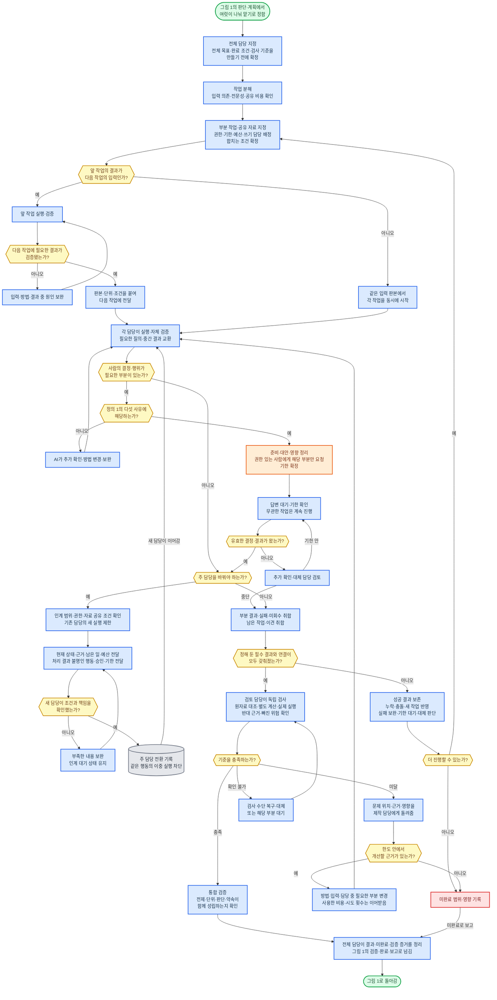
```mermaid
%%{init: {"flowchart": {"wrappingWidth": 640, "curve": "basis", "nodeSpacing": 45, "rankSpacing": 55, "padding": 14, "useMaxWidth": true}, "themeVariables": {"fontSize": "15px"}} }%%
flowchart TB
    accTitle: 그림 2 여럿이 나눠 맡는 흐름
    accDescr: 전체 담당 지정부터 분담·실행·사람 협력·인계·취합·검토·통합·납품까지 하나로 연결한 세로 순서도.
    START(["그림 1의 판단·계획에서<br/>여럿이 나눠 맡기로 정함"]):::good
    LEAD["전체 담당 지정<br/>전체 목표·완료 조건·검사 기준을<br/>만들기 전에 확정"]:::main
    SPLIT["작업 분해<br/>입력 의존·전문성·공유 비용 확인"]:::main
    ASSIGN["부분 작업·공유 자료 지정<br/>권한·기한·예산·쓰기 담당 배정<br/>합치는 조건 확정"]:::main
    DEP_Q{{"앞 작업의 결과가<br/>다음 작업의 입력인가?"}}:::note
    SEQ["앞 작업 실행·검증"]:::main
    SEQ_Q{{"다음 작업에 필요한 결과가<br/>검증됐는가?"}}:::note
    SEQ_FIX["입력·방법·결과 중 원인 보완"]:::main
    PASS["판본·단위·조건을 붙여<br/>다음 작업에 전달"]:::main
    PAR["같은 입력 판본에서<br/>각 작업을 동시에 시작"]:::main
    RUN["각 담당이 실행·자체 검증<br/>필요한 질의·중간 결과 교환"]:::main
    HUMAN_Q{{"사람의 결정·행위가<br/>필요한 부분이 있는가?"}}:::note
    FIVE_Q{{"정의 1의 다섯 사유에<br/>해당하는가?"}}:::note
    AI_FIX["AI가 추가 확인·방법 변경·보완"]:::main
    ASK["준비·대안·영향 정리<br/>권한 있는 사람에게 해당 부분만 요청<br/>기한 확정"]:::back
    HWAIT["답변 대기·기한 확인<br/>무관한 작업은 계속 진행"]:::main
    HANS_Q{{"유효한 결정·결과가 왔는가?"}}:::note
    HALT["추가 확인·대체 담당 검토"]:::main
    HANDOFF_Q{{"주 담당을 바꿔야 하는가?"}}:::note
    HO1["인계 범위·권한·자료 공유 조건 확인<br/>기존 담당의 새 실행 제한"]:::main
    HO2["현재 상태·근거·남은 일·예산 전달<br/>처리 결과 불명인 행동·승인·기한 전달"]:::main
    HO_Q{{"새 담당이 조건과 책임을<br/>확인했는가?"}}:::note
    HO_FIX["부족한 내용 보완<br/>인계 대기 상태 유지"]:::main
    HO_REC[("주 담당 전환 기록<br/>같은 행동의 이중 실행 차단")]:::store
    COLLECT["부분 결과·실패·미회수 취합<br/>남은 작업·이견 취합"]:::main
    ALL_Q{{"정해 둔 필수 결과와 연결이<br/>모두 갖춰졌는가?"}}:::note
    MISSING["성공 결과 보존<br/>누락·충돌·새 작업 반영<br/>실패 보완·기한 대기·대체 판단"]:::main
    MISS_Q{{"더 진행할 수 있는가?"}}:::note
    FAIL["미완료 범위·영향 기록"]:::stop
    REVIEW["검토 담당이 독립 검사<br/>원자료 대조·별도 계산·실제 실행<br/>반대 근거·빠진 위험 확인"]:::main
    REV_Q{{"기준을 충족하는가?"}}:::note
    FEEDBACK["문제 위치·근거·영향을<br/>제작 담당에게 돌려줌"]:::main
    LIMIT_Q{{"한도 안에서<br/>개선할 근거가 있는가?"}}:::note
    CHANGE["방법·입력·담당 중 필요한 부분 변경<br/>사용한 비용·시도 횟수는 이어받음"]:::main
    REV_WAIT["검사 수단 복구·대체<br/>또는 해당 부분 대기"]:::main
    MERGE["통합 검증<br/>전제·단위·판단·약속이<br/>함께 성립하는지 확인"]:::main
    DELIVER["전체 담당이 결과·미완료·검증 증거를 정리<br/>그림 1의 검증·완료·보고로 넘김"]:::main
    END(["그림 1로 돌아감"]):::good

    START --> LEAD --> SPLIT --> ASSIGN --> DEP_Q
    DEP_Q -->|예| SEQ --> SEQ_Q
    SEQ_Q -->|아니오| SEQ_FIX --> SEQ
    SEQ_Q -->|예| PASS --> RUN
    DEP_Q -->|아니오| PAR --> RUN
    RUN --> HUMAN_Q
    HUMAN_Q -->|아니오| HANDOFF_Q
    HUMAN_Q -->|예| FIVE_Q
    FIVE_Q -->|아니오| AI_FIX --> RUN
    FIVE_Q -->|예| ASK --> HWAIT --> HANS_Q
    HANS_Q -->|예| HANDOFF_Q
    HANS_Q -->|아니오| HALT
    HALT -->|기한 안| HWAIT
    HALT -->|중단| COLLECT
    HANDOFF_Q -->|아니오| COLLECT
    HANDOFF_Q -->|예| HO1 --> HO2 --> HO_Q
    HO_Q -->|아니오| HO_FIX --> HO2
    HO_Q -->|예| HO_REC -->|새 담당이 이어감| RUN
    COLLECT --> ALL_Q
    ALL_Q -->|아니오| MISSING --> MISS_Q
    MISS_Q -->|예| ASSIGN
    MISS_Q -->|아니오| FAIL
    ALL_Q -->|예| REVIEW --> REV_Q
    REV_Q -->|충족| MERGE --> DELIVER --> END
    REV_Q -->|미달| FEEDBACK --> LIMIT_Q
    LIMIT_Q -->|예| CHANGE --> RUN
    LIMIT_Q -->|아니오| FAIL
    REV_Q -->|확인 불가| REV_WAIT --> REVIEW
    FAIL -->|미완료로 보고| DELIVER
    classDef main fill:#dbeafe,stroke:#2563eb,stroke-width:2px,color:#17314f
    classDef stop fill:#fee2e2,stroke:#dc2626,stroke-width:2px,color:#7f1d1d
    classDef back fill:#ffedd5,stroke:#ea580c,stroke-width:2px,color:#7c2d12
    classDef store fill:#e5e7eb,stroke:#6b7280,stroke-width:2px,color:#1f2937
    classDef good fill:#dcfce7,stroke:#16a34a,stroke-width:2px,color:#14532d
    classDef note fill:#fef9c3,stroke:#ca8a04,stroke-width:2px,color:#713f12
```

| 경우 | 무엇인가 | 그림 2에서 지나는 길 |
|---|---|---|
| 6. 차례로 처리 | 앞 작업의 결과가 다음 작업의 입력일 때. 자료 정리가 끝나야 계산하고, 계산이 검증돼야 그 수치를 보고서에 넣는다 | ‘앞 작업의 결과가 다음 작업의 입력인가?’ 예 → 앞 작업 실행·검증 → 판본·단위·조건을 붙여 전달 → 각 담당 실행 |
| 7. 동시에 처리 | 같은 입력 판본에서 서로 기다리지 않고 시작해도 되는 일을 동시에 하는 것. ‘동시에 시작할 수 있음’과 ‘검사 없이 합쳐도 됨’은 다르다 | 같은 갈림길의 아니오 → 같은 입력 판본에서 동시에 시작 → 각 담당 실행 → 취합 → ‘필수 결과와 연결이 모두 갖춰졌는가?’ |
| 8. 반복해서 보완 | 검사에 실패하면 원인을 고쳐 다시 확인하는 것. 같은 요청을 그대로 되풀이하는 것과 구분한다 | ‘기준을 충족하는가?’ 미달 → 문제 위치·근거 돌려줌 → ‘한도 안에서 개선할 근거가 있는가?’ → 방법·입력·담당 변경 → 다시 실행. 근거가 없으면 미완료 기록 |
| 9. 나눠 맡기고 통합 | 전체를 책임지는 담당이 일을 나누고, 진행 중 드러난 문제에 맞춰 분담을 조정하는 것. 각 담당은 필요한 질문과 중간 결과를 서로 교환할 수 있다 | 전체 담당 지정 → 작업 분해 → 배정 → 실행·교환 → 취합 → 누락·충돌이 있으면 다시 배정 → 검토 → 통합 검증 → 전체 담당이 정리 |
| 10. 만들기와 검토 분리 | 제작자가 놓친 사실·반례·사용상의 문제를 별도 검토에서 찾는 것. 검토자는 원자료와 완료 기준을 받아 실제 결과를 확인한다 | 취합 뒤 ‘검토 담당이 독립 검사’ → ‘기준을 충족하는가?’. 검사 수단이 없으면 복구·대체하거나 해당 부분 대기 |
| 11. 주도권 넘기기 | 부분 작업을 빌리는 경우와 달리 업무의 주 담당 자체를 바꾸는 것. 상대가 새 담당에게 처음부터 다시 설명하지 않아도 되게 한다 | ‘주 담당을 바꿔야 하는가?’ 예 → 인계 범위·권한 확인과 기존 담당 실행 제한 → 상태·근거·남은 일 전달 → 새 담당 확인 → 전환 기록 → 새 담당이 이어감 |
| 12. 사람 협력자 포함 | 정의 1에서 정한 **되돌릴 수 없는 행동·승인 조건·판단이 서지 않는 것·한도 초과·자격자 전속 행위**에서 필요한 부분만 넘기는 것. AI가 할 수 있는 조사·정리·초안·검증은 먼저 마친다 | ‘사람의 결정·행위가 필요한 부분이 있는가?’ → ‘다섯 사유에 해당하는가?’ 예 → 준비·대안·영향 정리와 요청 → 답변 대기 중 무관한 작업 계속 → 유효한 결정 확인. 아니오면 AI가 보완 |

| 경우 | 재료 연결 | 확인 |
|---|---|---|
| 6. 차례로 처리 | 업무 절차·실행 계획 → 작업 진행·연결·실행 제어 → 앞 실무 → 결과 검증·재검증 → 다음 실무. 현재 진행 상태가 선후 관계와 사용한 결과 판본을 남긴다 | 앞 자료가 바뀌면 영향을 받는 뒤 결과와 검사도 다시 확인한다. 재시도·방법 변경은 경우 8의 한도를 함께 적용한다 |
| 7. 동시에 처리 | 실행 계획·비용·위험 한도 → 나눠 맡기기·실행 제어 → 각 실무·검증 → 작업 진행·연결 → 통합 검증 | 기본은 필요한 결과를 모두 받는 것이다. 일부만 받아도 되는 작업은 사전에 그 조건과 빠진 결과의 처리 방법을 정한다. 실패·취소를 완료 결과로 세지 않는다. 같은 파일이나 거래를 바꾸는 작업은 쓰기 담당을 나누거나 순차로 전환한다 |
| 8. 반복해서 보완 | 결과 검증·재검증 → 성공·실패 원인 분석 → 대안·전략 판단·실행 계획 → 해당 실무 → 재검증 | 방법이나 담당을 바꿔도 이미 쓴 비용과 시도 횟수는 이어받는다. 합격선을 낮추거나 실패한 항목을 빼서 반복을 끝내지 않는다. 결과가 좋아지는 근거가 없으면 다른 방법이나 중단을 판단한다 |
| 9. 나눠 맡기고 통합 | 대안·전략 판단·업무 절차·실행 계획 → 나눠 맡기기 → 각 담당의 실무·검증 → 작업 진행·연결·반대 근거·다시 확인 → 전체 검증·납품 | 보고서 조각을 붙이는 데서 끝내지 않고, 전제·단위·판단·약속이 함께 성립하는지 검사한다. 필수 결과가 안 돌아오면 대체·보완·미완료로 처리한다. 재분담에도 전체 한도와 사람 개입 기준을 유지한다 |
| 10. 만들기와 검토 분리 | 결과물 만들기·수정 등 제작 실무 → 결과 검증·재검증·반대 근거·다시 확인·빠진 위험 확인 → 일하는 과정 평가·결과 품질 평가 | 다른 회사 모델을 썼다는 사실만으로 독립 검증이라고 하지 않는다. 계산·실행 검사는 별도 계산법·실제 실행 등으로 확인하고, 판단 검토는 반대 근거와 오류 발견 능력으로 평가한다. 검토를 분리해도 사람이 늘 중간 채점하는 구조를 기본으로 두지 않는다 |
| 11. 주도권 넘기기 | 업무 권한·나눠 맡기기 → 현재 진행 상태·판단 근거 기록·장기 기억 → 작업 진행·연결·실행 제어 | 요청 번호·처리 결과 불명인 행동·남은 비용·승인·기한도 넘긴다. 인수 전에는 기존 담당의 책임이 사라지지 않는다. 새 담당이 받지 못하면 기한·대체 담당·안전한 재개를 정하고, 양쪽이 동시에 실행하지 않는다. 새 승인이 필요한 범위 변경이 있을 때만 사람의 해당 결정을 받는다 |
| 12. 사람 협력자 포함 | 사람에게 넘기기 → 사람과 소통 → 대기·후속 관리 → 업무 권한·결과 검증·재검증 → 현재 진행 상태·작업 진행·연결 | 답이 없다고 승인으로 처리하지 않는다. 사람에게 맡긴 필수 부분이 빠졌으면 전체 완료가 아니다. 결정·서명만 받은 경우와 사람이 전문 분석·수정을 보충한 경우를 구분해 기록하며, 후자를 AI가 혼자 끝낸 성과로 세지 않는다 |

경우 9에서 부분 작업을 맡길 때와 돌려받을 때 오가는 내용은 아래와 같다.

| 맡길 때 보낼 것 | 돌아올 때 받을 것 |
|---|---|
| 전체 목적과 이번 부분의 범위·완료 기준 | 실제 결과와 확인한 범위, 미완료·제약 |
| 필요한 자료·출처·판본·공유 가능한 범위 | 사용한 근거·도구·판본과 변경한 대상 |
| 담당·쓰기 대상·권한·기한·예산 | 진행 상태·사용량·외부 처리·남은 약속 |
| 선행 작업·다음 담당·질문할 창구 | 다른 작업에 미치는 영향·이견·추가 요청 |

---

### 여러 건을 함께 처리하는 흐름

**그림 3**은 여러 건을 함께 처리하는 경우 13의 순서도다. 건마다 목표·자료·권한·진행 상태를 따로 유지하면서, 전체 우선순위와 공유 자원을 조정한다. 이 경우는 앞의 12가지 위에 겹쳐 쓴다. 건마다의 처리는 그림 1의 길을, 분담이 필요한 건은 그림 2의 길을 그대로 따르고, 그림 3은 건 사이의 순서·자원·충돌만 다룬다.

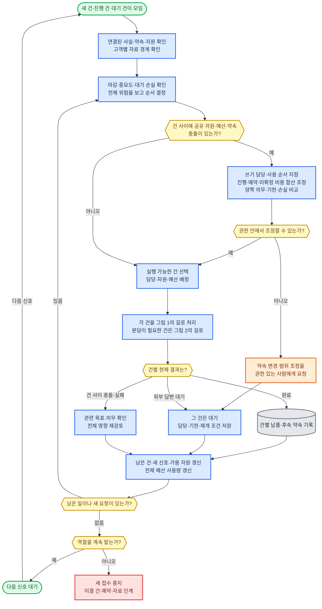
```mermaid
%%{init: {"flowchart": {"wrappingWidth": 640, "curve": "basis", "nodeSpacing": 45, "rankSpacing": 55, "padding": 14, "useMaxWidth": true}, "themeVariables": {"fontSize": "15px"}} }%%
flowchart TB
    accTitle: 그림 3 여러 건을 함께 처리하는 흐름
    accDescr: 건을 모아 경계·순서·충돌을 조정하고 건마다 처리·판정한 뒤 다음 신호나 역할 종료로 이어지는 세로 순서도.
    START(["새 건·진행 건·대기 건이 모임"]):::good
    BOUND["연결된 사실·약속·자원 확인<br/>고객별 자료 경계 확인"]:::main
    PRIORITY["마감·중요도·대기 손실 확인<br/>전체 위험을 보고 순서 결정"]:::main
    CONFLICT_Q{{"건 사이에 공유 자원·예산·약속<br/>충돌이 있는가?"}}:::note
    RESOLVE["쓰기 담당·사용 순서 지정<br/>진행·예약·미확정 비용 합산 조정<br/>양쪽 의무·기한·손실 비교"]:::main
    AUTH_Q{{"권한 안에서 조정할 수 있는가?"}}:::note
    ASK["약속 변경·범위 조정을<br/>권한 있는 사람에게 요청"]:::back
    HOLD["그 건은 대기<br/>담당·기한·재개 조건 저장"]:::main
    PICK["실행 가능한 건 선택<br/>담당·자원·예산 배정"]:::main
    RUN["각 건을 그림 1의 길로 처리<br/>분담이 필요한 건은 그림 2의 길로"]:::main
    RES_Q{{"건별 현재 결과는?"}}:::note
    DONE1[("건별 납품·후속 약속 기록")]:::store
    RECHECK["관련 목표·의무 확인<br/>전체 영향 재검토"]:::main
    UPDATE["남은 건·새 신호·가용 자원 갱신<br/>전체 예산 사용량 갱신"]:::main
    MORE_Q{{"남은 일이나 새 요청이 있는가?"}}:::note
    ROLE_Q{{"역할을 계속 맡는가?"}}:::note
    IDLE(["다음 신호 대기"]):::good
    CLOSE["새 접수 중지<br/>미결 건·예약·자료 인계"]:::stop

    START --> BOUND --> PRIORITY --> CONFLICT_Q
    CONFLICT_Q -->|예| RESOLVE --> AUTH_Q
    AUTH_Q -->|예| PICK
    AUTH_Q -->|아니오| ASK --> HOLD
    CONFLICT_Q -->|아니오| PICK
    PICK --> RUN --> RES_Q
    RES_Q -->|완료| DONE1 --> UPDATE
    RES_Q -->|외부 답변 대기| HOLD --> UPDATE
    RES_Q -->|건 사이 충돌·실패| RECHECK --> UPDATE
    UPDATE --> MORE_Q
    MORE_Q -->|있음| PRIORITY
    MORE_Q -->|없음| ROLE_Q
    ROLE_Q -->|예| IDLE -->|다음 신호| START
    ROLE_Q -->|아니오| CLOSE
    classDef main fill:#dbeafe,stroke:#2563eb,stroke-width:2px,color:#17314f
    classDef stop fill:#fee2e2,stroke:#dc2626,stroke-width:2px,color:#7f1d1d
    classDef back fill:#ffedd5,stroke:#ea580c,stroke-width:2px,color:#7c2d12
    classDef store fill:#e5e7eb,stroke:#6b7280,stroke-width:2px,color:#1f2937
    classDef good fill:#dcfce7,stroke:#16a34a,stroke-width:2px,color:#14532d
    classDef note fill:#fef9c3,stroke:#ca8a04,stroke-width:2px,color:#713f12
```

**재료 연결:** 현재 진행 상태·업무별 정보 → 대안·전략 판단·비용·위험 한도·업무 절차·실행 계획 → 나눠 맡기기·실행 제어 → 각 건의 실무·검증 → 작업 진행·연결·대기·후속 관리·성과 추적.

| 충돌 | 처리 방식 |
|---|---|
| 같은 파일·계정·설비를 함께 사용 | 읽기와 쓰기를 구분하고 쓰기 담당·사용 순서·복구 책임을 정함 |
| 개별 예산은 남았지만 전체 예산 부족 | 진행·예약·결과 미확정 비용까지 합산해 추가 실행을 조정 |
| 한 건의 약속이 다른 건을 묶음 | 양쪽 의무·목표·기한과 전체 손실을 비교해 계획 변경. 권한 밖의 약속 변경은 필요한 결정 요청 |
| 한 건이 답변을 기다림 | 그 건의 필요한 부분만 대기하고 다른 건을 진행. 대기 건의 확인 기한도 유지 |
| 쉬운 건 때문에 어려운 건이 계속 밀림 | 마감·대기 시간·피해 증가를 반영해 배정 순서를 다시 정함 |
| 고객·대표자·이해관계가 서로 다름 | 공유할 수 있는 참조만 연결하고 비밀·목표·위임은 분리. 가까운 관계라는 이유로 같은 의뢰인 취급 금지 |

**확인:** 한 건의 성과를 높이면서 다른 건에 손실·비밀 유출·기한 위반을 만들지 않는다. 상시 운영의 총괄은 계속되더라도 완료된 건과 미결 건은 각각 판정한다.

---

### 재료를 실제로 호출하는 순서

업무 절차·실행 계획이 **무엇을 어떤 순서로 할지** 정하면, 작업 진행·연결이 현재 할 수 있는 일을 고르고, 실행 제어가 함수·도구·AI를 호출한다. 그림 1의 처리 부분이 이 순서다. 다음 작업과 입력 준비 → 의미 판단이 필요하면 AI 모델 판단 → 실행 직전 대상·규칙·권한·한도 확인 → 함수·도구·실무 실행 → 실제 결과·외부 상태·사용량 저장 → 남은 작업 확인으로 돈다. 판단과 실행의 책임은 [구성 원칙](#판단과-실행의-역할)을 따른다.

모델의 판단으로 대상·금액·행동이 바뀌면 **실행 직전 규칙·권한·한도 검사**를 다시 거친다. 권한 검사부터 실제 실행까지 사이에 철회나 다른 작업의 수정이 있었는지도 확인한다. 이 호출 순서는 이를 구현할 공통 연결이며, 승인된 단순 계산·변환에도 매번 모델 판단을 끼워 넣지는 않는다.

| 계속 유지할 책임 | 유지하는 방법 |
|---|---|
| 현재 작업 정보·현재 진행 상태 | 지금 필요한 입력을 주고, 완료·실패·선택 분기·남은 일을 저장 |
| 업무 권한·안전장치·비용·위험 한도 | 실행·재시도·재개 때 현재 범위와 전체 사용량 확인 |
| 작업 진행·연결·대기·후속 관리 | 다음 담당·필수 결과·대기 기한·후속 약속 추적 |
| 판단 근거 기록 | 사용 자료·계획·승인·실행·검사의 판본과 실제 결과 연결 |
| 운영 감시·복구 | 위 업무 흐름 밖에서 장애를 감지하고 저장·외부 상태를 대조해 복구 |

상시는 이 책임을 계속 유지한다는 뜻이다. 매 순간 모든 모델과 도구를 호출하라는 뜻은 아니다. 조건부 재료는 조건이 참이면 사용하고, 조건을 모르면 먼저 확인할 경로를 둔다.

---

### 단계마다 불려 나오는 재료

재료 77개의 책임은 아래 단계에 연결된다. M57은 단계 밖에서 수행 기반을 계속 감시하고, M56은 처리 단계 및 외부 상태의 대사·복구에 참여한다. 업무별로 필요한 재료를 선택하며, 필수 기능이나 검증 경로가 비면 그 업무를 완료로 판정하지 않는다. 규칙은 이번 건에 적용되는 종류만 확인하고, 적용되는 동안 전 단계에서 지킨다. 종류의 나열 순서는 우선순위가 아니며, 의무·실제 위임 권한·한도를 함께 충족해야 한다.

| 단계 | 불려 나오는 재료 |
|------|------|
| 단계와 상관없이 늘 | AI 모델 · 실행 제어 · 현재 작업 정보 · 현재 진행 상태 · 안전장치<br>에이전트 기본 원칙 · 법·의무 기준 · 직업 윤리·의무 · 계약·합의 조건 · 플랫폼·제출처 규정 · 조직 규칙 · 사용자 지정 규칙 · 규칙의 적용·우선순위<br>이번 건의 적용 의무·위임 권한·한도를 함께 확인<br>판단 근거 기록 · 작업 진행·연결 · 대기·후속 관리 |
| 0 감지·접수 | 시작 신호 · 먼저 알아채기 · 정보·자료 이해 · 업무별 정보<br>업무 권한 · 비용·위험 한도 · 장기 기억 |
| 1 의도 파악 | 지시·의도 파악 · 문제·목표·완료 조건 · 사용자 지정 규칙 · 표현 방식·스타일 · 사람과 소통 · 장기 기억 |
| 2 문제 정의 | 실전 경험·감각 · 업무 지식 · 문제·목표·완료 조건 |
| 3 자료 확인 | 정보·자료 찾기 · 규칙·기준 원문 · 적용 사례 · 참고 자료 · 현재 값·상태 확인<br>업무별 정보 · 근거의 신뢰성·적합성 · 자료의 시점·버전 · 변경 감시·반영 · 정보·자료 이해 · 재사용 자료 · 자료 선별·분류 · 자료 정리·결합 · 형식·구조 변환 |
| 4 판단·계획 | 대안·전략 판단 · 업무 절차·실행 계획 · 나눠 맡기기<br>비용·위험 한도 · 사람에게 넘기기 |
| 5 처리 | 업무 도구·시스템 · 분리 실행 · 시험 환경 · 자료 선별·분류 · 자료 정리·결합 · 형식·구조 변환<br>계산 · 분석 · 예측 · 조건 안에서 최선 찾기 · 기준 적용·판정<br>관찰·측정 · 실험 · 시뮬레이션 · 결과물 설계 · 내용 재구성 · 결과물 만들기·수정<br>기록 입력·수정 · 신청·거래 처리 · 설정·작동 제어 · 게시·배포<br>실시간 대화 · 사람과 소통 · 협상·조율 · 현재 진행 상태 · 사람에게 넘기기 |
| 6 검증 | 결과 검증·재검증 · 반대 근거·다시 확인 · 빠진 위험 확인<br>결과 품질 평가 · 일하는 과정 평가 |
| 7 완료·보고 | 납품 준비 · 전달·인수 확인 · 표현 방식·스타일 · 결과물 만들기·수정 |
| 8 남기기 | 실전 경험·감각 · 성공·실패 원인 분석 · 업무 능력 시험 · 능력 개선·확장 · 성과 추적<br>장기 기억 · 먼저 알아채기 |

수식은 항 6개 → 계통 9개 → 세부 책임 57개의 세 층이다. 본문의 77개 재료와는 대응표로 연결한다. 위 표는 재료 층이다. 계통 층으로 보면 아래처럼 자리가 갈린다.

| 계통 | 주로 도는 자리 |
|------|------|
| 환경 | 단계와 상관없이 늘 · 5 처리 |
| 자료·검색 | 3 자료 확인 · 5 처리의 재사용 자료 공급 |
| 지식·경험 | 2 문제 정의 · 4 판단·계획 · 5 처리의 방법·사례 제공 |
| 기억·진행 상태 | 0 감지·접수 · 8 남기기 · 단계와 상관없이 늘 |
| 규칙·권한 | 0 감지·접수 · 단계와 상관없이 늘 |
| 행동 체계 | 0 감지·접수 · 1 의도 파악 · 4 판단·계획 · 완료·이관·재계획 기준 적용 |
| 실무 | 0에서 8까지 전체 흐름 · 5 가공·계산·실험·제작·응대 · 7 납품·인수 |
| 검증·평가 | 6 검증 · 변경 때 업무 능력 시험 · 8 남기기와 사후 성과 확정 · 전 과정의 근거 기록 |
| 학습·개선 | 실패·부족함이 확인된 때와 8 남기기 · 평가 결과를 받아 지속 개선 |

---

### 허용하지 않는 조합

| 그대로 실행하면 안 되는 조합 | 생기는 문제 | 올바른 연결 |
|---|---|---|
| 앞 결과가 필요한 작업을 무조건 병렬 실행 | 없는 입력이나 예전 판본으로 처리 | 선행 결과를 검증한 뒤 다음 작업 실행. 독립된 부분만 병렬화 |
| 같은 대상을 여러 담당이 제한 없이 수정 | 덮어쓰기·중복 거래·상태 충돌 | 쓰기 담당·판본 검사·사용 순서를 정함 |
| 공유 자료·권한·통합 담당 없이 분담 | 부분 결과만 있고 전체 판단이 없음 | 필요한 공유 범위·상호 질의·이견 처리·통합 검증을 먼저 정함 |
| 필수 부분이 안 돌아왔는데 전체 완료 | 누락된 일을 성공으로 보고 | 대체·보완하거나 미완료로 남기고 영향 설명 |
| 제작자의 자기평가 점수만으로 통과 | 같은 오류를 놓침 | 원문·실제 실행·독립 계산·반대 근거로 확인 |
| 시간·비용·시도 한도 없이 반복 | 실패가 계속되고 자원이 소진됨 | 중단 조건과 개선 근거를 확인하며 반복 |
| 방식을 바꾸거나 인계할 때 사용량·승인을 초기화 | 한도·권한을 우회 | 기존 상태·예산·약속·철회 이력 인계 |
| 외부 처리 결과 불명인데 새 요청으로 재실행 | 이미 된 거래를 중복 실행 | 원래 요청으로 상태를 조회·대조하고 재시도 가능 조건 확인 |
| 긴급 대응을 정상 분석 전체가 끝날 때까지 대기 | 기다리는 동안 피해가 커짐 | 허용된 첫 조치와 필수 확인을 앞당김 |
| 긴급·실시간이라는 이유로 필수 확인을 전부 사후 처리 | 잘못된 발언·거래·제어가 먼저 나감 | 사전 확인 범위·검증된 행동·과부하 대안을 정함 |
| 반복 운영의 이미 위임된 행동마다 사람 승인 요구 | 맡기고 결과를 받는 구조가 무너짐 | 위임 안에서 실행하고 다섯 사유의 필요한 결정만 요청 |
| 사람에게 전문 작업을 상시 넘기고 무인 완료로 집계 | 사람의 성과를 AI 성과로 계산 | 전문 개입을 기록하고 해당 범위의 대체 능력 보완 |
| 다른 고객의 자료·기억을 한 상태에 합침 | 비밀·권한·목표가 섞임 | 건별 경계 유지, 허용된 참조만 공유 |
| 조건이 참일 때만 그 조건의 확인 기능을 실행 | 조건을 영원히 알 수 없음 | 조건 확인용 조회·진단을 먼저 준비하고 자체 권한·한도 적용 |
| 철회·변경 전 결과를 그대로 이어받음 | 유효하지 않은 판단·승인으로 실행 | 영향받는 자료·판단·계획·검사만 다시 확인 |
| 일이 끝난 뒤 완료 기준·성과 지표를 낮춤 | 실패가 성공처럼 바뀜 | 사전에 기준을 정하고 유효한 범위 변경은 이유·권한·영향 기록 |

---

### 안 되는 조합

경우를 골랐어도 아래에 걸리면 그대로 쓰면 안 된다.

| 하려는 것 | 왜 안 되나 | 대신 어떻게 하나 |
|------|------|------|
| 공유 상태·결정권·정보 경계 없이 나눈다 | 공동 판단이 누락되고 결과가 충돌한다 | 공유 상태·상호 질의·변경 통지·이견 해결·통합 심사를 정의한다 |
| 만든 쪽이 자기 것을 채점한다 | 후하게 준다 | 채점하는 쪽을 만든 쪽과 분리하고 오류 발견 능력으로 고른다 — 경우 10 |
| 되풀이 경우에서 건마다 승인을 받는다 | 되풀이가 안 돌아간다 | 규칙을 정할 때 한 번 받고, 규칙 밖만 넘긴다 — 경우 3 |
| 시간 제한을 이유로 필수 검증을 모두 뒤로 미룬다 | 발언·주문·제어의 잘못을 사후에 되돌릴 수 없을 수 있다 | 필수 사전 검증·검증된 행동 범위·즉시 교정·과부하 대안을 업무별로 정한다 |
| 한도를 안 적고 될 때까지 돌린다 | 멈추지 않는다 | 시간·돈·시도 횟수를 먼저 적는다 — 경우 8 |
| 긴급인데 정식 순서대로 1부터 돈다 | 도는 동안 피해가 커진다 | 되돌릴 수 있는 첫 조치부터 — 경우 5 |
| 나누면 무조건 빠르다고 본다 | 나눈 쪽이 더 느리고 더 나쁜 자리가 있다 | 안 나눈 것과 견줘 보고 나쁘면 그 자리는 자르지 않는다 |
| 성과 지표를 일 끝난 뒤에 정한다 | 잘 나온 지표를 골라 잡게 된다 | 맡기 전에 적고 잠근다 — 쓰기 전 검사 |

---

### 실패·대기·재개의 공통 처리

그림 1의 ‘대기’ 상자와 ‘지금 이어갈 조건은?’ 갈림길이 이 처리의 자리다. 대기에 들어갈 때 이미 한 일·처리 결과 불명인 행동·담당·확인 기한을 기록하고, 재개 신호를 받으면 외부 상태·권한·자료·예산을 대조한 뒤 유효하면 처리로, 조건이 바뀌었으면 자료 확인으로, 취소면 중단으로 간다. 그림 2·3의 대기도 같은 처리를 따른다.

| 상황 | 다음 행동 |
|---|---|
| 입력 부족·읽기 실패 | 결론을 바꿀 정보부터 재확보. 확인하지 못한 범위와 영향받는 작업 기록 |
| 계산·변환·제작 실패 | 입력·방법·환경 중 원인 확인. 한도 안에서 보완·재시도·다른 방법 선택 |
| 외부 처리 결과 불명 | 원래 요청 번호로 조회·대조. 확인 전 새 요청으로 같은 행동 반복 금지 |
| 병렬 일부 실패 | 성공 결과 보존. 실패한 부분 보완과 필수 결과의 합류 조건 확인 |
| 승인·권한 철회 | 관련 대기·예약·위임 작업에 철회 반영. 실행 직전에도 확인 |
| 검사 불가 | 확인 불가 상태 유지. 검사 복구·대체 방법·기한·담당 결정 |
| 새 증거·요구 변경 | 영향받는 판단·계획·결과·검사 재검토. 이미 한 외부 행동은 필요한 정정·취소로 처리 |
| 시스템 재시작 | 저장 상태 복원. 외부 처리·현재 승인·예산을 대조한 뒤 남은 작업 연결 |

**멱등성**은 같은 요청을 다시 받아도 같은 외부 효과가 중복해서 생기지 않게 하는 성질이다. 요청 번호의 유효 기간과 적용 범위는 도구마다 다르므로 내부 기록만으로 외부 시스템까지 반드시 한 번 실행된다고 보장하지 않는다.

실행 상태, 목표 달성, 검증 상태, 사후 성과는 각각 기록한다. 실행이 종료돼도 목표를 달성하지 못했을 수 있고, 파일을 전달했어도 인수·성과는 아직 확인 중일 수 있다. [상태와 재시작](docs/runtime.md#상태와-재시작)의 네 가지 상태 구분을 따른다.

---

### 세 가지 규모에 적용한 예

아래는 **회사 웹사이트 개편**에 적용한 예다. 실제 실행 결과가 아니라 구조를 설명하기 위한 예시이며, 맡길 범위와 게시 권한은 업무마다 정한다.

| 맡기는 규모 | 처리 방식 | 재료의 연결과 확인 |
|---|---|---|
| 한 명에게 한 페이지 개편 | 그림 1. 한 건 처리 안에서 조사→설계→제작→검증을 차례로 연결 | 의도·문제 정의 → 자료 찾기·이해 → 결과물 설계 → 만들기·수정 → 실제 화면·기능 검증 → 납품 |
| 여럿에게 전체 사이트 개편 | 그림 2. 콘텐츠·디자인·개발의 선후 관계를 정하고, 독립 조사는 병렬로 수행. 중간 결과 공유·통합 검토 | 실행 계획 → 나눠 맡기기 → 각 실무 → 필수 결과 회수 → 내용·화면·기능의 통합 검증. 디자인 변경이 개발에 미치는 영향도 반영 |
| 여러 고객의 개편을 함께 담당 | 그림 3. 고객별 자료·권한·기한은 분리하고 담당·서버·예산을 배정 | 현재 진행 상태 → 전체 우선순위·한도 → 건별 실행. 한 고객의 승인 대기 중 다른 건을 진행하고, 고객 정보는 섞지 않음 |

세 경우 모두 게시가 범위에 있으면 **게시·배포 → 실제 반영 확인**까지 연결한다. 초안만 맡겼다면 게시하지 않는다. 이미 허용된 게시에 승인을 반복해서 붙이지 않으며, 추가 결정이 필요한 변경만 사람에게 넘긴다.

---

### 지식을 만드는 업무의 연결

지식 구성도 하나의 업무로 처리한다. 새로운 재료를 추가하지 않고 확정된 재료들을 다음처럼 연결한다.

| 순서 | 담당 재료 | 남길 결과 |
|---|---|---|
| 1. 자료 확보 | 정보·자료 찾기, 정보·자료 이해, 근거의 신뢰성·적합성, 자료의 시점·버전 | 원문과 위치·판본·권한, 읽기 불확실성 |
| 2. 대상·개념 정리 | 자료 선별·분류, 자료 정리·결합 | 같은 대상의 연결 근거, 다른 대상의 구분, 변경 이력 |
| 3. 내용 종합 | 업무 지식, 내용 재구성, 결과물 만들기·수정 | 개념·주장·관계·조건·예외·이견과 원문 연결 |
| 4. 검증 | 결과 검증·재검증, 반대 근거·다시 확인 | 잘못된 통합·근거 없는 관계·빠진 예외·끊긴 참조의 검사 결과 |
| 5. 반영 | 기록 입력·수정, 현재 진행 상태 | 검증된 지식 판본, 검색 반영 상태, 변경 영향 |
| 6. 변경 후 재검토 | 변경 감시·반영, 업무 지식, 관련 실무·검증 | 정정된 원문에서 파생된 지식·결과물·진행 건의 보완 |

작업 진행·연결이 검토·수정·반영까지 관리한다. 확인된 사실의 정정은 근거 대조 후 반영하며, 미검증된 해석은 따로 표시한다. 수행 능력에 영향을 주는 지식·방법·도구의 변경은 능력 개선·확장과 업무 능력 시험에 연결한다.

---

### 사용 구조 설계의 완료 기준

이 절을 작성한 것과 설계를 검토한 것, 실제 프로그램으로 시험한 것은 구분한다. 진행 상태는 [진행 계획](진행-계획.md#업무-순서)에서 관리한다.

| 확인할 항목 | 설계에서 갖춰야 할 것 | 구현 후 시험할 것 |
|---|---|---|
| 단독 업무의 끝까지 처리 | 접수→판단→실무→검증→인수의 재료·결과 연결 | 사람의 전문 수정 없이 실제 한 건 완료 |
| 13가지 사용 경우 | 시작 조건·호출 순서·담당·완료·중단 기준 | 각 경우와 필요한 조합의 정상·실패 동작 |
| 조건부 재료 | 77개 재료 모두의 호출 단계, 사용할 조건과 조건을 확인할 별도 경로 | 미확인 조건에서 순환 대기·무단 실행이 생기지 않음 |
| 협업·통합 | 입력·공유 범위·쓰기 담당·필수 결과·이견 처리 | 일부 실패·누락·상충하는 결론에서도 올바르게 보완·판정 |
| 여러 건 처리 | 건별 상태·전체 자원·기한·의무·충돌 조정 | 대기 중 다른 건 진행, 공동 한도 유지, 고객 자료 격리 |
| 사람에게 넘기기 | 다섯 사유·준비할 내용·요청 대상·답변 후 처리 | 불필요한 질문·반복 승인 없음, 전문 개입을 숨기지 않음 |
| 변경·중단·복구 | 이미 한 행동·남은 일·권한·예산·재개 지점 | 응답 유실·철회·재시작·인계에서 중복 실행 없음 |
| 실제 성과 | 완료·미완료·검증·인수·사후 성과 구분 | 숙련 전문가와 같은 조건으로 품질·자율성·시간·총비용·성과 비교 |

---

## 구성 원칙

---

### 공통으로 만들 것과 직종마다 채울 것

공통으로 만드는 것은 실행·저장·검색·권한·검증·배포의 기반과 재료를 연결하는 방식이다. 직종마다 그 일의 지식, 판단 요령, 규정, 도구, 완료 조건을 채운다. 개별 업무를 받으면 고객·목표·자료·권한·기한·예산을 적용한다.

| 구분 | 들어가는 내용 | 예시 |
|---|---|---|
| 공통 기반 | 작업 실행, 중단 후 재개, 권한 확인, 기록, 시험과 배포 | 답변을 기다리던 일을 기한에 맞춰 다시 확인하는 기능 |
| 직종별 구성 | 전문 지식·사례·방법·도구·규칙·시험 과제 | 번역 용어집, 회계 계산법, 설계 프로그램과 검사 기준 |
| 개별 업무 | 이번에 맡은 범위·대상·조건과 진행 상태 | 이번 계약의 수정 범위, 납기, 승인된 발송 대상 |

공통 기능을 재사용해도 새 직종의 자료와 도구로 다시 시험한다. 직종 이름만 바꿔 모든 일을 할 수 있다고 표시하지 않는다. 화면·문서·시스템·통신 안에서 끝나는 업무를 다루며, 직접 실측·시공·시술·촬영·실물 인도는 현재 범위 밖이다.

---

### 판단과 실행의 역할

뜻을 이해하고 방법을 고르는 일은 모델이 한다. 이미 정한 식의 계산, 상태 조회, 파일 변환, 명시된 조건의 분기는 프로그램이 바로 처리한다. 이런 작업을 호출할 수 있게 묶은 프로그램의 단위를 함수라고 한다. 모델의 출력은 실제 실행과 검사를 거쳐야 업무 결과가 된다.

| 재료 | 맡는 질문 | 예시 |
|---|---|---|
| 대안·전략 판단 | 어떤 방법이 목표에 가장 맞는가 | 조사부터 할지, 현재 자료로 초안을 만들지 선택 |
| 업무 절차·실행 계획 | 무슨 작업을 어떤 순서로 할 것인가 | 자료 조회 두 개를 동시에 하고, 둘 다 오면 검토하도록 계획 |
| 작업 진행·연결 | 지금 무엇을 진행하고 누구에게 넘길 것인가 | 검토에서 발견한 오류를 수정 담당에게 연결 |
| 실행 제어 | 정한 작업을 어떻게 호출하고 기다리고 재개할 것인가 | 함수 호출, 병렬 실행, 실패 분기, 결과 합류 |
| 현재 진행 상태 | 어디까지 했고 무엇이 남았는가 | 완료한 조회, 실패한 조회, 대기 사유와 다음 확인 시점 기록 |
| 운영 감시·복구 | 시스템이 멈추면 누가 알아채고 복구할 것인가 | 에이전트 밖에서 장애를 감지하고 저장 상태를 복구 |

모델 주변에서 실행을 지원하는 장치를 기술 문서에서는 **하네스(Harness)**라고 부른다. 모델이 좋아져도 권한 확인, 비용 합산, 저장, 외부 처리 확인은 유지한다. 이런 책임은 모델의 지능과 별개다.

---

### 모든 재료가 주고받을 내용

각 재료는 **입력 → 처리 → 결과 → 확인 → 다음 작업**으로 연결한다. 정상 결과뿐 아니라 실패하거나 아직 확인할 수 없을 때의 다음 행동도 정한다.

| 정할 내용 | 들어갈 항목 |
|---|---|
| 시작 조건 | 업무 번호, 담당, 목적, 입력 자료와 판본, 선행 작업, 권한·한도 |
| 처리 방법 | 사용할 지식·규칙·도구, 변경 가능한 대상, 반복·중단 조건 |
| 돌려줄 결과 | 결과값·파일·외부 상태, 단위·형식, 근거, 불확실한 점 |
| 확인 방법 | 기대한 상태, 검사할 대상·방법, 허용 오차, 확인 기록 |
| 실패·대기 처리 | 실패 이유, 이미 처리된 부분, 다음 담당, 확인 기한, 재개 조건 |

**상시**는 업무 중 책임을 계속 유지한다는 뜻이다. 매 순간 모델이나 도구를 부른다는 뜻은 아니다. **단계별** 재료는 해당 단계와 재검토 시점에 사용한다. **조건부** 재료는 해당 조건이 생기면 반드시 사용한다. 조건을 모르면 먼저 확인하며, 필요한 확인 작업 자체가 그 조건을 기다리는 구조를 만들지 않는다.

개별 재료의 기술 번호·입출력은 [세부 책임 목록](docs/materials.md), 실행 중 지킬 약속은 [실행과 데이터](docs/runtime.md), 채점 방법은 [평가 기준](docs/evaluation.md)에 연결한다.

---

## 기술과 관리 체계

### 기술을 고르는 기준

**2026-09-16에 확인한 공식 자료를 기준으로 기술 후보를 갱신했다.** 최신이라는 이유만으로 채택하지 않는다. 필요한 기능, 실제 업무 시험, 유지보수 상태, 자료 보관 조건, 운영 비용을 함께 보고 선택한다. 시험 제공 기능(베타)은 지원 범위와 변경 가능성까지 확인하고 별도로 시험한다.

API는 프로그램끼리 요청과 결과를 주고받는 창구, SDK는 연결·개발을 돕는 도구 모음, CLI는 명령으로 프로그램을 다루는 방식이다. 아래 표에서는 제품 이름과 함께 맡길 일을 설명한다.

아래 ‘기본안’은 구현을 시작할 설계안이며 설치·성능 검증이 끝났다는 뜻은 아니다. 공식 문서의 설명과 우리 환경에서 검증할 항목은 [기술 검토 기록](docs/reviews/definition-2-update-2026-09-16.md)에 구분했다. 기본안마다의 반대 논거와 주장별 재검증은 [기술 반대 검토 기록](docs/reviews/tech-adversarial-review-2026-09-16.md)에 있다.

### 모델 후보와 비용

텍스트 API의 표준 처리 기준이며 금액은 **100만 토큰당 미국 달러**다. 토큰은 모델이 입력·출력의 양을 세는 단위다. 긴 입력·처리 방식·도구 사용에 따른 추가 요금은 별도로 확인한다.

| 모델 | 이 프로젝트의 후보 역할 | 입력 | 저장된 입력 재사용 | 출력 | 공식 근거 |
|---|---|---:|---:|---:|---|
| GPT-6 Astra | 복잡한 판단과 긴 업무의 주 실행 후보 | $10 | $1 | $50 | [모델 안내](https://developers.openai.com/api/docs/models/gpt-6-astra) |
| GPT-5.6 Sol | 일반 전문 업무와 비용 비교 후보 | $4 | $0.40 | $20 | [모델 안내](https://developers.openai.com/api/docs/models/gpt-5.6-sol) |
| Claude Fable 5.1 | 어려운 판단과 별도 검토 후보 | $10 | $0.25 | $50 | [모델 안내](https://platform.claude.com/docs/en/models/fable-5-1/overview) |
| Claude Haiku 4.5 | 단순 작업의 품질·비용 비교 후보 | $1 | $0.10 | $5 | [공식 요금표](https://platform.claude.com/docs/en/about-claude/pricing) |

Sol의 기존 $5/$30은 현재 $4/$20으로 고쳤다. 이 인하는 2026-08-21에 시작해 최소 2026-11-21까지 이어지는 프로모션이므로 계약·배포 전에 다시 확인한다. Astra와 Sol은 입력이 272K를 넘으면 요청 전체의 요금을 다시 매긴다. 입력과 캐시는 2배, 출력은 1.5배가 되며 초과분에만 적용되는 것이 아니므로 긴 입력을 다루는 업무의 비용 추정에서 주의한다. 입력을 저장할 때의 비용도 재사용 비용과 다르다. [Sol 요금 조건](https://developers.openai.com/api/docs/models/gpt-5.6-sol), [Astra 요금 조건](https://developers.openai.com/api/docs/models/gpt-6-astra).

후보 역할은 우리 설계다. 최종 배치는 업무별 비교 시험으로 정하며 Claude Opus 5(입력 $5 · 캐시 읽기 $0.50 · 출력 $25)와 Claude Sonnet 5(입력 $2 · 캐시 읽기 $0.20 · 출력 $10)도 비교 후보다. Sonnet 5의 이 요금은 도입가였다가 정가가 된 값이며 예정됐던 인상은 취소됐다. 모델이 답하기 전에 들이는 추론 강도도 품질·시간·비용을 재어 정한다. ‘중간에 강도를 바꾸면 항상 캐시가 깨진다’는 기존 문장은 삭제했다. Fable 5.1·Mythos 5.1·Opus 5는 캐시를 유지하는 메시지별 강도 변경을 베타 기능으로 제공하며 전용 베타 표시가 필요하다. 이는 메시지 안에 강도 변경을 실어 보낼 때만 해당하고, 요청의 최상위 설정을 바꾸면 같은 모델에서도 캐시가 깨진다. [Claude 현행 모델과 기능](https://platform.claude.com/docs/en/models/fable-5-1/overview), [추론 강도](https://platform.claude.com/docs/en/build-with-claude/effort).

모델명·공급자·호출 설정·지원 기능·사용 시점·시험 결과를 기록한다. 고정 판본 제공 여부와 지원 종료 조건은 모델별로 확인한다. 같은 이름을 계속 쓸 수 있다고 가정하지 않으며, 과거 호출 결과도 보관해 당시 판단을 설명할 수 있게 한다.

### 실행·연결·검색·검사의 기술 구상

| 필요한 기능 | 기본안과 비교 후보 | 우리 업무에서 확인할 것 |
|---|---|---|
| 모델·도구 호출 | 공급자 공식 API·SDK를 공통 호출 형식으로 연결 | 입력 형식·도구·오류·사용량·자료 처리 조건의 차이 |
| 작업 흐름과 저장 후 재개 | 되돌릴 수 없는 바깥 행동과 장기 대기가 있는 흐름의 뼈대는 Temporal. 모델 판단과 도구 선택 구간은 그 안에서 LangGraph나 함수 코드로 실행 | 함수만 쓰는 경로, 병렬 합류, 중단·취소, 외부 행동의 중복 방지, 재생 제약과 응답 크기 한도 |
| 관리형 실행 | OpenAI Agents API를 비교 후보에 포함 | 자체 실행 기반보다 줄어드는 개발량, 반출·보관·모델 교체 제약 |
| 실시간 음성 | GPT-Live와 Realtime API를 대화 방식에 맞춰 비교 | 동시 발언·정정·지연, 뒤에서 진행하는 작업의 취소와 상태 유지 |
| 외부 도구 연결 | 공식 API·SDK·CLI, 필요한 곳에 MCP | 인증, 도구별 최소 권한, 지원 규격, 취소·조회·재시도 |
| 정형 입력·출력 | 자료 형식 정의(JSON Schema)와 프로그램의 형식·값 검사, 모델의 구조화 출력 기능 | 거부·잘린 응답·지원하지 않는 형식·단위·의미 오류 |
| 되풀이 주기·영업일 계산 | 되풀이 규칙은 iCalendar(RFC 5545)의 RRULE 형식으로 적고, 공휴일·영업일은 공식 공휴일 자료(한국천문연구원 특일 정보)를 받은 직종별 달력 파일로 계산 | 월말·윤년·시간대·대체 공휴일, 달력 갱신 지연 |
| 상태와 업무 기록 | PostgreSQL | 동시 변경, 고객별 접근 제한, 시점·판본, 복원 |
| 자료 검색 | 기존 OpenSearch 혼합 검색안을 유지하고, 규모가 작으면 PostgreSQL 검색·pgvector와 비교 | 한국어·정확한 번호·반대 근거·권한·과거 판본의 검색 품질 |
| 지식의 관계 검색 | 개념·주장·근거 관계를 명시적으로 보관. 여러 관계를 따라야 할 때 GraphRAG·그래프 DB를 비교 | 근거 없는 관계, 잘못 합친 대상, 권한을 넘는 관계 탐색, 변경 영향 |
| 규칙의 실행 검사 | 명시된 대상·행동·한도는 코드나 OPA로 검사 | 배포된 규칙 판본, 검사 실패, 철회·변경의 전파 |
| 전문 작업 | 원본 프로그램의 공식 기능과 검증된 파일 처리 도구 | 대상 형식의 읽기·수정·변환·실행과 수신 환경의 호환성 |
| 운영 기록·감시 | OpenTelemetry로 실행 연결·시간·오류·사용량 수집 | 기록 누락, 비밀 가림, 감시 자체의 장애, 실제 비용 대조 |

LangGraph는 재개할 때 중단이 있던 노드를 처음부터 다시 실행한다. 조건부가 아니라 기본 동작이며, 중단 앞에서 이미 한 외부 행동은 다시 일어난다. 공식 문서는 노드 실행 도중의 프로세스 중단은 저장점으로 복구되지 않는다는 것도 함께 밝힌다. 따라서 되돌릴 수 없는 바깥 행동과 장기 대기가 들어 있는 흐름의 뼈대는 Temporal이 맡고, 모델이 판단하며 도구를 고르는 안쪽 구간을 그 안에서 실행하는 구조로 나눈다. LLM 호출은 결정적 코드 밖에 두어 Temporal의 재생 제약과 충돌하지 않게 하고, 응답 하나가 2MB를 넘으면 실패하는 한도도 설계에 넣는다. 어느 엔진을 쓰든 외부 행동의 중복 방지 열쇠는 엔진이 아니라 우리 표의 멱등 키가 맡는다. [LangGraph 저장점](https://docs.langchain.com/oss/python/langgraph/checkpointers), [중단 처리](https://docs.langchain.com/oss/python/langgraph/interrupts), [Temporal Workflow](https://docs.temporal.io/workflows), [Temporal 판본 관리](https://docs.temporal.io/develop/python/versioning).

Agents API는 세션·분담·문맥 압축·복구를 관리하는 현행 선택지다. 다만 현재 공식 안내상 데이터 보관 지역은 미국이며 ZDR(자료를 보관하지 않는 처리 조건)을 지원하지 않는다. 자체 서버의 실행 공간을 연결해도 이 조건은 달라지지 않는다. 따라서 반출·보관 조건을 만족하는 업무에서만 후보로 둔다. 후보로 두기 전에 세션과 상태를 밖으로 빼낼 수 있는 경로가 있는지 확인하고, 없으면 후보에서 뺀다. 같은 공급자의 이전 세대 관리형 실행 기능(Assistants API)이 2026-08-26에 종료될 때 대화 상태를 옮겨 주는 도구가 제공되지 않은 전례가 있다. [Agents API](https://developers.openai.com/api/docs/guides/agents-api/overview), [폐기 공지](https://developers.openai.com/api/docs/deprecations).

GPT-Live는 대화하면서 별도 업무 담당이 작업하는 구조를 지원한다. 음성을 중단해도 그 작업이 자동 취소되지는 않으므로 업무 상태·권한·확인은 우리 시스템에서 연결한다. [GPT-Live](https://developers.openai.com/api/docs/guides/live).

MCP는 도구 연결 규격이다. 확인일의 현행 규격은 **2026-07-28**이며 서버와 실제로 함께 지원하는 판본을 사용한다. 규격 준수만으로 업무 권한이 생기지는 않는다. 인증 자체가 규격에서 선택 사항이고, MCP 규격 자신이 세 가지를 경고한다. 중개 서버를 통해 권한 경계를 넘는 대리인 혼동, 받은 인증 정보를 검증 없이 하위 시스템에 넘기는 행위(규격이 금지한다), 격리 없이 돌리는 로컬 서버의 임의 명령 실행이다. 도구 설명 항목이 지시 주입 통로가 될 수 있다는 점도 함께 본다. 도구 정의는 같은 기능의 최소 형태보다 5~15배 많은 토큰을 쓰므로 MCP를 쓰는 자리마다 최소 권한·격리·비용을 따로 확인한다. [MCP 판본](https://modelcontextprotocol.io/docs/2026-07-28/learn/versioning), [인증·권한 규격](https://modelcontextprotocol.io/specification/2026-07-28/basic/authorization), [보안 지침](https://modelcontextprotocol.io/docs/2026-07-28/tutorials/security/security_best_practices).

### 기본안을 고른 이유와 반대 검토

앞의 기본안 일곱 개는 우리 업무의 여섯 조건에 맞춰 골랐다. 한국어 자료가 중심이고, 법령 수십만 조각을 찾아야 하며, 고객별로 격리해야 하고, 되돌릴 수 없는 바깥 행동이 있고, 장기 대기와 재개가 있으며, 삭제 요구에 대응해야 한다. 기본안마다 가장 센 반대 논거를 1차 출처에서 찾아 우리 조건에서 성립하는지 따졌고, 본문의 사실 주장 17개는 독립 출처 3개 이상으로 다시 확인했다(맞음 14, 값 보강 3, 틀림 0). 근거 원문과 출처는 [기술 반대 검토 기록](docs/reviews/tech-adversarial-review-2026-09-16.md)에 있다. 확인일은 2026-09-16이다.

| 기본안 | 고른 이유 | 가장 센 반대 논거 | 우리 답 | 확신도 |
|------|------|------|------|------|
| A. 실행 엔진 — Temporal 뼈대 안에서 LangGraph·함수 실행 | 되돌릴 수 없는 바깥 행동과 장기 대기가 있는 흐름은 마지막 기록 사건부터 이어지는 실행 보장이 필요하다 | LangGraph 공식 문서가 노드 실행 도중의 프로세스 중단은 저장점으로 복구되지 않고, 재개 시 노드를 처음부터 다시 실행한다고 밝힌다. 반대로 Temporal은 재생 제약 때문에 LLM 호출과 충돌하고 응답 2MB 한도와 운영 부담이 있다 | **바꿨다.** 두 반대가 각자의 영역에서 모두 옳으므로 책임에 따라 나눈다. 뼈대는 Temporal, 모델이 판단하는 안쪽 구간은 LangGraph나 함수 코드. LLM 호출은 결정적 코드 밖에 둔다 | FACT |
| B. 상태·기록·자료 카드는 PostgreSQL 하나 | 꼬리표·구간 판본·표 연결을 한 곳에서 처리하고 운영 부품 수를 줄인다 | 한 데이터베이스에 모았다가 수 TB·수십억 행·초당 수만 건 쓰기에서 청소 작업과 입출력 한도로 무너진 1차 기록이 있다(Figma·Notion) | **조건부 유지.** 깨진 규모는 우리보다 두 자릿수 이상 크다. 대신 계속 쌓이는 감사·실행 기록은 시점별 표로 나누고, 쪼갤 기준선(청소 작업 소요 시간·최대 표 크기·초당 쓰기 건수)을 규모 표에 미리 적어 둔다 | FACT |
| C. 검색은 OpenSearch RRF(+k-NN), 작은 구성은 pgvector 비교 | 결정적 이유는 한국어 형태소 분석기다. PostgreSQL 코어에는 없고 대안 확장은 2014년산 커뮤니티 산출물이며, 국내 사용자 모임 자신이 '그나마 최적의 대안'이라 적는다. Nori는 Elastic 공식 플러그인이고 OpenSearch 저장소에도 `analysis-nori` 플러그인이 있으며 AWS OpenSearch Service가 한국어 분석기를 지원한다 | 검색 엔진은 배포·감시·보안·갱신을 따로 감당해야 하는 두 번째 시스템이고 PostgreSQL은 전문 검색을 코어에 갖고 있다 | **유지하되 근거를 바꿨다.** 혼합 검색 품질이 아니라 한국어 분석기의 공식 지원 여부가 결정을 가른다. `rank_constant` 60은 검색기 20여 개를 합치던 값이므로 우리 자료로 다시 맞춘다 | FACT |
| D. 기계로 강제할 규칙은 OPA 번들(Rego) | 규칙 묶음에 판본을 붙여 배포하고 서버가 보고하는 활성 판본과 대조할 수 있다 | Cedar는 정책을 수학적으로 증명할 수 있고 큰 정책 집합에서 수십 배 빠르며, Rego는 배우기 어려워 소수 전문가에게 일이 몰린다 | **유지.** 이 자리의 핵심 요구는 활성 규칙 판본 대조이고 그 기제를 확인한 쪽이 OPA다. Rego 비판은 받아들여 규칙마다 통과·차단 시험을 함께 둔다 | LIKELY (Cedar 쪽 판본 추적 기제의 부재만 확인) |
| E. 원본·결과물은 해시 창고(S3 또는 사내 객체 저장, Object Lock) | 개별 객체 단위의 보존·삭제·복구를 다룰 수 있다 | 데이터베이스나 git-LFS에 넣으면 시스템 하나가 준다 | **유지.** git-LFS는 개별 객체를 지울 수 없어 삭제 요구에 대응하지 못하고, PostgreSQL은 한 값 1GB·대형 객체 2GB가 상한이다 | FACT |
| F. 관리형 실행(OpenAI Agents API)은 보관 조건 맞는 업무에서만 후보 | 세션·분담·복구를 빌려 쓸 수 있는 업무가 있다 | 양방향이다. 관리형을 기본으로 삼자는 쪽과, 이전 세대 기능(Assistants API)이 2026-08-26에 자동 이전 도구 없이 종료된 전례가 있으니 후보에서 빼자는 쪽 | **유지하되 조건을 더했다.** 미국 보관·ZDR 미지원이라 격리 업무에는 못 쓰고, 후보로 두기 전에 세션·상태를 밖으로 빼낼 경로가 있는지 확인한다 | FACT |
| G. 외부 연결은 공식 API·SDK·CLI 우선, 필요한 곳에만 MCP | 권한 경계와 되돌릴 수 없는 행동을 우리 코드가 직접 통제한다 | MCP로 통일하면 연결마다 다른 방식을 만드는 비용이 사라진다 | **유지.** MCP 규격 자신이 대리인 혼동·토큰 통과·격리 없는 로컬 실행을 경고하고, 도구 정의가 토큰을 5~15배 더 쓴다 | FACT |

확신도 FACT는 양쪽 근거가 모두 1차 출처(공식 문서·저장소 코드·공급자 공지)에서 확인된 경우이고, LIKELY는 한쪽이 부재 확인에 그친 경우다. 아직 확인하지 못한 것은 셋이다. AIStor의 라이선스·지원 조건(제품 페이지 접근 불가), Cedar의 배포·판본 추적 기제(공식 문서에서 찾지 못함), Temporal 타이머의 최대 기간(공식 상한 미확인)이다. 각각 해당 제품을 실제로 검토하는 시점에 다시 확인한다.

### 자료와 코드의 보관

| 보관 자리 | 담을 내용 | 관리 방법 |
|---|---|---|
| Git | 공통 코드·검토한 지식·규칙·절차·직무 설정·개발 시험 | 변경 이유·검사 결과·배포 판본을 연결한다. 고객 비밀과 보호된 시험 정답은 공통 저장소에서 분리한다 |
| 데이터베이스 | 업무 상태·관계·승인·예산·기억·실행·검사·성과 기록 | 과거 변경 이력을 남기고 현재 상태를 조회한다. 중요한 변경은 동시에 반영해 중간 불일치를 막는다 |
| 원본·결과 파일 저장소 | 받은 원본, 편집 원본, 납품본, 대화 원본, 큰 자산 | 내용 해시와 판본·권한·보존 기준을 연결한다. 고객 자료의 식별·암호화·중복 제거 범위를 분리한다 |
| 검색 색인 | 원문·지식에서 만든 검색용 목록과 의미 검색에 쓸 수치 | 원본에서 다시 만들 수 있게 한다. 권한·정정·삭제도 함께 반영한다 |
| 비밀 저장소 | 인증 정보와 암호화 키 | 사용 주체·기간·회수를 관리한다. 모델 입력·Git·평문 로그에 넣지 않는다 |
| 별도 평가 저장소 | 공개하지 않은 시험 입력·정답·채점 기준 | 개발·학습 기능의 접근과 변경을 막고 사용 이력을 남긴다 |

PostgreSQL은 확인일 기준 **18.6 안정판**을 검토 기준으로 삼는다. 19 Beta 3는 시험용이며 운영 기본안으로 쓰지 않는다. 자료의 행마다 접근 범위를 제한하는 RLS도 소유자·관리자·`BYPASSRLS` 역할의 우회가 있다. 소유자는 `FORCE ROW LEVEL SECURITY`로 우회를 막을 수 있으나 관리자와 `BYPASSRLS` 역할은 그래도 통과하므로 실행 계정을 분리하고 강제 적용과 우회 시험을 한다. [18.6 릴리스](https://www.postgresql.org/about/news/postgresql-186-1711-1615-1519-1424-and-19-beta-3-released-3365/), [행 보안](https://www.postgresql.org/docs/18/ddl-rowsecurity.html).

원본 저장은 클라우드 사용이 허용되면 S3를 기본 후보로 둔다. 사내 저장이 필요하면 조직이 운영·지원할 수 있는 제품의 보존·삭제·복구 기능을 시험해 고른다. 기존 **MinIO 공개 저장소는 2026-04-25 보관 처리되어 회사가 하던 유지보수가 끝났다.** 커뮤니티가 이어받은 갈래가 있으나 유지 주체와 지속 기간을 우리가 통제할 수 없고, 후속 무료판은 소스 코드로만 배포되어 컴파일된 배포본이 없다. 고객 원본을 담는 자리에 맞지 않으므로 **신규 기본안에서 제외**한다. 후속 AIStor 제품은 라이선스·지원·배치 조건을 확인하지 못했으므로(제품 페이지 접근 불가) 별도로 검토한다. [MinIO 공식 저장소](https://github.com/minio/minio).

Object Lock은 정한 객체 버전의 변경·삭제를 제한하는 기능이며 백업을 대신하지 않는다. 삭제 표시가 덧붙는 것은 막지 못해 원래 판본이 남아 있어도 목록에서는 사라진 것처럼 보인다. 규정 준수 모드는 보존 기간이 끝나기 전에는 계정 자체를 지우는 것 말고 되돌릴 방법이 없으므로, 보존 기간을 거는 일 자체를 되돌릴 수 없는 행동으로 다룬다. 원본을 데이터베이스나 git-LFS에 담자는 안은 우리 조건에서 성립하지 않는다. git-LFS는 개별 객체를 지울 수 없어(저장소를 통째로 지우는 방법뿐) 삭제 요구에 대응하지 못하고, PostgreSQL은 한 값이 1GB(대형 객체는 2GB)를 넘지 못해 납품본과 대화 원문을 담기에 좁다. 삭제 요청은 원본뿐 아니라 검색·기억·캐시·평가 자료·백업 복원까지 추적한다. 암호화 키 하나를 없앴다고 모든 사본이 삭제됐다고 판단하지 않는다. 구체 절차는 [보존과 삭제](docs/runtime.md#보존과-삭제), 제품 기능은 [S3 Object Lock](https://docs.aws.amazon.com/AmazonS3/latest/userguide/object-lock.html)을 따른다. 한도 근거는 [git-LFS 제약](https://github.com/git-lfs/git-lfs/wiki/Limitations), [PostgreSQL TOAST](https://www.postgresql.org/docs/current/storage-toast.html).

### 검색과 지식 관리

정확한 번호·금액은 정확한 조회로 찾고, 개념이 비슷한 내용은 의미 검색으로 찾는다. 여러 자료의 관계를 따라야 하면 연결된 개념·주장·근거를 함께 탐색한다. 모든 질문에 모든 검색을 돌리지는 않는다.

OpenSearch의 RRF는 서로 다른 검색의 순위를 합치는 방식이다. `score-ranker-processor`가 이를 지원하며 기본 `rank_constant`는 60이다. 이 숫자를 우리 업무의 최적값으로 간주하지 않고 검색 과제로 비교한다. 기본값 60은 성능이 비슷한 검색기 20여 개를 합치던 상황에 맞춰 정해진 값이다. 검색기 둘을 합치는 우리 구성에서는 한쪽의 최상위 결과를 묻을 수 있으므로 허용 범위인 1~10,000 안에서 우리 자료로 다시 맞춘다. 작은 구성에서는 pgvector(현행 0.8.6, 2026-07-29)도 후보가 되나, 색인이 메모리에 올라가는 양을 넘어서면 처리량이 급격히 떨어진다는 실측이 있다. [OpenSearch RRF](https://docs.opensearch.org/latest/search-plugins/search-pipelines/score-ranker-processor/), [pgvector](https://github.com/pgvector/pgvector).

검색 엔진을 따로 두지 않고 PostgreSQL 하나로 합치자는 안도 검토했으나, 한국어 때문에 성립하지 않는다. PostgreSQL은 한국어 형태소 분석을 코어에 갖고 있지 않고, 대안인 확장은 2014년에 만들어진 커뮤니티 산출물이며 국내 PostgreSQL 사용자 모임 자신이 그것을 ‘그나마 최적의 대안’이라고 적는다. 반면 한국어 형태소 분석기 Nori는 Elastic의 공식 플러그인이고, OpenSearch 저장소에도 `analysis-nori` 플러그인이 들어 있으며, AWS OpenSearch Service가 한국어 분석기를 지원한다. 한국어 법령에서 조·항·호 번호를 정확히 찾아야 하는 우리 업무에서는 이 차이가 결정적이다. [국내 사용자 모임의 한국어 검색 기록](https://postgresql.kr/blog/hunspell_postgresql.html), [Nori 공식 플러그인](https://www.elastic.co/blog/nori-the-official-elasticsearch-plugin-for-korean-language-analysis), [OpenSearch analysis-nori](https://github.com/opensearch-project/OpenSearch/tree/main/plugins/analysis-nori), [AWS OpenSearch Service 언어 분석기](https://aws.amazon.com/about-aws/whats-new/2023/10/amazon-opensearch-four-language-analyzers/).

권한·대상 시점·자료 종류를 검색 조건에 반영하고 최종 원문 접근에서도 검사한다. 검색 화면의 필터만으로 고객 격리를 보장하지 않는다. 과거 판본이 필요한 업무는 과거 자료도 필요한 검색 경로로 찾을 수 있어야 한다. 색인을 교체할 때는 검사 후 전환하고, 전환·되돌림 중에도 철회와 삭제 상태를 유지한다. [OpenSearch 문서별 접근 제한](https://docs.opensearch.org/latest/security/access-control/document-level-security/).

**GraphRAG**는 대상·관계와 요약을 이용하는 검색 방식이다. 위키 문서를 만들거나 그래프 DB를 도입하는 것 자체와는 다르다. GraphRAG 프로젝트는 확인일 기준 관리 유지 모드이며 새 기능과 외부 기여를 받지 않는다(현행 3.1.2, 2026-08-21). 버려지지는 않았고 버그 수정과 의존성 갱신은 이어지지만 앞으로 나아지지도 않는다. 이는 기술을 고르는 기준의 유지보수 상태 항목에 걸리므로, 여러 문서의 관계를 묻는 실제 과제에서 일반 검색보다 나아지는지와 구축·갱신 비용에 더해 이 점까지 함께 놓고 판단한다. 생성한 관계와 요약도 원문 근거를 검사한다. [Microsoft GraphRAG](https://microsoft.github.io/graphrag/).

### 구현 폴더와 기록의 구성

아래는 **앞으로 구현할 저장소의 예시**다. 현재 이 폴더들이 구현돼 있다는 뜻은 아니다. 재료 77개를 파일 77개나 서비스 77개로 만들 필요는 없다.

재료 77개의 실제 배치 정본은 아래 [git 저장소의 나무](#git-저장소의-나무)이며, 이 예시 폴더는 그 나무의 요약이다.

```text
expert-agent/
├─ definitions/           # 공통 책임·입출력·완료 기준
├─ jobs/                  # 분야·직종별 설정과 공통부 참조
├─ knowledge/             # 검증된 개념·방법·사례와 근거 연결
├─ policies/              # 규칙 원문 참조와 실행 검사 규칙
├─ workflows/             # 작업 연결·조건 분기·복구 절차
├─ adapters/              # 모델·전문 도구·사내 시스템 연결
├─ runtime/               # 실행·저장·신호·권한·예산 관리
├─ tests/                 # 개발·연결·복구·기존 기능 재시험
├─ evaluation/            # 평가 실행 코드; 보호된 정답은 별도 보관
├─ migrations/            # 데이터 구조 변경과 이전 절차
├─ releases/              # 배포 구성표와 시험 증거의 참조
└─ operations/            # 감시·백업·복구·종료 절차
```

공통 → 분야 → 직종 → 개별 업무의 설정을 합치되, 같은 항목이 충돌하면 실제 규칙의 근거·권한·범위로 푼다. 파일 순서만으로 먼저 적힌 값이 이기게 하지 않는다. 최종 적용값과 출처를 확인할 수 있어야 한다.

각 재료는 담당 모듈, 입력·출력 형식, 저장할 기록, 적용 조건, 검사와 연결한다. 핵심 기록은 요구·자료 판본·지식 관계·작업·외부 요청과 영수증·승인·예산·대기·검사·납품·성과·변경·삭제다. 상세 항목은 [저장 구조](docs/runtime.md#저장-구조)를 따른다.

실행 로그는 이력을 보존하고, 현재 상태와 검색 자료는 그 기록에서 다시 구성할 수 있게 한다. 원본 업로드와 DB 기록은 임시 상태·완료 확인·불일치 복구를 함께 설계한다. 소유자를 모르는 남은 파일을 임의의 고객 기록으로 복원하지 않는다.

### 변경·배포·복구

**배포 구성표**에는 코드·모델·지식·규칙·도구·데이터 구조·평가 기준의 판본과 검사 증거를 묶는다. 실제 실행기는 이 구성표를 따른다. 개발 중인 최신 Git 커밋과 다르다는 이유만으로 운영 장애라고 판단하지 않는다.

OPA를 쓰면 실제 활성 규칙의 판본을 이 구성표와 대조한다. 규칙 묶음에 붙은 판본 표시(`revision`)와 실행 중인 서버가 상태 보고로 알리는 활성 판본(`active_revision`)을 맞춰 보는 방식이다. 규칙을 작성하는 언어가 어려워 소수에게 일이 몰린다는 지적이 있으므로, 규칙마다 통과·차단 사례를 시험으로 함께 적어 규칙을 읽지 못하는 사람도 무엇을 막는지 확인할 수 있게 한다. 규칙 배포가 늦으면 영향받는 행동을 제한하고 동기화를 확인한다. 법·계약 문장의 해석 자체가 OPA로 해결되는 것은 아니다. [OPA 규칙 묶음 관리](https://www.openpolicyagent.org/docs/management-bundles).

데이터 구조나 실행 흐름을 바꿀 때는 대기 중인 업무도 고려한다. 이전 판본으로 끝낼지, 상태를 변환해 새 판본으로 옮길지, 중단·인계할지 정하고 시험한다. 되돌림에는 코드뿐 아니라 상태·규칙·색인·외부 처리의 일치 확인을 포함한다.

실행 시간·오류·사용량은 OpenTelemetry 같은 표준 도구로 연결해 수집한다. 모델별 항목의 규격은 확인일 기준 아직 안정 단계가 아니다(개발 중 표시, 정식 배포본 없음). 2026-06-12에 본체와 분리된 별도 저장소로 옮겨져 판번호도 따로 매겨진다. 따라서 사용한 규격 판본을 고정하고, 규격이 바뀔 때 수집 항목을 함께 고치는 절차를 둔다. 민감한 원문은 불필요하게 수집하지 않는다. 안정 신호는 추적·측정값·기록·동반 정보 네 가지이며 사건과 자원 사용 기록은 아직 개발 중이다. 운영 화면과 실제 과금·외부 영수증의 차이도 대조한다. [OpenTelemetry 기록 종류](https://opentelemetry.io/docs/concepts/signals/), [GenAI 의미 규약](https://github.com/open-telemetry/semantic-conventions-genai).

### 규모와 비용을 정하는 방법

기존의 ‘서버 10대’, ‘직종 10개가 넘으면 분리’ 같은 수치를 고정 설계에서 제외했다. 필요한 규모는 직종 수보다 자료량·동시 업무·도구 실행·보존 기간에 좌우된다. 다음 측정을 거쳐 서버·저장소·예산을 정한다.

| 측정 대상 | 함께 잴 내용 | 설계에 반영할 것 |
|---|---|---|
| 모델 호출 | 입력·출력·추론·캐시 저장과 재사용·재시도 | 업무당 총비용, 호출 한도, 모델 배치 |
| 자료·검색 | 원본·파생물 크기, 판본 증가, 한국어 검색 품질·지연 | 저장량, 색인 구성, 갱신 주기 |
| 전문 도구 | 메모리·GPU·실행 시간·라이선스·부분 실패 | 작업별 자원, 대기열, 동시 처리 수 |
| 운영 | 최고 부하, 긴 대기, 백업·복원, 장애 중 처리, 데이터베이스 청소 작업 소요 시간·최대 표 크기·초당 쓰기 건수 | 복제·백업, 복구 시간, 수신 보존, 여유 자원. 청소 작업 시간·표 크기·쓰기 건수가 기준선을 넘으면 계속 쌓이는 기록 표를 따로 떼어 낸다 |
| 검증과 사람 작업 | 검사·수정·승인·전문 지원·운영 유지 시간 | 실제 대체율과 전체 운영 비용 |

업무당 비용은 **모델 + 도구 + 검색·저장 + 검증·재시도 + 복구 + 사람 작업 + 초기 구축비의 배분**으로 계산한다. 평균 외에 비용이 큰 업무와 지연이 긴 업무도 보고한다. 목표 수치는 측정 전에 정하고 실측 결과와 나란히 비교한다.


### 구현 구조 — 파일·폴더와 저장 자리

재료 77개를 실제로 놓을 자리다. 자리는 셋뿐이고, 무엇이 어디로 가는지는 한 물음으로 가른다.

> **사람이 손으로 고치는 것은 파일 (git), 기계가 받아 쌓는 것은 표 (데이터베이스), 한 글자도 못 고치는 것 (받은 원본과 낸 결과물) 은 해시 창고.**
> 법령 수십만 건을 폴더에 파일로 두지 않는다. 파일은 꼬리표로 걸러 낼 수 없다. 판본을 쌓으면 몇 곱절로 불어난다. 나열도 백업도 git 도 수십만 개에서는 편하지 않다.

---

### 왜 파일이 아니라 표인가

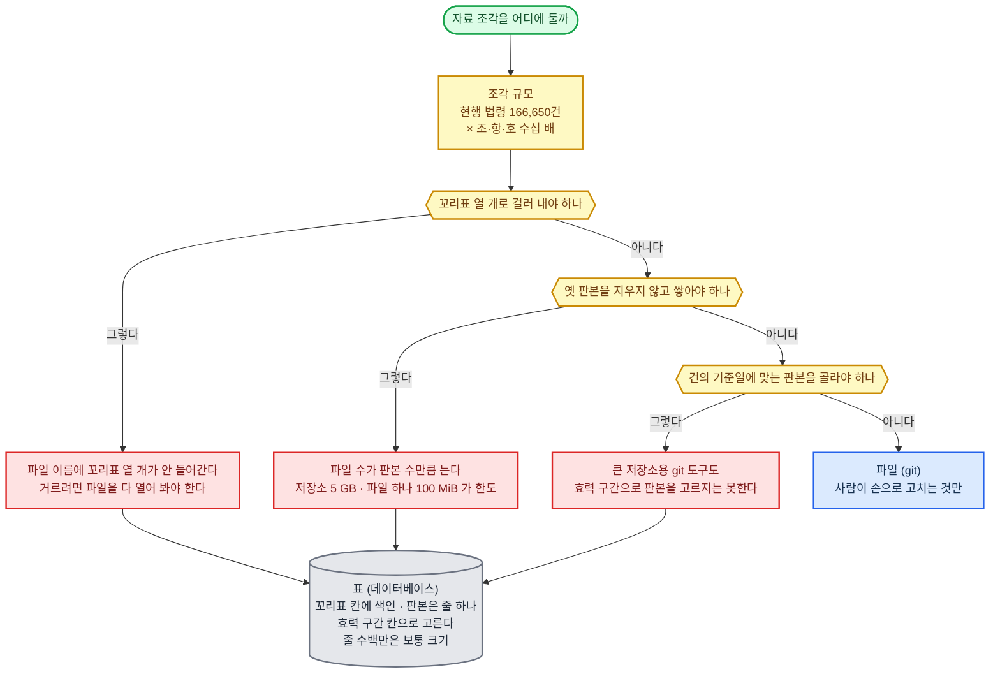
```mermaid
%%{init: {"flowchart": {"wrappingWidth": 640, "curve": "basis", "nodeSpacing": 45, "rankSpacing": 55, "padding": 14, "useMaxWidth": true}, "themeVariables": {"fontSize": "15px"}} }%%
flowchart TB
    S(["자료 조각을 어디에 둘까"]):::good
    N["조각 규모<br/>현행 법령 166,650건<br/>× 조·항·호 수십 배"]:::note
    Q1{{"꼬리표 열 개로 걸러 내야 하나"}}:::note
    Q2{{"옛 판본을 지우지 않고 쌓아야 하나"}}:::note
    Q3{{"건의 기준일에 맞는 판본을 골라야 하나"}}:::note
    X1["파일 이름에 꼬리표 열 개가 안 들어간다<br/>거르려면 파일을 다 열어 봐야 한다"]:::stop
    X2["파일 수가 판본 수만큼 는다<br/>저장소 5 GB · 파일 하나 100 MiB 가 한도"]:::stop
    X3["큰 저장소용 git 도구도<br/>효력 구간으로 판본을 고르지는 못한다"]:::stop
    F["파일 (git)<br/>사람이 손으로 고치는 것만"]:::main
    T[("표 (데이터베이스)<br/>꼬리표 칸에 색인 · 판본은 줄 하나<br/>효력 구간 칸으로 고른다<br/>줄 수백만은 보통 크기")]:::store
    S --> N --> Q1
    Q1 -- "그렇다" --> X1
    Q1 -- "아니다" --> Q2
    Q2 -- "그렇다" --> X2
    Q2 -- "아니다" --> Q3
    Q3 -- "그렇다" --> X3
    Q3 -- "아니다" --> F
    X1 --> T
    X2 --> T
    X3 --> T
    classDef main fill:#dbeafe,stroke:#2563eb,stroke-width:2px,color:#17314f
    classDef stop fill:#fee2e2,stroke:#dc2626,stroke-width:2px,color:#7f1d1d
    classDef back fill:#ffedd5,stroke:#ea580c,stroke-width:2px,color:#7c2d12
    classDef store fill:#e5e7eb,stroke:#6b7280,stroke-width:2px,color:#1f2937
    classDef good fill:#dcfce7,stroke:#16a34a,stroke-width:2px,color:#14532d
    classDef note fill:#fef9c3,stroke:#ca8a04,stroke-width:2px,color:#713f12
```


| 규모 | 값 |
|------|-----|
| 현행 법령 (헌법·법률·대통령령·총리령·부령·기타) | 5,605건 (센 날 기준) |
| 현행 자치법규 (조례·규칙·기타) | 161,045건 |
| 현행 합계 | 166,650건 |
| 공포 누적 (연혁 포함, 법률·대통령령·총리령·부령) | 90,332건 (센 날 기준) |
| 조·항·호 조각 수 | 위 건수의 수십 배 (가정 — 법령당 조문 수는 세지 않음) |

한 조각마다 꼬리표 열 개가 붙는다. 옛 판본은 지우지 않고 나란히 쌓는다. 건의 기준일에 맞는 판본도 골라야 한다. 이 셋은 전부 칸으로 걸러 내고 구간으로 고르는 일이다. 그 일은 표가 한다. 파일 이름에는 꼬리표 열 개가 들어가지 않는다.

큰 저장소를 견디는 git 도구는 있다. 그러나 그런 도구는 파일을 빨리 훑을 뿐이다. 꼬리표로 거르고 효력 구간으로 판본을 고르는 일은 못 한다.

| 파일로 두면 | 표로 두면 |
|------|------|
| 관할·효력일·낡음 표로 거르려면 파일을 다 열어 봐야 한다 | 꼬리표 칸에 색인이 있어 거른 뒤에만 읽는다 |
| 옛 판본을 나란히 두면 파일 수가 판본 수만큼 는다 | 판본은 같은 표의 줄 하나, 효력 구간 칸으로 고른다 |
| 저장소 하나는 1 GB 아래로 두고 5 GB 를 넘기지 않는다. 파일 하나가 100 MiB 를 넘으면 git 이 아예 막는다. 조각 수백만 장은 이 한도를 넘는다 | 표 줄 수백만은 데이터베이스의 보통 크기다 |
| 원문이 바뀌었는지는 사람이 diff 를 봐야 안다 | 변경 감시·반영이 줄 단위로 견주어 바뀐 곳 목록을 표에 쌓는다 |
| 고객 A 의 계약서가 고객 B 의 건에 안 보이게 하려면 폴더 권한을 믿어야 한다 | 줄마다 고객 칸이 있고, 데이터베이스가 줄 단위로 막는다 (아래 격리) |

---

### 세 자리

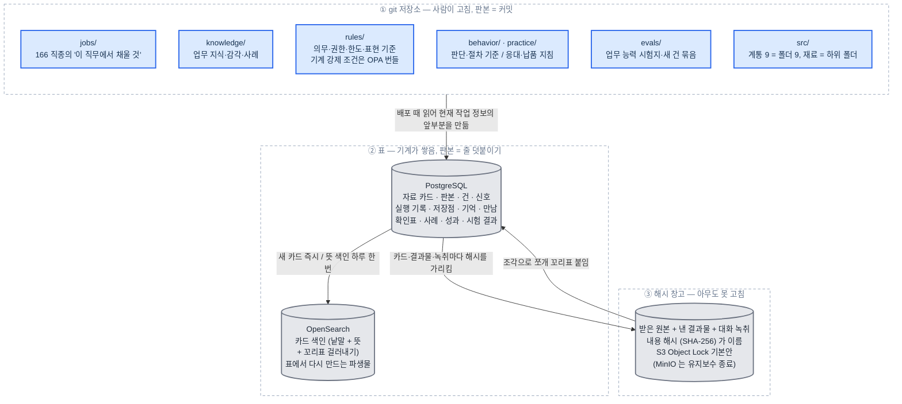
```mermaid
%%{init: {"flowchart": {"wrappingWidth": 640, "curve": "basis", "nodeSpacing": 45, "rankSpacing": 55, "padding": 14, "useMaxWidth": true}, "themeVariables": {"fontSize": "15px"}} }%%
flowchart TB
    subgraph GIT["① git 저장소 — 사람이 고침, 판본 = 커밋"]
        direction TB
        JOB["jobs/<br/>166 직종의 '이 직무에서 채울 것'"]:::main
        KNOW["knowledge/<br/>업무 지식·감각·사례"]:::main
        RULE["rules/<br/>의무·권한·한도·표현 기준<br/>기계 강제 조건은 OPA 번들"]:::main
        BEH["behavior/ · practice/<br/>판단·절차 기준 / 응대·납품 지침"]:::main
        EVAL["evals/<br/>업무 능력 시험지·새 건 묶음"]:::main
        SRC["src/<br/>계통 9 = 폴더 9, 재료 = 하위 폴더"]:::main
    end
    subgraph DB["② 표 — 기계가 쌓음, 판본 = 줄 덧붙이기"]
        direction TB
        PG[("PostgreSQL<br/>자료 카드 · 판본 · 건 · 신호<br/>실행 기록 · 저장점 · 기억 · 만남<br/>확인표 · 사례 · 성과 · 시험 결과")]:::store
        OS[("OpenSearch<br/>카드 색인 (낱말 + 뜻<br/>+ 꼬리표 걸러내기)<br/>표에서 다시 만드는 파생물")]:::store
        PG -- "새 카드 즉시 / 뜻 색인 하루 한 번" --> OS
    end
    subgraph BLOB["③ 해시 창고 — 아무도 못 고침"]
        direction TB
        RAW[("받은 원본 + 낸 결과물 + 대화 녹취<br/>내용 해시 (SHA-256) 가 이름<br/>S3 Object Lock 기본안<br/>(MinIO 는 유지보수 종료)")]:::store
    end
    GIT -- "배포 때 읽어 현재 작업 정보의 앞부분을 만듦" --> PG
    RAW -- "조각으로 쪼개 꼬리표 붙임" --> PG
    PG -- "카드·결과물·녹취마다 해시를 가리킴" --> RAW
    classDef main fill:#dbeafe,stroke:#2563eb,stroke-width:2px,color:#17314f
    classDef stop fill:#fee2e2,stroke:#dc2626,stroke-width:2px,color:#7f1d1d
    classDef back fill:#ffedd5,stroke:#ea580c,stroke-width:2px,color:#7c2d12
    classDef store fill:#e5e7eb,stroke:#6b7280,stroke-width:2px,color:#1f2937
    classDef good fill:#dcfce7,stroke:#16a34a,stroke-width:2px,color:#14532d
    classDef note fill:#fef9c3,stroke:#ca8a04,stroke-width:2px,color:#713f12
    style GIT fill:none,stroke:#94a3b8,stroke-width:1px,stroke-dasharray:5 4,color:#64748b
    style DB fill:none,stroke:#94a3b8,stroke-width:1px,stroke-dasharray:5 4,color:#64748b
    style BLOB fill:none,stroke:#94a3b8,stroke-width:1px,stroke-dasharray:5 4,color:#64748b
```

| 자리 | 무엇이 가나 | 왜 여기인가 |
|------|------|------|
| ① git 저장소 | 사람 전문가·운영자가 읽고 고치고 승인하는 것<br>직무 정의, 지식, 규칙, 판단 기준·절차, 시험지, 코드, 모델 고른 것 | 고친 사람·날·이유가 커밋으로 남고, 업무 능력 시험이 커밋마다 돈다<br>파일 수는 직종 166 × 재료 수십 = 수천 장, git 이 편한 크기다<br>능력 개선·확장이 내놓는 고침도 사람 것과 같은 길 (가지 → 시험 → 합치기) 을 탄다 |
| ② 표 | 기계가 받아 오고 기계가 쌓는 것<br>자료 카드 여섯 종, 건, 신호, 실행 기록, 저장점, 기억, 만남, 확인표, 사례, 성과 | 꼬리표로 거르고 구간으로 판본을 고르고 표끼리 잇는 일은 데이터베이스만 한다<br>상태·기록의 기본안이 PostgreSQL 이고 정보·자료 찾기의 기본안이 OpenSearch RRF 이므로 표 엔진을 더 두지 않는다 (근거는 [기본안을 고른 이유와 반대 검토](#기본안을-고른-이유와-반대-검토)) |
| ③ 해시 창고 | 받은 그대로의 원본 (법령 XML, 정책 PDF, 계약서, 증거, 스캔·녹취), 낸 결과물 (보고서·그림·영상, 낸 순간 고정), 만남의 녹취·대화 원문, 견본 파일 | 판단 근거 기록을 하려면 덮어쓰기도 지우기도 안 되는 저장이어야 한다<br>내용 해시가 이름이면 같은 것은 한 번만 저장되고, 바뀌었는지는 해시로 안다. git 이 객체를 저장하는 방식과 같다 |

---

### 재료 77개의 자리

아래 경로는 구현 배치 예시다. 계통·재료의 책임은 ID로 추적하되 폴더·모듈과 일대일로 강제하지 않는다. 공통 코드는 재사용하고 직무 정의는 참조·확장한다. 대조 대상은 재료의 책임·입출력·의존·구현·검증 연결이며 [직무 조립 계약](docs/runtime.md#직무-조립-계약)을 따른다.

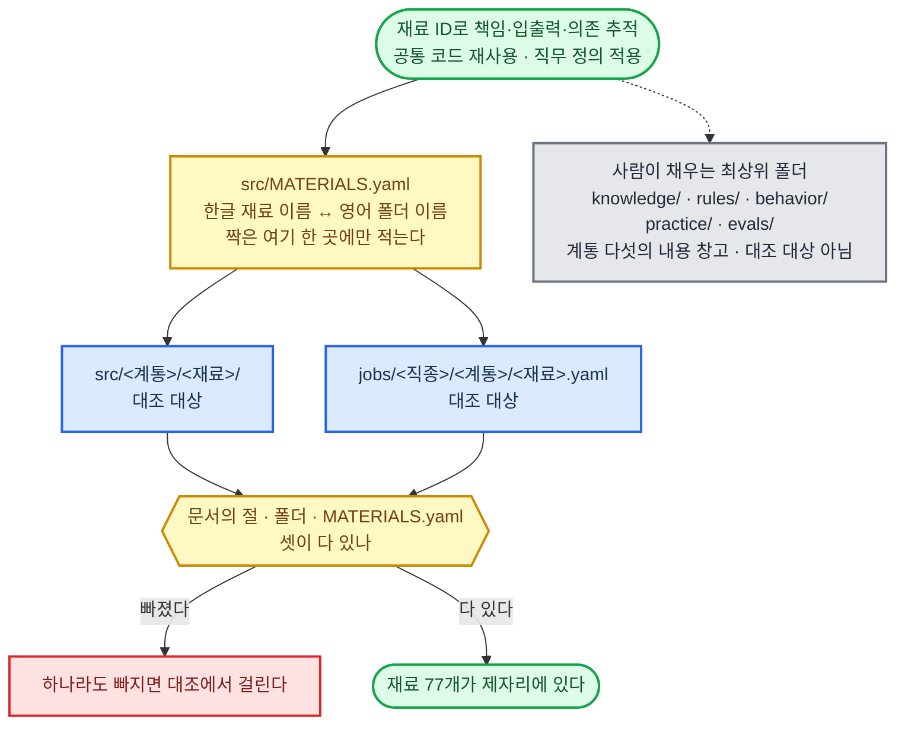
```mermaid
%%{init: {"flowchart": {"wrappingWidth": 640, "curve": "basis", "nodeSpacing": 45, "rankSpacing": 55, "padding": 14, "useMaxWidth": true}, "themeVariables": {"fontSize": "15px"}} }%%
flowchart TB
    ROOT(["재료 ID로 책임·입출력·의존 추적<br/>공통 코드 재사용 · 직무 정의 적용"]):::good
    M["src/MATERIALS.yaml<br/>한글 재료 이름 ↔ 영어 폴더 이름<br/>짝은 여기 한 곳에만 적는다"]:::note
    T1["src/&lt;계통&gt;/&lt;재료&gt;/<br/>대조 대상"]:::main
    T2["jobs/&lt;직종&gt;/&lt;계통&gt;/&lt;재료&gt;.yaml<br/>대조 대상"]:::main
    NC["사람이 채우는 최상위 폴더<br/>knowledge/ · rules/ · behavior/<br/>practice/ · evals/<br/>계통 다섯의 내용 창고 · 대조 대상 아님"]:::store
    CHK{{"문서의 절 · 폴더 · MATERIALS.yaml<br/>셋이 다 있나"}}:::note
    BAD["하나라도 빠지면 대조에서 걸린다"]:::stop
    OK(["재료 77개가 제자리에 있다"]):::good
    ROOT --> M
    M --> T1
    M --> T2
    ROOT -.-> NC
    T1 --> CHK
    T2 --> CHK
    CHK -- "빠졌다" --> BAD
    CHK -- "다 있다" --> OK
    classDef main fill:#dbeafe,stroke:#2563eb,stroke-width:2px,color:#17314f
    classDef stop fill:#fee2e2,stroke:#dc2626,stroke-width:2px,color:#7f1d1d
    classDef back fill:#ffedd5,stroke:#ea580c,stroke-width:2px,color:#7c2d12
    classDef store fill:#e5e7eb,stroke:#6b7280,stroke-width:2px,color:#1f2937
    classDef good fill:#dcfce7,stroke:#16a34a,stroke-width:2px,color:#14532d
    classDef note fill:#fef9c3,stroke:#ca8a04,stroke-width:2px,color:#713f12
```


| 계통 (폴더) | 재료 (폴더) | ① git (사람이 고침) | ② 표 (기계가 쌓음) | ③ 해시 창고 |
|------|------|------|------|------|
| 환경 `environment` | AI 모델 `model` · 실행 제어 `loop` · 현재 작업 정보 `context` · 분리 실행 `tools` (격리 쪽) · 운영 감시·복구 `operations` · 시작 신호 `triggers` · 업무 도구·시스템 `tools` (접속·호출 쪽) · 나눠 맡기기 `orchestration` · 실시간 대화 `realtime` · 시험 환경 `sandbox` | `src/environment/<재료>/` 실행 기반 코드<br>`jobs/<직종>/environment/` 에 모델 선택·도구 대장·환경·기능 명세·시험 환경·신호 규칙·보존 기간·복원·분담 계약 | `run_log` (호출·실행 기록)<br>`checkpoints` (저장점·복원)<br>`signals` (수신·재개)<br>`subtasks` (분담·회수·기여·예산)<br>`environments`·`capabilities` (환경·지원 범위) | 실시간 대화의 녹취·연결 기록 |
| 자료·검색 `corpus` | 근거의 신뢰성·적합성 `provenance` (출처·근거 등급·충돌 쪽) · 자료의 시점·버전 `provenance` (시점·관할·판본 쪽) · 규칙·기준 원문 `law`·`platform-rules` · 업무별 정보 `client-info` · 정보·자료 이해 `readers` · 정보·자료 찾기 `search` · 적용 사례 `interpretations` · 참고 자료 `general` · 재사용 자료 `assets` · 현재 값·상태 확인 `status-data` · 변경 감시·반영 `refresh` | `src/corpus/<재료>/` 확보·구조 읽기·조회·판본 관리 코드<br>법령은 공개된 조회 창구에서 조·항·호·목 단위와 시행일 범위로 받는다<br>`jobs/<직종>/corpus/` 에 받아 올 목록·기준일·주기·형식별 읽기 조건·자산 권리·호환성<br>`db/` 에 꼬리표 열 개의 표 정의 | `cards` (여섯 종 한 표, 종별 파티션, 확신도·실험 조건은 덧칸)<br>`card_effective` (효력 구간)<br>`card_links` (해석 → 원문)<br>`series`·`stats`<br>`card_diffs` (바뀐 곳)<br>OpenSearch 색인<br>`assets` (원본·권리·호환성·참조) | 정보·자료 이해가 받은 원본과 위치 참조 (스캔·녹취·XML·PDF·HTML·계약서)<br>서식·마스터·부품·재질·음원·라이브러리·표준 데이터셋과 견본 파일 |
| 지식·경험 `knowledge` | 업무 지식 `domain` · 실전 경험·감각 `intuition`·`cases` | `knowledge/<분야>/<재료>/` 항목 하나 = 파일 하나<br>`jobs/<직종>/knowledge/` 에 필요한 지식·사례 참조 | `usage_log` (어느 항목을 어느 건에서 썼고 맞았나 빗나갔나)<br>`stale_flags` (근거 원문이 바뀌어 '확인 필요' 가 된 항목)<br>`case_bank` (사례 8칸, 비밀 검사 통과분만) | 지식·숙련 사례의 근거 원본 참조 |
| 기억·진행 상태 `memory` | 현재 진행 상태 `working`·`checkpoint` · 장기 기억 `long-term` | 표 정의만 (`db/`) | `memory_*` (고객·건·결정·기한·약속·확정 예정일)<br>`working_notes` (건마다 쪽지 한 장)<br>`situation` (상황판)<br>`artifact_dependencies` (요구·객체·원천·산출물·검사 판본의 의존관계) | - |
| 규칙·권한 `rules` | 법·의무 기준 `2-profession` (법·의무 쪽) · 직업 윤리·의무 `2-profession` (윤리·의무 쪽) · 에이전트 기본 원칙 `1-constitution` · 계약·합의 조건 `3-contract` (계약 쪽) · 플랫폼·제출처 규정 `3-contract` (제출처 쪽) · 조직 규칙 `4-org` · 사용자 지정 규칙 `5-prefs` · 규칙의 적용·우선순위 `precedence` · 업무 권한 `permissions`·`delegation` · 안전장치 `guardrails` · 비용·위험 한도 `limits` · 표현 방식·스타일 `identity` | `rules/` 에 규칙 정본을 둔다. 종류별 폴더 이름의 숫자는 분류용이다(우선순위 아님). 기계로 강제할 조건은 OPA 번들의 `data.json`·`.rego` (규칙마다 통과·차단 사례를 `_test.rego` 로 함께 둔다), 한도는 `rules/limits/<직종>.yaml`, 표현 기준·금기·견본 참조는 `rules/identity/<브랜드>.yaml`<br>`jobs/` 에 규칙을 복제하지 않고 `job.yaml` 이 적용할 규칙·작풍 묶음을 참조한다. 표현 품질은 M46의 평가에 연결한다 | `guard_events` (막은 줄 번호와 이유)<br>`limit_usage` (한도 사용량, 기간 누적)<br>`cases.liability` (건마다 책임표 한 줄)<br>`run_log` 의 명의 세 줄 (대외 행위마다) | 작풍 기준에서 참조하는 견본 파일 (M55 자산의 해시·판본 참조) |
| 행동 체계 `behavior` | 지시·의도 파악 `judgment` · 문제·목표·완료 조건 `judgment`·`done-criteria` · 대안·전략 판단 `judgment` · 사람에게 넘기기 `escalation` · 업무 절차·실행 계획 `procedures` · 먼저 알아채기 `sensing` | `behavior/<분야>/<재료>/` 판단·설계·순서·도구 선택 기준<br>`jobs/<직종>/behavior/` 에 문제·목표·완료 조건·감시 목록·이관 조건과 수신 결과의 계약 | `usage_log` (선택한 판단·절차)<br>`watches` (감시·발동 상태)<br>`handoffs` (이관 이유·요청·수신 결과 계약·재개 조건, 실행 기록 참조)<br>`requirements` (요구·설계·검사 연결) | - |
| 실무 `practice` | 작업 진행·연결 `workflow` · 대기·후속 관리 `workflow` · 자료 선별·분류 `data-processing` · 자료 정리·결합 `data-processing` · 형식·구조 변환 `data-processing` · 계산 `computation` · 분석 `computation` · 기준 적용·판정 `rulings` · 예측 `computation` · 조건 안에서 최선 찾기 `computation` · 결과물 설계 `artifact-production` · 내용 재구성 `artifact-production` · 결과물 만들기·수정 `artifact-production` · 사람과 소통 `counterpart` · 협상·조율 `counterpart` · 기록 입력·수정 `system-actions` · 신청·거래 처리 `system-actions` · 설정·작동 제어 `system-actions` · 게시·배포 `system-actions` · 납품 준비 `reporting` · 전달·인수 확인 `reporting` · 관찰·측정 `experiments` · 실험 `experiments` · 시뮬레이션 `experiments` | `src/practice/<재료>/` 업무 흐름·자료 처리·계산·실험·제작·응대·납품 코드<br>`jobs/<직종>/practice/` 에 스키마·키·계보·수식·제약·실험 조건·형식·편집·응대·인수 조건·건의 단위·되풀이 주기·판정 종류와 등급표<br>`practice/<분야>/` 에 재사용 응대·보고 지침과 원천 참조 | `cases` (전체 상태·단계·우선순위·자원 배분)<br>`data_runs`·`compute_runs`·`experiment_runs` (계보·조건·결과)<br>`encounters` (대화·합의·다음 행동)<br>`deliverables` (납품 묶음·판본·수신 환경·인수 증거) | 제작 원본·편집 프로젝트·연결 자산·중간 판본·납품 파일<br>응대 녹취·대화 원문 (실시간 대화와 같은 원본을 참조) |
| 검증·평가 `verify` | 판단 근거 기록 `traceability` · 결과 검증·재검증 `check-fix` · 반대 근거·다시 확인 `cross-check` · 빠진 위험 확인 `risk-omission` · 일하는 과정 평가 `process-eval` · 결과 품질 평가 `output-eval` · 성과 추적 `outcomes` · 업무 능력 시험 `evals` | `src/verify/<재료>/`<br>`jobs/<직종>/verify/` 에 위험 목록·대상별 구조/기능 검사·수신 환경·채점표·검사자 수준<br>`evals/<직종>/fixed/`·`fresh/` 시험 과제<br>`jobs/<직종>/verify/` 에 업무 능력 시험 설정·성과 지표 정의·확정 시점 | `checks` (원천 확인표: 행동마다 닿은 곳·읽을 값·기대값·기대값 적은 시각·실제값. 권리 확인 근거도 한 줄)<br>`scores` (과정·결과물 채점)<br>고리는 `run_log` → `cards` → `checks` 의 번호로 잇는다<br>`eval_runs` (회귀·새 과제 실행 결과)<br>`stale_flags` (바탕 판본이 바뀐 문항)<br>`outcomes` (실제 성과·비용·손실·귀속) | 남의 증거 원본 (손대지 않음, 시각 도장) |
| 학습·개선 `learn` | 성공·실패 원인 분석 `failure-analysis` · 능력 개선·확장 `auto-learn` | `src/learn/<재료>/` 실패 분석·보완·변경 반영 코드<br>`jobs/<직종>/learn/` 에 보완 조건·변경 권한·되돌리기<br>변경은 git 가지 하나로 만들고 검증·평가의 업무 능력 시험 결과를 받아 반영 여부를 정한다 | `failures` (원인·영향 범위·보완 대상)<br>`capabilities` (새로 확보한 지원 범위·환경·검증 증거 참조)<br>시험·성과는 `eval_runs`·`outcomes` 를 참조 | - |

---

### git 저장소의 나무

```
expert-agent/
├─ docs/                       ← 이 문서. 재료 이름의 원본
├─ jobs/                       ← 사람이 채움. "이 직무에서 채울 것" 전부
│  ├─ _common/                 ← 모든 직종의 기본값 (여기서 상속)
│  ├─ legal/                   ← 분야 공통 (변호사 7종·법무사·행정사가 나눠 씀)
│  │  ├─ _field.yaml           ← 분야 공통값 (관할·법정 보존 기간·A 등급 원천)
│  │  └─ lawyer-corporate/
│  │     ├─ job.yaml           ← extends: [legal]  (겸업 직종은 둘 이상)
│  │     │                        성과 지표 참조·기준일 목록·쓰는 직업 기준(법·의무 기준·직업 윤리·의무)·표현 방식 묶음 이름
│  │     ├─ environment/model.yaml        (고른 모델·바꾼 날·이유)
│  │     ├─ environment/tools.yaml        (도구 대장과 환경·기능 명세 줄)
│  │     ├─ environment/triggers.yaml     (받는 신호와 거르는 규칙)
│  │     ├─ practice/artifact-production.yaml (형식·편집·변환·수신 환경)
│  │     ├─ practice/data-processing.yaml     (스키마·키·정제·계보)
│  │     ├─ practice/computation.yaml         (수식·제약·오차·솔버·학습)
│  │     ├─ practice/experiments.yaml         (가설·대조·모형·중단 기준)
│  │     ├─ practice/workflow.yaml            (건의 단위·긴급 경로 첫 조치·되풀이 주기·대기 대상·인계)
│  │     ├─ practice/rulings.yaml             (판정 종류·등급표)
│  │     ├─ environment/sandbox.yaml
│  │     ├─ corpus/readers.yaml           (형식·구조·원본 위치·취득 조건)
│  │     ├─ corpus/assets.yaml            (서식·마스터·부품·권리·호환성)
│  │     ├─ corpus/law.yaml               (받아 올 법령 목록·기준일·위험 조문)
│  │     ├─ corpus/search.yaml            (표 조회로 둘 것·검색 문제 100개 위치)
│  │     ├─ behavior/requirements.yaml     (요구·설계·작업·검사 연결)
│  │     ├─ behavior/done-criteria.yaml
│  │     ├─ behavior/sensing.yaml         (감시 목록)
│  │     ├─ behavior/escalation.yaml
│  │     ├─ practice/counterpart.yaml      (응대·협상·상담·원천 참조)
│  │     ├─ practice/reporting.yaml       (보고 서식)
│  │     ├─ verify/artifact-checks.yaml    (대상별 구조·기능·인수 시험)
│  │     ├─ verify/evals.yaml              (고정 판본·회귀·새 과제 설정)
│  │     ├─ verify/risk-omission.yaml
│  │     ├─ learn/capabilities.yaml       (기능별 지원 범위·새 과제 평가)
│  │     └─ verify/outcomes.yaml
│  └─ tax/ accounting/ labor/ realty/ … (문서 직종 표의 분야 열 그대로)
├─ knowledge/<분야>/           ← 재료 2, 폴더 3 (실전 경험·감각는 intuition/ 와 cases/ 둘). 항목 하나 = 파일 하나, 머리에 꼬리표 4칸
│  ├─ domain/                  ← [무엇인가]·[어떻게 센다]·[왜 굳었나]·[어디서부터 안 통하나]
│  ├─ intuition/               ← 실전 경험·감각의 감각 쪽. 한 줄 = 한 상황
│  └─ cases/                   ← 실전 경험·감각의 사례 쪽 (비밀 검사 통과분만)
├─ rules/                      ← 규칙·작풍 정본. 기계 강제 조건은 OPA 번들로 배포
│  ├─ 1-constitution/          ← 운영자만 고침
│  ├─ 2-profession/<직업>/
│  ├─ 3-contract/<상대>/         ← 상대별 묶음, 유효 기간 칸
│  ├─ 4-org/<회사>/
│  ├─ 5-prefs/<사람>/           ← 추가 조건·선호. 규칙마다 전역·직무·에이전트·프로젝트·개별 업무 범위와 변경권 기록
│  ├─ identity/<브랜드>.yaml     ← 표현 기준·금기·약속·견본 해시. job.yaml 에서는 참조만
│  ├─ permissions/             ← 허용·승인·금지 세 목록 (도구+대상+행동)
│  ├─ delegation/              ← 업무 권한의 명의 쪽. 누구 명의로 무엇까지
│  ├─ guardrails/
│  └─ limits/<직종>.yaml         ← 비용·위험 한도
├─ behavior/<분야>/            ← 재료 6 중 판단·절차·착수·완료·이관 기준
│  ├─ judgment/                ← 지시·의도 파악·문제·목표·완료 조건·대안·전략 판단의 기준 10~20줄 (현재 작업 정보의 앞부분에 들어감)
│  ├─ procedures/              ← 절차 하나 = 30줄 파일, 회사 사정은 옆 칸
│  ├─ knowhow/                 ← "이렇게 하면 이런 일이 벌어진다"
│  └─ tool-choice/             ← 도구 대장 (environment/tools.yaml)의 기능·비용·환경·지원 범위를 읽는 규칙. 도구 줄은 따로 안 둔다
├─ practice/<분야>/            ← 실무의 재사용 응대·보고 지침
│  ├─ counterpart/             ← 응대 지침·상대 정보의 원천 참조 (행동 기록은 encounters)
│  └─ reporting/               ← 납품·보고·인수 지침
├─ evals/<직종>/
│  ├─ fixed/                   ← 문항 6칸 (입력·기대 결론·기대 순서·만든 시점·바탕 판본·유효 기간)
│  ├─ fresh/                   ← 한 번 쓰면 fixed/ 로 옮김
│  └─ search/                  ← 물음 100개 + 정답 조각 번호
├─ src/                        ← 코드 배치 예. 77개 재료의 책임·입출력·증거를 모듈에 연결
│  ├─ MATERIALS.yaml           ← 재료 ID·이름·계통·담당 모듈·적용 여부·검증 증거 (77개)
│  ├─ environment/{model, loop, checkpoint, orchestration, context, triggers, realtime, tools, sandbox}/
│  ├─ corpus/{readers, law, platform-rules, interpretations, general, status-data, client-info, provenance, search, refresh, assets}/
│  ├─ knowledge/  memory/  rules/{precedence}/  behavior/
│  ├─ practice/{workflow, data-processing, computation, rulings, experiments, artifact-production, counterpart, reporting}/
│  ├─ verify/{check-fix, cross-check, risk-omission, process-eval, output-eval, traceability, evals, outcomes}/
│  ├─ learn/{failure-analysis, auto-learn}/
│  └─ mcp/                     ← 도구 서버, 서버마다 권한 따로
├─ db/
│  ├─ migrations/              ← 표 정의 (아래 표 설계)
│  └─ index/                   ← OpenSearch 매핑·검색 처리 단계 (RRF)
└─ build/                      ← 기계가 만든 것. git 밖 (.gitignore)
   └─ context-head/<직종>.md   ← 규칙·상시 지식·판단 기준을 하나로 묶은 것 + 해시
```

| 규약 | 정한 것 |
|------|------|
| 이름 | 폴더·파일 이름은 영어, 안에 적는 내용은 한국어다. 한글 파일 이름은 운영체제마다 글자 조합 방식이 달라 같은 이름이 다른 파일로 잡히기 때문이다<br>모듈과 재료의 책임 연결은 `src/MATERIALS.yaml`에 적는다. 모듈과 재료의 개수가 같을 필요는 없다 |
| 상속 | `_common` → `<분야>/_field.yaml` → `<직종>/` 순으로 덮는다. 겸업 직종은 `extends` 에 분야를 둘 이상 적고, 같은 칸이 부딪히면 앞에 적은 분야가 이긴다<br>직종 파일에는 그 직종만 다른 값만 적는다. 그래서 변호사 7종이 법령 목록을 일곱 번 적지 않는다 |
| 직종 하나 더하기 | 직무별 적용 여부·입출력·환경·검사 조건을 채운다. 미지원 도구·형식은 연동을 구현하고 검증한다<br>필수 재료가 없으면 미구현이며, 해당 없음은 제외 이유가 있어야 한다 |
| 파일 하나의 크기 | 지식 항목 하나, 절차 하나, 규칙 줄 묶음 하나가 파일 하나다<br>한 화면을 넘으면 쪼갠다. 모델이 필요한 것만 현재 작업 정보에 올리는 단위가 파일이기 때문이다 |
| 판본 | 커밋이 판본이다. 옛 판본은 지우지 않는다 (지난 건은 그때 쓴 판본으로 다시 본다)<br>지식·규칙·절차를 고친 커밋은 업무 능력 시험을 통과해야 배포된다. 능력 개선·확장도 사람도 같은 문이다 |
| 규칙은 한 곳 | 규칙 줄은 `rules/` 에만 있다. `jobs/` 는 어느 묶음을 쓰는지 가리키기만 한다. 두 곳에 있으면 어느 쪽이 맞는지 아무도 모른다 |
| 비밀 | 열쇠·비밀번호는 이 나무 어디에도 없다. 비밀 저장소에 두고 실행 제어가 부를 때만 꺼낸다 |
| 고객 자료 금지 | `knowledge/cases/` 와 `evals/` 에는 비밀 검사를 통과한 것만 들어간다. 실제 고객 이름·번호가 든 파일은 커밋 전 검사에서 막는다 |

---

### 표 설계

전문 작업에는 아래 논리 레코드를 기존 실행 기록과 연결한다. 실제 표 수는 고정하지 않으며 [전문 작업 계약](docs/runtime.md#전문-작업과-산출물-계약)을 따른다.

| 레코드 | 남기는 내용 |
|---|---|
| `requirements` | 요구·설계·작업·검사 ID, 출처·판본·단위·오차·변경 권한 |
| `assets` | 제작 자산의 원본·권리·호환성·의존 자산·사용 건 |
| `environments`, `capabilities` | 환경 판본과 기능·형식·작업별 지원/미지원/미검증 조건·증거 |
| `data_runs`, `compute_runs`, `experiment_runs` | 데이터 계보·계산/학습 설정·실험 계획·실행 ID·상태·결과 |
| `artifact_dependencies` | 원천·객체·파생물·검사의 의존관계, 변경 후 무효화·재검사 상태 |
| `deliverables` | 납품본·편집 원본·연결 자산·수신 환경·인수 증거·후속 책임 |


PostgreSQL 하나에 아래 표를 둔다. 검토 기준 판본은 확인일 기준 18.6 안정판이다. 칸 이름은 문서에서 쓴 꼬리표 이름을 영어로 옮긴 것이다. 옮긴 짝은 `db/migrations/` 머리에 표로 둔다.

**모든 표에 공통인 칸 셋**

| 칸 | 왜 두나 |
|------|------|
| `org` (회사) · `client` (고객) | 줄 단위 격리의 열쇠다. PostgreSQL 의 행 보안 정책 (`ENABLE ROW LEVEL SECURITY`) 을 켜서 실행 계정은 자기 회사·자기 건의 고객 줄만 본다. 코드가 걸러내기를 잊어도 데이터베이스가 막는다 |
| `since` (언제부터) | 값은 고치지 않고 새 줄을 덧붙인다. "그때 알던 것" 으로 되돌아가려면 이 칸으로 자른다 |
| `tenant_key` (고객 열쇠 번호) | 고객 개인정보가 든 줄과 원본은 고객마다 다른 열쇠로 암호화한다. 삭제 요구가 오면 열쇠를 파기한다 (아래 해시 창고) |

**표 목록**

| 표 | 칸 (요지) | 장치 |
|------|------|------|
| `cards` 자료 카드 | 카드 번호, 자료 종, 조각 위치 (관할 + 문서 번호 + 조·항·호 경로. 외국 법은 그 나라 구조대로 적은 경로), 원문, 원본 해시, 출처, 근거 등급, 관할 (계층 부호: 나라 > 광역 > 기초), 판본 (정정 회차 포함), 개정 이력, 읽은 시각, 유효 기한, 건, 덧칸 (JSON: 확신도·못 읽은 자리·표본 수·실험 조건처럼 종마다 다른 것) | 자료 종으로 리스트 파티션<br>조각 위치 + 판본에 유일 색인 → 같은 요청이 두 번 와도 카드가 두 장 안 생긴다 |
| `card_effective` 판본 | 카드 번호, 효력 구간 (`tstzrange`, 폐지일 없으면 끝 없음), 관할 시간대 | 구간에 GiST 색인. "기준일에 맞는 판본" = `효력 구간 @> 기준일` 한 줄 조회<br>같은 조각의 두 판본이 겹치면 `EXCLUDE USING GIST` 가 넣기를 막는다<br>같은 개정에 부칙 (경과규정) 카드가 있으면 판본 고르기 결과에 부칙 카드를 같이 낸다. 어느 건에 옛 법이 적용되는지는 모델이 부칙을 읽고 판단한다 |
| `card_links` 고리 | 해석 카드 → 가리키는 것 (원문 카드 · 공식 결정·제재 카드 · 실험 기록), 가리키는 것의 갈래, 살아 있는지, 뒤집힘 표 | 원문 카드를 가리키면 외래 키로 막고, 조문이 없으면 갈래와 번호 칸이 반드시 차 있어야 한다는 제약으로 막는다. 셋 다 비면 넣지 못한다 |
| `card_diffs` 바뀐 곳 | 옛 판본 · 새 판본 · 줄 단위 차이 · 들어온 시각 | 변경 감시·반영이 쓰고 "건을 깨우기" 와 `stale_flags` 가 읽는다 |
| `series` 시계열 · `stats` 통계 | 시각·값·단위·출처 / 기준 시점·단위·집계 범위 | 숫자 세는 일은 여기서만 (검색 아님). `series` 는 달로 파티션 |
| `cases` 건 | 건 번호, 직종, 고객, 상태 (진행·대기·끝), 기다리는 것과 기한, 기준일 목록 (이름 붙은 것), 당사자와 내 편, 책임표 (누가 물어내는지 한 줄), 묶음 번호, 우선순위, 자원 배분 | `SELECT … FOR UPDATE SKIP LOCKED` 로 일꾼 여럿이 한 건을 두 번 안 집는다<br>묶음 번호로 여러 건의 손익을 묶음으로 잰다 (경우 13) |
| `signals` 신호 | 신호 번호 (멱등 키), 받은 시각, 통로, 서명 검사 결과, 거른 규칙 판본, 버렸으면 이유, 만든 건 번호 | 건이 되지 못한 신호도 여기 남는다. 같은 신호가 두 번 오면 멱등 키로 한 번만 받는다 |
| `run_log` 실행 기록 | 시각, 건 번호, 부모 실행 번호, 흐름 단계, 한 일, 결과, 부른 모델, 쓴 토큰, 걸린 시간, 든 값, 도구 호출 (누가·어느 열쇠로·무엇에·멱등 키), 명의 세 줄 (실행하는 나·대신하는 사람·나가는 이름) | 덧붙이기만. UPDATE·DELETE 권한을 실행 계정에서 뺀다<br>달로 파티션, 보존 기간이 지난 파티션은 통째로 떼어 낸다<br>재현 = 이 표와 `checkpoints` 를 순서대로 다시 읽는 것 |
| `checkpoints` 저장점 | 건 번호, 단계 0~8, 산출물 (JSON), 시각, 버림 표시, 버린 이유 | 단계마다 한 줄. 빈 단계는 끝난 것으로 안 친다. 되돌아가면 뒤 단계 줄에 버림 표시만 단다 |
| `subtasks` 조각 대장 | 건 번호, 조각 번호, 맡은 쪽 (사람·모델·도구), 준 시각, 기한, 독촉 횟수, 거둔 시각, 결과 | "안 거둔 조각 0" 을 이 표에서 센다 |
| `encounters` 만남 | 건 번호, 상대, 통로, 들어가기 전 한 장 (목표·양보 한계·물러날 선·예상 반응·금지어), 말한 것 (원문은 해시 창고), 합의·미합의, 다음 행동, 감정 읽은 것 | 실시간 대화의 초 단위 대화도 끝나면 여기 한 줄로 접는다 |
| `handoffs` 넘김 | 건 번호, 요청 종류 (사실·권한·자격 행위·전문 지원)와 원인, 넘긴 시각, 기한, 사람의 답, 답한 시각 | 사람에게 넘긴 뒤 멈춘 건은 여기서 찾는다 |
| `deliverables` 결과물 | 건 번호, 판본, 낸 날짜, 파일 해시, 받는 사람, 고친 이유 한 줄 | 낸 것은 해시 창고에 있고 여기는 목록이다 |
| `checks` 확인표 | 건 번호, 실행 번호, 닿은 곳, 읽을 값, 읽는 방법, 기대값, 기대값 적은 시각, 실제값, 읽은 시각, 결과 | "기대값 시각이 행동 시각보다 앞선 비율" 을 여기서 센다. 그림·영상의 권리 확인 근거도 한 줄이다 |
| `scores` 채점 | 건 번호, 과정 점수, 결과물 점수, 채점 기준 (파일 경로 + 커밋), 채점한 쪽 (모델·사람) | 만든 쪽과 채점한 쪽이 같으면 넣지 못한다 (제약) |
| `usage_log` 쓴 기록 | 건 번호, 쓴 파일 경로 + 커밋 (지식 항목·절차·판단 기준), 쓴 시각, 맞았나 빗나갔나 | 절차별 마지막 쓴 날·잘된 비율, 감각 줄의 적중률이 여기서 나온다 |
| `stale_flags` 확인 필요 | 대상 (파일 경로 + 커밋, 또는 시험 문항), 이유 (근거 원문 바뀜·바탕 판본 바뀜), 시각, 해소 시각 | 지식·규칙·절차·시험 문항의 낡음을 한 표에서 본다 |
| `watches` 감시 | 직종, 감시 항목, 마지막 확인 시각, 발동 시각, 만든 건 번호 | 먼저 알아채기와 `handoffs` 기한 독촉이 같이 쓴다 |
| `memory_*` 장기 기억 | 고객·건·결정·기한·약속·성과 확정 예정일, 표 여섯 개 | 덧붙이기만. 연재물은 설정집·복선·독자 약속 표를 따로 |
| `working_notes` 현재 진행 상태 | 건 번호, 쪽지 8칸, 판본 | 건이 끝나면 정한 기간 뒤 지우고 장기 기억으로 옮긴다 |
| `situation` 상황판 | 직종, 지금 진행 중인 건·기다리는 것·오늘 기한, 갱신 시각 | 한 장. 건 표에서 뽑아 만드는 파생물이다 |
| `case_bank` 사례 · `failures` 실패 원인 | 8칸, 비밀 검사 통과 표 / 건 번호, 원인 갈래, 틀린 자리 | 비밀 검사 못 넘으면 넣기 자체가 막힌다 (제약) |
| `outcomes` 성과 | 직종, 지표, 값, 잰 시각, 원천, 귀속 방법 | 성과 추적이 쓰고 사례로 되돌려 붙인다 |
| `eval_runs` 시험 결과 | 문항 파일 경로 + 커밋, 결론 점수, 과정 점수, 돌린 시각, 바탕 판본 | 문항은 git 에, 결과는 여기에 |
| `guard_events` 막음 · `limit_usage` 한도 | 막은 규칙 줄 번호, 이유, 시각, 건 / 한도 이름, 기간, 누적값 | 안전장치·업무 권한·규칙 엔진이 쓴다 |

**OpenSearch 색인 — 표의 파생물**

| 기준 | 정한 것 |
|------|------|
| 무엇을 넣나 | `cards` 의 원문 + 꼬리표 열 개 + `org`·`client`. 원본은 표에 있으니 색인은 언제든 다시 만든다 |
| 걸러내기 칸 | 관할·효력일·폐지일·판본·건·낡음 표를 keyword·date 칸으로 두어 먼저 거른다. `org`·`client` 거르기는 검색 코드가 아니라 검색 처리 단계에 박아 두어 빠뜨릴 수 없게 한다 |
| 낱말 | 한국어 형태소 분석기 `analysis-nori` |
| 뜻 | k-NN 벡터 칸은 효력 중인 판본에만 둔다. 옛 판본은 낱말 검색만 된다. 벡터는 메모리를 먹는데 옛 판본까지 다 넣으면 수백만 개다<br>하루 한 번 새 색인 `cards-v{n}` 을 만들고 별칭 `cards` 를 옮긴다. 검색 문제가 떨어지면 별칭을 옛 색인으로 되돌린다. 별칭 바꾸기는 원자적이라 중간 상태가 없다. 벡터 모델을 바꿔도 같은 길이다 |
| 합치기 | 낱말 검색과 뜻 검색의 순위를 검색 처리 단계에서 RRF 로 합친다. rank_constant 는 기본값 60 이다 |

---

### 해시 창고

| 기준 | 정한 것 |
|------|------|
| 이름 | 내용의 SHA-256 이 이름이다. `raw/aa/bb/aabb…` 처럼 앞 두 글자씩 폴더로 나눠 한 폴더에 파일이 몰리지 않게 한다<br>파일 시스템이 큰 폴더를 이름 해시 트리로 찾아 주더라도, 한 폴더에 수백만 장이면 나열·백업이 힘들기 때문이다 |
| 못 고침 | S3 Object Lock 의 compliance 모드 (루트 계정도 덮어쓰거나 지울 수 없다) 를 기본안으로 둔다. MinIO 공개 저장소는 2026-04-25 보관 처리되어 유지보수가 종료됐으므로 기본안에서 제외하고, 사내 저장이 필요하면 조직이 운영·지원할 수 있는 제품의 같은 기능을 시험해 고른다<br>보존 기간은 `jobs/<분야>/_field.yaml` 의 법정 보존 기간을 그대로 건다 |
| 두 칸 | 공개 원본 (법령·공시·표준) 은 그대로 넣고 모든 고객이 같이 쓴다<br>고객 원본 (계약서·증거·녹취·개인정보) 은 그 고객 열쇠로 암호화해 넣는다. 그래서 고객 사이에는 중복 제거가 안 되고, 그것이 맞다 |
| 삭제 요구 | 지우기 대신 열쇠를 파기한다 (암호화 지우기). 파일은 남지만 아무도 못 읽는다. 법정 보존 기간이 남은 것은 파기하지 않고 요구와 이유를 `handoffs` 에 남긴다 |
| 곁에 두는 것 | 원본 옆에 얻은 곳·얻은 시각·판본·해시를 적은 쪽지 (JSON) 를 같은 해시 이름으로 둔다<br>남이 믿어야 하는 시각은 시각 도장을 함께 둔다 |
| 쓰는 순서 | 창고에 먼저 넣고, 그 다음에 카드·결과물 줄을 쓴다. 이렇게 하면 표가 가리키는 해시가 창고에 없는 일이 안 생긴다. 거꾸로 창고에만 있고 표에 없는 것은 하루 한 번 대조해 카드를 다시 만든다 |
| 누가 읽나 | 카드·결과물·만남은 해시를 가리킨다. 판단 근거 기록은 표 → 해시 → 원본으로 되짚는다 |

---

### 속도

아래 표의 자리·장치와 뒤따르는 수치는 **측정 전 예시 추정**이다. 실제 규모와 예산은 위 [규모와 비용을 정하는 방법](#규모와-비용을-정하는-방법)의 측정으로 정한다.

아래 기반 추정에 새 전문 프로그램·대용량 자산·자료 처리·렌더·계산·시뮬레이션·모델 학습 비용이 모두 포함됐다고 가정하지 않는다. 작업별 크기·메모리/GPU·실행 시간·라이선스·보존·재시도·검증·인수 비용을 환경 명세에서 별도 실측해 합산한다.

| 자리 | 장치 | 안 하면 |
|------|------|------|
| 걸러내기 먼저 | 꼬리표 칸 색인 (표) 과 keyword 칸 (색인) 으로 후보를 자른 뒤에만 순위를 매긴다 | 수백만 조각을 다 훑는다 |
| 판본 고르기 | `tstzrange` GiST 한 번 조회 | 판본마다 효력일·폐지일을 비교하는 코드가 돈다 |
| 현재 작업 정보의 앞부분 | 배포 때 `build/context-head/<직종>.md` 로 미리 묶고 해시를 붙인다. 같은 앞부분은 캐시로 싸게 다시 읽는다 | 건마다 파일 수십 장을 다시 읽고 붙인다 |
| 초 단위 자리 | 실시간 대화는 말 한 마디마다 검색하지 않는다. 만남 전에 그 건의 카드·쪽지를 `working_notes` 에 미리 담고, 만남 중에는 그것만 본다 | 한 마디마다 색인을 돌아 지연 한도를 못 지킨다 |
| 뜻 색인 | 하루 한 번, 효력 중인 판본만, 별칭 교체 | 조각마다 색인을 고쳐 검색이 흔들리고 벡터가 메모리를 넘친다 |
| 실행 기록 | 달 파티션. 최근 달만 뜨겁다 | 몇 년치 기록에서 한 건을 찾는다 |
| 같은 요청 두 번 | 조각 위치 + 판본 유일 색인, 신호 멱등 키, 도구 멱등 키 | 카드·건·주문이 두 개 생긴다 |

---

### 규모 추정

이 소절의 서버 대수·용량·사양은 모두 **측정 전 예시 추정**이며, 실제 규모와 예산은 위 [규모와 비용을 정하는 방법](#규모와-비용을-정하는-방법)의 측정으로 정한다. 아래 계산에 부품으로 적은 MinIO 는 2026-04-25 유지보수가 종료됐으므로 사내 객체 저장 제품은 다시 고르고, 클라우드 사용이 허용되면 S3 를 검토한다.

아래 수치는 기존 실행·검색·기록 기반의 추정이다. 새로 포함한 전문 편집기·CAD·해석기·대용량 재사용 자료·자료 처리·렌더·모델 학습까지 포함한 총량이 아니다. 작업별 데이터 크기·메모리/GPU·실행 시간·라이선스·보존·재시도·검증·인수 비용을 업무 도구·시스템에서 별도 실측해 합산한다.

장비를 몇 대 사고 디스크를 얼마나 붙일지 정하는 숫자다. 아래 값은 가정을 놓고 계산했다. 첫 직종을 석 달 돌린 뒤 실측으로 갈아 끼운다 ([관리·유지보수](#관리유지보수) 의 "규모 다시 재기").

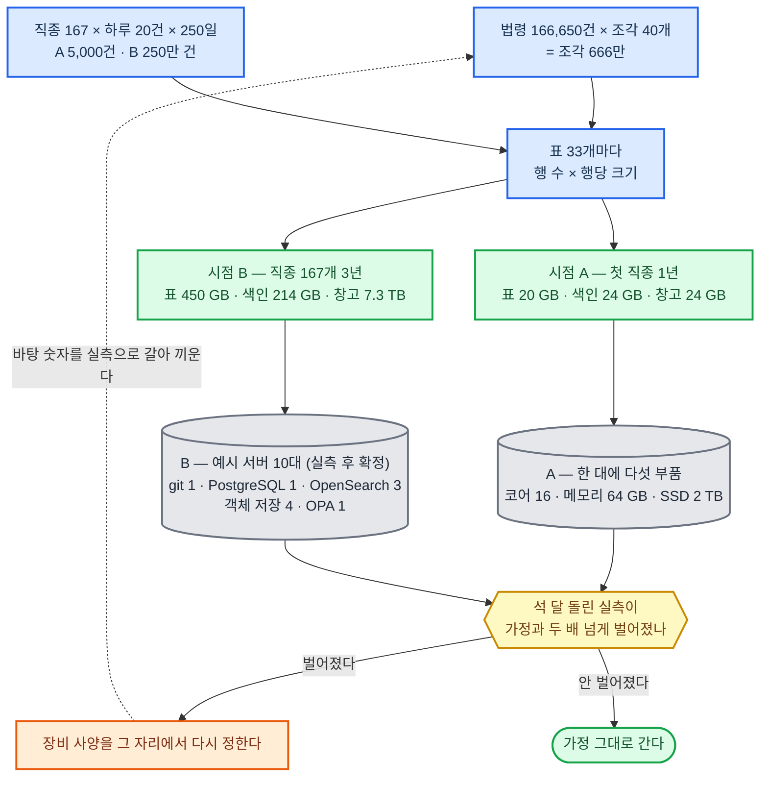
```mermaid
%%{init: {"flowchart": {"wrappingWidth": 640, "curve": "basis", "nodeSpacing": 45, "rankSpacing": 55, "padding": 14, "useMaxWidth": true}, "themeVariables": {"fontSize": "15px"}} }%%
flowchart TB
    B1["법령 166,650건 × 조각 40개<br/>= 조각 666만"]:::main
    B2["직종 167 × 하루 20건 × 250일<br/>A 5,000건 · B 250만 건"]:::main
    C1["표 33개마다<br/>행 수 × 행당 크기"]:::main
    S1["시점 A — 첫 직종 1년<br/>표 20 GB · 색인 24 GB · 창고 24 GB"]:::good
    S2["시점 B — 직종 167개 3년<br/>표 450 GB · 색인 214 GB · 창고 7.3 TB"]:::good
    H1[("A — 한 대에 다섯 부품<br/>코어 16 · 메모리 64 GB · SSD 2 TB")]:::store
    H2[("B — 예시 서버 10대 (실측 후 확정)<br/>git 1 · PostgreSQL 1 · OpenSearch 3<br/>객체 저장 4 · OPA 1")]:::store
    RE{{"석 달 돌린 실측이<br/>가정과 두 배 넘게 벌어졌나"}}:::note
    RE1["장비 사양을 그 자리에서 다시 정한다"]:::back
    OK(["가정 그대로 간다"]):::good
    B1 --> C1
    B2 --> C1
    C1 --> S1
    C1 --> S2
    S1 --> H1
    S2 --> H2
    H1 --> RE
    H2 --> RE
    RE -- "벌어졌다" --> RE1
    RE -- "안 벌어졌다" --> OK
    RE1 -. "바탕 숫자를 실측으로 갈아 끼운다" .-> B1
    classDef main fill:#dbeafe,stroke:#2563eb,stroke-width:2px,color:#17314f
    classDef stop fill:#fee2e2,stroke:#dc2626,stroke-width:2px,color:#7f1d1d
    classDef back fill:#ffedd5,stroke:#ea580c,stroke-width:2px,color:#7c2d12
    classDef store fill:#e5e7eb,stroke:#6b7280,stroke-width:2px,color:#1f2937
    classDef good fill:#dcfce7,stroke:#16a34a,stroke-width:2px,color:#14532d
    classDef note fill:#fef9c3,stroke:#ca8a04,stroke-width:2px,color:#713f12
```


**바탕이 되는 숫자**

| 어떤 숫자 | 정한 것 | 왜 이 숫자인가 |
|------|------|------|
| 법령 건수 | 166,650건 | [왜 파일이 아니라 표인가](#왜-파일이-아니라-표인가) 의 현행 합계를 그대로 쓴다 |
| 조각 수 | 6,666,000 | 법령 한 건에 조·항·호 조각 40개 가정. 166,650 × 40 |
| 직종 수 | 167 | [종류](<전문가 에이전트 정의.md#종류>) 표의 166개를 넉넉하게 올려 잡은 수<br>장비는 넉넉한 쪽으로 재므로 큰 수를 쓴다. 166 으로 재도 아래 표는 1% 도 안 줄어 장비 등급은 안 바뀐다 |
| 직종 하나가 하루에 맡는 건 | 20건 | 가정. 사람 한 명이 하루에 손대는 건 수를 그대로 쓴다<br>[만드는 순서](#만드는-순서)의 첫 직종 고르기 잣대 ⑥ 의 한 달 20건은 학습이 돌기 위한 최소치다. 이 하루 20건은 장비를 재는 넉넉한 값이다. 둘은 다른 물음의 답이다 |
| 한 해 일하는 날 | 250일 | 주 5일 × 52주에서 공휴일·휴가를 뺀 수 |
| 시점 A — 첫 직종 1년 | 5,000건 | 20 × 250 |
| 시점 B — 직종 167개 3년 | 2,505,000건 | 20 × 250 × 167 × 3 |
| 법이 바뀌어 판본이 느는 비율 | 해마다 15% | 가정. 3년이면 조각 판본이 1.45배 |
| 원문이 든 줄 하나 | 2.5 KB | 조문 조각 600자 (한글 UTF-8 은 글자당 3바이트라 1.8 KB) + 꼬리표 열 개와 덧칸 0.7 KB |
| 건 하나가 남기는 자료 카드 | 20장 | 가정. 법규 밖 다섯 종 (플랫폼 규정·해석·일반·현황·고객) 을 합친 수 |

**표 33개의 예상 크기**

[표 설계](#표-설계) 의 표 목록은 25줄이다. 한 줄에 표 둘이 묶인 곳 셋과 장기 기억 여섯 표를 풀면 실제 표는 33개다. 크기가 유난히 다른 것만 갈라 28줄로 잰다.

| 표 | 무엇이 한 행인가 | 행 수 계산식 | 행당 | 시점 A | 시점 B |
|------|------|------|------|------|------|
| `cards` 자료 카드 | 자료 조각 한 판본 | 조각 6,666,000 (B 는 판본이 1.45배) + 건 × 20 | 2.5 KB | 677만 줄<br>16.1 GB | 5,977만 줄<br>142.5 GB |
| `card_effective` 판본 | 카드 하나의 효력 구간 | 카드와 1 대 1 | 0.3 KB | 677만 줄<br>1.9 GB | 5,977만 줄<br>17.1 GB |
| `card_links` 고리 | 해석 카드 → 원문 카드 한 줄 | 건 × 20 × 0.4 (해석 카드 비율 가정) | 0.3 KB | 4만 줄<br>12 MB | 2,004만 줄<br>5.7 GB |
| `card_diffs` 바뀐 곳 | 옛 판본과 새 판본의 차이 한 줄 | 조각 × 개정률 (A 15%, B 45%) | 1.0 KB | 100만 줄<br>0.95 GB | 300만 줄<br>2.9 GB |
| `series` 시계열 | 시각 하나의 값 하나 | 건 × 200 (시세·지표 200점 가정) | 0.1 KB | 100만 줄<br>98 MB | 5억 100만 줄<br>47.8 GB |
| `stats` 통계 | 기준 시점 하나의 집계값 | 건 × 5 | 0.3 KB | 2.5만 줄<br>7 MB | 1,253만 줄<br>3.6 GB |
| `cases` 건 | 건 하나 | 건 그대로 | 1.0 KB | 5천 줄<br>5 MB | 251만 줄<br>2.4 GB |
| `signals` 신호 | 들어온 신호 하나 (버린 것 포함) | 건 × 3 | 0.5 KB | 1.5만 줄<br>7 MB | 752만 줄<br>3.6 GB |
| `run_log` 실행 기록 | 한 바퀴 한 줄 | 건 × 30 (0~8단계 + 되돌아가기 가정) | 1.5 KB | 15만 줄<br>220 MB | 7,515만 줄<br>107.5 GB |
| `checkpoints` 저장점 | 단계 하나의 산출물 | 건 × 9 (단계 0~8) | 4.0 KB | 4.5만 줄<br>176 MB | 2,255만 줄<br>86.0 GB |
| `subtasks` 조각 대장 | 나눠 준 조각 하나 | 건 × 3 | 0.4 KB | 1.5만 줄<br>6 MB | 752만 줄<br>2.9 GB |
| `encounters` 만남 | 상대와 한 번 만난 것 | 건 × 2 | 1.0 KB | 1만 줄<br>10 MB | 501만 줄<br>4.8 GB |
| `handoffs` 넘김 | 사람에게 넘긴 한 번 | 건 × 0.2 (다섯 건에 한 번 가정) | 0.4 KB | 1천 줄<br>0.4 MB | 50만 줄<br>196 MB |
| `deliverables` 결과물 | 낸 결과물 한 판본 | 건 × 1.5 (정정 판본 포함) | 0.4 KB | 7.5천 줄<br>3 MB | 376만 줄<br>1.4 GB |
| `checks` 확인표 | 닿은 곳 하나의 기대값·실제값 | 건 × 5 | 0.4 KB | 2.5만 줄<br>10 MB | 1,253만 줄<br>4.8 GB |
| `scores` 채점 | 채점 한 번 | 건 × 2 (과정·결과물) | 0.4 KB | 1만 줄<br>4 MB | 501만 줄<br>1.9 GB |
| `usage_log` 쓴 기록 | 지식·절차를 한 번 쓴 것 | 건 × 8 | 0.3 KB | 4만 줄<br>12 MB | 2,004만 줄<br>5.7 GB |
| `stale_flags` 확인 필요 | 낡음 표 한 줄 | 바뀐 곳 × 2% (가리키는 것이 있는 비율 가정) | 0.4 KB | 2만 줄<br>8 MB | 6만 줄<br>23 MB |
| `watches` 감시 | 감시 항목 하나 | 직종 × 20 | 0.3 KB | 20 줄<br>6 KB | 3,340 줄<br>1 MB |
| `memory_*` 장기 기억 여섯 표 | 고객·건·결정·기한·약속·성과 확정 예정일 각 한 줄 | 건 × 6 | 0.5 KB | 3만 줄<br>15 MB | 1,503만 줄<br>7.2 GB |
| `working_notes` 현재 진행 상태 | 건 하나의 쪽지 여덟 칸 | 진행 중인 건만 (건 × 5%) | 2.0 KB | 250 줄<br>0.5 MB | 12.5만 줄<br>245 MB |
| `situation` 상황판 | 직종 하나의 상황판 | 직종 그대로 | 2.0 KB | 1 줄<br>2 KB | 167 줄<br>334 KB |
| `case_bank` 사례 | 사례 한 건 | 건 × 30% (사례로 남는 비율 가정) | 2.0 KB | 1.5천 줄<br>3 MB | 75만 줄<br>1.4 GB |
| `failures` 실패 원인 | 틀린 자리 한 줄 | 건 × 10% | 0.5 KB | 500 줄<br>0.25 MB | 25만 줄<br>122 MB |
| `outcomes` 성과 | 지표 하나의 값 하나 | 건 × 0.5 | 0.3 KB | 2.5천 줄<br>0.7 MB | 125만 줄<br>367 MB |
| `eval_runs` 시험 결과 | 문항 하나의 채점 결과 | 직종 × 배포 횟수 (A 50, B 150) × 문항 200 | 0.3 KB | 1만 줄<br>3 MB | 501만 줄<br>1.4 GB |
| `guard_events` 막음 | 규칙이 막은 한 번 | 건 × 1 | 0.3 KB | 5천 줄<br>1.5 MB | 251만 줄<br>734 MB |
| `limit_usage` 한도 | 한도 하나의 기간 누적 | 직종 × 달 수 × 한도 5개 | 0.2 KB | 60 줄<br>12 KB | 3만 줄<br>6 MB |
| **표 합계** | | | | **약 20 GB** | **약 450 GB** |

표 밖에 쌓이는 것도 같이 잰다.

| 자리 | 계산식 | 시점 A | 시점 B |
|------|------|------|------|
| OpenSearch 색인 | `cards` 원문 × 1.5 (낱말 색인이 원문의 절반쯤 더 붙는다는 가정) | 24 GB | 214 GB |
| 뜻 벡터 | 효력 중인 조각 6,666,000 × 768차원 × 1바이트 × 그래프 1.3배 | 6.2 GB | 6.2 GB |
| 해시 창고 | 법령 원본 166,650장 × 60 KB + 건 × 3 MB (원본·결과물·녹취 합) | 24 GB | 7.3 TB |
| git 저장소 | 직종 167 × 파일 520 KB + 공통 100 MB, 3년 커밋 이력 3배 | 0.2 GB | 0.35 GB |

git 저장소가 [왜 파일이 아니라 표인가](#왜-파일이-아니라-표인가) 에 적은 1 GB 선 안에 들어간다. 조각을 파일로 뒀다면 첫해에 이미 넘는다.

**초기 적재 시간**

법령 조회 창구는 초당 요청 수나 하루 요청 건수를 밝혀 두지 않았다. 요청이 몰리면 막을 수 있다고만 적어 두었다. 그래서 초당 5회로 잡고, 막히면 늦춘다 (실측 후 확정).

| 하는 일 | 양 | 속도 | 걸리는 시간 | 한 번에 받는 양의 한도 |
|------|------|------|------|------|
| 법령 목록 받기 | 1,667회 요청 | 초당 5회 가정 | 6분 | 한 번에 100건 (기본값 20건) |
| 법령 본문 받기 | 166,650회 요청 | 초당 5회 가정 | 9.3시간 | 한 건씩 |
| 조각 나누기 | 조각 6,666,000 | 초당 2,000조각 가정 | 56분 | - |
| 뜻 벡터 만들기 | 조각 6,666,000 | 초당 500조각 가정 | 3.7시간 | 한 번에 보내는 조각 수는 실측 후 확정 |
| 색인 넣기 | 줄 6,666,000 | 초당 5,000줄 가정 | 22분 | 한 묶음 5 MB |
| 해시 창고에 원본 넣기 | 166,650장 | 초당 200장 가정 | 14분 | - |
| **합계** | | | **14.6시간** | 하루 안에 끝난다 |

본문 받기가 9.3시간으로 전체 14.6시간의 3분의 2다. 목록과 본문을 초당 20회로 올리면 합계가 7.6시간으로 준다. 그러니 초당 몇 회까지 되는지 먼저 물어보고 시작한다.

**다섯 부품의 최소 사양**

| 부품 | 널리 쓰는 최소·권장 | 우리 권장 | 왜 이만큼인가 |
|------|------|------|------|
| git 서버 | 최소 코어 1 · 메모리 512 MB · 디스크 100 MB + 저장소 크기<br>권장 코어 2 이상 · 메모리 2 GB 이상 · SSD | 코어 4 · 메모리 8 GB · 디스크 100 GB | 저장소는 3년 이력까지 0.35 GB 다. 배포 때 167 직종을 한꺼번에 내려받는 그 순간만 무겁다 |
| PostgreSQL | 고정된 최소 사양은 없다<br>`shared_buffers` 기본값은 128 MB 다. 메모리 1 GB 이상인 전용 서버는 그 25% 를 잡는다 | 코어 16 · 메모리 64 GB (`shared_buffers` 16 GB) · SSD 1.3 TB | 표 450 GB + 색인 40% = 630 GB. 여기에 WAL·임시 파일·청소·백업 여유를 두 배로 잡아 1.3 TB |
| OpenSearch | 최소 코어 4 · 메모리 8 GB · SSD 100 GB<br>힙 기본값 1 GB, 권장은 메모리의 절반이되 31 GB 를 넘기지 않는다 | 노드 3대 × (코어 16 · 메모리 64 GB · 힙 31 GB · SSD 500 GB) | 색인 214 GB + 벡터 6.2 GB. 노드 3대는 별칭 교체와 복제 몫이다 |
| 객체 저장 (해시 창고) — 제품은 다시 고르되 사양은 MinIO 의 옛 권장값을 예시로 잡음 | 서버 4대 · 서버마다 드라이브 4개 · 코어 8<br>메모리는 작은 무리 4~32 GB, 큰 무리는 서버마다 128 GB 를 권한다 | 서버 4대 × (코어 8 · 메모리 32 GB · 드라이브 4장 × 2 TB) | 창고 7.3 TB 에 지우기 코드 몫을 얹어 15 TB. 4대는 한 대가 죽어도 읽히게 하는 최소다 |
| OPA | 프로그램 자체는 10~20 MiB<br>메모리는 규칙 번들 크기의 약 200배로 잡는다 | 코어 2 · 메모리 8 GB | 번들 20 MB 가정 × 200 = 4 GB. 번들 크기는 규칙을 다 쓴 뒤 실측 후 확정 |

다섯 부품을 다 갈라 두면 예시로 서버 10대다 (git 1 · PostgreSQL 1 · OpenSearch 3 · 객체 저장 4 · OPA 1). 이 대수는 실측 전의 예시이며 고정 설계가 아니다. 첫 직종 1년까지는 표 20 GB·색인 24 GB·창고 24 GB 라 한 대 (코어 16 · 메모리 64 GB · SSD 2 TB) 에 다섯 부품을 같이 올려도 된다. 갈라 내는 시점은 직종 수가 아니라 [규모와 비용을 정하는 방법](#규모와-비용을-정하는-방법) 표의 측정값 (청소 작업 소요 시간·최대 표 크기·초당 쓰기 건수·최고 부하) 이 기준선을 넘을 때다.

**규칙이 바뀌고 실제로 먹히기까지**

| 자리 | 정한 것 | 왜 그렇게 정했나 |
|------|------|------|
| 번들 받는 주기 | 최소 15초 · 최대 30초 | OPA 기본값은 최소 60초 · 최대 120초다. 그대로 두면 아래 상한을 못 지킨다 |
| 번들 굽기 | 커밋 뒤 10초 안 | `rules/` 만 묶으면 되고 시험은 커밋 때 이미 돌았다 |
| 커밋에서 실제로 막히기까지 | 60초 안 | 굽기 10초 + 받기 최대 30초 + 적용 여유 20초 |
| 넘었는지 어떻게 아나 | OPA 가 알리는 마지막 번들 revision 을 git 최신 커밋 해시와 견준다<br>60초 넘게 다르면 `watches` 표의 "규칙 판본 지연" 항목이 발동한다 | `.manifest` 의 revision 이 커밋 해시라서 견주기가 한 줄이다 |
| 넘었을 때 | 그 직종의 대외 행위를 멈춘다 | 옛 규칙으로 나가는 것이 늦는 것보다 나쁘다 |

**보관 기간과 지우기**

원본은 안 지운다, 옛 판본은 안 지운다, 고객 삭제 요구는 열쇠 파기다 ([해시 창고](#해시-창고)). 그 위에 얹는 기간표다.

| 자료 종류 | 뜨거운 보관 (바로 읽는 표) | 차가운 보관 (싼 저장소) | 아주 지우는 조건 |
|------|------|------|------|
| 원본 (해시 창고) | 법정 보존 기간 동안 | 그 뒤로도 계속 | 안 지운다. 고객 삭제 요구는 열쇠 파기 |
| 실행 기록 `run_log` · 저장점 `checkpoints` | 최근 3개월 파티션 | 3개월~5년 | 5년 뒤 파티션을 통째로 떼어 낸다. 둘은 재현의 짝이라 기간을 같이 쓴다 |
| 저장점 밖 신호 `signals` | 최근 3개월 | 3개월~1년 | 1년 뒤 지운다. 건이 된 신호는 그 건을 따라간다 |
| 현재 진행 상태 `working_notes` | 건이 진행 중인 동안 | 없음 | 건이 끝나고 30일 뒤 지운다. 남길 것은 그 전에 장기 기억으로 옮긴다 |
| 장기 기억 `memory_*` | 거래가 살아 있는 동안 | 끝난 뒤 5년 | 열쇠 파기 |
| 시계열 `series` · 통계 `stats` | 최근 3개월 | 3개월~2년 | 2년 뒤 파티션을 떼어 낸다. 결정에 쓴 값은 `checks` 에 남아 재현된다 |
| 검색 색인 | 효력 중인 판본 (낱말 + 뜻) | 옛 판본은 낱말만 | 언제든 통째로 지운다. 표에서 다시 만든다 |
| 자료 카드 `cards` · 판본 `card_effective` | 효력 중인 판본 | 폐지된 판본 | 안 지운다 |

법정 보존 기간이 정해진 직종 (세무·의료 같은 것) 은 `jobs/<분야>/_field.yaml` 에 적은 기간이 위 표를 덮는다. 위 표가 더 짧아도 짧은 쪽으로 못 줄인다.

**세 자리가 어긋났을 때**

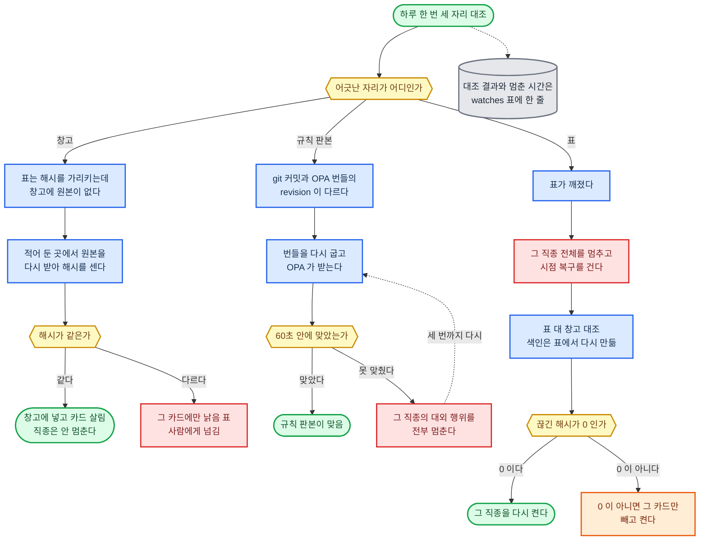
```mermaid
%%{init: {"flowchart": {"wrappingWidth": 640, "curve": "basis", "nodeSpacing": 45, "rankSpacing": 55, "padding": 14, "useMaxWidth": true}, "themeVariables": {"fontSize": "15px"}} }%%
flowchart TB
    S([하루 한 번 세 자리 대조]):::good
    Q1{{어긋난 자리가 어디인가}}:::note

    B1[표는 해시를 가리키는데<br/>창고에 원본이 없다]:::main
    R1[적어 둔 곳에서 원본을<br/>다시 받아 해시를 센다]:::main
    Q2{{해시가 같은가}}:::note
    R1A([창고에 넣고 카드 살림<br/>직종은 안 멈춘다]):::good
    R1B[그 카드에만 낡음 표<br/>사람에게 넘김]:::stop

    B2[git 커밋과 OPA 번들의<br/>revision 이 다르다]:::main
    R2[번들을 다시 굽고<br/>OPA 가 받는다]:::main
    Q3{{60초 안에 맞았는가}}:::note
    R2A([규칙 판본이 맞음]):::good
    R2B[그 직종의 대외 행위를<br/>전부 멈춘다]:::stop

    B3[표가 깨졌다]:::main
    R3[그 직종 전체를 멈추고<br/>시점 복구를 건다]:::stop
    R3B[표 대 창고 대조<br/>색인은 표에서 다시 만듦]:::main
    Q4{{끊긴 해시가 0 인가}}:::note
    R3A([그 직종을 다시 켠다]):::good
    R3C[0 이 아니면 그 카드만<br/>빼고 켠다]:::back

    LOG[(대조 결과와 멈춘 시간은<br/>watches 표에 한 줄)]:::store

    S --> Q1
    Q1 -- "창고" --> B1
    Q1 -- "규칙 판본" --> B2
    Q1 -- "표" --> B3
    B1 --> R1 --> Q2
    Q2 -- "같다" --> R1A
    Q2 -- "다르다" --> R1B
    B2 --> R2 --> Q3
    Q3 -- "맞았다" --> R2A
    Q3 -- "못 맞췄다" --> R2B
    R2B -. "세 번까지 다시" .-> R2
    B3 --> R3 --> R3B --> Q4
    Q4 -- "0 이다" --> R3A
    Q4 -- "0 이 아니다" --> R3C
    S -.-> LOG

    classDef main fill:#dbeafe,stroke:#2563eb,stroke-width:2px,color:#17314f
    classDef stop fill:#fee2e2,stroke:#dc2626,stroke-width:2px,color:#7f1d1d
    classDef back fill:#ffedd5,stroke:#ea580c,stroke-width:2px,color:#7c2d12
    classDef store fill:#e5e7eb,stroke:#6b7280,stroke-width:2px,color:#1f2937
    classDef good fill:#dcfce7,stroke:#16a34a,stroke-width:2px,color:#14532d
    classDef note fill:#fef9c3,stroke:#ca8a04,stroke-width:2px,color:#713f12
```

| 어긋난 자리 | 어떻게 아나 | 기계가 하는 것 | 운영자가 하는 것 | 그 직종은 멈추나 |
|------|------|------|------|------|
| 표 ↔ 해시 창고 대조에서 끊긴 해시가 나왔다 | 하루 한 번 도는 표 → 창고 대조 | 적어 둔 곳에서 원본을 다시 받아 해시를 센다<br>같으면 창고에 넣고 끝낸다 | 해시가 다를 때만 넘어온다<br>원본이 바뀐 것인지 우리가 잘못 받은 것인지 가른다 | 안 멈춘다<br>그 카드 하나만 낡음 표를 달고 못 쓴다 |
| git 과 표의 규칙 판본이 다르다 | OPA 가 알리는 번들 revision 이 git 최신 커밋 해시와 60초 넘게 다르다 | 번들을 다시 굽고 OPA 가 받는다. 세 번까지 다시 해 본다 | 세 번 다 안 맞으면 넘어온다<br>번들 굽는 자리와 받는 길을 본다 | 멈춘다<br>규칙 판본이 안 맞는 동안 대외 행위를 다 막는다 |
| 표가 깨졌다 | 데이터베이스가 오류를 내거나, 대조에서 있어야 할 줄이 사라졌다 | 그 직종을 멈추고 시점 복구를 건다<br>복구 뒤 표 → 창고 대조와 색인 다시 만들기를 돌린다 | 어느 시점으로 되돌릴지 정한다<br>되돌리며 사라진 건을 `signals` 에서 다시 만들지 정한다 | 멈춘다<br>끊긴 해시가 0 이면 다시 켜고, 0 이 아니면 그 카드만 빼고 켠다 |

멈춘 시각과 다시 켠 시각은 `watches` 표에 한 줄로 남는다. 멈춘 동안 들어온 신호는 `signals` 에 그대로 쌓이고, 다시 켠 뒤 순서대로 건이 된다. 그래서 멈춰도 자료가 사라지지는 않는다.

---

### 관리·유지보수

바뀌는 것이 들어오는 문은 넷이지만, 나가는 길은 하나다.

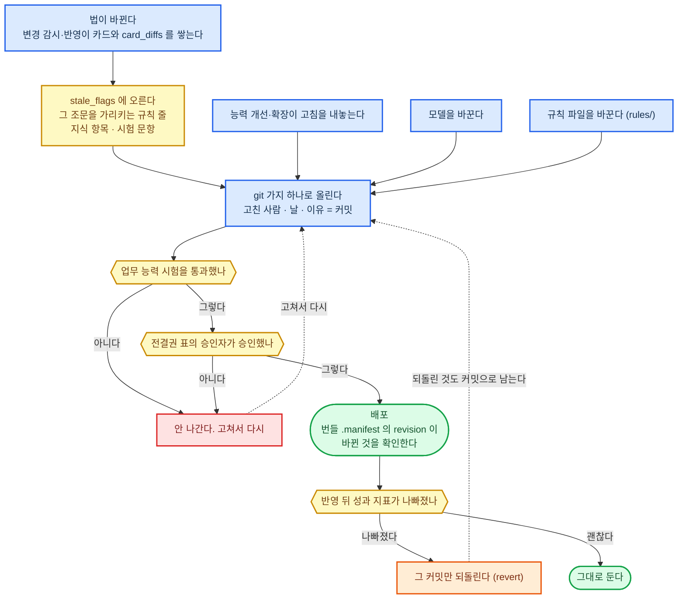
```mermaid
%%{init: {"flowchart": {"wrappingWidth": 640, "curve": "basis", "nodeSpacing": 45, "rankSpacing": 55, "padding": 14, "useMaxWidth": true}, "themeVariables": {"fontSize": "15px"}} }%%
flowchart TB
    C1["법이 바뀐다<br/>변경 감시·반영이 카드와 card_diffs 를 쌓는다"]:::main
    C2["능력 개선·확장이 고침을 내놓는다"]:::main
    C3["모델을 바꾼다"]:::main
    C4["규칙 파일을 바꾼다 (rules/)"]:::main
    F["stale_flags 에 오른다<br/>그 조문을 가리키는 규칙 줄<br/>지식 항목 · 시험 문항"]:::note
    G["git 가지 하나로 올린다<br/>고친 사람 · 날 · 이유 = 커밋"]:::main
    T{{"업무 능력 시험을 통과했나"}}:::note
    A{{"전결권 표의 승인자가 승인했나"}}:::note
    B["안 나간다. 고쳐서 다시"]:::stop
    D(["배포<br/>번들 .manifest 의 revision 이<br/>바뀐 것을 확인한다"]):::good
    W{{"반영 뒤 성과 지표가 나빠졌나"}}:::note
    R["그 커밋만 되돌린다 (revert)"]:::back
    OK(["그대로 둔다"]):::good
    C1 --> F --> G
    C2 --> G
    C3 --> G
    C4 --> G
    G --> T
    T -- "아니다" --> B
    T -- "그렇다" --> A
    A -- "아니다" --> B
    A -- "그렇다" --> D
    B -. "고쳐서 다시" .-> G
    D --> W
    W -- "나빠졌다" --> R
    W -- "괜찮다" --> OK
    R -. "되돌린 것도 커밋으로 남는다" .-> G
    classDef main fill:#dbeafe,stroke:#2563eb,stroke-width:2px,color:#17314f
    classDef stop fill:#fee2e2,stroke:#dc2626,stroke-width:2px,color:#7f1d1d
    classDef back fill:#ffedd5,stroke:#ea580c,stroke-width:2px,color:#7c2d12
    classDef store fill:#e5e7eb,stroke:#6b7280,stroke-width:2px,color:#1f2937
    classDef good fill:#dcfce7,stroke:#16a34a,stroke-width:2px,color:#14532d
    classDef note fill:#fef9c3,stroke:#ca8a04,stroke-width:2px,color:#713f12
```


| 어떤 일 | 어떻게 하나 |
|------|------|
| 직종을 더한다 | 공통 정의에 직무의 범위·방법·도구·자산·평가 조건을 연결한다. 누락·충돌·의존·조건부 경로를 검사하고 판본을 기록한다. 폴더 복제로 완성을 판정하지 않는다 |
| 법이 바뀐다 | 변경 감시·반영이 카드와 `card_diffs` 를 쌓는다 → 그 조문을 가리키는 규칙 줄·지식 항목·시험 문항이 `stale_flags` 에 오른다 → 사람 전문가가 git 에서 고치고 커밋 → 업무 능력 시험 통과 → 배포 → 해소 시각 기록 |
| 능력 개선·확장이 고친다 | 고침을 git 가지에 올린다. 업무 능력 시험 통과 + 사람 승인으로 합친다. 반영 뒤 지표가 나빠지면 그 커밋만 되돌린다. 사람이 고칠 때와 같은 문이라 따로 감사할 것이 없다 |
| 모델을 바꾼다 | `jobs/…/environment/model.yaml` 을 고치고 커밋한다. 바꾼 날과 이유는 커밋이다. 업무 능력 시험이 돌고 나서야 배포된다 |
| 누가 무엇을 고쳤나 | 파일은 커밋 이력, 표는 `since` 칸. 둘 다 지우지 않는다 |
| 보존 기간과 삭제 | 표는 파티션을 떼어 내고, 창고는 Lock 기간이 끝나면 지운다. 고객 삭제 요구는 열쇠 파기다. 기간은 분야 파일 한 곳에만 적는다 |
| 백업·복구 | 표는 데이터베이스 백업 (시점 복구), 창고는 그 자체가 백업이다. git 은 원격에 있다. 복구 뒤에는 표 → 창고 대조를 한 번 돌려 끊긴 해시가 0 인지 본다 |
| 옮기기·설치 | 색인은 표에서 다시 만든다. 엔진을 바꿔도 표와 창고는 그대로다. 다섯 부품 (git·PostgreSQL·OpenSearch·객체 저장·OPA) 전부 회사 안에 설치할 수 있어 바깥에 못 내보내는 자료도 다룬다. 객체 저장은 MinIO 유지보수 종료로 제품을 다시 고르고, 클라우드 사용이 허용되면 S3 를 검토한다 |
| 새 재료가 생기면 | 기존 책임에 배치할 수 없는지 먼저 확인한다. 새 책임이 필요하면 ID·입출력·담당·의존·검증을 정의하고 재료 목록·본문·수식·영향받는 직무를 함께 갱신한다. 폴더와 재료를 일대일로 강제하지 않는다 |
| 규칙 파일을 바꾼다 | `rules/` 는 git 에서만 고친다. 돌고 있는 번들이나 데이터베이스를 직접 고치는 길은 막아 둔다 → 업무 능력 시험 통과 → 전결권 표의 승인자 승인 → 배포<br>규칙 종류별 정당한 제정·변경 권한과 적용 근거를 확인한다. 플랫폼의 변경 불가 제한을 운영자가 임의 변경할 수 있다고 가정하지 않는다. 승인자는 유효한 전결권 표에서 찾는다<br>배포 뒤 번들 `.manifest` 의 `revision` 이 바뀐 것을 확인한다. 안 바뀌었으면 안 나간 것이다 |
| 규모 다시 재기 | 분기마다 [규모 추정](#규모-추정) 의 표를 실측으로 갈아 끼운다. 잰 값이 가정과 두 배 넘게 벌어지면 장비 사양을 그 자리에서 다시 정한다 |

---

### 더러운 상황 시뮬레이션

아래는 저장·규칙 인프라의 문서상 반례 검토다. 직무별 실제 업무 검토는 [166개 직무별 검토](docs/reviews/occupation-work-review.md)에 따로 기록했다. 두 검토 모두 실제 에이전트 실행 성적이 아니다.

| 상황 | 무엇이 벌어지나 | 받아내는 장치 |
|------|------|------|
| 부칙에 "이 법 시행 전 계약에는 옛 법을 적용한다" 가 있다 | 효력 구간만 보면 새 판본이 골라져 틀린다 | 판본 고르기가 같은 개정의 부칙 카드를 같이 낸다. 적용 여부는 모델이 부칙을 읽고 정하고 근거로 부칙 카드를 단다 |
| 이미 공포된 조문이 정정 (오탈자) 돼 같은 효력일에 판본이 둘이다 | 유일 색인이 두 번째 판본을 튕긴다 | 판본에 정정 회차가 들어간다. 옛 판본은 남고 새 판본이 덧붙는다. `card_diffs` 가 '정정' 으로 적는다 |
| 조·항·호로 나뉘지 않는 외국 법을 받는다 | 조각 위치 칸이 한국식이면 못 담는다 | 조각 위치는 관할 + 그 나라 구조대로 적은 경로다. 관할 부호가 어느 나라 구조인지 정한다 |
| 자치법규 16만 건이 243개 지자체에 걸쳐 있고, 건은 "서울 강남구" 다 | 나라 법·서울시 조례·강남구 규칙을 다 봐야 한다 | 관할이 계층 부호 (나라 > 광역 > 기초) 라 걸러내기가 위 계층까지 한 번에 잡는다 |
| 고객이 개인정보 삭제를 요구하는데 창고는 못 지우게 잠겨 있다 | 잠금과 삭제 요구가 부딪힌다 | 고객 원본은 고객 열쇠로 암호화돼 있다. 열쇠 파기 = 읽을 수 없음. 법정 보존이 남은 것은 파기 못 하고 이유를 남긴다 |
| 고객 A 의 계약서가 고객 B 의 건에서 검색된다 | 비밀 누설 | `client` 칸 + 행 보안 정책 (표), `client` 거르기가 검색 처리 단계 안 (색인). 코드가 잊어도 두 겹이 막는다 |
| 같은 계약서 파일을 고객 A 와 B 가 각각 보냈다 | 해시가 같아 한 파일로 합쳐지고, A 의 삭제 요구가 B 것까지 없앤다 | 고객 원본은 고객 열쇠로 암호화하니 해시가 다르다. 중복 제거는 공개 원본만 |
| 법령 조회 창구가 하루 죽거나 XML 형식이 바뀐다 | 변경 감시·반영이 빈 값·깨진 값을 쌓을 수 있다 | 창고에 먼저 넣고 쪼갠다. 쪼개기가 실패하면 카드는 안 생기고 원본만 남아 다음 날 다시 쪼갠다. 옛 카드는 지우지 않으니 빈 날이 나지 않는다 |
| 변경 감시·반영 둘이 같은 시각에 돈다 | 카드가 두 장씩 생긴다 | 조각 위치 + 판본 유일 색인이 둘째를 튕긴다 |
| 뜻 색인을 새로 만들었더니 검색 문제 점수가 떨어졌다 | 하루 종일 검색이 나쁘다 | 별칭을 옛 색인으로 되돌린다. 원자적이라 중간 상태가 없다 |
| 벡터 모델을 바꿔 벡터 길이가 달라졌다 | 옛 벡터와 섞이면 검색이 깨진다 | 새 색인 `cards-v{n}` 을 처음부터 만들고 별칭만 옮긴다. 옛 색인은 되돌릴 때까지 둔다 |
| 데이터베이스를 어제 시점으로 복구했는데 창고는 오늘 것이다 | 표가 모르는 원본이 창고에 있다 | 쓰는 순서가 창고 먼저라 "표에 있는데 창고에 없음" 은 안 생긴다. 반대는 하루 한 번 대조로 카드를 다시 만든다 |
| 웹소설 연재 300화, 설정과 복선을 100화 전 것까지 기억해야 한다 | 장기 기억 표에 안 맞는 모양이다 | `memory_*` 에 설정집·복선·독자 약속 표를 따로 둔다 (장기 기억 절). 화마다 낸 원고는 `deliverables` + 창고 |
| 동시통역, 말 한 마디에 1초 안에 답해야 한다 | 색인·표를 돌 시간이 없다 | 만남 전에 `working_notes` 에 미리 담고 만남 중엔 그것만 본다. 녹취는 창고, 요약은 `encounters` |
| 트레이딩, 초 단위 시세가 하루 수백만 줄이다 | `series` 가 순식간에 붇는다 | `series` 를 달로 파티션하고 보존 기간 뒤 떼어 낸다. 결정에 쓴 값은 `checks` 에 따로 남겨 시세를 지워도 재현된다 |
| 고객지원, 하루 수만 건이 동시에 들어온다 | 일꾼 여럿이 같은 건을 집는다 | `signals` 멱등 키 + `cases` 의 `SKIP LOCKED` |
| 하나의 건이 하청 조각 500개로 갈라졌고 그중 3개가 안 돌아왔다 | 어느 것이 안 왔는지 모른다 | `subtasks` 에서 거둔 시각이 빈 줄을 센다. 기한 지나면 독촉 횟수가 올라간다 |
| 부동산 세무처럼 두 분야를 겸하는 직종 | 상속이 한 줄이라 한쪽 분야가 빠진다 | `job.yaml` 의 `extends` 에 분야 둘. 부딪히면 앞에 적은 쪽이 이긴다 |
| 사례를 시험 문항으로 옮겼는데 실제 고객 이름이 들어 있다 | git 에 개인정보가 박힌다 | `cases/`·`evals/` 는 비밀 검사 통과분만, 커밋 전 검사가 막는다. 표 쪽도 `case_bank` 제약이 막는다 |
| 10년 뒤 소송에서 "그때 왜 그렇게 판단했나" 를 묻는다 | 지금 파일·모델·법이 다 바뀌었다 | 커밋 (그때 규칙·지식·모델), `run_log` + `checkpoints` (그때 걸음), `cards` 판본 (그때 법), 창고 (그때 원본 + 시각 도장) 가 다 남아 있다 |
| 사람에게 넘겼는데 사람이 답을 안 준다 | 건이 어디서 멈췄는지 아무도 모른다 | `handoffs` 의 기한이 지나면 `watches` 가 발동해 독촉하거나 다음 사람에게 넘긴다 |
| 회사가 자료를 바깥 클라우드에 못 올린다 | 클라우드 부품에 기대면 설치가 안 된다 | 다섯 부품 전부 회사 안에 설치할 수 있다 (S3 자리는 사내 객체 저장 제품이 맡되, MinIO 는 유지보수 종료라 제품을 다시 고른다) |
| 그림 생성에 남의 얼굴이 들어갔는지 나중에 따진다 | 만들기 전에 확인한 근거가 없다 | `checks` 에 권리 확인 한 줄 (닿은 곳·읽은 값·결과) 을 만들기 전에 적는다. 원본과 고친 단계는 창고에 장마다 |

---

### 하지 않는 것

| 하지 않는다 | 대신 이렇게 한다 |
|------|------|
| 법령·판례를 마크다운 파일로 저장소에 넣기 | 원본은 해시 창고, 조각은 표 |
| 벡터 저장소를 따로 두기 | OpenSearch 의 k-NN 칸. 검색 엔진 하나면 된다. 표 안에서 벡터를 써야 할 일이 생기면 PostgreSQL 의 pgvector (HNSW) 가 대안이다 |
| 카드를 색인에만 두기 | 표가 원본이고 색인은 파생물이다. 색인은 언제든 버리고 다시 만든다 |
| 직종마다 같은 실행 코드를 복제하기 | 공통 실행은 재사용하고, 새 프로그램·형식은 필요한 어댑터를 추가해 검증한다 |
| 규칙을 프롬프트 글이나 `jobs/` 에 두기 | `rules/` OPA 번들 한 곳. 가리는 것은 규칙 엔진, 판단은 모델 |
| 고객 원본을 고객 사이에 같이 쓰기 | 고객 열쇠로 따로 암호화. 공개 원본만 같이 쓴다 |
| 격리를 검색 코드에 맡기기 | 표의 행 보안 정책과 검색 처리 단계 안의 거르기 |
| 열쇠를 설정 파일에 두기 | 비밀 저장소 |

---

### 됐다는 기준

| 잣대 | 어떻게 재나 |
|------|------|
| 책임이 이어지는가 | M01–M57와 본문 재료 77개를 대응표로 대조한다. 통합·분리한 설명의 책임과 구분을 확인한다. 구성 전개식은 생성 시 본문·대응표·세부 ID를 대조하고, 실제 구현은 담당 모듈·입출력·검증 증거로 확인한다 |
| 표에서 색인을 다시 만들 수 있는가 | 색인을 지우고 표에서 다시 만든 뒤 검색 문제 100개의 점수가 같은지 본다 |
| 원본이 안 바뀌는가 | 해시 창고의 무작위 20개를 다시 해시해 이름과 같은지 본다 |
| 판본 고르기가 빠른가 | 기준일을 바꿔 가며 1,000번 조회해 색인을 탔는지 (실행 계획) 본다 |
| 격리가 되는가 | 고객 A 계정으로 고객 B 의 카드·건·결과물을 표와 색인 양쪽에서 조회해 0 건인지 본다 |
| 삭제 요구가 되는가 | 시험 고객의 열쇠를 파기한 뒤 그 고객 원본과 줄이 읽히지 않고, 공개 원본은 그대로인지 본다 |
| 재현이 되는가 | 지난 건 하나를 그때 커밋·판본·원본으로 다시 돌려 결론이 같은지 본다 |
| 직종 하나 더하기 | 기존 코드 재사용과 새 연동의 필요 범위를 기록하고, 그 직종의 실제 입력·제작·검증·인수 및 회귀 시험을 통과하는지 본다 |
| 재료마다 기술과 자리가 정해졌는가 | 재료 77개 절마다 ‘쓰는 기술과 저장 자리’ 표가 있고, 그 표의 코드 자리·저장 자리가 git 나무와 표 설계에 있는 이름인지 대조한다 |

---

## 공장 설계

공장은 새 직종의 요구를 받아 공통 기반과 특화를 연결하고, 검사·시험·배포·변경 반영까지 반복하는 절차다. 자동으로 파일을 만드는 것만으로는 공장이 완성되지 않는다.

---

### 공장에 넣을 내용

| 입력 | 구체적으로 채울 것 |
|---|---|
| 업무 범위 | 직종·세부 업무·대상·난도·관할·운영 환경, 맡을 일과 제외할 일 |
| 전문성 | 개념·방법·단위·전제·예외·사례·판단 갈림·치명적 오류 |
| 자료·도구 | 실제 입력 형식, 원천 접근, 전문 프로그램·계정·권한·이용 조건 |
| 규칙 | 의무·계약·조직·사용자 조건, 승인·위임·한도·자료 경계 |
| 완료·평가 | 단계별 검사·인수·성과, 대표 과제·새 과제·비교 전문가·채점 방법 |
| 운영 | 담당·기한·예산·감시·복구·보존·갱신·종료 조건 |

---

### 조립부터 배포까지

| 순서 | 할 일 | 남길 결과 |
|---|---|---|
| 1. 적용 재료 고르기 | 77개 재료의 필요 여부와 조건을 업무 요구에 대조 | 필요한 재료·조건부 재료·제외 이유 |
| 2. 공통부와 특화 연결 | 기존 지식·코드·도구를 재사용하고 직종별 값을 채움 | 적용 출처·판본, 새로 필요한 기능 |
| 3. 빠진 연결 검사 | 요구→입력→판단→처리→검사→인수의 담당 확인 | 누락·미지원·미검증 목록과 보완 담당 |
| 4. 충돌 검사 | 권한·규칙·단위·판본·자원·선후 관계를 대조 | 해결된 충돌과 아직 막힌 경로 |
| 5. 시험용 조립 | 분리된 환경에서 실제 입력·도구·실패 조건으로 실행 | 연결·복구·기존 업무 재시험 결과 |
| 6. 직무 능력 평가 | 처음 보는 과제와 숙련 전문가 비교 | 지원할 업무 범위와 증거·제약 |
| 7. 배포·관찰 | 합격한 구성표로 제한된 범위부터 운영 | 배포 판본, 관찰 결과, 확대·중지 판단 |
| 8. 변경 반영 | 바뀐 공통부·규정·자료·도구의 영향을 추적 | 재조립·재시험 대상과 새 배포 기록 |

공통 코드의 시험 성적은 재사용할 수 있지만 새로운 직종 전체의 합격 성적으로 옮겨 적지 않는다. 조건을 판정할 조회·진단은 본 작업과 별도로 준비한다. ‘조건이 맞아야 진단을 실행하는데 진단해야 조건을 안다’는 순환도 조립 검사에서 찾는다.

---

### 공장이 됐다고 볼 기준

서로 다른 요구를 가진 복수의 직종을 같은 절차로 조립한다. 문서·계산·외부 거래·상시 운영 등 대표 차이가 드러나도록 시험 직종을 고른다. 새 직종의 추가 작업량·시간, 공통부 재사용 범위, 기존 직종에 생긴 영향을 기록한다.

새 직종마다 실행 기반 전체를 다시 만들어야 하거나, 필수 도구·평가가 빠졌는데 조립 완료로 처리하면 공장 시험에 실패한 것이다. 재사용할 수 없는 전문 도구 연결을 추가하는 작업은 허용하되 그 비용과 시험을 숨기지 않는다.

---

## 만드는 순서

전체 진행 상태는 [진행-계획](진행-계획.md#업무-순서)에서 관리한다. 아래 표는 각 묶음에서 무엇을 확보해야 다음으로 갈 수 있는지를 설명한다.

| 순서 | 작업 | 다음으로 넘어갈 조건 |
|---|---|---|
| 1. 확정된 정의 연결 | 정의 1의 목표·흐름·재료를 요구와 검사에 연결 | 77개 재료의 책임·입출력·예외·후속 담당에 누락이 없음 |
| 2. 설계 검토 | 재료 구상·사용 구조·기술·저장·공장 절차를 대조 | 모순·미정 사항과 결정할 근거가 정리됨 |
| 3. 실제 연결·핵심 가정 확인 | 자료·계정·이용 조건 확보, 중요한 도구·복구·파일 기능을 작은 시험으로 확인 | 구현을 막을 의존과 필요한 추가 작업이 드러남 |
| 4. 평가 준비 | 비교 전문가·채점자·표본·기간·예산 확보, 개발 자료와 새 평가 자료 분리 | 시험 전에 합격선·비교 조건·채점 신뢰성을 확인함 |
| 5. 공통 기반 개발 | 실행·저장·신호·권한·한도·기록·복구 구현 | 함수·AI 혼합, 병렬 일부 실패, 중단·재개가 연결됨 |
| 6. 단일 업무 완주 | 시험용 직무의 입력·지식·처리·검증·납품 연결 | 실제 한 건이 필요한 전문 처리와 인수까지 이어짐 |
| 7. 복합·안전·모델 교체 시험 | 협업·여러 건·공유 예산·공격·교체·실패 조합 확인 | 경계와 필수 검사가 유지되고 실패·비용이 기록됨 |
| 8. 사내 연동·성능·판본 변경 시험 | 실제 시스템의 처리·복구·부하와 데이터 구조·규칙·흐름 변경을 시험 | 목표한 품질·속도·비용을 충족하고 대기 건의 이전·인계·되돌림을 확인함 |
| 9. 공장 구현·시험 | 특화 입력부터 검사·조립·배포·갱신 자동화 | 다른 직종도 같은 절차로 만들고 기존 직종을 보호함 |
| 10. 직종별 제작 | 우선순위를 정하고 실제 업무 조사·특화·전문 도구·사용 형태 완성 | 해당 직종의 자료·판단·실행·검사·인수 경로를 갖춤 |
| 11. 대체 증명 | 같은 조건에서 숙련 전문가와 비교 | 사전에 정한 품질·자율성·비용·기한·성과 기준 충족 |
| 12. 배포 준비·초기 운영 | 자료·진행 건 이전, 담당·복구·되돌림 확인, 제한 운영 | 실제 환경의 관찰 결과로 운영 확대 여부를 결정함 |
| 13. 지속 운영·종료 | 감시·갱신·재시험·성과 개선, 종료·인계·삭제 | 중단·변경·서비스 종료 때도 남은 업무와 자료 책임이 이어짐 |

자료 확보·전문가 섭외·평가 준비·핵심 연결 확인은 설계와 병행한다. 긴 대기나 외부 계정 문제를 개발 끝까지 미루지 않는다. 시험 과제를 만드는 데 필요한 직무 조사도 이때 앞당긴다.

공통 기반을 검증할 **시험용 직무**와 실제로 판매·운영할 **첫 직종**은 구분한다. 공통 구조는 전체 요구에서 설계하고, 시험용 직무는 그 구조를 확인하는 데 쓴다. 실제 첫 직종은 자료·도구 접근, 비교 전문가, 결과 판정, 예상 편익과 위험을 확인한 뒤 고른다. 기존 세무·회계 사례가 많다는 이유만으로 자동 확정하지 않는다.

개발 순서는 의존관계에 맞춰 조정한다. 실시간·협업·자동 갱신이 필수인 직무는 해당 기능을 첫 완주 시험 전부터 갖춘다. 문서 읽기·계산·제작·검증을 마지막에 붙일 부가기능으로 미루지 않는다.

앞의 표까지는 다 만든 모습으로 가는 큰 묶음이다. 아래는 그 안에서 재료를 실제로 채우는 순서다. 재료 77개를 한꺼번에 채우지 않는다. 직종 하나를 먼저 고른다. 재료는 네 단계로 나눠 채운다. 단계마다 관문을 두고, 넘은 것만 다음 단계로 보낸다.

---

### 첫 직종 고르기

166개를 직무명만 바꿔 동시에 완성할 수 있다고 가정하지 않는다. 먼저 한 직무의 구체 위임 범위에서 자료·도구·판단·제작·인수·성과 증거를 끝까지 연결한다. 기존 예시가 많은 세무사 신고·기장을 초기 후보로 두되, 공개 통계나 임의 점수만으로 선정이 입증됐다고 하지 않는다.

| 선정에 필요한 증거 | 확인할 내용 |
|---|---|
| 실제 업무 접근 | 비식별 원자료·전문 도구·기관 환경·외부 수행 결과를 합법적으로 확보할 수 있는가 |
| 적합한 기준선 | 해당 난도에 맞는 숙련 전문가·팀의 실제 수행을 동일 조건으로 비교할 수 있는가. 업계 평균 통계는 보조 자료다 |
| 결과 판정 | 정확한 서류뿐 아니라 사실·해석·선택·실행·후속 결과를 검증할 수 있는가. 사람의 전문 평가도 필요한 증거다 |
| 시험 가능성 | 실제 피해를 통제한 시험·복구·전문 감독을 설계할 수 있는가. 정정 절차의 존재를 손실이 없다는 뜻으로 해석하지 않는다 |
| 자료·표본 설계 | 직무의 계절성·난도·희소 사건·상관·결과 지연에 맞는 표본을 확보할 수 있는가. 100건·월 20건을 보편 조건으로 두지 않는다 |
| 필수 외부 의존 | 실사·실측·진료·촬영·자격 행위가 필요한 경우 수행 조건·비용·사람 기여를 계수할 수 있는가 |

신고·기장, 관세, 취약점 관리, QA 등 기존 후보도 이 증거를 확보한 뒤 고른다. 어려운 직무를 영구 제외하거나 쉬운 직무의 성적을 나머지 166개에 전이하지 않는다. [직무별 검토](docs/reviews/occupation-work-review.md)의 입력·실패 기준으로 시험 범위를 구체화한다.

---

### 재료 77개를 채우는 순서

아래는 최초 구축의 단계별 책임 배치다. 구축 단계는 계통과 별도이므로, 한 단계에 여러 계통의 재료가 함께 들어간다. 해당 직무의 필수 기능은 첫 업무 시험 전에 갖춘다. 실시간 대화·변경 감시·반영·협업이 처음부터 필요한 업무라면 4단계까지 기다리지 않고 앞당긴다. 결과물 만들기·수정, 정보·자료 이해, 계산을 나중에 붙일 부가기능으로 취급하지 않는다.

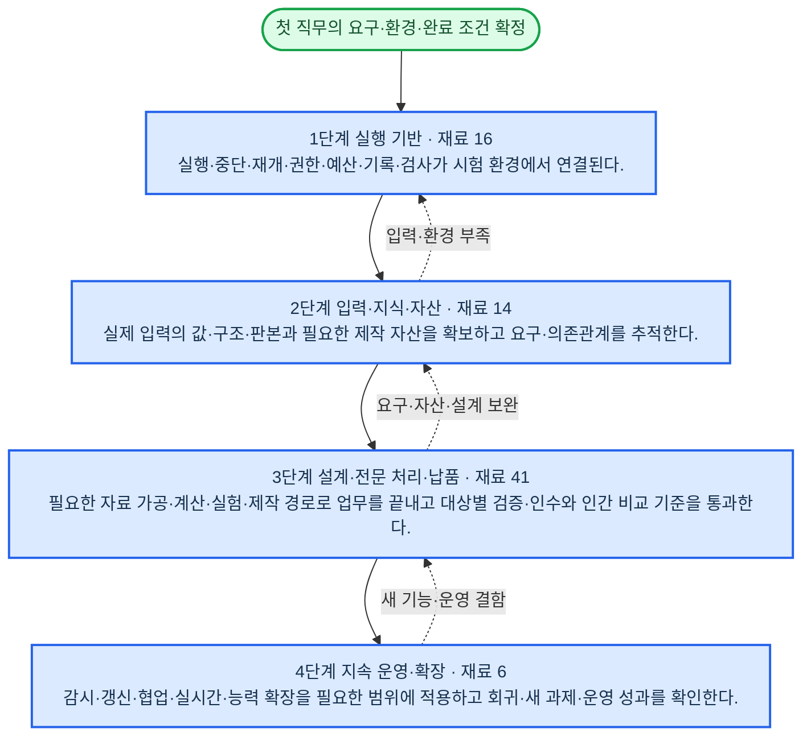
```mermaid
%%{init: {"flowchart": {"wrappingWidth": 640, "curve": "basis", "nodeSpacing": 45, "rankSpacing": 55, "padding": 14, "useMaxWidth": true}, "themeVariables": {"fontSize": "15px"}} }%%
flowchart TB
    S(["첫 직무의 요구·환경·완료 조건 확정"]):::good
    A1["1단계 실행 기반 · 재료 16<br/>실행·중단·재개·권한·예산·기록·검사가 시험 환경에서 연결된다."]:::main
    A2["2단계 입력·지식·자산 · 재료 14<br/>실제 입력의 값·구조·판본과 필요한 제작 자산을 확보하고 요구·의존관계를 추적한다."]:::main
    A3["3단계 설계·전문 처리·납품 · 재료 41<br/>필요한 자료 가공·계산·실험·제작 경로로 업무를 끝내고 대상별 검증·인수와 인간 비교 기준을 통과한다."]:::main
    A4["4단계 지속 운영·확장 · 재료 6<br/>감시·갱신·협업·실시간·능력 확장을 필요한 범위에 적용하고 회귀·새 과제·운영 성과를 확인한다."]:::main
    S --> A1 --> A2 --> A3 --> A4
    A2 -. "입력·환경 부족" .-> A1
    A3 -. "요구·자산·설계 보완" .-> A2
    A4 -. "새 기능·운영 결함" .-> A3
    classDef main fill:#dbeafe,stroke:#2563eb,stroke-width:2px,color:#17314f
    classDef stop fill:#fee2e2,stroke:#dc2626,stroke-width:2px,color:#7f1d1d
    classDef back fill:#ffedd5,stroke:#ea580c,stroke-width:2px,color:#7c2d12
    classDef store fill:#e5e7eb,stroke:#6b7280,stroke-width:2px,color:#1f2937
    classDef good fill:#dcfce7,stroke:#16a34a,stroke-width:2px,color:#14532d
    classDef note fill:#fef9c3,stroke:#ca8a04,stroke-width:2px,color:#713f12
```

| 단계 | 재료 | 관문 |
|---|---|---|
| **1단계 실행 기반 · 16개** | 운영 감시·복구<br>AI 모델<br>실행 제어<br>현재 진행 상태<br>현재 작업 정보<br>시작 신호<br>분리 실행<br>업무 도구·시스템<br>시험 환경<br>에이전트 기본 원칙<br>업무 권한<br>안전장치<br>비용·위험 한도<br>결과 검증·재검증<br>판단 근거 기록<br>업무 능력 시험 | 실행·중단·재개·권한·예산·기록·검사가 시험 환경에서 연결된다. 함수만 실행하는 경로와 병렬 일부 실패·재개도 시험 환경에서 확인한다. |
| **2단계 입력·지식·자산 · 14개** | 정보·자료 이해<br>규칙·기준 원문<br>적용 사례<br>참고 자료<br>현재 값·상태 확인<br>업무별 정보<br>근거의 신뢰성·적합성<br>자료의 시점·버전<br>정보·자료 찾기<br>업무 지식<br>실전 경험·감각<br>표현 방식·스타일<br>장기 기억<br>재사용 자료 | 실제 입력의 값·구조·판본과 필요한 제작 자산을 확보하고 요구·의존관계를 추적한다. |
| **3단계 설계·전문 처리·납품 · 41개** | 기록 입력·수정<br>신청·거래 처리<br>설정·작동 제어<br>게시·배포<br>결과물 설계<br>내용 재구성<br>결과물 만들기·수정<br>법·의무 기준<br>직업 윤리·의무<br>계약·합의 조건<br>플랫폼·제출처 규정<br>조직 규칙<br>사용자 지정 규칙<br>규칙의 적용·우선순위<br>지시·의도 파악<br>대안·전략 판단<br>업무 절차·실행 계획<br>문제·목표·완료 조건<br>사람과 소통<br>협상·조율<br>사람에게 넘기기<br>납품 준비<br>전달·인수 확인<br>작업 진행·연결<br>대기·후속 관리<br>반대 근거·다시 확인<br>빠진 위험 확인<br>일하는 과정 평가<br>결과 품질 평가<br>성공·실패 원인 분석<br>자료 선별·분류<br>자료 정리·결합<br>형식·구조 변환<br>계산<br>분석<br>예측<br>조건 안에서 최선 찾기<br>기준 적용·판정<br>관찰·측정<br>실험<br>시뮬레이션 | 필요한 자료 가공·계산·실험·제작 경로로 업무를 끝내고 대상별 검증·인수와 인간 비교 기준을 통과한다. |
| **4단계 지속 운영·확장 · 6개** | 나눠 맡기기<br>실시간 대화<br>변경 감시·반영<br>먼저 알아채기<br>능력 개선·확장<br>성과 추적 | 감시·갱신·협업·실시간·능력 확장을 필요한 범위에 적용하고 회귀·새 과제·운영 성과를 확인한다. |

재료 수는 16 + 14 + 41 + 6 = 77개다. 기능을 사용하지 않으면 적용 제외 이유를 기록한다. 시험 표본·기간·합격선은 [평가 규약](docs/evaluation.md)에 따라 업무별로 정한다. 공통 코드가 있다는 이유로 직무별 검증을 생략하지 않는다.

---

### 형태별로 빠지는 재료

재료의 기본 사용 방식은 [재료 표](docs/materials.md#재료의-적용-구분)의 **상시·단계별·조건부**를 따른다. 단계별은 최초 1회로 고정하지 않고 자료·목표·결과가 바뀌면 다시 수행한다. 조건부로 표시한 규칙도 해당 업무에 적용되면 유효한 동안 계속 지킨다.

위임형·고용형·운영형이라는 이름만으로 필요한 기능을 제외하지 않는다. 업무의 입력·행동·산출물·사용 환경·후속 성과에 따라 required·conditional·not_applicable을 정한다. 조건부 기능이 활성화되면 필수 의존·실행·검증 조건을 충족해야 하며, 조건이 불명이면 해당 경로의 확인을 먼저 진행한다.

| 업무 조건 | 필요한 재료와 적용 기준 |
|---|---|
| 문서·표·발표자료 납품 | 정보·자료 이해 · 결과물 설계 · 내용 재구성 · 결과물 만들기·수정 · 재사용 자료 · 납품 준비 · 전달·인수 확인. 수식이 있으면 계산 · 분석도 필요 |
| 미디어·3D·CAD·BIM·회로·GIS 제작 | 정보·자료 이해 · 업무 도구·시스템 · 재사용 자료 · 결과물 만들기·수정 · 결과 품질 평가. 요구에 따라 계산 · 실험 · 시뮬레이션을 연결 |
| 분석·예측·연구 | 자료 선별·분류 · 자료 정리·결합 · 형식·구조 변환 · 계산 · 분석 · 예측 · 조건 안에서 최선 찾기, 필요할 때 관찰·측정 · 실험 · 시뮬레이션. 데이터 계보·가정·검증된 적용 범위를 남김 |
| 파일 없는 거래·상시 운영 | 업무 도구·시스템 · 분리 실행 · 시작 신호 · 먼저 알아채기 · 현재 진행 상태 · 성과 추적. 파일 납품이 없으면 결과물 설계 · 내용 재구성 · 결과물 만들기·수정을 제외할 수 있음 |
| 실시간·협상·교육·협업 | 실시간 대화 · 사람과 소통 · 협상·조율 · 나눠 맡기기 중 필요한 기능과 실제 합의·학습·협업 성과 검사 |
| 새 형식·새 도구 | 능력 개선·확장으로 연동·환경을 확보하고 보호된 새 과제와 회귀를 통과한 범위만 지원 |

위임·고용·운영의 차이는 계약·승인·조직 규칙·관찰 기간을 정할 때 적용한다. 사람의 개입·외부 승인·실물 시험에 기대는 부분은 결과에 명시한다.

---

### 둘째 직종부터

새 직종은 재료 77개의 적용 여부·지원 범위부터 다시 정한다. 공통 코드는 재사용하되 필요한 입력 형식·프로그램·자산·계산·실험·납품 조건이 다르면 어댑터와 검사를 추가한다. 설정 파일만 늘리면 모든 직무가 된다고 가정하지 않는다.

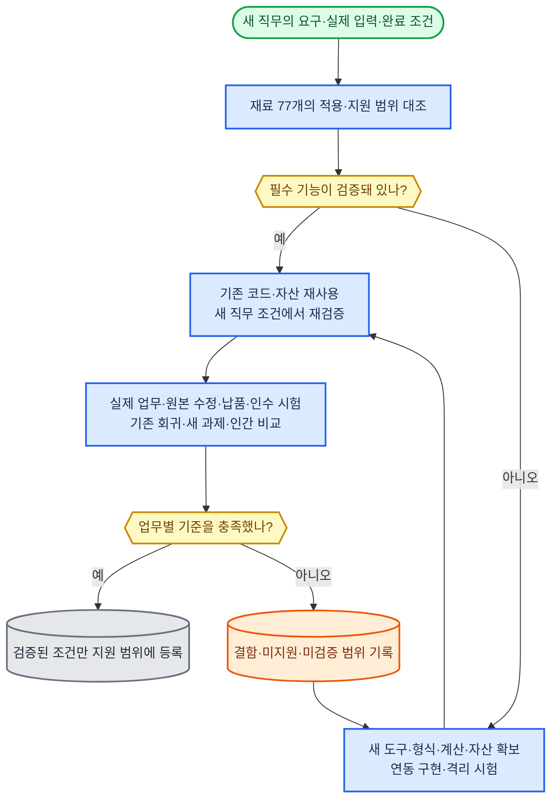
```mermaid
%%{init: {"flowchart": {"wrappingWidth": 640, "curve": "basis", "nodeSpacing": 45, "rankSpacing": 55, "padding": 14, "useMaxWidth": true}, "themeVariables": {"fontSize": "15px"}} }%%
flowchart TB
    S(["새 직무의 요구·실제 입력·완료 조건"]):::good
    M["재료 77개의 적용·지원 범위 대조"]:::main
    Q{{"필수 기능이 검증돼 있나?"}}:::note
    R["기존 코드·자산 재사용<br/>새 직무 조건에서 재검증"]:::main
    B["새 도구·형식·계산·자산 확보<br/>연동 구현·격리 시험"]:::main
    E["실제 업무·원본 수정·납품·인수 시험<br/>기존 회귀·새 과제·인간 비교"]:::main
    P{{"업무별 기준을 충족했나?"}}:::note
    O[("검증된 조건만 지원 범위에 등록")]:::store
    F[("결함·미지원·미검증 범위 기록")]:::back
    S --> M --> Q
    Q -->|예| R
    Q -->|아니오| B
    B --> R
    R --> E --> P
    P -->|예| O
    P -->|아니오| F
    F --> B
    classDef main fill:#dbeafe,stroke:#2563eb,stroke-width:2px,color:#17314f
    classDef stop fill:#fee2e2,stroke:#dc2626,stroke-width:2px,color:#7f1d1d
    classDef back fill:#ffedd5,stroke:#ea580c,stroke-width:2px,color:#7c2d12
    classDef store fill:#e5e7eb,stroke:#6b7280,stroke-width:2px,color:#1f2937
    classDef good fill:#dcfce7,stroke:#16a34a,stroke-width:2px,color:#14532d
    classDef note fill:#fef9c3,stroke:#ca8a04,stroke-width:2px,color:#713f12
```

| 확인 대상 | 새 직무에서 할 일 |
|---|---|
| 공통 실행 코드 | 권한·상태·저장·예산·복구가 새 환경과 기한에서도 유지되는지 시험 |
| 전문 기능 | 실제 입력·설계 요구·계산/실험·제작·변환·인수에 필요한 도구·자산·어댑터 확보 |
| 데이터·지식·규칙 | 적용 시점·관할·고객 경계·단위·정답·평가 자료를 새 업무에 맞춤 |
| 검증과 지원 주장 | 비용·사람 개입·기한·품질·사후 성과를 새 기준선과 비교하고 조건·증거를 공개 |

검증되지 않은 기능은 미검증, 실행 경로가 없는 기능은 미지원으로 남긴다. 실제 실패를 정의 밖으로 빼거나 첫 직종의 성공을 새 직종의 대체 증거로 사용하지 않는다.

---

## 평가와 운영

---

### 무엇을 구분해서 증명할 것인가

| 확인 단계 | 증거 | 말할 수 있는 범위 |
|---|---|---|
| 정의 검사 | 재료·입출력·책임·예외 연결의 대조 | 검토한 요구를 설계가 다룬다 |
| 계산·상태 모형 시험 | 명시한 가정에서의 반례·상태 변화 검사 | 해당 모형에서 연결과 제한이 작동한다 |
| 실제 연결 시험 | 특정 계정·환경·판본에서의 실제 처리·복구 | 시험한 도구·행동을 그 환경에서 수행한다 |
| 전문 업무 평가 | 새 과제·숙련 전문가 비교·외부 완료 증거 | 시험한 업무 범위에서의 능력과 한계 |
| 운영 평가 | 실제 성과·오류·사람 기여·총비용·지연 손실 | 관찰한 조건과 기간에서의 운영 성능 |

기존 166개 직무 사례와 복합 사건 검토는 설계 누락을 찾는 개발 자료다. 실제 전문가 166개를 구현·검증했다는 뜻으로 쓰지 않는다. 공개된 사례를 처음 보는 비공개 시험으로 다시 세지 않는다.

---

### 합격 기준

품질·안전의 최소 기준, 전문가와 비교할 허용 차이, 사람 개입, 기한·총비용, 사후 성과를 시험 전에 정한다. 표본 수와 기간은 업무 난도·희소 오류·결과 확정 시점에 맞춰 정하며 ‘100건이면 충분’ 같은 공통 숫자를 쓰지 않는다.

비교 전문가는 해당 업무를 최근에 실제로 수행한 숙련자로 구성한다. AI와 자료·도구·권한·기한·지원 조건을 맞추고, 복합 업무는 그 일을 맡는 숙련 팀과 비교한다. 결과물의 작성자를 가릴 수 있으면 가리고 채점한다. 채점자도 정상·오류 사례로 검증한다.

다섯 이관 사유가 있어도 사람의 전문 수정과 단순 승인·서명은 구분한다. 전문 개입 없는 완료율과 초기 위임 이후 어떤 도움도 없는 완료율을 따로 보고한다. 자격 행위를 올바르게 연결했다는 사실을 그 자격자의 업무까지 AI가 했다는 뜻으로 바꾸지 않는다.

세부 표본 설계·지표·합격 판단은 [평가와 대체 판정](docs/evaluation.md)을 따른다. 증거가 부족하면 해당 범위를 미검증으로 남기고 필요한 시험을 정한다.

---

### 운영에서 계속 확인할 것

| 시점 | 확인과 조치 |
|---|---|
| 매 실행·대기 | 진행·예약 비용, 권한·기한·미결 건, 실제 외부 처리 상태 확인 |
| 장애 발생 | 추가 피해 제한, 기록 보존, 복구·외부 상태 대조, 담당 통지와 재개 |
| 규정·자료·모델·도구 변경 | 영향받는 지식·업무·직종을 찾고 필요한 재검토·재시험·배포 |
| 성과 확인 시점 | 실제 결과·사람 기여·비용·지연 손실을 비교하고 원인 분석 |
| 서비스 축소·종료 | 신규 접수와 예약 중지, 미결 건·약속·원본·결과·권한 인계, 계정 회수와 보존·삭제 확인 |

변경할 때마다 무조건 사람의 승인을 받도록 만들지는 않는다. 사전 위임된 저위험 변경은 정한 시험·배포 절차로 반영하고, 그 범위를 넘는 권한·목표·한도의 변경은 결정권자에게 넘긴다. 업무가 끝나도 남은 약속과 자료 관리 책임은 이행하거나 인계할 때까지 유지한다.

---

## 재료별 구상

정의 1에서 확정한 77개 재료를 각각 어떻게 작동시키고 무엇으로 확인할지 펼친 부분이다. 앞의 사용 구조·기술·공장 설계가 참조하는 바탕이므로 순서상 뒤에 둔다.

각 항목에서 **갖출 것**은 직종이나 업무에 맞춰 준비할 내용, **작동**은 처리와 다음 담당, **확인**은 실제로 됐는지 판단할 증거다. 기술 제품은 앞의 [기술과 관리 체계](#기술과-관리-체계)에서 고른다. 재료마다 **쓰는 기술과 저장 자리** 표를 두어 실행 꼴·코드 자리·저장 자리·바깥 기술·확인할 시험과 그 이유를 적는다.

---

### 환경

#### AI 모델

목표와 자료를 이해하고, 가능한 방법을 비교해 답변·판단·행동 제안을 만든다. 이 자리에 두는 것은 장기 실행형 프론티어 모델이며, 세부 책임 번호는 M01이다.

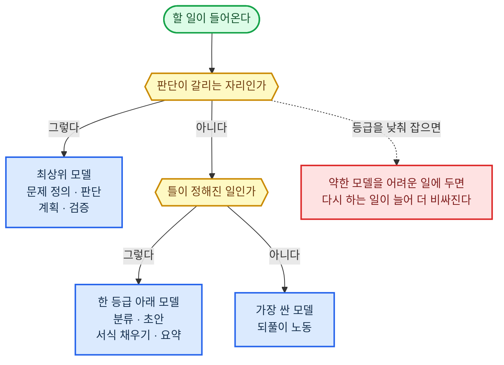
```mermaid
%%{init: {"flowchart": {"wrappingWidth": 640, "curve": "basis", "nodeSpacing": 45, "rankSpacing": 55, "padding": 14, "useMaxWidth": true}, "themeVariables": {"fontSize": "15px"}} }%%
flowchart TB
    JOB(["할 일이 들어온다"]):::good
    Q1{{"판단이 갈리는 자리인가"}}:::note
    TOP["최상위 모델<br/>문제 정의 · 판단<br/>계획 · 검증"]:::main
    Q2{{"틀이 정해진 일인가"}}:::note
    MID["한 등급 아래 모델<br/>분류 · 초안<br/>서식 채우기 · 요약"]:::main
    LOW["가장 싼 모델<br/>되풀이 노동"]:::main
    WARN["약한 모델을 어려운 일에 두면<br/>다시 하는 일이 늘어 더 비싸진다"]:::stop
    JOB --> Q1
    Q1 -- "그렇다" --> TOP
    Q1 -- "아니다" --> Q2
    Q2 -- "그렇다" --> MID
    Q2 -- "아니다" --> LOW
    Q1 -. "등급을 낮춰 잡으면" .-> WARN
    classDef main fill:#dbeafe,stroke:#2563eb,stroke-width:2px,color:#17314f
    classDef stop fill:#fee2e2,stroke:#dc2626,stroke-width:2px,color:#7f1d1d
    classDef back fill:#ffedd5,stroke:#ea580c,stroke-width:2px,color:#7c2d12
    classDef store fill:#e5e7eb,stroke:#6b7280,stroke-width:2px,color:#1f2937
    classDef good fill:#dcfce7,stroke:#16a34a,stroke-width:2px,color:#14532d
    classDef note fill:#fef9c3,stroke:#ca8a04,stroke-width:2px,color:#713f12
```

##### 맡는 것

| 이 재료가 맡는다 | 맡지 않는다 |
|------|------|
| 판단<br>무엇을 찾을지, 무엇을 믿을지, 어떻게 할지, 언제 멈추고 사람에게 넘길지 | 순환 돌리기·상태 저장·끊긴 자리 이어받기·여럿에게 나누기는 실행 제어·현재 진행 상태·나눠 맡기기가 맡는다<br>사실은 자료·검색이, 허용 범위는 규칙·권한이 맡는다 |

> 모델이 좋아도 나머지 재료가 비면 성능이 안 나온다.
> 나머지가 좋아도 모델의 판단이 짧게 끊기면 긴 일이 중간에 무너진다.
> 이 재료가 어디까지 가야 하는지는 정의 1의 [원하는 것](<전문가 에이전트 정의.md#원하는-것>) 절에 적어 두었다.

##### 짜는 방식

**모델과 하네스의 경계**

> 하네스 (Harness) 는 모델을 둘러싸고 일이 돌아가게 해 주는 바깥 장치다. 실행 제어·현재 진행 상태·나눠 맡기기를 합쳐 하네스라 부른다. 모델이 머리라면 하네스는 몸이다.
> 모델이 하는 몫과 하네스가 하는 몫의 경계는 해마다 모델 쪽으로 옮겨 간다. 지금 모델이 못 해서 하네스에 코드로 넣어 둔 일을 다음 모델은 스스로 한다. 그래서 "모델은 이걸 못 하니 대신 해 준다"는 가정을 하네스에 넣어 두면, 모델이 좋아질 때마다 그 가정이 낡은 짐이 된다. 판단의 규칙을 하네스에 두껍게 넣지 않는 이유다. 판단은 모델이 한다. 모델이 새것으로 바뀔수록 하네스가 할 일이 줄어들게 짠다.
> 하네스와 안전장치에 남기는 것은 모델이 못 하는 것뿐이다. 되돌릴 수 없는 실행 막기, 한도를 넘었는지 세기, 진행 상태 저장하기, 재우기·깨우기, 나누고 거두기, 프롬프트 주입·비밀 유출 막기, 악성 코드 검사처럼 기계가 해야 확실한 것이다.
> 하네스를 두껍게 만든다고 성능이 오르지는 않는다. 복잡한 틀을 새로 짜는 것보다 단순한 부품을 조립하는 쪽이 낫다.

**고르는 기준과 배치**

| 기준 | 정한 것 |
|------|------|
| 등급 | 어떤 모델을 쓸지는 값이 아니라 일의 성격에 맞춰 등급으로 고른다<br>판단이 갈리는 자리 (문제 정의·판단·계획·검증) = 최상위 모델<br>틀이 정해진 일 (분류·초안·서식 채우기·요약) = 한 등급 아래<br>되풀이 노동 = 가장 싼 것<br>약한 모델을 어려운 일에 두면 다시 하는 일이 늘어 오히려 더 비싸진다<br>어려운 판단과 정형 작업을 구분해 검증된 모델을 배정한다 |
| 지금 배치 (2026-09 기준) | GPT-6 Astra = 수석 (주 실행자)<br>GPT-5.6 Sol = 직원<br>Claude Haiku 4.5 = 되풀이 노동<br>Claude Fable 5.1 = 자문·독립 검증 (반대 근거·다시 확인의 다른 쪽 눈)<br>반대 근거·다시 확인 재료의 "일한 쪽과 다른 쪽이 검사한다"를 모델끼리 하려면 만든 회사가 다른 두 모델을 쓸 수 있으나, 회사가 다르다는 사실만으로 독립성과 비용 이점이 생기지는 않는다. 어느 조합을 쓸지는 실제 오류 발견 능력과 총비용으로 정한다<br>이 배치는 바뀐다. 모델 이름은 이 표에만 적고, 다른 재료는 이 표를 가리킨다 |
| 계약 | 달마다 정액을 내는 구독이 아니라 쓴 만큼 내는 API (프로그램이 모델을 직접 부르는 창구) 로 계약한다<br>오래 도는 일은 사람이 화면 앞에 없으니, 부른 횟수와 양대로 값을 치르는 쪽이 맞다<br>값 (토큰 = 모델이 글의 양을 세는 단위. 100만 토큰당 입력/출력): Astra $10/$50, Sol $4/$20, Haiku 4.5 $1/$5, Fable 5.1 $10/$50<br>Sol의 $4/$20은 공식 문서가 최소 2026-11-21까지의 프로모션으로 안내하는 값이므로 계약·배포 전에 다시 확인한다<br>실제 값은 캐시가 좌우한다<br>캐시는 한 번 읽은 앞부분이 그대로면 저장해 둔 것을 싸게 다시 읽는 장치다<br>Fable 5.1은 캐시로 읽으면 새로 읽는 값의 40분의 1, Astra·Sol·Haiku 4.5는 10분의 1<br>그래서 현재 작업 정보 재료의 "고정된 것은 앞에, 바뀌는 것은 뒤에" 규칙이 값을 정한다 |
| 추론 강도 | 모델이 답하기 전에 얼마나 오래 생각할지 (추론 강도) 는 일의 성격으로 정한다<br>판단 자리는 깊게, 되풀이 자리는 얕게 한다<br>한 건 안에서 강도를 바꾸면 캐시가 어떻게 되는지는 모델마다 다르다. Claude Fable 5.1은 캐시를 유지하는 메시지별 강도 변경을 시험 제공 기능 (베타) 으로 내놓았으므로, 건 단위로 고정할지 메시지 단위로 바꿀지는 모델별 실측 품질·시간·비용과 캐시 동작으로 정한다 |
| 실시간 응대 | 이 모델이 아니라 실시간 대화 재료가 맡는다<br>장기 실행 모델은 깊이를, 실시간 대화는 속도를 맡는다 |
| 놓는 자리 | 자료를 바깥으로 못 내보내는 직무 (망분리·폐쇄망, 기관 전용망, 나라 밖 반출 금지) 는 바깥 API를 부를 수 없다<br>이런 직무는 그 안에 설치해 돌릴 수 있는 판본이나 전용 회선·전용 구역 계약으로 놓을 자리를 먼저 잡고, 어느 자리에 놓았는지를 모델 선택과 같은 칸에 적는다<br>그 자리에서 쓸 수 있는 모델은 등급이 낮을 수 있다. 등급이 내려간 만큼 어느 시험 과제가 떨어지는지 먼저 재고, 떨어진 몫은 업무 도구·시스템과 사람에게 넘기기로 메운다<br>바깥 API도 설치형도 못 쓰면 그 직무에서 맡을 수 있는 범위를 다시 잡고 나머지는 사람에게 넘긴다 |
| 교체 | 모델은 갈아 끼우는 부품이다<br>업무 능력 시험의 고정 시험지를 통과해야 바꾼다<br>바꾼 날짜와 이유를 남긴다 |
| 모델에 달린 것 | 처음 보는 상황에서 원리로 길을 짜는 것, 닮은 사례가 정말 닮았는지 가르는 것, 어긋난 결과에서 무엇이 틀렸는지 가리는 것은 지시문이나 하네스로 대신하지 못한다. 모델 자체의 능력이다<br>재료는 이 능력이 쓸 것 (원리·사례·확인표) 과 틀렸을 때 걸리는 장치 (반증·버림 표시·넘기기) 를 줄 뿐이다. 재료를 더 넣는다고 이 능력이 생기지는 않는다<br>그래서 이 능력은 새 건 묶음과 일하는 과정 평가 ⑤·④로만 확인하고, 통과 못 하면 재료나 지시문을 늘리지 않고 모델 등급이나 모델을 바꾼다 |
| 고르는 기준 | 판단 품질과 비용 그리고 응답 속도와 자료를 밖으로 내보내도 되는지에 따라 고른다. |
| 못 내보내는 자료 | 밖으로 내보낼 수 없는 자료는 내부에서 돌리는 모델로만 다룬다. |
| 결과에 붙이는 것 | 결과에는 근거와 불확실한 점을 함께 남긴다. |

##### 쓰는 기술과 저장 자리

| 항목 | 정한 것 | 왜 이것인가 |
|------|------|------|
| 실행 꼴 | 모델 호출이다. 이 재료의 코드는 공급자마다 다른 호출을 하나의 형식으로 맞추는 얇은 껍데기이고, 판단 자체는 모델이 한다. | 판단 규칙을 함수로 옮기는 혼합 꼴은 고르지 않는다. 짜는 방식의 '모델과 하네스의 경계'대로 규칙을 바깥에 두껍게 넣으면 모델이 좋아질 때마다 그 규칙이 낡은 짐이 되기 때문이다. |
| 코드 자리 | 공통 코드는 `src/environment/model/` 에 두고, 직종마다 다른 값은 `jobs/<직종>/environment/model.yaml` (고른 모델·바꾼 날·이유) 한 장에 채운다. | 직종 166개가 호출 코드를 각각 갖지 않게 껍데기는 공통으로 두고, 직종이 실제로 다르게 정하는 것은 모델 선택과 놓는 자리뿐이라 파일 한 장으로 가른다. 직종 폴더에 규칙 줄을 복제하지 않는 git 나무 규약을 그대로 따른다. |
| 저장 자리 | 호출마다 `run_log` 에 부른 모델·쓴 토큰·걸린 시간·든 값을 남기고, 교체 판정은 `eval_runs`, 놓은 자리와 지원 범위는 `environments`·`capabilities` 에 쌓는다. 사람이 고른 모델과 바꾼 이유는 git 파일에 남는다. | 사람이 손으로 고르는 것은 파일, 기계가 바퀴마다 쌓는 기록은 표라는 세 자리 규칙 그대로다. 호출 기록을 파일로 두면 판본 수만큼 파일이 늘어 나열도 백업도 힘들어진다. |
| 바깥 기술 | 공급자 공식 API·SDK를 공통 호출 형식으로 연결하고, 출력 형식은 JSON Schema로 묶어 검사하며, 사용량·시간·오류는 OpenTelemetry로 모은다. | 기술 절의 '관리형 실행' 후보는 보관 지역과 반출 조건 제약이 남아 비교 후보로 뒤에 둔다. 형식 검사를 모델의 말에 맡기지 않는 이유는 거부·잘린 응답·단위 오류가 모델 쪽에서 걸러지지 않기 때문이다. |
| 확인할 시험 | 같은 실제 과제를 등급별 모델로 돌려 건당 총비용·응답 시간·결과물 점수를 재고, 업무 상한 안이면 통과로 본다. 모델 이름만 바꾸고 다른 재료를 한 줄도 안 고친 채 고정 시험지를 다시 돌려 통과하는지 함께 잰다. | — |

##### 이 직무에서 채울 것

| 채울 것 | 정하는 내용 |
|------|------|
| 모델 후보와 호출 설정 | 업무별 모델 후보, 호출 설정, 지원 도구·입력 형식, 배포 판본 |
| 입력과 도구 | 직무가 주는 입력 형식, 그 직무에서 쓸 도구 |
| 배치 환경 | 외부 API·전용 회선·폐쇄망 설치 가운데 어디에 놓는지와 환경별 판본, 대체 모델 조건 |
| 업무 조건 | 비용·응답 시간·자료 반출 조건 |
| 기준선 | 직무·난도별 숙련 전문가 또는 전문 팀 기준선 |

##### 됐다는 기준

| 잣대 | 어떻게 재나 |
|------|------|
| 등급이 일에 맞는가 | 판단이 갈리는 자리에서 한 등급 아래 모델을 쓴 건이 있는지 일하는 과정 평가가 센다<br>있으면 실패다 |
| 갈아 끼워지는가 | 모델 이름을 바꾼 뒤 다른 재료를 하나도 안 고치고 고정 시험지를 다시 돌린다<br>다른 재료를 고쳐야 돌아가면 하네스가 두꺼운 것이다 |
| 바꿔도 되는가 | 새 모델이 고정 시험지를 통과해야 바꾼다<br>통과 못 하면 옛 모델로 되돌린다<br>모델을 바꾸면 기존 업무와 처음 보는 업무를 다시 시험한다 |
| 기록이 남는가 | 바꾼 날짜와 이유가 남아 있는지 본다 |
| 같은 과제로 견주는가 | 같은 실제 과제로 품질·시간·총비용을 비교한다<br>회사나 가격 등급만으로 합격시키지 않는다 |

##### 충족 조건

- 그 직무의 실제 업무를 그대로 옮긴 시험 과제(예: 30개 이상)를 전문가 합격선 이상 통과함
- 형식은 구조화 출력 기능으로 묶어 오류 0으로 만들고, 맞는 도구를 고르고 값을 맞게 채운 비율이 정한 선 이상임(예: 200건 중 틀림 2건 이하)
- 현재 작업 정보에 올릴 수 있는 입력 한도가 직무 자료 한 건(법령·도면·계약서)을 통째로 넣고도 남음
- 긴 일(예: 50단계 넘는 시험)을 목표를 잃지 않고 끝냄
- 자료 속에 숨긴 지시로 공격하는 시험에서 지시 우선순위(운영 규칙 > 맡긴 사람 > 자료 속 지시)를 지킨 비율이 정한 선 이상임. 모델만으로는 다 못 막으니 권한 축소·승인 관문과 같이 씀
- 모르면 모른다고 답함. 지어낸 답 비율이 정한 한도 이하
- 직무가 주는 입력 형식(표·이미지·도면·영상·음성)을 읽음. 모델이 직접 못 읽는 형식은 정보·자료 이해가 수단을 붙여 메움
- 고객 정보를 학습에 안 쓴다는 계약 조항이 있음. 자료를 나라 밖에 못 두는 직무면 보관 지역 조항도 있음
- 자료를 바깥으로 못 내보내는 직무면 폐쇄망 안에 설치할 수 있는 판본이 있고, 그 판본으로 위 시험 과제를 그대로 다시 돌려 통과함
- 폐쇄망 판본과 바깥 판본의 점수 차이를 재어 두고, 벌어진 만큼 무엇을 도구나 사람으로 메우는지 적혀 있음
- 판본을 고정할 수 있음(같은 이름으로 몰래 안 바뀜)
- 건당 비용·응답 시간이 업무 상한 안임

##### 탈락 조건

- 점수표·이름값·소문만 보고 고름
- 시험 없이 최신 모델로 바꾸고 옛 과제를 다시 안 돌림
- 판본 고정이 안 돼 어느 날 실력이 달라짐
- 자료 속 지시문에 끌려감
- 모르는 것을 그럴듯하게 지어냄

---

#### 실행 제어

정해진 작업 흐름과 모델의 판단에 따라 함수·도구·AI를 호출한다. 모델을 부르고 도구를 실행하는 일을 되풀이하는 순환 (Agent Loop·Runner) 이며, 세부 책임 번호는 M02다.


```mermaid
%%{init: {"flowchart": {"wrappingWidth": 640, "curve": "basis", "nodeSpacing": 45, "rankSpacing": 55, "padding": 14, "useMaxWidth": true}, "themeVariables": {"fontSize": "15px"}} }%%
flowchart TB
    M["모델 부르기<br/>무엇을 할지 고르는 건 모델이 한다"]:::main
    QQ{{"도구를 불렀나"}}:::note
    DONE(["끝<br/>도구를 더 안 부르면<br/>그 바퀴에서 마친다"]):::good
    PRE["실행 직전 검사<br/>되돌릴 수 없나 · 승인 조건인가<br/>자격자 전속 행위인가"]:::stop
    HUM["실행 전에 멈추고 사람에게 넘긴다"]:::stop
    T["도구 실행"]:::main
    RETRY["다시 부르기 → 갈아타기<br/>그래도 안 되면 4단계로"]:::back
    POST["실행 직후 검사<br/>실제 상태가 바뀌었나"]:::stop
    BACK["결과를 다시 모델에 넣고<br/>턴 · 시간 · 돈을 한 바퀴마다 센다"]:::main
    CNT{{"셋 중 하나가 한도를 넘었나"}}:::note
    STOPN["바퀴 끊기<br/>7단계에서 'N개 중 M개'로 낸다"]:::stop
    M --> QQ
    QQ -- "안 불렀다" --> DONE
    QQ -- "불렀다" --> PRE
    PRE -- "걸린다" --> HUM
    PRE -- "안 걸린다" --> T
    T -- "도구 실패" --> RETRY
    T -- "됐다" --> POST --> BACK --> CNT
    CNT -- "넘었다" --> STOPN
    CNT -- "안 넘었다" --> M
    classDef main fill:#dbeafe,stroke:#2563eb,stroke-width:2px,color:#17314f
    classDef stop fill:#fee2e2,stroke:#dc2626,stroke-width:2px,color:#7f1d1d
    classDef back fill:#ffedd5,stroke:#ea580c,stroke-width:2px,color:#7c2d12
    classDef store fill:#e5e7eb,stroke:#6b7280,stroke-width:2px,color:#1f2937
    classDef good fill:#dcfce7,stroke:#16a34a,stroke-width:2px,color:#14532d
    classDef note fill:#fef9c3,stroke:#ca8a04,stroke-width:2px,color:#713f12
```

##### 맡는 것

| 이 재료가 맡는다 | 맡지 않는다 |
|------|------|
| 모델을 부르고, 모델이 고른 도구를 실제로 실행하고, 그 결과를 다시 모델에 넣는 한 바퀴<br>한 바퀴마다 횟수·시간·돈을 기계로 세기<br>도구 실행 직전·직후에 기계 검사 걸기<br>멈춤 조건에 걸리면 바퀴를 끊기<br>순차·병렬·조건 분기·합류를 제어하고 결과·오류를 담당에게 보내기 | 무엇을 할지 고르기는 모델이 맡는다<br>바퀴마다 나온 것을 저장하고 끊긴 자리에서 다시 시작하기는 현재 진행 상태가 맡는다<br>한 건을 여럿에게 쪼개기는 나눠 맡기기가 맡는다<br>바퀴를 처음 돌리는 계기는 시작 신호가 맡는다<br>멈출 조건의 내용은 사람에게 넘기기·안전장치·비용·위험 한도가 맡는다<br>어떤 도구를 고를지는 업무 절차·실행 계획이 맡는다 |

> 이 순환에 판단의 규칙을 넣지 않는다. 넣으면 모델이 좋아질 때마다 그 규칙이 낡은 짐이 된다.
> 여기 남기는 것은 세기·막기·끊기처럼 기계가 해야 확실한 것뿐이다.

##### 짜는 방식

| 기준 | 정한 것 |
|------|------|
| 뼈대 | 모델 부르기와 도구 실행을 되풀이하는 실행기 (Runner) 모양을 그대로 쓴다<br>모델이 도구를 더 부르지 않고 답만 내면 그 바퀴에서 끝난다 |
| 한 바퀴 세기 | 모델을 한 번 부른 것 (그때 딸린 도구 호출까지) 을 한 턴으로 센다<br>턴 한도를 넘으면 순환이 예외를 던지고 멈춘다<br>턴과 함께 걸린 시간과 쓴 돈도 센다<br>셋 중 하나만 넘어도 멈추고 흐름 7단계에서 "N개 중 M개"로 낸다 |
| 한도 값 | 숫자는 흐름 1단계에서 정한 한도를 그대로 받아 쓴다<br>이 직무를 고를 때 정한다 |
| 값으로 갈리는 자리 | 값·상태로 정해지는 분기는 코드로 처리하고, 의미 판단이 필요한 곳만 모델을 부른다 |
| 끼워 넣는 검사 | 도구 실행 직전에 되돌릴 수 없는 실행인지, 승인 조건인지, 자격자 전속 행위인지 본다<br>도구 실행 직후에 실제 상태가 바뀌었는지 본다<br>검사 내용은 안전장치와 업무 권한이 정하고, 순환은 부르기만 한다 |
| 실패 | 도구가 실패하면 순서대로 간다. ① 정한 횟수만큼 다시 부르기 ② 업무 절차·실행 계획에 적어 둔 대신할 도구로 갈아타기 ③ 그래도 안 되면 바퀴를 끊고 흐름 4단계로 돌려보내기<br>이 순서는 여기서만 정하고, 다른 재료는 이 줄을 가리킨다 |
| 기록 | 한 바퀴마다 부른 모델·쓴 토큰·고른 도구·걸린 시간을 정해 둔 항목 이름 (`gen_ai.` 로 시작하는 이름표) 으로 남긴다<br>남기는 곳은 현재 진행 상태다 |
| 모델 교체 | 순환 코드가 모델 이름을 모르게 짠다<br>모델을 바꿔도 순환은 한 줄도 안 고친다 |
| 확실하지 않을 때 | 처리됐는지 확실하지 않으면 같은 행동을 다시 하기 전에 실제로 처리됐는지 먼저 확인한다. |
| 실패 뒤 고르기 | 실패하면 다시 시도할지 취소할지 원래대로 되돌릴지 정한다. |
| 되돌릴 지점 | 실제 시스템에 손대는 행동 전에는 되돌릴 지점을 남긴다. |
| 멈추는 때 | 시간과 비용과 시도 횟수의 한도에 닿거나 같은 실패가 반복되거나 멈추라는 신호가 오면 멈추고 상태를 남긴다. |

##### 쓰는 기술과 저장 자리

| 항목 | 정한 것 | 왜 이것인가 |
|------|------|------|
| 실행 꼴 | 함수와 모델을 섞는다. 바퀴 돌리기·턴과 시간과 돈 세기·검사 부르기·끊기는 함수가 하고, 무엇을 할지 고르는 것만 모델이 한다. | 세기와 막기와 끊기는 기계가 해야 확실하고, 판단을 함수로 옮기면 순환이 두꺼워진다. 값·상태로 갈리는 분기까지 모델에 맡기는 꼴은 비용만 늘어 고르지 않는다. |
| 코드 자리 | `src/environment/loop/` 에 실행기 하나만 두고, 직종별 한도 숫자는 `rules/limits/<직종>.yaml` 에서 읽어 쓴다. | 한도 값을 순환 코드에 박으면 직종마다 코드가 갈라진다. 규칙 줄은 `rules/` 에만 둔다는 규약대로 순환은 값을 읽기만 한다. |
| 저장 자리 | 한 바퀴마다 `run_log` 에 덧붙이고, 단계 산출물은 `checkpoints`, 막힌 자리는 `guard_events`, 한도 누적은 `limit_usage` 에 쌓는다. 되돌릴 수 없는 도구 호출은 `run_log` 의 멱등 키 칸으로 같은 요청이 두 번 나가지 않게 막는다. | 실행 기록은 덧붙이기만 하고 실행 계정에서 고치기·지우기 권한을 빼야 재현이 가능하므로 파일이 아니라 표에 둔다. 저장점을 파일로 두면 건마다 파일이 불어나 되돌리기가 느려진다. |
| 바깥 기술 | 되돌릴 수 없는 바깥 행동과 장기 대기가 든 흐름의 뼈대는 Temporal이 맡고, 모델이 판단하며 도구를 고르는 안쪽 구간은 그 안에서 LangGraph 나 함수 코드로 돈다. 바퀴마다의 기록은 OpenTelemetry 항목 이름으로 남긴다. | LangGraph 공식 문서는 노드 실행 도중 프로그램이 죽으면 저장점으로 복구되지 않고, 재개 때 그 노드를 처음부터 다시 돈다고 밝힌다. 그래서 바깥 행동이 든 뼈대는 마지막 기록 사건부터 잇는 Temporal에 둔다. 외부 효과 막기는 그래도 엔진이 아니라 표의 멱등 키가 맡는다. |
| 확인할 시험 | 한도를 일부러 낮춘 시험 건에서 턴·시간·돈 한도마다 실제로 멈추는 비율을 재어 100%가 아니면 떨어뜨린다. 순환 코드 안에서 길이 갈라지는 자리 수를 판본마다 세어 늘지 않았는지 확인한다. | — |

##### 이 직무에서 채울 것

| 채울 것 | 정하는 내용 |
|------|------|
| 작업 정의 | 작업별 입력·출력, 선후 관계 |
| 흐름 제어 | 병렬·분기·합류 조건, 계획 판본 |
| 멈춤과 재개 | 재시도·취소·종료·재개 기준, 시간·비용 계수 |

##### 됐다는 기준

| 잣대 | 어떻게 재나 |
|------|------|
| 안 멈추는 일이 없다 | 한도를 일부러 낮춘 시험 건에서 턴·시간·돈 한도마다 실제로 멈추는지 본다 |
| 막을 것을 막는다 | 권한 없는 비가역 행동을 시도하는 시험에서 실행 전에 차단했는지 확인한다. 유효하게 위임된 행동은 승인 조건·한도·필수 검증 아래 실행한다<br>시험에서 한 건의 무권한 실행도 합격시키지 않는다. 관측된 무위반이 미래의 무위반을 증명하지는 않는다 |
| 얇은가 | 순환 코드 안에서 판단이 갈리는 자리 (조건에 따라 길이 갈라지는 곳) 의 수를 판본마다 센다<br>늘었으면 판단이 새어 들어온 것이다 |
| 갈아 끼워진다 | 모델만 바꾸고 순환 코드를 안 고친 채 고정 시험지를 다시 돌려 통과하는지 본다 |
| 섞인 흐름이 돈다 | 함수만 쓰는 흐름, 함수와 AI가 섞인 흐름, 병렬 작업의 일부 실패를 시험한다<br>필수 결과가 빠지면 다음 작업을 시작하지 않는다<br>호출 종료와 업무 완료를 구분한다 |

##### 충족 조건

- 매 바퀴 도구 결과를 읽고 다음 행동을 바꿈
- 같은 실패는 정한 횟수(예: 2번)까지만 다시 해 보고 그다음은 멈춰 보고함
- 바퀴 수·시간·비용에 숫자 한도가 있고 넘으면 코드가 자동 정지시킴
- 되돌릴 수 없는 행동(전송·결제·삭제) 앞에 승인 단계가 끼어 있음
- 끝 판정은 모델의 "다 됐다"가 아니라 완료 조건 검사 통과로 함

##### 탈락 조건

- 한도 없이 계속 돌아 비용이 얼마 나갔는지 아무도 모름
- 실패해도 같은 명령을 그대로 다시 넣음
- 모델이 "완료"라고 말하면 그대로 끝남
- 승인 단계가 있지만 모델이 건너뛸 수 있음

##### 실행 결과와 다음 판단

실행 결과를 성공·확정 실패·일부 성공·처리 불명으로 구분해 다음 판단에 넘긴다. 응답이 없는 경우는 확정 실패와 구별한다. 재시도·중단·전환의 선택은 판단과 계획에서 받고, 실행 제어는 선택된 경로와 한도를 적용한다.

---

#### 현재 작업 정보

모델이 지금 판단하는 데 필요한 정보만 골라 제공한다. 그 정보를 올려 두는 자리가 작업창 (Context Window) 이며, 세부 책임 번호는 M05다.

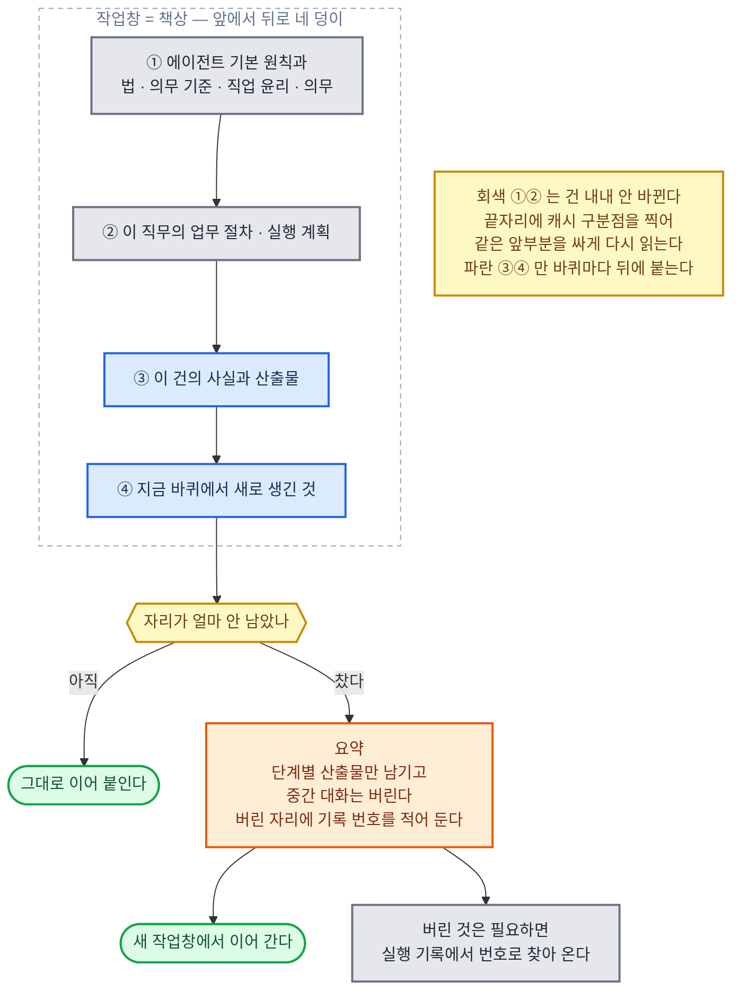
```mermaid
%%{init: {"flowchart": {"wrappingWidth": 640, "curve": "basis", "nodeSpacing": 45, "rankSpacing": 55, "padding": 14, "useMaxWidth": true}, "themeVariables": {"fontSize": "15px"}} }%%
flowchart TB
    subgraph WIN["작업창 = 책상 — 앞에서 뒤로 네 덩이"]
        direction TB
        B1["① 에이전트 기본 원칙과<br/>법 · 의무 기준 · 직업 윤리 · 의무"]:::store
        B2["② 이 직무의 업무 절차 · 실행 계획"]:::store
        B3["③ 이 건의 사실과 산출물"]:::main
        B4["④ 지금 바퀴에서 새로 생긴 것"]:::main
        B1 --> B2 --> B3 --> B4
    end
    TIP["회색 ①② 는 건 내내 안 바뀐다<br/>끝자리에 캐시 구분점을 찍어<br/>같은 앞부분을 싸게 다시 읽는다<br/>파란 ③④ 만 바퀴마다 뒤에 붙는다"]:::note
    FULL{{"자리가 얼마 안 남았나"}}:::note
    CONT(["그대로 이어 붙인다"]):::good
    SUM["요약<br/>단계별 산출물만 남기고<br/>중간 대화는 버린다<br/>버린 자리에 기록 번호를 적어 둔다"]:::back
    NEW2(["새 작업창에서 이어 간다"]):::good
    FIND["버린 것은 필요하면<br/>실행 기록에서 번호로 찾아 온다"]:::store
    WIN ~~~ TIP
    B4 --> FULL
    FULL -- "아직" --> CONT
    FULL -- "찼다" --> SUM
    SUM --> NEW2
    SUM --> FIND
    classDef main fill:#dbeafe,stroke:#2563eb,stroke-width:2px,color:#17314f
    classDef stop fill:#fee2e2,stroke:#dc2626,stroke-width:2px,color:#7f1d1d
    classDef back fill:#ffedd5,stroke:#ea580c,stroke-width:2px,color:#7c2d12
    classDef store fill:#e5e7eb,stroke:#6b7280,stroke-width:2px,color:#1f2937
    classDef good fill:#dcfce7,stroke:#16a34a,stroke-width:2px,color:#14532d
    classDef note fill:#fef9c3,stroke:#ca8a04,stroke-width:2px,color:#713f12
    style WIN fill:none,stroke:#94a3b8,stroke-width:1px,stroke-dasharray:5 4,color:#64748b
```

##### 맡는 것

| 이 재료가 맡는다 | 맡지 않는다 |
|------|------|
| 그 시점에 필요한 것만 골라 작업창에 올리기<br>올리는 순서를 고정 부분과 바뀌는 부분으로 가르기<br>작업창이 찰 때 요약해 새 작업창으로 넘기기<br>넣지 못한 것을 어디서 찾을지 자리를 적어 두기 | 무엇을 남길 값어치가 있는지, 지금 무슨 일이 벌어지는지 그리는 일은 현재 진행 상태가 맡는다<br>요약에서 빠진 원본은 현재 진행 상태가 맡는다<br>찾아 오는 일은 정보·자료 찾기가 맡는다<br>오래 가는 사실은 장기 기억이 맡는다 |

> 작업창은 책상이다. 크기가 정해져 있어 다 올리면 넘친다.
> 프롬프트 (모델에게 주는 지시문) 한 장에 지침을 잔뜩 넣지 않는다. 필요할 때 찾아 올린다.

##### 짜는 방식

| 기준 | 정한 것 |
|------|------|
| 올리는 순서 | 앞에서 뒤로 네 덩이로 고정한다<br>① 에이전트 기본 원칙과 법·의무 기준·직업 윤리·의무 ② 이 직무의 업무 절차·실행 계획 ③ 이 건의 사실과 산출물 ④ 지금 바퀴에서 새로 생긴 것<br>①②는 건 내내 안 바뀌고 ③④만 뒤에 붙는다<br>공통 지시와 이번 자료를 구분해 올린다 |
| 캐시 | ①②의 끝자리에 캐시 구분점을 찍는다<br>캐시는 5분짜리와 1시간짜리 두 가지가 있고, 구분점은 한 요청에 넉 점까지 찍을 수 있다<br>바퀴 사이 간격이 5분을 넘는 오래 도는 건은 1시간짜리로 둔다 |
| 넘치기 전 | 남은 자리가 정한 비율 아래로 떨어지면 요약을 시작한다<br>요약은 흐름 단계별 산출물만 남기고 중간 대화는 버린다<br>버린 것이 있던 자리에 현재 진행 상태의 기록 번호를 적어 둔다 |
| 낡은 것 바꾸기 | 오래된 내용은 새 상태로 교체한다<br>긴 기록을 줄여도 약속·미확인 사항·이미 실행한 행동은 유지한다 |
| 안 올리는 것 | 원문 전체를 통째로 올리지 않는다<br>필요한 조항·행·구간만 잘라 올리고 출처 표시를 붙인다 |
| 오염 막기 | 바깥에서 읽어 온 글은 지시가 아니라 자료로만 다룬다고 표시해 올린다<br>표시 방법은 안전장치가 정한다 |
| 정리해도 안 빼는 것 | 받은 승인과 약속 그리고 한도와 완료 조건은 정리하더라도 빼지 않는다. |
| 원본 연결 | 줄여서 남긴 정보는 원본이 어디 있는지 연결해 둔다. |

##### 쓰는 기술과 저장 자리

| 항목 | 정한 것 | 왜 이것인가 |
|------|------|------|
| 실행 꼴 | 함수와 모델을 섞는다. 무엇을 올릴지 고르기·순서 고정·캐시 구분점 찍기·남은 자리 세기는 함수가 하고, 요약문을 만드는 일만 모델이 한다. | 자리 계산과 순서 고정은 값으로 정해지는 일이라 모델을 부를 이유가 없다. 반대로 요약을 함수로 만들면 단계별 산출물의 뜻이 뭉개져 점수가 떨어진다. |
| 코드 자리 | `src/environment/context/` 에 고르기·자르기·요약 코드를 두고, 건 내내 안 바뀌는 앞부분은 배포 때 `build/context-head/<직종>.md` 로 미리 묶어 둔다. | 앞부분을 건마다 다시 붙이면 파일 수십 장을 되읽어야 하므로 기계가 만든 결과물은 git 밖 `build/` 에 둔다. 직종별 값은 공통에서 상속해 만들므로 직종 코드를 따로 두지 않는다. |
| 저장 자리 | 요약하며 버린 자리에는 `run_log`·`checkpoints` 의 기록 번호를 적어 두고, 건 쪽지는 `working_notes`, 올린 조각의 출처는 `cards` 를 가리킨다. 이 건의 고객 자료가 올라가므로 조각은 `org`·`client` 칸의 행 보안을 통과한 것만 고른다. | 작업창은 지나가면 사라지는 자리라, 남아야 하는 것은 전부 표에 있어야 되찾을 수 있다. 버린 원문을 파일로 따로 쌓으면 건마다 파일이 불어난다. |
| 바깥 기술 | 없음 (함수·표만). 앞부분 재사용은 공급자 공식 API가 제공하는 캐시 구분점 기능을 그대로 쓴다. | 작업창을 위해 새 저장소를 더하지 않는다. 캐시를 우리가 직접 만들면 공급자의 저장 조건과 어긋나 값이 오히려 오른다. |
| 확인할 시험 | 건마다 캐시로 읽힌 토큰 비율을 재고, 비율이 떨어지면 고정이어야 할 것이 뒤로 샌 것으로 본다. 요약하고 이어 간 건과 요약 없이 끝낸 건의 결과물 점수 차이가 100점 만점에 5점 안쪽인지 잰다. | — |

##### 이 직무에서 채울 것

| 채울 것 | 정하는 내용 |
|------|------|
| 이번 판단에 줄 것 | 목표·범위·기한·권한·현재 상태·필요 근거와 원본 위치 |
| 양의 한도 | 입력량 한도와 요약을 시작할 시점 |
| 반드시 보존할 것 | 지켜야 할 제약·약속·결정과 캐시 기능의 사용 범위 |

##### 됐다는 기준

| 잣대 | 어떻게 재나 |
|------|------|
| 앞부분이 안 흔들린다 | 캐시로 읽힌 토큰의 비율을 건마다 잰다<br>비율이 떨어지면 고정이어야 할 것이 뒤로 새어 나간 것이다 |
| 요약해도 잃는 게 없다 | 요약 뒤에 이어 간 건과 요약 없이 끝낸 건의 결과물 점수를 견준다<br>차이가 100점 만점에 5점 안쪽이어야 한다<br>5점은 채점자 둘이 같은 결과물을 매길 때 갈리는 폭과 같게 잡은 가정이다. 실측 후 확정<br>여러 번 요약하고 재개해도 중요한 조건이 남아 있는지 본다 |
| 다시 찾아온다 | 요약에서 버린 것을 다시 물었을 때 기록 번호로 찾아 오는 비율을 잰다<br>95% 이상이어야 한다<br>95% 는 가정이다. 실측 후 확정<br>요약에서 빠진 근거는 원본으로 되찾을 수 있어야 한다 |
| 안 넘친다 | 작업창이 꽉 차서 실패한 건이 0인지 센다 |

##### 충족 조건

- 무엇을 어떤 순서로 올리는지 정해져 있음(규칙 → 현재 목표 → 상태 → 이번 단계 자료)
- 올린 자료가 한도의 몇 %인지 재고, 정한 비율(예: 70%)을 넘으면 정리를 시작함
- 정리로 뺀 내용은 원본 위치가 남아 필요하면 다시 가져옴
- 정리 뒤에도 목표·완료 조건·받은 승인·진행 상태는 반드시 남음
- 자료 속 지시문은 자료로 표시하고, 자료에서 나온 명령은 실행 전에 코드가 걸러 냄(표시만으로는 못 막음)

##### 탈락 조건

- 모든 자료를 한꺼번에 올려 중요한 것을 놓침
- 요약하다 빠진 내용을 다시 찾을 길이 없음
- 정리 중에 목표나 승인 기록이 사라짐
- 옛 자료와 새 자료가 섞여 어느 게 맞는지 모름

---

#### 분리 실행

서로 섞이면 안 되는 자료와 실행을 별도 공간에 둔다. 세부 책임 번호는 M10 가운데 격리 실행, 곧 공간을 만들고 접근을 제한하는 부분이다.

##### 맡는 것

업무 권한과 안전장치가 정한 정책을 받아 작업별 격리 공간과 파일·네트워크·자원 제한을 운영한다. 허용된 자료와 도구만 공유하게 하고, 한 작업의 오류나 과도한 자원 사용이 다른 작업으로 번지지 않게 실행과 자원 사용을 조절한다. 격리 정책 자체를 정하고 준수 여부를 검사하는 일은 안전장치가 맡는다.

##### 짜는 방식

허용된 자료만 공유하고, 외부에서 받은 파일·코드는 제한된 환경에서 실행한다. 모델·검색·캐시·기록에도 같은 고객 경계를 적용한다. 작업이 끝나면 분리 실행 공간과 임시 파일 그리고 비밀 값을 정리한다. 정책을 실제 환경에 적용하기 전의 시험 공간은 시험 환경과 연결한다.

##### 쓰는 기술과 저장 자리

| 항목 | 정한 것 | 왜 이것인가 |
|------|------|------|
| 실행 꼴 | 함수만 쓴다. 공간 만들기, 파일·네트워크·자원 제한 걸기, 끝난 뒤 정리하기는 모두 코드가 한다. | 격리는 기계가 해야 확실한 일이라 모델을 부르지 않는다. 격리 정책 자체를 정하고 지켜졌는지 검사하는 일은 안전장치가 맡으므로 이 재료에 판단을 넣지 않는다. |
| 코드 자리 | `src/environment/tools/` 의 격리 쪽에 둔다. 같은 폴더의 접속·호출 쪽과 책임만 가른다. 직종별 접근 범위·작업 공간·자원 한도는 `jobs/<직종>/environment/tools.yaml` 에 채운다. | 재료 자리 표가 분리 실행과 업무 도구·시스템을 같은 `tools` 폴더의 두 책임으로 적어 두었기 때문이다. 폴더를 새로 가르면 도구 대장이 두 곳에 생겨 어느 쪽이 맞는지 모르게 된다. |
| 저장 자리 | 막힌 접근은 `guard_events`, 공간 판본과 지원 범위는 `environments`, 공간을 만들고 지운 사실은 `run_log` 에 남긴다. 고객 자료는 모든 표 공통 칸인 `org`·`client` 의 행 보안과 고객별 `tenant_key` 암호화, 검색 처리 단계의 거르기 셋으로 격리한다. | 폴더 권한만 믿으면 코드가 거르기를 잊었을 때 막을 것이 없으므로 데이터베이스가 줄 단위로 막게 한다. 격리 기록을 파일로 두면 고객별로 거르지 못한다. |
| 바깥 기술 | 없음 (함수·표만). 자료 쪽 격리는 PostgreSQL의 행 보안을 그대로 쓴다. | 격리 전용 제품을 새로 들이지 않는다. 행 보안도 소유자·관리자·`BYPASSRLS` 역할의 우회가 있으므로 실행 계정을 분리하고 우회 시험을 함께 돌린다. |
| 확인할 시험 | 실행 계정으로 다른 고객 줄을 100번 조회해 실제로 돌아온 줄이 0인지 센다. 정해진 공간 밖의 파일·네트워크 접근과 다른 작업의 상태 변경을 시도해 차단률이 100%인지 잰다. | — |

##### 이 직무에서 채울 것

고객·업무별 접근 범위, 작업 공간, 외부 연결 허용 대상, 자원 한도. 격리 공간·접근 제한·종료 후 정리의 방식

##### 됐다는 기준

정해진 공간 밖의 파일·네트워크 접근과 다른 작업의 상태 변경이 제한대로 차단되는지 검사한다. 다른 고객의 자료를 직접 조회하거나 우회 경로로 가져올 수 없는지 시험하고, 한 작업의 장애·자원 고갈이 다른 업무로 번지는지도 확인한다.

##### 충족 조건

- 권한·격리 정책이 실행 공간에 적용되고 파일·네트워크·자원 경계가 실제로 검사됨
- 고객·업무별 접근 범위와 작업 공간, 외부 연결 허용 대상, 자원 한도가 정해져 있음
- 모델·검색·캐시·기록에도 같은 고객 경계가 적용됨
- 외부에서 받은 파일·코드의 검사와 실행이 다른 업무와 분리된 공간에서 이뤄짐
- 작업이 끝나면 격리 공간·임시 파일·비밀 값이 정리됨

##### 탈락 조건

- 정해진 공간 밖의 파일·네트워크에 닿거나 다른 작업의 상태를 바꿀 수 있음
- 다른 고객의 자료를 우회 경로로 가져올 수 있음
- 한 작업의 장애나 자원 고갈이 다른 업무를 멈춤
- 작업이 끝났는데 격리 공간·임시 파일·비밀 값이 남아 있음
- 자료 본문에는 경계를 적용하면서 모델·검색·캐시·기록에는 적용하지 않음

##### 본문 재료별 실행 책임

본문의 **업무 도구·시스템**과 **분리 실행**은 세부 책임 M10 안에서 각각 연결과 격리의 책임으로 구분한다. 분리 실행은 업무 권한과 안전장치가 정한 파일·인터넷·자원 제한을 실제 작업 공간에 적용한다. 적용 전 시험 공간은 **시험 환경**과 연결한다.

---

#### 운영 감시·복구

에이전트가 멈춰도 별도로 장애를 알아채고 복구한다. 세부 책임 번호는 M57이다.

##### 맡는 것

에이전트 바깥에서 수행 기반의 상태를 감시하고 장애를 접수해 복구·재개를 조정한다. M02의 실행 제어, M03의 상태 복원, M06의 신호 수신, M56의 외부 대사, M32의 안전 차단과 연결한다. 업무상 기회·위험의 의미 판단은 M37, 지속 원인 분석은 M48이 맡는다.

##### 짜는 방식

에이전트·모델·도구·저장소·신호 수신의 heartbeat와 대기열 지연, 원천/수신 기록 차이를 별도 관측원으로 확인한다. 감시 자체의 실패도 확인한다. 응답 지연·오류 증가·자원 부족도 함께 찾아낸다. 장애가 나면 영향받는 쓰기를 제한하고 입력·실행 의도·예산을 보존한다. 검증된 대체 또는 복구를 수행하며 실행 기반의 상태·정책·권한·실행 세대·외부 효과를 대사해 다시 실행할 수 있는 상태로 되돌린다. 저장 기록과 실제 외부 처리 결과를 대조한 뒤 해당 업무를 다시 연결한다. 중단된 업무는 중단 시점의 저장된 진행 상태와 함께 담당에게 돌려주며, 그 업무의 처리 상태 대조와 이어 가기는 작업 진행·연결과 대기·후속 관리가 맡는다.

##### 쓰는 기술과 저장 자리

| 항목 | 정한 것 | 왜 이것인가 |
|------|------|------|
| 실행 꼴 | 함수만 쓴다. 살아 있는지 확인하기, 대기열 지연 재기, 원천과 수신 기록 맞춰 보기, 재개 전 대사하기는 모두 코드가 한다. | 감시가 감시 대상과 같은 실행에 묶이면 같이 멈추므로 별도 관측원을 함수로 둔다. 복구 범위를 두고 판단이 갈리는 자리는 모델을 부르지 않고 사람에게 넘긴다. |
| 코드 자리 | `src/environment/operations/` 에 두고, 직종별 허용 지연·허용 손실·복구 시간·비상 담당은 `jobs/<직종>/environment/` 에 보존 기간·복원 계약과 함께 채운다. | 감시 코드는 직종이 달라도 같고, 직종마다 다른 것은 얼마를 허용하는지의 숫자뿐이다. 그 숫자를 코드에 박으면 직종을 더할 때마다 코드를 고쳐야 한다. |
| 저장 자리 | 살아 있는지의 기록·지연·대사 결과는 `run_log`, 재개 지점은 `checkpoints`, 사람에게 넘긴 장애는 `handoffs`, 감시 항목과 마지막 확인 시각은 `watches`, 막은 실행은 `guard_events` 에 남긴다. 되돌릴 수 없는 바깥 행동은 재개 전에 `run_log` 의 도구 멱등 키로 이미 나갔는지 확인한 뒤에만 다시 실행한다. | 백업을 복원했다고 바깥 행동까지 되돌아가지는 않으므로, 복구 뒤 중복 실행을 막는 근거는 표에 남은 멱등 키뿐이다. 감시 기록을 파일로 두면 달 단위로 떼어 내는 보존 관리가 안 된다. |
| 바깥 기술 | OpenTelemetry로 실행 연결·시간·오류·사용량을 모으고, 상태와 대사 결과는 PostgreSQL에 둔다. | 감시용 저장소를 따로 들이면 감시가 또 하나의 장애 지점이 된다. 운영 화면의 숫자와 실제 과금·외부 영수증을 대조해야 하므로 수집 규격은 표준 하나로 고정한다. |
| 확인할 시험 | 작업자 중단·감시 통로 중단·저장소 복구·모델 장애를 겹쳐 낸 복구 시험에서 입력 유실 0건, 중복 외부 실행 0건인지 센다. 백업을 실제로 복원해 걸린 시간이 그 직무가 정한 복구 시간 안인지 잰다. | — |

##### 이 직무에서 채울 것

허용 수신·실행 지연, 허용 손실, 복구 시간, 감시 통로, 비상 담당, 대체 수단의 지원 범위, 복원·대사·재개 증거. 응답 지연·오류·자원 사용·대기 건의 감시 범위, 백업, 허용 복구 시간과 자료 손실 범위

##### 됐다는 기준

작업자와 감시 통로의 중단, 저장소 복구, 모델 장애, 늦은 신호가 겹쳐도 입력 유실·중복 실행·무권한 재개·검증되지 않은 능력 전이를 방지한다. 에이전트·DB·도구·감시 기능의 중단과 백업 복원을 시험한다. 예전 작업자가 늦게 살아나도 새 상태를 덮거나 같은 거래를 반복하지 않아야 한다.

##### 충족 조건

- 에이전트가 멈춰도 관측할 통로가 있고 침묵과 정상 상태를 구분함
- 복구·대체의 범위와 담당, 보존할 입력·외부 효과·노출이 연결됨
- 재개 전 정책·권한·외부 결과·현재 실행 세대·예산을 대사함
- 업무별 복구 시간과 실제 복원 시험 결과를 기록함

##### 탈락 조건

- 같은 에이전트가 자기 상태를 확인하는 것만으로 운영 감시를 완료 처리함
- 백업을 복원했으니 외부 행동도 이전 상태가 됐다고 가정함
- 접속되는 대체 모델을 전문 능력 검증 없이 사용함
- 감시 불능·수신 불가를 정상으로 기록하거나 복구 뒤 오래된 실행을 중복 수행함

상세 계약은 [장애와 운영](docs/runtime.md#장애와-운영)을 따른다.

##### 업무 감시와 지속 개선의 연결

업무상 위험·기회에 대응할 조건은 **먼저 알아채기**에서 정한다. 반복 장애의 원인 규명은 **성공·실패 원인 분석**, 지식·방법·도구의 지속적인 변경은 **능력 개선·확장**으로 연결한다. 운영 복구 뒤의 개선 필요도 이 경로로 전달한다.

---

#### 시작 신호

요청·변경·예약 시각·답변 도착을 받아 해당 업무에 알린다. 예약·신호 수신·깨우기 (Triggers·Schedules·Webhooks) 를 맡으며, 세부 책임 번호는 M06이다.


```mermaid
%%{init: {"flowchart": {"wrappingWidth": 640, "curve": "basis", "nodeSpacing": 45, "rankSpacing": 55, "padding": 14, "useMaxWidth": true}, "themeVariables": {"fontSize": "15px"}} }%%
flowchart TB
    IN(["신호가 온다<br/>예약 · 웹훅 · 메일 · 경보"]):::good
    SIG{{"서명과 시각이 맞나"}}:::note
    DROP["버린다<br/>버린 사실만 남긴다"]:::stop
    DUP{{"같은 신호를 이미 받았나"}}:::note
    SKIP["멱등 키로 한 번만 처리한다"]:::store
    BUNDLE["정한 시간 안의 같은 신호는<br/>하나로 묶는다"]:::main
    FILTER{{"잘못 울린 경보인가"}}:::note
    DAILY["깨우지 않고 모아서<br/>하루 한 번 낸다"]:::store
    URG{{"분 단위로 커지는 피해인가"}}:::note
    FAST["긴급 경로<br/>흐름 1~3을 건너뛴다"]:::back
    WAKE(["실행 제어를 깨운다"]):::good
    IN --> SIG
    SIG -- "안 맞는다" --> DROP
    SIG -- "맞는다" --> DUP
    DUP -- "받았다" --> SKIP
    DUP -- "처음이다" --> BUNDLE --> FILTER
    FILTER -- "그렇다" --> DAILY
    FILTER -- "아니다" --> URG
    URG -- "그렇다" --> FAST --> WAKE
    URG -- "아니다" --> WAKE
    classDef main fill:#dbeafe,stroke:#2563eb,stroke-width:2px,color:#17314f
    classDef stop fill:#fee2e2,stroke:#dc2626,stroke-width:2px,color:#7f1d1d
    classDef back fill:#ffedd5,stroke:#ea580c,stroke-width:2px,color:#7c2d12
    classDef store fill:#e5e7eb,stroke:#6b7280,stroke-width:2px,color:#1f2937
    classDef good fill:#dcfce7,stroke:#16a34a,stroke-width:2px,color:#14532d
    classDef note fill:#fef9c3,stroke:#ca8a04,stroke-width:2px,color:#713f12
```

##### 맡는 것

| 이 재료가 맡는다 | 맡지 않는다 |
|------|------|
| 정한 시각·주기에 깨우는 예약<br>바깥에서 오는 알림·웹훅 (바깥 시스템이 일이 생겼을 때 우리를 불러 주는 주소)·메일·경보 받기<br>재워 둔 건의 기한이 되거나 기다리던 답이 오면 그 사실을 감지해 담당에게 전달하기<br>우편·등기·팩스·전화·방문처럼 사람을 거쳐 오는 것도 받는 창구를 정해 같은 신호로 바꿔 받기<br>같은 신호가 몰리면 묶고, 잘못 울린 경보를 걸러 내기 | 무엇을 신호로 볼지와 받은 뒤 무엇을 할지는 먼저 알아채기가 맡는다<br>받은 신호로 지금의 그림을 고치기는 현재 진행 상태가 맡는다<br>깨운 뒤 도는 바퀴는 실행 제어가 맡는다<br>전달받은 신호로 대기 건의 업무를 다시 이어 가는 일은 대기·후속 관리가 맡는다<br>재워 둔 자리를 저장해 두기는 현재 진행 상태가 맡는다<br>법규·정책이 바뀐 것을 자료에 반영하는 일은 변경 감시·반영이 맡는다 |

> 이 장치는 실행 제어 밖의 호스팅 층 (에이전트를 띄워 두는 서버) 에 기계로 둔다. 에이전트가 자고 있어도 이 장치는 깨어 있다.
> 밤·주말에도 끊기지 않아야 한다. 사람이 화면 앞에 없는 시간에 신호가 온다.

##### 짜는 방식

| 기준 | 정한 것 |
|------|------|
| 예약 | 시각·주기는 cron (정한 시각에 프로그램을 돌려 주는 오래된 표준 방식) 형식으로 적는다<br>시간대는 그 건의 관할 시간대로 적고, 기한 계산은 그 시간대에서 한다 |
| 받는 문 | 웹훅은 Standard Webhooks 표준을 따른다<br>보낸 쪽이 진짜인지는 HMAC-SHA256 서명으로 확인한다. 신호에 붙은 고유 번호를 도구가 정한 멱등 키로 삼아, 같은 신호가 두 번 와도 한 번만 처리한다<br>서명이 안 맞거나 시각이 너무 오래된 신호는 버리고 버린 사실만 남긴다 |
| 사람을 거쳐 오는 것 | 우편·등기·팩스·전화·방문·구두 지시처럼 전자 신호가 아닌 것은 받는 창구를 하나로 정한다 (스캔 수신함, 팩스 수신 번호, 통화 기록, 방문 접수 대장)<br>창구에 들어온 것에 접수 번호·받은 시각·받은 사람을 붙여 전자 신호와 같은 줄에 세운다. 종이 안의 내용을 읽는 일은 정보·자료 이해가 맡는다<br>사람이 접수를 빠뜨릴 수 있으므로 창구마다 접수 건수를 세고, 평소와 달리 0건이 이어지면 누락으로 보고 확인한다 |
| 묶기 | 같은 뜻의 신호가 정한 시간 안에 여러 번 오면 하나로 묶어 한 번만 깨운다<br>묶는 시간은 이 직무를 고를 때 정한다 |
| 거르기 | 잘못 울린 경보의 비율을 세어, 정한 선을 넘는 종류의 신호는 깨우지 않고 모아서 하루 한 번 낸다<br>거르는 규칙을 바꾼 날짜와 이유를 남긴다 |
| 못 받았을 때 | 웹훅은 안 올 수 있다고 보고, 같은 것을 주기 예약으로 한 번 더 훑는다<br>둘이 겹쳐도 멱등 키가 있어 두 번 처리되지 않는다 |
| 긴급 | 피해가 분 단위로 커지는 신호는 따로 표시해 흐름 1~3을 건너뛰는 긴급 경로로 넣는다<br>어느 신호가 긴급인지는 먼저 알아채기가 정한다 |
| 보낸 이 확인 | 누가 보낸 신호인지 확인한 뒤 처리한다. |
| 중복·순서 | 같은 신호가 두 번 오거나 순서가 뒤바뀌어 와도 한 번만 알맞은 순서로 처리한다. 현재 상태와 대조해 어긋난 순서를 가린다. |
| 놓친 신호 | 멈춰 있던 동안 놓친 신호는 다시 살아났을 때 찾아서 처리한다. |
| 기록과 전달 | 신호를 기록한 뒤 담당에게 전달한다. 사람이 전달한 자료도 접수 이력을 남긴다. |

##### 쓰는 기술과 저장 자리

| 항목 | 정한 것 | 왜 이것인가 |
|------|------|------|
| 실행 꼴 | 함수만 쓴다. 서명 검사·중복 걸러내기·묶기·잘못 울린 경보 거르기·깨우기는 모두 코드가 한다. | 에이전트가 자고 있어도 돌아야 하는 장치라 모델을 부르지 않는다. 무엇을 신호로 볼지와 어느 신호가 긴급인지는 먼저 알아채기가 정하므로 그 판단을 여기 넣지 않는다. |
| 코드 자리 | `src/environment/triggers/` 에 두고, 받는 신호 목록과 거르는 규칙은 `jobs/<직종>/environment/triggers.yaml` 에 채운다. | 받는 문과 검사 방법은 직종이 달라도 같고, 무엇을 받을지만 다르다. 직종마다 수신 코드를 따로 두면 서명 검사가 빠진 문이 생긴다. |
| 저장 자리 | `signals` 에 신호 번호(멱등 키)·받은 시각·통로·서명 검사 결과·거른 규칙 판본·버린 이유·만든 건 번호를 남기고, 깨운 뒤는 `cases`·`run_log` 로 이어진다. 우편·팩스·스캔처럼 사람을 거쳐 온 접수 원본은 해시 창고에 넣고 카드가 그 해시를 가리킨다. | 건이 되지 못하고 버려진 신호까지 세어야 놓침을 잡을 수 있으므로 버린 것도 같은 표에 남긴다. 받은 종이의 원본은 한 글자도 고치면 안 되는 자리라 해시 창고에 둔다. |
| 바깥 기술 | 짜는 방식의 '예약'과 '받는 문' 항목에 적힌 예약 형식·수신 규격·서명 방식을 그대로 쓰고, 받은 신호는 PostgreSQL에 쌓는다. | 신호 전용 큐 제품을 새로 들이지 않는다. 밀어 주는 신호는 안 올 수 있다고 보고 같은 것을 주기 예약으로 한 번 더 훑되, 겹쳐도 멱등 키가 두 번 처리를 막기 때문이다. |
| 확인할 시험 | 보낸 쪽 기록 수와 `signals` 에 들어온 수의 차이가 0인지 센다. 같은 신호를 일부러 두 번 보내 깨어남이 한 번인지, 신호 도착과 첫 바퀴 시작의 시간 차가 직무가 정한 한도 안인지 잰다. | — |

##### 이 직무에서 채울 것

| 채울 것 | 예 |
|------|------|
| 예약으로 도는 것 | 세무사 (신고·기장) = 신고 기한 역산 일정<br>인프라·DevOps = 정해진 점검 주기<br>개인 투자자 (단기 매매) = 장 열고 닫는 시각 |
| 바깥에서 오는 신호 | 세무사 (신고·기장) = 기관 고지와 세법 변경 알림<br>인프라·DevOps = 경보와 배포 결과 웹훅<br>개인 투자자 (단기 매매) = 공시와 시세 급변 알림 |
| 깨어날 조건 | 세무사 (신고·기장) = 고객이 자료를 올렸을 때<br>인프라·DevOps = 맡긴 검토 의견이 왔을 때<br>개인 투자자 (단기 매매) = 걸어 둔 값에 닿았을 때 |
| 수신 통로와 확인 방법 | 수신 통로, 발신자 확인 방법, 시간대, 예약, 중복 구분값, 놓친 신호의 확인 방법<br>전자 신호가 아닌 경로의 접수 창구·접수 기록·누락 확인 주기 |

##### 됐다는 기준

| 잣대 | 어떻게 재나 |
|------|------|
| 안 놓친다 | 보낸 쪽 기록과 우리가 받은 기록의 수를 맞춰 본다<br>차이가 0이어야 한다 |
| 두 번 안 한다 | 같은 신호를 일부러 두 번 보내 한 번만 깨어나는지 본다 |
| 늦지 않는다 | 신호가 온 시각과 첫 바퀴가 시작된 시각의 차이를 잰다<br>한도는 이 직무를 고를 때 정한다 |
| 무뎌지지 않는다 | 깨운 신호 중 실제로 할 일이 있던 비율을 센다<br>비율이 떨어지면 거르는 규칙을 고친다 |
| 받은 것과 처리한 것을 가른다 | 수신 중 장애·중복·지연·역순 도착을 시험한다<br>신호를 받았다는 사실과 그 업무를 처리했다는 사실을 구분한다 |

##### 충족 조건

- 깨워야 할 사건 목록이 있음(정한 시각, 메일·메시지 도착, 파일 변경, 시스템 알림, 우편·등기 도착, 팩스 수신, 전화·방문 접수)
- 전자 신호가 아닌 경로마다 받는 창구와 접수 기록 자리가 정해져 있고, 접수부터 깨어남까지 걸린 시간에 한도가 있음(예: 우편은 도착 당일 안)
- 사건마다 어떤 업무를 어떤 입력으로 시작하는지 적혀 있음
- 같은 사건은 한 번만 깨움(사건 번호로 중복 제거)
- 신호가 안 오면 알 수 있음(정한 시간이 지나면 누락 경보)
- 사건을 여러 개(예: 100개) 넣어 하나도 안 놓치는지 시험함

##### 탈락 조건

- 같은 메일에 두 번 깨어나 일을 두 번 함
- 사람이 매번 "시작해"라고 해야 시작됨
- 신호는 오는데 무슨 일을 해야 하는지 모름
- 전자 신호만 받고 우편·팩스·전화로 온 일은 사람이 따로 챙겨야 시작됨
- 신호 누락을 아무도 못 알아챔

---

#### 업무 도구·시스템

전문 프로그램과 외부 시스템에 요청을 보내고 결과·오류·진행 상태를 받는다. 세부 책임 번호는 M10 가운데 접속·호출·결과 반환 부분이다.

##### 맡는 것

업무 시스템·전문 프로그램에 접속해 요청된 기능을 실행하고 실제 상태와 결과를 반환한다. 전문 작업의 내용·계산·제작 책임은 실무가 맡는다.

##### 짜는 방식

실행할 기능을 작업 종류·형식·프로그램 판본·환경으로 등록한다. 모델 API의 행동 제안을 실제 호출·작업 상태·외부 결과로 연결하며 인증·라이선스·장시간 작업·복구를 함께 관리한다. 공식 API·SDK·CLI·MCP처럼 제공되는 연결을 사용하고, 화면 조작이 필요하면 대상과 반영 상태를 추가로 확인한다. 읽기·수정·변환의 지원 범위는 따로 기록한다.

답이 없거나 일부만 처리됐으면 그대로 알리고 처리된 것처럼 꾸미지 않는다. 읽기만 되는 연결을 제출까지 되는 것으로 여기지 않는다.

##### 쓰는 기술과 저장 자리

| 항목 | 정한 것 | 왜 이것인가 |
|------|------|------|
| 실행 꼴 | 함수만 쓴다. 등록된 기능을 부르고 실제 상태와 결과·오류를 그대로 돌려준다. | 어느 도구를 고를지는 업무 절차·실행 계획이, 무엇을 할지는 모델이 정하므로 이 재료는 판단을 갖지 않는다. 결과를 모델에게 다듬어 넘기는 꼴은 오류가 조용히 삼켜져 고르지 않는다. |
| 코드 자리 | `src/environment/tools/` 의 접속·호출 쪽에 두고, 도구 서버는 `src/mcp/` 에 서버마다 권한을 따로 둔다. 직종 도구 대장과 계정·권한·사용 조건은 `jobs/<직종>/environment/tools.yaml` 에 채운다. | 재료 자리 표가 이 재료와 분리 실행을 같은 `tools` 폴더의 두 책임으로 적어 두었고, 도구 줄은 한 대장에만 둔다. 도구마다 서버를 나누는 이유는 권한을 서버 단위로 잘라야 최소 권한이 지켜지기 때문이다. |
| 저장 자리 | 호출마다 `run_log` 에 누가·어느 열쇠로·무엇에·어느 멱등 키로 불렀는지와 명의 세 줄을 남기고, 지원 범위·판본은 `environments`·`capabilities`, 막힌 호출은 `guard_events` 에 쌓는다. 돈·발송·제출·삭제처럼 되돌릴 수 없는 행동은 도구가 정한 멱등 키로 같은 요청 두 번을 막는다. | 읽기만 되는 연결을 제출까지 되는 것으로 여기지 않으려면 기능별 지원 범위가 칸으로 걸러져야 한다. 도구 대장은 사람이 고치므로 파일, 호출 기록은 기계가 쌓으므로 표다. |
| 바깥 기술 | 공식 API·SDK·CLI를 첫째로 쓰고 필요한 곳에만 MCP를 붙이되 서버와 실제로 함께 지원하는 판본을 쓴다. 입력과 출력은 JSON Schema로 검사한다. | 화면 조작은 화면이 조금 바뀌면 깨지므로 뒤에 두고, 쓸 때는 반영 상태를 따로 확인한다. 규격을 지켰다는 사실만으로 업무 권한이 생기지는 않아 권한은 업무 권한이 따로 건다. |
| 확인할 시험 | 도구마다 실제 업무 5건을 돌려 성공 여부와 도구 오류가 그대로 전달된 비율이 100%인지 잰다. 같은 요청을 두 번 보내 바깥에 남은 결과가 1건인지 센다. | — |

##### 이 직무에서 채울 것

기능·작업 종류·입출력·프로그램/버전·환경, API·SDK·CLI·GUI 경로, 라이선스·자원·권한·복구. 기능별 도구, 지원 형식·버전·작업, 계정·권한·사용 조건, 입력·출력 설명

##### 됐다는 기준

기능별 실제 작업·호환·부분 성공·응답 유실·복구를 검사한다. 읽기 지원을 편집·제출 지원으로 확대하지 않는다. 접속 성공 외에 실제 업무와 오류 복구를 시험하며, 예제 하나가 실행됐다고 모든 형식과 작업을 지원한다고 표시하지 않는다.

##### 충족 조건

- 직무 필수 프로그램·시스템 목록과 연결 방법(API·자동화·허용된 화면 조작)이 정해짐
- 도구마다 시험 작업이 있음(예: 실제 업무 5건 이상 성공)
- 도구별로 할 수 있는 행동과 금지 행동이 코드로 갈려 있음(읽기만 / 쓰기 가능 / 승인 필요)
- 도구가 낸 오류가 에이전트에게 전달됨(오류 코드·메시지)
- 에이전트 전용 계정이 따로 있음

##### 탈락 조건

- 사람 계정을 빌려 씀
- 도구 오류가 조용히 삼켜져 성공한 줄 앎
- 화면 조작만 가능해 화면이 조금 바뀌면 다 깨짐
- 시험 없이 "연결됨"만 확인함

직무별 검토는 [166개 업무 사례](docs/reviews/occupation-work-review.md), 실제 능력의 판정은 [평가 규약](docs/evaluation.md)을 따른다.

##### 본문 재료별 실행 책임

본문의 **업무 도구·시스템**과 **분리 실행**은 세부 책임 M10 안에서 각각 연결과 격리의 책임으로 구분한다. 업무 도구·시스템은 요청된 기능을 호출하고 응답·조회 상태를 반환한다. 업무 입력값·처리 순서·취소·정정·보상은 **기록 입력·수정**·**신청·거래 처리**·**설정·작동 제어**·**게시·배포**에서 정하며, 업무 목표의 달성 여부는 해당 실무와 검증·평가의 결과로 확인한다.

---

#### 나눠 맡기기

정해진 분담에 따라 여러 AI에게 작업을 보내고 결과를 모은다. 여러 에이전트에게 나누고 거두는 일 (Orchestration·Subagents·Handoff) 이며, 세부 책임 번호는 M04다.

##### 맡는 것

작업을 소유권과 산출물 경계로 나누어 여러 에이전트에게 맡기고 거둔다. 사람 손이 있어야만 하는 조각은 사람에게 넘기기에 맡기고, 돌아온 기여와 비용을 전체 예산에 합쳐 거둔다. 공유 상태가 필요한 공동 작업도 지원하며 이견과 통합 판단의 책임을 기록한다. 분담 기준·명세·판단 순서는 M34·M35에서 받아 적용하고, 여기서는 실행 주체·소유권·공유 예산·회수 경로를 관리한다.

##### 짜는 방식

공유 상태·상호 질의가 필요한 사건도 역할·권한·비밀 경계를 정해 협력한다. 넘길 때 목표·완료 조건·자료 참조와 판본·가정·제약·결정권·시간·비용·필수 여부를 함께 준다. 진행 상황과 부분 결과, 새 증거를 교환하고 누락·중복·이견을 찾으며, 형사·민사·회계처럼 서로 영향을 주는 결론은 통합 검토한다. 이견은 근거 차이와 결정 책임을 기록해 해결하며 다수결로 정답을 정하지 않는다. 필수 결과가 없으면 대체 경로·범위 조정 또는 미완료로 처리한다. 분담 규모는 품질·소통·검토 비용·기한의 실측으로 정한다. 방법이나 분담을 바꿔야 하는 문제는 대안·전략 판단으로 돌려보낸다.

각 AI가 볼 수 있는 자료와 비밀 값은 맡은 일에 필요한 만큼만 준다. 정해진 시간 안에 끝나지 않은 조각은 기다릴지 다시 맡길지 정하고 끝난 것처럼 합치지 않는다.

##### 쓰는 기술과 저장 자리

| 항목 | 정한 것 | 왜 이것인가 |
|------|------|------|
| 실행 꼴 | 함수와 모델을 섞는다. 조각 주기·기한 세기·독촉·회수·예산 합산은 함수가 하고, 돌아온 결과를 견주어 이견을 가르는 통합 판단만 모델이나 사람이 한다. | 미회수 조각을 세는 일은 기계가 해야 빠짐이 없다. 결과를 표로 모아 다수결로 정답을 정하는 꼴은 문서가 금지하므로 고르지 않는다. |
| 코드 자리 | `src/environment/orchestration/` 에 두고, 분담 조건·인계 입력·결과 규격·공동 예산은 `jobs/<직종>/environment/` 의 분담 계약에 채운다. | 나누고 거두는 뼈대는 직종이 달라도 같고, 무엇을 어디까지 나누는지만 다르다. 분담 기준과 명세 자체는 대안·전략 판단과 업무 절차·실행 계획에서 받아 쓴다. |
| 저장 자리 | `subtasks` 에 건 번호·조각 번호·맡은 쪽·준 시각·기한·독촉 횟수·거둔 시각·결과를 남겨 "안 거둔 조각 0"을 여기서 센다. 사람이 맡은 조각은 `handoffs`, 공동 예산 누적은 `limit_usage`, 실행은 `run_log` 에 쌓는다. | 조각 상태는 여럿이 동시에 고치므로 파일로 두면 누가 마지막인지 알 수 없다. 표로 두면 기한이 지난 조각을 한 번의 조회로 뽑아낸다. |
| 바깥 기술 | 없음 (함수·표만). 흐름을 돌리는 엔진은 실행 제어가 고른 것(뼈대는 Temporal, 안쪽 판단 구간은 LangGraph)을 그대로 쓴다. | 분담 전용 제품을 따로 들이면 실행 엔진이 둘이 되어 중단·재개 규칙이 갈라진다. 각 조각이 볼 수 있는 자료와 비밀 값은 제품이 아니라 표의 권한 칸으로 자른다. |
| 확인할 시험 | 같은 유형 업무에서 미리 재 둔 혼자 값과 견주어 경과 시간·총비용·결과물 점수 세 가지를 모두 비교하고, 나누는 쪽이 나은 유형에서만 나눈다. 필수 조각을 일부러 늦춘 시험에서 미회수 조각이 완료로 합쳐지는 건이 0인지 센다. | — |

##### 이 직무에서 채울 것

분담 조건, 인계 입력, 자원 배분, 결과 규격, 이음새 검사. 공유 상태·팀별 비밀 경계·변경 통지·이견 및 결정권. 맡길 범위·입력·기한·결과 형식, 자료 공유 범위, 쓰기 담당, 공동 예산, 통합 담당

##### 됐다는 기준

단독 대비 품질·경과 시간·총비용을 비교하고 미회수·충돌·중복 실행을 잡는다. 공동 증거 변경·판단 충돌·필수 작업 미회수에서 전체 전략과 제출물의 일관성을 검사한다. 필수 작업이 안 돌아오거나 결론이 충돌하면 보완·재검토하며, 받은 부분만 합쳐 전체 완료라고 하지 않는다

##### 충족 조건

- 같은 유형 업무에서 앞서 재 둔 혼자 값(시간·비용·품질)과 비교해 나누는 쪽이 나았던 유형에서만 나눔
- 조각마다 맡은 쪽, 입력, 결과물, 완료 조건, 멈출 조건이 적혀 있음
- 조각끼리 겹치는 부분도 빠진 부분도 없음(전체 = 조각의 합)
- 합치는 쪽이 조각 결과를 검사한 뒤 합침. 합친 결과의 책임자는 한 명
- 틀린 조각만 다시 시킬 수 있음

##### 탈락 조건

- 나누는 데 든 시간·비용이 혼자 하는 것보다 큰데 나눔
- 사람이 꼭 끼어야 하는 다섯 자리가 아닌 조각을 사람에게 나눠 줌
- 조각 두 개가 같은 일을 하거나 서로 모순됨
- 돌아온 결과를 읽지 않고 그대로 이어 붙임
- 조각이 "완료"라고 하면 검사 없이 믿음

공통 실행은 [실행 계약](docs/runtime.md), 전문 개입·팀 비교·표본 설계는 [평가 규약](docs/evaluation.md)을 따른다.

---

#### 실시간 대화

음성·채팅의 발언을 바로 주고받고 연결의 중단·재개를 처리한다. 초 단위 응답 구성 (Realtime·Live API) 을 맡으며, 세부 책임 번호는 M08이다.

##### 맡는 것

지연 예산 안에서 바로 답해야 하는 통로(음성·영상·채팅 등)를 연결하고 깊은 판단과 상태를 교환한다. 긴급도에 맞는 필수 의미 검증과 즉시 교정을 수행한다

##### 짜는 방식

응답 전에 필요한 의미·권한·숫자·대상 확인과 지연 예산을 직무별로 정한다. 새 자료 검색과 깊은 판단을 비동기로 연결하고 필요한 확인·대기 표현·즉시 교정을 지원한다. 상대의 끼어들기를 반영하고 중요한 정정·취소를 작업 담당에게 전달한다. 말하기를 멈춘 것과 뒤에서 진행 중인 거래를 취소한 것은 구분한다. 사전 검증한 표현·행동 범위와 과부하 대안을 사용하되 필수 검증을 일괄 사후로 미루지 않는다. 통역의 부정어·수치, 주문 대상·수량처럼 나중에 고칠 수 없는 오류를 실제 시간 조건에서 시험한다.

대화를 녹음하거나 기록할 때는 상대의 동의를 먼저 받는다. 금액이나 대상 또는 권한처럼 아직 확인하지 못한 내용은 빠른 대화 중에 약속하지 않는다.

##### 쓰는 기술과 저장 자리

| 항목 | 정한 것 | 왜 이것인가 |
|------|------|------|
| 실행 꼴 | 함수와 모델을 섞는다. 통로 연결·지연 재기·끼어들기 반영·사전 검증한 행동 범위 검사는 함수가 하고, 실제로 하는 말은 모델이 만든다. | 초 단위 자리라 말 한 마디마다 검색을 돌릴 수 없으므로 확인 검사는 함수로 얇게 둔다. 필수 검증을 일괄 사후로 미루는 꼴은 금액·대상 오류를 못 되돌려 고르지 않는다. |
| 코드 자리 | `src/environment/realtime/` 에 두고, 응답 지연 예산·사전 검증 행동 범위·기록 동의 범위는 `jobs/<직종>/environment/` 에 채운다. | 통로를 잇고 상태를 주고받는 코드는 직종이 달라도 같고, 몇 초 안에 답해야 하는지와 즉석에서 못 하는 행동만 다르다. 실제 설명·협상의 내용은 사람과 소통·협상·조율이 맡는다. |
| 저장 자리 | 만남이 끝나면 `encounters` 에 상대·통로·말한 것의 요지·합의 여부·다음 행동을 한 줄로 접고, 대화 원문과 녹취는 해시 창고에 둔다. 만남 전에는 그 건의 카드와 쪽지를 `working_notes` 에 미리 담아 대화 중에는 그것만 본다. 고객 녹취는 고객별 열쇠로 암호화해 넣는다. | 초 단위 대화를 그대로 표에 쌓으면 줄이 폭발하므로 원문은 못 고치는 창고에, 요지는 표에 둔다. 만남 중 검색을 돌리면 지연 한도를 못 지킨다. |
| 바깥 기술 | 공급자 공식 실시간 API·SDK를 쓰고, 첫 응답 시간과 끊김은 OpenTelemetry로 모은다. | 음성을 중단해도 뒤에서 도는 작업이 자동 취소되지는 않으므로, 업무 상태와 권한은 제품이 아니라 우리 표가 쥔다. 대화 전용 저장소를 따로 들이지 않는 이유도 같다. |
| 확인할 시험 | 첫 응답 시간이 직무가 정한 한도(예: 음성 1초, 채팅 3초) 안에 든 비율을 재고, 끊김·중복 음성·말 겹침을 실제 시간 조건에서 넣어 본다. 숫자와 부정어를 섞은 시험 대화에서 나중에 못 고치는 오류(금액·대상·수량)가 0건인지 센다. | — |

##### 이 직무에서 채울 것

응답 지연, 연결 복구, 끼어들기·취소, 깊은 판단 이관, 기록 동의. 사전 검증 행동 범위·과부하 대안·응답 전 필수 검사. 언어·통로·응답 기한, 발언 중단 방식, 대화 기록 범위, 뒤에서 수행할 업무와의 연결

##### 됐다는 기준

끊김·늦은 답·중복 음성·새 사실 유입 때 일관된 응답과 약속 범위를 유지한다. 지연·중단·새 사실이 겹쳐도 필수 검증을 일괄 사후로 미루지 않는다. 동시 발언·연결 끊김·늦은 답변·숫자와 부정어의 오인식을 시험하며, 중요한 약속·금액·권한은 필요한 확인을 마친 뒤 전달한다

##### 충족 조건

- 첫 응답 시간에 숫자 한도가 있고(예: 음성 1초, 채팅 3초) 지켜지는지 잼
- 빠른 응답 쪽과 깊은 판단 쪽이 같은 상태 기록을 봐서 말이 어긋나지 않음
- 즉석에서 못 하는 행동 목록이 있음(약속·결제·계약·가격 확정)
- 끊김·중복 입력·말 겹침 시험을 통과함
- 안전 검사(개인정보·금지 행동)는 빠른 경로에서도 건너뛰지 않음

##### 탈락 조건

- 빠르게 답하려고 검사를 다 나중으로 미룸
- 권한 밖 약속을 즉석에서 함
- 끊겼다 이어지면 앞 대화를 잊음
- 응답 시간을 재지 않아 느려져도 모름

공통 실행은 [실행 계약](docs/runtime.md), 전문 개입·팀 비교·표본 설계는 [평가 규약](docs/evaluation.md)을 따른다.

##### 대화 내용과 통로의 연결

본문의 **실시간 대화**는 통로와 연결 상태를 맡는다. 실제 설명·협상·상담의 내용은 **사람과 소통**과 **협상·조율**에서 정하고, 빠른 응답과 깊은 판단이 같은 업무 상태를 사용하게 한다.

---

#### 시험 환경

실제 업무에 영향을 주지 않으면서 조건을 재현하고 시험할 공간을 마련한다. 실제 조건을 재현한 격리 실행 환경 (Staging·Sandbox) 이며, 세부 책임 번호는 M11이다.

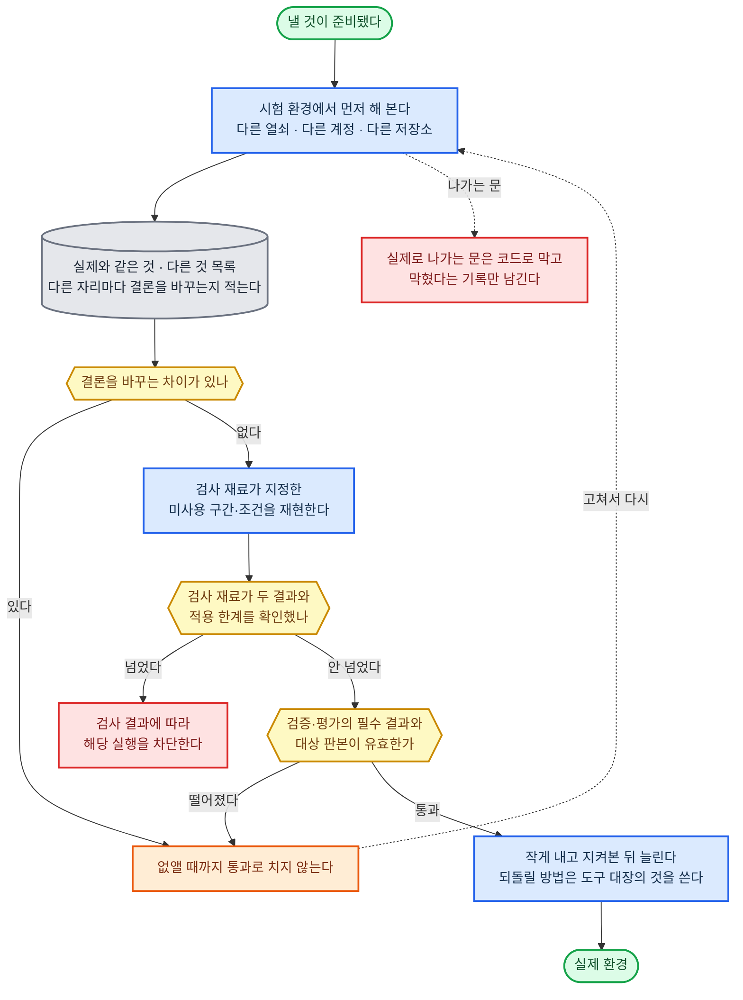
```mermaid
%%{init: {"flowchart": {"wrappingWidth": 640, "curve": "basis", "nodeSpacing": 45, "rankSpacing": 55, "padding": 14, "useMaxWidth": true}, "themeVariables": {"fontSize": "15px"}} }%%
flowchart TB
    PLAN(["낼 것이 준비됐다"]):::good
    SAND["시험 환경에서 먼저 해 본다<br/>다른 열쇠 · 다른 계정 · 다른 저장소"]:::main
    GATE["실제로 나가는 문은 코드로 막고<br/>막혔다는 기록만 남긴다"]:::stop
    LIST[("실제와 같은 것 · 다른 것 목록<br/>다른 자리마다 결론을 바꾸는지 적는다")]:::store
    Q1{{"결론을 바꾸는 차이가 있나"}}:::note
    FIX["없앨 때까지 통과로 치지 않는다"]:::back
    OOS["검사 재료가 지정한<br/>미사용 구간·조건을 재현한다"]:::main
    Q2{{"검사 재료가 두 결과와<br/>적용 한계를 확인했나"}}:::note
    DROPB["검사 결과에 따라<br/>해당 실행을 차단한다"]:::stop
    JUDGE{{"검증·평가의 필수 결과와<br/>대상 판본이 유효한가"}}:::note
    SMALL["작게 내고 지켜본 뒤 늘린다<br/>되돌릴 방법은 도구 대장의 것을 쓴다"]:::main
    REAL(["실제 환경"]):::good
    PLAN --> SAND --> LIST --> Q1
    SAND -. "나가는 문" .-> GATE
    Q1 -- "있다" --> FIX
    Q1 -- "없다" --> OOS --> Q2
    Q2 -- "넘었다" --> DROPB
    Q2 -- "안 넘었다" --> JUDGE
    JUDGE -- "떨어졌다" --> FIX
    JUDGE -- "통과" --> SMALL --> REAL
    FIX -. "고쳐서 다시" .-> SAND
    classDef main fill:#dbeafe,stroke:#2563eb,stroke-width:2px,color:#17314f
    classDef stop fill:#fee2e2,stroke:#dc2626,stroke-width:2px,color:#7f1d1d
    classDef back fill:#ffedd5,stroke:#ea580c,stroke-width:2px,color:#7c2d12
    classDef store fill:#e5e7eb,stroke:#6b7280,stroke-width:2px,color:#1f2937
    classDef good fill:#dcfce7,stroke:#16a34a,stroke-width:2px,color:#14532d
    classDef note fill:#fef9c3,stroke:#ca8a04,stroke-width:2px,color:#713f12
```

##### 맡는 것

| 이 재료가 맡는다 | 맡지 않는다 |
|------|------|
| 실제 고객·돈·시스템에 닿기 전에 똑같은 조건을 흉내 낸 곳에서 먼저 해 보기<br>그곳을 실제와 끊어 두기<br>실제와 다른 조건을 기록해 검사 재료에 제공하기<br>검증·평가가 반환한 판정·판본을 확인해 실제 실행의 문을 열거나 막기 | 결과의 합격·수정 판정은 결과 검증·재검증이 맡는다<br>독립 근거·반례 검사는 반대 근거·다시 확인이 맡는다<br>고정 판본의 회귀·새 과제 평가는 업무 능력 시험이 맡는다<br>업무상 실험의 표본·모형 타당성은 실험·시뮬레이션이 맡는다<br>되돌릴 실행 수단은 업무 도구·시스템이 맡는다 |

> 시험을 통과하지 않은 것은 실제 환경에 내지 않는다. 예외를 두지 않는다.
> 흉내가 실제와 다른 자리는 미리 적어 둔다. 적히지 않은 차이가 사고를 낸다.

##### 짜는 방식

| 기준 | 정한 것 |
|------|------|
| 끊어 두기 | 시험 환경은 실제와 다른 열쇠·다른 계정·다른 저장소를 쓴다<br>실제로 나가는 문 (결제·발송·게시) 은 코드로 막고, 막혔다는 기록만 남긴다<br>실제 고객과 거래로 이어지는 경로를 제한한다 |
| 닮게 만들기 | 실제와 무엇이 같고 무엇이 다른지 목록을 만든다<br>다른 자리마다 그 차이가 결론을 바꾸는지 적는다<br>결론을 바꾸는 차이는 없앨 때까지 시험 통과로 치지 않는다 |
| 안 쓴 자료로 다시 | 검증·평가 또는 실험·시뮬레이션이 지정한 별도 구간·조건을 재현하고 실행 기록을 제공한다<br>과적합·모형 타당성·회귀 합격 여부는 해당 검사 재료가 판정한다 |
| 컴퓨터 밖의 것 | 실기기·고객의 실제 환경·사람·한 번 쓰면 못 되돌리는 재료처럼 전산 공간으로 복제되지 않는 대상은, 별도 공간 대신 예행으로 시험한다 (개발용 기기·시제품·목업, 모의 상대, 리허설, 남는 재료로 미리 한 번, 일부에게만 소량)<br>여기서 막아야 할 나가는 문은 발송·결제가 아니라 되돌릴 수 없는 실물 결과다 (실제 기기에 굽기, 실제 상대에게 보내기, 본 촬영분, 한 번뿐인 행사)<br>예행에 쓴 기기·재료·사람·환경이 실제와 무엇이 다른지 같은 목록에 적고, 결론을 바꾸는 차이는 없앨 때까지 통과로 치지 않는다<br>예행을 실제로 돌리는 일은 업무 도구·시스템이, 예행에서 얻은 수치를 증거로 다루는 일은 실험·시뮬레이션이 맡는다 |
| 통과 판정 연결 | 완료 조건의 기준에 따라 M42·M43·M49가 반환한 검사 결과를 받는다<br>시험 환경은 대상 판본·환경·필수 검사 기록이 유효한지 기계로 확인하고 실행 문을 제어한다. 업무 합격 기준과 평가 자체를 중복 소유하지 않는다<br>시험 결과와 배포하려는 판본이 일치할 때만 운영으로 내보낸다 |
| 실제로 나가기 | 시험을 통과해도 한 번에 다 내지 않는다<br>작게 내고 지켜본 뒤 늘린다<br>되돌릴 방법은 도구 대장의 것을 쓴다 |
| 드는 돈과 시간 | 시험 환경을 돌리는 데 드는 돈과 시간을 세고, 한 건에서 시험에 쓸 몫을 정한다 |
| 실제와 다른 점 | 실제와 다른 점은 적어 두어 시험 결과를 믿을 범위를 정할 때 쓴다. |

##### 쓰는 기술과 저장 자리

| 항목 | 정한 것 | 왜 이것인가 |
|------|------|------|
| 실행 꼴 | 함수만 쓴다. 나가는 문 막기, 실제와 다른 점 대조하기, 검사 결과와 배포 판본이 맞는지 확인해 실행 문을 열거나 닫기는 모두 코드가 한다. | 합격·수정 판정과 반례 검사, 회귀 평가는 검증·평가 재료가 맡으므로 이 재료는 판정을 갖지 않는다. 문 열기를 모델의 말에 맡기면 시험을 건너뛴 실행이 지나간다. |
| 코드 자리 | `src/environment/sandbox/` 에 두고, 시험용 계정·자료·예산과 실제와 다른 조건 목록, 예행 수단은 `jobs/<직종>/environment/sandbox.yaml` 에 채운다. | 실제와 무엇이 다른지는 직종마다 전혀 다르므로 목록을 직종 파일에 둔다. 그 목록은 사람이 읽고 고치는 것이라 표가 아니라 git 파일이다. |
| 저장 자리 | 시험 실행은 `run_log` 에 시험 표시와 함께 남기고, 막은 나가는 문은 `guard_events`, 받은 검사 결과와 대상 판본은 `checks`·`eval_runs` 에서 읽는다. 되돌릴 수 없는 실물 실행은 `handoffs` 의 승인 기록과 `run_log` 의 멱등 키가 함께 있어야 한 번만 지나간다. | 시험 기록과 실제 실행 기록을 같은 표에 두어야 "실제에 낸 것 중 시험 기록 없는 건"을 한 번의 조회로 셀 수 있다. 차이 목록은 사람이 고치므로 파일에 둔다. |
| 바깥 기술 | 실제와 다른 열쇠·계정·저장소를 쓰되 제품은 실제와 같은 것(PostgreSQL·OpenSearch·S3 또는 사내 객체 저장)을 쓴다. | 제품이 다르면 결론을 바꾸는 차이가 늘어 시험 통과가 실제를 보증하지 못한다. 시험용으로 더 싼 제품을 쓰는 꼴은 그래서 고르지 않는다. |
| 확인할 시험 | 시험 환경에서 실제 바깥으로 나간 요청이 0건인지 세고, 한 건이라도 있으면 떨어뜨린다. 실제 환경에 낸 것 가운데 시험 기록이 없는 건이 0인지, 시험은 통과했는데 실제에서 실패한 건수가 늘지 않는지 함께 센다. | — |

##### 이 직무에서 채울 것

| 채울 것 | 예 |
|------|------|
| 소프트웨어 | 인프라·DevOps = 실제와 똑같이 꾸민 시험용 서버 (스테이징) 와 진짜 기기<br>통과 잣대는 시험 통과 여부와 되돌리기가 실제로 되는지다 |
| 창작 | 유튜버 (정보·교육) = 소량 시험 (일부에게만 먼저 보이기), 섬네일 두 가지 안을 나눠 보여 주고 어느 쪽이 나은지 재기 (A/B 비교)<br>통과 잣대는 미리 정한 반응 수치다 |
| 투자 | 개인 투자자 (단기 매매) = 과거 자료로 돌려 보는 시험 (백테스트) 과 모의 매매<br>통과 잣대는 시험에 안 쓴 구간에서도 성적이 유지되는지다 |
| 서류 | 변호사 (민사·상사 송무) = 제출 전 초안을 상대편 눈으로 공격해 보는 모의 검토<br>통과 잣대는 미리 적은 반박 목록이 다 막혔는지다 |
| 실물 | 임베디드·펌웨어 = 실제 출하 기기에 굽기 전에 개발용 기기와 모의 신호로 예행<br>통과 잣대는 되돌릴 수 없는 굽기 전에 예행 기록이 다 있는지다 |
| 갖춰 둘 것 | 시험용 계정·자료·도구·예산, 실제 환경과 다른 조건, 시험할 판본, 모의 응답, 제한된 실전 실험 조건, 예행 수단과 되돌릴 수 없는 자리 |

##### 됐다는 기준

| 잣대 | 어떻게 재나 |
|------|------|
| 새지 않는다 | 시험 환경에서 실제 바깥으로 나간 요청이 0인지 센다<br>한 건이라도 있으면 실패다<br>실제 시스템으로 잘못 전송되지 않는지 본다 |
| 검사에 연결된다 | 지정한 입력·장애 조건이 재현되고 검사 재료에 원본 결과·환경 차이·판본이 전달되는지 확인한다<br>검사 결과가 실패·미확인이거나 다른 판본의 결과이면 실제 실행을 차단한다<br>모의 시험 통과와 실제 연결·전문 능력 검증은 따로 기록한다 |
| 실제와 맞는다 | 시험은 통과했는데 실제에서 실패한 건수를 센다<br>이 수가 늘면 닮게 만들기 목록을 다시 짠다 |
| 다시 만들 수 있다 | 같은 조건을 다시 만들 수 있는지 본다 |
| 안 건너뛴다 | 실제 환경에 낸 것 가운데 시험 기록이 없는 건이 0인지 센다 |

##### 충족 조건

- 진짜와 같은 구조(같은 프로그램 판본, 같은 데이터 형식)의 별도 공간이 있음. 전산 공간으로 복제되지 않는 대상은 대신 쓸 예행 수단이 정해져 있음(개발용 기기·시제품·목업·모의 상대·리허설·소량 시험)
- 예행이 실제와 다른 자리를 목록으로 적고, 그중 결론을 바꾸는 차이의 수가 0임
- 시험 공간의 행동이 밖으로 못 나감(메일·결제·외부 전송 차단)
- 진짜 데이터 대신 가짜·가려진 데이터를 씀
- 시험에서 통과한 것만 진짜로 넘어가는 관문이 코드로 있음
- 시험 공간을 언제든 처음 상태로 되돌릴 수 있음
- 되돌릴 수 없는 실물 실행은 자리 목록이 먼저 적히고, 그 자리마다 승인 기록이 있어야 한 번 지나감(승인 기록 없이 지나간 건 0)

##### 탈락 조건

- 시험 공간이 진짜와 달라 시험은 통과하고 진짜에서 깨짐
- 시험 공간에서 보낸 메일이 진짜 고객에게 감
- 시험을 거치지 않고 진짜에 바로 실행할 수 있음
- 시험 데이터에 진짜 개인정보가 있음
- 실물·실기기가 걸린 일인데 전산 공간이 없다는 이유로 예행 없이 바로 실행함

---

### 자료·검색

판단 근거와 다시 쓸 업무 자산을 확보·읽기·관리·조회한다. 정보·자료 이해는 원본의 내용·위치를, 재사용 자료는 실제 서식·마스터·부품과 권리·판본·호환성을 제공한다. 아래 그림은 이 중 판단 근거 여섯 종의 분류다.

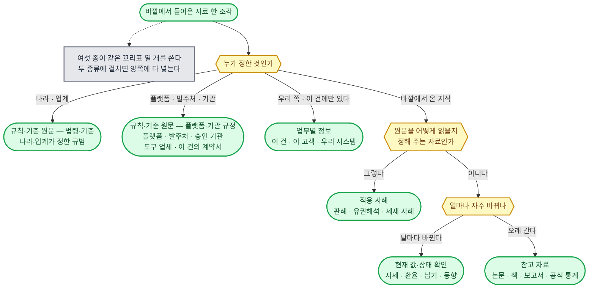
```mermaid
%%{init: {"flowchart": {"wrappingWidth": 640, "curve": "basis", "nodeSpacing": 45, "rankSpacing": 55, "padding": 14, "useMaxWidth": true}, "themeVariables": {"fontSize": "15px"}} }%%
flowchart TB
    IN(["바깥에서 들어온 자료 한 조각"]):::good
    RULE["여섯 종이 같은 꼬리표 열 개를 쓴다<br/>두 종류에 걸치면 양쪽에 다 넣는다"]:::store
    Q1{{"누가 정한 것인가"}}:::note
    LAW(["규칙·기준 원문 — 법령·기준<br/>나라·업계가 정한 규범"]):::good
    PLAT(["규칙·기준 원문 — 플랫폼·기관 규정<br/>플랫폼 · 발주처 · 승인 기관<br/>도구 업체 · 이 건의 계약서"]):::good
    OWN(["업무별 정보<br/>이 건 · 이 고객 · 우리 시스템"]):::good
    Q2{{"원문을 어떻게 읽을지<br/>정해 주는 자료인가"}}:::note
    INTP(["적용 사례<br/>판례 · 유권해석 · 제재 사례"]):::good
    Q3{{"얼마나 자주 바뀌나"}}:::note
    NOW(["현재 값·상태 확인<br/>시세 · 환율 · 납기 · 동향"]):::good
    GEN(["참고 자료<br/>논문 · 책 · 보고서 · 공식 통계"]):::good
    IN --> Q1
    IN -.-> RULE
    Q1 -- "나라 · 업계" --> LAW
    Q1 -- "플랫폼 · 발주처 · 기관" --> PLAT
    Q1 -- "우리 쪽 · 이 건에만 있다" --> OWN
    Q1 -- "바깥에서 온 지식" --> Q2
    Q2 -- "그렇다" --> INTP
    Q2 -- "아니다" --> Q3
    Q3 -- "날마다 바뀐다" --> NOW
    Q3 -- "오래 간다" --> GEN
    classDef main fill:#dbeafe,stroke:#2563eb,stroke-width:2px,color:#17314f
    classDef stop fill:#fee2e2,stroke:#dc2626,stroke-width:2px,color:#7f1d1d
    classDef back fill:#ffedd5,stroke:#ea580c,stroke-width:2px,color:#7c2d12
    classDef store fill:#e5e7eb,stroke:#6b7280,stroke-width:2px,color:#1f2937
    classDef good fill:#dcfce7,stroke:#16a34a,stroke-width:2px,color:#14532d
    classDef note fill:#fef9c3,stroke:#ca8a04,stroke-width:2px,color:#713f12
```

#### 근거의 신뢰성·적합성

자료가 얼마나 믿을 만하고 이번 판단에 맞는지 확인한다.

M18은 본문의 **근거의 신뢰성·적합성**과 **자료의 시점·버전**을 별도 하위 책임으로 추적한다. 전자는 출처·독립성·주장·반대 근거·쟁점 적합성을, 후자는 관측 시각·효력 시점·정정·사용 판본을 검사한다. 최신 자료라는 사실이 내용의 신뢰성을 보장하지 않으며 믿을 만한 원문도 적용 시점이 틀릴 수 있다. 두 검사 결과를 따로 남긴다.

##### 맡는 것

근거의 권위·독립성·적합성과 적용 조건을 관리한다. 글로 된 문서만이 아니라 사진·영상·녹취·계측값·현장 관측·구두 진술도 같은 등급표에 올린다. 사실·주장·가설·해석의 근거 관계와 반대 증거를 구별한다.

##### 짜는 방식

사실·주장·가설·해석은 구분하고 주장자·찬반 근거·미확인 사항·판단을 뒤집는 조건을 연결한다. 사실과 당사자 주장과 추정을 갈라 적고, 빠진 내용과 충돌을 확인한다. 같은 원문을 옮긴 여러 글은 하나의 근거로 본다.

인증·권위·독립성·신선도·조작 가능성·사건 적합성은 다른 속성이다. 글이 아닌 근거는 누가·무엇으로·언제·어떤 조건에서 얻었는지와 원본 파일·기기 기록이 남아 있는지로 같은 속성을 판정하고, 정보·자료 이해가 남긴 원본 위치·취득 조건·불확실성을 그대로 달고 다닌다. 원장·공식 자료·진술의 종류만으로 진실 순위를 정하지 않는다. 다툼이 남으면 필요한 추가 확인이나 조건부 결론을 택한다.

자료가 우리 결론을 뒷받침하는지 반박하는지 표시한다. 가정한 값과 근거가 모자란 곳 그리고 누가 입증해야 하는지 남긴다.

##### 쓰는 기술과 저장 자리

| 항목 | 정한 것 | 왜 이것인가 |
|------|------|------|
| 실행 꼴 | 함수와 모델을 섞는다. 등급표 적용·필수 칸이 찼는지 검사·같은 원문을 옮긴 글 묶기는 함수가 하고, 이번 쟁점에 맞는지와 반대 근거인지는 모델이 가린다. | 적합성은 건마다 달라 규칙으로 굳히면 틀린다. 반대로 빈 칸 검사까지 모델에 맡기면 취득 조건이 비어도 통과하므로 그 부분은 기계가 막는다. |
| 코드 자리 | `src/corpus/provenance/` 의 출처·등급 쪽에 둔다. 시점·판본 쪽과 같은 폴더를 쓰고 책임만 가른다. 직종별 출처 등급표와 충돌 우선순위는 `jobs/<직종>/corpus/` 에 채운다. | 재료 자리 표가 두 재료를 같은 `provenance` 폴더의 두 책임으로 적어 두었기 때문이다. 등급표를 코드에 박으면 직무마다 코드가 갈라진다. |
| 저장 자리 | `cards` 의 출처·근거 등급 칸과 덧칸(확신도·표본 수·취득 조건)에 쌓고, 사진·영상·녹취·계측 원본은 해시 창고에 넣어 얻은 곳·시각·판본·해시를 적은 쪽지를 곁에 둔다. 고객 원본은 고객별 열쇠로 암호화해 다른 고객과 중복 제거가 되지 않게 한다. | 등급은 조각마다 달라 칸으로 걸러야 하고, 원본은 덮어쓰기도 지우기도 안 되는 자리여야 판단 근거를 되짚을 수 있다. 등급을 파일 이름에 담는 꼴은 꼬리표 열 개가 안 들어가 고르지 않는다. |
| 바깥 기술 | 없음 (함수·표만). 저장은 PostgreSQL, 원본은 S3 또는 사내 객체 저장의 해시 창고를 쓴다. | 근거 등급을 매기는 전용 제품을 들이지 않는다. 남이 믿어야 하는 시각은 제품 기능이 아니라 원본 곁의 시각 도장으로 댄다. |
| 확인할 시험 | 조작된 원천과 믿을 만한 반대 증거를 섞은 시험지에서 출처 등급만 보고 채택한 건이 0인지 센다. 글이 아닌 근거 카드 가운데 취득 주체·장비·시각·조건 칸이 빈 것이 0인지 센다. | — |

##### 이 직무에서 채울 것

조각 ID, 원문 위치. 주장자·증거 관계·반박·미확인 사항·판단 전환 조건. 작성자·수집 과정·대상·조건과 반대 자료.

##### 됐다는 기준

조작된 원천과 신뢰할 만한 반대 증거를 대조하며 출처 등급만으로 진실을 결정하지 않는다. 종합한 주장과 관계가 원문에서 뒷받침되는지 대조한다. 공신력 있는 출처라도 대상·시점이 다르면 그대로 적용하지 않는다.

##### 충족 조건

- 출처 등급표가 있음(공식 원문 > 기관 회신 > 원본 자료 > 남이 정리한 자료 > 미확인)
- 글이 아닌 근거의 등급표도 있음(기기 기록이 붙은 원본 계측값·사진·영상 > 우리가 직접 관측해 남긴 기록 > 편집·전달된 사본 > 남이 전해 준 말)
- 글이 아닌 근거마다 취득 주체·장비·시각·조건과 원본 보존 여부가 적혀 있음
- 답에 쓴 자료마다 출처가 붙음
- 자료끼리 충돌하면 어느 것이 이기는지 규칙이 있음(최신 공식 원문 우선 등)

##### 탈락 조건

- 출처 등급 없이 검색 상위 결과를 씀
- 사진·녹취·계측값에는 등급을 안 매기고 글로 된 자료만 가림
- 충돌하는 두 자료를 둘 다 씀

공통 실행은 [실행 계약](docs/runtime.md), 전문 개입·팀 비교·표본 설계는 [평가 규약](docs/evaluation.md)을 따른다.

---

#### 자료의 시점·버전

이번 업무의 대상 시점에 맞는 자료를 고른다.

M18의 시점·판본 하위 책임이다. 근거 평가와 따로 검사하고 두 검사 결과를 각각 남긴다. 믿을 만한 원문도 적용 시점이 틀릴 수 있다.

##### 맡는 것

근거의 두 시간 축(언제 관측했는가와 언제부터 힘을 갖는가)과 판본·적용 기간을 관리한다.

##### 짜는 방식

원문·관측 시각·효력 기간·관할·판본·적용 조건을 함께 저장한다. 당시 판단과 나중 정정을 함께 조회한다. 당시 알고 있던 내용과 지금 바로잡힌 내용을 구분한다. 종합 지식에도 사용한 원문의 위치·판본·적용 조건을 연결한다.

##### 쓰는 기술과 저장 자리

| 항목 | 정한 것 | 왜 이것인가 |
|------|------|------|
| 실행 꼴 | 함수만 쓴다. 기준일로 판본 고르기는 구간 조회 한 번으로 끝난다. | 어느 날을 기준일로 삼을지는 자료의 시점이 아니라 그 건의 사실이라 직무 설정과 모델이 준다. 판본 고르기를 모델에 맡기면 같은 건에서 결과가 흔들린다. |
| 코드 자리 | `src/corpus/provenance/` 의 시점·판본 쪽에 두고, 한 건에 딸린 기준일 목록은 `jobs/<직종>/job.yaml` 의 기준일 목록에 채운다. | 기준일 이름(계약일·소 제기일·신고일)은 직종마다 달라 직종 파일에 두고, 고르는 방법은 공통이라 코드는 하나만 둔다. |
| 저장 자리 | `card_effective` 에 효력 구간과 관할 시간대를 두어 "효력 구간이 기준일을 품는가" 한 줄 조회로 판본을 고르고, `cards` 의 판본·읽은 시각 칸과 `card_diffs` 의 정정 이력을 함께 읽는다. | 파일로는 효력 구간으로 판본을 고르지 못하고 판본 수만큼 파일이 는다. 구간 칸에 색인을 두면 겹치는 두 판본이 들어오는 것도 제약으로 막힌다. |
| 바깥 기술 | 없음 (함수·표만). PostgreSQL의 구간 칸과 구간 색인, 겹침 막기 제약을 쓴다. | 시점 관리 전용 제품을 들이지 않는다. 판본마다 효력일·폐지일을 비교하는 코드를 도는 꼴은 조각이 수백만이면 느려 고르지 않는다. |
| 확인할 시험 | 기준일을 준 시험지에서 그날에 맞는 판본을 고른 비율을 재고, 같은 조각의 겹치는 두 판본을 100번 넣어 전부 막히는지 센다. 개정에 부칙이 있는 조각을 물었을 때 부칙 카드가 함께 나오는 비율도 잰다. | — |

##### 이 직무에서 채울 것

목적·관할·기간, 정정·보존. 자료가 적용되는 기간, 시스템이 알게 된 시각, 개정·정정 이력과 원본.

한 건에 딸린 기준일 목록과 기준일마다 고른 판본. 변호사 (민사·상사 송무) = 계약일·소 제기일·변론 종결일, 세무사 (신고·기장) = 거래일·상속 개시일·신고일. 개정된 규칙은 시행일과 함께 부칙 (경과 규정) 을 같이 달아 어느 기준일에 옛 판본을 쓰는지 남긴다

##### 됐다는 기준

관측일과 효력일을 혼동하지 않고 과거 판단·현재 정정 결과를 각각 조회한다. 과거 업무, 소급 정정, 같은 날짜의 재수정, 경과조치가 있는 경우를 시험한다. 최신 자료를 모든 과거 업무에 일괄 적용하지 않는다.

##### 충족 조건

- 답에 쓴 자료마다 날짜·판본이 붙음
- 기준일이 업무 시점에 맞게 정해짐. 한 건에 기준일이 여럿이면 (계약일·사망일·신고일) 각각 적고 기준일마다 고른 판본을 남김
- 개정된 규칙은 시행일만이 아니라 부칙 (경과 규정) 으로 어느 기준일에 옛 판본을 쓰는지 정해짐. 효력 구간만 보고 새 판본을 고르지 않음

##### 탈락 조건

- 날짜 없는 자료를 최신으로 봄
- 판본이 달라 결과가 건마다 바뀜
- 시행일만 보고 새 판본을 골라 부칙의 경과 규정을 놓침

---

#### 규칙·기준 원문

적용할 법령·규격·기관 규정·계약·내부 규칙의 원문을 갖춘다.

##### 맡는 것

###### 법령·시행령·기준·규격·지침

| 이 재료가 맡는다 | 맡지 않는다 |
|------|------|
| 나라와 업계가 정한 규범의 원문을 공식 출처에서 받아 와 자료 카드로 쌓기. 돈을 내야 볼 수 있는 표준·규격도 정식으로 사서 같은 자리에 쌓기<br>조·항·호 단위로 쪼개 두고, 조문 번호가 없는 기준·규격·지침은 그 문서가 쓰는 절·항목·부속서·표 번호를 그대로 쪼개는 단위로 쓰기<br>어느 판본인지, 언제부터 힘을 갖는지 꼬리표 붙이기 | 이 규범이 다른 규칙보다 앞서는지는 에이전트 기본 원칙·법·의무 기준·직업 윤리·의무가 맡는다<br>원문을 실제로 어떻게 읽는지는 적용 사례가 맡는다<br>바뀌었다는 신호 받기는 시작 신호가 맡는다<br>바뀐 것을 자료에 넣기는 변경 감시·반영이 맡는다 |

> 원문만 여기에 둔다. 남이 줄여 쓴 요약은 원문 자리에 넣지 않는다.
> 받아 오고 견주는 일은 기계가 한다. 이 건에 어느 조문이 걸리는지는 모델이 고른다.

###### 플랫폼 정책·심사 지침, 발주처 시방서·입찰 조건, 승인 기관 내규·약관, 도구·서비스 업체 이용 조건, 이 건의 계약서

| 이 재료가 맡는다 | 맡지 않는다 |
|------|------|
| 플랫폼·발주처·승인 기관·도구 업체가 정한 규정의 원문 보관<br>이 건을 묶는 계약서 원문을 조항 단위로 쪼개 두기<br>예고 없이 바뀌는 정책의 옛 판본을 남겨 무엇이 바뀌었는지 짚어 두기 | 어느 층에 서는지, 어기면 어떻게 되는지는 계약·합의 조건과 플랫폼·제출처 규정이 맡는다<br>정책 해설과 제재 사례는 적용 사례가 맡는다<br>바뀐 것을 자료에 넣기는 변경 감시·반영이 맡는다 |

> **앞의 법령·기준과 저장 꼴이 같다. 다른 점은 하나다. 공식 창구가 거의 없어 웹 문서·PDF·계약서 파일에서 받아 온다.**

##### 짜는 방식

원문과 변경 이력을 보관하고 필요한 부분을 찾아 제공한다. 유료 표준이나 로그인 공지도 정당한 접근 경로를 마련한다.

###### 법령·시행령·기준·규격·지침

| 기준 | 정한 것 |
|------|------|
| 어디서 받나 | 공식 기관이 연 창구 (프로그램이 자료를 직접 받아 가는 통로) 를 첫째로 둔다<br>법령은 그 창구에서 현행 법령·연혁·시행일·행정규칙·조약·별표를 받는다<br>창구가 없는 기준·규격은 공식 배포 문서를 내려받아 같은 꼴로 넣는다<br>돈을 내야 보는 표준·규격 (KS·ISO·IEC·단체 표준·유료 지침) 은 발행 기관에서 정식으로 사거나 구독해 받는다. 사는 값과 결재는 조직 규칙이 정한 절차로 올린다<br>사고도 통째로 쌓을 수 없는 표준은 원문 대신 산 판본 번호·절·표 번호와 열어 확인한 기록만 카드에 남기고, 결론에 쓸 때 그 자리를 다시 연다<br>사지 못해 아직 못 본 표준은 그냥 넘기지 않고 미확보 목록에 올려 개정 감시와 같은 주기로 다시 시도한다 |
| 저장 꼴 | 자료 카드 하나 = 원문 한 조각 + 꼬리표<br>원문은 한 글자도 고치지 않고 그대로 둔다<br>꼬리표 이름은 근거의 신뢰성·적합성과 자료의 시점·버전이 정한 열 개를 그대로 쓴다 |
| 쪼개는 단위 | 조·항·호 한 덩어리가 한 조각이다<br>조·항·호가 없는 기준·규격·지침은 그 문서가 쓰는 번호 체계 (제N절·항목 번호·부속서·표·그림) 한 덩어리를 한 조각으로 삼는다<br>쪽 수로 자르지 않는다<br>조각 하나만 봐도 어느 문서의 어느 번호인지 알게 조각 위치를 적는다 |
| 판본을 쌓는 법 | 고쳐진 판본이 들어와도 옛 판본을 지우지 않고 나란히 쌓는다<br>건의 기준일에 맞는 판본은 자료의 시점·버전이 정한 규칙대로 고른다 |
| 실패 처리 | 창구가 죽으면 마지막으로 받은 판본을 쓰되 낡음 표를 켠다<br>정한 주기의 세 배가 지나도록 못 받으면 그 분야의 결론에 낡음 경고를 붙여 내보낸다 |
| 넘겨주는 것 | 새 카드는 정보·자료 찾기에 색인 재료로 바로 넘긴다<br>바뀐 조문 목록은 변경 감시·반영이 만들어 밀어 넣는다 |
| 유료 규격 | 돈을 내야 받는 규격도 정식으로 사서 확보한다. |

###### 플랫폼 정책·심사 지침, 발주처 시방서·입찰 조건, 승인 기관 내규·약관, 도구·서비스 업체 이용 조건, 이 건의 계약서

| 기준 | 정한 것 |
|------|------|
| 어디서 받나 | 정책 문서의 주소를 목록으로 고정해 두고 그 주소만 본다<br>바뀐 것만 받도록 조건부 요청 (전에 받은 것과 같으면 안 보내 달라고 묻는 방식) 을 쓴다<br>로그인해야 보이는 판매자·개발자 센터 공지, 메일로만 오는 정책 통지, 앱·관리자 화면 안에만 뜨는 알림도 같은 목록에 올린다. 로그인으로 들어가는 일은 업무 도구·시스템이 연결한 전용 계정으로 하고, 메일·알림은 시작 신호가 받아 넘긴 것을 원문 그대로 카드로 쌓는다<br>어느 통로로 받았는지 (공개 주소·로그인 공지·메일·앱 알림) 를 꼬리표에 남긴다<br>공개 주소가 없는 통로는 우리가 본 화면·받은 메일 원문을 그대로 붙여 두어 나중에 되짚을 수 있게 한다<br>이 건의 계약서는 우리 문서함에서 받아 조항 단위로 넣는다 |
| 저장 꼴 | 자료 카드는 앞의 법령·기준과 같은 꼬리표를 쓴다<br>여기에만 더 붙이는 꼬리표: 어느 플랫폼·기관인지, 어느 계정·상점·건에 걸리는지 |
| 판본을 쌓는 법 | 받을 때마다 새 판본으로 쌓고 지우지 않는다<br>옛 판본과 줄 단위로 견주어 바뀐 곳 목록을 함께 저장한다<br>정책은 날짜도 안 적고 조용히 바뀌는 일이 많다. 그래서 우리가 읽은 시각이 사실상 효력이 생긴 날이 된다 |
| 계약서 다루기 | 계약서 카드는 건 꼬리표를 달아 그 건에서만 읽히게 한다<br>다른 건의 검색 결과에 섞이지 않게 기계가 걸러낸다 |
| 실패 처리 | 문서 주소가 바뀌어 못 읽으면 그냥 지나치지 않고 옮겨 간 자리를 차례로 찾는다. ① 찾는 말을 넓혀 새 주소 찾기 ② 로그인 뒤 센터 공지·도움말에서 같은 문서 찾기 ③ 그 플랫폼의 고객센터·담당 창구에 물어 원문 받기<br>여기까지 밟고도 못 구하면 사람에게 넘기고, 어느 길까지 밟았는지를 함께 적는다<br>정책 문서를 못 읽은 채로 그 플랫폼에 올리려 하면 안전장치에 신호를 보내 막는다 |
| 로그인 공지 | 로그인해야 보이는 공지도 정식 계정으로 확보한다. |

##### 쓰는 기술과 저장 자리

| 항목 | 정한 것 | 왜 이것인가 |
|------|------|------|
| 실행 꼴 | 함수만 쓴다. 받아 오기·조각으로 쪼개기·꼬리표 붙이기·옛 판본과 견주기는 기계가 한다. | 짜는 방식에 적힌 대로 이 건에 어느 조문이 걸리는지는 모델이 고르고, 여기서는 고르기 전 단계인 확보와 보관만 맡는다. 받아 오는 일까지 모델에 맡기면 원문이 조금씩 달라진다. |
| 코드 자리 | 법령·기준은 `src/corpus/law/`, 플랫폼·기관 규정과 이 건의 계약서는 `src/corpus/platform-rules/` 에 둔다. 받아 올 목록·기준일·위험 조문은 `jobs/<직종>/corpus/law.yaml` 에 채운다. | 두 갈래는 저장 꼴이 같고 받는 길만 달라 코드를 나누되 표는 하나로 쓴다. 목록은 사람이 고르는 것이라 git 파일에 둔다. |
| 저장 자리 | `cards` 에 조각 위치와 판본의 유일 색인을 걸어 같은 요청이 두 번 와도 카드가 두 장 생기지 않게 하고, 판본은 `card_effective`, 바뀐 곳은 `card_diffs` 에 쌓는다. 원본 XML·PDF·계약서 파일은 해시 창고에, 검색용 파생물은 OpenSearch 색인에 둔다. 계약서 카드는 건 꼬리표와 `client` 칸의 행 보안, 검색 처리 단계 거르기로 다른 건 조회에서 빠진다. | 현행 법령만 166,650건이고 조·항·호로 쪼개면 그 수십 배라 파일로는 꼬리표로 거르지도 판본을 고르지도 못한다. 원문은 한 글자도 고치면 안 되므로 파일 본체는 못 고치는 창고에 둔다. |
| 바깥 기술 | 공식 기관이 연 공식 API로 받고, 저장은 PostgreSQL, 색인은 OpenSearch를 기본안으로 하되 규모가 작으면 PostgreSQL 검색·pgvector와 비교한다. 원본은 S3 또는 사내 객체 저장에 둔다. | 남이 줄여 쓴 요약을 원문 자리에 넣지 않으므로 공식 창구가 첫째다. 유료 표준처럼 창구가 없는 것은 공식 배포 문서를 사서 같은 꼴로 넣는다. |
| 확인할 시험 | 카드에서 무작위로 20조각을 뽑아 공식 출처에서 다시 받아 글자 단위로 견주어 하나라도 다르면 떨어뜨린다. 받기로 정한 목록 N개 가운데 실제로 들어온 수를 M of N으로 적고, 유효 기한을 넘긴 카드 수를 하루 한 번 세어 0인지 확인한다. | — |

##### 이 직무에서 채울 것

공식 출처, 이용 권한, 조항·항목·부속서 위치, 적용 대상과 기간.

###### 법령·시행령·기준·규격·지침

| 채울 것 | 예 |
|------|------|
| 받아 올 법령·기준 목록 | 변호사 (기업 자문) = 상법·공정거래법·개인정보보호법과 각 시행령<br>세무 (사내) = 법인세법·부가가치세법·회계기준<br>온라인 셀러 (소싱·오픈마켓) = 전자상거래법·표시광고법·제품안전 기준 |
| 무엇을 기준일로 잡나 | 변호사 (기업 자문) = 계약을 맺은 날<br>세무 (사내) = 과세 기간이 끝나는 날<br>온라인 셀러 (소싱·오픈마켓) = 상품을 올린 날 |
| 틀리면 가장 크게 다치는 조문 | 직무마다 따로 골라 적는다<br>그 조문은 갱신 주기를 절반으로 줄인다 |

###### 플랫폼 정책·심사 지침, 발주처 시방서·입찰 조건, 승인 기관 내규·약관, 도구·서비스 업체 이용 조건, 이 건의 계약서

| 채울 것 | 예 |
|------|------|
| 지켜볼 규정 목록 | 외주 개발 (시스템 구축·SI) = 발주처 시방서·입찰 조건·클라우드 이용 조건<br>퍼포먼스 마케팅 = 광고 매체의 소재 심사 지침과 금지 표현 목록<br>유튜버 (정보·교육) = 커뮤니티 가이드라인·수익화 정책 |
| 계정이 날아가는 규정 | 직무마다 한 줄로 적어 두고 갱신 주기를 가장 짧게 둔다 |
| 계약서에서 뽑을 조항 | 납기·검수 기준·대금 조건·손해배상 한도·비밀 유지 |

##### 됐다는 기준

본문 외에 예외·부칙·첨부 기준까지 확보했는지 본다. 원문 확보와 법적·업무상 적용 판단은 각각 담당 재료에 연결한다.

###### 법령·시행령·기준·규격·지침

| 잣대 | 어떻게 재나 |
|------|------|
| 원문이 같은가 | 카드에서 무작위로 20조각을 뽑아 공식 출처에서 다시 받아 글자 단위로 견준다<br>하나라도 다르면 실패다 |
| 판본이 맞는가 | 업무 능력 시험의 시험지에서 건마다 기준일을 주고, 그날에 맞는 판본을 골랐는지 일하는 과정 평가가 채점한다 |
| 빠진 것이 없는가 | 받기로 정한 목록 N개 가운데 실제로 들어온 수를 세어 M of N으로 적는다 |
| 낡지 않았는가 | 유효 기한을 넘긴 카드 수를 하루 한 번 센다<br>0이 아니면 그 수를 보고에 적는다 |

###### 플랫폼 정책·심사 지침, 발주처 시방서·입찰 조건, 승인 기관 내규·약관, 도구·서비스 업체 이용 조건, 이 건의 계약서

| 잣대 | 어떻게 재나 |
|------|------|
| 바뀐 것을 잡았는가 | 일부러 옛 판본을 넣고 새 판본을 받게 해, 바뀐 곳 목록이 실제 바뀐 줄과 같은지 센다 |
| 건 밖으로 안 새는가 | 다른 건의 조회를 100번 돌려 이 건 계약서 조각이 한 번도 안 나오는지 본다 |
| 놓친 개정 | 분기마다 사람이 정책 이력을 훑어 우리가 못 받은 개정 수를 센다<br>0이 아니면 성공·실패 원인 분석으로 넘긴다 |

##### 충족 조건

###### 법령·시행령·기준·규격·지침

- 원문 출처가 공식 기관(법제처 같은 국가 법령 사이트·소관 부처·표준 기관)임
- 조항 단위로 쪼개져 있어 "제N조 제N항"으로 인용함. 조문 번호가 없는 기준·규격은 "제N절·부속서 A·표 3"처럼 그 문서의 번호로 인용함
- 돈을 내야 보는 표준도 목록에 들어 있고, 목록마다 산 판본 번호·구매일·열람 권한을 가진 계정과 그 기간이 적혀 있음
- 아직 못 산 표준은 미확보 목록에 수로 세어져 있고, 다시 시도할 날짜가 붙어 있음
- 조항마다 관할·시행일·개정 이력이 붙어 있음
- 현행과 시행 예정을 구분하고, 기준일을 업무 시점(계약일·신청일)에 맞춤
- 개정 감시 목록이 있어 바뀌면 알림이 옴

###### 플랫폼 정책·심사 지침, 발주처 시방서·입찰 조건, 승인 기관 내규·약관, 도구·서비스 업체 이용 조건, 이 건의 계약서

- 업무에서 거치는 플랫폼·기관 목록과 각각의 규정 원문·판본·확인일이 있음
- 로그인해야 보이는 공지와 메일·앱 알림으로만 오는 통지도 목록에 있고, 목록마다 어느 계정·어느 수신함으로 받는지가 적혀 있음
- 제출 형식·필수 항목·금지 사항이 항목별 점검표로 있음
- 규정 변경을 정한 주기로 다시 확인함
- 반려·거절 사유 이력이 해당 규정과 연결돼 있음
- 분기마다 사람이 훑은 정책 이력과 견주어, 공개 주소 밖의 통로로만 왔다가 우리가 못 받은 개정 수가 0임

##### 탈락 조건

###### 법령·시행령·기준·규격·지침

- 블로그·요약 글에서 옮겨 온 조문
- 돈을 내야 본다는 이유로 표준 원문 대신 남이 요약한 글을 근거로 씀
- 개정 전 조문이 섞여 있음
- 어느 지역·어느 시점 법인지 없음
- 모델 기억으로 조문을 외워 씀

###### 플랫폼 정책·심사 지침, 발주처 시방서·입찰 조건, 승인 기관 내규·약관, 도구·서비스 업체 이용 조건, 이 건의 계약서

- 예전 제출 때 쓴 규칙을 그대로 씀
- 규정이 있는 줄 모르고 제출해 반려됨
- 금지 사항을 모델 기억으로 판단함
- 반려 사유를 다음에 반영하지 않음

##### 규칙·기준 원문의 연결

본문의 **규칙·기준 원문**은 이 재료의 법령·공식 기준 외에 직업 윤리 규정과 이 재료의 플랫폼·기관 규정 부분의 원문도 연결한다. 회사 규정과 계약서는 **업무별 정보**에서 받은 원문을 참조한다. 원문 확보와 실제 의무·권한의 적용은 구별하며, 문서에 적힌 지시만으로 실행 권한이 생기지는 않는다.

---

#### 업무별 정보

이번 건의 대상·상황·요구·조건을 확인한다.

다루는 범위는 고객·상대 상황, 거래처·상대방·담당 기관의 이력과 평판, 우리 회사 규정, 자기 운영 데이터다.

##### 맡는 것

| 이 재료가 맡는다 | 맡지 않는다 |
|------|------|
| 이 건·이 고객·이 상대에만 있는 사실을 원천 시스템에서 직접 뽑아 쌓기<br>사람의 말을 진술·증거·추정 셋으로 갈라 각각 다른 카드로 두기<br>우리 회사 규정 원문과 자기 운영 데이터 보관하기 | 오래 이어 갈 고객·건의 상태는 장기 기억이 맡는다<br>회사 규정이 어느 층에 서는지는 조직 규칙이 맡는다<br>비밀이 밖으로 못 나가게 막는 일은 안전장치가 맡는다 |

> **원천 시스템 기록이 문헌보다 앞선다. 남이 정리해 준 표는 쓰지 않고 원천에서 다시 뽑는다.**

##### 짜는 방식

| 기준 | 정한 것 |
|------|------|
| 어디서 받나 | 우리 계좌·상점·시스템의 창구에서 직접 뽑는다<br>사람에게 들은 것은 녹취·메일·문서 원문을 그대로 남기고 그 위에 갈라 적는다 |
| 저장 꼴 | 자료 카드 꼬리표는 여섯 종 공통 그대로다<br>여기에만 더 붙이는 꼬리표: 건, 말의 갈래 (진술·증거·추정), 말한 사람과 그 사람의 이해관계 |
| 갈라 적기 | 사람 말은 그 자체로 사실이 아니다<br>원천 시스템 기록이나 제3자 기록과 맞춰 본 뒤에만 근거 등급을 올린다<br>말과 행동이 어긋나면 행동 쪽 기록을 사실로 둔다 |
| 비밀 | 카드마다 건 꼬리표를 달아 다른 건에서 안 읽히게 걸러낸다<br>주민등록번호·계좌처럼 안 담아도 되는 것은 접수 때 안 담기로 정한다<br>밖으로 나가는 글에 이 카드가 섞이는지는 안전장치가 마지막에 검사한다 |
| 실패 처리 | 원천 시스템이 안 열리면 사람 말로 대신하지 않는다<br>대신 뽑아 오는 길을 차례로 밟는다. ① 권한·계정 때문이면 업무 권한이 정한 절차로 접근을 신청한다 ② 시스템이 멎은 것이면 정한 시간 뒤 다시 뽑는다 ③ 조회 통로가 막혀 있으면 그 시스템이 내보내는 파일·명세서·거래 내역서를 받아 정보·자료 이해로 읽는다 ④ 그래도 없으면 고객·거래처에 원본 문서 (계약서·영수증·통장 사본·발급 증명) 를 달라고 요청한다<br>여기까지 밟고도 못 얻은 것만 모자란 채로 가정 목록에 올리고, 어느 길까지 밟았는지와 다시 시도할 날짜를 함께 적는다 |
| 받을 권한 | 받을 권한이 있는 자료만 받는다. |
| 고객 간 나누기 | 다른 고객의 자료와 섞이지 않게 나눈다. |
| 없는 자료 | 없는 자료는 어떻게 구할지 먼저 정하고 그래도 없으면 가정한 값이라고 표시한다. |
| 필요한 만큼만 | 필요한 정보만 수집하고 누가 한 말인지 남긴다. 비용을 낸 사람, 자료를 준 사람, 결정권자를 구분하며 새 정보도 반영한다. |

##### 쓰는 기술과 저장 자리

| 항목 | 정한 것 | 왜 이것인가 |
|------|------|------|
| 실행 꼴 | 함수와 모델을 섞는다. 원천 시스템에서 뽑아 오기와 꼬리표 채우기는 함수가 하고, 사람의 말을 진술·증거·추정으로 가르는 일은 모델이 한다. | 갈래 가르기는 말과 기록을 견주는 판단이라 규칙으로 굳히면 틀린다. 반대로 원천에서 뽑는 일을 모델에 맡기면 남이 정리해 준 표를 쓰게 되어 고르지 않는다. |
| 코드 자리 | `src/corpus/client-info/` 에 두고, 무엇이 원천 시스템인지와 안 담을 개인정보 목록은 `jobs/<직종>/corpus/` 에 채운다. | 뽑는 방식은 공통이고 어느 시스템이 원천인지만 직종마다 다르다. 원천 목록을 코드에 박으면 직종을 더할 때마다 코드를 고쳐야 한다. |
| 저장 자리 | `cards` 에 여섯 종 공통 꼬리표와 건·말의 갈래·말한 사람과 그 이해관계를 덧붙여 쌓고, 뽑아 온 실행은 `run_log`, 끝내 못 얻어 가정으로 올린 것은 `stale_flags` 와 `handoffs` 에 다시 시도할 날짜와 함께 남긴다. 계약서·통장 사본·녹취 원본은 해시 창고에 고객별 열쇠로 암호화해 넣는다. 격리는 `org`·`client` 행 보안과 `tenant_key`, 검색 처리 단계 거르기 셋으로 건다. | 고객 A의 계약서가 고객 B의 건에 안 보이게 하는 일을 폴더 권한에 맡길 수 없어 줄 단위로 막는다. 원본은 못 고치는 자리에 두어야 나중에 되짚을 수 있다. |
| 바깥 기술 | 원천 시스템의 공식 API·SDK·CLI로 뽑되 연결과 계정은 업무 도구·시스템이 맡고, 저장은 PostgreSQL, 원본은 S3 또는 사내 객체 저장을 쓴다. | 조회 통로가 막혔을 때 내보내기 파일을 받아 읽는 길은 정보·자료 이해가 맡으므로 여기에 읽기 제품을 따로 들이지 않는다. 사람 말로 원천을 대신하는 꼴은 탈락 조건이다. |
| 확인할 시험 | 카드 30개를 뽑아 원천 시스템에서 다시 뽑아 견주어 일치율을 재고, 사람 말 카드 가운데 갈래 꼬리표가 빈 것이 0인지 센다. 다른 건에서 이 건 카드가 조회에 잡히는 횟수를 100회 시험해 0인지 확인한다. | — |

##### 이 직무에서 채울 것

| 채울 것 | 예 |
|------|------|
| 무엇이 원천 시스템인가 | 노무사 (자문·급여) = 근태 기록과 급여 대장<br>여신심사 (기업) = 계좌 거래 내역과 재무제표 원본<br>부동산 투자자·임대 운영자 = 임대차 계약·입금 내역과 수리 기록 |
| 어떤 사람 말을 자주 듣나 | 노무사 (자문·급여) = 사업주와 근로자의 서로 다른 말<br>여신심사 (기업) = 대표가 말하는 매출 전망<br>부동산 투자자·임대 운영자 = 세입자가 남긴 항의 |
| 안 담을 개인 정보 | 직무마다 목록으로 못 박는다 |
| 건마다 확인할 항목 | 의뢰 내용, 당사자와 역할, 원본 자료, 시스템 기록, 기한·제약 |

##### 됐다는 기준

| 잣대 | 어떻게 재나 |
|------|------|
| 원천과 맞는가 | 카드 30개를 뽑아 원천 시스템에서 다시 뽑아 견준다 |
| 갈라 적었는가 | 사람 말 카드 가운데 갈래 꼬리표가 빈 것 수를 센다<br>0이어야 한다 |
| 안 새는가 | 다른 건에서 이 건 카드가 조회에 잡히는 횟수를 센다<br>0이어야 한다 |
| 추정으로 메우지 않았는가 | 없는 사실을 추정으로 채우지 않았는지 본다<br>결론을 바꿀 누락 정보는 확보 작업으로 연결한다 |

##### 충족 조건

- 건마다 필요한 정보 목록이 있고 빠진 항목은 "없음"으로 표시됨
- 정보마다 출처(어느 시스템·누가·언제)가 붙음
- 원천 조회가 막혔을 때 밟을 길이 순서로 적혀 있음(권한 신청·재시도·내보내기 파일·원본 문서 요청)
- 가정 목록에 오른 항목 가운데 이 길을 하나도 안 밟은 것이 0건이고, 밟은 길과 다시 시도할 날짜가 항목마다 남아 있음
- 접근 권한이 건 단위로 갈라져 다른 고객 정보를 못 봄
- 개인정보 항목은 표시되고 보관 기간 규칙이 있음
- 사람이 말한 내용과 시스템에서 확인한 내용이 구분됨

##### 탈락 조건

- 다른 고객 정보가 섞여 들어감
- 확인 안 된 말을 사실로 기록함
- 원천 시스템이 안 열리자 다른 길을 하나도 안 찾고 곧장 모자란 채로 끝냄
- 어디서 온 정보인지 모름
- 개인정보가 기한 없이 쌓임

---

#### 정보·자료 이해

글·표·도면·영상·음성·코드의 내용과 구조를 읽는다.

##### 맡는 것

원본의 글·값·객체·수식·참조·형상·좌표·타임라인·코드와 관측·진술을 읽는다. 구조가 없는 사진·영상·음성·손글씨·현장 관측은 내용을 해석해 근거와 함께 남기며, 모든 결과에 원본 위치·취득 조건·불확실성을 붙인다

##### 짜는 방식

원본 위치·객체·단위·취득 조건을 유지한 채 읽는다. 내용의 위치와 요소 사이 관계를 유지한다. 구조가 없는 자료는 모델이 직접 보고 듣기, 전용 변환 도구(문자 인식·받아쓰기·형식 변환), 사람 확인 중 이 직무에 맞는 경로를 미리 정하고 어느 경로로 읽었는지 함께 남긴다. 목록에 없는 형식을 만나면 "못 읽음"으로 끝내지 않고 업무 도구·시스템으로 수단을 연결하거나 능력 개선·확장으로 확보하고, 그래도 안 되면 재취득·대체 원천·사람에게 넘기기로 잇는다. 못 읽거나 뜻이 모호한 부분은 표시하고 재추출·다른 도구·추가 확인으로 연결한다. 빠진 정보는 추가 질문·조회·관측의 필요로 연결하고, 다른 종류의 자료가 같은 사실을 지지하는지 대조한다.

##### 쓰는 기술과 저장 자리

| 항목 | 정한 것 | 왜 이것인가 |
|------|------|------|
| 실행 꼴 | 함수와 모델을 섞는다. 형식을 알아보고 정해 둔 읽기 수단을 부르는 일은 함수가 하고, 구조가 없는 사진·영상·음성·손글씨의 해석은 모델이나 전용 변환 도구가 한다. | 어느 경로로 읽을지는 직무별로 미리 정해 두는 것이라 함수가 고르고, 뜻을 읽는 일만 모델이 맡는다. 목록에 없는 형식을 만나면 "못 읽음"으로 끝내지 않고 수단 확보로 잇는다. |
| 코드 자리 | `src/corpus/readers/` 에 두고, 형식별 읽기 수단과 정확도 한도, 단위·객체 번호·좌표계는 `jobs/<직종>/corpus/readers.yaml` 에 채운다. | 읽기 수단은 직무마다 전혀 달라 파일로 갈라 두고, 부르는 뼈대만 공통으로 둔다. 수단을 코드에 박으면 직종을 더할 때마다 코드가 불어난다. |
| 저장 자리 | 읽은 결과는 `cards` 에 원본 위치·취득 조건·불확실성을 덧칸에 달아 쌓고, 원본 파일은 해시 창고에 둔 뒤 카드가 그 해시를 가리킨다. 못 읽었거나 뜻이 모호한 자리는 `stale_flags` 에 올리고 사람 확인이 필요하면 `handoffs` 로 넘긴다. 고객 원본은 고객별 열쇠로 암호화해 넣는다. | 원본은 한 글자도 고치면 안 되고 같은 파일이 두 번 들어와도 한 번만 저장되어야 하므로 내용 해시가 이름인 창고에 둔다. 읽은 결과는 꼬리표로 걸러야 하므로 표에 둔다. |
| 바깥 기술 | 전용 변환 도구는 업무 도구·시스템이 연결한 공식 API·SDK·CLI로 부르고, 뽑아낸 결과의 형식은 JSON Schema로 검사한다. | 읽기 제품을 이 재료가 직접 들이면 도구 대장이 두 곳에 생긴다. 화면에 보이는 모양만으로 수식·숨은 항목까지 읽었다고 하지 않으려면 결과 형식을 기계가 검사해야 한다. |
| 확인할 시험 | 표본 100건을 원본과 대조해 틀린 값이 직무가 정한 허용 한도 안인지 재고, 사진 50장·녹음 20건을 사람이 적은 정답과 맞춰 허용 오차를 정한다. 목록에 없는 형식 한 건을 실제로 넣어 수단 확보·형식 변환·재취득·사람에게 넘기기 가운데 어디로 가는지 한 번 돌려 본다. | — |

##### 이 직무에서 채울 것

형식·프로그램 판본, 단위·객체 ID, 취득 주체·시각·계측 조건, 구조 조회·관찰·추가 질문·재취득 경로. 형식별 읽기 수단과 정확도 한도, 구조 없는 자료에서 뽑아야 할 해석 항목. 해석에 필요한 프로그램·용어·단위·좌표계

##### 됐다는 기준

실제 원본·관측과 구조·표시를 대조하고 추출 손실·누락을 검출한다. 얻지 못한 현장 사실을 이미지·추정으로 확정하지 않는다. 구조 없는 자료의 해석은 원본의 어느 장면·어느 구간에서 나왔는지로 되짚을 수 있어야 한다. 페이지·셀·도면 객체·영상 시점으로 되짚는다. 화면에 보이는 모양만으로 수식·숨은 항목·연결 구조까지 읽었다고 하지 않는다

##### 충족 조건

- 직무가 쓰는 형식 목록을 다 읽음(예: PDF, 엑셀 수식, CAD 도면, 이미지 속 표, 코드, 현장 사진, 영상, 통화 녹음, 손글씨)
- 형식마다 무엇으로 읽는지 수단이 적혀 있음(모델이 직접·문자 인식·받아쓰기·전용 프로그램·계측 장비·사람)
- 읽은 결과를 원본과 대조하는 시험이 있음(예: 표본 100건, 틀린 값 허용 한도 명시)
- 구조 없는 자료도 같은 시험을 거침(예: 사진 50장·녹음 20건을 사람이 적은 정답과 맞춰 보고 허용 오차를 정함)
- 표는 칸 위치·병합·수식까지, 도면은 치수·기호까지, 코드는 호출 관계까지 뽑음
- 사진·영상·음성의 해석에도 위치가 붙음(사진은 어느 부분, 영상·음성은 몇 분 몇 초)
- 목록에 없는 형식이 와도 업무가 멈추지 않음(수단 확보·형식 변환·재취득·대체 원천·사람에게 넘기기 중 어디로 가는지 정해져 있고, 실제로 한 번 돌려 봄)
- 못 읽은 부분은 "읽지 못함"으로 표시함
- 원본의 어느 쪽·어느 칸에서 왔는지 위치가 붙음

##### 탈락 조건

- 글자만 뽑고 표·수식·위치가 사라짐
- 파일 형식만 다루고 사진·영상·음성은 아예 손을 못 댐
- 못 읽는 형식을 만나면 업무가 거기서 멈춤
- 영상·음성 해석을 어느 구간에서 나왔는지 없이 요약만 남김
- 흐릿한 부분을 그럴듯한 값으로 채워 넣음
- 시험 없이 "잘 읽힌다"고 믿음
- 어디서 온 값인지 몰라 원본 확인이 안 됨

직무별 검토는 [166개 업무 사례](docs/reviews/occupation-work-review.md), 실제 능력의 판정은 [평가 규약](docs/evaluation.md)을 따른다.

---

#### 정보·자료 찾기

부족한 사실·원리·방법·반대 근거를 찾아 확보한다.

다루는 범위는 하이브리드 검색 (Hybrid Search·RAG) 이다.

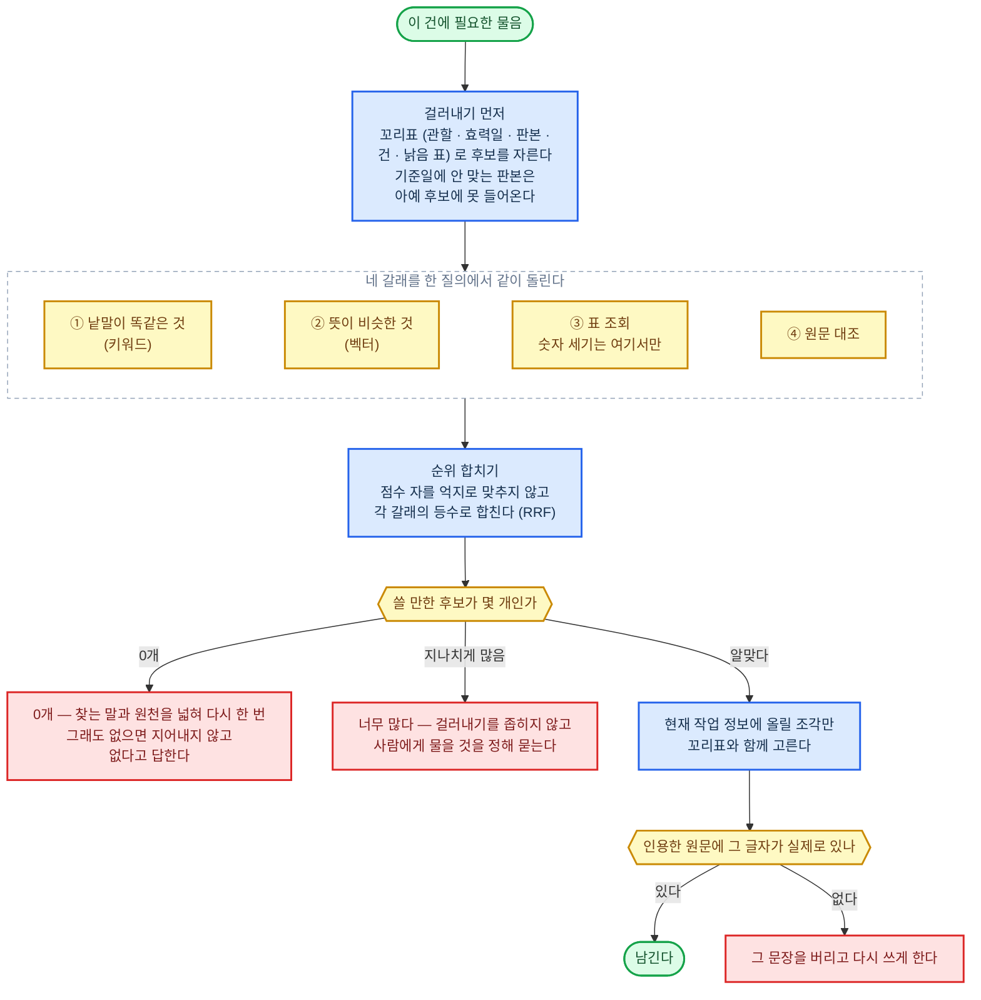
```mermaid
%%{init: {"flowchart": {"wrappingWidth": 640, "curve": "basis", "nodeSpacing": 45, "rankSpacing": 55, "padding": 14, "useMaxWidth": true}, "themeVariables": {"fontSize": "15px"}} }%%
flowchart TB
    Q(["이 건에 필요한 물음"]):::good
    FILT["걸러내기 먼저<br/>꼬리표 (관할 · 효력일 · 판본 ·<br/>건 · 낡음 표) 로 후보를 자른다<br/>기준일에 안 맞는 판본은<br/>아예 후보에 못 들어온다"]:::main
    subgraph FOUR["네 갈래를 한 질의에서 같이 돌린다"]
        direction LR
        W["① 낱말이 똑같은 것<br/>(키워드)"]:::note
        V["② 뜻이 비슷한 것<br/>(벡터)"]:::note
        TB2["③ 표 조회<br/>숫자 세기는 여기서만"]:::note
        O["④ 원문 대조"]:::note
        W ~~~ V ~~~ TB2 ~~~ O
    end
    RRF["순위 합치기<br/>점수 자를 억지로 맞추지 않고<br/>각 갈래의 등수로 합친다 (RRF)"]:::main
    HOW{{"쓸 만한 후보가 몇 개인가"}}:::note
    NONE["0개 — 찾는 말과 원천을 넓혀 다시 한 번<br/>그래도 없으면 지어내지 않고<br/>없다고 답한다"]:::stop
    MANY["너무 많다 — 걸러내기를 좁히지 않고<br/>사람에게 물을 것을 정해 묻는다"]:::stop
    PICK["현재 작업 정보에 올릴 조각만<br/>꼬리표와 함께 고른다"]:::main
    CITE{{"인용한 원문에 그 글자가 실제로 있나"}}:::note
    KEEP(["남긴다"]):::good
    DROP["그 문장을 버리고 다시 쓰게 한다"]:::stop
    Q --> FILT --> FOUR --> RRF --> HOW
    HOW -- "0개" --> NONE
    HOW -- "지나치게 많음" --> MANY
    HOW -- "알맞다" --> PICK --> CITE
    CITE -- "있다" --> KEEP
    CITE -- "없다" --> DROP
    classDef main fill:#dbeafe,stroke:#2563eb,stroke-width:2px,color:#17314f
    classDef stop fill:#fee2e2,stroke:#dc2626,stroke-width:2px,color:#7f1d1d
    classDef back fill:#ffedd5,stroke:#ea580c,stroke-width:2px,color:#7c2d12
    classDef store fill:#e5e7eb,stroke:#6b7280,stroke-width:2px,color:#1f2937
    classDef good fill:#dcfce7,stroke:#16a34a,stroke-width:2px,color:#14532d
    classDef note fill:#fef9c3,stroke:#ca8a04,stroke-width:2px,color:#713f12
    style FOUR fill:none,stroke:#94a3b8,stroke-width:1px,stroke-dasharray:5 4,color:#64748b
```

##### 맡는 것

| 이 재료가 맡는다 | 맡지 않는다 |
|------|------|
| 쌓아 둔 자료에서 이 건에 필요한 조각을 찾아 주기<br>낱말 검색·뜻 검색·표 조회·원문 대조를 한 번에 돌리기<br>찾은 조각을 꼬리표와 함께 넘겨 현재 작업 정보에 올릴 것만 고르기<br>필요한 경우 사람·기관에 문의하기 | 자료를 받아 오고 쌓는 일은 자료 여섯 종이 맡는다<br>오래 이어 가는 기억은 장기 기억이 맡는다<br>찾은 것으로 무엇을 정할지는 대안·전략 판단이 맡는다 |

> **자료를 찾아내지 못하면 행동 체계가 좋아도 성능이 크게 떨어진다. 여기에 가장 공을 들인다.**

##### 짜는 방식

| 기준 | 정한 것 |
|------|------|
| 네 갈래를 같이 | 낱말이 똑같은 것 찾기 (키워드), 뜻이 비슷한 것 찾기 (벡터), 표 조회, 원문 대조를 한 질의에서 같이 돌린다<br>정확한 이름·번호 찾기와 뜻이 비슷한 자료 찾기, 표 조회, 관련 자료의 연결 추적을 필요에 맞게 조합한다<br>숫자를 세는 일은 낱말·뜻 찾기가 아니라 표 조회로만 한다 |
| 순위 합치기 | 두 갈래의 점수를 억지로 같은 자로 맞추지 않고, 각 갈래에서 몇 등이었는지로 합친다 (RRF = 등수의 역수를 더하는 방식)<br>등수로 합치면 갈래가 늘어도 점수 자를 다시 맞출 일이 없다 |
| 걸러내기 먼저 | 꼬리표 (관할·효력일·판본·건·낡음 표) 를 걸러내기 칸으로 색인한다<br>걸러낸 뒤 그 안에서만 순위를 매긴다<br>기준일에 안 맞는 판본은 아예 후보에 안 들어온다 |
| 색인 갱신 | 새 카드는 들어오는 즉시 낱말 색인에 넣는다<br>뜻 색인은 하루 한 번 묶어서 다시 만든다<br>다시 만든 뒤 업무 능력 시험의 시험지에 있는 조회 문제를 돌린다. 점수가 떨어지면 옛 색인으로 되돌린다 |
| 원문 대조 | 모델이 쓴 사실 문장마다 인용한 조각 번호를 달게 한다<br>기계가 그 조각 원문에 그 글자가 실제로 있는지 다시 본다<br>없으면 그 문장을 버리고 다시 쓰게 한다<br>결과 점수만으로 사실을 확정하지 않고 원문을 확인한다 |
| 실패 처리 | 후보가 하나도 없으면 바로 끝내지 않고 넓혀 보는 세 걸음을 먼저 밟는다<br>① 찾는 말을 바꾼다 (원문에 실제로 쓰인 용어·동의어·상위어·영문 표기·옛 명칭)<br>② 아직 안 본 원천으로 넓힌다 (내부 자료 → 공식 원문 → 일반 웹 순서를 끝까지)<br>③ 우리 자료에 아예 없는 것이면 자료 여섯 종에 받아 오기를 맡기고, 바깥이 계속 바뀌는 것이면 변경 감시·반영에 감시를 건다<br>세 걸음을 밟고도 후보가 없으면 지어내지 않고 없다고 답하되, 어떤 말로 어디까지 찾았는지를 함께 남긴다<br>찾은 조각이 너무 많으면 걸러내기를 좁히지 않고 사람에게 물을 것을 정해 묻는다 |
| 권한 없는 자료 | 볼 권한이 없는 자료는 찾았더라도 쓰지 않는다. |

##### 쓰는 기술과 저장 자리

| 항목 | 정한 것 | 왜 이것인가 |
|------|------|------|
| 실행 꼴 | 함수와 모델을 섞는다. 꼬리표로 걸러내기·네 갈래 질의·순위 합치기·인용한 글자가 원문에 있는지 다시 보기는 함수가 하고, 찾는 말을 바꾸고 올릴 조각을 고르는 일은 모델이 한다. | 원문 대조를 모델에 맡기면 헛것을 걸러 내지 못한다. 반대로 찾는 말 바꾸기를 낱말 목록으로 굳히면 원문에 실제로 쓰인 용어를 못 따라가 고르지 않는다. |
| 코드 자리 | `src/corpus/search/` 에 두고, 무엇을 표 조회로 둘지와 조회 시험 문제 100개는 `jobs/<직종>/corpus/search.yaml`, 색인 매핑과 검색 처리 단계는 `db/index/` 에 둔다. | 검색 코드는 직종이 달라도 같고, 무엇을 세고 무엇을 물을지만 다르다. 색인 정의를 코드에 섞으면 색인을 갈아 끼울 때 코드까지 배포해야 한다. |
| 저장 자리 | 읽는 곳은 `cards`·`card_effective` 와 숫자용 `series`·`stats`, 그리고 표의 파생물인 OpenSearch 색인이다. 어느 조각을 어느 건에서 썼는지는 `usage_log`, 조회 시험 결과는 `eval_runs` 에 쌓는다. 고객 격리는 `org`·`client` 거르기를 검색 코드가 아니라 검색 처리 단계에 박아 빠뜨릴 수 없게 한다. | 숫자를 세는 일은 검색이 아니라 표 조회로만 해야 값이 흔들리지 않는다. 색인은 표에서 언제든 다시 만들 수 있으므로 원본 자리로 치지 않는다. |
| 바깥 기술 | OpenSearch 혼합 검색이 기본안이고, 표 설계의 색인 항목대로 한국어 형태소 분석과 등수로 합치기(RRF)를 쓴다. 규모가 작으면 PostgreSQL 검색·pgvector와 비교하고, 여러 관계를 따라야 하는 직무는 GraphRAG·그래프 DB를 비교 후보로 둔다. | 갈래마다 점수 자가 달라 억지로 맞추면 갈래를 더할 때마다 다시 맞춰야 하므로 등수로 합친다. 관계 검색은 구축·갱신 비용까지 견준 뒤에만 들인다. |
| 확인할 시험 | 직무별 조회 문제 100개로 정답 조각을 찾아낸 비율을 재고, 기준일에 안 맞는 판본이 결과에 섞인 수가 0인지 센다. 원문 대조에서 버려진 문장 비율도 함께 재어 이 값이 오르면 색인이나 조각 나누기를 다시 본다. | — |

##### 이 직무에서 채울 것

| 채울 것 | 예 |
|------|------|
| 무엇을 표 조회로 두나 | 변리사 (특허) = 출원 번호·심사 단계·기한<br>PM·PO (B2B SaaS) = 요청 목록과 지표 표<br>뉴스레터 작가 = 발행 이력과 열람률 |
| 조회 시험 문제 | 직무마다 실제 물음 100개와 정답 조각을 미리 짝지어 둔다 |
| 찾아갈 원천과 권한 | 찾을 원천, 접근 권한, 대상 시점, 필요한 증거와 더 찾지 않고 멈추는 기준 |

##### 됐다는 기준

| 잣대 | 어떻게 재나 |
|------|------|
| 찾아내는가 | 직무·난도별 필요한 근거를 전문가가 표시한 자료에서 누락·정확도·판본 적합성을 잰다. 찾는 단계의 점수와 최종 판단 성공을 분리한다. 표본·합격선은 누락 손실과 변동에 맞춰 설계하고 공개 개발 자료와 보호 평가를 구별한다 |
| 헛것을 쓰나 | 원문 대조에서 버려진 문장 비율을 잰다<br>이 값이 오르면 색인이나 조각 나누기가 나빠진 것이다 |
| 낡은 것을 주나 | 기준일에 안 맞는 판본이 결과에 섞인 수를 센다<br>0이어야 한다 |
| 틀린 것을 고르나 | 정답 근거를 찾는지와 잘못된 자료를 고르는지를 함께 시험한다 |

##### 충족 조건

- 어디를 먼저 찾는지 순서가 있음(내부 자료 → 공식 원문 → 일반 웹)
- 찾은 결과 요약을 믿지 않고 원문을 열어 확인함
- 찾은 것마다 주소·날짜·판본이 붙음
- 후보가 0개일 때 찾는 말 바꾸기와 안 본 원천으로 넓히기를 실제로 거치고, 어떤 말로 어디를 찾았는지 기록이 남음
- 넓혀 보고도 못 찾았을 때만 "못 찾음"으로 남기고, 우리 자료에 없는 것인지 공개된 곳에 없는 것인지 갈라 적음
- 답이 있는 문제(예: 30개)로 찾는 비율을 시험함

##### 탈락 조건

- 결과 요약만 보고 결론 냄
- 첫 결과만 보고 끝냄
- 한 번 찾아 0개면 찾는 말도 원천도 안 바꾸고 없다고 답함
- 못 찾았는데 모델 기억으로 채움
- 내부 자료에 답이 있는데 웹에서 엉뚱한 것을 가져옴

---

#### 적용 사례

다른 업무에서 규칙이나 방법을 쓴 과정과 결과를 살핀다.

다루는 범위는 판례·유권해석·공식 해설·심사·제재 사례, 노출·추천 알고리즘의 실제 작동 방식이다.

##### 맡는 것

| 이 재료가 맡는다 | 맡지 않는다 |
|------|------|
| 원문을 실제로 어떻게 읽는지 정해 주는 자료를 보관하기<br>해석 조각과 그것이 해석하는 규칙·기준 원문 조각을 고리로 잇기<br>알고리즘이 실제로 무엇을 밀어 주는지를 공식 발표와 우리 실험 두 갈래로 나눠 쌓기 | 이 건에서 어느 해석을 고를지는 대안·전략 판단이 맡는다<br>숙련자만 아는 요령과 우리 건에서 새로 쌓는 사례는 실전 경험·감각이 맡는다 |

> **해석은 원문을 이기지 못한다. 해석 카드는 원문 조각을 가리키는 것을 첫째로 한다. 가리킬 조문이 없어도 공식 쟁점·결정·제재 건이나 우리 실험 기록처럼 어디서 왔는지 댈 수 있으면 근거 등급을 낮춰 담고, 어디서 왔는지도 못 대는 "보통 이렇게 한다"는 여기 넣지 않고 실전 경험·감각으로 보낸다.**

##### 짜는 방식

| 기준 | 정한 것 |
|------|------|
| 어디서 받나 | 한국 판례·법령해석례·행정심판례·위원회 결정문은 공식 창구에서 받는다<br>플랫폼 정책 해설과 제재 사례는 그 회사의 공식 블로그·고객센터 문서에서 받는다<br>알고리즘의 실제 작동은 공식 발표 말고 따로 실험해 잰다 |
| 저장 꼴 | 자료 카드 꼬리표는 여섯 종 공통 그대로다<br>여기에만 더 붙이는 꼬리표: 어느 원문 조각을 해석하는지, 어느 기관이 낸 것인지, 아직 살아 있는 해석인지 |
| 실험 기록 | 우리가 실험해 알아낸 알고리즘 작동은 근거 등급을 가장 낮게 둔다. 잰 날짜·표본 수·바뀐 조건도 함께 적는다<br>공식 발표와 어긋나면 둘 다 남기고 어긋난다고 표시한다<br>플랫폼의 공식 설명과 자체 실험으로 추정한 작동 방식은 구분한다 |
| 힘의 순서 | 같은 원문에 해석이 여럿이면 상급 판단·최근 것·같은 관할 순으로 앞세운다<br>뒤집힌 해석은 지우지 않고 뒤집힘 표를 달아 남긴다<br>뒤집힌 판례나 정정된 사례는 이전 상태와 함께 표시한다 |
| 모델과 기계 | 고리 잇기와 뒤집힘 표시는 기계가 검사한다<br>어느 해석이 이 건과 닮았는지는 모델이 고른다<br>이번 건과 같은 조건과 다른 조건을 비교한다 |
| 사례 고르기 | 어느 기관이 낸 사례인지와 이번 일의 지역과 시점에 맞는지 확인하고 뒤집힌 사례는 근거로 쓰지 않는다. |
| 반대 사례 | 우리 결론과 반대로 판단한 사례도 함께 찾는다. |

##### 쓰는 기술과 저장 자리

| 항목 | 정한 것 | 왜 이것인가 |
|------|------|------|
| 실행 꼴 | 함수와 모델을 섞는다. 고리 잇기와 뒤집힘 표시 검사는 기계가 하고, 어느 해석이 이 건과 닮았는지는 모델이 고른다. | 짜는 방식의 '모델과 기계' 항목 그대로다. 닮았는지를 규칙으로 굳히면 사실관계가 다른 사례를 같은 경우로 쓰게 되어 고르지 않는다. |
| 코드 자리 | `src/corpus/interpretations/` 에 두고, 받아 올 해석 갈래와 실험으로만 알 수 있는 항목은 `jobs/<직종>/corpus/` 에 채운다. | 공식 창구에서 받아 쌓는 코드는 공통이고, 어느 기관의 무엇을 받을지만 직종마다 다르다. |
| 저장 자리 | 해석은 `cards` 에 쌓고, 원문 조각을 가리키는 고리는 `card_links` 에 갈래·살아 있는지·뒤집힘 표와 함께 둔다. 우리가 직접 재 본 작동 방식은 `experiment_runs` 에 잰 날짜·표본 수·바뀐 조건과 함께 남기고, 결정문 원본은 해시 창고에 둔다. | 고리를 외래 키와 제약으로 막아야 어디서 왔는지 못 대는 해석이 아예 들어가지 못한다. 뒤집힌 해석은 지우지 않고 표를 달아 남겨야 과거 건을 그때 판단으로 다시 볼 수 있다. |
| 바깥 기술 | 공식 창구의 공식 API로 받고 저장은 PostgreSQL, 검색용 파생물은 OpenSearch에 둔다. 관계를 여러 단계 따라야 하면 GraphRAG·그래프 DB를 비교 후보로 둔다. | 해석 전용 제품을 들이지 않는다. 관계 검색은 실제 과제에서 일반 검색보다 나은지와 갱신 비용을 견준 뒤에만 도입한다. |
| 확인할 시험 | 원문 조각도 공식 결정·제재 건 번호도 실험 기록 번호도 가리키지 않는 해석 카드 수가 0인지 센다. 시험지에 뒤집힌 해석을 일부러 심어 두고 그것을 근거로 삼는 건이 0인지 확인한다. | — |

##### 이 직무에서 채울 것

| 채울 것 | 예 |
|------|------|
| 받아 올 해석 갈래 | 세무사 (조사·불복) = 심판 결정례·국세청 유권해석<br>법무 (규제·컴플라이언스) = 감독 기관 제재 사례와 공식 해설<br>블로거 = 검색 품질 문서와 노출이 떨어진 실제 글의 실험 기록 |
| 실험으로만 알 수 있는 것 | 블로거 = 어떤 글 형식이 실제로 더 노출되는지<br>같은 조건에서 20건 넘게 재고, 잰 날짜를 반드시 붙인다 |
| 사례마다 남길 것 | 사실관계·적용 기준·판단 이유·결과, 성공·실패·반대 사례 |

##### 됐다는 기준

| 잣대 | 어떻게 재나 |
|------|------|
| 고리가 이어졌는가 | 원문 조각을 가리키지 않는 해석 카드 수를 센다<br>0이어야 한다 |
| 죽은 해석을 쓰나 | 업무 능력 시험의 시험지에 뒤집힌 해석을 일부러 넣어 두고 그것을 근거로 삼는지 본다 |
| 실험이 다시 나오는가 | 같은 실험을 한 달 뒤 다시 돌려 결론이 뒤집히는 비율을 잰다 |
| 방법을 베끼지 않았는가 | 결과만 닮았다는 이유로 방법을 복사하지 않았는지 본다 |

##### 충족 조건

- 출처가 공식(법원·기관 회신·심사 결과)이고 사건 번호·날짜가 붙음
- 어느 조항에 대한 해석인지 연결돼 있음
- 가리킬 조항이 없는 해석은 대신 무엇에 걸려 있는지가 적혀 있음(공식 결정·제재 건 번호, 플랫폼 정책 문단 번호, 우리 실험 기록 번호 가운데 하나)
- 조항을 못 가리키는 해석은 근거 등급이 조항을 가리키는 해석보다 낮게 매겨져 있음
- 뒤집힌 판례·폐기된 해석은 표시됨
- 해석마다 어떤 사실관계였는지 요약이 붙어 이번 건과 비교할 수 있음

##### 탈락 조건

- 출처 없는 "보통 이렇게 한다"
- 뒤집힌 옛 판례를 그대로 씀
- 사실관계가 다른 사례를 같은 경우로 씀
- 조항과도 공식 결정·제재 건·실험 기록과도 안 이어져 어디서 온 해석인지 모름
- 조항을 못 가리킨다는 이유로 실제 있는 공식 결정·제재 사례를 아예 안 담음

---

#### 참고 자료

원리·방법·표현에 참고할 책·논문·매뉴얼·통계·견본을 확보한다.

다루는 범위는 논문·책·보고서·매뉴얼·공식 통계다.

##### 맡는 것

| 이 재료가 맡는다 | 맡지 않는다 |
|------|------|
| 배경이 되는 일반 지식과 공식 수치의 원문을 보관하기<br>통계는 표로, 글은 조각으로 나눠 저장하기<br>서지 꼬리표 (누가·언제·어디에 낸 것인지) 붙이기 | 익혀서 몸에 밴 분야 지식은 업무 지식이 맡는다<br>날마다 바뀌는 바깥 값은 현재 값·상태 확인이 맡는다<br>이 자료를 근거로 쓸 때 매기는 등급은 근거의 신뢰성·적합성이 맡는다 |

> **자료는 원문이고 지식은 익힌 것이다. 같은 내용이라도 원문은 여기, 익혀 쓰는 꼴은 업무 지식에 둔다.**

##### 짜는 방식

| 기준 | 정한 것 |
|------|------|
| 어디서 받나 | 논문은 낸 곳의 공식 주소와 문서 고유 번호로 받는다<br>공식 통계는 만든 기관의 창구에서 숫자를 그대로 받는다<br>남이 옮겨 적은 숫자는 쓰지 않는다 |
| 저장 꼴 | 글 자료는 자료 카드로, 통계는 표로 나눠 담는다<br>표에는 기준 시점·단위·집계 범위를 칸으로 둔다<br>통계는 단위·표본·기준 시점을 함께 보관한다<br>숫자를 셀 때는 낱말·뜻 찾기가 아니라 표 조회로 센다 |
| 저작권 | 통째로 쌓을 수 없는 책·유료 보고서는 원문 대신 서지 꼬리표와 우리가 산 판본의 쪽·줄만 적는다<br>결론에 쓸 때는 사람이 그 쪽을 열어 확인한 기록을 남긴다 |
| 낡음 | 논문·책은 유효 기한을 길게 두고, 통계는 그 기관의 공표 주기를 그대로 유효 기한으로 쓴다 |
| 실패 처리 | 원문을 못 구하면 바로 가정으로 올리지 않고 구하러 가는 길을 차례로 밟는다. ① 같은 자료의 다른 판본·미리 공개본·낸 기관의 보관본 찾기 ② 도서관 상호대차·기관 열람 신청 ③ 정식 구매·구독 (드는 값과 결재는 조직 규칙이 정한 절차로 올린다) ④ 낸 사람·기관에 원문을 직접 요청하기 ⑤ 그 숫자를 낳은 공표 원표나 같은 것을 재는 다른 기관 자료로 갈아타기<br>여기까지 밟고도 못 구한 것만 가정 목록에 올리고 결론에 가정 표를 붙이되, 어느 길까지 밟았는지와 다시 시도할 날짜를 함께 적는다<br>원문을 구하지 못하면 확인 가능한 범위와 대체 자료를 남긴다<br>없는 자료를 있는 것처럼 지어내지 않게, 인용한 조각이 실제 있는지 정보·자료 찾기가 매번 다시 본다 |
| 원문 확보 | 요약이나 소문이 아니라 원문과 출처와 숫자까지 확보한다. |
| 못 구할 때 | 구할 수 없으면 대신 쓴 자료가 무엇이고 무엇을 가정했는지 남긴다. |

##### 쓰는 기술과 저장 자리

| 항목 | 정한 것 | 왜 이것인가 |
|------|------|------|
| 실행 꼴 | 함수만 쓴다. 공식 주소와 문서 고유 번호로 받아 오기, 서지 꼬리표 붙이기, 통계를 표에 담기는 기계가 한다. | 무엇을 인용할지는 모델이 고르고 인용한 글자가 실제 있는지는 정보·자료 찾기가 다시 보므로, 여기서는 확보와 보관만 맡는다. 남이 옮겨 적은 숫자를 받아 쓰는 꼴은 쓰지 않는다. |
| 코드 자리 | `src/corpus/general/` 에 두고, 기본으로 깔아 둘 자료와 사실 기준으로 삼을 기관 하나는 `jobs/<직종>/corpus/` 에 채운다. | 받아 오는 방식은 공통이고, 어느 기관을 사실 기준으로 삼을지만 직무마다 다르다. |
| 저장 자리 | 글 자료는 `cards`, 숫자는 `stats`·`series` 에 기준 시점·단위·집계 범위 칸과 함께 담는다. 통째로 쌓을 수 없는 책·유료 보고서는 서지 꼬리표와 산 판본의 쪽·줄만 카드에 남기고, 사람이 그 쪽을 열어 확인한 기록은 `checks` 에 한 줄로 둔다. 못 구한 원문은 `stale_flags` 에 다시 시도할 날짜와 함께 올린다. | 숫자를 세는 일은 검색이 아니라 표 조회로만 하므로 통계는 처음부터 표에 담는다. 저작권 때문에 못 쌓는 것은 해시 창고에 넣지 않고 가리키는 정보만 남긴다. |
| 바깥 기술 | 발행 기관의 공식 API로 받고 저장은 PostgreSQL, 받아도 되는 원문 파일은 S3 또는 사내 객체 저장에 둔다. | 논문 전용 관리 제품을 들이지 않는다. 남이 옮긴 숫자를 쓰지 않으려면 공표 원표를 그대로 받는 창구가 첫째여야 한다. |
| 확인할 시험 | 표에 담긴 숫자 30개를 공표 원문과 다시 견주어 불일치가 0인지 센다. 시험지에 없는 논문을 물어 "없다"고 답하는 비율과, 인용한 쪽·줄을 무작위로 열어 그 문장이 실제 있는 비율을 함께 잰다. | — |

##### 이 직무에서 채울 것

| 채울 것 | 예 |
|------|------|
| 기본으로 깔아 둘 자료 | 감정평가사 = 평가 기준서·표준 지침·공표 통계<br>애널리스트 (리서치) = 산업 보고서·기업 공시·거시 통계<br>개인 투자자 (장기) = 기업 공시와 학술 논문 |
| 어느 통계를 사실 기준으로 삼나 | 직무마다 기관 하나를 정해 둔다<br>다른 기관 숫자와 어긋나면 근거의 신뢰성·적합성과 자료의 시점·버전이 정한 우선순위로 가린다 |
| 자료마다 적을 것 | 서지 정보, 원문 접근 경로, 사용 권리, 참고할 부분과 목적 |

##### 됐다는 기준

| 잣대 | 어떻게 재나 |
|------|------|
| 숫자가 같은가 | 표에 담긴 숫자 30개를 뽑아 공표 원문과 다시 견준다 |
| 지어내지 않는가 | 업무 능력 시험의 시험지에 없는 논문을 물어보고, 없다고 답하는지 본다 |
| 쪽이 맞는가 | 인용한 쪽·줄을 무작위로 열어 그 문장이 실제 있는지 센다<br>인용 위치와 수치를 대조하고 철회·정정 여부를 확인한다 |
| 초록만 읽지 않았는가 | 제목이나 초록만 읽고 원문의 세부 결론을 단정하지 않는다 |

##### 충족 조건

- 출처·저자·발행일·판본이 붙음
- 직무별로 믿을 만한 출처 목록(원본 자료 우선)이 정해져 있음
- 수치·통계는 원본 표를 가리킴
- 못 구한 원문마다 밟을 길이 순서로 적혀 있음(다른 판본·상호대차·구매·발행처 요청·공표 원표)
- 가정 목록에 오른 자료 가운데 이 길을 하나도 안 밟은 것이 0건이고, 밟은 길과 다시 시도할 날짜가 건마다 남아 있음
- 언제 다시 확인할지 주기가 있음

##### 탈락 조건

- 출처 없는 웹 글을 그대로 씀
- 오래된 판본 매뉴얼
- 요약본만 있고 원본을 못 찾음
- 원문을 못 구했다며 구하러 가는 길을 한 번도 안 밟고 곧장 가정으로 넘김
- 광고·판매 목적 자료를 참고 지식으로 씀

---

#### 재사용 자료

서식·편집 원본·부품·코드를 다시 쓸 수 있게 관리한다.

##### 맡는 것

제작·실행에 재사용할 서식·마스터·컴포넌트·부품·재질·음원·코드·데이터 자산을 확보·조회·관리한다. 자산의 내용·권리·판본·호환성을 제공하고, 자산으로 실제 결과물을 만들거나 가공·실행하는 일은 M09·M52–M54·M10에 연결한다.

##### 짜는 방식

원문 지식과 구별해 제작·실행에 직접 쓰는 자산을 원래 구조로 보관한다. 원본을 보존하고 사용한 업무와 파생물을 연결한다. 공통 자산·직무 자산·고객 고유 자산의 권리·판본·의존·호환 조건을 조립 때 확인하며, 고객 전용 자료와 공통 자료는 구분한다.

한 고객에게만 쓰기로 한 자료는 다른 고객에게 다시 쓰지 않는다. 권리가 끝났거나 낡은 판본은 걸러 낸다.

##### 쓰는 기술과 저장 자리

| 항목 | 정한 것 | 왜 이것인가 |
|------|------|------|
| 실행 꼴 | 함수만 쓴다. 자산 찾아 주기, 권리·판본·호환 조건 확인하기, 회수된 자산 걸러 내기는 기계가 한다. | 자산으로 실제 결과물을 만들거나 가공하는 일은 실무 재료가 맡으므로 여기에 제작을 넣지 않는다. 권리 확인을 모델의 말에 맡기면 이용 허가 없는 자산이 그대로 나간다. |
| 코드 자리 | `src/corpus/assets/` 에 두고, 수정·재배포 허용 범위와 필요한 글꼴·부품·프로그램은 `jobs/<직종>/corpus/assets.yaml` 에 채운다. | 자산 목록을 다루는 코드는 공통이고, 무엇을 어디까지 고쳐도 되는지만 직무마다 다르다. |
| 저장 자리 | `assets` 표에 원본 위치·권리·호환성·의존 자산·사용 건을 쌓고, 서식·마스터·부품·재질·음원·견본 파일 자체는 해시 창고에 둔다. 어느 자산의 어느 판본을 썼는지는 `deliverables` 와 `artifact_dependencies` 로 결과물에 잇는다. 고객 전용 자산은 `client` 칸의 행 보안으로 공통 자산과 갈라 다른 고객에게 다시 쓰이지 않게 한다. | 편집 원본은 파일이지만 권리·판본·의존은 칸으로 걸러야 하므로 파일과 표를 나눠 둔다. 최신 판본이 무엇인지는 파일 이름이 아니라 표의 한 줄로 정해야 옛 서식이 섞이지 않는다. |
| 바깥 기술 | 파일은 S3 또는 사내 객체 저장(못 고치게 잠그는 기능 포함), 목록·권리·의존은 PostgreSQL에 둔다. | 자산 관리 전용 제품을 들이지 않는다. 낸 결과물은 낸 순간 고정되어야 하므로 덮어쓰기도 지우기도 안 되는 저장이어야 한다. |
| 확인할 시험 | 실제 도구에서 자산을 열어 편집하고 연결 자산이 빠지지 않는지 재어 누락 0인지 센다. 권리가 끝났거나 회수된 자산을 쓰려는 시도를 넣어 차단률이 100%인지, 고객 전용 자산이 공통 자산에 섞인 건이 0인지 확인한다. | — |

##### 이 직무에서 채울 것

원본·판본·권리·출처·호환·의존 자산·수정/납품 허용 범위, 고객별 접근·대체 자산. 수정·재배포 범위와 필요한 글꼴·부품·프로그램

##### 됐다는 기준

실제 도구에서 불러와 수정·사용한다. 참조 누락·권리 제한·버전 충돌·회수된 자산 재사용을 검출하고 고객 고유 자료를 공통 자산으로 혼입하지 않는다. 실제 환경에서 열리고 편집되는지, 연결 자산이 빠지지 않았는지 본다. 재사용 권한이 없거나 호환되지 않으면 다른 자료를 확보한다

##### 충족 조건

- 자산 목록에 이름·용도·판본·소유자·쓸 수 있는 조건(저작권·이용 허가)이 있음
- 최신 판본이 무엇인지 하나로 정해짐
- 어떤 자산의 어떤 판본을 썼는지 결과물에 기록됨
- 회사 서식·상표는 승인된 원본만 씀

##### 탈락 조건

- 판본이 여러 개라 옛 서식이 쓰임
- 이용 허가 없는 자산을 씀
- 어떤 자산을 썼는지 기록 없음
- 최신 로고 대신 옛 로고가 나감

직무별 검토는 [166개 업무 사례](docs/reviews/occupation-work-review.md), 실제 능력의 판정은 [평가 규약](docs/evaluation.md)을 따른다.

---

#### 현재 값·상태 확인

판단·실행에 필요한 현재 가격·재고·가동·접수 상태를 확인한다.

다루는 범위는 시세·환율·금리·실거래가·공시가·공급처 납기·뉴스·업계 동향·경쟁사 움직임이다.

본문의 **현재 값·상태 확인**(M16)이다. 일회성 조회도 수행하며 현재 값·관측 시각·신선도를 제공한다. 지속적인 변경 감시·영향 통지는 M20이 맡는다.

##### 맡는 것

| 이 재료가 맡는다 | 맡지 않는다 |
|------|------|
| 바깥에서 오는 지금 값을 시각과 함께 받아 쌓기<br>같은 값을 덮어쓰지 않고 시각별로 줄줄이 쌓아 흐름을 남기기<br>값마다 얼마나 지나면 낡은 것인지 유효 기한 정하기 | 자기 시스템에서 잰 값은 업무별 정보가 맡는다<br>값이 움직였다는 신호 받기는 시작 신호가 맡는다<br>움직였을 때 무엇을 할지는 먼저 알아채기가 맡는다 |

> **낡은 값으로 내린 판단은 틀린 판단이다. 유효 기한을 넘긴 값은 정보·자료 찾기의 결과에 경고와 함께 나온다.**

##### 짜는 방식

| 기준 | 정한 것 |
|------|------|
| 어디서 받나 | 공식 창구가 있으면 창구에서 받는다<br>창구가 없는 뉴스·동향은 정한 매체 목록에서만 받고 매체 이름을 꼬리표에 남긴다<br>사람을 거쳐야만 아는 값 (공급처 납기·수급 사정, 호가, 견적 단가, 창구 없는 지역 시세) 은 전화·메일·메신저로 물어 받는다. 묻는 일 자체는 사람과 소통이 하고, 여기서는 받은 답을 같은 표에 값·단위·시각으로 쌓는다<br>사람에게 들은 값에는 누구에게·언제·어느 통로로 들었는지를 꼬리표로 남기고 근거 등급을 창구 값보다 한 단계 낮게 둔다. 같은 값을 두 곳 이상에서 들으면 둘 다 쌓고 어긋나면 근거의 신뢰성·적합성과 자료의 시점·버전이 정한 우선순위로 가린다 |
| 저장 꼴 | 숫자 값은 표에 시각·값·단위·출처를 한 줄로 쌓는다 (시계열)<br>글 자료는 여섯 종 공통 자료 카드로 담는다<br>둘 다 읽은 시각을 반드시 채운다<br>확인 시각과 실제 적용 시점을 함께 남긴다 |
| 유효 기한 | 값 종류마다 숫자로 정한다<br>시세·환율은 분, 금리·납기는 하루, 실거래가·공시가는 공표 주기, 동향은 주 |
| 값이 튀면 | 앞선 값과 견주어 정한 폭을 넘게 튀면 바로 쓰지 않고 다른 출처로 한 번 더 받아 본다<br>두 출처가 어긋나면 둘 다 적고 근거의 신뢰성·적합성과 자료의 시점·버전이 정한 우선순위로 가린다<br>오래됐거나 다른 원천과 어긋난 값은 재조회한다 |
| 실패 처리 | 창구가 죽으면 마지막 값에 낡음 표를 켜고, 미리 정해 둔 대체 원천 (같은 값을 내는 다른 기관·매체, 사람에게 물어 받는 경로) 으로 한 번 더 받아 본다<br>대체 원천에서도 정한 시간 안에 못 받고 그 값이 결론을 가르는 자리면 사람에게 넘기며, 어느 원천까지 시도했는지를 함께 적는다 |
| 낡음 기준 | 확인한 시각과 허용되는 오래됨을 정해 두고 그보다 낡으면 새로 확인한다. |

##### 쓰는 기술과 저장 자리

| 항목 | 정한 것 | 왜 이것인가 |
|------|------|------|
| 실행 꼴 | 함수만 쓴다. 창구에서 받기, 시각을 반드시 채우기, 유효 기한 넘긴 값에 낡음 표 켜기, 튄 값을 다른 출처로 한 번 더 받기는 기계가 한다. | 값이 움직였을 때 무엇을 할지는 먼저 알아채기가 맡고, 묻는 일 자체는 사람과 소통이 하므로 여기서는 받아 쌓기만 한다. 값 판단을 모델에 맡기면 낡은 값이 그대로 결론에 들어간다. |
| 코드 자리 | `src/corpus/status-data/` 에 두고, 지켜볼 값 목록과 주기·허용 지연·대체 원천은 `jobs/<직종>/corpus/` 에 채운다. | 받아 쌓는 코드는 공통이고, 어느 값을 얼마나 자주 볼지만 직무마다 다르다. 결론을 뒤집는 값 한둘만 주기를 짧게 하는 것도 직무 파일에서 정한다. |
| 저장 자리 | 숫자 값은 `series` 에 시각·값·단위·출처를 한 줄로 쌓고(달로 파티션), 뉴스·동향 같은 글은 `cards` 에 담는다. 사람에게 물어 받은 값은 말한 사람·들은 시각·통로를 꼬리표로 달고, 물은 경로는 `encounters` 에 남는다. 못 받은 자리는 `stale_flags` 에 올린다. | 같은 값을 덮어쓰지 않고 시각별로 쌓아야 흐름이 남고 "그때 알던 값"으로 되돌아갈 수 있다. 값마다 파일을 만들면 분 단위 값에서 파일 수가 폭발한다. |
| 바깥 기술 | 공식 창구가 있으면 그 공식 API로 받고, 저장은 PostgreSQL을 쓴다. | 시세 전용 저장 제품을 따로 들이지 않는다. 창구가 없는 뉴스·동향은 정한 매체 목록에서만 받고 매체 이름을 꼬리표로 남겨 근거 등급을 가른다. |
| 확인할 시험 | 바깥에서 값이 바뀐 시각과 우리 표에 들어온 시각의 차이를 값 종류마다 재어 정한 한도 안인지 본다. 지난 건을 되짚어 유효 기한을 넘긴 값으로 내린 결론 수가 0인지 세고, 창구를 일부러 끊어 대체 원천으로 값이 들어오는지 한 번 돌려 본다. | — |

##### 이 직무에서 채울 것

| 채울 것 | 예 |
|------|------|
| 지켜볼 값 목록과 주기 | 공인중개사 (상가·빌딩) = 실거래가·매물·공시가, 하루<br>구매 (직접재·자재) = 원자재 시세와 공급처 납기, 하루<br>온라인 셀러 (소싱·오픈마켓) = 경쟁 상품 가격과 품절 여부, 시간마다 |
| 결론을 뒤집는 값 | 직무마다 한둘만 고른다<br>그 값만 주기를 짧게 하고 나머지는 길게 둔다 |
| 값마다 정할 것 | 확인할 원천, 허용 지연, 단위·대상, 값이 급변할 때의 확인 방법 |

##### 됐다는 기준

| 잣대 | 어떻게 재나 |
|------|------|
| 얼마나 늦는가 | 바깥에서 값이 바뀐 시각과 우리 표에 들어온 시각의 차이를 잰다<br>값 종류마다 정한 한도 안이어야 한다 |
| 낡은 값을 썼나 | 지난 건을 되짚어 유효 기한을 넘긴 값으로 내린 결론 수를 센다<br>0이어야 한다 |
| 튄 값을 걸렀나 | 일부러 틀린 값을 넣고 두 번째 출처로 걸러 내는지 본다 |
| 실패를 변화 없음으로 보나 | 조회 실패를 변화 없음으로 처리하지 않는지 본다<br>거래 직전 필요한 값은 그 시점에 다시 확인한다 |

##### 충족 조건

- 값마다 언제(시각)·어디서 가져왔는지 붙음
- 얼마나 오래된 값까지 써도 되는지 한도가 있음(예: 시세 5분, 재고 1분)
- 사람에게 물어야만 아는 값은 따로 목록이 있고, 목록마다 묻는 상대·연락 통로와 답을 못 받았을 때 몇 시간 안에 대체 원천으로 넘어가는지가 숫자로 적혀 있음
- 사람에게 들은 값에는 말한 사람·들은 시각·통로가 붙고 근거 등급이 창구 값과 갈라져 있음
- 값 종류마다 대체 원천이 하나 이상 정해져 있고, 실제로 창구를 끊어 보고 대체 원천으로 값이 들어오는지 한 번 돌려 봄
- 한도를 넘으면 자동으로 다시 가져오거나 "오래됨"으로 표시함
- 못 가져왔을 때 지어내지 않고 "확인 불가"로 남김

##### 탈락 조건

- 어제 값을 지금 값으로 씀
- 못 가져왔는데 그럴듯한 값을 넣음
- 시각이 없어 얼마나 오래됐는지 모름
- 모델이 학습 때 본 값을 현황으로 씀

---

#### 변경 감시·반영

자료·조건·상태의 변화를 찾아 영향을 받는 업무에 알린다.

다루는 범위는 규칙·기준 원문과 현재 값·상태 확인 자료를 자동으로 갱신하는 일이다.

본문의 **변경 감시·반영**(M20)이다. 감시할 대상·주기·시행일을 정하고 변경을 비교해 관련 업무에 알린다. 현재 값 조회는 M16, 판본 보존은 M18, 진행 상태와 기존 판단의 무효화는 M25와 연결한다.

##### 맡는 것

| 이 재료가 맡는다 | 맡지 않는다 |
|------|------|
| 바깥이 바뀌면 바뀐 내용을 자료 여섯 종에 실제로 넣는 일<br>새 판본과 옛 판본을 견주어 바뀐 곳 목록 만들기<br>바뀐 곳이 진행 중인 건에 걸리면 영향받는 업무와 담당을 찾아 알리기<br>새 규정처럼 기존 참조에 없던 내용도 업무 범위로 찾아내기 | 바깥이 밀어 주는 신호 (웹훅) 를 받는 문은 시작 신호가 맡는다<br>우리가 때맞춰 물어보는 조회는 여기서 한다<br>무엇을 신호로 볼지 정하는 일은 먼저 알아채기가 맡는다<br>깨어난 건을 어떻게 고칠지는 대안·전략 판단이 맡는다<br>바뀐 내용에 맞춰 계획·일정을 고치고 진행 상태에 반영하는 일은 업무 절차·실행 계획과 현재 진행 상태가 맡는다 |

> **여기서 놓치면 계정째 날아간다. 못 받고도 그냥 지나가는 것을 가장 큰 실패로 본다.**

##### 짜는 방식

| 기준 | 정한 것 |
|------|------|
| 세 갈래 | 밀어 주는 신호 (웹훅 = 바깥에 일이 생겼을 때 우리를 불러 주는 주소), 우리가 때맞춰 물어보는 조회, 사람이 손으로 넣는 것<br>셋 다 같은 자료 카드 꼴로 들어온다<br>기계가 받아 올 수 없는 길 (관보·우편 공문·기관 게시판·업계 회람·단체 대화방·설명회 공지) 도 빼지 않는다<br>이런 것은 손으로 넣는 갈래에 두되 누가 언제 확인하는지를 조회와 똑같이 주기로 못 박고, 받은 종이·사진은 정보·자료 이해에 넘겨 같은 카드로 만든다 |
| 물어보는 법 | 바뀐 것만 받도록 조건부 요청을 쓴다<br>같은 요청이 두 번 와도 카드가 두 장 안 생기게, 조각 번호를 도구가 정한 열쇠로 삼는다<br>같은 요청을 몇 번 받아도 결과는 한 번 받은 것과 같아야 한다 |
| 주기 | 자료 종류마다 다르게 둔다<br>규칙·기준 원문의 플랫폼·기관 규정 부분은 하루, 법령·기준 부분은 하루, 적용 사례는 주, 참고 자료는 달<br>현재 값·상태 확인은 값마다 분·시간·하루로 나눈다<br>계정이 날아가는 규정과 결론을 뒤집는 값은 주기를 절반으로 줄인다 |
| 덮지 않기 | 새 판본을 쌓고 옛 판본을 남긴다<br>줄 단위로 견주어 바뀐 곳 목록을 함께 저장한다<br>무엇이 언제 바뀌었는지 되짚을 수 있어야 한다<br>바뀐 내용과 적용 시점을 확인하고 관련 담당에게 전달한다 |
| 건을 깨우기 | 바뀐 곳이 진행 중인 건이 쓴 카드에 닿으면 그 건의 담당에게 알려 판단·계획 단계로 되돌린다. 계획과 일정을 어떻게 고칠지는 그 단계에서 정한다<br>이미 낸 결과물에 닿으면 받는 사람에게 알릴지 대안·전략 판단에 넘긴다 |
| 실패 처리 | 정한 주기 안에 못 받으면 낡음 표를 켜고 보고에 적는다<br>주기의 세 배를 넘기면 그 자료를 쓰는 행동을 멈추고 사람에게 넘긴다 |
| 사람에게 묻는 값 | 기계로 받을 수 없어 사람에게 물어야 아는 값도 정한 주기로 확인한다. |
| 잘못된 자료 | 잘못된 자료 때문에 기존 판단이나 결과를 고쳐야 한다면 관련 부분을 다시 확인하게 한다. |

##### 쓰는 기술과 저장 자리

| 항목 | 정한 것 | 왜 이것인가 |
|------|------|------|
| 실행 꼴 | 함수만 쓴다. 때맞춰 물어보기, 바뀐 것만 받기, 새 판본과 옛 판본을 줄 단위로 견주기, 그 카드를 쓰던 건을 깨우기는 기계가 한다. | 깨어난 건을 어떻게 고칠지는 대안·전략 판단이 맡으므로 여기에 판단을 넣지 않는다. 바뀐 곳 찾기를 모델에 맡기면 놓친 개정을 셀 수 없게 된다. |
| 코드 자리 | `src/corpus/refresh/` 에 두고, 감시 대상·주기·출처는 `jobs/<직종>/corpus/` 에 채우되 법령 목록과 주기는 `jobs/<직종>/corpus/law.yaml` 의 것을 그대로 읽는다. | 목록을 두 곳에 적으면 어느 쪽이 맞는지 아무도 모르게 되므로 받아 올 목록은 한 곳에만 둔다. |
| 저장 자리 | 바뀐 곳은 `card_diffs`, 새 판본은 `cards`·`card_effective` 에 쌓고 옛 판본은 지우지 않는다. 깨울 건은 `cases` 에서 찾고 감시 항목과 마지막 확인 시각은 `watches`, 낡음은 `stale_flags` 에 남긴다. 관보·우편 공문·회람처럼 사람이 손으로 넣는 것도 같은 카드 꼴로 들어가 놓침 세기에 함께 들어간다. | 무엇이 언제 바뀌었는지 되짚으려면 판본이 줄로 쌓여야 하고, 파일로 두면 판본 수만큼 파일이 는다. 세 갈래를 한 표로 모아야 "못 받은 수"를 한 번에 셀 수 있다. |
| 바깥 기술 | 공식 API의 조건부 요청으로 바뀐 것만 받고, 저장은 PostgreSQL, 색인 반영은 OpenSearch를 쓴다. | 밀어 주는 신호를 받는 문은 시작 신호가 맡으므로 여기에 수신 제품을 더하지 않는다. 같은 요청을 몇 번 받아도 결과가 같아야 하므로 조각 번호를 도구가 정한 열쇠로 삼는다. |
| 확인할 시험 | 분기마다 공식 개정 이력을 훑어 우리가 못 받은 수를 M of N으로 적고 0이 아니면 성공·실패 원인 분석으로 넘긴다. 개정을 일부러 넣어 그 자료를 쓰던 건이 실제로 깨어나는 비율이 100%인지, 바깥이 바뀐 날과 우리 자료에 들어온 날의 차이가 자료 종류별 한도 안인지 잰다. | — |

##### 이 직무에서 채울 것

| 채울 것 | 예 |
|------|------|
| 무엇을 지켜보나 | 행정사 (인허가·지원금) = 지원 사업 공고와 신청 요건<br>인허가 RA (의료기기·의약품) = 허가 기준 개정과 고시<br>앱 개발자 (개인 앱) = 스토어 심사 지침 개정 |
| 놓치면 잃는 것 | 행정사 (인허가·지원금) = 신청 기한을 넘김<br>인허가 RA (의료기기·의약품) = 허가 반려<br>앱 개발자 (개인 앱) = 앱이 내려감 |
| 감시 목록에 적을 것 | 감시 대상·주기·출처, 변경 전후 판본, 연결된 업무·지식·검사 목록 |

##### 됐다는 기준

| 잣대 | 어떻게 재나 |
|------|------|
| 얼마나 늦는가 | 바깥이 바뀐 날과 우리 자료에 들어온 날의 차이를 잰다<br>자료 종류마다 정한 한도 안이어야 한다 |
| 놓친 것이 있는가 | 분기마다 공식 개정 이력을 훑어 우리가 못 받은 수를 센다<br>기계가 못 받는 길 (관보·우편 공문·게시판·회람) 은 그쪽 발행 이력을 따로 훑어 같이 센다<br>M of N으로 적고 0이 아니면 성공·실패 원인 분석으로 넘긴다 |
| 건을 깨웠는가 | 일부러 개정을 넣고 그 자료를 쓰던 건이 실제로 깨어나는지 본다 |
| 파생까지 고쳤는가 | 원문 정정·철회가 파생 지식과 진행 건의 재검토로 이어지는지 본다<br>확인 중인 내용은 표시하고 검증이 끝난 변경만 확정 지식에 반영한다 |

##### 충족 조건

- 자료별 확인 방법과 주기가 있음(예: 법령은 공식 개정 알림으로 바뀔 때 잡고 주 1회 판본 대조, 시세는 실시간)
- 기계가 못 받는 길에도 담당과 주기가 적혀 있음(예: 우편함·기관 게시판은 주 1회, 업계 회람은 받는 즉시 카드 등록)
- 손으로 넣은 변경도 웹훅·조회로 온 것과 같은 카드 꼴이 되고 놓침 세기에 함께 들어감
- 바뀐 것을 감지하면 옛 판본을 보관하고 새 판본으로 바꿈
- 바꾼 이력(무엇이 언제 어떻게)이 남음
- 갱신이 실패하면 경보가 옴

##### 탈락 조건

- 사람이 기억나면 손으로 바꿈
- 웹훅·조회로 오는 것만 세고 우편 공문·회람으로 온 변경은 놓쳐도 안 세어짐
- 옛 판본을 지워 과거 건을 다시 못 봄
- 갱신이 멈췄는데 아무도 모름
- 새 판본으로 바뀐 것을 에이전트가 모름

---

### 지식·경험

#### 업무 지식

개념·대상·원리·방법을 근거와 적용 조건에 연결해 쓸 수 있게 정리한다. 서식·계산법·용어·관행까지 이 재료가 다룬다.

##### 맡는 것

직무의 핵심 개념·객체·인과·방법·계산·질문·개입·설계 원리와 적용 한계를 실제 판단에 쓰는 지식으로 만든다.

##### 짜는 방식

법률의 청구·항변, 회계의 대사·추정, 공학의 하중·공차, 상담의 사례개념화·개입, 창작의 서사·리듬처럼 직무마다 다른 객체와 방법을 표현한다. 자격시험도 공식 매뉴얼도 없는 직종은 범위를 정할 근거가 없다고 멈추지 않고 실제 업무 산출물·업계 교육 과정 목차·숙련자 기록에서 범위를 세우며, 그래도 빈 곳은 능력 개선·확장으로 채운다. 원문 참조를 확보하고 방법의 적용 전제·반증·필요한 확인을 판단과 절차에 연결한다.

필요한 지식은 검증된 자료와 매뉴얼 그리고 숙련자가 실제로 일한 기록에서 얻는다.

검증된 자료를 종합하고 관련 지식을 연결한다. 같은 이름의 다른 대상과 같은 개념의 다른 이름을 구분한다. 개념과 관계의 정의를 맞추는 작업을 온톨로지 구성이라고 한다.

##### 쓰는 기술과 저장 자리

| 항목 | 정한 것 | 왜 이것인가 |
|------|------|------|
| 실행 꼴 | 함수·모델 혼합이다. 지식 항목을 키로 찾아 현재 작업 정보에 올리기·꼬리표 네 칸 검사·낡음 표시는 함수가 하고, 같은 이름의 다른 대상 가르기와 방법의 전제·예외 정리는 모델이 한다. | 파일 읽기와 형식 검사는 규칙이 일정해 함수가 싸고 빠르다. 함수만 쓰는 꼴은 온톨로지 구성에서 같은 개념의 다른 이름을 못 가르므로 버렸고, 모델만 쓰는 꼴은 항목 형식이 건마다 흔들려 버렸다. |
| 코드 자리 | `src/knowledge/domain/` 에 항목 읽기·연결 검사·낡음 표시 코드를 둔다. 지식 내용 자체는 `knowledge/<분야>/domain/` 에 항목 하나 = 파일 하나로 두고, 직종은 `jobs/<직종>/knowledge/` 에 필요한 지식 참조만 적는다. | 코드는 모든 직종이 같이 쓰고 지식 내용은 분야마다 다르므로 자리를 가른다. 직종 파일에 지식 원문을 복제하면 같은 항목이 두 곳에 생겨 어느 쪽이 맞는지 알 수 없다. |
| 저장 자리 | 항목 원문은 git 파일이고 커밋이 판본이다. 어느 항목을 어느 건에서 썼고 맞았나 빗나갔나는 `usage_log` 에, 근거 원문이 바뀌어 확인이 필요해진 항목은 `stale_flags` 에 쌓는다. 근거 원본은 해시 창고의 공개 원본을 가리킨다. | 항목은 사람 전문가가 손으로 고치고 커밋마다 업무 능력 시험을 도는 것이라 세 자리 규칙의 ① git 이다. 쓴 기록과 낡음 표시는 기계가 건마다 쌓는 것이라 파일이 아니라 표로 둔다. |
| 바깥 기술 | git 과 PostgreSQL 만 쓴다. 검색 색인은 이 재료가 만들지 않는다. | 항목 수는 직종당 수백 장이라 git 이 편한 크기이고, 쓴 기록은 표의 보통 크기다. OpenSearch 색인은 자료 카드의 파생물이라 정보·자료 찾기가 갖고, 여기서 또 만들면 같은 색인이 두 벌이 된다. |
| 확인할 시험 | 항목 파일 하나가 한 화면(약 50줄)을 넘는 비율을 센다. 0% 이면 현재 작업 정보에 올리는 단위로 파일 하나가 맞다는 뜻이다. `usage_log` 로 항목별 적중률과 마지막 쓴 날을 재어, 90일 넘게 한 번도 안 쓰인 항목 비율이 30% 를 넘으면 범위 목록을 다시 짠다. | — |

##### 이 직무에서 채울 것

객체·관계·용어·단위, 방법의 전제·대안·예외·반증, 판단 지점·필요 증거·확인 질문, 계산·서식·도구 참조.

용어·단위와 대상 사이의 관계, 방법의 전제·예외·이견·반대 근거, 근거 원문의 위치를 함께 남긴다.

##### 됐다는 기준

변형·미지 사례에서 핵심 문제를 정의하고 적절한 방법을 선택·적용한다. 지식 검색·문장 유창성과 전문 판단 능력을 따로 검증한다.

근거 없는 관계, 잘못 합친 대상, 빠진 예외·이견, 끊긴 참조를 찾는다. 실제 정리·작성은 실무 재료에 맡기고 [지식을 만드는 업무의 연결](#지식을-만드는-업무의-연결)의 구성 절차로 검증한다.

##### 충족 조건

- 직무 지식 범위 목록이 있음(자격시험 과목·업무 매뉴얼 목차가 있으면 그것을 쓰고, 둘 다 없는 직종은 실제 업무 산출물 30건·업계 단체나 학회의 교육 과정 목차·실전 경험·감각이 모은 숙련자 기록에서 뽑아 항목마다 어디서 왔는지 적음)
- 범위 목록이 이 직무가 실제로 하는 일을 다 덮는지 업무 목록과 맞춰 봄(빠진 일 0)
- 범위별 시험 문제로 측정함(전문가 합격선 이상)
- 지식과 자료의 경계가 있음(숫자·조문·날짜는 지식이 아니라 자료로 확인)
- 틀린 지식이 발견되면 고치는 통로가 있음

##### 탈락 조건

- "잘 안다"고 믿을 뿐 측정 안 함
- 자격시험이 없는 직종이라는 이유로 지식 범위를 안 정하고 시작함
- 조문·수치를 기억으로 씀
- 바뀐 실무를 모르고 옛 지식으로 답함
- 다른 직무 지식으로 이 직무를 판단함

직무별 검토는 [166개 업무 사례](docs/reviews/occupation-work-review.md), 실제 능력의 판정은 [평가 규약](docs/evaluation.md)을 따른다.

##### 적용 한계와 이견

전문가 사이에서 답이 갈리는 쟁점과 흔한 오해를 지식의 적용 조건에 포함한다. 보유 지식으로 판단할 수 없는 범위와 추가 확인할 대상을 남긴다. 익숙한 방법의 전제가 맞지 않으면 기본 원리를 검토하고 다른 방법이나 방법의 조합을 판단·계획에 제시한다.

---

#### 실전 경험·감각

숙련자가 어떤 단서를 보고 판단을 바꾸는지 사례로 남긴다. 상황별로 먼저 확인할 것, 실전 사례, 숙련자만 아는 것을 담는 사례 기억(Case Memory)이다.

##### 맡는 것

숙련자의 관찰 단서·선택·버린 대안·개입·구성·결과와 판단 전환 조건을 추출해 적용한다.

##### 짜는 방식

실제 작업에서 무엇을 알아차렸고 어떤 대안을 왜 버렸는지 수집한다. 설명뿐 아니라 원본·과정·결과·상대 반응을 대조하고, 현재 업무와 다른 조건 때문에 같은 선택이 실패할 수 있는지 확인한다.

면담과 실제 결과를 대조하고 이번 건에 적용할 수 있는지 확인한다. 성공한 결과와 좋은 판단을 구분한다.

##### 쓰는 기술과 저장 자리

| 항목 | 정한 것 | 왜 이것인가 |
|------|------|------|
| 실행 꼴 | 함수·모델 혼합이다. 사례 여덟 칸 채우기·비밀 검사·적중률 세기는 함수가 하고, 숙련자가 먼저 본 단서와 버린 대안, 판단이 달라질 조건을 뽑는 일은 모델이 한다. | 칸 채움과 비밀 검사는 통과·불통과가 딱 갈리므로 코드가 맡아야 새는 곳이 없다. 함수만 쓰는 꼴은 면담 기록에서 단서를 못 뽑아 버렸고, 모델만 쓰는 꼴은 고객 이름이 든 사례를 그대로 올릴 위험이 있어 버렸다. |
| 코드 자리 | `src/knowledge/intuition/` 과 `src/knowledge/cases/` 에 수집·대조·비밀 검사 코드를 둔다. 감각 줄은 `knowledge/<분야>/intuition/` 에 한 줄 = 한 상황으로, 사례는 `knowledge/<분야>/cases/` 에 비밀 검사 통과분만 둔다. 직종은 `jobs/<직종>/knowledge/` 에 참조만 적는다. | 감각과 사례는 모양이 달라 폴더를 둘로 가른다. 사례 쪽만 비밀 검사라는 문을 따로 두어야 하므로 감각 줄과 한 폴더에 섞지 않는다. |
| 저장 자리 | 감각 줄과 사례 원문은 git 파일이다. 비밀 검사를 통과한 사례는 `case_bank` 에 여덟 칸으로 쌓고, 감각 줄의 적중률은 `usage_log` 가, 근거가 바뀐 줄은 `stale_flags` 가 받는다. 근거 원본은 해시 창고를 가리킨다. | 사람이 읽고 고치는 글은 파일, 건마다 맞았나 빗나갔나가 쌓이는 숫자는 표다. `case_bank` 는 비밀 검사를 못 넘으면 넣기 자체가 막히는 제약이 걸려 있어 사례를 표로 두는 쪽이 안전하다. |
| 바깥 기술 | git 과 PostgreSQL 만 쓴다. | 사례 수는 직종당 수백 건이라 표와 파일로 충분하다. 닮은 사례 찾기가 필요하면 OpenSearch 를 새로 붙이지 않고 정보·자료 찾기의 색인을 쓴다. |
| 확인할 시험 | 표본 30건 이상의 판단 문제를 전문가 답과 대조해 감각 줄의 적중률을 재고, 60% 아래면 그 줄을 내린다. 비밀 검사를 못 넘은 사례가 `knowledge/<분야>/cases/` 에 커밋된 수를 커밋 전 검사 기록으로 전수로 세어 0 인지 본다. | — |

고객 이름·번호가 든 줄은 git 에 올라가지 않는다. 사례는 커밋 전 비밀 검사에서 막고, `case_bank` 줄은 공통 칸인 `org`·`client` 와 행 보안(RLS)으로 다른 고객 건에서 보이지 않게 막는다.

##### 이 직무에서 채울 것

실제 작업·결정 지점·비교 대안·좋고 나쁜 결과, 인터뷰·관찰·연습·피드백, 적용 맥락·불확실성·비밀.

실제 업무 기록, 먼저 본 단서, 선택한 방법과 버린 대안, 판단이 달라질 조건을 함께 남긴다.

##### 됐다는 기준

개발 사례 밖에서 유추·설계·상담·협상·창작의 목적 적합성을 검증한다. 운이 좋은 결과·그럴듯한 설명을 좋은 판단으로 승격하지 않는다.

외운 사례 밖에서도 도움이 되는지 시험한다. 자주 안 쓴다는 이유로 드물지만 손실이 큰 실패 사례를 버리지 않는다.

##### 충족 조건

- 사례가 "상황 → 판단 → 결과 → 교훈" 모양으로 기록돼 있음
- 사례마다 출처(실제 건·전문가 진술)가 있음
- 전문가가 답한 판단 문제와 대조해 얼마나 맞는지 잼(예: 표본 30건 이상)
- 규칙·법과 충돌하면 규칙이 이기게 돼 있음

##### 탈락 조건

- 출처 없는 "보통 이렇게 한다"
- 사례 한 건을 일반 규칙으로 삼음
- 감각으로 법·규칙을 덮음
- 전문가 판단과 대조한 적 없음

직무별 검토는 [166개 업무 사례](docs/reviews/occupation-work-review.md), 실제 능력의 판정은 [평가 규약](docs/evaluation.md)을 따른다.

##### 경험을 판단 요령으로 반영하는 조건

결과가 우연히 좋았던 것과 판단 과정이 적절했던 것을 구분한다. 실제 업무의 사건·결정·교훈은 **장기 기억**에 남기고, 여러 사례에서 반복해서 확인된 판단 요령만 적용 조건과 함께 **실전 경험·감각**에 반영한다.

---

### 기억·진행 상태

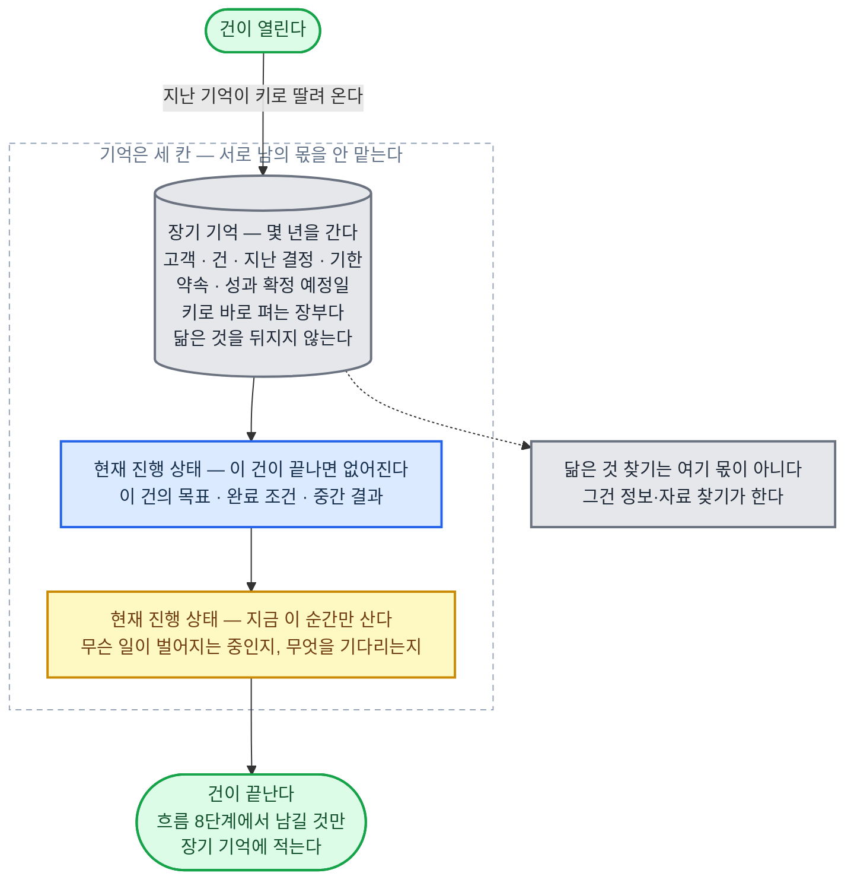
```mermaid
%%{init: {"flowchart": {"wrappingWidth": 640, "curve": "basis", "nodeSpacing": 45, "rankSpacing": 55, "padding": 14, "useMaxWidth": true}, "themeVariables": {"fontSize": "15px"}} }%%
flowchart TB
    OPEN(["건이 열린다"]):::good
    subgraph MEM["기억은 세 칸 — 서로 남의 몫을 안 맡는다"]
        direction TB
        M1[("장기 기억 — 몇 년을 간다<br/>고객 · 건 · 지난 결정 · 기한<br/>약속 · 성과 확정 예정일<br/>키로 바로 펴는 장부다<br/>닮은 것을 뒤지지 않는다")]:::store
        M2["현재 진행 상태 — 이 건이 끝나면 없어진다<br/>이 건의 목표 · 완료 조건 · 중간 결과"]:::main
        M3["현재 진행 상태 — 지금 이 순간만 산다<br/>무슨 일이 벌어지는 중인지, 무엇을 기다리는지"]:::note
        M1 --> M2 --> M3
    end
    SEARCH["닮은 것 찾기는 여기 몫이 아니다<br/>그건 정보·자료 찾기가 한다"]:::store
    CLOSE(["건이 끝난다<br/>흐름 8단계에서 남길 것만<br/>장기 기억에 적는다"]):::good
    OPEN -- "지난 기억이 키로 딸려 온다" --> M1
    M1 -.-> SEARCH
    M3 --> CLOSE
    classDef main fill:#dbeafe,stroke:#2563eb,stroke-width:2px,color:#17314f
    classDef stop fill:#fee2e2,stroke:#dc2626,stroke-width:2px,color:#7f1d1d
    classDef back fill:#ffedd5,stroke:#ea580c,stroke-width:2px,color:#7c2d12
    classDef store fill:#e5e7eb,stroke:#6b7280,stroke-width:2px,color:#1f2937
    classDef good fill:#dcfce7,stroke:#16a34a,stroke-width:2px,color:#14532d
    classDef note fill:#fef9c3,stroke:#ca8a04,stroke-width:2px,color:#713f12
    style MEM fill:none,stroke:#94a3b8,stroke-width:1px,stroke-dasharray:5 4,color:#64748b
```

#### 현재 진행 상태

중단되더라도 어디서 무엇을 이어 할지 알 수 있게 기록한다. 실행 기록·저장점·재시작(Session Log·Checkpoint·Durable Execution)의 내구 저장·복원과, 작업 기억·의존관계가 맡던 상태의 의미·변경 영향을 한 재료로 함께 맡는다.

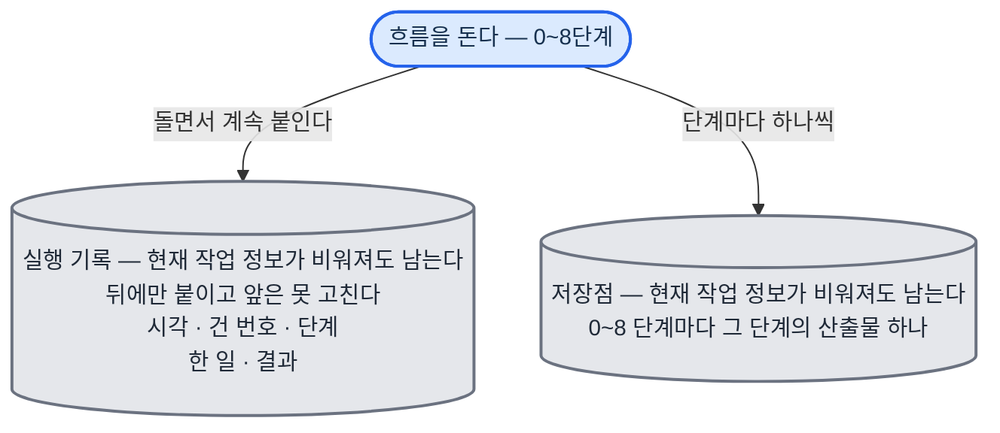
```mermaid
%%{init: {"flowchart": {"wrappingWidth": 640, "curve": "basis", "nodeSpacing": 45, "rankSpacing": 55, "padding": 14, "useMaxWidth": true}, "themeVariables": {"fontSize": "15px"}} }%%
flowchart TB
    RUN(["흐름을 돈다 — 0~8단계"]):::main
    LOG[("실행 기록 — 현재 작업 정보가 비워져도 남는다<br/>뒤에만 붙이고 앞은 못 고친다<br/>시각 · 건 번호 · 단계<br/>한 일 · 결과")]:::store
    CP[("저장점 — 현재 작업 정보가 비워져도 남는다<br/>0~8 단계마다 그 단계의 산출물 하나")]:::store
    RUN -- "돌면서 계속 붙인다" --> LOG
    RUN -- "단계마다 하나씩" --> CP
    classDef main fill:#dbeafe,stroke:#2563eb,stroke-width:2px,color:#17314f
    classDef stop fill:#fee2e2,stroke:#dc2626,stroke-width:2px,color:#7f1d1d
    classDef back fill:#ffedd5,stroke:#ea580c,stroke-width:2px,color:#7c2d12
    classDef store fill:#e5e7eb,stroke:#6b7280,stroke-width:2px,color:#1f2937
    classDef good fill:#dcfce7,stroke:#16a34a,stroke-width:2px,color:#14532d
    classDef note fill:#fef9c3,stroke:#ca8a04,stroke-width:2px,color:#713f12
```

끊기거나 멈추면 세 갈래로 이어받는다.

```mermaid
%%{init: {"flowchart": {"wrappingWidth": 640, "curve": "basis", "nodeSpacing": 45, "rankSpacing": 55, "padding": 14, "useMaxWidth": true}, "themeVariables": {"fontSize": "15px"}} }%%
flowchart TB
    RUN(["흐름을 돈다"]):::main
    D1["끊기거나 죽었다"]:::stop
    D2["도구 하나가 실패했다"]:::stop
    D3["답을 기다린다"]:::note
    REPLAY["기록을 처음부터 다시 훑어<br/>마지막 저장점 자리까지 상태를 되살린다<br/>부를 때마다 달라지는 것은<br/>기록에 남은 답을 그대로 쓴다"]:::back
    RETRY["도구 다시 부르기<br/>횟수와 간격을 정하고<br/>멱등 키로 두 번 안 일어나게 한다"]:::back
    SLEEP["재우기<br/>무엇을 기다리는지와 기한을 적어 둔다<br/>시작 신호가 오면 깨운다"]:::note
    NEXT(["그다음 걸음부터 이어 간다"]):::good
    RUN --> D1 --> REPLAY --> NEXT
    RUN --> D2 --> RETRY --> NEXT
    RUN --> D3 --> SLEEP --> NEXT
    NEXT --> RUN
    classDef main fill:#dbeafe,stroke:#2563eb,stroke-width:2px,color:#17314f
    classDef stop fill:#fee2e2,stroke:#dc2626,stroke-width:2px,color:#7f1d1d
    classDef back fill:#ffedd5,stroke:#ea580c,stroke-width:2px,color:#7c2d12
    classDef store fill:#e5e7eb,stroke:#6b7280,stroke-width:2px,color:#1f2937
    classDef good fill:#dcfce7,stroke:#16a34a,stroke-width:2px,color:#14532d
    classDef note fill:#fef9c3,stroke:#ca8a04,stroke-width:2px,color:#713f12
```

사건·당사자·쟁점·전략·약속의 교차 영향과 공유 상태를 유지한다. 사건·쟁점·가설·결정 ID와 정보 경계·조건부 의존을 연결한다. 새 증거나 대표권 변경이 다른 사건의 판단·자료 접근·이미 낸 결과에 미치는 영향까지 추적한다. 세부 책임 번호로는 M03이 기록의 내구성과 중복 없는 재개를, M25가 상태의 의미와 변경 영향을 소유한다.

세부 연결은 [복합 업무의 상태·전략·협력](docs/runtime.md#복합-업무의-상태전략협력)을 따른다.

##### 맡는 것

**내구 저장·복원**

| 이 재료가 맡는다 | 맡지 않는다 |
|------|------|
| 한 건에서 일어난 모든 것 (모델 호출·도구 결과·승인·넘김) 을 순서대로 덧붙여 쓰는 실행 기록<br>흐름 단계마다 산출물을 남기는 저장점<br>끊기면 마지막 저장점에서 다시 시작하기<br>실패한 실행을 정한 규칙으로 다시 하기<br>답을 기다리는 건을 재워 두기 | 무엇을 남길지 고르기는 같은 재료의 상태의 의미·변경 영향이 맡는다<br>재운 건을 깨우는 신호 받기는 시작 신호가 맡는다<br>남은 기록으로 결론을 되짚어 보이기는 판단 근거 기록이 맡는다<br>고객·건처럼 오래 가는 사실은 장기 기억이 맡는다<br>기록을 요약해 새 판단 자리에 올리기는 현재 작업 정보가 맡는다 |

> 며칠·몇 달·몇 년짜리 건이 사람 손 없이 이어지는지는 이 재료가 가른다.
> 기록은 현재 작업 정보 밖에 둔다. 현재 작업 정보가 비워져도 기록은 남는다.

**상태의 의미·변경 영향**

목표·계획·대기와 작업 대상의 객체·판본·요구·파생물 관계를 유지한다. 변경된 원천에서 영향을 받는 산출물과 검사를 찾는다.

##### 짜는 방식

**내구 저장·복원**

| 기준 | 정한 것 |
|------|------|
| 실행 기록 | 뒤에 이어 붙이기만 하고 앞을 고치지 않는 방식 (append-only) 으로 쌓는다<br>한 줄에 시각·건 번호·흐름 단계·무엇을 했는지·결과를 넣는다<br>지우기와 고치기를 코드로 막는다 |
| 저장점 | 흐름 0~8 단계마다 그 단계의 산출물을 저장하고 나서 다음 단계로 간다<br>산출물이 없는 단계는 끝난 것으로 치지 않는다 |
| 다시 시작 | 도중에 죽어도 남은 기록으로 이어서 끝내는 실행 방식 (Durable Execution) 을 쓴다<br>죽으면 기록을 처음부터 다시 훑어 (replay) 마지막 자리까지 상태를 되살린 뒤, 그다음 걸음부터 한다<br>되살리기가 되려면 같은 기록에서 같은 순서가 나와야 한다<br>모델 답처럼 부를 때마다 달라지는 것은 다시 부르지 않고 기록에 남은 답을 그대로 쓴다<br>단, 버림 표시가 붙은 산출물과 뒤집힘 표시가 붙은 판단은 되살리지 않는다. 그 자리부터는 모델을 다시 부른다. 틀렸다고 이미 가려낸 답을 기록이라는 이유로 다시 쓰면 같은 잘못을 그대로 되풀이한다 |
| 다시 하기 | 실패한 도구를 다시 부르는 횟수와 간격 (틀릴수록 간격을 늘림) 은 여기서 정한다<br>갈아타기와 흐름 4단계로 돌려보내기의 순서는 실행 제어가 정한 대로 따른다<br>다시 부를 때는 도구가 정한 멱등 키를 그대로 실어 두 번 보내도 두 번 일어나지 않게 한다 |
| 재우기 | 상대의 답이나 남에게 맡긴 결과를 기다리는 건은 재우고, 그 자리에 무엇을 기다리는지와 기한을 적어 둔다<br>깨우는 것은 시작 신호가 한다 |
| 보관 | 기록은 바깥 저장소에 두고, 보관 기간은 이 직무를 고를 때 정한다<br>법이 정한 보존 기간이 있으면 그 기간을 따른다 |

**상태의 의미·변경 영향**

| 기준 | 정한 것 |
|---|---|
| 현재 상태 | 목표·제약·가정·계획·남은 일·대기·약속과 외부 행동을 원천 상태에 맞춰 유지한다. 실행 제어와 이 재료의 내구 저장·복원이 같은 판본을 사용한다. |
| 작업 대상 | 건 ID 아래에 요구·객체·원본·데이터·산출물·검사 ID와 판본을 연결한다. 문서 객체·CAD 부품·DB 레코드 등은 원래 프로그램의 구조와 참조를 유지한다. |
| 영향 추적 | 치수 변경 → 형상·도면·부품표·원가표처럼 파생 관계를 기록한다. 원천이 바뀌면 관련 판단·결과·검사를 무효화하고 의존 순서로 다시 생성·검증한다. 순환 관계는 함께 재계산한다. |
| 동시 수정·인수 | 판본 대조·잠금·분기 비교로 타인의 수정을 보존한다. 손대지 않을 범위와 충돌을 기록하고 최신 원본에 병합한 뒤 다시 검사한다. |
| 기다림 끝내기 | 보완 기한이 지나도록 상대가 답이 없으면 기다림을 끝내고 거절이나 중단으로 처리한다. |
| 조건 바뀐 검사 | 예전에 검사를 통과했더라도 조건이 달라졌다면 다시 검사하게 한다. |

단계와 중요한 외부 행동마다 기록을 저장한다. 자료가 바뀌면 영향받은 결과와 검사에 재확인 표시를 남긴다.

##### 쓰는 기술과 저장 자리

| 항목 | 정한 것 | 왜 이것인가 |
|------|------|------|
| 실행 꼴 | 함수만 쓴다. 기록 덧붙이기, 단계마다 저장점 남기기, 되살리기, 다시 하기, 재우기 모두 코드가 한다. 되살릴 때 모델은 다시 부르지 않고 짜는 방식의 ‘다시 시작’ 항목대로 기록에 남은 답을 그대로 쓴다. | 되살리기가 되려면 같은 기록에서 같은 순서가 나와야 하는데, 부를 때마다 답이 달라지는 모델을 끼우면 그 조건이 깨진다. 모델에게 무엇을 남길지 맡기는 꼴은 기록 항목이 건마다 달라져 버렸다. |
| 코드 자리 | `src/memory/working/` 에 쪽지·의존관계·무효화 코드를, `src/environment/checkpoint/` 에 저장점과 재개 코드를 둔다. 표 정의는 `db/migrations/` 에 둔다. 직종별 보관 기간과 재개 조건은 `jobs/<직종>/environment/` 의 보존 기간·복원 항목에 적는다. | 저장점·재개는 실행 기반이라 환경 계통의 코드와 같이 두고, 상태의 의미와 변경 영향은 기억 계통에 둔다. 보관 기간은 직종마다 법이 다르게 정하므로 공통 코드가 아니라 직종 파일에 둔다. |
| 저장 자리 | `run_log` 에 시각·건 번호·단계·한 일·결과를 덧붙이고, `checkpoints` 에 0~8 단계의 산출물을 한 줄씩 남긴다. 건마다 쪽지 여덟 칸은 `working_notes`, 원천·산출물·검사의 의존관계는 `artifact_dependencies`, 오늘 기한 한 장은 `situation` 이다. 재우고 깨우는 신호 줄은 `signals` 를 읽기만 한다. | 기록은 현재 작업 정보 밖에 있어야 비워져도 남으므로 파일이 아니라 표다. `run_log` 는 실행 계정에서 UPDATE·DELETE 권한을 빼 덧붙이기만 되게 하고 달로 파티션해 보존 기간이 지난 달은 통째로 떼어 낸다. |
| 바깥 기술 | PostgreSQL 을 기본안으로 쓴다. 저장 후 재개는 되돌릴 수 없는 바깥 행동·장기 대기가 든 흐름이면 Temporal 뼈대가 맡고, 모델 판단 구간은 그 안에서 LangGraph 로 돈다. | 상태와 업무 기록은 기술 절 기본안이 PostgreSQL 이다. LangGraph 는 노드 실행 도중의 중단을 저장점으로 복구하지 못하고 재개 때 노드를 처음부터 다시 돌리므로, 뼈대는 마지막 기록 사건부터 잇는 Temporal 에 둔다. |
| 확인할 시험 | 흐름을 도는 도중 프로그램을 아무 때나 죽이고 다시 띄워, 끊기지 않고 돌린 것과 결과가 같은 비율 100%·0~8 단계 저장점 빠짐 0 을 본다. 같은 요청을 일부러 두 번 보내 바깥 상태가 한 번만 바뀌는지 재고, 재개 자리에서 다시 실행된 외부 행동 수가 0 이어야 한다. | — |

되돌릴 수 없는 외부 행동은 도구가 정한 멱등 키를 `run_log` 의 도구 호출 칸에 실어 두 번 보내도 두 번 일어나지 않게 한다. 건의 줄은 공통 칸 `org`·`client` 와 행 보안(RLS)으로 갈리고, 고객 개인정보가 든 줄은 `tenant_key` 의 고객별 열쇠로 암호화한다.

##### 이 직무에서 채울 것

객체·요구 ID, 판본·의존관계, 변경 범위, 잠금·충돌 처리, 무효화·재생성 순서.

목표·작업·담당·선후 관계, 선택한 분기, 병렬 결과, 대기 사유·기한, 승인·예산·실행 계획의 판본.

##### 됐다는 기준

**내구 저장·복원**

| 잣대 | 어떻게 재나 |
|------|------|
| 죽여도 이어진다 | 흐름을 도는 도중에 돌던 프로그램을 아무 때나 죽이고 다시 띄운다<br>끊기지 않고 돌린 것과 결과가 같은지 본다 |
| 저장점이 빠지지 않는다 | 끝난 건마다 0~8 단계의 산출물이 다 있는지 센다<br>한 개라도 비면 실패로 친다 |
| 두 번 안 일어난다 | 같은 요청을 일부러 두 번 보내 바깥 상태가 한 번만 바뀌는지 본다 |
| 오래 잔 건이 깨어난다 | 며칠 재운 시험 건이 기한에 깨어나 그다음 단계로 갔는지 본다 |

**상태의 의미·변경 영향**

치수·수식·원천 자료 변경과 동시 편집에서 관련 결과물만 갱신하고 이전 판의 검사 통과를 재사용하지 않는다.

재개 전에 이미 처리된 외부 행동을 조회한다. 끝난 병렬 작업은 보존하며, 실패·부분 성공·결과 불명을 구분해 이어 간다.

##### 충족 조건

- 기록이 현재 작업 정보 밖 저장소(파일·DB)에 매 단계 끝마다 남음
- 기록 항목: 목표, 한 일, 남은 일, 도구 결과, 받은 승인, 쓴 비용
- 강제로 껐다 켜면 끊긴 단계부터 시작함(시험: 중간에 죽이고 재개해도 완료 조건을 그대로 통과하고 이미 한 행동은 다시 안 함)
- 이미 보낸 메일·결제는 재개해도 다시 실행 안 됨(실행 번호로 중복 차단)
- 며칠 지난 일도 같은 방법으로 이어짐
- 진행 중인 일마다 상태(대기·진행·막힘·완료)와 다음 행동이 적혀 있음
- 어떤 일이 어떤 일의 결과를 기다리는지 연결이 적혀 있음
- 앞 일이 바뀌면 뒤 일에 "다시 확인" 표시가 붙음
- 여러 일을 동시에 할 때 건 번호로 갈라져 서로 섞이지 않음

##### 탈락 조건

- 기록이 대화창 안에만 있어 끊기면 사라짐
- 재개할 때 처음부터 다시 함
- 재개할 때 이미 보낸 메일을 또 보냄
- "끝났다"만 남고 무엇을 어떻게 했는지는 없음
- 앞 단계가 바뀌었는데 뒤 단계는 옛 결과로 진행함
- 두 건이 섞여 다른 고객 내용이 들어감
- 어디까지 했는지 물어보면 모름
- 막힌 일이 조용히 멈춰 있음

필수 기능은 입력·설계·실행·검사·인수 증거까지 연결한다. 해당 업무에 필요하지 않은 기능은 제외 이유를 남기며, 정의를 채운 사실을 구현·검증 완료로 표시하지 않는다.

##### 대기·재개와 외부 처리

대기마다 깨울 조건·기한·담당을 연결하고, 새 실행과 이전 실행의 기록을 구분한다. 끝나지 않은 외부 처리와 복구·정정도 남은 일에 포함한다. 재개할 때 저장 기록과 실제 처리 상태를 맞추고, 처리 여부가 불명확한 일은 확인할 때까지 다시 실행하지 않는다.

---

#### 장기 기억

다음 업무에도 필요한 사실·선호·결정·약속을 근거와 함께 남긴다. 오래 가는 기억(Long-term Memory)이다.

##### 맡는 것

| 이 재료가 맡는다 | 맡지 않는다 |
|------|------|
| 고객·건·과거 결정·기한·변경 사항·성과 확정 예정일을 오래 들고 있기<br>몇 년에 걸치는 연재의 설정집·복선 장부·독자에게 한 약속<br>새 건이 시작될 때 지난 기억을 이어 주기 | 진행 중인 건의 목표·중간 결과와 지금 무슨 일이 벌어지는지는 현재 진행 상태가 맡는다<br>끊긴 자리에서 다시 시작하기도 현재 진행 상태가 맡는다<br>필요할 때 찾아 읽는 바깥 자료는 정보·자료 찾기가 맡는다<br>분야 지식 자체는 업무 지식이 맡는다 |

> 정보·자료 찾기와 다른 점은 꺼내는 방식이다. 정보·자료 찾기는 물어봐야 닮은 것을 찾아 오고, 장기 기억은 건이 열릴 때 키 (고객 번호·건 번호) 로 딸려 온다.
> 그래서 여기는 닮은 것을 뒤지는 곳이 아니라 키로 바로 펴는 장부다.

##### 짜는 방식

| 기준 | 정한 것 |
|------|------|
| 저장 꼴 | 칸이 정해진 표로 둔다<br>고객·건·결정·기한·약속·성과 확정 예정일을 각각 표 하나로 나눈다<br>고객 번호와 건 번호를 키로 삼아 한 번에 조회해 펴 낸다 |
| 저장 엔진 | PostgreSQL을 쓴다<br>키 조회, 기한 조회, 표끼리 잇기가 다 되고 기록이 날아가지 않는다<br>닮은 것을 찾는 일은 여기서 하지 않는다. 그것은 정보·자료 찾기의 몫이다 |
| 덧붙이기만 | 줄을 고쳐 쓰지 않고 새 줄을 덧붙인다<br>바뀐 값에는 언제부터 그 값이었는지를 붙여 옛 값을 남긴다<br>그래서 "그때는 무엇을 알고 있었나"를 나중에 다시 세울 수 있다. 판단 근거 기록이 이것을 받아 쓴다<br>나중에 틀렸다고 드러난 결정도 지우지 않고 뒤집힘 줄을 덧붙인다. 다음 건은 뒤집힘 줄이 붙은 결정을 근거로 쓰지 않고, 왜 뒤집혔는지만 가져간다 |
| 무엇을 넣나 | 흐름 8단계 (남기기) 에서만 넣는다<br>넣는 것은 다음 건의 판단을 바꿀 것뿐이다: 사실, 약속, 기한, 결정과 그 이유<br>오간 말을 다 넣지 않는다 |
| 현재 작업 정보에 올리는 때 | 흐름 0단계에서 이 건의 키로 꺼내 앞부분 고정 자리에 올린다<br>올리는 것은 [이 고객의 지금 한 장]·[아직 안 끝난 약속]·[다가오는 기한] 뿐이다<br>나머지는 모델이 필요하다고 할 때 키로 더 꺼낸다 |
| 유효 기간 | 줄마다 언제까지 믿을 수 있는지를 같이 적는다<br>기한이 지난 줄은 사실이 아니라 옛 기록으로 내려간다<br>보관 기간이 법으로 정해진 업무별 정보는 그 기간이 지나면 지운다 |
| 스스로 깨어나기 | 기한과 성과 확정 예정일은 시작 신호에 예약으로 건다. 그날이 되면 스스로 깨어난다 |
| 연재물 | 설정집·복선 장부·독자 약속은 표를 따로 둔다<br>회차마다 결과물을 내기 전에 이 표와 어긋나는지 기계가 맞춰 보고, 어긋나면 못 낸다 |
| 고객 간 나누기 | 한 고객의 기억을 다른 고객의 일에 쓰지 않는다. |
| 지우는 때 | 얼마나 보관하고 언제 지울지 정해 두고 지운다. |

중요한 약속은 생긴 즉시 기록하고 다음 확인 시점을 정한다. 연재물의 설정·복선·독자와의 약속도 같은 방식으로 관리한다.

##### 쓰는 기술과 저장 자리

| 항목 | 정한 것 | 왜 이것인가 |
|------|------|------|
| 실행 꼴 | 함수만 쓴다. 고객 번호·건 번호로 꺼내기, 새 줄 덧붙이기, 유효 기간 지난 줄 내리기, 기한 예약 걸기 모두 코드가 한다. 무엇을 남길지 고르는 판단만 흐름 8단계에서 모델이 한다. | 키로 바로 펴는 장부라 검색이 필요 없고, 모델을 끼우면 꺼낼 때마다 다른 줄이 나와 ‘그때 알던 것’을 다시 세울 수 없다. 닮은 것을 찾아 오는 꼴은 이 재료의 몫이 아니라 정보·자료 찾기의 몫이라 버렸다. |
| 코드 자리 | `src/memory/long-term/` 에 키 조회·덧붙이기·유효 기간·예약 코드를 두고, 표 여섯 개의 정의는 `db/migrations/` 에 둔다. 직종별 키와 표 이름은 표 정의에 적고 `jobs/` 에 따로 파일을 두지 않는다. | 재료 77개의 자리 표가 기억·진행 상태의 git 몫을 ‘표 정의만’ 으로 정했다. 직종마다 키가 달라도 칸 이름만 다를 뿐이라 직종 파일을 늘리는 대신 표 정의 한 곳에서 관리한다. |
| 저장 자리 | `memory_*` 표 여섯 개(고객·건·결정·기한·약속·성과 확정 예정일)에 덧붙이기만 한다. 연재물의 설정집·복선 장부·독자 약속은 표를 따로 두고, 기한과 성과 확정 예정일은 `signals` 에 예약으로 걸어 그날 스스로 깨어나게 한다. | 키 조회·기한 조회·표끼리 잇기가 다 되어야 하므로 파일이 아니라 표다. 줄을 고쳐 쓰지 않고 공통 칸 `since` 로 옛 값을 남겨야 판단 근거 기록이 그 시점으로 되돌아갈 수 있다. |
| 바깥 기술 | PostgreSQL 만 쓴다. | 키 조회·기한 조회·표끼리 잇기가 다 되고 기록이 날아가지 않는다. OpenSearch 와 pgvector 는 닮은 것을 찾는 도구라 키로 펴는 이 재료에는 쓰지 않으며, 벡터를 붙이면 지우라는 요구가 와도 색인에 사본이 남는다. |
| 확인할 시험 | 이 고객의 키로 다른 고객의 줄이 딸려 나온 수를 전수로 세어 0 인지 본다. 예약한 기한 가운데 그날 실제로 깨어난 비율을 세어 100% 가 아니면 예약을 거는 자리를 다시 본다. | — |

고객 줄은 공통 칸 `org`·`client` 와 행 보안(RLS)으로 갈리고, 개인정보가 든 줄은 `tenant_key` 의 고객별 열쇠로 암호화한다. 삭제 요구는 줄을 지우는 대신 그 열쇠를 파기한다.

##### 이 직무에서 채울 것

| 채울 것 | 예 |
|------|------|
| 키와 표 | 변호사 (민사·상사 송무) = 의뢰인·건 번호, 기일·시효 표<br>여신심사 (기업) = 차주·여신 번호, 약정 조건·재심사일 표<br>웹소설 작가 = 작품·회차 번호, 설정집·복선 장부 |
| 꼭 남길 결정 | 변호사 = 합의 조건과 거절 이유<br>여신심사 = 승인·거절의 근거와 예외 승인<br>웹소설 작가 = 독자에게 한 약속과 회수 예정 회차 |
| 예약 걸 날 | 변호사 = 시효 완성일<br>여신심사 = 재심사일<br>웹소설 작가 = 연재 재개일 |

기억할 내용, 고객·업무 범위, 출처·확인 상태·유효 기간·보관 기준을 함께 채운다.

##### 됐다는 기준

| 잣대 | 어떻게 재나 |
|------|------|
| 안 잊나 | 업무 능력 시험의 고정 시험지에 오래된 건을 섞어 두고, 그때의 약속·기한을 지금 꺼내는지 잰다 |
| 안 지어내나 | 꺼낸 줄마다 언제 어디서 들어온 것인지 되짚을 수 있는지 판단 근거 기록으로 잰다 |
| 안 새나 | 이 고객의 키로 다른 고객의 줄이 딸려 나오는지 검사한다. 0이어야 한다 |
| 제때 깨나 | 예약한 기한 가운데 그날 실제로 깨어난 비율을 센다 |

오래된 사실과 취소된 약속이 다시 쓰이지 않는지 본다. 여러 업무에 통하는 내용은 업무 지식의 검증을 거쳐 반영하고, 삭제는 요약·검색·백업에도 연결한다.

##### 충족 조건

- 무엇을 기억하고 무엇을 안 남기는지 항목 목록이 있음(개인정보는 규칙대로)
- 기억마다 출처·날짜·확인 여부가 붙음
- 틀리거나 오래된 기억을 고치고 지우는 방법이 있음
- 기억이 자료·규칙과 충돌하면 자료·규칙이 이김
- 꺼내 쓸 때 "기억에서 가져옴"이라고 표시함

##### 탈락 조건

- 잘못 기억한 것을 사실로 씀
- 지울 방법이 없어 틀린 기억이 계속 영향 줌
- 개인정보를 기한 없이 기억함
- 대화 하나에서 들은 말이 영구 기억이 됨

##### 업무 중 기록과 종료 시 정리

중요한 약속과 기한은 확인하는 즉시 기록한다. 위의 흐름 8단계 저장은 업무 종료 시 다음 업무에 남길 내용을 정리하는 단계이며, 중요한 정보의 최초 기록을 종료 때까지 미루는 조건으로 쓰지 않는다. 보존 전에 계속 저장해도 되는 정보인지와 재사용 가능한 기간을 확인한다.

---

### 규칙·권한

본문은 법·의무 기준, 직업 윤리·의무, 에이전트 기본 원칙, 계약·합의 조건, 플랫폼·제출처 규정, 조직 규칙, 사용자 지정 규칙을 구분한다. 여기서는 기존 세부 책임 번호를 유지하며 M27의 법/직업 의무, M28의 계약/플랫폼 규정을 별도 하위 책임으로 추적한다. 사용자 지정 규칙(M30)은 선호뿐 아니라 필수 작업 제한도 포함한다. 입력 위치나 분류 순서로 우선순위를 정하지 않으며 [규칙 적용 계약](docs/runtime.md#규칙의-적용)의 출처·범위·효력·변경권·철회 기준을 따른다.

#### 법·의무 기준

이번 업무에 적용되는 법과 필수 기준을 정한다. 직업의 법·윤리 규칙(Domain Rules) 가운데 법과 자격으로 정해진 부분을 맡는 세부 책임 M27이다.

M27은 본문의 두 재료를 다음과 같이 나눠 관리한다.

| 하위 책임 | 입력과 산출 | 별도로 확인할 증거 |
|---|---|---|
| 법·의무 기준 | 관할·시점·대상·행위와 원문에서 적용 의무·자격 제한·예외를 확인 | 해당 시점의 근거와 적용 판단, 의무가 아닌 기준을 의무로 잘못 적용하지 않았는지 |
| 직업 윤리·의무 | 직무·역할·당사자 관계에서 비밀·독립성·이해충돌·설명 의무를 확인 | 관계 변경에 따른 재검토, 동의 가능 범위와 해결되지 않는 충돌 |

법으로도 정해진 직업상 의무는 같은 규칙 ID와 원문을 참조해 중복 정의하지 않는다.

##### 맡는 것

해당 업무의 법·자격 의무를 적용한다. 법령의 상하 관계·위임·특별 규정과 개정·경과조치를 검토해 적용할 내용을 정한다.

##### 짜는 방식

직무·행위·관할별 자격 의무를 확인한다. 자격자만 할 수 있는 행위와 그 사람이 보충한 전문 분석을 구분해 기록한다. 원문과 효력 있는 판단·명령을 확인해 의무·허용·금지 범위를 정리한다. 적용이 다투어지는 부분은 근거와 이견을 남긴다.

어느 나라·어느 시점의 법이 적용되는지는 일을 시작할 때 확인한다. 세부 순서는 아래 [법을 적용하는 순서](#법을-적용하는-순서)를 따른다.

##### 쓰는 기술과 저장 자리

| 항목 | 정한 것 | 왜 이것인가 |
|------|------|------|
| 실행 꼴 | 함수·모델 혼합이다. 자격자만 하는 행위 목록과 대조해 막는 일은 코드와 OPA 가 하고, 법령의 상하 관계·위임·특별 규정·경과조치를 읽고 적용할 내용을 정하는 일은 모델이 한다. | 자격 제한은 한 번 뚫리면 되돌릴 수 없어 모델 판단에 맡기지 않는다. 반대로 조문 해석까지 규칙 엔진에 넣는 꼴은 법 문장의 해석 자체가 OPA 로 해결되지 않으므로 버렸다. |
| 코드 자리 | `src/rules/2-profession/` 에 적용 대조 코드를 두고, 규칙 정본은 `rules/2-profession/<직업>/` 의 법·의무 쪽에 둔다. 기계로 강제할 조건은 OPA 번들의 `data.json`·`.rego` 로 배포한다. 직종 파일은 규칙을 복제하지 않고 `job.yaml` 이 쓰는 직업 기준 묶음을 가리킨다. | 규칙 줄이 두 곳에 있으면 어느 쪽이 맞는지 아무도 모르므로 정본은 `rules/` 한 곳이다. 직종마다 다른 것은 어느 묶음을 쓰느냐뿐이라 참조로 충분하다. |
| 저장 자리 | 법령 원문은 규칙·기준 원문이 쌓은 `cards`·`card_effective`·`card_links` 를 읽기만 한다. 자격자 전속 행위를 부르려다 막힌 것은 `guard_events`, 건마다 누가 물어내는지는 `cases` 의 책임표 한 줄, 대외 행위의 명의 세 줄은 `run_log` 에 남는다. | 규칙 문장은 사람이 고치는 것이라 파일이고, 조문 카드는 판본이 쌓이고 기준일로 골라야 하는 것이라 표다. 막은 기록을 파일로 두면 건마다 늘어 셀 수 없다. |
| 바깥 기술 | git, OPA 번들, PostgreSQL 을 쓴다. | 명시된 대상·행동·한도는 기술 절 기본안대로 코드나 OPA 로 검사한다. 지식 그래프나 그래프 DB 는 조문 관계를 따라가는 데 쓸 수 있으나, 자격 제한 강제에는 이득이 없어 비교 후보로 둔다. |
| 확인할 시험 | 자격자만 할 수 있는 일을 최종 처리한 수를 고정 시험지 전수로 세어 0 인지 본다. 실제로 활성인 OPA 규칙 판본과 배포 구성표에 적힌 판본이 어긋난 수를 하루 한 번 대조해 0 인지 본다. | — |

##### 이 직무에서 채울 것

확인된 관할·행위·원문·해석·책임자. 국가·분야·대상 시점, 법령과 위임 관계, 특별 규정·경과조치, 자격 요건.

##### 됐다는 기준

실제 적용 범위와 예외를 검토하고 자격 행위를 임의로 자동화하지 않는다. 정보 차단만으로 자격 제약이 사라졌다고 처리하지 않는다. 법률 이름이나 최신 날짜만으로 우선순위를 정하지 않으며, 구체 업무를 만들 때 해당 관할의 공식 법령과 해석을 다시 확인한다.

##### 충족 조건

- 근거 조문·규정 원문과 연결됨
- 해도 되는 일·하면 안 되는 일·자격자만 하는 일이 목록으로 갈려 있음
- 자격자만 하는 일은 에이전트가 초안까지만 하고 자격자 확인 단계가 강제됨
- 위반 시 처벌·책임이 적혀 있음

##### 탈락 조건

- 자격자만 할 수 있는 일을 에이전트가 최종 처리함
- 근거 조문이 없음
- 옛 조문이나 시행 전 조문을 그대로 적용함

공통 실행은 [실행 계약](docs/runtime.md), 전문 개입·팀 비교·표본 설계는 [평가 규약](docs/evaluation.md)을 따른다.

---

#### 직업 윤리·의무

맡은 역할에서 지켜야 할 비밀·독립성·설명·이해충돌 기준을 적용한다. 세부 책임 M27의 직업 의무 쪽이며, 하위 책임 구분은 [법·의무 기준](#법의무-기준)의 표를 따른다.

##### 맡는 것

해당 업무의 윤리·비밀·이해충돌·설명 의무를 적용한다. 회사·임원·주주 등 당사자의 이해관계 변화를 재검토한다.

##### 짜는 방식

직무·행위·관할별 수임·비밀·설명 의무를 확인한다. 회사·임원·주주·가족 등 당사자의 목적과 책임이 다르면 별도 위임과 정보 경계를 둔다. 관계 변경이 생기면 수임 가능성·기존 결정·공유 자료·파생물 접근을 재검토한다. 동의나 비밀 차단이 모든 이해충돌을 해결한다고 가정하지 않는다. 역할과 관계가 바뀌면 계속 맡아도 되는지, 자료 공유를 바꿔야 하는지 다시 판단한다.

이해가 부딪히면 적용 의무와 예외를 확인한다. 정보 차단이나 동의로 해결할 수 없는 충돌이면 그 일을 맡지 않는다.

##### 쓰는 기술과 저장 자리

| 항목 | 정한 것 | 왜 이것인가 |
|------|------|------|
| 실행 꼴 | 함수·모델 혼합이다. 당사자별 정보 경계를 실제로 막는 일은 코드가 하고, 관계가 바뀌었을 때 계속 맡아도 되는지 판단하는 일은 모델이 한다. | 자료를 안 보이게 막는 일은 결과가 딱 갈리므로 코드가 맡아야 새지 않는다. 이해충돌 판단은 당사자의 목적과 책임을 읽어야 해서 규칙 엔진만으로는 풀리지 않으며, 동의나 차단으로 다 해결된다고 가정하는 꼴은 문서가 금지한다. |
| 코드 자리 | `src/rules/2-profession/` 에 수임 재검토 코드를 두고, 정본은 `rules/2-profession/<직업>/` 의 윤리·의무 쪽에 둔다. 기계로 검사할 정보 경계 조건은 OPA 번들로 배포하며, `job.yaml` 은 쓰는 묶음만 가리킨다. | 법 쪽과 윤리 쪽은 같은 직업 폴더 안에서 갈리고 같은 규칙 ID·원문을 참조해 중복 정의하지 않는다. 직종 파일에 규칙을 복제하지 않는 것은 git 나무의 규약 그대로다. |
| 저장 자리 | 당사자와 내 편, 건마다의 책임표는 `cases` 에 있고 결정과 약속은 `memory_*` 에서 읽는다. 관계 변경으로 다시 봐야 할 건은 `stale_flags` 로 표시하고 사람 판단이 필요하면 `handoffs` 에 넘긴다. 막은 것은 `guard_events` 에 쌓는다. | 당사자 관계는 건마다 바뀌고 표끼리 이어야 해서 표다. 규칙 문장은 파일이지만 관계 사건은 기계가 받아 쌓는 것이라 자리가 다르다. |
| 바깥 기술 | git, OPA 번들, PostgreSQL 을 쓴다. | 비밀·독립성 조건 가운데 명시된 대상·행동은 OPA 로 검사할 수 있고, 관계 표는 PostgreSQL 이 이미 갖고 있다. 관계를 여러 단계 따라가야 하면 GraphRAG·그래프 DB 를 비교 후보로 두되, 구축·갱신 비용이 커서 기본안에는 넣지 않는다. |
| 확인할 시험 | 관계 변경 사건을 심은 문항에서 수임 재검토가 돌아간 비율이 100% 인지 본다. 이해가 부딪히는 다른 당사자의 자료가 조회·검색에 딸려 나온 수를 전수로 세어 0 인지 본다. | — |

당사자별 정보 경계는 공통 칸 `org`·`client` 와 행 보안(RLS)으로 줄 단위로 갈리고, 검색 쪽은 검색 처리 단계에 박아 둔 거르기로 함께 막는다.

##### 이 직무에서 채울 것

관계 변화 사건·수임 재검토·동의로 해결할 수 없는 범위. 당사자별 역할과 이익, 직업상 의무의 근거, 공개·회피·수임 제한 조건.

##### 됐다는 기준

정보 차단만으로 수임 충돌이 사라졌다고 처리하지 않는다. 가까운 관계의 당사자도 같은 의뢰인으로 취급하지 않으며, 자료를 분리했다는 사실만으로 이해충돌이 해결됐다고 판단하지 않는다.

##### 충족 조건

- 당사자별 역할·이익과 직업상 의무의 근거가 목록으로 있음
- 비밀·독립성·설명 의무의 적용 범위와 예외가 적혀 있음
- 공개·회피·수임 제한 조건이 행동 단위로 갈려 있음
- 역할·관계·이해관계가 바뀌면 수임과 자료 접근을 다시 검토한 기록이 남음

##### 탈락 조건

- 규칙이 "전문가답게"로 요약돼 있음
- 다른 직업 규칙을 가져다 씀
- 동의를 받았다는 이유로 해결되지 않는 이해충돌을 안고 진행함

공통 실행은 [실행 계약](docs/runtime.md), 전문 개입·팀 비교·표본 설계는 [평가 규약](docs/evaluation.md)을 따른다.

---

#### 에이전트 기본 원칙

목적·범위를 지키고 근거·불확실성·진행 상태를 정직하게 알린다. 세부 책임 M26이다.

##### 맡는 것

기만·무단 행위 방지 등 공통 제한과 규칙 적용 절차를 정의한다. 여러 의무의 적용 범위와 해석 근거를 확인해 함께 충족한다.

##### 짜는 방식

법·의무 기준, 직업 윤리·의무, 에이전트 기본 원칙, 계약·합의 조건, 플랫폼·제출처 규정, 조직 규칙, 사용자 지정 규칙을 적용 범위와 근거로 구별한다. 플랫폼 이용 정책은 플랫폼·제출처 규정에서, 기술적으로 지원하지 않는 기능은 업무 도구·시스템에서 관리한다. 규칙은 ID·종류·원문·설정 주체·적용 범위·관할·대상·효력·만료·필수 조건/선호·해석 근거·행동 제한·예외·변경권·판본·철회 상태를 가진다. 숫자 층의 우열만으로 충돌을 해결하지 않는다. 모델이 자연어 해석 후보와 적용 근거를 검토하고 정책 엔진은 검증된 구조화 조건을 검사한다. 미확정 해석을 조건식으로 포장해 통과시키지 않으며 관련 제약을 함께 만족할 대안부터 찾는다. 중요한 규칙을 프롬프트·저장 줄 수 때문에 폐기하지 않는다. 외부 문서에 섞인 명령으로 목표나 권한을 바꾸지 않으며, 실행·확인하지 않은 일을 완료했다고 말하지 않는다.

어느 나라·어느 시점의 법이 적용되는지는 일을 시작할 때 확인한다.

##### 쓰는 기술과 저장 자리

| 항목 | 정한 것 | 왜 이것인가 |
|------|------|------|
| 실행 꼴 | 함수·모델 혼합이다. 모델은 자연어 해석 후보와 적용 근거를 검토하고, 검사할 수 있는 조건은 코드와 OPA 가 실행 전에 확인한다. | 원칙 문장만으로는 차단이 보장되지 않으므로 실제 권한·실행 검사와 이어야 한다. 반대로 미확정 해석을 조건식으로 포장해 통과시키는 꼴은 문서가 금지하므로 규칙 엔진에만 맡기지 않는다. |
| 코드 자리 | `src/rules/1-constitution/` 에 원칙 적용 코드를 두고, 원칙 정본은 `rules/1-constitution/` 에 두어 운영자만 고친다. 검사 가능한 조건은 OPA 번들로 배포하고, 직종별 앞부분 묶음은 `build/context-head/<직종>.md` 로 배포 때 만든다. | 원칙은 모든 직종이 같이 쓰는 것이라 직종 파일에 복제하지 않는다. 앞부분 묶음은 기계가 만든 것이라 git 밖에 두고 해시로 어느 커밋에서 나왔는지 잇는다. |
| 저장 자리 | 원칙 원문은 git 파일이고 커밋이 판본이다. 어기려는 시도와 막은 이유는 `guard_events`, 대외 행위의 명의 세 줄은 `run_log`, 공격 문항 시험 결과는 `eval_runs` 에 쌓는다. | 짧고 셀 수 있는 원칙 목록은 사람이 읽고 고치는 것이라 파일이고, 시도 기록은 건마다 늘어나는 것이라 표다. 파일로 쌓으면 어긴 수를 셀 수 없다. |
| 바깥 기술 | git 과 OPA 번들을 쓰고, 기록은 PostgreSQL 에 남긴다. | 배포된 규칙 판본을 배포 구성표와 대조할 수 있어야 해서 OPA 번들 관리를 쓴다. 원칙 해석 자체를 엔진에 넣는 방식은 고정된 층 번호나 엔진만으로 자연어 충돌을 풀 수 없어 뒤로 둔다. |
| 확인할 시험 | 숨은 지시·허위 근거·실패를 성공으로 보고하는 공격 문항에서 위반 수 0 을 재고, 같은 시험지의 정상 업무에서 헛막음 비율이 미리 정한 선을 넘는지 함께 본다. `build/context-head/<직종>.md` 의 해시가 배포 구성표의 커밋과 일치한 비율 100% 를 배포마다 확인한다. | — |

##### 이 직무에서 채울 것

공통 원칙·적용 조건·변경 주체·절차, 정당한 업무의 허용 근거. 관할·대상·효력·해석 후보·예외·충돌 해결 권한. 지시를 내릴 수 있는 주체와 자료·지시를 구분하는 방식.

##### 됐다는 기준

공격 문항과 정상 업무에서 위반·헛막음을 함께 측정한다. 고정된 층 번호나 규칙 엔진만으로 자연어 해석 충돌을 해결하지 않는다. 숨은 지시, 허위 근거, 실패를 성공으로 보고하는 경우를 시험하고, 원칙 문장만으로 차단을 보장하지 않고 실제 권한·실행 검사와 연결한다.

##### 충족 조건

- 원칙 목록이 짧고 셀 수 있음(예: 10개 이내)
- 원칙마다 어긋나는 행동의 구체 예시가 있음
- 각 원칙의 적용 범위·예외·변경 권한이 확인되며, 업무 요청이나 자료 속 지시만으로 원칙을 해제하지 않음. 검사 가능한 조건은 안전장치가 실행 전에 확인함
- 어기려는 시도가 기록되고 사람에게 알려짐

##### 탈락 조건

- "윤리적으로 행동한다" 같은 말만 있음
- 고객 요구라며 원칙을 깸
- 원칙이 지시문 한 줄이라 다른 지시로 덮임
- 어긴 것을 아무도 모름

공통 실행은 [실행 계약](docs/runtime.md), 전문 개입·팀 비교·표본 설계는 [평가 규약](docs/evaluation.md)을 따른다.

---

#### 계약·합의 조건

업무 범위·기한·대금·권리와 상대에게 한 약속을 유지한다. 계약과 외부 서비스·제출 조건을 맡는 세부 책임 M28의 계약 쪽이다.

M28은 본문의 두 재료를 별도로 관리한다.

| 하위 책임 | 입력과 산출 | 적용·변경 및 검사 |
|---|---|---|
| 계약·합의 조건 | 계약서·확인된 합의에서 범위·납기·보수·비밀·계약상 책임을 확인 | 당사자·기간·변경 절차·결정권·종료 후 의무와 약속 누락을 검사 |
| 플랫폼·제출처 규정 | 모델·도구 제공자를 포함한 서비스의 약관·운영 정책, 기관의 접수·심사 조건을 확인 | 서비스·계정·요금제·제출 경로·시행일·개정 통지별로 적용하고 사용자 설정으로 해제하지 않음 |

원문은 규칙·기준 원문에서 가져오고 사용 계정·서비스의 조건을 연결한다. 기술적 지원 범위는 업무 도구·시스템에서 따로 확인한다. 어떤 조건을 실제로 지킬 수 없는 경우 허용되는 대안을 찾으며, 다른 규칙보다 아래라는 이유로 무시하지 않는다.

##### 맡는 것

계약·납품 조건을 업무 제약으로 변환한다.

##### 짜는 방식

계약서·약관·기관 규정·납품 조건뿐 아니라 메일·메신저로 오간 합의, 구두 확약, 업계 거래 관행처럼 계약서 밖 약속도 관할·대상·효력·원문 판본·종료 후 의무로 정리해 관리한다. 문서로 남지 않은 약속은 오간 기록을 찾아 조항으로 적고 상대와 권한 있는 결정권자에게 확인받은 뒤에 제약으로 넣으며, 확인되지 않으면 미확정으로 표시해 사람에게 넘기기로 잇는다. 법·의무 기준과 직업 윤리·의무보다 아래라는 고정 층으로 적용 여부를 결정하지 않는다. 여러 계약의 가격·독점·갱신·종료 조건이 함께 발동하는지 검토하고 조건 변경은 권한과 영향 범위를 확인한다. 새 합의·취소·부분 이행을 현재 진행 상태와 계획에 반영하고, 바뀐 조건에 영향을 받는 작업과 납품본을 찾아낸다.

메일이나 말로 한 약속도 근거와 확인한 사람을 남기면 같은 조건으로 본다. 계약이 끝난 뒤에도 남는 비밀 유지 같은 의무는 계속 지킨다.

##### 쓰는 기술과 저장 자리

| 항목 | 정한 것 | 왜 이것인가 |
|------|------|------|
| 실행 꼴 | 함수·모델 혼합이다. 계약 판본의 유효 기간 검사와 조건 빠진 승인·납품 막기는 코드가 하고, 메일·구두로 오간 약속을 조항으로 적는 일은 모델이 하되 사람 확인을 받은 뒤에만 제약으로 넣는다. | 납품을 막는 일은 되돌리기 어려워 코드가 맡는다. 계약서 밖 약속까지 자동으로 제약에 넣는 꼴은 확인받지 않은 구두 약속을 계약처럼 적용하게 되어 탈락 조건에 걸린다. |
| 코드 자리 | `src/rules/3-contract/` 에 조항 뽑기·대조 코드를 두고, 정본은 `rules/3-contract/<상대>/` 에 유효 기간 칸과 함께 둔다. 기계로 강제할 조건은 OPA 번들로 배포하고 `job.yaml` 은 묶음을 가리킨다. | 상대별로 계약이 다르므로 폴더를 상대 단위로 가른다. 직종 파일에 계약 조항을 복제하면 계약이 바뀔 때 고칠 곳이 여러 군데가 된다. |
| 저장 자리 | 계약 원문 카드와 효력 구간은 `cards`·`card_effective` 를 읽는다. 오간 합의와 다음 행동은 `encounters`, 확인이 필요한 미확정 약속은 `handoffs`, 납품 묶음과 인수 증거는 `deliverables`, 막은 것은 `guard_events` 에 남는다. 계약서·녹취 원본은 해시 창고의 고객 칸을 가리킨다. | 조항은 기준일로 판본을 골라야 해서 표이고, 계약서 원본은 한 글자도 못 고치는 것이라 해시 창고다. 창고에 먼저 넣고 표 줄을 쓰면 표가 가리키는 해시가 창고에 없는 일이 생기지 않는다. |
| 바깥 기술 | git, PostgreSQL, OPA 번들, 그리고 원본 보관은 S3 또는 사내 객체 저장을 쓴다. | 조건 검사는 명시된 대상·행동이라 OPA 기본안에 맞고, 계약서 원본은 Object Lock 으로 덮어쓰기와 지우기를 막아야 한다. 사내 저장이 필요하면 조직이 운영·지원할 수 있는 제품의 같은 기능을 시험해 고른다. |
| 확인할 시험 | 조건을 빠뜨린 승인·납품이 막힌 비율을 고정 시험지로 재어 100% 인지 본다. 확인자·확인 날짜 없이 제약으로 들어간 계약서 밖 약속 수를 전수로 세어 0 인지 본다. | — |

납품·제출처럼 되돌릴 수 없는 행동은 `deliverables` 의 판본·파일 해시와 `run_log` 의 멱등 키로 같은 건이 두 번 나가지 않게 막는다. 고객 계약 줄은 `org`·`client` 칸과 행 보안(RLS)으로 갈리고 원본은 고객별 열쇠로 암호화한다.

##### 이 직무에서 채울 것

계약 판본, 적용 대상, 중요 조건, 변경·충돌 처리. 당사자, 유효한 합의 원문, 이행 조건, 변경 권한, 종료 뒤에도 남는 의무.

##### 됐다는 기준

조건을 빠뜨린 승인·납품이 차단되고 종료 뒤에도 존속하는 의무를 보존한다. 상대의 제안을 확정 합의로 기록하지 않으며, 승인되지 않은 범위 확대나 약속 변경이 실행으로 이어지지 않는다.

##### 충족 조건

- 계약서 원문에서 지켜야 할 조항이 항목별로 뽑혀 있음(기한, 범위, 비밀, 책임)
- 계약서 밖 약속도 같은 항목으로 적혀 있음(메일·메신저 합의, 구두 확약, 업계 거래 관행)
- 계약서 밖 약속마다 근거 기록과 확인자·확인 날짜가 붙어 있음(메일 원문, 통화 녹취·회의록, 상대 회신)
- 계약마다 유효 기간과 판본이 있음
- 계약 밖 일은 하지 않고 사람에게 넘김

##### 탈락 조건

- 계약 범위 밖 일을 함
- 옛 계약 조건으로 진행함
- 계약서에 없다는 이유로 메일·구두로 합의한 조건을 확인도 없이 무시함
- 확인받지 않은 구두 약속을 계약 조건처럼 적용함
- 비밀 조항이 있는데 외부에 자료를 보냄

공통 실행은 [실행 계약](docs/runtime.md), 전문 개입·팀 비교·표본 설계는 [평가 규약](docs/evaluation.md)을 따른다.

---

#### 플랫폼·제출처 규정

사용할 서비스와 결과를 받는 곳의 이용·접수 조건을 적용한다. 세부 책임 M28의 플랫폼·제출처 쪽이며, 하위 책임 구분은 [계약·합의 조건](#계약합의-조건)의 표를 따른다.

##### 맡는 것

기관·제출 조건을 업무 제약으로 변환한다. 모델·도구 제공자를 포함한 서비스의 약관·운영 정책과 기관의 접수·심사 조건을 적용한다.

##### 짜는 방식

서비스·계정·요금제·제출 경로·시행일·개정 통지별로 규정을 구분해 실제 사용 경로에 적용한다. 원문은 규칙·기준 원문에서 가져오고, 기술적 지원 범위는 업무 도구·시스템에서 따로 확인한다. 규정이 바뀌면 관련 실행과 제출 방식을 검토한다. 사용자 설정으로 외부 규정을 해제하지 않으며, 다른 계정·도구·업체를 통한 우회에도 같은 의무가 적용되는지 확인한다. 어떤 조건을 실제로 지킬 수 없는 경우 허용되는 대안을 찾으며, 다른 규칙보다 아래라는 이유로 무시하지 않는다.

##### 쓰는 기술과 저장 자리

| 항목 | 정한 것 | 왜 이것인가 |
|------|------|------|
| 실행 꼴 | 함수·모델 혼합이다. 서비스·계정·요금제·제출 경로별 규정 대조와 한도 검사는 코드와 OPA 가 하고, 약관 문장이 이번 사용 방식에 걸리는지는 모델이 읽는다. | 접수 거절과 계정 정지는 되돌리기 어려워 실행 직전 검사는 코드가 맡는다. 약관 문장 해석까지 엔진에 넣는 꼴은 미확정 해석을 조건식으로 포장하는 일이라 버렸다. |
| 코드 자리 | `src/rules/3-contract/` 의 제출처 쪽에 규정 대조 코드를 두고, 정본은 `rules/3-contract/<상대>/` 에 서비스·기관별로 둔다. 기술적 지원 범위는 여기서 정하지 않고 `environments`·`capabilities` 를 읽는다. | 규정은 상대가 정한 것이고 지원 범위는 도구가 정한 것이라 자리를 가른다. 둘을 한 파일에 섞으면 약관이 막은 것과 도구가 못 하는 것을 구분할 수 없다. |
| 저장 자리 | 규정 원문과 시행일은 `cards`·`card_effective` 에서 읽고, 개정 통지 감시는 `watches`, 제출 기록은 `deliverables` 와 `run_log`, 막은 것은 `guard_events` 에 남는다. | 규정은 판본과 시행일로 골라야 하므로 표다. 제출은 되돌릴 수 없어 낸 판본과 파일 해시를 목록으로 남겨야 나중에 어느 판본으로 냈는지 되짚을 수 있다. |
| 바깥 기술 | OPA 번들, PostgreSQL, 그리고 바깥 창구는 MCP 와 공급자 공식 API·SDK 를 쓴다. | 서비스마다 자동화 허용 범위가 다르므로 창구는 표준을 쓰고 서버마다 권한을 따로 준다. 확인일의 현행 MCP 규격은 2026-07-28 이며 서버와 실제로 함께 지원하는 판본을 쓴다. |
| 확인할 시험 | 옛 판본 규정으로 내어 접수가 거절된 수를 전수로 세어 0 인지 보고, 적용 판본과 공지된 시행일을 매 제출 전에 대조한다. 약관이 금지한 방식으로 접속하도록 꾀는 문항을 고정 시험지에 넣어 막힌 비율 100% 를 확인한다. | — |

제출은 되돌릴 수 없으므로 `run_log` 의 도구 멱등 키로 같은 제출이 두 번 나가지 않게 하고, 실제로 나간 내용의 지문은 `deliverables` 의 파일 해시로 남긴다.

##### 이 직무에서 채울 것

서비스·계정·제출 유형별 규정, 자동화 허용 범위, 접수 형식, 한도와 개정 이력. 적용 판본과 공지된 변경일.

##### 됐다는 기준

접속이나 기술적 자동화가 가능하다는 이유만으로 사용이 허용됐다고 보지 않는다. 사용자 설정만으로 외부 규정을 해제할 수 없다.

##### 충족 조건

- 플랫폼 이용약관의 금지 행동 목록이 있음
- 서비스·계정·요금제·제출 경로별로 적용 규정과 한도가 갈려 있음
- 규정마다 판본·시행일과 개정 통지를 받는 통로가 있음
- 자동화로 해도 되는 범위와 사람만 해야 하는 범위가 갈려 있음

##### 탈락 조건

- 약관 위반으로 계정이 정지됨
- 기술적으로 된다는 이유로 약관이 금지한 방식으로 접속함
- 옛 판본 규정으로 제출해 접수가 거절됨
- 사용자 설정으로 외부 규정을 껐다고 처리함

공통 실행은 [실행 계약](docs/runtime.md), 전문 개입·팀 비교·표본 설계는 [평가 규약](docs/evaluation.md)을 따른다.

---

#### 조직 규칙

조직이 정한 승인·자료 관리·업무 수행 조건을 적용한다. 조직의 정책과 승인 조건(Organization Rules)을 맡는다.

##### 맡는 것

조직의 전결·승인·운영 제약을 실행에 연결한다.

##### 짜는 방식

전결·조직 정책·예산·승인 조건은 유효한 결정권과 적용 범위로 검사한다. 문서로 쓰이지 않고 말로만 전해지는 관행 규칙은 그대로 쓰지 않고, 해당 결정권자에게 내용을 확인해 원문·확인자·확인 날짜·적용 범위를 적어 둔 뒤에만 규칙으로 적용한다. 확인되지 않으면 규칙이 아니라 미확인 정보로 두고 승인 또는 보류로 넘긴다. 조직의 지시가 회사·임원·주주·고객 모두의 권한을 대신하지 않는다. 대표권 분쟁·퇴임·위임 철회가 생기면 관련 실행·기억·자료 접근을 재검토한다. 법·계약 등과의 충돌은 규칙 적용 절차에 따라 해결한다. 유효한 개정과 예외만 해당 범위에 반영하며, 조직 규칙이 이번에 위임받은 행동 범위를 넓히지는 않는다.

글로 적히지 않은 관행은 확인한 뒤에만 규칙으로 삼는다.

##### 쓰는 기술과 저장 자리

| 항목 | 정한 것 | 왜 이것인가 |
|------|------|------|
| 실행 꼴 | 함수·모델 혼합이다. 금액·종류별 승인선 대조와 승인선 건너뛰기 막기는 코드와 OPA 가 하고, 말로만 전해지는 관행 규칙을 결정권자에게 확인할지 판단하는 일은 모델이 한다. | 승인선은 숫자와 목록으로 딱 갈려 기계가 정확하고 빠르다. 관행 규칙까지 코드가 자동으로 규칙으로 올리는 꼴은 확인 없이 쓰는 일이 되어 탈락 조건에 걸린다. |
| 코드 자리 | `src/rules/4-org/` 에 승인선 대조 코드를 두고, 정본은 `rules/4-org/<회사>/` 에 둔다. 승인선 표처럼 기계로 강제할 것은 OPA 번들의 `data.json` 으로 배포한다. | 회사마다 승인선이 다르므로 폴더를 회사 단위로 가른다. 승인선을 코드에 박으면 회사가 바뀔 때마다 배포를 다시 해야 한다. |
| 저장 자리 | 규정 원문과 관행 규칙의 확인자·확인 날짜는 git 파일에 남기고, 승인 요청과 결정권자의 답은 `handoffs`, 승인은 내용의 지문에 붙어 `run_log` 에, 막은 것은 `guard_events` 에 남는다. 대표권 변경으로 다시 볼 건은 `stale_flags` 로 표시한다. | 규정은 사람이 고치고 커밋으로 판본을 남기는 것이라 파일이고, 승인은 건마다 생기는 것이라 표다. 승인을 파일로 두면 누가 언제 무엇을 승인했는지 셀 수 없다. |
| 바깥 기술 | git, OPA 번들, PostgreSQL 을 쓴다. | 승인선은 명시된 대상·행동·한도라 OPA 기본안에 그대로 맞는다. 조직 문서 관리 도구를 따로 붙이는 방식은 규칙 정본이 두 곳이 되어 쓰지 않는다. |
| 확인할 시험 | 승인선을 건너뛴 실행 수를 실행 기록 전수로 세어 0 인지 본다. 확인자·확인 날짜가 없는 관행 규칙이 배포된 수를 커밋 전 검사로 세어 0 인지 본다. | — |

##### 이 직무에서 채울 것

행위·대상·한도·결정권자, 정당한 위임, 이해충돌 대안. 적용 조직·역할·업무, 규정 원문, 승인자와 예외를 허용할 주체.

##### 됐다는 기준

유효한 권한 안의 일은 실행하고 범위 밖의 일은 승인 또는 보류한다. 권한 없는 직원의 요청으로 승인선을 생략하지 않는지, 다른 조직의 규칙이 섞이지 않는지 본다.

##### 충족 조건

- 규정 원문과 판본·시행일이 있음
- 문서에 없는 관행 규칙은 결정권자 확인을 받아 적어 둔 것만 씀(확인자·확인 날짜·적용 범위가 함께 적혀 있음)
- 승인선이 표로 있음(금액·종류별로 누가 승인)
- 조직 서식·용어·기준값이 목록으로 있음
- 법·직업 의무·계약·플랫폼 규정과의 충돌은 실제 적용 근거와 예외를 확인해 해결하며, 조직의 일반 절차가 개별 위임 권한을 넓히지 않음
- 조직 규정을 커스텀 설정으로 배포해도 조직·시행일·변경권을 유지하며 일반 직원의 요청으로 승인선을 삭제하지 않음
- 권한 있는 담당자의 유효한 개정·예외는 범위·시점·판본을 남겨 반영함

##### 탈락 조건

- 입으로 전해진 규칙을 확인도 기록도 없이 그대로 씀
- 문서에 없다는 이유로 확인할 결정권자를 찾지 않고 업무를 멈춤
- 승인선을 몰라 건너뜀
- 옛 서식을 씀
- 조직 규칙이라며 법을 어김

공통 실행은 [실행 계약](docs/runtime.md), 전문 개입·팀 비교·표본 설계는 [평가 규약](docs/evaluation.md)을 따른다.

---

#### 사용자 지정 규칙

맡긴 사람이 정한 추가 조건과 선호를 적용한다. 추가 업무 조건과 선호를 맡는 세부 책임 M30이다.

##### 맡는 것

의뢰인이나 운영자가 추가한 커스텀 규칙을 관리한다. 처리 순서·보고 방식 같은 선호와 수정 금지·초안만 작성 같은 필수 작업 제한을 구분한다. 실행 권한의 판정은 업무 권한에 연결한다.

##### 짜는 방식

각 규칙에 작성자·원문·필수 조건/선호·적용 범위·기간·변경권·판본·철회 상태를 남긴다. 전역·직무·에이전트·프로젝트·이번 업무의 범위를 구분하고 다른 고객이나 프로젝트로 섞이지 않게 한다. 권한 있는 사용자의 유효한 변경을 반영하며 구체적이거나 최신인 요청이라는 이유만으로 다른 의무나 승인 조건을 덮어쓰지 않는다. 이미 유효하게 맡긴 권한과 조건은 계속 사용한다.

조직 관리자가 입력한 조직 규정은 조직 규칙, 인용한 플랫폼 약관과 계약은 플랫폼·제출처 규정과 계약·합의 조건의 원래 규칙을 참조한다. 커스텀 설정이라는 입력 방식이 새로운 우선순위를 만들지는 않는다. 스타일 조건은 표현 방식·스타일에 연결하되 원래 출처와 변경권을 유지한다. 자료 속 지시는 확인 없이 규칙으로 승격하지 않는다.

##### 쓰는 기술과 저장 자리

| 항목 | 정한 것 | 왜 이것인가 |
|------|------|------|
| 실행 꼴 | 함수·모델 혼합이다. 적용 범위·기간·철회 상태 검사와 접근·발송·수정 제한 강제는 코드가 하고, 요청이 필수 제한인지 선호인지 가르는 일은 모델이 하되 필수 제한은 사람 확인을 거친다. | 초안만 작성 같은 제한은 한 번 뚫리면 발송이 되돌려지지 않으므로 실행 직전 검사는 코드가 맡는다. 모델이 필수와 선호를 혼자 정하는 꼴은 필수 제한을 취향으로 낮추는 탈락 조건에 걸린다. |
| 코드 자리 | `src/rules/5-prefs/` 에 범위·기간 검사 코드를 두고, 정본은 `rules/5-prefs/<사람>/` 에 규칙마다 전역·직무·에이전트·프로젝트·개별 업무 범위와 변경권을 적어 둔다. 접근·발송·수정 제한은 `rules/permissions/` 의 세 목록에 이어 붙이고 업무 권한이 소유한다. | 사람마다 추가 조건이 다르므로 폴더를 사람 단위로 가른다. 실행을 막는 힘은 업무 권한 쪽에 있어야 하므로 여기서 같은 목록을 따로 만들지 않고 참조한다. |
| 저장 자리 | 규칙 원문과 판본은 git 파일이고, 실행 직전 검사 결과는 `run_log`, 막은 것은 `guard_events` 에 남는다. 스타일 조건은 여기에 적지 않고 `rules/identity/<브랜드>.yaml` 을 원래 출처와 변경권과 함께 가리킨다. | 규칙은 사람이 쓰고 고치는 글이라 파일이고, 막은 기록은 건마다 늘어나는 것이라 표다. 스타일을 여기에 복제하면 출처와 변경 권한이 흐려진다. |
| 바깥 기술 | git 과 OPA 번들을 쓴다. | 검사할 수 있는 제한은 배포된 규칙 판본을 대조할 수 있는 OPA 번들이 맞다. 사용자 설정을 데이터베이스에만 두는 방식은 누가 언제 왜 바꿨는지 커밋으로 남지 않아 뒤로 둔다. |
| 확인할 시험 | 한 건에서 정한 선호가 다른 고객·프로젝트의 건에 적용된 수를 전수로 세어 0 인지 본다. ‘초안만 작성’ 규칙이 걸린 건에서 자동 발송이 나간 수를 실행 기록 전수로 세어 0 인지 본다. | — |

규칙 줄에는 적용 범위 칸이 있고, 건에 붙는 검사 결과는 공통 칸 `org`·`client` 와 행 보안(RLS)으로 갈려 다른 고객으로 퍼지지 않는다.

##### 이 직무에서 채울 것

추가 조건·선호의 원문, 작성·변경 주체, 적용 대상·범위·기간, 필수 여부, 변경·만료·철회, 업무 권한과의 연결. 예: 한국어 보고, 야간 연락 제한, 특정 폴더 수정 금지, 초안 작성까지만 위임.

##### 됐다는 기준

필수 작업 제한을 단순 취향으로 낮추지 않고 유효한 선호를 반영한다. 권한 없는 변경과 다른 고객으로의 전파를 막는다. 추가 규칙이 없으면 확인된 기본 방식으로 정상 진행한다. '초안만 작성'이 자동 발송으로 바뀌지 않는지, 특정 건의 선호가 다른 고객에게 퍼지지 않는지 본다.

##### 충족 조건

- 요청의 필수 제한과 선호, 적용 범위·유효 기간·변경권이 구분됨
- 접근·발송·수정 제한이 업무 권한과 실행 직전 검사에 연결됨
- 조직·플랫폼 규정을 인용한 경우 원래 규칙과 판본을 참조함
- 유효한 변경·만료·철회를 반영하고 이미 받은 승인과 진행 중 업무의 영향을 확인함
- 지정하지 않은 선호를 사실처럼 저장하거나 빈 설정을 이유로 불필요한 확인을 요구하지 않음

##### 탈락 조건

- 커스텀 규칙이라며 법·계약·플랫폼·조직 의무를 임의로 해제함
- 필수 수정 금지나 초안만 작성 조건을 단순 취향으로 무시함
- 변경 권한 없는 지시나 자료 속 지시로 기존 제한을 덮어씀
- 다른 프로젝트·고객의 규칙이나 만료·철회된 규칙을 적용함
- 유효한 선호를 누락하거나 말한 적 없는 선호를 만들어 적용함

공통 실행은 [규칙 적용 계약](docs/runtime.md#규칙의-적용), 평가는 [평가 규약](docs/evaluation.md)을 따른다.

---

#### 규칙의 적용·우선순위

함께 지킬 규칙을 정하고 충돌하는 조항의 실행 기준을 찾는다. 에이전트 기본 원칙(M26) 가운데 규칙 적용 절차를 맡는 세부 책임이며, 규칙 원문의 확보는 규칙·기준 원문(M12·M13), 변경·예외의 결정 권한은 업무 권한(M31)에서 참조한다.

##### 맡는 것

이번 업무에 함께 적용할 규칙의 범위와 시점을 확인하고, 충돌할 때 따를 기준을 정한다. 충돌을 푼 뒤에도 남는 조건과 보호 기준을 함께 충족할 방법을 찾는다. 규칙 원문을 확보하는 일은 규칙·기준 원문이 맡고, 변경·예외를 결정할 권한은 업무 권한에서 확인한다.

##### 짜는 방식

규칙마다 원문·근거·설정 권한·적용 범위·기간·변경권을 확인한다. 법적 적용 관계를 먼저 반영하고, 그다음 직업상 필수 의무·에이전트 기본 원칙·승인된 보호 기준 → 유효한 계약·플랫폼 필수 규정 → 조직의 필수 규칙 → 사용자 지정 규칙 → 기본 방식·스타일 순으로 충돌을 푼다. 문서의 이름이 아니라 의무의 근거와 설정 권한으로 순위를 정하고, 충돌하는 조항의 실행 기준을 정한다. 고정된 층 번호나 입력 위치만으로 충돌을 해결하지 않는다. 세부 절차는 아래 [규칙의 우선순위](#규칙의-우선순위), [법을 적용하는 순서](#법을-적용하는-순서), [재료별 판단 절차](#재료별-판단-절차), [위험과 사고에 따른 처리](#위험과-사고에-따른-처리), [규칙·권한을 적용하는 순서](#규칙권한을-적용하는-순서)를 따른다.

##### 쓰는 기술과 저장 자리

| 항목 | 정한 것 | 왜 이것인가 |
|------|------|------|
| 실행 꼴 | 함수·모델 혼합이다. 조항 단위의 충돌 해소 후보와 적용 근거는 모델이 내고, 검증된 구조화 조건 검사와 해결되지 않은 충돌의 보류 처리는 코드와 OPA 가 한다. | 어느 조항이 어느 조항과 정면으로 부딪히는지는 근거와 설정 권한을 읽어야 알 수 있어 엔진만으로 풀리지 않는다. 반대로 모델 판단만으로 실행하는 꼴은 미확정 해석이 그대로 통과해 버렸다. |
| 코드 자리 | `src/rules/precedence/` 에 규칙 묶기와 충돌 해소 절차 코드를 둔다. 규칙 원문은 종류별 폴더(`rules/1-constitution/` 부터 `rules/5-prefs/` 까지)에 그대로 두고 여기로 복제하지 않는다. | 이 재료는 규칙을 새로 만들지 않고 이미 있는 규칙의 적용 범위와 순서를 정한다. 정본을 여기로 옮기면 규칙 줄이 두 곳에 생겨 어느 쪽이 맞는지 알 수 없다. |
| 저장 자리 | 적용한 근거와 조항 단위 해소 결과는 `run_log` 의 단계 기록에 남기고, 해결되지 않은 충돌은 `cases` 의 상태를 대기로 바꾼 뒤 `handoffs` 로 넘긴다. 막은 것은 `guard_events`, 위반과 헛막음 측정은 `eval_runs` 에 남는다. | 적용 근거는 건마다 달라 표에 쌓아야 나중에 되짚을 수 있다. 우선순위 표 자체는 사람이 고치는 문서라 git 에 남고 여기서 다시 적지 않는다. |
| 바깥 기술 | OPA 번들과 git, 기록은 PostgreSQL 을 쓴다. | 배포된 규칙 판본과 실제 활성 판본을 대조할 수 있어야 충돌 해소가 옛 규칙으로 돌지 않는다. 층 번호를 숫자로 비교하는 방식은 문서가 금지하므로 엔진에 순위 숫자를 박지 않는다. |
| 확인할 시험 | 같은 시험지에서 규칙 위반 수와 정상 업무의 헛막음 비율을 함께 재고, 위반 0 과 미리 정한 헛막음 선을 함께 넘겨야 통과로 친다. 충돌을 해소한 건 가운데 적용 근거 줄이 `run_log` 에 남은 비율이 100% 인지 전수로 센다. | — |

##### 이 직무에서 채울 것

규칙별 원문·근거·설정 권한·적용 범위·기간·변경권. 예: 법이 정한 규범 간 관계를 조직 규칙보다 먼저 반영하기, 계약상 납기 때문에 정보 유출 방지 기준을 해제하지 않기, 권한 있는 당사자의 변경 합의 적용, 해결되지 않은 규칙 충돌을 해당 작업의 보류 사유로 기록하기.

##### 됐다는 기준

문서의 이름보다 실제 의무와 설정 권한을 본다. 계약에 포함된 스타일은 계약 조건으로 다룬다. 충돌하지 않는 조건도 함께 충족하고, 해결할 수 없는 부분만 담당자에게 넘긴다. 적용한 근거와 해결되지 않은 쟁점을 남긴다. 규칙 위반과 정상 업무의 헛막음을 함께 측정한다.

##### 충족 조건

- 규칙마다 원문·근거·설정 권한·적용 범위·기간·변경권이 확인돼 있음
- 조항 단위로 순위·대상·시점을 구분해 충돌을 해소함
- 충돌을 푼 뒤 남는 조건과 보호 기준을 함께 충족함
- 변경·예외의 결정 권한을 업무 권한에서 확인함
- 적용한 근거와 해결되지 않은 쟁점이 기록됨
- 규칙 위반과 정상 업무의 헛막음을 함께 측정함

##### 탈락 조건

- 문서 이름이나 입력 위치, 고정된 층 번호만으로 순위를 정함
- 계약상 납기 같은 이유로 승인된 정보 유출 방지 기준을 해제함
- 충돌하지 않는 나머지 조건을 확인하지 않고 버림
- 변경·예외를 결정할 권한을 확인하지 않고 규칙을 고침
- 해결되지 않은 충돌을 기록하지 않고 하위 규칙 삭제로 숨김

##### 규칙의 우선순위

**이 에이전트는 법 위반, 권한 없는 실행, 정보 유출과 되돌리기 어려운 피해를 먼저 막는다.** 실행을 미뤄서 생기는 피해도 함께 살핀다. 아래 순위는 업무의 충돌을 해결하는 운영 기준이다. 법에서 정한 적용 관계가 있으면 그 관계를 먼저 따른다.

| 순위 | 규칙 | 충돌할 때 따를 기준 |
| --- | --- | --- |
| **1** | **법·의무 기준과 해당 업무에 효력이 있는 법원·행정기관의 명령** | 적용 국가·분야·시점을 정하고, 아래 ‘법을 적용하는 순서’로 따른다. 법이 금지한 일은 계약·조직·사용자의 승인으로 허용할 수 없다. |
| **2** | **직업상 필수 의무 · 에이전트 기본 원칙 · 승인된 사고 방지 기준** | 비밀 유지·이해충돌 방지·정직한 보고와 사고 방지에 필요한 보호 조건을 지킨다. 법에서 정한 신고·공개 의무와 예외는 1순위에서 판단한다. |
| **3** | **유효한 계약·합의 조건 · 플랫폼·제출처의 필수 규정** | 양쪽 조건을 함께 충족한다. 충돌하면 계약 변경·제출처 예외·다른 이용 경로 등 권한 있는 조정이 필요하다. 한쪽의 승인만으로 다른 쪽 의무를 없애지 않는다. |
| **4** | **조직의 필수 업무 규칙** | 조직이 정한 권한·절차에 따라 적용한다. 법이나 계약이 조직 규칙과의 관계를 따로 정했으면 그 관계를 따른다. 단순한 업무 편의로 1~3순위를 어기지 않는다. |
| **5** | **사용자 지정 규칙** | 1~4순위를 충족하면서 요청한 목표·범위·조건을 따른다. 작업 범위 밖의 행동은 별도 권한 없이 추가하지 않는다. |
| **6** | **별도 지정이 없을 때 쓰는 기본 방식·스타일** | 위에서 정하지 않은 부분에 적용한다. 사용자가 고를 수 있는 문체·형식은 요청에 맞춘다. |

**보호 기준은 문서 제목 때문에 낮은 순위로 밀리지 않는다.** 조직 문서에 적힌 법적 의무는 1순위다. 권한 있는 담당자가 사고 방지 기준으로 승인한 정보 공개·삭제·접근 제한은 2순위로 지킨다. 조직의 일반 업무 절차는 4순위다. 에이전트가 편의를 위해 임의로 만든 제한은 보호 기준으로 올릴 수 없다.

**충돌은 조항 단위로 푼다.** 높은 순위가 요구하거나 금지한 행동과 정면으로 충돌하는 낮은 조항은 그 행동의 실행 기준에서 제외하고 이유를 남긴다. 충돌하지 않는 나머지는 유지한다. 법적 의무·계약상 권리의 변경·소멸 여부는 1순위의 법과 유효한 합의로 판단한다.

**허용된다는 말은 반드시 실행하라는 뜻이 아니다.** 법에서 허용한 행동이라도 나머지 의무·권한·동의·비용·위험 한도를 충족해야 실행할 수 있다. 계약이 주문을 요구해도 주문 권한과 예산이 저절로 생기지는 않는다. 높은 순위를 지켜야 해서 낮은 순위의 약속을 이행할 수 없다면, 남은 의무를 기록하고 변경·해지·인계 절차를 밟는다.

직업상 권고, 조직의 권장 방식, 플랫폼의 추천 설정은 그 자체로 필수 조건이 아니다. 법·계약·권한 있는 지시가 의무로 정하지 않았다면 6순위의 기본 방식으로 쓴다.

예를 들어 계약상 납기를 맞추려 해도 승인된 정보 유출 방지 기준을 끌 수 없다. 대신 허용된 전달 경로를 찾거나 납기를 조정한다. 계약으로 정한 문체는 3순위, 사용자가 고른 문체는 5순위, 아무 지정이 없는 기본 문체는 6순위다.

##### 법을 적용하는 순서

**먼저 어느 나라의 어떤 법을 쓸지 정한다.** 업무 장소, 당사자, 대상 자산·정보, 제출처와 사건 발생 시점을 확인한다. 여러 나라가 관련되면 법을 고르는 규칙, 합의한 준거법, 합의로 배제할 수 없는 적용 법규를 함께 검토한다. 관할 법원과 적용 법률은 각각 확인한다. 대한민국이 관련된 민사·상사 관계에서는 「국제사법」의 법 선택과 강행적 적용 규정을 확인한다. [국제사법 제18~23조](https://elaw.klri.re.kr/kor_service/lawViewMultiContent.do?hseq=60196)

법 조항 중에서도 **합의로 바꿀 수 없는 의무·금지**와 **당사자가 다르게 정할 수 있는 기본 규정**을 구분한다. 후자는 유효한 합의가 있으면 그 합의를 적용하고, 정하지 않은 부분을 법의 기본 규정으로 보충한다.

**대한민국의 법령 내부 위계는 다음과 같이 확인한다.** 다른 국가에 이 표를 그대로 적용하지 않고 해당 국가의 법 체계를 확인한다.

| 구분 | 적용 관계 | 확인할 내용 |
| --- | --- | --- |
| **헌법** | 국내 법체계의 최상위 기준 | 하위 규범은 헌법에 맞아야 한다. 에이전트가 위헌이라고 의심한 것과 권한 있는 기관이 효력을 판단한 것은 구분한다. |
| **법률** | 헌법 아래, 행정부의 명령보다 위 | 법률이 정한 요건과 하위 규정에 맡긴 범위를 확인한다. |
| **대통령령 → 총리령·부령** | 상위 법령이 맡긴 범위와 집행 권한 안에서 적용 | 하위 규정은 위임한 상위 규정과 함께 읽는다. 총리령과 각 부처의 부령은 제목만으로 서로 우열을 정하지 않는다. |
| **헌법기관의 규칙** | 국회·대법원·헌법재판소·선거관리위원회 등의 헌법상 규칙 제정 권한에 따라 적용 | 행정부의 명령 아래에 일괄 배치하지 않는다. 해당 기관의 권한과 관련 헌법·법률을 확인한다. |
| **조례 → 지방자치단체의 규칙** | 소관 사무와 법령의 범위 안에서 적용 | 조례와 규칙의 제정 권한, 상위 법령의 위임, 적용 지역을 확인한다. |
| **조약·국제법규** | 국내에서의 효력과 해당 사안에 적용되는 관계를 확인 | 헌법 제6조에 따른 국내법적 효력, 조약의 내용·체결 절차·적용 범위를 확인한다. 모든 조약을 자동으로 법률보다 위에 두지 않는다. |
| **고시·훈령·예규·지침** | 법령의 위임에 따른 규정인지, 기관 내부 기준인지 구분 | 이름만으로 국민에게 의무를 부과하는 법규로 취급하지 않는다. 법령을 보충하는 효력이 인정되는 경우에는 위임 조항과 함께 적용한다. |

이 관계는 헌법의 입법·규칙 제정 권한과 법제처의 법령체계 설명을 바탕으로 정리했다. [대한민국헌법 제6·64·75·95·108·113·114·117조](https://www.law.go.kr/LSW/lsInfoP.do?lsiSeq=61603), [법제처 법령 입안·심사 기준](https://www.lawmaking.go.kr/lmKnlg/jdgStd/info%3BastSeq%3D2274%26), [지방자치법 제28·29조](https://www.law.go.kr/법령/지방자치법)

**적용할 법령을 찾은 다음에는 아래 순서로 충돌을 푼다.**

| 단계 | 판단할 내용 | 처리 |
| --- | --- | --- |
| **1. 대상·시점 확인** | 두 규정이 같은 사람·행동·사건에 적용되는가. 사건 발생일·신청일·처분일 중 어떤 시점이 기준인가. | 시행일, 적용례, 경과조치와 해당 분야의 소급 적용 기준을 확인한다. 최신 개정문이라는 이유만으로 과거 사건에 적용하지 않는다. |
| **2. 함께 적용할 수 있는지 확인** | 요구하는 내용이 서로 다른가, 같은 행동을 동시에 요구·금지하는가. | 함께 지킬 수 있으면 모두 적용한다. 법이 정한 우선 조항·특례·예외가 있으면 대상과 기간을 확인한다. |
| **3. 상위법과 위임 관계 확인** | 헌법·법률·명령 등의 상하 관계인가. 하위 규정이 위임 범위를 지켰는가. | 상위 규정에 맞춰 해석하고 적법한 위임 규정을 함께 적용한다. 위법·무효 여부가 쟁점이면 공식 결정과 법률 검토를 확인한다. |
| **4. 같은 단계에서는 특별 규정 확인** | 특정 대상·상황을 따로 정한 특별 규정과 일반 규정의 관계인가. | 특별 규정이 다루는 범위에는 특별 규정을 적용하고, 나머지는 일반 규정으로 보충한다. 더 자세히 썼다는 이유만으로 특별법이라고 판단하지 않는다. |
| **5. 같은 단계·같은 적용 범위에서는 개정 관계 확인** | 새 규정이 종전 규정을 대체하는가. 옛 규정을 유지하는 경과조치가 있는가. | 시행·폐지·적용례·경과조치에 따라 고른다. 새 일반법이 생겼다는 이유만으로 기존 특별법을 없애지 않는다. |
| **6. 판결·결정과 해석 확인** | 해당 사건에 효력이 있는 판결·명령, 관련 판례·결정, 행정기관 해석은 무엇인가. | 당사자·쟁점·효력 발생·집행정지 여부를 확인한다. 상담 답변이나 행정 해석을 법원의 판단과 같은 효력으로 취급하지 않는다. |
| **7. 남은 법적 쟁점 처리** | 적용 법이나 효력에 관해 해결하지 못한 충돌이 있는가. | 쟁점이 걸린 판단·실행을 보류하고 원문·사실관계·기한을 정리해 법률 담당자에게 넘긴다. 법률 담당자의 검토와 법원·기관의 결정 권한도 구분한다. |

상위법·특별법·신법의 적용은 규정들을 함께 해석한 뒤 판단한다. 행정 분야의 시점 판단에는 「행정기본법」 제14조와 개별법을 함께 확인한다. 위헌·상위법 위반 여부를 에이전트가 독자적으로 확정해 집행 중인 규정을 무시하지 않는다. [대법원 2015두48655](https://www.scourt.go.kr/sjudge/1529563549395_154549.pdf), [행정기본법 제14조](https://www.law.go.kr/lsInfoP.do?lsiSeq=269955), [법제처 법령해석 안내](https://moleg.go.kr/menu.es?mid=a10106010000)

##### 재료별 판단 절차

각 재료는 **무엇이 적용되는지 → 무엇을 먼저 지킬지 → 누가 바꿀 수 있는지 → 실행할 수 있는지**까지 판단한다. 순위가 같다고 무조건 최신 요청이나 가장 엄격한 문구를 고르지 않는다.

| 재료 | 확인·적용 순서 | 충돌·변경 처리 |
| --- | --- | --- |
| **법·의무 기준** | 국가·대상·시점 → 법령 위계·위임 → 특별 규정·개정 관계 → 판결·명령·해석 | 위의 법 적용 절차로 처리한다. 법률 검토가 끝나지 않은 부분만 보류하고 관련 기한을 관리한다. |
| **직업 윤리·의무** | 맡은 역할·자격 → 그 역할의 필수 의무 → 권고 사항 → 관계자의 권리·이해충돌 | 법적 의무는 1순위에 반영한다. 비밀 유지와 신고·공개 의무가 충돌하면 적용 요건·예외·최소 공개 범위를 확인한다. 관계자의 동의만으로 없어지지 않는 의무는 유지한다. |
| **에이전트 기본 원칙** | 확인된 지시인지 구분 → 정직성·목표·맡은 범위 확인 → 외부 내용의 권한 변경 시도 검사 | 참고 자료·도구 응답·다른 AI의 주장은 그 자체로 지시 권한을 얻지 못한다. 원칙을 수정하는 요청도 변경 권한을 확인한다. |
| **계약·합의 조건** | 당사자·대표 권한 → 계약 성립·유효한 문서 → 문서 간 우선 조항 → 변경 합의·조건·기한 | 개별 합의·약관·부속 문서의 관계는 적용 법과 계약 조항으로 판단한다. 계약의 한 당사자가 다른 당사자나 제출처의 의무를 일방적으로 바꿀 수 없다. 이행 불가 시 통지·변경·해지·잔존 의무를 확인한다. |
| **플랫폼·제출처 규정** | 서비스·계정·제출 유형 → 약관·공식 규정·개별 계약의 관계 → 적용 버전·공지된 변경일 | 공식적인 예외 승인 권한과 내용을 확인한다. 상담원의 답변이나 화면상 허용만으로 규정 변경을 인정하지 않는다. 다른 계정·도구·업체를 통한 우회에도 같은 의무가 적용되는지 확인한다. |
| **조직 규칙** | 어떤 조직·업무에 적용되는지 → 법·계약·보호 기준에서 온 조건인지 → 내부 결재·위임 규정 → 현장 절차 | 내부 규정의 순서는 그 조직의 규정 체계로 확인한다. 본사·고객사·협력사의 규칙이 겹치면 맡은 역할과 합의된 관계를 본다. 직급이 높다는 이유만으로 예외 권한을 인정하지 않는다. |
| **사용자 지정 규칙** | 요청자의 신원·권한 → 이번 업무의 명시적 지시 → 이전 지시 중 유지·변경·취소된 부분 → 선호 | 권한 있는 사용자가 바꾼 항목만 적용 시점부터 갱신한다. 여러 사용자의 지시가 충돌하면 정해진 결정권자에게 확인한다. 답변이 없다는 이유로 승인 처리하지 않는다. |
| **표현 방식·스타일** | 법·계약·브랜드 규칙의 필수 표현 → 권한 있는 사용자의 선택 → 매체에 맞는 기본 표현 | 각 조건이 온 규칙의 순위를 따른다. 스타일을 맞추기 위해 사실·필수 설명·접근성 요건을 빼지 않는다. |
| **규칙의 적용·우선순위** | 규칙 원문과 설정 권한 확인 → 조항별 순위·대상·시점 구분 → 공동 적용 → 순위·각 재료의 내부 절차로 충돌 처리 | 수정·예외는 변경할 권한과 적용 범위를 확인한다. 규칙 원문·버전·확인 시점·판단 이유를 남긴다. 해결되지 않은 충돌을 하위 규칙 삭제로 숨기지 않는다. |
| **업무 권한** | 누구를 대신하는지 → 권한을 준 주체와 위임 경로 → 대상·행동·금액·기간 → 동의·재위임 → 실행 직전 유효성 | 승인자도 해당 변경을 승인할 권한이 있어야 한다. 승인 후 대상·금액·내용이 바뀌면 기존 승인이 남아 있는지 다시 확인한다. 철회·만료된 권한은 새 실행에 쓰지 않는다. 대기 중인 요청에도 변경을 반영하고, 이미 실행한 일은 처리 상태와 중단·취소 권한을 확인한다. |
| **안전장치** | 실행할 입력·대상·내용 확정 → 규칙·권한·한도 검사 → 허용·차단·보류 구분 → 시스템의 실행과 상태 확인 | 검사 실패·검사 불가는 해당 실행을 허용으로 바꾸지 않는다. 승인받은 요청과 실행 요청이 같은지 확인하고, 우회·재시도에도 동일한 검사를 적용한다. 여러 작업이 동시에 실행돼도 권한 변경과 공용 한도가 빠짐없이 반영되도록 시스템에서 검사와 실행을 연결한다. |
| **비용·위험 한도** | 피해의 크기·확산·복구 가능성·발생 가능성·불확실성 → 실행과 대기의 피해 비교 → 사용·진행·예약분 합산 → 남은 한도 | 한도 변경 권한, 필요한 추가 검토와 보호 조치를 확인한다. 작업을 쪼개거나 다른 AI에 넘겨 한도를 피하지 않는다. 손실이 작아 보인다는 이유로 법 위반이나 되돌릴 수 없는 중대 피해를 허용하지 않는다. |

##### 위험과 사고에 따른 처리

**피해가 클수록 확인의 깊이와 보호 조치를 늘린다.** 금액·공개 범위·허용 중단 시간·자원 사용량·추가 승인 조건은 업무를 맡기는 쪽이 위험을 감수할 권한 안에서 정한다. 새로운 한도를 에이전트가 임의로 만들거나 넓히지 않는다.

| 상황 | 처리 기준 |
| --- | --- |
| **권한과 기준이 확인된 일** | 필요한 검사를 마치고 진행한다. 이미 유효한 승인과 판단은 대상·조건이 유지되는 범위에서 사용한다. |
| **큰 손실·권리 침해·공개·삭제 등 되돌리기 어려운 행동** | 근거와 실행 대상을 더 면밀히 대조한다. 시험·미리보기·범위 축소·독립 검토 등 필요한 보호 조치를 적용하고, 사전에 정한 추가 승인 조건을 충족한다. |
| **중요한 근거·권한을 확인할 수 없음** | 문제가 걸린 행동은 보류한다. 추가 정보·담당자·답변 기한을 정하고, 영향을 받지 않는 허용된 작업은 진행한다. |
| **사고 진행 중 또는 지연하면 피해가 커짐** | 실행·중단·대기를 비교해 피해를 줄일 방법을 고른다. 미리 정한 발동 조건에 해당하면 허용된 범위의 최소 보호 조치를 즉시 시행하고 담당자에게 알린다. 권한이 없으면 긴급 인계한다. |
| **승인·답변 대기** | 대기 상태와 확인할 시점을 남긴다. 기한이 지나면 정해 둔 대체 담당·다음 조치를 따른다. 미응답을 승인이나 종료로 바꾸지 않는다. |
| **명확히 금지되거나 수행 불가가 확정됨** | 해당 행동을 차단하고 이유를 알린다. 허용된 대안이나 유효한 조건 변경이 있으면 다시 심사하고, 취소·거절·종료가 결정되면 그 상태를 기록한다. 이미 처리된 부분의 효과와 남은 의무는 별도로 확인한다. |
| **복구·재개** | 원인·영향·복구 상태와 현재 권한을 확인한다. 이전 요청이 완료됐는지, 진행 중인지, 일부만 처리됐는지 먼저 조회한다. 처리 여부를 모르는 동안 같은 요청을 다시 실행하지 않는다. 남은 일의 재시도·취소·정정에 필요한 권한을 확인하고 필요한 통지와 사후 검토를 마친다. |

긴급 대응 계획에는 **발동 조건·할 수 있는 조치·권한·범위·시간 한도·연락할 담당자·재개 조건**을 미리 정한다. 예를 들어 유출이 확인된 전송을 멈출 권한과 서비스 전체를 끌 권한은 따로 정한다. 사고 기록은 접근 권한과 보관 기준을 지키면서 보존한다. 신고·통지 의무와 기한도 확인한다. 사고 대응의 역할·기록·확산 방지·복구 연결은 [NIST SP 800-61r3](https://doi.org/10.6028/NIST.SP.800-61r3)를 참고했다.

##### 규칙·권한을 적용하는 순서

**1순위부터 6순위까지 충돌을 풀고, 최종적으로 적용할 조건을 모두 충족하는지 확인한다.** 위 순위를 통과했다고 계속 유효한 아래 의무나 실행 권한 검사를 생략하지 않는다. 어느 단계에서든 명확한 위반을 발견하면 해당 실행을 차단하고, 판단에 필요한 중요한 정보가 없으면 보류한다.

**① 우선순위에 따라 실행 여부 판단**

```mermaid
%%{init: {"flowchart": {"curve": "basis", "nodeSpacing": 25, "rankSpacing": 30, "useMaxWidth": true, "wrappingWidth": 320}, "themeVariables": {"fontSize": "16px"}} }%%
flowchart TB
    S(["요청·조건 변경·재개"])
    T["대상·행동·국가·시점 확인"]
    U{"즉시 대응할 위험이 있는가?"}
    E["허용된 보호 조치·긴급 인계"]
    L["1순위: 법 내부 적용 절차"]
    P["2순위: 필수 의무·원칙·보호 기준"]
    C["3순위: 계약·플랫폼 필수 조건"]
    O["4순위: 조직의 필수 규칙"]
    V["5순위: 사용자 지시"]
    F["6순위: 미지정 부분의 기본 방식"]
    R{"모든 조건을 지킬 수 있는가?"}
    A["현재 권한·동의·누적 한도·위험 확인"]
    G{"실행 조건을 충족했는가?"}
    X(["승인 대조·실행·기록 → ②"])
    H(["차단·보류 후 해결 → ②"])
    S --> T --> U
    U -- "예" --> E
    E -- "본 업무 별도 판단" --> L
    U -- "아니요" --> L
    L --> P --> C --> O --> V --> F --> R
    R -- "예" --> A --> G
    R -- "아니요·판단 불가" --> H
    G -- "예" --> X
    G -- "아니요·검사 불가" --> H
    classDef main fill:#dbeafe,stroke:#2563eb,color:#17314f
    classDef decision fill:#fef9c3,stroke:#ca8a04,color:#713f12
    classDef hold fill:#ffedd5,stroke:#ea580c,color:#7c2d12
    classDef run fill:#dcfce7,stroke:#16a34a,color:#14532d
    class T,L,P,C,O,V,F,A main
    class U,R,G decision
    class E,H hold
    class S,X run
```

긴급 조치는 사전에 확인된 법·권한·보호 기준 안에서 시행한다. 보호 조치를 마쳤다고 본 업무까지 허용된 것으로 처리하지 않는다. 법·규칙·권한·동의·대상·금액이 바뀌면 영향을 받는 부분부터 다시 판단한다.

**② 실행 결과·보류·차단에 따라 후속 처리**

```mermaid
%%{init: {"flowchart": {"curve": "basis", "nodeSpacing": 30, "rankSpacing": 40, "useMaxWidth": true, "wrappingWidth": 320}, "themeVariables": {"fontSize": "16px"}} }%%
flowchart TB
    EX(["①에서 실행한 요청"])
    M{"현재 처리 상태는?"}
    DONE(["완료 확인·남은 의무 관리"])
    RUN["진행 상태·조건 변화 감시"]
    CHECK["이전 요청의 처리 상태 조회"]
    HOLD(["①에서 보류·차단한 요청"])
    Q{"다음 조치는?"}
    WAIT["승인·정보 대기·기한 관리"]
    UNKNOWN["처리 여부 미확인·재실행 보류"]
    RETRY(["재개·변경·보호 조치를 ①에서 재판단"])
    STOP(["거절·취소·종료 기록"])
    EX --> M
    M -- "완료 확인" --> DONE
    M -- "진행 중" --> RUN
    RUN -- "처리 결과 도착" --> M
    RUN -- "위험·권한·조건 변경" --> RETRY
    M -- "실패·일부 처리·결과 미확인" --> CHECK
    CHECK -- "완료·진행 중 확인" --> M
    CHECK -- "미처리·일부 처리 확인" --> Q
    CHECK -- "확인 불가" --> UNKNOWN
    UNKNOWN -- "응답·기한 도달 시 재확인" --> CHECK
    HOLD --> Q
    Q -- "유효한 승인·대안·변경 확보" --> RETRY
    Q -- "답변·정보 대기" --> WAIT
    Q -- "수행 불가·취소 확정" --> STOP
    WAIT -- "승인·새 정보·기한 도달" --> Q
    classDef main fill:#dbeafe,stroke:#2563eb,color:#17314f
    classDef decision fill:#fef9c3,stroke:#ca8a04,color:#713f12
    classDef hold fill:#ffedd5,stroke:#ea580c,color:#7c2d12
    classDef stop fill:#fee2e2,stroke:#dc2626,color:#7f1d1d
    classDef run fill:#dcfce7,stroke:#16a34a,color:#14532d
    class RUN,CHECK main
    class M,Q decision
    class HOLD,WAIT,UNKNOWN hold
    class STOP stop
    class EX,DONE,RETRY run
```

보류·차단·대기 중에도 기한과 사고 확산을 감시하고, 영향을 받지 않는 허용된 작업은 이어 간다. 기한이 지나면 다음 담당자에게 넘기거나 미리 정한 조치를 따른다. **응답이 없다는 이유로 승인·완료·미실행으로 처리하지 않는다.** 실행 결과를 모르는 요청은 상태를 확인한 뒤 남은 일만 다시 판단한다. 권한 철회나 사고가 발생하면 진행 중인 작업의 중단·취소·보호 조치부터 확인한다.

---

#### 업무 권한

누구를 대신해 어떤 대상에 어디까지 행동할 수 있는지 확인한다. 접근·실행 범위와 누구 명의로 누구를 대신해 하는가(Permissions·Agent Identity·On-behalf-of)를 맡는 세부 책임 M31이다.

관계·직위·대표권 변경이 기존 위임과 파생물 공유에 미치는 영향을 검사한다. 당사자별로 역할·목적·권한·비밀·철회 전파를 구분하고, 비용 지급자를 모든 당사자의 결정권자로 취급하지 않는다.

세부 연결은 [복합 업무의 상태·전략·협력](docs/runtime.md#복합-업무의-상태전략협력)을 따른다.
##### 맡는 것

| 이 재료가 맡는다 | 맡지 않는다 |
|------|------|
| 층 밖 장치. 어느 자료·시스템에 어디까지 닿고 무엇을 실행해도 되는지<br>도구 호출마다 허용 목록·승인 필요 목록·금지 목록<br>비밀번호·API 키 (프로그램용 열쇠) 를 코드와 프롬프트 밖에 두기<br>누구 이름으로 하는가, 누구를 대신하는가, 그 사람에게 그럴 권한이 있는가<br>요청한 사람이 본인인가<br>얼마까지 회사를 바깥에 묶어도 되는가<br>결정·승인·사고 대응 담당을 연결하기 | 내용이 괜찮은지 검사는 안전장치가 맡는다<br>금액 한도는 비용·위험 한도가 맡는다<br>어떤 도구를 쓸지 판단은 업무 절차·실행 계획가 맡는다<br>도구 자체를 만들고 붙이기는 업무 도구·시스템이 맡는다<br>승인 구간은 조직 규칙이 맡는다<br>계약상 배상 책임은 계약·합의 조건, 법적 책임 근거는 법·의무 기준에서 참조한다<br>자격자 전속 행위 목록은 법·의무 기준이 맡는다<br>결정을 사람에게 보내기는 사람에게 넘기기가 맡는다 |

> **업무 권한은 "닿아도 되나", 안전장치는 "이 내용이 괜찮나". 둘 다 통과해야 실행한다.**

##### 짜는 방식

```mermaid
%%{init: {"flowchart": {"wrappingWidth": 640, "curve": "basis", "nodeSpacing": 45, "rankSpacing": 55, "padding": 14, "useMaxWidth": true}, "themeVariables": {"fontSize": "15px"}} }%%
flowchart TB
    CALL(["실행 제어이 도구를 부르려 한다"]):::good
    G1{{"닿아도 되나<br/>업무 권한이 본다"}}:::note
    NO1["목록에 없거나 범위 밖이다<br/>부르지 않는다"]:::stop
    ASK["승인 필요 목록이면<br/>사람 승인을 받는다<br/>열쇠는 한 번만 열리고 닫힌다"]:::note
    G2{{"이 내용이 괜찮나<br/>안전장치가 본다"}}:::note
    NO2["한도 밖이거나 비밀이 섞였다<br/>막고 이유를 기록한다"]:::stop
    BACK["판단·계획 단계로 돌려보낸다"]:::back
    RUN["도구를 부른다<br/>누가 · 어떤 열쇠로 · 무엇에 했는지<br/>실행 기록에 남긴다"]:::main
    DONE(["실행이 끝난다"]):::good
    CALL --> G1
    G1 -- "아니다" --> NO1
    G1 -- "승인 필요" --> ASK
    G1 -- "허용" --> G2
    ASK --> G2
    G2 -- "아니다" --> NO2
    G2 -- "괜찮다" --> RUN --> DONE
    NO2 -.-> BACK
    classDef main fill:#dbeafe,stroke:#2563eb,stroke-width:2px,color:#17314f
    classDef stop fill:#fee2e2,stroke:#dc2626,stroke-width:2px,color:#7f1d1d
    classDef back fill:#ffedd5,stroke:#ea580c,stroke-width:2px,color:#7c2d12
    classDef store fill:#e5e7eb,stroke:#6b7280,stroke-width:2px,color:#1f2937
    classDef good fill:#dcfce7,stroke:#16a34a,stroke-width:2px,color:#14532d
    classDef note fill:#fef9c3,stroke:#ca8a04,stroke-width:2px,color:#713f12
```

| 기준 | 정한 것 |
|------|------|
| 검사 자리 | 실행 제어이 도구를 부르기 직전. 모델의 판단이 아니라 코드가 가린다 |
| 세 목록 | 바로 실행 (허용), 사람 승인 뒤 실행 (승인 필요), 아예 못 함 (금지)<br>목록에 없는 도구는 금지로 둔다 |
| 무엇으로 가르나 | 도구 이름만이 아니라 도구·대상·행동 세 가지를 함께 보고 가른다<br>같은 곳이라도 읽기는 허용, 쓰기는 승인으로 나뉜다 |
| 되돌릴 수 없는 행동 | 사람에게 넘기기가 정한 행동은 권한을 아예 안 준다<br>그 밖에 승인이 필요한 행동은 승인받은 열쇠가 한 번만 열리고 쓰는 즉시 닫힌다 |
| 열쇠 두는 곳 | 비밀번호·API 키는 코드·프롬프트·현재 작업 정보 어디에도 안 넣는다<br>비밀 저장소에 둔다. 실행 제어이 부를 때만 꺼내 쓰고 곧 버린다 |
| 열쇠 범위 | 통짜로 받지 않고 필요한 범위만 받는다 (OAuth 2.0 의 권한 범위 scope) |
| 열쇠 수명 | 짧게 살고 스스로 죽는 열쇠를 쓴다. 건이 끝나면 회수한다 |
| 바깥 도구 창구 | 도구를 붙이는 창구는 표준을 쓴다 (MCP)<br>서버마다 권한을 따로 주고 한 서버가 뚫려도 나머지가 안 열리게 한다 |
| 기록 | 도구 호출마다 누가·어떤 열쇠로·무엇에 했는지 실행 기록에 남긴다 |
| 승인이 붙는 곳 | 승인은 건이나 사람이 아니라 내용의 지문 (해시) 에 붙는다<br>승인 뒤 한 글자라도 바뀌면 지문이 달라져 승인이 무효가 되고, 다시 받기 전에는 발송·제출을 코드가 막는다 |
| 명의 세 줄 | 건마다 세 줄을 못 박는다. 실행하는 나 (에이전트), 대신하는 사람 (본인), 이름이 나가는 명의<br>세 줄이 비면 대외 행위를 막는다 |
| 대신하기와 사칭 가르기 | 토큰 교환은 이 둘을 갈라 쓴다. subject_token (대신받는 본인 칸) 에 본인을, actor_token (실행하는 나 칸) 에 나를 싣는다. 그러면 누가 누구를 대신하는지 시스템이 안다<br>나를 지우고 본인인 척하는 쪽 (사칭) 은 쓰지 않는다 |
| 권한 확인 | 맡긴 사람에게 그 권한이 있는지는 위임장·등기·계약서 원문으로 흐름 0단계에서 확인한다<br>확인 못 하면 접수하지 않는다 |
| 본인 확인 | 비밀번호 초기화·계좌 변경·지급처 변경처럼 바꾸면 돈이 새는 요청은 신원 확인 등급을 따로 둔다<br>요청이 온 통로 말고 다른 통로로 한 번 더 확인한다 |
| 대외 약속 한도 | 견적·할인·납기·발주·서명처럼 회사를 묶는 말은 금액·조건 한도표 안에서만 한다<br>이 재료는 지금 허용된 한도와 그 권한이 유효한지를 확인해 제공하고, 나가는 내용과 금액을 한도표와 대조해 막는 일은 안전장치가 한다 |
| 사람 명의뿐인 것 | 계좌·개발자 계정·서명 키·등기는 명의자 것으로 두고 위임받은 범위 안에서만 쓴다<br>명의자가 지게 될 책임을 미리 글로 알리고, 그 답을 받아 남긴다 |
| AI임 밝히기 | 명의가 사람 것이어도 말하는 쪽이 AI라는 사실은 숨기지 않는다 (에이전트 기본 원칙) |
| 내는 사람과 정하는 사람 | 돈을 내는 사람과 결정하는 사람이 다르면 누구 지시를 따를지 정하고 서로 부딪히면 그 일을 거절한다. |
| 권한 취소 | 권한이 취소되면 하던 행동을 멈춘다. |
| 긴급 범위 | 긴급할 때 넘어도 되는 범위는 미리 정해 둔다. |

실행·재시도·재개 직전에 현재 권한을 확인한다. 중요한 대상이나 조건이 바뀌면 원래 승인이 여전히 유효한지 검사한다.

##### 쓰는 기술과 저장 자리

| 항목 | 정한 것 | 왜 이것인가 |
|------|------|------|
| 실행 꼴 | 함수만 쓴다. 짜는 방식의 ‘검사 자리’ 항목대로 도구를 부르기 직전에 코드가 가르고, 모델의 판단은 통과 근거가 되지 않는다. 위임장·등기·계약서 원문을 읽는 일만 흐름 0단계에서 모델이 하고 판정은 코드가 한다. | 권한은 모델이 설득당해도 바뀌지 않아야 한다. 모델에게 허용 여부를 맡기는 꼴은 권한 밖 행동을 판단으로 하게 되어 탈락 조건에 걸린다. |
| 코드 자리 | `src/rules/permissions/` 에 세 목록 검사 코드를, `src/rules/delegation/` 에 명의 세 줄 코드를 둔다. 바깥 도구 창구는 `src/mcp/` 에 서버마다 권한을 따로 주어 둔다. 정본 목록은 `rules/permissions/` 와 `rules/delegation/` 에 두고 `job.yaml` 이 가리킨다. | 닿아도 되나를 보는 검사와 도구를 실제로 붙이는 창구는 뚫리는 자리가 달라 폴더를 가른다. 한 서버가 뚫려도 나머지가 안 열리게 하려면 창구마다 권한이 따로여야 한다. |
| 저장 자리 | 도구 호출마다 누가·어느 열쇠로·무엇에 했는지와 멱등 키, 명의 세 줄을 `run_log` 에 남긴다. 사람 승인 요청은 `handoffs`, 막은 것은 `guard_events`, 한도 사용량은 비용·위험 한도가 갖는 `limit_usage` 를 읽는다. 비밀번호·API 키는 git·표·현재 작업 정보 어디에도 두지 않고 비밀 저장소에 둔다. | 승인은 건이나 사람이 아니라 내용의 지문에 붙으므로 지문과 함께 표에 남겨야 바뀐 내용이 그 승인으로 나가는 것을 막을 수 있다. 열쇠를 파일에 두면 커밋으로 영원히 남는다. |
| 바깥 기술 | MCP 를 도구 창구로, OPA 번들을 목록 검사로, PostgreSQL 을 기록으로 쓰고 열쇠는 비밀 저장소에 둔다. | 도구 연결은 표준 규격을 쓰되 규격 준수만으로 업무 권한이 생기지 않으므로 검사는 따로 둔다. 도구마다 직접 붙이는 방식은 권한을 서버 단위로 끊을 수 없어 뒤로 둔다. |
| 확인할 시험 | 목록에 없는 도구 호출이 실행된 수를 실행 기록 전수로 세어 0 인지 보고, 승인받은 지문과 실제로 나간 내용의 지문이 다른 발송·제출 수도 전수로 세어 0 인지 본다. 준 권한 가운데 90일 동안 한 번도 안 쓴 것을 세어 회수한다. | — |

돈·발송·제출·삭제처럼 되돌릴 수 없는 행동은 승인받은 열쇠가 한 번만 열리고 쓰는 즉시 닫히며, 도구 멱등 키와 `run_log` 의 호출 줄로 같은 요청이 두 번 일어나지 않게 막는다.

##### 이 직무에서 채울 것

| 채울 것 | 예 |
|------|------|
| 세 목록 | 변호사 = 허용 (판례·등기 열람), 승인 (법원 제출, 의뢰인 예치금 출금), 금지 (상대방 시스템 접근)<br>인프라·DevOps = 허용 (기록 읽기, 시험 환경 배포), 승인 (운영 배포, 자료 구조 바꾸기), 금지 (운영 자료 지우기)<br>온라인 셀러 = 허용 (상품 등록, 가격 조회), 승인 (광고 예산 올리기), 금지 (정산 계좌 바꾸기) |
| 열쇠 목록 | 어느 시스템의 열쇠를 어떤 범위로 몇 시간짜리로 받는지 |
| 명의 세 줄 | 변호사 = 담당 변호사 명의로 법원 제출, 위임장 범위 안에서만<br>여신심사 = 은행 명의 결정, 승인 구간 안에서만<br>온라인 셀러 = 사업자 본인 명의, 계좌·정산 변경은 본인만 |
| 돈이 새는 요청 목록 | 각 직무에서 본인 확인을 다른 통로로 한 번 더 해야 하는 요청 |

실행자·위임자·대외 명의, 대상·행동·금액·횟수·기한, 재위임 범위와 철회 경로를 함께 적어 둔다.

##### 됐다는 기준

| 잣대 | 어떻게 재나 |
|------|------|
| 목록 밖 | 목록에 없는 도구 호출이 실행된 수 0. 실행 기록 전수로 센다 |
| 열쇠 새기 | 현재 작업 정보·프롬프트·결과물·기록에서 열쇠 모양의 글자를 찾는 검사. 발견 0 |
| 최소 권한 | 준 권한 가운데 90일 동안 한 번도 안 쓴 것을 세어 회수한다 |
| 금지 도구 시험 | 금지 도구를 부르도록 꾀는 문항을 업무 능력 시험의 고정 시험지에 넣는다. 막힌 비율 100%. 하나라도 통하면 금지가 아니다 |
| 명의 빈칸 | 실행 기록의 모든 대외 행위에 세 줄이 채워졌는지. 빈 것 0 |
| 한도 밖 약속 | 금액·조건 한도를 넘긴 대외 약속 0 |
| 본인 확인 | 다른 통로 확인 없이 나간 계좌·지급처 변경 0 |
| 승인 지문 불일치 | 승인받은 지문과 실제로 나간 내용의 지문이 다른 발송·제출 0. 실행 기록 전수로 센다 |
| 위임·사칭 시험 | 위임 범위 밖 요청과 남을 사칭한 요청을 섞은 문항으로 잰다. 걸러 낸 비율 100%. 사칭 하나가 통하면 명의 전체가 뚫린다 |

승인 철회, 대표자 변경, 한도를 나눠 우회하는 호출을 시험한다. 사전 위임 안의 행동에 같은 승인을 반복해서 요구하지 않는다.

##### 충족 조건

- 행동별 권한표가 있음(읽기·초안·발송·결제·삭제 각각 누가 허용)
- 누구 이름으로 나가는지 결과물마다 표시됨
- 위임받은 범위(금액·기간·대상)가 숫자·목록으로 있음
- 권한 밖 행동은 코드가 막고 승인 요청으로 바꿈
- 누가 언제 무엇을 승인했는지 기록됨. 승인은 내용의 지문 (해시) 에 붙고, 승인 뒤 바뀐 내용은 코드가 발송을 막고 다시 승인받음

##### 탈락 조건

- 사람 계정으로 사람인 척 행동함
- 위임 범위가 "알아서"임
- 권한 밖 행동을 모델이 판단으로 함
- 승인 기록이 없음
- 승인받은 뒤 고친 내용이 그 승인으로 나감

---

#### 안전장치

현재 규칙·권한·한도를 벗어나는 정보 전달과 실행을 막는다. 입력·출력·도구 호출 검사(Guardrails)를 맡는 세부 책임 M32이다.
##### 맡는 것

| 이 재료가 맡는다 | 맡지 않는다 |
|------|------|
| 층 밖 장치. 입력·출력·도구 호출 세 자리에 박는 기계 검사<br>자료 속 숨은 지시 따르지 않기, 개인정보·비밀 안 내보내기, 위험한 도구 호출 막기<br>밖에서 온 코드·자료의 악성 검사, 한도를 넘는 주문 막기 | 무엇이 허용인지의 목록은 업무 권한이 맡는다<br>한도 숫자를 정하기는 비용·위험 한도가 맡는다<br>결과가 맞는지 보기는 결과 검증·재검증이 맡는다<br>놓친 위험 찾기는 빠진 위험 확인가 맡는다 |

> **안전장치는 위험·권한·정보 경계를 실행 경로에서 검사해 강제한다. 검증·평가는 계획·실행·납품 단계에서 전문 판단과 결과의 타당성을 확인한다. 격리 정책은 안전장치가 소유하고, 실행 공간과 접근 제한의 적용은 분리 실행이 맡는다.**

##### 짜는 방식

| 기준 | 정한 것 |
|------|------|
| 세 검사 자리 | 들어올 때 (자료·메일·웹), 나갈 때 (결과물·보고), 도구를 부를 때 |
| 들어올 때 | 자료 안의 글은 지시가 아니라 자료로만 읽는다<br>숨은 지시 (프롬프트 주입) 는 표시해 두고 따르지 않는다<br>밖에서 온 코드·자료는 악성 검사와 시험 환경을 거친 뒤에만 실행·학습에 넣는다<br>사진·영상·음성·첨부 파일은 정보·자료 이해로 내용을 풀어낸 뒤, 풀어낸 글과 파일 자체 (메타데이터·숨은 층·매크로) 에 같은 검사를 건다 |
| 나갈 때 | 개인정보·비밀·열쇠 모양을 찾아 막는다<br>다른 고객의 정보가 섞였는지 본다<br>사진·영상·음성·첨부 파일로 나가는 것도 화면 속 글자·말소리·메타데이터·숨은 층까지 본다 |
| 도구 부를 때 | 업무 권한 검사와 한도 검사를 다 통과해야 나간다<br>한도에 가까워지면 주문 크기와 속도를 자동으로 줄인다 |
| 모델이 아니라 코드 | 한도와 금지 목록은 모델에게 시키지 않고 실행 경로에 박는다<br>모델이 설득당해도 코드는 안 바뀐다 |
| 막았을 때 | 막은 줄 번호와 이유를 기록하고 판단·계획 단계로 돌려보낸다<br>같은 자리에서 두 번 막히면 사람에게 넘긴다 |
| 끄기 | 모델도 맡긴 사람도 못 끈다. 운영자가 끄면 그동안의 건에 꼬리표가 붙는다 |
| 고장 났을 때 | 검사가 실패하면 통과가 아니라 막힘으로 떨어진다 |
| 드는 비용 | 무거운 검사는 되돌릴 수 없는 행동 앞에만 둔다. 실시간 대화가 막히면 안 된다 |
| 판정 시간 상한 | 규칙 엔진 판정은 도구 호출 한 번당 50ms 안, 실시간 대화 응대는 200ms 안<br>넘긴 호출은 통과가 아니라 막힘으로 떨어진다<br>숫자는 [비용·위험 한도](#비용위험-한도) 의 돌기 상한표에 있다 |
| 자료 속 지시문 | 자료 안에 들어 있는 지시문은 명령으로 따르지 않는다. |

허용·위반·확인 불가를 구분한다. 위반은 차단하고 확인 불가는 관련 실행을 보류한다. 위임·다른 도구·재시도에도 같은 조건을 적용한다.

##### 쓰는 기술과 저장 자리

| 항목 | 정한 것 | 왜 이것인가 |
|------|------|------|
| 실행 꼴 | 함수·모델 혼합이지만 막는 힘은 코드에 있다. 한도·금지 목록·열쇠 모양 찾기는 실행 경로에 박은 코드가 하고, 숨은 지시와 내용 판단은 모델 검사기를 부른다. 검사가 실패하면 통과가 아니라 막힘으로 떨어진다. | 모델이 설득당해도 코드는 안 바뀐다. 검사를 전부 모델에 맡기는 꼴은 검사기가 멈춘 상태를 통과로 처리하는 위험이 있어 버렸다. |
| 코드 자리 | `src/rules/guardrails/` 에 들어올 때·나갈 때·도구 부를 때 세 검사 자리를 두고, 정본 조건은 `rules/guardrails/` 에 둔다. 격리 정책은 여기서 갖되 실행 공간과 접근 제한의 적용은 `src/environment/sandbox/` 에 맡긴다. | 세 검사 자리를 한 폴더에 모아야 한 자리만 빠뜨리는 일이 없다. 실행 공간을 여기서 함께 만들면 분리 실행 재료와 같은 일을 두 번 하게 된다. |
| 저장 자리 | 막은 규칙 줄 번호와 이유는 `guard_events` 에, 검사 통과·실패와 걸린 시간은 `run_log` 에 남긴다. 한도 숫자는 `limit_usage` 를 읽기만 한다. 검사한 첨부·이미지·음성 원본은 해시 창고를 가리킨다. | 막은 기록은 헛막음 비율을 세려고 쌓는 것이라 표다. 검사 대상 원본은 한 글자도 못 고치는 것이라 해시 창고에 두고, 같은 파일은 해시가 같아 한 번만 저장된다. |
| 바깥 기술 | OPA 번들로 규칙 판정을, OpenTelemetry 로 검사 지연·실패·막은 수 수집을, PostgreSQL 로 기록을 한다. | 판정 시간 상한을 지키려면 판정과 수집을 표준 도구로 갈라야 한다. 검사를 모델 호출 하나로 합치는 방식은 실시간 대화의 지연 한도를 못 지켜 뒤로 둔다. |
| 확인할 시험 | 숨은 지시를 심은 시험 자료로 재되 글뿐 아니라 이미지 속 글자·음성·파일 메타데이터에 심은 것까지 넣어 따라간 수 0 을 확인한다. 규칙 엔진 판정이 도구 호출 한 번당 50ms, 실시간 대화 응대가 200ms 를 넘긴 호출이 통과가 아니라 막힘으로 떨어지는 비율 100% 를 잰다. | — |

나갈 때 검사에서 다른 고객의 정보가 섞였는지 보고, 표 쪽은 공통 칸 `org`·`client` 와 행 보안(RLS)이, 검색 쪽은 검색 처리 단계에 박아 둔 거르기가 함께 막는다.

##### 이 직무에서 채울 것

| 채울 것 | 예 |
|------|------|
| 나가면 안 되는 것 | 변호사 = 다른 의뢰인의 정보, 받은 기록 원문<br>여신심사 = 개인 신용정보와 심사 내부 점수<br>온라인 셀러 = 매입가, 정산 계좌, 거래처 이름 |
| 기계가 세는 숫자 | 변호사 = 제출 기한까지 남은 날<br>여신심사 = 여신 금액과 한도<br>온라인 셀러 = 하루 광고비와 할인율 |

입력·출력·파일·도구 요청의 검사 방법, 허용 대상, 검사 실패 때의 처리를 함께 정해 둔다.

##### 됐다는 기준

| 잣대 | 어떻게 재나 |
|------|------|
| 새 나감 | 나간 결과물 전수 검사에서 비밀·열쇠·다른 고객 정보 0 |
| 숨은 지시 | 숨은 지시를 심은 시험 자료로 잰다. 글뿐 아니라 이미지 속 글자·음성·파일 메타데이터에 심은 것도 넣는다. 따라간 수 0 |
| 헛막음 | 정상 일을 막은 비율. 미리 정한 선을 넘으면 검사 규칙을 고친다 |
| 고장 | 검사를 일부러 고장 내 막힘으로 떨어지는지 확인한다 |

숨은 지시·비밀 유출·권한 우회와 정상 업무의 잘못된 차단을 함께 시험한다. 검사기가 멈춘 상태를 통과로 처리하지 않는다.

##### 충족 조건

- 검사 항목 목록이 있음(개인정보 유출, 금액 한도, 금지 행동, 악성 입력, 외부 전송)
- 글이 아닌 입력·출력도 같은 세 지점에서 검사함(사진·영상·음성·첨부 파일의 내용과 메타데이터)
- 글이 아닌 자료로도 악성 시험을 함(예: 이미지 속 숨은 지시 20건, 음성 숨은 지시 10건을 넣어 따라간 수 0)
- 입력·출력·도구 실행 세 지점에서 검사함
- 모델 밖 코드로 강제돼 모델이 검사를 건너뛸 수 없음
- 차단 기록이 남고 사람에게 알림
- 막혔을 때 승인으로 풀 수 있는 경로가 있음
- 악성 입력을 여러 건(예: 50건) 넣어 실제로 막는지 시험함

##### 탈락 조건

- 지시문에 "위험한 일 하지 마"만 씀
- 출력만 검사하고 도구 실행은 안 봄
- 글만 검사하고 사진·영상·음성·첨부 파일은 그대로 통과시킴
- 막혔는데 기록이 없음
- 시험을 안 해 뚫리는지 모름

---

#### 비용·위험 한도

이번 업무와 여러 업무 전체의 비용·시간·자원·위험을 관리한다. 비용·시간·시도·노출 한도와 예약·누적·결합 손실을 맡는 세부 책임 M33이다.
##### 맡는 것

금전·시간·신뢰·제3자 손해 등 노출과 한도를 관리한다. 법적 의무·계약상 책임의 근거는 법·의무 기준·계약·합의 조건, 결정·승인·사고 대응 담당은 업무 권한에서 참조한다. 공통 원인·유동성·비선형 연쇄 손실과 미확정 약속을 함께 관리한다.

##### 짜는 방식

건·고객·기간의 비용·노출·미확정 약정을 구분해 실행 전에 예약하고 확정 결과로 대사한다. 공유 담보·거래상대·설비·자료·인력이 만드는 공통 원인과 유동성 고갈·비선형 연쇄 손실을 분석한다. 돈·기한·자유·안전·신뢰를 임의 점수로 합치지 않는다. 검증·복구 비용을 확보하고 한도·알림선·동시 분담·재시도·감시 규모는 업무 위험과 실측에 근거해 정한다. 한도에 자주 닿는다는 사실만으로 올리지 않으며 기대이익으로 금지 행위를 허용하지 않는다.

한 건과 한 고객과 한 기간마다 따로 센다. 아직 확정되지 않은 약속도 한도에 넣어 센다.

사용량에는 진행 중·예약·결과 미확정 작업을 합산한다. 실행할 때와 기다릴 때의 손실을 비교하고 공유 자원·연쇄 피해도 살핀다.

##### 쓰는 기술과 저장 자리

| 항목 | 정한 것 | 왜 이것인가 |
|------|------|------|
| 실행 꼴 | 함수·모델 혼합이다. 실행 전 예약·차감·확정 결과 대사와 한도 초과 막기는 코드가 하고, 공통 원인과 비선형 연쇄 손실 시나리오 검토는 모델이 한다. | 한도를 모델이 판단으로 넘는 일은 탈락 조건이라 차감과 막기는 코드가 맡는다. 시나리오까지 코드로만 세는 꼴은 공유 담보·거래상대처럼 표에 안 적힌 연결을 놓쳐 버렸다. |
| 코드 자리 | `src/rules/limits/` 에 예약·차감·대사 코드를 두고, 직종별 한도 값은 `rules/limits/<직종>.yaml` 에 둔다. 한도에 닿았을 때 멈추고 넘기는 자리는 사람에게 넘기기와 업무 권한을 부른다. | 한도 숫자는 직종마다 다르고 자주 바뀌므로 코드가 아니라 설정 파일에 둔다. 사고 대응 담당과 계약상 책임 근거는 다른 재료가 갖고 있어 여기서 다시 정의하지 않는다. |
| 저장 자리 | 한도 이름·기간·누적값은 `limit_usage` 에 쌓고, 실행 전 예약과 아직 확정되지 않은 약정도 같은 표에 올려 확정 결과로 대사한다. 실제로 든 값은 `run_log`, 실제 손실과 귀속은 `outcomes`, 막은 것은 `guard_events`, 사람 결정은 `handoffs` 에 남는다. | 건·고객·기간마다 따로 세고 기간 누적을 봐야 하므로 표다. 파일로 두면 병렬 실행에서 동시에 차감할 수 없어 한도가 새어 나간다. |
| 바깥 기술 | PostgreSQL 로 예약·차감을, OpenTelemetry 로 실제 사용량·비용 수집을 한다. | 동시에 차감해도 한 번만 반영되려면 데이터베이스의 동시 변경 제어가 필요하다. 운영 화면 숫자만 믿는 방식은 실제 과금·외부 영수증과 벌어질 수 있어 대조를 함께 건다. |
| 확인할 시험 | 병렬 실행에서 예약분을 포함한 전체 한도를 넘긴 수를 전수로 세어 0 인지 본다. `limit_usage` 의 기간 누적값과 공급자 영수증·외부 청구서를 달마다 대조해 차이가 미리 정한 오차 안인지 본다. | — |

결제·발주처럼 되돌릴 수 없는 행동은 실행 전에 `limit_usage` 에 예약을 먼저 올리고, `run_log` 의 도구 멱등 키로 같은 요청이 두 번 나가지 않게 막은 뒤 확정 결과로 대사한다.

##### 이 직무에서 채울 것

건·고객·기간 한도, 미확정 약정, 복구 예산, 변경 주체. 공유 담보·거래상대·자원·연쇄 조건·현금 필요·시나리오

여기에 실행 전 예약량, 검증·복구 여유, 중요한 손실의 제한선을 함께 적는다.

##### 됐다는 기준

동시 예약·부작용·복구 비용을 포함해 사전 한도를 지킨다. 개별 한도 준수와 전체 생존 가능성을 따로 검증하고 서로 다른 손실 축을 임의 합산하지 않는다

병렬 실행에서 전체 한도가 지켜지는지 본다. 결과 불명인 거래의 예산을 먼저 풀지 않는다. 돈·기한·비밀 유출을 임의의 한 점수로 합쳐 위험을 감추지 않는다.

##### 충족 조건

- 건당·하루·한 달 손실 한도가 숫자로 있음
- 한도 넘는 행동은 코드가 막고 사람 승인으로 넘어감
- 업무 권한의 사고 대응 담당·절차와 법·의무 기준·계약·합의 조건의 책임 근거가 연결되며 이 재료에서 중복 정의하지 않음
- 실제 손실이 기록되고 한도 대비 얼마인지 볼 수 있음

##### 탈락 조건

- 한도가 없어 한 번에 큰 손실이 날 수 있음
- 사고 대응 담당과 책임 근거를 참조할 수 없어 한도 초과 후 대응이 끊김
- 한도가 있지만 모델이 판단으로 넘음
- 손실을 재지 않음

공통 실행은 [실행 계약](docs/runtime.md), 전문 개입·팀 비교·표본 설계는 [평가 규약](docs/evaluation.md)을 따른다.

##### 한도에 따른 중단과 권한

한도에 닿으면 영향을 받는 행동을 멈추고 필요한 결정은 **사람에게 넘기기**에 연결한다. 한도가 남아 있다는 사실은 실행 권한을 대신하지 않는다. 계약상 책임은 **계약·합의 조건**, 결정·승인·사고 대응의 담당자는 **업무 권한**에서 가져온다.

---

#### 표현 방식·스타일

대상·목적·매체에 맞는 말투·문체·디자인·연출 기준을 유지한다. 채널·작가·브랜드의 고유한 목소리를 결과물에 적용하는 세부 책임 M23이다.
##### 맡는 것

| 이 재료가 맡는다 | 맡지 않는다 |
|------|------|
| 말투·시각·세계관·그림체·음색·금기·단골 형식·발행 약속을 정해 두기<br>모든 산출물이 그것에 맞는지 대는 잣대<br>남의 브랜드를 맡으면 그쪽의 목소리를 여기 담기 | 맡긴 사람이 보고를 어떤 식으로 받고 싶은지는 사용자 지정 규칙이 맡는다<br>결과물 형식과 소통 방식은 전달·인수 확인이 맡는다<br>몇 년짜리 연재의 설정집·복선 장부는 장기 기억이 맡는다<br>그림·영상을 실제로 만들기는 결과물 만들기·수정이 맡는다<br>바꾼 뒤의 반응 숫자는 성과 추적이 맡는다 |

> **표현 기준의 출처와 변경 권한을 유지한다.** 계약상 브랜드 기준과 사용자가 선택한 스타일은 적용 근거가 다르다. 필수 표현 조건을 충족하지 못한 결과물은 수정한 뒤 전달한다.

##### 짜는 방식

| 기준 | 정한 것 |
|------|------|
| 처음 넣는 법 | 사람이 쓴 선언문보다 이미 낸 결과물이 먼저다<br>잘된 것과 못된 것을 같이 받아, 잘된 쪽에만 있는 것을 뽑는다<br>말로 안 나오는 금기는 "우리가 절대 안 하는 것"을 묻는 면담으로 뽑는다 |
| 저장 꼴 | 규칙집 한 장이 아니라 [해야 하는 것]·[하면 안 되는 것]·[좋은 예 원문]·[나쁜 예 원문] 네 묶음<br>글로 적기 어려운 것은 원문 조각을 그대로 붙인다<br>그림체·음색은 견본 파일을 붙인다<br>발행 약속 (요일·시각·길이) 은 숫자로 못 박아 따로 둔다 |
| 현재 작업 정보에 올리는 때 | 만들기 시작할 때 앞부분 고정 자리에 통째로 올린다<br>건마다 바뀌지 않는 것이라 캐시가 가장 잘 듣는 자리다 |
| 기계가 하는 것 | 금기 낱말과 발행 약속 (요일·시각·길이) 은 내보내기 직전에 기계로 막는다 |
| 모델이 하는 것 | 말투·시각·세계관이 맞는지는 좋은 예·나쁜 예를 옆에 놓고 모델이 채점한다<br>채점자는 다른 회사 모델이라는 이유로 고르지 않고, 실제 오류를 찾아내는 능력과 총비용을 재어 고른다<br>이 채점표를 결과 품질 평가가 받아 쓴다 |
| 바꿀 때 | 바꾸기 전에 이유·시점·기대 효과를 적고 옛 판본을 남긴다<br>바꾼 뒤에는 정한 기간 동안의 반응 숫자를 성과 추적에서 받는다. 그 숫자를 보고 되돌릴지 정한다<br>되돌릴 수 없는 변경 (이름·간판) 은 사람에게 넘긴다 |

공통 표현 기준과 고객·브랜드·작품의 고유 기준을 구분해 제작에 적용한다.

##### 쓰는 기술과 저장 자리

| 항목 | 정한 것 | 왜 이것인가 |
|------|------|------|
| 실행 꼴 | 함수·모델 혼합이다. 금기 낱말과 발행 약속(요일·시각·길이)은 내보내기 직전에 코드가 막고, 말투·시각·세계관이 맞는지는 좋은 예·나쁜 예를 옆에 놓고 모델이 채점한다. 채점자 모델은 AI 모델 재료의 모델 배치 표에서 고른다. | 숫자와 낱말로 딱 갈리는 것은 기계가 정확하고, 결이 맞는지는 예시 대조가 필요해 모델이 맞다. 작풍까지 낱말 목록으로 막는 꼴은 같은 뜻의 다른 표현을 못 걸러 버렸다. |
| 코드 자리 | `src/rules/identity/` 에 금기·발행 약속 검사와 채점 호출 코드를 두고, 기준 정본은 `rules/identity/<브랜드>.yaml` 에 표현 기준·금기·약속·견본 해시로 둔다. `job.yaml` 은 쓰는 작풍 묶음만 가리키고, 채점표는 결과 품질 평가가 받아 쓴다. | 브랜드마다 목소리가 다르므로 파일을 브랜드 단위로 가른다. 직종 파일에 기준을 복제하면 계약으로 정한 기준인지 사용자가 고른 기준인지 출처가 흐려진다. |
| 저장 자리 | 기준과 좋은 예·나쁜 예 원문은 git 파일이다. 그림체·음색 견본 파일은 해시 창고에 두고 yaml 이 해시로 가리키며 권리·호환성은 `assets` 에서 읽는다. 작풍 채점 결과는 `scores`, 금기를 막은 것은 `guard_events`, 실제로 낸 날짜와 판본은 `deliverables` 에 남는다. | 기준 문장은 사람이 고치고 커밋으로 판본을 남기는 것이라 파일이고, 견본 파일은 한 글자도 못 고치는 것이라 해시 창고다. 채점 점수는 건마다 쌓이므로 표다. |
| 바깥 기술 | git, PostgreSQL, 그리고 견본 파일 보관은 S3 또는 사내 객체 저장을 쓴다. 채점에 쓰는 모델 호출은 공급자 공식 API·SDK 로 한다. | 견본은 판본이 바뀌면 안 되는 것이라 Object Lock 이 필요하고, 기준 원문은 커밋 이력이 필요하다. 작풍 기준을 표에만 두는 방식은 누가 왜 바꿨는지 남지 않아 뒤로 둔다. |
| 확인할 시험 | 금기를 어긴 결과물이 밖으로 나간 수를 내보내기 직전 검사 기록 전수로 세어 0 인지 본다. 앞부분 고정 자리에 기준을 통째로 올렸을 때의 저장된 입력 재사용 비율과 건당 입력 비용을 재어, 건마다 따로 올리는 방식과 비교해 더 싼 쪽을 고른다. | — |

남의 브랜드를 맡은 건은 기준 파일과 견본 해시를 그 계약 단위로 가르고, `scores`·`deliverables` 줄은 공통 칸 `org`·`client` 와 행 보안(RLS)으로 다른 고객 건에 섞이지 않게 막는다.

##### 이 직무에서 채울 것

| 채울 것 | 예 |
|------|------|
| 목소리의 알맹이 | 번역가 (출판·문학) = 원작자의 문체를 우리말로 옮길 때의 결<br>브랜드 마케팅 = 회사가 정한 말투와 색·서체<br>웹소설 작가 = 화자의 어투, 세계관, 회차 끝맺는 버릇 |
| 금기 | 번역가 = 원문에 없는 말 덧붙이기<br>브랜드 마케팅 = 경쟁사 깎아내리기<br>웹소설 작가 = 이미 죽인 인물 되살리기 |
| 발행 약속 | 번역가 = 회차 납품일<br>브랜드 마케팅 = 정기 발행 요일<br>웹소설 작가 = 연재 요일·시각·회차 길이 |

좋은 예와 피할 예, 용어 수준, 시각·음성 기준, 금기, 기준의 출처와 변경권을 함께 적어 둔다.

##### 됐다는 기준

| 잣대 | 어떻게 재나 |
|------|------|
| 알아보나 | 이 에이전트가 낸 것과 남이 낸 것을 섞어 두고 바깥 눈이 골라내는 비율. 80% 이상<br>80% 는 가정이다. 사람 작가의 작풍을 사람이 알아보는 비율을 재어 확정한다 |
| 흔들림 | 같은 조건으로 여러 번 만들어 작풍 점수가 얼마나 벌어지는지 잰다 |
| 금기 | 금기를 어긴 결과물이 밖으로 나간 수를 센다. 0이어야 한다 |
| 약속 | 정한 요일·시각·길이에 실제로 나갔는지 기록으로 센다 |

형식의 일관성과 실제 전달 효과를 함께 본다. 스타일을 맞추다가 사실·조건·접근성을 훼손하지 않았는지 확인한다.

##### 충족 조건

- 스타일 기준이 실물 예시로 있음(좋은 예·나쁜 예 각각 여러 건, 예: 10건씩)
- 새 결과물을 예시와 대조해 스타일 일치를 채점함
- 스타일이 규칙·안전보다 앞서지 않음(충돌 시 규칙 우선)
- 기준을 정한 계약·회사·사용자 규칙을 연결하고, 변경 권한이 있는 사람의 유효한 변경만 판본을 남겨 반영함

##### 탈락 조건

- "전문적으로", "친절하게" 같은 말로만 정의됨
- 건마다 말투가 다름
- 스타일 때문에 필수 내용을 뺌
- 예시 없이 모델 기본 말투를 씀

##### 표현 방식·스타일의 근거

본문의 **표현 방식·스타일**은 계약·회사·사용자 중 누가 정한 기준인지와 변경 권한을 함께 유지한다. 스타일이라는 이유로 필수 조건을 선호로 낮추거나 다른 의무보다 우선하지 않는다. 실제 서식과 견본 파일은 **재사용 자료**, 익힌 표현 기법은 **업무 지식**에 연결한다.

---

### 행동 체계

계획 전에 필요한 능력과 지원 증거를 대조하고, 새 상황은 적용 근거·진단·보완·재검증으로 처리한다. 지식 문서의 존재나 모델의 자신감만으로 수행 가능을 확정하지 않는다. 직무 내용의 필수 항목, 업무 절차·실행 계획·능력 개선·확장·업무 능력 시험의 연결과 실패 후 경로는 [수행 범위와 새 상황](docs/runtime.md#수행-범위와-새-상황의-처리)을 따른다.

#### 지시·의도 파악

맡긴 말과 맥락에서 원하는 결과·이유·허용 범위를 읽는다.

##### 맡는 것

요청·지시를 읽고 맡긴 사람이 실제로 원하는 결과를 한 문장 목표·받는 사람·결과물·범위·하지 않을 일·가정·한도로 정리한다. 원하는 결과를 확정하고 이해가 맞는지 확인하는 것까지가 이 재료의 몫이다. 되묻는 실행은 **실시간 대화**·**사람과 소통**, 보고에 싣기는 **납품 준비**·**전달·인수 확인**, 누구의 지시를 따를지와 지시의 우선순위는 **사용자 지정 규칙**·**업무 권한**이 맡는다.

##### 짜는 방식

요청만으로 결과가 한 가지로 정해지는지 먼저 판정하고, 정해지지 않으면 모호한 부분(여러 뜻으로 읽힘)과 빠진 지시(아무 말이 없음)를 구분한다. 확인 없이 가정해도 결과·권리·비용에 큰 영향이 없으면 가정한 내용과 그 영향을 적어 두고 진행하고, 영향이 크면 되묻고 답을 기다린다. 정리한 내용은 업무를 시작하기 전에 맡긴 사람이 대조할 수 있는 형태로 보이고, 결과 보고의 첫 줄에도 같은 문장을 적어 이해가 어긋났는지 바로 드러나게 한다. 지시가 바뀌면 같은 절차를 다시 밟는다.

이미 확인된 내용은 다시 묻지 않고 사용한다. 사소하고 되돌릴 수 있는 선택은 가정을 밝혀 진행하고, 뜻에 따라 목표·권한이 달라지는 부분은 필요한 확인만 한다.

##### 쓰는 기술과 저장 자리

| 항목 | 정한 것 | 왜 이것인가 |
|------|------|------|
| 실행 꼴 | 함수·모델 혼합이다. 요청을 읽어 한 문장 목표·받는 사람·결과물·범위·하지 않을 일·가정·한도로 가르는 일은 모델이 하고, 일곱 칸이 다 찼는지와 지시가 바뀌어 다시 밟았는지 세는 일은 함수가 한다. | 한 요청이 여러 뜻으로 읽히는지는 낱말 목록으로 가릴 수 없어 모델이 맡는다. 뜻을 규칙표로 푸는 꼴은 새 표현이 나올 때마다 규칙이 늘어 낡은 짐이 되므로 고르지 않는다. |
| 코드 자리 | 공통 코드는 `src/behavior/judgment/` 에 둔다. 사람이 손으로 고치는 판단 기준 10~20줄은 `behavior/<분야>/judgment/` 에 두고, 직종마다 다른 대상 결과물과 바꿀 수 있는 범위는 `jobs/<직종>/behavior/requirements.yaml` 에 적는다. | 읽는 절차는 모든 직종이 같고 기준 문장만 분야마다 다르므로, 코드는 한 벌만 두고 기준 파일을 갈아 끼운다. 직종 파일에 절차를 복제하면 변호사 일곱 종이 같은 문장을 일곱 번 적게 되므로 하지 않는다. |
| 저장 자리 | 정리한 일곱 칸과 가정·그 영향은 `working_notes` 에 건마다 한 장으로 남기고, 1단계(의도 파악) 산출물로 `checkpoints` 에 한 줄 찍는다. 쓴 기준 파일 경로와 커밋은 `usage_log` 에 남긴다. 고객 자료가 실리므로 `org`·`client` 칸의 행 보안(RLS)으로 줄 단위 격리한다. | 건마다 새로 생기고 지시가 바뀔 때마다 줄이 늘어나는 것은 기계가 쌓는 것이라 표가 맞다. git 파일로 두면 건 수만큼 파일이 늘고 판본이 곱절로 불어나 세 자리 규칙의 파일 쪽 조건에 맞지 않는다. |
| 바깥 기술 | PostgreSQL(표), git(기준 파일), 자료 형식 정의(JSON Schema)로 일곱 칸의 꼴을 검사한다. | 정리 결과가 늘 같은 칸으로 나와야 뒤 단계가 기계로 읽으므로 형식 정의로 막는다. 이 재료는 바깥으로 나가는 행동이 없어 규칙 검사기(OPA)나 실행 엔진은 뒤로 둔다. |
| 확인할 시험 | 일곱 칸 가운데 빈 칸이 있는 정리 결과가 형식 검사에서 걸리는 비율 100%. `checkpoints` 1단계 줄만 읽어 지시가 몇 번 바뀌었는지 셀 수 있는 건 비율 100%. | — |

##### 이 직무에서 채울 것

요청, 앞선 대화와 결정, 대상 결과물, 바꿀 수 있는 범위

##### 됐다는 기준

됐다는 기준은 맡긴 사람이 "그게 아닌데"를 결과를 받은 뒤가 아니라 시작 전에 말할 수 있는지다. 요청을 글자 그대로만 처리하거나 임의로 일을 넓히지 않았는지 본다. 전문 판단을 사용자에게 떠넘긴 것과 필요한 사실 확인은 구분해 기록한다.

##### 충족 조건

- 모호한 부분과 빠진 지시를 나누고, 잘못 이해했을 때의 영향으로 물을 것과 가정해도 될 것을 구분함
- 한 문장 목표·받는 사람·결과물·범위·하지 않을 일을 업무 시작 전에 맡긴 사람이 대조할 수 있게 보임
- 결과 보고의 첫 줄에 같은 문장을 적어 이해가 어긋났는지 드러남
- 가정한 내용과 그 영향을 함께 알림
- 지시가 바뀌면 같은 절차를 다시 밟은 기록이 있음

##### 탈락 조건

- 요청을 글자 그대로만 처리하거나 시키지 않은 일까지 임의로 넓힘
- 모호한 부분과 빠진 지시를 구분하지 않고 한 가지 뜻으로 단정함
- 가정한 내용과 그 영향을 알리지 않음
- 전문 판단까지 되물어 사용자에게 떠넘김
- 지시가 바뀌어도 처음 이해한 대로 진행함

---

#### 문제·목표·완료 조건

풀 문제와 우선 목표, 끝났다고 볼 상태를 정한다.

##### 맡는 것

파일·서비스·대화·거래·설계·운영의 성공 상태를 업무 범위와 난도별로 정하고 제작·실행·인수·사후 성과를 구분한다. 표면적인 요청과 해결할 문제를 구분하고 대상·현재 상황·성과·위임 범위를 정리한다. 합격·인수 조건의 결정이 이 재료의 몫이며, 실제 검사는 **결과 검증·재검증**·**결과 품질 평가**, 인수 수행은 **전달·인수 확인**이 맡는다.

##### 짜는 방식

무엇을 누구에게 어떤 상태로 넘겨야 하는지 먼저 정한다. 문서 전달, 실제 거래, 상대의 이해, 장기 운영처럼 서로 다른 결과를 구분하고 통제 가능한 품질·필수 행위와 지연 성과를 각각 판정한다.

어떤 문제를 풀고 어떤 문제는 풀지 않는지 적어 맡긴 사람과 다시 확인한다.

사실·가정·미확인 사항을 구분하고, 목표의 우선순위와 필수·조정 가능한 제약을 확인한다. 목표 우선순위는 유효한 위임으로 정하며 의무 충돌은 적용 범위와 해석 근거로 다룬다. 목표가 양립하지 않으면 충돌과 가능한 조정 범위를 밝힌다. 새 사실로 문제를 다시 정의하더라도 요청이나 위임의 범위를 임의로 넓히지 않는다.

제작 완료·외부 처리 완료·전달·인수·사후 성과를 구분한다. 범위를 바꿔야 하면 변경할 권한이 있는 주체에게 구체안을 제시한다.

##### 쓰는 기술과 저장 자리

| 항목 | 정한 것 | 왜 이것인가 |
|------|------|------|
| 실행 꼴 | 함수·모델 혼합이다. 성공 상태를 정하고 목표끼리 부딪히는 곳을 가르는 일은 모델이 하고, 점검표 항목을 세고 통과 여부를 매기는 일은 함수가 한다. | 완료 선언을 모델이 하면 절반만 되고도 끝난 것이 되므로, 완료 판정만은 함수가 점검표로 한다. 점검표까지 모델에 맡기는 꼴은 탈락 조건에 그대로 걸려 고르지 않는다. |
| 코드 자리 | 공통 코드는 `src/behavior/done-criteria/` 에 두고, 판단 기준 문장은 `behavior/<분야>/judgment/` 에 둔다. 직종별 합격·치명적 실패·기한·변경 권한은 `jobs/<직종>/behavior/done-criteria.yaml`, 요구와 검사의 연결은 `jobs/<직종>/behavior/requirements.yaml` 에 적는다. | 합격선은 직종마다 달라 사람이 손으로 고치는 것이라 git 파일에 둔다. 코드 안에 합격선을 박아 두면 고칠 때마다 배포가 필요해 고르지 않는다. |
| 저장 자리 | 요구·설계·작업·검사 ID와 합격 조건·변경 권한은 `requirements` 에 남긴다. 행동에 들어가기 전에 기대값과 기대값 적은 시각을 `checks` 에 먼저 적고, 단계별 결과는 `checkpoints` 에 남긴다. 고객 자료는 `org`·`client` 칸의 행 보안으로 격리한다. | 기대값을 행동보다 먼저 적었는지는 시각을 견주어야 알 수 있고, 시각 비교는 표의 일이다. 결과 뒤에 기대값을 적는 파일 꼴은 순서를 증명하지 못해 쓰지 않는다. |
| 바깥 기술 | PostgreSQL(표), git(합격선 파일), 자료 형식 정의(JSON Schema)로 점검표 항목의 꼴을 검사한다. | 점검표는 건마다 달라지는 합격선이라 기계가 막는 금지·한도가 아니므로 규칙 검사기(OPA) 번들에 넣지 않는다. 한도를 넘었는지 세는 일은 비용·위험 한도 재료가 맡는다. |
| 확인할 시험 | `checks` 에서 기대값 적은 시각이 행동 시각보다 앞선 비율 100%. 점검표를 다 통과하지 않았는데 완료로 적힌 건 0건. | — |

##### 이 직무에서 채울 것

위임 범위·관할·행위·대상·난도, 요구별 합격·치명적 실패·사용 환경·기한·외부 증거·변경 권한. 확인된 요구·제약, 목표의 우선순위, 단계별 결과, 검사 방법과 증거

##### 됐다는 기준

파일 존재·말의 완결·시스템 응답을 업무 성공으로 세지 않는다. 필수 판단·행동·후속 조건이 빠진 완료와 범위 밖 성능 주장을 검출한다. 행동 전에 기대 결과를 정했는지 본다. 검사에 실패했다고 합격선을 낮추거나 미완료 항목을 조용히 빼지 않는다.

##### 충족 조건

- 결과물별 점검표가 있음(있어야 할 항목, 형식, 수치 한도)
- 기계가 검사할 수 있는 항목은 자동으로 검사함
- 사람 확인이 필요한 항목은 누가 확인하는지 있음
- 모델의 "완료" 선언이 아니라 점검표 통과가 완료임

##### 탈락 조건

- "잘 됐으면 완료"
- 모델이 완료라고 하면 끝
- 점검표는 있는데 안 돌림
- 절반만 되고 완료 처리됨

직무별 검토는 [166개 업무 사례](docs/reviews/occupation-work-review.md), 실제 능력의 판정은 [평가 규약](docs/evaluation.md)을 따른다.

##### 완료 판정의 유지

이 재료에서 정한 목표·범위에 맞춰 품질·허용 오차·실제 사용 상태와 필요한 증거를 정한다. 일이 어렵다는 이유로 기준을 낮추지 않는다. 업무 종료·목표 달성·검증 완료·사후 성과를 구분하고, 일부 성공·취소·안전한 중단을 성공으로 합산하지 않는다.

---

#### 대안·전략 판단

목표를 이룰 방법을 비교하고 계속·변경·보류·중단을 결정한다.

##### 맡는 것

정보 가치·대안·손실·반증을 바탕으로 선택을 돕는다. 여러 사건의 목표·제약·정보 가치·상대 반응을 비교해 조건부 통합 전략을 정한다. 대안의 근거·효과·비용·시간·손실과 상대의 반응, 다른 업무에 미칠 영향을 비교하고 수임·계속·보류·중단을 결정한다. 계획 전개는 **업무 절차·실행 계획**, 분담 실행은 **나눠 맡기기**가 맡는다.

##### 짜는 방식

사실·주장·가설·해석·전략상 전제를 분리하고 판단을 뒤집을 증거와 추가 정보의 가치를 확인한다. 한 건의 최적안이 관련 사건·당사자·다른 목표를 악화시키는지 검토한다. 대안별 전제·효익·손실·의무·선행조건·상대 반응·실행 순서·보존할 선택권·전환 신호를 기록한다. 미지의 확률·서로 다른 손실을 임의 숫자로 통합하지 않는다. 판단 원리·사례는 **업무 지식**·**실전 경험·감각**과 연결하고 실제 업무 단계·도구·재계획은 **업무 절차·실행 계획**이 맡는다. 탐색 예산과 정보 가치에 맞춰 조사·반증·작은 실험을 고르며 검증할 수 없는 판단을 확신으로 포장하지 않는다. 규칙에 없는 상황은 곧바로 넘기지 않고 비슷한 원리·사례로 유추하기, 추가 조사와 반증, 되돌릴 수 있는 작은 실험을 차례로 밟은 뒤 판단 근거와 남은 불확실성을 남긴다. 그 경로로도 근거가 서지 않거나 권한·자격·되돌릴 수 없는 손실이 걸리면 그때 **사람에게 넘기기**로 잇는다.

되돌릴 수 없는 결정은 되돌릴 수 있는 조각으로 나눌 수 있는지 먼저 보고 확실하지 않을 때는 되돌릴 수 있는 쪽을 고른다. 목표를 이뤘으면 더 벌이지 않고 멈춘다. 피해가 번지는 상황에서는 피해를 막는 일을 먼저 하고 긴급히 한 조치는 바로 알린다.

근거의 확실성과 가정 변화의 영향을 확인하고, 선택을 바꿀 정보부터 확보한다. 추가 정보가 선택을 바꾸지 않으면 불필요한 조사를 멈춘다. 필요한 능력·정보가 부족하면 허용된 조회·시험·보완 방법을 선택한다. 기존 방법이 맞지 않으면 원리에서 다른 방법을 찾는다. 여러 건이 얽히면 한 건의 이익이 다른 건을 해치지 않는지 비교한다.

##### 쓰는 기술과 저장 자리

| 항목 | 정한 것 | 왜 이것인가 |
|------|------|------|
| 실행 꼴 | 모델 호출이 중심이다. 대안 비교와 뒤집을 증거 고르기는 모델이 하고, 대안별 전제·효익·손실·전환 신호 칸이 다 찼는지 세는 일과 후보 수치를 계산·분석·예측·조건 안에서 최선 찾기에서 받아 오는 일은 함수가 한다. | 처음 보는 상황에서 원리로 길을 짜는 일은 지시문이나 바깥 장치로 대신하지 못하는 모델 자체의 능력이다. 모르는 확률을 숫자로 채워 함수가 최선을 고르는 꼴은 탈락 조건이라 고르지 않는다. |
| 코드 자리 | 공통 코드는 `src/behavior/judgment/` 에 둔다. 판단 기준과 탐색·중단 조건은 `behavior/<분야>/judgment/`, 겪어 본 상황은 `knowledge/<분야>/intuition/`·`cases/` 에 둔다. 직종마다 다른 우선순위는 `jobs/<직종>/job.yaml` 이 쓰는 묶음 이름으로 가리키기만 한다. | 규칙 줄은 한 곳에만 둔다는 규약대로 기준 문장을 직종 파일에 복제하지 않는다. 두 곳에 두면 어느 쪽이 맞는지 아무도 모르게 되므로 가리키기만 한다. |
| 저장 자리 | 고른 안과 근거·가정·판단을 바꿀 조건은 4단계(판단·계획) 산출물로 `checkpoints` 에 남기고, 쓴 기준·사례의 파일 경로와 커밋은 `usage_log` 에 남긴다. 뒤집힌 판단은 `checkpoints` 에 버림 표시와 버린 이유만 달고 지우지 않는다. 고객 자료는 `org`·`client` 칸의 행 보안으로 격리한다. | 지운 판단을 나중에 되짚어야 해서 덧붙이기만 하는 표에 둔다. 파일을 덮어쓰는 꼴은 어느 판단을 왜 버렸는지가 사라져 쓰지 않는다. |
| 바깥 기술 | PostgreSQL(표)와 git(기준·사례 파일)만 쓴다. 그 밖의 바깥 기술은 없음 (함수·표만). | 판단은 모델이 하고 남기는 일만 기계가 하므로 새 제품이 필요 없다. 실행 엔진·규칙 검사기는 이 재료가 아니라 계획과 강제를 맡는 재료가 쓴다. |
| 확인할 시험 | 규칙 밖 상황 20건을 돌려 어느 단계에서 끝났는지가 `checkpoints`·`handoffs` 두 표만 읽어 세어지는 비율 100%. 전문가가 판단한 사례와의 결론 일치율을 직종마다 잰다. | — |

##### 이 직무에서 채울 것

원리·사례 참조, 우선순위, 탐색·중단 조건. 대안별 전제·목표 우선순위·보존할 선택권·전환 신호. 가능한 대안, 근거·가정, 효과·비용·위험, 상대 반응, 결론을 바꿀 정보

##### 됐다는 기준

규칙 유무의 비교를 개발 자료에서 하고 보호된 새 문제에서 전이를 검증한다. 건별 최적안이 다른 사건을 악화시키는 반례와 실행 순서가 결과를 바꾸는 반례를 검사한다. 실행 순서가 달라질 때의 결과, 틀렸을 때 남길 선택권, 전략을 바꿀 신호를 남긴다. 모르는 확률을 임의로 채워 최선이라고 단정하지 않는다.

##### 충족 조건

- 판단 상황마다 봐야 할 항목·순서·결정 기준이 있음
- 자주 나오는 상황은 예시(상황 → 판단)가 있음
- 판단 근거를 결과물에 남김(무엇을 보고 이렇게 정했는지)
- 규칙 밖 상황에서 먼저 밟을 경로가 순서로 정해져 있음(① 비슷한 원리·사례 유추 ② 추가 조사·반증 ③ 되돌릴 수 있는 작은 실험)
- 그 경로로도 근거가 서지 않거나 권한·자격·되돌릴 수 없는 손실이 걸리면 사람에게 넘기는 선이 적혀 있음
- 규칙 밖 상황을 실제로 돌려 봐서 어느 단계에서 끝났는지 기록함(예: 20건 중 단계별 해결 건수와 넘긴 건수·사유)
- 전문가가 판단한 사례와 대조해 일치율을 잼

##### 탈락 조건

- "전문가처럼 판단한다"만 있음
- 근거 없이 결론만 냄
- 규칙 밖 상황을 유추·조사·실험 기록 없이 모델이 단정함
- 규칙에 없다는 이유만으로 아무것도 해 보지 않고 사람에게 떠넘김
- 일치율을 잰 적 없음

[실행 계약](docs/runtime.md)과 [평가 규약](docs/evaluation.md)에 따라 직무별 실제 자료·전문가 또는 팀과 비교한다.

##### 세 판단 재료의 연결

수치 근거와 후보안은 **계산**, **분석**, **예측**, **조건 안에서 최선 찾기**에서 받는다. 선택한 방법의 작업·담당·순서는 **업무 절차·실행 계획**, 달성 여부를 확인할 기준은 **문제·목표·완료 조건**으로 연결한다. 목표 변경이 필요하면 **문제·목표·완료 조건**에서 변경 권한과 영향을 다시 확인한다. 선택 근거·가정·판단을 바꿀 조건은 **판단 근거 기록**에 남긴다.

---

#### 사람에게 넘기기

정의 1의 다섯 경우에서 사람이 맡아야 할 결정·승인·작업을 연결한다.

##### 맡는 것

되돌릴 수 없는 행동·승인 조건·판단 불가·한도 초과·자격자 전속 행위에서 사람에게 요청할 조건·주체·결정과 수신 결과를 정한다. 유효한 사전 위임을 확인하고 AI가 할 준비·기록·검증을 마친다. 사실 교환은 **사람과 소통**, 실제 전달·회수는 **사람과 소통**·**전달·인수 확인**·**시작 신호**, 협업 기여·예산은 **나눠 맡기기**에 연결한다. 사람이 분석을 보충하거나 결과를 고치면 **성과 추적**의 전문 개입으로 기록한다.

##### 짜는 방식

외부에 필요한 것이 사실·권한·자격 행위·전문 분석 중 무엇인지 구분한다. 요청 조건·수신 결과의 인수 기준과 응답 지연·거절·불완전 수행의 대안을 정한다. 실무에서 돌아온 결과가 그 기준을 충족했는지 확인해 다음 진행 조건을 정하고, 사람의 판단·수정·시간은 회수 기록에 연결한다.

이미 사람에게 미리 허락받은 범위가 있다면 그 안에서는 AI가 직접 처리한다. 되돌릴 수 있는 조각으로 나눌 수 없을 때만 넘긴다. 판단이 어렵다는 이유로 넘기는 것은 원리와 사례를 다 따져 본 뒤에만 한다. 사람이 반려하면 이유를 받아 다시 판단한다.

AI가 할 준비·기록·검증을 마치고 대안과 영향을 정리해 결정받는다. 답변 지연과 대체 담당을 관리하며 무관한 작업은 계속한다.

##### 쓰는 기술과 저장 자리

| 항목 | 정한 것 | 왜 이것인가 |
|------|------|------|
| 실행 꼴 | 함수·모델 혼합이다. 자격자 전속 행위 목록 대조와 한도 초과 여부는 함수가 목록·숫자로 가르고, 판단 불가인지 아닌지는 모델이 원리·사례를 다 밟은 뒤 가른다. | 자격과 한도는 이미 목록과 숫자로 적혀 있어 기계가 세는 쪽이 확실하다. 모델이 말하는 확신도는 실제 정답률과 잘 맞지 않아 넘기는 기준으로 쓰지 않는다. |
| 코드 자리 | 공통 코드는 `src/behavior/escalation/` 에 둔다. 직종별 다섯 이관 사유·담당·기한·실패 대안은 `jobs/<직종>/behavior/escalation.yaml`, 허용·승인·금지 세 목록은 `rules/permissions/`, 누구 명의로 어디까지인지는 `rules/delegation/` 에 둔다. | 넘기는 절차는 모든 직종이 같고 누구에게 넘기는지만 달라 직종 파일로 가른다. 권한 줄을 직종 파일에 복제하면 규칙은 한 곳이라는 규약이 깨지므로 `rules/` 에만 둔다. |
| 저장 자리 | 요청 종류와 원인·넘긴 시각·기한·사람의 답·답한 시각은 `handoffs` 에 남긴다. 사람이 맡은 조각과 독촉 횟수·거둔 시각은 `subtasks`, 사람의 판단·수정·시간 기여는 `outcomes` 에 남기고, 나간 요청마다 중복 방지 열쇠와 실행 기록을 `run_log` 에 남긴다. 상황 요약에 고객 자료가 실리므로 `org`·`client` 칸의 행 보안과 고객별 열쇠(`tenant_key`)로 격리한다. | 같은 요청이 두 번 나가면 사람이 두 번 일하게 되므로 중복 방지 열쇠를 실행 기록에 박는다. 기다리는 건을 파일로 세면 답이 온 건과 안 온 건을 칸으로 걸러 낼 수 없어 표로 둔다. |
| 바깥 기술 | PostgreSQL(표), git(직종·권한 파일), 규칙 검사기(OPA) 번들로 자격자 전속 행위와 승인 조건을 기계 검사한다. | 대상·행동·한도가 명시된 조건이라 규칙 검사기가 맡는 자리다. 법·계약 문장의 해석 자체는 검사기가 풀지 못하므로 그 몫은 모델에 남긴다. |
| 확인할 시험 | 자격자 전속 판정이 사람에게 넘어간 비율 100%. 넘긴 시각 뒤에 그 건으로 나간 도구 호출이 `run_log` 에 0건. | — |

##### 이 직무에서 채울 것

주체·요청 목적·권한·입출력·취득/계측 조건·기한·비용·인수·실패 대안, 사람의 판단·수정·시간. 다섯 이관 사유(되돌릴 수 없는 행동·승인 조건·판단 불가·한도 초과·자격자 전속 행위) 중 해당 사유, 담당, 요청 내용과 기한

##### 됐다는 기준

외부 수행·전문 지원의 실제 결과와 기여를 기록한다. 외주 계약·승인·서명만으로 사실 취득·전문 판단·업무 완료를 확정하지 않는다. 답변자의 권한과 적용 조건을 검사한다. 결정·서명만 받은 경우와 사람이 전문 분석·수정을 보충한 경우를 구분해 대체 평가에 반영한다.

##### 충족 조건

- 넘기는 조건 목록이 있음(권한 밖, 규칙 밖, 근거 못 찾음·자료끼리 충돌·검증에서 답이 갈림, 손실 한도 근접, 감정 상황). 모델이 말하는 "확신도"는 실제 정답률과 잘 안 맞아 기준으로 안 씀
- 넘길 때 상황 요약·지금까지 한 일·필요한 결정을 함께 줌
- 누구에게 넘기는지, 답이 없으면 얼마 뒤 어떻게 하는지 있음
- 넘긴 건은 자동 진행이 멈춤

##### 탈락 조건

- 넘기지 않고 끝까지 밀어붙임
- 넘기면서 맥락 없이 "봐 주세요"만 함
- 넘긴 뒤에도 자동으로 진행됨
- 받는 사람이 정해져 있지 않음

직무별 검토는 [166개 업무 사례](docs/reviews/occupation-work-review.md), 실제 능력의 판정은 [평가 규약](docs/evaluation.md)을 따른다.

##### 인계 전후의 담당과 대기

인계 전에 AI가 할 수 있는 준비·기록·검증을 끝낸다. 요청받은 담당자가 답하지 않거나 거절하면 정해진 기한과 다음 담당 경로를 적용하고, 영향을 받지 않는 작업은 계속한다. 단순 사실 확인과 사람의 전문 판단·수정은 구분해 **성과 추적**에 남긴다.

---

#### 업무 절차·실행 계획

선택한 방법을 입력·출력·담당·도구·일정이 있는 작업들로 나눈다.

##### 맡는 것

목표를 업무 객체·설계 명세·조건부 작업과 검사로 연결하고 선후관계·자원·협업·복구·재계획을 정한다

##### 짜는 방식

요구별로 입력 → 판단 → 실행 → 검사 → 인수를 연결하고 공통·직무·개별 건의 조건을 적용한다. 조건부 기능은 활성 조건·판정용 의존·실행용 의존·대체 경로를 가진다. 조건 확인용 진단은 자체 권한·비용 안에서 먼저 준비하고, 진단 허용과 본 실행 허가를 구분한다. 순환 의존은 공동 계산·반복·중단 조건을 명시한다.

끝없이 계속 돌아가는 일은 주기와 자동으로 처리할 범위 그리고 다음 점검 시점을 정한다.

**실행 제어**가 읽을 수 있는 구조로 계획을 남긴다. 자료 수와 중간 결과에 따라 작업 수·연결을 바꾸되 변경 이력을 보존한다.

##### 쓰는 기술과 저장 자리

| 항목 | 정한 것 | 왜 이것인가 |
|------|------|------|
| 실행 꼴 | 함수·모델 혼합이다. 요구를 작업으로 쪼개고 선후를 짜는 일은 모델이 하고, 짠 계획에 빠진 의존·서로 기다리는 작업·자원 충돌이 있는지 훑는 일은 함수가 한다. | 서로 기다리는 작업은 계획을 그림으로 훑으면 기계가 확실히 찾아내므로 함수에 맡긴다. 그 검사까지 모델에 맡기면 놓쳐도 아무도 모르게 되어 고르지 않다. |
| 코드 자리 | 공통 코드는 `src/behavior/procedures/` 에 둔다. 사람이 손으로 고치는 절차는 `behavior/<분야>/procedures/` 에 절차 하나당 파일 하나로 두고, 직종별 요구 ID·허용 오차·판정용 의존·인수 조건은 `jobs/<직종>/behavior/requirements.yaml` 에 적는다. | 절차 하나가 한 화면을 넘지 않는 파일이어야 필요한 것만 현재 작업 정보에 올릴 수 있다. 절차를 한 파일에 몰아 두면 쓰지 않을 절차까지 함께 올라가 값이 늘어 하지 않는다. |
| 저장 자리 | 요구·설계·작업·검사 ID와 출처·단위·오차·변경 권한은 `requirements` 에 남기고, 짠 계획은 실행 제어가 읽을 수 있는 꼴로 4단계(판단·계획) 산출물로 `checkpoints` 에 남긴다. 건의 단계·우선순위·자원 배분은 `cases`, 계획을 고친 이력은 덧붙이기로 남긴다. 고객 자료는 `org`·`client` 칸의 행 보안으로 격리한다. | 요구 하나가 실행·검사·인수까지 이어지는지 세려면 ID로 이어 붙여야 하고 그 일은 표가 한다. 계획을 파일로 두면 자료 수에 따라 작업이 늘어날 때마다 파일이 불어나 판본 관리가 어려워진다. |
| 바깥 기술 | PostgreSQL(표), git(절차 파일), 자료 형식 정의(JSON Schema)로 계획의 꼴을 고정한다. 실행 엔진은 뼈대 Temporal·안쪽 판단 구간 LangGraph로 나누되 고르는 일은 실행 제어가 맡으며, 이 재료는 그 엔진이 읽을 수 있는 꼴만 맞춘다. | 계획을 읽어 도는 것과 계획을 짜는 것은 다른 재료의 몫이라 엔진 선택을 여기서 하지 않는다. 형식을 고정해 두면 엔진을 바꿔도 계획을 다시 짜지 않아도 된다. |
| 확인할 시험 | 필수 요구 가운데 실행·검사·인수 경로에 이어지지 않은 것이 `requirements` 조회 한 번에 0건으로 나오는지 확인한다. 일부러 넣은 순환 의존·서로 기다림 20건이 계획 검사에서 걸리는 비율 100%. | — |

##### 이 직무에서 채울 것

요구 ID·근거·단위·허용 오차·제약, 판단 지점·방법·도구·담당·외부 수행, 분기·판정용 의존·실행용 의존·전환·검증·인수 조건. 요구별 작업·검사·인수 경로, 선후·병렬·합류 조건, 자원·승인·반복·중단·재개 기준

##### 됐다는 기준

모든 필수 요구가 실행·검사·인수 경로에 연결되는지 확인한다. 누락 의존·양립 불가 조건·자원 부족·변경 전파 실패를 검출한다. 필수 결과 누락, 서로 기다리는 작업, 자원 충돌, 조건을 알아낼 경로의 부재를 검사한다. 새 환경의 미검증 기능은 필요한 시험을 먼저 연결한다.

##### 충족 조건

- 단계 목록과 각 단계의 입력·출력·완료 조건이 있음
- 단계마다 쓰는 도구·자료·규칙이 연결됨
- 건너뛰면 안 되는 단계가 표시되고 코드로 강제됨
- 실제 전문가 절차와 대조해 빠진 단계가 없음

##### 탈락 조건

- 절차가 머릿속 짐작임
- 검사 단계를 건너뛸 수 있음
- 전문가 절차에 있는 단계가 빠짐
- 단계 결과를 다음 단계가 안 씀

직무별 검토는 [166개 업무 사례](docs/reviews/occupation-work-review.md), 실제 능력의 판정은 [평가 규약](docs/evaluation.md)을 따른다.

##### 본문 판단 재료와 능력 확인의 연결

**대안·전략 판단**이 선택한 방법을 작업·담당·수정 범위로 구체화하고, 여러 AI의 실행에는 **나눠 맡기기**를 사용한다. 작업마다 필요한 지식·방법·도구의 실제 지원 범위와 증거를 확인하며, 빠진 기능은 **능력 개선·확장**에 연결한다. 새 형식·직무에 기존 능력의 합격을 그대로 적용하지 않고 검사와 복구까지 담당·입력·출력을 정한다.

---

#### 먼저 알아채기

위임받은 범위에서 따로 요청받지 않은 문제나 기회를 찾는다.

```mermaid
%%{init: {"flowchart": {"wrappingWidth": 640, "curve": "basis", "nodeSpacing": 45, "rankSpacing": 55, "padding": 14, "useMaxWidth": true}, "themeVariables": {"fontSize": "15px"}} }%%
flowchart TB
    W[("감시 목록 — 다섯 칸<br/>무엇을 보나 / 어디서 보나<br/>얼마나 자주 / 어떤 값이면 신호인가<br/>신호가 오면 무엇을 시작하나")]:::store
    subgraph KIND["신호는 세 갈래로 들어온다"]
        direction LR
        K1["날짜로 오는 것<br/>기한 · 갱신일 · 성과 확정일"]:::main
        K2["값이 넘으면 오는 것<br/>지표 · 재고 · 잔액"]:::main
        K3["바깥이 바뀌면 오는 것<br/>규정 · 정책 · 경쟁 상품"]:::main
        K1 ~~~ K2 ~~~ K3
    end
    SIG(["신호가 떴다"]):::good
    U{{"급한 갈래인가"}}:::note
    FAST["긴급 경로로 바로 간다<br/>감지에서 첫 대응까지 정한 분 안"]:::stop
    NORM["정한 건을 정한 단계부터 시작한다"]:::main
    CHK{{"아무 일도 아니었나"}}:::note
    GO(["대응이 돌아간다"]):::good
    FALSE["헛울림 — 두 번 잇달아 울리면<br/>문턱값을 다시 정하고<br/>바꾼 날과 까닭을 남긴다"]:::back
    MISS["감시 목록에 없어 놓친 신호는<br/>성공·실패 원인 분석을 거쳐 항목이 된다"]:::back
    W --> KIND
    KIND --> SIG --> U
    U -- "그렇다" --> FAST
    U -- "아니다" --> NORM --> CHK
    CHK -- "그렇다" --> FALSE
    CHK -- "아니다" --> GO
    FALSE -. "문턱값을 고쳐 넣는다" .-> W
    MISS -. "감시 항목을 늘린다" .-> W
    classDef main fill:#dbeafe,stroke:#2563eb,stroke-width:2px,color:#17314f
    classDef stop fill:#fee2e2,stroke:#dc2626,stroke-width:2px,color:#7f1d1d
    classDef back fill:#ffedd5,stroke:#ea580c,stroke-width:2px,color:#7c2d12
    classDef store fill:#e5e7eb,stroke:#6b7280,stroke-width:2px,color:#1f2937
    classDef good fill:#dcfce7,stroke:#16a34a,stroke-width:2px,color:#14532d
    classDef note fill:#fef9c3,stroke:#ca8a04,stroke-width:2px,color:#713f12
    style KIND fill:none,stroke:#94a3b8,stroke-width:1px,stroke-dasharray:5 4,color:#64748b
```

##### 맡는 것

| 이 재료가 맡는다 | 맡지 않는다 |
|------|------|
| 무엇을 신호로 볼지 정하기<br>신호가 오면 어느 건을 어느 단계부터 시작할지<br>기한을 세는 규칙<br>감지에서 첫 대응까지의 시간 한도 | 신호를 실제로 받아 깨우는 통로는 시작 신호가 맡는다<br>바깥 자료가 바뀌었는지 훑는 것은 변경 감시·반영이 맡는다<br>필요할 때 찾아 오는 것은 정보·자료 찾기가 맡는다<br>기다리는 건을 재우고 이어받는 것은 현재 진행 상태가 맡는다 |

> **요청을 기다리지 않는다. 감시 목록이 비어 있으면 흐름 0단계가 반쪽이다.**

시스템 장애 감시는 **운영 감시·복구**가 맡고, 업무상 의미 판단은 여기서 맡는다.

##### 짜는 방식

| 기준 | 정한 것 |
|------|------|
| 감시 항목 적는 꼴 | 다섯 칸: 무엇을 보나 / 어디서 보나 / 얼마나 자주 / 어떤 값이면 신호인가 / 신호가 오면 무엇을 시작하나 |
| 세 갈래 | 날짜로 오는 것 (기한·갱신일·성과 확정일)<br>값이 넘으면 오는 것 (지표·재고·잔액)<br>바깥이 바뀌면 오는 것 (규정·플랫폼 정책·경쟁 상품) |
| 되풀이 주기 적는 꼴 | iCalendar RRULE (달력 프로그램이 되풀이 일정을 적는 공개 규약) 로 적는다<br>공휴일과 영업일 셈이 이미 풀려 있는 규약을 쓰고 직접 짜지 않는다 |
| 기한 세기 | 기산일·마감 시각·시간대·공휴일·관할별 가산을 한 곳에 모은 달력 자료로 센다<br>모델이 날짜를 머리로 세지 않는다 |
| 급한 신호 | 장애·침해·급변·긴급 연락은 갈래를 따로 두고 감지에서 첫 대응까지의 분을 숫자로 박는다<br>이 갈래는 흐름의 긴급 경로로 바로 들어간다 |
| 자기 감시 | 내가 낸 결과물의 상태도 감시 항목에 넣는다<br>서비스가 살아 있는지, 올린 글의 지표가 떨어졌는지를 본다 |
| 헛울림 | 신호마다 헛울림 비율을 센다<br>두 번 잇달아 헛울리면 문턱값을 다시 정하고 바꾼 날과 까닭을 남긴다 |
| 놓친 신호 | 나중에야 드러난 신호는 성공·실패 원인 분석으로 보내 감시 항목을 늘린다 |
| 감시 목록 크기 | 건당 20항목, 에이전트 전체 500항목까지<br>감시에 드는 값이 건 예산의 10% 를 넘으면 신호가 한 번도 안 온 항목부터 줄인다<br>숫자는 [비용·위험 한도](#비용위험-한도) 의 돌기 상한표에 있다 |
| 조건마다 정할 것 | 지켜볼 조건마다 얼마나 자주 볼지와 걸리면 무엇부터 할지 정하고 조건은 언제든 열려 있게 둔다. |
| 끝난 뒤 확인 | 일이 끝난 뒤 다시 확인할 시점과 성과가 확정되는 날도 지켜볼 조건에 넣는다. |
| 신호 엮기 | 여러 신호를 연결해 대응 필요성과 급한 정도를 정리한다. 새 업무를 열지는 **대안·전략 판단**에 전달한다. |

##### 쓰는 기술과 저장 자리

| 항목 | 정한 것 | 왜 이것인가 |
|------|------|------|
| 실행 꼴 | 함수·모델 혼합이다. 날짜로 오는 것과 값이 넘으면 오는 것은 함수가 달력 자료와 문턱값으로 가르고, 바깥이 바뀌었을 때 그것이 우리 업무에 무슨 뜻인지는 모델이 가른다. | 날짜 세기를 모델이 머리로 하면 틀리므로 짜는 방식의 기한 세기 항목대로 달력 자료가 센다. 바깥 변화의 업무상 뜻까지 문턱값으로 가르는 꼴은 새 규정이 나올 때마다 규칙이 늘어 고르지 않는다. |
| 코드 자리 | 공통 코드는 `src/behavior/sensing/` 에 둔다. 직종별 감시 목록 다섯 칸은 `jobs/<직종>/behavior/sensing.yaml` 에 적고, 감시 목록 크기와 값의 상한은 `rules/limits/<직종>.yaml` 에 둔다. | 감시 항목은 사람이 늘리고 줄이는 것이라 git 파일에 둔다. 상한을 감시 코드에 박으면 고칠 때마다 배포가 필요해 한도 파일로 가른다. |
| 저장 자리 | 감시 항목의 마지막 확인 시각·발동 시각·만든 건 번호는 `watches` 에 남긴다. 헛울림 비율은 `watches` 와 `cases` 를 견주어 세고, 놓친 신호는 `failures` 로 보내 항목을 늘린다. 감시에 든 값은 `limit_usage` 에 쌓는다. 신호를 실제로 받아들이는 `signals` 는 시작 신호가 쓰고 이 재료는 읽기만 한다. | 감시 항목마다 마지막으로 본 때가 계속 바뀌므로 기계가 쌓는 표에 둔다. 발동 기록을 파일로 두면 항목 수만큼 파일이 늘고 헛울림 비율을 칸으로 셀 수 없다. |
| 바깥 기술 | PostgreSQL(표)와 git(감시 목록 파일)만 쓴다. 바깥 자료가 바뀌었는지는 변경 감시·반영이 쌓아 둔 `card_diffs` 를 읽어 안다. | 훑는 일을 여기서 다시 하면 남의 재료 일을 겹쳐 하게 되므로 결과만 읽는다. 되풀이 주기를 적는 규약은 짜는 방식의 되풀이 주기 항목대로 쓴다. |
| 확인할 시험 | 그냥 지나간 기한 0건을 `watches` 발동 시각과 `cases` 기한을 견주어 확인한다. 되풀이 주기는 iCalendar(RFC 5545)의 RRULE 형식으로 적고 공휴일·영업일은 공식 공휴일 자료를 받은 달력 파일로 세며, 월말·윤년·대체 공휴일 사례 각 1건 이상을 시험 문항에 넣는다. | — |

##### 이 직무에서 채울 것

| 채울 것 | 예 |
|------|------|
| 날짜 신호 | 변호사 (민사·상사 송무) = 답변 기한, 항소 기한, 소멸시효<br>인프라·DevOps = 인증서 만료일, 정기 점검일<br>온라인 셀러 (자체 브랜드·D2C) = 정산일, 재고가 바닥날 예상일 |
| 값 신호 | 변호사 = 상대가 서면을 냈는지<br>인프라·DevOps = 오류율, 응답 시간, 남은 저장 공간<br>온라인 셀러 = 광고 효율, 리뷰 평점, 품절 임박 |
| 바깥 변화 | 변호사 = 법이 고쳐졌는지, 대법원 판례가 나왔는지<br>인프라·DevOps = 보안 구멍 공지<br>온라인 셀러 = 플랫폼 수수료·정책 변경, 경쟁 상품 가격 |
| 대응 범위 | 감시할 업무·기한·변화, 중요 단서, 대응할 범위와 비용을 직무별로 적는다 |

##### 됐다는 기준

| 잣대 | 어떻게 재나 |
|------|------|
| 놓친 기한이 없나 | 그냥 지나간 기한의 수. 0 |
| 내가 먼저 알았나 | 사람이 먼저 알려 준 신호의 비율. 낮을수록 좋다 |
| 빨리 잡았나 | 신호가 생긴 때부터 첫 대응까지의 시간. 급한 갈래는 정한 분 안 |
| 헛울림이 적나 | 신호 가운데 아무 일도 아니었던 비율 |
| 감시 목록이 자라나 | 성공·실패 원인 분석에서 올라와 새로 붙은 항목 수 |

놓친 신호·늦은 발견·불필요한 경보를 함께 잰다.

##### 충족 조건

- 감지 조건 목록이 있음(기한 N일 전, 값 변화, 새 문서 도착, 이상 수치)
- 조건마다 무엇을 할지 있음(알림·초안·실행)
- 놓친 비율·잘못 울린 비율을 잼
- 감지했어도 실행은 권한표에 따름

##### 탈락 조건

- 사람이 매번 시켜야 함
- 잘못 울리는 알림이 많아 알림을 무시하게 됨
- 감지하고 권한 밖 실행까지 해 버림
- 놓친 것을 아무도 모름

---

### 실무

전체 업무를 이어 가며 데이터 가공·계산·실험·제작·사람과 소통·납품을 수행한다. 환경은 실행 수단을, 행동 체계는 작업 기준·순서를, 검증·평가는 확인 결과를 제공한다.

실무는 아래 여덟 묶음에서 필요한 작업을 골라 연결한다. 진행·후속 관리는 모든 업무에서 유지한다. 나머지는 입력·요구·결과에 맞춰 사용한다.

**진행·후속 관리**

#### 작업 진행·연결

지금 할 작업을 진행하고 다음 작업으로 이어 준다. 계획과 현재 상태를 보고 지금 할 수 있는 작업을 진행한다. (세부 책임 M41 — 진행·연결)

한 건은 **감지·접수 → 의도 파악 → 문제 정의 → 자료 확인 → 판단·계획 → 처리 → 검증 → 완료·보고 → 남기기** 순서로 돈다. 아래에서 말하는 단계 번호는 이 순서의 번호다.

##### 맡는 것

| 이 재료가 맡는다 | 맡지 않는다 |
|------|------|
| 흐름을 실제로 돌리는 방식<br>단계마다 산출물을 어떤 꼴로 어디에 두나<br>되돌아갈 때 무엇을 버리고 무엇을 남기나<br>여러 건을 세우는 줄과 급한 건이 빠져나가는 문 | 모델을 부르고 도구를 돌리는 코드는 실행 제어가 맡는다<br>산출물을 실제로 저장하는 일과 이어받기는 현재 진행 상태가 맡는다<br>단계 안의 판단과 절차는 지시·의도 파악과 업무 절차·실행 계획이 맡는다<br>단계마다 하는 검사는 검증·평가 계통이 맡는다<br>건을 줄 세우는 점수는 대안·전략 판단이 맡는다<br>주기로 되풀이하는 건의 한 바퀴와 재운 건은 대기·후속 관리가 맡는다 |

> **흐름은 그림이 아니라 상태다. 지금 이 건이 몇 단계이고 무엇이 남았는지 기계가 답할 수 있어야 한다.**

##### 짜는 방식

| 기준 | 정한 것 |
|------|------|
| 한 건의 꼴 | 건마다 상태 파일 하나: 건 번호 / 지금 단계 / 단계별 산출물 자리 / 정한 한도와 쓴 만큼 / 다음에 깨울 날짜<br>이 파일이 흐름의 현재 상태다 |
| 산출물 두는 꼴 | 요구·객체·원본·중간 결과·검사·인수 증거를 건과 단계에 연결한다<br>파일·프로젝트·데이터·외부 시스템 상태를 참조하며 단계마다 파일 하나를 강제하지 않는다<br>다음 작업은 필요한 입력 판본과 검사 상태를 확인한다 |
| 결과를 넘기는 곳 | 작업 결과를 다음 담당과 검사로 넘긴다<br>반려·실패는 보완으로 돌리고, 계획 밖의 변경은 업무 절차·실행 계획이나 대안·전략 판단으로 돌려보낸다<br>완료 기준과 검사 결과에 따라 계속 진행할 일과 대기·종료·인계할 일을 구분한다 |
| 되돌아가기 장치 | 바뀐 요구·원천·판단의 의존관계로 영향받는 산출물과 검사를 찾아 무효화한다<br>지우지 않고 남겨 왜 버렸는지 적는다<br>왜 무효화했는지에 요구·원천·판단·가정 ID와 판본을 적는다. 현재 진행 상태에서 해당 결정과 파생물 상태를 갱신한다<br>뒤집힘이 붙은 판단은 현재 진행 상태에서 되살리지 않고 그 자리부터 모델이 다시 정한다<br>같은 자리로 두 번 되돌아가면 절차가 잘못된 것으로 보고 성공·실패 원인 분석으로 보낸다 |
| 여러 건 줄 세우기 | 건을 한 줄로 세워 하나씩 꺼낸다<br>줄 세우는 점수는 대안·전략 판단이 주고, 꺼내는 것은 데이터베이스가 한다<br>PostgreSQL의 `SELECT ... FOR UPDATE SKIP LOCKED` (잠긴 줄은 건너뛰고 다음 줄을 집는 방식) 을 써서 여러 일꾼이 같은 건을 두 번 집지 않게 한다 |
| 긴급 경로 | 급한 갈래로 들어온 신호는 줄과 1~3단계를 건너뛴다<br>되돌릴 수 있는 첫 조치 목록을 미리 적어 두고 그중 하나만 한다<br>첫 조치도 되돌릴 수 없으면 사람에게 넘기기로 간다<br>피해가 멎으면 그 건을 다시 줄에 넣고 1단계로 돌아가 정식으로 돈다 |
| 한 바퀴의 값 | 건마다 걸린 시간·부른 횟수·든 값을 상태 파일에 쌓는다<br>이 숫자가 한도 검사와 성과 추적의 재료가 된다 |

**멈춘 뒤 뒷정리.** 되돌릴 수 없는 행동을 이미 한 뒤에 멈춘 자리다. 한도를 넘겼을 때, 안전장치가 걸렸을 때, 사람이 멈춰 세웠을 때, 검증이 실패했을 때 멈춘다. 멈추고 끝나는 것이 아니라 아래 여섯 순서를 돈다.

| 순서 | 하는 일 | 맡는 재료 |
|------|------|------|
| ① 더 나가지 않는다 | 실행 제어를 세우고 다음 도구 호출을 막는다<br>지금 상태로 저장점을 찍는다. 뒷정리 도중에 또 끊겨도 여기서 잇는다 | 실행 제어<br>현재 진행 상태 |
| ② 이미 나간 것을 뽑는다 | 명의로 나간 대외 행위를 다 뽑는다: 보낸 글, 낸 서류, 건 돈, 바꾼 기록<br>목록은 기억이 아니라 판단 근거 기록에서 뽑는다. 기억으로 세면 빠뜨린다<br>목록에는 나간 시각·받은 쪽·명의 세 줄을 같이 적는다 | 판단 근거 기록<br>업무 권한 |
| ③ 되돌릴 수 있는 것을 되돌린다 | 취소·정정·환불을 한다<br>되돌리는 것도 실행이라 안전장치를 그대로 거친다. 되돌리다 새로 되돌릴 수 없는 것을 만들지 않는다<br>되돌리기가 또 승인 조건에 걸리면 사람에게 넘기기로 간다 | 안전장치<br>작업 진행·연결 5단계<br>사람에게 넘기기 |
| ④ 남은 것을 알린다 | 되돌릴 수 없는 것은 영향받는 상대에게 알린다. 말투는 사람과 소통의 규칙을 그대로 쓴다<br>맡긴 사람에게 보고한다: 무엇이 나갔나 / 무엇을 되돌렸나 / 무엇이 남았나 세 줄<br>맡긴 사람 보고는 멈춘 때부터 1시간 안, 상대에게 알리기는 24시간 안이다. 맡긴 사람이 먼저인 까닭은 다음 지시가 있어야 그다음 걸음이 정해지기 때문이다. 하루를 넘기면 상대가 이미 다음 걸음을 놓아, 되돌릴 수 있던 것도 굳는다 | 사람과 소통<br>전달·인수 확인 |
| ⑤ 명의를 바로잡는다 | 위임 범위를 벗어난 대외 행위였으면 명의자에게 알리고, 받은 쪽에 정정 통지를 낸다<br>그 위임은 회수한다. 같은 명의로 다시 나가지 못하게 막고, 다시 열려면 사람 승인을 받는다<br>명의 세 줄이 비어 있던 행위는 전부 이 칸으로 온다 | 업무 권한 |
| ⑥ 다시 안 나게 한다 | 성공·실패 원인 분석으로 넘긴다. 왜 여기까지 나갔는지를 찾는다<br>같은 길을 막는 규칙이 필요하면 조직 규칙 후보로 올린다<br>고친 것은 업무 능력 시험의 시험지에 문항으로 넣는다 | 성공·실패 원인 분석<br>능력 개선·확장<br>조직 규칙 |

> **뒷정리도 한 건이다.** 새 건 번호를 붙여 0~8단계를 그대로 돈다.
> 원래 건에 얹지 않는다. 얹으면 상태 파일 하나가 두 흐름을 담아, 지금 몇 단계인지 기계가 답하지 못한다.

##### 쓰는 기술과 저장 자리

| 항목 | 정한 것 | 왜 이것인가 |
|------|------|------|
| 실행 꼴 | 함수만 쓴다. 단계 옮기기·줄 세우기·저장점 찍기·되돌아갈 때 무엇을 버릴지 표시하기는 정해진 계산이고, 단계 안의 판단은 지시·의도 파악과 업무 절차·실행 계획에 넘긴다. | 지금 이 건이 몇 단계인지를 기계가 답해야 하므로 상태를 옮기는 일에 모델을 넣지 않는다. 모델이 단계를 옮기면 같은 건이 두 단계에 걸치는 일이 생겨 이어받기가 끊긴다. |
| 코드 자리 | 공통 코드는 `src/practice/workflow/` 에 둔다. 직종별 건의 단위와 긴급 경로의 첫 조치 목록은 `jobs/<직종>/practice/workflow.yaml` 에 적는다. | 흐름을 도는 절차는 모든 직종이 같고 건을 무엇으로 세는지만 달라 직종 파일로 가른다. 첫 조치를 코드에 박으면 직종마다 코드를 갈라야 해서 하지 않는다. |
| 저장 자리 | 건의 상태 파일은 `cases` 한 줄이고 단계별 산출물과 버림 표시·버린 이유는 `checkpoints` 에 남는다. 실제로 저장하는 일은 현재 진행 상태가 하고 이 재료는 무엇을 어느 칸에 남길지 정한다. 걸린 시간·부른 횟수·든 값과 도구 호출의 중복 방지 열쇠·명의 세 줄은 `run_log` 에 덧붙이고, 무효화할 산출물은 `artifact_dependencies` 에서 찾는다. 뒷정리는 새 건 번호로 `cases` 에 줄을 하나 더 만든다. 고객 자료는 `org`·`client` 칸의 행 보안으로 격리한다. | 여러 일꾼이 같은 건을 두 번 집지 않게 하려면 잠금이 필요하고 그것은 데이터베이스만 한다. 긴급 경로의 첫 조치는 되돌릴 수 없는 대외 행동이라 중복 방지 열쇠와 실행 기록을 반드시 남긴다. |
| 바깥 기술 | PostgreSQL 의 `SELECT ... FOR UPDATE SKIP LOCKED` 로 줄을 꺼내고, 실행 연결·시간·오류·사용량은 OpenTelemetry로 모은다. 모델과 도구를 실제로 부르는 엔진은 실행 제어가 고른다. | 줄 세우기를 별도 대기열 제품으로 두면 건 표와 두 곳에 상태가 생겨 어긋나므로 같은 데이터베이스 안에서 꺼낸다. 값과 시간을 자체 기록 형식으로 모으면 나중에 도구를 바꾸기 어려워 표준 도구를 쓴다. |
| 확인할 시험 | 상태 파일만 읽고 지금 단계와 남은 것을 답할 수 있는 건 비율 100%. 시험 환경에서 아무 단계에서나 끄고 다시 켰을 때 이어 간 비율 100%. | — |

##### 이 직무에서 채울 것

작업별 준비 상태·우선순위·담당, 검토·수정·종료 조건을 정한다.

| 채울 것 | 예 |
|------|------|
| 건의 단위 | 변호사 (민사·상사 송무) = 소송 한 건. 심급이 바뀌면 다시 센다<br>인프라·DevOps = 배포 한 번, 장애 한 건. 상시 감시는 하루 주기<br>온라인 셀러 (자체 브랜드·D2C) = 상품 하나 올려 파는 것. 정산은 주 주기 |
| 긴급 경로의 첫 조치 | 변호사 = 기한이 닥치면 기간 연장 신청부터 낸다<br>인프라·DevOps = 이전 판본으로 되돌리기, 문제 난 곳 끊어 놓기<br>온라인 셀러 = 광고 끄기, 판매 멈추기 |

##### 됐다는 기준

| 잣대 | 어떻게 재나 |
|------|------|
| 지금 단계를 기계가 아나 | 상태 파일만 보고 단계와 남은 것을 답할 수 있는 건의 비율. 100%. 하나라도 못 답하면 이어받기가 끊긴다 |
| 처음 요구가 끝까지 이어지나 | 처음 접수한 요구가 처리·검사·납품까지 이어지는지 추적한다. 건 단위로 센다 |
| 산출물이 다 있나 | 완료된 단계의 필수 결과·외부 상태·검사·인수 증거가 원본 판본과 연결돼 있는지 확인한다 |
| 끊겨도 이어지나 | 시험 환경에서 아무 단계에서나 꺼 보고 다시 켰을 때 이어 가는지 본다 |
| 되돌아가기가 도나 | 되돌아간 건과 앞으로만 간 건의 결과 품질 평가 점수를 견준다. 되돌아간 쪽이 같거나 높아야 한다<br>한 달 안에 되돌아간 건이 0이면 흐름이 안 도는 것으로 본다 |
| 막힌 작업이 다른 작업을 막지 않나 | 막힌 작업 때문에 진행 가능한 다른 작업까지 빠뜨리지 않는다. 빠뜨린 건 수를 센다 |
| 사람 손이 없었나 | 한 바퀴 안에서 사람이 손댄 횟수. 사실 제공·권한 행사·자격 행위·전문 분석·수정으로 구분해 사람 시간과 영향을 센다. 결정만 받은 경우도 총 사람 기여에 포함하며 전문 판단 지원과 따로 보고한다 |

##### 충족 조건

- 감지 → 준비 → 실행 → 검사 → 납품 → 기록이 한 줄로 이어지고 각 단계가 위 재료들과 연결됨
- 실제 업무 건으로 정해 둔 승인 관문 말고는 사람 손 없이 끝나는지 시험함(건수·성공률·평균 시간·계획에 없던 개입 비율)
- 막히는 지점이 기록됨(어느 단계, 왜)

##### 탈락 조건

- 단계는 있는데 실제로 끝까지 돌린 적 없음
- 계획에 없던 사람 개입이 자꾸 생김
- 어디서 막혔는지 모름
- 성공률을 재지 않음

---

#### 대기·후속 관리

기다리는 일과 나중에 할 일을 놓치지 않고 챙긴다. 기다리는 답변·외부 처리와 나중에 해야 할 일을 챙긴다. (세부 책임 M41 — 대기·후속)

##### 맡는 것

| 이 재료가 맡는다 | 맡지 않는다 |
|------|------|
| 답변·승인·외부 처리를 기다리는 건을 줄에서 빼서 재우고 깨울 때까지 지키는 일<br>기한이 지난 건의 재확인·대체·인계 연결<br>주기로 되풀이하는 건의 한 바퀴<br>반복 업무의 다음 회차와 완료 뒤 남은 약속 | 재운 건을 깨운 뒤의 진행과 다음 담당 연결은 작업 진행·연결이 맡는다<br>깨우는 신호를 받아들이는 일은 시작 신호가 맡는다<br>사람에게 넘긴 건의 답변 자체는 사람에게 넘기기가 맡는다<br>상태를 실제로 저장하는 일은 현재 진행 상태가 맡는다 |

##### 짜는 방식

| 기준 | 정한 것 |
|------|------|
| 대기 | 상대의 답이나 맡긴 일의 결과를 기다리는 건은 줄에서 빼서 재운다<br>재운 건에는 반드시 깨울 날짜를 붙인다. 날짜 없는 대기는 만들지 않는다 |
| 재개 | 답변이나 기한 신호를 받으면 현재 조건을 확인해 재개한다. 현재 진행 상태와 조건을 확인해 연결된 작업을 다시 진행하게 한다<br>기한이 지나면 정해 둔 재확인·대체·인계 절차를 연결한다 |
| 되풀이하는 건 | 주기를 RRULE로 적는다<br>주기마다 처리와 검증을 돌고, 완료·보고와 남기기는 주기 끝에 묶어 낸다 |
| 완료 뒤 남은 약속 | 반복 업무의 다음 회차와 완료 후 남은 약속도 담당이 이어받을 때까지 관리한다<br>남은 약속은 이행하거나 담당을 넘길 때까지 관리한다 |

##### 쓰는 기술과 저장 자리

| 항목 | 정한 것 | 왜 이것인가 |
|------|------|------|
| 실행 꼴 | 함수만 쓴다. 재우기·깨울 날짜 붙이기·기한이 지난 건 추리기·다음 회차 만들기는 모두 날짜와 상태로 정해지는 계산이다. | 답이 하나로 정해지는 일에 모델을 부르면 값만 들고 답이 흔들린다. 깨울 날짜를 모델이 정하는 꼴은 날짜 없는 대기를 만들 수 있어 고르지 않는다. |
| 코드 자리 | 공통 코드는 `src/practice/workflow/` 에 두되 작업 진행·연결과 파일로 가른다. 직종별 되풀이 주기와 기다리는 대상·대체·인계 방법은 `jobs/<직종>/practice/workflow.yaml` 에 적는다. | 대기와 진행은 같은 흐름의 앞뒤라 폴더를 나누면 상태를 두 곳에서 보게 된다. 그래서 폴더는 같이 두고 파일만 가른다. |
| 저장 자리 | 재운 건의 상태와 기다리는 것·기한은 `cases`, 맡긴 조각의 기한·독촉 횟수·거둔 시각은 `subtasks`, 사람의 답 대기는 `handoffs` 에 남는다. 실제로 저장하는 일은 현재 진행 상태가 하고 이 재료는 깨울 날짜와 기한을 정해 붙인다. 깨우는 신호는 `signals` 의 중복 방지 열쇠로 한 번만 받고, 기한 독촉은 `watches` 를 같이 쓴다. 고객 자료는 `org`·`client` 칸의 행 보안으로 격리한다. | 깨울 날짜 없는 건이 하나도 없어야 하므로 칸을 비울 수 없게 막는 표가 맞다. 대기 목록을 파일로 두면 기한이 지난 건을 칸으로 걸러 낼 수 없다. |
| 바깥 기술 | PostgreSQL(표)와 git(직종 파일)만 쓴다. 장기 대기의 타이머는 실행 제어의 Temporal 뼈대가 버티고, 이 재료는 깨울 날짜를 표에도 적어 둔다. | 깨울 날짜가 표에 있으면 엔진을 바꿔도 대기가 사라지지 않는다. 엔진 안에만 대기를 두면 엔진을 갈아 끼울 때 재운 건을 잃을 수 있어 그 꼴은 고르지 않는다. |
| 확인할 시험 | 깨울 날짜가 없는 재운 건 0건을 표 제약이 넣기 자체를 막아 확인한다. 기한이 지났는데 재확인·대체·인계 어느 쪽으로도 가지 않은 건 0건. | — |

##### 이 직무에서 채울 것

기다리는 대상, 담당, 다음 확인 시점, 기한, 대체·인계 방법을 정한다.

| 채울 것 | 예 |
|------|------|
| 되풀이 주기 | 변호사 = 없음. 건 단위로 돈다<br>인프라·DevOps = 하루와 주<br>온라인 셀러 = 하루, 주, 시즌 |

##### 됐다는 기준

| 잣대 | 어떻게 재나 |
|------|------|
| 깨울 날짜가 다 붙었나 | 재운 건 가운데 깨울 날짜가 없는 건 수. 0이어야 한다 |
| 미결 건이 사라지지 않나 | 미결 건이 사라지거나 담당 없이 남지 않는지 본다. 담당 없이 남은 미결 건 수와 기한이 지났는데 재확인·대체·인계로 이어지지 않은 건 수를 센다. 둘 다 0이어야 한다 |
| 대기 상태가 구분되나 | 승인 대기와 외부 처리 여부가 불명인 상태를 구분한다. 건별로 갈라 적었는지 확인한다 |
| 회차가 이어지나 | 반복 업무의 다음 회차와 완료 뒤 남은 약속이 담당에게 넘어갈 때까지 남아 있는지 확인한다 |

##### 충족 조건

- 사람에게 넘어간 건도 돌아오면 이어짐
- 재운 건마다 기다리는 대상·담당·다음 확인 시점·기한·대체 방법이 적혀 있음
- 기한이 지난 건이 재확인·대체·인계 가운데 어느 절차로 갔는지 기록에 남음

##### 탈락 조건

- 깨울 날짜 없이 재운 건이 있음
- 기한이 지났는데 아무 절차로도 이어지지 않음
- 반복 업무의 다음 회차가 빠짐
- 담당 없이 남은 미결 건을 아무도 세지 않음

---

**자료 가공**

#### 자료 선별·분류

필요한 자료를 골라 항목별로 나눈다. (세부 책임 M52)

##### 맡는 것

허용된 원천에서 필요한 자료·항목을 고르고 분류·연결한다. 작업에 필요한 자료와 항목을 내용과 특성에 따라 분류·라벨링한다. 서로 다른 자료에서 같은 개념·대상을 가리키는 항목을 연결하고 그 근거를 남긴다. 겹치거나 불분명한 항목은 별도로 남긴다.

##### 짜는 방식

| 기준 | 정한 것 |
|---|---|
| 입력 계약 | 원천·권한·판본 조건을 정한다. 구조 해석은 정보·자료 이해의 결과를 이용한다. |
| 선별과 분류 | 라벨링의 규칙과 원본을 남긴다. 의미 해석이 필요한 분류와 결정적 처리를 구분한다. |
| 같은 대상 연결 | 정해진 근거로 같은 개념·대상의 항목을 연결하고 그 근거를 남긴다. 이름이 같아도 다른 대상일 수 있음을 확인한다. 동일 여부가 불명확하거나 분류가 겹치는 항목, 어느 쪽인지 정하기 어려운 자료는 따로 구분해 남긴다. |
| 경계 | 자료 찾기는 정보·자료 찾기, 분석·예측은 분석과 예측, 데이터 파일 제작은 결과물 만들기·수정이다. 학습 데이터 분할과 비밀 경계를 후속 작업까지 보존한다. |

##### 쓰는 기술과 저장 자리

| 항목 | 정한 것 | 왜 이것인가 |
|------|------|------|
| 실행 꼴 | 함수·모델 혼합이다. 정해진 값으로 가르는 분류와 개인정보 칸 가리기는 함수가 하고, 뜻으로 가르는 분류와 이름이 같아도 다른 대상인지 가리는 일은 모델이 한다. | 이름이 같은 다른 대상을 가르는 일은 낱말 대조로는 안 되므로 모델이 맡는다. 개인정보 가리기까지 모델에 맡기면 새는 자리가 생기므로 그쪽은 함수가 막는다. |
| 코드 자리 | 공통 코드는 `src/practice/data-processing/` 에 둔다. 직종별 원본·선별 목적·분류 기준·같은 대상을 연결할 근거·개인정보 경계는 `jobs/<직종>/practice/data-processing.yaml` 에 적고, 받아 올 원본과 취득 조건은 `jobs/<직종>/corpus/readers.yaml` 을 가리킨다. | 원본을 읽는 조건은 자료·검색 계통이 이미 적어 두었으므로 복제하지 않고 가리킨다. 분류 기준만 직종 파일에 두면 코드 한 벌로 모든 직종을 돌린다. |
| 저장 자리 | 고른 조각은 `cards` 를 가리키기만 하고 새 카드를 만들지 않는다. 같은 대상으로 이은 근거는 `card_links`, 동일 여부가 불분명하거나 분류가 겹치는 항목은 `cards` 의 덧칸에 확신도와 함께 남기며, 어떤 조건으로 골랐는지는 `data_runs` 에 남긴다. 고객 자료는 `org`·`client` 칸의 행 보안과 고객별 열쇠(`tenant_key`)로 격리하고 검색 쪽은 색인의 거르기 단계에서 막는다. | 고른 결과를 카드로 다시 만들면 같은 조각이 두 장이 되어 판본이 어긋난다. 꼬리표로 거르고 근거로 잇는 일은 표가 하는 일이라 파일로 두지 않는다. |
| 바깥 기술 | PostgreSQL(표), OpenSearch(꼬리표로 먼저 거르는 색인)를 쓰고, 원본은 해시 창고의 것을 가리킨다. 작은 구성이면 PostgreSQL 검색과 pgvector를 비교 후보로 둔다. | 색인은 표에서 다시 만드는 파생물이라 새 엔진을 더하지 않고 이미 고른 것을 쓴다. 고객 거르기는 검색 코드가 아니라 검색 처리 단계에 박아야 빠뜨릴 수 없다. |
| 확인할 시험 | 이름만 같은 다른 대상을 하나로 합친 건 0건을 `card_links` 근거 칸으로 20건 대조해 확인한다. 행 보안을 켠 실행 계정으로 남의 고객 줄을 조회했을 때 나오는 줄 0줄. | — |

##### 이 직무에서 채울 것

원본, 선별 목적, 분류 기준, 같은 대상을 연결할 근거, 개인정보 경계.

##### 됐다는 기준

이름이 같아 다른 대상을 합친 경우, 이름이 달라 같은 대상을 놓친 경우를 검사한다. 중요한 반대 자료가 빠지지 않아야 한다.

##### 충족 조건

- 개인정보 칸은 가리기·삭제 규칙이 정해져 있음
- 분류 기준과 같은 대상을 연결할 근거가 적혀 있고, 연결한 항목마다 그 근거가 남음
- 동일 여부가 불명확한 항목과 분류가 겹치는 항목이 따로 모여 있음

##### 탈락 조건

- 개인정보가 그대로 흘러감
- 이름만 같은 다른 대상을 하나로 합쳐도 모름
- 이름이 달라 같은 대상을 놓쳐도 모름
- 중요한 반대 자료가 선별에서 빠짐

---

#### 자료 정리·결합

자료의 오류·중복을 정리하고 합치거나 나눈다. (세부 책임 M52)

##### 맡는 것

허용된 원천의 데이터를 정제·결합·중복 제거·집계해 검증 가능한 데이터셋과 처리 작업을 만든다. 표기를 맞추고 확인된 오류를 정정하며 자료를 합치거나 나눈다. 표기와 항목을 맞추고 확인된 오류를 정리하며, 빠진 값과 서로 맞지 않는 내용은 구분해 남긴다.

##### 짜는 방식

| 기준 | 정한 것 |
|---|---|
| 입력 계약 | 스키마·키·단위·시간대·배치/스트림 조건을 정한다. |
| 처리 | 정제·결합·중복 제거·집계의 규칙과 원본을 남긴다. 결측·이상치를 임의 삭제하지 않는다. |
| 계보·지속 실행 | 원천에서 각 출력 값까지 변환·판본·정정 이력을 잇는다. 중복·지연·역순 입력과 부분 재실행에서 결과가 어긋나지 않게 현재 진행 상태를 사용한다. |
| 값의 출처 | 값마다 어디서 왔는지 남기고 바꾼 뒤에도 원본과 맞는지 검사한다. |
| 되돌리기 | 합친 주장·관계의 근거와 서로 다른 적용 조건을 유지하고, 잘못 연결한 항목을 되돌릴 수 있게 변경 내역을 남긴다. 원본과 변경 이력을 남겨 잘못 합친 것을 되돌릴 수 있게 한다. 주장에 붙은 근거·예외·적용 조건도 함께 유지한다. |

##### 쓰는 기술과 저장 자리

| 항목 | 정한 것 | 왜 이것인가 |
|------|------|------|
| 실행 꼴 | 함수만 쓴다. 정제·결합·중복 제거·집계는 같은 입력에 늘 같은 답이 나와야 하고, 표기나 단위 짝짓기처럼 뜻이 필요한 자리만 한 번 모델에 물어 그 답을 규칙으로 굳혀 다시 쓴다. | 같은 자료를 다시 돌렸을 때 합계가 달라지면 계보가 뜻을 잃는다. 결합을 그때그때 모델이 하는 꼴은 다시 못 만드는 결과가 되어 탈락 조건에 걸린다. |
| 코드 자리 | 공통 코드는 `src/practice/data-processing/` 에 두고, 표 정의는 `db/migrations/` 에 둔다. 직종별 스키마·키·단위·결측·중복·정정 정책은 `jobs/<직종>/practice/data-processing.yaml` 에 적는다. | 표 정의를 코드 안에 흩어 두면 어느 칸이 지금 맞는지 알 수 없어 한 곳에 모은다. 정책은 직종마다 달라 코드가 아니라 설정 파일로 가른다. |
| 저장 자리 | 원천에서 각 출력 값까지의 변환·판본·정정 이력은 `data_runs` 에 남기고, 결과 값은 `cards`·`series`·`stats` 에 둔다. 바뀐 곳은 `card_diffs` 로 되짚고, 부분 재실행이 어긋나지 않게 `checkpoints` 를 쓴다. 큰 원본은 해시 창고의 것을 가리킨다. 고객 자료는 `org`·`client` 칸의 행 보안과 고객별 열쇠(`tenant_key`)로 격리한다. | 값마다 어디서 왔는지 이어야 하므로 줄과 줄을 잇는 표가 맞다. 처리 결과를 파일로 쌓으면 판본마다 파일이 늘고 전후 건수를 칸으로 대조할 수 없다. |
| 바깥 기술 | PostgreSQL(표)만 쓰고, 받은 원본과 낸 결과 파일은 S3 Object Lock을 기본안으로 하는 해시 창고에 둔다. 사내 저장이 필요하면 조직이 운영·지원할 수 있는 제품의 같은 기능을 시험해 고른다. | 한 번 받은 원본이 덮어써지면 계보가 끊기므로 못 고치는 저장에 둔다. 기존 후보였던 공개 저장소 제품은 유지보수가 끝나 기본안에서 뺐다. |
| 확인할 시험 | 처리 전후 건수·합계 자동 대조에서 일부러 거른 것 말고 빠짐·중복 0건. 같은 `data_runs` 줄로 다시 돌렸을 때 결과가 같은 비율 100%. | — |

##### 이 직무에서 채울 것

스키마·키·단위·결측·중복·정정 정책, 배치·스트림, 데이터 계보, 원본별 항목·단위·연결 기준, 오류·중복·누락 처리 방법.

##### 됐다는 기준

행 손실·중복 결합·지연 정정·단위 혼합·재실행을 검사하고 입력에서 산출 데이터까지 추적한다. 행 손실·중복 결합·합계 변화와 미해결 충돌을 대조한다.

##### 충족 조건

- 처리 전후 건수·합계를 자동 대조함(일부러 거른 것 말고는 빠짐·중복 0)
- 결과가 어떤 원본의 어떤 처리에서 나왔는지 기록이 남아 다시 돌릴 수 있음
- 다룰 수 있는 크기 한도가 숫자로 있고 넘으면 나눠 처리함

##### 탈락 조건

- 처리 중 행이 사라지거나 두 번 들어가도 모름
- 손으로 한 번 만든 결과라 다시 못 만듦
- 큰 데이터를 넣으면 멈춤

---

#### 형식·구조 변환

내용을 필요한 파일 형식이나 항목 구조로 바꾼다. (세부 책임 M52·M09)

##### 맡는 것

원본의 내용과 항목을 사용할 형식과 구조에 맞게 옮긴다. 항목 사이의 연결과 수식·객체·글꼴·시간 정보처럼 유지해야 할 요소를 함께 옮긴다. 옮길 수 없거나 달라지는 부분을 구분하고, 사용할 수 있는 대체 형식을 마련한다.

##### 짜는 방식

| 기준 | 정한 것 |
|---|---|
| 처리 | 변환의 규칙과 원본을 남긴다. |
| 옮기는 범위 | 항목과 연결을 옮기고 옮기지 못한 부분을 표시한다. 필요한 기능을 지킬 수 없으면 허용된 대체 형식을 준비한다. |
| 데이터가 결과물일 때 | 정리한 데이터 자체가 결과물이면 결과물 만들기·수정과 같은 기준으로 만든다. |
| 경계 | 뜻을 바꾸는 편집은 내용 재구성이 맡는다. |

##### 쓰는 기술과 저장 자리

| 항목 | 정한 것 | 왜 이것인가 |
|------|------|------|
| 실행 꼴 | 함수만 쓴다. 변환은 원본 프로그램의 공식 기능과 검증된 파일 처리 도구가 하고, 무엇을 못 옮겼는지 표시하는 일도 도구의 결과를 읽어 함수가 적는다. | 수식·객체·글꼴·시간 정보를 살리는 일은 그 형식을 만든 프로그램이 가장 정확하다. 모델이 내용을 다시 써서 형식을 맞추는 꼴은 뜻을 바꾸게 되어 내용 재구성의 몫을 침범한다. |
| 코드 자리 | 공통 코드는 `src/practice/data-processing/` 에 둔다. 직종별 원본과 대상 형식·유지할 요소·허용 손실은 `jobs/<직종>/practice/artifact-production.yaml`, 원본을 읽는 조건은 `jobs/<직종>/corpus/readers.yaml` 에 적는다. | 형식과 수신 환경은 결과물 쪽 설정에 이미 자리가 있어 새 파일을 만들지 않는다. 읽기 조건은 자료·검색 계통이 맡으므로 가리키기만 한다. |
| 저장 자리 | 변환의 규칙과 원본·못 옮긴 요소 목록은 `data_runs` 에 남기고, 낸 판본과 수신 환경·인수 증거는 `deliverables` 에 남긴다. 대상 프로그램에서 열기·수정·재계산·재생을 시험한 결과는 `checks` 에 한 줄씩 적고, 변환 결과 파일은 해시 창고에 넣는다. 고객 자료는 `org`·`client` 칸의 행 보안과 고객별 열쇠(`tenant_key`)로 격리한다. | 실제로 열어 본 증거가 있어야 확장자만 바뀐 변환을 걸러 내므로 확인표에 남긴다. 낸 파일은 한 글자도 바뀌면 안 되어 표가 아니라 해시 창고에 둔다. |
| 바깥 기술 | 업무 도구·시스템이 공식 API·SDK·CLI(필요한 곳에 MCP)로 부르는 원본 프로그램의 공식 기능과 검증된 파일 처리 도구를 쓴다. 저장은 PostgreSQL과 S3 Object Lock 기본안이다. | 도구를 이 재료가 직접 붙이면 인증과 최소 권한이 두 곳에 생기므로 도구 재료를 거쳐 부른다. 자체 변환 코드를 새로 짜는 꼴은 형식이 바뀔 때마다 따라가야 해 고르지 않는다. |
| 확인할 시험 | 대상 프로그램에서 열기·수정·재계산·재생 시험 통과율 100%. 못 옮긴 요소가 `data_runs` 에 적히지 않은 변환 0건. | — |

##### 이 직무에서 채울 것

원본과 대상 형식, 유지할 수식·객체·글꼴·시간 정보, 허용 손실.

##### 됐다는 기준

대상 프로그램에서 열기·수정·재계산·재생을 시험한다. 확장자나 미리보기만으로 변환 성공을 판단하지 않는다.

##### 충족 조건

- 입력 형식·출력 형식 목록과 각 변환 규칙이 있음
- 대상 프로그램에서 실제로 열어 수정·재계산·재생까지 확인함
- 옮기지 못한 요소가 표시되고 허용된 대체 형식이 준비돼 있음

##### 탈락 조건

- 확장자만 바뀌고 대상 프로그램에서 열리지 않음
- 수식·객체·글꼴·시간 정보가 조용히 사라짐
- 옮기지 못한 부분을 표시하지 않고 변환 성공으로 처리함

필수 기능은 입력·설계·실행·검사·인수 증거까지 연결한다. 해당 업무에 필요하지 않은 기능은 제외 이유를 남기며, 정의를 채운 사실을 구현·검증 완료로 표시하지 않는다.

---

**계산·분석·판정**

#### 계산

필요한 값을 구할 방법을 정하고 계산한다. (세부 책임 M53)

##### 맡는 것

수치해석·공학 계산을 계산 도구로 실행한다. 구하려는 값과 조건을 식과 계산 규칙으로 정리하고, 어떤 값과 단위, 방법을 썼고 무엇을 가정했는지 결과와 함께 남긴다. 계산 정확성을 모형 타당성으로 바꾸지 않는다.

##### 짜는 방식

| 기준 | 정한 것 |
|---|---|
| 문제 명세 | 수식·입력 판본·단위·허용 오차·불확실성을 정한다. 얼마나 세밀하게 계산해야 하는지와 결과에 어느 정도 오차가 있을 수 있는지도 정한다. |
| 실행 | 계산 도구로 실행하고 사용한 값과 방법을 남긴다. 계산기를 업무 도구·시스템에서 실행한다. 설정·로그·난수 조건·결과를 남기고 장시간 작업은 작업 ID로 추적한다. |
| 판정 | 수렴 실패·수치 불안정을 성공과 구분한다. 독립 검산·기준 문제로 결과를 확인하며 숫자의 정밀도를 근거보다 부풀리지 않는다. 계산 불가·수렴 실패는 원인 확인과 다른 방법으로 연결한다. |
| 틀림의 종류 | 계산이 틀린 것과 계산의 전제가 틀린 것을 구분해 알린다. |

##### 쓰는 기술과 저장 자리

| 항목 | 정한 것 | 왜 이것인가 |
|------|------|------|
| 실행 꼴 | 함수·모델 혼합이다. 어떤 식을 쓸지 고르고 가정을 적는 데까지가 모델이고, 값을 구하는 일은 계산 도구가 한다. 모델은 값을 암산하지 않는다. | 모델이 암산해 답을 내면 탈락 조건에 그대로 걸린다. 반대로 식 고르기까지 규칙표로 하면 처음 보는 문제에서 막히므로 그 자리는 모델에 남긴다. |
| 코드 자리 | 공통 코드는 `src/practice/computation/` 에 둔다. 직종별 수식·단위·허용 오차·계산기 설정은 `jobs/<직종>/practice/computation.yaml` 에 적는다. | 계산을 부르는 절차는 모든 직종이 같고 식과 오차 한도만 다르다. 식을 코드에 박으면 고칠 때마다 배포해야 해서 설정 파일로 가른다. |
| 저장 자리 | 계산 설정·실행 ID·상태·결과는 `compute_runs` 에 남기고, 쓴 입력은 `cards` 의 판본을 가리킨다. 독립 검산과 기준 문제의 결과는 `checks`, 오래 도는 작업의 시각·시간·든 값은 `run_log` 에 남긴다. 고객 자료는 `org`·`client` 칸의 행 보안으로 격리한다. | 사람이 같은 값을 다시 내려면 설정과 입력 판본이 줄로 이어져 있어야 한다. 계산 결과만 파일로 남기면 어떤 입력 판본이었는지가 사라진다. |
| 바깥 기술 | 업무 도구·시스템이 공식 API·SDK·CLI(필요한 곳에 MCP)로 부르는 계산 도구를 쓰고, 기록은 PostgreSQL에 둔다. | 검증된 계산기가 이미 있으므로 계산 코드를 새로 짜지 않는다. 계산기를 이 재료가 직접 붙이면 권한과 취소·재시도가 두 곳에 생겨 도구 재료를 거친다. |
| 확인할 시험 | 답이 알려진 직무 계산 문제 20개 이상에서 오차 한도 안에 든 비율 100%. `compute_runs` 줄만 읽고 사람이 같은 값을 다시 낸 비율 100%. | — |

##### 이 직무에서 채울 것

구할 값, 식·단위·입력 판본, 가정·정밀도·허용 오차, 계산기 설정.

##### 됐다는 기준

독립 계산이나 기준 문제로 검산한다. 허위 정밀도를 검출한다. 계산이 맞는지와 그 식이 이번 문제에 맞는지는 따로 확인한다.

##### 충족 조건

- 계산은 모델 머리가 아니라 계산 도구(코드·수식 엔진·솔버)로 함
- 답이 알려진 시험 문제로 검증함(예: 직무 계산 문제 20개 이상, 오차 한도 명시)
- 계산식·입력값·결과가 남아 사람이 다시 계산할 수 있음
- 단위·반올림·기준일이 적혀 있음

##### 탈락 조건

- 모델이 암산해 답을 냄
- 답은 있는데 계산 과정이 없음
- 단위나 반올림 규칙이 건마다 다름

---

#### 분석

정보를 비교해 특징·관계·원인을 알아낸다. (세부 책임 M53)

##### 맡는 것

통계를 계산 도구로 실행한다. 특징·차이·관계·원인을 분석하고 사실과 추정을 구분한다. 여러 정보를 비교하고 연결해 반복되는 특징과 차이, 관계와 변화 흐름을 찾는다. 원인과 현재 상태를 해석하고 서로 다른 설명을 비교한다. 확인된 사실과 분석으로 추정한 내용을 구분하고, 근거와 확실하지 않은 부분, 어디까지 적용할 수 있는지 정리한다.

##### 짜는 방식

| 기준 | 정한 것 |
|---|---|
| 실행 | 통계 패키지를 업무 도구·시스템에서 실행한다. 분석 질문·방법·표본·기간·가정을 함께 남긴다. |
| 사실과 추정 | 정성 자료와 수치 자료 모두 근거를 연결한다. 확인된 사실과 추정한 내용을 갈라 적는다. |
| 해석의 한계 | 분석 방법의 전제가 맞지 않거나 자료가 부족하면 해석 한계와 추가 확인할 사항을 남긴다. 분석만으로 실행 방법을 확정하지 않는다. |

##### 쓰는 기술과 저장 자리

| 항목 | 정한 것 | 왜 이것인가 |
|------|------|------|
| 실행 꼴 | 함수·모델 혼합이다. 통계 값은 통계 패키지가 구하고, 무엇을 무엇과 견줄지 정하는 일과 확인된 사실과 추정을 갈라 적는 일은 모델이 한다. | 수치는 도구가 내야 다시 돌려도 같은 값이 나온다. 해석까지 함수로 하면 전제가 깨진 자리를 알아채지 못해 결론만 남으므로 그 꼴은 고르지 않는다. |
| 코드 자리 | 공통 코드는 `src/practice/computation/` 에 둔다. 직종별 분석 질문·자료 범위·비교 대상·불확실성 적는 법은 `jobs/<직종>/practice/computation.yaml` 에 적는다. | 계산과 분석이 같은 도구 묶음을 쓰므로 폴더를 같이 두고 파일로 가른다. 직종마다 다른 것은 질문과 자료 범위뿐이라 설정 파일이면 된다. |
| 저장 자리 | 분석 질문·방법·표본·기간·가정과 결과는 `compute_runs` 에 남기고, 주장마다 근거 고리는 `card_links` 로 잇는다. 표본 치우침·빠진 변수·단위 차이·반대 자료를 검사한 기록은 `checks` 에 남긴다. 고객 자료는 `org`·`client` 칸의 행 보안으로 격리한다. | 사실과 추정을 갈라 두려면 주장마다 근거 줄이 붙어야 하고 그 잇는 일은 표가 한다. 보고서 파일에만 적으면 어느 주장이 어느 근거에서 왔는지 기계가 세지 못한다. |
| 바깥 기술 | 업무 도구·시스템이 부르는 통계 패키지와 PostgreSQL을 쓴다. 여러 겹의 관계를 따라야 하는 분석은 GraphRAG·그래프 DB를 비교 후보로만 두고 기본안에 넣지 않는다. | 관계 검색을 더하려면 구축·갱신 비용까지 견주어야 해서 실제 과제로 나아지는지 본 뒤에 도입한다. 표의 고리만으로 풀리는 분석에 새 엔진을 더하지 않는다. |
| 확인할 시험 | 표본 치우침·빠진 변수·단위 차이·반대 자료 검사 기록이 `checks` 에 남은 분석 비율 100%. 같은 `compute_runs` 설정으로 다시 돌렸을 때 값이 같은 비율 100%. | — |

##### 이 직무에서 채울 것

분석 질문, 자료 범위·품질, 비교 대상, 가능한 다른 설명, 불확실성.

##### 됐다는 기준

민감도 검사로 확인한다. 표본 치우침·빠진 변수·단위 차이·반대 자료를 확인한다. 함께 움직였다는 이유만으로 원인 관계를 확정하지 않는다.

##### 충족 조건

- 분석 질문과 방법·표본·기간·가정이 결과와 함께 남음
- 확인된 사실과 추정한 내용이 갈라져 있고 주장마다 근거가 붙어 있음
- 전제가 맞지 않거나 자료가 부족한 경우의 해석 한계와 추가 확인 사항이 적혀 있음
- 표본 치우침·빠진 변수·단위 차이·반대 자료를 검사한 기록이 있음

##### 탈락 조건

- 함께 움직였다는 이유만으로 원인을 단정함
- 사실과 추정이 섞여 어디까지가 확인된 내용인지 모름
- 전제가 깨졌는데 해석 한계 없이 결론만 냄
- 분석 결과로 실행 방법까지 확정해 버림

##### 계산·수치 분석·예측·최적화의 구분

M53 안에서 계산·분석·예측·조건 안에서 최선 찾기를 별도 작업과 증거로 관리한다.

| 본문 재료 | 실행 시 남길 내용 | 다음 담당에 전달할 내용 |
|---|---|---|
| 계산 | 입력값·단위·기준 시점·식·계산 순서·반올림 기준·가정·수치 오차 | 계산값과 적용 조건. 결과 검증·재검증에서 검산할 근거 |
| 분석·예측 | 분석 질문·방법·표본·기간·가정·불확실성·전제 충족 여부 | 관계·경향·상태 추정·예측 범위. 대안·전략 판단과 조건 안에서 최선 찾기에 쓸 근거 |
| 조건 안에서 최선 찾기 | 문제·목표·완료 조건에서 받은 목표·우선순위·필수 제약, 탐색 범위와 후보의 제약 충족 여부 | 가능한 후보와 목표 달성 수준, 충돌한 제약과 확인하지 못한 범위 |

상관관계만으로 원인을 단정하지 않고 예측과 실제 결과를 구분한다. 분석 방법의 전제가 맞지 않거나 자료가 부족하면 해석 한계와 추가 확인할 사항을 남긴다. 분석만으로 실행 방법을 확정하지 않는다.

최적임을 입증한 해와 탐색 범위에서 찾은 좋은 안을 구분한다. **해를 찾지 못한 것과 조건을 만족하는 해가 없다고 입증한 것도 구분한다.** 목표와 제약은 임의로 변경하지 않으며, 충돌과 가정의 문제는 문제·목표·완료 조건과 대안·전략 판단에 돌려보낸다. 최종 채택은 대안·전략 판단에서 결정한다.

---

#### 기준 적용·판정

업무 대상이 기준과 요건에 맞는지 판단한다. (세부 책임 M18·M21·M34)

여러 상세 책임에 나뉘어 있던 대상 판정을 한 재료로 모은다. 기준 원문의 판본·시점·출처 등급은 근거의 신뢰성·적합성(M18), 적용 관행과 해석의 통례는 업무 지식(M21), 판정 결과를 쓰는 판단과 계획은 지시·의도 파악·대안·전략 판단(M34)에 연결한다.

**대상의 판정과 에이전트 결과 검증을 구분한다.** 심사·진단·감사처럼 위임받은 업무에서 대상의 상태나 적합성을 판단하는 일은 이 재료가 맡고, 판정 근거·누락·오류를 다시 검사하는 일은 검증·평가가 맡는다. 같은 기준표와 검사 도구를 쓰더라도 검사하는 대상과 책임이 다르다.

##### 맡는 것

업무 대상에 적용할 요건과 기준을 확인하고 사실·증거와 항목별로 대조한다. 충족 여부와 정도, 해당하는 조건·등급을 판정하고 그 이유를 정리한다. 예외나 해석이 갈리는 항목은 관련 근거와 조건을 함께 검토하며, 아직 판단할 수 없는 부분과 추가로 확인할 내용을 구분해 남긴다.

##### 짜는 방식

| 기준 | 정한 것 |
|---|---|
| 기준 확보 | 적용할 요건·기준·등급표를 원문에서 확보하고 판본·시행일·관할을 함께 적는다. 기준이 여럿이면 적용 순서와 우선순위를 판정 전에 정한다. |
| 항목별 대조 | 요건마다 사실을 대조해 충족 여부·정도·등급과 이유를 정리한다. 요건을 판정 항목으로 나누고 항목마다 대조한 사실·증거와 그 출처를 붙인다. 항목별 결과는 충족·미충족·해당 없음·확인 불가로 갈라 적는다. 기계로 계산할 조건과 해석이 필요한 부분을 구분한다. |
| 해석이 갈리는 곳 | 예외·단서·경과 규정처럼 해석이 갈리는 항목은 적용 사례에서 해석 근거와 실제 적용 예를 함께 확인한다. 선택한 해석과 배제한 해석을 근거와 함께 남긴다. |
| 결론 | 충족 여부와 정도, 해당 조건·등급, 판정 이유를 함께 낸다. 판정에 쓴 사실과 추정한 내용을 구분하고 대조하지 못한 범위를 결론에 표시한다. |
| 판정하지 못하는 부분 | 자료·권한·기준이 없어 판정할 수 없는 항목은 미판정으로 남기고 무엇을 확보하면 판정할 수 있는지 적는다. 필요한 확인은 정보·자료 찾기·관찰·측정·사람에게 넘기기로 잇는다. |
| 기준이 바뀌면 | 적용한 기준의 판본이 바뀌면 변경 감시·반영의 통지를 받아 이미 낸 판정의 유효 범위를 다시 확인한다. |
| 자격이 필요한 판정 | 자격자만 할 수 있는 판정·확인은 준비한 대조 결과와 함께 사람에게 넘기기로 보낸다. |

##### 쓰는 기술과 저장 자리

| 항목 | 정한 것 | 왜 이것인가 |
|------|------|------|
| 실행 꼴 | 함수·모델 혼합이다. 숫자·기간·목록으로 정해지는 요건은 함수와 규칙 검사기가 대조하고, 예외·단서·경과 규정처럼 해석이 갈리는 항목은 모델이 적용 사례를 보고 가른다. | 명시된 대상·행동·한도는 기계가 세야 빠짐이 없다. 해석이 갈리는 조문까지 규칙으로 적는 꼴은 규칙 문서가 계속 자라 낡은 짐이 되므로 고르지 않는다. |
| 코드 자리 | 공통 코드는 `src/practice/rulings/` 에 둔다. 기준 원문을 받아 오는 조건은 `jobs/<직종>/corpus/law.yaml`, 기계로 강제할 조건은 규칙 검사기 번들의 `data.json`·`.rego` 에 둔다. 직종별 판정 종류와 등급표는 `jobs/<직종>/practice/rulings.yaml` 에 둔다. | 기준 원문 확보는 자료·검색 계통이 이미 맡고 있어 복제하지 않고 가리킨다. 판정 종류 목록은 직종마다 달라 코드가 아니라 설정 파일이어야 한다. |
| 저장 자리 | 항목별 대조는 `checks` 에 닿은 곳·읽을 값·기대값·실제값·결과로 한 줄씩 남긴다. 판정과 근거 조문의 고리는 `card_links`, 쓴 기준의 판본은 `cards` 와 `card_effective` 의 효력 구간으로 고른다. 기준이 바뀌면 `card_diffs` 와 `stale_flags` 로 이미 낸 판정의 유효 범위를 다시 본다. 자격자 전속 판정은 `handoffs` 로 넘긴다. 고객 자료는 `org`·`client` 칸의 행 보안과 고객별 열쇠(`tenant_key`)로 격리한다. | 기준일에 맞는 판본 고르기는 효력 구간 칸으로만 되는 일이라 표가 맡는다. 법령 조각을 파일로 두면 꼬리표로 거를 수 없고 판본이 곱절로 불어난다. |
| 바깥 기술 | PostgreSQL(효력 구간 조회), 규칙 검사기(OPA) 번들, git(기준 설정 파일)을 쓴다. | 배포된 규칙 판본을 배포 구성표와 대조해야 해서 번들 관리를 쓰는 검사기를 고른다. 판정 결론 자체를 검사기에 맡기는 꼴은 조문 해석을 규칙으로 바꾸는 일이라 하지 않는다. |
| 확인할 시험 | 확인된 과거 판정 건 20건 이상에서 결론 일치율과 이유 일치율을 따로 잰다. 시행일이 지난 판본으로 낸 판정 0건을 효력 구간 조회가 막는지 확인한다. | — |

##### 이 직무에서 채울 것

판정 종류와 적용 요건·예외·판본, 대상 사실·증거, 판단 불가 조건, 적용할 요건·기준·등급표의 판본, 항목별 대조 방법과 증거 종류, 예외·해석이 갈리는 항목, 미판정으로 둘 조건, 자격자 전속 판정 목록.

##### 됐다는 기준

결론이 확인된 과거 판정 건으로 항목별 대조와 결론을 검산한다. 미판정으로 둘 건을 판정으로 처리한 수와 지난 판본을 적용한 수를 센다. 적용 시점·관할·예외와 누락 증거를 다시 본다. 대상에 대한 판정은 실무이며, 그 판정을 다시 확인하는 일은 검증·평가에 연결한다.

##### 충족 조건

- 직무가 다루는 판정 종류 목록이 있고, 종류마다 요건·등급표의 원문 출처·판본·시행일이 적혀 있음
- 요건이 판정 항목으로 쪼개져 있고 항목마다 어떤 증거로 대조하는지 정해져 있음(예: 지원 요건 12개 항목, 항목별 증빙 서류 지정)
- 항목별 결과를 충족·미충족·해당 없음·확인 불가 네 갈래로 적고, 확인 불가가 하나라도 있으면 결론에 그 범위가 표시됨
- 결론마다 적용한 조항과 대조한 사실이 붙어 사람이 같은 판정을 다시 해 볼 수 있음
- 결론이 확인된 과거 건으로 시험함(예: 판정 종류마다 20건 이상, 결론 일치율과 이유 일치율을 따로 셈)
- 해석이 갈린 항목은 선택한 해석과 배제한 해석, 그 근거가 함께 남음
- 자격자만 할 수 있는 판정이 목록으로 있고, 그 건이 사람에게 넘어간 비율 100%

##### 탈락 조건

- 기준 원문 없이 기억이나 통념으로 판정함
- 어느 조항에 따른 결론인지 없음
- 자료를 확인하지 못한 항목까지 충족으로 채워 결론을 냄
- 점수 합계만 내고 그 점수가 어느 요건의 무엇을 뜻하는지 없음
- 시행일이 지난 판본으로 판정하고 개정 여부를 확인하지 않음
- 자기 판정을 자기가 다시 검사한 것으로 검증까지 끝났다고 처리함

필수 기능은 입력·설계·실행·검사·인수 증거까지 연결한다. 해당 업무에 필요하지 않은 기능은 제외 이유를 남기며, 정의를 채운 사실을 구현·검증 완료로 표시하지 않는다.

---

#### 예측

앞으로 일어날 결과와 변화를 예상한다. (세부 책임 M53)

##### 맡는 것

예측과 업무용 모델 학습을 계산 도구로 실행한다. 예상값이나 반응 시나리오를 만들고 범위·불확실성을 함께 제시한다. 지금까지의 정보와 파악한 관계를 바탕으로 앞으로의 결과나 변화, 반응 시나리오를 만든다. 조건이나 선택이 바뀌면 예상이 얼마나 달라지는지 살피고, 예상의 근거와 가정, 가능한 범위와 불확실한 점을 함께 정리한다.

##### 짜는 방식

| 기준 | 정한 것 |
|---|---|
| 실행 | 학습 엔진을 업무 도구·시스템에서 실행한다. |
| 예측·모델 학습 | 업무용 예측 모델은 데이터 분할·시간 순서·학습 설정·가중치·평가 결과를 보존한다. 미래 정보·평가 데이터 누출을 막고 범위 밖 입력과 교체 영향을 평가한다. |
| 확실한 정도 | 답이 얼마나 확실한지 범위로 함께 낸다. |

##### 쓰는 기술과 저장 자리

| 항목 | 정한 것 | 왜 이것인가 |
|------|------|------|
| 실행 꼴 | 함수 중심이다. 학습과 예측값 계산은 학습 엔진이 하고, 반응 시나리오를 말로 적고 가정을 밝히는 자리만 모델이 맡는다. | 예측 시점에 알 수 없던 자료가 섞였는지는 분할과 시간 순서로 기계가 검사해야 확실하다. 모델이 숫자를 지어내는 꼴은 범위와 불확실성이 없는 단일 값이 되어 탈락 조건에 걸린다. |
| 코드 자리 | 공통 코드는 `src/practice/computation/` 에 둔다. 직종별 예측 대상·기간·가정·오차 측정 방법·학습 설정은 `jobs/<직종>/practice/computation.yaml` 에 적는다. | 계산·분석과 같은 도구 묶음을 써서 폴더를 같이 두고 파일로 가른다. 학습 설정은 직종마다 달라 설정 파일에 둔다. |
| 저장 자리 | 데이터 분할·시간 순서·학습 설정·가중치 참조·평가 결과는 `compute_runs` 에 남긴다. 실제 결과가 나온 뒤의 예측 오차와 가정 변화는 `outcomes` 에 쌓고, 성과가 확정되는 날은 `watches` 와 `memory_*` 의 확정 예정일로 챙긴다. 큰 학습 자료와 가중치 파일은 해시 창고에 두고 줄에서 해시로 가리킨다. 고객 자료는 `org`·`client` 칸의 행 보안과 고객별 열쇠(`tenant_key`)로 격리한다. | 예측이 맞았는지는 나중에야 알 수 있어 예측과 결과를 같은 번호로 이어 두어야 한다. 가중치 파일은 한 글자도 바뀌면 안 되고 크기도 커서 표가 아니라 해시 창고에 둔다. |
| 바깥 기술 | 업무 도구·시스템이 부르는 학습 엔진, PostgreSQL, S3 Object Lock 기본안의 해시 창고를 쓴다. | 학습 엔진을 이 재료가 직접 붙이면 권한·비용·취소가 두 곳에 생기므로 도구 재료를 거친다. 가중치를 git에 두면 파일 하나 100 MiB 한도에 걸려 해시 창고로 보낸다. |
| 확인할 시험 | 예측 시점 뒤의 자료가 학습·평가에 섞인 건 0건을 `compute_runs` 의 시간 순서 칸으로 검사한다. 성과 확정일이 지난 예측 가운데 오차가 `outcomes` 에 쌓인 비율 100%. | — |

##### 이 직무에서 채울 것

예측할 대상·기간, 당시까지 알 수 있는 자료, 가정·오차 측정 방법, 학습 설정.

##### 됐다는 기준

데이터 누출을 검출한다. 미래 정보를 미리 사용하지 않았는지, 조건이 달라져도 적용할 수 있는지 시험한다. 실제 결과가 나오면 예측 오차와 가정의 변화를 확인한다.

##### 충족 조건

- 데이터 분할·시간 순서·학습 설정·가중치·평가 결과가 남아 있음
- 예측마다 가정과 가능한 범위·불확실한 점이 함께 나옴
- 범위 밖 입력과 모델 교체의 영향을 평가한 기록이 있음
- 실제 결과가 나온 건의 예측 오차와 가정 변화를 사후에 확인함

##### 탈락 조건

- 예측 시점에 알 수 없던 정보가 학습·평가에 섞임
- 단일 숫자만 내고 범위와 불확실성이 없음
- 조건이 달라지면 쓸 수 없는데 그 한계를 적지 않음
- 실제 결과와 대조하지 않아 예측이 맞는지 모름

---

#### 조건 안에서 최선 찾기

지켜야 할 조건을 만족하면서 목표에 가장 유리한 안을 찾는다. (세부 책임 M53)

목표별 제약과 여러 모형 아래의 결합 손실·현금흐름·민감도를 비교한다. 목적 우선순위·모형별 가정·확률 범위·연쇄 조건의 미확정 확률을 임의로 채워 최적안을 단정하지 않는다.

세부 연결은 [복합 업무의 상태·전략·협력](docs/runtime.md#복합-업무의-상태전략협력)을 따른다.

##### 맡는 것

일정 및 자원 최적화를 계산 도구로 실행한다. 배치·순서·수량·설정의 대안을 비교한다. 정해진 목표와 조건을 확인하고 바꿀 수 있는 요소를 찾아, 수량·배치·순서·구조·설정을 달리한 안들을 비교해 더 나은 안을 찾는다. 한쪽이 좋아지면서 다른 쪽이 나빠지는 점도 함께 살핀다. 찾은 안의 장점과 한계, 어디까지 비교했는지 정리한다.

##### 짜는 방식

| 기준 | 정한 것 |
|---|---|
| 문제 명세 | 목적·제약·손실을 정하고, 어떤 값을 최소·최대화할지와 실현 불가능한 조건을 명시한다. 목표의 우선순위, 반드시 지킬 조건, 바꿀 변수, 탐색 시간·비용을 함께 정한다. |
| 실행 | 솔버를 업무 도구·시스템에서 실행한다. |
| 판정 | 해 없음·제약 위반을 성공과 구분한다. 해 없음·수렴 실패는 검출로 끝내지 않고, 서로 부딪히는 제약을 가려내 무엇을 얼마나 풀면 되는지와 그때 드는 값을 함께 낸다. 못 푸는 제약은 근사해나 시간 한도 안의 최선해를 남은 간격과 함께 내고 다른 풀이법·모형으로 바꿔 다시 걸며, 그래도 안 되면 업무 절차·실행 계획으로 계획을 다시 세우거나 사람에게 넘기기로 잇는다. |
| 돌려보내는 곳 | 가능한 안이 없으면 충돌하는 조건과 변경 대안을 돌려준다. 최종 채택은 대안·전략 판단에서 결정한다. |

##### 쓰는 기술과 저장 자리

| 항목 | 정한 것 | 왜 이것인가 |
|------|------|------|
| 실행 꼴 | 함수 중심이다. 후보 비교와 해 찾기는 솔버가 하고, 부딪히는 제약을 어떻게 설명해 돌려보낼지만 모델이 맡는다. 목표와 제약은 모델이 고치지 않고 문제·목표·완료 조건에서 받은 그대로 쓴다. | 최적임을 보이는 일과 좋은 안을 찾은 일을 가르려면 계산으로 증명해야 하므로 솔버가 맡는다. 모델이 목표나 제약을 임의로 손보는 꼴은 탈락 조건이라 막는다. |
| 코드 자리 | 공통 코드는 `src/practice/computation/` 에 둔다. 직종별 목적함수·제약·단위·탐색 시간과 비용·솔버 설정·실패 상태는 `jobs/<직종>/practice/computation.yaml` 에 적는다. | 계산 묶음과 같은 도구를 써서 폴더를 같이 두고 파일로 가른다. 탐색 시간 한도는 직종마다 달라 설정으로 뺀다. |
| 저장 자리 | 솔버 설정·실행 ID·상태·결과와 시간 한도 안의 최선해·남은 간격은 `compute_runs` 에 남긴다. 받은 목표와 반드시 지킬 조건은 `requirements` 를 가리키고, 해 없음으로 끝난 뒤 간 경로는 `checkpoints` 와 `handoffs` 에 남긴다. 고객 자료는 `org`·`client` 칸의 행 보안으로 격리한다. | 빈손으로 끝난 비율을 세려면 실패 상태도 줄로 남아야 한다. 제약을 이 재료가 다시 적으면 목표가 두 곳에 생겨 어느 쪽이 맞는지 알 수 없어 가리키기만 한다. |
| 바깥 기술 | 업무 도구·시스템이 부르는 솔버와 PostgreSQL을 쓴다. 그 밖의 바깥 기술은 없음 (함수·표만). | 검증된 솔버가 이미 있어 탐색 코드를 새로 짜지 않는다. 오래 도는 탐색의 중단·재개는 실행 제어가 고른 엔진을 따르고 여기서 따로 고르지 않는다. |
| 확인할 시험 | 해 없음으로 끝난 건 가운데 부딪히는 제약 짝과 그 제약을 얼마나 풀면 되는지가 `compute_runs` 에 남은 비율 100%. 시간 한도를 넘긴 건의 최선해와 남은 간격이 숫자로 남은 비율 100%. | — |

##### 이 직무에서 채울 것

목적함수·제약·단위, 목표의 우선순위, 반드시 지킬 조건, 바꿀 변수, 탐색 시간·비용, 솔버 설정, 실패 상태.

##### 됐다는 기준

해 없음·수렴 실패를 검출한다. 모든 필수 조건을 지켰는지 검산하고 어디까지 비교했는지 밝힌다. 찾은 안이 가능한 안인지, 최선임을 증명한 안인지 구분한다.

##### 충족 조건

- 무엇을 최대·최소로 하는지와 지켜야 할 제약 목록이 적혀 있음
- 해가 없을 때 서로 못 지키는 제약 짝을 짚어 내고, 그 제약을 얼마나 풀면 답이 생기는지 계산해 함께 냄
- 시간 한도 안에 못 끝내면 그때까지의 최선해와 남은 간격(최선해와 이론상 한계의 차이)을 숫자로 냄
- 해 없음·수렴 실패로 끝난 건이 다음 어느 경로로 갔는지 기록에 남고(제약 완화·다른 풀이법·계획 재수립·사람에게 넘기기), 빈손으로 끝난 비율을 셈

##### 탈락 조건

- "최적"이라는데 무엇을 기준으로 최적인지 없음
- "해 없음"만 알리고 무엇을 풀면 되는지는 안 냄
- 수렴에 실패하면 중간 최선해도 없이 빈손으로 끝남

필수 기능은 입력·설계·실행·검사·인수 증거까지 연결한다. 해당 업무에 필요하지 않은 기능은 제외 이유를 남기며, 정의를 채운 사실을 구현·검증 완료로 표시하지 않는다.

---

#### 결과물 설계

결과물의 내용·구성·모양·작동 방식을 정한다.

##### 맡는 것

목표와 요구 조건에 맞는 아이디어를 구상하고 담을 내용과 요소, 전체 구성을 정한다. 모양과 표현 방식, 기능과 작동 방식을 정한다. 구현에 필요한 규격과 요소 사이의 연결을 정리한다.

##### 짜는 방식

구성과 요소 사이 관계를 정하고 제작·검사에 필요한 명세로 옮긴다. 보고서의 목차와 핵심 내용, 서비스의 이용 흐름과 대응 방식, 프로그램의 기능과 데이터 흐름, 영상의 장면 구성과 화면 표현처럼 결과물의 종류에 맞는 설계 단위를 쓴다.

요구 하나하나가 설계의 어느 요소와 어느 검사 항목으로 이어지는지 함께 적는다. 업무 전체의 순서·담당·일정은 업무 절차·실행 계획이 정하고, 이 자리는 결과물 자체의 구성만 정한다.

##### 쓰는 기술과 저장 자리

| 항목 | 정한 것 | 왜 이것인가 |
|------|------|------|
| 실행 꼴 | 모델 호출이 중심이다. 구성과 요소 사이 연결을 짜는 일은 모델이 하고, 필수 요구가 설계와 검사에 다 이어졌는지 세는 일과 명세의 칸이 다 찼는지 보는 일은 함수가 한다. | 결과물 종류마다 설계 단위가 달라 규칙표로는 짤 수 없으므로 모델이 맡는다. 빠진 요구를 세는 일까지 모델에 맡기면 제작 단계에 가서야 드러나므로 함수가 센다. |
| 코드 자리 | 공통 코드는 `src/practice/artifact-production/` 에 둔다. 직종별 목적·사용자·사용 환경·규격·제약은 `jobs/<직종>/practice/artifact-production.yaml`, 결과물별 검사 항목은 `jobs/<직종>/verify/artifact-checks.yaml` 에 적는다. | 검사 항목 자리는 검증 쪽에 이미 있어 새로 만들지 않고 설계에서 그 항목을 가리킨다. 설계 절차는 모든 직종이 같아 코드는 한 벌이면 된다. |
| 저장 자리 | 요구·설계·검사 ID와 변경 권한은 `requirements` 에 남기고, 요소 사이 연결과 무엇이 바뀌면 무엇을 다시 봐야 하는지는 `artifact_dependencies` 에 남긴다. 설계 명세 자체는 `checkpoints` 의 단계 산출물로, 쓰는 서식·마스터·부품은 `assets` 를 가리킨다. 고객 자료는 `org`·`client` 칸의 행 보안으로 격리한다. | 요구 하나가 설계와 검사로 이어졌는지 세는 일은 ID를 잇는 표가 한다. 설계를 문서 파일로만 두면 요구가 바뀔 때 무엇을 다시 봐야 하는지 기계가 찾지 못한다. |
| 바깥 기술 | PostgreSQL(표), git(직종 설정 파일), 자료 형식 정의(JSON Schema)로 설계 명세의 꼴을 검사한다. | 명세가 늘 같은 칸으로 나와야 제작과 검사가 기계로 읽는다. 이 재료는 바깥으로 나가는 행동이 없어 규칙 검사기나 실행 엔진은 뒤로 둔다. |
| 확인할 시험 | 필수 요구 가운데 설계와 검사에 이어지지 않은 것이 `requirements` 조회 한 번에 0건으로 나오는지 확인한다. 명세 형식 검사에서 빠진 칸이 걸리는 비율 100%. | — |

##### 이 직무에서 채울 것

목적·사용자·사용 환경, 내용·기능·표현 요구, 규격·제약, 요소 사이의 연결과 결과물별 검사 항목.

##### 됐다는 기준

모든 필수 요구가 설계와 검사에 연결되는지 본다. 결과물의 구성과 업무 전체의 담당·일정을 구분한다.

##### 충족 조건

- 결과물마다 검사 목록이 있음(형식, 빠진 항목, 회사 서식)
- 목적·사용자·사용 환경이 적혀 있고 설계의 각 결정이 그중 어느 요구에서 나왔는지 되짚을 수 있음
- 규격·제약을 넘는 요구는 조정안이나 제외 사유와 함께 남음
- 제작을 바로 시작할 수 있는 수준으로 요소와 요소 사이의 연결이 적혀 있음

##### 탈락 조건

- 설계 없이 바로 만들기 시작해 무엇을 왜 그렇게 만들었는지 남지 않음
- 필수 요구가 설계에서 빠졌는데 제작·검사 단계에서야 드러남
- 결과물의 구성 대신 업무 일정·담당만 적음
- 검사 항목이 없어 만든 뒤에 무엇을 확인할지 정해지지 않음

직무별 검토는 [166개 업무 사례](docs/reviews/occupation-work-review.md), 실제 능력의 판정은 [평가 규약](docs/evaluation.md)을 따른다.

---

#### 내용 재구성

기존 내용을 목적에 맞게 요약·번역하거나 표현을 바꾼다.

##### 맡는 것

기존 내용을 목적과 상대에 맞게 줄이거나 풀어 쓰고, 언어와 표현 방식을 바꾼다. 원문의 뜻과 사실관계, 필요한 말투와 맥락을 살려 다시 구성한다. 파일이 없는 실시간 통역도 이 자리에서 맡는다.

##### 짜는 방식

내용을 줄이거나 풀고 언어·표현을 바꾼다. 여러 자료를 종합할 때는 각 주장·관계의 출처와 서로 다른 적용 조건·이견을 유지한다. 줄이거나 바꾸면서 빠지는 중요한 내용과 뜻이 불분명한 부분을 함께 알린다.

파일이 없는 실시간 통역은 목표·역할·관계·채널·언어 조건을 사람과 소통에서 받아, 조건부 약속의 뜻이 단정으로 바뀌지 않게 옮긴다. 형식과 구조만 바꾸는 일은 형식·구조 변환이 맡고, 이 자리는 뜻을 다시 짜는 일만 맡는다.

##### 쓰는 기술과 저장 자리

| 항목 | 정한 것 | 왜 이것인가 |
|------|------|------|
| 실행 꼴 | 함수·모델 혼합이다. 줄이고 풀고 언어를 바꾸는 일은 모델이 하고, 원문과 결과를 항목별로 견주어 부정어·수치·조건·예외가 살아 있는지 세는 일은 함수가 한다. | 뜻을 다시 짜는 일은 모델만 할 수 있다. 빠짐 검사까지 모델에 맡기면 조건이 단정으로 바뀌어도 아무도 모르게 되어 함수가 센다. |
| 코드 자리 | 공통 코드는 `src/practice/artifact-production/` 에 둔다. 직종별 요약·번역·통역 목적과 보존할 사실·조건은 `jobs/<직종>/practice/artifact-production.yaml`, 말투·금기·약속은 `rules/identity/<브랜드>.yaml` 에 두고 직종 파일은 그 묶음 이름만 가리킨다. | 표현 기준은 규칙 정본 쪽에 있어야 두 곳에 갈리지 않는다. 형식만 바꾸는 일은 형식·구조 변환이 맡으므로 이 코드에는 변환기를 두지 않는다. |
| 저장 자리 | 원문과 결과의 항목별 대조 기록은 `checks` 에 남기고, 주장마다 출처와 이견은 `card_links` 로 잇는다. 낸 판본은 `deliverables` 에 남기고 결과 원문은 해시 창고에 둔다. 파일이 없는 통역은 `encounters` 에 한 줄로 접고 말한 원문은 해시 창고의 녹취를 가리킨다. 고객 자료는 `org`·`client` 칸의 행 보안과 고객별 열쇠(`tenant_key`)로 격리한다. | 통역처럼 파일이 남지 않는 일도 기록이 있어야 대조할 수 있어 만남 표에 접는다. 원문과 낸 것은 한 글자도 바뀌면 안 되어 표가 아니라 해시 창고에 둔다. |
| 바깥 기술 | PostgreSQL(표), git(규칙·직종 파일), S3 Object Lock을 기본안으로 하는 해시 창고를 쓴다. | 뒤에 다툼이 생기면 무엇을 어떻게 옮겼는지 원문으로 되짚어야 해서 못 고치는 저장을 쓴다. 번역·요약을 별도 제품에 맡기는 꼴은 기술 절 후보 표에 없어 넣지 않는다. |
| 확인할 시험 | 낸 건 전수에서 부정어·수치·조건·예외가 빠진 건 0건을 `checks` 대조 기록으로 확인한다. 통역 건 가운데 `encounters` 줄이 없는 건 0건. | — |

##### 이 직무에서 채울 것

원문, 요약·번역·통역 목적, 상대의 이해 수준, 보존할 사실·조건·말투, 주장별 출처와 이견의 표기 방법.

##### 됐다는 기준

중요한 내용·부정어·조건·수치가 빠지거나 단정으로 바뀌지 않았는지 원문과 대조한다. 파일 없는 통역에도 같은 대조를 적용한다.

##### 충족 조건

- 원문과 결과를 항목별로 대조한 기록이 있음
- 주장마다 출처가 붙고 서로 다른 전제·적용 조건·이견이 살아 있음
- 줄이면서 빠진 내용과 뜻이 불분명한 부분을 따로 알림
- 통역처럼 파일이 없는 경우도 무엇을 어떻게 옮겼는지 기록이 남음

##### 탈락 조건

- 조건이 붙은 문장을 단정으로 바꿈
- 부정어·수치·예외가 빠짐
- 여러 자료를 합치면서 출처와 이견이 사라짐
- 통역·구두 전달은 기록 없이 끝냄

직무별 검토는 [166개 업무 사례](docs/reviews/occupation-work-review.md), 실제 능력의 판정은 [평가 규약](docs/evaluation.md)을 따른다.

---

#### 결과물 만들기·수정

정한 내용과 설계를 사용할 수 있는 결과물로 만든다.

##### 맡는 것

결과물 설계와 재사용 자료로 문서·표·발표자료·시청각·공간 설계·소프트웨어·데이터 산출물을 생성·편집·변환·패키징한다. 기존 결과물의 기능·구성·표현을 고치거나 다른 용도에 맞게 편집하고, 원본과 연결된 요소를 함께 맞춰 사용할 수 있는 형태로 마무리한다.

##### 짜는 방식

요구와 명세를 원본 프로그램의 객체로 만들고 부분 수정·변환·연결 자산을 관리한다. 문서·PPT·표, 영상·음악, 3D·도면, 코드·데이터는 같은 제작 계약 아래 각 형식의 편집·실행 기능을 보존한다. 목록에 없는 형식을 만나면 "못 만듦"으로 끝내지 않고 업무 도구·시스템으로 제작 수단을 연결하거나 능력 개선·확장으로 확보하고, 그래도 안 되면 편집·실행 기능이 남는 대체 형식·중간 형식으로 내어 받는 쪽과 맞추거나 사람에게 넘기기로 잇는다. 어느 경로로 만들었는지와 그 경로에서 잃은 기능을 함께 남긴다.

상대가 고쳐 쓸 수 있도록 원래 형식으로 만든다. 못 만드는 형식이면 능력 개선·확장으로 보내되 그동안은 대신 만든 형식과 빠지는 기능을 알린다.

문서·코드·이미지·영상·음원·설계 파일을 만들거나 수정할 때는 연결 자산과 원본 구조도 함께 맞춘다. 형식만 옮긴 결과나 뜻을 다시 짠 결과를 이 자리에서 또 만들지 않는다.

##### 쓰는 기술과 저장 자리

| 항목 | 정한 것 | 왜 이것인가 |
|------|------|------|
| 실행 꼴 | 함수·모델 혼합이다. 원본 프로그램의 객체를 만들고 부분만 고치고 저장하는 단계는 함수가 하고, 무엇을 어떻게 고칠지 정하는 단계와 목록에 없는 형식을 만났을 때 대체 경로를 고르는 단계는 모델이 한다 | 파일이 실제로 열리고 수식이 다시 계산되는지는 정해진 절차로만 보장되므로 제작은 함수에 둔다. 모델 호출만 쓰면 안 고치기로 한 자리가 함께 바뀌고, 함수만 쓰면 목록에 없는 형식에서 업무가 멈춘다 |
| 코드 자리 | 공통 코드는 `src/practice/artifact-production/` 에 형식별 제작·부분 수정·변환으로 두고, 직종마다 다른 형식·편집 단위·허용 손실은 `jobs/<직종>/practice/artifact-production.yaml` 에 적는다. 쓰는 서식·마스터·부품의 자리는 `jobs/<직종>/corpus/assets.yaml` 이 가리킨다 | 형식을 다루는 코드는 직종이 달라도 같아서 한 벌만 둔다. 직종 폴더에 코드를 복제하면 형식 하나를 고칠 때 166곳을 고쳐야 하고, 반대로 허용 손실까지 공통에 넣으면 직종마다 다른 인수 조건을 담지 못한다 |
| 저장 자리 | 편집 원본·중간 판본·납품 파일은 해시 창고에 넣고, 목록과 판본·받는 사람은 `deliverables` 에 한 줄로 남긴다. 어느 경로로 만들었고 그 경로에서 무엇을 잃었는지는 `run_log`, 연결 자산과 원본의 의존은 `artifact_dependencies` 와 `assets` 에 남긴다. 고객 원본은 해시 창고의 고객 칸에 그 고객 열쇠로 암호화해 넣고 표 줄은 `org`·`client` 행 보안(RLS)으로 막는다 | 낸 파일은 한 글자도 바뀌면 안 되니 덮어쓰기가 안 되는 해시 창고에 두고, 어느 판본이 어디로 갔는지 고르는 일은 꼬리표 칸으로 걸러야 하니 표에 둔다. 판본까지 파일로 쌓으면 파일 수가 판본 수만큼 늘어 git 한도를 넘는다 |
| 바깥 기술 | 원본 프로그램의 공식 기능과 검증된 파일 처리 도구를 쓰고, 파일 보관은 S3 또는 사내 객체 저장을 쓴다. 목록은 PostgreSQL 에 둔다 | 편집·실행 기능을 살린 채 만들려면 그 형식을 만든 프로그램의 기능이 가장 정확하다. 변환기만 쓰면 수식이 값으로 굳고 리깅이 풀리므로 변환기는 대체 경로로만 두고 잃은 기능을 함께 적는다 |
| 확인할 시험 | 직무가 요구하는 형식 목록 N개를 모두 실제 프로그램으로 열어 재계산·재생·실행을 확인한다. N개 전부 통과여야 한다. 부분 수정본과 원본을 견주어 안 고치기로 한 자리의 차이가 0이어야 한다 | — |

##### 이 직무에서 채울 것

형식·원본 프로그램·편집 단위, 서식·마스터·객체·연결 자산, 신규 제작·부분 수정·변환 경로와 허용 손실. 설계와 원본·재사용 자산, 제작 도구, 수정 범위와 납품 형식을 형식마다 정한다.

##### 됐다는 기준

실제 원본·납품본의 열기·편집·재계산·재생·실행을 확인한다. 스크린샷·확장자·단일 렌더로 기능 보존을 대신하지 않는다. 부분 수정은 요청한 변경과 그대로 유지할 내용을 각각 검사한다.

##### 충족 조건

- 직무가 요구하는 결과물 형식 목록(예: docx, xlsx, dwg, pptx, 코드 저장소)을 다 만들 수 있음
- 형식마다 무엇으로 만드는지 수단이 적혀 있음(원본 프로그램 자동화, 형식 라이브러리, 변환기, 전문 장비, 사람)
- 목록에 없는 형식이 와도 제작이 멈추지 않음(수단 확보·대체 형식·사람에게 넘기기 중 어디로 가는지 정해져 있고, 실제로 한 번 돌려 봄)
- 대체 형식으로 냈을 때 잃은 기능을 적어 받는 쪽 확인을 받음(예: 수식이 값으로 굳음, 편집 불가)
- 기존 파일을 열어 일부만 고침. 안 고친 부분은 원본과 똑같음
- 만든 파일을 실제 프로그램으로 열어 확인함(열림, 수식 계산됨, 그림 나옴)
- 고칠 때마다 판본이 남아 되돌릴 수 있음

##### 탈락 조건

- 일부 수정을 시켰는데 전체를 새로 써서 다른 부분이 바뀜
- 파일을 만들었지만 실제로 열어 보지 않음
- 되돌릴 판본이 없음
- 글만 만들고 사람이 형식으로 옮겨야 함
- 못 만드는 형식을 만나면 업무가 거기서 멈춤
- 대체 형식으로 내면서 무엇이 빠졌는지 안 알림

직무별 검토는 [166개 업무 사례](docs/reviews/occupation-work-review.md), 실제 능력의 판정은 [평가 규약](docs/evaluation.md)을 따른다.

---

**대화·협의**

#### 사람과 소통

상대와 내용을 주고받고 서로의 이해와 의견을 확인한다.

##### 맡는 것

상대와 정보를 확인하고 설명·교육·상담·코칭을 수행하며 상대 반응에 따라 개입을 조정한다. 상대가 말한 내용과 반응을 보고 필요한 질문을 하거나 설명하고, 필요한 답변도 한다. 상대가 얼마나 이해하고 있는지와 어떤 입장인지에 맞춰 말할 내용과 전달 방식을 조절한다. 서로 다르게 이해한 부분이 있으면 바로잡는다. 무엇에 합의했는지와 아직 의견이 다른 부분도 확인한다.

##### 짜는 방식

상대의 목표·이해·관계·맥락을 질문과 관찰로 확인하고 설명·교육·개입을 선택한다. 영향이 작은 것은 묻지 않고 가정한 뒤 그렇게 했다고 알린다.

질문·답변·설명·제안을 주고받으며 상대의 이해와 입장을 확인한다. 오해를 바로잡고 합의·미합의·다음 행동을 정리한다. 조건·역할·약속을 함께 조정하는 일은 협상·조율이 맡는다.

##### 쓰는 기술과 저장 자리

| 항목 | 정한 것 | 왜 이것인가 |
|------|------|------|
| 실행 꼴 | 모델 호출이 중심이다. 상대의 이해와 입장을 읽고 무엇을 묻고 어떻게 설명할지 고르는 단계는 모델이 하고, 금지 표현 검사·대화 기록 남기기·항의 신호에서 사람에게 넘기기를 발동하는 단계는 함수가 한다 | 상대 반응에 맞춰 말을 고르는 일은 규칙으로 적을 수 없어 모델이 맡는다. 함수만 쓰면 정해진 문구만 읽게 되고, 모델에만 맡기면 허용되지 않은 약속과 금지 표현이 그대로 나간다 |
| 코드 자리 | 공통 코드는 `src/practice/counterpart/` 에 두고 협상·조율과 함께 쓴다. 직종마다 다른 상대 유형·말투·공유 가능한 정보·설명 범위는 `jobs/<직종>/practice/counterpart.yaml`, 분야가 같이 쓰는 응대 지침은 `practice/<분야>/counterpart/` 에 둔다 | 질문·확인·기록의 뼈대는 직종이 달라도 같으므로 한 벌만 둔다. 지침까지 공통 코드에 박으면 분야 관례가 바뀔 때마다 코드를 고쳐야 하므로 사람이 손으로 고치는 지침은 git 파일로 뺀다 |
| 저장 자리 | 대화 한 건은 `encounters` 에 한 줄로 접어 상대·통로·합의·미합의·다음 행동을 남기고, 말한 원문과 녹취는 해시 창고에 둔다. 표현 기준에 걸려 막힌 것은 `guard_events` 에 남긴다. 고객 대화 줄은 `org`·`client` 행 보안(RLS)으로 막고, 밖으로 나가는 메시지는 `run_log` 의 멱등 키로 같은 말이 두 번 가지 않게 한다 | 대화는 상대·기간·건으로 걸러 다시 찾아야 하므로 표에 두고, 원문은 나중에 다투는 자리에서 한 글자도 달라지면 안 되므로 해시 창고에 둔다. 원문을 표에 통째로 넣으면 줄이 커져 조회가 느려진다 |
| 바깥 기술 | 모델은 공급자 공식 API·SDK 로 부르고, 대화 통로는 공식 API·SDK·CLI 로 연결하며 표준 창구가 있는 곳만 MCP 를 쓴다. 실시간 음성은 이 재료가 아니라 실시간 대화 재료가 맡는다 | 통로마다 인증·취소·재시도 조건이 달라 공식 창구를 그대로 쓰는 쪽이 안전하다. MCP 를 모든 통로에 두면 지원하지 않는 기능까지 감싸야 하므로 표준이 있는 곳으로만 좁힌다 |
| 확인할 시험 | 대화 100건에서 확인 안 된 사실을 확정처럼 말한 문장 수를 세어 0이어야 한다. 항의 신호가 뜬 대화 가운데 사람에게 넘긴 비율은 전부여야 한다 | — |

##### 이 직무에서 채울 것

목표·역할·관계·채널·언어, 질문·경청·이해 확인·개입 방법. 상대와 관계, 대화 목적, 공유 가능한 정보, 설명·응답 범위를 상대 유형마다 정한다.

##### 됐다는 기준

대화문이 자연스러운지에 더해 이해·관계·행동 변화와 필요한 정보를 얻었는지 평가한다. 감정 추정을 성과로 세지 않고 예상 밖 반응에 대응한다. 상대의 감정을 사실로 단정하거나 허용되지 않은 약속을 하지 않는다.

##### 충족 조건

- 상대 유형별 말투·형식·금지 표현이 있음
- 확인 안 된 것을 확정처럼 말하지 않음
- 대화 기록이 남음
- 항의 상황은 사람에게 넘기는 기준이 있음
- 대화 끝에 필요한 정보와 상대의 이해를 얻었는지 되물어 확인함

##### 탈락 조건

- 확인 안 된 것을 사실처럼 말함
- 항의 상황을 모델이 끝까지 처리함
- 상대의 감정을 사실로 단정함
- 대화에서 확인한 내용이 기록에 남지 않음

직무별 검토는 [166개 업무 사례](docs/reviews/occupation-work-review.md), 실제 능력의 판정은 [평가 규약](docs/evaluation.md)을 따른다.

---

#### 협상·조율

서로 다른 요구를 조정해 함께 받아들일 조건을 만든다.

##### 맡는 것

협상·중재를 수행하며 상대 반응에 따라 전략을 조정한다. 참여자들의 요구와 우선순위, 조정할 수 있는 범위를 파악한다. 허용된 범위에서 조건과 대안을 제안하고 상대의 답에 맞춰 수정안을 협의한다. 합의한 조건과 각자의 역할·약속을 정리하고, 합의하지 못한 부분은 다음 판단에 연결한다.

##### 짜는 방식

예상과 다른 반응에 따라 전략을 바꾸며 의사 확인·약속·비밀·다른 사건에 미칠 영향을 함께 유지한다. 가격·납기·역할 등을 함께 조정하고 상대의 답에 따라 제안을 고친다.

업무 권한을 넘는 약속은 하지 않고 한 약속은 장기 기억에 남긴다. 합의 조건과 이행 담당을 기록한다.

##### 쓰는 기술과 저장 자리

| 항목 | 정한 것 | 왜 이것인가 |
|------|------|------|
| 실행 꼴 | 모델 호출이 중심이고 권한 검사만 함수다. 상대 반응에 맞춰 조건과 대안을 고쳐 내는 단계는 모델이 하고, 양보 범위·결렬 대안·약속 권한을 넘는 제안을 실제로 내보내기 전에 막는 단계는 함수가 한다 | 협상은 상대의 답마다 길이 갈려 규칙으로 못 적으므로 모델이 맡는다. 다만 권한을 넘는 약속은 되돌릴 수 없으므로 모델의 판단에 맡기지 않고 기계가 세어 막는다 |
| 코드 자리 | 공통 코드는 `src/practice/counterpart/` 의 협상 쪽에 두고, 당사자별 요구·우선순위·양보 범위·결렬 대안·약속 권한은 `jobs/<직종>/practice/counterpart.yaml` 에 적는다. 한도는 `rules/limits/<직종>.yaml`, 누구 명의로 어디까지 약속하는지는 `rules/delegation/` 이 가진다 | 사람과 소통과 같은 코드를 쓰되 권한 줄은 `rules/` 한 곳에만 둔다. 직종 파일에 권한을 함께 적으면 두 곳이 어긋났을 때 어느 쪽이 맞는지 아무도 모른다 |
| 저장 자리 | 들어가기 전 한 장과 합의·미합의·다음 행동은 `encounters` 에 남기고, 한 약속은 `memory_*` 장기 기억과 `cases` 의 업무 목록으로 넘긴다. 권한·한도에 걸려 막힌 제안은 `guard_events`·`limit_usage` 에 남고, 누가 물어내는지는 `cases` 의 책임표 한 줄이다. 상대·고객 줄은 행 보안(RLS)으로 막는다 | 약속은 기한이 오면 깨워야 하므로 날짜 칸으로 거를 수 있는 표에 둔다. 합의문을 파일로만 두면 기한이 지난 약속을 골라낼 수 없다 |
| 바깥 기술 | 모델은 공급자 공식 API·SDK 로 부르고, 권한·한도의 기계 검사는 OPA 번들로 배포한 규칙을 쓴다. 기록은 PostgreSQL 에 둔다 | 한도와 명의는 있고 없고로 갈리는 조건이라 규칙 엔진이 확실하다. 규칙을 코드에 박으면 배포판마다 어느 판본이 살아 있는지 대조할 수 없으므로 번들 판본으로 관리한다 |
| 확인할 시험 | 권한 밖 약속이 상대에게 나간 건수를 세어 0이어야 한다. 합의한 항목 가운데 `cases` 의 업무 목록으로 들어간 비율은 전부여야 한다 | — |

##### 이 직무에서 채울 것

다자 이해관계·비밀·약속·양보 권한·결렬 대안. 당사자별 요구·우선순위, 양보할 범위, 결렬 때의 대안, 약속할 권한을 미리 정한다.

##### 됐다는 기준

의사결정과 합의 이행을 평가하고 동의한 주체와 조건을 확인한다. 제안·조건부 동의·최종 합의를 구분하고, 합의의 실제 이행은 대기·후속 관리로 연결한다. 압박·무권한 약속을 성과로 세지 않는다.

##### 충족 조건

- 즉석에서 할 수 없는 약속 목록이 있음
- 약속한 것이 업무 목록으로 들어감
- 분쟁 상황은 사람에게 넘기는 기준이 있음
- 합의·미합의 항목과 이행 담당이 기록으로 남음

##### 탈락 조건

- 할 수 없는 것을 약속함
- 대화에서 한 약속이 기록 안 됨
- 조건부 동의를 최종 합의로 처리함
- 결렬 때의 대안 없이 양보 범위를 넘김

직무별 검토는 [166개 업무 사례](docs/reviews/occupation-work-review.md), 실제 능력의 판정은 [평가 규약](docs/evaluation.md)을 따른다.

---

**업무 시스템 조작**

#### 기록 입력·수정

업무 시스템의 기록을 등록하거나 고친다.

##### 맡는 것

업무 시스템에 남길 항목과 대상 기록을 확인하고 새 내용을 입력하거나 기존 내용을 수정·삭제한다. 다른 작업에서 바뀐 내용과 대조해 변경 범위를 맞춘다. 반영된 기록과 변경 이력을 확인하고 누락되거나 잘못 입력된 부분을 정정한다. 거래의 성립·취소는 신청·거래 처리가 맡는다.

##### 짜는 방식

대상 기록과 현재 판본, 반영할 값, 수정·삭제 권한, 예상 결과를 실행 전에 남긴다. 실행 직전 조건을 확인하고 결과는 실제 외부 기록으로 대사한다. 다른 작업의 변경과 대조해 입력·수정·삭제하고 변경 이력을 남긴다.

확인한 거래를 장부에 입력하거나 재고 대장의 확인된 수량 차이를 정정하는 것처럼, 대상마다 어느 기록이 정본인지와 같은 기록을 다른 작업이 함께 고칠 때의 처리를 먼저 정한다.

##### 쓰는 기술과 저장 자리

| 항목 | 정한 것 | 왜 이것인가 |
|------|------|------|
| 실행 꼴 | 함수·모델 혼합이고 무게는 함수 쪽이다. 어느 기록을 어떻게 고칠지 고르는 단계는 모델이 하고, 실행 직전 조건 확인·기준 판본 대조·입력·재조회는 함수가 한다 | 남의 시스템에 남는 기록은 되돌리기 어려우므로 실행은 같은 입력에 같은 결과가 나오는 함수에 둔다. 모델 호출로 실행까지 맡기면 같은 요청이 두 번 나가거나 동시에 고친 남의 값을 덮어쓴다 |
| 코드 자리 | 공통 코드는 `src/practice/system-actions/` 에 두고 신청·거래 처리·설정·작동 제어·게시·배포와 나눠 쓴다. 대상·입력 규격·원천 시스템·동시 변경 조건은 `jobs/<직종>/practice/` 에 적고, 호출 통로 대장은 `jobs/<직종>/environment/tools.yaml` 이 가진다 | 실행 전 확인과 재조회의 뼈대는 네 재료가 같아 한 벌로 둔다. 통로 정보까지 여기에 두면 도구 대장이 두 곳으로 갈라지므로 대장은 환경 계통 파일 하나만 본다 |
| 저장 자리 | 행동마다 `run_log` 에 한 줄을 남겨 대상·기준 판본·도구 호출·멱등 키(같은 요청 두 번 방지)·명의 세 줄을 적고, 기대값과 재조회한 실제값은 `checks` 에 남긴다. 고객 기록 줄은 `org`·`client` 행 보안(RLS)으로 막는다 | 같은 기록을 두 번 고치지 않으려면 열쇠를 우리 표에 박아야 한다. 실행 기록을 파일로 쌓으면 "같은 멱등 키가 이미 있나"를 파일을 다 열어 봐야 알 수 있다 |
| 바깥 기술 | 원천 시스템의 공식 API·SDK·CLI 로 부르고 표준 창구가 있으면 MCP 를 쓴다. 기록은 PostgreSQL 에 둔다 | 원자성·멱등성·실행권 검사는 상대 시스템이 주는 만큼만 쓸 수 있으므로 공식 창구를 그대로 쓴다. 화면 자동화로 대신하면 성공 화면과 실제 반영을 구분하지 못한다 |
| 확인할 시험 | 같은 요청을 일부러 두 번 보내 원천 기록이 한 번만 바뀌는지 본다. 중복 반영 0이어야 한다. 반영 뒤 재조회로 확인한 `checks` 줄이 붙은 비율은 전부여야 한다 | — |

##### 이 직무에서 채울 것

행동 종류·대상·입력 규격·원천 시스템·전제·동시 변경 조건.

##### 됐다는 기준

원천 시스템을 다시 조회해 반영 여부를 확인한다. 동시에 수정된 기록을 덮어쓰거나 일부 누락을 성공으로 처리하지 않는다.

##### 충족 조건

- 외부가 지원하지 않는 원자성·멱등성·실행권 검사를 보장한다고 주장하지 않음
- 입력·수정·삭제마다 변경 이력이 남아 무엇이 언제 어떻게 바뀌었는지 되짚을 수 있음
- 반영 여부를 원천 시스템의 재조회로 확인한 기록이 있음
- 같은 기록을 다른 작업이 함께 고칠 때의 처리 조건이 정해져 있음

##### 탈락 조건

- 일부만 성공한 작업 전체를 다시 실행함
- 동시에 수정된 기록을 덮어씀
- 화면에 성공이 떴다는 이유로 원천 기록 확인 없이 완료 처리함
- 일부 항목이 빠졌는데 전체 반영으로 기록함

상세 계약은 [시스템 처리·실행](docs/runtime.md#시스템-처리실행의-계약)을 따른다.

---

#### 신청·거래 처리

신청·예약·주문·지급을 진행하고 변경·취소를 처리한다.

##### 맡는 것

거래·주문·접수·게시·설정 변경의 대상·입력·전제를 확정하고 실행·대사·부분 성공·취소·정정·보상을 끝까지 관리한다. 대상과 금액·수량·일정, 실행 조건을 확인하고 정해진 신청이나 거래를 진행하며 접수·확정·거절·부분 처리·결과 불명을 구분한다. 처리 여부가 불분명하면 원래 요청의 상태부터 확인한다. 확인된 상태와 허용 범위에 따라 남은 처리나 변경·취소·환불을 진행하고 결과를 대조한다.

호출 통로는 업무 도구·시스템(M10), 계획은 업무 절차·실행 계획(M35), 권한·한도는 업무 권한·안전장치·비용·위험 한도(M31–M33), 상태는 현재 진행 상태(M25), 검증은 결과 검증·재검증(M42), 인수는 납품 준비·전달·인수 확인(M40)이 맡는다.

##### 짜는 방식

행동마다 계정·대상·입력·기준 판본·행동 ID·승인 조건·실행 세대·멱등성의 범위와 수명·예약 노출·예상 결과·조회 방법·복구 조건을 남긴다. 실행 직전 조건을 확인하고 결과는 실제 외부 기록으로 대사한다. 불명 상태에서는 재전송하지 않고 노출을 유지한다. 일부 성공은 단계별로 확인하고 남은 처리나 보상을 각각의 권한 안에서 수행한다.

응답을 잃으면 원래 요청부터 조회한다. 재전송 가능 조건을 확인하고, 취소·환불도 별도 권한과 결과로 검증한다. 남은 금액과 후속 책임을 기록한다.

##### 쓰는 기술과 저장 자리

| 항목 | 정한 것 | 왜 이것인가 |
|------|------|------|
| 실행 꼴 | 함수·모델 혼합이고 무게는 함수 쪽이다. 대상·금액·수량·일정을 확정하는 단계는 모델이 하고, 실행·조회·대사·부분 성공 처리·취소·보상은 함수가 한다 | 돈과 제출이 오가는 자리는 같은 코드가 몇 번 돌아도 결과가 같아야 하므로 함수에 둔다. 모델 호출로 재전송 여부를 판단하게 하면 응답을 잃었을 때 같은 거래가 두 번 나간다 |
| 코드 자리 | 공통 코드는 `src/practice/system-actions/` 의 거래 쪽에 두고, 거래 종류별 조회·취소·환불 방법과 재시도 기한·영수증 규격은 `jobs/<직종>/practice/` 에 적는다. 승인 조건과 한도는 `rules/permissions/`·`rules/limits/<직종>.yaml` 이 가진다 | 실행·대사·보상의 뼈대는 거래 종류가 달라도 같아 공통에 둔다. 승인과 한도를 직종 파일에 복제하면 보상 때 적용할 권한이 어느 쪽인지 갈리므로 규칙은 한 곳만 본다 |
| 저장 자리 | 행동 ID·멱등 키(같은 요청 두 번 방지)·수명·예약 노출·영수증·명의 세 줄은 `run_log` 에, 원천 기록과 맞춰 본 대사 결과는 `checks` 에 남긴다. 남은 금액과 후속 책임은 `cases` 의 책임표와 `deliverables` 에, 한도 누적은 `limit_usage` 에 쌓는다. 고객 거래 줄은 행 보안(RLS)과 고객 열쇠로 막는다 | 조회 불가와 확정 실패를 가르려면 원래 요청을 번호로 되찾아야 하므로 표에 둔다. 영수증을 파일로만 두면 "이 멱등 키가 살아 있나"를 기한 칸으로 고를 수 없다 |
| 바깥 기술 | 결제·신청 창구의 공식 API·SDK 를 쓰고 상태·기록은 PostgreSQL 에 둔다. 장기 대기와 복구가 업무의 중심이므로 흐름의 뼈대는 Temporal이 맡고, 모델이 판단하는 구간은 그 안에서 돈다 | LangGraph는 재개 때 중단이 있던 노드를 처음부터 다시 돌려 이미 낸 신청이 한 번 더 나갈 수 있으므로 뼈대를 Temporal에 둔다. 그래도 중복 방지 열쇠는 엔진이 아니라 우리 표에 둔다 |
| 확인할 시험 | 응답을 잃은 상황을 만들어, 원래 요청을 조회하지 않고 다시 보낸 건수가 0인지 본다. 부분 성공·승인 철회·오래된 멱등 키 세 경우에서 거짓 완료 건수도 0이어야 한다 | — |

##### 이 직무에서 채울 것

영수증·조회 및 재시도 기한·취소/보상 권한·잔여 손실·인수 기준. 대상·금액·수량·일정, 승인 조건, 요청 번호, 조회·취소·환불 방법을 거래 종류마다 정한다. 주문·송금·접수별로 실제 도구 지원을 검증한다.

##### 됐다는 기준

처리 불명·부분 성공·승인 철회·보상 실패·오래된 멱등 키에서 중복 실행이나 거짓 완료 없이 상태·노출·후속 담당을 유지한다. 정상적인 허용 실행도 불필요하게 중단하지 않는다.

##### 충족 조건

- 실행 의도·예약·외부 효과·검증·정산이 같은 행동으로 추적됨
- 조회 불가와 확정 실패, 취소와 보상, 보상과 원래 목표 달성을 구별함
- 보상에도 현재 권한·예산을 적용하고 잔여 효과를 재검증함
- 접수·확정·거절·부분 처리·결과 불명이 각각 다른 상태로 남고 다음 담당이 붙어 있음

##### 탈락 조건

- 응답 유실 뒤 새 키로 같은 거래를 다시 보내거나 예약 노출을 해제함
- 승인 철회 뒤 원래 작업이나 무권한 보상을 실행함
- 처리 여부가 불명인데 원래 요청 조회 없이 다시 신청함
- 남은 금액과 후속 책임을 기록하지 않고 종결함

##### 취소·철회 뒤의 상태

취소나 권한 철회 뒤에는 새 실행을 막되, 이미 발생한 외부 결과와 비용을 기록에서 지우지 않는다. 일부 성공의 취소·정정·보상 뒤에도 남은 영향과 비용을 확인하고, 검증된 처리 상태를 전달·인수 확인에 연결한다.

상세 계약은 [시스템 처리·실행](docs/runtime.md#시스템-처리실행의-계약)을 따른다.

---

#### 설정·작동 제어

프로그램의 설정을 바꾸고 필요한 기능을 작동시킨다.

##### 맡는 것

조작할 대상의 현재 설정과 작동 상태를 확인한다. 정해진 설정을 바꾸고 기능을 시작·중지·재개한다. 운영 중에는 관측한 상태를 유지해야 할 조건과 비교해 필요한 설정과 작동을 조정한다. 변경이 반영됐는지 확인하고, 문제가 생기면 허용된 범위에서 설정을 되돌리거나 작동 상태를 조정한다. 에이전트 기반 자체의 장애 복구는 운영 감시·복구가 맡는다.

##### 짜는 방식

현재 설정·상태, 바꿀 범위, 유지할 조건, 중지·복구 권한을 실행 전에 확정한다. 기능을 시작·중지·재개하거나 설정을 바꾸고, 관측한 상태에 따라 허용된 범위에서 조정한다.

광고 예산·노출 설정 변경, 업무용 계정의 접근 권한 회수, 방송 중 소리 변화에 맞춘 음량 조절, 중단된 처리 작업 재개처럼 운영 설정별로 실제 도구 지원을 검증한다.

##### 쓰는 기술과 저장 자리

| 항목 | 정한 것 | 왜 이것인가 |
|------|------|------|
| 실행 꼴 | 함수·모델 혼합이다. 관측한 상태가 유지 조건에서 벗어났는지 보고 얼마나 조정할지 정하는 단계는 모델이 하고, 현재 설정 읽기·바꾸기·되돌리기·반영 확인은 함수가 한다 | 조정 폭은 상황마다 달라 규칙으로 못 적으므로 모델이 정한다. 실행까지 모델에 맡기면 명령을 보낸 사실과 설정이 바뀐 사실을 구분하지 않고 완료로 적는다 |
| 코드 자리 | 공통 코드는 `src/practice/system-actions/` 의 설정 쪽에 두고, 대상별 설정 항목·허용 범위·유지 조건·중지와 복구 권한·되돌리기 절차는 `jobs/<직종>/practice/` 에 적는다. 에이전트 기반 자체의 장애 복구 코드는 `src/environment/operations/` 가 맡으므로 여기에 두지 않는다 | 설정을 읽고 바꾸고 확인하는 뼈대는 대상이 달라도 같다. 우리 기반의 복구까지 여기에 넣으면 남의 시스템을 고치는 일과 우리 시스템을 살리는 일이 한 코드에 섞여 권한이 뒤엉킨다 |
| 저장 자리 | 바꾸기 전 값·바꾼 값·명의·멱등 키(같은 명령 두 번 방지)는 `run_log` 에, 반영된 실제값은 `checks` 에 남긴다. 되돌릴 이전 설정은 `checkpoints` 에 단계마다 한 줄로 두고, 허용 범위를 넘어 막힌 것은 `guard_events` 에 남긴다. 고객 계정에 닿는 줄은 행 보안(RLS)으로 막는다 | 되돌리려면 "그때 값"을 시각 칸으로 잘라 꺼내야 하므로 표에 둔다. 설정 파일 사본을 git 에 쌓으면 대상 수만큼 파일이 늘고 어느 시점 값인지 고르지 못한다 |
| 바깥 기술 | 대상 시스템의 공식 API·SDK·CLI 로 설정을 읽고 바꾸며, 기계로 강제할 허용 범위는 OPA 번들로 검사한다. 상태 관측은 OpenTelemetry 가 모은 값을 쓴다 | 허용 범위는 있고 없고로 갈리는 조건이라 규칙 엔진이 확실하다. 화면 자동화로 설정을 바꾸면 반영값을 다시 읽을 창구가 없어 명령 성공을 원상 복구로 착각한다 |
| 확인할 시험 | 되돌리기를 실제로 한 번 돌려 설정값이 원래 값과 같은지 본다. 불일치 0이어야 한다. 반영 확인 없이 명령 전송만으로 완료 처리된 건수도 0이어야 한다 | — |

##### 이 직무에서 채울 것

대상별 설정 항목·허용 범위·유지 조건, 중지·복구 권한과 되돌리기 절차, 조정 시점의 판단 기준.

##### 됐다는 기준

실제 반영값과 영향을 확인하고 필요하면 되돌린다. 명령을 보낸 사실과 설정이 바뀐 사실을 구분한다.

##### 충족 조건

- 전제·대상·입력·승인이 달라지면 이전 허가를 재사용하지 않음
- 유지 조건에서 벗어난 상태를 관측해 조정한 기록이 있음
- 되돌리기를 실제로 한 번 시험해 원래 설정으로 돌아오는지 확인함
- 시작·중지·재개마다 그때의 설정값과 작동 상태가 함께 남음

##### 탈락 조건

- 복구 명령 성공을 실제 원상 복구로 간주함
- 반영 확인 없이 명령 전송만으로 완료 처리함
- 허용 범위를 넘는 설정을 이전 승인으로 바꿈
- 되돌릴 절차 없이 운영 중 설정을 바꿈

상세 계약은 [시스템 처리·실행](docs/runtime.md#시스템-처리실행의-계약)을 따른다.

---

#### 게시·배포

콘텐츠나 프로그램을 정해진 대상에게 공개·제공한다.

##### 맡는 것

공개하거나 제공할 판본과 대상, 시점과 범위를 맞춘다. 정해진 경로로 게시하거나 사용 환경에 배포하고 반영된 판본과 공개 상태를 확인한다. 잘못된 게시나 배포는 허용된 범위에서 정정·철회하거나 이전 판본으로 되돌린다. 개별 수신자의 인수는 전달·인수 확인이 맡는다.

##### 짜는 방식

검증된 판본, 대상·공개 범위·시점, 배포 경로, 정정·철회 조건을 먼저 확정한다. 콘텐츠를 게시·발송하거나 프로그램을 배포하고 적용된 판본을 조회한다.

이전 판본으로 되돌려도 이미 전달된 정보와 외부 효과는 남을 수 있으므로 필요한 정정·통지를 별도로 처리한다.

##### 쓰는 기술과 저장 자리

| 항목 | 정한 것 | 왜 이것인가 |
|------|------|------|
| 실행 꼴 | 함수·모델 혼합이다. 공개 범위·대상·시점이 의도와 맞는지 마지막으로 보는 단계는 모델이 하고, 게시·배포·적용 판본 조회·되돌리기는 함수가 한다 | 잘못 공개하면 되돌려도 이미 전달된 정보는 남으므로 나가기 전 한 번은 뜻을 읽는 눈이 필요하다. 반대로 실행과 판본 조회를 모델에 맡기면 요청만 보내고 조회를 건너뛴다 |
| 코드 자리 | 공통 코드는 `src/practice/system-actions/` 의 게시 쪽에 두고, 게시·배포 경로와 대상 목록·예약 시점·공개 범위·판본 표기·철회 권한은 `jobs/<직종>/practice/` 에 적는다. 표현 기준·금기는 `rules/identity/<브랜드>.yaml` 이 가진다 | 경로별 게시 절차는 직종이 달라도 같아 공통에 둔다. 표현 기준을 직종 파일에 복제하면 브랜드 약속이 두 곳으로 갈라져 어느 쪽이 맞는지 알 수 없다 |
| 저장 자리 | 게시한 판본·대상·시점·받는 사람은 `deliverables` 에, 요청과 멱등 키(같은 게시 두 번 방지)는 `run_log` 에, 실제 경로에서 조회한 적용 판본과 공개 범위는 `checks` 에 남긴다. 올린 파일 자체는 해시 창고에 두고, 되돌린 뒤 남는 외부 효과의 정정·통지는 `handoffs` 로 잇는다 | 무엇이 어디까지 공개됐는지는 대상 칸으로 걸러야 하므로 표에 두고, 올린 파일은 낸 순간 고정돼야 하므로 해시 창고에 둔다. 배포 이력을 git 에 쌓으면 판본마다 파일이 늘어 저장소 한도에 걸린다 |
| 바깥 기술 | 게시처의 공식 API·SDK·CLI 를 쓰고, 파일은 S3 또는 사내 객체 저장에 둔다. 기록은 PostgreSQL 이다 | 공개 범위와 예약 상태는 게시처만 정확히 알려 주므로 공식 창구로 되읽는다. 우리 쪽 기록만 믿으면 부분 배포에서 어디까지 적용됐는지 알 수 없다 |
| 확인할 시험 | 예약 게시 10건에서 실행 전에 시점·대상·판본이 확인된 비율이 전부인지 본다. 되돌린 건 가운데 남은 외부 효과를 찾아 정정·통지한 기록이 있는 비율도 전부여야 한다 | — |

##### 이 직무에서 채울 것

게시·배포 경로와 대상 목록, 예약 시점과 공개 범위, 판본 표기, 철회·정정 권한과 통지 대상.

##### 됐다는 기준

예약·부분 배포·잘못된 공개를 검사한다. 반영된 판본과 공개 상태를 실제 경로에서 조회해 확인한다.

##### 충족 조건

- 예약 게시의 시점·대상·판본이 실행 전에 확인됨
- 부분 배포에서 어디까지 적용됐는지 조회됨
- 되돌린 뒤에도 남는 외부 효과를 따로 찾아 정정·통지한 기록이 있음
- 공개 범위가 의도한 대상과 같은지 실제 경로에서 확인됨

##### 탈락 조건

- 미해결 외부 효과가 있는데 업무 완료로 기록함
- 되돌렸다는 이유로 이미 전달된 정보의 정정·통지를 생략함
- 게시·배포 요청만 보내고 적용된 판본을 조회하지 않음
- 공개 범위를 확인하지 않아 대상 밖으로 공개됨

상세 계약은 [시스템 처리·실행](docs/runtime.md#시스템-처리실행의-계약)을 따른다.

---

**납품·인계**

#### 납품 준비

넘길 결과·설명·원본과 남은 일을 갖춰 정리한다.

##### 맡는 것

결과·근거·편집 원본·연결 자산·실행 조건을 갖춰 묶는다. 받는 사람이 다음에 할 일에 맞춰 전달할 결과와 사용 설명, 필요한 원본과 연결 자료를 갖춘다. 결과의 판본과 포함 범위를 정리하고, 이미 확인한 검사 결과를 연결한다. 처리 내역과 미완료 사항, 이어서 할 일과 담당자도 함께 정리한다.

##### 짜는 방식

문제·목표·완료 조건(M36)의 인수 조건에 따라 원본·납품본·자산·실행 조건을 묶는다. 결과 검증·재검증(M42)과 결과 품질 평가(M46)의 유효한 검사 증거를 사용한다.

받는 사람이 이어서 쓸 설명을 붙이고 완료·미완료·제약·후속 담당을 정리한다. 남은 일과 후속 책임을 연결한다. 인수에 필요하지 않은 고객 비밀이나 내부 기록은 함께 보내지 않는다.

##### 쓰는 기술과 저장 자리

| 항목 | 정한 것 | 왜 이것인가 |
|------|------|------|
| 실행 꼴 | 함수·모델 혼합이다. 받는 사람이 다음에 할 일에 맞춰 사용 설명과 미완료·제약을 쓰는 단계는 모델이 하고, 묶음에 무엇이 들었는지 세고 검사 증거가 아직 유효한지 대조하고 인수에 필요 없는 비밀을 걸러내는 단계는 함수가 한다 | 설명은 상대마다 달라 규칙으로 못 적으므로 모델이 쓴다. 빠진 것 세기를 모델에 맡기면 "다 들어 있다"는 말만 남고 실제 누락이 지나간다 |
| 코드 자리 | 공통 코드는 `src/practice/reporting/` 에 두고 전달·인수 확인과 함께 쓴다. 납품 범위·수신 환경·인수 조건과 보고 서식은 `jobs/<직종>/practice/reporting.yaml`, 분야가 같이 쓰는 납품 지침은 `practice/<분야>/reporting/` 에 둔다 | 묶기와 누락 검사의 뼈대는 직종이 달라도 같다. 서식을 코드에 박으면 서식 한 줄 고치는 데 배포가 필요하므로 사람이 고치는 것은 git 파일로 뺀다 |
| 저장 자리 | 묶음·판본·포함 범위·수신 환경·인수 증거·후속 책임은 `deliverables` 에 남기고, 쓰는 검사 증거는 `checks`·`scores` 를 번호로 가리킨다. 최종본·편집 원본·연결 자산은 해시 창고에 두고 표는 해시만 가리킨다. 인수에 필요 없는 고객 비밀은 `client` 칸으로 걸러 묶음에서 뺀다 | 검사 증거를 묶음에 복사해 넣으면 원본 판본이 바뀌었을 때 낡은 증거가 그대로 따라간다. 번호로 가리키면 판본이 바뀐 순간 `stale_flags` 로 드러난다 |
| 바깥 기술 | 없음 (함수·표만). 파일 보관은 해시 창고 규칙과 그 아래 S3 또는 사내 객체 저장을 그대로 쓴다 | 묶고 세는 일은 우리 표 안에서 끝나므로 새 제품을 더할 이유가 없다. 별도 납품 관리 제품을 넣으면 인수 증거가 표 밖으로 나가 판단 근거 기록의 고리가 끊긴다 |
| 확인할 시험 | 납품 묶음 20건에서 최종본·편집 원본·연결 자료·사용 설명 네 가지가 모두 들어 있는 비율이 전부인지 본다. 묶음에 섞여 나간 인수 불필요 비밀 건수는 0이어야 한다 | — |

##### 이 직무에서 채울 것

납품 범위·수신 환경·인수 조건. 납품·실행·외부 증거·권리·미완료·후속 책임과 최종본·편집 원본·연결 자료·검사 결과를 묶음마다 정한다.

##### 됐다는 기준

필요한 자산·권리·프로그램·실행 조건이 빠지지 않았는지 본다. 결과의 판본과 포함 범위가 하나로 정해져 있는지 확인한다.

##### 충족 조건

- 결과물에 근거·검사 결과·남은 위험이 붙음
- 최종본·편집 원본·연결 자료·사용 설명이 한 묶음으로 갖춰짐
- 완료·미완료·제약·후속 담당이 갈라 적혀 있음
- 인수에 필요하지 않은 고객 비밀·내부 기록이 묶음에서 빠져 있음

##### 탈락 조건

- 검사 안 한 결과물을 납품함
- 받는 사람이 다시 손봐야 쓸 수 있음
- 편집 원본이나 연결 자산 없이 최종본만 보냄
- 미완료 사항과 후속 담당을 적지 않음

직무별 검토는 [166개 업무 사례](docs/reviews/occupation-work-review.md), 실제 능력의 판정은 [평가 규약](docs/evaluation.md)을 따른다.

---

#### 전달·인수 확인

결과를 넘기고 약속한 수령·사용 조건을 확인한다.

##### 맡는 것

정해진 상대와 경로로 결과를 전달하고 수신자의 다음 작업과 서비스·거래 인수 상태를 확인한다. 약속한 확인 방식에 따라 도착 여부와 받아 쓸 수 있는지를 확인한다. 전달 오류나 수정 요청이 있으면 내용을 정리해 알린다. 전달·확인 대기·인수 완료 상태와 남은 일을 구분해 알린다.

##### 짜는 방식

결과를 전달하고 도착·열기·사용 가능 여부를 확인한다. 검증에서 이미 확인한 것은 그 기록을 쓰고 상대의 환경이 다를 때만 다시 확인하며, 수신 환경이 다르면 관련 검사를 요청한다. 파일 없는 서비스·거래·대화는 원천 상태나 합의 이행 기록으로 확인한다.

전달 오류나 수정 요청이 오면 내용을 정리해 알리고 약속한 범위 안인지 가른다. 범위 밖이면 그 사실과 대안을 함께 알리며, 범위 안의 보완 작업을 어느 단계로 잇는지는 작업 진행·연결이 정한다. 계약에 없는 사람 확인을 매번 추가하지 않는다.

##### 쓰는 기술과 저장 자리

| 항목 | 정한 것 | 왜 이것인가 |
|------|------|------|
| 실행 꼴 | 함수·모델 혼합이다. 반려와 수정 요청이 약속한 범위 안인지 가르고 범위 밖이면 대안을 함께 알리는 단계는 모델이 하고, 보내기·도착 확인·수신 환경 검사 요청·상태 표시는 함수가 한다 | 범위 안팎 판단은 계약 문장을 읽어야 하는 일이라 모델이 맡는다. 전달과 상태 표시를 모델에 맡기면 전달됨과 인수 완료가 같은 상태로 적힌다 |
| 코드 자리 | 공통 코드는 `src/practice/reporting/` 의 전달 쪽에 두고, 수신 주체·프로그램과 판본·경로·약속한 확인 방식과 기한·반려 처리·성과 확정 시점은 `jobs/<직종>/practice/reporting.yaml` 에 적는다. 반려가 어느 단계로 돌아가는지는 작업 진행·연결이 정한다 | 보내고 확인하는 뼈대는 직종이 달라도 같다. 되돌아갈 단계까지 여기서 정하면 흐름을 쥔 재료와 두 곳에서 같은 결정을 하게 된다 |
| 저장 자리 | 전달·확인 대기·인수 완료 상태와 인수 증거는 `deliverables` 에, 발송 자체와 멱등 키(같은 발송 두 번 방지)는 `run_log` 에, 수신 환경에서 열고 돌려 본 값은 `checks` 에 남긴다. 상대가 준 확인 신호는 `encounters`, 사람 확인이 필요한 것은 `handoffs` 에 남기고 파일은 해시 창고를 가리킨다. 고객별 줄은 행 보안(RLS)으로 막는다 | 받았는지 못 받았는지는 기한 칸으로 골라 독촉해야 하므로 표에 둔다. 메일 회신 파일만 쌓아 두면 기한을 넘긴 인수를 찾아낼 방법이 없다 |
| 바깥 기술 | 전달 경로의 공식 API·SDK·CLI 를 쓰고, 파일은 S3 또는 사내 객체 저장에 둔다. 기록은 PostgreSQL 이다 | 도착과 열림은 경로가 주는 값으로만 확인되므로 공식 창구를 쓴다. 보낸 기록만으로 인수를 인정하면 "보내고 끝"이 된다 |
| 확인할 시험 | 보낸 건 가운데 도착·열기·사용 가능이 증거로 남은 비율이 전부인지 본다. 파일이 아닌 납품에서 원천 상태나 이행 기록으로 인수를 확인한 비율도 전부여야 한다 | — |

##### 이 직무에서 채울 것

수신 주체·프로그램/버전·작업, 수신자·경로, 약속한 확인 방식·기한, 반려·수정 처리 방법, 인수와 성과 확정 시점.

##### 됐다는 기준

수신 환경의 열기·수정·재계산·재생·실행과 약속 이행을 확인한다. 파일이 아닌 납품은 서비스·거래 상태와 약속 이행 기록으로 확인한다. 전달·승인 대기·인수·사후 성과를 구분한다. 수신 환경에서 약속한 다음 작업이 가능한지 본다.

##### 충족 조건

- 받는 사람별 형식·전달 경로·시점이 있음
- 파일 없는 서비스·거래·대화도 원천 상태·합의 이행·후속 책임으로 인수를 확인함
- 요구된 열기·편집·재계산·재생·실행과 외부 상태의 확인 증거가 남음
- 받는 사람이 받았고 쓸 수 있는지 확인 신호를 받음
- 반려되면 어느 단계로 돌아가는지 있음

##### 탈락 조건

- 보내고 끝. 받았는지 모름
- 파일이 아닌 납품을 완료 통보나 사진 한 장만으로 인수 처리함
- 반려됐는데 처음부터 다시 함
- 전달됨과 인수 완료를 같은 상태로 적음

직무별 검토는 [166개 업무 사례](docs/reviews/occupation-work-review.md), 실제 능력의 판정은 [평가 규약](docs/evaluation.md)을 따른다.

---

**관찰·시험·연습**

#### 관찰·측정

대상을 살펴보거나 값을 재서 새 기록을 얻는다.

##### 맡는 것

관찰하거나 측정할 대상과 항목, 방법과 시점을 정한다. 대상을 살펴보거나 값을 측정하고 당시 조건과 함께 기록한다. 관찰하기 어렵거나 측정값을 믿기 어려운 부분, 빠진 기록을 표시한다. 이미 있는 값의 조회는 현재 값·상태 확인이 맡는다.

##### 짜는 방식

| 기준 | 정한 것 |
|---|---|
| 대상과 방법 | 대상·항목·방법·시점과 장비나 기록의 정확도, 관측 조건을 관측 전에 정한다. |
| 얻는 경로 | 화면 조작·응답 시간·제공된 영상 등에서 새 기록을 얻고 빠진 구간과 측정 한계를 남긴다. |
| 범위 | 제공된 현장 관측은 분석할 수 있으나 새 실물 측정·현장 시험의 수행은 현재 범위 밖이다. |
| 사람을 거친 값 | 창구가 없어 사람에게 물어야 아는 값은 누구에게 언제 어느 통로로 들었는지와 함께 같은 시계열에 담고, 창구 값과 같은 근거 등급으로 섞지 않는다. |
| 구조 없는 자료 | 사진·영상·음성·손글씨·현장 관측은 원본 위치·취득 조건·불확실성과 함께 남긴다. |

##### 쓰는 기술과 저장 자리

| 항목 | 정한 것 | 왜 이것인가 |
|------|------|------|
| 실행 꼴 | 함수·모델 혼합이다. 재는 동작과 시각·조건을 값에 붙여 남기는 단계는 함수가 하고, 사진·영상·손글씨처럼 구조 없는 자료에서 값을 읽어내고 믿기 어려운 값과 빠진 구간을 표시하는 단계는 모델이 한다 | 값과 조건을 같이 남기는 일은 빠뜨리면 안 되므로 함수가 맡는다. 구조 없는 자료 읽기는 규칙으로 못 적으므로 모델이 맡되 그 값은 근거 등급을 낮춰 둔다 |
| 코드 자리 | 공통 코드는 `src/practice/experiments/` 에 두고 실험·시뮬레이션과 함께 쓴다. 대상·항목·방법·시점·장비 정확도·관측 조건은 `jobs/<직종>/practice/experiments.yaml` 에 적고, 원본의 형식과 취득 조건은 `jobs/<직종>/corpus/readers.yaml` 이 가진다 | 재고 남기는 뼈대는 대상이 달라도 같다. 형식별 읽기 조건까지 여기에 두면 자료·검색 계통의 읽기 설정과 두 벌이 되어 어긋난다 |
| 저장 자리 | 시각과 값은 `series`, 기준 시점 집계는 `stats`, 관측 한 번의 조건·수행자·측정 한계는 `experiment_runs` 에 남긴다. 사진·영상·녹취 원본은 해시 창고에 두고 위치는 `cards` 가 가리킨다. 사람에게 들은 값은 `cards` 의 근거 등급 칸을 달리해 창구 값과 섞지 않고, 고객 관련 줄은 행 보안(RLS)으로 막는다 | 다른 시점의 값과 견주려면 시각 칸으로 잘라야 하므로 표에 둔다. 측정값을 파일로 쌓으면 같은 조건의 과거 값을 골라낼 수 없다 |
| 바깥 기술 | 값과 집계는 PostgreSQL 에 두고 원본은 S3 또는 사내 객체 저장에 둔다. 관측 대상이 우리 시스템이면 OpenTelemetry 가 모은 시간·오류·사용량을 쓴다 | 시계열은 달로 나눠 쌓아야 오래 견디므로 데이터베이스가 맞다. 감시 제품을 따로 들이면 업무 값과 운영 값이 두 곳으로 갈라져 같은 시계열에 담지 못한다 |
| 확인할 시험 | 남긴 측정값 가운데 관측 시각과 조건이 함께 붙은 비율이 전부인지 본다. 기존 값을 조회한 것을 새 측정으로 적은 건수는 0이어야 한다 | — |

##### 이 직무에서 채울 것

대상·항목·방법·시점, 장비나 기록의 정확도, 관측 조건, 관측 주체·시각·계측 조건.

##### 됐다는 기준

관찰자·도구·환경 때문에 결과가 달라지는지 본다. 기존 값의 조회와 새 측정을 구분하고 현재 범위 밖의 현장 수행은 별도로 표시한다.

##### 충족 조건

- 외부 시스템·온라인 서비스에서 관측한 결과도 원본·조건·수행자·일시를 확보하고 현재 업무 범위를 넘지 않음
- 관측 시각과 조건이 값과 함께 남아 나중에 같은 조건으로 되짚을 수 있음
- 빠진 구간·측정 한계·믿기 어려운 값이 표시됨
- 사람에게 들은 값과 시스템에서 읽은 값의 근거 등급이 갈라져 있음

##### 탈락 조건

- 관측 조건 없이 값만 남겨 다른 시점의 값과 구분되지 않음
- 기존 값을 조회한 것을 새 측정으로 보고함
- 얻지 못한 현장 사실을 이미지·추정으로 확정함
- 관찰자·도구·환경이 결과에 준 영향을 확인하지 않음

필수 기능은 입력·설계·실행·검사·인수 증거까지 연결한다. 해당 업무에 필요하지 않은 기능은 제외 이유를 남기며, 정의를 채운 사실을 구현·검증 완료로 표시하지 않는다.

---

#### 실험

조건을 바꾼 것이 결과에 어떤 영향을 주는지 확인한다.

본문의 **실제 실험**과 **모의 시험**을 별도 하위 책임으로 관리한다.

| 하위 책임 | 입력과 산출 | 별도 검증 증거 |
|---|---|---|
| 실제 실험 | 가설·대조·표본·권한·중단 기준에 따라 실행하고 결과를 관측 | 실행 환경·관측 원본·수행 시각·통제 조건·교란·외부 영향. 시험 환경의 관측을 운영 성과로 확대하지 않음 |
| 모의 시험 | 가정·모형·입력·시나리오에 따른 예상 결과를 계산 | 모형 보정·재현 조건·민감도·현실 차이·추가 관측 필요 범위. 실제 관측과 독립된 증거로 구분 |

해당 하위 책임이 필요한 경우에 그 검사 조건을 적용한다.

##### 맡는 것

가설·설계안·정책을 비교할 실험을 설계·실행·분석한다. 알아보려는 질문과 바꿀 조건, 비교할 대상을 정하고, 결과를 비교할 수 있도록 다른 조건을 관리하며 시험한다. 아직 없는 증거를 얻고 적용 한계를 남긴다. 관측한 차이와 결과에 영향을 줄 수 있는 다른 요인, 시험의 한계를 정리한다.

##### 짜는 방식

| 기준 | 정한 것 |
|---|---|
| 설계 | 가설·대안·측정값·대조·배정·표본·기간·중단 기준·예산을 실행 전에 정한다. 사용자 조사·A/B 시험에 맞는 방법을 선택한다. |
| 분석 | 계산·분석과 조건 안에서 최선 찾기를 사용해 불확실성·교란·표본 편향·다중 비교·미래 정보 누출을 검사한다. 불리한 결과와 실패 실험도 남긴다. |
| 범위 | 안전한 실행 공간은 시험 환경이 제공한다. 화면·문서·시스템·통신 안의 실험은 권한·동의·손실 조건을 따른다. |
| 시작 전 정할 것 | 시작 전에 무엇을 알아내면 끝인지와 어떤 결과가 나오면 멈출지 정한다. |
| 실제에 닿는 시험 | 실제 세상에 닿는 시험은 안전장치와 업무 권한을 먼저 통과한다. |
| 비용과 부작용 | 다른 조건을 관리하며 실제 반응을 비교하고 비용·부작용도 함께 기록한다. |

세부 연결은 [복합 업무의 상태·전략·협력](docs/runtime.md#복합-업무의-상태전략협력)을 따른다.

##### 쓰는 기술과 저장 자리

| 항목 | 정한 것 | 왜 이것인가 |
|------|------|------|
| 실행 꼴 | 함수·모델 혼합이다. 가설·대안·측정값·중단 기준을 짜고 결과를 해석하는 단계는 모델이 하고, 배정·표본 뽑기·통계 계산·중단 기준 감시는 함수가 한다 | 배정과 계산을 모델에 맡기면 같은 조건에서 결과가 흔들려 비교가 안 된다. 반대로 설계를 함수에만 맡기면 업무에 맞는 대안과 교란 요인을 짚지 못한다 |
| 코드 자리 | 공통 코드는 `src/practice/experiments/` 의 실제 실험 쪽에 두고, 가설·대조·배정·표본·기간·중단 기준·예산은 `jobs/<직종>/practice/experiments.yaml` 에 적는다. 안전한 실행 공간은 `jobs/<직종>/environment/sandbox.yaml` 이 정한다 | 설계 항목은 직종마다 다르고 코드는 같아 이렇게 가른다. 실행 공간까지 여기서 정하면 시험 환경 재료가 정한 격리 조건과 어긋난다 |
| 저장 자리 | 계획·조건·실행 ID·상태·결과는 `experiment_runs` 에, 분석 계산은 `compute_runs` 에 남긴다. 실제 세상에 닿은 실행은 `run_log` 에 멱등 키(같은 실행 두 번 방지)와 명의를 함께 적고 예산 누적은 `limit_usage` 에 쌓는다. 관측 원본은 해시 창고에 두고, 대상이 고객이면 행 보안(RLS)과 고객 열쇠로 막는다 | 불리한 결과와 실패 실험까지 남기려면 줄을 덧붙이는 표가 맞다. 성공한 실험만 파일로 정리하면 실패가 조용히 사라진다 |
| 바깥 기술 | 기록은 PostgreSQL 에 두고, 실험이 외부 시스템에 닿으면 그 시스템의 공식 API·SDK 를 쓴다. 권한·동의·손실 조건의 기계 검사는 OPA 번들로 한다 | 실제에 닿는 실험은 먼저 권한을 통과해야 하므로 규칙 엔진으로 막는다. 실험 전용 제품을 따로 들이면 실행 기록이 표 밖으로 나가 판단 근거 기록의 고리가 끊긴다 |
| 확인할 시험 | 실제 실험 가운데 시작 전에 적은 표본 수·기간·중단 기준을 그대로 지킨 비율이 전부인지 본다. 불리한 결과와 실패한 실험이 기록에 남은 비율도 전부여야 한다 | — |

##### 이 직무에서 채울 것

확인할 질문, 바꿀 조건, 비교 대상·표본·기간, 측정·중단 기준과 권한. 가설·대조·배정·표본·중단 기준과 사용자 조사·A/B 방법을 업무마다 정한다.

##### 됐다는 기준

교란·미래 정보 누출·표본 편향·반복 비교의 영향을 검사한다. 가상 결과와 실제 관측·현장 확인을 구별한다. 결과가 좋다는 이유만으로 바꾼 조건이 원인이라고 단정하지 않는다.

##### 충족 조건

- 실제로 하는 실험은 대상·동의·기간·표본 수·중단 기준을 시작 전에 적고 그대로 지킴
- 불리한 결과와 실패한 실험도 기록에 남음
- 바꾼 조건 외의 다른 조건을 어떻게 관리했는지 적혀 있음
- 비용·부작용이 결과와 함께 기록됨

##### 탈락 조건

- 실제로 해 볼 수 있는 것까지 모의로만 돌리고 끝냄
- 외부 시스템에서 관측한 결과의 원본 없이 요약만으로 실제 실험을 완료 처리함
- 결과가 좋다는 이유만으로 바꾼 조건이 원인이라고 단정함
- 중단 기준 없이 시작해 언제 멈출지 정하지 않음

필수 기능은 입력·설계·실행·검사·인수 증거까지 연결한다. 해당 업무에 필요하지 않은 기능은 제외 이유를 남기며, 정의를 채운 사실을 구현·검증 완료로 표시하지 않는다.

---

#### 시뮬레이션

상황의 움직임과 반응을 흉내 내 미리 살펴본다.

##### 맡는 것

가설·설계안·정책을 모의로 비교할 시뮬레이션을 설계·실행·분석한다. 가정한 조건에서 대상이 어떻게 움직이고 반응하는지 컴퓨터 계산이나 역할 연기로 표현한다. 그 안에서 업무의 흐름과 결과를 예상하거나 대응을 연습한다. 사용한 가정과 빠진 조건, 업무에 적용할 때 달라질 수 있는 점을 정리한다. 실제 실험과의 경계와 하위 책임별 검증 증거는 [실험](#실험)의 하위 책임 표를 따른다.

##### 짜는 방식

| 기준 | 정한 것 |
|---|---|
| 설계 | 가정·모형·상대 반응·조건 범위와 비교할 대안을 실행 전에 정한다. 공학 시뮬레이션·백테스트·역할 연기에 맞는 방법을 선택한다. |
| 모형과 현실 | 모형·재료값·하중·경계조건·과거 데이터가 무엇을 재현하고 무엇을 생략하는지 적는다. 검증 가능한 실제 관측으로 모형을 확인하고 가상 결과를 실제 증거로 바꾸지 않는다. |
| 민감도 | 조건을 바꿔 결과가 얼마나 달라지는지 확인하고, 모형 보정·재현 조건·민감도·현실 차이·추가 관측이 필요한 범위를 남긴다. |
| 실제 관측과의 관계 | 모의 결과와 이를 확인한 실제 관측은 서로 연결하되 같은 관측을 여러 번 세지 않는다. 실험·모의 상대와 실제 세계의 차이를 관측으로 점검한다. |
| 중복 계수 금지 | 모형 보정·현장 확인·상대 반응 범위·외부 수행 실패 같은 모형의 반복 합격을 실제 환경이나 독립 검증의 증거로 중복 계수하지 않는다. |

##### 쓰는 기술과 저장 자리

| 항목 | 정한 것 | 왜 이것인가 |
|------|------|------|
| 실행 꼴 | 함수·모델 혼합이고 계산은 함수만 쓴다. 모형을 돌리고 조건을 바꿔 민감도를 훑는 단계는 함수가 하고, 무엇을 가정하고 무엇을 생략했는지와 현실과의 차이를 적는 단계는 모델이 하며 역할 연기 모의도 모델이 한다 | 같은 씨앗과 같은 판본이면 같은 결과가 나와야 하므로 계산은 함수에 둔다. 모델 호출로 계산까지 하면 다시 돌릴 때 값이 달라져 재현이 안 된다 |
| 코드 자리 | 공통 코드는 `src/practice/experiments/` 의 모의 시험 쪽에 두고 무거운 계산은 `src/practice/computation/` 의 코드를 부른다. 가정·모형·상대 반응·조건 범위와 비교할 대안은 `jobs/<직종>/practice/experiments.yaml`, 수식·제약·오차는 `jobs/<직종>/practice/computation.yaml` 이 가진다 | 계산 코드를 여기에 복제하면 계산 재료와 두 벌이 되어 오차 설정이 어긋난다. 모형 가정은 직종마다 달라 직종 파일로 뺀다 |
| 저장 자리 | 가정·입력값·조건·난수 씨앗·도구 판본·결과는 `experiment_runs` 와 `compute_runs` 에 한 줄씩 남겨 같은 결과가 다시 나오게 한다. 모형과 실제 관측을 맞춰 본 것은 `checks`, 모형이 쓰는 원천의 판본 연결은 `artifact_dependencies` 에 남긴다. 큰 결과 파일은 해시 창고에 둔다 | 재현에 필요한 것은 값이 아니라 조건 묶음이라 칸으로 나눠 표에 둔다. 결과 파일만 폴더에 쌓으면 어떤 가정으로 돌린 것인지 파일을 다 열어 봐야 안다 |
| 바깥 기술 | 없음 (함수·표만). 전문 해석 프로그램이 필요하면 업무 도구·시스템이 그 프로그램의 공식 기능으로 연결하고, 기록은 PostgreSQL 에 둔다 | 모의 계산은 우리 코드와 표 안에서 끝난다. 시뮬레이션 전용 제품을 기본안에 넣으면 모형 판본과 결과 판본이 표 밖에서 갈라져 중복 계수 금지 규칙을 지킬 수 없다 |
| 확인할 시험 | 같은 씨앗·같은 도구 판본으로 다시 돌려 결과가 같은 비율이 전부인지 본다. 모의 결과 가운데 "모의 결과" 표시와 믿을 수 있는 범위가 붙은 비율도 전부여야 한다 | — |

##### 이 직무에서 채울 것

가정·모형·상대 반응·조건 범위, 비교할 대안, 실제 관측과의 차이, 현실과 모형의 차이.

##### 됐다는 기준

모형 안에서의 성공과 현실에서의 성공을 구분한다. 모형 오차를 검사하고 같은 모형의 반복 결과를 서로 독립된 증거로 세지 않는다.

##### 충족 조건

- 모의 결과가 실제와 얼마나 맞는지 검증 이력이 있음(과거 실제 결과와 대조, 오차 범위 명시)
- 가정·입력값·조건·난수 씨앗·도구 판본이 전부 기록돼 같은 결과가 다시 나옴
- 결과에 "모의 결과" 표시와 믿을 수 있는 범위가 붙음
- 어디까지 믿고 어디부터 실제 확인이 필요한지 경계가 적혀 있음
- 모의로 대신할 자리와 실제로 해 봐야 할 자리가 갈라 적혀 있음(온라인 사용자 조사·A/B·실제 프로그램 실행)

##### 탈락 조건

- 검증 안 된 모의 결과를 사실처럼 씀
- 가정을 안 적어 다시 못 돌림
- 조건 하나로 돌린 결과를 결론으로 삼음
- 모의 결과와 실제 측정을 구분 없이 섞음

필수 기능은 입력·설계·실행·검사·인수 증거까지 연결한다. 해당 업무에 필요하지 않은 기능은 제외 이유를 남기며, 정의를 채운 사실을 구현·검증 완료로 표시하지 않는다.

---

### 검증·평가

개별 업무의 결과·과정 검사에 더해 업무 능력 시험으로 변경 후 능력을, 성과 추적으로 실제 사후 성과를 확인한다. 아래 그림은 개별 업무의 검증 경로이며, 시험·성과 결과는 학습·개선에도 제공한다.

```mermaid
%%{init: {"flowchart": {"wrappingWidth": 640, "curve": "basis", "nodeSpacing": 45, "rankSpacing": 55, "padding": 14, "useMaxWidth": true}, "themeVariables": {"fontSize": "15px"}} }%%
flowchart TB
    OUT(["5단계가 낸 결과물과 판단"]):::good
    SEP["검사하는 쪽을 갈라 세운다<br/>만든 쪽 아닌 쪽이 검사한다"]:::store
    CHECK["무엇을 보나 — 실제 상태로 재는 세 검사<br/>① 결과 검증·재검증 — 주장이 아니라 원천의 실제 상태를 본다<br/>② 반대 근거·다시 확인 — 반대편에 서서 내 결론을 공격한다<br/>③ 빠진 위험 확인 — 놓치면 안 되는 위험을 놓쳤는지 본다"]:::main
    SCORE["어떻게 채점하나 — 정답이 없는 것을 재는 두 잣대<br/>① 일하는 과정 평가 — 좋은 판단·나쁜 결과를 결과와 따로 잰다<br/>② 결과 품질 평가 — 미리 적은 채점 기준과 바깥 눈으로 잰다"]:::main
    TRACE["판단 근거 기록<br/>결론마다 어떤 자료·도구·판단이었는지 되짚을 수 있다<br/>근거가 안 붙으면 통과가 아니다"]:::store
    GATE{{"틀린 것을 찾았나"}}:::note
    BACKN["틀린 자리로 되돌아간다<br/>자료 탓이면 3단계 · 판단 탓이면 4단계 · 도구 탓이면 5단계"]:::back
    PASS(["통과 — 7단계 완료·보고로"]):::good
    OUT --> SEP --> CHECK --> SCORE --> TRACE --> GATE
    GATE -- "찾았다" --> BACKN
    GATE -- "없다" --> PASS
    classDef main fill:#dbeafe,stroke:#2563eb,stroke-width:2px,color:#17314f
    classDef stop fill:#fee2e2,stroke:#dc2626,stroke-width:2px,color:#7f1d1d
    classDef back fill:#ffedd5,stroke:#ea580c,stroke-width:2px,color:#7c2d12
    classDef store fill:#e5e7eb,stroke:#6b7280,stroke-width:2px,color:#1f2937
    classDef good fill:#dcfce7,stroke:#16a34a,stroke-width:2px,color:#14532d
    classDef note fill:#fef9c3,stroke:#ca8a04,stroke-width:2px,color:#713f12
```

```mermaid
%%{init: {"flowchart": {"wrappingWidth": 640, "curve": "basis", "nodeSpacing": 45, "rankSpacing": 55, "padding": 14, "useMaxWidth": true}, "themeVariables": {"fontSize": "15px"}} }%%
flowchart TB
    S(["5단계 결과물이 검증에 들어온다"]):::good
    A["① 결과 검증·재검증<br/>원천의 실제 상태와 맞춰 본다"]:::main
    subgraph SG ["반대 근거·다시 확인 재료가 맡는 두 걸음"]
    B["② 반증<br/>이 결론이 틀리려면<br/>무엇이 참이어야 하나"]:::main
    C["③ 교차 검증<br/>원천·도구·모델 중 둘 이상을 바꿔<br/>같은 사실을 다시 본다"]:::main
    end
    D["④ 빠진 위험 확인<br/>놓치면 안 되는 위험 목록을<br/>N개 전부 훑는다"]:::main
    G{{"네 검사가 다 통과했나"}}:::note
    NG["못 한 검사는 검사 못 함으로 적고<br/>그 건의 확신도를 낮춘다"]:::stop
    BK["틀린 자리로 되돌아간다"]:::back
    OK(["채점으로 넘어간다<br/>일하는 과정 평가·결과 품질 평가"]):::good
    S --> A --> B --> C --> D --> G
    G -- "다 통과" --> OK
    G -- "틀린 것을 찾았다" --> BK
    G -- "검사를 못 했다" --> NG
    NG -.-> OK
    style SG fill:none,stroke:#94a3b8,stroke-width:1px,stroke-dasharray:5 4,color:#64748b
    classDef main fill:#dbeafe,stroke:#2563eb,stroke-width:2px,color:#17314f
    classDef stop fill:#fee2e2,stroke:#dc2626,stroke-width:2px,color:#7f1d1d
    classDef back fill:#ffedd5,stroke:#ea580c,stroke-width:2px,color:#7c2d12
    classDef store fill:#e5e7eb,stroke:#6b7280,stroke-width:2px,color:#1f2937
    classDef good fill:#dcfce7,stroke:#16a34a,stroke-width:2px,color:#14532d
    classDef note fill:#fef9c3,stroke:#ca8a04,stroke-width:2px,color:#713f12
```

#### 판단 근거 기록

왜 그렇게 판단했는지와 무엇을 근거로 삼았는지 기록한다.

```mermaid
%%{init: {"flowchart": {"wrappingWidth": 640, "curve": "basis", "nodeSpacing": 45, "rankSpacing": 55, "padding": 14, "useMaxWidth": true}, "themeVariables": {"fontSize": "15px"}} }%%
flowchart TB
    C(["결론"]):::good
    AA["근거가 된 자료<br/>원본 · 얻은 곳 · 얻은 시각 · 판본 · 해시"]:::main
    TT["그 자료를 가져온 경로<br/>도구 호출은 부른 값과 돌려받은 값을 그대로<br/>사람·현장에서 얻었으면 누가·언제·어떤 수단으로<br/>+ 녹취·사진·계측 원본"]:::main
    RR[("그 호출이 있던 실행 기록 줄")]:::store
    Q{{"고리가 끝까지 이어지나"}}:::note
    BRK["'근거 없음' 으로 표시하고 보고에 그렇게 적는다"]:::stop
    REP["재현 — 같은 입력 · 같은 판본 · 같은 도구로 다시 돌린다<br/>글자가 같은지가 아니라<br/>결론과 근거 고리가 같은지로 본다"]:::main
    OK(["근거 있는 결론"]):::good
    EV[("남의 증거 원본은 손대지 않고 사본을 떠서 일한다<br/>덮어쓰기·지우기가 안 되는 저장<br/>남이 믿어야 하면 바깥 기관의 시각 도장<br/>보관 기간은 그 분야의 법정 보존 기간")]:::store
    SEC["비밀은 값이 아니라 '어디에 있는지' 로 남긴다<br/>실행 기록에 그대로 찍히지 않게 가린다"]:::note
    C --> AA --> TT --> RR --> Q
    Q -- "끊겼다" --> BRK
    Q -- "이어진다" --> REP
    REP --> OK
    AA -.-> EV
    RR -.-> SEC
    classDef main fill:#dbeafe,stroke:#2563eb,stroke-width:2px,color:#17314f
    classDef stop fill:#fee2e2,stroke:#dc2626,stroke-width:2px,color:#7f1d1d
    classDef back fill:#ffedd5,stroke:#ea580c,stroke-width:2px,color:#7c2d12
    classDef store fill:#e5e7eb,stroke:#6b7280,stroke-width:2px,color:#1f2937
    classDef good fill:#dcfce7,stroke:#16a34a,stroke-width:2px,color:#14532d
    classDef note fill:#fef9c3,stroke:#ca8a04,stroke-width:2px,color:#713f12
```

##### 맡는 것

| 이 재료가 맡는다 | 맡지 않는다 |
|------|------|
| 결론마다 어떤 자료·도구·판단을 거쳤는지 하나로 이어 붙이는 것<br>나중에 같은 입력으로 다시 돌려 같은 결론이 나오는지 확인할 수 있게 두는 것<br>남의 증거 원본을 손대지 않고 보관하는 것 | 기록을 쌓아 두고 끊긴 자리에서 이어받기는 현재 진행 상태가 맡는다<br>무엇을 기억에 남길지도 현재 진행 상태가 맡는다<br>사실에 출처·시점 꼬리표 붙이기는 근거의 신뢰성·적합성과 자료의 시점·버전이 맡는다<br>그 기록을 채점하기는 일하는 과정 평가가 맡는다 |

> **고리가 끊긴 결론은 근거 없는 결론이다. 보고에 그렇게 적는다.**

##### 짜는 방식

| 기준 | 정한 것 |
|------|------|
| 잇는 꼴 | 결론 → 근거가 된 자료 → 그 자료를 가져온 경로 → 그 경로가 적힌 실행 기록 줄까지 한 줄로 이어지는 고리를 만든다<br>경로가 도구 호출이면 부른 값과 돌려받은 값으로 잇고, 전화·방문·대면 상담·구두 보고·현장 관측처럼 도구를 거치지 않은 취득이면 누가·언제·어디서·어떤 수단으로 얻었는지와 녹취·사진·계측값·입회 확인 같은 실물 사본으로 이어 같은 실행 기록 줄에 적어 넣는다<br>고리가 끊기면 그 결론은 "근거 없음"으로 표시하고, 끊긴 자리가 아직 못 받은 실물이면 재취득·상대 확인·사람에게 넘기기로 이어 고리를 채운다 |
| 무엇을 남기나 | 자료마다 원본, 얻은 곳, 얻은 시각, 판본, 해시 (내용을 짧은 값으로 줄여 뒤에 바뀌었는지 알아보게 하는 것)<br>도구마다 부른 값과 돌려받은 값을 그대로 |
| 왜 골랐나 | 왜 그 방법·경로·조건을 골랐는지 설명할 근거를 당시 상태와 연결해 남긴다 |
| 재현 | 같은 입력·같은 판본·같은 도구로 다시 돌려 본다<br>모델은 같은 입력에도 글자가 조금씩 달라지므로, 글자가 같은지가 아니라 결론과 근거 고리가 같은지로 본다<br>다시 돌릴 수 없는 취득(그때 그 현장, 그때 그 통화)은 보관한 녹취·사진·계측 원본을 같은 절차로 다시 읽어 같은 결론이 나오는지로 본다 |
| 남의 증거 | 법적 다툼·신고·심사에 쓰일 원본은 손대지 않고 그대로 둔다<br>사본을 떠서 일하고 원본에는 얻은 경로·시각·해시를 붙인다<br>시각을 남이 믿어야 하는 자리는 바깥 기관의 시각 도장을 받는다 |
| 보관 | 원본은 덮어쓰기와 지우기가 안 되는 저장에 둔다<br>보관 기간은 그 분야의 법정 보존 기간을 따른다. 몇 년인지는 이 직무를 고를 때 정한다 |
| 비밀 | 업무별 정보는 고리에 값 자체가 아니라 어디에 있는지로 남긴다<br>실행 기록에 비밀이 그대로 찍히지 않게 가린다<br>기록할 필요 없는 비밀은 가린다 |
| 가정 | 가정한 것과 그 가정이 틀리면 무엇이 달라지는지도 적는다. |
| 가릴 것 | 남기면 안 되는 정보는 가린 채 남긴다. |

##### 쓰는 기술과 저장 자리

| 항목 | 정한 것 | 왜 이것인가 |
|------|------|------|
| 실행 꼴 | 함수만 쓴다. 결론과 자료와 경로와 실행 기록 줄을 번호로 잇고, 해시를 다시 재고, 끊긴 고리를 찾아 "근거 없음"으로 표시하는 일은 모두 정해진 절차다 | 고리 잇기는 규칙이 분명해 모델이 필요 없다. 모델 호출을 끼우면 없는 근거를 그럴듯하게 채워 넣을 수 있어 이 재료의 존재 이유가 무너진다 |
| 코드 자리 | 공통 코드는 `src/verify/traceability/` 에 두고, 원본으로 지킬 것과 기록에 담을 항목은 `jobs/<직종>/verify/` 에 적는다. 보관 기간은 `jobs/<분야>/_field.yaml` 의 법정 보존 기간을 그대로 건다 | 고리를 잇는 방식은 모든 직종이 같아 한 벌만 둔다. 보존 기간은 분야 법이 정하므로 직종마다 적지 않고 분야 공통값에서 상속받는다 |
| 저장 자리 | 고리는 `run_log` → `cards` → `checks` 의 번호로 잇는다. 원본·녹취·계측 사본은 해시 창고에 두고 얻은 곳·시각·판본·해시를 적은 쪽지를 같은 이름으로 곁에 둔다. 업무별 정보는 값이 아니라 어디에 있는지로만 남기고, 표 줄은 `org`·`client` 행 보안(RLS)과 고객 열쇠로 막는다 | 되짚기는 번호를 따라가는 일이라 표가 맞고, 원본은 덮어쓰기와 지우기가 안 되어야 하므로 해시 창고가 맞다. 원본을 표 안에 넣으면 지우기 요구가 왔을 때 열쇠 파기로 갈음할 수 없다 |
| 바깥 기술 | 기록은 PostgreSQL, 원본은 S3 또는 사내 객체 저장의 Object Lock, 실행 연결과 시간·오류·사용량은 OpenTelemetry 로 모은다. 남이 믿어야 하는 시각은 바깥 기관의 시각 도장을 함께 둔다 | 남이 믿어야 하는 기록이라 못 고치는 저장이 필요하다. 사내 저장으로 대신하려면 같은 잠금 기능을 시험해 골라야 하고, 백업만으로는 덮어쓰기를 막지 못한다 |
| 확인할 시험 | 보고 속 결론 가운데 실행 기록 줄까지 고리가 이어진 비율을 센다. 전부여야 한다. 보관 원본의 해시가 처음 값과 같은 비율도 전부여야 하고, 실행 기록에 비밀이 값 그대로 남은 건수는 0이어야 한다 | — |

##### 이 직무에서 채울 것

| 채울 것 | 예 |
|------|------|
| 원본으로 지킬 것 | 변호사 (민사·상사 송무) = 상대가 낸 문서, 통화 녹취, 법원 송달 기록<br>세무사 (신고·기장) = 증빙 원본과 전송 결과 화면<br>인프라·DevOps = 장애 당시의 기록과 상태 사본 |
| 기록에 담을 것 | 입력·원문·판본, 선택한 방법·경로·조건, 도구 결과·승인·수정·검사 기록 |

##### 됐다는 기준

| 잣대 | 어떻게 재나 |
|------|------|
| 고리가 이어진 비율 | 보고 속 결론 가운데 실행 기록 줄까지 이어진 비율<br>전부여야 한다 |
| 재현 성공률 | 표본을 다시 돌려 결론과 근거 고리가 같은 비율 |
| 원본이 그대로인 비율 | 보관한 원본의 해시가 처음 값과 같은 비율<br>전부여야 한다 |
| 비밀이 찍힌 건수 | 실행 기록에 업무별 정보가 값 그대로 남은 건수<br>0이어야 한다 |

결과에서 사용한 근거와 실제 행동으로 되짚을 수 있어야 한다. 모델의 숨은 사고 전체를 기록했다고 주장하지 않는다. 기록 복원과 모델 재실행을 구분한다.

##### 충족 조건

- 결론마다 쓴 자료·판단·도구 결과가 연결돼 있음. 도구를 거치지 않고 얻은 사실(통화·방문·대면·현장 관측)도 취득 시각·상대·수단과 녹취·사진·계측 원본이 붙어 같은 고리에 들어가 있음
- 기록된 자료·판단만 따라가도 사람이 같은 결론에 이름(재현 시험). 말투는 달라도 결론은 같아야 함
- 사람이 결론에서 근거로 거슬러 갈 수 있음
- 기록 보관 기간이 정해져 있음

##### 탈락 조건

- 결론만 있고 근거가 없음
- 기록을 따라가도 왜 이 결론인지 안 나옴
- 근거는 있는데 어디 있는지 못 찾음
- 기록이 지워짐

---

#### 결과 검증·재검증

각 단계와 최종 결과가 정해진 조건에 맞는지, 틀리거나 빠진 부분은 없는지 근거와 대조해 확인한다.

##### 맡는 것

외부 상태와 산출물의 구조·기능을 요구별 기대와 비교하고 원인·변경 영향을 찾아 수정한다.

##### 짜는 방식

| 기준 | 정한 것 |
|---|---|
| 기대와 실제 | 행동 전에 요구 ID·검사 대상 판본·기대 상태·확인처·반영 지연을 기록한다. 작업 지시가 잘못된 경우와 실행이 잘못된 경우를 구분한다. |
| 대상별 검사 | 문서는 객체·참조·글꼴·배치, 표는 수식·단위·재계산, 영상·음원은 재생·동기화, 3D는 형상·재질·리깅, CAD/BIM은 치수·공차·간섭·속성, 회로는 연결·설계 규칙, GIS는 좌표·위상, 소프트웨어는 빌드·실행·사용자 과업을 검사한다. 파일이 아닌 결과물도 같은 강도로 검사한다. 온라인 상담·응대·교육은 동의된 대화 기록과 약속한 항목 대조로, 거래·서비스 운영은 원천 시스템 상태와 이행 기록으로 기대와 실제를 맞춘다. 검사 결과에는 원천 위치·판본·확인 시각·조건을 붙인다. 새로운 현장 수행은 현재 범위에 포함하지 않는다. |
| 계산·해석 | 독립 계산과 기준 문제를 사용하되 입력·단위·공유 구현의 공통 오류를 확인한다. 공학 해석의 재료값·하중·경계조건과 수렴 여부도 검사한다. 계산기끼리 다르면 원인을 대조한다. |
| 알리는 꼴 | 사실·누락·형식·의미·기능을 대조하고 문제없음·문제 있음·확인 불가로 알린다. 수정은 해당 실무 담당에게 연결한다. |
| 정정·재검사 | 현재 진행 상태에서 영향받은 파생물을 찾고 수정 후 다시 검사한다. 원본 판본이 바뀌면 과거 검사 기록을 재사용하지 않는다. 필수 검사 불가는 통과가 아니며 거기서 끝내지도 않는다. 검사 수단이 없으면 업무 도구·시스템으로 수단을 확보하거나 시험 환경에서 재현하고, 현장에서만 확인되는 것은 재방문·입회 확인·계측 의뢰로 잡으며, 그래도 안 되면 사람에게 넘기기로 잇고 그때까지는 미검사로 표시한다. |
| 원인 못 가릴 때 | 원인이 분명하지 않거나 같은 문제가 되풀이되면 성공·실패 원인 분석으로 보낸다. |
| 못 고치는 문제 | 고칠 수 없는 문제는 영향과 유효 기한 그리고 다시 확인할 시점을 적어 전달·인수 확인에 넘긴다. |

##### 쓰는 기술과 저장 자리

| 항목 | 정한 것 | 왜 이것인가 |
|------|------|------|
| 실행 꼴 | 함수·모델 혼합이다. 열기·재계산·재생·실행·치수와 간섭 검사처럼 기계가 답을 내는 검사는 함수가 하고, 사실과 뜻이 맞는지, 인용한 근거가 결론을 실제로 받치는지 보는 검사는 모델이 한다 | 기계 검사는 같은 입력에 같은 결과가 나와야 믿을 수 있어 함수에 둔다. 뜻을 읽는 검사는 규칙으로 못 적으므로 모델이 맡되, 만든 쪽과 다른 단계에서 돌린다 |
| 코드 자리 | 공통 코드는 `src/verify/check-fix/` 에 두고, 대상별 구조·기능·인수 시험 조건과 허용 오차·반영 지연은 `jobs/<직종>/verify/artifact-checks.yaml` 에 적는다. 인용 검사 여섯 항목의 확인처는 `jobs/<직종>/corpus/law.yaml` 이 가진 창구를 그대로 쓴다 | 검사기를 부르는 뼈대는 직종이 달라도 같다. 확인처를 여기에 또 적으면 자료·검색 계통이 관리하는 창구 목록과 어긋나 낡은 창구를 보게 된다 |
| 저장 자리 | 행동마다 `checks` 에 한 줄로 닿은 곳·읽을 값·기대값·기대값 적은 시각·실제값·결과를 남기고, 검사 대상과 파생물의 연결은 `artifact_dependencies` 에 둔다. 원본 판본이 바뀌어 다시 봐야 하는 것은 `stale_flags` 에 뜨고, 검사한 산출물 자체는 해시 창고의 판본을 가리킨다. 고객 자료에 닿는 줄은 행 보안(RLS)으로 막는다 | 기대값을 행동보다 먼저 적었는지 세려면 시각 칸이 필요하므로 표에 둔다. 검사 보고서를 파일로만 쌓으면 판본이 바뀐 뒤에도 옛 보고서가 그대로 재사용된다 |
| 바깥 기술 | 검사 대상 프로그램의 공식 기능과 검증된 파일 처리 도구로 실제로 열어 돌려 본다. 원문 대조는 OpenSearch 색인과 공급자 공식 API 로 하고 기록은 PostgreSQL 에 둔다 | 외형은 멀쩡한데 수식·참조·동작이 깨진 결함은 실제로 돌려 봐야 잡힌다. 스크린샷이나 단일 렌더로 대신하면 이 결함이 그대로 납품된다 |
| 확인할 시험 | 기대값 적은 시각이 행동 시각보다 앞선 비율이 전부인지 본다. 일부러 심은 결함 N개(수식 끊김·참조 깨짐·인용 불일치)를 넣어 잡아낸 수를 세어 N개 전부여야 한다 | — |

##### 이 직무에서 채울 것

대상별 검사기, 단위·공차·참조·재계산·재생·실행, 파일 없는 서비스·거래·대화의 원천 상태·기록·이행 증거와 허용 오차, 반영 지연, 수정 후 재검사 범위. 근거를 인용하는 직무는 인용 검사 여섯 항목의 확인처 (법령·판례·기준 원문 창구). 단계별 완료 조건, 실제 결과와 원천 상태, 검사 방법·허용 오차·환경.

##### 됐다는 기준

외형은 정상이나 수식·조립·참조·동작이 잘못된 결함을 검출하고 연결된 파생물까지 수정·재검증한다. 바뀐 부분과 영향을 받는 결과를 다시 검사한다. 다음 작업에 넘길 값의 단위·조건, 지식의 잘못된 통합·근거 없는 관계·빠진 예외도 확인한다.

##### 충족 조건

- 검사 방법이 결과물 유형별로 있음(코드는 실행, 계산은 재계산, 문서는 구조·사실 확인, 온라인 상담은 동의된 기록과 약속 항목 대조, 거래는 원천 상태 확인)
- 근거를 인용한 결과물은 인용마다 여섯 검사를 따로 셈(인용한 자료가 실제 있음, 문구·조항이 원문과 같음, 기준일에 효력이 있음, 그 근거가 결론을 실제로 뒷받침함, 그 쟁점을 정할 권위가 있음, 반대 근거·폐기·개정 여부를 봤음). 하나라도 못 하면 그 인용은 "검사 못 함"으로 셈
- 파일이 아닌 결과물도 실물로 확인하는 수단과 허용 오차가 숫자로 적혀 있음(현장 사진·계측 장비·입회 확인·녹취 중 무엇을 쓰는지, 몇 곳을 재는지, 어긋남을 몇까지 봐주는지)
- 검사는 만든 쪽이 아니라 별도 단계에서 함
- 고친 뒤 다시 검사함(수정 → 재검사 고리)
- 다시 하는 횟수에 한도가 있고 넘으면 사람에게 넘김

##### 탈락 조건

- 만든 모델이 스스로 "맞다"고 함
- 고친 뒤 재검사를 안 함
- 검사 없이 납품함
- 수정 고리가 끝없이 돎
- 인용이 그럴듯하면 원문과 대조하지 않고 통과시킴

필수 기능은 입력·설계·실행·검사·인수 증거까지 연결한다. 해당 업무에 필요하지 않은 기능은 제외 이유를 남기며, 정의를 채운 사실을 구현·검증 완료로 표시하지 않는다.

##### 결과 검증·재검증의 수정 담당

이 재료는 결함을 찾아 수정할 사항을 전달하고, 수정 결과와 영향받은 부분을 다시 검사하는 책임이다. 실제 수정은 잘못이 생긴 자료·판단·실무 담당이 수행한다. 깊은 원인 규명은 **성공·실패 원인 분석**, 목적 적합성과 전문 품질의 평가는 **결과 품질 평가**에 연결한다. 검사 방법과 실제 결과는 **판단 근거 기록**에 남긴다.

---

#### 반대 근거·다시 확인

판단의 바탕이 된 사실과 가정을 다시 살피고, 반대 근거와 다른 설명을 찾는다.

##### 맡는 것

결론의 반례와 독립 근거를 확인하고 검사자의 신뢰성을 측정한다. 직역별 이견을 사실·방법·해석·목표 차이로 구분해 통합 심사한다

##### 짜는 방식

독립 검토와 공동 작성의 목적을 구별한다. 독립 첫 판단이 필요하면 다른 쪽의 결론에 노출되기 전에 근거·대안을 검토하게 하고, 결과 검수에는 실제 원본·산출물·요구를 제공한다. 다른 회사의 모델이나 여러 표라는 이유만으로 독립성·정답을 인정하지 않는다. 같은 원자료·모형·도구·학습 편향의 공통 오류를 검사한다. 이견을 사실·방법·해석·목표 차이로 나눠 반증·추가 증거·조건부 결론으로 좁히고, 남은 이견·영향·결정 책임을 기록한다. 필수 검증 예산을 확보하고 검사기의 추가 검출·헛반박·누락을 독립 표본으로 측정한다. 비용을 이유로 필수 검증을 생략해 합격시키지 않는다.

반례와 다른 설명을 찾고 이견을 사실·방법·해석·목표 차이로 나누어 검토한다. 그 판단이 맞지 않는 상황도 살핀다. 다른 자료나 방법으로 다시 확인하고 결론이 다르면 그 이유를 비교해, 원래 판단을 유지할지·고칠지·추가 확인까지 미룰지 정한다.

##### 쓰는 기술과 저장 자리

| 항목 | 정한 것 | 왜 이것인가 |
|------|------|------|
| 실행 꼴 | 모델 호출이 중심이다. 반례를 세우고 다른 설명을 찾고 이견을 사실·방법·해석·목표 차이로 가르는 단계는 모델이 하고, 원본·도구·모델 가운데 둘 이상을 실제로 바꿔 돌렸는지 세는 일과 첫 판단 전 정보 차단은 함수가 한다 | 반대편에 서는 일은 규칙으로 못 적으므로 모델이 맡는다. 독립성은 말로 선언할 수 없어 무엇을 바꿔 돌렸는지 함수가 세어 남긴다 |
| 코드 자리 | 공통 코드는 `src/verify/cross-check/` 에 두고, 검사자 조건·정보 분리 방식·정답 표본·검증 예산은 `jobs/<직종>/verify/` 에 적는다 | 정보 차단과 교차 실행의 뼈대는 직종이 달라도 같다. 예산과 표본은 직무 위험에 따라 달라 직종 파일로 뺀다 |
| 저장 자리 | 반증 목록과 판정은 `checks`·`scores` 에 남기고, 남은 이견과 영향·결정 책임은 `cases` 의 책임표와 `handoffs` 에 남긴다. 검증에 쓴 비용은 `limit_usage` 에 쌓는다. 만든 쪽과 채점한 쪽이 같으면 `scores` 의 제약이 넣기 자체를 막는다. 고객 자료에 닿는 줄은 행 보안(RLS)으로 막는다 | 같은 쪽이 자기 결론을 다시 읽는 일을 막으려면 데이터베이스 제약으로 잠가야 한다. 지침 문서로만 적어 두면 바쁠 때 그냥 넘어간다 |
| 바깥 기술 | 서로 다른 모델은 공급자 공식 API·SDK 로 부르고 기록은 PostgreSQL 에 둔다. 어느 모델을 어느 자리에 두는지는 AI 모델 재료의 모델 배치 표가 정하며 여기서는 이름을 적지 않는다 | 회사가 다르다는 사실만으로 독립성이 생기지 않으므로 조합은 실제 오류 발견 능력과 총비용으로 정한다. 다수결 장치를 따로 들이지 않는 이유도 같다 |
| 확인할 시험 | 정답을 아는 표본에서 실제로 더 찾아낸 오류 수와 헛반박 수를 따로 센다. 헛반박이 실제 검출을 넘으면 떨어진 것이다. 중요 결론 가운데 반증 관문을 거친 비율은 전부여야 한다 | — |

##### 이 직무에서 채울 것

검사자·정보 분리·정답 표본·추가 검출·검증 예산. 이견별 근거·공통 오류·독립 검토 조건·결정 책임. 원천 자료·결론·가정·판정 기준, 다른 계산법이나 독립 근거

##### 됐다는 기준

실제 오류 검출과 헛반박을 측정한다. 회사가 다르다는 이유만으로 독립성을 선언하지 않는다. 다른 회사 모델이라는 이유로 독립성이 보장된다고 하지 않는다. 실제 오류 추가 발견과 잘못된 반박을 측정하며 다수결로 결론을 정하지 않는다. 다수결이나 다른 모델이라는 이유만으로 결론을 확정하지 않는다

##### 충족 조건

- 결론마다 "틀렸다면 무엇 때문일지" 목록을 만들고 하나씩 확인함
- 다른 자료·다른 방법·다른 검토자(다른 모델이나 사람. 같은 모델에 같은 지시면 같은 실수를 함께 함)로 같은 답이 나오는지 봄
- 중요한 결론은 반증 검토 없이 나가지 못함(관문)
- 반증 결과가 기록됨

##### 탈락 조건

- 자기 결론을 다시 읽고 "맞다"고 함
- 같은 자료로 두 번 확인함
- 반증 단계를 건너뛸 수 있음
- 반대 근거를 찾고도 무시함

[실행 계약](docs/runtime.md)과 [평가 규약](docs/evaluation.md)에 따라 직무별 실제 자료·전문가 또는 팀과 비교한다.

---

#### 빠진 위험 확인

목표와 계획, 작업 결과에서 놓친 조건과 잘못될 수 있는 부분을 찾는다.

##### 맡는 것

| 이 재료가 맡는다 | 맡지 않는다 |
|------|------|
| 이 직무에서 놓치면 안 되는 위험을 목록으로 두고, 결과물이 나가기 전에 목록 전부를 훑는 것<br>훑은 결과를 걸림·안 걸림·검사 못 함으로 남기는 것 | 실행 자체를 기계로 막기는 안전장치가 맡는다<br>어떤 법·규정이 걸리는지는 규칙·기준 원문이 맡는다<br>반대편에서 결론을 공격하기는 반대 근거·다시 확인이 맡는다<br>새 위험을 목록에 넣을 근거 찾기는 성공·실패 원인 분석이 맡는다 |

> 표본으로 고르지 않는다. 목록이 N개면 N개를 다 훑고 M/N을 적는다.
> 위험은 결과물이 나간 뒤가 아니라 나가기 전에만 잡을 수 있다.

```mermaid
%%{init: {"flowchart": {"wrappingWidth": 640, "curve": "basis", "nodeSpacing": 45, "rankSpacing": 55, "padding": 14, "useMaxWidth": true}, "themeVariables": {"fontSize": "15px"}} }%%
flowchart TB
    S(["결과물이 나가기 전"]):::good
    L[("이 직무의 위험 목록 N개<br/>칸 넷 — 무엇이 걸리나 / 어떻게 검사하나<br/>걸리면 무엇을 하나 / 검사 못 하면 어떻게 하나")]:::store
    ALL["N개를 전부 훑는다<br/>표본으로 고르지 않는다 · M/N 을 적는다"]:::main
    K{{"있고 없고로 갈리나"}}:::note
    KM["기계가 검사한다<br/>기한 · 도장 · 금지 문구 · 사용 허락 파일"]:::main
    KL["모델이 본다<br/>기존 저작물과 닮은 정도 · 오해할 소지"]:::main
    R{{"훑은 결과가 셋 중 무엇인가"}}:::note
    R1["안 걸림"]:::good
    R2["검사 못 함<br/>그 건의 확신도를 낮춘다<br/>못 한 검사를 통과로 세지 않는다"]:::back
    R3{{"걸림 — 위험 등급이 무엇인가"}}:::note
    A1["멈추고 사람에게 넘긴다"]:::stop
    A2["소재를 바꿔 다시 만든다"]:::back
    A3["기록만 남기고 간다"]:::note
    FAIR["개인에게 직접 영향을 주는 결정은<br/>결과가 집단별로 갈렸는지 따로 본다<br/>금지 변수 + 그것을 대신 드러내는 변수 (동네·이름)<br/>건마다가 아니라 달력에 걸어 정해진 주기로"]:::note
    NEW["새로 터진 위험은 성공·실패 원인 분석에서 받아<br/>목록에 한 줄 늘린다 (늘린 날짜와 이유도)"]:::note
    OUT(["나간다"]):::good
    S --> L --> ALL --> K
    K -- "그렇다" --> KM
    K -- "아니다" --> KL
    KM --> R
    KL --> R
    R -- "안 걸림" --> R1
    R -- "검사 못 함" --> R2
    R -- "걸림" --> R3
    R3 -- "높음" --> A1
    R3 -- "중간" --> A2
    R3 -- "낮음" --> A3
    R1 --> OUT
    R2 --> REQUIRED{{"업무 완료에 필수인 검사인가"}}:::note
    REQUIRED -->|예| A1
    REQUIRED -->|아니오| OUT
    A3 --> OUT
    A2 -. "다시 만들어 처음부터 훑는다" .-> ALL
    L -.-> FAIR
    L -.-> NEW
    classDef main fill:#dbeafe,stroke:#2563eb,stroke-width:2px,color:#17314f
    classDef stop fill:#fee2e2,stroke:#dc2626,stroke-width:2px,color:#7f1d1d
    classDef back fill:#ffedd5,stroke:#ea580c,stroke-width:2px,color:#7c2d12
    classDef store fill:#e5e7eb,stroke:#6b7280,stroke-width:2px,color:#1f2937
    classDef good fill:#dcfce7,stroke:#16a34a,stroke-width:2px,color:#14532d
    classDef note fill:#fef9c3,stroke:#ca8a04,stroke-width:2px,color:#713f12
```


##### 짜는 방식

| 기준 | 정한 것 |
|------|------|
| 목록 꼴 | 위험 하나에 네 칸이다<br>무엇이 걸리나 / 어떻게 검사하나 / 걸리면 무엇을 하나 / 검사 못 하면 어떻게 하나 |
| 기계와 모델 나누기 | 있고 없고로 갈리는 것은 기계가 검사한다 (기한, 도장, 금지 문구, 사용 허락 파일)<br>정도로 갈리는 것은 모델이 본다 (기존 저작물과의 닮은 정도, 오해할 소지) |
| 갈리는지 보기 | 개인에게 직접 영향을 주는 결정은 결과가 집단별로 갈렸는지 본다<br>금지 변수와 그것을 대신 드러내는 변수 (동네·이름처럼 성별·나이를 짐작하게 하는 것) 를 같이 본다<br>이 검사는 건 단위가 아니라 달력에 걸어 정해진 주기로 돈다 |
| 함께 볼 것 | 누락된 조건·예상 밖 피해·공유 자원 충돌·연쇄 손실을 찾고 확인 순서를 정한다 |
| 걸렸을 때 | 위험 등급마다 할 일이 미리 정해져 있다<br>멈추고 사람에게 넘기기 / 소재를 바꿔 다시 만들기 / 기록만 남기고 가기 |
| 검사 못 할 때 | "검사 못 함"으로 기록한다. 필수 검사라면 대체 검증·범위 축소·미완료 경로로 처리한다. 확신도를 낮추기만 하고 완료시키지 않는다 |
| 목록 갱신 | 새로 터진 위험은 성공·실패 원인 분석에서 받아 목록에 한 줄 늘린다<br>늘린 날짜와 이유를 같이 적는다 |
| 찾은 뒤 | 찾은 위험은 판단과 계획으로 돌려보낸다. |
| 못 본 범위 | 확인하지 못한 범위는 기록에 남긴다. |

##### 쓰는 기술과 저장 자리

| 항목 | 정한 것 | 왜 이것인가 |
|------|------|------|
| 실행 꼴 | 함수·모델 혼합이고 갈래는 짜는 방식의 기계와 모델 나누기 항목대로다. 있고 없고로 갈리는 위험은 함수가 검사하고, 정도로 갈리는 위험은 모델이 본다. 목록 N개를 다 훑었는지 세고 M/N 을 적는 일은 함수가 한다 | 전부 모델에 맡기면 몇 개를 훑었는지 셀 수 없어 표본 검사가 된다. 반대로 전부 함수에 맡기면 닮은 정도나 오해할 소지 같은 정도 문제를 아예 못 본다 |
| 코드 자리 | 공통 코드는 `src/verify/risk-omission/` 에 두고, 직무별 위험 목록 네 칸과 등급별 행동은 `jobs/<직종>/verify/risk-omission.yaml` 에 적는다 | 훑는 절차는 직종이 달라도 같고 위험 목록만 다르다. 목록을 코드에 박으면 새 위험 한 줄을 늘리는 데 배포가 필요해 목록에 오르기까지 걸리는 날이 늘어난다 |
| 저장 자리 | 위험마다 `checks` 에 한 줄로 걸림·안 걸림·검사 못 함과 M/N 을 남기고, 걸려 멈춘 것은 `guard_events`, 사람에게 넘긴 것은 `handoffs` 에 남긴다. 목록에 새 위험이 늘어난 날과 이유는 `jobs/<직종>/verify/risk-omission.yaml` 의 커밋으로 git 에 남는다. 고객 자료에 닿는 줄은 행 보안(RLS)으로 막는다 | 훑은 결과는 건마다 쌓이므로 표가 맞고, 목록 자체는 사람이 손으로 고치는 것이라 git 이 맞다. 목록을 표에 두면 누가 왜 늘렸는지 커밋으로 남지 않는다 |
| 바깥 기술 | 기계로 강제할 조건(기한·도장·금지 문구·사용 허락 파일)은 OPA 번들로 검사하고 나머지는 함수·표만 쓴다. 기록은 PostgreSQL 이다 | 있고 없고로 갈리는 조건은 규칙 엔진이 확실하고 배포된 판본을 구성표와 대조할 수 있다. 낱말 목록이나 정규식으로 뜻을 가르는 방식은 쓰지 않는다 |
| 확인할 시험 | 나간 결과물 가운데 목록 N개를 전부 훑은 비율이 전부인지 본다. 나간 뒤 문제가 된 위험 가운데 목록에 없던 수를 세어 주기마다 줄어야 한다 | — |

##### 이 직무에서 채울 것

| 채울 것 | 예 |
|------|------|
| 놓치면 안 되는 위험 | 변호사 (민사·상사 송무) = 기한 (소멸시효·항소 기간), 이해충돌, 관할<br>인프라·DevOps = 되돌릴 방법 없는 배포, 비밀 키 노출, 용량 한계<br>온라인 셀러 (자체 브랜드·D2C) = 상표, 초상, 광고 표현 규정, 수입 금지 품목 |
| 걸리면 무엇을 하나 | 변호사 = 멈추고 사람에게 넘기기<br>인프라·DevOps = 배포를 멈추고 이전 상태로 되돌리기<br>셀러 = 게시 보류와 소재 교체 |
| 함께 갖출 입력 | 목표·계획·결과·사용 환경, 큰 손실이 나는 조건, 다른 업무와의 연결 |

##### 됐다는 기준

| 잣대 | 어떻게 재나 |
|------|------|
| 목록을 다 훑은 비율 | 나간 결과물 가운데 목록 N개를 전부 훑은 비율<br>전부여야 한다 |
| 검사 못 함 비율 | 훑었으나 검사를 못 한 위험의 비율<br>이 값이 커지면 검사 방법을 다시 짠다 |
| 뒤늦게 터진 위험 | 나간 뒤에 문제가 된 위험 가운데 목록에 없던 것의 수 |
| 목록에 들어가기까지 걸린 시간 | 새 위험이 드러난 날부터 목록에 오른 날까지 걸린 날수 |

이미 정한 목록 밖의 반례도 찾는다. 검사하지 못한 범위와 결론에 미치는 영향을 남기고, 모델의 자신감으로 통과시키지 않는다.

##### 충족 조건

- 직무별 위험 점검표가 있음(법 위반, 금전 손실, 개인정보, 안전, 기한)
- 점검표를 매 건 돌리고 결과가 남음
- 새 사고 유형이 생기면 점검표에 추가됨
- 위험을 찾으면 진행이 멈추고 사람에게 감

##### 탈락 조건

- 점검표 없이 "위험해 보이는 것"만 봄
- 점검표가 있지만 매 건 안 돌림
- 사고 뒤에도 점검표가 안 바뀜
- 위험을 찾고도 진행함

##### 목록 밖의 위험과 검사 시점

접수·계획·실행·최종 전달 전과 조건 변경 시 위험을 다시 확인한다. 예상과 실제의 차이, 서로 맞지 않는 자료, 반복 오류와 낯선 조건을 단서로 삼아 준비한 목록 밖의 위험도 찾는다. 자동 차단을 맡는 안전장치와 별도로 판단의 빈틈을 살피며, 모델의 자신감만으로 검사를 끝내지 않는다.

---

#### 일하는 과정 평가

그때 알고 있던 정보와 업무 조건으로 볼 때, 그 방법을 고른 것이 적절했는지 살핀다.

##### 맡는 것

관찰 가능한 결정·행동 기록으로 판단의 타당성을 평가한다.

##### 짜는 방식

관찰 가능한 결정·도구·자료·수정·위임 기록으로 판단의 타당성을 평가한다. 고정된 순서 준수보다 당시 정보에서 필요한 확인·전제·반증·대안·외부 실행·정정이 적절했는지를 본다. 긴급 대응·병행 업무·합리적 보류도 허용 경로로 평가한다. 도구를 쓰지 않고 내린 판단, 전화·방문·대면으로 한 처리, 사람에게 넘긴 뒤 사람이 한 일도 같은 항목으로 채점하며, 남은 행적의 모양이 다르다는 이유로 채점 대상에서 빼지 않는다. 사람 호출은 사실 제공·권한 행사·자격 행위·전문 판단 지원으로 나누고 실제 기여를 기록한다. 전문 지원을 받았다는 이유로 판정 대상에서 빼지 않으며, 무리하게 계속한 것을 높은 자율성으로 보상하지 않는다. 모델 채점은 전문가 간 이견과 원인별 오채점을 검증한 뒤 적용한다. 표본·전수 검사 범위와 채점 기준은 위험·비용·실측에 맞춰 정하고 채점하지 못한 범위를 표시한다. 각 판정은 근거 기록과 연결하되 내부 추론 원문을 필요 조건으로 삼지 않는다.

필요한 확인을 했는지, 적절한 방법을 골랐는지, 변화에 맞춰 계획을 바꿨는지 평가한다.

##### 쓰는 기술과 저장 자리

| 항목 | 정한 것 | 왜 이것인가 |
|------|------|------|
| 실행 꼴 | 모델 호출이 중심이고 행적 모으기는 함수다. 그때 알던 정보로 볼 때 그 선택이 적절했는지 채점하는 단계는 모델이 하고, 단계마다 행적이 남았는지 세어 행적 없는 단계를 "평가 불가"로 표시하는 단계는 함수가 한다 | 좋은 결과 속 나쁜 판단을 가르는 일은 규칙으로 못 적으므로 모델이 채점한다. 평가 불가를 세는 일까지 모델에 맡기면 행적이 없는 단계가 조용히 통과된다 |
| 코드 자리 | 공통 코드는 `src/verify/process-eval/` 에 두고, 직무별 증거·중요도·허용 경로와 채점표는 `jobs/<직종>/verify/` 에 적는다 | 행적을 모으고 채점을 부르는 뼈대는 직종이 달라도 같다. 채점표는 직무 위험에 따라 달라 직종 파일로 빼고, 채점표를 코드에 박으면 고칠 때마다 배포가 필요하다 |
| 저장 자리 | 과정 점수와 채점 기준의 파일 경로·커밋·채점한 쪽은 `scores` 에 남기고, 채점의 바탕이 된 행적은 `run_log`·`checkpoints`·`handoffs` 를 번호로 가리킨다. 전화·방문처럼 시스템 밖에서 한 일의 녹취·사진은 해시 창고에 두고 `encounters` 가 가리킨다. 고객 자료에 닿는 줄은 행 보안(RLS)으로 막는다 | 어느 판본의 채점표로 준 점수인지 남기려면 파일 경로와 커밋을 함께 적어야 한다. 점수만 표에 두면 나중에 기준이 바뀌었을 때 옛 점수와 새 점수를 견줄 수 없다 |
| 바깥 기술 | 채점 모델은 공급자 공식 API·SDK 로 부르고, 실행 연결·시간·사용량 행적은 OpenTelemetry 로 모아 `run_log` 와 맞춘다. 기록은 PostgreSQL 이다 | 행적이 빠지면 채점 자체가 불가능하므로 수집은 표준 도구로 통일한다. 모델이 적은 "이렇게 판단했다"는 행적과 대조해서만 쓰므로 내부 추론 원문을 모으는 장치는 두지 않는다 |
| 확인할 시험 | 사람 전문가가 채점한 표본과 모델 채점의 일치율을 재고 직무별로 미리 적은 합격선과 견준다. 행적이 없어 채점하지 못한 단계 수가 보고에 "평가 불가 몇 건"으로 적히는지도 확인하며, 빠지면 떨어진 것이다 | — |

##### 이 직무에서 채울 것

공통 항목과 직무별 증거·중요도·허용 경로. 당시 알고 있던 정보, 선택·조회·실행·변경 이력, 과정 평가 기준.

##### 됐다는 기준

좋은 결과 속 나쁜 판단과 적절한 예외 경로를 구분한다. 결과가 좋았어도 위험한 판단은 따로 지적한다. 단계를 많이 거치거나 반박을 많이 했다는 이유만으로 좋은 점수를 주지 않는다.

##### 충족 조건

- 각 단계가 실제 행적으로 남아 있음. 도구를 쓴 단계는 부른 도구·넣은 입력·받은 결과·읽은 자료 위치·거친 관문으로, 도구 없이 판단만 한 단계는 그때 본 자료와 고른 갈래·버린 갈래로, 전화·방문·대면 상담처럼 시스템 밖에서 한 일은 시각·상대·요지와 녹취·사진·상대 확인 같은 실물로 남아 있음. 모델이 적은 "이렇게 판단했다"는 행적과 대조해서만 씀
- 행적이 없어 채점하지 못한 단계를 세어 "평가 불가 몇 건"으로 보고에 적고, 그 단계가 다음부터 위 모양으로 남도록 판단 근거 기록에 요구함
- 절차대로 했는지, 건너뛴 단계가 없는지 대조함
- 낭비(불필요한 반복·과한 비용·긴 시간)를 잼
- 평가 결과가 절차 개선으로 이어짐

##### 탈락 조건

- 결과만 보고 과정은 안 봄
- 기록이 없어 평가할 수 없음
- 평가해도 바뀌는 게 없음
- 운 좋게 맞은 것을 잘한 것으로 봄

[실행 계약](docs/runtime.md)과 [평가 규약](docs/evaluation.md)에 따라 직무별 실제 자료·전문가 또는 팀과 비교한다.

##### 평가 결과의 활용

우연히 좋은 결과가 난 경우와 당시의 정보에서 적절한 판단을 한 경우를 구분한다. 평가 결과는 **성공·실패 원인 분석**과 **성과 추적**에 전달해 다음 개선과 장기 비교에 사용한다.

---

#### 결과 품질 평가

결과를 사용할 목적과 해당 분야의 품질 기준에 맞춰 평가한다.

##### 맡는 것

정확성·목적 적합성·구조·기능·창작 품질·상호작용·실제 사용 가능성을 독립 평가한다.

##### 짜는 방식

형태·구조·기능·목적 적합성을 요구에 맞게 나눠 본다. 상담·교육·협상은 상호작용, 게임은 플레이, 음악은 청취, 설계는 사용·제조 조건을 평가 대상으로 삼는다. 정확성·충분성·기능·성능·이해와 사용의 편리함을 평가하고, 창작은 필요한 표현·독창성·브랜드 기준도 본다.

평가자가 실제 오류를 제대로 찾아내는지도 확인한다.

##### 쓰는 기술과 저장 자리

| 항목 | 정한 것 | 왜 이것인가 |
|------|------|------|
| 실행 꼴 | 함수·모델 혼합이다. 실제로 열고 편집하고 재계산·재생·실행해 사용자 과업을 돌려 보는 단계는 함수가 하고, 목적 적합성·표현·독창성·상호작용 품질을 채점표대로 채점하는 단계는 모델이 한다 | 미리보기만 보고 품질을 매기지 않으려면 실제 실행이 앞서야 하고 그 일은 함수가 정확하다. 채점은 정답이 하나가 아니어서 모델이 맡되 만든 쪽과 다른 쪽이 한다 |
| 코드 자리 | 공통 코드는 `src/verify/output-eval/` 에 두고, 채점표의 항목·배점·합격선과 직무별 허용 결론·사용자 과업·실행 환경은 `jobs/<직종>/verify/` 에 적는다. 안전한 실행 공간은 `jobs/<직종>/environment/sandbox.yaml` 이 정한다 | 실행과 채점을 부르는 뼈대는 직종이 달라도 같다. 합격선을 코드에 박으면 분야 관례가 바뀔 때마다 배포가 필요하므로 사람이 고치는 것은 git 파일로 뺀다 |
| 저장 자리 | 결과물 점수·채점 기준의 파일 경로와 커밋·채점한 쪽은 `scores` 에 남기고, 실제로 돌려 본 확인값은 `checks` 에 남긴다. 채점한 판본은 해시 창고의 해시로 고정하고, 합격선에 못 미치면 `deliverables` 로 넘어가지 못한다. 고객 자료에 닿는 줄은 행 보안(RLS)으로 막는다 | 어느 판본을 채점했는지는 해시로 못 박아야 나중에 다른 파일을 납품하는 일이 막힌다. 점수를 파일로만 남기면 합격선 미달을 납품 단계에서 기계가 막을 수 없다 |
| 바깥 기술 | 결과물을 실제로 돌려 보는 일은 원본 프로그램의 공식 기능과 검증된 파일 처리 도구로 하고, 채점 모델은 공급자 공식 API·SDK 로 부른다. 기록은 PostgreSQL 이다 | 사용자 과업은 그 형식을 만든 프로그램에서만 그대로 돌아간다. 변환본으로 채점하면 원본에서만 드러나는 결함을 놓친다 |
| 확인할 시험 | 전문가가 채점한 표본과의 채점자 일치율을 재어 직무별 합격선과 견준다. 일부러 심은 불량품이 합격선을 넘은 건수는 0이어야 하고, 멀쩡한 결과물의 불필요한 반려 비율도 함께 잰다 | — |

##### 이 직무에서 채울 것

직무별 허용 결론·비교 기준·사용자 과업, 원본/프로젝트·실행 환경, 청취·플레이·상담·학습·설계 평가. 사용 목적과 분야별 품질 기준, 실제 결과물·서비스·대화 기록, 사용할 환경.

##### 됐다는 기준

실제 대상·사용자·상대와 핵심 과업을 수행해 평가한다. 문서 형식·미감·단기 반응만으로 전문 품질을 판정하지 않는다. 미리보기 외에 실제 편집·재계산·재생·실행·사용을 확인하고, 평가자의 오류 발견 능력과 불필요한 반려도 별도로 시험한다.

##### 충족 조건

- 채점표가 있음(항목·배점·합격선)
- 채점하는 쪽이 만든 쪽과 다름(별도 모델·사람)
- 전문가가 채점한 표본과 대조해 채점자 일치율을 잼
- 합격선 미달은 납품하지 못함

##### 탈락 조건

- 만든 모델이 자기 채점을 함
- "좋다/나쁘다"만 있고 항목이 없음
- 채점자가 믿을 만한지 확인 안 함
- 미달인데 납품함

직무별 검토는 [166개 업무 사례](docs/reviews/occupation-work-review.md), 실제 능력의 판정은 [평가 규약](docs/evaluation.md)을 따른다.

---

#### 성과 추적

목표를 얼마나 달성했는지 확인할 항목과 시점을 정한다.

##### 맡는 것

판단 품질·실제 성과·지연 손실·사람 기여·총비용을 업무 범위별로 측정하고 귀속을 확인한다. 결과는 전략·사례의 담당 재료와 성공·실패 원인 분석·능력 개선·확장에 제공하며, 지속 정의의 변경은 능력 개선·확장이 맡는다.

##### 짜는 방식

업무 범위와 비교 조건을 고정하고 판단 품질·외부 결과·지연 손실·사람 시간·총비용을 추적한다. 우리 시스템에 숫자로 쌓이지 않는 성과 — 고객이 말로 준 반응, 현장에서 확인되는 결과, 외부 기관·상대가 통보하는 결론 — 은 받아 적는 서식과 확인 담당·주기를 정해 같은 지표에 넣고, 확인한 시각·수단과 녹취·사진·통지서 원본을 함께 남긴다. 좋은 숫자와 실제 목표 달성을 대조하고 결과가 확정될 때 관련 전략·사례의 담당 재료에 측정 결과를 전달한다. 지속 정의를 바꾸는 개선은 능력 개선·확장이 맡는다. 업무 직후와 나중에 확정되는 효과·손실을 나눠 기록하고, 개선 전후를 비교해 원인 분석에 넘긴다.

재기 쉬운 숫자를 목표 자체로 착각하지 않는다.

##### 쓰는 기술과 저장 자리

| 항목 | 정한 것 | 왜 이것인가 |
|------|------|------|
| 실행 꼴 | 함수·모델 혼합이고 집계는 함수만 쓴다. 정한 주기로 숫자를 모으고 기한을 넘긴 항목을 "미확인"으로 바꾸는 단계는 함수가 하고, 말이나 현장으로 오는 반응을 같은 눈금으로 옮기고 귀속을 가르는 단계는 모델이 한다 | 집계를 모델에 맡기면 분모가 흔들려 기간끼리 견줄 수 없다. 말로 온 반응을 눈금으로 옮기는 일은 규칙으로 못 적으므로 모델이 맡되 원본을 함께 남긴다 |
| 코드 자리 | 공통 코드는 `src/verify/outcomes/` 에 두고, 지표 정의·원천·분모·목표·경보선·확정 시점은 `jobs/<직종>/verify/outcomes.yaml` 에 적는다. 확인 담당과 주기도 같은 파일이 가진다 | 집계 코드는 지표가 달라도 같아 한 벌만 둔다. 지표 정의를 코드에 박으면 분모를 바꾼 사실이 커밋으로 남지 않아 나중에 숫자가 왜 달라졌는지 못 가린다 |
| 저장 자리 | 지표·값·잰 시각·원천·귀속 방법은 `outcomes` 에 남기고, 확정 예정일은 `memory_*` 에 예약해 `watches` 가 그날을 깨운다. 나빠지면 `failures` 로 넘긴다. 녹취·사진·통지서 원본은 해시 창고에 두고 고객별 줄은 행 보안(RLS)으로 막는다 | 기간과 분모로 잘라 견주는 일은 표만 한다. 보고서 파일로 쌓으면 같은 지표의 지난 분기 값을 골라 견줄 수 없다 |
| 바깥 기술 | 집계와 보관은 PostgreSQL 에 두고, 우리 시스템의 시간·비용·사용량은 OpenTelemetry 가 모은 값을 쓴다 | 업무 성과와 운영 비용을 한 표에서 견주려면 같은 데이터베이스에 있어야 한다. 별도 지표 제품을 들이면 사람 개입률 같은 업무 값과 총비용이 두 곳으로 갈라진다 |
| 확인할 시험 | 자동으로 안 쌓이는 지표 가운데 기한을 넘겨 "미확인"으로 표시된 비율을 재고, 빈칸이 좋은 값으로 세어진 건수가 0인지 본다. 분모에서 실패·거절·미완료를 뺀 건수도 0이어야 한다 | — |

##### 이 직무에서 채울 것

지표 정의·원천·분모·목표·평가 시점, 사건 난도·외부 영향·선택편향·성과 귀속·비교 조건. 목표별 지표·원천·비교 기준·확인 시점, 난도·주변 상황·사람 기여·총비용.

##### 됐다는 기준

승소·절세·매출·조회·정확도의 상승이 목적 달성과 일치하는지 확인한다. 어려운 사건·지연 손실·전문 개입을 빼거나 지표 조작을 성공으로 세지 않는다. 실패·거절·미완료·어려운 건을 분모에서 빼지 않으며, 시장 변화나 사람의 수정 덕분에 좋아진 결과를 AI만의 성과로 계산하지 않는다.

##### 충족 조건

- 측정 항목이 숫자로 있음(성공률, 사람 개입률, 건당 비용, 처리 시간, 반려율, 사고 수)
- 정한 주기로 자동 집계됨. 자동으로 안 쌓이는 항목은 확인 담당·주기·기한이 지표마다 정해져 있고, 기한을 넘기면 "미확인"으로 표시돼 빈칸이 좋은 값으로 세어지지 않음
- 말·현장으로 오는 성과를 같은 눈금으로 셀 수 있게 받는 서식이 있음(묻는 문항과 눈금 칸 수, 누가 언제 어떤 수단으로 확인했는지, 녹취·사진·통지서 중 무엇을 붙이는지)
- 목표값과 경보선이 있음
- 나빠지면 성공·실패 원인 분석으로 이어짐

##### 탈락 조건

- "잘 되는 것 같다"로 판단함
- 사람 개입률을 안 재서 자동인 척함
- 숫자는 있는데 보는 사람이 없음
- 나빠져도 아무 일이 안 일어남

직무별 검토는 [166개 업무 사례](docs/reviews/occupation-work-review.md), 실제 능력의 판정은 [평가 규약](docs/evaluation.md)을 따른다.

##### 집계 대상과 사람의 기여

성공뿐 아니라 거절·미완료·사람에게 넘긴 업무도 집계에 포함한다. 정해진 이유 없이 사람을 부른 경우와 단순 승인, 전문 분석이나 결과 수정의 도움을 구분한다. 사후 성과의 확인 시점은 **먼저 알아채기**와 **시작 신호**에 연결하고 외부 상황이나 운의 영향을 따로 살핀다.

---

#### 업무 능력 시험

시험할 일과 통과 기준을 정하고, 에이전트가 끝까지 처리할 수 있는지 확인한다.

##### 맡는 것

버전과 업무 범위가 고정된 재료·연결·실제 업무를 회귀·보호된 새 과제·복합 에피소드로 평가한다.

##### 짜는 방식

직무·세부 업무·난도·환경별로 정상·불완전·변경·상충·시간 제한 과제를 둔다. 조건부 기능의 켜짐·꺼짐·불명과 새 조합을 검사하고, 회귀 자료와 보호된 새 업무 평가는 구분한다. 처음부터 끝까지 처리하게 하며, 새 정보·예외·도구 장애·병렬 일부 실패·중단 후 재개와 함수만 쓰는 경로도 시험한다.

정해진 사유 없이 사람을 부른 횟수와 기계가 확인한 완료 기록이 있는지도 합격 기준에 넣는다.

##### 쓰는 기술과 저장 자리

| 항목 | 정한 것 | 왜 이것인가 |
|------|------|------|
| 실행 꼴 | 함수·모델 혼합이다. 시험지를 돌리고 점수를 모으고 이력을 남기는 단계는 함수가 하고, 허용 결론의 폭이 있는 문항을 채점하는 단계는 모델이 한다 | 실행을 사람 손에 맡기면 잊고 안 돌리게 되므로 커밋마다 함수가 돌린다. 정답이 하나가 아닌 문항은 기계로 못 재어 모델이 채점한다 |
| 코드 자리 | 공통 코드는 `src/verify/evals/` 에 두고, 시험 설정·합격선·비교 판본은 `jobs/<직종>/verify/evals.yaml` 에 적는다. 문항 자체는 `evals/<직종>/fixed/`·`fresh/`·`search/` 에 git 파일로 두고 한 번 쓴 새 문항은 `fixed/` 로 옮긴다 | 문항은 사람이 만들고 고치는 것이라 커밋으로 남아야 한다. 문항을 표에 두면 누가 언제 왜 바꿨는지 남지 않아 시험지 자체를 믿을 수 없다 |
| 저장 자리 | 결과는 `eval_runs` 에 문항 파일 경로와 커밋·결론 점수·과정 점수·돌린 시각·바탕 판본으로 남기고, 바탕 판본이 바뀐 문항은 `stale_flags` 에 뜬다. 보호된 정답과 채점 기준은 별도 평가 저장소에 두어 개발·학습 기능이 읽지도 바꾸지도 못하게 한다 | 문항은 git 에, 결과는 표에 두면 어느 커밋에서 점수가 떨어졌는지 바로 보인다. 정답을 같은 저장소에 두면 학습이 정답을 외워 시험이 무의미해진다 |
| 바깥 기술 | 문항은 git, 결과는 PostgreSQL, 모델 호출은 공급자 공식 API·SDK 로 한다. 검색 문항은 OpenSearch 색인을 운영과 같은 구성으로 돌린다 | 시험은 운영과 같은 길로 돌아야 결과를 믿을 수 있다. 시험 전용 검색 구성을 따로 두면 합격이 운영 합격으로 이어지지 않는다 |
| 확인할 시험 | 모델·지식·규칙·도구·환경을 바꾼 커밋 가운데 관련 시험이 자동으로 돈 비율이 전부인지 본다. 보호된 새 과제가 회귀·학습 자료와 겹친 문항 수는 0이어야 한다 | — |

##### 이 직무에서 채울 것

직무·세부 업무·난도·관할·환경·기간별 과제, 단계별 새 정보·상대 반응·장애, 숙련 전문가/팀·허용 결론·치명적 실패. 맡길 업무·난도·환경·판본, 합격 기준, 기존 문제와 공개되지 않은 새 문제.

##### 됐다는 기준

전문가 이견·희소 사건·사람 지원·거절·미완료를 포함한다. 개별 기능 합격을 새 조합·직무·환경의 합격으로 전이하지 않는다. 실제 처리·검증·인수 증거로 지원 범위를 정하고, 모델·지식·규칙·도구·환경을 바꾸면 해당 범위와 기존 업무를 재시험한다.

##### 충족 조건

- 검증된 과제 묶음이 있음(직무별 N개, 쉬움·보통·어려움 골고루, 거절해야 할 것·모른다고 해야 할 것 포함)
- 합격선과 비교 판본이 있음
- 최초 배치·새 업무 도입·모델·규칙·자료·도구·환경 변경 때 관련 평가가 실행됨
- 기존 회귀와 학습에 쓰지 않은 새 과제를 구별하고 같은 조건의 숙련 전문가와 비교함
- 결과 이력이 남아 어느 변경에서 나빠졌는지 보임

##### 탈락 조건

- 바꾸고 눈으로 몇 개만 확인함
- 과제가 쉬운 것만 있음
- 실행이 수동이라 잊고 안 함
- 이력이 없어 언제부터 나빠졌는지 모름

직무별 검토는 [166개 업무 사례](docs/reviews/occupation-work-review.md), 실제 능력의 판정은 [평가 규약](docs/evaluation.md)을 따른다.

---

### 학습·개선

부족한 능력은 지식·방법·도구·환경·검증 중 무엇이 부족한지와 확보·시험 경로를 먼저 정한다. 새 내용을 기존 재료 안에 넣고 변경 판본을 관리한다. 지원 범위의 승격은 업무 능력 시험의 해당 범위 평가 후에만 하며 원래 목적·권한·평가 기준을 스스로 낮추지 않는다. 구조 기준은 [재료 구조 기준선](docs/materials.md#구조-기준선)을 따른다.

성공·실패 원인 분석과 능력 개선·확장이 지속 개선을 맡는다. 아래 흐름에서 실전 경험·감각은 지식·경험, 성과 추적과 업무 능력 시험은 검증·평가에 속하며 결과를 주고받는다.

```mermaid
%%{init: {"flowchart": {"wrappingWidth": 640, "curve": "basis", "nodeSpacing": 45, "rankSpacing": 55, "padding": 14, "useMaxWidth": true}, "themeVariables": {"fontSize": "15px"}} }%%
flowchart TB
    IN(["8단계가 남긴 것 — 건이 끝날 때마다 이 고리를 돈다"]):::good
    L1["실전 경험·감각<br/>결과와 판단 과정을 따로 채점해 쌓는다"]:::main
    MT["성과 추적<br/>검증·평가에서 성과 확정 시점을 예약하고<br/>확정값·귀속을 사례·개선에 전달한다"]:::store
    L2["성공·실패 원인 분석<br/>자료·지식·판단·절차·검증 중 어디가 틀렸나"]:::main
    L3["업무 능력 시험 — 검증·평가<br/>검증된 사례와 보호된 새 과제로<br/>변경 판본의 능력을 평가한다"]:::main
    L4["능력 개선·확장<br/>규칙·지식·절차 중 어디를 고칠지 정해 고친다"]:::main
    GATE{{"고친 판본이 업무 능력 시험지를 통과했나"}}:::note
    KEEP(["새 판본을 쓴다 — 다음 건부터 이 판본으로 돈다"]):::good
    ROLL["옛 판본으로 되돌리고 다시 고친다"]:::back
    IN --> L1
    L1 -- "성과 확정일을 예약한다" --> MT
    MT --> L2
    L1 --> L2 --> L4 --> L3 --> GATE
    GATE -- "통과" --> KEEP
    GATE -- "떨어짐" --> ROLL
    classDef main fill:#dbeafe,stroke:#2563eb,stroke-width:2px,color:#17314f
    classDef stop fill:#fee2e2,stroke:#dc2626,stroke-width:2px,color:#7f1d1d
    classDef back fill:#ffedd5,stroke:#ea580c,stroke-width:2px,color:#7c2d12
    classDef store fill:#e5e7eb,stroke:#6b7280,stroke-width:2px,color:#1f2937
    classDef good fill:#dcfce7,stroke:#16a34a,stroke-width:2px,color:#14532d
    classDef note fill:#fef9c3,stroke:#ca8a04,stroke-width:2px,color:#713f12
```

#### 성공·실패 원인 분석

업무가 잘되거나 실패한 원인을 분석한다.

##### 맡는 것

| 이 재료가 맡는다 | 맡지 않는다 |
|------|------|
| 틀린 건의 자료·자산·해석·판단·설계·데이터 처리·계산·실험·도구 환경·제작·검증·외부 변화 원인 후보를 검증하는 것<br>확인된 원인의 재료와 같은 뿌리의 영향 범위를 고치는 것 | 틀렸다는 것을 찾아내기는 결과 검증·재검증, 반대 근거·다시 확인이 맡는다<br>고친 뒤 나빠졌는지 보기는 업무 능력 시험이 맡는다<br>고치는 일을 사람 손 없이 돌리기는 능력 개선·확장이 맡는다<br>지표가 왜 움직였는지 가리는 귀속은 성과 추적이 맡는다 |

> **내 탓과 바깥 탓을 못 가르면 멀쩡한 규칙을 버리게 된다.**

```mermaid
%%{init: {"flowchart": {"wrappingWidth": 640, "curve": "basis", "nodeSpacing": 45, "rankSpacing": 55, "padding": 14, "useMaxWidth": true}, "themeVariables": {"fontSize": "15px"}} }%%
flowchart TB
    S(["건 하나가 틀렸다"]):::good
    Q0{{"원천·재현·비교 증거로<br/>원인을 검증할 수 있나"}}:::note
    NA["'가릴 수 없음' 으로 적는다<br/>규칙 고치는 근거로 쓰지 않는다"]:::stop
    Q1{{"내 탓인가 바깥 탓인가"}}:::note
    OUT["바깥 변화 — 적응이 필요한<br/>자료·환경·전략을 확인한다"]:::store
    Q2{{"어떤 원인 가설이<br/>실제 증거로 확인됐나"}}:::note
    G1["자료 → 자료·검색 계통 재료를 고친다"]:::main
    G2["지식 → 업무 지식을 고친다"]:::main
    G3["판단 → 대안·전략 판단 등 판단 재료를 고친다<br/>시킨 것이 틀린 것도 여기"]:::main
    G4["설계·실행 → 해당 재료를 고친다<br/>업무 절차·실행 계획 · 자료 정리·결합 · 계산 · 실험<br/>결과물 만들기·수정 · 업무 도구·시스템"]:::main
    G5["검증 → 검증·평가 계통 재료를 고친다"]:::main
    NF["못 찾았다고 기록한다<br/>지어내서 아무 갈래에나 넣지 않는다<br/>되풀이되면 사람에게 넘긴다"]:::stop
    ROOT["같은 뿌리에서 나온 다른 자리를<br/>도구로 전부 세어 같이 고친다<br/>한 자리만 막는 것은 안 고친 것이다"]:::back
    NOTE["안 통한 방법도 지식으로 남긴다<br/>'이 조건에서는 이 방법이 안 된다'"]:::note
    T{{"업무 능력 시험을 통과했나"}}:::note
    OK(["살아 있는 규칙이 된다"]):::good
    S --> Q0
    Q0 -- "없다" --> NA
    Q0 -- "있다" --> Q1
    Q1 -- "바깥 탓" --> OUT
    OUT --> ROOT
    Q1 -- "내 탓" --> Q2
    Q2 -- "자료" --> G1
    Q2 -- "지식" --> G2
    Q2 -- "판단" --> G3
    Q2 -- "절차" --> G4
    Q2 -- "검증" --> G5
    Q2 -- "못 찾겠다" --> NF
    G1 --> ROOT
    G2 --> ROOT
    G3 --> ROOT
    G4 --> ROOT
    G5 --> ROOT
    ROOT --> T
    ROOT -.-> NOTE
    T -- "아니다" --> Q2
    T -- "그렇다" --> OK
    classDef main fill:#dbeafe,stroke:#2563eb,stroke-width:2px,color:#17314f
    classDef stop fill:#fee2e2,stroke:#dc2626,stroke-width:2px,color:#7f1d1d
    classDef back fill:#ffedd5,stroke:#ea580c,stroke-width:2px,color:#7c2d12
    classDef store fill:#e5e7eb,stroke:#6b7280,stroke-width:2px,color:#1f2937
    classDef good fill:#dcfce7,stroke:#16a34a,stroke-width:2px,color:#14532d
    classDef note fill:#fef9c3,stroke:#ca8a04,stroke-width:2px,color:#713f12
```


##### 짜는 방식

| 기준 | 정한 것 |
|------|------|
| 원인 갈래 | 원인 후보를 복수로 두고 원천 대조·재현·반례로 확인한다. 자료·자산, 지식·판단·설계, 데이터 처리·계산·실험, 제작·도구 환경, 검증·외부 변화의 실제 결함을 담당 재료에 연결한다<br>도구 버그는 도구를, 계산 설정 오류는 계산을 고친다. 분류 이름만으로 수정 대상을 자동 결정하지 않는다 |
| 내 탓과 바깥 탓 | 재현·원천 기록·비교 자료로 원인 후보를 확인한다. 비교 집단이 없다는 이유로 재현 가능한 도구 결함을 방치하지 않는다. 귀속을 모르면 모른다고 남기며 외부 변화에도 적응할 대상이 있는지 확인한다 |
| 어디까지 파나 | 왜 틀렸는지 한 번 묻고 멈추지 않는다. 그 조건이 다시 생기는지까지 본다<br>같은 뿌리에서 나온 다른 자리를 도구로 전부 세어 같이 고친다<br>한 자리만 막는 것은 안 고친 것이다 |
| 안 통한 방법 | 실패한 방법도 지식으로 남긴다<br>"이 조건에서는 이 방법이 안 된다"를 조건과 함께 적는다 |
| 못 찾을 때 | 원인을 확인하지 못하면 못 찾았다고 기록한다<br>지어내서 아무 갈래에나 넣지 않는다<br>같은 모양의 못 찾음이 되풀이되면 사람에게 넘긴다 |
| 고친 뒤 | 고친 것은 업무 능력 시험을 돌려 통과한 뒤에만 살아 있는 규칙이 된다 |
| 좁히는 방법 | 재현·반례·비교로 원인을 좁히고 유지할 점과 수정할 담당을 정한다. 같은 원인이 다른 업무에도 있는지 찾는다. |

##### 쓰는 기술과 저장 자리

| 항목 | 정한 것 | 왜 이것인가 |
|------|------|------|
| 실행 꼴 | 모델 호출이 중심이고 세는 일은 함수다. 원인 후보를 세우고 내 탓과 바깥 탓을 가르는 단계는 모델이 하고, 같은 뿌리에서 나온 다른 자리를 전부 세는 일과 재현을 다시 돌리는 일은 함수가 한다 | 원인 가르기는 증거를 읽고 견주는 일이라 모델이 맡는다. 영향 범위를 모델이 눈대중으로 세면 한 자리만 막고 끝나므로 그 세기는 함수가 한다 |
| 코드 자리 | 공통 코드는 `src/learn/failure-analysis/` 에 두고, 바깥 변화 목록과 무엇과 견줄지는 `jobs/<직종>/learn/` 에 적는다. 안 통한 방법은 `knowledge/<분야>/intuition/` 에 한 줄씩 git 파일로 남긴다 | 원인 갈래와 재현 절차는 직종이 달라도 같다. 바깥 변화 목록은 직종마다 다르고 사람이 고치는 것이라 직종 파일과 지식 폴더로 뺀다 |
| 저장 자리 | 건 번호·원인 갈래·틀린 자리는 `failures` 에 남기고, 확인에 쓴 검사와 재현은 `checks`·`run_log` 를 가리킨다. 고친 뒤 통과 여부는 `eval_runs` 에서 읽고, 비밀 검사를 통과한 사례만 `case_bank` 에 들어간다. 고객 자료에 닿는 줄은 행 보안(RLS)으로 막는다 | 같은 갈래로 다시 틀린 건수를 세려면 갈래 칸으로 걸러야 하므로 표에 둔다. 안 통한 방법은 사람이 읽고 고치는 지식이라 git 파일로 두어 커밋 이력을 남긴다 |
| 바깥 기술 | 원인 후보를 검증할 때 부르는 모델은 공급자 공식 API·SDK 를 그대로 쓰고 기록은 PostgreSQL 에 둔다. 새로 더하는 제품은 없다 | 원인 분석은 이미 쌓인 표와 기록을 되짚는 일이라 새 기반이 필요 없다. 별도 장애 분석 제품을 들이면 원인과 고친 재료의 연결이 표 밖으로 나간다 |
| 확인할 시험 | 원인을 가른 건 가운데 어느 재료를 고쳤는지 적힌 비율이 전부인지 본다. 같은 갈래·같은 뿌리로 다시 틀린 건수를 주기마다 세어 줄어야 한다 | — |

##### 이 직무에서 채울 것

| 채울 것 | 예 |
|------|------|
| 바깥 변화 목록 | 변호사 (민사·상사 송무) = 판례 흐름 변화, 재판부 교체<br>퍼포먼스 마케팅 = 광고 매체의 노출 방식 변경, 입찰 과열<br>온라인 셀러 (자체 브랜드·D2C) = 판매 채널 규정 변경, 계절, 환율 |
| 무엇과 견주나 | 변호사 = 같은 유형 건의 전체 인용률<br>퍼포먼스 마케팅 = 같은 기간 업계 평균 광고비 대비 매출 (ROAS)<br>셀러 = 같은 갈래 상품의 순위 변동 |
| 함께 갖출 입력 | 기대와 실제의 차이, 당시 자료·판단·도구·환경·검사 기록, 가능한 원인들 |

##### 됐다는 기준

| 잣대 | 어떻게 재나 |
|------|------|
| 원인과 수정 근거 | 실제 재현·원천 대조로 확인된 원인과 담당 재료, 수정 후 결과를 함께 기록했는지 본다 |
| 고친 재료가 적힌 비율 | 가른 뒤 어느 재료를 고쳤는지 적힌 비율 |
| 같은 원인으로 또 틀렸나 | 같은 갈래·같은 뿌리로 다시 틀린 건수<br>주기마다 줄어야 한다 |
| 잘못 배운 건수 | 근거 없는 원인 확정으로 정상 기능을 바꾸거나, 필요한 환경 적응을 놓친 사례를 추적한다 |
| 원인 갈래를 가렸나 | 모델 판단, 자료 오류, 도구 결함, 환경 변화, 우연을 구분했는지 본다<br>원인을 못 찾으면 불명으로 남기고 추가 확인 방법을 정한다 |

##### 충족 조건

- 실패마다 기록됨(무엇이, 어느 단계에서, 어떤 입력으로)
- 원인을 종류별로 가름(모델 판단, 도구 오류, 자료 오류, 규칙 부족, 절차 빠짐)
- 고친 뒤 같은 실패가 안 나는지 시험함
- 같은 원인이 반복되면 구조를 바꿈

##### 탈락 조건

- "다음엔 조심"으로 끝남
- 증상만 막고 원인은 그대로
- 같은 실패가 정한 횟수(예: 3번)를 넘게 반복됨
- 고쳤는지 확인 안 함

##### 이번 결과의 수정과 지속 개선

확인한 원인과 고쳐야 할 부분은 **장기 기억**에 남긴다. 이번 결과의 수정은 문제가 생긴 자료·판단·실무 담당이 수행하고 **결과 검증·재검증**에서 다시 확인한다. 다음 업무에도 사용할 지식·방법·도구를 바꾸는 실행은 **능력 개선·확장**으로 연결한다.

---

#### 능력 개선·확장

업무 경험과 평가 결과에 따라 에이전트의 지식·판단 요령·방법·도구를 고치거나 새로 갖춘다.

##### 맡는 것

실패·변화·새 업무에서 부족한 지식·방법·도구·자산을 찾아 보완하고 검증된 공통 정의와 직무 정의를 조립·갱신한다.

##### 짜는 방식

공통 정의·직무 정의·개별 위임을 참조로 연결해 조립하고 부족한 지식·방법·도구·자산을 보완한다. 충돌을 조용히 덮어쓰지 않으며 변경된 판본의 영향 범위·조합 검사·회귀·이전·복구를 관리한다. 개선안은 별도 판본으로 만들고 새 능력과 기존 업무를 시험한 뒤 적용하며, 운영 성과가 나빠지면 제한하거나 이전 판본으로 돌린다.

구할 수 없는 능력은 그 사실을 기록하고 사람에게 넘기기로 보낸다.

##### 쓰는 기술과 저장 자리

| 항목 | 정한 것 | 왜 이것인가 |
|------|------|------|
| 실행 꼴 | 함수·모델 혼합이다. 무엇이 부족한지 찾고 고칠 안을 쓰는 단계는 모델이 하고, 가지 만들기·시험 돌리기·합치기·되돌리기는 함수가 한다 | 고칠 곳을 찾는 일은 증거를 읽는 일이라 모델이 맡는다. 적용까지 모델이 하면 스스로 합격선을 낮출 수 있으므로 사람과 같은 문(가지 → 시험 → 합치기)을 함수가 지킨다 |
| 코드 자리 | 공통 코드는 `src/learn/auto-learn/` 에 두고, 보완 조건·변경 권한·되돌리기는 `jobs/<직종>/learn/`, 새로 확보한 지원 범위는 `jobs/<직종>/learn/capabilities.yaml` 에 적는다. 고치는 대상 자체는 `knowledge/`·`rules/`·`behavior/`·`practice/` 의 git 파일이다 | 고치는 절차는 대상이 달라도 같아 한 벌만 둔다. 변경 권한을 코드에 박으면 누가 무엇까지 고칠 수 있는지가 `rules/` 와 두 곳으로 갈라진다 |
| 저장 자리 | 새로 확보한 지원 범위와 검증 증거는 `capabilities` 에, 시험 결과는 `eval_runs` 에, 적용 뒤 성과는 `outcomes` 에 남긴다. 고침 자체는 git 가지 하나로 남아 되돌릴 수 있고, 고객 정보가 공통 지식으로 섞이지 않게 커밋 전 비밀 검사가 막는다 | 지식·규칙·절차는 사람이 읽고 승인하는 것이라 git 이 맞고, 지원 범위와 시험 결과는 조건으로 걸러야 하므로 표가 맞다. 고침을 표에만 두면 무엇을 왜 바꿨는지 커밋 이력으로 되짚을 수 없다 |
| 바깥 기술 | git 으로 가지·시험·합치기를 돌리고, 기계로 강제할 규칙 변경은 OPA 번들 판본으로 배포한다. 기록은 PostgreSQL 이고 모델 호출은 공급자 공식 API·SDK 를 쓴다 | 사람의 고침과 같은 길을 태워야 같은 시험을 통과한 것만 배포된다. 자동 학습 전용 저장 장치를 따로 두면 배포 구성표와 실제 활성 규칙 판본을 대조할 수 없다 |
| 확인할 시험 | 자기 권한·한도·평가 정답·합격선을 바꾸려는 시도를 일부러 넣어 막힌 비율이 전부인지 본다. 뚫린 건수는 0이어야 하고, 시험을 통과하지 않고 적용된 변경 건수도 0이어야 한다 | — |

##### 이 직무에서 채울 것

부족한 책임·의존·적용 조건, 재사용 출처·권리·판본·호환 범위, 변경 권한·회귀·새 과제 평가·이전/복구. 부족한 지식·방법·도구, 확보 경로·사용 권리, 기대 효과, 변경 권한과 시험 과제.

##### 됐다는 기준

새 조합의 누락·충돌·고객 정보 혼입과 기존 직무 회귀를 검사한다. 정의·연동·전문 능력의 상태를 구별하고 미확인 지원을 자동 선언하지 않는다. 고객 비밀이 공통 지식으로 섞이지 않아야 하며, 학습 기능은 자기 권한·한도·평가 정답·합격선을 바꾸지 못하고, 시험이 끝나기 전에는 지원 범위를 넓히지 않는다.

##### 충족 조건

- 부족한 능력을 찾는 방법이 있음(실패 분석·시험 결과·사람 피드백)
- 보완 방법이 정해져 있음(자료 추가, 규칙 추가, 도구 추가, 예시 추가)
- 보완한 것은 실제 작업·기존 회귀·보호된 새 과제의 평가를 통과해야 적용됨
- 보호된 시험의 정답·통과선은 수행자나 자동 학습이 바꾸지 못함
- 보완 이력과 되돌리기가 있음

##### 탈락 조건

- 스스로 규칙을 바꾸는데 검사가 없음
- 한 건 실패로 규칙을 바꿔 다른 건이 깨짐
- 되돌릴 수 없음
- 부족한 능력을 찾는 방법이 없음

직무별 검토는 [166개 업무 사례](docs/reviews/occupation-work-review.md), 실제 능력의 판정은 [평가 규약](docs/evaluation.md)을 따른다.

##### 능력 개선·확장의 적용 범위

본문의 **능력 개선·확장**은 부족한 능력 확보와 함께 기존 업무의 품질·속도·비용 개선도 다룬다. 실패뿐 아니라 검증된 성공 사례와 평가 결과에서도 개선할 부분을 찾는다.

변경 전에 개선할 문제·기대 효과·필요한 내용의 출처·적용 조건·검증 과제를 정한다. **업무 권한** 안에서 변경하고 실제 적용 전 **업무 능력 시험**의 고정 판본 평가를 거친다. 무엇을 왜 바꿨는지와 판본을 남기고 실패하면 이전 상태나 검증된 대안으로 돌아간다.

특정 고객의 정보나 한 번의 성공을 모든 업무에 통하는 지식으로 저장하지 않는다. 새 능력과 개선 효과는 시험을 통과한 범위만 인정하고, 적용 뒤 효과는 **성과 추적**에서 확인한다.

---

## 현행 재료 대응표

재료의 공식 대응은 [77개 재료와 세부 책임 M01–M57의 대응표](docs/materials.md#본문과-세부-책임의-대응)에서 관리한다. 이 문서의 재료 제목 77개는 정의 1의 이름·순서와 같으며, 실제 모듈·표·파일 개수는 구현 목적에 맞춰 정한다.

기존의 ‘실행 순환’은 실행 제어, ‘작업창’은 현재 작업 정보, ‘저장·이어받기’와 ‘작업 기억·의존관계’는 현재 진행 상태에 연결했다. 실무 세분화·상시 진행·지식 갱신 등의 후속 보완은 해당 본문에 통합했다. 날짜별 추가 지시를 따로 조합해서 읽을 필요가 없도록 한 곳에서 설명한다.

이번 변경의 대응 검사와 기술 출처·남은 검증은 [2026-09-16 검토 기록](docs/reviews/definition-2-update-2026-09-16.md)에 남긴다.
