## 사용 구조

정의 1의 목표는 **업무를 맡기면 20년차 전문가 수준으로 판단하고, 실제로 처리하고, 바로 쓸 수 있는 결과를 내는 것**이다. 이 절에서는 그 일을 한 명에게 맡길 때, 여럿이 나눠 맡을 때, 여러 건을 함께 처리할 때 재료가 어떤 순서로 움직이는지 정한다. 사람의 개입은 정의 1의 다섯 경우로 한정한다.

### 전체 사용 순서

먼저 아래 흐름으로 처리 방식을 정한다. **업무가 몇 건인지**와 **몇 명이 함께할지**는 다른 질문이다. 한 에이전트가 여러 건을 맡을 수도 있고, 한 건을 여러 에이전트가 나눠 맡을 수도 있다. 급한 피해가 진행 중이면 [긴급 대응](#경우-5--긴급-대응)부터 적용한다.

| 도형 | 뜻 |
|---|---|
| 초록 둥근 상자 | 흐름의 시작과 정상 종료 |
| 붉은 둥근 상자 | 다 끝내지 못하고 멈추는 종료 |
| 파란 네모 상자 | 하는 일 |
| 노란 마름모 | 갈림길(판단) |

아래 모든 순서도가 같은 기준을 쓴다. 화살표는 위에서 아래로 읽고, 갈림길에서 나가는 화살표에는 조건을 붙였다.

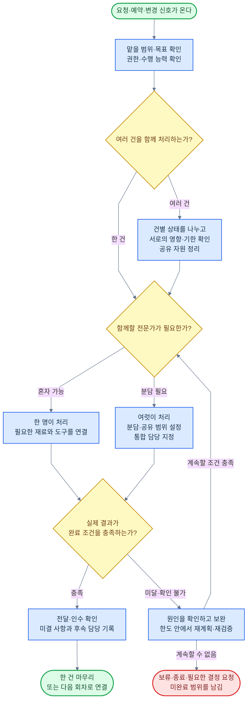

그림의 ‘확인’과 ‘보완’도 AI가 맡는 업무다. 사용자가 매 단계에서 확인하거나 방향을 정해 주는 구조로 만들지 않는다. 담당·기한·재개 조건이 있는 대기는 계속 관리하고, 미완료 종료는 성공과 구분한다. 아래 모든 그림의 반복·복귀에는 정해 둔 시간·비용·시도 한도를 적용한다. 계속할 근거가 없거나 한도를 넘으면 대안·대기·중단·필요한 결정 요청으로 연결한다.

| 먼저 볼 내용 | 설명 |
|---|---|
| [업무를 맡기기 전](#업무를-맡기기-전) | 이 업무를 맡을 범위·능력·권한·완료 기준이 갖춰졌는가 |
| [한 건이 끝나는 흐름](#한-건이-끝나는-흐름) | 접수부터 납품·후속 처리까지 어떤 재료를 쓰는가 |
| [한 명에게 맡기는 다섯 경우](#한-명에게-맡기는-다섯-경우) | 한 건·상시 담당·계속 운영·실시간·긴급 대응 |
| [여럿이 나눠 맡는 일곱 경우](#여럿이-나눠-맡는-일곱-경우) | 순차·병렬·반복 보완·분담·검토·인계·사람 협력 |
| [여러 건을 함께 처리](#여러-건을-함께-처리) | 건별 상태와 전체 우선순위·자원·충돌을 함께 관리 |
| [재료를 실제로 호출하는 순서](#재료를-실제로-호출하는-순서) | 판단·진행·실행 제어·검사·저장의 연결 |
| [허용하지 않는 조합](#허용하지-않는-조합) | 연결할 수 있어도 그대로 실행하면 안 되는 조건 |
| [실패·대기·재개의 공통 처리](#실패대기재개의-공통-처리) | 일부 실패·권한 철회·응답 유실·중단 후 이어가기 |
| [사용 구조 설계의 완료 기준](#사용-구조-설계의-완료-기준) | 설계에 빠진 경로가 없는지 확인할 기준 |

### 업무를 맡기기 전

지식·도구·규칙이 있다는 사실과 이 업무를 해낼 수 있다는 증거를 함께 확인한다. 처음 배치할 때뿐 아니라 업무 범위·자료·권한·모델·도구·환경이 바뀔 때도 영향받는 부분을 다시 확인한다.

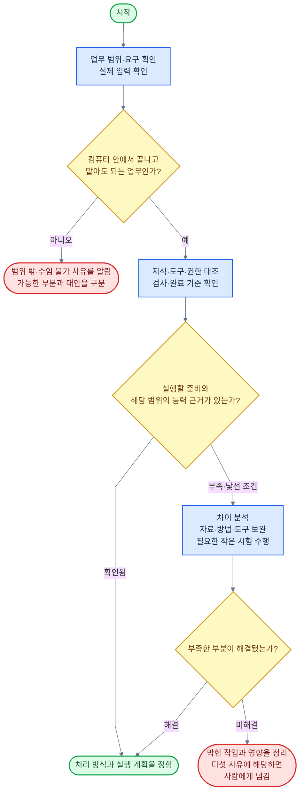

새로운 조합이라는 이유만으로 곧바로 사람에게 넘기지 않는다. 기존 방법이 통하는지 분석하고 필요한 범위만 시험한다. 반대로 모델의 자신감만으로 미검증 기능을 사용할 수 있다고 판단하지 않는다. 막힌 작업과 관계없는 준비는 계속한다.

| 확인할 것 | 갖춰야 할 내용 |
|---|---|
| 맡을 범위 | 요청·당사자·목표·제외할 일·기한·예산, 온라인에서 끝낼 수 있는 경로 |
| 전문성과 수단 | 해당 지식·숙련 사례·실제 입력을 다루는 도구, 업무 범위별 시험 근거 |
| 규칙과 권한 | 적용 의무·계약·조직·사용자 조건, 실행 명의·위임 범위·철회·한도 |
| 완료와 성과 | 무엇을 만들거나 바꿀지, 누가 어떤 방법으로 확인할지, 나중에 확인할 성과 |
| 실패와 후속 | 재시도·방법 변경·중단 조건, 대기 담당·기한, 복구·인계 방법 |

### 맡기는 방식과 협업 방식

아래 13가지 경우를 필요한 만큼 조합한다. 한 업무 안에서도 조사 두 개는 동시에 하고, 그 결과를 받은 뒤 제작은 차례로 하며, 오류가 나오면 반복해서 보완할 수 있다. 한 번 고른 방식을 끝까지 고정하지 않는다.

| 구분 | 경우 | 고르는 조건 |
|---|---|---|
| 한 명에게 맡김 | 1. 한 건 맡기기 | 정해진 결과와 인수 조건을 충족하면 한 건이 끝남 |
| | 2. 상시로 맡기기 | 정해진 역할 안에서 새 요청·기한·변화에 계속 대응함 |
| | 3. 계속 운영하기 | 목표·주기·예산 안에서 스스로 다음 행동을 정함 |
| | 4. 실시간 응대 | 말이나 채팅을 주고받으며 업무를 진행함 |
| | 5. 긴급 대응 | 정상 절차를 기다리는 동안 피해가 커짐 |
| 작업을 연결함 | 6. 차례로 처리 | 앞 결과가 다음 작업의 입력이 됨 |
| | 7. 동시에 처리 | 같은 시점에 시작해도 서로 필요한 입력을 해치지 않음 |
| | 8. 반복해서 보완 | 검사 결과에 따라 수정·재검사가 필요함 |
| 역할을 나눔 | 9. 나눠 맡기고 통합 | 작업을 분해하고 진행 중 추가 분담·공동 판단이 필요함 |
| | 10. 만들기와 검토 분리 | 제작과 검토를 나누어 오류·반대 근거를 확인함 |
| | 11. 주도권 넘기기 | 업무의 주 담당을 바꿔야 함 |
| | 12. 사람 협력자 포함 | 정의 1의 다섯 사유 중 사람이 맡아야 할 부분이 있음 |
| 여러 건을 다룸 | 13. 여러 건 함께 처리 | 건별 기한·자원·목표를 전체 상황과 함께 조정해야 함 |

순차·병렬·반복은 한 에이전트가 여러 도구를 쓰는 경우에도 적용한다. 여럿에게 나눌지는 전문성·작업 의존·공유 비용과 실제 품질·시간·총비용으로 정한다.

각 경우가 언제 시작하고 무엇으로 끝나는지, 중간에 멈추거나 다른 담당에게 넘길 때 무엇을 남기는지는 아래와 같다. 완료는 호출이 끝났다는 뜻이 아니라 정한 기준이 실제 상태에서 충족됐다는 뜻이다. 중단·인계 때 넘기는 내용은 [실패·대기·재개의 공통 처리](#실패대기재개의-공통-처리)에서 재개할 때 다시 읽는 입력이다.

| 경우 | 시작 조건 | 완료 조건 | 중단·인계 때 넘길 것 |
|---|---|---|---|
| 1. 한 건 맡기기 | 결과·범위·기한·인수 조건이 정해지고 [업무를 맡기기 전](#업무를-맡기기-전) 확인을 통과함 | 받는 사람이 약속한 다음 작업에 바로 쓸 수 있고, 미결 사항과 후속 책임이 정리됨 | 완료한 부분·남은 일·끝내지 못한 이유, 사용한 자료 판본과 승인 |
| 2. 상시로 맡기기 | 역할·권한·감시 범위를 정하고 신호 대기를 시작함 | 건마다 경우 1의 기준으로 끝남. 역할은 새 접수를 멈추고 미결 건·예약·자료를 인계했을 때 끝남 | 대기 중인 건·예약 작업·철회된 권한·남은 약속 |
| 3. 계속 운영하기 | 목표·운영 범위·주기·예산·중단 조건을 정함 | 회차는 성과 기록과 다음 확인 시점 결정으로 끝남. 운영은 계속할 조건이 깨졌을 때 진행 건을 정리하고 끝남 | 진행 중인 행동, 누적 비용과 손익, 임시 결과와 확정 결과의 구분 |
| 4. 실시간 응대 | 상대의 발언·연결이 들어오고 의도·현재 업무·권한을 확인함 | 응답을 마치고 약속·합의·남은 일을 기록함. 뒤에서 연결한 작업은 각자의 완료 기준을 따름 | 대화 중 약속·정정·취소 상태, 뒤에서 진행 중인 작업의 상태 |
| 5. 긴급 대응 | 진행 중인 피해 신호가 있고 대상·권한·한도·첫 조치의 필수 확인을 마침 | 추가 피해가 멈추고 상태·행동·비용이 기록되어 정식 원인 분석·복구 계획으로 넘어감 | 실행한 임시조치·부작용·남은 피해·사용한 긴급 권한 |
| 6. 차례로 처리 | 앞 작업 결과가 검증되어 판본·단위·조건이 붙어 전달됨 | 연결된 결과를 함께 검증해 다음 단계나 납품으로 넘김 | 사용한 앞 결과의 판본, 뒤 작업의 진행 지점 |
| 7. 동시에 처리 | 같은 입력 판본에서 쓰기 담당·공유 예산·합치는 조건을 확정함 | 정해 둔 필수 결과가 모이고 충돌 검사를 거쳐 통합됨 | 성공한 부분 결과, 실패·미회수 부분과 그 처리 방법 |
| 8. 반복해서 보완 | 완료 조건·검사 방법과 시간·비용·시도 한도를 확정함 | 검사를 통과함. 한도 안에서 개선 근거가 없으면 중단하고 미완료 범위를 기록함 | 시도 횟수·사용 비용·지난 시도와 달라진 점 |
| 9. 나눠 맡기고 통합 | 전체 목표·완료 조건·통합 담당을 정하고 부분 작업에 권한·기한·예산을 배정함 | 필수 작업과 연결이 갖춰지고 근거·결과를 맞춰 통합 검증한 뒤 전체 담당이 납품함 | 부분 결과·남은 작업·이견·재분담 이력·공유 자료의 판본 |
| 10. 만들기와 검토 분리 | 만들기 전에 완료·검사 기준을 확정함 | 검토 담당이 원자료 대조·독립 검사로 기준 충족을 확인하고 검증 증거를 붙임 | 검토 결과, 문제 위치와 근거, 수정 회차 |
| 11. 주도권 넘기기 | 인계 범위·권한·자료 공유 조건을 확인하고 기존 담당의 새 실행을 제한함 | 새 담당이 조건과 책임을 확인하고 전환이 기록되어 같은 행동이 두 번 실행되지 않음 | 현재 상태·근거·남은 일·예산, 처리 결과 불명인 행동, 승인과 기한 |
| 12. 사람 협력자 포함 | 정의 1의 다섯 사유에 해당하고 AI가 할 준비·대안·영향 정리와 요청 내용·기한을 확정함 | 유효한 결정·결과를 확인하고 업무를 재개하거나 종료함. 답이 없는 것은 승인이 아님 | 요청 내용·기한·대체 담당, 사람이 결정만 했는지 전문 수정을 했는지 |
| 13. 여러 건 함께 처리 | 새 건·진행 건·대기 건을 모아 자료 경계·공유 자원·기한을 확인함 | 건마다 따로 판정함. 전체는 남은 일과 새 신호가 없을 때 대기하거나 역할을 종료·인계함 | 건별 상태, 전체 예산 사용량, 건 사이의 약속과 충돌 |

### 한 건이 끝나는 흐름

정의 1의 업무 흐름을 따른다. 큰 단계는 같지만, 새 정보나 검사 결과에 따라 **문제가 생긴 단계로 돌아간다.** 아래 그림의 각 단계에서 호출할 재료와 넘길 결과는 바로 뒤 표에 적었다.

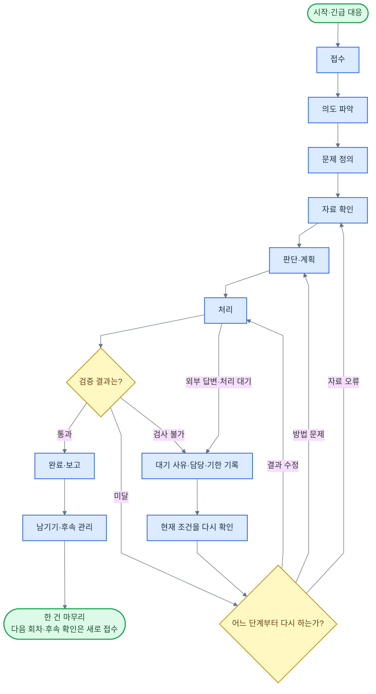

검증에서 미달이 나오면 **어느 단계부터 다시 하는지**를 먼저 정한다. 자료가 바뀌면 자료 확인, 방법이 바뀌면 판단·계획, 조건이 그대로면 처리에서 이어간다. 한 건은 남기기까지 끝나면 종료하며, 다음 회차와 후속 확인은 새 건으로 접수한다. 접수 거절·사람 결정·취소·긴급 대응은 해당 절의 분기를 함께 적용한다.

| 단계 | 주로 연결하는 재료의 순서 | 남길 결과·다음 단계로 갈 조건 |
|---|---|---|
| 시작·긴급 대응 | 시작 신호 → 현재 진행 상태 → 먼저 알아채기 | 새 건·기존 건·중복 신호를 구분. 급한 피해는 허용된 임시조치부터 연결 |
| 접수 | 업무별 정보 → 업무 권한 → 적용 규칙 확인 | 맡을 범위·당사자·책임·기한·한도를 정하고 수임 가능성을 확인 |
| 의도 파악 | 지시·의도 파악 ↔ 장기 기억·사용자 지정 규칙 | 원하는 결과·이유·필수 조건과 아직 확인하지 못한 가정을 구분 |
| 문제 정의 | 업무 지식·실전 경험·감각 → 문제·목표·완료 조건 | 풀 문제·제외할 문제·우선 목표·완료 증거를 정함 |
| 자료 확인 | 정보·자료 찾기 → 정보·자료 이해 → 근거·시점 확인 → 필요한 자료 가공 | 원문·출처·판본과 사실·주장·추정을 구분. 결론을 바꿀 누락은 확보 작업으로 연결 |
| 판단·계획 | 대안·전략 판단 ↔ 비용·위험 한도 → 업무 절차·실행 계획 | 담당·순서·병렬·검사·재시도·중단·복구를 정함. 사람 결정은 필요한 부분만 연결 |
| 처리 | 작업 진행·연결 → 실행 제어 → 필요한 실무 재료·업무 도구·시스템 | 실제 결과·외부 상태·오류·사용량을 기록. 호출이 끝났다는 이유로 완료 처리하지 않음 |
| 검증 | 결과 검증·재검증 → 필요한 반대 근거·위험·과정·품질 검사 | 통과·미달·확인 불가를 구분하고 수정할 담당과 돌아갈 단계를 정함 |
| 완료·보고 | 납품 준비 → 전달·인수 확인 | 최종본·필요 원본·사용 조건·제약·미완료·후속 담당을 알리고 인수 조건 확인 |
| 남기기 | 장기 기억·성과 추적 → 필요한 원인 분석·능력 개선·업무 능력 시험 | 약속·다음 확인 시점·재사용할 지식을 남기고, 검증한 개선만 반영 |

‘적용 규칙 확인’은 법·의무 기준, 직업 윤리·의무, 에이전트 기본 원칙, 계약·합의 조건, 플랫폼·제출처 규정, 조직 규칙, 사용자 지정 규칙을 **규칙의 적용·우선순위**에 따라 확인하는 묶음이다. ‘근거·시점 확인’은 **근거의 신뢰성·적합성**와 **자료의 시점·버전**을 뜻한다. 이 표의 묶음 표현은 새 재료가 아니다.

단계마다 전체 검사를 처음부터 반복하지는 않는다. 이미 확인한 조건은 유효한 동안 사용하고, 새 자료·철회·변경이 영향을 주는 부분을 다시 확인한다. 실제 외부 행동 직전에는 현재 권한·대상·한도와 필수 조건을 확인한다.

이 절의 흐름과 표에서 이름을 따로 부르지 않은 재료에도 호출 지점이 있다. 아래 16개를 더하면 정의 1의 77개 재료가 모두 어느 단계에서 어떤 조건으로 불리는지 정해진다. 조건은 정의 1의 재료별 사용 시점·조건을 그대로 따른다.

| 재료 | 호출 단계 | 호출 조건 |
|---|---|---|
| 분리 실행 | 처리, 업무를 맡기기 전의 작은 시험 | 코드·도구를 실행하거나 고객·작업 사이의 공간을 나눌 때 |
| 시험 환경 | 업무를 맡기기 전의 작은 시험, 경우 8·10의 검사, 남기기의 업무 능력 시험 | 운영 자료에 영향을 주지 않고 재현·비교해야 할 때 |
| 규칙·기준 원문 | 접수의 적용 규칙 확인 | 적용할 규칙의 원문을 확보하거나 규칙·적용 범위가 바뀌었을 때 |
| 적용 사례, 참고 자료, 재사용 자료 | 자료 확인 | 사례·참고 자료·다시 쓸 서식·부품이 결론이나 결과물에 필요할 때 |
| 표현 방식·스타일 | 판단·계획의 결과물 설계, 완료·보고 | 말투·문체·디자인 기준을 정하거나 맞춰야 할 때 |
| 형식·구조 변환, 기준 적용·판정, 예측, 조건 안에서 최선 찾기, 협상·조율, 신청·거래 처리, 관찰·측정, 실험, 시뮬레이션 | 처리 | 해당 재료의 사용 조건에 맞는 작업이 실행 계획에 있을 때. 실행 직전의 권한·한도 확인은 다른 실무 재료와 같음 |

### 한 명에게 맡기는 다섯 경우

#### 경우 1 — 한 건 맡기기

보고서 한 건, 계약 문서 수정 한 건, 프로그램 기능 하나처럼 끝을 정할 수 있는 일을 맡긴다. **위의 한 건 흐름이 이 경우의 순서도**다. 한 명은 업무를 책임지는 에이전트가 하나라는 뜻이며, 그 안에서 계산 함수·검색·편집 도구를 여러 개 쓸 수 있다.

**재료 연결:** 의도·문제 정의 → 자료·판단·계획 → 실무·검증 → 납품·인수. 시작·완료 조건은 [맡기는 방식과 협업 방식](#맡기는-방식과-협업-방식)의 경우별 표를 따른다.

요청을 받았다는 답이나 초안 생성으로 완료하지 않는다. 당장 끝난 작업과 나중에 확인할 성과·정정 약속은 구분해 남긴다.

#### 경우 2 — 상시로 맡기기

정해진 역할을 계속 맡고, 새 요청·기한·변화가 있을 때 해당 업무를 연다. **한 건의 완료**와 **상시 담당의 종료**는 다르다.

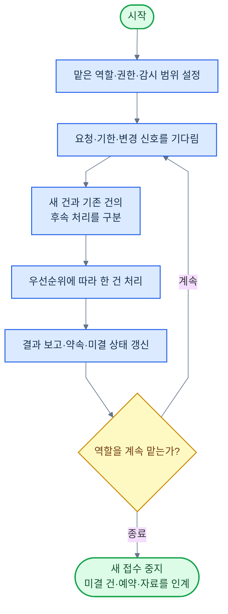

**추가 연결:** 시작 신호·먼저 알아채기 → 현재 진행 상태·장기 기억 → 작업 진행·연결·대기·후속 관리. 여러 건이 겹치면 경우 13으로 우선순위를 정한다. 신호가 없을 때 모델을 계속 호출할 필요는 없다.

**확인:** 대기 중인 건이 사라지지 않고, 철회된 권한으로 예약 작업이 실행되지 않으며, 종료할 때 남은 업무를 인계한다.

#### 경우 3 — 계속 운영하기

사이트·채널·온라인 서비스처럼 정한 목표를 향해 관찰·판단·실행을 반복한다. 들어온 요청에 답하는 것 외에, 위임받은 범위에서 다음 행동도 정한다.

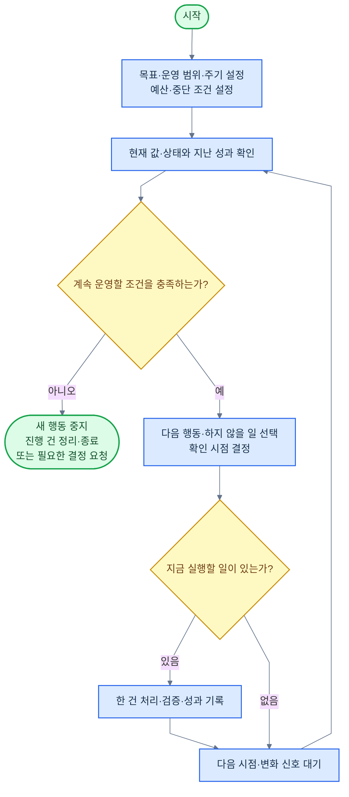

**추가 연결:** 현재 값·상태 확인·성과 추적 → 대안·전략 판단·비용·위험 한도 → 실행 계획·실무·검증 → 대기·후속 관리. 성과가 확정되는 시간이 길면 임시 결과와 확정 결과를 따로 둔다.

**확인:** 회차별 비용과 누적 손익을 함께 본다. 이미 위임된 범위에서 매 회차마다 사람 승인을 다시 받지 않으며, 범위·한도를 바꿔야 할 때만 해당 결정을 받는다.

#### 경우 4 — 실시간 응대

말이나 채팅을 바로 주고받으면서 조회·계산·문서 수정 같은 업무를 함께 진행한다. 대화가 길어져도 뒤에서 하는 작업의 진행 상태는 유지한다.

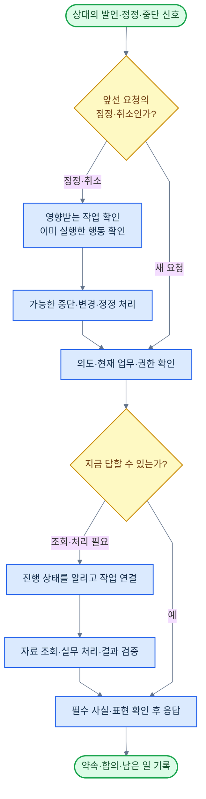

**추가 연결:** 실시간 대화 → 지시·의도 파악·사람과 소통 → 필요한 실무·검증 → 현재 진행 상태·장기 기억·대기·후속 관리. 긴 작업의 완료를 기다리며 대화를 모두 멈추지 않는다.

**확인:** 음성을 끊은 것과 이미 나간 주문을 취소한 것을 구분한다. 금액·대상·부정어·권한 같은 중요한 의미는 전달 전에 필요한 확인을 마친다. 연결이 끊겨도 맡은 업무와 후속 책임이 사라지지 않는다.

#### 경우 5 — 긴급 대응

피해가 커지고 있으면 허용된 첫 조치를 앞당긴다. 충분한 전체 분석에 앞서더라도 **대상·권한·한도·첫 조치의 필수 확인**은 한다.

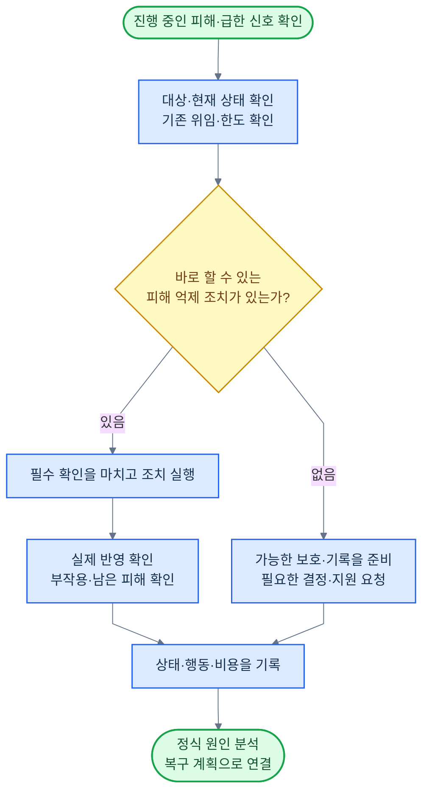

**추가 연결:** 시작 신호·먼저 알아채기 → 현재 값·상태 확인·업무 권한·비용·위험 한도 → 대안·전략 판단 → 필요한 설정·작동 제어 등 실무 → 결과 검증·재검증·판단 근거 기록.

**확인:** 긴급함을 이유로 새 권한을 만들지 않는다. 임시 조치 성공은 원래 목표의 달성과 구분하며, 추가 피해·복구·후속 보고까지 이어간다.

### 여럿이 나눠 맡는 일곱 경우

분담해도 맡긴 사람에게는 한 업무다. **전체 결과를 책임질 담당**을 정하고, 각 부분의 입력·결과·권한·기한·예산과 합치는 방법을 함께 정한다. 방식 6~8은 한 에이전트 안의 작업 연결에도 쓴다.

#### 경우 6 — 차례로 처리

앞 작업의 결과가 다음 작업의 입력일 때 사용한다. 예를 들어 자료 정리가 끝나야 계산하고, 계산이 검증돼야 그 수치를 보고서에 넣는다.

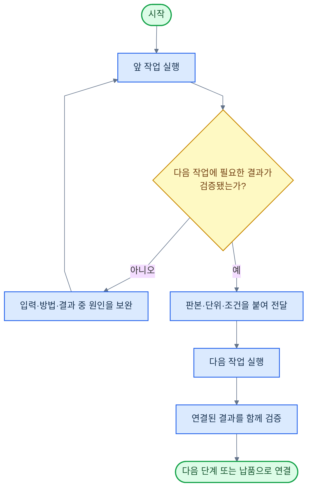

**재료 연결:** 업무 절차·실행 계획 → 작업 진행·연결·실행 제어 → 앞 실무 → 결과 검증·재검증 → 다음 실무. 현재 진행 상태가 선후 관계와 사용한 결과 판본을 남긴다.

**확인:** 앞 자료가 바뀌면 영향을 받는 뒤 결과와 검사도 다시 확인한다. 재시도·방법 변경은 경우 8의 한도를 함께 적용한다.

#### 경우 7 — 동시에 처리

같은 입력 판본에서 서로 기다리지 않고 시작해도 되는 일을 동시에 한다. ‘동시에 시작할 수 있음’과 ‘검사 없이 합쳐도 됨’은 다르다.

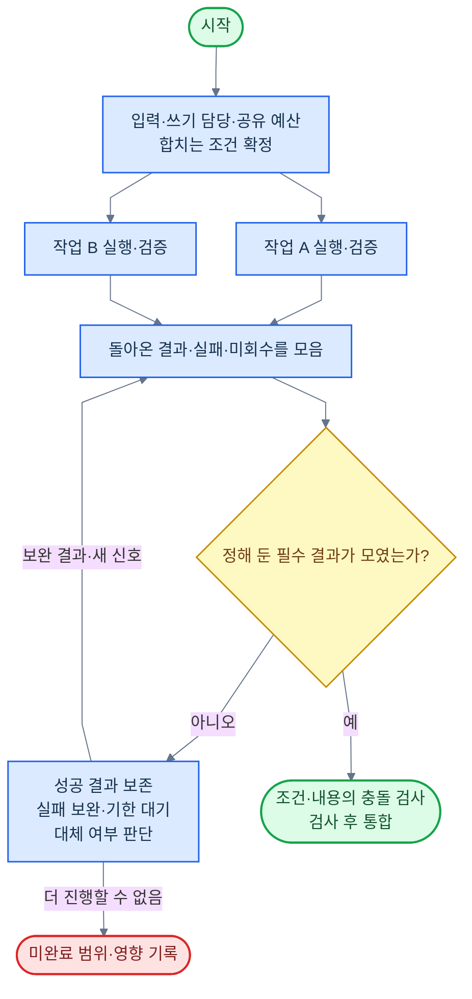

**재료 연결:** 실행 계획·비용·위험 한도 → 나눠 맡기기·실행 제어 → 각 실무·검증 → 작업 진행·연결 → 통합 검증.

**확인:** 기본은 필요한 결과를 모두 받는 것이다. 일부만 받아도 되는 작업은 사전에 그 조건과 빠진 결과의 처리 방법을 정한다. 실패·취소를 완료 결과로 세지 않는다. 같은 파일이나 거래를 바꾸는 작업은 쓰기 담당을 나누거나 순차로 전환한다.

#### 경우 8 — 반복해서 보완

검사에 실패하면 원인을 고쳐 다시 확인한다. 같은 요청을 그대로 되풀이하는 것과 구분한다.

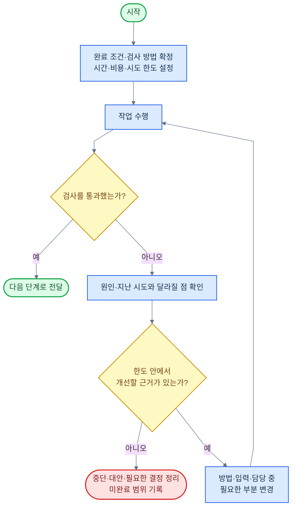

**재료 연결:** 결과 검증·재검증 → 성공·실패 원인 분석 → 대안·전략 판단·실행 계획 → 해당 실무 → 재검증.

**확인:** 방법이나 담당을 바꿔도 이미 쓴 비용과 시도 횟수는 이어받는다. 합격선을 낮추거나 실패한 항목을 빼서 반복을 끝내지 않는다. 결과가 좋아지는 근거가 없으면 다른 방법이나 중단을 판단한다.

#### 경우 9 — 나눠 맡기고 통합

전체를 책임지는 담당이 일을 나누고, 진행 중 드러난 문제에 맞춰 분담을 조정한다. 각 담당은 필요한 질문과 중간 결과를 서로 교환할 수 있다.

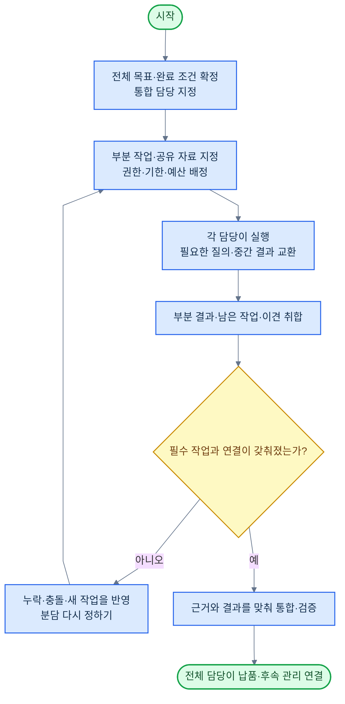

**재료 연결:** 대안·전략 판단·업무 절차·실행 계획 → 나눠 맡기기 → 각 담당의 실무·검증 → 작업 진행·연결·반대 근거·다시 확인 → 전체 검증·납품.

| 맡길 때 보낼 것 | 돌아올 때 받을 것 |
|---|---|
| 전체 목적과 이번 부분의 범위·완료 기준 | 실제 결과와 확인한 범위, 미완료·제약 |
| 필요한 자료·출처·판본·공유 가능한 범위 | 사용한 근거·도구·판본과 변경한 대상 |
| 담당·쓰기 대상·권한·기한·예산 | 진행 상태·사용량·외부 처리·남은 약속 |
| 선행 작업·다음 담당·질문할 창구 | 다른 작업에 미치는 영향·이견·추가 요청 |

**확인:** 보고서 조각을 붙이는 데서 끝내지 않고, 전제·단위·판단·약속이 함께 성립하는지 검사한다. 필수 결과가 안 돌아오면 대체·보완·미완료로 처리한다. 재분담에도 전체 한도와 사람 개입 기준을 유지한다.

#### 경우 10 — 만들기와 검토 분리

제작자가 놓친 사실·반례·사용상의 문제를 별도 검토에서 찾는다. 검토자는 원자료와 완료 기준을 받아 실제 결과를 확인한다.

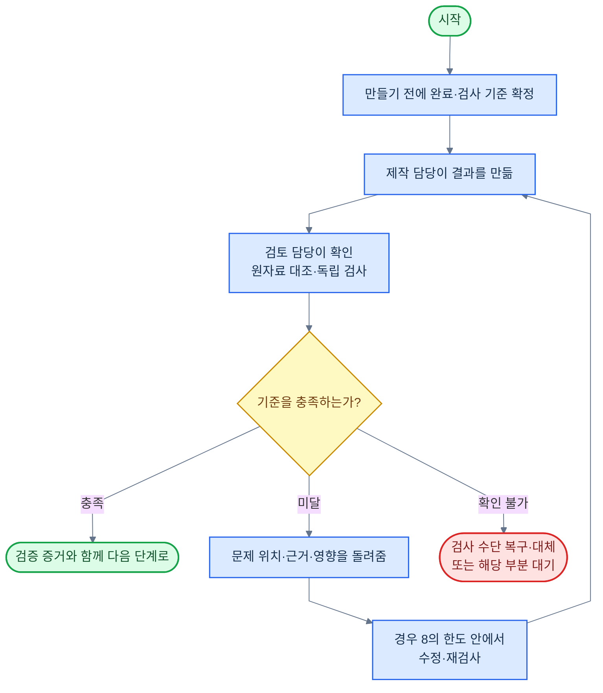

**재료 연결:** 결과물 만들기·수정 등 제작 실무 → 결과 검증·재검증·반대 근거·다시 확인·빠진 위험 확인 → 일하는 과정 평가·결과 품질 평가.

**확인:** 다른 회사 모델을 썼다는 사실만으로 독립 검증이라고 하지 않는다. 계산·실행 검사는 별도 계산법·실제 실행 등으로 확인하고, 판단 검토는 반대 근거와 오류 발견 능력으로 평가한다. 검토를 분리해도 사람이 늘 중간 채점하는 구조를 기본으로 두지 않는다.

#### 경우 11 — 주도권 넘기기

부분 작업을 빌리는 경우와 달리 업무의 주 담당 자체를 바꾼다. 상대가 새 담당에게 처음부터 다시 설명하지 않아도 되게 한다.

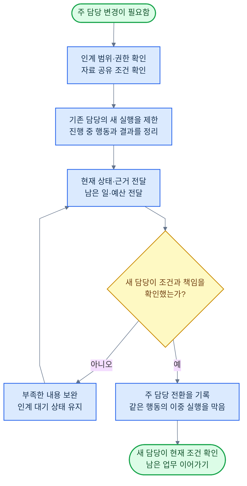

**재료 연결:** 업무 권한·나눠 맡기기 → 현재 진행 상태·판단 근거 기록·장기 기억 → 작업 진행·연결·실행 제어.

**확인:** 요청 번호·처리 결과 불명인 행동·남은 비용·승인·기한도 넘긴다. 인수 전에는 기존 담당의 책임이 사라지지 않는다. 새 담당이 받지 못하면 기한·대체 담당·안전한 재개를 정하고, 양쪽이 동시에 실행하지 않는다. 새 승인이 필요한 범위 변경이 있을 때만 사람의 해당 결정을 받는다.

#### 경우 12 — 사람 협력자 포함

정의 1에서 정한 **되돌릴 수 없는 행동·승인 조건·판단이 서지 않는 것·한도 초과·자격자 전속 행위**에서 필요한 부분만 넘긴다. AI가 할 수 있는 조사·정리·초안·검증은 먼저 마친다.

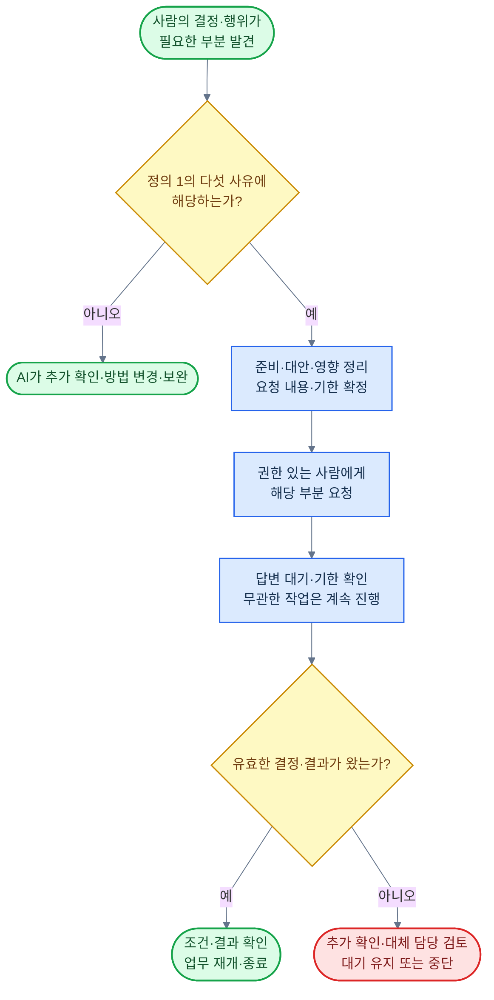

**재료 연결:** 사람에게 넘기기 → 사람과 소통 → 대기·후속 관리 → 업무 권한·결과 검증·재검증 → 현재 진행 상태·작업 진행·연결.

**확인:** 답이 없다고 승인으로 처리하지 않는다. 사람에게 맡긴 필수 부분이 빠졌으면 전체 완료가 아니다. 결정·서명만 받은 경우와 사람이 전문 분석·수정을 보충한 경우를 구분해 기록하며, 후자를 AI가 혼자 끝낸 성과로 세지 않는다.

### 여러 건을 함께 처리

#### 경우 13 — 여러 건 함께 처리

건마다 목표·자료·권한·진행 상태를 따로 유지하면서, 전체 우선순위와 공유 자원을 조정한다. 이 경우는 앞의 12가지 위에 겹쳐 쓴다.

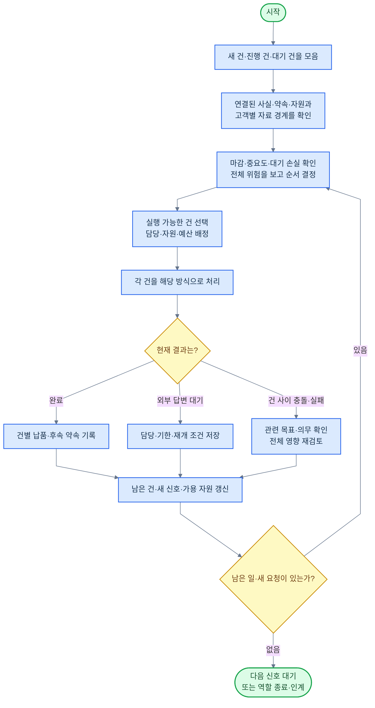

**재료 연결:** 현재 진행 상태·업무별 정보 → 대안·전략 판단·비용·위험 한도·업무 절차·실행 계획 → 나눠 맡기기·실행 제어 → 각 건의 실무·검증 → 작업 진행·연결·대기·후속 관리·성과 추적.

| 충돌 | 처리 방식 |
|---|---|
| 같은 파일·계정·설비를 함께 사용 | 읽기와 쓰기를 구분하고 쓰기 담당·사용 순서·복구 책임을 정함 |
| 개별 예산은 남았지만 전체 예산 부족 | 진행·예약·결과 미확정 비용까지 합산해 추가 실행을 조정 |
| 한 건의 약속이 다른 건을 묶음 | 양쪽 의무·목표·기한과 전체 손실을 비교해 계획 변경. 권한 밖의 약속 변경은 필요한 결정 요청 |
| 한 건이 답변을 기다림 | 그 건의 필요한 부분만 대기하고 다른 건을 진행. 대기 건의 확인 기한도 유지 |
| 쉬운 건 때문에 어려운 건이 계속 밀림 | 마감·대기 시간·피해 증가를 반영해 배정 순서를 다시 정함 |
| 고객·대표자·이해관계가 서로 다름 | 공유할 수 있는 참조만 연결하고 비밀·목표·위임은 분리. 가까운 관계라는 이유로 같은 의뢰인 취급 금지 |

**확인:** 한 건의 성과를 높이면서 다른 건에 손실·비밀 유출·기한 위반을 만들지 않는다. 상시 운영의 총괄은 계속되더라도 완료된 건과 미결 건은 각각 판정한다.

### 재료를 실제로 호출하는 순서

업무 절차·실행 계획이 **무엇을 어떤 순서로 할지** 정하면, 작업 진행·연결이 현재 할 수 있는 일을 고르고, 실행 제어가 함수·도구·AI를 호출한다. 판단과 실행의 책임은 [구성 원칙](#판단과-실행의-역할)을 따른다.

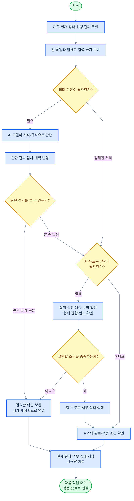

모델의 판단으로 대상·금액·행동이 바뀌면 **실행 직전 규칙·권한·한도 검사**를 다시 거친다. 권한 검사부터 실제 실행까지 사이에 철회나 다른 작업의 수정이 있었는지도 확인한다. 그림의 호출 순서는 이를 구현할 공통 연결이며, 승인된 단순 계산·변환에도 매번 모델 판단을 끼워 넣지는 않는다.

| 계속 유지할 책임 | 유지하는 방법 |
|---|---|
| 현재 작업 정보·현재 진행 상태 | 지금 필요한 입력을 주고, 완료·실패·선택 분기·남은 일을 저장 |
| 업무 권한·안전장치·비용·위험 한도 | 실행·재시도·재개 때 현재 범위와 전체 사용량 확인 |
| 작업 진행·연결·대기·후속 관리 | 다음 담당·필수 결과·대기 기한·후속 약속 추적 |
| 판단 근거 기록 | 사용 자료·계획·승인·실행·검사의 판본과 실제 결과 연결 |
| 운영 감시·복구 | 위 업무 흐름 밖에서 장애를 감지하고 저장·외부 상태를 대조해 복구 |

상시는 이 책임을 계속 유지한다는 뜻이다. 매 순간 모든 모델과 도구를 호출하라는 뜻은 아니다. 조건부 재료는 조건이 참이면 사용하고, 조건을 모르면 먼저 확인할 경로를 둔다.

### 허용하지 않는 조합

| 그대로 실행하면 안 되는 조합 | 생기는 문제 | 올바른 연결 |
|---|---|---|
| 앞 결과가 필요한 작업을 무조건 병렬 실행 | 없는 입력이나 예전 판본으로 처리 | 선행 결과를 검증한 뒤 다음 작업 실행. 독립된 부분만 병렬화 |
| 같은 대상을 여러 담당이 제한 없이 수정 | 덮어쓰기·중복 거래·상태 충돌 | 쓰기 담당·판본 검사·사용 순서를 정함 |
| 공유 자료·권한·통합 담당 없이 분담 | 부분 결과만 있고 전체 판단이 없음 | 필요한 공유 범위·상호 질의·이견 처리·통합 검증을 먼저 정함 |
| 필수 부분이 안 돌아왔는데 전체 완료 | 누락된 일을 성공으로 보고 | 대체·보완하거나 미완료로 남기고 영향 설명 |
| 제작자의 자기평가 점수만으로 통과 | 같은 오류를 놓침 | 원문·실제 실행·독립 계산·반대 근거로 확인 |
| 시간·비용·시도 한도 없이 반복 | 실패가 계속되고 자원이 소진됨 | 중단 조건과 개선 근거를 확인하며 반복 |
| 방식을 바꾸거나 인계할 때 사용량·승인을 초기화 | 한도·권한을 우회 | 기존 상태·예산·약속·철회 이력 인계 |
| 외부 처리 결과 불명인데 새 요청으로 재실행 | 이미 된 거래를 중복 실행 | 원래 요청으로 상태를 조회·대조하고 재시도 가능 조건 확인 |
| 긴급 대응을 정상 분석 전체가 끝날 때까지 대기 | 기다리는 동안 피해가 커짐 | 허용된 첫 조치와 필수 확인을 앞당김 |
| 긴급·실시간이라는 이유로 필수 확인을 전부 사후 처리 | 잘못된 발언·거래·제어가 먼저 나감 | 사전 확인 범위·검증된 행동·과부하 대안을 정함 |
| 반복 운영의 이미 위임된 행동마다 사람 승인 요구 | 맡기고 결과를 받는 구조가 무너짐 | 위임 안에서 실행하고 다섯 사유의 필요한 결정만 요청 |
| 사람에게 전문 작업을 상시 넘기고 무인 완료로 집계 | 사람의 성과를 AI 성과로 계산 | 전문 개입을 기록하고 해당 범위의 대체 능력 보완 |
| 다른 고객의 자료·기억을 한 상태에 합침 | 비밀·권한·목표가 섞임 | 건별 경계 유지, 허용된 참조만 공유 |
| 조건이 참일 때만 그 조건의 확인 기능을 실행 | 조건을 영원히 알 수 없음 | 조건 확인용 조회·진단을 먼저 준비하고 자체 권한·한도 적용 |
| 철회·변경 전 결과를 그대로 이어받음 | 유효하지 않은 판단·승인으로 실행 | 영향받는 자료·판단·계획·검사만 다시 확인 |
| 일이 끝난 뒤 완료 기준·성과 지표를 낮춤 | 실패가 성공처럼 바뀜 | 사전에 기준을 정하고 유효한 범위 변경은 이유·권한·영향 기록 |

### 실패·대기·재개의 공통 처리

| 상황 | 다음 행동 |
|---|---|
| 입력 부족·읽기 실패 | 결론을 바꿀 정보부터 재확보. 확인하지 못한 범위와 영향받는 작업 기록 |
| 계산·변환·제작 실패 | 입력·방법·환경 중 원인 확인. 한도 안에서 보완·재시도·다른 방법 선택 |
| 외부 처리 결과 불명 | 원래 요청 번호로 조회·대조. 확인 전 새 요청으로 같은 행동 반복 금지 |
| 병렬 일부 실패 | 성공 결과 보존. 실패한 부분 보완과 필수 결과의 합류 조건 확인 |
| 승인·권한 철회 | 관련 대기·예약·위임 작업에 철회 반영. 실행 직전에도 확인 |
| 검사 불가 | 확인 불가 상태 유지. 검사 복구·대체 방법·기한·담당 결정 |
| 새 증거·요구 변경 | 영향받는 판단·계획·결과·검사 재검토. 이미 한 외부 행동은 필요한 정정·취소로 처리 |
| 시스템 재시작 | 저장 상태 복원. 외부 처리·현재 승인·예산을 대조한 뒤 남은 작업 연결 |

```mermaid
%%{init: {"theme":"base","themeVariables":{"fontFamily":"Arial, sans-serif","fontSize":"16px","lineColor":"#64748b"},"flowchart":{"curve":"linear","nodeSpacing":40,"rankSpacing":50,"padding":14,"wrappingWidth":240,"useMaxWidth":true}}}%%
flowchart TB
    S(["실패·답변 대기·중단 발생"])
    B["이미 한 일·미확인 행동 기록<br/>담당·확인 기한 지정"]
    C["답변·변경·확인 시점<br/>복구 신호 수신"]
    D["실제 외부 상태 대조<br/>권한·자료·예산 확인"]
    Q{"지금 이어갈 조건은?"}
    R["영향받는 자료·계획·결과 재검토"]
    W["조회·대기·대체·중단 여부 판단<br/>다음 확인과 담당 유지"]
    E(["완료한 작업은 보존<br/>남은 작업·검사에서 재개"])
    X(["진행 중 행동 정리·미결 인계<br/>최종 상태와 책임 기록"])
    S --> B --> C --> D --> Q
    Q -->|유효| E
    Q -->|조건 변경| R --> D
    Q -->|아직 불명| W
    W -->|재개 신호| C
    Q -->|취소·종료 필요| X
    R ~~~ W
    classDef default fill:#dbeafe,stroke:#2563eb,stroke-width:1.5px,color:#17314f
    classDef term fill:#dcfce7,stroke:#16a34a,stroke-width:2px,color:#14532d
    classDef stop fill:#fee2e2,stroke:#dc2626,stroke-width:2px,color:#7f1d1d
    classDef dec fill:#fef9c3,stroke:#ca8a04,stroke-width:1.5px,color:#713f12
    class S,E term
    class X stop
    class Q dec
```

**멱등성**은 같은 요청을 다시 받아도 같은 외부 효과가 중복해서 생기지 않게 하는 성질이다. 요청 번호의 유효 기간과 적용 범위는 도구마다 다르므로 내부 기록만으로 외부 시스템까지 반드시 한 번 실행된다고 보장하지 않는다.

실행 상태, 목표 달성, 검증 상태, 사후 성과는 각각 기록한다. 실행이 종료돼도 목표를 달성하지 못했을 수 있고, 파일을 전달했어도 인수·성과는 아직 확인 중일 수 있다. [상태와 재시작](docs/runtime.md#상태와-재시작)의 네 가지 상태 구분을 따른다.

### 세 가지 규모에 적용한 예

아래는 **회사 웹사이트 개편**에 적용한 예다. 실제 실행 결과가 아니라 구조를 설명하기 위한 예시이며, 맡길 범위와 게시 권한은 업무마다 정한다.

| 맡기는 규모 | 처리 방식 | 재료의 연결과 확인 |
|---|---|---|
| 한 명에게 한 페이지 개편 | 한 건 처리 안에서 조사→설계→제작→검증을 차례로 연결 | 의도·문제 정의 → 자료 찾기·이해 → 결과물 설계 → 만들기·수정 → 실제 화면·기능 검증 → 납품 |
| 여럿에게 전체 사이트 개편 | 콘텐츠·디자인·개발의 선후 관계를 정하고, 독립 조사는 병렬로 수행. 중간 결과 공유·통합 검토 | 실행 계획 → 나눠 맡기기 → 각 실무 → 필수 결과 회수 → 내용·화면·기능의 통합 검증. 디자인 변경이 개발에 미치는 영향도 반영 |
| 여러 고객의 개편을 함께 담당 | 고객별 자료·권한·기한은 분리하고 담당·서버·예산을 배정 | 현재 진행 상태 → 전체 우선순위·한도 → 건별 실행. 한 고객의 승인 대기 중 다른 건을 진행하고, 고객 정보는 섞지 않음 |

세 경우 모두 게시가 범위에 있으면 **게시·배포 → 실제 반영 확인**까지 연결한다. 초안만 맡겼다면 게시하지 않는다. 이미 허용된 게시에 승인을 반복해서 붙이지 않으며, 추가 결정이 필요한 변경만 사람에게 넘긴다.

### 지식을 만드는 업무의 연결

지식 구성도 하나의 업무로 처리한다. 새로운 재료를 추가하지 않고 확정된 재료들을 다음처럼 연결한다.

| 순서 | 담당 재료 | 남길 결과 |
|---|---|---|
| 1. 자료 확보 | 정보·자료 찾기, 정보·자료 이해, 근거의 신뢰성·적합성, 자료의 시점·버전 | 원문과 위치·판본·권한, 읽기 불확실성 |
| 2. 대상·개념 정리 | 자료 선별·분류, 자료 정리·결합 | 같은 대상의 연결 근거, 다른 대상의 구분, 변경 이력 |
| 3. 내용 종합 | 업무 지식, 내용 재구성, 결과물 만들기·수정 | 개념·주장·관계·조건·예외·이견과 원문 연결 |
| 4. 검증 | 결과 검증·재검증, 반대 근거·다시 확인 | 잘못된 통합·근거 없는 관계·빠진 예외·끊긴 참조의 검사 결과 |
| 5. 반영 | 기록 입력·수정, 현재 진행 상태 | 검증된 지식 판본, 검색 반영 상태, 변경 영향 |
| 6. 변경 후 재검토 | 변경 감시·반영, 업무 지식, 관련 실무·검증 | 정정된 원문에서 파생된 지식·결과물·진행 건의 보완 |

작업 진행·연결이 검토·수정·반영까지 관리한다. 확인된 사실의 정정은 근거 대조 후 반영하며, 미검증된 해석은 따로 표시한다. 수행 능력에 영향을 주는 지식·방법·도구의 변경은 능력 개선·확장과 업무 능력 시험에 연결한다.

### 사용 구조 설계의 완료 기준

이 절을 작성한 것과 설계를 검토한 것, 실제 프로그램으로 시험한 것은 구분한다. 진행 상태는 [진행 계획](진행-계획.md#업무-순서)에서 관리한다.

| 확인할 항목 | 설계에서 갖춰야 할 것 | 구현 후 시험할 것 |
|---|---|---|
| 단독 업무의 끝까지 처리 | 접수→판단→실무→검증→인수의 재료·결과 연결 | 사람의 전문 수정 없이 실제 한 건 완료 |
| 13가지 사용 경우 | 시작 조건·호출 순서·담당·완료·중단 기준 | 각 경우와 필요한 조합의 정상·실패 동작 |
| 조건부 재료 | 77개 재료 모두의 호출 단계, 사용할 조건과 조건을 확인할 별도 경로 | 미확인 조건에서 순환 대기·무단 실행이 생기지 않음 |
| 협업·통합 | 입력·공유 범위·쓰기 담당·필수 결과·이견 처리 | 일부 실패·누락·상충하는 결론에서도 올바르게 보완·판정 |
| 여러 건 처리 | 건별 상태·전체 자원·기한·의무·충돌 조정 | 대기 중 다른 건 진행, 공동 한도 유지, 고객 자료 격리 |
| 사람에게 넘기기 | 다섯 사유·준비할 내용·요청 대상·답변 후 처리 | 불필요한 질문·반복 승인 없음, 전문 개입을 숨기지 않음 |
| 변경·중단·복구 | 이미 한 행동·남은 일·권한·예산·재개 지점 | 응답 유실·철회·재시작·인계에서 중복 실행 없음 |
| 실제 성과 | 완료·미완료·검증·인수·사후 성과 구분 | 숙련 전문가와 같은 조건으로 품질·자율성·시간·총비용·성과 비교 |

## 구성 원칙

### 공통으로 만들 것과 직종마다 채울 것

공통으로 만드는 것은 실행·저장·검색·권한·검증·배포의 기반과 재료를 연결하는 방식이다. 직종마다 그 일의 지식, 판단 요령, 규정, 도구, 완료 조건을 채운다. 개별 업무를 받으면 고객·목표·자료·권한·기한·예산을 적용한다.

| 구분 | 들어가는 내용 | 예시 |
|---|---|---|
| 공통 기반 | 작업 실행, 중단 후 재개, 권한 확인, 기록, 시험과 배포 | 답변을 기다리던 일을 기한에 맞춰 다시 확인하는 기능 |
| 직종별 구성 | 전문 지식·사례·방법·도구·규칙·시험 과제 | 번역 용어집, 회계 계산법, 설계 프로그램과 검사 기준 |
| 개별 업무 | 이번에 맡은 범위·대상·조건과 진행 상태 | 이번 계약의 수정 범위, 납기, 승인된 발송 대상 |

공통 기능을 재사용해도 새 직종의 자료와 도구로 다시 시험한다. 직종 이름만 바꿔 모든 일을 할 수 있다고 표시하지 않는다. 화면·문서·시스템·통신 안에서 끝나는 업무를 다루며, 직접 실측·시공·시술·촬영·실물 인도는 현재 범위 밖이다.

### 판단과 실행의 역할

뜻을 이해하고 방법을 고르는 일은 모델이 한다. 이미 정한 식의 계산, 상태 조회, 파일 변환, 명시된 조건의 분기는 프로그램이 바로 처리한다. 이런 작업을 호출할 수 있게 묶은 프로그램의 단위를 함수라고 한다. 모델의 출력은 실제 실행과 검사를 거쳐야 업무 결과가 된다.

| 재료 | 맡는 질문 | 예시 |
|---|---|---|
| 대안·전략 판단 | 어떤 방법이 목표에 가장 맞는가 | 조사부터 할지, 현재 자료로 초안을 만들지 선택 |
| 업무 절차·실행 계획 | 무슨 작업을 어떤 순서로 할 것인가 | 자료 조회 두 개를 동시에 하고, 둘 다 오면 검토하도록 계획 |
| 작업 진행·연결 | 지금 무엇을 진행하고 누구에게 넘길 것인가 | 검토에서 발견한 오류를 수정 담당에게 연결 |
| 실행 제어 | 정한 작업을 어떻게 호출하고 기다리고 재개할 것인가 | 함수 호출, 병렬 실행, 실패 분기, 결과 합류 |
| 현재 진행 상태 | 어디까지 했고 무엇이 남았는가 | 완료한 조회, 실패한 조회, 대기 사유와 다음 확인 시점 기록 |
| 운영 감시·복구 | 시스템이 멈추면 누가 알아채고 복구할 것인가 | 에이전트 밖에서 장애를 감지하고 저장 상태를 복구 |

모델 주변에서 실행을 지원하는 장치를 기술 문서에서는 **하네스(Harness)**라고 부른다. 모델이 좋아져도 권한 확인, 비용 합산, 저장, 외부 처리 확인은 유지한다. 이런 책임은 모델의 지능과 별개다.

### 모든 재료가 주고받을 내용

각 재료는 **입력 → 처리 → 결과 → 확인 → 다음 작업**으로 연결한다. 정상 결과뿐 아니라 실패하거나 아직 확인할 수 없을 때의 다음 행동도 정한다.

| 정할 내용 | 들어갈 항목 |
|---|---|
| 시작 조건 | 업무 번호, 담당, 목적, 입력 자료와 판본, 선행 작업, 권한·한도 |
| 처리 방법 | 사용할 지식·규칙·도구, 변경 가능한 대상, 반복·중단 조건 |
| 돌려줄 결과 | 결과값·파일·외부 상태, 단위·형식, 근거, 불확실한 점 |
| 확인 방법 | 기대한 상태, 검사할 대상·방법, 허용 오차, 확인 기록 |
| 실패·대기 처리 | 실패 이유, 이미 처리된 부분, 다음 담당, 확인 기한, 재개 조건 |

**상시**는 업무 중 책임을 계속 유지한다는 뜻이다. 매 순간 모델이나 도구를 부른다는 뜻은 아니다. **단계별** 재료는 해당 단계와 재검토 시점에 사용한다. **조건부** 재료는 해당 조건이 생기면 반드시 사용한다. 조건을 모르면 먼저 확인하며, 필요한 확인 작업 자체가 그 조건을 기다리는 구조를 만들지 않는다.

개별 재료의 기술 번호·입출력은 [세부 책임 목록](docs/materials.md), 실행 중 지킬 약속은 [실행과 데이터](docs/runtime.md), 채점 방법은 [평가 기준](docs/evaluation.md)에 연결한다.

## 기술과 관리 체계

### 기술을 고르는 기준

**2026-09-16에 확인한 공식 자료를 기준으로 기술 후보를 갱신했다.** 최신이라는 이유만으로 채택하지 않는다. 필요한 기능, 실제 업무 시험, 유지보수 상태, 자료 보관 조건, 운영 비용을 함께 보고 선택한다. 시험 제공 기능(베타)은 지원 범위와 변경 가능성까지 확인하고 별도로 시험한다.

API는 프로그램끼리 요청과 결과를 주고받는 창구, SDK는 연결·개발을 돕는 도구 모음, CLI는 명령으로 프로그램을 다루는 방식이다. 아래 표에서는 제품 이름과 함께 맡길 일을 설명한다.

아래 ‘기본안’은 구현을 시작할 설계안이며 설치·성능 검증이 끝났다는 뜻은 아니다. 공식 문서의 설명과 우리 환경에서 검증할 항목은 [기술 검토 기록](docs/reviews/definition-2-update-2026-09-16.md)에 구분했다.

### 모델 후보와 비용

텍스트 API의 표준 처리 기준이며 금액은 **100만 토큰당 미국 달러**다. 토큰은 모델이 입력·출력의 양을 세는 단위다. 긴 입력·처리 방식·도구 사용에 따른 추가 요금은 별도로 확인한다.

| 모델 | 이 프로젝트의 후보 역할 | 입력 | 저장된 입력 재사용 | 출력 | 공식 근거 |
|---|---|---:|---:|---:|---|
| GPT-6 Astra | 복잡한 판단과 긴 업무의 주 실행 후보 | $10 | $1 | $50 | [모델 안내](https://developers.openai.com/api/docs/models/gpt-6-astra) |
| GPT-5.6 Sol | 일반 전문 업무와 비용 비교 후보 | $4 | $0.40 | $20 | [모델 안내](https://developers.openai.com/api/docs/models/gpt-5.6-sol) |
| Claude Fable 5.1 | 어려운 판단과 별도 검토 후보 | $10 | $0.25 | $50 | [모델 안내](https://platform.claude.com/docs/en/models/fable-5-1/overview) |
| Claude Haiku 4.5 | 단순 작업의 품질·비용 비교 후보 | $1 | $0.10 | $5 | [공식 요금표](https://platform.claude.com/docs/en/about-claude/pricing) |

Sol의 기존 $5/$30은 현재 $4/$20으로 고쳤다. 공식 문서는 이 요금을 최소 2026-11-21까지의 프로모션으로 안내하므로 계약·배포 전에 다시 확인한다. Astra와 Sol은 입력이 272K를 넘는 요청의 요금 조건을 따로 둔다. 입력을 저장할 때의 비용도 재사용 비용과 다르다. [Sol 요금 조건](https://developers.openai.com/api/docs/models/gpt-5.6-sol), [Astra 요금 조건](https://developers.openai.com/api/docs/models/gpt-6-astra).

후보 역할은 우리 설계다. 최종 배치는 업무별 비교 시험으로 정하며 Claude Opus 5·Sonnet 5 등 다른 현행 후보도 비교할 수 있다. 모델이 답하기 전에 들이는 추론 강도도 품질·시간·비용을 재어 정한다. ‘중간에 강도를 바꾸면 항상 캐시가 깨진다’는 기존 문장은 삭제했다. Fable 5.1은 캐시를 유지하는 메시지별 강도 변경을 베타 기능으로 제공한다. [Claude 현행 모델과 기능](https://platform.claude.com/docs/en/models/fable-5-1/overview), [추론 강도](https://platform.claude.com/docs/en/build-with-claude/effort).

모델명·공급자·호출 설정·지원 기능·사용 시점·시험 결과를 기록한다. 고정 판본 제공 여부와 지원 종료 조건은 모델별로 확인한다. 같은 이름을 계속 쓸 수 있다고 가정하지 않으며, 과거 호출 결과도 보관해 당시 판단을 설명할 수 있게 한다.

### 실행·연결·검색·검사의 기술 구상

| 필요한 기능 | 기본안과 비교 후보 | 우리 업무에서 확인할 것 |
|---|---|---|
| 모델·도구 호출 | 공급자 공식 API·SDK를 공통 호출 형식으로 연결 | 입력 형식·도구·오류·사용량·자료 처리 조건의 차이 |
| 작업 흐름과 저장 후 재개 | 직접 운영하는 흐름은 LangGraph를 우선 시험. 장기 대기·복구가 핵심이면 Temporal도 비교 | 함수만 쓰는 경로, 병렬 합류, 중단·취소, 외부 행동의 중복 방지 |
| 관리형 실행 | OpenAI Agents API를 비교 후보에 포함 | 자체 실행 기반보다 줄어드는 개발량, 반출·보관·모델 교체 제약 |
| 실시간 음성 | GPT-Live와 Realtime API를 대화 방식에 맞춰 비교 | 동시 발언·정정·지연, 뒤에서 진행하는 작업의 취소와 상태 유지 |
| 외부 도구 연결 | 공식 API·SDK·CLI, 필요한 곳에 MCP | 인증, 도구별 최소 권한, 지원 규격, 취소·조회·재시도 |
| 정형 입력·출력 | 자료 형식 정의(JSON Schema)와 프로그램의 형식·값 검사, 모델의 구조화 출력 기능 | 거부·잘린 응답·지원하지 않는 형식·단위·의미 오류 |
| 상태와 업무 기록 | PostgreSQL | 동시 변경, 고객별 접근 제한, 시점·판본, 복원 |
| 자료 검색 | 기존 OpenSearch 혼합 검색안을 유지하고, 규모가 작으면 PostgreSQL 검색·pgvector와 비교 | 한국어·정확한 번호·반대 근거·권한·과거 판본의 검색 품질 |
| 지식의 관계 검색 | 개념·주장·근거 관계를 명시적으로 보관. 여러 관계를 따라야 할 때 GraphRAG·그래프 DB를 비교 | 근거 없는 관계, 잘못 합친 대상, 권한을 넘는 관계 탐색, 변경 영향 |
| 규칙의 실행 검사 | 명시된 대상·행동·한도는 코드나 OPA로 검사 | 배포된 규칙 판본, 검사 실패, 철회·변경의 전파 |
| 전문 작업 | 원본 프로그램의 공식 기능과 검증된 파일 처리 도구 | 대상 형식의 읽기·수정·변환·실행과 수신 환경의 호환성 |
| 운영 기록·감시 | OpenTelemetry로 실행 연결·시간·오류·사용량 수집 | 기록 누락, 비밀 가림, 감시 자체의 장애, 실제 비용 대조 |

LangGraph는 저장된 실행 상태와 중단·재개 기능을 제공하지만, 재개 위치에 따라 작업이 다시 실행될 수 있으므로 외부 효과를 따로 관리해야 한다. Temporal도 우리 업무의 취소·복구·판본 변경 조건으로 비교 시험한다. 두 실행 엔진을 처음부터 함께 넣을 필요는 없다. [LangGraph 저장과 재개](https://docs.langchain.com/oss/python/langgraph/persistence), [중단 처리](https://docs.langchain.com/oss/python/langgraph/interrupts), [Temporal Workflow](https://docs.temporal.io/workflows).

Agents API는 세션·분담·문맥 압축·복구를 관리하는 현행 선택지다. 다만 현재 공식 안내상 데이터 보관 지역은 미국이며 ZDR(자료를 보관하지 않는 처리 조건)을 지원하지 않는다. 자체 서버의 실행 공간을 연결해도 이 조건은 달라지지 않는다. 따라서 반출·보관 조건을 만족하는 업무에서만 후보로 둔다. [Agents API](https://developers.openai.com/api/docs/guides/agents-api/overview).

GPT-Live는 대화하면서 별도 업무 담당이 작업하는 구조를 지원한다. 음성을 중단해도 그 작업이 자동 취소되지는 않으므로 업무 상태·권한·확인은 우리 시스템에서 연결한다. [GPT-Live](https://developers.openai.com/api/docs/guides/live).

MCP는 도구 연결 규격이다. 확인일의 현행 규격은 **2026-07-28**이며 서버와 실제로 함께 지원하는 판본을 사용한다. 규격 준수만으로 업무 권한이 생기지는 않는다. [MCP 판본](https://modelcontextprotocol.io/docs/2026-07-28/learn/versioning), [인증·권한 규격](https://modelcontextprotocol.io/specification/2026-07-28/basic/authorization).

### 자료와 코드의 보관

| 보관 자리 | 담을 내용 | 관리 방법 |
|---|---|---|
| Git | 공통 코드·검토한 지식·규칙·절차·직무 설정·개발 시험 | 변경 이유·검사 결과·배포 판본을 연결한다. 고객 비밀과 보호된 시험 정답은 공통 저장소에서 분리한다 |
| 데이터베이스 | 업무 상태·관계·승인·예산·기억·실행·검사·성과 기록 | 과거 변경 이력을 남기고 현재 상태를 조회한다. 중요한 변경은 동시에 반영해 중간 불일치를 막는다 |
| 원본·결과 파일 저장소 | 받은 원본, 편집 원본, 납품본, 대화 원본, 큰 자산 | 내용 해시와 판본·권한·보존 기준을 연결한다. 고객 자료의 식별·암호화·중복 제거 범위를 분리한다 |
| 검색 색인 | 원문·지식에서 만든 검색용 목록과 의미 검색에 쓸 수치 | 원본에서 다시 만들 수 있게 한다. 권한·정정·삭제도 함께 반영한다 |
| 비밀 저장소 | 인증 정보와 암호화 키 | 사용 주체·기간·회수를 관리한다. 모델 입력·Git·평문 로그에 넣지 않는다 |
| 별도 평가 저장소 | 공개하지 않은 시험 입력·정답·채점 기준 | 개발·학습 기능의 접근과 변경을 막고 사용 이력을 남긴다 |

PostgreSQL은 확인일 기준 **18.6 안정판**을 검토 기준으로 삼는다. 19 Beta 3는 시험용이며 운영 기본안으로 쓰지 않는다. 자료의 행마다 접근 범위를 제한하는 RLS도 소유자·관리자·`BYPASSRLS` 역할의 우회가 있으므로 실행 계정을 분리하고 필요한 강제 적용과 우회 시험을 한다. [18.6 릴리스](https://www.postgresql.org/about/news/postgresql-186-1711-1615-1519-1424-and-19-beta-3-released-3365/), [행 보안](https://www.postgresql.org/docs/18/ddl-rowsecurity.html).

원본 저장은 클라우드 사용이 허용되면 S3를 기본 후보로 둔다. 사내 저장이 필요하면 조직이 운영·지원할 수 있는 제품의 보존·삭제·복구 기능을 시험해 고른다. 기존 **MinIO 공개 저장소는 2026-04-25 보관 처리되어 유지보수가 종료됐으므로 신규 기본안에서 제외**한다. 후속 AIStor 제품도 라이선스·지원·배치 조건을 별도로 검토한다. [MinIO 공식 저장소](https://github.com/minio/minio).

Object Lock은 정한 객체 버전의 변경·삭제를 제한하는 기능이며 백업을 대신하지 않는다. 삭제 요청은 원본뿐 아니라 검색·기억·캐시·평가 자료·백업 복원까지 추적한다. 암호화 키 하나를 없앴다고 모든 사본이 삭제됐다고 판단하지 않는다. 구체 절차는 [보존과 삭제](docs/runtime.md#보존과-삭제), 제품 기능은 [S3 Object Lock](https://docs.aws.amazon.com/AmazonS3/latest/userguide/object-lock.html)을 따른다.

### 검색과 지식 관리

정확한 번호·금액은 정확한 조회로 찾고, 개념이 비슷한 내용은 의미 검색으로 찾는다. 여러 자료의 관계를 따라야 하면 연결된 개념·주장·근거를 함께 탐색한다. 모든 질문에 모든 검색을 돌리지는 않는다.

OpenSearch의 RRF는 서로 다른 검색의 순위를 합치는 방식이다. `score-ranker-processor`가 이를 지원하며 기본 `rank_constant`는 60이다. 이 숫자를 우리 업무의 최적값으로 간주하지 않고 검색 과제로 비교한다. 작은 구성에서는 pgvector도 후보가 된다. [OpenSearch RRF](https://docs.opensearch.org/latest/search-plugins/search-pipelines/score-ranker-processor/), [pgvector](https://github.com/pgvector/pgvector).

권한·대상 시점·자료 종류를 검색 조건에 반영하고 최종 원문 접근에서도 검사한다. 검색 화면의 필터만으로 고객 격리를 보장하지 않는다. 과거 판본이 필요한 업무는 과거 자료도 필요한 검색 경로로 찾을 수 있어야 한다. 색인을 교체할 때는 검사 후 전환하고, 전환·되돌림 중에도 철회와 삭제 상태를 유지한다. [OpenSearch 문서별 접근 제한](https://docs.opensearch.org/latest/security/access-control/document-level-security/).

**GraphRAG**는 대상·관계와 요약을 이용하는 검색 방식이다. 위키 문서를 만들거나 그래프 DB를 도입하는 것 자체와는 다르다. 여러 문서의 관계를 묻는 실제 과제에서 일반 검색보다 나아지는지, 구축·갱신 비용까지 비교한 뒤 도입한다. 생성한 관계와 요약도 원문 근거를 검사한다. [Microsoft GraphRAG](https://microsoft.github.io/graphrag/).

### 구현 폴더와 기록의 구성

아래는 **앞으로 구현할 저장소의 예시**다. 현재 이 폴더들이 구현돼 있다는 뜻은 아니다. 재료 77개를 파일 77개나 서비스 77개로 만들 필요는 없다.

```text
expert-agent/
├─ definitions/           # 공통 책임·입출력·완료 기준
├─ jobs/                  # 분야·직종별 설정과 공통부 참조
├─ knowledge/             # 검증된 개념·방법·사례와 근거 연결
├─ policies/              # 규칙 원문 참조와 실행 검사 규칙
├─ workflows/             # 작업 연결·조건 분기·복구 절차
├─ adapters/              # 모델·전문 도구·사내 시스템 연결
├─ runtime/               # 실행·저장·신호·권한·예산 관리
├─ tests/                 # 개발·연결·복구·기존 기능 재시험
├─ evaluation/            # 평가 실행 코드; 보호된 정답은 별도 보관
├─ migrations/            # 데이터 구조 변경과 이전 절차
├─ releases/              # 배포 구성표와 시험 증거의 참조
└─ operations/            # 감시·백업·복구·종료 절차
```

공통 → 분야 → 직종 → 개별 업무의 설정을 합치되, 같은 항목이 충돌하면 실제 규칙의 근거·권한·범위로 푼다. 파일 순서만으로 먼저 적힌 값이 이기게 하지 않는다. 최종 적용값과 출처를 확인할 수 있어야 한다.

각 재료는 담당 모듈, 입력·출력 형식, 저장할 기록, 적용 조건, 검사와 연결한다. 핵심 기록은 요구·자료 판본·지식 관계·작업·외부 요청과 영수증·승인·예산·대기·검사·납품·성과·변경·삭제다. 상세 항목은 [저장 구조](docs/runtime.md#저장-구조)를 따른다.

실행 로그는 이력을 보존하고, 현재 상태와 검색 자료는 그 기록에서 다시 구성할 수 있게 한다. 원본 업로드와 DB 기록은 임시 상태·완료 확인·불일치 복구를 함께 설계한다. 소유자를 모르는 남은 파일을 임의의 고객 기록으로 복원하지 않는다.

### 변경·배포·복구

**배포 구성표**에는 코드·모델·지식·규칙·도구·데이터 구조·평가 기준의 판본과 검사 증거를 묶는다. 실제 실행기는 이 구성표를 따른다. 개발 중인 최신 Git 커밋과 다르다는 이유만으로 운영 장애라고 판단하지 않는다.

OPA를 쓰면 실제 활성 규칙의 판본을 이 구성표와 대조한다. 규칙 배포가 늦으면 영향받는 행동을 제한하고 동기화를 확인한다. 법·계약 문장의 해석 자체가 OPA로 해결되는 것은 아니다. [OPA 규칙 묶음 관리](https://www.openpolicyagent.org/docs/management-bundles).

데이터 구조나 실행 흐름을 바꿀 때는 대기 중인 업무도 고려한다. 이전 판본으로 끝낼지, 상태를 변환해 새 판본으로 옮길지, 중단·인계할지 정하고 시험한다. 되돌림에는 코드뿐 아니라 상태·규칙·색인·외부 처리의 일치 확인을 포함한다.

실행 시간·오류·사용량은 OpenTelemetry 같은 표준 도구로 연결해 수집한다. 모델별 항목은 사용한 규격 판본을 고정하고 민감한 원문을 불필요하게 수집하지 않는다. 운영 화면과 실제 과금·외부 영수증의 차이도 대조한다. [OpenTelemetry 기록 종류](https://opentelemetry.io/docs/concepts/signals/).

### 규모와 비용을 정하는 방법

기존의 ‘서버 10대’, ‘직종 10개가 넘으면 분리’ 같은 수치를 고정 설계에서 제외했다. 필요한 규모는 직종 수보다 자료량·동시 업무·도구 실행·보존 기간에 좌우된다. 다음 측정을 거쳐 서버·저장소·예산을 정한다.

| 측정 대상 | 함께 잴 내용 | 설계에 반영할 것 |
|---|---|---|
| 모델 호출 | 입력·출력·추론·캐시 저장과 재사용·재시도 | 업무당 총비용, 호출 한도, 모델 배치 |
| 자료·검색 | 원본·파생물 크기, 판본 증가, 한국어 검색 품질·지연 | 저장량, 색인 구성, 갱신 주기 |
| 전문 도구 | 메모리·GPU·실행 시간·라이선스·부분 실패 | 작업별 자원, 대기열, 동시 처리 수 |
| 운영 | 최고 부하, 긴 대기, 백업·복원, 장애 중 처리 | 복제·백업, 복구 시간, 수신 보존, 여유 자원 |
| 검증과 사람 작업 | 검사·수정·승인·전문 지원·운영 유지 시간 | 실제 대체율과 전체 운영 비용 |

업무당 비용은 **모델 + 도구 + 검색·저장 + 검증·재시도 + 복구 + 사람 작업 + 초기 구축비의 배분**으로 계산한다. 평균 외에 비용이 큰 업무와 지연이 긴 업무도 보고한다. 목표 수치는 측정 전에 정하고 실측 결과와 나란히 비교한다.

## 공장 설계

공장은 새 직종의 요구를 받아 공통 기반과 특화를 연결하고, 검사·시험·배포·변경 반영까지 반복하는 절차다. 자동으로 파일을 만드는 것만으로는 공장이 완성되지 않는다.

### 공장에 넣을 내용

| 입력 | 구체적으로 채울 것 |
|---|---|
| 업무 범위 | 직종·세부 업무·대상·난도·관할·운영 환경, 맡을 일과 제외할 일 |
| 전문성 | 개념·방법·단위·전제·예외·사례·판단 갈림·치명적 오류 |
| 자료·도구 | 실제 입력 형식, 원천 접근, 전문 프로그램·계정·권한·이용 조건 |
| 규칙 | 의무·계약·조직·사용자 조건, 승인·위임·한도·자료 경계 |
| 완료·평가 | 단계별 검사·인수·성과, 대표 과제·새 과제·비교 전문가·채점 방법 |
| 운영 | 담당·기한·예산·감시·복구·보존·갱신·종료 조건 |

### 조립부터 배포까지

| 순서 | 할 일 | 남길 결과 |
|---|---|---|
| 1. 적용 재료 고르기 | 77개 재료의 필요 여부와 조건을 업무 요구에 대조 | 필요한 재료·조건부 재료·제외 이유 |
| 2. 공통부와 특화 연결 | 기존 지식·코드·도구를 재사용하고 직종별 값을 채움 | 적용 출처·판본, 새로 필요한 기능 |
| 3. 빠진 연결 검사 | 요구→입력→판단→처리→검사→인수의 담당 확인 | 누락·미지원·미검증 목록과 보완 담당 |
| 4. 충돌 검사 | 권한·규칙·단위·판본·자원·선후 관계를 대조 | 해결된 충돌과 아직 막힌 경로 |
| 5. 시험용 조립 | 분리된 환경에서 실제 입력·도구·실패 조건으로 실행 | 연결·복구·기존 업무 재시험 결과 |
| 6. 직무 능력 평가 | 처음 보는 과제와 숙련 전문가 비교 | 지원할 업무 범위와 증거·제약 |
| 7. 배포·관찰 | 합격한 구성표로 제한된 범위부터 운영 | 배포 판본, 관찰 결과, 확대·중지 판단 |
| 8. 변경 반영 | 바뀐 공통부·규정·자료·도구의 영향을 추적 | 재조립·재시험 대상과 새 배포 기록 |

공통 코드의 시험 성적은 재사용할 수 있지만 새로운 직종 전체의 합격 성적으로 옮겨 적지 않는다. 조건을 판정할 조회·진단은 본 작업과 별도로 준비한다. ‘조건이 맞아야 진단을 실행하는데 진단해야 조건을 안다’는 순환도 조립 검사에서 찾는다.

### 공장이 됐다고 볼 기준

서로 다른 요구를 가진 복수의 직종을 같은 절차로 조립한다. 문서·계산·외부 거래·상시 운영 등 대표 차이가 드러나도록 시험 직종을 고른다. 새 직종의 추가 작업량·시간, 공통부 재사용 범위, 기존 직종에 생긴 영향을 기록한다.

새 직종마다 실행 기반 전체를 다시 만들어야 하거나, 필수 도구·평가가 빠졌는데 조립 완료로 처리하면 공장 시험에 실패한 것이다. 재사용할 수 없는 전문 도구 연결을 추가하는 작업은 허용하되 그 비용과 시험을 숨기지 않는다.

## 만드는 순서

전체 진행 상태는 [진행-계획](진행-계획.md#업무-순서)에서 관리한다. 아래 표는 각 묶음에서 무엇을 확보해야 다음으로 갈 수 있는지를 설명한다.

| 순서 | 작업 | 다음으로 넘어갈 조건 |
|---|---|---|
| 1. 확정된 정의 연결 | 정의 1의 목표·흐름·재료를 요구와 검사에 연결 | 77개 재료의 책임·입출력·예외·후속 담당에 누락이 없음 |
| 2. 설계 검토 | 재료 구상·사용 구조·기술·저장·공장 절차를 대조 | 모순·미정 사항과 결정할 근거가 정리됨 |
| 3. 실제 연결·핵심 가정 확인 | 자료·계정·이용 조건 확보, 중요한 도구·복구·파일 기능을 작은 시험으로 확인 | 구현을 막을 의존과 필요한 추가 작업이 드러남 |
| 4. 평가 준비 | 비교 전문가·채점자·표본·기간·예산 확보, 개발 자료와 새 평가 자료 분리 | 시험 전에 합격선·비교 조건·채점 신뢰성을 확인함 |
| 5. 공통 기반 개발 | 실행·저장·신호·권한·한도·기록·복구 구현 | 함수·AI 혼합, 병렬 일부 실패, 중단·재개가 연결됨 |
| 6. 단일 업무 완주 | 시험용 직무의 입력·지식·처리·검증·납품 연결 | 실제 한 건이 필요한 전문 처리와 인수까지 이어짐 |
| 7. 복합·안전·모델 교체 시험 | 협업·여러 건·공유 예산·공격·교체·실패 조합 확인 | 경계와 필수 검사가 유지되고 실패·비용이 기록됨 |
| 8. 사내 연동·성능·판본 변경 시험 | 실제 시스템의 처리·복구·부하와 데이터 구조·규칙·흐름 변경을 시험 | 목표한 품질·속도·비용을 충족하고 대기 건의 이전·인계·되돌림을 확인함 |
| 9. 공장 구현·시험 | 특화 입력부터 검사·조립·배포·갱신 자동화 | 다른 직종도 같은 절차로 만들고 기존 직종을 보호함 |
| 10. 직종별 제작 | 우선순위를 정하고 실제 업무 조사·특화·전문 도구·사용 형태 완성 | 해당 직종의 자료·판단·실행·검사·인수 경로를 갖춤 |
| 11. 대체 증명 | 같은 조건에서 숙련 전문가와 비교 | 사전에 정한 품질·자율성·비용·기한·성과 기준 충족 |
| 12. 배포 준비·초기 운영 | 자료·진행 건 이전, 담당·복구·되돌림 확인, 제한 운영 | 실제 환경의 관찰 결과로 운영 확대 여부를 결정함 |
| 13. 지속 운영·종료 | 감시·갱신·재시험·성과 개선, 종료·인계·삭제 | 중단·변경·서비스 종료 때도 남은 업무와 자료 책임이 이어짐 |

자료 확보·전문가 섭외·평가 준비·핵심 연결 확인은 설계와 병행한다. 긴 대기나 외부 계정 문제를 개발 끝까지 미루지 않는다. 시험 과제를 만드는 데 필요한 직무 조사도 이때 앞당긴다.

공통 기반을 검증할 **시험용 직무**와 실제로 판매·운영할 **첫 직종**은 구분한다. 공통 구조는 전체 요구에서 설계하고, 시험용 직무는 그 구조를 확인하는 데 쓴다. 실제 첫 직종은 자료·도구 접근, 비교 전문가, 결과 판정, 예상 편익과 위험을 확인한 뒤 고른다. 기존 세무·회계 사례가 많다는 이유만으로 자동 확정하지 않는다.

개발 순서는 의존관계에 맞춰 조정한다. 실시간·협업·자동 갱신이 필수인 직무는 해당 기능을 첫 완주 시험 전부터 갖춘다. 문서 읽기·계산·제작·검증을 마지막에 붙일 부가기능으로 미루지 않는다.

## 평가와 운영

### 무엇을 구분해서 증명할 것인가

| 확인 단계 | 증거 | 말할 수 있는 범위 |
|---|---|---|
| 정의 검사 | 재료·입출력·책임·예외 연결의 대조 | 검토한 요구를 설계가 다룬다 |
| 계산·상태 모형 시험 | 명시한 가정에서의 반례·상태 변화 검사 | 해당 모형에서 연결과 제한이 작동한다 |
| 실제 연결 시험 | 특정 계정·환경·판본에서의 실제 처리·복구 | 시험한 도구·행동을 그 환경에서 수행한다 |
| 전문 업무 평가 | 새 과제·숙련 전문가 비교·외부 완료 증거 | 시험한 업무 범위에서의 능력과 한계 |
| 운영 평가 | 실제 성과·오류·사람 기여·총비용·지연 손실 | 관찰한 조건과 기간에서의 운영 성능 |

기존 166개 직무 사례와 복합 사건 검토는 설계 누락을 찾는 개발 자료다. 실제 전문가 166개를 구현·검증했다는 뜻으로 쓰지 않는다. 공개된 사례를 처음 보는 비공개 시험으로 다시 세지 않는다.

### 합격 기준

품질·안전의 최소 기준, 전문가와 비교할 허용 차이, 사람 개입, 기한·총비용, 사후 성과를 시험 전에 정한다. 표본 수와 기간은 업무 난도·희소 오류·결과 확정 시점에 맞춰 정하며 ‘100건이면 충분’ 같은 공통 숫자를 쓰지 않는다.

비교 전문가는 해당 업무를 최근에 실제로 수행한 숙련자로 구성한다. AI와 자료·도구·권한·기한·지원 조건을 맞추고, 복합 업무는 그 일을 맡는 숙련 팀과 비교한다. 결과물의 작성자를 가릴 수 있으면 가리고 채점한다. 채점자도 정상·오류 사례로 검증한다.

다섯 이관 사유가 있어도 사람의 전문 수정과 단순 승인·서명은 구분한다. 전문 개입 없는 완료율과 초기 위임 이후 어떤 도움도 없는 완료율을 따로 보고한다. 자격 행위를 올바르게 연결했다는 사실을 그 자격자의 업무까지 AI가 했다는 뜻으로 바꾸지 않는다.

세부 표본 설계·지표·합격 판단은 [평가와 대체 판정](docs/evaluation.md)을 따른다. 증거가 부족하면 해당 범위를 미검증으로 남기고 필요한 시험을 정한다.

### 운영에서 계속 확인할 것

| 시점 | 확인과 조치 |
|---|---|
| 매 실행·대기 | 진행·예약 비용, 권한·기한·미결 건, 실제 외부 처리 상태 확인 |
| 장애 발생 | 추가 피해 제한, 기록 보존, 복구·외부 상태 대조, 담당 통지와 재개 |
| 규정·자료·모델·도구 변경 | 영향받는 지식·업무·직종을 찾고 필요한 재검토·재시험·배포 |
| 성과 확인 시점 | 실제 결과·사람 기여·비용·지연 손실을 비교하고 원인 분석 |
| 서비스 축소·종료 | 신규 접수와 예약 중지, 미결 건·약속·원본·결과·권한 인계, 계정 회수와 보존·삭제 확인 |

변경할 때마다 무조건 사람의 승인을 받도록 만들지는 않는다. 사전 위임된 저위험 변경은 정한 시험·배포 절차로 반영하고, 그 범위를 넘는 권한·목표·한도의 변경은 결정권자에게 넘긴다. 업무가 끝나도 남은 약속과 자료 관리 책임은 이행하거나 인계할 때까지 유지한다.

## 재료별 구상

정의 1에서 확정한 77개 재료를 각각 어떻게 작동시키고 무엇으로 확인할지 펼친 부분이다. 앞의 사용 구조·기술·공장 설계가 참조하는 바탕이므로 순서상 뒤에 둔다.

각 항목에서 **갖출 것**은 직종이나 업무에 맞춰 준비할 내용, **작동**은 처리와 다음 담당, **확인**은 실제로 됐는지 판단할 증거다. 기술 제품은 앞의 [기술과 관리 체계](#기술과-관리-체계)에서 고른다.

### 환경

#### AI 모델

목표와 자료를 이해하고, 가능한 방법을 비교해 답변·판단·행동 제안을 만든다.

- **갖출 것:** 업무별 모델 후보, 입력 형식, 사용할 도구, 비용·응답 시간·자료 반출 조건.
- **작동:** 어려운 판단과 정형 작업을 구분해 검증된 모델을 배정한다. 결과에는 근거와 불확실한 점을 함께 남긴다.
- **확인:** 같은 실제 과제로 품질·시간·총비용을 비교한다. 모델을 바꾸면 기존 업무와 처음 보는 업무를 다시 시험한다. 회사나 가격 등급만으로 합격시키지 않는다.

#### 실행 제어

정해진 작업 흐름과 모델의 판단에 따라 함수·도구·AI를 호출한다.

- **갖출 것:** 작업별 입력·출력, 선후 관계, 병렬·분기·합류 조건, 재시도·취소·종료 기준.
- **작동:** 준비된 작업을 실행하고 결과·오류를 담당에게 보낸다. 값으로 정해지는 분기는 코드로 처리하며, 의미 판단이 필요한 곳만 모델을 부른다.
- **확인:** 함수만 쓰는 흐름, 함수와 AI가 섞인 흐름, 병렬 작업의 일부 실패를 시험한다. 필수 결과가 빠지면 다음 작업을 시작하지 않는다. 호출 종료와 업무 완료를 구분한다.

#### 현재 작업 정보

모델이 지금 판단하는 데 필요한 정보만 골라 제공한다.

- **갖출 것:** 목표·범위·기한·권한·현재 상태·필요 근거와 원본 위치, 입력량 한도.
- **작동:** 공통 지시와 이번 자료를 구분하고, 오래된 내용은 새 상태로 교체한다. 긴 기록을 줄여도 약속·미확인 사항·이미 실행한 행동은 유지한다.
- **확인:** 여러 번 요약하고 재개해도 중요한 조건이 남아 있는지 본다. 요약에서 빠진 근거는 원본으로 되찾을 수 있어야 한다.

#### 분리 실행

서로 섞이면 안 되는 자료와 실행을 별도 공간에 둔다.

- **갖출 것:** 고객·업무별 접근 범위, 작업 공간, 외부 연결 허용 대상, 자원 한도.
- **작동:** 허용된 자료만 공유하고, 외부 파일·코드는 제한된 환경에서 실행한다. 모델·검색·캐시·로그에도 같은 고객 경계를 적용한다.
- **확인:** 다른 고객의 자료를 직접 조회하거나 우회 경로로 가져올 수 없는지 시험한다. 한 작업의 장애·자원 고갈이 다른 업무에 번지는지도 확인한다.

#### 운영 감시·복구

에이전트가 멈춰도 별도로 장애를 알아채고 복구한다.

- **갖출 것:** 응답 지연·오류·자원 사용·대기 건 감시, 비상 담당, 백업, 허용 복구 시간과 자료 손실 범위.
- **작동:** 장애 범위를 제한하고 시스템을 복구한다. 저장 기록과 실제 외부 처리 결과를 대조한 뒤 해당 업무를 다시 연결한다.
- **확인:** 에이전트·DB·도구·감시 기능의 중단과 백업 복원을 시험한다. 예전 작업자가 늦게 살아나도 새 상태를 덮거나 같은 거래를 반복하지 않아야 한다.

#### 시작 신호

요청·변경·예약 시각·답변 도착을 받아 해당 업무에 알린다.

- **갖출 것:** 수신 통로, 발신자 확인 방법, 시간대, 예약, 중복 구분값, 놓친 신호의 확인 방법.
- **작동:** 신호를 기록한 뒤 담당에게 전달한다. 같은 신호가 여러 번 오거나 순서가 뒤집히면 현재 상태와 대조한다. 사람이 전달한 자료도 접수 이력을 남긴다.
- **확인:** 수신 중 장애·중복·지연·역순 도착을 시험한다. 신호를 받았다는 사실과 그 업무를 처리했다는 사실을 구분한다.

#### 업무 도구·시스템

전문 프로그램과 외부 시스템에 요청을 보내고 결과·오류·진행 상태를 받는다.

- **갖출 것:** 기능별 도구, 지원 형식·버전·작업, 계정·권한·사용 조건, 입력·출력 설명.
- **작동:** 공식 API·SDK·CLI·MCP 등 제공되는 연결을 사용한다. 화면 조작이 필요하면 대상과 반영 상태를 추가 확인한다. 읽기·수정·변환 지원을 따로 기록한다.
- **확인:** 접속 성공 외에 실제 업무와 오류 복구를 시험한다. 예제 하나가 실행됐다고 모든 형식과 작업을 지원한다고 표시하지 않는다.

#### 나눠 맡기기

정해진 분담에 따라 여러 AI에게 작업을 보내고 결과를 모은다.

- **갖출 것:** 맡길 범위·입력·기한·결과 형식, 자료 공유 범위, 쓰기 담당, 공동 예산, 통합 담당.
- **작동:** 진행 상황과 중간 결과를 교환하고 누락·중복·이견을 찾는다. 방법이나 분담 변경이 필요하면 계획 담당에게 돌려보낸다.
- **확인:** 단독 수행과 품질·시간·비용을 비교한다. 필수 작업이 안 돌아오거나 결론이 충돌하면 보완·재검토하며, 받은 부분만 합쳐 전체 완료라고 하지 않는다.

#### 실시간 대화

음성·채팅의 발언을 바로 주고받고 연결의 중단·재개를 처리한다.

- **갖출 것:** 언어·통로·응답 기한, 발언 중단 방식, 대화 기록 범위, 뒤에서 수행할 업무와의 연결.
- **작동:** 상대의 끼어들기를 반영하고 중요한 정정·취소를 작업 담당에게 전달한다. 말하기를 멈춘 것과 뒤에서 진행 중인 거래를 취소한 것은 구분한다.
- **확인:** 동시 발언·연결 끊김·늦은 답변·숫자와 부정어의 오인식을 시험한다. 중요한 약속·금액·권한은 필요한 확인을 마친 뒤 전달한다.

#### 시험 환경

실제 업무에 영향을 주지 않으면서 조건을 재현하고 시험할 공간을 마련한다.

- **갖출 것:** 시험용 계정·자료·도구·예산, 실제 환경과 다른 조건, 시험할 판본.
- **작동:** 실제 고객과 거래로 이어지는 경로를 제한한다. 시험 결과와 배포하려는 판본이 일치할 때만 운영으로 내보낸다.
- **확인:** 실제 시스템으로 잘못 전송되지 않는지, 같은 조건을 다시 만들 수 있는지 본다. 모의 시험 통과와 실제 연결·전문 능력 검증은 따로 기록한다.

### 자료·검색

#### 근거의 신뢰성·적합성

자료가 얼마나 믿을 만하고 이번 판단에 맞는지 확인한다.

- **갖출 것:** 작성자·수집 과정·원문 위치·대상·조건·반대 자료.
- **작동:** 사실·당사자 주장·추정을 구분하고, 빠진 내용과 충돌을 확인한다. 같은 원문을 옮긴 여러 글은 하나의 근거로 본다.
- **확인:** 종합한 주장과 관계가 원문에서 뒷받침되는지 대조한다. 공신력 있는 출처라도 대상·시점이 다르면 그대로 적용하지 않는다.

#### 자료의 시점·버전

이번 업무의 대상 시점에 맞는 자료를 고른다.

- **갖출 것:** 자료가 적용되는 기간, 시스템이 알게 된 시각, 개정·정정 이력과 원본.
- **작동:** 당시 알고 있던 내용과 지금 바로잡힌 내용을 구분한다. 종합 지식에도 사용한 원문의 위치·판본·적용 조건을 연결한다.
- **확인:** 과거 업무, 소급 정정, 같은 날짜의 재수정, 경과조치가 있는 경우를 시험한다. 최신 자료를 모든 과거 업무에 일괄 적용하지 않는다.

#### 규칙·기준 원문

적용할 법령·규격·기관 규정·계약·내부 규칙의 원문을 갖춘다.

- **갖출 것:** 공식 출처, 이용 권한, 조항·항목·부속서 위치, 적용 대상과 기간.
- **작동:** 원문과 변경 이력을 보관하고 필요한 부분을 찾아 제공한다. 유료 표준이나 로그인 공지도 정당한 접근 경로를 마련한다.
- **확인:** 본문 외에 예외·부칙·첨부 기준까지 확보했는지 본다. 원문 확보와 법적·업무상 적용 판단은 각각 담당 재료에 연결한다.

#### 업무별 정보

이번 건의 대상·상황·요구·조건을 확인한다.

- **갖출 것:** 의뢰 내용, 당사자와 역할, 원본 자료, 시스템 기록, 기한·제약.
- **작동:** 필요한 정보만 수집하고 누가 한 말인지 남긴다. 비용을 낸 사람, 자료를 준 사람, 결정권자를 구분하며 새 정보도 반영한다.
- **확인:** 없는 사실을 추정으로 채우지 않았는지, 고객 정보가 다른 건으로 섞이지 않았는지 확인한다. 결론을 바꿀 누락 정보는 확보 작업으로 연결한다.

#### 정보·자료 이해

글·표·도면·영상·음성·코드의 내용과 구조를 읽는다.

- **갖출 것:** 원본 형식과 버전, 해석에 필요한 프로그램·용어·단위·좌표계.
- **작동:** 내용의 위치와 요소 사이 관계를 유지한다. 못 읽거나 뜻이 모호한 부분은 표시하고 재추출·다른 도구·추가 확인으로 연결한다.
- **확인:** 페이지·셀·도면 객체·영상 시점으로 되짚는다. 화면에 보이는 모양만으로 수식·숨은 항목·연결 구조까지 읽었다고 하지 않는다.

#### 정보·자료 찾기

부족한 사실·원리·방법·반대 근거를 찾아 확보한다.

- **갖출 것:** 검색할 원천, 접근 권한, 대상 시점, 필요한 증거와 검색 중단 기준.
- **작동:** 정확한 이름·번호 검색, 뜻이 비슷한 자료 검색, 표 조회, 관련 자료의 연결 추적을 필요에 맞게 조합한다. 필요한 경우 사람·기관에 문의한다.
- **확인:** 정답 근거를 찾는지와 잘못된 자료를 고르는지를 함께 시험한다. 검색 결과의 점수만으로 사실을 확정하지 않고 원문을 확인한다.

#### 적용 사례

다른 업무에서 규칙이나 방법을 쓴 과정과 결과를 살핀다.

- **갖출 것:** 사실관계·적용 기준·판단 이유·결과, 성공·실패·반대 사례.
- **작동:** 이번 건과 같은 조건과 다른 조건을 비교한다. 뒤집힌 판례나 정정된 사례는 이전 상태와 함께 표시한다.
- **확인:** 결과만 닮았다는 이유로 방법을 복사하지 않았는지 본다. 플랫폼의 공식 설명과 자체 실험으로 추정한 작동 방식도 구분한다.

#### 참고 자료

원리·방법·표현에 참고할 책·논문·매뉴얼·통계·견본을 확보한다.

- **갖출 것:** 서지 정보, 원문 접근 경로, 사용 권리, 참고할 부분과 목적.
- **작동:** 통계는 단위·표본·기준 시점을 함께 보관한다. 원문을 구하지 못하면 확인 가능한 범위와 대체 자료를 남긴다.
- **확인:** 인용 위치와 수치를 대조하고 철회·정정 여부를 확인한다. 제목이나 초록만 읽고 원문의 세부 결론을 단정하지 않는다.

#### 재사용 자료

서식·편집 원본·부품·코드를 다시 쓸 수 있게 관리한다.

- **갖출 것:** 출처·판본·사용 권리, 수정·재배포 범위, 필요한 글꼴·부품·프로그램.
- **작동:** 원본을 보존하고 사용한 업무와 파생물을 연결한다. 고객 전용 자료와 공통 자료는 구분한다.
- **확인:** 실제 환경에서 열리고 편집되는지, 연결 자산이 빠지지 않았는지 본다. 재사용 권한이 없거나 호환되지 않으면 다른 자료를 확보한다.

#### 현재 값·상태 확인

판단·실행에 필요한 현재 가격·재고·가동·접수 상태를 확인한다.

- **갖출 것:** 확인할 원천, 허용 지연, 단위·대상, 값이 급변할 때의 확인 방법.
- **작동:** 확인 시각과 실제 적용 시점을 함께 남긴다. 오래됐거나 다른 원천과 어긋난 값은 재조회한다.
- **확인:** 조회 실패를 변화 없음으로 처리하지 않는지 본다. 거래 직전 필요한 값은 그 시점에 다시 확인한다.

#### 변경 감시·반영

자료·조건·상태의 변화를 찾아 영향을 받는 업무에 알린다.

- **갖출 것:** 감시 대상·주기·출처, 변경 전후 판본, 연결된 업무·지식·검사 목록.
- **작동:** 바뀐 내용과 적용 시점을 확인하고 관련 담당에게 전달한다. 새 규정처럼 기존 참조에 없던 내용도 업무 범위로 찾아낸다.
- **확인:** 원문 정정·철회가 파생 지식과 진행 건의 재검토로 이어지는지 본다. 확인 중인 내용은 표시하고 검증이 끝난 변경만 확정 지식에 반영한다.

### 지식·경험

#### 업무 지식

개념·대상·원리·방법을 근거와 적용 조건에 연결해 쓸 수 있게 정리한다.

- **갖출 것:** 용어·단위·대상 사이 관계, 방법의 전제·예외·이견·반대 근거, 원문 위치.
- **작동:** 검증된 자료를 종합하고 관련 지식을 연결한다. 같은 이름의 다른 대상과 같은 개념의 다른 이름을 구분한다. 개념과 관계의 정의를 맞추는 작업을 온톨로지 구성이라고 한다.
- **확인:** 근거 없는 관계, 잘못 합친 대상, 빠진 예외·이견, 끊긴 참조를 찾는다. 실제 정리·작성은 실무 재료에 맡기고 아래 구성 절차로 검증한다.

#### 실전 경험·감각

숙련자가 어떤 단서를 보고 판단을 바꾸는지 사례로 남긴다.

- **갖출 것:** 실제 업무 기록, 먼저 본 단서, 선택한 방법과 버린 대안, 판단이 달라질 조건.
- **작동:** 면담과 실제 결과를 대조하고 이번 건에 적용할 수 있는지 확인한다. 성공한 결과와 좋은 판단을 구분한다.
- **확인:** 외운 사례 밖에서도 도움이 되는지 시험한다. 자주 안 쓴다는 이유로 드물지만 손실이 큰 실패 사례를 버리지 않는다.

### 기억·진행 상태

#### 현재 진행 상태

중단되더라도 어디서 무엇을 이어 할지 알 수 있게 기록한다.

- **갖출 것:** 목표·작업·담당·선후 관계, 선택한 분기, 병렬 결과, 대기 사유·기한, 승인·예산·실행 계획의 판본.
- **작동:** 단계와 중요한 외부 행동마다 기록을 저장한다. 자료가 바뀌면 영향받은 결과와 검사에 재확인 표시를 남긴다.
- **확인:** 재개 전에 이미 처리된 외부 행동을 조회한다. 끝난 병렬 작업은 보존하며, 실패·부분 성공·결과 불명을 구분해 이어 간다.

#### 장기 기억

다음 업무에도 필요한 사실·선호·결정·약속을 근거와 함께 남긴다.

- **갖출 것:** 기억할 내용, 고객·업무 범위, 출처·확인 상태·유효 기간·보관 기준.
- **작동:** 중요한 약속은 생긴 즉시 기록하고 다음 확인 시점을 정한다. 연재물의 설정·복선·독자와의 약속도 같은 방식으로 관리한다.
- **확인:** 오래된 사실과 취소된 약속이 다시 쓰이지 않는지 본다. 여러 업무에 통하는 내용은 업무 지식의 검증을 거쳐 반영하고, 삭제는 요약·검색·백업에도 연결한다.

### 규칙·권한

#### 법·의무 기준

이번 업무에 적용되는 법과 필수 기준을 정한다.

- **갖출 것:** 국가·분야·대상 시점, 법령과 위임 관계, 특별 규정·경과조치, 자격 요건.
- **작동:** 원문과 효력 있는 판단·명령을 확인해 의무·허용·금지 범위를 정리한다. 적용이 다투어지는 부분은 근거와 이견을 남긴다.
- **확인:** 법률 이름이나 최신 날짜만으로 우선순위를 정하지 않는다. 구체 업무를 만들 때 해당 관할의 공식 법령과 해석을 다시 확인한다.

#### 직업 윤리·의무

맡은 역할에서 지켜야 할 비밀·독립성·설명·이해충돌 기준을 적용한다.

- **갖출 것:** 당사자별 역할과 이익, 직업상 의무의 근거, 공개·회피·수임 제한 조건.
- **작동:** 역할과 관계가 바뀌면 계속 맡아도 되는지, 자료 공유를 바꿔야 하는지 다시 판단한다.
- **확인:** 가까운 관계의 당사자도 같은 의뢰인으로 취급하지 않는다. 자료를 분리했다는 사실만으로 이해충돌이 해결됐다고 판단하지 않는다.

#### 에이전트 기본 원칙

목적·범위를 지키고 근거·불확실성·진행 상태를 정직하게 알린다.

- **갖출 것:** 공통 행동 원칙, 지시를 내릴 수 있는 주체, 자료와 지시를 구분하는 방식.
- **작동:** 외부 문서에 섞인 명령으로 목표나 권한을 바꾸지 않는다. 실행·확인하지 않은 일을 완료했다고 말하지 않는다.
- **확인:** 숨은 지시, 허위 근거, 실패를 성공으로 보고하는 경우를 시험한다. 원칙 문장만으로 차단을 보장하지 않고 실제 권한·실행 검사와 연결한다.

#### 계약·합의 조건

업무 범위·기한·대금·권리와 상대에게 한 약속을 유지한다.

- **갖출 것:** 당사자, 유효한 합의 원문, 이행 조건, 변경 권한, 종료 뒤에도 남는 의무.
- **작동:** 새 합의·취소·부분 이행을 현재 상태와 계획에 반영한다. 바뀐 조건에 영향을 받는 작업과 납품본을 찾아낸다.
- **확인:** 상대의 제안을 확정 합의로 기록하지 않는다. 승인되지 않은 범위 확대나 약속 변경이 실행으로 이어지지 않아야 한다.

#### 플랫폼·제출처 규정

사용할 서비스와 결과를 받는 곳의 이용·접수 조건을 적용한다.

- **갖출 것:** 서비스·계정·제출 유형별 규정, 자동화 허용 범위, 접수 형식, 한도와 개정 이력.
- **작동:** 모델·도구 공급자의 조건도 포함해 실제 사용 경로에 적용한다. 규정이 바뀌면 관련 실행과 제출 방식을 검토한다.
- **확인:** 접속이나 기술적 자동화가 가능하다는 이유만으로 사용이 허용됐다고 보지 않는다. 사용자 설정만으로 외부 규정을 해제할 수 없어야 한다.

#### 조직 규칙

조직이 정한 승인·자료 관리·업무 수행 조건을 적용한다.

- **갖출 것:** 적용 조직·역할·업무, 규정 원문, 승인자와 예외를 허용할 주체.
- **작동:** 유효한 개정과 예외만 해당 범위에 반영한다. 조직 규칙이 이번에 위임받은 행동 범위를 넓히지는 않는다.
- **확인:** 권한 없는 직원의 요청으로 승인선을 생략하지 않는지, 다른 조직의 규칙이 섞이지 않는지 본다.

#### 사용자 지정 규칙

맡긴 사람이 정한 추가 조건과 선호를 적용한다.

- **갖출 것:** 조건을 정한 사람, 적용 범위·기간, 필수 조건과 선호, 변경·취소 이력.
- **작동:** 전역·직무·프로젝트·개별 건 중 어디에 적용되는지 구분한다. 이미 유효하게 맡긴 권한과 조건은 계속 사용한다.
- **확인:** ‘초안만 작성’이 자동 발송으로 바뀌지 않는지, 특정 건의 선호가 다른 고객에게 퍼지지 않는지 본다. 추가 조건이 없으면 기존 기준으로 진행한다.

#### 규칙의 적용·우선순위

함께 지킬 규칙을 정하고 충돌하는 조항의 실행 기준을 찾는다.

- **갖출 것:** 규칙별 원문·근거·설정 권한·적용 범위·기간·변경권.
- **작동:** 법적 적용 관계를 먼저 확인한다. 그다음 직업상 필수 의무·기본 원칙·승인된 보호 기준 → 유효한 계약·플랫폼 필수 규정 → 조직의 필수 규칙 → 사용자 지정 규칙 → 기본 방식·스타일 순으로 충돌을 푼다.
- **확인:** 문서의 이름보다 실제 의무와 설정 권한을 본다. 계약에 포함된 스타일은 계약 조건으로 다룬다. 충돌하지 않는 조건도 함께 충족하고, 해결할 수 없는 부분만 담당자에게 넘긴다.

#### 업무 권한

누구를 대신해 어떤 대상에 어디까지 행동할 수 있는지 확인한다.

- **갖출 것:** 실행자·위임자·대외 명의, 대상·행동·금액·횟수·기한, 재위임 범위와 철회 경로.
- **작동:** 실행·재시도·재개 직전에 현재 권한을 확인한다. 중요한 대상이나 조건이 바뀌면 원래 승인이 여전히 유효한지 검사한다.
- **확인:** 승인 철회, 대표자 변경, 한도를 나눠 우회하는 호출을 시험한다. 사전 위임 안의 행동에 같은 승인을 반복해서 요구하지 않는다.

#### 안전장치

현재 규칙·권한·한도를 벗어나는 정보 전달과 실행을 막는다.

- **갖출 것:** 입력·출력·파일·도구 요청의 검사 방법, 허용 대상, 검사 실패 때의 처리.
- **작동:** 허용·위반·확인 불가를 구분한다. 위반은 차단하고 확인 불가는 관련 실행을 보류한다. 위임·다른 도구·재시도에도 같은 조건을 적용한다.
- **확인:** 숨은 지시·비밀 유출·권한 우회와 정상 업무의 잘못된 차단을 함께 시험한다. 검사기가 멈춘 상태를 통과로 처리하지 않는다.

#### 비용·위험 한도

이번 업무와 여러 업무 전체의 비용·시간·자원·위험을 관리한다.

- **갖출 것:** 건·고객·기간별 한도, 실행 전 예약량, 검증·복구 여유, 중요한 손실의 제한선.
- **작동:** 사용량에 진행 중·예약·결과 미확정 작업을 합산한다. 실행할 때와 기다릴 때의 손실을 비교하고 공유 자원·연쇄 피해도 살핀다.
- **확인:** 병렬 실행에서 전체 한도가 지켜지는지 본다. 결과 불명인 거래의 예산을 먼저 풀지 않는다. 돈·기한·비밀 유출을 임의의 한 점수로 합쳐 위험을 감추지 않는다.

#### 표현 방식·스타일

대상·목적·매체에 맞는 말투·문체·디자인·연출 기준을 유지한다.

- **갖출 것:** 좋은 예와 피할 예, 용어 수준, 시각·음성 기준, 금기, 기준의 출처와 변경권.
- **작동:** 공통 표현 기준과 고객·브랜드·작품의 고유 기준을 구분해 제작에 적용한다.
- **확인:** 형식의 일관성과 실제 전달 효과를 함께 본다. 스타일을 맞추다가 사실·조건·접근성을 훼손하지 않았는지 확인한다.

### 행동 체계

#### 지시·의도 파악

맡긴 말과 맥락에서 원하는 결과·이유·허용 범위를 읽는다.

- **갖출 것:** 요청, 앞선 대화와 결정, 대상 결과물, 바꿀 수 있는 범위.
- **작동:** 이미 확인된 내용은 사용한다. 사소하고 되돌릴 수 있는 선택은 가정을 밝혀 진행하고, 뜻에 따라 목표·권한이 달라지는 부분은 필요한 확인만 한다.
- **확인:** 요청을 글자 그대로만 처리하거나 임의로 일을 넓히지 않았는지 본다. 전문 판단을 사용자에게 떠넘긴 것과 필요한 사실 확인은 구분해 기록한다.

#### 문제·목표·완료 조건

풀 문제와 우선 목표, 끝났다고 볼 상태를 정한다.

- **갖출 것:** 확인된 요구·제약, 목표의 우선순위, 단계별 결과, 검사 방법과 증거.
- **작동:** 제작 완료·외부 처리 완료·전달·인수·사후 성과를 구분한다. 범위를 바꿔야 하면 변경할 권한이 있는 주체에게 구체안을 제시한다.
- **확인:** 행동 전에 기대 결과를 정했는지 본다. 검사에 실패했다고 합격선을 낮추거나 미완료 항목을 조용히 빼지 않는다.

#### 대안·전략 판단

목표를 이룰 방법을 비교하고 계속·변경·보류·중단을 결정한다.

- **갖출 것:** 가능한 대안, 근거·가정, 효과·비용·위험, 상대 반응, 결론을 바꿀 정보.
- **작동:** 기존 방법이 맞지 않으면 원리에서 다른 방법을 찾는다. 여러 건이 얽히면 한 건의 이익이 다른 건을 해치지 않는지 비교한다.
- **확인:** 실행 순서가 달라질 때의 결과, 틀렸을 때 남길 선택권, 전략을 바꿀 신호를 남긴다. 모르는 확률을 임의로 채워 최선이라고 단정하지 않는다.

#### 사람에게 넘기기

정의 1의 다섯 경우에서 사람이 맡아야 할 결정·승인·작업을 연결한다.

- **갖출 것:** 되돌릴 수 없는 행동·승인 조건·판단 불가·한도 초과·자격자 전속 행위 중 해당 사유, 담당, 요청 내용과 기한.
- **작동:** AI가 할 준비·기록·검증을 마치고 대안과 영향을 정리해 결정받는다. 답변 지연과 대체 담당을 관리하며 무관한 작업은 계속한다.
- **확인:** 답변자의 권한과 적용 조건을 검사한다. 결정·서명만 받은 경우와 사람이 전문 분석·수정을 보충한 경우를 구분해 대체 평가에 반영한다.

#### 업무 절차·실행 계획

선택한 방법을 입력·출력·담당·도구·일정이 있는 작업들로 나눈다.

- **갖출 것:** 요구별 작업·검사·인수 경로, 선후·병렬·합류 조건, 자원·승인·반복·중단·재개 기준.
- **작동:** 실행 제어가 읽을 수 있는 구조로 계획을 남긴다. 자료 수와 중간 결과에 따라 작업 수·연결을 바꾸되 변경 이력을 보존한다.
- **확인:** 필수 결과 누락, 서로 기다리는 작업, 자원 충돌, 조건을 알아낼 경로의 부재를 검사한다. 새 환경의 미검증 기능은 필요한 시험을 먼저 연결한다.

#### 먼저 알아채기

위임받은 범위에서 따로 요청받지 않은 문제나 기회를 찾는다.

- **갖출 것:** 감시할 업무·기한·변화, 중요 단서, 대응할 범위와 비용.
- **작동:** 여러 신호를 연결해 대응 필요성과 급한 정도를 정리한다. 새 업무를 열지 판단 담당에게 전달한다.
- **확인:** 놓친 신호·늦은 발견·불필요한 경보를 함께 잰다. 시스템 장애 감시는 운영 감시·복구가 맡고, 업무상 의미 판단은 여기서 맡는다.

### 실무

실무는 아래 여덟 묶음에서 필요한 작업을 골라 연결한다. 진행·후속 관리는 모든 업무에서 유지한다. 나머지는 입력·요구·결과에 맞춰 사용한다.

**진행·후속 관리**

#### 작업 진행·연결

계획과 현재 상태를 보고 지금 할 수 있는 작업을 진행한다.

- **갖출 것:** 작업별 준비 상태·우선순위·담당, 검토·수정·종료 조건.
- **작동:** 결과를 다음 담당과 검사로 넘긴다. 반려·실패는 보완으로, 계획 밖의 변경은 계획·전략 판단으로 돌려보낸다.
- **확인:** 처음 접수한 요구가 처리·검사·납품까지 이어지는지 추적한다. 막힌 작업 때문에 진행 가능한 다른 작업까지 빠뜨리지 않는다.

#### 대기·후속 관리

기다리는 답변·외부 처리와 나중에 해야 할 일을 챙긴다.

- **갖출 것:** 기다리는 대상, 담당, 다음 확인 시점, 기한, 대체·인계 방법.
- **작동:** 답변이나 기한 신호를 받으면 현재 조건을 확인해 재개한다. 반복 업무의 다음 회차와 완료 후 남은 약속도 담당이 이어받을 때까지 관리한다.
- **확인:** 미결 건이 사라지거나 담당 없이 남지 않는지 본다. 승인 대기와 외부 처리 여부가 불명인 상태를 구분한다.

**자료 가공**

#### 자료 선별·분류

- **갖출 것:** 원본, 선별 목적, 분류 기준, 같은 대상을 연결할 근거.
- **작동:** 필요한 자료·항목을 고르고 분류·연결한다. 겹치거나 불분명한 항목은 별도로 남긴다.
- **확인:** 이름이 같아 다른 대상을 합친 경우, 이름이 달라 같은 대상을 놓친 경우를 검사한다. 중요한 반대 자료가 빠지지 않아야 한다.

#### 자료 정리·결합

- **갖출 것:** 원본별 항목·단위·연결 기준, 오류·중복·누락 처리 방법.
- **작동:** 표기를 맞추고 확인된 오류를 정정하며 자료를 합치거나 나눈다. 원본과 변경 이력을 남겨 잘못 합친 것을 되돌릴 수 있게 한다.
- **확인:** 행 손실·중복 결합·합계 변화와 미해결 충돌을 대조한다. 주장에 붙은 근거·예외·적용 조건도 함께 유지한다.

#### 형식·구조 변환

- **갖출 것:** 원본과 대상 형식, 유지할 수식·객체·글꼴·시간 정보, 허용 손실.
- **작동:** 항목과 연결을 옮기고 옮기지 못한 부분을 표시한다. 필요한 기능을 지킬 수 없으면 허용된 대체 형식을 준비한다.
- **확인:** 대상 프로그램에서 열기·수정·재계산·재생을 시험한다. 확장자나 미리보기만으로 변환 성공을 판단하지 않는다.

**계산·분석·판정**

#### 계산

- **갖출 것:** 구할 값, 식·단위·입력 판본, 가정·정밀도·허용 오차.
- **작동:** 계산 도구로 실행하고 사용한 값과 방법을 남긴다. 계산 불가·수렴 실패는 원인 확인과 다른 방법으로 연결한다.
- **확인:** 독립 계산이나 기준 문제로 검산한다. 계산이 맞는지와 그 식이 이번 문제에 맞는지는 따로 확인한다.

#### 분석

- **갖출 것:** 분석 질문, 자료 범위·품질, 비교 대상, 가능한 다른 설명.
- **작동:** 특징·차이·관계·원인을 분석하고 사실과 추정을 구분한다. 정성 자료와 수치 자료 모두 근거를 연결한다.
- **확인:** 표본 치우침·빠진 변수·단위 차이·반대 자료를 확인한다. 함께 움직였다는 이유만으로 원인 관계를 확정하지 않는다.

#### 기준 적용·판정

- **갖출 것:** 적용 요건·예외·판본, 대상 사실·증거, 판단 불가 조건.
- **작동:** 요건마다 사실을 대조해 충족 여부·정도·등급과 이유를 정리한다. 기계로 계산할 조건과 해석이 필요한 부분을 구분한다.
- **확인:** 적용 시점·관할·예외와 누락 증거를 다시 본다. 대상에 대한 판정은 실무이며, 그 판정을 다시 확인하는 일은 검증·평가에 연결한다.

#### 예측

- **갖출 것:** 예측할 대상·기간, 당시까지 알 수 있는 자료, 가정·오차 측정 방법.
- **작동:** 예상값이나 반응 시나리오를 만들고 범위·불확실성을 함께 제시한다.
- **확인:** 미래 정보를 미리 사용하지 않았는지, 조건이 달라져도 적용할 수 있는지 시험한다. 실제 결과가 나오면 예측 오차와 가정의 변화를 확인한다.

#### 조건 안에서 최선 찾기

- **갖출 것:** 목표의 우선순위, 반드시 지킬 조건, 바꿀 변수, 탐색 시간·비용.
- **작동:** 배치·순서·수량·설정의 대안을 비교한다. 가능한 안이 없으면 충돌하는 조건과 변경 대안을 돌려준다.
- **확인:** 모든 필수 조건을 지켰는지 검산하고 어디까지 비교했는지 밝힌다. 찾은 안이 가능한 안인지, 최선임을 증명한 안인지 구분한다.

**구상·표현·제작**

#### 결과물 설계

- **갖출 것:** 목적·사용자·사용 환경, 내용·기능·표현 요구, 규격·제약.
- **작동:** 구성과 요소 사이 관계를 정하고 제작·검사에 필요한 명세로 옮긴다.
- **확인:** 모든 필수 요구가 설계와 검사에 연결되는지 본다. 결과물의 구성과 업무 전체의 담당·일정을 구분한다.

#### 내용 재구성

- **갖출 것:** 원문, 요약·번역·통역 목적, 상대의 이해 수준, 보존할 사실·조건·말투.
- **작동:** 내용을 줄이거나 풀고 언어·표현을 바꾼다. 여러 자료를 종합하면 주장별 출처와 서로 다른 전제·이견을 유지한다.
- **확인:** 중요한 내용·부정어·조건·수치가 빠지거나 단정으로 바뀌지 않았는지 원문과 대조한다. 파일 없는 통역에도 적용한다.

#### 결과물 만들기·수정

- **갖출 것:** 설계, 원본·재사용 자산, 제작 도구, 수정 범위와 납품 형식.
- **작동:** 문서·코드·이미지·영상·음원·설계 파일을 만들거나 수정한다. 연결 자산과 원본 구조도 함께 맞춘다.
- **확인:** 실제 열기·편집·빌드·실행·재생을 확인한다. 부분 수정은 요청한 변경과 그대로 유지할 내용을 각각 검사한다.

**대화·협의**

#### 사람과 소통

- **갖출 것:** 상대와 관계, 대화 목적, 공유 가능한 정보, 설명·응답 범위.
- **작동:** 질문·답변·설명·제안을 주고받으며 상대의 이해와 입장을 확인한다. 오해를 바로잡고 합의·미합의·다음 행동을 정리한다.
- **확인:** 대화문이 자연스러운지에 더해 필요한 정보와 이해를 얻었는지 본다. 상대의 감정을 사실로 단정하거나 허용되지 않은 약속을 하지 않는다.

#### 협상·조율

- **갖출 것:** 당사자별 요구·우선순위, 양보할 범위, 결렬 때의 대안, 약속할 권한.
- **작동:** 가격·납기·역할 등을 함께 조정하고 상대의 답에 따라 제안을 고친다. 합의 조건과 이행 담당을 기록한다.
- **확인:** 동의한 주체와 조건을 확인한다. 제안·조건부 동의·최종 합의를 구분하고, 합의의 실제 이행은 후속 관리로 연결한다.

**업무 시스템 조작**

#### 기록 입력·수정

- **갖출 것:** 대상 기록과 현재 판본, 반영할 값, 수정·삭제 권한, 예상 결과.
- **작동:** 다른 작업의 변경과 대조해 입력·수정·삭제하고 변경 이력을 남긴다.
- **확인:** 원천 시스템을 다시 조회해 반영 여부를 확인한다. 동시에 수정된 기록을 덮어쓰거나 일부 누락을 성공으로 처리하지 않는다.

#### 신청·거래 처리

- **갖출 것:** 대상·금액·수량·일정, 승인 조건, 요청 번호, 조회·취소·환불 방법.
- **작동:** 제출·예약·주문·지급을 실행하고 접수·확정·거절·부분 처리·결과 불명을 구분한다.
- **확인:** 응답을 잃으면 원래 요청부터 조회한다. 재전송 가능 조건을 확인하고, 취소·환불도 별도 권한과 결과로 검증한다. 남은 금액과 후속 책임을 기록한다.

#### 설정·작동 제어

- **갖출 것:** 현재 설정·상태, 바꿀 범위, 유지할 조건, 중지·복구 권한.
- **작동:** 기능을 시작·중지·재개하거나 설정을 바꾼다. 관측한 상태에 따라 허용된 범위에서 조정한다.
- **확인:** 실제 반영값과 영향을 확인하고 필요하면 되돌린다. 에이전트 기반 자체의 장애 복구는 운영 감시·복구에 연결한다.

#### 게시·배포

- **갖출 것:** 검증된 판본, 대상·공개 범위·시점, 배포 경로, 정정·철회 조건.
- **작동:** 콘텐츠를 게시·발송하거나 프로그램을 배포하고 적용된 판본을 조회한다.
- **확인:** 예약·부분 배포·잘못된 공개를 검사한다. 이전 판본으로 되돌려도 이미 전달된 정보와 외부 효과는 남을 수 있으므로 필요한 정정·통지를 별도로 처리한다.

**납품·인계**

#### 납품 준비

- **갖출 것:** 납품 범위·수신 환경·인수 조건, 최종본·편집 원본·연결 자료·검사 결과.
- **작동:** 받는 사람이 이어서 쓸 설명을 붙이고 완료·미완료·제약·후속 담당을 정리한다.
- **확인:** 필요한 자산·권리·프로그램·실행 조건이 빠지지 않았는지 본다. 인수에 필요하지 않은 고객 비밀이나 내부 기록은 함께 보내지 않는다.

#### 전달·인수 확인

- **갖출 것:** 수신자·경로, 약속한 확인 방식·기한, 반려·수정 처리 방법.
- **작동:** 결과를 전달하고 도착·열기·사용 가능 여부를 확인한다. 전달됨·확인 대기·인수 완료를 구분한다.
- **확인:** 수신 환경에서 약속한 다음 작업이 가능한지 본다. 계약에 없는 사람 확인을 매번 추가하지 않으며, 수정 요청은 작업 진행·연결로 돌려준다.

**관찰·시험·연습**

#### 관찰·측정

- **갖출 것:** 대상·항목·방법·시점, 장비나 기록의 정확도, 관측 조건.
- **작동:** 화면 조작·응답 시간·제공된 영상 등에서 새 기록을 얻고 빠진 구간과 측정 한계를 남긴다.
- **확인:** 관찰자·도구·환경 때문에 결과가 달라지는지 본다. 기존 값의 조회와 새 측정을 구분하고 현재 범위 밖의 현장 수행은 별도로 표시한다.

#### 실험

- **갖출 것:** 확인할 질문, 바꿀 조건, 비교 대상·표본·기간, 측정·중단 기준과 권한.
- **작동:** 다른 조건을 관리하며 실제 반응을 비교하고 비용·부작용도 기록한다.
- **확인:** 표본 편향·교란·반복 비교의 영향을 살핀다. 결과가 좋다는 이유만으로 바꾼 조건이 원인이라고 단정하지 않는다.

#### 시뮬레이션

- **갖출 것:** 가정·모형·상대 반응·조건 범위, 비교할 대안, 실제 관측과의 차이.
- **작동:** 계산이나 역할 연기로 진행·결과를 살피고 대응을 연습한다. 조건을 바꿔 결과가 얼마나 달라지는지도 확인한다.
- **확인:** 모형 안에서의 성공과 현실에서의 성공을 구분한다. 같은 모형의 반복 결과를 서로 독립된 증거로 세지 않는다.

### 검증·평가

#### 판단 근거 기록

- **갖출 것:** 입력·원문·판본, 선택한 방법·경로·조건, 도구 결과·승인·수정·검사 기록.
- **작동:** 왜 선택했는지 설명할 근거를 당시 상태와 연결한다. 기록할 필요 없는 비밀은 가린다.
- **확인:** 결과에서 사용한 근거와 실제 행동으로 되짚을 수 있어야 한다. 모델의 숨은 사고 전체를 기록했다고 주장하지 않는다. 기록 복원과 모델 재실행을 구분한다.

#### 결과 검증·재검증

- **갖출 것:** 단계별 완료 조건, 실제 결과와 원천 상태, 검사 방법·허용 오차·환경.
- **작동:** 사실·누락·형식·의미·기능을 대조하고 문제없음·문제 있음·확인 불가로 알린다. 수정은 해당 실무 담당에게 연결한다.
- **확인:** 바뀐 부분과 영향을 받는 결과를 다시 검사한다. 다음 작업에 넘길 값의 단위·조건, 지식의 잘못된 통합·근거 없는 관계·빠진 예외도 확인한다.

#### 반대 근거·다시 확인

- **갖출 것:** 원천 자료·결론·가정·판정 기준, 다른 계산법이나 독립 근거.
- **작동:** 반례와 다른 설명을 찾고 이견을 사실·방법·해석·목표 차이로 나누어 검토한다.
- **확인:** 다른 회사 모델이라는 이유로 독립성이 보장된다고 하지 않는다. 실제 오류 추가 발견과 잘못된 반박을 측정하며 다수결로 결론을 정하지 않는다.

#### 빠진 위험 확인

- **갖출 것:** 목표·계획·결과·사용 환경, 큰 손실이 나는 조건, 다른 업무와의 연결.
- **작동:** 누락된 조건·예상 밖 피해·공유 자원 충돌·연쇄 손실을 찾고 확인 순서를 정한다.
- **확인:** 이미 정한 목록 밖의 반례도 찾는다. 검사하지 못한 범위와 결론에 미치는 영향을 남기고, 모델의 자신감으로 통과시키지 않는다.

#### 일하는 과정 평가

- **갖출 것:** 당시 알고 있던 정보, 선택·조회·실행·변경 이력, 과정 평가 기준.
- **작동:** 필요한 확인을 했는지, 적절한 방법을 골랐는지, 변화에 맞춰 계획을 바꿨는지 평가한다.
- **확인:** 결과가 좋았어도 위험한 판단은 따로 지적한다. 단계를 많이 거치거나 반박을 많이 했다는 이유만으로 좋은 점수를 주지 않는다.

#### 결과 품질 평가

- **갖출 것:** 사용 목적과 분야별 품질 기준, 실제 결과물·서비스·대화 기록, 사용할 환경.
- **작동:** 정확성·충분성·기능·성능·이해와 사용의 편리함을 평가한다. 창작은 필요한 표현·독창성·브랜드 기준도 본다.
- **확인:** 미리보기 외에 실제 편집·재계산·재생·실행·사용을 확인한다. 평가자의 오류 발견 능력과 불필요한 반려도 별도로 시험한다.

#### 성과 추적

- **갖출 것:** 목표별 지표·원천·비교 기준·확인 시점, 난도·주변 상황·사람 기여·총비용.
- **작동:** 업무 직후와 나중에 확정되는 효과·손실을 나눠 기록한다. 개선 전후를 비교하고 원인 분석에 넘긴다.
- **확인:** 실패·거절·미완료·어려운 건을 분모에서 빼지 않는다. 시장 변화나 사람의 수정 덕분에 좋아진 결과를 AI만의 성과로 계산하지 않는다.

#### 업무 능력 시험

- **갖출 것:** 맡길 업무·난도·환경·판본, 합격 기준, 기존 문제와 공개되지 않은 새 문제.
- **작동:** 처음부터 끝까지 처리하게 한다. 새 정보·예외·도구 장애·병렬 일부 실패·중단 후 재개와 함수만 쓰는 경로도 시험한다.
- **확인:** 실제 처리·검증·인수 증거로 지원 범위를 정한다. 모델·지식·규칙·도구·환경을 바꾸면 해당 범위와 기존 업무를 재시험한다.

### 학습·개선

#### 성공·실패 원인 분석

- **갖출 것:** 기대와 실제의 차이, 당시 자료·판단·도구·환경·검사 기록, 가능한 원인들.
- **작동:** 재현·반례·비교로 원인을 좁히고 유지할 점과 수정할 담당을 정한다. 같은 원인이 다른 업무에도 있는지 찾는다.
- **확인:** 모델 판단, 자료 오류, 도구 결함, 환경 변화, 우연을 구분한다. 원인을 못 찾으면 불명으로 남기고 추가 확인 방법을 정한다.

#### 능력 개선·확장

- **갖출 것:** 부족한 지식·방법·도구, 확보 경로·사용 권리, 기대 효과, 변경 권한과 시험 과제.
- **작동:** 개선안을 별도 판본으로 만들고 새 능력과 기존 업무를 시험한 뒤 적용한다. 운영 성과가 나빠지면 제한하거나 이전 판본으로 돌린다.
- **확인:** 고객 비밀이 공통 지식으로 섞이지 않아야 한다. 학습 기능은 자기 권한·한도·평가 정답·합격선을 바꾸지 못한다. 시험이 끝나기 전에는 지원 범위를 넓히지 않는다.

## 현행 재료 대응표

재료의 공식 대응은 [77개 재료와 세부 책임 M01–M57의 대응표](docs/materials.md#본문과-세부-책임의-대응)에서 관리한다. 이 문서의 재료 제목 77개는 정의 1의 이름·순서와 같으며, 실제 모듈·표·파일 개수는 구현 목적에 맞춰 정한다.

기존의 ‘실행 순환’은 실행 제어, ‘작업창’은 현재 작업 정보, ‘저장·이어받기’와 ‘작업 기억·의존관계’는 현재 진행 상태에 연결했다. 실무 세분화·상시 진행·지식 갱신 등의 후속 보완은 해당 본문에 통합했다. 날짜별 추가 지시를 따로 조합해서 읽을 필요가 없도록 한 곳에서 설명한다.

이번 변경의 대응 검사와 기술 출처·남은 검증은 [2026-09-16 검토 기록](docs/reviews/definition-2-update-2026-09-16.md)에 남긴다.
