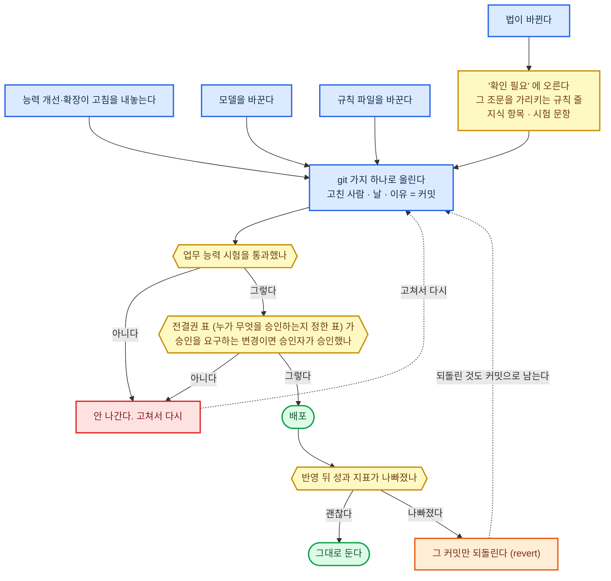
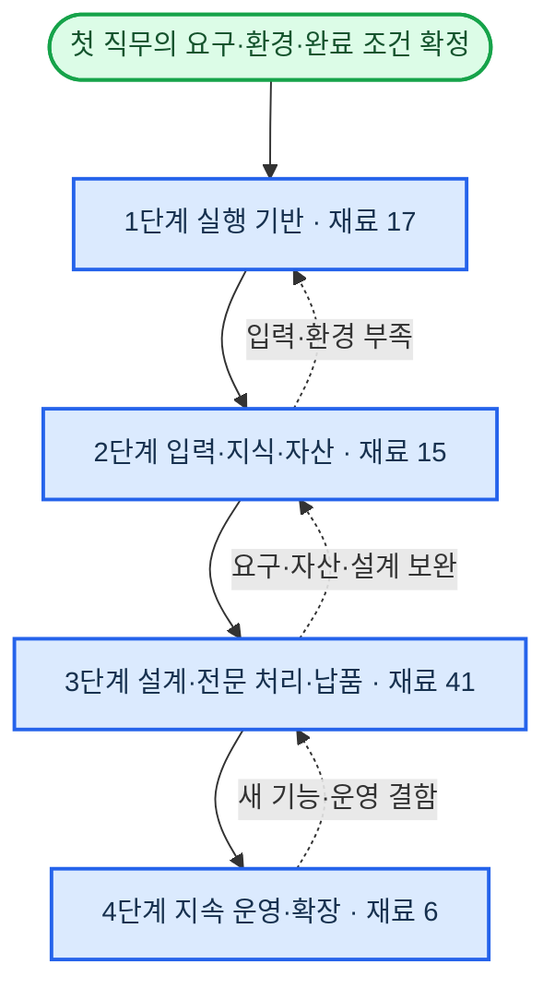
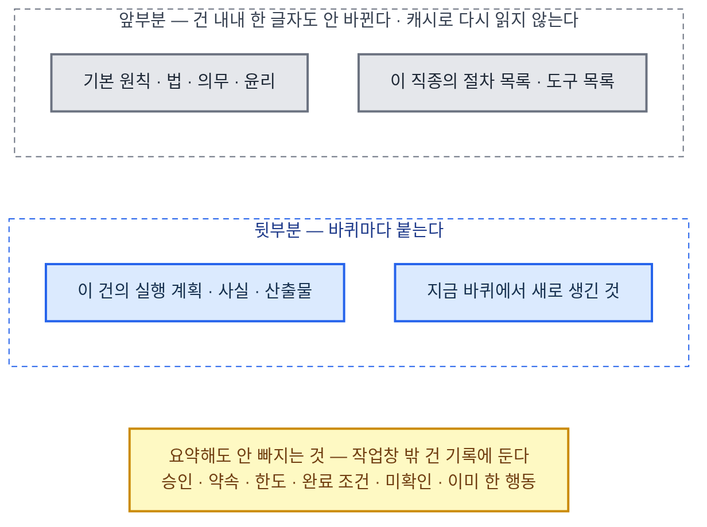
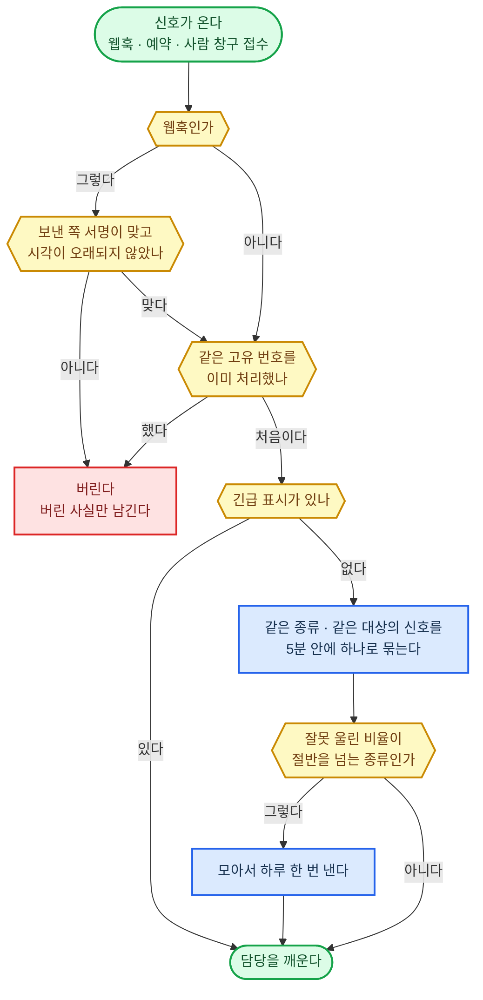
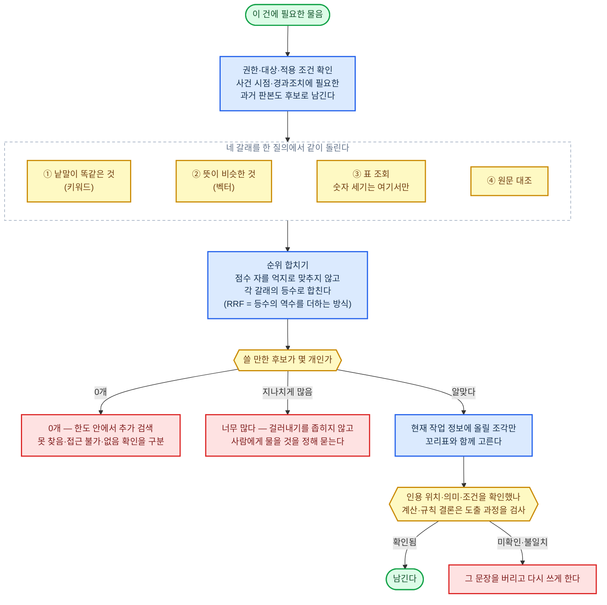
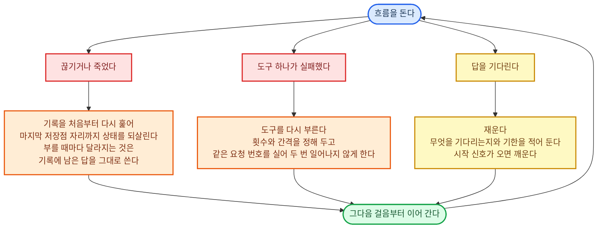
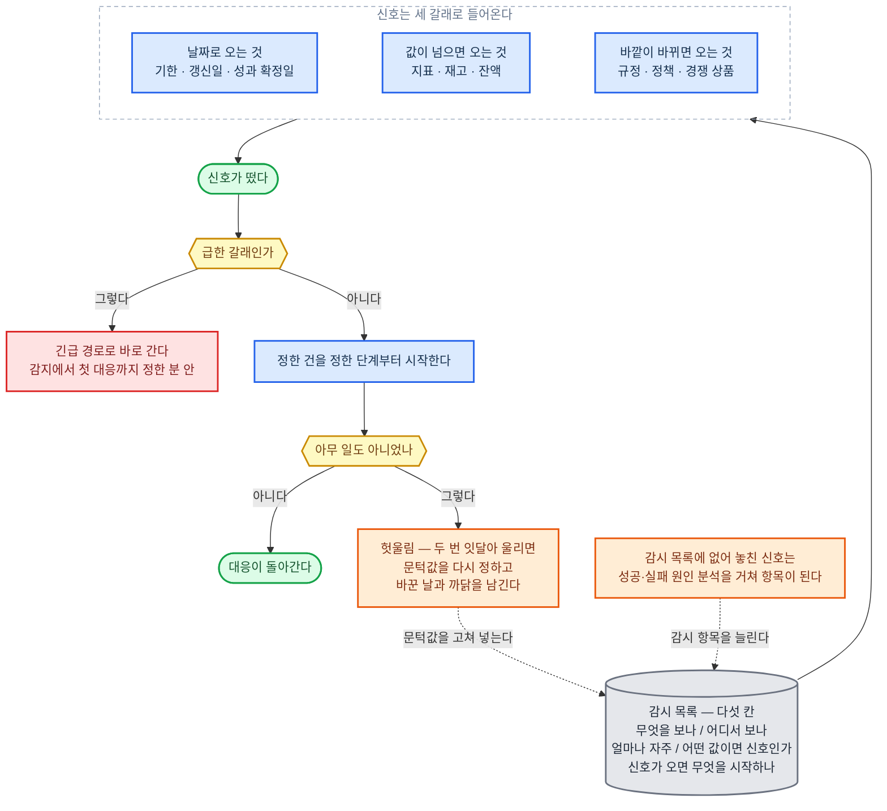
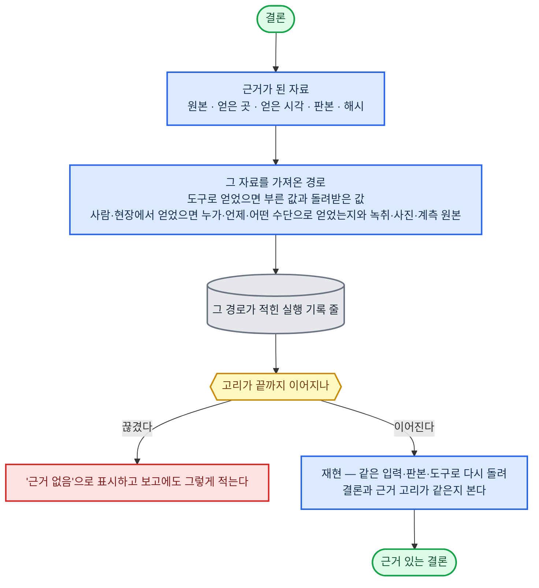
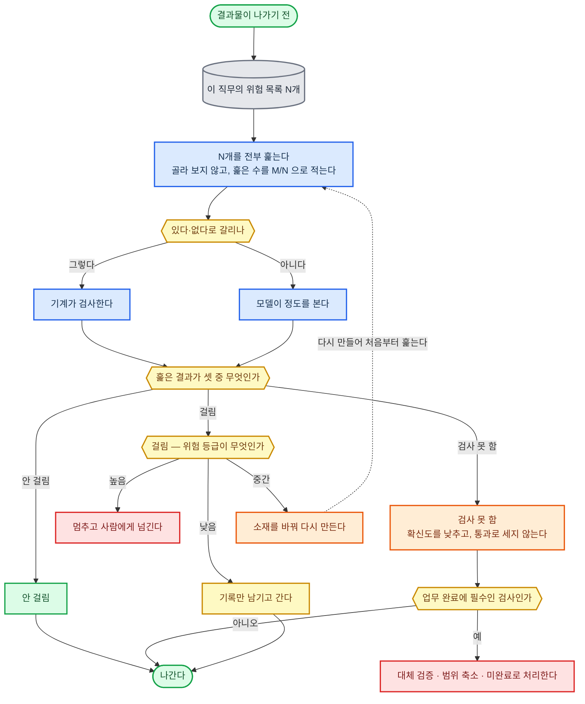
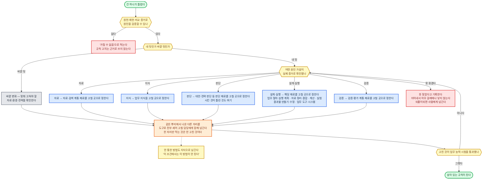

## 구성 원칙

---

### 공통으로 만들 것과 직종마다 채울 것

| 구분 | 들어가는 내용 | 예시 |
|---|---|---|
| 공통 기반 | 작업 실행·저장·검색·권한 확인·검증·배포, 중단 후 재개, 기록, 재료끼리 잇는 방식 | 답변을 기다리던 일을 기한에 맞춰 다시 확인하는 기능 |
| 직종별 구성 | 그 일의 전문 지식·판단 요령·사례·방법·도구·규정·완료 조건·시험 과제 | 번역 용어집, 회계 계산법, 설계 프로그램과 검사 기준 |
| 개별 업무 | 이번에 맡은 고객·목표·범위·자료·권한·기한·예산과 진행 상태 | 이번 계약의 수정 범위, 납기, 승인된 발송 대상 |

---

### 모든 재료가 주고받을 내용

| 정할 내용 | 들어갈 항목 |
|---|---|
| 시작 조건 | 업무 번호, 담당, 목적, 입력 자료와 그 판본, 먼저 끝나야 할 작업, 권한·한도 |
| 처리 방법 | 쓸 지식·규칙·도구, 바꿔도 되는 대상, 반복·중단 조건 |
| 돌려줄 결과 | 결과값·파일·외부 상태, 단위·형식, 근거, 불확실한 점 |
| 확인 방법 | 기대한 상태, 검사할 대상과 방법, 허용 오차, 확인 기록 |
| 실패·대기 처리 | 실패 이유, 이미 처리된 부분, 다음 담당, 확인 기한, 다시 시작할 조건 |

조건부 재료는 해당 여부를 확인하느라 다른 일까지 멈춰 세우지는 않는다.

---

## 기술과 관리 체계

### 기술을 고르는 기준

최신이라는 이유만으로 고르지 않고, 다섯 가지를 함께 본다.

- 필요한 기능
- 실제 업무로 해 본 시험
- 유지보수 상태
- 자료 보관 조건
- 운영 비용

시험 제공 기능(베타)은 지원 범위와 앞으로 바뀔 가능성까지 확인하고 따로 시험한다.

### 기본안을 고른 이유

기본안은 우리 업무의 여섯 조건에 맞춰 골랐다.

- 한국어 자료가 중심이다
- 법령 수십만 조각을 찾아야 한다
- 고객별로 격리해야 한다
- 되돌릴 수 없는 바깥 행동이 있다
- 긴 대기와 재개가 있다
- 삭제 요구에 대응해야 한다

| 기본안 | 고른 이유 |
|------|------|
| A. 실행 엔진 — Temporal 뼈대 안에서 LangGraph·함수 실행 | 되돌릴 수 없는 바깥 행동과 긴 대기가 있는 흐름은, 마지막으로 기록된 지점부터 이어서 실행된다는 보장이 필요하다 LangGraph는 끊긴 뒤 다시 이어 가면 단계를 처음부터 돌려 바깥 행동이 되풀이될 수 있어, 모델이 판단하는 안쪽 구간만 맡긴다 |
| B. 상태·기록·자료 카드는 PostgreSQL 하나 | 꼬리표·구간 판본·표 연결을 한 곳에서 처리하고, 운영할 부품 수를 줄인다 한 데이터베이스에 모았다가 무너진 사례의 규모(수 TB·수십억 행·초당 수만 건 쓰기)는 우리가 예상하는 규모보다 두 자릿수 이상 크다 |
| C. 검색은 OpenSearch 혼합 검색 RRF(낱말 검색과 의미 검색의 순위를 합치는 방식), 작은 구성은 pgvector와 비교 | 결정적 이유는 한국어 형태소 분석기(한국어 문장을 뜻 단위로 쪼개는 장치)를 공식으로 지원하느냐다. PostgreSQL은 이 기능을 기본으로 갖고 있지 않다 |
| D. 기계로 강제할 규칙은 OPA 번들(Rego로 적은 규칙 묶음) | 규칙 묶음에 판본을 붙여 배포하고, 서버가 보고하는 지금 적용 중인 판본과 대조할 수 있다 규칙마다 통과·차단 사례를 시험으로 함께 적어, 규칙 언어를 못 읽는 사람도 그 규칙이 무엇을 막는지 알 수 있게 한다 |
| E. 원본·결과물은 해시 창고(파일 내용으로 계산한 고유값인 해시로 파일을 찾는 저장소. S3 또는 사내 객체 저장소, Object Lock) | 파일 하나하나 단위로 보존·삭제·복구를 다룰 수 있다 git-LFS(Git에 큰 파일을 따로 담는 확장)는 파일 하나만 지울 수 없어 삭제 요구에 대응하지 못하고, PostgreSQL은 한 값이 1GB를 넘지 못해 납품본과 대화 원문을 담기에 좁다 |

### 자료와 코드의 보관

행 단위 보안 RLS(표의 행마다 누가 볼 수 있는지 막는 기능)는 관리자와 우회 권한을 가진 역할을 막지 못한다. 그래서 프로그램이 쓰는 실행 계정을 따로 두고, 강제 적용 설정과 우회 시험을 함께 한다.

Object Lock(정해 둔 파일 판본을 바꾸거나 지우지 못하게 막는 기능)의 규정 준수 모드는 보존 기간이 끝나기 전에 잠금을 풀 방법이 계정 삭제뿐이다. 그래서 보존 기간을 거는 일 자체를 되돌릴 수 없는 행동으로 다룬다.

삭제 요청이 오면 원본뿐 아니라 검색 색인·기억·캐시·평가 자료·백업과 그 복원본까지 찾아 지운다.

### 검색과 지식 관리

색인을 바꿀 때는 검사를 마친 뒤에 전환하고, 전환하거나 되돌리는 중에도 철회·삭제 상태는 그대로 지킨다.

### 구현 폴더와 기록의 구성

주인을 모르는 채 남은 파일을 아무 고객 기록에나 붙여 되살리지 않는다.

### 변경·배포·복구

**배포 구성표**에는 코드·모델·지식·규칙·도구·데이터 구조·평가 기준의 판본과 검사 증거를 함께 묶고, 실제 실행기는 이 구성표대로 돈다. 운영 판본이 개발 중인 최신 Git 커밋과 다르다는 이유만으로 장애라고 판단하지 않는다.

데이터 구조나 실행 흐름을 바꿀 때는 대기 중인 업무를 어떻게 할지 정하고 시험한다. 이전 판본으로 끝낼지, 상태를 변환해 새 판본으로 옮길지, 중단하고 넘길지다. 되돌릴 때는 코드뿐 아니라 상태·규칙·색인·외부 처리가 서로 맞는지도 확인한다.

민감한 원문은 필요 이상으로 모으지 않는다.

### 규모와 비용을 정하는 방법

필요한 규모는 직종 수보다 자료량·동시 업무·도구 실행·보존 기간에 달려 있다. 그래서 서버 대수나 분리 기준이 되는 직종 수를 미리 정해 두지 않고, 아래 측정을 거쳐 서버·저장소·예산을 정한다.

| 측정 대상 | 함께 잴 내용 | 설계에 넣을 것 |
|---|---|---|
| 모델 호출 | 입력·출력·추론·캐시 저장과 재사용·재시도 | 업무당 총비용, 호출 한도, 모델 배치 |
| 자료·검색 | 원본·파생물 크기, 판본 증가, 한국어 검색 품질·지연 | 저장량, 색인 구성, 갱신 주기 |
| 전문 도구 | 메모리·GPU·실행 시간·라이선스·부분 실패 | 작업별 자원, 대기열, 동시 처리 수 |
| 운영 | 최고 부하, 긴 대기, 백업·복원, 장애 중 처리, 데이터베이스 청소 작업 소요 시간·최대 표 크기·초당 쓰기 건수 | 복제·백업, 복구 시간, 수신 보존, 여유 자원 청소 작업 시간·표 크기·쓰기 건수가 기준선을 넘으면 계속 쌓이는 기록 표를 따로 떼어 낸다 |
| 검증과 사람 작업 | 검사·수정·승인·전문 지원·운영 유지 시간 | 실제 대체율과 전체 운영 비용 |

업무당 비용은 **모델 + 도구 + 검색·저장 + 검증·재시도 + 복구 + 사람 작업 + 초기 구축비의 배분**으로 계산한다. 평균뿐 아니라 비용이 큰 업무와 지연이 긴 업무도 보고한다. 목표 수치는 측정 전에 정해 두고 실측 결과와 나란히 비교한다.

### 구현 구조 — 파일·폴더와 저장 자리

재료 79개를 놓는 자리는 셋이다.

> **사람이 손으로 고치는 것은 파일 (git), 기계가 받아 쌓는 것은 표 (데이터베이스), 한 글자도 고치면 안 되는 것 (받은 원본과 낸 결과물) 은 해시 창고에 둔다.**

---

### 왜 파일이 아니라 표인가

법령·자치법규는 현행만 16만 건이 넘고, 조·항·호 단위로 쪼개면 그 수십 배가 된다. 이만큼을 폴더의 파일로 두면 거르기, 판본 관리, 저장소 크기에서 막힌다.

| 파일로 두면 | 표로 두면 |
|------|------|
| 파일 이름에 꼬리표 열 개를 담을 수 없어, 관할·효력일·낡음 여부로 거르려면 파일을 모두 열어 봐야 한다 | 꼬리표 칸마다 색인이 있어 먼저 거르고 남은 것만 읽는다 |
| 옛 판본을 나란히 두면 파일 수가 판본 수만큼 늘고, 건의 기준일에 맞는 판본을 골라 주는 기능도 없다 | 판본은 같은 표의 줄 하나이고, 효력 구간 칸으로 건의 기준일에 맞는 판본을 고른다 |
| 저장소 하나는 1 GB 아래로 두고 5 GB 를 넘기지 않는다. 조각 수백만 장은 이 한도를 넘는다 | 표 줄 수백만은 데이터베이스의 보통 크기다 |
| 원문이 바뀌었는지는 사람이 diff(두 판본의 차이를 보여 주는 화면) 를 봐야 안다 | 변경 감시·반영이 줄 단위로 견주어 바뀐 곳 목록을 표에 쌓는다 |

---

### 세 자리

| 자리 | 무엇이 가나 | 왜 여기인가 |
|------|------|------|
| ① git 저장소 | 사람 전문가·운영자가 읽고 고치고 승인하는 것 직무 정의, 지식, 규칙, 판단 기준·절차, 시험지, 코드, 모델 고른 것 | 고친 사람·날·이유가 커밋으로 남고, 업무 능력 시험이 커밋마다 돈다 파일 수는 직종 166 × 재료 수십 = 수천 장, git 이 편한 크기다 능력 개선·확장이 내놓는 고침도 사람 것과 같은 길 (가지 → 시험 → 합치기) 을 탄다 |
| ② 표 | 기계가 받아 오고 기계가 쌓는 것 자료 카드 여섯 종, 건, 신호, 실행 기록, 저장점, 기억, 만남, 확인표, 사례, 성과 | 꼬리표로 거르기, 효력 구간으로 판본 고르기, 표끼리 잇기는 데이터베이스가 맡는다. |
| ③ 해시 창고 | 받은 그대로의 원본 (법령 XML, 정책 PDF, 계약서, 증거, 스캔·녹취), 낸 결과물 (보고서·그림·영상, 낸 순간 고정), 만남의 녹취·대화 원문, 견본 파일 | 판단 근거 기록을 하려면 덮어쓰기도 지우기도 안 되는 저장이어야 한다 내용 해시가 이름이면 같은 것은 한 번만 저장되고, 바뀌었는지는 해시로 안다. |

---

### git 저장소 폴더

| 규약 | 정한 것 |
|------|------|
| 상속 | 모든 직종의 기본값 → 분야 공통값 → 직종 → 건마다 정한 값 순으로 덮는다. 겸업 직종은 분야를 둘 이상 적고, 같은 칸이 부딪히면 앞에 적은 분야가 이긴다 그래서 변호사 7종이 법령 목록을 일곱 번 적지 않는다 |
| 직종 하나 더하기 | 필수 재료가 없으면 미구현이며, 해당 없음은 제외 이유가 있어야 한다 |
| 판본 | 커밋이 판본이다. 옛 판본은 지우지 않는다 (지난 건은 그때 쓴 판본으로 다시 본다) |
| 규칙은 한 곳 | 규칙 줄은 규칙 폴더에만 있다. 직무 설정은 어느 묶음을 쓰는지 가리키기만 한다. 두 곳에 있으면 어느 쪽이 맞는지 아무도 모른다 |
| 고객 자료 금지 | 사례와 시험 문제에는 비밀 검사를 통과한 것만 들어간다. 실제 고객 이름·번호가 든 파일은 커밋 전 검사에서 막는다 |

---

### 표 설계

**모든 표에 공통인 칸 셋**

| 칸 | 왜 두나 |
|------|------|
| 회사 · 고객 | 줄 단위 격리의 열쇠다. 실행 계정은 자기 회사·자기 건의 고객 줄만 본다. 코드가 걸러내기를 잊어도 데이터베이스가 막는다 |
| 언제부터 | 값은 고치지 않고 새 줄을 덧붙인다. "그때 알던 것" 으로 되돌아가려면 이 칸으로 자른다 |
| 고객 열쇠 번호 | 고객 개인정보가 든 줄과 원본은 고객마다 다른 열쇠로 암호화한다 |

**표 목록**

| 표 | 장치 |
|------|------|
| 고리 | 해석 카드가 가리키는 것 (원문 카드 · 공식 결정·제재 카드 · 실험 기록) 이 셋 다 비면 넣지 못한다 |
| 시계열 · 통계 | 숫자 세는 일은 여기서만 (검색 아님) |
| 건 | 일꾼 여럿이 한 건을 두 번 안 집는다 묶음 번호로 여러 건의 손익을 묶음으로 잰다 |
| 신호 | 건이 되지 못한 신호도 여기 남는다. |
| 실행 기록 | 덧붙이기만. UPDATE·DELETE 권한을 실행 계정에서 뺀다 보존 기간이 지난 달은 통째로 떼어 낸다 재현 = 이 표와 저장점을 순서대로 다시 읽는 것 |
| 저장점 | 단계마다 한 줄. 되돌아가면 뒤 단계 줄에 버림 표시만 단다 |
| 조각 대장 | "안 거둔 조각 0" 을 이 표에서 센다 |
| 만남 | 실시간 대화의 초 단위 대화도 끝나면 여기 한 줄로 접는다 |
| 확인표 | "기대값 시각이 행동 시각보다 앞선 비율" 을 여기서 센다. 그림·영상의 권리 확인 근거도 한 줄이다 |
| 채점 | 만든 쪽과 채점한 쪽이 같으면 넣지 못한다 (제약) |
| 쓴 기록 | 절차별 마지막 쓴 날·잘된 비율, 감각 줄의 적중률이 여기서 나온다 |
| 확인 필요 | 지식·규칙·절차·시험 문항의 낡음을 한 표에서 본다 |
| 장기 기억 | 덧붙이기만 |
| 현재 진행 상태 | 건이 끝나면 남길 것을 장기 기억으로 옮기고, 정한 기간 뒤 지운다 |
| 상황판 | 한 장. 건 표에서 뽑아 만드는 파생물이다 |
| 사례 · 실패 원인 | 비밀 검사 못 넘으면 넣기 자체가 막힌다 (제약) |

**OpenSearch 색인 — 표의 파생물**

| 기준 | 정한 것 |
|------|------|
| 무엇을 넣나 | 자료 카드의 원문과 꼬리표. 원본은 표에 있으니 색인은 언제든 다시 만든다 |
| 걸러내기 칸 | 관할·효력일·폐지일·판본·건·낡음 표로 먼저 거른다. 회사·고객 거르기는 검색 코드가 아니라 검색 처리 단계에 박아 두어 빠뜨릴 수 없게 한다 |
| 뜻 | k-NN(뜻이 가까운 조각을 찾는 방식) 벡터 칸은 효력 중인 판본에만 둔다. 옛 판본은 낱말 검색만 된다. 벡터는 메모리를 먹는데 옛 판본까지 다 넣으면 수백만 개다 하루 한 번 새 색인을 만들고 별칭을 옮긴다. 벡터 모델을 바꿔도 같은 길이다 검색 문제가 떨어지면 별칭을 옛 색인으로 되돌린다. |

---

### 해시 창고

| 기준 | 정한 것 |
|------|------|
| 못 고침 | S3 Object Lock 의 compliance 모드 (루트 계정도 덮어쓰거나 지울 수 없다) 를 기본안으로 둔다. 사내 저장이 필요하면 조직이 운영·지원할 수 있는 제품의 같은 기능을 시험해 고른다 보존 기간은 법정 보존 기간을 그대로 건다 |
| 두 칸 | 공개 원본 (법령·공시·표준) 은 그대로 넣고 모든 고객이 같이 쓴다 고객 원본 (계약서·증거·녹취·개인정보) 은 그 고객 열쇠로 암호화해 넣는다. 그래서 고객 사이에는 중복 제거가 안 되고, 그것이 맞다 |
| 삭제 요구 | 지우기 대신 열쇠를 파기한다 (암호화 지우기). 파일은 남지만 아무도 못 읽는다. 법정 보존 기간이 남은 것은 파기하지 않고 요구와 이유를 남긴다 |
| 곁에 두는 것 | 원본 옆에 얻은 곳·얻은 시각·판본·해시를 적은 쪽지를 둔다 남이 믿어야 하는 시각은 시각 도장을 함께 둔다 |
| 쓰는 순서 | 창고에 먼저 넣고, 그 다음에 카드·결과물 줄을 쓴다. 이렇게 하면 표가 가리키는 해시가 창고에 없는 일이 안 생긴다. 거꾸로 창고에만 있고 표에 없는 것은 하루 한 번 대조해 카드를 다시 만든다 |
| 누가 읽나 | 카드·결과물·만남은 해시를 가리킨다. 판단 근거 기록은 표 → 해시 → 원본으로 되짚는다 |

---

### 속도

| 자리 | 장치 | 안 하면 |
|------|------|------|
| 현재 작업 정보의 앞부분 | 배포 때 규칙·상시 지식·판단 기준을 직종마다 미리 묶고 해시를 붙인다. 같은 앞부분은 캐시로 싸게 다시 읽는다 | 건마다 파일 수십 장을 다시 읽고 붙인다 |
| 초 단위 자리 | 실시간 대화는 말 한 마디마다 검색하지 않는다. 만남 전에 그 건의 카드·쪽지를 현재 진행 상태에 미리 담고, 만남 중에는 그것만 본다 | 한 마디마다 색인을 돌아 지연 한도를 못 지킨다 |
| 실행 기록 | 달 파티션. 최근 달만 뜨겁다 | 몇 년치 기록에서 한 건을 찾는다 |
| 같은 요청 두 번 | 조각 위치 + 판본 유일 색인, 신호 멱등 키(같은 요청이 두 번 와도 한 번만 처리되게 붙이는 번호), 도구 멱등 키 | 카드·건·주문이 두 개 생긴다 |

---

### 규칙이 바뀌고 실제로 먹히기까지

| 자리 | 정한 것 | 왜 그렇게 정했나 |
|------|------|------|
| 커밋에서 실제로 막히기까지 | 60초 안 | 굽기 10초 + 받기 최대 30초 + 적용 여유 20초 |
| 넘었을 때 | 그 직종의 대외 행위를 멈춘다 | 옛 규칙으로 나가는 것이 늦는 것보다 나쁘다 |

---

### 보관 기간과 지우기

| 자료 종류 | 뜨거운 보관 (바로 읽는 표) | 차가운 보관 (싼 저장소) | 아주 지우는 조건 |
|------|------|------|------|
| 원본 (해시 창고) | 법정 보존 기간 동안 | 공개 원본은 그 뒤로도 계속 | 공개 원본은 안 지운다. 고객 원본은 법정 보존 기간(잠금 기간)이 끝나면 지운다. 고객 삭제 요구는 열쇠 파기 |
| 실행 기록 · 저장점 | 최근 3개월 | 3개월~5년 | 5년 뒤 지운다. 둘은 재현의 짝이라 기간을 같이 쓴다 |
| 저장점 밖 신호 | 최근 3개월 | 3개월~1년 | 1년 뒤 지운다. 건이 된 신호는 그 건을 따라간다 |
| 현재 진행 상태 | 건이 진행 중인 동안 | 없음 | 건이 끝나고 30일 뒤 지운다. 남길 것은 그 전에 장기 기억으로 옮긴다 |
| 장기 기억 | 거래가 살아 있는 동안 | 끝난 뒤 5년 | 5년 뒤 지운다. 고객 삭제 요구는 열쇠 파기 |
| 시계열 · 통계 | 최근 3개월 | 3개월~2년 | 2년 뒤 지운다. 결정에 쓴 값은 확인표에 남아 재현된다 |
| 검색 색인 | 효력 중인 판본 (낱말 + 뜻) | 옛 판본은 낱말만 | 언제든 통째로 지운다. 표에서 다시 만든다 |
| 자료 카드 · 판본 | 효력 중인 판본 | 폐지된 판본 | 안 지운다 |

법정 보존 기간이 정해진 직종 (세무·의료 같은 것) 은 그 기간이 위 표를 덮는다.

---

### 세 자리가 어긋났을 때

| 어긋난 자리 | 어떻게 아나 | 기계가 하는 것 | 운영자가 하는 것 | 그 직종은 멈추나 |
|------|------|------|------|------|
| 표 ↔ 해시 창고 대조에서 끊긴 해시가 나왔다 | 하루 한 번 도는 표 → 창고 대조 | 적어 둔 곳에서 원본을 다시 받아 해시를 센다 같으면 창고에 넣고 끝낸다 | 해시가 다를 때만 넘어온다 원본이 바뀐 것인지 우리가 잘못 받은 것인지 가른다 | 안 멈춘다 그 카드 하나만 낡음 표를 달고 못 쓴다 |
| 배포 구성표와 OPA 의 규칙 판본이 다르다 | OPA 가 알리는 적용 중인 판본이 배포 구성표의 규칙 판본과 60초 넘게 다르다 | 번들을 다시 굽고 OPA 가 받는다. 세 번까지 다시 해 본다 | 세 번 다 안 맞으면 넘어온다 번들 굽는 자리와 받는 길을 본다 | 멈춘다 |
| 표가 깨졌다 | 데이터베이스가 오류를 내거나, 대조에서 있어야 할 줄이 사라졌다 | 그 직종을 멈추고 시점 복구를 건다 복구 뒤 표 → 창고 대조와 색인 다시 만들기를 돌린다 | 어느 시점으로 되돌릴지 정한다 되돌리며 사라진 건을 받은 신호에서 다시 만들지 정한다 | 멈춘다 끊긴 해시가 0 이면 다시 켜고, 0 이 아니면 그 카드만 빼고 켠다 |

멈춘 동안 들어온 신호는 쌓아 두었다가 다시 켠 뒤 순서대로 건이 된다.

---

### 관리·유지보수

바뀌는 것이 들어오는 문은 넷이지만, 나가는 길은 하나다.

```mermaid
%%{init: {"flowchart": {"wrappingWidth": 640, "curve": "basis", "nodeSpacing": 45, "rankSpacing": 55, "padding": 14, "useMaxWidth": true}, "themeVariables": {"fontSize": "15px"}} }%%
flowchart TB
    C1["법이 바뀐다"]:::main
    C2["능력 개선·확장이 고침을 내놓는다"]:::main
    C3["모델을 바꾼다"]:::main
    C4["규칙 파일을 바꾼다"]:::main
    F["'확인 필요' 에 오른다<br/>그 조문을 가리키는 규칙 줄<br/>지식 항목 · 시험 문항"]:::note
    G["git 가지 하나로 올린다<br/>고친 사람 · 날 · 이유 = 커밋"]:::main
    T{{"업무 능력 시험을 통과했나"}}:::note
    A{{"전결권 표 (누가 무엇을 승인하는지 정한 표) 가<br/>승인을 요구하는 변경이면 승인자가 승인했나"}}:::note
    B["안 나간다. 고쳐서 다시"]:::stop
    D(["배포"]):::good
    W{{"반영 뒤 성과 지표가 나빠졌나"}}:::note
    R["그 커밋만 되돌린다 (revert)"]:::back
    OK(["그대로 둔다"]):::good
    B -. "고쳐서 다시" .-> G
    R -. "되돌린 것도 커밋으로 남는다" .-> G
    C1 --> F
    F --> G
    C2 --> G
    C3 --> G
    C4 --> G
    G --> T
    A -- "아니다" --> B
    T -- "아니다" --> B
    T -- "그렇다" --> A
    A -- "그렇다" --> D
    D --> W
    W -- "괜찮다" --> OK
    W -- "나빠졌다" --> R
    T ~~~ W
    classDef main fill:#dbeafe,stroke:#2563eb,stroke-width:2px,color:#17314f
    classDef stop fill:#fee2e2,stroke:#dc2626,stroke-width:2px,color:#7f1d1d
    classDef back fill:#ffedd5,stroke:#ea580c,stroke-width:2px,color:#7c2d12
    classDef store fill:#e5e7eb,stroke:#6b7280,stroke-width:2px,color:#1f2937
    classDef good fill:#dcfce7,stroke:#16a34a,stroke-width:2px,color:#14532d
    classDef note fill:#fef9c3,stroke:#ca8a04,stroke-width:2px,color:#713f12
```

| 어떤 일 | 어떻게 하나 |
|------|------|
| 백업·복구 | 표는 데이터베이스 백업 (시점 복구), 창고도 Object Lock 과 따로 백업한다 git 은 원격에 있다 |
| 옮기기·설치 | 엔진을 바꿔도 표와 창고는 그대로다 다섯 부품 (git·PostgreSQL·OpenSearch·객체 저장·OPA) 전부 회사 안에 설치할 수 있어 바깥에 못 내보내는 자료도 다룬다 |
| 새 재료가 생기면 | 기존 책임에 넣을 수 없는지 먼저 본다 |
| 규칙 파일을 바꾼다 | 규칙은 git 에서만 고친다. 돌고 있는 번들이나 데이터베이스를 직접 고치는 길은 막아 둔다 |

---

### 더러운 상황 시뮬레이션

| 상황 | 무엇이 벌어지나 | 받아내는 장치 |
|------|------|------|
| 조·항·호로 나뉘지 않는 외국 법을 받는다 | 조각 위치 칸이 한국식이면 못 담는다 | 조각 위치는 관할 + 그 나라 구조대로 적은 경로다. 관할 부호가 어느 나라 구조인지 정한다 |
| 자치법규 16만 건이 243개 지자체에 걸쳐 있고, 건은 "서울 강남구" 다 | 나라 법·서울시 조례·강남구 규칙을 다 봐야 한다 | 관할이 계층 부호 (나라 > 광역 > 기초) 라 걸러내기가 위 계층까지 한 번에 잡는다 |
| 같은 계약서 파일을 고객 A 와 B 가 따로 보냈다 | 해시가 같아 한 파일로 합쳐지고, A 의 삭제 요구가 B 것까지 없앤다 | 고객 원본은 고객 열쇠로 암호화하니 해시가 다르다. 중복 제거는 공개 원본만 |
| 법령 조회 창구가 하루 죽거나 XML 형식이 바뀐다 | 변경 감시·반영이 빈 값·깨진 값을 쌓을 수 있다 | 창고에 먼저 넣고 쪼갠다. 쪼개기가 실패하면 카드는 안 생기고 원본만 남아 다음 날 다시 쪼갠다. 옛 카드는 지우지 않으니 빈 날이 나지 않는다 |
| 웹소설 연재 300화, 설정과 복선을 100화 전 것까지 기억해야 한다 | 장기 기억 표에 안 맞는 모양이다 | 장기 기억에 설정집·복선·독자 약속 표를 따로 둔다. |
| 그림 생성에 남의 얼굴이 들어갔는지 나중에 따진다 | 만들기 전에 확인한 근거가 없다 | 만들기 전에 권리 확인 한 줄 (닿은 곳·읽은 값·결과) 을 확인표에 적는다. 원본과 고친 단계는 창고에 장마다 |

---

### 됐다는 기준

| 잣대 | 어떻게 재나 |
|------|------|
| 표에서 색인을 다시 만들 수 있는가 | 색인을 지우고 표에서 다시 만든 뒤 검색 문제 100개의 점수가 같은지 본다 |
| 원본이 안 바뀌는가 | 해시 창고의 무작위 20개를 다시 해시해 이름과 같은지 본다 |
| 판본 고르기가 빠른가 | 기준일을 바꿔 가며 1,000번 조회해 색인을 탔는지 (실행 계획) 본다 |
| 격리가 되는가 | 고객 A 계정으로 고객 B 의 카드·건·결과물을 표와 색인 양쪽에서 조회해 0 건인지 본다 |
| 삭제 요구가 되는가 | 시험 고객의 열쇠를 파기하고 사본을 지운 뒤 그 고객 원본과 줄이 읽히지 않고, 검색 색인·캐시·기억에서도 찾히지 않으며, 공개 원본은 그대로인지 본다 |
| 재현이 되는가 | 지난 건 하나를 그때 커밋·판본·원본으로 다시 돌려 결론이 같은지 본다 |

---

## 공장 설계

공장은 새 직종의 요구를 받아 공통 기반과 특화를 잇고 검사·시험·배포·변경 넣기까지 되풀이하는 절차다. 파일을 자동으로 찍어 낸다고 공장이 다 된 것은 아니다.

---

### 공장에 넣을 내용

| 입력 | 구체적으로 채울 것 |
|---|---|
| 업무 범위 | 직종·세부 업무·대상·난도·관할·운영 환경, 맡을 일과 뺄 일 |
| 전문성 | 개념·방법·단위·전제·예외·사례·판단 갈림·치명적 오류 |
| 자료·도구 | 실제 입력 형식, 원천 접근, 전문 프로그램·계정·권한·이용 조건 |
| 규칙 | 의무·계약·조직·사용자 조건, 승인·위임·한도·자료 경계 |
| 완료·평가 | 단계별 검사·인수·성과, 대표 과제·새 과제·비교 전문가·채점 방법 |
| 운영 | 담당·기한·예산·감시·복구·보존·갱신·종료 조건 |

---

### 조립부터 배포까지

| 순서 | 할 일 | 남길 결과 |
|---|---|---|
| 1. 적용 재료 고르기 | 79개 재료의 필요 여부와 조건을 업무 요구에 대조 | 필요한 재료·조건부 재료·제외 이유 |
| 2. 공통부와 특화 연결 | 기존 지식·코드·도구를 재사용하고 직종별 값을 채움 | 적용 출처·판본, 새로 필요한 기능 |
| 3. 빠진 연결 검사 | 요구→입력→판단→처리→검사→인수의 담당 확인 | 누락·미지원·미검증 목록과 보완 담당 |
| 4. 충돌 검사 | 권한·규칙·단위·판본·자원·선후 관계를 대조 | 해결된 충돌과 아직 막힌 경로 |
| 5. 시험용 조립 | 분리된 환경에서 실제 입력·도구·실패 조건으로 실행 | 연결·복구·기존 업무 재시험 결과 |
| 6. 직무 능력 평가 | 처음 보는 과제와 숙련 전문가 비교 | 지원할 업무 범위와 증거·제약 |
| 7. 배포·관찰 | 합격한 구성표로 제한된 범위부터 운영 | 배포 판본, 관찰 결과, 확대·중지 판단 |
| 8. 변경 반영 | 바뀐 공통부·규정·자료·도구의 영향을 추적 | 재조립·재시험 대상과 새 배포 기록 |

적용 조건을 가리는 조회·진단 도구는 조립과 따로 먼저 준비한다. 조건과 진단이 서로 기다리는 곳이 없는지도 조립 검사에서 찾는다.

---

### 공장이 됐다고 볼 기준

요구가 서로 다른 여러 직종을 같은 절차로 조립한다. 문서·계산·외부 거래·상시 운영처럼 큰 차이가 드러나도록 시험 직종을 고른다. 새 직종에 더 든 일감과 시간, 공통부 재사용 정도, 기존 직종이 받은 영향을 적는다.

새 직종마다 실행 기반을 통째로 다시 만들어야 하면 공장 시험 실패다. 꼭 필요한 도구나 평가가 빠졌는데 조립을 끝냈다고 처리해도 실패다. 다시 쓸 수 없는 전문 도구를 새로 잇는 것은 되지만, 그 비용과 시험을 숨기지 않는다.

---

## 만드는 순서

| 순서 | 작업 | 다음으로 넘어갈 조건 |
|---|---|---|
| 1. 확정된 정의 연결 | 정의 1의 목표·흐름·재료를 요구와 검사에 연결 | 79개 재료의 책임·입출력·예외·후속 담당에 빠진 것이 없음 |
| 2. 설계 검토 | 재료 구상·사용 구조·기술·저장·공장 절차를 대조 | 모순·미정 사항과 결정할 근거가 정리됨 |
| 3. 실제 연결·핵심 가정 확인 | 자료·계정·이용 조건 확보, 중요한 도구·복구·파일 기능을 작은 시험으로 확인 | 구현을 막을 의존과 필요한 추가 작업이 드러남 |
| 4. 평가 준비 | 비교 전문가·채점자·표본·기간·예산 확보, 개발 자료와 새 평가 자료 분리 | 시험 전에 합격선·비교 조건·채점 신뢰성을 확인함 |
| 5. 공통 기반 개발 | 실행·저장·신호·권한·한도·기록·복구 구현 | 함수·AI 혼합, 병렬 일부 실패, 중단·재개가 연결됨 |
| 6. 단일 업무 완주 | 시험용 직무의 입력·지식·처리·검증·납품 연결 | 실제 한 건이 필요한 전문 처리와 인수까지 이어짐 |
| 7. 복합·안전·모델 교체 시험 | 협업·여러 건·공유 예산·공격·교체·실패 조합 확인 | 경계와 필수 검사가 유지되고 실패·비용이 기록됨 |
| 8. 사내 연동·성능·판본 변경 시험 | 실제 시스템의 처리·복구·부하와 데이터 구조·규칙·흐름 변경을 시험 | 목표한 품질·속도·비용을 채우고 대기 건의 옮기기·넘기기·되돌림을 확인함 |
| 9. 공장 구현·시험 | 특화 입력부터 검사·조립·배포·갱신 자동화 | 다른 직종도 같은 절차로 만들고 기존 직종을 보호함 |
| 10. 직종별 제작 | 우선순위를 정하고 실제 업무 조사·특화·전문 도구·사용 형태 완성 | 그 직종의 자료·판단·실행·검사·인수 경로를 갖춤 |
| 11. 대체 증명 | 같은 조건에서 숙련 전문가와 비교 | 사전에 정한 품질·자율성·비용·기한·성과 기준 충족 |
| 12. 배포 준비·초기 운영 | 자료·진행 건 이전, 담당·복구·되돌림 확인, 제한 운영 | 실제 환경의 관찰 결과로 운영 확대 여부를 결정함 |
| 13. 지속 운영·종료 | 감시·갱신·재시험·성과 개선, 종료·인계·삭제 | 중단·변경·서비스 종료 때도 남은 업무와 자료 책임이 이어짐 |

자료 확보·전문가 섭외·평가 준비·핵심 연결 확인은 설계와 같이 굴린다. 시험 과제에 필요한 직무 조사도 앞당긴다.

공통 기반을 검증할 **시험용 직무**와 판매·운영할 **첫 직종**은 구분한다. 공통 구조는 전체 요구에서 설계하고, 시험용 직무는 그 구조를 확인하는 데 쓴다. 첫 직종은 아래 증거에 더해 얻을 것과 위험까지 따져 고른다.

---

### 첫 직종 고르기

한 직무에서 맡은 범위를 좁게 잡고 자료·도구·판단·제작·인수·성과 증거를 끝까지 잇는다. 예시가 많은 세무사 신고·기장을 첫 후보로 두되, 공개 통계나 아무렇게나 매긴 점수만으로 잘 골랐다고 하지 않는다.

| 선정에 필요한 증거 | 확인할 내용 |
|---|---|
| 실제 업무 접근 | 비식별 원자료·전문 도구·기관 환경·외부 수행 결과를 합법적으로 확보할 수 있는가 |
| 적합한 기준선 | 그 난도에 맞는 숙련 전문가·팀이 실제로 일한 것과 같은 조건에서 견줄 수 있는가 업계 평균 통계는 곁들이는 자료다 |
| 결과 판정 | 서류가 정확한지만이 아니라 사실·해석·선택·실행·뒤따르는 결과까지 검증할 수 있는가 사람 전문가의 평가도 있어야 할 증거다 |
| 시험 가능성 | 실제 피해를 막아 둔 시험·복구·전문가 감독을 설계할 수 있는가 고칠 절차가 있다고 해서 손해가 없다는 뜻으로 읽지 않는다 |
| 자료·표본 설계 | 그 직무의 계절 차이·난도·드문 사건·상관·결과가 늦게 나오는 점에 맞는 표본을 구할 수 있는가 |
| 필수 외부 의존 | 실사·실측·진료·촬영·자격 행위가 필요하면 그 조건·비용·사람이 한 몫을 셀 수 있는가 |

관세, 취약점 관리, QA 같은 후보도 이 증거를 갖춘 뒤 고른다. 어려운 직무를 영영 빼거나, 쉬운 직무의 성적을 나머지 직종에 옮겨 붙이지 않는다. 시험 범위는 그 직무의 실제 입력과 실패로 칠 기준으로 좁혀 정한다.

---

### 재료 79개를 채우는 순서

그 직무에 꼭 필요한 기능은 첫 업무 시험 전에 갖춘다. 실시간 대화·변경 감시·반영·협업이 처음부터 필요하면 4단계까지 기다리지 않고 앞당긴다.

```mermaid
%%{init: {"flowchart": {"wrappingWidth": 640, "curve": "basis", "nodeSpacing": 45, "rankSpacing": 55, "padding": 14, "useMaxWidth": true}, "themeVariables": {"fontSize": "15px"}} }%%
flowchart TB
    S(["첫 직무의 요구·환경·완료 조건 확정"]):::good
    A1["1단계 실행 기반 · 재료 17"]:::main
    A2["2단계 입력·지식·자산 · 재료 15"]:::main
    A3["3단계 설계·전문 처리·납품 · 재료 41"]:::main
    A4["4단계 지속 운영·확장 · 재료 6"]:::main
    S --> A1 --> A2 --> A3 --> A4
    A2 -. "입력·환경 부족" .-> A1
    A3 -. "요구·자산·설계 보완" .-> A2
    A4 -. "새 기능·운영 결함" .-> A3
    classDef main fill:#dbeafe,stroke:#2563eb,stroke-width:2px,color:#17314f
    classDef stop fill:#fee2e2,stroke:#dc2626,stroke-width:2px,color:#7f1d1d
    classDef back fill:#ffedd5,stroke:#ea580c,stroke-width:2px,color:#7c2d12
    classDef store fill:#e5e7eb,stroke:#6b7280,stroke-width:2px,color:#1f2937
    classDef good fill:#dcfce7,stroke:#16a34a,stroke-width:2px,color:#14532d
    classDef note fill:#fef9c3,stroke:#ca8a04,stroke-width:2px,color:#713f12
```

| 단계 | 재료 | 관문 |
|---|---|---|
| **1단계 실행 기반 · 17개** | 운영 감시·복구 AI 모델 실행 제어 현재 진행 상태 현재 작업 정보 시작 신호 분리 실행 업무 도구·시스템 시험 환경 에이전트 기본 원칙 업무 권한 안전장치 비용·위험 한도 결과 검증·재검증 판단 근거 기록 보고 주체 확인 업무 능력 시험 | 실행·중단·재개·권한·예산·기록·검사가 시험 환경에서 연결된다. |
| **2단계 입력·지식·자산 · 15개** | 정보·자료 이해 규칙·기준 원문 적용 사례 참고 자료 현재 값·상태 확인 업무별 정보 근거의 신뢰성·적합성 자료의 시점·버전 정보·자료 찾기 못 찾음·없음 구분 업무 지식 실전 경험·감각 표현 방식·스타일 장기 기억 재사용 자료 | 실제 입력의 값·구조·판본과 필요한 제작 자산을 확보하고 요구·의존관계를 추적한다. |
| **3단계 설계·전문 처리·납품 · 41개** | 기록 입력·수정 신청·거래 처리 설정·작동 제어 게시·배포 결과물 설계 내용 재구성 결과물 만들기·수정 법·의무 기준 직업 윤리·의무 계약·합의 조건 플랫폼·제출처 규정 조직 규칙 사용자 지정 규칙 규칙의 적용·우선순위 지시·의도 파악 대안·전략 판단 업무 절차·실행 계획 문제·목표·완료 조건 사람과 소통 협상·조율 사람에게 넘기기 납품 준비 전달·인수 확인 작업 진행·연결 대기·후속 관리 반대 근거·다시 확인 빠진 위험 확인 일하는 과정 평가 결과 품질 평가 성공·실패 원인 분석 자료 선별·분류 자료 정리·결합 형식·구조 변환 계산 분석 예측 조건 안에서 최선 찾기 기준 적용·판정 관찰·측정 실험 시뮬레이션 | 필요한 자료 가공·계산·실험·제작 경로로 업무를 끝내고 대상별 검증·인수와 인간 비교 기준을 통과한다. |
| **4단계 지속 운영·확장 · 6개** | 나눠 맡기기 실시간 대화 변경 감시·반영 먼저 알아채기 능력 개선·확장 성과 추적 | 감시·갱신·협업·실시간·능력 확장을 필요한 범위에 적용하고 회귀·새 과제·운영 성과를 확인한다. |

---

### 형태별로 빠지는 재료

위임형·고용형·운영형이라는 이름만 보고 기능을 빼지 않는다. 업무의 입력·행동·산출물·쓰는 환경·뒤따르는 성과를 보고 정한다. 조건부 기능을 켜려면 그 기능이 기대는 것·실행·검증 조건을 먼저 채운다.

위임·고용·운영의 차이는 계약·승인·조직 규칙·지켜볼 기간을 정할 때 쓴다. 사람의 손길·바깥 승인·실물 시험에 기대는 부분은 결과에 적는다.

---

## 평가와 운영

---

### 무엇을 구분해서 증명할 것인가

| 확인 단계 | 증거 | 말할 수 있는 범위 |
|---|---|---|
| 정의 검사 | 재료·입출력·책임·예외 연결의 대조 | 검토한 요구를 설계가 다룬다 |
| 계산·상태 모형 시험 | 적어 둔 가정 아래에서 반례와 상태 변화를 검사 | 그 모형에서 연결과 제한이 돌아간다 |
| 실제 연결 시험 | 정해진 계정·환경·판본에서 실제로 처리하고 복구한 기록 | 시험한 도구·행동을 그 환경에서 해낸다 |
| 전문 업무 평가 | 새 과제·숙련 전문가 비교·바깥에서 받은 완료 증거 | 시험한 업무 범위에서 무엇을 해내고 어디가 한계인지 |
| 운영 평가 | 실제 성과·오류·사람이 한 몫·총비용·늦어서 본 손해 | 지켜본 조건과 기간에서 얼마나 잘 돌아갔는지 |

기존 166개 직무 사례와 복합 사건 검토는 설계에서 빠진 곳을 찾는 개발 자료다. 전문가 166개를 만들고 검증했다는 뜻으로 쓰지 않고, 공개된 사례를 처음 보는 비공개 시험으로 다시 세지 않는다.

---

### 합격 기준

품질·안전의 최소 기준, 전문가와 견줄 때 봐줄 차이, 사람이 끼어드는 정도, 기한·총비용, 뒤에 나오는 성과를 시험 전에 정한다. 표본 수와 기간은 업무 난도·드문 오류·결과 확정 시점에 맞춘다.

비교 전문가는 그 업무를 최근에 해 본 숙련자로 고르고, 자료·도구·권한·기한·지원 조건을 AI와 똑같이 맞춘다. 복합 업무는 그 일을 맡는 숙련 팀과 견준다. 누가 썼는지 가릴 수 있으면 가리고 채점하며, 채점자도 정상·오류 사례로 검증한다.

전문가가 손대지 않고 끝낸 비율과 처음 맡긴 뒤 도움 없이 끝낸 비율을 따로 보고한다. 자격 행위를 이어 붙였다고 그 자격자의 업무까지 AI가 했다는 뜻으로 바꾸지 않는다.

증거가 모자라면 그 범위를 미검증으로 남기고 더 필요한 시험을 정한다.

---

### 운영에서 계속 확인할 것

| 시점 | 확인과 조치 |
|---|---|
| 서비스 축소·종료 | 새 접수와 예약 멈추기, 남은 건·약속·원본·결과·권한 넘기기, 계정 거둬들이고 보존·삭제 확인 |

바꿀 때마다 사람 승인을 받게 만들지는 않는다. 미리 맡겨 둔 위험 낮은 변경은 정해 둔 시험·배포 절차로 넣고, 그 범위를 넘는 권한·목표·한도 변경은 결정권자에게 넘긴다.

---

## 재료별 구상

재료마다 필수 기능은 입력·설계·실행·검사·인수 증거까지 잇고, 뺀 기능은 이유를 적는다.

---
### 환경

| 번호 | 환경 | 기본 뼈대 |
|------|------|------|
| ① | 에이전트 하네스 환경 | 실행 순환·하위 에이전트·훅·기술·MCP·세션 기록은 하네스 것을 그대로 쓴다. 우리 코드는 지시문 파일과 하네스 설정 폴더 아래 파일, MCP 서버뿐이다 |
| ② | 사내 서버 + 사내 플랫폼 환경 | Temporal(뼈대) + LangGraph·함수(안쪽 판단 구간), PostgreSQL 18, OpenSearch 3, OPA, OpenTelemetry, S3 호환 객체 저장. 모델·임베딩·재순위·문서 읽기·음성 인식 모델은 vLLM으로 서빙 |
| ③ | 사내 서버 + DGX Spark 환경 | ②의 뼈대 그대로 DGX Spark(엔비디아가 만든 책상 크기 AI 서버) 한 대에 올린다. 객체 저장은 Garage·SeaweedFS(파일을 넣고 꺼내는 저장 프로그램) 같은 설치형 S3 호환 저장 |

#### AI 모델

##### 짜는 방식

**모델과 하네스의 경계**

> 하네스 (Harness) 는 모델을 둘러싸고 일이 돌아가게 해 주는 바깥 장치로, 실행 제어·현재 진행 상태·나눠 맡기기를 합쳐 부른다.
> 하네스와 안전장치에 남기는 것은 모델이 못 하는 것, 기계가 해야 확실한 것뿐이다.
> 되돌릴 수 없는 실행 막기, 한도 넘었는지 세기, 진행 상태 저장, 재우기·깨우기, 나누고 거두기, 바깥 처리 결과 맞춰 보기, 프롬프트 주입·비밀 유출 막기, 악성 코드 검사다.

**고르는 기준과 배치**

| 기준 | 정한 것 |
|------|------|
| 모델을 하나만 쓰는 이유 | 일을 등급별 모델에 나누면 넘길 때마다 앞뒤 사정이 빠지고, 다시 설명하느라 토큰이 더 든다 ①은 구독 계정, ②·③은 사 둔 장비라 부를 때마다 드는 돈이 없어 싼 모델로 아낄 몫이 없다 |
| AA 지수를 쓰는 이유 | 제3자가 모든 모델을 같은 설정으로 재고, 점수 대부분이 사무·도구 사용·긴 문서 읽기 과제라 우리 일과 닮았으며, 아는 척한 답을 깎고, 다시 재도 거의 안 움직인다. 그래서 후보마다 우리 시험지를 돌리지 않아도 된다 |
| 점수 없는 모델 | 지수에 아직 점수가 없는 모델은 후보로 두지 않는다 |
| 검사 | 다른 회사 모델에 맡기지 않는다. 뛰어난 모델일수록 만든 회사가 달라도 같은 곳에서 함께 틀리고, 검사하는 모델이 약하면 맞은 답을 오히려 망친다 판정은 테스트 실행·도구 결과·원문 대조 같은 바깥 증거로 한다 |
| 추론 강도 | 모델이 답하기 전에 생각하는 정도는 일의 성격으로 정한다. 판단이 갈리는 일은 깊게, 틀이 정해진 일은 얕게 한다 건 단위로 고정할지 메시지 단위로 바꿀지는 모델마다 품질·시간·비용과 캐시 동작을 재어 정한다 |
| 놓는 자리 | ②·③은 자료가 회사 밖으로 나가지 않는다. ①은 자료가 모델 회사로 가므로, 자료를 밖으로 내보낼 수 없는 일은 ②나 ③에서 돌린다 |
| 교체 | 모델을 바꾸기 전에 업무 능력 시험의 고정 시험지로 전에 되던 일이 여전히 되는지만 본다 |
| 모델에 달린 것 | 처음 보는 상황에서 원리로 길을 짜는 것, 닮은 사례가 정말 닮았는지 가르는 것, 어긋난 결과에서 무엇이 틀렸는지 가리는 것은 지시문이나 하네스로 대신하지 못하는 모델 자체의 능력이다 그래서 이 능력이 모자라도 재료나 지시문을 늘려 메우지 않는다. 이 능력은 AA 지수가 더 높은 모델로 바꿀 때만 나아진다 |

#### 실행 제어

모델을 한 번 부르고, 모델이 고른 도구를 돌리고, 결과와 오류를 모델에 돌려주는 한 번을 바퀴라 한다.

**원칙**

- 계산·조회·변환처럼 절차에 함수로 표시된 걸음은 모델 없이 돌린다. 뜻을 따져야 하는 갈림만 모델에게 묻고, 그 판단 규칙은 코드에 적지 않는다.
- 도구를 부르기 직전마다 권한·안전장치·한도 검사를 거친다. 모델에게 맡기지 않는다.
- 잠깐 생긴 실패(시간 초과·요청 몰림)만 다시 보낸다. 횟수는 도구마다 정하고 기본은 3번, 간격은 매번 두 배로 늘린다. 입력·권한 실패는 모델에 돌려주어 방법을 다시 짜게 한다.
- 두 번 나가면 안 되는 요청(송금·발송·제출·게시)은 요청마다 번호를 붙여 다시 보내도 한 번만 처리되게 한다. 이 번호는 보내기 전에 우리 기록에 적는다. 상대가 그 번호를 받아 주지 않으면 다시 보내지 않고 1분·10분·1시간·24시간 뒤 네 번 조회한 뒤 그래도 모르면 사람에게 넘긴다.
- 멈추거나 계획을 바꾸는 것은 바퀴 사이에서 한다. 몇 시간씩 걸리는 도구 호출은 취소 신호를 받아 도중에 끊을 수 있어야 한다.
- 기다리는 걸음에서는 이어 갈 자리를 적고 잠든다.

**실행 엔진 고르기**

1. 끊겼다 살아나면 이미 끝난 걸음은 다시 돌지 않고 끊긴 걸음부터 잇는 것만 남긴다.
2. 모델 호출을 흐름 밖의 별도 걸음으로 뺄 수 있는 것을 고른다. 모델은 부를 때마다 답이 달라 흐름 안에서 다시 돌리면 결과가 바뀐다.
3. 바깥 서비스 없이 사내에서만 돌고, 일꾼 여럿 중 하나가 죽어도 다른 일꾼이 그 흐름을 이어받으며, 사용 허가에 회사 업무 제한이 없는 것(경쟁 제품 제한이 붙은 허가는 뺀다)을 고른다.

**환경별 정답**

| 구분 | ① 에이전트 하네스 | ②·③ 사내 서버 |
|------|------|------|
| 바퀴 | 하네스가 돈다 | Temporal(멈춘 흐름을 기록된 지점부터 잇는 실행 엔진)이 뼈대. 모델이 판단하는 안쪽 구간은 함수로 짜고, 판단 단계가 셋을 넘어 갈림이 많을 때만 LangGraph(모델의 판단 단계를 엮어 돌리는 도구) |
| 꺼졌다 켜지면 | 사람이나 예약이 대화를 다시 열면 기록을 보고 이어 한다 | 끝난 걸음은 건너뛰고 끊긴 걸음부터 |
| 며칠 기다리면 | 대화를 닫아 두고 정한 시각이나 신호에 다시 연다 | 서버를 쓰지 않고 잠들었다가 신호에 이어 간다 |
| 직종마다 다른 것 | 함수 걸음 목록, 한도 숫자, 사람 승인이 필요한 행동, 대신할 도구 | 같다 |

#### 현재 작업 정보

모델이 판단할 때 보는 정보를 올려 두는 자리를 작업창이라 한다.

```mermaid
%%{init: {"flowchart": {"wrappingWidth": 640, "curve": "basis", "nodeSpacing": 45, "rankSpacing": 55, "padding": 14, "useMaxWidth": true}, "themeVariables": {"fontSize": "15px"}} }%%
flowchart TB
    subgraph FIX["앞부분 — 건 내내 한 글자도 안 바뀐다 · 캐시로 다시 읽지 않는다"]
        direction TB
        B1["기본 원칙 · 법 · 의무 · 윤리"]:::store
        B2["이 직종의 절차 목록 · 도구 목록"]:::store
    end
    subgraph VAR["뒷부분 — 바퀴마다 붙는다"]
        direction TB
        B3["이 건의 실행 계획 · 사실 · 산출물"]:::main
        B4["지금 바퀴에서 새로 생긴 것"]:::main
    end
    KEEP["요약해도 안 빠지는 것 — 작업창 밖 건 기록에 둔다<br/>승인 · 약속 · 한도 · 완료 조건 · 미확인 · 이미 한 행동"]:::note
    FIX ~~~ VAR
    VAR ~~~ KEEP
    classDef store fill:#e5e7eb,stroke:#6b7280,stroke-width:2px,color:#1f2937
    classDef main fill:#dbeafe,stroke:#2563eb,stroke-width:2px,color:#17314f
    classDef note fill:#fef9c3,stroke:#ca8a04,stroke-width:2px,color:#713f12
    style FIX fill:none,stroke:#6b7280,stroke-width:1px,stroke-dasharray:5 4,color:#374151
    style VAR fill:none,stroke:#2563eb,stroke-width:1px,stroke-dasharray:5 4,color:#1e3a8a
```

**원칙**

- 건 내내 안 바뀌는 것(기본 원칙·법·윤리, 직종 절차의 이름·설명 목록, 도구 목록)만 앞부분에 두고 한 글자도 바꾸지 않는다. 절차 본문은 그 일을 할 때 뒷부분에 붙이고, 실행 계획은 건 도중에 바뀌므로 뒷부분에 둔다.
- 건 도중에 규칙·법이 바뀌면 앞부분을 새 판본으로 갈고 캐시를 새로 만든다. 그 밖의 이유로는 바꾸지 않는다.
- 남은 자리가 20% 아래로 떨어지면 요약한다. 단계별 산출물만 남기고 중간 대화는 버린다.
- 받은 승인·약속·한도·완료 조건, 아직 확인하지 못한 것, 이미 한 행동은 작업창 밖 건 기록에 두고 바퀴마다 다시 올린다. 요약에 기대지 않는다.
- 원문은 통째로 올리지 않고 필요한 조항·구간만 출처를 붙여 올린다.
- 바깥에서 읽어 온 글에는 자료라는 표시를 붙인다. 그 안의 지시를 실제로 막는 것은 업무 권한과 안전장치다.

**작업창 관리 수단 고르기**

1. 앞부분 캐시와 넘칠 때 요약은 하네스나 모델 실행 프로그램이 주면 그것을 쓰고, 주지 않으면(②·③의 요약) 우리가 만든다.
2. 요약이 빼면 안 되는 것은 요약에 맡기지 않고 작업창 밖 기록에 둔다.

**환경별 정답**

| 구분 | ① 에이전트 하네스 | ②·③ 사내 서버 |
|------|------|------|
| 앞부분 고정 | 지시문 파일 | 배포 때 직종별로 미리 묶어 둔 앞부분 |
| 넘칠 때 | 하네스의 자동 압축 | 우리가 만든 요약. 요약문만 모델이 쓴다 |
| 캐시 | 하네스가 건다 | vLLM(모델 실행 프로그램)의 앞부분 캐시 |
| 안 빠지는 것 | 저장소 안 건 파일 | 건 기록 |
| ③ 추가 | — | 한 번에 올리는 양은 로컬 모델 문맥 길이의 절반까지 |

#### 분리 실행

**원칙**

- 한 건의 코드·자료·검색·기록은 다른 고객의 것에 닿지 않는다. 막는 일은 운영체제·데이터베이스·검색 엔진이 하고, 모델의 판단이나 응용 프로그램의 자체 검사에 맡기지 않는다.
- 바깥에서 받은 파일과 모델이 짠 코드는 네트워크가 막힌 공간에서만 돌린다.
- 한 작업이 쓸 수 있는 메모리·시간·디스크에 상한을 건다. 직종이 바꾸되 기본은 장비 메모리의 4분의 1(③은 8GB), 30분, 10GB다.
- 비밀 값(열쇠·자격 증명)은 작업 공간에서 읽을 수 없게 따로 둔다.
- 무엇을 막을지는 업무 권한과 안전장치가 정한 것을 그대로 받고, 막힌 시도의 기록은 안전장치가 남긴다.

**격리 수단 고르기**

1. 운영체제·데이터베이스·검색 엔진이 강제하는 것만 남긴다. 프로그램이 스스로 거르는 방식은 뺀다.
2. 남은 것 가운데 공식 지원이 있고 우리가 새로 짤 코드가 없는 것을 고른다.
3. 둘 이상 남으면 고객 수가 늘어도 관리할 것이 늘지 않는 쪽을 고른다.

**환경별 정답**

| 구분 | ① 에이전트 하네스 | ②·③ 사내 서버 |
|------|------|------|
| 코드 실행 | 하네스 샌드박스(macOS Seatbelt, Linux bubblewrap, Windows는 WSL2 안에서). 못 뜨면 하네스를 시작하지 않게 하고, 샌드박스 밖에서 다시 돌리는 길은 막는다. 샌드박스는 셸 명령만 덮으므로 MCP 서버는 컨테이너에서 띄운다 | 컨테이너에 gVisor(호스트 커널을 직접 쓰지 않게 막는 실행기)를 얹는다 |
| 고객 자료 | 건마다 폴더를 가른다. 셸은 샌드박스 읽기 범위로, 파일 읽기·고치기 도구는 하네스 권한 규칙으로 이번 건 폴더와 그 고객의 기억 파일 밖을 막는다 | 데이터베이스 행 보안(줄마다 볼 수 있는 계정을 제한) |
| 검색·캐시·기록 | 건 폴더 안에만 둔다 | OpenSearch의 문서 단위 보안, 캐시·기록은 행 보안이 걸린 PostgreSQL 표 |
| ③ 추가 | — | 통합 메모리라 컨테이너 메모리 상한이 믿을 만하지 않아, 동시에 도는 작업은 2개까지다 |

#### 운영 감시·복구

**원칙**

- 감시는 감시 대상과 다른 장비에서 한다. 대상이 죽으면 함께 죽는 것으로는 감시하지 않는다.
- 일꾼은 살아 있다는 신호를 주기마다 보낸다. 주기는 직종이 바꾸되 기본은 30초다. ①은 주기의 두 배 동안 없으면 모름, 세 배가 지나면 죽음이다. ②·③은 실행 엔진의 심장박동 시한(주기의 세 배) 하나로 죽음을 판정한다.
- 모름인 동안에는 그 일꾼의 일을 남에게 다시 맡기지 않는다. 죽음이 되면 몫을 거두고 실행 세대 번호를 올려, 옛 일꾼이 뒤늦게 살아나 쓰려 하면 자원 쪽이 거부한다.
- 장애가 나면 먼저 영향받는 쓰기를 막고, 들어온 입력·하려던 일·남은 예산을 지킨 뒤에 고친다. 모델 장애 때는 준비해 둔 다른 모델 연결로 넘기고, 복구되면 주 모델로 돌아온다.
- 경보 선은 응답 지연 30초, 오류율 5%, 자원 사용 80%다. 직종이 바꾼다.
- 경보는 받을 사람과, 15분 안에 답이 없을 때 다음 사람을 정해 둔다.

```mermaid
%%{init: {"flowchart": {"wrappingWidth": 640, "curve": "basis", "nodeSpacing": 45, "rankSpacing": 55, "padding": 14, "useMaxWidth": true}, "themeVariables": {"fontSize": "15px"}} }%%
flowchart TB
    A(["살아 있음"]):::good
    U["모름<br/>주기 두 배 동안 신호 없음"]:::note
    D["죽음<br/>주기 세 배 지남"]:::stop
    R["복구<br/>1 영향받는 쓰기를 막는다<br/>2 입력·하려던 일·남은 예산을 지킨다<br/>3 예비 연결로 바꾸거나 다시 띄운다<br/>4 상태·권한·실행 세대를 맞추고<br/>기록과 바깥 처리 결과를 대조한다"]:::back
    N(["새 일꾼이 업무를 잇는다"]):::good
    A -- "신호가 끊긴다" --> U
    U -- "신호가 온다" --> A
    U -- "몫을 거두고<br/>세대를 올린다" --> D
    D --> R --> N
    classDef good fill:#dcfce7,stroke:#16a34a,stroke-width:2px,color:#14532d
    classDef note fill:#fef9c3,stroke:#ca8a04,stroke-width:2px,color:#713f12
    classDef stop fill:#fee2e2,stroke:#dc2626,stroke-width:2px,color:#7f1d1d
    classDef back fill:#ffedd5,stroke:#ea580c,stroke-width:2px,color:#7c2d12
```

**감시 수단 고르기**

1. 감시 대상과 다른 장비에서 도는 것만 남긴다.
2. 신호가 끊기면 스스로 경보를 울리는 것을 고른다. 되살리기만 하는 것은 뺀다.
3. 둘 이상 남으면 지표를 표준 형식(OpenTelemetry)으로 받는 쪽을 고른다.

**환경별 정답**

| 구분 | ① 에이전트 하네스 | ②·③ 사내 서버 |
|------|------|------|
| 감시 | 헤드리스 실행을 감싼 스크립트가 도는 동안 다른 장비의 Healthchecks(자체 설치, 신호가 끊기면 경보)에 신호를 보낸다 | 다른 장비의 Healthchecks가 신호를 받고, 지표는 OpenTelemetry로 모아 Prometheus에 담고 Grafana가 경보를 낸다 |
| 생사 판정 | 위 신호의 두 배·세 배 | Temporal의 걸음 심장박동 시한을 주기의 세 배로 맞춘다. 시한이 지나면 경보가 나고 Temporal이 다른 일꾼에게 넘긴다 |
| 재개 | 옛 세션이 죽은 것을 확인한 뒤 이어서 하기 | Temporal이 끊긴 걸음부터 |
| 지표 | Claude Code가 내는 OpenTelemetry. Codex 헤드리스 실행은 지표를 내지 않아 감싼 스크립트가 시작·끝·실패만 적는다 | OpenTelemetry |
| ③ 추가 | — | GPU 온도·사용률은 DCGM(GPU 상태를 재는 엔비디아 도구)으로, 메모리는 통합 메모리라 운영체제 값으로 본다 |

---

#### 시작 신호

**원칙**

- 신호를 받는 자리는 에이전트와 따로 늘 켜 둔다.
- 같은 신호가 두 번 와도 한 번만 깨운다. 신호의 고유 번호로 가른다.
- 시작 신호는 뜻을 따지지 않는다. 같은 종류·같은 대상 번호의 신호가 정한 시간(기본 5분) 안에 여러 번 오면 하나로 묶고, 어느 종류가 긴급인지는 먼저 알아채기가 정해 둔 표시를 그대로 따른다.
- 잘못 울린 비율이 절반을 넘는 종류는 모아서 하루 한 번 낸다. 비율은 운영 감시가 센다.
- 우편·팩스·전화·방문·구두 지시는 창구를 하나로 정해 접수 번호·시각·받은 사람을 붙여 전자 신호와 같게 다룬다.
- 받는 문은 분당 60건까지 받고 넘치면 대기열에 둔다. 버리지 않는다.

```mermaid
%%{init: {"flowchart": {"wrappingWidth": 640, "curve": "basis", "nodeSpacing": 45, "rankSpacing": 55, "padding": 14, "useMaxWidth": true}, "themeVariables": {"fontSize": "15px"}} }%%
flowchart TB
    IN(["신호가 온다<br/>웹훅 · 예약 · 사람 창구 접수"]):::good
    W{{"웹훅인가"}}:::note
    V{{"보낸 쪽 서명이 맞고<br/>시각이 오래되지 않았나"}}:::note
    X["버린다<br/>버린 사실만 남긴다"]:::stop
    K{{"같은 고유 번호를<br/>이미 처리했나"}}:::note
    E{{"긴급 표시가 있나"}}:::note
    G["같은 종류 · 같은 대상의 신호를<br/>5분 안에 하나로 묶는다"]:::main
    F{{"잘못 울린 비율이<br/>절반을 넘는 종류인가"}}:::note
    B["모아서 하루 한 번 낸다"]:::main
    OUT(["담당을 깨운다"]):::good
    IN --> W
    W -- "그렇다" --> V
    W -- "아니다" --> K
    V -- "아니다" --> X
    V -- "맞다" --> K
    K -- "했다" --> X
    K -- "처음이다" --> E
    E -- "있다" --> OUT
    E -- "없다" --> G --> F
    F -- "그렇다" --> B --> OUT
    F -- "아니다" --> OUT
    classDef good fill:#dcfce7,stroke:#16a34a,stroke-width:2px,color:#14532d
    classDef note fill:#fef9c3,stroke:#ca8a04,stroke-width:2px,color:#713f12
    classDef stop fill:#fee2e2,stroke:#dc2626,stroke-width:2px,color:#7f1d1d
    classDef main fill:#dbeafe,stroke:#2563eb,stroke-width:2px,color:#17314f
```

**받는 문과 예약 수단 고르기**

1. 에이전트가 쉬는 밤·주말에도 도는 것만 남긴다. 열린 대화가 있어야 받는 것은 보조로만 쓴다.
2. 보낸 쪽이 누구인지 서명으로 확인할 수 있는 것을 고른다.
3. 놓친 신호를 되찾을 길(주기 예약으로 다시 훑기)이 있는 것을 고른다.

**환경별 정답**

| 구분 | ① 에이전트 하네스 | ②·③ 사내 서버 |
|------|------|------|
| 받는 문 | 고정 주소가 있는 사내 서버 한 대의 수신 문 프로그램(②·③과 같은 것)이 받아 헤드리스 실행을 띄운다. 채널(Telegram·Discord·iMessage를 열린 세션에 밀어 넣는 연구 시험판)은 보조 | 같은 수신 문 프로그램. 우리가 만들고 대기열은 그 프로그램의 PostgreSQL 표 |
| 예약 | 같은 컴퓨터의 운영체제 예약. 로컬 파일이 필요 없는 건은 클라우드 루틴(컴퓨터가 꺼져도 돌고, 최소 1시간 간격) | Temporal 스케줄 |
| 되풀이 규칙 | 달력 표준(RRULE)으로 적고, 그 건의 관할 시간대로 기한을 센다. 예약 도구가 못 받으면 다음 시각을 계산해 한 번짜리로 넣고, 다음 예약이 없는 규칙은 운영 감시가 알린다 | 같다 |

#### 업무 도구·시스템

**원칙**

- 도구 대장에 올린 기능만 쓴다. 기능마다 읽기만 되는지·고칠 수 있는지·형식을 바꿀 수 있는지를 적어 둔다.
- 쓰기 전에 네 가지를 차례로 본다 — 깔려 있는가, 실행되는가, 물어보면 대답하는가, 로그인이 되어 있는가. 하나라도 아니면 못 쓰는 것으로 적는다.
- 못 쓰는 도구는 직무가 허락한 범위 안에서 스스로 갖추고, 밖이면 무엇이 없고 누가 해 줘야 하는지 적어 넘긴다.
- 자격 증명은 모델과 작업창에 넣지 않는다. 연결부가 쥐고, 나가는 요청에만 끼워 넣는다.
- 답이 없거나 일부만 처리됐으면 그대로 알린다. 읽기만 되는 연결로 제출됐다고 여기지 않는다.

**연결 방식 고르기**

1. 그 도구가 공식으로 주는 길(API·SDK·CLI)을 먼저 쓴다.
2. 없으면 MCP(AI가 바깥 도구를 부르는 공통 연결 규격)로 붙이되, 서버마다 권한을 따로 주고 컨테이너에서 돌린다.
3. 화면을 직접 눌러야만 되는 도구는 마지막이고, 누른 뒤 반영됐는지 한 번 더 확인한다.

**환경별 정답**

| 구분 | ① 에이전트 하네스 | ②·③ 사내 서버 |
|------|------|------|
| 공식 길이 있을 때 | 셸에서 CLI를 부른다. 자격 증명은 연결부(프록시)가 쥐고 나가는 요청에 끼워 넣는다. 프록시를 못 거치는 CLI는 MCP 서버로 감싼다 | 공식 API·SDK. 자격 증명은 연결부가 쥔다 |
| 없을 때 | MCP 서버(컨테이너) | MCP 서버(컨테이너) |
| 화면만 있을 때 | 하네스의 브라우저 조작 도구 | Playwright(브라우저 자동화 도구)를 격리 공간에서 |

---

#### 나눠 맡기기

**원칙**

- 조각을 넘길 때 목표, 끝나는 조건, 볼 자료와 판본, 깔고 가는 가정, 제약, 결정권, 시간, 비용, 꼭 있어야 하는 조각인지 아홉 가지를 함께 준다. 하나라도 빠지면 조각을 시작하지 않는다. 자료와 비밀 값은 맡은 일에 필요한 만큼만.
- 조각끼리 주고받는 중간 결과는 건 기록에 적어 넘긴다. 직접 말하지 않는다.
- 의견이 갈리면 근거가 어디서 갈렸는지와 누가 정했는지를 기록해 푼다. 표를 세어 많은 쪽을 정답으로 삼지 않는다.
- 꼭 있어야 할 결과가 안 오면 다른 길로 가거나 범위를 줄이거나 미완료로 둔다. 끝난 것처럼 합치지 않는다.
- 서로 영향을 주는 결론(형사·민사·회계)은 모아서 함께 본다.
- 조각은 다시 조각을 부르지 않는다. 깊이는 두 층까지다.

**조각 수 정하기**

1. 동시 조각 수는 거두는 쪽이 한 번에 대조할 수 있는 만큼이다. 실측 전 기본값은 10이다.
2. 합친 결과에서 겹침이나 빠짐이 하나라도 나오면 그 수를 넘은 것이다(의견이 갈린 것은 정상이라 세지 않는다). 나온 수보다 하나 아래로 내리고, 더 필요하면 중간에 합치는 층을 둔다.

**환경별 정답**

| 구분 | ① 에이전트 하네스 | ②·③ 사내 서버 |
|------|------|------|
| 나눠 맡기는 수단 | 하네스의 하위 에이전트(일을 나눠 맡는 보조 대화) | Temporal 자식 워크플로 |
| 동시 수 | 10 | 10. ③은 모델 서빙의 동시 처리 수를 실측해 그 안으로 |
| 깊이 | 두 층 | 두 층 |

#### 실시간 대화

**원칙**

- 답하기 전에 확인할 것(뜻·권한·숫자·대상)과 첫 소리까지의 지연 예산은 직종이 정한다. 기본 예산은 1초다.
- 새 자료를 찾거나 깊게 판단하는 일은 뒤에서 따로 돌리고, 그동안은 되묻기·잠깐 기다려 달라는 말로 대화를 잇는다.
- 금액·대상·권한처럼 확인하지 못한 것은 대화 중에 약속하지 않는다.
- 말하기를 멈춘 것과 뒤에서 도는 거래를 취소한 것은 다른 일이다. 정정과 취소는 작업 담당에게 전한다.
- 녹음·기록 전에 그 관할의 동의·고지 의무를 확인한다. 보관 기간은 직종이 정하고 기본은 90일이다.

```mermaid
%%{init: {"flowchart": {"wrappingWidth": 640, "curve": "basis", "nodeSpacing": 45, "rankSpacing": 55, "padding": 14, "useMaxWidth": true}, "themeVariables": {"fontSize": "15px"}} }%%
flowchart LR
    P(["상대의 말"]):::good
    S["말을 글로"]:::main
    M["음성용 모델이<br/>답을 만든다"]:::main
    T["글을 말소리로"]:::main
    O(["상대에게"]):::good
    BG["깊은 판단 · 자료 찾기<br/>뒤에서 따로"]:::store
    W["정정 · 취소를<br/>작업 담당에게"]:::back
    P --> S --> M --> T --> O
    M -. "필요하면" .-> BG -. "결과" .-> M
    P -- "끼어들면 말을 멈춘다" --> T
    M --> W
    classDef good fill:#dcfce7,stroke:#16a34a,stroke-width:2px,color:#14532d
    classDef main fill:#dbeafe,stroke:#2563eb,stroke-width:2px,color:#17314f
    classDef store fill:#e5e7eb,stroke:#6b7280,stroke-width:2px,color:#1f2937
    classDef back fill:#ffedd5,stroke:#ea580c,stroke-width:2px,color:#7c2d12
```

**음성 수단 고르기**

1. 고객의 말이 회사 밖으로 나가지 않게 사내에서 돌 수 있고, 사업에 쓸 수 있는 허가가 있는 것만 남긴다.
2. 한국어를 공식으로 지원하고 소리를 흘려 내보내는(스트리밍) 것을 고른다.
3. 둘 이상 남으면 첫 소리까지의 지연이 짧은 쪽을 고르고, 한국어를 직접 들어 보고 확정한다. 답을 만드는 모델은 AA 지수 40점 이상이면서 활성 파라미터가 10B 아래인 공개 모델 가운데 첫 소리를 0.5초 안에 내는 것을 실측해 고른다.

**환경별 정답**

| 구분 | ① 에이전트 하네스 | ②·③ 사내 서버 |
|------|------|------|
| 글 대화 | 하네스 대화 그대로 | 웹소켓 |
| 음성 | 맡지 않고 ②로 넘긴다 | 통화 서버 LiveKit(자체 설치) · 말을 글로 Qwen3-ASR-1.7B · 답은 위 기준으로 실측해 고른 음성용 모델(AI 모델 절의 예외) · 글을 말소리로 Qwen3-TTS-12Hz(한국어 화자, 스트리밍) |
| ③ 추가 | — | ③은 음성을 맡지 않는다. 메모리 128GB에 음성 모델 셋과 주 모델이 함께 들어가지 않는다 |

---

#### 시험 환경

**원칙**

- 실제와 무엇이 같고 무엇이 다른지 목록을 만들고, 결론을 바꾸는 차이가 남아 있으면 그 시험 결과에 믿을 수 없다는 표시를 붙인다.
- 시험 표시가 붙은 실행은 되돌릴 수 없는 문(실제 상대에게 발송·결제·실제 기기에 굽기)을 열지 못한다.
- 합격 판정은 하지 않는다. 검사 재료(결과 검증·재검증, 업무 능력 시험, 실험, 시뮬레이션)가 지정한 조건을 재현해 기록을 넘기고, 그 결과로 실행 문을 열고 닫는다.
- 시험 자료에 실제 고객 자료를 그대로 쓰지 않는다. 가리거나 만든 자료를 쓰고, 실제 건을 다시 돌려야 하는 재현·회귀 문항은 개인정보를 가린 사본으로 한다.

**시험 자리 고르기**

1. 복제할 수 있는 것은 실제와 같은 제품으로 만든다. 복제할 수 없는 것(실기기·사람·한 번 쓰면 못 되돌리는 재료)은 예행(개발용 기기·모의 상대·리허설·소량 먼저)으로 하고, 예행이 실제와 다른 점도 같은 목록에 적는다.
2. 열쇠·계정·저장소를 실제와 따로 둔다. 같은 사용자 계정을 쓰면 실제 열쇠가 보인다.
3. 운영이 먹는 자원을 깎지 않는 것을 고른다.

**환경별 정답**

| 구분 | ① 에이전트 하네스 | ②·③ 사내 서버 |
|------|------|------|
| 시험 자리 | 별도 운영체제 사용자나 개발 컨테이너에서 시험용 열쇠·계정으로. 나가는 문은 샌드박스의 네트워크 허용 목록으로 막는다 | 실제와 같은 제품의 시험용 인스턴스를 다른 열쇠·계정·저장소로 띄운다 |
| ③ 추가 | — | ③은 주 1회 점검 시간(일요일 새벽 2시간, 시작 신호가 미리 알린다)에 운영을 멈추고 같은 장비에서 시험한다 |

### 자료·검색

바깥에서 들어온 자료는 법령·기준, 플랫폼·기관 규정, 업무별 정보, 적용 사례, 현재 값·상태 확인, 참고 자료 여섯 종류 가운데 하나로 나눠 자료 카드(원문 한 조각에 꼬리표를 붙인 기록)로 쌓는다. 두 종류에 걸치면 양쪽에 다 넣는다. 여섯 종 모두 같은 꼬리표 열 개를 쓴다.

#### 근거의 신뢰성·적합성

관측 시각·효력 시점·정정·판본은 **자료의 시점·버전**이 따로 검사한다. 최신 자료라고 내용까지 믿을 만한 것은 아니고, 믿을 만한 원문도 적용 시점이 틀릴 수 있으므로 두 검사 결과를 따로 남긴다.

문서뿐 아니라 사진·영상·녹취·계측값·현장 관측·말로 한 진술도 같은 등급표에 올린다.

##### 짜는 방식

근거 조각마다 사실·주장·가설·해석·추정 가운데 무엇인지, 누가 주장했는지, 우리 결론을 뒷받침하는지 반박하는지, 아직 확인 못 한 것, 어떤 사실이 나오면 판단이 뒤집히는지를 적는다. 가정해서 넣은 값, 근거가 모자란 곳, 그것을 누가 밝혀야 하는지도 남긴다.

인증·권위·독립성·신선도·조작 가능성·사건 적합성은 각각 따로 매긴다.
글이 아닌 근거는 누가·무엇으로·언제·어떤 조건에서 얻었는지와 원본 파일·기기 기록이 남았는지를 본다. 정보·자료 이해가 붙인 원본 위치·취득 조건·불확실성은 그대로 달고 다닌다.
장부 원본이냐 공식 자료냐 진술이냐 하는 종류만으로 어느 쪽이 참인지 순위를 정하지 않는다. 다툼이 남으면 더 확인하거나 조건을 달아 결론을 낸다.

#### 자료의 시점·버전

근거마다 유효 기간과 시스템에 기록된 이력을 따로 적고, 관측·발행·수집 시각과 판본도 남긴다. 그래야 지금 아는 사실로 과거를 보는 조회와 당시 알았던 사실의 재현을 가를 수 있다.

##### 짜는 방식

관할·판본·적용 조건·사건 시점·부칙·경과조치를 원문 카드와 연결한다. 소급 정정 전후의 기록과 당시 판단을 보존한다.

#### 규칙·기준 원문

> **연결:** 조문을 개념·규칙 번호에 연결하고 위임·개정·예외 관계에 적용 기간을 단다.

남이 줄여 쓴 요약은 원문 자리에 넣지 않는다.

##### 짜는 방식

###### 법령·시행령·기준·규격·지침

| 기준 | 정한 것 |
|------|------|
| 어디서 받나 | 공식 기관이 연 창구(프로그램이 자료를 직접 받아 가는 통로)를 첫째로 둔다 법령은 그 창구에서 현행 법령·연혁·시행일·행정규칙·조약·별표를 받는다 창구가 없는 기준·규격은 공식 배포 문서를 내려받아 같은 꼴로 넣는다 돈을 내야 보는 표준·규격(KS·ISO·IEC·단체 표준·유료 지침)은 발행 기관에서 정식으로 사거나 구독해 받는다. 드는 값과 결재는 조직 규칙이 정한 절차로 올린다 사고도 통째로 쌓을 수 없는 표준은 원문 대신 산 판본 번호·절·표 번호와 열어 확인한 기록만 카드에 남기고, 결론에 쓸 때 그 자리를 다시 연다 아직 사지 못한 표준은 미확보 목록에 올려 개정 감시와 같은 주기로 다시 시도한다 |
| 저장 꼴 | 원문은 한 글자도 고치지 않는다 |
| 쪼개는 단위 | 조·항·호 한 덩어리가 한 조각이다 조·항·호가 없는 기준·규격·지침은 그 문서의 번호 체계(제N절·항목 번호·부속서·표·그림) 한 덩어리를 한 조각으로 삼는다 쪽 수로 자르지 않는다 조각 하나만 봐도 어느 문서의 어느 번호인지 알게 조각 위치를 적는다 |
| 넘겨주는 것 | 새 카드는 정보·자료 찾기에 색인 재료로 바로 넘긴다 |

###### 플랫폼 정책·심사 지침, 발주처 시방서·입찰 조건, 승인 기관 내규·약관, 도구·서비스 업체 이용 조건, 이 건의 계약서

| 기준 | 정한 것 |
|------|------|
| 어디서 받나 | 정책 문서의 주소를 목록으로 고정해 두고 그 주소만 본다 로그인해야 보이는 판매자·개발자 센터 공지, 메일로만 오는 정책 통지, 앱·관리자 화면 안에만 뜨는 알림도 같은 목록에 올린다. 로그인은 업무 도구·시스템이 연결한 전용 계정으로 하고, 메일·알림은 시작 신호가 받아 넘긴 것을 원문 그대로 카드로 쌓는다 어느 통로(공개 주소·로그인 공지·메일·앱 알림)로 받았는지를 꼬리표에 남긴다 공개 주소가 없는 통로는 우리가 본 화면·받은 메일 원문을 그대로 붙여 두어 나중에 되짚을 수 있게 한다 이 건의 계약서는 우리 문서함에서 받아 조항 단위로 넣는다 |
| 저장 꼴 | 법령·기준과 같은 꼬리표에 더해, 어느 플랫폼·기관인지와 어느 계정·상점·건에 걸리는지를 붙인다 |
| 판본을 쌓는 법 | 정책은 날짜도 없이 조용히 바뀌는 일이 많아, 우리가 읽은 시각을 효력이 생긴 날로 본다 |
| 계약서 다루기 | 계약서 카드는 건 꼬리표를 달아, 다른 건의 검색 결과에 섞이지 않게 기계가 걸러낸다 |
| 실패 처리 | 문서 주소가 바뀌어 못 읽으면 옮겨 간 자리를 차례로 찾는다. ① 찾는 말을 넓혀 새 주소 찾기 ② 로그인 뒤 센터 공지·도움말에서 같은 문서 찾기 ③ 그 플랫폼의 고객센터·담당 창구에 물어 원문 받기 그래도 못 구하면 사람에게 넘기고, 어느 길까지 밟았는지를 함께 적는다 정책 문서를 못 읽은 채로 그 플랫폼에 올리려 하면 안전장치에 신호를 보내 막는다 |

##### 규칙·기준 원문의 연결

이 재료는 법령·공식 기준뿐 아니라 직업 윤리 규정과 플랫폼·기관 규정, 이 건의 계약서 원문도 담는다. 회사 규정은 **업무별 정보**가 받은 원문을 가져다 쓴다.

---

#### 업무별 정보

> **연결:** 고객·거래처·상대를 실제 대상 번호와 원천 식별자로 연결한다.

다루는 범위는 고객·상대의 상황, 거래처·상대방·담당 기관의 이력과 평판, 우리 회사 규정, 자기 운영 데이터다.

- 원천 시스템 기록이 문헌보다 앞선다. 남이 정리해 준 표는 쓰지 않고 원천에서 다시 뽑는다.

##### 짜는 방식

| 기준 | 정한 것 |
|------|------|
| 어디서 받나 | 받을 권한이 있는 자료만, 우리 계좌·상점·시스템의 창구에서 직접 뽑는다 사람에게 들은 것은 녹취·메일·문서 원문을 그대로 남기고 그 위에 갈라 적는다 |
| 저장 꼴 | 여섯 종 공통 꼬리표에 더해 건, 말의 갈래(진술·증거·추정), 말한 사람과 그 사람의 이해관계를 붙인다 돈을 낸 사람, 자료를 준 사람, 결정권자를 갈라 적는다 |
| 갈라 적기 | 원천 시스템 기록이나 제3자 기록과 맞춰 본 뒤에만 근거 등급을 올린다 말과 행동이 어긋나면 행동 쪽 기록을 사실로 둔다 |
| 비밀 | 필요한 정보만 모은다. 주민등록번호·계좌처럼 안 담아도 되는 것은 접수 때부터 안 담는다 카드마다 건 꼬리표를 달아 다른 건에서 안 읽히게 걸러낸다 |
| 실패 처리 | 원천 시스템이 안 열리면 사람 말로 대신하지 않고, 대신 뽑아 오는 길을 차례로 밟는다. ① 권한·계정 때문이면 업무 권한이 정한 절차로 접근을 신청한다 ② 시스템이 멎은 것이면 정한 시간 뒤 다시 뽑는다 ③ 조회 통로가 막혀 있으면 그 시스템이 내보내는 파일·명세서·거래 내역서를 받아 정보·자료 이해로 읽는다 ④ 그래도 없으면 고객·거래처에 원본 문서(계약서·영수증·통장 사본·발급 증명)를 달라고 요청한다 여기까지 밟고도 못 얻은 것만 모자란 채로 가정 목록에 올리고, 어느 길까지 밟았는지와 다시 시도할 날짜를 함께 적는다 |

#### 정보·자료 이해

> **연결:** 뽑은 사실·관계에 대상 번호·출처·단위를 달고, 새 종류는 업무 지식에 등록한다.

##### 짜는 방식

- 단위와 객체를 원본 그대로 둔 채 읽는다.
- 구조 없는 자료를 읽는 길은 직무마다 미리 정한다. 모델이 직접 보고 듣기, 전용 변환 도구(문자 인식·받아쓰기·형식 변환), 사람 확인 가운데 고르고, 어느 길로 읽었는지 남긴다.
- 목록에 없는 형식도 "못 읽음"으로 끝내지 않는다. 업무 도구·시스템으로 읽을 수단을 잇거나 능력 개선·확장으로 갖추고, 그래도 안 되면 다시 받기·다른 원천·사람에게 넘기기로 잇는다.
- 못 읽었거나 뜻이 흐린 자리는 다시 뽑기·다른 도구·추가 확인으로 잇는다.
- 빠진 정보는 더 묻고 조회하고 관측할 거리로 넘기고, 다른 종류의 자료가 같은 사실을 받쳐 주는지 견준다.

#### 정보·자료 찾기

> **연결:** 개념은 용어 확장에, 대상 번호는 대상 식별에 쓴다. 필요한 관계를 따라 검색을 넓힌다.

```mermaid
%%{init: {"flowchart": {"wrappingWidth": 640, "curve": "basis", "nodeSpacing": 45, "rankSpacing": 55, "padding": 14, "useMaxWidth": true}, "themeVariables": {"fontSize": "15px"}} }%%
flowchart TB
    Q(["이 건에 필요한 물음"]):::good
    FILT["권한·대상·적용 조건 확인<br/>사건 시점·경과조치에 필요한<br/>과거 판본도 후보로 남긴다"]:::main
    subgraph FOUR["네 갈래를 한 질의에서 같이 돌린다"]
        direction LR
        W["① 낱말이 똑같은 것<br/>(키워드)"]:::note
        V["② 뜻이 비슷한 것<br/>(벡터)"]:::note
        TB2["③ 표 조회<br/>숫자 세기는 여기서만"]:::note
        O["④ 원문 대조"]:::note
        W ~~~ V ~~~ TB2 ~~~ O
    end
    RRF["순위 합치기<br/>점수 자를 억지로 맞추지 않고<br/>각 갈래의 등수로 합친다<br/>(RRF = 등수의 역수를 더하는 방식)"]:::main
    HOW{{"쓸 만한 후보가 몇 개인가"}}:::note
    NONE["0개 — 한도 안에서 추가 검색<br/>못 찾음·접근 불가·없음 확인을 구분"]:::stop
    MANY["너무 많다 — 걸러내기를 좁히지 않고<br/>사람에게 물을 것을 정해 묻는다"]:::stop
    PICK["현재 작업 정보에 올릴 조각만<br/>꼬리표와 함께 고른다"]:::main
    CITE{{"인용 위치·의미·조건을 확인했나<br/>계산·규칙 결론은 도출 과정을 검사"}}:::note
    KEEP(["남긴다"]):::good
    DROP["그 문장을 버리고 다시 쓰게 한다"]:::stop
    Q --> FILT --> FOUR --> RRF --> HOW
    HOW -- "0개" --> NONE
    HOW -- "지나치게 많음" --> MANY
    HOW -- "알맞다" --> PICK --> CITE
    CITE -- "확인됨" --> KEEP
    CITE -- "미확인·불일치" --> DROP
    classDef main fill:#dbeafe,stroke:#2563eb,stroke-width:2px,color:#17314f
    classDef stop fill:#fee2e2,stroke:#dc2626,stroke-width:2px,color:#7f1d1d
    classDef good fill:#dcfce7,stroke:#16a34a,stroke-width:2px,color:#14532d
    classDef note fill:#fef9c3,stroke:#ca8a04,stroke-width:2px,color:#713f12
    style FOUR fill:none,stroke:#94a3b8,stroke-width:1px,stroke-dasharray:5 4,color:#64748b
```

##### 짜는 방식

| 기준 | 정한 것 |
|------|------|
| 대상 가르기 | 동의어·상위어 확장은 개념 정의를 참고하되 잘못된 확장이나 대상 필터가 정답을 제거하는지 시험한다 |
| 색인 갱신 | 새 카드·정정·철회를 색인과 캐시에 반영하고 반영 지연을 잰다 뜻 색인의 주기 갱신 전에는 최신 원문·권한을 재확인한다. |
| 원문 대조 | 사실 문장에 출처·판본·원문 위치를 달고, 인용 존재와 의미 지원을 구분해 검사한다 검색 점수만으로 사실을 확정하지 않는다 |
| 실패 처리 | 허용 범위와 시간·비용 한도 안에서 찾는 말·원천을 바꾸고 필요한 자료를 요청한다 외부 검색·문의도 전송 권한을 확인한다. 새 증거를 얻을 경로가 없으면 종료한다 |
| 권한 없는 자료 | 재정렬·외부 모델·캐시에도 권한을 적용한다 |

#### 못 찾음·없음 구분

##### 짜는 방식

찾아봄은 질의를 돌려 후보를 본 상태, 원문 확인은 후보를 원문에서 직접 확인한 상태, 전수 확인은 권위 있는 전수 목록으로 없음까지 확정한 상태다.

전수 목록으로 인정하는 원천은 직무 파일에 미리 적어 두고, 그 목록 밖의 원천으로는 없음을 적지 못하게 막는다.

---

#### 적용 사례

다루는 범위는 판례·유권해석(권한 있는 기관이 내린 법 해석)·공식 해설·심사·제재 사례, 노출·추천 알고리즘의 실제 작동 방식이다.

- 해석은 원문을 이기지 못한다.
- 가리킬 조문이 없어도 공식 쟁점·결정·제재 건이나 우리 실험 기록처럼 출처를 댈 수 있으면 근거 등급을 낮춰 담는다.
- 출처를 못 대는 "보통 이렇게 한다"는 여기 넣지 않고 실전 경험·감각으로 보낸다.

##### 짜는 방식

| 기준 | 정한 것 |
|------|------|
| 어디서 받나 | 한국 판례·법령해석례·행정심판례·위원회 결정문은 공식 창구에서 받는다 플랫폼 정책 해설과 제재 사례는 그 회사의 공식 블로그·고객센터 문서에서 받는다 알고리즘의 실제 작동은 공식 발표와 별도로 직접 실험해 잰다 |
| 저장 꼴 | 공통 꼬리표에 더해 어느 원문 조각을 해석하는지, 어느 기관이 낸 것인지, 아직 살아 있는 해석인지를 붙인다 |
| 실험 기록 | 우리가 실험해 알아낸 알고리즘 작동은 공식 설명과 갈라 근거 등급을 가장 낮게 두고, 잰 날짜·표본 수·바뀐 조건을 함께 적는다 공식 발표와 어긋나면 둘 다 남기고 어긋난다고 표시한다 |
| 힘의 순서 | 같은 원문에 해석이 여럿이면 상급 판단·최근 것·같은 관할 순으로 앞세운다 뒤집힌 해석·정정된 사례는 지우지 않고 뒤집힘 표와 이전 상태를 달아 남기되, 근거로는 쓰지 않는다 |

#### 참고 자료

- 서지 꼬리표에는 누가·언제·어디에 낸 것인지를 적는다.
- 같은 내용이라도 원문은 여기에 두고, 익혀 쓰는 꼴은 업무 지식에 둔다.

##### 짜는 방식

| 기준 | 정한 것 |
|------|------|
| 어디서 받나 | 논문은 낸 곳의 공식 주소와 문서 고유 번호로 받는다 공식 통계는 만든 기관의 창구에서 숫자를 그대로 받는다 남이 옮겨 적은 숫자는 쓰지 않는다 |
| 저장 꼴 | 글 자료는 자료 카드로, 통계는 표로 나눠 담는다 표에는 기준 시점·단위·집계 범위·표본을 칸으로 둔다 |
| 저작권 | 통째로 쌓을 수 없는 책·유료 보고서는 원문 대신 서지 꼬리표와 우리가 산 판본의 쪽·줄만 적는다 결론에 쓸 때는 사람이 그 쪽을 열어 확인한 기록을 남긴다 |
| 낡음 | 논문·책은 유효 기한을 길게 두고, 통계는 그 기관의 공표 주기를 그대로 유효 기한으로 쓴다 |
| 실패 처리 | 원문을 못 구하면 가정으로 올리기 전에 구하는 길을 차례로 밟는다. ① 같은 자료의 다른 판본·미리 공개본·낸 기관의 보관본 찾기 ② 도서관 상호대차·기관 열람 신청 ③ 정식 구매·구독 ④ 낸 사람·기관에 원문을 직접 요청하기 ⑤ 그 숫자를 낳은 공표 원표나 같은 것을 재는 다른 기관 자료로 갈아타기 여기까지 밟고도 못 구한 것만 가정 목록에 올리고 결론에 가정 표를 붙이되, 밟은 길과 다시 시도할 날짜를 적는다 |

#### 재사용 자료

자산을 찾아 줄 때는 내용과 함께 권리·판본·호환성을 내준다.

##### 짜는 방식

자산은 원문 지식과 따로, 원래 구조 그대로 두고 원본은 손대지 않는다. 그 자산을 어느 업무에 썼고 거기서 무엇이 나왔는지 잇는다.
한 고객에게만 쓰기로 한 자산은 다른 고객에게 쓰지 않고, 권리가 끝났거나 낡은 판본은 걸러 낸다.

#### 현재 값·상태 확인

다루는 범위는 시세·환율·금리·실거래가·공시가·공급처 납기·뉴스·업계 동향·경쟁사 움직임이다.

유효 기한을 넘긴 값도 정보·자료 찾기 결과에 나오되, 낡음 경고가 붙는다.

##### 짜는 방식

| 기준 | 정한 것 |
|------|------|
| 어디서 받나 | 공식 창구가 있으면 창구에서 받는다 창구가 없는 뉴스·동향은 정한 매체 목록에서만 받고 매체 이름을 꼬리표에 남긴다 사람을 거쳐야만 아는 값(공급처 납기·수급 사정, 호가, 견적 단가, 창구 없는 지역 시세)은 전화·메일·메신저로 물어 받는다. 묻는 일은 사람과 소통이 하고, 받은 답을 같은 표에 값·단위·시각으로 쌓는다 사람에게 들은 값에는 누구에게·언제·어느 통로로 들었는지를 꼬리표로 남기고 근거 등급을 창구 값보다 한 단계 낮게 둔다. |
| 저장 꼴 | 숫자 값은 표에 시각·값·단위·출처를 한 줄로 쌓는다(시계열) 글 자료는 자료 카드로 담는다 둘 다 읽은 시각과 실제 적용 시점을 채운다 |
| 유효 기한 | 값 종류마다 숫자로 정하고, 기한을 넘기면 새로 받는다 시세·환율은 분, 금리·납기는 하루, 실거래가·공시가는 공표 주기, 동향은 주 |
| 값이 튀면 | 앞선 값과 견주어 정한 폭을 넘게 튀면 바로 쓰지 않고 다른 출처로 한 번 더 받아 본다 두 출처가 어긋나면 둘 다 적고 정한 우선순위로 가린다 |
| 실패 처리 | 창구가 죽으면 마지막 값에 낡음 표를 켜고, 미리 정해 둔 대체 원천(같은 값을 내는 다른 기관·매체, 사람에게 물어 받는 경로)으로 한 번 더 받아 본다 대체 원천에서도 정한 시간 안에 못 받고 그 값이 결론을 가르면 사람에게 넘기고 어느 원천까지 시도했는지 적는다 |

#### 변경 감시·반영

새 규정처럼 기존 참조에 없던 내용도 업무 범위를 기준으로 찾아낸다.

##### 짜는 방식

| 기준 | 정한 것 |
|------|------|
| 세 갈래 | 바깥이 밀어 주는 신호(웹훅), 우리가 때맞춰 물어보는 조회, 사람이 손으로 넣는 것 셋 다 같은 자료 카드 꼴로 들어온다 기계가 받아 올 수 없는 길(관보·우편 공문·기관 게시판·업계 회람·단체 대화방·설명회 공지)도 손으로 넣는 갈래에 두되, 누가 언제 확인하는지를 조회와 똑같이 주기로 못 박고, 받은 종이·사진은 정보·자료 이해에 넘겨 같은 카드로 만든다 |
| 물어보는 법 | 바뀐 것만 받도록 조건부 요청(전에 받은 것과 같으면 보내지 말라고 묻는 방식)을 쓴다 |
| 주기 | 규칙·기준 원문은 하루, 적용 사례는 주, 참고 자료는 달 계정 정지로 이어지는 규정과 결론을 뒤집는 값은 주기를 절반으로 줄인다 |
| 덮지 않기 | 새 판본을 쌓되 옛 판본을 지우지 않고, 줄 단위로 견준 바뀐 곳 목록을 함께 저장해 무엇이 언제 바뀌었는지 되짚을 수 있게 한다 |
| 건을 깨우기 | 바뀐 곳이 진행 중인 건이 쓴 카드에 닿으면 그 건의 담당에게 알려 판단·계획 단계로 되돌린다 이미 낸 결과물에 닿으면 받는 사람에게 알릴지 대안·전략 판단에 넘긴다 |
| 실패 처리 | 정한 주기 안에 못 받으면 낡음 표를 켜고 보고에 적는다 주기의 세 배를 넘기면 그 자료를 쓰는 행동을 멈추고 사람에게 넘긴다 |

### 지식·경험

#### 업무 지식

서식·계산법·용어·관행까지 다룬다.

지식에는 원인과 결과, 그 업무에서 물어볼 질문도 함께 모은다.

##### 짜는 방식

직무마다 다른 대상과 방법을 그대로 표현한다. 법률의 청구·항변, 회계의 대사·추정, 공학의 하중·공차, 상담의 사례개념화·개입, 창작의 서사·리듬이 그런 예다.
지식은 검증된 자료·매뉴얼과 숙련자가 실제로 일한 기록에서 얻는다. 자격시험도 공식 매뉴얼도 없는 직종은 실제 업무 산출물·업계 교육 과정 목차·숙련자 기록에서 범위를 세우고, 그래도 빈 곳은 능력 개선·확장으로 채운다.

---

#### 실전 경험·감각

경험은 사례 기억에 담는다.

사례에서는 숙련자가 무엇을 골랐는지, 어떻게 개입하고 짰는지, 그 결과가 어땠는지도 뽑는다.

##### 짜는 방식

말로 들은 설명만 믿지 않고 원본·과정·결과·상대 반응과 맞춰 본다. 지금 업무는 조건이 달라 같은 선택이 실패할 수 있는지도 확인한다.

##### 경험을 판단 요령으로 반영하는 조건

결과가 우연히 좋았던 것과 판단 과정이 제대로였던 것을 가른다.

---

### 기억·진행 상태

#### 현재 진행 상태

```mermaid
%%{init: {"flowchart": {"wrappingWidth": 640, "curve": "basis", "nodeSpacing": 45, "rankSpacing": 55, "padding": 14, "useMaxWidth": true}, "themeVariables": {"fontSize": "15px"}} }%%
flowchart TB
    RUN(["흐름을 돈다"]):::main
    D1["끊기거나 죽었다"]:::stop
    D2["도구 하나가 실패했다"]:::stop
    D3["답을 기다린다"]:::note
    REPLAY["기록을 처음부터 다시 훑어<br/>마지막 저장점 자리까지 상태를 되살린다<br/>부를 때마다 달라지는 것은<br/>기록에 남은 답을 그대로 쓴다"]:::back
    RETRY["도구를 다시 부른다<br/>횟수와 간격을 정해 두고<br/>같은 요청 번호를 실어 두 번 일어나지 않게 한다"]:::back
    SLEEP["재운다<br/>무엇을 기다리는지와 기한을 적어 둔다<br/>시작 신호가 오면 깨운다"]:::note
    NEXT(["그다음 걸음부터 이어 간다"]):::good
    RUN --> D1 --> REPLAY --> NEXT
    RUN --> D2 --> RETRY --> NEXT
    RUN --> D3 --> SLEEP --> NEXT
    NEXT --> RUN
    classDef main fill:#dbeafe,stroke:#2563eb,stroke-width:2px,color:#17314f
    classDef stop fill:#fee2e2,stroke:#dc2626,stroke-width:2px,color:#7f1d1d
    classDef back fill:#ffedd5,stroke:#ea580c,stroke-width:2px,color:#7c2d12
    classDef store fill:#e5e7eb,stroke:#6b7280,stroke-width:2px,color:#1f2937
    classDef good fill:#dcfce7,stroke:#16a34a,stroke-width:2px,color:#14532d
    classDef note fill:#fef9c3,stroke:#ca8a04,stroke-width:2px,color:#713f12
```

실행 기록에는 한 건에서 일어난 모든 일, 곧 모델 호출·도구 결과·승인·다른 담당에게 넘김을 일어난 순서대로 남긴다.

##### 짜는 방식

**기록하고 되살리기**

| 기준 | 정한 것 |
|------|------|
| 실행 기록 | 뒤에 덧붙이기만 하고 앞에 쓴 줄은 고치지 않는다 지우기와 고치기는 코드로 막는다 |
| 저장점 | 흐름의 단계마다 그 단계의 산출물을 저장한 뒤에 다음 단계로 간다 산출물이 없는 단계는 끝난 것으로 치지 않는다 |
| 다시 시작 | 버림 표시가 붙은 산출물과 뒤집힘 표시가 붙은 판단은 되살리지 않고 그 자리부터 모델을 다시 부른다. 틀렸다고 이미 가려낸 답을 기록에 있다는 이유로 다시 쓰면 같은 잘못을 되풀이한다 |
| 보관 | 기록은 바깥 저장소에 두고, 보관 기간은 직종마다 정한다 법이 정한 보존 기간이 있으면 그 기간을 따른다 |

**연결 관계와 변경 영향**

| 기준 | 정한 것 |
|---|---|
| 현재 상태 | 목표·제약·가정·계획·남은 일·기다리는 일·약속과 바깥에 한 행동을 원천의 실제 상태에 맞춰 늘 고쳐 둔다 실행 제어와 이 재료의 기록·되살리기 쪽은 같은 판본의 상태를 본다 |
| 작업 대상 | 건 번호 아래에 요구 사항·작업 대상·원본·데이터·산출물·검사의 번호와 판본을 이어 둔다 문서 속 요소, 설계 프로그램 CAD 의 부품, 데이터베이스의 기록처럼 원래 프로그램이 가진 구조와 참조는 그대로 둔다 |
| 영향 추적 | 무엇이 무엇에서 나왔는지 기록한다 원천이 바뀌면 거기에 기댄 판단·결과·검사를 무효로 돌리고, 기댄 순서대로 다시 만들어 검증한다 서로 물고 도는 관계는 한꺼번에 다시 계산한다 사건·쟁점·가설·결정에도 번호를 붙여, 서로 보면 안 되는 정보(정보 경계)와 어떤 조건에서 서로 기대는지를 이어 둔다. 새 증거나 대표권 변경처럼 한 건에서 생긴 변화가 다른 건의 판단·자료 접근·이미 낸 결과에 미치는 영향까지 쫓는다 |
| 동시 수정·인수 | 남이 같은 대상을 고쳤으면 판본 대조·잠금·갈래 비교로 그 수정을 살려 둔다 손대지 않을 범위와 부딪힌 곳을 적어 두고, 최신 원본에 합친 뒤 다시 검사한다 |
| 기다림 끝내기 | 보완 기한이 지나도록 상대가 답이 없으면 기다림을 끝내고 거절이나 중단으로 넘긴다 |

##### 대기·재개와 외부 처리

기다리는 일마다 깨울 조건과 기한에 더해 담당도 붙인다. 다시 시작한 실행의 기록은 이전 실행의 기록과 갈라 둔다. 바깥에서 처리됐는지 불분명한 일은 확인될 때까지 다시 실행하지 않는다.

---

#### 장기 기억

##### 짜는 방식

| 기준 | 정한 것 |
|------|------|
| 저장 꼴 | 칸이 정해진 표로 둔다 고객 번호와 건 번호로 한 번에 찾아 펼친다 |
| 덧붙이기만 | 줄을 고쳐 쓰지 않고 새 줄을 덧붙인다 바뀐 값에는 언제부터 그 값이었는지를 붙여 옛 값도 남긴다. 그래서 "그때는 무엇을 알고 있었나"를 나중에 다시 세울 수 있다 나중에 틀렸다고 드러난 결정도 지우지 않고 뒤집힘 줄을 덧붙인다. 다음 건은 뒤집힌 결정을 근거로 쓰지 않고, 왜 뒤집혔는지만 가져간다 |
| 무엇을 넣나 | 건이 끝날 때 흐름의 남기기 단계에서 정리해 넣는다. 단, 중요한 약속과 기한은 끝날 때까지 미루지 않고 확인하는 즉시 넣는다 넣는 것은 다음 건의 판단을 바꿀 것뿐이다: 사실, 약속, 기한, 결정과 그 이유 오간 말을 다 넣지 않는다 |
| 현재 작업 정보에 올리는 때 | 접수 단계에서 이 건의 번호로 꺼내 현재 작업 정보의 고정 앞부분(①②) 바로 뒤에 올린다 올리는 것은 이 고객의 현재 요약 한 장, 아직 안 끝난 약속, 다가오는 기한 셋뿐이다 나머지는 모델이 필요하다고 할 때 번호로 더 꺼낸다 |
| 유효 기간 | 줄마다 언제까지 믿을 수 있는지를 함께 적는다 그 기간이 지난 줄은 사실로 쓰지 않고 옛 기록으로 돌린다 법으로 보관 기간이 정해진 정보는 그 기간이 지나면 지운다 |
| 스스로 깨어나기 | 기한과 성과 확정 예정일은 시작 신호에 예약해 둔다. 그날이 되면 건이 스스로 깨어난다 |
| 연재물 | 설정집·복선 장부·독자 약속은 표를 따로 둔다 회차마다 결과물을 내기 전에 이 표와 어긋나는지 기계가 맞춰 보고, 어긋나면 내보내지 않는다 |
| 고객끼리 섞지 않기 | 한 고객의 기억을 다른 고객의 일에 쓰지 않는다 |

##### 업무 중 기록과 종료 시 정리

중요한 약속과 기한을 적을 때는 다음에 언제 다시 확인할지도 함께 정한다. 무엇이든 남기기 전에는 계속 저장해도 되는 정보인지 확인한다.

---
### 규칙·권한

말로 된 규칙을 어떻게 읽을지(해석 후보)와 그 근거는 모델이 낸다. OPA 는 검증을 마쳐 조건식으로 옮긴 규칙만 검사한다. 아직 확정되지 않은 해석을 조건식으로 바꿔 통과시키지 않는다.

#### 법·의무 기준

##### 짜는 방식

자격이 필요한 일인지는 직무별·행위별·관할별로 확인하고, 자격자만 할 수 있는 행위와 자격자가 보태 준 전문 분석은 갈라 적는다.

의무가 아닌 기준을 의무로 잘못 적용하지 않았는지 따로 확인한다. 적용을 놓고 다툼이 있는 부분은 근거와 반대 의견을 함께 남긴다.

#### 직업 윤리·의무

##### 짜는 방식

회사·임원·주주·가족처럼 당사자마다 목적과 책임이 다르면 당사자별로 따로 위임을 받고, 서로의 정보를 보지 못하게 정보 경계를 둔다. 역할이나 관계가 바뀌면 계속 맡아도 되는지, 이미 내린 결정과 공유한 자료, 그 자료에서 만든 결과물을 계속 써도 되는지 다시 판단한다.

정보 경계나 당사자 동의로도 풀 수 없는 충돌이면 그 일을 맡지 않는다.

#### 에이전트 기본 원칙

##### 짜는 방식

- 중요한 규칙을 지시문이나 저장 공간이 모자란다는 이유로 빼지 않는다

#### 계약·합의 조건

##### 짜는 방식

계약서·약관·기관 규정·납품 조건뿐 아니라 메일·메신저로 오간 합의, 말로 한 확약, 업계 거래 관행처럼 계약서 밖의 약속도 함께 관리한다. 빠뜨린 약속이 없는지 검사한다.

문서로 남지 않은 약속은 오간 기록을 찾아 조항으로 적고, 상대와 권한 있는 결정권자에게 확인받은 뒤에만 제약으로 넣는다. 확인이 안 되면 미확정으로 표시해 사람에게 넘긴다.

여러 계약의 가격·독점·갱신·해지 조건이 한꺼번에 발동하는지 살핀다. 조건을 바꿀 때는 바꿀 권한이 있는지와 영향이 어디까지 가는지 확인한다. 새 합의·취소·일부만 이행된 약속은 현재 진행 상태와 계획에 반영하고, 바뀐 조건에 걸리는 작업과 납품본을 찾아낸다.

#### 플랫폼·제출처 규정

모델·도구를 제공하는 회사의 약관도 이 규정에 넣는다.

##### 짜는 방식

규정은 시행일 기준으로 적용한다. 사용자가 설정을 바꿔도 이 규정은 풀리지 않는다. 약관 원문은 규칙·기준 원문에서 가져와 실제로 쓰는 계정·서비스에 이어 두고, 기술로 어디까지 되는지는 업무 도구·시스템에서 따로 확인한다.

규정이 바뀌면 거기에 걸리는 실행과 제출 방식을 다시 보고, 다른 계정·도구·업체로 돌아가도 같은 의무가 걸리는지 확인한다.

#### 조직 규칙

전결은 정해진 금액·종류까지는 윗선을 거치지 않고 정해진 사람이 결재를 끝내는 것이고, 승인선은 금액·종류별로 누가 승인하는지 정한 선이다.

##### 짜는 방식

전결·조직 정책·예산·승인 조건은 그것을 정한 결정권이 아직 살아 있는지, 어디까지 적용되는지로 검사한다. 말로만 전해지는 관행은 그 결정권자에게 내용을 확인하고 원문·확인한 사람·확인 날짜·적용 범위를 적어 둔 뒤에만 규칙으로 쓴다. 확인이 안 되면 규칙이 아닌 확인 안 된 정보로 두고, 승인을 받거나 보류한다.

조직이 지시했다고 해서 회사·임원·주주·고객의 권한을 대신하거나, 이번에 위임받은 행동 범위가 넓어지지는 않는다. 대표권 다툼·퇴임·위임 철회가 생기면 거기에 걸린 실행·기억·자료 접근을 다시 본다.

#### 사용자 지정 규칙

##### 짜는 방식

규칙마다 전체·직무·에이전트·프로젝트·이번 업무 가운데 어디에 걸리는지 적어, 다른 고객이나 프로젝트로 새지 않게 한다. 더 구체적이라거나 더 최근이라는 이유만으로 다른 의무나 승인 조건을 덮어쓰지 않고, 이미 제대로 맡긴 권한과 조건은 그대로 쓴다.

사용자 지정 규칙으로 들어왔어도 조직 관리자가 넣은 조직 규정은 조직 규칙으로, 가져다 쓴 플랫폼 약관과 계약은 플랫폼·제출처 규정과 계약·합의 조건의 원래 규칙으로 이어 둔다. 문체·디자인 같은 스타일 조건은 표현 방식·스타일에 잇되, 원래 누가 정했고 누가 바꿀 수 있는지는 바꾸지 않는다.

#### 규칙의 적용·우선순위

##### 짜는 방식

풀리지 않은 충돌을 낮은 순위 규칙을 지워서 감추지 않는다.

##### 규칙의 우선순위

| 순위 | 규칙 | 충돌할 때 따를 기준 |
| --- | --- | --- |
| **1** | **법·의무 기준과 이번 업무에 효력이 있는 법원·행정기관의 명령** | 법이 금지한 일은 계약·조직·사용자가 승인해도 할 수 없다. |
| **2** | **직업상 필수 의무 · 에이전트 기본 원칙 · 승인된 보호 기준** | 비밀 유지·이해충돌 방지·정직한 보고와 사고 방지에 필요한 보호 조건을 지킨다. 법이 정한 신고·공개 의무와 그 예외는 1순위에서 판단한다. |
| **3** | **아직 효력이 있는 계약·합의 조건 · 플랫폼·제출처의 필수 규정** | 양쪽 조건을 함께 지킨다. 서로 부딪히면 계약 변경·제출처의 예외 승인·다른 이용 경로처럼 권한 있는 쪽의 조정을 받는다. 한쪽이 승인했다고 다른 쪽 의무가 없어지지 않는다. |
| **4** | **조직의 필수 업무 규칙** | 조직이 정한 권한·절차대로 적용한다. 법이나 계약이 조직 규칙과의 관계를 따로 정했으면 그 관계를 따른다. 업무 편의를 이유로 1~3순위를 어기지 않는다. |
| **5** | **사용자 지정 규칙** | 1~4순위를 지키는 범위에서 요청한 목표·범위·조건을 따른다. 맡은 범위 밖의 행동은 따로 권한을 받지 않으면 더하지 않는다. |
| **6** | **따로 정한 것이 없을 때 쓰는 기본 방식·스타일** | 위에서 정하지 않은 부분에 쓴다. 사용자가 고를 수 있는 문체·형식은 요청에 맞춘다. |

조직 문서에 적힌 법적 의무는 1순위, 권한 있는 담당자가 보호 기준으로 승인한 정보 공개·삭제·접근 제한은 2순위, 조직의 일반 업무 절차는 4순위다. 문체도 계약으로 정했으면 3순위, 사용자가 골랐으면 5순위, 아무도 정하지 않았으면 6순위다. 에이전트가 편의로 만든 제한은 보호 기준으로 올리지 않는다. 직업상 권고, 조직의 권장 방식, 플랫폼의 추천 설정은 법·계약·권한 있는 지시가 의무로 정하지 않았으면 6순위의 기본 방식으로 쓴다.

**충돌은 조항 단위로 푼다.** 높은 순위가 요구하거나 금지한 행동과 부딪히는 낮은 순위 조항만 그 행동에서 빼고 이유를 남긴다. 부딪히지 않는 나머지 조항은 그대로 적용한다. 법적 의무나 계약상 권리가 바뀌었거나 없어졌는지는 1순위의 법과 아직 효력이 있는 합의로 판단한다. 높은 순위를 지키느라 낮은 순위의 약속을 지킬 수 없게 되면 남은 의무를 기록하고, 상대에게 알린 뒤 변경·해지·인계 절차를 밟는다.

##### 법을 적용하는 순서

**먼저 어느 나라의 어떤 법을 쓸지 정한다.** 여러 나라가 걸리면 어느 나라 법을 쓸지 정하는 규칙, 당사자가 합의한 적용 법(준거법), 합의로도 뺄 수 없는 법 조항을 함께 살핀다. 어느 나라 법원에서 다툴지와 어느 나라 법을 적용할지는 따로 판단한다.

법 조항은 **합의로 바꿀 수 없는 의무·금지**와 **당사자가 달리 정할 수 있는 기본 규정**으로 나눈다. 기본 규정이 다루는 부분은 아직 효력이 있는 합의를 적용하고, 합의가 정하지 않은 부분은 법의 기본 규정으로 채운다.

**아래 위계표는 대한민국 법령에만 쓴다.** 다른 나라는 그 나라의 법 체계를 확인한다.

| 구분 | 적용 관계 | 확인할 내용 |
| --- | --- | --- |
| **헌법** | 국내 법체계의 최상위 기준 | 하위 규범은 헌법에 맞아야 한다. |
| **법률** | 헌법 아래, 행정부의 명령보다 위 | 법률이 정한 조건과 하위 규정에 맡긴 범위를 확인한다. |
| **대통령령 → 총리령·부령** | 상위 법령이 맡긴 범위와 집행 권한 안에서 적용 | 하위 규정은 그 규정을 맡긴 상위 규정과 함께 읽는다. 총리령과 각 부처의 부령은 제목만으로 우열을 정하지 않는다. |
| **헌법기관의 규칙** | 국회·대법원·헌법재판소·선거관리위원회 등이 헌법에 따라 가진 규칙 제정 권한으로 적용 | 행정부의 명령 아래에 한꺼번에 두지 않는다. 그 기관의 권한과 관련 헌법·법률을 확인한다. |
| **조례 → 지방자치단체의 규칙** | 소관 사무와 법령의 범위 안에서 적용 | 조례와 규칙을 만들 권한, 상위 법령이 맡긴 범위, 적용 지역을 확인한다. |
| **조약·국제법규** | 국내에서 효력이 있는지와 이 사안에 적용되는지를 확인 | 헌법 제6조에 따른 국내법적 효력, 조약의 내용·체결 절차·적용 범위를 확인한다. 모든 조약을 자동으로 법률보다 위에 두지 않는다. |
| **고시·훈령·예규·지침** | 법령이 맡겨서 만든 규정인지, 기관 내부 기준인지 구분 | 이름만 보고 국민에게 의무를 지우는 법규로 다루지 않는다. 법령을 보충하는 효력이 인정되면 그 권한을 맡긴 조항과 함께 적용한다. |

**적용할 법령을 찾은 다음 이 순서로 충돌을 푼다.**

| 단계 | 판단할 내용 | 처리 |
| --- | --- | --- |
| **1. 대상·시점 확인** | 두 규정이 같은 사람·행동·사건에 적용되는가. 사건 발생일·신청일·처분일 중 어느 날이 기준인가. | 시행일, 적용례, 경과조치(법이 바뀔 때 이전 사건에 어느 규정을 쓸지 정한 조항)와 그 분야의 소급 적용 기준을 확인한다. 가장 최근 개정문이라는 이유만으로 과거 사건에 적용하지 않는다. |
| **2. 함께 적용할 수 있는지 확인** | 요구하는 내용이 서로 다른가, 같은 행동을 한쪽은 요구하고 다른 쪽은 금지하는가. | 함께 지킬 수 있으면 모두 적용한다. 법이 정한 우선 조항·특례·예외가 있으면 그 대상과 기간을 확인한다. |
| **3. 상위법과 위임 관계 확인** | 헌법·법률·명령처럼 위아래가 있는 관계인가. 하위 규정이 위에서 맡긴 범위를 지켰는가. | 상위 규정에 맞게 해석하고, 적법하게 맡겨 만든 규정을 함께 적용한다. 위법·무효 여부가 쟁점이면 공식 결정과 법률 검토를 확인한다. |
| **4. 같은 단계에서는 특별 규정 확인** | 특정 대상·상황만 따로 정한 특별 규정과 일반 규정의 관계인가. | 특별 규정이 다루는 범위에는 특별 규정을 적용하고, 나머지는 일반 규정으로 채운다. 더 자세히 썼다는 이유만으로 특별법이라고 판단하지 않는다. |
| **5. 같은 단계·같은 적용 범위에서는 개정 관계 확인** | 새 규정이 이전 규정을 대신하는가. 옛 규정을 계속 쓰게 하는 경과조치가 있는가. | 시행·폐지·적용례·경과조치에 따라 고른다. 새 일반법이 생겼다는 이유만으로 기존 특별법을 없애지 않는다. |
| **6. 판결·결정과 해석 확인** | 이 사건에 효력이 있는 판결·명령, 관련 판례·결정, 행정기관의 해석은 무엇인가. | 당사자·쟁점·효력 발생·집행정지 여부를 확인한다. 상담 답변이나 행정 해석을 법원의 판단과 같은 효력으로 다루지 않는다. |
| **7. 남은 법적 쟁점 처리** | 적용할 법이나 그 효력에 관해 풀지 못한 충돌이 있는가. | 쟁점이 걸린 판단·실행을 보류하고 원문·사실관계·기한을 정리해 법률 담당자에게 넘긴다. 법률 담당자의 검토와 법원·기관의 결정 권한은 구분한다. |

위헌이나 상위법 위반을 에이전트가 혼자 확정해 지금 시행 중인 규정을 무시하지 않는다.

##### 재료별 판단 절차

같은 순위 안에서 부딪히면 아래 표의 확인 순서를 따르고, 가장 최근 요청이나 가장 엄격한 문구를 무조건 고르지 않는다.

| 재료 | 확인·적용 순서 | 충돌·변경 처리 |
| --- | --- | --- |
| **직업 윤리·의무** | 맡은 역할·자격 → 그 역할의 필수 의무 → 권고 사항 → 관계자의 권리·이해충돌 | 비밀 유지와 신고·공개 의무가 부딪히면 적용 조건과 예외를 확인하고, 꼭 필요한 만큼만 공개한다. 관계자가 동의해도 없어지지 않는 의무는 그대로 지킨다. |
| **에이전트 기본 원칙** | 확인된 지시인지 가리기 → 정직성·목표·맡은 범위 확인 → 바깥 내용이 권한을 바꾸려 하는지 검사 | 원칙을 고쳐 달라는 요청도 고칠 권한이 있는 사람이 했는지 확인한다. |
| **계약·합의 조건** | 당사자와 대표 권한 → 계약 성립과 아직 효력이 있는 문서 → 문서끼리의 우선 조항 → 변경 합의·조건·기한 | 개별 합의·약관·부속 문서 사이의 관계는 적용 법과 계약 조항으로 판단한다. |
| **플랫폼·제출처 규정** | 서비스·계정·제출 유형 → 약관·공식 규정·개별 계약 사이의 관계 → 적용 판본과 공지된 변경일 | 예외는 공식 승인 권한이 있는 쪽이 낸 것만 인정한다. 상담원의 답변이나 화면에서 되더라는 것만으로 규정이 바뀌었다고 보지 않는다. |
| **조직 규칙** | 어느 조직·업무에 적용되는지 → 법·계약·보호 기준에서 온 조건인지 → 내부 결재·위임 규정 → 현장 절차 | 내부 규정끼리의 순서는 그 조직의 규정 체계로 정한다. 본사·고객사·협력사의 규칙이 겹치면 각자 맡은 역할과 합의된 관계로 정한다. 직급이 높다는 이유만으로 예외 권한을 인정하지 않는다. |
| **사용자 지정 규칙** | 요청자의 신원·권한 → 이번 업무에서 분명히 한 지시 → 이전 지시 중 유지·변경·취소된 부분 → 선호 | 여러 사용자의 지시가 부딪히면 정해진 결정권자에게 확인한다. |

##### 위험과 사고에 따른 처리

**피해가 클수록 더 깊이 확인하고 보호 조치를 늘린다.** 금액·공개 범위·허용할 중단 시간·자원 사용량·추가 승인 조건은 업무를 맡기는 쪽이 위험을 감수할 권한 안에서 정한다. 에이전트가 새 한도를 임의로 만들거나 넓히지 않는다.

| 상황 | 처리 기준 |
| --- | --- |
| **권한과 기준이 확인된 일** | 필요한 검사를 마치고 진행한다. |
| **큰 손실·권리 침해·공개·삭제처럼 되돌리기 어려운 행동** | 근거와 실행 대상을 한 번 더 대조한다. 시험 실행·미리보기·범위 축소·독립 검토 같은 보호 조치를 걸고, 미리 정한 추가 승인 조건을 채운다. |
| **중요한 근거·권한을 확인할 수 없음** | 그 문제가 걸린 행동만 보류한다. 더 받을 정보·담당자·답변 기한을 정하고, 영향이 없는 허용된 작업은 계속한다. |
| **분명히 금지됐거나 할 수 없다고 확정됨** | 그 행동을 막고 이유를 알린다. 허용된 대안이나 효력 있는 조건 변경이 생기면 다시 심사한다. 취소·거절·종료가 정해지면 그 상태를 기록하고, 이미 처리된 부분의 효과와 남은 의무는 따로 확인한다. |
| **복구·재개** | 원인·영향·복구 상태와 지금 가진 권한을 확인한다. 이전 요청이 완료·진행 중·일부 처리 중 어느 상태인지 **현재 진행 상태**로 먼저 조회한다. 남은 일을 다시 하거나 취소·정정할 권한을 확인하고, 필요한 통지와 사후 검토를 마친다. |

사고 기록은 접근 권한과 보관 기준을 지켜 남기고, 신고·통지 의무와 기한을 확인한다.

##### 규칙·권한을 적용하는 순서

```mermaid
%%{init: {"flowchart": {"curve": "basis", "nodeSpacing": 30, "rankSpacing": 40, "useMaxWidth": true, "wrappingWidth": 320}, "themeVariables": {"fontSize": "16px"}} }%%
flowchart TB
    S(["요청·조건 변경·재개"])
    T["대상·행동·국가·시점 확인"]
    U{"바로 대응할 위험이 있는가?"}
    E["허용된 보호 조치·긴급 인계"]
    L["1순위부터 6순위까지<br/>차례로 충돌 풀기"]
    R{"모든 조건을 지킬 수 있는가?"}
    A["지금 권한·동의·누적 한도·위험 확인"]
    G{"실행 조건을 채웠는가?"}
    X(["승인 대조·실행·기록"])
    H(["차단·보류 후 해결"])
    S --> T --> U
    U -- "예" --> E
    E -- "본 업무는 따로 판단" --> L
    U -- "아니요" --> L
    L --> R
    R -- "예" --> A --> G
    R -- "아니요·판단 불가" --> H
    G -- "예" --> X
    G -- "아니요·검사 불가" --> H
    classDef main fill:#dbeafe,stroke:#2563eb,color:#17314f
    classDef decision fill:#fef9c3,stroke:#ca8a04,color:#713f12
    classDef hold fill:#ffedd5,stroke:#ea580c,color:#7c2d12
    classDef run fill:#dcfce7,stroke:#16a34a,color:#14532d
    class T,L,A main
    class U,R,G decision
    class E,H hold
    class S,X run
```

**응답이 없다는 이유로 승인·완료·미실행으로 처리하지 않는다.**

---

#### 업무 권한

##### 짜는 방식

```mermaid
%%{init: {"flowchart": {"wrappingWidth": 640, "curve": "basis", "nodeSpacing": 45, "rankSpacing": 55, "padding": 14, "useMaxWidth": true}, "themeVariables": {"fontSize": "15px"}} }%%
flowchart TB
    CALL(["실행 제어가 도구를 부르려 한다"]):::good
    G1{{"닿아도 되나<br/>업무 권한이 본다"}}:::note
    NO1["목록에 없거나 범위 밖이다<br/>부르지 않는다"]:::stop
    ASK["승인 필요 목록이면<br/>사람 승인을 받는다<br/>열쇠는 한 번만 열리고 닫힌다"]:::note
    G2{{"이 내용이 괜찮나<br/>안전장치가 본다"}}:::note
    NO2["한도 밖이거나 비밀이 섞였다<br/>막고 이유를 기록한다"]:::stop
    BACK["판단·계획 단계로 돌려보낸다"]:::back
    RUN["도구를 부른다<br/>누가 · 어떤 열쇠로 · 무엇에 했는지<br/>실행 기록에 남긴다"]:::main
    DONE(["실행이 끝난다"]):::good
    CALL --> G1
    G1 -- "아니다" --> NO1
    G1 -- "승인 필요" --> ASK
    G1 -- "허용" --> G2
    ASK --> G2
    G2 -- "아니다" --> NO2
    G2 -- "괜찮다" --> RUN --> DONE
    NO2 -.-> BACK
    classDef main fill:#dbeafe,stroke:#2563eb,stroke-width:2px,color:#17314f
    classDef stop fill:#fee2e2,stroke:#dc2626,stroke-width:2px,color:#7f1d1d
    classDef back fill:#ffedd5,stroke:#ea580c,stroke-width:2px,color:#7c2d12
    classDef store fill:#e5e7eb,stroke:#6b7280,stroke-width:2px,color:#1f2937
    classDef good fill:#dcfce7,stroke:#16a34a,stroke-width:2px,color:#14532d
    classDef note fill:#fef9c3,stroke:#ca8a04,stroke-width:2px,color:#713f12
```

| 기준 | 정한 것 |
|------|------|
| 검사 자리 | 실행 제어가 도구를 부르기 직전에 모델이 아니라 코드가 가린다 실행·재시도·재개 직전마다 지금 권한을 다시 확인하고, 중요한 대상이나 조건이 바뀌었으면 원래 승인이 아직 유효한지 검사한다 |
| 세 목록 | 바로 실행 (허용), 사람 승인 뒤 실행 (승인 필요), 아예 못 함 (금지) |
| 무엇으로 가르나 | 도구 이름만 보지 않고 도구·대상·행동 세 가지를 함께 보고 가른다 같은 곳이라도 읽기는 허용, 쓰기는 승인으로 나뉜다 |
| 되돌릴 수 없는 행동 | 사람에게 넘기기가 정한 행동은 권한을 아예 주지 않는다 |
| 열쇠 버리기 | 실행 제어가 비밀 저장소에서 꺼내 쓴 열쇠는 곧 버린다 |
| 열쇠 범위 | 모든 권한을 한꺼번에 받지 않고 필요한 범위만 받는다. OAuth 2.0(비밀번호를 넘기지 않고 필요한 권한만 빌려주는 표준)의 권한 범위로 정한다 |
| 열쇠 수명 | 짧게 쓰고 저절로 만료되는 열쇠를 쓴다. 건이 끝나면 회수한다 |
| 승인이 붙는 곳 | 승인은 건이나 사람이 아니라 내용의 지문인 해시(내용이 한 글자만 바뀌어도 달라지는 고유값)에 붙는다 승인 뒤 내용이 바뀌면 해시가 달라져 승인이 무효가 되고, 다시 승인받기 전에는 코드가 발송·제출을 막는다 승인하는 사람도 그 변경을 승인할 권한이 있어야 한다 |
| 명의 세 줄 | 건마다 세 줄을 반드시 적는다. 실행하는 나 (에이전트), 대신하는 사람 (본인), 이름이 나가는 명의 한 줄이라도 비면 대외 행위를 막는다 당사자가 여럿이면 당사자마다 역할·목적·권한·비밀과 거둬들일 범위를 따로 둔다 |
| 대신하기와 사칭 가르기 | 열쇠를 넘겨받을 때 대신받는 본인과 실제로 실행하는 나를 따로 실어, 누가 누구를 대신하는지 시스템이 알게 한다 나를 지우고 본인인 척하는 방식 (사칭) 은 쓰지 않는다 |
| 권한 확인 | 맡긴 사람에게 그 권한이 있는지는 접수 단계에서 위임장·등기·계약서 원문으로 확인하고, 확인하지 못하면 접수하지 않는다 |
| 본인 확인 | 비밀번호 초기화·계좌 변경·지급처 변경처럼 돈이 새어 나갈 수 있는 요청은 신원 확인 등급을 따로 두고, 요청이 온 통로가 아닌 다른 통로로 한 번 더 확인한다 |
| 대외 약속 한도 | 견적·할인·납기·발주·서명처럼 회사를 묶는 말은 금액·조건 한도표 안에서만 한다 이 재료는 지금 허용된 한도와 그 권한이 아직 유효한지 확인해 넘겨주고, 나가는 내용과 금액을 한도표와 대조해 막는 일은 안전장치가 한다 |
| 사람 명의뿐인 것 | 계좌·개발자 계정·서명 키·등기는 명의자 것으로 두고 위임받은 범위에서만 쓴다 명의자가 지게 될 책임을 미리 글로 알리고, 그 답을 받아 남긴다 |
| AI임 밝히기 | 명의가 사람 것이어도 말하는 쪽이 AI라는 사실은 숨기지 않는다 (에이전트 기본 원칙) |
| 내는 사람과 정하는 사람 | 돈을 내는 사람과 결정하는 사람이 다르면 누구 지시를 따를지 정하고, 서로 부딪히면 그 일을 거절한다 |
| 권한 취소 | 권한이 취소되거나 만료되면 하던 행동을 멈추고 새 실행에 쓰지 않는다. 대기 중인 요청에도 바로 반영하고, 이미 실행한 일은 처리 상태와 중단·취소 권한을 확인한다 |
| 긴급 범위 | 긴급할 때 넘어도 되는 범위는 미리 정해 둔다. 발동 조건·할 수 있는 조치·권한·범위·시간 한도·연락할 담당자·재개 조건을 적는다 예를 들어 유출이 확인된 전송을 멈출 권한과 서비스 전체를 끌 권한은 따로 둔다 |

#### 안전장치

##### 짜는 방식

| 기준 | 정한 것 |
|------|------|
| 세 검사 자리 | 들어올 때 (자료·메일·웹), 나갈 때 (결과물·보고), 도구를 부를 때 |
| 들어올 때 | 자료 안의 글은 지시가 아니라 자료로만 읽는다 자료에 숨겨 넣은 지시 (프롬프트 주입) 는 표시해 두고 따르지 않는다 밖에서 온 코드·자료는 악성 검사와 시험 환경을 거친 뒤에만 실행·학습에 넣는다 사진·영상·음성·첨부 파일은 정보·자료 이해로 내용을 글로 풀어낸 뒤, 풀어낸 글과 파일 자체 (메타데이터·숨은 레이어·매크로) 에 같은 검사를 건다 |
| 나갈 때 | 개인정보·비밀·열쇠처럼 생긴 문자열을 찾아 막는다 다른 고객의 정보가 섞였는지 본다 사진·영상·음성·첨부 파일로 나가는 것도 화면 속 글자·말소리·메타데이터·숨은 레이어까지 본다 |
| 도구 부를 때 | 업무 권한 검사와 한도 검사를 모두 통과해야 나간다 승인받은 요청과 실제로 실행하는 요청이 같은지 대조한다 여러 작업이 동시에 돌아도 권한 변경과 공용 한도가 빠짐없이 반영되도록, 검사와 실행을 시스템 안에서 한 흐름으로 잇는다 한도에 가까워지면 주문 크기와 속도를 자동으로 줄인다 |
| 모델이 아니라 코드 | 한도와 금지 목록은 모델에게 맡기지 않고 실행 경로에 코드로 넣는다. 모델이 설득당해도 코드는 바뀌지 않는다 |
| 막았을 때 | 막은 규칙의 줄 번호와 이유를 기록하고 판단·계획 단계로 돌려보낸다 같은 자리에서 두 번 막히면 사람에게 넘긴다 |
| 끄기 | 모델도 맡긴 사람도 끌 수 없다. 운영자가 끄면 꺼져 있던 동안 처리한 건에 표시가 붙는다 |
| 고장 났을 때 | 검사가 실패하면 통과가 아니라 막힘으로 처리한다 |
| 드는 비용 | 무거운 검사는 되돌릴 수 없는 행동 앞에만 둬 실시간 대화를 막지 않는다 |
| 판정 시간 상한 | 규칙 엔진 판정은 도구 호출 한 번당 50ms 안, 실시간 대화 응대는 200ms 안 넘긴 호출은 통과가 아니라 막힘으로 처리한다 |

#### 비용·위험 한도

한도를 두는 위험은 돈·시간·신뢰·제3자 손해처럼 밖으로 드러나는 위험이다.

##### 짜는 방식

비용·노출·아직 확정되지 않은 약정은 건별·고객별·기간별로 나눠 센다. 실행 전에 필요한 몫을 예약해 두고, 결과가 확정되면 예약한 값과 맞춰 본다.

같은 담보·거래 상대·설비·자료·인력을 함께 쓰는 곳에서 한꺼번에 생기는 손실, 현금이 바닥나는 경우, 한 번에 크게 불어나는 연쇄 손실을 따로 살핀다. 돈·기한·자유·안전·신뢰를 임의의 점수 하나로 합치지 않는다.

검증과 복구에 쓸 비용은 미리 떼어 둔다. 한도·알림선·동시에 나눠 쓸 몫·재시도 횟수·감시 규모는 업무 위험과 실제로 잰 값을 보고 정한다. 한도에 자주 닿는다는 이유만으로 한도를 올리지 않는다. 한도를 바꿀 때는 바꿀 권한과 필요한 추가 검토·보호 조치를 확인한다.

작업을 쪼개거나 다른 AI에 넘겨 한도를 피하지 않는다. 벌 것으로 기대되는 돈이 크거나 손실이 작아 보여도 금지된 행위, 법 위반, 되돌릴 수 없는 중대 피해를 허용하지 않는다.

##### 한도에 따른 중단과 권한

한도가 남아 있다는 사실이 실행 권한을 대신하지 않는다.

---

#### 표현 방식·스타일

##### 짜는 방식

| 기준 | 정한 것 |
|------|------|
| 처음 넣는 법 | 사람이 쓴 선언문보다 이미 낸 결과물이 먼저다 잘된 것과 못된 것을 같이 받아 잘된 쪽에만 있는 것을 뽑는다 말로 잘 나오지 않는 금기는 "우리가 절대 안 하는 것"을 묻는 면담으로 뽑는다 |
| 저장 꼴 | 규칙집 한 장이 아니라 [해야 하는 것]·[하면 안 되는 것]·[좋은 예 원문]·[나쁜 예 원문] 네 묶음 글로 적기 어려운 것은 원문 조각을 붙인다 그림체·음색은 견본 파일을 붙인다 발행 약속 (요일·시각·길이) 은 숫자로 정해 따로 둔다 |
| 현재 작업 정보에 올리는 때 | 만들기 시작할 때 고정 앞부분(①②) 뒤에 통째로 올린다 |
| 기계가 하는 것 | 금기 낱말과 발행 약속 (요일·시각·길이) 은 내보내기 직전에 기계로 막는다 |
| 모델이 하는 것 | 말투·시각·세계관이 맞는지는 좋은 예·나쁜 예를 옆에 놓고 모델이 채점한다 이 채점표를 결과 품질 평가가 받아 쓴다 |
| 바꿀 때 | 바꾸기 전에 이유·시점·기대 효과를 적고 옛 판본을 남긴다 바꾼 뒤에는 정한 기간의 반응 숫자를 성과 추적에서 받아 되돌릴지 정한다 되돌릴 수 없는 변경 (이름·간판) 은 사람에게 넘긴다 |

##### 표현 방식·스타일의 근거

공통 표현 기준과 고객·브랜드·작품 고유의 기준도 나눠 적용한다. 스타일이라는 이유로 필수 조건을 선호로 낮추거나 다른 의무보다 앞세우지 않고, 스타일을 맞추려고 사실·필수 설명·접근성 조건을 빼지 않는다. 필수 표현 조건을 채우지 못한 결과물은 고친 뒤 전달한다. 실제 서식과 견본 파일은 **재사용 자료**, 익힌 표현 기법은 **업무 지식**에 잇는다.

---

### 행동 체계

지식 문서가 있다거나 모델이 자신 있어 한다는 것만으로는 "할 수 있다"고 정하지 않는다.

#### 지시·의도 파악

요청은 일곱 칸으로 정리한다. 일곱 칸은 한 문장 목표, 받는 사람, 결과물, 범위, 하지 않을 일, 가정, 한도다.

##### 짜는 방식

이미 확인된 내용은 다시 묻지 않는다.

정리한 내용은 일을 시작하기 전에 맡긴 사람에게 보여 맞춰 보게 한다. 결과 보고 첫 줄에도 같은 목표 문장을 적어, 이해가 어긋났으면 바로 드러나게 한다.

#### 문제·목표·완료 조건

풀어야 할 문제를 정할 때 대상·현재 상황·성과·위임 범위를 정리한다.

##### 짜는 방식

무엇을 누구에게 어떤 상태로 넘겨야 하는지 먼저 정한다. 지금 손써서 높일 수 있는 품질과 반드시 해야 하는 행위도 따로 매긴다.

사실·가정·아직 확인하지 못한 것을 갈라 둔다. 제약은 꼭 지켜야 할 것과 조정할 수 있는 것으로 가른다. 목표끼리 함께 이룰 수 없으면 무엇이 부딪히고 어디까지 조정할 수 있는지 밝힌다.

완료는 한 가지로 세지 않는다. 만들기를 끝낸 것, 바깥에서 처리가 끝난 것, 전달한 것, 받는 사람이 받아 준 것, 검증이 끝난 것, 목표를 이룬 것, 나중에 나온 성과를 따로 센다.

##### 완료 판정의 유지

완료 기준에는 품질, 허용 오차, 실제로 쓸 수 있는 상태와 그 증거가 들어간다. 일이 어렵다는 이유로 기준을 낮추지 않는다. 일부만 성공한 건, 취소된 건, 안전하게 멈춘 건은 성공으로 세지 않는다.

---

#### 대안·전략 판단

여러 건이 걸려 있으면 건마다 목표·제약·정보 가치·상대 반응을 견주어, "이런 조건이면 이렇게 간다"는 하나의 전략으로 묶는다.

##### 짜는 방식

먼저 사실, 주장, 가설, 해석, 전략상 세운 전제를 갈라 놓는다.

대안마다 아래 아홉 가지를 적어 둔다.

- 무엇을 전제로 했는지
- 얻는 것(효익)
- 잃는 것(손실)
- 져야 할 의무
- 먼저 갖춰야 할 조건
- 상대가 어떻게 나올지
- 어떤 차례로 실행할지
- 나중을 위해 남겨 둘 선택권
- 어떤 신호가 오면 다른 안으로 갈아탈지

근거가 얼마나 확실한지, 가정이 바뀌면 무엇이 달라지는지 보고 선택을 바꿀 만한 정보부터 구한다. 찾아보는 데 쓸 예산과 정보의 값어치에 맞춰 조사할지, 반증을 찾을지, 작은 실험을 할지 고른다. 더 구해도 선택이 바뀌지 않으면 조사를 멈춘다.

목표를 이뤘으면 일을 더 벌이지 않고 멈춘다.

##### 세 판단 재료의 연결

숫자 근거와 후보 안은 **계산**, **분석**, **예측**, **조건 안에서 최선 찾기**에서 받아 온다. 이뤘는지 확인할 기준, 목표를 바꿀 권한이 누구에게 있는지와 바꿨을 때의 영향은 **문제·목표·완료 조건**에서 확인한다. 무엇을 보고 골랐는지, 어떤 가정을 했는지, 어떤 조건이면 판단을 바꿀지는 **판단 근거 기록**에 남긴다.

---

#### 사람에게 넘기기

미리 받아 둔 위임이 아직 유효한지 확인한다.

##### 짜는 방식

먼저 바깥에서 필요한 것이 사실인지, 권한인지, 자격이 있어야 하는 행위인지, 전문 분석인지 가른다. 그다음 돌아온 결과가 어떤 기준에 맞아야 받아들이고 다음으로 넘어갈지 정한다. 거절당하거나 반만 돌아왔을 때 쓸 대안도 함께 정한다. 사람이 내린 판단, 고친 내용, 들인 시간은 **성과 추적**에 전문가가 손댄 것으로 적는다.

되돌릴 수 없는 행동은 되돌릴 수 있는 조각으로 나눠 처리할 수 있는지 먼저 보고, 나눌 수 없을 때만 넘긴다.

---

#### 업무 절차·실행 계획

계획은 목표에서 출발해 다룰 업무 대상, 설계 명세, 조건이 붙은 작업, 검사를 차례로 이어 붙인다.

##### 짜는 방식

요구 하나마다 입력 → 판단 → 실행 → 검사 → 인수를 이어 붙인다. 여기에 모든 일에 공통인 조건, 직무마다 다른 조건, 이 건에만 있는 조건을 얹는다.

조건이 붙은 작업에는 네 가지를 적는다. 언제 켜지는지, 켜질지 판정하려면 무엇이 있어야 하는지, 실제로 돌리려면 무엇이 있어야 하는지, 안 되면 어떤 길로 대신 가는지다.

조건을 확인하려고 미리 돌려 보는 진단은 우리 권한과 비용 안에서 준비한다. 진단을 돌려도 된다는 허락과 본 작업을 돌려도 된다는 허락은 따로 본다. 작업끼리 서로의 결과를 기다리며 물고 도는 관계가 있으면, 함께 계산할지, 몇 번 되풀이할지, 언제 멈출지를 적는다.

##### 본문 판단 재료와 능력 확인의 연결

작업마다 능력을 확인해 빠진 기능은 **능력 개선·확장**으로 잇는다. 예전에 다른 형식·직무에서 합격했다고 새 형식·직무에서도 된다고 보지 않는다.

---

#### 먼저 알아채기

```mermaid
%%{init: {"flowchart": {"wrappingWidth": 640, "curve": "basis", "nodeSpacing": 45, "rankSpacing": 55, "padding": 14, "useMaxWidth": true}, "themeVariables": {"fontSize": "15px"}} }%%
flowchart TB
    W[("감시 목록 — 다섯 칸<br/>무엇을 보나 / 어디서 보나<br/>얼마나 자주 / 어떤 값이면 신호인가<br/>신호가 오면 무엇을 시작하나")]:::store
    subgraph KIND["신호는 세 갈래로 들어온다"]
        direction LR
        K1["날짜로 오는 것<br/>기한 · 갱신일 · 성과 확정일"]:::main
        K2["값이 넘으면 오는 것<br/>지표 · 재고 · 잔액"]:::main
        K3["바깥이 바뀌면 오는 것<br/>규정 · 정책 · 경쟁 상품"]:::main
        K1 ~~~ K2 ~~~ K3
    end
    SIG(["신호가 떴다"]):::good
    U{{"급한 갈래인가"}}:::note
    FAST["긴급 경로로 바로 간다<br/>감지에서 첫 대응까지 정한 분 안"]:::stop
    NORM["정한 건을 정한 단계부터 시작한다"]:::main
    CHK{{"아무 일도 아니었나"}}:::note
    GO(["대응이 돌아간다"]):::good
    FALSE["헛울림 — 두 번 잇달아 울리면<br/>문턱값을 다시 정하고<br/>바꾼 날과 까닭을 남긴다"]:::back
    MISS["감시 목록에 없어 놓친 신호는<br/>성공·실패 원인 분석을 거쳐 항목이 된다"]:::back
    W --> KIND
    KIND --> SIG --> U
    U -- "그렇다" --> FAST
    U -- "아니다" --> NORM --> CHK
    CHK -- "그렇다" --> FALSE
    CHK -- "아니다" --> GO
    FALSE -. "문턱값을 고쳐 넣는다" .-> W
    MISS -. "감시 항목을 늘린다" .-> W
    classDef main fill:#dbeafe,stroke:#2563eb,stroke-width:2px,color:#17314f
    classDef stop fill:#fee2e2,stroke:#dc2626,stroke-width:2px,color:#7f1d1d
    classDef back fill:#ffedd5,stroke:#ea580c,stroke-width:2px,color:#7c2d12
    classDef store fill:#e5e7eb,stroke:#6b7280,stroke-width:2px,color:#1f2937
    classDef good fill:#dcfce7,stroke:#16a34a,stroke-width:2px,color:#14532d
    classDef note fill:#fef9c3,stroke:#ca8a04,stroke-width:2px,color:#713f12
    style KIND fill:none,stroke:#94a3b8,stroke-width:1px,stroke-dasharray:5 4,color:#64748b
```

시스템 장애 신호는 **운영 감시·복구**에서 받고, 여기서는 그 장애가 업무에 무슨 뜻인지만 판단한다.

##### 짜는 방식

| 기준 | 정한 것 |
|------|------|
| 기한 세기 | 기산일(기한을 세기 시작하는 날)·마감 시각·시간대·공휴일·관할마다 더해 주는 날수를 한 곳에 모은 달력 자료로 센다 모델이 날짜를 머리로 세지 않는다 |
| 급한 신호 | 장애·침해·급변·긴급 연락은 갈래를 따로 두고, 감지에서 첫 대응까지 걸려도 되는 시간을 분 단위 숫자로 정해 둔다 |
| 자기 감시 | 내가 낸 결과물의 상태도 감시 항목에 넣는다 서비스가 살아 있는지, 올린 글의 지표가 떨어졌는지를 본다 |
| 헛울림 | 아무 일도 아닌데 울린 비율을 신호마다 센다 |
| 감시 목록 크기 | 건당 20항목, 에이전트 전체 500항목까지 감시에 드는 값이 건 예산의 10% 를 넘으면 신호가 한 번도 안 온 항목부터 줄인다 |

### 실무

#### 작업 진행·연결

##### 짜는 방식

| 기준 | 정한 것 |
|------|------|
| 한 건의 꼴 | 건마다 상태 파일 하나: 건 번호 / 지금 단계 / 단계별 산출물 자리 / 정한 한도와 쓴 만큼 / 다음에 깨울 날짜 |
| 산출물 두는 꼴 | 요구·업무 대상·원본·중간 결과·검사·인수 증거를 건 번호와 단계에 묶어 둔다 다음 작업은 시작 전에 필요한 입력의 판본과 검사 상태를 확인한다 |
| 되돌아가기 장치 | 요구·원천·판단이 바뀌면 거기에 기댄 산출물과 검사를 찾아 무효로 돌린다 무효로 돌린 것은 지우지 않고 남기고, 바뀐 요구·원천·판단·가정의 ID와 판본을 까닭으로 적는다 뒤집힌 판단은 현재 진행 상태에 저장된 것으로 되살리지 않고, 그 자리부터 모델이 다시 정한다 같은 자리로 두 번 되돌아가면 절차가 잘못된 것으로 보고 성공·실패 원인 분석으로 보낸다 |
| 여러 건 줄 세우기 | 건을 한 줄로 세워 하나씩 꺼낸다 |
| 긴급 경로 | 급한 갈래로 들어온 신호는 줄을 서지 않는다 되돌릴 수 있는 첫 조치 목록을 미리 적어 두고 그중 하나만 한다 |
| 한 바퀴의 값 | 건마다 걸린 시간·부른 횟수·든 값을 상태 파일에 쌓는다 한도 검사와 성과 추적은 이 숫자를 쓴다 |

**멈춘 뒤 뒷정리.** 한도를 넘겼을 때, 안전장치가 걸렸을 때, 사람이 멈춰 세웠을 때, 검증이 실패했을 때 일을 멈춘다. 되돌릴 수 없는 행동을 이미 한 뒤에 멈췄다면 아래 여섯 순서를 돈다.

| 순서 | 하는 일 | 맡는 재료 |
|------|------|------|
| ① 더 나가지 않는다 | 실행 제어로 실행을 세우고 다음 도구 호출을 막는다 지금 상태로 저장점을 찍어, 뒷정리 도중에 또 끊겨도 여기서 잇는다 | 실행 제어 현재 진행 상태 |
| ② 이미 나간 것을 뽑는다 | 명의로 나간 대외 행위를 다 뽑는다: 보낸 글, 낸 서류, 건 돈, 바꾼 기록 목록은 기억으로 세면 빠뜨리므로 판단 근거 기록에서 뽑는다 목록에는 나간 시각·받은 쪽·명의 세 줄을 같이 적는다 | 판단 근거 기록 업무 권한 |
| ③ 되돌릴 수 있는 것을 되돌린다 | 취소·정정·환불을 한다 되돌리는 것도 실행이라 안전장치를 그대로 거친다 되돌리다가 새로 되돌릴 수 없는 것을 만들지 않는다 되돌리기가 또 승인 조건에 걸리면 사람에게 넘기기로 간다 | 안전장치 작업 진행·연결(처리 단계) 사람에게 넘기기 |
| ④ 남은 것을 알린다 | 되돌릴 수 없는 것은 영향받는 상대에게 알린다. 말투는 표현 방식·스타일을 따른다 맡긴 사람에게는 무엇이 나갔나 / 무엇을 되돌렸나 / 무엇이 남았나를 세 줄로 보고한다 맡긴 사람 보고는 멈춘 때부터 1시간 안, 상대에게 알리기는 24시간 안에 한다 | 사람과 소통 전달·인수 확인 |
| ⑤ 명의를 바로잡는다 | 위임 범위를 벗어난 대외 행위였으면 명의자에게 알리고, 받은 쪽에 정정 통지를 낸다 그 위임은 거둬들이고 같은 명의로 다시 나가지 못하게 막는다. 다시 열려면 사람의 승인을 받는다 명의 세 줄이 비어 있던 행위는 모두 이 칸에서 처리한다 | 업무 권한 |
| ⑥ 다시 안 나게 한다 | 성공·실패 원인 분석으로 넘겨 왜 여기까지 나갔는지 찾는다 같은 길을 막을 규칙이 필요하면 조직 규칙 후보로 올린다 고친 내용은 업무 능력 시험에 문항으로 넣는다 | 성공·실패 원인 분석 능력 개선·확장 조직 규칙 |

> **뒷정리도 한 건이다.** 새 건 번호를 붙여 처음 단계부터 끝까지 그대로 돈다.
> 원래 건에 얹지 않는다. 얹으면 상태 파일 하나가 두 흐름을 담게 되어, 지금 몇 단계인지 기계가 답하지 못한다.

#### 대기·후속 관리

##### 짜는 방식

| 기준 | 정한 것 |
|------|------|
| 대기 | 상대의 답이나 맡긴 일의 결과를 기다리는 건은 줄에서 빼서 재운다 재운 건에는 반드시 깨울 날짜를 붙인다. |
| 되풀이하는 건 | 주기마다 처리와 검증을 돌고, 완료·보고와 남기기는 주기 끝에 묶어 낸다 |

#### 자료 선별·분류

##### 짜는 방식

| 기준 | 정한 것 |
|---|---|
| 받는 자료의 조건 | 원천·권한·판본 조건을 정한다. 자료의 구조는 정보·자료 이해가 읽어 낸 결과를 쓴다. |
| 선별과 분류 | 꼬리표를 붙인 규칙과 원본을 남긴다. |
| 경계 | 학습 데이터를 나눈 방식과 비밀 경계는 뒤 작업에서도 그대로 지킨다. |

#### 자료 정리·결합

허용된 원천의 자료만 다룬다.

##### 짜는 방식

| 기준 | 정한 것 |
|---|---|
| 받는 자료의 조건 | 항목 구조·식별 열쇠·단위·시간대를 정하고, 자료가 한꺼번에 오는지 계속 흘러 들어오는지 정한다. |
| 처리 | 다듬기·합치기·중복 빼기·모아 세기의 규칙과 원본을 남긴다. 빠진 값이나 튀는 값을 마음대로 지우지 않는다. |
| 값의 내력·이어 돌리기 | 원천부터 결과 값 하나하나까지 어떤 변환·판본·정정을 거쳤는지 잇는다. 바꾼 뒤에도 값이 원본과 맞는지 검사한다. 같은 입력이 두 번 오거나, 늦게 오거나, 순서가 뒤바뀌어 오거나, 일부만 다시 돌려도 결과가 어긋나지 않게 현재 진행 상태를 쓴다. |

#### 형식·구조 변환

##### 짜는 방식

| 기준 | 정한 것 |
|---|---|
| 처리 | 변환 규칙과 원본을 남긴다. |
| 데이터가 결과물일 때 | 정리한 데이터 자체가 결과물이면 결과물 만들기·수정과 같은 기준으로 만든다. |

#### 계산

##### 짜는 방식

| 기준 | 정한 것 |
|---|---|
| 실행 | 계산 도구는 업무 도구·시스템을 거쳐 돌린다. 설정·로그·난수 조건을 남기고, 오래 도는 작업은 작업 ID로 따라간다. |
| 판정 | 수렴 실패(되풀이 계산이 한 값에 모이지 않는 것)와 수치 불안정은 성공으로 치지 않는다. 근거가 받쳐 주는 자릿수까지만 적는다. 계산이 안 되거나 수렴하지 않으면 원인을 찾고 다른 방법으로 다시 푼다. |
| 틀림의 종류 | 계산이 틀린 것과 전제가 틀린 것을 구분해 알린다. |

#### 분석

##### 짜는 방식

| 기준 | 정한 것 |
|---|---|
| 실행 | 통계 패키지는 업무 도구·시스템을 거쳐 돌린다. |

##### 계산·수치 분석·예측·최적화의 구분

| 재료 | 실행 시 남길 내용 | 다음 담당에 전달할 내용 |
|---|---|---|
| 계산 | 입력값·단위·기준 시점·식·계산 순서·반올림 기준·가정·수치 오차 | 계산값과 적용 조건. 결과 검증·재검증에서 검산할 근거 |
| 분석·예측 | 분석 질문·방법·표본·기간·가정·불확실성·전제 충족 여부 | 관계·경향·상태 추정·예측 범위. 대안·전략 판단과 조건 안에서 최선 찾기에 쓸 근거 |
| 조건 안에서 최선 찾기 | 문제·목표·완료 조건에서 받은 목표·우선순위·필수 제약, 탐색 범위와 후보마다 제약을 지켰는지 여부 | 가능한 후보와 목표 달성 수준, 충돌한 제약과 확인하지 못한 범위 |

다음은 섞지 않고 갈라 적는다.

- 가장 좋다고 증명한 답과, 찾아본 범위 안에서 가장 나았던 안
- 예측과 실제 결과
- **답을 찾지 못한 것과, 조건을 모두 지키는 답이 없다고 증명한 것**

목표와 제약은 이 자리에서 바꾸지 않는다. 조건끼리 부딪히거나 가정에 문제가 있으면 문제·목표·완료 조건과 대안·전략 판단으로 돌려보낸다.

---

#### 기준 적용·판정

기준 원문의 판본·시점·출처 등급은 근거의 신뢰성·적합성에서 받는다. 적용 관행과 해석의 통례는 업무 지식에서 받는다.

##### 짜는 방식

| 기준 | 정한 것 |
|---|---|
| 기준 확보 | 적용할 요건·기준·등급표를 원문에서 가져오고 판본·시행일·관할을 함께 적는다. 기준이 여럿이면 어느 것을 먼저 적용할지 판정 전에 정한다. |
| 항목별 대조 | 항목별 결과는 충족·미충족·해당 없음·확인 불가 가운데 하나로 적는다. |
| 해석이 갈리는 곳 | 예외, 단서("다만"으로 시작하는 조항), 경과 규정(법이 바뀔 때 옛 규정을 언제까지 적용할지 정한 조항)은 해석 근거와 실제 적용 사례를 함께 확인한다. 고른 해석과 버린 해석을 근거와 함께 남긴다. |
| 결론 | 판정에 쓴 사실과 추정을 구분하고, 대조하지 못한 범위를 결론에 표시한다. |
| 판정하지 못하는 부분 | 필요한 확인은 정보·자료 찾기, 관찰·측정, 사람에게 넘기기로 잇는다. |
| 기준이 바뀌면 | 변경 감시·반영에서 통지를 받으면, 이미 낸 판정 가운데 아직 유효한 범위를 다시 확인한다. |
| 자격이 필요한 판정 | 자격자만 할 수 있는 판정·확인은 준비한 대조 결과와 함께 사람에게 넘기기로 보낸다. |

#### 예측

##### 짜는 방식

| 기준 | 정한 것 |
|---|---|
| 실행 | 학습 엔진은 업무 도구·시스템을 거쳐 돌린다. |
| 예측·모델 학습 | 업무용 예측 모델(자료로 학습시킨 계산 모델. AI 모델과 다르다)은 자료를 어떻게 나눴는지, 시간 순서, 학습 설정, 가중치, 평가 결과를 남긴다. 예측 시점에는 알 수 없었던 정보와 평가용 자료가 학습에 섞여 들지 않게 막는다. 학습한 범위를 벗어난 입력과, 예측 모델을 바꿨을 때의 영향도 따져 본다. |

#### 조건 안에서 최선 찾기

##### 짜는 방식

| 기준 | 정한 것 |
|---|---|
| 문제 명세 | 무엇을 가장 작게 또는 크게 할지(목적), 반드시 지킬 조건(제약), 손실, 바꿀 변수를 정한다. 목표가 여럿이면 우선순위를 정하고, 탐색에 쓸 시간·비용과 이룰 수 없는 조건도 적는다. |
| 여러 모형 견주기 | 목표마다 걸린 제약과, 여러 모형이 낸 결합 손실(여러 요인이 겹쳐 생기는 손실)·현금흐름·민감도(조건이 바뀔 때 결과가 흔들리는 정도)를 함께 견준다. 목표 사이의 우선순위, 모형마다 다른 가정, 확률의 범위, 이어지는 조건들의 아직 정해지지 않은 확률을 임의로 채워 넣은 뒤 그 결과를 최적안이라고 단정하지 않는다. |
| 실행 | 솔버(조건을 넣으면 가장 나은 답을 계산하는 프로그램)는 업무 도구·시스템을 거쳐 돌린다. |
| 판정 | 해 없음(조건을 다 지키는 답이 없음)과 제약 위반은 성공으로 치지 않는다. 해 없음이나 수렴 실패는 찾아내는 데서 끝내지 않는다. 서로 부딪히는 제약을 가려내고, 어느 제약을 얼마나 느슨하게 하면 풀리는지와 그때 치르는 값을 함께 낸다. 끝내 풀리지 않으면 근사해나 시간 한도 안에서 찾은 가장 나은 답을, 최적값과 얼마나 떨어져 있을 수 있는지(남은 간격)와 함께 낸다. 그리고 다른 풀이법이나 모형으로 바꿔 다시 돌린다. 그래도 안 되면 업무 절차·실행 계획으로 계획을 다시 세우거나 사람에게 넘기기로 잇는다. |

#### 결과물 설계

##### 짜는 방식

요구 하나하나가 설계의 어느 요소와 어느 검사 항목으로 이어지는지 함께 적는다.

#### 내용 재구성

##### 짜는 방식

실시간 통역은 목표·역할·관계·채널·언어 조건을 사람과 소통에서 받는다.

#### 결과물 만들기·수정

##### 짜는 방식

요구와 명세는 원래 제작 프로그램에서 계속 편집할 수 있는 형태로 만들고, 부분 수정 내역과 연결된 자산을 관리한다.

목록에 없는 형식을 만나도 "못 만듦"으로 끝내지 않고 다음 순서로 시도한다.

- 먼저 업무 도구·시스템으로 만들 도구를 잇거나, 능력 개선·확장으로 새로 확보한다.
- 안 되면 편집·실행 기능이 남는 대체 형식이나 중간 형식으로 만들고 받는 쪽과 맞춘다.
- 그래도 안 되면 사람에게 넘기기로 잇는다.

어느 경로로 만들었는지와 그 경로에서 잃은 기능을 함께 남긴다.

#### 협상·조율

##### 짜는 방식

협상 중에는 상대의 뜻 확인, 약속, 비밀 유지, 다른 사건에 미칠 영향도 챙긴다.

한 약속은 장기 기억에 남긴다.

#### 기록 입력·수정

##### 짜는 방식

실행 전에 대상 기록과 현재 판본, 바꿀 값, 수정·삭제 권한, 예상 결과를 남긴다. 실행 직전에 조건을 다시 확인하고, 실행 뒤에는 결과를 실제 외부 기록과 맞대어 본다.

대상마다 어느 기록을 기준(정본)으로 삼을지, 다른 작업이 같은 기록을 함께 고치면 어떻게 할지 먼저 정한다.

#### 신청·거래 처리

##### 짜는 방식

결과는 접수·확정·거절·부분 처리·결과 불명 가운데 하나로 구분한다.

행동마다 다음을 남긴다.

- 무엇을 했나: 계정, 대상, 입력, 기준 판본, 행동 ID
- 실행 조건: 승인 조건, 실행 세대(번호를 올리면 옛 실행기의 기록 쓰기가 막힌다), 같은 요청을 한 번만 처리하는 보장(멱등성)이 어디까지·언제까지 유효한지
- 결과 대비: 한도에 미리 잡아 둔 몫(예약 노출), 예상 결과, 조회 방법, 복구 조건

결과를 모르는 동안에는 다시 보내지 않고, 그 거래가 이미 나간 것으로 보고 한도에 잡아 둔다.

응답을 잃었을 때 다시 보내도 되는 조건을 확인한다. 취소·환불도 따로 권한을 확인하고 결과를 검증하며, 남은 금액과 후속 책임을 기록한다.

##### 취소·철회 뒤의 상태

취소하거나 권한을 거둔 뒤에는 새 실행을 막는다. 다만 이미 생긴 바깥 결과와 비용은 기록에서 지우지 않는다. 일부만 성공한 건을 취소·정정·보상한 뒤에도 남은 영향과 비용을 확인하고, 검증을 마친 처리 상태를 전달·인수 확인으로 넘긴다.

---

#### 설정·작동 제어

##### 짜는 방식

설정 종류마다 도구가 그 조작을 실제로 지원하는지 시험해 확인한다.

#### 게시·배포

##### 짜는 방식

먼저 검증된 판본과 정정·철회 조건을 확정한다.

이전 판본으로 되돌려도 이미 전달된 정보와 바깥에 생긴 효과는 남을 수 있다. 그래서 필요한 정정·통지는 따로 처리한다.

#### 납품 준비

##### 짜는 방식

문제·목표·완료 조건에 적힌 인수 조건에 맞춰 원본·납품본·자산·실행 조건을 묶는다. 검사 증거는 결과 검증·재검증과 결과 품질 평가에서 받은 것 가운데 아직 유효한 것을 쓴다.

인수에 필요 없는 고객 비밀이나 내부 기록은 함께 보내지 않는다.

#### 전달·인수 확인

##### 짜는 방식

검증 단계에서 이미 확인한 것은 그 기록을 쓴다. 받는 쪽 환경이 다를 때만 그 환경에 맞는 검사를 요청해 다시 확인한다. 파일이 없는 서비스·거래·대화는 원천 시스템의 상태나 합의 이행 기록으로 확인한다.

계약에 없는 사람 확인 절차를 매번 덧붙이지 않는다.

#### 관찰·측정

##### 짜는 방식

| 기준 | 정한 것 |
|---|---|
| 대상과 방법 | 장비나 기록의 정확도와 관측 조건을 관측 전에 정한다. |
| 사람을 거친 값 | 시스템 창구가 없어 사람에게 물어야 아는 값은 누구에게 언제 어느 통로로 들었는지와 함께 같은 시계열에 담는다. 다만 창구에서 받은 값과 같은 근거 등급으로 섞지 않는다. |
| 구조 없는 자료 | 제공받은 사진·영상·음성·손글씨·현장 관측 기록은 원본 위치·취득 조건·불확실성과 함께 남긴다. |

#### 실험

##### 짜는 방식

| 기준 | 정한 것 |
|---|---|
| 설계 | 실행 전에 가설·대안·측정값·대조군·배정 방식·표본·기간·중단 기준·예산을 정하고, 무엇을 알아내면 끝인지 정한다. 사용자 조사·A/B 시험(두 안을 나눠 보여 주고 반응을 견주는 시험) 가운데 맞는 방법을 고른다. |
| 증거 | 실행 환경·관측 원본·돌린 시각·통제 조건·교란 요인·외부 영향을 남긴다. 시험 환경에서 본 것을 실제 운영 성과로 부풀리지 않는다. |
| 분석 | 계산·분석과 조건 안에서 최선 찾기를 써서 불확실성·교란·표본 편향·다중 비교(여러 번 견주다 우연히 차이가 나 보이는 문제)·미래 정보 누출(그때는 알 수 없던 정보가 섞여 드는 것)을 검사한다. 불리한 결과와 실패한 실험도 남긴다. |
| 범위 | 안전하게 돌릴 공간은 시험 환경이 준다. 화면·문서·시스템·통신 안에서 하는 실험은 권한·동의·손실 조건을 따른다. 실제 세상에 닿는 시험은 안전장치와 업무 권한을 먼저 통과한다. |
| 비용과 부작용 | 비용과 부작용을 함께 기록한다. |

#### 시뮬레이션

##### 짜는 방식

| 기준 | 정한 것 |
|---|---|
| 설계 | 실행 전에 가정·모형·상대 반응·조건 범위와 비교할 대안을 정한다. 공학 시뮬레이션·백테스트(과거 데이터로 돌려 보는 시험)·역할 연기 가운데 맞는 방법을 고른다. |
| 모형과 현실 | 확인할 수 있는 실제 관측으로 모형을 맞춰 보고, 모의 결과를 실제 증거인 것처럼 쓰지 않는다. |
| 민감도 | 조건을 바꿔 결과가 얼마나 달라지는지 확인한다. 모형 보정, 다시 돌릴 조건, 현실과의 차이, 추가 관측이 필요한 범위를 남긴다. |
| 증거 세기 | 모의 결과와 그것을 확인한 실제 관측은 서로 잇고, 모의 상대와 실제 세계의 차이는 관측으로 점검한다. 같은 모형이 되풀이해 통과한 결과는 증거 하나로만 센다. 이것을 실제 환경의 증거나 따로 선 검증의 증거로 다시 세지 않는다. |

### 검증·평가

#### 판단 근거 기록

```mermaid
%%{init: {"flowchart": {"wrappingWidth": 640, "curve": "basis", "nodeSpacing": 45, "rankSpacing": 55, "padding": 14, "useMaxWidth": true}, "themeVariables": {"fontSize": "15px"}} }%%
flowchart TB
    C(["결론"]):::good
    AA["근거가 된 자료<br/>원본 · 얻은 곳 · 얻은 시각 · 판본 · 해시"]:::main
    TT["그 자료를 가져온 경로<br/>도구로 얻었으면 부른 값과 돌려받은 값<br/>사람·현장에서 얻었으면 누가·언제·어떤 수단으로 얻었는지와 녹취·사진·계측 원본"]:::main
    RR[("그 경로가 적힌 실행 기록 줄")]:::store
    Q{{"고리가 끝까지 이어지나"}}:::note
    BRK["'근거 없음'으로 표시하고 보고에도 그렇게 적는다"]:::stop
    REP["재현 — 같은 입력·판본·도구로 다시 돌려<br/>결론과 근거 고리가 같은지 본다"]:::main
    OK(["근거 있는 결론"]):::good
    C --> AA --> TT --> RR --> Q
    Q -- "끊겼다" --> BRK
    Q -- "이어진다" --> REP
    REP --> OK
    classDef main fill:#dbeafe,stroke:#2563eb,stroke-width:2px,color:#17314f
    classDef stop fill:#fee2e2,stroke:#dc2626,stroke-width:2px,color:#7f1d1d
    classDef back fill:#ffedd5,stroke:#ea580c,stroke-width:2px,color:#7c2d12
    classDef store fill:#e5e7eb,stroke:#6b7280,stroke-width:2px,color:#1f2937
    classDef good fill:#dcfce7,stroke:#16a34a,stroke-width:2px,color:#14532d
    classDef note fill:#fef9c3,stroke:#ca8a04,stroke-width:2px,color:#713f12
```

##### 짜는 방식

| 기준 | 정한 것 |
|------|------|
| 잇는 꼴 | 끊긴 자리가 아직 못 받은 실물이면 다시 받기·상대 확인·사람에게 넘기기로 채운다 |
| 재현 | 그때 그 현장, 그때 그 통화처럼 다시 얻을 수 없는 자료는 보관한 녹취·사진·계측 원본을 같은 절차로 다시 읽어 같은 결론이 나오는지로 본다 |
| 남의 증거 | 법적 다툼·신고·심사에 쓰일 원본은 손대지 않는다. 사본을 떠서 일한다 |
| 비밀 | 업무별 비밀은 고리에 값이 아니라 있는 곳만 적는다 실행 기록에도 비밀 값이 그대로 찍히지 않게 가린다 |
| 가정 | 가정한 것과, 그 가정이 틀리면 무엇이 달라지는지도 적는다 |

#### 보고 주체 확인

##### 짜는 방식

결과를 낼 때는 누구인지, 어느 분담 번호로 한 일인지, 낸 결과물의 해시 세 가지를 한 묶음으로 서명해 단다. 서명 칸이 채워져 있다는 것만으로는 대조한 것으로 치지 않는다.

보고가 가리키는 실행 기록 줄이 없거나 다른 일꾼의 줄이면 받지 않는다.

받아들인 뒤 다시 잰 해시가 처음 값과 다르면 그 결과물을 쓰지 않고 낸 쪽에서 다시 받는다.

사람에게 넘긴 건이 돌아오면 요청을 보낸 통로와 다른 통로로 본인인지 한 번 더 확인한다.

명의를 걸고 밖으로 하는 행위는 만든 쪽의 서명 세 가지와 명의 세 줄이 모두 채워진 건만 내보낸다.

---

#### 결과 검증·재검증

##### 짜는 방식

| 기준 | 정한 것 |
|---|---|
| 기대와 실제 | 실행하기 전에 요구 ID, 검사할 대상의 판본, 기대 상태, 어디서 확인할지, 반영이 늦어지는 시간을 적어 둔다 지시가 잘못된 것인지 실행이 잘못된 것인지 가른다 |
| 대상별 검사 | 문서는 객체·참조·글꼴·배치, 표는 수식·단위·재계산, 영상·음원은 재생·동기화를 본다 3D는 형상·재질·리깅(움직이게 하는 뼈대 설정), CAD/BIM(설계 도면·건물 정보 모델)은 치수·공차(허용 오차)·간섭·속성을 본다 회로는 연결·설계 규칙, GIS(지도 정보)는 좌표·위상(선과 면이 이어진 관계), 소프트웨어는 빌드·실행·사용자 과업을 본다 파일이 아닌 결과물도 같은 강도로 본다. 온라인 상담·응대·교육은 동의받은 대화 기록을 약속한 항목과 대조하고, 거래·서비스 운영은 원천 시스템의 상태와 이행 기록으로 기대와 실제를 맞춘다 |
| 계산·해석 | 따로 한 계산과 답이 알려진 기준 문제로 검산한다. 두 계산이 입력·단위·같은 코드를 함께 써서 같이 틀리지 않았는지도 본다 공학 해석은 재료값·하중·경계조건과, 계산이 한 값으로 모였는지(수렴)도 본다 |
| 관계 검사 | 관계의 종류·대상·방향·조건·시점과 원문 근거를 대조한다. 새 관계는 근거를 확인해 업무 지식에 보완한다 |
| 정정·재검사 | 원본 판본이 바뀌면 예전 검사 기록을 다시 쓰지 않는다 필수 검사를 못 했으면 통과가 아니고, 거기서 멈추지도 않는다 검사 수단이 없으면 업무 도구·시스템으로 갖추거나 시험 환경에서 되살려 본다 현장에서만 확인되는 것은 재방문·입회 확인·계측 의뢰로 잡는다 그래도 안 되면 사람에게 넘기고, 그때까지는 "검사 못 함"으로 표시한다 |
| 못 고치는 문제 | 고칠 수 없는 문제는 영향, 유효 기한, 다시 확인할 시점을 적어 전달·인수 확인에 넘긴다 |

##### 결과 검증·재검증의 수정 담당

실제로 고치는 일은 잘못이 생긴 자료·판단·실무 담당이 한다. 목적에 맞는지와 전문 품질의 평가는 **결과 품질 평가**가 맡는다.

---

#### 반대 근거·다시 확인

##### 짜는 방식

- 따로 검토하기와 함께 쓰기는 목적이 다르므로 섞지 않는다
- 따로 선 첫 판단이 필요하면, 다른 쪽 결론을 보여 주기 전에 근거와 대안부터 검토하게 한다
- 결과를 검수할 때는 실제 원본·산출물·요구를 준다
- 다른 회사 모델이라서, 표가 여럿이라서, 다수결이라서 독립적이고 옳다고 인정하지 않는다
- 같은 원자료·모형·도구·학습 편향에서 오는 공통 오류를 본다
- 갈린 의견은 반증·추가 증거·조건부 결론으로 좁히고, 남은 이견과 그 영향, 결정 책임을 기록한다
- 필수 검증에 쓸 예산은 미리 잡아 둔다. 비용을 이유로 필수 검증을 건너뛰고 합격시키지 않는다
- 검사기가 더 찾아낸 오류, 헛반박, 놓친 것은 따로 떼어 둔 표본으로 잰다

#### 빠진 위험 확인

```mermaid
%%{init: {"flowchart": {"wrappingWidth": 640, "curve": "basis", "nodeSpacing": 45, "rankSpacing": 55, "padding": 14, "useMaxWidth": true}, "themeVariables": {"fontSize": "15px"}} }%%
flowchart TB
    S(["결과물이 나가기 전"]):::good
    L[("이 직무의 위험 목록 N개")]:::store
    ALL["N개를 전부 훑는다<br/>골라 보지 않고, 훑은 수를 M/N 으로 적는다"]:::main
    K{{"있다·없다로 갈리나"}}:::note
    KM["기계가 검사한다"]:::main
    KL["모델이 정도를 본다"]:::main
    R{{"훑은 결과가 셋 중 무엇인가"}}:::note
    R1["안 걸림"]:::good
    R2["검사 못 함<br/>확신도를 낮추고, 통과로 세지 않는다"]:::back
    R3{{"걸림 — 위험 등급이 무엇인가"}}:::note
    A1["멈추고 사람에게 넘긴다"]:::stop
    A2["소재를 바꿔 다시 만든다"]:::back
    A3["기록만 남기고 간다"]:::note
    ALT["대체 검증 · 범위 축소 · 미완료로 처리한다"]:::stop
    OUT(["나간다"]):::good
    A2 -. "다시 만들어 처음부터 훑는다" .-> ALL
    S --> L
    L --> ALL
    ALL --> K
    K -- "그렇다" --> KM
    K -- "아니다" --> KL
    KM --> R
    KL --> R
    R -- "안 걸림" --> R1
    R -- "검사 못 함" --> R2
    R -- "걸림" --> R3
    R3 -- "높음" --> A1
    R3 -- "중간" --> A2
    R3 -- "낮음" --> A3
    R1 --> OUT
    R2 --> REQUIRED{{"업무 완료에 필수인 검사인가"}}:::note
    REQUIRED -->|예| ALT
    REQUIRED -->|아니오| OUT
    A3 --> OUT
    A2 ~~~ A3
    classDef main fill:#dbeafe,stroke:#2563eb,stroke-width:2px,color:#17314f
    classDef stop fill:#fee2e2,stroke:#dc2626,stroke-width:2px,color:#7f1d1d
    classDef back fill:#ffedd5,stroke:#ea580c,stroke-width:2px,color:#7c2d12
    classDef store fill:#e5e7eb,stroke:#6b7280,stroke-width:2px,color:#1f2937
    classDef good fill:#dcfce7,stroke:#16a34a,stroke-width:2px,color:#14532d
    classDef note fill:#fef9c3,stroke:#ca8a04,stroke-width:2px,color:#713f12
```

##### 짜는 방식

| 기준 | 정한 것 |
|------|------|
| 목록 꼴 | 위험 하나에 네 칸을 둔다 무엇이 걸리나 / 어떻게 검사하나 / 걸리면 무엇을 하나 / 검사 못 하면 어떻게 하나 |
| 기계와 모델 나누기 | 있다·없다로 갈리는 것은 기계가 검사한다(기한, 도장, 금지 문구, 사용 허락 파일) 정도로 갈리는 것은 모델이 본다(기존 저작물과 닮은 정도, 오해할 소지) |
| 갈리는지 보기 | 개인에게 직접 영향을 주는 결정은 결과가 집단별로 갈렸는지 본다 판단에 쓰면 안 되는 변수와, 그것을 대신 드러내는 변수(동네·이름처럼 성별·나이를 짐작하게 하는 것)를 함께 본다 이 검사는 건마다가 아니라 정해진 주기로 돈다 |
| 목록 갱신 | 새로 터진 위험은 성공·실패 원인 분석에서 받아 목록에 한 줄 늘린다 늘린 날짜와 이유를 같이 적는다 |
| 찾은 뒤 | 찾은 위험은 판단과 계획으로 돌려보낸다 |
| 못 본 범위 | 확인하지 못한 범위는 결론에 미치는 영향과 함께 기록한다 |

##### 목록 밖의 위험과 검사 시점

예상과 실제의 차이, 서로 맞지 않는 자료, 되풀이되는 오류, 낯선 조건을 단서로 목록에 없는 위험도 찾는다. 모델이 자신 있어 한다는 것만으로 검사를 끝내지 않는다.

---

#### 일하는 과정 평가

평가는 남은 기록(결정·도구·자료·수정·위임)을 보고 한다.

##### 짜는 방식

- 급한 대응, 여러 업무를 함께 돌린 것, 이유 있는 보류도 허용된 경로로 보고 평가한다
- 도구 없이 내린 판단, 전화·방문·대면으로 한 처리, 사람에게 넘긴 뒤 사람이 한 일도 같은 항목으로 채점한다. 기록 모양이 다르거나 전문가 도움을 받았다는 이유로 채점에서 빼지 않는다
- 사람을 부른 일은 사실 제공·권한 행사·자격 행위·전문 판단 지원으로 나눠 실제 기여를 적는다
- 무리하게 밀어붙인 것에 자율성이 높다며 점수를 더 주지 않는다
- 판정마다 판단 근거 기록을 가리키게 하되, 모델 내부 추론 원문이 없다고 판정할 수 없는 것으로 보지는 않는다

---

#### 결과 품질 평가

##### 짜는 방식

상담·교육·협상은 상호작용을, 게임은 직접 해 본 경험을, 음악은 들어 본 느낌을, 설계는 실제 사용·제조 조건을 평가 대상으로 삼는다. 창작물은 필요한 표현·독창성·브랜드 기준도 본다.

#### 성과 추적

업무 범위마다 판단 품질, 실제 성과, 늦게 드러난 손실, 사람의 기여, 총비용을 잰다. 결과가 확정되면 전략·사례를 맡은 재료와 성공·실패 원인 분석, 능력 개선·확장에 보낸다.

##### 짜는 방식

업무 범위와 비교 조건을 먼저 고정하고 잰다. 시스템에 숫자로 쌓이지 않는 성과도 같은 지표에 넣는다. 고객이 말로 전한 반응, 현장에서 확인되는 결과, 바깥 기관이나 상대가 알려 오는 결론이 그렇다. 이런 성과를 받아 적는 서식과 확인 담당·주기를 정해 둔다. 숫자가 좋아 보여도 실제로 목표를 이뤘는지 대조한다.

##### 집계 대상과 사람의 기여

성공뿐 아니라 실패·거절·미완료·어려운 건·사람에게 넘긴 업무도 분모에 넣는다. 사후 성과를 확인할 시점은 **먼저 알아채기**와 **시작 신호**에 걸어 둔다.

---

#### 업무 능력 시험

판본과 업무 범위를 고정한 뒤 재료 하나하나, 재료 사이의 연결, 실제 업무를 평가한다. 예전에 풀던 문제를 다시 푸는 회귀 시험, 미리 알려지지 않게 지켜 둔 새 과제, 여러 단계가 얽힌 복합 과제로 시험한다.

##### 짜는 방식

직무·세부 업무·난도·환경마다 정상 과제, 자료가 불완전한 과제, 도중에 바뀌는 과제, 조건끼리 부딪치는 과제, 시간 제한 과제를 둔다. 조건부 기능이 켜졌을 때·꺼졌을 때·알 수 없을 때와 처음 보는 조합도 검사한다.

기계가 확인한 완료 기록이 있는지도 합격 기준에 넣는다.

### 학습·개선

부족한 능력은 지식·방법·도구·환경·검증 가운데 무엇이 모자란지부터 가린다. 원래 목적·권한·평가 기준을 스스로 낮추지 않는다.

#### 성공·실패 원인 분석

```mermaid
%%{init: {"flowchart": {"wrappingWidth": 640, "curve": "basis", "nodeSpacing": 45, "rankSpacing": 55, "padding": 14, "useMaxWidth": true}, "themeVariables": {"fontSize": "15px"}} }%%
flowchart TB
    S(["건 하나가 틀렸다"]):::good
    Q0{{"원천·재현·비교 증거로<br/>원인을 검증할 수 있나"}}:::note
    NA["'가릴 수 없음'으로 적는다<br/>규칙 고치는 근거로 쓰지 않는다"]:::stop
    Q1{{"내 탓인가 바깥 탓인가"}}:::note
    OUT["바깥 변화 — 맞춰 고쳐야 할<br/>자료·환경·전략을 확인한다"]:::store
    Q2{{"어떤 원인 가설이<br/>실제 증거로 확인됐나"}}:::note
    G1["자료 → 자료·검색 계통 재료를 고칠 곳으로 정한다"]:::main
    G2["지식 → 업무 지식을 고칠 곳으로 정한다"]:::main
    G3["판단 → 대안·전략 판단 등 판단 재료를 고칠 곳으로 정한다<br/>시킨 것이 틀린 것도 여기"]:::main
    G4["설계·실행 → 해당 재료를 고칠 곳으로 정한다<br/>업무 절차·실행 계획 · 자료 정리·결합 · 계산 · 실험<br/>결과물 만들기·수정 · 업무 도구·시스템"]:::main
    G5["검증 → 검증·평가 계통 재료를 고칠 곳으로 정한다"]:::main
    NF["못 찾았다고 기록한다<br/>지어내서 아무 갈래에나 넣지 않는다<br/>되풀이되면 사람에게 넘긴다"]:::stop
    ROOT["같은 뿌리에서 나온 다른 자리를<br/>도구로 전부 세어 고칠 담당에게 함께 넘긴다<br/>한 자리만 막는 것은 안 고친 것이다"]:::back
    NOTE["안 통한 방법도 지식으로 남긴다<br/>'이 조건에서는 이 방법이 안 된다'"]:::note
    T{{"고친 것이 업무 능력 시험을 통과했나"}}:::note
    OK(["살아 있는 규칙이 된다"]):::good
    S --> Q0
    Q0 -- "없다" --> NA
    Q0 -- "있다" --> Q1
    OUT --> ROOT
    Q1 -- "내 탓" --> Q2
    Q1 -- "바깥 탓" --> OUT
    Q2 -- "자료" --> G1
    Q2 -- "지식" --> G2
    Q2 -- "판단" --> G3
    Q2 -- "설계·실행" --> G4
    Q2 -- "검증" --> G5
    Q2 -- "못 찾겠다" --> NF
    G1 --> ROOT
    G2 --> ROOT
    G3 --> ROOT
    G4 --> ROOT
    G5 --> ROOT
    ROOT --> T
    ROOT -.-> NOTE
    T -- "아니다" --> Q2
    T -- "그렇다" --> OK
    classDef main fill:#dbeafe,stroke:#2563eb,stroke-width:2px,color:#17314f
    classDef stop fill:#fee2e2,stroke:#dc2626,stroke-width:2px,color:#7f1d1d
    classDef back fill:#ffedd5,stroke:#ea580c,stroke-width:2px,color:#7c2d12
    classDef store fill:#e5e7eb,stroke:#6b7280,stroke-width:2px,color:#1f2937
    classDef good fill:#dcfce7,stroke:#16a34a,stroke-width:2px,color:#14532d
    classDef note fill:#fef9c3,stroke:#ca8a04,stroke-width:2px,color:#713f12
```

##### 짜는 방식

| 기준 | 정한 것 |
|------|------|
| 원인 갈래 | 도구 버그면 도구를, 계산 설정 오류면 계산을 고칠 곳으로 정한다. 갈래 이름만 보고 고칠 대상을 자동으로 정하지 않는다 |
| 내 탓과 바깥 탓 | 내 탓과 바깥 탓을 못 가르면 멀쩡한 규칙을 버리게 되므로 먼저 가른다 견줄 집단이 없다는 이유로, 다시 재현되는 도구 고장을 그냥 두지 않는다 |
| 어디까지 파나 | 왜 틀렸는지 한 번 묻고 멈추지 않는다. 그 조건이 다시 생기는지까지 본다 |

##### 이번 결과의 수정과 지속 개선

확인한 원인과 고쳐야 할 곳은 **장기 기억**에 남긴다.

---

#### 능력 개선·확장

##### 짜는 방식

에이전트의 능력은 공통 정의, 직무 정의, 건별 위임을 복사하지 않고 서로 가리키게 이어 붙여 조립한다.

서로 부딪치는 곳을 말없이 덮어쓰지 않는다. 판본을 바꿀 때는 영향이 어디까지 가는지, 다른 것과 함께 써도 되는지, 하던 업무가 망가지지 않는지, 옮기고 되돌릴 수 있는지를 따진다. 쓰다가 성과가 나빠지면 적용 범위를 좁히거나 옛 판본으로 되돌린다.

구할 수 없는 능력은 그 사실을 기록하고 사람에게 넘기기로 보낸다.

##### 능력 개선·확장의 적용 범위

바꾸기 전에 고칠 문제, 기대 효과, 내용을 가져올 곳, 적용할 조건, 검증 방법 다섯 가지를 먼저 정한다. **업무 권한** 안에서만 바꾼다.

어느 한 고객의 정보나 한 번뿐인 성공을 모든 업무에 통하는 지식으로 저장하지 않는다.
