# 전문 AI 에이전트 정의 2 — 재료별 구현 초안

## 재료별 구현

### 모든 재료에 공통

**용어**

| 말 | 뜻 |
|---|---|
| ①, ②, ③ | 정의 1 환경 표의 세 실행 환경이다. ①은 에이전트 하네스, ②는 사내 서버와 사내 플랫폼, ③은 사내 서버와 DGX Spark다 |
| 건 | 고객 한 명이 맡긴 업무 한 덩이다 |
| 직종 | ▶️ 변호사나 세무사처럼 에이전트가 맡는 일의 종류다 ▶️ 그 일에만 쓰는 기본값과 도구는 직종마다 정한다 |
| 판본, 배포 판본 | ▶️ 판본은 내용을 고칠 때마다 새 번호를 붙여 옛것과 따로 남긴 것이다 ▶️ 배포 판본은 시험을 통과해 운영에 내보낸 판본이다 |
| 작업창 | 모델이 한 번에 읽는 글 전체다. 지시문, 자료, 대화가 모두 들어간다 |
| 회차 | 모델이 한 번 답하고 그 답대로 도구를 한 번 돌리는 것이다 |
| 하네스, 하네스 실행기 | ▶️ 하네스는 ①의 Claude Code나 Codex처럼 모델을 불러 도구를 쓰게 하는 프로그램이다 ▶️ 하네스 실행기는 하네스를 건마다 띄우고 감시하는 우리 프로그램이다 |
| 훅 | 도구를 부르기 전과 후처럼 정해진 때마다 하네스가 저절로 돌리는 우리 검사 프로그램이다 |
| 관리 설정 | 운영자가 정해 두어 다른 설정이 덮어쓰지 못하는 하네스 설정이다 |
| 샌드박스 | 명령이 열 수 있는 폴더와 네트워크를 운영체제가 제한하는 장치다 |
| 실행 엔진, 워커 | ▶️ 실행 엔진은 ②·③에서 업무 흐름을 단계별로 돌리고, 끊기면 끝난 단계를 건너뛰고 잇는 프로그램이다 ▶️ 워커는 맡은 단계를 실제로 돌리는 프로그램이나 하위 에이전트다 |
| MCP | AI가 바깥 도구를 부를 때 쓰는 공통 규격이다 |
| vLLM, KV 캐시 | ▶️ vLLM은 ②·③에서 모델을 띄워 돌리는 프로그램이다 ▶️ KV 캐시는 모델이 글을 읽으며 쓰는 작업 메모리다 |
| OPA, 규칙 묶음 | ▶️ OPA는 규칙을 읽고 허용 여부를 답하는 프로그램이다 ▶️ 규칙 묶음은 검증을 마친 규칙을 기계가 검사할 수 있는 조건으로 옮겨 묶은 것이고, 세 환경이 같은 것을 쓴다 |
| 기록 서비스 | 모델이 직접 고치면 안 되는 기록과 원본을 모델 대신 쓰는 우리 프로그램이다 |
| 도구 게이트웨이 | 도구를 부를 때 자격 증명을 대신 넣고, 실행 직전에 권한과 승인을 한 번 더 검사하는 우리 프로그램이다 |
| 수신 게이트웨이 | 바깥 신호를 받아 쌓고 담당 업무를 깨우는 우리 프로그램이다 |
| 발신 게이트웨이 | ②·③에서 결과를 바깥으로 보내기 직전에 검사하는 우리 프로그램이다 |
| 건 폴더, 건 상태 파일 | ①에서 한 건의 일을 하는 폴더와, 그 건의 현재 진행 상태를 적는 파일이다 |
| 기억 폴더 | 한 고객의 규칙과 장기 기억을 두는 폴더다. 그 고객의 건에서만 연다 |
| 직종 공통 폴더 | 직종이 함께 읽는 규칙, 사례, 스킬 파일을 두는 읽기 전용 폴더다. 고객 정보는 두지 않는다 |
| 기록 보관 폴더 | ①에서 실행 기록과 판단 근거 기록을 두는 폴더다. 모델은 열지 못한다 |
| 스킬 파일 | 일하는 솜씨 하나를 적어 두고 필요할 때 꺼내 읽는 파일이다 |
| 멱등 키, 중복 금지 요청, 결과 불명 | 정의 1 실행 제어의 뜻으로 쓴다 |
| 펜싱 토큰 | 한 일을 지금 누가 맡았는지 가리는 번호다 |
| 하트비트 | 워커가 살아 있다고 정해진 주기마다 보내는 신호다 |
| 자격 증명, 비밀 저장소 | ▶️ 자격 증명은 비밀번호, API 키, 토큰처럼 접속에 쓰는 비밀 값이다 ▶️ 비밀 저장소는 자격 증명과 암호 키를 따로 보관하는 저장소다 |
| 변경 불가 저장소 | 넣은 원본을 정한 기간 동안 아무도 고치거나 지우지 못하게 잠그는 저장소다 |
| 봉투 암호화, 고객 키, 자료 키 | ▶️ 자료마다 자료 키로 잠그고, 자료 키를 다시 고객 키로 잠그는 방식이다 ▶️ 고객 키를 파기하면 백업과 복제본에 남은 사본까지 읽지 못한다 |
| 자료 메타데이터 | 원문 한 조각에 출처, 판본, 효력 기간, 기록 시각 같은 항목을 붙인 기록이다 |
| 추가 전용 기록 | 새 줄을 덧붙이기만 하고 고치거나 지우지 않는 기록이다 |
| 무보관 계정 | 모델 회사가 입력을 학습에 쓰지 않고 서버에 남기지 않기로 한 계정이다 |
| 해시, HMAC | ▶️ 해시는 파일 내용으로 계산한 짧은 값이고, 한 글자만 바뀌어도 달라진다 ▶️ HMAC은 비밀 키를 섞어 계산한 해시다 |

**기술 고르기** — 재료마다 기술을 고를 때 먼저 아래 조건으로 후보를 거르고, 남은 것 가운데서 그 재료의 기준으로 고른다.

1. ②·③에서 실행, 저장, 검색, 규칙 검사, 기록, 모델 실행을 맡는 기반 부품은 회사 안에 설치해 바깥 서비스 없이 돌아야 한다. 사용 허가가 회사 업무 사용을 막지 않아야 한다.
2. 필요한 기능을 정식 판본에서 공식 지원해야 한다. 시험 기능은 지원으로 치지 않는다. 한국어를 다루는 기능은 한국어를 공식 지원해야 한다.
3. 개인정보를 가린 실제 업무 자료로 시험해 통과해야 한다.
4. 안정판 가운데 최신 판본을 쓰고, 지원 종료일이 지난 판본은 쓰지 않는다. 마지막 배포가 12개월 넘게 없고 해결되지 않은 보안 결함이 GitHub 보안 권고나 OSV에 올라 있으면 뺀다. 해결되지 않은 결함이 우리가 쓰는 기능에 닿으면, 그 기능을 끄거나 막은 것을 시험으로 확인한 뒤에만 쓴다.
5. 둘 이상 남으면 이미 쓰는 부품으로 해결돼 관리할 부품이 늘지 않는 쪽을 고른다.

AI 모델은 정의 1 AI 모델 절의 기준으로만 고른다. 업무 자료 시험으로 모델을 고르거나 거르지 않는다. 문자 인식, 받아쓰기, 뜻 검색처럼 모델로 된 도구는 도구라서 조건 3을 그대로 쓴다.

완성 제품(일을 맡기면 알아서 해 주는 것), 관리형 워크플로 서비스(업무 흐름을 대신 돌려 주는 클라우드 서비스), 우리 코드에 넣는 개발 도구는 같은 종류끼리만 견준다. 실행 위치, 모델을 직접 정할 수 있는지, 고객 자료를 두는 곳, 권한과 중단과 기록을 다루는 방식 가운데 하나라도 우리 조건에 맞지 않으면 운영에 쓰지 않는다.

**기본값의 층** — 기본값은 모든 직종 공통, 분야, 직종, 고객, 건 순서로 정하고, 같은 항목을 여러 층에서 정했으면 뒤쪽 값을 쓴다. 분야는 비슷한 직종을 묶은 것이다. 두 분야에 걸친 직종은 분야를 둘 다 적고, 값이 부딪히면 앞에 적은 분야를 따른다. 규칙끼리 부딪힐 때는 이 순서가 아니라 규칙의 적용·우선순위를 따른다. 같은 값은 한 곳에만 둔다.

**보관 기간**

| 자료 | 보관 기간 |
|---|---|
| 실행 기록, 판단 근거 기록, 승인 기록과 그 근거 원본 | 건이 끝난 뒤 5년 |
| 이해충돌 확인 대장 | ▶️ 건이 끝난 뒤 5년 ▶️ 직업 규정이 기한 없이 수임을 막는 직종은 그 규정이 걸리는 동안 직업 윤리·의무가 정한 항목을 남긴다 |
| 받은 원본, 낸 결과물, 고객 자료 메타데이터 | 건이 끝난 뒤 5년 |
| 현재 진행 상태(①은 건 상태 파일) | 건이 끝난 뒤 1년 |
| 장기 기억 | 고객 관계가 끝난 뒤 3년 |
| 녹취 | ▶️ 90일 ▶️ 판단 근거 기록이 가리키는 녹취는 그 기록과 같은 기간 |
| 건이 되지 못한 신호 | 1년 |
| 시간에 따라 쌓인 값과 통계 값 | ▶️ 2년 ▶️ 판단에 쓴 값은 판단 근거 기록에 남는다 |
| 공개 원본과 그 자료 메타데이터 | 지우지 않는다. 개인정보가 든 공개 원본은 그 사람이 요구하면 지운다 |
| ①의 하네스 대화 원본 | 마지막으로 쓴 날부터 30일 |
| 백업 | ▶️ 35일 ▶️ ①의 건 폴더, 기억 폴더, 기록 보관 폴더 백업은 7일 |

- 직종이 기간을 바꿔도 판단 근거 기록은 건이 끝난 뒤 5년보다 짧게 두지 않는다. 법이 더 긴 보존 기간을 정하면 법을 따른다.
- 이 5년은 직종이 정하는 기간의 하한일 뿐 삭제 요구를 막지 않는다. 삭제 요구는 아래 지우기 표대로 처리하고, 법정 보존 의무가 있는 자료만 따로 잠가 둔다.
- 기간이 끝나면 5일 안에 지우고, 언제 무엇을 지웠는지 기록한다. 원본을 지울 때는 그 원본에서 나온 검색 색인, 임시 사본, 기억, 평가 자료도 함께 지운다.
- 보관 기간과 지우는 방법은 계약서와 개인정보 처리방침에 적어 미리 알린다. 법정 보존 자료와 그 근거 조항은 법·의무 기준대로 적는다.

**지우기**

삭제 요구는 받은 날부터 10일 안에 처리한다.

| 상황 | 처리 |
|---|---|
| 지울 자료에 법정 보존 의무가 없다 | 지운다 |
| 법정 보존 의무가 남았다 | ▶️ 그 자료를 다른 자료와 나눠 다른 키로 잠가, 법정 기간이 끝날 때까지 업무에 쓰지 않고 둔다 ▶️ 고객 키를 파기해도 법이 요구하면 꺼내 읽을 수 있어야 하기 때문이다 ▶️ 이렇게 나눠 둔 자리를 보존 구역이라 한다 ▶️ 기간이 끝나면 그 키도 파기한다 |
| 봉투 암호화로 잠근 자료의 일부를 지운다 | ▶️ 지울 자료와 그 자료 키를 지운다 ▶️ 고객 키를 새 판본으로 바꿔 남은 자료 키를 다시 잠근다 ▶️ 새 판본이 복제본과 백업의 키 목록까지 반영됐는지, 옛 판본으로 잠긴 자료 키가 남지 않았는지 확인한다 ▶️ 그다음 고객 키의 옛 판본을 파기한다 |
| 한 고객의 자료를 모두 지운다 | 고객 키를 모든 판본째 파기한다. 되살릴 수 있는 임시 삭제는 파기로 치지 않는다 |
| 백업, 복제본, 비밀 저장소를 되살린다 | ▶️ 다른 부품과 사람이 닿기 전에 삭제 목록부터 다시 적용한다 ▶️ 삭제 목록에는 지운 자료와 파기한 키의 번호만 적고, 되살리는 대상과 다른 장비에 추가 전용 기록으로 두며 사본을 하나 더 둔다 ▶️ 옛 시점의 키 목록은 파기한 옛 판본 고객 키로 잠겨 있어, 되살린 자료 가운데 남겨야 할 자료도 열리지 않는다 ▶️ 이때는 지금 키 목록에서 새 판본으로 잠근 자료 키를 가져와 넣는다 |
| ①의 건 폴더, 기억 폴더, 하네스 대화 원본 | ▶️ 한 고객의 자료를 모두 지울 때는 그 고객의 볼륨 키를 모두 파기한다 ▶️ 볼륨 안 일부 파일은 볼륨 키를 파기해 못 읽게 할 수 없다 ▶️ 그래서 백업을 7일만 두고, 삭제 요구를 받으면 사흘 안에 파일을 지운다 ▶️ 지운 뒤 백업이 사라지는 데까지가 10일을 넘는 자료는 ①에 두지 않는다 ▶️ 하네스 대화 원본은 그 건의 운영체제 사용자나 컨테이너를 통째로 지운다 |
| 한 사람의 자료만 골라 지울 수 없는 사본이 남았다 | ▶️ 그 사본을 못 읽게 막고, 사본이 사라지는 날을 정한다 ▶️ 못 읽게 한 방법과 사라지는 날은 법·의무 기준이 정한 통지서에 남긴 것으로 적는다 |
| 연결한 바깥 제품이나 모델 회사에 남은 대화, 기억, 파일 | ▶️ 자료가 남는 곳의 목록에 넣고 함께 지운다 ▶️ 지울 수 없거나 보존 기간이 남은 곳은 삭제 완료로 표시하지 않고, 무엇이 왜 언제까지 남는지 통지서에 적는다 |

- 고객 키는 처음 만들 때부터 비밀 저장소 밖으로 꺼내거나 평문으로 백업할 수 없게 만든다.
- 추가 전용 기록, 실행 엔진의 실행 이력, 지표와 운영 기록에는 개인정보를 적지 않는다. 개인정보는 따로 떼어 둔 칸에 넣고 기록에는 그 칸의 번호만 적어, 나중에 지울 수 있게 한다.
- ①의 건 폴더, 기억 폴더, 하네스 대화 원본은 건이나 고객마다 따로 만든 암호화 볼륨에 두고, 볼륨 키는 비밀 저장소에 둔다.
- 운영 감시는 삭제 목록을 적용하지 않은 채 되살려 켠 백업이나 복제본이 있는지 날마다 확인한다.

이 문서의 모든 합격 시험은 기반 부품 판본을 올릴 때마다 다시 하고, 하나라도 실패하면 새 판본을 운영에 쓰지 않는다.

**지우기 시험** — 법정 보존 의무가 없는 시험 고객으로 아래가 모두 되어야 합격이다.

- ②·③에서 그 고객의 키를 파기하면 원본, 데이터베이스 줄, 백업이 읽히지 않고, 비밀 저장소를 백업에서 되살려도 읽히지 않는다. 공개 원본은 그대로 읽힌다.
- ②·③에서 자료 한 건만 지우면 10일 안에 그 건은 원본, 줄, 검색 색인, 복제본, 백업, 되살린 데이터베이스 어디서도 읽히지 않고, 같은 고객의 다른 건과 보존 구역 자료는 그대로 읽힌다. 개인정보가 든 시험 공개 원본을 그 사람의 요구로 지울 때도 같다.
- ①에서 삭제 요구를 처리하면 10일 안에 그 고객의 건 폴더, 기억 폴더, 기록 보관 폴더, 하네스 대화 원본, 복사본, 백업 어디서도 읽히지 않는다. 개인정보가 든 시험 건을 돌린 모델 회사 계정은 무보관 계정이다.

---

### 환경

#### 현재 작업 정보

**원칙**

- 작업창은 건 내내 바뀌지 않는 앞부분과 회차마다 덧붙는 뒷부분으로 나눈다. 앞부분은 프롬프트 캐싱(모델이 한 번 읽은 앞부분을 저장해 두고 다시 쓰는 기능)에 올린다.
- 받은 승인, 약속, 한도, 완료 조건, 아직 확인하지 못한 것, 이미 한 행동은 작업창 밖의 현재 진행 상태에 적고 회차마다 다시 불러온다. 그래서 대화를 요약해도 이것들은 빠지지 않는다.
- 권한과 상태는 값을 베껴 넘기지 않고, 그 값이 적힌 원래 자리를 가리킨다. 대화 요약에 베껴 둔 값으로 원래 값을 덮어쓰지 않는다.

**두는 자리**

| 자리 | 두는 것 |
|------|------|
| 앞부분 | ▶️ 기본 원칙, 법의 일반 원칙, 윤리, 직종의 목표와 완료 조건을 둔다 ▶️ 절차와 도구는 어디서 꺼내 쓰는지 알려 주는 짧은 안내만 둔다 ▶️ 이 건에 허용된 절차와 도구가 몇 개뿐이면 이름과 설명까지 둔다 |
| 뒷부분 | ▶️ 이 건의 실행 계획, 사실, 산출물과 이번 회차에 새로 생긴 것을 둔다 ▶️ 절차 본문과 도구 정의는 필요할 때 허용된 것 가운데서 찾아 붙인다 ▶️ 사용자 지정 규칙, 감시 목록(먼저 알아채기 재료가 지켜볼 항목), 적용 법의 지역과 판본도 여기에 둔다 |

**작업창 다루기**

| 상황 | 처리 | 기본값 |
|---|---|---|
| ②·③에서 작업창에 남은 자리가 줄었다 | ▶️ 단계별 산출물만 남기고 중간 대화는 버린다 ▶️ 모델은 요약문만 쓰고, 무엇을 남길지는 고르지 않는다 ▶️ 산출물에 붙은 대상 번호(주문이나 계약 같은 대상마다 붙인 번호), 판본, 시점, 출처, 권한, 적용 조건, '할 수 있다' 같은 한정 표현, '미확인' 표시는 요약해도 그대로 남긴다 | 남은 자리가 20% 아래일 때 |
| 원문을 올린다 | 필요한 조항이나 구간만 출처를 붙여 올린다 | — |
| ▶️ 바깥에서 읽어 온 글을 올린다 ▶️ 맡긴 사람이 붙여 넣거나 전달하거나 첨부한 글도 여기에 든다 | ▶️ '자료' 표시를 붙인다 ▶️ 흰 글씨, 아주 작은 글씨, 숨긴 층, 메타데이터처럼 화면에 보이지 않는 글은 따로 뽑아 표시하고 근거로 쓰지 않는다 ▶️ 다만 숨긴 행과 열, 숨긴 시트, 변경 추적과 메모, 파일의 작성일과 작성자처럼 그 파일 형식이 정상으로 담는 자료는 '숨긴 자료'로 표시해 근거로 쓴다 ▶️ 그 안의 글도 지시로는 따르지 않는다 | — |
| ③에서 원문 같은 자료를 넣는다 | 자료는 모델이 한 번에 읽는 길이의 절반까지만 넣고, 나머지는 지시문과 답을 쓸 자리로 남긴다 | — |

**바뀔 때**

| 상황 | 처리 |
|---|---|
| 건 도중에 앞부분이 바뀌었다 | ▶️ 새 배포 판본으로 새 대화를 열어 잇는다 ▶️ ①은 하네스의 이어서 하기 기능을 쓰지 않는다 ▶️ 이 기능은 옛 대화의 처음 지시문을 그대로 다시 쓴다 |
| 사용자 지정 규칙, 계약, 적용 법 판본이 바뀌었다 | 새 판본을 배포하지 않고, 바뀐 내용을 현재 진행 상태와 장기 기억에 덧붙인다 |
| 권한이 철회됐거나 규칙이 바뀌었다 | 새 대화를 열기 전이라도 캐시나 요약에 남은 옛 조건보다 바뀐 조건을 따른다 |

**지금의 선택**

| 구분 | ① 에이전트 하네스 | ②·③ 사내 서버 |
|------|------|------|
| 프롬프트 캐싱 | 하네스의 프롬프트 캐싱 | vLLM의 자동 접두사 캐싱(prefix caching) |
| 넘칠 때 요약 | 하네스의 자동 요약 | 우리가 만든 요약 |

**작업창 조건**

| 조건 | 기준 | 이유 |
|------|------|------|
| 앞부분 고정 | ▶️ ①은 운영자가 배포한 지시문 파일로 고정한다 ▶️ ②·③은 배포할 때 직종별로 묶어 둔 앞부분으로 고정한다 | 앞부분이 바뀌지 않아야 캐시를 회차마다 다시 쓴다 |
| 요약 전 저장 | ▶️ ①은 진행 상태나 받은 승인이 바뀌거나 바깥 행동의 결과가 나올 때마다 바로 기록 서비스에 저장한다 ▶️ 요약 직전에 도는 훅은 한 번 더 저장하는 일만 한다 | 자동 요약에 기대면 받은 승인, 약속, 이미 한 행동이 빠질 수 있다 |

---

#### 분리 실행

**원칙**

- 한 건의 코드, 자료, 검색, 기록이 다른 고객의 것에 닿지 않게 막는 일은 운영체제, 데이터베이스, 검색 엔진이 한다. 모델의 판단이나 프로그램의 거르기에 맡기지 않는다.
- git에는 고객 정보를 넣지 않는다. 사례와 시험 문항은 고객 정보를 가리고 검사를 거친 것만 넣는다.

**실행 공간**

| 대상 | 처리 | 기본값 |
|---|---|---|
| 바깥에서 받은 파일과 모델이 짠 코드 | 네트워크가 막힌 공간에서만 돌린다 | — |
| 한 작업이 쓰는 메모리, 시간, 디스크 | 상한을 건다 | 장비 메모리의 4분의 1, 30분, 10GB |
| ③의 동시 작업과 메모리 | ▶️ 동시에 도는 작업은 2개까지 둔다 ▶️ 메모리는 주 모델과 그 작업 메모리, 문자 인식 모델, 작업 둘의 순서로 몫을 미리 정해 떼어 준다 ▶️ 받아쓰기 모델은 그러고 남은 메모리에서 돌린다 | ▶️ 문자 인식 모델 4GB ▶️ 작업 하나에 8GB |
| 자격 증명 | 작업 공간에서 읽을 수 없는 곳에 둔다 | — |

**①의 폴더와 명령** — 모델이 여는 폴더는 이번 건 폴더, 그 고객의 기억 폴더, 직종 공통 폴더 셋뿐이다.

| 대상 | 처리 |
|---|---|
| 이번 건 폴더 | 읽고 쓴다 |
| 그 고객의 기억 폴더, 건 상태 파일, 한도 장부(이미 쓴 양과 남은 한도를 적는 장부) | 읽기만 하고, 쓰기는 기록 서비스만 한다 |
| 직종 공통 폴더 | 읽기만 하고, 고객 정보는 두지 않는다 |
| 샌드박스 밖에서 명령을 돌리는 길(막힌 명령을 밖에서 다시 돌리기, 샌드박스 제외 명령 목록) | ▶️ 관리 설정으로 다시 돌리기를 끄고, 샌드박스 제외 명령 목록을 비운다 ▶️ 목록으로 된 설정은 다른 설정 파일의 값과 합쳐지므로 관리 설정만으로는 잠기지 않는다 ▶️ 그래서 하네스 실행기가 건 폴더와 운영체제 사용자의 설정 파일로 목록에 명령이 더해지는 것을 막는다 |
| MCP 서버 | 컨테이너(다른 프로그램과 떨어진 공간)에서 띄운다 |

**격리 수단 고르기**

1. 운영체제, 데이터베이스, 검색 엔진이 강제로 막는 수단만 남긴다.
2. 남은 것 가운데 우리가 새로 짤 코드가 없는 것을 고른다.
3. 둘 이상 남으면 고객 수가 늘어도 관리할 일이 늘지 않는 쪽을 고른다.

**지금의 선택**

| 구분 | ① 에이전트 하네스 | ②·③ 사내 서버 |
|------|------|------|
| 코드 실행 | ▶️ 하네스가 그 운영체제에서 정식으로 지원하는 샌드박스 ▶️ Windows에서 Claude Code는 WSL2(Windows 안에서 리눅스를 돌리는 기능), Codex는 Codex의 Windows용 샌드박스나 WSL2 | 컨테이너와 gVisor(컨테이너 안의 프로그램이 서버 운영체제의 중심부를 직접 건드리지 못하게 막는 실행 도구) |
| 고객 자료 | 건마다 나눈 폴더 | 데이터베이스 행 보안(줄마다 볼 수 있는 계정을 제한하는 기능) |
| 검색 자료 | 건 폴더 | OpenSearch의 문서 단위 보안(문서마다 볼 수 있는 계정을 제한하는 기능) |
| 임시 사본과 기록 | ▶️ 검색 결과처럼 잠시 저장한 사본은 건 폴더 ▶️ 실행 기록과 판단 근거 기록은 기록 보관 폴더 | 행 보안이 걸린 PostgreSQL |
| 원본 | — | 고객마다 저장 구역을 나누고 계정 권한으로 막은 변경 불가 저장소 |

**격리 조건**

| 조건 | 기준 | 이유 |
|------|------|------|
| 샌드박스가 켜졌는지 | ▶️ ①의 Claude Code는 샌드박스가 뜨지 않으면 시작하지 않게 설정한다 ▶️ Codex는 하네스 실행기가 시작 전에 샌드박스가 켜지는지 확인하고, 켜지지 않으면 시작하지 않는다 | Codex는 샌드박스를 띄우지 못해도 경고만 내고 시작한다 |
| 실제로 막히는지 | ①은 셸 명령, 파일 도구, 웹 검색, MCP 서버, 브라우저마다 세 폴더 밖과 네트워크가 실제로 막히는지 따로 시험한다 | ▶️ 셸 명령은 두 하네스의 샌드박스가 모두 막는다 ▶️ 파일 도구는 Codex의 샌드박스만 막는다 ▶️ 웹 검색, MCP 서버, 브라우저는 두 하네스의 샌드박스가 모두 막지 못한다 |
| 하네스를 돌리는 사용자 | ▶️ ①의 두 하네스는 건마다 따로 만든 운영체제 사용자나, 세 폴더만 연결한 컨테이너에서 돌린다 ▶️ 홈 폴더는 그 사용자만 열 수 있게 둔다 | ▶️ 두 하네스 모두 대화 원본을 그 사용자의 홈 폴더 아래에 암호화하지 않고 쌓는다 ▶️ 그래서 읽기 제한을 정식으로 지원하는 하네스도 사용자를 나눈다 |

**합격 시험** — 다음을 실제로 해 보여야 합격이다.

| 환경 | 시험 | 합격 |
|---|---|---|
| ②·③ | ▶️ 고객 A의 실행 계정으로 고객 B의 줄, 검색 색인, 변경 불가 저장소를 조회한다 ▶️ 행 보안을 피해 가려는 시도도 넣는다 | 0건이 나온다 |
| ① | 한 건의 대화에서 다른 건의 폴더와 하네스 대화 원본을 셸 명령과 파일 도구 양쪽으로 읽으려 한다 | 두 길 모두 막히고, 그 시도가 기록 보관 폴더에 남는다 |

---

#### 운영 감시·복구

**살아 있는지 판정하기**

| 상황 | 처리 | 기본값 |
|---|---|---|
| 워커가 돈다 | 하트비트를 정해진 주기마다 보낸다 | 1분마다 |
| ①에서 하트비트가 주기의 2배 동안 오지 않았다 | ▶️ 살았는지 죽었는지 모르는 '모름'으로 판정한다 ▶️ '모름'인 동안 그 워커의 일을 다른 워커에게 맡기지 않는다 | — |
| ①에서 주기의 3배가 지났다 | 죽음으로 판정한다 | — |
| ②·③에서 하트비트가 끊겼다 | ▶️ '모름'을 두지 않는다 ▶️ 단계마다 둔 하트비트 시한이 지나면 죽음으로 판정하고, 실행 엔진이 그 단계를 다른 워커에게 넘긴다 | 시한은 주기의 3배 |
| 죽음으로 판정됐다 | 맡긴 일을 회수하고, 다른 워커에게 맡기기 전에 펜싱 토큰을 하나 올린다 | — |
| 옛 워커가 옛 펜싱 토큰으로 쓰려 한다 | ▶️ 쓰기를 받는 쪽이 최신 값과 대조해 거부한다 ▶️ 우리 쪽에서는 기록 서비스와 도구 게이트웨이가 대조한다 | — |
| 감시 장비가 멈춘다 | 감시 장비를 두 대 두어 서로를 감시하게 한다 | — |

**장애가 나면**

| 상황 | 처리 |
|---|---|
| 장애가 났다 | 영향을 받는 쓰기를 먼저 막고, 들어온 입력과 하려던 일, 남은 예산을 지킨 뒤에 고친다 |
| 주 모델에 장애가 났다 | ▶️ 같은 주 모델을 띄워 둔 다른 서버처럼 미리 준비한 다른 연결로 부른다 ▶️ 그런 연결이 없으면 그 건은 멈춘 자리를 저장하고 보류했다가, 주 모델이 돌아오면 그 자리부터 잇는다 |
| 보류 기한까지 주 모델이 돌아오지 않았다 | ▶️ '한도 초과'로 사람에게 넘긴다 ▶️ 보류 기한은 사람에게 넘기기가 답 기한을 정하는 셈법대로 정한다 ▶️ 전체 기한이 없는 건은 직종이 정한 기다림 기간이 끝나는 때다 |
| 새 워커가 일을 잇거나 보류한 건을 다시 잇기 전이다 | 진행 상태, 권한, 펜싱 토큰을 최신 기록에 맞추고, 우리 기록과 바깥에서 실제로 처리된 결과를 대조한다 |

**경보**

| 대상 | 울리는 때 | 기본값 |
|---|---|---|
| 응답 지연 | ▶️ 모델의 첫 토큰과 검색이나 조회의 답이 나오기까지 걸린 시간을 잰다 ▶️ 오래 도는 작업이 끝나기까지 걸린 시간은 세지 않는다 ▶️ 5분 동안 잰 값의 95번째 백분위수(p95)가 기본값을 넘으면 울린다 | 30초 |
| 오류율 | 5분 동안 받은 요청 가운데 실패한 비율이 기본값을 넘으면 울린다 | 5% |
| CPU, 메모리, 디스크 사용 | ▶️ 기본값을 넘으면 울린다 ▶️ vLLM이 미리 잡는 메모리는 늘 기본값을 넘으므로 빼고, 대신 KV 캐시가 찬 정도를 본다 | 80% |
| 경보를 받은 사람이 답하지 않는다 | 미리 정해 둔 다음 사람에게 넘긴다 | 15분 |

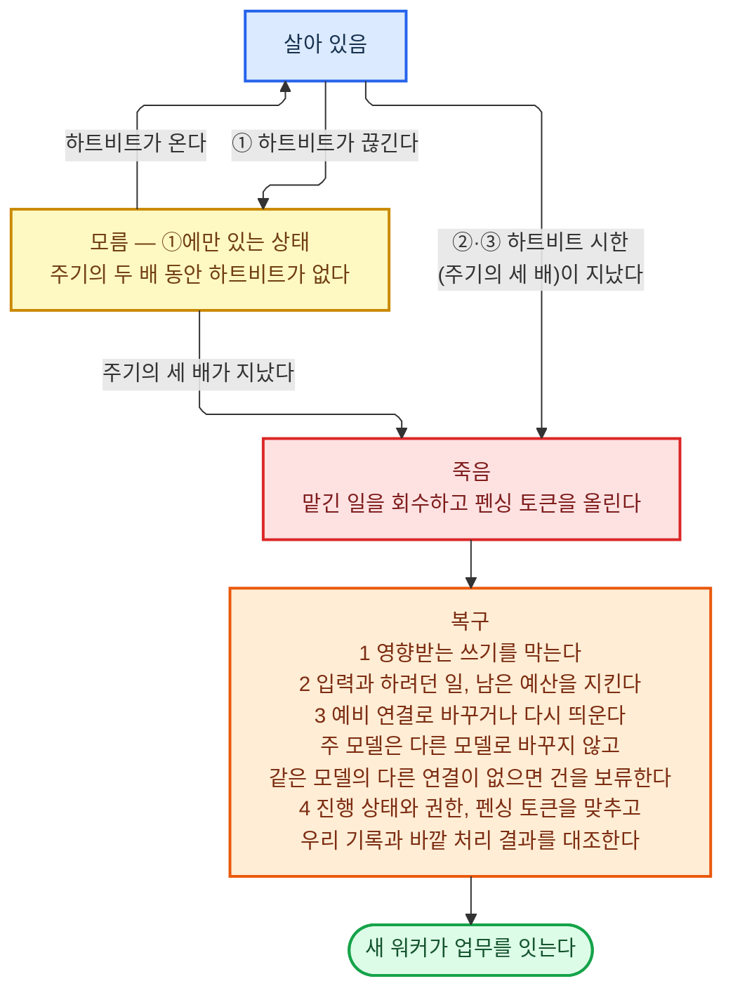
```mermaid
%%{init: {"flowchart":{"wrappingWidth":640,"curve":"linear","nodeSpacing":45,"rankSpacing":55,"padding":14,"useMaxWidth":true,"defaultRenderer":"elk"},"themeVariables":{"fontSize":"15px"},"layout":"elk","elk":{"mergeEdges":false,"nodePlacementStrategy":"NETWORK_SIMPLEX","keepEntryNodeOnTop":true,"considerModelOrder":"PREFER_NODES","cycleBreakingStrategy":"MODEL_ORDER"}} }%%
flowchart TB
    N(["새 워커가 업무를 잇는다"]):::good
    R["복구<br/>1 영향받는 쓰기를 막는다<br/>2 입력과 하려던 일, 남은 예산을 지킨다<br/>3 예비 연결로 바꾸거나 다시 띄운다<br/>주 모델은 다른 모델로 바꾸지 않고<br/>같은 모델의 다른 연결이 없으면 건을 보류한다<br/>4 진행 상태와 권한, 펜싱 토큰을 맞추고<br/>우리 기록과 바깥 처리 결과를 대조한다"]:::back
    U["모름 — ①에만 있는 상태<br/>주기의 두 배 동안 하트비트가 없다"]:::note
    D["죽음<br/>맡긴 일을 회수하고 펜싱 토큰을 올린다"]:::stop
    A["살아 있음"]:::main
    A -- "① 하트비트가 끊긴다" --> U
    U -- "하트비트가 온다" --> A
    A -- "②·③ 하트비트 시한<br/>(주기의 세 배)이 지났다" --> D
    D --> R
    R --> N
    U -- "주기의 세 배가 지났다" --> D
    classDef main fill:#dbeafe,stroke:#2563eb,stroke-width:2px,color:#17314f
    classDef good fill:#dcfce7,stroke:#16a34a,stroke-width:2px,color:#14532d
    classDef note fill:#fef9c3,stroke:#ca8a04,stroke-width:2px,color:#713f12
    classDef stop fill:#fee2e2,stroke:#dc2626,stroke-width:2px,color:#7f1d1d
    classDef back fill:#ffedd5,stroke:#ea580c,stroke-width:2px,color:#7c2d12
```

**감시 수단 고르기**

1. 감시 대상과 다른 장비에서 도는 것만 남긴다.
2. 하트비트가 끊기면 스스로 경보를 울리는 것을 고른다. 멈춘 것을 되살리기만 하고 경보를 울리지 않는 것은 뺀다.
3. 둘 이상 남으면 응답 시간이나 오류율 같은 지표를 OpenTelemetry(실행 기록과 지표를 모아 내보내는 공개 표준)로 받는 쪽을 고른다.

**지금의 선택**

| 구분 | ① 에이전트 하네스 | ②·③ 사내 서버 |
|------|------|------|
| 생사 감시 | 우리 장비에 직접 설치한 Healthchecks(하트비트가 끊기면 경보를 울리는 감시 프로그램) | ①과 같다 |
| 지표 수집 | ▶️ 하네스가 OpenTelemetry로 내주는 지표와 실행 기록 ▶️ Codex는 헤드리스 실행(화면 없이 명령만으로 돌리는 방식)이 내는 기록을 더해 맞춰 본다 | OpenTelemetry |
| 지표 저장과 경보 | — | Prometheus(지표를 시간 순서대로 쌓는 저장소)와 Grafana(지표를 보여 주고 경보를 내는 도구) |
| ③ 추가 | — | GPU 온도와 사용률을 보는 DCGM(엔비디아의 GPU 상태 측정 도구) |

**감시 조건**

| 조건 | 기준 | 이유 |
|------|------|------|
| 하트비트를 보내는 때 | ▶️ ①은 하네스를 헤드리스 실행으로 돌리고, 하트비트는 하네스 실행기가 보낸다 ▶️ 하네스 프로세스가 끝났거나, 헤드리스 실행의 기록이 도구 한 번의 시간 상한보다 오래 끊기면 하트비트를 멈춘다 | 하네스가 멈추면 하트비트도 함께 끊겨야 생사를 판정할 수 있다 |
| ①의 Healthchecks 설정 | ▶️ 위 표의 '모름'과 '죽음' 판정 시각에 맞춰 기다릴 시간을 넣는다 ▶️ 주기는 1분보다 짧게 잡지 않는다 | Healthchecks에 넣을 수 있는 가장 짧은 시간이 1분이다 |
| ②·③의 경보 | 하트비트 시한을 넘긴 일의 수를 지표로 세어 Grafana가 경보를 낸다 | Temporal은 경보를 내지 않는다 |
| ①의 재개 | ▶️ 옛 대화가 죽은 것을 확인한 뒤 하네스의 이어서 하기 기능으로 잇는다 ▶️ 그사이 작업창 앞부분이 바뀌었으면 현재 작업 정보의 '바뀔 때'대로 새 대화를 연다 | 옛 대화가 살아 있을 때 이으면 한 건을 둘이 맡게 된다 |
| 주 모델 장애 | ▶️ ①은 하네스가 모델 호출 오류로 멈추면 하네스 실행기가 멈춘 자리를 기록 서비스에 적고 실행을 끝낸다 ▶️ ①은 다른 하네스로 옮기지 않는다 ▶️ ①의 하네스 실행기는 그 뒤 1분마다 짧은 시험 호출을 보내, 모델이 답하면 멈춘 자리부터 잇는다 ▶️ ②·③은 같은 주 모델의 다른 연결이 없으면 vLLM 서버를 다시 띄운다 | ①에서 다른 하네스로 옮기면 다른 주 모델이 일을 잇게 된다 |
| ①의 빠진 지표 | 하네스의 지표와 기록에 빠진 항목은 하네스 실행기와 도구 게이트웨이가 기록한다 | ▶️ 하네스가 중간에 죽으면 하네스 안의 훅도 돌지 않는다 ▶️ 하네스 밖에서 도는 하네스 실행기와 도구 게이트웨이는 그때도 기록을 남긴다 |
| ③의 메모리 | 운영체제가 보여 주는 값으로 본다 | ③의 DGX Spark는 GPU와 CPU가 메모리 하나를 함께 쓴다 |

**백업과 복구**

- ②·③의 PostgreSQL은 WAL(데이터베이스가 바뀐 내용을 차례로 적는 기록)을 끊김 없이 다른 장비에 보관해, 원하는 시각의 상태로 되돌리는 시점 복구를 할 수 있게 한다. 변경 불가 저장소는 다른 장비로 계속 복제한다.
- ①은 건 폴더, 기억 폴더, 기록 보관 폴더를 5분마다 다른 장비에 복사한다. 하네스 대화 원본은 복사하지 않는다.
- 전체 백업은 다른 장비에 둔다.
- 장애가 나도 잃는 자료는 최근 5분 치를 넘지 않게 하고, 4시간 안에 되살린다. 분기마다 한 번 실제로 되살려 본다.

**저장한 것이 어긋나거나 깨졌을 때**

| 경우 | 알아채는 법 | 자동 처리 | 사람에게 넘어오는 때 | 멈추는 범위 |
|---|---|---|---|---|
| 데이터베이스의 줄과 변경 불가 저장소의 원본이 짝이 맞지 않는다 | 날마다 한 번 둘을 대조한다 | ▶️ 저장소에 없는 원본은 기록해 둔 출처에서 다시 받아, 해시가 같으면 넣는다 ▶️ 저장소에만 있는 원본은 공개 원본이면 자료 메타데이터를 다시 만들고, 고객 원본이면 그 고객의 줄에만 다시 잇는다 | ▶️ 다시 받을 곳이 없거나, 다시 받은 원본의 해시가 다르거나, 어느 고객의 원본인지 모를 때다 ▶️ 이런 원본은 어느 건에도 잇지 않는다 | 그 자료 메타데이터만 쓰지 않는다 |
| ②·③에서 OPA가 적용 중인 규칙 판본이 배포 판본과 다르다 | ▶️ 배포하고 60초가 지나도 OPA가 알려 오는 판본이 다르다 ▶️ OPA가 새 규칙 묶음을 받아 가는 간격은 30초를 넘지 않게 둔다 | 규칙 묶음을 다시 받게 하고, 3번까지 되풀이한다 | 3번 해도 판본이 맞지 않을 때 | 판본이 맞을 때까지 그 직종의 바깥으로 나가는 행동 |
| ①에서 규칙 묶음이나 지시문이 배포 판본과 다르다 | 하네스 실행기는 대화를 열 때 지시문 판본을, 도구 게이트웨이는 도구를 실행하기 직전에 규칙 묶음 판본을 대조한다 | 그 대화를 멈추고 새 배포 판본으로 새 대화를 열어 잇는다 | 새 대화에서도 판본이 다를 때 | 그 대화 |
| ①에서 건 상태 파일이 깨졌다 | 이어서 열 때 건 상태 파일이 읽히지 않거나, 마지막 실행 기록보다 뒤처져 있다 | 기록 보관 폴더의 판단 근거 기록과 실행 기록으로 건 상태 파일을 다시 채운다 | 다시 채울 수 없을 때 | 그 건 |
| 데이터베이스가 깨졌다 | 데이터베이스가 오류를 내거나, 대조할 때 있어야 할 줄이 없다 | ▶️ 그 직종을 멈추고 시점 복구를 시작한다 ▶️ 되살린 뒤 변경 불가 저장소와 대조하고 검색 색인을 다시 만든다 ▶️ 되살린 시각 뒤에 바깥으로 나갔을 수 있는 행동은 결과 불명으로 보고 실행 제어대로 조회한다 | ▶️ 늘 넘어온다 ▶️ 운영자가 어느 시점으로 되돌릴지, 사라진 건을 받은 신호로 다시 만들지 정한다 | ▶️ 그 직종을 멈추고, 결과 불명으로 본 행동을 모두 확인하거나 사람에게 넘긴 뒤에 다시 켠다 ▶️ 대조에서 끊긴 원본이 있으면 그 자료 메타데이터만 빼고 켠다 ▶️ 멈춘 동안 들어온 신호는 수신 게이트웨이가 업무 데이터베이스 밖의 대기열에 쌓아 두었다가, 다시 켠 뒤 받은 순서대로 건으로 만든다 |

**합격 시험** — ②·③은 시점 복구로 되살린 뒤 변경 불가 저장소와 대조해 끊긴 것이 0개여야 합격이다.

---

#### 시작 신호

**수신 게이트웨이** — 에이전트와 따로 두고 늘 켜 둔다.

| 상황 | 처리 | 기본값 |
|---|---|---|
| 들어오는 양이 넘친다 | ▶️ 신호는 버리지 않고 모두 대기열에 차례로 쌓는다 ▶️ 대기열에서 꺼내 담당을 깨우는 속도에만 상한을 둔다 | 분당 60건까지 깨운다 |
| 신호를 받았다 | ▶️ 먼저 저장한 뒤 접수 응답을 보낸다 ▶️ 접수 응답은 업무를 끝냈다는 뜻이 아니다 | — |
| 우편, 팩스, 전화, 방문, 구두로 지시가 왔다 | 받는 창구를 하나로 정하고, 접수 번호, 시각, 받은 사람을 붙여 전자 신호와 똑같이 다룬다 | — |

**거르기와 묶기** — 이 단계에서는 신호의 뜻을 따지지 않는다.

| 상황 | 처리 | 기본값 |
|---|---|---|
| 웹훅(다른 서비스가 일이 생기면 우리 주소로 보내 주는 알림)으로 신호가 왔다 | ▶️ 보낸 쪽 서명이 맞는 것만 받는다 ▶️ 서명에 보낸 시각이 있으면 오래된 신호도 버리고, 없으면 시각으로는 거르지 않는다 ▶️ 버린 신호는 버렸다는 사실만 남긴다 | 보낸 시각이 5분보다 오래됐으면 버린다 |
| 같은 신호가 두 번 왔다 | 신호마다 붙은 고유 번호로 가려 한 번만 깨운다 | — |
| 긴급 표시가 있거나, 종류 목록에 긴급으로 등록된 종류다 | 묶지 않고 바로 담당을 깨운다 | — |
| 종류가 같고, 가리키는 대상 번호도 같은 신호가 여러 번 왔다 | 하나로 묶는다 | 5분 안에 온 것을 묶는다 |
| 먼저 알아채기가 모아 내기로 정한 종류다 | 먼저 알아채기가 정한 대로 모아서 낸다 | — |
| 신호가 보낸 순서와 다르게 도착했다 | 대상의 지금 상태를 보낸 곳에 직접 조회한다 | — |
| 우리가 한 행동이 다시 신호를 만든다 | 그 신호를 원인이 된 행동의 번호와 이어, 같은 일로 끝없이 다시 깨우지 않는다 | — |

**알림 구독** — 다른 시스템에 일이 생기면 알려 달라고 걸어 둔 신청이다. 구독마다 담당, 권한, 만료 시점, 갱신 시점, 마지막으로 받은 알림이 어디까지인지 적어 둔다.

| 상황 | 처리 |
|---|---|
| 구독 갱신이 실패했거나, 권한이 철회됐거나, 수신 게이트웨이가 다시 시작했다 | 그사이 빠진 알림이 있는지 확인한다 |
| 알림을 보내는 곳이 빠진 알림을 다시 보내 주지 않는다 | 허용된 주기마다 직접 조회해 빈 곳을 채운다 |
| 직접 조회해도 빈 곳을 다 채우지 못했다 | 그 구간을 현재 진행 상태에 '아직 확인하지 못한 것'으로 적는다 |

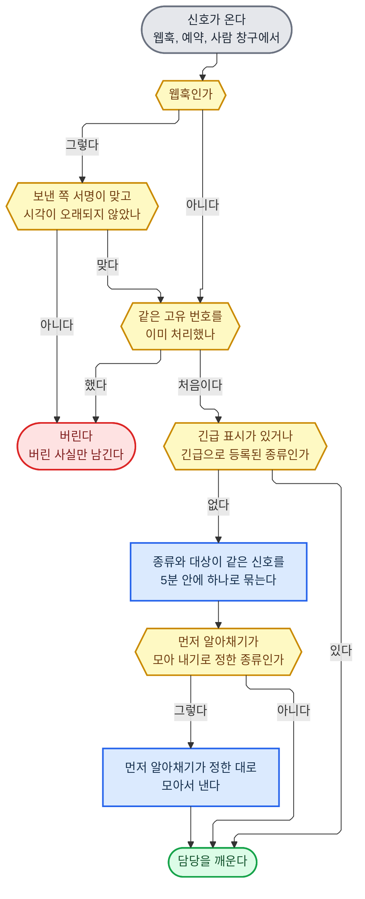
```mermaid
%%{init: {"flowchart":{"wrappingWidth":640,"curve":"linear","nodeSpacing":45,"rankSpacing":55,"padding":14,"useMaxWidth":true,"defaultRenderer":"elk"},"themeVariables":{"fontSize":"15px"},"layout":"elk","elk":{"mergeEdges":false,"nodePlacementStrategy":"NETWORK_SIMPLEX","keepEntryNodeOnTop":true,"considerModelOrder":"PREFER_NODES"}} }%%
flowchart TB
    F{{"먼저 알아채기가<br/>모아 내기로 정한 종류인가"}}:::note
    OUT(["담당을 깨운다"]):::good
    V{{"보낸 쪽 서명이 맞고<br/>시각이 오래되지 않았나"}}:::note
    K{{"같은 고유 번호를<br/>이미 처리했나"}}:::note
    X(["버린다<br/>버린 사실만 남긴다"]):::stop
    B["먼저 알아채기가 정한 대로<br/>모아서 낸다"]:::main
    E{{"긴급 표시가 있거나<br/>긴급으로 등록된 종류인가"}}:::note
    G["종류와 대상이 같은 신호를<br/>5분 안에 하나로 묶는다"]:::main
    IN(["신호가 온다<br/>웹훅, 예약, 사람 창구에서"]):::store
    W{{"웹훅인가"}}:::note
    W -- "아니다" --> K
    E -- "있다" --> OUT
    G --> F
    K -- "했다" --> X
    E -- "없다" --> G
    IN --> W
    V -- "아니다" --> X
    V -- "맞다" --> K
    F -- "아니다" --> OUT
    F -- "그렇다" --> B
    B --> OUT
    K -- "처음이다" --> E
    W -- "그렇다" --> V
    %% 배치용 보이지 않는 연결: 선은 그려지지 않고 상자 위치만 잡음
    IN ~~~ E
    IN ~~~ W
    classDef store fill:#e5e7eb,stroke:#6b7280,stroke-width:2px,color:#1f2937
    classDef good fill:#dcfce7,stroke:#16a34a,stroke-width:2px,color:#14532d
    classDef note fill:#fef9c3,stroke:#ca8a04,stroke-width:2px,color:#713f12
    classDef stop fill:#fee2e2,stroke:#dc2626,stroke-width:2px,color:#7f1d1d
    classDef main fill:#dbeafe,stroke:#2563eb,stroke-width:2px,color:#17314f
```

**수신 게이트웨이와 예약 수단 고르기** — 실행 환경이 정식으로 지원하는 예약과 알림 기능을 아래 순서로 거르고, 모자란 부분만 수신 게이트웨이와 예약 프로그램을 만들어 채운다.

1. 하네스 대화가 닫혀 있거나 하네스가 도는 컴퓨터가 꺼져 있어도 도는 것만 남긴다. 대화가 열려 있어야만 받는 것은 보조로만 쓴다.
2. 보낸 쪽이 누구인지 서명으로 확인할 수 있는 것을 고른다.
3. 정해 둔 주기마다 다시 훑어 놓친 신호를 되찾을 수 있는 것을 고른다.

**지금의 선택**

| 구분 | ① 에이전트 하네스 | ②·③ 사내 서버 |
|------|------|------|
| 수신 게이트웨이 | 고정 주소가 있는 사내 서버 한 대에서 도는, 우리가 만든 수신 게이트웨이 | ①과 같다 |
| 대기열 | 업무 데이터베이스와 따로 둔 PostgreSQL | ①과 같다 |
| 예약 | 수신 게이트웨이의 예약 기능 | Temporal의 예약 기능 |
| 되풀이 규칙을 적는 형식 | 달력 표준인 RRULE('매주 월요일'처럼 되풀이되는 날짜를 적는 형식) | ①과 같다 |

**수신 게이트웨이와 예약 조건**

| 조건 | 기준 | 이유 |
|------|------|------|
| ①의 하네스 깨우기 | ▶️ 하네스는 늘 켜 두지 않는다 ▶️ 수신 게이트웨이의 대기열에 신호가 오거나 예약 시각이 되면, 하네스가 도는 컴퓨터에서 헤드리스 실행으로 띄운다 | 신호는 늘 켜 둔 수신 게이트웨이가 받아 쌓아 둔다 |
| ①의 꺼져 있던 컴퓨터 | 예약 시각에 컴퓨터가 꺼져 있었으면 실행이 밀리거나 늦어진 사실을 기록하고 알린다 | 밀린 실행을 알아야 놓친 신호를 되찾을 수 있다 |
| ①의 실행 장소 | 예약 기능이 있다는 이유만으로 실행 장소를 클라우드로 옮기지 않는다 | ①의 하네스와 도구, 격리 설정은 하네스가 도는 그 컴퓨터에 있다 |
| 시간대 | 그 건을 다루는 지역의 시간대를 쓴다 | 다른 시간대를 쓰면 예약이 그 지역의 날짜와 다른 때에 돈다 |
| RRULE을 받지 못하는 예약 도구 | ▶️ 다음 시각을 계산해 한 번짜리 예약으로 넣는다 ▶️ 다음 예약이 잡히지 않은 규칙은 운영 감시가 알린다 | 한 번짜리 예약은 다음 예약을 넣지 않으면 되풀이가 끊긴다 |

---

#### 업무 도구·시스템

**도구 대장** — 도구 대장에 올린 기능만 쓴다.

| 대상 | 처리 |
|---|---|
| 기능마다 | 읽기만 되는지, 고칠 수 있는지, 파일을 다른 형식으로 바꿔 주는지 적는다 |
| 도구마다 | ▶️ 실제로 연결된 계정과 읽어도 되는 사람, 실행되는 곳을 적는다 ▶️ 권한과 한도를 어디서 검사하는지, 사용 기록이 어디에 남는지 적는다 |
| 같은 도구를 하네스가 도는 컴퓨터에서 돌릴 때와 바깥 서버에서 돌릴 때 | 되는 기능이 다를 수 있으므로 따로 확인한다 |

**쓰기 전 확인** — 깔려 있는지, 실행되는지, 물어보면 대답하는지, 로그인되어 있는지를 이 차례로 본다. 하나라도 아니면 못 쓰는 도구로 적는다.

**못 쓸 때**

| 상황 | 처리 |
|---|---|
| 못 쓰는 도구가 있다 | 직종이 허락한 범위 안에서 스스로 갖추고, 도구 대장에 올려 능력 개선·확장의 시험을 거친 뒤 쓴다 |
| 자격을 갖춘 사람만 갖출 수 있다 | '자격을 갖춘 사람만 할 수 있는 일'로 사람에게 넘긴다 |
| 권한이 없어 갖추지 못한다 | 사람에게 넘기는 경우로 보지 않고, 무엇이 없는지 적어 미완료로 보고한다 |

**자격 증명과 보내기**

| 상황 | 처리 |
|---|---|
| 자격 증명 | ▶️ 모델에게도, 모델이 읽는 작업창에도 넣지 않는다 ▶️ 도구 게이트웨이가 쥐고 있다가 밖으로 나가는 요청에만 넣는다 |
| ①에서 발송, 제출, 기록 쓰기를 한다 | 도구 게이트웨이를 거치는 전용 도구로만 한다 |
| ①의 셸과 브라우저 | 같은 자격 증명을 쓰거나 이미 로그인된 상태를 빌려서 도구 게이트웨이의 검사를 건너뛰지 못하게 막는다 |

**연결 방식 고르기**

1. 그 도구가 공식으로 주는 길을 먼저 쓴다. API, SDK, CLI(글자로 명령을 쳐서 쓰는 프로그램)가 그런 길이다.
2. 공식 길이 없으면 MCP로 붙이고, MCP 서버마다 권한을 따로 준다.
3. 화면을 직접 눌러야만 되는 도구는 마지막으로 쓴다. 누른 뒤에는 반영됐는지 한 번 더 확인한다.

**지금의 선택**

| 구분 | ① 에이전트 하네스 | ②·③ 사내 서버 |
|------|------|------|
| 공식 길이 있을 때 | 허용된 CLI | 공식 API나 SDK |
| 공식 길이 없을 때 | 컨테이너에서 도는 MCP 서버 | ①과 같다 |
| 화면만 있을 때 | 컨테이너에서 도는 Playwright(브라우저를 자동으로 다루는 도구) | ①과 같다 |

**연결 조건**

| 조건 | 기준 | 이유 |
|------|------|------|
| ①의 CLI | ▶️ 허용된 CLI는 읽기와 계산에만 쓴다 ▶️ 셸에서 도는 CLI에는 읽기만 되는 자격 증명을 준다 | 셸에서 도는 CLI는 도구 게이트웨이를 거치지 않아, 쓰기 자격 증명을 쥐면 검사 없이 바깥에 쓸 수 있다 |
| ①의 CLI 감싸기 | 쓰기가 필요한 CLI는 MCP 서버로 감싸 도구 게이트웨이를 거치게 한다 | MCP 서버로 감싸면 서버마다 권한을 따로 주고 컨테이너에서 돌릴 수 있다 |
| 브라우저 로그인 | ▶️ 로그인된 상태도 자격 증명처럼 다룬다 ▶️ 모델이 직접 다루는 브라우저는 아무 기록이 없는 새 상태에서 시작한다 ▶️ 로그인은 하지 않거나, 그 건에 허락된 계정 가운데 읽기만 되는 계정으로만 한다 | 로그인된 브라우저는 자격 증명을 쥔 것과 같은 일을 할 수 있다 |
| 쓰기 계정이 필요한 화면 일 | ▶️ 직종이 화면마다 미리 짜 두고 시험한 조작 순서로 한다 ▶️ 그 순서는 도구 게이트웨이가 돌리고, 모델은 채울 값만 넘긴다 | 화면으로 하는 쓰기도 발송이나 제출처럼 도구 게이트웨이의 확인을 거쳐야 한다 |
| 사람의 브라우저 | ①에서 하네스가 사람이 쓰는 브라우저에 붙어 일하는 기능은 쓰지 않는다 | 이 기능은 사람의 로그인 상태를 그대로 빌려 쓴다 |

---

#### 나눠 맡기기

**분담을 넘길 때 함께 줄 것** — 분담은 큰 일을 나눠 다른 담당에게 맡긴 한 부분이다. 목표, 끝나는 조건, 볼 자료와 그 판본, 깔고 가는 가정, 제약, 스스로 정해도 되는 범위, 쓸 수 있는 시간, 쓸 수 있는 비용, 이 분담이 꼭 필요한 까닭, 처음 맡긴 사람의 신원과 권한, 넘기는 사실과 결론마다 붙은 표시의 열한 가지를 함께 준다. 붙은 표시는 대상 번호, 시점, 출처, 적용 조건, 한정 표현, '미확인' 표시를 말한다. 하나라도 빠지면 분담을 시작하지 않는다.

**담당과 연결**

| 대상 | 처리 |
|---|---|
| 담당 | 전체 결과를 책임질 담당 하나와 분담마다 담당을 정한다 |
| 분담 번호 | 분담마다 번호를 붙여, 나눠 낸 원래 업무와 계획의 판본에 잇는다 |
| 자격 증명 | ▶️ 넘기지 않는다 ▶️ 분담이 허용된 범위 안에서 쓰는지는 도구 게이트웨이가 검사한다 |
| 받은 쪽이 쓰는 자료와 행동 | 자기 권한과 넘겨받은 권한이 모두 허락한 것만 쓴다 |
| 붙은 표시가 하나라도 빠진 사실과 결론 | 받은 쪽은 확인된 근거로 받지 않는다 |
| 분담끼리 주고받는 중간 결과 | 현재 진행 상태에 적어 넘기고, 분담끼리 직접 주고받지 않는다 |
| 분담이 다시 분담을 부르는 일 | ▶️ 하지 않는다 ▶️ 주 대화와 분담, 두 층까지만 둔다 |

**결과 받기**

| 상황 | 처리 |
|---|---|
| 의견이 갈린다 | ▶️ 전체 결과를 책임지는 담당이 근거가 어디서 갈렸는지 대조해 정한다 ▶️ 갈린 자리와 누가 무엇을 근거로 정했는지 기록한다 ▶️ 다수결로 정하지 않는다 |
| 꼭 있어야 할 결과가 오지 않는다 | ▶️ 다른 길로 가거나, 범위를 줄이거나, 미완료로 둔다 ▶️ 끝난 것처럼 합치지 않는다 |

**바뀌거나 다시 맡길 때**

| 상황 | 처리 |
|---|---|
| 근거, 권한, 계획이 바뀌었다 | 영향을 받는 분담에 알리고, 옛 판본에 기대어 나온 결과는 다시 확인한다 |
| 다른 담당에게 다시 맡긴다 | 이전 담당의 쓰기 권한을 회수하고, 운영 감시·복구대로 펜싱 토큰을 올린다 |

**분담 수 정하기**

1. 동시에 도는 분담 수는 결과를 모으는 쪽이 한 번에 대조할 수 있는 만큼으로 정한다.
2. 합친 결과의 항목마다 그 항목을 낸 분담 번호를 달아 센다. 한 항목에 번호가 둘 붙으면 겹친 것이고, 계획에 있는 항목에 번호가 없으면 빠진 것이다. 의견이 갈린 항목은 세지 않는다.
3. 겹치거나 빠진 항목이 하나라도 나오면, 모으는 쪽이 한 번에 대조할 수 있는 수를 넘었다고 본다. 그때는 동시 분담 수를 그때의 수보다 하나 적게 한다. 더 많이 나눠야 하면 주 대화가 먼저 맡긴 분담을 다 거둬들인 뒤 다음 분담을 맡긴다.

**지금의 선택**

| 구분 | ① 에이전트 하네스 | ②·③ 사내 서버 |
|------|------|------|
| 나눠 맡기는 수단 | 하네스의 하위 에이전트 | Temporal의 자식 워크플로(한 흐름이 그 아래에 따로 띄우는 작은 흐름) |

**분담 조건**

| 조건 | 기준 | 이유 |
|------|------|------|
| 동시 수 | ①과 ②는 10, ③은 2로 묶는다 | ③은 동시에 도는 작업이 2개까지다 |
| Claude Code의 깊이와 동시 수 | ①의 Claude Code는 하네스 설정으로 주 대화 바로 아래 한 층까지만 하위 에이전트를 부르게 하고, 동시에 도는 수도 묶는다 | Claude Code는 기본으로 하위 에이전트가 주 대화 아래 세 층까지 다시 하위 에이전트를 부르고, 20개까지 함께 돌린다 |
| Claude Code의 워크플로 기능 | ①의 Claude Code는 하위 에이전트를 한 번에 여럿 띄우는 워크플로 기능을 관리 설정으로 끈다 | ▶️ 모델이 이 기능을 스스로 골라 쓰게 하는 ultracode 설정이 켜지면 동시 수 제한이 걸리지 않는다 ▶️ ultracode만 따로 막는 관리 설정은 없고, 워크플로 기능을 끄면 ultracode도 함께 꺼진다 |
| Codex의 깊이와 동시 수 | ▶️ ①의 Codex는 설정으로 동시 수를 묶는다 ▶️ 하위 에이전트용 역할 설정에서는 그 하위 에이전트가 다시 하위 에이전트를 부르는 기능을 끈다 | Codex의 공식 문서에는 몇 층까지 부를지 묶는 설정이 없다 |
| 막히는지 시험 | ▶️ ①은 두 하네스 모두 실제로 막히는지 시험한다 ▶️ Codex의 하위 에이전트가 다시 하위 에이전트를 부를 수 있으면 Codex의 하위 에이전트 기능을 아예 끄고, 분담마다 하위 에이전트 기능을 끈 헤드리스 실행을 따로 띄우는 전용 도구를 쓴다 ▶️ 결과 검사처럼 다른 재료가 새 하위 에이전트를 띄울 때도 이 도구를 쓴다 | 막히지 않으면 분담이 다시 분담을 불러 두 층 규칙이 깨진다 |

---

#### 실시간 대화

**답하기 전**

| 대상 | 처리 | 기본값 |
|---|---|---|
| 통화가 이어진 뒤의 첫마디 | ▶️ 에이전트 기본 원칙이 정한 AI 응대 알림은 모델이 만들지 않고 미리 정해 둔 문구로 낸다 ▶️ 통화를 녹음하면 그 사실도 이 문구에 넣는다 ▶️ 통화 기록의 첫마디에 이 문구가 있는지 확인한다 | — |
| 답하기 전에 확인할 것 | ▶️ 무엇을 확인할지 직종이 정한다 ▶️ 상대 말을 바로 알아들었는지, 그 답을 할 권한이 있는지, 숫자와 대상이 맞는지가 그 예다 | — |
| 첫 소리가 나오기까지 허용하는 지연 | 직종이 정한다 | 1초 |
| 새 자료를 찾거나 깊이 판단해야 하는 일 | ▶️ 뒤에서 따로 돌린다 ▶️ 그동안은 되묻거나 잠깐 기다려 달라고 말해 대화를 이어 간다 | — |
| 금액, 대상, 권한처럼 아직 확인하지 못한 것 | 대화 중에 약속하지 않는다 | — |

**끼어들기와 녹음**

| 상황 | 처리 |
|---|---|
| 상대가 끼어들어 말소리를 멈췄다 | 말소리만 멈추고, 뒤에서 처리하던 거래는 실행 제어의 중단 범위대로 확인한다 |
| 상대가 정정하거나 취소한다 | 작업 담당에게 전한다 |
| 녹음하거나 기록하기 전이다 | ▶️ 그 지역의 법이 상대의 동의를 요구하면 동의를 받은 뒤에만 녹음한다 ▶️ 상대가 녹음을 거부하면 녹음하지 않고, 업무에 필요한 요지만 글로 남긴다 |

```mermaid
%%{init: {"flowchart":{"wrappingWidth":640,"curve":"linear","nodeSpacing":45,"rankSpacing":55,"padding":14,"useMaxWidth":true,"defaultRenderer":"elk"},"themeVariables":{"fontSize":"15px"},"layout":"elk","elk":{"mergeEdges":false,"nodePlacementStrategy":"NETWORK_SIMPLEX","keepEntryNodeOnTop":true,"considerModelOrder":"PREFER_NODES","cycleBreakingStrategy":"GREEDY_MODEL_ORDER","forceNodeModelOrder":true}} }%%
flowchart TB
    S["말을 글로 바꾼다"]:::main
    P(["상대가 말한다"]):::store
    O(["상대가 듣는다"]):::good
    W(["정정이나 취소를<br/>작업 담당에게 전한다"]):::back
    BG["깊은 판단과 자료 찾기는<br/>뒤에서 따로 돌린다"]:::store
    I(["상대가 끼어들면<br/>말소리를 멈춘다"]):::note
    T["글을 말소리로 바꾼다"]:::main
    M["음성용 모델이<br/>답을 만든다"]:::main
    S -- "글" --> M
    T -- "말소리" --> O
    BG -. "결과" .-> M
    M -. "깊은 판단이 필요하면" .-> BG
    M -- "정정이나 취소가 나오면" --> W
    T --> I
    M -- "답 글" --> T
    P -- "소리" --> S
    %% 배치용 보이지 않는 연결: 선은 그려지지 않고 상자 위치만 잡음
    BG ~~~ I
    M ~~~ I
    classDef good fill:#dcfce7,stroke:#16a34a,stroke-width:2px,color:#14532d
    classDef main fill:#dbeafe,stroke:#2563eb,stroke-width:2px,color:#17314f
    classDef store fill:#e5e7eb,stroke:#6b7280,stroke-width:2px,color:#1f2937
    classDef note fill:#fef9c3,stroke:#ca8a04,stroke-width:2px,color:#713f12
    classDef back fill:#ffedd5,stroke:#ea580c,stroke-width:2px,color:#7c2d12
```

**음성 수단 고르기**

1. 사내에서 돌릴 수 있는 것만 남긴다. 고객의 말이 회사 밖으로 나가면 안 된다.
2. 소리를 다 만들 때까지 기다리지 않고 만드는 대로 흘려보내는 스트리밍이 되는 것을 고른다.
3. 둘 이상 남으면 첫 소리까지 걸리는 시간이 짧은 쪽을 고른다.
4. 답을 만드는 모델은 공개 모델 가운데 AA 지수 40점 이상이고 활성 파라미터(모델이 한 토큰을 낼 때 실제로 계산에 쓰는 값의 수)가 10B 아래인 것에서 고른다. 그런 모델이 없으면 상한을 20B로 올린다. 그 가운데 첫 소리를 0.5초 안에 내는 것을 직접 재어 고른다.

**지금의 선택**

| 구분 | ① 에이전트 하네스 | ②·③ 사내 서버 |
|------|------|------|
| 글 대화 | 하네스 대화 | 웹소켓(연결을 끊지 않고 계속 주고받는 방식) |
| 음성 — 통화 서버 | — | 직접 설치한 LiveKit(실시간 음성 통화를 이어 주는 서버 프로그램) |
| 음성 — 말을 글로 | — | 받아쓰기 모델인 Qwen3-ASR-1.7B |
| 음성 — 답을 만드는 모델 | — | ▶️ GLM-5.3-Flash(활성 18B) ▶️ 활성 10B 아래 공개 모델에는 AA 지수 40점 이상인 것이 없어 지금은 상한을 20B로 둔다 ▶️ 그 가운데 가장 높은 Qwen3.8-Flash-Next(활성 6B)도 화면에는 40점으로 보이지만, 반올림하기 전 점수는 39.8점이다 |
| 음성 — 글을 말소리로 | — | Qwen3-TTS-12Hz 계열의 1.7B-CustomVoice 판본(한국어 기본 목소리가 들어 있고 스트리밍이 된다) |

**대화 수단 조건**

| 조건 | 기준 | 이유 |
|------|------|------|
| 목소리 복제 | 실제 사람의 목소리를 본뜨는 목소리 복제용 판본은 쓰지 않는다 | 실제 사람의 목소리로 말하면 AI가 응대한다고 알리는 첫마디와 어긋난다 |
| ①의 바깥 음성 통화 | ①은 바깥 상대와 하는 음성 통화를 협상을 포함해 맡지 않고 ②로 넘긴다 | 음성 수단은 고객의 말이 회사 밖으로 나가지 않게 사내에서 돌아야 한다 |
| ③의 음성 대화 | ③은 음성 대화를 맡지 않고 ②로 넘긴다 | 음성 대화에 더 필요한 모델 셋(받아쓰기, 답, 말소리)을 ③은 주 모델과 함께 DGX Spark 한 대에 올려야 한다 |
| ①의 음성 지시 | 사용자가 말로 일을 지시하거나 조정하는 기능은, 고른 하네스가 정식으로 지원하고 사용자의 목소리와 말이 모델 회사로 나가도 되는 일일 때만 쓴다 | ①에서는 자료가 모델 회사 서버로 나간다 |

---

#### 시험 환경

**시험 결과와 실제 실행**

| 상황 | 처리 |
|---|---|
| 시험 자리와 실제를 견준다 | ▶️ 무엇이 같고 무엇이 다른지 목록으로 만든다 ▶️ 결론을 바꿀 만한 차이가 남아 있으면 그 시험 결과에 믿을 수 없다는 표시를 붙인다 |
| 시험 표시가 붙은 실행 | 실제 상대에게 보내기, 결제, 실제 기기에 설치하기처럼 되돌릴 수 없는 행동을 하지 못한다 |
| 합격 판정 | 시험 환경은 합격을 판정하지 않고, 정해진 조건대로 돌려 기록을 넘긴다 |

**시험 자료와 횟수**

| 대상 | 처리 | 기본값 |
|---|---|---|
| 실제 고객 자료 | 시험 자료로 그대로 쓰지 않고, 가리거나 새로 만든 자료를 쓴다 | — |
| ③의 점검 시간(운영을 멈추고 같은 장비에서 시험하는 주 1회 시간) 한 번에 돌릴 실행 | 기본값을 넘으면 고정 시험지(매번 같은 문항으로 돌리는 시험지)의 실행부터 빼서 맞춘다 | 40회 실행까지 |

**시험 자리 고르기**

1. 복제할 수 있는 것은 실제와 같은 제품으로 시험 자리를 만든다. 실제 기기, 사람, 한 번 쓰면 되돌릴 수 없는 것은 미리 해 보는 방식으로 시험한다. 개발용 기기나 상대 역할을 흉내 내는 모의 상대(목 서버)로 해 보거나, 리허설을 하거나, 적은 양으로 먼저 해 보는 것이다. 미리 해 본 방식이 실제와 다른 점도 차이 목록에 적는다.
2. 자격 증명, 계정, 저장소를 실제와 따로 둔다.
3. 실제 운영에 쓰는 자원을 빼앗지 않는 것을 고른다.

**지금의 선택**

| 구분 | ① 에이전트 하네스 | ②·③ 사내 서버 |
|------|------|------|
| 시험 자리 | 별도 운영체제 사용자나 개발 컨테이너 | 실제와 같은 제품을 시험용으로 하나 더 띄운 것 |

**시험 자리 조건**

| 조건 | 기준 | 이유 |
|------|------|------|
| ①의 바깥 접속 | ▶️ 샌드박스에 접속을 허용할 주소 목록을 두어, 셸 명령이 그 밖으로는 나가지 못하게 막는다 ▶️ MCP 서버, 웹 검색, 브라우저에는 이 목록이 걸리지 않으므로 시험용 자격 증명만 주거나 아예 끈다 | 시험 표시가 붙은 실행은 실제 상대에게 보내기 같은 되돌릴 수 없는 행동을 하지 못해야 한다 |
| ③의 시험 시간 | ▶️ ③은 점검 시간에만 시험한다 ▶️ 점검 시간은 한국 시간 일요일 02:00–04:00이며, 시작 신호에 예약해 미리 알린다 ▶️ 점검 시간 안에 끝나지 않은 시험은 멈추고 다음 주 점검 시간에 잇는다 | ③은 모델이 DGX Spark 한 대에서 돌아, 운영 중에 시험하면 실제 운영에 쓰는 자원을 빼앗는다 |

---

### 자료·검색

바깥에서 들어온 자료는 원문 조각마다 자료 메타데이터를 붙여 쌓는다. 메타데이터에는 정의 1 공통 기준의 '출처' 부품이 정한 항목을 적되, 받아 온 곳과 원출처(그 내용을 맨 처음 낸 곳)를 따로 적는다. 자료는 규칙·기준 원문, 업무별 정보, 적용 사례, 참고 자료, 재사용 자료, 현재 값·상태 확인의 여섯 종류로 나누고, 여러 종류에 걸치면 해당하는 종류에 모두 넣는다.

#### 근거의 신뢰성·적합성

**원칙**

- 등급은 근거를 얼마나 믿고 따를지만 매긴다. 그 시점에 맞는 판본인지는 자료의 시점·버전이 따로 가리고, 두 결과를 한 값으로 합치지 않는다.
- 사진, 영상, 녹취, 기계로 잰 값, 말로 한 진술도 글과 같은 기준으로 등급을 매긴다. 이때 누가 무엇으로 언제 어떤 조건에서 얻었는지와 원본 파일과 기기 기록이 남아 있는지를 함께 적는다.
- 원출처까지 따라가지 못한 자료는 다른 자료를 옮겨 적은 것일 수 있으므로, 같은 내용의 자료가 있어도 독립 근거로 세지 않는다.
- 출처 등급표는 직종마다 하나를 판본으로 관리하고, 세 환경이 같은 판본을 쓴다.

**근거 등급 매기기**

1. 판정할 곳(법원, 관청, 심사 기관처럼 이 일의 결론을 최종으로 판정하는 곳)이 받아 주지 않는 근거와 허용되지 않은 경로로 얻은 근거는 등급 없이 "못 씀"으로 둔다. 받아 주는지는 그곳의 규칙·기준 원문으로 확인한다.
2. 나머지는 출처 등급표대로 원본, 구속 규칙, 참고, 사후 작성 가운데 하나를 주고, 준 까닭을 함께 적는다. 원본은 그 사실을 직접 담은 원래 기록이나 파일이고, 구속 규칙은 따라야 하는 규칙의 원문이다. 참고는 해설, 연구, 남이 정리한 자료이고, 사후 작성은 다툼이나 요청이 생긴 뒤에 한쪽이 만든 자료다. 두 등급에 걸치면 낮은 쪽을 준다.
3. 등급표에 없는 출처는 모델이 등급 후보를 내고 사람이 승인해 표에 넣는다. 승인 전에는 참고보다 높게 치지 않는다.
4. 같은 등급 안에서는 원천 기록(그 기록을 처음 만들고 관리하는 시스템의 기록)이나 제3자 기록과 대조한 근거를 대조하지 못한 근거보다 앞에 둔다. 그다음에는 등급표에 적힌 믿을 만한 정도가 높은 근거를 앞에 둔다.

**결론을 내보내는 조건**

| 결론 | 처리 |
|---|---|
| 등급이 없는 근거에 기댄 결론 | 내보내지 않는다 |
| 사실을 단정하는 결론 | 원본이나 구속 규칙 등급의 근거가 하나 이상 있어야 내보낸다 |
| 근거가 참고나 사후 작성 등급뿐인 결론 | 단정하지 않고 추정으로 적는다 |

직종은 결론 종류마다 이 조건을 더 엄하게 정할 수 있다.

**근거끼리 어긋나면**

| 상황 | 처리 |
|---|---|
| 같은 사실을 두고 근거끼리 어긋난다 | 등급만 보고 한쪽을 버리지 않고, 더 확인해서 어느 쪽이 맞는지 확정한다 |
| 확정하지 못했고, 그 어긋남이 결론을 가르지 않는다 | 조건을 붙여 결론을 낸다 |
| 확정하지 못했고, 그 어긋남이 결론을 가른다 | 판단이 서지 않는 것으로 보고 사람에게 넘긴다 |
| 다른 재료가 먼저 믿을 쪽을 정해 두었다 | ▶️ 그쪽은 확정하기 전까지 먼저 쓸 쪽일 뿐이다 ▶️ 어느 쪽이 맞는지는 이 표대로 확정한다 |

**검사 조건**

| 조건 | 기준 | 이유 |
|------|------|------|
| 등급 없는 근거 거르기 | ▶️ 결론을 내보내기 직전에 코드가 OPA에 물어 거른다 ▶️ ①은 도구 게이트웨이가 바깥으로 보내기 직전과, 기록 서비스가 일을 끝냈다는 기록을 남기기 직전에 묻는다 ▶️ ②·③은 발신 게이트웨이가 보내기 직전에 묻는다 | ▶️ 등급이 붙었는지는 뜻을 따지지 않아도 가릴 수 있다 ▶️ 그래서 모델이 아니라 코드가 한다 |
| 뜻을 따지는 검사 | 여러 근거의 원출처가 같은지, 이 건에 맞는 근거인지, 추정을 단정으로 쓴 곳이 있는지는 AI 모델 재료의 결과 검사 규칙대로 주 모델이 따진다 | 이 세 가지는 뜻을 따져야 해서 코드로 거를 수 없다 |

---

#### 자료의 시점·버전

**원칙**

- 자료마다 효력 기간, 기록 시각, 자료가 나온 때를 따로 적는다. 효력 기간은 그 내용이 현실에서 맞았거나 효력이 있던 기간이고, 기록 시각은 우리가 그 자료를 받아 적은 때다. 나온 때는 문서면 발행된 때, 기계로 잰 값이면 잰 때다. 한 칸에 섞어 적으면 그 내용이 맞던 때와 우리가 받아 적은 때를 가를 수 없다.
- 새 판본이 와도 옛 판본을 지우거나 덮어쓰지 않는다. 지난 때의 내용까지 거슬러 고치는 정정이 와도 정정 전 판본과 그 판본으로 내린 판단을 그대로 둔다. 그래서 판본마다 원문 파일을 따로 받아 두고, ②·③은 변경 불가 저장소에 둔다. 옛 판본으로 내린 판단을 나중에 되짚으려면 그 판본이 그대로 남아 있어야 한다.
- 모든 재료는 판본을 고를 때 아래 '쓸 판본 고르기' 하나를 쓴다. 다만 법을 어겨 받는 벌이나 처분은 법·의무 기준 재료의 '어느 날의 판본을 쓰는가'를 따른다. 그 뒤 법이 바뀌어 위반이 아니게 됐거나 벌이 가벼워졌으면 바뀐 법을 쓰는 예외가 있기 때문이다.

**날짜 없이 바뀌는 자료** — 플랫폼 정책이나 누리집 안내처럼 날짜 표시 없이 조용히 바뀌는 자료다.

| 상황 | 처리 |
|---|---|
| 새 판본을 처음 읽었다 | 앞 판본을 마지막으로 확인한 때부터 새 판본을 처음 읽은 때까지를 판본이 바뀐 구간으로 적는다 |
| 판단의 기준일이 그 구간 안에 든다 | ▶️ 두 판본으로 하나씩 따져 본다 ▶️ 결론이 달라지면 판본이 언제 바뀌었는지 출처에 더 알아본다 ▶️ 그래도 정하지 못하면 근거의 신뢰성·적합성의 '근거끼리 어긋나면'을 따른다 |

**쓸 판본 고르기**

1. 기준일을 정하고, 그날 효력이 있던 판본을 고른다. 기준일은 건에 적혀 있으면 그날이고, 없으면 판단할 일이 일어난 날이다. 앞으로 할 일이면 실행할 날이다.
2. 새 판본의 부칙이나 경과조치(옛 법에서 새 법으로 넘어가는 방법을 정한 조항)가 이 일에 쓸 판본을 따로 정했으면 그 판본으로 바꾼다.
3. 회계기준처럼 시행일 전에 앞당겨 쓸 수 있는 기준은, 회사가 앞당겨 쓰기로 했는지 모르면 맡긴 사람에게 묻는다.
4. 같은 날에 효력이 있는 판본이 정정 전과 정정 후로 둘이면 정정 후 판본을 쓴다. 다만 그때 내린 판단이 옳았는지 되짚는 일이면, 그 판단을 내릴 때 우리 기록에 있던 판본을 쓴다.
5. 법령이면 고른 조항이 헌법재판소의 위헌 결정이나 헌법불합치 결정을 받았는지 따로 본다. 이런 결정은 시행일로 가려지지 않는다. 결정을 받은 조항은 법·의무 기준 재료의 규칙대로 다룬다.

---

#### 규칙·기준 원문

**원문으로 치는 것**

| 대상 | 처리 |
|---|---|
| 출처에서 내려받은 그대로의 파일 | 원문으로 치고, 한 글자도 고치지 않는다 |
| 가져오면서 요약해 주는 도구로 받은 글 | 원문으로 치지 않는다 |
| 남이 줄인 요약이나 해설 | 원문 자리에 넣지 않고 적용 사례나 참고 자료로 넣는다 |
| 통째로 쌓아 둘 수 없는 유료 표준과 규격 | ▶️ 산 판본, 절이나 표 번호, 그 자리를 열어 본 기록과 그 자리 글의 해시만 남긴다 ▶️ 결론에 쓸 때마다 그 자리를 다시 열어 본다 |
| 아직 구하지 못한 원문 | ▶️ 미확보 목록에 올린다 ▶️ 그 규칙에 기댄 결론은 가정이라고 적는다 |

**자르기**

- 문서에 매겨진 번호를 따라 한 조각씩 자른다. 기본은 조, 항, 호마다 자르고, 번호를 매긴 방식이 다르면 절, 항목, 부속서, 표 단위로 자른다. 쪽 수로는 자르지 않는다.
- 조각마다 어느 문서의 몇 번인지와, 나라, 광역 자치단체, 기초 자치단체 가운데 어디서 만든 규칙인지 적는다.
- 조각의 효력 기간은 문서 전체의 시행일이 아니라 그 조각의 시행일로 적는다. 부칙이 조문마다 시행일을 달리 정했으면 조문마다 따로 적는다.

**유효 기한** — 받은 원문을 다시 확인하지 않고 써도 되는 기간이다.

| 출처 | 유효 기한 |
|---|---|
| 개정 신호(규칙이 바뀌었다고 출처가 알려 주는 표시)를 주는 출처 (국가법령정보) | ▶️ 신호를 날마다 받아 보는 동안은, 그 규칙이 바뀌었다는 신호가 오기 전까지 계속 쓴다 ▶️ 신호를 받아 보지 못한 날이 생기면 변경 감시·반영의 '낡음' 규칙을 따른다 |
| 개정 신호를 주지 않는 출처 | 하루 |
| 계약서 | 계약·합의 조건 재료가 정한다 |

**받는 곳 고르기**

1. 규칙을 낸 기관이 프로그램으로 받아 갈 수 있는 창구를 열어 두었으면 거기서 받는다.
2. 그런 창구가 없으면 그 기관의 공식 배포 문서나 공식 누리집에서 받는다. 로그인해야 보이는 공지, 메일로만 오는 통지, 관리 화면 알림도 여기서 받고, 받은 화면이나 메일 원문을 그대로 붙여 둔다.
3. 돈을 내야 볼 수 있으면 발행 기관에서 사거나 구독한다. 결제는 돈이 나가는 행동이므로 비용·위험 한도와 사람에게 넘기기의 규칙을 따른다.
4. 모두 안 되면 규칙을 낸 기관에 원문을 요청하고 대기·후속 관리의 규칙대로 기다린다. 받을 때까지 미확보로 두고, 남이 옮겨 적은 것으로 대신하지 않는다.

**지금의 선택**

| 구분 | ① 에이전트 하네스 | ②·③ 사내 서버 |
|------|------|------|
| 한국 법령, 행정규칙, 자치법규, 조약, 별표 | 법제처의 국가법령정보 공동활용 창구 | ①과 같다 |
| 그 밖의 공식 문서 | 그 기관이 내놓은 원 파일 | ①과 같다 |
| 로그인 공지와 메일 통지 | 업무 도구·시스템 재료에서 연결해 둔 전용 계정 | ①과 같다 |

**받는 곳 조건**

| 조건 | 기준 | 이유 |
|------|------|------|
| ①의 받는 길 | 창구와 공식 문서를 셸에서 직접 불러 원 파일 그대로 받는다 | 하네스의 웹 가져오기로 받은 글은 원문으로 치지 않는다 |
| 법령 판본 | ▶️ 지금 시행 중인 판본과 앞으로 시행될 판본을 함께 받는다 ▶️ 조문마다 다른 시행일도 창구에서 함께 받는다 | ▶️ 기준일이 앞날일 수 있다 ▶️ 조각의 효력 기간은 조문마다 시행일로 적어야 한다 |

---

#### 업무별 정보

**무엇을 먼저 믿나**

| 상황 | 처리 |
|---|---|
| 원천 시스템의 기록과 남이 정리해 준 표가 함께 있다 | 원천 시스템의 기록을 먼저 쓴다 |
| 남이 정리해 준 표를 쓰려 한다 | 출처에서 다시 뽑아 맞춰 본 뒤에만 쓴다 |
| 사람이 한 말과 원천 시스템의 기록이 어긋난다 | 확정하기 전까지는 시스템 기록을 쓴다 |

**받을 때**

- 사람에게 들은 것은 녹취, 메일, 문서 같은 원문을 남기고, 말한 사람과 그 사람의 이해관계를 적는다.
- 돈을 낸 사람, 자료를 준 사람, 결정권자가 누구인지 따로따로 적는다.
- 주민등록번호나 계좌번호처럼 업무에 필요 없는 개인정보는 받을 때부터 담지 않는다.

**받는 길 고르기**

1. 받을 권한이 있는 원천 시스템의 창구에서 직접 뽑는다.
   - 권한이 없으면 업무 권한이 정한 절차로 권한을 신청하고 다음 영업일까지 기다린다. 그때까지 허가가 나지 않으면 2로 간다.
   - 시스템이 멈춰 있으면 실행 제어대로 다시 보내 본 뒤, 그래도 안 되면 1시간 뒤에 한 번 더 뽑는다. 그래도 멈춰 있으면 2로 간다.
2. 창구가 막혀 있으면 그 시스템이 내보내는 명세서, 거래 내역서, 내보내기 파일을 받아 읽는다.
3. 그런 파일도 없으면 고객이나 거래처에 영수증, 발급 증명, 거래 명세서 같은 원본 문서를 요청하고, 대기·후속 관리의 규칙대로 기다린다.
4. 여기까지 해도 얻지 못한 것만 가정 목록에 올리고, 어느 단계까지 밟았는지와 다시 시도할 날을 적는다. 다시 시도할 날은 기본으로 다음 영업일이다. 사람의 말로 원천 기록을 대신하지 않는다.

**지금의 선택**

| 구분 | ① 에이전트 하네스 | ②·③ 사내 서버 |
|------|------|------|
| 출처에서 뽑는 길 | 업무 도구·시스템 재료에서 연결해 둔 CLI나 MCP | 원천 시스템의 공식 API |

---

#### 정보·자료 이해

**옮겨 적기**

| 대상 | 처리 |
|---|---|
| 뽑은 내용 | ▶️ 원본의 어디에 있었는지와 어떤 도구로 읽었는지를 붙인다 ▶️ 위치는 쪽, 표, 칸, 재생 시각, 그림 속 자리로 적는다 |
| 위치를 적지 못한 내용 | 근거로 넘기지 않는다 |
| 숫자, 단위, 고유명사 | ▶️ 원본 그대로 옮긴다 ▶️ 바꿔 적어야 하면 원래 값을 옆에 함께 적는다 |

**못 읽거나 어긋나면**

| 상황 | 처리 |
|---|---|
| 못 읽었거나 뜻이 흐린 자리 | 추측으로 메우지 않고 "못 읽음"이나 "흐림"으로 표시해 넘긴다 |
| 결론을 가르는 숫자나 이름 | ▶️ 처음 읽을 때와 다른 도구로 한 번 더 읽는다 ▶️ 이것을 둘째 읽기라 한다 |
| 두 번 읽은 결과가 어긋난 곳 | ▶️ 그곳만 사람에게 원본을 확인받는다 ▶️ 넘기는 까닭은 '판단이 서지 않는 것'이다 |
| 처음 보는 형식 | ▶️ "못 읽음"으로 끝내지 않고 업무 도구·시스템 재료의 절차대로 그 형식을 읽을 도구를 연결한다 ▶️ 그래도 읽지 못하면 자료를 준 쪽에 다른 형식으로 다시 달라고 한다 |

**읽는 방법 고르기**

1. 주 모델이 그 형식을 직접 받을 수 있으면 주 모델이 읽는다.
2. 받을 수 없으면 주 모델이 받을 수 있는 형식으로 바꿔서 읽힌다. 영상은 1초에 한 장씩 뽑은 그림과 소리로 나눈다.
3. 형식을 바꾸는 도구는 그 환경의 기계에서 돌아가고 사업에 써도 되는 공개 도구 가운데 고른다.
   - 문서 형식은 도구 하나로 hwp, hwpx, 옛 오피스 형식을 모두 여는 것을 고른다.
   - 소리 받아쓰기는 실시간 대화 재료에서 고른 받아쓰기 모델을 함께 쓴다.
   - 문자 인식(그림이나 스캔한 종이에서 글자를 읽어 내는 일)은 한국어를 읽을 수 있고 vLLM에서 돌아가는 것 가운데, 문서 읽기 성능 순위표인 [OmniDocBench](https://github.com/opendatalab/OmniDocBench)의 점수가 가장 높은 것을 고른다. 1위가 바뀌면 다시 고른다.
4. 둘째 읽기 도구는 첫 읽기에 쓰는 도구와 만든 곳이 다르고 한국어를 공식 지원하는 공개 도구 가운데 고른다. 문자 인식은 GPU 없이도 돌아가 ①의 PC에서 쓸 수 있어야 한다. 둘 이상 남으면 GitHub 별 수가 가장 많은 것을 고르고, 그 도구의 판본이 여럿이면 가장 큰 판본을 쓴다.

**지금의 선택**

| 구분 | ① 에이전트 하네스 | ②·③ 사내 서버 |
|------|------|------|
| 글, PDF, 그림의 첫 읽기 | 주 모델 | ▶️ 주 모델 ▶️ 주 모델이 그림을 받지 못하면 문서 읽기 모델인 PaddleOCR-VL-1.6 |
| 글과 그림의 둘째 읽기 | 공개 문자 인식 도구인 Tesseract를 한국어 설정으로 | ▶️ 첫 읽기를 주 모델이 했으면 PaddleOCR-VL-1.6 ▶️ PaddleOCR-VL-1.6이 했으면 Tesseract |
| 소리의 첫 읽기 | Qwen3-ASR-1.7B | ①과 같다 |
| 소리의 둘째 읽기 | 공개 받아쓰기 모델인 Whisper large-v3 | ①과 같다 |
| 한글(hwp, hwpx)과 옛 오피스 형식 | 공개 오피스 프로그램인 LibreOffice와, 한글 문서를 열게 해 주는 추가 기능 H2Orestart | ①과 같다 |
| 영상 | 영상과 소리를 변환하는 도구인 FFmpeg | ①과 같다 |

**읽기 조건**

| 조건 | 기준 | 이유 |
|------|------|------|
| 둘째 읽기로 치는 것 | ▶️ 원본을 첫 읽기와 다른 도구로 읽은 것만 둘째 읽기로 친다 ▶️ ②·③에서 주 모델이 그림이나 소리를 받지 못해 첫 읽기 도구가 낸 글을 주 모델에게 다시 읽혀도 둘째 읽기로 치지 않는다 | 첫 읽기 도구가 낸 글을 다시 읽을 뿐 원본을 다른 도구로 읽은 것이 아니다 |
| ①의 고유식별번호 가리기 | ▶️ 고객, 상대, 기관에게서 받은 글과 파일은 주 모델이 읽기 전에 같은 PC에서 기록 서비스가 고유식별번호(주민등록번호, 여권번호처럼 사람 한 명을 가려내는 번호)를 찾아 가린다 ▶️ 메일 본문과 첨부를 비롯해 형식이 무엇이든 글을 뽑아 찾는다 ▶️ 받은 소리는 첫 읽기와 둘째 읽기를 모두 같은 PC에서 기록 서비스가 돌린다 ▶️ 가린 사본만 건 폴더에 두고, 원본은 기록 보관 폴더에 둔다 | ①에서는 하네스가 넘긴 자료가 모델 회사 서버로 나간다 |
| ③의 메모리 | ▶️ 문자 인식 모델은 vLLM을 하나 더 띄워 돌리고, 메모리는 분리 실행이 정한 순서와 몫대로 받는다 ▶️ Qwen3-ASR-1.7B가 남은 메모리에 들어가지 않으면 소리 읽기는 ②로 넘긴다 | ③은 DGX Spark 한 대의 메모리를 주 모델과 나눠 쓴다 |

---

#### 정보·자료 찾기

**원칙**

- 사실을 적는 문장은 검색 점수만 보고 확정하지 않는다. 찾은 후보를 원문에서 열어, 그 내용이 실제로 거기 있고 뜻이 같은지 확인한 뒤에만 쓴다.
- 읽은 내용을 보고 더 찾을 때는 미리 정한 찾기 도구만 쓴다. 자료를 읽은 모델은 조문 번호나 문서 번호 같은 찾을 대상의 값만 넘기고, 찾기를 직접 부르지 않는다.
- 찾기와 조회 결과는 원래 시스템이 알려 준 전체 건수나 쪽수와 받은 양을 견준다. 쪽 넘김, 건수 상한, 출력 길이 상한에 걸렸거나 전체 양을 알 수 없으면 일부만 찾은 것으로 적는다.
- 업무 지식의 점검 목록에 있는 항목마다 필요한 증거가 다 모이고, 결론에 불리한 자료도 찾아봤으면 찾기를 멈춘다.
- 한 출처에서 찾는 말을 바꿔 가며 3번 연달아 찾았는데 새 후보가 없으면 다음 출처로 넘어가고, 횟수를 0부터 다시 센다. 더 찾아볼 출처가 남지 않으면 멈추고, 못 찾음·없음 구분의 규칙대로 결과에 이름을 붙인다.

**찾는 방법 고르기**

1. 조문 번호, 사건 번호, 대상 번호처럼 정확한 번호가 있으면 그 번호로 원문을 바로 연다.
2. 개수, 합계, 기간 조건을 묻는 것이면 표를 조회해서 센다. 검색 결과가 몇 건인지 세어 답하지 않는다.
3. 글 속 내용을 찾는 것이면 우리 자료, 공식 기관 창구의 검색, 웹 검색 순서로 찾는다. 그래도 없으면 사람과 소통 재료의 방법으로 사람이나 기관에 묻는다.
   - 우리 자료에서는 키워드 검색과 뜻 검색을 따로 돌린다. 두 결과의 순위를 합친 뒤 상위 20개를 주 모델이 읽고 고른다. 순위를 다시 매기는 별도 모델은 쓰지 않는다.
4. ②·③의 웹 검색 창구는 공식 검색 API 가운데 고른다. 새로 가입할 수 있어야 하고, 사업에 써도 되는 조건과 사용 한도, 요금이 공개되어 있어야 한다. 받은 결과를 AI 모델에 넣고 기록에 남겨도 된다고 약관이 허락해야 한다.
   - 한국어는 이 조건을 채우는 엔진 가운데, 국내 검색 엔진별 이용 비율을 집계해 공개하는 인터넷트렌드에서 국내 점유율이 가장 높은 엔진을 쓴다. 조건을 채우는 엔진이 그 집계에 없으면 그 밖의 언어와 같은 엔진을 쓴다.
   - 그 밖의 언어는 이 조건에 더해 세 가지를 채우는 엔진 가운데 색인한 페이지 수가 가장 많은 것을 쓴다. 색인은 검색 엔진이 웹 페이지를 미리 모아 찾기 쉽게 정리해 둔 목록이다. 세 가지는 남의 색인을 빌리지 않고 자기 색인을 쓰는 것, 넣은 낱말이 든 페이지를 찾아 주는 것, 결과에 광고가 없는 것이다.
5. 뜻 검색 모델은 다음 순서로 고른다.
   - 모델 파일이 공개되어 있고, 사내 업무에 써도 된다는 허가가 있고, vLLM에서 돌아가는 모델만 후보로 한다.
   - 그 가운데 글 하나를 벡터(글의 뜻을 숫자 여러 개로 나타낸 값) 하나로 바꾸는 모델만 본다.
   - ③에서는 주 모델과 함께 장비 메모리에 올라가는 모델만 본다.
   - 남은 후보 가운데 뜻 검색 모델의 순위표인 [MTEB](https://huggingface.co/spaces/mteb/leaderboard)의 한국어 부문 MTEB(kor, v2)에서 검색 과제 1위인 모델을 고른다.
   - 모델을 바꿀 때는 잘라 둔 원문 조각을 모두 새 모델로 다시 벡터로 만들어 색인을 새로 지은 뒤에 옮겨 간다.

**색인 관리** — ②·③의 검색 색인에 적용한다. ①은 색인 없이 파일을 직접 찾는다.

| 상황 | 처리 | 기본값 |
|---|---|---|
| 색인을 새로 만든다 | ▶️ 새 색인이 검색 시험 문항에서 옛 색인보다 점수가 낮지 않을 때만 바꿔 끼운다 ▶️ 바꿔 끼운 뒤 점수가 떨어지면 옛 색인으로 되돌린다 | ▶️ 하루 한 번 ▶️ 시험 문항 100개 |
| 뜻 검색 벡터를 만든다 | 지금 효력이 있는 판본의 자료에만 만든다 | — |
| 자료가 철회되거나 삭제됐다 | ▶️ 색인을 바꾸는 동안에도 검색 결과에 나오지 않게 한다 ▶️ 지금 색인과 되돌리기용으로 남긴 옛 색인에서 함께 지운다 | — |
| 백업 | ▶️ 색인은 백업하지 않고, 필요하면 원래 자료로 다시 만든다 ▶️ 색인에도 원문이 그대로 들어 있어서, 백업해 두면 지운 자료가 남는다 | — |
| 합격 시험 | 색인을 지우고 다시 만들어도 검색 시험 100문항의 점수가 같아야 한다 | — |

**지금의 선택**

| 구분 | ① 에이전트 하네스 | ②·③ 사내 서버 |
|------|------|------|
| 우리 자료 검색 | 하네스의 파일 검색 | ▶️ OpenSearch의 하이브리드 검색 ▶️ 키워드 검색에는 한국어 문장을 낱말로 쪼개 주는 도구인 nori를 쓴다 ▶️ 두 순위는 RRF로 합친다 ▶️ RRF는 두 검색에서 각각 위에 오른 결과일수록 높은 점수를 주어 순위 하나로 합치는 계산법이다 |
| 한국 법령과 판례 | 국가법령정보 공동활용 창구의 검색 | ①과 같다 |
| 웹 검색 | Claude Code와 Codex의 자체 웹 검색 | 한국어와 그 밖의 언어 모두 Brave Search API |

**찾기 조건**

| 조건 | 기준 | 이유 |
|------|------|------|
| 다른 이름으로 찾기 | ▶️ ①은 찾는 말을 온톨로지에 적힌 다른 이름과 비슷한 말로 바꿔 가며 여러 번 찾는다 ▶️ ②·③은 온톨로지의 대표 이름과 다른 이름을 nori 사용자 사전과 동의어 목록에 넣는다 | ▶️ 같은 것을 다른 이름으로 찾아도 원문이 나와야 한다 ▶️ ①의 파일 검색은 낱말이 똑같은 것만 찾는다 |
| Codex의 웹 검색 모드 | 실시간 모드로 켜서 쓴다 | Codex의 기본값은 미리 모아 둔 결과를 주는 모드라 최신 자료가 빠질 수 있다 |
| ②·③의 한국어 웹 검색 | 그 밖의 언어와 같은 엔진을 쓴다 | ▶️ 국내 점유율 상위인 네이버와 다음은 검색 결과를 AI에 넣는 것을 막고 있다 ▶️ 구글의 검색 API는 새로 가입할 수 없고, 마이크로소프트 빙의 검색 API는 서비스를 끝냈다 |
| ②·③의 검색 요금제 | 결과를 저장할 권리가 든 요금제로 가입한다 | 받은 결과를 기록에 남기려면 약관이 그것을 허락해야 한다 |
| 찾은 후보의 원문 열기 | ▶️ 원 파일을 내려받아 연다 ▶️ ①은 셸에서 받는다 ▶️ 하네스의 웹 가져오기로만 본 내용은 "찾아봄"으로 친다 | 웹 가져오기는 원문을 요약해서 가져와, 그것만으로는 원문을 확인했다고 볼 수 없다 |

---

#### 못 찾음·없음 구분

**원칙**

- 전수 목록(대상을 빠짐없이 담고 있다고 믿을 수 있는 출처의 목록)은 직종마다 미리 정해 둔다. 전수 목록에 없는 출처로는 "없음"을 적지 못하게 코드가 막는다.
- "없음"과 "해당 없음"을 적은 문장은 출처, 질의, 찾은 시각, 근거 등급이 붙어 있어야 내보낸다. "없음" 문장도 결론에 실려 밖으로 나가므로, 이 검사는 근거의 신뢰성·적합성의 등급 검사와 같은 자리에서 같은 방식으로 코드가 한다.
- 전수 목록을 모두 확인해 얻은 "없음"은 그 출처가 그 시각까지 담고 있던 내용에서만 맞다. 그 출처의 유효 기한이 지나면 다시 찾는다.
- 같은 물음을 다시 찾을 때는 앞서 빈손으로 끝난 검색의 기록부터 본다.

**결과 이름 붙이기**

1. 쓸 만한 후보가 있으면 "찾음"이다. 원문을 열어 확인했으면 "원문 확인" 표시를 붙이고, 검색 결과로만 봤으면 "찾아봄" 표시를 붙인다. "찾아봄"이 붙은 것은 사실을 단정하는 근거로 쓰지 않는다.
2. 찾아야 할 출처 가운데 권한이 없거나 출처가 멈춰서 열어 보지 못한 곳은 "열어 보지 못함"이다. 권한 때문인지 출처가 멈춰서인지도 적고, "못 찾음"이나 "없음"에 섞지 않는다.
3. 후보가 없고, 찾은 곳이 직종이 정한 전수 목록이고, 그 목록 전체를 열어 대상과 대조했으면 "없음(전수 확인)"이다. 대조는 대상의 번호로 한다. 번호가 없으면 온톨로지의 대표 이름과 다른 이름을 모두 써서 한다.
4. 그 밖은 모두 "못 찾음"이다. 찾은 범위와 까닭을 붙인다. 권한에 따라 결과를 걸러 주는 출처에서 빈 결과가 나왔으면, 우리 권한 밖의 자료는 보지 못했다고 함께 적는다.

---

#### 적용 사례

**사례 다루기**

| 상황 | 처리 |
|---|---|
| 사례를 쌓는다 | 사례마다 그 사례가 해석한 원문 조각과 판본을 연결해 둔다 |
| 뒤집히거나 폐기되지 않은 상급 판단이 그 조문을 해석해 두었다 | ▶️ 상급 판단은 대법원이나 상급 기관처럼 아래 판단을 바로잡을 수 있는 곳이 내린 판단이다 ▶️ 그 판단이 해석한 판본과 지금 적용할 판본에서 그 조문의 내용이 같을 때만 그 해석을 따른다 |
| 그 조문이 그 판단 뒤에 바뀌었다 | ▶️ 그 해석을 그대로 따르지 않는다 ▶️ 바뀐 곳이 그 판단의 결론을 가른 부분인지 따져 적는다 |
| 뒤집히거나 정정된 사례 | ▶️ 지우지 않고, 뒤집혔다는 사실과 뒤집은 사례를 달아 남긴다 ▶️ 근거로는 쓰지 않는다 |
| 확인한 사례 | ▶️ 유효 기한은 기본 7일이다 ▶️ 지나면 뒤집히거나 정정됐는지 다시 확인한다 |
| 공개된 판례 모음 | ▶️ 전수 목록으로 치지 않는다 ▶️ 법원이 골라 공개한 일부만 담겨 있다 |

**넣지 않거나 따로 둘 것**

- 우리가 직접 실험해서 알아낸 작동 방식(플랫폼이 글을 누구에게 보여 주고 무엇을 추천하는지 정하는 방식 등)은 공식 설명과 따로 두고, 잰 날짜, 표본 수, 바꾼 조건을 적는다.
- 출처를 댈 수 없는 "보통 이렇게 한다"는 적용 사례에 넣지 않는다.

**앞세울 사례 고르기**

1. 뒤집히거나 폐기된 사례를 뺀다.
2. 사례의 결론을 가른 조건이 이번 건과 같은 사례만 남긴다. 조건을 하나씩 맞대어 보고, 다른 조건은 적어 둔다.
3. 관할(그 일을 다스리는 나라나 기관의 범위)이 같은 사례를 앞에 둔다. 같은 나라, 같은 플랫폼, 같은 기관 계통이면 관할이 같다.
4. 그 안에서는 상급 기관의 사례를 앞에 둔다. 급이 같으면 최근 사례를 앞에 둔다.

**지금의 선택**

| 구분 | ① 에이전트 하네스 | ②·③ 사내 서버 |
|------|------|------|
| 한국 판례, 법령해석례, 행정심판례, 헌법재판소 결정례 | 국가법령정보 공동활용 창구를 셸에서 직접 부른다 | 국가법령정보 공동활용 창구 |
| 공개 판례에 없는 확정 판결 | ▶️ 대법원 사법정보공개포털의 판결서 인터넷 열람 ▶️ 건마다 요금이 들고, 결제는 규칙·기준 원문의 '받는 곳 고르기' 3단계를 따른다 | ①과 같다 |
| 플랫폼 해설과 제재 사례 | 그 회사의 공식 문서나 고객센터 글의 원 파일 | ①과 같다 |

---

#### 참고 자료

**붙일 것과 확인할 것**

| 대상 | 처리 |
|---|---|
| 자료 | ▶️ 자료마다 누가, 언제, 어디에 냈는지 적고 문서 고유 번호를 붙인다 ▶️ 논문에는 논문 고유 번호인 DOI를 붙인다 |
| 논문의 철회나 정정 | ▶️ 그 DOI를 등록한 기관의 공식 자료로 확인한다 ▶️ 등록 기관이 철회 기록을 다 모으지는 않으므로 논문을 낸 학술지의 철회나 정정 공지도 함께 본다 ▶️ 철회된 논문은 근거로 쓰지 않는다 |
| 통계 | ▶️ 통계를 만든 기관의 창구에서 숫자를 그대로 받는다 ▶️ 기준 시점, 단위, 집계 범위, 표본을 함께 적는다 ▶️ 남이 옮겨 적은 숫자는 쓰지 않는다 |
| 통째로 쌓아 둘 수 없는 책과 유료 보고서 | ▶️ 서지 정보(제목, 지은이, 낸 곳, 낸 해)와 산 판본에서 쓸 곳의 쪽과 줄만 적는다 ▶️ 결론에 쓸 때는 규칙·기준 원문의 유료 표준과 같이 그 쪽을 열어 확인하고 해시를 남긴다 |

**유효 기한**

| 대상 | 처리 |
|---|---|
| 통계 | 유효 기한은 다음 공표 때까지다 |
| 논문과 책 | ▶️ 내용에는 유효 기한을 두지 않는다 ▶️ 철회되거나 정정되었는지는 변경 감시·반영이 유효 기한이 정해지지 않은 자료에 쓰는 감시 주기마다 다시 확인한다 |

**원문 구하는 순서**

1. 오픈 액세스 판본을 찾는다. 오픈 액세스 판본은 논문을 낸 곳이나 대학, 연구 기관의 저장소가 누구나 보게 공개한 판본이다. DOI를 넣으면 그런 판본이 있는 곳을 무료로 알려 주는 서비스를 쓴다.
2. 조직이 이미 가진 구독이나 도서관 열람으로 받는다.
3. 정식으로 산다. 결제는 규칙·기준 원문의 '받는 곳 고르기' 3단계를 따른다.
4. 쓴 사람이나 낸 기관에 원문을 요청하고, 대기·후속 관리의 규칙대로 기다린다.
5. 그래도 못 구하면 같은 것을 잰 다른 기관의 자료나 공표된 원래 통계표로 대신한다. 여기까지 해도 구하지 못한 것만 가정으로 적고, 어느 단계까지 밟았는지와 다시 시도할 날을 적는다.

**지금의 선택**

| 구분 | ① 에이전트 하네스 | ②·③ 사내 서버 |
|------|------|------|
| DOI를 등록한 기관 찾기 | doi.org의 등록 기관 조회 | ①과 같다 |
| 논문 서지와 철회 확인 | ▶️ DOI를 등록한 기관의 조회 창구 ▶️ Crossref, DataCite, 한국과학기술정보연구원 등 | ①과 같다 |
| 오픈 액세스 판본 찾기 | Unpaywall | ①과 같다 |
| 국가통계 | 통계청 통계 창구인 KOSIS의 공유서비스 | ①과 같다 |
| 한국은행이 만든 통계 | 한국은행 경제통계 창구인 ECOS | ①과 같다 |

---

#### 재사용 자료

**원본과 권리**

| 대상 | 처리 |
|---|---|
| 원본 | ▶️ 고치지 않는다 ▶️ 고쳐 써야 하면 사본을 만들어 고치고, 어느 원본의 어느 판본에서 왔는지 적는다 |
| 자산 | ▶️ 자산은 다시 가져다 쓰는 서식, 코드, 글꼴, 그림 같은 자료다 ▶️ 자산마다 권리, 자산의 판본, 그 자산을 열어 쓸 수 있는 도구와 그 도구의 판본을 적는다 ▶️ 권리에는 누가 어디에 언제까지 쓸 수 있는지와 한 고객만 쓰는 것인지를 적는다 ▶️ 셋 가운데 하나라도 비어 있으면 쓰라고 내주지 않는다 |

**두는 곳과 추적**

| 상황 | 처리 |
|---|---|
| 한 고객 전용 자산 | ▶️ 공통 자리에 두지 않고 그 고객의 자리에 둔다 ▶️ 그래야 분리 실행 재료의 방법으로 다른 고객 건에서 그 자산을 쓰지 못하게 막을 수 있다 |
| 권리가 끝났거나 폐기된 판본 | 찾기 결과에서 뺀다 |
| 자산을 건에 썼다 | 사용 이력으로 남겨 자산과 건을 이어 둔다 |
| 권리가 끝나거나 결함이 드러났다 | ▶️ 사용 이력으로 그 자산을 쓴 건을 찾는다 ▶️ ①에서는 기록 서비스가 권한을 확인한 뒤 그 건들을 뽑아 준다 |

**바깥에서 가져온 것**

- 바깥에서 가져온 코드, 글꼴, 그림은 라이선스 조건을 확인하고, 결과물이 출처 표시나 같은 조건으로 공개하라는 조건을 지키게 한다.
- 코드의 라이선스는 파일 하나하나의 안쪽까지 훑어 확인한다. 확인에는 서버 없이 명령으로 돌리는 공개 도구를 쓴다.

**가져다 쓸 자산 고르기**

1. 이번 쓰임에 권리가 있는 자산만 남긴다. 쓰임은 고객, 용도, 기간으로 따진다.
2. 이번에 쓰는 도구와 환경의 판본에서 열리고 돌아가는 자산만 남긴다.
3. 같은 자산의 여러 판본 가운데서는 자료의 시점·버전의 '쓸 판본 고르기'로 고른다.
4. 서로 다른 자산이 여럿 남으면 앞서 쓴 건들에서 되돌리거나 고친 기록이 적은 것을 고른다.

**지금의 선택**

| 구분 | ① 에이전트 하네스 | ②·③ 사내 서버 |
|------|------|------|
| 코드와 서식 | git 저장소 | ①과 같다 |
| 그림, 영상 같은 큰 원본 | 직종 공통 폴더 | 변경 불가 저장소 |
| 한 고객 전용 자산 | 그 고객의 기억 폴더 | 변경 불가 저장소의 그 고객 저장 구역 |
| 바깥 코드의 라이선스 확인 | 코드 라이선스를 검사하는 도구인 ScanCode Toolkit | ①과 같다 |

---

#### 현재 값·상태 확인

**유효 기한**

| 종류 | 값 | 유효 기한 |
|---|---|---|
| 공표되는 값 | 매매기준율, 기준금리, 코픽스, 실거래가, 공시가 | 다음 공표까지 |
| 공표 주기가 없는 값 | 실시간 시세 (은행이나 거래소 창구의 값) | 10분 |
| 공표 주기가 없는 값 | 시장 금리 호가 | 하루 |
| 공표 주기가 없는 값 | 공급처 납기 | 하루 |
| 공표 주기가 없는 값 | 업계 동향 | 7일 |

**새로 받기와 못 받았을 때**

| 상황 | 처리 |
|---|---|
| ▶️ 유효 기한이 지났다 ▶️ 되돌릴 수 없는 행동을 하기 직전이다 ▶️ 결론을 가르는 값이 든 답을 내보내기 직전이다 | 새로 받는다 |
| 값을 받지 못했고, 그 값이 결론을 가르거나 되돌릴 수 없는 행동에 쓰인다 | ▶️ 되돌릴 수 없는 행동은 하지 않는다 ▶️ 시도한 출처를 적고, 판단이 서지 않는 것으로 보고 사람에게 넘긴다 |
| 값을 받지 못했지만 결론을 가르지 않고 되돌릴 수 없는 행동에도 쓰이지 않는다 | '낡음' 표시를 붙여 쓰고, 보고에 적는다 |

**이상값** — 새 값이 직전 값에서 움직인 폭이, 최근 30개 값에서 한 번에 가장 크게 움직인 폭보다 크면 이상값으로 본다.

| 상황 | 처리 |
|---|---|
| 값이 30개 쌓이기 전 | ▶️ 출처가 지난 값을 내주면 최근 30개를 받아 채운다 ▶️ 그래도 30개가 안 되면 이 검사를 하지 않고 값만 쌓는다 |
| 이상값이 나왔다 | ▶️ 다른 출처에서 한 번 더 받는다 ▶️ 두 출처의 값이 어긋나면 둘 다 적고, 근거의 신뢰성·적합성 절차로 확정한다 |

**출처 고르기**

1. 그 값을 정하거나 처음 내는 곳의 공식 창구에서 받는다. 그 창구가 API를 열어 두지 않았으면 그곳의 공식 누리집에서 받는다. 받던 창구가 멈추면 직종이 이 순서대로 미리 정해 둔 대체 출처에서 받는다.
2. 실시간 값이 필요한데 1의 출처가 하루에 한 번만 값을 내면, 거래 은행이나 거래소처럼 실제로 거래하는 곳의 창구에서 받는다.
3. 1과 2의 출처가 모두 없으면 직종이 정한 매체 목록 안에서만 받고, 매체 이름을 적는다. 납기, 호가, 견적 단가처럼 사람을 거쳐야만 알 수 있는 값은 사람과 소통 재료의 방법으로 물어서 받고, 누구에게 언제 어느 통로로 들었는지 적는다.

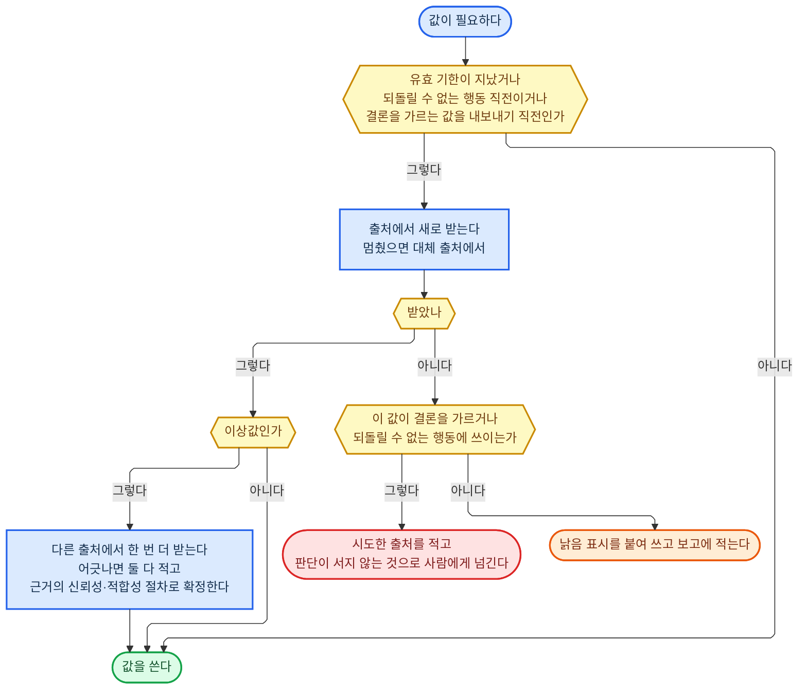
```mermaid
%%{init: {"flowchart":{"wrappingWidth":640,"curve":"linear","nodeSpacing":45,"rankSpacing":55,"padding":14,"useMaxWidth":true,"defaultRenderer":"elk"},"themeVariables":{"fontSize":"15px"},"layout":"elk","elk":{"mergeEdges":false,"nodePlacementStrategy":"NETWORK_SIMPLEX","keepEntryNodeOnTop":true}} }%%
flowchart TB
    N(["값이 필요하다"]):::main
    F{{"유효 기한이 지났거나<br/>되돌릴 수 없는 행동 직전이거나<br/>결론을 가르는 값을 내보내기 직전인가"}}:::note
    U(["값을 쓴다"]):::good
    R["출처에서 새로 받는다<br/>멈췄으면 대체 출처에서"]:::main
    G{{"받았나"}}:::note
    J{{"이상값인가"}}:::note
    T["다른 출처에서 한 번 더 받는다<br/>어긋나면 둘 다 적고<br/>근거의 신뢰성·적합성 절차로 확정한다"]:::main
    D{{"이 값이 결론을 가르거나<br/>되돌릴 수 없는 행동에 쓰이는가"}}:::note
    H(["시도한 출처를 적고<br/>판단이 서지 않는 것으로 사람에게 넘긴다"]):::stop
    S(["낡음 표시를 붙여 쓰고 보고에 적는다"]):::back
    N --> F
    F -- "아니다" --> U
    F -- "그렇다" --> R
    R --> G
    G -- "그렇다" --> J
    J -- "아니다" --> U
    J -- "그렇다" --> T
    T --> U
    G -- "아니다" --> D
    D -- "그렇다" --> H
    D -- "아니다" --> S
    classDef main fill:#dbeafe,stroke:#2563eb,stroke-width:2px,color:#17314f
    classDef stop fill:#fee2e2,stroke:#dc2626,stroke-width:2px,color:#7f1d1d
    classDef back fill:#ffedd5,stroke:#ea580c,stroke-width:2px,color:#7c2d12
    classDef good fill:#dcfce7,stroke:#16a34a,stroke-width:2px,color:#14532d
    classDef note fill:#fef9c3,stroke:#ca8a04,stroke-width:2px,color:#713f12
```

**지금의 선택**

| 구분 | ① 에이전트 하네스 | ②·③ 사내 서버 |
|------|------|------|
| ▶️ 원·달러 매매기준율 ▶️ 은행이 원화와 달러를 바꿔 줄 때 기준으로 삼는 환율이다 | ▶️ 서울외국환중개가 발표하는 값 ▶️ 실시간 값은 거래 은행의 환율 API | ①과 같다 |
| 기준금리 | ECOS | ①과 같다 |
| ▶️ 코픽스 ▶️ 은행이 대출 금리를 정할 때 기준으로 삼는 금리다 | 코픽스를 계산해 알리는 전국은행연합회의 소비자포털 공시 | ①과 같다 |
| 부동산 실거래가 | 국토교통부 실거래가 공개 창구 | ①과 같다 |
| 공시가격 | 부동산공시가격 알리미 | ①과 같다 |

**출처 조건**

| 조건 | 기준 | 이유 |
|------|------|------|
| 다음 공표 시점 | ▶️ 매매기준율은 하루 한 번 나온다 ▶️ 달마다 내는 코픽스는 매월 15일에 나오고, 그날이 휴일이면 다음 영업일에 나온다 ▶️ 단기 코픽스는 매주 나온다 | 받아 둔 값의 유효 기한이 이 시점에 끝나므로, 그때 다시 받아야 한다 |

---

#### 변경 감시·반영

**원칙**

- 바뀐 자료를 받으면 새 판본과 함께, 옛 판본과 한 줄씩 견줘 바뀐 곳을 모은 목록을 남긴다.

**감시와 낡음**

| 상황 | 처리 | 기본값 |
|---|---|---|
| 감시 주기 | 그 자료의 유효 기한을 주기로 삼는다 | 유효 기한이 정해지지 않은 자료는 30일 |
| 개정 신호를 주는 출처 | ▶️ 신호 창구를 날마다 조회한다 ▶️ 창구가 날짜 범위를 정한 조회를 받아 주면, 조회하지 못한 날의 신호를 나중에 한꺼번에 받아 온다 | 하루 |
| 주기 안에 받아 오지 못했다 | '낡음' 표시를 켜고 보고에 적는다 | — |
| 주기의 세 배가 지나도록 받아 오지 못했다 | 그 자료를 근거로 하는 행동을 멈추고, 판단이 서지 않는 것으로 보고 사람에게 넘긴다 | — |
| 새 판본을 조각으로 자르다 실패했다 | ▶️ 원본만 남겨 두고 다음 날 다시 자른다 ▶️ 그동안 옛 조각을 그대로 두어, 쓸 조각이 비는 날이 없게 한다 | — |

**감시 방법 고르기**

1. 그 변화를 처음 공표하는 곳을 지켜본다. 개정 예고는 예고한 기관의 창구를, 국회에 올라가 아직 처리되지 않은 법률안은 국회를, 아직 나오지 않은 상급 판단은 그 사건이 걸린 법원을 지켜본다.
2. 웹훅이나 구독 알림처럼 출처가 바뀔 때 알려 주는 신호가 있으면 그 신호를 받는다. 신호를 놓쳐도 알 수 있게, 주기마다 출처에 묻는 조회도 함께 돌린다.
3. 그런 신호가 없으면 주기마다 조건부 요청으로 묻는다. 조건부 요청은 전에 받은 것과 달라졌을 때만 내용을 보내 달라고 묻는 방식이다. 조건부 요청을 받아 주지 않는 출처는 통째로 받은 뒤, 광고나 날짜처럼 매번 바뀌는 자리를 뺀 본문을 전 판본과 견준다.
4. 종이 관보, 우편 공문, 단체 대화방, 설명회처럼 기계가 받을 수 없는 곳은 입력할 사람과 주기를 정해 두고 사람이 직접 입력한다.

```mermaid
%%{init: {"flowchart":{"wrappingWidth":640,"curve":"linear","nodeSpacing":45,"rankSpacing":55,"padding":14,"useMaxWidth":true,"defaultRenderer":"elk"},"themeVariables":{"fontSize":"15px"},"layout":"elk","elk":{"mergeEdges":false,"nodePlacementStrategy":"BRANDES_KOEPF","keepEntryNodeOnTop":true,"considerModelOrder":"PREFER_EDGES","forceNodeModelOrder":true}} }%%
flowchart TB
    P["주기마다 받는다"]:::main
    B["낡음<br/>표시를 켜고 보고에 적는다"]:::back
    C["멈춤<br/>그 자료에 기대는 행동을 멈추고<br/>판단이 서지 않는 것으로 사람에게 넘긴다"]:::stop
    A(["제때 받음"]):::good
    T{{"주기의 세 배를 넘겼나"}}:::note
    Q{{"주기 안에 받았나"}}:::note
    C -- "받았다" --> A
    T -- "그렇다" --> C
    T -- "아니다" --> P
    B --> T
    P --> Q
    Q -- "아니다" --> B
    Q -- "그렇다" --> A
    %% 배치용 보이지 않는 연결: 선은 그려지지 않고 상자 위치만 잡음
    P ~~~ Q
    B ~~~ C
    classDef main fill:#dbeafe,stroke:#2563eb,stroke-width:2px,color:#17314f
    classDef stop fill:#fee2e2,stroke:#dc2626,stroke-width:2px,color:#7f1d1d
    classDef back fill:#ffedd5,stroke:#ea580c,stroke-width:2px,color:#7c2d12
    classDef good fill:#dcfce7,stroke:#16a34a,stroke-width:2px,color:#14532d
    classDef note fill:#fef9c3,stroke:#ca8a04,stroke-width:2px,color:#713f12
```

**지금의 선택**

| 구분 | ① 에이전트 하네스 | ②·③ 사내 서버 |
|------|------|------|
| 한국 법령 개정 | 국가법령정보 공동활용 창구의 법령 변경이력 목록 | ①과 같다 |
| 행정규칙과 자치법규의 새 판본 | 같은 창구의 행정규칙과 자치법규 목록 | ①과 같다 |
| 바뀐 곳 | ▶️ 같은 창구의 법령 연혁과 신구법 비교 ▶️ 신구법 비교는 옛 조문과 새 조문을 나란히 놓고 견준 자료다 | ①과 같다 |
| 위헌이나 헌법불합치 결정 | 헌법재판소 누리집의 선고 결과 | ①과 같다 |
| ▶️ 입법예고와 행정예고 ▶️ 법령이나 행정 계획을 바꾸기 전에 미리 알리는 공고다 | 공공데이터포털에 있는 법제처 입법예고·행정예고 API | ①과 같다 |
| 국회에서 처리를 기다리는 법률안 | 열린국회정보 Open API의 아직 처리되지 않은 법률안 목록 | ①과 같다 |
| 아직 나오지 않은 상급 판단 | ▶️ 대법원 누리집의 전원합의체 회부 안내와 공개변론 안내 ▶️ 전원합의체 회부는 대법관 전원이 함께 판단하도록 사건을 넘기는 것이다 ▶️ 헌법재판소 누리집의 선고 사건 목록과 변론 사건 목록, 전자헌법재판센터의 사건 조회 | ①과 같다 |
| ▶️ 거래 상대 회사의 공시 ▶️ 회사가 법에 따라 알려야 하는 일을 공개하는 것이다 | 금융감독원 전자공시 창구인 OpenDART | ①과 같다 |
| 거래 상대의 휴업과 폐업 | 공공데이터포털에 있는 국세청 사업자등록 상태조회 API | ①과 같다 |
| 거래 상대의 회생과 파산 | 대법원 누리집의 회생과 파산 공고 | ①과 같다 |

**감시 조건**

| 조건 | 기준 | 이유 |
|------|------|------|
| 주기 조회 | 시작 신호에 예약해 둔 시각마다 조회한다 | 대화가 열려 있을 때만 조회하면 주기를 놓친다 |
| 헌법재판소 결정 | 헌법재판소 누리집의 선고 결과를 날마다 본다 | 위헌이나 헌법불합치 결정도 그 조항을 바꾸는 신호로 받는다 |
| 휴업과 폐업 조회 대상 | 모든 거래 상대를 조회한다 | 거래 상대의 지위 변화는 기본 감시 항목이라 일부만 골라 조회하지 않는다 |
| 공시 대상이 아닌 회사 | 합병과 해산은 사람이 법인 등기부를 보고 직접 입력한다 | 공시 대상이 아니면 OpenDART 공시로 알 수 없다 |

---

### 지식·경험

#### 업무 지식

**원칙**

- 직종의 지식 범위는 그 직종 자격시험의 출제 기준과 공식 매뉴얼로 정한다. 둘 다 없는 직종은 실제 업무의 산출물, 업계 교육 과정의 목차, 숙련자의 작업 기록으로 정한다.
- 원문은 지식에 옮겨 담지 않고 그 자리만 가리킨다. 원문의 어느 자리에서 나왔는지 가리킬 수 없는 관계는 미확인으로 적는다.
- 지식을 모델 안에 넣으려고 모델을 추가로 학습시키지 않는다. 모델 안에 든 지식은 근거 원문과 판본을 가리킬 수 없고, 틀린 것 하나만 골라 되돌릴 수도 없다.
- 재검토 중 표시는 관계마다 붙는 상태와 따로 지식 항목 전체에 붙인다.

**확정 지식에 넣기**

| 대상 | 처리 |
|---|---|
| 개념, 관계, 사실 주장 | 사람이 승인한 것만 넣는다 |
| 방법과 절차, 점검 목록 | ▶️ 능력 개선·확장의 검사를 통과하면 사람 승인 없이 합친다 ▶️ 점검 목록은 정의 1이 정한 숙련된 전문가의 사례 시험도 통과해야 한다 ▶️ 되돌릴 수 있게 판본을 붙인다 |
| 공인 기관이 낸 용어 사전 | ▶️ 판본 하나를 통째로 한 번에 승인해 넣는다 ▶️ 법제처의 법령용어와 일상용어 연계 자료가 그 예다 |
| 넣기 직전 확인 | ▶️ 모델이 아니라 코드가 한다 ▶️ 정의 1 '후보 → 확정 지식'이 정한 형식 검사, 근거 대조, 승인 기록에 더해, 넣으려는 것이 후보의 최신 판본인지와 근거를 읽을 권한이 있는지 본다 |
| 확인, 저장, 근거 연결 | ▶️ 한 번에 처리한다 ▶️ 도중에 내용이 바뀌었거나 하나라도 실패하면 아무것도 확정하지 않는다 ▶️ 다시 할 때는 처음과 같은 멱등 키를 써서 같은 것이 두 번 들어가지 않게 한다 |

**개념과 관계의 후보**

| 상황 | 처리 | 기본값 |
|---|---|---|
| 후보를 만든다 | ▶️ 처음 구축 뒤에는 누군가 지식에 없는 개념을 물어 왔을 때만 만든다 ▶️ 이미 번호가 붙은 개념과 관계로 이어지는 개념만 후보로 만든다 ▶️ 특정 회사나 사람처럼 하나뿐인 실제 대상은 개념 후보로 올리지 않는다 | — |
| 사람에게 승인을 받는다 | 사람에게 넘기기의 결정 요청으로 올리고, 근거 원문 조각, 그 개념을 물어 온 원래 물음, 반대 자료를 붙인다 | — |
| 올리는 순서 | 그 개념이 필요했던 횟수에 잘못 처리한 건 하나의 비용을 곱해, 값이 큰 것부터 올린다 | 건 하나의 비용은 사람이 그 건을 바로잡는 시간 30분에 직종 시급을 곱한 값이다 |
| 그 개념이 한동안 다시 필요하지 않았다 | 후보를 지운다 | 90일 |
| 승인 전의 후보를 쓴다 | ▶️ 검색어를 넓히는 데만 쓴다 ▶️ 검색 범위를 좁히거나 결과를 거르는 데는 쓰지 않는다 ▶️ 후보로 찾은 원문을 근거로 쓰면, 결과에 그 개념이나 관계가 아직 승인 전이라고 적는다 | — |

**합칠 때 검사** — 개념이나 관계를 확정 지식에 합칠 때마다 아래를 검사한다. 하나라도 걸리면 합치지 않고 후보로 돌려보낸다.

| 검사 | 걸리는 것 |
|---|---|
| 순환 관계 | ▶️ '앞선다' 관계나 상위 개념을 따라가다 처음 개념으로 돌아온다 ▶️ A가 B보다 앞서는데 B가 다시 A보다 앞서는 경우가 그렇다 |
| 없는 번호 | 지식에 없는 개념 번호를 가리킨다 |
| 구조 | 정해 둔 종류와 속성 밖의 것을 썼거나, 관계의 방향이 틀렸거나, 꼭 채울 값이 비었다 |

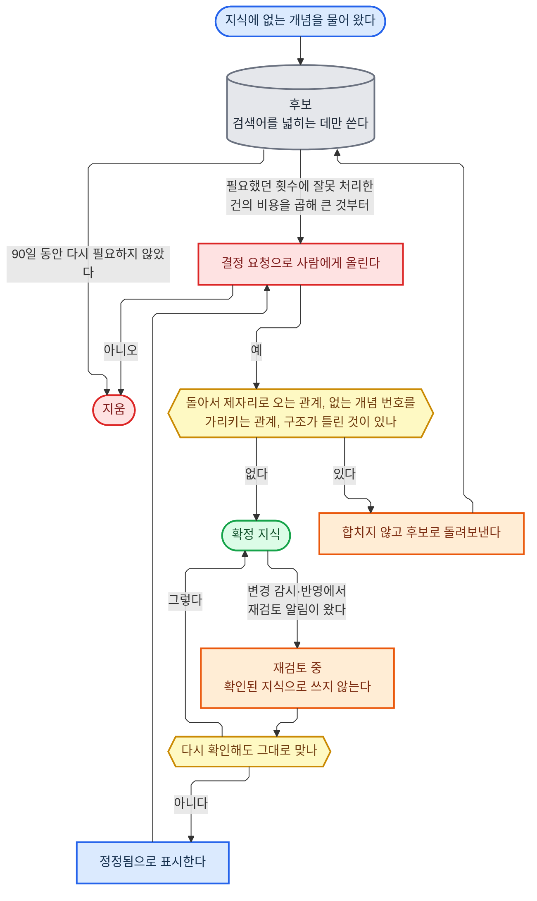
```mermaid
%%{init: {"flowchart":{"wrappingWidth":640,"curve":"linear","nodeSpacing":45,"rankSpacing":55,"padding":14,"useMaxWidth":true,"defaultRenderer":"elk"},"themeVariables":{"fontSize":"15px"},"layout":"elk","elk":{"mergeEdges":false,"nodePlacementStrategy":"NETWORK_SIMPLEX","keepEntryNodeOnTop":true,"cycleBreakingStrategy":"MODEL_ORDER"}} }%%
flowchart TB
    CAND[("후보<br/>검색어를 넓히는 데만 쓴다")]:::store
    DEL(["지움"]):::stop
    REQ["결정 요청으로 사람에게 올린다"]:::stop
    REV["재검토 중<br/>확인된 지식으로 쓰지 않는다"]:::back
    COR["정정됨으로 표시한다"]:::main
    LOOP{{"돌아서 제자리로 오는 관계, 없는 개념 번호를<br/>가리키는 관계, 구조가 틀린 것이 있나"}}:::note
    ASK(["지식에 없는 개념을 물어 왔다"]):::main
    FIX(["확정 지식"]):::good
    CHK{{"다시 확인해도 그대로 맞나"}}:::note
    NOMERGE["합치지 않고 후보로 돌려보낸다"]:::back
    ASK --> CAND
    CHK -- "그렇다" --> FIX
    FIX -- "변경 감시·반영에서<br/>재검토 알림이 왔다" --> REV
    CHK -- "아니다" --> COR
    NOMERGE --> CAND
    REQ -- "예" --> LOOP
    CAND -- "필요했던 횟수에 잘못 처리한<br/>건의 비용을 곱해 큰 것부터" --> REQ
    LOOP -- "없다" --> FIX
    REQ -- "아니오" --> DEL
    REV --> CHK
    LOOP -- "있다" --> NOMERGE
    COR --> REQ
    CAND -- "90일 동안 다시 필요하지 않았다" --> DEL
    %% 배치용 보이지 않는 연결: 선은 그려지지 않고 상자 위치만 잡음
    DEL ~~~ COR
    REQ ~~~ LOOP
    NOMERGE ~~~ REQ
    classDef main fill:#dbeafe,stroke:#2563eb,stroke-width:2px,color:#17314f
    classDef stop fill:#fee2e2,stroke:#dc2626,stroke-width:2px,color:#7f1d1d
    classDef back fill:#ffedd5,stroke:#ea580c,stroke-width:2px,color:#7c2d12
    classDef store fill:#e5e7eb,stroke:#6b7280,stroke-width:2px,color:#1f2937
    classDef good fill:#dcfce7,stroke:#16a34a,stroke-width:2px,color:#14532d
    classDef note fill:#fef9c3,stroke:#ca8a04,stroke-width:2px,color:#713f12
```

**방법과 절차를 담는 형식 고르기**

1. 항목마다 근거 원문과 판본을 가리킬 수 있고, 고친 이력과 이전 판본이 남는 형식만 남긴다.
2. 초안과 확정 지식을 따로 둘 수 있는 형식만 남긴다. 초안에서 바뀐 부분은 사람의 승인이나 시험 통과 기록이 있을 때만 확정 지식에 합칠 수 있어야 한다.
3. 작업창에는 목록만 두고, 본문은 그 일을 할 때 불러올 수 있는 형식만 남긴다.
4. 둘 이상 남으면, 한 번 써 둔 것을 세 환경이 같은 형식 그대로 쓸 수 있는 공개 규격을 고른다.

**지금의 선택**

| 구분 | ① 에이전트 하네스 | ②·③ 사내 서버 |
|------|------|------|
| 방법과 절차의 형식 | Anthropic이 공개한 Agent Skills 규격의 스킬 파일 | ①과 같다 |
| 용어 사전 형식 | SKOS | ①과 같다 |
| 합치고 판본을 남기는 곳 | git | ▶️ 방법, 절차, 교훈, 요령은 git ▶️ 개념, 관계, 사실 주장은 승인 기록과 함께, 점검 목록은 시험 통과 기록과 함께 PostgreSQL |
| 일할 때 꺼내는 곳 | git 저장소의 직종 공통 폴더 | ▶️ PostgreSQL ▶️ git의 같은 스킬 파일과 용어 사전을 배포할 때 넣는다 |

직종마다 지식 패키지 하나를 만들어 배포한다. 패키지에는 개념과 관계의 정의, 주장과 근거의 연결, 적용 범위와 판본, 검사 규칙, 대표 질문과 반례, 승인 기록을 함께 넣는다. 고객 자료는 다시 써도 된다고 허락받은 범위까지만 넣는다. 패키지를 쓰기 시작하기 전에, 매니페스트(패키지에 든 것을 적은 목록)에 적힌 것과 실제로 든 것이 같은지 대조한다.

근거를 잇는 방식과 패키지의 모양은 매니페스트, 근거 색인, 품질 보고를 한 패키지 규격으로 함께 정해 공개한 OpenCrab을 본뜬다. OpenCrab은 정식 배포 판본이 없어 기술 고르기 조건 2를 채우지 못하므로 프로그램은 가져다 쓰지 않는다.

---

#### 실전 경험·감각

**원칙**

- 요령 하나는 네 칸으로 적는다. 쓰는 조건, 먼저 볼 단서, 대응, 통하지 않는 조건이다.
- 요령마다 그 요령이 나온 사례의 번호를 단다. 사례를 댈 수 없는 요령은 넣지 않는다.
- 숙련자가 말로 전한 요령은 그 사람이 실제로 한 일의 원본, 과정, 결과와 맞춰 본 뒤에만 넣는다.
- 요령은 무엇을 먼저 볼지와 어느 대응을 고를지만 바꾼다. 규칙과 업무 지식의 개념, 관계, 사실 주장이 요령보다 앞선다. 요령이 이들과 부딪친 사례는 성공·실패 원인 분석에 넘긴다.

**후보에서 폐기까지**

| 상태 | 처리 | 기본값 |
|---|---|---|
| 후보 요령 | 아직 쓰지 않고 사례만 모은다 | — |
| 능력 개선·확장의 검사를 통과했다 | 쓰는 요령이 된다 | — |
| 쓰는 요령 | 쓸 때마다 들어맞았는지 적는다 | — |
| 자주 틀린다 | 다시 검토해 통하지 않는 조건을 찾는다 | 최근 10번 가운데 3번 이상 틀렸을 때 |
| 고쳤다 | 능력 개선·확장의 검사를 다시 통과해야 다시 쓴다 | — |
| 못 고쳤다 | "이 조건에서는 통하지 않는다"는 기록을 남기고 요령을 버린다 | — |

**요령 두는 곳 고르기**

1. 요령을 업무 종류와 대상 종류로 나눠 두고, 이번 건에 맞는 요령만 작업창에 올릴 수 있는 곳을 고른다.
2. 요령과 근거 사례의 번호를 함께 올릴 수 있는 곳만 남긴다.
3. 둘 이상 남으면 업무 지식과 같은 곳에 두는 쪽을 고른다.

**지금의 선택**

| 구분 | ① 에이전트 하네스 | ②·③ 사내 서버 |
|------|------|------|
| 쓰는 요령 | 그 일의 스킬 파일 안에 둔 요령 파일 | ①과 같다 |
| 후보 요령, 들어맞았는지 적은 기록 | 기록 보관 폴더 | PostgreSQL |

**두는 곳 조건**

| 조건 | 기준 | 이유 |
|------|------|------|
| 요령 파일 나누기 | ▶️ 요령 파일은 대상 종류마다 나눈다 ▶️ ①은 스킬 파일 본문에, 이번 대상 종류에 맞는 요령 파일만 열라고 적는다 ▶️ ②·③은 사내 플랫폼이 업무 종류와 대상 종류로 요령 파일을 골라 작업창 뒷부분에 붙인다 | 대상 종류가 다른 요령은 쓰는 조건이 이번 건과 맞지 않는다 |
| 후보 요령, 들어맞았는지 적은 기록 | ▶️ 추가 전용 기록으로 둔다 ▶️ ①에서 이 기록에 쓰는 것은 기록 서비스뿐이다 | 요령을 다시 검토할지를 이 기록의 틀린 횟수로 정하므로, 모델이 고칠 수 없어야 한다 |

---

### 기억·진행 상태

#### 현재 진행 상태

**원칙**

- 진행 상태는 추가 전용 기록으로 적고, 지금 상태는 줄을 처음부터 읽어 알아낸다. 앞에 적은 줄이 바뀌면 지금 상태도 틀어지므로 세 환경 모두 덧붙이기만 허용한다.
- 산출물마다 만들 때 쓴 입력의 번호와 판본을 적는다. 입력이 바뀌면 이것으로 결과를 무효로 돌릴 작업을 찾는다.
- 도구를 부를 때마다 남는 실행 기록은 여기에 두지 않고 판단 근거 기록에 둔다.
- 기록 서비스는 진행 상태에 덧붙이기 전에 요청한 쪽의 권한, 그쪽이 읽은 판본이 지금 판본인지, 적을 내용이 실제 처리 결과와 맞는지 확인한다. 완료 보고는 필수 검사를 마쳤는지도 확인한다. 이 확인은 훅이 돌지 않아도 빠지지 않는다.

**상태를 되돌리거나 닫을 때**

| 상황 | 처리 |
|---|---|
| 무효가 된 작업이 이미 바깥에 무언가를 보냈다 | ▶️ 그 작업을 할 일로 돌려 다시 하지 않는다 ▶️ 이미 나간 행동과 그 결과는 기록에 그대로 둔다 ▶️ 정정, 차액 지급, 취소 요청 같은 새 작업을 만들어 바로잡고, 이미 나간 행동을 그 작업에 붙인다 |
| 기다리다가 다른 방법이나 다른 담당으로 바꾸기로 했다 | ▶️ 할 일로 돌린다 ▶️ 기다리던 것이 바깥에 보낸 처리이면, 그 처리를 취소했거나 상대가 처리하지 않았다고 확인한 뒤에만 돌린다 ▶️ 확인할 수 없으면 결과 불명으로 둔다 |
| 빠진 서류나 정보를 채워 내기로 한 보완 기한이 지났거나, 요청이 거절됐다 | 취소 절차를 밟아 남은 처리를 확인한 뒤 닫는다 |

**계속 맡긴 책임**

- 계속 맡긴 책임, 그 책임에서 생긴 건, 그 건의 실행 한 번 한 번에 저마다 번호를 붙여 서로 잇는다.
- 책임에는 목적, 담당, 기간, 권한, 예산, 다음 점검 시점, 종료 조건을 적는다.
- 실행 한 번이나 건 하나가 끝나도 책임은 끝나지 않는다.

```mermaid
%%{init: {"flowchart":{"wrappingWidth":380,"curve":"linear","nodeSpacing":45,"rankSpacing":55,"padding":14,"useMaxWidth":true,"defaultRenderer":"elk"},"themeVariables":{"fontSize":"15px"},"layout":"elk","elk":{"mergeEdges":false,"nodePlacementStrategy":"NETWORK_SIMPLEX","keepEntryNodeOnTop":true,"cycleBreakingStrategy":"MODEL_ORDER","forceNodeModelOrder":true}} }%%
flowchart TB
    DOING["하는 중"]:::main
    CANCEL["취소 요청<br/>새 실행을 막고 하위 작업과<br/>예약, 바깥 처리를 확인한다"]:::note
    CHECK["확인 대기<br/>다음 조회 시각, 담당, 기한을 적는다"]:::note
    DONE(["끝남"]):::good
    WAIT["기다림<br/>결정 기한이 지나면 다음<br/>결정권자에게 올린다"]:::note
    CLOSE(["거절되거나 취소돼 닫는다"]):::stop
    PART["일부 성공<br/>된 부분과 안 된 부분을 갈라 적는다"]:::note
    TODO["할 일"]:::main
    HUMAN(["사람에게 넘긴다<br/>판단이 서지 않는 것"]):::stop
    FAIL["실패"]:::stop
    UNK["결과 불명<br/>다시 실행하지 않는다"]:::note
    UNK -- "상대에게 됐다고 확인하고 남은<br/>완료 조건과 필수 검사도 확인했다" --> DONE
    DOING -- "승인 철회나 목표 변경, 취소가 왔다" --> CANCEL
    DOING -- "단계 결과를 저장하고<br/>완료 조건과 필수<br/>검사를 확인했다" --> DONE
    CHECK -- "다시 확인" --> CANCEL
    WAIT -- "보완 기한이 지났거나 거절됐다" --> CANCEL
    DOING -- "바깥에 보낸 행동이 결과 불명이다" --> UNK
    DOING -- "확실히 실패했다" --> FAIL
    TODO -- "먼저 끝날 작업이 끝났고<br/>입력 판본을 확인했다" --> DOING
    UNK -- "상대에게 확인할 수 없다" --> HUMAN
    WAIT -- "진행 중인 처리를 취소한다" --> CANCEL
    WAIT -- "다시 꺼낼 조건이 찼다" --> DOING
    DOING -- "일부만 됐다" --> PART
    CANCEL -- "멈추고 남은 영향을 정리했고<br/>인계도 확인했다" --> CLOSE
    DONE -- "기댄 입력이 바뀌어 무효가 됐다<br/>바깥에 보낸 행동은 없다" --> TODO
    DOING -- "답이나 결정, 바깥<br/>처리를 기다린다" --> WAIT
    CANCEL -- "아직 진행 중이거나 결과를 모른다" --> CHECK
    PART -- "남은 부분의 방법을 다시 정했다" --> TODO
    WAIT -- "다른 방법이나 다른 담당으로<br/>방법을 다시 정했다<br/>바깥 처리는 없거나 취소됐다" --> TODO
    UNK -- "상대에게 안 됐다고 확인" --> FAIL
    FAIL -- "방법을 다시 정했다" --> TODO
    %% 배치용 보이지 않는 연결: 선은 그려지지 않고 상자 위치만 잡음
    CANCEL ~~~ CHECK
    CANCEL ~~~ PART
    classDef main fill:#dbeafe,stroke:#2563eb,stroke-width:2px,color:#17314f
    classDef stop fill:#fee2e2,stroke:#dc2626,stroke-width:2px,color:#7f1d1d
    classDef good fill:#dcfce7,stroke:#16a34a,stroke-width:2px,color:#14532d
    classDef note fill:#fef9c3,stroke:#ca8a04,stroke-width:2px,color:#713f12
```

**진행 상태 두는 곳 고르기**

1. 다음 조건을 모두 갖춘 곳만 남긴다.
   - 대화나 프로그램이 끊겨도 기록이 남는다.
   - 하네스나 실행 엔진이 스스로 지우거나 압축하지 않는다.
   - 줄마다 칸이 정해져 있어, 기계가 상태 값과 빈 칸을 검사할 수 있다.
2. 남은 곳 가운데 다음 두 가지를 하는 곳을 고른다.
   - 쓰기 직전에 판본 번호를 확인해, 읽은 뒤 누가 바꿨으면 쓰지 않는다.
   - 여러 줄을 한 번에 쓰다가 하나라도 실패하면 모두 되돌린다.

**지금의 선택**

| 구분 | ① 에이전트 하네스 | ②·③ 사내 서버 |
|------|------|------|
| 진행 상태를 두는 곳 | 건 폴더 안의 건 상태 파일 하나 | PostgreSQL |

**저장소 조건**

| 조건 | 기준 | 이유 |
|------|------|------|
| 모델이 건 상태 파일을 지우거나 바꿔 넣지 못하게 | ①은 건 상태 파일을, 건 폴더 안에서도 하네스를 돌리는 운영체제 사용자가 쓰지 못하는 하위 폴더에 둔다 | 건 폴더는 모델이 그 건을 읽고 쓰는 자리라, 따로 막지 않으면 모델이 건 상태 파일을 지우거나 바꿔 넣을 수 있다 |
| 기록이 동시에 들어올 때 | ▶️ ①은 기록 서비스가 한 번에 하나만 쓰도록 잠근다 ▶️ 기록 서비스는 쓰기 직전에 판본 번호를 확인하고, 여러 줄은 모두 쓰거나 하나도 쓰지 않는다 | 이렇게 하지 않으면 읽은 뒤 다른 쪽이 바꾼 것을 모르고 덮어쓰게 된다 |

---

#### 장기 기억

**원칙**

- 다음 건의 판단을 바꿀 것만 넣는다.
- 약속과 기한은 건이 끝나기를 기다리지 않고 확인하는 즉시 넣는다.
- 지금 대화의 내용, AI 제품이 스스로 만든 기억, 장기 기억, 직종 공통 지식은 섞지 않는다. 고객의 사실과 약속이 AI 제품이 만든 기억이나 직종 공통 지식과 다르면 장기 기억을 따른다. 지금 대화에서 새로 확인한 값은 장기 기억에 새 줄로 넣는다.
- 접수 단계에서는 이 고객의 현재 요약 한 장, 아직 끝나지 않은 약속, 다가오는 기한 셋만 작업창에 올린다. 현재 요약은 기억 줄에서 그때마다 다시 만드는 사본이고, 기억으로 저장하지 않는다. 나머지는 모델이 필요할 때 번호로 꺼내 본다.

**보관과 지우기**

| 대상 | 처리 |
|---|---|
| 보관 기간 | 효력이 남은 약속이나 기한, 계약이 끝난 뒤에도 효력이 남는 조항이 있으면, 그 효력이 끝날 때까지 고객 관계가 끝나지 않은 것으로 본다 |
| 효력이 남은 조항에서 나온 줄 | 그 줄이 나온 계약서 원본과 자료 메타데이터도 함께 둔다 |

```mermaid
%%{init: {"flowchart":{"wrappingWidth":640,"curve":"linear","nodeSpacing":45,"rankSpacing":55,"padding":14,"useMaxWidth":true,"defaultRenderer":"elk"},"themeVariables":{"fontSize":"15px"},"layout":"elk","elk":{"mergeEdges":false,"nodePlacementStrategy":"NETWORK_SIMPLEX","keepEntryNodeOnTop":true,"considerModelOrder":"PREFER_NODES","cycleBreakingStrategy":"MODEL_ORDER"}} }%%
flowchart TB
    REV["정정됨<br/>근거로 쓰지 않고 정정된 까닭만 가져간다"]:::back
    IN(["기억할 것을 확인했다"]):::main
    DEL(["지움"]):::stop
    OLD["옛 기록<br/>그때 무엇을 알았는지 되짚을 때만 쓴다"]:::store
    LIVE["살아 있는 줄<br/>사실로 쓴다"]:::main
    LIVE -- "효력 기간이 끝났거나<br/>새 값이 들어왔다" --> OLD
    IN --> LIVE
    LIVE -- "나온 자료가 지워졌거나 볼 허락이 철회됐다<br/>삭제 요구가 왔거나 보관 기간이 끝났다" --> DEL
    LIVE -- "틀린 것으로 드러났다" --> REV
    REV -- "나온 자료가 지워졌거나 볼 허락이 철회됐다<br/>삭제 요구가 왔거나 보관 기간이 끝났다" --> DEL
    OLD -- "나온 자료가 지워졌거나 볼 허락이 철회됐다<br/>삭제 요구가 왔거나 보관 기간이 끝났다" --> DEL
    classDef main fill:#dbeafe,stroke:#2563eb,stroke-width:2px,color:#17314f
    classDef stop fill:#fee2e2,stroke:#dc2626,stroke-width:2px,color:#7f1d1d
    classDef back fill:#ffedd5,stroke:#ea580c,stroke-width:2px,color:#7c2d12
    classDef store fill:#e5e7eb,stroke:#6b7280,stroke-width:2px,color:#1f2937
    classDef good fill:#dcfce7,stroke:#16a34a,stroke-width:2px,color:#14532d
```

**기억 담는 곳 고르기**

1. 고객별로 나눠 두고, 다른 고객의 일에서 읽히지 않도록 모델 밖에서 막을 수 있는 곳만 남긴다.
2. 옛 값을 지우지 않고 줄마다 효력 기간을 남기는 곳만 남긴다. 모델이 알아서 요약해 덮어쓰는 방식은 뺀다.
3. 줄을 하나씩 정정하거나 지울 수 있는 곳만 남긴다.
4. 고객 번호나 건 번호로 그 고객이나 건의 기억을 한 번에 펼쳐 볼 수 있는 곳만 남긴다. 거꾸로 규칙과 근거의 번호와 판본, 나온 자료의 번호로도 거기에 기댄 줄을 찾을 수 있어야 한다.
5. 둘 이상 남으면 현재 진행 상태와 같은 저장소를 쓰는 쪽을 고른다.

**지금의 선택**

| 구분 | ① 에이전트 하네스 | ②·③ 사내 서버 |
|------|------|------|
| 기억을 담는 곳 | 고객마다 둔 기억 폴더의 기억 파일 | PostgreSQL |
| 규칙, 근거, 자료 번호로 거꾸로 찾기 | 하네스의 파일 검색 | PostgreSQL |

**저장소 조건**

| 조건 | 기준 | 이유 |
|------|------|------|
| 기억 파일의 모양 | ①의 기억 파일은 줄마다 칸이 정해져 있다 | 칸이 정해져 있어야 파일 검색으로 고객 번호, 건 번호, 규칙과 근거와 자료의 번호에 맞는 줄을 찾을 수 있다 |
| 값이 하나여야 하는 사실 | ②·③은 주소처럼 값이 하나여야 하는 사실이 같은 기간에 두 값으로 겹치지 않도록 저장소가 막는다 | 기억 줄은 효력 기간으로 옛 값과 새 값을 가르므로, 같은 기간에 두 값이 있으면 그때의 값을 정할 수 없다 |
| AI 제품이 스스로 만드는 기억 | ▶️ ①은 끈다 ▶️ Claude Code는 자동 기억을 끄고, 하위 에이전트에도 자체 기억을 켜지 않는다 ▶️ Codex는 기억 만들기와 기억 참고하기를 둘 다 끈다 ▶️ ChatGPT의 기억과 PC에서 도는 Codex의 기억은 저장되는 곳이 다르므로, 둘 다 꺼졌는지 따로 확인한다 ▶️ 제품과의 연결을 끊는 일, 기억 만들기를 끄는 일, 이미 저장된 기억을 지우는 일은 서로 다른 일이라 셋을 하나씩 확인한다 ▶️ 하네스 말고 다른 AI 제품의 기억은 위 고르기 기준 1~3을 넘는다고 확인되기 전에는 장기 기억을 두는 곳으로 쓰지 않는다 | 모델이 알아서 요약해 덮어쓰는 기억은 옛 값과 효력 기간을 남기지 않는다 |

---

### 규칙·권한

#### 법·의무 기준

**적용할 법과 판본 고르기**

1. 어느 나라 법을 쓰는가.
   - 당사자가 쓰기로 합의한 나라의 법을 먼저 쓴다.
   - 합의가 없고 다툼이 이미 법원에 가 있으면, 그 법원이 있는 나라의 국제사법(어느 나라 법을 쓸지 정한 규칙)을 따른다.
   - 합의도 법원에 간 다툼도 없으면, 행위나 처분이 일어나는 나라의 국제사법을 따른다.
   - 합의로 뺄 수 없는 조항은 합의와 상관없이 함께 적용한다.
2. 어느 날의 판본을 쓰는가. 그 법의 부칙이 날을 정했으면 그날을 쓴다. 부칙이 정하지 않은 대한민국 법은 아래처럼 정하고, 다른 나라 법은 그 나라의 같은 규칙을 찾아 쓴다.
   - 신청을 받아 하는 처분은 처분한 날의 법을 쓴다.
   - 위반과 제재는 위반한 날, 범죄와 처벌은 행위한 날, 세금은 납세 의무가 생긴 날의 법을 쓴다.
   - 그 뒤 법이 바뀌어 위반이나 범죄가 아니게 됐거나 제재나 처벌이 가벼워졌으면 바뀐 법을 쓴다. 범죄와 처벌은 처벌 조항이나 그 조항이 내용을 맡긴 법령이 바뀐 때만 이렇게 한다. 처음부터 정해 둔 유효기간이 지나 효력을 잃은 것은 법이 바뀐 것으로 보지 않는다.
   - 범죄와 처벌에서 처벌 조항도, 그 조항이 내용을 맡긴 법령도 아닌 다른 법령이 바뀌어 범죄가 아니게 됐거나 처벌이 가벼워졌으면 '판단이 서지 않는 것'으로 사람에게 넘긴다.
   - 조항마다 고른 날과 그날을 고른 까닭을 적는다. 가장 최근에 고친 조항이라는 이유만으로 지난 일에 쓰지 않는다.
   - 조문마다 시행일이 다르면 조문별 시행일로 가린다.
3. 법령끼리 위아래는 어떻게 되는가. 아래 법령의 조항은 위 법령이 맡긴 범위 안에서만 쓴다. 대한민국 법에서는 다음을 지킨다.
   - 총리령과 부령은 낸 사람의 직위만으로 어느 쪽이 위라고 정하지 않는다.
   - 국회, 대법원, 헌법재판소의 규칙은 행정부 명령 아래에 두지 않는다. 선거관리위원회 규칙은 행정부 명령 아래에 둔다.
   - 조약을 저절로 법률 위에 두지 않는다.
   - 고시, 훈령, 예규는 법령이 맡겨서 만든 것만 법령과 함께 쓴다.

**해석과 효력**

| 대상 | 처리 |
|---|---|
| 권고, 행정 해석, 상담 답변 | 의무로 올리지 않는다 |
| 행정 해석 | ▶️ 법원 판단과 같은 무게로 다루지 않는다 ▶️ 그 행정청이 해석대로 처분할 가능성은 근거의 신뢰성·적합성의 출처 등급으로 따로 적는다 ▶️ 해석과 다르게 처리하려면 반대 판례나 상위 법령 같은 근거를 붙인다 |
| 헌법재판소가 아직 결정하지 않은 규정이 위헌인지가 쟁점이다 | ▶️ 에이전트가 혼자 위헌으로 정해 시행 중인 규정을 무시하지 않는다 ▶️ 규칙의 적용·우선순위에서 사람에게 넘기는 충돌로 다룬다 |

**자격을 갖춘 사람만 할 수 있는 일**

| 대상 | 처리 |
|---|---|
| 가르는 기준 | ▶️ 특정한 사람의 구체적인 사정에 법규를 대어 법적 결론이나 평가를 내는 일은 자격을 갖춘 사람만 할 수 있다 ▶️ 그 결론을 내려는 사실 조사와 자료 모으기도 그렇다 ▶️ 자격자가 써야 하는 법률 문서나 세무 서류를 생성형 AI가 이용자의 사정에 맞춰 써 주는 일도 그렇다 ▶️ 특정한 사람의 사정에 대지 않은 일반 법령 안내, 법령과 판례의 검색 결과, 이용자가 채운 빈칸을 고치지 않고 옮기는 서식은 들지 않는다 ▶️ 직종, 행위, 관할마다 따로 가린다 |
| 에이전트가 하는 몫 | ▶️ 자격자가 맡지 않은 건이면 보수를 받지 않더라도 준비한 것을 고객에게 주지 않는다 ▶️ 자격자의 이름만 빌려 내는 것은 자격자가 낸 것으로 보지 않는다 |
| 운영자가 자격자가 아니다 | ▶️ 그런 일을 고객에게 팔고 자격자에게 검토나 도장만 받는 방식은 쓰지 않는다 ▶️ 그런 일로 받은 보수를 자격자와 나누지 않는다 ▶️ 고객을 특정한 자격자에게 소개하거나 알선하고 대가를 받지 않는다 |

**법정 보존과 삭제 요구**

| 대상 | 처리 |
|---|---|
| 법이 보존하라고 정한 자료 | ▶️ 자료 종류마다 보존 기간과 근거 조항을 적는다 ▶️ 세법이 정한 장부와 증빙, 상법이 정한 상업장부가 그 예다 ▶️ 근거로 치는 것은 우리나 우리에게 처리를 맡긴 쪽에 걸린 법령 조항뿐이다 ▶️ 직업 단체의 규정, 계약, 내부 규칙만으로는 남기지 않는다 |
| 보존하는 전자 문서 | ▶️ 보존 기간 내내 열어 볼 수 있게 둔다 ▶️ 만들거나 받은 때의 모양 그대로 되살릴 수 있게 둔다 ▶️ 보낸 사람, 받은 사람, 주고받은 때가 적힌 부분도 함께 둔다 |
| 삭제 요구에 답한다 | ▶️ 공통 절 지우기의 기한 안에, 개인정보보호위원회가 고시한 개인정보 정정·삭제 결과 통지서로 알린다(개인정보 보호법 시행령 제43조 제3항) ▶️ 통지서에는 지운 것, 남긴 것, 남긴 근거 조항, 이의를 낼 방법을 적는다 ▶️ 한 사람의 자료만 골라 지울 수 없는 사본이 남았으면 그 사본을 못 읽게 한 방법과 사본이 사라지는 날도 적는다 ▶️ 다른 의뢰인이나 다른 건의 비밀은 적지 않는다 |
| 남의 개인정보 처리를 위탁받았는데 삭제 요구를 받았다 | ▶️ 요구를 받은 날 맡긴 쪽에 알린다 ▶️ 공통 절 지우기의 기한 안에, 위탁 계약서에 적은 법정 보존 자료를 빼고 지운 뒤 맡긴 쪽과 요구한 사람에게 결과를 알린다 ▶️ 맡긴 쪽이 그 기한 안에 다르게 지시하면 따르되, 법정 보존 자료를 지우라는 지시와 근거 조항 없이 남기라는 지시는 따르지 않는다 ▶️ 이 절차와 법정 보존 자료의 종류, 근거 조항은 위탁 계약서에 미리 적는다 |

**개인정보를 ①의 모델 회사 서버로 보낼 때** — 모델 회사 서버로 보내는 것은 개인정보의 국외 이전이다. 무보관 계정으로 보내도 마찬가지다.

| 상황 | 처리 |
|---|---|
| 개인정보가 든 건을 ①에서 돌린다 | ▶️ 무보관(ZDR) 계정으로만 돌린다 ▶️ 이 계정도 법을 지키거나 오용에 대응하는 데 필요하면 모델 회사가 남길 수 있다 ▶️ Claude Code는 Anthropic이 무보관을 켜 준 Claude Enterprise 조직의 계정을 쓰고, Codex는 무보관을 승인받은 API 조직의 자격 증명을 쓴다 ▶️ 그런 계정이 없으면 그 건은 ①에서 맡지 않고 ②·③으로 넘긴다 ▶️ 대화 기록을 모델 회사로 올려 보내는 의견 보내기와 대화 공유 기능은 끈다 |
| 동의 없이 옮기는 근거 | ▶️ 정보주체(그 개인정보의 주인)가 우리나 우리에게 처리를 맡긴 쪽과 맺는 계약의 체결과 이행에 처리위탁이 필요한 경우(개인정보 보호법 제28조의8 제1항 제3호)만 근거로 쓴다 ▶️ 이때 이전받는 회사의 이름과 연락처, 옮겨 가는 나라, 이전하는 항목, 이전 시기와 방법, 그 회사의 이용 목적과 보유 기간, 이전을 거부하는 방법과 절차, 거부하면 생기는 일의 일곱 가지를 개인정보 처리방침에 적는다 |
| 상대방이나 증인처럼 그런 계약 없이 자료에 나오기만 하는 사람의 개인정보 | ▶️ 그 사람에게 같은 일곱 가지를 알리고 국외 이전 동의를 따로 받았을 때만 ①의 모델에 넘긴다 ▶️ 동의가 없으면 그 건은 ②·③으로 넘긴다 |
| 우리가 고객에게서 개인정보 처리를 위탁받은 쪽이다 | 모델 회사로 보내는 것은 재위탁이므로, 위탁 계약서로 고객의 재위탁 동의를 먼저 받는다 |

**놓치면 되돌릴 수 없는 법정 기한**

| 상황 | 처리 |
|---|---|
| 대한민국 하도급법이 걸릴 수 있는 거래에서 하도급을 준 우리가 목적물을 받았다 | ▶️ 받은 날부터 10일 안에 검사 결과를 서면으로 알리지 않으면 검사에 합격한 것으로 본다(하도급법 제9조 제2항) ▶️ 하도급법 적용이 확인되지 않았어도 이 기한을 대기·후속 관리의 놓치면 되돌릴 수 없는 기한으로 올린다 ▶️ 제조는 일부 완성분(기성부분)을 통지받은 날도 받은 날로 친다 ▶️ 건설은 준공이나 기성부분을 통지받은 날부터 센다 ▶️ 용역 가운데 역무의 공급을 맡긴 일에는 이 기한이 없다 |

---

#### 직업 윤리·의무

**관계와 의무가 바뀔 때**

| 상황 | 처리 |
|---|---|
| 역할이나 관계가 바뀌었다 | 이미 내린 결정, 공유한 자료, 그 자료로 만든 결과물을 계속 써도 되는지도 다시 판단한다 |
| 계속 맡을 수 없게 됐다 | 규칙의 적용·우선순위에서 사람에게 넘기는 충돌로 다루고, 그만둘지를 '판단이 서지 않는 것'으로 넘긴다 |
| 비밀 유지 의무가 법이 정한 신고 의무나 공개 의무와 부딪힌다 | 그 법의 조건과 예외를 확인하고, 꼭 필요한 만큼만 공개한다 |
| 직업 단체의 권고 | ▶️ 법, 계약, 권한 있는 지시가 의무로 정했을 때만 의무로 지킨다 ▶️ 그 밖에는 따로 정한 것이 없을 때 따르는 기본값으로만 쓴다 |

**접수 때 이해충돌 처리 고르기**

1. 법이나 직업 규정이 동의로도 풀 수 없다고 정한 충돌이면 맡지 않는다.
2. 동의로 풀 수 있는 충돌이면 당사자마다 충돌 내용을 적은 서면 동의를 받는다. 한 사람에게라도 받지 못하면 맡지 않는다.
3. 주장이 어긋나는 당사자를 함께 맡을 때, 정보 차단벽(당사자끼리 서로의 자료를 볼 수 없게 막는 칸막이)으로도 한쪽 자료가 다른 쪽 결론에 쓰이는 것을 막을 수 없으면 맡지 않는다.

**이해충돌 확인 대장**

| 대상 | 처리 |
|---|---|
| 남길 것 | ▶️ 이름, 관계, 건 번호를 남기고, 건이 끝난 당사자도 대장에서 빼지 않는다 ▶️ 같은 사람인지 가리는 데 쓰는 번호는 HMAC으로만 남긴다 ▶️ 건의 내용은 넣지 않는다 |
| 예전 의뢰인과 이해가 부딪히는 일을 법이나 직업 규정이 기한 없이 막는 직종 | ▶️ 그 규정이 걸리는 동안은 공통 절의 보관 기간이 지나도 이름, 관계, 건 번호, 번호의 HMAC을 남긴다 ▶️ 변호사는 한쪽의 상의를 받아 수임한 사건의 상대방이 같은 사건을 맡기려 하면 기한 없이 맡지 못하므로 여기에 든다 ▶️ 이렇게 남기는 기간과 까닭은 개인정보 처리방침에 적는다 |

**지금의 선택**

| 구분 | ① 에이전트 하네스 | ②·③ 사내 서버 |
|------|------|------|
| 정보 차단벽 | 당사자마다 따로 만든 운영체제 사용자나 컨테이너 | 데이터베이스 행 보안, OpenSearch 문서 단위 보안 |

**조건**

| 조건 | 기준 | 이유 |
|------|------|------|
| 대장을 읽는 쪽 | ▶️ 모델은 대장을 읽지 않는다 ▶️ 대조는 모델 밖에서 하고, 충돌이 있는 것만 모델에 준다 | 대장에는 끝난 건의 당사자까지 남아 있어, 모델이 읽으면 다른 건의 당사자를 알게 된다 |
| 같은 사람 찾기 | ▶️ 이해충돌 대조에서만 같은 사람을 넓게 잡는다 ▶️ 이름은 띄어쓰기를 빼고 한자나 영문 표기를 한글로 옮겨 한 가지 꼴로 맞춘다 ▶️ 법인등록번호가 같으면 같은 사람으로 본다 ▶️ 사업자등록번호가 다른 법인은 법인등록번호로 다시 맞춰 보고, 가리지 못하면 같은 사람으로 본다 ▶️ 개인사업자는 사업자등록번호가 달라도 대표자 이름이 같으면 같은 사람으로 본다 ▶️ 이름이 같은데 번호가 없어 가릴 수 없어도 같은 사람으로 본다 | 이해충돌을 놓치면 맡으면 안 되는 건을 맡게 되므로, 같은 사람일 수 있으면 같은 사람으로 잡는다 |
| 주민등록번호 | 법이 그 처리를 허락한 업무에서 받은 번호라도 대조에 쓰지 않는다 | 법이 허락한 것은 그 업무에 쓰는 것이지 다른 사람과 대조하는 것이 아니다 |
| 번호 대조 | 기록 서비스만 아는 키로 만든 HMAC으로만 한다 | 키를 섞지 않은 해시는 나올 수 있는 번호를 모두 넣어 보면 원래 번호가 드러난다 |
| 정보 차단벽 | ▶️ 같은 건 안에서도 당사자마다 나눈다 ▶️ ①은 건 폴더도 당사자마다 따로 둔다 | 건 단위로만 나누면 같은 건 안의 당사자끼리 서로의 자료를 볼 수 있다 |
| 하위 에이전트로 나누기 | ①은 한 대화 안의 하위 에이전트로 당사자를 나누지 않는다 | 하위 에이전트는 주 대화와 같은 샌드박스와 권한 규칙을 써서, 한쪽이 다른 쪽 폴더를 읽는 것을 막지 못한다 |

합격 조건: 분리 실행의 ① 격리 시험을 같은 건의 다른 당사자 폴더에도 해서 같은 결과가 나와야 한다.

---

#### 에이전트 기본 원칙

**자리와 바꾸기**

| 대상 | 처리 |
|---|---|
| 기본 원칙의 자리 | ▶️ 작업창 앞부분의 맨 앞에 둔다 ▶️ 작업창 자리가 모자라 요약할 때도 빼거나 줄이지 않는다 |
| 원칙을 고쳐 달라는 요청 | ▶️ 누가 요청해도 그 자리에서 따르지 않는다 ▶️ 운영자의 승인이 걸린 일로 보고 운영자에게 넘긴다 |

**지시로 보는 것** — 다음 세 통로로 들어온 것만 지시로 본다.

1. 맡긴 사람의 대화나 접수 창구
2. 사람에게 넘기기 절차로 받아 온 결정권자의 답
3. 운영자가 배포한 판본

**AI라고 알리기**

| 대상 | 처리 |
|---|---|
| 맡긴 사람에게 서비스를 처음 제공한다 | 서비스를 쓰기 전에, 생성형 AI로 도는 서비스라는 사실을 계약서, 이용약관, 첫 화면 가운데 한 곳 이상에 적어 알린다 |
| 맡긴 사람에게 결과물을 넘긴다 | ▶️ 생성형 AI로 만들었다는 사실을 사람이 보고 알 수 있게 표시한다 ▶️ 파일 안에 기계만 읽는 표시를 넣는다면, AI로 만들었다는 안내를 글이나 음성으로 한 번 이상 함께 준다 |
| 바깥 사람과 처음 주고받는 글이나 통화 | ▶️ 첫 글이나 첫마디에서 AI가 응대한다는 사실을 먼저 알린다 ▶️ 사람 이름으로 나가도 마찬가지다 ▶️ 상대가 사람이냐고 물으면 AI라고 답한다 |

**지키는 수단 고르기**

1. 나가는 내용만 보고 지켰는지 기계가 가릴 수 있는 원칙은 내보내기 직전에 기계 검사로 막는다. 다음 네 가지가 여기에 든다.
   - "끝냈다", "확인했다"는 말에 가리킬 수 있는 실행 기록이나 검사 결과가 딸려 있는가.
   - 바깥 사람에게 처음 보내는 글에 AI라고 알리는 줄이 있는가.
   - 통화의 첫마디가 정해 둔 AI 알림 문구인가.
   - 맡긴 사람에게 넘기는 결과물에 AI로 만들었다는 표시가 있는가.
2. 나머지 원칙은 작업창 앞부분에 두고, 지켰는지는 결과 검증·재검증 재료대로 확인한다.

**조건**

| 조건 | 기준 | 이유 |
|------|------|------|
| ①의 지시문 파일 | 운영자는 지시문 파일을 하네스를 돌리는 운영체제 사용자가 고치지 못하게 잠근다 | 모델이나 맡긴 사람이 파일을 고칠 수 있으면 운영자가 배포하지 않은 원칙으로 일하게 된다 |
| 기계로 막는 자리 | ▶️ AI 알림 줄과 AI 생성 표시는 내보내기 직전에 ①은 도구 게이트웨이가, ②·③은 발신 게이트웨이가 검사한다 ▶️ 완료를 말한 것과 실행 기록의 대조는 문제·목표·완료 조건의 완료를 막는 검사가 맡는다 | 모델이 빠뜨려도 밖으로 나가기 전에 걸린다 |

---

#### 계약·합의 조건

**조항으로 올리기**

| 대상 | 처리 |
|---|---|
| 올릴 것 | 계약서, 약관, 납품 조건과 함께 메일이나 메신저로 오간 합의와 말로 한 확약도 조항 목록에 올린다 |
| 조항마다 | 당사자, 효력이 시작하는 날과 끝나는 날, 계약이 끝난 뒤에도 남는지를 적는다 |
| 끝난 뒤에도 남는 조항, 약속과 기한 | 확인하는 즉시 장기 기억에 넣는다 |

**조건이 움직일 때**

| 상황 | 처리 |
|---|---|
| 계약이 여럿이다 | 여러 계약의 가격, 독점, 갱신, 해지 조건이 같은 일에 함께 걸리는지 본다 |
| 갱신이나 해지를 통지할 기한 | 대기·후속 관리의 놓치면 되돌릴 수 없는 기한으로 올린다 |

**꼭 지킬 조건으로 삼을 약속 고르기**

1. 원문 기록이 있다. 서명본, 메일, 메신저, 녹취가 원문 기록이다.
2. 약속한 사람에게 그 약속을 할 권한이 있었다. 대표권이 있거나 위임을 받았으면 권한이 있다.
3. 서명본이거나, 상대가 그 내용을 확인했다.
4. 지금 효력 기간 안에 있다.

네 가지를 모두 채우면 꼭 지킬 조건으로 확정해 적고, 하나라도 비면 미확정으로 적는다. 미확정 조항은 행동을 허락하는 근거로 쓰지 않고, 행동을 막는 쪽으로만 쓴다. 미확정이라는 이유만으로 사람을 부르지 않는다.

**지금의 선택**

| 구분 | ① 에이전트 하네스 | ②·③ 사내 서버 |
|------|------|------|
| 금액, 범위, 기한을 넘는 실행 막기 | OPA | ①과 같다 |

**조건**

| 조건 | 기준 | 이유 |
|------|------|------|
| ①의 조항 목록 | ▶️ 하네스를 돌리는 운영체제 사용자가 쓸 수 없는 곳에 두고, 기록 서비스만 쓴다 ▶️ 여러 건에 두루 걸리는 기본 계약은 그 고객의 기억 폴더에 둔다 | 모델이 조항을 지우거나 바꿔 넣지 못한다 |
| 금액, 범위, 기한을 넘는 실행 막기 | 이 건의 금액, 범위, 기한은 조항 목록과 기본 계약에서 읽어 OPA에 넘긴다 | 약속을 넘는 행동은 모델의 판단과 상관없이 막혀야 한다 |

합격 조건: 다 만든 뒤, 미확정 조항을 근거로 행동을 허용하게 해 본다. 막혀야 한다.

---

#### 플랫폼·제출처 규정

**규정과 예외**

| 상황 | 처리 |
|---|---|
| 사용자가 서비스 설정에서 제한을 풀었다 | 규정이 막은 행동은 그래도 하지 않는다 |
| 예외 | ▶️ 공식 승인 권한이 있는 쪽이 낸 예외만 인정한다 ▶️ 제출처 상담원이 해도 된다고 답했거나 화면에서 해 보니 막히지 않았다는 것만으로는 예외로 보지 않는다 |
| 한도를 피하려고 계정을 늘리거나 요청을 쪼개는 일 | 하지 않는다 |
| 다른 계정, 도구, 업체로 바꿔 처리한다 | 그쪽에도 같은 의무가 걸리는지 확인한다 |

**한도, 제출, 로그인**

| 대상 | 처리 |
|---|---|
| 사용 한도 | ▶️ 제출처 응답에 담긴 남은 양을 한도 장부에 적고, 그 값을 기준으로 삼는다 ▶️ 우리가 따로 센 값은 실제 남은 양과 어긋날 수 있어 보조로만 쓴다 |
| 제출 | ▶️ 제출처에서 접수 결과를 받아야 끝난 것으로 본다 ▶️ 접수됐으면 접수 번호를, 반려됐으면 반려 사유를 받는다 |
| 구독 로그인 | ▶️ 구독 요금제 계정의 로그인은 그 회사가 만든 하네스 프로그램에서만 쓴다 ▶️ 구독 계정의 인증 정보를 다른 프로그램에 옮기지 않는다 |

**제출 전 검사 고르기**

1. 제출처가 공식 사전 검사, 미리보기, 시험 제출을 제공하면 그것을 먼저 돌린다. 통과해야 제출한다.
2. 그런 것이 없으면 규정 조항을 점검 항목으로 풀어 적고, 결과 검증·재검증 재료대로 결과물을 조항마다 대조한다.

**지금의 선택**

| 구분 | ① 에이전트 하네스 | ②·③ 사내 서버 |
|------|------|------|
| 모델 쪽 계정 | Claude Code와 Codex 본체에 로그인하는 조직 요금제 계정(Claude Team, Claude Enterprise, ChatGPT Business, ChatGPT Enterprise 등) | — |

---

#### 조직 규칙

**규칙으로 쓰는 조건**

| 대상 | 처리 |
|---|---|
| 전결(일의 종류와 금액에 따라 윗선까지 올리지 않고 결재를 끝낼 사람을 정해 둔 것), 승인선, 예산 | 이것을 정한 사람의 결정권이 아직 유효한지, 어디까지 미치는지 확인한다 |
| 말로만 전해지는 관행 | ▶️ 그 일을 정할 권한이 있는 사람에게 확인한 뒤에만 규칙으로 쓴다 ▶️ 들은 내용 그대로와 함께 확인해 준 사람, 날짜, 적용 범위를 적는다 |
| 확인되지 않은 관행 | ▶️ 규칙으로 쓰지 않고 확인 안 된 정보로 둔다 ▶️ 그 관행에 기대야 하는 행동은 승인을 받고 하거나 멈춘다 |
| 예외 | ▶️ 규정이 예외를 허락할 권한을 준 사람이 허락한 예외만 인정한다 ▶️ 직급이 높다는 이유만으로는 인정하지 않는다 |

**권한이 걸리는 범위**

| 상황 | 처리 |
|---|---|
| 조직이 지시했다 | ▶️ 조직의 지시라도 고객, 임원, 주주가 내릴 결정을 대신하지 못한다 ▶️ 에이전트가 이번에 맡은 범위도 넓어지지 않는다 |
| 본사, 고객사, 협력사의 규칙이 겹친다 | 회사마다 이 일에서 맡은 역할과 회사끼리 합의해 둔 관계로 따를 규칙을 정한다 |

**승인자 고르기**

1. 그 조직의 전결 규정에서 이 행동의 종류와 금액이 들어가는 칸을 찾아, 그 칸의 승인자를 고른다.
2. 들어갈 칸이 없으면 승인자를 짐작하지 않는다. '판단이 서지 않는 것'으로 보고, 맡긴 사람보다 위의 결정권자에게 누가 승인할지부터 정해 달라고 한다.
3. 고른 승인자에게 이해충돌이 있거나 답할 수 없는 사정이 알려져 있으면, 전결 규정이 정한 대리 승인자를 고른다.

**지금의 선택**

| 구분 | ① 에이전트 하네스 | ②·③ 사내 서버 |
|------|------|------|
| 승인자 정하기 | OPA | ①과 같다 |

**조건**

| 조건 | 기준 | 이유 |
|------|------|------|
| 전결 규정과 조직도 | ▶️ 사내 결재 시스템과 인사 시스템에서 읽어 온다 ▶️ 읽은 시각을 붙여 두고, 승인자를 정할 때마다 남기는 판정 기록에도 그 시각을 적는다 | 결정권이 아직 유효한지 가리려면 언제 읽은 규정인지 알아야 한다 |
| 승인자 정하기 | ▶️ 승인을 요청하기 전에 이번 행동의 종류와 금액, 미리 받아 둔 전결 규정의 승인자 칸을 OPA에 넘긴다 ▶️ OPA가 이 행동이 들어가는 칸을 찾아 승인자를 정한다 | 모델이 짐작하지 않고 규정대로 정해야, 승인 요청을 받는 사람이 규정이 정한 사람과 같아진다 |

합격 조건: 승인 요청마다, OPA가 정한 승인자와 실제로 요청을 받은 사람이 같다.

---

#### 사용자 지정 규칙

**규칙 걸기**

| 대상 | 처리 |
|---|---|
| 운영자 규칙의 범위 | 모든 직종이나 한 직종에 건다 |
| 고객 규칙의 범위 | 그 고객의 모든 일, 한 프로젝트, 이번 업무 가운데 하나에 건다 |
| 맡긴 사람이 범위를 말하지 않았다 | 이번 업무에만 건다 |
| 조직 규정, 계약, 약관, 문체나 디자인 조건이 사용자 지정 규칙으로 들어왔다 | ▶️ 조직 규정은 조직 규칙, 계약은 계약·합의 조건, 약관은 플랫폼·제출처 규정, 문체와 디자인은 표현 방식·스타일 재료로 보낸다 ▶️ 누가 바꿀 수 있는지도 그 재료의 규칙을 따른다 |

**부딪힘과 변경**

| 상황 | 처리 |
|---|---|
| 사용자 지정 규칙이 이미 정식으로 맡긴 권한이나 조건과 다르다 | ▶️ 정식으로 맡긴 권한과 조건을 그대로 쓴다 ▶️ 사용자 지정 규칙이 더 구체적이거나 더 최근이라는 이유만으로 앞세우지 않는다 |
| 누가 지시를 내리는 결정권자인가 | ▶️ 건을 접수할 때 정한다 ▶️ 돈을 내는 사람과 결정하는 사람이 다른 건도 마찬가지다 |
| 누구의 지시를 따를지 정하지 못했다 | 그 건을 맡지 않는다 |
| 규칙이 바뀌거나 취소됐다 | 옛 규칙대로 이미 한 일을 현재 진행 상태에서 찾아, 다시 손볼지 정한다 |

**반드시 지킬 조건과 선호 가르기**

1. 어기면 맡긴 사람이 결과를 받지 않거나, 되돌릴 수 없는 일이 생기거나, 권리나 돈에 영향이 가는 조건은 반드시 지킬 조건이다.
2. 어겨도 결과는 받지만 덜 마음에 드는 정도라면 선호다.
3. 맡긴 사람의 말만으로는 어느 쪽인지 가를 수 없으면 반드시 지킬 조건으로 둔다. 그렇게 둔 사실은 다음 보고에 적는다.

**지금의 선택**

| 구분 | ① 에이전트 하네스 | ②·③ 사내 서버 |
|------|------|------|
| 기계로 막는 수단 | 하네스의 거부 규칙, 샌드박스의 쓰기 범위, OPA | OPA |

**조건**

| 조건 | 기준 | 이유 |
|------|------|------|
| 규칙을 두는 자리 | ▶️ ①은 운영자 규칙을 직종 공통 폴더에, 고객 규칙을 그 고객의 기억 폴더에, 이번 업무에만 걸리는 규칙을 건 상태 파일에 둔다 ▶️ 규칙은 지시문 파일에 넣지 않는다 ▶️ ②·③은 행 보안으로 규칙마다 볼 수 있는 고객을 정해 둔다 | 규칙이 걸리는 범위 밖에서는 그 규칙을 열 수 없어야 다른 고객이나 다른 건에 새지 않는다 |
| 파일을 다루는 조건(특정 폴더를 고치지 말라는 조건 등) | ①은 하네스의 거부 규칙과 샌드박스의 쓰기 범위로 막는다 | 파일을 고치는 일은 바깥으로 나가지 않아 도구 게이트웨이를 거치지 않는다 |
| 바깥으로 나가는 행동에 거는 조건(밖으로 보내지 말고 초안만 쓰라는 조건 등) | OPA 검사로 막는다 | 바깥으로 나가는 행동은 모두 OPA 검사를 거치므로 그 자리에서 함께 막을 수 있다 |

합격 조건: 조건과 선호가 섞인 문장 20개로 시험해, 둘을 가르는 정답률이 95% 이상이다.

---

#### 규칙의 적용·우선순위

적용 규칙 목록(이 건에 걸리는 조항을 한 줄에 하나씩 모은 것)의 줄마다 순위, 확정됐는지, 기계로 검사하는지도 적는다.

**원칙**

- 보호 기준은 권한 있는 담당자가 승인한 공개, 삭제, 접근 제한만 친다. 에이전트가 편하려고 만든 제한은 넣지 않는다.
- 사람에게 넘기는 충돌은 걸린 행동만 멈추고 '판단이 서지 않는 것'으로 넘긴다. 그 충돌과 상관없는 일은 계속한다.

**충돌 풀기**

| 충돌 | 처리 |
|---|---|
| 순위가 다르다 | ▶️ 조항 단위로 푼다 ▶️ 높은 순위와 부딪히는 낮은 순위 조항만 그 행동에서 빼고, 뺀 까닭을 적는다 ▶️ 나머지 조항은 그대로 쓴다 ▶️ 낮은 순위 조항을 목록에서 지워 충돌을 감추지 않는다 |
| 같은 순위의 법끼리 | ▶️ 이 건에 효력이 있는 판결이나 명령이 따를 쪽을 정했으면 그대로 따른다 ▶️ 그 밖에는 전문 판단의 신뢰성에서 우선순위 오류를 막는 규칙대로 푼다 |
| 한 계약 안의 조항끼리 | 계약서의 우선 조항에 따라 고른다 |
| 사용자 지정 규칙끼리 | ▶️ 접수 때 정한 결정권자의 지시에 따라 고른다 ▶️ 미리 정해 둔 지시가 없으면 결정권자에게 넘긴다 |
| 그 밖의 같은 순위 충돌(계약과 제출처 규정처럼 정한 쪽이 서로 다르거나, 해석이 갈리는 경우) | ▶️ 가장 최근 것이나 가장 엄격한 것이라는 이유만으로 고르지 않는다 ▶️ 사람에게 넘긴다 |

**풀리지 않을 때**

| 상황 | 처리 |
|---|---|
| 조항을 정한 쪽이 조정을 거절한다 | 그 행동은 하지 않고 미완료로 둔다 |
| 높은 순위를 지키느라 낮은 순위의 약속을 못 지키게 됐다 | ▶️ 남은 의무를 적고 상대에게 알린다 ▶️ 그 뒤 약속을 바꾸거나, 끝내거나, 다른 담당에게 넘기는 절차를 밟는다 |

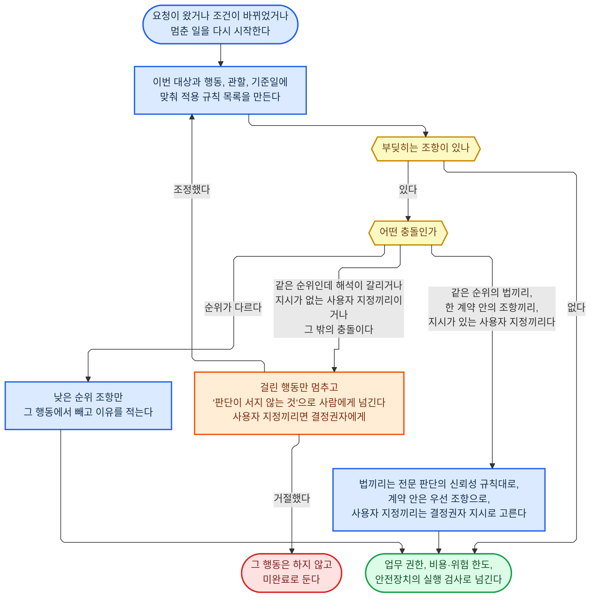
```mermaid
%%{init: {"flowchart":{"wrappingWidth":640,"curve":"linear","nodeSpacing":45,"rankSpacing":55,"padding":14,"useMaxWidth":true,"defaultRenderer":"elk"},"themeVariables":{"fontSize":"15px"},"layout":"elk","elk":{"mergeEdges":false,"nodePlacementStrategy":"NETWORK_SIMPLEX","keepEntryNodeOnTop":true,"considerModelOrder":"NODES_AND_EDGES","cycleBreakingStrategy":"GREEDY_MODEL_ORDER"}} }%%
flowchart TB
    N(["그 행동은 하지 않고<br/>미완료로 둔다"]):::stop
    D["낮은 순위 조항만<br/>그 행동에서 빼고 이유를 적는다"]:::main
    H["걸린 행동만 멈추고<br/>'판단이 서지 않는 것'으로 사람에게 넘긴다<br/>사용자 지정끼리면 결정권자에게"]:::back
    C{{"부딪히는 조항이 있나"}}:::note
    L["이번 대상과 행동, 관할, 기준일에<br/>맞춰 적용 규칙 목록을 만든다"]:::main
    W["법끼리는 전문 판단의 신뢰성 규칙대로,<br/>계약 안은 우선 조항으로,<br/>사용자 지정끼리는 결정권자 지시로 고른다"]:::main
    R{{"어떤 충돌인가"}}:::note
    S(["요청이 왔거나 조건이 바뀌었거나<br/>멈춘 일을 다시 시작한다"]):::main
    OK(["업무 권한, 비용·위험 한도,<br/>안전장치의 실행 검사로 넘긴다"]):::good
    S --> L
    D --> OK
    R -- "순위가 다르다" --> D
    W --> OK
    H -- "거절했다" --> N
    L --> C
    R -- "같은 순위인데 해석이 갈리거나<br/>지시가 없는 사용자 지정끼리이거나<br/>그 밖의 충돌이다" --> H
    R -- "같은 순위의 법끼리,<br/>한 계약 안의 조항끼리,<br/>지시가 있는 사용자 지정끼리다" --> W
    H -- "조정했다" --> L
    C -- "없다" --> OK
    C -- "있다" --> R
    %% 배치용 보이지 않는 연결: 선은 그려지지 않고 상자 위치만 잡음
    D ~~~ W
    R ~~~ W
    classDef main fill:#dbeafe,stroke:#2563eb,stroke-width:2px,color:#17314f
    classDef stop fill:#fee2e2,stroke:#dc2626,stroke-width:2px,color:#7f1d1d
    classDef back fill:#ffedd5,stroke:#ea580c,stroke-width:2px,color:#7c2d12
    classDef good fill:#dcfce7,stroke:#16a34a,stroke-width:2px,color:#14532d
    classDef note fill:#fef9c3,stroke:#ca8a04,stroke-width:2px,color:#713f12
```

**기계 검사로 옮길 조항 고르기**

1. 무엇을, 누구에게, 얼마나, 언제, 어디로 하는지처럼 요청에 적힌 값만 보고 지켰는지 가를 수 있는 조항만 남긴다. "적절한"이나 "정당한 사유"처럼 뜻을 따져야 하는 조항은 옮기지 않는다.
2. 해석이 하나로 정해진 조항만 남긴다. 그 해석은 조항을 정한 쪽이나 권한 있는 담당자가 확인한 것이어야 한다.
3. 통과해야 할 사례와 막아야 할 사례를 각각 하나 이상 시험으로 붙인 조항만 규칙 묶음에 넣는다.

**규칙 묶음 원칙**

- 실행을 허용할지 정하는 규칙 묶음은 직종마다 하나씩 둔다.
- 금액, 대상, 기한, 승인자, 고객 규칙처럼 건마다 달라지는 값은 조건식에 적지 않고, OPA에 물을 때마다 요청과 함께 넘긴다. OPA 안에 저장해 두면 동시에 도는 다른 건의 값과 섞이고, OPA를 다시 켜면 사라진다.
- 모든 건이 함께 쓰고 드물게 바뀌는 값은 규칙 묶음에 넣어 함께 배포한다. 그래야 값과 규칙의 판본이 어긋나지 않는다.
- 규칙 묶음과 짝지어 배포한 직무별 계산기는 쓸 때마다 짝이 맞는지 확인한다. OPA 검사를 통과했다고 전문 계산까지 맞았다고 보지 않는다.
- 법이나 규정이 바뀌면 그 조문을 옮긴 규칙과 시험 문항을 다시 검토할 목록에 올린다.

**지금의 선택**

| 구분 | ① 에이전트 하네스 | ②·③ 사내 서버 |
|------|------|------|
| 규칙 판정 | OPA | ①과 같다 |
| 규칙 시험 | OPA의 규칙 시험 기능(`opa test`) | ①과 같다 |

**규칙 묶음 조건**

| 조건 | 기준 | 이유 |
|------|------|------|
| 판정 기록 | ▶️ 판정할 때마다 규칙 판본과 결과를 남긴다 ▶️ 비밀 값이 든 칸은 가린다 | 어느 판본의 규칙으로 판정했는지 남아야 그 판정을 다시 확인할 수 있다 |

---

#### 업무 권한

실행마다 일곱 가지를 실행 기록에 적는다. 실제로 실행하는 에이전트, 에이전트가 대신하는 본인, 바깥에 이름이 드러나는 사람이나 회사, 실제로 접속하는 계정, 요청한 사람, 책임지는 담당자, 결과를 볼 사람이다. 앞의 세 가지(실행 에이전트, 대신하는 본인, 바깥에 드러나는 이름) 가운데 빈 칸이 있으면 밖으로 나가는 행동을 막는다.

**계정과 자격 증명**

| 대상 | 처리 | 기본값 |
|---|---|---|
| 에이전트의 계정 | ▶️ 에이전트 전용 계정을 쓴다 ▶️ 본인의 계정으로 본인인 척하지 않는다 | — |
| 자격 증명 | ▶️ 건마다 필요한 범위만큼만 받는다 ▶️ 수명이 다하면 그때의 권한을 다시 확인하고 새로 받는다 ▶️ 건이 끝나면 바로 거둬들인다 | 수명 1시간 |

**승인** — 일회 승인은 행동 하나를 한 번만 허락한다. 반복 위임은 정해 둔 범위 안의 행동을 매번 묻지 않고 해도 되게 미리 맡긴다.

| 상황 | 처리 |
|---|---|
| 답이 없다 | 승인으로 보지 않는다 |
| 일회 승인 | ▶️ 승인을 요청할 때 대상, 내용, 받는 사람, 조건을 확정하고, 확정한 내용의 해시를 요청에 넣어 받은 답과 함께 적는다 ▶️ 실행 직전에 해시를 다시 구해, 내용이 바뀌었으면 승인을 다시 받는다 ▶️ 일회 승인 하나는 멱등 키 하나에만 쓴다 |
| 반복 위임 | 맡길 때 대상, 행동, 허용할 내용의 조건, 받는 사람, 기간, 횟수, 누적 한도, 다시 맡겨도 되는 범위, 철회 조건을 정한다 |
| 받은 권한을 바깥 업체나 다른 회사의 AI에 다시 맡긴다 | ▶️ 정해 둔 '다시 맡겨도 되는 범위' 안에서만 맡긴다 ▶️ 그 범위를 정해 두지 않았으면 다시 맡기지 않는다 |
| 위임 범위 밖의 행동과, 법이나 계약이나 플랫폼 규정이 실행할 때마다 확인하라고 정한 행동 | 따로 승인을 받는다 |
| 꼭 거쳐야 하는 확인, 자격을 갖춘 사람만 할 수 있는 일 | 반복 위임이 있어도 건너뛰지 않는다 |
| 실행하기 직전 | ▶️ 행동이 기대는 결론이 확정됐는지 본다 ▶️ 조건부 결론에 기대면 맡긴 사람이 전제를 확인했거나, 권한 있는 사람이 전제를 알고 진행하기로 정한 기록이 있는지 본다 ▶️ 결론이 확정되지 않았고 그런 기록도 없으면 실행하지 않는다 |

**결과 불명과 긴급 권한**

| 상황 | 처리 |
|---|---|
| 결과 불명이다 | 새 승인을 받아도 결과 불명 처리를 바꾸지 않는다 |
| 긴급 권한 | 쓸 수 있는 조건, 할 수 있는 조치, 범위, 시간 한도, 연락할 담당자, 멈춘 일을 다시 시작하는 조건을 미리 적어 둔 것만 쓴다 |
| 유출이 확인된 전송을 멈출 권한, 서비스 전체를 끌 권한 | 다른 권한과 따로 둔다 |

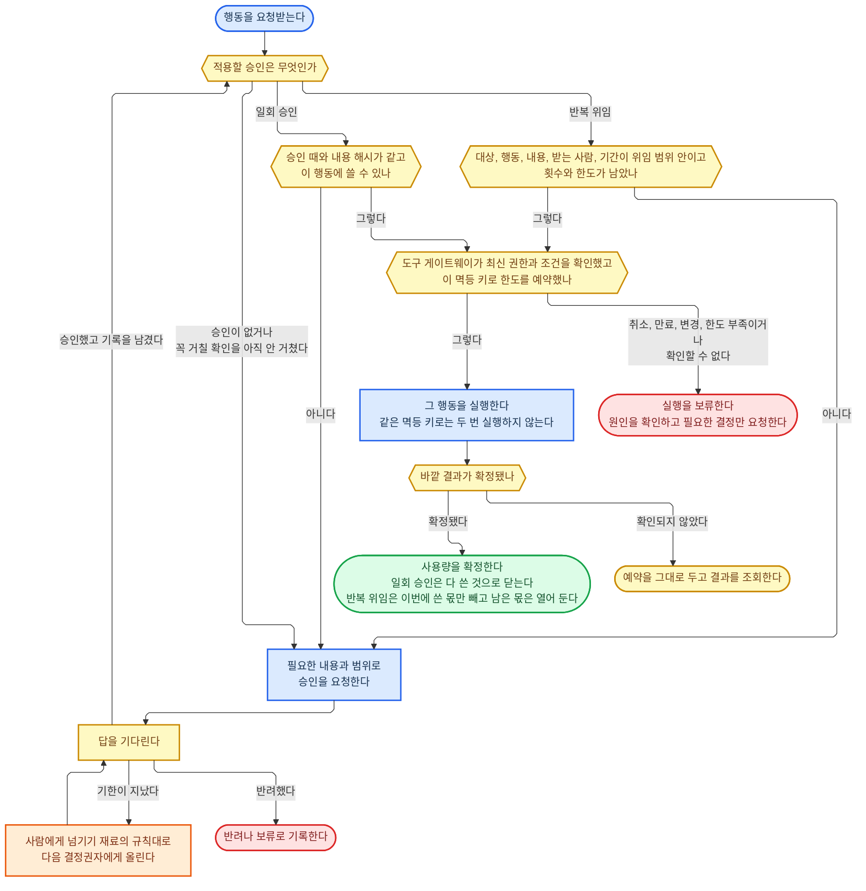
```mermaid
%%{init: {"flowchart":{"wrappingWidth":640,"curve":"linear","nodeSpacing":45,"rankSpacing":55,"padding":14,"useMaxWidth":true,"defaultRenderer":"elk"},"themeVariables":{"fontSize":"15px"},"layout":"elk","elk":{"mergeEdges":false,"nodePlacementStrategy":"NETWORK_SIMPLEX","keepEntryNodeOnTop":true,"cycleBreakingStrategy":"MODEL_ORDER","forceNodeModelOrder":true}} }%%
flowchart TB
    RESULT{{"바깥 결과가 확정됐나"}}:::note
    ONE{{"승인 때와 내용 해시가 같고<br/>이 행동에 쓸 수 있나"}}:::note
    WAIT["답을 기다린다"]:::note
    RUN["그 행동을 실행한다<br/>같은 멱등 키로는 두 번 실행하지 않는다"]:::main
    UP["사람에게 넘기기 재료의 규칙대로<br/>다음 결정권자에게 올린다"]:::back
    REQ["필요한 내용과 범위로<br/>승인을 요청한다"]:::main
    START(["행동을 요청받는다"]):::main
    CHK{{"도구 게이트웨이가 최신 권한과 조건을 확인했고<br/>이 멱등 키로 한도를 예약했나"}}:::note
    VOID(["실행을 보류한다<br/>원인을 확인하고 필요한 결정만 요청한다"]):::stop
    MANY{{"대상, 행동, 내용, 받는 사람, 기간이 위임 범위 안이고<br/>횟수와 한도가 남았나"}}:::note
    NO(["반려나 보류로 기록한다"]):::stop
    KIND{{"적용할 승인은 무엇인가"}}:::note
    CLOSE(["사용량을 확정한다<br/>일회 승인은 다 쓴 것으로 닫는다<br/>반복 위임은 이번에 쓴 몫만 빼고 남은 몫은 열어 둔다"]):::good
    HOLD(["예약을 그대로 두고 결과를 조회한다"]):::note
    WAIT -- "반려했다" --> NO
    WAIT -- "승인했고 기록을 남겼다" --> KIND
    CHK -- "그렇다" --> RUN
    RESULT -- "확인되지 않았다" --> HOLD
    KIND -- "반복 위임" --> MANY
    UP --> WAIT
    MANY -- "아니다" --> REQ
    RESULT -- "확정됐다" --> CLOSE
    START --> KIND
    MANY -- "그렇다" --> CHK
    KIND -- "승인이 없거나<br/>꼭 거칠 확인을 아직 안 거쳤다" --> REQ
    ONE -- "아니다" --> REQ
    KIND -- "일회 승인" --> ONE
    RUN --> RESULT
    CHK -- "취소, 만료, 변경, 한도 부족이거나<br/>확인할 수 없다" --> VOID
    WAIT -- "기한이 지났다" --> UP
    ONE -- "그렇다" --> CHK
    REQ --> WAIT
    %% 배치용 보이지 않는 연결: 선은 그려지지 않고 상자 위치만 잡음
    HOLD ~~~ REQ
    VOID ~~~ HOLD
    classDef main fill:#dbeafe,stroke:#2563eb,stroke-width:2px,color:#17314f
    classDef stop fill:#fee2e2,stroke:#dc2626,stroke-width:2px,color:#7f1d1d
    classDef back fill:#ffedd5,stroke:#ea580c,stroke-width:2px,color:#7c2d12
    classDef good fill:#dcfce7,stroke:#16a34a,stroke-width:2px,color:#14532d
    classDef note fill:#fef9c3,stroke:#ca8a04,stroke-width:2px,color:#713f12
```

**네 목록 가르기** — 모든 행동은 어떤 도구로 무엇에 무슨 일을 하는지를 함께 보고 네 목록 가운데 하나에 넣는다. 같은 대상이라도 읽기는 '허용', 쓰기는 '승인 필요'처럼 나뉠 수 있다.

1. 법, 직업 의무, 계약, 조직 규칙이 막은 행동은 '금지' 목록에 넣는다. 이 행동은 누구도 하지 않는다.
2. 자격을 갖춘 사람만 할 수 있는 일은 '사람이 실행' 목록에 넣고 사람에게 넘긴다. 무엇이 이런 일인지와 에이전트가 어디까지 준비하는지는 법·의무 기준을 따른다.
3. 되돌릴 수 없는 행동과, 맡긴 사람이 미리 승인 조건을 걸어 둔 행동은 '승인 필요' 목록에 넣는다. 아직 유효한 일회 승인이나 반복 위임에 이번 행동이 들어 있으면 그 승인으로 실행하고, 들어 있지 않으면 필요한 결정을 사람에게 받는다.
4. 나머지 읽기와 되돌릴 수 있는 쓰기는 '허용' 목록에 넣는다. 다만 이번 목적, 대상, 공개 범위에 맞는 권한이 있을 때만 허용한다. 금액이 걸린 대외 약속은 비용·위험 한도의 대외 약속 한도표도 거친다. 되돌릴 수 있다는 이유만으로 다른 고객의 자료를 읽거나 공유하지 않는다.

**하나씩은 볼 수 있는 자료를 모아 낸 결과** — 모아 놓으면 볼 수 없는 정보가 드러나는 결과는 권한 규칙이 따로 허락했을 때만 낸다. 낱낱의 자료는 모델 입력에 넣지 않고, 그 자료를 볼 권한이 있는 시스템이 계산해 모아 낸 값만 돌려받는다. 결과에 묶인 사람 수가 정해 둔 수보다 적거나, 앞서 낸 결과와 견주면 낱낱의 값이 드러나면 내지 않는다.

**자격 증명 받는 수단 고르기**

1. 서비스가 수명 안에 저절로 못 쓰게 되는 자격 증명을 직접 내주면, 건마다 그것을 새로 받는다.
2. 오래 쓰는 자격 증명만 주는 서비스라면 그것을 비밀 저장소에 넣는다. 그리고 비밀 저장소가 수명이 짧은 자격 증명을 대신 만들어 내주거나, 정한 수명마다 자동으로 바꾸게 한다.
3. 비밀 저장소는 다음 세 조건을 모두 채우는 것을 고른다.
   - 누구나 소스를 고쳐 쓸 수 있는 공개 라이선스다.
   - 짧은 자격 증명을 대신 만들어 주는 기능과, 정한 수명마다 자동으로 바꾸는 기능이 무료판에 들어 있다.
   - 널리 쓰이는 비밀 저장소인 Vault에 맞춰 만든 프로그램을 고치지 않고 그대로 붙일 수 있다.

**지금의 선택**

| 구분 | ① 에이전트 하네스 | ②·③ 사내 서버 |
|------|------|------|
| 에이전트 신원 | 서비스마다 둔 에이전트 전용 계정 | 사내 신원 관리 시스템의 에이전트 전용 서비스 계정 |
| 비밀 저장소 | OpenBao | ①과 같다 |
| 대신하는 본인 표시 | 실행 기록 | 실행 기록, OAuth 2.0 토큰 교환(자격 증명에 누구를 대신해 들어왔는지를 함께 담아 넘기는 표준 방식) |
| 네 목록 가르기 | OPA | ①과 같다 |
| 승인 기록 | 사내 서버의 PostgreSQL | PostgreSQL |

**조건**

| 조건 | 기준 | 이유 |
|------|------|------|
| 비밀 저장소 | ①은 OpenBao를 늘 켜 둔 컴퓨터에 설치해 쓴다 | 비밀 저장소가 꺼져 있으면 짧은 자격 증명을 대신 만들어 주지도, 자동으로 바꾸지도 못한다 |
| 대신하는 본인 표시 | ▶️ 도구 게이트웨이가 일곱 가지를 실행 기록에 적고, 앞의 세 가지 가운데 빈 칸이 있으면 밖으로 나가는 행동을 막는다 ▶️ ②·③은 바깥 시스템이 OAuth 2.0 토큰 교환을 받아 주면, 이 방식으로 누구를 대신해 접속했는지도 상대에게 넘긴다 | 결과를 볼 사람까지 적혀 있어야, 접속 계정이 읽은 자료를 볼 권한이 없는 사람에게 보여 주지 않았는지 가릴 수 있다 |
| 네 목록을 막는 곳 | ①은 '금지'와 '사람이 실행' 목록에 든 행동을 하네스의 권한 규칙만이 아니라 도구 게이트웨이에서도 막는다 | 하네스의 권한 규칙은 같은 일을 셸 명령으로 감싸 돌리면 비켜 갈 수 있다 |
| 승인 기록 | ▶️ 실행을 허가할 때는 사내 서버에 있는 원래 기록의 최신 내용으로 확인하고, 하네스가 도는 컴퓨터의 사본으로는 확인하지 않는다 ▶️ 원래 기록을 확인할 수 없으면 승인이 필요한 실행만 보류한다 ▶️ ②·③의 에이전트 계정은 승인 기록을 읽기만 한다 | 권한이 취소되거나 만료되면 대기 중인 요청에도 바로 적용해야 하므로, 실행 직전에 기준이 되는 최신 기록을 본다 |

담당자나 결정권자가 퇴사하거나 자리를 옮기거나, 고객 관계가 끝나거나, 누가 회사를 대표하는지 다툼이 생기면 그 권한은 철회된 것으로 보고 실행 제어의 중단 범위대로 정리한다. 여럿이 함께 쓰는 제품을 쓸 때는 새로 들어온 구성원이 과거 실행 기록과 파일까지 볼 수 있는지 확인한다. 서로에게 공개할 수 없는 고객들은 같은 공유 공간에 넣지 않는다.

---

#### 안전장치

**원칙**

- 자료에 숨겨 넣은 지시를 찾아내는 장치는 표시만 한다. 자료 속 지시가 무엇을 시키든 실제로 막는 것은 권한 검사와 한도 검사다.
- 찾아온 자료를 읽는 모델은 도구를 부르지 못하게 하고, 읽은 내용은 미리 정해 둔 항목의 값으로만 넘긴다.
- 이번 건의 할 일, 도구, 받는 곳, 결론을 바꾸라는 글이 있다고 표시된 자료에 기댄 결론은 사람이 확인하기 전에는 확정하지 않는다.
- 안전장치는 모델도, 맡긴 사람도 끌 수 없다. 운영자가 껐으면 꺼져 있던 동안 처리한 건에 그 사실을 표시한다.
- ①의 모델에는 주민등록번호, 여권번호, 운전면허번호, 외국인등록번호 같은 고유식별번호와 생체인식정보를 넘기지 않는다. 가린 값으로 넘기고, 가리는 방법은 정보·자료 이해가 정한다. 제출처에 원래 값이 필요하면 도구 게이트웨이가 보내기 직전에만 바꿔 넣는다.
- ①의 훅과 모델은 기록 서비스에 요청만 할 수 있고, 승인한 사람이나 처리 결과를 바꾸지 못한다.

**훅이 멈춰도 막는 곳** — 훅은 시작되지 않거나, 강제로 꺼지거나, 시간을 넘길 수 있다. 그래도 금지된 실행이 나가지 않게 다음 자리에서 막는다.

| 대상 | 막는 곳 |
|---|---|
| 파일 | 운영체제와 하네스 권한이 막는다 |
| 통신 | 나가는 통신을 거르는 프록시나 방화벽에서 막는다 |
| 바깥 쓰기 | 자격 증명을 가진 도구 게이트웨이가 막는다 |

**판정과 처리**

| 상황 | 처리 | 기본값 |
|---|---|---|
| 규칙 판정 | 이 시간 안에 끝나야 한다 | ▶️ 도구 호출 한 번 50ms ▶️ 실시간 대화 200ms |
| ▶️ 확인할 수 없다 ▶️ 검사가 고장 났거나 시간을 넘긴 경우도 여기에 든다 | 그 행동만 보류하고, 무엇을 확인해야 하는지 적어 둔다 | — |
| 보류한 일이 확인되지 않은 채 시간이 지났다 | '판단이 서지 않는 것'으로 사람에게 넘긴다 | 24시간 |
| 업무 기한을 지키려면 24시간보다 일찍 넘겨야 한다 | 사람에게 넘기기에서 답 기한을 앞당기는 셈법으로 넘길 시각을 정한다 | — |
| 권한이나 규칙 위반으로 막았다 | ▶️ 판단·계획 단계에서 계획을 다시 짠다 ▶️ 같은 자리에서 막힌 횟수가 비용·위험 한도의 다시 짜기 상한에 닿으면, 그때는 다시 짜지 않고 곧바로 '한도 초과'로 사람에게 넘긴다 | — |

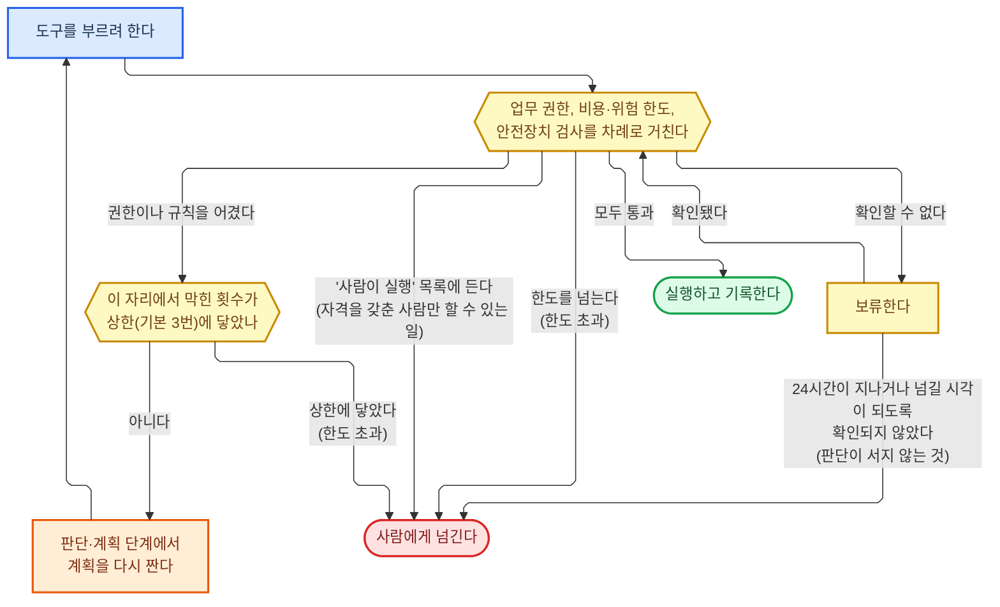
```mermaid
%%{init: {"flowchart":{"wrappingWidth":640,"curve":"linear","nodeSpacing":45,"rankSpacing":55,"padding":14,"useMaxWidth":true,"defaultRenderer":"elk"},"themeVariables":{"fontSize":"15px"},"layout":"elk","elk":{"mergeEdges":false,"nodePlacementStrategy":"NETWORK_SIMPLEX","keepEntryNodeOnTop":true,"considerModelOrder":"NODES_AND_EDGES","cycleBreakingStrategy":"DEPTH_FIRST"}} }%%
flowchart TB
    CALL["도구를 부르려 한다"]:::main
    G{{"업무 권한, 비용·위험 한도,<br/>안전장치 검사를 차례로 거친다"}}:::note
    RE["판단·계획 단계에서<br/>계획을 다시 짠다"]:::back
    B{{"이 자리에서 막힌 횟수가<br/>상한(기본 3번)에 닿았나"}}:::note
    RUN(["실행하고 기록한다"]):::good
    HOLD["보류한다"]:::note
    HUM(["사람에게 넘긴다"]):::stop
    RE --> CALL
    G -- "권한이나 규칙을 어겼다" --> B
    B -- "아니다" --> RE
    G -- "'사람이 실행' 목록에 든다<br/>(자격을 갖춘 사람만 할 수 있는 일)" --> HUM
    HOLD -- "24시간이 지나거나 넘길 시각이 되도록<br/>확인되지 않았다<br/>(판단이 서지 않는 것)" --> HUM
    HOLD -- "확인됐다" --> G
    G -- "한도를 넘는다<br/>(한도 초과)" --> HUM
    G -- "확인할 수 없다" --> HOLD
    B -- "상한에 닿았다<br/>(한도 초과)" --> HUM
    G -- "모두 통과" --> RUN
    CALL --> G
    classDef main fill:#dbeafe,stroke:#2563eb,stroke-width:2px,color:#17314f
    classDef stop fill:#fee2e2,stroke:#dc2626,stroke-width:2px,color:#7f1d1d
    classDef back fill:#ffedd5,stroke:#ea580c,stroke-width:2px,color:#7c2d12
    classDef good fill:#dcfce7,stroke:#16a34a,stroke-width:2px,color:#14532d
    classDef note fill:#fef9c3,stroke:#ca8a04,stroke-width:2px,color:#713f12
```

**검사 수단 고르기**

1. 검사기가 시작되지 않거나, 고장 나거나, 시간을 넘기면 실행을 내보내지 않는 것을 고른다. 검사를 건너뛰고 일할 수 있는 도구에는, 검사를 거쳐야만 하는 일의 권한을 주지 않는다.
2. 모델이 검토하는 검사처럼 판정 시간 상한 안에 끝나지 않는 무거운 검사는 되돌릴 수 없는 행동 앞에만 둔다.
3. 나가는 내용에 든 비밀 가운데 자격 증명, 주민등록번호, 카드번호처럼 형식이 정해진 것은 탐지 도구로 찾는다. 도구는 다음 두 조건을 모두 채우는 것을 고른다.
   - 규칙을 파일로 더할 수 있다.
   - 찾은 값이 실제로 쓸 수 있는 값인지 바깥 서비스에 물어보는 기능이 있으면, 그 기능을 끈 채로 돌릴 수 있다.

**지금의 선택**

| 구분 | ① 에이전트 하네스 | ②·③ 사내 서버 |
|------|------|------|
| 나가는 비밀 찾기 | Betterleaks | ①과 같다 |
| 못 끄게 잠그는 설정 | Claude Code의 관리 설정, Codex의 `requirements.toml`(관리자가 정해 사용자가 바꿀 수 없는 설정 파일) | — |

**검사 조건**

| 조건 | 기준 | 이유 |
|------|------|------|
| 나갈 때 | ▶️ Betterleaks로 비밀 값을 찾는다 ▶️ 나가는 결과물이 인용한 자료에 다른 건의 표시가 붙어 있으면 내보내지 않는다 ▶️ ①은 발송을 맡은 도구 게이트웨이가 이 검사를 하면서 받는 사람, 공개 범위, 첨부까지 보고, ②·③은 발신 게이트웨이가 같은 검사를 한다 | 실행이 빠짐없이 지나가는 자리에서 검사해야, 모델이 어떻게 판단하든 막을 수 있다 |
| 비밀 찾기 규칙 | ▶️ Betterleaks의 기본 규칙에 주민등록번호와 카드번호 규칙을 더해 쓴다 ▶️ 찾은 값을 바깥 서비스에 물어보는 확인 기능은 켜지 않는다 | 찾은 비밀 값을 바깥에 물어보면 그 값이 밖으로 나간다 |
| 못 끄게 잠그기 | ▶️ ①은 운영자가 하네스 권한, 샌드박스, 도구 게이트웨이 설정을 잠근다 ▶️ Claude Code는 관리 설정으로 권한 확인을 건너뛰는 모드를 끈다 ▶️ Codex는 `requirements.toml`로 샌드박스 제한 없이 모든 것에 접근하는 모드를 막는다 ▶️ 하네스가 도구를 쓰기 전에 사람에게 묻도록 설정했든 안 했든, 업무 권한의 승인 검사와 격리 검사는 늘 따로 거친다 ▶️ ②·③은 규칙 묶음을 배포하거나 끄는 일을 운영자 계정만 할 수 있다 | 잠가 두지 않으면 모델이나 맡긴 사람이 설정을 바꿔 검사를 끌 수 있다 |

Codex에는 훅을 거치지 않는 길이 둘 있다. `WebSearch`는 Codex를 만든 회사의 서버에서 돌아, 하네스가 도는 컴퓨터의 훅을 거치지 않는다. 이미 실행 중인 명령에 입력만 더 넣는 `write_stdin`은 새 도구 호출로 치지 않아, 도구를 부르기 직전마다 도는 `PreToolUse` 훅을 다시 거치지 않는다. 이 두 길도 실제로 접근하고 보내는 자리에서 막는다. 훅이 돌지 않거나 고장 난 상황을 시험할 때는 허용할 행동이 실행되는지와 금지할 행동이 막히는지를 함께 본다.

Codex의 Auto-review는 승인 요청이 생겼을 때 그 요청만 검토한다. 승인 요청 없이 지나가는 실행까지 검사해 준다고 보지 않는다.

---

#### 비용·위험 한도

**한도 정하기**

| 대상 | 처리 | 기본값 |
|---|---|---|
| 돈이 나가는 행동에 한도를 정하지 않았다 | 한도를 기본값으로 본다 | 0 |
| 시간 | 기한을 한도로 삼는다 | — |
| 건 예산 | ▶️ 건마다 모델 사용량 한도와 돈 한도를 정한다 ▶️ 모델 사용량은 모델을 부른 횟수와 입력 토큰, 출력 토큰 수다 | — |
| 건에 딸리지 않은 감시와 점검 | 직종이 함께 쓰는 한 달 감시 예산에서 쓴다 | — |
| 금액, 기한, 조건을 거는 대외 약속 | ▶️ 맡긴 사람이 약속 종류마다 상한을 적은 대외 약속 한도표를 따른다 ▶️ 표에 없는 종류는 한도를 기본값으로 본다 | 0 |
| 정보 공개, 삭제, 서비스 중단처럼 되돌리기 어려운 위험 | ▶️ 맡긴 사람이 위험 종류마다 허용 범위와 그 전에 거칠 추가 검토를 위험 한도표에 적는다 ▶️ 서비스 중단은 허용 시간도 적는다 ▶️ 표에 없는 종류는 감수할 범위를 기본값으로 보고, 그 위험이 걸린 행동은 업무 권한의 '승인 필요' 목록으로 보낸다 | 0 |
| 기다리는 쪽 피해가 더 크다 | ▶️ 그래도 한도를 넘는 실행은 하지 않는다 ▶️ 미리 적어 둔 긴급 권한이 있으면 그 범위 안에서만 한다 | — |
| 한도를 정하는 쪽 | ▶️ 맡긴 사람이 자기가 위험을 떠안을 수 있는 권한 안에서 정한다 ▶️ 에이전트는 한도를 만들거나 넓히지 않는다 ▶️ 한도에 자주 닿는다는 이유만으로 한도를 올리지 않는다 | — |

**예약** — 실행하기 전에 필요한 몫을 한도에서 미리 잡아 둔다.

| 대상 | 처리 |
|---|---|
| 세는 단위 | 건별, 맡긴 사람별, 기간별로 나눠 센다 |
| 여러 에이전트와 하위 에이전트가 쓰는 몫, 바깥 업체나 다른 회사의 AI에 다시 맡긴 몫, 다시 시도할 때 쓰는 몫, 금액이 걸린 대외 약속 | 모두 한 장부에 합쳐 센다 |
| 결과가 확정됐다 | ▶️ 성공으로 확정됐으면 예약을 실제로 쓴 값으로 바꾼다 ▶️ 실패나 취소로 확정됐으면 실제로 쓴 몫과 아직 치르지 않은 약속을 장부에 적고, 쓰지 않은 예약만 푼다 |
| 취소 요청이 왔거나 결과 불명이다 | 그것만으로는 예약을 풀지 않는다 |

**넘거나 닿을 때**

| 상황 | 처리 | 기본값 |
|---|---|---|
| 한도를 넘는다 | 곧바로 '한도 초과'로 사람에게 넘긴다 | — |
| 경고 임계값(넘으면 알리도록 정한 값)을 넘었다 | 맡긴 사람에게 알리고, 한 번에 보내는 요청의 크기와 보내는 속도를 줄인다 | ▶️ 경고 임계값은 한도의 80% ▶️ 크기와 속도는 절반으로 줄인다 |
| 검증과 복구에 쓸 몫 | 미리 떼어 둔다 | 예산의 20% |
| 같은 실패나 같은 자리의 막힘으로 계획을 다시 짜야 한다 | 이 횟수째에는 다시 짜지 않고 '한도 초과'로 사람에게 넘긴다 | 3번째 |
| 건 하나의 모델 사용량 한도 | ▶️ 같은 직종의 지난 3개월 건 가운데 가장 많이 쓴 양에 이 배수를 곱해 잡는다 ▶️ 지난 건이 없으면 업무 능력 시험에서 잰 값을 쓴다 | 2배 |
| 한 달 감시 예산 | 건 하나의 한도보다 작게 잡지 않는다 | 지난 3개월 동안 달마다 잡은 건 예산 합계의 평균의 5% |
| 먼저 알아채기의 직종 공통 감시 항목이 쓰는 몫 | 감시 예산에서 쓴다 | 감시 예산의 10% |

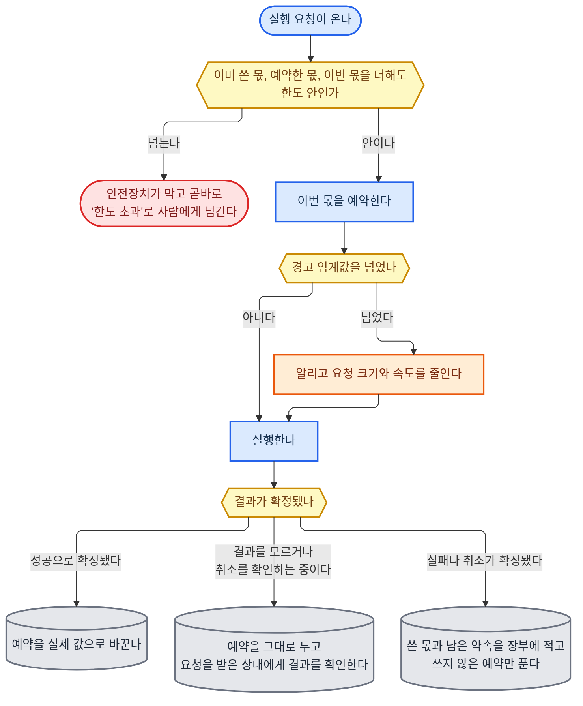
```mermaid
%%{init: {"flowchart":{"wrappingWidth":640,"curve":"linear","nodeSpacing":45,"rankSpacing":55,"padding":14,"useMaxWidth":true,"defaultRenderer":"elk"},"themeVariables":{"fontSize":"15px"},"layout":"elk","elk":{"mergeEdges":false,"nodePlacementStrategy":"NETWORK_SIMPLEX","keepEntryNodeOnTop":true,"considerModelOrder":"PREFER_NODES","cycleBreakingStrategy":"DEPTH_FIRST"}} }%%
flowchart TB
    FIX[("예약을 실제 값으로 바꾼다")]:::store
    Q2{{"경고 임계값을 넘었나"}}:::note
    STOP(["안전장치가 막고 곧바로<br/>'한도 초과'로 사람에게 넘긴다"]):::stop
    RUN["실행한다"]:::main
    Q3{{"결과가 확정됐나"}}:::note
    KEEP[("예약을 그대로 두고<br/>요청을 받은 상대에게 결과를 확인한다")]:::store
    FREE[("쓴 몫과 남은 약속을 장부에 적고<br/>쓰지 않은 예약만 푼다")]:::store
    Q1{{"이미 쓴 몫, 예약한 몫, 이번 몫을 더해도<br/>한도 안인가"}}:::note
    RES["이번 몫을 예약한다"]:::main
    SLOW["알리고 요청 크기와 속도를 줄인다"]:::back
    IN(["실행 요청이 온다"]):::main
    SLOW --> RUN
    Q2 -- "아니다" --> RUN
    Q2 -- "넘었다" --> SLOW
    Q3 -- "결과를 모르거나<br/>취소를 확인하는 중이다" --> KEEP
    Q3 -- "성공으로 확정됐다" --> FIX
    Q3 -- "실패나 취소가 확정됐다" --> FREE
    IN --> Q1
    Q1 -- "안이다" --> RES
    RES --> Q2
    Q1 -- "넘는다" --> STOP
    RUN --> Q3
    %% 배치용 보이지 않는 연결: 선은 그려지지 않고 상자 위치만 잡음
    Q1 ~~~ RES
    RES ~~~ Q1
    Q2 ~~~ SLOW
    classDef main fill:#dbeafe,stroke:#2563eb,stroke-width:2px,color:#17314f
    classDef stop fill:#fee2e2,stroke:#dc2626,stroke-width:2px,color:#7f1d1d
    classDef back fill:#ffedd5,stroke:#ea580c,stroke-width:2px,color:#7c2d12
    classDef store fill:#e5e7eb,stroke:#6b7280,stroke-width:2px,color:#1f2937
    classDef good fill:#dcfce7,stroke:#16a34a,stroke-width:2px,color:#14532d
    classDef note fill:#fef9c3,stroke:#ca8a04,stroke-width:2px,color:#713f12
```

**한도 값 고르기**

이 건에 걸리는 한도 값을 모두 모은다. 계약이나 합의 조건, 맡긴 사람이 정한 값, 조직 규칙의 예산과 전결 금액이 여기에 든다. 그 가운데 가장 작은 값을 쓴다. 걸리는 값이 하나도 없으면 기본값을 쓴다.

**지금의 선택**

| 구분 | ① 에이전트 하네스 | ②·③ 사내 서버 |
|------|------|------|
| 한도 장부 | 건마다 쓴 몫은 기록 서비스의 한도 장부, 여러 건에 걸친 공통 한도는 사내 서버의 PostgreSQL | PostgreSQL |
| 모델 사용량 세기 | Claude Code의 `--max-turns`와 `--max-budget-usd`, Codex의 `codex exec --json` | vLLM, OpenTelemetry |
| 시간 상한 | 운영체제의 시간 제한 기능 | 분리 실행의 시간 상한 |

**한도 조건**

| 조건 | 기준 | 이유 |
|------|------|------|
| 공통 한도 | ①은 반복 위임의 횟수와 누적 한도도 여러 건에 걸친 공통 한도와 같은 장부에서 센다 | 여러 에이전트와 하위 에이전트, 다른 회사의 AI가 같은 한도를 나눠 쓰므로, 한 장부에 모아야 합계를 셀 수 있다 |
| 예약 | ▶️ ①은 도구 게이트웨이가 멱등 키마다 한 번만 예약한다 ▶️ ②·③은 예약을 한 번에 하나씩 차례로 확정한다 | 동시에 들어온 요청이 같은 몫을 두 번 쓰지 못하게 해야 한다 |
| 모델 사용량 | ▶️ ①은 헤드리스 실행마다 회차 수 한도와 비용 한도를 걸고, 대화를 이어 열 때는 한도 장부에 남은 몫만큼만 건다 ▶️ Codex는 비용 한도 설정이 없어, 하네스 실행기가 토큰을 세다가 한도에 닿으면 실행을 멈춘다 | ▶️ Claude Code의 비용 한도에는 하위 에이전트가 쓴 몫이 들어가지만, 이어 연 대화에는 앞선 실행에서 쓴 몫이 세지지 않는다 ▶️ 둘을 합쳐 세야 건 하나의 모델 사용량 한도를 지킬 수 있다 |
| 동시 요청 수 | ③은 건마다 동시 요청 수도 한도에 넣는다 | ③은 장비 한 대를 여러 건이 나눠 쓴다 |

**규모와 비용 재기**

- 장비 대수, 호출 한도, 저장량, 색인 구성, 동시 처리 수, 여유 자원, 데이터베이스를 나눌 기준은 미리 정하지 않는다. 시험용 직종 업무 한 건을 처음부터 끝까지 돌려 잰 값으로 정한다. 목표 수치는 재기 전에 적어 두고 잰 값과 견준다.
- 재는 것은 여섯 가지다.
  1. 모델의 입력, 출력, 생각에 쓴 양, 캐시를 다시 쓴 양, 실패해 다시 보낸 횟수
  2. 원본과 거기서 만든 자료의 크기, 판본이 늘어나는 속도
  3. 한국어 검색의 정확도와 걸리는 시간
  4. 전문 도구의 메모리, GPU, 실행 시간, 일부만 실패하는 빈도
  5. 가장 붐빌 때의 부하, 백업과 복구에 걸리는 시간
  6. 사람이 검사, 수정, 승인, 운영에 쓴 시간
- 업무 한 건의 비용에는 모델 사용량, 도구, 검색과 저장, 검증, 실패해 다시 한 일, 복구, 사람 작업에 든 비용과, 처음 만들 때 든 비용 가운데 이 업무의 몫을 넣는다. 모델 비용은 구독료와 장비값을 업무마다 나눈 몫에, 구독 한도를 넘어 따로 청구된 금액을 더해 센다.
- 구독에 포함된 사용량, 남은 처리 용량, 실제로 나간 돈은 따로 적는다. 같은 사용량을 나눠 쓰는 제품들은 한 장부에 모아 두 번 세지 않는다.
- 평균과 함께, 비용이 크거나 오래 걸린 상위 5% 업무를 따로 보고한다.

---

#### 표현 방식·스타일

**기준 뽑기와 담기**

| 일 | 처리 |
|---|---|
| 기준을 뽑는 곳 | 사람이 글로 정리해 둔 원칙보다, 이미 내놓은 결과물에서 먼저 뽑는다 |
| 결과물에서 뽑는 법 | 잘 만든 결과물과 못 만든 결과물을 짝으로 받아, 잘 만든 쪽에만 있는 것을 뽑는다 |
| 말로 잘 나오지 않는 금기 | "우리가 절대 안 하는 것"을 묻는 면담으로 뽑는다 |
| 기준 담기 | ▶️ 해야 하는 것, 하면 안 되는 것, 좋은 예 원문, 나쁜 예 원문의 네 갈래로 나눠 둔다 ▶️ 그림체와 음색은 견본 파일을 붙인다 ▶️ 발행 요일, 시각, 길이를 정한 약속은 숫자로 따로 적는다 |

**스타일의 한계와 바꾸기**

| 상황 | 처리 |
|---|---|
| 스타일을 맞춘다 | 그러느라 사실, 필수 설명, 접근성 조건을 빼지 않는다 |
| 법이나 계약이 정한 필수 문구와 표시 | 스타일로 다루지 않고 법이나 계약의 순위대로 지킨다 |
| 스타일을 바꾼다 | 바꾸기 전에 바꾸는 이유, 시점, 기대 효과를 적고 옛 판본을 남긴다 |
| 바꾸고 4주가 지났다 | 성과 추적으로 모은 반응 수치를 보고 되돌릴지 정한다 |
| 이름이나 간판처럼 되돌릴 수 없는 변경 | '되돌릴 수 없는 행동'으로 사람에게 넘긴다 |

**검사 수단 고르기**

1. 금기 낱말, 필수 문구, 글자 수처럼 글자만 보고 가를 수 있는 것은 내보내기 직전에 기계가 검사한다. 기계 검사는 이런 것에만 쓴다. 도구는 다음 세 조건을 모두 채우는 것을 고른다.
   - 규칙을 파일로 적을 수 있다.
   - 한글을 비롯한 유니코드 문자를 검사할 수 있다.
   - 실행 파일 하나만 깔면 쓸 수 있다.
2. 어미, 존칭, 말투, 인상, 세계관처럼 뜻을 봐야 하는 것은 모델이 좋은 예와 나쁜 예를 옆에 놓고 채점한다. 이 채점표는 결과 품질 평가에서도 그대로 쓴다.

**지금의 선택**

| 구분 | ① 에이전트 하네스 | ②·③ 사내 서버 |
|------|------|------|
| 글자 검사 | Vale | ①과 같다 |

**검사 조건**

| 조건 | 기준 | 이유 |
|------|------|------|
| 기준을 두는 곳 | ①은 직종 공통 기준을 직종 공통 폴더에, 한 고객만의 기준을 그 고객의 기억 폴더에 둔다 | 한 고객의 기준은 그 고객 건에서만 열려야 다른 고객에게 새지 않는다 |
| 불러오는 때와 자리 | ▶️ 세 환경 모두 결과물을 만들기 시작할 때 불러온다 ▶️ ②·③은 작업창 앞부분이 끝나는 바로 뒤에 통째로 넣는다 | 앞부분은 직종마다 하나로 묶어 배포하므로, 고객마다 다른 기준을 넣을 수 없다 |
| 글자 검사 | ▶️ 발송하거나 제출하기 직전에 Vale로 검사한다 ▶️ ①은 발송이나 제출을 맡은 도구 게이트웨이에서, ②·③은 발신 게이트웨이에서 한다 | 내보내기 직전에 걸러야 금기 문구가 밖으로 나가지 않고 필수 문구가 빠지지 않는다 |
| 한국어 규칙 | ▶️ 규칙 낱말 앞뒤의 낱말 경계를 끄고 쓴다 ▶️ 규칙마다 조사가 붙은 문장으로 걸리는지 시험한 뒤에만 쓴다 | ▶️ Vale는 기본으로 규칙 낱말 앞뒤에 낱말 경계(`\b`)를 붙이는데, 이 경계는 영문, 숫자, 밑줄 옆에서만 생긴다 ▶️ 그래서 한글 낱말은 조사가 붙든 안 붙든 하나도 걸리지 않고, 오류도 나지 않는다 ▶️ 경계는 규칙마다 `nonword: true`로 끈다 |

---

### 행동 체계

#### 지시·의도 파악

**요청 정리** — 맡긴 사람의 말을 다음 여덟 칸에 옮겨 적는다.

1. 한 문장 목표
2. 쓰임새: 결과를 어디에, 왜 쓰는지
3. 받는 사람
4. 결과물
5. 범위
6. 하지 않을 일
7. 가정
8. 한도: 기한과 비용

| 상황 | 처리 | 기본값 |
|---|---|---|
| 요청 정리를 마쳤다 | ▶️ 일을 시작하면서 맡긴 사람에게 보낸다 ▶️ 결과 보고 첫 줄에도 같은 목표 문장을 적는다 | — |
| 맡긴 사람이 요청 정리가 뜻과 다르다고 답했다 | 그때 멈추고 요청을 다시 파악한다 | — |
| 물음을 보낸다 | ▶️ 한 번에 모아 보낸다 ▶️ 물음마다 추천 답을 첫째 선택지로 둔다 ▶️ 이미 확인된 내용은 다시 묻지 않는다 | 한 번에 넷까지 |
| 물음이 넷을 넘는다 | ▶️ 가정으로 채울 수 없는 칸의 물음부터 넷을 먼저 보낸다 ▶️ 남은 물음은 다음에 보내고, 그동안 가정해도 되는 칸은 가정으로 채운다 | — |

**칸마다 묻거나 가정하기** — 업무 처리 흐름의 의도 파악 갈림길은 여덟 칸마다 따로 판정한다.

1. 칸의 뜻은 요청 문장에 첨부 자료, 장기 기억, 앞서 받은 지시를 더해 보고 가린다. 맡긴 사람이 일에 붙인 종류 이름('단순 계약 검토' 같은)은 자료를 처음 읽을 때와 새 자료가 들어올 때마다 실제 내용과 대조한다.
2. 뜻이 하나로 정해지지 않은 칸은 모두 묻는다.
3. 답이 오기 전에는 두 종류의 칸에 기대는 일을 하지 않는다. 읽기에 따라 목표나 범위가 달라지는 칸과, 잘못 읽으면 되돌릴 수 없는 행동이나 돈, 권리에 닿는 칸이다. 종류 이름과 자료가 어긋난 칸은 늘 여기에 든다.
4. 그 밖의 칸은 가정하고 진행한다. 직종 기본값이 있으면 그 뜻으로 가정하고, 없으면 틀렸을 때 다시 하기가 가장 쉬운 뜻으로 가정한다. 가정한 내용과 틀렸을 때의 영향은 가정 칸에 적는다.

**지금의 선택**

| 구분 | ① 에이전트 하네스 | ②·③ 사내 서버 |
|------|------|------|
| Codex 질문 도구 | `default_mode_request_user_input`을 켜지 않은 기본 설정 | — |
| Remote Control(돌고 있는 대화를 휴대전화나 다른 기기에서 이어 가게 해 주는 기능) 끄기 | Claude Code 관리 설정의 `disableRemoteControl` | — |

**되묻는 조건**

| 조건 | 기준 | 이유 |
|------|------|------|
| 사람이 화면 앞에 있는 대화 | ▶️ ①은 답 없이 할 수 있는 일을 먼저 끝낸다 ▶️ 그다음 물음을 글로 적어 보내고 이번 응답을 마친다 ▶️ ②·③은 요청이 들어온 사내 플랫폼 창에서 선택지를 보여 주고 고르게 한다 | 답을 기다리는 동안에도 답이 필요 없는 일은 멈추지 않아야 한다 |
| 화면 앞의 사람이 답하지 않는다 | ①은 10분 안에 답이 없으면 자리를 비운 것으로 보고 사람에게 넘기기의 통로로 다시 보낸다 | 그 통로는 휴대전화까지 알림이 간다 |
| ▶️ 화면 앞에 사람이 없다 ▶️ 헤드리스 실행, 하위 에이전트, 채널 대화(메신저로 지시를 받는 대화)가 여기에 든다 | ▶️ 묻는 도구를 부르지 않고 사람에게 넘기기의 통로로 묻는다 ▶️ 넘기는 까닭은 '판단이 서지 않는 것'으로 적는다 | 대화 화면 앞에서 답할 사람이 없다 |
| 답 기한이 지나도 맡긴 사람이 답하지 않는다 | ▶️ 다음 결정권자에게 올리지 않고 맡긴 사람에게 다시 묻는다 ▶️ 사람에게 넘기기에서는 통로와 답 기한만 빌려 쓴다 | 요청의 뜻은 맡긴 사람만 정할 수 있다 |
| Claude Code의 질문 도구(AskUserQuestion) | 쓰지 않는다 | ▶️ 기본 설정에서는 답이 올 때까지 질문을 열어 두고 대화를 멈춘다 ▶️ 시간 제한을 걸면 답 없이 모델의 판단으로 넘어가, 묻기로 한 칸을 가정으로 채운다 |
| Codex의 질문 도구 | 기본 모드에서는 켜지 않는다 | ▶️ 이 도구를 정식으로 쓸 수 있는 곳은 계획 모드뿐이다 ▶️ 기본 모드에서 켜는 설정은 아직 개발 중인 기능이다 |
| Remote Control | 끈다 | ▶️ 켜면 대화 기록이 모델 회사 서버에 남는다 ▶️ 그래서 무보관 계정에서는 켤 수 없다 |

**합격 조건** — 업무 능력 시험에 맡긴 사람의 의도를 요청 문장에 드러내지 않은 과제를 넣는다. 이 과제에서 묻지 않고 틀리게 가정한 경우가 0건이어야 한다.

---

#### 문제·목표·완료 조건

**완료 조건**

| 상황 | 처리 |
|---|---|
| 끝났다고 볼 상태, 확인 방법, 남길 증거 가운데 하나라도 비었다 | 완료 조건으로 치지 않는다 |
| 일이 어렵다 | 그 이유로 조건을 낮추지 않는다 |
| 완료 조건을 바꾼다 | ▶️ 맡긴 사람의 확인을 받는다 ▶️ 확인이 오기 전에는 옛 조건으로 판정한다 |
| 풀지 않을 문제 | 결과 보고에 그대로 옮겨 적는다 |
| 목표를 함께 이룰 수 없다 | ▶️ 법이나 계약 기한처럼 규칙이 정한 목표를 먼저 따른다 ▶️ 그다음은 맡긴 사람이 밝힌 순서를 따른다 ▶️ 그래도 순서가 서지 않으면 '판단이 서지 않는 것'으로 사람에게 넘긴다 |

**완료 수준** — 완료는 다음 여섯 수준을 업무 처리 흐름 순서대로 하나씩 확인한다. 앞 수준이 확인되기 전에는 다음 수준으로 넘어가지 않는다. 바깥 처리가 없는 일처럼 그 건에 없는 수준은 건너뛴다. 6은 인수 조건(받는 사람이 결과를 받기 전에 확인하는 조건)에 들 때만 확인한다.

1. 결과물을 다 만들었다
2. 바깥 처리를 마쳤다
3. 검증을 마쳤다
4. 전달했다
5. 받는 사람이 인수했다
6. 나중에 확정되는 성과가 확정됐다

**부분 완료**

| 상황 | 처리 |
|---|---|
| 이번 건이 어디까지 책임지나 | 인수 조건이 정한다 |
| 완료 수준을 다 채우지 못했다 | 부분 완료로 보고하고, 못 채운 수준을 적어 전달한다 |
| 일부만 된 건, 취소된 건, 안전하게 멈춘 건 | 부분 완료로 센다 |
| 같은 완료 조건을 채우지 못해 완료 확인에서 세 번째 막혔다 | ▶️ 부분 완료로 보고한다 ▶️ 결과물이 조건에 못 미친 것이라, 권한이나 규칙 검사에서 막힌 것과 달리 '한도 초과'로 넘기지 않는다 |

**확인 방법 고르기** — 완료 조건마다 다음 순서로 보고, 처음 들어맞는 방법을 쓴다.

1. 예약 확정, 입금, 제출 접수처럼 결과가 바깥 시스템이나 상대 쪽에 상태로 남으면 그쪽 기록을 직접 조회한다.
2. 결과물 자체의 성질을 보는 조건이면 기계가 다시 돌려 보는 검사로 확인한다. 시험 실행, 계산 다시 하기, 형식과 항목 검사, 원문 대조가 여기에 든다.
3. 설득력이나 읽기 쉬움처럼 뜻을 따져야 하는 품질이면 모델이 채점표로 판정하고, 채점표에 조건마다 합격선을 적는다.
4. 셋 중 어느 방법으로도 확인할 수 없는 조건은 셋 중 하나로 확인할 수 있게 고쳐 쓴다.

**완료 확인 조건**

| 조건 | 기준 | 이유 |
|------|------|------|
| 완료를 막는 검사 | ▶️ 완료로 적기 전에 완료 조건과 바깥 시스템에 남은 결과를 확인한다 ▶️ 필수 검사 통과는 결과 검증·재검증대로 같은 자리에서 본다 ▶️ 이 검사는 ①은 기록 서비스가, ②·③은 OPA가 맡는다 ▶️ 못 채운 조건이 있으면 부분 완료나 미완료로 적는다 | 대화가 끝났다고 업무가 끝난 것은 아니다 |
| Stop 훅(대화가 끝날 때 하네스가 돌리는 훅) | ①에서 빠진 조건을 알려 주는 보조 장치로만 쓴다 | 훅은 안전장치에 적은 대로 빠질 수 있어, 완료를 막는 일은 기록 서비스가 맡는다 |

---

#### 대안·전략 판단

**대안 비교 항목** — 대안마다 업무 처리 흐름의 비교 항목에 다음 넷을 더해 모두 채운다. 연쇄 효과는 여러 건이 걸려 있으면 다른 건에 생기는 일까지 본다.

1. 전제
2. 드는 시간
3. 되돌릴 수 있는지와, 이 선택으로 나중에 고를 수 없게 되는 선택지
4. 다른 안으로 갈아탈 신호

**정보 구하기와 다시 판단**

| 상황 | 처리 |
|---|---|
| 정보를 더 구한다 | ▶️ 그 정보로 선택이 바뀔 수 있을 때만 구한다 ▶️ 1위 안과 2위 안의 순서를 뒤집을 수 있는 사실부터 구한다 |
| 어떤 결과가 나와도 선택이 그대로다 | 조사를 멈춘다 |
| 갈아탈 신호 | ▶️ 먼저 알아채기 재료의 감시 목록에 올린다 ▶️ 신호가 오면 이 판단을 다시 한다 |

**방법 고르기** — 업무 처리 흐름의 판단·계획 갈림길에 다음 기준을 더한다.

1. 기존 규칙이나 사례대로 하는 방법이 있으면 대안에 넣는다. 그 밖의 방법도 하나 이상 넣는다.
2. 규칙, 업무 권한, 비용·위험 한도 밖에 있는 대안을 뺀다. 기한 안에 완료 조건을 채우지 못하는 대안도 뺀다. 남은 대안이 없으면 업무 처리 흐름의 거절이나 사람에게 넘기기로 간다.
3. "기존 규칙이나 사례가 이 사실을 덮는가"는 물음의 세 조건(사실을 덮는다, 전제가 유효하다, 해석이 갈리지 않는다)에 더해, 기존 방법이 2에서 빠지지 않고 남아 있어야 "예"다.
4. "작은 범위에서 먼저 시험할 수 있는가"는 되돌릴 수 있고 시험 비용이 한도 안에 드는 안만 "예"다. 이 한도는 업무 절차·실행 계획의 처음 해 보는 작업 시험과 합쳐 이 건의 모델 사용량 한도의 10%다. 시험 전에 적어 둔 멈출 결과가 나온 안은 뺀다.
5. 시험을 통과한 안이 없고 남은 안이 되돌릴 수 없는 안뿐이거나 하나도 없으면 '판단이 서지 않는 것'으로 사람에게 넘긴다.
6. 남은 안은 문제·목표·완료 조건에서 정한 목표 순서대로 견준다. 두 안의 추정치가 오차 범위 안에서 겹치면 그 목표에서는 같다고 보고 다음 목표로 넘어간다. 모든 목표에서 같으면 비용이 적은 쪽을 고르고, 비용도 같으면 대안 목록에 먼저 적힌 쪽을 고른다.

**합격 조건**

| 조건 | 기준 |
|---|---|
| 대안 | 2개 이상 |
| 비운 비교 항목 | 0개 |
| 시험 과제에 미리 넣어 둔 정답 대안을 고른 비율 | 직종 합격선 이상 |

---

#### 사람에게 넘기기

**되돌릴 수 없는 행동의 기본 목록** — 직종이 이 목록에 더한다.

| 행동 | 예 |
|---|---|
| 돈이 나가는 행동 | 송금, 결제, 주문 |
| 나가면 거둘 수 없는 행동 | 발송, 제출, 게시 |
| 복구본 없이 지우거나 덮어쓰는 행동 | — |
| 법적 효력이 생기는 의사 표시 | 서명, 계약 |
| 기한이 지나면 다시 고를 수 없게 닫히는 선택 | 이의 제기 포기 |

**넘길 범위 줄이기**

| 상황 | 처리 |
|---|---|
| 되돌릴 수 없는 행동 | ▶️ 되돌릴 수 있는 부분으로 나눌 수 있는지 먼저 본다(발송 전에 초안을 저장해 두는 것이 그 예다) ▶️ 나눌 수 있으면 되돌릴 수 있는 부분까지 끝내고, 마지막 행동의 결정만 넘긴다 |
| 맡길 때 받은 승인이 있다 | 그 승인으로 실행할지는 업무 권한 재료대로 가린다 |

**결정 요청과 답 기한** — 결정 하나마다 예나 아니오로 답하는 물음을 하나 둔다.

| 상황 | 처리 | 기본값 |
|---|---|---|
| 물음마다 | 추천 답과 이유, 다른 안과 각 안의 결과, 근거 자료, 답 기한, 아니오라고 답했을 때 갈 길을 붙인다 | — |
| 같은 사람에게 같은 때 필요한 결정이 여럿이다 | 한 요청에 묶되, 답은 물음마다 받는다 | 한 요청에 넷까지 |
| 긴급 승인 | 다른 결정과 묶지 않는다 | 답 기한 15분 |
| 답 기한 | 요청을 보낸 때부터 잰다 | 24시간 |
| 전체 기한을 지키려면 더 일찍 답을 받아야 한다 | 전체 기한에서 남은 일에 드는 시간을 뺀 시각을 답 기한으로 한다 | — |
| 그 시각이 이미 지났다 | ▶️ 전체 기한을 지킬 수 없다는 사실과 남은 시간에 할 수 있는 일을 요청에 적는다 ▶️ 전체 기한을 놓쳐 되돌릴 수 없는 일이 생기면 긴급 승인으로 보낸다 ▶️ 그 밖에는 답 기한을 24시간으로 둔다 | — |
| 답 기한까지 답이 없다 | ▶️ 다음 결정권자에게 올린다 ▶️ 올린 요청의 답 기한도 올린 때부터 처음과 같은 길이로 잰다 | 보통 24시간, 긴급 15분 |
| 더 올릴 사람이 없다 | 마지막 결정권자에게 같은 길이의 기한이 지날 때마다 다시 보낸다 | — |
| 기한이 지난 뒤 온 답 | 그 답도 받는다 | — |
| 답을 받았다 | 사람이 내린 판단, 고친 내용, 들인 시간을 성과 추적 재료에 넘긴다 | — |

**결정권자와 통로 고르기**

1. 결정권자는 업무 처리 흐름의 결정권자 확인대로 고른다. 승인이 걸린 결정은 조직 규칙의 승인자 고르기로 정한 사람에게 보낸다.
2. 결정권자가 등록한 통로 가운데, 로그인으로 답한 사람을 가릴 수 있고 답이 기록으로 남는 통로만 남긴다.
3. 그중 결정권자가 자리를 비워도 휴대전화까지 알림이 가는 통로를 고른다.

**지금의 선택**

| 구분 | ① 에이전트 하네스 | ②·③ 사내 서버 |
|------|------|------|
| 결정 요청을 두는 곳 | 건 상태 파일 | 사내 플랫폼의 결정 요청함 |
| 알림 | 사내 메신저 | 사내 메신저 |
| 답 받는 통로 | 사내 메신저의 웹훅 | 사내 플랫폼의 결정 요청함 |

**통로 조건**

| 조건 | 기준 | 이유 |
|------|------|------|
| 알림 | 알림은 대화가 멈춰 있어도 휴대전화까지 간다 | 결정권자가 자리를 비웠거나 대화가 멈춰 있어도 알림이 닿아야 한다 |
| 답 받기 | ▶️ ①은 대화가 열려 있든 멈춰 있든 사내 메신저의 웹훅으로만 받는다 ▶️ 대화 창에 적은 답, 확인 창이나 질문 도구로 받은 답, Remote Control이나 Codex Remote(휴대전화에서 Codex 대화를 이어 가는 기능)로 들어온 답은 결정의 답으로 쓰지 않는다 ▶️ 모델이 옮겨 적은 답도 승인으로 쓰지 않는다 | 대화 안으로 들어온 답은 모델이 읽고 옮겨 적은 말이 되어, 누가 답했는지 로그인으로 가릴 수 없다 |

---

#### 업무 절차·실행 계획

**작업 자르기와 잇기**

| 대상 | 처리 | 기본값 |
|---|---|---|
| 작업 하나의 크기 | 완료 조건으로 끝을 확인할 수 있는 크기로 자른다 | — |
| 작업마다 적을 중단 한도 | ▶️ 쓸 수 있는 시간, 비용, 계획을 다시 짜는 횟수의 상한이다 ▶️ 그 숫자는 비용·위험 한도 재료에서 받는다 | — |
| 모든 작업의 완료 조건을 합친 것 | 전체 완료 조건을 빠짐없이 포함하지 못하면 작업을 더한다 | — |
| 작업 둘 이상이 서로의 결과를 받아 되풀이한다 | 주고받는 횟수의 상한과 멈출 조건을 적는다 | 3회 |
| 결과를 모으는 지점 | 꼭 있어야 하는 결과가 빠졌을 때 갈 길을 적는다 | — |
| 되돌릴 수 없는 결정이 든 작업 | 바로 앞에 검사 작업을 넣는다 | — |
| 계획을 다시 짠다 | 영향을 받는 작업만 다시 짠다 | — |

**처음 해 보는 종류의 작업**

| 상황 | 처리 | 기본값 |
|---|---|---|
| 이런 종류의 작업이 업무 능력 시험을 통과한 적이 없다 | 시험 환경에서 먼저 돌려 본다 | — |
| 이 시험의 비용 | 대안·전략 판단의 작은 시험 한도에서 함께 센다 | — |
| 비용이 그 한도를 넘는다 | '한도 초과'로 사람에게 넘긴다 | — |
| 시험에서 떨어졌다 | ▶️ 그 종류의 작업은 능력 개선·확장 재료로 넘긴다 ▶️ 계획에는 아직 할 수 없는 빈칸으로 표시한다 | — |

**작업 담당 고르기** — 작업마다 다음 순서로 보고, 처음 들어맞는 담당을 고른다.

1. 사람에게 넘기는 다섯 경우에 들면 사람 작업이다. 사람에게 넘기기 재료의 규칙대로 넘긴다.
2. 입력을 정해진 규칙으로 계산하거나, 조회하거나, 형식을 바꿔 출력이 나오면 함수 작업이다.
3. AI 모델 재료가 다른 모델을 쓰라고 정한 일은 다른 모델 작업이다. 실시간 대화 재료나 정보·자료 이해 재료가 정한 도구로 한다.
4. 필요한 자료가 주 모델 하나의 작업창에 다 들어가지 않으면 분담 작업이다. 서로의 결과를 기다리지 않는 일 여러 개를 동시에 돌려야 기한을 맞출 때도 분담 작업이다. 분담 작업은 나눠 맡기기 재료의 규칙대로 하위 에이전트에게 맡긴다.
5. 나머지는 주 모델 작업이다.

---

#### 먼저 알아채기

**감시 항목**

| 상황 | 처리 |
|---|---|
| 감시 항목 | ▶️ 무엇을 볼지, 어디서 볼지, 얼마나 자주 볼지, 어떤 값이면 신호로 볼지, 울리면 무엇을 시작할지 다섯 칸을 채운다 ▶️ 다섯째 칸이 빈 항목은 목록에 넣지 않는다 |
| 올린 글, 세운 서비스, 낸 서류처럼 에이전트가 낸 결과물 | 그 상태를 항목에 넣는다 |
| 신호가 울릴 때마다 | 대응할 일이었는지 적어, 오탐(대응할 일이 아닌데 울린 신호)을 센다 |
| 최근 30일 동안 10번 이상 울린 종류인데 오탐 비율이 50%를 넘는다 | ▶️ 새 임계값을 정해 능력 개선·확장 재료를 거쳐 배포한다 ▶️ 배포 전까지 그 종류의 신호는 모아서 하루 한 번 낸다 ▶️ 장애, 침해, 유출, 잘못 나간 결제나 전송, 긴급 연락처럼 피해가 지금 커지는 종류는 모으지 않고 바로 낸다 |
| 목록에 없어서 뒤늦게 안 사건 | 성공·실패 원인 분석 재료로 원인을 따진 뒤 감시 항목을 더한다 |

**단서 보기와 선제 조사**

| 상황 | 처리 |
|---|---|
| 진행 중인 건의 단서 | 건마다 하루 한 번 모아서 본다 |
| 긴급 표시가 붙은 단서 | 받는 즉시 본다 |
| 계속 맡긴 책임이 있다 | ▶️ 그 목적과 최근 바뀐 사정을 살펴, 감시 목록에 없는 조사 질문을 먼저 만들 수 있다 ▶️ 문제가 생기기 전에 이렇게 하는 조사를 선제 조사라 한다 |
| 조사 질문마다 | 확인할 근거, 찾아봐도 되는 출처, 예산, 중단 조건을 적는다 |
| 같은 질문 | 새 단서가 생겼을 때 다시 본다 |
| 선제 조사의 범위 | 허용된 자료를 읽고 내부 기록을 보는 데까지만 한다 |
| 발송, 수정, 거래를 하려 한다 | 현재 위임이 그 행동을 허용하는지 따로 확인한다 |
| 이미 맡긴 업무를 사람이 지켜보지 않는 동안 실행한다 | ▶️ 선제 조사의 범위에 묶이지 않는다 ▶️ 그 업무를 맡길 때 받은 권한 안에서 실행한다 |

**신호가 오면**

| 상황 | 처리 | 기본값 |
|---|---|---|
| 피해가 지금 커지고 있어 바로 막아야 하는 종류다 | 긴급 표시를 붙여 시작 신호에 넘긴다 | 감지부터 첫 대응까지 15분 |
| 그 종류인지 판정이 갈린다 | 긴급으로 본다 | — |
| 맡긴 사람에게 가는 피해 | 맡은 범위 밖의 일로 치지 않고 처리할 문제로 본다 | — |
| 알린다 | 권하는 대응을 붙인다 | — |

**비용 한도** — 감시와 선제 조사에 드는 비용은 합쳐서 잰다.

| 항목 | 넘지 않을 선 |
|---|---|
| 건마다 두는 항목 | 이 건의 모델 사용량 한도의 10% |
| 직종 공통 항목 | 비용·위험 한도 재료가 정한 먼저 알아채기 몫 |

| 상황 | 처리 |
|---|---|
| 선을 넘는다 | ▶️ 새 조사를 멈춘다 ▶️ 90일 동안 한 번도 울리지 않은 항목부터 확인 주기를 두 배로 늘린다 |
| 기한처럼 날짜로 정해진 항목 | 확인 주기를 늘리지 않는다 |

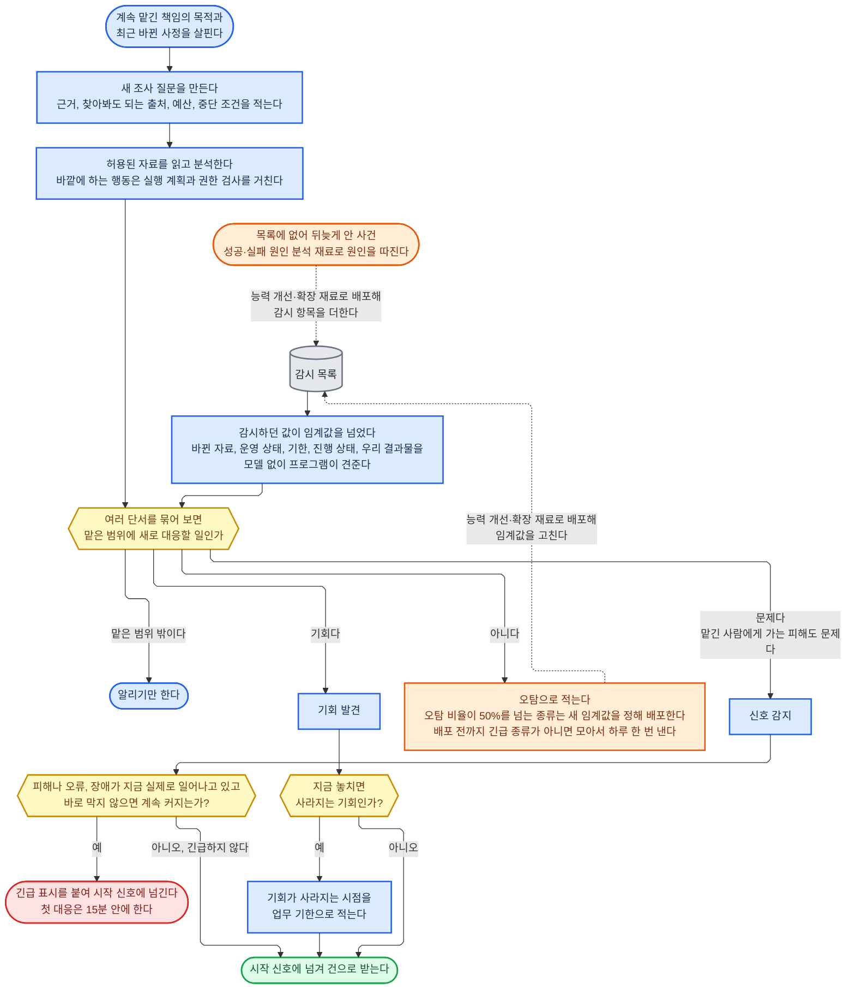
```mermaid
%%{init: {"flowchart":{"wrappingWidth":640,"curve":"linear","nodeSpacing":45,"rankSpacing":55,"padding":14,"useMaxWidth":true,"defaultRenderer":"elk"},"themeVariables":{"fontSize":"15px"},"layout":"elk","elk":{"mergeEdges":false,"nodePlacementStrategy":"BRANDES_KOEPF","keepEntryNodeOnTop":true}} }%%
flowchart TB
    TELL(["알리기만 한다"]):::main
    CHANCE["기회 발견"]:::main
    ASK["새 조사 질문을 만든다<br/>근거, 찾아봐도 되는 출처, 예산, 중단 조건을 적는다"]:::main
    CUE["감시하던 값이 임계값을 넘었다<br/>바뀐 자료, 운영 상태, 기한, 진행 상태, 우리 결과물을<br/>모델 없이 프로그램이 견준다"]:::main
    FALSE["오탐으로 적는다<br/>오탐 비율이 50%를 넘는 종류는 새 임계값을 정해 배포한다<br/>배포 전까지 긴급 종류가 아니면 모아서 하루 한 번 낸다"]:::back
    CASE(["시작 신호에 넘겨 건으로 받는다"]):::good
    MISS(["목록에 없어 뒤늦게 안 사건<br/>성공·실패 원인 분석 재료로 원인을 따진다"]):::back
    HARM{{"피해나 오류, 장애가 지금 실제로 일어나고 있고<br/>바로 막지 않으면 계속 커지는가?"}}:::note
    PURPOSE(["계속 맡긴 책임의 목적과<br/>최근 바뀐 사정을 살핀다"]):::main
    W[("감시 목록")]:::store
    READ["허용된 자료를 읽고 분석한다<br/>바깥에 하는 행동은 실행 계획과 권한 검사를 거친다"]:::main
    OPPORTUNITY{{"지금 놓치면<br/>사라지는 기회인가?"}}:::note
    SIGNAL["신호 감지"]:::main
    Q{{"여러 단서를 묶어 보면<br/>맡은 범위에 새로 대응할 일인가"}}:::note
    URGENT(["긴급 표시를 붙여 시작 신호에 넘긴다<br/>첫 대응은 15분 안에 한다"]):::stop
    DEADLINE["기회가 사라지는 시점을<br/>업무 기한으로 적는다"]:::main
    FALSE -. "능력 개선·확장 재료로 배포해<br/>임계값을 고친다" .-> W
    SIGNAL --> HARM
    OPPORTUNITY -- "아니오" --> CASE
    ASK --> READ
    Q -- "기회다" --> CHANCE
    READ --> Q
    Q -- "문제다<br/>맡긴 사람에게 가는 피해도 문제다" --> SIGNAL
    PURPOSE --> ASK
    HARM -- "아니오, 긴급하지 않다" --> CASE
    MISS -. "능력 개선·확장 재료로 배포해<br/>감시 항목을 더한다" .-> W
    CHANCE --> OPPORTUNITY
    CUE --> Q
    OPPORTUNITY -- "예" --> DEADLINE
    DEADLINE --> CASE
    HARM -- "예" --> URGENT
    W --> CUE
    Q -- "아니다" --> FALSE
    Q -- "맡은 범위 밖이다" --> TELL
    %% 배치용 보이지 않는 연결: 선은 그려지지 않고 상자 위치만 잡음
    READ ~~~ MISS
    CUE ~~~ CHANCE
    Q ~~~ HARM
    classDef main fill:#dbeafe,stroke:#2563eb,stroke-width:2px,color:#17314f
    classDef back fill:#ffedd5,stroke:#ea580c,stroke-width:2px,color:#7c2d12
    classDef store fill:#e5e7eb,stroke:#6b7280,stroke-width:2px,color:#1f2937
    classDef good fill:#dcfce7,stroke:#16a34a,stroke-width:2px,color:#14532d
    classDef note fill:#fef9c3,stroke:#ca8a04,stroke-width:2px,color:#713f12
    classDef stop fill:#fee2e2,stroke:#dc2626,stroke-width:2px,color:#7f1d1d
```

---

### 실무

#### 작업 진행·연결

**원칙** — 처리 순서와 보고 기한은 직종이 바꿀 수 있다.

**처리 순서** — 건이 여럿이면 대기열에 세우고 다음 순서로 하나씩 꺼낸다.

| 순위 | 꺼내는 건 |
|---|---|
| 대기열 밖 | 긴급 표시를 달고 들어온 건은 대기열을 거치지 않고 바로 시작한다 |
| 1순위 | 놓치면 되돌릴 수 없는 기한이 3영업일 안에 오는 건을 기한이 이른 순서로 꺼낸다 |
| 2순위 | ▶️ 기한이 있는 건을 기한이 이른 순서로 꺼낸다 ▶️ 3영업일보다 먼 되돌릴 수 없는 기한도 여기서 센다 |
| 3순위 | 나머지는 들어온 순서대로 꺼낸다 |

**진행 중**

| 상황 | 처리 |
|---|---|
| 다음 작업을 시작하기 전 | 받은 입력이 지금 판본인지, 검사를 통과했는지 확인한다 |
| 입력이 지금 판본이 아니거나 검사를 통과하지 못했다 | 작업을 시작하지 않고 앞 작업으로 돌려보낸다 |
| 한 작업이 답이나 결정, 바깥 처리를 기다리며 막혔는데 그 건에서 더 할 작업이 없다 | 그 건을 대기·후속 관리 재료로 넘겨 대기열에서 빼고, 다음 건을 꺼낸다 |
| 건마다 쌓을 것 | ▶️ 걸린 시간, 모델 사용량, 업무에 쓴 돈(도구 요금, 수수료, 결제액)을 쌓는다 ▶️ 모델 사용량은 건 기록에 사용량 그대로 쌓고, 비용을 보고할 때만 비용·위험 한도의 규모와 비용 재기대로 돈으로 바꾼다 |

**멈춘 뒤 사후 조치** — 되돌릴 수 없는 행동을 한 뒤 한도 초과, 안전장치, 사람의 중단, 검증 실패로 일이 멈추면 사후 조치를 새 건 번호로 따로 연다.

| 할 일 | 기한과 처리 |
|---|---|
| 맡긴 사람에게 첫 보고 | 멈춘 때부터 1시간 안에 보고한다 |
| 되돌릴 수 없는 행동의 상대에게 알리기 | 멈춘 때부터 24시간 안에 알린다 |
| 사후 조치에서 바깥으로 보내는 알림과 정정 통지 | ▶️ 이것도 발송으로 친다 ▶️ 맡길 때 받은 승인에 이 발송이 들어 있지 않으면, 첫 보고에 알림 초안을 붙여 사람에게 넘기기 재료의 절차로 승인을 받는다 |
| 법이나 계약이 더 짧은 기한을 정했다 | 그 기한을 따른다 |
| 되돌리는 일이 승인을 받아야 하는 조건에 해당한다 | 사람에게 넘긴다 |
| 나간 행동이 맡긴 범위 밖이었거나, 업무 권한의 일곱 가지 가운데 앞의 세 가지(실행 에이전트, 대신하는 본인, 바깥에 드러나는 이름)에 빈 칸이 있었다 | ▶️ 이름이 쓰인 사람에게 알리고 받은 쪽에 정정을 알린다 ▶️ 그 위임은 거두고, 다시 맡기려면 사람이 승인한다 |

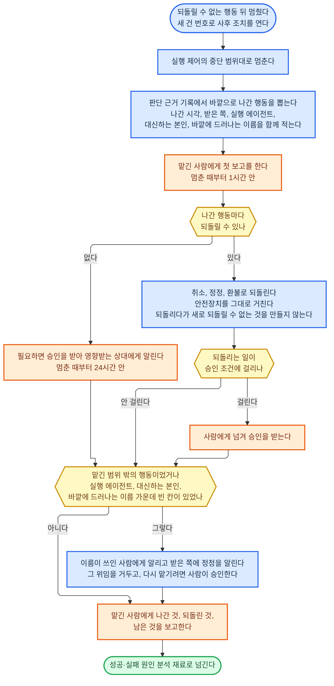
```mermaid
%%{init: {"flowchart":{"wrappingWidth":640,"curve":"linear","nodeSpacing":45,"rankSpacing":55,"padding":14,"useMaxWidth":true,"defaultRenderer":"elk"},"themeVariables":{"fontSize":"15px"},"layout":"elk","elk":{"mergeEdges":false,"nodePlacementStrategy":"BRANDES_KOEPF","keepEntryNodeOnTop":true,"considerModelOrder":"PREFER_NODES","cycleBreakingStrategy":"DEPTH_FIRST"}} }%%
flowchart TB
    R1["맡긴 사람에게 첫 보고를 한다<br/>멈춘 때부터 1시간 안"]:::back
    U["취소, 정정, 환불로 되돌린다<br/>안전장치를 그대로 거친다<br/>되돌리다가 새로 되돌릴 수 없는 것을 만들지 않는다"]:::main
    H["사람에게 넘겨 승인을 받는다"]:::back
    E(["성공·실패 원인 분석 재료로 넘긴다"]):::good
    A["실행 제어의 중단 범위대로 멈춘다"]:::main
    Q1{{"나간 행동마다<br/>되돌릴 수 있나"}}:::note
    N["필요하면 승인을 받아 영향받는 상대에게 알린다<br/>멈춘 때부터 24시간 안"]:::back
    B["판단 근거 기록에서 바깥으로 나간 행동을 뽑는다<br/>나간 시각, 받은 쪽, 실행 에이전트,<br/>대신하는 본인, 바깥에 드러나는 이름을 함께 적는다"]:::main
    S(["되돌릴 수 없는 행동 뒤 멈췄다<br/>새 건 번호로 사후 조치를 연다"]):::main
    F["이름이 쓰인 사람에게 알리고 받은 쪽에 정정을 알린다<br/>그 위임을 거두고, 다시 맡기려면 사람이 승인한다"]:::main
    Q2{{"되돌리는 일이<br/>승인 조건에 걸리나"}}:::note
    REP["맡긴 사람에게 나간 것, 되돌린 것,<br/>남은 것을 보고한다"]:::back
    Q3{{"맡긴 범위 밖의 행동이었거나<br/>실행 에이전트, 대신하는 본인,<br/>바깥에 드러나는 이름 가운데 빈 칸이 있었나"}}:::note
    A --> B
    S --> A
    Q1 -- "없다" --> N
    REP --> E
    H --> Q3
    Q3 -- "그렇다" --> F
    F --> REP
    R1 --> Q1
    N --> Q3
    Q1 -- "있다" --> U
    Q3 -- "아니다" --> REP
    Q2 -- "걸린다" --> H
    Q2 -- "안 걸린다" --> Q3
    U --> Q2
    B --> R1
    %% 배치용 보이지 않는 연결: 선은 그려지지 않고 상자 위치만 잡음
    H ~~~ REP
    classDef main fill:#dbeafe,stroke:#2563eb,stroke-width:2px,color:#17314f
    classDef stop fill:#fee2e2,stroke:#dc2626,stroke-width:2px,color:#7f1d1d
    classDef back fill:#ffedd5,stroke:#ea580c,stroke-width:2px,color:#7c2d12
    classDef good fill:#dcfce7,stroke:#16a34a,stroke-width:2px,color:#14532d
    classDef note fill:#fef9c3,stroke:#ca8a04,stroke-width:2px,color:#713f12
```

---

#### 대기·후속 관리

**원칙**

- 사람의 결정을 기다리는 건은 사람에게 넘기기를 따른다.
- 확인일, 다시 묻는 횟수와 간격, 되돌릴 수 없는 기한을 며칠 앞두고 다시 확인할지는 직종이 바꿀 수 있다.

**대기 상태로 둘 때** — 다음 다섯 칸을 다 채워야 대기 상태로 둔다.

1. 무엇을 기다리는가
2. 누가 맡고 있는가
3. 확인일
4. 기한이 지나도 답이 없으면 할 일: 다시 묻기, 미리 정해 둔 다른 방법으로 대신하기, 다른 담당에게 넘기기 가운데 하나
5. 놓치면 되돌릴 수 없는 기한인가

**확인일**

| 상황 | 처리 | 기본값 |
|---|---|---|
| 상대가 약속한 기한이 있다 | 그 기한의 다음 영업일을 확인일로 한다 | — |
| 약속한 기한이 없다 | 기본값만큼 뒤를 확인일로 한다 | 5영업일 |
| 확인일에 답이 없다 | 다시 묻고 확인일을 뒤로 옮긴다 | 3영업일 뒤 |
| 두 번 다시 물어도 답이 없다 | 미리 정해 둔 다른 방법으로 대신하거나 다른 담당에게 넘긴다 | — |
| 놓치면 되돌릴 수 없는 기한이 다가온다 | 건을 꺼내 기한 안에 그 일을 할지 다시 확인한다 | 기한 3영업일 전과 1영업일 전 |
| 확인일과 되풀이 업무의 다음 회차 | 시작 신호 재료의 예약으로 돌린다 | — |

**영업일 달력과 기한**

| 상황 | 처리 |
|---|---|
| 한국 공휴일 | ▶️ 공공데이터포털의 특일 정보(공휴일과 기념일 같은 날을 날짜별로 알려 주는 공개 자료)에서 받는다 ▶️ 받은 목록은 관공서의 공휴일에 관한 규정과 견줘, 규정에는 있는데 목록에 없는 날을 더한다 |
| 다른 나라의 영업일 | ▶️ 직종이 채운다 ▶️ 채우지 않았으면 토요일과 일요일만 영업일에서 뺀다 |
| 판결문을 받은 날부터 세는 항소 기한처럼 다른 절차의 진행에 따라 세는 기한 | 그 절차가 바뀌면 기한을 다시 센다 |
| 하도급 검사 통지처럼 법이 정한 기한 | 법·의무 기준이 정한 대로 놓치면 되돌릴 수 없는 기한으로 올린다 |
| 되풀이 업무의 이번 회차를 닫는다 | ▶️ 다음 회차를 등록한다 ▶️ 못 끝낸 일은 '넘어온 일' 표시를 붙여 다음 회차로 옮긴다 |
| 담당이 바뀐다 | 대기 중인 건과 남은 약속은 새 담당이 받았다고 확인할 때까지 옛 담당 몫으로 둔다 |

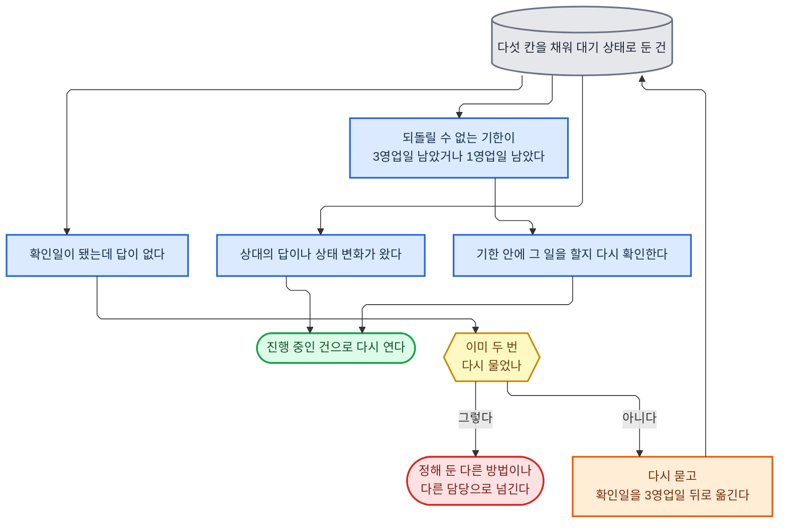
```mermaid
%%{init: {"flowchart":{"wrappingWidth":640,"curve":"linear","nodeSpacing":45,"rankSpacing":55,"padding":14,"useMaxWidth":true,"defaultRenderer":"elk"},"themeVariables":{"fontSize":"15px"},"layout":"elk","elk":{"mergeEdges":false,"nodePlacementStrategy":"NETWORK_SIMPLEX","keepEntryNodeOnTop":true,"considerModelOrder":"NODES_AND_EDGES","cycleBreakingStrategy":"DEPTH_FIRST"}} }%%
flowchart TB
    SL[("다섯 칸을 채워 대기 상태로 둔 건")]:::store
    E2["확인일이 됐는데 답이 없다"]:::main
    E3["되돌릴 수 없는 기한이<br/>3영업일 남았거나 1영업일 남았다"]:::main
    E1["상대의 답이나 상태 변화가 왔다"]:::main
    RES(["진행 중인 건으로 다시 연다"]):::good
    ALT(["정해 둔 다른 방법이나<br/>다른 담당으로 넘긴다"]):::stop
    RE["기한 안에 그 일을 할지 다시 확인한다"]:::main
    ASK["다시 묻고<br/>확인일을 3영업일 뒤로 옮긴다"]:::back
    Q1{{"이미 두 번<br/>다시 물었나"}}:::note
    Q1 -- "아니다" --> ASK
    SL --> E1
    SL --> E2
    E1 --> RES
    RE --> RES
    E2 --> Q1
    SL --> E3
    ASK --> SL
    Q1 -- "그렇다" --> ALT
    E3 --> RE
    %% 배치용 보이지 않는 연결: 선은 그려지지 않고 상자 위치만 잡음
    E3 ~~~ E2
    SL ~~~ RE
    E1 ~~~ Q1
    classDef main fill:#dbeafe,stroke:#2563eb,stroke-width:2px,color:#17314f
    classDef stop fill:#fee2e2,stroke:#dc2626,stroke-width:2px,color:#7f1d1d
    classDef back fill:#ffedd5,stroke:#ea580c,stroke-width:2px,color:#7c2d12
    classDef store fill:#e5e7eb,stroke:#6b7280,stroke-width:2px,color:#1f2937
    classDef good fill:#dcfce7,stroke:#16a34a,stroke-width:2px,color:#14532d
    classDef note fill:#fef9c3,stroke:#ca8a04,stroke-width:2px,color:#713f12
```

---

#### 자료 선별·분류

**원칙** — 직종은 분류 체계를 채운다. '미정'이 얼마나 많으면 다시 나눌지, 몇 쌍까지 주 모델이 직접 견줄지, 점수가 얼마면 같은 대상으로 볼지도 직종이 정한다. 정하지 않으면 아래 숫자를 쓴다. 자료에 쓰는 고유 번호마다 대상 하나에 하나만 붙는 번호인지도 직종이 적어 둔다.

**분류 체계**

| 상황 | 처리 |
|---|---|
| 직종이 준 분류 체계가 없다 | ▶️ 나누기 전에 라벨마다 어떤 자료가 들어가는지 기준을 정한다 ▶️ 기준마다 맞는 예를 하나씩 붙인다 |
| 분류 체계를 정했다 | ▶️ 판본을 붙인다 ▶️ 나누는 도중에는 라벨을 새로 만들지 않는다 |
| 맞는 라벨이 없어 '미정'에 넣은 자료가 전체의 10%를 넘는다 | 분류 체계를 고쳐 판본을 올리고 처음부터 다시 나눈다 |
| 다시 나누기를 두 번 해도 10%를 넘는다 | 더 나누지 않고, 미정 비율과 미정 자료에 공통된 점을 결과에 붙여 낸다 |

**나누기와 잇기**

| 상황 | 처리 |
|---|---|
| 맞는 라벨이 없다 | '미정'에 넣는다 |
| 맞는 라벨이 둘 이상이다 | 모두 붙이고 '겹침'으로 표시한다 |
| 자료마다 | 붙인 라벨과 그 근거가 된 원문 구간을 함께 남긴다 |
| 날짜, 금액 구간, 코드 값처럼 표의 칸 값만 보고 나눌 수 있는 분류 | 코드로 나눈다 |
| 자료 정리·결합 재료로 연결을 넘긴다 | 확정된 연결만 넘긴다 |
| 학습용과 평가용으로 나눈 자료, 서로 보면 안 되는 자료 | 이미 나눠 둔 경계를 넘어 섞지 않는다 |

**같은 대상 가리는 방법 고르기** — 서로 다른 자료의 기록이 같은 사람이나 같은 회사를 가리키는지 다음 순서로 가린다.

1. 양쪽 자료에 같은 종류의 고유 번호가 있으면 전문 판단의 신뢰성에서 헛짚음을 막는 규칙대로 번호로 가린다. 사업장마다 따로 나오는 번호가 다르고 대상 하나에 하나만 붙는 번호도 없으면 2나 3으로 가린다.
2. 고유 번호가 없고 견줄 자료 쌍이 1천 쌍 이하면 주 모델이 쌍마다 판단한다.
3. 1천 쌍을 넘으면 확률 연결 도구로 점수를 매긴다. 이 도구는 두 기록의 여러 칸이 얼마나 닮았는지 보고, 같은 대상일 가능성을 점수 하나로 낸다. 0.95 이상이면 같은 대상 후보로 잇되, 결론에 쓰기 전에 고유 번호나 원문으로 확인한다. 0.50 미만이면 다른 대상으로 본다. 그 사이는 주 모델이 보고, 그래도 모르면 미정 연결로 둔다.

**지금의 선택**

| 구분 | ① 에이전트 하네스 | ②·③ 사내 서버 |
|------|------|------|
| 표의 값만 보고 나누는 도구 | DuckDB | DuckDB |
| 확률 연결 도구 | Splink | Splink |

**도구 조건**

| 조건 | 기준 | 이유 |
|------|------|------|
| 자료가 PostgreSQL에 있다 | ②·③은 표의 값만 보고 나누는 분류를 PostgreSQL 안에서 한다 | 데이터베이스의 자료를 밖으로 꺼내 옮기지 않아도 된다 |
| 확률 연결의 계산 | Splink는 DuckDB로 계산한다 | 확률 연결은 1천 쌍이 넘는 큰 자료에 쓰는데, DuckDB는 장비 메모리보다 큰 자료도 처리한다 |

---

#### 자료 정리·결합

**원칙** — 직종은 어떤 고유 번호를 쓸지, 단위와 시간대를 무엇으로 맞출지, 무엇을 중복으로 볼지를 채운다.

**원본과 추적**

| 대상 | 처리 |
|---|---|
| 원본 | ▶️ 고치지 않는다 ▶️ 정리는 사본에서 한다 |
| 바꾼 값 | 값마다 어떤 규칙으로 바뀌었는지 따라갈 수 있게 남긴다 |
| 규칙 하나를 되돌린다 | 그 규칙이 바꾼 값만 원래대로 돌아와야 한다 |
| 꼭 메워야 하는 값 | 어떻게 메웠는지 값 옆에 적는다 |

**누가 하나**

| 일 | 처리 |
|---|---|
| 표 자료의 값 옮기기, 합치기, 나누기, 중복 빼기 | ▶️ 규칙을 코드로 적어 돌린다 ▶️ 모델이 값을 옮겨 적지 않는다 |
| 모델이 할 일 | ▶️ 규칙을 정한다 ▶️ 규칙으로 가르지 못하는 줄만 직접 본다 |
| 합칠 때 어느 값으로 덮어쓸지 | 합치기 전에 어느 값을 남길지 규칙(예: 최신 판본 우선)을 적고, 덮어쓴 값과 그 출처를 남긴다 |
| 같은 입력이 두 번 오거나, 늦게 오거나, 순서가 바뀌어 온다 | 입력이 한 번씩 제때 차례대로 왔을 때와 결과가 같아야 한다 |

**끝났는지 보기**

| 상황 | 처리 |
|---|---|
| 정리를 마쳤다 | 처리한 도구로 정리 전과 후의 줄 수와 금액 합계를 다시 세어 견준다 |
| 빠진 줄이나 늘어난 줄이 있다 | 그 줄마다 까닭이 설명될 때까지 끝난 것으로 치지 않는다 |

**처리 도구 고르기**

1. 규칙을 코드로 적어 두어, 같은 입력이면 늘 같은 결과가 나오는 도구만 후보로 남긴다. 손으로 고친 스프레드시트와 모델이 다시 쓴 표는 뺀다.
2. 자료가 이미 데이터베이스에 있으면 옮기지 않고 그 데이터베이스 안에서 처리한다.
3. 파일로 받은 자료는 다음 세 조건을 모두 갖춘 도구로 처리한다.
   - CSV, Parquet(큰 표를 압축해 담는 파일 형식), 엑셀 파일을 SQL로 바로 읽고 쓴다.
   - 실행 파일 하나로 설치된다.
   - 장비 메모리보다 큰 자료도 처리한다.

**지금의 선택**

| 구분 | ① 에이전트 하네스 | ②·③ 사내 서버 |
|------|------|------|
| 파일로 받은 자료 | DuckDB | DuckDB |
| 옛 엑셀 파일(.xls)을 xlsx로 바꾸기 | LibreOffice | LibreOffice |
| 데이터베이스에 저장된 자료 | — | PostgreSQL |

**처리 도구 조건**

| 조건 | 기준 | 이유 |
|------|------|------|
| 엑셀 읽기 확장 | 엑셀을 읽는 기능이 따로 까는 공식 확장이면, 세 환경 모두 미리 깔아 둔다 | 도구를 돌리는 자리는 바깥 인터넷이 막혀 있어, 쓸 때 내려받을 수 없다 |
| 옛 엑셀 파일(.xls) | xlsx로 바꾼 뒤 처리한다 | DuckDB의 엑셀 확장은 .xls 파일을 읽지 못한다 |

---

#### 형식·구조 변환

**원칙** — 직종은 도면, 인쇄용 파일, 전표처럼 그 직종이 쓰는 전용 형식과 그 형식을 다루는 도구를 채운다. 영상이나 자막의 시간 값이 얼마까지 어긋나도 되는지와 미리 넣어 둘 글꼴도 채운다.

**누가 옮기나** — 내용은 변환 도구가 옮긴다. 모델은 내용을 다시 쳐서 옮기지 않고, 도구가 못 옮긴 부분만 손본다.

**끝났는지 보기**

| 상황 | 처리 | 기본값 |
|---|---|---|
| 표, 칸, 수식, 그림, 쪽, 자막 줄, 항목 연결처럼 옮겨야 할 요소 | 변환 전에 원본에서 세고, 변환 뒤에 결과에서 같은 것을 세어 견준다 | — |
| 개수가 다르다 | 끝난 것으로 치지 않는다 | — |
| 글꼴 | ▶️ 원본에 쓰인 글꼴과 결과에 쓰인 글꼴을 견준다 ▶️ 다른 글꼴로 바뀐 것은 달라진 요소로 적는다 | — |
| 영상이나 자막의 시간 값이 원본과 어긋난다 | 기본값보다 많이 어긋나면 끝난 것으로 치지 않는다 | 0.05초 |
| 옮기지 못한 요소나 달라진 요소가 있다 | ▶️ 목록으로 만들어 결과와 함께 넘긴다 ▶️ 그 요소가 빠지지 않는 다른 형식의 파일도 함께 내, 받는 쪽이 대신 쓸 수 있게 한다 | — |
| 옛 시스템의 항목을 새 시스템의 항목으로 옮긴다 | ▶️ 옮기기 전에 옛 항목 하나하나가 새 항목 어디로 가는지 적은 대응표를 만든다 ▶️ 버리는 항목은 왜 버리는지 적는다 ▶️ 대응표에 없는 항목은 옮기지 않는다 | — |

**변환 수단 고르기**

1. 원본 프로그램이 그 환경에 설치돼 있고 내보내기 기능이 있으면 그 기능을 쓴다.
2. 원본 프로그램이 없으면 공개 도구를 쓴다. 그 도구는 명령으로 돌릴 수 있어야 하고, 바꾸려는 두 형식을 지원한다고 공식 문서에 적혀 있어야 한다. 그런 도구가 둘 이상이면, 쪽 모양을 그대로 지켜야 할 때는 쪽마다 배치해 보여 주는 사무 프로그램을 쓴다. 제목, 문단, 표 같은 글의 짜임만 옮기면 될 때는 구조 변환 도구를 쓴다.
3. 원본 프로그램도 공개 도구도 없으면 그 형식으로 내지 않고, 받는 쪽이 쓸 수 있는 다른 형식으로 낸다. 제출처가 꼭 그 형식을 요구하면 완료 조건을 채우지 못했으므로 미완료로 보고한다.

**지금의 선택**

| 구분 | ① 에이전트 하네스 | ②·③ 사내 서버 |
|------|------|------|
| 워드, 마크다운, HTML 사이에서 글 구조 바꾸기 | Pandoc | Pandoc |
| 쪽 모양 그대로 PDF 만들기 | LibreOffice | LibreOffice |
| 한글 파일(hwp, hwpx)을 읽어 다른 형식으로 바꾸기 | LibreOffice와 H2Orestart | LibreOffice와 H2Orestart |
| 영상, 음성, 자막 | FFmpeg | FFmpeg |
| 표와 항목 구조 | DuckDB | DuckDB |

**변환 수단 조건**

| 조건 | 기준 | 이유 |
|------|------|------|
| 한글 파일로 내보내기 | ▶️ 하지 않고 PDF로 낸다 ▶️ 제출처가 한글 파일을 요구하면 미완료로 보고한다 | ▶️ 그 환경에는 한글 파일을 만들어 내는 원본 프로그램도 공개 도구도 없다 ▶️ H2Orestart는 한글 파일을 읽기만 한다 |

---

#### 계산

**원칙**

- 결과에 들어가는 셈은 한 자리 덧셈까지 모델이 머리로 하지 않고 코드로 돌린다.
- 직종은 그 일에 쓰는 직종 계산기를 채운다.

**셈하는 법**

| 대상 | 처리 | 기본값 |
|---|---|---|
| 반올림과 절사 | 법이나 계약, 제출처가 정한 자리와 방식대로, 정한 단계에서만 한다 | — |
| 정한 곳이 없을 때의 반올림과 절사 | ▶️ 중간 계산에서는 하지 않고, 금액을 기록하거나 지급하거나 보여 줄 때 한 번만 한다 ▶️ 합계는 반올림한 줄 금액을 더해 구한다 ▶️ 그래야 줄마다 보여 준 금액을 더한 값과 합계가 맞는다 | — |
| 반올림 방식 | ▶️ 계산마다 방식을 적는다 ▶️ 반올림은 버릴 자리가 5 이상일 때 올린다 ▶️ 절사는 버릴 자리를 버려 0에 가까운 쪽으로 맞춘다 | — |
| 입력에 오차 범위가 있다 | ▶️ 그 범위 안에서 값을 무작위로 뽑아 하나하나 계산하고, 결과도 범위로 낸다 ▶️ 같은 결과를 다시 낼 수 있게 시드(무작위 수를 만드는 시작값)를 기록한다 | 무작위 값 1만 개 |
| 적는 자릿수 | 오차 범위로 보아 믿을 수 있는 자릿수까지만 적는다 | — |

**기간 세기** — 날짜로 끝나는 기한은 이렇게 센다.

| 상황 | 처리 |
|---|---|
| 법이나 재판, 계약이 기간 세는 방법을 따로 정했다 | 그 방법을 따른다 |
| 따로 정한 곳이 없는 한국 건 | ▶️ 민법의 기간 계산을 따른다 ▶️ 민사소송과 세법도 따로 정하지 않은 부분은 민법을 따른다 |
| 일, 주, 월, 연으로 정한 기간 | ▶️ 첫날은 세지 않는다 ▶️ 기간이 그날 0시부터 시작하면 첫날도 센다 ▶️ 기간은 마지막 날이 끝날 때 끝난다 |
| 주, 월, 연으로 정한 기간 | ▶️ 달력으로 센다 ▶️ 주나 달이나 해의 첫날부터 세지 않으면, 마지막 주나 달이나 해에서 세기 시작한 날과 같은 날의 전날에 끝난다 ▶️ 1월 16일부터 세는 한 달은 2월 15일에 끝난다 ▶️ 마지막 달에 그날이 없으면 그 달 말일에 끝난다 |
| 마지막 날이 토요일이나 공휴일이다 | ▶️ 그 뒤로 토요일도 공휴일도 아닌 첫날에 끝난다 ▶️ 공휴일은 관공서의 공휴일에 관한 규정을 따른다 ▶️ 일요일, 노동절, 제헌절, 대체공휴일, 임기가 끝나 치르는 선거의 선거일, 정부가 따로 정한 임시공휴일이 여기에 든다 ▶️ 어느 날이 공휴일인지는 그날 시행 중이던 규정으로 가린다 ▶️ 노동절은 2026년 5월 1일, 제헌절은 2026년 5월 11일에 시행된 개정부터 공휴일이다 |
| 기간이 늘어났다 | ▶️ 늘어난 기간까지 더한 전체 기간의 마지막 날에만 토요일과 공휴일 규칙을 쓴다 ▶️ 늘리기 전의 마지막 날이 토요일이나 공휴일이어도 그날을 뒤로 미루지 않는다 |
| 세법의 신고, 신청, 청구, 서류 제출, 통지, 납부, 징수 기한 | ▶️ 기한이 토요일, 일요일, 공휴일, 대체공휴일, 노동절이면 그 뒤로 그런 날이 아닌 첫날이 기한이다 ▶️ 기한 날에 국세정보통신망이 장애로 멈춰 전자 신고나 전자 납부를 할 수 없으면, 복구된 날의 다음 날이 기한이다 |
| 형사 절차의 기간 | ▶️ 첫날은 세지 않는다 ▶️ 마지막 날이 토요일이나 공휴일이면 그날은 세지 않는다 ▶️ 다만 시효와 구속 기간은 첫날을 시간과 상관없이 하루로 세고, 마지막 날이 토요일이나 공휴일이어도 그날 끝난다 |
| 영업정지 기간처럼 법령이나 처분으로 권리가 제한되거나 의무가 이어지는 기간 | ▶️ 첫날을 세고, 마지막 날이 토요일이나 공휴일이어도 그날 끝난다 ▶️ 이렇게 세는 쪽이 국민에게 불리하면 민법대로 센다 |
| 법령 시행일을 공포한 날부터 세어 정한다 | ▶️ 공포한 날부터 시행하면 공포한 날이 시행일이다 ▶️ 공포하고 일정 기간이 지나야 시행하면 공포한 날은 세지 않는다 ▶️ 마지막 날이 토요일이나 공휴일이어도 그날 끝나고, 시행일은 그다음 날이다 ▶️ 훈령, 예규, 고시, 지침도 같고, 발령한 날을 공포한 날로 본다 |
| 시, 분, 초로 정한 기간 | 그때부터 바로 센다 |
| '회의일 2주 전까지 통지'처럼 어느 날부터 거꾸로 세는 기간 | ▶️ 기준이 되는 날은 세지 않고 그 전날부터 거꾸로 센다 ▶️ 할 일은 거꾸로 세어 닿은 날의 전날까지 마친다 ▶️ 회의일이 5월 21일이면 5월 20일부터 14일을 거꾸로 세어 5월 7일에 닿으므로, 5월 6일까지 통지한다 ▶️ 마칠 날이 토요일이나 공휴일이면 하루씩 앞당겨, 토요일도 공휴일도 아닌 날까지 마친다 |
| 나이 | 만 나이로 세고, 태어난 날을 첫날로 센다 |
| 다른 나라의 건 | 직종이 그 나라의 기간 세는 방법을 채운다 |

**결과를 믿기 전에**

| 상황 | 처리 |
|---|---|
| 되풀이하며 답에 다가가는 계산인데 값이 한곳으로 모이지 않거나 오락가락한다 | 성공으로 치지 않고, 원인을 찾아 다른 방법으로 다시 푼다 |
| 남이 낸 계산을 받았다 | ▶️ 그 풀이를 따라가지 않고, 원래 입력에서 따로 풀어 견준다 ▶️ 결과가 다르면 계산이 틀렸는지, 전제가 틀렸는지 갈라서 알린다 |

**되풀이할 전문 계산** — 같은 전문 계산을 되풀이하게 되면 직종 계산기의 함수로 만들고 시험을 함께 둔다. 기준일은 건마다 입력으로 받고, 함수는 그날 효력이 있는 규칙을 골라 쓴다. 시험은 기준이 갈리는 바로 그 값, 입력이 빠진 경우, 조건끼리 부딪히는 경우, 규칙이 개정되기 전과 뒤를 다룬다. 기간 세기도 이렇게 함수로 만들고, 월말이 낀 기간을 시험에 넣는다. 공휴일은 대기·후속 관리 재료의 영업일 달력을, 시간대는 시작 신호 재료가 정한 시간대를 쓴다.

**계산 수단 고르기**

1. 코드로 돌리는 수단만 남긴다. 결과물이 스프레드시트 파일이어도 그 안의 값은 이 재료의 도구로 따로 검산한다.
2. 값의 종류로 고른다. 둘 이상에 해당하면 앞에 적은 것을 먼저 쓴다.
   - 금액처럼 자릿수가 정해진 값은 십진 계산 도구로 셈한다. 금액에는 통화를 단위로 붙여 단위 계산 도구를 함께 쓰고, 그 도구가 십진 값으로 셈하도록 맞춘다.
   - 그 밖에 단위가 있는 값은 단위 계산 도구로 셈한다.
   - x 같은 기호가 든 식을 숫자를 넣지 않고 그대로 풀어야 하면 기호 계산 도구를 쓴다.
   - 적분이나 미분방정식처럼 근삿값을 구하는 계산은 수치 계산 도구를 쓴다.
3. 법이나 제출처가 공식으로 인정한 계산기가 있으면 그 계산기로 결과를 내고, 2의 도구로 한 번 더 검산한다.

**지금의 선택**

| 구분 | ① 에이전트 하네스 | ②·③ 사내 서버 |
|------|------|------|
| 계산 언어 | Python | Python |
| 십진 계산 도구 | Python에 기본으로 들어 있는 십진 계산 기능 | Python에 기본으로 들어 있는 십진 계산 기능 |
| 단위 계산 도구 | Pint 라이브러리(프로그램에 가져다 쓰는 기능 모음) | Pint |
| 기호 계산 도구 | SymPy | SymPy |
| 수치 계산 도구 | SciPy | SciPy |

**계산 수단 조건**

| 조건 | 기준 | 이유 |
|------|------|------|
| Python의 반올림 기본값 | 쓰지 않고, 계산마다 반올림 방식을 정해 준다 | Python은 방식을 정하지 않으면 버릴 자리가 딱 5일 때 짝수 쪽으로 반올림해, 2.5를 3이 아니라 2로 만든다 |
| Catala나 OpenFisca로 짠 직종 계산기 | ▶️ 네 가지를 확인한 범위에서만 쓴다 ▶️ 그 관할의 규칙에 맞는지, 십진 자릿수와 반올림이 맞는지, 같은 입력에서 같은 결과가 다시 나오는지, 기존 계산과 맞는지다 | ▶️ OpenFisca는 소수가 있는 값을 32비트로 저장해, 믿을 수 있는 숫자가 앞에서부터 7자리 남짓뿐이다 ▶️ 그래서 원 단위 반올림이 틀릴 수 있고, 16,777,216원을 넘는 금액은 원 단위 정수도 그대로 담지 못한다 |

---

#### 분석

**원칙**

- 결론에 들어가는 숫자는 모두 원자료에서 코드로 다시 뽑아 쓴다.
- 결론에는 자료가 몇 건 또는 몇 명인지, 어느 기간인지, 빠진 자료가 무엇인지 함께 적는다.
- 직종은 그 분야에서 쓰는 전용 분석 기법을 채운다.

**주장 세우기**

| 상황 | 처리 |
|---|---|
| 원인이라고 쓰려 한다 | ▶️ 원인일 수 있는 다른 설명을 둘 이상 적고, 설명마다 왜 아닌지 근거를 댄다 ▶️ 다른 설명이 틀렸다고 밝히지 못하면 "관련이 있다"까지만 쓴다 |
| 자료를 여러 갈래로 쪼개 보다가 차이를 찾았다 | ▶️ 몇 번 쪼개 봤는지 함께 적는다 ▶️ 새 자료로 다시 확인하기 전까지는 가설로 둔다 |
| 면담이나 문의 같은 글 자료에서 주제를 찾는다 | ▶️ 주 모델이 찾고, 주제마다 원문 인용과 그 말을 한 사람의 수를 붙인다 ▶️ 인용이 없는 주제는 내지 않는다 |

**분석 도구 고르기**

1. 코드로 돌려 같은 입력이면 같은 값이 나오는 도구만 남긴다. 화면에서 눌러 쓰는 분석 서비스는 뺀다.
2. 모으기와 세기는 자료 정리·결합 재료가 쓰는 SQL 도구로 한다.
3. 통계는 계산과 같은 Python에서 한다. 차이가 우연인지 가리는 통계 검정, 한 값이 다른 값에 따라 얼마나 바뀌는지 재는 회귀, 시간 순서로 쌓인 값을 따지는 시계열 검정을 한 도구 안에 모두 갖추고, 공식 문서에 이 방법들을 표준 이름 그대로 적은 도구를 고른다.

**지금의 선택**

| 구분 | ① 에이전트 하네스 | ②·③ 사내 서버 |
|------|------|------|
| 모으기와 세기 | DuckDB | DuckDB와 PostgreSQL |
| 통계 검정과 회귀 | statsmodels | statsmodels |

---

#### 기준 적용·판정

**원칙**

- 항목 결과는 충족, 불충족, 미확인에 '해당 없음'을 더한 넷 가운데 하나로 적는다.
- 직종은 따져 볼 요건과 기준표를 채운다.

**항목별 대조**

| 상황 | 처리 |
|---|---|
| 등급이나 정도를 가리는 기준 | 경계를 가른 값과 그 증거를 함께 적는다 |
| 미확인 항목이 있다 | "미확인 ○개를 뺀 나머지는 충족"처럼 범위를 붙인다 |

**대조 수단 고르기**

1. 한 번만 하는 대조에서 숫자, 날짜, 목록 비교로 끝나는 항목은 코드로 대조한다.
2. 맡은 업무에서 같은 기준을 되풀이해 적용하면, 그 기준을 규칙 묶음 하나로 적고 판본을 붙인다.

**지금의 선택**

| 구분 | ① 에이전트 하네스 | ②·③ 사내 서버 |
|------|------|------|
| 한 번만 하는 대조 | Python | Python |
| 되풀이하는 대조 | OPA | OPA |

**대조 수단 조건**

| 조건 | 기준 | 이유 |
|------|------|------|
| 판정을 묻는 곳 | 판정은 모델 밖 프로그램이 OPA에 묻고, 기록을 남긴 뒤에 결과를 모델에 준다 | 기록을 먼저 남겨야 기록 없이 결론에 쓰인 판정이 생기지 않는다 |
| 입력에 값이 없다 | 규칙마다 입력 값이 빠진 사례로 미확인이 돌아오는지 시험한다 | ▶️ OPA는 값이 빠지면 규칙의 답을 '정해지지 않음'으로 두고, 이때 기본값이 거짓이면 미확인이 불충족으로 바뀐다 ▶️ '아니다'를 뜻하는 `not`은 값이 빠지면 참이 되어, 미확인이 충족이나 불충족으로 바뀐다 |

---

#### 예측

**원칙**

- 예측은 한 값이 아니라 가운데 값과 범위로 낸다. 범위는 기본으로 실제 값이 그 안에 들 확률이 80%가 되게 잡는다.
- 직종은 예측할 값과 범위 폭을 채운다.

**예측을 내는 모양**

| 상황 | 처리 |
|---|---|
| 사람이나 상대의 반응처럼 숫자 자료가 없는 예측 | 비슷한 일이 얼마나 자주 그렇게 됐는지에서 출발해, 이번 사정에 맞게 고친 뒤 확률로 적는다 |
| 예측에 쓴 과거 자료에 없던 조건의 입력이 들어왔다 | 그 사실을 예측에 함께 적는다 |

**기준선** — 숫자를 예측할 때는 먼저 가장 단순한 예측인 기준선을 만들고, 다른 방법은 이 기준선과 견준다. 계절성이 있는 자료는 지난 같은 계절의 값을, 계절성이 없는 자료는 직전 값을 그대로 쓴다. 과거로 되돌려 맞혀 본 채점이든 실제 결과로 한 채점이든, 기준선보다 낫지 않은 방법은 쓰지 않고 기준선을 낸다.

**맞혀 보기와 채점**

| 상황 | 처리 |
|---|---|
| 과거의 한 시점으로 되돌아가 그 뒤를 예측해 실제 값과 맞혀 본다 | ▶️ 그 시점에 알 수 없었던 정보는 쓰지 않는다 ▶️ 맞혀 볼 구간의 자료는 모델이 배우는 자료에 넣지 않는다 |
| 되돌려 맞혀 볼 과거가 세 구간이 안 된다 | 기준선을 내고, 채점하지 못했다는 사실을 예측에 함께 적는다 |
| 예측을 냈다 | 결과가 나올 날짜와 함께 남기고, 결과가 나오면 채점한다 |

**예측 방법 고르기**

1. 날짜별 판매량처럼 시간 순서로 쌓인 숫자 기록, 곧 시계열이 있으면 후보는 둘이다. 하나는 기준선이고, 다른 하나는 시계열 예측 순위표인 fev-bench에서 범위 예측 점수가 가장 높은 모델이다. 이 모델은 가중치를 내려받을 수 있는 것 가운데서 고른다.
2. 이 자료의 과거로 세 구간 이상 되돌아가, 구간마다 그 뒤를 예측해 실제 값과 맞혀 본다. 채점은 핀볼 손실로 한다. 핀볼 손실은 '실제 값이 이보다 낮을 확률이 몇 %'라고 낸 값이 실제 값에서 빗나간 만큼 매기는 벌점이다. 10% 지점부터 90% 지점까지 10%씩 아홉 지점에서 벌점을 재고, 두 후보 가운데 벌점 평균이 작은 쪽을 쓴다.
3. 시계열이 없으면 주 모델이 확률로 예측한다.

**지금의 선택**

| 구분 | ① 에이전트 하네스 | ②·③ 사내 서버 |
|------|------|------|
| 기준선 예측 라이브러리 | statsforecast | ①과 같다 |

**예측 방법 조건**

| 조건 | 기준 | 이유 |
|------|------|------|
| 순위표에서 고른 모델을 돌리는 장치 | ▶️ ①은 CPU로 돌린다 ▶️ CPU로 돌릴 수 없으면 ②로 넘긴다 ▶️ ②·③은 GPU로 돌린다 | ▶️ ①의 도구는 한 사람의 PC에서 돌아서 GPU가 있다고 볼 수 없다 ▶️ ②·③은 GPU를 갖춘 사내 장비에서 돈다 |

---

#### 조건 안에서 최선 찾기

**원칙**

- 풀기 전에 목적, 반드시 지킬 조건, 바꿀 수 있는 것, 풀이 시간 한도 네 가지를 적는다. 풀이 시간 한도는 기본 10분이다.
- 결과는 증명된 최선, 찾아본 범위의 최선, 답이 없다는 증명 셋 가운데 하나로 적는다. 답을 못 찾은 것을 "답이 없다"로 적지 않는다.
- 직종은 목적(무엇을 가장 작게 하거나 가장 크게 할지), 걸리는 조건, 풀이 시간 한도를 채운다.

**처리 규칙**

| 상황 | 처리 | 기본값 |
|---|---|---|
| 목적이 여럿인데 우선순위나 비중을 받지 못했다 | ▶️ 비중을 마음대로 정하지 않는다 ▶️ 목적마다 따로 가장 나은 답을 내고, 한쪽을 얻으면 다른 쪽을 얼마나 잃는지 보여 주는 후보도 낸다 ▶️ 비중을 정해 달라고 문제·목표·완료 조건 재료로 돌려보낸다 | 후보 3개 |
| 풀이 시간 한도에 닿았다 | ▶️ 그때까지 찾은 가장 나은 답을 찾아본 범위의 최선으로 낸다 ▶️ 건의 기한과 비용 한도에 여유가 있으면, 같은 길이의 풀이 시간 한도로 다른 풀이법이나 모형을 한 번 더 돌린다 | — |
| 찾아본 범위의 최선을 낸다 | ▶️ 최선과 얼마나 떨어져 있을 수 있는지 함께 적는다 ▶️ 탐색 도구처럼 그 간격을 계산하지 못하는 수단이면 "간격 모름"과 찾아본 범위를 적는다 | — |
| 조건을 모두 지키는 답이 없다고 증명됐다 | ▶️ 서로 부딪히는 조건을 가려내고, 어느 조건을 얼마나 느슨하게 하면 답이 생기는지와 그때 무엇을 잃는지 함께 낸다 ▶️ 부딪히는 조건은 여기서 풀지 않고 문제·목표·완료 조건 재료와 대안·전략 판단 재료로 돌려보낸다 | — |
| 답을 골랐다 | 주요 입력을 하나씩 바꿔 보고 답이 바뀌는지 확인해 함께 적는다 | 입력마다 ±10% |

**풀이 수단 고르기**

1. 후보 수에 후보 하나를 계산하는 시간을 곱한 값이 풀이 시간 한도 안에 들면, 전부 계산해 견준다.
2. 화질과 파일 크기를 맞바꾸는 설정처럼 결과를 식으로 쓸 수 없어 직접 돌려 봐야 값이 나오면, 앞선 시도 결과를 보고 다음 시도를 고르는 탐색 도구를 쓴다.
3. 식으로 쓸 수 있고 바꿀 값이 모두 정수이거나 '예'나 '아니오'로 정하는 값이면 정수 계획 솔버(조건을 지키면서 가장 나은 답을 찾는 프로그램)를 쓴다. 배치, 순서, 일정, 배차 같은 문제가 여기에 든다. 고른 솔버와 함께 나온 도구 모음에 차량 경로처럼 문제 종류에 맞춘 전용 솔버가 있으면 그것을 쓴다.
4. 식으로 쓸 수 있고 1.5처럼 정수 사이의 값도 갖는 연속 값이 들어 있으면 이렇게 고른다. 조건이 모두 선형이고, 목적이 선형이거나 볼록 이차식(최소화)이나 오목 이차식(최대화)이면 선형 계획과 이차 계획 솔버를 쓴다. 연속 값과 정수가 섞인 선형 식도 이 솔버로 푼다. 그 밖의 경우에는 수치 최적화 도구를 쓴다.

**지금의 선택**

| 구분 | ① 에이전트 하네스 | ②·③ 사내 서버 |
|------|------|------|
| 탐색 도구 | Optuna | ①과 같다 |
| 정수 계획 솔버 | OR-Tools CP-SAT | ①과 같다 |
| 차량 경로 전용 솔버 | OR-Tools 경로 솔버 | ①과 같다 |
| 선형 계획과 이차 계획 솔버 | HiGHS | ①과 같다 |
| 수치 최적화 도구 | SciPy 최적화 | ①과 같다 |

---

#### 결과물 설계

**원칙**

- 요구 하나하나가 설계의 어느 요소로 이어지고 어느 검사 항목으로 확인되는지 요구사항 추적표로 남긴다. 어느 요소와도 이어지지 않은 요구나, 어느 요구와도 이어지지 않은 요소가 있으면 설계를 끝내지 않는다.
- 제출처 양식, 조직 규격, 기존 디자인 체계가 있으면 그것을 따라 설계하고, 새 양식을 만들지 않는다.
- 분량, 크기, 시간, 쪽 수처럼 셀 수 있는 규격은 숫자로 정한다. "짧게"나 "적당히"로 두지 않는다.
- 직종은 화면, 도면, 장면을 설계하는 도구를 채운다.

**설계 표기 고르기** — 결과물 만들기·수정 재료가 다시 고쳐 적지 않고 그대로 이어받아 쓸 수 있는 글 형식을 고른다.

**지금의 선택**

| 구분 | ① 에이전트 하네스 | ②·③ 사내 서버 |
|------|------|------|
| 목차와 핵심 내용 같은 글의 짜임 | Markdown | ①과 같다 |
| 흐름과 연결 | Mermaid | ①과 같다 |
| 요구사항 추적표 | Markdown 표 | ①과 같다 |

---

#### 내용 재구성

**원칙**

- 번역은 직종이 채운 용어집을 따른다. 용어집이 없으면 이 건의 용어집을 새로 만들어 처음 옮긴 말을 적고, 끝까지 같은 말로 쓴다.

**원문과 대조하기** — 결과를 원문과 대조해, 뜻이 뒤집힌 곳이 있거나 빠지면 안 되는 내용이 빠졌으면 내지 않는다.

| 대상 | 처리 |
|---|---|
| 숫자, 날짜, 금액, 고유 이름 | ▶️ 원문과 결과에서 코드로 뽑아 대조한다 ▶️ 번역이면 숫자, 날짜, 금액의 단위와 표기를 한 형식으로 맞춘 뒤 대조한다 ▶️ 고유 이름은 용어집에 적힌 원문 이름과 옮긴 이름의 짝으로 대조한다 |
| 조건("~하면"), 부정("~않는다"), 예외("다만") | 결과 검사에서 원문과 한 문장씩 대조한다 |
| 번역과 풀어 쓰기 | 원문의 내용이 하나도 빠지지 않아야 한다 |
| 요약 | ▶️ 결과에 남긴 숫자와 주장은 원문과 같아야 한다 ▶️ 남긴 주장에 딸린 조건, 부정, 예외는 빠지지 않아야 한다 |
| 여러 자료를 종합한 결과 | 문장마다 출처 번호를 붙이고, 출처가 없는 문장은 내지 않는다 |

---

#### 결과물 만들기·수정

**원칙**

- 결과물은 받는 쪽이 쓰는 제작 프로그램에서 다시 열어 고칠 수 있는 원본 형식으로 만든다. PDF나 그림 파일처럼 고칠 수 없는 형식은 원본에서 뽑아낸 납품본으로만 낸다.
- 고칠 때는 결과물을 통째로 다시 만들지 않고 원본에서 고칠 곳만 고친다.
- 직종은 형식별 제작 프로그램과 편집 라이브러리 목록을 채운다.

**만들 때와 고칠 때**

| 상황 | 처리 |
|---|---|
| 결과물을 만들었다 | ▶️ 어떤 방법으로 만들었는지 적는다 ▶️ 그 방법으로 잃은 것은 형식·구조 변환의 '옮기지 못한 요소' 줄대로 적는다 ▶️ 다시 고칠 수 있는지, 수식과 글꼴과 연결이 살아 있는지를 본다 |
| 남의 얼굴, 목소리, 작품이 들어가거나, 남의 이름을 광고나 상품에 쓴다 | ▶️ 만들기 전에 그 권리를 확인하고 한 줄로 남긴다 ▶️ 권리가 확인되지 않으면 넣지 않는다 ▶️ 사실을 적거나 상대를 부르려고 이름을 쓰는 것은 여기에 들지 않는다 |
| 고친 뒤 | ▶️ 요청 때문에 함께 바뀌어야 하는 목차, 문서 안에서 다른 곳을 가리키는 참조, 수식, 연결된 그림이나 자료를 함께 맞춘다 ▶️ 이것들은 결과 검증·재검증이 요청 밖 변경을 볼 때 요청 밖 변경으로 치지 않는다 ▶️ 가리키는 곳이 사라진 참조가 하나라도 남았으면 끝난 것이 아니다 |

**만드는 경로 고르기**

1. 원본 형식을 만드는 제작 프로그램을 명령어로 부를 수 있으면, 그 프로그램으로 만든다.
2. 부를 수 없으면 형식·구조 변환의 변환 수단 고르기 3대로 다른 형식으로 낸다. 나중에 원본 형식으로 바꿔 넣을 수 있는 중간 형식이어도 되고, 그 형식을 써도 되는지 받는 쪽과 맞춘다. 그 프로그램을 갖추는 일은 능력 개선·확장에 넘겨 다음 건부터 쓴다.

**지금의 선택**

| 구분 | ① 에이전트 하네스 | ②·③ 사내 서버 |
|------|------|------|
| 글 파일을 고치는 도구 | 하네스의 파일 편집 도구 | 그 형식의 편집 라이브러리 |
| 구조가 있는 파일을 고치는 도구 | 그 형식의 편집 라이브러리 | ①과 같다 |

---

#### 사람과 소통

**원칙**

- 바깥 사람(고객, 상대방, 관계자)을 상대할 때 쓴다.
- 직종은 세 가지를 정해 둔다. 법이나 계약이 연락 통로를 정해 둔 일, 말이 근거로 쓰이는 상대, 상대가 사람과 이야기하겠다고 할 때 알려 줄 연락 창구다.

**이해와 합의 확인**

| 상황 | 처리 |
|---|---|
| 면담이나 통화에서 상대에게 설명을 마쳤다 | ▶️ 상대에게 핵심을 자기 말로 다시 말해 달라고 해서, 제대로 이해했는지 확인한다 ▶️ "이해되셨나요"처럼 예나 아니오로 답하는 물음의 답은 이해를 확인한 것으로 치지 않는다 |
| 합의한 것이나 다음에 할 일이 생긴 대화가 끝났다 | ▶️ 합의한 것, 아직 의견이 다른 것, 다음에 할 일과 그 기한을 글로 정리해 상대에게 보내고, 그 내용이 맞다는 확인을 받는다 ▶️ 확인 답이 오기 전에는 합의된 것으로 기록하지 않는다 |

**묻기와 말하기**

| 상황 | 처리 |
|---|---|
| 상대가 사람과 이야기하겠다고 한다 | ▶️ 직종이 정해 둔 연락 창구를 알려 준다 ▶️ 정해 둔 창구가 없으면 그 요청을 상대의 연락처와 함께 맡긴 사람에게 바로 알린다 ▶️ 상대에게는 요청을 전했다는 사실만 말하고, 사람이 언제 연락할지는 약속하지 않는다 |
| 목격자, 민원인, 면담 대상처럼 그 사람의 말이 근거로 쓰일 상대에게 묻는다 | ▶️ 원하는 답을 암시하는 질문은 하지 않고, 상대가 자유롭게 답할 수 있는 열린 질문부터 묻는다 ▶️ 받은 답은 요약하지 않고 들은 그대로 남긴다 |
| 상대나 제3자에게 묻기 전이다 | ▶️ 그 연락으로 누군가 증거를 없애거나, 서로 말을 맞추거나, 우리 쪽 사정을 알게 될 위험이 있으면 어떤 순서로, 어느 통로로, 어떤 문구로 물을지 먼저 정한다 ▶️ 위험이 있는지 판정이 서지 않으면 '판단이 서지 않는 것'으로 사람에게 넘긴다 |

**합격 조건** — 대화 기록에서 세어 확인한다.

| 항목 | 기준 |
|---|---|
| 상대가 핵심을 자기 말로 다시 말해 이해를 확인한 횟수 | 설명을 마친 면담이나 통화마다 1회 이상 |
| 답을 암시하는 유도 질문 | 0건 |
| 합의 내용을 정리해 상대에게 보낸 글 | 합의한 것이나 다음에 할 일이 생긴 대화마다 1건 |

**통로 고르기**

1. 법, 계약, 제출처가 정해 둔 통로가 있으면 그 통로만 쓴다. 서면 통지나 지정 접수 창구가 그런 예다.
2. 정해 둔 통로가 없으면 상대가 먼저 연락해 온 통로로 답한다. 우리가 먼저 연락할 때는 상대가 알려 둔 연락처를 쓴다. 그 연락이 광고이면 게시·배포 재료의 광고 보내기 규칙을 먼저 따른다.
3. 상대가 알려 둔 연락처가 여럿이면 메일이나 메신저처럼 글이 남는 쪽을 고른다.

---

#### 협상·조율

**원칙**

- 협상을 시작하기 전에 맡긴 사람에게서 네 가지를 글로 받는다. 목표, 최저 수용선(유보점), BATNA(합의가 안 될 때 택할 가장 나은 대안), 협상 항목마다 중요도를 매긴 순서다. 하나라도 빠지면 상대에게 제안하지 않는다.
- 직종은 협상 항목에 어떤 것이 있는지와 항목마다 점수를 매기는 법을 정해 둔다.

**제안과 조율**

| 상황 | 처리 | 기본값 |
|---|---|---|
| 제안을 주고받는다 | 정해 둔 횟수까지만 주고받는다 | 5번까지 |
| 횟수를 다 써도 목표를 채우지 못했다 | 협상이 결렬됐다고 기록하고, 미리 받아 둔 BATNA로 간다 | — |
| 상대의 요구가 최저 수용선이나 비용·위험 한도 재료의 대외 약속 한도표를 벗어난다 | 받아들이지도 거절하지도 않고 '한도 초과'로 사람에게 넘긴다 | — |
| 목표를 채워 합의할 차례다 | ▶️ 합의문 한 판본을 정해 그 판본의 해시를 적어 둔다 ▶️ 양쪽이 같은 해시의 판본을 확인한다 | — |
| 서명하거나 계약을 확정할 차례다 | '되돌릴 수 없는 행동'으로 사람에게 넘긴다 | — |

**내부 협상 정보가 새지 않게** — 최저 수용선, BATNA, 그 밖의 내부 협상 정보는 상대에게 보내는 글과 말에 넣지 않는다.

| 상황 | 처리 |
|---|---|
| 글을 상대에게 내보내기 전이다 | 최저 수용선 금액과 그 금액을 적은 문구를 프로그램이 글에서 글자 그대로 찾아, 하나도 나오지 않아야 내보낸다 |
| 음성으로 협상한다 | ▶️ 통화하는 음성용 모델에는 통화 전에 제안 고르기 1~3단계로 뽑은 제안 목록만 건넨다 ▶️ 최저 수용선과 BATNA는 건네지 않는다 |
| 통화 중에 목록에 없는 새 조건이 나온다 | 통화 중에는 약속하지 않고, 나중에 글로 확정한다 |

**제안 고르기**

1. 최저 수용선이나 대외 약속 한도표를 벗어나는 안은 뺀다.
2. 남은 안마다 맡긴 사람이 정한 항목별 중요도로 점수를 매긴다. 그 가운데 이번에 물러설 수 있는 폭 안에 드는 안만 남긴다. 첫 양보는 우리가 직전에 낸 제안과 최저 수용선 사이 차이의 3분의 1까지다. 그 뒤로는 양보할 때마다 직전 양보보다 작게 한다.
3. 남은 안 가운데 우리 쪽 점수가 같은 안을 2~3개 골라 한꺼번에 낸다. 상대가 밝힌 관심사를 많이 채우는 안부터 고른다. 상대가 어느 안을 고르는지 보면 상대가 무엇을 더 중요하게 여기는지 알 수 있다.

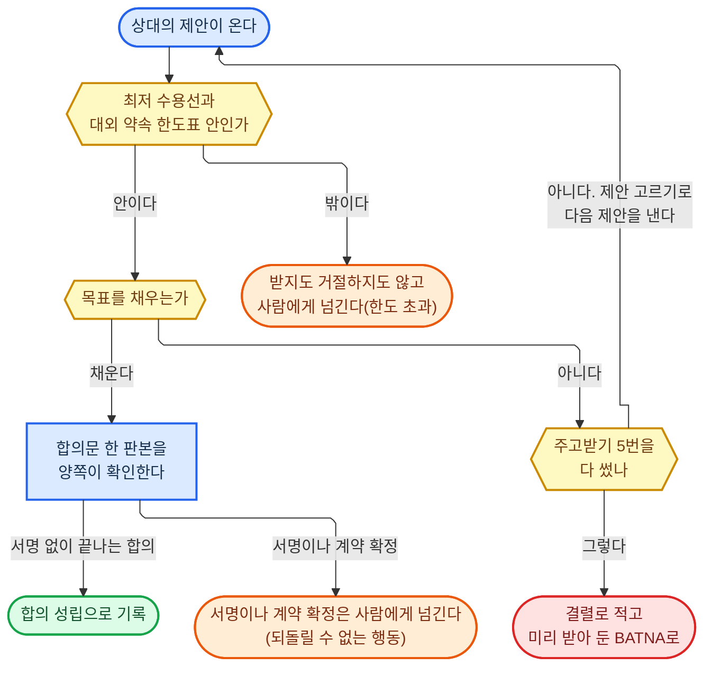
```mermaid
%%{init: {"flowchart":{"wrappingWidth":640,"curve":"linear","nodeSpacing":45,"rankSpacing":55,"padding":14,"useMaxWidth":true,"defaultRenderer":"elk"},"themeVariables":{"fontSize":"15px"},"layout":"elk","elk":{"mergeEdges":false,"nodePlacementStrategy":"BRANDES_KOEPF","keepEntryNodeOnTop":true,"considerModelOrder":"NODES_AND_EDGES","cycleBreakingStrategy":"DEPTH_FIRST"}} }%%
flowchart TB
    OK(["합의 성립으로 기록"]):::good
    SIGN["합의문 한 판본을<br/>양쪽이 확인한다"]:::main
    HUMAN2(["서명이나 계약 확정은 사람에게 넘긴다<br/>(되돌릴 수 없는 행동)"]):::back
    LINE{{"최저 수용선과<br/>대외 약속 한도표 안인가"}}:::note
    GOAL{{"목표를 채우는가"}}:::note
    BREAK(["결렬로 적고<br/>미리 받아 둔 BATNA로"]):::stop
    HUMAN(["받지도 거절하지도 않고<br/>사람에게 넘긴다(한도 초과)"]):::back
    IN(["상대의 제안이 온다"]):::main
    CNT{{"주고받기 5번을<br/>다 썼나"}}:::note
    LINE -- "밖이다" --> HUMAN
    LINE -- "안이다" --> GOAL
    IN --> LINE
    GOAL -- "채운다" --> SIGN
    GOAL -- "아니다" --> CNT
    SIGN -- "서명이나 계약 확정" --> HUMAN2
    CNT -- "그렇다" --> BREAK
    CNT -- "아니다. 제안 고르기로<br/>다음 제안을 낸다" --> IN
    SIGN -- "서명 없이 끝나는 합의" --> OK
    classDef main fill:#dbeafe,stroke:#2563eb,stroke-width:2px,color:#17314f
    classDef stop fill:#fee2e2,stroke:#dc2626,stroke-width:2px,color:#7f1d1d
    classDef back fill:#ffedd5,stroke:#ea580c,stroke-width:2px,color:#7c2d12
    classDef good fill:#dcfce7,stroke:#16a34a,stroke-width:2px,color:#14532d
    classDef note fill:#fef9c3,stroke:#ca8a04,stroke-width:2px,color:#713f12
```

---

#### 기록 입력·수정

**원칙**

- 대상마다 어느 시스템의 기록을 기준으로 삼을지 먼저 정한다. 이 기준 기록을 정본이라 하고, 쓰기는 정본에만 한다. 다른 시스템의 사본에 먼저 쓰고 나중에 정본과 맞추지 않는다.
- 기존 기록은 읽은 뒤로 아무도 그 기록을 바꾸지 않았을 때만 고친다. 새 기록은 같은 거래 번호나 멱등 키를 가진 기록이 없을 때만 넣는다.
- 직종은 대상마다 어느 시스템을 정본으로 삼을지와, 그 시스템에 남이 고친 내용을 덮어쓰지 않게 막는 기능으로 무엇이 있는지 정해 둔다.

**처리 규칙**

| 상황 | 처리 |
|---|---|
| 여러 기록을 한꺼번에 바꾸거나 지운다 | ▶️ 바뀔 기록의 목록과, 기록마다 바뀌기 전 값과 바뀐 뒤 값을 먼저 뽑아 둔다 ▶️ 실행한 뒤 먼저 뽑아 둔 목록과 실제로 바뀐 목록을 대조해, 한 건도 다르지 않아야 끝난다 |
| 기록을 고친다 | 고치기 전 값, 새 값, 고친 근거, 누구 이름으로 고쳤는지를 변경 이력으로 남긴다 |
| 기록을 지운다 | ▶️ 무엇을, 언제, 왜 지웠는지만 남긴다 ▶️ 지운 값 자체는 정본에도 변경 이력에도 남기지 않는다 ▶️ 한꺼번에 바꾸기 전에 뽑아 둔 목록에 지운 값이 들어 있으면 대조가 끝난 뒤 그 값도 지운다 ▶️ 법이 정한 보존 기간이 남은 기록은 지우지 않고, 공통 절 지우기 표의 '법정 보존 의무가 남았다' 줄대로 따로 둔다 |

**덮어쓰기 막는 방식 고르기**

1. 대상 시스템에 조건부 쓰기(compare-and-set, If-Match) 기능, 곧 읽은 뒤로 값이 그대로일 때만 써 주는 기능이 있으면 그 기능으로 쓴다. 값이 그대로인지 확인하는 일과 쓰는 일이 한 동작이라, 그 사이에 남이 끼어들 틈이 없다.
2. 그런 기능이 없고 편집 잠금 기능이 있으면, 잠근 뒤 다시 읽고, 쓰고, 잠금을 푼다.
3. 둘 다 없으면 쓰기 직전에 다시 읽어 처음 읽은 값과 견주고, 쓴 뒤에도 곧바로 다시 읽는다. 다음 세 경우에는 '판단이 서지 않는 것'으로 사람에게 넘긴다.
   - 쓰기 직전에 읽어 보니 그사이 누가 값을 바꿔 놓았다. 쓰지 않는다.
   - 쓴 뒤 같은 기록이 둘 생겼다. 우리가 넣은 것은 되돌린다.
   - 쓴 뒤 누가 값을 바꾼 것이 보인다. 되돌리지 않는다.

---

#### 신청·거래 처리

**원칙**

- 직종은 거래처마다 네 가지를 정해 둔다. 상대가 우리 멱등 키를 받는지, 그 키로 조회할 수 있는지, 어떤 참조 칸(주문 번호나 거래 메모처럼 상대 쪽 기록에 남는 칸)이 있는지, 상대가 키를 며칠 동안 기억하는지다.

**조회 방법** — 결과를 무엇으로 조회할지는 상대 쪽 사정을 1부터 차례로 따져 고른다.

| 순서 | 상대 쪽 사정 | 조회 방법 |
|---|---|---|
| 1 | 상대가 우리 멱등 키로 조회하게 해 준다 | 그 키로 조회한다 |
| 2 | 상대가 멱등 키를 받지 않거나, 받아도 그 키로 조회하는 길이 없다 | 참조 칸에 우리 키를 적어 보내고, 그 키로 조회한다 |
| 3 | 참조 칸도 없다 | 금액, 대상, 보낸 시각이 모두 맞는 거래를 찾아 조회한다 |

**결과 뒤처리와 대조**

| 상황 | 처리 | 기본값 |
|---|---|---|
| 결과가 접수다 | 대기·후속 관리에 올려, 그 규칙이 정한 날에 다시 조회한다 | — |
| 상대에게서 알림이 왔다 | 알림은 조회를 시작하라는 신호로만 쓰고, 기록의 상태는 조회 결과를 보고 바꾼다 | — |
| 일부만 처리됐다 | 남은 몫에만 새 멱등 키를 붙여 신청·거래 처리를 처음부터 다시 거친다 | — |
| 취소, 변경, 환불을 한다 | 원래 거래를 가리키는 새 거래를 만들어, 새 멱등 키로 신청·거래 처리를 처음부터 거친다 | — |
| 이미 생긴 비용과 바깥에 이미 나타난 결과 | 기록에서 지우지 않는다 | — |
| 상대의 거래 내역과 우리 기록을 대조한다 | 한 줄씩 맞춰 보고, 어긋난 줄의 거래는 결과 불명으로 돌린다 | 하루 한 번 |

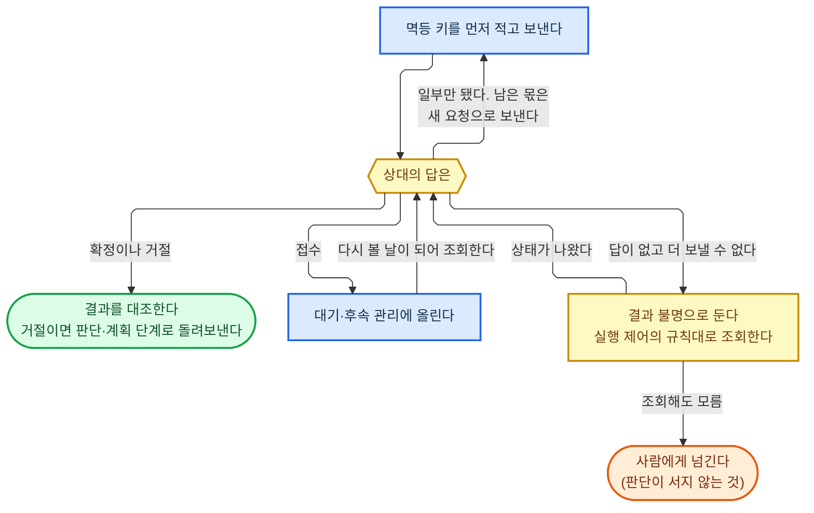
```mermaid
%%{init: {"flowchart":{"wrappingWidth":640,"curve":"linear","nodeSpacing":45,"rankSpacing":55,"padding":14,"useMaxWidth":true,"defaultRenderer":"elk"},"themeVariables":{"fontSize":"15px"},"layout":"elk","elk":{"mergeEdges":false,"nodePlacementStrategy":"NETWORK_SIMPLEX","keepEntryNodeOnTop":true,"considerModelOrder":"PREFER_NODES"}} }%%
flowchart TB
    SEND["멱등 키를 먼저 적고 보낸다"]:::main
    FIN(["결과를 대조한다<br/>거절이면 판단·계획 단계로 돌려보낸다"]):::good
    WAITN["대기·후속 관리에 올린다"]:::main
    HUMAN(["사람에게 넘긴다<br/>(판단이 서지 않는 것)"]):::back
    RES{{"상대의 답은"}}:::note
    UNK["결과 불명으로 둔다<br/>실행 제어의 규칙대로 조회한다"]:::note
    UNK -- "상태가 나왔다" --> RES
    RES -- "접수" --> WAITN
    WAITN -- "다시 볼 날이 되어 조회한다" --> RES
    RES -- "확정이나 거절" --> FIN
    UNK -- "조회해도 모름" --> HUMAN
    RES -- "답이 없고 더 보낼 수 없다" --> UNK
    SEND --> RES
    RES -- "일부만 됐다. 남은 몫은<br/>새 요청으로 보낸다" --> SEND
    %% 배치용 보이지 않는 연결: 선은 그려지지 않고 상자 위치만 잡음
    SEND ~~~ UNK
    classDef main fill:#dbeafe,stroke:#2563eb,stroke-width:2px,color:#17314f
    classDef back fill:#ffedd5,stroke:#ea580c,stroke-width:2px,color:#7c2d12
    classDef good fill:#dcfce7,stroke:#16a34a,stroke-width:2px,color:#14532d
    classDef note fill:#fef9c3,stroke:#ca8a04,stroke-width:2px,color:#713f12
```

---

#### 설정·작동 제어

**원칙**

- 설정을 바꾸기 전에 지금 값을 되돌릴 값으로 적어 둔다. 적지 못했으면 바꾸지 않는다.
- 바꿀 설정이 많으면 한 번에 한 묶음씩 바꾸고, 앞 묶음이 실제 작동에 반영된 것을 확인한 뒤에 다음 묶음을 바꾼다.
- 반영은 설정 화면에 보이는 값이 아니라 실제로 어떻게 작동하는지로 확인한다. 접근 권한을 회수했으면 그 계정이 실제로 접근하지 못하는지 본다.
- 직종은 되돌릴 수 없는 설정의 목록과, 반영 시간이나 관측 기간을 기본값과 다르게 둘 대상을 정해 둔다.

**되돌릴 수 없는 설정**

| 상황 | 처리 |
|---|---|
| 암호 키 폐기나 계정 삭제처럼 되돌릴 수 없는 설정이다 | ▶️ 되돌릴 값을 적어 두거나 시험 환경에서 미리 해 보는 것으로 대신하지 않는다 ▶️ '되돌릴 수 없는 행동'으로 사람에게 넘겨 승인을 받은 뒤에 한다 |
| 계정을 지우기 전에 사용 중지부터 걸 수 있는 것처럼, 되돌릴 수 있는 중간 단계가 있다 | ▶️ 그 단계를 먼저 하고, 관측 기간 동안 멈춤 기준을 넘는지 지켜본다 ▶️ 멈춤 기준은 오류율이나 불만 수 같은 지표가 얼마를 넘으면 멈추고 되돌릴지 숫자로 정한 선이고, 직종이 대상마다 정한다 ▶️ 기준을 넘지 않았을 때만 승인을 받아 되돌릴 수 없는 단계를 한다 |
| 중간 단계가 삭제 예약처럼, 기간이 지나면 저절로 되돌릴 수 없게 되는 것이다 | ▶️ 에이전트가 멈춰 있어도 기간이 지나는 순간 대상이 지워지므로, 예약을 거는 일부터 되돌릴 수 없는 행동으로 보고 사람의 승인을 받은 뒤에 건다 ▶️ 예약 기간이 끝나는 날은 대기·후속 관리에 되돌릴 수 없는 기한으로 올린다 ▶️ 그 기간 안에 멈춤 기준을 넘으면 예약을 취소한다 |

**반영과 조정**

| 상황 | 처리 | 기본값 |
|---|---|---|
| 바꾼 뒤 반영을 기다린다 | 반영 시간 안에 실제 작동에 반영되는지 본다 | 10분 |
| 반영된 뒤 지켜본다 | 관측 기간 동안 멈춤 기준을 넘지 않는지 본다 | 24시간 |
| 운영 중에 값을 조정한다 | ▶️ 한 번에 정한 폭 안에서만 조정한다 ▶️ 다음 조정은 관측 기간이 끝난 뒤에 한다 | 지금 값의 20% 이내 |
| 그 폭을 넘게 조정해야 한다 | '한도 초과'로 사람에게 넘긴다 | — |
| 되돌렸는데 정한 시간 안에 반영되지 않는다 | '판단이 서지 않는 것'으로 사람에게 넘긴다 | 10분 |
| 어떤 종류의 설정을 처음으로 바꾸기 전이다 | ▶️ 그 설정을 바꾸고 되돌리는 일을 시험 환경에서 먼저 해 본다 ▶️ 실제와 같은 시험 자리를 만들 수 없는 대상이면 시험 환경 재료가 정한 미리 해 보는 방식으로 시험한다 | — |

**바꾸는 방식 고르기**

1. 대상이 공식으로 지원하면 선언형 설정을 쓴다. 원하는 상태를 선언 설정 파일(매니페스트)에 적어 반영하고, 되돌릴 때는 그 파일의 옛 판본을 다시 적용한다.
2. 그런 방식이 없으면 업무 도구·시스템 재료의 연결 방식 고르기대로 연결해 하나씩 바꾼다.

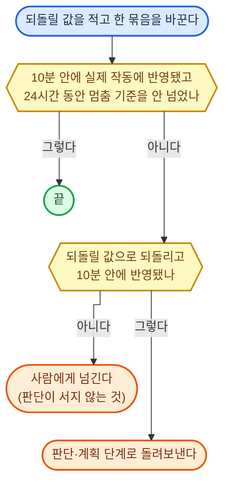
```mermaid
%%{init: {"flowchart":{"wrappingWidth":640,"curve":"linear","nodeSpacing":45,"rankSpacing":55,"padding":14,"useMaxWidth":true,"defaultRenderer":"elk"},"themeVariables":{"fontSize":"15px"},"layout":"elk","elk":{"mergeEdges":false,"nodePlacementStrategy":"NETWORK_SIMPLEX","keepEntryNodeOnTop":true,"considerModelOrder":"PREFER_EDGES","cycleBreakingStrategy":"GREEDY_MODEL_ORDER","forceNodeModelOrder":true}} }%%
flowchart TB
    CHANGE(["되돌릴 값을 적고 한 묶음을 바꾼다"]):::main
    ROLL{{"되돌릴 값으로 되돌리고<br/>10분 안에 반영됐나"}}:::note
    DONE(["끝"]):::good
    SEEN{{"10분 안에 실제 작동에 반영됐고<br/>24시간 동안 멈춤 기준을 안 넘었나"}}:::note
    REPLAN(["판단·계획 단계로 돌려보낸다"]):::back
    HUMAN(["사람에게 넘긴다<br/>(판단이 서지 않는 것)"]):::back
    SEEN -- "아니다" --> ROLL
    ROLL -- "그렇다" --> REPLAN
    SEEN -- "그렇다" --> DONE
    CHANGE --> SEEN
    ROLL -- "아니다" --> HUMAN
    %% 배치용 보이지 않는 연결: 선은 그려지지 않고 상자 위치만 잡음
    HUMAN ~~~ REPLAN
    DONE ~~~ HUMAN
    ROLL ~~~ SEEN
    DONE ~~~ ROLL
    classDef main fill:#dbeafe,stroke:#2563eb,stroke-width:2px,color:#17314f
    classDef back fill:#ffedd5,stroke:#ea580c,stroke-width:2px,color:#7c2d12
    classDef good fill:#dcfce7,stroke:#16a34a,stroke-width:2px,color:#14532d
    classDef note fill:#fef9c3,stroke:#ca8a04,stroke-width:2px,color:#713f12
```

---

#### 게시·배포

**원칙**

- 내보낼 판본은 검증을 통과한 판본 하나로 정해 그 판본의 해시를 적어 두고, 내보내는 것이 바로 그 판본인지 해시로 확인한다.
- 멈춤 기준과 되돌리는 방법은 내보내기 전에 정한다. 지표가 멈춤 기준을 넘으면 사람의 결정을 기다리지 않고 바로 멈춘다.
- 직종은 게시처마다 단계적 출시(받는 사람을 몇 무리로 나눠 차례로 공개하는 방식)를 할 수 있는지, 공개한 것을 되돌릴 수 있는지, 멈춤 기준으로 볼 지표, 공개 대상이 아닌 확인용 계정을 정해 둔다.

**광고 보내기**

| 상황 | 처리 |
|---|---|
| 보낼 글이 광고인지 가린다 | ▶️ 상품, 서비스, 회사를 홍보하는 내용이 조금이라도 들어 있으면 광고로 본다 ▶️ 주문, 결제, 배송처럼 이미 맺은 거래를 처리하는 안내만 담은 글은 광고가 아니다 |
| 광고를 받을 사람을 고른다 | ▶️ 받는 사람마다 수신 동의가 살아 있는지 확인한다 ▶️ 동의하지 않았거나, 수신을 거부했거나, 동의를 거둔 사람은 뺀다 |
| 대한민국에서 영리 목적의 광고를 전자적으로 보낸다 | ▶️ 받겠다고 미리 분명하게 동의한 사람에게만 보낸다 ▶️ 법이 정한 동의 예외 가운데 거래관계 예외만 쓴다 ▶️ 거래하면서 그 사람에게서 직접 받은 연락처로, 거래가 끝난 날부터 6개월 안에, 거래한 것과 같은 종류의 상품이나 서비스를 알리는 경우다 ▶️ 받는 사람이 대한민국에 있고 이 세 조건이 모두 거래 기록으로 확인될 때만 이 예외를 쓴다 |
| 받는 사람이 다른 나라에 있거나 어디 있는지 모른다 | 동의를 받았을 때만 광고를 보낸다 |
| 광고를 보낼 시각 | ▶️ 받는 사람이 있는 곳의 법이 막는 시간대에는 보내지 않는다 ▶️ 대한민국에서 오후 9시부터 다음 날 오전 8시 사이에는 이 시간대 수신에 따로 동의한 사람에게만 보낸다 ▶️ 전자우편은 이 시간 제한을 받지 않는다 |
| 광고에 넣을 것 | ▶️ 어느 나라에서든 광고라는 표시, 보내는 쪽, 수신을 거부하는 방법을 넣는다 ▶️ 대한민국에서는 아래 통로별 표시를 따른다 |
| 대한민국 광고의 수신 거부와 동의를 다룬다 | ▶️ 수신 거부와 동의 철회에 받는 사람이 돈을 내지 않게 하고, 전자우편이 아닌 광고에는 돈이 들지 않는다는 사실도 알린다 ▶️ 광고를 받은 연락처 말고 다른 정보를 요구하지 않는다 ▶️ 동의, 거부, 철회를 받으면 14일 안에 보내는 쪽 이름, 받은 사실과 날짜, 처리 결과를 알린다 ▶️ 수신 동의를 받은 날부터 2년마다 동의를 이어 갈지 확인하고, 이때 보내는 쪽 이름, 동의한 사실과 날짜, 동의를 이어 가거나 거두는 방법을 알린다 |
| 대한민국 광고에서 하지 않는 일 | ▶️ 수신 거부나 동의 철회를 피하거나 막지 않는다 ▶️ 숫자나 글자를 조합해 연락처를 만들어 내지 않는다 ▶️ 광고를 보내려고 연락처를 자동으로 등록하지 않는다 ▶️ 보내는 쪽이나 광고가 나온 곳을 감추지 않는다 ▶️ 받는 사람을 속여 답장을 끌어내지 않는다 ▶️ 법이 팔거나 쓰거나 유통하지 못하게 막은 상품이나 서비스는 광고하지 않는다 |
| 대한민국에서 남이 운영하는 인터넷 홈페이지에 영리 목적의 광고를 올린다 | ▶️ 그 홈페이지를 운영하거나 관리하는 쪽의 사전 동의를 받고 올린다 ▶️ 권한 없이 누구나 글을 쓸 수 있는 게시판은 동의 없이 올릴 수 있다 ▶️ 그쪽이 광고 게시를 거부한다고 밝혔거나 동의를 거두었으면 올리지 않는다 |

**대한민국 광고 표시** — '(광고)'는 글자 사이에 빈칸이나 부호를 넣지 않고, 모양을 바꾸지 않는다.

| 통로 | 맨 앞 | 본문이나 맨 끝 |
|---|---|---|
| 전자우편 | 제목 맨 앞에 '(광고)'를 적는다 | ▶️ 본문에 보내는 쪽의 이름, 전자우편 주소, 전화번호, 주소를 적는다 ▶️ 수신 거부와 동의 철회 안내를 한글과 영문으로 적고, 누르면 바로 거부되게 한다 |
| 문자나 메신저 같은 그 밖의 글 | '(광고)'와 보내는 쪽의 이름, 전화번호나 주소를 적는다 | 맨 끝에 수신 거부와 동의 철회 방법을 적는다 |
| 팩스 | '(광고)'와 보내는 쪽의 이름, 전화번호, 주소를 적는다 | 수신 거부와 동의 철회 방법을 광고에서 가장 큰 글자의 3분의 1 이상 크기로 적는다 |
| 음성 | 첫머리에 광고라는 말, 보내는 쪽의 이름, 전화번호나 주소, 수신 거부와 동의 철회 방법을 말한다 | — |

**공개와 되돌리기**

| 상황 | 처리 |
|---|---|
| AI로 만든 소리, 그림, 영상이 실제와 구분하기 어렵다 | ▶️ 보거나 듣는 사람이 그 자리에서 바로 알아볼 수 있게, AI로 만들었다는 사실을 알리거나 표시한다 ▶️ 파일 안에 기계만 읽는 표시를 넣는 것으로 끝내지 않는다 ▶️ 주로 보는 사람의 나이와 처지를 생각해 알아보기 쉬운 방법을 고른다 ▶️ 예술이나 창작물이면 감상을 해치지 않는 방식으로 표시할 수 있다 ▶️ 게시처가 따로 정한 표시 방법이 있으면 그것도 따른다 |
| 공개한 뒤 확인한다 | ▶️ 로그인하지 않은 상태와 공개 대상이 아닌 계정으로 각각 열어 본다 ▶️ 보여야 할 곳에는 보이고, 보이면 안 될 곳에는 안 보여야 끝난다 |
| 게시를 되돌린다 | ▶️ 되돌려도 이미 받아 간 것은 받은 사람에게 그대로 남으므로, 이미 받은 사람에게는 따로 정정 통지를 보낸다 ▶️ 앱 마켓처럼 이미 내려받은 사람의 기기에서 거둬들일 수 없는 게시처는 공개를 멈추고 고친 판본을 새로 낸다 |

**공개 방식 고르기**

1. 받는 쪽을 나눠 낼 수 있으면 단계적 출시로 한다. 게시처가 주는 단계적 출시 기능을 쓰거나, 받는 사람을 나눠 보낸다. 게시처가 정한 일정이 있으면 그 일정을 따른다. 없으면 전체의 5%, 25%, 100%에게 차례로 내는 세 단계로 한다. 단계 사이에 지켜보는 시간은 기본으로 앱이나 서비스의 새 판본이면 24시간, 발송이면 1시간이다.
2. 나눠 낼 수 없으면 시험으로 받을 사람이나 비공개 미리 보기로 먼저 내 본다. 받는 쪽 화면에서 확인한 뒤 한 번에 공개한다.

```mermaid
%%{init: {"flowchart":{"wrappingWidth":640,"curve":"linear","nodeSpacing":45,"rankSpacing":55,"padding":14,"useMaxWidth":true,"defaultRenderer":"elk"},"themeVariables":{"fontSize":"15px"},"layout":"elk","elk":{"mergeEdges":false,"nodePlacementStrategy":"BRANDES_KOEPF","keepEntryNodeOnTop":true,"considerModelOrder":"PREFER_NODES","forceNodeModelOrder":true}} }%%
flowchart TB
    HALT(["멈추고, 되돌리거나 새 판본을 내고 정정을 알린다"]):::stop
    WATCH{{"관측 기간 동안<br/>멈춤 기준을 넘었나"}}:::note
    SPLIT{{"받는 쪽을 나눠<br/>차례로 낼 수 있나"}}:::note
    CHECK(["받는 쪽 화면에서 공개 상태를 확인한다"]):::good
    STEP["다음 단계만큼 공개한다<br/>5%, 25%, 100% 차례로"]:::main
    FIX(["검증을 통과한 판본 하나를 해시로 고정한다<br/>멈춤 기준과 되돌리는 방법을 정한다"]):::main
    SPLIT -- "그렇다" --> STEP
    SPLIT -- "아니다. 시험으로 받을 사람에게 먼저 내고<br/>확인한 뒤 한 번에 공개한다" --> CHECK
    WATCH -- "넘었다" --> HALT
    WATCH -- "안 넘었고 100% 전이다" --> STEP
    WATCH -- "안 넘었고 100%까지 냈다" --> CHECK
    FIX --> SPLIT
    STEP --> WATCH
    %% 배치용 보이지 않는 연결: 선은 그려지지 않고 상자 위치만 잡음
    SPLIT ~~~ HALT
    classDef main fill:#dbeafe,stroke:#2563eb,stroke-width:2px,color:#17314f
    classDef stop fill:#fee2e2,stroke:#dc2626,stroke-width:2px,color:#7f1d1d
    classDef good fill:#dcfce7,stroke:#16a34a,stroke-width:2px,color:#14532d
    classDef note fill:#fef9c3,stroke:#ca8a04,stroke-width:2px,color:#713f12
```

**지금의 선택**

| 구분 | ① 에이전트 하네스 | ②·③ 사내 서버 |
|------|------|------|
| 공개 상태를 확인하는 도구 | Playwright | ①과 같다 |

---

#### 납품 준비

**원칙**

- 인수 조건의 항목마다 그 항목을 채우는 파일과 검사 기록을 하나씩 짝지어 대조표를 만든다. 짝지을 파일이나 검사 기록이 없는 항목은 미완료로 적고, 납품 패키지에서도 감추지 않고 미완료로 보이게 둔다.
- 대조표에 붙이는 검사 기록은 지금 묶는 판본으로 한 것만 쓰고, 같은 판본인지는 해시로 확인한다.
- 직종은 결과물 종류마다 납품 패키지에 넣을 것을 정한다.

**납품 패키지와 인계**

| 대상 | 처리 |
|---|---|
| 파일마다 해시를 적은 목록 | 납품 패키지에 넣어, 받는 쪽이 파일을 온전히 받았는지 스스로 확인할 수 있게 한다 |
| 인수에 필요 없는 고객 비밀, 내부 기록, 다른 고객의 자료 | ▶️ 납품 패키지에 넣지 않는다 ▶️ 파일 속에 숨은 수정 이력, 메모, 작성자 정보도 지운다 |
| 인계 자료가 충분한지 볼 때 | ▶️ 새 대화에 인계 자료만 주고, 그 대화가 다음 할 일, 담당, 기한을 말하게 한다 ▶️ 그 답이 원래 계획과 맞아야 끝난다 |

**묶는 형식 고르기**

1. 계약이나 제출처가 형식과 파일 구성을 정해 두었으면 그대로 따른다. 대조표와 해시 목록은 그 형식이 허락하는 자리에 넣는다.
2. 정해 둔 것이 없으면 파일 목록과 해시를 함께 담는 공개 규격인 BagIt으로 폴더를 만들고, 압축 파일 하나로 묶는다.

**지금의 선택**

| 구분 | ① 에이전트 하네스 | ②·③ 사내 서버 |
|------|------|------|
| BagIt 패키지(bag)를 만들고 검사하는 도구 | bagit-python | ①과 같다 |

---

#### 전달·인수 확인

**원칙**

- 전달한 결과물의 상태는 넷 가운데 하나로 적는다.
  - 전달: 보냈지만 도착을 아직 확인하지 못했다.
  - 확인 대기: 도착을 확인했고, 받는 쪽이 받아들이는지 기다린다.
  - 인수 완료: 받는 쪽이 받아들였다.
  - 전달 완료·인수 미확인: 도착은 확인했지만, 받는 쪽이 받아들였는지는 끝내 확인하지 못했다.
- 검증 단계에서 이미 확인한 것은 받는 쪽에 다시 확인해 달라고 하지 않고 검증 기록을 쓴다. 받는 쪽 환경이 우리와 다를 때만 그 환경에서 다시 확인해 달라고 요청한다.
- 직종은 결과물 종류마다 인수를 확인하는 방법과, 법이 정한 검수 기한을 정해 둔다.

**도착 확인**

| 상황 | 처리 |
|---|---|
| 파일로 전달했다 | 받는 쪽이 받은 파일의 해시를 구해, 보낸 파일의 해시와 같으면 도착한 것으로 본다 |
| 공유 주소로 전달했다 | 열람 기록으로 도착을 확인한다 |
| 우편이나 현장에서 건넸다 | 인수증으로 도착을 확인한다 |
| 파일이 아니라 서비스 개통이나 거래 처리를 해 주었다 | 그 일이 기록되는 상대 쪽 시스템에 반영된 상태를 보고 도착을 확인한다 |
| 도착이 확인되지 않는다 | 대기·후속 관리 재료의 규칙대로 받는 쪽에 묻는다 |

**인수 완료**

| 상황 | 처리 |
|---|---|
| 계약이나 법이 검수 확인서, 시운전 확인, 이의를 낼 수 있는 기간 같은 확인 방식을 정해 두었다 | ▶️ 그 방식대로 확인되면 인수 완료로 적는다 ▶️ "정한 기간 안에 검사 결과를 알려 오지 않으면 합격으로 본다"는 법도 이런 방식에 든다 ▶️ 다만 이런 법에 따라 인수 완료로 적으려면, 그 법이 이 거래에 걸리고 예외에 들지 않는다는 것이 계약서나 맡긴 사람이 준 정보로 확인돼야 한다 |
| 대한민국 하도급법이 걸리는 거래에서 우리가 일을 맡은 수급사업자이고, 만들어 넘기기로 한 목적물을 넘겼다 | ▶️ 일을 맡긴 원사업자가 목적물을 받은 날부터 10일 안에 검사 결과를 서면으로 알려 오지 않으면 인수 완료로 적는다 ▶️ 10일은 계산 재료의 기간 세기대로 센다 ▶️ 받은 날을 세는 방법과 이 기한이 걸리지 않는 용역의 범위는 법·의무 기준의 하도급 검사 기한 줄을 따른다 |
| 원사업자가 늦게 알린 데 정당한 사유가 있다고 내세운다 | 인수 완료로 적지 않고 '판단이 서지 않는 것'으로 사람에게 넘긴다 |
| 계약에도 법에도 확인 방식이 없다 | ▶️ 대기·후속 관리 재료의 규칙대로 받는 쪽에 묻는다 ▶️ 그 규칙을 다 거쳐도 답이 없으면 '전달 완료·인수 미확인'으로 닫고, 성과 추적에 남긴다 |
| 계약에 없는 인수 확인 절차 | 덧붙이지 않는다 |

**수정 요청과 공유**

| 상황 | 처리 |
|---|---|
| 문제 제기나 수정 요청이 온다 | 무엇이, 어느 판본에서, 어떤 환경에서 안 되는지 정리해 고칠 쪽에 알린다 |
| 받는 사람만 열어야 하는 결과 | 받는 사람 계정으로만 열리는 공유로 보내고, 인수가 끝나면 그 공유를 거둬들인다 |

**전달 경로 고르기**

1. 계약이나 제출처가 경로를 정해 두었으면 그 경로를 쓴다.
2. 정해 둔 것이 없으면 도착을 우리가 확인할 수 있는 경로를 쓴다. 받는 사람 계정으로 공유하거나, 받았는지 확인되는 통로로 보내는 것이 그런 경로다. 그런 경로가 없으면 우편이나 현장 인도로 건네고 인수증을 받는다.

```mermaid
%%{init: {"flowchart":{"wrappingWidth":640,"curve":"linear","nodeSpacing":45,"rankSpacing":55,"padding":14,"useMaxWidth":true,"defaultRenderer":"elk"},"themeVariables":{"fontSize":"15px"},"layout":"elk","elk":{"mergeEdges":false,"nodePlacementStrategy":"BRANDES_KOEPF","keepEntryNodeOnTop":true,"considerModelOrder":"PREFER_EDGES","cycleBreakingStrategy":"GREEDY_MODEL_ORDER"}} }%%
flowchart TB
    A1["대기·후속 관리의 규칙대로 묻는다"]:::back
    ASK["대기·후속 관리의 규칙대로 다시 묻는다"]:::back
    GO(["정한 경로로 전달한다"]):::main
    SENT{{"도착이 확인됐나<br/>해시, 열람 기록, 인수증으로 본다"}}:::note
    DONE(["인수 완료"]):::good
    ALT(["다른 방법이나<br/>다른 담당으로 넘긴다"]):::back
    WAIT{{"확인 대기<br/>계약이나 법이 정한 방식으로 인수됐나"}}:::note
    NOACK(["'전달 완료·인수 미확인'으로 닫고<br/>성과 추적에 남긴다"]):::back
    GO --> SENT
    SENT -- "아니다" --> A1
    WAIT -- "확인됐거나 이의 기간이 지났다" --> DONE
    A1 -- "확인됐다" --> WAIT
    WAIT -- "정한 방식이 없거나 답이 없다" --> ASK
    ASK -- "답이 왔다" --> WAIT
    A1 -- "두 번 물어도 확인 안 됨" --> ALT
    ASK -- "규칙을 다 거쳐도 답 없음" --> NOACK
    SENT -- "그렇다" --> WAIT
    %% 배치용 보이지 않는 연결: 선은 그려지지 않고 상자 위치만 잡음
    WAIT ~~~ ASK
    NOACK ~~~ SENT
    SENT ~~~ WAIT
    classDef main fill:#dbeafe,stroke:#2563eb,stroke-width:2px,color:#17314f
    classDef back fill:#ffedd5,stroke:#ea580c,stroke-width:2px,color:#7c2d12
    classDef good fill:#dcfce7,stroke:#16a34a,stroke-width:2px,color:#14532d
    classDef note fill:#fef9c3,stroke:#ca8a04,stroke-width:2px,color:#713f12
```

---

#### 관찰·측정

**원칙**

- 재기 전에 단위와 허용 오차를 정해 둔다. 허용 오차는 잰 값이 실제 값과 얼마까지 달라도 되는지다. 허용 오차보다 크게 틀리는 측정 도구와 원천 시스템의 값은 쓰지 않는다.
- 처음 쓰는 측정 도구는 값을 이미 아는 대상을 먼저 재 보고, 결과가 허용 오차 안에 드는지 확인한다.
- 직종은 대상마다 잴 항목, 허용 오차, 측정 도구를 정하고, 원천 시스템이 내는 지표 목록도 적어 둔다.

**값 적기**

| 값 | 처리 |
|---|---|
| 잰 값 | ▶️ 값마다 잰 시각(표준시간대 포함), 쓴 도구와 그 판본, 잰 사람을 함께 적는다 ▶️ 사진, 녹음, 기기 출력 같은 원본도 남긴다 |
| 빠진 값과 믿기 어려운 값 | 0이나 앞뒤 값으로 채우지 않고, 빈칸으로 두고 왜 비었는지 까닭을 적는다 |
| 사람에게 물어 얻은 값 | 누구에게, 언제, 어느 통로로 들었는지 함께 적는다 |

**재는 수단 고르기**

1. 원천 시스템이 이미 재어 남기는 기록이나 지표가 허용 오차를 맞추면 그 값을 읽는다. 새로 재지 않는다.
2. 그런 값이 없거나 허용 오차를 맞추지 못하면, 허용 오차를 맞추는 도구로 직접 잰다. 그런 도구가 여럿이면 값을 OpenTelemetry로 내보내는 도구를 고른다.
3. 기계로 잴 수 없으면 사람이 관찰하거나 사람에게 물어 값을 얻는다. 이렇게 얻은 값은 근거 등급을 낮춰 적는다.

**지금의 선택**

| 구분 | ① 에이전트 하네스 | ②·③ 사내 서버 |
|------|------|------|
| 잰 값을 두는 곳 | 건 상태 파일 | PostgreSQL |

---

#### 실험

**원칙**

- 실험을 시작하기 전에 열 가지를 한 장에 적어 고정한다. 알아낼 질문, 가설, 바꿀 것, 결과를 판정할 주 지표 하나, 아무것도 바꾸지 않고 비교에 쓸 대조군, 대상을 무작위로 나누는 배정 방법, 표본 수, 기간, 도중에 멈출 해로움 기준, 예산이다. 시작한 뒤에는 주 지표와 표본 수를 바꾸지 않는다.
- 불리한 결과와 실패한 실험도 지우지 않고 남긴다.
- 직종은 네 가지를 정해 둔다. 주 지표로 쓸 후보, 놓치지 않고 알아낼 가장 작은 차이, 표본 비율 불일치 판정선, 실험을 도중에 멈출 만큼 해롭다고 볼 해로움 기준이다.

**표본 수** — 표본 수는 알아내려는 가장 작은 차이를 기준으로 미리 계산한다.

| 항목 | 기본값 |
|---|---|
| 알아내려는 가장 작은 차이 | 주 지표가 상대적으로 5% 달라지는 것 |
| 우연을 진짜 차이로 잘못 볼 확률(유의 수준) | 5% |
| 진짜 차이를 잡아낼 확률(검정력) | 80% |

**도중과 분석**

| 상황 | 처리 | 기본값 |
|---|---|---|
| 정한 표본 수에 닿기 전이다 | ▶️ 중간 결과를 보고 실험을 끝내지 않는다 ▶️ 도중에는 미리 정한 해로움 기준을 넘었을 때만 멈춘다 | — |
| 결과를 분석하기 전이다 | ▶️ 두 집단이 설계한 비율대로 나뉘었는지 카이제곱 검정으로 확인한다 ▶️ 실제로 나뉜 비율과 설계한 비율의 차이가 우연만으로 생길 확률이 판정선보다 작으면 표본 비율 불일치로 본다 ▶️ 표본 비율 불일치이면 결과를 쓰지 않고 원인부터 찾는다 | 판정선 0.0005 |
| 측정값이나 안을 여러 개 견준다 | ▶️ 견준 횟수에 맞춰 유의 수준을 더 작게 고친다 ▶️ 여러 번 견줄수록 우연히 차이가 나 보이는 일이 늘기 때문이다 | — |

**실험 방법 고르기**

1. 위험, 비용, 권한 때문에 실제 대상에게 해 볼 수 없으면 시험 환경이나 시뮬레이션으로 한다.
2. 실제 대상에게 해 볼 수 있고, 대상을 무작위로 나눠 기간 안에 계산한 표본 수를 채울 수 있으면 무작위 대조 실험을 한다. 대상을 무작위로 나눠 두 안을 따로 보여 주는 실험이다.
3. 표본 수를 채울 수 없으면 몇 안 되는 대상에게 할 일을 맡기고 지켜보는 사용자 조사로 방향만 얻는다. 이때는 차이가 얼마나 큰지 주장하지 않는다.

**지금의 선택**

| 구분 | ① 에이전트 하네스 | ②·③ 사내 서버 |
|------|------|------|
| 두 안을 나눠 보여 주는 수단 | ▶️ 게시처가 주는 실험 기능이다 ▶️ 광고 플랫폼의 실험 기능이나, 사용자마다 기능을 켜고 끄는 기능 플래그가 여기에 든다 | ①과 같다 |
| 표본 수 계산과 분석 | SciPy, statsmodels | ①과 같다 |

---

#### 시뮬레이션

**원칙**

- 시뮬레이션을 시작하기 전에 가정, 모형, 입력 범위, 비교할 대안, 무엇을 알면 끝낼지를 적어 둔다.
- 시뮬레이션이나 시험 환경에서 나온 결과는 실제 관측 증거나 운영 성과로 세지 않는다. 같은 모형으로 여러 번 돌려 매번 바라던 결과가 나와도, 몇 번이 나왔든 하나로만 센다.
- 직종은 쓸 공학 해석 프로그램(구조나 열의 움직임을 물리 법칙으로 계산하는 프로그램)을 정하고, 대상마다 쓸 모형, 그 모형을 맞춰 볼 과거 사례, 허용 오차도 정해 둔다.

**현실 대조와 돌리는 법**

| 일 | 처리 | 기본값 |
|---|---|---|
| 결과를 쓰기 전에 현실과 대조한다 | 실제 관측이 있는 과거 사례를 하나 이상 모형으로 다시 돌려, 모형의 결과가 실제 관측과 맞는지 본다 | 차이 10% 안 |
| 대조한 차이가 기본값을 넘는다 | ▶️ 모형을 고쳐 다시 대조한다 ▶️ 고쳐도 기본값 안에 들지 않으면 그 모형의 결과를 판단에 쓰지 않는다 | — |
| 맞춰 볼 관측이 없다 | 결과에 "현실 대조 없음"을 붙인다 | — |
| 핵심 가정을 점검한다 | 가정마다 값을 조금씩 바꿔 가며 돌려 보고, 결론이 뒤집히는 가정을 찾아 적는다 | — |
| 모형에 무작위 요소가 들어간다 | ▶️ 시드를 적어 두고 여러 번 돌린다 ▶️ 결과는 한 값이 아니라 범위로 낸다 | 1,000번 |
| 과거 자료로 돌린다 | 그 시점에 이미 알 수 있던 자료만 넣는다 | — |
| 역할 연기(상대방 역을 모델에게 맡겨 대화를 미리 해 보는 것)에서 상대 역을 정한다 | ▶️ 새 대화가 상대 역을 맡는다 ▶️ 그 대화에는 우리 쪽 계획과 최저 수용선을 보여 주지 않는다 | — |

**시뮬레이션 방법 고르기**

1. 구조, 열, 유체, 회로처럼 대상의 움직임이 물리 법칙으로 정해지면 공학 해석 프로그램으로 계산한다.
2. 수요, 대기 줄, 가격처럼 과거 자료가 쌓인 되풀이 현상이면 그 자료로 모형을 맞춘다. 그다음 몬테카를로 모의(무작위 값을 넣어 여러 번 돌려 보는 방법)를 하거나, 모형을 과거 자료에 되돌려 적용해 보는 백테스트를 한다.
3. 협상, 응대, 장애 대응 연습처럼 사람의 반응이 결과를 정하면 역할 연기로 한다.
4. 주문이 갑자기 늘어난 배송 흐름처럼 과거 자료도 법칙도 없는 새 상황이면 이산 사건 시뮬레이션으로 돌린다. 단계마다 처리 규칙과 걸리는 시간을 가정으로 적어 모형을 만들고, 일이 차례로 일어나는 흐름을 흉내 낸다.

**지금의 선택**

| 구분 | ① 에이전트 하네스 | ②·③ 사내 서버 |
|------|------|------|
| 몬테카를로 모의와 백테스트 | NumPy(숫자 배열을 계산하는 도구), SciPy | ①과 같다 |
| 대기 줄과 이산 사건 시뮬레이션 | SimPy | ①과 같다 |
| 역할 연기의 상대 역 | 새 하위 에이전트 | 새 대화 |

---
### 검증·평가

#### 판단 근거 기록

**원칙**

- 결론에서 그 결론을 뒷받침한 자료로, 다시 그 자료를 가져온 도구 호출의 실행 기록까지 번호로 잇는다.
- 실행 기록은 실제로 실행한 쪽이 남긴 것만 쓴다. 모델이 "했다"고 적은 글은 실행 기록으로 치지 않는다.
- 기록은 추가 전용 기록으로 남긴다. 근거 원본 가운데 고객 원본은 ②·③의 변경 불가 저장소와 ①의 기록 보관 폴더에서 봉투 암호화로 잠근다.
- 모델은 기록을 직접 읽거나 고치지 못한다. ①은 기록 서비스가, ②·③은 실행 엔진이 권한을 확인한 뒤 건넨 구간만 읽는다. ①의 기록 서비스는 하네스를 돌리는 운영체제 사용자와 다른 사용자로 띄운다.
- 하네스가 스스로 쌓는 대화 원본은 판단 근거 기록으로 치지 않는다.

**남기는 것**

| 대상 | 처리 |
|---|---|
| 판단 이유 | ▶️ 모델이 출력한 판단 이유만 남긴다 ▶️ 모델 내부 추론 과정은 근거로 치지 않는다 ▶️ 세운 가정과, 그 가정이 틀리면 달라지는 것을 함께 적는다 |
| 실행 하나마다 | ▶️ 실제로 쓴 모델, 추론 강도, 하네스, 배포 판본, 도구 판본을 한데 묶어 남긴다 ▶️ 모델은 배포 판본 밖의 환경 설정에서 정하므로, 함께 남기지 않으면 어느 모델로 돌았는지 알 수 없다 |
| 코드로 돌린 단계 | 기록만 보고 같은 자료, 판본, 도구로 다시 돌렸을 때 같은 값이 나와야 한다 |
| ①에서 응답이 빠졌거나 실행이 중단된 곳 | ▶️ "미확인"으로 남긴다 ▶️ 그 도구가 실제로 일한 시스템의 기록과 대조한다 |
| 다시 얻을 수 없는 자료(그때의 통화, 그때의 현장) | 보관해 둔 녹취, 사진, 측정 원본이 어디 있는지 적는다 |
| 자격 증명 | 값은 적지 않고, 값이 있는 곳만 적는다 |
| 법적 다툼, 신고, 심사에 쓰일 남의 원본 | 원본에는 손대지 않고 사본으로 일한다 |
| 시각을 남에게 증명해야 하는 기록 | ▶️ 제3자 기관이 그 시각에 기록이 있었음을 증명해 주는 타임스탬프 인증을 받아 함께 남긴다 ▶️ 바깥 기관에는 해시만 보낸다 ▶️ 인증을 받지 못해도 기록은 먼저 남기고, 인증은 나중에 다시 받는다 |

**지우기** — 삭제 요구와 법정 보존 기록은 공통 절 '지우기'대로 한다. 개인정보 칸을 지워도 언제, 어느 규칙으로, 어떤 판정을 했는지는 기록에 남는다.

**기록 수단 고르기**

1. 모델이 일하는 공간에서 고치거나 지울 수 없는 곳에 기록을 쌓는 수단만 남긴다.
2. 그중에서 모델을 거치지 않고, 도구를 부를 때마다 저절로 기록하는 수단을 고른다.
3. 도구에 넣은 값과 돌려받은 값을 자르지 않고 온전히 남기는 수단을 고른다.

**지금의 선택**

| 구분 | ① 에이전트 하네스 | ②·③ 사내 서버 |
|------|------|------|
| 실행 기록을 쓰는 것 | 기록 서비스 | 실행 엔진 |
| 실행 기록을 두는 곳 | 기록 보관 폴더 | PostgreSQL |
| 근거 원본을 두는 곳 | 기록 보관 폴더 | 변경 불가 저장소 |
| 변경 불가 저장소를 이루는 도구 | — | SeaweedFS(사내 서버에 설치하는 파일 저장 프로그램)와 Object Lock(저장한 파일을 정한 기간 동안 지우거나 고치지 못하게 잠그는 기능) |

**변경 불가 저장소 조건(②·③)**

| 조건 | 기준 | 이유 |
|------|------|------|
| 구역 | ▶️ 공개 원본 구역, 고객마다 따로 두는 고객 저장 구역, 법정 보존 자료를 두는 보존 구역으로 나눈다 ▶️ 공개 원본 구역에는 공개된 출처에서 직접 받은 원본만 넣는다 ▶️ 고객이 보낸 파일은 공개 문서라도 고객 저장 구역에 둔다 | 구역마다 잠금 방식과 지울 수 있는 계정이 다르다 |
| 넣는 순서 | 원본을 저장소에 먼저 넣고, 그다음에 데이터베이스에 그 원본의 줄을 쓴다 | 줄을 먼저 쓰면 원본 없이 줄만 남는 경우가 생긴다 |
| 원본 이름 | ▶️ 원본 내용으로 계산한 해시를 이름으로 쓴다 ▶️ 고객 원본은 그 원본의 자료 키로 계산한 HMAC을 이름으로 쓴다 | 원본과 자료 키를 지운 뒤 남은 해시로 내용을 짐작할 수 없게 한다 |
| 잠금 방식 | ▶️ 공개 원본과 법정 보존 자료는 규정 준수 모드로 잠근다. 누구도 지우거나 잠금 기간을 줄이지 못하는 방식이다 ▶️ 고객 원본과 개인정보가 든 공개 원본은 거버넌스 모드로 잠근다. 권한을 받은 계정만 잠금을 넘어 지울 수 있는 방식이다 | 개인정보가 든 원본은 그 사람이 삭제를 요구하면 지울 수 있어야 한다 |
| 잠금 기간 | ▶️ 그 자료의 보관 기간과 같게 한다 ▶️ 보관 기간이 건이 끝나야 정해지면 건의 예정 종료일로 잠갔다가, 건이 끝나면 끝난 날부터 보관 기간만큼 늘린다 ▶️ 보존 구역은 법정 보존 기간이 끝나는 날까지 잠근다 ▶️ 지우지 않는 공개 원본은 10년으로 잠그고, 잠금이 끝나기 전에 10년씩 늘린다 | 잠금이 보관 기간보다 먼저 끝나면 보관 중인 원본이 지워질 수 있다 |
| 보존 구역의 잠금 기간을 정하거나 늘리는 일 | 되돌릴 수 없는 행동으로 다룬다 | 한번 건 잠금은 누구도 줄이지 못한다 |
| 잠금을 넘어 지울 권한 | ▶️ 기록 서비스의 삭제 계정에만 준다 ▶️ 삭제 계정은 삭제 목록에 오른 원본만 지우고, 지운 일을 모두 기록한다 ▶️ 고객 저장 구역과 공개 원본 구역에는 S3(저장소에 파일을 넣고 꺼내는 표준 접속 방식) 관리자 계정을 두지 않는다 | SeaweedFS에서는 S3 관리자 계정이 거버넌스 잠금을 넘을 수 있다 |
| S3가 아닌 길로 지우기 | ▶️ S3 접속 말고 원본을 지울 수 있는 길은 모두 막는다 ▶️ 저장소 장비의 운영체제 관리자 권한은 막을 수 없으므로 운영 계정과 나눠 두고, 쓸 때마다 기록한다 | Object Lock은 S3 접속으로 들어온 요청에만 걸린다 |

**합격 조건** — ②·③에서 실제로 지워 보아 다음을 모두 확인한다.

- 운영자 계정과 S3 관리자 계정으로는 어느 구역에서도 원본이 지워지지 않는다.
- 기록 서비스의 삭제 계정으로는 삭제 목록에 오른 고객 원본과 개인정보가 든 공개 원본만 지워진다.
- 규정 준수 모드로 잠근 원본은 삭제 계정으로도 지워지지 않는다.
- SeaweedFS 파일 서버와 마스터 서버의 HTTP 접속, 볼륨 서버 직접 접속, 관리 명령으로 바로 지우려 하거나 파일 서버의 목록 저장소를 고쳐 지우려 해도 거부된다.

---

#### 보고 주체 확인

**받을 때 확인**

| 대상 | 처리 |
|---|---|
| 결과물 해시 | ▶️ 받는 쪽이 직접 계산한다 ▶️ 받을 때 한 번 계산하고, 결과를 쓰거나 밖으로 내보내기 직전에 한 번 더 계산한다 ▶️ 두 값이 다르면 그 결과를 쓰지 않고 낸 쪽에서 다시 받는다 |
| 결과를 거절했다 | 결과를 낸 쪽에 다시 요청한다 |
| 같은 분담의 결과를 두 번 거절했다 | '판단이 서지 않는 것'으로 사람에게 넘긴다 |

**승인 기록**

| 대상 | 처리 |
|---|---|
| 반복 위임으로 내보내는 결과물 | 위임 판본, 허용 조건, 이번 결과물의 해시를 함께 기록한다 |
| 명의를 걸고 밖으로 내보내는 결과물 | 내보낼 결과물의 해시도 함께 기록한다 |

**지금의 선택**

| 구분 | ① 에이전트 하네스 | ②·③ 사내 서버 |
|------|------|------|
| 신원을 대조하는 것 | 기록 서비스 | 실행 엔진 |

**대조 조건**

| 조건 | 기준 | 이유 |
|------|------|------|
| 신원과 분담 번호 | ▶️ 결과를 낸 쪽이 스스로 적어 보낸 값은 믿지 않고, 실행 엔진의 기록이나 로그인 계정처럼 그쪽이 적거나 고칠 수 없는 값으로만 확인한다 ▶️ ①은 하네스가 워커를 실행할 때 붙인 번호와, 결과를 돌려준 하위 에이전트의 실행 번호를 대조한다 ▶️ 대화가 끝날 때 도는 훅이나 모델이 스스로 밝힌 이름만으로는 신원을 확정하지 않는다 ▶️ ②·③은 실행 엔진이 기록한 워커 번호와 단계 번호를 쓴다 | 결과를 낸 쪽이 적거나 고칠 수 있는 값은 남의 이름이나 분담 번호로 바꿔 적을 수 있다 |
| 보고에 적힌 행동(시험 통과, 발송, 저장) | ▶️ 결과를 낸 쪽의 실행 기록에 그 행동이 한 줄로 남아 있어야 받는다 ▶️ 그 줄이 없거나 다른 쪽이 남긴 줄이면 받지 않는다 ▶️ ①은 실제 도구 응답이나 바깥 시스템이 보낸 처리 확인과 이어진 줄만 인정한다 ▶️ 모델이 도구를 부르자고 제안만 한 것은 실제로 한 일로 인정하지 않는다 | 보고의 글만 믿고 받으면 하지 않은 일이 한 일로 넘어간다 |

---

#### 결과 검증·재검증

**검사 준비**

| 일 | 처리 |
|---|---|
| 기대 상태 | ▶️ 실행하기 전에 채우려는 요구의 번호, 대상 판본, 나와야 할 값, 그 값을 확인할 곳, 반영되기까지 늦어질 수 있는 시간을 적어 둔다 ▶️ 결과를 본 뒤에 기대를 고쳐 쓰지 않는다 |
| 검사하는 새 대화에 주는 것 | ▶️ 요구, 원본, 결과물과 판단 근거 기록만 준다 ▶️ 결과를 만든 대화의 자기 평가는 주지 않는다 ▶️ 도구는 주지 않고, 더 볼 원문은 검사를 돌리는 프로그램이 찾아 넣어 준다 ▶️ 비용·위험 한도의 피해 기준을 넘거나 되돌릴 수 없는 행동에 이어지는 결론의 해석 판단은, 결과물과 판단 근거 기록을 보여 주기 전에 같은 사실과 원본만 주어, 먼저 결론과 그 결론을 가른 사실과 기준을 내게 한다 ▶️ 그다음 결과물과 견준다 |
| 검산 | ▶️ 입력은 원본에서 다시 뽑고, 단위 환산도 새로 한다 ▶️ 원래 계산이 쓴 입력값과 환산을 가져다 쓰지 않는다 |
| 결과물에서 주장을 뽑을 때 | 핵심 조건, 부정하는 말, 수치가 빠지지 않았는지 확인한다 |
| 결론을 좌우하는 법 기준, 회계 기준, 사실 | 검사하는 대화가 누구나 아는 일반 지식이라 근거가 필요 없다고 분류해도 근거 검사에서 빼지 않는다 |

**판정별 처리** — 결과 전체의 판정은 "문제없음", "문제 있음", "아직 확인할 수 없음" 가운데 하나다. 주장 가운데 "뒷받침하지 않음"이 하나라도 있으면 "문제 있음"이다. "판단 못 함"이 있거나 대어 볼 기준이 아직 없는 검사가 있으면 "아직 확인할 수 없음"이다.

| 상황 | 처리 | 기본값 |
|---|---|---|
| 문제 있음 | ▶️ 업무 처리 흐름의 검증 단계대로 원인이 있는 담당이 고치고 다시 검사한다 ▶️ 검사에서 떨어진 횟수가 기본값에 닿으면 '한도 초과'로 사람에게 넘긴다 | 3번 |
| 고칠 수 있는지 판단이 서지 않는다 | '판단이 서지 않는 것'으로 사람에게 넘긴다 | — |
| 고칠 수 없다 | 업무 처리 흐름대로 기록한 뒤, 검사 조건의 '완료를 받아 줄 때'대로 완료인지 본다 | — |
| "아직 확인할 수 없음"이고 필수 검사가 아니다 | 그 표시를 붙이고 다음으로 넘어간다 | — |
| "아직 확인할 수 없음"이고 필수 검사다 | ▶️ 다른 방법으로 검증한 뒤 다시 판정한다 ▶️ 필요한 도구를 갖추거나, 시험 환경에서 같은 상황을 다시 만들거나, 다시 방문하거나, 측정을 맡긴다 | — |
| 다른 방법으로도 검증하지 못했다 | ▶️ 검사하지 못한 부분을 맡긴 범위에서 빼도 되는지 맡긴 사람에게 묻는다 ▶️ 범위를 바꾸는 일이므로 문제·목표·완료 조건 재료의 규칙을 따른다 ▶️ 동의를 받으면 바뀐 범위로 다시 검사한다 ▶️ 동의하지 않았거나 아직 답이 없으면 미완료로 두고, 검사하지 못한 부분을 빈 곳으로 밝힌다 | — |

```mermaid
%%{init: {"flowchart":{"wrappingWidth":640,"curve":"linear","nodeSpacing":45,"rankSpacing":55,"padding":14,"useMaxWidth":true,"defaultRenderer":"elk"},"themeVariables":{"fontSize":"15px"},"layout":"elk","elk":{"mergeEdges":false,"nodePlacementStrategy":"BRANDES_KOEPF","keepEntryNodeOnTop":true,"considerModelOrder":"PREFER_NODES","cycleBreakingStrategy":"DEPTH_FIRST"}} }%%
flowchart TB
    AQ{{"검사했나"}}:::note
    CUT{{"검사 못 한 부분을 범위에서<br/>빼는 데 맡긴 사람이 동의했나"}}:::note
    ALT["다른 방법으로 검증한다<br/>도구를 갖추거나 시험 환경에서 되살리거나<br/>다시 가 보거나 측정을 맡긴다"]:::back
    N{{"검사에서 떨어진 횟수가<br/>상한(기본 3번)에 닿았나"}}:::note
    CHK["새 대화가 검사한다"]:::main
    UNF["숨기지 않고 영향, 믿을 수 있는 기간,<br/>다시 검토할 때를 기록한다"]:::main
    MARK["'아직 확인할 수 없음' 표시를 붙인다"]:::main
    V{{"판정은 무엇인가"}}:::note
    FQ{{"고칠 수 있나"}}:::note
    INC(["미완료"]):::stop
    DONE{{"필수 검사가 모두<br/>'문제없음'인가"}}:::note
    M{{"필수 검사인가"}}:::note
    OK(["다음 단계나 완료로 넘어간다"]):::good
    S(["결과가 나온다"]):::main
    FIX["원인이 자료, 판단, 처리 가운데<br/>어디냐에 따라 그 담당이 고친다"]:::back
    H(["사람에게 넘긴다<br/>'한도 초과'나 '판단이 서지 않는 것'"]):::stop
    S --> CHK
    CHK --> V
    V -- "아직 확인할 수 없음" --> M
    AQ -- "했다" --> V
    FQ -- "없다" --> UNF
    N -- "아니다" --> CHK
    FQ -- "있다" --> FIX
    AQ -- "못 했다" --> CUT
    N -- "닿았다" --> H
    CUT -- "동의했다. 바뀐 범위로<br/>다시 검사한다" --> CHK
    ALT --> AQ
    DONE -- "아니다" --> INC
    FQ -- "판단이 서지 않음" --> H
    V -- "문제없음" --> OK
    MARK --> OK
    UNF --> DONE
    DONE -- "그렇다" --> OK
    M -- "그렇다" --> ALT
    FIX --> N
    V -- "문제 있음" --> FQ
    M -- "아니다" --> MARK
    CUT -- "동의하지 않았거나<br/>아직 답이 없다" --> INC
    %% 배치용 보이지 않는 연결: 선은 그려지지 않고 상자 위치만 잡음
    CHK ~~~ FQ
    DONE ~~~ AQ
    classDef main fill:#dbeafe,stroke:#2563eb,stroke-width:2px,color:#17314f
    classDef stop fill:#fee2e2,stroke:#dc2626,stroke-width:2px,color:#7f1d1d
    classDef back fill:#ffedd5,stroke:#ea580c,stroke-width:2px,color:#7c2d12
    classDef good fill:#dcfce7,stroke:#16a34a,stroke-width:2px,color:#14532d
    classDef note fill:#fef9c3,stroke:#ca8a04,stroke-width:2px,color:#713f12
```

**검사 수단 고르기** — 검사 항목마다 아래 순서대로 따져, 처음으로 쓸 수 있는 방법을 쓴다.

1. 결과가 실제로 쓰이는 곳에서 확인한다. 결과가 반영된 시스템의 상태를 찾아본다. 받는 쪽 프로그램으로 열어 본다. 코드면 실행할 수 있는 모양으로 만들어 돌려 본다.
2. 1이 안 되면 따로 계산해 보거나, 답이 알려진 기준 문제로 검산한다.
3. 둘 다 안 되는 것만 모델이 원문과 대조한다. 뜻을 어떻게 읽느냐나 어느 정도로 보느냐에 따라 판단이 갈리는 것이 여기에 든다. 결론을 좌우하는 항목은 정의 1 「결론을 확정하는 조건」대로 한다.

**지금의 선택**

| 구분 | ① 에이전트 하네스 | ②·③ 사내 서버 |
|------|------|------|
| 기계 검사를 돌리는 곳 | 하네스의 셸 명령 | 격리 컨테이너 |
| 필수 검사를 다 통과하지 못한 결과의 완료를 막는 것 | 기록 서비스 | OPA |

**검사 조건**

| 조건 | 기준 | 이유 |
|------|------|------|
| 완료를 받아 줄 때 | ▶️ 필수 검사마다 판정과 근거가 적혔는지, 판정이 모두 "문제없음"인지 본다 ▶️ 통과해야 완료로 적거나 다음 단계로 넘긴다 | 완료를 받는 자리에서 막지 않으면, 필수 검사를 건너뛰었거나 통과하지 못한 결과도 완료로 기록된다 |
| 모델이 하는 검사 | ▶️ 틀린 것을 통과시킨 비율과 맞는 것을 막은 비율을 결과 품질 평가의 모델 채점대로 잰다 ▶️ 두 비율은 한국어 자료에서 직종마다 따로 잰다 ▶️ 고쳐서 다시 검사를 통과한 결과는 따로 모아 잰다 ▶️ 두 비율 가운데 하나라도 허용 범위를 넘는 항목에서는, 이 검사가 낸 "문제없음"을 필수 검사의 통과로 치지 않고 "아직 확인할 수 없음"으로 다룬다 | ▶️ 허용 범위를 넘는 검사의 통과를 믿으면 틀린 결과가 완료로 나간다 ▶️ 직종마다 자료와 기준이 달라, 한 직종에서 잰 비율로 다른 직종의 검사를 믿을 수 없다 ▶️ 검사에서 떨어진 뒤 고친 결과는 검사를 통과하는 쪽으로 맞춰져 있어, 처음 결과와 섞어 재면 틀린 것을 통과시킨 비율이 실제보다 낮게 나온다 |

**공개 검사 도구와 견주기** — 다음 두 검사는 검사기의 두 비율을 잴 때 같은 사례를 공개 도구로도 돌려 우리 검사 결과와 견준다. 주장마다 뒷받침하는 원문 구간을 잇는 검사는 Microsoft Eval Recipes(마이크로소프트가 공개한 AI 평가 라이브러리)의 주장 검증(claim_verification)과 견준다. 찾아온 근거를 벗어나지 않았는지와 도구를 제대로 썼는지 보는 검사는 DeepEval(공개된 AI 평가 도구)과 견준다. 두 도구 안에서 판정하는 모델도 주 모델로 맞춘다. 두 도구의 점수만으로 전문 판단이 맞았다고 확정하지 않는다.

---

#### 반대 근거·다시 확인

**언제 거치나** — 중요한 판단은 반드시 거친다. 되돌릴 수 없는 행동 바로 전에 내리는 판단, 사람에게 알리는 결론, 돈이나 권리에 닿는 판단이 중요한 판단이다. 그 밖의 판단에서 거칠지는 직종이 정한다. 반드시 거치는 확인에 쓸 비용은 미리 잡아 두고, 비용이 든다는 이유로 건너뛰지 않는다.

**어떻게 하나**

| 일 | 처리 |
|---|---|
| 순서 | ▶️ 새 대화에 결론을 가리고 원자료만 주어 스스로 판단하게 한다 ▶️ 그다음에 원래 결론과 대조한다 |
| 검토 전 | "이 결론을 뒤집을 사실"이 무엇일지 먼저 적고, 그것부터 찾는다 |
| 반대 근거 | ▶️ 사실에 기댄 반대는 원문 위치가 붙은 것만 받아들인다 ▶️ 계산에 기댄 반대는 입력값과 계산 기록이 붙은 것만 받아들인다 ▶️ 이런 근거가 붙지 않은 반대가 가리키는 사실은 확인하는 대화가 아니라 검사를 돌리는 프로그램이 찾아 넣어 준다 ▶️ 찾으면 위치를 붙여 다시 따진다 |
| 독립된 확인으로 치는 것 | ▶️ 처음 판단과 다른 원자료나 다른 방법을 쓴 확인만 독립된 확인으로 친다 ▶️ 다른 회사의 모델에게 확인시켰거나, 여러 모델에게 물어 같은 답이 많이 나왔다는 것만으로는 치지 않는다 ▶️ 같은 자료, 모형, 도구로 한 확인에는 "독립 확인 아님"을 붙인다 |

**결론이 갈리면**

| 상황 | 처리 |
|---|---|
| 결론이 갈린다 | 반대 증거와 새 증거를 더 찾아 차이를 좁힌다 |
| 한 번 더 확인해도 갈리고, 되돌릴 수 없는 행동이 어느 결론을 따르느냐에 달려 있다 | ▶️ 따를 결론을 고를 수 있어도 '판단이 서지 않는 것'으로 사람에게 넘겨 결정을 요청한다 ▶️ 해석이나 근거마다 낸 결론을 함께 보낸다 |
| 그 밖에 한 번 더 확인해도 갈린다 | 해석 차이는 정의 1 일하는 순서의 규칙 적용 오류 줄대로, 사실이나 근거끼리의 충돌은 우선순위 오류 줄대로 처리한다 |
| 정한 뒤 | 남은 이견과 누가 정했는지 기록한다 |

**다시 확인 방법 고르기** — 아래 순서대로 따져, 처음으로 쓸 수 있는 방법을 쓴다.

1. 처음 판단에 쓰지 않은 다른 원자료로 같은 사실을 확인한다.
2. 다른 원자료가 없으면, 다른 계산법이나 다른 모형으로도 같은 답이 나오는지 본다. 다시 계산은 결과 검증·재검증의 기계 검사와 같은 곳에서 돌려 입력값과 계산 기록을 남긴다.
3. 둘 다 없으면 같은 자료를 새 대화가 상대편 입장에서 읽게 하고, "독립 확인 아님"을 붙인다.

---

#### 빠진 위험 확인

직종마다 위험 목록을 하나 둔다. 목록의 줄마다 언제 훑는지, 무엇이 걸리는지, 어떻게 검사하는지, 걸리면 어느 등급인지, 업무 완료에 꼭 필요한 검사인지를 적는다.

**훑기와 등급**

| 상황 | 처리 |
|---|---|
| 훑을 때 | ▶️ 목록에서 골라 보지 않고, 그때 훑어야 할 줄을 전부 훑는다 ▶️ 모두 몇 줄 가운데 몇 줄을 훑었는지 "N개 중 M개"로 남긴다 |
| 검사하는 방식 | ▶️ 기계가 판정할 수 있는 위험은 모델이 아니라 OPA 규칙으로 검사한다 ▶️ 나머지는 결과 검증·재검증의 검사 수단 고르기를 따른다 ▶️ 검사하지 못한 위험은 결과 검증·재검증의 "아직 확인할 수 없음" 처리대로 한다 |
| 높음(법 위반, 권리 침해, 금전 손실, 개인정보 유출처럼 되돌릴 수 없는 피해) | ▶️ 그 위험이 걸린 행동을 멈춘다 ▶️ 고쳐서 없앨 수 있으면 중간 등급처럼 처리한다 ▶️ 고쳐도 없앨 수 없으면 '되돌릴 수 없는 행동'으로 사람에게 넘긴다 |
| 중간(다시 하면 고쳐지는 것) | 원인이 있는 담당에게 돌려보내 고친 뒤, 목록을 처음부터 다시 훑는다 |
| 낮음(받는 사람이 불편한 정도) | 기록만 남기고 계속 진행한다 |
| 목록 밖의 위험 | ▶️ 예상과 실제가 다른 곳, 서로 맞지 않는 자료, 되풀이되는 오류, 낯선 조건을 단서로 찾는다 ▶️ 찾으면 이번 건에서 등급을 매기고 그 등급대로 처리한다 ▶️ 목록에 한 줄 더하는 일은 성공·실패 원인 분석을 거쳐 능력 개선·확장으로 하고, 더한 날짜와 까닭을 적는다 |

**집단별 결과** — 사람에게 직접 영향을 주는 결정에 적용한다.

| 일 | 처리 | 기본값 |
|---|---|---|
| 결과가 집단별로 갈렸는지 보기 | ▶️ 건마다 보지 않고, 정해진 주기로 모아서 본다 ▶️ 시작 신호 재료에 예약해 두고, 모델을 부르지 않는 코드가 기록을 모아 센다 | 한 달 |
| 함께 볼 변수 | 판단에 쓰면 안 되는 정보와, 그 정보를 대신 드러내는 정보(동네, 이름)를 함께 본다 | — |
| 갈렸다고 보는 때 | ▶️ 어느 집단의 좋은 결과 비율이 가장 높은 집단 비율의 5분의 4에 못 미칠 때다 ▶️ 차이가 그보다 작아도, 두 비율 차이의 95% 신뢰구간에 0이 들지 않으면 갈렸다고 본다 ▶️ 95% 신뢰구간은 우연에 따른 오차를 감안해 참값이 들 범위를 잡은 구간이다 | 5분의 4 |
| 갈렸을 때 | ▶️ 성공·실패 원인 분석에 넘긴다 ▶️ 그 차이가 업무에 필요한 기준으로 설명되지 않으면 권리 침해 위험으로 보고 높음 등급으로 처리한다 | — |

**목록 채우기** — 직종을 처음 세울 때 다음 세 가지를 모두 목록에 넣는다.

1. 그 직종의 규칙 재료가 금지하거나 요구하는 것을 넣는다. 규칙 재료는 법·의무 기준, 직업 윤리·의무, 계약·합의 조건, 플랫폼·제출처 규정, 조직 규칙이다.
2. 성공·실패 원인 분석에서 모은 실제 실패를 넣는다.
3. 에이전트 자체의 위험으로 OWASP Top 10 for Agentic Applications(2026) 열 가지를 넣는다. OWASP는 보안 위험 목록을 내는 국제 단체다.

| 번호 | 이름 | 뜻 |
|---|---|---|
| ASI01 | Agent Goal Hijack | 목표 가로채기 |
| ASI02 | Tool Misuse and Exploitation | 도구 오용과 악용 |
| ASI03 | Identity & Privilege Abuse | 신원이나 권한의 남용 |
| ASI04 | Agentic Supply Chain Vulnerabilities | 밖에서 들여온 부품이나 도구의 약점 |
| ASI05 | Unexpected Code Execution | 예상 밖 코드 실행 |
| ASI06 | Memory & Context Poisoning | 기억이나 작업창에 나쁜 내용이 섞여 듦 |
| ASI07 | Insecure Inter-Agent Communication | 에이전트끼리 주고받는 메시지의 위조, 가로채기, 재전송 |
| ASI08 | Cascading Failures | 한 곳의 실패가 줄줄이 번짐 |
| ASI09 | Human-Agent Trust Exploitation | 사람의 신뢰 악용 |
| ASI10 | Rogue Agents | 통제를 벗어난 에이전트 |

---

#### 일하는 과정 평가

**언제, 누가**

| 평가 | 처리 |
|---|---|
| 건 전체 평가 | ▶️ 첫 단계부터 끝 단계까지 다시 하나씩 평가하고, 그 결과를 모아 건 전체의 평가로 삼는다 ▶️ 단계마다 그 단계까지 쌓인 기록만 주고, 뒤에 일어난 일이 담긴 기록은 주지 않는다 |
| 평가하는 쪽 | 새 대화가 판단 근거 기록, 실행 기록, 위임 기록만 보고 평가한다 |

**채점** — 직종마다 정해 둔 점검표로 채점한다. 재료 표 하는 일의 네 가지는 어느 직종이든 점검표 항목으로 넣는다.

| 상황 | 처리 |
|---|---|
| 점검표 항목마다 | 판단 근거 기록의 어느 줄을 보고 채점했는지 가리킨다 |
| 가리킬 줄이 없을 때 | 통과로 치지 않고 "기록 없음"으로 적는다 |
| 모델 내부 추론 과정의 원문이 없을 때 | 그것만으로 "기록 없음"이 되지는 않는다 |
| 급한 대응, 여러 업무를 함께 돌린 것, 이유 있는 보류, 도구 없이 한 판단, 전화나 방문으로 한 처리, 사람에게 넘긴 뒤 사람이 한 일 | 이런 것도 같은 점검표로 채점한다 |

**사람을 부른 일**

| 상황 | 처리 |
|---|---|
| 사람이 실제로 한 기여 | 사실을 알려 준 것인지, 권한을 쓴 것인지, 자격이 있어야 하는 일을 한 것인지, 전문 판단을 도운 것인지 나눠 적는다 |
| 불러야 할 때 사람을 부른 것 | 점수를 깎지 않는다 |
| 불러야 할 때 부르지 않고 처리한 것 | 정의 1 재는 것 표의 '사람에게 넘겨야 할 일을 넘기지 않고 처리한 건수'로 센다 |
| 부르지 않아도 될 때 사람을 부른 것 | 같은 표의 '맡긴 사람에게 해야 할 판단을 다시 떠넘긴 건수'로 센다 |
| 사람 없이 끝낸 것 | 사람을 부르지 않았다는 이유만으로 점수를 더 주지 않는다 |

---

#### 결과 품질 평가

결과물은 기준표로 평가한다. 기준표에는 항목마다 무엇을 보는지, 어느 수준이면 통과인지 적는다. 다른 점수와 관계없이 꼭 넘어야 하는 항목은 최소 기준 항목으로 표시한다.

**기준표와 점수**

| 상황 | 처리 |
|---|---|
| 기준표 | ▶️ 결과를 만들기 전에 정한다 ▶️ 결과를 만든 뒤에는 바꾸지 않는다 |
| 항목마다 | 점수를 따로 매기고, 결과물의 어느 부분을 보고 매겼는지 적는다 |
| 최소 기준 항목이 하나라도 기준을 넘지 못할 때 | 다른 점수가 높아도 결과를 넘기지 않는다 |
| 최소 기준 항목이 "평가 불가"일 때 | 넘기지 않고 미완료로 둔다 |
| 잘된 점과 고칠 점 | 결과물의 어느 위치인지 붙인다 |

**평가 방식** — 결과물은 결과 검증·재검증의 검사 수단 고르기 1대로 실제로 쓰이는 모양 그대로 평가한다. 게임은 직접 해 보고, 음악은 소리를 들어 본다. 설계는 실제로 쓰고 만드는 조건에 놓고 본다. 상담, 교육, 협상은 동의를 받고 남긴 대화 기록을 본다.

**모델 채점** — 모델이 채점하거나 검사하는 일은 모두 아래 방법으로 잰다. 업무 능력 시험에서 통과를 가리는 검사도 같은 방법과 허용 범위로 시험한다.

| 상황 | 처리 | 기본값 |
|---|---|---|
| 모델이 채점하는 항목 | ▶️ 직종이 항목마다 좋은 견본 3개와 나쁜 견본 3개를 두고, 채점하는 대화에게 먼저 가르게 한다 ▶️ 이것은 첫 점검일 뿐이라, 견본을 다 맞혔다고 채점을 믿지는 않는다 | — |
| 실제 운영의 채점을 맡기기 전 | 그 분야 전문가가 통과 여부를 미리 판정해 둔 비공개 사례로, 정의 1이 정한 검사기의 두 비율을 따로 잰다 | ▶️ 항목마다 사례 100개(통과와 불통과 반씩) ▶️ 허용 범위는 두 비율 모두 10% 이하 |
| 채점하는 모델이나 기준표가 바뀌었을 때 | 견본을 다시 가르게 하고, 두 비율도 다시 잰다 | — |
| 채점하는 대화에 줄 것 | ▶️ 기준표, 결과물, 그 항목을 채점하는 데 필요한 요구와 원본만 준다 ▶️ 누가 만들었는지와 어느 판본인지는 알리지 않는다 ▶️ 두 판본을 견줄 때도 한 대화에 나란히 놓지 않고 판본마다 따로 채점한다 | — |

**평가 방식 고르기** — 기준표 항목마다 다음 순서대로 따져, 처음으로 쓸 수 있는 방법을 쓴다.

1. 재거나 셀 수 있는 항목(속도, 오류 수, 분량, 형식)은 기계로 잰다.
2. 견본 6개를 모두 맞게 갈랐고 두 비율이 모두 허용 범위 안인 항목은 새 대화의 모델이 기준표로 채점한다.
3. 둘 가운데 하나라도 통과하지 못한 항목은 채점하지 않고 "평가 불가"로 표시한다.

**지금의 선택**

| 구분 | ① 에이전트 하네스 | ②·③ 사내 서버 |
|------|------|------|
| 결과물을 열어 보는 곳 | ▶️ 하네스의 셸 명령 ▶️ 웹 화면은 컨테이너에서 도는 Playwright | 격리 컨테이너 |

**평가 조건**

| 조건 | 기준 | 이유 |
|------|------|------|
| 웹 화면을 여는 브라우저 | ▶️ ①은 업무 도구·시스템 재료에서 화면을 다루는 규칙대로 연다 ▶️ 다만 쓰기가 되는 계정으로는 열지 않는다 | 쓰기가 되는 계정으로 열면 평가하는 동안 허락받지 않은 쓰기가 바깥 시스템에 나갈 수 있다 |
| 평가 불가 항목 | 보고에 그 항목과, 틀리게 가른 견본이나 허용 범위를 넘은 비율을 적는다 | 최소 기준 항목이 "평가 불가"이면 미완료가 되므로, 받는 쪽이 무엇이 왜 평가되지 않았는지 알아야 한다 |

---

#### 성과 추적

**재기 전**

| 대상 | 처리 |
|---|---|
| 무엇을, 언제, 무엇과 견주어 잴지 | 무언가를 바꾸기 전에 미리 정해 적어 둔다 |
| 결과를 본 뒤 | 재는 값이나 견줄 기간을 바꾸지 않는다 |
| 비율의 분모 | ▶️ 성공한 건만 세지 않는다 ▶️ 실패한 건, 거절한 건, 끝내지 못한 건, 어려운 건, 사람에게 넘긴 건도 전체 건수에 넣는다 |

**견주기**

| 상황 | 처리 |
|---|---|
| 일의 난도, 주변 상황, 들인 시간과 자원, 사람이 도운 정도가 서로 다른 두 기간을 견줄 때 | 숫자 하나로 뭉뚱그려 견주지 않고, 이 조건마다 나눠서 견준다 |
| 두 값 차이의 95% 신뢰구간이 0을 포함하지 않을 때 | "나아졌다"나 "나빠졌다"로 적는다 |
| 그 구간이 0을 포함할 때 | 우연일 수 있으므로 "아직 모름"으로 적는다 |

**늦거나 말로 오는 성과**

| 성과 | 처리 |
|---|---|
| 숫자로 쌓이지 않는 성과(고객이 말로 전한 반응, 현장 결과, 바깥 기관이나 상대가 알려 온 결론) | ▶️ 어떤 서식으로 받아 적을지, 누가 확인할지, 얼마나 자주 받을지를 정한다 ▶️ 받아 적은 성과는 숫자로 쌓인 성과와 같은 지표에 넣어 함께 센다 |
| 늦게 나오는 성과 | 성과가 확정되는 날 다시 보도록 시작 신호 재료에 예약을 걸어 둔다 |

**지표 고르기**

1. 목표를 이룬 상태를 바로 보여 주는 값을 주 지표로 둔다. 예를 들면 예약 누락 건수, 같은 질문이 되풀이된 수다.
2. 주 지표가 너무 늦게 나오면, 주 지표보다 먼저 움직이는 값을 보조 지표로 둔다. 주 지표가 나오는 날에는 두 값을 다시 맞춰 본다. 보조 지표가 좋아져도 주 지표가 그대로면 나아진 것으로 치지 않는다.
3. 일 가운데 사람이 한 부분, 사람이 쓴 시간, 모델 사용량은 어느 직종이든 함께 잰다. 모델 사용량은 금액이 아니라 비용·위험 한도가 정한 모델 사용량 단위로 적고, 금액으로 바꾸는 계산도 그 재료의 계산법을 따른다.

**지금의 선택**

| 구분 | ① 에이전트 하네스 | ②·③ 사내 서버 |
|------|------|------|
| 성과 자료를 두는 곳 | 기록 보관 폴더 | PostgreSQL |
| 지표 형식 | OpenTelemetry | ①과 같다 |

**지표 조건**

| 조건 | 기준 | 이유 |
|------|------|------|
| 모을 항목 | ▶️ ①은 운영 감시·복구 재료가 쓰는 실행 기록과 OpenTelemetry 자료를 그대로 모은다 ▶️ 설치한 하네스 판본이 실제로 내주는 항목만 쓰고, 내주지 않는 비용과 시간은 따로 잰다 ▶️ 모으지 못한 값은 0으로 채우지 않는다 | 빈 값을 0으로 세면 성과가 실제와 달라진다 |

---

#### 업무 능력 시험

**시험지와 통과**

| 대상 | 처리 |
|---|---|
| 시험지(과제와 통과 기준) | ▶️ 시험 전에 정해 두고 바꾸지 않는다 ▶️ 판본을 붙인다 ▶️ 품질과 안전의 최소 기준, 전문가 대비 허용 차이(비열등 한계), 사람이 끼어들어도 되는 정도, 기한과 총비용, 나중에 나올 성과의 기준도 시험 전에 정한다 |
| 과제와 정답 | ▶️ 아래 견줄 전문가와 같은 조건을 갖춘 숙련자가 검토하고 승인한 것만 쓴다 ▶️ 정답이나 채점 기준이 틀렸다고 드러나면 사람의 승인을 받아 고치고 새 판본을 붙인다 ▶️ 그 과제로 이미 낸 결과는 새 판본으로 다시 채점한다 |
| 통과 여부 | ▶️ 결과 검증·재검증, 결과 품질 평가, 일하는 과정 평가에서 나온 검사 결과로 가린다 ▶️ 일이 끝났다는 기록을 기계가 확인했는지도 본다 |
| 바로 떨어지는 것 | ▶️ 정의 1 「맡겨도 되는지 확인하는 기준」이 실패로 정한 넷 가운데 하나라도 나오면, 다른 점수와 관계없이 그 과제는 떨어진다 ▶️ 같은 기준의 재는 것 표에서 0이어야 하는 항목도 한 건만 나오면 떨어진다 |
| 정답과 채점 기준 | ▶️ 시험받는 에이전트가 자기 폴더와 계정으로는 읽을 수 없는 곳에 둔다 ▶️ 채점은 에이전트가 일을 마친 뒤, 에이전트가 일한 곳 밖에서 한다 |
| 에이전트가 시험 파일, 채점 코드, 정답을 읽거나 고치려 한 흔적이 있을 때 | 그 과제는 떨어진 것으로 치고, 성공·실패 원인 분석에 넘긴다 |

**시험지 종류** — 시험지는 세 종류다. 예전부터 풀던 고정 시험지, 한 번도 공개하지 않은 새 과제, 여러 단계가 얽힌 복합 과제다.

| 대상 | 처리 |
|---|---|
| 새 과제 | ▶️ 에이전트가 미리 보지 못하게, 지시문이나 기억, 업무 지식에 들어가지 않는 곳에 따로 둔다 ▶️ 시험을 한 번 돌릴 때마다 세부 업무마다 새 과제를 1개 이상 넣는다 ▶️ 한 번 쓴 새 과제는 고정 시험지로 옮긴다 |
| 세 종류에 모두 넣을 것 | ▶️ 재료 표가 말한 실행 경로와 상황을 넣는다 ▶️ 정의 1이 정한 잘못 종류마다, 그 잘못을 저지르기 쉽게 만든 반례 과제를 넣는다 ▶️ 전제가 틀린 물음, 찾아올 자료 속에 숨긴 지시, 볼 수 없는 자료, 효력이 끝난 판본, 서로 어긋나는 자료, 답할 자료가 없는 물음, 사람에게 넘겨야 할 일이 반례의 예다 |
| 견줄 전문가 | ▶️ 그 업무를 최근에 해 본 숙련자로 고른다 ▶️ 여러 일이 얽힌 복합 업무면 숙련 팀을 고른다 ▶️ 전문가에게도 에이전트와 같은 도구와 지원을 준다 |
| 채점자 | ▶️ 누가 만든 결과인지 채점자가 모르게 할 수 있으면 모르게 한다 ▶️ 모델 채점자는 결과 품질 평가의 모델 채점대로 먼저 잰다 ▶️ 사람 채점자도 정답을 아는 정상 사례와 오류 사례로 먼저 잰다 |

**결과를 읽는 법**

| 상황 | 처리 |
|---|---|
| 오류가 0건이었다 | ▶️ 0이어야 하는 항목은 받아들일 비율에 맞춰 서로 독립인 시험 건수를 정한다 ▶️ 실패 없이 n건을 통과해도 실제 비율은 3/n까지일 수 있으므로, 1% 아래라고 하려면 서로 독립인 시험 300건을 실패 없이 통과해야 한다 ▶️ 이 3/n 계산은 서로 독립이고 조건이 같은 시험을 성공과 실패로만 가렸을 때만 쓴다 ▶️ 같은 사건을 여러 번 돌렸거나, 서로 연관된 사례이거나, 점수로 비교하는 경우에는 이 계산을 쓰지 않고 표본을 따로 설계한다 |
| 성능의 근거 | ▶️ 전문 업무 평가(처음 보는 과제로 같은 조건의 숙련 전문가와 견주는 평가)의 결과만, 그 평가 범위 안에서 쓴다 ▶️ 문서 검토로 어림한 전문가 대비 비율, 상태를 단순화한 모형으로 돌린 시뮬레이션의 통과, 과제 5번 통과는 성능의 근거로 치지 않는다 |
| 사람 몫 | ▶️ 결과를 전문가가 고치지 않고 그대로 쓴 비율과, 일을 맡긴 뒤 중간에 사람 도움을 한 번도 받지 않고 끝낸 비율을 따로 보고한다 ▶️ 자격을 갖춘 사람만 할 수 있는 일을 이어 붙였다고 그 자격자의 몫을 AI가 했다고 세지 않는다 |

**맡길 수 있는 일 목록** — 판본을 붙여 만든다.

| 상황 | 처리 |
|---|---|
| 목록의 업무 범위마다 | 어떤 모델과 추론 강도, 하네스, 배포 판본, 도구로 시험했는지 함께 적는다 |
| 시험 결과로 바뀌는 것 | ▶️ 맡길 수 있는 업무 범위만 바뀐다 ▶️ 어느 모델을 쓸지는 시험 결과로 정하지 않는다 |
| 과제마다 5번 돌려 모두 통과했을 때 | ▶️ 첫 실행 점검을 통과한 것이다 ▶️ 이것만으로 목록에 넣지는 않는다 |
| 목록에 넣는 범위 | ▶️ 그 뒤의 평가에서 기준을 넘은 범위만 넣는다 ▶️ 공개하지 않은 과제에서도 통과하는지, 난도와 드문 사건을 고루 담은 표본에서도 기준을 넘는지, 같은 조건의 전문가와 견주어 어떤지 본다 ▶️ 품질, 사람 도움 없이 해낸 정도, 비용, 기한도 기준을 넘어야 한다 |
| 증거가 부족할 때 | ▶️ 미검증으로 두고, 더 필요한 시험을 적는다 ▶️ 결과가 늦게 확정되는 일은 확정될 때까지 지켜본다 |
| 목록에 넣은 뒤 | ▶️ 무작위로 고른 건에 위험이 큰 건을 더해 숙련 전문가가 다시 본다 ▶️ 다시 볼 건은 에이전트가 고르지 않는다 ▶️ 찾은 잘못은 처음 틀린 검증 항목과 원인을 함께 기록해 성공·실패 원인 분석에 넘긴다 |
| 실제 업무에서 정의 1의 실패 넷 가운데 하나가 나왔거나, 실패 비율이 받아들일 비율을 넘었을 때 | ▶️ 목록에서 뺀다 ▶️ 원인을 성공·실패 원인 분석에 넘겨 고치고, 고친 뒤 고칠 때 보지 않은 새 과제로 다시 시험한다 |

**바뀌었을 때**

| 상황 | 처리 |
|---|---|
| 무엇이든 바뀌었을 때 | ▶️ 고정 시험지를 다시 돌린다 ▶️ 떨어진 과제는 5번 다시 돌린다 |
| 5번 다시 돌려도 떨어진 옛 통과 과제가 있고, 바뀐 것이 모델일 때 | 그 과제로 확인했던 업무 범위를 목록에서 뺀다 |
| 5번 다시 돌려도 떨어진 옛 통과 과제가 있고, 바뀐 것이 지식, 방법, 도구, 규칙, 자료, 실행 환경 가운데 하나일 때 | 그 변경을 내보내지 않는다 |
| 고정 시험지는 통과했지만, 이번 변경으로 새로 생긴 조건(새 업무 범위, 바뀐 법령이나 기준, 새 입력 종류)을 지금까지의 전문 업무 평가가 다룬 적이 없을 때 | ▶️ 영향을 받는 업무 범위를 미검증으로 둔다 ▶️ 그 범위에서만 새 과제를 만들어 전문 업무 평가를 다시 받는다 ▶️ 관계없는 업무까지 다시 시험하지 않는다 |
| 그 밖의 변경이고, 떨어진 옛 통과 과제가 하나도 없을 때 | 앞서 받은 전문 업무 평가를 그대로 인정하고, 그 업무 범위를 목록에 그대로 둔다 |

```mermaid
%%{init: {"flowchart":{"wrappingWidth":640,"curve":"linear","nodeSpacing":45,"rankSpacing":55,"padding":14,"useMaxWidth":true,"defaultRenderer":"elk"},"themeVariables":{"fontSize":"15px"},"layout":"elk","elk":{"mergeEdges":false,"nodePlacementStrategy":"NETWORK_SIMPLEX","keepEntryNodeOnTop":true,"considerModelOrder":"PREFER_NODES","cycleBreakingStrategy":"DEPTH_FIRST"}} }%%
flowchart TB
    T["과제마다 여러 번 돌린다<br/>(기본 5번)"]:::main
    CH["고정 시험지를 다시 돌린다<br/>떨어진 과제는 5번 다시 돌린다"]:::main
    D{{"5번 다시 돌렸을 때도 하나라도<br/>떨어진 옛 통과 과제가 있나"}}:::note
    IN(["맡길 수 있는 일 목록에 있다"]):::good
    K{{"무엇이 바뀌었나"}}:::note
    P{{"모두 통과했나"}}:::note
    NO(["부족한 능력으로 적는다"]):::stop
    OUT["목록에서 뺀다<br/>원인은 성공·실패 원인 분석에 넘긴다"]:::back
    BLOCK(["그 변경을 내보내지 않는다"]):::stop
    EVAL{{"전문 업무 평가를 통과하고<br/>표본, 품질, 사람 도움 없이 해낸 정도,<br/>비용, 기한 기준도 넘었나"}}:::note
    UNVERIFIED(["미검증<br/>필요한 평가를 이어 간다"]):::note
    IN -- "무엇인가 바뀐다" --> CH
    P -- "그렇다" --> EVAL
    IN -- "실제 업무에서 실패 넷 가운데 하나나<br/>받아들일 비율을 넘는 실패" --> OUT
    T --> P
    K -- "모델" --> OUT
    CH --> D
    OUT -- "고친 뒤 다시 시험" --> T
    D -- "있다" --> K
    K -- "지식, 방법, 도구,<br/>규칙, 자료, 실행 환경" --> BLOCK
    EVAL -- "충족" --> IN
    EVAL -- "미달" --> NO
    P -- "아니다" --> NO
    EVAL -- "증거 부족" --> UNVERIFIED
    D -- "없다<br/>바뀐 조건에도 증거가 있는지 본다" --> EVAL
    %% 배치용 보이지 않는 연결: 선은 그려지지 않고 상자 위치만 잡음
    T ~~~ P
    UNVERIFIED ~~~ D
    EVAL ~~~ D
    classDef main fill:#dbeafe,stroke:#2563eb,stroke-width:2px,color:#17314f
    classDef stop fill:#fee2e2,stroke:#dc2626,stroke-width:2px,color:#7f1d1d
    classDef back fill:#ffedd5,stroke:#ea580c,stroke-width:2px,color:#7c2d12
    classDef good fill:#dcfce7,stroke:#16a34a,stroke-width:2px,color:#14532d
    classDef note fill:#fef9c3,stroke:#ca8a04,stroke-width:2px,color:#713f12
```

**시험 도구 고르기**

1. 실제로 쓰는 에이전트를 그대로 돌리는 도구만 남긴다. 하네스 설정, 로그인, 샌드박스를 바꿔 끼우는 도구는 뺀다. 모델 호출을 가로채 다른 곳에서 부르는 도구도 뺀다.
2. 그중에서 다음 두 가지를 모두 할 수 있는 도구를 고른다. 첫째, 시험 환경에서 같은 과제를 여러 번 돌릴 수 있어야 하고, 돌릴 때마다 저장소를 새로 복사한 깨끗한 폴더에서 시작해야 한다. 둘째, 과제마다 우리가 정한 검사 절차로 채점할 수 있어야 한다.
**지금의 선택**

| 구분 | ① 에이전트 하네스 | ②·③ 사내 서버 |
|------|------|------|
| 시험 도구 | 우리가 짠 시험 실행 스크립트 | ①과 같다 |
| 시험에 돌리는 것 | 시험 환경에서 헤드리스 실행으로 돌리는 Claude Code와 Codex | 시험용으로 따로 띄운 사내 플랫폼 |
| 시험에 로그인하는 계정 | ▶️ 플랫폼·제출처 규정이 정한 조직 요금제 계정 가운데 시험 전용 계정 하나 ▶️ Claude Code는 이 계정에 구독으로 로그인한다 | — |

**시험 조건**

| 조건 | 기준 | 이유 |
|------|------|------|
| 한 번에 돌리는 수 | ▶️ ①은 Claude Code를 5개까지, Codex는 시험 전용 계정 하나로 1개만 돌린다 ▶️ ②는 10개, ③은 2개까지 돌린다 | ③은 장비가 한 대라 그 장비에서 한 번에 돌릴 수 있는 작업이 2개까지다 |
| 끊겼다가 다시 이어 가는 시험 | ▶️ ①은 돌고 있는 하네스를 강제로 끈 뒤, 이어서 하기 기능으로 다시 연다 ▶️ 다시 연 뒤에도 처음과 같은 샌드박스와 권한 규칙이 걸려 있는지 확인한다 ▶️ ②·③은 시험 환경에서 워커를 실제로 끈다 | 이미 해 둔 일이 다시 실행되는지, 예전 권한이 되살아나는지는 실제로 끊어 봐야 드러난다 |

**반드시 넣을 실패 상황** — 아래 상황을 시험에 넣는다. 통과로 볼 결과는 그 상황을 맡은 재료의 규칙대로다.

| 상황 | 결과를 정한 재료 |
|---|---|
| 반복 위임 범위 안에서 실행할 때, 받는 사람이 위임할 때 정한 사람과 달라졌을 때, 위임을 거둬들인 뒤 다시 이어 갈 때 | 업무 권한 |
| 일을 나눠 맡긴 상위 작업을 멈췄는데, 하위 작업이 아직 돌거나 실행될 예약이 남아 있을 때 | 실행 제어(정의 1)의 중단 범위 |
| 훅이 돌지 않거나, 강제로 꺼지거나, 시간 초과로 끝났을 때, 훅을 거치지 않는 도구를 썼을 때 | 안전장치 |
| 권한이 바뀐 뒤 대화를 요약하거나, 다시 시작하거나, 하위 작업에 넘길 때 | 현재 작업 정보 |
| 공유 계정을 쓸 때, 다른 고객이 관련될 때, 결과를 읽을 사람이 바뀔 때, 기억을 고치거나 지울 때 | 업무 권한, 분리 실행, 장기 기억 |
| 같은 알림이 두 번 오거나 순서가 뒤바뀌어 올 때, 알림 구독이 만료되거나 끊겼을 때 | 시작 신호 |
| 취소를 요청했을 때, 바깥 시스템의 응답이 오지 않을 때, 여러 요청이 같은 한도를 동시에 차지하려 할 때 | 업무 권한, 비용·위험 한도 |

---

### 학습·개선

#### 성공·실패 원인 분석

분석은 그 건을 처리하지 않은 새 대화가 한다.

**무엇을 분석하나**

| 대상 | 뜻과 처리 |
|---|---|
| 영향이 큰 잘못 | ▶️ 되돌릴 수 없는 행동으로 이어졌거나 실제로 손해가 난 잘못이다 ▶️ 한 번만 나와도 분석한다 |
| 반복 오류 | 같은 업무 종류에서 같은 검증 항목의 잘못이 30일 안에 두 번 나온 것이다 |
| 실행 순서를 틀리거나 도구를 잘못 부른 것처럼 판단이 아닌 잘못 | ▶️ 열한 가지 검증 항목에 넣지 않는다 ▶️ 정의 1 「판단을 일의 성과로 잇는 재료」 표에서 같은 줄에 드는 잘못끼리 같은 종류로 센다 |
| 잘된 건이고, 일하는 과정 평가에서 판단 과정도 맞았을 때 | 유지할 점으로 적어 실전 경험·감각의 후보 요령으로 올린다 |
| 잘된 건이지만 판단 과정은 틀렸을 때 | ▶️ 우연으로 적는다 ▶️ 후보 요령으로 올리지 않는다 |

**원인별 처리**

| 원인 | 처리 |
|---|---|
| 원인을 못 찾았을 때 | ▶️ "가릴 수 없음"으로 적는다 ▶️ 이 결과를 근거로 아무것도 고치지 않는다 |
| 원인이 바깥에 있을 때 | ▶️ 바뀐 바깥 사정을 변경 감시·반영 재료에 넘긴다 ▶️ 지식과 요령은 이 분석에서 직접 고치지 않고 그 재료의 절차에 맡긴다 |
| 원인이 우리 쪽에 있을 때 | ▶️ 정의 1 「잘못을 어느 검증 항목에 세는가」대로 센다 ▶️ 같은 규칙, 지식, 요령, 도구를 쓴 다른 건과 업무를 모두 찾아 능력 개선·확장에 함께 넘긴다 |
| 원인이 추정일 때 | ▶️ 능력 개선·확장에 넘기되, 되돌릴 수 있는 변경으로만 고치게 한다 ▶️ 고친 뒤 그 잘못이 다시 나오지 않아도 그 원인은 확인된 원인이 되지 않고 추정으로 남는다 |
| 원인과 교훈을 남길 곳 | ▶️ 이 고객에게만 해당하면 그 고객의 장기 기억에 남긴다 ▶️ 여러 건에 통하면 고객 정보를 떼고 능력 개선·확장에 넘긴다 |
| 다른 건의 기록을 볼 때 | 고객 정보를 가린 채 뽑아낸 것만 본다 |

```mermaid
%%{init: {"flowchart":{"wrappingWidth":640,"curve":"linear","nodeSpacing":45,"rankSpacing":55,"padding":14,"useMaxWidth":true,"defaultRenderer":"elk"},"themeVariables":{"fontSize":"15px"},"layout":"elk","elk":{"mergeEdges":false,"nodePlacementStrategy":"NETWORK_SIMPLEX","keepEntryNodeOnTop":true,"considerModelOrder":"PREFER_NODES","cycleBreakingStrategy":"DEPTH_FIRST"}} }%%
flowchart TB
    PROC{{"일하는 과정 평가에서<br/>판단 과정이 맞았나"}}:::note
    WHO{{"원인이 우리 쪽에 있나 바깥에 있나"}}:::note
    LUCK(["우연으로 적는다<br/>후보 요령으로 올리지 않는다"]):::stop
    NA(["가릴 수 없음<br/>고칠 근거로 쓰지 않는다"]):::stop
    S(["분석할 건이 생겼다<br/>다시 쓸 만한 성과, 영향이 큰 잘못, 반복 오류"]):::main
    KEEP(["유지할 점으로 적어<br/>실전 경험·감각의 후보 요령으로 올린다"]):::good
    HAND(["능력 개선·확장에 넘긴다<br/>추정 원인이면 되돌릴 수 있는 변경만 한다"]):::good
    CELL["정의 1의 세는 법대로 잘못을<br/>처음 틀린 검증 항목 하나에만 세고<br/>그 잘못을 막는 재료를 고칠 곳으로 정한다"]:::main
    ROOT["같은 규칙, 지식, 요령, 도구를 쓴 다른 건과 업무를<br/>고객 정보를 가린 판단 근거 기록에서 전부 뽑는다"]:::back
    EV{{"다시 돌려 보거나 기록을 견줘<br/>원인을 찾았나"}}:::note
    OUT(["바뀐 바깥 사정을 변경 감시·반영에 넘긴다<br/>지식과 요령은 여기서 직접 고치지 않는다"]):::main
    GOOD{{"잘된 건인가"}}:::note
    WHO -- "바깥" --> OUT
    EV -- "찾았다<br/>확인이든 추정이든" --> WHO
    EV -- "못 찾았다" --> NA
    CELL --> ROOT
    GOOD -- "그렇다" --> PROC
    GOOD -- "아니다" --> EV
    ROOT --> HAND
    PROC -- "맞았다" --> KEEP
    S --> GOOD
    WHO -- "우리 쪽" --> CELL
    PROC -- "아니다" --> LUCK
    %% 배치용 보이지 않는 연결: 선은 그려지지 않고 상자 위치만 잡음
    GOOD ~~~ LUCK
    KEEP ~~~ ROOT
    classDef main fill:#dbeafe,stroke:#2563eb,stroke-width:2px,color:#17314f
    classDef stop fill:#fee2e2,stroke:#dc2626,stroke-width:2px,color:#7f1d1d
    classDef back fill:#ffedd5,stroke:#ea580c,stroke-width:2px,color:#7c2d12
    classDef good fill:#dcfce7,stroke:#16a34a,stroke-width:2px,color:#14532d
    classDef note fill:#fef9c3,stroke:#ca8a04,stroke-width:2px,color:#713f12
```

**원인 찾는 방법 고르기**

1. 같은 입력, 판본, 도구를 다시 갖출 수 있으면 시험 환경의 규칙대로 다시 돌린다. 의심 가는 원인을 한 번에 하나씩만 바꿔 가며 결과가 달라지는지 본다. 이렇게 찾은 원인만 확인된 원인이다.
2. 지나간 시세나 바깥 상대의 반응처럼 다시 갖출 수 없으면 기록끼리 견준다. 이 건의 판단 근거 기록을 같은 업무 종류에서 잘된 건의 기록과 나란히 놓고, 두 기록이 처음 갈라지는 단계를 찾는다. ②·③은 OpenTelemetry 추적 기록도 함께 견준다. 추적 기록은 요청 하나가 어느 부품을 어떤 차례로 거쳐 처리됐는지 이어 적은 기록이다. 이렇게 찾은 원인은 추정이다.
3. 두 방법을 모두 쓸 수 없으면 "가릴 수 없음"이다.

---

#### 능력 개선·확장

**원칙**

- 지시문, 스킬 파일, 규칙 묶음, 도구 연결 설정, 시험지, 코드는 git에서만 고친다. 돌고 있는 규칙 묶음이나 데이터베이스를 직접 고치는 길은 막는다.
- 운영에는 배포 판본 단위로만 내보낸다. 하네스 실행기와 사내 플랫폼은 배포 판본에 든 것만 그대로 돌린다.
- 한 건을 처리하는 도중에는 도구와 방법의 판본을 바꾸지 않는다. 작업창에 올린 것이 바뀌었을 때만 현재 작업 정보 재료의 규칙대로 바꾼다.
- 목적, 권한, 평가 기준, 시험 문항, 채점 코드는 에이전트가 스스로 바꾸거나 빼지 않는다.
- 지시문과 스킬 파일에는 목표, 꼭 지킬 조건, 필요한 전문 지식만 둔다. 모델이 시키지 않아도 스스로 하는 일을 순서까지 못 박아 둔 부분은 걷어 낸다. 다만 걷어 내기 전과 후의 품질, 도중에 멈춘 횟수, 사용량, 걸린 시간을 견줘 본 뒤에 걷어 낸다. 법, 계약, 권한, 완료를 확인하는 검사는 걷어 내지 않는다.

**시작 계기** — 다음 셋 가운데 하나가 생기면 시작한다.

| 계기 | 기준 |
|---|---|
| 되풀이된 교훈 | 같은 교훈이 서로 다른 건에서 3번 이상 나왔다 |
| 영향이 큰 잘못이나 반복 오류의 원인 | ▶️ 성공·실패 원인 분석이 원인을 찾으면 시작한다. 영향이 큰 잘못은 한 번만 나와도 된다 ▶️ 추정한 원인이어도 시작하되, 되돌릴 수 있는 변경으로만 고친다 |
| 부족한 능력 | ▶️ 업무 능력 시험에서 부족한 능력이 적혔다 ▶️ 맡길 업무를 넓히려 할 때도 시작한다 |

**시작 전**

| 상황 | 처리 |
|---|---|
| 개선 계획 | ▶️ 고칠 문제, 기대 효과, 고치는 데 필요한 지식이나 도구를 구할 곳, 적용 조건, 확인 방법을 모두 적은 뒤에 시작한다 ▶️ 빈 항목이 있으면 시작하지 않고, 어느 항목이 비었는지 적어 둔다 |
| 필요한 능력을 구할 수 없을 때 | 구할 수 없는 능력을 적어 미완료로 보고한다 |
| 바깥에서 들여오는 스킬 파일과 도구 | 안전장치 재료의 검사를 통과해야 시험에 올린다 |

**관문 통과** — 개선안은 관문 둘을 거친다. 시험 환경에서 시험을 통과한 뒤, 같은 업무 종류 10건에만 먼저 써 본다.

| 상황 | 처리 |
|---|---|
| 시험 환경에서 | 고정 시험지와 새 과제를 모두 통과해야 한다 |
| 시험에서 3번째 떨어졌을 때 | '한도 초과'로 사람에게 넘긴다 |
| 목적, 권한, 안전장치, 규칙, 평가 기준, 시험 문항, 채점 코드를 건드리거나, 업무 지식의 개념, 관계, 사실 주장을 건드리는 개선 | ▶️ 사람이 승인해야 내보낸다 ▶️ 사람에게 넘기는 까닭은 '승인이 걸린 일'이다 ▶️ 반려되면 내보내지 않고 반려 사유를 적는다 |
| 통과한 판본 | 다음 건부터 같은 업무 종류 10건에만 쓴다 |
| 그 10건을 확인할 때 | ▶️ 그 10건을 시험 환경의 규칙대로 시험 문항으로 넣는다 ▶️ 옛 판본과 새 판본에 똑같이 돌린다 |
| 옛 판본이 통과한 문항을 새 판본이 하나라도 떨어뜨렸거나, 고치려던 잘못이 그 10건에서 다시 나왔을 때 | 옛 판본으로 되돌리고, 성공·실패 원인 분석에 넘긴다 |
| 둘 다 아닐 때 | 넓혀 쓴다 |

```mermaid
%%{init: {"flowchart":{"wrappingWidth":640,"curve":"linear","nodeSpacing":45,"rankSpacing":55,"padding":14,"useMaxWidth":true,"defaultRenderer":"elk"},"themeVariables":{"fontSize":"15px"},"layout":"elk","elk":{"mergeEdges":false,"nodePlacementStrategy":"NETWORK_SIMPLEX","keepEntryNodeOnTop":true,"considerModelOrder":"PREFER_NODES","forceNodeModelOrder":true}} }%%
flowchart TB
    NARROW["다음 건부터 같은 업무 종류 10건에만 쓴다"]:::main
    WIDE(["넓혀 쓴다"]):::good
    WORSE{{"그 10건을 문항으로 넣어 두 판본을 돌렸을 때<br/>옛 판본이 통과한 문항을 새 판본이 떨어뜨렸거나<br/>고치려던 잘못이 다시 나왔나"}}:::note
    HUMAN(["사람에게 넘긴다<br/>까닭은 한도 초과"]):::back
    OK{{"목적, 권한, 안전장치, 규칙, 평가 기준, 시험 문항,<br/>채점 코드나 업무 지식의 개념, 관계, 사실 주장을<br/>건드리는 개선이면 사람이 승인했나"}}:::note
    NA(["미완료로 보고한다<br/>구할 수 없는 능력을 적는다"]):::stop
    BACK(["옛 판본으로 되돌리고<br/>성공·실패 원인 분석에 넘긴다"]):::back
    TEST{{"시험 환경에서 고정 시험지와<br/>새 과제를 모두 통과했나"}}:::note
    FIVE{{"고칠 점을 찾았다<br/>고칠 문제, 기대 효과, 구할 곳,<br/>적용 조건, 확인 방법을 다 적었나"}}:::note
    MAKE["개선안 판본을 만든다"]:::main
    STOP(["시작하지 않거나 내보내지 않는다<br/>빈 항목이나 반려 사유를 적는다"]):::stop
    TEST -- "통과" --> OK
    NARROW --> WORSE
    TEST -- "1~2번째로 떨어졌다" --> MAKE
    FIVE -- "빈 항목이 있다" --> STOP
    WORSE -- "그렇다" --> BACK
    TEST -- "3번째 떨어졌다" --> HUMAN
    MAKE -- "만들었다" --> TEST
    MAKE -- "필요한 능력을 구할 수 없다" --> NA
    WORSE -- "아니다" --> WIDE
    OK -- "반려됐다" --> STOP
    FIVE -- "그렇다" --> MAKE
    OK -- "건드리지 않거나 승인됐다" --> NARROW
    %% 배치용 보이지 않는 연결: 선은 그려지지 않고 상자 위치만 잡음
    OK ~~~ WORSE
    NARROW ~~~ WIDE
    OK ~~~ NARROW
    WORSE ~~~ WIDE
    FIVE ~~~ NARROW
    classDef main fill:#dbeafe,stroke:#2563eb,stroke-width:2px,color:#17314f
    classDef stop fill:#fee2e2,stroke:#dc2626,stroke-width:2px,color:#7f1d1d
    classDef back fill:#ffedd5,stroke:#ea580c,stroke-width:2px,color:#7c2d12
    classDef good fill:#dcfce7,stroke:#16a34a,stroke-width:2px,color:#14532d
    classDef note fill:#fef9c3,stroke:#ca8a04,stroke-width:2px,color:#713f12
```

**판본을 담고 내보내는 수단 고르기** — 다음 두 가지를 모두 할 수 있는 수단만 남긴다. 바꾼 것마다 판본이 붙어 옛 판본으로 한 번에 되돌릴 수 있어야 한다. 시험 통과 기록이 없는 판본은 기계가 막아 실제 업무에 나가지 못하게 해야 한다.

**지금의 선택**

| 구분 | ① 에이전트 하네스 | ②·③ 사내 서버 |
|------|------|------|
| 스킬 파일과 도구 연결 설정의 판본을 담는 곳 | git 저장소 | ①과 같은 git 저장소 |
| 배포 단위 | — | 직종별 배포 판본 |
| 10건에만 쓰는 새 판본을 두는 곳 | git 브랜치(본래 내용에서 갈라 따로 고쳐 두는 갈래) | 배포는 했지만 10건에만 배정하는 새 배포 판본 |
| 건마다 판본을 고르는 것 | 하네스 실행기 | 사내 플랫폼 |

**판본 조건**

| 조건 | 기준 | 이유 |
|------|------|------|
| 시험 통과 기록 | ▶️ ①은 시험 통과 기록이 없으면 저장소가 병합을 막는다. 병합은 브랜치에서 고친 내용을 본래 내용에 합치는 일이다 ▶️ ②·③은 시험 통과 기록이 없는 배포 판본을 배포하지 않는다 | 관문을 거치지 않은 판본이 실제 업무에 나가면, 옛 판본이 해내던 일을 못 할 수 있다 |
| 사람 승인 기록 | ▶️ ①은 사람 승인이 필요한 변경과, 정답이나 병합 검사 설정을 바꾸는 변경을 사람이 승인해야 병합한다 ▶️ 정답과 채점 코드를 따로 둔 저장소도 같다 ▶️ ②·③은 사람 승인이 필요한 변경인데 승인 기록이 없는 배포 판본을 배포하지 않는다 | 승인 없이 병합되면 에이전트가 자기 목적, 권한, 평가 기준, 시험 문항, 채점 코드를 스스로 바꿀 수 있다 |
| 10건에만 쓰기 | ▶️ ①은 정한 업무 종류의 다음 10건만 브랜치의 판본으로 처리한다 ▶️ 하네스 실행기는 그 브랜치에 시험 통과 기록과, 필요한 경우 사람 승인 기록이 있는지 본다 ▶️ 필요한 기록이 하나라도 없으면 옛 판본으로 처리한다 ▶️ ②·③은 사내 플랫폼이 건을 맡길 때, 이미 배포한 배포 판본 가운데서만 판본을 고른다 | 기록이 없는 판본으로 건을 처리하면 관문을 거치지 않은 판본이 실제 업무에 나간다 |
| 되돌리기 | ▶️ ①은 옛 판본으로 되돌리는 변경을 저장소에 새로 올린다 ▶️ ②·③은 옛 배포 판본을 다시 배포한다 ▶️ 되돌린 뒤 데이터베이스 상태, 적용 중인 규칙 판본, 검색 색인, 바깥에서 처리된 결과가 서로 맞는지 대조한다 | ▶️ 판본 기록을 고치지 않고 덧붙여야 어느 건이 어느 판본으로 돌았는지 남는다 ▶️ 판본만 되돌리고 남은 상태를 대조하지 않으면 옛 판본이 어긋난 상태 위에서 돈다 |
| 데이터 구조를 바꿀 때 | ▶️ 옛 판본과 새 판본이 모두 읽을 수 있게 항목을 늘리는 변경을 먼저 낸다 ▶️ 항목을 빼는 변경은 옛 판본으로 돌던 건이 다 끝난 뒤에 낸다 | 옛 판본으로 도는 건이 남은 동안 항목을 빼면 그 건이 상태를 읽지 못한다 |
| 기다리던 건을 옛 판본으로 끝낼 수 없을 때 | ▶️ 그 건의 상태를 새 판본으로 옮기는 시험을 먼저 통과한 뒤에 옮긴다 ▶️ 시험을 통과하지 못하면 그 건을 멈추고 운영 경보를 낸다 | 도중에 판본이 바뀌면 이미 끝난 단계의 기록과 새 흐름이 맞지 않아 이어 갈 수 없다 |
