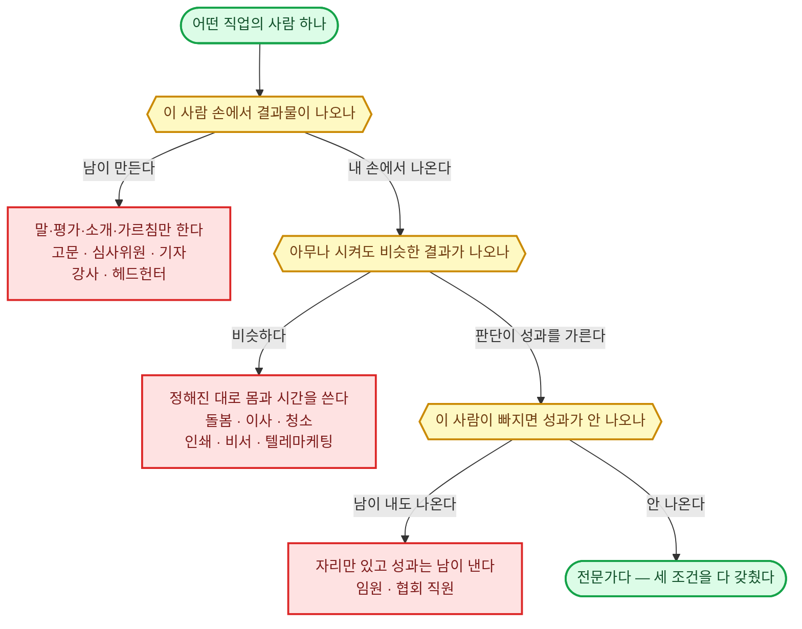
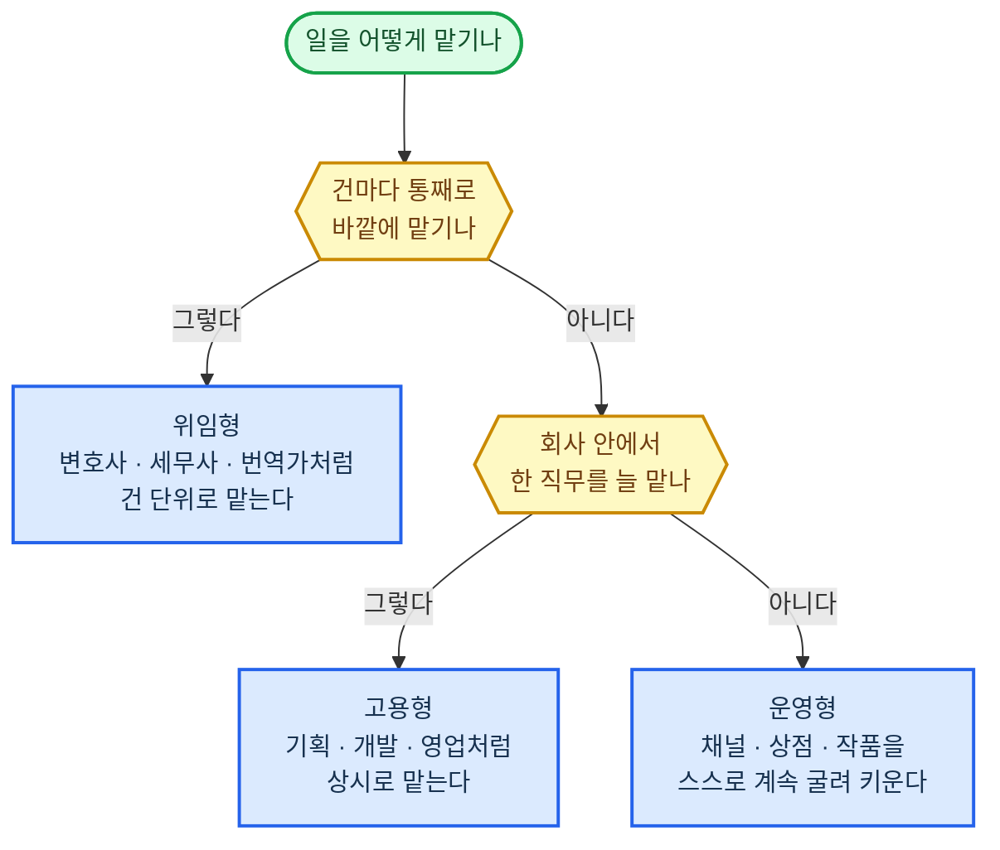
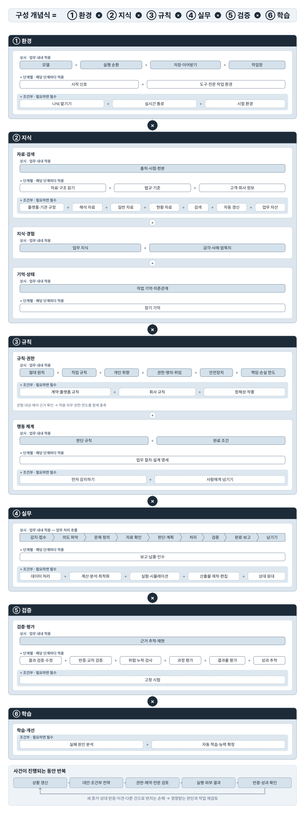
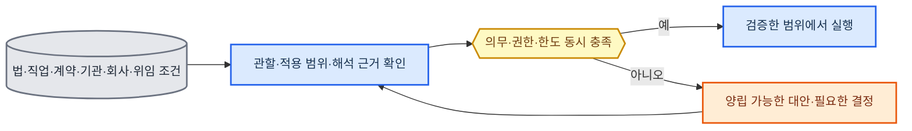

# 전문 AI 에이전트 정의

## 목표 ✅

20년차 인간 전문가를 대체할 수 있는 전문 AI 에이전트를 만든다.

---

### 원하는 것 ✅

1. 인간 전문가를 고용하는 대신 전문 AI 에이전트에게 업무를 맡긴다
   - 20년차만큼 전문성과 성과가 있어야 믿고 맡길 수 있다
   - 사람은 맡기고 결과를 받을 뿐, 중간에 손대지 않는다
   - 사람이 끼는 자리는 다섯 경우 (되돌릴 수 없는 행동 · 승인 조건 · 판단이 서지 않는 것 · 한도 초과 · 자격자 전속 행위) 뿐이다. 그때도 준비·기록·검증은 다 끝낸 뒤 결정만 받는다
   - 이 다섯 가지를 벗어나 사람을 부르면 대체가 아니다
2. 온라인·컴퓨터 안에서 시작해 끝나는 일에 집중한다
   - 성과가 화면·문서·시스템·통신 안에서만 나는 전문가와 업무를 다룬다

---

### 원하지 않는 것 ✅

1. 역할놀이, 상담 챗봇, 단순 질의응답, 검색·요약만 해 주는 수준
2. 몸·현장·실물 조작이 있어야 성과가 나는 일 (건물 시공·조리·의료 시술·촬영·매장 운영)
   - 몸으로 직접 움직이는 로봇이 있어야 하는 일은 이번 범위 밖이다

---

## 인간 전문가 ✅

한 분야의 일을 직접 맡아 20년차 수준으로 판단하고 처리해 성과를 내는 사람. 처음 보는 상황에서도 잠깐 당황할 뿐, 결국 해낸다.

아래 세 가지를 모두 갖춰야 전문가다.
| 조건 | 뜻 | 가르는 질문 | 아니면 |
|------|-----|-----------|--------|
| 직접 처리한다 | 이 사람의 판단이 그대로 결과물이 된다 | 이 사람 손에서 결과물이 나오나? | 말·평가·소개·가르침만 하고 결과물은 남이 만드는 사람. 곁에서 조언만 하는 고문·컨설턴트, 남이 한 일을 심사하고 검사하는 심사위원·감사, 기자, 강사, 사람을 찾아 회사에 소개하는 헤드헌터가 여기다 |
| 판단이 성과를 가른다 | 같은 일도 초보와 고수의 성과 차이가 크고, 오래 할수록 성과가 더 올라간다 | 아무나 시켜도 비슷한 결과가 나오나? | 정해진 대로 몸과 시간을 쓰는 사람 (돌봄, 이사, 청소, 인쇄, 비서, 텔레마케팅) |
| 성과를 낸다 | 일을 맡기면 돈·결과·문제 해결이 실제로 나온다 | 이 사람이 빠지면 성과가 안 나오나? | 자리만 있고 성과는 남이 내는 사람 (임원, 협회 직원) |

---

### 초보와 전문가를 가르는 것 ✅

```mermaid
%%{init: {"flowchart": {"wrappingWidth": 640, "curve": "basis", "nodeSpacing": 45, "rankSpacing": 55, "padding": 14, "useMaxWidth": true}, "themeVariables": {"fontSize": "15px"}} }%%
flowchart LR
    A["보기<br/>문제·빠진 것·예외를 짚는다"]:::main
    B["알기<br/>정석·모르는 것·자료를 안다"]:::main
    C["정하기<br/>예측하고 방법·순서를 고른다"]:::main
    D["하기<br/>처음 보는 상황에서도 해낸다"]:::main
    E["끝내기<br/>검증하고 멈출 때를 안다"]:::main
    A --> B --> C --> D --> E
    classDef main fill:#dbeafe,stroke:#2563eb,stroke-width:2px,color:#17314f
    classDef stop fill:#fee2e2,stroke:#dc2626,stroke-width:2px,color:#7f1d1d
    classDef back fill:#ffedd5,stroke:#ea580c,stroke-width:2px,color:#7c2d12
    classDef store fill:#e5e7eb,stroke:#6b7280,stroke-width:2px,color:#1f2937
    classDef good fill:#dcfce7,stroke:#16a34a,stroke-width:2px,color:#14532d
    classDef note fill:#fef9c3,stroke:#ca8a04,stroke-width:2px,color:#713f12
```

#### 1. 보기 ✅

| 항목 | 초보 | 8년차 | 20년차 |
|------|------|--------|--------|
| 문제 보기 | 말한 그대로를 문제로 본다 | 말 뒤의 진짜 문제와, 말한 사람도 모르는 문제까지 짚는다 | 지금 문제가 앞으로 어떤 문제를 낳을지까지 보고, 풀 문제와 안 풀 문제를 정한다 필요하면 문제를 다시 정의해 판 자체를 바꾼다 |
| 빠진 것 보기 | 눈앞에 있는 것만 본다 | 있어야 하는데 없는 것 (안 낸 서류, 안 나온 숫자, 안 한 말) 을 알아본다 | 없는 것이 왜 없는지 (잊었나, 숨겼나, 없는 게 정상인가) 까지 읽고, 그것이 결과를 뒤집을지 가늠한다 |
| 예외·함정 | 예외를 만나면 멈추거나 틀린다 | 이 일에서 자주 터지는 예외와 함정을 미리 알고, 작은 이상 신호에서 알아챈다 | 예외가 생기는 원리를 알아 처음 보는 예외도 예측한다 함정을 피하는 데서 그치지 않고, 상대의 함정과 예외 조항을 내 쪽에 유리하게 이용한다 |

#### 2. 알기 ✅

| 항목 | 초보 | 8년차 | 20년차 |
|------|------|--------|--------|
| 아는 것 | 책에서 배운 정석 (교과서에 나오는 기본 방법) 만 안다 | 정석이 어디까지 통하고 어디서부터 안 통하는지, 그 이유까지 안다 | 정석이 왜 그렇게 만들어졌는지 원리와 내력 (그 방법이 굳어지기까지의 사정) 을 알아, 정석이 없는 처음 보는 일도 원리에서 풀어낸다 |
| 모르는 것 | 모른다는 것도 모른 채 그냥 나간다 | 자기가 모르는 지점을 알고, 거기서 확인하거나 물어본다 | 이 분야에서 아직 아무도 모르는 것과 다들 안다고 착각하는 것을 안다 누구에게 무엇을 물어야 답이 나오는지 안다 |
| 자료 대하기 | 받은 자료를 그대로 믿는다 | 자료가 틀리기 쉬운 곳을 알고 원문과 대조한다 | 자료가 만들어진 사정 (누가 왜 이렇게 썼는지) 을 읽어 자료가 말하지 않는 것을 알아내고, 자료 없이도 어디까지 판단해도 되는지 안다 |

#### 3. 정하기 ✅

| 항목 | 초보 | 8년차 | 20년차 |
|------|------|--------|--------|
| 결과 예측 | 해 봐야 안다 | 시작 전에 결과와 부작용을 머릿속으로 끝까지 돌려 본다 | 몇 달·몇 년 뒤의 2차·3차 영향까지 내다보고, 그 예측이 얼마나 확실한지도 안다 그래서 예측이 빗나가도 살아남을 길을 미리 마련해 둔다 |
| 상대 예측 | 내가 할 일만 본다 | 상대 (고객, 상대방, 심사관, 시장) 가 어떻게 움직일지 미리 읽고 대비한다 | 상대가 움직일 방향을 미리 만든다 상대·기관·시장이 무엇을 얻고 무엇을 잃는지 (이해관계) 와 버릇을 알아 협상과 판을 설계한다 |
| 방법 고르기 | 아는 방법 하나로 다 한다 | 여러 방법의 비용과 위험을 재서 이 상황에 맞는 것을 고른다 | 있는 방법으로 안 되면 방법을 새로 만들거나 섞고 순서를 다시 짠다 남들이 못 보는 길을 안다 |
| 우선순위 | 시킨 순서나 눈에 띄는 순서대로 한다 | 성과를 가르는 것부터 하고 나머지는 뒤로 미룬다 | 지금 성과와 나중 성과, 이 건과 다른 건 사이의 우선순위까지 정한다 급해 보이는 일이 왜 급하지 않은지 안다 |
| 버리기 | 시킨 것을 다 한다 | 안 해도 될 일과 하면 안 될 일을 가려 빼고, 왜 빼는지 말해 준다 | 일 자체를 받을지 말지, 이 방식 전체를 버리고 다시 짤지 정한다 이미 들인 돈과 시간이 아까워도 버린다 |
| 정보가 모자랄 때 | 다 갖춰질 때까지 기다리거나, 아무렇게나 가정한다 | 모자란 채로도 판단하되 가정을 드러내고, 틀리면 되돌릴 길을 남긴다 | 어떤 정보는 모자라도 결론이 안 바뀌는지 알아서, 그런 정보는 기다리지 않는다 결론을 바꿀 정보만 골라 가장 싸고 빠르게 얻어 낸다 |
| 되돌릴 수 없는 것 | 모든 결정을 같은 무게로 다룬다 | 되돌릴 수 없는 결정을 알아보고, 그것만은 느리게 확인하고 한다 | 되돌릴 수 없는 큰 결정을 되돌릴 수 있는 작은 결정 여러 개로 쪼개 짠다 큰 손실이 나는 선을 먼저 정해 두고 그 안에서만 움직인다 |

#### 4. 하기 ✅

| 항목 | 초보 | 8년차 | 20년차 |
|------|------|--------|--------|
| 처음 보는 상황 | 배운 대로 안 되면 멈추거나 아무거나 한다 | 잠깐 당황하지만 비슷한 경험을 끌어와 길을 찾고, 되돌릴 수 있는 것부터 해 본다 | 당황하는 시간이 짧다 처음 보는 상황일수록 원리로 되돌아가 새 길을 만들고, 그래도 끝까지 해낸다 초보와의 차이가 가장 크게 벌어지는 자리다 |
| 결과물 수준 | 내가 보기에 다 됐으면 끝낸다 | 받는 사람이 손대지 않고 그대로 쓸 수 있는 수준을 알고 거기까지 맞춘다 | 받는 사람이 그것으로 다음에 무엇을 할지까지 보고 거기에 맞춰 만든다 무엇을 빼야 좋아지는지 알기 때문에 결과물이 짧고 분명하다 |

#### 5. 끝내기 ✅

| 항목 | 초보 | 8년차 | 20년차 |
|------|------|--------|--------|
| 검증 | 한 번 훑고 낸다 | 어디서 틀리기 쉬운지 알고 그 자리를 다른 길로 다시 확인한다 | 내 결론이 틀렸다면 어디서 틀렸을지 일부러 반대편에 서서 공격해 본다 상대·심사관·시장이 어떻게 무너뜨릴지를 그려 보며 검증한다 |
| 멈추기 | 언제 끝인지 몰라 계속 만지거나 일찍 놓는다 | 충분한 지점과 더 가면 위험한 지점을 안다 | 언제 밀어붙이고 언제 물러날지 판을 읽고 정한다 잘되고 있을 때도 멈춰야 할 때를 안다 |
| 실패 경험 | 같은 실수를 다시 한다 | 자기와 남의 실패에서 배워 같은 실수를 안 하고, 실패했을 때 수습하는 법도 안다 | 실패가 나는 조건을 알아 그 조건 자체를 미리 없앤다 실패해도 큰 손실은 안 나게 판을 짜고, 실패에서 남이 못 보는 기회를 본다 |

---

### 종류 ✅

#### 위임형 — 건 단위로 외부에 통째로 맡김 ✅

| 분야 | 직종 | 주 고객 | 목표 | 성과 |
|------|------|--------|------|------|
| 법률 (소송) | 변호사 (민사·상사 송무) | 돈·계약·손해를 두고 남과 다투게 된 개인·회사 — 받을 돈은 받아 내고 물어 줄 돈은 줄이고 싶음 | 소송·분쟁에서 의뢰인이 잃는 것은 가장 적게, 얻는 것은 가장 많게 함 이길 수 없는 싸움은 시작 전에 알려 주고 합의로 끝냄 | 유리한 종결률 (이긴 것 + 유리한 합의 + 각하. 각하는 상대가 낸 소송이 재판 조건을 못 갖춰 내용도 안 보고 돌려보내진 것) ÷ 종결한 건 수 걸린 돈이 큰 건에 무게를 더 준 유리 종결률 (큰 건 몇 개 지면 작은 승소 여럿이 무의미) 신청·항소 인용률 (내가 낸 신청을 재판부가 받아 준 비율) 의뢰인 추천 의향 (NPS) |
| 법률 (소송) | 변호사 (형사 변호) | 수사·재판을 받게 된 사람 — 구속과 처벌을 피하거나 가장 가볍게 끝내고 싶음 범죄 피해자 — 피해를 인정받고 처벌·배상을 받아 내고 싶음 | 수사 단계에서 끝내거나 (불송치는 경찰이 검찰로 안 넘김, 불기소는 검찰이 재판에 안 넘김), 재판에서 무죄·집행유예 (형은 정하되 일정 기간 사고 없으면 안 살게 해 줌)·가벼운 형으로 막음 구속을 막고 풀려나게 함 | 불송치·불기소·무혐의 (죄를 지은 게 아니라고 결론남) 비율 구속영장 기각 (가두라는 요청을 판사가 물리침)·구속적부심 (가둔 게 맞는지 다시 따져 달라는 신청)·보석 (보증금 내고 풀려남) 인용률 구형 (검사가 요구한 형벌) 대비 선고형 (판사가 실제로 내린 형벌) 감경폭, 집행유예·무죄 비율 피해자 대리 시 합의금·처벌 결과 |
| 법률 (소송) | 변호사 (가사·상속) | 이혼·양육·상속·유언 문제를 겪는 가족 — 재산과 아이를 지키면서 다툼을 짧게 끝내고 싶음 | 재산 분할·위자료·양육권을 유리하게 받아 내고, 상속 다툼을 가족 관계가 덜 망가지게 끝냄 | 재산분할·위자료 청구액 대비 인정액 양육권·면접교섭 (같이 안 사는 부모가 아이를 정기적으로 만나는 권리) 목표 달성률 조정 (법원이 중간에서 서로 조건을 맞춰 주는 절차)·합의로 끝낸 비율과 걸린 기간 상속 분쟁의 유리 종결률 |
| 법률 (소송) | 변호사 (행정·조세 송무) | 정부·지자체·세무서의 처분 (인허가 (사업을 해도 된다는 나라의 허락) 거부, 영업정지, 과징금 (법을 어긴 회사에 물리는 돈), 세금 부과) 을 받은 개인·회사 — 처분을 취소·감경받고 그동안 영업이 멈추지 않길 원함 | 부당한 처분을 취소시키거나 줄이고, 재판 중에 영업이 멈추지 않게 함 | 행정심판 (재판까지 가기 전에 행정기관에 다시 판단해 달라고 하는 절차)·행정소송 인용률 집행정지 인용률 (처분 효력을 재판 끝날 때까지 멈춤) 취소·감경된 처분 금액 |
| 법률 (소송) | 변호사 (도산·회생) | 빚을 갚을 수 없게 된 회사·개인 — 사업을 살리거나, 못 살리면 빚을 정리하고 다시 시작하고 싶음 채권자 — 최대한 회수하고 싶음 | 회생 (빚을 줄이고 나눠 갚으면서 사업을 계속하는 절차) 으로 사업을 살리거나, 파산·면책 (남은 빚을 법으로 없애 줌) 으로 빚을 정리해 다시 시작하게 함 채권자 대리 시 회수액을 최대로 함 | 회생 개시 (절차를 시작해도 된다는 결정)·인가 (갚을 계획을 법원이 승인) 비율 승인된 변제율 (전체 빚 중 갚기로 한 비율) 과 그대로 갚아 낸 비율 면책 인용률 채권자 대리 시 회수율 |
| 법률 (자문) | 변호사 (기업 자문) | 계약·규제·노무 (직원 채용·급여·해고 같은 노동 문제)·개인정보 문제가 늘 생기는 회사 — 나중에 분쟁이나 제재 (감독기관이 내리는 벌) 로 안 번지게 미리 막고, 사업이 안 멈추게 빨리 답을 얻고 싶음 | 계약·거래가 나중에 분쟁이나 제재로 번지지 않게 막음 사업이 막히지 않게 빠르게 답을 줌 | 자문한 계약에서 난 분쟁·손실 건수 계약 검토에 걸린 날수 고객 유지율 (다음 해에도 맡기는 비율) |
| 법률 (자문) | 변호사 (M&A·투자 거래) | 회사를 사고팔거나 투자를 주고받는 회사·투자자 — 거래는 깨지 않으면서 숨은 위험은 안 떠안고 조건은 유리하게 하고 싶음 | 거래를 성사시키되 진술·보증 (파는 쪽이 회사에 이런 문제는 없다고 계약서에 못 박는 약속)·손해배상 조항으로 위험을 상대에게 넘김 | 거래 성사율 (계약 뒤 실제 종결) 종결 후 진술·보증 위반으로 난 손실 건수 협상에서 우리 쪽 요구대로 넣은 핵심 조항 비율 서명까지 걸린 기간 |
| 법률 (등기·행정) | 법무사 (등기) | 집·건물을 사고팔거나 담보 대출을 받는 개인·회사, 법인을 세우거나 바꾸는 회사 — 등기 (집·건물의 주인이 누구고 빚이 얼마나 걸려 있는지 나라 장부에 적는 일) 를 한 번에 틀림없이 끝내고 싶음 | 등기·법인 서류를 한 번에 틀림없이 접수시킴 | 보정 명령 (서류가 틀렸으니 고쳐 오라는 지시)·각하 비율 (기한 안에 못 고치면 통째로 반려됨) 접수부터 완료까지 걸린 날수 등기 사고 (빠뜨림, 순위 실수 — 담보를 잡는 차례가 뒤로 밀림) 건수 |
| 법률 (등기·행정) | 법무사 (개인회생·파산) | 빚을 감당 못 하는 개인 — 법원 절차로 빚을 줄이거나 없애고 싶음 | 개인회생·파산 신청을 한 번에 통과시켜 빚을 줄임 | 개시·인가율 보정 명령 횟수 탕감된 채무 비율 인가 뒤 변제 이행률 |
| 법률 (등기·행정) | 행정사 (인허가·지원금) | 사업을 열거나 넓히려는 사람·회사 — 인허가와 정부 지원금을 한 번에 통과시키고 싶음 | 인허가·정부지원금을 한 번에 통과시킴 | 승인율 보정 요구 횟수 받아 낸 지원금액 |
| 법률 (등기·행정) | 행정사 (출입국·비자) | 한국에 오거나 머물려는 외국인, 외국인을 채용하려는 회사 — 비자·체류 자격을 거절 없이 기한 안에 받고 싶음 | 비자·체류 자격 (한국에 머물 수 있는 자격)·귀화 (한국 국적을 새로 얻는 것) 를 거절 없이 기한 안에 받게 함 | 승인율·거절률 처리 기간 보완 요구 횟수 |
| 법률 (등기·행정) | 공증인 | 유언·계약·차용 문서를 만드는 개인·회사 — 나중에 다툼이 안 생기게 법적 힘을 붙이고 싶음 | 문서에 나중에 다툼이 안 생기도록 법적 힘을 붙여 줌 | 공증 (자격 있는 사람이 문서가 진짜라고 확인해 주는 일) 이 무효가 되거나 흠이 난 건수. 일부러 그랬거나 조금만 신경 썼으면 안 틀렸을 큰 실수 (중과실) 면 손해배상 책임을 진다 서류 검증 오류율 갖춰야 할 조건을 빠뜨린 건수 (유언 공증에 증인이 안 온 경우 등) |
| 지식재산 | 변리사 (특허) | 기술·제품을 개발한 회사·연구자 — 남이 못 베끼게 권리를 넓게 잡아 등록하고 싶음 | 권리를 넓게 잡아 등록시키고 남이 못 베끼게 지킴 | 등록률 (등록 ÷ 최종 처리된 출원. 출원은 특허청에 권리를 달라고 낸 신청. 특허 평균 74.6%, 2024년) 심사 의견 회신 횟수 (한 번에 통과) 등록된 권리 범위 (경쟁사가 피해 갈 수 없는 정도) |
| 지식재산 | 변리사 (상표·디자인) | 브랜드·제품 외형을 가진 회사·창업자 — 이름과 모양을 남이 못 쓰게 먼저 잡고 싶음 | 브랜드 이름·로고·제품 모양을 거절 없이 등록시키고 침해를 막음 | 등록률 거절 이유 (먼저 등록된 상표와 비슷함 등) 사전 회피율 침해 경고·대응 결과 |
| 지식재산 | 변리사 (심판·분쟁) | 남의 권리와 부딪힌 회사 — 남의 권리는 무효로 만들거나 피해 가고, 내 권리 침해는 막고 싶음 | 남의 권리는 무효로 만들거나 피해 가게 하고 내 권리는 지킴 | 거절결정불복 (특허청이 거절한 걸 다시 봐 달라는 신청)·무효심판 (남이 이미 등록한 권리를 없애 달라는 신청) 인용률 권리범위확인심판 (내 권리가 상대 제품까지 미치는지 가려 달라는 신청) 승률 침해 소송 결과와 손해배상액 |
| 세무 | 세무사 (신고·기장) | 사업자·법인 — 세금을 법 안에서 가장 적게, 기한 안에, 조사 위험 없이 내고 싶음 | 세금을 법 안에서 가장 적게, 기한 안에, 조사 위험 없이 신고함 | 신고 정확성 (수정신고 (잘못 낸 신고를 다시 내는 것)·가산세 (신고를 틀리거나 늦어서 더 무는 세금) 건수. 무신고 20%, 과소신고 10%, 납부지연 하루 0.022%) 기한 준수율 법 안에서 줄인 세액 고객 유지율 |
| 세무 | 세무사 (상속·증여·가업 승계) | 재산이 많은 개인·가족, 가업을 물려주려는 오너 — 재산을 다음 세대에 넘길 때 세금을 가장 적게 내고 싶음 | 상속·증여·가업 승계를 미리 설계해 세금을 법 안에서 가장 적게 냄 | 설계 전후 세액 차이 가업 상속 공제 (조건을 채우면 세금 매길 금액에서 빼 주는 제도) 같은 예외 혜택을 적용받은 비율 혜택을 받은 뒤 지켜야 할 조건을 어겨 세금을 다시 물어낸 (추징) 건수 |
| 세무 | 세무사 (조사·불복) | 세무조사를 받거나 세금을 부당하게 부과받은 사업자·개인 — 추징을 줄이고 잘못 매긴 세금은 돌려받고 싶음 | 세무조사에서 추징을 줄이고, 부당한 과세는 되돌림 | 조사 예상 대비 추징액 감소폭 이의신청·심판청구 (세무서보다 윗 기관에 다시 판단해 달라고 내는 신청) 인용률 (조세심판 전체 인용률 27.3%, 2024년) 조사 걸린 기간 |
| 세무 | 기장 대행 | 장부를 직접 쓸 여력이 없는 작은 사업자 — 장부가 틀림없이 정리돼 신고와 경영 판단에 바로 쓰이길 원함 | 장부를 매달 정확히 기록해 신고와 경영 판단의 바탕을 만듦 | 장부 정확도 월 마감 걸린 날수 재작업 비율 계좌·거래 대사 (장부 숫자와 실제 통장·거래 내역을 하나씩 맞춰 보는 일) 완료율 100% |
| 회계·관세 | 회계사 (감사) | 재무제표 (한 해 동안 돈이 얼마나 들어오고 나갔는지, 재산과 빚이 얼마인지 적은 표) 를 밖에 보여 줘야 하는 회사 (상장사, 투자·대출 받는 회사) — 숫자를 믿어도 된다는 도장을 받고 싶음 그 숫자를 믿고 돈을 넣는 투자자·은행 — 속지 않고 싶음 | 재무제표를 믿을 수 있게 만들어 투자·대출에 쓰이게 함 | 감사의견과 실제 결과 일치. 문제없다는 적정 의견을 준 뒤에 상장폐지 (주식 시장에서 쫓겨남) 나 재무제표 정정이 나오면 감사 실패다 (상장사 적정 비율 97.6%, 2025 회계연도) 재무제표 정정 공시 건수 감사 품질 지표 (위험이 큰 부분에 시간을 얼마나 썼는지, 경력 많은 회계사가 얼마나 직접 봤는지) |
| 회계·관세 | 회계사 (자문·실사) | 회사를 사거나 투자하려는 회사·투자자 — 사기 전에 숨은 빚과 진짜 값을 알고 싶음 | 회사를 사거나 투자하기 전에 실사 (장부와 속사정을 직접 뒤져 확인하는 일) 로 숨은 위험과 진짜 가치를 찾아냄 | 실사 때 못 찾고 나중에 드러난 빚·손실 건수 가치 평가액과 실제 거래가 차이 고객 유지율 |
| 회계·관세 | 관세사 | 수출입하는 회사 — 통관 (물건이 세관을 통과해 나라 밖으로 나가거나 안으로 들어오는 절차) 이 안 막히고 관세는 가장 적게 내고 싶음 | 통관을 막힘 없이, 관세는 법 안에서 가장 적게 냄 | 통관 지연·보류 비율 품목 분류 정확도 특혜관세 (나라끼리 맺은 자유무역협정 (FTA) 덕에 관세를 깎아 주는 것) 를 쓴 비율 환급·절감한 관세액, 추징 건수 |
| 노무 | 노무사 (자문·급여) | 직원을 둔 회사 — 뽑고 쓰고 내보내는 일이 법과 비용 양쪽에서 문제 안 되게 미리 챙기고 싶음 | 사람 뽑고 쓰고 내보내는 일이 법과 비용 양쪽에서 문제 안 되게 함 | 과태료·시정 명령 (잘못된 걸 고치라는 정부 지시) 건수 취업규칙 (회사가 정해 놓은 근무·급여 규칙)·임금 체계를 어겨서 더 나간 비용 노동청 진정 (부당한 일을 당했다고 신고하는 것)·고소 발생 건수 |
| 노무 | 노무사 (분쟁 대리) | 해고·징계·임금 체불로 다투게 된 회사와 근로자 — 노동위원회·노동청에서 이기고 싶음 | 부당해고·임금 체불 같은 분쟁에서 노동위원회·노동청·법원에서 이김 | 노동위원회 (해고·임금 다툼을 재판 전에 가려 주는 국가 기관) 판정 결과 (부당해고 인정률은 판정한 건 기준 26.9%, 2024년 1~10월. 5년 평균은 32.6%. 대리하는 쪽에서 이 평균을 넘어야 함) 화해 (판정까지 안 가고 서로 조건을 맞춰 끝냄) 로 끝낸 비율과 그 조건 임금 체불 회수액 |
| 노무 | 노무사 (산재) | 일하다 다치거나 병든 근로자와 유족 — 산재로 인정받아 치료비·보상을 받고 싶음 | 산재 (일하다 다치거나 병든 것을 나라가 인정해 치료비·보상을 주는 제도) 로 인정받아 정당한 보상을 받게 함 | 산재 승인율 (특히 질병·과로로 생긴 건) 장해 등급 (몸에 남은 후유증이 얼마나 심한지 매기는 등급) 결정 결과 불승인 뒤 심사·재심사 인용률 |
| 부동산 | 공인중개사 (주거) | 집을 사고팔고 빌리려는 개인 — 원하는 조건의 집을 시세보다 좋은 값에, 탈 없이 계약하고 싶음 | 원하는 조건의 집을 찾아 사고팔거나 빌리는 계약을 탈 없이 성사시킴 계약 조건은 시세보다 좋게 함 | 계약 성사율 (문의 대비 계약) 중개 사고 건수 (사고가 나면 중개사가 미리 들어 둔 보상금인 공제금을 청구하거나 소송으로 감) 시세 대비 계약 가격 재의뢰·소개 비율 |
| 부동산 | 공인중개사 (상가·빌딩) | 가게 자리를 찾는 사업자, 건물을 사고파는 투자자 — 장사가 될 자리, 수익 나는 건물을 권리 관계나 권리금 (앞 가게 주인에게 자리값으로 따로 주는 돈) 문제 없이 잡고 싶음 | 장사가 되는 자리와 수익 나는 건물을 시세보다 좋은 조건으로, 권리·권리금 문제 없이 계약함 | 계약 성사율 계약 뒤 임차인 (빌려서 장사하는 사람) 매출과 건물 공실 (빈 채로 놀리는 비율) — 자리 보는 눈 권리금·명도 (세입자를 내보내고 자리를 넘겨받는 일) 분쟁 건수 재의뢰·소개 비율 |
| 부동산 | 공인중개사 (토지·개발) | 땅을 사서 짓거나 개발하려는 개인·회사 — 원하는 용도로 쓸 수 있는 땅을 규제 문제 없이 사고 싶음 | 원하는 용도로 개발 가능한 땅을 규제·권리 문제 없이 시세보다 싸게 계약함 | 계약한 뒤에 개발이 안 되는 땅으로 드러난 건수 (용도 제한, 규제, 들어가는 도로 없음) 시세 대비 계약 가격 계약 성사율 |
| 부동산 | 경매사 | 시세보다 싸게 부동산을 사고 싶은 투자자·실수요자 — 권리 문제를 떠안지 않고 낙찰받고 싶음 | 권리 문제 없는 물건을 시세보다 싸게 낙찰받게 함 | 권리 분석 사고 (떠안는 권리를 놓침) 건수 시세 대비 낙찰가 입찰 대비 낙찰 성공률 명도 걸린 기간 |
| 부동산 | 감정평가사 | 담보·보상·소송·세금 때문에 자산 값이 필요한 은행·정부·개인 — 누구에게 내놔도 안 뒤집히는 값을 원함 | 부동산·자산의 가치를 근거 있게 정확히 매김 (현장 사진·실측은 밖에 맡기고 자료 분석·가치 산정·평가서 작성을 맡음. 서명은 자격자 전속) | 다른 평가사·실거래가와의 격차 이의 제기·재평가 요청 건수 평가서가 소송·과세에서 뒤집힌 건수 |
| 건축·기술 | 건축사 (주택·소규모 건축) | 집·작은 건물을 짓거나 고치려는 개인·소규모 건축주 — 법·예산 안에서 허가를 한 번에 받고 원하는 건물을 갖고 싶음 | 법·예산·용도에 맞는 설계로 허가를 한 번에 통과하고 원하는 건물을 완성함 | 허가 보완 횟수와 걸린 날수 설계 변경률 (변경 금액 ÷ 계약 금액, 낮을수록 좋음) 예산 대비 실제 공사비 차이 준공 (공사를 다 끝내고 검사까지 마침) 후 하자·민원 건수 |
| 건축·기술 | 건축사 (대형·공공 건축) | 큰 건물·공공시설을 짓는 시행사 (땅을 사고 돈을 대서 건축 사업을 벌이는 회사)·기관 — 심의·허가를 통과하고 공사비·일정을 지키면서 완성하고 싶음 | 심의 (전문가 위원회가 설계를 미리 검토해 통과시키는 절차)·허가를 통과하고 설계 변경과 공사비 초과 없이 완성함 | 심의·허가 통과 횟수와 걸린 날수 설계 변경률 예산 대비 실제 공사비 차이 준공 후 하자·민원 건수 |
| 건축·기술 | 기술사 (구조) | 건물·다리·공장을 짓거나 고치는 건축주·시공사 — 무너지지 않으면서 재료는 덜 쓰는 설계를 원함 | 안전하고 법에 맞으면서 재료가 덜 드는 구조를 설계·검토함 | 구조 심의·검토 통과율 준공 후 구조 하자·사고 건수 검토로 줄인 자재비 |
| 건축·기술 | 기술사 (기계·전기 설비) | 공장·건물·데이터센터를 짓거나 운영하는 회사 — 설비가 멈추지 않고 전기·에너지 비용이 덜 들기를 원함 | 설비가 안 멈추고 법에 맞으며 에너지 비용이 덜 들게 설계·검토함 | 검토 통과율 가동 후 설비 고장·사고 건수 줄인 에너지·운영 비용 |
| 보험 | 보험설계사 (생명·장기) | 사망·큰 병·노후를 대비하려는 개인 — 꼭 필요한 보장만 적은 보험료로 오래 유지하고 싶음 | 필요한 위험만 가장 적은 보험료로, 오래 유지되게 보장함 | 13회차 유지율 (1년 뒤 살아 있는 계약, 생·손보 전체 평균 87.9%, 2025년 실적) 25회차 유지율 (2년 뒤, 전체 평균 73.9%) 불완전판매 (중요한 내용을 제대로 안 알리고 판 계약) 건수 보장 공백 (사고 났는데 보장 안 됨) 건수 |
| 보험 | 보험설계사 (손해·자동차) | 차·집·가게 사고에 대비하려는 개인·사업자 — 사고 났을 때 실제로 보상받고 보험료는 낮게 내고 싶음 | 사고 났을 때 실제로 보상되게, 보험료는 낮게 함 | 갱신율 (만기 때 다시 계약) 장기손해보험 13회차·25회차 유지율 보상 거절·분쟁 건수 |
| 보험 | 보험계리사 | 보험 상품을 만들고 파는 보험사 — 상품이 손해 없이 유지되고 감독 기준을 넘기길 원함 | 보험 상품이 손해 없이 유지되게 보험료와 준비금 (나중에 보험금 줄 몫으로 미리 쌓아 두는 돈) 을 계산함 | 손해율 (받은 보험료 중 보험금으로 나가는 비율) 예측 오차 준비금 정확도 (추정 ÷ 실제, 1.0에 가까울수록 좋음) 1년 뒤 준비금 변동폭 (20% 넘으면 위험 신호) 상품 수익성 |
| 보험 | 손해사정사 (재물·배상) | 화재·수해·사고로 재산이 상하거나 남에게 물어 줘야 할 개인·회사 — 손해액을 근거 있게 인정받아 정당한 보험금을 받고 싶음 | 재산 손해·배상 책임 금액을 근거 있게 산정해 정당한 보험금을 받게 함 (현장 사진·실측은 밖에 맡기고 손해액 산정·근거 문서·보험사 협의를 맡음) | 산정액 인정률 (보험사가 받아들인 비율) 받아 낸 보험금액 분쟁·민원 건수 (손해보험 민원의 52.8%가 보험금 산정·지급 문제, 2025년) |
| 보험 | 손해사정사 (신체·질병) | 다치거나 병들어 보험금을 청구하는 개인 — 장해·후유증을 정당하게 인정받고 싶음 | 장해·후유증·진단을 근거 있게 입증해 보험금을 받게 함 | 청구액 대비 지급액 장해 등급·후유증 인정 결과 지급 거절 뒤 뒤집은 건수 |
| 자산·대출 | 투자자문사 | 목돈을 가진 개인·법인 — 정한 위험 안에서 자산을 불리고 싶음 | 정한 위험 안에서 고객 자산을 불림 | 기준으로 삼은 시장 지수 (벤치마크) 보다 더 번 수익 (알파) 위험 대비 수익 (샤프 비율 — 오르내리는 위험 한 몫당 얼마를 벌었나. 1.0 이상이면 양호) 최대 낙폭 (MDD — 제일 높았을 때부터 제일 낮았을 때까지 가장 크게 까먹은 폭) 한도 준수 |
| 자산·대출 | 재무설계사 | 집·교육·은퇴 같은 인생 목표에 돈을 맞추고 싶은 개인·가족 — 계획대로 목표를 이루고 싶음 | 집·교육·은퇴 같은 인생 목표에 맞게 돈 계획을 세워 달성시킴 | 재무 목표 달성률 순자산 (가진 재산에서 빚을 뺀 돈) 증가 고객 유지율 (다음 해에도 관리받는 비율, 미국 자문업계 97%) 계획 이행률 |
| 자산·대출 | 대출상담사 (주택·개인) | 집을 사거나 급전이 필요한 개인 — 가장 좋은 조건의 대출을 가장 빨리 받고 싶음 | 가장 좋은 조건의 대출을 가장 빨리 승인받게 함 | 승인율 (신청 대비 승인) 신청한 사람 중 실제로 돈까지 받은 비율 (풀스루율) 시장 대비 금리·한도 조건 처리 기간 |
| 자산·대출 | 대출상담사 (사업자·기업) | 운영 자금·시설 자금이 필요한 사업자 — 보증·담보를 엮어 한도는 크게, 금리는 낮게, 빨리 받고 싶음 | 보증 (기관이 대신 갚아 주겠다고 서 주는 것)·정책자금 (정부가 낮은 금리로 빌려주는 돈)·담보를 엮어 가장 큰 한도를 가장 낮은 금리로 승인받게 함 | 승인율·한도 달성률 시장 대비 금리 보증·정책자금을 엮은 건수 처리 기간 |
| 진료·약 | 의사 (만성질환) | 혈압·당뇨 같은 병을 오래 안고 사는 환자 — 수치를 잡아 합병증 없이 살고 싶음 | 혈당·혈압 같은 수치를 목표 안에 오래 유지해 합병증을 막음 | 조절률 (수치가 목표 범위 안에 들어온 환자 비율. 병이 있는 사람 기준 국내 고혈압 58.6%·당뇨 32.4%, 2024년 통계) 합병증 발생률 복약 순응도 (처방일수 대비 실제 복용 80% 이상) 진단 정확도 (오진·늦은 진단) |
| 진료·약 | 의사 (정신건강) | 우울·불안·중독·수면 문제로 일상이 무너진 환자 — 일상을 되찾고 재발하지 않기를 원함 | 증상을 줄여 일상을 되찾게 하고 재발과 위기를 막음 | 증상 척도 (증상이 얼마나 심한지 점수로 재는 검사) 개선율 재발·재입원율 자해·위기가 일어난 건수 치료 중단율 |
| 마음·몸 | 심리상담사 (개인) | 불안·우울·대인관계 문제로 힘든 성인 — 마음의 문제를 줄여 일상을 되찾고 싶음 | 마음의 문제를 줄여 일상을 되찾게 하고 그 상태를 유지시킴 | 상담 앞뒤 점수 차이가 우연이 아닐 만큼 크게 좋아졌는지 재는 값 (신뢰변화지수) 눈에 띄게 좋아진 사람 비율 (임상시험은 절반 넘게, 실제 현장은 3분의 1 아래) 종결 후 재발·유지 중도 탈락률 |
| 마음·몸 | 심리상담사 (아동·청소년) | 아이의 정서·행동·학교 문제로 걱정하는 부모와 아이 — 아이가 나아지고 가정·학교에 잘 적응하길 원함 | 아이의 정서·행동 문제를 줄이고 가정·학교 적응을 도우며 부모의 대응도 바꿈 | 행동·정서 척도 개선 학교 적응 (등교, 또래 관계) 변화 부모 보고 개선율 중도 탈락률 |
| 마음·몸 | 심리상담사 (부부·가족) | 갈등·이혼 위기에 놓인 부부·가족 — 관계를 회복하거나, 덜 상처받고 정리하고 싶음 | 관계 갈등을 줄여 관계를 회복시키거나 정리 과정을 덜 아프게 함 | 관계 만족도 척도 개선 이혼·별거로 간 비율 (회복 목표 사례) 갈등 재발률 |
| 마음·몸 | 영양사 | 체중·혈당·콜레스테롤 수치를 식단으로 잡고 싶은 사람, 병 때문에 식단이 필요한 환자 — 지킬 수 있는 식단으로 수치를 바꾸고 싶음 | 식단으로 체중·혈당 같은 건강 수치를 개선함 | 당화혈색소 (최근 두세 달 평균 혈당을 알려 주는 피 검사 수치) 감소폭 (영양 치료 3개월 뒤 0.3~2.0%p) 체중 변화 (여러 연구 평균 약 1.5kg 감량) 식단 실천도 목표 수치 유지율 |
| 언어 | 번역가 (산업·법률 문서) | 계약서·매뉴얼·특허 문서를 다른 나라에 내야 하는 회사 — 틀린 한 단어로 사고가 안 나게 정확하길 원함 | 원문의 뜻을 정확하게, 용어를 일관되게, 쓰임새에 맞게 옮김 | 품질 점수 (번역 오류를 종류와 심각도별로 감점하는 국제 채점 기준 MQM. 100점 만점에 98~99점 안팎이 통과선) 오역·용어 불일치로 난 사고 건수 수정 요청 건수 납기 준수율 |
| 언어 | 번역가 (출판·문학) | 외국 책을 내려는 출판사 — 원문의 결·재미가 살아 읽히고 팔리길 원함 | 원문의 결·문체를 살려 끝까지 읽히게 옮김 | 독자 평점·완독 반응 판매 부수 편집자 수정 요청 건수 |
| 언어 | 번역가 (영상·게임 현지화) | 영상·게임을 해외에 내는 제작사·플랫폼 — 자막·대사가 자연스럽고 글자 수·타이밍에 맞길 원함 | 대사의 뜻과 말맛을 살리면서 글자 수·타이밍·문화 차이에 맞춤 | 시청자·플레이어 번역 불만 건수 글자 수·타이밍 규격 위반 건수 납기 준수율 |
| 언어 | 통역사 (국제회의 동시통역) | 국제회의·학회·행사를 여는 기관 — 발표가 끊김 없이 실시간으로 전달되길 원함 | 발표와 동시에 뜻을 놓치지 않고 전달함 | 의미 일치도 (누락·추가·오역 건수) 전문용어 정확성 재지명률 (다음에도 부르는 비율) |
| 언어 | 통역사 (비즈니스·법정) | 협상·계약·수사·재판에서 말이 통해야 하는 회사·개인 — 뜻뿐 아니라 의도·뉘앙스까지 전달돼 불리해지지 않길 원함 | 협상·법정에서 양쪽 말의 뜻·의도·격식까지 정확히 전달함 | 의미 일치도 격식·뉘앙스 적절성 통역 오류로 난 불이익 건수 재지명률 |
| 언어 | 카피라이터 | 광고·상세페이지로 사람을 움직여야 하는 회사 — 한 줄로 누르고 사게 만들고 싶음 | 읽는 사람을 한 줄로 움직여 누르고 사게 함 | 클릭률 (CTR, 검색광고 평균 6.6%, 2026년) 전환율 (광고를 본 사람 중 실제로 사거나 신청한 비율) A/B 테스트 (두 가지 문구를 같이 내보내 어느 쪽이 나은지 재는 실험) 승률 |
| IT 외주 | 외주 개발 (웹·앱) | 서비스·앱을 만들고 싶지만 개발팀이 없는 회사·창업자 — 예산·기간 안에 동작하는 결과물을 받고 출시 뒤 고장이 없길 원함 | 예산·기간 안에 동작하는 서비스를 완성해 출시하고 넘겨줌 | 일정·예산 준수율 넘겨받은 뒤 발견된 결함 건수 출시 후 가동률 (서비스가 안 멈추고 돌아간 시간 비율) 재의뢰 |
| IT 외주 | 외주 개발 (시스템 구축·SI) | 회사 업무 시스템 (ERP — 재무·재고·인사를 한 프로그램에서 관리하는 것, 그룹웨어 — 사내 메일·결재·일정 프로그램, 여러 시스템을 하나로 잇는 통합) 을 새로 놓거나 바꾸는 회사 — 업무가 멈추지 않고 새 시스템으로 넘어가길 원함 | 요구를 빠짐없이 반영해 기존 업무가 끊기지 않게 새 시스템으로 옮김 | 요구사항 반영률 전환 뒤 장애·업무 중단 건수 일정·예산 준수 검수 (맡긴 쪽이 결과물을 요구대로 됐는지 확인하고 받는 일) 통과 횟수 |
| 영상 제작 | 영상 제작자 (광고·홍보) | 광고·홍보 영상이 필요한 회사·기관 — 예산 안에서 알리거나 사게 하는 목적을 이루는 영상을 원함 | 예산·기간 안에 목적을 달성하는 영상을 완성함 (촬영은 밖에 맡기고 기획·연출·편집을 맡음) | 조회수·완주율 (영상을 끝까지 본 비율)·전환 같은 목적 지표 예산·일정 준수율 수정 횟수 |

---

#### 고용형 — 회사 안에서 직무를 상시로 맡김 ✅

| 분야 | 직종 | 주 고객 | 목표 | 성과 |
|------|------|--------|------|------|
| 경영·전략 | 경영기획 | 대표·경영진 — 회사 목표가 숫자 계획으로 쪼개져 달성되고 있는지 알고 관리하고 싶음 | 회사 목표를 숫자 계획으로 쪼개고 달성되게 관리함 | 계획 달성률 예측 오차 (계획 대 실제) 전략 과제 실행률 |
| 경영·전략 | 전략 | 대표·이사회 — 어디서 어떻게 이길지 정하고 자원을 그쪽에 몰고 싶음 | 어디서 어떻게 이길지 정하고 자원을 그쪽으로 몰아 줌 | 매출·점유율 성장률 선택한 사업의 영업이익률 (매출에서 물건값과 운영비를 빼고 남은 이익의 비율) 개선폭 전략 과제 달성률 |
| 경영·전략 | 사업개발 | 대표·사업부장 — 새 매출원 (신사업·제휴·판로) 이 필요함 | 새 사업·제휴·판로로 새 매출원을 만듦 | 신규 매출액 계약·제휴 건수와 규모 잠재 고객에서 계약으로 바뀐 비율 고객 획득 비용 (CAC) |
| 인사 | 인사 (평가·보상) | 경영진 — 잘한 사람이 보상받고 남게, 인건비는 성과에 맞게 쓰이길 원함 직원 — 공정하게 평가받고 싶음 | 평가·보상으로 성과 낸 사람이 남고 인건비가 성과에 맞게 쓰이게 함 | 핵심 인재 이직률 인건비 대비 성과 평가 공정성 인식 점수 보상 이의·분쟁 건수 |
| 인사 | 인사 (조직·인재개발) | 경영진·팀장 — 조직이 잘 굴러가고 사람이 성장하며 몰입하길 원함 | 조직 구조·문화·교육으로 사람이 성장하고 몰입하게 함 | 직원 만족·몰입 점수 내부 승진·핵심 직무 충원율 신입 1년 안 이탈률 교육 뒤 성과 변화 |
| 인사 | 채용 | 사람이 필요한 팀장·경영진 — 제때, 오래 남을 사람을 뽑고 싶음 | 필요한 사람을 제때, 오래 남을 사람으로 뽑음 | 채용 걸린 날수 (해외 중간값 39일, 2026년. 국내 평균 32일, 2022년 조사) 입사 90일·1년 정착률 채용 1명당 비용 합격자 입사율 |
| 재무·회계 | 회계 | 경영진·감사인 (회사 장부가 맞는지 검사하는 사람)·투자자 — 숫자가 정확하고 제때 나오길 원함 | 거래를 정확히 기록하고 결산 (한 기간의 장부를 마감해 숫자를 확정하는 일) 을 해서 숫자를 믿을 수 있게 함 | 결산 걸린 날수 (중간값 약 6.4일, 상위 25%는 4.8일) 결산 뒤 수정 전표 (거래 하나하나를 적어 두는 기록)·정정 건수 보고 기한 준수율 |
| 재무·회계 | 재무 | 대표·CFO (재무를 총괄하는 임원) — 돈이 모자라지 않게 계획하고 가장 싸게 조달하고 싶음 | 돈이 모자라지 않게 계획하고 가장 싸게 조달함 | 현금흐름 예측 정확도 조달 금리 (가중평균 자본 비용, WACC) 외상값 회수 기간 (DSO) 현금 부족 사태 건수 |
| 재무·회계 | 자금 | CFO·거래처 — 일별 현금이 끊기지 않고 지급이 밀리지 않길 원함 | 일별 현금이 끊기지 않게 하고 남는 돈은 굴림 | 지급 지연 건수 일별 현금 예측 오차 여유 자금 운용 수익 |
| 재무·회계 | 원가 | 경영진·사업부장 — 제품별 진짜 원가를 알아 이익 나는 데 집중하고 싶음 | 제품별 원가를 정확히 계산해 이익 나는 데 집중시킴 | 표준 원가와 실제 원가 차이 원가 절감액 제품별 마진 (팔아서 남는 몫) 정확도 |
| 재무·회계 | 세무 (사내) | 경영진 — 회사 세금을 법 안에서 적게, 신고 실수와 추징 (덜 낸 세금을 뒤늦게 물리는 것) 없이 내고 싶음 | 회사 세금을 법 안에서 가장 적게, 신고 실수와 추징 없이 냄 | 가산세·추징 건수와 금액 절세액 세무조사 결과 신고 기한 준수율 |
| 금융업 | 펀드매니저 (주식) | 돈을 맡긴 투자자·기관 — 정한 위험 안에서 시장보다 더 불리고 싶음 | 맡은 돈을 정한 위험 안에서 벤치마크 (비교 기준으로 삼는 시장 평균 수익률) 보다 더 불림 | 벤치마크 대비 초과수익 (알파 — 시장 평균보다 더 번 몫) 샤프 비율·정보 비율 (위험 1단위당 초과수익. 정보 비율 0.5 넘으면 실력, 1.0 넘으면 매우 우수) 최대 낙폭 (MDD) |
| 금융업 | 펀드매니저 (채권) | 꾸준한 이자 수익을 원하는 연기금·보험사·개인 — 금리 변동과 부도 위험을 피하며 벤치마크를 넘고 싶음 | 금리·신용 위험을 관리하며 벤치마크보다 더 불림 | 벤치마크 대비 초과수익 듀레이션 (금리가 움직일 때 채권 값이 얼마나 흔들리는지 나타내는 값)·신용 위험 한도 준수 담은 채권의 부도 건수 |
| 금융업 | 대체투자 운용 (PE·부동산·인프라) | 큰돈을 오래 묻어 둘 수 있는 기관·자산가 — 상장 시장보다 높은 수익을 원함 | 사서 키워 비싸게 팔거나 꾸준한 현금흐름으로 목표 수익률을 달성함 | 내부수익률 (IRR)·투자 배수 (MOIC) 회수 (엑시트) 성공률 손실 난 투자 건수 |
| 금융업 | 애널리스트 (리서치) | 투자 판단을 해야 하는 펀드매니저·기관·개인 투자자 — 남보다 먼저, 맞는 판단 근거를 원함 | 기업·산업의 실적과 주가를 남보다 먼저, 맞게 내다봄 | 실적 추정 오차 투자의견 뒤 주가 방향 적중률 기관 투자자 평가 순위 |
| 금융업 | 트레이더 | 회사 (자기자본 — 회사가 굴리는 자기 돈) 와 주문을 맡긴 고객 — 한도 안에서 수익을 내고 주문은 가장 좋은 값에 체결되길 원함 | 한도 안에서 매매 수익을 내고 고객 주문을 최선 조건에 체결함 | 손익 (P&L) 한도 위반 건수 체결 품질 (시장가 대비 슬리피지 — 주문할 때 본 값과 실제로 사고팔린 값의 차이) |
| 금융업 | 여신심사 (개인) | 대출을 원하는 개인과 은행 — 갚을 사람에게는 빨리 빌려주고, 못 갚을 사람은 걸러내길 원함 | 갚을 사람에게만, 갚을 만큼만, 빨리 빌려줌 | 연체율 (국내 은행 전체 0.56%, 2026년 6월) 첫 회차 연체율 심사 걸린 시간 거절한 우량 고객 비율 |
| 금융업 | 여신심사 (기업) | 자금이 필요한 회사와 은행 — 사업성·담보를 보고 갚을 회사에 빌려주고 부실은 막고 싶음 | 사업성과 상환 능력을 보고 부실 없이 빌려줌 | 부실채권 비율 (NPL, 국내 은행 평균 0.60%, 2026년 3월) 심사 기간 부실 조기 경보 적중률 |
| 금융업 | 리스크 관리 | 경영진·감독기관 — 손실이 한도 안에 묶이길 원함 | 손실 위험을 재고 한도 안에 묶음 | 한도 초과 건수 손실 한도 (VaR — 이보다 큰 손실은 좀처럼 안 난다고 계산해 둔 한도) 를 넘긴 건수 (250일에 4건까지 정상, 10건 넘으면 모델 불합격) 스트레스 테스트 (아주 나쁜 상황을 가정해 버틸 수 있는지 보는 시험) 통과 |
| 금융업 | 보험 언더라이터 (인수 심사) | 보험사·설계사 — 위험에 맞는 보험료로 받되 손해 날 계약은 걸러내고 싶음 | 위험을 제대로 재서 받을 계약은 받고 손해 날 계약은 거름 | 인수한 계약의 손해율 심사 기간 고지 위반 (계약할 때 알려야 할 사실을 숨긴 것)·사기 적발률 |
| 금융업 | IB (인수·자금조달 주선) | 회사를 팔거나 사거나 상장·회사채 (회사가 돈을 빌리려고 찍어 파는 빚 문서) 로 돈을 모으려는 기업 — 가장 좋은 값과 조건으로 거래를 끝내고 싶음 | 거래를 좋은 값·조건으로 성사시킴 | 거래 성사율·규모 매각가·조달 조건 (시장 대비) 수수료 수익 |
| 법무 | 법무 (소송·분쟁) | 경영진·사업부 — 분쟁을 유리하게, 싸게, 빨리 끝내고 싶음 | 분쟁을 유리하게 끝내고 비용을 줄임 | 분쟁 유리 종결률과 처리 기간 소송·과징금 (법을 어겨서 나라에 무는 돈) 건수와 금액 외부 로펌 (변호사 사무소) 비용 절감액 |
| 법무 | 법무 (규제·컴플라이언스) | 경영진·현업 부서 — 법을 어기기 전에 막고 제재·유출 사고를 피하고 싶음 | 회사 활동이 법을 어기기 전에 막고 사고 나면 기한 안에 대응함 | 규제 위반·제재 건수 문제 발견 뒤 대응 시간 (개인정보 유출은 72시간 안에 신고해야 함) 내부 감사 지적 건수 |
| 법무 | 계약 관리 | 영업·구매 부서 — 불리한 조항 없이 빨리 계약하고 싶음 | 불리한 조항 없이 빨리 계약을 맺음 | 계약 처리 걸린 날수 (요청부터 서명까지) 계약 분쟁 건수 수정 요구 관철률 (요구한 수정이 실제로 반영된 비율) 1인당 처리 건수 |
| 마케팅·PR | 브랜드 마케팅 | 경영진·영업 — 브랜드가 알려지고 사고 싶게 기억되길 원함 | 브랜드를 알리고 사고 싶게 기억시킴 | 브랜드 인지도 (힌트 없이 제일 먼저 떠올린 비율·힌트 없이 떠올린 비율·이름을 보여 주면 아는 비율) 브랜드 검색량 증가율 선호도·추천 의향 (NPS) |
| 마케팅·PR | 퍼포먼스 마케팅 | 경영진·영업 — 광고비 1원당 매출·가입을 가장 많이 내고 싶음 | 광고비 1원으로 매출·가입을 가장 많이 냄 | ROAS (광고비 대비 매출, 이커머스 평균 2.9배·중간값 2.0배, 2025년) CPA (전환 1건당 비용) CTR·CVR (클릭률·구매 전환율) 고객 획득 비용 대 고객 생애 가치 (1/3 이하가 목표) |
| 마케팅·PR | 콘텐츠 마케팅 | 경영진·영업 — 광고비 없이도 고객이 찾아와 사게 하고 싶음 | 콘텐츠로 고객을 끌어와 사게 함 | 자연 유입 (검색·추천) 방문자 콘텐츠 경유 전환·매출 검색 순위 |
| 마케팅·PR | CRM | 경영진·영업 — 기존 고객이 더 오래 더 많이 사게 하고 싶음 | 기존 고객이 더 오래 더 많이 사게 함 | 재구매율 이탈률 고객 생애 가치 (LTV) 기존 고객 매출 유지율 (NRR) |
| 마케팅·PR | 홍보 | 대표·경영진 — 언론·대중이 회사를 좋게 보고 위기에 덜 다치길 원함 | 언론·대중이 회사를 좋게 보게 하고 위기에 덜 다치게 함 | 긍정·부정 보도 비율 (감성 점수) 미디어 노출량·도달 (그 소식을 실제로 본 사람 수) 핵심 메시지가 기사에 실린 비율과 인식 변화 (노출량 자체는 성과가 아니다) 위기 때 여론 회복 속도와 부정 보도 지속 기간 |
| 영업·고객 | 영업 (B2B 신규 개척) | 회사 — 새 거래처를 따서 매출을 늘리고 싶음 아직 안 사 본 기업 고객 — 문제를 풀어 줄 믿을 만한 공급자를 원함 | 새 거래처를 따서 매출 내고 거래처를 늘림 | 목표 (할당량) 달성률 진행 중인 영업 건 전체의 승률 (전체 평균 약 19%, 2025년) 영업 주기 (대형 거래는 90~180일) 신규 거래처 수·매출 |
| 영업·고객 | 영업 (B2B 기존·키어카운트) | 회사 — 큰 거래처가 안 떠나고 더 사게 하고 싶음 큰 거래처 — 믿고 계속 맡길 공급자를 원함 | 큰 거래처와의 거래를 지키고 키움 | 거래처 유지율 거래처당 매출 성장률 경쟁사에 뺏긴 건수 |
| 영업·고객 | 기술영업 (프리세일즈) | 영업팀과 기술을 따지는 고객 — 우리 제품이 고객 문제를 정말 푸는지 증명해 계약을 따고 싶음 | 기술 검증 (PoC·데모 — 진짜 되는지 미리 만들어 보여 주는 것) 을 통과시켜 계약으로 잇고, 못 맞출 요구는 미리 걸러냄 | PoC·기술 검증 통과율 기술 검증 뒤 계약 전환율 납품 뒤 요구 불일치 건수 |
| 영업·고객 | 해외영업 | 회사 — 해외 판로를 열고 싶음 해외 바이어 (물건을 사 가는 해외 거래처 담당자) — 믿을 수 있는 공급자를 원함 | 해외 거래처를 따서 수출 매출을 내고 대금을 안전하게 받음 | 수출 매출·신규 국가·바이어 수 대금 미회수 (물건값을 못 받은 것) 건수 전시회·상담 뒤 계약 전환율 |
| 영업·고객 | 영업관리 | 경영진 — 영업 조직 전체가 목표를 치길 원함 | 영업 조직 전체가 목표를 치게 함 | 팀 목표 달성률 목표를 달성한 영업사원 비율 영업사원 간 성과 편차 수주 (일감·주문을 따내는 것) 예측 정확도 |
| 영업·고객 | 고객성공 | 계약한 고객 — 제품으로 성과를 내고 싶음 회사 — 고객이 계속 쓰게 하고 싶음 | 고객이 제품으로 성과 내서 계속 쓰게 함 | 기존 고객 매출 유지율 (NRR, 중앙값 102%·상위 25% 111%, 2025년) 갱신율·이탈률 추가 구매 (업셀) 매출 고객 건강 점수 (고객이 제품을 잘 쓰고 있는지 매긴 점수)·추천 의향 (NPS) |
| 상품·기획 | PM·PO (B2C 앱) | 앱 사용자 — 원하는 걸 쉽게 하고 싶음 경영진 — 지표를 움직이고 싶음 | 쓰는 사람이 원하는 제품을 제때 내놓아 지표를 움직임 | 잔존율 (리텐션) DAU/MAU (하루 사용자 ÷ 한 달 사용자, 이커머스 20%·B2B SaaS 31%, 2026년) 활성화율 (첫 핵심 경험 도달) 출시 일정 준수율 |
| 상품·기획 | PM·PO (B2B SaaS) | 기업 고객 — 업무가 편해지길 원함 경영진 — 계속·더 많이 쓰게 하고 싶음 | 기업 고객이 계속·더 많이 쓰게 만듦 | 기존 고객 매출 유지율 (NRR) 새 기능 채택률 확장 매출 (기존 고객이 더 사서 늘어난 매출) 비중 출시 일정 준수율 |
| 상품·기획 | PMO | 경영진·사업부 — 여러 프로젝트가 일정·예산 안에 끝나길 원함 | 여러 프로젝트를 일정·예산 안에 끝냄 | 일정·예산 준수율 지연 조기 발견율 범위 변경 건수 |
| 상품·기획 | 게임 기획 (시스템·경제) | 플레이어 — 재미와 공정함을 원함 개발팀·경영진 — 오래 하고 돈 쓰게 하고 싶음 | 재미·난이도·경제를 설계해 오래 하게 하고 돈 쓰게 함 | 1일·7일·30일 잔존율 결제 전환율·사용자당 매출 이탈 지점 (특정 단계·구간) 개선폭 |
| 상품·기획 | MD (온라인) | 플랫폼·브랜드 경영진 — 팔릴 상품을 맞는 가격에 노출해 팔고 싶음 온라인 구매자 — 좋은 상품을 좋은 값에 찾고 싶음 | 팔릴 상품을 골라 맞는 가격·노출로 매출과 마진을 냄 | 판매율·매출총이익률 (판 값에서 사 온 값을 뺀 이익의 비율) 재고 회전율 (쌓아 둔 재고가 한 해에 몇 번 팔려 나가는지) 노출 대비 구매 전환율 |
| 상품·기획 | MD (오프라인 매입) | 소매점·유통사 경영진 — 매장에 팔릴 상품을 맞는 양으로 들여오고 싶음 매장 손님 — 원하는 물건이 있길 원함 | 매장별로 팔릴 상품을 맞는 양·시기에 들여와 재고 없이 팖 (실물 검수·산지 방문은 밖에 맡기고 판매 자료 분석·상품 선정·수량·시기 결정을 맡음) | 판매율 (입고 대비 판매) 재고 회전율·폐기율 매출총이익률 재고 투자 대비 이익 (GMROI) |
| 상품·기획 | 구매 (직접재·자재) | 생산·경영진 — 생산에 쓸 자재를 좋은 조건으로 끊기지 않게 받고 싶음 | 좋은 조건으로 끊기지 않게 사옴 | 원가 절감률 납기 준수율 (상위 25% 95% 이상, 보통 85~90%) 입고 불량률 공급 중단 건수 |
| 상품·기획 | 구매 (간접재·서비스) | 전 부서 — 사무·IT·용역 (밖에 맡겨서 사람 손으로 해 주는 일) 같은 회사 살림을 싸고 문제없이 쓰고 싶음 | 회사 살림에 드는 비용을 줄이면서 품질·납기를 지킴 | 절감률 계약 위반·서비스 품질 문제 건수 구매 처리 기간 |
| 개발 | 풀스택 | 창업자·PM — 아이디어를 빨리 동작하는 서비스로 만들고 싶음 | 아이디어를 동작하는 서비스로 만들어 출시함 | 출시까지 걸린 시간 배포 빈도 변경 실패율 (배포 뒤 문제 생긴 비율, 최상위 5%, 2024년) |
| 개발 | 프론트엔드 | PM·디자이너 — 빠르고 쓰기 좋은 화면을 원함 사용자 — 끊김 없이 쓰고 싶음 | 빠르고 쓰기 좋은 화면을 만듦 | 코어 웹 바이탈 (구글이 정한 화면 체감 속도 기준 — LCP는 큰 내용이 뜨기까지 걸린 시간, INP는 눌렀을 때 반응하는 속도, CLS는 화면이 덜컹거리는 정도. 셋 다 통과: 모바일 48%·데스크톱 56%, 2025년) 화면 오류 건수 전환율 |
| 개발 | 백엔드 | PM·프론트엔드팀 — 안 멈추고 빠른 서버·API (프로그램끼리 정보를 주고받는 창구) 를 원함 | 안 멈추고 빠른 서버·데이터·API를 만듦 | 가동률 (SLO — 서비스가 이만큼은 안 멈춘다고 스스로 정해 둔 목표)·응답 속도 장애 복구 시간 (MTTR, 최상위 1시간 안) 배포 빈도 (최상위 하루 여러 번) 변경 실패율 |
| 개발 | 모바일 | PM — 앱이 안 죽고 심사를 통과하길 원함 사용자 — 앱이 안 튕기길 원함 | 앱을 출시하고 멈추지 않게 운영함 | 크래시 (앱이 갑자기 꺼지는 것) 없는 세션 (앱을 한 번 켜서 쓰는 동안) 비율 스토어 심사 한 번에 통과 스토어 평점 |
| 개발 | 게임 개발 | 기획·경영진 — 재미있는 게임을 일정 안에 완성하고 싶음 플레이어 — 안 튕기고 재미있길 원함 | 재미있는 게임을 완성해 출시함 | 출시 일정 1일·7일·30일 잔존율 크래시율 평점 |
| 개발 | 임베디드·펌웨어 | 하드웨어 제품을 만드는 회사 — 기기가 현장에서 안 멈추고 전력·메모리 한도 안에서 돌기를 원함 | 제한된 자원 안에서 기기가 안 멈추고 정확히 동작하게 함 | 현장 고장·리콜 (판 물건을 도로 거둬 고쳐 주는 것) 건수 펌웨어 (기기 안에 심어 두는 작동 프로그램) 결함 때문에 생긴 출시 지연 전력·메모리 목표 준수 |
| 개발 | QA·테스트 엔지니어 | PM·개발팀 — 버그가 사용자에게 가기 전에 잡히길 원함 | 사용자가 만나기 전에 결함을 잡고 출시를 막을 것은 막음 | 출시 뒤 발견된 결함 비율 (탈출 결함) 자동화 테스트 범위·실행 시간 출시 차단 판단의 적중률 |
| 데이터·AI | 데이터 엔지니어 | 분석가·ML팀·경영진 — 데이터가 끊김 없이 정확히 흐르길 원함 | 데이터가 끊김 없이 정확히 흐르게 함 | 데이터 신선도 SLA (언제까지 어느 수준으로 해 주겠다고 맺은 약속) 준수율 문제 발견까지 시간 데이터가 흐르는 길이 안 멈춘 비율 데이터 오류율 |
| 데이터·AI | 데이터 분석가 | 경영진·PM·마케팅 — 숫자로 결정을 내리고 싶음 | 숫자로 결정을 바꿔 성과로 이어지게 함 | 질문에서 답까지 걸린 시간 분석이 반영된 결정 수 그 결정이 낸 성과 |
| 데이터·AI | 데이터 사이언티스트 | 사업부·경영진 — 예측 모델로 매출·비용을 움직이고 싶음 | 예측 모델로 매출·비용을 움직임 | 모델 정확도 (정밀도 — 맞다고 한 것 중 진짜 맞은 비율·재현율 — 진짜 맞는 것 중 찾아낸 비율·F1 — 그 둘을 합친 점수) 모델이 낸 매출·절감액 모델 운영 안정성 (성능 저하 감지) |
| 데이터·AI | AI·ML 엔지니어 | 경영진·현업 — 사람 일을 AI로 대신해 시간·비용을 줄이고 싶음 | LLM (사람 말을 알아듣고 답하는 큰 인공지능)·에이전트 (사람 대신 알아서 일을 처리하는 인공지능 프로그램)·자동화로 사람 일을 대신하게 함 | 응답 품질 점수 (정확성·안전성·일관성) 자동화로 줄인 시간·비용 지연 시간·오류율·가동률 요청당 비용 |
| 인프라·보안 | 인프라·DevOps | 개발팀·경영진 — 서비스가 안 죽고 배포가 빠르길 원함 | 서비스가 안 죽게 하고 배포는 빠르게 함 | 가동률 (99.95%면 중상위, 99.99%가 최상위) 에러 버짓 (허용 장애치) 준수 배포 주기·복구 시간 인프라 비용 |
| 인프라·보안 | IT 운영 | 전 직원 — 사내 시스템이 멈추지 않고 요청이 빨리 처리되길 원함 | 사내 시스템이 멈추지 않게 함 | 장애 시간 요청 처리 시간 (SLA) 재발 장애 건수 |
| 인프라·보안 | 정보보안 (침해 대응) | 경영진·고객 — 침해 (해커가 뚫고 들어오는 것) 를 빨리 알아채고 막아 피해가 없길 원함 | 침해를 빨리 알아채고 빨리 막음 | 탐지까지 시간·차단까지 시간 (알아채고 막기까지 평균 247일, 2026년) 사고 건수와 피해액 같은 사고 재발 건수 |
| 인프라·보안 | 정보보안 (취약점 관리) | 개발·인프라팀·경영진 — 알려진 구멍이 기한 안에 막히길 원함 | 알려진 구멍을 기한 안에 막음 | 긴급 취약점 조치 기한 준수율 (실제 공격에 쓰이는 구멍이 가장 급하고, 카드결제 규격은 가장 위험한 등급만 30일 안, 그다음 등급은 스스로 정한 기한 안) 미조치 취약점 잔존 건수 모의 해킹 발견 건수 |
| 인프라·보안 | 정보보안 (거버넌스·인증) | 경영진과 인증을 요구하는 고객 — 국내 정보보호 관리체계 인증 (ISMS)·국제 정보보안 인증 (ISO 27001) 같은 인증을 받아 거래·규제 요건을 맞추고 싶음 | 보안 규정·인증을 갖춰 거래·규제 요건을 통과함 | 인증 취득·유지 성공 감사 지적 건수 인증 미비로 놓친 거래 건수 |
| 디자인 | UI/UX·제품 디자인 | PM — 사용자가 목적을 이루는 화면을 원함 사용자 — 헤매지 않고 쓰고 싶음 | 쓰기 쉬운 화면·흐름으로 쓰는 사람이 목적을 이루게 함 | 전환율 이탈률 (업계 평균 44% 안팎) 과업 완료율 사용성 점수 (SUS) |
| 디자인 | 그래픽 | 마케팅·영업 — 눈길을 끌고 사게 하는 시안을 한 번에 받고 싶음 | 로고·썸네일 (목록에 작게 뜨는 대표 이미지)·상세페이지로 눈길 끌고 사게 함 | 클릭률·전환율 시안 (보여 주려고 만든 디자인 초안) 채택률 (한 번에 통과) 수정 횟수 납기 준수 |
| 디자인 | 브랜드 디자인 | 경영진·마케팅 — 어디서 봐도 같은 브랜드로 알아보길 원함 | 어디서 봐도 같은 브랜드로 알아보게 함 | 브랜드 인지도 (최초 상기·비보조·보조) 가이드 준수율 (로고·색 일관성) 선호도 |
| 디자인 | 모션 | 마케팅·PM — 움직임으로 끝까지 보게 하고 싶음 | 움직임으로 끝까지 보게 함 | 시청 완주율 클릭률 수정 사이클·납기 |
| 디자인 | 편집 디자인 | 출판·홍보 부서 — 책·보고서·인쇄물이 읽기 좋고 인쇄 사고가 없길 원함 | 책·보고서·인쇄물을 읽기 좋게 만듦 | 오탈자·인쇄 사고 건수 납기 준수 수정 횟수 |
| 디자인 | 제품 (산업) 디자인 | 제품을 만드는 회사 — 예쁘고 쓰기 편하면서 원가 안에서 만들 수 있는 제품을 원함 사는 사람 — 보기 좋고 손에 맞길 원함 | 보기 좋고 쓰기 편하며 원가 안에서 양산 (공장에서 대량으로 찍어 내는 것) 이 되는 제품 형태를 만듦 (실물 목업 제작·재질 시험은 밖에 맡기고 형태 설계·3D 도면·양산 검토 자료를 맡음) | 출시 뒤 판매·리뷰 (디자인 언급) 양산 전환 시 설계 변경 횟수 디자인상 수상·채택률 |
| 미디어 | PD | 방송사·플랫폼 경영진 — 보게 만드는 프로그램을 예산 안에 원함 시청자 — 재미·정보를 원함 | 프로그램·영상을 기획해 보게 만듦 (촬영·현장 연출은 밖에 맡기고 기획·구성·편집·편성 판단을 맡음) | 시청률·조회수 제작비 대비 성과 예산 준수율 |
| 미디어 | 방송 작가 (구성) | PD·출연자 — 이야기가 시청자를 끝까지 붙잡길 원함 | 구성·대본으로 시청자를 끝까지 붙잡음 | 시청률·완주율 구간별 이탈 대본 수정 횟수 |
| 미디어 | 에디터 | 출판사·매체 — 글이 끝까지 읽히고 팔리길 원함 독자 — 틀림없고 읽기 쉬운 글을 원함 | 글을 다듬어 끝까지 읽히게 함 | 완독률 오탈자·사실 오류 건수 판매량 (책) |
| 미디어 | 영상 편집자 | PD·크리에이터 — 영상을 끝까지 보게 다듬어 주길 원함 | 영상을 끝까지 보게 다듬음 | 시청 지속률·완료율 (60초 미만 영상은 약 52%가 끝까지 봄, 2025년) 납기 준수율 수정 횟수 |
| 생산·품질 | 생산관리 | 영업·경영진 — 납기·원가 안에 만들어지길 원함 | 납기·원가 안에 만듦 (라인·설비를 움직이는 것은 밖에 맡기고 생산 계획·일정·자재·인력 배치 판단을 맡음) | 납기 준수율 (95% 이상) 단위 원가 설비 가동 효율 (OEE) 불량률 |
| 생산·품질 | 품질관리 | 경영진·고객 — 불량이 안 생기고 안 나가길 원함 | 불량이 안 생기고 안 나가게 함 (실물 검사는 밖에 맡기고 검사 기준·통계 분석·부적합 원인 판단·시정 지시를 맡음) | 불량률 (ppm — 백만 개 중 몇 개인지로 셈) 고객 클레임 (고객이 넣는 항의) 건수 재작업·폐기 비용 |
| 생산·품질 | 공정 엔지니어 | 생산·경영진 — 공정이 더 싸고 빠르고 안정되길 원함 | 공정을 더 싸고 빠르고 안정되게 함 (설비를 만지는 것은 밖에 맡기고 공정 자료 분석·조건 설계·개선안을 맡음) | OEE (세계 최고 85%, 보통 60%) 수율 (첫판 합격률) 사이클 타임 (하나 만드는 데 걸리는 시간) |
| 물류·SCM | 물류 | 영업·고객 — 제때 싸게 온전히 받길 원함 | 제때 싸게 온전히 배송함 | 정시·정량 배송률 (OTIF) 매출 대비 물류비 (국내 기업 평균 6.9%, 2022년 조사) 파손·분실률 |
| 물류·SCM | 재고·자재 | 생산·영업·경영진 — 모자라지도 남지도 않길 원함 | 모자라지도 남지도 않게 함 | 결품률 (팔 물건이 떨어져 못 판 비율) 재고 일수·회전율 폐기·악성 재고 (안 팔리고 오래 쌓인 재고) 비율 |
| 물류·SCM | SCM 계획 (수요예측·S&OP) | 영업·생산·구매·경영진 — 얼마나 팔릴지 내다보고 생산·재고를 맞추고 싶음 | 수요를 내다보고 생산·구매·재고 계획을 하나로 맞춤 | 수요 예측 정확도 결품률과 과잉 재고를 함께 낮춘 정도 계획 대비 실행률 |
| 물류·SCM | 수출입 | 영업·경영진 — 해외 거래가 막힘 없이 싸게 처리되길 원함 | 해외 거래를 막힘 없이 싸게 처리함 | 통관 지연 비율 물류비 자유무역협정 (FTA — 나라끼리 관세를 깎아 주기로 맺은 협정) 을 쓴 비율 해외 매출 |
| 연구개발 | R&D 연구원 (제품·기술) | 경영진·사업부 — 새 기술·제품이 돈이 되길 원함 | 새 기술·제품을 만들어 돈이 되게 함 (실험·시제품 제작은 밖에 맡기고 실험 설계·자료 해석·특허·개발 방향 판단을 맡음) | 제품화율 (연구가 제품이 된 비율) 특허 (건수보다 실제로 쓰이는 특허) 개발 기간 신제품 매출 비중 |
| 연구개발 | 인허가 RA (의료기기·의약품) | 허가가 있어야 팔 수 있는 회사 — 식약처·FDA (미국 식품의약국) 허가를 한 번에, 빨리 받고 싶음 | 허가 서류를 한 번에 통과시켜 출시를 늦추지 않음 | 허가 승인율·보완 횟수 허가까지 걸린 기간 허가 뒤 규제 위반·리콜 건수 |
| 건설·부동산 개발 | 개발 기획 (시행) | 투자자·금융사 — 땅을 사서 지어 팔아 이익을 내고 싶음 분양받는 사람 (지어질 집·상가를 미리 사는 사람) — 제때 하자 (지어 놓은 집의 흠·고장) 없이 입주하고 싶음 | 땅·인허가 (관청에서 받는 사업 허가)·자금·시공을 엮어 분양을 끝내고 이익을 냄 | 분양률 사업 수익률 인허가·착공 (공사 시작) 까지 기간 미분양·자금 사고 건수 |
| 건설·부동산 개발 | 견적·적산 | 시공사 경영진 — 남는 값에 수주하고 나중에 원가가 안 터지길 원함 | 따낼 수 있으면서 이익도 남는 값을 정확히 뽑아냄 | 수주율 견적 대비 실제 원가 차이 누락·오류로 난 손실 |

---

#### 운영형 — 채널·상점·작품을 계속 굴려 키움 ✅

| 분야 | 직종 | 주 고객 | 목표 | 성과 |
|------|------|--------|------|------|
| 영상·음성 | 유튜버 (정보·교육) | 배우고 싶거나 문제를 풀고 싶은 시청자 — 들인 시간만큼 확실히 얻고 싶음 | 시청 시간을 늘리고 추천을 더 받아 채널로 돈을 벎 | 평균 시청 비율 (영상 길이 가운데 실제로 본 비율. 공식 평균은 없고 현장에서는 35~50%를 보통으로 봄) 클릭률 (전체 채널·영상의 절반이 2~10% 구간) 구독 전환율 (영상을 본 사람 가운데 구독을 누른 비율) 광고·강의·협찬 수익 |
| 영상·음성 | 유튜버 (예능·엔터) | 심심함을 풀고 웃고 싶은 시청자 — 생각 없이 빠져들고 싶음 | 몰입감으로 팬덤을 키우고 조회수를 늘림 (얼굴 촬영은 밖에 맡기고 기획·대본·생성 영상·편집·채널 운영을 맡음) | 평균 시청 비율 첫 30초 이탈률 (30초도 안 보고 나가 버린 사람의 비율) 클릭률 조회수·수익 |
| 영상·음성 | 유튜버 (리뷰·커머스) | 뭘 살지 고민하는 시청자 — 실패 없이 고르고 싶음 협찬사 — 판매로 이어지길 원함 | 제품을 소개해 협찬·판매로 이어지게 함 | 클릭률 제휴 링크 (그 링크로 사면 소개비를 받는 링크) 구매 전환율 협찬 단가·건수 |
| 영상·음성 | 스트리머 | 실시간으로 함께 놀고 말 걸고 싶은 시청자 — 반응받고 소속감을 느끼고 싶음 | 생방송으로 팬을 만들어 수익을 냄 (얼굴 방송은 밖에 맡기고 생성 캐릭터·실시간 응대·방송 기획·후원 운영을 맡음) | 평균 동시 시청자 유료 구독자 수 후원 수익 |
| 영상·음성 | 숏폼 크리에이터 | 짧은 시간에 재미·정보를 얻고 싶은 사용자 — 첫 1초에 잡히길 원함 | 짧은 영상으로 팔로워를 모아 수익을 냄 | 완시청률 (끝까지 다 본 사람의 비율) 참여율 (좋아요+댓글+공유, 틱톡 팔로워 대비 중앙값 2.0%, 2026년) 팔로우 전환율 협찬·판매 수익 |
| 영상·음성 | 팟캐스터 | 이동하거나 일하면서 귀로 듣고 싶은 청취자 — 오래 들어도 지루하지 않길 원함 | 오디오 채널을 키워 수익을 냄 | 다운로드·청취 수 완청률 (끝까지 다 들은 사람의 비율) 광고·후원 수익 |
| 글 | 블로거 | 검색으로 답을 찾는 사람 — 정확한 답을 빨리 얻고 싶음 | 검색으로 들어온 사람 (검색 유입) 을 늘려 수익을 냄 | 방문자·검색 순위 페이지 RPM (조회 1000당 수익) 광고·제휴 수익 (소개한 상품이 팔리면 받는 소개비) |
| 글 | 뉴스레터 작가 | 정보를 골라서 받고 싶은 구독자 — 직접 찾는 시간을 아끼고 싶음 | 구독자를 모아 유료·광고 수익을 냄 | 구독자 수 열람률 (보낸 메일을 열어 본 비율, 전체 평균 30~40%대) 클릭률 (평균 2%대) 유료 전환율 |
| 글 | 웹소설 작가 | 매일 다음 화를 기다리는 독자 — 끊을 수 없는 이야기를 원함 | 연재로 독자를 모아 수익을 냄 | 조회수·선호작 수 (독자가 즐겨찾기 해 둔 작품 수) 유료 전환율 연독률 (다음 회로 넘어가는 비율) 완결 |
| 글 | 웹툰 작가 | 그림과 이야기를 함께 즐기고 싶은 독자 — 한 컷에 빠져들고 다음 화를 기다리고 싶음 | 연재로 독자를 모아 수익을 냄 | 조회수·선호작 수 유료 전환율 연독률 완결·2차 창작 (드라마·굿즈) 계약 |
| 글 | 저술가 | 한 주제를 깊이 알고 싶은 독자 — 흩어진 정보 대신 정리된 한 권을 원함 | 책을 써서 팔리게 함 | 판매 부수 (팔린 책 권수) 베스트셀러 순위 인세 (책이 한 권 팔릴 때마다 작가가 받는 몫)·평점 |
| SNS | 인플루언서 (패션·뷰티·라이프) | 뭘 입고 쓸지 참고할 사람을 찾는 팔로워 — 따라 하면 실패 없길 원함 협찬사 — 판매로 이어지길 원함 | 팔로워를 키워 광고·판매 수익을 냄 (몸·삶을 찍는 것은 밖에 맡기고 생성 이미지·글·협찬 협의·계정 운영을 맡음) | 팔로워 수 참여율 (틱톡 중앙값 2.0%, 인스타그램 평균 0.5%, 2025~2026년) 협찬 단가 판매 전환 |
| SNS | 인플루언서 (지식·비즈니스) | 일·돈·성장에 도움 되는 것을 얻고 싶은 팔로워 — 짧게 읽고 바로 써먹고 싶음 | 팔로워를 키워 강의·컨설팅·광고 수익을 냄 (강연·출연은 밖에 맡기고 글·영상·강의 자료·계정 운영을 맡음) | 팔로워 수·참여율 강의·상품 전환율 협찬·광고 단가 |
| 커뮤니티 | 커뮤니티 운영자 | 같은 관심사의 사람들과 이야기·정보를 나누고 싶은 회원 — 안전하고 활발한 자리를 원함 | 활발한 모임을 유지하며 수익을 냄 | 활성 회원 비율 (DAU/MAU, 하루 온 회원 ÷ 한 달 온 회원) 글·댓글 수 신규 가입·잔존 (한 번 들어온 회원이 안 떠나고 남는 것) 수익 |
| 커머스 | 온라인 셀러 (자체 브랜드·D2C) | 남과 다른 물건을 사고 싶은 구매자 — 믿을 만한 브랜드를 다시 사고 싶음 | 자기 상품을 만들고 브랜드로 키워 반복 구매를 일으켜 이익을 냄 | 매출·순이익률 재구매율 ROAS 리뷰 평점·반품률 |
| 커머스 | 온라인 셀러 (소싱·오픈마켓) | 같은 물건을 싸고 빨리 받고 싶은 구매자 — 검색 첫 화면에서 바로 고르고 싶음 | 팔릴 상품을 싸게 찾아 마켓에서 팔아 이익을 냄 | 매출·마진 (팔아서 남는 돈) 판매 순위·구매 전환율 재고 회전율 반품률 |
| 커머스 | 라이브커머스 진행자 | 방송 보면서 싸게 사고 싶은 시청자 — 지금 사야 할 이유를 원함 | 방송 중에 팔아 이익을 냄 (실물 시연은 밖에 맡기고 생성 진행자·대본·실시간 응대·판매 운영을 맡음) | 방송당 매출 시청자에서 구매로 이어진 전환율 동시 시청자 |
| 커머스 | 구매대행·리셀러 | 국내에 없거나 품절인 물건을 원하는 구매자 — 믿고 사고 싶음 | 싸게 사서 비싸게 팜 | 마진 재고 회전율 반품·분쟁률 |
| 창작 | 작곡가 | 곡이 필요한 가수·제작사·광고주 — 히트할 곡을 원함 듣는 사람 — 다시 듣고 싶은 곡을 원함 | 곡을 만들어 팔리게 함 | 사용·판매 곡 수 스트리밍 재생 수 저작권 수익 차트 진입 |
| 창작 | 일러스트레이터 | 그림이 필요한 출판사·회사·개인 — 원하는 느낌을 한 번에 받고 싶음 | 그림 의뢰·판매로 수익을 냄 | 의뢰 건수·재의뢰율 수익 수정 횟수 |
| 앱·서비스 | 인디게임 개발자 | 새로운 재미를 찾는 플레이어 — 돈 값 하는 게임을 원함 | 게임을 출시해 팔리게 함 | 판매량 평점 위시리스트에서 구매로 이어진 비율 |
| 앱·서비스 | 앱 개발자 (개인 앱) | 작은 불편을 풀어 줄 앱을 찾는 사용자 — 가볍고 바로 되길 원함 | 앱을 내서 광고·구독으로 수익을 냄 | 다운로드·잔존율 광고·구독 수익 평점 |
| 앱·서비스 | SaaS 운영자 | 반복되는 업무를 줄이고 싶은 회사·개인 — 돈 낸 만큼 시간이 줄길 원함 | 구독 서비스를 키워 매달 들어오는 매출을 늘림 | MRR (월 반복 매출) 이탈률 (돈 내다 그만두는 고객의 비율) 추천 의향 (NPS) 성장률과 이익률의 합 (Rule of 40, 40 이상이면 우수) |
| 앱·서비스 | 오픈소스 메인테이너 | 그 도구를 쓰는 개발자·회사 — 믿고 쓸 수 있고 문제가 빨리 고쳐지길 원함 | 프로젝트를 키워 쓰는 사람과 후원을 늘림 | 스타 (깃허브에서 사람들이 눌러 준 즐겨찾기 수)·기여자 후원·스폰서 수익 올라온 문제 (이슈) 처리 시간 |
| 투자 | 개인 투자자 (장기) | 투자자 자신 — 잃지 않으면서 시장보다 더 불리고 싶음 | 잃지 않으면서 시장보다 더 불림 | 연 수익률 (비교 기준 S&P500 장기 연 약 10%) 최대 낙폭 (MDD) 벤치마크 대비 초과수익 |
| 투자 | 개인 투자자 (단기 매매) | 투자자 자신 — 짧게 사고팔아 차익을 내고 싶음 | 짧게 사고팔아 차익을 냄 | 승률·손익비 (이길 때 번 돈이 질 때 잃은 돈의 몇 배인지) 수익률 최대 낙폭 (MDD) |
| 투자 | 엔젤 투자자 | 초기 스타트업 창업자 — 돈과 도움을 원함 투자자 자신 — 일찍 들어가 크게 회수하고 싶음 | 초기에 들어가 크게 회수함 | 회수 배수 (MOIC, 넣은 돈의 몇 배를 돌려받았나)·내부수익률 (IRR, 걸린 시간까지 따진 한 해 수익률) 후속 투자 유치율 (다음 단계 투자를 또 받아 낸 비율) 손실 난 투자 건수 |
| 투자 | 부동산 투자자·임대 운영자 | 세입자 — 문제없는 집·가게를 원함 투자자 자신 — 다달이 들어오는 월세 (임대 수익) 와 산 값보다 올라 팔 때 남는 돈 (시세 차익) 을 원함 | 임대 수익과 시세 차익을 냄 | 임대 수익률 (캡레이트, 집·건물 값 대비 한 해 임대료로 버는 비율) 공실률 (빈 채로 놀고 있는 방·가게의 비율) 매각 차익 |

---

## 전문 AI 에이전트 ✅

한 분야에서 20년차 수준으로 성과를 내어, 사람이 믿고 맡길 수 있는 AI. 처음 보는 상황이라고 사람에게 되묻지 않고, 20년차처럼 스스로 길을 찾아 해낸다.

---

### 대체의 뜻 ✅

20년차에게 맡기듯 AI에게 믿고 맡길 수 있으면 대체다. 믿을 수 없어서 사람이 중간에 확인하거나 고치거나 마무리해 주면 아직 대체가 아니다.

---
# 전문 AI 에이전트 정의 ✅
## 업무 처리 흐름 ✅

```mermaid
%%{init: {"layout": "elk", "elk": {"mergeEdges": false, "nodePlacementStrategy": "NETWORK_SIMPLEX", "keepEntryNodeOnTop": true}, "flowchart": {"defaultRenderer": "elk", "wrappingWidth": 640, "curve": "linear", "nodeSpacing": 70, "rankSpacing": 85, "padding": 20, "useMaxWidth": true}, "themeCSS": ".marker{overflow:visible !important} .arrowMarkerPath{stroke-width:7px !important;stroke-linejoin:miter !important;transform:translateX(-8.5px)}", "themeVariables": {"fontSize": "16px"}} }%%
flowchart TB
    accTitle: 업무 처리 흐름
    accDescr: 시작부터 종료까지 실제 분기와 복귀선을 하나로 연결한 세로 순서도.
    subgraph PHASE_0["시작 · 긴급 대응"]
        direction TB
    REQ(["요청"]):::good
    SIGNAL(["신호 감지"]):::good
    CHANCE(["기회 발견"]):::good
    HARM{{"지금 실제 피해·오류·장애가 진행 중이고<br/>바로 막지 않으면 계속 커지는가?"}}:::note
    SAFE_ACTION{{"지금 바로 할 수 있는<br/>안전한 임시조치가 있는가?"}}:::note
    EMERGENCY_RULE{{"미리 승인된<br/>긴급 예외 조치가 있는가?"}}:::note
    FIRST_ACTION["추가 피해부터 막기<br/>문제 작업 중지 · 추가 결제나 전송 막기<br/>영향 범위 분리 · 정상 상태 복구 · 임시 대체"]:::main
    EMERGENCY_APPROVAL["긴급 승인 요청"]:::back
    EMERGENCY_EXEC["정해 둔 긴급 조치 실행<br/>실행하는 즉시 보고"]:::main
    EMERGENCY_DECISION{{"승인됐는가?"}}:::note
    APPROVED_ACTION["승인된 조치 실행"]:::main
    EMERGENCY_MONITOR["권한 안에서 추가 피해를 막고<br/>상태와 변화를 계속 기록"]:::main
    EMERGENCY_CHECK{{"추가 피해가<br/>멈췄는가?"}}:::note
    OPPORTUNITY{{"지금 놓치면<br/>사라지는 기회인가?"}}:::note
    OPPORTUNITY_DEADLINE["기회가 사라지는 시점을<br/>업무 기한으로 등록"]:::main
    CASE_TYPE{{"이번 요청·신호가<br/>새로운 건인가?"}}:::note
    end
    subgraph PHASE_1["접수"]
        direction TB
    LOAD_CASE["진행 중인 건 불러오기<br/>현재 상태 · 남은 일 · 기한 · 대기 사항 확인"]:::main
    CASE_CHANGED{{"기존 목표나 업무 범위가<br/>바뀌었는가?"}}:::note
    INTAKE_CHECK["한 건의 범위 확인<br/>요청자의 권한 · 당사자 동의 · 이해충돌<br/>업무 범위 · 보수 · 책임 조건 확인"]:::main
    ACCEPTABLE{{"지금 상태로<br/>접수할 수 있는가?"}}:::note
    CONDITION_CHECK["접수에 부족한 조건 확인<br/>권한 증빙 · 당사자 동의 · 필요한 승인<br/>업무 범위 조정 등"]:::main
    CONDITION_REQUEST["조건 보완 요청"]:::back
    CONDITION_WAIT["조건 충족 대기"]:::main
    CONDITION_OK{{"필요한 조건이<br/>충족됐는가?"}}:::note
    CONDITION_DEADLINE{{"보완할 기한이<br/>남아 있는가?"}}:::note
    REJECT["거절<br/>거절 이유와 가능한 대안 안내"]:::stop
    REJECT_RECORD[("접수·거절 기록 남기기")]:::store
    ACCEPTED["접수 확정"]:::main
    end
    subgraph PHASE_2["의도 파악"]
        direction TB
    INTENT_CLEAR{{"요청·지시만으로<br/>원하는 결과가 한 가지로 정해지는가?"}}:::note
    AMBIGUOUS["모호한 부분과<br/>빠진 지시를 구분"]:::main
    INTENT_ASK["되묻기 · 지시 확인 · 의도 확인"]:::back
    INTENT_CONFIRMED{{"원하는 결과가<br/>확인됐는가?"}}:::note
    ASSUME_SAFE{{"확인 없이 가정해도<br/>결과 · 권리 · 비용에 큰 영향이 없는가?"}}:::note
    ASSUMPTION["가정한 내용과<br/>그 영향을 명시"]:::main
    INTENT_WAIT["답변 대기"]:::main
    end
    subgraph PHASE_3["문제 정의"]
        direction TB
    PROBLEM_ANALYSIS["원하는 결과를 막는<br/>원인 · 제약 · 빠진 요소 확인"]:::main
    DIRECT_SOLUTION{{"요청받은 일을 그대로 하면<br/>원하는 결과가 실제로 나오는가?"}}:::note
    REFRAME["실제로 해결해야 할 문제를<br/>다시 정의"]:::main
    REFRAME_SCOPE{{"새로 정의한 문제가<br/>기존 의도나 범위를 바꾸는가?"}}:::note
    REFRAME_CONFIRM["바뀐 목표 · 범위 · 완료 조건 확인"]:::back
    PROBLEM_SCOPE["풀 문제 · 풀지 않을 문제<br/>업무 범위 확정"]:::main
    end
    subgraph PHASE_4["자료 확인"]
        direction TB
    COLLECT["필요한 자료를 직접 수집하고<br/>가능하면 원문까지 확인"]:::main
    CLASSIFY_DATA["사실 · 주장 · 추정을 구분"]:::main
    VALIDATE_DATA["출처 · 시점 · 관할 · 판본 확인"]:::main
    DATA_ENOUGH{{"결론을 바꿀 핵심 사실이<br/>확인됐거나 가정으로 표시됐는가?"}}:::note
    DATA_GAP["빠진 정보와<br/>확인 방법 정하기"]:::main
    GET_DATA["추가 조회 · 상대나 기관에 질문 · 실험"]:::back
    DATA_FOUND{{"추가 사실을<br/>확인했는가?"}}:::note
    DATA_LIMIT["확인할 수 없는 내용은<br/>가정 · 근거 부족 · 입증 책임을 명시"]:::main
    end
    subgraph PHASE_5["판단 · 계획"]
        direction TB
    OPTIONS["가능한 방법과 대안 만들기"]:::main
    COMPARE["효과 · 비용 · 위험 · 부작용<br/>상대의 예상 반응 비교"]:::main
    KNOWN_CASE{{"기존 규칙이나 사례로<br/>판단할 수 있는가?"}}:::note
    NEW_METHOD["원리와 유사 사례를 바탕으로<br/>새 방법 설계"]:::main
    SMALL_TEST_Q{{"작은 범위에서<br/>먼저 시험할 수 있는가?"}}:::note
    SMALL_TEST["작게 시험하고<br/>어떤 결과가 나오면 중단할지도 정함"]:::main
    UNCERTAIN_PLAN["불확실성을 명시하고<br/>되돌리기 쉬운 방법을 우선"]:::main
    SELECT["실행 방법 선택"]:::main
    EXECUTION_PLAN["실행 순서 · 사건 간 영향 · 공동 작업<br/>관측별 전환 · 복구 · 중단 기준을 정함"]:::main
    PREMISE{{"계획의 핵심 전제가<br/>지금도 유지되는가?"}}:::note
    UPDATE_PLAN["바뀐 조건을 반영해<br/>판단 · 계획 다시 수행"]:::main
    REPEAT_Q{{"주기적으로<br/>반복하는 업무인가?"}}:::note
    REPEAT_RULE["주기 · 자동 실행 범위 · 한도<br/>다음 점검 시점을 정함"]:::main
    HUMAN_Q{{"실행 전에 사람의 결정이 필요한가?<br/>되돌릴 수 없는 행동 · 사전 승인 필요<br/>판단 불가 · 한도 초과 · 자격자 전속"}}:::note
    HUMAN_PREP["AI가 할 수 있는 조사 · 계산 · 작성<br/>대안 비교 · 검증까지 먼저 완료"]:::main
    DECIDER{{"현재 결정권자가<br/>권한이 있고 이해충돌도 없는가?"}}:::note
    DECISION_REQUEST["권한 있는 사람에게 결정 요청"]:::back
    ALT_DECIDER["미리 정한 다른 결정권자에게 요청"]:::back
    DECISION_RECEIVED{{"기한 안에<br/>결정이 왔는가?"}}:::note
    ESCALATE["다음 승인권자에게 올림"]:::back
    APPROVAL_GRANTED{{"승인 · 진행 결정인가?"}}:::note
    DECISION_REJECTED["반려 · 보류 사유와<br/>남은 일 기록"]:::stop
    end
    subgraph PHASE_6["처리"]
        direction TB
    PRE_EXECUTE["실행 전 시험 · 복구 수단 확보<br/>권한 · 금액 · 손실 한도 자동 검사"]:::main
    EXEC_ACTION["실제 실행"]:::main
    EXEC_STATE["실행 직후 실제 상태와<br/>상대 · 시스템 반응 기록"]:::main
    EXEC_FAIL{{"실행에 실패했는가?"}}:::note
    EXEC_LIMIT{{"시간 · 비용 · 시도 횟수 등<br/>정한 중단 한도를 넘었는가?"}}:::note
    REPEAT_FAIL{{"같은 실패가<br/>반복되고 있는가?"}}:::note
    STOP_HUMAN["현재 상태 · 실패 원인 · 대안과 함께<br/>사람에게 넘김"]:::back
    RECOVER["재시도 · 취소 · 원상복구"]:::main
    STOP_DECISION{{"다시 진행하기로<br/>결정됐는가?"}}:::note
    LOCAL_REPLAN["실패 원인을 반영해<br/>방법과 실행 순서 다시 계획"]:::main
    STOP_RECORD["중단 상태와<br/>남은 위험 기록"]:::stop
    end
    subgraph PHASE_7["검증"]
        direction TB
    ACTUAL_RESULT["원천 시스템 · 상대 · 시장에서<br/>실제 결과 확인"]:::main
    RECALCULATE["계산을 다시 하고<br/>내 기록과 원천 기록 비교"]:::main
    CROSS_CHECK["독립 근거 · 다른 방법으로 반증<br/>팀 간 이견 · 공통 오류 · 교차 영향 검토"]:::main
    RISK_CHECK["놓친 위험 · 빠진 대상 · 누락 항목 확인"]:::main
    ISSUE{{"수정해야 할 문제가<br/>발견됐는가?"}}:::note
    ISSUE_CAUSE{{"문제는 어디에서<br/>생겼는가?"}}:::note
    REWORK_DATA["자료를 다시 확인하고<br/>이후 판단 · 처리를 다시 수행"]:::main
    CAUSE_PLAN{{"판단 · 계획의 문제인가?"}}:::note
    REWORK_PLAN["판단 · 계획을 다시 하고<br/>필요한 처리를 다시 수행"]:::main
    CAUSE_EXEC{{"처리의 문제인가?"}}:::note
    REWORK_EXEC["잘못된 처리를 수정"]:::main
    UNFIXABLE["고칠 수 없는 문제는 숨기지 않고<br/>영향 · 유효기간 · 재검토 시점을 기록"]:::main
    REVERIFY["수정 결과 다시 검증"]:::main
    end
    subgraph PHASE_8["완료 · 보고"]
        direction TB
    COMPLETE{{"처음 정한 완료 조건이<br/>실제 상태에서 충족됐는가?"}}:::note
    CAN_FINISH{{"추가 처리하면<br/>완료할 수 있는가?"}}:::note
    REMAINING_WORK["남은 일 처리"]:::main
    PARTIAL["완료된 부분 · 남은 일<br/>완료하지 못한 이유를 구분"]:::main
    REMAINING_VERIFY["추가 처리 결과 검증"]:::main
    DELIVER["결과물 · 결론 · 근거 · 가정<br/>미완료 사항 전달"]:::back
    RESPONSE{{"받는 사람의 반응은?"}}:::note
    REVISION_SCOPE{{"기존 업무 범위 안의<br/>수정인가?"}}:::note
    NEW_REQUEST["새 목표 · 범위 · 완료 조건으로<br/>다시 접수"]:::main
    REVISION["수정 처리"]:::main
    REVISION_VERIFY["수정 결과 다시 검증"]:::main
    end
    subgraph PHASE_9["남기기"]
        direction TB
    CASE_RECORD[("사례 · 실패 원인 · 판단 과정<br/>실제 성과 기록")]:::store
    UPDATE[("필요한 지식 · 규칙 · 절차 · 기억<br/>고정 시험 항목 갱신")]:::store
    CONNECT[("결과와 기억을<br/>다음 업무에 연결")]:::store
    FOLLOW_UP{{"후속 확인 · 반복 주기 · 성과 확정일이<br/>남아 있는가?"}}:::note
    SCHEDULE[("다음 기한 · 주기 · 성과 확정일을<br/>감시 대상으로 등록")]:::store
    FINAL(["업무 종료"]):::good
    WAIT(["대기<br/>다음 신호가 오면 기존 건으로 재개"]):::good
    end
    SIGNAL --> HARM
    REQ ~~~ HARM
    CHANCE ~~~ HARM
    CHANCE --> OPPORTUNITY
    REQ --> CASE_TYPE
    HARM -->|아니오 · 긴급 아님| CASE_TYPE
    HARM -->|예| SAFE_ACTION
    SAFE_ACTION -->|예| FIRST_ACTION
    SAFE_ACTION -->|아니오| EMERGENCY_RULE
    FIRST_ACTION --> EMERGENCY_CHECK
    EMERGENCY_RULE -->|예| EMERGENCY_EXEC
    EMERGENCY_RULE -->|아니오| EMERGENCY_APPROVAL
    EMERGENCY_EXEC --> EMERGENCY_CHECK
    EMERGENCY_APPROVAL --> EMERGENCY_DECISION
    EMERGENCY_DECISION -->|예| APPROVED_ACTION
    EMERGENCY_DECISION -->|아니오| EMERGENCY_MONITOR
    APPROVED_ACTION --> EMERGENCY_CHECK
    EMERGENCY_MONITOR --> EMERGENCY_CHECK
    EMERGENCY_CHECK -->|예| CASE_TYPE
    EMERGENCY_CHECK -->|아니오 · 아직 진행 중| SAFE_ACTION
    OPPORTUNITY -->|아니오| CASE_TYPE
    OPPORTUNITY -->|예| OPPORTUNITY_DEADLINE
    OPPORTUNITY_DEADLINE --> CASE_TYPE
    CASE_TYPE -->|아니오| LOAD_CASE
    CASE_TYPE -->|예| INTAKE_CHECK
    INTAKE_CHECK ~~~ LOAD_CASE
    LOAD_CASE --> CASE_CHANGED
    CASE_CHANGED -->|예| INTENT_CLEAR
    CASE_CHANGED -->|아니오| OPTIONS
    INTAKE_CHECK --> ACCEPTABLE
    ACCEPTABLE -->|가능| ACCEPTED
    ACCEPTABLE -->|조건 충족 후 가능| CONDITION_CHECK
    ACCEPTABLE -->|불가| REJECT
    CONDITION_CHECK --> CONDITION_REQUEST
    CONDITION_REQUEST --> CONDITION_WAIT
    CONDITION_WAIT --> CONDITION_OK
    CONDITION_OK -->|예| ACCEPTED
    CONDITION_OK -->|아니오| CONDITION_DEADLINE
    CONDITION_DEADLINE -->|예| CONDITION_WAIT
    CONDITION_DEADLINE -->|아니오| REJECT
    REJECT --> REJECT_RECORD
    REJECT_RECORD --> FINAL
    ACCEPTED --> INTENT_CLEAR
    INTENT_CLEAR -->|예| PROBLEM_ANALYSIS
    INTENT_CLEAR -->|아니오| AMBIGUOUS
    AMBIGUOUS --> INTENT_ASK
    INTENT_ASK --> INTENT_CONFIRMED
    INTENT_CONFIRMED -->|예| PROBLEM_ANALYSIS
    INTENT_CONFIRMED -->|아니오| ASSUME_SAFE
    ASSUME_SAFE -->|예| ASSUMPTION
    ASSUME_SAFE -->|아니오| INTENT_WAIT
    ASSUMPTION --> PROBLEM_ANALYSIS
    INTENT_WAIT --> INTENT_ASK
    PROBLEM_ANALYSIS --> DIRECT_SOLUTION
    DIRECT_SOLUTION -->|예| PROBLEM_SCOPE
    DIRECT_SOLUTION -->|아니오| REFRAME
    REFRAME --> REFRAME_SCOPE
    REFRAME_SCOPE -->|아니오| PROBLEM_SCOPE
    REFRAME_SCOPE -->|예| REFRAME_CONFIRM
    REFRAME_CONFIRM --> PROBLEM_SCOPE
    PROBLEM_SCOPE --> COLLECT
    COLLECT --> CLASSIFY_DATA
    CLASSIFY_DATA --> VALIDATE_DATA
    VALIDATE_DATA --> DATA_ENOUGH
    DATA_ENOUGH -->|예| OPTIONS
    DATA_ENOUGH -->|아니오| DATA_GAP
    DATA_GAP --> GET_DATA
    GET_DATA --> DATA_FOUND
    DATA_FOUND -->|예| COLLECT
    DATA_FOUND -->|아니오| DATA_LIMIT
    DATA_LIMIT --> OPTIONS
    OPTIONS --> COMPARE
    COMPARE --> KNOWN_CASE
    KNOWN_CASE -->|예| SELECT
    KNOWN_CASE -->|아니오| NEW_METHOD
    NEW_METHOD --> SMALL_TEST_Q
    SMALL_TEST_Q -->|예| SMALL_TEST
    SMALL_TEST_Q -->|아니오| UNCERTAIN_PLAN
    SMALL_TEST --> SELECT
    UNCERTAIN_PLAN --> SELECT
    SELECT --> EXECUTION_PLAN
    EXECUTION_PLAN --> PREMISE
    PREMISE -->|예| REPEAT_Q
    PREMISE -->|아니오| UPDATE_PLAN
    UPDATE_PLAN --> EXECUTION_PLAN
    REPEAT_Q -->|아니오| HUMAN_Q
    REPEAT_Q -->|예| REPEAT_RULE
    REPEAT_RULE --> HUMAN_Q
    HUMAN_Q -->|아니오| PRE_EXECUTE
    HUMAN_Q -->|예| HUMAN_PREP
    HUMAN_PREP --> DECIDER
    DECIDER -->|예| DECISION_REQUEST
    DECIDER -->|아니오| ALT_DECIDER
    DECISION_REQUEST --> DECISION_RECEIVED
    ALT_DECIDER --> DECISION_RECEIVED
    DECISION_RECEIVED -->|예| APPROVAL_GRANTED
    DECISION_RECEIVED -->|아니오| ESCALATE
    ESCALATE --> DECISION_RECEIVED
    PRE_EXECUTE --> EXEC_ACTION
    EXEC_ACTION --> EXEC_STATE
    EXEC_STATE --> EXEC_FAIL
    EXEC_FAIL -->|아니오| ACTUAL_RESULT
    EXEC_FAIL -->|예| EXEC_LIMIT
    EXEC_LIMIT -->|예| STOP_HUMAN
    EXEC_LIMIT -->|아니오| REPEAT_FAIL
    REPEAT_FAIL -->|아니오| RECOVER
    REPEAT_FAIL -->|예| LOCAL_REPLAN
    RECOVER --> PRE_EXECUTE
    LOCAL_REPLAN --> PRE_EXECUTE
    STOP_HUMAN --> STOP_DECISION
    STOP_DECISION -->|예| LOCAL_REPLAN
    STOP_DECISION -->|아니오| STOP_RECORD
    STOP_RECORD --> COMPLETE
    ACTUAL_RESULT --> RECALCULATE
    RECALCULATE --> CROSS_CHECK
    CROSS_CHECK --> RISK_CHECK
    RISK_CHECK --> ISSUE
    ISSUE -->|아니오| COMPLETE
    ISSUE -->|예| ISSUE_CAUSE
    ISSUE_CAUSE -->|자료| REWORK_DATA
    ISSUE_CAUSE -->|그 외| CAUSE_PLAN
    CAUSE_PLAN -->|예| REWORK_PLAN
    CAUSE_PLAN -->|아니오| CAUSE_EXEC
    CAUSE_EXEC -->|예| REWORK_EXEC
    CAUSE_EXEC -->|수정 불가| UNFIXABLE
    REWORK_DATA --> REVERIFY
    REWORK_PLAN --> REVERIFY
    REWORK_EXEC --> REVERIFY
    REVERIFY --> ISSUE
    UNFIXABLE --> COMPLETE
    COMPLETE -->|예| DELIVER
    COMPLETE -->|아니오| CAN_FINISH
    CAN_FINISH -->|예| REMAINING_WORK
    CAN_FINISH -->|아니오| PARTIAL
    REMAINING_WORK --> REMAINING_VERIFY
    REMAINING_VERIFY --> COMPLETE
    PARTIAL --> DELIVER
    DELIVER --> RESPONSE
    RESPONSE -->|완료 확인| CASE_RECORD
    RESPONSE -->|수정 요청| REVISION_SCOPE
    RESPONSE -->|새 요청·범위 변경| NEW_REQUEST
    REVISION_SCOPE -->|예| REVISION
    REVISION_SCOPE -->|아니오| NEW_REQUEST
    REVISION --> REVISION_VERIFY
    REVISION_VERIFY --> DELIVER
    NEW_REQUEST --> INTAKE_CHECK
    CASE_RECORD --> UPDATE
    UPDATE --> CONNECT
    CONNECT --> FOLLOW_UP
    FOLLOW_UP -->|아니오| FINAL
    FOLLOW_UP -->|예| SCHEDULE
    SCHEDULE --> WAIT
    APPROVAL_GRANTED -->|예| PRE_EXECUTE
    APPROVAL_GRANTED -->|아니오| DECISION_REJECTED
    DECISION_REJECTED --> COMPLETE
    WAIT --> LOAD_CASE
    style PHASE_0 fill:none,stroke:#5f6f82,stroke-width:1.2px,stroke-dasharray:1 6,color:#7b8a9c
    style PHASE_1 fill:none,stroke:#5f6f82,stroke-width:1.2px,stroke-dasharray:1 6,color:#7b8a9c
    style PHASE_2 fill:none,stroke:#5f6f82,stroke-width:1.2px,stroke-dasharray:1 6,color:#7b8a9c
    style PHASE_3 fill:none,stroke:#5f6f82,stroke-width:1.2px,stroke-dasharray:1 6,color:#7b8a9c
    style PHASE_4 fill:none,stroke:#5f6f82,stroke-width:1.2px,stroke-dasharray:1 6,color:#7b8a9c
    style PHASE_5 fill:none,stroke:#5f6f82,stroke-width:1.2px,stroke-dasharray:1 6,color:#7b8a9c
    style PHASE_6 fill:none,stroke:#5f6f82,stroke-width:1.2px,stroke-dasharray:1 6,color:#7b8a9c
    style PHASE_7 fill:none,stroke:#5f6f82,stroke-width:1.2px,stroke-dasharray:1 6,color:#7b8a9c
    style PHASE_8 fill:none,stroke:#5f6f82,stroke-width:1.2px,stroke-dasharray:1 6,color:#7b8a9c
    style PHASE_9 fill:none,stroke:#5f6f82,stroke-width:1.2px,stroke-dasharray:1 6,color:#7b8a9c
    classDef main fill:#dbeafe,stroke:#7dabe8,stroke-width:1.4px,color:#17314f
    classDef stop fill:#fee2e2,stroke:#f0a3a3,stroke-width:1.4px,color:#7f1d1d
    classDef back fill:#ffedd5,stroke:#f3b183,stroke-width:1.4px,color:#7c2d12
    classDef store fill:#e5e7eb,stroke:#b0b6bf,stroke-width:1.4px,color:#1f2937
    classDef good fill:#dcfce7,stroke:#86d3a3,stroke-width:1.4px,color:#14532d
    classDef note fill:#fef9c3,stroke:#e2c95f,stroke-width:1.4px,color:#713f12
    linkStyle 0,3,4 stroke:#34d399,stroke-width:2.6px
    linkStyle 6,7,10,14,18,21,24,27,30,31,36,38,43,47,49,54,58,64,68,73,76,82,86,89,91,95,102,103,106,110,118,119,120,121,123,124,130,132,138,139,140,141,150,152 stroke:#60a5fa,stroke-width:2.6px
    linkStyle 5,8,11,15,19,20,23,28,37,44,48,50,55,57,65,69,74,77,83,85,88,92,96,101,104,105,117,122,131,133,142,149 stroke:#94a3b8,stroke-width:2.2px,stroke-dasharray:8 5
    linkStyle 52,84,97,107,108,128,135,144,145,155 stroke:#e879f9,stroke-width:2.2px,stroke-dasharray:4 8
    linkStyle 32,39,111,153 stroke:#f87171,stroke-width:2.6px
    linkStyle 9,12,13,16,17,22,26,29,33,34,35,40,41,42,45,46,51,53,56,59,60,61,62,63,66,67,70,71,72,75,78,79,80,81,87,90,93,94,98,99,100,109,112,113,114,115,116,125,126,127,129,134,136,137,143,146,147,148,151,154 stroke:#60a5fa,stroke-width:2.0px
```

---

## 수식 ✅

### 구성 개념식 ✅

$$
\text{전문 AI 에이전트의 구성} = \text{환경} \times \text{지식} \times \text{규칙} \times \text{실무} \times \text{검증} \times \text{학습}
$$

### 실행 전개식 ✅

---

## 계통별 재료 ✅

### 환경 ✅

| 재료 | 한마디로 | 하는 일 | 충족 조건 | 탈락 조건 |
| --- | --- | --- | --- | --- |
| **모델** | **에이전트의 두뇌** | 상황을 보고 다음에 무엇을 할지 생각하는 부분이다. 목표·자료·도구 결과를 읽고 판단한다. | • 그 직무의 실제 업무를 그대로 옮긴 시험 과제(예: 30개 이상)를 전문가 합격선 이상 통과함 • 형식은 구조화 출력 기능으로 묶어 오류 0으로 만들고, 맞는 도구를 고르고 값을 맞게 채운 비율이 정한 선 이상임(예: 200건 중 틀림 2건 이하) • 작업창이 직무 자료 한 건(법령·도면·계약서)을 통째로 넣고도 남음 • 긴 일(예: 50단계 넘는 시험)을 목표를 잃지 않고 끝냄 • 자료 속에 숨긴 지시로 공격하는 시험에서 지시 우선순위(운영 규칙 > 맡긴 사람 > 자료 속 지시)를 지킨 비율이 정한 선 이상임. 모델만으로는 다 못 막으니 권한 축소·승인 관문과 같이 씀 • 모르면 모른다고 답함. 지어낸 답 비율이 정한 한도 이하 • 직무가 주는 입력 형식(표·이미지·도면·음성)을 읽음 • 고객 정보를 학습에 안 쓴다는 계약 조항이 있음. 자료를 나라 밖에 못 두는 직무면 보관 지역 조항도 있음 • 판본을 고정할 수 있음(같은 이름으로 몰래 안 바뀜) • 건당 비용·응답 시간이 업무 상한 안임 | • 점수표·이름값·소문만 보고 고름 • 시험 없이 최신 모델로 바꾸고 옛 과제를 다시 안 돌림 • 판본 고정이 안 돼 어느 날 실력이 달라짐 • 자료 속 지시문에 끌려감 • 모르는 것을 그럴듯하게 지어냄 |
| **실행 순환** | **판단 → 실행 → 확인의 반복** | 생각하고, 도구로 해 보고, 결과를 보고, 다시 생각한다. 일이 끝날 때까지 이 고리를 돈다. | • 매 바퀴 도구 결과를 읽고 다음 행동을 바꿈 • 같은 실패는 정한 횟수(예: 2번)까지만 다시 해 보고 그다음은 멈춰 보고함 • 바퀴 수·시간·비용에 숫자 한도가 있고 넘으면 코드가 자동 정지시킴 • 되돌릴 수 없는 행동(전송·결제·삭제) 앞에 승인 단계가 끼어 있음 • 끝 판정은 모델의 "다 됐다"가 아니라 완료 조건 검사 통과로 함 | • 한도 없이 계속 돌아 비용이 얼마 나갔는지 아무도 모름 • 실패해도 같은 명령을 그대로 다시 넣음 • 모델이 "완료"라고 말하면 그대로 끝남 • 승인 단계가 있지만 모델이 건너뛸 수 있음 |
| **저장·이어받기** | **작업 기록과 체크포인트** | 지금까지 한 일·결과·승인을 적어 두고, 중간에 끊겨도 그 자리부터 다시 이어 간다. | • 기록이 작업창 밖 저장소(파일·DB)에 매 단계 끝마다 남음 • 기록 항목: 목표, 한 일, 남은 일, 도구 결과, 받은 승인, 쓴 비용 • 강제로 껐다 켜면 끊긴 단계부터 시작함(시험: 중간에 죽이고 재개해도 완료 조건을 그대로 통과하고 이미 한 행동은 다시 안 함) • 이미 보낸 메일·결제는 재개해도 다시 실행 안 됨(실행 번호로 중복 차단) • 며칠 지난 일도 같은 방법으로 이어짐 | • 기록이 대화창 안에만 있어 끊기면 사라짐 • 재개할 때 처음부터 다시 함 • 재개할 때 이미 보낸 메일을 또 보냄 • "끝났다"만 남고 무엇을 어떻게 했는지는 없음 |
| **나눠 맡기기** | **여러 AI·사람에게 업무 분담** | 큰 일을 여럿에게 나눠 주고, 돌아온 결과를 하나로 합친다. | • 같은 유형 업무에서 앞서 재 둔 혼자 값(시간·비용·품질)과 비교해 나누는 쪽이 나았던 유형에서만 나눔 • 조각마다 맡은 쪽, 입력, 결과물, 완료 조건, 멈출 조건이 적혀 있음 • 조각끼리 겹치는 부분도 빠진 부분도 없음(전체 = 조각의 합) • 합치는 쪽이 조각 결과를 검사한 뒤 합침. 합친 결과의 책임자는 한 명 • 틀린 조각만 다시 시킬 수 있음 | • 나누는 데 든 시간·비용이 혼자 하는 것보다 큰데 나눔 • 조각 두 개가 같은 일을 하거나 서로 모순됨 • 돌아온 결과를 읽지 않고 그대로 이어 붙임 • 조각이 "완료"라고 하면 검사 없이 믿음 |
| **작업창** | **모델이 현재 보고 있는 정보 공간** | 모델이 지금 읽고 있는 정보의 책상이다. 필요한 것만 올려 두고, 넘치면 정리한다. | • 무엇을 어떤 순서로 올리는지 정해져 있음(규칙 → 현재 목표 → 상태 → 이번 단계 자료) • 올린 자료가 한도의 몇 %인지 재고, 정한 비율(예: 70%)을 넘으면 정리를 시작함 • 정리로 뺀 내용은 원본 위치가 남아 필요하면 다시 가져옴 • 정리 뒤에도 목표·완료 조건·받은 승인·진행 상태는 반드시 남음 • 자료 속 지시문은 자료로 표시하고, 자료에서 나온 명령은 실행 전에 코드가 걸러 냄(표시만으로는 못 막음) | • 모든 자료를 한꺼번에 올려 중요한 것을 놓침 • 요약하다 빠진 내용을 다시 찾을 길이 없음 • 정리 중에 목표나 승인 기록이 사라짐 • 옛 자료와 새 자료가 섞여 어느 게 맞는지 모름 |
| **시작 신호** | **에이전트를 깨우는 신호** | 시간이 되거나, 알림이 오거나, 답이 도착하면 에이전트를 깨워 일을 시작하게 한다. | • 깨워야 할 사건 목록이 있음(정한 시각, 메일·메시지 도착, 파일 변경, 시스템 알림) • 사건마다 어떤 업무를 어떤 입력으로 시작하는지 적혀 있음 • 같은 사건은 한 번만 깨움(사건 번호로 중복 제거) • 신호가 안 오면 알 수 있음(정한 시간이 지나면 누락 경보) • 사건을 여러 개(예: 100개) 넣어 하나도 안 놓치는지 시험함 | • 같은 메일에 두 번 깨어나 일을 두 번 함 • 사람이 매번 "시작해"라고 해야 시작됨 • 신호는 오는데 무슨 일을 해야 하는지 모름 • 신호 누락을 아무도 못 알아챔 |
| **자료·구조 읽기** | **내용과 내부 구조를 함께 읽기** | 문서·표·그림·도면·코드를 열어 글자만이 아니라 값·수식·연결·위치까지 읽어 낸다. | • 직무가 쓰는 형식 목록을 다 읽음(예: PDF, 엑셀 수식, CAD 도면, 이미지 속 표, 코드) • 읽은 결과를 원본과 대조하는 시험이 있음(예: 표본 100건, 틀린 값 허용 한도 명시) • 표는 칸 위치·병합·수식까지, 도면은 치수·기호까지, 코드는 호출 관계까지 뽑음 • 못 읽은 부분은 "읽지 못함"으로 표시함 • 원본의 어느 쪽·어느 칸에서 왔는지 위치가 붙음 | • 글자만 뽑고 표·수식·위치가 사라짐 • 흐릿한 부분을 그럴듯한 값으로 채워 넣음 • 시험 없이 "잘 읽힌다"고 믿음 • 어디서 온 값인지 몰라 원본 확인이 안 됨 |
| **실시간 통로** | **즉시 응답하는 빠른 경로** | 음성·영상·채팅처럼 바로 답해야 하는 대화를 받아 처리한다. 깊은 판단이 필요한 것은 뒤로 넘긴다. | • 첫 응답 시간에 숫자 한도가 있고(예: 음성 1초, 채팅 3초) 지켜지는지 잼 • 빠른 응답 쪽과 깊은 판단 쪽이 같은 상태 기록을 봐서 말이 어긋나지 않음 • 즉석에서 못 하는 행동 목록이 있음(약속·결제·계약·가격 확정) • 끊김·중복 입력·말 겹침 시험을 통과함 • 안전 검사(개인정보·금지 행동)는 빠른 경로에서도 건너뛰지 않음 | • 빠르게 답하려고 검사를 다 나중으로 미룸 • 권한 밖 약속을 즉석에서 함 • 끊겼다 이어지면 앞 대화를 잊음 • 응답 시간을 재지 않아 느려져도 모름 |
| **산출물 제작·편집** | **결과물을 만들고 고치기** | 보고서·표·도면·코드·그림 같은 결과물을 실제 파일로 만들고 고친다. | • 직무가 요구하는 결과물 형식 목록(예: docx, xlsx, dwg, pptx, 코드 저장소)을 다 만들 수 있음 • 기존 파일을 열어 일부만 고침. 안 고친 부분은 원본과 똑같음 • 만든 파일을 실제 프로그램으로 열어 확인함(열림, 수식 계산됨, 그림 나옴) • 고칠 때마다 판본이 남아 되돌릴 수 있음 • 결과물마다 검사 목록이 있음(형식, 빠진 항목, 회사 서식) | • 일부 수정을 시켰는데 전체를 새로 써서 다른 부분이 바뀜 • 파일을 만들었지만 실제로 열어 보지 않음 • 되돌릴 판본이 없음 • 글만 만들고 사람이 형식으로 옮겨야 함 |
| **도구·전문 작업 환경** | **전문 프로그램과 시스템을 실제로 사용** | 그 직업 사람이 쓰는 프로그램·시스템(회계 프로그램, CAD, 병원 시스템, 회사 내부 시스템)을 실제로 다룬다. | • 직무 필수 프로그램·시스템 목록이 있고 각각 연결 방법(API, 자동화, 화면 조작)이 정해짐 • 도구마다 시험 작업이 있음(예: 실제 업무 5건 이상 성공) • 도구별로 할 수 있는 행동과 금지 행동이 코드로 갈려 있음(읽기만 / 쓰기 가능 / 승인 필요) • 도구가 낸 오류가 에이전트에게 전달됨(오류 코드·메시지) • 에이전트 전용 계정이 따로 있음 | • 사람 계정을 빌려 씀 • 도구 오류가 조용히 삼켜져 성공한 줄 앎 • 화면 조작만 가능해 화면이 조금 바뀌면 다 깨짐 • 시험 없이 "연결됨"만 확인함 |
| **시험 환경** | **실행 전에 미리 시험하는 곳** | 진짜 시스템에 손대기 전에 똑같이 생긴 연습 공간에서 먼저 해 본다. | • 진짜와 같은 구조(같은 프로그램 판본, 같은 데이터 형식)의 별도 공간이 있음 • 시험 공간의 행동이 밖으로 못 나감(메일·결제·외부 전송 차단) • 진짜 데이터 대신 가짜·가려진 데이터를 씀 • 시험에서 통과한 것만 진짜로 넘어가는 관문이 코드로 있음 • 시험 공간을 언제든 처음 상태로 되돌릴 수 있음 | • 시험 공간이 진짜와 달라 시험은 통과하고 진짜에서 깨짐 • 시험 공간에서 보낸 메일이 진짜 고객에게 감 • 시험을 거치지 않고 진짜에 바로 실행할 수 있음 • 시험 데이터에 진짜 개인정보가 있음 |
| **데이터 처리** | **데이터를 쓸 수 있게 가공** | 흩어진 데이터를 모으고 다듬어 쓸 수 있는 모양으로 바꾼다. | • 입력 형식·출력 형식 목록과 각 변환 규칙이 있음 • 처리 전후 건수·합계를 자동 대조함(일부러 거른 것 말고는 빠짐·중복 0) • 결과가 어떤 원본의 어떤 처리에서 나왔는지 기록이 남아 다시 돌릴 수 있음 • 다룰 수 있는 크기 한도가 숫자로 있고 넘으면 나눠 처리함 • 개인정보 칸은 가리기·삭제 규칙이 정해져 있음 | • 처리 중 행이 사라지거나 두 번 들어가도 모름 • 손으로 한 번 만든 결과라 다시 못 만듦 • 큰 데이터를 넣으면 멈춤 • 개인정보가 그대로 흘러감 |
| **계산·분석·최적화** | **계산하고 가장 나은 답을 찾기** | 숫자를 계산하고, 경우의 수를 따져 가장 나은 답을 찾는다. | • 계산은 모델 머리가 아니라 계산 도구(코드·수식 엔진·솔버)로 함 • 답이 알려진 시험 문제로 검증함(예: 직무 계산 문제 20개 이상, 오차 한도 명시) • 계산식·입력값·결과가 남아 사람이 다시 계산할 수 있음 • 단위·반올림·기준일이 적혀 있음 • 최적화는 무엇을 최대·최소로 하는지와 지켜야 할 제약 목록이 적혀 있음 | • 모델이 암산해 답을 냄 • 답은 있는데 계산 과정이 없음 • 단위나 반올림 규칙이 건마다 다름 • "최적"이라는데 무엇을 기준으로 최적인지 없음 |
| **실험·시뮬레이션** | **시험해서 새로운 근거를 만들기** | 실제로 해 보기 어려운 일을 모의로 돌려 보고 새 근거를 만든다. | • 모의 결과가 실제와 얼마나 맞는지 검증 이력이 있음(과거 실제 결과와 대조, 오차 범위 명시) • 가정·입력값·조건·난수 씨앗·도구 판본이 전부 기록돼 같은 결과가 다시 나옴 • 결과에 "모의 결과" 표시와 믿을 수 있는 범위가 붙음 • 어디까지 믿고 어디부터 실제 확인이 필요한지 경계가 적혀 있음 | • 검증 안 된 모의 결과를 사실처럼 씀 • 가정을 안 적어 다시 못 돌림 • 조건 하나로 돌린 결과를 결론으로 삼음 • 모의 결과와 실제 측정을 구분 없이 섞음 |

---

### 자료·검색 ✅
사실을 확인하고 필요한 근거를 찾아오는 체계다. **모델의 기억만으로 답하지 않고 자료로 확인·보완한다.**

| 재료 | 한마디로 | 하는 일 | 충족 조건 | 탈락 조건 |
| --- | --- | --- | --- | --- |
| **법규·기준** | **반드시 따라야 할 공식 규칙** | 법·시행령·고시·표준처럼 반드시 따라야 하는 공식 규칙을 갖춰 둔다. | • 원문 출처가 공식 기관(법제처 같은 국가 법령 사이트·소관 부처·표준 기관)임 • 조항 단위로 쪼개져 있어 "제N조 제N항"으로 인용함 • 조항마다 관할·시행일·개정 이력이 붙어 있음 • 현행과 시행 예정을 구분하고, 기준일을 업무 시점(계약일·신청일)에 맞춤 • 개정 감시 목록이 있어 바뀌면 알림이 옴 | • 블로그·요약 글에서 옮겨 온 조문 • 개정 전 조문이 섞여 있음 • 어느 지역·어느 시점 법인지 없음 • 모델 기억으로 조문을 외워 씀 |
| **플랫폼·기관 규정** | **일을 맡기거나 승인하는 곳의 규칙** | 일을 맡기거나 승인하는 곳(쇼핑몰, 앱 장터, 심사 기관, 공공기관)의 규칙을 갖춰 둔다. | • 업무에서 거치는 플랫폼·기관 목록과 각각의 규정 원문·판본·확인일이 있음 • 제출 형식·필수 항목·금지 사항이 항목별 점검표로 있음 • 규정 변경을 정한 주기로 다시 확인함 • 반려·거절 사유 이력이 해당 규정과 연결돼 있음 | • 예전 제출 때 쓴 규칙을 그대로 씀 • 규정이 있는 줄 모르고 제출해 반려됨 • 금지 사항을 모델 기억으로 판단함 • 반려 사유를 다음에 반영하지 않음 |
| **해석 자료** | **규칙이 실제로 적용된 방식** | 규칙이 실제 사건에서 어떻게 적용됐는지(판례, 유권해석, 심사 사례, 감사 지적)를 갖춰 둔다. | • 출처가 공식(법원·기관 회신·심사 결과)이고 사건 번호·날짜가 붙음 • 어느 조항에 대한 해석인지 연결돼 있음 • 뒤집힌 판례·폐기된 해석은 표시됨 • 해석마다 어떤 사실관계였는지 요약이 붙어 이번 건과 비교할 수 있음 | • 출처 없는 "보통 이렇게 한다" • 뒤집힌 옛 판례를 그대로 씀 • 사실관계가 다른 사례를 같은 경우로 씀 • 조항과 안 이어져 어떤 규칙의 해석인지 모름 |
| **일반 자료** | **업무 판단에 쓰는 참고 지식** | 교과서·매뉴얼·논문·통계처럼 업무 판단에 쓰는 참고 지식을 갖춰 둔다. | • 출처·저자·발행일·판본이 붙음 • 직무별로 믿을 만한 출처 목록(원본 자료 우선)이 정해져 있음 • 수치·통계는 원본 표를 가리킴 • 언제 다시 확인할지 주기가 있음 | • 출처 없는 웹 글을 그대로 씀 • 오래된 판본 매뉴얼 • 요약본만 있고 원본을 못 찾음 • 광고·판매 목적 자료를 참고 지식으로 씀 |
| **현황 자료** | **지금 바깥 상황** | 시세, 재고, 날씨, 일정처럼 지금 이 순간의 바깥 상황을 가져온다. | • 값마다 언제(시각)·어디서 가져왔는지 붙음 • 얼마나 오래된 값까지 써도 되는지 한도가 있음(예: 시세 5분, 재고 1분) • 한도를 넘으면 자동으로 다시 가져오거나 "오래됨"으로 표시함 • 못 가져왔을 때 지어내지 않고 "확인 불가"로 남김 | • 어제 값을 지금 값으로 씀 • 못 가져왔는데 그럴듯한 값을 넣음 • 시각이 없어 얼마나 오래됐는지 모름 • 모델이 학습 때 본 값을 현황으로 씀 |
| **고객·회사 정보** | **이 건과 회사에만 있는 사실** | 이 건과 이 회사에만 있는 사실(계약서, 주문 내역, 도면, 내부 데이터)을 갖춰 둔다. | • 건마다 필요한 정보 목록이 있고 빠진 항목은 "없음"으로 표시됨 • 정보마다 출처(어느 시스템·누가·언제)가 붙음 • 접근 권한이 건 단위로 갈라져 다른 고객 정보를 못 봄 • 개인정보 항목은 표시되고 보관 기간 규칙이 있음 • 사람이 말한 내용과 시스템에서 확인한 내용이 구분됨 | • 다른 고객 정보가 섞여 들어감 • 확인 안 된 말을 사실로 기록함 • 어디서 온 정보인지 모름 • 개인정보가 기한 없이 쌓임 |
| **출처·시점·판본** | **어떤 자료를 믿고 쓸지 가리는 기준** | 어떤 자료를 믿고 쓸지, 어느 시점 판본을 쓸지 가리는 기준이다. | • 출처 등급표가 있음(공식 원문 > 기관 회신 > 원본 자료 > 남이 정리한 자료 > 미확인) • 답에 쓴 자료마다 출처·날짜·판본이 붙음 • 자료끼리 충돌하면 어느 것이 이기는지 규칙이 있음(최신 공식 원문 우선 등) • 기준일이 업무 시점에 맞게 정해짐 | • 출처 등급 없이 검색 상위 결과를 씀 • 충돌하는 두 자료를 둘 다 씀 • 날짜 없는 자료를 최신으로 봄 • 판본이 달라 결과가 건마다 바뀜 |
| **검색** | **필요한 자료를 찾아오는 기능** | 필요한 자료를 찾아온다. | • 어디를 먼저 찾는지 순서가 있음(내부 자료 → 공식 원문 → 일반 웹) • 찾은 결과 요약을 믿지 않고 원문을 열어 확인함 • 찾은 것마다 주소·날짜·판본이 붙음 • 못 찾았을 때 "못 찾음"으로 남김 • 답이 있는 문제(예: 30개)로 찾는 비율을 시험함 | • 검색 요약만 보고 결론 냄 • 첫 결과만 보고 끝냄 • 못 찾았는데 모델 기억으로 채움 • 내부 자료에 답이 있는데 웹에서 엉뚱한 것을 가져옴 |
| **자동 갱신** | **자료를 계속 최신으로 유지** | 자료가 바뀌면 알아서 새 판본으로 바꿔 최신으로 유지한다. | • 자료별 확인 방법과 주기가 있음(예: 법령은 공식 개정 알림으로 바뀔 때 잡고 주 1회 판본 대조, 시세는 실시간) • 바뀐 것을 감지하면 옛 판본을 보관하고 새 판본으로 바꿈 • 바꾼 이력(무엇이 언제 어떻게)이 남음 • 갱신이 실패하면 경보가 옴 | • 사람이 기억나면 손으로 바꿈 • 옛 판본을 지워 과거 건을 다시 못 봄 • 갱신이 멈췄는데 아무도 모름 • 새 판본으로 바뀐 것을 에이전트가 모름 |
| **업무 자산** | **제작에 바로 쓰는 원본과 부품** | 서식, 템플릿, 부품 모음, 과거 산출물처럼 제작에 바로 쓰는 원본과 부품이다. | • 자산 목록에 이름·용도·판본·소유자·쓸 수 있는 조건(저작권·이용 허가)이 있음 • 최신 판본이 무엇인지 하나로 정해짐 • 어떤 자산의 어떤 판본을 썼는지 결과물에 기록됨 • 회사 서식·상표는 승인된 원본만 씀 | • 판본이 여러 개라 옛 서식이 쓰임 • 이용 허가 없는 자산을 씀 • 어떤 자산을 썼는지 기록 없음 • 최신 로고 대신 옛 로고가 나감 |

---

### 지식·경험 ✅
매번 자료를 찾지 않아도 바로 활용하는 **업무 지식·경험·스타일**이다.

| 재료 | 한마디로 | 하는 일 | 충족 조건 | 탈락 조건 |
| --- | --- | --- | --- | --- |
| **업무 지식** | **업무에 필요한 기본 전문지식** | 그 직업에서 기본으로 알아야 할 전문 지식이다. 매번 찾지 않고 바로 쓴다. | • 직무 지식 범위 목록이 있음(그 직업 자격시험 과목·업무 매뉴얼 목차 기준) • 범위별 시험 문제로 측정함(전문가 합격선 이상) • 지식과 자료의 경계가 있음(숫자·조문·날짜는 지식이 아니라 자료로 확인) • 틀린 지식이 발견되면 고치는 통로가 있음 | • "잘 안다"고 믿을 뿐 측정 안 함 • 조문·수치를 기억으로 씀 • 바뀐 실무를 모르고 옛 지식으로 답함 • 다른 직무 지식으로 이 직무를 판단함 |
| **감각·사례·암묵지** | **경험에서 쌓인 실전 판단력** | 경험에서 쌓인 실전 판단력이다. 책에 없는 "이럴 땐 이렇게"를 쓴다. | • 사례가 "상황 → 판단 → 결과 → 교훈" 모양으로 기록돼 있음 • 사례마다 출처(실제 건·전문가 진술)가 있음 • 전문가가 답한 판단 문제와 대조해 얼마나 맞는지 잼(예: 표본 30건 이상) • 규칙·법과 충돌하면 규칙이 이기게 돼 있음 | • 출처 없는 "보통 이렇게 한다" • 사례 한 건을 일반 규칙으로 삼음 • 감각으로 법·규칙을 덮음 • 전문가 판단과 대조한 적 없음 |
| **정체성·작풍** | **일관되게 드러나는 고유한 스타일** | 말투, 문서 모양, 설계 취향처럼 일관되게 드러나는 고유한 스타일이다. | • 스타일 기준이 실물 예시로 있음(좋은 예·나쁜 예 각각 여러 건, 예: 10건씩) • 새 결과물을 예시와 대조해 스타일 일치를 채점함 • 스타일이 규칙·안전보다 앞서지 않음(충돌 시 규칙 우선) • 맡긴 사람이 바꾸면 바로 반영되고 판본이 남음 | • "전문적으로", "친절하게" 같은 말로만 정의됨 • 건마다 말투가 다름 • 스타일 때문에 필수 내용을 뺌 • 예시 없이 모델 기본 말투를 씀 |

---

### 기억·상태 ✅
현재 업무의 상태와 과거 정보를 이어 주는 **기억 체계**다.

| 재료 | 한마디로 | 하는 일 | 충족 조건 | 탈락 조건 |
| --- | --- | --- | --- | --- |
| **장기 기억** | **업무가 끝난 뒤에도 남는 기억** | 업무가 끝난 뒤에도 남는 기억이다. 고객 선호, 지난 결정, 배운 교훈을 다음 일에 쓴다. | • 무엇을 기억하고 무엇을 안 남기는지 항목 목록이 있음(개인정보는 규칙대로) • 기억마다 출처·날짜·확인 여부가 붙음 • 틀리거나 오래된 기억을 고치고 지우는 방법이 있음 • 기억이 자료·규칙과 충돌하면 자료·규칙이 이김 • 꺼내 쓸 때 "기억에서 가져옴"이라고 표시함 | • 잘못 기억한 것을 사실로 씀 • 지울 방법이 없어 틀린 기억이 계속 영향 줌 • 개인정보를 기한 없이 기억함 • 대화 하나에서 들은 말이 영구 기억이 됨 |
| **작업 기억·의존관계** | **지금 상태와 서로 연결된 일을 관리** | 지금 이 일이 어디까지 됐는지, 어떤 일이 어떤 일을 기다리는지 관리한다. | • 진행 중인 일마다 상태(대기·진행·막힘·완료)와 다음 행동이 적혀 있음 • 어떤 일이 어떤 일의 결과를 기다리는지 연결이 적혀 있음 • 앞 일이 바뀌면 뒤 일에 "다시 확인" 표시가 붙음 • 여러 일을 동시에 할 때 건 번호로 갈라져 서로 섞이지 않음 | • 앞 단계가 바뀌었는데 뒤 단계는 옛 결과로 진행함 • 두 건이 섞여 다른 고객 내용이 들어감 • 어디까지 했는지 물어보면 모름 • 막힌 일이 조용히 멈춰 있음 |

---

### 규칙·권한 ✅

행위에 적용되는 의무와 권한·한도를 함께 확인한다. 종류별 고정 우열로 판단하지 않고 관할·대상·효력·예외·해석 근거를 검토한다. 권한 경계는 개인 취향이라는 이유로 무시하지 않는다.

| 재료 | 한마디로 | 하는 일 | 충족 조건 | 탈락 조건 |
| --- | --- | --- | --- | --- |
| **절대 원칙** | **모든 업무에 공통으로 적용되는 기본 원칙** | 어떤 업무에서도 깨면 안 되는 기본 원칙이다(거짓말 안 함, 사람 해치지 않음, 법 안 어김). | • 원칙 목록이 짧고 셀 수 있음(예: 10개 이내) • 원칙마다 어긋나는 행동의 구체 예시가 있음 • 다른 어떤 지시(맡긴 사람·고객·자료 속 지시)보다 앞선다고 운영 규칙 맨 위에 적혀 있고, 검사할 수 있는 것(금지 행동·금지 발언)은 안전장치가 코드로 막음 • 어기려는 시도가 기록되고 사람에게 알려짐 | • "윤리적으로 행동한다" 같은 말만 있음 • 고객 요구라며 원칙을 깸 • 원칙이 지시문 한 줄이라 다른 지시로 덮임 • 어긴 것을 아무도 모름 |
| **직업 규칙** | **그 직업에서 지켜야 할 법·윤리** | 그 직업 사람이 지켜야 하는 법·윤리·자격 규정이다(변호사 윤리, 의료법, 회계 기준). | • 근거 조문·규정 원문과 연결됨 • 해도 되는 일·하면 안 되는 일·자격자만 하는 일이 목록으로 갈려 있음 • 자격자만 하는 일은 에이전트가 초안까지만 하고 자격자 확인 단계가 강제됨 • 위반 시 처벌·책임이 적혀 있음 | • 자격자만 할 수 있는 일을 에이전트가 최종 처리함 • 규칙이 "전문가답게"로 요약돼 있음 • 근거 조문이 없음 • 다른 직업 규칙을 가져다 씀 |
| **계약·플랫폼 규칙** | **외부 조직과의 약속과 이용 규칙** | 고객·거래처와 맺은 약속과 쓰는 플랫폼의 이용 규칙이다. | • 계약서 원문에서 지켜야 할 조항이 항목별로 뽑혀 있음(기한, 범위, 비밀, 책임) • 플랫폼 이용약관의 금지 행동 목록이 있음 • 계약마다 유효 기간과 판본이 있음 • 계약 밖 일은 하지 않고 사람에게 넘김 | • 계약 범위 밖 일을 함 • 옛 계약 조건으로 진행함 • 약관 위반으로 계정이 정지됨 • 비밀 조항이 있는데 외부에 자료를 보냄 |
| **회사 규칙** | **회사가 정한 업무 기준과 승인선** | 회사가 정한 업무 기준, 서식, 승인선이다. | • 규정 원문과 판본·시행일이 있음 • 승인선이 표로 있음(금액·종류별로 누가 승인) • 회사 서식·용어·기준값이 목록으로 있음 • 회사 규칙이 법·직업 규칙과 충돌하면 법이 이김 | • 입으로 전해진 규칙을 씀 • 승인선을 몰라 건너뜀 • 옛 서식을 씀 • 회사 규칙이라며 법을 어김 |
| **개인 취향** | **맡긴 사람이 원하는 업무 방식** | 맡긴 사람이 원하는 업무 방식이다(보고 형식, 말투, 우선순위). | • 취향이 항목별로 적혀 있음(형식·말투·길이·보고 시점) • 규칙·권한과 충돌하면 규칙이 이기고 그 사실을 알림 • 바뀌면 판본이 남고 언제부터 적용인지 있음 • 취향은 방법을 정할 뿐, 결과의 옳고 그름을 바꾸지 않음 | • 취향이라며 검사를 빼 달라는 요구를 들어줌 • 옛 취향과 새 취향이 섞임 • 취향이 없어 모델 기본값으로 함 • 말한 적 없는 취향을 짐작함 |
| **권한·명의·위임** | **누가 누구 이름으로 어디까지 할 수 있는지** | 누가 누구 이름으로 어디까지 할 수 있는지 정한다. | • 행동별 권한표가 있음(읽기·초안·발송·결제·삭제 각각 누가 허용) • 누구 이름으로 나가는지 결과물마다 표시됨 • 위임받은 범위(금액·기간·대상)가 숫자·목록으로 있음 • 권한 밖 행동은 코드가 막고 승인 요청으로 바꿈 • 누가 언제 무엇을 승인했는지 기록됨 | • 사람 계정으로 사람인 척 행동함 • 위임 범위가 "알아서"임 • 권한 밖 행동을 모델이 판단으로 함 • 승인 기록이 없음 |
| **안전장치** | **위험한 실행을 자동으로 막는 검사** | 위험한 실행을 자동으로 막는 검사다. | • 검사 항목 목록이 있음(개인정보 유출, 금액 한도, 금지 행동, 악성 입력, 외부 전송) • 입력·출력·도구 실행 세 지점에서 검사함 • 모델 밖 코드로 강제돼 모델이 검사를 건너뛸 수 없음 • 차단 기록이 남고 사람에게 알림 • 막혔을 때 승인으로 풀 수 있는 경로가 있음 • 악성 입력을 여러 건(예: 50건) 넣어 실제로 막는지 시험함 | • 지시문에 "위험한 일 하지 마"만 씀 • 출력만 검사하고 도구 실행은 안 봄 • 막혔는데 기록이 없음 • 시험을 안 해 뚫리는지 모름 |
| **책임·손실 한도** | **얼마까지 위험을 감수할지 정하는 기준** | 얼마까지 위험을 감수할지, 사고가 나면 누가 책임지는지 정한다. | • 건당·하루·한 달 손실 한도가 숫자로 있음 • 한도 넘는 행동은 코드가 막고 사람 승인으로 넘어감 • 사고 유형별 책임자와 대응 절차가 있음 • 실제 손실이 기록되고 한도 대비 얼마인지 볼 수 있음 | • 한도가 없어 한 번에 큰 손실이 날 수 있음 • 책임자가 없어 사고 뒤 아무도 안 나섬 • 한도가 있지만 모델이 판단으로 넘음 • 손실을 재지 않음 |

---

### 행동 체계 ✅
허용된 범위 안에서 **어떻게 판단하고 일할지, 언제 끝내고 사람에게 넘길지** 정하는 체계다.

| 재료 | 한마디로 | 하는 일 | 충족 조건 | 탈락 조건 |
| --- | --- | --- | --- | --- |
| **판단 규칙** | **무엇을 보고 어떻게 결정할지 정한 기준** | 무엇을 보고 어떻게 결정할지 정한 기준이다. | • 판단 상황마다 봐야 할 항목·순서·결정 기준이 있음 • 자주 나오는 상황은 예시(상황 → 판단)가 있음 • 판단 근거를 결과물에 남김(무엇을 보고 이렇게 정했는지) • 규칙 밖 상황은 사람에게 넘김 • 전문가가 판단한 사례와 대조해 일치율을 잼 | • "전문가처럼 판단한다"만 있음 • 근거 없이 결론만 냄 • 규칙 밖 상황을 모델이 알아서 판단함 • 일치율을 잰 적 없음 |
| **업무 절차·설계 명세** | **무엇을 어떤 순서로 할지 정한 실행 설계** | 무엇을 어떤 순서로 할지 정한 실행 설계다. | • 단계 목록과 각 단계의 입력·출력·완료 조건이 있음 • 단계마다 쓰는 도구·자료·규칙이 연결됨 • 건너뛰면 안 되는 단계가 표시되고 코드로 강제됨 • 실제 전문가 절차와 대조해 빠진 단계가 없음 | • 절차가 머릿속 짐작임 • 검사 단계를 건너뛸 수 있음 • 전문가 절차에 있는 단계가 빠짐 • 단계 결과를 다음 단계가 안 씀 |
| **완료 조건** | **언제 성공했다고 볼지 정한 기준** | 언제 성공했다고 볼지 정한 기준이다. | • 결과물별 점검표가 있음(있어야 할 항목, 형식, 수치 한도) • 기계가 검사할 수 있는 항목은 자동으로 검사함 • 사람 확인이 필요한 항목은 누가 확인하는지 있음 • 모델의 "완료" 선언이 아니라 점검표 통과가 완료임 | • "잘 됐으면 완료" • 모델이 완료라고 하면 끝 • 점검표는 있는데 안 돌림 • 절반만 되고 완료 처리됨 |
| **먼저 감지하기** | **해야 할 일을 먼저 알아채는 기준** | 사람이 시키기 전에 해야 할 일을 알아채는 기준이다. | • 감지 조건 목록이 있음(기한 N일 전, 값 변화, 새 문서 도착, 이상 수치) • 조건마다 무엇을 할지 있음(알림·초안·실행) • 놓친 비율·잘못 울린 비율을 잼 • 감지했어도 실행은 권한표에 따름 | • 사람이 매번 시켜야 함 • 잘못 울리는 알림이 많아 알림을 무시하게 됨 • 감지하고 권한 밖 실행까지 해 버림 • 놓친 것을 아무도 모름 |
| **상대 응대** | **사람과 대화하며 결과를 만들어 가는 방법** | 고객·동료·기관과 대화하며 결과를 만들어 가는 방법이다. | • 상대 유형별 말투·형식·금지 표현이 있음 • 확인 안 된 것을 확정처럼 말하지 않음 • 즉석에서 할 수 없는 약속 목록이 있음 • 대화 기록이 남고 약속한 것이 업무 목록으로 들어감 • 항의·분쟁 상황은 사람에게 넘기는 기준이 있음 | • 할 수 없는 것을 약속함 • 확인 안 된 것을 사실처럼 말함 • 대화에서 한 약속이 기록 안 됨 • 항의 상황을 모델이 끝까지 처리함 |
| **사람에게 넘기기** | **언제 무엇을 사람에게 맡길지 정하는 기준** | 언제 무엇을 사람에게 맡길지 정하는 기준이다. | • 넘기는 조건 목록이 있음(권한 밖, 규칙 밖, 근거 못 찾음·자료끼리 충돌·검증에서 답이 갈림, 손실 한도 근접, 감정 상황). 모델이 말하는 "확신도"는 실제 정답률과 잘 안 맞아 기준으로 안 씀 • 넘길 때 상황 요약·지금까지 한 일·필요한 결정을 함께 줌 • 누구에게 넘기는지, 답이 없으면 얼마 뒤 어떻게 하는지 있음 • 넘긴 건은 자동 진행이 멈춤 | • 넘기지 않고 끝까지 밀어붙임 • 넘기면서 맥락 없이 "봐 주세요"만 함 • 넘긴 뒤에도 자동으로 진행됨 • 받는 사람이 정해져 있지 않음 |
| **보고·납품·인수** | **받는 사람이 바로 쓰게 전달하고 확인** | 받는 사람이 바로 쓸 수 있게 전달하고, 잘 받았는지 확인한다. | • 받는 사람별 형식·전달 경로·시점이 있음 • 결과물에 근거·검사 결과·남은 위험이 붙음 • 받는 사람이 받았고 쓸 수 있는지 확인 신호를 받음 • 반려되면 어느 단계로 돌아가는지 있음 | • 보내고 끝. 받았는지 모름 • 검사 안 한 결과물을 납품함 • 받는 사람이 다시 손봐야 쓸 수 있음 • 반려됐는데 처음부터 다시 함 |

---

### 실무 ✅
업무를 **감지부터 완료·기록까지 사람 손 없이 끝내는 능력**이다. 다른 항목들은 이를 위한 재료다.

| 재료 | 한마디로 | 하는 일 | 충족 조건 | 탈락 조건 |
| --- | --- | --- | --- | --- |
| **업무 처리 흐름** | **일을 처음부터 끝까지 끝내는 전체 과정** | 일을 감지부터 완료·기록까지 사람 손 없이 끝내는 전체 과정이다. | • 감지 → 준비 → 실행 → 검사 → 납품 → 기록이 한 줄로 이어지고 각 단계가 위 재료들과 연결됨 • 실제 업무 건으로 정해 둔 승인 관문 말고는 사람 손 없이 끝나는지 시험함(건수·성공률·평균 시간·계획에 없던 개입 비율) • 막히는 지점이 기록됨(어느 단계, 왜) • 사람에게 넘어간 건도 돌아오면 이어짐 | • 단계는 있는데 실제로 끝까지 돌린 적 없음 • 계획에 없던 사람 개입이 자꾸 생김 • 어디서 막혔는지 모름 • 성공률을 재지 않음 |

---

### 검증·평가 ✅
과정과 결과의 오류를 찾아 수정하고, **검증 근거를 남기는 체계**다. 정답이 없는 결과물은 미리 정한 기준으로 별도의 평가자가 검증한다.

| 재료 | 한마디로 | 하는 일 | 충족 조건 | 탈락 조건 |
| --- | --- | --- | --- | --- |
| **결과 검증·수정** | **실제로 제대로 됐는지 확인하고 고치기** | 실제로 제대로 됐는지 확인하고, 틀리면 고친다. | • 검사 방법이 결과물 유형별로 있음(코드는 실행, 계산은 재계산, 문서는 점검표) • 검사는 만든 쪽이 아니라 별도 단계에서 함 • 고친 뒤 다시 검사함(수정 → 재검사 고리) • 다시 하는 횟수에 한도가 있고 넘으면 사람에게 넘김 | • 만든 모델이 스스로 "맞다"고 함 • 고친 뒤 재검사를 안 함 • 검사 없이 납품함 • 수정 고리가 끝없이 돎 |
| **반증·교차 검증** | **내 결론이 틀렸다고 보고 다시 확인** | 내 결론이 틀렸다고 가정하고 다른 길로 다시 확인한다. | • 결론마다 "틀렸다면 무엇 때문일지" 목록을 만들고 하나씩 확인함 • 다른 자료·다른 방법·다른 검토자(다른 모델이나 사람. 같은 모델에 같은 지시면 같은 실수를 함께 함)로 같은 답이 나오는지 봄 • 중요한 결론은 반증 검토 없이 나가지 못함(관문) • 반증 결과가 기록됨 | • 자기 결론을 다시 읽고 "맞다"고 함 • 같은 자료로 두 번 확인함 • 반증 단계를 건너뛸 수 있음 • 반대 근거를 찾고도 무시함 |
| **위험 누락 검사** | **놓친 위험이 없는지 확인** | 놓친 위험이 없는지 확인한다. | • 직무별 위험 점검표가 있음(법 위반, 금전 손실, 개인정보, 안전, 기한) • 점검표를 매 건 돌리고 결과가 남음 • 새 사고 유형이 생기면 점검표에 추가됨 • 위험을 찾으면 진행이 멈추고 사람에게 감 | • 점검표 없이 "위험해 보이는 것"만 봄 • 점검표가 있지만 매 건 안 돌림 • 사고 뒤에도 점검표가 안 바뀜 • 위험을 찾고도 진행함 |
| **과정 평가** | **일하는 방식이 제대로였는지 평가** | 일하는 방식이 제대로였는지 평가한다. | • 각 단계가 실제 행적(부른 도구·넣은 입력·받은 결과·읽은 자료 위치·거친 관문)으로 남아 있음. 모델이 적은 "이렇게 판단했다"는 행적과 대조해서만 씀 • 절차대로 했는지, 건너뛴 단계가 없는지 대조함 • 낭비(불필요한 반복·과한 비용·긴 시간)를 잼 • 평가 결과가 절차 개선으로 이어짐 | • 결과만 보고 과정은 안 봄 • 기록이 없어 평가할 수 없음 • 평가해도 바뀌는 게 없음 • 운 좋게 맞은 것을 잘한 것으로 봄 |
| **결과물 평가** | **결과물이 목적과 전문가 수준에 맞는지 평가** | 결과물이 목적과 전문가 수준에 맞는지 평가한다. | • 채점표가 있음(항목·배점·합격선) • 채점하는 쪽이 만든 쪽과 다름(별도 모델·사람) • 전문가가 채점한 표본과 대조해 채점자 일치율을 잼 • 합격선 미달은 납품하지 못함 | • 만든 모델이 자기 채점을 함 • "좋다/나쁘다"만 있고 항목이 없음 • 채점자가 믿을 만한지 확인 안 함 • 미달인데 납품함 |
| **근거 추적·재현** | **왜 이런 결론이 나왔는지 다시 따라가기** | 왜 이런 결론이 나왔는지 다시 따라갈 수 있게 남긴다. | • 결론마다 쓴 자료·판단·도구 결과가 연결돼 있음 • 기록된 자료·판단만 따라가도 사람이 같은 결론에 이름(재현 시험). 말투는 달라도 결론은 같아야 함 • 사람이 결론에서 근거로 거슬러 갈 수 있음 • 기록 보관 기간이 정해져 있음 | • 결론만 있고 근거가 없음 • 기록을 따라가도 왜 이 결론인지 안 나옴 • 근거는 있는데 어디 있는지 못 찾음 • 기록이 지워짐 |

---

### 학습·개선 ✅
실패와 성과를 분석해 **다음 업무의 판단·절차·지식을 개선하는 체계**다. 사례 자체는 지식에 두고, 여기서는 **무엇을 어떻게 개선할지**만 다룬다.

| 재료 | 한마디로 | 하는 일 | 충족 조건 | 탈락 조건 |
| --- | --- | --- | --- | --- |
| **실패 원인 분석** | **왜 실패했는지 찾아 고치기** | 왜 실패했는지 찾아 고친다. | • 실패마다 기록됨(무엇이, 어느 단계에서, 어떤 입력으로) • 원인을 종류별로 가름(모델 판단, 도구 오류, 자료 오류, 규칙 부족, 절차 빠짐) • 고친 뒤 같은 실패가 안 나는지 시험함 • 같은 원인이 반복되면 구조를 바꿈 | • "다음엔 조심"으로 끝남 • 증상만 막고 원인은 그대로 • 같은 실패가 정한 횟수(예: 3번)를 넘게 반복됨 • 고쳤는지 확인 안 함 |
| **고정 시험** | **바꾼 뒤 기존 능력이 망가지지 않았는지 검사** | 무엇을 바꾼 뒤 기존 능력이 망가지지 않았는지 검사한다. | • 검증된 과제 묶음이 있음(직무별 N개, 쉬움·보통·어려움 골고루, 거절해야 할 것·모른다고 해야 할 것 포함) • 합격선과 비교 판본이 있음 • 모델·규칙·자료를 바꾸면 자동 실행됨 • 결과 이력이 남아 어느 변경에서 나빠졌는지 보임 | • 바꾸고 눈으로 몇 개만 확인함 • 과제가 쉬운 것만 있음 • 실행이 수동이라 잊고 안 함 • 이력이 없어 언제부터 나빠졌는지 모름 |
| **자동 학습·능력 확장** | **부족한 능력을 찾아 스스로 보완** | 부족한 능력을 찾아 스스로 보완한다. | • 부족한 능력을 찾는 방법이 있음(실패 분석·시험 결과·사람 피드백) • 보완 방법이 정해져 있음(자료 추가, 규칙 추가, 도구 추가, 예시 추가) • 보완한 것은 고정 시험을 통과해야 적용됨 • 보완 이력과 되돌리기가 있음 | • 스스로 규칙을 바꾸는데 검사가 없음 • 한 건 실패로 규칙을 바꿔 다른 건이 깨짐 • 되돌릴 수 없음 • 부족한 능력을 찾는 방법이 없음 |
| **성과 추적** | **실제로 잘하고 있는지 계속 측정** | 실제로 잘하고 있는지 계속 측정한다. | • 측정 항목이 숫자로 있음(성공률, 사람 개입률, 건당 비용, 처리 시간, 반려율, 사고 수) • 정한 주기로 자동 집계됨 • 목표값과 경보선이 있음 • 나빠지면 실패 원인 분석으로 이어짐 | • "잘 되는 것 같다"로 판단함 • 사람 개입률을 안 재서 자동인 척함 • 숫자는 있는데 보는 사람이 없음 • 나빠져도 아무 일이 안 일어남 |

---
