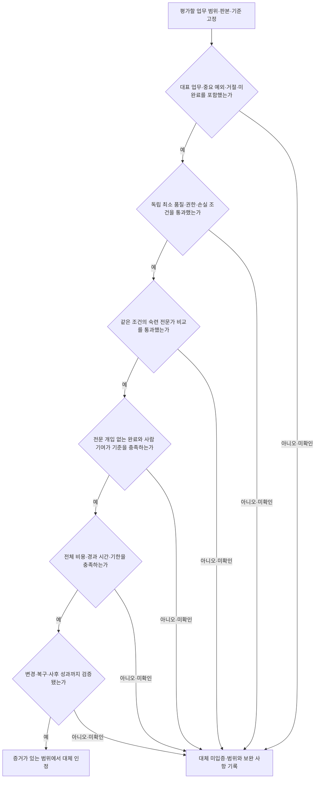
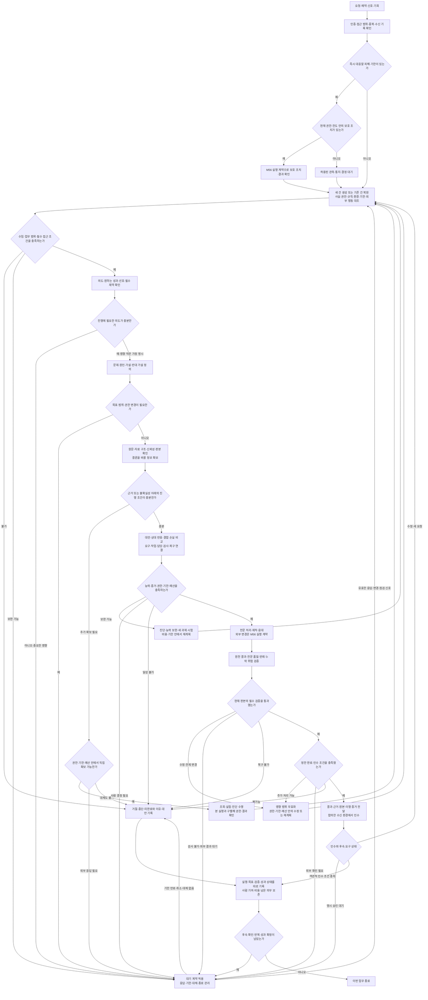
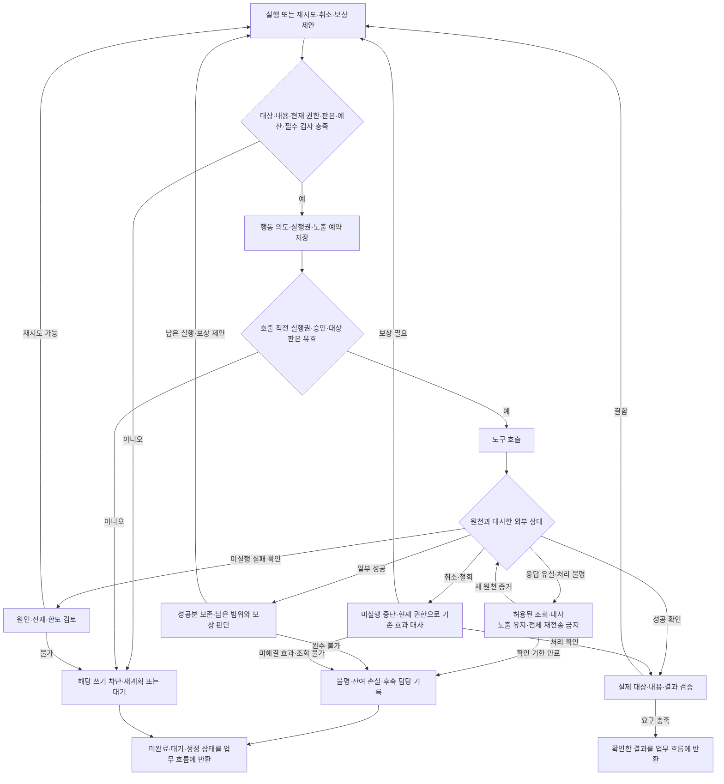
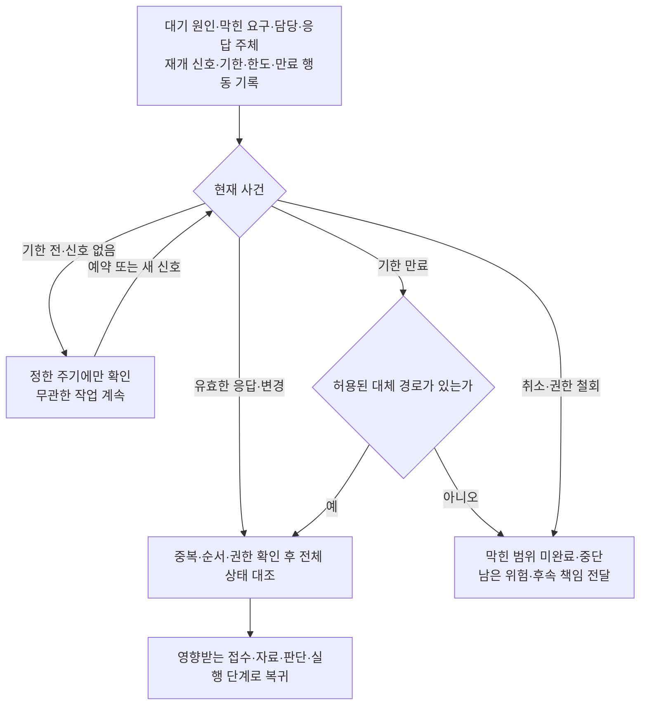

# 전문 AI 에이전트 정의

## 목표 ✅

20년차 인간 전문가를 대체할 수 있는 전문 AI 에이전트를 만든다.

---

### 원하는 것 ✅

1. 인간 전문가를 고용하는 대신 전문 AI 에이전트에게 업무를 맡긴다
   - 20년차만큼 전문성과 성과가 있어야 믿고 맡길 수 있다
   - 사람은 맡기고 결과를 받을 뿐, 중간에 손대지 않는다
   - 사람의 결정이 필요한 경우는 되돌릴 수 없는 행동·승인 조건·판단 불가·한도 초과·자격자 전속 행위다. 유효한 사전 위임은 재사용하고, AI가 할 수 있는 준비·대안 비교·기록·검증을 마친 뒤 필요한 결정을 받는다
   - 사실 질문·의뢰인의 선택·권한 행사와 전문 판단 보충·결과 수정을 구별한다. 정당하게 사람에게 넘겨도 사람이 해결한 부분을 AI의 독립 수행으로 세지 않는다. 불필요한 질문·승인 요청도 사람 부담에 포함한다
2. 온라인·컴퓨터 안에서 시작해 끝나는 일에 집중한다
   - 성과가 화면·문서·시스템·통신 안에서만 나는 전문가와 업무를 다룬다

---

### 원하지 않는 것 ✅

1. 역할놀이, 상담 챗봇, 단순 질의응답, 검색·요약만 해 주는 수준
2. 몸·현장·실물 조작이 있어야 성과가 나는 일 (건물 시공·조리·의료 시술·촬영·매장 운영)
   - 몸으로 직접 움직이는 로봇이 있어야 하는 일은 이번 범위 밖이다

---

## 인간 전문가 ✅

한 분야의 업무를 맡아 문제를 정의하고 판단·수행·검증에 책임을 지며, 그 업무에 맞는 성과를 내는 사람을 말한다. 목표 수준인 ‘20년차’는 관련 분야의 최근 실무와 성과가 확인된 숙련 전문가로 구체화한다. 경력 연수 하나로 능력을 확정하지 않는다.

| 조건 | 뜻 | 확인할 증거 |
|---|---|---|
| 전문 판단 | 조건·근거·대안·예외를 이해하고 이 상황에 맞는 결정을 한다 | 실제 의사결정과 버린 대안, 새로운 사실에 따른 판단 변경 |
| 수행 책임 | 맡은 범위의 작업과 결과를 직접 완성하거나 필요한 협력을 책임 있게 조정한다 | 산출물·시스템 상태·평가 의견·상호작용·인수 기록 |
| 목적에 맞는 성과 | 의뢰인이 필요로 하는 품질·시간·비용·권리·후속 결과를 충족한다 | 같은 조건의 비교 결과, 실패·지연·사람 기여까지 포함한 성과 |

판단·감사 의견·상담·교육·채용·전략도 그 자체가 맡긴 업무의 결과일 수 있다. 문서나 물건을 만든다는 이유만으로 전문가가 되거나, 조언과 평가를 한다는 이유로 전문가에서 제외되지 않는다. 역할명보다 실제로 책임지는 업무를 본다.

처음 보는 문제에도 원리·근거·작은 실험으로 접근하되, 목표가 모순되거나 핵심 사실을 확보할 수 없는 경우에는 가능한 대안과 한계를 밝혀야 한다. 모든 사건에서 원하는 결과를 보장한다는 뜻은 아니다.

---

### 초보와 전문가를 가르는 것 ✅

```mermaid
%%{init: {"flowchart": {"wrappingWidth": 640, "curve": "basis", "nodeSpacing": 45, "rankSpacing": 55, "padding": 14, "useMaxWidth": true}, "themeVariables": {"fontSize": "15px"}} }%%
flowchart LR
    A["보기<br/>문제·빠진 것·예외를 짚는다"]:::main
    B["알기<br/>정석·모르는 것·자료를 안다"]:::main
    C["정하기<br/>예측하고 방법·순서를 고른다"]:::main
    D["하기<br/>처음 보는 상황에서도 해낸다"]:::main
    E["끝내기<br/>검증하고 멈출 때를 안다"]:::main
    A --> B --> C --> D --> E
    classDef main fill:#dbeafe,stroke:#2563eb,stroke-width:2px,color:#17314f
    classDef stop fill:#fee2e2,stroke:#dc2626,stroke-width:2px,color:#7f1d1d
    classDef back fill:#ffedd5,stroke:#ea580c,stroke-width:2px,color:#7c2d12
    classDef store fill:#e5e7eb,stroke:#6b7280,stroke-width:2px,color:#1f2937
    classDef good fill:#dcfce7,stroke:#16a34a,stroke-width:2px,color:#14532d
    classDef note fill:#fef9c3,stroke:#ca8a04,stroke-width:2px,color:#713f12
```

#### 1. 보기 ✅

| 항목 | 초보 | 8년차 | 20년차 |
|------|------|--------|--------|
| 문제 보기 | 말한 그대로를 문제로 본다 | 말 뒤의 진짜 문제와, 말한 사람도 모르는 문제까지 짚는다 | 지금 문제가 앞으로 어떤 문제를 낳을지까지 보고, 풀 문제와 안 풀 문제를 정한다 필요하면 문제를 다시 정의해 판 자체를 바꾼다 |
| 빠진 것 보기 | 눈앞에 있는 것만 본다 | 있어야 하는데 없는 것 (안 낸 서류, 안 나온 숫자, 안 한 말) 을 알아본다 | 없는 것이 왜 없는지 (잊었나, 숨겼나, 없는 게 정상인가) 까지 읽고, 그것이 결과를 뒤집을지 가늠한다 |
| 예외·함정 | 예외를 만나면 멈추거나 틀린다 | 이 일에서 자주 터지는 예외와 함정을 미리 알고, 작은 이상 신호에서 알아챈다 | 예외가 생기는 원리를 알아 처음 보는 예외도 예측한다 함정을 피하는 데서 그치지 않고, 상대의 함정과 예외 조항을 내 쪽에 유리하게 이용한다 |

#### 2. 알기 ✅

| 항목 | 초보 | 8년차 | 20년차 |
|------|------|--------|--------|
| 아는 것 | 책에서 배운 정석 (교과서에 나오는 기본 방법) 만 안다 | 정석이 어디까지 통하고 어디서부터 안 통하는지, 그 이유까지 안다 | 정석이 왜 그렇게 만들어졌는지 원리와 내력 (그 방법이 굳어지기까지의 사정) 을 알아, 정석이 없는 처음 보는 일도 원리에서 풀어낸다 |
| 모르는 것 | 모른다는 것도 모른 채 그냥 나간다 | 자기가 모르는 지점을 알고, 거기서 확인하거나 물어본다 | 이 분야에서 아직 아무도 모르는 것과 다들 안다고 착각하는 것을 안다 누구에게 무엇을 물어야 답이 나오는지 안다 |
| 자료 대하기 | 받은 자료를 그대로 믿는다 | 자료가 틀리기 쉬운 곳을 알고 원문과 대조한다 | 자료가 만들어진 사정 (누가 왜 이렇게 썼는지) 을 읽어 자료가 말하지 않는 것을 알아내고, 자료 없이도 어디까지 판단해도 되는지 안다 |

#### 3. 정하기 ✅

| 항목 | 초보 | 8년차 | 20년차 |
|------|------|--------|--------|
| 결과 예측 | 해 봐야 안다 | 시작 전에 결과와 부작용을 머릿속으로 끝까지 돌려 본다 | 몇 달·몇 년 뒤의 2차·3차 영향까지 내다보고, 그 예측이 얼마나 확실한지도 안다 그래서 예측이 빗나가도 살아남을 길을 미리 마련해 둔다 |
| 상대 예측 | 내가 할 일만 본다 | 상대 (고객, 상대방, 심사관, 시장) 가 어떻게 움직일지 미리 읽고 대비한다 | 상대가 움직일 방향을 미리 만든다 상대·기관·시장이 무엇을 얻고 무엇을 잃는지 (이해관계) 와 버릇을 알아 협상과 판을 설계한다 |
| 방법 고르기 | 아는 방법 하나로 다 한다 | 여러 방법의 비용과 위험을 재서 이 상황에 맞는 것을 고른다 | 있는 방법으로 안 되면 방법을 새로 만들거나 섞고 순서를 다시 짠다 남들이 못 보는 길을 안다 |
| 우선순위 | 시킨 순서나 눈에 띄는 순서대로 한다 | 성과를 가르는 것부터 하고 나머지는 뒤로 미룬다 | 지금 성과와 나중 성과, 이 건과 다른 건 사이의 우선순위까지 정한다 급해 보이는 일이 왜 급하지 않은지 안다 |
| 버리기 | 시킨 것을 다 한다 | 안 해도 될 일과 하면 안 될 일을 가려 빼고, 왜 빼는지 말해 준다 | 일 자체를 받을지 말지, 이 방식 전체를 버리고 다시 짤지 정한다 이미 들인 돈과 시간이 아까워도 버린다 |
| 정보가 모자랄 때 | 다 갖춰질 때까지 기다리거나, 아무렇게나 가정한다 | 모자란 채로도 판단하되 가정을 드러내고, 틀리면 되돌릴 길을 남긴다 | 어떤 정보는 모자라도 결론이 안 바뀌는지 알아서, 그런 정보는 기다리지 않는다 결론을 바꿀 정보만 골라 가장 싸고 빠르게 얻어 낸다 |
| 되돌릴 수 없는 것 | 모든 결정을 같은 무게로 다룬다 | 되돌릴 수 없는 결정을 알아보고, 그것만은 느리게 확인하고 한다 | 되돌릴 수 없는 큰 결정을 되돌릴 수 있는 작은 결정 여러 개로 쪼개 짠다 큰 손실이 나는 선을 먼저 정해 두고 그 안에서만 움직인다 |

#### 4. 하기 ✅

| 항목 | 초보 | 8년차 | 20년차 |
|------|------|--------|--------|
| 처음 보는 상황 | 배운 대로 안 되면 멈추거나 아무거나 한다 | 잠깐 당황하지만 비슷한 경험을 끌어와 길을 찾고, 되돌릴 수 있는 것부터 해 본다 | 낯선 조건을 빨리 구별하고 원리·증거·제한된 실험으로 새 방법을 찾는다 가능한 범위는 끝까지 처리하며, 달성 불가·근거 부족은 대안과 영향까지 설명한다 |
| 결과물 수준 | 내가 보기에 다 됐으면 끝낸다 | 받는 사람이 손대지 않고 그대로 쓸 수 있는 수준을 알고 거기까지 맞춘다 | 받는 사람이 그것으로 다음에 무엇을 할지까지 보고 거기에 맞춰 만든다 무엇을 빼야 좋아지는지 알기 때문에 결과물이 짧고 분명하다 |

#### 5. 끝내기 ✅

| 항목 | 초보 | 8년차 | 20년차 |
|------|------|--------|--------|
| 검증 | 한 번 훑고 낸다 | 어디서 틀리기 쉬운지 알고 그 자리를 다른 길로 다시 확인한다 | 내 결론이 틀렸다면 어디서 틀렸을지 일부러 반대편에 서서 공격해 본다 상대·심사관·시장이 어떻게 무너뜨릴지를 그려 보며 검증한다 |
| 멈추기 | 언제 끝인지 몰라 계속 만지거나 일찍 놓는다 | 충분한 지점과 더 가면 위험한 지점을 안다 | 언제 밀어붙이고 언제 물러날지 판을 읽고 정한다 잘되고 있을 때도 멈춰야 할 때를 안다 |
| 실패 경험 | 같은 실수를 다시 한다 | 자기와 남의 실패에서 배워 같은 실수를 안 하고, 실패했을 때 수습하는 법도 안다 | 실패가 나는 조건을 알아 그 조건 자체를 미리 없앤다 실패해도 큰 손실은 안 나게 판을 짜고, 실패에서 남이 못 보는 기회를 본다 |

---

### 종류 ✅

아래 166개는 대상 직무 목록이다. 실제 대체 단위는 각 직무의 온라인 과업이며, 현장·실물 수행과 자격 행위 및 외부 결정의 의존은 별도로 정한다. 표의 성과 지표는 후보이며 독립적인 목표·품질·인간 비교를 대신하지 않는다. 숫자를 높이는 것이 항상 좋은 성과는 아니므로 비용·손실·오류·장기 결과를 함께 본다. 업계 평균·관할별 수치·임의의 공통 합격선은 비교 조건과 출처가 확인된 업무 평가에만 사용한다. [직무별 범위 대장](docs/definition/occupation-scopes.csv)에서 현재 포함·제외 범위와 미검증 상태를 확인한다.

#### 위임형 — 건 단위로 외부에 통째로 맡김 ✅

| 분야 | 직종 | 주 고객 | 목표 | 성과 |
|------|------|--------|------|------|
| 법률 (소송) | 변호사 (민사·상사 송무) | 돈·계약·손해를 두고 남과 다투게 된 개인·회사 — 받을 돈은 받아 내고 물어 줄 돈은 줄이고 싶음 | 소송·분쟁에서 의뢰인이 잃는 것은 가장 적게, 얻는 것은 가장 많게 함 이길 수 없는 싸움은 시작 전에 알려 주고 합의로 끝냄 | 유리한 종결률 (이긴 것 + 유리한 합의 + 각하. 각하는 상대가 낸 소송이 재판 조건을 못 갖춰 내용도 안 보고 돌려보내진 것) ÷ 종결한 건 수 걸린 돈이 큰 건에 무게를 더 준 유리 종결률 (큰 건 몇 개 지면 작은 승소 여럿이 무의미) 신청·항소 인용률 (내가 낸 신청을 재판부가 받아 준 비율) 의뢰인 추천 의향 (NPS) |
| 법률 (소송) | 변호사 (형사 변호) | 수사·재판을 받게 된 사람 — 구속과 처벌을 피하거나 가장 가볍게 끝내고 싶음 범죄 피해자 — 피해를 인정받고 처벌·배상을 받아 내고 싶음 | 수사 단계에서 끝내거나 (불송치는 경찰이 검찰로 안 넘김, 불기소는 검찰이 재판에 안 넘김), 재판에서 무죄·집행유예 (형은 정하되 일정 기간 사고 없으면 안 살게 해 줌)·가벼운 형으로 막음 구속을 막고 풀려나게 함 | 불송치·불기소·무혐의 (죄를 지은 게 아니라고 결론남) 비율 구속영장 기각 (가두라는 요청을 판사가 물리침)·구속적부심 (가둔 게 맞는지 다시 따져 달라는 신청)·보석 (보증금 내고 풀려남) 인용률 구형 (검사가 요구한 형벌) 대비 선고형 (판사가 실제로 내린 형벌) 감경폭, 집행유예·무죄 비율 피해자 대리 시 합의금·처벌 결과 |
| 법률 (소송) | 변호사 (가사·상속) | 이혼·양육·상속·유언 문제를 겪는 가족 — 재산과 아이를 지키면서 다툼을 짧게 끝내고 싶음 | 재산 분할·위자료·양육권을 유리하게 받아 내고, 상속 다툼을 가족 관계가 덜 망가지게 끝냄 | 재산분할·위자료 청구액 대비 인정액 양육권·면접교섭 (같이 안 사는 부모가 아이를 정기적으로 만나는 권리) 목표 달성률 조정 (법원이 중간에서 서로 조건을 맞춰 주는 절차)·합의로 끝낸 비율과 걸린 기간 상속 분쟁의 유리 종결률 |
| 법률 (소송) | 변호사 (행정·조세 송무) | 정부·지자체·세무서의 처분 (인허가 (사업을 해도 된다는 나라의 허락) 거부, 영업정지, 과징금 (법을 어긴 회사에 물리는 돈), 세금 부과) 을 받은 개인·회사 — 처분을 취소·감경받고 그동안 영업이 멈추지 않길 원함 | 부당한 처분을 취소시키거나 줄이고, 재판 중에 영업이 멈추지 않게 함 | 행정심판 (재판까지 가기 전에 행정기관에 다시 판단해 달라고 하는 절차)·행정소송 인용률 집행정지 인용률 (처분 효력을 재판 끝날 때까지 멈춤) 취소·감경된 처분 금액 |
| 법률 (소송) | 변호사 (도산·회생) | 빚을 갚을 수 없게 된 회사·개인 — 사업을 살리거나, 못 살리면 빚을 정리하고 다시 시작하고 싶음 채권자 — 최대한 회수하고 싶음 | 회생 (빚을 줄이고 나눠 갚으면서 사업을 계속하는 절차) 으로 사업을 살리거나, 파산·면책 (남은 빚을 법으로 없애 줌) 으로 빚을 정리해 다시 시작하게 함 채권자 대리 시 회수액을 최대로 함 | 회생 개시 (절차를 시작해도 된다는 결정)·인가 (갚을 계획을 법원이 승인) 비율 승인된 변제율 (전체 빚 중 갚기로 한 비율) 과 그대로 갚아 낸 비율 면책 인용률 채권자 대리 시 회수율 |
| 법률 (자문) | 변호사 (기업 자문) | 계약·규제·노무 (직원 채용·급여·해고 같은 노동 문제)·개인정보 문제가 늘 생기는 회사 — 나중에 분쟁이나 제재 (감독기관이 내리는 벌) 로 안 번지게 미리 막고, 사업이 안 멈추게 빨리 답을 얻고 싶음 | 계약·거래가 나중에 분쟁이나 제재로 번지지 않게 막음 사업이 막히지 않게 빠르게 답을 줌 | 자문한 계약에서 난 분쟁·손실 건수 계약 검토에 걸린 날수 고객 유지율 (다음 해에도 맡기는 비율) |
| 법률 (자문) | 변호사 (M&A·투자 거래) | 회사를 사고팔거나 투자를 주고받는 회사·투자자 — 거래는 깨지 않으면서 숨은 위험은 안 떠안고 조건은 유리하게 하고 싶음 | 거래를 성사시키되 진술·보증 (파는 쪽이 회사에 이런 문제는 없다고 계약서에 못 박는 약속)·손해배상 조항으로 위험을 상대에게 넘김 | 거래 성사율 (계약 뒤 실제 종결) 종결 후 진술·보증 위반으로 난 손실 건수 협상에서 우리 쪽 요구대로 넣은 핵심 조항 비율 서명까지 걸린 기간 |
| 법률 (등기·행정) | 법무사 (등기) | 집·건물을 사고팔거나 담보 대출을 받는 개인·회사, 법인을 세우거나 바꾸는 회사 — 등기 (집·건물의 주인이 누구고 빚이 얼마나 걸려 있는지 나라 장부에 적는 일) 를 한 번에 틀림없이 끝내고 싶음 | 등기·법인 서류를 한 번에 틀림없이 접수시킴 | 보정 명령 (서류가 틀렸으니 고쳐 오라는 지시)·각하 비율 (기한 안에 못 고치면 통째로 반려됨) 접수부터 완료까지 걸린 날수 등기 사고 (빠뜨림, 순위 실수 — 담보를 잡는 차례가 뒤로 밀림) 건수 |
| 법률 (등기·행정) | 법무사 (개인회생·파산) | 빚을 감당 못 하는 개인 — 법원 절차로 빚을 줄이거나 없애고 싶음 | 개인회생·파산 신청을 한 번에 통과시켜 빚을 줄임 | 개시·인가율 보정 명령 횟수 탕감된 채무 비율 인가 뒤 변제 이행률 |
| 법률 (등기·행정) | 행정사 (인허가·지원금) | 사업을 열거나 넓히려는 사람·회사 — 인허가와 정부 지원금을 한 번에 통과시키고 싶음 | 인허가·정부지원금을 한 번에 통과시킴 | 승인율 보정 요구 횟수 받아 낸 지원금액 |
| 법률 (등기·행정) | 행정사 (출입국·비자) | 한국에 오거나 머물려는 외국인, 외국인을 채용하려는 회사 — 비자·체류 자격을 거절 없이 기한 안에 받고 싶음 | 비자·체류 자격 (한국에 머물 수 있는 자격)·귀화 (한국 국적을 새로 얻는 것) 를 거절 없이 기한 안에 받게 함 | 승인율·거절률 처리 기간 보완 요구 횟수 |
| 법률 (등기·행정) | 공증인 | 유언·계약·차용 문서를 만드는 개인·회사 — 나중에 다툼이 안 생기게 법적 힘을 붙이고 싶음 | 문서에 나중에 다툼이 안 생기도록 법적 힘을 붙여 줌 | 공증 (자격 있는 사람이 문서가 진짜라고 확인해 주는 일) 이 무효가 되거나 흠이 난 건수. 일부러 그랬거나 조금만 신경 썼으면 안 틀렸을 큰 실수 (중과실) 면 손해배상 책임을 진다 서류 검증 오류율 갖춰야 할 조건을 빠뜨린 건수 (유언 공증에 증인이 안 온 경우 등) |
| 지식재산 | 변리사 (특허) | 기술·제품을 개발한 회사·연구자 — 남이 못 베끼게 권리를 넓게 잡아 등록하고 싶음 | 권리를 넓게 잡아 등록시키고 남이 못 베끼게 지킴 | 권리화 목표에 맞는 등록 결과·권리 범위 출원 난도·관할을 맞춘 비교 보정·의견 회신의 적정성·기한 준수 |
| 지식재산 | 변리사 (상표·디자인) | 브랜드·제품 외형을 가진 회사·창업자 — 이름과 모양을 남이 못 쓰게 먼저 잡고 싶음 | 브랜드 이름·로고·제품 모양을 거절 없이 등록시키고 침해를 막음 | 등록률 거절 이유 (먼저 등록된 상표와 비슷함 등) 사전 회피율 침해 경고·대응 결과 |
| 지식재산 | 변리사 (심판·분쟁) | 남의 권리와 부딪힌 회사 — 남의 권리는 무효로 만들거나 피해 가고, 내 권리 침해는 막고 싶음 | 남의 권리는 무효로 만들거나 피해 가게 하고 내 권리는 지킴 | 거절결정불복 (특허청이 거절한 걸 다시 봐 달라는 신청)·무효심판 (남이 이미 등록한 권리를 없애 달라는 신청) 인용률 권리범위확인심판 (내 권리가 상대 제품까지 미치는지 가려 달라는 신청) 승률 침해 소송 결과와 손해배상액 |
| 세무 | 세무사 (신고·기장) | 사업자·법인 — 세금을 법 안에서 가장 적게, 기한 안에, 조사 위험 없이 내고 싶음 | 세금을 법 안에서 가장 적게, 기한 안에, 조사 위험 없이 신고함 | 신고·세무조정 정확성 수정신고·가산세의 원인과 귀책 기한 준수·적법한 세액·고객의 총비용 |
| 세무 | 세무사 (상속·증여·가업 승계) | 재산이 많은 개인·가족, 가업을 물려주려는 오너 — 재산을 다음 세대에 넘길 때 세금을 가장 적게 내고 싶음 | 상속·증여·가업 승계를 미리 설계해 세금을 법 안에서 가장 적게 냄 | 설계 전후 세액 차이 가업 상속 공제 (조건을 채우면 세금 매길 금액에서 빼 주는 제도) 같은 예외 혜택을 적용받은 비율 혜택을 받은 뒤 지켜야 할 조건을 어겨 세금을 다시 물어낸 (추징) 건수 |
| 세무 | 세무사 (조사·불복) | 세무조사를 받거나 세금을 부당하게 부과받은 사업자·개인 — 추징을 줄이고 잘못 매긴 세금은 돌려받고 싶음 | 세무조사에서 추징을 줄이고, 부당한 과세는 되돌림 | 사실·법리·증거 대응의 품질 비슷한 쟁점·난도의 처분·불복 결과 총 추징·분쟁 비용과 기간 |
| 세무 | 기장 대행 | 장부를 직접 쓸 여력이 없는 작은 사업자 — 장부가 틀림없이 정리돼 신고와 경영 판단에 바로 쓰이길 원함 | 장부를 매달 정확히 기록해 신고와 경영 판단의 바탕을 만듦 | 장부 정확도 월 마감 기간·재작업 원천 대사와 미확인·미결 항목의 적절한 처리 |
| 회계·관세 | 회계사 (감사) | 재무제표 (한 해 동안 돈이 얼마나 들어오고 나갔는지, 재산과 빚이 얼마인지 적은 표) 를 밖에 보여 줘야 하는 회사 (상장사, 투자·대출 받는 회사) — 숫자를 믿어도 된다는 도장을 받고 싶음 그 숫자를 믿고 돈을 넣는 투자자·은행 — 속지 않고 싶음 | 재무제표를 믿을 수 있게 만들어 투자·대출에 쓰이게 함 | 주장별 충분하고 적합한 증거와 의견 근거 중요 왜곡·기간귀속·추정의 검토 품질 후속 정정의 원인과 당시 이용 가능 정보에 따른 대응 적정성 |
| 회계·관세 | 회계사 (자문·실사) | 회사를 사거나 투자하려는 회사·투자자 — 사기 전에 숨은 빚과 진짜 값을 알고 싶음 | 회사를 사거나 투자하기 전에 실사 (장부와 속사정을 직접 뒤져 확인하는 일) 로 숨은 위험과 진짜 가치를 찾아냄 | 실사 때 못 찾고 나중에 드러난 빚·손실 건수 가치 평가액과 실제 거래가 차이 고객 유지율 |
| 회계·관세 | 관세사 | 수출입하는 회사 — 통관 (물건이 세관을 통과해 나라 밖으로 나가거나 안으로 들어오는 절차) 이 안 막히고 관세는 가장 적게 내고 싶음 | 통관을 막힘 없이, 관세는 법 안에서 가장 적게 냄 | 통관 지연·보류 비율 품목 분류 정확도 특혜관세 (나라끼리 맺은 자유무역협정 (FTA) 덕에 관세를 깎아 주는 것) 를 쓴 비율 환급·절감한 관세액, 추징 건수 |
| 노무 | 노무사 (자문·급여) | 직원을 둔 회사 — 뽑고 쓰고 내보내는 일이 법과 비용 양쪽에서 문제 안 되게 미리 챙기고 싶음 | 사람 뽑고 쓰고 내보내는 일이 법과 비용 양쪽에서 문제 안 되게 함 | 과태료·시정 명령 (잘못된 걸 고치라는 정부 지시) 건수 취업규칙 (회사가 정해 놓은 근무·급여 규칙)·임금 체계를 어겨서 더 나간 비용 노동청 진정 (부당한 일을 당했다고 신고하는 것)·고소 발생 건수 |
| 노무 | 노무사 (분쟁 대리) | 해고·징계·임금 체불로 다투게 된 회사와 근로자 — 노동위원회·노동청에서 이기고 싶음 | 부당해고·임금 체불 같은 분쟁에서 노동위원회·노동청·법원에서 이김 | 대리하는 당사자·쟁점·난도를 맞춘 판정 결과 화해 조건·회수액·분쟁 비용 절차·증거 대응 품질과 기한 준수 |
| 노무 | 노무사 (산재) | 일하다 다치거나 병든 근로자와 유족 — 산재로 인정받아 치료비·보상을 받고 싶음 | 산재 (일하다 다치거나 병든 것을 나라가 인정해 치료비·보상을 주는 제도) 로 인정받아 정당한 보상을 받게 함 | 산재 승인율 (특히 질병·과로로 생긴 건) 장해 등급 (몸에 남은 후유증이 얼마나 심한지 매기는 등급) 결정 결과 불승인 뒤 심사·재심사 인용률 |
| 부동산 | 공인중개사 (주거) | 집을 사고팔고 빌리려는 개인 — 원하는 조건의 집을 시세보다 좋은 값에, 탈 없이 계약하고 싶음 | 원하는 조건의 집을 찾아 사고팔거나 빌리는 계약을 탈 없이 성사시킴 계약 조건은 시세보다 좋게 함 | 계약 성사율 (문의 대비 계약) 중개 사고 건수 (사고가 나면 중개사가 미리 들어 둔 보상금인 공제금을 청구하거나 소송으로 감) 시세 대비 계약 가격 재의뢰·소개 비율 |
| 부동산 | 공인중개사 (상가·빌딩) | 가게 자리를 찾는 사업자, 건물을 사고파는 투자자 — 장사가 될 자리, 수익 나는 건물을 권리 관계나 권리금 (앞 가게 주인에게 자리값으로 따로 주는 돈) 문제 없이 잡고 싶음 | 장사가 되는 자리와 수익 나는 건물을 시세보다 좋은 조건으로, 권리·권리금 문제 없이 계약함 | 계약 성사율 계약 뒤 임차인 (빌려서 장사하는 사람) 매출과 건물 공실 (빈 채로 놀리는 비율) — 자리 보는 눈 권리금·명도 (세입자를 내보내고 자리를 넘겨받는 일) 분쟁 건수 재의뢰·소개 비율 |
| 부동산 | 공인중개사 (토지·개발) | 땅을 사서 짓거나 개발하려는 개인·회사 — 원하는 용도로 쓸 수 있는 땅을 규제 문제 없이 사고 싶음 | 원하는 용도로 개발 가능한 땅을 규제·권리 문제 없이 시세보다 싸게 계약함 | 계약한 뒤에 개발이 안 되는 땅으로 드러난 건수 (용도 제한, 규제, 들어가는 도로 없음) 시세 대비 계약 가격 계약 성사율 |
| 부동산 | 경매사 | 시세보다 싸게 부동산을 사고 싶은 투자자·실수요자 — 권리 문제를 떠안지 않고 낙찰받고 싶음 | 권리 문제 없는 물건을 시세보다 싸게 낙찰받게 함 | 권리 분석 사고 (떠안는 권리를 놓침) 건수 시세 대비 낙찰가 입찰 대비 낙찰 성공률 명도 걸린 기간 |
| 부동산 | 감정평가사 | 담보·보상·소송·세금 때문에 자산 값이 필요한 은행·정부·개인 — 누구에게 내놔도 안 뒤집히는 값을 원함 | 부동산·자산의 가치를 근거 있게 정확히 매김 (현장 사진·실측은 밖에 맡기고 자료 분석·가치 산정·평가서 작성을 맡음. 서명은 자격자 전속) | 다른 평가사·실거래가와의 격차 이의 제기·재평가 요청 건수 평가서가 소송·과세에서 뒤집힌 건수 |
| 건축·기술 | 건축사 (주택·소규모 건축) | 집·작은 건물을 짓거나 고치려는 개인·소규모 건축주 — 법·예산 안에서 허가를 한 번에 받고 원하는 건물을 갖고 싶음 | 법·예산·용도에 맞는 설계로 허가를 한 번에 통과하고 원하는 건물을 완성함 | 허가 보완 횟수와 걸린 날수 설계 변경률 (변경 금액 ÷ 계약 금액, 낮을수록 좋음) 예산 대비 실제 공사비 차이 준공 (공사를 다 끝내고 검사까지 마침) 후 하자·민원 건수 |
| 건축·기술 | 건축사 (대형·공공 건축) | 큰 건물·공공시설을 짓는 시행사 (땅을 사고 돈을 대서 건축 사업을 벌이는 회사)·기관 — 심의·허가를 통과하고 공사비·일정을 지키면서 완성하고 싶음 | 심의 (전문가 위원회가 설계를 미리 검토해 통과시키는 절차)·허가를 통과하고 설계 변경과 공사비 초과 없이 완성함 | 심의·허가 통과 횟수와 걸린 날수 설계 변경률 예산 대비 실제 공사비 차이 준공 후 하자·민원 건수 |
| 건축·기술 | 기술사 (구조) | 건물·다리·공장을 짓거나 고치는 건축주·시공사 — 무너지지 않으면서 재료는 덜 쓰는 설계를 원함 | 안전하고 법에 맞으면서 재료가 덜 드는 구조를 설계·검토함 | 구조 심의·검토 통과율 준공 후 구조 하자·사고 건수 검토로 줄인 자재비 |
| 건축·기술 | 기술사 (기계·전기 설비) | 공장·건물·데이터센터를 짓거나 운영하는 회사 — 설비가 멈추지 않고 전기·에너지 비용이 덜 들기를 원함 | 설비가 안 멈추고 법에 맞으며 에너지 비용이 덜 들게 설계·검토함 | 검토 통과율 가동 후 설비 고장·사고 건수 줄인 에너지·운영 비용 |
| 보험 | 보험설계사 (생명·장기) | 사망·큰 병·노후를 대비하려는 개인 — 꼭 필요한 보장만 적은 보험료로 오래 유지하고 싶음 | 필요한 위험만 가장 적은 보험료로, 오래 유지되게 보장함 | 13회차·25회차 계약 유지율 필요 보장과 비용의 적합성 불완전판매·보장 공백·민원의 원인 |
| 보험 | 보험설계사 (손해·자동차) | 차·집·가게 사고에 대비하려는 개인·사업자 — 사고 났을 때 실제로 보상받고 보험료는 낮게 내고 싶음 | 사고 났을 때 실제로 보상되게, 보험료는 낮게 함 | 갱신율 (만기 때 다시 계약) 장기손해보험 13회차·25회차 유지율 보상 거절·분쟁 건수 |
| 보험 | 보험계리사 | 보험 상품을 만들고 파는 보험사 — 상품이 손해 없이 유지되고 감독 기준을 넘기길 원함 | 보험 상품이 손해 없이 유지되게 보험료와 준비금 (나중에 보험금 줄 몫으로 미리 쌓아 두는 돈) 을 계산함 | 가정·모형의 타당성과 예측 오차 준비금 추정의 적정성·변동 원인 상품 수익성과 불리한 조건의 손실 |
| 보험 | 손해사정사 (재물·배상) | 화재·수해·사고로 재산이 상하거나 남에게 물어 줘야 할 개인·회사 — 손해액을 근거 있게 인정받아 정당한 보험금을 받고 싶음 | 재산 손해·배상 책임 금액을 근거 있게 산정해 정당한 보험금을 받게 함 (현장 사진·실측은 밖에 맡기고 손해액 산정·근거 문서·보험사 협의를 맡음) | 근거에 맞는 손해 산정의 정확성 약관·보상 범위 적용 품질 분쟁·민원·처리 기간과 실제 회수 결과 |
| 보험 | 손해사정사 (신체·질병) | 다치거나 병들어 보험금을 청구하는 개인 — 장해·후유증을 정당하게 인정받고 싶음 | 장해·후유증·진단을 근거 있게 입증해 보험금을 받게 함 | 청구액 대비 지급액 장해 등급·후유증 인정 결과 지급 거절 뒤 뒤집은 건수 |
| 자산·대출 | 투자자문사 | 목돈을 가진 개인·법인 — 정한 위험 안에서 자산을 불리고 싶음 | 정한 위험 안에서 고객 자산을 불림 | 목적·투자 기간·위험을 맞춘 벤치마크 비교 비용 후 수익·낙폭·유동성 투자정책·권한·위험 한도 준수 |
| 자산·대출 | 재무설계사 | 집·교육·은퇴 같은 인생 목표에 돈을 맞추고 싶은 개인·가족 — 계획대로 목표를 이루고 싶음 | 집·교육·은퇴 같은 인생 목표에 맞게 돈 계획을 세워 달성시킴 | 재무 목표 달성·현금흐름 안정성 위험과 비용을 고려한 순자산 변화 계획 이행·고객의 실제 부담 |
| 자산·대출 | 대출상담사 (주택·개인) | 집을 사거나 급전이 필요한 개인 — 가장 좋은 조건의 대출을 가장 빨리 받고 싶음 | 가장 좋은 조건의 대출을 가장 빨리 승인받게 함 | 승인율 (신청 대비 승인) 신청한 사람 중 실제로 돈까지 받은 비율 (풀스루율) 시장 대비 금리·한도 조건 처리 기간 |
| 자산·대출 | 대출상담사 (사업자·기업) | 운영 자금·시설 자금이 필요한 사업자 — 보증·담보를 엮어 한도는 크게, 금리는 낮게, 빨리 받고 싶음 | 보증 (기관이 대신 갚아 주겠다고 서 주는 것)·정책자금 (정부가 낮은 금리로 빌려주는 돈)·담보를 엮어 가장 큰 한도를 가장 낮은 금리로 승인받게 함 | 승인율·한도 달성률 시장 대비 금리 보증·정책자금을 엮은 건수 처리 기간 |
| 진료·약 | 의사 (만성질환) | 혈압·당뇨 같은 병을 오래 안고 사는 환자 — 수치를 잡아 합병증 없이 살고 싶음 | 혈당·혈압 같은 수치를 목표 안에 오래 유지해 합병증을 막음 | 대상 질환·환자 조건에 맞는 목표 달성 진료 판단·설명·추적의 품질 이상 반응·합병증·오진·진단 지연의 원인 |
| 진료·약 | 의사 (정신건강) | 우울·불안·중독·수면 문제로 일상이 무너진 환자 — 일상을 되찾고 재발하지 않기를 원함 | 증상을 줄여 일상을 되찾게 하고 재발과 위기를 막음 | 증상 척도 (증상이 얼마나 심한지 점수로 재는 검사) 개선율 재발·재입원율 자해·위기가 일어난 건수 치료 중단율 |
| 마음·몸 | 심리상담사 (개인) | 불안·우울·대인관계 문제로 힘든 성인 — 마음의 문제를 줄여 일상을 되찾고 싶음 | 마음의 문제를 줄여 일상을 되찾게 하고 그 상태를 유지시킴 | 타당한 척도와 목표에 따른 변화 개입의 적합성·관계·생활 기능 중도 탈락·부작용·종결 후 유지 |
| 마음·몸 | 심리상담사 (아동·청소년) | 아이의 정서·행동·학교 문제로 걱정하는 부모와 아이 — 아이가 나아지고 가정·학교에 잘 적응하길 원함 | 아이의 정서·행동 문제를 줄이고 가정·학교 적응을 도우며 부모의 대응도 바꿈 | 행동·정서 척도 개선 학교 적응 (등교, 또래 관계) 변화 부모 보고 개선율 중도 탈락률 |
| 마음·몸 | 심리상담사 (부부·가족) | 갈등·이혼 위기에 놓인 부부·가족 — 관계를 회복하거나, 덜 상처받고 정리하고 싶음 | 관계 갈등을 줄여 관계를 회복시키거나 정리 과정을 덜 아프게 함 | 관계 만족도 척도 개선 이혼·별거로 간 비율 (회복 목표 사례) 갈등 재발률 |
| 마음·몸 | 영양사 | 체중·혈당·콜레스테롤 수치를 식단으로 잡고 싶은 사람, 병 때문에 식단이 필요한 환자 — 지킬 수 있는 식단으로 수치를 바꾸고 싶음 | 식단으로 체중·혈당 같은 건강 수치를 개선함 | 개인 목표·상태에 맞는 영양 섭취와 식단 실천 추적 시점별 관련 지표·생활 기능 변화 비용·접근성·부작용과 유지 가능성 |
| 언어 | 번역가 (산업·법률 문서) | 계약서·매뉴얼·특허 문서를 다른 나라에 내야 하는 회사 — 틀린 한 단어로 사고가 안 나게 정확하길 원함 | 원문의 뜻을 정확하게, 용어를 일관되게, 쓰임새에 맞게 옮김 | 오류 종류·심각도·목적에 맞춘 번역 품질 오역·용어 불일치·중요 의미 누락 형식·편집 기능 보존·납기 |
| 언어 | 번역가 (출판·문학) | 외국 책을 내려는 출판사 — 원문의 결·재미가 살아 읽히고 팔리길 원함 | 원문의 결·문체를 살려 끝까지 읽히게 옮김 | 독자 평점·완독 반응 판매 부수 편집자 수정 요청 건수 |
| 언어 | 번역가 (영상·게임 현지화) | 영상·게임을 해외에 내는 제작사·플랫폼 — 자막·대사가 자연스럽고 글자 수·타이밍에 맞길 원함 | 대사의 뜻과 말맛을 살리면서 글자 수·타이밍·문화 차이에 맞춤 | 시청자·플레이어 번역 불만 건수 글자 수·타이밍 규격 위반 건수 납기 준수율 |
| 언어 | 통역사 (국제회의 동시통역) | 국제회의·학회·행사를 여는 기관 — 발표가 끊김 없이 실시간으로 전달되길 원함 | 발표와 동시에 뜻을 놓치지 않고 전달함 | 의미 일치도 (누락·추가·오역 건수) 전문용어 정확성 재지명률 (다음에도 부르는 비율) |
| 언어 | 통역사 (비즈니스·법정) | 협상·계약·수사·재판에서 말이 통해야 하는 회사·개인 — 뜻뿐 아니라 의도·뉘앙스까지 전달돼 불리해지지 않길 원함 | 협상·법정에서 양쪽 말의 뜻·의도·격식까지 정확히 전달함 | 의미 일치도 격식·뉘앙스 적절성 통역 오류로 난 불이익 건수 재지명률 |
| 언어 | 카피라이터 | 광고·상세페이지로 사람을 움직여야 하는 회사 — 한 줄로 누르고 사게 만들고 싶음 | 읽는 사람을 한 줄로 움직여 누르고 사게 함 | 의도한 행동에 대한 문구의 효과 클릭·전환의 증분과 비용·이익 오해·허위 기대·브랜드 조건 위반 |
| IT 외주 | 외주 개발 (웹·앱) | 서비스·앱을 만들고 싶지만 개발팀이 없는 회사·창업자 — 예산·기간 안에 동작하는 결과물을 받고 출시 뒤 고장이 없길 원함 | 예산·기간 안에 동작하는 서비스를 완성해 출시하고 넘겨줌 | 일정·예산 준수율 넘겨받은 뒤 발견된 결함 건수 출시 후 가동률 (서비스가 안 멈추고 돌아간 시간 비율) 재의뢰 |
| IT 외주 | 외주 개발 (시스템 구축·SI) | 회사 업무 시스템 (ERP — 재무·재고·인사를 한 프로그램에서 관리하는 것, 그룹웨어 — 사내 메일·결재·일정 프로그램, 여러 시스템을 하나로 잇는 통합) 을 새로 놓거나 바꾸는 회사 — 업무가 멈추지 않고 새 시스템으로 넘어가길 원함 | 요구를 빠짐없이 반영해 기존 업무가 끊기지 않게 새 시스템으로 옮김 | 요구사항 반영률 전환 뒤 장애·업무 중단 건수 일정·예산 준수 검수 (맡긴 쪽이 결과물을 요구대로 됐는지 확인하고 받는 일) 통과 횟수 |
| 영상 제작 | 영상 제작자 (광고·홍보) | 광고·홍보 영상이 필요한 회사·기관 — 예산 안에서 알리거나 사게 하는 목적을 이루는 영상을 원함 | 예산·기간 안에 목적을 달성하는 영상을 완성함 (촬영은 밖에 맡기고 기획·연출·편집을 맡음) | 조회수·완주율 (영상을 끝까지 본 비율)·전환 같은 목적 지표 예산·일정 준수율 수정 횟수 |

---

#### 고용형 — 회사 안에서 직무를 상시로 맡김 ✅

| 분야 | 직종 | 주 고객 | 목표 | 성과 |
|------|------|--------|------|------|
| 경영·전략 | 경영기획 | 대표·경영진 — 회사 목표가 숫자 계획으로 쪼개져 달성되고 있는지 알고 관리하고 싶음 | 회사 목표를 숫자 계획으로 쪼개고 달성되게 관리함 | 계획 달성률 예측 오차 (계획 대 실제) 전략 과제 실행률 |
| 경영·전략 | 전략 | 대표·이사회 — 어디서 어떻게 이길지 정하고 자원을 그쪽에 몰고 싶음 | 어디서 어떻게 이길지 정하고 자원을 그쪽으로 몰아 줌 | 매출·점유율 성장률 선택한 사업의 영업이익률 (매출에서 물건값과 운영비를 빼고 남은 이익의 비율) 개선폭 전략 과제 달성률 |
| 경영·전략 | 사업개발 | 대표·사업부장 — 새 매출원 (신사업·제휴·판로) 이 필요함 | 새 사업·제휴·판로로 새 매출원을 만듦 | 신규 매출액 계약·제휴 건수와 규모 잠재 고객에서 계약으로 바뀐 비율 고객 획득 비용 (CAC) |
| 인사 | 인사 (평가·보상) | 경영진 — 잘한 사람이 보상받고 남게, 인건비는 성과에 맞게 쓰이길 원함 직원 — 공정하게 평가받고 싶음 | 평가·보상으로 성과 낸 사람이 남고 인건비가 성과에 맞게 쓰이게 함 | 핵심 인재 이직률 인건비 대비 성과 평가 공정성 인식 점수 보상 이의·분쟁 건수 |
| 인사 | 인사 (조직·인재개발) | 경영진·팀장 — 조직이 잘 굴러가고 사람이 성장하며 몰입하길 원함 | 조직 구조·문화·교육으로 사람이 성장하고 몰입하게 함 | 직원 만족·몰입 점수 내부 승진·핵심 직무 충원율 신입 1년 안 이탈률 교육 뒤 성과 변화 |
| 인사 | 채용 | 사람이 필요한 팀장·경영진 — 제때, 오래 남을 사람을 뽑고 싶음 | 필요한 사람을 제때, 오래 남을 사람으로 뽑음 | 직무 성과에 맞는 선발 품질 채용 기간·입사율·정착률 총비용·후보 경험·평가 기준의 일관성 |
| 재무·회계 | 회계 | 경영진·감사인 (회사 장부가 맞는지 검사하는 사람)·투자자 — 숫자가 정확하고 제때 나오길 원함 | 거래를 정확히 기록하고 결산 (한 기간의 장부를 마감해 숫자를 확정하는 일) 을 해서 숫자를 믿을 수 있게 함 | 결산 정확성·기간·보고 기한 결산 뒤 수정·정정의 원인과 중요도 증거·추정·연결 조정의 적정성 |
| 재무·회계 | 재무 | 대표·CFO (재무를 총괄하는 임원) — 돈이 모자라지 않게 계획하고 가장 싸게 조달하고 싶음 | 돈이 모자라지 않게 계획하고 가장 싸게 조달함 | 현금흐름 예측 정확도 조달 금리 (가중평균 자본 비용, WACC) 외상값 회수 기간 (DSO) 현금 부족 사태 건수 |
| 재무·회계 | 자금 | CFO·거래처 — 일별 현금이 끊기지 않고 지급이 밀리지 않길 원함 | 일별 현금이 끊기지 않게 하고 남는 돈은 굴림 | 지급 지연 건수 일별 현금 예측 오차 여유 자금 운용 수익 |
| 재무·회계 | 원가 | 경영진·사업부장 — 제품별 진짜 원가를 알아 이익 나는 데 집중하고 싶음 | 제품별 원가를 정확히 계산해 이익 나는 데 집중시킴 | 표준 원가와 실제 원가 차이 원가 절감액 제품별 마진 (팔아서 남는 몫) 정확도 |
| 재무·회계 | 세무 (사내) | 경영진 — 회사 세금을 법 안에서 적게, 신고 실수와 추징 (덜 낸 세금을 뒤늦게 물리는 것) 없이 내고 싶음 | 회사 세금을 법 안에서 가장 적게, 신고 실수와 추징 없이 냄 | 가산세·추징 건수와 금액 절세액 세무조사 결과 신고 기한 준수율 |
| 금융업 | 펀드매니저 (주식) | 돈을 맡긴 투자자·기관 — 정한 위험 안에서 시장보다 더 불리고 싶음 | 맡은 돈을 정한 위험 안에서 벤치마크 (비교 기준으로 삼는 시장 평균 수익률) 보다 더 불림 | 운용 목적·위험·기간을 맞춘 비용 후 성과 벤치마크 대비 수익·위험 낙폭·유동성·규정·환매 대응 |
| 금융업 | 펀드매니저 (채권) | 꾸준한 이자 수익을 원하는 연기금·보험사·개인 — 금리 변동과 부도 위험을 피하며 벤치마크를 넘고 싶음 | 금리·신용 위험을 관리하며 벤치마크보다 더 불림 | 벤치마크 대비 초과수익 듀레이션 (금리가 움직일 때 채권 값이 얼마나 흔들리는지 나타내는 값)·신용 위험 한도 준수 담은 채권의 부도 건수 |
| 금융업 | 대체투자 운용 (PE·부동산·인프라) | 큰돈을 오래 묻어 둘 수 있는 기관·자산가 — 상장 시장보다 높은 수익을 원함 | 사서 키워 비싸게 팔거나 꾸준한 현금흐름으로 목표 수익률을 달성함 | 내부수익률 (IRR)·투자 배수 (MOIC) 회수 (엑시트) 성공률 손실 난 투자 건수 |
| 금융업 | 애널리스트 (리서치) | 투자 판단을 해야 하는 펀드매니저·기관·개인 투자자 — 남보다 먼저, 맞는 판단 근거를 원함 | 기업·산업의 실적과 주가를 남보다 먼저, 맞게 내다봄 | 실적 추정 오차 투자의견 뒤 주가 방향 적중률 기관 투자자 평가 순위 |
| 금융업 | 트레이더 | 회사 (자기자본 — 회사가 굴리는 자기 돈) 와 주문을 맡긴 고객 — 한도 안에서 수익을 내고 주문은 가장 좋은 값에 체결되길 원함 | 한도 안에서 매매 수익을 내고 고객 주문을 최선 조건에 체결함 | 손익 (P&L) 한도 위반 건수 체결 품질 (시장가 대비 슬리피지 — 주문할 때 본 값과 실제로 사고팔린 값의 차이) |
| 금융업 | 여신심사 (개인) | 대출을 원하는 개인과 은행 — 갚을 사람에게는 빨리 빌려주고, 못 갚을 사람은 걸러내길 원함 | 갚을 사람에게만, 갚을 만큼만, 빨리 빌려줌 | 동일 위험 구성에서의 연체·손실 심사 정확성·기간·중요 누락 부적절한 거절·조건·설명 |
| 금융업 | 여신심사 (기업) | 자금이 필요한 회사와 은행 — 사업성·담보를 보고 갚을 회사에 빌려주고 부실은 막고 싶음 | 사업성과 상환 능력을 보고 부실 없이 빌려줌 | 동일 기업 위험 구성에서의 손실·회수 심사 품질·기간 조기 경보·현금·담보·조건의 적정성 |
| 금융업 | 리스크 관리 | 경영진·감독기관 — 손실이 한도 안에 묶이길 원함 | 손실 위험을 재고 한도 안에 묶음 | 한도 위반·위험 누락·전체 노출 가정·기간에 맞는 위험 예측과 실제 손실 비교 공통 충격·유동성·연쇄 손실 대응 |
| 금융업 | 보험 언더라이터 (인수 심사) | 보험사·설계사 — 위험에 맞는 보험료로 받되 손해 날 계약은 걸러내고 싶음 | 위험을 제대로 재서 받을 계약은 받고 손해 날 계약은 거름 | 인수한 계약의 손해율 심사 기간 고지 위반 (계약할 때 알려야 할 사실을 숨긴 것)·사기 적발률 |
| 금융업 | IB (인수·자금조달 주선) | 회사를 팔거나 사거나 상장·회사채 (회사가 돈을 빌리려고 찍어 파는 빚 문서) 로 돈을 모으려는 기업 — 가장 좋은 값과 조건으로 거래를 끝내고 싶음 | 거래를 좋은 값·조건으로 성사시킴 | 거래 성사율·규모 매각가·조달 조건 (시장 대비) 수수료 수익 |
| 법무 | 법무 (소송·분쟁) | 경영진·사업부 — 분쟁을 유리하게, 싸게, 빨리 끝내고 싶음 | 분쟁을 유리하게 끝내고 비용을 줄임 | 분쟁 유리 종결률과 처리 기간 소송·과징금 (법을 어겨서 나라에 무는 돈) 건수와 금액 외부 로펌 (변호사 사무소) 비용 절감액 |
| 법무 | 법무 (규제·컴플라이언스) | 경영진·현업 부서 — 법을 어기기 전에 막고 제재·유출 사고를 피하고 싶음 | 회사 활동이 법을 어기기 전에 막고 사고 나면 기한 안에 대응함 | 적용 의무·예외 판단의 정확성 위반·제재·중요 누락 관할·사건별 유효한 통지·신고 기한과 대응 품질 |
| 법무 | 계약 관리 | 영업·구매 부서 — 불리한 조항 없이 빨리 계약하고 싶음 | 불리한 조항 없이 빨리 계약을 맺음 | 계약 처리 걸린 날수 (요청부터 서명까지) 계약 분쟁 건수 수정 요구 관철률 (요구한 수정이 실제로 반영된 비율) 1인당 처리 건수 |
| 마케팅·PR | 브랜드 마케팅 | 경영진·영업 — 브랜드가 알려지고 사고 싶게 기억되길 원함 | 브랜드를 알리고 사고 싶게 기억시킴 | 브랜드 인지도 (힌트 없이 제일 먼저 떠올린 비율·힌트 없이 떠올린 비율·이름을 보여 주면 아는 비율) 브랜드 검색량 증가율 선호도·추천 의향 (NPS) |
| 마케팅·PR | 퍼포먼스 마케팅 | 경영진·영업 — 광고비 1원당 매출·가입을 가장 많이 내고 싶음 | 광고비 1원으로 매출·가입을 가장 많이 냄 | 반품·원가·할인·광고비를 포함한 증분 이익 귀속과 대조를 구분한 전환·획득 비용 고객 유지·장기 가치·예산 준수 |
| 마케팅·PR | 콘텐츠 마케팅 | 경영진·영업 — 광고비 없이도 고객이 찾아와 사게 하고 싶음 | 콘텐츠로 고객을 끌어와 사게 함 | 자연 유입 (검색·추천) 방문자 콘텐츠 경유 전환·매출 검색 순위 |
| 마케팅·PR | CRM | 경영진·영업 — 기존 고객이 더 오래 더 많이 사게 하고 싶음 | 기존 고객이 더 오래 더 많이 사게 함 | 재구매율 이탈률 고객 생애 가치 (LTV) 기존 고객 매출 유지율 (NRR) |
| 마케팅·PR | 홍보 | 대표·경영진 — 언론·대중이 회사를 좋게 보고 위기에 덜 다치길 원함 | 언론·대중이 회사를 좋게 보게 하고 위기에 덜 다치게 함 | 긍정·부정 보도 비율 (감성 점수) 미디어 노출량·도달 (그 소식을 실제로 본 사람 수) 핵심 메시지가 기사에 실린 비율과 인식 변화 (노출량 자체는 성과가 아니다) 위기 때 여론 회복 속도와 부정 보도 지속 기간 |
| 영업·고객 | 영업 (B2B 신규 개척) | 회사 — 새 거래처를 따서 매출을 늘리고 싶음 아직 안 사 본 기업 고객 — 문제를 풀어 줄 믿을 만한 공급자를 원함 | 새 거래처를 따서 매출 내고 거래처를 늘림 | 구매 문제·결정권·예산 확인 품질 난도·조건을 맞춘 계약 전환·기간 신규 이익·회수·이행 가능한 약속 |
| 영업·고객 | 영업 (B2B 기존·키어카운트) | 회사 — 큰 거래처가 안 떠나고 더 사게 하고 싶음 큰 거래처 — 믿고 계속 맡길 공급자를 원함 | 큰 거래처와의 거래를 지키고 키움 | 거래처 유지율 거래처당 매출 성장률 경쟁사에 뺏긴 건수 |
| 영업·고객 | 기술영업 (프리세일즈) | 영업팀과 기술을 따지는 고객 — 우리 제품이 고객 문제를 정말 푸는지 증명해 계약을 따고 싶음 | 기술 검증 (PoC·데모 — 진짜 되는지 미리 만들어 보여 주는 것) 을 통과시켜 계약으로 잇고, 못 맞출 요구는 미리 걸러냄 | PoC·기술 검증 통과율 기술 검증 뒤 계약 전환율 납품 뒤 요구 불일치 건수 |
| 영업·고객 | 해외영업 | 회사 — 해외 판로를 열고 싶음 해외 바이어 (물건을 사 가는 해외 거래처 담당자) — 믿을 수 있는 공급자를 원함 | 해외 거래처를 따서 수출 매출을 내고 대금을 안전하게 받음 | 수출 매출·신규 국가·바이어 수 대금 미회수 (물건값을 못 받은 것) 건수 전시회·상담 뒤 계약 전환율 |
| 영업·고객 | 영업관리 | 경영진 — 영업 조직 전체가 목표를 치길 원함 | 영업 조직 전체가 목표를 치게 함 | 팀 목표 달성률 목표를 달성한 영업사원 비율 영업사원 간 성과 편차 수주 (일감·주문을 따내는 것) 예측 정확도 |
| 영업·고객 | 고객성공 | 계약한 고객 — 제품으로 성과를 내고 싶음 회사 — 고객이 계속 쓰게 하고 싶음 | 고객이 제품으로 성과 내서 계속 쓰게 함 | 고객의 실제 업무 성과·활용 갱신·이탈·비용 후 확장 매출 지원 부담·약속 이행·관계 |
| 상품·기획 | PM·PO (B2C 앱) | 앱 사용자 — 원하는 걸 쉽게 하고 싶음 경영진 — 지표를 움직이고 싶음 | 쓰는 사람이 원하는 제품을 제때 내놓아 지표를 움직임 | 핵심 과업 성공·활성화·잔존 목적에 맞는 이용 빈도와 고객 가치 출시 품질·일정·총비용 |
| 상품·기획 | PM·PO (B2B SaaS) | 기업 고객 — 업무가 편해지길 원함 경영진 — 계속·더 많이 쓰게 하고 싶음 | 기업 고객이 계속·더 많이 쓰게 만듦 | 기존 고객 매출 유지율 (NRR) 새 기능 채택률 확장 매출 (기존 고객이 더 사서 늘어난 매출) 비중 출시 일정 준수율 |
| 상품·기획 | PMO | 경영진·사업부 — 여러 프로젝트가 일정·예산 안에 끝나길 원함 | 여러 프로젝트를 일정·예산 안에 끝냄 | 일정·예산 준수율 지연 조기 발견율 범위 변경 건수 |
| 상품·기획 | 게임 기획 (시스템·경제) | 플레이어 — 재미와 공정함을 원함 개발팀·경영진 — 오래 하고 돈 쓰게 하고 싶음 | 재미·난이도·경제를 설계해 오래 하게 하고 돈 쓰게 함 | 1일·7일·30일 잔존율 결제 전환율·사용자당 매출 이탈 지점 (특정 단계·구간) 개선폭 |
| 상품·기획 | MD (온라인) | 플랫폼·브랜드 경영진 — 팔릴 상품을 맞는 가격에 노출해 팔고 싶음 온라인 구매자 — 좋은 상품을 좋은 값에 찾고 싶음 | 팔릴 상품을 골라 맞는 가격·노출로 매출과 마진을 냄 | 판매율·매출총이익률 (판 값에서 사 온 값을 뺀 이익의 비율) 재고 회전율 (쌓아 둔 재고가 한 해에 몇 번 팔려 나가는지) 노출 대비 구매 전환율 |
| 상품·기획 | MD (오프라인 매입) | 소매점·유통사 경영진 — 매장에 팔릴 상품을 맞는 양으로 들여오고 싶음 매장 손님 — 원하는 물건이 있길 원함 | 매장별로 팔릴 상품을 맞는 양·시기에 들여와 재고 없이 팖 (실물 검수·산지 방문은 밖에 맡기고 판매 자료 분석·상품 선정·수량·시기 결정을 맡음) | 판매율 (입고 대비 판매) 재고 회전율·폐기율 매출총이익률 재고 투자 대비 이익 (GMROI) |
| 상품·기획 | 구매 (직접재·자재) | 생산·경영진 — 생산에 쓸 자재를 좋은 조건으로 끊기지 않게 받고 싶음 | 좋은 조건으로 끊기지 않게 사옴 | 품질·중단·운송을 포함한 총조달 비용 납기·입고 품질·공급 연속성 대체 공급과 검증의 적정성 |
| 상품·기획 | 구매 (간접재·서비스) | 전 부서 — 사무·IT·용역 (밖에 맡겨서 사람 손으로 해 주는 일) 같은 회사 살림을 싸고 문제없이 쓰고 싶음 | 회사 살림에 드는 비용을 줄이면서 품질·납기를 지킴 | 절감률 계약 위반·서비스 품질 문제 건수 구매 처리 기간 |
| 개발 | 풀스택 | 창업자·PM — 아이디어를 빨리 동작하는 서비스로 만들고 싶음 | 아이디어를 동작하는 서비스로 만들어 출시함 | 핵심 사용자 과업·기능·권한의 정확성 출시 기간·변경 실패·복구 운영·유지보수 비용 |
| 개발 | 프론트엔드 | PM·디자이너 — 빠르고 쓰기 좋은 화면을 원함 사용자 — 끊김 없이 쓰고 싶음 | 빠르고 쓰기 좋은 화면을 만듦 | 대상 사용자·기기의 실제 응답·접근성 Core Web Vitals와 사용자 과업 성공 화면 오류·복구·전환 품질 |
| 개발 | 백엔드 | PM·프론트엔드팀 — 안 멈추고 빠른 서버·API (프로그램끼리 정보를 주고받는 창구) 를 원함 | 안 멈추고 빠른 서버·데이터·API를 만듦 | 합의한 서비스 수준·응답 시간 정확성·권한·데이터 정합성 변경 실패·복구·운영 비용 |
| 개발 | 모바일 | PM — 앱이 안 죽고 심사를 통과하길 원함 사용자 — 앱이 안 튕기길 원함 | 앱을 출시하고 멈추지 않게 운영함 | 크래시 (앱이 갑자기 꺼지는 것) 없는 세션 (앱을 한 번 켜서 쓰는 동안) 비율 스토어 심사 한 번에 통과 스토어 평점 |
| 개발 | 게임 개발 | 기획·경영진 — 재미있는 게임을 일정 안에 완성하고 싶음 플레이어 — 안 튕기고 재미있길 원함 | 재미있는 게임을 완성해 출시함 | 출시 일정 1일·7일·30일 잔존율 크래시율 평점 |
| 개발 | 임베디드·펌웨어 | 하드웨어 제품을 만드는 회사 — 기기가 현장에서 안 멈추고 전력·메모리 한도 안에서 돌기를 원함 | 제한된 자원 안에서 기기가 안 멈추고 정확히 동작하게 함 | 현장 고장·리콜 (판 물건을 도로 거둬 고쳐 주는 것) 건수 펌웨어 (기기 안에 심어 두는 작동 프로그램) 결함 때문에 생긴 출시 지연 전력·메모리 목표 준수 |
| 개발 | QA·테스트 엔지니어 | PM·개발팀 — 버그가 사용자에게 가기 전에 잡히길 원함 | 사용자가 만나기 전에 결함을 잡고 출시를 막을 것은 막음 | 출시 뒤 발견된 결함 비율 (탈출 결함) 자동화 테스트 범위·실행 시간 출시 차단 판단의 적중률 |
| 데이터·AI | 데이터 엔지니어 | 분석가·ML팀·경영진 — 데이터가 끊김 없이 정확히 흐르길 원함 | 데이터가 끊김 없이 정확히 흐르게 함 | 데이터 신선도 SLA (언제까지 어느 수준으로 해 주겠다고 맺은 약속) 준수율 문제 발견까지 시간 데이터가 흐르는 길이 안 멈춘 비율 데이터 오류율 |
| 데이터·AI | 데이터 분석가 | 경영진·PM·마케팅 — 숫자로 결정을 내리고 싶음 | 숫자로 결정을 바꿔 성과로 이어지게 함 | 질문에서 답까지 걸린 시간 분석이 반영된 결정 수 그 결정이 낸 성과 |
| 데이터·AI | 데이터 사이언티스트 | 사업부·경영진 — 예측 모델로 매출·비용을 움직이고 싶음 | 예측 모델로 매출·비용을 움직임 | 모델 정확도 (정밀도 — 맞다고 한 것 중 진짜 맞은 비율·재현율 — 진짜 맞는 것 중 찾아낸 비율·F1 — 그 둘을 합친 점수) 모델이 낸 매출·절감액 모델 운영 안정성 (성능 저하 감지) |
| 데이터·AI | AI·ML 엔지니어 | 경영진·현업 — 사람 일을 AI로 대신해 시간·비용을 줄이고 싶음 | LLM (사람 말을 알아듣고 답하는 큰 인공지능)·에이전트 (사람 대신 알아서 일을 처리하는 인공지능 프로그램)·자동화로 사람 일을 대신하게 함 | 응답 품질 점수 (정확성·안전성·일관성) 자동화로 줄인 시간·비용 지연 시간·오류율·가동률 요청당 비용 |
| 인프라·보안 | 인프라·DevOps | 개발팀·경영진 — 서비스가 안 죽고 배포가 빠르길 원함 | 서비스가 안 죽게 하고 배포는 빠르게 함 | 합의한 서비스 수준·허용 장애 예산 변경·복구·배포 품질 피크 자원·총비용·장애 재발 |
| 인프라·보안 | IT 운영 | 전 직원 — 사내 시스템이 멈추지 않고 요청이 빨리 처리되길 원함 | 사내 시스템이 멈추지 않게 함 | 장애 시간 요청 처리 시간 (SLA) 재발 장애 건수 |
| 인프라·보안 | 정보보안 (침해 대응) | 경영진·고객 — 침해 (해커가 뚫고 들어오는 것) 를 빨리 알아채고 막아 피해가 없길 원함 | 침해를 빨리 알아채고 빨리 막음 | 범위·원인 판단과 증거 보존의 정확성 탐지·봉쇄·복구 시간 피해·재침투·재발·업무 영향 |
| 인프라·보안 | 정보보안 (취약점 관리) | 개발·인프라팀·경영진 — 알려진 구멍이 기한 안에 막히길 원함 | 알려진 구멍을 기한 안에 막음 | 실제 악용·노출·손실에 따른 우선순위 적용 규격·위임에 따른 조치 기한 미조치 위험·패치 효과·정상 기능 회귀 |
| 인프라·보안 | 정보보안 (거버넌스·인증) | 경영진과 인증을 요구하는 고객 — 국내 정보보호 관리체계 인증 (ISMS)·국제 정보보안 인증 (ISO 27001) 같은 인증을 받아 거래·규제 요건을 맞추고 싶음 | 보안 규정·인증을 갖춰 거래·규제 요건을 통과함 | 인증 취득·유지 성공 감사 지적 건수 인증 미비로 놓친 거래 건수 |
| 디자인 | UI/UX·제품 디자인 | PM — 사용자가 목적을 이루는 화면을 원함 사용자 — 헤매지 않고 쓰고 싶음 | 쓰기 쉬운 화면·흐름으로 쓰는 사람이 목적을 이루게 함 | 사용자 집단별 과업 성공·효율 접근성·오류 복구·학습 부담 목적에 맞는 전환·유지·사용성 |
| 디자인 | 그래픽 | 마케팅·영업 — 눈길을 끌고 사게 하는 시안을 한 번에 받고 싶음 | 로고·썸네일 (목록에 작게 뜨는 대표 이미지)·상세페이지로 눈길 끌고 사게 함 | 클릭률·전환율 시안 (보여 주려고 만든 디자인 초안) 채택률 (한 번에 통과) 수정 횟수 납기 준수 |
| 디자인 | 브랜드 디자인 | 경영진·마케팅 — 어디서 봐도 같은 브랜드로 알아보길 원함 | 어디서 봐도 같은 브랜드로 알아보게 함 | 브랜드 인지도 (최초 상기·비보조·보조) 가이드 준수율 (로고·색 일관성) 선호도 |
| 디자인 | 모션 | 마케팅·PM — 움직임으로 끝까지 보게 하고 싶음 | 움직임으로 끝까지 보게 함 | 시청 완주율 클릭률 수정 사이클·납기 |
| 디자인 | 편집 디자인 | 출판·홍보 부서 — 책·보고서·인쇄물이 읽기 좋고 인쇄 사고가 없길 원함 | 책·보고서·인쇄물을 읽기 좋게 만듦 | 오탈자·인쇄 사고 건수 납기 준수 수정 횟수 |
| 디자인 | 제품 (산업) 디자인 | 제품을 만드는 회사 — 예쁘고 쓰기 편하면서 원가 안에서 만들 수 있는 제품을 원함 사는 사람 — 보기 좋고 손에 맞길 원함 | 보기 좋고 쓰기 편하며 원가 안에서 양산 (공장에서 대량으로 찍어 내는 것) 이 되는 제품 형태를 만듦 (실물 목업 제작·재질 시험은 밖에 맡기고 형태 설계·3D 도면·양산 검토 자료를 맡음) | 출시 뒤 판매·리뷰 (디자인 언급) 양산 전환 시 설계 변경 횟수 디자인상 수상·채택률 |
| 미디어 | PD | 방송사·플랫폼 경영진 — 보게 만드는 프로그램을 예산 안에 원함 시청자 — 재미·정보를 원함 | 프로그램·영상을 기획해 보게 만듦 (촬영·현장 연출은 밖에 맡기고 기획·구성·편집·편성 판단을 맡음) | 시청률·조회수 제작비 대비 성과 예산 준수율 |
| 미디어 | 방송 작가 (구성) | PD·출연자 — 이야기가 시청자를 끝까지 붙잡길 원함 | 구성·대본으로 시청자를 끝까지 붙잡음 | 시청률·완주율 구간별 이탈 대본 수정 횟수 |
| 미디어 | 에디터 | 출판사·매체 — 글이 끝까지 읽히고 팔리길 원함 독자 — 틀림없고 읽기 쉬운 글을 원함 | 글을 다듬어 끝까지 읽히게 함 | 완독률 오탈자·사실 오류 건수 판매량 (책) |
| 미디어 | 영상 편집자 | PD·크리에이터 — 영상을 끝까지 보게 다듬어 주길 원함 | 영상을 끝까지 보게 다듬음 | 목적·매체별 시청·의미 전달 품질 편집 원본·음성·자막·타이밍·권리 납기·수정 원인·수신 환경 인수 |
| 생산·품질 | 생산관리 | 영업·경영진 — 납기·원가 안에 만들어지길 원함 | 납기·원가 안에 만듦 (라인·설비를 움직이는 것은 밖에 맡기고 생산 계획·일정·자재·인력 배치 판단을 맡음) | 실행 가능한 납기·생산 계획 단위 원가·불량·재고·제약 준수 제공된 실제 실적과 계획의 차이 |
| 생산·품질 | 품질관리 | 경영진·고객 — 불량이 안 생기고 안 나가길 원함 | 불량이 안 생기고 안 나가게 함 (실물 검사는 밖에 맡기고 검사 기준·통계 분석·부적합 원인 판단·시정 지시를 맡음) | 불량률 (ppm — 백만 개 중 몇 개인지로 셈) 고객 클레임 (고객이 넣는 항의) 건수 재작업·폐기 비용 |
| 생산·품질 | 공정 엔지니어 | 생산·경영진 — 공정이 더 싸고 빠르고 안정되길 원함 | 공정을 더 싸고 빠르고 안정되게 함 (설비를 만지는 것은 밖에 맡기고 공정 자료 분석·조건 설계·개선안을 맡음) | 측정 조건을 맞춘 설비 효율·수율 주기·품질·변동·자원 사용 실험의 재현성과 변경 후 성과 |
| 물류·SCM | 물류 | 영업·고객 — 제때 싸게 온전히 받길 원함 | 제때 싸게 온전히 배송함 | 정시·정량·상태를 포함한 인도 결과 총 물류비·지연·파손·분실 복구·대사·클레임 처리 품질 |
| 물류·SCM | 재고·자재 | 생산·영업·경영진 — 모자라지도 남지도 않길 원함 | 모자라지도 남지도 않게 함 | 결품률 (팔 물건이 떨어져 못 판 비율) 재고 일수·회전율 폐기·악성 재고 (안 팔리고 오래 쌓인 재고) 비율 |
| 물류·SCM | SCM 계획 (수요예측·S&OP) | 영업·생산·구매·경영진 — 얼마나 팔릴지 내다보고 생산·재고를 맞추고 싶음 | 수요를 내다보고 생산·구매·재고 계획을 하나로 맞춤 | 수요 예측 정확도 결품률과 과잉 재고를 함께 낮춘 정도 계획 대비 실행률 |
| 물류·SCM | 수출입 | 영업·경영진 — 해외 거래가 막힘 없이 싸게 처리되길 원함 | 해외 거래를 막힘 없이 싸게 처리함 | 통관 지연 비율 물류비 자유무역협정 (FTA — 나라끼리 관세를 깎아 주기로 맺은 협정) 을 쓴 비율 해외 매출 |
| 연구개발 | R&D 연구원 (제품·기술) | 경영진·사업부 — 새 기술·제품이 돈이 되길 원함 | 새 기술·제품을 만들어 돈이 되게 함 (실험·시제품 제작은 밖에 맡기고 실험 설계·자료 해석·특허·개발 방향 판단을 맡음) | 제품화율 (연구가 제품이 된 비율) 특허 (건수보다 실제로 쓰이는 특허) 개발 기간 신제품 매출 비중 |
| 연구개발 | 인허가 RA (의료기기·의약품) | 허가가 있어야 팔 수 있는 회사 — 식약처·FDA (미국 식품의약국) 허가를 한 번에, 빨리 받고 싶음 | 허가 서류를 한 번에 통과시켜 출시를 늦추지 않음 | 허가 승인율·보완 횟수 허가까지 걸린 기간 허가 뒤 규제 위반·리콜 건수 |
| 건설·부동산 개발 | 개발 기획 (시행) | 투자자·금융사 — 땅을 사서 지어 팔아 이익을 내고 싶음 분양받는 사람 (지어질 집·상가를 미리 사는 사람) — 제때 하자 (지어 놓은 집의 흠·고장) 없이 입주하고 싶음 | 땅·인허가 (관청에서 받는 사업 허가)·자금·시공을 엮어 분양을 끝내고 이익을 냄 | 분양률 사업 수익률 인허가·착공 (공사 시작) 까지 기간 미분양·자금 사고 건수 |
| 건설·부동산 개발 | 견적·적산 | 시공사 경영진 — 남는 값에 수주하고 나중에 원가가 안 터지길 원함 | 따낼 수 있으면서 이익도 남는 값을 정확히 뽑아냄 | 수주율 견적 대비 실제 원가 차이 누락·오류로 난 손실 |

---

#### 운영형 — 채널·상점·작품을 계속 굴려 키움 ✅

| 분야 | 직종 | 주 고객 | 목표 | 성과 |
|------|------|--------|------|------|
| 영상·음성 | 유튜버 (정보·교육) | 배우고 싶거나 문제를 풀고 싶은 시청자 — 들인 시간만큼 확실히 얻고 싶음 | 시청 시간을 늘리고 추천을 더 받아 채널로 돈을 벎 | 정보의 정확성·학습·이해 성과 목적과 영상 길이를 맞춘 시청·전환 지속 가능한 비용 후 수익 |
| 영상·음성 | 유튜버 (예능·엔터) | 심심함을 풀고 웃고 싶은 시청자 — 생각 없이 빠져들고 싶음 | 몰입감으로 팬덤을 키우고 조회수를 늘림 (얼굴 촬영은 밖에 맡기고 기획·대본·생성 영상·편집·채널 운영을 맡음) | 평균 시청 비율 첫 30초 이탈률 (30초도 안 보고 나가 버린 사람의 비율) 클릭률 조회수·수익 |
| 영상·음성 | 유튜버 (리뷰·커머스) | 뭘 살지 고민하는 시청자 — 실패 없이 고르고 싶음 협찬사 — 판매로 이어지길 원함 | 제품을 소개해 협찬·판매로 이어지게 함 | 클릭률 제휴 링크 (그 링크로 사면 소개비를 받는 링크) 구매 전환율 협찬 단가·건수 |
| 영상·음성 | 스트리머 | 실시간으로 함께 놀고 말 걸고 싶은 시청자 — 반응받고 소속감을 느끼고 싶음 | 생방송으로 팬을 만들어 수익을 냄 (얼굴 방송은 밖에 맡기고 생성 캐릭터·실시간 응대·방송 기획·후원 운영을 맡음) | 평균 동시 시청자 유료 구독자 수 후원 수익 |
| 영상·음성 | 숏폼 크리에이터 | 짧은 시간에 재미·정보를 얻고 싶은 사용자 — 첫 1초에 잡히길 원함 | 짧은 영상으로 팔로워를 모아 수익을 냄 | 매체·길이·목적에 맞는 시청과 행동 참여·유지·전환의 실제 가치 제작 비용·권리·반복 가능성 |
| 영상·음성 | 팟캐스터 | 이동하거나 일하면서 귀로 듣고 싶은 청취자 — 오래 들어도 지루하지 않길 원함 | 오디오 채널을 키워 수익을 냄 | 다운로드·청취 수 완청률 (끝까지 다 들은 사람의 비율) 광고·후원 수익 |
| 글 | 블로거 | 검색으로 답을 찾는 사람 — 정확한 답을 빨리 얻고 싶음 | 검색으로 들어온 사람 (검색 유입) 을 늘려 수익을 냄 | 방문자·검색 순위 페이지 RPM (조회 1000당 수익) 광고·제휴 수익 (소개한 상품이 팔리면 받는 소개비) |
| 글 | 뉴스레터 작가 | 정보를 골라서 받고 싶은 구독자 — 직접 찾는 시간을 아끼고 싶음 | 구독자를 모아 유료·광고 수익을 냄 | 전달·유효 구독·독자 가치 측정 한계를 반영한 열람·클릭·유료 전환 정정·이탈·총비용 |
| 글 | 웹소설 작가 | 매일 다음 화를 기다리는 독자 — 끊을 수 없는 이야기를 원함 | 연재로 독자를 모아 수익을 냄 | 조회수·선호작 수 (독자가 즐겨찾기 해 둔 작품 수) 유료 전환율 연독률 (다음 회로 넘어가는 비율) 완결 |
| 글 | 웹툰 작가 | 그림과 이야기를 함께 즐기고 싶은 독자 — 한 컷에 빠져들고 다음 화를 기다리고 싶음 | 연재로 독자를 모아 수익을 냄 | 조회수·선호작 수 유료 전환율 연독률 완결·2차 창작 (드라마·굿즈) 계약 |
| 글 | 저술가 | 한 주제를 깊이 알고 싶은 독자 — 흩어진 정보 대신 정리된 한 권을 원함 | 책을 써서 팔리게 함 | 판매 부수 (팔린 책 권수) 베스트셀러 순위 인세 (책이 한 권 팔릴 때마다 작가가 받는 몫)·평점 |
| SNS | 인플루언서 (패션·뷰티·라이프) | 뭘 입고 쓸지 참고할 사람을 찾는 팔로워 — 따라 하면 실패 없길 원함 협찬사 — 판매로 이어지길 원함 | 팔로워를 키워 광고·판매 수익을 냄 (몸·삶을 찍는 것은 밖에 맡기고 생성 이미지·글·협찬 협의·계정 운영을 맡음) | 대상 독자·브랜드와 콘텐츠의 적합성 실제 참여·구매의 증분·수익 사용 근거·광고 표시·신뢰·권리 |
| SNS | 인플루언서 (지식·비즈니스) | 일·돈·성장에 도움 되는 것을 얻고 싶은 팔로워 — 짧게 읽고 바로 써먹고 싶음 | 팔로워를 키워 강의·컨설팅·광고 수익을 냄 (강연·출연은 밖에 맡기고 글·영상·강의 자료·계정 운영을 맡음) | 팔로워 수·참여율 강의·상품 전환율 협찬·광고 단가 |
| 커뮤니티 | 커뮤니티 운영자 | 같은 관심사의 사람들과 이야기·정보를 나누고 싶은 회원 — 안전하고 활발한 자리를 원함 | 활발한 모임을 유지하며 수익을 냄 | 활성 회원 비율 (DAU/MAU, 하루 온 회원 ÷ 한 달 온 회원) 글·댓글 수 신규 가입·잔존 (한 번 들어온 회원이 안 떠나고 남는 것) 수익 |
| 커머스 | 온라인 셀러 (자체 브랜드·D2C) | 남과 다른 물건을 사고 싶은 구매자 — 믿을 만한 브랜드를 다시 사고 싶음 | 자기 상품을 만들고 브랜드로 키워 반복 구매를 일으켜 이익을 냄 | 매출·순이익률 재구매율 ROAS 리뷰 평점·반품률 |
| 커머스 | 온라인 셀러 (소싱·오픈마켓) | 같은 물건을 싸고 빨리 받고 싶은 구매자 — 검색 첫 화면에서 바로 고르고 싶음 | 팔릴 상품을 싸게 찾아 마켓에서 팔아 이익을 냄 | 매출·마진 (팔아서 남는 돈) 판매 순위·구매 전환율 재고 회전율 반품률 |
| 커머스 | 라이브커머스 진행자 | 방송 보면서 싸게 사고 싶은 시청자 — 지금 사야 할 이유를 원함 | 방송 중에 팔아 이익을 냄 (실물 시연은 밖에 맡기고 생성 진행자·대본·실시간 응대·판매 운영을 맡음) | 방송당 매출 시청자에서 구매로 이어진 전환율 동시 시청자 |
| 커머스 | 구매대행·리셀러 | 국내에 없거나 품절인 물건을 원하는 구매자 — 믿고 사고 싶음 | 싸게 사서 비싸게 팜 | 마진 재고 회전율 반품·분쟁률 |
| 창작 | 작곡가 | 곡이 필요한 가수·제작사·광고주 — 히트할 곡을 원함 듣는 사람 — 다시 듣고 싶은 곡을 원함 | 곡을 만들어 팔리게 함 | 사용·판매 곡 수 스트리밍 재생 수 저작권 수익 차트 진입 |
| 창작 | 일러스트레이터 | 그림이 필요한 출판사·회사·개인 — 원하는 느낌을 한 번에 받고 싶음 | 그림 의뢰·판매로 수익을 냄 | 의뢰 건수·재의뢰율 수익 수정 횟수 |
| 앱·서비스 | 인디게임 개발자 | 새로운 재미를 찾는 플레이어 — 돈 값 하는 게임을 원함 | 게임을 출시해 팔리게 함 | 판매량 평점 위시리스트에서 구매로 이어진 비율 |
| 앱·서비스 | 앱 개발자 (개인 앱) | 작은 불편을 풀어 줄 앱을 찾는 사용자 — 가볍고 바로 되길 원함 | 앱을 내서 광고·구독으로 수익을 냄 | 다운로드·잔존율 광고·구독 수익 평점 |
| 앱·서비스 | SaaS 운영자 | 반복되는 업무를 줄이고 싶은 회사·개인 — 돈 낸 만큼 시간이 줄길 원함 | 구독 서비스를 키워 매달 들어오는 매출을 늘림 | 고객 유지·실제 과업 성과·반복 매출 가동·지원·보안·총비용 성장·이익·현금의 지속 가능성 |
| 앱·서비스 | 오픈소스 메인테이너 | 그 도구를 쓰는 개발자·회사 — 믿고 쓸 수 있고 문제가 빨리 고쳐지길 원함 | 프로젝트를 키워 쓰는 사람과 후원을 늘림 | 스타 (깃허브에서 사람들이 눌러 준 즐겨찾기 수)·기여자 후원·스폰서 수익 올라온 문제 (이슈) 처리 시간 |
| 투자 | 개인 투자자 (장기) | 투자자 자신 — 잃지 않으면서 시장보다 더 불리고 싶음 | 잃지 않으면서 시장보다 더 불림 | 투자 목적·기간·위험을 맞춘 비용 후 수익 벤치마크 대비 성과·낙폭·유동성 투자 논거·집중도·실행 규율 |
| 투자 | 개인 투자자 (단기 매매) | 투자자 자신 — 짧게 사고팔아 차익을 내고 싶음 | 짧게 사고팔아 차익을 냄 | 승률·손익비 (이길 때 번 돈이 질 때 잃은 돈의 몇 배인지) 수익률 최대 낙폭 (MDD) |
| 투자 | 엔젤 투자자 | 초기 스타트업 창업자 — 돈과 도움을 원함 투자자 자신 — 일찍 들어가 크게 회수하고 싶음 | 초기에 들어가 크게 회수함 | 회수 배수 (MOIC, 넣은 돈의 몇 배를 돌려받았나)·내부수익률 (IRR, 걸린 시간까지 따진 한 해 수익률) 후속 투자 유치율 (다음 단계 투자를 또 받아 낸 비율) 손실 난 투자 건수 |
| 투자 | 부동산 투자자·임대 운영자 | 세입자 — 문제없는 집·가게를 원함 투자자 자신 — 다달이 들어오는 월세 (임대 수익) 와 산 값보다 올라 팔 때 남는 돈 (시세 차익) 을 원함 | 임대 수익과 시세 차익을 냄 | 임대 수익률 (캡레이트, 집·건물 값 대비 한 해 임대료로 버는 비율) 공실률 (빈 채로 놀고 있는 방·가게의 비율) 매각 차익 |

---

## 전문 AI 에이전트 ✅

정해진 업무 범위에서 숙련 전문가에 견줄 품질과 성과를 내며, 전문 판단 보충이나 결과 수정 없이 업무를 수행하는 AI다. 처음 보는 상황에서도 필요한 정보를 직접 확보하고 방법을 찾아 실행·검증한다. 필요한 사실 질문과 권한 결정은 허용하되 사람의 전문 기여·비용·미완료를 숨기지 않는다.

---

### 대체의 뜻 ✅

대체는 직업 이름 전체가 아니라 **세부 업무·난도·관할·자료 조건·위임 범위·모델과 도구 및 환경 판본**을 고정해 판정한다. 숙련 전문가와 같은 조건에서 품질·성과·자율성·비용·기한·지속성을 비교한다. 기계가 확인했고 기록이 있다는 사실만으로 대체가 되지는 않는다.

평가용 사후 채점과 실행 중 사람의 보완은 구별한다. 사실 응답·승인·사업적 선택·자격 행위도 시간과 비용을 기록하며, 전문 분석·수정이 더해지면 전문 개입으로 센다. 자격자의 서명이나 정당한 이관은 품질 합격을 대신하지 않는다. 어려운 사건을 사람에게 넘겼다는 이유로 원래 배정 건수에서 빼지 않는다.

범위·품질·인간 비교·자율성·비용·지속성의 수치 기준은 시험 전에 정한다. 한 사건의 절차 완료, 의뢰인이 원하는 외부 결과, 여러 사건에서의 대체 능력은 다른 판정이다. 세부 기준은 [평가와 대체 판정](docs/evaluation.md)을 따른다.

---

## 업무 처리 흐름 ✅

요청·예약·신호·기회 모두 같은 접수와 긴급도 확인을 거친다. 기존 건도 새 사실·권한·규칙·도구·기한을 대조하고 영향을 받는 판단과 작업을 다시 확인한다. 필요한 단계만 실행하되 필수 조건·검사를 생략하지 않는다.

### 접수부터 인수까지

이 흐름의 ‘실행’과 ‘대기’는 아래 계약을 반드시 함께 사용한다. 자료 조회 실패는 자료가 없거나 변경이 없다는 뜻이 아니다. 같은 실패로 다시 돌아갈 때도 누적 비용·기한·시도·손실 한도를 초기화하지 않는다. 한도 안의 유효한 보완 경로가 없으면 대기·범위 변경·미완료로 전환한다. 긴급 대응이나 권한·검증이 막힌 범위는 계속 차단하고, 그 경로와 무관한 작업은 진행할 수 있다.

### 외부 시스템 처리·실행

내부 기록만으로 외부 실행이 정확히 한 번 이뤄졌다고 보장하지 않는다. 호출 직전 확인과 외부 반영 사이의 경합은 외부 시스템의 조건부 쓰기·중복 방지 지원과 원천 대사로 다루고 남는 한계를 기록한다. 재시도·보상·취소도 새 권한 검사를 거치며, 취소 요청은 과거 효과를 자동으로 없애지 않는다. 취소가 확인됐다는 결과도 원래 목표의 달성과 별도로 기록한다. 자세한 상태·멱등성·예산 계약은 [시스템 처리·실행](docs/runtime.md#시스템-처리실행의-계약)을 따른다.

### 대기·무응답·늦은 응답

침묵은 승인이 아니다. 마지막 승인권자도 답하지 않으면 무한히 상향하지 않는다. 기한 뒤 온 응답은 현재 업무·권한·대상 판본을 확인해 새로 적용할 수 있는지 판단한다. 납품 후 별도 답이 없어도 사전에 합의한 객관적 인수 조건이 충족되면 그 증거로 인수하며, 명시 승인이 필요한 업무에는 적용하지 않는다. 세부 필드는 [대기와 무응답](docs/runtime.md#대기와-무응답)을 따른다.

---

## 수식 ✅

### 구성 개념식 ✅

$$
\text{전문 AI 에이전트의 구성} = \text{환경} \times \text{지식} \times \text{규칙} \times \text{실무} \times \text{검증} \times \text{학습}
$$

### 구성 전개식 ✅

그림과 HTML은 현재 본문·재료 대응표에서 생성한 열람본이다. ×와 +는 역할의 결합을 설명하는 기호이며 수치 성능을 계산하는 연산이 아니다. 모든 기능을 매 업무에서 호출한다는 뜻도 아니다. 필요한 책임과 의존을 연결하고 해당 범위의 실행·검증 증거로 능력을 판정한다.

---

## 계통별 재료 ✅

계통은 각 재료가 **무엇을 만들어 내고 무엇을 책임지는지**에 따라 나눈다. 어떤 프로그램을 쓰는지나 어디에 저장하는지는 별개의 문제다.

현재 본문은 **9계통 59개 재료**로 설명한다. 세부 책임 M01–M57와의 관계는 [본문 대응표](docs/materials.md#본문과-세부-책임의-대응)를 따른다. 적용 조건·변경 권한·검증 방법이 달라 따로 관리해야 하는 내용은 별도 재료로 나눈다.

아래 표의 **구분**은 그 재료를 언제 쓰는지 나타낸다.

| 표시 | 어느 업무에 | 언제 |
| --- | --- | --- |
| **상시** | 모든 업무 | 진행하는 동안 책임을 계속 유지한다. 같은 도구나 검사를 매 순간 반복한다는 뜻은 아니다 |
| **단계별** | 모든 업무 | 필요한 단계가 오면 쓴다. 자료나 목표가 바뀌면 다시 확인한다 |
| **조건부** | 해당 조건이 있는 업무 | 조건이 충족되면 반드시 쓴다. 조건을 모르면 먼저 확인한다 |

**예시**는 실제로 어떤 모습인지 이해하기 쉽게 적은 것이다. 표에 없는 것도 설명에 맞으면 같은 재료로 본다. 상시·단계별·조건부는 요약 표시다. 실제 적용 여부·활성 조건·수행 시점은 분리해 기록하며, 본문에서 나눈 하위 책임은 각각의 담당·지원 범위·검증 증거를 가진다. [하위 책임 계약](docs/materials.md#하위-책임과-지원-증거)을 따른다.

**이 구조에서 확정하는 것은 각 재료의 역할과 연결 방식이다.** 법령·도구·직무 지식·고객 조건은 해당 재료 안에서 판본을 바꿔 관리한다. 새 직무가 생겨도 먼저 기존 책임에 실제 입력·작업·검증을 배정한다. 같은 역할의 새 내용과 재료 구조의 변경을 구분하며, 내용 갱신을 이유로 재료를 다시 나누지 않는다. 구조 기준과 검토 범위는 [재료 구조 기준선](docs/reviews/material-baseline-review.md)에 기록한다.

모든 재료에는 정상 결과뿐 아니라 실패·불명·대기 시 넘길 담당과 재개 조건이 있어야 한다. 실제 수행 가능 범위는 업무·난도·도구·환경·판본별 증거로 확인한다. 새로운 상황에서는 관련 사실을 확인하고 대안을 시험하되, 필요한 전문 능력이나 외부 증거를 확보하지 못한 상태를 완료로 표시하지 않는다.

---

### 환경 ✅

에이전트가 실제로 일을 할 수 있게 만드는 **업무 수행의 기반**이다.

AI 모델이 상황을 판단하고, 그 판단을 **실제 행동으로 옮길 수 있게 하는 환경**을 갖춘다.

AI가 판단할 때 필요한 정보를 보여 준다. 일을 시작하게 하는 신호도 연결한다. 실제 업무에 필요한 프로그램과 외부 시스템도 사용할 수 있게 한다.

업무에 필요한 지식은 **지식·경험**에서 가져온다. 무엇을 기준으로 판단할지는 **행동 체계**에서 정한다. 지금 어디까지 했고 무엇을 기억해야 하는지는 **기억·진행 상태**에서 관리한다.

작업은 한쪽에서 문제가 생겨도 다른 작업이나 시스템에 피해가 가지 않도록 안전하게 나눠서 실행한다.

| 재료 | 한마디로 | 하는 일 | 예시 | 구분 | 비고 |
| --- | --- | --- | --- | --- | --- |
| **AI 모델** | **에이전트의 두뇌** | 현재 상황을 보고 **다음에 무엇을 할지 판단한다.** 목표와 자료를 확인한다. 도구를 사용한 결과도 살펴본다. 이를 바탕으로 다음 행동을 정한다. | 환불 문의를 읽고 규정을 먼저 찾아볼지 바로 답할지 정하기 · 도면을 보고 어느 부분이 규격에 맞지 않는지 판단하기 · 검색 결과가 부족하니 더 찾아야 한다고 판단하기 | **상시** | 판단하거나 계획을 세우고 답할 때마다 쓴다. |
| **판단·실행 반복** | **판단하고 실행한 뒤 결과를 다시 확인** | AI가 판단한 내용을 실제로 실행한다. 돌아온 결과를 확인하고 다음 판단으로 이어 간다. 전부 처리됐는지와 일부만 처리됐는지를 구분한다. 실패했는지 또는 처리 여부가 확실하지 않은지도 확인한다. 실패했거나 정해진 한도에 닿으면 다시 할지 멈출지 정한다. 일이 끝나거나 기다려야 할 때까지 이 과정을 반복한다. | 코드 고치기→테스트→실패한 곳 다시 고치기 · 견적 보내기→고객 답 확인→수정 견적 보내기 · 자료 요청→답장이 오면 다음 단계 진행 | **상시** | 진행과 대기 그리고 중단과 재시작을 이어 준다. 답이 없다는 이유만으로 같은 행동을 바로 다시 하지 않는다. |
| **현재 작업 정보** | **AI가 지금 판단할 때 보고 있는 정보** | AI가 지금 일을 처리하는 데 필요한 정보를 모아 둔다. 현재 필요한 자료와 지켜야 할 조건을 계속 보여 준다. 정보가 너무 많아지면 필요한 것만 남기고 정리한다. 어디까지 일을 했는지는 **현재 진행 상태**에서 따로 관리한다. | 지금 처리 중인 문의 · 방금 확인한 계약서 조항 · 방금 나온 계산 결과 · 이번 일의 마감일 | **상시** | 판단하는 동안 필요한 정보와 조건을 계속 유지한다. |
| **안전한 분리 실행** | **문제가 다른 작업으로 번지지 않게 따로 실행** | 각 작업이 정해진 파일과 인터넷 그리고 컴퓨터 자원만 사용하게 한다. 서로 다른 업무나 고객의 작업 공간이 섞이지 않도록 나눈다. 어디까지 접근해도 되는지는 **업무 권한**과 **안전장치**에서 정한다. 여기서는 그 기준대로 실제 작업 공간을 만들고 접근 제한을 적용한다. 시험용 공간은 **사전 시험 환경**에서 따로 마련한다. | 작업마다 따로 만든 공간에서 코드 실행 · 정해진 폴더 밖에는 접근하지 못하게 실행 · 인터넷을 끊은 환경에서 외부 파일 열기 | **상시** | 업무를 하는 동안 작업 공간을 계속 분리한다. 코드나 도구를 실행할 때마다 정해진 접근 제한을 적용한다. |
| **시작 신호** | **에이전트에게 일을 시작하라고 알리는 신호** | 정해진 시간이 되거나 새로운 요청이 오면 에이전트를 움직이게 한다. 기다리던 답이 도착하면 멈췄던 일도 다시 시작하게 한다. 우편이나 전화처럼 사람이 받는 연락도 정해진 창구를 거쳐 같은 신호로 바꾼다. 어떤 변화를 지켜볼지는 **먼저 알아채기**에서 정한다. | 매일 오전 9시가 되면 시작 · 새 메일이 오면 시작 · 고객 답장이 오면 멈췄던 일 다시 시작 · 팩스가 들어오면 시작 | **단계별** | 새 요청이 오거나 예약 시간이 되었을 때 쓴다. 멈췄던 일을 다시 시작할 때도 쓴다. |
| **업무 도구·시스템** | **실제 업무에 쓰는 프로그램과 시스템** | 실제 업무 프로그램과 시스템에 연결한다. 필요한 자료를 조회하고 값을 입력하거나 제출한다. 실제로 처리됐는지도 확인한다. 어떤 결과가 나왔는지도 AI에게 돌려준다. 무엇을 입력하고 어떤 방식으로 계산할지는 **실무**에서 정한다. 작업 공간을 안전하게 나누는 것은 **안전한 분리 실행**에서 맡는다. 거래·접수·설정 변경의 업무 내용과 처리 순서·복구는 **시스템 처리·실행**에서 정하고, 여기서는 요청된 호출과 실제 응답을 전달한다. | 회계 프로그램에 접속해 값 입력 · CAD에서 수정 실행 · 전자신고 접수 상태 확인 · 사내 주문 시스템 연결 | **단계별** | 자료를 조회하거나 실제 업무를 처리할 때 쓴다. 결과를 확인할 때도 쓴다. |
| **나눠 맡기기** | **큰 일을 나눠 맡기고 결과를 다시 모으기** | 업무 절차에서 정한 일을 여러 AI에게 나눠 맡긴다. 각 AI가 무엇을 맡았는지 정한다. 어디까지 수정해도 되는지도 구분한다. 일이 끝나면 결과와 사용한 비용 그리고 남은 일을 다시 모은다. 결과끼리 맞지 않거나 빠진 부분이 있으면 다시 확인하게 한다. 마지막에는 결과를 하나로 합친다. 사람에게 넘겨야 하는지는 **사람에게 넘기기**에서 정한다. | 긴 계약서를 여러 부분으로 나눠 검토한 뒤 결과 합치기 · 자료 수집은 빠른 AI가 하고 최종 판단은 깊은 AI가 하기 · 초안 작성과 검토를 다른 AI가 맡기 | **조건부** | 여러 AI가 일을 나눠서 처리해야 할 때 쓴다. |
| **실시간 대화** | **바로 대화할 수 있게 연결하는 통로** | 전화나 영상 또는 채팅처럼 바로 답해야 하는 대화를 이어 준다. 연결이 잠시 끊겨도 다시 이어 간다. 상대가 중간에 말을 해도 대화를 계속할 수 있게 한다. 깊게 판단하는 AI와 같은 업무 상태를 공유해 서로 다른 말을 하지 않게 한다. 실제로 어떤 내용을 말할지는 **사람과 소통**에서 정한다. 금액이나 대상 또는 권한처럼 꼭 확인해야 하는 내용은 빠른 대화 중에도 확인한다. | 전화로 거래처와 납기 조율 · 화상 회의에서 설계안을 설명하고 바로 질문에 답하기 · 채팅 상담 중 상대가 말을 끊어도 이어서 대응하기 | **조건부** | 몇 초 안에 바로 답해야 하는 업무에서 쓴다. |
| **사전 시험 환경** | **실제로 적용하기 전에 먼저 시험하는 곳** | 실제 시스템이나 물건에 바로 적용하지 않고 먼저 시험할 수 있는 환경을 마련한다. 발송이나 결제 또는 게시처럼 바깥에 영향을 주는 행동도 실제로 일어나지 않게 한다. 여기서는 **시험할 장소와 환경을 만드는 것**을 맡는다. 무엇을 시험하고 어떤 답을 알아낼지는 실무의 **실제 실험**과 **모의 시험**에서 맡는다. | 테스트 서버에 먼저 배포 · 복사한 장부에 먼저 입력 · 가상 고객과 연습 · 연습용 계좌에서 먼저 실행 | **조건부** | 실제 적용 전에 안전하게 먼저 확인해야 할 때 쓴다. |
| **운영 감시·복구** | **에이전트와 주변 시스템이 멈추거나 망가진 것을 알아내고 복구** | 에이전트 바깥에서 실행 상태와 입력 수신, 대기열과 저장소, 모델·도구 연결을 감시한다. 신호가 없다는 것과 감시가 고장 난 것을 구별한다. 장애가 나면 영향을 받는 작업을 제한하고 입력과 실행 기록을 보존한다. 검증된 대체 경로로 전환하거나 복구한다. 다시 시작하기 전에 실제 외부 처리 결과와 권한·정책·예산을 맞춘다. 업무상 위험·기회를 찾는 일은 **먼저 알아채기**, 원인에 따른 지속 개선은 **실패 원인 분석**에서 맡는다. | 멈춘 에이전트를 외부에서 감지 · 누락된 수신 기록 대사 · 모델 장애 때 검증된 대체 연결 · 저장소 복원 후 중복 실행 방지 | **상시** | 업무를 수행하는 기반을 계속 감시한다. 복구 시간과 허용 손실, 재개 조건과 비상 담당을 정한다. |
---

### 자료·검색 ✅

에이전트가 판단할 때 필요한 자료를 갖추고 **믿을 수 있는 상태로 관리하는 체계**다.

AI가 이미 알고 있는 내용만으로 부족하면 필요한 자료를 밖에서 가져온다.

자료가 어디에서 왔는지 확인한다. 언제 만들어졌고 언제부터 적용되는지도 본다. 내용이 바뀌는 자료라면 이번 업무에 맞는 시점과 버전인지 확인한다.

필요한 자료가 없으면 직접 찾는다. 자료가 바뀌면 이전 내용도 함께 남겨 둔다.

과거의 일을 판단할 때는 지금 자료가 아니라 **그 당시 적용되던 자료**를 사용한다.

판단에 참고하는 자료뿐 아니라 결과물을 만들 때 그대로 다시 쓰는 자료도 관리한다. 다시 사용해도 되는지 확인하고 다른 프로그램이나 환경에서도 문제없이 쓸 수 있는지도 살핀다.

아래 표에서 앞의 다섯 항목은 **어떤 자료를 사용하는지**를 나눈 것이다. 뒤의 여섯 항목은 **그 자료를 어떻게 확인하고 관리하는지**를 나눈 것이다.

| 재료 | 한마디로 | 하는 일 | 예시 | 구분 | 비고 |
| --- | --- | --- | --- | --- | --- |
| **규칙·기준 원문** | **이번 일에 적용될 규칙의 원문을 갖춰 두기** | 법령과 공식 기준, 직업 윤리 규정의 원문을 갖춰 둔다. 플랫폼의 이용 약관·운영 정책과 제출처의 심사·접수 기준도 확보한다. 이번 업무의 지역과 시점, 서비스와 계정에 맞는 판본인지 확인한다. 회사 규정과 계약서는 **고객·회사 자료**에서 받은 원문을 연결한다. 실제로 무엇을 지켜야 하는지는 **규칙·권한**의 해당 재료에서 정한다. 원문에 적힌 지시를 읽었다는 이유만으로 실행 권한이 생기지는 않는다. | 법령 원문 확보 · 직업 윤리 규정 확인 · 쇼핑몰 판매 정책 확보 · 앱 장터 심사 기준 확인 · 회사 규정 원문 연결 | **단계별** | 일을 시작할 때 확인한다. 적용 지역·시점·서비스·계정이나 기준이 바뀌면 다시 확인한다. |
| **고객·회사 자료** | **이번 일을 하기 위해 고객이나 회사에서 받은 자료** | 공개된 자료만으로는 알 수 없는 이번 업무의 정보를 고객이나 회사에서 받는다. 계약 내용과 주문 내역을 확인한다. 이번 일의 대상이 되는 자료와 회사 내부 데이터도 함께 본다. 이를 바탕으로 이번 일이 어떤 조건에서 진행되는지 파악한다. 새로운 내용이 들어오면 바로 반영한다. | 계약서에서 납기와 단가 확인 · 주문 내역으로 수량 파악 · 현장 도면으로 실제 치수 확인 · 사내 매출 데이터로 현황 파악 | **단계별** | 일을 시작할 때 필요한 자료를 받는다. 새로운 정보가 들어오면 바로 반영한다. |
| **적용 사례** | **같은 규칙이 실제 상황에서 어떻게 적용됐는지 보여 주는 자료** | 규칙이 실제 상황에서 어떻게 해석되고 적용됐는지 확인한다. 규칙만 읽어서는 판단하기 어려울 때 이전 사례를 참고한다. 다른 사람이나 조직에서 있었던 사례를 다룬다. 에이전트가 직접 겪은 일은 **장기 기억**에 따로 남긴다. | 비슷한 판례로 조항 해석 · 유권해석으로 애매한 세법 판단 · 심사 통과와 반려 사례로 기준 파악 · 감사 지적 사례로 위험 지점 파악 | **조건부** | 규칙을 실제 상황에 어떻게 적용해야 할지 판단할 때 쓴다. |
| **참고 자료** | **업무 판단에 참고하는 공개 자료** | 공식 규칙은 아니지만 판단에 도움이 되는 공개 자료다. 이번 업무에만 해당하는 자료도 아니다. 기본 업무 지식만으로 판단하기 어려울 때 추가 근거로 사용한다. | 교과서로 원리 확인 · 장비 제조사 공개 매뉴얼로 사양 확인 · 논문으로 근거 보강 · 통계청 자료로 시장 규모 확인 | **조건부** | 기본 업무 지식만으로 판단하기 어려울 때 쓴다. |
| **재사용 자료** | **결과물을 만들 때 그대로 다시 쓰는 자료와 부품** | 판단할 때 참고하는 자료가 아니라 결과물을 만들 때 직접 가져다 쓰는 자료다. 한 번 만들어 두고 여러 번 쓰는 서식과 템플릿을 관리한다. 자주 쓰는 부품이나 예전에 만든 결과물도 포함한다. 다시 사용할 권리가 있는지 확인한다. 다른 프로그램이나 환경에서도 제대로 쓸 수 있는지도 확인한다. | 보고서 서식 그대로 채우기 · 발표 템플릿 재사용 · 설계 부품 모음에서 부품 가져오기 · 지난 프로젝트 원본 고쳐 쓰기 | **조건부** | 서식이나 부품 또는 기존 원본을 다시 쓸 때 쓴다. |
| **근거의 신뢰성·적합성** | **이번 판단에 믿고 쓸 만한 근거인지 확인** | 자료가 어디에서 왔고 누가 어떤 목적으로 만들었는지 확인한다. 사실과 주장 그리고 추정을 구분한다. 이번 업무의 대상과 쟁점에 맞는 근거인지 살피고 반대되는 근거도 확인한다. 공식 자료이거나 여러 곳에 같은 내용이 있다는 이유만으로 사실이라고 단정하지 않는다. 사용한 원문과 위치를 남긴다. 어느 시점의 판본을 쓸지는 **자료의 시점·버전**에서 확인한다. | 회사 발표와 실제 거래 기록 대조 · 고객의 주장과 확인된 사실 구분 · 같은 기사를 옮긴 여러 자료를 독립 근거로 세지 않기 | **상시** | 자료를 판단·인용·재사용에 쓸 때 신뢰성과 적합성을 확인한다. |
| **자료의 시점·버전** | **이번 일에 맞는 시점과 판본을 고르기** | 자료를 언제 확인했는지와 그 내용이 언제부터 적용되는지를 구분한다. 이번 업무에 맞는 판본을 고르고 실제 사용한 버전을 남긴다. 정정본과 이전 판본도 연결한다. 과거 업무에는 그때 적용되던 자료를 쓰며, 나중에 정정된 사실은 당시 판단과 구별해 기록한다. 새 변경을 찾아 알리는 일은 **변경 감시·반영**에서 맡는다. | 과거 업무에 당시 규정 적용 · 도면 수정판 구분 · 가격 확인 시각과 적용일 구분 | **상시** | 자료를 쓰거나 다시 확인할 때 대상 시점과 사용 판본을 유지한다. |
| **자료 읽기** | **어떤 형태의 자료도 제대로 읽어 내기** | 글만 읽는 것이 아니다. 표에서는 값과 수식을 본다. 도면에서는 위치와 서로 연결된 관계를 확인한다. 사진과 영상 그리고 음성의 뜻도 파악한다. 코드와 시스템 화면에 표시된 값도 읽는다. 중요한 값은 원본의 어느 부분에서 가져왔는지 연결해 둔다. 잘 읽히지 않는 부분은 확실한 것처럼 처리하지 않고 불확실하다고 표시한다. 지금 읽을 수 없다면 다른 방법을 쓰거나 형식을 바꾸거나 원본을 다시 구한다. | 엑셀 수식까지 읽기 · 건축 도면에서 치수 읽기 · 손글씨 메모 알아보기 · 통화 녹음 내용 파악 | **단계별** | 처음 자료를 받을 때 쓴다. 새로운 자료가 들어오면 다시 읽는다. |
| **자료 찾기** | **필요한 자료를 찾아오는 기능** | 판단에 필요한데 아직 없는 자료를 찾는다. 인터넷이나 문서에서 검색하는 것뿐 아니라 상대방이나 기관에 직접 물어서 받는 것도 포함한다. 한 번에 못 찾으면 검색어를 바꿔 다시 찾는다. 찾는 곳과 범위도 넓힌다. 그래도 찾지 못하면 내용을 지어내지 않는다. 어디까지 찾아봤는지 남기고 찾지 못했다고 알린다. | 쟁점에 맞는 판례 찾기 · 부품 규격표 찾기 · 사내 문서에서 지난 계약서 찾기 · 비슷한 과거 프로젝트 찾기 | **단계별** | 판단에 필요한 근거가 부족할 때 쓴다. 예외나 반대 자료를 확인할 때도 쓴다. |
| **현재 값 확인** | **지금 필요한 값을 새로 확인** | 현재 시세와 재고 그리고 일정을 조회한다. 누가 언제 확인한 값인지와 얼마나 지난 값인지 남긴다. 너무 오래됐거나 서로 다른 값이면 다시 확인한다. 필요한 값이 없으면 대체 자료를 구하고 확인하지 못한 부분을 밝힌다. 계속 감시할 필요가 없는 일회성 조회도 여기서 맡는다. | 지금 환율 확인 · 주문 직전 재고 확인 · 상대의 가능한 일정 확인 | **조건부** | 현재 값이 판단이나 실행 결과를 좌우할 때 쓴다. |
| **변경 감시·반영** | **자료가 바뀌면 찾아내고 관련 업무에 반영** | 계속 따라가야 하는 자료의 변경을 감시한다. 새 내용과 이전 판본을 비교하고 언제부터 적용되는지 확인한다. 규정·가격표·일정 등이 바뀌면 영향을 받는 업무에 알린다. 지금 값이 필요하면 **현재 값 확인**을 사용한다. 이전 판본과 당시 판단을 보존하고 관련 판단·계획·결과를 다시 확인하게 한다. | 플랫폼 정책 개정 감시 · 회사 규정 변경 통지 · 가격표 변경을 견적에 반영 · 제출 기한 변경 알림 | **조건부** | 자료 변경을 계속 따라가야 하는 업무에서 쓴다. 감시 범위와 주기를 정하고 변경 시 영향을 확인한다. |

---

### 지식·경험 ✅

필요할 때마다 자료를 다시 찾지 않아도 바로 꺼내 쓸 수 있도록 쌓아 둔 **업무 지식과 경험**이다.

자료·검색이 밖에서 필요한 정보를 가져오는 것이라면 지식·경험은 **이미 알고 있어서 바로 써먹는 것**이다.

그 직업에서 기본적으로 알아야 하는 지식과 일을 오래 하면서 쌓인 경험으로 나눈다.

| 재료 | 한마디로 | 하는 일 | 예시 | 구분 | 비고 |
| --- | --- | --- | --- | --- | --- |
| **업무 지식** | **그 일을 하려면 기본적으로 알아야 하는 지식** | 그 직무의 기본 개념과 원리 그리고 방법을 알고 실제 판단에 쓴다. 각 방법을 언제 쓸 수 있고 언제 쓰면 안 되는지도 알아 둔다. 평소 쓰던 방법이 맞지 않으면 기본 원리부터 다시 보고 다른 방법을 찾거나 여러 방법을 함께 사용한다. 전문가들 사이에서도 답이 갈리는 문제와 사람들이 흔히 잘못 알고 있는 내용도 알아 둔다. 스스로 모르는 범위가 어디까지인지 알고 필요하면 누구에게 확인해야 하는지도 안다. | 찾아보지 않고 복식부기 원리 적용 · 계약법의 기본 원칙으로 판단 · 프로그래밍 언어 문법으로 코드 작성 · 건축 구조의 기본 원리 적용 | **상시** | 그 직무에서 판단하고 일을 처리할 때 계속 쓴다. |
| **실전 경험·감각** | **일을 오래 하면서 쌓인 실전 판단력** | 숙련자가 어떤 점을 보고 판단하는지 배운다. 여러 방법 중 무엇을 버렸고 왜 다른 방법을 골랐는지도 함께 익힌다. 겉으로 드러난 요청만 보지 않고 실제로 해결해야 하는 문제가 무엇인지 알아챈다. 당연히 있어야 하는데 빠진 것이 있는지도 살핀다. 언제 기존 판단을 바꿔야 하는지와 예외를 인정해야 하는 경우도 알아 둔다. 과거와 비슷한 상황이라도 지금 상황과 무엇이 다른지 확인한 뒤 적용한다. 결과가 우연히 잘 나왔다고 해서 그 판단까지 좋은 판단이었다고 보지는 않는다. | 항의로 번진 문의에서 처음 나타난 신호와 대응 비교 · 도면 오류를 발견한 숙련자의 확인 순서 · 장애를 막은 선택과 쓰지 않은 방법 기록 | **상시** | 상황을 이해하고 방법을 고르며 예상하지 못한 상황에 대응할 때 쓴다. |

---

### 기억·진행 상태 ✅

지금 하고 있는 일이 어디까지 진행됐는지 기억하고 이전에 있었던 내용과 이어서 계속 일할 수 있게 하는 **기억 체계**다.

지식·경험이 원래 알고 있는 업무 능력이라면 기억은 **에이전트가 실제로 일하면서 새로 쌓는 내용**이다.

지금 하는 일에만 필요한 기억과 일이 끝난 뒤에도 다음 업무에 남겨 둘 기억으로 나눈다.

| 재료 | 한마디로 | 하는 일 | 예시 | 구분 | 비고 |
| --- | --- | --- | --- | --- | --- |
| **현재 진행 상태** | **지금 어디까지 했고 무엇이 남았는지 기억** | 현재 목표와 남은 일을 기록한다. 받은 승인과 지켜야 할 약속도 남긴다. 어떤 일이 끝나야 다음 일을 시작할 수 있는지도 관리한다. 지금 무엇을 기다리고 있고 언제까지 기다려야 하는지도 함께 기록한다. 작업이 중간에 끊기면 저장된 기록과 실제 처리 상태를 비교한다. 이미 끝난 일을 다시 하지 않고 이어서 진행한다. 처리됐는지 확실하지 않은 일은 확인할 때까지 다시 실행하지 않는다. 자료나 요구사항 또는 권한이 바뀌면 영향을 받는 판단과 결과를 찾아 다시 확인하게 한다. 끝나지 않은 외부 처리와 복구·정정도 남은 일에 포함한다. 대기마다 깨울 조건·기한·담당이 있어야 하며 새 실행과 이전 실행의 기록을 섞지 않는다. | 7건 완료 뒤 8건째가 실제 처리됐는지 확인하고 재개 · 도면 치수가 바뀌면 물량표와 원가표 다시 확인 · 취소된 승인을 사용하지 않기 | **상시** | 현재 상태와 남은 일을 계속 관리한다. 무엇을 기다리고 있는지도 기록한다. 내용이 바뀌면 영향을 받는 부분을 다시 확인한다. 저장된 기록과 실제 처리 상태도 서로 맞는지 확인한다. |
| **장기 기억** | **업무가 끝난 뒤에도 다음 일을 위해 남겨 두는 기억** | 다음 업무에도 도움이 될 고객 정보와 사건 그리고 결정과 약속을 근거와 함께 남긴다. 중요한 약속과 기한은 확인하는 즉시 기록한다. 오래 보관할 내용은 아직 쓸 수 있는 정보인지 확인한다. 계속 저장해도 되는 정보인지도 확인한 뒤 남긴다. 여러 경험에서 반복해서 드러난 판단 요령은 **실전 경험·감각**으로 연결한다. | 이 고객이 지난번 거절한 제안 · 지난번에 내린 결정과 그 이유 · 실패했던 일과 그때 배운 점 | **단계별** | 일을 시작할 때 관련 기억을 찾아본다. 중요한 약속은 업무 중에도 바로 기록한다. 일이 끝난 뒤에는 다음에도 도움이 될 내용만 정해진 기준에 맞게 남긴다. |
---

### 규칙·권한 ✅

행동하기 전에 **무엇을 지켜야 하는지와 어디까지 해도 되는지 확인하는 체계**다.

규칙은 **어디에서 정해졌고 무엇에 적용되는지**에 따라 구분한다. 법·의무 기준, 직업 윤리·의무, 에이전트 기본 원칙, 계약·합의 조건, 플랫폼·제출처 규정, 회사 규칙, 사용자 지정 규칙을 각각 관리한다.

규칙마다 **누가 정했는지, 어디에 언제까지 적용되는지, 필수 조건인지 선호인지, 누가 바꿀 수 있는지**를 남긴다. 표에 적힌 순서가 곧 우선순위는 아니다. 실제 적용 범위와 근거를 확인하고 함께 지킬 수 있는 방법을 찾는다. 허용되지 않은 예외를 임의로 만들지는 않는다.

플랫폼 규정은 해당 서비스·계정·제출 경로에서 적용한다. 회사 규칙은 그 회사의 업무와 정당한 결정권 범위에서 적용한다. 사용자 지정 규칙은 의뢰인이나 운영자가 정한 추가 조건이며, 전역·직무·에이전트·프로젝트·이번 업무 중 어디에 적용할지 구분한다.

**커스텀으로 입력했다는 이유로 다른 규칙을 덮어쓸 수는 없다.** 회사 관리자가 설정 파일에 넣은 회사 규정은 회사 규칙으로 관리하고, 인용한 플랫폼 약관은 플랫폼 규정을 참조한다. 같은 규칙을 여러 곳에 복사해 서로 다른 내용으로 바꾸지 않는다. 자료에서 발견한 지시도 확인 없이 사용자 지정 규칙으로 받아들이지 않는다.

결과물의 말투와 디자인은 **표현 방식·스타일**에서 관리하되, 그 기준을 정한 계약·회사·사용자의 근거와 변경 권한을 유지한다. 회사의 일반 절차가 자동 발송이어도 이번 위임이 초안 작성까지만이면 발송 권한이 생기지 않는다. 반대로 개인이 회사 승인 절차를 생략하라고 해도 그 절차를 바꿀 권한이 없다면 생략할 수 없다.

충돌이 생기면 적용 조건과 예외를 확인하고 가능한 대안을 찾는다. 그래도 해결할 수 없으면 해당 행동에 필요한 판단이나 승인을 **사람에게 넘기기**로 요청한다. 충돌과 관계없는 작업은 계속 진행한다.

| 재료 | 한마디로 | 하는 일 | 예시 | 구분 | 비고 |
| --- | --- | --- | --- | --- | --- |
| **법·의무 기준** | **이번 업무에서 법적으로 지켜야 하는 기준** | 이번 업무에 적용되는 법령과 의무가 있는 공식 기준을 확인하고 따른다. 적용 지역과 시점, 대상과 행위를 구분한다. 자격이 있는 사람만 할 수 있는 일인지도 확인한다. 모든 공식 자료를 예외 없는 의무로 취급하지 않고 실제 적용 근거와 예외를 확인한다. 고객이나 회사의 요청만으로 적용 의무를 없애지는 않는다. 원문은 **규칙·기준 원문**에서 가져온다. | 적용되는 개인정보 의무 확인 · 법이 요구하는 회계·건축 기준 적용 · 자격자 전속 행위 확인 | **상시** | 적용 여부와 준수 책임을 계속 유지한다. 관할·시점·대상이나 법이 바뀌면 다시 확인한다. |
| **직업 윤리·의무** | **그 직업에서 맡은 역할 때문에 지켜야 하는 의무** | 비밀 유지와 독립성, 이해충돌과 설명 의무처럼 직업상 지켜야 할 내용을 적용한다. 직무와 역할, 당사자 관계에 따라 적용 범위와 예외를 확인한다. 법으로도 정해진 의무는 **법·의무 기준**의 같은 규칙을 참조해 중복 정의하지 않는다. 이해관계가 바뀌면 계속 맡아도 되는지와 정보를 공유해도 되는지 다시 판단한다. | 직업상 비밀 유지 · 독립성 기준 확인 · 당사자 사이 이해충돌 검토 · 필요한 설명 의무 이행 | **상시** | 직무·역할에 따른 의무를 계속 확인한다. 관계나 이해관계가 바뀌면 다시 검토한다. |
| **에이전트 기본 원칙** | **모든 업무에서 유지하는 에이전트의 공통 행동 원칙** | 사실과 근거 그리고 실행 결과를 꾸미지 않는다. 확인하지 못한 내용과 실패를 숨기지 않는다. 권한을 임의로 넓히거나 자료 속 지시로 기존 제한을 해제하지 않는다. 공통 원칙과 규칙 적용 절차를 유지한다. 원칙의 변경 권한과 절차를 명시하고 에이전트가 업무 편의를 위해 스스로 바꾸지 못하게 한다. | 실행하지 않은 일을 완료했다고 말하지 않기 · 없는 근거 만들지 않기 · 외부 문서의 지시로 접근 제한 해제하지 않기 | **상시** | 모든 판단과 행동에 적용한다. 정당한 변경도 권한·판본·검증 기록을 남겨 관리한다. |
| **계약·합의 조건** | **상대와 약속해서 지켜야 하는 업무 조건** | 맡은 범위와 납기, 보수와 납품 기준을 관리한다. 비밀 유지와 계약상 책임도 포함한다. 계약서뿐 아니라 확인된 메일·메신저 합의도 근거와 함께 연결한다. 변경은 해당 약속의 변경 절차와 결정권에 따라 처리한다. 계약이 끝난 뒤에도 남는 의무가 있는지 확인한다. 서비스 이용 규정은 **플랫폼·제출처 규정**에서 따로 관리한다. | 약속한 납기 준수 · 확인된 추가 요구 반영 · 비밀 유지 계약 적용 · 계약상 책임 범위 확인 | **상시** | 관련 계약·합의가 있는지 확인하고 유효한 의무를 계속 지킨다. 변경과 종료 뒤 남는 의무도 확인한다. |
| **플랫폼·제출처 규정** | **이용하는 서비스나 결과를 받는 곳이 정한 조건** | 플랫폼과 도구 제공자의 이용 약관·운영 정책, 제출처의 접수·심사 기준을 적용한다. 모델 제공 서비스의 이용 정책도 포함한다. 서비스·계정·요금제·제출 경로에 맞는 판본과 시행일을 확인한다. 우리 쪽 설정이나 고객 요청으로 외부 규정을 해제하지 않는다. 조건을 충족할 수 없다면 허용되는 다른 방법을 찾는다. 기술적으로 막힌 기능은 **업무 도구·시스템**의 지원 범위와 구별해 확인한다. | 서비스 약관의 허용 범위 확인 · 플랫폼이 정한 API 사용 한도 반영 · 앱 장터 제출 기준 확인 · 기관 접수 형식 준수 | **상시** | 사용하는 서비스·계정·제출처에 적용되는 규정을 계속 지킨다. 규정이나 이용 경로가 바뀌면 다시 확인한다. |
| **회사 규칙** | **회사나 조직이 정한 내부 업무 규정** | 회사의 승인 순서와 전결 범위, 지출·구매·보안·보고 규정을 적용한다. 규정의 대상과 시행일, 정한 사람과 바꿀 수 있는 사람을 확인한다. 문서에 없는 관행은 확인된 근거를 갖춘 뒤 적용한다. 개인이 원한다고 회사 규정을 바꾸지는 않는다. 권한 있는 담당자의 유효한 변경·예외는 근거와 범위를 남겨 반영한다. | 금액별 승인선 적용 · 회사 자료 반출 기준 준수 · 정해진 구매 절차 적용 · 회사 규정 개정 반영 | **상시** | 해당 회사의 업무에 적용되는 규정을 유지한다. 조직·권한·규정이 바뀌면 다시 확인한다. |
| **사용자 지정 규칙** | **의뢰인이나 운영자가 추가한 업무 조건과 선호** | 사용자가 직접 정한 커스텀 규칙을 적용한다. 처리 순서나 보고 방식 같은 선호와 수정 금지·초안만 작성 같은 필수 제한을 구분한다. 전역·직무·에이전트·프로젝트·이번 업무 중 적용 범위와 기간을 남긴다. 지시한 사람이 정하거나 바꿀 수 있는 범위인지 확인하고, 유효한 변경만 반영한다. 다른 규정을 인용했다면 원래 규칙을 연결한다. 입력 위치나 최신 지시라는 이유만으로 다른 의무·권한을 덮어쓰지 않는다. | 이번 프로젝트는 한국어로 보고 · 특정 폴더 수정 금지 · 외부 발송 없이 초안만 작성 · 급한 문의부터 처리 · 야간 연락 제한 | **상시** | 확인된 추가 조건과 선호를 해당 범위에서 유지한다. 없는 선호는 지어내지 않으며 변경·만료·철회를 반영한다. |
| **표현 방식·스타일** | **결과물의 말투와 모양을 맞추는 기준** | 결과물이 정해진 말투와 디자인을 따르게 한다. 쓰면 안 되는 표현도 확인한다. 글이 아닌 결과물은 예시와 비교한다. 계약·회사 규칙·사용자 지정 규칙 등 어디에서 정한 기준인지 연결하고 그 변경 권한을 따른다. 스타일이라는 이유로 단순 선호로 낮추거나 다른 의무보다 우선하지 않는다. 실제 서식과 견본 파일은 **재사용 자료**에서 관리한다. | 계약한 브랜드 말투 적용 · 회사 로고 색 준수 · 사용자가 고른 그림 스타일 반영 | **조건부** | 정해진 말투·디자인·브랜드 스타일이 필요한 업무에서 쓴다. 기준이 바뀌면 출처와 변경 권한을 확인한다. |
| **업무 권한** | **누구를 대신해 어디까지 행동해도 되는지 정한 범위** | 에이전트가 누구를 대신해 어떤 행동까지 해도 되는지 정한다. 누구의 이름으로 행동해도 되는지와 일을 맡긴 사람에게 위임할 권한이 있는지 확인한다. 결정·승인·사고 대응의 담당자도 연결한다. 상대의 동의가 필요한 행동인지 확인하고 정해진 범위를 넘지 않는다. 대상·조건·위임이 바뀌면 다시 확인한다. 계약상 책임은 **계약·합의 조건**을 참조한다. | 대표 명의의 서명 범위 확인 · 주문 취소 권한 확인 · 승인과 사고 대응 담당자 확인 | **상시** | 허용된 범위와 결정·승인 책임을 유지한다. 대상·행동·조건·권한이 바뀌면 다시 확인한다. |
| **안전장치** | **위험한 행동이 실행되기 전에 자동으로 막기** | 들어오는 정보와 나가는 정보를 검사한다. 도구를 실행할 때 위험한 행동이 없는지도 확인한다. 밖으로 나가면 안 되는 정보의 범위도 정하고 지킨다. **업무 권한**과 **비용·위험 한도**에서 정한 내용도 검사에 반영한다. 어떤 파일이나 인터넷에 접근할 수 있는지도 정해서 **안전한 분리 실행**에 전달한다. 실제로 이 제한이 지켜지는지도 확인한다. 검사에 실패했다면 문제없는 것처럼 넘어가지 않는다. | 권한 없는 삭제 차단 · 다른 고객 정보가 밖으로 나가는 것 차단 · 실행 공간의 접근 제한 확인 · 송금 대상과 금액 그리고 승인 내용 비교 | **상시** | 정보가 들어오거나 나갈 때 확인한다. 실제 행동을 실행하기 전에도 위험을 검사한다. |
| **비용·위험 한도** | **얼마까지 쓰고 어느 정도 손실을 감수할 수 있는지 정하기** | 한 번의 행동과 여러 행동이 쌓였을 때 허용할 비용·시간·시도 횟수·손실의 한도를 정한다. 이미 쓴 양뿐 아니라 예약한 비용과 미확정 약속도 포함한다. 서로 다른 한도는 각각 관리한다. 한도에 닿으면 해당 행동을 멈추고 **사람에게 넘기기**로 연결한다. 한도를 바꿀 권한도 확인한다. 계약상 책임은 **계약·합의 조건**, 결정·승인·사고 대응 담당은 **업무 권한**에서 가져온다. | 하루 광고비 한도 관리 · 할인 상한 적용 · 재시도 횟수 제한 · 여러 작업의 예약 비용 합산 | **상시** | 누적 비용·시간·약속·손실이 한도를 넘지 않게 관리한다. 한도가 충분해도 실행 권한이 따로 있어야 한다. |

---

### 행동 체계 ✅

허용된 범위 안에서 **어떻게 판단하고 일을 진행할지 정하는 체계**다.

규칙·권한이 **무엇을 해도 되는지**를 정한다면 행동 체계는 그 안에서 **무엇을 먼저 하고 어떤 순서로 진행할지**를 정한다.

어디까지 해야 일이 끝났다고 볼지도 정한다. AI가 더 이상 혼자 처리하면 안 되는 상황이 오면 사람에게 넘긴다.

| 재료 | 한마디로 | 하는 일 | 예시 | 구분 | 비고 |
| --- | --- | --- | --- | --- | --- |
| **판단 규칙** | **무엇을 기준으로 결정할지 정한 규칙** | 여러 방법을 비교해 무엇을 선택할지 정한다. 근거와 기대되는 효과를 본다. 들어가는 비용과 생길 수 있는 손실도 함께 본다. 상대가 어떻게 반응할지와 그 선택이 이후 일에 어떤 영향을 줄지도 살핀다. 얼마나 확실하게 판단할 수 있는지도 확인한다. 처음 잡은 문제가 잘못됐다면 문제 자체를 다시 정한다. 이 일을 맡을지 거절할지도 판단한다. 결론을 바꿀 가능성이 큰 정보부터 먼저 확인한다. 정보를 더 모아도 결론이 달라지지 않는다면 불필요하게 기다리지 않는다. 여러 목표가 있으면 무엇을 더 중요하게 볼지도 정한다. 계속할지 멈출지 또는 다른 방법으로 바꿀지도 판단한다. 숫자를 직접 계산하고 비교하는 일은 **계산·분석·가장 좋은 안 찾기**에서 맡는다. 목표가 서로 양립하지 않으면 바꿀 수 있는 조건과 바꿀 수 없는 조건을 구분해 대안을 낸다. 결론을 가르는 능력·정보가 부족하면 가능한 확인과 제한된 시험을 먼저 수행한다. | 판단을 바꿀 가능성이 큰 자료부터 확인 · 한 선택이 다른 업무에 줄 손실까지 비교 · 실패 원인이 달라지면 방법을 바꿔 다시 계획 | **상시** | 선택지를 고르고 우선순위를 정할 때 쓴다. 계속할지 멈출지를 판단할 때도 쓴다. |
| **완료 조건** | **어디까지 해야 일이 끝났다고 볼지 정한 기준** | 일을 시작할 때 무엇을 만들고 무엇을 실행해야 끝나는지 정한다. 각 단계도 어디까지 해야 끝난 것으로 볼지 정한다. 실제로 어떤 상태까지 확인해야 하는지도 함께 정한다. 결과물의 품질과 상대가 실제로 받은 상태는 따로 구분한다. 나중에 확인해야 하는 성과도 구분해서 관리한다. 결과를 받은 사람이 그다음 일을 실제로 할 수 있어야 하는지도 완료 조건에 넣는다. 완료했다고 인정하려면 어떤 증거가 필요한지도 미리 정한다. 실제로 조건을 충족했는지는 **검증·평가**에서 확인한 결과를 보고 판단한다. 일이 어렵다는 이유로 중간에 완료 기준을 낮추지 않는다. 업무 종료·목표 달성·검증 완료·사후 성과를 구분한다. 일부 성공, 취소, 안전하게 중단한 경우도 사실대로 기록하고 성공한 것으로 합치지 않는다. | 제출 번호와 실제 제출 내용이 맞는지 확인 · 계산표를 받은 사람이 직접 값을 바꿔 다시 계산할 수 있는지 확인 · 서비스 배포 뒤 정해 둔 작업이 실제로 되는지 확인 | **상시** | 일을 시작할 때 정한다. |
| **업무 절차·실행 계획** | **무엇을 어떤 순서로 할지 정한 계획** | 해야 할 일을 실제 작업으로 나누고 누가 맡을지 정한다. 어떤 도구를 사용할지도 정한다. 각 단계에서 무엇을 확인해야 하는지도 미리 정한다. 어떤 일이 끝나야 다음 일을 시작할 수 있는지도 정리한다. 여러 작업이 함께 사용하는 사람이나 장비 같은 자원도 관리한다. 상황에 따라 다음 행동이 달라진다면 경우별로 무엇을 할지도 정한다. 실패했을 때 어디서부터 어떻게 다시 이어 갈지도 계획한다. 필요한 조건을 아직 모른다면 먼저 자료를 확인하거나 문제의 원인을 찾는다. 새로운 사실이나 제한이 생기면 영향을 받는 부분의 계획을 다시 짠다. 계획의 각 작업에 필요한 지식·방법·도구의 실제 지원 범위와 근거를 확인한다. 빠진 기능은 **부족한 능력 보완**에 연결하고 검사와 복구까지 담당·입력·출력을 정한다. 새 형식·직무라는 이유만으로 기존 능력의 합격을 그대로 적용하지 않는다. | 신고: 자료 수집→검토→작성→제출 · 설계: 조건 확인→초안→검토→납품 · 영상: 대본→촬영본 정리→편집→자막 | **단계별** | 일을 어떻게 진행할지 계획할 때 만든다. 상황이나 조건이 바뀌면 다시 정한다. |
| **먼저 알아채기** | **사람이 시키기 전에 해야 할 일을 알아채기** | 어떤 변화가 생기면 사람이 따로 시키지 않아도 움직여야 하는지 미리 정한다. 마감이나 중요한 변화를 계속 살펴본다. 위험이 생기는지도 보고 새로운 기회가 생기는지도 확인한다. 그 기회를 언제까지 잡아야 하는지도 살핀다. 실제 상황이 미리 정한 조건에 해당하는지 판단한다. 여기서는 **무엇을 지켜볼지와 언제 움직여야 할지**를 정한다. 실제로 에이전트를 움직이게 하는 것은 **시작 신호**가 맡는다. | 마감 3일 전 알아채기 · 재고 부족 발견 · 경쟁사 가격 변화 발견 · 고객 불만이 쌓이는 낌새 알아채기 | **조건부** | 상황을 미리 살펴보고 필요한 일을 먼저 시작하도록 맡겨진 업무에서 쓴다. |
| **사람에게 넘기기** | **AI가 어디까지 하고 언제 사람에게 맡길지 정하는 기준** | AI가 더 이상 혼자 처리하면 안 되는 상황을 정한다. 되돌릴 수 없는 행동이 필요하면 사람에게 넘긴다. 사람의 승인이 필요한 경우에도 넘긴다. AI가 충분히 판단하기 어려운 경우와 정해진 한도를 넘은 경우도 포함한다. 자격이 있는 사람만 할 수 있는 일 역시 사람이 맡는다. 누구에게 넘길지와 언제까지 답을 받아야 하는지도 정한다. 정해진 시간까지 답이 없으면 그다음 누구에게 요청할지도 정한다. 사람에게 넘기기 전까지 AI가 할 수 있는 준비와 기록 그리고 검증은 끝낸다. 사람이 직접 분석을 보태거나 결과를 고쳤다면 그 도움은 **성과 추적**에 기록한다. 넘긴 뒤에도 담당·기한·답변 상태를 추적한다. 답이 없거나 담당자가 거절하면 정해진 다음 경로를 실행하고, 영향을 받지 않는 작업은 계속한다. | 계약 최종 서명 · 한도 넘는 금액 승인 · 판단이 서지 않는 쟁점 · 세무사만 할 수 있는 신고 대리 | **상시** | 사람에게 넘겨야 하는 상황인지 모든 단계에서 계속 확인한다. 단순히 상대에게 필요한 사실을 물어보는 것과 사람에게 전문적인 판단을 맡기는 것은 구분한다. |

---

### 실무 ✅

업무의 처음부터 끝까지 이어서 **실제 작업을 수행하는 체계**다.

다른 체계에서 필요한 기반과 자료 그리고 판단 기준을 받아 실제 결과를 만든다.

데이터를 정리하고 계산하거나 분석한다. 필요하면 직접 시험해 본다. 보고서나 코드 같은 결과물도 만든다. 사람과 대화하거나 협상하는 일도 한다. 완성된 결과는 상대에게 전달한다.

전체 업무가 어떤 순서로 흘러갈지는 **업무 처리 흐름**에서 정한다. 지금 어디까지 진행됐고 무엇이 남았는지는 기억·진행 상태의 **현재 진행 상태**에서 관리한다.

이번 업무에서 실제로 어떤 작업을 어떤 순서로 할지와 누가 무엇을 맡을지는 행동 체계의 **업무 절차·실행 계획**에서 정한다. 실무는 그 계획에 따라 실제 작업을 수행한다.

만든 결과는 **검증·평가**로 넘겨 제대로 됐는지 확인한다.

| 재료 | 한마디로 | 하는 일 | 예시 | 구분 | 비고 |
| --- | --- | --- | --- | --- | --- |
| **시스템 처리·실행** | **실제 시스템에서 거래·접수·설정 변경을 끝까지 처리** | 계획에 따라 대상과 입력값, 지켜야 할 조건과 예상 결과를 확정한다. 실행 전에 권한과 대상의 최신 상태, 예약할 비용을 확인한다. **업무 도구·시스템**을 통해 실행하고 실제 기록과 결과를 대조한다. 성공·확정 실패·일부 성공·처리 불명을 구분한다. 답이 없으면 조회부터 하고 같은 행동을 무작정 다시 보내지 않는다. 여러 시스템 중 일부만 처리되면 허용된 취소·정정·보상을 수행하고 남은 영향과 비용도 확인한다. 취소나 권한 철회 뒤에는 새 실행을 막되 이미 발생한 결과는 지우지 않는다. | 주문·결제 처리 · 전자 접수 · 권한 설정 변경 · 일부 성공한 거래의 대사·정정 · 배포 설정 변경 후 상태 확인 | **조건부** | 외부 시스템이나 운영 상태를 바꾸는 업무에서 쓴다. 처리와 복구 모두 증거를 남기고 결과를 검증한 뒤 인수로 연결한다. |
| **결과 전달·확인** | **결과를 상대가 바로 쓸 수 있게 전달하고 확인** | 완료 조건에서 정한 결과를 전달한다. 필요한 원본과 사용 방법도 함께 준다. 어떤 근거와 가정을 사용했는지도 알린다. 끝내지 못한 부분이 있으면 그것도 숨기지 않는다. 결과를 받은 사람이 다음에 무엇을 해야 하는지도 알려 준다. 상대가 실제로 쓰는 환경에서 파일이 열리고 편집되는지 확인한다. 약속한 기능이 제대로 작동하는지도 본다. 파일이 없는 업무는 실제 시스템 상태나 약속한 일이 이루어졌는지 확인한다. 단순히 전달한 상태와 상대의 승인을 기다리는 상태 그리고 최종적으로 받은 상태를 구분한다. 전달 뒤에 들어오는 수정 요청도 여기서 받는다. 나중에 확인해야 하는 성과는 **성과 추적**으로 넘긴다. | 받은 프로그램에서 계산표 값을 바꿔 다시 계산 · 배포된 서비스에서 사용자가 실제 작업 수행 · 거래 완료 상태 확인 | **단계별** | 최종 결과를 전달하고 상대가 실제로 사용할 수 있는 상태인지 확인할 때 쓴다. 이미 정한 기준으로 확인하며 계약에 없는 사람 확인 절차를 매번 새로 만들지는 않는다. |
| **데이터 처리** | **데이터를 바로 쓸 수 있게 정리** | 흩어져 있거나 정리가 안 된 데이터를 판단이나 계산에 쓸 수 있게 바꾼다. 여러 자료를 한곳에 모은다. 잘못된 값이나 중복된 내용도 정리한다. 필요하면 하나로 합치거나 원하는 기준으로 묶는다. | 여러 엑셀 합치기 · 오타와 중복 정리 · 월별 집계 | **조건부** | 데이터를 모으거나 정리하고 합쳐야 하는 업무에서 쓴다. |
| **계산·분석·가장 좋은 안 찾기** | **계산하고 비교해서 가장 좋은 방법을 고르기** | 판단 규칙에서 정한 목표와 우선순위에 맞춰 계산한다. 반드시 지켜야 하는 조건도 함께 반영한다. 여러 방법을 숫자로 비교해 가장 좋은 안을 찾는다. 계산에 사용한 값과 가정도 남긴다. 결과에 오차가 생길 수 있는 부분도 표시한다. 조건을 만족하는 답이 없거나 처음 가정이 틀렸다면 그 이유를 판단과 계획으로 돌려보낸다. 계산하는 과정에서 처음 정한 목표를 마음대로 바꾸지는 않는다. | 세액 계산 · 매출 예측 · 구조 계산 · 일정과 예산 배분 | **조건부** | 계산이나 분석 또는 예측이 필요한 업무에서 쓴다. 여러 안을 비교해 가장 좋은 것을 골라야 할 때도 쓴다. |
| **실제 실험** | **실제로 실행해 보고 새 근거를 얻기** | 확인할 가설과 비교 방법을 정하고 허용된 환경에서 실제로 실행한다. 결과를 관측해 가설을 검토한다. 표본과 실행 조건, 중단 기준과 적용 한계를 남긴다. 실제 서비스나 사람에게 영향을 주는 실험은 해당 권한과 한도 안에서 수행한다. 시험 환경에서 관측한 결과를 실제 운영 성과로 확대하지 않는다. | 광고 문구 A/B 테스트 · 새 라이브러리 실제 실행 · 사용자 과업 시험 | **조건부** | 실제 관측으로 새로운 근거를 얻어야 할 때 쓴다. 현재 범위인 화면·문서·시스템·통신 안에서 수행한다. |
| **모의 시험** | **가정한 상황을 만들어 결과를 미리 비교하기** | 실제로 실행하기 어렵거나 여러 상황을 미리 비교할 때 모형을 만들어 돌린다. 어떤 가정과 입력을 사용했는지, 현실과 무엇이 다른지 남긴다. 가정이 바뀌면 결과가 얼마나 달라지는지도 확인한다. 모의 결과를 실제 관측이나 확정된 성과로 취급하지 않는다. 필요한 현실 확인은 **실제 실험**이나 추가 자료 확인으로 연결한다. 시험할 환경은 **사전 시험 환경**에서 마련한다. | 구조 하중 시뮬레이션 · 가상 상대와 모의 협상 · 수요 변화에 따른 일정 비교 | **조건부** | 가정한 조건에서 결과와 대안을 비교해야 할 때 쓴다. 실제 검증이 필요한 부분을 별도로 남긴다. |
| **결과물 만들기·수정** | **필요한 결과물을 직접 만들고 고치기** | 실제 업무에 사용할 결과물을 만든다. 글과 표뿐 아니라 코드와 그림 그리고 영상처럼 형태는 가리지 않는다. 결과를 받은 사람이 그다음 일을 바로 할 수 있는 형태로 만든다. 이미 만든 결과물을 고치는 일도 맡는다. | 보고서 작성 · 도면 그리기 · 코드 작성 · 영상 편집 · 기존 결과물 수정 | **조건부** | 파일이나 결과물을 새로 만들거나 고칠 때 쓴다. |
| **사람과 소통** | **사람과 대화하고 설명하며 필요한 일을 처리** | 사람과 말을 주고받아야 하는 업무를 직접 수행한다. 상대가 무엇을 묻는지 확인하고 그에 맞게 설명한다. 상대가 어떻게 반응하는지도 살핀다. 상대가 무엇을 중요하게 생각하는지도 파악한다. 필요한 경우 협상하거나 상담하고 교육도 한다. 확인해야 할 내용을 사람에게 묻는 일도 여기서 한다. **사람에게 넘기기**에서 사람의 판단이나 승인이 필요하다고 정한 경우 그 요청을 실제로 전달하는 것도 여기서 맡는다. | 고객 문의에 답하기 · 거래처와 가격 협상 · 설계안 설명하기 · 신입에게 절차 교육 | **조건부** | 사람과 대화하거나 설명하고 협상해야 하는 업무에서 쓴다. |
---

### 검증·평가 ✅

계획을 세우고 실제로 일한 뒤 결과를 전달하는 과정에서 **판단과 결과가 제대로 됐는지 확인하는 체계**다.

문제가 발견되면 어디에서 잘못됐는지 찾는다. 자료가 문제인지 판단이 문제인지 실제 작업이 문제인지 확인한다. 문제가 생긴 곳으로 다시 돌려보내 고치게 하고 수정한 뒤에는 다시 확인한다.

결과만 보는 것은 아니다. 어떤 근거로 판단했는지와 일을 처리한 과정이 적절했는지도 함께 확인한다.

수정한 뒤에는 실제로 능력이 좋아졌는지 본다. 업무 성과가 나아졌는지도 확인한다. 무엇을 어떤 방법으로 확인했는지는 기록으로 남긴다.

정답이 하나로 정해져 있지 않은 결과물도 미리 정한 기준에 따라 평가한다. 결과물을 만든 쪽이 스스로 평가하는 것으로 끝내지 않고 다른 평가자가 따로 확인한다. 그 평가자가 실제 문제를 제대로 찾아내는지도 확인한다.

사람이 업무가 끝난 뒤 결과만 평가한 경우와 업무 중간에 직접 판단을 도와주거나 결과를 고친 경우는 따로 구분해서 기록한다.

| 재료 | 한마디로 | 하는 일 | 예시 | 구분 | 비고 |
| --- | --- | --- | --- | --- | --- |
| **판단 근거 기록** | **왜 이렇게 판단했는지 나중에 다시 확인할 수 있게 기록** | 판단하거나 실행할 때 무엇을 근거로 했는지 남긴다. 무엇을 바꿨는지도 기록한다. 어떤 방법으로 검사했고 통과했는지 실패했는지도 실제 검사 기록으로 남긴다. 나중에 다른 사람이 보더라도 어떤 과정을 거쳐 결과가 나왔는지 다시 확인할 수 있게 한다. | 이 세율을 적용한 이유 기록 · 인용한 판례 번호 표시 · 도면을 언제 어떻게 고쳤는지 기록 | **상시** | 판단과 실행 그리고 변경의 근거를 계속 남긴다. |
| **결과 검증·수정** | **맞게 됐는지 확인하고 틀리면 고치기** | 처음 정한 완료 조건에 맞는지 확인한다. 원본 자료와 실제 시스템의 상태도 비교한다. 결과의 내용과 구조 그리고 기능이 제대로 됐는지도 검사한다. 문제가 있으면 잘못이 생긴 자료나 판단 또는 실제 작업 단계로 돌려보내 고치게 한다. 한 부분을 고쳤다면 그 때문에 영향을 받는 다른 결과도 다시 확인한다. 검사했던 버전이나 조건이 달라졌다면 예전에 통과한 결과를 그대로 믿지 않고 다시 검사한다. 왜 문제가 생겼는지 깊이 파고드는 일은 **실패 원인 분석**에서 맡는다. 어떤 방법으로 검사했고 어떤 결과가 나왔는지는 **판단 근거 기록**에 남긴다. | 세액 다시 계산 · 코드 테스트 실행 · 보고서 숫자를 원본 시스템과 비교 · 틀린 곳을 고친 뒤 다시 확인 | **단계별** | 작업 결과를 확인할 때 쓴다. 고쳤다면 다시 검증한다. |
| **반대 근거·다시 확인** | **내 판단이 틀렸을 수도 있다고 보고 다시 확인** | 지금 결론이 틀릴 수 있는 상황을 생각해 본다. 반대되는 자료도 찾아본다. 상대방이나 심사하는 사람 또는 시장의 입장에서 이 결론의 약점을 찾아본다. 같은 방법만 반복하지 않고 다른 자료나 다른 계산 방법으로 다시 확인한다. 다른 AI가 같은 답을 냈다는 이유만으로 맞다고 보지는 않는다. 여러 AI가 같은 자료나 같은 방법을 사용해서 함께 틀릴 가능성도 살핀다. 끝까지 의견이 다르면 무엇 때문에 판단이 다른지와 최종 결정을 기록한다. | 반대 사례로 결론의 조건 다시 확인 · 다른 계산 방법으로 검산 · 일부러 알려진 오류를 넣어 검토자가 잡아내는지 확인 | **단계별** | 중요한 판단이나 최종 전달 전에 쓴다. 결론이 바뀌면 다시 확인한다. |
| **빠진 위험 확인** | **미처 생각하지 못한 위험이 없는지 확인** | 결과가 맞는지만 보지 않고 놓친 위험이 없는지도 따로 살펴본다. 원래 있어야 하는데 빠진 것이 없는지도 확인한다. 자동으로 위험을 막는 **안전장치**와 달리 여기서는 판단하는 과정에서 직접 위험을 찾아본다. 일을 처음 받을 때부터 확인한다. 계획할 때와 실행하기 전 그리고 최종 전달 전에도 다시 확인한다. 조건이 바뀌면 또 확인한다. 예상과 실제 결과의 차이, 서로 맞지 않는 자료, 반복 오류, 낯선 조건도 단서로 삼는다. 준비한 목록 밖의 위험을 반대 입장에서 찾고, 검사하지 못한 범위와 그 영향도 남긴다. 모델의 자신감만으로 검사를 끝내지 않는다. | 빠진 법 조항 확인 · 이해 충돌 여부 확인 · 일정 충돌 확인 | **단계별** | 일을 받을 때와 계획할 때 그리고 실행과 최종 전달 전에 쓴다. 조건이 바뀌면 다시 한다. |
| **일하는 과정 평가** | **일을 처리한 방법이 제대로였는지 확인** | 결과만 보는 것이 아니라 일을 어떻게 처리했는지도 평가한다. 문제를 제대로 이해했는지 확인한다. 필요한 정보를 충분히 확인했는지도 본다. 여러 방법과 생길 수 있는 손실을 제대로 비교했는지도 살핀다. 새로운 사실이 생겼을 때 판단을 알맞게 바꿨는지도 확인한다. 정해진 권한과 절차를 지켰는지도 본다. 멈췄어야 하거나 다른 방법으로 바꿨어야 하는 시점을 지나치지 않았는지도 확인한다. 결과가 우연히 잘 나온 것과 일을 처리한 방법 자체가 좋았던 것은 구분한다. 평가 결과는 **실패 원인 분석**과 **성과 추적**에 넘긴다. | 왜 이 방법을 골랐는지 확인 · 같은 일을 두 번 하지 않았는지 확인 · 승인 절차를 지켰는지 확인 | **단계별** | 각 단계나 전체 업무가 끝났을 때 과정이 적절했는지 확인한다. |
| **결과물 평가** | **결과물이 목적에 맞고 전문가 수준인지 평가** | 결과물이 처음 목적에 맞는지 확인한다. 전문가가 만든 수준인지와 실제로 사용할 수 있는지도 미리 정한 기준으로 평가한다. 받는 사람이 다시 손보지 않고 바로 다음 업무에 쓸 수 있는지도 본다. 계산이나 구조 검사를 통과했다고 해서 그것만으로 좋은 결과물이라고 보지는 않는다. 결과물을 만든 쪽과 평가하는 쪽은 나눈다. | 누가 만들었는지 숨기고 전문가 결과와 비교 · 실제 사용자가 직접 써 보며 설계안 평가 · 별도 평가자가 판단 근거 검토 | **단계별** | 결과를 전달하기 전에 쓴다. 결과가 바뀌면 다시 평가한다. |
| **성과 추적** | **실제로 좋은 결과가 계속 나오는지 확인** | 여러 업무에 걸쳐 품질과 실제 성과를 계속 확인한다. 일하는 데 걸린 시간과 전체 비용도 함께 본다. 비슷한 일을 하는 숙련 전문가와도 비교한다. 성공한 일뿐 아니라 거절되거나 끝내지 못한 일도 기록한다. 사람에게 넘긴 경우에는 왜 넘겼는지도 기록한다. 정해진 이유 없이 사람을 부른 경우는 따로 센다. 사람이 단순히 승인만 한 것과 직접 분석하거나 결과를 고쳐 준 것은 구분한다. 나중에야 알 수 있는 성과는 정해 둔 시점에 다시 확인한다. 언제 다시 확인할지는 **먼저 알아채기**에서 관리한다. 외부 상황이나 운 때문에 결과가 달라진 것은 아닌지도 살핀다. | 비슷한 난이도 업무의 품질과 납기와 비용 비교 · 사람이 고친 업무와 AI가 혼자 끝낸 업무 구분 · 3개월 뒤 실제 성과 확인 | **단계별** | 결과를 기록한다. 늦게 드러나는 성과는 정해 둔 시점에 다시 확인한다. |
| **업무 능력 시험** | **기존 업무와 처음 보는 업무를 끝까지 해낼 수 있는지 시험** | 에이전트를 처음 실제 업무에 투입하기 전에 능력을 시험한다. 새로운 종류의 일을 맡기기 전에도 확인한다. 모델이나 자료 또는 도구를 바꾼 뒤에도 다시 시험한다. 이미 여러 번 풀어 본 시험과 처음 보는 새로운 업무를 구분한다. 시험 중간에 새로운 정보나 문제를 넣고 상대의 반응도 바꿔 실제 상황처럼 평가한다. 같은 조건에서 숙련 전문가와 품질과 성과 그리고 비용을 비교한다. 사람이 얼마나 도와줘야 했는지도 함께 본다. 새로 바꾼 부분뿐 아니라 예전에 잘하던 업무도 그대로 잘하는지 확인한다. 시험 방법과 결과는 **판단 근거 기록**에 남긴다. | 기존 오류 사례 다시 실행 · 처음 보는 새 업무를 처음부터 최종 전달까지 수행 · 업무 도중 조건을 바꿔 대응 능력 평가 | **조건부** | 처음 실제 업무에 투입하거나 새로운 업무를 맡길 때 쓴다. 모델이나 자료 또는 도구를 바꾼 뒤에도 쓴다. 시험 기준은 미리 정한다. 이미 학습에 사용한 문제를 처음 보는 문제인 것처럼 다시 쓰지 않는다. |

---

### 학습·개선 ✅

잘된 점과 실패한 점을 살펴보고 **다음 업무를 더 잘할 수 있도록 에이전트를 개선하는 체계**다.

검증·평가가 이번 업무에서 잘못된 부분을 찾아 고치는 것이라면 학습·개선은 **같은 문제가 다음 업무에서도 다시 생기지 않도록 에이전트 자체를 바꾸는 것**이다.

실제로 겪은 일은 **장기 기억**에 남긴다. 여러 경험에서 반복해서 확인된 판단 요령은 **실전 경험·감각**에 반영한다. 어떤 상황에서 그 판단을 써야 하는지도 함께 쌓는다.

**실패 원인 분석**에서는 왜 문제가 생겼는지와 어디를 고쳐야 하는지 찾는다.

**부족한 능력 보완**에서는 그 결과를 바탕으로 실제 지식과 방법 그리고 도구를 바꾼다. 바꾸기 전에는 제대로 효과가 있는지 검증한다.

바꾼 뒤 실제 성과가 좋아졌는지는 **검증·평가**에서 확인한다. 예전에 잘하던 업무까지 그대로 잘하는지도 다시 시험한다.

학습·개선은 그 결과를 받아 필요하면 다시 고치고 보완한다.

| 재료 | 한마디로 | 하는 일 | 예시 | 구분 | 비고 |
| --- | --- | --- | --- | --- | --- |
| **실패 원인 분석** | **왜 실패했는지 원인을 찾고 어디를 고칠지 정하기** | **결과 검증·수정**만으로 원인을 알기 어렵거나 같은 문제가 반복될 때 쓴다. 문제가 자료 때문인지 판단 때문인지 확인한다. 도구나 실행 환경이 문제였는지도 살펴본다. 여러 가능성을 세운 뒤 같은 문제를 다시 만들어 보거나 관련 근거를 확인해서 진짜 원인을 찾는다. 같은 원인 때문에 다른 업무에도 문제가 생겼을 가능성이 있는지도 함께 확인한다. 찾은 원인과 고쳐야 할 부분은 **장기 기억**에 남긴다. 이번 결과만 고치면 되는 문제는 **결과 검증·수정**으로 돌려보낸다. 앞으로도 계속 사용할 지식이나 방법 또는 도구를 바꿔야 한다면 **부족한 능력 보완**으로 연결한다. | 광고 성과가 떨어진 진짜 이유 찾기 · 같은 오류를 다시 만들어 원인 확인 · 같은 원인 때문에 틀렸을 다른 신고서도 확인 | **조건부** | 실패나 오류가 생겼을 때 쓴다. 기대한 수준보다 결과가 나쁠 때도 쓴다. |
| **부족한 능력 보완** | **지금 못하는 일을 찾아 필요한 능력을 갖추기** | 현재 부족한 지식과 방법 그리고 도구를 찾는다. **업무 권한**에서 허용한 범위 안에서 새로 준비하거나 기존 것을 고친다. 바로 실제 업무에 쓰지 않고 먼저 시험한다. 그 시험은 **업무 능력 시험**에서 맡는다. 무엇을 왜 바꿨는지 기록한다. 어느 부분을 바꿨는지와 어떤 버전인지도 남긴다. 문제가 생기면 이전 상태로 되돌릴 수 있게 한다. 특정 고객에게만 해당하는 정보나 우연히 한 번 잘된 방법을 모든 업무에 통하는 지식처럼 저장하지 않는다. 필요한 능력과 현재 지원 범위를 비교하고 부족한 내용의 출처·적용 조건·검증 과제를 먼저 정한다. 지식 확보·도구 연동·방법 보완 중 실제 필요한 경로를 수행한다. 시험을 통과한 범위만 지원한다고 기록하고, 실패하면 이전 상태나 검증된 대안으로 연결한다. 이 재료의 존재만으로 새 업무를 할 수 있다고 선언하지 않는다. | 개정된 법 조항의 적용 방법 익히기 · PDF 표를 읽을 도구 준비 · 만들 수 없던 영상 형식을 제작할 도구 준비 | **조건부** | 부족한 지식이나 방법 또는 도구와 능력을 채워야 할 때 쓴다. |
