# 전문 AI 에이전트 정의

## 목표

20년차 인간 전문가를 대체할 수 있는 전문 AI 에이전트를 만든다.

### 원하는 것

1. 인간 전문가를 고용하는 대신 전문 AI 에이전트에게 업무를 맡긴다
   - 20년차만큼의 전문성과 성과가 있어서 믿고 맡길 수 있어야 한다
   - 사람은 맡기고 결과를 받을 뿐, 중간에 손대지 않는다
2. 온라인·컴퓨터 안에서 시작해 끝나는 일에 집중한다
   - 화면·문서·시스템·통신 안에서 성과가 나는 전문가와 업무만 다룬다

### 원하지 않는 것

1. 역할놀이, 상담 챗봇, 단순 질의응답, 검색·요약만 해 주는 수준
2. 몸·현장·실물 조작이 있어야 성과가 나는 일 (건물 시공·조리·의료 시술·촬영·매장 운영)
   - 몸으로 직접 움직이는 로봇 (피지컬 로봇) 이 있어야 하는 일은 이번 범위 밖이다

---

## 인간 전문가

한 분야의 일을 직접 맡아 20년차 수준으로 판단하고 처리해 성과를 내는 사람. 처음 보는 상황에서도 잠깐 당황할 뿐, 결국 해낸다.

아래 세 가지를 모두 갖춰야 전문가다.

| 조건 | 뜻 | 가르는 질문 | 아니면 |
|------|-----|-----------|--------|
| 직접 처리한다 | 이 사람의 판단이 그대로 결과물이 된다 | 이 사람 손에서 결과물이 나오나? | 말·평가·소개·가르침만 하고 결과물은 남이 만드는 사람 (고문·컨설턴트 — 곁에서 조언만 하는 사람, 심사위원·감사 — 남이 한 일을 심사하고 검사하는 사람, 기자, 강사, 헤드헌터 — 사람을 찾아 회사에 소개하는 사람) |
| 판단이 성과를 가른다 | 같은 일도 초보와 고수의 성과 차이가 크고, 오래 할수록 성과가 더 올라간다 | 아무나 시켜도 비슷한 결과가 나오나? | 정해진 대로 몸과 시간을 쓰는 사람 (돌봄, 이사, 청소, 인쇄, 비서, 텔레마케팅) |
| 성과를 낸다 | 일을 맡기면 돈·결과·문제 해결이 실제로 나온다 | 이 사람이 빠지면 성과가 안 나오나? | 자리만 있고 성과는 남이 내는 사람 (임원, 협회 직원) |

### 초보와 전문가를 가르는 것

| 단계 | 항목 | 초보 | 8년차 | 20년차 |
|------|------|------|--------|--------|
| 보기 | 문제 보기 | 말한 그대로를 문제로 본다 | 말 뒤의 진짜 문제와, 말한 사람도 모르는 문제까지 짚는다 | 지금 문제가 앞으로 어떤 문제를 낳을지까지 보고, 풀 문제와 안 풀 문제를 정한다 필요하면 문제를 다시 정의해 판 자체를 바꾼다 |
| 보기 | 빠진 것 보기 | 눈앞에 있는 것만 본다 | 있어야 하는데 없는 것 (안 낸 서류, 안 나온 숫자, 안 한 말) 을 알아본다 | 없는 것이 왜 없는지 (잊었나, 숨겼나, 없는 게 정상인가) 까지 읽고, 그것이 결과를 뒤집을지 가늠한다 |
| 보기 | 예외·함정 | 예외를 만나면 멈추거나 틀린다 | 이 일에서 자주 터지는 예외와 함정을 미리 알고, 작은 이상 신호에서 알아챈다 | 예외가 생기는 원리를 알아 처음 보는 예외도 예측한다 함정을 피하는 데서 그치지 않고, 상대의 함정과 예외 조항을 내 쪽에 유리하게 이용한다 |
| 알기 | 아는 것 | 책에서 배운 정석 (교과서에 나오는 기본 방법) 만 안다 | 정석이 어디까지 통하고 어디서부터 안 통하는지, 그 이유까지 안다 | 정석이 왜 그렇게 만들어졌는지 원리와 내력 (그 방법이 굳어지기까지의 사정) 을 알아, 정석이 없는 처음 보는 일도 원리에서 풀어낸다 |
| 알기 | 모르는 것 | 모른다는 것도 모른 채 그냥 나간다 | 자기가 모르는 지점을 알고, 거기서 확인하거나 물어본다 | 이 분야에서 아직 아무도 모르는 것과 다들 안다고 착각하는 것을 안다 누구에게 무엇을 물어야 답이 나오는지 안다 |
| 알기 | 자료 대하기 | 받은 자료를 그대로 믿는다 | 자료가 틀리기 쉬운 곳을 알고 원문과 대조한다 | 자료가 만들어진 사정 (누가 왜 이렇게 썼는지) 을 읽어 자료가 말하지 않는 것을 알아내고, 자료 없이도 어디까지 판단해도 되는지 안다 |
| 정하기 | 결과 예측 | 해 봐야 안다 | 시작 전에 결과와 부작용을 머릿속으로 끝까지 돌려 본다 | 몇 달·몇 년 뒤의 2차·3차 영향까지 내다보고, 그 예측이 얼마나 확실한지도 안다 그래서 예측이 빗나가도 살아남을 길을 미리 마련해 둔다 |
| 정하기 | 상대 예측 | 내가 할 일만 본다 | 상대 (고객, 상대방, 심사관, 시장) 가 어떻게 움직일지 미리 읽고 대비한다 | 상대가 움직일 방향을 미리 만든다 상대·기관·시장이 무엇을 얻고 무엇을 잃는지 (이해관계) 와 버릇을 알아 협상과 판을 설계한다 |
| 정하기 | 방법 고르기 | 아는 방법 하나로 다 한다 | 여러 방법의 비용과 위험을 재서 이 상황에 맞는 것을 고른다 | 있는 방법으로 안 되면 방법을 새로 만들거나 섞고 순서를 다시 짠다 남들이 못 보는 길을 안다 |
| 정하기 | 우선순위 | 시킨 순서나 눈에 띄는 순서대로 한다 | 성과를 가르는 것부터 하고 나머지는 뒤로 미룬다 | 지금 성과와 나중 성과, 이 건과 다른 건 사이의 우선순위까지 정한다 급해 보이는 일이 왜 급하지 않은지 안다 |
| 정하기 | 버리기 | 시킨 것을 다 한다 | 안 해도 될 일과 하면 안 될 일을 가려 빼고, 왜 빼는지 말해 준다 | 일 자체를 받을지 말지, 이 방식 전체를 버리고 다시 짤지 정한다 이미 들인 돈과 시간이 아까워도 버린다 |
| 정하기 | 정보가 모자랄 때 | 다 갖춰질 때까지 기다리거나, 아무렇게나 가정한다 | 모자란 채로도 판단하되 가정을 드러내고, 틀리면 되돌릴 길을 남긴다 | 어떤 정보는 모자라도 결론이 안 바뀌는지 알아서, 그런 정보는 기다리지 않는다 결론을 바꿀 정보만 골라 가장 싸고 빠르게 얻어 낸다 |
| 정하기 | 되돌릴 수 없는 것 | 모든 결정을 같은 무게로 다룬다 | 되돌릴 수 없는 결정을 알아보고, 그것만은 느리게 확인하고 한다 | 되돌릴 수 없는 큰 결정을 되돌릴 수 있는 작은 결정 여러 개로 쪼개 짠다 큰 손실이 나는 선을 먼저 정해 두고 그 안에서만 움직인다 |
| 하기 | 처음 보는 상황 | 배운 대로 안 되면 멈추거나 아무거나 한다 | 잠깐 당황하지만 비슷한 경험을 끌어와 길을 찾고, 되돌릴 수 있는 것부터 해 본다 | 당황하는 시간이 짧다 처음 보는 상황일수록 원리로 되돌아가 새 길을 만들고, 그래도 끝까지 해낸다 초보와의 차이가 가장 크게 벌어지는 자리다 |
| 하기 | 결과물 수준 | 내가 보기에 다 됐으면 끝낸다 | 받는 사람이 손대지 않고 그대로 쓸 수 있는 수준을 알고 거기까지 맞춘다 | 받는 사람이 그것으로 다음에 무엇을 할지까지 보고 거기에 맞춰 만든다 무엇을 빼야 좋아지는지 알기 때문에 결과물이 짧고 분명하다 |
| 끝내기 | 검증 | 한 번 훑고 낸다 | 어디서 틀리기 쉬운지 알고 그 자리를 다른 길로 다시 확인한다 | 내 결론이 틀렸다면 어디서 틀렸을지 일부러 반대편에 서서 공격해 본다 상대·심사관·시장이 어떻게 무너뜨릴지를 그려 보며 검증한다 |
| 끝내기 | 멈추기 | 언제 끝인지 몰라 계속 만지거나 일찍 놓는다 | 충분한 지점과 더 가면 위험한 지점을 안다 | 언제 밀어붙이고 언제 물러날지 판을 읽고 정한다 잘되고 있을 때도 멈춰야 할 때를 안다 |
| 끝내기 | 실패 경험 | 같은 실수를 다시 한다 | 자기와 남의 실패에서 배워 같은 실수를 안 하고, 실패했을 때 수습하는 법도 안다 | 실패가 나는 조건을 알아 그 조건 자체를 미리 없앤다 실패해도 큰 손실은 안 나게 판을 짜고, 실패에서 남이 못 보는 기회를 본다 |

### 전문가를 알아보는 기준

| 기준 | 무엇을 보나 | 왜 믿을 만한가 | 사람에게 재는 법 | AI에게 재는 법 |
|------|-----------|--------------|---------------|-------------|
| 성과 숫자 | 자기 성과를 잘된 수 ÷ 전체 수로 내놓는가 성과가 무엇인지는 아래 직종 표의 성과 열에 있다 | 성과는 판단이 맞았는지가 결과로 돌아온 것이라 꾸미기 어렵다 잘된 것만 골라 말해도 전체 수를 물으면 드러난다 | 자기 숫자를 전체 수와 함께 말하게 한다 변호사 — 끝낸 50건 중 유리하게 끝낸 34건 셀러 — 광고비 1원에 매출 5원, 1년 평균 | 자기 실행 기록과 원천 시스템에서 성과 추적으로 잰다 20년차 기준선과 견준다 |
| 판단 시험 | 처음 보는 건을 주면 앞 표의 20년차처럼 움직이는가 잠깐 당황해도 멈추지 않고 끝까지 해내는가 | 외운 답은 처음 보는 건에서 못 쓴다 판단하는 버릇은 몸에 밴 것이라 그 자리에서 못 꾸민다 | 처음 보는 건을 주고 본다 문제를 다시 정의하는가 빠진 자료부터 묻는가 안 되는 것부터 말하는가 잠깐 막혀도 다음 한 수를 찾는가 | 고정 시험지를 통과한 뒤 시험지에 없던 새 건을 준다 (한 번 쓴 건은 시험지로 옮긴다) 과정 평가로 판단 순서가 맞았는지, 멈추지 않았는지를 채점한다 |
| 못 할 일 가리기 | 못 할 일은 먼저 말하고, 맡은 일은 손실 한도 안에서 끝까지 하는가 | 다 할 수 있다고 하는 쪽이 초보다 틀리면 무엇을 잃는지 아는 쪽이 못 할 일을 안 맡는다 | 안 되는 싸움이라고 먼저 말하는가 실수해서 남에게 물어 준 돈이 있는가 | 흐름 0단계에서 안 받을 일을 이유와 함께 돌려보내는가 사람에게 넘기기가 정한 다섯 경우 안에서는 반드시 멈추고, 밖에서는 멈추지 않는가 |

### 종류

#### 위임형 — 건 단위로 외부에 통째로 맡김

| 분야 | 직종 | 주 고객 | 목표 | 성과 |
|------|------|--------|------|------|
| 법률 (소송) | 변호사 (민사·상사 송무) | 돈·계약·손해를 두고 남과 다투게 된 개인·회사 — 받을 돈은 받아 내고 물어 줄 돈은 줄이고 싶음 | 소송·분쟁에서 의뢰인이 잃는 것은 가장 적게, 얻는 것은 가장 많게 함 이길 수 없는 싸움은 시작 전에 알려 주고 합의로 끝냄 | 유리한 종결률 (이긴 것 + 유리한 합의 + 각하. 각하는 재판 조건이 안 돼 내용도 안 보고 돌려보내는 것) ÷ 종결 사건 수 걸린 돈으로 무게를 준 유리 종결률 (큰 사건 몇 개 지면 작은 승소 여럿이 무의미) 신청·항소 인용률 (내가 낸 신청을 재판부가 받아 준 비율) 의뢰인 추천 의향 (NPS) |
| 법률 (소송) | 변호사 (형사 변호) | 수사·재판을 받게 된 사람 — 구속과 처벌을 피하거나 가장 가볍게 끝내고 싶음 범죄 피해자 — 피해를 인정받고 처벌·배상을 받아 내고 싶음 | 수사 단계에서 끝내거나 (불송치는 경찰이 검찰로 안 넘김, 불기소는 검찰이 재판에 안 넘김), 재판에서 무죄·집행유예 (형은 정하되 일정 기간 사고 없으면 안 살게 해 줌)·가벼운 형으로 막음 구속을 막고 풀려나게 함 | 불송치·불기소·무혐의 (죄를 지은 게 아니라고 결론남) 비율 구속영장 기각 (가두라는 요청을 판사가 물리침)·구속적부심 (가둔 게 맞는지 다시 따져 달라는 신청)·보석 (보증금 내고 풀려남) 인용률 구형 (검사가 요구한 형벌) 대비 선고형 (판사가 실제로 내린 형벌) 감경폭, 집행유예·무죄 비율 피해자 대리 시 합의금·처벌 결과 |
| 법률 (소송) | 변호사 (가사·상속) | 이혼·양육·상속·유언 문제를 겪는 가족 — 재산과 아이를 지키면서 다툼을 짧게 끝내고 싶음 | 재산 분할·위자료·양육권을 유리하게 받아 내고, 상속 다툼을 가족 관계가 덜 망가지게 끝냄 | 재산분할·위자료 청구액 대비 인정액 양육권·면접교섭 (같이 안 사는 부모가 아이를 정기적으로 만나는 권리) 목표 달성률 조정 (법원이 중간에서 서로 조건을 맞춰 주는 절차)·합의로 끝낸 비율과 걸린 기간 상속 분쟁의 유리 종결률 |
| 법률 (소송) | 변호사 (행정·조세 송무) | 정부·지자체·세무서의 처분 (인허가 (사업을 해도 된다는 나라의 허락) 거부, 영업정지, 과징금 (법을 어긴 회사에 물리는 돈), 세금 부과) 을 받은 개인·회사 — 처분을 취소·감경받고 그동안 영업이 멈추지 않길 원함 | 부당한 처분을 취소시키거나 줄이고, 재판 중에 영업이 멈추지 않게 함 | 행정심판 (재판까지 가기 전에 행정기관에 다시 판단해 달라고 하는 절차)·행정소송 인용률 집행정지 인용률 (처분 효력을 재판 끝날 때까지 멈춤) 취소·감경된 처분 금액 |
| 법률 (소송) | 변호사 (도산·회생) | 빚을 갚을 수 없게 된 회사·개인 — 사업을 살리거나, 못 살리면 빚을 정리하고 다시 시작하고 싶음 채권자 — 최대한 회수하고 싶음 | 회생 (빚을 줄이고 나눠 갚으면서 사업을 계속하는 절차)으로 사업을 살리거나, 파산·면책 (남은 빚을 법으로 없애 줌)으로 빚을 정리해 다시 시작하게 함 채권자 대리 시 회수액을 최대로 함 | 회생 개시 (절차를 시작해도 된다는 결정)·인가 (갚을 계획을 법원이 승인) 비율 승인된 변제율 (전체 빚 중 갚기로 한 비율)과 그대로 갚아 낸 비율 면책 인용률 채권자 대리 시 회수율 |
| 법률 (자문) | 변호사 (기업 자문) | 계약·규제·노무 (직원 채용·급여·해고 같은 노동 문제)·개인정보 문제가 늘 생기는 회사 — 나중에 분쟁이나 제재 (감독기관이 내리는 벌) 로 안 번지게 미리 막고, 사업이 안 멈추게 빨리 답을 얻고 싶음 | 계약·거래가 나중에 분쟁이나 제재로 번지지 않게 막음 사업이 막히지 않게 빠르게 답을 줌 | 자문한 계약에서 난 분쟁·손실 건수 계약 검토에 걸린 날수 고객 유지율 (다음 해에도 맡기는 비율) |
| 법률 (자문) | 변호사 (M&A·투자 거래) | 회사를 사고팔거나 투자를 주고받는 회사·투자자 — 거래는 깨지 않으면서 숨은 위험은 안 떠안고 조건은 유리하게 하고 싶음 | 거래를 성사시키되 진술·보증 (파는 쪽이 회사에 이런 문제는 없다고 계약서에 못 박는 약속)·손해배상 조항으로 위험을 상대에게 넘김 | 거래 성사율 (계약 뒤 실제 종결) 종결 후 진술·보증 위반으로 난 손실 건수 협상에서 우리 쪽 요구대로 넣은 핵심 조항 비율 서명까지 걸린 기간 |
| 법률 (등기·행정) | 법무사 (등기) | 집·건물을 사고팔거나 담보 대출을 받는 개인·회사, 법인을 세우거나 바꾸는 회사 — 등기 (집·건물의 주인이 누구고 빚이 얼마나 걸려 있는지 나라 장부에 적는 일)를 한 번에 틀림없이 끝내고 싶음 | 등기·법인 서류를 한 번에 틀림없이 접수시킴 | 보정 명령 (서류가 틀렸으니 고쳐 오라는 지시)·각하 비율 (기한 안에 못 고치면 통째로 반려됨) 접수부터 완료까지 걸린 날수 등기 사고 (빠뜨림, 순위 실수 — 담보를 잡는 차례가 뒤로 밀림) 건수 |
| 법률 (등기·행정) | 법무사 (개인회생·파산) | 빚을 감당 못 하는 개인 — 법원 절차로 빚을 줄이거나 없애고 싶음 | 개인회생·파산 신청을 한 번에 통과시켜 빚을 줄임 | 개시·인가율 보정 명령 횟수 탕감된 채무 비율 인가 뒤 변제 이행률 |
| 법률 (등기·행정) | 행정사 (인허가·지원금) | 사업을 열거나 넓히려는 사람·회사 — 인허가와 정부 지원금을 한 번에 통과시키고 싶음 | 인허가·정부지원금을 한 번에 통과시킴 | 승인율 보정 요구 횟수 받아 낸 지원금액 |
| 법률 (등기·행정) | 행정사 (출입국·비자) | 한국에 오거나 머물려는 외국인, 외국인을 채용하려는 회사 — 비자·체류 자격을 거절 없이 기한 안에 받고 싶음 | 비자·체류 자격 (한국에 머물 수 있는 자격)·귀화 (한국 국적을 새로 얻는 것)를 거절 없이 기한 안에 받게 함 | 승인율·거절률 처리 기간 보완 요구 횟수 |
| 법률 (등기·행정) | 공증인 | 유언·계약·차용 문서를 만드는 개인·회사 — 나중에 다툼이 안 생기게 법적 힘을 붙이고 싶음 | 문서에 나중에 다툼이 안 생기도록 법적 힘을 붙여 줌 | 공증 (자격 있는 사람이 문서가 진짜라고 확인해 주는 일)이 무효가 되거나 하자 (흠) 가 난 건수 (일부러 그랬거나, 조금만 신경 썼으면 안 틀렸을 큰 실수인 중과실이면 손해배상 책임) 서류 검증 오류율 갖춰야 할 조건을 빠뜨린 건수 (유언 공증에 증인이 안 온 경우 등) |
| 지식재산 | 변리사 (특허) | 기술·제품을 개발한 회사·연구자 — 남이 못 베끼게 권리를 넓게 잡아 등록하고 싶음 | 권리를 넓게 잡아 등록시키고 남이 못 베끼게 지킴 | 등록률 (등록 ÷ 최종 처리된 출원 = 특허청에 권리를 달라고 낸 신청, 특허 평균 74.6%, 2024년) 심사 의견 회신 횟수 (한 번에 통과) 등록된 권리 범위 (경쟁사가 피해 갈 수 없는 정도) |
| 지식재산 | 변리사 (상표·디자인) | 브랜드·제품 외형을 가진 회사·창업자 — 이름과 모양을 남이 못 쓰게 먼저 잡고 싶음 | 브랜드 이름·로고·제품 모양을 거절 없이 등록시키고 침해를 막음 | 등록률 거절 이유 (먼저 등록된 상표와 비슷함 등) 사전 회피율 침해 경고·대응 결과 |
| 지식재산 | 변리사 (심판·분쟁) | 남의 권리와 부딪힌 회사 — 남의 권리는 무효로 만들거나 피해 가고, 내 권리 침해는 막고 싶음 | 남의 권리는 무효로 만들거나 피해 가게 하고 내 권리는 지킴 | 거절결정불복 (특허청이 거절한 걸 다시 봐 달라는 신청)·무효심판 (남이 이미 등록한 권리를 없애 달라는 신청) 인용률 권리범위확인심판 (내 권리가 상대 제품까지 미치는지 가려 달라는 신청) 승률 침해 소송 결과와 손해배상액 |
| 세무 | 세무사 (신고·기장) | 사업자·법인 — 세금을 법 안에서 가장 적게, 기한 안에, 조사 위험 없이 내고 싶음 | 세금을 법 안에서 가장 적게, 기한 안에, 조사 위험 없이 신고함 | 신고 정확성 (수정신고 (잘못 낸 신고를 다시 내는 것)·가산세 (신고를 틀리거나 늦어서 더 무는 세금) 건수. 무신고 20%, 과소신고 10%, 납부지연 하루 0.022%) 기한 준수율 법 안에서 줄인 세액 고객 유지율 |
| 세무 | 세무사 (상속·증여·가업 승계) | 재산이 많은 개인·가족, 가업을 물려주려는 오너 — 재산을 다음 세대에 넘길 때 세금을 가장 적게 내고 싶음 | 상속·증여·가업 승계를 미리 설계해 세금을 법 안에서 가장 적게 냄 | 설계 전후 세액 차이 가업 상속 공제 (조건을 채우면 세금 매길 금액에서 빼 주는 제도) 같은 예외 혜택을 적용받은 비율 혜택을 받은 뒤 지켜야 할 조건을 어겨 세금을 다시 물어낸 (추징) 건수 |
| 세무 | 세무사 (조사·불복) | 세무조사를 받거나 세금을 부당하게 부과받은 사업자·개인 — 추징을 줄이고 잘못 매긴 세금은 돌려받고 싶음 | 세무조사에서 추징을 줄이고, 부당한 과세는 되돌림 | 조사 예상 대비 추징액 감소폭 이의신청·심판청구 (세무서보다 윗 기관에 다시 판단해 달라고 내는 신청) 인용률 (조세심판 전체 인용률 27.3%, 2024년) 조사 걸린 기간 |
| 세무 | 기장 대행 | 장부를 직접 쓸 여력이 없는 작은 사업자 — 장부가 틀림없이 정리돼 신고와 경영 판단에 바로 쓰이길 원함 | 장부를 매달 정확히 기록해 신고와 경영 판단의 바탕을 만듦 | 장부 정확도 월 마감 걸린 날수 재작업 비율 계좌·거래 대사 (장부 숫자와 실제 통장·거래 내역을 하나씩 맞춰 보는 일) 완료율 100% |
| 회계·관세 | 회계사 (감사) | 재무제표 (한 해 동안 돈이 얼마나 들어오고 나갔는지, 재산과 빚이 얼마인지 적은 표)를 밖에 보여 줘야 하는 회사 (상장사, 투자·대출 받는 회사) — 숫자를 믿어도 된다는 도장을 받고 싶음 그 숫자를 믿고 돈을 넣는 투자자·은행 — 속지 않고 싶음 | 재무제표를 믿을 수 있게 만들어 투자·대출에 쓰이게 함 | 감사의견과 실제 결과 일치 (문제없다는 적정 의견을 준 뒤에 상장폐지, 곧 주식 시장에서 쫓겨나는 일이나 재무제표 정정이 나오면 감사 실패. 상장사 적정 비율 97.6%, 2025 회계연도) 재무제표 정정 공시 건수 감사 품질 지표 (위험이 큰 부분에 시간을 얼마나 썼는지, 경력 많은 회계사가 얼마나 직접 봤는지) |
| 회계·관세 | 회계사 (자문·실사) | 회사를 사거나 투자하려는 회사·투자자 — 사기 전에 숨은 빚과 진짜 값을 알고 싶음 | 회사를 사거나 투자하기 전에 실사 (장부와 속사정을 직접 뒤져 확인하는 일)로 숨은 위험과 진짜 가치를 찾아냄 | 실사 때 못 찾고 나중에 드러난 빚·손실 건수 가치 평가액과 실제 거래가 차이 고객 유지율 |
| 회계·관세 | 관세사 | 수출입하는 회사 — 통관 (물건이 세관을 통과해 나라 밖으로 나가거나 안으로 들어오는 절차)이 안 막히고 관세는 가장 적게 내고 싶음 | 통관을 막힘 없이, 관세는 법 안에서 가장 적게 냄 | 통관 지연·보류 비율 품목 분류 정확도 특혜관세 (나라끼리 맺은 자유무역협정 FTA 덕에 관세를 깎아 주는 것) 활용률 환급·절감한 관세액, 추징 건수 |
| 노무 | 노무사 (자문·급여) | 직원을 둔 회사 — 뽑고 쓰고 내보내는 일이 법과 비용 양쪽에서 문제 안 되게 미리 챙기고 싶음 | 사람 뽑고 쓰고 내보내는 일이 법과 비용 양쪽에서 문제 안 되게 함 | 과태료·시정 명령 (잘못된 걸 고치라는 정부 지시) 건수 취업규칙 (회사가 정해 놓은 근무·급여 규칙)·임금 체계를 어겨서 더 나간 비용 노동청 진정 (부당한 일을 당했다고 신고하는 것)·고소 발생 건수 |
| 노무 | 노무사 (분쟁 대리) | 해고·징계·임금 체불로 다투게 된 회사와 근로자 — 노동위원회·노동청에서 이기고 싶음 | 부당해고·임금 체불 같은 분쟁에서 노동위원회·노동청·법원에서 이김 | 노동위원회 (해고·임금 다툼을 재판 전에 가려 주는 국가 기관) 사건 결과 (부당해고 인정률은 판정 사건 기준 26.9%, 2024년 1~10월. 5년 평균은 32.6%. 대리하는 쪽에서 이 평균을 넘어야 함) 화해 (판정까지 안 가고 서로 조건을 맞춰 끝냄)로 끝낸 비율과 그 조건 임금 체불 회수액 |
| 노무 | 노무사 (산재) | 일하다 다치거나 병든 근로자와 유족 — 산재로 인정받아 치료비·보상을 받고 싶음 | 산재 (일하다 다치거나 병든 것을 나라가 인정해 치료비·보상을 주는 제도)로 인정받아 정당한 보상을 받게 함 | 산재 승인율 (특히 질병·과로 사건) 장해 등급 (몸에 남은 후유증이 얼마나 심한지 매기는 등급) 결정 결과 불승인 뒤 심사·재심사 인용률 |
| 부동산 | 공인중개사 (주거) | 집을 사고팔고 빌리려는 개인 — 원하는 조건의 집을 시세보다 좋은 값에, 탈 없이 계약하고 싶음 | 원하는 조건의 집을 찾아 사고팔거나 빌리는 계약을 탈 없이 성사시킴 계약 조건은 시세보다 좋게 함 | 계약 성사율 (문의 대비 계약) 중개 사고 건수 (사고가 나면 중개사가 미리 들어 둔 보상금인 공제금을 청구하거나 소송으로 감) 시세 대비 계약 가격 재의뢰·소개 비율 |
| 부동산 | 공인중개사 (상가·빌딩) | 가게 자리를 찾는 사업자, 건물을 사고파는 투자자 — 장사가 될 자리, 수익 나는 건물을 권리 관계나 권리금 (앞 가게 주인에게 자리값으로 따로 주는 돈) 문제 없이 잡고 싶음 | 장사가 되는 자리와 수익 나는 건물을 시세보다 좋은 조건으로, 권리·권리금 문제 없이 계약함 | 계약 성사율 계약 뒤 임차인 (빌려서 장사하는 사람) 매출과 건물 공실 (빈 채로 놀리는 비율) — 자리 보는 눈 권리금·명도 (세입자를 내보내고 자리를 넘겨받는 일) 분쟁 건수 재의뢰·소개 비율 |
| 부동산 | 공인중개사 (토지·개발) | 땅을 사서 짓거나 개발하려는 개인·회사 — 원하는 용도로 쓸 수 있는 땅을 규제 문제 없이 사고 싶음 | 원하는 용도로 개발 가능한 땅을 규제·권리 문제 없이 시세보다 싸게 계약함 | 계약한 뒤에 개발이 안 되는 땅으로 드러난 건수 (용도 제한, 규제, 들어가는 도로 없음) 시세 대비 계약 가격 계약 성사율 |
| 부동산 | 감정평가사 | 담보·보상·소송·세금 때문에 자산 값이 필요한 은행·정부·개인 — 누구에게 내놔도 안 뒤집히는 값을 원함 | 부동산·자산의 가치를 근거 있게 정확히 매김 | 다른 평가사·실거래가와의 격차 이의 제기·재평가 요청 건수 평가서가 소송·과세에서 뒤집힌 건수 |
| 부동산 | 경매사 | 시세보다 싸게 부동산을 사고 싶은 투자자·실수요자 — 권리 문제를 떠안지 않고 낙찰받고 싶음 | 권리 문제 없는 물건을 시세보다 싸게 낙찰받게 함 | 권리 분석 사고 (떠안는 권리를 놓침) 건수 시세 대비 낙찰가 입찰 대비 낙찰 성공률 명도 걸린 기간 |
| 건축·기술 | 건축사 (주택·소규모 건축) | 집·작은 건물을 짓거나 고치려는 개인·소규모 건축주 — 법·예산 안에서 허가를 한 번에 받고 원하는 건물을 갖고 싶음 | 법·예산·용도에 맞는 설계로 허가를 한 번에 통과하고 원하는 건물을 완성함 | 허가 보완 횟수와 걸린 날수 설계 변경률 (변경 금액 ÷ 계약 금액, 낮을수록 좋음) 예산 대비 실제 공사비 차이 준공 (공사를 다 끝내고 검사까지 마침) 후 하자·민원 건수 |
| 건축·기술 | 건축사 (대형·공공 건축) | 큰 건물·공공시설을 짓는 시행사 (땅을 사고 돈을 대서 건축 사업을 벌이는 회사)·기관 — 심의·허가를 통과하고 공사비·일정을 지키면서 완성하고 싶음 | 심의 (전문가 위원회가 설계를 미리 검토해 통과시키는 절차)·허가를 통과하고 설계 변경과 공사비 초과 없이 완성함 | 심의·허가 통과 횟수와 걸린 날수 설계 변경률 예산 대비 실제 공사비 차이 준공 후 하자·민원 건수 |
| 건축·기술 | 기술사 (구조) | 건물·다리·공장을 짓거나 고치는 건축주·시공사 — 무너지지 않으면서 재료는 덜 쓰는 설계를 원함 | 안전하고 법에 맞으면서 재료가 덜 드는 구조를 설계·검토함 | 구조 심의·검토 통과율 준공 후 구조 하자·사고 건수 검토로 줄인 자재비 |
| 건축·기술 | 기술사 (기계·전기 설비) | 공장·건물·데이터센터를 짓거나 운영하는 회사 — 설비가 멈추지 않고 전기·에너지 비용이 덜 들기를 원함 | 설비가 안 멈추고 법에 맞으며 에너지 비용이 덜 들게 설계·검토함 | 검토 통과율 가동 후 설비 고장·사고 건수 줄인 에너지·운영 비용 |
| 보험 | 보험설계사 (생명·장기) | 사망·큰 병·노후를 대비하려는 개인 — 꼭 필요한 보장만 적은 보험료로 오래 유지하고 싶음 | 필요한 위험만 가장 적은 보험료로, 오래 유지되게 보장함 | 13회차 유지율 (1년 뒤 살아 있는 계약, 생·손보 전체 평균 87.9%, 2025년 실적) 25회차 유지율 (2년 뒤, 전체 평균 73.9%) 불완전판매 (중요한 내용을 제대로 안 알리고 판 계약) 건수 보장 공백 (사고 났는데 보장 안 됨) 건수 |
| 보험 | 보험설계사 (손해·자동차) | 차·집·가게 사고에 대비하려는 개인·사업자 — 사고 났을 때 실제로 보상받고 보험료는 낮게 | 사고 났을 때 실제로 보상되게, 보험료는 낮게 함 | 갱신율 (만기 때 다시 계약) 장기손해보험 13회차·25회차 유지율 (생·손보 전체 평균 87.9%·73.9%, 2025년 실적) 보상 거절·분쟁 건수 |
| 보험 | 보험계리사 | 보험 상품을 만들고 파는 보험사 — 상품이 손해 없이 유지되고 감독 기준을 넘기길 원함 | 보험 상품이 손해 없이 유지되게 보험료와 준비금 (나중에 보험금 줄 몫으로 미리 쌓아 두는 돈)을 계산함 | 손해율 (받은 보험료 중 보험금으로 나가는 비율) 예측 오차 준비금 정확도 (추정 ÷ 실제, 1.0에 가까울수록 좋음) 1년 뒤 준비금 변동폭 (20% 넘으면 위험 신호) 상품 수익성 |
| 보험 | 손해사정사 (재물·배상) | 화재·수해·사고로 재산이 상하거나 남에게 물어 줘야 할 개인·회사 — 손해액을 근거 있게 인정받아 정당한 보험금을 받고 싶음 | 재산 손해·배상 책임 금액을 근거 있게 산정해 정당한 보험금을 받게 함 | 산정액 인정률 (보험사가 받아들인 비율) 받아 낸 보험금액 분쟁·민원 건수 (손해보험 민원의 52.8%가 보험금 산정·지급 문제, 2025년) |
| 보험 | 손해사정사 (신체·질병) | 다치거나 병들어 보험금을 청구하는 개인 — 장해·후유증을 정당하게 인정받고 싶음 | 장해·후유증·진단을 근거 있게 입증해 보험금을 받게 함 | 청구액 대비 지급액 장해 등급·후유증 인정 결과 지급 거절 뒤 뒤집은 건수 |
| 자산·대출 | 투자자문사 | 목돈을 가진 개인·법인 — 정한 위험 안에서 자산을 불리고 싶음 | 정한 위험 안에서 고객 자산을 불림 | 기준으로 삼은 시장 지수(벤치마크)보다 더 번 수익 (알파) 위험 대비 수익 (샤프 비율 — 오르내리는 위험 한 몫당 얼마를 벌었나. 1.0 이상이면 양호) 최대 낙폭 (MDD — 제일 높았을 때부터 제일 낮았을 때까지 가장 크게 까먹은 폭) 한도 준수 |
| 자산·대출 | 재무설계사 | 집·교육·은퇴 같은 인생 목표에 돈을 맞추고 싶은 개인·가족 — 계획대로 목표를 이루고 싶음 | 집·교육·은퇴 같은 인생 목표에 맞게 돈 계획을 세워 달성시킴 | 재무 목표 달성률 순자산 (가진 재산에서 빚을 뺀 돈) 증가 고객 유지율 (다음 해에도 관리받는 비율, 미국 자문업계 97%) 계획 이행률 |
| 자산·대출 | 대출상담사 (주택·개인) | 집을 사거나 급전이 필요한 개인 — 가장 좋은 조건의 대출을 가장 빨리 받고 싶음 | 가장 좋은 조건의 대출을 가장 빨리 승인받게 함 | 승인율 (신청 대비 승인) 신청한 사람 중 실제로 돈까지 받은 비율 (풀스루율) 시장 대비 금리·한도 조건 처리 기간 |
| 자산·대출 | 대출상담사 (사업자·기업) | 운영 자금·시설 자금이 필요한 사업자 — 보증·담보를 엮어 한도는 크게, 금리는 낮게, 빨리 받고 싶음 | 보증 (기관이 대신 갚아 주겠다고 서 주는 것)·정책자금 (정부가 낮은 금리로 빌려주는 돈)·담보를 엮어 가장 큰 한도를 가장 낮은 금리로 승인받게 함 | 승인율·한도 달성률 시장 대비 금리 보증·정책자금 활용 건수 처리 기간 |
| 진료·약 | 의사 (만성질환) | 혈압·당뇨 같은 병을 오래 안고 사는 환자 — 수치를 잡아 합병증 없이 살고 싶음 | 혈당·혈압 같은 수치를 목표 안에 오래 유지해 합병증을 막음 | 조절률 (수치가 목표 범위 안에 들어온 환자 비율. 병이 있는 사람 기준 국내 고혈압 58.6%·당뇨 32.4%, 2024년 통계) 합병증 발생률 복약 순응도 (처방일수 대비 실제 복용 80% 이상) 진단 정확도 (오진·늦은 진단) |
| 진료·약 | 의사 (정신건강) | 우울·불안·중독·수면 문제로 일상이 무너진 환자 — 일상을 되찾고 재발하지 않기를 원함 | 증상을 줄여 일상을 되찾게 하고 재발과 위기를 막음 | 증상 척도 (증상이 얼마나 심한지 점수로 재는 검사) 개선율 재발·재입원율 자해·위기 사건 건수 치료 중단율 |
| 마음·몸 | 심리상담사 (개인) | 불안·우울·대인관계 문제로 힘든 성인 — 마음의 문제를 줄여 일상을 되찾고 싶음 | 마음의 문제를 줄여 일상을 되찾게 하고 그 상태를 유지시킴 | 상담 앞뒤 점수 차이가 우연이 아닐 만큼 크게 좋아졌는지 재는 값 (신뢰변화지수) 눈에 띄게 좋아진 사람 비율 (임상시험은 절반 넘게, 실제 현장은 3분의 1 아래) 종결 후 재발·유지 중도 탈락률 |
| 마음·몸 | 심리상담사 (아동·청소년) | 아이의 정서·행동·학교 문제로 걱정하는 부모와 아이 — 아이가 나아지고 가정·학교에 잘 적응하길 원함 | 아이의 정서·행동 문제를 줄이고 가정·학교 적응을 도우며 부모의 대응도 바꿈 | 행동·정서 척도 개선 학교 적응 (등교, 또래 관계) 변화 부모 보고 개선율 중도 탈락률 |
| 마음·몸 | 심리상담사 (부부·가족) | 갈등·이혼 위기에 놓인 부부·가족 — 관계를 회복하거나, 덜 상처받고 정리하고 싶음 | 관계 갈등을 줄여 관계를 회복시키거나 정리 과정을 덜 아프게 함 | 관계 만족도 척도 개선 이혼·별거로 간 비율 (회복 목표 사례) 갈등 재발률 |
| 마음·몸 | 영양사 | 체중·혈당·콜레스테롤 수치를 식단으로 잡고 싶은 사람, 병 때문에 식단이 필요한 환자 — 지킬 수 있는 식단으로 수치를 바꾸고 싶음 | 식단으로 체중·혈당 같은 건강 수치를 개선함 | 당화혈색소 (최근 두세 달 평균 혈당을 알려 주는 피 검사 수치) 감소폭 (영양 치료 3개월 뒤 0.3~2.0%p) 체중 변화 (여러 연구 평균 약 1.5kg 감량) 식단 실천도 목표 수치 유지율 |
| 언어 | 번역가 (산업·법률 문서) | 계약서·매뉴얼·특허 문서를 다른 나라에 내야 하는 회사 — 틀린 한 단어로 사고가 안 나게 정확하길 원함 | 원문의 뜻을 정확하게, 용어를 일관되게, 쓰임새에 맞게 옮김 | 품질 점수 (MQM — 번역 오류를 종류와 심각도별로 감점하는 국제 채점 기준. 100점 만점에 98~99점 안팎이 통과선) 오역·용어 불일치로 난 사고 건수 수정 요청 건수 납기 준수율 |
| 언어 | 번역가 (출판·문학) | 외국 책을 내려는 출판사 — 원문의 결·재미가 살아 읽히고 팔리길 원함 | 원문의 결·문체를 살려 끝까지 읽히게 옮김 | 독자 평점·완독 반응 판매 부수 편집자 수정 요청 건수 |
| 언어 | 번역가 (영상·게임 현지화) | 영상·게임을 해외에 내는 제작사·플랫폼 — 자막·대사가 자연스럽고 글자 수·타이밍에 맞길 원함 | 대사의 뜻과 말맛을 살리면서 글자 수·타이밍·문화 차이에 맞춤 | 시청자·플레이어 번역 불만 건수 글자 수·타이밍 규격 위반 건수 납기 준수율 |
| 언어 | 통역사 (국제회의 동시통역) | 국제회의·학회·행사를 여는 기관 — 발표가 끊김 없이 실시간으로 전달되길 원함 | 발표와 동시에 뜻을 놓치지 않고 전달함 | 의미 일치도 (누락·추가·오역 건수) 전문용어 정확성 재지명률 (다음에도 부르는 비율) |
| 언어 | 통역사 (비즈니스·법정) | 협상·계약·수사·재판에서 말이 통해야 하는 회사·개인 — 뜻뿐 아니라 의도·뉘앙스까지 전달돼 불리해지지 않길 원함 | 협상·법정에서 양쪽 말의 뜻·의도·격식까지 정확히 전달함 | 의미 일치도 격식·뉘앙스 적절성 통역 오류로 난 불이익 건수 재지명률 |
| 언어 | 카피라이터 | 광고·상세페이지로 사람을 움직여야 하는 회사 — 한 줄로 누르고 사게 만들고 싶음 | 읽는 사람을 한 줄로 움직여 누르고 사게 함 | 클릭률 (CTR, 검색광고 평균 6.6%, 2026년) 전환율 (광고를 본 사람 중 실제로 사거나 신청한 비율) A/B 테스트 (두 가지 문구를 같이 내보내 어느 쪽이 나은지 재는 실험) 승률 |
| 영상 제작 | 영상 제작자 (광고·홍보) | 광고·홍보 영상이 필요한 회사·기관 — 예산 안에서 알리거나 사게 하는 목적을 이루는 영상을 원함 | 예산·기간 안에 목적을 달성하는 영상을 완성함 (촬영은 밖에 맡기고 기획·연출·편집을 맡음) | 조회수·완주율 (영상을 끝까지 본 비율)·전환 같은 목적 지표 예산·일정 준수율 수정 횟수 |
| IT 외주 | 외주 개발 (웹·앱) | 서비스·앱을 만들고 싶지만 개발팀이 없는 회사·창업자 — 예산·기간 안에 동작하는 결과물을 받고 출시 뒤 고장이 없길 원함 | 예산·기간 안에 동작하는 서비스를 완성해 출시하고 넘겨줌 | 일정·예산 준수율 넘겨받은 뒤 발견된 결함 건수 출시 후 가동률 (서비스가 안 멈추고 돌아간 시간 비율) 재의뢰 |
| IT 외주 | 외주 개발 (시스템 구축·SI) | 회사 업무 시스템 (ERP — 재무·재고·인사를 한 프로그램에서 관리하는 시스템, 그룹웨어 — 사내 메일·결재·일정 프로그램, 시스템 통합)을 새로 놓거나 바꾸는 회사 — 업무가 멈추지 않고 새 시스템으로 넘어가길 원함 | 요구를 빠짐없이 반영해 기존 업무가 끊기지 않게 새 시스템으로 옮김 | 요구사항 반영률 전환 뒤 장애·업무 중단 건수 일정·예산 준수 검수 (맡긴 쪽이 결과물을 요구대로 됐는지 확인하고 받는 일) 통과 횟수 |

---

#### 고용형 — 회사 안에서 직무를 상시로 맡김

| 분야 | 직종 | 주 고객 | 목표 | 성과 |
|------|------|--------|------|------|
| 경영·전략 | 경영기획 | 대표·경영진 — 회사 목표가 숫자 계획으로 쪼개져 달성되고 있는지 알고 관리하고 싶음 | 회사 목표를 숫자 계획으로 쪼개고 달성되게 관리함 | 계획 달성률 예측 오차 (계획 대 실제) 전략 과제 실행률 |
| 경영·전략 | 전략 | 대표·이사회 — 어디서 어떻게 이길지 정하고 자원을 그쪽에 몰고 싶음 | 어디서 어떻게 이길지 정하고 자원을 그쪽으로 몰아 줌 | 매출·점유율 성장률 선택한 사업의 영업이익률 (매출에서 이것저것 다 쓰고 남은 이익의 비율) 개선폭 전략 과제 달성률 |
| 경영·전략 | 사업개발 | 대표·사업부장 — 새 매출원 (신사업·제휴·판로) 이 필요함 | 새 사업·제휴·판로로 새 매출원을 만듦 | 신규 매출액 계약·제휴 건수와 규모 잠재 고객에서 계약으로 바뀐 비율 고객 획득 비용 (CAC) |
| 인사 | 인사 (평가·보상) | 경영진 — 잘한 사람이 보상받고 남게, 인건비는 성과에 맞게 쓰이길 원함 직원 — 공정하게 평가받고 싶음 | 평가·보상으로 성과 낸 사람이 남고 인건비가 성과에 맞게 쓰이게 함 | 핵심 인재 이직률 인건비 대비 성과 평가 공정성 인식 점수 보상 이의·분쟁 건수 |
| 인사 | 인사 (조직·인재개발) | 경영진·팀장 — 조직이 잘 굴러가고 사람이 성장하며 몰입하길 원함 | 조직 구조·문화·교육으로 사람이 성장하고 몰입하게 함 | 직원 만족·몰입 점수 내부 승진·핵심 직무 충원율 신입 1년 안 이탈률 교육 뒤 성과 변화 |
| 인사 | 채용 | 사람이 필요한 팀장·경영진 — 제때, 오래 남을 사람을 뽑고 싶음 | 필요한 사람을 제때, 오래 남을 사람으로 뽑음 | 채용 걸린 날수 (해외 중간값 39일, 2026년. 국내 평균 32일, 2022년 조사) 입사 90일·1년 정착률 채용 1명당 비용 합격자 입사율 |
| 재무·회계 | 회계 | 경영진·감사인 (회사 장부가 맞는지 검사하는 사람)·투자자 — 숫자가 정확하고 제때 나오길 원함 | 거래를 정확히 기록하고 결산 (한 기간의 장부를 마감해 숫자를 확정하는 일) 해 숫자를 믿을 수 있게 함 | 결산 걸린 날수 (중간값 약 6.4일, 상위 25%는 4.8일) 결산 뒤 수정 전표 (거래 하나하나를 적어 두는 기록)·정정 건수 보고 기한 준수율 |
| 재무·회계 | 재무 | 대표·CFO (재무를 총괄하는 임원) — 돈이 모자라지 않게 계획하고 가장 싸게 조달하고 싶음 | 돈이 모자라지 않게 계획하고 가장 싸게 조달함 | 현금흐름 예측 정확도 조달 금리 (자본 비용, WACC) 외상값 회수 기간 (DSO) 현금 부족 사태 건수 |
| 재무·회계 | 자금 | CFO·거래처 — 일별 현금이 끊기지 않고 지급이 밀리지 않길 원함 | 일별 현금이 끊기지 않게 하고 남는 돈은 굴림 | 지급 지연 건수 일별 현금 예측 오차 여유 자금 운용 수익 |
| 재무·회계 | 원가 | 경영진·사업부장 — 제품별 진짜 원가를 알아 이익 나는 데 집중하고 싶음 | 제품별 원가를 정확히 계산해 이익 나는 데 집중시킴 | 표준 원가와 실제 원가 차이 원가 절감액 제품별 마진 (팔아서 남는 몫) 정확도 |
| 재무·회계 | 세무 (사내) | 경영진 — 회사 세금을 법 안에서 적게, 신고 실수와 추징 (덜 낸 세금을 뒤늦게 물리는 것) 없이 내고 싶음 | 회사 세금을 법 안에서 가장 적게, 신고 실수와 추징 없이 냄 | 가산세 (신고를 잘못하거나 늦어서 더 무는 세금)·추징 건수와 금액 절세액 세무조사 결과 신고 기한 준수율 |
| 금융업 | 펀드매니저 (주식) | 돈을 맡긴 투자자·기관 — 정한 위험 안에서 시장보다 더 불리고 싶음 | 맡은 돈을 정한 위험 안에서 벤치마크 (비교 기준으로 삼는 시장 평균 수익률) 보다 더 불림 | 벤치마크 대비 초과수익 (알파 — 시장 평균보다 더 번 몫) 샤프 비율·정보 비율 (위험 1단위당 초과수익. 정보 비율 0.5 넘으면 실력, 1.0 넘으면 매우 우수) 최대 낙폭 (MDD) |
| 금융업 | 펀드매니저 (채권) | 안정적 이자 수익을 원하는 연기금·보험사·개인 — 금리 변동과 부도 위험을 피하며 벤치마크를 넘고 싶음 | 금리·신용 위험을 관리하며 벤치마크보다 더 불림 | 벤치마크 대비 초과수익 듀레이션 (금리가 움직일 때 채권 값이 얼마나 흔들리는지 나타내는 값)·신용 위험 한도 준수 담은 채권의 부도 건수 |
| 금융업 | 대체투자 운용 (PE·부동산·인프라) | 큰돈을 오래 묻어 둘 수 있는 기관·자산가 — 상장 시장보다 높은 수익을 원함 | 사서 키워 비싸게 팔거나 안정적 현금흐름으로 목표 수익률을 달성함 | 내부수익률 (IRR)·투자 배수 (MOIC) 회수 (엑시트) 성공률 손실 난 투자 건수 |
| 금융업 | 애널리스트 (리서치) | 투자 판단을 해야 하는 펀드매니저·기관·개인 투자자 — 남보다 먼저, 맞는 판단 근거를 원함 | 기업·산업의 실적과 주가를 남보다 먼저, 맞게 내다봄 | 실적 추정 오차 투자의견 뒤 주가 방향 적중률 기관 투자자 평가 순위 |
| 금융업 | 트레이더 | 회사 (자기자본 — 회사가 굴리는 자기 돈) 와 주문을 맡긴 고객 — 한도 안에서 수익을 내고 주문은 가장 좋은 값에 체결되길 원함 | 한도 안에서 매매 수익을 내고 고객 주문을 최선 조건에 체결함 | 손익 (P&L) 한도 위반 건수 체결 품질 (시장가 대비 슬리피지 — 주문할 때 본 값과 실제로 사고팔린 값의 차이) |
| 금융업 | 여신심사 (개인) | 대출을 원하는 개인과 은행 — 갚을 사람에게는 빨리 빌려주고, 못 갚을 사람은 걸러내길 원함 | 갚을 사람에게만, 갚을 만큼만, 빨리 빌려줌 | 연체율 (국내 은행 전체 0.56%, 2026년 6월) 첫 회차 연체율 심사 걸린 시간 거절한 우량 고객 비율 |
| 금융업 | 여신심사 (기업) | 자금이 필요한 회사와 은행 — 사업성·담보를 보고 갚을 회사에 빌려주고 부실은 막고 싶음 | 사업성과 상환 능력을 보고 부실 없이 빌려줌 | 부실채권 비율 (NPL, 국내 은행 평균 0.60%, 2026년 3월) 심사 기간 부실 조기 경보 적중률 |
| 금융업 | 리스크 관리 | 경영진·감독기관 — 손실이 한도 안에 묶이길 원함 | 손실 위험을 재고 한도 안에 묶음 | 한도 초과 건수 예측 못 한 손실 (VaR 초과 — VaR는 이보다 큰 손실은 좀처럼 안 난다고 계산해 둔 한도) 건수 (250일에 4건까지 정상, 10건 넘으면 모델 불합격) 스트레스 테스트 (아주 나쁜 상황을 가정해 버틸 수 있는지 보는 시험) 통과 |
| 금융업 | 보험 언더라이터 (인수 심사) | 보험사·설계사 — 위험에 맞는 보험료로 받되 손해 날 계약은 걸러내고 싶음 | 위험을 제대로 재서 받을 계약은 받고 손해 날 계약은 거름 | 인수한 계약의 손해율 (받은 보험료 중 보험금으로 나간 비율) 심사 기간 고지 위반 (계약할 때 알려야 할 사실을 숨긴 것)·사기 적발률 |
| 금융업 | IB (인수·자금조달 주선) | 회사를 팔거나 사거나 상장·회사채 (회사가 돈을 빌리려고 찍어 파는 빚 문서) 로 돈을 모으려는 기업 — 가장 좋은 값과 조건으로 거래를 끝내고 싶음 | 거래를 좋은 값·조건으로 성사시킴 | 거래 성사율·규모 매각가·조달 조건 (시장 대비) 수수료 수익 |
| 법무 | 법무 (소송·분쟁) | 경영진·사업부 — 분쟁을 유리하게, 싸게, 빨리 끝내고 싶음 | 분쟁을 유리하게 끝내고 비용을 줄임 | 분쟁 유리 종결률과 처리 기간 소송·과징금 (법을 어겨서 나라에 무는 돈) 건수와 금액 외부 로펌 (변호사 사무소) 비용 절감액 |
| 법무 | 법무 (규제·컴플라이언스) | 경영진·현업 부서 — 법을 어기기 전에 막고 제재·유출 사고를 피하고 싶음 | 회사 활동이 법을 어기기 전에 막고 사고 나면 기한 안에 대응함 | 규제 위반·제재 건수 문제 발견 뒤 대응 시간 (개인정보 유출은 72시간 안에 신고해야 함) 내부 감사 지적 건수 |
| 법무 | 계약 관리 | 영업·구매 부서 — 불리한 조항 없이 빨리 계약하고 싶음 | 불리한 조항 없이 빨리 계약을 맺음 | 계약 처리 걸린 날수 (요청부터 서명까지) 계약 분쟁 건수 수정 요구 관철률 (요구한 수정이 실제로 반영된 비율) 1인당 처리 건수 |
| 마케팅·PR | 브랜드 마케팅 | 경영진·영업 — 브랜드가 알려지고 사고 싶게 기억되길 원함 | 브랜드를 알리고 사고 싶게 기억시킴 | 브랜드 인지도 (힌트 없이 제일 먼저 떠올린 비율·힌트 없이 떠올린 비율·이름을 보여 주면 아는 비율) 브랜드 검색량 증가율 선호도·추천 의향 (NPS) |
| 마케팅·PR | 퍼포먼스 마케팅 | 경영진·영업 — 광고비 1원당 매출·가입을 가장 많이 내고 싶음 | 광고비 1원으로 매출·가입을 가장 많이 냄 | ROAS (광고비 대비 매출, 이커머스 평균 2.9배·중간값 2.0배, 2025년) CPA (전환 1건당 비용) CTR·CVR (클릭률·구매 전환율) 고객 획득 비용 대 고객 생애 가치 (1/3 이하가 목표) |
| 마케팅·PR | 콘텐츠 마케팅 | 경영진·영업 — 광고비 없이도 고객이 찾아와 사게 하고 싶음 | 콘텐츠로 고객을 끌어와 사게 함 | 자연 유입 (검색·추천) 방문자 콘텐츠 경유 전환·매출 검색 순위 |
| 마케팅·PR | CRM | 경영진·영업 — 기존 고객이 더 오래 더 많이 사게 하고 싶음 | 기존 고객이 더 오래 더 많이 사게 함 | 재구매율 이탈률 고객 생애 가치 (LTV) 기존 고객 매출 유지율 (NRR) |
| 마케팅·PR | 홍보 | 대표·경영진 — 언론·대중이 회사를 좋게 보고 위기에 덜 다치길 원함 | 언론·대중이 회사를 좋게 보게 하고 위기에 덜 다치게 함 | 긍정·부정 보도 비율 (감성 점수) 미디어 노출량·도달 (그 소식을 실제로 본 사람 수) 핵심 메시지가 기사에 실린 비율과 인식 변화 (노출량은 산출물일 뿐) 위기 때 여론 회복 속도와 부정 보도 지속 기간 |
| 영업·고객 | 영업 (B2B 신규 개척) | 회사 — 새 거래처를 따서 매출을 늘리고 싶음 아직 안 사 본 기업 고객 — 문제를 풀어 줄 믿을 만한 공급자를 원함 | 새 거래처를 따서 매출 내고 거래처를 늘림 | 목표 (할당량) 달성률 파이프라인 (지금 진행 중인 영업 건 전체) 승률 (전체 평균 약 19%, 2025년) 영업 주기 (대형 거래는 90~180일) 신규 거래처 수·매출 |
| 영업·고객 | 영업 (B2B 기존·키어카운트) | 회사 — 큰 거래처가 안 떠나고 더 사게 하고 싶음 큰 거래처 — 믿고 계속 맡길 공급자를 원함 | 큰 거래처와의 거래를 지키고 키움 | 거래처 유지율 거래처당 매출 성장률 경쟁사에 뺏긴 건수 |
| 영업·고객 | 기술영업 (프리세일즈) | 영업팀과 기술을 따지는 고객 — 우리 제품이 고객 문제를 정말 푸는지 증명해 계약을 따고 싶음 | 기술 검증 (PoC·데모 — 진짜 되는지 미리 만들어 보여 주는 것) 을 통과시켜 계약으로 잇고, 못 맞출 요구는 미리 걸러냄 | PoC·기술 검증 통과율 기술 검증 뒤 계약 전환율 납품 뒤 요구 불일치 건수 |
| 영업·고객 | 해외영업 | 회사 — 해외 판로를 열고 싶음 해외 바이어 (물건을 사 가는 해외 거래처 담당자) — 믿을 수 있는 공급자를 원함 | 해외 거래처를 따서 수출 매출을 내고 대금을 안전하게 받음 | 수출 매출·신규 국가·바이어 수 대금 미회수 (물건값을 못 받은 것) 건수 전시회·상담 뒤 계약 전환율 |
| 영업·고객 | 영업관리 | 경영진 — 영업 조직 전체가 목표를 치길 원함 | 영업 조직 전체가 목표를 치게 함 | 팀 목표 달성률 목표를 달성한 영업사원 비율 영업사원 간 성과 편차 수주 (일감·주문을 따내는 것) 예측 정확도 |
| 영업·고객 | 고객성공 | 계약한 고객 — 제품으로 성과를 내고 싶음 회사 — 고객이 계속 쓰게 하고 싶음 | 고객이 제품으로 성과 내서 계속 쓰게 함 | 기존 고객 매출 유지율 (NRR, 중앙값 102%·상위 25% 111%, 2025년) 갱신율·이탈률 추가 구매 (업셀) 매출 고객 건강 점수 (고객이 제품을 잘 쓰고 있는지 매긴 점수)·추천 의향 (NPS) |
| 상품·기획 | PM·PO (B2C 앱) | 앱 사용자 — 원하는 걸 쉽게 하고 싶음 경영진 — 지표를 움직이고 싶음 | 쓰는 사람이 원하는 제품을 제때 내놓아 지표를 움직임 | 잔존율 (리텐션) DAU/MAU (하루 사용자 ÷ 한 달 사용자, 이커머스 20%·B2B SaaS 31%, 2026년) 활성화율 (첫 핵심 경험 도달) 출시 일정 준수율 |
| 상품·기획 | PM·PO (B2B SaaS) | 기업 고객 — 업무가 편해지길 원함 경영진 — 계속·더 많이 쓰게 하고 싶음 | 기업 고객이 계속·더 많이 쓰게 만듦 | 기존 고객 매출 유지율 (NRR, 중앙값 102%·상위 25% 111%, 2025년) 새 기능 채택률 확장 매출 (기존 고객이 더 사서 늘어난 매출) 비중 출시 일정 준수율 |
| 상품·기획 | PMO | 경영진·사업부 — 여러 프로젝트가 일정·예산 안에 끝나길 원함 | 여러 프로젝트를 일정·예산 안에 끝냄 | 일정·예산 준수율 지연 조기 발견율 범위 변경 건수 |
| 상품·기획 | 게임 기획 (시스템·경제) | 플레이어 — 재미와 공정함을 원함 개발팀·경영진 — 오래 하고 돈 쓰게 하고 싶음 | 재미·난이도·경제를 설계해 오래 하게 하고 돈 쓰게 함 | 1일·7일·30일 잔존율 결제 전환율·사용자당 매출 이탈 지점 (특정 레벨·구간) 개선폭 |
| 상품·기획 | MD (온라인) | 플랫폼·브랜드 경영진 — 팔릴 상품을 맞는 가격에 노출해 팔고 싶음 온라인 구매자 — 좋은 상품을 좋은 값에 찾고 싶음 | 팔릴 상품을 골라 맞는 가격·노출로 매출과 마진을 냄 | 판매율·매출총이익률 (판 값에서 사 온 값을 뺀 이익의 비율) 재고 회전율 (쌓아 둔 재고가 한 해에 몇 번 팔려 나가는지) 노출 대비 구매 전환율 |
| 상품·기획 | MD (오프라인 매입) | 소매점·유통사 경영진 — 매장에 팔릴 상품을 맞는 양으로 들여오고 싶음 매장 손님 — 원하는 물건이 있길 원함 | 매장별로 팔릴 상품을 맞는 양·시기에 들여와 재고 없이 팖 | 판매율 (입고 대비 판매) 재고 회전율·폐기율 매출총이익률 재고 투자 대비 이익 (GMROI) |
| 상품·기획 | 구매 (직접재·자재) | 생산·경영진 — 생산에 쓸 자재를 좋은 조건으로 끊기지 않게 받고 싶음 | 좋은 조건으로 끊기지 않게 사옴 | 원가 절감률 납기 준수율 (상위 25% 95% 이상, 보통 85~90%) 입고 불량률 공급 중단 건수 |
| 상품·기획 | 구매 (간접재·서비스) | 전 부서 — 사무·IT·용역 (밖에 맡겨서 사람 손으로 해 주는 일) 같은 회사 살림을 싸고 문제없이 쓰고 싶음 | 회사 살림에 드는 비용을 줄이면서 품질·납기를 지킴 | 절감률 계약 위반·서비스 품질 문제 건수 구매 처리 기간 |
| 개발 | 풀스택 | 창업자·PM — 아이디어를 빨리 동작하는 서비스로 만들고 싶음 | 아이디어를 동작하는 서비스로 만들어 출시함 | 출시까지 걸린 시간 배포 빈도 변경 실패율 (배포 뒤 문제 생긴 비율, 최상위 5%, 2024년) |
| 개발 | 프론트엔드 | PM·디자이너 — 빠르고 쓰기 좋은 화면을 원함 사용자 — 끊김 없이 쓰고 싶음 | 빠르고 쓰기 좋은 화면을 만듦 | 코어 웹 바이탈 (구글이 정한 화면 체감 속도 기준 — LCP는 큰 내용이 뜨기까지 걸린 시간, INP는 눌렀을 때 반응하는 속도, CLS는 화면이 덜컹거리는 정도. 셋 다 통과: 모바일 48%·데스크톱 56%, 2025년) 화면 오류 건수 전환율 |
| 개발 | 백엔드 | PM·프론트엔드팀 — 안정적이고 빠른 서버·API (프로그램끼리 정보를 주고받는 창구) 를 원함 | 안정적이고 빠른 서버·데이터·API를 만듦 | 가동률 (SLO — 서비스가 이만큼은 안 멈춘다고 스스로 정해 둔 목표)·응답 속도 장애 복구 시간 (MTTR, 최상위 1시간 안) 배포 빈도 (최상위 하루 여러 번) 변경 실패율 (최상위 5%, 2024년) |
| 개발 | 모바일 | PM — 앱이 안 죽고 심사를 통과하길 원함 사용자 — 앱이 안 튕기길 원함 | 앱을 출시하고 안정적으로 운영함 | 크래시 (앱이 갑자기 꺼지는 것) 없는 세션 (앱을 한 번 켜서 쓰는 동안) 비율 스토어 심사 한 번에 통과 스토어 평점 |
| 개발 | 게임 개발 | 기획·경영진 — 재미있는 게임을 일정 안에 완성하고 싶음 플레이어 — 안 튕기고 재미있길 원함 | 재미있는 게임을 완성해 출시함 | 출시 일정 1일·7일·30일 잔존율 크래시율 평점 |
| 개발 | 임베디드·펌웨어 | 하드웨어 제품을 만드는 회사 — 기기가 현장에서 안 멈추고 전력·메모리 한도 안에서 돌기를 원함 | 제한된 자원 안에서 기기가 안 멈추고 정확히 동작하게 함 | 현장 고장·리콜 (판 물건을 도로 거둬 고쳐 주는 것) 건수 펌웨어 (기기 안에 심어 두는 작동 프로그램) 결함 때문에 생긴 출시 지연 전력·메모리 목표 준수 |
| 개발 | QA·테스트 엔지니어 | PM·개발팀 — 버그가 사용자에게 가기 전에 잡히길 원함 | 사용자가 만나기 전에 결함을 잡고 출시를 막을 것은 막음 | 출시 뒤 발견된 결함 비율 (탈출 결함) 자동화 테스트 범위·실행 시간 출시 차단 판단의 적중률 |
| 데이터·AI | 데이터 엔지니어 | 분석가·ML팀·경영진 — 데이터가 끊김 없이 정확히 흐르길 원함 | 데이터가 끊김 없이 정확히 흐르게 함 | 데이터 신선도 SLA (언제까지 어느 수준으로 해 주겠다고 맺은 약속) 준수율 문제 발견까지 시간 파이프라인 (데이터가 흘러가는 통로) 가동률 데이터 오류율 |
| 데이터·AI | 데이터 분석가 | 경영진·PM·마케팅 — 숫자로 결정을 내리고 싶음 | 숫자로 결정을 바꿔 성과로 이어지게 함 | 질문에서 답까지 걸린 시간 분석이 반영된 결정 수 그 결정이 낸 성과 |
| 데이터·AI | 데이터 사이언티스트 | 사업부·경영진 — 예측 모델로 매출·비용을 움직이고 싶음 | 예측 모델로 매출·비용을 움직임 | 모델 정확도 (정밀도 — 맞다고 한 것 중 진짜 맞은 비율·재현율 — 진짜 맞는 것 중 찾아낸 비율·F1 — 그 둘을 합친 점수) 모델이 낸 매출·절감액 모델 운영 안정성 (성능 저하 감지) |
| 데이터·AI | AI·ML 엔지니어 | 경영진·현업 — 사람 일을 AI로 대신해 시간·비용을 줄이고 싶음 | LLM (사람 말을 알아듣고 답하는 큰 인공지능)·에이전트 (사람 대신 알아서 일을 처리하는 인공지능 프로그램)·자동화로 사람 일을 대신하게 함 | 응답 품질 점수 (정확성·안전성·일관성) 자동화로 줄인 시간·비용 지연 시간·오류율·가동률 요청당 비용 |
| 인프라·보안 | 인프라·DevOps | 개발팀·경영진 — 서비스가 안 죽고 배포가 빠르길 원함 | 서비스가 안 죽고 배포가 빠르게 함 | 가동률 (99.95%면 중상위, 99.99%가 최상위) 에러 버짓 (허용 장애치) 준수 배포 주기·복구 시간 인프라 비용 |
| 인프라·보안 | IT 운영 | 전 직원 — 사내 시스템이 멈추지 않고 요청이 빨리 처리되길 원함 | 사내 시스템이 멈추지 않게 함 | 장애 시간 요청 처리 시간 (SLA) 재발 장애 건수 |
| 인프라·보안 | 정보보안 (침해 대응) | 경영진·고객 — 침해 (해커가 뚫고 들어오는 것) 를 빨리 알아채고 막아 피해가 없길 원함 | 침해를 빨리 알아채고 빨리 막음 | 탐지까지 시간·차단까지 시간 (알아채고 막기까지 평균 247일, 2026년) 사고 건수와 피해액 같은 사고 재발 건수 |
| 인프라·보안 | 정보보안 (취약점 관리) | 개발·인프라팀·경영진 — 알려진 구멍이 기한 안에 막히길 원함 | 알려진 구멍을 기한 안에 막음 | 긴급 취약점 조치 기한 준수율 (실제 공격에 쓰이는 구멍이 가장 급하고, 카드결제 규격은 가장 위험한 등급만 30일 안, 그다음 등급은 스스로 정한 기한 안) 미조치 취약점 잔존 건수 모의 해킹 발견 건수 |
| 인프라·보안 | 정보보안 (거버넌스·인증) | 경영진과 인증을 요구하는 고객 — ISMS (국내 정보보호 관리체계 인증)·ISO 27001 (국제 정보보안 인증) 같은 인증을 받아 거래·규제 요건을 맞추고 싶음 | 보안 규정·인증을 갖춰 거래·규제 요건을 통과함 | 인증 취득·유지 성공 감사 지적 건수 인증 미비로 놓친 거래 건수 |
| 디자인 | UI/UX·제품 디자인 | PM — 사용자가 목적을 이루는 화면을 원함 사용자 — 헤매지 않고 쓰고 싶음 | 쓰기 쉬운 화면·흐름으로 쓰는 사람이 목적을 이루게 함 | 전환율 이탈률 (업계 평균 44% 안팎) 과업 완료율 사용성 점수 (SUS) |
| 디자인 | 그래픽 | 마케팅·영업 — 눈길을 끌고 사게 하는 시안을 한 번에 받고 싶음 | 로고·썸네일 (목록에 작게 뜨는 대표 이미지)·상세페이지로 눈길 끌고 사게 함 | 클릭률·전환율 시안 (보여 주려고 만든 디자인 초안) 채택률 (한 번에 통과) 수정 횟수 납기 준수 |
| 디자인 | 브랜드 디자인 | 경영진·마케팅 — 어디서 봐도 같은 브랜드로 알아보길 원함 | 어디서 봐도 같은 브랜드로 알아보게 함 | 브랜드 인지도 (최초 상기·비보조·보조) 가이드 준수율 (로고·색 일관성) 선호도 |
| 디자인 | 모션 | 마케팅·PM — 움직임으로 끝까지 보게 하고 싶음 | 움직임으로 끝까지 보게 함 | 시청 완주율 클릭률 수정 사이클·납기 |
| 디자인 | 편집 디자인 | 출판·홍보 부서 — 책·보고서·인쇄물이 읽기 좋고 인쇄 사고가 없길 원함 | 책·보고서·인쇄물을 읽기 좋게 만듦 | 오탈자·인쇄 사고 건수 납기 준수 수정 횟수 |
| 디자인 | 제품 (산업) 디자인 | 제품을 만드는 회사 — 예쁘고 쓰기 편하면서 원가 안에서 만들 수 있는 제품을 원함 사는 사람 — 보기 좋고 손에 맞길 원함 | 보기 좋고 쓰기 편하며 원가 안에서 양산 (공장에서 대량으로 찍어 내는 것) 이 되는 제품 형태를 만듦 | 출시 뒤 판매·리뷰 (디자인 언급) 양산 전환 시 설계 변경 횟수 디자인상 수상·채택률 |
| 미디어 | PD | 방송사·플랫폼 경영진 — 보게 만드는 프로그램을 예산 안에 원함 시청자 — 재미·정보를 원함 | 프로그램·영상을 기획해 보게 만듦 | 시청률·조회수 제작비 대비 성과 예산 준수율 |
| 미디어 | 방송 작가 (구성) | PD·출연자 — 이야기가 시청자를 끝까지 붙잡길 원함 | 구성·대본으로 시청자를 끝까지 붙잡음 | 시청률·완주율 구간별 이탈 대본 수정 횟수 |
| 미디어 | 에디터 | 출판사·매체 — 글이 끝까지 읽히고 팔리길 원함 독자 — 틀림없고 읽기 쉬운 글을 원함 | 글을 다듬어 끝까지 읽히게 함 | 완독률 오탈자·사실 오류 건수 판매량 (책) |
| 미디어 | 영상 편집자 | PD·크리에이터 — 영상을 끝까지 보게 다듬어 주길 원함 | 영상을 끝까지 보게 다듬음 | 시청 지속률·완료율 (60초 미만 영상은 절반 남짓인 약 52%가 끝까지 봄, 2025년) 납기 준수율 수정 횟수 |
| 생산·품질 | 생산관리 | 영업·경영진 — 납기·원가 안에 만들어지길 원함 | 납기·원가 안에 만듦 | 납기 준수율 (95% 이상) 단위 원가 설비 가동 효율 (OEE) 불량률 |
| 생산·품질 | 품질관리 | 경영진·고객 — 불량이 안 생기고 안 나가길 원함 | 불량이 안 생기고 안 나가게 함 | 불량률 (ppm — 백만 개 중 몇 개인지로 셈) 고객 클레임 (고객이 넣는 항의) 건수 재작업·폐기 비용 |
| 생산·품질 | 공정 엔지니어 | 생산·경영진 — 공정이 더 싸고 빠르고 안정되길 원함 | 공정을 더 싸고 빠르고 안정되게 함 | OEE (세계 최고 85%, 보통 60%) 수율 (첫판 합격률) 사이클 타임 (하나 만드는 데 걸리는 시간) |
| 물류·SCM | 물류 | 영업·고객 — 제때 싸게 온전히 받길 원함 | 제때 싸게 온전히 배송함 | 정시·정량 배송률 (OTIF) 매출 대비 물류비 (국내 기업 평균 6.9%, 2022년 조사) 파손·분실률 |
| 물류·SCM | 재고·자재 | 생산·영업·경영진 — 모자라지도 남지도 않길 원함 | 모자라지도 남지도 않게 함 | 결품률 (팔 물건이 떨어져 못 판 비율) 재고 일수·회전율 폐기·악성 재고 (안 팔리고 오래 쌓인 재고) 비율 |
| 물류·SCM | SCM 계획 (수요예측·S&OP) | 영업·생산·구매·경영진 — 얼마나 팔릴지 내다보고 생산·재고를 맞추고 싶음 | 수요를 내다보고 생산·구매·재고 계획을 하나로 맞춤 | 수요 예측 정확도 결품률과 과잉 재고를 동시에 관리 계획 대비 실행률 |
| 물류·SCM | 수출입 | 영업·경영진 — 해외 거래가 막힘 없이 싸게 처리되길 원함 | 해외 거래를 막힘 없이 싸게 처리함 | 통관 (물건이 세관을 통과하는 절차) 지연 비율 물류비 FTA (나라끼리 관세를 깎아 주기로 맺은 협정) 활용률 해외 매출 |
| 연구개발 | R&D 연구원 (제품·기술) | 경영진·사업부 — 새 기술·제품이 돈이 되길 원함 | 새 기술·제품을 만들어 돈이 되게 함 | 제품화율 (연구가 제품이 된 비율) 특허 (건수보다 실제로 쓰이는 특허) 개발 기간 신제품 매출 비중 |
| 연구개발 | 인허가 RA (의료기기·의약품) | 허가가 있어야 팔 수 있는 회사 — 식약처·FDA (미국 식품의약국) 허가를 한 번에, 빨리 받고 싶음 | 허가 서류를 한 번에 통과시켜 출시를 늦추지 않음 | 허가 승인율·보완 횟수 허가까지 걸린 기간 허가 뒤 규제 위반·리콜 건수 |
| 건설·부동산 개발 | 개발 기획 (시행) | 투자자·금융사 — 땅을 사서 지어 팔아 이익을 내고 싶음 분양받는 사람 (지어질 집·상가를 미리 사는 사람) — 제때 하자 (지어 놓은 집의 흠·고장) 없이 입주하고 싶음 | 땅·인허가 (관청에서 받는 사업 허가)·자금·시공을 엮어 분양을 끝내고 이익을 냄 | 분양률 사업 수익률 인허가·착공 (공사 시작) 까지 기간 미분양·자금 사고 건수 |
| 건설·부동산 개발 | 견적·적산 | 시공사 경영진 — 남는 값에 수주하고 나중에 원가가 안 터지길 원함 | 수주 가능하면서 이익이 남는 값을 정확히 산출함 | 수주율 견적 대비 실제 원가 차이 누락·오류로 난 손실 |

---

#### 운영형 — 채널·상점·작품을 계속 굴려 키움

| 분야 | 직종 | 주 고객 | 목표 | 성과 |
|------|------|--------|------|------|
| 영상·음성 | 유튜버 (정보·교육) | 배우고 싶거나 문제를 풀고 싶은 시청자 — 들인 시간만큼 확실히 얻고 싶음 | 시청 시간을 늘리고 추천을 더 받아 채널로 돈을 벎 | 평균 시청 비율 (영상 길이 가운데 실제로 본 비율. 공식 평균은 없고 현장에서는 35~50%를 보통으로 봄) 클릭률 (전체 채널·영상의 절반이 2~10% 구간) 구독 전환율 (영상을 본 사람 가운데 구독을 누른 비율) 광고·강의·협찬 수익 |
| 영상·음성 | 유튜버 (예능·엔터) | 심심함을 풀고 웃고 싶은 시청자 — 생각 없이 빠져들고 싶음 | 몰입감으로 팬덤을 키우고 조회수를 늘림 | 평균 시청 비율 첫 30초 이탈률 (30초도 안 보고 나가 버린 사람의 비율) 클릭률 조회수·수익 |
| 영상·음성 | 유튜버 (리뷰·커머스) | 뭘 살지 고민하는 시청자 — 실패 없이 고르고 싶음 협찬사 — 판매로 이어지길 원함 | 제품을 소개해 협찬·판매로 연결 | 클릭률 제휴 링크 (그 링크로 사면 소개비를 받는 링크) 구매 전환율 협찬 단가·건수 |
| 영상·음성 | 스트리머 | 실시간으로 함께 놀고 말 걸고 싶은 시청자 — 반응받고 소속감을 느끼고 싶음 | 생방송으로 팬을 만들어 수익을 냄 | 평균 동시 시청자 유료 구독자 수 후원 수익 |
| 영상·음성 | 숏폼 크리에이터 | 짧은 시간에 재미·정보를 얻고 싶은 사용자 — 첫 1초에 잡히길 원함 | 짧은 영상으로 팔로워를 모아 수익을 냄 | 완시청률 (끝까지 다 본 사람의 비율) 참여율 (좋아요+댓글+공유, 틱톡 팔로워 대비 중앙값 2.0%, 2026년) 팔로우 전환율 협찬·판매 수익 |
| 영상·음성 | 팟캐스터 | 이동하거나 일하면서 귀로 듣고 싶은 청취자 — 오래 들어도 지루하지 않길 원함 | 오디오 채널을 키워 수익을 냄 | 다운로드·청취 수 완청률 (끝까지 다 들은 사람의 비율) 광고·후원 수익 |
| 글 | 블로거 | 검색으로 답을 찾는 사람 — 정확한 답을 빨리 얻고 싶음 | 검색으로 들어온 사람 (검색 유입) 을 늘려 수익을 냄 | 방문자·검색 순위 페이지 RPM (조회 1000당 수익) 애드센스 (구글이 붙여 주는 광고)·제휴 수익 (소개한 상품이 팔리면 받는 소개비) |
| 글 | 뉴스레터 작가 | 정보를 골라서 받고 싶은 구독자 — 직접 찾는 시간을 아끼고 싶음 | 구독자를 모아 유료·광고 수익을 냄 | 구독자 수 열람률 (보낸 메일을 열어 본 비율, 전체 평균 30~40%대) 클릭률 (평균 2%대) 유료 전환율 |
| 글 | 웹소설 작가 | 매일 다음 화를 기다리는 독자 — 끊을 수 없는 이야기를 원함 | 연재로 독자를 모아 수익을 냄 | 조회수·선호작 수 (독자가 즐겨찾기 해 둔 작품 수) 유료 전환율 연독률 (다음 회로 넘어가는 비율) 완결 |
| 글 | 웹툰 작가 | 그림과 이야기를 함께 즐기고 싶은 독자 — 한 컷에 빠져들고 다음 화를 기다리고 싶음 | 연재로 독자를 모아 수익을 냄 | 조회수·선호작 수 유료 전환율 연독률 완결·2차 창작 (드라마·굿즈) 계약 |
| 글 | 저술가 | 한 주제를 깊이 알고 싶은 독자 — 흩어진 정보 대신 정리된 한 권을 원함 | 책을 써서 팔리게 함 | 판매 부수 (팔린 책 권수) 베스트셀러 순위 인세 (책이 한 권 팔릴 때마다 작가가 받는 몫)·평점 |
| SNS | 인플루언서 (패션·뷰티·라이프) | 뭘 입고 쓸지 참고할 사람을 찾는 팔로워 — 따라 하면 실패 없길 원함 협찬사 — 판매로 이어지길 원함 | 팔로워를 키워 광고·판매 수익을 냄 | 팔로워 수 참여율 (틱톡 중앙값 2.0%, 인스타그램 평균 0.5%, 2025~2026년) 협찬 단가 판매 전환 |
| SNS | 인플루언서 (지식·비즈니스) | 일·돈·성장에 도움 되는 것을 얻고 싶은 팔로워 — 짧게 읽고 바로 써먹고 싶음 | 팔로워를 키워 강의·컨설팅·광고 수익을 냄 | 팔로워 수·참여율 강의·상품 전환율 협찬·광고 단가 |
| 커뮤니티 | 커뮤니티 운영자 | 같은 관심사의 사람들과 이야기·정보를 나누고 싶은 회원 — 안전하고 활발한 자리를 원함 | 활발한 모임을 유지하며 수익을 냄 | 활성 회원 비율 (DAU/MAU, 하루 온 회원 ÷ 한 달 온 회원) 글·댓글 수 신규 가입·잔존 (한 번 들어온 회원이 안 떠나고 남는 것) 수익 |
| 커머스 | 온라인 셀러 (자체 브랜드·D2C) | 남과 다른 물건을 사고 싶은 구매자 — 믿을 만한 브랜드를 다시 사고 싶음 | 자기 상품을 만들고 브랜드로 키워 반복 구매를 일으켜 이익을 냄 | 매출·순이익률 재구매율 ROAS (광고비 1원을 써서 돌아온 매출) 리뷰 평점·반품률 |
| 커머스 | 온라인 셀러 (소싱·오픈마켓) | 같은 물건을 싸고 빨리 받고 싶은 구매자 — 검색 첫 화면에서 바로 고르고 싶음 | 팔릴 상품을 싸게 찾아 마켓에서 팔아 이익을 냄 | 매출·마진 (팔아서 남는 돈) 판매 순위·구매 전환율 재고 회전율 (쌓아 둔 물건이 다 팔려 새로 채워지는 횟수) 반품률 |
| 커머스 | 라이브커머스 진행자 | 방송 보면서 싸게 사고 싶은 시청자 — 지금 사야 할 이유를 원함 | 방송 중에 팔아 이익을 냄 | 방송당 매출 시청자에서 구매로 이어진 전환율 동시 시청자 |
| 커머스 | 구매대행·리셀러 | 국내에 없거나 품절인 물건을 원하는 구매자 — 믿고 사고 싶음 | 싸게 사서 비싸게 팜 | 마진 재고 회전율 반품·분쟁률 |
| 숙박 | 숙박 운영자 (펜션·에어비앤비) | 편하고 깨끗하게 묵고 싶은 손님 — 사진과 실제가 같길 원함 | 예약·가격·응대를 맡아 객실을 채워 이익을 냄 (청소·수리는 밖에 맡김) | 점유율 (OCC, 전체 방 가운데 손님이 든 방의 비율) 객실당 매출 (RevPAR, 방 하나가 하루에 벌어들인 평균 돈) 후기 평점 이익 |
| 창작 | 작곡가 | 곡이 필요한 가수·제작사·광고주 — 히트할 곡을 원함 듣는 사람 — 다시 듣고 싶은 곡을 원함 | 곡을 만들어 팔리게 함 | 사용·판매 곡 수 스트리밍 재생 수 저작권 수익 차트 진입 |
| 창작 | 일러스트레이터 | 그림이 필요한 출판사·회사·개인 — 원하는 느낌을 한 번에 받고 싶음 | 그림 의뢰·판매로 수익을 냄 | 의뢰 건수·재의뢰율 수익 수정 횟수 |
| 앱·서비스 | 인디게임 개발자 | 새로운 재미를 찾는 플레이어 — 돈 값 하는 게임을 원함 | 게임을 출시해 팔리게 함 | 판매량 평점 위시리스트에서 구매로 이어진 비율 |
| 앱·서비스 | 앱 개발자 (개인 앱) | 작은 불편을 풀어 줄 앱을 찾는 사용자 — 가볍고 바로 되길 원함 | 앱을 내서 광고·구독으로 수익을 냄 | 다운로드·잔존율 광고·구독 수익 평점 |
| 앱·서비스 | SaaS 운영자 | 반복되는 업무를 줄이고 싶은 회사·개인 — 돈 낸 만큼 시간이 줄길 원함 | 구독 서비스를 키움 | MRR (월 반복 매출) 이탈률 (돈 내다 그만두는 고객의 비율) 추천 의향 (NPS) Rule of 40 (성장률+이익률 40 이상이면 우수) |
| 앱·서비스 | 오픈소스 메인테이너 | 그 도구를 쓰는 개발자·회사 — 믿고 쓸 수 있고 문제가 빨리 고쳐지길 원함 | 프로젝트를 키움 | 스타 (깃허브에서 사람들이 눌러 준 즐겨찾기 수)·기여자 후원·스폰서 수익 이슈 처리 시간 |
| 투자 | 개인 투자자 (장기) | 투자자 자신 — 잃지 않으면서 시장보다 더 불리고 싶음 | 잃지 않으면서 시장보다 더 불림 | 연 수익률 (비교 기준 S&P500 장기 연 약 10%) 최대 낙폭 (MDD, 꼭대기에서 바닥까지 가장 크게 깨진 폭) 벤치마크 (비교 기준이 되는 시장 지수) 대비 초과수익 (그 기준보다 더 번 몫) |
| 투자 | 개인 투자자 (단기 매매) | 투자자 자신 — 짧게 사고팔아 차익을 내고 싶음 | 짧게 사고팔아 차익을 냄 | 승률·손익비 (이길 때 번 돈이 질 때 잃은 돈의 몇 배인지) 수익률 최대 낙폭 (MDD) |
| 투자 | 엔젤 투자자 | 초기 스타트업 창업자 — 돈과 도움을 원함 투자자 자신 — 일찍 들어가 크게 회수하고 싶음 | 초기에 들어가 크게 회수함 | 회수 배수 (MOIC, 넣은 돈의 몇 배를 돌려받았나)·내부수익률 (IRR, 걸린 시간까지 따진 한 해 수익률) 후속 투자 유치율 (다음 단계 투자를 또 받아 낸 비율) 손실 난 투자 건수 |
| 투자 | 부동산 투자자·임대 운영자 | 세입자 — 문제없는 집·가게를 원함 투자자 자신 — 다달이 들어오는 월세 (임대 수익) 와 산 값보다 올라 팔 때 남는 돈 (시세 차익) 을 원함 | 임대 수익과 시세 차익을 냄 | 임대 수익률 (캡레이트, 집·건물 값 대비 한 해 임대료로 버는 비율) 공실률 (빈 채로 놀고 있는 방·가게의 비율) 매각 차익 |

---

## 전문 AI 에이전트

한 분야에서 20년차 수준의 전문성으로 성과를 내서, 사람이 믿고 맡길 수 있는 AI. 처음 보는 상황이라고 사람에게 되묻지 않고, 20년차처럼 스스로 길을 찾아 해낸다.

### 대체의 뜻

대체는 사람을 빼는 것이 아니라 믿음을 옮기는 것이다.

| 대체다 | 아직 대체가 아니다 |
|--------|------------------|
| 20년차에게 맡기듯 AI에게 믿고 맡길 수 있으면 대체다 | 믿을 수 없어서 사람이 중간에 확인·수정·마무리를 하면 아직 대체가 아니다 |
| 법이 자격자 (자격증·면허가 있어야만 그 일을 할 수 있는 사람) 에게만 허용한 행위 (서명·날인 (도장 찍기)·처방·감사 의견 (회계사가 회사 장부가 맞는지 검사해 내는 공식 판정)) 는, AI가 서명 직전까지 준비하고 자격자가 한 군데도 고치지 않은 채 자기 명의 (자기 이름) 로 확정하면 대체다 | 흐름 그림만 있다고 대체가 아니다 아래 흐름의 기준을 실제로 통과해야 대체다 |

믿음은 아래 흐름의 단계마다 있는 '끝났다는 기준'을 사람 손 없이 통과한 기록에서 나온다.

### 업무 처리 흐름

| 순서 | 단계 | 하는 것 | 산출물 | 끝났다는 기준 | 막히면 |
|------|------|--------|--------|--------------|--------|
| 0 | 감지·접수 | 요청을 기다리지 않는다 맡겨지든, 신호로 감지하든, 기회를 찾아내든, 시작은 내가 한다 무엇을 한 건으로 볼지 건의 단위를 정한다 상대·기관이 보는 건의 단위와 다르면 어느 것이 어느 것에 대응하는지 적어 둔다 이 건을 결정할 권리가 누구에게 있는지 (맡긴 사람의 권한, 당사자의 동의) 확인한다 이해충돌 (내 이익과 맡긴 사람의 이익이 서로 부딪히는 것)·보수·책임 조건을 확인한다 받을 일과 안 받을 일을 가르고, 안 받을 일은 여기서 이유와 함께 말한다 조건을 붙여 받는 것도 한 답이다 맡은 건을 중간에 접을 때 (사임·해지·포기) 도 여기서 정한 조건 (예고·인계·비밀 유지) 으로 접는다 | 접수 기록 (건의 단위·누가·무엇을·언제까지), 맡는 범위, 권리·이해충돌·보수·책임 조건 | 무엇이 한 건인지, 이 일을 맡는지, 어디까지 맡는지, 틀리면 누가 책임지는지가 적혀 있다 | 권리가 없거나 맡지 않을 일은 이유와 함께 돌려보낸다 |
| 1 | 의도 파악 | 말한 것과 말 뒤의 의도를 읽는다 결과물을 받는 사람이 누구인지 정한다 (맡긴 사람과 다를 수 있다) 받는 사람이 결과물로 다음에 무엇을 할지를 보고, 그것이 실제로 일어난 상태를 완료 조건으로 삼는다 한도 (시간·비용·시도 횟수) 를 정한다 | 한 줄 목표, 받는 사람, 완료 조건, 한도 | 맡긴 사람이 보고 "바로 그것"이라고 할 한 줄이 있고, 완료 조건이 바깥에서 확인할 수 있는 상태로 적혀 있다 | 의도가 두 갈래로 갈려 결과가 달라지고, 틀리면 되돌릴 수 없거나 한도를 넘으면 한 줄로 묻는다 (사람에게 넘기기의 다섯 조건 안) 그 밖의 경우는 가정을 적어 두고 그대로 간다 |
| 2 | 문제 정의 | 진짜 문제와 말한 사람도 모르는 문제를 짚는다 풀 문제와 안 풀 문제를 가른다 있어야 하는데 없는 것을 찾고 왜 없는지 읽는다 필요하면 문제를 다시 정의해 판을 바꾼다 (문제를 다르게 잡으면 풀 방법도 답도 통째로 달라진다) | 풀 문제, 안 풀 문제와 이유, 빠진 것 목록 | 안 풀 문제와 그 이유가 적혀 있다 | 문제가 처음 정의와 달라지면 1로 돌아가 목표를 다시 쓴다 |
| 3 | 자료 확인 | 자료를 스스로 모아 읽고 원문과 대조한다 건의 기준일 (이 건에서 날짜를 따질 때 기준으로 삼는 날) 과 관할 (어느 나라·어느 기관의 규칙을 따르는지) 에 맞는 판본 (언제 고쳐진 판인지) 인지 본다 사람의 말은 진술 (그냥 사람이 한 말)·증거 (문서나 기록으로 남은 것)·추정 (짐작) 으로 갈라 적고, 원천 시스템 (그 일이 실제로 벌어져 기록이 처음 남는 시스템) 기록·제3자로 대조한 뒤에만 사실로 쓴다 결론을 바꿀 정보만 골라 가장 싸고 빠르게 얻는다 모자라면 가정을 드러내고 그대로 간다 | 사실 목록 (출처·시점·근거 등급 꼬리표), 가정 목록 | 결론을 바꿀 사실이 다 확인됐거나 가정으로 표시돼 있다 | 원문을 못 구하면 누구에게 무엇을 물어야 답이 나오는지 정해 묻는다 자료끼리 어긋나면 미리 정한 출처 우선순위로 가린다 물어도 안 주면 강제할 수단 (기관의 힘·계약상 권리) 을 쓰거나, 없이 갈 때의 가정과 누가 입증해야 하는지 (입증 부담) 를 적는다 아직 없는 사실은 실험·시험으로 만들어 낸다 |
| 4 | 판단·계획 | 결과와 부작용, 상대의 움직임을 머릿속으로 끝까지 돌려 본다 여러 방법의 비용과 위험을 재서 고르고, 맞는 것이 없으면 새로 짠다 성과를 가르는 것부터 순서를 정한다 되돌릴 수 없는 결정을 가려 되돌릴 수 있는 작은 결정으로 쪼갠다 되돌릴 수 있다는 것은 되돌릴 창이 아직 열려 있고, 되돌리는 것이 새 피해를 내지 않고, 되돌릴 통로가 살아 있을 때만이다 쪼갤 수 없는 결정과 나가는 순간 끝나는 산출 (발행·송출·통역) 은 되돌릴 수 없는 결정으로 다룬다 쪼갠 걸음은 중간에 멈춰도 살 수 있는 상태로 자른다 아직 안 정해진 입력을 안고 가야 하면 고정된 것과 움직이는 것을 갈라 움직이는 것에 여지를 둔다 손실이 커지는 선 (돈·시간·시도 횟수) 을 책임·손실 한도 안에서 미리 긋고, 그 선을 넘으면 멈춘다고 정한다 내가 하지 않을 부분은 누가 하고 무엇을 증거로 받을지 정한다 | 계획 (순서·방법·되돌릴 수 없는 지점·멈출 선·맡길 사람과 받을 증거), 예측과 그 확신도 | 계획대로 했을 때의 결과가 머릿속에서 끝까지 돌아간다 되돌릴 수 없는 지점과 멈출 선이 표시돼 있다 | 처음 보는 상황이면 원리와 비슷한 사례로 길을 새로 짜고, 되돌릴 수 있는 작은 걸음으로 먼저 가 본다 그래도 판단이 서지 않으면 사람에게 넘긴다 계획의 전제 (시장·판·상대) 가 무너지거나 이 방식 전체가 틀렸으면 2로 돌아간다 |
| 5 | 처리 | 실행 전 조건 확인 → 실행 → 실행 뒤 상태 확인 → 실패 시 재시도·취소·복구 실제 고객·돈·시스템에 닿기 전에 시험 환경을 거치고 되돌릴 방법을 먼저 만든다 함께 성립해야 하는 여러 걸음 (동시 이행·전부 아니면 무) 은 한 묶음으로 실행하고, 하나가 실패하면 나머지도 되돌린다 남과 같이 쓰는 대상을 만질 때는 잠그거나 판본을 대조해 서로 덮어쓰지 않게 한다 처리 중 들어오는 반응 (사람의 말·시스템의 응답·시장의 숫자) 마다 4와 5를 짧게 오가고, 그 자리에서 기록한다 머리로 하면 틀리는 것은 도구로 한다 중간 상태를 저장해 끊겨도 이어 간다 | 결과물, 실행 기록 (무엇을 언제 어떤 도구로), 반응 기록 (합의·미합의·다음 행동) | 결과물이 실제로 만들어졌고 실행 기록이 남아 있다 | 되돌릴 수 없는 행동·승인 조건·자격자 전속 행위 (자격 있는 사람만 할 수 있게 법으로 정해 둔 일) 에 걸리면 실행 전에 멈추고 사람에게 넘긴다 실패는 4에서 그은 선으로 잰다 선 안이면 계속하고, 넘으면 멈추고 보고한다 같은 실패가 두 번이면 4로 돌아간다 |
| 6 | 검증 | 맞다고 생각하는 것이 아니라 실제 상태를 본다 잣대는 내 밖에 둔다 (잘했는지를 내 생각이 아니라 바깥의 실제 결과로 잰다) 계산은 독립 도구로 다시 한다 행동의 결과는 그것이 닿은 원천 (시스템·상대·시장) 에서 본다 정답 없는 결과물은 미리 적은 채점 기준과 바깥 눈 (내가 아닌 다른 사람·다른 모델의 눈) 으로 채점한다 내 기록과 원천 (그 일이 실제로 벌어진 곳의 기록) 이 어긋나면 원천을 믿는다 (내 메모가 아니라 실제로 벌어진 쪽이 맞다) 반대편에 서서 내 결론을 공격한다 놓치면 안 되는 위험을 놓쳤는지 본다 일한 쪽과 다른 쪽이 검사한다 | 검증 기록, 근거 추적 (결론마다 어떤 자료·도구·판단) | 실제 상태로 확인됐고, 반증 시도가 기록돼 있다 | 틀린 원인이 자료면 3, 판단이면 4, 처리면 5로 돌아간다 고칠 수 없는 잘못은 고친 척하지 않고 7에서 밝힌다 |
| 7 | 완료·보고 | 받는 사람이 손대지 않고 그대로 쓸 수 있는 형태로 낸다 근거·가정·못 한 것을 같이 밝힌다 맡긴 사람에게 불리한 결론도 그대로 낸다 충분한 지점에서 멈추고 더 만지지 않는다 | 결과물, 보고 (결론·근거·가정·못 한 것) | 1에서 정한 완료 조건이 바깥 상태로 확인됐다 받는 사람이 되묻지 않는다 | 완료 조건에 못 미치면 N개 중 M개까지 됐다고 밝히고 낸다 다 된 척하지 않는다 받는 사람이 수정을 요청하면 5로, 범위가 바뀌면 0으로 돌아간다 |
| 8 | 남기기 | 사례와 실패 원인, 틀린 자리를 기록한다 사례는 결과와 판단 과정을 따로 채점해 좋은 판단·나쁜 결과와 나쁜 판단·좋은 결과를 가른다 검증된 사례를 고정 시험지에 넣는다 성과가 확정되는 시점을 적어 감시에 걸고, 확정되면 예측과 견주어 사례를 갱신한다 기억 (고객·건·기한·다음 감시 항목) 을 갱신해 다음 건의 0으로 잇는다 | 사례 기록, 시험지 추가분, 갱신된 기억, 성과 확정 예약 | 같은 실수가 다시 안 나게 규칙·지식·절차 중 어디를 고쳤는지 적혀 있다 성과 확정일이 기억에 적혀 있다 | 원인이 자료·지식·판단·절차·검증 중 어디인지 못 찾으면 못 찾았다고 기록한다 |

| 단계와 상관없이 | 뜻 |
|----------------|-----|
| 산출물 저장 | 단계마다 산출물을 저장해 작업이 끊겨도 다음 단계가 이어받는다 산출물이 없는 단계는 끝난 것이 아니다 |
| 되돌아가기 | 뒤 단계에서 앞 단계의 잘못이 드러나면 그 단계로 돌아간다 앞으로만 쭉 가고 되돌아가지 않는 것은 초보의 흐름이다 이미 낸 결과물에서 잘못이 드러나면 낸 곳 (받은 사람·시스템·그것을 재료로 쓴 다른 건) 까지 되짚어 회수·정정·소급 정정하고, 못 거두는 것은 알린다 |
| 사람에게 넘기기 | 되돌릴 수 없는 행동, 승인 조건, 판단이 서지 않는 것, 한도 초과, 자격자 전속 행위 이 다섯 경우에만 멈추고 사람에게 넘긴다 처음 보는 상황은 그 자체로 넘길 이유가 아니다 4에서 원리와 사례로 길을 짜 본 뒤에도 판단이 안 설 때만 '판단이 서지 않는 것'으로 친다 넘길 때는 준비·기록·검증을 끝내고 결정만 넘긴다 결정은 0에서 확인한 권리를 가진 사람에게 간다 권리자가 여럿이고 답이 갈리면 0에서 정해 둔 순서로 가린다 결정권자가 그 위험의 당사자거나 이해충돌에 걸리면 미리 정한 다른 사람에게 올린다 맡긴 사람이 내 결론을 덮으라 하면 그 지시를 기록하고, 직업 규칙이 밖에 알리라 하는 것은 알린다 답이 그대로 되돌릴 수 없는 행동이 되는 질문은 결정으로 친다 넘긴 뒤 답이 없어 기한이 위험해지면 정해 둔 다음 사람에게 올린다 그 밖의 경우는 묻지 않고 끝낸다 |
| 여러 건 | 이 건과 다른 건 사이의 우선순위를 정한다 한정된 자원 (돈·시간·한 사람·한 자산) 은 순서만이 아니라 건 사이에 얼마씩 나눌지도 정한다 같은 상대·같은 자산·같은 뿌리로 묶인 건은 한 건의 결정 (진술·조치·약속) 이 다른 건을 묶으므로 한 묶음으로 판단하고 손익도 묶음으로 잰다 건끼리 어긋나면 어느 건을 물릴지 규칙층 우선순위와 손실 한도로 정한다 상대의 답이나 맡긴 일의 결과를 기다리는 동안 그 건은 대기로 두고 다른 건을 한다 |
| 긴급 경로 | 피해가 분 단위로 커지는 신호는 1~3을 건너뛰어 되돌릴 수 있는 첫 조치 (격리 (문제 난 곳을 다른 데와 끊어 떼어 놓기)·차단·이전 상태로 되돌리기 (롤백)·대체) 를 먼저 하고, 피해가 멈춘 뒤 1로 돌아가 정식으로 돈다 첫 조치도 되돌릴 수 없으면 사람 승인을 받는다 첫 조치가 밖의 기관 결정에 걸리면 신청과 동시에 내가 할 수 있는 차단부터 한다 첫 조치를 안 하면 사람이 다치는 것처럼 더 큰 되돌릴 수 없는 피해가 오면, 규칙에 미리 적어 둔 조치를 승인을 기다리지 않고 하고 바로 알린다 멈춤 자체가 피해인 구간 (멈출 수 없는 공정·생방송) 은 멈추지 않고 대체로 잇는다 시간 창 안에 하지 않으면 사라지는 기회도 그 창을 기한으로 삼아 같은 경로로 다룬다 |
| 되풀이 | 흐름은 건마다 한 바퀴다 0에서 정한 건의 단위가 주기 (초·시간·일·회차) 면 주기마다 한 바퀴 돈다 4에서 정한 규칙은 주기마다 다시 정하지 않고, 규칙 밖 상황이 생길 때만 4로 돌아간다 5·6은 주기 안에서 돌고, 7·8은 주기마다 묶어서 낸다 완료 조건은 끝난 상태가 아니라 유지할 상태다 한 주기의 실패는 되돌아가기 조건이 아니라 다음 주기에 넣을 재료다 사람 승인은 건마다가 아니라 규칙을 정할 때 한 번 받고, 규칙 안에서 되풀이되는 실행 (주기 주문·게시·입찰) 은 그 승인으로 갈음한다 규칙 밖으로 나가는 되돌릴 수 없는 행동만 사람에게 넘기기의 다섯 조건대로 멈춘다 주기가 여러 층 (초·일·분기) 이면 층마다 바퀴를 따로 돌리고, 위층 바퀴가 아래층의 규칙을 고친다 규칙의 전제 (시장·판·상대) 가 무너진 것도 규칙 밖 상황이다 |

### 수식

**전체**

$$
\text{전문 AI 에이전트} = \text{환경} \times \text{지식} \times \text{규칙} \times \text{실무} \times \text{검증} \times \text{학습}
$$

**전개**

$$
\begin{aligned}
\text{환경} &= (\,\text{모델} + \text{실행 순환} + \text{저장}{\cdot}\text{이어받기} + \text{나눠 맡기기} + \text{작업창} + \text{시작 신호} \\
&\phantom{= (\,} + \text{자료 읽기} + \text{실시간 통로} + \text{그림}{\cdot}\text{영상 생성} + \text{도구} + \text{시험 환경}\,) \\[16pt]
\text{지식} &= \left\{ \begin{aligned}
\text{자료}{\cdot}\text{검색} &(\,\text{법규}{\cdot}\text{기준} + \text{플랫폼}{\cdot}\text{기관 규정} + \text{해석 자료} + \text{일반 자료} \\
&\phantom{(\,} + \text{현황 자료} + \text{고객}{\cdot}\text{회사 정보} + \text{시점}{\cdot}\text{판본} + \text{출처 표시} + \text{검색} + \text{자동 갱신}\,) \\[4pt]
+\;\text{지식}{\cdot}\text{경험} &(\,\text{업무 지식} + \text{전문가 감각} + \text{사례}{\cdot}\text{암묵지}{\cdot}\text{위험 신호} + \text{정체성}{\cdot}\text{작풍}\,) \\[4pt]
+\;\text{기억}{\cdot}\text{상태} &(\,\text{장기 기억} + \text{작업 기억} + \text{현재 상황}\,)
\end{aligned} \right\} \\[16pt]
\text{규칙} &= \left\{ \begin{aligned}
\text{규칙}{\cdot}\text{권한} &(\,[\,\text{절대 원칙} > \text{직업 규칙} > \text{계약}{\cdot}\text{플랫폼 규칙} > \text{회사 규칙} > \text{개인 취향}\,] \\
&\phantom{(\,} + \text{실행 권한} + \text{명의}{\cdot}\text{위임} + \text{안전장치} + \text{책임}{\cdot}\text{손실 한도}\,) \\[4pt]
+\;\text{행동 체계} &(\,\text{판단 규칙} + \text{업무 절차}{\cdot}\text{노하우} + \text{도구 선택 기준} \\
&\phantom{(\,} + \text{완료 조건} + \text{먼저 감지하기} + \text{상대 응대} + \text{사람에게 넘기기} \\
&\phantom{(\,} + \text{보고}{\cdot}\text{결과물}\,)
\end{aligned} \right\} \\[16pt]
\text{실무} &= (\,\text{감지}{\cdot}\text{접수} \to \text{의도 파악} \to \text{문제 정의} \to \text{자료 확인} \to \text{판단}{\cdot}\text{계획} \\
&\phantom{= (\,} \to \text{처리} \to \text{검증} \to \text{완료}{\cdot}\text{보고} \to \text{남기기}\,) \\[16pt]
\text{검증} &= \left\{ \begin{aligned}
\text{검증}{\cdot}\text{평가} &(\,\text{결과 검증}{\cdot}\text{수정} + \text{반증}{\cdot}\text{교차 검증} + \text{위험 누락 검사} + \text{과정 평가} \\
&\phantom{(\,} + \text{결과물 평가} + \text{검사자 분리} + \text{근거 추적}{\cdot}\text{재현}\,)
\end{aligned} \right\} \\[16pt]
\text{학습} &= \left\{ \begin{aligned}
\text{학습}{\cdot}\text{개선} &(\,\text{사례 축적} + \text{실패 원인 분석} + \text{고정 시험} + \text{자동 학습} + \text{성과 추적}\,)
\end{aligned} \right\}
\end{aligned}
$$

| 기호 | 뜻 |
|------|-----|
| × | 반드시 다 있어야 한다는 뜻 (필수 조건의 결합) 한 항 (× 로 곱해지는 큰 덩어리 하나) 이라도 빠지면 전문 AI 에이전트가 되지 않는다 |
| + | 구성 요소의 합. 요소가 갖춰질수록 그 항이 강해진다 다만 그 직종의 성과가 걸린 재료 (상대가 사람인 일이면 상대 응대, 결과물이 그림·영상인 일이면 그림·영상 생성) 가 없으면 그 항이 0이 되어 × 에서 걸린다 반대로 분야에 없는 재료는 0으로 두고 더한다 법규·기준과 플랫폼·기관 규정처럼 분야에 따라 한쪽만 있는 재료도 있고, 그때는 있는 것만 채우면 된다 |
| { } | 항을 이루는 계통 (항 안에서 성격이 비슷한 재료끼리 묶은 갈래) 의 묶음 |
| ( ) | 계통을 이루는 재료의 묶음 |
| [ > ] | 우선순위. 앞의 규칙이 뒤의 규칙보다 우선한다 같은 층 안의 규칙끼리 부딪힐 때 가리는 법은 규칙·권한 계통 머리말에 둔다 |
| → | 수행 순서. 뒤 단계에서 앞 단계의 잘못이 드러나면 그 단계로 되돌아간다 피해가 분 단위로 커지면 뒤 단계의 첫 조치를 먼저 당겨 하고, 끝이 없는 일은 주기로 되풀이한다 |

| 항 | 뜻 | 계통 |
|----|------|------|
| 환경 | 에이전트가 실제로 돌아가는 밑바탕 장치 (실행 기반) 판단하는 머리인 모델, 그 머리를 태우고 다니는 실행 순환·저장·이어받기·나눠 맡기기·작업창·시작 신호, 들어오는 것을 읽는 자료 읽기, 초 단위로 주고받는 실시간 통로, 글 밖 결과물을 만드는 그림·영상 생성, 바깥 시스템을 만지는 도구, 실제 조건을 재현하는 시험 환경 | 환경 |
| 지식 | 사실을 확인할 자료와 검색, 분야 지식·경험·정체성, 진행 중인 건의 기억과 상태 | 자료·검색, 지식·경험, 기억·상태 |
| 규칙 | 다섯 층의 규칙 (절대 원칙 > 직업 규칙 > 계약·플랫폼 규칙 > 회사 규칙 > 개인 취향) 과 실행 권한·명의·위임·안전장치·책임·손실 한도 판단 규칙·업무 절차·도구 선택·완료 조건·먼저 감지하기·상대 응대·사람에게 넘기기·보고처럼 판단하고 일하는 방식 | 규칙·권한, 행동 체계 |
| 실무 | 업무 처리 흐름 9단계 (0~8) 를 사람 손 없이 끝까지 해내는 능력 업계에서 AGI (한 가지 일만이 아니라 사람이 하는 일을 두루 해내는 AI) 라 부르는 것에 가장 가까운 항 | 실무 |
| 검증 | 과정과 결과의 오류를 스스로 찾아 고치고 근거를 남기는 장치 정답이 없는 결과물은 미리 정한 기준과 바깥 눈으로 채점한다 | 검증·평가 |
| 학습 | 처리 사례·실패·측정된 성과에서 성능을 높이는 장치 | 학습·개선 |

### 계통별 재료

흐름 표에는 직무가 바뀌어도 그대로인 원칙만 둔다. 재료 표에는 그 원칙을 되풀이하지 않고, 원칙을 실행하는 장치와 그 원칙이 이 직무에서 무엇인지 채워 넣을 자리만 둔다.

#### 환경 — 실행 기반

| 재료 | 무엇 | 원어 | 뜻 |
|------|------|------|-----|
| 모델 | 장기 실행형 프론티어 모델 | - | 몇 시간에서 하루 가까운 일을 사람 손 없이 한 번에 끝까지 해내는, 지금 나온 것 가운데 가장 앞선 (프론티어) 모델 생각하고 정하는 일 (판단) 을 맡는다 더 긴 건은 저장·이어받기와 기억이 이어 주고, 몇 초 안에 답해야 하는 일은 실시간 통로가 맡는다 |
| 실행 순환 | 모델 호출·도구 실행 순환 | Agent Loop·Runner | 모델을 부르고, 모델이 요청한 도구 호출을 실제 실행 기반에 연결하고, 그 결과를 다시 모델에 돌려주는 순환 판단은 모델에 맡기고, 모델이 못 하는 것만 여기에 남겨 얇게 유지한다 호출 횟수·시간·비용 한도를 기계로 세어 무한히 돌지 않게 한다 사람에게 넘기기가 정한 조건 앞에서는 기계로 멈추고, 실행 전후 검사 (안전장치) 도 여기에 끼워 넣는다 모델이 나아지면 순환에 박아 둔 가정이 낡으므로, 모델을 갈아 끼워도 순환은 그대로 돌게 짠다 |
| 저장·이어받기 | 실행 기록·저장점·재시작 | Session Log·Checkpoint·Durable Execution | 한 건에서 일어난 모든 것 (호출·도구 결과·승인·넘김) 을 순서대로 덧붙여 쓰는 실행 기록과, 단계마다 남기는 저장점을 작업창 밖에 둔다 끊기거나 실패하면 마지막 저장점에서 다시 시작한다 실패한 실행은 정한 규칙 (횟수·간격) 으로 재시도한다 상대의 답을 기다리는 건은 재워 두고 시작 신호가 깨우면 이어 간다 며칠·몇 달·몇 년짜리 건이 사람 손 없이 이어지게 하는 것은 이 재료가 맡는다 무엇을 남길지는 작업 기억이, 나중에 되짚어 재현하는 것은 근거 추적·재현이 맡는다 |
| 나눠 맡기기 | 여러 에이전트·사람 협력자에게 나누고 거두기 | Orchestration·Subagents·Handoff | 한 건을 여럿이 하는 구조 차례로 (순차), 동시에 (병렬), 될 때까지 (되풀이), 한 에이전트가 쪼개 나눠 주고 모으기 (오케스트레이터-워커), 만드는 쪽과 채점하는 쪽 나누기 (평가자-개선자), 대화 주도권을 통째로 넘기기 (핸드오프) 가운데 건에 맞는 것을 고른다 평가자-개선자에서 채점하는 쪽을 누구로 두는지는 검사자 분리가 정한다 받는 쪽은 새 작업창에서 시작하므로 목표·완료 조건·받을 산출물 형식·한도를 적어 넘기고 산출물로 돌려받는다 받는 쪽이 에이전트든 사람 협력자 (직원·외주·다른 전문가) 든, 넘기고 진행을 지켜보고 기한 전에 독촉해 거두는 구조는 같다 나눌수록 작업창은 가벼워지지만 넘기는 자리마다 정보가 샌다 그래서 나누는 것 자체가 아니라 어디서 자르고 무엇을 넘기는지가 성능을 가른다 사람 협력자는 지시가 아니라 설득과 동기로 움직인다고 보고 그렇게 대한다 여럿이 같은 대상을 고치면 잠금이나 판본 대조로 서로 덮어쓰지 않게 하고, 나눈 산출물끼리 맞대어 이음새를 검증한다 협력자의 산출물은 받을 때 정해 둔 기준으로 채택하거나 돌려보낸다 여러 안을 만들어 고르는 것과 실행 주체가 여럿일 때 편차를 재어 맞추는 것도 여기서 한다 |
| 작업창 | 작업창 운용 | Context Window | 작업창은 모델이 한 번에 읽고 기억할 수 있는 글의 양이다 책상처럼 크기가 정해져 있어 다 올리면 넘친다 그 시점에 필요한 자료와 규칙만 작업창에 올린다 프롬프트 (모델에게 주는 지시문) 한 장에 지침을 잔뜩 넣지 않는다 고정된 것 (규칙·자료) 은 앞에 두고 바뀌는 것만 뒤에 붙여 같은 앞부분을 싸게 다시 읽는다 (캐시) 작업창이 차면 실행 기록을 요약해 새 작업창에서 이어 간다 요약에서 빠진 것은 저장·이어받기의 실행 기록에서 다시 찾는다 |
| 시작 신호 | 예약·신호 수신·깨우기 | Triggers·Schedules·Webhooks | 정한 시각·주기에 깨우는 예약, 바깥 사건 (알림·웹훅·메일·경보) 을 실시간으로 받는 수신, 재워 둔 건을 기한이나 답이 오면 깨우는 알람을 실행 순환 밖의 호스팅 층 (에이전트를 띄워 두는 서버) 에 기계로 둔다 밤·주말에도 끊기지 않게 하고, 같은 신호가 몰리면 묶고, 잘못 울린 경보는 걸러서 감각이 무뎌지지 않게 한다 무엇을 신호로 볼지와 받은 뒤 무엇을 할지는 먼저 감지하기가 정한다 |
| 자료 읽기 | 문서·표·이미지·음성·도면·실시간 입력 처리 | - | 스캔 문서·PDF·표·사진·도면·녹취 같은 실제 자료와, 음성·화상·채팅 같은 실시간 흐름을 정확히 읽어 표·항목으로 정리한다 사람을 상대할 때는 말투·표정·머뭇거림 같은 말 밖의 신호도 읽는다 여기서 잘못 읽으면 뒤의 판단이 전부 틀린다 |
| 실시간 통로 | 초 단위 응답 구성 | Realtime·Live API | 음성·화상·채팅·방송처럼 초 단위로 주고받는 건은 응답 지연 한도를 만족하는 구성으로 따로 받고 내보낸다 장기 실행 모델은 깊이를, 이 구성은 속도를 맡고, 둘 사이에서 건의 상태를 주고받는다 끊겼을 때의 복구 방법을 둔다 초 단위 자리에서는 검증을 다 못 돌리므로 미리 정한 기계 검사만 그 자리에서 하고 나머지는 뒤에 돌린다 무엇을 말할지는 상대 응대가, 말 밖의 신호를 읽는 것은 자료 읽기가 맡는다 |
| 그림·영상 생성 | 글 밖 결과물의 생성·편집 | - | 그림·영상·자막·음성·음원·도면·화면처럼 글이 아닌 결과물을 생성 모델과 편집 도구로 실제로 만든다 만든 뒤에 플랫폼 규격 (해상도·길이·비율·음량·파일 형식) 과 정해 둔 작풍 (그 사람·브랜드만의 만드는 방식과 분위기) 에 맞는지 확인한다 자료 읽기가 입력의 정확도를 맡듯 이 재료가 출력의 품질을 맡는다 |
| 도구 | 도구·연동·실행 | - | 웹사이트·업무 시스템·외부 시스템을 MCP (AI가 도구를 꽂아 쓰는 표준 연결 방식) 와 외부 API (프로그램끼리 서로 부르는 창구) 로 직접 조작한다 이 직무에서 되돌릴 수 없는 실행 (배포·이전·주문·계약) 이 무엇이고, 그것을 되돌릴 방법 (이전 상태 보관·점진 적용 (한꺼번에 말고 조금씩 나눠 적용하기)·반대 거래 (산 것을 되파는 식으로 반대로 걸어 없던 일로 만들기)) 이 무엇인지 도구마다 적는다 되돌릴 창 (언제까지) 과 되돌릴 때 생기는 피해, 여러 실행을 한 묶음으로 넣고 하나가 실패하면 전부 되돌리는 방법도 같이 적는다 실행 전후 확인은 실행 순환이, 재시도는 저장·이어받기가 돌리고, 음성·영상·채팅·방송 채널은 실시간 통로가 맡는다 |
| 시험 환경 | 실제 조건을 재현한 격리 실행 환경 | Staging·Sandbox | 흐름 5단계의 시험 환경이 이 직무에서 무엇인지 적는다 소프트웨어는 실제와 똑같이 꾸민 시험용 서버 (스테이징) 와 진짜 기기, 창작·상품은 소량 시험 (테스트 광고, 두 가지 안을 나눠 보여 주고 어느 쪽이 나은지 재는 A/B 비교), 투자는 과거 데이터로 돌려 보는 시험 (백테스트) 과 모의 매매를 시험 환경으로 둔다 시험을 통과하지 않은 것은 실제 환경에 내지 않는다 과거 데이터에만 딱 맞춰서 실제에서는 안 통하는 것 (과최적화) 을 걸러 내기 위해, 시험에 쓰지 않은 데이터로 다시 본다 시험 환경을 못 만드는 일은 되돌릴 수 있는 소량 범위로 실전에서 시험하고 그 한계를 적는다 |

---

#### 자료·검색 — 사실을 확인하는 자료와 찾는 수단

자료 종류는 누가 정했는지와 얼마나 자주 바뀌는지로 가르고, 두 종류에 걸치는 자료는 양쪽에 둔다.

| 재료 | 무엇 | 원어 | 뜻 |
|------|------|------|-----|
| 법규·기준 | 법령·시행령·기준·규격·지침 | - | 나라와 업계가 정한, 반드시 따라야 하고 틀리면 안 되는 규범 (모두가 지켜야 하는 정해진 규칙) 법률이면 법령, 세무면 세법·회계기준, 건설이면 설계 기준, 의료면 진료 지침, 광고면 심의 규정 |
| 플랫폼·기관 규정 | 플랫폼 정책·심사 지침, 발주처 시방서·입찰 조건, 승인 기관 내규·약관, 도구·서비스 업체 이용 조건, 이 건의 계약서 | - | 일을 올리거나 납품하거나 승인받는 곳이 정한 규정 나라가 아니라 회사·기관이 정한 규정이지만, 어기면 계정 정지·심사 탈락·대출 거절·대금 미지급 (일한 값을 못 받음) 이 따르므로 법규만큼 세게 묶는다 유튜브면 커뮤니티 가이드라인과 수익화 정책, 블로그면 애드센스 정책과 검색 가이드, 앱이면 스토어 심사 지침, 판매자면 오픈마켓 판매 정책, 건설이면 발주처 (일을 시킨 곳) 시방서 (무엇을 어떻게 만들라고 적어 준 설명서), 대출이면 은행·보증기관 심사 기준, 개발이면 클라우드·API·엔진의 요금·한도·라이선스 이 건을 묶는 계약서도 여기에 든다 원문과 판본은 여기에 두고, 어느 층에 서는지와 어기면 무엇이 따르는지는 계약·플랫폼 규칙에 둔다 |
| 해석 자료 | 판례·유권해석·공식 해설·심사·제재 사례, 노출·추천 알고리즘의 실제 작동 방식 | - | 원문을 실제로 어떻게 읽고 적용하는지 정해 주는 자료 법이면 판례 (법원이 실제로 내린 판결의 본보기) 와 유권해석 (담당 기관이 이 법은 이렇게 읽으라고 공식으로 알려 주는 것), 플랫폼이면 정책 해설·제재 사례·알고리즘 (무엇을 먼저 보여 줄지 정하는 계산 규칙) 이 실제로 밀어 주는 것 (공식 발표와 실험으로 알아낸 것 모두) |
| 일반 자료 | 논문·책·보고서·매뉴얼·공식 통계 | - | 배경이 되는 일반 지식과 공식 수치 |
| 현황 자료 | 시세·환율·금리·실거래가·공시가·공급처 납기·뉴스·업계 동향·경쟁사 움직임 | - | 법규나 책과 달리 날마다 바뀌는 바깥 세상의 지금 상태 부동산이면 실거래가와 매물, 금융이면 시세와 금리, 제조·물류면 공급처 납기와 물량, 마케팅이면 경쟁사 움직임과 업계 동향 자기 시스템에서 잰 값은 고객·회사 정보에 두고, 바깥에서 오는 값은 여기에 둔다 낡은 값으로 판단하면 틀린다 |
| 고객·회사 정보 | 고객·상대 상황, 거래처·상대방·담당 기관의 이력과 평판, 우리 회사 규정, 자기 운영 데이터 | - | 이 건·이 고객·이 상대·이 회사에만 있는 사실 거래처·상대방·담당 기관의 이력과 평판도 여기에 둔다 자기 시스템·계좌·플랫폼에서 직접 뽑은 데이터 (로그 (시스템이 자동으로 남기는 기록)·재고·매출·체결 (사고파는 거래가 실제로 맺어진 것)·시청 지표) 를 이 분야의 사실 기준으로 둔다 원천 시스템 기록이 문헌보다 우선하고, 기록끼리 어긋나면 원천에 가까운 것을 믿는다 |
| 시점·판본 | 시점·관할·판본 관리 | - | 자료마다 국가·관할, 효력 발생일 (그 규칙이 실제로 힘을 갖기 시작하는 날), 폐지일 (그 규칙이 없어지는 날), 개정 이력 (언제 어떻게 고쳐졌는지의 내력) 을 꼬리표로 붙이고, 건의 기준일에 맞는 판본을 쓴다 한 건에 기준일이 여럿 (계약일·사고일·신고일·평가일) 이면 사실마다 어느 기준일의 것인지 적는다 내용이 맞아도 기준일에 맞지 않는 판본이면 오답이다 시세처럼 초·분 단위로 낡는 자료는 읽은 시각을 붙인다 내 결과물이 딛고 선 남의 부품 (라이브러리·모델·규격·데이터) 의 판본도 여기에 둔다 |
| 출처 표시 | 출처·근거 등급과 충돌 해결 | - | 모든 사실에 출처와 근거 등급을 붙인다 원천 시스템 기록 > 공식 문서 > 제3자 확인 > 사람 말 순으로 믿는다 사람 말은 말한 사람의 이해관계를 읽어 신뢰도를 매긴다 말과 행동이 어긋나면 행동을 믿는다 흐름 3단계의 대조와 자료끼리 어긋날 때의 정리는 이 순서를 기준으로 한다 원천 기록이라도 이해관계자나 상대가 손댈 수 있는 것이면 등급을 낮추고 독립된 원천으로 다시 대조한다 같은 등급끼리 어긋나면 원천에 가깝고 기준일에 맞는 쪽을 택하고, 못 가리면 둘 다 가정으로 적는다 나쁜 경로 (불법 수집·비밀 침해) 로 얻은 자료는 등급이 높아도 쓰지 않고 얻은 경로를 적는다 |
| 검색 | 하이브리드 검색 | Hybrid Search·RAG | 낱말이 똑같은 것을 찾는 검색 (키워드), 뜻이 비슷한 것을 찾는 검색 (벡터), 표로 정리된 데이터베이스 조회, 찾은 것을 원문과 대조하기를 함께 쓴다 검색이 나쁘면 행동 체계가 좋아도 성능이 크게 떨어진다 |
| 자동 갱신 | 법규·플랫폼 규정·현황 자동 갱신 | - | 법령·기준·플랫폼 정책이 바뀌거나 시세·납기 같은 현황이 움직이면 자료에 자동으로 반영된다 플랫폼 정책은 예고 없이 자주 바뀌므로, 여기서 놓치면 계정째 날아간다 바뀌었다는 신호는 시작 신호가 받고, 자료에 반영하는 것은 여기가 맡는다 규정이 바뀌면 진행 중인 건과 끝난 건 가운데 그 규정에 걸린 것을 전수 가려 다시 본다 |

---

#### 지식·경험 — 분야 지식·감각·정체성

| 재료 | 무엇 | 원어 | 뜻 |
|------|------|------|-----|
| 업무 지식 | 서식·계산법·용어·관행 | - | 실제 일에 쓰는 '무엇을 아는가'의 지식 정석이 왜 그렇게 만들어졌는지의 원리와 내력도 여기에 둔다 정석이 없는 처음 보는 건은 이 원리에서 풀어낸다 어떤 순서로 하는지는 업무 절차·노하우가 맡는다 |
| 전문가 감각 | 상황별로 먼저 확인할 것 | - | 수많은 원문 가운데 이 건에서 먼저 볼 것을 아는 감각 상대·기관·시장의 이해관계와 버릇을 읽어 움직임을 미리 내다보는 감각 |
| 사례·암묵지·위험 신호 | 실전 사례와 숙련자만 아는 것 | - | 실제 건의 성공·실패, 정석 (교과서에 적힌 정해진 방법) 이 안 통하는 함정, 놓치면 큰 문제가 되는 징후 암묵지는 글로 정리돼 있지 않고 해 본 사람 머릿속에만 남아 있는 요령이다 처음 넣어 주는 사례는 여기에, 내 건에서 새로 쌓는 사례는 사례 축적에, 고객·건별 사실은 장기 기억에 둔다 |
| 정체성·작풍 | 채널·작가·브랜드의 고유한 목소리 | - | 독자·시청자·고객이 다시 찾아오는 이유가 되는 말투·시각·세계관·그림체·음색·금기·단골 형식·발행 약속 (요일·시각·길이) 을 정해 두고, 모든 산출물을 그것에 맞춘다 남의 브랜드를 맡으면 그쪽의 정체성을 이것으로 삼는다 정체성을 바꾸는 것은 되돌리기 어려운 결정으로 다룬다 바꿀 때는 이유·시점·기대 효과를 기록하고, 시장 반응을 보고 되돌릴지 정한다 개인 취향 (맡긴 사람의 보고 취향) 과 구분한다 |

---

#### 기억·상태 — 진행 상황 파악

| 재료 | 무엇 | 원어 | 뜻 |
|------|------|------|-----|
| 장기 기억 | 오래 가는 기억 | Long-term Memory | 고객·건·과거 결정·기한·변경 사항·성과 확정 예정일을 오래 기억하고 이어 간다 연재·시리즈·시즌처럼 한 건이 몇 년에 걸치면 설정집 (인물·세계관·규칙), 복선 장부, 독자에게 한 약속을 따로 두고 매 회 산출물을 그것과 대조한다 내가 밖에 한 말·약속·제출한 진술은 건·상대별로 모아 두고 새 산출물마다 대조한다 직업 규칙이 칸막이를 건 것은 따로 두어 다른 건에 섞이지 않게 한다 필요할 때마다 자료를 찾아 읽는 검색 (RAG) 과는 다른 것이다 |
| 작업 기억 | 처리 중인 건의 상태 | Working Memory | 진행 중인 건의 목표·중간 결과·남은 일 장기 기억과 섞지 않는다 무엇을 남길지는 여기가 정하고, 끊겨도 이어받게 저장하는 장치는 저장·이어받기가 맡는다 |
| 현재 상황 | 상황 파악 | State | 지금 무엇이 일어나고 있는지 계속 파악해, 요청이 없어도 다음에 할 일을 안다 신호를 받는 것은 시작 신호가, 무엇을 신호로 볼지는 먼저 감지하기가 맡고, 받은 신호로 지금의 그림을 갱신하는 것은 여기가 맡는다 |

---

#### 규칙·권한 — 허용 범위와 책임

규칙은 다섯 층으로 나누고 위층이 아래층을 이긴다. 개인 취향은 가장 아래층에 두어 규칙을 이기지 못하게 한다. 같은 층 안에서 두 규칙이 부딪히면 (두 나라의 법, 두 플랫폼의 정책, 두 계약) 관할·계약에 정해진 순서로 가리고, 없으면 둘 다 지키는 길을 먼저 찾고, 그래도 없으면 어겼을 때 더 되돌릴 수 있는 쪽을 어기고 이유를 기록한다.

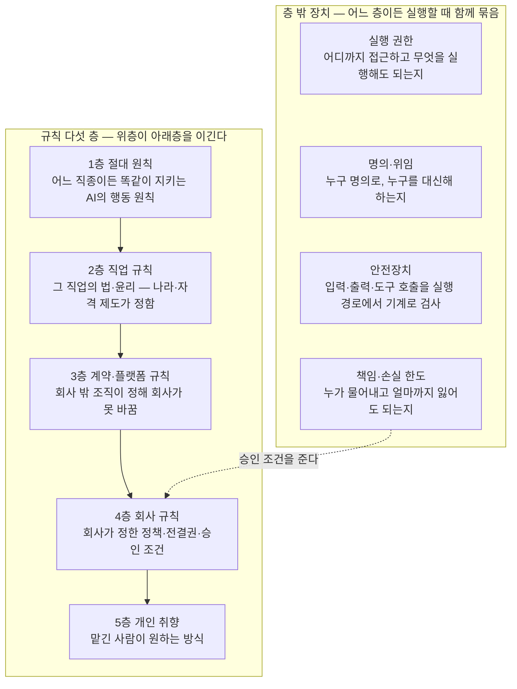

| 재료 | 무엇 | 원어 | 뜻 |
|------|------|------|-----|
| 절대 원칙 | AI의 절대 행동 원칙 | Constitution | 근거 없는 말 지어내기 금지, 생명·재산 해치기 금지, 사람과 말을 주고받을 때 AI임을 숨기지 않기처럼 분야를 가리지 않는 절대 원칙 업계에서는 Constitution이라 부르지만 나라의 헌법이 아니라 AI 자신이 지키는 원칙이다 법령은 직업 규칙에 둔다 변호·수사·보안 시험처럼 겉보기에 누군가를 해치는 듯해도 법이 허용한 정당한 직업 행위는 여기서 막지 않는다 |
| 직업 규칙 | 직업의 법·윤리 규칙 | Domain Rules | 그 직업의 법적·윤리적 규칙 자격 요건, 비밀 유지와 그 예외 (신고 의무), 이해충돌 회피, 맡는 일의 범위와 맡지 않을 일 법이 자격자에게만 허용한 행위 (서명·날인·처방·감사 의견) 의 목록을 두고, AI는 그 직전까지 준비하고 자격자가 자기 명의로 확정한다 당사자가 여럿이고 이해가 어긋나면 (회사와 직원, 은행과 차주 (돈을 빌린 사람), 파는 사람 (매도자) 과 사는 사람 (매수자)) 누구 편인지, 또는 어느 편도 아닌지 (중재·심판·감리) 를 규칙으로 둔다 한 건에서 안 것을 다른 건이나 다른 당사자에게 쓰거나 그것만으로 행동하면 안 되는 칸막이 (차단벽·내부자 정보) 는 건 사이와 한 건 안 당사자 사이 모두에 건다 AI 판단이 개인에게 법적·경제적 효과를 미치면 (채용·평가·대출·보험 인수 = 보험사가 이 사람을 받아 줄지 정하는 것) 이유를 당사자가 알아들을 말로 설명하고, 당사자가 요구하면 사람의 재검토로 넘긴다 금지 변수 (판단에 쓰면 안 되는 정보 항목 — 성별·연령·장애·병력) 로 결과가 갈리지 않게 한다 산출물이 AI가 만든 것임을 밝혀야 하는지와 저작권이 누구 것이 되는지도 여기에 둔다 |
| 계약·플랫폼 규칙 | 계약으로 나를 묶는 외부 조직의 규칙 | Contract & Platform Rules | 발주처 시방서·감리 (일이 제대로 되는지 발주처를 대신해 지켜보고 검사하는 사람) 지시·고객 규격·SLA (서비스 수준 약속)·신용장 (은행이 대금 지급을 보증해 주는 무역 서류) 조건·가맹 본부 규정·입점 약관·노출 정책·앱 심사 지침·방송 심의 (방송 내용이 규정에 맞는지 심사하는 것) 처럼 회사 밖에서 정해져 회사 규칙으로 바꿀 수 없는 규칙 어기면 해지·위약금 (약속을 어겼을 때 무는 돈)·퇴점 (입점한 자리에서 쫓겨남)·계정 정지·인증 취소가 따르므로 회사 규칙보다 위, 직업 규칙보다 아래에 둔다 원문·판본은 플랫폼·기관 규정에 두고 개정은 자동 갱신이 맡는다 |
| 회사 규칙 | 회사 정책과 승인 조건 | Organization Rules | '일정 금액 이상은 대표 승인'처럼 회사가 정한 정책·전결권 (윗사람 결재 없이 혼자 결정해도 되는 권한)·승인 조건 |
| 개인 취향 | 맡긴 사람이 원하는 방식 | User Preferences | '보고서는 결론부터'처럼 맡긴 사람이 원하는 방식 |
| 실행 권한 | 접근·실행 범위 | Permissions | 어디까지 접근하고 무엇을 실행해도 되는지 사람에게 넘기기가 정한 되돌릴 수 없는 행동은 승인 없이는 실행 권한이 없는 것으로 둔다 비밀번호·API 키 (프로그램용 열쇠) 는 코드와 프롬프트 밖에 둔다 |
| 명의·위임 | 누구 명의로, 누구를 대신해 하는가 | Agent Identity·On-behalf-of | 맡긴 사람에게 그 권한이 있는지와, 요청한 사람이 본인인지 (비밀번호 초기화·계좌 변경·지급처 변경) 는 따로 확인한다 맡긴 사람의 승인과 당사자의 동의 (환자·직원·상대방) 는 다른 것이라 둘 다 받는다 견적·할인·납기 약속·발주·계약 서명처럼 회사를 묶는 대외 의사 표시 (회사 이름으로 바깥에 하는 약속) 는 정해진 명의와 금액·조건 한도 안에서만 한다 계좌·개발자 계정·서명 키·등기 (부동산·회사를 나라 장부에 올려 두는 것) 처럼 사람 명의로만 열리는 것은 명의자의 것으로 두고 위임받은 범위 안에서만 쓴다 명의자가 지게 될 책임은 미리 알린다 권한을 남에게 주고 거두는 것, 명의자·권리자가 바뀔 때 (사망·해임·양도) 위임이 끝나는 조건도 여기에 둔다 어디까지 접근하는지는 실행 권한이, 누구 명의인지는 여기가 맡는다 |
| 안전장치 | 입력·출력·도구 호출 검사 | Guardrails | 자료 속에 숨은 지시 (프롬프트 주입) 를 따르지 않고, 개인정보·비밀을 밖으로 내지 않고, 위험한 도구 호출은 실행 전에 막는다 밖에서 들어오는 코드·데이터·기여에 숨은 악성 코드·오염된 데이터를 실행·학습 전에 검사한다 금액·보유량 (포지션)·손실·노출 (한 대상에 걸려 있어 손해를 볼 수 있는 금액) 한도와 거래 금지 목록은 모델의 판단이 아니라 실행 경로에 박힌 기계 검사로 둔다 한도를 넘는 주문·승인·집행은 실행 전에 막고, 한도에 가까워지면 자동으로 줄인다 남이 내 이름으로 나가는 통로에 넣은 것 (댓글·기여·대리 게시) 은 검사 없이 나가지 않게 한다 |
| 책임·손실 한도 | 책임 소재와 최대 손실 | Liability & Loss Limits | 이 일이 틀리면 누가 물어내는지 (운영자 자본·회사·보험·공제·플랫폼·본부·자격자) 와 어떤 책임이 따르는지 (배상 (손해를 물어 주는 것)·지체상금 (약속한 날보다 늦어서 무는 돈)·과징금 (규정을 어겨 나라가 물리는 돈)·자격정지·징계·형사 (죄로 다뤄져 처벌받는 것)) 를 건마다 정한다 고객 잘못과 내 잘못의 경계, 보험·계약 조항이 받쳐 주는 범위도 적는다 손실을 무엇으로 잴지 (손실의 축) 는 직무마다 고르고, 돈이 아닌 손실 (평판·선례·관계·신뢰) 도 축에 둔다 한 건 최대 손실과 기간 (하루·한 달·한 시즌) 누적 손실은 어느 직무에나 두고, 자기 돈을 거는 일은 한 대상 집중 비율·빚을 얹은 비율 (레버리지)·현금 잔고 하한 (선불로 받은 돈은 부채 = 아직 갚아야 할 빚) 을 숫자로 더 둔다 한도를 넘는 집행을 실행 전에 기계로 막는 것은 안전장치가 맡고, 한도의 변경은 사람만 한다 성공보수·수수료처럼 내 보수가 판단을 기울일 수 있으면 그 구조를 밝힌다 판단·계획 단계의 손실 한계선과 회사 규칙의 승인 조건은 여기서 나온다 |

---

#### 행동 체계 — 판단하고 일하는 방식

| 재료 | 무엇 | 원어 | 뜻 |
|------|------|------|-----|
| 판단 규칙 | 판단 순서·기준·예외·복구 | - | 어떤 정보를 찾고 → 무엇을 믿고 → 어떻게 판단하고 → 무엇을 할지의 순서 어떤 조건에서 무엇을 우선하는지, 예외는 어떻게 다루는지, 틀렸을 때 어떻게 되돌리는지 누구 편인지는 직업 규칙이 정한다 그 안에서 당사자별 이익의 순위와 그 순위가 바뀌는 조건은 건을 맡을 때 먼저 적는다 위층 규칙 (계약·플랫폼 규칙) 과 내 이익이 부딪히면 규칙층 우선순위를 따르되, 손실을 계산해 기록하고 협상·이의 제기의 재료로 남긴다 건이 여럿일 때 어느 건을 먼저 할지, 한정된 자원을 얼마씩 나눌지, 묶인 건을 어떻게 한 묶음으로 볼지 정하는 기준 (기한·손실 속도·되돌릴 수 없음) 도 여기에 둔다 상대가 내 규칙·기준·조치를 읽고 역이용한다고 보고, 내 움직임 (문의·조회·주문·공개) 이 상대에게 무엇을 알려 주는지 재어 드러낼 것과 감출 것을 정한다 규칙에 없는 처음 보는 상황은 멈추는 조건이 아니다 원리와 비슷한 사례로 되돌아가 판단하고, 되돌릴 수 있는 걸음으로 먼저 가 본 뒤에도 판단이 안 서면 그때 사람에게 넘긴다 |
| 업무 절차·노하우 | 워크플로우, 표준 업무 절차, 분야별 노하우 | - | 무엇을 어떤 순서로 하는가 (일의 흐름 = 워크플로우) 20년 노하우의 핵심은 자료 (무엇을 아는가) 가 아니라 방법 (어떻게 하는가) 이다 절차 지식과 회사 사정이 함께 있어야 한다 숙련자는 표준 절차대로만 일하지 않는다 표준이 안 맞는 애매한 건은 상황에 맞춰 절차를 새로 짠다 (동적 계획) |
| 도구 선택 기준 | 언제 어떤 도구를 쓰는가 | - | 도구 개수가 아니라 언제 어떤 도구를 쓸지 판단하는 기준 사람이나 모델의 반응 속도보다 빠른 대응이 필요한 일 (시장 체결·한도 차단·광고 입찰) 은 규칙과 한도를 미리 정해 기계 집행에 맡긴다 모델은 규칙을 정하고 결과를 감시하며, 규칙 밖 상황에서만 개입한다 |
| 완료 조건 | 목표와 완료 판정 기준 | - | 흐름 1단계의 완료 조건과 한도 (시간·비용·시도 횟수) 가 이 직무에서 무엇인지 적는다 남이 손을 대야 끝나는 건 (다른 팀의 조치·고객의 갱신·심사관의 판정) 은 그 조치가 확인된 상태를 완료로 두고, 기한 전 독촉과 상향 (윗사람에게 올려 보내는 것) 시점을 정한다 끝이 없는 운영 건은 유지해야 할 상태 (수준·한도) 를 완료로 둔다 정답이 시장 반응인 일은 시도 한도를 그 분야의 타율 (야구처럼 열 번 해서 몇 번 맞히는지의 비율) 로 정하고, 한 편이 실패했다고 실패로 세지 않는다 성과가 몇 달·몇 년 뒤에 나오면 그것을 미리 가리키는 앞선 지표 (첫 24시간 클릭률·연독률·예매율·재방문 예약) 로 임시 판정한다 |
| 먼저 감지하기 | 기한·규정·건·시장·신호 감시 | - | 흐름 0단계의 "신호로 감지하든, 기회를 찾아내든"이 이 직무에서 무엇인지 적는다 기한, 규정 변경, 건의 상태, 시장 변화, 성과 확정 시점, 잠재 고객·거래 기회 가운데 무엇을 신호로 볼지, 받으면 무엇을 시작할지를 정한다 기한은 계산 규칙 (기산일 (날짜를 세기 시작하는 첫날)·공휴일·관할별 가산 (지역마다 날짜를 더 얹어 주는 것)) 을 두고 센다 장애·침해 (남이 몰래 뚫고 들어오는 것)·급변·긴급 연락처럼 초·분 단위로 커지는 신호는 감지에서 첫 대응까지의 시간 한도를 둔다 자기 결과물 (서비스·모델·채널) 의 상태 저하, 나 자신이 멈추거나 헛도는 것, 남이 내 명의·결과물·브랜드를 도용·사칭·불법 유통·조작하는 것도 감시 대상이다 신호를 실제로 받아 깨우는 장치는 시작 신호가 맡는다 |
| 상대 응대 | 사람 상대 실시간 상호작용 (협상·상담·면담·방송) | - | 협상·상담·면접·설명회·기자 응대·생방송 채팅·분쟁 조정처럼 상대가 사람이고 그 자리에서 성과가 갈리는 주고받기를 직접 한다 들어가기 전에 목표·양보 한계·물러날 선·상대의 이해관계와 예상 반응, 그 자리에서 해서는 안 되는 말 (법 위반 표현·권한 밖 약속) 을 적는다 자료 읽기가 읽은 말투·감정·의도로 다음 말을 바꾼다 상대가 말한 것은 그 자리에서 사실·주장·약속으로 갈라 기록하고, 새 정보가 나오면 계획을 고친다 상대의 됨됨이·의지처럼 말로 확인하기 어려운 것은 행동 기록 (약속 이행·응답 속도·과거 이력) 으로 판단한다 그 자리에서 판단이 서지 않으면 권한 밖 약속을 하지 않고, 확인 뒤 답하겠다고 시간을 벌어 사람에게 넘긴다 끝난 뒤 합의·미합의·다음 행동을 남긴다 상대가 조직이면 창구와 실제 결정권자를 가려 두고, 상대가 여럿이면 누구에게 무엇을 언제 알릴지 정하고 한쪽에 한 말이 다른 쪽에 간다고 본다 합의는 쌍방이 같은 내용으로 확인한 것만 합의로 친다 합의체·투표·여론처럼 다수를 상대하는 자리는 다수의 결정 규칙과 시간 창을 적는다 초 단위 응답과 끊김 복구는 실시간 통로가 맡는다 |
| 사람에게 넘기기 | 사람의 확인 요청 | Escalation·Human-in-the-loop | 흐름 표의 다섯 조건이 이 직무에서 구체적으로 무엇인지 적는다 어떤 행동이 되돌릴 수 없는지, 승인 조건은 무엇인지, 어디까지 길을 짜 봐도 안 서면 '판단이 서지 않는 것'으로 치는지, 어떤 한도를 넘으면 멈추는지, 누가 자격자인지 당사자의 처분권 (이 건을 합의할지·포기할지·동의할지 스스로 정할 권리) 이 누구에게 있는지는 0단계에서 확인해 두고, 결정은 그 사람에게 보낸다 넘긴 뒤 답이 없을 때 올릴 다음 사람의 사다리를 두어, 승인을 기다리느라 기한을 넘기지 않게 한다 모자란 정보를 상대나 기관에 묻는 것 (3단계) 은 결정을 넘기는 것이 아니라 여기에 들지 않는다 |
| 보고·결과물 | 결과물 형식과 소통 | - | 흐름 7단계의 결과물과 보고가 이 직무에서 어떤 형태인지 적는다 자격자 명의가 필요한 결과물은 서명 직전 상태로 올린다 운영형은 주기 (일·주·월·시즌) 마감을 보고 단위로 삼고, 성과 지표를 자기 운영 데이터에서 독립 도구로 계산해 보고한다 받는 곳의 규격 (길이·형식·잘림·배포 대상) 은 기계로 검사한다 |

---

#### 실무 — 일을 끝까지 처리

| 재료 | 무엇 | 원어 | 뜻 |
|------|------|------|-----|
| 업무 처리 흐름 | 감지·접수 → 의도 파악 → 문제 정의 → 자료 확인 → 판단·계획 → 처리 → 검증 → 완료·보고 → 남기기 | - | 일을 받거나 먼저 감지해 시작한다 맡긴 사람의 진짜 의도와 말 뒤의 진짜 문제를 짚는다 자료를 스스로 모아 읽고, 모자란 사실·규정·사례를 조사한다 판단한 뒤 실제 처리로 결과물을 내고, 실제 상태로 검증한다 답변을 내는 것이 아니라 일이 끝난 상태를 만들고, 사례와 기억을 남겨 다음 건으로 잇는다 건의 단위가 주기인 일은 주기마다 한 바퀴 돈다 |

---

#### 검증·평가 — 오류 검출과 수정

| 재료 | 무엇 | 원어 | 뜻 |
|------|------|------|-----|
| 결과 검증·수정 | 주장이 아니라 실제 결과 확인 | - | 흐름 6단계의 "실제 상태"가 이 직무에서 어디인지 적는다 시스템에 넣은 것은 넣은 뒤 상태를, 제출한 것은 접수 결과를, 내보낸 것은 내보낸 뒤 지표 (도달·신고·삭제 여부) 를 원천에서 직접 읽어 본다 내 기록과 원천이 어긋나면 차이의 원인을 찾는다 시점·일관성·계산을 다시 보고 틀리면 고친다 |
| 반증·교차 검증 | 스스로 반증 | - | 내 결론이 틀릴 가능성을 일부러 찾고, 다른 길로 다시 확인한다 상대·기관·플랫폼의 원천을 제3자로 직접 조회해 대조한다 내는 것 자체가 되돌릴 수 없는 행동 (발표·제출·발송) 이면 내기 전에 반증을 돌린다 |
| 위험 누락 검사 | 놓친 위험 찾기 | - | 이 직무에서 놓치면 안 되는 위험이 무엇인지 목록으로 둔다 무엇을 놓치면 안 되는지는 직무마다 다르다 창작이면 발표 전에 기존 저작물과의 유사도, 초상 (사람의 얼굴·모습을 쓸 권리)·상표·음원의 사용 허락을 대조한다 개인에게 효과를 미치는 결정이면 금지 변수와 그것을 대신 드러내는 변수 (동네·이름처럼 성별·나이를 짐작하게 하는 것) 로 결과가 갈리지 않았는지를 집단별로 정기 검사한다 목록에 없는 새 위험은 '이 건에서 무엇이 틀리면 되돌릴 수 없나'를 물어 찾는다 양이 커서 전수 검사가 안 되면 기계 검사와 표본으로 나누고 못 본 것을 밝히며, 전수를 보증해야 하는 직무 (실사·감사) 는 기계로 세어 빠짐이 없음을 확인한다 검사를 알고 피해 가는 상대가 있으면 검사 방법과 시점을 바꿔 가며 한다 |
| 과정 평가 | 행동 기록 평가 | Trajectory Eval | 자료를 확인했는지 → 맞는 출처를 봤는지 → 판단 순서가 맞았는지 → 예외를 처리했는지 → 처음 보는 상황에서 멈추지 않고 길을 짰는지 → 언제 사람에게 넘겼는지까지 전체 행동 기록을 평가한다 |
| 결과물 평가 | 결과물 채점 | Output Eval | 결과물이 20년차 수준인지 채점한다 정답이 없는 결과물 (전략·기획·디자인·창작·상품·메시지) 은 만들기 전에 채점 기준을 적어 둔다 채점 기준은 받는 사람의 다음 행동에 맞는가, 버린 대안보다 비용·위험이 나은가, 이미 있는 것과 얼마나 다른가 (독창성), 정해 둔 정체성·작풍에 맞는가다 채점은 혼자 낸 점수로 끝내지 않고 독립 심사자·전문가 패널의 비교 판정, 실사용자·플레이테스터 (나오기 전에 미리 해 보고 문제를 찾아 주는 사람), 표본·기간·판정선을 미리 정한 소량 실험 (A/B, 작게 먼저 해 보는 시험 운영인 파일럿) 으로 한다 시장·상대의 반응이 나오면 사후 채점을 덧붙여 사전 채점과 견주고, 실험을 못 하면 그 결정의 확신도를 낮춰 보고한다 |
| 검사자 분리 | 일한 쪽 아닌 쪽이 검사 | Evaluator·LLM-as-a-judge | 흐름 6단계의 "일한 쪽과 다른 쪽"을 이 직무에서 무엇으로 두는지 적는다 다른 모델·다른 에이전트·사람 가운데 고른다 사람이 실행하고 AI가 검사하는 반대 경우도 같은 원칙이다 검사자가 일한 쪽보다 덜 알면 검사가 되지 않으므로 검사자의 수준과 검사할 항목을 정해 둔다 |
| 근거 추적·재현 | 추적·재현 기록 | - | 결론마다 어떤 자료·도구·판단을 거쳤는지 남겨, 나중에 그대로 재현할 수 있게 한다 법적 다툼·신고·심사에 쓰일 남의 증거 (로그·디스크 이미지 (컴퓨터 저장장치를 통째로 복사해 뜬 것)·계약 원본·검사 성적서 (검사 결과를 적은 공식 문서)) 는 원본을 바꾸지 않고 그대로 보관하며, 얻은 경로와 시각을 남긴다 기록이 상대 손에 가면 무기가 되는 직무 (소송·취재·협상) 는 무엇을 남기고 무엇 (출처·비밀) 을 보호할지 직업 규칙에 따라 정한다 |

---

#### 학습·개선 — 꾸준한 성능 향상

| 재료 | 무엇 | 원어 | 뜻 |
|------|------|------|-----|
| 사례 축적 | 검증된 사례 저장 | Case Memory | 흐름 8단계에서 남긴 사례를 사례집과 기억으로 쌓는다 고객의 비밀은 사례에서 격리해 다른 고객의 건에 새지 않게 한다 운에 크게 좌우되는 분야 (투자·흥행·초기 투자) 인지 적어, 결과 점수와 판단 과정 점수 가운데 어느 것을 앞에 둘지 정한다 |
| 실패 원인 분석 | 틀린 자리 찾기 | - | 틀린 원인이 자료·지식·판단·절차·검증 중 어디인지 찾아 고친다 원인 목록에 바깥 변화 (시장·플랫폼·규정·경쟁 상대) 를 두어, 내 잘못이 아닌 하락을 내 규칙 탓으로 잘못 배우지 않게 한다 내 탓인지 바깥 탓인지는 같은 기간 비슷한 시장·집단의 지표와 견주어 가른다 안 통한 방법 (부정적 결과) 도 지식으로 남긴다 |
| 고정 시험 | 고정 시험지 재실행 | Regression Eval | 검증된 사례로 만든 고정 시험지를 두고, 규칙·지식·도구·모델을 바꿀 때마다 돌려 나빠진 데가 없는지 확인한다 고정 시험지는 이미 본 건이라 처음 보는 상황은 못 잰다 그래서 시험지에 안 넣은 새 건을 따로 두고 처음 보는 상황에서의 판단을 잰다 한 번 쓴 새 건은 시험지로 옮긴다 시장·플랫폼·OS (윈도우·안드로이드처럼 기기를 돌리는 기본 프로그램)·계절처럼 바탕이 바뀌는 분야는 문항마다 만든 시점·바탕 판본·유효 기간을 붙이고, 바탕이 바뀌면 옛 문항을 그대로 믿지 않고 갈아 끼운다 다시 돌릴 수 없는 시즌은 과거 기간의 데이터에 새 규칙을 적용해 돌려 보는 방식 (백테스트) 으로 대신한다 |
| 자동 학습 | 스스로 배우기 | - | 사람이 따로 가르치지 않아도 결과 피드백과 측정된 성과로 규칙·지식·절차·기억·시험지가 계속 고쳐진다 모델 자체를 다시 훈련하는 것은 채점된 사례가 쌓였을 때 따로 하는 일이고, 바꾼 모델은 교체 절차 (모델 재료) 를 거친다 시장 반응으로 배울 때는 운을 실력으로 잘못 배우지 않도록, 표본 수와 기간이 충분하고 우연으로는 안 나올 차이 (통계적 유의성) 가 있는 결과만 규칙에 반영한다 그것도 고정 시험을 통과한 뒤에만 바꾼다 |
| 성과 추적 | 성과 지표 측정과 귀속 | Outcome Tracking | 그 직종의 성과 지표 (승소율·환급액·공기 (공사 기간) 준수율·재등록률·잔존율 (계속 남아서 쓰는 사람의 비율)·수익률·손해율 (받은 보험료 가운데 물어 준 돈의 비율)) 를 정의와 계산식까지 미리 정해 두고, 자기 실행 기록·원천 시스템·계좌·플랫폼 통계에서 정한 주기로 스스로 재어 목표와의 차이를 보고한다 몇 달·몇 년 뒤에 나오는 성과는 앞선 지표로 먼저 재고, 확정 예정일을 먼저 감지하기에 걸어 둔다 결과가 오면 예측과 견주어 그 건의 사례에 되돌려 붙인다 그 변화가 내 일 때문인지 시장·운·다른 부서 때문인지 (귀속 = 그 결과가 누구 덕분·누구 탓인지 가려 붙이는 것) 는 업계 평균 (벤치마크), 바꾸지 않은 집단과의 비교 (대조군), 전후 비교로 가른다 잴 수 없는 지표 (거절한 우량 고객처럼 하지 않은 선택의 결과를 가정해야 하는 것) 는 추정 방법과 한계를 밝힌다 내 행동이 지표 자체를 움직이는 경우 (시장에서 내가 큰 손일 때) 와 여러 건의 효과가 섞이는 경우는 그것을 밝히고 잰다 지표를 좋게 보이게 하는 꼼수는 감시한다 원천을 못 보면 못 잰다고 밝힌다 |

---

## 재료별 구상

### 환경 — 실행 기반

#### 모델 — 장기 실행형 프론티어 모델

##### 맡는 것

| 모델이 맡는다 | 모델이 맡지 않는다 |
|------|------|
| 판단 무엇을 찾을지, 무엇을 믿을지, 어떻게 할지, 언제 멈추고 사람에게 넘길지 | 순환 돌리기·상태 저장·끊긴 자리 이어받기·여럿에게 나누기는 실행 순환·저장·이어받기·나눠 맡기기가 맡는다 사실은 자료·검색이, 허용 범위는 규칙·권한이 맡는다 |

- 모델이 좋아도 나머지 재료가 비면 성능이 안 나온다.
- 나머지가 좋아도 모델의 판단이 짧게 끊기면 긴 일이 중간에 무너진다.

##### 모델과 하네스의 경계

- 하네스 (Harness) 는 모델을 둘러싸고 일을 돌려 주는 겉 장치다. 실행 순환·저장·이어받기·나눠 맡기기를 합쳐 업계에서 이렇게 부른다. 모델이 머리라면 하네스는 그 머리를 싣고 다니는 몸이다.
- 모델이 하는 몫과 하네스가 하는 몫의 경계는 해마다 모델 쪽으로 옮겨 간다. 지금 모델이 못 해서 하네스에 코드로 넣어 둔 일을 다음 모델은 스스로 한다. 그래서 "모델은 이걸 못 하니 대신 해 준다"는 가정을 하네스에 넣어 두면, 모델이 좋아질 때마다 그 가정이 낡은 짐이 된다. 판단 규칙을 하네스에 두껍게 넣지 않는 이유다. 판단은 모델이 하고, 하네스는 모델을 새것으로 바꿀수록 할 일이 줄어들게 짠다.
- 모델을 만드는 회사들이 내놓은 에이전트 틀도 얇다. OpenAI Agents SDK는 스스로를 "추상화가 아주 적은 가벼운 꾸러미"라 부르고, 에이전트·핸드오프·안전장치·대화 저장 (Sessions) 넷만 기본 부품으로 둔다 (공식 문서, 2026-09 확인). Anthropic도 복잡한 틀보다 단순하고 조립할 수 있는 패턴이 잘 됐다고 안내한다 (Building effective agents, 2024-12).
- 하네스와 안전장치에 남기는 것은 모델이 못 하는 것뿐이다. 되돌릴 수 없는 실행 막기, 한도를 넘었는지 세기, 진행 상태 저장하기, 재우기·깨우기, 나누고 거두기, 프롬프트 주입·비밀 유출 막기, 악성 코드 검사처럼, 기계가 해야 확실한 것들이다.
- 하네스를 두껍게 만든다고 성능이 오르지는 않는다. 도구가 bash 하나뿐인 100줄짜리 기본 틀 (mini-SWE-agent) 이 공들여 만든 원래 틀 (SWE-agent) 과 거의 같은 성능으로 SWE-bench Verified 74%를 넘겼다 (프로젝트 공식 설명, 2026-09 확인).

##### AGI — 이뤄야 할 것

| 항목 | 내용 |
|------|------|
| 뜻 | AGI (Artificial General Intelligence) 는 한 가지 일만이 아니라 사람이 하는 일을 두루 해내는 AI다 여기서는 지금 모델을 재는 잣대가 아니라 우리가 이뤄야 할 목표라는 뜻으로 쓴다 |
| 한 직무의 AGI | 업무 처리 흐름 0~8을 20년차 수준으로, 대체의 뜻 절의 기준대로 사람 손 없이 끝까지 통과하는 것 항 정의표에서 실무 항을 "업계에서 AGI라 부르는 것에 가장 가까운 항"이라고 한 이유가 이것이다 |
| 일반 AGI | 한 직무의 AGI를 직무마다 이루고, 그 범위를 넓혀 간 것 |
| 바깥 정의 | 남들이 내린 정의는 우리 목표가 어디쯤인지 재는 눈금으로만 쓴다 업계에서 흔히 쓰는 정의 "경제적으로 가치 있는 일 대부분에서 사람을 능가하는 고도로 자율적인 시스템" (자율적 = 사람이 일일이 시키지 않아도 스스로 한다는 뜻) 는 넓혀 간 끝의 모습이다 AGI 단계표 (0~5단계, 좁은 분야와 일반 분야를 나눠 매김) 로 보면 우리 목표는 좁은 분야의 숙련자 (상위 10%) ~ 최상위 (상위 1%) 에 해당한다 "몇 시간·며칠·몇 주가 걸리는 일을 자율적으로 하는 강력한 AI" 는 모델 혼자가 아니라, 모델에 저장·이어받기와 기억을 붙여서 맡을 몫이다 |
| 지금 | AGI가 아니다 어느 회사도 공식 선언하지 않았고 ('AGI 시대'라는 말은 나왔지만 선언은 피함, 2026-09), 독립 평가 기관도 최신 모델을 AGI라 부르지 않는다 (사람은 쉽게 푸는 새 문제 시험 ARC-AGI-3에서 최상위 모델도 1% 미만) 이 사실은 출발점을 재는 데만 쓰고, 목표를 낮추는 데는 쓰지 않는다 |
| 목표까지의 간격 | 지금 최상위 모델이 혼자 끊기지 않고 일할 수 있는 길이는 약 16시간 (2026-05 측정, 성공률 50% 기준, 그보다 긴 것은 아직 재는 방법이 없음) 목표는 몇 주~몇 년 그 사이는 저장·이어받기와 기억이 잇는다 모델이 혼자 일하는 길이는 2019년부터 재면 약 6.5개월마다, 2023년부터 재면 약 4개월마다, 2024년부터 재면 약 3개월마다 두 배로 늘어 왔다 (2026-01 측정) 그래서 지금 모델로 흐름을 통과시키기 시작하되, 모델이 나아질수록 하네스는 할 일이 줄고 모델만 갈아 끼워도 성능이 오르게 짠다 |
| 이뤘다는 판정 | 남의 지표가 아니라 우리 잣대로 판정한다 전문가를 알아보는 기준 3개의 'AI에게 재는 법'을 그대로 쓴다 ① 그 직무의 고정 시험지와 시험지에 없던 새 건을 사람 손 없이 통과 (판단 시험) ② 성과 추적 지표가 20년차 기준선 이상 (성과 숫자) ③ 사람에게 넘기기가 규칙에 정한 다섯 경우 안에서는 반드시, 밖에서는 일어나지 않음 (못 할 일 가리기) 이 재료의 몫 (판단이 갈리는 자리에서 20년차의 판단) 은 과정 평가로 따로 잰다 |
| 순서 | 한 직무의 AGI → 같은 재료로 직무 늘리기 → 일반 AGI |
| 첫 직무의 조건 | 흐름 0~8이 화면과 문서 안에서 끝난다 성과 지표를 자기 데이터로 잴 수 있다 틀렸을 때의 손실 한도를 숫자로 둘 수 있다 |

##### 고르는 기준과 배치

| 기준 | 정한 것 |
|------|------|
| 등급 | 어떤 모델을 쓸지는 값이 아니라 일의 성격에 맞춰 등급으로 고른다 판단이 갈리는 자리 (문제 정의·판단·계획·검증) = 최상위 모델 틀이 정해진 일 (분류·초안·서식 채우기·요약) = 한 등급 아래 되풀이 노동 = 가장 싼 것 약한 모델을 어려운 일에 두면 다시 하는 일이 늘어 오히려 더 비싸진다 |
| 지금 배치 | GPT-6 Astra = 수석 (주 실행자) GPT-5.6 Sol = 직원 Claude Haiku 4.5 = 되풀이 노동 Claude Fable 5.1 = 자문·독립 검증 (반증·교차 검증의 다른 쪽 눈) 검사자 분리 재료의 "일한 쪽과 다른 쪽이 검사한다"를 모델끼리 하려면, 만든 회사가 다른 두 모델을 쓰는 것이 가장 싸고 확실하다 |
| 계약 | 달마다 정액을 내는 구독이 아니라 쓴 만큼 내는 API (프로그램이 모델을 직접 부르는 창구) 로 계약한다 오래 도는 일은 사람이 화면 앞에 없으니, 부른 횟수와 양대로 값을 치르는 쪽이 맞다 값 (토큰 = 모델이 글의 양을 세는 단위. 100만 토큰당 입력/출력, 2026-09): Astra $10/$50, Sol $5/$30, Haiku 4.5 $1/$5, Fable 5.1 $10/$50 실제 값은 캐시가 좌우한다 캐시는 한 번 읽힌 똑같은 앞부분을 저장해 두고 다음에 싸게 다시 읽는 것이다 Fable 5.1은 캐시로 읽으면 새로 읽는 값의 40분의 1, Astra·Sol·Haiku 4.5는 10분의 1 그래서 작업창 재료의 "고정된 것은 앞에, 바뀌는 것은 뒤에" 규칙이 곧 값을 정한다 |
| 추론 강도 | 모델이 답하기 전에 얼마나 오래 생각할지 (추론 강도) 는 일의 성격으로 정한다 판단 자리는 깊게, 되풀이 자리는 얕게 한다 한 건 안에서 바꾸면 그때까지의 대화 부분 캐시가 무효가 되므로 (Claude API 문서, 2026-09 확인) 건 단위로 고정한다 |
| 실시간 응대 | 이 모델이 아니라 실시간 통로 재료가 맡는다 장기 실행 모델은 깊이를, 실시간 통로는 속도를 맡는다 |
| 교체 | 모델은 갈아 끼우는 부품이다 고정 시험지를 통과해야 바꾼다 바꾼 날짜와 이유를 남긴다 |

#### 실행 순환 — 모델 호출·도구 실행 순환 (Agent Loop·Runner)

##### 맡는 것

| 이 재료가 맡는다 | 맡지 않는다 |
|------|------|
| 모델을 부르고, 모델이 고른 도구를 실제로 실행하고, 그 결과를 다시 모델에 넣는 한 바퀴 한 바퀴마다 횟수·시간·돈을 기계로 세기 도구 실행 직전·직후에 기계 검사 걸기 멈춤 조건에 걸리면 바퀴를 끊기 | 무엇을 할지 고르기는 모델이 맡는다 바퀴마다 나온 것을 저장하고 끊긴 자리에서 다시 시작하기는 저장·이어받기가 맡는다 한 건을 여럿에게 쪼개기는 나눠 맡기기가 맡는다 바퀴를 처음 돌리는 계기는 시작 신호가 맡는다 멈출 조건의 내용은 사람에게 넘기기·안전장치·책임·손실 한도가 맡는다 어떤 도구를 고를지는 도구 선택 기준이 맡는다 |

- 이 순환에 판단 규칙을 넣지 않는다. 넣으면 모델이 좋아질 때마다 그 규칙이 낡은 짐이 된다.
- 여기 남기는 것은 세기·막기·끊기처럼 기계가 해야 확실한 것뿐이다.

##### 짜는 방식

| 기준 | 정한 것 |
|------|------|
| 뼈대 | 업계 표준인 에이전트 SDK 의 Runner (모델 부르기와 도구 실행을 되풀이해 주는 실행기) 모양을 그대로 쓴다 모델이 도구를 더 부르지 않고 끝낼 형태의 답을 내면 그 바퀴에서 끝난다 (2026-09 확인) |
| 한 바퀴 세기 | 모델을 한 번 부른 것 (그때 딸린 도구 호출까지) 을 한 턴으로 센다 턴 한도를 넘으면 순환이 예외를 던지고 멈춘다 (2026-09 확인) 턴과 함께 걸린 시간과 쓴 돈도 센다 셋 중 하나만 넘어도 멈추고 흐름 7단계에서 "N개 중 M개"로 낸다 |
| 한도 값 | 숫자는 흐름 1단계에서 정한 한도를 그대로 받아 쓴다 이 직무를 고를 때 정한다 |
| 끼워 넣는 검사 | 도구 실행 직전에 되돌릴 수 없는 실행인지, 승인 조건인지, 자격자 전속 행위인지 본다 도구 실행 직후에 실제 상태가 바뀌었는지 본다 검사 내용은 안전장치와 실행 권한이 정하고, 순환은 부르기만 한다 |
| 실패 | 도구가 실패하면 정한 횟수만큼 다시 부른다 같은 실패가 두 번이면 바퀴를 끊고 흐름 4단계로 돌려보낸다 |
| 기록 | 한 바퀴마다 부른 모델·쓴 토큰·고른 도구·걸린 시간을 OpenTelemetry 의 생성형 AI 표준 이름표 (`gen_ai.` 로 시작하는 정해진 항목 이름) 로 남긴다 (2026-09 확인) 남기는 곳은 저장·이어받기다 |
| 모델 교체 | 순환 코드가 모델 이름을 모르게 짠다 모델을 바꿔도 순환은 한 줄도 안 고친다 |

##### 됐다는 기준

| 잣대 | 어떻게 잰다 |
|------|------|
| 안 멈추는 일이 없다 | 한도를 일부러 낮춘 시험 건에서 턴·시간·돈 한도마다 실제로 멈추는지 본다 |
| 막을 것을 막는다 | 되돌릴 수 없는 도구를 부르는 고정 시험지 건에서 실행 전에 멈춘 비율이 100%인지 본다 |
| 얇은가 | 순환 코드 안에서 판단이 갈리는 자리 (조건에 따라 길이 갈라지는 곳) 의 수를 판본마다 센다 늘었으면 판단이 새어 들어온 것이다 |
| 갈아 끼워진다 | 모델만 바꾸고 순환 코드를 안 고친 채 고정 시험지를 다시 돌려 통과하는지 본다 |

#### 저장·이어받기 — 실행 기록·저장점·재시작 (Session Log·Checkpoint·Durable Execution)

##### 맡는 것

| 이 재료가 맡는다 | 맡지 않는다 |
|------|------|
| 한 건에서 일어난 모든 것 (모델 호출·도구 결과·승인·넘김) 을 순서대로 덧붙여 쓰는 실행 기록 흐름 단계마다 산출물을 남기는 저장점 끊기면 마지막 저장점에서 다시 시작하기 실패한 실행을 정한 규칙으로 다시 하기 답을 기다리는 건을 재워 두기 | 무엇을 남길지 고르기는 작업 기억이 맡는다 재운 건을 깨우는 신호 받기는 시작 신호가 맡는다 남은 기록으로 결론을 되짚어 보이기는 근거 추적·재현이 맡는다 고객·건처럼 오래 가는 사실은 장기 기억이 맡는다 기록을 요약해 새 작업창에 올리기는 작업창이 맡는다 |

- 며칠·몇 달·몇 년짜리 건이 사람 손 없이 이어지는지는 이 재료가 가른다.
- 기록은 작업창 밖에 둔다. 작업창이 비워져도 기록은 남는다.

##### 짜는 방식

| 기준 | 정한 것 |
|------|------|
| 실행 기록 | 뒤에 이어 붙이기만 하고 앞을 고치지 않는 방식 (append-only) 으로 쌓는다 한 줄에 시각·건 번호·흐름 단계·무엇을 했는지·결과를 넣는다 지우기와 고치기를 코드로 막는다 |
| 저장점 | 흐름 0~8 단계마다 그 단계의 산출물을 저장하고 나서 다음 단계로 간다 산출물이 없는 단계는 끝난 것으로 치지 않는다 |
| 다시 시작 | 업계 표준인 Durable Execution (도중에 죽어도 남은 기록으로 이어서 끝내는 실행 방식) 을 쓴다 죽으면 기록을 처음부터 다시 훑어 (replay) 마지막 자리까지 상태를 되살린 뒤, 그다음 걸음부터 한다 (2026-09 확인) 되살리기가 성립하려면 같은 기록에서 같은 순서가 나와야 한다 모델 답처럼 부를 때마다 달라지는 것은 다시 부르지 않고 기록에 남은 답을 그대로 쓴다 |
| 다시 하기 | 실패한 도구는 횟수와 간격 (틀릴수록 간격을 늘림) 을 정해 다시 부른다 도구마다 멱등 키 (같은 요청이 두 번 와도 결과가 한 번 한 것과 같게 해 주는 표) 를 붙여 두 번 보내도 두 번 일어나지 않게 한다 |
| 재우기 | 상대의 답이나 남에게 맡긴 결과를 기다리는 건은 재우고, 그 자리에 무엇을 기다리는지와 기한을 적어 둔다 깨우는 것은 시작 신호가 한다 |
| 보관 | 기록은 바깥 저장소에 두고, 보관 기간은 이 직무를 고를 때 정한다 법이 정한 보존 기간이 있으면 그것을 따른다 |

##### 됐다는 기준

| 잣대 | 어떻게 잰다 |
|------|------|
| 죽여도 이어진다 | 흐름을 도는 도중에 아무 때나 프로세스를 죽이고 다시 띄운다 끊기지 않고 돌린 것과 결과가 같은지 본다 |
| 저장점이 빠지지 않는다 | 끝난 건마다 0~8 단계의 산출물이 다 있는지 센다 한 개라도 비면 실패로 친다 |
| 두 번 안 일어난다 | 같은 요청을 일부러 두 번 보내 바깥 상태가 한 번만 바뀌는지 본다 |
| 오래 잔 건이 깨어난다 | 며칠 재운 시험 건이 기한에 깨어나 그다음 단계로 갔는지 본다 |

#### 나눠 맡기기 — 여러 에이전트·사람 협력자에게 나누고 거두기 (Orchestration·Subagents·Handoff)

##### 맡는 것

| 이 재료가 맡는다 | 맡지 않는다 |
|------|------|
| 한 건을 어디서 자를지와 자른 조각을 누구에게 줄지 정하기 넘길 때 목표·완료 조건·받을 산출물 형식·한도를 적어 보내기 진행을 지켜보고 기한 전에 독촉하기 돌아온 산출물을 거둬 하나로 합치기 | 조각 안에서 무엇을 어떻게 할지는 받는 쪽의 모델이 맡는다 넘긴 자리와 거둔 자리를 기록에 남기기는 저장·이어받기가 맡는다 결정을 사람에게 올리기는 사람에게 넘기기가 맡는다 돌아온 산출물이 쓸 만한지 채점은 결과물 평가·검사자 분리가 맡는다 누가 무엇을 해도 되는지는 실행 권한·명의·위임이 맡는다 |

- 나누는 것 자체가 아니라 어디서 자르고 무엇을 넘기는지가 성능을 가른다.
- 넘기는 자리마다 정보가 샌다. 그래서 자르는 자리를 적게 두고, 넘기는 종이를 두껍게 쓴다.

##### 짜는 방식

| 기준 | 정한 것 |
|------|------|
| 나누는 모양 | 차례로 (순차), 동시에 (병렬), 될 때까지 (되풀이), 한쪽이 쪼개 나눠 주고 모으기 (오케스트레이터-워커), 만드는 쪽과 채점하는 쪽 나누기 (평가자-개선자), 주도권을 통째로 넘기기 (핸드오프) 여섯 가지만 쓴다 새 모양을 만들지 않는다 |
| 자르는 자리 | 조각 하나가 산출물 하나로 끝나는 자리에서 자른다 중간 상태를 서로 주고받아야 하는 자리에서는 자르지 않는다 |
| 넘기는 종이 | 한 장에 다섯 칸을 담는다 목표 한 줄 / 완료 조건 / 받을 산출물 형식 / 한도 (시간·돈·시도 횟수) / 손대면 안 되는 것 받는 쪽은 빈 작업창에서 시작하므로, 이 종이에 없는 것은 없는 셈 친다 |
| 거두는 방식 | 형식이 맞는지 기계로 먼저 보고, 내용은 합치는 쪽 모델이 본다 기한을 넘기면 정한 횟수만큼 독촉하고, 그래도 없으면 그 조각을 뺀 채로 흐름 7단계에서 "N개 중 M개"로 낸다 |
| 사람 협력자 | 사람은 지시가 아니라 설득과 동기로 움직인다고 보고 대한다 보내는 글에 왜 필요한지와 언제까지인지를 같이 적는다 독촉은 기한 전에 한 번, 기한 당일에 한 번으로 정한다 |
| 검사자 | 만든 쪽과 채점하는 쪽은 반드시 다른 모델로 둔다 어느 모델을 어디에 두는지는 모델이 정한 배치를 따른다 |

##### 이 직무에서 채울 것

| 채울 것 | 예 |
|------|------|
| 어디서 자르는가 | 변호사 (민사·상사 송무) = 서면 초안과 증거 정리를 자른다 인프라·DevOps = 고치는 일과 보안 검토를 자른다 유튜버 (정보·교육) = 대본과 편집을 자른다 |
| 누구에게 넘기는가 | 변호사 (민사·상사 송무) = 번역가 (산업·법률 문서) 에게 외국 증거 번역 인프라·DevOps = 정보보안 (취약점 관리) 에게 검토 유튜버 (정보·교육) = 영상 편집자에게 편집 |
| 무엇을 증거로 받는가 | 변호사 (민사·상사 송무) = 원문 대조표가 붙은 번역본 인프라·DevOps = 검토 의견과 남은 위험 목록 유튜버 (정보·교육) = 규격에 맞는 완성 영상과 자막 파일 |

##### 됐다는 기준

| 잣대 | 어떻게 잰다 |
|------|------|
| 새는 것이 없다 | 넘긴 종이에 다섯 칸이 다 찼는지 기계로 센다 빈 칸이 있으면 넘기지 못하게 막는다 |
| 나눈 값을 한다 | 같은 건을 안 나누고 한 번에 한 것과 견줘 걸린 시간·돈·결과물 점수를 본다 나눈 쪽이 더 나쁘면 그 자리는 자르지 않는다 |
| 거둬진다 | 넘긴 조각 중 기한 안에 산출물로 돌아온 비율을 센다 |
| 빠뜨리지 않는다 | 나눠 놓고 안 거둔 조각이 0인지 건마다 센다 |

#### 작업창 — 작업창 운용 (Context Window)

##### 맡는 것

| 이 재료가 맡는다 | 맡지 않는다 |
|------|------|
| 그 시점에 필요한 것만 골라 작업창에 올리기 올리는 순서를 고정 부분과 바뀌는 부분으로 가르기 작업창이 찰 때 요약해 새 작업창으로 넘기기 넣지 못한 것을 어디서 찾을지 자리를 적어 두기 | 무엇을 남길 값어치가 있는지는 작업 기억이 맡는다 요약에서 빠진 원본은 저장·이어받기가 맡는다 찾아 오는 일은 검색이 맡는다 오래 가는 사실은 장기 기억이 맡는다 지금 무슨 일이 벌어지는지의 그림은 현재 상황이 맡는다 |

- 작업창은 책상이다. 크기가 정해져 있어 다 올리면 넘친다.
- 프롬프트 (모델에게 주는 지시문) 한 장에 지침을 잔뜩 넣지 않는다. 필요할 때 찾아 올린다.

##### 짜는 방식

| 기준 | 정한 것 |
|------|------|
| 올리는 순서 | 앞에서 뒤로 네 덩이로 고정한다 ① 절대 원칙과 직업 규칙 ② 이 직무의 업무 절차·노하우 ③ 이 건의 사실과 산출물 ④ 지금 바퀴에서 새로 생긴 것 ①②는 건 내내 안 바뀌고 ③④만 뒤에 붙는다 |
| 캐시 | 캐시는 한 번 읽은 똑같은 앞부분을 저장해 뒀다가 다음에 싸게 다시 읽는 것이다 ①②의 끝자리에 캐시 구분점을 찍는다 캐시는 5분짜리와 1시간짜리 두 가지가 있고, 구분점은 한 요청에 넉 점까지 찍을 수 있다 (2026-09 확인) 바퀴 사이 간격이 5분을 넘는 오래 도는 건은 1시간짜리로 둔다 |
| 넘치기 전 | 남은 자리가 정한 비율 아래로 떨어지면 요약을 시작한다 요약은 흐름 단계별 산출물만 남기고 중간 대화는 버린다 버린 것이 있던 자리에 저장·이어받기의 기록 번호를 적어 둔다 |
| 안 올리는 것 | 원문 전체를 통째로 올리지 않는다 필요한 조항·행·구간만 잘라 올리고 출처 표시를 붙인다 |
| 오염 막기 | 바깥에서 읽어 온 글은 지시가 아니라 자료로만 다룬다고 표시해 올린다 표시 방법은 안전장치가 정한다 |

##### 됐다는 기준

| 잣대 | 어떻게 잰다 |
|------|------|
| 앞부분이 안 흔들린다 | 캐시로 읽힌 토큰의 비율을 건마다 잰다 비율이 떨어지면 고정이어야 할 것이 뒤로 새어 나간 것이다 |
| 요약이 안 잃는다 | 요약 뒤에 이어 간 건과 요약 없이 끝낸 건의 결과물 점수를 견준다 |
| 다시 찾아온다 | 요약에서 버린 것을 다시 물었을 때 기록 번호로 찾아 오는 비율을 본다 |
| 안 넘친다 | 작업창이 꽉 차서 실패한 건이 0인지 센다 |

#### 시작 신호 — 예약·신호 수신·깨우기 (Triggers·Schedules·Webhooks)

##### 맡는 것

| 이 재료가 맡는다 | 맡지 않는다 |
|------|------|
| 정한 시각·주기에 깨우는 예약 바깥에서 오는 알림·웹훅 (바깥 시스템이 일이 생겼을 때 우리를 불러 주는 주소)·메일·경보 받기 재워 둔 건을 기한이나 답이 오면 깨우기 같은 신호가 몰리면 묶고, 잘못 울린 경보를 걸러 내기 | 무엇을 신호로 볼지와 받은 뒤 무엇을 할지는 먼저 감지하기가 맡는다 받은 신호로 지금의 그림을 고치기는 현재 상황이 맡는다 깨운 뒤 도는 바퀴는 실행 순환이 맡는다 재워 둔 자리를 저장해 두기는 저장·이어받기가 맡는다 법규·정책이 바뀐 것을 자료에 반영은 자동 갱신이 맡는다 |

- 이 장치는 실행 순환 밖의 호스팅 층 (에이전트를 띄워 두는 서버) 에 기계로 둔다. 에이전트가 자고 있어도 이것은 깨어 있다.
- 밤·주말에도 끊기지 않아야 한다. 사람이 화면 앞에 없는 시간에 신호가 온다.

##### 짜는 방식

| 기준 | 정한 것 |
|------|------|
| 예약 | 시각·주기는 cron (정한 시각에 프로그램을 돌려 주는 오래된 표준 방식) 형식으로 적는다 시간대는 그 건의 관할 시간대로 적고, 기한 계산은 그 시간대에서 한다 |
| 받는 문 | 웹훅은 Standard Webhooks 표준을 따른다 보낸 쪽이 진짜인지는 HMAC-SHA256 서명으로 확인하고, 신호에 붙은 고유 번호를 멱등 키로 삼아 같은 신호가 두 번 와도 한 번만 처리한다 (2026-09 확인) 서명이 안 맞거나 시각이 너무 오래된 신호는 버리고 버린 사실만 남긴다 |
| 묶기 | 같은 뜻의 신호가 정한 시간 안에 여러 번 오면 하나로 묶어 한 번만 깨운다 묶는 시간은 이 직무를 고를 때 정한다 |
| 거르기 | 잘못 울린 경보의 비율을 세어, 정한 선을 넘는 종류의 신호는 깨우지 않고 모아서 하루 한 번 낸다 거르는 규칙을 바꾼 날짜와 이유를 남긴다 |
| 못 받았을 때 | 웹훅은 안 올 수 있다고 보고, 같은 것을 주기 예약으로 한 번 더 훑는다 둘이 겹쳐도 멱등 키가 있어 두 번 처리되지 않는다 |
| 긴급 | 피해가 분 단위로 커지는 신호는 따로 표시해 흐름 1~3을 건너뛰는 긴급 경로로 넣는다 어느 신호가 긴급인지는 먼저 감지하기가 정한다 |

##### 이 직무에서 채울 것

| 채울 것 | 예 |
|------|------|
| 예약으로 도는 것 | 세무사 (신고·기장) = 신고 기한 역산 일정 인프라·DevOps = 정해진 점검 주기 개인 투자자 (단기 매매) = 장 열고 닫는 시각 |
| 바깥에서 오는 신호 | 세무사 (신고·기장) = 기관 고지와 세법 변경 알림 인프라·DevOps = 경보와 배포 결과 웹훅 개인 투자자 (단기 매매) = 공시와 시세 급변 알림 |
| 깨어날 조건 | 세무사 (신고·기장) = 고객이 자료를 올렸을 때 인프라·DevOps = 맡긴 검토 의견이 왔을 때 개인 투자자 (단기 매매) = 걸어 둔 값에 닿았을 때 |

##### 됐다는 기준

| 잣대 | 어떻게 잰다 |
|------|------|
| 안 놓친다 | 보낸 쪽 기록과 우리가 받은 기록의 수를 맞춰 본다 차이가 0이어야 한다 |
| 두 번 안 한다 | 같은 신호를 일부러 두 번 보내 한 번만 깨어나는지 본다 |
| 늦지 않는다 | 신호가 온 시각과 첫 바퀴가 시작된 시각의 차이를 잰다 한도는 이 직무를 고를 때 정한다 |
| 무뎌지지 않는다 | 깨운 신호 중 실제로 할 일이 있던 비율을 센다 비율이 떨어지면 거르는 규칙을 고친다 |

#### 자료 읽기 — 문서·표·이미지·음성·도면·실시간 입력 처리

##### 맡는 것

| 이 재료가 맡는다 | 맡지 않는다 |
|------|------|
| 스캔 문서·PDF·표·사진·도면·녹취를 글자와 표로 정확히 옮기기 음성·화상·채팅처럼 흐르는 입력을 그때그때 옮기기 사람을 상대할 때 말투·머뭇거림 같은 말 밖의 신호를 적어 두기 잘못 읽었을 만한 자리를 표시해 넘기기 | 읽어 낸 것이 사실인지 가리기는 출처 표시가 맡는다 어느 판본인지는 시점·판본이 맡는다 읽은 내용으로 판단하기는 모델이 맡는다 초 단위로 주고받는 통로 자체는 실시간 통로가 맡는다 글이 아닌 결과물 만들기는 그림·영상 생성이 맡는다 |

- 여기서 잘못 읽으면 뒤의 판단이 전부 틀린다. 그래서 정확도보다 "틀렸을 수 있는 자리를 표시했는가"를 먼저 본다.
- 읽어 낸 것은 사실이 아니라 후보다. 사실로 올리는 것은 출처 표시가 한다.

##### 짜는 방식

| 기준 | 정한 것 |
|------|------|
| 옮기는 형식 | 문서는 원본 쪽 번호와 줄 자리를 같이 붙여 표로 옮긴다 어떤 값이 원본 어디에서 왔는지 되짚을 수 있어야 한다 |
| 두 번 읽기 | 숫자·날짜·금액·이름처럼 틀리면 결론이 바뀌는 값은 서로 다른 방법으로 두 번 읽어 맞춰 본다 두 값이 다르면 사람이 볼 자리로 표시한다 |
| 확신도 | 옮긴 값마다 확신도를 붙인다 정한 선 아래인 값은 그대로 쓰지 않고 원본 조각 그림을 함께 넘긴다 |
| 표와 도면 | 표는 칸 합계가 맞는지 기계로 검산한다 도면은 치수와 축척을 따로 뽑아 검산한다 |
| 말 밖의 신호 | 사람의 말은 진술·증거·추정으로 갈라 적고, 머뭇거림·되묻기·말 바꾸기를 따로 기록한다 그 신호로 무엇을 할지는 상대 응대와 전문가 감각이 정한다 |
| 못 읽을 때 | 흐리거나 가려서 못 읽은 자리는 지어내지 않고 못 읽었다고 남긴다 그 값이 결론을 바꾸면 흐름 3단계에서 원문을 다시 구한다 |

##### 이 직무에서 채울 것

| 채울 것 | 예 |
|------|------|
| 주로 읽는 자료 | 변호사 (민사·상사 송무) = 스캔 계약서·등기부·판결문·녹취록 인프라·DevOps = 경보 화면 갈무리·그래프·장애 통화 녹음 온라인 셀러 (소싱·오픈마켓) = 공급처 단가표·상품 사진·외국어 상세 이미지 |
| 틀리면 큰일 나는 값 | 변호사 (민사·상사 송무) = 날짜·금액·당사자 이름 인프라·DevOps = 시각·서버 이름·오류 번호 온라인 셀러 (소싱·오픈마켓) = 단가·수량·규격·원산지 |
| 검산하는 법 | 변호사 (민사·상사 송무) = 등기부와 계약서의 당사자 대조 인프라·DevOps = 화면 값과 원천 기록 대조 온라인 셀러 (소싱·오픈마켓) = 단가표 합계와 견적 총액 대조 |

##### 됐다는 기준

| 잣대 | 어떻게 잰다 |
|------|------|
| 결론 바꾸는 값이 맞다 | 정답을 아는 자료 묶음을 고정 시험지에 넣고, 날짜·금액·이름을 틀린 건수를 센다 이 값의 목표는 0이다 |
| 모르는 것을 안다 | 일부러 흐리게 만든 자료에서 "못 읽었다"고 표시한 비율을 본다 지어내면 실패로 친다 |
| 되짚어진다 | 옮긴 값을 무작위로 골라 원본 쪽·줄까지 되짚을 수 있는지 본다 |

#### 실시간 통로 — 초 단위 응답 구성 (Realtime·Live API)

##### 맡는 것

| 이 재료가 맡는다 | 맡지 않는다 |
|------|------|
| 음성·화상·채팅·방송처럼 초 단위로 주고받는 건을 따로 받고 내보내기 응답 지연 한도를 지키는 구성 고르기 끊겼을 때 되살리기 깊이 생각하는 쪽과 이 통로 사이에서 건의 상태를 주고받기 | 무엇을 말할지는 상대 응대가 맡는다 말 밖의 신호 읽기는 자료 읽기가 맡는다 깊은 판단은 모델이 맡는다 주고받은 것을 남기기는 저장·이어받기가 맡는다 말한 대로 바깥을 바꾸기는 도구가 맡는다 |

- 장기 실행 모델은 깊이를, 이 통로는 속도를 맡는다. 둘을 한 모델로 겸하지 않는다.
- 통로가 빠르다고 판단까지 빨라지지 않는다. 오래 걸릴 일은 통로에서 "알아보고 다시 말하겠다"로 끊고 뒤로 넘긴다.

##### 짜는 방식

| 기준 | 정한 것 |
|------|------|
| 연결 방식 | 사람의 기기에서 바로 잇는 자리는 WebRTC (브라우저와 앱이 소리·영상을 실시간으로 주고받는 표준) 를 쓴다 실시간 API 공식 문서도 브라우저·모바일에서는 WebRTC 를 권한다 (2026-09 확인) 서버끼리 잇는 자리와 전화망을 잇는 자리는 각각 다른 방식으로 둔다 |
| 두 겹 구성 | 앞겹은 빠른 모델이 맡아 바로 응답한다 뒷겹은 장기 실행 모델이 같은 건의 기록을 보며 깊게 판단한다 뒷겹의 답이 나오면 앞겹이 이어서 말한다 |
| 지연 한도 | 첫 소리가 나오기까지의 한도를 숫자로 정한다 숫자는 이 직무를 고를 때 정한다 한도를 넘으면 "확인 중"이라고 먼저 말하고 기다리게 한다 |
| 끊김 | 끊기면 같은 건 번호로 다시 붙고, 어디까지 말했는지를 기록에서 되살려 이어 말한다 다시 못 붙으면 정한 다음 수단 (전화·메일) 으로 옮긴다 |
| 말한 것의 무게 | 통로에서 한 말도 약속이 된다 되돌릴 수 없는 약속은 통로에서 하지 않고, 안전장치가 정한 자리에서 멈춘다 |
| 남기기 | 오간 소리와 글을 그대로 남기고, 합의된 것과 안 된 것을 갈라 적는다 |

##### 이 직무에서 채울 것

| 채울 것 | 예 |
|------|------|
| 어떤 통로인가 | 변호사 (민사·상사 송무) = 의뢰인 상담 전화, 조정 기일 화상 고객성공 = 고객 화상 회의와 채팅 상담 스트리머 = 방송 중 실시간 채팅 |
| 지연 한도 | 변호사 (민사·상사 송무) = 되묻기가 자연스러운 정도 고객성공 = 회의 흐름이 안 끊기는 정도 스트리머 = 방송 흐름에 얹히는 정도 |
| 통로에서 안 하는 것 | 변호사 (민사·상사 송무) = 법률 의견 확정 고객성공 = 값 깎기와 환불 확정 스트리머 = 협찬·판매 조건 확정 |

##### 됐다는 기준

| 잣대 | 어떻게 잰다 |
|------|------|
| 한도를 지킨다 | 첫 소리까지 걸린 시간을 건마다 재고, 한도를 넘은 비율을 본다 |
| 끊겨도 이어진다 | 통화 중 일부러 끊고 다시 붙여, 앞에서 한 말을 이어 가는지 본다 |
| 말과 기록이 같다 | 통로에서 한 말과 저장·이어받기의 기록을 맞춰 본다 어긋나면 실패로 친다 |
| 넘어야 할 때 넘긴다 | 통로에서 되돌릴 수 없는 약속을 요구받은 시험 건에서 멈춘 비율이 100%인지 본다 |

#### 그림·영상 생성 — 글 밖 결과물의 생성·편집

##### 맡는 것

| 이 재료가 맡는다 | 맡지 않는다 |
|------|------|
| 그림·영상·자막·음성·음원·도면·화면을 생성 모델과 편집 도구로 실제로 만들기 만든 뒤 규격 (해상도·길이·비율·음량·파일 형식) 에 맞는지 기계로 확인하기 만든 것이 정해 둔 작풍에 맞는지 확인하기 만든 내력을 파일에 새겨 두기 | 무엇을 만들지와 어떤 작풍인지는 정체성·작풍이 맡는다 플랫폼이 무엇을 금하는지는 플랫폼·기관 규정이 맡는다 결과물이 좋은지 채점은 결과물 평가가 맡는다 입력 자료 읽기는 자료 읽기가 맡는다 올리는 일은 도구가 맡는다 |

- 자료 읽기가 입력의 정확도를 맡듯 이 재료는 출력의 품질을 맡는다.
- 잘 나온 것을 고르는 눈은 모델이 갖고, 규격에 맞는지 세는 일은 기계가 한다.

##### 짜는 방식

| 기준 | 정한 것 |
|------|------|
| 만드는 순서 | 정체성·작풍에서 받은 기준을 먼저 문장으로 적고, 그 문장으로 여러 안을 만든다 고르는 것은 모델이 하고, 왜 골랐는지 한 줄을 남긴다 |
| 규격 검사 | 해상도·길이·비율·음량·파일 형식·글자 크기를 기계로 잰다 기준 값은 플랫폼·기관 규정에서 받아 온다 하나라도 안 맞으면 내보내지 않는다 |
| 만든 내력 | 파일에 C2PA 콘텐츠 자격 증명 (누가 무엇으로 만들고 어떻게 고쳤는지를 서명해 파일에 새기는 공개 표준) 을 붙인다 지금 판은 2.4 다 (2026-09 확인) AI가 만든 자리는 표준이 정한 항목으로 표시한다 |
| 권리 | 남의 얼굴·목소리·상표·저작물이 들어갔는지 만들기 전에 확인하고, 확인한 근거를 남긴다 확인이 안 되면 만들지 않는다 |
| 고쳐 쓰기 | 처음부터 다시 만들지 않고 고칠 수 있게, 원본과 고친 단계를 따로 저장한다 어느 단계로도 되돌아갈 수 있어야 한다 |
| 값 | 만들 때마다 드는 돈을 세고, 한 결과물의 돈 한도를 정한다 한도를 넘으면 안을 줄이고 다시 만든다 |

##### 이 직무에서 채울 것

| 채울 것 | 예 |
|------|------|
| 무엇을 만드는가 | 영상 제작자 (광고·홍보) = 광고 영상과 자막 UI/UX·제품 디자인 = 화면 시안과 그림 조각 유튜버 (정보·교육) = 섬네일·본편·짧은 영상 |
| 규격 | 영상 제작자 (광고·홍보) = 발주처가 정한 길이·비율·음량 UI/UX·제품 디자인 = 화면 크기별 규격과 색 대비 유튜버 (정보·교육) = 올릴 곳이 정한 해상도·길이 |
| 작풍 잣대 | 영상 제작자 (광고·홍보) = 브랜드 지침서 UI/UX·제품 디자인 = 우리 디자인 규칙 묶음 유튜버 (정보·교육) = 채널의 색·글씨체·말투 |

##### 됐다는 기준

| 잣대 | 어떻게 잰다 |
|------|------|
| 규격을 다 맞춘다 | 내보낸 결과물 전부를 기계로 재서 규격 어긋남이 0인지 센다 |
| 작풍이 흔들리지 않는다 | 지난 결과물과 색·글씨체·구도·말투를 견줘 벗어난 정도를 잰다 |
| 내력이 붙어 있다 | 내보낸 파일에서 자격 증명 서명이 읽히는 비율을 센다 |
| 다시 안 만든다 | 규격이나 권리 때문에 처음부터 다시 만든 횟수를 센다 |

#### 도구 — 도구·연동·실행

##### 맡는 것

| 이 재료가 맡는다 | 맡지 않는다 |
|------|------|
| 웹사이트·업무 시스템·외부 시스템을 실제로 조작하기 도구마다 무엇을 할 수 있고 무엇이 되돌릴 수 없는지 적어 두기 되돌릴 수 없는 실행마다 되돌릴 방법을 미리 만들어 두기 도구가 낸 결과를 그대로 돌려주기 | 언제 어떤 도구를 쓸지는 도구 선택 기준이 맡는다 이 도구를 써도 되는지는 실행 권한·명의·위임이 맡는다 실행 전후 검사와 다시 하기는 실행 순환·저장·이어받기가 맡는다 음성·영상·채팅·방송 채널은 실시간 통로가 맡는다 돈·손실의 한도는 책임·손실 한도가 맡는다 |

- 머리로 하면 틀리는 것 (계산·조회·대조) 은 반드시 도구로 한다.
- 되돌릴 방법이 안 적힌 도구는 꽂지 않는다. 적는 것이 꽂는 조건이다.

##### 짜는 방식

| 기준 | 정한 것 |
|------|------|
| 꽂는 방식 | 기본은 MCP (AI 가 도구를 꽂아 쓰는 공개 표준 연결 방식) 로 꽂는다 지금 판은 2026-07-28 판이다 (2026-09 확인) MCP 로 안 되는 것만 외부 API (프로그램끼리 서로 부르는 창구) 로 직접 잇는다 |
| 도구 대장 | 도구마다 여섯 칸을 채운 줄이 있어야 한다 도구 이름 / 하는 일 / 되돌릴 수 있나 / 되돌릴 방법 / 되돌릴 수 있는 시간 / 실행 전 확인할 것 "되돌릴 수 있나"가 아니오인데 "되돌릴 방법"이 비면 그 도구는 막힌다 |
| 되돌릴 방법 | 세 가지 중 하나로 적는다 이전 상태 보관 (바꾸기 전 상태를 떠 두고 그대로 되돌리기) 점진 적용 (한꺼번에 말고 조금씩 나눠 적용해 이상하면 멈추기) 반대 거래 (산 것을 되파는 식으로 반대로 걸어 없던 일로 만들기) |
| 실행 직전 | 되돌릴 수 없는 줄의 도구는 실행 직전에 순환이 멈춘다 멈춘 뒤 사람에게 넘길지, 안전장치의 조건을 지나 그냥 갈지는 규칙이 정한다 |
| 두 번 막기 | 바깥을 바꾸는 도구는 멱등 키를 받게 만든다 같은 키로 두 번 불러도 한 번만 일어나야 한다 |
| 권한 | 도구마다 최소한의 권한만 준다 읽기만 해도 되는 도구에 쓰기 권한을 주지 않는다 열쇠는 코드에 넣지 않고 따로 보관한다 |

##### 이 직무에서 채울 것

| 채울 것 | 예 |
|------|------|
| 되돌릴 수 없는 실행 | 변호사 (민사·상사 송무) = 전자소송 제출, 내용증명 발송 인프라·DevOps = 실서버 배포, 자원 삭제 온라인 셀러 (소싱·오픈마켓) = 발주 확정, 광고 집행 |
| 되돌릴 방법 | 변호사 (민사·상사 송무) = 제출 전 초안 잠금과 마감 전 취하 인프라·DevOps = 이전 판 보관과 점진 적용 온라인 셀러 (소싱·오픈마켓) = 발주 취소 기한과 광고 즉시 정지 |
| 되돌릴 수 있는 시간 | 변호사 (민사·상사 송무) = 기일까지 인프라·DevOps = 다음 배포 전까지 온라인 셀러 (소싱·오픈마켓) = 공급처가 정한 취소 기한까지 |

##### 됐다는 기준

| 잣대 | 어떻게 잰다 |
|------|------|
| 대장이 다 찼다 | 꽂힌 도구 수와 여섯 칸이 다 찬 줄의 수가 같은지 센다 |
| 되돌리기가 진짜 된다 | 시험 환경에서 도구마다 실제로 되돌려 보고, 되돌아간 비율을 센다 말로만 적힌 방법은 인정하지 않는다 |
| 두 번 안 일어난다 | 같은 멱등 키로 두 번 불러 바깥 상태가 한 번만 바뀌는지 본다 |
| 넘는 권한이 없다 | 도구가 가진 권한과 대장의 "하는 일"을 맞춰 본다 남는 권한이 있으면 줄인다 |

#### 시험 환경 — 실제 조건을 재현한 격리 실행 환경 (Staging·Sandbox)

##### 맡는 것

| 이 재료가 맡는다 | 맡지 않는다 |
|------|------|
| 실제 고객·돈·시스템에 닿기 전에 똑같은 조건을 흉내 낸 곳에서 먼저 해 보기 그곳을 실제와 끊어 두기 시험을 통과했는지 기계로 판정하기 과거 데이터에만 딱 맞아 실제에서는 안 통하는 것을 걸러 내기 | 결과가 맞는지 따져 보기는 결과 검증·수정이 맡는다 일부러 반대편에서 공격하기는 반증·교차 검증이 맡는다 되돌릴 방법 만들기는 도구가 맡는다 시험을 통과한 사례 모으기는 고정 시험·사례 축적이 맡는다 |

- 시험을 통과하지 않은 것은 실제 환경에 내지 않는다. 예외를 두지 않는다.
- 흉내가 실제와 다른 자리는 미리 적어 둔다. 적히지 않은 차이가 사고를 낸다.

##### 짜는 방식

| 기준 | 정한 것 |
|------|------|
| 끊어 두기 | 시험 환경은 실제와 다른 열쇠·다른 계정·다른 저장소를 쓴다 실제로 나가는 문 (결제·발송·게시) 은 코드로 막고, 막혔다는 기록만 남긴다 |
| 닮게 만들기 | 실제와 무엇이 같고 무엇이 다른지 목록을 만든다 다른 자리마다 그 차이가 결론을 바꾸는지 적는다 결론을 바꾸는 차이는 없앨 때까지 시험 통과로 치지 않는다 |
| 안 쓴 데이터로 다시 | 시험에 쓴 데이터와 다른 구간의 데이터로 한 번 더 돌린다 두 결과의 차이가 정한 선을 넘으면 과거에만 맞춘 것으로 보고 버린다 |
| 통과 판정 | 사람 눈이 아니라 미리 적은 기준으로 기계가 판정한다 기준은 완료 조건에서 받아 온다 |
| 실제로 나가기 | 시험을 통과해도 한 번에 다 내지 않는다 작게 내고 지켜본 뒤 늘린다 되돌릴 방법은 도구 대장의 것을 쓴다 |
| 값 | 시험 환경을 돌리는 데 드는 돈과 시간을 세고, 한 건에서 시험에 쓸 몫을 정한다 |

##### 이 직무에서 채울 것

| 채울 것 | 예 |
|------|------|
| 소프트웨어 | 인프라·DevOps = 실제와 똑같이 꾸민 시험용 서버 (스테이징) 와 진짜 기기 통과 잣대는 시험 통과 여부와 되돌리기가 실제로 되는지다 |
| 창작 | 유튜버 (정보·교육) = 소량 시험 (일부에게만 먼저 보이기), 섬네일 두 가지 안을 나눠 보여 주고 어느 쪽이 나은지 재기 (A/B 비교) 통과 잣대는 미리 정한 반응 수치다 |
| 투자 | 개인 투자자 (단기 매매) = 과거 데이터로 돌려 보는 시험 (백테스트) 과 모의 매매 통과 잣대는 시험에 안 쓴 구간에서도 성적이 유지되는지다 |
| 서류 | 변호사 (민사·상사 송무) = 제출 전 초안을 상대편 눈으로 공격해 보는 모의 검토 통과 잣대는 미리 적은 반박 목록이 다 막혔는지다 |

##### 됐다는 기준

| 잣대 | 어떻게 잰다 |
|------|------|
| 새지 않는다 | 시험 환경에서 실제 바깥으로 나간 요청이 0인지 센다 한 건이라도 있으면 실패다 |
| 걸러 낸다 | 일부러 망가뜨린 안을 시험에 넣어 걸러지는 비율을 본다 |
| 실제와 맞는다 | 시험에서 통과한 것이 실제에서 실패한 건수를 센다 이 수가 늘면 닮게 만들기 목록을 다시 짠다 |
| 안 건너뛴다 | 실제 환경에 낸 것 가운데 시험 기록이 없는 건이 0인지 센다 |

---

### 자료·검색 — 사실을 확인하는 자료와 찾는 수단

#### 법규·기준 — 법령·시행령·기준·규격·지침

##### 맡는 것

| 이 재료가 맡는다 | 맡지 않는다 |
|------|------|
| 나라와 업계가 정한 규범의 원문을 공식 출처에서 받아 와 자료 카드로 쌓기 조·항·호 단위로 쪼개 두기 어느 판인지, 언제부터 힘을 갖는지 꼬리표 붙이기 | 이 규범이 다른 규칙보다 앞서는지는 절대 원칙·직업 규칙이 맡는다 원문을 실제로 어떻게 읽는지는 해석 자료가 맡는다 바뀌었다는 신호 받기는 시작 신호가 맡는다 바뀐 것을 자료에 넣기는 자동 갱신이 맡는다 |

- 원문만 여기에 둔다. 남이 줄여 쓴 요약은 원문 자리에 넣지 않는다.
- 받아 오고 견주는 것은 기계가 한다. 이 건에 어느 조문이 걸리는지 고르는 것은 모델이 한다.

##### 짜는 방식

| 기준 | 정한 것 |
|------|------|
| 어디서 받나 | 공식 기관이 연 창구 (Open API = 프로그램이 자료를 직접 받아 가는 통로) 를 첫째로 둔다 한국 법령은 국가법령정보 Open API (open.law.go.kr)에서 현행 법령·연혁·시행일·행정규칙·조약·별표를 받는다 (2026-09 확인) 창구가 없는 기준·규격은 공식 배포 문서를 내려받아 같은 꼴로 넣는다 |
| 저장 꼴 | 자료 카드 하나 = 원문 한 조각 + 꼬리표 원문은 한 글자도 고치지 않고 그대로 둔다 꼬리표: 출처·근거 등급·관할·효력일·폐지일·판본·개정 이력·읽은 시각·유효 기한·조각 위치 이 꼬리표 이름은 자료 여섯 종이 모두 똑같이 쓴다 |
| 쪼개는 단위 | 조·항·호 한 덩어리가 한 조각이다 쪽 수로 자르지 않는다 조각 하나만 봐도 어느 법 몇 조인지 알게 조각 위치를 적는다 |
| 판을 쌓는 법 | 고쳐진 판이 들어와도 옛 판을 지우지 않고 나란히 쌓는다 건의 기준일에 맞는 판을 고르는 규칙은 시점·판본이 정한 것을 그대로 따른다 |
| 실패 처리 | 창구가 죽으면 마지막으로 받은 판을 쓰되 낡음 표를 켠다 정한 주기의 세 배가 지나도록 못 받으면 그 분야의 결론에 낡음 경고를 붙여 내보낸다 |
| 넘겨주는 것 | 새 카드는 검색에 색인 재료로 바로 넘긴다 바뀐 조문 목록은 자동 갱신이 만들어 밀어 넣는다 |

##### 이 직무에서 채울 것

| 채울 것 | 예 |
|------|------|
| 받아 올 법령·기준 목록 | 변호사 (기업 자문) = 상법·공정거래법·개인정보보호법과 각 시행령 세무 (사내) = 법인세법·부가가치세법·회계기준 온라인 셀러 (소싱·오픈마켓) = 전자상거래법·표시광고법·제품안전 기준 |
| 무엇을 기준일로 잡나 | 변호사 (기업 자문) = 계약을 맺은 날 세무 (사내) = 과세 기간이 끝나는 날 온라인 셀러 (소싱·오픈마켓) = 상품을 올린 날 |
| 틀리면 가장 크게 다치는 조문 | 직무마다 따로 골라 적는다 그 조문은 갱신 주기를 절반으로 줄인다 |

##### 됐다는 기준

| 잣대 | 어떻게 잰다 |
|------|------|
| 원문이 같은가 | 카드에서 무작위로 20조각을 뽑아 공식 출처에서 다시 받아 글자 단위로 견준다 하나라도 다르면 실패다 |
| 판이 맞는가 | 고정 시험지의 건마다 기준일을 주고, 그 날에 맞는 판을 골랐는지 과정 평가가 채점한다 |
| 빠진 것이 없는가 | 받기로 정한 목록 N개 가운데 실제로 들어온 수를 세어 M of N으로 적는다 |
| 낡지 않았는가 | 유효 기한을 넘긴 카드 수를 하루 한 번 센다 0이 아니면 그 수를 보고에 적는다 |

#### 플랫폼·기관 규정 — 플랫폼 정책·심사 지침, 발주처 시방서·입찰 조건, 승인 기관 내규·약관, 도구·서비스 업체 이용 조건, 이 건의 계약서

##### 맡는 것

| 이 재료가 맡는다 | 맡지 않는다 |
|------|------|
| 플랫폼·발주처·승인 기관·도구 업체가 정한 규정의 원문 보관 이 건을 묶는 계약서 원문을 조항 단위로 쪼개 두기 예고 없이 바뀌는 정책의 옛 판을 남겨 무엇이 바뀌었는지 짚어 두기 | 어느 층에 서는지, 어기면 무엇이 따르는지는 계약·플랫폼 규칙이 맡는다 정책 해설과 제재 사례는 해석 자료가 맡는다 바뀐 것을 자료에 넣기는 자동 갱신이 맡는다 |

- 법규·기준과 저장 꼴이 같다. 다른 점은 공식 창구가 거의 없고, 웹 문서·PDF·계약서 파일에서 받아 온다는 것뿐이다.

##### 짜는 방식

| 기준 | 정한 것 |
|------|------|
| 어디서 받나 | 정책 문서의 주소를 목록으로 고정해 두고 그 주소만 본다 바뀐 것만 받도록 조건부 요청 (전에 받은 것과 같으면 안 보내 달라고 묻는 방식. ETag·Last-Modified) 을 쓴다 이 방식은 RFC 9110 HTTP Semantics 8.8절과 13절에 규격이 있다 (2026-09 확인) 이 건의 계약서는 우리 문서함에서 받아 조항 단위로 넣는다 |
| 저장 꼴 | 자료 카드는 법규·기준과 같은 꼬리표를 쓴다 여기에만 더 붙이는 꼬리표: 어느 플랫폼·기관인지, 어느 계정·상점·건에 걸리는지 |
| 판을 쌓는 법 | 받을 때마다 새 판으로 쌓고 지우지 않는다 옛 판과 줄 단위로 견주어 바뀐 곳 목록을 함께 저장한다 정책은 날짜를 안 적고 조용히 바뀌는 일이 많아, 우리 쪽 읽은 시각이 사실상의 효력일이 된다 |
| 계약서 다루기 | 계약서 카드는 건 꼬리표를 달아 그 건에서만 읽히게 한다 다른 건의 검색 결과에 섞이지 않게 걸러내기를 기계로 건다 |
| 실패 처리 | 문서 주소가 바뀌어 못 읽으면 조용히 넘기지 않고 사람에게 넘긴다 정책 문서를 못 읽는 채로 그 플랫폼에 올리는 행동은 안전장치가 막게 신호를 보낸다 |

##### 이 직무에서 채울 것

| 채울 것 | 예 |
|------|------|
| 지켜볼 규정 목록 | 외주 개발 (시스템 구축·SI) = 발주처 시방서·입찰 조건·클라우드 이용 조건 퍼포먼스 마케팅 = 광고 매체의 소재 심사 지침과 금지 표현 목록 유튜버 (정보·교육) = 커뮤니티 가이드라인·수익화 정책 |
| 계정이 날아가는 규정 | 직무마다 한 줄로 적어 두고 갱신 주기를 가장 짧게 둔다 |
| 계약서에서 뽑을 조항 | 납기·검수 기준·대금 조건·손해배상 한도·비밀 유지 |

##### 됐다는 기준

| 잣대 | 어떻게 잰다 |
|------|------|
| 바뀐 것을 잡았는가 | 일부러 옛 판을 넣고 새 판을 받게 해, 바뀐 곳 목록이 실제 바뀐 줄과 같은지 센다 |
| 건 밖으로 안 새는가 | 다른 건의 검색을 100번 돌려 이 건 계약서 조각이 한 번도 안 나오는지 본다 |
| 놓친 개정 | 분기마다 사람이 정책 이력을 훑어 우리가 못 받은 개정 수를 센다 0이 아니면 실패 원인 분석으로 넘긴다 |

#### 해석 자료 — 판례·유권해석·공식 해설·심사·제재 사례, 노출·추천 알고리즘의 실제 작동 방식

##### 맡는 것

| 이 재료가 맡는다 | 맡지 않는다 |
|------|------|
| 원문을 실제로 어떻게 읽는지 정해 주는 자료의 보관 해석 조각과 그것이 해석하는 법규·기준·플랫폼·기관 규정 조각을 고리로 잇기 알고리즘이 실제로 무엇을 밀어 주는지를 공식 발표와 우리 실험 두 갈래로 나눠 쌓기 | 이 건에서 어느 해석을 고를지는 판단 규칙이 맡는다 숙련자만 아는 요령은 사례·암묵지·위험 신호가 맡는다 우리 건에서 새로 쌓는 사례는 사례 축적이 맡는다 |

- 해석은 원문을 이기지 못한다. 해석 카드는 반드시 원문 조각을 가리키고, 가리킬 원문이 없으면 넣지 않는다.

##### 짜는 방식

| 기준 | 정한 것 |
|------|------|
| 어디서 받나 | 한국 판례·법령해석례·행정심판례·위원회 결정문은 국가법령정보 Open API (open.law.go.kr)에서 받는다 (2026-09 확인) 플랫폼 정책 해설과 제재 사례는 그 회사의 공식 블로그·고객센터 문서에서 받는다 알고리즘의 실제 작동은 공식 발표 말고 따로 실험해 잰다 |
| 저장 꼴 | 자료 카드 꼬리표는 여섯 종 공통 그대로다 여기에만 더 붙이는 꼬리표: 어느 원문 조각을 해석하는지, 어느 기관이 낸 것인지, 아직 살아 있는 해석인지 |
| 실험 기록 | 우리가 실험해 알아낸 알고리즘 작동은 근거 등급을 가장 낮게 두고 잰 날짜·표본 수·바뀐 조건을 함께 적는다 공식 발표와 어긋나면 둘 다 남기고 어긋난다고 표시한다 |
| 힘의 순서 | 같은 원문에 해석이 여럿이면 상급 판단·최근 것·같은 관할 순으로 앞세운다 뒤집힌 해석은 지우지 않고 뒤집힘 표를 달아 남긴다 |
| 모델과 기계 | 고리 잇기와 뒤집힘 표시는 기계가 검사한다 어느 해석이 이 건과 닮았는지 고르는 것은 모델이 한다 |

##### 이 직무에서 채울 것

| 채울 것 | 예 |
|------|------|
| 받아 올 해석 갈래 | 세무사 (조사·불복) = 심판 결정례·국세청 유권해석 법무 (규제·컴플라이언스) = 감독 기관 제재 사례와 공식 해설 블로거 = 검색 품질 문서와 노출이 떨어진 실제 글의 실험 기록 |
| 실험으로만 알 수 있는 것 | 블로거 = 어떤 글 형식이 실제로 더 노출되는지 같은 조건에서 20건 넘게 재고, 잰 날짜를 반드시 붙인다 |

##### 됐다는 기준

| 잣대 | 어떻게 잰다 |
|------|------|
| 고리가 이어졌는가 | 원문 조각을 가리키지 않는 해석 카드 수를 센다 0이어야 한다 |
| 죽은 해석을 쓰나 | 고정 시험지에 뒤집힌 해석을 일부러 넣어 두고 그것을 근거로 삼는지 본다 |
| 실험이 다시 나오는가 | 같은 실험을 한 달 뒤 다시 돌려 결론이 뒤집히는 비율을 잰다 |

#### 일반 자료 — 논문·책·보고서·매뉴얼·공식 통계

##### 맡는 것

| 이 재료가 맡는다 | 맡지 않는다 |
|------|------|
| 배경이 되는 일반 지식과 공식 수치의 원문 보관 통계는 표로, 글은 조각으로 나눠 저장 서지 꼬리표 (누가·언제·어디에 낸 것인지) 붙이기 | 익혀서 몸에 밴 분야 지식은 업무 지식이 맡는다 날마다 바뀌는 바깥 값은 현황 자료가 맡는다 이 자료를 근거로 쓸 때의 등급은 출처 표시가 맡는다 |

- 자료는 원문이고 지식은 익힌 것이다. 같은 내용이라도 원문은 여기, 익혀 쓰는 꼴은 업무 지식에 둔다.

##### 짜는 방식

| 기준 | 정한 것 |
|------|------|
| 어디서 받나 | 논문은 낸 곳의 공식 주소와 문서 고유 번호 (DOI) 로 받는다 공식 통계는 만든 기관의 창구에서 숫자를 그대로 받는다 남이 옮겨 적은 숫자는 쓰지 않는다 |
| 저장 꼴 | 글 자료는 자료 카드로, 통계는 표로 나눠 담는다 표에는 기준 시점·단위·집계 범위를 칸으로 둔다 숫자를 셀 때는 검색이 아니라 표 조회로 센다 |
| 저작권 | 통째로 쌓을 수 없는 책·유료 보고서는 원문 대신 서지 꼬리표와 우리가 산 판의 쪽·줄만 적는다 결론에 쓸 때는 사람이 그 쪽을 열어 확인한 기록을 남긴다 |
| 낡음 | 논문·책은 유효 기한을 길게 두고, 통계는 그 기관의 공표 주기를 그대로 유효 기한으로 쓴다 |
| 실패 처리 | 원문을 못 구하면 그 사실을 가정 목록에 올리고 결론에 가정 표를 붙인다 없는 자료를 있는 것처럼 지어내지 않게, 인용한 조각이 실제 있는지 검색이 매번 다시 본다 |

##### 이 직무에서 채울 것

| 채울 것 | 예 |
|------|------|
| 기본으로 깔아 둘 자료 | 감정평가사 = 평가 기준서·표준 지침·공표 통계 애널리스트 (리서치) = 산업 보고서·기업 공시·거시 통계 개인 투자자 (장기) = 기업 공시와 학술 논문 |
| 어느 통계를 사실 기준으로 삼나 | 직무마다 기관 하나를 정해 둔다 다른 기관 숫자와 어긋나면 출처 표시의 우선순위로 가린다 |

##### 됐다는 기준

| 잣대 | 어떻게 잰다 |
|------|------|
| 숫자가 같은가 | 표에 담긴 숫자 30개를 뽑아 공표 원문과 다시 견준다 |
| 지어내지 않는가 | 고정 시험지에 없는 논문을 물어보고, 없다고 답하는지 본다 |
| 쪽이 맞는가 | 인용한 쪽·줄을 무작위로 열어 그 문장이 실제 있는지 센다 |

#### 현황 자료 — 시세·환율·금리·실거래가·공시가·공급처 납기·뉴스·업계 동향·경쟁사 움직임

##### 맡는 것

| 이 재료가 맡는다 | 맡지 않는다 |
|------|------|
| 바깥에서 오는 지금 값을 시각과 함께 받아 쌓기 같은 값을 덮어쓰지 않고 시각별로 줄줄이 쌓아 흐름을 남기기 값마다 얼마나 지나면 낡은 것인지 유효 기한 정하기 | 자기 시스템에서 잰 값은 고객·회사 정보가 맡는다 값이 움직였다는 신호 받기는 시작 신호가 맡는다 움직였을 때 무엇을 할지는 먼저 감지하기가 맡는다 |

- 낡은 값으로 내린 판단은 틀린 판단이다. 유효 기한을 넘긴 값은 검색에서 경고와 함께 나온다.

##### 짜는 방식

| 기준 | 정한 것 |
|------|------|
| 어디서 받나 | 공식 창구가 있으면 창구에서 받는다 부동산 실거래가는 공공데이터포털의 국토교통부_아파트 매매 실거래가 자료를 REST 창구에서 XML로 받는다 (2026-09 확인) 창구가 없는 뉴스·동향은 정한 매체 목록에서만 받고 매체 이름을 꼬리표에 남긴다 |
| 저장 꼴 | 숫자 값은 표에 시각·값·단위·출처를 한 줄로 쌓는다 (시계열) 글 자료는 여섯 종 공통 자료 카드로 담는다 둘 다 읽은 시각을 반드시 채운다 |
| 유효 기한 | 값 종류마다 숫자로 정한다 시세·환율은 분, 금리·납기는 하루, 실거래가·공시가는 공표 주기, 동향은 주 |
| 값이 튀면 | 앞선 값과 견주어 정한 폭을 넘게 튀면 바로 쓰지 않고 다른 출처로 한 번 더 받아 본다 두 출처가 어긋나면 둘 다 적고 출처 표시의 우선순위로 가린다 |
| 실패 처리 | 창구가 죽으면 마지막 값에 낡음 표를 켜고, 그 값이 결론을 가르는 자리면 사람에게 넘긴다 |

##### 이 직무에서 채울 것

| 채울 것 | 예 |
|------|------|
| 지켜볼 값 목록과 주기 | 공인중개사 (상가·빌딩) = 실거래가·매물·공시가, 하루 구매 (직접재·자재) = 원자재 시세와 공급처 납기, 하루 온라인 셀러 (소싱·오픈마켓) = 경쟁 상품 가격과 품절 여부, 시간마다 |
| 결론을 뒤집는 값 | 직무마다 한둘만 고른다 그 값만 주기를 짧게 하고 나머지는 길게 둔다 |

##### 됐다는 기준

| 잣대 | 어떻게 잰다 |
|------|------|
| 얼마나 늦는가 | 바깥에서 값이 바뀐 시각과 우리 표에 들어온 시각의 차이를 잰다 값 종류마다 정한 한도 안이어야 한다 |
| 낡은 값을 썼나 | 지난 건을 되짚어 유효 기한을 넘긴 값으로 내린 결론 수를 센다 0이어야 한다 |
| 튄 값을 걸렀나 | 일부러 틀린 값을 넣고 두 번째 출처로 걸러 내는지 본다 |

#### 고객·회사 정보 — 고객·상대 상황, 거래처·상대방·담당 기관의 이력과 평판, 우리 회사 규정, 자기 운영 데이터

##### 맡는 것

| 이 재료가 맡는다 | 맡지 않는다 |
|------|------|
| 이 건·이 고객·이 상대에만 있는 사실을 원천 시스템에서 직접 뽑아 쌓기 사람의 말을 진술·증거·추정 셋으로 갈라 각각 다른 카드로 두기 우리 회사 규정 원문과 자기 운영 데이터 보관 | 오래 이어 갈 고객·건의 상태는 장기 기억이 맡는다 회사 규정이 어느 층에 서는지는 회사 규칙이 맡는다 비밀이 밖으로 못 나가게 막는 일은 안전장치가 맡는다 |

- 원천 시스템 기록이 문헌보다 앞선다. 남이 정리해 준 표는 쓰지 않고 원천에서 다시 뽑는다.

##### 짜는 방식

| 기준 | 정한 것 |
|------|------|
| 어디서 받나 | 우리 계좌·상점·시스템의 창구에서 직접 뽑는다 사람에게 들은 것은 녹취·메일·문서 원문을 그대로 남기고 그 위에 갈라 적는다 |
| 저장 꼴 | 자료 카드 꼬리표는 여섯 종 공통 그대로다 여기에만 더 붙이는 꼬리표: 건, 말의 갈래 (진술·증거·추정), 말한 사람과 그 사람의 이해관계 |
| 갈라 적기 | 사람 말은 그 자체로 사실이 아니다 원천 시스템 기록이나 제3자로 맞춰 본 뒤에만 근거 등급을 올린다 말과 행동이 어긋나면 행동 쪽 기록을 사실로 둔다 |
| 비밀 | 카드마다 건 꼬리표를 달아 다른 건에서 안 읽히게 걸러낸다 주민등록번호·계좌처럼 안 담아도 되는 것은 접수 때 안 담기로 정한다 밖으로 나가는 글에 이 카드가 섞이는지는 안전장치가 마지막에 검사한다 |
| 실패 처리 | 원천 시스템이 안 열리면 사람 말로 대신하지 않는다 모자란 채로 가되 가정 목록에 올린다 |

##### 이 직무에서 채울 것

| 채울 것 | 예 |
|------|------|
| 무엇이 원천 시스템인가 | 노무사 (자문·급여) = 근태 기록과 급여 대장 여신심사 (기업) = 계좌 거래 내역과 재무제표 원본 숙박 운영자 (펜션·에어비앤비) = 예약·정산 내역과 청소 기록 |
| 어떤 사람 말을 자주 듣나 | 노무사 (자문·급여) = 사업주와 근로자의 서로 다른 말 여신심사 (기업) = 대표가 말하는 매출 전망 숙박 운영자 = 손님이 남긴 항의 |
| 안 담을 개인 정보 | 직무마다 목록으로 못 박는다 |

##### 됐다는 기준

| 잣대 | 어떻게 잰다 |
|------|------|
| 원천과 맞는가 | 카드 30개를 뽑아 원천 시스템에서 다시 뽑아 견준다 |
| 갈라 적었는가 | 사람 말 카드 가운데 갈래 꼬리표가 빈 것 수를 센다 0이어야 한다 |
| 안 새는가 | 다른 건에서 이 건 카드가 검색에 잡히는 횟수를 센다 0이어야 한다 |

#### 시점·판본 — 시점·관할·판본 관리

##### 맡는 것

| 이 재료가 맡는다 | 맡지 않는다 |
|------|------|
| 자료 여섯 종에 붙는 꼬리표의 이름과 꼴을 하나로 못 박기 건의 기준일에 맞는 판을 고르는 규칙 정하기 기준일이 여럿인 건에서 사실마다 어느 기준일인지 적게 하기 | 바뀐 것을 받아 오는 일은 자동 갱신이 맡는다 어느 출처를 더 믿는지는 출처 표시가 맡는다 이 건의 기준일을 무엇으로 잡을지는 업무 처리 흐름 0·1단계가 맡는다 |

- 내용이 맞아도 기준일에 안 맞는 판이면 오답이다. 이 잣대는 검증에서 자료 오류로 센다.

##### 짜는 방식

| 기준 | 정한 것 |
|------|------|
| 꼬리표 이름 | 출처·근거 등급·관할·효력일·폐지일·판본·개정 이력·읽은 시각·유효 기한·조각 위치 열 개 이름을 자료 여섯 종이 글자까지 똑같이 쓴다 이름이 다르면 색인이 갈라져 검색이 못 찾는다 |
| 날짜 적는 꼴 | 날짜와 시각은 한 가지 꼴로만 적는다 RFC 3339 Date and Time on the Internet 규격을 쓴다 (2026-09 확인) 보기: 1985-04-12T23:20:50Z, 시간대는 Z 또는 +09:00으로 붙인다 시간대를 안 적은 시각은 기계가 받지 않는다 |
| 판 고르는 규칙 | 기준일보다 효력일이 늦지 않은 판 가운데 가장 늦은 것을 고른다 폐지일이 기준일보다 앞선 판은 뺀다 고른 판과 왜 골랐는지를 산출물에 함께 적는다 |
| 기준일이 여럿일 때 | 건 하나에 기준일 목록을 두고 이름을 붙인다 (계약일·사고일·신고일·평가일) 사실 카드마다 어느 기준일을 쓰는지 적는다 안 적힌 사실은 결론에 못 쓰게 기계가 막는다 |
| 낡음 표 | 읽은 시각에 유효 기한을 더한 때가 지나면 낡음 표가 저절로 켜진다 낡음 표가 켜진 카드는 검색 결과에 경고와 함께 나온다 |

##### 이 직무에서 채울 것

| 채울 것 | 예 |
|------|------|
| 기준일 목록 | 세무사 (신고·기장) = 과세 기간 끝 날·신고일 원가 = 원가 계산 마감일·자재 입고일 부동산 투자자·임대 운영자 = 계약일·잔금일·평가 기준일 |
| 관할 | 세무사 (신고·기장) = 한국 국세 원가 = 회사와 공장이 선 나라 부동산 투자자·임대 운영자 = 물건이 있는 시·군·구 |

##### 됐다는 기준

| 잣대 | 어떻게 잰다 |
|------|------|
| 꼬리표가 다 찼는가 | 열 개 꼬리표 가운데 빈 칸이 있는 카드 수를 센다 0이어야 한다 |
| 판을 옳게 골랐는가 | 고정 시험지에 옛 판과 새 판을 같이 넣고 기준일을 바꿔 가며 100번 물어 맞힌 수를 센다 |
| 기준일을 적었는가 | 결론에 쓰인 사실 가운데 기준일이 안 적힌 수를 센다 0이어야 한다 |

#### 출처 표시 — 출처·근거 등급과 충돌 해결

##### 맡는 것

| 이 재료가 맡는다 | 맡지 않는다 |
|------|------|
| 모든 사실에 출처와 근거 등급을 붙이는 규격 정하기 자료끼리 어긋날 때 무엇을 앞세울지 순서 정하기 사람 말에 이해관계를 함께 적어 믿음 정도를 매기기 | 결론에서 근거로 되짚어 다시 돌려 보기는 근거 추적·재현이 맡는다 반대편 자료를 일부러 찾기는 반증·교차 검증이 맡는다 어느 판인지는 시점·판본이 맡는다 |

- 출처 없는 문장은 결과물에 못 나간다. 기계가 마지막에 막는다.

##### 짜는 방식

| 기준 | 정한 것 |
|------|------|
| 등급 | 네 칸으로 못 박는다 A 원천 시스템 기록, B 공식 문서, C 제3자 확인, D 사람 말 등급은 사람이 고르지 않고 어디서 왔는지로 기계가 매긴다 |
| 사람 말 | D로 들어온다 말한 사람과 그 사람이 얻을 것·잃을 것을 함께 적는다 원천 시스템 기록이나 제3자와 맞춰 본 뒤에만 C 위로 올린다 말과 행동이 어긋나면 행동 기록을 앞세운다 |
| 어긋날 때 | 등급이 높은 쪽 → 기준일에 맞는 쪽 → 관할이 같은 쪽 → 원천에 가까운 쪽 순으로 가린다 그래도 못 가리면 둘 다 적고 사람에게 넘긴다 |
| 붙이는 자리 | 결론 문장 하나마다 쓴 카드 목록을 단다 이 목록을 근거 추적·재현에 그대로 넘긴다 |
| 모델과 기계 | 등급 매기기와 빈 출처 막기는 기계가 한다 어긋난 자료 가운데 어느 쪽이 이 건에 맞는지 읽는 것은 모델이 한다 |

##### 이 직무에서 채울 것

| 채울 것 | 예 |
|------|------|
| 이 분야의 A 등급 | 회계사 (자문·실사) = 회사 원장과 은행 잔액 증명 리스크 관리 = 거래 원장과 한도 시스템 기록 개인 투자자 (단기 매매) = 거래소 체결 기록 |
| 자주 부딪히는 자료 | 회계사 (자문·실사) = 회사가 준 표와 원장 리스크 관리 = 부서가 보고한 값과 시스템 값 개인 투자자 (단기 매매) = 뉴스와 실제 체결 값 |

##### 됐다는 기준

| 잣대 | 어떻게 잰다 |
|------|------|
| 다 붙었는가 | 결과물의 사실 문장 가운데 카드 목록이 빈 것 수를 센다 0이어야 한다 |
| 등급이 맞는가 | 무작위 30개를 사람이 다시 매겨 기계와 어긋난 수를 센다 |
| 어긋남을 가렸는가 | 고정 시험지에 일부러 어긋나는 자료 쌍을 넣고 정한 순서대로 골랐는지 채점한다 |

#### 검색 — 하이브리드 검색 (Hybrid Search·RAG)

##### 맡는 것

| 이 재료가 맡는다 | 맡지 않는다 |
|------|------|
| 쌓아 둔 자료에서 이 건에 필요한 조각을 찾아 주기 낱말 검색·뜻 검색·표 조회·원문 대조를 한 번에 돌리기 찾은 조각을 꼬리표와 함께 넘겨 작업창에 올릴 것만 고르기 | 자료를 받아 오고 쌓는 일은 자료 여섯 종이 맡는다 오래 이어 가는 기억은 장기 기억이 맡는다 찾은 것으로 무엇을 정할지는 판단 규칙이 맡는다 |

- 검색이 나쁘면 행동 체계가 좋아도 성능이 크게 떨어진다. 여기에 가장 많이 손을 쓴다.

##### 짜는 방식

| 기준 | 정한 것 |
|------|------|
| 네 갈래를 같이 | 낱말이 똑같은 것 찾기 (키워드), 뜻이 비슷한 것 찾기 (벡터), 표 조회, 원문 대조를 한 질의에서 같이 돌린다 숫자를 세는 일은 검색이 아니라 표 조회로만 한다 |
| 순위 합치기 | 두 검색의 점수를 억지로 같은 자로 맞추지 않고, 각 검색에서 몇 등이었는지로 합친다 (RRF = 등수의 역수를 더하는 방식) OpenSearch는 2.19판부터 이 방식을 쓰고 기본 상수는 60이다 (2026-09 확인) 등수로 합치면 검색 종류가 늘어도 점수 자를 다시 맞출 일이 없다 |
| 걸러내기 먼저 | 꼬리표 (관할·효력일·판본·건·낡음 표) 를 걸러내기 칸으로 색인한다 걸러낸 뒤 그 안에서만 순위를 매긴다 기준일에 안 맞는 판은 아예 후보에 안 들어온다 |
| 색인 갱신 | 새 카드는 들어오는 즉시 낱말 색인에 넣는다 뜻 색인은 하루 한 번 묶어서 다시 만든다 다시 만든 뒤 고정 시험지의 검색 문제를 돌려 떨어지면 옛 색인으로 되돌린다 |
| 원문 대조 | 모델이 쓴 사실 문장마다 인용한 조각 번호를 달게 한다 기계가 그 조각 원문에 그 글자가 실제로 있는지 다시 본다 없으면 그 문장을 버리고 다시 쓰게 한다 |
| 실패 처리 | 후보가 하나도 없으면 지어내지 않고 없다고 답한다 찾은 조각이 너무 많으면 걸러내기를 좁히지 않고 사람에게 물을 것을 정해 묻는다 |

##### 이 직무에서 채울 것

| 채울 것 | 예 |
|------|------|
| 무엇을 표 조회로 두나 | 변리사 (특허) = 출원 번호·심사 단계·기한 PM·PO (B2B SaaS) = 요청 목록과 지표 표 뉴스레터 작가 = 발행 이력과 열람률 |
| 검색 시험 문제 | 직무마다 실제 물음 100개와 정답 조각을 미리 짝지어 둔다 |

##### 됐다는 기준

| 잣대 | 어떻게 잰다 |
|------|------|
| 찾아내는가 | 시험 문제 100개에서 정답 조각이 위 10개 안에 든 비율을 잰다 |
| 헛것을 쓰나 | 원문 대조에서 버려진 문장 비율을 잰다 이 값이 오르면 색인이나 조각 나누기가 나빠진 것이다 |
| 낡은 것을 주나 | 기준일에 안 맞는 판이 결과에 섞인 수를 센다 0이어야 한다 |

#### 자동 갱신 — 법규·플랫폼 규정·현황 자동 갱신

##### 맡는 것

| 이 재료가 맡는다 | 맡지 않는다 |
|------|------|
| 바깥이 바뀌었을 때 자료 여섯 종에 그것을 실제로 넣는 일 새 판과 옛 판을 견주어 바뀐 곳 목록 만들기 바뀐 곳이 진행 중인 건에 걸리면 그 건을 깨우기 | 바뀌었다는 신호를 받는 일은 시작 신호가 맡는다 무엇을 신호로 볼지 정하는 일은 먼저 감지하기가 맡는다 깨어난 건을 어떻게 고칠지는 판단 규칙이 맡는다 |

- 여기서 놓치면 계정째 날아간다. 못 받았을 때 조용히 지나가는 것을 가장 큰 실패로 본다.

##### 짜는 방식

| 기준 | 정한 것 |
|------|------|
| 세 갈래 | 밀어 주는 신호 (웹훅 = 바깥이 일이 생겼을 때 우리를 불러 주는 주소), 우리가 때맞춰 물어보는 조회, 사람이 손으로 넣는 것 셋 다 같은 자료 카드 꼴로 들어온다 |
| 물어보는 법 | 바뀐 것만 받도록 조건부 요청을 쓴다 (RFC 9110 8.8절·13절, 2026-09 확인) 같은 요청이 두 번 와도 카드가 두 장 안 생기게 조각 번호로 겹침을 막는다 (멱등 = 같은 요청이 두 번 와도 결과가 한 번 한 것과 같음) |
| 주기 | 자료 종류마다 다르게 둔다 플랫폼·기관 규정은 하루, 법규·기준은 하루, 해석 자료는 주, 일반 자료는 달 현황 자료는 값마다 분·시간·하루로 나눈다 계정이 날아가는 규정과 결론을 뒤집는 값은 주기를 절반으로 줄인다 |
| 덮지 않기 | 새 판을 쌓고 옛 판을 남긴다 줄 단위로 견주어 바뀐 곳 목록을 함께 저장한다 무엇이 언제 바뀌었는지 되짚을 수 있어야 한다 |
| 건을 깨우기 | 바뀐 곳이 진행 중인 건이 쓴 카드에 닿으면 그 건을 깨워 판단·계획 단계로 되돌린다 이미 낸 결과물에 닿으면 받는 사람에게 알릴지 판단 규칙에 넘긴다 |
| 실패 처리 | 정한 주기 안에 못 받으면 낡음 표를 켜고 보고에 적는다 주기의 세 배를 넘기면 그 자료를 쓰는 행동을 멈추고 사람에게 넘긴다 |

##### 이 직무에서 채울 것

| 채울 것 | 예 |
|------|------|
| 무엇을 지켜보나 | 행정사 (인허가·지원금) = 지원 사업 공고와 신청 요건 인허가 RA (의료기기·의약품) = 허가 기준 개정과 고시 앱 개발자 (개인 앱) = 스토어 심사 지침 개정 |
| 놓치면 잃는 것 | 행정사 (인허가·지원금) = 신청 기한을 넘김 인허가 RA (의료기기·의약품) = 허가 반려 앱 개발자 (개인 앱) = 앱이 내려감 |

##### 됐다는 기준

| 잣대 | 어떻게 잰다 |
|------|------|
| 얼마나 늦는가 | 바깥이 바뀐 날과 우리 자료에 들어온 날의 차이를 잰다 자료 종류마다 정한 한도 안이어야 한다 |
| 놓친 것이 있는가 | 분기마다 공식 개정 이력을 훑어 우리가 못 받은 수를 센다 M of N으로 적고 0이 아니면 실패 원인 분석으로 넘긴다 |
| 건을 깨웠는가 | 일부러 개정을 넣고 그 자료를 쓰던 건이 실제로 깨어나는지 본다 |

---

### 지식·경험 — 분야 지식·감각·정체성

#### 업무 지식 — 서식·계산법·용어·관행

##### 맡는 것

| 이 재료가 맡는다 | 맡지 않는다 |
|------|------|
| 이 분야에서 '무엇을 아는가' 서식의 각 칸이 뜻하는 것, 계산하는 법, 용어, 업계 관행 정석이 왜 그렇게 굳었는지의 원리와 내력 정석이 없는 처음 보는 건을 푸는 출발점 | 어떤 순서로 하는지는 업무 절차·노하우가 맡는다 조문·규격·논문 원문 그 자체는 법규·기준, 일반 자료가 맡는다 원문을 찾아 오기는 검색이 맡는다 이 고객·이 건의 사실은 장기 기억이 맡는다 이 건에서 무엇부터 볼지는 전문가 감각이 맡는다 |

- 원문을 베껴 두지 않는다. 원문이 있는 자리 (조문 번호·문서 주소) 만 가리킨다.
- 원리와 내력 칸이 빈 항목은 미완성으로 친다. 그 칸이 없으면 처음 보는 건에서 쓸 것이 없다.

##### 짜는 방식

| 기준 | 정한 것 |
|------|------|
| 처음 넣는 법 | 20년차가 실제로 쓰는 서식 파일·계산 시트·용어 쪽지를 원본째 받는다 받은 파일마다 "이 칸은 왜 있나"·"이 칸이 틀리면 무엇이 깨지나"를 묻는다 묻는 자리는 ACTA (Applied Cognitive Task Analysis) 의 작업 그림 면담을 쓴다. 일을 몇 단계로 쪼개게 하고 어느 단계가 머리를 쓰는 자리인지 짚게 하는 면담이다 (Militello·Hutton, Ergonomics, 1998, 2026-09 확인) |
| 저장 꼴 | 항목 하나에 글자 파일 하나 머리에 꼬리표 칸을 붙인다: 분야, 근거 원문 자리, 마지막 확인일, 고친 사람 본문은 [무엇인가]·[어떻게 센다]·[왜 이렇게 굳었나]·[어디서부터 안 통하나] 네 칸으로 고정한다 |
| 기계가 하는 것 | 꼬리표 칸이 비었는지 검사 근거 원문 자리가 죽은 주소인지 두드려 보기 마지막 확인일이 오래된 항목 골라내기 |
| 모델이 하는 것 | 이 건에 어떤 항목이 필요한지 고르기 항목과 원문이 어긋날 때 어느 쪽이 맞는지 읽고 정하기 |
| 작업창에 올리는 때 | 흐름 3 (자료 확인)·4 (판단·계획) 에서 고른 항목만 올린다 모든 항목을 올리지 않는다 건마다 늘 쓰는 항목은 작업창 앞부분 고정 자리에 두어 캐시로 싸게 다시 읽는다 |
| 낡았는지 아는 법 | 근거 원문이 바뀌면 자동 갱신이 알려 주고, 그 항목에 낡음 표시가 붙는다 낡음 표시가 붙은 항목은 결론에 쓰기 전에 원문과 다시 맞춰 본다 |
| 누가 고치나 | 원문이 바뀌어 생긴 수정은 에이전트가 초안을 쓰고 사람 전문가가 승인한다 일하다 틀린 것이 드러난 수정은 실패 원인 분석이 이 재료를 고칠 자리로 지목했을 때만 한다 고친 날과 이유를 남기고 옛 판본을 지우지 않는다. 지난 건은 그때 쓴 판본으로 다시 볼 수 있어야 한다 |

##### 이 직무에서 채울 것

| 채울 것 | 예 |
|------|------|
| 서식·계산법 항목 목록 | 변호사 (민사·상사 송무) = 소장·준비서면 서식, 인지대·송달료 계산, 소멸시효 기산 여신심사 (기업) = 재무비율 계산, 담보 인정 비율, 산업별 심사 기준표 온라인 셀러 (자체 브랜드·D2C) = 원가·마진 계산, 관세·부가세 처리, 채널별 수수료 표 |
| 원리·내력을 적을 항목 | 변호사 = 그 절차 규정이 왜 생겼는지 여신심사 = 그 비율 기준선이 어느 손실 경험에서 나왔는지 셀러 = 그 수수료 구조가 무엇을 막으려는 것인지 |
| 판본을 따라가야 하는 항목 | 변호사 = 서식·요율 여신심사 = 감독 기준 셀러 = 채널 정산 규정 |

##### 됐다는 기준

| 잣대 | 어떻게 잰다 |
|------|------|
| 덮는 범위 | 지난 건에 실제로 쓰인 서식·계산이 항목으로 다 있는지 센다. 없던 것은 빠진 항목으로 기록한다 |
| 원리 칸 채움 | 원리·내력 칸이 빈 항목 수를 센다. 여기가 0이어야 처음 보는 건 시험을 볼 수 있다 |
| 처음 보는 건 | 고정 시험지에 정석이 없는 건을 섞어 두고, 원리 칸만으로 길을 짜는지 과정 평가로 채점한다 |
| 안 낡았나 | 낡음 표시가 붙은 채 결론에 쓰인 항목 수를 센다. 0이어야 한다 |

#### 전문가 감각 — 상황별로 먼저 확인할 것

##### 맡는 것

| 이 재료가 맡는다 | 맡지 않는다 |
|------|------|
| 이 상황에서 수많은 원문 가운데 먼저 볼 것 그 단서가 보이면 무엇을 의심할지 상대·기관·시장이 무엇을 얻고 무엇을 잃는지, 늘 하는 수는 무엇인지 | 무엇이 사실인지는 자료·검색 계통이 맡는다 어떤 순서로 처리할지는 업무 절차·노하우가 맡는다 상대에게 실제로 무슨 말을 할지는 상대 응대가 맡는다 무엇을 신호로 감시할지는 먼저 감지하기가 맡는다 지난 실제 건의 이야기는 사례·암묵지·위험 신호가 맡는다 |

- 이것은 확인 목록이지 판단 규칙이 아니다. 무엇을 볼지만 정하고, 무엇을 정할지는 모델이 한다.

##### 짜는 방식

| 기준 | 정한 것 |
|------|------|
| 뽑아내는 법 | ACTA의 지식 점검 면담을 쓴다. 20년차에게 "초보는 놓치는데 당신은 바로 알아채는 것"·"겉만 보고 잘못 짚기 쉬운 것"을 상황별로 말하게 하는 면담이다 (2026-09 확인) 말한 것을 인지 요구 표 (무엇이 어려운가, 초보는 왜 틀리나, 무슨 단서를 보나) 로 정리한다 |
| 저장 꼴 | 감각 한 줄은 [상황] · [먼저 볼 것] · [보이면 의심할 것] · [이럴 때는 빗나감] 으로 적는다 한 줄은 한 상황만 맡는다. 여러 상황을 한 줄에 묶지 않는다 |
| 상대 읽기 | 상대·기관·시장마다 쪽지를 하나씩 둔다 칸은 [무엇을 얻으려 하나]·[무엇을 잃기 싫어하나]·[늘 하는 수]·[먹혔던 수] 건이 끝날 때마다 그 상대가 실제로 한 행동으로 쪽지를 고친다 |
| 기계·모델 나눔 | 기계는 상황 이름표로 걸리는 줄만 꺼내 작업창에 올린다 그 줄을 따를지, 빗나가는 자리인지 정하는 것은 모델이 한다 |
| 작업창에 올리는 때 | 흐름 1~4에서 이 건의 상황에 걸린 줄만 올린다 전체 목록은 올리지 않는다. 다 올리면 무엇이 먼저인지가 사라진다 |
| 낡았는지 아는 법 | 건마다 그 줄이 맞았는지 빗나갔는지 표시한다 빗나감이 이어지면 낡음 표시를 붙이고 사람 전문가에게 다시 묻는다 상대가 수를 바꾸면 그 쪽지부터 고친다 |

##### 이 직무에서 채울 것

| 채울 것 | 예 |
|------|------|
| 상황 이름표 목록 | 변호사 (민사·상사 송무) = 상대가 갑자기 합의를 꺼낼 때, 서증이 늦게 나올 때 여신심사 (기업) = 매출은 느는데 현금이 줄 때, 결산 직전에 거래처가 바뀔 때 온라인 셀러 (자체 브랜드·D2C) = 광고 성과가 하루 만에 꺾일 때, 후기 점수가 흔들릴 때 |
| 먼저 볼 것 | 변호사 = 상대 대리인이 누구인지, 시효가 언제 끝나는지 여신심사 = 매출채권 회수 기간, 특수관계자 거래 셀러 = 재고 회전과 반품률, 채널 노출 순위 |
| 상대 쪽지 | 변호사 = 상대 대리인·재판부 여신심사 = 차주·감독 기관 셀러 = 채널·경쟁 판매자 |

##### 됐다는 기준

| 잣대 | 어떻게 잰다 |
|------|------|
| 덮는 범위 | 지난 건에서 실제로 말썽이 났던 상황이 이름표 목록 안에 있는지 센다 |
| 겹치는 정도 | 고정 시험지의 건마다 '먼저 볼 것'을 내게 하고, 20년차가 짚은 것과 얼마나 겹치는지 잰다 |
| 쓸모 | 그 줄을 넣었을 때와 뺐을 때의 과정 평가 점수를 견준다. 차이가 없는 줄은 지운다 |
| 안 죽었나 | 맞음·빗나감 표시가 갱신되고 있는지, 낡음 표시가 방치된 줄이 있는지 센다 |

#### 사례·암묵지·위험 신호 — 실전 사례와 숙련자만 아는 것

##### 맡는 것

| 이 재료가 맡는다 | 맡지 않는다 |
|------|------|
| 처음 넣어 주는 실제 건의 성공·실패 정석이 안 통하는 함정 놓치면 큰일 나는 징후와 그때의 첫 조치 | 내 건에서 새로 쌓는 사례는 사례 축적이 맡는다 실패의 원인을 캐서 어디를 고칠지 정하기는 실패 원인 분석이 맡는다 고객·건별 사실은 장기 기억이 맡는다 닮은 사례를 찾아 오기는 검색이 맡는다 무엇을 계속 지켜볼지는 먼저 감지하기가 맡는다 |

- 여기는 남의 경험을 처음 넣어 주는 자리다. 내가 겪은 것은 사례 축적으로 간다. 저장 꼴은 같게 쓰되 표를 따로 둔다.

##### 짜는 방식

| 기준 | 정한 것 |
|------|------|
| 면담으로 뽑기 | CDM (Critical Decision Method) 으로 20년차를 면담한다. 실제 있었던 어려운 건 하나를 놓고 같은 이야기를 여러 번 되짚으며 캐묻는 면담이다 (Hoffman·Crandall·Shadbolt, Human Factors, 1998, 2026-09 확인) 첫 번은 그냥 이야기하게 두고, 다음은 시간 순으로 늘어놓고, 그다음 자리마다 "그때 무엇을 보고 그렇게 정했나"·"초보였다면 어떻게 했겠나"·"무엇이 조금만 달랐으면 결과가 뒤집혔나"를 묻는다 |
| 옆에서 보고 적기 | 면담만으로는 안 나오는 것이 있다 20년차가 실제 건을 처리하는 화면과 주고받은 글을 그대로 받는다 그가 손을 멈추거나 되돌아간 자리마다 그 자리에서 왜 그랬는지 묻고 적는다 |
| 실패 사례 모으기 | 잘된 건보다 깨진 건을 먼저 모은다 돈을 물어 준 건, 기한을 놓친 건, 상대에게 뒤집힌 건을 이름을 지우고 받는다 바깥에 공개된 제재·심사·판정 기록도 같은 꼴로 넣는다 |
| 저장 꼴 | 사례 한 건은 [상황]·[무엇이 걸려 있었나]·[갈림길과 고른 수]·[왜 그 수였나]·[결과]·[뒤집혔을 조건] 위험 신호는 [징후]·[이게 보이면 무엇이 진행 중인가]·[지금 할 첫 조치] 세 칸으로 따로 뺀다 사람·회사 이름은 지우고 넣는다 |
| 믿음의 등급 | 사람이 준 사례도 그대로 믿지 않는다 기록이 남은 건만 사실로, 기억으로만 남은 건은 추정으로 표시한다 |
| 기계·모델 나눔 | 기계는 빈칸과 남아 있는 이름을 검사해 막는다 닮은 사례를 골라 오는 것은 검색이 하고, 이 건과 정말 닮았는지는 모델이 정한다 |

##### 이 직무에서 채울 것

| 채울 것 | 예 |
|------|------|
| 먼저 모을 깨진 건 | 변호사 (민사·상사 송무) = 시효를 놓친 건, 서증 없이 밀어붙인 건 여신심사 (기업) = 승인 뒤 일 년 안에 깨진 여신 온라인 셀러 (자체 브랜드·D2C) = 재고를 태운 건, 채널 규정을 어겨 내려간 건 |
| 위험 신호 목록 | 변호사 = 상대가 갑자기 조용해짐 여신심사 = 결산 직전 매출 몰아넣기 셀러 = 반품 사유가 한 가지로 쏠림 |
| 첫 조치 | 변호사 = 시효 중단 조치부터 여신심사 = 한도 동결 뒤 재심사 셀러 = 광고 정지 뒤 재고 잠금 |

##### 됐다는 기준

| 잣대 | 어떻게 잰다 |
|------|------|
| 덮는 범위 | 그 직무에서 돈이 크게 걸리는 갈림길마다 사례가 하나 이상 붙어 있는지 센다 |
| 징후가 걸리나 | 지난 건 기록을 되돌려 넣었을 때, 실제로 터진 건에서 징후가 미리 잡히는 비율을 잰다 |
| 안 쓰이는 사례 | 오래 한 번도 안 꺼내진 사례를 골라내 지울지 사람에게 묻는다 |
| 빠진 것 | 위험 누락 검사가 잡은 놓친 위험이 이 목록에 없던 것이면 빠진 항목으로 기록하고 채운다 |

#### 정체성·작풍 — 채널·작가·브랜드의 고유한 목소리

##### 맡는 것

| 이 재료가 맡는다 | 맡지 않는다 |
|------|------|
| 말투·시각·세계관·그림체·음색·금기·단골 형식·발행 약속을 정해 두기 모든 산출물이 그것에 맞는지 대는 잣대 남의 브랜드를 맡으면 그쪽의 목소리를 여기 담기 | 맡긴 사람이 보고를 어떤 식으로 받고 싶은지는 개인 취향이 맡는다 결과물 형식과 소통 방식은 보고·결과물이 맡는다 몇 년짜리 연재의 설정집·복선 장부는 장기 기억이 맡는다 그림·영상을 실제로 만들기는 그림·영상 생성이 맡는다 바꾼 뒤의 반응 숫자는 성과 추적이 맡는다 |

- 정체성은 취향이 아니라 지켜야 할 약속이다. 어긴 산출물은 밖으로 못 나간다.

##### 짜는 방식

| 기준 | 정한 것 |
|------|------|
| 처음 넣는 법 | 사람이 쓴 선언문보다 이미 낸 결과물이 먼저다 잘된 것과 못된 것을 같이 받아, 잘된 쪽에만 있는 것을 뽑는다 말로 안 나오는 금기는 "우리가 절대 안 하는 것"을 묻는 면담으로 뽑는다 |
| 저장 꼴 | 규칙집 한 장이 아니라 [해야 하는 것]·[하면 안 되는 것]·[좋은 예 원문]·[나쁜 예 원문] 네 묶음 글로 적기 어려운 것은 원문 조각을 그대로 붙인다 그림체·음색은 견본 파일을 붙인다 발행 약속 (요일·시각·길이) 은 숫자로 못 박아 따로 둔다 |
| 작업창에 올리는 때 | 만들기 시작할 때 앞부분 고정 자리에 통째로 올린다 건마다 바뀌지 않는 것이라 캐시가 가장 잘 듣는 자리다 |
| 기계가 하는 것 | 금기 낱말과 발행 약속 (요일·시각·길이) 은 내보내기 직전에 기계로 막는다 |
| 모델이 하는 것 | 말투·시각·세계관이 맞는지는 좋은 예·나쁜 예를 옆에 놓고 다른 회사 모델이 채점한다 이 채점표를 결과물 평가가 받아 쓴다 |
| 바꿀 때 | 바꾸기 전에 이유·시점·기대 효과를 적고 옛 판본을 남긴다 바꾼 뒤 정한 기간의 반응 숫자를 성과 추적에서 받아 되돌릴지 정한다 되돌릴 수 없는 변경 (이름·간판) 은 사람에게 넘긴다 |

##### 이 직무에서 채울 것

| 채울 것 | 예 |
|------|------|
| 목소리의 알맹이 | 번역가 (출판·문학) = 원작자의 문체를 우리말로 옮길 때의 결 브랜드 마케팅 = 회사가 정한 말투와 색·서체 웹소설 작가 = 화자의 어투, 세계관, 회차 끝맺는 버릇 |
| 금기 | 번역가 = 원문에 없는 말 덧붙이기 브랜드 마케팅 = 경쟁사 깎아내리기 웹소설 작가 = 이미 죽인 인물 되살리기 |
| 발행 약속 | 번역가 = 회차 납품일 브랜드 마케팅 = 정기 발행 요일 웹소설 작가 = 연재 요일·시각·회차 길이 |

##### 됐다는 기준

| 잣대 | 어떻게 잰다 |
|------|------|
| 알아보나 | 이 에이전트가 낸 것과 남이 낸 것을 섞어 두고 바깥 눈이 골라내는지 본다 |
| 흔들림 | 같은 조건으로 여러 번 만들어 작풍 점수가 얼마나 벌어지는지 잰다 |
| 금기 | 금기를 어긴 산출물이 밖으로 나간 수를 센다. 0이어야 한다 |
| 약속 | 정한 요일·시각·길이에 실제로 나갔는지 기록으로 센다 |

---

### 기억·상태 — 진행 상황 파악

#### 장기 기억 — 오래 가는 기억 (Long-term Memory)

##### 맡는 것

| 이 재료가 맡는다 | 맡지 않는다 |
|------|------|
| 고객·건·과거 결정·기한·변경 사항·성과 확정 예정일을 오래 들고 있기 몇 년에 걸치는 연재의 설정집·복선 장부·독자에게 한 약속 새 건이 시작될 때 지난 기억을 이어 주기 | 진행 중인 건의 목표·중간 결과는 작업 기억이 맡는다 지금 무슨 일이 벌어지는지는 현재 상황이 맡는다 끊긴 자리에서 다시 시작하기는 저장·이어받기가 맡는다 필요할 때 찾아 읽는 바깥 자료는 검색이 맡는다 분야 지식 자체는 업무 지식이 맡는다 |

- 검색과 다른 점은 꺼내는 방식이다. 검색은 물어봐야 닮은 것을 찾아 오고, 장기 기억은 건이 열릴 때 키 (고객 번호·건 번호) 로 딸려 온다.
- 그래서 여기는 닮은 것을 뒤지는 곳이 아니라 키로 바로 펴는 장부다.

##### 짜는 방식

| 기준 | 정한 것 |
|------|------|
| 저장 꼴 | 칸이 정해진 표로 둔다 고객·건·결정·기한·약속·성과 확정 예정일을 각각 표 하나로 나눈다 고객 번호와 건 번호를 키로 삼아 한 번의 조회로 펴 낸다 |
| 저장 엔진 | PostgreSQL 18.6 (2026-08-13 나옴, 2026-09 확인) 을 쓴다 키 조회, 기한 조회, 표끼리 잇기가 다 되고 기록이 날아가지 않는다 닮은 것을 찾는 일은 여기서 하지 않는다. 그것은 검색의 몫이다 |
| 덧붙이기만 | 줄을 고쳐 쓰지 않고 새 줄을 덧붙인다 바뀐 값에는 언제부터 그 값이었는지를 붙여 옛 값을 남긴다 그래서 "그때는 무엇을 알고 있었나"를 나중에 다시 세울 수 있다. 근거 추적·재현이 이것을 받아 쓴다 |
| 무엇을 넣나 | 흐름 8 (남기기) 에서만 넣는다 넣는 것은 다음 건의 판단을 바꿀 것뿐이다: 사실, 약속, 기한, 결정과 그 이유 오간 말을 다 넣지 않는다 |
| 작업창에 올리는 때 | 흐름 0에서 이 건의 키로 꺼내 앞부분 고정 자리에 올린다 올리는 것은 [이 고객의 지금 한 장]·[아직 안 끝난 약속]·[다가오는 기한] 뿐이다 나머지는 모델이 필요하다고 할 때 키로 더 꺼낸다 |
| 유효 기간 | 줄마다 언제까지 믿을 수 있는지를 같이 적는다 기한이 지난 줄은 사실이 아니라 옛 기록으로 내려간다 보관 기간이 법으로 정해진 고객·회사 정보는 그 기간이 지나면 지운다 |
| 스스로 깨어나기 | 기한과 성과 확정 예정일은 시작 신호에 예약으로 걸어 그날 스스로 깨어나게 한다 |
| 연재물 | 설정집·복선 장부·독자 약속은 표를 따로 둔다 매 회 산출물을 내기 전에 이 표와 어긋나는지 기계가 맞춰 보고, 어긋나면 못 낸다 |

##### 이 직무에서 채울 것

| 채울 것 | 예 |
|------|------|
| 키와 표 | 변호사 (민사·상사 송무) = 의뢰인·건 번호, 기일·시효 표 여신심사 (기업) = 차주·여신 번호, 약정 조건·재심사일 표 웹소설 작가 = 작품·회차 번호, 설정집·복선 장부 |
| 꼭 남길 결정 | 변호사 = 합의 조건과 거절 이유 여신심사 = 승인·거절의 근거와 예외 승인 웹소설 작가 = 독자에게 한 약속과 회수 예정 회차 |
| 예약 걸 날 | 변호사 = 시효 완성일 여신심사 = 재심사일 웹소설 작가 = 연재 재개일 |

##### 됐다는 기준

| 잣대 | 어떻게 잰다 |
|------|------|
| 안 잊나 | 고정 시험지에 오래된 건을 섞어 두고, 그때의 약속·기한을 지금 꺼내는지 잰다 |
| 안 지어내나 | 꺼낸 줄마다 언제 어디서 들어온 것인지 되짚을 수 있는지 근거 추적·재현으로 잰다 |
| 안 새나 | 이 고객의 키로 다른 고객의 줄이 딸려 나오는지 검사한다. 0이어야 한다 |
| 제때 깨나 | 예약한 기한 가운데 그날 실제로 깨어난 비율을 센다 |

#### 작업 기억 — 처리 중인 건의 상태 (Working Memory)

##### 맡는 것

| 이 재료가 맡는다 | 맡지 않는다 |
|------|------|
| 진행 중인 건의 목표·중간 결과·남은 일 무엇을 남기고 무엇을 버릴지 정하기 건이 끝날 때 무엇을 장기 기억으로 넘길지 고르기 | 끊겨도 잇게 저장하는 장치는 저장·이어받기가 맡는다 오래 가는 사실은 장기 기억이 맡는다 바깥에서 지금 벌어지는 일은 현재 상황이 맡는다 작업창의 자리 다툼과 요약은 작업창이 맡는다 |

- 장기 기억과 섞지 않는다. 건이 끝나면 이 쪽지는 버리고, 남길 것만 골라 장기 기억으로 옮긴다.
- 무엇을 남길지는 여기가 정하고, 어디에 어떻게 저장할지는 저장·이어받기가 정한다.

##### 짜는 방식

| 기준 | 정한 것 |
|------|------|
| 저장 꼴 | 건마다 쪽지 한 장 칸은 [한 줄 목표]·[받는 사람]·[완료 조건]·[한도]·[지금까지 정한 것과 그 이유]·[드러낸 가정]·[남은 일]·[막힌 것] 흐름 단계가 끝날 때마다 이 쪽지를 지금 상태로 갈아 쓴다 |
| 작업창과의 관계 | 이 쪽지는 작업창 뒷부분에 늘 올라가 있다 건에서 가장 자주 바뀌는 자리라 앞부분 고정 자리에 두지 않는다 작업창이 차서 실행 기록을 요약할 때도 이 쪽지는 요약하지 않고 그대로 옮긴다 |
| 무엇을 남길지 | 단계를 마칠 때 모델이 쪽지를 다시 쓰면서 "다음 단계가 없으면 못 하는 것"만 남긴다 남기지 않은 것은 저장·이어받기의 실행 기록에 그대로 있으니 필요하면 다시 찾는다 |
| 기계가 하는 것 | 빈 칸 검사 한도 (시간·비용·시도 횟수) 를 세어 선을 넘으면 멈추기 같은 막힘이 두 번 적히면 흐름 4로 되돌리기 |
| 유효 기간 | 건이 끝나면 정한 기간만 두고 지운다 지우기 전에 사실·약속·기한·결정과 이유만 장기 기억으로 옮긴다 옮긴 줄에는 어느 건에서 왔는지 표시한다 |
| 여러 건 | 건마다 쪽지가 따로 있고 서로 섞이지 않는다 대기로 둔 건의 쪽지는 재워 두고, 시작 신호가 깨우면 그 쪽지부터 다시 읽는다 |

##### 이 직무에서 채울 것

| 채울 것 | 예 |
|------|------|
| 한 줄 목표 | 변호사 (민사·상사 송무) = 이 건에서 받아 낼 것과 포기할 것 여신심사 (기업) = 이 여신을 승인할지와 붙일 조건 온라인 셀러 (자체 브랜드·D2C) = 이 상품의 이번 달 목표 이익 |
| 한도 | 변호사 = 기일까지 남은 날, 쓸 수 있는 비용 여신심사 = 심사 마감일, 요청할 수 있는 자료 횟수 셀러 = 광고 예산 상한, 재고 잠금 한도 |
| 막힌 것 | 변호사 = 안 나온 서증 여신심사 = 안 온 재무 자료 셀러 = 답 없는 공급처 |

##### 됐다는 기준

| 잣대 | 어떻게 잰다 |
|------|------|
| 이어지나 | 일부러 중간에 끊고 새 작업창에서 이 쪽지만 주었을 때 하던 일을 그대로 잇는지 본다 |
| 안 섞이나 | 여러 건을 함께 돌렸을 때 다른 건의 목표·숫자가 넘어오는지 검사한다. 0이어야 한다 |
| 안 부푸나 | 건이 길어져도 쪽지 길이가 정한 상한 안에 있는지 잰다 |
| 잘 넘겼나 | 끝난 건에서 장기 기억으로 옮긴 줄이 다음 건에서 실제로 쓰인 비율을 센다 |

#### 현재 상황 — 상황 파악 (State)

##### 맡는 것

| 이 재료가 맡는다 | 맡지 않는다 |
|------|------|
| 받은 신호로 지금의 그림을 갱신하기 맡은 건 전체가 지금 어떤 상태인지 한 장으로 들고 있기 요청이 없어도 다음에 할 일을 알기 | 신호를 받는 통로는 시작 신호가 맡는다 무엇을 신호로 볼지는 먼저 감지하기가 맡는다 이 건 하나의 목표와 남은 일은 작업 기억이 맡는다 오래 가는 사실은 장기 기억이 맡는다 실제로 무엇을 할지 정하기는 판단 규칙, 업무 처리 흐름이 맡는다 |

- 작업 기억이 건 하나의 안쪽을 본다면, 여기는 맡은 판 전체를 본다. 그래서 이 건을 멈추고 저 건을 먼저 할 판단이 여기서 나온다.

##### 짜는 방식

| 기준 | 정한 것 |
|------|------|
| 저장 꼴 | 한 장짜리 상황판 칸은 [지금 살아 있는 건과 각각 왜 대기인지]·[기다리는 답과 그 기한]·[지켜보는 숫자와 지금 값]·[한도까지 남은 여유]·[다음에 할 일] |
| 갱신하는 법 | 신호가 들어올 때마다 갱신한다 신호가 없어도 정한 주기마다 원천 시스템을 다시 읽어 갱신한다 신호가 안 온 것과 아무 일이 없는 것은 다르기 때문이다 |
| 어긋날 때 | 상황판과 원천 시스템이 다르면 원천을 믿고 상황판을 고친다 어긋난 사실 자체를 기록한다. 어긋남이 잦으면 신호 통로가 고장 난 것이다 |
| 기계·모델 나눔 | 기계는 기한이 다가온 것과 한도에 가까워진 것을 위로 올린다 무엇을 먼저 할지, 급해 보이는데 안 급한 것이 무엇인지는 모델이 정한다 |
| 작업창에 올리는 때 | 건을 시작할 때와 대기에서 깨어날 때 이 한 장을 올린다 한 장을 넘으면 넘친다는 뜻이므로 칸마다 줄 수 상한을 두고 오래된 줄부터 접는다 |
| 유효 기간 | 상황판은 지금만 담는다 끝난 건의 줄은 그날로 내리고, 남길 것은 장기 기억으로 보낸다 |

##### 이 직무에서 채울 것

| 채울 것 | 예 |
|------|------|
| 지켜보는 숫자 | 변호사 (민사·상사 송무) = 남은 기일까지의 날, 미제출 서증 수 여신심사 (기업) = 심사 대기 건 수, 연체 신호가 뜬 차주 수 온라인 셀러 (자체 브랜드·D2C) = 재고 잔량, 광고 하루 소진액 |
| 원천 시스템 | 변호사 = 법원 전자 소송 기록 여신심사 = 여신 원장 셀러 = 채널 판매·정산 기록 |
| 다시 읽는 주기 | 변호사 = 하루 한 번 여신심사 = 업무 시간마다 셀러 = 광고가 도는 동안 짧은 주기 |

##### 됐다는 기준

| 잣대 | 어떻게 잰다 |
|------|------|
| 맞나 | 정한 주기마다 상황판과 원천 시스템을 맞춰 보고 어긋난 줄 수를 센다 |
| 먼저 아나 | 사람이 알려 주기 전에 먼저 알아챈 비율을 잰다. 먼저 감지하기와 같은 지표를 쓴다 |
| 늦지 않나 | 신호가 생긴 시각과 상황판이 갱신된 시각의 차이를 잰다 |
| 놀지 않나 | 할 일이 있는데도 아무것도 안 한 시간을 센다 |

---

### 규칙·권한 — 허용 범위와 책임

#### 절대 원칙 — AI의 절대 행동 원칙 (Constitution)

##### 맡는 것

| 이 재료가 맡는다 | 맡지 않는다 |
|------|------|
| 어느 직종에서나 똑같이 지키는 1층 규칙 근거 없는 말 지어내기 금지, 생명·재산 해치기 금지, 사람과 말을 주고받을 때 AI임을 밝히기 다섯 층이 함께 쓰는 규칙 한 줄의 형식과, 층끼리 부딪힐 때 이기는 순서를 여기서 정한다 | 법령·자격은 직업 규칙이 맡는다 법령 원문·판본은 법규·기준이 맡는다 실행 경로에서 기계로 막기는 안전장치가 맡는다 어디까지 닿아도 되는지는 실행 권한이 맡는다 판단 순서는 판단 규칙이 맡는다 |

- 이 층은 아무도 못 끈다. 아래 네 층이 반대해도 이긴다.
- 법이 허용한 정당한 직업 행위 (변호·수사·보안 시험) 는 여기서 막지 않는다.

##### 짜는 방식

| 기준 | 정한 것 |
|------|------|
| 규칙 한 줄의 형식 | 번호 / 조건 / 행동 / 근거 / 층 / 고친 날, 여섯 칸짜리 한 줄 다섯 층이 모두 이 형식을 쓴다. 층마다 다른 것은 근거 칸에 무엇을 적는지와 누가 고칠 수 있는지뿐이다 |
| 두는 자리 | 작업창 앞부분에 고정해 캐시로 싸게 다시 읽는다 (모델 절이 정한 것) 1층은 건이 바뀌어도 안 바뀌므로 가장 앞에 둔다 |
| 부딪히면 | 모델의 판단이 아니라 규칙 엔진이 가린다 층 번호가 작을수록 이긴다. 같은 층이면 조건이 좁은 줄이 이긴다. 그래도 갈리면 사람에게 넘긴다 |
| 엔진 | 규칙을 글이 아니라 돌아가는 코드로 둔다 정책을 코드로 적는 규칙 엔진 (OPA, Rego 라는 규칙 언어를 쓰는 CNCF 졸업 프로젝트, 2026-09 확인) 근거: https://www.openpolicyagent.org/docs |
| 고칠 권한 | 운영자 본인만 고친다. 맡긴 사람도 개인 취향으로 못 덮는다 |
| 고친 뒤 | 고정 시험을 돌려 통과해야 반영한다. 고친 날·이유·이전 줄을 남긴다 |
| 어기려 하면 | 실행 전에 막고, 막은 줄 번호와 이유를 기록한다 같은 자리에서 우회 요청이 두 번 오면 사람에게 넘긴다 |

##### 됐다는 기준

| 잣대 | 어떻게 잰다 |
|------|------|
| 형식이 같은가 | 다섯 층의 모든 줄이 여섯 칸을 채웠는지 기계가 센다. 빈 칸 0 |
| 이기는 순서 | 층끼리 일부러 부딪히게 만든 문항을 고정 시험지에 넣고, 위층이 이긴 비율 100% |
| 지나친 막기 | 법이 허용한 직업 행위를 막았는지 반대 문항으로 센다. 헛막음 0 |
| 우회 | 자료 속 숨은 지시로 1층을 넘기려는 문항 통과율 100%. 안전장치와 같은 자료로 잰다 |

#### 직업 규칙 — 직업의 법·윤리 규칙 (Domain Rules)

##### 맡는 것

| 이 재료가 맡는다 | 맡지 않는다 |
|------|------|
| 2층. 그 직업의 법·윤리 규칙을 한 줄씩 옮겨 적은 것 자격 요건, 비밀 유지와 그 예외, 이해충돌 회피, 맡지 않을 일 자격자 전속 행위 목록, 누구 편인지, 금지 변수, 산출물 표시와 저작권 | 법령 원문·판본 보관은 법규·기준이 맡는다 법 개정 감지는 자동 갱신이 맡는다 편을 정한 뒤 당사자별 이익 순위는 판단 규칙이 맡는다 자격자에게 결정을 보내기는 사람에게 넘기기가 맡는다 금지 변수로 결과가 갈렸는지 검사는 위험 누락 검사가 맡는다 |

- 1층과 부딪히면 진다. 아래 세 층은 이 층을 못 바꾼다.

##### 짜는 방식

| 기준 | 정한 것 |
|------|------|
| 형식 | 1층과 같은 여섯 칸. 근거 칸에 법령 이름·조문 번호·판본 날짜를 적는다 |
| 근거 잇기 | 줄마다 법규·기준에 있는 원문 자리의 주소를 넣는다 원문이 바뀌면 그 줄이 자동으로 '확인 필요'로 바뀌고, 확인 전에는 그 줄에 걸린 행위를 막는다 |
| 자격자 전속 행위 | 행위 이름을 목록으로 두고 실행 경로에서 막는다 AI는 서명 직전 상태까지 만들어 올리고 멈춘다 |
| 누구 편인지 | 건을 받을 때 (흐름 0단계) 당사자 목록과 내 편을 한 줄로 못 박는다 반대편 당사자가 같은 건에 들어오면 기계가 접수를 막는다 (이해충돌 검사) |
| 금지 변수 | 판단에 쓰면 안 되는 항목 이름을 목록으로 둔다 그 항목이 모델에 올라가는 자료에 섞이면 지우고 지운 사실을 기록한다 |
| 설명 의무 | 개인에게 법적·경제적 효과를 미치는 판단은 이유를 당사자가 알아들을 말로 적어 함께 낸다 당사자가 요구하면 사람의 재검토로 넘긴다 |
| 고칠 권한 | 회사는 못 고친다. 법이 바뀔 때만 바뀌고, 고치는 사람은 자격자나 운영자다 |

##### 이 직무에서 채울 것

| 채울 것 | 예 |
|------|------|
| 자격자 전속 행위 목록 | 변호사 = 소송 서류 제출 명의, 법정 진술 여신심사 = 없음. 대신 설명 의무와 거절 사유 고지가 그 자리 온라인 셀러 = 없음. 대신 표시·광고 규정이 그 자리 |
| 누구 편인지 | 변호사 = 의뢰인 한쪽. 상대방 건은 안 받는다 여신심사 = 은행 편이되 거절 이유는 당사자에게 설명한다 온라인 셀러 = 자기 편. 대신 소비자를 속이는 표시는 안 한다 |
| 금지 변수 | 여신심사 = 성별·연령·장애·병력과 그것을 짐작하게 하는 항목 |

##### 됐다는 기준

| 잣대 | 어떻게 잰다 |
|------|------|
| 전속 행위 | 목록의 모든 행위가 실행 경로에서 막히는지 전수로 시험한다. 뚫린 것 0 |
| 이해충돌 | 반대편 당사자를 넣은 시험 건을 주면 접수 전에 돌려보내는지 본다 |
| 금지 변수 | 금지 변수만 바꾼 짝 자료를 넣어 결과가 갈리는지 잰다. 갈리면 실패 |
| 근거 | 줄마다 법령 이름·조문·판본 날짜가 채워진 비율 100% |

#### 계약·플랫폼 규칙 — 계약으로 나를 묶는 외부 조직의 규칙 (Contract & Platform Rules)

##### 맡는 것

| 이 재료가 맡는다 | 맡지 않는다 |
|------|------|
| 3층. 회사 밖에서 정해져 회사가 못 바꾸는 규칙을 한 줄씩 옮겨 적은 것 발주처 시방서, 감리 지시, 고객 규격, SLA, 신용장 조건, 가맹 본부 규정, 입점 약관, 노출 정책, 앱 심사 지침, 방송 심의 | 원문·판본 보관은 플랫폼·기관 규정이 맡는다 개정 감지는 자동 갱신이 맡는다 어겼을 때 물어낼 돈은 책임·손실 한도가 맡는다 기한 세기는 먼저 감지하기가 맡는다 |

- 어기면 해지·위약금·퇴점·계정 정지가 따르므로 회사 규칙보다 위, 직업 규칙보다 아래에 둔다.

##### 짜는 방식

| 기준 | 정한 것 |
|------|------|
| 형식 | 같은 여섯 칸. 근거 칸에 계약서 이름·조항 번호·판본 날짜를 적는다 |
| 옮겨 적기 | 원문은 플랫폼·기관 규정에 두고, 여기에는 '조건과 행동'으로 옮긴 줄만 둔다 옮긴 줄은 사람이 한 번 확인한 뒤에 켠다 |
| 유효 기간 | 줄마다 계약 기간을 붙인다. 기간이 지나면 자동으로 꺼지고 먼저 감지하기가 갱신을 깨운다 |
| 상대별로 나누기 | 고객·플랫폼마다 규칙 묶음을 따로 둔다 건이 어느 상대의 것인지에 따라 그 묶음만 작업창에 올려 자리를 아낀다 |
| 3층끼리 부딪히면 | 더 엄한 줄을 따른다. 두 규칙을 동시에 못 지키면 그 건을 받지 않고 이유를 적어 돌려보낸다 |
| 고칠 권한 | 우리는 못 고친다. 상대가 개정한 원문을 확인해야 바뀐다 바꾸고 싶으면 사람이 계약을 다시 맺는다 |
| 고친 뒤 | 바뀐 줄에 걸린 지난 건을 다시 훑어 이미 어긴 것이 있는지 본다 |

##### 이 직무에서 채울 것

| 채울 것 | 예 |
|------|------|
| 나를 묶는 규칙의 출처 | 변호사 = 법원 제출 규격, 의뢰인과의 위임 계약, 보수 약정 인프라·DevOps = 고객사 SLA, 클라우드 제공사 약관 온라인 셀러 = 오픈마켓 입점 약관, 노출 정책, 광고 심사 지침 |
| 자동 갱신에 걸 원문 | 각 출처의 원문 주소와 확인 주기 |
| 어기면 잃는 것 | 해지·위약금·퇴점·계정 정지 가운데 무엇인지. 금액은 책임·손실 한도가 정한다 |

##### 됐다는 기준

| 잣대 | 어떻게 잰다 |
|------|------|
| 다 옮겼나 | 계약서 조항 수와 규칙 줄 수를 맞춰 세고, 안 옮긴 조항은 이유를 적는다. 이유 빈 것 0 |
| 낡음 | 유효 기간이 지난 줄이 켜져 있는지 날마다 센다. 0 |
| 지켰나 | 지난 건의 실행 기록에서 3층 줄을 어긴 실행 수를 센다. 0 |
| 시험 | 플랫폼 규정을 일부러 어기게 만드는 문항을 고정 시험지에 넣어 막히는지 본다 |

#### 회사 규칙 — 회사 정책과 승인 조건 (Organization Rules)

##### 맡는 것

| 이 재료가 맡는다 | 맡지 않는다 |
|------|------|
| 4층. 회사가 정한 정책·전결권·승인 조건 어떤 행위를 얼마부터 누구 승인으로 하는지의 표 | 승인 구간 숫자의 뿌리는 책임·손실 한도가 맡는다 승인을 실제로 사람에게 보내기는 사람에게 넘기기가 맡는다 실행을 막기는 실행 권한·안전장치가 맡는다 회사 사정과 절차 요령은 업무 절차·노하우가 맡는다 |

- 위 세 층에 걸리는 회사 규칙은 그 줄을 끄고 사람에게 알린다.

##### 짜는 방식

| 기준 | 정한 것 |
|------|------|
| 형식 | 같은 여섯 칸. 조건 칸에 금액·구간, 행동 칸에 '누구 승인'을 적는다 |
| 전결권 표 | 행위 종류 x 금액 구간 x 승인자, 세 칸짜리 표 하나로 둔다 규칙 줄은 이 표를 가리키게 해서, 표만 고치면 규칙이 따라 바뀐다 |
| 숫자의 출처 | 금액 구간은 회사가 마음대로 적는 것이 아니라 책임·손실 한도가 정한 한 건 최대 손실에서 내려온다 같은 숫자를 두 군데 적지 않는다 |
| 표에 없으면 | 표에 없는 행위는 '승인 필요'로 떨어뜨린다 (모르면 막는 쪽) 같은 행위가 두 번 이상 떨어지면 표에 줄을 새로 넣자고 사람에게 올린다 |
| 승인 기다리기 | 몇 시간 안에 답이 없으면 다음 사람에게 올릴지를 줄마다 적는다. 기다리다 기한을 넘기지 않는다 |
| 고칠 권한 | 회사가 정한 사람만 고친다. 고친 날·고친 사람·이유를 남기고 고정 시험을 돌린다 |

##### 이 직무에서 채울 것

| 채울 것 | 예 |
|------|------|
| 전결 구간 | 변호사 (사무소) = 합의 금액 얼마까지 담당 변호사, 넘으면 대표 변호사 여신심사 = 여신 금액 구간별로 심사역, 부장, 심사위원회 온라인 셀러 = 혼자 일하므로 승인자가 없다. 하루 광고비·할인율 상한을 자동 정지로 대신한다 |
| 승인 사다리 | 답이 없을 때 몇 시간 뒤 누구에게 올리는지 |

##### 됐다는 기준

| 잣대 | 어떻게 잰다 |
|------|------|
| 표대로 갔나 | 실행 기록에서 승인이 필요했던 건을 다 뽑아, 승인 없이 나간 것 0 |
| 헛승인 | 승인이 필요 없는데 사람을 부른 비율. 미리 정한 선보다 낮아야 한다 |
| 빈 칸 | 표에 없어서 '승인 필요'로 떨어진 행위 수가 달마다 줄어드는지 본다 |
| 늦음 | 승인을 기다리다 기한을 넘긴 건 0 |

#### 개인 취향 — 맡긴 사람이 원하는 방식 (User Preferences)

##### 맡는 것

| 이 재료가 맡는다 | 맡지 않는다 |
|------|------|
| 5층. 맡긴 사람이 원하는 방식 보고 길이와 순서, 연락 수단과 시각, 말투, 손대지 말라고 한 것 | 결과물 형식의 뼈대는 보고·결과물이 맡는다 우리가 정한 우리 색은 정체성·작풍이 맡는다 사람·건별로 기억해 두기는 장기 기억이 맡는다 상대와 주고받는 자리의 말 고르기는 상대 응대가 맡는다 |

- 취향과 규칙이 부딪히면 취향이 진다. 진 사실은 보고에 한 줄로 적는다.

##### 짜는 방식

| 기준 | 정한 것 |
|------|------|
| 형식 | 같은 여섯 칸. 근거 칸에 누가 언제 그렇게 말했는지를 적는다 |
| 어떻게 들어오나 | 맡긴 사람이 말한 것만 규칙이 된다 모델이 눈치로 짐작한 것은 후보로만 두고, 두 번 확인되면 사람이 승인해 규칙으로 올린다 |
| 사람마다 | 맡긴 사람 한 명당 묶음 하나 다른 사람의 건에는 그 묶음을 안 올린다. 섞이면 사고다 |
| 부딪히면 | 위 네 층에 걸리는 취향 줄은 끄고, 못 지킨 이유를 결과물과 함께 한 줄로 낸다 |
| 자리 아끼기 | 줄마다 유효 기간을 붙여 오래 안 쓴 것은 잠재우고, 다시 쓰면 깨운다 묶음 하나의 줄 수 상한을 두어 취향이 작업창을 먹지 않게 한다 |
| 고칠 권한 | 맡긴 사람 본인만 고친다. 위 네 층은 못 건드린다 |

##### 이 직무에서 채울 것

| 채울 것 | 예 |
|------|------|
| 자주 나오는 취향 | 변호사 = 의뢰인 보고 주기, 합의로 일찍 끝낼지 끝까지 다툴지, 연락 수단 여신심사 = 심사 의견서 길이, 거절 문구의 말투 온라인 셀러 = 상세페이지 말투, 할인하지 않는 선 |
| 취향이 될 수 없는 것 | 규칙을 건너뛰어 달라는 요청. 후보로도 안 올린다 |

##### 됐다는 기준

| 잣대 | 어떻게 잰다 |
|------|------|
| 지켜졌나 | 줄마다 결과물에서 지켜졌는지 기계가 검사한다. 못 지킨 줄에 이유가 적혀 있는지도 본다 |
| 안 이겼나 | 취향이 위층을 이긴 경우 0. 일부러 부딪히게 만든 문항으로 잰다 |
| 되묻기 | 맡긴 사람이 형식·말투를 고쳐 달라고 다시 말한 횟수가 줄어드는지 본다 |
| 안 새나 | 다른 사람의 취향 묶음이 올라간 건 0 |

#### 실행 권한 — 접근·실행 범위 (Permissions)

##### 맡는 것

| 이 재료가 맡는다 | 맡지 않는다 |
|------|------|
| 층 밖 장치. 어느 자료·시스템에 어디까지 닿고 무엇을 실행해도 되는지 도구 호출마다 허용 목록·승인 필요 목록·금지 목록 비밀번호·API 키를 코드와 프롬프트 밖에 두기 | 누구 명의로 하는지는 명의·위임이 맡는다 내용이 괜찮은지 검사는 안전장치가 맡는다 금액 한도는 책임·손실 한도가 맡는다 어떤 도구를 쓸지 판단은 도구 선택 기준이 맡는다 도구 자체를 만들고 붙이기는 도구가 맡는다 |

- 실행 권한은 "닿아도 되나", 안전장치는 "이 내용이 괜찮나". 둘 다 통과해야 실행한다.

##### 짜는 방식

| 기준 | 정한 것 |
|------|------|
| 검사 자리 | 실행 순환이 도구를 부르기 직전. 모델의 판단이 아니라 코드가 가린다 |
| 세 목록 | 바로 실행 (허용), 사람 승인 뒤 실행 (승인 필요), 아예 없음 (금지) 목록에 없는 도구는 금지로 둔다 |
| 무엇으로 가르나 | 도구 이름만이 아니라 도구 + 대상 + 행동 세 가지로 가른다 같은 곳이라도 읽기는 허용, 쓰기는 승인으로 나뉜다 |
| 되돌릴 수 없는 행동 | 사람에게 넘기기가 정한 것은 권한을 아예 안 준다 승인을 받으면 한 번만 열리고 쓰는 즉시 닫힌다 |
| 열쇠 두는 곳 | 비밀번호·API 키 (프로그램용 열쇠) 는 코드·프롬프트·작업창 어디에도 안 넣는다 비밀 저장소에 두고 실행 순환이 부를 때만 꺼내 쓰고 곧 버린다 |
| 열쇠 범위 | 통짜로 받지 않고 필요한 범위만 받는다 (OAuth 2.0 의 scope, RFC 6749 3.3절, 2012년 표준, 2026-09 확인) 근거: https://www.rfc-editor.org/rfc/rfc6749#section-3.3 |
| 열쇠 수명 | 짧게 살고 스스로 죽는 열쇠를 쓴다. 건이 끝나면 회수한다 |
| 바깥 도구 창구 | 도구를 붙이는 창구는 표준을 쓴다 (MCP, 2026-07-28 판, 2026-09 확인) 서버마다 권한을 따로 주고 한 서버가 뚫려도 나머지가 안 열리게 한다 근거: https://modelcontextprotocol.io/specification/2026-07-28 |
| 기록 | 도구 호출마다 누가·어떤 열쇠로·무엇에 했는지 실행 기록에 남긴다 |

##### 이 직무에서 채울 것

| 채울 것 | 예 |
|------|------|
| 세 목록 | 변호사 = 허용 (판례·등기 열람), 승인 (법원 제출, 의뢰인 예치금 출금), 금지 (상대방 시스템 접근) 인프라·DevOps = 허용 (기록 읽기, 시험 환경 배포), 승인 (운영 배포, 데이터 구조 바꾸기), 금지 (운영 데이터 지우기) 온라인 셀러 = 허용 (상품 등록, 가격 조회), 승인 (광고 예산 올리기), 금지 (정산 계좌 바꾸기) |
| 열쇠 목록 | 어느 시스템의 열쇠를 어떤 범위로 몇 시간짜리로 받는지 |

##### 됐다는 기준

| 잣대 | 어떻게 잰다 |
|------|------|
| 목록 밖 | 목록에 없는 도구 호출이 실행된 수 0. 실행 기록 전수로 센다 |
| 열쇠 새기 | 작업창·프롬프트·결과물·기록에서 열쇠 모양의 글자를 찾는 검사. 발견 0 |
| 최소 권한 | 준 권한 가운데 90일 동안 한 번도 안 쓴 것을 세어 회수한다 |
| 시험 | 금지 도구를 부르도록 꾀는 문항을 고정 시험지에 넣는다. 막힌 비율 100% |

#### 명의·위임 — 누구 명의로, 누구를 대신해 하는가 (Agent Identity·On-behalf-of)

##### 맡는 것

| 이 재료가 맡는다 | 맡지 않는다 |
|------|------|
| 누구 이름으로 하는가, 누구를 대신하는가, 그 사람에게 그럴 권한이 있는가 요청한 사람이 본인인가 얼마까지 회사를 바깥에 묶어도 되는가 | 어디까지 닿는지는 실행 권한이 맡는다 승인 구간은 회사 규칙이 맡는다 누가 물어내는지는 책임·손실 한도가 맡는다 자격자 전속 행위 목록은 직업 규칙이 맡는다 결정을 사람에게 보내기는 사람에게 넘기기가 맡는다 |

- 맡긴 사람의 승인과 당사자의 동의는 다른 것이라 둘 다 받는다.

##### 짜는 방식

| 기준 | 정한 것 |
|------|------|
| 명의 세 줄 | 건마다 세 줄을 못 박는다. 실행하는 나 (에이전트), 대신하는 사람 (본인), 이름이 나가는 명의 세 줄이 비면 대외 행위를 막는다 |
| 대신하기와 사칭 가르기 | 표준은 둘을 갈라 쓴다. 토큰 교환 (RFC 8693, 2020년 표준, 2026-09 확인) 은 subject_token 에 본인을, actor_token 에 나를 실어 "누가 누구를 대신해"를 시스템이 알게 한다 나를 지우고 본인인 척하는 쪽 (impersonation) 은 쓰지 않는다 근거: https://www.rfc-editor.org/rfc/rfc8693 |
| 권한 확인 | 맡긴 사람에게 그 권한이 있는지는 위임장·등기·계약서 원문으로 흐름 0단계에서 확인한다 확인 못 하면 접수하지 않는다 |
| 본인 확인 | 비밀번호 초기화·계좌 변경·지급처 변경처럼 바꾸면 돈이 새는 요청은 신원 확인 등급을 따로 둔다 (NIST SP 800-63 4판, 2025-07 최종판, 2026-09 확인) 요청이 온 통로 말고 다른 통로로 한 번 더 확인한다 근거: https://pages.nist.gov/800-63-4 |
| 대외 약속 한도 | 견적·할인·납기·발주·서명처럼 회사를 묶는 말은 금액·조건 한도표 안에서만 한다 한도를 넘는 말은 실행 권한이 막는다 |
| 사람 명의뿐인 것 | 계좌·개발자 계정·서명 키·등기는 명의자 것으로 두고 위임받은 범위 안에서만 쓴다 명의자가 지게 될 책임을 미리 글로 알리고 받은 답을 남긴다 |
| AI임 밝히기 | 명의가 사람 것이어도 말하는 쪽이 AI라는 사실은 숨기지 않는다 (절대 원칙) |

##### 이 직무에서 채울 것

| 채울 것 | 예 |
|------|------|
| 명의 세 줄 | 변호사 = 담당 변호사 명의로 법원 제출, 위임장 범위 안에서만 여신심사 = 은행 명의 결정, 승인 구간 안에서만 온라인 셀러 = 사업자 본인 명의, 계좌·정산 변경은 본인만 |
| 돈이 새는 요청 목록 | 각 직무에서 본인 확인을 다른 통로로 한 번 더 해야 하는 요청 |

##### 됐다는 기준

| 잣대 | 어떻게 잰다 |
|------|------|
| 명의 빈칸 | 실행 기록의 모든 대외 행위에 세 줄이 채워졌는지. 빈 것 0 |
| 한도 밖 약속 | 금액·조건 한도를 넘긴 대외 약속 0 |
| 본인 확인 | 다른 통로 확인 없이 나간 계좌·지급처 변경 0 |
| 시험 | 위임 범위 밖 요청과 남을 사칭한 요청을 섞은 문항으로 잰다. 걸러 낸 비율 100% |

#### 안전장치 — 입력·출력·도구 호출 검사 (Guardrails)

##### 맡는 것

| 이 재료가 맡는다 | 맡지 않는다 |
|------|------|
| 층 밖 장치. 입력·출력·도구 호출 세 자리에 박는 기계 검사 자료 속 숨은 지시 따르지 않기, 개인정보·비밀 안 내보내기, 위험한 도구 호출 막기 밖에서 온 코드·데이터의 악성 검사, 한도를 넘는 주문 막기 | 무엇이 허용인지의 목록은 실행 권한이 맡는다 한도 숫자를 정하기는 책임·손실 한도가 맡는다 결과가 맞는지 보기는 결과 검증·수정이 맡는다 놓친 위험 찾기는 위험 누락 검사가 맡는다 |

- 안전장치는 실행 앞뒤에서 기계가 막는 것, 검증·평가는 끝난 뒤 맞았는지 보는 것이다.

##### 짜는 방식

| 기준 | 정한 것 |
|------|------|
| 세 검사 지점 | 들어올 때 (자료·메일·웹), 나갈 때 (결과물·보고), 도구를 부를 때 |
| 들어올 때 | 자료 안의 글은 지시가 아니라 자료로만 읽는다 숨은 지시 (프롬프트 주입, OWASP LLM01:2025, 2026-09 확인) 는 표시해 두고 따르지 않는다 밖에서 온 코드·데이터는 악성 검사와 시험 환경을 거친 뒤에만 실행·학습에 넣는다 근거: https://genai.owasp.org/llm-top-10/ |
| 나갈 때 | 개인정보·비밀·열쇠 모양을 찾아 막는다 다른 고객의 정보가 섞였는지 본다 |
| 도구 부를 때 | 실행 권한 검사와 한도 검사를 다 통과해야 나간다 한도에 가까워지면 주문 크기와 속도를 자동으로 줄인다 |
| 모델이 아니라 코드 | 한도와 금지 목록은 모델에게 시키지 않고 실행 경로에 박는다 모델이 설득당해도 코드는 안 바뀐다 (지나친 권한, OWASP LLM06:2025, 2026-09 확인) |
| 막았을 때 | 막은 줄 번호와 이유를 기록하고 판단·계획 단계로 돌려보낸다 같은 자리에서 두 번 막히면 사람에게 넘긴다 |
| 끄기 | 모델도 맡긴 사람도 못 끈다. 운영자가 끄면 그동안의 건에 꼬리표가 붙는다 |
| 고장 났을 때 | 검사가 실패하면 통과가 아니라 막힘으로 떨어진다 |
| 값 | 무거운 검사는 되돌릴 수 없는 행동 앞에만 둔다. 실시간 통로가 막히면 안 된다 |

##### 이 직무에서 채울 것

| 채울 것 | 예 |
|------|------|
| 나가면 안 되는 것 | 변호사 = 다른 의뢰인의 정보, 받은 기록 원문 여신심사 = 개인 신용정보와 심사 내부 점수 온라인 셀러 = 매입가, 정산 계좌, 거래처 이름 |
| 기계가 세는 숫자 | 변호사 = 제출 기한까지 남은 날 여신심사 = 여신 금액과 한도 온라인 셀러 = 하루 광고비와 할인율 |

##### 됐다는 기준

| 잣대 | 어떻게 잰다 |
|------|------|
| 새 나감 | 나간 결과물 전수 검사에서 비밀·열쇠·다른 고객 정보 0 |
| 숨은 지시 | 숨은 지시를 심은 시험 자료로 잰다. 따라간 수 0 |
| 헛막음 | 정상 일을 막은 비율. 미리 정한 선을 넘으면 검사 규칙을 고친다 |
| 고장 | 검사를 일부러 고장 내 막힘으로 떨어지는지 확인한다 |

#### 책임·손실 한도 — 책임 소재와 최대 손실 (Liability & Loss Limits)

##### 맡는 것

| 이 재료가 맡는다 | 맡지 않는다 |
|------|------|
| 층 밖 장치. 이 일이 틀리면 누가 물어내는지와 얼마까지 잃어도 되는지의 숫자표 한도에 닿으면 자동 정지, 한도 변경은 사람만 회사 규칙의 승인 구간과 판단·계획의 멈출 선이 여기서 내려간다 | 실행 경로에서 한도를 막기는 안전장치가 맡는다 승인 구간 표는 회사 규칙이 맡는다 실제 성과·손실 재기는 성과 추적이 맡는다 멈추고 사람에게 보내기는 사람에게 넘기기가 맡는다 손실이 났을 때 원인 찾기는 실패 원인 분석이 맡는다 |

- 접수 (0단계) 에서 책임표가 비면 그 건을 받지 않는다.

##### 짜는 방식

| 기준 | 정한 것 |
|------|------|
| 책임표 | 건마다 누가 물어내는지 (운영자 자본·회사·보험·공제·플랫폼·본부·자격자) 와 어떤 책임이 따르는지를 한 줄로 적는다 |
| 한도표 | 손실을 무엇으로 잴지는 직무마다 고른다 한 건 최대와 기간 누적 (하루·한 달·한 시즌) 두 칸은 어느 직무에나 둔다 |
| 자기 돈을 거는 일 | 한 대상 집중 비율, 빚을 얹은 비율, 현금 잔고 하한을 숫자로 더 둔다 |
| 세 선 | 알림선 70%, 줄이기선 90% (새 위험을 못 늘림), 정지선 100% (자동 정지) 정지는 사람 승인 없이 즉시 걸린다 |
| 누가 고치나 | 숫자는 모델도 회사 규칙도 못 고친다. 사람만 고치고 고친 날·이유·이전 값을 남긴다 |
| 한 곳에만 적기 | 한도표가 바뀌면 회사 규칙의 승인 구간과 안전장치의 검사 숫자가 따라 바뀌게 잇는다 |
| 돈으로 못 재는 것 | 평판·자격정지·형사 책임은 돈 한도와 따로 두고, 걸리면 무조건 정지로 둔다 |
| 보수 구조 | 성공보수·수수료처럼 내 보수가 판단을 기울일 수 있으면 그 구조를 보고에 밝힌다 |

##### 이 직무에서 채울 것

| 채울 것 | 예 |
|------|------|
| 손실의 축 | 변호사 = 기한을 놓쳐 잃는 청구액, 배상책임보험 한도 트레이더 = 하루 손실, 보유량, 한 대상 집중 비율 개인 투자자 (단기 매매) = 계좌 대비 하루 손실 비율, 빚을 얹은 비율 |
| 누가 물어내나 | 변호사 = 자격자와 사무소, 그 위를 보험 트레이더 = 회사 개인 투자자 (단기 매매) = 본인 자본 |

##### 됐다는 기준

| 잣대 | 어떻게 잰다 |
|------|------|
| 넘었나 | 한도를 넘은 실행 0. 실행 기록과 원천 (계좌·시스템) 양쪽에서 센다 |
| 정지 속도 | 일부러 한도를 넘기는 시험에서 정지까지 걸린 시간이 정한 초 안인지 |
| 빈 칸 | 접수한 건 가운데 책임표가 빈 건 0 |
| 한도가 맞나 | 성과 추적이 잰 실제 손실 분포를 분기마다 본다 한도에 자주 닿으면 한도가 틀린 것이므로 사람이 다시 정한다 |

---

### 행동 체계 — 판단하고 일하는 방식

#### 판단 규칙 — 판단 순서·기준·예외·복구

##### 맡는 것

| 이 재료가 맡는다 | 맡지 않는다 |
|------|------|
| 찾기 → 믿기 → 판단 → 행동의 순서를 글로 적어 두기 당사자별 이익 순위와 그 순위가 뒤집히는 조건 건이 여럿일 때 어느 건을 먼저 할지 정하는 잣대 판단이 틀렸을 때 어디까지 되돌릴지의 순서 | 누구 편인지는 직업 규칙이 맡는다 규칙층의 우선순위 자체는 절대 원칙·직업 규칙·계약·플랫폼 규칙·회사 규칙·개인 취향이 맡는다 멈추고 넘기는 조건은 사람에게 넘기기가 맡는다 한도 숫자의 뿌리는 책임·손실 한도가 맡는다 순서를 실제로 돌리는 장치는 실행 순환이 맡는다 |

- 판단은 모델이 한다. 규칙은 판단을 대신하는 코드가 아니라 모델이 읽는 글이다.
- 하네스에 코드로 남기는 것은 세는 일과 막는 일뿐이다.

##### 짜는 방식

| 기준 | 정한 것 |
|------|------|
| 적는 꼴 | 규칙 하나 = 조건 / 행동 / 예외 / 근거 네 칸 근거 칸에는 어느 규칙층에서 왔는지, 어느 사례에서 왔는지를 적는다 근거가 빈 규칙은 규칙집에 넣지 않는다 |
| 두는 자리 | 규칙집은 파일로 두고 판본과 고친 날짜를 붙인다 작업창 앞부분에 고정으로 올려 캐시로 싸게 다시 읽는다 |
| 올리는 양 | 늘 올리는 것은 항상 지키는 규칙 10~20줄뿐이다 나머지는 단계와 건 종류로 걸러 그때 필요한 것만 올린다 |
| 부딪힐 때 | 규칙층 우선순위대로 위층이 이긴다 진 쪽에서 잃은 것을 숫자로 적어 남기고, 나중 협상과 이의 제기의 재료로 쓴다 |
| 여러 건 줄 세우기 | 기한까지 남은 시간, 시간마다 커지는 손실, 되돌릴 수 없음 셋을 점수로 매겨 기계가 줄을 세운다 줄 세운 결과는 모델이 뒤집을 수 있고, 뒤집으면 이유를 적는다 |
| 처음 보는 상황 | 규칙에 없다고 멈추지 않는다 원리와 비슷한 사례를 먼저 찾고, 되돌릴 수 있는 걸음부터 밟아 본다 그러고도 판단이 안 서면 그때만 사람에게 넘기기로 간다 |
| 되돌리기 | 규칙마다 틀렸을 때 어느 단계 산출물부터 버릴지 미리 적는다 |
| 기계가 하는 몫 | 규칙집이 작업창에 올랐는지 세기 어느 규칙도 안 붙은 채 내려진 판단에 표시 달기 |

##### 이 직무에서 채울 것

| 채울 것 | 예 |
|------|------|
| 이익 순위와 뒤집히는 조건 | 변호사 (민사·상사 송무) = 의뢰인의 이익이 먼저다. 법정에 거짓 자료를 내게 되는 순간 직업 규칙이 위로 올라간다 인프라·DevOps = 서비스가 살아 있는 것이 먼저다. 고객 정보가 새는 길이 열리면 그것이 위로 올라간다 온라인 셀러 (자체 브랜드·D2C) = 이익률이 먼저다. 플랫폼 규칙을 어겨 계정이 막히는 자리에서는 그것이 위로 올라간다 |
| 건을 줄 세우는 잣대 | 변호사 = 법이 정한 기한이 가장 무겁다 인프라·DevOps = 지금 못 쓰는 사용자 수가 가장 무겁다 온라인 셀러 = 광고비가 새는 속도가 가장 무겁다 |
| 되돌리는 순서 | 변호사 = 제출 전이면 서면을 고친다. 제출 뒤면 정정 서면을 낸다 인프라·DevOps = 이전 상태로 되돌리기 → 문제 난 곳 끊어 놓기 → 원인 찾기 온라인 셀러 = 광고 끄기 → 가격 되돌리기 → 상세 페이지 되돌리기 |

##### 됐다는 기준

| 잣대 | 어떻게 잰다 |
|------|------|
| 규칙이 다 채워졌나 | 조건·행동·예외·근거 네 칸 중 빈 칸 개수를 기계가 센다. 0이어야 한다 |
| 판단마다 근거가 붙나 | 근거 추적·재현 기록에서 규칙 번호가 붙은 판단의 비율 |
| 규칙이 성과를 갈랐나 | 고정 시험지를 규칙 없이 한 번, 규칙을 넣고 한 번 돌려 점수 차이를 본다 |
| 규칙끼리 안 부딪히나 | 같은 조건에 서로 다른 행동을 시키는 짝을 기계가 찾아 0인지 본다 |
| 처음 보는 건에서 안 멈추나 | 시험지에 없던 새 건에서 사람에게 넘긴 횟수. 다섯 경우 밖이면 0 |

#### 업무 절차·노하우 — 워크플로우, 표준 업무 절차, 분야별 노하우

##### 맡는 것

| 이 재료가 맡는다 | 맡지 않는다 |
|------|------|
| 이 직무의 표준 절차를 단계·산출물·검사 항목으로 적어 두기 표준이 안 맞는 건에서 절차를 새로 짤 재료 주기 회사 사정 (누가 결재하는지, 어느 서식을 쓰는지, 거래처 관례) | 흐름 0~8 자체는 업무 처리 흐름이 맡는다 분야의 원리와 사례는 업무 지식·사례·암묵지·위험 신호가 맡는다 어떤 도구로 할지는 도구 선택 기준이 맡는다 절차를 실제로 돌리는 장치는 실행 순환이 맡는다 새 절차를 캐내는 것은 사례 축적·실패 원인 분석이 맡는다 |

- 절차는 모델이 읽고 고쳐 쓰는 대본이지 코드로 박아 둔 길이 아니다.
- 코드로 박으면 애매한 건에서 절차를 새로 못 짠다. 숙련자와 초보의 차이가 거기서 사라진다.

##### 짜는 방식

| 기준 | 정한 것 |
|------|------|
| 적는 꼴 | 절차 하나 = 단계 / 그 단계의 산출물 / 넘어가기 전 검사 항목 / 자주 틀리는 자리 |
| 크기 | 한 절차는 30줄 안에 끝낸다. 넘으면 쪼갠다 |
| 고르기 | 건 종류·걸린 돈·기한을 보고 모델이 절차를 고른다 고른 절차 이름을 실행 기록에 남긴다 |
| 표준이 안 맞을 때 | 가장 가까운 절차를 뼈대로 삼고, 바꾼 단계와 바꾼 이유를 적어 새 절차로 낸다 (동적 계획 = 그 상황에 맞춰 그 자리에서 짜는 계획) |
| 노하우 적는 꼴 | "이럴 때는 이렇게 한다"가 아니라 "이럴 때 이렇게 하면 이런 일이 벌어진다"로 적는다 까닭이 있어야 처음 보는 건에 옮겨 쓸 수 있다 |
| 어디서 오나 | 새 절차와 노하우는 사례 축적과 실패 원인 분석이 올려 준다 여기서는 받아서 꼴을 맞추고 자리를 잡아 준다 |
| 낡음 | 절차마다 마지막으로 쓴 날과 그때 잘된 비율을 적는다 90일 넘게 안 쓴 절차에는 낡음 표시를 단다 |
| 회사 사정 | 결재선·서식·거래처 관례는 절차 옆 칸에 따로 둔다 회사가 바뀌면 이 칸만 갈아 끼운다 |

##### 이 직무에서 채울 것

| 채울 것 | 예 |
|------|------|
| 표준 절차 목록 | 변호사 (민사·상사 송무) = 소장 쓰기, 답변서, 증거 신청, 조정 준비 인프라·DevOps = 배포, 장애 대응, 권한 요청 처리 온라인 셀러 (자체 브랜드·D2C) = 새 상품 올리기, 광고 집행, 반품 처리 |
| 절차를 새로 짜야 하는 건 | 변호사 = 판례가 갈리는 쟁점 인프라·DevOps = 처음 보는 장애 온라인 셀러 = 플랫폼 규칙이 바뀐 뒤 첫 판매 |
| 자주 틀리는 자리 | 변호사 = 기한 세기와 서류가 상대에게 닿았는지 인프라·DevOps = 되돌릴 방법을 안 만들고 배포하기 온라인 셀러 = 원가에 플랫폼 수수료를 빼먹기 |

##### 됐다는 기준

| 잣대 | 어떻게 잰다 |
|------|------|
| 절차대로 했나 | 실행 기록의 단계 이름을 절차와 맞춰 본 일치율 |
| 절차가 성과를 갈랐나 | 절차를 쓴 건과 안 쓴 건의 잘된 비율 차이를 성과 추적으로 잰다 |
| 새로 짠 절차가 살아남나 | 새 절차로 끝낸 건이 결과물 평가를 통과한 비율 |
| 낡은 절차가 없나 | 낡음 표시가 붙은 채 90일 넘게 그대로인 절차 수. 0 |
| 노하우에 까닭이 있나 | 벌어지는 일을 안 적은 노하우 수. 0 |

#### 도구 선택 기준 — 언제 어떤 도구를 쓰는가

##### 맡는 것

| 이 재료가 맡는다 | 맡지 않는다 |
|------|------|
| 도구를 고르는 잣대 사람이나 모델보다 빨라야 하는 일을 기계 집행에 넘기는 선 도구가 죽었을 때 갈아탈 다음 도구의 차례 | 도구를 붙이고 실제로 부르는 것은 도구가 맡는다 실행 전후 입력·출력 검사는 안전장치가 맡는다 무엇을 할지는 판단 규칙·업무 절차·노하우가 맡는다 초 단위로 주고받는 통로는 실시간 통로가 맡는다 한도 숫자는 책임·손실 한도가 맡는다 |

- 머리로 하면 틀리는 것 (계산·날짜·정렬·대조) 은 반드시 도구로 한다.
- 도구 개수를 늘리는 것이 아니라 고르는 잣대를 좁히는 것이 성능을 올린다.

##### 짜는 방식

| 기준 | 정한 것 |
|------|------|
| 도구 적는 꼴 | 도구마다 다섯 칸: 무엇을 하나 / 언제 쓰나 / 언제 쓰면 안 되나 / 얼마나 걸리고 얼마가 드나 / 되돌릴 수 있나 |
| 붙이는 규약 | 바깥 시스템은 MCP (Model Context Protocol = 모델과 바깥 도구를 잇는 공개 규약) 로 붙인다. 개정판은 2026-07-28 (2026-09 확인) 규약 하나로 붙여 두면 도구를 갈아 끼워도 고르는 잣대는 그대로 남는다 |
| 올리는 양 | 도구를 전부 작업창에 올리지 않는다 단계마다 그 단계에서 쓸 것만 올린다. 자료 확인 단계에 결제 도구를 올리지 않는다 |
| 세 갈래로 가르기 | 답이 정해진 계산·조회 = 도구가 한다 판단이 갈리는 것 = 모델이 한다 사람이나 모델보다 빨라야 하는 것 (체결·한도 차단·입찰) = 규칙과 한도를 미리 적어 기계 집행에 맡긴다 |
| 기계 집행의 꼴 | 조건·행동·한도·멈춤 조건을 숫자로 적은 규칙 파일 하나 모델은 이 파일을 쓰고 결과를 지켜본다 규칙 밖 상황이 오면 기계가 스스로 멈추고 모델을 부른다 |
| 죽었을 때 | 도구마다 대신할 도구와 손으로 가는 길을 적어 둔다 같은 도구가 두 번 실패하면 갈아탄다 |
| 되돌릴 수 없는 도구 | 표에 표시를 달아 두고 실행 앞에서 반드시 사람에게 넘기기 조건을 거치게 한다 |

##### 이 직무에서 채울 것

| 채울 것 | 예 |
|------|------|
| 반드시 도구로 하는 것 | 변호사 (민사·상사 송무) = 기한 세기, 판례 원문 대조 인프라·DevOps = 지표 조회, 이전 판으로 되돌리기 온라인 셀러 (자체 브랜드·D2C) = 원가와 수수료 셈, 재고 수 세기 |
| 기계 집행에 맡길 것 | 변호사 = 없음. 초 단위로 갈리는 자리가 없다 인프라·DevOps = 자동 늘리기, 이상 신호가 뜨면 끊어 놓기 온라인 셀러 = 광고 입찰가, 품절 시 판매 멈추기 |
| 되돌릴 수 없는 도구 | 변호사 = 전자소송 제출 인프라·DevOps = 자료 지우기, 운영 데이터베이스 고치기 온라인 셀러 = 발주, 가격 한꺼번에 바꾸기 |

##### 됐다는 기준

| 잣대 | 어떻게 잰다 |
|------|------|
| 잣대대로 골랐나 | 실행 기록에서 고른 이유가 표의 "언제 쓰나"와 어긋난 횟수 |
| 머리로 계산한 자리가 없나 | 숫자·날짜가 들어간 결론 가운데 도구 기록이 없는 것의 수. 0 |
| 기계 집행이 선을 지켰나 | 규칙 파일의 한도를 넘긴 채 돌아간 시간. 0 |
| 도구가 죽어도 되나 | 시험 환경에서 주요 도구를 하나씩 꺼 보고 끝까지 가는지 본다 |
| 되돌릴 수 없는 것이 새지 않나 | 표시가 붙은 도구가 승인 없이 실행된 횟수. 0 |

#### 완료 조건 — 목표와 완료 판정 기준

##### 맡는 것

| 이 재료가 맡는다 | 맡지 않는다 |
|------|------|
| 흐름 1단계의 완료 조건과 한도를 적는 꼴 남의 손이 있어야 끝나는 건의 독촉·상향 시점 끝이 없는 운영 건에서 유지할 상태 성과가 늦게 나오는 일의 앞선 지표 | 다 됐는지 실제로 확인하는 것은 결과 검증·수정이 맡는다 결과물과 보고의 꼴은 보고·결과물이 맡는다 한도 숫자의 뿌리는 책임·손실 한도가 맡는다 기한을 세어 깨우는 것은 먼저 감지하기·시작 신호가 맡는다 |

- 완료 조건은 내가 다 했다고 느끼는 상태가 아니라 바깥에서 누가 봐도 확인되는 상태로 적는다.

##### 짜는 방식

| 기준 | 정한 것 |
|------|------|
| 적는 꼴 | 완료 조건 하나 = 확인할 곳 (어느 원천 시스템·누구) / 확인할 값 / 그 값이 되면 끝 사람 눈이 아니라 도구가 읽도록 JSON (기계가 읽기 쉽게 짜인 글자 꼴) 으로 적는다 |
| 세 종류 | 끝나는 건 = 상태 하나가 목표 값이 되면 끝 남의 손이 있어야 끝나는 건 = 그 조치가 원천 시스템에서 확인되면 끝 끝이 없는 운영 건 = 정한 수준을 정한 기간 유지하면 한 주기가 끝 |
| 한도 | 시간·값·시도 횟수 셋을 반드시 숫자로 적는다 세는 것은 실행 순환이 하고, 넘으면 멈춘다 |
| 기다리는 건 | 재워 두고 독촉 시점과 상향 시점을 날짜로 박는다 답이 없으면 사람에게 넘기기의 사다리로 올린다 |
| 타율로 재는 일 | 한 편의 실패를 실패로 세지 않는다 시도 한도를 그 분야의 타율로 정하고 묶음 단위로 잰다 |
| 늦게 나오는 성과 | 앞선 지표를 완료 조건 옆에 같이 적는다 진짜 성과가 확정되는 날을 기억에 예약하고, 그날은 먼저 감지하기가 깨운다 |
| 못 미쳤을 때 | 다 된 척하지 않는다 N개 중 M개로 적고, 못 한 것마다 까닭과 다음 걸음을 붙인다 |

##### 이 직무에서 채울 것

| 채울 것 | 예 |
|------|------|
| 완료로 볼 바깥 상태 | 변호사 (민사·상사 송무) = 판결이나 조정 조서가 법원 기록에 뜨고 받을 돈이 실제로 들어온 상태 인프라·DevOps = 새 판이 운영에서 돌고 지표가 정한 수준 안에 있는 상태 온라인 셀러 (자체 브랜드·D2C) = 주문이 배송 완료로 바뀌고 정산금이 들어온 상태 |
| 한도 | 변호사 = 심급마다 걸 시간과 값 인프라·DevOps = 장애 첫 대응까지의 분, 되돌리기까지의 분 온라인 셀러 = 상품 하나에 걸 시험 광고비와 시험 기간 일수 |
| 앞선 지표 | 변호사 = 상대 답변서의 논조, 조정에 넘어갔는지 인프라·DevOps = 배포 뒤 첫 30분 오류율 온라인 셀러 = 첫 24시간 클릭률과 장바구니에 담긴 수 |

##### 됐다는 기준

| 잣대 | 어떻게 잰다 |
|------|------|
| 바깥에서 확인되나 | 확인할 곳이 원천 시스템이 아닌 완료 조건의 수. 0 |
| 한도가 다 숫자인가 | 시간·값·시도 횟수 세 칸이 빈 건의 수. 0 |
| 기다리다 기한을 넘겼나 | 독촉·상향 시점을 그냥 지나친 건의 수. 0 |
| 다 된 척을 안 하나 | 완료라고 냈다가 결과 검증·수정에서 뒤집힌 비율 |
| 되묻지 않나 | 낸 뒤 받는 사람이 되물은 비율 |

#### 먼저 감지하기 — 기한·규정·건·시장·신호 감시

##### 맡는 것

| 이 재료가 맡는다 | 맡지 않는다 |
|------|------|
| 무엇을 신호로 볼지 정하기 신호가 오면 어느 건을 어느 단계부터 시작할지 기한을 세는 규칙 감지에서 첫 대응까지의 시간 한도 | 신호를 실제로 받아 깨우는 통로는 시작 신호가 맡는다 바깥 자료가 바뀌었는지 훑는 것은 자동 갱신이 맡는다 찾아 오는 것은 검색이 맡는다 기다리는 건을 재우고 이어받는 것은 저장·이어받기가 맡는다 |

- 요청을 기다리지 않는다. 감시 목록이 비어 있으면 흐름 0단계가 반쪽이다.

##### 짜는 방식

| 기준 | 정한 것 |
|------|------|
| 감시 항목 적는 꼴 | 다섯 칸: 무엇을 보나 / 어디서 보나 / 얼마나 자주 / 어떤 값이면 신호인가 / 신호가 오면 무엇을 시작하나 |
| 세 갈래 | 날짜로 오는 것 (기한·갱신일·성과 확정일) 값이 넘으면 오는 것 (지표·재고·잔액) 바깥이 바뀌면 오는 것 (규정·플랫폼 정책·경쟁 상품) |
| 되풀이 주기 적는 꼴 | iCalendar RRULE (RFC 5545 = 달력 프로그램이 되풀이 일정을 적는 공개 규약, 2009-09 발행, 2026-09 확인) 로 적는다 공휴일과 영업일 셈이 이미 풀려 있는 규약을 쓰고 직접 짜지 않는다 |
| 기한 세기 | 기산일·마감 시각·시간대·공휴일·관할별 가산을 한 곳에 모은 달력 자료로 센다 모델이 날짜를 머리로 세지 않는다 |
| 급한 신호 | 장애·침해·급변·긴급 연락은 갈래를 따로 두고 감지에서 첫 대응까지의 분을 숫자로 박는다 이 갈래는 흐름의 긴급 경로로 바로 들어간다 |
| 자기 감시 | 내가 낸 결과물의 상태도 감시 항목에 넣는다 서비스가 살아 있는지, 올린 글의 지표가 떨어졌는지를 본다 |
| 헛울림 | 신호마다 헛울림 비율을 센다 두 번 잇달아 헛울리면 문턱값을 다시 정하고 바꾼 날과 까닭을 남긴다 |
| 놓친 신호 | 나중에야 드러난 신호는 실패 원인 분석으로 보내 감시 항목을 늘린다 |

##### 이 직무에서 채울 것

| 채울 것 | 예 |
|------|------|
| 날짜 신호 | 변호사 (민사·상사 송무) = 답변 기한, 항소 기한, 소멸시효 인프라·DevOps = 인증서 만료일, 정기 점검일 온라인 셀러 (자체 브랜드·D2C) = 정산일, 재고가 바닥날 예상일 |
| 값 신호 | 변호사 = 상대가 서면을 냈는지 인프라·DevOps = 오류율, 응답 시간, 남은 저장 공간 온라인 셀러 = 광고 효율, 리뷰 평점, 품절 임박 |
| 바깥 변화 | 변호사 = 법이 고쳐졌는지, 대법원 판례가 나왔는지 인프라·DevOps = 보안 구멍 공지 온라인 셀러 = 플랫폼 수수료·정책 변경, 경쟁 상품 가격 |

##### 됐다는 기준

| 잣대 | 어떻게 잰다 |
|------|------|
| 놓친 기한이 없나 | 그냥 지나간 기한의 수. 0 |
| 내가 먼저 알았나 | 사람이 먼저 알려 준 신호의 비율. 낮을수록 좋다 |
| 빨리 잡았나 | 신호가 생긴 때부터 첫 대응까지의 시간. 급한 갈래는 정한 분 안 |
| 헛울림이 적나 | 신호 가운데 아무 일도 아니었던 비율 |
| 감시 목록이 자라나 | 실패 원인 분석에서 올라와 새로 붙은 항목 수 |

#### 상대 응대 — 사람 상대 실시간 상호작용 (협상·상담·면담·방송)

##### 맡는 것

| 이 재료가 맡는다 | 맡지 않는다 |
|------|------|
| 자리에 들어가기 전에 적는 것 그 자리에서 무슨 말을 하고 무슨 말을 하면 안 되는지 상대의 말을 사실·주장·약속으로 가르는 것 자리가 끝난 뒤 남기는 것 | 초 단위 응답과 끊김 복구는 실시간 통로가 맡는다 말할 수 있는 것의 법적 한계는 직업 규칙·계약·플랫폼 규칙이 맡는다 권한 밖 약속을 실제로 막는 것은 실행 권한·안전장치가 맡는다 목소리와 화면 만들기는 그림·영상 생성이 맡는다 지난 상대의 행동 기록은 장기 기억이 맡는다 |

- 무슨 말을 할지는 여기가 정하고, 그 말을 몇 초 안에 내보내는 것은 실시간 통로가 맡는다.

##### 짜는 방식

| 기준 | 정한 것 |
|------|------|
| 들어가기 전 한 장 | 목표 / 양보 한계 / 물러날 선 / 상대가 무엇을 얻고 무엇을 잃나 / 예상 반응 셋과 그때 할 말 / 해서는 안 되는 말 이 한 장을 작업창 앞부분에 고정해 자리 내내 그대로 둔다 |
| 해서는 안 되는 말 | 법을 어기는 표현과 권한 밖 약속을 목록으로 적는다 글로만 두지 않고 안전장치가 나가는 말을 대조하게 넘긴다 |
| 자리에서 기록 | 상대가 말한 것마다 사실 / 주장 / 약속 중 하나로 표를 채운다 약속에는 누가·언제까지를 붙인다 |
| 계획 고치기 | 새 사실이 나오면 그 자리에서 목표와 양보 한계를 다시 본다 물러날 선을 넘게 되면 그 자리에서 사람에게 넘긴다 |
| 됨됨이 재기 | 상대의 의지는 말이 아니라 행동 기록으로 본다 약속을 지켰는지, 얼마나 빨리 답했는지, 지난 건에서 어땠는지를 장기 기억에서 가져온다 |
| 끝난 뒤 | 합의 / 미합의 / 다음 행동 / 상대가 새로 드러낸 이해관계 네 칸을 남긴다 합의는 그 자리에서 글로 확인받아 남긴다 |
| 기록 동의 | 자리를 녹음이나 글로 남길 때 동의를 먼저 받는다. 동의 없이 남기지 않는다 |
| 자리 뒤 대조 | 받아 적은 것과 원천 기록이 어긋나면 원천을 믿는다 |

##### 이 직무에서 채울 것

| 채울 것 | 예 |
|------|------|
| 어떤 자리가 있나 | 변호사 (민사·상사 송무) = 조정 기일, 상대 대리인과의 협의, 의뢰인 면담 인프라·DevOps = 장애 상황 통화, 권한 요청 심사, 협력사 점검 온라인 셀러 (자체 브랜드·D2C) = 공급처 단가 협상, 생방송 채팅, 반품 다툼 응대 |
| 물러날 선 | 변호사 = 의뢰인이 정한 최저 합의 금액 인프라·DevOps = 되돌리기를 미뤄 달라는 요청 온라인 셀러 = 원가 아래 단가, 재고 없이 하는 판매 약속 |
| 해서는 안 되는 말 | 변호사 = 결과를 보장하는 말 인프라·DevOps = 복구 시각을 못 박는 말 온라인 셀러 = 효능을 단정하는 말, 확정 안 된 할인 약속 |

##### 됐다는 기준

| 잣대 | 어떻게 잰다 |
|------|------|
| 한 장 없이 들어간 자리가 있나 | 자리 수 대비 들어가기 전 한 장이 없는 자리 수. 0 |
| 금지된 말이 나갔나 | 안전장치가 잡은 건수와 놓친 건수. 놓친 것 0 |
| 자리 기록이 남았나 | 자리마다 사실·주장·약속 표와 마무리 네 칸이 다 찼는지 |
| 자리에서 성과가 났나 | 목표 대비 얻은 조건을 성과 추적으로 잰다 |
| 넘길 자리에서 넘겼나 | 물러날 선을 넘고도 그 자리에서 계속한 횟수. 0 |

#### 사람에게 넘기기 — 사람의 확인 요청 (Escalation·Human-in-the-loop)

##### 맡는 것

| 이 재료가 맡는다 | 맡지 않는다 |
|------|------|
| 다섯 조건이 이 직무에서 구체적으로 무엇인지 멈추는 장치의 꼴과 승인 요청서의 꼴 답이 없을 때 올라가는 사다리 답을 기다릴 시간을 기한에서 거꾸로 세는 규칙 | 결정을 내리는 것은 사람이 맡는다 누가 결정할 권리를 가졌는지 확인은 흐름 0단계·명의·위임이 맡는다 한도 숫자는 책임·손실 한도가 맡는다 실행을 실제로 막는 코드는 실행 순환·안전장치가 맡는다 재우고 깨우기는 저장·이어받기·시작 신호가 맡는다 |

- 넘기는 것은 물어보는 것이 아니다. 준비·기록·검증을 끝내고 결정만 넘긴다.
- 처음 보는 상황은 그 자체로 넘길 이유가 아니다.

##### 짜는 방식

| 기준 | 정한 것 |
|------|------|
| 다섯 조건의 목록 | 되돌릴 수 없는 행동 / 승인 조건 / 판단이 서지 않는 것 / 한도 초과 / 자격자 전속 행위 각 조건을 직무별 목록으로 미리 적고, 목록에 없으면 넘기지 않는다 |
| 멈추는 장치 | 실행 순환이 도구를 부르기 직전에 그 도구가 목록에 있는지 본다 있으면 실행을 멈추고 승인 요청을 만든다 목록 대조는 코드가 하고, 무엇을 목록에 넣을지는 사람과 모델이 정한다 |
| 판단이 안 서는 것의 문턱 | 흐름 4단계에서 원리와 사례로 길을 짜 보고, 되돌릴 수 있는 걸음을 실제로 밟아 본 뒤에만 이 조건으로 친다 밟아 본 기록이 없는 승인 요청은 되돌려보낸다 |
| 승인 요청서 꼴 | 한 장 여섯 칸: 무엇을 하려는가 한 줄 / 다섯 조건 중 어느 것인가 / 고른 안과 버린 안, 각각 잃는 것 / 안 하면 벌어지는 일 / 언제까지 답이 필요한가 / 예·아니오나 고르기로 답하는 법 사람에게 긴 글을 쓰게 하지 않는다 |
| 누구에게 | 0단계에서 확인한 결정 권리를 가진 사람에게 간다 자격자만 할 수 있는 행위면 그 자격자에게 간다 |
| 사다리 | 첫 사람 → 둘째 사람 → 셋째 사람을 미리 적고 칸마다 기다릴 시간을 적는다 |
| 기다릴 시간 세기 | 건의 기한에서 실행에 걸리는 시간과 여유를 빼서 거꾸로 센다. 이 셈은 도구로 한다 |
| 답이 없으면 | 다음 칸으로 올린다 마지막 칸도 답이 없고 기한이 닥치면 되돌릴 수 있는 최소 조치만 하고 기록한다 |
| 기다리는 동안 | 작업창을 비우고 건을 재운다. 답이 오면 시작 신호가 깨운다 |

##### 이 직무에서 채울 것

| 채울 것 | 예 |
|------|------|
| 되돌릴 수 없는 행동 | 변호사 (민사·상사 송무) = 소·항소 내기, 합의서 날인, 취하 인프라·DevOps = 자료 지우기, 주소 옮기기, 열쇠 폐기 온라인 셀러 (자체 브랜드·D2C) = 발주, 대량 정산, 계정 연동 끊기 |
| 자격자 전속 행위 | 변호사 = 변호사 명의의 서면 제출과 법정 진술 인프라·DevOps = 없음. 회사 규칙이 정한 결재자가 대신한다 온라인 셀러 = 없음 |
| 사다리 | 변호사 = 의뢰인 담당자 → 의뢰인 대표 → 미리 정한 대리인 인프라·DevOps = 당직자 → 팀장 → 서비스 책임자 온라인 셀러 = 대표 한 사람. 사다리가 없으니 답 없을 때의 기본 행동을 미리 정해 둔다 |

##### 됐다는 기준

| 잣대 | 어떻게 잰다 |
|------|------|
| 밖에서 안 멈추나 | 다섯 조건 밖인데 넘긴 횟수. 0 |
| 안에서 반드시 멈추나 | 다섯 조건 안인데 안 멈추고 실행한 횟수. 0 시험 환경에서 조건을 일부러 밟아 확인한다 |
| 요청서가 한 장인가 | 여섯 칸이 다 찼고 예·아니오로 답할 수 있는 요청의 비율 |
| 답이 빨리 오나 | 요청부터 답까지 걸린 시간, 사다리로 올라간 비율 |
| 기다리다 기한을 넘겼나 | 승인을 기다리느라 넘긴 기한의 수. 0 |

#### 보고·결과물 — 결과물 형식과 소통

##### 맡는 것

| 이 재료가 맡는다 | 맡지 않는다 |
|------|------|
| 결과물의 꼴과 보고 한 장의 꼴 받는 사람이 손대지 않고 그대로 쓸 수 있는 선 자격자 명의가 필요한 것을 서명 직전 상태로 올리는 방식 운영형의 주기 마감 보고 | 다 됐는지 판정은 완료 조건이 맡는다 결과물이 맞는지 검사는 결과 검증·수정·결과물 평가가 맡는다 결론마다 근거를 되짚는 장치는 근거 추적·재현이 맡는다 문체와 이름은 정체성·작풍이 맡는다 그 자리에서 말하는 것은 상대 응대·실시간 통로가 맡는다 |

- 보고는 내가 한 일을 늘어놓는 것이 아니라 받는 사람이 다음에 할 일을 정하게 하는 것이다.

##### 짜는 방식

| 기준 | 정한 것 |
|------|------|
| 둘로 나눈다 | 결과물은 받는 사람이 그대로 쓰는 물건이다 보고는 그 물건에 붙는 한 장이다 |
| 보고 한 장의 꼴 | 다섯 칸: 결론 한 줄 / 근거와 그 출처·시점 / 쓴 가정 / 못 한 것과 까닭 / 받는 사람이 다음에 할 일 과정 서술은 넣지 않는다 |
| 받는 사람에 맞추기 | 받는 사람마다 어떤 꼴로 받는지 (서식·파일 형식·올릴 자리) 를 미리 적어 둔다 맡긴 사람과 받는 사람이 다르면 둘 다 적는다 |
| 줄글보다 표 | 견주기·차례·위계·시간 흐름은 문단이 아니라 표나 그림으로 낸다 나열할 것이 셋을 넘으면 표로 바꾼다 |
| 자격자 명의 | 서명·날인·의견을 적을 칸 하나만 비우고 나머지를 다 채워 올린다 자격자가 한 군데도 안 고치고 확정하면 대체다 |
| 주기 마감 보고 | 지난 주기 지표 / 이번 주기에 한 것 / 다음 주기에 할 것을 한 장으로 낸다 지표는 자기 운영 자료에서 독립 도구로 다시 세어 적는다 |
| 못 한 것 | N개 중 M개로 적고, 못 한 것마다 왜 못 했고 언제 되는지를 붙인다 |
| 멈추기 | 완료 조건을 넘긴 뒤에는 더 만지지 않는다 더 만지고 싶은 것은 다음 건의 재료로 넘긴다 |
| 남기는 꼴 | 결과물마다 판본과 낸 날짜를 붙여 저장한다 고친 판은 무엇이 왜 바뀌었는지 한 줄씩 남긴다 |

##### 이 직무에서 채울 것

| 채울 것 | 예 |
|------|------|
| 결과물의 꼴 | 변호사 (민사·상사 송무) = 소장·답변서·의견서, 법원 전자소송 서식 인프라·DevOps = 새 판, 장애 보고서, 실행 설명서 온라인 셀러 (자체 브랜드·D2C) = 상품 상세 페이지, 광고 소재, 정산 대사표 |
| 자격자 칸 | 변호사 = 변호사 명의와 날인 인프라·DevOps = 배포 결재자의 승인 온라인 셀러 = 없음 |
| 보고 주기 | 변호사 = 기일마다, 심급이 끝날 때 인프라·DevOps = 배포마다, 장애마다, 주마다 온라인 셀러 = 하루 마감, 주 마감, 시즌 마감 |

##### 됐다는 기준

| 잣대 | 어떻게 잰다 |
|------|------|
| 손 안 대고 쓰나 | 낸 결과물에서 받는 사람이 고친 글자의 비율 |
| 되묻지 않나 | 낸 뒤 되물음이 온 비율 |
| 다섯 칸이 다 찼나 | 보고 한 장에서 빈 칸의 수. 0 |
| 미리 밝혔나 | 나중에 문제가 된 것 가운데 가정이나 못 한 것으로 이미 적혀 있던 비율 |
| 표로 냈나 | 견주기·차례·위계가 줄글 문단으로 남은 자리의 수. 0 |

---

### 실무 — 일을 끝까지 처리

#### 업무 처리 흐름 — 감지·접수 → 의도 파악 → 문제 정의 → 자료 확인 → 판단·계획 → 처리 → 검증 → 완료·보고 → 남기기

##### 맡는 것

| 이 재료가 맡는다 | 맡지 않는다 |
|------|------|
| 흐름을 실제로 돌리는 방식 단계마다 산출물을 어떤 꼴로 어디에 두나 되돌아갈 때 무엇을 버리고 무엇을 남기나 여러 건을 세우는 줄과 급한 건이 빠져나가는 문 주기로 되풀이하는 건의 한 바퀴 | 모델 호출과 도구 실행을 도는 코드는 실행 순환이 맡는다 산출물을 실제로 저장하고 이어받기는 저장·이어받기가 맡는다 각 단계 안의 판단과 절차는 판단 규칙·업무 절차·노하우가 맡는다 단계마다의 검사는 검증·평가 계통이 맡는다 건을 줄 세우는 점수는 판단 규칙이 맡는다 |

- 흐름은 그림이 아니라 상태다. 지금 이 건이 몇 단계이고 무엇이 남았는지 기계가 답할 수 있어야 한다.

##### 짜는 방식

| 기준 | 정한 것 |
|------|------|
| 한 건의 꼴 | 건마다 상태 파일 하나: 건 번호 / 지금 단계 / 단계별 산출물 자리 / 정한 한도와 쓴 만큼 / 다음에 깨울 날짜 이 파일이 흐름의 현재 상태다 |
| 산출물 두는 꼴 | 단계마다 파일 하나, 이름은 단계 번호로 시작한다 파일이 없으면 그 단계는 안 끝난 것으로 친다 다음 단계는 앞 단계 파일을 읽고 시작한다 |
| 되돌아가기 장치 | 돌아갈 단계 번호를 정하면 그 뒤 단계 산출물에 버림 표시를 단다 지우지 않고 남겨 왜 버렸는지 적는다 같은 자리로 두 번 되돌아가면 절차가 잘못된 것으로 보고 실패 원인 분석으로 보낸다 |
| 여러 건 줄 세우기 | 건을 한 줄로 세워 하나씩 꺼낸다 줄 세우는 점수는 판단 규칙이 주고, 꺼내는 것은 데이터베이스가 한다 PostgreSQL 18.6의 `SELECT ... FOR UPDATE SKIP LOCKED` (잠긴 줄은 건너뛰고 다음 줄을 집는 방식. 공식 문서가 줄 세우는 표에 쓰라고 적어 둔 것, 2026-09 확인) 을 써서 여러 일꾼이 같은 건을 두 번 집지 않게 한다 |
| 대기 | 상대의 답이나 맡긴 일의 결과를 기다리는 건은 줄에서 빼서 재운다 재운 건에는 반드시 깨울 날짜를 붙인다. 날짜 없는 대기는 만들지 않는다 |
| 긴급 경로 | 급한 갈래로 들어온 신호는 줄을 건너뛴다 되돌릴 수 있는 첫 조치 목록을 미리 적어 두고 그중 하나만 한다 첫 조치도 되돌릴 수 없으면 사람에게 넘기기로 간다 피해가 멎으면 그 건을 다시 줄에 넣는다 |
| 되풀이하는 건 | 주기를 RRULE로 적는다 주기마다 처리와 검증을 돌고, 완료·보고와 남기기는 주기 끝에 묶어 낸다 |
| 한 바퀴의 값 | 건마다 걸린 시간·부른 횟수·든 값을 상태 파일에 쌓는다 이 숫자가 한도 검사와 성과 추적의 재료가 된다 |

##### 이 직무에서 채울 것

| 채울 것 | 예 |
|------|------|
| 건의 단위 | 변호사 (민사·상사 송무) = 소송 한 건. 심급이 바뀌면 다시 센다 인프라·DevOps = 배포 한 번, 장애 한 건. 상시 감시는 하루 주기 온라인 셀러 (자체 브랜드·D2C) = 상품 하나 올려 파는 것. 정산은 주 주기 |
| 긴급 경로의 첫 조치 | 변호사 = 기한이 닥치면 기간 연장 신청부터 낸다 인프라·DevOps = 이전 판으로 되돌리기, 문제 난 곳 끊어 놓기 온라인 셀러 = 광고 끄기, 판매 멈추기 |
| 되풀이 주기 | 변호사 = 없음. 건 단위로 돈다 인프라·DevOps = 하루와 주 온라인 셀러 = 하루, 주, 시즌 |

##### 됐다는 기준

| 잣대 | 어떻게 잰다 |
|------|------|
| 지금 단계를 기계가 아나 | 상태 파일만 보고 단계와 남은 것을 답할 수 있는 건의 비율. 100% |
| 산출물이 다 있나 | 끝났다고 표시된 단계 가운데 파일이 없는 것의 수. 0 |
| 끊겨도 이어지나 | 시험 환경에서 아무 단계에서나 꺼 보고 다시 켰을 때 이어 가는지 본다 |
| 되돌아가기가 도나 | 되돌아간 건이 앞으로만 간 건보다 결과가 나은지 견준다 되돌아가기가 0인 것은 흐름이 안 도는 것이다 |
| 사람 손이 없었나 | 한 바퀴 안에서 사람이 손댄 횟수. 다섯 경우 밖이면 0 |

---

### 검증·평가 — 오류 검출과 수정

#### 결과 검증·수정 — 주장이 아니라 실제 결과 확인

##### 맡는 것

| 이 재료가 맡는다 | 맡지 않는다 |
|------|------|
| 흐름 6단계의 "실제 상태"를 원천에서 직접 읽어 내 기록과 맞춰 보고, 어긋나면 고치는 것 내가 한 행동이 정말 그 자리에 닿았는지 확인하는 것 | 내 결론이 틀렸을 가능성을 반대편에서 찾기는 반증·교차 검증이 맡는다 놓치면 안 되는 위험 목록 훑기는 위험 누락 검사가 맡는다 정답 없는 결과물 채점은 결과물 평가가 맡는다 검사하는 쪽을 누구로 둘지는 검사자 분리가 맡는다 틀린 원인이 어디였는지는 실패 원인 분석이 맡는다 |

- 잣대를 내 밖에 둔다. 모델이 "됐다"고 말한 것은 증거가 아니다.
- 내 기록과 원천이 다르면 원천이 맞다.

##### 짜는 방식

| 기준 | 정한 것 |
|------|------|
| 무엇을 읽나 | 건마다 원천 확인표를 만든다 행동 한 줄마다 닿은 곳·읽을 값·읽는 방법·기대값을 적는다 기대값은 행동 전에 적는다 행동 뒤에 적으면 결과에 맞춰 기대를 고치게 된다 |
| 누가 하나 | 읽어 오기와 값 비교는 기계 (코드) 가 한다 차이가 왜 났는지 가르는 것만 모델이 한다 |
| 시점 | 넣은 직후 한 번, 원천에 반영이 늦는 만큼 지나서 한 번 더 읽는다 두 시각은 건을 받을 때 적어 둔다 |
| 계산 | 숫자는 모델이 아니라 독립 도구로 다시 센다 두 값이 다르면 도구 쪽을 믿는다 |
| 어긋났을 때 | 차이를 세 갈래로 가른다 내 기록이 틀림 / 원천 반영이 늦음 / 실제 행동이 실패함 행동 실패면 흐름 5로, 자료가 틀렸으면 3으로, 판단이면 4로 되돌린다 고친 뒤 같은 확인을 다시 돌려 통과해야 끝이다 |
| 못 읽을 때 | 원천을 못 보면 "확인 못 함"으로 적는다 확인 못 한 것을 확인한 것으로 올리지 않는다 |
| 기록 | 읽은 값·읽은 시각·읽은 방법을 근거 추적·재현에 넘긴다 |

##### 이 직무에서 채울 것

| 채울 것 | 예 |
|------|------|
| 원천이 어디인가 | 변호사 (민사·상사 송무) = 법원 전산의 접수 번호와 접수 일자 인프라·DevOps = 배포 뒤 가동 상태와 오류율 지표 온라인 셀러 (자체 브랜드·D2C) = 판매 채널의 주문·재고·반품 화면 |
| 두 번째로 읽을 시각 | 변호사 = 접수 다음 근무일 인프라·DevOps = 배포 직후와 하루 뒤 셀러 = 정산이 확정되는 날 |

##### 됐다는 기준

| 잣대 | 어떻게 잰다 |
|------|------|
| 원천 확인이 덮은 비율 | 되돌릴 수 없는 행동 가운데 원천 확인표가 붙은 비율 전부여야 한다 |
| 기대값 먼저 적은 비율 | 기대값 기록 시각이 행동 시각보다 앞선 비율을 실행 기록에서 기계가 센다 |
| 놓친 어긋남 | 나중에 사람이나 원천이 찾아낸 어긋남 가운데 이 재료가 못 잡은 건수 그 건을 고정 시험지에 넣고 다시 돌려 잡히는지 본다 |
| 고침 확인률 | 고친 뒤 같은 확인을 다시 돌려 통과한 비율 |

#### 반증·교차 검증 — 스스로 반증

##### 맡는 것

| 이 재료가 맡는다 | 맡지 않는다 |
|------|------|
| 내 결론이 틀렸다면 어디서 틀렸을지 반대편에 서서 공격하는 것 같은 사실을 다른 길로 다시 확인하는 것 되돌릴 수 없는 행동 전에 반증을 먼저 돌리는 것 | 내가 한 행동의 결과를 원천에서 읽기는 결과 검증·수정이 맡는다 정해 둔 위험 목록 훑기는 위험 누락 검사가 맡는다 검사하는 쪽을 누구로 둘지는 검사자 분리가 맡는다 사실에 출처 등급 붙이기는 출처 표시가 맡는다 |

- 반증은 결론이 나온 뒤 한 번이 아니라, 내보내기 전에 한 번 더 돈다.
- 두 길이 같은 자료를 보면 교차가 아니다. 길이 정말 다른지부터 따진다.

##### 짜는 방식

| 기준 | 정한 것 |
|------|------|
| 반증 문항 꼴 | 결론마다 "이 결론이 틀리려면 무엇이 참이어야 하나"를 한 줄로 적는다 그 한 줄을 확인할 자료와 조회처를 붙인다 확인이 안 되면 그 결론의 확신도를 낮춰 보고한다 |
| 교차의 조건 | 원천·도구·모델 가운데 최소 두 가지가 달라야 교차로 친다 |
| 다른 쪽 눈 | 만드는 쪽은 GPT-6 Astra, 공격하는 쪽은 Claude Fable 5.1로 둔다 (모델 절의 배치) 같은 회사 모델끼리는 같은 자리에서 같이 틀리므로 교차로 세지 않는다 |
| 제3자 조회 | 상대·기관·플랫폼의 상태는 상대가 준 문서가 아니라 그 기관의 조회 창구에서 직접 읽는다 |
| 언제 도나 | 결론이 정해진 뒤 한 번 발표·제출·발송처럼 되돌릴 수 없는 행동 직전에 한 번 더 이 두 번은 기계가 막아 세운다 통과하지 않으면 실행이 나가지 않는다 |
| 한도 | 반증에 쓸 시간과 호출 횟수를 건의 한도 안에서 미리 떼어 둔다 다 쓰면 남은 문항을 못 한 것으로 적어 보고에 넣는다 |
| 기록 | 반증 문항·확인 결과·뒤집힌 결론을 근거 추적·재현에 남긴다 뒤집힌 건은 사례 축적으로 보낸다 |

##### 이 직무에서 채울 것

| 채울 것 | 예 |
|------|------|
| 다른 길이 무엇인가 | 변호사 (민사·상사 송무) = 의뢰인 말 대신 등기·법원 기록을 직접 조회 세무사 (신고·기장) = 장부 대신 국세 전산의 신고·납부 내역 유튜버 (정보·교육) = 감으로 고른 제목 대신 채널 통계의 클릭률 실측 |
| 되돌릴 수 없는 행동 | 변호사 = 소장·준비서면 제출 세무사 = 신고서 전송 유튜버 = 영상 공개 |

##### 됐다는 기준

| 잣대 | 어떻게 잰다 |
|------|------|
| 반증 붙은 비율 | 보고에 실린 결론 가운데 반증 문항이 붙은 비율 |
| 실행 전 통과율 | 되돌릴 수 없는 행동 가운데 반증을 통과하고 나간 비율 전부여야 한다 |
| 뒤집힌 비율 | 반증으로 뒤집힌 결론의 비율 이 값이 0이면 반증이 헐겁다는 뜻이므로 문항을 다시 짠다 |
| 놓친 반박 | 상대·심사·시장이 나중에 든 반박 가운데 반증 문항에 없던 것의 수 나올 때마다 고정 시험지에 넣는다 |

#### 위험 누락 검사 — 놓친 위험 찾기

##### 맡는 것

| 이 재료가 맡는다 | 맡지 않는다 |
|------|------|
| 이 직무에서 놓치면 안 되는 위험을 목록으로 두고, 결과물이 나가기 전에 목록 전부를 훑는 것 훑은 결과를 걸림·안 걸림·검사 못 함으로 남기는 것 | 실행 자체를 기계로 막기는 안전장치가 맡는다 어떤 법·규정이 걸리는지는 법규·기준, 플랫폼·기관 규정이 맡는다 반대편에서 결론을 공격하기는 반증·교차 검증이 맡는다 새 위험을 목록에 넣을 근거 찾기는 실패 원인 분석이 맡는다 |

- 표본으로 고르지 않는다. 목록이 N개면 N개를 다 훑고 M/N을 적는다.
- 위험은 결과물이 나간 뒤가 아니라 나가기 전에만 잡을 수 있다.

##### 짜는 방식

| 기준 | 정한 것 |
|------|------|
| 목록 꼴 | 위험 하나에 네 칸이다 무엇이 걸리나 / 어떻게 검사하나 / 걸리면 무엇을 하나 / 검사 못 하면 어떻게 하나 |
| 기계와 모델 나누기 | 있고 없고로 갈리는 것은 기계가 검사한다 (기한, 도장, 금지 문구, 사용 허락 파일) 정도로 갈리는 것은 모델이 본다 (기존 저작물과의 닮은 정도, 오해할 소지) |
| 갈리는지 보기 | 개인에게 효과가 가는 결정은 금지 변수와 그것을 대신 드러내는 변수 (동네·이름처럼 성별·나이를 짐작하게 하는 것) 로 결과가 갈렸는지 집단별로 본다 이 검사는 건 단위가 아니라 달력에 걸어 정해진 주기로 돈다 |
| 걸렸을 때 | 위험 등급마다 할 일이 미리 정해져 있다 멈추고 사람에게 넘기기 / 소재를 바꿔 다시 만들기 / 기록만 남기고 가기 |
| 검사 못 할 때 | "검사 못 함"으로 적고 그 건의 확신도를 낮춘다 못 한 검사를 통과로 세지 않는다 |
| 목록 갱신 | 새로 터진 위험은 실패 원인 분석에서 받아 목록에 한 줄 늘린다 늘린 날짜와 이유를 같이 적는다 |

##### 이 직무에서 채울 것

| 채울 것 | 예 |
|------|------|
| 놓치면 안 되는 위험 | 변호사 (민사·상사 송무) = 기한 (소멸시효·항소 기간), 이해충돌, 관할 인프라·DevOps = 되돌릴 방법 없는 배포, 비밀 키 노출, 용량 한계 온라인 셀러 (자체 브랜드·D2C) = 상표, 초상, 광고 표현 규정, 수입 금지 품목 |
| 걸리면 무엇을 하나 | 변호사 = 멈추고 사람에게 넘기기 인프라·DevOps = 배포를 멈추고 이전 상태로 되돌리기 셀러 = 게시 보류와 소재 교체 |

##### 됐다는 기준

| 잣대 | 어떻게 잰다 |
|------|------|
| 목록을 다 훑은 비율 | 나간 결과물 가운데 목록 N개를 전부 훑은 비율 전부여야 한다 |
| 검사 못 함 비율 | 훑었으나 검사를 못 한 위험의 비율 이 값이 커지면 검사 방법을 다시 짠다 |
| 뒤늦게 터진 위험 | 나간 뒤에 문제가 된 위험 가운데 목록에 없던 것의 수 |
| 목록에 들어가기까지 걸린 시간 | 새 위험이 드러난 날부터 목록에 오른 날까지의 날수 |

#### 과정 평가 — 행동 기록 평가 (Trajectory Eval)

##### 맡는 것

| 이 재료가 맡는다 | 맡지 않는다 |
|------|------|
| 실행 기록을 정해진 채점표로 채점하는 것 결과가 좋아도 판단 순서가 틀렸으면 잡아내는 것 | 실행 기록을 남기고 이어받기는 저장·이어받기가 맡는다 결과물 자체 채점은 결과물 평가가 맡는다 성과 지표 재기는 성과 추적이 맡는다 틀린 원인 가르기는 실패 원인 분석이 맡는다 |

- 좋은 결과가 좋은 판단의 증거는 아니다. 그래서 과정을 따로 채점한다.

##### 짜는 방식

| 기준 | 정한 것 |
|------|------|
| 기록 꼴 | 실행 기록을 OpenTelemetry의 생성형 AI 규약이 정한 에이전트 추적 꼴로 남긴다 에이전트 부르기 (invoke_agent), 계획 (plan), 도구 실행 (execute_tool) 이 위아래로 이어지고 부른 모델·쓴 토큰·끝난 이유·오류 종류가 칸으로 붙는다 (규약 상태는 아직 Development, 2026-09 확인) 채점기는 이 꼴만 읽으므로 하네스를 바꿔도 채점표는 그대로 쓴다 |
| 채점표 항목 | 흐름의 판단 순서 그대로 여섯 줄이다 ① 결론을 바꿀 자료를 확인했나 ② 맞는 출처와 판본을 봤나 ③ 판단 순서가 맞았나 (문제 정의 → 자료 확인 → 판단·계획) ④ 예외를 처리했나 ⑤ 처음 보는 상황에서 멈추지 않고 길을 짰나 ⑥ 사람에게 넘긴 시점이 정해진 다섯 경우 안이었나 |
| 점수 꼴 | 항목마다 통과·미달·해당 없음 세 갈래로만 매긴다 판정마다 근거가 된 기록 줄 번호를 반드시 붙인다 근거 줄이 없는 판정은 무효로 버린다 |
| 누가 채점 | 기계가 먼저 훑는다 (자료 조회 호출이 있었나, 넘긴 시각이 다섯 경우 안인가) 순서와 예외 처리처럼 뜻을 봐야 하는 항목은 다른 회사 모델 (Claude Fable 5.1) 이 채점한다 |
| 언제 | 끝난 건마다 전수로 돌린다 표본으로 고르지 않는다 |
| 어디에 쓰나 | ⑤와 ⑥ 점수는 모델 절의 AGI 판정 ①·③에 그대로 들어간다 전문가를 알아보는 기준의 판단 시험 칸이 요구하는 "판단 순서가 맞았는지, 멈추지 않았는지"가 이 채점표다 |
| 낮은 점수 | 과정 점수가 미달이면 결과가 좋아도 사례 축적에 좋은 판단으로 넣지 않는다 |

##### 됐다는 기준

| 잣대 | 어떻게 잰다 |
|------|------|
| 채점이 덮은 비율 | 끝난 건 가운데 채점된 비율 전부여야 한다 |
| 근거 줄 붙은 비율 | 판정 가운데 기록 줄 번호가 붙은 비율 전부여야 한다 |
| 사람과의 일치율 | 표본을 사람이 다시 채점해 기계·모델 판정과 얼마나 같은지 본다 |
| 항목별 미달 추세 | 여섯 항목 각각의 미달 비율이 주기마다 줄어드는지 본다 |

#### 결과물 평가 — 결과물 채점 (Output Eval)

##### 맡는 것

| 이 재료가 맡는다 | 맡지 않는다 |
|------|------|
| 결과물이 20년차 수준인지 채점하는 것 정답 없는 결과물의 채점 기준을 만들기 전에 적어 잠그는 것 시장·상대의 반응이 나오면 사후 채점을 사전 채점과 견주는 것 | 어떻게 만들었는지 채점은 과정 평가가 맡는다 원천 상태 확인은 결과 검증·수정이 맡는다 지표를 정해 재고 귀속 가르기는 성과 추적이 맡는다 무엇이 이 사람의 결이냐는 정체성·작풍이 맡는다 다 됐는지의 선은 완료 조건이 맡는다 |

- 만든 뒤에 기준을 정하면 자기 결과물에 맞춘 기준이 된다. 그래서 순서를 뒤집지 않는다.

##### 짜는 방식

| 기준 | 정한 것 |
|------|------|
| 언제 적나 | 채점 기준은 흐름 1단계에서 완료 조건과 같이 적고 잠근다 만든 뒤에 기준을 고치면 그 건의 점수는 무효다 고친 기준은 다음 건부터 쓴다 |
| 기준 네 줄 | 받는 사람의 다음 행동에 맞는가 버린 대안보다 비용과 위험이 나은가 이미 있는 것과 얼마나 다른가 정해 둔 정체성·작풍에 맞는가 줄마다 통과선을 "무엇이 보이면 통과"라는 눈에 보이는 꼴로 적는다 |
| 누가 채점 | 혼자 낸 점수는 점수로 세지 않는다 다른 회사 모델이 둘을 나란히 놓고 어느 쪽이 나은지 고르게 하는 비교 판정을 기본으로 한다 점수를 매기게 하는 것보다 견주게 하는 쪽이 덜 흔들린다 |
| 바깥 눈 | 실제로 쓸 사람에게 미리 보여 반응을 받는다 표본 수·기간·판정선을 시작 전에 적은 소량 실험 (A/B, 작게 먼저 해 보는 파일럿) 으로 가른다 실험을 못 하면 그 결정의 확신도를 낮춰 보고한다 |
| 사후 채점 | 반응이 나오는 날을 먼저 감지하기에 걸어 둔다 그날 실제 반응으로 다시 채점해 사전 점수 옆에 나란히 적는다 두 점수의 차이는 사례 축적으로 보낸다 |
| 어긋날 때 | 사전이 높고 사후가 낮으면 채점 기준이 틀린 것이므로 기준을 고친다 사전이 낮고 사후가 높으면 운일 수 있으므로 표본이 쌓이기 전에는 기준을 안 고친다 |

##### 이 직무에서 채울 것

| 채울 것 | 예 |
|------|------|
| 사전 채점 기준 | 변호사 (민사·상사 송무) = 상대가 들 반박을 미리 막았나 퍼포먼스 마케팅 = 소재가 노리는 행동 한 가지로 좁혀졌나 유튜버 (정보·교육) = 첫 화면만 보고 무엇을 얻는지 알겠나 |
| 사후 채점 지표 | 변호사 = 신청·항소 인용률 퍼포먼스 마케팅 = 클릭률·구매 전환율 유튜버 = 평균 시청 비율·클릭률 |

##### 됐다는 기준

| 잣대 | 어떻게 잰다 |
|------|------|
| 기준 먼저 잠근 비율 | 결과물 가운데 만들기 전에 기준이 잠긴 비율 전부여야 한다 |
| 바깥 눈이 붙은 비율 | 비교 판정이나 실제 사용자 반응이 붙은 결과물의 비율 |
| 사전·사후 짝 맞춘 비율 | 사후 채점이 실제로 채워진 비율 |
| 두 점수의 차이 | 사전 점수와 사후 점수의 차이가 주기마다 줄어드는지 본다 |

#### 검사자 분리 — 일한 쪽 아닌 쪽이 검사 (Evaluator·LLM-as-a-judge)

##### 맡는 것

| 이 재료가 맡는다 | 맡지 않는다 |
|------|------|
| 흐름 6단계의 "일한 쪽과 다른 쪽"을 이 직무에서 누구로 둘지 정하는 것 검사자가 만든 쪽의 생각과 초안을 못 보게 끊는 것 | 무엇을 검사하나 (항목)은 결과 검증·수정, 위험 누락 검사, 과정 평가, 결과물 평가가 맡는다 일을 여럿에게 나누는 구조 자체는 나눠 맡기기가 맡는다 어느 모델을 어디에 쓸지는 모델이 맡는다 사람에게 결정을 넘기는 다섯 경우는 사람에게 넘기기가 맡는다 |

- 만든 쪽이 자기 것을 채점하면 자기가 본 곳만 다시 본다. 그래서 눈을 갈아 끼운다.

##### 짜는 방식

| 기준 | 정한 것 |
|------|------|
| 누구로 두나 | 만드는 쪽 GPT-6 Astra, 검사하는 쪽 Claude Fable 5.1 만든 회사가 다른 두 모델을 쓰는 것이 같은 자리에서 같이 틀리는 것을 막는 가장 싼 방법이다 |
| 무엇을 끊나 | 검사자는 만든 쪽의 생각 과정·초안·자기 채점을 못 본다 검사자에게는 결과물·원천 자료·잠긴 채점 기준만 새 작업창으로 넘긴다 |
| 사람이 검사자일 때 | 자격자 확인과 되돌릴 수 없는 것은 사람이 검사자다 사람에게는 결정만 넘기고 준비·기록·검증은 끝내 놓는다 |
| 반대 경우 | 사람이 만들고 AI가 검사하는 자리도 규칙은 같다 검사자는 만든 사람의 설명을 근거로 쓰지 않고 원천을 직접 본다 |
| 검사자도 검사한다 | 검사자가 통과시킨 건 가운데 표본을 사람이 다시 본다 검사자가 놓친 것이 쌓이면 검사자를 바꾸거나 채점 기준을 다시 적는다 |
| 못 나눌 때 | 다른 회사 모델에 넘길 수 없는 비밀 자료는 같은 모델을 새 작업창에 앉히고 결과물만 보여 검사하게 한다 이때는 분리가 약하다고 기록에 적고 사람 표본 재검사를 늘린다 |

##### 이 직무에서 채울 것

| 채울 것 | 예 |
|------|------|
| 누가 검사자인가 | 변호사 (민사·상사 송무) = 제출 전 다른 회사 모델이 상대편에 서서 반박, 서명은 자격자인 사람 인프라·DevOps = 배포 계획을 짜지 않은 다른 에이전트가 되돌릴 방법을 검사 온라인 셀러 (자체 브랜드·D2C) = 광고 문구를 만든 쪽 아닌 쪽이 표현 규정과 대조 |

##### 됐다는 기준

| 잣대 | 어떻게 잰다 |
|------|------|
| 분리된 비율 | 검증이 붙은 건 가운데 만든 쪽과 검사 쪽이 실제로 다른 비율 전부여야 한다 |
| 정보 차단 위반 | 검사자 작업창에 만든 쪽 산출물이 섞여 들어간 건수를 기계가 센다 0이어야 한다 |
| 검사자가 놓친 건수 | 검사자가 통과시켰는데 나중에 문제가 된 건수 |
| 사람 표본과의 일치율 | 사람이 다시 본 표본에서 검사자 판정과 같은 비율 |

#### 근거 추적·재현 — 추적·재현 기록

##### 맡는 것

| 이 재료가 맡는다 | 맡지 않는다 |
|------|------|
| 결론마다 어떤 자료·도구·판단을 거쳤는지 하나로 이어 붙이는 것 나중에 같은 입력으로 다시 돌려 같은 결론이 나오는지 확인할 수 있게 두는 것 남의 증거 원본을 손대지 않고 보관하는 것 | 기록을 쌓아 두고 끊긴 자리에서 이어받기는 저장·이어받기가 맡는다 무엇을 기억에 남길지는 작업 기억이 맡는다 사실에 출처·시점 꼬리표 붙이기는 출처 표시가 맡는다 그 기록을 채점하기는 과정 평가가 맡는다 |

- 고리가 끊긴 결론은 근거 없는 결론이다. 보고에 그렇게 적는다.

##### 짜는 방식

| 기준 | 정한 것 |
|------|------|
| 잇는 꼴 | 결론 → 근거 자료 → 그 자료를 가져온 도구 호출 → 그 호출이 있던 실행 기록 줄까지 한 줄로 이어지는 고리를 만든다 고리가 끊기면 그 결론은 "근거 없음"으로 표시한다 |
| 무엇을 남기나 | 자료마다 원본, 얻은 곳, 얻은 시각, 판본, 해시 (내용을 짧은 값으로 줄여 뒤에 바뀌었는지 알아보게 하는 것. FIPS 180-4 보안 해시 표준, 2015-08 최종판, 2026-09 확인) 도구마다 부른 값과 돌려받은 값을 그대로 |
| 재현 | 같은 입력·같은 판본·같은 도구로 다시 돌려 본다 모델은 같은 입력에도 글자가 조금씩 달라지므로, 글자가 같은지가 아니라 결론과 근거 고리가 같은지로 본다 |
| 남의 증거 | 법적 다툼·신고·심사에 쓰일 원본은 손대지 않고 그대로 둔다 사본을 떠서 일하고 원본에는 얻은 경로·시각·해시를 붙인다 시각을 남이 믿어야 하는 자리는 바깥 기관의 시각 도장을 받는다 (RFC 3161 시간 도장 규약, 2001-08 Proposed Standard, RFC 5816으로 갱신됨, 2026-09 확인) |
| 보관 | 원본은 덮어쓰기와 지우기가 안 되는 저장에 둔다 보관 기간은 그 분야의 법정 보존 기간을 따르고, 이 직무를 고를 때 정한다 |
| 비밀 | 고객·회사 정보는 고리에 값 자체가 아니라 어디에 있는지로 남긴다 실행 기록에 비밀이 그대로 찍히지 않게 가린다 |

##### 이 직무에서 채울 것

| 채울 것 | 예 |
|------|------|
| 원본으로 지킬 것 | 변호사 (민사·상사 송무) = 상대가 낸 문서, 통화 녹취, 법원 송달 기록 세무사 (신고·기장) = 증빙 원본과 전송 결과 화면 인프라·DevOps = 장애 당시의 기록과 상태 사본 |

##### 됐다는 기준

| 잣대 | 어떻게 잰다 |
|------|------|
| 고리 완결률 | 보고 속 결론 가운데 실행 기록 줄까지 이어진 비율 전부여야 한다 |
| 재현 성공률 | 표본을 다시 돌려 결론과 근거 고리가 같은 비율 |
| 원본이 그대로인 비율 | 보관한 원본의 해시가 처음 값과 같은 비율 전부여야 한다 |
| 비밀이 찍힌 건수 | 실행 기록에 고객·회사 정보가 값 그대로 남은 건수 0이어야 한다 |

---

### 학습·개선 — 꾸준한 성능 향상

#### 사례 축적 — 검증된 사례 저장 (Case Memory)

##### 맡는 것

| 이 재료가 맡는다 | 맡지 않는다 |
|------|------|
| 흐름 8단계에서 나온 사례를 정해진 꼴로 쌓는 것 사례마다 결과 점수와 판단 과정 점수를 따로 붙이는 것 고객의 비밀이 다른 고객의 건으로 새지 않게 사례에서 떼어 내는 것 | 쌓인 사례를 꺼내 판단에 쓰기는 사례·암묵지·위험 신호가 맡는다 진행 중인 건의 상태 기억은 장기 기억이 맡는다 틀린 원인 가르기는 실패 원인 분석이 맡는다 사례로 시험지 만들기는 고정 시험이 맡는다 |

- 검증을 통과하지 못한 건은 사례가 아니다. 실패 원인 분석으로 보낸다.

##### 짜는 방식

| 기준 | 정한 것 |
|------|------|
| 저장 꼴 | 사례 한 건은 여덟 칸이다 어떤 판이었나 / 갈림길에서 고른 것 / 버린 것과 이유 / 결과 / 결과 점수 / 판단 과정 점수 / 두 점수가 갈린 이유 / 다시 하면 무엇을 바꾸나 |
| 두 점수를 왜 따로 | 좋은 판단인데 나쁜 결과, 나쁜 판단인데 좋은 결과를 가르려면 한 점수로는 안 된다 결과 점수는 성과 추적이 주고, 판단 과정 점수는 과정 평가가 준다 |
| 어느 쪽을 앞에 | 운이 크게 좌우하는 분야는 판단 과정 점수를 앞에 둔다 결과가 곧바로 판단의 답으로 돌아오는 분야는 결과 점수를 앞에 둔다 어느 쪽인지는 이 직무를 고를 때 적는다 |
| 비밀 떼기 | 이름·금액·날짜는 자리 표시로 바꾸고 판단에 필요한 조건만 남긴다 저장 전에 비밀이 남았는지 기계가 검사한다 검사를 통과해야 저장된다 |
| 안 통한 방법 | 실패한 방법도 "이 조건에서는 안 된다" 사례로 조건과 함께 남긴다 |
| 다음 자리 | 검증된 사례는 고정 시험지로 넘긴다 성과가 나중에 확정되는 건은 확정일을 적어 두고 그날 결과 점수를 채워 사례를 갱신한다 |

##### 이 직무에서 채울 것

| 채울 것 | 예 |
|------|------|
| 어느 점수를 앞에 두나 | 엔젤 투자자 = 운이 크게 좌우하니 판단 과정 점수를 앞에 둔다 세무사 (신고·기장) = 답이 정해진 편이니 결과 점수를 앞에 둔다 퍼포먼스 마케팅 = 한 건은 흔들리고 묶으면 보이니 판단 과정 점수를 앞에 두고, 결과 점수는 여러 건을 묶어 본다 |

##### 됐다는 기준

| 잣대 | 어떻게 잰다 |
|------|------|
| 사례로 남은 비율 | 끝난 건 가운데 사례로 저장된 비율 |
| 두 점수가 다 찬 비율 | 결과 점수와 판단 과정 점수가 둘 다 채워진 사례의 비율 |
| 비밀 검사 통과율 | 저장 전 검사를 통과한 비율 전부여야 한다 |
| 사례가 쓸모 있었나 | 비슷한 사례를 꺼내 본 건과 안 본 건의 성과 차이를 견준다 |

#### 실패 원인 분석 — 틀린 자리 찾기

##### 맡는 것

| 이 재료가 맡는다 | 맡지 않는다 |
|------|------|
| 틀린 건의 원인을 자료·지식·판단·절차·검증·바깥 변화 여섯 갈래로 가르는 것 가른 갈래에 해당하는 재료를 실제로 고치고, 같은 뿌리에서 나온 다른 자리도 같이 고치는 것 | 틀렸다는 것을 찾아내기는 결과 검증·수정, 반증·교차 검증이 맡는다 고친 뒤 나빠졌는지 보기는 고정 시험이 맡는다 고치는 일을 사람 손 없이 돌리기는 자동 학습이 맡는다 지표가 왜 움직였는지 귀속은 성과 추적이 맡는다 |

- 내 탓과 바깥 탓을 못 가르면 멀쩡한 규칙을 버리게 된다.

##### 짜는 방식

| 기준 | 정한 것 |
|------|------|
| 원인 갈래 | 자료·지식·판단·절차·검증·바깥 변화 여섯 개로만 가른다 갈래마다 고칠 재료가 하나씩 정해져 있다 자료 → 자료·검색 / 지식 → 업무 지식 / 판단 → 판단 규칙 / 절차 → 업무 절차·노하우 / 검증 → 이 계통의 재료 / 바깥 변화 → 고칠 것 없음 |
| 내 탓과 바깥 탓 | 같은 기간 비슷한 시장·집단의 지표와 견주어 가른다 견줄 집단이 없으면 "가릴 수 없음"으로 적는다 가릴 수 없는 건은 규칙을 고치는 근거로 쓰지 않는다 |
| 어디까지 파나 | 왜 틀렸는지 한 번에서 멈추지 않고 그 조건이 다시 생기는지까지 본다 같은 뿌리에서 나온 다른 자리를 도구로 전부 세어 같이 고친다 한 자리만 막는 것은 안 고친 것이다 |
| 안 통한 방법 | 실패한 방법도 지식으로 남긴다 "이 조건에서는 이 방법이 안 된다"를 조건과 함께 적는다 |
| 못 찾을 때 | 여섯 갈래 어디인지 못 찾으면 못 찾았다고 기록한다 지어내서 아무 갈래에나 넣지 않는다 같은 모양의 못 찾음이 되풀이되면 사람에게 넘긴다 |
| 고친 뒤 | 고친 것은 고정 시험을 돌려 통과한 뒤에만 살아 있는 규칙이 된다 |

##### 이 직무에서 채울 것

| 채울 것 | 예 |
|------|------|
| 바깥 변화 목록 | 변호사 (민사·상사 송무) = 판례 흐름 변화, 재판부 교체 퍼포먼스 마케팅 = 광고 매체의 노출 방식 변경, 입찰 과열 온라인 셀러 (자체 브랜드·D2C) = 판매 채널 규정 변경, 계절, 환율 |
| 무엇과 견주나 | 변호사 = 같은 유형 건의 전체 인용률 퍼포먼스 마케팅 = 같은 기간 업계 평균 ROAS 셀러 = 같은 갈래 상품의 순위 변동 |

##### 됐다는 기준

| 잣대 | 어떻게 잰다 |
|------|------|
| 갈래로 가려진 비율 | 틀린 건 가운데 여섯 갈래 중 하나로 가려진 비율 |
| 고친 재료가 적힌 비율 | 가른 뒤 어느 재료를 고쳤는지 적힌 비율 |
| 같은 원인의 재발 | 같은 갈래·같은 뿌리로 다시 틀린 건수 주기마다 줄어야 한다 |
| 잘못 배운 건수 | 바깥 탓인데 내 규칙을 고쳤다가 되돌린 건수 0이어야 한다 |

#### 고정 시험 — 고정 시험지 재실행 (Regression Eval)

##### 맡는 것

| 이 재료가 맡는다 | 맡지 않는다 |
|------|------|
| 검증된 사례로 만든 고정 시험지를 두고, 규칙·지식·도구·모델을 바꿀 때마다 돌려 나빠진 데가 없는지 보는 것 시험지에 없던 새 건을 따로 두고 처음 보는 상황에서의 판단을 재는 것 | 사례를 쌓고 점수 붙이기는 사례 축적이 맡는다 과정 채점표 만들기는 과정 평가가 맡는다 실제 성과 재기는 성과 추적이 맡는다 모델을 갈아 끼우는 절차는 모델이 맡는다 |

- 고정 시험지는 이미 본 건이라 처음 보는 상황을 못 잰다. 그래서 묶음을 둘로 나눈다.

##### 짜는 방식

| 기준 | 정한 것 |
|------|------|
| 문항 꼴 | 문항 하나에 여섯 칸이다 입력 / 기대하는 결론 / 기대하는 판단 순서 / 만든 시점 / 바탕 판본 (그때의 법·규정·플랫폼 규칙) / 유효 기간 |
| 두 묶음 | 고정 시험지 (이미 본 건) 와 새 건 묶음 (한 번도 안 보여 준 건) 을 따로 둔다 고정 시험지는 나빠졌는지를 재고, 새 건 묶음은 처음 보는 상황에서의 판단을 잰다 한 번 쓴 새 건은 그날로 고정 시험지로 옮긴다 |
| 채점 | 결론이 맞았는지는 기대 결론과 대조한다 어떻게 풀었는지는 과정 평가의 채점표로 같은 자리에서 채점한다 두 점수를 따로 적는다 |
| 언제 돌리나 | 규칙·지식·도구·모델 가운데 하나라도 바뀌면 바뀐 것이 살아나기 전에 돌린다 통과 못 하면 바뀐 것을 되돌린다 이 막음은 기계가 한다 |
| 낡음 | 바탕 판본이 바뀌면 그 문항은 자동으로 "확인 필요"가 된다 유효 기간이 지난 문항은 갈아 끼우기 전까지 통과로 세지 않는다 |
| 다시 못 돌리는 것 | 지나간 시즌처럼 다시 못 돌리는 일은 과거 기간의 자료에 새 규칙을 넣어 돌려 보는 방식 (백테스트) 으로 대신한다 그때는 몰랐을 정보가 새어 들어가지 않게 시점을 잘라 쓴다 |
| 어디에 쓰나 | 모델 절의 AGI 판정 ① (고정 시험지와 시험지에 없던 새 건을 사람 손 없이 통과) 을 이 재료가 잰다 |

##### 이 직무에서 채울 것

| 채울 것 | 예 |
|------|------|
| 바탕 판본이 무엇인가 | 세무사 (신고·기장) = 그해 세법과 신고 서식 인프라·DevOps = 그때의 시스템 구성과 배포 절차 온라인 셀러 (자체 브랜드·D2C) = 판매 채널의 노출·광고 규정 |
| 유효 기간 | 세무사 = 세법이 고쳐질 때까지 인프라·DevOps = 구성이 바뀔 때까지 셀러 = 채널 규정이 고쳐질 때까지 |

##### 됐다는 기준

| 잣대 | 어떻게 잰다 |
|------|------|
| 바꾸기 전 통과율 | 규칙·지식·도구·모델을 바꾼 건 가운데 시험을 먼저 통과한 비율 전부여야 한다 |
| 새 건 통과율 | 새 건 묶음에서의 결론 점수와 판단 과정 점수 |
| 낡은 문항 비율 | 유효 기간이 지났거나 바탕 판본이 바뀐 문항의 비율 낮아야 한다 |
| 시험지가 놓친 실패 | 나중에 터졌는데 시험지에 없던 건수 나올 때마다 시험지에 넣는다 |

#### 자동 학습 — 스스로 배우기

##### 맡는 것

| 이 재료가 맡는다 | 맡지 않는다 |
|------|------|
| 결과 피드백과 측정된 성과를 받아 규칙·지식·절차·기억·시험지를 사람 손 없이 고치는 것 무엇을 고쳐도 되고 무엇은 사람만 고치는지 선을 긋고 기계로 막는 것 | 무엇이 틀렸는지 가르기는 실패 원인 분석이 맡는다 지표를 재고 귀속 가르기는 성과 추적이 맡는다 고친 뒤 나빠졌는지 보기는 고정 시험이 맡는다 모델을 다시 훈련하고 갈아 끼우기는 모델이 맡는다 |

- 스스로 자기 한도를 넓힐 수 있는 길은 열어 두지 않는다.

##### 짜는 방식

| 기준 | 정한 것 |
|------|------|
| 고칠 수 있는 것 | 판단 규칙, 업무 절차·노하우, 업무 지식, 장기 기억, 고정 시험지 이 다섯은 사람 손 없이 고쳐진다 |
| 사람만 고치는 것 | 절대 원칙, 책임·손실 한도, 실행 권한, 명의·위임 여기는 자동 학습이 손을 못 대게 기계가 막는다 |
| 언제 고치나 | 표본 수와 기간이 미리 정한 선을 넘고, 우연으로는 안 나올 차이 (통계적 유의성) 가 확인된 결과만 반영한다 선은 건마다가 아니라 지표마다 미리 적어 둔다 한 건의 좋은 결과나 나쁜 결과로는 규칙을 안 고친다 |
| 순서 | 고칠 것 내놓기 → 고정 시험 통과 → 반영 → 반영 날짜와 이유 기록 통과 못 하면 반영하지 않는다 이 순서를 건너뛰는 길은 두지 않는다 |
| 되돌리기 | 고침은 하나씩 따로 반영한다 한 번에 여럿을 반영하면 무엇이 나빴는지 못 가른다 반영 뒤 지표가 나빠지면 그 고침만 되돌린다 |
| 운을 실력으로 안 배우기 | 성과가 바깥 변화 때문인지 실패 원인 분석에서 먼저 가른 뒤에 배운다 가릴 수 없으면 배우지 않는다 |
| 모델 다시 훈련 | 채점된 사례가 쌓였을 때 따로 하는 일이다 다시 훈련한 모델도 모델 재료의 교체 절차를 그대로 거친다 |

##### 됐다는 기준

| 잣대 | 어떻게 잰다 |
|------|------|
| 근거 붙은 비율 | 고침마다 어떤 지표가 얼마나 움직였는지 적힌 비율 전부여야 한다 |
| 시험 먼저 통과한 비율 | 반영된 고침 가운데 고정 시험을 먼저 통과한 비율 전부여야 한다 |
| 되돌린 고침 비율 | 반영 뒤 되돌린 고침의 비율 너무 높으면 반영 선이 헐거운 것이다 |
| 못 건드릴 자리 침범 | 사람만 고치는 자리를 자동 학습이 건드린 건수 0이어야 한다 |

#### 성과 추적 — 성과 지표 측정과 귀속 (Outcome Tracking)

##### 맡는 것

| 이 재료가 맡는다 | 맡지 않는다 |
|------|------|
| 그 직종의 성과 지표를 정의와 계산식까지 미리 적어 잠그는 것 정한 주기로 원천에서 스스로 재어 목표와의 차이를 보고하는 것 그 변화가 내 일 때문인지 가리는 것 (귀속) | 결과물 하나를 채점하기는 결과물 평가가 맡는다 판단 과정 채점은 과정 평가가 맡는다 확정 예정일에 깨우기는 먼저 감지하기가 맡는다 틀린 원인을 갈래로 가르기는 실패 원인 분석이 맡는다 |

- 일이 끝난 뒤에 잘 나온 지표를 고르는 것을 막는 것이 이 재료의 절반이다.

##### 짜는 방식

| 기준 | 정한 것 |
|------|------|
| 지표 정의표 꼴 | 지표 하나에 일곱 칸이다 이름 / 계산식 (분자와 분모를 따로) / 원천 (어디서 읽나) / 재는 주기 / 확정 시점 / 목표선 (20년차 기준선) / 못 잴 때의 대체 |
| 언제 적나 | 지표는 일을 맡기 전에 적고 잠근다 잠근 뒤 바꾸면 바꾼 날짜와 이유를 남기고, 그 전 기간은 옛 정의로 따로 센다 |
| 앞선 지표 | 몇 달·몇 년 뒤에 확정되는 성과는 먼저 움직이는 앞선 지표로 미리 잰다 앞선 지표는 확정 성과와 실제로 같이 움직였는지 확인된 것만 쓴다 확인 전에는 참고로만 적는다 |
| 확정 | 확정 예정일을 먼저 감지하기에 걸어 둔다 그날 실제 값을 읽어 예측과 견주고 그 건의 사례에 되돌려 붙인다 |
| 귀속 | 가리는 방법은 셋이다 업계 평균 (벤치마크) 과 견주기 / 바꾸지 않은 집단 (대조군) 과 견주기 / 바꾸기 전후 견주기 어느 것을 쓸지 미리 골라 적고, 셋 다 안 되면 "귀속 못 가림"으로 보고한다 |
| 못 재는 것 | 하지 않은 선택의 결과 (거절한 좋은 고객처럼) 는 추정 방법과 한계를 같이 적는다 원천을 못 보면 못 잰다고 밝힌다 |
| 꼼수 감시 | 지표를 좋게 보이게 하는 길 (쉬운 건만 받기, 어려운 건 미루기, 분모 줄이기) 을 목록으로 두고 기계가 센다 분모가 갑자기 줄면 경보를 올린다 |
| 어디에 쓰나 | 모델 절의 AGI 판정 ② (성과 지표가 20년차 기준선 이상) 를 이 재료가 잰다 |

##### 이 직무에서 채울 것

| 채울 것 | 예 |
|------|------|
| 이 직종의 성과 지표 | 변호사 (민사·상사 송무) = 유리한 종결률, 걸린 돈으로 무게를 준 유리 종결률, 신청·항소 인용률 인프라·DevOps = 가동률, 에러 버짓 준수, 배포 주기와 복구 시간 유튜버 (정보·교육) = 평균 시청 비율, 클릭률, 구독 전환율 |
| 확정 시점 | 변호사 = 판결이나 합의로 건이 끝난 날 인프라·DevOps = 달마다 마감하는 날 유튜버 = 영상 공개 뒤 반응이 굳는 날 |

##### 됐다는 기준

| 잣대 | 어떻게 잰다 |
|------|------|
| 정의표 먼저 잠근 비율 | 맡은 일 가운데 시작 전에 지표가 잠긴 비율 전부여야 한다 |
| 스스로 잰 비율 | 사람이 넣어 준 값이 아니라 원천에서 직접 읽은 값의 비율 |
| 예측과 실제의 차이 | 사전 예측과 확정된 실제 값의 차이가 주기마다 줄어드는지 본다 |
| 20년차 기준선 대비 위치 | 지표마다 목표선과의 차이를 주기마다 보고한다 |
| 꼼수 경보 | 경보가 올라온 뒤 실제로 꼼수였던 건수와 그 뒤 재발 건수 |

---

## 사용 구조

앞의 산식은 무엇으로 만드는지를 적은 것이고, 이 절은 그렇게 만든 전문 AI 에이전트를 맡긴 사람이 실제로 어떻게 쓰는지를 적는다. 경우마다 시작에서 끝까지 어떤 순서로 무엇이 불려 나오는지 그림으로 둔다.

| 그림 기호 | 뜻 |
|------|-----|
| 둥근 칸 | 시작과 끝 |
| 네모 칸 | 하는 일 |
| 마름모 | 갈림길 |
| 육각 칸 | 사람에게 넘기는 자리 |
| 원통 | 저장되는 자리 |
| 점선 | 되돌아가는 길이거나 옆에서 돕는 길 |
| 부르는 재료 | 그 자리에서 실제로 쓰이는 산식의 재료 이름 |

---

### 쓰기 전 검사

맡기기 전에 한 번만 한다. 산식의 × 는 하나라도 빠지면 0이라는 뜻이므로, 빠진 항이 있으면 그 에이전트는 아직 쓰는 것이 아니라 만드는 중이다.

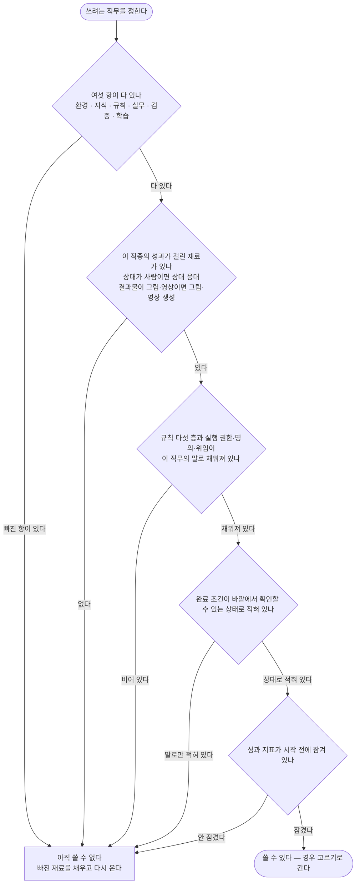

| 검사 칸 | 왜 여기서 막나 |
|------|------|
| 여섯 항 | × 로 묶인 항이라 하나만 없어도 전체가 0이 된다 |
| 성과가 걸린 재료 | 분야에 없는 재료는 0으로 두고 더해도 되지만, 성과가 걸린 재료가 없으면 그 항 자체가 0이 된다 |
| 규칙 다섯 층 | 채워져 있지 않으면 에이전트가 무엇을 해도 되는지 몰라 멈추거나, 하면 안 되는 것을 한다 |
| 완료 조건 | 바깥 상태로 적혀 있지 않으면 끝났는지 아무도 판정할 수 없다 |
| 성과 지표 | 일이 끝난 뒤에 잘 나온 지표를 골라 잡는 것을 막는다 |

---

### 경우 고르기

경우는 다섯 가지 물음으로 갈린다. 새 모양을 만들지 않고 아래 열세 가지 안에서 고른다.

**하나만 고르는 것이 아니다.** 물음은 층이라서 층마다 하나씩 골라 겹쳐 쓴다. 같은 층 안에서 둘을 고르지 않을 뿐이다.

| 물음 | 갈래 |
|------|------|
| 몇이 붙나 | 한 명 / 여럿 |
| 누가 시작하나 | 사람이 맡긴다 / 신호가 온다 / 스스로 찾아낸다 |
| 얼마나 빨리 답하나 | 초 단위 / 그 밖 |
| 한 번인가 되풀이인가 | 한 건 / 주기 |
| 피해가 분 단위로 커지나 | 그렇다 / 아니다 |

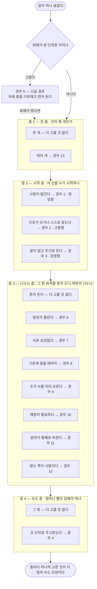

| 겹칠 때 | 바깥 층이 안쪽 층을 감싼다 |
|------|------|
| 층 순서 | 건 층 → 시작 층 → 나누는 층 → 속도 층 바깥 층이 정한 것 안에서 안쪽 층이 돈다 |
| 긴급 경로 | 층이 아니라 가로채기다 어느 조합으로 돌고 있든 먼저 끼어들고, 피해가 멎으면 원래 조합으로 돌아온다 |
| 같은 층 안 | 둘을 고르지 않는다 차례로와 동시에를 한 자리에 같이 쓰지 않는다 |
| 겹친 예 셋 | 여러 건 + 상시로 맡기기 + 동시에 = 경우 13 · 2 · 7 주기로 굴리며 사람 협력자에게 일부를 넘긴다 = 경우 3 · 12 상시로 받으며 초 단위로 응대한다 = 경우 2 · 4 |
| 대체인가 | 겹쳐도 판정은 하나다 고른 조합을 사람 손 없이 끝까지 돌았는지로 앞 절의 대체 판정을 그대로 쓴다 |

---

### 단일 — 한 명에게 맡기는 다섯 경우

#### 경우 1 — 한 건 맡기기 (위임형)

사람이 건을 하나 맡기고 결과물을 받는다. 나머지 열두 경우는 모두 이 한 바퀴를 바탕으로 모양만 달라진다.

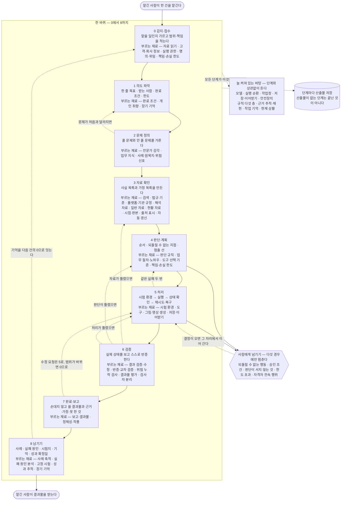

| 이 경우에만 더 쓰는 재료 | 사람 손이 닿는 자리 | 끝났다는 기준 |
|------|------|------|
| 없다 — 이것이 바탕 모양이다 | 맡길 때 한 번, 다섯 조건에 걸릴 때만 중간에 한 번 | 1에서 정한 완료 조건이 바깥 상태로 확인되고, 받는 사람이 되묻지 않는다 |

#### 경우 2 — 상시로 맡기기 (고용형)

사람이 건마다 맡기지 않는다. 자리를 맡겨 두면 신호가 올 때마다 스스로 시작한다.

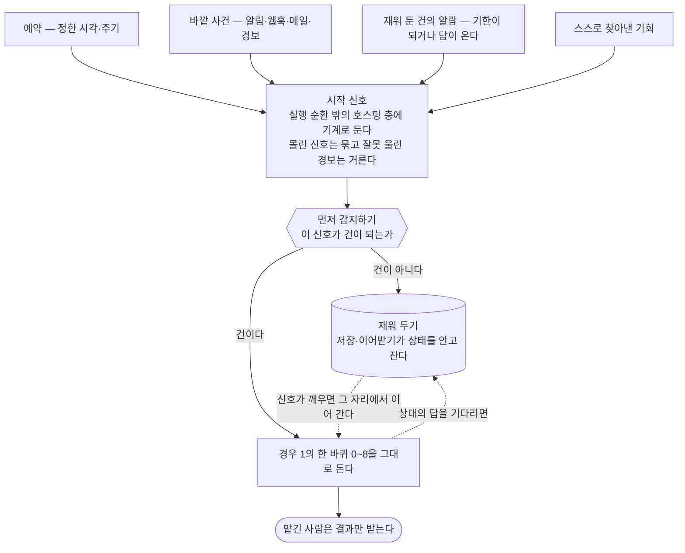

| 이 경우에만 더 쓰는 재료 | 사람 손이 닿는 자리 | 끝났다는 기준 |
|------|------|------|
| 시작 신호 · 먼저 감지하기 · 저장·이어받기 | 자리를 맡길 때 규칙과 한도를 한 번 정한다 그 뒤로는 다섯 조건에 걸릴 때만 | 놓친 신호가 0이고, 잘못 울린 경보가 걸러진 비율이 기준 위에 있다 |

#### 경우 3 — 계속 굴리기 (운영형)

끝이 있는 건이 아니라 주기로 도는 일이다. 완료 조건이 끝난 상태가 아니라 유지할 상태다.

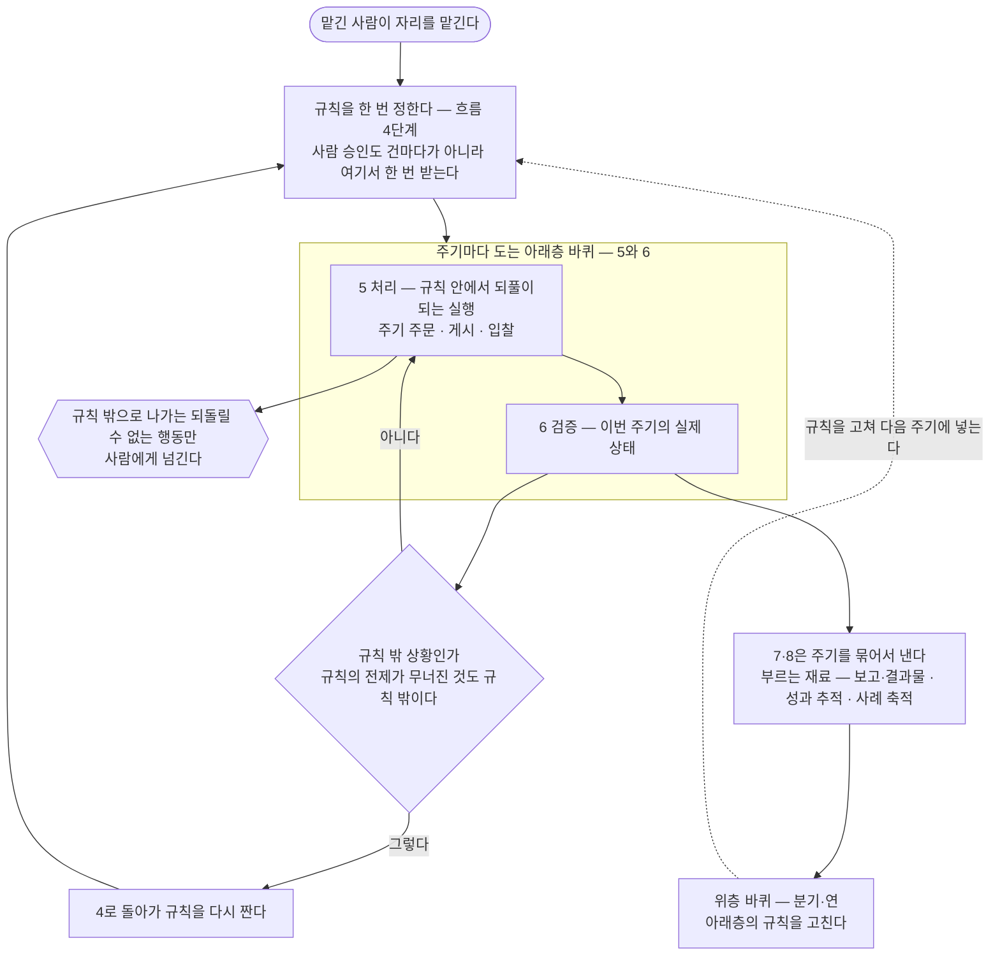

| 이 경우에만 더 쓰는 재료 | 사람 손이 닿는 자리 | 끝났다는 기준 |
|------|------|------|
| 먼저 감지하기 · 성과 추적 · 자동 학습 · 고정 시험 | 규칙을 정할 때 한 번 승인한다 규칙 밖으로 나갈 때만 다시 부른다 | 한 주기의 실패는 되돌아가기 조건이 아니라 다음 주기에 넣을 재료가 된다 유지할 상태가 주기마다 유지된다 |

#### 경우 4 — 실시간 상대 응대

음성·화상·채팅·방송처럼 초 단위로 주고받는다. 그 자리에서는 검증을 다 못 돌리므로 검증을 앞뒤로 나눈다.

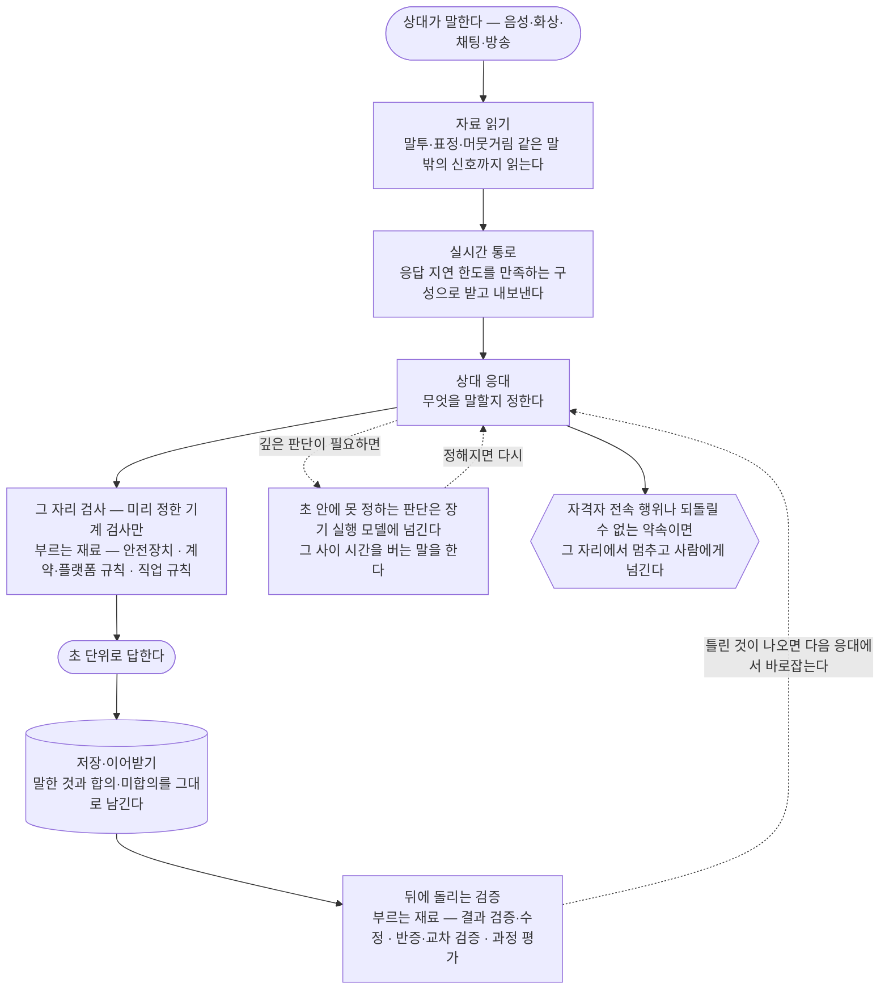

| 이 경우에만 더 쓰는 재료 | 사람 손이 닿는 자리 | 끝났다는 기준 |
|------|------|------|
| 실시간 통로 · 상대 응대 · 자료 읽기 · 안전장치 | 나가는 순간 끝나는 산출은 되돌릴 수 없는 행동으로 다뤄 미리 승인받는다 | 지연 한도를 지킨 응답 비율과, 뒤에 돌린 검증에서 걸린 것을 바로잡은 비율 |

#### 경우 5 — 긴급 경로

피해가 분 단위로 커지는 신호다. 흐름 1~3을 건너뛴다.

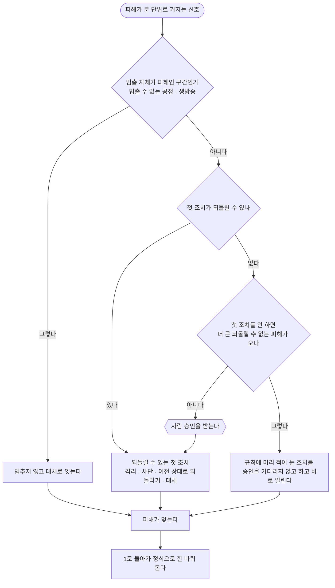

| 이 경우에만 더 쓰는 재료 | 사람 손이 닿는 자리 | 끝났다는 기준 |
|------|------|------|
| 먼저 감지하기 · 시작 신호 · 도구 · 책임·손실 한도 | 첫 조치가 되돌릴 수 없을 때만 승인 미리 적어 둔 조치는 사후 통보 | 피해가 멎었고, 멎은 뒤 정식 한 바퀴가 끝났다 |

---

### 복합 — 여럿이 나눠 하는 일곱 경우

여럿이 붙는 경우는 모두 나눠 맡기기 재료가 지휘한다. 공통 뼈대는 같다.

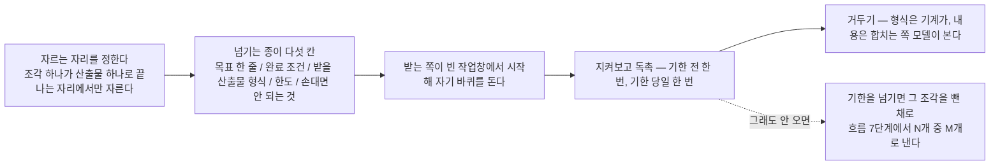

#### 경우 6 — 차례로 (순차)

앞 조각의 산출물이 뒤 조각의 입력이 된다.

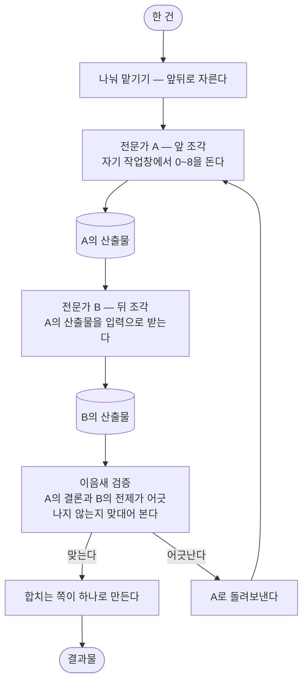

| 이 경우에만 더 쓰는 재료 | 사람 손이 닿는 자리 | 끝났다는 기준 |
|------|------|------|
| 나눠 맡기기 · 결과물 평가 | 없다 — 다섯 조건에 걸릴 때만 | 넘긴 조각이 다 거둬졌고 이음새가 맞다 |

#### 경우 7 — 동시에 (병렬)

조각끼리 상관이 없어 같이 보낸다. 가장 빠르지만 이음새가 가장 잘 어긋난다.

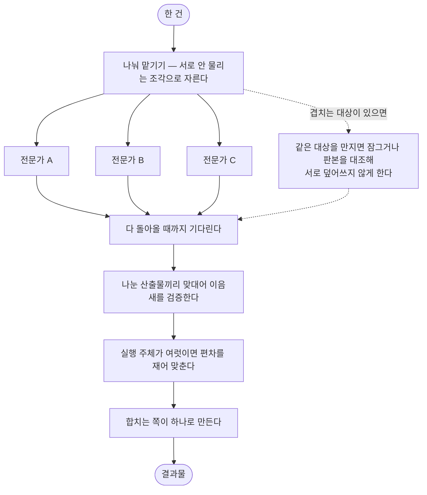

| 이 경우에만 더 쓰는 재료 | 사람 손이 닿는 자리 | 끝났다는 기준 |
|------|------|------|
| 나눠 맡기기 · 현재 상황 · 결과물 평가 | 없다 | 나눈 쪽이 안 나눈 쪽보다 시간·돈·결과물 점수에서 낫다 나쁘면 그 자리는 다음부터 자르지 않는다 |

#### 경우 8 — 될 때까지 (되풀이)

기준에 닿을 때까지 같은 조각을 다시 돌린다. 멈출 선이 없으면 무한히 돈다.

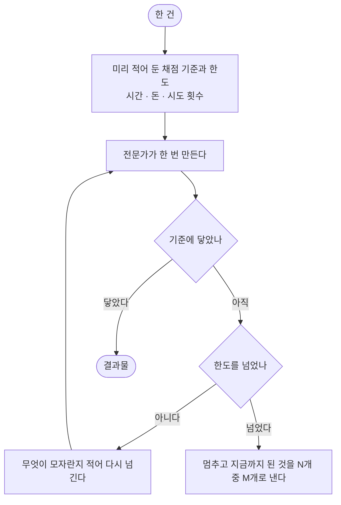

| 이 경우에만 더 쓰는 재료 | 사람 손이 닿는 자리 | 끝났다는 기준 |
|------|------|------|
| 나눠 맡기기 · 결과물 평가 · 완료 조건 · 책임·손실 한도 | 한도를 넘어 더 돌릴지는 한도 초과라 사람에게 넘긴다 | 기준에 닿았거나, 한도에서 멈추고 못 한 것을 밝혔다 |

#### 경우 9 — 쪼개 나눠 주고 모으기 (오케스트레이터-워커)

조각이 몇 개가 될지 미리 모른다. 한 에이전트가 그 자리에서 쪼개고 나눠 주고 모은다.

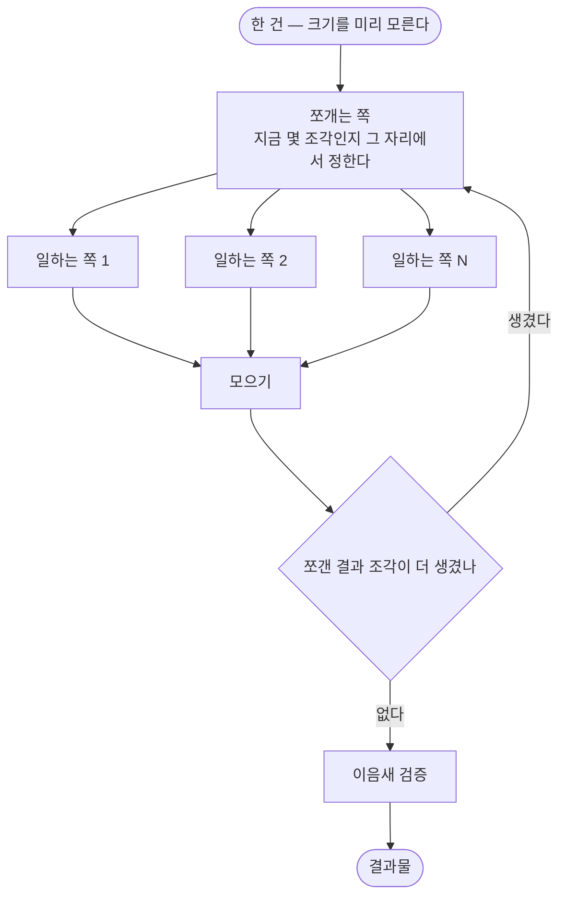

| 이 경우에만 더 쓰는 재료 | 사람 손이 닿는 자리 | 끝났다는 기준 |
|------|------|------|
| 나눠 맡기기 · 작업창 · 실행 순환 | 없다 | 나눠 놓고 안 거둔 조각이 0이다 |

#### 경우 10 — 만드는 쪽과 채점하는 쪽 (평가자-개선자)

만든 쪽이 자기 것을 채점하면 후하게 준다. 그래서 채점하는 쪽을 반드시 다른 모델로 둔다.

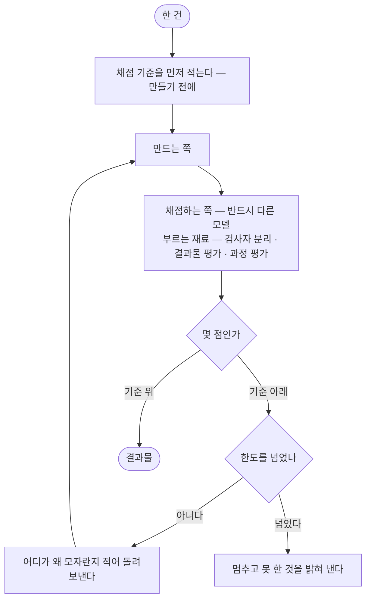

| 이 경우에만 더 쓰는 재료 | 사람 손이 닿는 자리 | 끝났다는 기준 |
|------|------|------|
| 검사자 분리 · 결과물 평가 · 과정 평가 · 반증·교차 검증 | 없다 | 채점 기준이 만들기 전에 적혔고, 만든 쪽과 채점한 쪽이 다른 모델이다 |

#### 경우 11 — 주도권 넘기기 (핸드오프)

분야가 통째로 바뀌어 조각을 나누는 것이 아니라 건 자체를 다른 전문가에게 넘긴다.

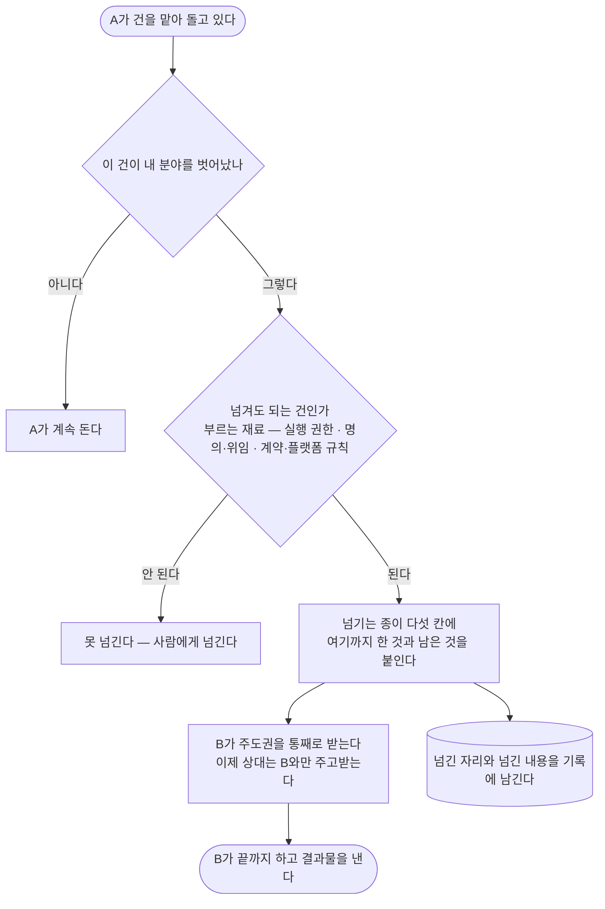

| 이 경우에만 더 쓰는 재료 | 사람 손이 닿는 자리 | 끝났다는 기준 |
|------|------|------|
| 나눠 맡기기 · 명의·위임 · 실행 권한 · 저장·이어받기 | 명의가 바뀌는 넘김은 승인 조건이라 사람에게 넘긴다 | 넘긴 뒤 상대가 A와 B 양쪽에 같은 것을 다시 말하지 않는다 |

#### 경우 12 — 사람 협력자가 섞인다

받는 쪽이 에이전트가 아니라 사람이다. 넘기고 거두는 구조는 같고, 움직이는 방식만 다르다.

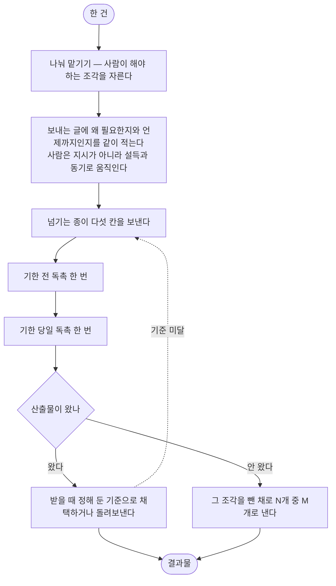

| 이 경우에만 더 쓰는 재료 | 사람 손이 닿는 자리 | 끝났다는 기준 |
|------|------|------|
| 나눠 맡기기 · 상대 응대 · 고객·회사 정보 | 협력자가 사람이므로 그 사람이 답할 때마다 닿는다 | 넘긴 조각 중 기한 안에 돌아온 비율이 기준 위에 있다 |

---

### 여러 건을 한꺼번에

#### 경우 13 — 여러 건이 겹친다

앞의 열두 경우 위에 겹쳐서 온다. 건마다 한 바퀴를 도는 것은 같고, 건 사이의 순서와 자원을 정하는 층이 하나 더 붙는다.

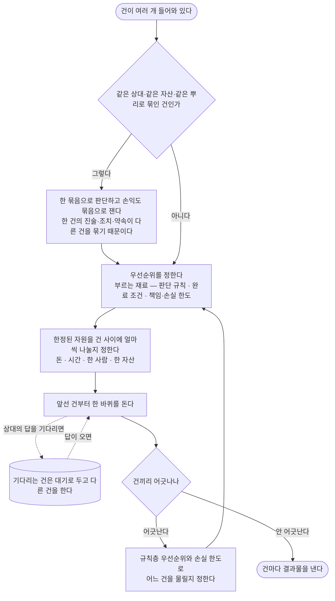

| 이 경우에만 더 쓰는 재료 | 사람 손이 닿는 자리 | 끝났다는 기준 |
|------|------|------|
| 현재 상황 · 작업 기억 · 장기 기억 · 책임·손실 한도 | 어느 건을 물릴지가 한도 초과에 걸리면 사람에게 넘긴다 | 대기로 둔 건이 잊히지 않고, 묶인 건의 손익이 묶음으로 재어진다 |

---

### 단계마다 불려 나오는 재료

어느 경우든 한 바퀴 안에서 재료 58개가 아래 자리에 불려 나온다. 빈 자리가 있으면 그 단계는 맨손으로 도는 것이다.

| 단계 | 불려 나오는 재료 |
|------|------|
| 단계와 상관없이 늘 | 모델 · 실행 순환 · 작업창 · 저장·이어받기 · 안전장치 절대 원칙 > 직업 규칙 > 계약·플랫폼 규칙 > 회사 규칙 > 개인 취향 작업 기억 · 현재 상황 · 근거 추적·재현 · 업무 처리 흐름 |
| 0 감지·접수 | 시작 신호 · 먼저 감지하기 · 자료 읽기 · 고객·회사 정보 실행 권한 · 명의·위임 · 책임·손실 한도 · 장기 기억 |
| 1 의도 파악 | 완료 조건 · 개인 취향 · 정체성·작풍 · 상대 응대 · 장기 기억 |
| 2 문제 정의 | 전문가 감각 · 업무 지식 · 사례·암묵지·위험 신호 · 판단 규칙 |
| 3 자료 확인 | 검색 · 법규·기준 · 플랫폼·기관 규정 · 해석 자료 · 일반 자료 · 현황 자료 고객·회사 정보 · 시점·판본 · 출처 표시 · 자동 갱신 · 자료 읽기 |
| 4 판단·계획 | 판단 규칙 · 업무 절차·노하우 · 도구 선택 기준 · 나눠 맡기기 책임·손실 한도 · 사람에게 넘기기 |
| 5 처리 | 도구 · 시험 환경 · 그림·영상 생성 · 실시간 통로 · 상대 응대 저장·이어받기 · 사람에게 넘기기 |
| 6 검증 | 결과 검증·수정 · 반증·교차 검증 · 위험 누락 검사 결과물 평가 · 과정 평가 · 검사자 분리 |
| 7 완료·보고 | 보고·결과물 · 정체성·작풍 · 그림·영상 생성 |
| 8 남기기 | 사례 축적 · 실패 원인 분석 · 고정 시험 · 자동 학습 · 성과 추적 장기 기억 · 먼저 감지하기 |

산식은 항 6개 → 계통 9개 → 재료 58개의 세 층이다. 위 표는 재료 층이고, 계통 층으로 보면 아래처럼 자리가 갈린다.

| 계통 | 주로 도는 자리 |
|------|------|
| 환경 — 실행 기반 | 단계와 상관없이 늘 · 5 처리 |
| 자료·검색 | 3 자료 확인 |
| 지식·경험 | 2 문제 정의 · 4 판단·계획 · 7 완료·보고 |
| 기억·상태 | 0 감지·접수 · 8 남기기 · 단계와 상관없이 늘 |
| 규칙·권한 | 0 감지·접수 · 단계와 상관없이 늘 |
| 행동 체계 | 1 의도 파악 · 4 판단·계획 · 5 처리 · 7 완료·보고 |
| 실무 | 0에서 8까지 전체 |
| 검증·평가 | 6 검증 · 단계와 상관없이 늘 |
| 학습·개선 | 8 남기기 |

---

### 안 되는 조합

경우를 골랐어도 아래에 걸리면 그대로 쓰면 안 된다.

| 하려는 것 | 왜 안 되나 | 대신 |
|------|------|------|
| 중간 상태를 주고받아야 하는 자리에서 자른다 | 넘기는 자리마다 정보가 새는데, 그 자리는 셀 수도 없이 샌다 | 한 명이 통째로 한다 |
| 만든 쪽이 자기 것을 채점한다 | 후하게 준다 | 채점하는 쪽을 다른 모델로 둔다 — 경우 10 |
| 되풀이 경우에서 건마다 승인을 받는다 | 되풀이가 안 돌아간다 | 규칙을 정할 때 한 번 받고, 규칙 밖만 넘긴다 — 경우 3 |
| 초 단위 응대 자리에서 검증을 다 돌린다 | 지연 한도를 못 지킨다 | 그 자리는 기계 검사만, 나머지는 뒤에 — 경우 4 |
| 한도를 안 적고 될 때까지 돌린다 | 멈추지 않는다 | 시간·돈·시도 횟수를 먼저 적는다 — 경우 8 |
| 긴급인데 정식 순서대로 1부터 돈다 | 도는 동안 피해가 커진다 | 되돌릴 수 있는 첫 조치부터 — 경우 5 |
| 나누면 무조건 빠르다고 본다 | 나눈 쪽이 더 느리고 더 나쁜 자리가 있다 | 안 나눈 것과 견줘 보고 나쁘면 그 자리는 자르지 않는다 |
| 성과 지표를 일 끝난 뒤에 정한다 | 잘 나온 지표를 골라 잡게 된다 | 맡기 전에 적고 잠근다 — 쓰기 전 검사 |
