# 전문 AI 에이전트 정의

## 목표 ✅

20년차 인간 전문가를 대체할 수 있는 전문 AI 에이전트를 만든다.

---

### 원하는 것 ✅

1. 인간 전문가를 고용하는 대신 전문 AI 에이전트에게 업무를 맡긴다
   - 20년차만큼 전문성과 성과가 있어야 믿고 맡길 수 있다
   - 사람은 맡기고 결과를 받을 뿐, 중간에 손대지 않는다
   - 사람이 끼는 자리는 다섯 경우 (되돌릴 수 없는 행동 · 승인 조건 · 판단이 서지 않는 것 · 한도 초과 · 자격자 전속 행위) 뿐이다. 그때도 준비·기록·검증은 다 끝낸 뒤 결정만 받는다
   - 이 다섯 가지를 벗어나 사람을 부르면 대체가 아니다
2. 온라인·컴퓨터 안에서 시작해 끝나는 일에 집중한다
   - 성과가 화면·문서·시스템·통신 안에서만 나는 전문가와 업무를 다룬다

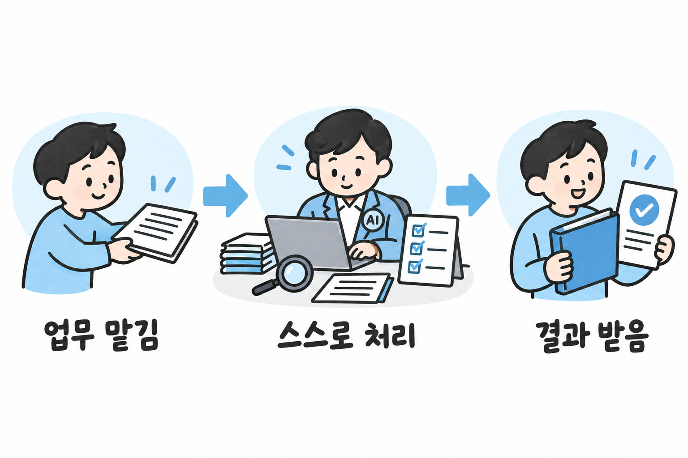

---

### 원하지 않는 것 ✅

1. 역할놀이, 상담 챗봇, 단순 질의응답, 검색·요약만 해 주는 수준
2. 몸·현장·실물 조작이 있어야 성과가 나는 일 (건물 시공·조리·의료 시술·촬영·매장 운영)
   - 몸으로 직접 움직이는 로봇이 있어야 하는 일은 이번 범위 밖이다


```mermaid
%%{init: {"flowchart": {"wrappingWidth": 640, "curve": "basis", "nodeSpacing": 45, "rankSpacing": 55, "padding": 14, "useMaxWidth": true}, "themeVariables": {"fontSize": "15px"}} }%%
flowchart TB
    S(["어떤 일을 맡길지 고른다"]):::good
    Q1{{"화면·문서·시스템·통신 안에서<br/>시작해 끝나는 일인가"}}:::note
    O1["몸·현장·실물을 다뤄야 한다<br/>시공 · 조리 · 시술<br/>촬영 · 매장 운영"]:::stop
    Q2{{"사람의 판단이<br/>결과물을 가르는 일인가"}}:::note
    O2["역할놀이 · 상담 챗봇<br/>단순 질의응답 · 검색 요약"]:::stop
    IN(["이번에 다루는 일<br/>20년차를 대체할 자리"]):::good
    S --> Q1
    Q1 -- "아니다" --> O1
    Q1 -- "그렇다" --> Q2
    Q2 -- "아니다" --> O2
    Q2 -- "그렇다" --> IN
    classDef main fill:#dbeafe,stroke:#2563eb,stroke-width:2px,color:#17314f
    classDef stop fill:#fee2e2,stroke:#dc2626,stroke-width:2px,color:#7f1d1d
    classDef back fill:#ffedd5,stroke:#ea580c,stroke-width:2px,color:#7c2d12
    classDef store fill:#e5e7eb,stroke:#6b7280,stroke-width:2px,color:#1f2937
    classDef good fill:#dcfce7,stroke:#16a34a,stroke-width:2px,color:#14532d
    classDef note fill:#fef9c3,stroke:#ca8a04,stroke-width:2px,color:#713f12
```

---

## 인간 전문가 ✅

```mermaid
%%{init: {"flowchart": {"wrappingWidth": 640, "curve": "basis", "nodeSpacing": 45, "rankSpacing": 55, "padding": 14, "useMaxWidth": true}, "themeVariables": {"fontSize": "15px"}} }%%
flowchart TB
    P(["어떤 직업의 사람 하나"]):::good
    A{{"이 사람 손에서 결과물이 나오나"}}:::note
    X1["말·평가·소개·가르침만 한다<br/>고문 · 심사위원 · 기자<br/>강사 · 헤드헌터"]:::stop
    B{{"아무나 시켜도 비슷한 결과가 나오나"}}:::note
    X2["정해진 대로 몸과 시간을 쓴다<br/>돌봄 · 이사 · 청소<br/>인쇄 · 비서 · 텔레마케팅"]:::stop
    C{{"이 사람이 빠지면 성과가 안 나오나"}}:::note
    X3["자리만 있고 성과는 남이 낸다<br/>임원 · 협회 직원"]:::stop
    YES(["전문가다 — 세 조건을 다 갖췄다"]):::good
    P --> A
    A -- "남이 만든다" --> X1
    A -- "내 손에서 나온다" --> B
    B -- "비슷하다" --> X2
    B -- "판단이 성과를 가른다" --> C
    C -- "남이 내도 나온다" --> X3
    C -- "안 나온다" --> YES
    classDef main fill:#dbeafe,stroke:#2563eb,stroke-width:2px,color:#17314f
    classDef stop fill:#fee2e2,stroke:#dc2626,stroke-width:2px,color:#7f1d1d
    classDef back fill:#ffedd5,stroke:#ea580c,stroke-width:2px,color:#7c2d12
    classDef store fill:#e5e7eb,stroke:#6b7280,stroke-width:2px,color:#1f2937
    classDef good fill:#dcfce7,stroke:#16a34a,stroke-width:2px,color:#14532d
    classDef note fill:#fef9c3,stroke:#ca8a04,stroke-width:2px,color:#713f12
```
한 분야의 일을 직접 맡아 20년차 수준으로 판단하고 처리해 성과를 내는 사람. 처음 보는 상황에서도 잠깐 당황할 뿐, 결국 해낸다.

아래 세 가지를 모두 갖춰야 전문가다.
| 조건 | 뜻 | 가르는 질문 | 아니면 |
|------|-----|-----------|--------|
| 직접 처리한다 | 이 사람의 판단이 그대로 결과물이 된다 | 이 사람 손에서 결과물이 나오나? | 말·평가·소개·가르침만 하고 결과물은 남이 만드는 사람. 곁에서 조언만 하는 고문·컨설턴트, 남이 한 일을 심사하고 검사하는 심사위원·감사, 기자, 강사, 사람을 찾아 회사에 소개하는 헤드헌터가 여기다 |
| 판단이 성과를 가른다 | 같은 일도 초보와 고수의 성과 차이가 크고, 오래 할수록 성과가 더 올라간다 | 아무나 시켜도 비슷한 결과가 나오나? | 정해진 대로 몸과 시간을 쓰는 사람 (돌봄, 이사, 청소, 인쇄, 비서, 텔레마케팅) |
| 성과를 낸다 | 일을 맡기면 돈·결과·문제 해결이 실제로 나온다 | 이 사람이 빠지면 성과가 안 나오나? | 자리만 있고 성과는 남이 내는 사람 (임원, 협회 직원) |

---

### 초보와 전문가를 가르는 것 ✅

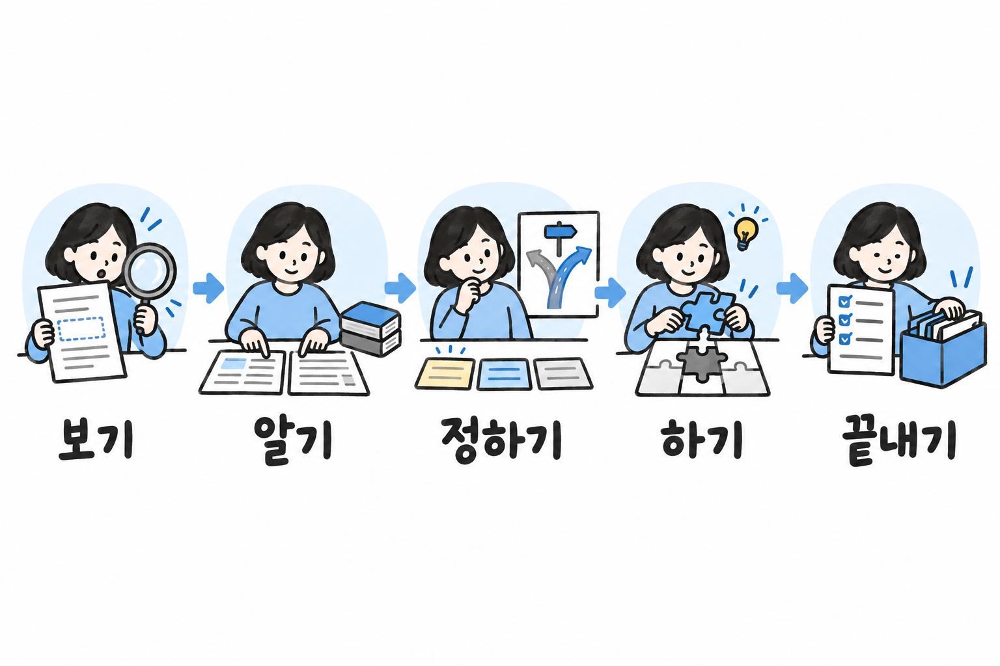


```mermaid
%%{init: {"flowchart": {"wrappingWidth": 640, "curve": "basis", "nodeSpacing": 45, "rankSpacing": 55, "padding": 14, "useMaxWidth": true}, "themeVariables": {"fontSize": "15px"}} }%%
flowchart LR
    A["보기<br/>문제·빠진 것·예외를 짚는다"]:::main
    B["알기<br/>정석·모르는 것·자료를 안다"]:::main
    C["정하기<br/>예측하고 방법·순서를 고른다"]:::main
    D["하기<br/>처음 보는 상황에서도 해낸다"]:::main
    E["끝내기<br/>검증하고 멈출 때를 안다"]:::main
    A --> B --> C --> D --> E
    classDef main fill:#dbeafe,stroke:#2563eb,stroke-width:2px,color:#17314f
    classDef stop fill:#fee2e2,stroke:#dc2626,stroke-width:2px,color:#7f1d1d
    classDef back fill:#ffedd5,stroke:#ea580c,stroke-width:2px,color:#7c2d12
    classDef store fill:#e5e7eb,stroke:#6b7280,stroke-width:2px,color:#1f2937
    classDef good fill:#dcfce7,stroke:#16a34a,stroke-width:2px,color:#14532d
    classDef note fill:#fef9c3,stroke:#ca8a04,stroke-width:2px,color:#713f12
```

#### 1. 보기 ✅

| 항목 | 초보 | 8년차 | 20년차 |
|------|------|--------|--------|
| 문제 보기 | 말한 그대로를 문제로 본다 | 말 뒤의 진짜 문제와, 말한 사람도 모르는 문제까지 짚는다 | 지금 문제가 앞으로 어떤 문제를 낳을지까지 보고, 풀 문제와 안 풀 문제를 정한다<br>필요하면 문제를 다시 정의해 판 자체를 바꾼다 |
| 빠진 것 보기 | 눈앞에 있는 것만 본다 | 있어야 하는데 없는 것 (안 낸 서류, 안 나온 숫자, 안 한 말) 을 알아본다 | 없는 것이 왜 없는지 (잊었나, 숨겼나, 없는 게 정상인가) 까지 읽고, 그것이 결과를 뒤집을지 가늠한다 |
| 예외·함정 | 예외를 만나면 멈추거나 틀린다 | 이 일에서 자주 터지는 예외와 함정을 미리 알고, 작은 이상 신호에서 알아챈다 | 예외가 생기는 원리를 알아 처음 보는 예외도 예측한다<br>함정을 피하는 데서 그치지 않고, 상대의 함정과 예외 조항을 내 쪽에 유리하게 이용한다 |

#### 2. 알기 ✅

| 항목 | 초보 | 8년차 | 20년차 |
|------|------|--------|--------|
| 아는 것 | 책에서 배운 정석 (교과서에 나오는 기본 방법) 만 안다 | 정석이 어디까지 통하고 어디서부터 안 통하는지, 그 이유까지 안다 | 정석이 왜 그렇게 만들어졌는지 원리와 내력 (그 방법이 굳어지기까지의 사정) 을 알아, 정석이 없는 처음 보는 일도 원리에서 풀어낸다 |
| 모르는 것 | 모른다는 것도 모른 채 그냥 나간다 | 자기가 모르는 지점을 알고, 거기서 확인하거나 물어본다 | 이 분야에서 아직 아무도 모르는 것과 다들 안다고 착각하는 것을 안다<br>누구에게 무엇을 물어야 답이 나오는지 안다 |
| 자료 대하기 | 받은 자료를 그대로 믿는다 | 자료가 틀리기 쉬운 곳을 알고 원문과 대조한다 | 자료가 만들어진 사정 (누가 왜 이렇게 썼는지) 을 읽어 자료가 말하지 않는 것을 알아내고, 자료 없이도 어디까지 판단해도 되는지 안다 |

#### 3. 정하기 ✅

| 항목 | 초보 | 8년차 | 20년차 |
|------|------|--------|--------|
| 결과 예측 | 해 봐야 안다 | 시작 전에 결과와 부작용을 머릿속으로 끝까지 돌려 본다 | 몇 달·몇 년 뒤의 2차·3차 영향까지 내다보고, 그 예측이 얼마나 확실한지도 안다<br>그래서 예측이 빗나가도 살아남을 길을 미리 마련해 둔다 |
| 상대 예측 | 내가 할 일만 본다 | 상대 (고객, 상대방, 심사관, 시장) 가 어떻게 움직일지 미리 읽고 대비한다 | 상대가 움직일 방향을 미리 만든다<br>상대·기관·시장이 무엇을 얻고 무엇을 잃는지 (이해관계) 와 버릇을 알아 협상과 판을 설계한다 |
| 방법 고르기 | 아는 방법 하나로 다 한다 | 여러 방법의 비용과 위험을 재서 이 상황에 맞는 것을 고른다 | 있는 방법으로 안 되면 방법을 새로 만들거나 섞고 순서를 다시 짠다<br>남들이 못 보는 길을 안다 |
| 우선순위 | 시킨 순서나 눈에 띄는 순서대로 한다 | 성과를 가르는 것부터 하고 나머지는 뒤로 미룬다 | 지금 성과와 나중 성과, 이 건과 다른 건 사이의 우선순위까지 정한다<br>급해 보이는 일이 왜 급하지 않은지 안다 |
| 버리기 | 시킨 것을 다 한다 | 안 해도 될 일과 하면 안 될 일을 가려 빼고, 왜 빼는지 말해 준다 | 일 자체를 받을지 말지, 이 방식 전체를 버리고 다시 짤지 정한다<br>이미 들인 돈과 시간이 아까워도 버린다 |
| 정보가 모자랄 때 | 다 갖춰질 때까지 기다리거나, 아무렇게나 가정한다 | 모자란 채로도 판단하되 가정을 드러내고, 틀리면 되돌릴 길을 남긴다 | 어떤 정보는 모자라도 결론이 안 바뀌는지 알아서, 그런 정보는 기다리지 않는다<br>결론을 바꿀 정보만 골라 가장 싸고 빠르게 얻어 낸다 |
| 되돌릴 수 없는 것 | 모든 결정을 같은 무게로 다룬다 | 되돌릴 수 없는 결정을 알아보고, 그것만은 느리게 확인하고 한다 | 되돌릴 수 없는 큰 결정을 되돌릴 수 있는 작은 결정 여러 개로 쪼개 짠다<br>큰 손실이 나는 선을 먼저 정해 두고 그 안에서만 움직인다 |

#### 4. 하기 ✅

| 항목 | 초보 | 8년차 | 20년차 |
|------|------|--------|--------|
| 처음 보는 상황 | 배운 대로 안 되면 멈추거나 아무거나 한다 | 잠깐 당황하지만 비슷한 경험을 끌어와 길을 찾고, 되돌릴 수 있는 것부터 해 본다 | 당황하는 시간이 짧다<br>처음 보는 상황일수록 원리로 되돌아가 새 길을 만들고, 그래도 끝까지 해낸다<br>초보와의 차이가 가장 크게 벌어지는 자리다 |
| 결과물 수준 | 내가 보기에 다 됐으면 끝낸다 | 받는 사람이 손대지 않고 그대로 쓸 수 있는 수준을 알고 거기까지 맞춘다 | 받는 사람이 그것으로 다음에 무엇을 할지까지 보고 거기에 맞춰 만든다<br>무엇을 빼야 좋아지는지 알기 때문에 결과물이 짧고 분명하다 |

#### 5. 끝내기 ✅

| 항목 | 초보 | 8년차 | 20년차 |
|------|------|--------|--------|
| 검증 | 한 번 훑고 낸다 | 어디서 틀리기 쉬운지 알고 그 자리를 다른 길로 다시 확인한다 | 내 결론이 틀렸다면 어디서 틀렸을지 일부러 반대편에 서서 공격해 본다<br>상대·심사관·시장이 어떻게 무너뜨릴지를 그려 보며 검증한다 |
| 멈추기 | 언제 끝인지 몰라 계속 만지거나 일찍 놓는다 | 충분한 지점과 더 가면 위험한 지점을 안다 | 언제 밀어붙이고 언제 물러날지 판을 읽고 정한다<br>잘되고 있을 때도 멈춰야 할 때를 안다 |
| 실패 경험 | 같은 실수를 다시 한다 | 자기와 남의 실패에서 배워 같은 실수를 안 하고, 실패했을 때 수습하는 법도 안다 | 실패가 나는 조건을 알아 그 조건 자체를 미리 없앤다<br>실패해도 큰 손실은 안 나게 판을 짜고, 실패에서 남이 못 보는 기회를 본다 |

---

### 종류 ✅


```mermaid
%%{init: {"flowchart": {"wrappingWidth": 640, "curve": "basis", "nodeSpacing": 45, "rankSpacing": 55, "padding": 14, "useMaxWidth": true}, "themeVariables": {"fontSize": "15px"}} }%%
flowchart TB
    W(["일을 어떻게 맡기나"]):::good
    Q1{{"건마다 통째로<br/>바깥에 맡기나"}}:::note
    T1["위임형<br/>변호사 · 세무사 · 번역가처럼<br/>건 단위로 맡는다"]:::main
    Q2{{"회사 안에서<br/>한 직무를 늘 맡나"}}:::note
    T2["고용형<br/>기획 · 개발 · 영업처럼<br/>상시로 맡는다"]:::main
    T3["운영형<br/>채널 · 상점 · 작품을<br/>스스로 계속 굴려 키운다"]:::main
    W --> Q1
    Q1 -- "그렇다" --> T1
    Q1 -- "아니다" --> Q2
    Q2 -- "그렇다" --> T2
    Q2 -- "아니다" --> T3
    classDef main fill:#dbeafe,stroke:#2563eb,stroke-width:2px,color:#17314f
    classDef stop fill:#fee2e2,stroke:#dc2626,stroke-width:2px,color:#7f1d1d
    classDef back fill:#ffedd5,stroke:#ea580c,stroke-width:2px,color:#7c2d12
    classDef store fill:#e5e7eb,stroke:#6b7280,stroke-width:2px,color:#1f2937
    classDef good fill:#dcfce7,stroke:#16a34a,stroke-width:2px,color:#14532d
    classDef note fill:#fef9c3,stroke:#ca8a04,stroke-width:2px,color:#713f12
```

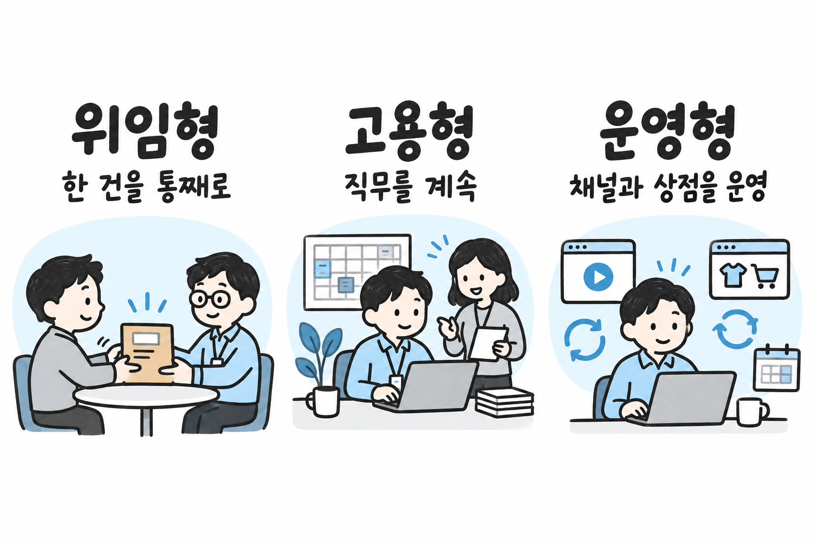

#### 위임형 — 건 단위로 외부에 통째로 맡김 ✅

| 분야 | 직종 | 주 고객 | 목표 | 성과 |
|------|------|--------|------|------|
| 법률 (소송) | 변호사 (민사·상사 송무) | 돈·계약·손해를 두고 남과 다투게 된 개인·회사 — 받을 돈은 받아 내고 물어 줄 돈은 줄이고 싶음 | 소송·분쟁에서 의뢰인이 잃는 것은 가장 적게, 얻는 것은 가장 많게 함<br>이길 수 없는 싸움은 시작 전에 알려 주고 합의로 끝냄 | 유리한 종결률 (이긴 것 + 유리한 합의 + 각하. 각하는 상대가 낸 소송이 재판 조건을 못 갖춰 내용도 안 보고 돌려보내진 것) ÷ 종결한 건 수<br>걸린 돈이 큰 건에 무게를 더 준 유리 종결률 (큰 건 몇 개 지면 작은 승소 여럿이 무의미)<br>신청·항소 인용률 (내가 낸 신청을 재판부가 받아 준 비율)<br>의뢰인 추천 의향 (NPS) |
| 법률 (소송) | 변호사 (형사 변호) | 수사·재판을 받게 된 사람 — 구속과 처벌을 피하거나 가장 가볍게 끝내고 싶음<br>범죄 피해자 — 피해를 인정받고 처벌·배상을 받아 내고 싶음 | 수사 단계에서 끝내거나 (불송치는 경찰이 검찰로 안 넘김, 불기소는 검찰이 재판에 안 넘김), 재판에서 무죄·집행유예 (형은 정하되 일정 기간 사고 없으면 안 살게 해 줌)·가벼운 형으로 막음<br>구속을 막고 풀려나게 함 | 불송치·불기소·무혐의 (죄를 지은 게 아니라고 결론남) 비율<br>구속영장 기각 (가두라는 요청을 판사가 물리침)·구속적부심 (가둔 게 맞는지 다시 따져 달라는 신청)·보석 (보증금 내고 풀려남) 인용률<br>구형 (검사가 요구한 형벌) 대비 선고형 (판사가 실제로 내린 형벌) 감경폭, 집행유예·무죄 비율<br>피해자 대리 시 합의금·처벌 결과 |
| 법률 (소송) | 변호사 (가사·상속) | 이혼·양육·상속·유언 문제를 겪는 가족 — 재산과 아이를 지키면서 다툼을 짧게 끝내고 싶음 | 재산 분할·위자료·양육권을 유리하게 받아 내고, 상속 다툼을 가족 관계가 덜 망가지게 끝냄 | 재산분할·위자료 청구액 대비 인정액<br>양육권·면접교섭 (같이 안 사는 부모가 아이를 정기적으로 만나는 권리) 목표 달성률<br>조정 (법원이 중간에서 서로 조건을 맞춰 주는 절차)·합의로 끝낸 비율과 걸린 기간<br>상속 분쟁의 유리 종결률 |
| 법률 (소송) | 변호사 (행정·조세 송무) | 정부·지자체·세무서의 처분 (인허가 (사업을 해도 된다는 나라의 허락) 거부, 영업정지, 과징금 (법을 어긴 회사에 물리는 돈), 세금 부과) 을 받은 개인·회사 — 처분을 취소·감경받고 그동안 영업이 멈추지 않길 원함 | 부당한 처분을 취소시키거나 줄이고, 재판 중에 영업이 멈추지 않게 함 | 행정심판 (재판까지 가기 전에 행정기관에 다시 판단해 달라고 하는 절차)·행정소송 인용률<br>집행정지 인용률 (처분 효력을 재판 끝날 때까지 멈춤)<br>취소·감경된 처분 금액 |
| 법률 (소송) | 변호사 (도산·회생) | 빚을 갚을 수 없게 된 회사·개인 — 사업을 살리거나, 못 살리면 빚을 정리하고 다시 시작하고 싶음<br>채권자 — 최대한 회수하고 싶음 | 회생 (빚을 줄이고 나눠 갚으면서 사업을 계속하는 절차) 으로 사업을 살리거나, 파산·면책 (남은 빚을 법으로 없애 줌) 으로 빚을 정리해 다시 시작하게 함<br>채권자 대리 시 회수액을 최대로 함 | 회생 개시 (절차를 시작해도 된다는 결정)·인가 (갚을 계획을 법원이 승인) 비율<br>승인된 변제율 (전체 빚 중 갚기로 한 비율) 과 그대로 갚아 낸 비율<br>면책 인용률<br>채권자 대리 시 회수율 |
| 법률 (자문) | 변호사 (기업 자문) | 계약·규제·노무 (직원 채용·급여·해고 같은 노동 문제)·개인정보 문제가 늘 생기는 회사 — 나중에 분쟁이나 제재 (감독기관이 내리는 벌) 로 안 번지게 미리 막고, 사업이 안 멈추게 빨리 답을 얻고 싶음 | 계약·거래가 나중에 분쟁이나 제재로 번지지 않게 막음<br>사업이 막히지 않게 빠르게 답을 줌 | 자문한 계약에서 난 분쟁·손실 건수<br>계약 검토에 걸린 날수<br>고객 유지율 (다음 해에도 맡기는 비율) |
| 법률 (자문) | 변호사 (M&A·투자 거래) | 회사를 사고팔거나 투자를 주고받는 회사·투자자 — 거래는 깨지 않으면서 숨은 위험은 안 떠안고 조건은 유리하게 하고 싶음 | 거래를 성사시키되 진술·보증 (파는 쪽이 회사에 이런 문제는 없다고 계약서에 못 박는 약속)·손해배상 조항으로 위험을 상대에게 넘김 | 거래 성사율 (계약 뒤 실제 종결)<br>종결 후 진술·보증 위반으로 난 손실 건수<br>협상에서 우리 쪽 요구대로 넣은 핵심 조항 비율<br>서명까지 걸린 기간 |
| 법률 (등기·행정) | 법무사 (등기) | 집·건물을 사고팔거나 담보 대출을 받는 개인·회사, 법인을 세우거나 바꾸는 회사 — 등기 (집·건물의 주인이 누구고 빚이 얼마나 걸려 있는지 나라 장부에 적는 일) 를 한 번에 틀림없이 끝내고 싶음 | 등기·법인 서류를 한 번에 틀림없이 접수시킴 | 보정 명령 (서류가 틀렸으니 고쳐 오라는 지시)·각하 비율 (기한 안에 못 고치면 통째로 반려됨)<br>접수부터 완료까지 걸린 날수<br>등기 사고 (빠뜨림, 순위 실수 — 담보를 잡는 차례가 뒤로 밀림) 건수 |
| 법률 (등기·행정) | 법무사 (개인회생·파산) | 빚을 감당 못 하는 개인 — 법원 절차로 빚을 줄이거나 없애고 싶음 | 개인회생·파산 신청을 한 번에 통과시켜 빚을 줄임 | 개시·인가율<br>보정 명령 횟수<br>탕감된 채무 비율<br>인가 뒤 변제 이행률 |
| 법률 (등기·행정) | 행정사 (인허가·지원금) | 사업을 열거나 넓히려는 사람·회사 — 인허가와 정부 지원금을 한 번에 통과시키고 싶음 | 인허가·정부지원금을 한 번에 통과시킴 | 승인율<br>보정 요구 횟수<br>받아 낸 지원금액 |
| 법률 (등기·행정) | 행정사 (출입국·비자) | 한국에 오거나 머물려는 외국인, 외국인을 채용하려는 회사 — 비자·체류 자격을 거절 없이 기한 안에 받고 싶음 | 비자·체류 자격 (한국에 머물 수 있는 자격)·귀화 (한국 국적을 새로 얻는 것) 를 거절 없이 기한 안에 받게 함 | 승인율·거절률<br>처리 기간<br>보완 요구 횟수 |
| 법률 (등기·행정) | 공증인 | 유언·계약·차용 문서를 만드는 개인·회사 — 나중에 다툼이 안 생기게 법적 힘을 붙이고 싶음 | 문서에 나중에 다툼이 안 생기도록 법적 힘을 붙여 줌 | 공증 (자격 있는 사람이 문서가 진짜라고 확인해 주는 일) 이 무효가 되거나 흠이 난 건수. 일부러 그랬거나 조금만 신경 썼으면 안 틀렸을 큰 실수 (중과실) 면 손해배상 책임을 진다<br>서류 검증 오류율<br>갖춰야 할 조건을 빠뜨린 건수 (유언 공증에 증인이 안 온 경우 등) |
| 지식재산 | 변리사 (특허) | 기술·제품을 개발한 회사·연구자 — 남이 못 베끼게 권리를 넓게 잡아 등록하고 싶음 | 권리를 넓게 잡아 등록시키고 남이 못 베끼게 지킴 | 등록률 (등록 ÷ 최종 처리된 출원. 출원은 특허청에 권리를 달라고 낸 신청. 특허 평균 74.6%, 2024년)<br>심사 의견 회신 횟수 (한 번에 통과)<br>등록된 권리 범위 (경쟁사가 피해 갈 수 없는 정도) |
| 지식재산 | 변리사 (상표·디자인) | 브랜드·제품 외형을 가진 회사·창업자 — 이름과 모양을 남이 못 쓰게 먼저 잡고 싶음 | 브랜드 이름·로고·제품 모양을 거절 없이 등록시키고 침해를 막음 | 등록률<br>거절 이유 (먼저 등록된 상표와 비슷함 등) 사전 회피율<br>침해 경고·대응 결과 |
| 지식재산 | 변리사 (심판·분쟁) | 남의 권리와 부딪힌 회사 — 남의 권리는 무효로 만들거나 피해 가고, 내 권리 침해는 막고 싶음 | 남의 권리는 무효로 만들거나 피해 가게 하고 내 권리는 지킴 | 거절결정불복 (특허청이 거절한 걸 다시 봐 달라는 신청)·무효심판 (남이 이미 등록한 권리를 없애 달라는 신청) 인용률<br>권리범위확인심판 (내 권리가 상대 제품까지 미치는지 가려 달라는 신청) 승률<br>침해 소송 결과와 손해배상액 |
| 세무 | 세무사 (신고·기장) | 사업자·법인 — 세금을 법 안에서 가장 적게, 기한 안에, 조사 위험 없이 내고 싶음 | 세금을 법 안에서 가장 적게, 기한 안에, 조사 위험 없이 신고함 | 신고 정확성 (수정신고 (잘못 낸 신고를 다시 내는 것)·가산세 (신고를 틀리거나 늦어서 더 무는 세금) 건수. 무신고 20%, 과소신고 10%, 납부지연 하루 0.022%)<br>기한 준수율<br>법 안에서 줄인 세액<br>고객 유지율 |
| 세무 | 세무사 (상속·증여·가업 승계) | 재산이 많은 개인·가족, 가업을 물려주려는 오너 — 재산을 다음 세대에 넘길 때 세금을 가장 적게 내고 싶음 | 상속·증여·가업 승계를 미리 설계해 세금을 법 안에서 가장 적게 냄 | 설계 전후 세액 차이<br>가업 상속 공제 (조건을 채우면 세금 매길 금액에서 빼 주는 제도) 같은 예외 혜택을 적용받은 비율<br>혜택을 받은 뒤 지켜야 할 조건을 어겨 세금을 다시 물어낸 (추징) 건수 |
| 세무 | 세무사 (조사·불복) | 세무조사를 받거나 세금을 부당하게 부과받은 사업자·개인 — 추징을 줄이고 잘못 매긴 세금은 돌려받고 싶음 | 세무조사에서 추징을 줄이고, 부당한 과세는 되돌림 | 조사 예상 대비 추징액 감소폭<br>이의신청·심판청구 (세무서보다 윗 기관에 다시 판단해 달라고 내는 신청) 인용률 (조세심판 전체 인용률 27.3%, 2024년)<br>조사 걸린 기간 |
| 세무 | 기장 대행 | 장부를 직접 쓸 여력이 없는 작은 사업자 — 장부가 틀림없이 정리돼 신고와 경영 판단에 바로 쓰이길 원함 | 장부를 매달 정확히 기록해 신고와 경영 판단의 바탕을 만듦 | 장부 정확도<br>월 마감 걸린 날수<br>재작업 비율<br>계좌·거래 대사 (장부 숫자와 실제 통장·거래 내역을 하나씩 맞춰 보는 일) 완료율 100% |
| 회계·관세 | 회계사 (감사) | 재무제표 (한 해 동안 돈이 얼마나 들어오고 나갔는지, 재산과 빚이 얼마인지 적은 표) 를 밖에 보여 줘야 하는 회사 (상장사, 투자·대출 받는 회사) — 숫자를 믿어도 된다는 도장을 받고 싶음<br>그 숫자를 믿고 돈을 넣는 투자자·은행 — 속지 않고 싶음 | 재무제표를 믿을 수 있게 만들어 투자·대출에 쓰이게 함 | 감사의견과 실제 결과 일치. 문제없다는 적정 의견을 준 뒤에 상장폐지 (주식 시장에서 쫓겨남) 나 재무제표 정정이 나오면 감사 실패다 (상장사 적정 비율 97.6%, 2025 회계연도)<br>재무제표 정정 공시 건수<br>감사 품질 지표 (위험이 큰 부분에 시간을 얼마나 썼는지, 경력 많은 회계사가 얼마나 직접 봤는지) |
| 회계·관세 | 회계사 (자문·실사) | 회사를 사거나 투자하려는 회사·투자자 — 사기 전에 숨은 빚과 진짜 값을 알고 싶음 | 회사를 사거나 투자하기 전에 실사 (장부와 속사정을 직접 뒤져 확인하는 일) 로 숨은 위험과 진짜 가치를 찾아냄 | 실사 때 못 찾고 나중에 드러난 빚·손실 건수<br>가치 평가액과 실제 거래가 차이<br>고객 유지율 |
| 회계·관세 | 관세사 | 수출입하는 회사 — 통관 (물건이 세관을 통과해 나라 밖으로 나가거나 안으로 들어오는 절차) 이 안 막히고 관세는 가장 적게 내고 싶음 | 통관을 막힘 없이, 관세는 법 안에서 가장 적게 냄 | 통관 지연·보류 비율<br>품목 분류 정확도<br>특혜관세 (나라끼리 맺은 자유무역협정 (FTA) 덕에 관세를 깎아 주는 것) 를 쓴 비율<br>환급·절감한 관세액, 추징 건수 |
| 노무 | 노무사 (자문·급여) | 직원을 둔 회사 — 뽑고 쓰고 내보내는 일이 법과 비용 양쪽에서 문제 안 되게 미리 챙기고 싶음 | 사람 뽑고 쓰고 내보내는 일이 법과 비용 양쪽에서 문제 안 되게 함 | 과태료·시정 명령 (잘못된 걸 고치라는 정부 지시) 건수<br>취업규칙 (회사가 정해 놓은 근무·급여 규칙)·임금 체계를 어겨서 더 나간 비용<br>노동청 진정 (부당한 일을 당했다고 신고하는 것)·고소 발생 건수 |
| 노무 | 노무사 (분쟁 대리) | 해고·징계·임금 체불로 다투게 된 회사와 근로자 — 노동위원회·노동청에서 이기고 싶음 | 부당해고·임금 체불 같은 분쟁에서 노동위원회·노동청·법원에서 이김 | 노동위원회 (해고·임금 다툼을 재판 전에 가려 주는 국가 기관) 판정 결과 (부당해고 인정률은 판정한 건 기준 26.9%, 2024년 1~10월. 5년 평균은 32.6%. 대리하는 쪽에서 이 평균을 넘어야 함)<br>화해 (판정까지 안 가고 서로 조건을 맞춰 끝냄) 로 끝낸 비율과 그 조건<br>임금 체불 회수액 |
| 노무 | 노무사 (산재) | 일하다 다치거나 병든 근로자와 유족 — 산재로 인정받아 치료비·보상을 받고 싶음 | 산재 (일하다 다치거나 병든 것을 나라가 인정해 치료비·보상을 주는 제도) 로 인정받아 정당한 보상을 받게 함 | 산재 승인율 (특히 질병·과로로 생긴 건)<br>장해 등급 (몸에 남은 후유증이 얼마나 심한지 매기는 등급) 결정 결과<br>불승인 뒤 심사·재심사 인용률 |
| 부동산 | 공인중개사 (주거) | 집을 사고팔고 빌리려는 개인 — 원하는 조건의 집을 시세보다 좋은 값에, 탈 없이 계약하고 싶음 | 원하는 조건의 집을 찾아 사고팔거나 빌리는 계약을 탈 없이 성사시킴<br>계약 조건은 시세보다 좋게 함 | 계약 성사율 (문의 대비 계약)<br>중개 사고 건수 (사고가 나면 중개사가 미리 들어 둔 보상금인 공제금을 청구하거나 소송으로 감)<br>시세 대비 계약 가격<br>재의뢰·소개 비율 |
| 부동산 | 공인중개사 (상가·빌딩) | 가게 자리를 찾는 사업자, 건물을 사고파는 투자자 — 장사가 될 자리, 수익 나는 건물을 권리 관계나 권리금 (앞 가게 주인에게 자리값으로 따로 주는 돈) 문제 없이 잡고 싶음 | 장사가 되는 자리와 수익 나는 건물을 시세보다 좋은 조건으로, 권리·권리금 문제 없이 계약함 | 계약 성사율<br>계약 뒤 임차인 (빌려서 장사하는 사람) 매출과 건물 공실 (빈 채로 놀리는 비율) — 자리 보는 눈<br>권리금·명도 (세입자를 내보내고 자리를 넘겨받는 일) 분쟁 건수<br>재의뢰·소개 비율 |
| 부동산 | 공인중개사 (토지·개발) | 땅을 사서 짓거나 개발하려는 개인·회사 — 원하는 용도로 쓸 수 있는 땅을 규제 문제 없이 사고 싶음 | 원하는 용도로 개발 가능한 땅을 규제·권리 문제 없이 시세보다 싸게 계약함 | 계약한 뒤에 개발이 안 되는 땅으로 드러난 건수 (용도 제한, 규제, 들어가는 도로 없음)<br>시세 대비 계약 가격<br>계약 성사율 |
| 부동산 | 경매사 | 시세보다 싸게 부동산을 사고 싶은 투자자·실수요자 — 권리 문제를 떠안지 않고 낙찰받고 싶음 | 권리 문제 없는 물건을 시세보다 싸게 낙찰받게 함 | 권리 분석 사고 (떠안는 권리를 놓침) 건수<br>시세 대비 낙찰가<br>입찰 대비 낙찰 성공률<br>명도 걸린 기간 |
| 부동산 | 감정평가사 | 담보·보상·소송·세금 때문에 자산 값이 필요한 은행·정부·개인 — 누구에게 내놔도 안 뒤집히는 값을 원함 | 부동산·자산의 가치를 근거 있게 정확히 매김 (현장 사진·실측은 밖에 맡기고 자료 분석·가치 산정·평가서 작성을 맡음. 서명은 자격자 전속) | 다른 평가사·실거래가와의 격차<br>이의 제기·재평가 요청 건수<br>평가서가 소송·과세에서 뒤집힌 건수 |
| 건축·기술 | 건축사 (주택·소규모 건축) | 집·작은 건물을 짓거나 고치려는 개인·소규모 건축주 — 법·예산 안에서 허가를 한 번에 받고 원하는 건물을 갖고 싶음 | 법·예산·용도에 맞는 설계로 허가를 한 번에 통과하고 원하는 건물을 완성함 | 허가 보완 횟수와 걸린 날수<br>설계 변경률 (변경 금액 ÷ 계약 금액, 낮을수록 좋음)<br>예산 대비 실제 공사비 차이<br>준공 (공사를 다 끝내고 검사까지 마침) 후 하자·민원 건수 |
| 건축·기술 | 건축사 (대형·공공 건축) | 큰 건물·공공시설을 짓는 시행사 (땅을 사고 돈을 대서 건축 사업을 벌이는 회사)·기관 — 심의·허가를 통과하고 공사비·일정을 지키면서 완성하고 싶음 | 심의 (전문가 위원회가 설계를 미리 검토해 통과시키는 절차)·허가를 통과하고 설계 변경과 공사비 초과 없이 완성함 | 심의·허가 통과 횟수와 걸린 날수<br>설계 변경률<br>예산 대비 실제 공사비 차이<br>준공 후 하자·민원 건수 |
| 건축·기술 | 기술사 (구조) | 건물·다리·공장을 짓거나 고치는 건축주·시공사 — 무너지지 않으면서 재료는 덜 쓰는 설계를 원함 | 안전하고 법에 맞으면서 재료가 덜 드는 구조를 설계·검토함 | 구조 심의·검토 통과율<br>준공 후 구조 하자·사고 건수<br>검토로 줄인 자재비 |
| 건축·기술 | 기술사 (기계·전기 설비) | 공장·건물·데이터센터를 짓거나 운영하는 회사 — 설비가 멈추지 않고 전기·에너지 비용이 덜 들기를 원함 | 설비가 안 멈추고 법에 맞으며 에너지 비용이 덜 들게 설계·검토함 | 검토 통과율<br>가동 후 설비 고장·사고 건수<br>줄인 에너지·운영 비용 |
| 보험 | 보험설계사 (생명·장기) | 사망·큰 병·노후를 대비하려는 개인 — 꼭 필요한 보장만 적은 보험료로 오래 유지하고 싶음 | 필요한 위험만 가장 적은 보험료로, 오래 유지되게 보장함 | 13회차 유지율 (1년 뒤 살아 있는 계약, 생·손보 전체 평균 87.9%, 2025년 실적)<br>25회차 유지율 (2년 뒤, 전체 평균 73.9%)<br>불완전판매 (중요한 내용을 제대로 안 알리고 판 계약) 건수<br>보장 공백 (사고 났는데 보장 안 됨) 건수 |
| 보험 | 보험설계사 (손해·자동차) | 차·집·가게 사고에 대비하려는 개인·사업자 — 사고 났을 때 실제로 보상받고 보험료는 낮게 내고 싶음 | 사고 났을 때 실제로 보상되게, 보험료는 낮게 함 | 갱신율 (만기 때 다시 계약)<br>장기손해보험 13회차·25회차 유지율<br>보상 거절·분쟁 건수 |
| 보험 | 보험계리사 | 보험 상품을 만들고 파는 보험사 — 상품이 손해 없이 유지되고 감독 기준을 넘기길 원함 | 보험 상품이 손해 없이 유지되게 보험료와 준비금 (나중에 보험금 줄 몫으로 미리 쌓아 두는 돈) 을 계산함 | 손해율 (받은 보험료 중 보험금으로 나가는 비율) 예측 오차<br>준비금 정확도 (추정 ÷ 실제, 1.0에 가까울수록 좋음)<br>1년 뒤 준비금 변동폭 (20% 넘으면 위험 신호)<br>상품 수익성 |
| 보험 | 손해사정사 (재물·배상) | 화재·수해·사고로 재산이 상하거나 남에게 물어 줘야 할 개인·회사 — 손해액을 근거 있게 인정받아 정당한 보험금을 받고 싶음 | 재산 손해·배상 책임 금액을 근거 있게 산정해 정당한 보험금을 받게 함 (현장 사진·실측은 밖에 맡기고 손해액 산정·근거 문서·보험사 협의를 맡음) | 산정액 인정률 (보험사가 받아들인 비율)<br>받아 낸 보험금액<br>분쟁·민원 건수 (손해보험 민원의 52.8%가 보험금 산정·지급 문제, 2025년) |
| 보험 | 손해사정사 (신체·질병) | 다치거나 병들어 보험금을 청구하는 개인 — 장해·후유증을 정당하게 인정받고 싶음 | 장해·후유증·진단을 근거 있게 입증해 보험금을 받게 함 | 청구액 대비 지급액<br>장해 등급·후유증 인정 결과<br>지급 거절 뒤 뒤집은 건수 |
| 자산·대출 | 투자자문사 | 목돈을 가진 개인·법인 — 정한 위험 안에서 자산을 불리고 싶음 | 정한 위험 안에서 고객 자산을 불림 | 기준으로 삼은 시장 지수 (벤치마크) 보다 더 번 수익 (알파)<br>위험 대비 수익 (샤프 비율 — 오르내리는 위험 한 몫당 얼마를 벌었나. 1.0 이상이면 양호)<br>최대 낙폭 (MDD — 제일 높았을 때부터 제일 낮았을 때까지 가장 크게 까먹은 폭) 한도 준수 |
| 자산·대출 | 재무설계사 | 집·교육·은퇴 같은 인생 목표에 돈을 맞추고 싶은 개인·가족 — 계획대로 목표를 이루고 싶음 | 집·교육·은퇴 같은 인생 목표에 맞게 돈 계획을 세워 달성시킴 | 재무 목표 달성률<br>순자산 (가진 재산에서 빚을 뺀 돈) 증가<br>고객 유지율 (다음 해에도 관리받는 비율, 미국 자문업계 97%)<br>계획 이행률 |
| 자산·대출 | 대출상담사 (주택·개인) | 집을 사거나 급전이 필요한 개인 — 가장 좋은 조건의 대출을 가장 빨리 받고 싶음 | 가장 좋은 조건의 대출을 가장 빨리 승인받게 함 | 승인율 (신청 대비 승인)<br>신청한 사람 중 실제로 돈까지 받은 비율 (풀스루율)<br>시장 대비 금리·한도 조건<br>처리 기간 |
| 자산·대출 | 대출상담사 (사업자·기업) | 운영 자금·시설 자금이 필요한 사업자 — 보증·담보를 엮어 한도는 크게, 금리는 낮게, 빨리 받고 싶음 | 보증 (기관이 대신 갚아 주겠다고 서 주는 것)·정책자금 (정부가 낮은 금리로 빌려주는 돈)·담보를 엮어 가장 큰 한도를 가장 낮은 금리로 승인받게 함 | 승인율·한도 달성률<br>시장 대비 금리<br>보증·정책자금을 엮은 건수<br>처리 기간 |
| 진료·약 | 의사 (만성질환) | 혈압·당뇨 같은 병을 오래 안고 사는 환자 — 수치를 잡아 합병증 없이 살고 싶음 | 혈당·혈압 같은 수치를 목표 안에 오래 유지해 합병증을 막음 | 조절률 (수치가 목표 범위 안에 들어온 환자 비율. 병이 있는 사람 기준 국내 고혈압 58.6%·당뇨 32.4%, 2024년 통계)<br>합병증 발생률<br>복약 순응도 (처방일수 대비 실제 복용 80% 이상)<br>진단 정확도 (오진·늦은 진단) |
| 진료·약 | 의사 (정신건강) | 우울·불안·중독·수면 문제로 일상이 무너진 환자 — 일상을 되찾고 재발하지 않기를 원함 | 증상을 줄여 일상을 되찾게 하고 재발과 위기를 막음 | 증상 척도 (증상이 얼마나 심한지 점수로 재는 검사) 개선율<br>재발·재입원율<br>자해·위기가 일어난 건수<br>치료 중단율 |
| 마음·몸 | 심리상담사 (개인) | 불안·우울·대인관계 문제로 힘든 성인 — 마음의 문제를 줄여 일상을 되찾고 싶음 | 마음의 문제를 줄여 일상을 되찾게 하고 그 상태를 유지시킴 | 상담 앞뒤 점수 차이가 우연이 아닐 만큼 크게 좋아졌는지 재는 값 (신뢰변화지수)<br>눈에 띄게 좋아진 사람 비율 (임상시험은 절반 넘게, 실제 현장은 3분의 1 아래)<br>종결 후 재발·유지<br>중도 탈락률 |
| 마음·몸 | 심리상담사 (아동·청소년) | 아이의 정서·행동·학교 문제로 걱정하는 부모와 아이 — 아이가 나아지고 가정·학교에 잘 적응하길 원함 | 아이의 정서·행동 문제를 줄이고 가정·학교 적응을 도우며 부모의 대응도 바꿈 | 행동·정서 척도 개선<br>학교 적응 (등교, 또래 관계) 변화<br>부모 보고 개선율<br>중도 탈락률 |
| 마음·몸 | 심리상담사 (부부·가족) | 갈등·이혼 위기에 놓인 부부·가족 — 관계를 회복하거나, 덜 상처받고 정리하고 싶음 | 관계 갈등을 줄여 관계를 회복시키거나 정리 과정을 덜 아프게 함 | 관계 만족도 척도 개선<br>이혼·별거로 간 비율 (회복 목표 사례)<br>갈등 재발률 |
| 마음·몸 | 영양사 | 체중·혈당·콜레스테롤 수치를 식단으로 잡고 싶은 사람, 병 때문에 식단이 필요한 환자 — 지킬 수 있는 식단으로 수치를 바꾸고 싶음 | 식단으로 체중·혈당 같은 건강 수치를 개선함 | 당화혈색소 (최근 두세 달 평균 혈당을 알려 주는 피 검사 수치) 감소폭 (영양 치료 3개월 뒤 0.3~2.0%p)<br>체중 변화 (여러 연구 평균 약 1.5kg 감량)<br>식단 실천도<br>목표 수치 유지율 |
| 언어 | 번역가 (산업·법률 문서) | 계약서·매뉴얼·특허 문서를 다른 나라에 내야 하는 회사 — 틀린 한 단어로 사고가 안 나게 정확하길 원함 | 원문의 뜻을 정확하게, 용어를 일관되게, 쓰임새에 맞게 옮김 | 품질 점수 (번역 오류를 종류와 심각도별로 감점하는 국제 채점 기준 MQM. 100점 만점에 98~99점 안팎이 통과선)<br>오역·용어 불일치로 난 사고 건수<br>수정 요청 건수<br>납기 준수율 |
| 언어 | 번역가 (출판·문학) | 외국 책을 내려는 출판사 — 원문의 결·재미가 살아 읽히고 팔리길 원함 | 원문의 결·문체를 살려 끝까지 읽히게 옮김 | 독자 평점·완독 반응<br>판매 부수<br>편집자 수정 요청 건수 |
| 언어 | 번역가 (영상·게임 현지화) | 영상·게임을 해외에 내는 제작사·플랫폼 — 자막·대사가 자연스럽고 글자 수·타이밍에 맞길 원함 | 대사의 뜻과 말맛을 살리면서 글자 수·타이밍·문화 차이에 맞춤 | 시청자·플레이어 번역 불만 건수<br>글자 수·타이밍 규격 위반 건수<br>납기 준수율 |
| 언어 | 통역사 (국제회의 동시통역) | 국제회의·학회·행사를 여는 기관 — 발표가 끊김 없이 실시간으로 전달되길 원함 | 발표와 동시에 뜻을 놓치지 않고 전달함 | 의미 일치도 (누락·추가·오역 건수)<br>전문용어 정확성<br>재지명률 (다음에도 부르는 비율) |
| 언어 | 통역사 (비즈니스·법정) | 협상·계약·수사·재판에서 말이 통해야 하는 회사·개인 — 뜻뿐 아니라 의도·뉘앙스까지 전달돼 불리해지지 않길 원함 | 협상·법정에서 양쪽 말의 뜻·의도·격식까지 정확히 전달함 | 의미 일치도<br>격식·뉘앙스 적절성<br>통역 오류로 난 불이익 건수<br>재지명률 |
| 언어 | 카피라이터 | 광고·상세페이지로 사람을 움직여야 하는 회사 — 한 줄로 누르고 사게 만들고 싶음 | 읽는 사람을 한 줄로 움직여 누르고 사게 함 | 클릭률 (CTR, 검색광고 평균 6.6%, 2026년)<br>전환율 (광고를 본 사람 중 실제로 사거나 신청한 비율)<br>A/B 테스트 (두 가지 문구를 같이 내보내 어느 쪽이 나은지 재는 실험) 승률 |
| IT 외주 | 외주 개발 (웹·앱) | 서비스·앱을 만들고 싶지만 개발팀이 없는 회사·창업자 — 예산·기간 안에 동작하는 결과물을 받고 출시 뒤 고장이 없길 원함 | 예산·기간 안에 동작하는 서비스를 완성해 출시하고 넘겨줌 | 일정·예산 준수율<br>넘겨받은 뒤 발견된 결함 건수<br>출시 후 가동률 (서비스가 안 멈추고 돌아간 시간 비율)<br>재의뢰 |
| IT 외주 | 외주 개발 (시스템 구축·SI) | 회사 업무 시스템 (ERP — 재무·재고·인사를 한 프로그램에서 관리하는 것, 그룹웨어 — 사내 메일·결재·일정 프로그램, 여러 시스템을 하나로 잇는 통합) 을 새로 놓거나 바꾸는 회사 — 업무가 멈추지 않고 새 시스템으로 넘어가길 원함 | 요구를 빠짐없이 반영해 기존 업무가 끊기지 않게 새 시스템으로 옮김 | 요구사항 반영률<br>전환 뒤 장애·업무 중단 건수<br>일정·예산 준수<br>검수 (맡긴 쪽이 결과물을 요구대로 됐는지 확인하고 받는 일) 통과 횟수 |
| 영상 제작 | 영상 제작자 (광고·홍보) | 광고·홍보 영상이 필요한 회사·기관 — 예산 안에서 알리거나 사게 하는 목적을 이루는 영상을 원함 | 예산·기간 안에 목적을 달성하는 영상을 완성함 (촬영은 밖에 맡기고 기획·연출·편집을 맡음) | 조회수·완주율 (영상을 끝까지 본 비율)·전환 같은 목적 지표<br>예산·일정 준수율<br>수정 횟수 |

---

#### 고용형 — 회사 안에서 직무를 상시로 맡김 ✅

| 분야 | 직종 | 주 고객 | 목표 | 성과 |
|------|------|--------|------|------|
| 경영·전략 | 경영기획 | 대표·경영진 — 회사 목표가 숫자 계획으로 쪼개져 달성되고 있는지 알고 관리하고 싶음 | 회사 목표를 숫자 계획으로 쪼개고 달성되게 관리함 | 계획 달성률<br>예측 오차 (계획 대 실제)<br>전략 과제 실행률 |
| 경영·전략 | 전략 | 대표·이사회 — 어디서 어떻게 이길지 정하고 자원을 그쪽에 몰고 싶음 | 어디서 어떻게 이길지 정하고 자원을 그쪽으로 몰아 줌 | 매출·점유율 성장률<br>선택한 사업의 영업이익률 (매출에서 물건값과 운영비를 빼고 남은 이익의 비율) 개선폭<br>전략 과제 달성률 |
| 경영·전략 | 사업개발 | 대표·사업부장 — 새 매출원 (신사업·제휴·판로) 이 필요함 | 새 사업·제휴·판로로 새 매출원을 만듦 | 신규 매출액<br>계약·제휴 건수와 규모<br>잠재 고객에서 계약으로 바뀐 비율<br>고객 획득 비용 (CAC) |
| 인사 | 인사 (평가·보상) | 경영진 — 잘한 사람이 보상받고 남게, 인건비는 성과에 맞게 쓰이길 원함<br>직원 — 공정하게 평가받고 싶음 | 평가·보상으로 성과 낸 사람이 남고 인건비가 성과에 맞게 쓰이게 함 | 핵심 인재 이직률<br>인건비 대비 성과<br>평가 공정성 인식 점수<br>보상 이의·분쟁 건수 |
| 인사 | 인사 (조직·인재개발) | 경영진·팀장 — 조직이 잘 굴러가고 사람이 성장하며 몰입하길 원함 | 조직 구조·문화·교육으로 사람이 성장하고 몰입하게 함 | 직원 만족·몰입 점수<br>내부 승진·핵심 직무 충원율<br>신입 1년 안 이탈률<br>교육 뒤 성과 변화 |
| 인사 | 채용 | 사람이 필요한 팀장·경영진 — 제때, 오래 남을 사람을 뽑고 싶음 | 필요한 사람을 제때, 오래 남을 사람으로 뽑음 | 채용 걸린 날수 (해외 중간값 39일, 2026년. 국내 평균 32일, 2022년 조사)<br>입사 90일·1년 정착률<br>채용 1명당 비용<br>합격자 입사율 |
| 재무·회계 | 회계 | 경영진·감사인 (회사 장부가 맞는지 검사하는 사람)·투자자 — 숫자가 정확하고 제때 나오길 원함 | 거래를 정확히 기록하고 결산 (한 기간의 장부를 마감해 숫자를 확정하는 일) 을 해서 숫자를 믿을 수 있게 함 | 결산 걸린 날수 (중간값 약 6.4일, 상위 25%는 4.8일)<br>결산 뒤 수정 전표 (거래 하나하나를 적어 두는 기록)·정정 건수<br>보고 기한 준수율 |
| 재무·회계 | 재무 | 대표·CFO (재무를 총괄하는 임원) — 돈이 모자라지 않게 계획하고 가장 싸게 조달하고 싶음 | 돈이 모자라지 않게 계획하고 가장 싸게 조달함 | 현금흐름 예측 정확도<br>조달 금리 (가중평균 자본 비용, WACC)<br>외상값 회수 기간 (DSO)<br>현금 부족 사태 건수 |
| 재무·회계 | 자금 | CFO·거래처 — 일별 현금이 끊기지 않고 지급이 밀리지 않길 원함 | 일별 현금이 끊기지 않게 하고 남는 돈은 굴림 | 지급 지연 건수<br>일별 현금 예측 오차<br>여유 자금 운용 수익 |
| 재무·회계 | 원가 | 경영진·사업부장 — 제품별 진짜 원가를 알아 이익 나는 데 집중하고 싶음 | 제품별 원가를 정확히 계산해 이익 나는 데 집중시킴 | 표준 원가와 실제 원가 차이<br>원가 절감액<br>제품별 마진 (팔아서 남는 몫) 정확도 |
| 재무·회계 | 세무 (사내) | 경영진 — 회사 세금을 법 안에서 적게, 신고 실수와 추징 (덜 낸 세금을 뒤늦게 물리는 것) 없이 내고 싶음 | 회사 세금을 법 안에서 가장 적게, 신고 실수와 추징 없이 냄 | 가산세·추징 건수와 금액<br>절세액<br>세무조사 결과<br>신고 기한 준수율 |
| 금융업 | 펀드매니저 (주식) | 돈을 맡긴 투자자·기관 — 정한 위험 안에서 시장보다 더 불리고 싶음 | 맡은 돈을 정한 위험 안에서 벤치마크 (비교 기준으로 삼는 시장 평균 수익률) 보다 더 불림 | 벤치마크 대비 초과수익 (알파 — 시장 평균보다 더 번 몫)<br>샤프 비율·정보 비율 (위험 1단위당 초과수익. 정보 비율 0.5 넘으면 실력, 1.0 넘으면 매우 우수)<br>최대 낙폭 (MDD) |
| 금융업 | 펀드매니저 (채권) | 꾸준한 이자 수익을 원하는 연기금·보험사·개인 — 금리 변동과 부도 위험을 피하며 벤치마크를 넘고 싶음 | 금리·신용 위험을 관리하며 벤치마크보다 더 불림 | 벤치마크 대비 초과수익<br>듀레이션 (금리가 움직일 때 채권 값이 얼마나 흔들리는지 나타내는 값)·신용 위험 한도 준수<br>담은 채권의 부도 건수 |
| 금융업 | 대체투자 운용 (PE·부동산·인프라) | 큰돈을 오래 묻어 둘 수 있는 기관·자산가 — 상장 시장보다 높은 수익을 원함 | 사서 키워 비싸게 팔거나 꾸준한 현금흐름으로 목표 수익률을 달성함 | 내부수익률 (IRR)·투자 배수 (MOIC)<br>회수 (엑시트) 성공률<br>손실 난 투자 건수 |
| 금융업 | 애널리스트 (리서치) | 투자 판단을 해야 하는 펀드매니저·기관·개인 투자자 — 남보다 먼저, 맞는 판단 근거를 원함 | 기업·산업의 실적과 주가를 남보다 먼저, 맞게 내다봄 | 실적 추정 오차<br>투자의견 뒤 주가 방향 적중률<br>기관 투자자 평가 순위 |
| 금융업 | 트레이더 | 회사 (자기자본 — 회사가 굴리는 자기 돈) 와 주문을 맡긴 고객 — 한도 안에서 수익을 내고 주문은 가장 좋은 값에 체결되길 원함 | 한도 안에서 매매 수익을 내고 고객 주문을 최선 조건에 체결함 | 손익 (P&L)<br>한도 위반 건수<br>체결 품질 (시장가 대비 슬리피지 — 주문할 때 본 값과 실제로 사고팔린 값의 차이) |
| 금융업 | 여신심사 (개인) | 대출을 원하는 개인과 은행 — 갚을 사람에게는 빨리 빌려주고, 못 갚을 사람은 걸러내길 원함 | 갚을 사람에게만, 갚을 만큼만, 빨리 빌려줌 | 연체율 (국내 은행 전체 0.56%, 2026년 6월)<br>첫 회차 연체율<br>심사 걸린 시간<br>거절한 우량 고객 비율 |
| 금융업 | 여신심사 (기업) | 자금이 필요한 회사와 은행 — 사업성·담보를 보고 갚을 회사에 빌려주고 부실은 막고 싶음 | 사업성과 상환 능력을 보고 부실 없이 빌려줌 | 부실채권 비율 (NPL, 국내 은행 평균 0.60%, 2026년 3월)<br>심사 기간<br>부실 조기 경보 적중률 |
| 금융업 | 리스크 관리 | 경영진·감독기관 — 손실이 한도 안에 묶이길 원함 | 손실 위험을 재고 한도 안에 묶음 | 한도 초과 건수<br>손실 한도 (VaR — 이보다 큰 손실은 좀처럼 안 난다고 계산해 둔 한도) 를 넘긴 건수 (250일에 4건까지 정상, 10건 넘으면 모델 불합격)<br>스트레스 테스트 (아주 나쁜 상황을 가정해 버틸 수 있는지 보는 시험) 통과 |
| 금융업 | 보험 언더라이터 (인수 심사) | 보험사·설계사 — 위험에 맞는 보험료로 받되 손해 날 계약은 걸러내고 싶음 | 위험을 제대로 재서 받을 계약은 받고 손해 날 계약은 거름 | 인수한 계약의 손해율<br>심사 기간<br>고지 위반 (계약할 때 알려야 할 사실을 숨긴 것)·사기 적발률 |
| 금융업 | IB (인수·자금조달 주선) | 회사를 팔거나 사거나 상장·회사채 (회사가 돈을 빌리려고 찍어 파는 빚 문서) 로 돈을 모으려는 기업 — 가장 좋은 값과 조건으로 거래를 끝내고 싶음 | 거래를 좋은 값·조건으로 성사시킴 | 거래 성사율·규모<br>매각가·조달 조건 (시장 대비)<br>수수료 수익 |
| 법무 | 법무 (소송·분쟁) | 경영진·사업부 — 분쟁을 유리하게, 싸게, 빨리 끝내고 싶음 | 분쟁을 유리하게 끝내고 비용을 줄임 | 분쟁 유리 종결률과 처리 기간<br>소송·과징금 (법을 어겨서 나라에 무는 돈) 건수와 금액<br>외부 로펌 (변호사 사무소) 비용 절감액 |
| 법무 | 법무 (규제·컴플라이언스) | 경영진·현업 부서 — 법을 어기기 전에 막고 제재·유출 사고를 피하고 싶음 | 회사 활동이 법을 어기기 전에 막고 사고 나면 기한 안에 대응함 | 규제 위반·제재 건수<br>문제 발견 뒤 대응 시간 (개인정보 유출은 72시간 안에 신고해야 함)<br>내부 감사 지적 건수 |
| 법무 | 계약 관리 | 영업·구매 부서 — 불리한 조항 없이 빨리 계약하고 싶음 | 불리한 조항 없이 빨리 계약을 맺음 | 계약 처리 걸린 날수 (요청부터 서명까지)<br>계약 분쟁 건수<br>수정 요구 관철률 (요구한 수정이 실제로 반영된 비율)<br>1인당 처리 건수 |
| 마케팅·PR | 브랜드 마케팅 | 경영진·영업 — 브랜드가 알려지고 사고 싶게 기억되길 원함 | 브랜드를 알리고 사고 싶게 기억시킴 | 브랜드 인지도 (힌트 없이 제일 먼저 떠올린 비율·힌트 없이 떠올린 비율·이름을 보여 주면 아는 비율)<br>브랜드 검색량 증가율<br>선호도·추천 의향 (NPS) |
| 마케팅·PR | 퍼포먼스 마케팅 | 경영진·영업 — 광고비 1원당 매출·가입을 가장 많이 내고 싶음 | 광고비 1원으로 매출·가입을 가장 많이 냄 | ROAS (광고비 대비 매출, 이커머스 평균 2.9배·중간값 2.0배, 2025년)<br>CPA (전환 1건당 비용)<br>CTR·CVR (클릭률·구매 전환율)<br>고객 획득 비용 대 고객 생애 가치 (1/3 이하가 목표) |
| 마케팅·PR | 콘텐츠 마케팅 | 경영진·영업 — 광고비 없이도 고객이 찾아와 사게 하고 싶음 | 콘텐츠로 고객을 끌어와 사게 함 | 자연 유입 (검색·추천) 방문자<br>콘텐츠 경유 전환·매출<br>검색 순위 |
| 마케팅·PR | CRM | 경영진·영업 — 기존 고객이 더 오래 더 많이 사게 하고 싶음 | 기존 고객이 더 오래 더 많이 사게 함 | 재구매율<br>이탈률<br>고객 생애 가치 (LTV)<br>기존 고객 매출 유지율 (NRR) |
| 마케팅·PR | 홍보 | 대표·경영진 — 언론·대중이 회사를 좋게 보고 위기에 덜 다치길 원함 | 언론·대중이 회사를 좋게 보게 하고 위기에 덜 다치게 함 | 긍정·부정 보도 비율 (감성 점수)<br>미디어 노출량·도달 (그 소식을 실제로 본 사람 수)<br>핵심 메시지가 기사에 실린 비율과 인식 변화 (노출량 자체는 성과가 아니다)<br>위기 때 여론 회복 속도와 부정 보도 지속 기간 |
| 영업·고객 | 영업 (B2B 신규 개척) | 회사 — 새 거래처를 따서 매출을 늘리고 싶음<br>아직 안 사 본 기업 고객 — 문제를 풀어 줄 믿을 만한 공급자를 원함 | 새 거래처를 따서 매출 내고 거래처를 늘림 | 목표 (할당량) 달성률<br>진행 중인 영업 건 전체의 승률 (전체 평균 약 19%, 2025년)<br>영업 주기 (대형 거래는 90~180일)<br>신규 거래처 수·매출 |
| 영업·고객 | 영업 (B2B 기존·키어카운트) | 회사 — 큰 거래처가 안 떠나고 더 사게 하고 싶음<br>큰 거래처 — 믿고 계속 맡길 공급자를 원함 | 큰 거래처와의 거래를 지키고 키움 | 거래처 유지율<br>거래처당 매출 성장률<br>경쟁사에 뺏긴 건수 |
| 영업·고객 | 기술영업 (프리세일즈) | 영업팀과 기술을 따지는 고객 — 우리 제품이 고객 문제를 정말 푸는지 증명해 계약을 따고 싶음 | 기술 검증 (PoC·데모 — 진짜 되는지 미리 만들어 보여 주는 것) 을 통과시켜 계약으로 잇고, 못 맞출 요구는 미리 걸러냄 | PoC·기술 검증 통과율<br>기술 검증 뒤 계약 전환율<br>납품 뒤 요구 불일치 건수 |
| 영업·고객 | 해외영업 | 회사 — 해외 판로를 열고 싶음<br>해외 바이어 (물건을 사 가는 해외 거래처 담당자) — 믿을 수 있는 공급자를 원함 | 해외 거래처를 따서 수출 매출을 내고 대금을 안전하게 받음 | 수출 매출·신규 국가·바이어 수<br>대금 미회수 (물건값을 못 받은 것) 건수<br>전시회·상담 뒤 계약 전환율 |
| 영업·고객 | 영업관리 | 경영진 — 영업 조직 전체가 목표를 치길 원함 | 영업 조직 전체가 목표를 치게 함 | 팀 목표 달성률<br>목표를 달성한 영업사원 비율<br>영업사원 간 성과 편차<br>수주 (일감·주문을 따내는 것) 예측 정확도 |
| 영업·고객 | 고객성공 | 계약한 고객 — 제품으로 성과를 내고 싶음<br>회사 — 고객이 계속 쓰게 하고 싶음 | 고객이 제품으로 성과 내서 계속 쓰게 함 | 기존 고객 매출 유지율 (NRR, 중앙값 102%·상위 25% 111%, 2025년)<br>갱신율·이탈률<br>추가 구매 (업셀) 매출<br>고객 건강 점수 (고객이 제품을 잘 쓰고 있는지 매긴 점수)·추천 의향 (NPS) |
| 상품·기획 | PM·PO (B2C 앱) | 앱 사용자 — 원하는 걸 쉽게 하고 싶음<br>경영진 — 지표를 움직이고 싶음 | 쓰는 사람이 원하는 제품을 제때 내놓아 지표를 움직임 | 잔존율 (리텐션)<br>DAU/MAU (하루 사용자 ÷ 한 달 사용자, 이커머스 20%·B2B SaaS 31%, 2026년)<br>활성화율 (첫 핵심 경험 도달)<br>출시 일정 준수율 |
| 상품·기획 | PM·PO (B2B SaaS) | 기업 고객 — 업무가 편해지길 원함<br>경영진 — 계속·더 많이 쓰게 하고 싶음 | 기업 고객이 계속·더 많이 쓰게 만듦 | 기존 고객 매출 유지율 (NRR)<br>새 기능 채택률<br>확장 매출 (기존 고객이 더 사서 늘어난 매출) 비중<br>출시 일정 준수율 |
| 상품·기획 | PMO | 경영진·사업부 — 여러 프로젝트가 일정·예산 안에 끝나길 원함 | 여러 프로젝트를 일정·예산 안에 끝냄 | 일정·예산 준수율<br>지연 조기 발견율<br>범위 변경 건수 |
| 상품·기획 | 게임 기획 (시스템·경제) | 플레이어 — 재미와 공정함을 원함<br>개발팀·경영진 — 오래 하고 돈 쓰게 하고 싶음 | 재미·난이도·경제를 설계해 오래 하게 하고 돈 쓰게 함 | 1일·7일·30일 잔존율<br>결제 전환율·사용자당 매출<br>이탈 지점 (특정 단계·구간) 개선폭 |
| 상품·기획 | MD (온라인) | 플랫폼·브랜드 경영진 — 팔릴 상품을 맞는 가격에 노출해 팔고 싶음<br>온라인 구매자 — 좋은 상품을 좋은 값에 찾고 싶음 | 팔릴 상품을 골라 맞는 가격·노출로 매출과 마진을 냄 | 판매율·매출총이익률 (판 값에서 사 온 값을 뺀 이익의 비율)<br>재고 회전율 (쌓아 둔 재고가 한 해에 몇 번 팔려 나가는지)<br>노출 대비 구매 전환율 |
| 상품·기획 | MD (오프라인 매입) | 소매점·유통사 경영진 — 매장에 팔릴 상품을 맞는 양으로 들여오고 싶음<br>매장 손님 — 원하는 물건이 있길 원함 | 매장별로 팔릴 상품을 맞는 양·시기에 들여와 재고 없이 팖 (실물 검수·산지 방문은 밖에 맡기고 판매 자료 분석·상품 선정·수량·시기 결정을 맡음) | 판매율 (입고 대비 판매)<br>재고 회전율·폐기율<br>매출총이익률<br>재고 투자 대비 이익 (GMROI) |
| 상품·기획 | 구매 (직접재·자재) | 생산·경영진 — 생산에 쓸 자재를 좋은 조건으로 끊기지 않게 받고 싶음 | 좋은 조건으로 끊기지 않게 사옴 | 원가 절감률<br>납기 준수율 (상위 25% 95% 이상, 보통 85~90%)<br>입고 불량률<br>공급 중단 건수 |
| 상품·기획 | 구매 (간접재·서비스) | 전 부서 — 사무·IT·용역 (밖에 맡겨서 사람 손으로 해 주는 일) 같은 회사 살림을 싸고 문제없이 쓰고 싶음 | 회사 살림에 드는 비용을 줄이면서 품질·납기를 지킴 | 절감률<br>계약 위반·서비스 품질 문제 건수<br>구매 처리 기간 |
| 개발 | 풀스택 | 창업자·PM — 아이디어를 빨리 동작하는 서비스로 만들고 싶음 | 아이디어를 동작하는 서비스로 만들어 출시함 | 출시까지 걸린 시간<br>배포 빈도<br>변경 실패율 (배포 뒤 문제 생긴 비율, 최상위 5%, 2024년) |
| 개발 | 프론트엔드 | PM·디자이너 — 빠르고 쓰기 좋은 화면을 원함<br>사용자 — 끊김 없이 쓰고 싶음 | 빠르고 쓰기 좋은 화면을 만듦 | 코어 웹 바이탈 (구글이 정한 화면 체감 속도 기준 — LCP는 큰 내용이 뜨기까지 걸린 시간, INP는 눌렀을 때 반응하는 속도, CLS는 화면이 덜컹거리는 정도. 셋 다 통과: 모바일 48%·데스크톱 56%, 2025년)<br>화면 오류 건수<br>전환율 |
| 개발 | 백엔드 | PM·프론트엔드팀 — 안 멈추고 빠른 서버·API (프로그램끼리 정보를 주고받는 창구) 를 원함 | 안 멈추고 빠른 서버·데이터·API를 만듦 | 가동률 (SLO — 서비스가 이만큼은 안 멈춘다고 스스로 정해 둔 목표)·응답 속도<br>장애 복구 시간 (MTTR, 최상위 1시간 안)<br>배포 빈도 (최상위 하루 여러 번)<br>변경 실패율 |
| 개발 | 모바일 | PM — 앱이 안 죽고 심사를 통과하길 원함<br>사용자 — 앱이 안 튕기길 원함 | 앱을 출시하고 멈추지 않게 운영함 | 크래시 (앱이 갑자기 꺼지는 것) 없는 세션 (앱을 한 번 켜서 쓰는 동안) 비율<br>스토어 심사 한 번에 통과<br>스토어 평점 |
| 개발 | 게임 개발 | 기획·경영진 — 재미있는 게임을 일정 안에 완성하고 싶음<br>플레이어 — 안 튕기고 재미있길 원함 | 재미있는 게임을 완성해 출시함 | 출시 일정<br>1일·7일·30일 잔존율<br>크래시율<br>평점 |
| 개발 | 임베디드·펌웨어 | 하드웨어 제품을 만드는 회사 — 기기가 현장에서 안 멈추고 전력·메모리 한도 안에서 돌기를 원함 | 제한된 자원 안에서 기기가 안 멈추고 정확히 동작하게 함 | 현장 고장·리콜 (판 물건을 도로 거둬 고쳐 주는 것) 건수<br>펌웨어 (기기 안에 심어 두는 작동 프로그램) 결함 때문에 생긴 출시 지연<br>전력·메모리 목표 준수 |
| 개발 | QA·테스트 엔지니어 | PM·개발팀 — 버그가 사용자에게 가기 전에 잡히길 원함 | 사용자가 만나기 전에 결함을 잡고 출시를 막을 것은 막음 | 출시 뒤 발견된 결함 비율 (탈출 결함)<br>자동화 테스트 범위·실행 시간<br>출시 차단 판단의 적중률 |
| 데이터·AI | 데이터 엔지니어 | 분석가·ML팀·경영진 — 데이터가 끊김 없이 정확히 흐르길 원함 | 데이터가 끊김 없이 정확히 흐르게 함 | 데이터 신선도 SLA (언제까지 어느 수준으로 해 주겠다고 맺은 약속) 준수율<br>문제 발견까지 시간<br>데이터가 흐르는 길이 안 멈춘 비율<br>데이터 오류율 |
| 데이터·AI | 데이터 분석가 | 경영진·PM·마케팅 — 숫자로 결정을 내리고 싶음 | 숫자로 결정을 바꿔 성과로 이어지게 함 | 질문에서 답까지 걸린 시간<br>분석이 반영된 결정 수<br>그 결정이 낸 성과 |
| 데이터·AI | 데이터 사이언티스트 | 사업부·경영진 — 예측 모델로 매출·비용을 움직이고 싶음 | 예측 모델로 매출·비용을 움직임 | 모델 정확도 (정밀도 — 맞다고 한 것 중 진짜 맞은 비율·재현율 — 진짜 맞는 것 중 찾아낸 비율·F1 — 그 둘을 합친 점수)<br>모델이 낸 매출·절감액<br>모델 운영 안정성 (성능 저하 감지) |
| 데이터·AI | AI·ML 엔지니어 | 경영진·현업 — 사람 일을 AI로 대신해 시간·비용을 줄이고 싶음 | LLM (사람 말을 알아듣고 답하는 큰 인공지능)·에이전트 (사람 대신 알아서 일을 처리하는 인공지능 프로그램)·자동화로 사람 일을 대신하게 함 | 응답 품질 점수 (정확성·안전성·일관성)<br>자동화로 줄인 시간·비용<br>지연 시간·오류율·가동률<br>요청당 비용 |
| 인프라·보안 | 인프라·DevOps | 개발팀·경영진 — 서비스가 안 죽고 배포가 빠르길 원함 | 서비스가 안 죽게 하고 배포는 빠르게 함 | 가동률 (99.95%면 중상위, 99.99%가 최상위)<br>에러 버짓 (허용 장애치) 준수<br>배포 주기·복구 시간<br>인프라 비용 |
| 인프라·보안 | IT 운영 | 전 직원 — 사내 시스템이 멈추지 않고 요청이 빨리 처리되길 원함 | 사내 시스템이 멈추지 않게 함 | 장애 시간<br>요청 처리 시간 (SLA)<br>재발 장애 건수 |
| 인프라·보안 | 정보보안 (침해 대응) | 경영진·고객 — 침해 (해커가 뚫고 들어오는 것) 를 빨리 알아채고 막아 피해가 없길 원함 | 침해를 빨리 알아채고 빨리 막음 | 탐지까지 시간·차단까지 시간 (알아채고 막기까지 평균 247일, 2026년)<br>사고 건수와 피해액<br>같은 사고 재발 건수 |
| 인프라·보안 | 정보보안 (취약점 관리) | 개발·인프라팀·경영진 — 알려진 구멍이 기한 안에 막히길 원함 | 알려진 구멍을 기한 안에 막음 | 긴급 취약점 조치 기한 준수율 (실제 공격에 쓰이는 구멍이 가장 급하고, 카드결제 규격은 가장 위험한 등급만 30일 안, 그다음 등급은 스스로 정한 기한 안)<br>미조치 취약점 잔존 건수<br>모의 해킹 발견 건수 |
| 인프라·보안 | 정보보안 (거버넌스·인증) | 경영진과 인증을 요구하는 고객 — 국내 정보보호 관리체계 인증 (ISMS)·국제 정보보안 인증 (ISO 27001) 같은 인증을 받아 거래·규제 요건을 맞추고 싶음 | 보안 규정·인증을 갖춰 거래·규제 요건을 통과함 | 인증 취득·유지 성공<br>감사 지적 건수<br>인증 미비로 놓친 거래 건수 |
| 디자인 | UI/UX·제품 디자인 | PM — 사용자가 목적을 이루는 화면을 원함<br>사용자 — 헤매지 않고 쓰고 싶음 | 쓰기 쉬운 화면·흐름으로 쓰는 사람이 목적을 이루게 함 | 전환율<br>이탈률 (업계 평균 44% 안팎)<br>과업 완료율<br>사용성 점수 (SUS) |
| 디자인 | 그래픽 | 마케팅·영업 — 눈길을 끌고 사게 하는 시안을 한 번에 받고 싶음 | 로고·썸네일 (목록에 작게 뜨는 대표 이미지)·상세페이지로 눈길 끌고 사게 함 | 클릭률·전환율<br>시안 (보여 주려고 만든 디자인 초안) 채택률 (한 번에 통과)<br>수정 횟수<br>납기 준수 |
| 디자인 | 브랜드 디자인 | 경영진·마케팅 — 어디서 봐도 같은 브랜드로 알아보길 원함 | 어디서 봐도 같은 브랜드로 알아보게 함 | 브랜드 인지도 (최초 상기·비보조·보조)<br>가이드 준수율 (로고·색 일관성)<br>선호도 |
| 디자인 | 모션 | 마케팅·PM — 움직임으로 끝까지 보게 하고 싶음 | 움직임으로 끝까지 보게 함 | 시청 완주율<br>클릭률<br>수정 사이클·납기 |
| 디자인 | 편집 디자인 | 출판·홍보 부서 — 책·보고서·인쇄물이 읽기 좋고 인쇄 사고가 없길 원함 | 책·보고서·인쇄물을 읽기 좋게 만듦 | 오탈자·인쇄 사고 건수<br>납기 준수<br>수정 횟수 |
| 디자인 | 제품 (산업) 디자인 | 제품을 만드는 회사 — 예쁘고 쓰기 편하면서 원가 안에서 만들 수 있는 제품을 원함<br>사는 사람 — 보기 좋고 손에 맞길 원함 | 보기 좋고 쓰기 편하며 원가 안에서 양산 (공장에서 대량으로 찍어 내는 것) 이 되는 제품 형태를 만듦 (실물 목업 제작·재질 시험은 밖에 맡기고 형태 설계·3D 도면·양산 검토 자료를 맡음) | 출시 뒤 판매·리뷰 (디자인 언급)<br>양산 전환 시 설계 변경 횟수<br>디자인상 수상·채택률 |
| 미디어 | PD | 방송사·플랫폼 경영진 — 보게 만드는 프로그램을 예산 안에 원함<br>시청자 — 재미·정보를 원함 | 프로그램·영상을 기획해 보게 만듦 (촬영·현장 연출은 밖에 맡기고 기획·구성·편집·편성 판단을 맡음) | 시청률·조회수<br>제작비 대비 성과<br>예산 준수율 |
| 미디어 | 방송 작가 (구성) | PD·출연자 — 이야기가 시청자를 끝까지 붙잡길 원함 | 구성·대본으로 시청자를 끝까지 붙잡음 | 시청률·완주율<br>구간별 이탈<br>대본 수정 횟수 |
| 미디어 | 에디터 | 출판사·매체 — 글이 끝까지 읽히고 팔리길 원함<br>독자 — 틀림없고 읽기 쉬운 글을 원함 | 글을 다듬어 끝까지 읽히게 함 | 완독률<br>오탈자·사실 오류 건수<br>판매량 (책) |
| 미디어 | 영상 편집자 | PD·크리에이터 — 영상을 끝까지 보게 다듬어 주길 원함 | 영상을 끝까지 보게 다듬음 | 시청 지속률·완료율 (60초 미만 영상은 약 52%가 끝까지 봄, 2025년)<br>납기 준수율<br>수정 횟수 |
| 생산·품질 | 생산관리 | 영업·경영진 — 납기·원가 안에 만들어지길 원함 | 납기·원가 안에 만듦 (라인·설비를 움직이는 것은 밖에 맡기고 생산 계획·일정·자재·인력 배치 판단을 맡음) | 납기 준수율 (95% 이상)<br>단위 원가<br>설비 가동 효율 (OEE)<br>불량률 |
| 생산·품질 | 품질관리 | 경영진·고객 — 불량이 안 생기고 안 나가길 원함 | 불량이 안 생기고 안 나가게 함 (실물 검사는 밖에 맡기고 검사 기준·통계 분석·부적합 원인 판단·시정 지시를 맡음) | 불량률 (ppm — 백만 개 중 몇 개인지로 셈)<br>고객 클레임 (고객이 넣는 항의) 건수<br>재작업·폐기 비용 |
| 생산·품질 | 공정 엔지니어 | 생산·경영진 — 공정이 더 싸고 빠르고 안정되길 원함 | 공정을 더 싸고 빠르고 안정되게 함 (설비를 만지는 것은 밖에 맡기고 공정 자료 분석·조건 설계·개선안을 맡음) | OEE (세계 최고 85%, 보통 60%)<br>수율 (첫판 합격률)<br>사이클 타임 (하나 만드는 데 걸리는 시간) |
| 물류·SCM | 물류 | 영업·고객 — 제때 싸게 온전히 받길 원함 | 제때 싸게 온전히 배송함 | 정시·정량 배송률 (OTIF)<br>매출 대비 물류비 (국내 기업 평균 6.9%, 2022년 조사)<br>파손·분실률 |
| 물류·SCM | 재고·자재 | 생산·영업·경영진 — 모자라지도 남지도 않길 원함 | 모자라지도 남지도 않게 함 | 결품률 (팔 물건이 떨어져 못 판 비율)<br>재고 일수·회전율<br>폐기·악성 재고 (안 팔리고 오래 쌓인 재고) 비율 |
| 물류·SCM | SCM 계획 (수요예측·S&OP) | 영업·생산·구매·경영진 — 얼마나 팔릴지 내다보고 생산·재고를 맞추고 싶음 | 수요를 내다보고 생산·구매·재고 계획을 하나로 맞춤 | 수요 예측 정확도<br>결품률과 과잉 재고를 함께 낮춘 정도<br>계획 대비 실행률 |
| 물류·SCM | 수출입 | 영업·경영진 — 해외 거래가 막힘 없이 싸게 처리되길 원함 | 해외 거래를 막힘 없이 싸게 처리함 | 통관 지연 비율<br>물류비<br>자유무역협정 (FTA — 나라끼리 관세를 깎아 주기로 맺은 협정) 을 쓴 비율<br>해외 매출 |
| 연구개발 | R&D 연구원 (제품·기술) | 경영진·사업부 — 새 기술·제품이 돈이 되길 원함 | 새 기술·제품을 만들어 돈이 되게 함 (실험·시제품 제작은 밖에 맡기고 실험 설계·자료 해석·특허·개발 방향 판단을 맡음) | 제품화율 (연구가 제품이 된 비율)<br>특허 (건수보다 실제로 쓰이는 특허)<br>개발 기간<br>신제품 매출 비중 |
| 연구개발 | 인허가 RA (의료기기·의약품) | 허가가 있어야 팔 수 있는 회사 — 식약처·FDA (미국 식품의약국) 허가를 한 번에, 빨리 받고 싶음 | 허가 서류를 한 번에 통과시켜 출시를 늦추지 않음 | 허가 승인율·보완 횟수<br>허가까지 걸린 기간<br>허가 뒤 규제 위반·리콜 건수 |
| 건설·부동산 개발 | 개발 기획 (시행) | 투자자·금융사 — 땅을 사서 지어 팔아 이익을 내고 싶음<br>분양받는 사람 (지어질 집·상가를 미리 사는 사람) — 제때 하자 (지어 놓은 집의 흠·고장) 없이 입주하고 싶음 | 땅·인허가 (관청에서 받는 사업 허가)·자금·시공을 엮어 분양을 끝내고 이익을 냄 | 분양률<br>사업 수익률<br>인허가·착공 (공사 시작) 까지 기간<br>미분양·자금 사고 건수 |
| 건설·부동산 개발 | 견적·적산 | 시공사 경영진 — 남는 값에 수주하고 나중에 원가가 안 터지길 원함 | 따낼 수 있으면서 이익도 남는 값을 정확히 뽑아냄 | 수주율<br>견적 대비 실제 원가 차이<br>누락·오류로 난 손실 |

---

#### 운영형 — 채널·상점·작품을 계속 굴려 키움 ✅

| 분야 | 직종 | 주 고객 | 목표 | 성과 |
|------|------|--------|------|------|
| 영상·음성 | 유튜버 (정보·교육) | 배우고 싶거나 문제를 풀고 싶은 시청자 — 들인 시간만큼 확실히 얻고 싶음 | 시청 시간을 늘리고 추천을 더 받아 채널로 돈을 벎 | 평균 시청 비율 (영상 길이 가운데 실제로 본 비율. 공식 평균은 없고 현장에서는 35~50%를 보통으로 봄)<br>클릭률 (전체 채널·영상의 절반이 2~10% 구간)<br>구독 전환율 (영상을 본 사람 가운데 구독을 누른 비율)<br>광고·강의·협찬 수익 |
| 영상·음성 | 유튜버 (예능·엔터) | 심심함을 풀고 웃고 싶은 시청자 — 생각 없이 빠져들고 싶음 | 몰입감으로 팬덤을 키우고 조회수를 늘림 (얼굴 촬영은 밖에 맡기고 기획·대본·생성 영상·편집·채널 운영을 맡음) | 평균 시청 비율<br>첫 30초 이탈률 (30초도 안 보고 나가 버린 사람의 비율)<br>클릭률<br>조회수·수익 |
| 영상·음성 | 유튜버 (리뷰·커머스) | 뭘 살지 고민하는 시청자 — 실패 없이 고르고 싶음<br>협찬사 — 판매로 이어지길 원함 | 제품을 소개해 협찬·판매로 이어지게 함 | 클릭률<br>제휴 링크 (그 링크로 사면 소개비를 받는 링크) 구매 전환율<br>협찬 단가·건수 |
| 영상·음성 | 스트리머 | 실시간으로 함께 놀고 말 걸고 싶은 시청자 — 반응받고 소속감을 느끼고 싶음 | 생방송으로 팬을 만들어 수익을 냄 (얼굴 방송은 밖에 맡기고 생성 캐릭터·실시간 응대·방송 기획·후원 운영을 맡음) | 평균 동시 시청자<br>유료 구독자 수<br>후원 수익 |
| 영상·음성 | 숏폼 크리에이터 | 짧은 시간에 재미·정보를 얻고 싶은 사용자 — 첫 1초에 잡히길 원함 | 짧은 영상으로 팔로워를 모아 수익을 냄 | 완시청률 (끝까지 다 본 사람의 비율)<br>참여율 (좋아요+댓글+공유, 틱톡 팔로워 대비 중앙값 2.0%, 2026년)<br>팔로우 전환율<br>협찬·판매 수익 |
| 영상·음성 | 팟캐스터 | 이동하거나 일하면서 귀로 듣고 싶은 청취자 — 오래 들어도 지루하지 않길 원함 | 오디오 채널을 키워 수익을 냄 | 다운로드·청취 수<br>완청률 (끝까지 다 들은 사람의 비율)<br>광고·후원 수익 |
| 글 | 블로거 | 검색으로 답을 찾는 사람 — 정확한 답을 빨리 얻고 싶음 | 검색으로 들어온 사람 (검색 유입) 을 늘려 수익을 냄 | 방문자·검색 순위<br>페이지 RPM (조회 1000당 수익)<br>광고·제휴 수익 (소개한 상품이 팔리면 받는 소개비) |
| 글 | 뉴스레터 작가 | 정보를 골라서 받고 싶은 구독자 — 직접 찾는 시간을 아끼고 싶음 | 구독자를 모아 유료·광고 수익을 냄 | 구독자 수<br>열람률 (보낸 메일을 열어 본 비율, 전체 평균 30~40%대)<br>클릭률 (평균 2%대)<br>유료 전환율 |
| 글 | 웹소설 작가 | 매일 다음 화를 기다리는 독자 — 끊을 수 없는 이야기를 원함 | 연재로 독자를 모아 수익을 냄 | 조회수·선호작 수 (독자가 즐겨찾기 해 둔 작품 수)<br>유료 전환율<br>연독률 (다음 회로 넘어가는 비율)<br>완결 |
| 글 | 웹툰 작가 | 그림과 이야기를 함께 즐기고 싶은 독자 — 한 컷에 빠져들고 다음 화를 기다리고 싶음 | 연재로 독자를 모아 수익을 냄 | 조회수·선호작 수<br>유료 전환율<br>연독률<br>완결·2차 창작 (드라마·굿즈) 계약 |
| 글 | 저술가 | 한 주제를 깊이 알고 싶은 독자 — 흩어진 정보 대신 정리된 한 권을 원함 | 책을 써서 팔리게 함 | 판매 부수 (팔린 책 권수)<br>베스트셀러 순위<br>인세 (책이 한 권 팔릴 때마다 작가가 받는 몫)·평점 |
| SNS | 인플루언서 (패션·뷰티·라이프) | 뭘 입고 쓸지 참고할 사람을 찾는 팔로워 — 따라 하면 실패 없길 원함<br>협찬사 — 판매로 이어지길 원함 | 팔로워를 키워 광고·판매 수익을 냄 (몸·삶을 찍는 것은 밖에 맡기고 생성 이미지·글·협찬 협의·계정 운영을 맡음) | 팔로워 수<br>참여율 (틱톡 중앙값 2.0%, 인스타그램 평균 0.5%, 2025~2026년)<br>협찬 단가<br>판매 전환 |
| SNS | 인플루언서 (지식·비즈니스) | 일·돈·성장에 도움 되는 것을 얻고 싶은 팔로워 — 짧게 읽고 바로 써먹고 싶음 | 팔로워를 키워 강의·컨설팅·광고 수익을 냄 (강연·출연은 밖에 맡기고 글·영상·강의 자료·계정 운영을 맡음) | 팔로워 수·참여율<br>강의·상품 전환율<br>협찬·광고 단가 |
| 커뮤니티 | 커뮤니티 운영자 | 같은 관심사의 사람들과 이야기·정보를 나누고 싶은 회원 — 안전하고 활발한 자리를 원함 | 활발한 모임을 유지하며 수익을 냄 | 활성 회원 비율 (DAU/MAU, 하루 온 회원 ÷ 한 달 온 회원)<br>글·댓글 수<br>신규 가입·잔존 (한 번 들어온 회원이 안 떠나고 남는 것)<br>수익 |
| 커머스 | 온라인 셀러 (자체 브랜드·D2C) | 남과 다른 물건을 사고 싶은 구매자 — 믿을 만한 브랜드를 다시 사고 싶음 | 자기 상품을 만들고 브랜드로 키워 반복 구매를 일으켜 이익을 냄 | 매출·순이익률<br>재구매율<br>ROAS<br>리뷰 평점·반품률 |
| 커머스 | 온라인 셀러 (소싱·오픈마켓) | 같은 물건을 싸고 빨리 받고 싶은 구매자 — 검색 첫 화면에서 바로 고르고 싶음 | 팔릴 상품을 싸게 찾아 마켓에서 팔아 이익을 냄 | 매출·마진 (팔아서 남는 돈)<br>판매 순위·구매 전환율<br>재고 회전율<br>반품률 |
| 커머스 | 라이브커머스 진행자 | 방송 보면서 싸게 사고 싶은 시청자 — 지금 사야 할 이유를 원함 | 방송 중에 팔아 이익을 냄 (실물 시연은 밖에 맡기고 생성 진행자·대본·실시간 응대·판매 운영을 맡음) | 방송당 매출<br>시청자에서 구매로 이어진 전환율<br>동시 시청자 |
| 커머스 | 구매대행·리셀러 | 국내에 없거나 품절인 물건을 원하는 구매자 — 믿고 사고 싶음 | 싸게 사서 비싸게 팜 | 마진<br>재고 회전율<br>반품·분쟁률 |
| 창작 | 작곡가 | 곡이 필요한 가수·제작사·광고주 — 히트할 곡을 원함<br>듣는 사람 — 다시 듣고 싶은 곡을 원함 | 곡을 만들어 팔리게 함 | 사용·판매 곡 수<br>스트리밍 재생 수<br>저작권 수익<br>차트 진입 |
| 창작 | 일러스트레이터 | 그림이 필요한 출판사·회사·개인 — 원하는 느낌을 한 번에 받고 싶음 | 그림 의뢰·판매로 수익을 냄 | 의뢰 건수·재의뢰율<br>수익<br>수정 횟수 |
| 앱·서비스 | 인디게임 개발자 | 새로운 재미를 찾는 플레이어 — 돈 값 하는 게임을 원함 | 게임을 출시해 팔리게 함 | 판매량<br>평점<br>위시리스트에서 구매로 이어진 비율 |
| 앱·서비스 | 앱 개발자 (개인 앱) | 작은 불편을 풀어 줄 앱을 찾는 사용자 — 가볍고 바로 되길 원함 | 앱을 내서 광고·구독으로 수익을 냄 | 다운로드·잔존율<br>광고·구독 수익<br>평점 |
| 앱·서비스 | SaaS 운영자 | 반복되는 업무를 줄이고 싶은 회사·개인 — 돈 낸 만큼 시간이 줄길 원함 | 구독 서비스를 키워 매달 들어오는 매출을 늘림 | MRR (월 반복 매출)<br>이탈률 (돈 내다 그만두는 고객의 비율)<br>추천 의향 (NPS)<br>성장률과 이익률의 합 (Rule of 40, 40 이상이면 우수) |
| 앱·서비스 | 오픈소스 메인테이너 | 그 도구를 쓰는 개발자·회사 — 믿고 쓸 수 있고 문제가 빨리 고쳐지길 원함 | 프로젝트를 키워 쓰는 사람과 후원을 늘림 | 스타 (깃허브에서 사람들이 눌러 준 즐겨찾기 수)·기여자<br>후원·스폰서 수익<br>올라온 문제 (이슈) 처리 시간 |
| 투자 | 개인 투자자 (장기) | 투자자 자신 — 잃지 않으면서 시장보다 더 불리고 싶음 | 잃지 않으면서 시장보다 더 불림 | 연 수익률 (비교 기준 S&P500 장기 연 약 10%)<br>최대 낙폭 (MDD)<br>벤치마크 대비 초과수익 |
| 투자 | 개인 투자자 (단기 매매) | 투자자 자신 — 짧게 사고팔아 차익을 내고 싶음 | 짧게 사고팔아 차익을 냄 | 승률·손익비 (이길 때 번 돈이 질 때 잃은 돈의 몇 배인지)<br>수익률<br>최대 낙폭 (MDD) |
| 투자 | 엔젤 투자자 | 초기 스타트업 창업자 — 돈과 도움을 원함<br>투자자 자신 — 일찍 들어가 크게 회수하고 싶음 | 초기에 들어가 크게 회수함 | 회수 배수 (MOIC, 넣은 돈의 몇 배를 돌려받았나)·내부수익률 (IRR, 걸린 시간까지 따진 한 해 수익률)<br>후속 투자 유치율 (다음 단계 투자를 또 받아 낸 비율)<br>손실 난 투자 건수 |
| 투자 | 부동산 투자자·임대 운영자 | 세입자 — 문제없는 집·가게를 원함<br>투자자 자신 — 다달이 들어오는 월세 (임대 수익) 와 산 값보다 올라 팔 때 남는 돈 (시세 차익) 을 원함 | 임대 수익과 시세 차익을 냄 | 임대 수익률 (캡레이트, 집·건물 값 대비 한 해 임대료로 버는 비율)<br>공실률 (빈 채로 놀고 있는 방·가게의 비율)<br>매각 차익 |

---

## 전문 AI 에이전트 ✅

한 분야에서 20년차 수준으로 성과를 내어, 사람이 믿고 맡길 수 있는 AI. 처음 보는 상황이라고 사람에게 되묻지 않고, 20년차처럼 스스로 길을 찾아 해낸다.

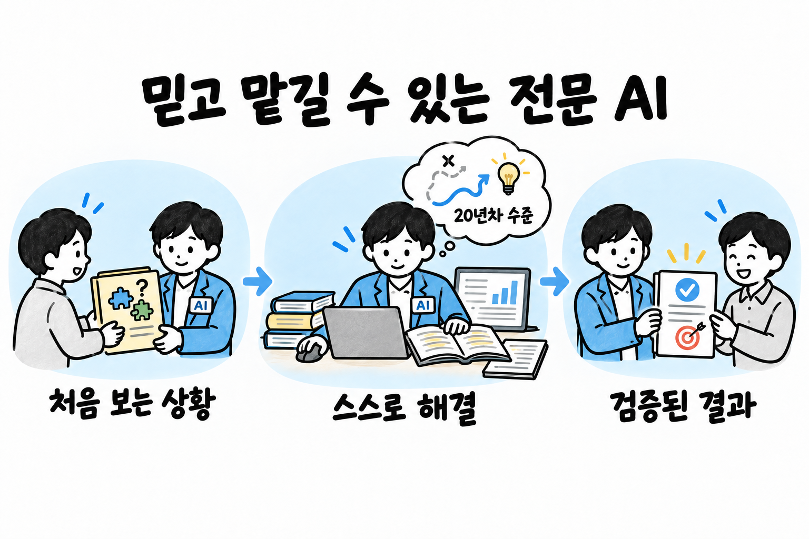

---

### 대체의 뜻 ✅

20년차에게 맡기듯 AI에게 믿고 맡길 수 있으면 대체다. 믿을 수 없어서 사람이 중간에 확인하거나 고치거나 마무리해 주면 아직 대체가 아니다.


```mermaid
%%{init: {"flowchart": {"wrappingWidth": 640, "curve": "basis", "nodeSpacing": 45, "rankSpacing": 55, "padding": 14, "useMaxWidth": true}, "themeVariables": {"fontSize": "15px"}} }%%
flowchart TB
    Q(["AI가 일 하나를 맡았다"]):::good
    A1{{"일하다가 사람을 불렀나"}}:::note
    A2{{"되돌릴 수 없는 일이라서<br/>사람을 불렀나"}}:::note
    A3{{"규칙에 '승인받고 하라'고<br/>적혀 있어서 사람을 불렀나"}}:::note
    A4{{"아무리 따져 봐도 판단이 안 서서<br/>사람을 불렀나"}}:::note
    A5{{"정해 둔 한도를 넘어서<br/>사람을 불렀나"}}:::note
    A6{{"자격증 있는 사람만 할 수 있는 일이라서<br/>사람을 불렀나"}}:::note
    NA["아무 이유 없이 사람을 불렀다<br/>아직 대체가 아니다"]:::stop
    EXC(["사람을 부르는 게 맞는 일이다<br/>대체냐 아니냐를 따지지 않는다"]):::exc
    B1{{"자격증 있는 사람만 할 수 있는 일인가<br/>(의사 처방, 회계사 감사 의견, 변호사 서명)"}}:::note
    B2{{"자격증 있는 사람이<br/>AI가 만든 것을 고쳤나"}}:::note
    NB2["자격증 있는 사람이 고쳐야 했다<br/>아직 대체가 아니다"]:::stop
    B3{{"자격증 있는 사람이<br/>자기 이름으로 서명했나"}}:::note
    NB3["자격증 있는 사람이 서명 안 했다<br/>아직 대체가 아니다"]:::stop
    C1{{"일의 단계마다 어디까지 하면 끝인지<br/>미리 정해 놨나"}}:::note
    NC1["어디까지 하면 끝인지 안 정해 놨다<br/>아직 대체가 아니다"]:::stop
    C2{{"단계마다 끝났는지<br/>사람이 아니라 기계가 확인했나"}}:::note
    NC2["끝났는지 사람이 확인해 줬다<br/>아직 대체가 아니다"]:::stop
    C3{{"기계가 확인한 기록이 남아 있나"}}:::note
    NC3["기계가 확인한 기록이 없다<br/>아직 대체가 아니다"]:::stop
    YES(["대체다"]):::good
    Q --> A1
    A1 -- "안 불렀다" --> B1
    A1 -- "불렀다" --> A2
    A2 -- "아니다" --> A3
    A3 -- "아니다" --> A4
    A4 -- "아니다" --> A5
    A5 -- "아니다" --> A6
    A6 -- "아니다" --> NA
    A2 -- "예" --> EXC
    A3 -- "예" --> EXC
    A4 -- "예" --> EXC
    A5 -- "예" --> EXC
    A6 -- "예" --> B1
    B1 -- "아니다" --> C1
    B1 -- "그렇다" --> B2
    B2 -- "고쳤다" --> NB2
    B2 -- "안 고쳤다" --> B3
    B3 -- "아니다" --> NB3
    B3 -- "그렇다" --> C1
    C1 -- "없다" --> NC1
    C1 -- "있다" --> C2
    C2 -- "사람이 했다" --> NC2
    C2 -- "기계가 했다" --> C3
    C3 -- "없다" --> NC3
    C3 -- "있다" --> YES
    classDef stop fill:#fee2e2,stroke:#dc2626,stroke-width:2px,color:#7f1d1d
    classDef good fill:#dcfce7,stroke:#16a34a,stroke-width:2px,color:#14532d
    classDef note fill:#fef9c3,stroke:#ca8a04,stroke-width:2px,color:#713f12
    classDef exc fill:#dbeafe,stroke:#2563eb,stroke-width:2px,color:#1e3a8a
```

---
# 전문 AI 에이전트 정의 ✅
## 업무 처리 흐름 ✅

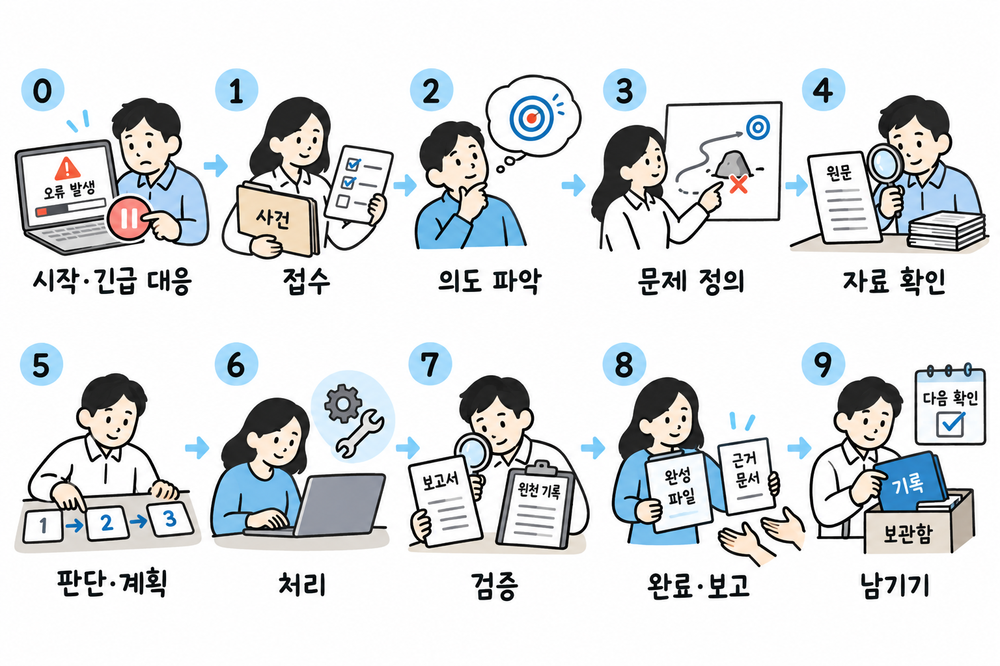


```mermaid
%%{init: {"layout": "elk", "elk": {"mergeEdges": false, "nodePlacementStrategy": "NETWORK_SIMPLEX", "keepEntryNodeOnTop": true}, "flowchart": {"defaultRenderer": "elk", "wrappingWidth": 640, "curve": "linear", "nodeSpacing": 70, "rankSpacing": 85, "padding": 20, "useMaxWidth": true}, "themeCSS": ".marker{overflow:visible !important} .arrowMarkerPath{stroke-width:5px !important;stroke-linejoin:round !important;stroke-linecap:round !important;transform:translateX(-6px)}", "themeVariables": {"fontSize": "16px"}} }%%
flowchart TB
    accTitle: 업무 처리 흐름
    accDescr: 시작부터 종료까지 실제 분기와 복귀선을 하나로 연결한 세로 순서도.
    subgraph PHASE_0["시작 · 긴급 대응"]
        direction TB
    REQ(["요청"]):::good
    SIGNAL(["신호 감지<br/>감시 중인 규칙 · 상대 · 조건의 변화 포함"]):::good
    CHANCE(["기회 발견"]):::good
    HARM{{"지금 실제 피해·오류·장애가 진행 중이고<br/>바로 막지 않으면 계속 커지는가?"}}:::note
    SAFE_ACTION{{"지금 바로 할 수 있는<br/>안전한 임시조치가 있는가?"}}:::note
    EMERGENCY_RULE{{"미리 승인된<br/>긴급 예외 조치가 있는가?"}}:::note
    FIRST_ACTION["추가 피해부터 막기<br/>문제 작업 중지 · 추가 결제나 전송 막기<br/>영향 범위 분리 · 정상 상태 복구 · 임시 대체"]:::main
    EMERGENCY_APPROVAL["긴급 승인 요청"]:::back
    EMERGENCY_EXEC["정해 둔 긴급 조치 실행<br/>실행하는 즉시 보고"]:::main
    EMERGENCY_DECISION{{"승인됐는가?"}}:::note
    APPROVED_ACTION["승인된 조치 실행"]:::main
    EMERGENCY_MONITOR["권한 안에서 추가 피해를 막고<br/>상태와 변화를 계속 기록"]:::main
    EMERGENCY_CHECK{{"추가 피해가<br/>멈췄는가?"}}:::note
    OPPORTUNITY{{"지금 놓치면<br/>사라지는 기회인가?"}}:::note
    OPPORTUNITY_DEADLINE["기회가 사라지는 시점을 업무 기한으로 등록<br/>다른 절차의 상태나 상대의 기한이<br/>정하는 시점도 포함"]:::main
    CASE_TYPE{{"이번 요청·신호가<br/>새로운 건인가?"}}:::note
    end
    subgraph PHASE_1["접수"]
        direction TB
    LOAD_CASE["진행 중인 건 불러오기<br/>현재 상태 · 남은 일 · 기한 · 대기 사항 확인"]:::main
    CASE_CHANGED{{"기존 목표 · 범위 · 사실 · 적용 규칙 ·<br/>당사자 가운데 바뀐 것이 있는가?"}}:::note
    INTAKE_CHECK["한 건의 범위 확인<br/>요청자의 권한 · 당사자 동의 · 이해충돌<br/>여러 당사자는 자격 · 이익 기준으로 건을 나눔<br/>상대의 상태 · 기한 · 업무 범위 · 보수 · 책임 조건 확인"]:::main
    ACCEPTABLE{{"지금 상태로<br/>접수할 수 있는가?"}}:::note
    CONDITION_CHECK["접수에 부족한 조건 확인<br/>권한 증빙 · 당사자 동의 · 필요한 승인<br/>업무 범위 조정 등"]:::main
    CONDITION_REQUEST["조건 보완 요청"]:::back
    CONDITION_WAIT["조건 충족 대기"]:::main
    CONDITION_OK{{"필요한 조건이<br/>충족됐는가?"}}:::note
    CONDITION_DEADLINE{{"보완할 기한이<br/>남아 있는가?"}}:::note
    REJECT["거절<br/>거절 이유와 가능한 대안 안내"]:::stop
    REJECT_RECORD[("접수·거절 기록 남기기")]:::store
    ACCEPTED["접수 확정"]:::main
    end
    subgraph PHASE_2["의도 파악"]
        direction TB
    INTENT_CLEAR{{"요청·지시만으로 원하는 결과가 한 가지로 정해지고<br/>맡긴 말의 분류가 실제 자료와 맞는가?"}}:::note
    AMBIGUOUS["모호한 부분과<br/>빠진 지시를 구분"]:::main
    INTENT_ASK["되묻기 · 지시 확인 · 의도 확인"]:::back
    INTENT_CONFIRMED{{"원하는 결과가<br/>확인됐는가?"}}:::note
    ASSUME_SAFE{{"확인 없이 가정해도<br/>결과 · 권리 · 비용에 큰 영향이 없는가?"}}:::note
    ASSUMPTION["가정한 내용과<br/>그 영향을 명시"]:::main
    INTENT_WAIT["답변 대기"]:::main
    end
    subgraph PHASE_3["문제 정의"]
        direction TB
    PROBLEM_ANALYSIS["원하는 결과를 막는<br/>원인 · 제약 · 빠진 요소 확인"]:::main
    DIRECT_SOLUTION{{"요청받은 일을 그대로 하면<br/>원하는 결과가 실제로 나오는가?"}}:::note
    REFRAME["실제로 해결해야 할 문제를<br/>다시 정의"]:::main
    REFRAME_SCOPE{{"새로 정의한 문제가<br/>기존 의도나 범위를 바꾸는가?"}}:::note
    REFRAME_CONFIRM["바뀐 목표 · 범위 · 완료 조건 확인"]:::back
    PROBLEM_SCOPE["풀 문제 · 풀지 않을 문제 · 이미 닫힌 부분 목록<br/>항목이 여럿이면 항목별 방식과 항목 간 영향<br/>업무 범위 확정"]:::main
    end
    subgraph PHASE_4["자료 확인"]
        direction TB
    COLLECT["필요한 자료를 직접 수집하고<br/>가능하면 원문까지 확인"]:::main
    CLASSIFY_DATA["사실 · 주장 · 추정을 구분<br/>누가 낸 자료인지 표시"]:::main
    VALIDATE_DATA["출처 · 시점 · 관할 · 판본 확인<br/>판정하는 곳이 받아 주는지 · 취득 경로 · 구속력 등급<br/>같은 사실의 상충 자료는 채택 가능성 순으로 등급"]:::main
    DATA_ENOUGH{{"결론을 바꿀 핵심 사실이<br/>확인됐거나 가정으로 표시됐는가?"}}:::note
    DATA_GAP["빠진 정보와<br/>확인 방법 정하기"]:::main
    GET_DATA["수집 행위가 근거를 해칠 위험을 먼저 판정<br/>추가 조회 · 상대나 기관에 질문 · 실험"]:::back
    DATA_FOUND{{"추가 사실을<br/>확인했는가?"}}:::note
    DATA_LIMIT["확인할 수 없는 내용은<br/>가정 · 근거 부족 · 입증 책임을 명시"]:::main
    end
    subgraph PHASE_5["판단 · 계획"]
        direction TB
    OPTIONS["가능한 방법과 대안 만들기"]:::main
    COMPARE["효과 · 비용 · 위험 · 부작용 · 상대의 예상 반응<br/>한 선택이 다른 항목에 미치는 연쇄 효과<br/>결론이 제3자의 승낙 · 행동에 달린 조건 비교"]:::main
    KNOWN_CASE{{"기존 규칙이나 사례가 이 사실을 덮고<br/>전제가 유효하며 해석이 갈리지 않는가?"}}:::note
    NEW_METHOD["원리 · 다른 분야의 같은 구조 사례를 바탕으로 새 방법 설계<br/>규칙 자체를 바꾸는 절차도 나란히 비교 대상에 둠"]:::main
    SMALL_TEST_Q{{"작은 범위에서<br/>먼저 시험할 수 있는가?"}}:::note
    SMALL_TEST["작게 시험하고<br/>어떤 결과가 나오면 중단할지도 정함"]:::main
    UNCERTAIN_PLAN["불확실성을 명시하고<br/>되돌리기 쉬운 방법을 우선"]:::main
    SELECT["실행 방법 선택<br/>이 선택이 잠그는 뒤 선택지를 적음"]:::main
    EXECUTION_PLAN["실행 순서 · 사건 간 영향 · 공동 작업<br/>관측별 전환 · 복구 · 중단 기준을 정함<br/>되돌릴 수 없는 결정은 따로 표시해 재확인"]:::main
    PREMISE{{"계획의 핵심 전제가 지금도 유지되고<br/>당사자별 자격 · 기한이 완료 예정일까지 남는가?"}}:::note
    UPDATE_PLAN["바뀐 조건을 반영해<br/>판단 · 계획 다시 수행"]:::main
    REPEAT_Q{{"주기적으로<br/>반복하는 업무인가?"}}:::note
    REPEAT_RULE["주기 · 자동 실행 범위 · 한도<br/>다음 점검 시점을 정함"]:::main
    HUMAN_Q{{"실행 전에 사람의 결정이 필요한가?<br/>되돌릴 수 없는 행동 · 사전 승인 필요<br/>판단 불가 · 한도 초과 · 자격자 전속"}}:::note
    HUMAN_PREP["AI가 할 수 있는 조사 · 계산 · 작성<br/>대안 비교 · 검증까지 먼저 완료"]:::main
    DECIDER{{"현재 결정권자가 권한이 있고 이해충돌이 없으며<br/>결정의 위험이 그 사람 주변에 미치지 않는가?"}}:::note
    DECISION_REQUEST["권한 있는 사람에게 결정 요청"]:::back
    ALT_DECIDER["미리 정한 다른 결정권자에게 요청"]:::back
    DECISION_RECEIVED{{"기한 안에<br/>결정이 왔는가?"}}:::note
    ESCALATE["다음 승인권자에게 올림"]:::back
    APPROVAL_GRANTED{{"승인 · 진행 결정인가?"}}:::note
    DECISION_REJECTED["반려 · 보류 사유와<br/>남은 일 기록"]:::stop
    end
    subgraph PHASE_6["처리"]
        direction TB
    PRE_EXECUTE["실행 전 시험 · 복구 수단 확보<br/>권한 · 금액 · 손실 한도 자동 검사"]:::main
    EXEC_ACTION["실제 실행"]:::main
    EXEC_STATE["실행 직후 실제 상태와<br/>상대 · 시스템 반응 기록"]:::main
    EXEC_FAIL{{"실행에 실패했는가?"}}:::note
    EXEC_LIMIT{{"시간 · 비용 · 시도 횟수 등<br/>정한 중단 한도를 넘었는가?"}}:::note
    REPEAT_FAIL{{"같은 실패가<br/>반복되고 있는가?"}}:::note
    STOP_HUMAN["현재 상태 · 실패 원인 · 대안과 함께<br/>사람에게 넘김"]:::back
    RECOVER["재시도 · 취소 · 원상복구"]:::main
    STOP_DECISION{{"다시 진행하기로<br/>결정됐는가?"}}:::note
    LOCAL_REPLAN["실패 원인을 반영해<br/>방법과 실행 순서 다시 계획"]:::main
    STOP_RECORD["중단 상태와<br/>남은 위험 기록"]:::stop
    end
    subgraph PHASE_7["검증"]
        direction TB
    ACTUAL_RESULT["원천 시스템 · 상대 · 시장에서<br/>실제 결과 확인"]:::main
    RECALCULATE["계산을 다시 하고 내 기록과 원천 기록 비교<br/>남이 낸 계산 · 문서도 같은 기준으로 검산"]:::main
    CROSS_CHECK["독립 근거 · 다른 방법으로 반증<br/>상대가 낸 근거는 상대에게 불리한 쪽으로도 읽음<br/>팀 간 이견 · 공통 오류 · 교차 영향 검토"]:::main
    RISK_CHECK["놓친 위험 · 빠진 대상 · 누락 항목 확인"]:::main
    ISSUE{{"수정해야 할 문제가<br/>발견됐는가?"}}:::note
    ISSUE_CAUSE{{"문제는 어디에서<br/>생겼는가?"}}:::note
    REWORK_DATA["자료를 다시 확인하고<br/>이후 판단 · 처리를 다시 수행"]:::main
    CAUSE_PLAN{{"판단 · 계획의 문제인가?"}}:::note
    REWORK_PLAN["판단 · 계획을 다시 하고<br/>필요한 처리를 다시 수행"]:::main
    CAUSE_EXEC{{"처리의 문제인가?"}}:::note
    REWORK_EXEC["잘못된 처리를 수정"]:::main
    UNFIXABLE["고칠 수 없는 문제는 숨기지 않고<br/>영향 · 유효기간 · 재검토 시점을 기록"]:::main
    REVERIFY["수정 결과 다시 검증"]:::main
    end
    subgraph PHASE_8["완료 · 보고"]
        direction TB
    COMPLETE{{"처음 정한 완료 조건이<br/>실제 상태에서 충족됐는가?"}}:::note
    CAN_FINISH{{"추가 처리하면<br/>완료할 수 있는가?"}}:::note
    REMAINING_WORK["남은 일 처리"]:::main
    PARTIAL["완료된 부분 · 남은 일<br/>완료하지 못한 이유를 구분"]:::main
    REMAINING_VERIFY["추가 처리 결과 검증"]:::main
    DELIVER["결과물 · 결론 · 근거 · 가정<br/>미완료 사항 전달"]:::back
    RESPONSE{{"받는 사람의 반응은?"}}:::note
    REVISION_SCOPE{{"기존 업무 범위 안의<br/>수정인가?"}}:::note
    NEW_REQUEST["새 목표 · 범위 · 완료 조건으로<br/>다시 접수"]:::main
    REVISION["수정 처리"]:::main
    REVISION_VERIFY["수정 결과 다시 검증"]:::main
    end
    subgraph PHASE_9["남기기"]
        direction TB
    CASE_RECORD[("사례 · 실패 원인 · 판단 과정<br/>실제 성과 기록")]:::store
    UPDATE[("필요한 지식 · 규칙 · 절차 · 기억<br/>고정 시험 항목 갱신<br/>바뀐 규칙을 쓴 과거 결과 목록을 재검토 대상에 올림")]:::store
    CONNECT[("결과와 기억을 다음 업무에 연결<br/>재검토 대상이 된 과거 건에 알림")]:::store
    FOLLOW_UP{{"후속 확인 · 반복 주기 · 성과 확정일이<br/>남아 있는가?"}}:::note
    SCHEDULE[("다음 기한 · 주기 · 성과 확정일을 감시 대상으로 등록<br/>계산으로 나온 기한 · 다른 절차 상태로 정해지는 기한 포함")]:::store
    FINAL(["업무 종료"]):::good
    WAIT(["대기<br/>다음 신호가 오면 기존 건으로 재개"]):::good
    end
    SIGNAL --> HARM
    REQ ~~~ HARM
    CHANCE ~~~ HARM
    CHANCE --> OPPORTUNITY
    REQ --> CASE_TYPE
    HARM -->|아니오 · 긴급 아님| CASE_TYPE
    HARM -->|예| SAFE_ACTION
    SAFE_ACTION -->|예| FIRST_ACTION
    SAFE_ACTION -->|아니오| EMERGENCY_RULE
    FIRST_ACTION --> EMERGENCY_CHECK
    EMERGENCY_RULE -->|예| EMERGENCY_EXEC
    EMERGENCY_RULE -->|아니오| EMERGENCY_APPROVAL
    EMERGENCY_EXEC --> EMERGENCY_CHECK
    EMERGENCY_APPROVAL --> EMERGENCY_DECISION
    EMERGENCY_DECISION -->|예| APPROVED_ACTION
    EMERGENCY_DECISION -->|아니오| EMERGENCY_MONITOR
    APPROVED_ACTION --> EMERGENCY_CHECK
    EMERGENCY_MONITOR --> EMERGENCY_CHECK
    EMERGENCY_CHECK -->|예| CASE_TYPE
    EMERGENCY_CHECK -->|아니오 · 아직 진행 중| SAFE_ACTION
    OPPORTUNITY -->|아니오| CASE_TYPE
    OPPORTUNITY -->|예| OPPORTUNITY_DEADLINE
    OPPORTUNITY_DEADLINE --> CASE_TYPE
    CASE_TYPE -->|아니오| LOAD_CASE
    CASE_TYPE -->|예| INTAKE_CHECK
    INTAKE_CHECK ~~~ LOAD_CASE
    LOAD_CASE --> CASE_CHANGED
    CASE_CHANGED -->|예| INTENT_CLEAR
    INTAKE_CHECK --> ACCEPTABLE
    ACCEPTABLE -->|가능| ACCEPTED
    ACCEPTABLE -->|조건 충족 후 가능| CONDITION_CHECK
    ACCEPTABLE -->|불가| REJECT
    CONDITION_CHECK --> CONDITION_REQUEST
    CONDITION_REQUEST --> CONDITION_WAIT
    CONDITION_WAIT --> CONDITION_OK
    CONDITION_OK -->|예| ACCEPTED
    CONDITION_OK -->|아니오| CONDITION_DEADLINE
    CONDITION_DEADLINE -->|예| CONDITION_WAIT
    CONDITION_DEADLINE -->|아니오| REJECT
    REJECT --> REJECT_RECORD
    REJECT_RECORD --> FINAL
    ACCEPTED --> INTENT_CLEAR
    INTENT_CLEAR -->|예| PROBLEM_ANALYSIS
    INTENT_CLEAR -->|아니오| AMBIGUOUS
    AMBIGUOUS --> INTENT_ASK
    INTENT_ASK --> INTENT_CONFIRMED
    INTENT_CONFIRMED -->|예| PROBLEM_ANALYSIS
    INTENT_CONFIRMED -->|아니오| ASSUME_SAFE
    ASSUME_SAFE -->|예| ASSUMPTION
    ASSUME_SAFE -->|아니오| INTENT_WAIT
    ASSUMPTION --> PROBLEM_ANALYSIS
    INTENT_WAIT --> INTENT_ASK
    PROBLEM_ANALYSIS --> DIRECT_SOLUTION
    DIRECT_SOLUTION -->|예| PROBLEM_SCOPE
    DIRECT_SOLUTION -->|아니오| REFRAME
    REFRAME --> REFRAME_SCOPE
    REFRAME_SCOPE -->|아니오| PROBLEM_SCOPE
    REFRAME_SCOPE -->|예| REFRAME_CONFIRM
    REFRAME_CONFIRM --> PROBLEM_SCOPE
    PROBLEM_SCOPE --> COLLECT
    COLLECT --> CLASSIFY_DATA
    CLASSIFY_DATA --> VALIDATE_DATA
    VALIDATE_DATA --> DATA_ENOUGH
    DATA_ENOUGH -->|예| OPTIONS
    DATA_ENOUGH -->|아니오| DATA_GAP
    DATA_GAP --> GET_DATA
    GET_DATA --> DATA_FOUND
    DATA_FOUND -->|예| COLLECT
    DATA_FOUND -->|아니오| DATA_LIMIT
    DATA_LIMIT --> OPTIONS
    CASE_CHANGED -->|아니오| OPTIONS
    OPTIONS --> COMPARE
    COMPARE --> KNOWN_CASE
    KNOWN_CASE -->|예| SELECT
    KNOWN_CASE -->|아니오 · 규칙이 없거나 덮지 못하거나 갈림| NEW_METHOD
    NEW_METHOD --> SMALL_TEST_Q
    SMALL_TEST_Q -->|예| SMALL_TEST
    SMALL_TEST_Q -->|아니오| UNCERTAIN_PLAN
    SMALL_TEST --> SELECT
    UNCERTAIN_PLAN --> SELECT
    SELECT --> EXECUTION_PLAN
    EXECUTION_PLAN --> PREMISE
    PREMISE -->|예| REPEAT_Q
    PREMISE -->|아니오| UPDATE_PLAN
    UPDATE_PLAN --> EXECUTION_PLAN
    REPEAT_Q -->|아니오| HUMAN_Q
    REPEAT_Q -->|예| REPEAT_RULE
    REPEAT_RULE --> HUMAN_Q
    HUMAN_Q -->|아니오| PRE_EXECUTE
    HUMAN_Q -->|예| HUMAN_PREP
    HUMAN_PREP --> DECIDER
    DECIDER -->|예| DECISION_REQUEST
    DECIDER -->|아니오| ALT_DECIDER
    DECISION_REQUEST --> DECISION_RECEIVED
    ALT_DECIDER --> DECISION_RECEIVED
    DECISION_RECEIVED -->|예| APPROVAL_GRANTED
    DECISION_RECEIVED -->|아니오| ESCALATE
    ESCALATE --> DECISION_RECEIVED
    PRE_EXECUTE --> EXEC_ACTION
    EXEC_ACTION --> EXEC_STATE
    EXEC_STATE --> EXEC_FAIL
    EXEC_FAIL -->|아니오| ACTUAL_RESULT
    EXEC_FAIL -->|예| EXEC_LIMIT
    EXEC_LIMIT -->|예| STOP_HUMAN
    EXEC_LIMIT -->|아니오| REPEAT_FAIL
    REPEAT_FAIL -->|아니오| RECOVER
    REPEAT_FAIL -->|예| LOCAL_REPLAN
    RECOVER --> PRE_EXECUTE
    LOCAL_REPLAN --> PRE_EXECUTE
    STOP_HUMAN --> STOP_DECISION
    STOP_DECISION -->|예| LOCAL_REPLAN
    STOP_DECISION -->|아니오| STOP_RECORD
    STOP_RECORD --> COMPLETE
    ACTUAL_RESULT --> RECALCULATE
    RECALCULATE --> CROSS_CHECK
    CROSS_CHECK --> RISK_CHECK
    RISK_CHECK --> ISSUE
    ISSUE -->|아니오| COMPLETE
    ISSUE -->|예| ISSUE_CAUSE
    ISSUE_CAUSE -->|자료| REWORK_DATA
    ISSUE_CAUSE -->|그 외| CAUSE_PLAN
    CAUSE_PLAN -->|예| REWORK_PLAN
    CAUSE_PLAN -->|아니오| CAUSE_EXEC
    CAUSE_EXEC -->|예| REWORK_EXEC
    CAUSE_EXEC -->|수정 불가| UNFIXABLE
    REWORK_DATA --> REVERIFY
    REWORK_PLAN --> REVERIFY
    REWORK_EXEC --> REVERIFY
    REVERIFY --> ISSUE
    UNFIXABLE --> COMPLETE
    COMPLETE -->|예| DELIVER
    COMPLETE -->|아니오| CAN_FINISH
    CAN_FINISH -->|예| REMAINING_WORK
    CAN_FINISH -->|아니오| PARTIAL
    REMAINING_WORK --> REMAINING_VERIFY
    REMAINING_VERIFY --> COMPLETE
    PARTIAL --> DELIVER
    DELIVER --> RESPONSE
    RESPONSE -->|완료 확인| CASE_RECORD
    RESPONSE -->|새 요청·범위 변경| NEW_REQUEST
    RESPONSE -->|수정 요청| REVISION_SCOPE
    REVISION_SCOPE -->|예| REVISION
    REVISION_SCOPE -->|아니오| NEW_REQUEST
    REVISION --> REVISION_VERIFY
    REVISION_VERIFY --> DELIVER
    NEW_REQUEST --> INTAKE_CHECK
    CASE_RECORD --> UPDATE
    UPDATE --> CONNECT
    CONNECT --> FOLLOW_UP
    FOLLOW_UP -->|아니오| FINAL
    FOLLOW_UP -->|예| SCHEDULE
    SCHEDULE --> WAIT
    APPROVAL_GRANTED -->|예| PRE_EXECUTE
    APPROVAL_GRANTED -->|아니오| DECISION_REJECTED
    DECISION_REJECTED --> COMPLETE
    WAIT --> LOAD_CASE
    style PHASE_0 fill:none,stroke:#5f6f82,stroke-width:1.2px,stroke-dasharray:1 6,color:#7b8a9c
    style PHASE_1 fill:none,stroke:#5f6f82,stroke-width:1.2px,stroke-dasharray:1 6,color:#7b8a9c
    style PHASE_2 fill:none,stroke:#5f6f82,stroke-width:1.2px,stroke-dasharray:1 6,color:#7b8a9c
    style PHASE_3 fill:none,stroke:#5f6f82,stroke-width:1.2px,stroke-dasharray:1 6,color:#7b8a9c
    style PHASE_4 fill:none,stroke:#5f6f82,stroke-width:1.2px,stroke-dasharray:1 6,color:#7b8a9c
    style PHASE_5 fill:none,stroke:#5f6f82,stroke-width:1.2px,stroke-dasharray:1 6,color:#7b8a9c
    style PHASE_6 fill:none,stroke:#5f6f82,stroke-width:1.2px,stroke-dasharray:1 6,color:#7b8a9c
    style PHASE_7 fill:none,stroke:#5f6f82,stroke-width:1.2px,stroke-dasharray:1 6,color:#7b8a9c
    style PHASE_8 fill:none,stroke:#5f6f82,stroke-width:1.2px,stroke-dasharray:1 6,color:#7b8a9c
    style PHASE_9 fill:none,stroke:#5f6f82,stroke-width:1.2px,stroke-dasharray:1 6,color:#7b8a9c
    classDef main fill:#dbeafe,stroke:#7dabe8,stroke-width:1.4px,color:#17314f
    classDef stop fill:#fee2e2,stroke:#f0a3a3,stroke-width:1.4px,color:#7f1d1d
    classDef back fill:#ffedd5,stroke:#f3b183,stroke-width:1.4px,color:#7c2d12
    classDef store fill:#e5e7eb,stroke:#b0b6bf,stroke-width:1.4px,color:#1f2937
    classDef good fill:#dcfce7,stroke:#86d3a3,stroke-width:1.4px,color:#14532d
    classDef note fill:#fef9c3,stroke:#e2c95f,stroke-width:1.4px,color:#713f12
    linkStyle 0,3,4 stroke:#34d399,stroke-width:2.6px
    linkStyle 6,7,10,14,18,21,24,27,29,30,35,42,46,48,53,57,63,73,76,82,86,89,91,95,102,103,106,110,118,119,121,123,124,130,132,138,139,140,141,150,152 stroke:#60a5fa,stroke-width:2.6px
    linkStyle 5,8,11,15,20,23,36,43,49,54,56,64,68,70,74,77,83,85,88,92,96,101,104,105,117,122,131,133,142,149 stroke:#94a3b8,stroke-width:2.2px,stroke-dasharray:8 5
    linkStyle 19,37,47,51,67,81,84,97,107,108,120,128,135,144,145,155 stroke:#e879f9,stroke-width:2.2px,stroke-dasharray:4 8
    linkStyle 31,38,111,153 stroke:#f87171,stroke-width:2.6px
    linkStyle 9,12,13,16,17,22,26,28,32,33,34,39,40,41,44,45,50,52,55,58,59,60,61,62,65,66,69,71,72,75,78,79,80,87,90,93,94,98,99,100,109,112,113,114,115,116,125,126,127,129,134,136,137,143,146,147,148,151,154 stroke:#60a5fa,stroke-width:2.0px
```

---

## 수식 ✅

### 구성 개념식 ✅

$$
\text{전문 AI 에이전트의 구성} = \text{환경} \times \text{지식} \times \text{규칙} \times \text{실무} \times \text{검증} \times \text{학습}
$$

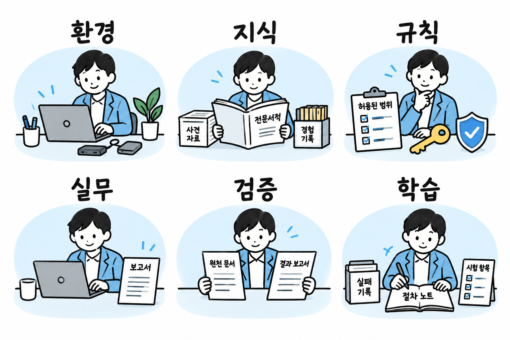

### 구성 전개식 ✅

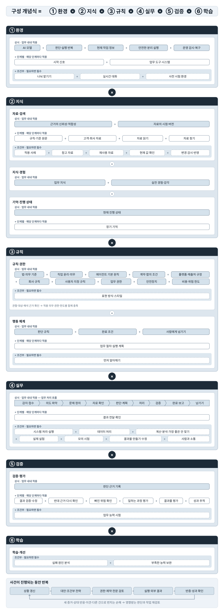

---

## 계통별 재료 ✅

| 표시 | 어느 업무에 | 언제 |
| --- | --- | --- |
| **상시** | 모든 업무 | 진행하는 동안 책임을 계속 유지한다. 같은 도구나 검사를 매 순간 반복한다는 뜻은 아니다 |
| **단계별** | 모든 업무 | 필요한 단계가 오면 쓴다. 자료나 목표가 바뀌면 다시 확인한다 |
| **조건부** | 해당 조건이 있는 업무 | 조건이 충족되면 반드시 쓴다. 해당 여부가 불명확하면 먼저 확인한다 |

---

### 환경 ✅

AI가 판단하고 행동할 수 있게 만드는 **업무 수행의 기반**이다. 모델과 실행 제어, 작업 공간과 외부 연결을 제공한다.

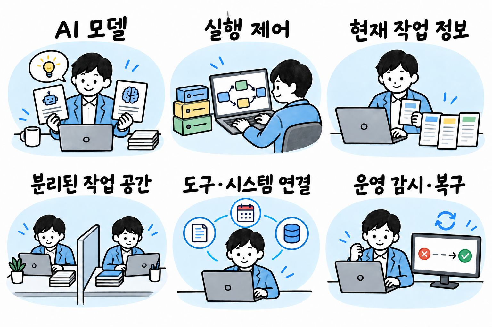

| 재료 | 한마디로 | 하는 일 | 예시 | 구분 | 사용 시점·조건 |
| --- | --- | --- | --- | --- | --- |
| **AI 모델** ✅ | **에이전트의 두뇌** | 목표와 입력된 정보를 바탕으로 내용을 이해하고 추론한다. 가능한 답이나 행동을 만들고 비교해 무엇을 할지 판단한다. 업무에 필요한 답변·아이디어·콘텐츠를 생성한다. | 문의의 뜻과 요구 파악 · 도면의 치수 관계로 규격 충족 여부 추론 · 부족한 근거를 더 찾아볼지 판단 · 목적에 맞는 답변과 아이디어 생성 | **상시** | 정보를 이해·판단하거나 업무에 필요한 내용을 만들 때 |
| **실행 제어** ✅ | **AI의 판단과 정해진 작업 흐름을 실행하기** | 정해진 작업 흐름과 모델의 판단에 따라 함수·도구·AI를 호출하고 결과·오류를 전달한다. 판단과 실행의 반복, 순차·병렬 실행, 조건 분기와 결과 합류를 제어한다. 선행 작업과 필요한 결과의 준비 여부를 확인하고, 정해진 계산·조회·변환·조건 분기는 모델을 거치지 않고 실행한다. 일부 실패·대기·취소·재개·종료를 처리하며 변경된 실행 계획을 반영한다. | 코드 고치기→테스트→실패한 곳 다시 고치기 · 날씨·코스 조회 함수를 동시에 실행하고 필요한 결과가 모이면 AI 호출 · 정해진 재고 수량 조건에 따라 다음 작업 실행 · 자료 요청→답장이 오면 대기 중인 실행 재개 | **상시** | 업무를 시작한 뒤 끝날 때까지 |
| **현재 작업 정보** ✅ | **모델이 지금 판단할 때 참고하는 정보** | 이번 판단에 필요한 지시·자료·진행 상태·이전 기록을 골라 모델에게 제공한다. 목표와 조건을 유지하면서 정보의 양과 구성을 조절하고, 상황이 바뀌면 필요한 내용을 교체·보완한다. | 지금 처리 중인 문의 · 방금 확인한 계약서 조항 · 방금 나온 계산 결과 · 이번 일의 마감일 | **상시** | 모델이 판단할 때마다 |
| **분리 실행** ✅ | **문제가 다른 작업으로 번지지 않게 따로 실행** | 서로 섞이면 안 되는 자료와 작업을 구분해 공간과 실행 환경을 나눈다. 함께 쓰도록 허용된 자료와 도구는 공유할 수 있게 한다. 한 작업의 오류나 과도한 자원 사용이 다른 작업에 번지지 않도록 실행과 자원 사용을 조절한다. | 공유하면 안 되는 업무 자료를 별도 공간에서 처리 · 함께 쓰도록 허용된 참고 자료는 공유 · 외부에서 받은 파일의 검사를 다른 업무와 분리된 공간에서 실행 · 대용량 변환 작업의 자원 사용을 조절해 다른 업무의 중단 방지 | **상시** | 업무 공간을 만들거나 코드와 도구를 실행할 때 |
| **운영 감시·복구** ✅ | **장애를 알아채고 시스템과 중단된 업무를 복구하기** | 에이전트와 별도로 운영 상태를 감시한다. 에이전트와 시스템의 중단뿐 아니라 응답 지연·오류 증가·자원 부족도 찾아낸다. 문제가 다른 곳으로 번지지 않게 막고 시스템을 다시 정상 상태로 돌린다. 중단된 업무는 중단 시점의 저장된 진행 상태와 함께 담당에게 돌려준다. | 밤사이 멈춘 문서 변환 작업을 아침 전에 알아채고 다시 돌림 · 검색 응답이 느려지면 예비 연결로 바꿈 · 모델 장애 때 준비된 다른 모델 연결로 전환 · 복구 뒤 중단 시점의 진행 상태를 담당에게 돌려줌 | **상시** | 에이전트와 업무 수행 기반을 운영하는 동안 |
| **시작 신호** ✅ | **업무를 시작하거나 이어 가게 하는 신호** | 요청이나 변화가 생기거나 정해진 시점·조건에 도달했는지 감지한다. 감지한 신호를 해당 업무나 대기 건의 담당에게 전달한다. | 새 문의 도착 · 감시 중인 파일의 변경 · 예약한 오전 9시 도달 · 기다리던 답변 도착이나 앞 단계의 완료 | **단계별** | 요청·변화·정해진 시점·조건을 감지해 알릴 때 |
| **업무 도구·시스템** ✅ | **업무에 쓰는 프로그램·장비·서비스와의 연결** | 업무에 필요한 도구와 시스템을 연결해 사용할 수 있게 한다. 요청을 대상 도구가 처리할 수 있는 형태로 전달하고, 결과·오류·진행 상태를 에이전트에게 돌려준다. | 문서·이미지 편집기 연결 · 일정 서비스에 예약 요청 전달 · 측정 장비의 값 읽기 · 업무 시스템의 진행 상태와 오류 응답 받기 · 대상과 관계를 저장·조회하는 그래프 DB 연결 | **단계별** | 업무 도구·시스템을 연결하거나 요청을 보낼 때 · 결과·오류·진행 상태를 받을 때 |
| **나눠 맡기기** ✅ | **여러 AI에게 작업을 보내고 결과 모으기** | 정해진 분담에 따라 각 AI에 작업과 필요한 자료·도구·허용된 권한을 전달한다. AI 사이에 필요한 정보와 중간 결과를 주고받게 하고 진행 상태를 모은다. 결과를 합치면서 빠진 부분과 중복, 이견, 실패를 확인해 담당 AI의 보완 작업을 연결한다. 분담이나 방법을 바꿔야 할 문제는 대안·전략 판단으로 돌려보낸다. | 분담된 계약서 부분을 각 AI에게 전달하고 검토 결과 합치기 · 조사 AI가 찾은 자료를 검토 AI에게 전달 · 답변이 오지 않은 AI의 진행 상태 확인 · AI들의 결론이 다르면 근거를 모아 재검토에 연결 | **조건부** | 여러 AI에게 작업을 전달할 때 · AI 사이의 정보 교환·진행·결과 회수와 보완을 관리할 때 |
| **실시간 대화** ✅ | **바로 대화할 수 있게 연결하는 통로** | 대화의 입력과 출력을 실시간으로 주고받게 한다. 대화 방식에 맞춰 발언 순서와 응답의 중단·재개를 처리한다. 연결과 전송 상태를 관리하고, 끊긴 대화를 다시 이어 갈 수 있게 한다. | 음성 통화 연결 · 상대가 말을 시작하면 AI 음성 재생 멈추기 · 끊긴 채팅 연결 복구 | **조건부** | 바로 답을 주고받아야 하는 대화에서 |
| **시험 환경** ✅ | **시험·오류 재현·능력 평가에 필요한 공간과 조건, 통과한 것만 내보내는 문** | 시험 목적에 맞는 환경과 조건을 구성하고 필요한 자료·도구·계정을 준비한다. 비교하거나 다시 재현할 수 있도록 시험 조건을 관리한다. 운영 중인 업무나 원본 자료에 영향을 주면 안 되는 시험에는 분리된 공간을 제공한다. 시험 기록이 없거나 통과하지 못한 판본은 실제 환경으로 나가지 못하게 막는다. | 테스트 서버와 연습용 계정 준비 · 오류가 난 조건을 재현할 자료·설정 준비 · 모의 협상에 사용할 가상 상대와 상황 준비 · 시험을 통과한 판본만 운영 서버로 내보내는 문 관리 | **조건부** | 시험·오류 재현·능력 평가에 별도의 공간과 조건이 필요할 때 |

---

### 자료·검색 ✅

업무에 필요한 자료를 확보하고 **해석·재사용할 수 있는 상태로 관리하는 체계**다. 자료의 출처·신뢰성·적용 시점도 함께 관리한다.

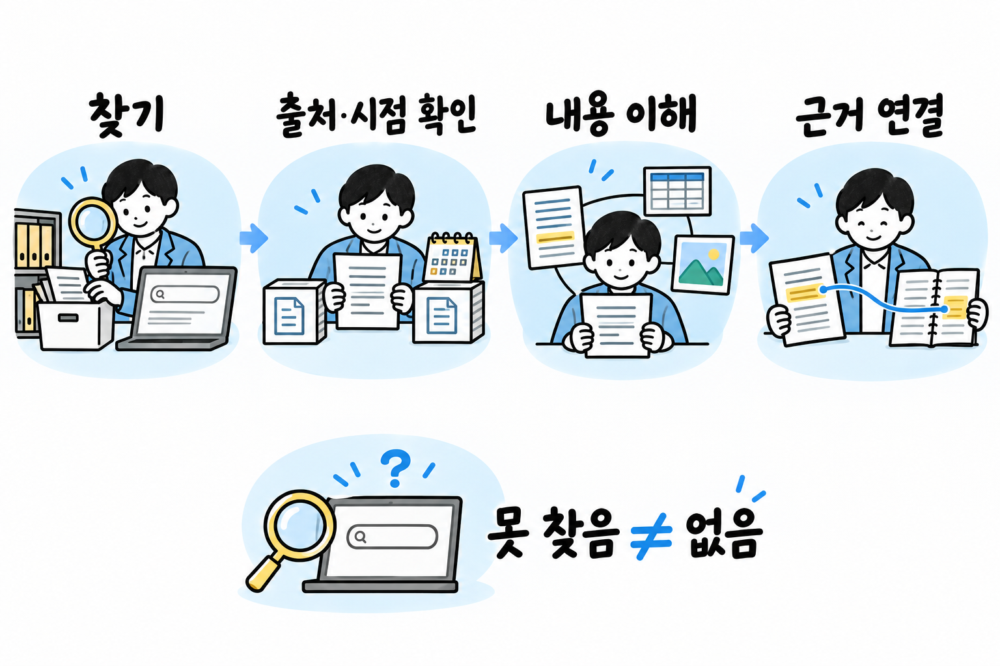

| 재료 | 한마디로 | 하는 일 | 예시 | 구분 | 사용 시점·조건 |
| --- | --- | --- | --- | --- | --- |
| **근거의 신뢰성·적합성** ✅ | **정보를 얼마나 믿을 수 있고 이번 업무에 써도 되는지 확인** | 정보의 출처와 수집·작성 과정을 살펴 얼마나 믿을 수 있는지 확인한다. 이번 업무의 대상과 조건에 맞는 근거인지 판단한다. 빠진 내용이나 치우침, 다른 정보와의 충돌을 확인하고 사실·주장·추정을 구분한다. 여러 자료에서 종합한 주장과 관계도 원문이 뒷받침하는지 확인하고, 추론한 내용과 직접 확인한 사실을 구별한다. 같은 정보를 옮겨 쓴 여러 자료를 서로 독립된 근거로 세지 않는다. 내용과 별개로, 결과를 판정할 곳이 그 근거를 받아 주는지, 취득 경로가 허용된 방법인지, 구속력 등급(원본·구속 규칙·참고·사후 작성)이 무엇인지 확인하고 낮은 등급으로 높은 등급의 결론을 대신하지 않는다. 같은 사실에 상충하는 수치·전문가 소견이 있으면 판정할 곳이 채택할 가능성 순으로 등급을 매기고 이유를 적는다. | 측정 조건이 다른 수치를 그대로 비교해도 되는지 확인 · 조사 대상이 한쪽에 치우쳤는지 확인 · 당사자의 주장과 확인된 사실 구분 · 같은 원문을 옮긴 여러 자료를 독립된 근거로 보지 않기 · 절차를 어겨 얻은 자료는 판정 기관이 받아 주지 않을 수 있음을 표시 · 상충하는 두 감정 결과에 채택 가능성 순위와 이유 기록 | **상시** | 정보나 자료를 판단·실행·설명의 근거로 쓸 때 · 남이나 상대가 낸 자료를 근거로 받을 때 |
| **자료의 시점·버전** ✅ | **이번 일에 맞는 시점과 버전을 고르기** | 업무를 처리하는 날짜와 판단해야 할 대상 시점을 구분한다. 그 대상과 시점에 맞는 자료 버전을 고른다. 어떤 버전을 사용했는지와 언제 확인했는지도 남긴다. 수정된 자료와 이전 버전의 관계도 함께 관리한다. 자료를 종합해 만든 지식에서도 근거 원문의 위치·판본·적용 시점을 되짚을 수 있게 연결한다. | 과거 업무에 당시 규정 적용 · 도면 수정 버전 구분 · 가격을 확인한 시각과 그 가격이 적용되는 날짜 구분 · 지식 문서의 주장과 근거 원문 판본 연결 | **상시** | 업무에 맞는 자료를 고를 때 · 업무의 대상·시점이나 자료가 바뀌었을 때 |
| **규칙·기준 원문** ✅ | **이번 일에 적용되는 규칙의 원문을 갖춰 두기** | 업무에 적용할 규칙과 기준을 원문으로 확보한다. 출처와 적용 시점을 함께 정리해 어떤 규칙인지 확인하고 찾아볼 수 있게 한다. | 적용 법령의 원문 · 설계·품질 기준 문서 · 매체의 콘텐츠 게시 규정 원문 · 회사·기관의 내부 규정 원문 | **단계별** | 업무에 적용할 규칙·기준의 원문을 확보하거나 다시 확인할 때 · 규칙이나 적용 범위·시점이 바뀌었을 때 |
| **업무별 정보** ✅ | **이번 업무의 대상·상황·조건을 파악하는 정보** | 이번 업무의 대상과 현황, 요구 사항과 조건을 파악하는 데 필요한 정보를 모아 정리한다. 사람이나 조직이 제공한 자료뿐 아니라 관찰·측정한 내용과 시스템 기록도 함께 다룬다. 업무 중 새로 확인되거나 바뀐 정보도 함께 정리한다. | 요청한 결과·작업 범위·기한 · 현장 사진과 측정값 · 시스템의 처리 이력 · 대상의 현재 상태를 보여 주는 문서·도면 | **단계별** | 업무를 시작할 때 · 대상·상황·조건에 관한 정보가 새로 확인되거나 바뀌었을 때 |
| **정보·자료 이해** ✅ | **여러 형태의 정보가 무엇을 뜻하는지 이해하기** | 여러 형태로 들어온 정보의 내용과 구조, 맥락을 파악한다. 서로 관련된 내용을 연결해 의미를 이해하고 업무에 필요한 내용을 뽑아 정리한다. 내용이 나온 위치나 시점을 남기고, 알아보기 어렵거나 뜻이 불분명한 부분을 구분한다. | 문서의 주장과 조건 파악 · 도면·표에서 항목 사이의 관계 파악 · 대화의 말뜻과 앞뒤 맥락 이해 · 영상 속 행동과 변화 파악 · 코드·작업 기록에서 처리 흐름 읽기 | **단계별** | 새 정보를 접하거나 기존 자료를 다시 살펴볼 때 · 내용이나 맥락이 달라졌을 때 |
| **정보·자료 찾기** ✅ | **업무에 필요한 정보·지식·방법·자료를 찾아 확보** | 업무에 필요한 정보와 지식, 해결 방법과 자료를 찾아 확보한다. 웹·자료실·내부 기록을 검색하거나 사람·기관에 문의한다. 개념·대상·근거 사이의 연결을 따라 관련 지식과 예외·반대 근거를 찾고, 종합된 내용에서 근거 원문으로 되짚어 확인한다. 찾은 내용과 출처, 아직 확보하지 못한 내용을 정리한다. | 웹에서 필요한 정보 검색 · 논문·책에서 원리와 방법 찾기 · 전문가에게 노하우 문의 · 과거 기록에서 해결 방법 찾기 · 필요한 코드·서식 찾기 · 부품과 제품의 연결을 따라 해당 제품에 적용되는 기준 찾기 | **단계별** | 업무에 필요한 정보·지식·방법·자료가 없거나 부족할 때 |
| **못 찾음·없음 구분** ✅ | **못 찾은 것과 없는 것을 갈라 말하기** | 찾기와 조회의 결과를 찾음·못 찾음·없음으로 나눈다. 못 찾음은 찾아본 범위와 질의의 한계로, 없음은 근거를 갖춘 단정으로 구분해 적는다. 없음으로 적으려면 어디를 어떤 질의로 언제까지 찾았는지와 그 자리가 빠짐없이 담은 목록인지 확인한다. 전수 목록이 아니면 찾은 범위 안에는 없다로만 적는다. 찾아봄·원문 확인·전수 확인의 증거 등급을 붙이고 낮은 등급을 높여 말하지 않는다. 아무것도 못 찾은 검색도 질의·원천·시점과 함께 남긴다. 같은 분야에서 사례를 못 찾았을 때는 다른 분야에서 같은 구조의 사례를 찾았는지까지 적고, 분야를 넘겨 빌린 사례는 그렇게 표시한다. | 선행 특허를 못 찾은 것과 선행 특허가 없는 것 구분 · 등록부 전수 조회로 확인한 미등록 · 내부 자료에만 없는 것과 공개된 곳에도 없는 것 구분 · 빈손으로 끝난 검색의 질의·원천·시점 기록 · 같은 분야 선례 없음과 다른 분야의 같은 구조 선례 있음을 구분해 기록 | **단계별** | 없음·해당 없음을 결론이나 근거로 적을 때 · 찾기나 조회가 빈손으로 끝났을 때 |
| **적용 사례** ✅ | **규칙이나 방법을 적용한 과정과 결과를 보여 주는 자료** | 다른 업무에서 규칙이나 방법을 어떻게 적용했는지와 그 결과를 보여 주는 사례를 모은다. 무엇을 근거로 판단했는지와 어떤 조건에서 효과나 문제가 나타났는지 확인한다. 이번 업무와 비슷한 점과 다른 점도 살핀다. | 대응 조건과 성공·실패 원인이 담긴 장애 사례 · 선택한 방법과 그 이유가 담긴 설계 사례 · 규칙을 해석한 근거와 결론이 담긴 판례·심사 사례 | **조건부** | 규칙이나 방법의 적용 과정·결과를 참고할 때 · 사례의 조건을 이번 업무와 비교해야 할 때 |
| **참고 자료** ✅ | **업무를 이해하고 수행할 때 참고하는 자료** | 원리와 방법, 판단과 표현에 참고할 자료를 확보한다. 어떤 부분을 어떤 목적으로 참고할 수 있는지 정리해 필요한 때 찾아볼 수 있게 한다. | 원리를 설명한 전문 서적 · 작업 방법을 담은 사용 설명서 · 판단에 참고할 논문·통계 자료 · 구성과 표현을 살펴볼 디자인 견본 | **조건부** | 업무를 이해하거나 판단·작업에 참고할 자료가 필요할 때 |
| **재사용 자료** ✅ | **다시 가져다 쓸 자료·서식·부품** | 여러 업무에서 다시 사용할 서식·원본·부품·코드 등을 관리한다. 필요한 부분을 가져다 쓰거나 고쳐 쓸 수 있게 정리한다. 다시 사용할 권리가 있는지, 사용할 도구나 환경에 맞는지도 확인한다. | 보고서 서식 · 계산식·분석 코드 · 설계에 넣어 쓸 부품 · 수정해 쓸 이미지·영상 원본 | **조건부** | 다시 쓸 자료·서식·부품·코드를 정리하거나 가져다 쓸 때 · 이용 권한이나 사용할 도구·환경이 바뀌었을 때 |
| **현재 값·상태 확인** ✅ | **지금 필요한 값과 상태를 확인** | 판단이나 실행에 필요한 현재 값과 상태를 조회하거나 관찰한다. 확인한 시점과 지금 업무에 사용할 수 있는 정보인지 함께 확인한다. | 시설의 이용 가능 여부 확인 · 주문 직전 재고 확인 · 장비의 온도와 가동 상태 확인 | **조건부** | 현재 값이나 상태에 따라 판단·실행이 달라질 때 |
| **변경 감시·반영** ✅ | **자료·조건·상태의 변화를 찾아 관련 업무에 알림** | 지켜보기로 한 자료나 조건·상태의 변화를 찾아낸다. 무엇이 바뀌었고 언제부터 영향을 주는지 확인한다. 영향을 받는 업무와 담당을 찾아 알리고, 보관 중인 관련 자료를 새 내용으로 바꾼다. 근거 원문이 정정·철회되면 연결된 지식과 그 지식에서 파생된 내용을 따라 재검토 대상을 찾아 해당 담당에게 알린다. 기본 감시 항목에는 적용 규칙의 해석·개정 동향과 상대·관계자의 지위 변화(도산·합병·해산·담당 교체 등)를 넣는다. 맡을 때 적용 규칙이 다투어지는 중이면 그 규칙의 변경 추적을 자동으로 켠다. | 개정된 규정을 새 판본으로 바꾸고 해당 업무 담당에게 알림 · 거래처 담당자 교체를 알아채 진행 중인 견적 건에 알림 · 창고 재고가 바뀌면 관련 주문 담당에게 알림 · 원문 정정으로 재검토할 지식 문서를 찾아 담당에게 알림 · 진행 중인 건이 기대는 규칙의 상급 판단·개정 예고 추적 · 거래 상대의 도산·합병 소식을 잡아 해당 건에 알림 | **조건부** | 업무에 영향을 주는 정보의 변경을 계속 따라가야 할 때 · 맡을 때 적용 규칙이 다투어지고 있을 때 |

---

### 지식·경험 ✅

판단과 실무에 활용하는 **전문 지식과 경험**이다. 직무의 개념·원리·방법과 이를 상황에 맞게 적용하는 숙련된 판단력을 포함한다. 근거와 적용 조건을 연결해 재사용할 수 있게 구성하고 유지한다.

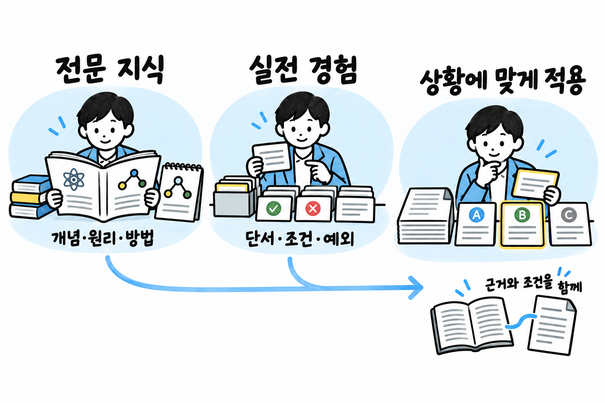

| 재료 | 한마디로 | 하는 일 | 예시 | 구분 | 사용 시점·조건 |
| --- | --- | --- | --- | --- | --- |
| **업무 지식** ✅ | **그 일을 판단하고 수행하는 데 필요한 전문 지식** | 업무에 필요한 개념·대상·원리·방법과 그 관계를 정리하고 판단과 수행에 활용한다. 검증된 자료를 종합해 근거·적용 조건·예외·이견이 연결된 지식으로 구성하고, 새 근거나 정정에 따라 내용을 보완한다. 개념과 관계의 의미를 일관되게 유지하고, 근거가 부족한 내용은 미확인으로 구분한다. 다른 분야의 지식이 필요하면 함께 연결해 쓴다. 조건에 맞는 방법을 고르고, 익숙한 방법으로 해결되지 않으면 기본 원리에서 다른 방법을 찾아 적용한다. | 통계의 표본·오차·추정 원리 · 색의 조화·명암·구도 원리 · 프로그래밍 언어·자료구조·알고리즘에 관한 지식 · 재료의 성질·제작 공정·원가 계산 방법 · 부품·제품·공급사의 개념과 관계 정의(온톨로지) | **상시** | 업무를 이해하고 판단하거나 수행할 때 · 지식을 구성하거나 근거·개념·관계·적용 조건이 바뀌었을 때 |
| **실전 경험·감각** ✅ | **경험으로 익힌 상황별 판단 요령** | 전문가와 에이전트의 업무 경험에서 반복해서 확인된 판단 요령을 상황에 맞게 활용한다. 중요한 단서와 먼저 살펴볼 부분을 가려내고, 조건이나 예외에 맞는 대응 방법을 고른다. | 불만이 커지기 전에 반복해서 나타난 말과 반응 · 도면에서 오류가 잦아 먼저 확인할 부분 · 과거 장애에서 대응 방법의 효과를 갈랐던 조건 | **상시** | 상황을 이해하고 어떤 방법으로 대응할지 정할 때 |

**지식의 구성·갱신 절차:** 전문 지식의 내용·개념·관계와 적용 조건은 **업무 지식**이 맡는다. 자료 확보 → 대상·개념의 분류·결합 → 내용 종합·문서 작성 → 근거와 결과 검증 → 검증된 지식 반영으로 연결한다. 실제 정리·작성·기록 반영은 해당 **실무** 재료가 수행하고, **작업 진행·연결**이 검토·수정·반영이 끝날 때까지 관리한다. 원문은 출처와 판본을 유지해 보관하고, 종합한 지식에서 근거 원문과 관련 지식을 찾아갈 수 있게 한다.

**변경과 재검토:** **변경 감시·반영**이 재검토 대상을 알리면 **업무 지식**은 영향을 받은 내용·관계·적용 조건을 확인해 관련 실무·검증 작업으로 연결한다. 재검토 중인 내용은 그 상태를 표시해 확인된 지식과 구별하며, 검증에 실패한 수정안은 확정 지식에 반영하지 않는다. 자료 추가·정정 때 관련 내용을 재검증하고, 수행 능력에 영향을 주는 지식·방법·도구의 변경은 **능력 개선·확장**과 **업무 능력 시험**에 연결한다.

---

### 기억·진행 상태 ✅

진행 중인 업무의 상태와 **업무를 하며 새로 얻은 정보를 보존하는 체계**다. 현재 업무를 이어 갈 정보와 다음 업무에도 활용할 기억을 관리한다.

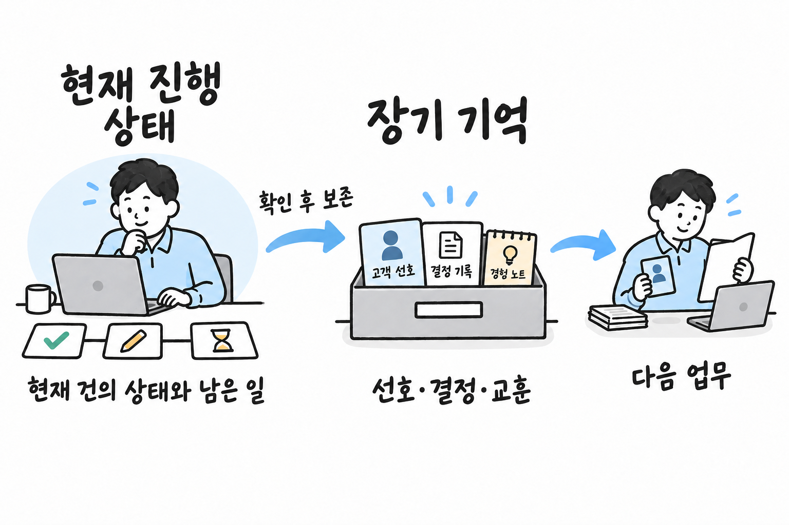

| 재료 | 한마디로 | 하는 일 | 예시 | 구분 | 사용 시점·조건 |
| --- | --- | --- | --- | --- | --- |
| **현재 진행 상태** ✅ | **지금 어디까지 했고 무엇이 남았는지 기억** | 현재 목표와 작업별 진행 상태, 남은 일을 기록한다. 담당자와 작업의 선후 관계, 선택된 분기와 병렬 작업별 결과, 기다리는 답변과 외부 처리 상태를 연결해 관리한다. 적용된 실행 계획과 작업 연결의 변경 이력을 남긴다. 완료·실패·취소와 승인·약속·조건의 변경을 반영해 다음에 어디서 무엇을 이어 할지 알 수 있게 한다. | 7건 완료·8건째 처리 확인 대기 · 도면 치수 변경으로 재확인이 필요한 물량표·원가표 · 승인 철회로 취소된 작업 · 병렬 조회 중 실패한 항목과 이미 확보한 결과 구분 | **상시** | 진행 상태나 담당·조건·승인이 바뀌었을 때 · 대기·실패·취소 상태를 정리하거나 업무를 이어 갈 때 |
| **장기 기억** ✅ | **업무가 끝난 뒤에도 다음 일을 위해 남겨 두는 기억** | 다음 업무에도 활용할 정보·경험·결정·약속을 골라 근거와 함께 보관한다. 고객·건별 사실과 약속은 해당 맥락에 묶고, 여러 업무에 통하는 지식으로 정리할 내용은 업무 지식의 구성·검증 절차에 연결한다. 필요한 때 관련 기억을 찾아 제공한다. 바뀌거나 잘못된 내용은 갱신·정정하고, 변경 시점과 이전 내용의 관계를 남긴다. 보관할 필요가 없어진 내용은 정리한다. 결정·결과마다 어떤 규칙·근거에 기댔는지 함께 남겨, 그 규칙이 바뀌면 같은 규칙을 쓴 과거 건을 목록으로 뽑아 재검토 대상으로 올린다. | 고객이 선호하거나 거절했던 방식 · 지난번에 내린 결정과 그 이유 · 현장에서 효과가 없었던 방법과 배운 점 · 규칙 개정 뒤 그 규칙으로 처리한 과거 건 목록을 재검토 대상으로 제출 | **단계별** | 다음 업무에도 남길 정보를 보관하거나 이전 기억을 찾을 때 · 기억할 내용이 바뀌거나 잘못된 것으로 확인됐을 때 · 기댔던 규칙·근거가 바뀌었을 때 · 보관할 필요가 없어졌을 때 |

---

### 규칙·권한 ✅

업무에 적용되는 의무·조건과 **에이전트의 행동 권한을 정하고 유지하는 체계**다.

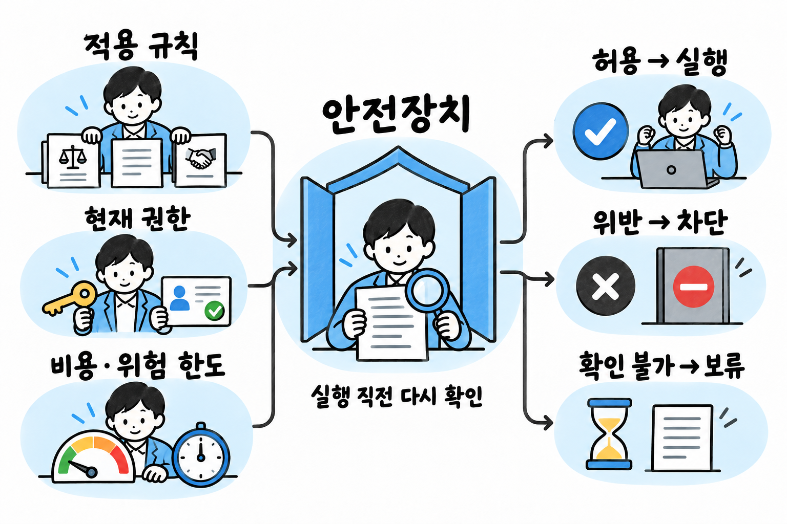

| 재료 | 한마디로 | 하는 일 | 예시 | 구분 | 사용 시점·조건 |
| --- | --- | --- | --- | --- | --- |
| **법·의무 기준** ✅ | **이번 업무에서 법적으로 반드시 지켜야 하는 기준** | 업무에 적용되는 국가·분야·시점의 법과 의무 기준을 확인한다. 법령의 상하 관계, 위임, 특별 규정과 개정·경과조치를 검토해 적용할 내용을 정한다. 해당 업무에 효력이 있는 판결·명령과 해석을 함께 확인하고, 지켜야 할 요건과 허용·금지되는 범위를 정리한다. 적용되는 예외나 기준 변경을 반영한다. | 과거 사건에 적용할 당시 법과 경과조치 · 법률이 시행령에 맡긴 세부 기준 · 해당 업무에 효력이 있는 법원의 제출 명령 · 특정 업무의 법적 자격 요건 | **상시** | 해당 법과 기준이 적용되는 업무 전반 · 적용 지역·대상·시점이나 법이 바뀌었을 때 |
| **직업 윤리·의무** ✅ | **직업이나 맡은 역할에서 지켜야 하는 윤리와 의무** | 직업이나 맡은 역할에서 지켜야 할 윤리·의무를 확인해 판단과 행동에 적용한다. 관계자의 권리와 맡은 책임을 살피고, 이해관계나 역할 때문에 의무가 충돌하는지 확인한다. 역할이나 관계가 바뀌면 적용되는 의무와 수행 조건을 다시 확인한다. 이해충돌 확인 대상에는 맡긴 사람 자신이 책임 주체인 경우, 가족·동료·증인처럼 가까운 관계자, 같은 편 다른 당사자의 행위 귀속을 넣는다. 당사자가 여럿이면 자격·이익 기준으로 먼저 갈라 건을 나누고, 서로 상충하는 주장이 있으면 맡는 범위를 나누거나, 함께 맡을 때는 팀을 나누고 정보 교환을 끊은 채 결론을 각각 낸다. | 직업상 비밀 유지 의무 · 독립성 유지 기준 · 이해충돌의 공개·회피 기준 · 역할에 따른 설명 의무 · 같은 편 두 의뢰인의 주장이 어긋나면 담당을 나누고 자료 접근 분리 | **상시** | 직업·역할에 따른 윤리와 의무가 적용되는 동안 · 역할·관계·이해관계가 바뀌었을 때 · 당사자가 여럿이거나 늘었을 때 |
| **에이전트 기본 원칙** ✅ | **모든 업무에서 공통으로 지켜야 하는 행동 원칙** | 업무 목적과 맡은 범위를 지키고, 근거·불확실성·진행 상태를 정직하게 알린다. 지시와 참고 정보를 구분해, 외부 정보에 섞인 지시가 업무의 목표나 권한을 임의로 바꾸지 않게 한다. | 실행하지 않은 일을 완료했다고 말하지 않기 · 없는 근거 만들지 않기 · 외부 문서의 지시로 접근 제한 해제하지 않기 | **상시** | 모든 판단과 행동에서 |
| **계약·합의 조건** ✅ | **상대와 약속해서 지켜야 하는 업무 조건** | 합의된 업무 조건과 각 당사자의 권리·의무를 확인해 적용한다. 약속의 적용 범위와 이행 상태를 관리하고, 조건의 변경·취소·종료를 반영한다. 업무가 끝난 뒤에도 남는 의무를 구분해 유지한다. | 합의한 업무 범위·기한·대금 · 당사자별 역할과 책임 · 결과물의 수정 범위·이용 조건 · 업무 종료 후에도 지키기로 한 비밀 유지 조건 | **상시** | 합의된 조건이나 종료 후 남는 의무가 적용되는 동안 · 합의가 변경·취소·종료됐을 때 |
| **플랫폼·제출처 규정** ✅ | **사용하는 서비스나 결과를 받는 곳이 정한 규칙** | 이용하거나 제출할 대상이 정한 조건과 절차를 확인해 적용한다. 서비스·계정·이용 방식·제출 유형에 따라 달라지는 규칙을 구분하고, 변경된 규정과 적용 범위를 반영한다. | 서비스 약관의 이용 허용 범위 · 계정별 API 사용 한도 · 앱 장터의 심사 기준 · 기관이 정한 접수 형식 | **상시** | 서비스를 이용하거나 결과를 제출할 때 · 서비스·계정·이용 방식·제출 유형이나 적용 규정이 바뀌었을 때 |
| **조직 규칙** ✅ | **조직에서 정한 업무 규칙** | 소속 조직이나 일을 맡긴 조직의 규칙 중 이번 업무에 적용되는 내용을 확인하고 따른다. 업무·역할·권한에 맞는 적용 범위를 구분하고, 규정 변경과 조직에서 허용한 예외를 반영한다. | 연구 기관의 자료 보관 기준 · 제작사의 원본 파일 관리 규칙 · 회사의 구매 절차 · 공동 프로젝트의 의사결정 규칙 | **상시** | 맡은 업무를 진행하는 동안 · 규정이나 역할·권한이 바뀌었을 때 |
| **사용자 지정 규칙** ✅ | **일을 맡긴 사람이 추가로 정한 조건과 원하는 방식** | 의뢰인이나 운영자가 따로 정한 조건을 적용한다. 반드시 지켜야 하는 조건과 단순한 선호는 구분한다. 어디까지 적용되는지와 언제까지 적용되는지도 관리한다. 사용자가 내용을 바꾸거나 취소하면 새 내용으로 반영한다. | 이번 프로젝트는 한국어로 보고 · 특정 폴더 수정 금지 · 외부 발송 없이 초안만 작성 · 급한 문의부터 처리 · 야간 연락 제한 | **상시** | 사용자가 정한 추가 조건이 적용되는 동안 · 조건이나 선호가 바뀌거나 취소됐을 때 |
| **규칙의 적용·우선순위** ✅ | **함께 지킬 규칙과 충돌할 때 따를 기준 정하기** | 규칙의 원문·설정 권한·적용 범위·시점을 확인한다. 법적 적용 관계를 먼저 반영하고, 직업상 필수 의무·에이전트 기본 원칙·승인된 보호 기준 → 유효한 계약·플랫폼 필수 규정 → 조직의 필수 규칙 → 사용자 지정 규칙 → 기본 방식·스타일 순으로 충돌을 푼다. 문서 이름이 아니라 의무의 근거와 설정 권한으로 순위를 정하고, 충돌하는 조항의 실행 기준을 정한다. 충돌을 푼 뒤 남는 조건과 보호 기준을 함께 충족할 방법을 찾고, 변경·예외의 결정 권한을 확인한다. 적용한 근거와 해결되지 않은 쟁점을 남기고, 판단할 수 없는 부분을 담당자에게 넘긴다. 충돌이 우선순위가 아니라 예외 요건의 사실 입증으로 풀리는 유형이면 요건별 입증 계획을 세워 결정권자에게 넘긴다. 규정이 아니어도 행위를 실제로 막는 조치(명령·처분·계약상 제한)는 시점과 함께 적용 규칙에 올린다. | 법이 정한 규범 간 관계를 조직 규칙보다 먼저 반영 · 계약상 납기 때문에 정보 유출 방지 기준을 해제하지 않기 · 권한 있는 당사자의 변경 합의 적용 · 해결되지 않은 규칙 충돌을 해당 작업의 보류 사유로 기록 · 예외 요건별로 무엇을 입증할지 계획을 세워 담당자 판단으로 넘김 | **상시** | 업무에 적용할 규칙을 정할 때 · 규칙·지시가 충돌하거나 바뀌었을 때 · 변경·예외 요청을 판단할 때 · 예외 요건을 사실로 입증해야 할 때 |
| **업무 권한** ✅ | **누구를 대신해 어디까지 행동해도 되는지 정한 범위** | 누구를 대신해 어떤 대상에 어떤 행동을 할 수 있는지 확인하고 관리한다. 결정·승인·위임·동의의 주체와 권한을 준 경로, 다시 맡길 수 있는 범위를 확인한다. 권한의 유효 기간과 변경·철회를 반영하고, 실행 직전에 그 권한이 지금도 유효한지와 현재 허용된 범위를 확인해 제공한다. 긴급 조치에도 미리 정한 발동 조건과 권한을 적용한다. | 공유 문서의 수정 허용 범위 · 예약 변경에 필요한 위임과 동의 · 승인된 주문의 대상·금액·유효 기간 · 사고 시 특정 전송을 중단할 수 있는 긴급 권한 | **상시** | 업무를 맡거나 다시 맡길 때 · 승인·실행·재개 직전 · 권한·동의·대상·내용이 바뀌었을 때 · 긴급 조치가 필요할 때 |
| **안전장치** ✅ | **허용 범위를 벗어나는 행동과 정보 전달을 막기** | 들어오거나 나가는 정보와 실행 요청을 현재 규칙·권한·한도 및 승인 내용과 대조한다. 허용·위반·확인 불가를 구분하고, 위반한 실행은 차단하며 확인할 수 없는 실행은 보류한다. 진행 중 조건이나 위험이 달라지면 영향을 받는 요청과 작업에 새 기준을 적용한다. 재시도·위임·다른 도구를 통한 실행에도 같은 조건을 검사한다. | 승인 금액과 다른 주문 차단 · 권한 검사에 실패한 외부 전송 보류 · 권한 철회 뒤 예정된 실행 중단 · 다른 AI나 도구를 통한 제한 우회 차단 | **상시** | 정보를 주고받거나 실행·재시도·재개할 때 · 진행 중 권한·규칙·한도·위험이 바뀌었을 때 |
| **비용·위험 한도** ✅ | **쓸 수 있는 비용·시간·자원과 감수할 위험의 범위** | 비용·시간·자원과 감수할 위험의 한도를 업무 조건과 권한에 맞춰 정한다. 피해의 크기·확산·복구 가능성·발생 가능성과 불확실성을 살피고, 실행과 대기에서 생길 피해를 비교한다. 사용량과 진행·예약된 작업의 필요량을 합쳐 남은 여유를 관리한다. 한도 초과 가능성과 필요한 보호 조치·추가 판단을 알린다. | 업무 전체의 예산·시간·자원 한도 · 정보 공개·삭제 전에 필요한 추가 검토 조건 · 사고 대응 중 허용할 서비스 중단 범위와 시간 · 여러 AI가 나눠 쓰는 비용의 합산 한도 | **상시** | 업무 한도와 보호 조치를 정할 때 · 실행·재개와 대기의 위험을 비교할 때 · 사용·진행·예약분이나 위험 조건이 바뀌었을 때 |
| **표현 방식·스타일** ✅ | **말·글·이미지·영상·소리의 표현 기준** | 업무의 대상·목적·매체에 맞는 표현 기준을 정리한다. 원하는 인상과 전달 방식, 사용하거나 피해야 할 표현을 구체화한다. 정해진 문체·디자인·브랜드 기준을 작업 전반에 일관되게 적용한다. | 대상에 맞춘 용어 수준과 문체 · 그림의 색감과 선 모양 · 영상의 장면 전환과 연출 방식 · 안내 음성의 말투와 속도 | **조건부** | 말투·문체·디자인·연출 등 표현 기준을 정하거나 맞춰야 할 때 |

---

### 행동 체계 ✅

**할 일과 완료 기준, 방법과 실행 계획을 정하는 체계**다. 새로 대응할 일을 찾아내고, 사람이 맡아야 할 판단과 작업을 연결한다.

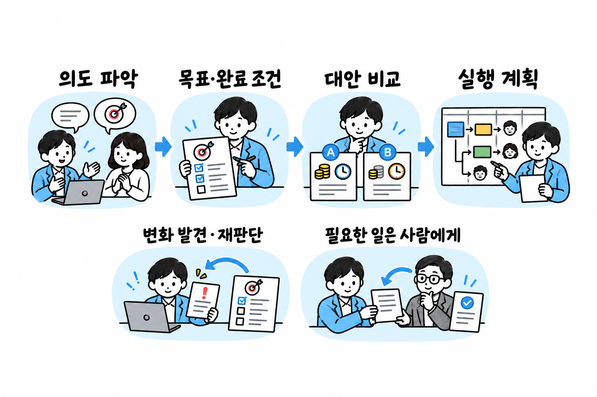

| 재료 | 한마디로 | 하는 일 | 예시 | 구분 | 사용 시점·조건 |
| --- | --- | --- | --- | --- | --- |
| **지시·의도 파악** ✅ | **맡긴 말이 무슨 뜻인지 이해하기** | 요청과 앞뒤 맥락에서 원하는 결과와 이유, 허용한 범위를 읽어 낸다. 모호하거나 빠진 내용은 잘못 이해했을 때의 영향을 보고 질문할 것과 가정해도 될 것을 구분한다. 뜻에 따라 목표나 범위가 달라지는 부분은 맡긴 사람에게 확인하고, 가정한 내용과 그 영향을 알린다. 맡긴 말이 붙인 분류·이름과 실제 자료의 내용이 다르면 자료 쪽을 기준으로 다시 묻는다. | '보고서 다듬어 줘'가 문장 수정인지 구성 변경인지 확인 · '빠르게 해 줘'가 납기 단축인지 처리 속도 개선인지 확인 · 요청에 없는 제출 형식을 가정했다면 그 내용과 영향 알림 · '단순 계약 검토'라며 넘긴 자료가 분쟁 기록이면 실제 자료 기준으로 범위 재확인 | **상시** | 새 요청을 받았을 때 · 지시가 바뀌었을 때 · 요청의 뜻이 모호하거나 이해가 어긋났을 때 · 맡긴 말의 분류와 실제 자료가 어긋날 때 |
| **문제·목표·완료 조건** ✅ | **풀 문제와 이룰 목표, 끝났다고 볼 기준 정하기** | 이해한 요청과 확인된 자료를 바탕으로 해결할 문제와 목표를 정한다. 맡은 범위와 지켜야 할 조건 안에서 목표의 우선순위를 정한다. 전체 업무와 각 단계의 목표를 달성했다고 볼 상태, 확인 항목과 확인 방법·증거를 정한다. 요청한 목표나 범위를 넓혀야 하면 변경을 제안하고 확인된 내용을 반영한다. | 반복 문의가 많은 부분을 개선 대상으로 정하기 · 여러 목표 중 처리 시간 단축을 먼저 달성하기로 정하기 · 예약 확정과 안내 전달을 완료 조건으로 정하기 · 계산표의 값을 바꿔도 결과가 맞는지 시험 기록으로 확인하도록 정하기 | **상시** | 이해한 요청을 업무 목표로 정리할 때 · 문제 상황·목표·요구 조건이나 판단의 바탕이 바뀌었을 때 |
| **대안·전략 판단** ✅ | **목표를 이룰 방법을 비교하고 선택하기** | 정해진 목표를 이룰 방법을 찾거나 새로 생각해 낸다. 각 방법의 효과와 근거, 시간과 비용, 위험과 불확실한 점을 비교한다. 어떤 방법을 쓸지와 선택 전에 무엇을 더 알아야 하는지 정한다. 가능한 방법과 그 부담을 보고 업무를 맡을지, 계속할지, 미루거나 중단할지도 판단한다. | 직접 조사할지 기존 자료를 분석할지 비교 · 마감을 맞출 수 있는 다른 제작 방법 선택 · 근거가 부족한 방법은 추가 조사 후 판단 · 비용과 위험이 커진 방법을 계속 쓸지 다른 방법으로 바꿀지 판단 | **상시** | 목표를 이룰 방법을 선택하거나 바꿀 때 · 업무를 맡을지, 계속할지, 미루거나 중단할지 판단할 때 |
| **사람에게 넘기기** ✅ | **사람이 맡아야 할 판단·작업을 연결하고 답변 관리** | 사람의 결정·승인·자격이 필요하거나 에이전트가 해결할 수 없는 일을 담당자에게 넘긴다. 넘기는 이유와 필요한 자료, 요청할 판단이나 작업을 정리한다. 업무 일정에 맞춰 답변이 필요한 시점과 늦어질 때의 조치를 정하고, 확인 시점이 오면 요청 상태를 확인한다. 받은 답변과 결과를 요청했던 판단이나 작업에 반영한다. | 자격이 필요한 검토를 담당 전문가에게 요청 · 예산 초과 지출의 근거를 정리해 승인자에게 전달 · 답변 기한이 지나 정해 둔 대체 담당자에게 다시 요청 · 받은 승인 결정을 해당 지출 건에 반영 | **상시** | 사람의 판단·승인·자격·작업이 필요할 때 · 넘긴 일의 진행과 답변을 확인하거나 받은 결과를 반영할 때 |
| **업무 절차·실행 계획** ✅ | **선택한 방법을 작업·연결·담당자·일정으로 짜기** | 선택한 방법을 작업별 입력·출력과 연결 관계로 구체화하고 담당자·도구·자원·일정을 배정한다. 선후 관계와 병렬 실행, 결과를 모아야 하는 지점과 조건별 경로를 정한다. 의미 해석이 필요한 판단과 명시된 값·상태로 처리할 분기를 구분한다. 검사·승인, 일부 실패 시 처리와 반복·중단·재개 조건을 작업 순서에 넣는다. 입력과 중간 결과에 따라 필요한 작업 수와 연결을 구체화하거나 변경한다. | 조사와 시안 제작의 담당자·일정 배정 · 필요한 검토 결과가 모두 모여야 제작을 시작하도록 연결 · 자료 수에 맞춰 검토 작업 수와 연결 구성 · 끝난 작업을 제외하고 재개할 순서 정하기 | **단계별** | 선택한 방법을 실행 계획으로 옮길 때 · 방법·일정·자원이나 입력·작업 진행 상태가 바뀌었을 때 |
| **먼저 알아채기** ✅ | **따로 시키지 않아도 새로 대응할 일 찾아내기** | 상황의 변화와 여러 단서를 연결해 새로운 대응이 필요한 문제나 기회를 찾는다. 따로 요청받지 않은 일도 맡은 업무 범위에 들고 대응할 필요가 있는지 살핀다. 발견한 내용과 대응이 필요한 이유, 얼마나 급한지를 정리해 판단할 일로 알린다. | 여러 작업의 지연을 보고 납기를 다시 검토할 필요 발견 · 반복 문의에서 안내문 개선 필요 발견 · 새 자료 때문에 기존 조사를 다시 살필 필요 발견 · 장비의 소음과 속도 변화를 함께 보고 점검 필요 발견 | **조건부** | 상황을 계속 살피고 필요한 일을 먼저 찾아내도록 맡겨진 업무에서 |

---

### 실무 ✅

**맡은 일을 끝까지 처리하고, 반복되거나 계속 이어지는 업무를 운영하는 체계**다. 진행·후속 관리를 바탕으로 작업에 맞는 재료를 골라 조합한다. 

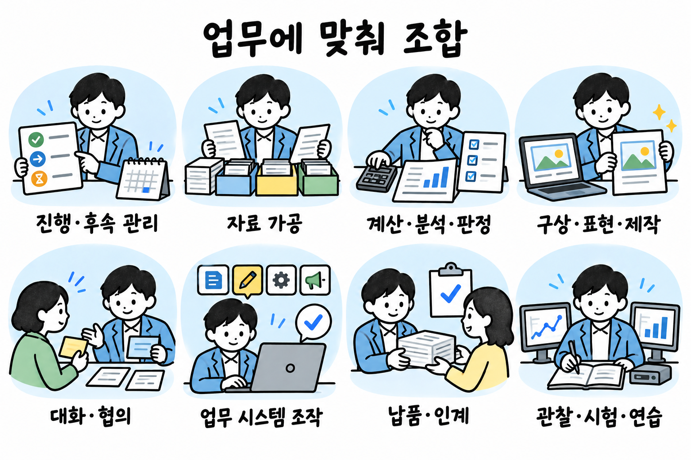

#### 진행·후속 관리 ✅

| 재료 | 한마디로 | 하는 일 | 예시 | 구분 | 사용 시점·조건 |
| --- | --- | --- | --- | --- | --- |
| **작업 진행·연결** ✅ | **지금 할 작업을 진행하고 다음 작업으로 이어 주기** | 준비된 자료와 현재 진행 상태를 보고, 정해진 계획과 우선순위에 따라 지금 시작할 수 있는 작업을 진행한다. 작업 결과를 다음 담당과 검토 단계에 전달한다. 실행 실패·검토 반려·조건 변경이 생기면 필요한 수정·확인 작업으로 연결한다. 완료 기준과 검사 결과에 따라 계속 진행할 일과 대기·종료·인계할 일을 구분한다. 계획으로 처리할 수 없는 변경은 업무 절차·실행 계획이나 대안·전략 판단으로 돌려보낸다. | 초안 작성 뒤 검토·수정·납품으로 연결 · 여러 문의를 정해진 우선순위에 따라 처리 · 제출처의 보완 요청을 해당 수정 작업에 연결 · 한 작업이 막히면 진행 가능한 다른 작업 이어 가기 | **상시** | 업무를 맡은 뒤 종료·인계할 때까지 · 계속 운영하도록 맡은 업무의 각 처리 과정에서 |
| **대기·후속 관리** ✅ | **기다리는 일과 나중에 할 일을 놓치지 않고 챙기기** | 답변·승인·외부 처리를 기다리는 일과 나중에 해야 할 일을, 각 담당이 정한 조건과 확인 시점에 맞춰 관리한다. 응답이나 상태 변화가 도착하면 현재 진행 상태와 조건을 확인해 연결된 작업을 다시 진행하게 한다. 기한이 지나면 정해 둔 재확인·대체·인계 절차를 연결한다. 반복 업무의 다음 회차와 완료 뒤 남은 약속도 이행하거나 담당을 넘길 때까지 관리한다. 되돌릴 수 없는 결정(선택하면 이후 선택지가 닫히는 것)과 그 기한은 따로 표시해 실행 전에 재확인한다. 다른 절차의 상태로 정해지는 기한과, 상대의 기한이 만드는 상대의 행동 예정 시점도 기한으로 등록한다. 계산으로 나온 기한은 자동으로 등록한다. | 답변이 없는 견적의 후속 확인 연결 · 확인 기한이 지난 환불의 재조회 연결 · 이번 정산의 미결 항목을 다음 확인 작업에 연결 · 계약 갱신 시점에 필요한 작업 시작 · 이의 제기 기한처럼 지나면 되돌릴 수 없는 시점을 별도 표시 · 상대의 응답 기한 다음 날을 상대 행동 예상 시점으로 등록 | **상시** | 업무의 대기·기한·후속 책임을 유지하는 동안 · 응답·상태 변화·확인 시점이 도래했을 때 · 되돌릴 수 없는 결정의 기한이 생겼을 때 · 반복 업무의 회차가 바뀌거나 담당이 바뀔 때 |

#### 자료 가공 ✅

| 재료 | 한마디로 | 하는 일 | 예시 | 구분 | 사용 시점·조건 |
| --- | --- | --- | --- | --- | --- |
| **자료 선별·분류** ✅ | **필요한 자료를 골라 항목별로 나누기** | 작업에 필요한 자료와 항목을 고르고, 내용과 특성에 따라 분류한다. 서로 다른 자료에서 같은 개념·대상을 가리키는 항목을 연결하고, 연결한 근거를 남긴다. 이름이 같아도 다른 대상일 수 있음을 확인한다. 동일 여부가 불명확하거나 분류가 겹치는 항목, 어느 쪽인지 정하기 어려운 자료는 따로 구분해 남긴다. | 문의 내용을 유형별로 분류 · 사건 기록에서 쟁점별 자료 선별 · 고객 명단에서 같은 사람을 가리키는 기록 연결 · 같은 개념의 다른 명칭과 이름만 같은 다른 대상 구분 | **조건부** | 확보한 자료를 고르거나 분류·연결할 때 · 분류 업무를 맡은 동안 새 자료나 요청이 들어올 때 |
| **자료 정리·결합** ✅ | **자료의 오류·중복을 정리하고 합치거나 나누기** | 확보한 자료의 표기와 항목을 맞추고, 잘못된 것으로 확인된 내용과 중복을 정리한다. 정해진 연결 기준에 따라 자료를 합치거나 나눈다. 빠진 값과 서로 맞지 않는 내용은 구분해 남기고, 바꾼 내용이 어느 원본에서 왔는지 연결한다. 합친 주장·관계의 근거와 서로 다른 적용 조건을 유지하고, 잘못 연결한 항목을 되돌릴 수 있게 변경 내역을 남긴다. | 중복 영수증을 골라 월별 거래 자료 정리 · 주문과 입금 기록을 거래별로 연결 · 여러 파일에 흩어진 제품 정보를 하나로 합치기 · 같은 개념의 중복 항목을 근거·예외와 함께 통합 | **조건부** | 자료의 오류·중복·누락을 정리하거나 합치고 나눌 때 · 정기 정리 시점이나 원본의 추가·변경이 있을 때 |
| **형식·구조 변환** ✅ | **내용을 필요한 파일 형식이나 항목 구조로 바꾸기** | 원본의 내용과 항목을 사용할 형식과 구조에 맞게 옮긴다. 항목 사이의 연결과 수식·글꼴·시간 정보 등 유지해야 할 요소를 함께 옮긴다. 옮길 수 없거나 달라지는 부분을 구분하고, 사용할 수 있는 대체 형식을 마련한다. | 기존 시스템의 고객 자료를 새 시스템의 항목에 맞게 변환 · 자막을 다른 재생 프로그램의 형식으로 변환 · 편집 원본에서 인쇄용 파일 만들기 | **조건부** | 사용할 프로그램이나 제출처에 맞게 파일 형식·항목 구조를 바꿔야 할 때 |

#### 계산·분석·판정 ✅

| 재료 | 한마디로 | 하는 일 | 예시 | 구분 | 사용 시점·조건 |
| --- | --- | --- | --- | --- | --- |
| **계산** ✅ | **필요한 값을 구할 방법을 정하고 계산하기** | 구하려는 값과 조건을 식과 계산 규칙으로 정리한다. 문제에 맞는 방법으로 계산한다. 어떤 값과 단위, 방법을 썼고 무엇을 가정했는지 결과와 함께 남긴다. 얼마나 세밀하게 계산해야 하는지와 결과에 어느 정도 오차가 있을 수 있는지도 살핀다. 한 항목의 결과가 다른 항목의 값·기한·합산을 바꾸면 그 연동을 식에 넣고, 같은 계산을 대상 여럿에게 반복할 때는 개별 예외를 표로 유지해 한 칸이 바뀌면 그 대상만 다시 계산한다. 남이 낸 계산도 같은 기준으로 검산하며, 계산은 실행 전 계획 단계에서도 돌린다. | 필요한 재료의 수량과 비용 계산 · 서로 다른 단위의 측정값을 같은 단위로 바꿔 합산 · 작업량·인원·처리 속도로 걸릴 시간 계산 · 측정값의 오차 때문에 계산 결과가 얼마나 달라질 수 있는지 확인 · 한 항목의 인정 여부가 전체 합산 상한을 바꾸는 연동 계산 · 당사자 30명의 개별 조건을 표로 두고 바뀐 사람만 재계산 | **조건부** | 필요한 값을 계산하거나 문제의 조건을 식으로 정리해 풀 때 · 한 항목의 결과가 다른 항목의 값을 바꿀 때 · 남이 낸 계산을 근거로 받을 때 |
| **분석** ✅ | **정보를 비교해 특징·관계·원인을 알아내기** | 여러 정보를 비교하고 연결해 반복되는 특징과 차이, 관계와 변화 흐름을 찾는다. 원인과 현재 상태를 해석하고 서로 다른 설명을 비교한다. 확인된 사실과 분석으로 추정한 내용을 구분하고, 근거와 확실하지 않은 부분, 어디까지 적용할 수 있는지 정리한다. | 면담에서 반복되는 요구와 불만 찾기 · 사건 기록을 비교해 가능한 원인 좁히기 · 측정값에서 평소와 다른 변화와 관련 조건 찾기 | **조건부** | 정보의 특징·차이·관계·원인이나 현재 상태를 해석해야 할 때 · 분석 업무의 정기 검토 시점이나 중요한 새 정보가 들어왔을 때 |
| **기준 적용·판정** ✅ | **업무 대상이 기준과 요건에 맞는지 판단하기** | 업무 대상에 적용할 요건과 기준을 확인하고 사실·증거와 항목별로 대조한다. 예외나 해석이 갈리는 부분은 관련 근거와 조건을 함께 검토한다. 충족 여부와 정도, 해당하는 조건·등급을 판단하고 이유를 정리한다. 아직 판단할 수 없는 부분과 추가로 확인할 내용을 구분한다. | 신청 자료가 지원 요건을 충족하는지 판단 · 납품 부품이 요구 규격에 맞는지 판정 · 계약 조건과 작업 내역을 대조해 비용 부담 판단 | **조건부** | 대상의 적합 여부·자격·책임·처리 조건을 판단하는 업무를 맡았을 때 |
| **예측** ✅ | **앞으로 일어날 결과와 변화를 예상하기** | 지금까지의 정보와 파악한 관계를 바탕으로 앞으로의 결과나 변화를 예상한다. 조건이나 선택이 바뀌면 예상이 얼마나 달라지는지 살핀다. 예상의 근거와 가정, 가능한 범위와 불확실한 점을 함께 정리한다. | 다음 달 수요와 변동 범위 예상 · 인원이 달라질 때 작업 완료 시점 예상 · 제안한 조건에 상대가 어떻게 반응할지 예상 | **조건부** | 앞으로의 결과나 변화를 예상해 판단에 써야 할 때 · 정기 예측 시점이나 주요 정보·가정이 바뀌었을 때 |
| **조건 안에서 최선 찾기** ✅ | **지켜야 할 조건을 만족하면서 목표에 가장 유리한 안 찾기** | 정해진 목표와 조건을 확인하고 바꿀 수 있는 요소를 찾는다. 수량·배치·순서·구조·설정 등을 달리한 안들을 비교해 더 나은 안을 찾는다. 한쪽이 좋아지면서 다른 쪽이 나빠지는 점도 함께 살핀다. 찾은 안의 장점과 한계, 어디까지 비교했는지 정리한다. | 정해진 시간 안에 배송하면서 이동 거리를 줄이는 차량 배치 찾기 · 필요한 화질을 유지하면서 파일 크기를 줄이는 설정 찾기 · 필요한 수량을 제때 공급하면서 보관 비용을 줄이는 재고량 비교 | **조건부** | 조건 안에서 유리한 안을 찾거나 기존 안을 조정할 때 · 운영 중 목표 달성에 영향을 주는 수요·자원·비용 조건이 바뀌었을 때 |

#### 구상·표현·제작 ✅

| 재료 | 한마디로 | 하는 일 | 예시 | 구분 | 사용 시점·조건 |
| --- | --- | --- | --- | --- | --- |
| **결과물 설계** ✅ | **결과물의 내용·구성·모양·작동 방식 정하기** | 목표와 요구 조건에 맞는 아이디어를 구상하고, 담을 내용과 요소, 전체 구성을 정한다. 모양과 표현 방식, 기능과 작동 방식을 정한다. 구현에 필요한 규격과 요소 사이의 연결을 정리한다. | 보고서의 목차와 핵심 내용 설계 · 서비스의 이용 흐름과 대응 방식 설계 · 프로그램의 기능과 데이터 흐름 설계 · 영상의 장면 구성과 화면 표현 설계 | **조건부** | 결과물이나 서비스의 내용·구성·형태·작동 방식을 정하거나 바꿀 때 |
| **내용 재구성** ✅ | **기존 내용을 목적에 맞게 요약·번역하거나 표현 바꾸기** | 기존 내용을 목적과 상대에 맞게 줄이거나 풀어 쓰고, 언어와 표현 방식을 바꾼다. 원문의 뜻과 사실관계, 필요한 말투와 맥락을 살려 다시 구성한다. 여러 자료를 종합할 때는 각 주장·관계의 출처와 서로 다른 적용 조건·이견을 유지한다. 줄이거나 바꾸면서 빠지는 중요한 내용과 뜻이 불분명한 부분을 함께 알린다. | 긴 회의 기록을 결정 사항 중심으로 요약 · 기술 설명서를 다른 언어로 번역 · 조건부 약속의 뜻을 유지하며 통역 · 전문 설명을 쉬운 말로 풀어 쓰기 · 여러 원문을 근거와 이견이 드러나는 주제별 지식 문서로 종합 | **조건부** | 기존 내용을 요약·번역·통역하거나 목적과 상대에 맞게 표현을 바꿀 때 |
| **결과물 만들기·수정** ✅ | **정한 내용과 설계를 사용할 수 있는 결과물로 만들기** | 정한 내용과 설계에 맞춰 결과물을 만들고 필요한 요소를 조합한다. 기존 결과물의 기능·구성·표현을 고치거나 다른 용도에 맞게 편집한다. 원본과 연결된 요소를 함께 맞추고 사용할 수 있는 형태로 마무리한다. | 정한 구성에 맞춰 문서·도면 작성 · 설계한 기능을 코드로 구현 · 이미지·영상·음원 제작 · 영상 길이에 맞춰 장면·자막·음성 편집 · 개념·주제별 위키 문서와 상호 참조 작성·수정 | **조건부** | 내용과 설계를 결과물로 만들 때 · 기존 결과물의 기능·구성·표현을 고치거나 여러 요소를 조합할 때 |

#### 대화·협의 ✅

| 재료 | 한마디로 | 하는 일 | 예시 | 구분 | 사용 시점·조건 |
| --- | --- | --- | --- | --- | --- |
| **사람과 소통** ✅  | **상대와 내용을 주고받고 서로의 이해와 의견을 확인** | 상대가 말한 내용과 반응을 보고 필요한 질문을 하거나 설명한다. 필요한 답변도 한다. 상대가 얼마나 이해하고 있는지와 어떤 입장인지에 맞춰 말할 내용과 전달 방식을 조절한다. 서로 다르게 이해한 부분이 있으면 바로잡는다. 무엇에 합의했는지와 아직 의견이 다른 부분도 확인한다. 상대나 제3자에게 묻거나 자료를 정리해 달라고 하기 전에, 그 접촉이 근거의 신뢰를 해치거나 상대에게 불리하게 쓰일 위험을 먼저 판정하고 방법을 정한다. | 이해되지 않는 요구를 되물어 확인 · 상대가 어려워하는 내용을 쉬운 말로 설명 · 화난 고객의 이유를 듣고 처리 과정을 설명 · 회의 끝에 각자 이해한 결론이 같은지 되물어 확인 · 관계자에게 묻기 전에 그 접촉이 진술을 오염시킬 위험 판정 | **조건부** | 맡은 대화·응대가 이어지는 동안 · 질문·답변·설명·제안이 필요할 때 · 오해를 풀거나 이해·의견·합의 여부를 확인할 때 · 접촉 자체가 근거나 상대의 입장에 영향을 줄 수 있을 때 |
| **협상·조율** ✅ | **서로 다른 요구를 조정해 함께 받아들일 조건 만들기** | 참여자들의 요구와 우선순위, 조정할 수 있는 범위를 파악한다. 허용된 범위에서 조건과 대안을 제안하고 상대의 답에 맞춰 수정안을 협의한다. 합의한 조건과 각자의 역할·약속을 정리하고, 합의하지 못한 부분은 다음 판단에 연결한다. | 가격·납기·제공 범위를 함께 협상 · 여러 부서가 함께 쓰는 인력과 일정 조율 · 불만 사항의 보상·수정 조건 협의 | **조건부** | 이해관계나 요구가 달라 조건·역할·약속을 함께 조정해야 할 때 |

#### 업무 시스템 조작 ✅

| 재료 | 한마디로 | 하는 일 | 예시 | 구분 | 사용 시점·조건 |
| --- | --- | --- | --- | --- | --- |
| **기록 입력·수정** ✅ | **업무 시스템의 기록을 등록하거나 고치기** | 업무 시스템에 남길 항목과 대상 기록을 확인하고 새 내용을 입력하거나 기존 내용을 수정·삭제한다. 다른 작업에서 바뀐 내용과 대조해 변경 범위를 맞춘다. 반영된 기록과 변경 이력을 확인하고 누락되거나 잘못 입력된 부분을 정정한다. | 확인한 거래를 장부에 입력 · 고객 정보와 문의 처리 기록 갱신 · 재고 대장의 확인된 수량 차이 정정 · 삭제하기로 한 자료를 관련 저장소에서 삭제 | **조건부** | 업무 기록을 등록·수정·삭제할 때 · 기록 관리 업무에서 새 거래·요청·상태 변경이 발생하거나 정기 반영 시점이 왔을 때 |
| **신청·거래 처리** ✅ | **신청·예약·주문·지급을 진행하고 변경·취소 처리하기** | 대상과 금액·수량·일정, 실행 조건을 확인하고 정해진 신청이나 거래를 진행한다. 접수·확정·거절·부분 처리 상태를 확인한다. 처리 여부가 불분명하면 원래 요청의 상태부터 확인한다. 확인된 상태와 허용 범위에 따라 남은 처리나 변경·취소·환불을 진행하고 결과를 대조한다. | 신청서를 제출하고 접수·보완 상태 확인 · 예약을 변경하고 확정 내역 확인 · 일부 주문을 취소하고 환불·잔액 대조 · 응답을 잃은 지급의 처리 여부 조회 | **조건부** | 맡은 신청·거래 업무에 새 요청이 들어왔을 때 · 변경·취소·환불 요청이나 처리 상태 변화가 있을 때 · 미결 건의 확인 시점이 왔을 때 |
| **설정·작동 제어** ✅ | **프로그램의 설정을 바꾸고 필요한 기능을 작동시키기** | 조작할 대상의 현재 설정과 작동 상태를 확인한다. 정해진 설정을 바꾸고 기능을 시작·중지·재개한다. 운영 중에는 관측한 상태를 유지해야 할 조건과 비교해 필요한 설정과 작동을 조정한다. 변경이 반영됐는지 확인하고, 문제가 생기면 허용된 범위에서 설정을 되돌리거나 작동 상태를 조정한다. | 광고 예산·노출 설정 변경 · 업무용 계정의 접근 권한 회수 · 방송 중 소리 변화에 맞춰 음량 조절 · 중단된 처리 작업 재개 | **조건부** | 프로그램이나 서비스의 설정·접근 권한·작동 상태를 바꿀 때 · 운영을 맡은 동안 유지 조건에서 벗어나거나 정해진 조정 시점이 왔을 때 |
| **게시·배포** ✅ | **콘텐츠나 프로그램을 정해진 대상에게 공개·제공하기** | 공개하거나 제공할 판본과 대상, 시점과 범위를 맞춘다. 정해진 경로로 게시하거나 사용 환경에 배포하고 반영된 판본과 공개 상태를 확인한다. 잘못된 게시나 배포는 허용된 범위에서 정정·철회하거나 이전 판본으로 되돌린다. | 상품 정보와 콘텐츠 게시 · 구독 대상에 맞춰 뉴스레터 발송 · 앱이나 서비스의 새 판본 배포 · 잘못 공개된 파일 교체·철회 | **조건부** | 게시·배포 요청이나 예약 시점이 왔을 때 · 공개 범위나 제공 판본을 바꿀 때 · 정기 발행·배포 업무의 다음 회차가 왔을 때 |

#### 납품·인계 ✅

| 재료 | 한마디로 | 하는 일 | 예시 | 구분 | 사용 시점·조건 |
| --- | --- | --- | --- | --- | --- |
| **납품 준비** ✅ | **넘길 결과·설명·원본과 남은 일을 갖춰 정리하기** | 받는 사람이 다음에 할 일에 맞춰 전달할 결과와 사용 설명, 필요한 원본과 연결 자료를 갖춘다. 결과의 판본과 포함 범위를 정리하고, 이미 확인한 검사 결과를 연결한다. 처리 내역과 미완료 사항, 이어서 할 일과 담당자도 함께 정리한다. | 설계 원본·도면·사용 설명 묶기 · 편집 프로젝트·연결 자산·납품본 정리 · 처리 내역·미결 항목·후속 담당을 인계 자료로 정리 | **단계별** | 결과를 납품하거나 업무를 다른 담당자에게 인계할 준비를 할 때 |
| **전달·인수 확인** ✅ | **결과를 넘기고 약속한 수령·사용 조건 확인하기** | 정해진 상대와 경로로 결과를 전달한다. 약속한 확인 방식에 따라 도착 여부와 받아 쓸 수 있는지를 확인한다. 전달 오류나 수정 요청이 있으면 내용을 정리해 알린다. 전달·확인 대기·인수 완료 상태와 남은 일을 구분해 알린다. | 담당자에게 자료를 보내고 열어 쓸 수 있는지 확인 · 서비스 이전 뒤 약속한 업무가 이어지는지 확인 · 파일이 안 열린다는 답을 받아 내용을 정리해 알림 · 설비 설치 뒤 시운전 확인서를 받아 인수 완료로 기록 | **단계별** | 결과를 전달할 때 · 약속한 수령·사용 조건을 확인하거나 전달 문제·수정 요청을 받아 알릴 때 |

#### 관찰·시험·연습 ✅

| 재료 | 한마디로 | 하는 일 | 예시 | 구분 | 사용 시점·조건 |
| --- | --- | --- | --- | --- | --- |
| **관찰·측정** ✅ | **대상을 살펴보거나 값을 재서 새 기록 얻기** | 관찰하거나 측정할 대상과 항목, 방법과 시점을 정한다. 대상을 살펴보거나 값을 측정하고 당시 조건과 함께 기록한다. 관찰하기 어렵거나 측정값을 믿기 어려운 부분, 빠진 기록을 표시한다. | 이용자의 화면 조작 순서와 막히는 부분 기록 · 서비스의 응답 시간 측정 · 영상에서 작업 순서와 대기 구간 관찰 | **조건부** | 판단에 필요한 새 관찰·측정 기록을 얻을 때 · 관측 업무를 맡은 기간의 정해진 주기·변화 신호에 따라 대상을 살필 때 |
| **실험** ✅ | **조건을 바꾼 것이 결과에 어떤 영향을 주는지 확인하기** | 알아보려는 질문과 바꿀 조건, 비교할 대상을 정한다. 결과를 비교할 수 있도록 다른 조건을 관리하며 시험한다. 관측한 차이와 결과에 영향을 줄 수 있는 다른 요인, 시험의 한계를 정리한다. | 안내 문구를 바꿔 오해가 줄어드는지 비교 · 광고 두 안의 반응과 구매 결과 비교 · 정보의 배치 순서를 바꿔 찾는 시간 비교 | **조건부** | 조건이나 방법의 변화가 결과에 주는 영향을 비교해야 할 때 |
| **시뮬레이션** ✅ | **상황의 움직임과 반응을 흉내 내 미리 살펴보기** | 가정한 조건에서 대상이 어떻게 움직이고 반응하는지 컴퓨터 계산이나 역할 연기로 표현한다. 그 안에서 업무의 흐름과 결과를 예상하거나 대응을 연습한다. 사용한 가정과 빠진 조건, 업무에 적용할 때 달라질 수 있는 점을 정리한다. | 주문량이 늘어난 상황에서 배송 흐름과 지연 예상 · 가상 상대와 협상 연습 · 장애 상황을 가정해 대응 순서 연습 · 구조물에 힘이 가해질 때의 변형 계산 | **조건부** | 상황을 가정해 진행 과정과 결과를 예상하거나 대응을 미리 연습해야 할 때 |

---

### 검증·평가 ✅

**일을 제대로 했는지, 결과가 얼마나 좋은지, 목표를 얼마나 달성했는지 확인하는 체계**다. 판단과 실행의 이유를 기록하고, 에이전트에게 어떤 일을 맡길 수 있는지도 시험한다.

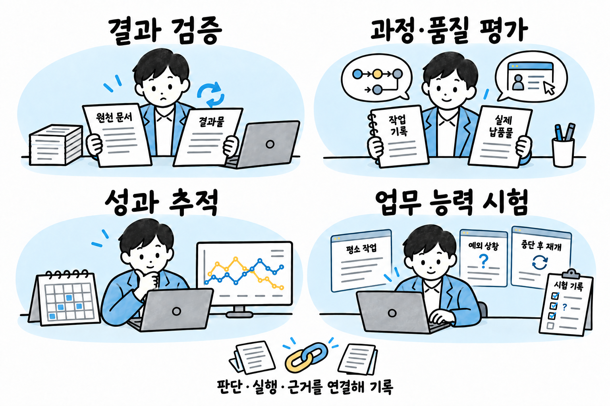

| 재료 | 한마디로 | 하는 일 | 예시 | 구분 | 사용 시점·조건 |
| --- | --- | --- | --- | --- | --- |
| **판단 근거 기록** ✅ | **왜 그렇게 판단하고 행동했는지 남기기** | 왜 그렇게 판단했는지와 무엇을 근거로 삼았는지 기록한다. 단계별 입력과 실행 결과, 선택된 경로와 그 판단 근거·조건을 연결해 남긴다. 내용을 고치거나 검사했다면 이유와 확인 방법, 결과도 기록한다. | 방법을 고른 이유와 참고한 자료 기록 · 인용한 내용이 원문의 어디에 있는지 기록 · 분기를 선택한 입력값·조건과 실행 결과 기록 · 수정 요청과 그에 따라 고친 내용·검사 결과를 함께 기록 | **상시** | 판단하거나 실행할 때 · 내용을 바꾸거나 검사할 때 |
| **보고 주체 확인** ✅ | **온 결과가 맡긴 그 상대가 낸 것이 맞는지 대조** | 결과나 보고를 받을 때 낸 쪽의 신원과 받아 간 분담 번호, 낸 결과물의 지문을 맡길 때 적어 둔 값과 대조한다. 하나라도 맞지 않으면 받지 않고 막은 이유와 다음 행선지를 남긴다. 받아들인 뒤에 결과물이 바뀌었는지도 지문을 다시 재어 확인한다. 사람에게 넘긴 일이 돌아올 때는 본인이 맞는지와 무엇을 승인한 것인지 확인한다. 안에서 누가 만들었는지와 밖으로 누구 이름으로 나가는지를 함께 기록한다. | 하위 에이전트가 낸 결과의 신원·분담 번호·지문 대조 · 남의 분담 번호로 온 보고 차단 · 한 일이 없는데 했다고 적은 보고 차단 · 승인 뒤 내용이 바뀐 서류의 발송 차단 · 검토자가 돌려준 승인이 본인 것인지 확인 | **상시** | 결과·보고를 받을 때 · 사람에게 넘긴 일이 돌아올 때 · 명의로 대외 행위를 하기 전 |
| **결과 검증·재검증** ✅ | **결과에 틀리거나 빠진 부분이 없는지 확인** | 각 단계와 최종 결과가 정해진 조건에 맞는지, 틀리거나 빠진 부분은 없는지 근거와 대조해 확인한다. 다음 작업에 넘길 결과는 필요한 형식·항목·의미 조건도 확인한다. 요청한 작업이 끝났는지도 확인한다. 수정한 경우에는 바꿔야 할 부분이 바뀌었고 그대로 둬야 할 부분은 유지됐는지 살핀다. 지식을 구성·갱신한 경우에는 다른 대상의 잘못된 통합, 근거 없는 관계, 누락된 예외·이견, 끊긴 참조와 정정이 빠진 관련 항목도 확인한다. 확인 결과를 **문제없음·문제 있음·아직 확인할 수 없음**으로 나눠 알린다. 결과나 자료, 입력값, 조건이 바뀌면 그 부분과 영향을 받는 결과를 다시 확인한다. 상대·제3자·판정 기관이 낸 계산과 문서도 내 것과 같은 기준으로 검산하고, 상대가 낸 근거는 상대에게 불리한 방향으로도 읽어 본다. | 번역에서 빠진 문장 확인 · 다음 단계에 넘길 계산값의 항목·단위 확인 · 요청한 부분만 수정됐는지 확인 · 예약이 확정됐는지 처리 기록 확인 · 도면 치수가 바뀌면 재료 수량과 비용도 다시 계산해 확인 · 상대가 낸 정산표를 같은 식으로 다시 계산 · 상대의 근거 자료에서 상대에게 불리한 대목 확인 | **단계별** | 작업 결과를 확인할 때 · 결과·자료·입력값·조건이 바뀌었을 때 · 남이 낸 결과·계산을 근거로 받을 때 |
| **반대 근거·다시 확인** ✅ | **내 판단이 틀릴 수 있는 이유 찾기** | 판단의 바탕이 된 사실과 가정을 다시 살피고, 반대 근거와 다른 설명을 찾는다. 그 판단이 맞지 않는 상황도 살핀다. 다른 자료나 방법으로 다시 확인하고, 결론이 다르면 그 이유를 비교한다. 원래 판단을 유지할지, 고칠지, 추가 확인까지 미룰지 정한다. | 주장과 맞지 않는 사례 찾기 · 다른 계산법으로 같은 답이 나오는지 확인 · 상대방 주장에 우리 판단을 바꿀 근거가 있는지 확인 · 조건을 바꿔도 같은 결론이 나오는지 확인 | **단계별** | 중요한 판단을 내리거나 알리기 전 · 판단이나 그 바탕이 된 사실·가정·근거가 바뀌었을 때 |
| **빠진 위험 확인** ✅ | **놓친 문제와 예상하지 못한 피해 찾기** | 목표와 계획, 작업 결과에서 놓친 조건과 잘못될 수 있는 부분을 찾는다. 다른 작업과 함께 진행하거나 결과를 넘겨 쓸 때 생길 문제도 살핀다. 결과를 사용할 환경이나 조건이 달라질 때 어떤 문제가 생길지도 확인한다. 피해가 얼마나 클지와 무엇을 먼저 확인하거나 대비해야 할지 정리한다. | 받는 사람의 프로그램에서 파일이 열리지 않을 가능성 확인 · 같은 장비를 동시에 쓰려는 작업들의 충돌 확인 · 시험 결과에 영향을 줄 조건을 빠뜨렸는지 확인 · 일정이 밀리면 뒤에 이어질 작업에 생길 피해 확인 | **단계별** | 업무를 맡거나 계획할 때 · 실행하기 전 · 진행 중 상황이 바뀌었을 때 · 결과를 넘기기 전 |
| **일하는 과정 평가** ✅ | **일하는 방법과 순서에서 잘한 점과 잘못한 점 찾기** | 그때 알고 있던 정보와 업무 조건으로 볼 때, 그 방법을 고른 것이 적절했는지 살핀다. 필요한 자료와 절차를 빠뜨리지 않았는지, 맡은 권한을 지켰는지 확인한다. 상황이 바뀌었을 때 계획을 바꾸거나 일을 계속·중단한 판단이 적절했는지도 살핀다. 일하는 과정에서 잘한 점과 잘못한 점을 정리한다. | 확인할 자료를 빠뜨린 채 결정했는지 점검 · 상황이 달라졌는데도 이전 계획을 그대로 밀어붙였는지 확인 · 불필요한 재작업을 줄인 진행 방법 확인 · 필요한 승인과 절차를 지켰는지 확인 | **단계별** | 각 단계가 끝났을 때 · 전체 업무가 끝났을 때 |
| **결과 품질 평가** ✅ | **결과가 얼마나 잘됐고 어디를 더 다듬어야 하는지 평가** | 결과를 사용할 목적과 해당 분야의 품질 기준에 맞춰 평가한다. 내용이 정확하고 충분한지, 필요한 기능과 성능을 갖췄는지, 이해하고 쓰기 쉬운지 살핀다. 대화나 서비스도 맡은 역할에 맞게 제공했는지 평가한다. 결과에서 잘된 점과 더 나아져야 할 점을 정리한다. | 설명이 듣는 사람에게 이해하기 쉬운지 평가 · 디자인의 메시지가 잘 전달되는지 평가 · 프로그램이 필요한 속도로 작동하고 쓰기 편한지 평가 · 상담 내용이 상대의 상황에 맞고 필요한 설명을 갖췄는지 평가 | **단계별** | 결과를 넘기거나 사용하기 전 · 대화나 서비스가 끝난 뒤 · 결과가 바뀌었을 때 |
| **성과 추적** ✅ | **한 일이 목표 달성에 얼마나 도움이 됐는지 확인** | 목표를 얼마나 달성했는지 확인할 항목과 시점을 정한다. 확인한 결과를 기록하고, 이전 업무나 방법을 바꾸기 전후의 결과와 비교한다. 비교할 때는 일의 어려움, 주변 상황, 쓴 시간과 자원, 사람에게 받은 도움의 차이도 살핀다. 나중에 나타나는 효과와 문제도 이어서 확인한다. | 일을 마치는 데 걸린 시간과 오류 수를 매주 비교 · 예약 절차를 바꾼 뒤 예약 누락이 줄었는지 확인 · 안내문을 고친 뒤 반복 문의가 줄었는지 확인 · 작품 공개 후 반응이 어떻게 달라지는지 확인 | **단계별** | 목표 달성 여부를 무엇으로 언제 확인할지 정할 때 · 정해 둔 확인 시점 · 나중에 효과나 문제가 드러났을 때 |
| **업무 능력 시험** ✅ | **에이전트에게 어떤 일을 어디까지 맡길 수 있는지 시험** | 시험할 일과 통과 기준을 정하고, 에이전트가 끝까지 처리할 수 있는지 확인한다. 익숙한 일과 처음 보는 일, 도중에 조건이 바뀌는 상황과 예외도 시험한다. 사용하는 실행 흐름에 맞춰 함수만 실행하는 경로, 함수·AI가 섞인 경로, 병렬 작업의 일부 실패·결과 누락·중단 후 재개를 시험한다. 비교할 전문가의 결과가 있으면 같은 조건에서 비교한다. 시험 결과로 맡길 수 있는 일과 부족한 능력을 구분한다. 모델·지식·방법·도구·규칙·자료·실행 환경의 변경이 능력에 미치는 영향을 시험한다. 개선을 위한 변경은 나아졌는지와 예전에 잘하던 일도 계속 잘하는지 확인한다. | 처음 맡길 업무를 시작부터 완료까지 시험 · 필수 결과가 빠졌을 때 다음 단계가 실행되지 않는지 시험 · 재개할 때 이미 끝난 외부 처리가 중복되지 않는지 시험 · 프로그램·규정 변경 뒤 기존 업무 재시험 | **조건부** | 에이전트를 업무에 처음 투입하기 전 · 검증된 범위 밖의 일을 맡기려 할 때 · 수행 능력에 영향을 주는 변경 전후 · 기존 시험 결과를 더는 신뢰하기 어려울 때 |

---

### 학습·개선 ✅

업무 경험과 평가 결과를 바탕으로 **에이전트의 수행 능력을 높이는 체계**다. 다음 업무에도 사용할 지식·방법·도구를 개선하고 확장한다.

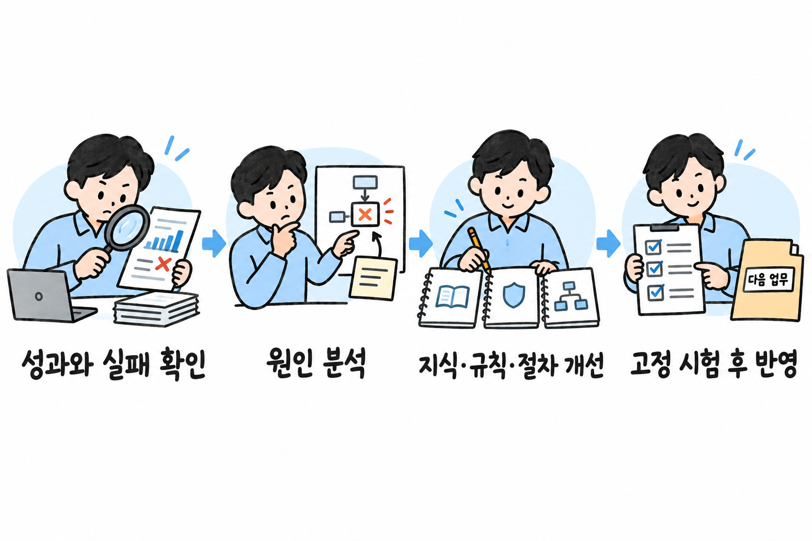

| 재료 | 한마디로 | 하는 일 | 예시 | 구분 | 사용 시점·조건 |
| --- | --- | --- | --- | --- | --- |
| **성공·실패 원인 분석** ✅ | **잘되거나 잘못된 이유를 찾아 유지할 점과 고칠 점 정하기** | 업무가 잘되거나 실패한 원인을 분석한다. 어떤 지식·방법·도구와 조건이 결과에 영향을 주었는지 확인한다. 같은 원인이 다른 업무에도 영향을 주는지 살핀다. 유지·재사용할 점과 고치거나 보완할 점을 정한다. | 검토 순서를 바꾼 뒤 오류가 준 이유를 찾아 적용 조건 정리 · 번역 납품이 반복해서 반려되는 원인 조사 · 견적 오류의 원인이 다른 고객 견적에도 있는지 확인 | **조건부** | 재사용할 만한 성과가 나왔을 때 · 원인이 불분명하거나 영향이 큰 문제, 반복 오류를 분석해야 할 때 |
| **능력 개선·확장** ✅ | **잘하던 일은 더 잘하게 하고 새로운 일도 할 수 있게 만들기** | 업무 경험과 평가 결과에 따라 에이전트의 지식·판단 요령·방법·도구를 고치거나 새로 갖춘다. 개선 효과와 기존 능력에 미치는 영향을 확인한 개선안을 적용한다. 적용 후의 평가와 다음 업무의 성과를 받아 필요한 보완을 이어 간다. | 반복된 오해의 원인을 바탕으로 설명 방법 보완 · 시험으로 효과를 확인한 새 분석 방법 적용 · 필요한 자료 형식을 읽는 도구를 기존 업무에 미치는 영향까지 확인해 추가 · 다음 업무의 평가에서 드러난 약점에 맞춰 판단 요령 보완 | **조건부** | 평가나 업무 경험에서 개선할 점을 찾았을 때 · 새로운 업무에 필요한 능력을 갖출 때 |

---

## 사용 구조

### 1. 단독 상황 — 한 건 · 한 전문가

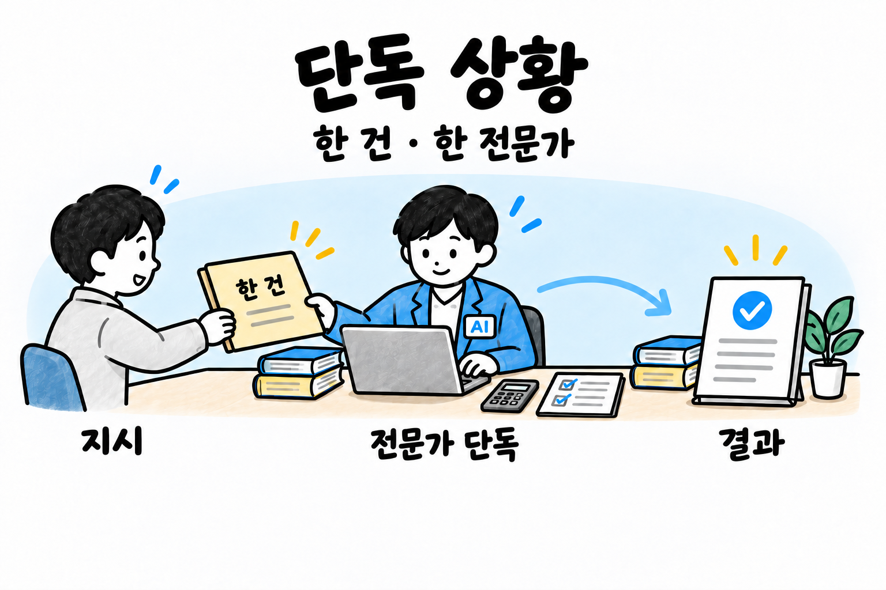

```mermaid
%%{init: {"layout": "dagre", "flowchart": {"defaultRenderer": "dagre-wrapper", "curve": "basis", "nodeSpacing": 42, "rankSpacing": 65, "padding": 16, "wrappingWidth": 290, "useMaxWidth": false, "htmlLabels": true}, "theme": "base", "themeVariables": {"fontSize": "18px", "fontFamily": "Apple SD Gothic Neo, sans-serif", "lineColor": "#60a5fa", "primaryTextColor": "#17314f", "edgeLabelBackground": "#202020", "clusterBkg": "transparent", "clusterBorder": "#5f6f82"}, "themeCSS": ".edgeLabel{color:#dbeafe}.cluster-label{color:#b6c4d5}.nodeLabel small{font-size:14px;line-height:1.45}.nodeLabel b{font-weight:700}.nodeLabel p{margin:0}"} }%%
flowchart TB
    accTitle: 단독 상황에서 79개 재료의 사용과 조합
    accDescr: 재료 도형 하나에 정식 재료명 하나. 실선은 실행과 결과 전달, 점선은 계속 적용되는 책임과 규칙 입력. 상시는 책임 유지, 단계별은 해당 단계, 조건부는 각 화살표의 조건에 해당하면 사용.
    %% 본문이 정본이다. 구획은 계통의 실행 순서를 뜻하지 않는다.
    start(["<b>요청·변경·재개 신호 도착</b>"]):::good
    subgraph REQUEST["요청의 뜻과 완료 기준"]
        direction TB
    %% 재료: input0 | 시작 신호 | 단계별
    input0["<b>시작 신호</b><br/><small>단계별 · 새 업무 또는 기다리던 업무에<br/>신호를 연결</small>"]:::main
    %% 재료: input1 | 업무별 정보 | 단계별
    input1["<b>업무별 정보</b><br/><small>단계별 · 대상·기한·요청 내용·현재<br/>조건을 모음</small>"]:::main
    %% 재료: input2 | 지시·의도 파악 | 상시
    input2["<b>지시·의도 파악</b><br/><small>상시 · 무엇을 원하는지와 허용한 범위를<br/>확인</small>"]:::main
    %% 재료: input3 | 문제·목표·완료 조건 | 상시
    input3["<b>문제·목표·완료 조건</b><br/><small>상시 · 해결할 문제와 완료를 증명할<br/>결과를 정함</small>"]:::main
    %% 재료: input4 | 성과 추적 | 단계별
    input4["<b>성과 추적</b><br/><small>단계별 · 어떤 성과를 언제 확인할지 정함</small>"]:::main
    end
    subgraph EXPERT["한 전문가가 필요한 재료를 직접 조합"]
        direction TB
    expert_entry["<b>한 전문가의 재료 조합</b><br/><small>자기 목표·자료·권한으로 판단·실행·검증</small>"]:::main
    subgraph ONGOING["아래 재료는 전 구간에 계속 적용 · 실행 순서가 아님"]
        direction TB
    %% 재료: unused | 나눠 맡기기 | 조건부
    unused["<b>나눠 맡기기</b><br/><small>조건부 · 이 상황에서는 미사용<br/>한 전문가가 직접 처리</small>"]:::store
    %% 재료: control | 실행 제어 | 상시
    control["<b>실행 제어</b><br/><small>상시 · 판단·도구·분기를 호출하고<br/>결과·오류를 연결</small>"]:::store
    %% 재료: isolation | 분리 실행 | 상시
    isolation["<b>분리 실행</b><br/><small>상시 · 작업·자료·자원을 분리하고 허용<br/>범위만 공유</small>"]:::store
    %% 재료: record | 판단 근거 기록 | 상시
    record["<b>판단 근거 기록</b><br/><small>상시 · 선택·판단·실행·검증의 입력과<br/>이유를 기록</small>"]:::store
    %% 재료: ops | 운영 감시·복구 | 상시
    ops["<b>운영 감시·복구</b><br/><small>상시 · 별도 감시자가 지연·장애를<br/>격리하고 저장 상태로 복구</small>"]:::store
    %% 재료: ongoing_state | 현재 진행 상태 | 상시
    ongoing_state["<b>현재 진행 상태</b><br/><small>상시 ·<br/>담당·완료·대기·승인·취소·미확인을 유지</small>"]:::store
    end
    subgraph CONTEXT["현재 판단에 필요한 재료를 함께 사용"]
        direction TB
    %% 재료: facts | 정보·자료 이해 | 단계별
    facts["<b>정보·자료 이해</b><br/><small>단계별 · 받은 자료의 사실·주장·추정과<br/>맥락을 구별</small>"]:::main
    %% 재료: memory | 장기 기억 | 단계별
    memory["<b>장기 기억</b><br/><small>단계별 · 관련된 이전 결정·약속·교훈을<br/>불러옴</small>"]:::store
    %% 재료: context | 현재 작업 정보 | 상시
    context["<b>현재 작업 정보</b><br/><small>상시 · 이번 자료·관련 기억·진행 상태를<br/>필요한 만큼 구성</small>"]:::main
    %% 재료: knowledge | 업무 지식 | 상시
    knowledge["<b>업무 지식</b><br/><small>상시 · 원리·방법·적용 조건</small>"]:::main
    %% 재료: experience | 실전 경험·감각 | 상시
    experience["<b>실전 경험·감각</b><br/><small>상시 · 핵심 단서·예외·함정</small>"]:::main
    %% 재료: model | AI 모델 | 상시
    model["<b>AI 모델</b><br/><small>상시 · 현재 정보에 지식·경험을 함께<br/>써서 판단하고 내용을 생성</small>"]:::main
    end
    subgraph EVIDENCE["근거 확보와 확인"]
        direction TB
    search_q{"<b>근거가 더 필요한가?</b>"}:::note
    %% 재료: search | 정보·자료 찾기 | 단계별
    search["<b>정보·자료 찾기</b><br/><small>단계별 · 부족한 근거·지식·방법을<br/>원문까지 확인</small>"]:::main
    %% 재료: empty | 못 찾음·없음 구분 | 단계별
    empty["<b>못 찾음·없음 구분</b><br/><small>단계별 · 빈 조회·없음 판단 때 검색<br/>한계·접근 불가·확인된 없음을 구별</small>"]:::main
    %% 재료: evidence | 근거의 신뢰성·적합성 | 상시
    evidence["<b>근거의 신뢰성·적합성</b><br/><small>상시 · 새 근거와 기존 근거의<br/>출처·한계·적합성을 확인</small>"]:::main
    %% 재료: version | 자료의 시점·버전 | 상시
    version["<b>자료의 시점·버전</b><br/><small>상시 · 대상 시점에 맞는 판본·확인<br/>시각을 확인</small>"]:::main
    extra_q{"<b>추가로 필요한 자료가 있는가?<br/>다투어지는 규칙의 변경 추적 포함</b>"}:::note
    end
    subgraph MORE_SOURCES["조건이 맞는 자료를 함께 더함"]
        direction TB
    %% 재료: source_0 | 적용 사례 | 조건부
    source_0["<b>적용 사례</b><br/><small>조건부 · 이번 조건과 사례의 적용 과정·결과 비교</small>"]:::main
    %% 재료: source_1 | 참고 자료 | 조건부
    source_1["<b>참고 자료</b><br/><small>조건부 · 원리·방법·표현에 참고할 자료 확보</small>"]:::main
    %% 재료: source_2 | 재사용 자료 | 조건부
    source_2["<b>재사용 자료</b><br/><small>조건부 · 이용 권한·호환이 맞는<br/>서식·코드·부품·원본을 가져옴</small>"]:::main
    %% 재료: source_3 | 현재 값·상태 확인 | 조건부
    source_3["<b>현재 값·상태 확인</b><br/><small>조건부 · 필요한 현재 값·상태와 확인 시각 확보</small>"]:::main
    %% 재료: source_4 | 먼저 알아채기 | 조건부
    source_4["<b>먼저 알아채기</b><br/><small>조건부 · 맡은 감시 범위에서<br/>새 문제·기회와 긴급도를 발견</small>"]:::main
    %% 재료: source_5 | 변경 감시·반영 | 조건부
    source_5["<b>변경 감시·반영</b><br/><small>조건부 · 맡은 자료·조건의 변경과<br/>영향받는 업무를 찾아 알림</small>"]:::main
    source_join((" ")):::junction
    %% 재료: source_check | 근거의 신뢰성·적합성 | 상시
    source_check["<b>근거의 신뢰성·적합성</b><br/><small>상시 · 추가 자료도 출처·한계·적합성을 확인</small>"]:::main
    %% 재료: source_version | 자료의 시점·버전 | 상시
    source_version["<b>자료의 시점·버전</b><br/><small>상시 · 추가 자료·변경에 맞는 적용 판본 확인</small>"]:::main
    %% 재료: enriched | 현재 작업 정보 | 상시
    enriched["<b>현재 작업 정보</b><br/><small>상시 · 추가 정보·변경·확인 한계를 이번<br/>판단에 반영</small>"]:::main
    end
    subgraph RULES["점선은 충돌 시 위계 · 모든 적용 규칙을 함께 지킴"]
        direction TB
    %% 재료: rule_source | 규칙·기준 원문 | 단계별
    rule_source["<b>규칙·기준 원문</b><br/><small>단계별 · 대상·지역·시점·설정 권한에<br/>맞는 원문 확보</small>"]:::main
    %% 재료: rule_0 | 법·의무 기준 | 상시
    rule_0["<b>법·의무 기준</b><br/><small>상시 · 상하·위임·특별·개정·경과<br/>규정이 아니어도 행위를 실제로 막는 조치는 시점과 함께 포함</small>"]:::store
    %% 재료: rule_1 | 직업 윤리·의무 | 상시
    rule_1["<b>직업 윤리·의무</b><br/><small>상시 · 직업의 필수 의무</small>"]:::store
    %% 재료: rule_2 | 에이전트 기본 원칙 | 상시
    rule_2["<b>에이전트 기본 원칙</b><br/><small>상시 · 원칙·승인된 보호 기준</small>"]:::store
    rule_rank1((" ")):::junction
    %% 재료: rule_3 | 계약·합의 조건 | 상시
    rule_3["<b>계약·합의 조건</b><br/><small>상시 · 유효한 계약·합의</small>"]:::store
    %% 재료: rule_4 | 플랫폼·제출처 규정 | 상시
    rule_4["<b>플랫폼·제출처 규정</b><br/><small>상시 · 플랫폼·제출처 필수 규정</small>"]:::store
    %% 재료: rule_5 | 조직 규칙 | 상시
    rule_5["<b>조직 규칙</b><br/><small>상시 · 조직의 필수 규칙</small>"]:::store
    %% 재료: rule_6 | 사용자 지정 규칙 | 상시
    rule_6["<b>사용자 지정 규칙</b><br/><small>상시 · 사용자가 추가한 필수 조건</small>"]:::store
    %% 재료: rule_7 | 표현 방식·스타일 | 조건부
    rule_7["<b>표현 방식·스타일</b><br/><small>조건부 · ⑤ 기본 방식·스타일</small>"]:::store
    %% 재료: priority | 규칙의 적용·우선순위 | 상시
    priority["<b>규칙의 적용·우선순위</b><br/><small>상시 · 적용 규칙은 함께 지킴 ·<br/>충돌하는 조항만 위계로 조정<br/>하위 조건도 충돌하지 않으면 유지</small>"]:::main
    rule_q{"<b>적용 조건·충돌이 해결됐고<br/>예외 요건의 입증 계획이 있는가?</b>"}:::note
    %% 재료: rule_human | 사람에게 넘기기 | 상시
    rule_human["<b>사람에게 넘기기</b><br/><small>상시 · 근거·대안을 갖춰 해석·예외<br/>권한자에게 결정 요청</small>"]:::back
    %% 재료: rule_who | 보고 주체 확인 | 상시
    rule_who["<b>보고 주체 확인</b><br/><small>상시 · 답변자의 권한과 결정 범위를 확인</small>"]:::back
    rule_reply{"<b>유효한 결정으로 해결됐는가?</b>"}:::note
    rule_hold["<b>충돌 미해결 · 해당 작업 보류</b><br/><small>이유·남은 책임을 반환</small>"]:::stop
    end
    subgraph PLAN["목표에 맞춰 재료의 입력과 결과를 연결"]
        direction TB
    %% 재료: plan0 | 문제·목표·완료 조건 | 상시
    plan0["<b>문제·목표·완료 조건</b><br/><small>상시 · 확인한 근거·규칙으로 목표와 완료<br/>증거를 확정</small>"]:::main
    %% 재료: plan1 | 대안·전략 판단 | 상시
    plan1["<b>대안·전략 판단</b><br/><small>상시 · 정보·지식·경험으로 대안의<br/>효과·비용·위험을 비교</small>"]:::main
    %% 재료: plan2 | 업무 절차·실행 계획 | 단계별
    plan2["<b>업무 절차·실행 계획</b><br/><small>단계별 · 어떤 재료의 결과를 다음 어떤<br/>재료가 받을지 정함</small>"]:::main
    %% 재료: plan3 | 빠진 위험 확인 | 단계별
    plan3["<b>빠진 위험 확인</b><br/><small>단계별 · 계획·변경·실행·전달에서 빠진<br/>조건과 피해를 점검</small>"]:::main
    end
    subgraph CAPABILITY["실제 투입 전 수행 능력 확인"]
        direction TB
    ability_q{"<b>이번 범위의 능력이 검증됐는가?</b>"}:::note
    %% 재료: ability_env | 시험 환경 | 조건부
    ability_env["<b>시험 환경</b><br/><small>조건부 · 별도 시험 공간·조건이 필요하면<br/>준비</small>"]:::main
    %% 재료: ability_test | 업무 능력 시험 | 조건부
    ability_test["<b>업무 능력 시험</b><br/><small>조건부 · 첫 투입·범위 밖·능력<br/>변경·시험 신뢰 상실이면 시험</small>"]:::main
    ability_pass{"<b>이번 업무를 수행할 수 있는가?</b>"}:::note
    ability_hold["<b>미검증 범위는 투입하지 않음</b><br/><small>부족한 능력·미완료 상태 반환</small>"]:::stop
    end
    subgraph PERMISSION["매 실행·위임·재시도·재개에 적용"]
        direction TB
    %% 재료: authority | 업무 권한 | 상시
    authority["<b>업무 권한</b><br/><small>상시 · 대상·행동·내용·기간의 위임과<br/>동의</small>"]:::main
    %% 재료: limit | 비용·위험 한도 | 상시
    limit["<b>비용·위험 한도</b><br/><small>상시 · 사용량+진행분+예약분과<br/>실행·대기의 위험</small>"]:::main
    %% 재료: safety | 안전장치 | 상시
    safety["<b>안전장치</b><br/><small>상시 · 매 실행·위임·재시도·재개 전<br/>규칙·권한·승인·한도를 함께 검사</small>"]:::main
    allowed{"<b>이번 행동을 실행할 수 있는가?</b>"}:::note
    %% 재료: human | 사람에게 넘기기 | 상시
    human["<b>사람에게 넘기기</b><br/><small>상시 · 되돌릴 수 없는 일·승인<br/>조건·판단 불가·한도 초과·자격자 전속</small>"]:::back
    %% 재료: human_wait | 대기·후속 관리 | 상시
    human_wait["<b>대기·후속 관리</b><br/><small>상시 · AI가 준비·비교·검증을 마친 뒤<br/>필요한 결정·작업과 기한을 관리</small>"]:::back
    %% 재료: human_who | 보고 주체 확인 | 상시
    human_who["<b>보고 주체 확인</b><br/><small>상시 · 답변자·권한·대상·승인 내용을<br/>대조</small>"]:::back
    human_reply{"<b>유효한 답변을 받았는가?</b>"}:::note
    human_hold["<b>금지·거절·취소·기한 종료</b><br/><small>해당 행동을 실행하지 않고 상태 반환</small>"]:::stop
    end
    subgraph ACTION_INPUT["직전 결과를 다음 재료의 입력으로 사용"]
        direction TB
    %% 재료: action_context | 현재 작업 정보 | 상시
    action_context["<b>현재 작업 정보</b><br/><small>상시 · 확인한 자료·조건 + 직전 재료의<br/>검증 결과</small>"]:::main
    %% 재료: progress | 작업 진행·연결 | 상시
    progress["<b>작업 진행·연결</b><br/><small>상시 · 이미 끝난 작업은 유지<br/>준비된 입력·직전 검증 결과를<br/>계획의 다음 재료에 연결</small>"]:::main
    tool_q{"<b>외부 도구·시스템이 필요한가?</b>"}:::note
    %% 재료: tool | 업무 도구·시스템 | 단계별
    tool["<b>업무 도구·시스템</b><br/><small>단계별 · 도구 연결과 요청·응답 형식을 준비<br/>실행 때 실제 결과·오류·상태를 주고받음</small>"]:::main
    select["<b>실행 계획에서 다음 작업 확인</b>"]:::main
    end
    subgraph ACTIONS["필요한 재료만 조합 · 각 결과를 확인하며 다음 입력으로 전달"]
        direction TB
    action_join((" ")):::junction
    subgraph WORK_DATA["자료 가공 · 필요한 처리부터 시작"]
        direction TB
    choose_DATA{"<b>자료를 가공할 차례인가?</b>"}:::note
    data_entry{"<b>어떤 처리부터 필요한가?</b>"}:::note
    %% 재료: action_0 | 자료 선별·분류 | 조건부
    action_0["<b>자료 선별·분류</b><br/><small>조건부 · 필요한 자료를 고르고 종류별로 나눔</small>"]:::main
    data_merge{"<b>고른 자료를 정리·결합해야 하나?</b>"}:::note
    %% 재료: action_1 | 자료 정리·결합 | 조건부
    action_1["<b>자료 정리·결합</b><br/><small>조건부 · 오류·중복·누락을 다루고<br/>같이 쓸 자료를 맞춰 합침</small>"]:::main
    data_format{"<b>다음 작업에 맞게 형식을 바꿀까?</b>"}:::note
    %% 재료: action_2 | 형식·구조 변환 | 조건부
    action_2["<b>형식·구조 변환</b><br/><small>조건부 · 내용을 보존하며<br/>다음 재료·도구가 읽을 형식으로 바꿈</small>"]:::main
    result_DATA((" ")):::junction
    end
    subgraph WORK_JUDGE["계산·판단 · 필요한 판단부터 시작"]
        direction TB
    choose_JUDGE{"<b>계산·판단을 할 차례인가?</b>"}:::note
    judge_entry{"<b>지금 필요한 판단은?</b>"}:::note
    %% 재료: action_3 | 계산 | 조건부
    action_3["<b>계산</b><br/><small>조건부 · 값·식·단위로 수치를 구함</small>"]:::main
    calc_interpret{"<b>계산값의 의미도 해석할까?</b>"}:::note
    %% 재료: action_4 | 분석 | 조건부
    action_4["<b>분석</b><br/><small>조건부 · 자료·계산값에서<br/>차이·관계·원인과 한계를 찾음</small>"]:::main
    analysis_next{"<b>분석 결과로 무엇을 더 판단할까?</b>"}:::note
    %% 재료: action_5 | 기준 적용·판정 | 조건부
    action_5["<b>기준 적용·판정</b><br/><small>조건부 · 확인한 사실을 기준과 대조해 판정</small>"]:::main
    %% 재료: action_6 | 예측 | 조건부
    action_6["<b>예측</b><br/><small>조건부 · 확인한 관계와 가정으로<br/>앞으로의 결과·불확실성을 추정</small>"]:::main
    judge_best{"<b>판정·예측을 써서<br/>최선의 안도 고를까?</b>"}:::note
    %% 재료: action_7 | 조건 안에서 최선 찾기 | 조건부
    action_7["<b>조건 안에서 최선 찾기</b><br/><small>조건부 · 후보·목표·제약을 비교해<br/>유리한 안과 절충점을 구함</small>"]:::main
    result_JUDGE((" ")):::junction
    end
    subgraph WORK_MAKE["설계·내용을 받아 결과물 완성"]
        direction TB
    choose_MAKE{"<b>결과물을 구성·제작할 차례인가?</b>"}:::note
    make_design{"<b>새 설계나 설계 수정이 필요한가?</b>"}:::note
    %% 재료: action_8 | 결과물 설계 | 조건부
    action_8["<b>결과물 설계</b><br/><small>조건부 · 목적에 맞는 구성·형태·작동을 정함</small>"]:::main
    %% 재료: design_verify | 결과 검증·재검증 | 단계별
    design_verify["<b>결과 검증·재검증</b><br/><small>단계별 · 설계가 목적·조건에 맞는지 확인</small>"]:::main
    design_ok{"<b>이 설계를 사용해도 되는가?</b>"}:::note
    make_content{"<b>요약·번역·표현 변경이 필요한가?</b>"}:::note
    %% 재료: action_9 | 내용 재구성 | 조건부
    action_9["<b>내용 재구성</b><br/><small>조건부 · 원문 뜻을 보존하면서<br/>목적·설계에 맞는 내용으로 바꿈</small>"]:::main
    make_build{"<b>실제 제작·구현·수정도 필요한가?</b>"}:::note
    %% 재료: action_10 | 결과물 만들기·수정 | 조건부
    action_10["<b>결과물 만들기·수정</b><br/><small>조건부 · 확인한 설계·내용·재사용 자료로<br/>결과물을 만들거나 고침</small>"]:::main
    result_MAKE((" ")):::junction
    end
    subgraph WORK_PEOPLE["대화 통로를 갖추고 소통·조율"]
        direction TB
    choose_PEOPLE{"<b>사람과 소통·조율할 차례인가?</b>"}:::note
    people_realtime{"<b>즉시 답을 주고받아야 하는가?</b>"}:::note
    %% 재료: action_20 | 실시간 대화 | 조건부
    action_20["<b>실시간 대화</b><br/><small>조건부 · 연결·발언 순서·중단·재개를 관리</small>"]:::main
    %% 재료: action_11 | 사람과 소통 | 조건부
    action_11["<b>사람과 소통</b><br/><small>조건부 · 질문·설명·응대 후<br/>상대의 답변·이해를 확인</small>"]:::main
    people_negotiate{"<b>요구·역할·조건이<br/>달라 조율해야 하나?</b>"}:::note
    %% 재료: action_12 | 협상·조율 | 조건부
    action_12["<b>협상·조율</b><br/><small>조건부 · 허용 범위 안에서<br/>서로의 조건을 비교해 합의안을 만듦</small>"]:::main
    %% 재료: people_followup | 사람과 소통 | 조건부
    people_followup["<b>사람과 소통</b><br/><small>조건부 · 합의안을 설명하고<br/>남은 쟁점에 대한 답변·조건을 확인</small>"]:::main
    people_again{"<b>추가 의견 교환이 필요한가?</b>"}:::note
    result_PEOPLE((" ")):::junction
    end
    subgraph WORK_OPERATE["확인한 결과를 실제 시스템에 반영"]
        direction TB
    choose_OPERATE{"<b>시스템에 실제로 반영할 차례인가?</b>"}:::note
    operate_kind{"<b>이번에 허용된 행동은?</b>"}:::note
    %% 재료: action_13 | 기록 입력·수정 | 조건부
    action_13["<b>기록 입력·수정</b><br/><small>조건부 · 확인한 내용을 기록에 반영</small>"]:::main
    %% 재료: action_14 | 신청·거래 처리 | 조건부
    action_14["<b>신청·거래 처리</b><br/><small>조건부 · 허용된 신청·주문·예약·취소를 처리</small>"]:::main
    %% 재료: action_15 | 설정·작동 제어 | 조건부
    action_15["<b>설정·작동 제어</b><br/><small>조건부 · 허용된 설정·장비 상태를 바꿈</small>"]:::main
    %% 재료: action_16 | 게시·배포 | 조건부
    action_16["<b>게시·배포</b><br/><small>조건부 · 확인한 판본을 정해진 범위에 공개</small>"]:::main
    result_OPERATE((" ")):::junction
    end
    subgraph WORK_OBSERVE["시험 조건을 갖추고 관찰·실험·모의"]
        direction TB
    choose_OBSERVE{"<b>관찰·실험·모의가 필요한가?</b>"}:::note
    observe_kind{"<b>현재 상태를 볼까,<br/>조건을 바꿔 볼까?</b>"}:::note
    observe_env{"<b>별도 시험 공간·조건이 필요한가?</b>"}:::note
    %% 재료: action_21 | 시험 환경 | 조건부
    action_21["<b>시험 환경</b><br/><small>조건부 · 시험 조건·자료·도구를 준비<br/>미통과 판본의 실제 투입을 차단</small>"]:::main
    observe_method{"<b>실제 시험인가, 가상 시험인가?</b>"}:::note
    %% 재료: action_18 | 실험 | 조건부
    action_18["<b>실험</b><br/><small>조건부 · 조건을 바꾸거나 통제해<br/>효과·차이를 비교할 시험을 수행</small>"]:::main
    %% 재료: action_17 | 관찰·측정 | 조건부
    action_17["<b>관찰·측정</b><br/><small>조건부 · 현장·시험에서 값·현상을 관측<br/>시각·방법·조건과 함께 기록</small>"]:::main
    %% 재료: action_19 | 시뮬레이션 | 조건부
    action_19["<b>시뮬레이션</b><br/><small>조건부 · 가정한 상황·모델로 모의 실행<br/>가정·결과·현실과의 차이를 남김</small>"]:::main
    result_OBSERVE((" ")):::junction
    end
    subgraph WORK_ANSWER["갖춘 근거로 판단·답변"]
        direction TB
    choose_ANSWER{"<b>판단·설명·답변을 만들 차례인가?</b>"}:::note
    %% 재료: action_22 | AI 모델 | 상시
    action_22["<b>AI 모델</b><br/><small>상시 · 현재 정보·규칙·지식·경험으로<br/>판단하고 답변을 생성</small>"]:::main
    result_ANSWER((" ")):::junction
    end
    end
    subgraph VERIFY["결과를 검증하고 필요한 재료를 다시 연결"]
        direction TB
    %% 재료: verify0 | 보고 주체 확인 | 상시
    verify0["<b>보고 주체 확인</b><br/><small>상시 · 누가 맡은 결과인지,<br/>분담·판본·대외 명의 확인</small>"]:::main
    %% 재료: verify1 | 결과 검증·재검증 | 단계별
    verify1["<b>결과 검증·재검증</b><br/><small>단계별 · 입력·근거·완료 조건과 대조 ·<br/>변경되면 영향받은 결과도 확인</small>"]:::main
    %% 재료: verify2 | 반대 근거·다시 확인 | 단계별
    verify2["<b>반대 근거·다시 확인</b><br/><small>단계별 · 중요한 판단은 다른<br/>근거·방법으로 반증</small>"]:::main
    %% 재료: verify3 | 일하는 과정 평가 | 단계별
    verify3["<b>일하는 과정 평가</b><br/><small>단계별 · 각 단계의 방법·절차·권한<br/>사용을 평가</small>"]:::main
    %% 재료: verify4 | 결과 품질 평가 | 단계별
    verify4["<b>결과 품질 평가</b><br/><small>단계별 · 사용<br/>목적·기능·정확성·이해·편의를 확인</small>"]:::main
    result_status{"<b>검증 결과는?</b>"}:::note
    more{"<b>이 결과를 사용할 다음<br/>재료가 필요한가?</b>"}:::note
    %% 재료: fix | 업무 절차·실행 계획 | 단계별
    fix["<b>업무 절차·실행 계획</b><br/><small>단계별 · 새 근거·규칙을 반영해 문제<br/>있는 재료 조합만 수정</small>"]:::back
    %% 재료: unknown | 현재 값·상태 확인 | 조건부
    unknown["<b>현재 값·상태 확인</b><br/><small>조건부 · 외부 작업이 실제로 처리됐는지<br/>조회</small>"]:::back
    %% 재료: unknown_wait | 대기·후속 관리 | 상시
    unknown_wait["<b>대기·후속 관리</b><br/><small>상시 · 기한 안에서 확인 · 상태 확인<br/>전 중복 실행 금지</small>"]:::back
    unknown_q{"<b>실제 처리 상태가 확인됐는가?</b>"}:::note
    unknown_hold["<b>확인 기한 종료 · 미확인 반환</b><br/><small>실행 성공으로 보고하지 않음</small>"]:::stop
    expert_output["<b>담당 작업의 결과·상태 반환</b><br/><small>결과·근거·판본·완료/미완료·남은 책임</small>"]:::store
    end
    end
    subgraph HANDOVER["전체 결과를 확인하고 남은 책임까지 인계"]
        direction TB
    %% 재료: whole_quality | 결과 품질 평가 | 단계별
    whole_quality["<b>결과 품질 평가</b><br/><small>단계별 · 전체 결과가 받는 사람의 목적에<br/>맞게 바로 쓰일 수 있는지 확인</small>"]:::main
    final_q{"<b>전체 완료 조건과<br/>품질을 충족했는가?</b>"}:::note
    %% 재료: final_fix | 대안·전략 판단 | 상시
    final_fix["<b>대안·전략 판단</b><br/><small>상시 · 미달 부분을 기한·한도 안에서<br/>보완할 수 있는지 판단</small>"]:::back
    can_fix{"<b>보완할 수 있는가?</b>"}:::note
    %% 재료: deliver | 납품 준비 | 단계별
    deliver["<b>납품 준비</b><br/><small>단계별 · 결과·원본·근거·사용법·남은<br/>책임을 갖춤<br/>미완료면 상태·이유·한계를 명시</small>"]:::main
    %% 재료: handover | 전달·인수 확인 | 단계별
    handover["<b>전달·인수 확인</b><br/><small>단계별 · 수령·사용 조건·남은 책임의<br/>인계를 확인</small>"]:::main
    receipt_q{"<b>수령·사용 상태가 확인됐는가?</b>"}:::note
    %% 재료: receipt_wait | 대기·후속 관리 | 상시
    receipt_wait["<b>대기·후속 관리</b><br/><small>상시 · 수신·사용 문제를 확인하고 기한<br/>안에 재전달·후속 조치</small>"]:::back
    %% 재료: closed | 현재 진행 상태 | 상시
    closed["<b>현재 진행 상태</b><br/><small>상시 · 완료·인수와 미완료·거절·인수<br/>실패를 구별하고 후속 책임 유지</small>"]:::main
    end
    subgraph LEARN["결과에서 학습 · 검증된 개선만 다음 업무에 적용"]
        direction TB
    %% 재료: performance | 성과 추적 | 단계별
    performance["<b>성과 추적</b><br/><small>단계별 · 약속한 시점의 실제 성과·후속<br/>문제를 확인</small>"]:::main
    %% 재료: learn_memory | 장기 기억 | 단계별
    learn_memory["<b>장기 기억</b><br/><small>단계별 · 판단·실행·평가 기록과 성과 중<br/>재사용할 결정·약속·교훈을 보관·정정</small>"]:::main
    cause_q{"<b>재사용할 성과·분석할<br/>문제가 있는가?</b>"}:::note
    %% 재료: cause | 성공·실패 원인 분석 | 조건부
    cause["<b>성공·실패 원인 분석</b><br/><small>조건부 · 재사용할 성과·원인 불명·영향이<br/>큰 문제·반복 오류의 원인과 적용 조건<br/>분석</small>"]:::main
    improve_q{"<b>개선할 점·새로 필요한<br/>능력이 있는가?</b>"}:::note
    %% 재료: improve | 능력 개선·확장 | 조건부
    improve["<b>능력 개선·확장</b><br/><small>조건부 · 지식·판단 요령·방법·도구를<br/>보완</small>"]:::main
    %% 재료: improve_env | 시험 환경 | 조건부
    improve_env["<b>시험 환경</b><br/><small>조건부 · 별도 공간·조건이 필요하면 준비<br/>· 미통과 판본의 실제 투입 차단</small>"]:::main
    %% 재료: improve_test | 업무 능력 시험 | 조건부
    improve_test["<b>업무 능력 시험</b><br/><small>조건부 · 개선 효과와 기존 능력을 함께<br/>시험</small>"]:::main
    improve_pass{"<b>개선 효과·기존 능력<br/>모두 통과했는가?</b>"}:::note
    %% 재료: adopt | 업무 지식 | 상시
    adopt["<b>업무 지식</b><br/><small>상시 · 검증된 내용과 적용 조건을 반영</small>"]:::main
    %% 재료: adopt_memory | 장기 기억 | 단계별
    adopt_memory["<b>장기 기억</b><br/><small>단계별 · 검증 근거·판본·교훈을 다음<br/>판단에 제공</small>"]:::main
    finish(["<b>이번 처리를 마침</b><br/><small>남은 책임은 계속 관리<br/>후속 신호가 오면 해당 건을 이어서 처리</small>"]):::good
    end

    %% 실선: 실행·정보 전달 / 점선: 계속 적용되는 책임·규칙 입력
    %% ~~~ 는 렌더링에서 보이지 않는 배치 제약이며 실행 순서가 아니다.
    start --> input0
    input0 --> input1
    input1 --> input2
    input2 --> input3
    input3 --> input4
    input4 --> expert_entry
    expert_entry -.-> |"단독: 사용하지 않음"| unused
    expert_entry -.-> control
    control -.-> |"작업별 실행"| isolation
    control -.-> |"판단·실행 근거"| record
    isolation -.-> |"분리된 운영 상태"| ops
    record -.-> |"진행 기록"| ongoing_state
    ops -.-> |"복구 상태"| ongoing_state
    expert_entry --> |"이번 업무 자료"| facts
    expert_entry --> |"관련 이전 기록"| memory
    facts --> |"읽고 확인한 내용"| context
    memory --> |"관련 기억"| context
    ongoing_state -.-> |"현재 진행 상태"| context
    context --> |"현재 업무의 사실·조건"| model
    context --> |"관련 지식 선택"| knowledge
    context --> |"조건에 맞는 판단 요령 선택"| experience
    knowledge --> model
    experience --> model
    model --> search_q
    search_q --> |"예"| search
    search_q --> |"아니오 · 기존 근거"| evidence
    search --> |"빈 조회·없음 판단"| empty
    search --> |"찾음"| evidence
    empty --> |"조회 한계·확인된 없음"| evidence
    evidence --> version
    version --> extra_q
    extra_q --> |"적용 과정 비교"| source_0
    source_0 --> |"비슷한 조건·차이"| source_join
    extra_q --> |"원리·방법 참고"| source_1
    source_1 --> |"설명·작업 근거"| source_join
    extra_q --> |"서식·부품 활용"| source_2
    source_2 --> |"권한·호환이 맞는 재료"| source_join
    extra_q --> |"현재 값이 중요"| source_3
    source_3 --> |"조회 값·확인 시각"| source_join
    extra_q --> |"상황 감시를 맡음"| source_4
    source_4 --> |"새 문제·기회·긴급도"| source_join
    extra_q --> |"변화를 계속 추적"| source_5
    source_5 --> |"변경 내용·영향받는 일"| source_join
    source_join --> |"조건에 해당한 자료를 모음"| source_check
    source_check --> source_version
    source_version --> |"확인한 자료만 반영"| enriched
    extra_q --> |"추가 자료 불필요"| enriched
    source_0 ~~~ source_1
    source_1 ~~~ source_2
    source_2 ~~~ source_3
    source_3 ~~~ source_4
    source_4 ~~~ source_5
    enriched --> rule_source
    rule_source --> |"원문과 적용 조건을 함께 검토"| priority
    rule_source -.-> |"법적 적용 관계를 먼저 확인"| rule_0
    rule_0 -.-> |"그 안에서 ①"| rule_1
    rule_0 -.-> |"그 안에서 ①"| rule_2
    rule_1 -.-> |"① 함께 적용"| rule_rank1
    rule_2 -.-> |"① 함께 적용"| rule_rank1
    rule_rank1 -.-> |"다음 ②"| rule_3
    rule_rank1 -.-> |"다음 ②"| rule_4
    rule_3 -.-> |"다음 ③"| rule_5
    rule_4 -.-> |"다음 ③"| rule_5
    rule_5 -.-> |"다음 ④"| rule_6
    rule_6 -.-> |"표현 기준 필요: 기본 방식 ⑤"| rule_7
    rule_7 -.-> |"충돌하지 않는 조건도 함께 유지"| priority
    rule_6 -.-> |"기본 스타일 추가 불필요"| priority
    priority --> rule_q
    rule_q --> |"아니오 · 해결할 권한 필요"| rule_human
    rule_human --> rule_who
    rule_who --> rule_reply
    rule_reply --> |"예 · 유효한 결정 반영"| priority
    rule_reply --> |"아니오 · 해결되지 않음"| rule_hold
    rule_q --> |"예 · 적용 조건 확정"| plan0
    plan0 --> plan1
    plan1 --> plan2
    plan2 --> plan3
    plan3 --> ability_q
    ability_q --> |"아니오 · 별도 환경 필요"| ability_env
    ability_q --> |"아니오 · 별도 환경 불필요"| ability_test
    ability_env --> ability_test
    ability_test --> ability_pass
    ability_pass --> |"아니오 · 미검증 범위"| ability_hold
    ability_q L_ability_q_authority_routed@--> |"예 · 검증된 범위"| authority
    ability_pass --> |"예 · 시험 통과"| authority
    authority --> |"허용된 범위에서 쓸 비용·위험 확인"| limit
    limit --> |"사용·진행·예약분과 위험"| safety
    safety --> allowed
    allowed --> |"사람의 결정·전속 작업 필요"| human
    human --> human_wait
    human_wait --> human_who
    human_who --> human_reply
    human_reply --> |"답변 대기 · 기한 안"| human_wait
    human_reply L_human_reply_safety_routed@--> |"유효한 답변"| safety
    human_reply --> |"거절·취소·기한 종료"| human_hold
    allowed --> |"금지 · 우회 실행 금지"| human_hold
    allowed --> |"허용"| action_context
    action_context --> progress
    progress --> tool_q
    tool_q --> |"예"| tool
    tool --> |"호출할 연결 준비"| select
    tool_q --> |"아니오"| select
    select --> choose_DATA
    choose_DATA --> |"아니오 · 다른 작업"| choose_JUDGE
    choose_JUDGE --> |"아니오 · 다른 작업"| choose_MAKE
    choose_MAKE --> |"아니오 · 다른 작업"| choose_PEOPLE
    choose_PEOPLE --> |"아니오 · 다른 작업"| choose_OPERATE
    choose_OPERATE --> |"아니오 · 다른 작업"| choose_OBSERVE
    choose_OBSERVE --> |"아니오 · 다른 작업"| choose_ANSWER
    choose_ANSWER --> |"해당 없음 · 필요한 조합 재계획"| plan2
    choose_DATA --> |"예"| data_entry
    data_entry --> |"선별·분류부터"| action_0
    data_entry --> |"정리·결합부터"| action_1
    data_entry --> |"형식만 변환"| action_2
    action_0 --> |"선별·분류한 자료"| data_merge
    data_merge --> |"예"| action_1
    data_merge --> |"아니오"| data_format
    action_1 --> |"정리·결합한 자료"| data_format
    data_format --> |"예"| action_2
    data_format --> |"아니오 · 현재 형식 사용"| result_DATA
    action_2 --> |"변환한 자료"| result_DATA
    choose_JUDGE --> |"예"| judge_entry
    judge_entry --> |"수치 구하기"| action_3
    judge_entry --> |"관계·원인 해석"| action_4
    judge_entry --> |"기준으로 판정"| action_5
    judge_entry --> |"예측부터"| action_6
    judge_entry --> |"제약 안에서 선택"| action_7
    action_3 --> |"계산값·단위"| calc_interpret
    calc_interpret --> |"예"| action_4
    calc_interpret --> |"아니오 · 수치가 결과"| result_JUDGE
    action_4 --> |"해석·근거·한계"| analysis_next
    analysis_next --> |"기준 판정"| action_5
    analysis_next --> |"예측"| action_6
    analysis_next --> |"최선 선택"| action_7
    analysis_next --> |"추가 판단 불필요"| result_JUDGE
    action_5 --> |"판정·적용 근거"| judge_best
    action_6 --> |"예상·가정·불확실성"| judge_best
    judge_best --> |"예"| action_7
    judge_best --> |"아니오"| result_JUDGE
    action_7 --> |"선택안·절충점"| result_JUDGE
    choose_MAKE --> |"예"| make_design
    make_design --> |"예"| action_8
    make_design --> |"아니오 · 기존 설계 사용<br/>또는 설계 불필요"| make_content
    action_8 --> |"설계안"| design_verify
    design_verify --> design_ok
    design_ok --> |"아니오 · 설계 보완"| action_8
    design_ok --> |"예 · 검증한 설계를 전달"| make_content
    make_content --> |"예"| action_9
    make_content --> |"아니오 · 기존 내용 사용"| make_build
    action_9 --> |"목적에 맞게 바꾼 내용"| make_build
    make_build --> |"예 · 설계·내용을 입력으로"| action_10
    make_build --> |"아니오 · 설계·내용 자체가 결과"| result_MAKE
    action_10 --> |"완성·수정한 결과물"| result_MAKE
    choose_PEOPLE --> |"예"| people_realtime
    people_realtime --> |"예"| action_20
    people_realtime --> |"아니오 · 문서·메일 등"| action_11
    action_20 --> |"연결된 대화 통로"| action_11
    action_11 --> |"답변·의견·이해 확인"| people_negotiate
    people_negotiate --> |"예"| action_12
    people_negotiate --> |"아니오"| result_PEOPLE
    action_12 --> |"합의안·남은 쟁점"| people_again
    people_again --> |"예 · 허용된 추가 소통"| people_followup
    people_followup --> |"바뀐 의견·조건을 검증 후 다음 판단에"| result_PEOPLE
    people_again --> |"아니오 · 합의 또는 미합의 반환"| result_PEOPLE
    choose_OPERATE --> |"예 · 이번 행동의 승인·권한 확인됨"| operate_kind
    operate_kind --> |"기록을 반영"| action_13
    action_13 --> |"반영 내역·처리 상태"| result_OPERATE
    operate_kind --> |"신청·거래·취소"| action_14
    action_14 --> |"접수·처리 내역"| result_OPERATE
    operate_kind --> |"설정·작동 변경"| action_15
    action_15 --> |"변경 상태·이력"| result_OPERATE
    operate_kind --> |"게시·배포"| action_16
    action_16 --> |"공개 판본·범위"| result_OPERATE
    choose_OBSERVE --> |"예"| observe_kind
    observe_kind --> |"현재 상태를 관찰·측정"| action_17
    observe_kind --> |"조건을 바꿔 실제·가상 시험"| observe_env
    observe_env --> |"예"| action_21
    observe_env --> |"아니오 · 기존 조건으로 가능"| observe_method
    action_21 --> |"준비된 시험 공간·조건"| observe_method
    observe_method --> |"실제 조건을 바꿔 비교"| action_18
    observe_method --> |"가정한 상황을 모의 실행"| action_19
    action_18 --> |"시험한 효과·차이를 관측"| action_17
    action_17 --> |"측정값·관찰 기록"| result_OBSERVE
    action_19 --> |"모의 결과·가정·한계"| result_OBSERVE
    choose_ANSWER --> |"예"| action_22
    action_22 --> |"판단·생성한 내용"| result_ANSWER
    result_DATA --> action_join
    result_JUDGE --> action_join
    result_MAKE --> action_join
    result_PEOPLE --> action_join
    result_OPERATE --> action_join
    result_OBSERVE --> action_join
    result_ANSWER --> action_join
    action_join --> |"사용한 재료의 결과·근거"| verify0
    verify0 --> verify1
    verify1 --> verify2
    verify2 --> verify3
    verify3 --> verify4
    verify4 --> result_status
    result_status --> |"문제없음"| more
    result_status L_result_status_fix_routed@--> |"문제"| fix
    fix --> |"수정 계획 · 실행 전 재검사"| safety
    result_status --> |"미확인"| unknown
    unknown --> unknown_wait
    unknown_wait --> unknown_q
    unknown_q --> |"아직 미확인 · 기한 안"| unknown
    unknown_q --> |"실제 상태 확인"| verify0
    unknown_q --> |"기한 종료"| unknown_hold
    more --> |"예 · 검증 결과를 보존하고 다음 행동만"| safety
    more --> |"아니오 · 담당 작업 완료"| expert_output
    rule_hold --> |"미완료·이유·남은 책임 반환"| expert_output
    ability_hold --> |"미완료·이유·남은 책임 반환"| expert_output
    human_hold --> |"미완료·이유·남은 책임 반환"| expert_output
    unknown_hold --> |"미완료·이유·남은 책임 반환"| expert_output
    expert_output --> whole_quality
    whole_quality --> final_q
    final_q --> |"아니오"| final_fix
    final_fix --> can_fix
    can_fix L_can_fix_context_routed@--> |"예 · 미달 부분만 보완"| context
    can_fix --> |"아니오 · 미완료 상태 전달"| deliver
    final_q --> |"예 · 전체 기준 통과"| deliver
    deliver --> handover
    handover --> receipt_q
    receipt_q --> |"응답 대기·전달 문제"| receipt_wait
    receipt_wait --> |"재전달·답변"| handover
    receipt_q --> |"인수 확인"| closed
    receipt_wait --> |"거절·기한 종료"| closed
    closed --> performance
    performance --> learn_memory
    learn_memory --> cause_q
    cause_q --> |"예"| cause
    cause_q --> |"아니오"| improve_q
    cause --> improve_q
    improve_q --> |"예"| improve
    improve_q --> |"아니오 · 개선 생략"| finish
    improve --> |"별도 환경 필요"| improve_env
    improve --> |"별도 환경 불필요"| improve_test
    improve_env --> improve_test
    improve_test --> improve_pass
    improve_pass --> |"예"| adopt
    adopt --> adopt_memory
    adopt_memory --> finish
    improve_pass --> |"아니오 · 기존 검증본 유지"| finish
    %% 우회선만 경유점을 그대로 따라 도형·문구 간섭을 피한다.
    L_human_reply_safety_routed@{ curve: linear }
    L_can_fix_context_routed@{ curve: linear }
    L_ability_q_authority_routed@{ curve: linear }
    L_result_status_fix_routed@{ curve: linear }
    classDef main fill:#dbeafe,stroke:#719ddd,stroke-width:1.6px,color:#17314f
    classDef note fill:#fef9c3,stroke:#d2b34e,stroke-width:1.6px,color:#713f12
    classDef back fill:#ffedd5,stroke:#e3a46b,stroke-width:1.6px,color:#7c2d12
    classDef store fill:#e5e7eb,stroke:#9ca3af,stroke-width:1.6px,color:#1f2937
    classDef good fill:#dcfce7,stroke:#55ba7c,stroke-width:1.6px,color:#14532d
    classDef stop fill:#fee2e2,stroke:#de9393,stroke-width:1.6px,color:#7f1d1d
    classDef junction fill:#60a5fa,stroke:#60a5fa,font-size:1px,padding:0px
    style REQUEST fill:none,stroke:#5f6f82,stroke-width:1px,stroke-dasharray:2 7,color:#aebdce
    style EXPERT fill:none,stroke:#5f6f82,stroke-width:1px,stroke-dasharray:2 7,color:#aebdce
    style ONGOING fill:none,stroke:#5f6f82,stroke-width:1px,stroke-dasharray:2 7,color:#aebdce
    style CONTEXT fill:none,stroke:#5f6f82,stroke-width:1px,stroke-dasharray:2 7,color:#aebdce
    style EVIDENCE fill:none,stroke:#5f6f82,stroke-width:1px,stroke-dasharray:2 7,color:#aebdce
    style MORE_SOURCES fill:none,stroke:#5f6f82,stroke-width:1px,stroke-dasharray:2 7,color:#aebdce
    style RULES fill:none,stroke:#5f6f82,stroke-width:1px,stroke-dasharray:2 7,color:#aebdce
    style PLAN fill:none,stroke:#5f6f82,stroke-width:1px,stroke-dasharray:2 7,color:#aebdce
    style CAPABILITY fill:none,stroke:#5f6f82,stroke-width:1px,stroke-dasharray:2 7,color:#aebdce
    style PERMISSION fill:none,stroke:#5f6f82,stroke-width:1px,stroke-dasharray:2 7,color:#aebdce
    style ACTION_INPUT fill:none,stroke:#5f6f82,stroke-width:1px,stroke-dasharray:2 7,color:#aebdce
    style ACTIONS fill:none,stroke:#5f6f82,stroke-width:1px,stroke-dasharray:2 7,color:#aebdce
    style WORK_DATA fill:none,stroke:#5f6f82,stroke-width:1px,stroke-dasharray:2 7,color:#aebdce
    style WORK_JUDGE fill:none,stroke:#5f6f82,stroke-width:1px,stroke-dasharray:2 7,color:#aebdce
    style WORK_MAKE fill:none,stroke:#5f6f82,stroke-width:1px,stroke-dasharray:2 7,color:#aebdce
    style WORK_PEOPLE fill:none,stroke:#5f6f82,stroke-width:1px,stroke-dasharray:2 7,color:#aebdce
    style WORK_OPERATE fill:none,stroke:#5f6f82,stroke-width:1px,stroke-dasharray:2 7,color:#aebdce
    style WORK_OBSERVE fill:none,stroke:#5f6f82,stroke-width:1px,stroke-dasharray:2 7,color:#aebdce
    style WORK_ANSWER fill:none,stroke:#5f6f82,stroke-width:1px,stroke-dasharray:2 7,color:#aebdce
    style VERIFY fill:none,stroke:#5f6f82,stroke-width:1px,stroke-dasharray:2 7,color:#aebdce
    style HANDOVER fill:none,stroke:#5f6f82,stroke-width:1px,stroke-dasharray:2 7,color:#aebdce
    style LEARN fill:none,stroke:#5f6f82,stroke-width:1px,stroke-dasharray:2 7,color:#aebdce
    linkStyle default stroke:#60a5fa,stroke-width:1.8px
```

---

### 2. 오케스트레이션 — 한 건 · 총괄과 여러 전문가

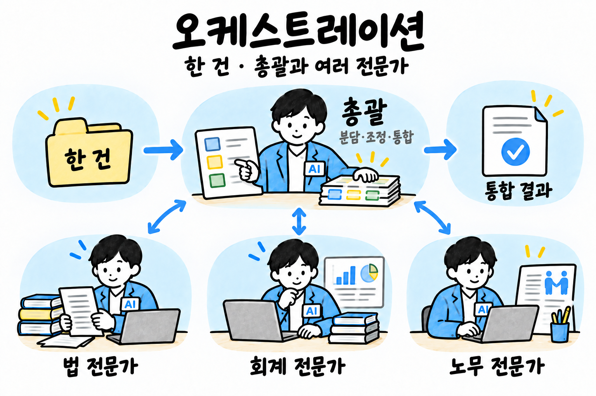

```mermaid
%%{init: {"layout": "dagre", "flowchart": {"defaultRenderer": "dagre-wrapper", "curve": "basis", "nodeSpacing": 42, "rankSpacing": 65, "padding": 16, "wrappingWidth": 290, "useMaxWidth": false, "htmlLabels": true}, "theme": "base", "themeVariables": {"fontSize": "18px", "fontFamily": "Apple SD Gothic Neo, sans-serif", "lineColor": "#60a5fa", "primaryTextColor": "#17314f", "edgeLabelBackground": "#202020", "clusterBkg": "transparent", "clusterBorder": "#5f6f82"}, "themeCSS": ".edgeLabel{color:#dbeafe}.cluster-label{color:#b6c4d5}.nodeLabel small{font-size:14px;line-height:1.45}.nodeLabel b{font-weight:700}.nodeLabel p{margin:0}"} }%%
flowchart TB
    accTitle: 오케스트레이션 상황에서 79개 재료의 사용과 조합
    accDescr: 재료 도형 하나에 정식 재료명 하나. 실선은 실행과 결과 전달, 점선은 계속 적용되는 책임과 규칙 입력. 상시는 책임 유지, 단계별은 해당 단계, 조건부는 각 화살표의 조건에 해당하면 사용.
    %% 본문이 정본이다. 구획은 계통의 실행 순서를 뜻하지 않는다.
    start(["<b>요청·변경·재개 신호 도착</b>"]):::good
    subgraph REQUEST["요청의 뜻과 완료 기준"]
        direction TB
    %% 재료: input0 | 시작 신호 | 단계별
    input0["<b>시작 신호</b><br/><small>단계별 · 새 업무 또는 기다리던 업무에<br/>신호를 연결</small>"]:::main
    %% 재료: input1 | 업무별 정보 | 단계별
    input1["<b>업무별 정보</b><br/><small>단계별 · 대상·기한·요청 내용·현재<br/>조건을 모음</small>"]:::main
    %% 재료: input2 | 지시·의도 파악 | 상시
    input2["<b>지시·의도 파악</b><br/><small>상시 · 무엇을 원하는지와 허용한 범위를<br/>확인</small>"]:::main
    %% 재료: input3 | 문제·목표·완료 조건 | 상시
    input3["<b>문제·목표·완료 조건</b><br/><small>상시 · 해결할 문제와 완료를 증명할<br/>결과를 정함</small>"]:::main
    %% 재료: input4 | 성과 추적 | 단계별
    input4["<b>성과 추적</b><br/><small>단계별 · 어떤 성과를 언제 확인할지 정함</small>"]:::main
    end
    subgraph ASSIGN["총괄 · 필요한 수만큼 분담 · A·B는 대표 경로"]
        direction TB
    %% 재료: dispatch0 | 대안·전략 판단 | 상시
    dispatch0["<b>대안·전략 판단</b><br/><small>상시 · 분담 방법·우선순위·필요한<br/>전문성을 비교</small>"]:::main
    %% 재료: dispatch1 | 업무 절차·실행 계획 | 단계별
    dispatch1["<b>업무 절차·실행 계획</b><br/><small>단계별 · 담당별 입력·결과와 선후 관계를<br/>정함</small>"]:::main
    %% 재료: dispatch_state | 현재 진행 상태 | 상시
    dispatch_state["<b>현재 진행 상태</b><br/><small>상시 · 완료·진행·미착수·막힌 작업을 구별<br/>이미 검증된 결과·승인을 보존</small>"]:::store
    %% 재료: schedule | 작업 진행·연결 | 상시
    schedule["<b>작업 진행·연결</b><br/><small>상시 · 미완료 작업 중 선행 결과·입력이<br/>준비된 작업만 고름</small>"]:::main
    dispatch_ready{"<b>지금 실행할 작업이 있는가?</b>"}:::note
    %% 재료: dispatch_wait | 대기·후속 관리 | 상시
    dispatch_wait["<b>대기·후속 관리</b><br/><small>상시 · 선행 결과·답변·자원·기한을 확인<br/>서로 기다리면 순서·분담 재조정</small>"]:::back
    dispatch_event{"<b>기다린 조건이 해결됐는가?</b>"}:::note
    %% 재료: dispatch_authority | 업무 권한 | 상시
    dispatch_authority["<b>업무 권한</b><br/><small>상시 · 담당별 위임·자료 공유·승인 범위 확인</small>"]:::main
    %% 재료: dispatch_budget | 비용·위험 한도 | 상시
    dispatch_budget["<b>비용·위험 한도</b><br/><small>상시 · 모든 담당의 사용·진행·예약분을 합산</small>"]:::main
    %% 재료: dispatch_guard | 안전장치 | 상시
    dispatch_guard["<b>안전장치</b><br/><small>상시 · 총괄의 규칙·위임 권한·공동 한도와<br/>담당의 검증된 능력을 함께 확인</small>"]:::main
    dispatch_allowed{"<b>이번 위임·자료 공유가 허용되는가?</b>"}:::note
    %% 재료: dispatch_human | 사람에게 넘기기 | 상시
    dispatch_human["<b>사람에게 넘기기</b><br/><small>상시 · 대안·영향을 갖춰 권한자에게<br/>필요한 결정만 요청</small>"]:::back
    assigned_to{"<b>이번에 준비된 작업의 담당은?</b>"}:::note
    parallel_ready((" ")):::junction
    %% 재료: dispatch2 | 나눠 맡기기 | 조건부
    dispatch2["<b>나눠 맡기기</b><br/><small>조건부 · 준비된 작업만 담당에게 전달<br/>목표·입력·권한·기한·반환 형식 포함</small>"]:::main
    end
    subgraph EXPERT["전문가별 재료 조합 · 각자 받은 입력으로 아래 조합을 사용"]
        direction TB
    expert_entry["<b>전문가 A의 재료 조합</b><br/><small>자기 목표·자료·권한으로 판단·실행·검증</small>"]:::main
    subgraph ONGOING["아래 재료는 전 구간에 계속 적용 · 실행 순서가 아님"]
        direction TB
    %% 재료: control | 실행 제어 | 상시
    control["<b>실행 제어</b><br/><small>상시 · 판단·도구·분기를 호출하고<br/>결과·오류를 연결</small>"]:::store
    %% 재료: isolation | 분리 실행 | 상시
    isolation["<b>분리 실행</b><br/><small>상시 · 작업·자료·자원을 분리하고 허용<br/>범위만 공유</small>"]:::store
    %% 재료: record | 판단 근거 기록 | 상시
    record["<b>판단 근거 기록</b><br/><small>상시 · 선택·판단·실행·검증의 입력과<br/>이유를 기록</small>"]:::store
    %% 재료: ops | 운영 감시·복구 | 상시
    ops["<b>운영 감시·복구</b><br/><small>상시 · 별도 감시자가 지연·장애를<br/>격리하고 저장 상태로 복구</small>"]:::store
    %% 재료: ongoing_state | 현재 진행 상태 | 상시
    ongoing_state["<b>현재 진행 상태</b><br/><small>상시 ·<br/>담당·완료·대기·승인·취소·미확인을 유지</small>"]:::store
    end
    subgraph CONTEXT["현재 판단에 필요한 재료를 함께 사용"]
        direction TB
    %% 재료: facts | 정보·자료 이해 | 단계별
    facts["<b>정보·자료 이해</b><br/><small>단계별 · 받은 자료의 사실·주장·추정과<br/>맥락을 구별</small>"]:::main
    %% 재료: memory | 장기 기억 | 단계별
    memory["<b>장기 기억</b><br/><small>단계별 · 관련된 이전 결정·약속·교훈을<br/>불러옴</small>"]:::store
    %% 재료: context | 현재 작업 정보 | 상시
    context["<b>현재 작업 정보</b><br/><small>상시 · 이번 자료·관련 기억·진행 상태를<br/>필요한 만큼 구성</small>"]:::main
    %% 재료: knowledge | 업무 지식 | 상시
    knowledge["<b>업무 지식</b><br/><small>상시 · 원리·방법·적용 조건</small>"]:::main
    %% 재료: experience | 실전 경험·감각 | 상시
    experience["<b>실전 경험·감각</b><br/><small>상시 · 핵심 단서·예외·함정</small>"]:::main
    %% 재료: model | AI 모델 | 상시
    model["<b>AI 모델</b><br/><small>상시 · 현재 정보에 지식·경험을 함께<br/>써서 판단하고 내용을 생성</small>"]:::main
    end
    subgraph EVIDENCE["근거 확보와 확인"]
        direction TB
    search_q{"<b>근거가 더 필요한가?</b>"}:::note
    %% 재료: search | 정보·자료 찾기 | 단계별
    search["<b>정보·자료 찾기</b><br/><small>단계별 · 부족한 근거·지식·방법을<br/>원문까지 확인</small>"]:::main
    %% 재료: empty | 못 찾음·없음 구분 | 단계별
    empty["<b>못 찾음·없음 구분</b><br/><small>단계별 · 빈 조회·없음 판단 때 검색<br/>한계·접근 불가·확인된 없음을 구별</small>"]:::main
    %% 재료: evidence | 근거의 신뢰성·적합성 | 상시
    evidence["<b>근거의 신뢰성·적합성</b><br/><small>상시 · 새 근거와 기존 근거의<br/>출처·한계·적합성을 확인</small>"]:::main
    %% 재료: version | 자료의 시점·버전 | 상시
    version["<b>자료의 시점·버전</b><br/><small>상시 · 대상 시점에 맞는 판본·확인<br/>시각을 확인</small>"]:::main
    extra_q{"<b>추가로 필요한 자료가 있는가?<br/>다투어지는 규칙의 변경 추적 포함</b>"}:::note
    end
    subgraph MORE_SOURCES["조건이 맞는 자료를 함께 더함"]
        direction TB
    %% 재료: source_0 | 적용 사례 | 조건부
    source_0["<b>적용 사례</b><br/><small>조건부 · 이번 조건과 사례의 적용 과정·결과 비교</small>"]:::main
    %% 재료: source_1 | 참고 자료 | 조건부
    source_1["<b>참고 자료</b><br/><small>조건부 · 원리·방법·표현에 참고할 자료 확보</small>"]:::main
    %% 재료: source_2 | 재사용 자료 | 조건부
    source_2["<b>재사용 자료</b><br/><small>조건부 · 이용 권한·호환이 맞는<br/>서식·코드·부품·원본을 가져옴</small>"]:::main
    %% 재료: source_3 | 현재 값·상태 확인 | 조건부
    source_3["<b>현재 값·상태 확인</b><br/><small>조건부 · 필요한 현재 값·상태와 확인 시각 확보</small>"]:::main
    %% 재료: source_4 | 먼저 알아채기 | 조건부
    source_4["<b>먼저 알아채기</b><br/><small>조건부 · 맡은 감시 범위에서<br/>새 문제·기회와 긴급도를 발견</small>"]:::main
    %% 재료: source_5 | 변경 감시·반영 | 조건부
    source_5["<b>변경 감시·반영</b><br/><small>조건부 · 맡은 자료·조건의 변경과<br/>영향받는 업무를 찾아 알림</small>"]:::main
    source_join((" ")):::junction
    %% 재료: source_check | 근거의 신뢰성·적합성 | 상시
    source_check["<b>근거의 신뢰성·적합성</b><br/><small>상시 · 추가 자료도 출처·한계·적합성을 확인</small>"]:::main
    %% 재료: source_version | 자료의 시점·버전 | 상시
    source_version["<b>자료의 시점·버전</b><br/><small>상시 · 추가 자료·변경에 맞는 적용 판본 확인</small>"]:::main
    %% 재료: enriched | 현재 작업 정보 | 상시
    enriched["<b>현재 작업 정보</b><br/><small>상시 · 추가 정보·변경·확인 한계를 이번<br/>판단에 반영</small>"]:::main
    end
    subgraph RULES["점선은 충돌 시 위계 · 모든 적용 규칙을 함께 지킴"]
        direction TB
    %% 재료: rule_source | 규칙·기준 원문 | 단계별
    rule_source["<b>규칙·기준 원문</b><br/><small>단계별 · 대상·지역·시점·설정 권한에<br/>맞는 원문 확보</small>"]:::main
    %% 재료: rule_0 | 법·의무 기준 | 상시
    rule_0["<b>법·의무 기준</b><br/><small>상시 · 상하·위임·특별·개정·경과<br/>규정이 아니어도 행위를 실제로 막는 조치는 시점과 함께 포함</small>"]:::store
    %% 재료: rule_1 | 직업 윤리·의무 | 상시
    rule_1["<b>직업 윤리·의무</b><br/><small>상시 · 직업의 필수 의무</small>"]:::store
    %% 재료: rule_2 | 에이전트 기본 원칙 | 상시
    rule_2["<b>에이전트 기본 원칙</b><br/><small>상시 · 원칙·승인된 보호 기준</small>"]:::store
    rule_rank1((" ")):::junction
    %% 재료: rule_3 | 계약·합의 조건 | 상시
    rule_3["<b>계약·합의 조건</b><br/><small>상시 · 유효한 계약·합의</small>"]:::store
    %% 재료: rule_4 | 플랫폼·제출처 규정 | 상시
    rule_4["<b>플랫폼·제출처 규정</b><br/><small>상시 · 플랫폼·제출처 필수 규정</small>"]:::store
    %% 재료: rule_5 | 조직 규칙 | 상시
    rule_5["<b>조직 규칙</b><br/><small>상시 · 조직의 필수 규칙</small>"]:::store
    %% 재료: rule_6 | 사용자 지정 규칙 | 상시
    rule_6["<b>사용자 지정 규칙</b><br/><small>상시 · 사용자가 추가한 필수 조건</small>"]:::store
    %% 재료: rule_7 | 표현 방식·스타일 | 조건부
    rule_7["<b>표현 방식·스타일</b><br/><small>조건부 · ⑤ 기본 방식·스타일</small>"]:::store
    %% 재료: priority | 규칙의 적용·우선순위 | 상시
    priority["<b>규칙의 적용·우선순위</b><br/><small>상시 · 적용 규칙은 함께 지킴 ·<br/>충돌하는 조항만 위계로 조정<br/>하위 조건도 충돌하지 않으면 유지</small>"]:::main
    rule_q{"<b>적용 조건·충돌이 해결됐고<br/>예외 요건의 입증 계획이 있는가?</b>"}:::note
    %% 재료: rule_human | 사람에게 넘기기 | 상시
    rule_human["<b>사람에게 넘기기</b><br/><small>상시 · 근거·대안을 갖춰 해석·예외<br/>권한자에게 결정 요청</small>"]:::back
    %% 재료: rule_who | 보고 주체 확인 | 상시
    rule_who["<b>보고 주체 확인</b><br/><small>상시 · 답변자의 권한과 결정 범위를 확인</small>"]:::back
    rule_reply{"<b>유효한 결정으로 해결됐는가?</b>"}:::note
    rule_hold["<b>충돌 미해결 · 해당 작업 보류</b><br/><small>이유·남은 책임을 반환</small>"]:::stop
    end
    subgraph PLAN["목표에 맞춰 재료의 입력과 결과를 연결"]
        direction TB
    %% 재료: plan0 | 문제·목표·완료 조건 | 상시
    plan0["<b>문제·목표·완료 조건</b><br/><small>상시 · 확인한 근거·규칙으로 목표와 완료<br/>증거를 확정</small>"]:::main
    %% 재료: plan1 | 대안·전략 판단 | 상시
    plan1["<b>대안·전략 판단</b><br/><small>상시 · 정보·지식·경험으로 대안의<br/>효과·비용·위험을 비교</small>"]:::main
    %% 재료: plan2 | 업무 절차·실행 계획 | 단계별
    plan2["<b>업무 절차·실행 계획</b><br/><small>단계별 · 어떤 재료의 결과를 다음 어떤<br/>재료가 받을지 정함</small>"]:::main
    %% 재료: plan3 | 빠진 위험 확인 | 단계별
    plan3["<b>빠진 위험 확인</b><br/><small>단계별 · 계획·변경·실행·전달에서 빠진<br/>조건과 피해를 점검</small>"]:::main
    end
    subgraph CAPABILITY["실제 투입 전 수행 능력 확인"]
        direction TB
    ability_q{"<b>이번 범위의 능력이 검증됐는가?</b>"}:::note
    %% 재료: ability_env | 시험 환경 | 조건부
    ability_env["<b>시험 환경</b><br/><small>조건부 · 별도 시험 공간·조건이 필요하면<br/>준비</small>"]:::main
    %% 재료: ability_test | 업무 능력 시험 | 조건부
    ability_test["<b>업무 능력 시험</b><br/><small>조건부 · 첫 투입·범위 밖·능력<br/>변경·시험 신뢰 상실이면 시험</small>"]:::main
    ability_pass{"<b>이번 업무를 수행할 수 있는가?</b>"}:::note
    ability_hold["<b>미검증 범위는 투입하지 않음</b><br/><small>부족한 능력·미완료 상태 반환</small>"]:::stop
    end
    subgraph PERMISSION["매 실행·위임·재시도·재개에 적용"]
        direction TB
    %% 재료: authority | 업무 권한 | 상시
    authority["<b>업무 권한</b><br/><small>상시 · 대상·행동·내용·기간의 위임과<br/>동의</small>"]:::main
    %% 재료: limit | 비용·위험 한도 | 상시
    limit["<b>비용·위험 한도</b><br/><small>상시 · 사용량+진행분+예약분과<br/>실행·대기의 위험</small>"]:::main
    %% 재료: safety | 안전장치 | 상시
    safety["<b>안전장치</b><br/><small>상시 · 매 실행·위임·재시도·재개 전<br/>규칙·권한·승인·한도를 함께 검사</small>"]:::main
    allowed{"<b>이번 행동을 실행할 수 있는가?</b>"}:::note
    %% 재료: human | 사람에게 넘기기 | 상시
    human["<b>사람에게 넘기기</b><br/><small>상시 · 되돌릴 수 없는 일·승인<br/>조건·판단 불가·한도 초과·자격자 전속</small>"]:::back
    %% 재료: human_wait | 대기·후속 관리 | 상시
    human_wait["<b>대기·후속 관리</b><br/><small>상시 · AI가 준비·비교·검증을 마친 뒤<br/>필요한 결정·작업과 기한을 관리</small>"]:::back
    %% 재료: human_who | 보고 주체 확인 | 상시
    human_who["<b>보고 주체 확인</b><br/><small>상시 · 답변자·권한·대상·승인 내용을<br/>대조</small>"]:::back
    human_reply{"<b>유효한 답변을 받았는가?</b>"}:::note
    human_hold["<b>금지·거절·취소·기한 종료</b><br/><small>해당 행동을 실행하지 않고 상태 반환</small>"]:::stop
    end
    subgraph ACTION_INPUT["직전 결과를 다음 재료의 입력으로 사용"]
        direction TB
    %% 재료: action_context | 현재 작업 정보 | 상시
    action_context["<b>현재 작업 정보</b><br/><small>상시 · 확인한 자료·조건 + 직전 재료의<br/>검증 결과</small>"]:::main
    %% 재료: progress | 작업 진행·연결 | 상시
    progress["<b>작업 진행·연결</b><br/><small>상시 · 이미 끝난 작업은 유지<br/>준비된 입력·직전 검증 결과를<br/>계획의 다음 재료에 연결</small>"]:::main
    tool_q{"<b>외부 도구·시스템이 필요한가?</b>"}:::note
    %% 재료: tool | 업무 도구·시스템 | 단계별
    tool["<b>업무 도구·시스템</b><br/><small>단계별 · 도구 연결과 요청·응답 형식을 준비<br/>실행 때 실제 결과·오류·상태를 주고받음</small>"]:::main
    select["<b>실행 계획에서 다음 작업 확인</b>"]:::main
    end
    subgraph ACTIONS["필요한 재료만 조합 · 각 결과를 확인하며 다음 입력으로 전달"]
        direction TB
    action_join((" ")):::junction
    subgraph WORK_DATA["자료 가공 · 필요한 처리부터 시작"]
        direction TB
    choose_DATA{"<b>자료를 가공할 차례인가?</b>"}:::note
    data_entry{"<b>어떤 처리부터 필요한가?</b>"}:::note
    %% 재료: action_0 | 자료 선별·분류 | 조건부
    action_0["<b>자료 선별·분류</b><br/><small>조건부 · 필요한 자료를 고르고 종류별로 나눔</small>"]:::main
    data_merge{"<b>고른 자료를 정리·결합해야 하나?</b>"}:::note
    %% 재료: action_1 | 자료 정리·결합 | 조건부
    action_1["<b>자료 정리·결합</b><br/><small>조건부 · 오류·중복·누락을 다루고<br/>같이 쓸 자료를 맞춰 합침</small>"]:::main
    data_format{"<b>다음 작업에 맞게 형식을 바꿀까?</b>"}:::note
    %% 재료: action_2 | 형식·구조 변환 | 조건부
    action_2["<b>형식·구조 변환</b><br/><small>조건부 · 내용을 보존하며<br/>다음 재료·도구가 읽을 형식으로 바꿈</small>"]:::main
    result_DATA((" ")):::junction
    end
    subgraph WORK_JUDGE["계산·판단 · 필요한 판단부터 시작"]
        direction TB
    choose_JUDGE{"<b>계산·판단을 할 차례인가?</b>"}:::note
    judge_entry{"<b>지금 필요한 판단은?</b>"}:::note
    %% 재료: action_3 | 계산 | 조건부
    action_3["<b>계산</b><br/><small>조건부 · 값·식·단위로 수치를 구함</small>"]:::main
    calc_interpret{"<b>계산값의 의미도 해석할까?</b>"}:::note
    %% 재료: action_4 | 분석 | 조건부
    action_4["<b>분석</b><br/><small>조건부 · 자료·계산값에서<br/>차이·관계·원인과 한계를 찾음</small>"]:::main
    analysis_next{"<b>분석 결과로 무엇을 더 판단할까?</b>"}:::note
    %% 재료: action_5 | 기준 적용·판정 | 조건부
    action_5["<b>기준 적용·판정</b><br/><small>조건부 · 확인한 사실을 기준과 대조해 판정</small>"]:::main
    %% 재료: action_6 | 예측 | 조건부
    action_6["<b>예측</b><br/><small>조건부 · 확인한 관계와 가정으로<br/>앞으로의 결과·불확실성을 추정</small>"]:::main
    judge_best{"<b>판정·예측을 써서<br/>최선의 안도 고를까?</b>"}:::note
    %% 재료: action_7 | 조건 안에서 최선 찾기 | 조건부
    action_7["<b>조건 안에서 최선 찾기</b><br/><small>조건부 · 후보·목표·제약을 비교해<br/>유리한 안과 절충점을 구함</small>"]:::main
    result_JUDGE((" ")):::junction
    end
    subgraph WORK_MAKE["설계·내용을 받아 결과물 완성"]
        direction TB
    choose_MAKE{"<b>결과물을 구성·제작할 차례인가?</b>"}:::note
    make_design{"<b>새 설계나 설계 수정이 필요한가?</b>"}:::note
    %% 재료: action_8 | 결과물 설계 | 조건부
    action_8["<b>결과물 설계</b><br/><small>조건부 · 목적에 맞는 구성·형태·작동을 정함</small>"]:::main
    %% 재료: design_verify | 결과 검증·재검증 | 단계별
    design_verify["<b>결과 검증·재검증</b><br/><small>단계별 · 설계가 목적·조건에 맞는지 확인</small>"]:::main
    design_ok{"<b>이 설계를 사용해도 되는가?</b>"}:::note
    make_content{"<b>요약·번역·표현 변경이 필요한가?</b>"}:::note
    %% 재료: action_9 | 내용 재구성 | 조건부
    action_9["<b>내용 재구성</b><br/><small>조건부 · 원문 뜻을 보존하면서<br/>목적·설계에 맞는 내용으로 바꿈</small>"]:::main
    make_build{"<b>실제 제작·구현·수정도 필요한가?</b>"}:::note
    %% 재료: action_10 | 결과물 만들기·수정 | 조건부
    action_10["<b>결과물 만들기·수정</b><br/><small>조건부 · 확인한 설계·내용·재사용 자료로<br/>결과물을 만들거나 고침</small>"]:::main
    result_MAKE((" ")):::junction
    end
    subgraph WORK_PEOPLE["대화 통로를 갖추고 소통·조율"]
        direction TB
    choose_PEOPLE{"<b>사람과 소통·조율할 차례인가?</b>"}:::note
    people_realtime{"<b>즉시 답을 주고받아야 하는가?</b>"}:::note
    %% 재료: action_20 | 실시간 대화 | 조건부
    action_20["<b>실시간 대화</b><br/><small>조건부 · 연결·발언 순서·중단·재개를 관리</small>"]:::main
    %% 재료: action_11 | 사람과 소통 | 조건부
    action_11["<b>사람과 소통</b><br/><small>조건부 · 질문·설명·응대 후<br/>상대의 답변·이해를 확인</small>"]:::main
    people_negotiate{"<b>요구·역할·조건이<br/>달라 조율해야 하나?</b>"}:::note
    %% 재료: action_12 | 협상·조율 | 조건부
    action_12["<b>협상·조율</b><br/><small>조건부 · 허용 범위 안에서<br/>서로의 조건을 비교해 합의안을 만듦</small>"]:::main
    %% 재료: people_followup | 사람과 소통 | 조건부
    people_followup["<b>사람과 소통</b><br/><small>조건부 · 합의안을 설명하고<br/>남은 쟁점에 대한 답변·조건을 확인</small>"]:::main
    people_again{"<b>추가 의견 교환이 필요한가?</b>"}:::note
    result_PEOPLE((" ")):::junction
    end
    subgraph WORK_OPERATE["확인한 결과를 실제 시스템에 반영"]
        direction TB
    choose_OPERATE{"<b>시스템에 실제로 반영할 차례인가?</b>"}:::note
    operate_kind{"<b>이번에 허용된 행동은?</b>"}:::note
    %% 재료: action_13 | 기록 입력·수정 | 조건부
    action_13["<b>기록 입력·수정</b><br/><small>조건부 · 확인한 내용을 기록에 반영</small>"]:::main
    %% 재료: action_14 | 신청·거래 처리 | 조건부
    action_14["<b>신청·거래 처리</b><br/><small>조건부 · 허용된 신청·주문·예약·취소를 처리</small>"]:::main
    %% 재료: action_15 | 설정·작동 제어 | 조건부
    action_15["<b>설정·작동 제어</b><br/><small>조건부 · 허용된 설정·장비 상태를 바꿈</small>"]:::main
    %% 재료: action_16 | 게시·배포 | 조건부
    action_16["<b>게시·배포</b><br/><small>조건부 · 확인한 판본을 정해진 범위에 공개</small>"]:::main
    result_OPERATE((" ")):::junction
    end
    subgraph WORK_OBSERVE["시험 조건을 갖추고 관찰·실험·모의"]
        direction TB
    choose_OBSERVE{"<b>관찰·실험·모의가 필요한가?</b>"}:::note
    observe_kind{"<b>현재 상태를 볼까,<br/>조건을 바꿔 볼까?</b>"}:::note
    observe_env{"<b>별도 시험 공간·조건이 필요한가?</b>"}:::note
    %% 재료: action_21 | 시험 환경 | 조건부
    action_21["<b>시험 환경</b><br/><small>조건부 · 시험 조건·자료·도구를 준비<br/>미통과 판본의 실제 투입을 차단</small>"]:::main
    observe_method{"<b>실제 시험인가, 가상 시험인가?</b>"}:::note
    %% 재료: action_18 | 실험 | 조건부
    action_18["<b>실험</b><br/><small>조건부 · 조건을 바꾸거나 통제해<br/>효과·차이를 비교할 시험을 수행</small>"]:::main
    %% 재료: action_17 | 관찰·측정 | 조건부
    action_17["<b>관찰·측정</b><br/><small>조건부 · 현장·시험에서 값·현상을 관측<br/>시각·방법·조건과 함께 기록</small>"]:::main
    %% 재료: action_19 | 시뮬레이션 | 조건부
    action_19["<b>시뮬레이션</b><br/><small>조건부 · 가정한 상황·모델로 모의 실행<br/>가정·결과·현실과의 차이를 남김</small>"]:::main
    result_OBSERVE((" ")):::junction
    end
    subgraph WORK_ANSWER["갖춘 근거로 판단·답변"]
        direction TB
    choose_ANSWER{"<b>판단·설명·답변을 만들 차례인가?</b>"}:::note
    %% 재료: action_22 | AI 모델 | 상시
    action_22["<b>AI 모델</b><br/><small>상시 · 현재 정보·규칙·지식·경험으로<br/>판단하고 답변을 생성</small>"]:::main
    result_ANSWER((" ")):::junction
    end
    end
    subgraph VERIFY["결과를 검증하고 필요한 재료를 다시 연결"]
        direction TB
    %% 재료: verify0 | 보고 주체 확인 | 상시
    verify0["<b>보고 주체 확인</b><br/><small>상시 · 누가 맡은 결과인지,<br/>분담·판본·대외 명의 확인</small>"]:::main
    %% 재료: verify1 | 결과 검증·재검증 | 단계별
    verify1["<b>결과 검증·재검증</b><br/><small>단계별 · 입력·근거·완료 조건과 대조 ·<br/>변경되면 영향받은 결과도 확인</small>"]:::main
    %% 재료: verify2 | 반대 근거·다시 확인 | 단계별
    verify2["<b>반대 근거·다시 확인</b><br/><small>단계별 · 중요한 판단은 다른<br/>근거·방법으로 반증</small>"]:::main
    %% 재료: verify3 | 일하는 과정 평가 | 단계별
    verify3["<b>일하는 과정 평가</b><br/><small>단계별 · 각 단계의 방법·절차·권한<br/>사용을 평가</small>"]:::main
    %% 재료: verify4 | 결과 품질 평가 | 단계별
    verify4["<b>결과 품질 평가</b><br/><small>단계별 · 사용<br/>목적·기능·정확성·이해·편의를 확인</small>"]:::main
    result_status{"<b>검증 결과는?</b>"}:::note
    more{"<b>이 결과를 사용할 다음<br/>재료가 필요한가?</b>"}:::note
    %% 재료: fix | 업무 절차·실행 계획 | 단계별
    fix["<b>업무 절차·실행 계획</b><br/><small>단계별 · 새 근거·규칙을 반영해 문제<br/>있는 재료 조합만 수정</small>"]:::back
    %% 재료: unknown | 현재 값·상태 확인 | 조건부
    unknown["<b>현재 값·상태 확인</b><br/><small>조건부 · 외부 작업이 실제로 처리됐는지<br/>조회</small>"]:::back
    %% 재료: unknown_wait | 대기·후속 관리 | 상시
    unknown_wait["<b>대기·후속 관리</b><br/><small>상시 · 기한 안에서 확인 · 상태 확인<br/>전 중복 실행 금지</small>"]:::back
    unknown_q{"<b>실제 처리 상태가 확인됐는가?</b>"}:::note
    unknown_hold["<b>확인 기한 종료 · 미확인 반환</b><br/><small>실행 성공으로 보고하지 않음</small>"]:::stop
    expert_output["<b>담당 작업의 결과·상태 반환</b><br/><small>결과·근거·판본·완료/미완료·남은 책임</small>"]:::store
    end
    end
    subgraph OTHER["다른 담당의 독립 실행"]
        direction TB
    other_expert[["<b>전문가 B · 독립 실행</b><br/><small>「전문가별 재료 조합」을 각각 사용<br/>자기 목표·자료·권한으로 실행<br/>각자의 결과·상태를 반환</small>"]]:::main
    %% 재료: result_b | 결과 검증·재검증 | 단계별
    result_b["<b>결과 검증·재검증</b><br/><small>단계별 · B의 결과·근거·판본·처리 상태<br/>확인</small>"]:::main
    end
    subgraph ORCHESTRATION["총괄이 실제 결과를 회수하고 후속 담당을 연결"]
        direction TB
    %% 재료: result_a | 결과 검증·재검증 | 단계별
    result_a["<b>결과 검증·재검증</b><br/><small>단계별 · A의 결과·근거·판본·처리 상태<br/>확인</small>"]:::main
    %% 재료: collect | 나눠 맡기기 | 조건부
    collect["<b>나눠 맡기기</b><br/><small>조건부 · 총괄이 배정한 작업의 결과·상태를 회수<br/>누락·중복·이견·실패를 구별</small>"]:::main
    ready{"<b>이번에 배정한 작업의 결과는?</b>"}:::note
    %% 재료: pending | 대기·후속 관리 | 상시
    pending["<b>대기·후속 관리</b><br/><small>상시 · 미확인·지연이면 담당 상태 조회와<br/>기한 관리</small>"]:::back
    %% 재료: reassign | 대안·전략 판단 | 상시
    reassign["<b>대안·전략 판단</b><br/><small>상시 · 문제 있는 작업·담당만 조정<br/>실패 부분만 재작업 대상으로 표시<br/>유효한 완료 결과는 그대로 유지</small>"]:::back
    retry_q{"<b>기한·한도 안에서 보완 가능한가?</b>"}:::note
    incomplete["<b>미완료·이유·남은 책임을 전달</b>"]:::stop
    %% 재료: result_save | 현재 진행 상태 | 상시
    result_save["<b>현재 진행 상태</b><br/><small>상시 · 검증된 결과는 완료로 보존<br/>미확인·실패는 따로 표시<br/>뒤 작업에 근거·판본을 연결</small>"]:::store
    dependent_q{"<b>아직 완료하지 못한<br/>작업이 남았는가?</b>"}:::note
    %% 재료: follow | 나눠 맡기기 | 조건부
    follow["<b>나눠 맡기기</b><br/><small>조건부 · 검증된 선행 결과·근거·판본을<br/>후속 담당의 입력으로 전달</small>"]:::main
    %% 재료: integration_input | 현재 작업 정보 | 상시
    integration_input["<b>현재 작업 정보</b><br/><small>상시 · 검증된 부분 결과·근거·판본을<br/>전체 결과의 검증 입력으로 묶음</small>"]:::store
    %% 재료: integration | 결과 검증·재검증 | 단계별
    integration["<b>결과 검증·재검증</b><br/><small>단계별 · 총괄이 부분 결과를 결합해 전체<br/>목표·누락·중복·모순을 확인</small>"]:::main
    end
    subgraph HANDOVER["전체 결과를 확인하고 남은 책임까지 인계"]
        direction TB
    %% 재료: whole_quality | 결과 품질 평가 | 단계별
    whole_quality["<b>결과 품질 평가</b><br/><small>단계별 · 전체 결과가 받는 사람의 목적에<br/>맞게 바로 쓰일 수 있는지 확인</small>"]:::main
    final_q{"<b>전체 완료 조건과<br/>품질을 충족했는가?</b>"}:::note
    %% 재료: final_fix | 대안·전략 판단 | 상시
    final_fix["<b>대안·전략 판단</b><br/><small>상시 · 미달 부분을 기한·한도 안에서<br/>보완할 수 있는지 판단</small>"]:::back
    can_fix{"<b>보완할 수 있는가?</b>"}:::note
    %% 재료: deliver | 납품 준비 | 단계별
    deliver["<b>납품 준비</b><br/><small>단계별 · 결과·원본·근거·사용법·남은<br/>책임을 갖춤<br/>미완료면 상태·이유·한계를 명시</small>"]:::main
    %% 재료: handover | 전달·인수 확인 | 단계별
    handover["<b>전달·인수 확인</b><br/><small>단계별 · 수령·사용 조건·남은 책임의<br/>인계를 확인</small>"]:::main
    receipt_q{"<b>수령·사용 상태가 확인됐는가?</b>"}:::note
    %% 재료: receipt_wait | 대기·후속 관리 | 상시
    receipt_wait["<b>대기·후속 관리</b><br/><small>상시 · 수신·사용 문제를 확인하고 기한<br/>안에 재전달·후속 조치</small>"]:::back
    %% 재료: closed | 현재 진행 상태 | 상시
    closed["<b>현재 진행 상태</b><br/><small>상시 · 완료·인수와 미완료·거절·인수<br/>실패를 구별하고 후속 책임 유지</small>"]:::main
    end
    subgraph LEARN["결과에서 학습 · 검증된 개선만 다음 업무에 적용"]
        direction TB
    %% 재료: performance | 성과 추적 | 단계별
    performance["<b>성과 추적</b><br/><small>단계별 · 약속한 시점의 실제 성과·후속<br/>문제를 확인</small>"]:::main
    %% 재료: learn_memory | 장기 기억 | 단계별
    learn_memory["<b>장기 기억</b><br/><small>단계별 · 판단·실행·평가 기록과 성과 중<br/>재사용할 결정·약속·교훈을 보관·정정</small>"]:::main
    cause_q{"<b>재사용할 성과·분석할<br/>문제가 있는가?</b>"}:::note
    %% 재료: cause | 성공·실패 원인 분석 | 조건부
    cause["<b>성공·실패 원인 분석</b><br/><small>조건부 · 재사용할 성과·원인 불명·영향이<br/>큰 문제·반복 오류의 원인과 적용 조건<br/>분석</small>"]:::main
    improve_q{"<b>개선할 점·새로 필요한<br/>능력이 있는가?</b>"}:::note
    %% 재료: improve | 능력 개선·확장 | 조건부
    improve["<b>능력 개선·확장</b><br/><small>조건부 · 지식·판단 요령·방법·도구를<br/>보완</small>"]:::main
    %% 재료: improve_env | 시험 환경 | 조건부
    improve_env["<b>시험 환경</b><br/><small>조건부 · 별도 공간·조건이 필요하면 준비<br/>· 미통과 판본의 실제 투입 차단</small>"]:::main
    %% 재료: improve_test | 업무 능력 시험 | 조건부
    improve_test["<b>업무 능력 시험</b><br/><small>조건부 · 개선 효과와 기존 능력을 함께<br/>시험</small>"]:::main
    improve_pass{"<b>개선 효과·기존 능력<br/>모두 통과했는가?</b>"}:::note
    %% 재료: adopt | 업무 지식 | 상시
    adopt["<b>업무 지식</b><br/><small>상시 · 검증된 내용과 적용 조건을 반영</small>"]:::main
    %% 재료: adopt_memory | 장기 기억 | 단계별
    adopt_memory["<b>장기 기억</b><br/><small>단계별 · 검증 근거·판본·교훈을 다음<br/>판단에 제공</small>"]:::main
    finish(["<b>이번 처리를 마침</b><br/><small>남은 책임은 계속 관리<br/>후속 신호가 오면 해당 건을 이어서 처리</small>"]):::good
    end

    %% 실선: 실행·정보 전달 / 점선: 계속 적용되는 책임·규칙 입력
    %% ~~~ 는 렌더링에서 보이지 않는 배치 제약이며 실행 순서가 아니다.
    start --> input0
    input0 --> input1
    input1 --> input2
    input2 --> input3
    input3 --> input4
    input4 --> dispatch0
    dispatch0 --> dispatch1
    dispatch1 --> dispatch_state
    dispatch_state --> schedule
    schedule --> dispatch_ready
    dispatch_ready --> |"예 · 미완료이며 입력 준비됨"| dispatch_authority
    dispatch_ready --> |"아니오 · 선행 결과·자원 필요"| dispatch_wait
    dispatch_wait --> dispatch_event
    dispatch_event --> |"예 · 답변 권한·새 상태 반영"| dispatch_state
    dispatch_event --> |"아니오"| dispatch_wait
    dispatch_event --> |"기한 종료·서로 기다림·해결 불가"| reassign
    dispatch_authority --> |"유효한 위임·공유 범위"| dispatch_guard
    dispatch_budget --> |"이번 배정까지 합친 공동 한도"| dispatch_guard
    dispatch_guard --> dispatch_allowed
    dispatch_allowed --> |"예"| dispatch2
    dispatch_allowed --> |"권한자의 결정 필요"| dispatch_human
    dispatch_human --> |"결정·답변을 기다림"| dispatch_wait
    dispatch_allowed L_dispatch_allowed_incomplete_routed@--> |"금지·거절·취소"| incomplete
    dispatch2 --> assigned_to
    assigned_to --> |"A 담당만 준비됨"| expert_entry
    assigned_to --> |"B 담당만 준비됨"| other_expert
    assigned_to --> |"둘 다 준비됨 · 병렬"| parallel_ready
    parallel_ready --> |"A의 작업·입력"| expert_entry
    parallel_ready --> |"B의 작업·입력"| other_expert
    expert_entry -.-> control
    control -.-> |"작업별 실행"| isolation
    control -.-> |"판단·실행 근거"| record
    isolation -.-> |"분리된 운영 상태"| ops
    record -.-> |"진행 기록"| ongoing_state
    ops -.-> |"복구 상태"| ongoing_state
    expert_entry --> |"이번 업무 자료"| facts
    expert_entry --> |"관련 이전 기록"| memory
    facts --> |"읽고 확인한 내용"| context
    memory --> |"관련 기억"| context
    ongoing_state -.-> |"현재 진행 상태"| context
    context --> |"현재 업무의 사실·조건"| model
    context --> |"관련 지식 선택"| knowledge
    context --> |"조건에 맞는 판단 요령 선택"| experience
    knowledge --> model
    experience --> model
    model --> search_q
    search_q --> |"예"| search
    search_q --> |"아니오 · 기존 근거"| evidence
    search --> |"빈 조회·없음 판단"| empty
    search --> |"찾음"| evidence
    empty --> |"조회 한계·확인된 없음"| evidence
    evidence --> version
    version --> extra_q
    extra_q --> |"적용 과정 비교"| source_0
    source_0 --> |"비슷한 조건·차이"| source_join
    extra_q --> |"원리·방법 참고"| source_1
    source_1 --> |"설명·작업 근거"| source_join
    extra_q --> |"서식·부품 활용"| source_2
    source_2 --> |"권한·호환이 맞는 재료"| source_join
    extra_q --> |"현재 값이 중요"| source_3
    source_3 --> |"조회 값·확인 시각"| source_join
    extra_q --> |"상황 감시를 맡음"| source_4
    source_4 --> |"새 문제·기회·긴급도"| source_join
    extra_q --> |"변화를 계속 추적"| source_5
    source_5 --> |"변경 내용·영향받는 일"| source_join
    source_join --> |"조건에 해당한 자료를 모음"| source_check
    source_check --> source_version
    source_version --> |"확인한 자료만 반영"| enriched
    extra_q --> |"추가 자료 불필요"| enriched
    source_0 ~~~ source_1
    source_1 ~~~ source_2
    source_2 ~~~ source_3
    source_3 ~~~ source_4
    source_4 ~~~ source_5
    enriched --> rule_source
    rule_source --> |"원문과 적용 조건을 함께 검토"| priority
    rule_source -.-> |"법적 적용 관계를 먼저 확인"| rule_0
    rule_0 -.-> |"그 안에서 ①"| rule_1
    rule_0 -.-> |"그 안에서 ①"| rule_2
    rule_1 -.-> |"① 함께 적용"| rule_rank1
    rule_2 -.-> |"① 함께 적용"| rule_rank1
    rule_rank1 -.-> |"다음 ②"| rule_3
    rule_rank1 -.-> |"다음 ②"| rule_4
    rule_3 -.-> |"다음 ③"| rule_5
    rule_4 -.-> |"다음 ③"| rule_5
    rule_5 -.-> |"다음 ④"| rule_6
    rule_6 -.-> |"표현 기준 필요: 기본 방식 ⑤"| rule_7
    rule_7 -.-> |"충돌하지 않는 조건도 함께 유지"| priority
    rule_6 -.-> |"기본 스타일 추가 불필요"| priority
    priority --> rule_q
    rule_q --> |"아니오 · 해결할 권한 필요"| rule_human
    rule_human --> rule_who
    rule_who --> rule_reply
    rule_reply --> |"예 · 유효한 결정 반영"| priority
    rule_reply --> |"아니오 · 해결되지 않음"| rule_hold
    rule_q --> |"예 · 적용 조건 확정"| plan0
    plan0 --> plan1
    plan1 --> plan2
    plan2 --> plan3
    plan3 --> ability_q
    ability_q --> |"아니오 · 별도 환경 필요"| ability_env
    ability_q --> |"아니오 · 별도 환경 불필요"| ability_test
    ability_env --> ability_test
    ability_test --> ability_pass
    ability_pass --> |"아니오 · 미검증 범위"| ability_hold
    ability_q --> |"예 · 검증된 범위"| authority
    ability_pass --> |"예 · 시험 통과"| authority
    authority --> |"허용된 범위에서 쓸 비용·위험 확인"| limit
    limit --> |"사용·진행·예약분과 위험"| safety
    safety --> allowed
    allowed --> |"사람의 결정·전속 작업 필요"| human
    human --> human_wait
    human_wait --> human_who
    human_who --> human_reply
    human_reply --> |"답변 대기 · 기한 안"| human_wait
    human_reply --> |"유효한 답변"| safety
    human_reply --> |"거절·취소·기한 종료"| human_hold
    allowed --> |"금지 · 우회 실행 금지"| human_hold
    allowed --> |"허용"| action_context
    action_context --> progress
    progress --> tool_q
    tool_q --> |"예"| tool
    tool --> |"호출할 연결 준비"| select
    tool_q --> |"아니오"| select
    select --> choose_DATA
    choose_DATA --> |"아니오 · 다른 작업"| choose_JUDGE
    choose_JUDGE --> |"아니오 · 다른 작업"| choose_MAKE
    choose_MAKE --> |"아니오 · 다른 작업"| choose_PEOPLE
    choose_PEOPLE --> |"아니오 · 다른 작업"| choose_OPERATE
    choose_OPERATE --> |"아니오 · 다른 작업"| choose_OBSERVE
    choose_OBSERVE --> |"아니오 · 다른 작업"| choose_ANSWER
    choose_ANSWER --> |"해당 없음 · 필요한 조합 재계획"| plan2
    choose_DATA --> |"예"| data_entry
    data_entry --> |"선별·분류부터"| action_0
    data_entry --> |"정리·결합부터"| action_1
    data_entry --> |"형식만 변환"| action_2
    action_0 --> |"선별·분류한 자료"| data_merge
    data_merge --> |"예"| action_1
    data_merge --> |"아니오"| data_format
    action_1 --> |"정리·결합한 자료"| data_format
    data_format --> |"예"| action_2
    data_format --> |"아니오 · 현재 형식 사용"| result_DATA
    action_2 --> |"변환한 자료"| result_DATA
    choose_JUDGE --> |"예"| judge_entry
    judge_entry --> |"수치 구하기"| action_3
    judge_entry --> |"관계·원인 해석"| action_4
    judge_entry --> |"기준으로 판정"| action_5
    judge_entry --> |"예측부터"| action_6
    judge_entry --> |"제약 안에서 선택"| action_7
    action_3 --> |"계산값·단위"| calc_interpret
    calc_interpret --> |"예"| action_4
    calc_interpret --> |"아니오 · 수치가 결과"| result_JUDGE
    action_4 --> |"해석·근거·한계"| analysis_next
    analysis_next --> |"기준 판정"| action_5
    analysis_next --> |"예측"| action_6
    analysis_next --> |"최선 선택"| action_7
    analysis_next --> |"추가 판단 불필요"| result_JUDGE
    action_5 --> |"판정·적용 근거"| judge_best
    action_6 --> |"예상·가정·불확실성"| judge_best
    judge_best --> |"예"| action_7
    judge_best --> |"아니오"| result_JUDGE
    action_7 --> |"선택안·절충점"| result_JUDGE
    choose_MAKE --> |"예"| make_design
    make_design --> |"예"| action_8
    make_design --> |"아니오 · 기존 설계 사용<br/>또는 설계 불필요"| make_content
    action_8 --> |"설계안"| design_verify
    design_verify --> design_ok
    design_ok --> |"아니오 · 설계 보완"| action_8
    design_ok --> |"예 · 검증한 설계를 전달"| make_content
    make_content --> |"예"| action_9
    make_content --> |"아니오 · 기존 내용 사용"| make_build
    action_9 --> |"목적에 맞게 바꾼 내용"| make_build
    make_build --> |"예 · 설계·내용을 입력으로"| action_10
    make_build --> |"아니오 · 설계·내용 자체가 결과"| result_MAKE
    action_10 --> |"완성·수정한 결과물"| result_MAKE
    choose_PEOPLE --> |"예"| people_realtime
    people_realtime --> |"예"| action_20
    people_realtime --> |"아니오 · 문서·메일 등"| action_11
    action_20 --> |"연결된 대화 통로"| action_11
    action_11 --> |"답변·의견·이해 확인"| people_negotiate
    people_negotiate --> |"예"| action_12
    people_negotiate --> |"아니오"| result_PEOPLE
    action_12 --> |"합의안·남은 쟁점"| people_again
    people_again --> |"예 · 허용된 추가 소통"| people_followup
    people_followup --> |"바뀐 의견·조건을 검증 후 다음 판단에"| result_PEOPLE
    people_again --> |"아니오 · 합의 또는 미합의 반환"| result_PEOPLE
    choose_OPERATE --> |"예 · 이번 행동의 승인·권한 확인됨"| operate_kind
    operate_kind --> |"기록을 반영"| action_13
    action_13 --> |"반영 내역·처리 상태"| result_OPERATE
    operate_kind --> |"신청·거래·취소"| action_14
    action_14 --> |"접수·처리 내역"| result_OPERATE
    operate_kind --> |"설정·작동 변경"| action_15
    action_15 --> |"변경 상태·이력"| result_OPERATE
    operate_kind --> |"게시·배포"| action_16
    action_16 --> |"공개 판본·범위"| result_OPERATE
    choose_OBSERVE --> |"예"| observe_kind
    observe_kind --> |"현재 상태를 관찰·측정"| action_17
    observe_kind --> |"조건을 바꿔 실제·가상 시험"| observe_env
    observe_env --> |"예"| action_21
    observe_env --> |"아니오 · 기존 조건으로 가능"| observe_method
    action_21 --> |"준비된 시험 공간·조건"| observe_method
    observe_method --> |"실제 조건을 바꿔 비교"| action_18
    observe_method --> |"가정한 상황을 모의 실행"| action_19
    action_18 --> |"시험한 효과·차이를 관측"| action_17
    action_17 --> |"측정값·관찰 기록"| result_OBSERVE
    action_19 --> |"모의 결과·가정·한계"| result_OBSERVE
    choose_ANSWER --> |"예"| action_22
    action_22 --> |"판단·생성한 내용"| result_ANSWER
    result_DATA --> action_join
    result_JUDGE --> action_join
    result_MAKE --> action_join
    result_PEOPLE --> action_join
    result_OPERATE --> action_join
    result_OBSERVE --> action_join
    result_ANSWER --> action_join
    action_join --> |"사용한 재료의 결과·근거"| verify0
    verify0 --> verify1
    verify1 --> verify2
    verify2 --> verify3
    verify3 --> verify4
    verify4 --> result_status
    result_status --> |"문제없음"| more
    result_status --> |"문제"| fix
    fix --> |"수정 계획 · 실행 전 재검사"| safety
    result_status --> |"미확인"| unknown
    unknown --> unknown_wait
    unknown_wait --> unknown_q
    unknown_q --> |"아직 미확인 · 기한 안"| unknown
    unknown_q --> |"실제 상태 확인"| verify0
    unknown_q --> |"기한 종료"| unknown_hold
    more --> |"예 · 검증 결과를 보존하고 다음 행동만"| safety
    more --> |"아니오 · 담당 작업 완료"| expert_output
    rule_hold --> |"미완료·이유·남은 책임 반환"| expert_output
    ability_hold --> |"미완료·이유·남은 책임 반환"| expert_output
    human_hold --> |"미완료·이유·남은 책임 반환"| expert_output
    unknown_hold --> |"미완료·이유·남은 책임 반환"| expert_output
    other_expert --> |"B의 결과·근거·판본·상태"| result_b
    expert_output --> result_a
    result_a --> collect
    result_b --> |"B 상태·결과 회수"| collect
    collect --> result_save
    result_save --> ready
    ready --> |"미확인·지연 · 기한 안"| pending
    pending --> |"조회·답변·기한 도달"| collect
    ready --> |"오류·이견·누락·기한 종료"| reassign
    reassign --> retry_q
    retry_q --> |"예 · 완료분 유지하고 재배정"| dispatch0
    retry_q --> |"아니오 · 보완 불가"| incomplete
    ready --> |"이번 배정분 검증됨"| dependent_q
    dependent_q --> |"예 · 선행 결과를 후속 입력으로"| follow
    follow --> |"준비된 후속 작업만 고름"| dispatch_state
    dependent_q --> |"아니오 · 통합할 결과 확보"| integration_input
    integration_input --> integration
    integration --> whole_quality
    whole_quality --> final_q
    final_q --> |"아니오"| final_fix
    final_fix --> can_fix
    can_fix --> |"예 · 미달 부분만 보완"| dispatch0
    can_fix --> |"아니오 · 미완료 상태 전달"| deliver
    final_q --> |"예 · 전체 기준 통과"| deliver
    incomplete --> |"미완료·이유 인계"| deliver
    deliver --> handover
    handover --> receipt_q
    receipt_q --> |"응답 대기·전달 문제"| receipt_wait
    receipt_wait --> |"재전달·답변"| handover
    receipt_q --> |"인수 확인"| closed
    receipt_wait --> |"거절·기한 종료"| closed
    closed --> performance
    performance --> learn_memory
    learn_memory --> cause_q
    cause_q --> |"예"| cause
    cause_q --> |"아니오"| improve_q
    cause --> improve_q
    improve_q --> |"예"| improve
    improve_q --> |"아니오 · 개선 생략"| finish
    improve --> |"별도 환경 필요"| improve_env
    improve --> |"별도 환경 불필요"| improve_test
    improve_env --> improve_test
    improve_test --> improve_pass
    improve_pass --> |"예"| adopt
    adopt --> adopt_memory
    adopt_memory --> finish
    improve_pass --> |"아니오 · 기존 검증본 유지"| finish
    %% 우회선만 경유점을 그대로 따라 도형·문구 간섭을 피한다.
    L_dispatch_allowed_incomplete_routed@{ curve: linear }
    classDef main fill:#dbeafe,stroke:#719ddd,stroke-width:1.6px,color:#17314f
    classDef note fill:#fef9c3,stroke:#d2b34e,stroke-width:1.6px,color:#713f12
    classDef back fill:#ffedd5,stroke:#e3a46b,stroke-width:1.6px,color:#7c2d12
    classDef store fill:#e5e7eb,stroke:#9ca3af,stroke-width:1.6px,color:#1f2937
    classDef good fill:#dcfce7,stroke:#55ba7c,stroke-width:1.6px,color:#14532d
    classDef stop fill:#fee2e2,stroke:#de9393,stroke-width:1.6px,color:#7f1d1d
    classDef junction fill:#60a5fa,stroke:#60a5fa,font-size:1px,padding:0px
    style REQUEST fill:none,stroke:#5f6f82,stroke-width:1px,stroke-dasharray:2 7,color:#aebdce
    style ASSIGN fill:none,stroke:#5f6f82,stroke-width:1px,stroke-dasharray:2 7,color:#aebdce
    style EXPERT fill:none,stroke:#5f6f82,stroke-width:1px,stroke-dasharray:2 7,color:#aebdce
    style ONGOING fill:none,stroke:#5f6f82,stroke-width:1px,stroke-dasharray:2 7,color:#aebdce
    style CONTEXT fill:none,stroke:#5f6f82,stroke-width:1px,stroke-dasharray:2 7,color:#aebdce
    style EVIDENCE fill:none,stroke:#5f6f82,stroke-width:1px,stroke-dasharray:2 7,color:#aebdce
    style MORE_SOURCES fill:none,stroke:#5f6f82,stroke-width:1px,stroke-dasharray:2 7,color:#aebdce
    style RULES fill:none,stroke:#5f6f82,stroke-width:1px,stroke-dasharray:2 7,color:#aebdce
    style PLAN fill:none,stroke:#5f6f82,stroke-width:1px,stroke-dasharray:2 7,color:#aebdce
    style CAPABILITY fill:none,stroke:#5f6f82,stroke-width:1px,stroke-dasharray:2 7,color:#aebdce
    style PERMISSION fill:none,stroke:#5f6f82,stroke-width:1px,stroke-dasharray:2 7,color:#aebdce
    style ACTION_INPUT fill:none,stroke:#5f6f82,stroke-width:1px,stroke-dasharray:2 7,color:#aebdce
    style ACTIONS fill:none,stroke:#5f6f82,stroke-width:1px,stroke-dasharray:2 7,color:#aebdce
    style WORK_DATA fill:none,stroke:#5f6f82,stroke-width:1px,stroke-dasharray:2 7,color:#aebdce
    style WORK_JUDGE fill:none,stroke:#5f6f82,stroke-width:1px,stroke-dasharray:2 7,color:#aebdce
    style WORK_MAKE fill:none,stroke:#5f6f82,stroke-width:1px,stroke-dasharray:2 7,color:#aebdce
    style WORK_PEOPLE fill:none,stroke:#5f6f82,stroke-width:1px,stroke-dasharray:2 7,color:#aebdce
    style WORK_OPERATE fill:none,stroke:#5f6f82,stroke-width:1px,stroke-dasharray:2 7,color:#aebdce
    style WORK_OBSERVE fill:none,stroke:#5f6f82,stroke-width:1px,stroke-dasharray:2 7,color:#aebdce
    style WORK_ANSWER fill:none,stroke:#5f6f82,stroke-width:1px,stroke-dasharray:2 7,color:#aebdce
    style VERIFY fill:none,stroke:#5f6f82,stroke-width:1px,stroke-dasharray:2 7,color:#aebdce
    style OTHER fill:none,stroke:#5f6f82,stroke-width:1px,stroke-dasharray:2 7,color:#aebdce
    style ORCHESTRATION fill:none,stroke:#5f6f82,stroke-width:1px,stroke-dasharray:2 7,color:#aebdce
    style HANDOVER fill:none,stroke:#5f6f82,stroke-width:1px,stroke-dasharray:2 7,color:#aebdce
    style LEARN fill:none,stroke:#5f6f82,stroke-width:1px,stroke-dasharray:2 7,color:#aebdce
    linkStyle default stroke:#60a5fa,stroke-width:1.8px
```

---

### 3. 복합 상황 — 맞물린 여러 건 · 전체 총괄과 건별 팀

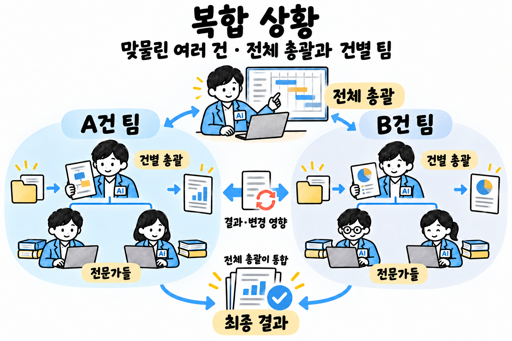

```mermaid
%%{init: {"layout": "dagre", "flowchart": {"defaultRenderer": "dagre-wrapper", "curve": "basis", "nodeSpacing": 42, "rankSpacing": 65, "padding": 16, "wrappingWidth": 290, "useMaxWidth": false, "htmlLabels": true}, "theme": "base", "themeVariables": {"fontSize": "18px", "fontFamily": "Apple SD Gothic Neo, sans-serif", "lineColor": "#60a5fa", "primaryTextColor": "#17314f", "edgeLabelBackground": "#202020", "clusterBkg": "transparent", "clusterBorder": "#5f6f82"}, "themeCSS": ".edgeLabel{color:#dbeafe}.cluster-label{color:#b6c4d5}.nodeLabel small{font-size:14px;line-height:1.45}.nodeLabel b{font-weight:700}.nodeLabel p{margin:0}"} }%%
flowchart TB
    accTitle: 복합 상황에서 79개 재료의 사용과 조합
    accDescr: 재료 도형 하나에 정식 재료명 하나. 실선은 실행과 결과 전달, 점선은 계속 적용되는 책임과 규칙 입력. 상시는 책임 유지, 단계별은 해당 단계, 조건부는 각 화살표의 조건에 해당하면 사용.
    %% 본문이 정본이다. 구획은 계통의 실행 순서를 뜻하지 않는다.
    start(["<b>요청·변경·재개 신호 도착</b>"]):::good
    subgraph REQUEST["요청의 뜻과 완료 기준"]
        direction TB
    %% 재료: input0 | 시작 신호 | 단계별
    input0["<b>시작 신호</b><br/><small>단계별 · 새 업무 또는 기다리던 업무에<br/>신호를 연결</small>"]:::main
    %% 재료: input1 | 업무별 정보 | 단계별
    input1["<b>업무별 정보</b><br/><small>단계별 · 대상·기한·요청 내용·현재<br/>조건을 모음</small>"]:::main
    %% 재료: input2 | 지시·의도 파악 | 상시
    input2["<b>지시·의도 파악</b><br/><small>상시 · 무엇을 원하는지와 허용한 범위를<br/>확인</small>"]:::main
    %% 재료: input3 | 문제·목표·완료 조건 | 상시
    input3["<b>문제·목표·완료 조건</b><br/><small>상시 · 해결할 문제와 완료를 증명할<br/>결과를 정함</small>"]:::main
    %% 재료: input4 | 성과 추적 | 단계별
    input4["<b>성과 추적</b><br/><small>단계별 · 어떤 성과를 언제 확인할지 정함</small>"]:::main
    end
    subgraph ASSIGN["전체 총괄 · 연결된 여러 건 · A·B는 대표 경로"]
        direction TB
    %% 재료: dispatch0 | 대안·전략 판단 | 상시
    dispatch0["<b>대안·전략 판단</b><br/><small>상시 · 분담 방법·우선순위·필요한<br/>전문성을 비교</small>"]:::main
    %% 재료: dispatch1 | 비용·위험 한도 | 상시
    dispatch1["<b>비용·위험 한도</b><br/><small>상시 · 모든 건의 사용·진행·예약분을<br/>합산해 공동 자원·한도를 배정</small>"]:::main
    %% 재료: dispatch2 | 업무 절차·실행 계획 | 단계별
    dispatch2["<b>업무 절차·실행 계획</b><br/><small>단계별 · 담당별 입력·결과와 선후 관계를<br/>정함 · 서로 기다리는 관계는 분해·순서<br/>조정</small>"]:::main
    %% 재료: dispatch_state | 현재 진행 상태 | 상시
    dispatch_state["<b>현재 진행 상태</b><br/><small>상시 · 완료·진행·미착수·막힌 작업을 구별<br/>이미 검증된 결과·승인을 보존</small>"]:::store
    %% 재료: schedule | 작업 진행·연결 | 상시
    schedule["<b>작업 진행·연결</b><br/><small>상시 · 미완료 작업 중 선행 결과·입력이<br/>준비된 작업만 고름</small>"]:::main
    dispatch_ready{"<b>지금 실행할 작업이 있는가?</b>"}:::note
    %% 재료: dispatch_wait | 대기·후속 관리 | 상시
    dispatch_wait["<b>대기·후속 관리</b><br/><small>상시 · 선행 결과·답변·자원·기한을 확인<br/>서로 기다리면 순서·분담 재조정</small>"]:::back
    dispatch_event{"<b>기다린 조건이 해결됐는가?</b>"}:::note
    %% 재료: dispatch_authority | 업무 권한 | 상시
    dispatch_authority["<b>업무 권한</b><br/><small>상시 · 담당별 위임·자료 공유·승인 범위 확인</small>"]:::main
    %% 재료: dispatch_guard | 안전장치 | 상시
    dispatch_guard["<b>안전장치</b><br/><small>상시 · 총괄의 규칙·위임 권한·공동 한도와<br/>담당의 검증된 능력을 함께 확인</small>"]:::main
    dispatch_allowed{"<b>이번 위임·자료 공유가 허용되는가?</b>"}:::note
    %% 재료: dispatch_human | 사람에게 넘기기 | 상시
    dispatch_human["<b>사람에게 넘기기</b><br/><small>상시 · 대안·영향을 갖춰 권한자에게<br/>필요한 결정만 요청</small>"]:::back
    assigned_to{"<b>이번에 준비된 작업의 담당은?</b>"}:::note
    parallel_ready((" ")):::junction
    %% 재료: dispatch3 | 나눠 맡기기 | 조건부
    dispatch3["<b>나눠 맡기기</b><br/><small>조건부 · 준비된 작업만 담당에게 전달<br/>목표·입력·권한·기한·반환 형식 포함</small>"]:::main
    end
    subgraph EXPERT["전문가별 재료 조합 · 건 A 팀 안에서 각자 실행하고 회수"]
        direction TB
    %% 재료: lead_a | 나눠 맡기기 | 조건부
    lead_a["<b>나눠 맡기기</b><br/><small>조건부 · 건 A 총괄이 여러 전문가에게<br/>목표·입력·권한을 나눠 전달</small>"]:::main
    expert_entry["<b>건 A · 각 전문가의 재료 조합</b><br/><small>자기 목표·자료·권한으로 판단·실행·검증</small>"]:::main
    subgraph ONGOING["아래 재료는 전 구간에 계속 적용 · 실행 순서가 아님"]
        direction TB
    %% 재료: control | 실행 제어 | 상시
    control["<b>실행 제어</b><br/><small>상시 · 판단·도구·분기를 호출하고<br/>결과·오류를 연결</small>"]:::store
    %% 재료: isolation | 분리 실행 | 상시
    isolation["<b>분리 실행</b><br/><small>상시 · 작업·자료·자원을 분리하고 허용<br/>범위만 공유</small>"]:::store
    %% 재료: record | 판단 근거 기록 | 상시
    record["<b>판단 근거 기록</b><br/><small>상시 · 선택·판단·실행·검증의 입력과<br/>이유를 기록</small>"]:::store
    %% 재료: ops | 운영 감시·복구 | 상시
    ops["<b>운영 감시·복구</b><br/><small>상시 · 별도 감시자가 지연·장애를<br/>격리하고 저장 상태로 복구</small>"]:::store
    %% 재료: ongoing_state | 현재 진행 상태 | 상시
    ongoing_state["<b>현재 진행 상태</b><br/><small>상시 ·<br/>담당·완료·대기·승인·취소·미확인을 유지</small>"]:::store
    end
    subgraph CONTEXT["현재 판단에 필요한 재료를 함께 사용"]
        direction TB
    %% 재료: facts | 정보·자료 이해 | 단계별
    facts["<b>정보·자료 이해</b><br/><small>단계별 · 받은 자료의 사실·주장·추정과<br/>맥락을 구별</small>"]:::main
    %% 재료: memory | 장기 기억 | 단계별
    memory["<b>장기 기억</b><br/><small>단계별 · 관련된 이전 결정·약속·교훈을<br/>불러옴</small>"]:::store
    %% 재료: context | 현재 작업 정보 | 상시
    context["<b>현재 작업 정보</b><br/><small>상시 · 이번 자료·관련 기억·진행 상태를<br/>필요한 만큼 구성</small>"]:::main
    %% 재료: knowledge | 업무 지식 | 상시
    knowledge["<b>업무 지식</b><br/><small>상시 · 원리·방법·적용 조건</small>"]:::main
    %% 재료: experience | 실전 경험·감각 | 상시
    experience["<b>실전 경험·감각</b><br/><small>상시 · 핵심 단서·예외·함정</small>"]:::main
    %% 재료: model | AI 모델 | 상시
    model["<b>AI 모델</b><br/><small>상시 · 현재 정보에 지식·경험을 함께<br/>써서 판단하고 내용을 생성</small>"]:::main
    end
    subgraph EVIDENCE["근거 확보와 확인"]
        direction TB
    search_q{"<b>근거가 더 필요한가?</b>"}:::note
    %% 재료: search | 정보·자료 찾기 | 단계별
    search["<b>정보·자료 찾기</b><br/><small>단계별 · 부족한 근거·지식·방법을<br/>원문까지 확인</small>"]:::main
    %% 재료: empty | 못 찾음·없음 구분 | 단계별
    empty["<b>못 찾음·없음 구분</b><br/><small>단계별 · 빈 조회·없음 판단 때 검색<br/>한계·접근 불가·확인된 없음을 구별</small>"]:::main
    %% 재료: evidence | 근거의 신뢰성·적합성 | 상시
    evidence["<b>근거의 신뢰성·적합성</b><br/><small>상시 · 새 근거와 기존 근거의<br/>출처·한계·적합성을 확인</small>"]:::main
    %% 재료: version | 자료의 시점·버전 | 상시
    version["<b>자료의 시점·버전</b><br/><small>상시 · 대상 시점에 맞는 판본·확인<br/>시각을 확인</small>"]:::main
    extra_q{"<b>추가로 필요한 자료가 있는가?<br/>다투어지는 규칙의 변경 추적 포함</b>"}:::note
    end
    subgraph MORE_SOURCES["조건이 맞는 자료를 함께 더함"]
        direction TB
    %% 재료: source_0 | 적용 사례 | 조건부
    source_0["<b>적용 사례</b><br/><small>조건부 · 이번 조건과 사례의 적용 과정·결과 비교</small>"]:::main
    %% 재료: source_1 | 참고 자료 | 조건부
    source_1["<b>참고 자료</b><br/><small>조건부 · 원리·방법·표현에 참고할 자료 확보</small>"]:::main
    %% 재료: source_2 | 재사용 자료 | 조건부
    source_2["<b>재사용 자료</b><br/><small>조건부 · 이용 권한·호환이 맞는<br/>서식·코드·부품·원본을 가져옴</small>"]:::main
    %% 재료: source_3 | 현재 값·상태 확인 | 조건부
    source_3["<b>현재 값·상태 확인</b><br/><small>조건부 · 필요한 현재 값·상태와 확인 시각 확보</small>"]:::main
    %% 재료: source_4 | 먼저 알아채기 | 조건부
    source_4["<b>먼저 알아채기</b><br/><small>조건부 · 맡은 감시 범위에서<br/>새 문제·기회와 긴급도를 발견</small>"]:::main
    %% 재료: source_5 | 변경 감시·반영 | 조건부
    source_5["<b>변경 감시·반영</b><br/><small>조건부 · 맡은 자료·조건의 변경과<br/>영향받는 업무를 찾아 알림</small>"]:::main
    source_join((" ")):::junction
    %% 재료: source_check | 근거의 신뢰성·적합성 | 상시
    source_check["<b>근거의 신뢰성·적합성</b><br/><small>상시 · 추가 자료도 출처·한계·적합성을 확인</small>"]:::main
    %% 재료: source_version | 자료의 시점·버전 | 상시
    source_version["<b>자료의 시점·버전</b><br/><small>상시 · 추가 자료·변경에 맞는 적용 판본 확인</small>"]:::main
    %% 재료: enriched | 현재 작업 정보 | 상시
    enriched["<b>현재 작업 정보</b><br/><small>상시 · 추가 정보·변경·확인 한계를 이번<br/>판단에 반영</small>"]:::main
    end
    subgraph RULES["점선은 충돌 시 위계 · 모든 적용 규칙을 함께 지킴"]
        direction TB
    %% 재료: rule_source | 규칙·기준 원문 | 단계별
    rule_source["<b>규칙·기준 원문</b><br/><small>단계별 · 대상·지역·시점·설정 권한에<br/>맞는 원문 확보</small>"]:::main
    %% 재료: rule_0 | 법·의무 기준 | 상시
    rule_0["<b>법·의무 기준</b><br/><small>상시 · 상하·위임·특별·개정·경과<br/>규정이 아니어도 행위를 실제로 막는 조치는 시점과 함께 포함</small>"]:::store
    %% 재료: rule_1 | 직업 윤리·의무 | 상시
    rule_1["<b>직업 윤리·의무</b><br/><small>상시 · 직업의 필수 의무</small>"]:::store
    %% 재료: rule_2 | 에이전트 기본 원칙 | 상시
    rule_2["<b>에이전트 기본 원칙</b><br/><small>상시 · 원칙·승인된 보호 기준</small>"]:::store
    rule_rank1((" ")):::junction
    %% 재료: rule_3 | 계약·합의 조건 | 상시
    rule_3["<b>계약·합의 조건</b><br/><small>상시 · 유효한 계약·합의</small>"]:::store
    %% 재료: rule_4 | 플랫폼·제출처 규정 | 상시
    rule_4["<b>플랫폼·제출처 규정</b><br/><small>상시 · 플랫폼·제출처 필수 규정</small>"]:::store
    %% 재료: rule_5 | 조직 규칙 | 상시
    rule_5["<b>조직 규칙</b><br/><small>상시 · 조직의 필수 규칙</small>"]:::store
    %% 재료: rule_6 | 사용자 지정 규칙 | 상시
    rule_6["<b>사용자 지정 규칙</b><br/><small>상시 · 사용자가 추가한 필수 조건</small>"]:::store
    %% 재료: rule_7 | 표현 방식·스타일 | 조건부
    rule_7["<b>표현 방식·스타일</b><br/><small>조건부 · ⑤ 기본 방식·스타일</small>"]:::store
    %% 재료: priority | 규칙의 적용·우선순위 | 상시
    priority["<b>규칙의 적용·우선순위</b><br/><small>상시 · 적용 규칙은 함께 지킴 ·<br/>충돌하는 조항만 위계로 조정<br/>하위 조건도 충돌하지 않으면 유지</small>"]:::main
    rule_q{"<b>적용 조건·충돌이 해결됐고<br/>예외 요건의 입증 계획이 있는가?</b>"}:::note
    %% 재료: rule_human | 사람에게 넘기기 | 상시
    rule_human["<b>사람에게 넘기기</b><br/><small>상시 · 근거·대안을 갖춰 해석·예외<br/>권한자에게 결정 요청</small>"]:::back
    %% 재료: rule_who | 보고 주체 확인 | 상시
    rule_who["<b>보고 주체 확인</b><br/><small>상시 · 답변자의 권한과 결정 범위를 확인</small>"]:::back
    rule_reply{"<b>유효한 결정으로 해결됐는가?</b>"}:::note
    rule_hold["<b>충돌 미해결 · 해당 작업 보류</b><br/><small>이유·남은 책임을 반환</small>"]:::stop
    end
    subgraph PLAN["목표에 맞춰 재료의 입력과 결과를 연결"]
        direction TB
    %% 재료: plan0 | 문제·목표·완료 조건 | 상시
    plan0["<b>문제·목표·완료 조건</b><br/><small>상시 · 확인한 근거·규칙으로 목표와 완료<br/>증거를 확정</small>"]:::main
    %% 재료: plan1 | 대안·전략 판단 | 상시
    plan1["<b>대안·전략 판단</b><br/><small>상시 · 정보·지식·경험으로 대안의<br/>효과·비용·위험을 비교</small>"]:::main
    %% 재료: plan2 | 업무 절차·실행 계획 | 단계별
    plan2["<b>업무 절차·실행 계획</b><br/><small>단계별 · 어떤 재료의 결과를 다음 어떤<br/>재료가 받을지 정함</small>"]:::main
    %% 재료: plan3 | 빠진 위험 확인 | 단계별
    plan3["<b>빠진 위험 확인</b><br/><small>단계별 · 계획·변경·실행·전달에서 빠진<br/>조건과 피해를 점검</small>"]:::main
    end
    subgraph CAPABILITY["실제 투입 전 수행 능력 확인"]
        direction TB
    ability_q{"<b>이번 범위의 능력이 검증됐는가?</b>"}:::note
    %% 재료: ability_env | 시험 환경 | 조건부
    ability_env["<b>시험 환경</b><br/><small>조건부 · 별도 시험 공간·조건이 필요하면<br/>준비</small>"]:::main
    %% 재료: ability_test | 업무 능력 시험 | 조건부
    ability_test["<b>업무 능력 시험</b><br/><small>조건부 · 첫 투입·범위 밖·능력<br/>변경·시험 신뢰 상실이면 시험</small>"]:::main
    ability_pass{"<b>이번 업무를 수행할 수 있는가?</b>"}:::note
    ability_hold["<b>미검증 범위는 투입하지 않음</b><br/><small>부족한 능력·미완료 상태 반환</small>"]:::stop
    end
    subgraph PERMISSION["매 실행·위임·재시도·재개에 적용"]
        direction TB
    %% 재료: authority | 업무 권한 | 상시
    authority["<b>업무 권한</b><br/><small>상시 · 대상·행동·내용·기간의 위임과<br/>동의</small>"]:::main
    %% 재료: limit | 비용·위험 한도 | 상시
    limit["<b>비용·위험 한도</b><br/><small>상시 · 사용량+진행분+예약분과<br/>실행·대기의 위험</small>"]:::main
    %% 재료: safety | 안전장치 | 상시
    safety["<b>안전장치</b><br/><small>상시 · 매 실행·위임·재시도·재개 전<br/>규칙·권한·승인·한도를 함께 검사</small>"]:::main
    allowed{"<b>이번 행동을 실행할 수 있는가?</b>"}:::note
    %% 재료: human | 사람에게 넘기기 | 상시
    human["<b>사람에게 넘기기</b><br/><small>상시 · 되돌릴 수 없는 일·승인<br/>조건·판단 불가·한도 초과·자격자 전속</small>"]:::back
    %% 재료: human_wait | 대기·후속 관리 | 상시
    human_wait["<b>대기·후속 관리</b><br/><small>상시 · AI가 준비·비교·검증을 마친 뒤<br/>필요한 결정·작업과 기한을 관리</small>"]:::back
    %% 재료: human_who | 보고 주체 확인 | 상시
    human_who["<b>보고 주체 확인</b><br/><small>상시 · 답변자·권한·대상·승인 내용을<br/>대조</small>"]:::back
    human_reply{"<b>유효한 답변을 받았는가?</b>"}:::note
    human_hold["<b>금지·거절·취소·기한 종료</b><br/><small>해당 행동을 실행하지 않고 상태 반환</small>"]:::stop
    end
    subgraph ACTION_INPUT["직전 결과를 다음 재료의 입력으로 사용"]
        direction TB
    %% 재료: action_context | 현재 작업 정보 | 상시
    action_context["<b>현재 작업 정보</b><br/><small>상시 · 확인한 자료·조건 + 직전 재료의<br/>검증 결과</small>"]:::main
    %% 재료: progress | 작업 진행·연결 | 상시
    progress["<b>작업 진행·연결</b><br/><small>상시 · 이미 끝난 작업은 유지<br/>준비된 입력·직전 검증 결과를<br/>계획의 다음 재료에 연결</small>"]:::main
    tool_q{"<b>외부 도구·시스템이 필요한가?</b>"}:::note
    %% 재료: tool | 업무 도구·시스템 | 단계별
    tool["<b>업무 도구·시스템</b><br/><small>단계별 · 도구 연결과 요청·응답 형식을 준비<br/>실행 때 실제 결과·오류·상태를 주고받음</small>"]:::main
    select["<b>실행 계획에서 다음 작업 확인</b>"]:::main
    end
    subgraph ACTIONS["필요한 재료만 조합 · 각 결과를 확인하며 다음 입력으로 전달"]
        direction TB
    action_join((" ")):::junction
    subgraph WORK_DATA["자료 가공 · 필요한 처리부터 시작"]
        direction TB
    choose_DATA{"<b>자료를 가공할 차례인가?</b>"}:::note
    data_entry{"<b>어떤 처리부터 필요한가?</b>"}:::note
    %% 재료: action_0 | 자료 선별·분류 | 조건부
    action_0["<b>자료 선별·분류</b><br/><small>조건부 · 필요한 자료를 고르고 종류별로 나눔</small>"]:::main
    data_merge{"<b>고른 자료를 정리·결합해야 하나?</b>"}:::note
    %% 재료: action_1 | 자료 정리·결합 | 조건부
    action_1["<b>자료 정리·결합</b><br/><small>조건부 · 오류·중복·누락을 다루고<br/>같이 쓸 자료를 맞춰 합침</small>"]:::main
    data_format{"<b>다음 작업에 맞게 형식을 바꿀까?</b>"}:::note
    %% 재료: action_2 | 형식·구조 변환 | 조건부
    action_2["<b>형식·구조 변환</b><br/><small>조건부 · 내용을 보존하며<br/>다음 재료·도구가 읽을 형식으로 바꿈</small>"]:::main
    result_DATA((" ")):::junction
    end
    subgraph WORK_JUDGE["계산·판단 · 필요한 판단부터 시작"]
        direction TB
    choose_JUDGE{"<b>계산·판단을 할 차례인가?</b>"}:::note
    judge_entry{"<b>지금 필요한 판단은?</b>"}:::note
    %% 재료: action_3 | 계산 | 조건부
    action_3["<b>계산</b><br/><small>조건부 · 값·식·단위로 수치를 구함</small>"]:::main
    calc_interpret{"<b>계산값의 의미도 해석할까?</b>"}:::note
    %% 재료: action_4 | 분석 | 조건부
    action_4["<b>분석</b><br/><small>조건부 · 자료·계산값에서<br/>차이·관계·원인과 한계를 찾음</small>"]:::main
    analysis_next{"<b>분석 결과로 무엇을 더 판단할까?</b>"}:::note
    %% 재료: action_5 | 기준 적용·판정 | 조건부
    action_5["<b>기준 적용·판정</b><br/><small>조건부 · 확인한 사실을 기준과 대조해 판정</small>"]:::main
    %% 재료: action_6 | 예측 | 조건부
    action_6["<b>예측</b><br/><small>조건부 · 확인한 관계와 가정으로<br/>앞으로의 결과·불확실성을 추정</small>"]:::main
    judge_best{"<b>판정·예측을 써서<br/>최선의 안도 고를까?</b>"}:::note
    %% 재료: action_7 | 조건 안에서 최선 찾기 | 조건부
    action_7["<b>조건 안에서 최선 찾기</b><br/><small>조건부 · 후보·목표·제약을 비교해<br/>유리한 안과 절충점을 구함</small>"]:::main
    result_JUDGE((" ")):::junction
    end
    subgraph WORK_MAKE["설계·내용을 받아 결과물 완성"]
        direction TB
    choose_MAKE{"<b>결과물을 구성·제작할 차례인가?</b>"}:::note
    make_design{"<b>새 설계나 설계 수정이 필요한가?</b>"}:::note
    %% 재료: action_8 | 결과물 설계 | 조건부
    action_8["<b>결과물 설계</b><br/><small>조건부 · 목적에 맞는 구성·형태·작동을 정함</small>"]:::main
    %% 재료: design_verify | 결과 검증·재검증 | 단계별
    design_verify["<b>결과 검증·재검증</b><br/><small>단계별 · 설계가 목적·조건에 맞는지 확인</small>"]:::main
    design_ok{"<b>이 설계를 사용해도 되는가?</b>"}:::note
    make_content{"<b>요약·번역·표현 변경이 필요한가?</b>"}:::note
    %% 재료: action_9 | 내용 재구성 | 조건부
    action_9["<b>내용 재구성</b><br/><small>조건부 · 원문 뜻을 보존하면서<br/>목적·설계에 맞는 내용으로 바꿈</small>"]:::main
    make_build{"<b>실제 제작·구현·수정도 필요한가?</b>"}:::note
    %% 재료: action_10 | 결과물 만들기·수정 | 조건부
    action_10["<b>결과물 만들기·수정</b><br/><small>조건부 · 확인한 설계·내용·재사용 자료로<br/>결과물을 만들거나 고침</small>"]:::main
    result_MAKE((" ")):::junction
    end
    subgraph WORK_PEOPLE["대화 통로를 갖추고 소통·조율"]
        direction TB
    choose_PEOPLE{"<b>사람과 소통·조율할 차례인가?</b>"}:::note
    people_realtime{"<b>즉시 답을 주고받아야 하는가?</b>"}:::note
    %% 재료: action_20 | 실시간 대화 | 조건부
    action_20["<b>실시간 대화</b><br/><small>조건부 · 연결·발언 순서·중단·재개를 관리</small>"]:::main
    %% 재료: action_11 | 사람과 소통 | 조건부
    action_11["<b>사람과 소통</b><br/><small>조건부 · 질문·설명·응대 후<br/>상대의 답변·이해를 확인</small>"]:::main
    people_negotiate{"<b>요구·역할·조건이<br/>달라 조율해야 하나?</b>"}:::note
    %% 재료: action_12 | 협상·조율 | 조건부
    action_12["<b>협상·조율</b><br/><small>조건부 · 허용 범위 안에서<br/>서로의 조건을 비교해 합의안을 만듦</small>"]:::main
    %% 재료: people_followup | 사람과 소통 | 조건부
    people_followup["<b>사람과 소통</b><br/><small>조건부 · 합의안을 설명하고<br/>남은 쟁점에 대한 답변·조건을 확인</small>"]:::main
    people_again{"<b>추가 의견 교환이 필요한가?</b>"}:::note
    result_PEOPLE((" ")):::junction
    end
    subgraph WORK_OPERATE["확인한 결과를 실제 시스템에 반영"]
        direction TB
    choose_OPERATE{"<b>시스템에 실제로 반영할 차례인가?</b>"}:::note
    operate_kind{"<b>이번에 허용된 행동은?</b>"}:::note
    %% 재료: action_13 | 기록 입력·수정 | 조건부
    action_13["<b>기록 입력·수정</b><br/><small>조건부 · 확인한 내용을 기록에 반영</small>"]:::main
    %% 재료: action_14 | 신청·거래 처리 | 조건부
    action_14["<b>신청·거래 처리</b><br/><small>조건부 · 허용된 신청·주문·예약·취소를 처리</small>"]:::main
    %% 재료: action_15 | 설정·작동 제어 | 조건부
    action_15["<b>설정·작동 제어</b><br/><small>조건부 · 허용된 설정·장비 상태를 바꿈</small>"]:::main
    %% 재료: action_16 | 게시·배포 | 조건부
    action_16["<b>게시·배포</b><br/><small>조건부 · 확인한 판본을 정해진 범위에 공개</small>"]:::main
    result_OPERATE((" ")):::junction
    end
    subgraph WORK_OBSERVE["시험 조건을 갖추고 관찰·실험·모의"]
        direction TB
    choose_OBSERVE{"<b>관찰·실험·모의가 필요한가?</b>"}:::note
    observe_kind{"<b>현재 상태를 볼까,<br/>조건을 바꿔 볼까?</b>"}:::note
    observe_env{"<b>별도 시험 공간·조건이 필요한가?</b>"}:::note
    %% 재료: action_21 | 시험 환경 | 조건부
    action_21["<b>시험 환경</b><br/><small>조건부 · 시험 조건·자료·도구를 준비<br/>미통과 판본의 실제 투입을 차단</small>"]:::main
    observe_method{"<b>실제 시험인가, 가상 시험인가?</b>"}:::note
    %% 재료: action_18 | 실험 | 조건부
    action_18["<b>실험</b><br/><small>조건부 · 조건을 바꾸거나 통제해<br/>효과·차이를 비교할 시험을 수행</small>"]:::main
    %% 재료: action_17 | 관찰·측정 | 조건부
    action_17["<b>관찰·측정</b><br/><small>조건부 · 현장·시험에서 값·현상을 관측<br/>시각·방법·조건과 함께 기록</small>"]:::main
    %% 재료: action_19 | 시뮬레이션 | 조건부
    action_19["<b>시뮬레이션</b><br/><small>조건부 · 가정한 상황·모델로 모의 실행<br/>가정·결과·현실과의 차이를 남김</small>"]:::main
    result_OBSERVE((" ")):::junction
    end
    subgraph WORK_ANSWER["갖춘 근거로 판단·답변"]
        direction TB
    choose_ANSWER{"<b>판단·설명·답변을 만들 차례인가?</b>"}:::note
    %% 재료: action_22 | AI 모델 | 상시
    action_22["<b>AI 모델</b><br/><small>상시 · 현재 정보·규칙·지식·경험으로<br/>판단하고 답변을 생성</small>"]:::main
    result_ANSWER((" ")):::junction
    end
    end
    subgraph VERIFY["결과를 검증하고 필요한 재료를 다시 연결"]
        direction TB
    %% 재료: verify0 | 보고 주체 확인 | 상시
    verify0["<b>보고 주체 확인</b><br/><small>상시 · 누가 맡은 결과인지,<br/>분담·판본·대외 명의 확인</small>"]:::main
    %% 재료: verify1 | 결과 검증·재검증 | 단계별
    verify1["<b>결과 검증·재검증</b><br/><small>단계별 · 입력·근거·완료 조건과 대조 ·<br/>변경되면 영향받은 결과도 확인</small>"]:::main
    %% 재료: verify2 | 반대 근거·다시 확인 | 단계별
    verify2["<b>반대 근거·다시 확인</b><br/><small>단계별 · 중요한 판단은 다른<br/>근거·방법으로 반증</small>"]:::main
    %% 재료: verify3 | 일하는 과정 평가 | 단계별
    verify3["<b>일하는 과정 평가</b><br/><small>단계별 · 각 단계의 방법·절차·권한<br/>사용을 평가</small>"]:::main
    %% 재료: verify4 | 결과 품질 평가 | 단계별
    verify4["<b>결과 품질 평가</b><br/><small>단계별 · 사용<br/>목적·기능·정확성·이해·편의를 확인</small>"]:::main
    result_status{"<b>검증 결과는?</b>"}:::note
    more{"<b>이 결과를 사용할 다음<br/>재료가 필요한가?</b>"}:::note
    %% 재료: fix | 업무 절차·실행 계획 | 단계별
    fix["<b>업무 절차·실행 계획</b><br/><small>단계별 · 새 근거·규칙을 반영해 문제<br/>있는 재료 조합만 수정</small>"]:::back
    %% 재료: unknown | 현재 값·상태 확인 | 조건부
    unknown["<b>현재 값·상태 확인</b><br/><small>조건부 · 외부 작업이 실제로 처리됐는지<br/>조회</small>"]:::back
    %% 재료: unknown_wait | 대기·후속 관리 | 상시
    unknown_wait["<b>대기·후속 관리</b><br/><small>상시 · 기한 안에서 확인 · 상태 확인<br/>전 중복 실행 금지</small>"]:::back
    unknown_q{"<b>실제 처리 상태가 확인됐는가?</b>"}:::note
    unknown_hold["<b>확인 기한 종료 · 미확인 반환</b><br/><small>실행 성공으로 보고하지 않음</small>"]:::stop
    expert_output["<b>담당 작업의 결과·상태 반환</b><br/><small>결과·근거·판본·완료/미완료·남은 책임</small>"]:::store
    end
    %% 재료: team_collect_a | 나눠 맡기기 | 조건부
    team_collect_a["<b>나눠 맡기기</b><br/><small>조건부 · 건 A 총괄이 각 전문가의 결과를 회수<br/>팀 안의 후속 작업·보완까지 연결</small>"]:::main
    team_next_a{"<b>팀 안의 다음 작업을<br/>시작할 수 있는가?</b>"}:::note
    %% 재료: result_a | 결과 검증·재검증 | 단계별
    result_a["<b>결과 검증·재검증</b><br/><small>단계별 · A의 결과·근거·판본·처리 상태<br/>확인</small>"]:::main
    end
    subgraph OTHER["건 B 팀 · 각 전문가가 같은 재료 조합으로 독립 실행"]
        direction TB
    %% 재료: lead_b | 나눠 맡기기 | 조건부
    lead_b["<b>나눠 맡기기</b><br/><small>조건부 · 건 B 총괄이 여러 전문가에게<br/>목표·입력·권한을 나눠 전달</small>"]:::main
    other_expert[["<b>건 B · 전문가별 독립 실행</b><br/><small>「전문가별 재료 조합」을 각각 사용<br/>자기 목표·자료·권한으로 실행<br/>각자의 결과·상태를 반환</small>"]]:::main
    %% 재료: team_collect_b | 나눠 맡기기 | 조건부
    team_collect_b["<b>나눠 맡기기</b><br/><small>조건부 · 건 B 총괄이 각 전문가의 결과를 회수<br/>팀 안의 후속 작업·보완까지 연결</small>"]:::main
    team_next_b{"<b>팀 안의 다음 작업을<br/>시작할 수 있는가?</b>"}:::note
    %% 재료: result_b | 결과 검증·재검증 | 단계별
    result_b["<b>결과 검증·재검증</b><br/><small>단계별 · B의 결과·근거·판본·처리 상태<br/>확인</small>"]:::main
    end
    subgraph ORCHESTRATION["총괄이 실제 결과를 회수하고 후속 담당을 연결"]
        direction TB
    %% 재료: collect | 나눠 맡기기 | 조건부
    collect["<b>나눠 맡기기</b><br/><small>조건부 · 총괄이 배정한 작업의 결과·상태를 회수<br/>누락·중복·이견·실패를 구별</small>"]:::main
    ready{"<b>이번에 배정한 작업의 결과는?</b>"}:::note
    %% 재료: pending | 대기·후속 관리 | 상시
    pending["<b>대기·후속 관리</b><br/><small>상시 · 미확인·지연이면 담당 상태 조회와<br/>기한 관리</small>"]:::back
    %% 재료: reassign | 대안·전략 판단 | 상시
    reassign["<b>대안·전략 판단</b><br/><small>상시 · 문제 있는 작업·담당만 조정<br/>실패 부분만 재작업 대상으로 표시<br/>유효한 완료 결과는 그대로 유지</small>"]:::back
    retry_q{"<b>기한·한도 안에서 보완 가능한가?</b>"}:::note
    incomplete["<b>미완료·이유·남은 책임을 전달</b>"]:::stop
    %% 재료: result_save | 현재 진행 상태 | 상시
    result_save["<b>현재 진행 상태</b><br/><small>상시 · 검증된 결과는 완료로 보존<br/>미확인·실패는 따로 표시<br/>뒤 작업에 근거·판본을 연결</small>"]:::store
    dependent_q{"<b>아직 완료하지 못한<br/>작업이 남았는가?</b>"}:::note
    %% 재료: follow | 나눠 맡기기 | 조건부
    follow["<b>나눠 맡기기</b><br/><small>조건부 · 검증된 선행 결과·근거·판본을<br/>후속 담당의 입력으로 전달</small>"]:::main
    subgraph CHANGE_IMPACT["건 사이 변경 · 영향받은 결과만 다시 확인"]
    cross_change{"<b>다른 건에 영향을<br/>주는 변경이 있는가?</b>"}:::note
    %% 재료: impact0 | 변경 감시·반영 | 조건부
    impact0["<b>변경 감시·반영</b><br/><small>조건부 · 건 A의 원문·결과 변경이 이를<br/>사용한 건 B에 미치는 영향 확인</small>"]:::back
    %% 재료: impact1 | 자료의 시점·버전 | 상시
    impact1["<b>자료의 시점·버전</b><br/><small>상시 · 옛 결과와 새 결과를 구별해<br/>잘못된 재사용 차단</small>"]:::back
    %% 재료: impact2 | 결과 검증·재검증 | 단계별
    impact2["<b>결과 검증·재검증</b><br/><small>단계별 · 변경된 결과와 그 결과에 의존한<br/>다른 건을 함께 재검증</small>"]:::back
    impact_ok{"<b>변경 뒤에도 기존 결과가 유효한가?</b>"}:::note
    %% 재료: invalidate | 현재 진행 상태 | 상시
    invalidate["<b>현재 진행 상태</b><br/><small>상시 · 무효 결과와 의존한 후속 결과를<br/>재작업 대상으로 표시·사용 중단<br/>재작업을 받아 줄 규칙이 없으면 새 절차로</small>"]:::back
    end
    %% 재료: integration_input | 현재 작업 정보 | 상시
    integration_input["<b>현재 작업 정보</b><br/><small>상시 · 검증된 부분 결과·근거·판본을<br/>전체 결과의 검증 입력으로 묶음</small>"]:::store
    %% 재료: integration | 결과 검증·재검증 | 단계별
    integration["<b>결과 검증·재검증</b><br/><small>단계별 · 총괄이 부분 결과를 결합해 전체<br/>목표·누락·중복·모순을 확인</small>"]:::main
    end
    subgraph HANDOVER["전체 결과를 확인하고 남은 책임까지 인계"]
        direction TB
    %% 재료: whole_quality | 결과 품질 평가 | 단계별
    whole_quality["<b>결과 품질 평가</b><br/><small>단계별 · 전체 결과가 받는 사람의 목적에<br/>맞게 바로 쓰일 수 있는지 확인</small>"]:::main
    final_q{"<b>전체 완료 조건과<br/>품질을 충족했는가?</b>"}:::note
    %% 재료: final_fix | 대안·전략 판단 | 상시
    final_fix["<b>대안·전략 판단</b><br/><small>상시 · 미달 부분을 기한·한도 안에서<br/>보완할 수 있는지 판단</small>"]:::back
    can_fix{"<b>보완할 수 있는가?</b>"}:::note
    %% 재료: deliver | 납품 준비 | 단계별
    deliver["<b>납품 준비</b><br/><small>단계별 · 결과·원본·근거·사용법·남은<br/>책임을 갖춤<br/>미완료면 상태·이유·한계를 명시</small>"]:::main
    %% 재료: handover | 전달·인수 확인 | 단계별
    handover["<b>전달·인수 확인</b><br/><small>단계별 · 수령·사용 조건·남은 책임의<br/>인계를 확인</small>"]:::main
    receipt_q{"<b>수령·사용 상태가 확인됐는가?</b>"}:::note
    %% 재료: receipt_wait | 대기·후속 관리 | 상시
    receipt_wait["<b>대기·후속 관리</b><br/><small>상시 · 수신·사용 문제를 확인하고 기한<br/>안에 재전달·후속 조치</small>"]:::back
    %% 재료: closed | 현재 진행 상태 | 상시
    closed["<b>현재 진행 상태</b><br/><small>상시 · 완료·인수와 미완료·거절·인수<br/>실패를 구별하고 후속 책임 유지</small>"]:::main
    end
    subgraph LEARN["결과에서 학습 · 검증된 개선만 다음 업무에 적용"]
        direction TB
    %% 재료: performance | 성과 추적 | 단계별
    performance["<b>성과 추적</b><br/><small>단계별 · 약속한 시점의 실제 성과·후속<br/>문제를 확인</small>"]:::main
    %% 재료: learn_memory | 장기 기억 | 단계별
    learn_memory["<b>장기 기억</b><br/><small>단계별 · 판단·실행·평가 기록과 성과 중<br/>재사용할 결정·약속·교훈을 보관·정정</small>"]:::main
    cause_q{"<b>재사용할 성과·분석할<br/>문제가 있는가?</b>"}:::note
    %% 재료: cause | 성공·실패 원인 분석 | 조건부
    cause["<b>성공·실패 원인 분석</b><br/><small>조건부 · 재사용할 성과·원인 불명·영향이<br/>큰 문제·반복 오류의 원인과 적용 조건<br/>분석</small>"]:::main
    improve_q{"<b>개선할 점·새로 필요한<br/>능력이 있는가?</b>"}:::note
    %% 재료: improve | 능력 개선·확장 | 조건부
    improve["<b>능력 개선·확장</b><br/><small>조건부 · 지식·판단 요령·방법·도구를<br/>보완</small>"]:::main
    %% 재료: improve_env | 시험 환경 | 조건부
    improve_env["<b>시험 환경</b><br/><small>조건부 · 별도 공간·조건이 필요하면 준비<br/>· 미통과 판본의 실제 투입 차단</small>"]:::main
    %% 재료: improve_test | 업무 능력 시험 | 조건부
    improve_test["<b>업무 능력 시험</b><br/><small>조건부 · 개선 효과와 기존 능력을 함께<br/>시험</small>"]:::main
    improve_pass{"<b>개선 효과·기존 능력<br/>모두 통과했는가?</b>"}:::note
    %% 재료: adopt | 업무 지식 | 상시
    adopt["<b>업무 지식</b><br/><small>상시 · 검증된 내용과 적용 조건을 반영</small>"]:::main
    %% 재료: adopt_memory | 장기 기억 | 단계별
    adopt_memory["<b>장기 기억</b><br/><small>단계별 · 검증 근거·판본·교훈을 다음<br/>판단에 제공</small>"]:::main
    finish(["<b>이번 처리를 마침</b><br/><small>남은 책임은 계속 관리<br/>후속 신호가 오면 해당 건을 이어서 처리</small>"]):::good
    end

    %% 실선: 실행·정보 전달 / 점선: 계속 적용되는 책임·규칙 입력
    %% ~~~ 는 렌더링에서 보이지 않는 배치 제약이며 실행 순서가 아니다.
    start --> input0
    input0 --> input1
    input1 --> input2
    input2 --> input3
    input3 --> input4
    input4 --> dispatch0
    dispatch0 --> dispatch1
    dispatch1 --> dispatch2
    dispatch2 --> dispatch_state
    dispatch_state --> schedule
    schedule --> dispatch_ready
    dispatch_ready --> |"예 · 미완료이며 입력 준비됨"| dispatch_authority
    dispatch_ready --> |"아니오 · 선행 결과·자원 필요"| dispatch_wait
    dispatch_wait --> dispatch_event
    dispatch_event --> |"예 · 답변 권한·새 상태 반영"| dispatch_state
    dispatch_event --> |"아니오"| dispatch_wait
    dispatch_event --> |"기한 종료·서로 기다림·해결 불가"| reassign
    dispatch_authority --> |"유효한 위임·공유 범위"| dispatch_guard
    dispatch1 --> |"이번 배정까지 합친 공동 한도"| dispatch_guard
    dispatch_guard --> dispatch_allowed
    dispatch_allowed --> |"예"| dispatch3
    dispatch_allowed --> |"권한자의 결정 필요"| dispatch_human
    dispatch_human --> |"결정·답변을 기다림"| dispatch_wait
    dispatch_allowed --> |"금지·거절·취소"| incomplete
    dispatch3 --> assigned_to
    assigned_to --> |"A 담당만 준비됨"| lead_a
    assigned_to --> |"B 담당만 준비됨"| lead_b
    assigned_to --> |"둘 다 준비됨 · 병렬"| parallel_ready
    parallel_ready --> |"A의 작업·입력"| lead_a
    parallel_ready --> |"B의 작업·입력"| lead_b
    lead_a --> |"건 A의 담당별 입력"| expert_entry
    lead_b --> |"건 B의 담당별 입력"| other_expert
    expert_entry -.-> control
    control -.-> |"작업별 실행"| isolation
    control -.-> |"판단·실행 근거"| record
    isolation -.-> |"분리된 운영 상태"| ops
    record -.-> |"진행 기록"| ongoing_state
    ops -.-> |"복구 상태"| ongoing_state
    expert_entry --> |"이번 업무 자료"| facts
    expert_entry --> |"관련 이전 기록"| memory
    facts --> |"읽고 확인한 내용"| context
    memory --> |"관련 기억"| context
    ongoing_state -.-> |"현재 진행 상태"| context
    context --> |"현재 업무의 사실·조건"| model
    context --> |"관련 지식 선택"| knowledge
    context --> |"조건에 맞는 판단 요령 선택"| experience
    knowledge --> model
    experience --> model
    model --> search_q
    search_q --> |"예"| search
    search_q --> |"아니오 · 기존 근거"| evidence
    search --> |"빈 조회·없음 판단"| empty
    search --> |"찾음"| evidence
    empty --> |"조회 한계·확인된 없음"| evidence
    evidence --> version
    version --> extra_q
    extra_q --> |"적용 과정 비교"| source_0
    source_0 --> |"비슷한 조건·차이"| source_join
    extra_q --> |"원리·방법 참고"| source_1
    source_1 --> |"설명·작업 근거"| source_join
    extra_q --> |"서식·부품 활용"| source_2
    source_2 --> |"권한·호환이 맞는 재료"| source_join
    extra_q --> |"현재 값이 중요"| source_3
    source_3 --> |"조회 값·확인 시각"| source_join
    extra_q --> |"상황 감시를 맡음"| source_4
    source_4 --> |"새 문제·기회·긴급도"| source_join
    extra_q --> |"변화를 계속 추적"| source_5
    source_5 --> |"변경 내용·영향받는 일"| source_join
    source_join --> |"조건에 해당한 자료를 모음"| source_check
    source_check --> source_version
    source_version --> |"확인한 자료만 반영"| enriched
    extra_q --> |"추가 자료 불필요"| enriched
    source_0 ~~~ source_1
    source_1 ~~~ source_2
    source_2 ~~~ source_3
    source_3 ~~~ source_4
    source_4 ~~~ source_5
    enriched --> rule_source
    rule_source --> |"원문과 적용 조건을 함께 검토"| priority
    rule_source -.-> |"법적 적용 관계를 먼저 확인"| rule_0
    rule_0 -.-> |"그 안에서 ①"| rule_1
    rule_0 -.-> |"그 안에서 ①"| rule_2
    rule_1 -.-> |"① 함께 적용"| rule_rank1
    rule_2 -.-> |"① 함께 적용"| rule_rank1
    rule_rank1 -.-> |"다음 ②"| rule_3
    rule_rank1 -.-> |"다음 ②"| rule_4
    rule_3 -.-> |"다음 ③"| rule_5
    rule_4 -.-> |"다음 ③"| rule_5
    rule_5 -.-> |"다음 ④"| rule_6
    rule_6 -.-> |"표현 기준 필요: 기본 방식 ⑤"| rule_7
    rule_7 -.-> |"충돌하지 않는 조건도 함께 유지"| priority
    rule_6 -.-> |"기본 스타일 추가 불필요"| priority
    priority --> rule_q
    rule_q --> |"아니오 · 해결할 권한 필요"| rule_human
    rule_human --> rule_who
    rule_who --> rule_reply
    rule_reply --> |"예 · 유효한 결정 반영"| priority
    rule_reply --> |"아니오 · 해결되지 않음"| rule_hold
    rule_q --> |"예 · 적용 조건 확정"| plan0
    plan0 --> plan1
    plan1 --> plan2
    plan2 --> plan3
    plan3 --> ability_q
    ability_q --> |"아니오 · 별도 환경 필요"| ability_env
    ability_q --> |"아니오 · 별도 환경 불필요"| ability_test
    ability_env --> ability_test
    ability_test --> ability_pass
    ability_pass --> |"아니오 · 미검증 범위"| ability_hold
    ability_q --> |"예 · 검증된 범위"| authority
    ability_pass --> |"예 · 시험 통과"| authority
    authority --> |"허용된 범위에서 쓸 비용·위험 확인"| limit
    limit --> |"사용·진행·예약분과 위험"| safety
    safety --> allowed
    allowed --> |"사람의 결정·전속 작업 필요"| human
    human --> human_wait
    human_wait --> human_who
    human_who --> human_reply
    human_reply --> |"답변 대기 · 기한 안"| human_wait
    human_reply --> |"유효한 답변"| safety
    human_reply --> |"거절·취소·기한 종료"| human_hold
    allowed --> |"금지 · 우회 실행 금지"| human_hold
    allowed --> |"허용"| action_context
    action_context --> progress
    progress --> tool_q
    tool_q --> |"예"| tool
    tool --> |"호출할 연결 준비"| select
    tool_q --> |"아니오"| select
    select --> choose_DATA
    choose_DATA --> |"아니오 · 다른 작업"| choose_JUDGE
    choose_JUDGE --> |"아니오 · 다른 작업"| choose_MAKE
    choose_MAKE --> |"아니오 · 다른 작업"| choose_PEOPLE
    choose_PEOPLE --> |"아니오 · 다른 작업"| choose_OPERATE
    choose_OPERATE --> |"아니오 · 다른 작업"| choose_OBSERVE
    choose_OBSERVE --> |"아니오 · 다른 작업"| choose_ANSWER
    choose_ANSWER --> |"해당 없음 · 필요한 조합 재계획"| plan2
    choose_DATA --> |"예"| data_entry
    data_entry --> |"선별·분류부터"| action_0
    data_entry --> |"정리·결합부터"| action_1
    data_entry --> |"형식만 변환"| action_2
    action_0 --> |"선별·분류한 자료"| data_merge
    data_merge --> |"예"| action_1
    data_merge --> |"아니오"| data_format
    action_1 --> |"정리·결합한 자료"| data_format
    data_format --> |"예"| action_2
    data_format --> |"아니오 · 현재 형식 사용"| result_DATA
    action_2 --> |"변환한 자료"| result_DATA
    choose_JUDGE --> |"예"| judge_entry
    judge_entry --> |"수치 구하기"| action_3
    judge_entry --> |"관계·원인 해석"| action_4
    judge_entry --> |"기준으로 판정"| action_5
    judge_entry --> |"예측부터"| action_6
    judge_entry --> |"제약 안에서 선택"| action_7
    action_3 --> |"계산값·단위"| calc_interpret
    calc_interpret --> |"예"| action_4
    calc_interpret --> |"아니오 · 수치가 결과"| result_JUDGE
    action_4 --> |"해석·근거·한계"| analysis_next
    analysis_next --> |"기준 판정"| action_5
    analysis_next --> |"예측"| action_6
    analysis_next --> |"최선 선택"| action_7
    analysis_next --> |"추가 판단 불필요"| result_JUDGE
    action_5 --> |"판정·적용 근거"| judge_best
    action_6 --> |"예상·가정·불확실성"| judge_best
    judge_best --> |"예"| action_7
    judge_best --> |"아니오"| result_JUDGE
    action_7 --> |"선택안·절충점"| result_JUDGE
    choose_MAKE --> |"예"| make_design
    make_design --> |"예"| action_8
    make_design --> |"아니오 · 기존 설계 사용<br/>또는 설계 불필요"| make_content
    action_8 --> |"설계안"| design_verify
    design_verify --> design_ok
    design_ok --> |"아니오 · 설계 보완"| action_8
    design_ok --> |"예 · 검증한 설계를 전달"| make_content
    make_content --> |"예"| action_9
    make_content --> |"아니오 · 기존 내용 사용"| make_build
    action_9 --> |"목적에 맞게 바꾼 내용"| make_build
    make_build --> |"예 · 설계·내용을 입력으로"| action_10
    make_build --> |"아니오 · 설계·내용 자체가 결과"| result_MAKE
    action_10 --> |"완성·수정한 결과물"| result_MAKE
    choose_PEOPLE --> |"예"| people_realtime
    people_realtime --> |"예"| action_20
    people_realtime --> |"아니오 · 문서·메일 등"| action_11
    action_20 --> |"연결된 대화 통로"| action_11
    action_11 --> |"답변·의견·이해 확인"| people_negotiate
    people_negotiate --> |"예"| action_12
    people_negotiate --> |"아니오"| result_PEOPLE
    action_12 --> |"합의안·남은 쟁점"| people_again
    people_again --> |"예 · 허용된 추가 소통"| people_followup
    people_followup --> |"바뀐 의견·조건을 검증 후 다음 판단에"| result_PEOPLE
    people_again --> |"아니오 · 합의 또는 미합의 반환"| result_PEOPLE
    choose_OPERATE --> |"예 · 이번 행동의 승인·권한 확인됨"| operate_kind
    operate_kind --> |"기록을 반영"| action_13
    action_13 --> |"반영 내역·처리 상태"| result_OPERATE
    operate_kind --> |"신청·거래·취소"| action_14
    action_14 --> |"접수·처리 내역"| result_OPERATE
    operate_kind --> |"설정·작동 변경"| action_15
    action_15 --> |"변경 상태·이력"| result_OPERATE
    operate_kind --> |"게시·배포"| action_16
    action_16 --> |"공개 판본·범위"| result_OPERATE
    choose_OBSERVE --> |"예"| observe_kind
    observe_kind --> |"현재 상태를 관찰·측정"| action_17
    observe_kind --> |"조건을 바꿔 실제·가상 시험"| observe_env
    observe_env --> |"예"| action_21
    observe_env --> |"아니오 · 기존 조건으로 가능"| observe_method
    action_21 --> |"준비된 시험 공간·조건"| observe_method
    observe_method --> |"실제 조건을 바꿔 비교"| action_18
    observe_method --> |"가정한 상황을 모의 실행"| action_19
    action_18 --> |"시험한 효과·차이를 관측"| action_17
    action_17 --> |"측정값·관찰 기록"| result_OBSERVE
    action_19 --> |"모의 결과·가정·한계"| result_OBSERVE
    choose_ANSWER --> |"예"| action_22
    action_22 --> |"판단·생성한 내용"| result_ANSWER
    result_DATA --> action_join
    result_JUDGE --> action_join
    result_MAKE --> action_join
    result_PEOPLE --> action_join
    result_OPERATE --> action_join
    result_OBSERVE --> action_join
    result_ANSWER --> action_join
    action_join --> |"사용한 재료의 결과·근거"| verify0
    verify0 --> verify1
    verify1 --> verify2
    verify2 --> verify3
    verify3 --> verify4
    verify4 --> result_status
    result_status --> |"문제없음"| more
    result_status --> |"문제"| fix
    fix --> |"수정 계획 · 실행 전 재검사"| safety
    result_status --> |"미확인"| unknown
    unknown --> unknown_wait
    unknown_wait --> unknown_q
    unknown_q --> |"아직 미확인 · 기한 안"| unknown
    unknown_q --> |"실제 상태 확인"| verify0
    unknown_q --> |"기한 종료"| unknown_hold
    more --> |"예 · 검증 결과를 보존하고 다음 행동만"| safety
    more --> |"아니오 · 담당 작업 완료"| expert_output
    rule_hold --> |"미완료·이유·남은 책임 반환"| expert_output
    ability_hold --> |"미완료·이유·남은 책임 반환"| expert_output
    human_hold --> |"미완료·이유·남은 책임 반환"| expert_output
    unknown_hold --> |"미완료·이유·남은 책임 반환"| expert_output
    other_expert --> |"B의 결과·근거·판본·상태"| team_collect_b
    team_collect_b --> team_next_b
    team_next_b --> |"예 · 검증 결과를 후속 담당에게"| lead_b
    team_next_b --> |"아니오 · 완료 또는 막힌 상태 반환"| result_b
    expert_output --> team_collect_a
    team_collect_a --> team_next_a
    team_next_a --> |"예 · 검증 결과를 후속 담당에게"| lead_a
    team_next_a --> |"아니오 · 완료 또는 막힌 상태 반환"| result_a
    result_a --> collect
    result_b --> |"B 상태·결과 회수"| collect
    collect --> result_save
    result_save --> cross_change
    ready --> |"미확인·지연 · 기한 안"| pending
    pending --> |"조회·답변·기한 도달"| collect
    ready --> |"오류·이견·누락·기한 종료"| reassign
    reassign --> retry_q
    retry_q --> |"예 · 완료분 유지하고 재배정"| dispatch0
    retry_q --> |"아니오 · 보완 불가"| incomplete
    ready --> |"이번 배정분 검증됨"| dependent_q
    dependent_q --> |"예 · 선행 결과를 후속 입력으로"| follow
    follow --> |"준비된 후속 작업만 고름"| dispatch_state
    dependent_q --> |"아니오 · 건별 필수 결과 확보"| integration_input
    integration_input --> integration
    cross_change --> |"예 · 영향받는 건만"| impact0
    impact0 --> impact1
    impact1 --> impact2
    impact2 --> impact_ok
    impact_ok --> |"예"| ready
    impact_ok --> |"아니오 · 의존한 후속 결과도 무효"| invalidate
    invalidate --> |"영향받은 미완료 작업만 다시 선택"| dispatch_state
    cross_change --> |"아니오"| ready
    integration --> whole_quality
    whole_quality --> final_q
    final_q --> |"아니오"| final_fix
    final_fix --> can_fix
    can_fix --> |"예 · 미달 부분만 보완"| dispatch0
    can_fix --> |"아니오 · 미완료 상태 전달"| deliver
    final_q --> |"예 · 전체 기준 통과"| deliver
    incomplete --> |"미완료·이유 인계"| deliver
    deliver --> handover
    handover --> receipt_q
    receipt_q --> |"응답 대기·전달 문제"| receipt_wait
    receipt_wait --> |"재전달·답변"| handover
    receipt_q --> |"인수 확인"| closed
    receipt_wait --> |"거절·기한 종료"| closed
    closed --> performance
    performance --> learn_memory
    learn_memory --> cause_q
    cause_q --> |"예"| cause
    cause_q --> |"아니오"| improve_q
    cause --> improve_q
    improve_q --> |"예"| improve
    improve_q --> |"아니오 · 개선 생략"| finish
    improve --> |"별도 환경 필요"| improve_env
    improve --> |"별도 환경 불필요"| improve_test
    improve_env --> improve_test
    improve_test --> improve_pass
    improve_pass --> |"예"| adopt
    adopt --> adopt_memory
    adopt_memory --> finish
    improve_pass --> |"아니오 · 기존 검증본 유지"| finish
    classDef main fill:#dbeafe,stroke:#719ddd,stroke-width:1.6px,color:#17314f
    classDef note fill:#fef9c3,stroke:#d2b34e,stroke-width:1.6px,color:#713f12
    classDef back fill:#ffedd5,stroke:#e3a46b,stroke-width:1.6px,color:#7c2d12
    classDef store fill:#e5e7eb,stroke:#9ca3af,stroke-width:1.6px,color:#1f2937
    classDef good fill:#dcfce7,stroke:#55ba7c,stroke-width:1.6px,color:#14532d
    classDef stop fill:#fee2e2,stroke:#de9393,stroke-width:1.6px,color:#7f1d1d
    classDef junction fill:#60a5fa,stroke:#60a5fa,font-size:1px,padding:0px
    style REQUEST fill:none,stroke:#5f6f82,stroke-width:1px,stroke-dasharray:2 7,color:#aebdce
    style ASSIGN fill:none,stroke:#5f6f82,stroke-width:1px,stroke-dasharray:2 7,color:#aebdce
    style EXPERT fill:none,stroke:#5f6f82,stroke-width:1px,stroke-dasharray:2 7,color:#aebdce
    style ONGOING fill:none,stroke:#5f6f82,stroke-width:1px,stroke-dasharray:2 7,color:#aebdce
    style CONTEXT fill:none,stroke:#5f6f82,stroke-width:1px,stroke-dasharray:2 7,color:#aebdce
    style EVIDENCE fill:none,stroke:#5f6f82,stroke-width:1px,stroke-dasharray:2 7,color:#aebdce
    style MORE_SOURCES fill:none,stroke:#5f6f82,stroke-width:1px,stroke-dasharray:2 7,color:#aebdce
    style RULES fill:none,stroke:#5f6f82,stroke-width:1px,stroke-dasharray:2 7,color:#aebdce
    style PLAN fill:none,stroke:#5f6f82,stroke-width:1px,stroke-dasharray:2 7,color:#aebdce
    style CAPABILITY fill:none,stroke:#5f6f82,stroke-width:1px,stroke-dasharray:2 7,color:#aebdce
    style PERMISSION fill:none,stroke:#5f6f82,stroke-width:1px,stroke-dasharray:2 7,color:#aebdce
    style ACTION_INPUT fill:none,stroke:#5f6f82,stroke-width:1px,stroke-dasharray:2 7,color:#aebdce
    style ACTIONS fill:none,stroke:#5f6f82,stroke-width:1px,stroke-dasharray:2 7,color:#aebdce
    style WORK_DATA fill:none,stroke:#5f6f82,stroke-width:1px,stroke-dasharray:2 7,color:#aebdce
    style WORK_JUDGE fill:none,stroke:#5f6f82,stroke-width:1px,stroke-dasharray:2 7,color:#aebdce
    style WORK_MAKE fill:none,stroke:#5f6f82,stroke-width:1px,stroke-dasharray:2 7,color:#aebdce
    style WORK_PEOPLE fill:none,stroke:#5f6f82,stroke-width:1px,stroke-dasharray:2 7,color:#aebdce
    style WORK_OPERATE fill:none,stroke:#5f6f82,stroke-width:1px,stroke-dasharray:2 7,color:#aebdce
    style WORK_OBSERVE fill:none,stroke:#5f6f82,stroke-width:1px,stroke-dasharray:2 7,color:#aebdce
    style WORK_ANSWER fill:none,stroke:#5f6f82,stroke-width:1px,stroke-dasharray:2 7,color:#aebdce
    style VERIFY fill:none,stroke:#5f6f82,stroke-width:1px,stroke-dasharray:2 7,color:#aebdce
    style OTHER fill:none,stroke:#5f6f82,stroke-width:1px,stroke-dasharray:2 7,color:#aebdce
    style CHANGE_IMPACT fill:none,stroke:#5f6f82,stroke-width:1px,stroke-dasharray:2 7,color:#aebdce
    style ORCHESTRATION fill:none,stroke:#5f6f82,stroke-width:1px,stroke-dasharray:2 7,color:#aebdce
    style HANDOVER fill:none,stroke:#5f6f82,stroke-width:1px,stroke-dasharray:2 7,color:#aebdce
    style LEARN fill:none,stroke:#5f6f82,stroke-width:1px,stroke-dasharray:2 7,color:#aebdce
    linkStyle default stroke:#60a5fa,stroke-width:1.8px
```

---
