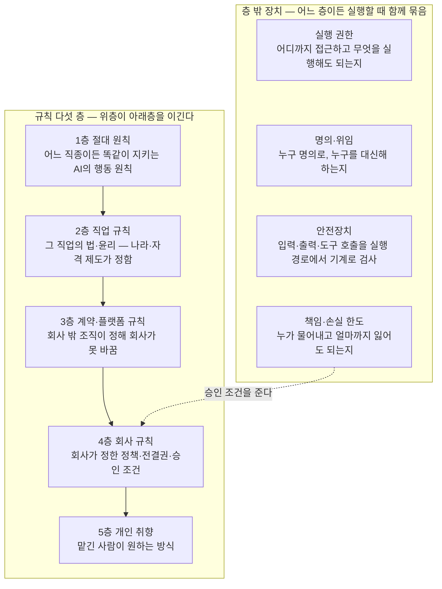

# 전문 AI 에이전트 정의

## 목표

20년차 인간 전문가를 대체할 수 있는 전문 AI 에이전트를 만드는 것.

### 원하는 것

1. 인간 전문가를 고용하는 대신 전문 AI 에이전트에게 업무를 맡기는 것
   - 20년차만큼 전문성이 있고 성과를 내서 믿고 맡길 수 있어야 한다
   - 사람은 맡기고 결과를 받을 뿐, 중간에 손대지 않는다
2. 온라인·컴퓨터 안에서 시작해 끝나는 일에 집중하는 것
   - 화면·문서·시스템·통신으로 성과가 나는 직무가 대상이다

### 원하지 않는 것

1. 역할놀이, 상담 챗봇, 단순 질의응답, 검색·요약만 해주는 수준
2. 몸·현장·실물 조작이 있어야 성과가 나는 일 (시공·조리·시술·촬영·매장 운영)
   - 피지컬 로봇이 필요한 부분은 산정 범위 밖이다

---

## 인간 전문가 정의

한 분야의 일을 직접 맡아, 20년차 수준으로 판단해서 처리하고, 성과를 내는 사람.

세 가지를 모두 만족해야 전문가다.

| 조건 | 뜻 | 가르는 질문 | 아니면 |
|------|-----|-----------|--------|
| 직접 처리한다 | 이 사람의 판단이 그대로 결과물이 된다 | 이 사람 손에서 결과물이 나오나? | 말·평가·소개·가르침만 하고 결과물은 남이 만드는 사람 (고문, 컨설턴트, 심사위원, 감사, 기자, 강사, 헤드헌터) |
| 판단이 성과를 가른다 | 같은 일도 초보와 고수의 성과 차이가 크고, 오래 할수록 더 올라간다 | 아무나 시켜도 비슷한 결과가 나오나? | 정해진 대로 몸과 시간을 쓰는 사람 (돌봄, 이사, 청소, 인쇄, 비서, 텔레마케팅) |
| 성과를 낸다 | 일을 맡기면 돈·결과·문제 해결이 실제로 나온다 | 이 사람이 빠지면 성과가 안 나오나? | 자리만 있고 성과는 남이 내는 사람 (임원, 협회 직원) |

### 초보와 전문가를 가르는 것

| 단계 | 항목 | 초보 | 8년차 | 20년차 |
|------|------|------|--------|--------|
| 보기 | 문제 보기 | 말한 그대로를 문제로 본다 | 말 뒤의 진짜 문제와, 말한 사람도 모르는 문제까지 짚는다 | 지금 문제가 앞으로 어떤 문제를 낳을지까지 보고, 풀 문제와 안 풀 문제를 정한다 필요하면 문제를 다시 정의해 판 자체를 바꾼다 |
| 보기 | 빠진 것 보기 | 눈앞에 있는 것만 본다 | 있어야 하는데 없는 것 (안 낸 서류, 안 나온 숫자, 안 한 말) 을 알아본다 | 없는 것이 왜 없는지 (잊었나, 숨겼나, 없는 게 정상인가) 까지 읽고, 그것이 결과를 뒤집을지 가늠한다 |
| 보기 | 예외·함정 | 예외를 만나면 멈추거나 틀린다 | 이 일에서 자주 터지는 예외와 함정을 미리 알고, 작은 이상 신호에서 알아챈다 | 예외가 생기는 원리를 알아 처음 보는 예외도 예측한다 함정을 피하는 데서 나아가 상대의 함정과 예외 조항을 내 쪽에 유리하게 이용한다 |
| 알기 | 아는 것 | 책에서 배운 정석만 안다 | 정석이 어디까지 통하고 어디서부터 안 통하는지, 그 이유까지 안다 | 정석이 왜 그렇게 만들어졌는지 원리와 내력을 알아, 정석이 없는 처음 보는 일도 원리에서 풀어낸다 |
| 알기 | 모르는 것 | 모르는 줄 모르고 그냥 나간다 | 자기가 모르는 지점을 알고, 거기서 확인하거나 물어본다 | 이 분야에서 아직 아무도 모르는 것과 다들 안다고 착각하는 것을 안다 누구에게 무엇을 물어야 답이 나오는지 안다 |
| 알기 | 자료 대하기 | 받은 자료를 그대로 믿는다 | 자료가 틀리기 쉬운 곳을 알고 원문과 대조한다 | 자료가 만들어진 사정 (누가 왜 이렇게 썼는지) 을 읽어 자료가 말하지 않는 것을 알아내고, 자료 없이도 어디까지 판단해도 되는지 안다 |
| 정하기 | 결과 예측 | 해 봐야 안다 | 시작 전에 결과와 부작용을 머릿속으로 끝까지 돌려 본다 | 몇 달·몇 년 뒤의 2차·3차 영향까지 내다보고, 그 예측이 얼마나 확실한지도 안다 그래서 예측이 빗나가도 살아남을 길을 미리 마련해 둔다 |
| 정하기 | 상대 예측 | 내가 할 일만 본다 | 상대 (고객, 상대방, 심사관, 시장) 가 어떻게 움직일지 미리 읽고 대비한다 | 상대가 움직일 방향을 미리 만든다 상대·기관·시장의 이해관계와 버릇을 알아 협상과 판을 설계한다 |
| 정하기 | 방법 고르기 | 아는 방법 하나로 다 한다 | 여러 방법의 비용과 위험을 재서 이 상황에 맞는 것을 고른다 | 있는 방법으로 안 되면 방법을 새로 만들거나 섞고 순서를 다시 짠다 남들이 못 보는 길을 안다 |
| 정하기 | 우선순위 | 시킨 순서, 눈에 띄는 순서로 한다 | 성과를 가르는 것부터 하고 나머지는 뒤로 미룬다 | 지금 성과와 나중 성과, 이 건과 다른 건 사이의 우선순위까지 정한다 급해 보이는 일이 왜 급하지 않은지 안다 |
| 정하기 | 버리기 | 시킨 것을 다 한다 | 안 해도 될 일과 하면 안 될 일을 가려 빼고, 왜 빼는지 말해 준다 | 일 자체를 받을지 말지, 이 방식 전체를 버리고 다시 짤지 정한다 이미 들인 돈과 시간이 아까워도 버린다 |
| 정하기 | 정보가 모자랄 때 | 다 갖춰질 때까지 기다리거나, 아무렇게나 가정한다 | 모자란 채로도 판단하되 가정을 드러내고, 틀리면 되돌릴 길을 남긴다 | 어떤 정보가 모자라도 결론이 안 바뀌는지 알아 그것은 기다리지 않는다 결론을 바꿀 정보만 골라 가장 싸고 빠르게 얻어 낸다 |
| 정하기 | 되돌릴 수 없는 것 | 모든 결정을 같은 무게로 다룬다 | 되돌릴 수 없는 결정을 알아보고 그것만 느리게, 확인하고 한다 | 되돌릴 수 없는 큰 결정을 되돌릴 수 있는 작은 결정 여러 개로 쪼개 짠다 큰 손실이 나는 선을 먼저 정해 두고 그 안에서만 움직인다 |
| 하기 | 결과물 수준 | 내가 보기에 다 됐으면 끝낸다 | 받는 사람이 손대지 않고 그대로 쓸 수 있는 수준을 알고 거기까지 맞춘다 | 받는 사람이 그것으로 다음에 무엇을 할지까지 보고 거기에 맞춰 만든다 무엇을 빼야 좋아지는지 알아 결과물이 짧고 분명하다 |
| 끝내기 | 검증 | 한 번 훑고 낸다 | 어디서 틀리기 쉬운지 알고 그 자리를 다른 길로 다시 확인한다 | 내 결론이 틀렸다면 어디서 틀렸을지 일부러 반대편에 서서 공격해 본다 상대·심사관·시장이 어떻게 무너뜨릴지로 검증한다 |
| 끝내기 | 멈추기 | 언제 끝인지 몰라 계속 만지거나 일찍 놓는다 | 충분한 지점과 더 가면 위험한 지점을 안다 | 언제 밀어붙이고 언제 물러날지 판을 읽고 정한다 잘 되고 있을 때 멈춰야 하는 때도 안다 |
| 끝내기 | 실패 경험 | 같은 실수를 다시 한다 | 자기와 남의 실패에서 배워 같은 실수를 안 하고, 실패했을 때 수습하는 법도 안다 | 실패가 나는 조건을 알아 그 조건 자체를 미리 없앤다 실패해도 큰 손실은 안 나게 판을 짜고, 실패에서 남이 못 보는 기회를 본다 |

### 전문가를 알아보는 기준

| 순위 | 기준 | 뜻 | 예 |
|------|------|-----|-----|
| 1 | 성과 숫자 | 아래 직종 표의 성과 열을 전체 건수와 함께 자기 숫자로 내놓는 사람 | 유리 종결 34건 ÷ 종결 50건, 13회차 유지율 92% |
| 2 | 판단 시험 | 처음 보는 건을 주면 위 표의 20년차처럼 판단하는 사람 | 문제를 다시 정의하고, 빠진 자료를 먼저 묻고, 안 되는 것부터 말하는 변호사 |
| 3 | 결과 책임 | 틀리면 자기 돈·자격이 걸리는 사람 | 성공보수, 배상 공제 청구 0건, 못 이길 싸움이라고 먼저 말함 |
| 4 | 동료 추천 | 같은 일 하는 전문가가 자기 일을 맡기는 사람 | 세무사가 자기 신고를 맡기는 세무사 |
| 5 | 국가자격 | 나라가 최소 능력을 확인해 준 사람. 문턱일 뿐 초보와 20년차를 못 가른다 | 변호사, 세무사, 의사, 기술사 |
| 6 | 경력 연수 | 오래 한 사람. 결과 피드백 없는 일은 연수가 실력이 아니다. 연수만으로는 성과를 거의 못 맞힌다 | 20년차 개발자, 셀러, 마케터 |
| 7 | 유명세 | 이름이 알려진 사람. 설명 실력의 증거일 뿐이다. 이름난 사람일수록 예측이 덜 맞는 경향이 있다 | 유튜브 하는 의사, 블로그 하는 변호사 |

---

## 인간 전문가 종류

### 위임형 — 건 단위로 외부에 통째로 맡김

| 분야 | 직종 | 주 고객 | 목표 | 성과 |
|------|------|--------|------|------|
| 법률 (소송) | 변호사 (민사·상사 송무) | 돈·계약·손해를 두고 남과 다투게 된 개인·회사 — 받을 돈은 받아 내고 물어 줄 돈은 줄이고 싶음 | 소송·분쟁에서 의뢰인이 잃는 것은 가장 적게, 얻는 것은 가장 많게 이길 수 없는 싸움은 시작 전에 알려 주고 합의로 끝냄 | 유리한 종결률 (승소 + 유리한 합의 + 각하) ÷ 종결 사건 수 걸린 돈으로 무게를 준 유리 종결률 (큰 사건 몇 개 지면 작은 승소 여럿이 무의미) 신청·항소 인용률 의뢰인 추천 의향 (NPS) |
| 법률 (소송) | 변호사 (형사 변호) | 수사·재판을 받게 된 사람 — 구속과 처벌을 피하거나 가장 가볍게 끝내고 싶음 범죄 피해자 — 피해를 인정받고 처벌·배상을 받아 내고 싶음 | 수사 단계에서 끝내거나 (불송치·불기소), 재판에서 무죄·집행유예·가벼운 형으로 막음 구속을 막고 풀려나게 함 | 불송치·불기소·무혐의 비율 구속영장 기각·구속적부심·보석 인용률 구형 대비 선고형 감경폭, 집행유예·무죄 비율 피해자 대리 시 합의금·처벌 결과 |
| 법률 (소송) | 변호사 (가사·상속) | 이혼·양육·상속·유언 문제를 겪는 가족 — 재산과 아이를 지키면서 다툼을 짧게 끝내고 싶음 | 재산 분할·위자료·양육권을 유리하게 받아 내고, 상속 다툼을 가족 관계가 덜 망가지게 끝냄 | 재산분할·위자료 청구액 대비 인정액 양육권·면접교섭 목표 달성률 조정·합의로 끝낸 비율과 걸린 기간 상속 분쟁의 유리 종결률 |
| 법률 (소송) | 변호사 (행정·조세 송무) | 정부·지자체·세무서의 처분 (인허가 거부, 영업정지, 과징금, 세금 부과) 을 받은 개인·회사 — 처분을 취소·감경받고 그동안 영업이 멈추지 않길 원함 | 부당한 처분을 취소시키거나 줄이고, 재판 중에 영업이 멈추지 않게 함 | 행정심판·행정소송 인용률 집행정지 인용률 (처분 효력을 재판 끝날 때까지 멈춤) 취소·감경된 처분 금액 |
| 법률 (소송) | 변호사 (도산·회생) | 빚을 갚을 수 없게 된 회사·개인 — 사업을 살리거나, 못 살리면 빚을 정리하고 다시 시작하고 싶음 채권자 — 최대한 회수하고 싶음 | 회생으로 사업을 살리거나 파산·면책으로 빚을 정리해 재출발시킴 채권자 대리 시 회수액을 최대로 | 회생 개시·인가율 인가된 변제율과 실제 이행률 면책 인용률 채권자 대리 시 회수율 |
| 법률 (자문) | 변호사 (기업 자문) | 계약·규제·노무·개인정보 문제가 늘 생기는 회사 — 나중에 분쟁이나 제재로 안 번지게 미리 막고, 사업이 안 멈추게 빨리 답을 얻고 싶음 | 계약·거래가 나중에 분쟁이나 제재로 번지지 않게 막음 사업이 막히지 않게 빠르게 답을 줌 | 자문한 계약에서 난 분쟁·손실 건수 계약 검토에 걸린 날수 고객 유지율 (다음 해에도 맡기는 비율) |
| 법률 (자문) | 변호사 (M&A·투자 거래) | 회사를 사고팔거나 투자를 주고받는 회사·투자자 — 거래는 깨지 않으면서 숨은 위험은 안 떠안고 조건은 유리하게 하고 싶음 | 거래를 성사시키되 진술·보증·손해배상 조항으로 위험을 상대에게 넘김 | 거래 성사율 (계약 뒤 실제 종결) 종결 후 진술·보증 위반으로 난 손실 건수 협상에서 관철한 핵심 조항 비율 서명까지 걸린 기간 |
| 법률 (등기·행정) | 법무사 (등기) | 집·건물을 사고팔거나 담보 대출을 받는 개인·회사, 법인을 세우거나 바꾸는 회사 — 등기를 한 번에 틀림없이 끝내고 싶음 | 등기·법인 서류를 한 번에 틀림없이 접수시킴 | 보정 명령·각하 비율 (기한 안에 못 고치면 통째로 반려됨) 접수부터 완료까지 걸린 날수 등기 사고 (누락, 순위 실수) 건수 |
| 법률 (등기·행정) | 법무사 (개인회생·파산) | 빚을 감당 못 하는 개인 — 법원 절차로 빚을 줄이거나 없애고 싶음 | 개인회생·파산 신청을 한 번에 통과시켜 빚을 줄임 | 개시·인가율 보정 명령 횟수 탕감된 채무 비율 인가 뒤 변제 이행률 |
| 법률 (등기·행정) | 행정사 (인허가·지원금) | 사업을 열거나 넓히려는 사람·회사 — 인허가와 정부 지원금을 한 번에 통과시키고 싶음 | 인허가·정부지원금을 한 번에 통과시킴 | 승인율 보정 요구 횟수 받아 낸 지원금액 |
| 법률 (등기·행정) | 행정사 (출입국·비자) | 한국에 오거나 머물려는 외국인, 외국인을 채용하려는 회사 — 비자·체류 자격을 거절 없이 기한 안에 받고 싶음 | 비자·체류 자격·귀화를 거절 없이 기한 안에 받게 함 | 승인율·거절률 처리 기간 보완 요구 횟수 |
| 법률 (등기·행정) | 공증인 | 유언·계약·차용 문서를 만드는 개인·회사 — 나중에 다툼이 안 생기게 법적 힘을 붙이고 싶음 | 문서에 나중에 다툼이 안 생기는 법적 효력을 부여 | 공증 무효·하자 건수 (고의·중과실이면 손해배상 책임) 서류 검증 오류율 요건 누락 (유언 공증의 증인 미참여 등) 건수 |
| 지식재산 | 변리사 (특허) | 기술·제품을 개발한 회사·연구자 — 남이 못 베끼게 권리를 넓게 잡아 등록하고 싶음 | 권리를 넓게 잡아 등록시키고 남이 못 베끼게 지킴 | 등록률 (등록 ÷ 최종 처리 출원, 특허 평균 74.6%, 2024년) 심사 의견 회신 횟수 (한 번에 통과) 등록된 권리 범위 (경쟁사가 피해 갈 수 없는 정도) |
| 지식재산 | 변리사 (상표·디자인) | 브랜드·제품 외형을 가진 회사·창업자 — 이름과 모양을 남이 못 쓰게 먼저 잡고 싶음 | 브랜드 이름·로고·제품 모양을 거절 없이 등록시키고 침해를 막음 | 등록률 거절 이유 (먼저 등록된 상표와 비슷함 등) 사전 회피율 침해 경고·대응 결과 |
| 지식재산 | 변리사 (심판·분쟁) | 남의 권리와 부딪힌 회사 — 남의 권리는 무효로 만들거나 피해 가고, 내 권리 침해는 막고 싶음 | 남의 권리는 무효로 만들거나 피해 가게 하고 내 권리는 지킴 | 거절결정불복·무효심판 인용률 권리범위확인심판 승률 침해 소송 결과와 손해배상액 |
| 세무 | 세무사 (신고·기장) | 사업자·법인 — 세금을 법 안에서 가장 적게, 기한 안에, 조사 위험 없이 내고 싶음 | 세금을 법 안에서 가장 적게, 기한 안에, 조사 위험 없이 신고 | 신고 정확성 (수정신고·가산세 건수. 무신고 20%, 과소신고 10%, 납부지연 하루 0.022%) 기한 준수율 법 안에서 줄인 세액 고객 유지율 |
| 세무 | 세무사 (상속·증여·가업 승계) | 재산이 많은 개인·가족, 가업을 물려주려는 오너 — 재산을 다음 세대에 넘길 때 세금을 가장 적게 내고 싶음 | 상속·증여·가업 승계를 미리 설계해 세금을 법 안에서 가장 적게 | 설계 전후 세액 차이 가업 상속 공제 같은 특례 적용 성공률 사후 관리 요건 위반으로 추징된 건수 |
| 세무 | 세무사 (조사·불복) | 세무조사를 받거나 세금을 부당하게 부과받은 사업자·개인 — 추징을 줄이고 잘못 매긴 세금은 돌려받고 싶음 | 세무조사에서 추징을 줄이고, 부당한 과세는 되돌림 | 조사 예상 대비 추징액 감소폭 이의신청·심판청구 인용률 (조세심판 전체 인용률 27.3%, 2024년) 조사 걸린 기간 |
| 세무 | 기장 대행 | 장부를 직접 쓸 여력이 없는 작은 사업자 — 장부가 틀림없이 정리돼 신고와 경영 판단에 바로 쓰이길 원함 | 장부를 매달 정확히 기록해 신고와 경영 판단의 바탕을 만듦 | 장부 정확도 월 마감 걸린 날수 재작업 비율 계좌·거래 대사 완료율 100% |
| 회계·관세 | 회계사 (감사) | 재무제표를 밖에 보여 줘야 하는 회사 (상장사, 투자·대출 받는 회사) — 숫자를 믿어도 된다는 도장을 받고 싶음 그 숫자를 믿고 돈을 넣는 투자자·은행 — 속지 않고 싶음 | 재무제표를 믿을 수 있게 만들어 투자·대출에 쓰이게 함 | 감사의견과 실제 결과 일치 (적정 의견 뒤 상장폐지·정정은 감사 실패. 상장사 적정 비율 97.6%, 2025 회계연도) 재무제표 정정 공시 건수 감사 품질 지표 (고위험 영역 시간 배분, 선임 참여 비율) |
| 회계·관세 | 회계사 (자문·실사) | 회사를 사거나 투자하려는 회사·투자자 — 사기 전에 숨은 빚과 진짜 값을 알고 싶음 | 인수·투자 전에 숨은 위험과 진짜 가치를 찾아냄 | 실사 뒤에 드러난 미발견 부채·손실 건수 가치 평가액과 실제 거래가 차이 고객 유지율 |
| 회계·관세 | 관세사 | 수출입하는 회사 — 통관이 안 막히고 관세는 가장 적게 내고 싶음 | 통관을 막힘 없이, 관세는 법 안에서 가장 적게 | 통관 지연·보류 비율 품목 분류 정확도 특혜관세 (FTA) 활용률 환급·절감한 관세액, 추징 건수 |
| 노무 | 노무사 (자문·급여) | 직원을 둔 회사 — 뽑고 쓰고 내보내는 일이 법과 비용 양쪽에서 문제 안 되게 미리 챙기고 싶음 | 사람 뽑고 쓰고 내보내는 일이 법과 비용 양쪽에서 문제 안 되게 함 | 과태료·시정 명령 건수 취업규칙·임금 체계 위반으로 난 추가 비용 노동청 진정·고소 발생 건수 |
| 노무 | 노무사 (분쟁 대리) | 해고·징계·임금 체불로 다투게 된 회사와 근로자 — 노동위원회·노동청에서 이기고 싶음 | 부당해고·임금 체불 같은 분쟁에서 노동위원회·노동청·법원에서 이김 | 노동위원회 사건 결과 (부당해고 인정률은 판정 사건 기준 26.9%, 2024년. 대리하는 쪽에서 이 평균을 넘어야 함) 화해로 끝낸 비율과 화해 조건 임금 체불 회수액 |
| 노무 | 노무사 (산재) | 일하다 다치거나 병든 근로자와 유족 — 산재로 인정받아 치료비·보상을 받고 싶음 | 산재로 인정받아 정당한 보상을 받게 함 | 산재 승인율 (특히 질병·과로 사건) 장해 등급 결정 결과 불승인 뒤 심사·재심사 인용률 |
| 부동산 | 공인중개사 (주거) | 집을 사고팔고 빌리려는 개인 — 원하는 조건의 집을 시세보다 좋은 값에 사고 없이 계약하고 싶음 | 원하는 조건의 집을 찾아 사고팔고 빌리는 계약을 사고 없이 성사 시세보다 좋은 조건으로 | 계약 성사율 (문의 대비 계약) 중개 사고 (공제금 청구·소송) 건수 시세 대비 계약 가격 재의뢰·소개 비율 |
| 부동산 | 공인중개사 (상가·빌딩) | 가게 자리를 찾는 사업자, 건물을 사고파는 투자자 — 장사가 될 자리, 수익 나는 건물을 권리·권리금 문제 없이 잡고 싶음 | 장사가 되는 자리와 수익 나는 건물을 시세보다 좋은 조건으로, 권리·권리금 문제 없이 계약 | 계약 성사율 계약 뒤 임차인 매출·건물 공실 (자리 보는 눈) 권리금·명도 분쟁 건수 재의뢰·소개 비율 |
| 부동산 | 공인중개사 (토지·개발) | 땅을 사서 짓거나 개발하려는 개인·회사 — 원하는 용도로 쓸 수 있는 땅을 규제 문제 없이 사고 싶음 | 원하는 용도로 개발 가능한 땅을 규제·권리 문제 없이 시세보다 싸게 계약 | 계약 뒤 개발 불가 (용도·규제·진입 도로) 로 드러난 건수 시세 대비 계약 가격 계약 성사율 |
| 부동산 | 감정평가사 | 담보·보상·소송·세금 때문에 자산 값이 필요한 은행·정부·개인 — 누구에게 내놔도 안 뒤집히는 값을 원함 | 부동산·자산의 가치를 근거 있게 정확히 매김 | 다른 평가사·실거래가와의 격차 이의 제기·재평가 요청 건수 평가서가 소송·과세에서 뒤집힌 건수 |
| 부동산 | 경매사 | 시세보다 싸게 부동산을 사고 싶은 투자자·실수요자 — 권리 문제를 떠안지 않고 낙찰받고 싶음 | 권리 문제 없는 물건을 시세보다 싸게 낙찰받게 함 | 권리 분석 사고 (떠안는 권리를 놓침) 건수 시세 대비 낙찰가 입찰 대비 낙찰 성공률 명도 걸린 기간 |
| 건축·기술 | 건축사 (주택·소규모 건축) | 집·작은 건물을 짓거나 고치려는 개인·소규모 건축주 — 법·예산 안에서 허가를 한 번에 받고 원하는 건물을 갖고 싶음 | 법·예산·용도에 맞는 설계로 허가를 한 번에 통과하고 원하는 건물을 완성 | 허가 보완 횟수와 걸린 날수 설계 변경률 (변경 금액 ÷ 계약 금액, 낮을수록 좋음) 예산 대비 실제 공사비 차이 준공 후 하자·민원 건수 |
| 건축·기술 | 건축사 (대형·공공 건축) | 큰 건물·공공시설을 짓는 시행사·기관 — 심의·허가를 통과하고 공사비·일정을 지키면서 완성하고 싶음 | 심의·허가를 통과하고 설계 변경과 공사비 초과 없이 완성 | 심의·허가 통과 횟수와 걸린 날수 설계 변경률 예산 대비 실제 공사비 차이 준공 후 하자·민원 건수 |
| 건축·기술 | 기술사 (구조) | 건물·다리·공장을 짓거나 고치는 건축주·시공사 — 무너지지 않으면서 재료는 덜 쓰는 설계를 원함 | 안전하고 법에 맞으면서 재료가 덜 드는 구조를 설계·검토 | 구조 심의·검토 통과율 준공 후 구조 하자·사고 건수 검토로 줄인 자재비 |
| 건축·기술 | 기술사 (기계·전기 설비) | 공장·건물·데이터센터를 짓거나 운영하는 회사 — 설비가 멈추지 않고 전기·에너지 비용이 덜 들기를 원함 | 설비가 안 멈추고 법에 맞으며 에너지 비용이 덜 들게 설계·검토 | 검토 통과율 가동 후 설비 고장·사고 건수 줄인 에너지·운영 비용 |
| 보험 | 보험설계사 (생명·장기) | 사망·큰 병·노후를 대비하려는 개인 — 꼭 필요한 보장만 적은 보험료로 오래 유지하고 싶음 | 필요한 위험만 가장 적은 보험료로, 오래 유지되게 보장 | 13회차 유지율 (1년 뒤 살아 있는 계약, 생명보험 업계 평균 88.5%, 2025년) 25회차 유지율 (2년 뒤, 업계 평균 76.0%) 불완전판매 건수 보장 공백 (사고 났는데 보장 안 됨) 건수 |
| 보험 | 보험설계사 (손해·자동차) | 차·집·가게 사고에 대비하려는 개인·사업자 — 사고 났을 때 실제로 보상받고 보험료는 낮게 | 사고 났을 때 실제로 보상되게, 보험료는 낮게 | 갱신율 (만기 때 다시 계약) 장기손해보험 13회차·25회차 유지율 (업계 평균 86.8%·70.8%, 2025년) 보상 거절·분쟁 건수 |
| 보험 | 보험계리사 | 보험 상품을 만들고 파는 보험사 — 상품이 손해 없이 유지되고 감독 기준을 넘기길 원함 | 보험 상품이 손해 없이 유지되게 보험료·준비금을 계산 | 손해율 예측 오차 준비금 정확도 (추정 ÷ 실제, 1.0에 가까울수록 좋음) 1년 뒤 준비금 변동폭 (20% 넘으면 위험 신호) 상품 수익성 |
| 보험 | 손해사정사 (재물·배상) | 화재·수해·사고로 재산이 상하거나 남에게 물어 줘야 할 개인·회사 — 손해액을 근거 있게 인정받아 정당한 보험금을 받고 싶음 | 재산 손해·배상 책임 금액을 근거 있게 산정해 정당한 보험금을 받게 함 | 산정액 인정률 (보험사가 받아들인 비율) 받아 낸 보험금액 분쟁·민원 건수 (손해보험 민원의 52.8%가 보험금 산정·지급 문제, 2025년) |
| 보험 | 손해사정사 (신체·질병) | 다치거나 병들어 보험금을 청구하는 개인 — 장해·후유증을 정당하게 인정받고 싶음 | 장해·후유증·진단을 근거 있게 입증해 보험금을 받게 함 | 청구액 대비 지급액 장해 등급·후유증 인정 결과 지급 거절 뒤 뒤집은 건수 |
| 자산·대출 | 투자자문사 | 목돈을 가진 개인·법인 — 정한 위험 안에서 자산을 불리고 싶음 | 정한 위험 안에서 고객 자산을 불림 | 벤치마크 대비 초과수익 (알파) 위험 대비 수익 (샤프 비율 1.0 이상이면 양호) 최대 낙폭 (MDD) 한도 준수 |
| 자산·대출 | 재무설계사 | 집·교육·은퇴 같은 인생 목표에 돈을 맞추고 싶은 개인·가족 — 계획대로 목표를 이루고 싶음 | 집·교육·은퇴 같은 인생 목표에 맞게 돈 계획을 세워 달성시킴 | 재무 목표 달성률 순자산 증가 고객 유지율 (다음 해에도 관리받는 비율, 미국 자문업계 97%) 계획 이행률 |
| 자산·대출 | 대출상담사 (주택·개인) | 집을 사거나 급전이 필요한 개인 — 가장 좋은 조건의 대출을 가장 빨리 받고 싶음 | 가장 좋은 조건의 대출을 가장 빨리 승인받게 함 | 승인율 (신청 대비 승인) 신청부터 실행까지 이어진 비율 (풀스루율) 시장 대비 금리·한도 조건 처리 기간 |
| 자산·대출 | 대출상담사 (사업자·기업) | 운영 자금·시설 자금이 필요한 사업자 — 보증·담보를 엮어 한도는 크게, 금리는 낮게, 빨리 받고 싶음 | 보증·정책자금·담보를 엮어 가장 큰 한도를 가장 낮은 금리로 승인받게 함 | 승인율·한도 달성률 시장 대비 금리 보증·정책자금 활용 건수 처리 기간 |
| 진료·약 | 의사 (만성질환) | 혈압·당뇨 같은 병을 오래 안고 사는 환자 — 수치를 잡아 합병증 없이 살고 싶음 | 혈당·혈압 같은 수치를 목표 안에 오래 유지해 합병증을 막음 | 조절률 (국내 고혈압 62.2%, 당뇨 32.4%) 합병증 발생률 복약 순응도 (처방일수 대비 실제 복용 80% 이상) 진단 정확도 (오진·늦은 진단) |
| 진료·약 | 의사 (정신건강) | 우울·불안·중독·수면 문제로 일상이 무너진 환자 — 일상을 되찾고 재발하지 않기를 원함 | 증상을 줄여 일상을 되찾게 하고 재발과 위기를 막음 | 증상 척도 개선율 재발·재입원율 자해·위기 사건 건수 치료 중단율 |
| 마음·몸 | 심리상담사 (개인) | 불안·우울·대인관계 문제로 힘든 성인 — 마음의 문제를 줄여 일상을 되찾고 싶음 | 마음의 문제를 줄여 일상을 되찾게 하고 그 상태를 유지시킴 | 척도 점수의 믿을 만한 개선 (신뢰변화지수) 유의미 개선율 (임상시험은 절반 넘게, 실제 현장은 3분의 1 아래) 종결 후 재발·유지 중도 탈락률 |
| 마음·몸 | 심리상담사 (아동·청소년) | 아이의 정서·행동·학교 문제로 걱정하는 부모와 아이 — 아이가 나아지고 가정·학교에 잘 적응하길 원함 | 아이의 정서·행동 문제를 줄이고 가정·학교 적응을 도우며 부모의 대응도 바꿈 | 행동·정서 척도 개선 학교 적응 (등교, 또래 관계) 변화 부모 보고 개선율 중도 탈락률 |
| 마음·몸 | 심리상담사 (부부·가족) | 갈등·이혼 위기에 놓인 부부·가족 — 관계를 회복하거나, 덜 상처받고 정리하고 싶음 | 관계 갈등을 줄여 관계를 회복시키거나 정리 과정을 덜 아프게 함 | 관계 만족도 척도 개선 이혼·별거로 간 비율 (회복 목표 사례) 갈등 재발률 |
| 마음·몸 | 영양사 | 체중·혈당·콜레스테롤 수치를 식단으로 잡고 싶은 사람, 병 때문에 식단이 필요한 환자 — 지킬 수 있는 식단으로 수치를 바꾸고 싶음 | 식단으로 체중·혈당 같은 건강 수치를 개선 | 당화혈색소 감소폭 (영양 치료 시 0.3~2.0%p) 체중 변화 (12~18개월 평균 약 2.4kg 감량) 식단 실천도 목표 수치 유지율 |
| 언어 | 번역가 (산업·법률 문서) | 계약서·매뉴얼·특허 문서를 다른 나라에 내야 하는 회사 — 틀린 한 단어로 사고가 안 나게 정확하길 원함 | 원문의 뜻을 정확하게, 용어를 일관되게, 쓰임새에 맞게 옮김 | 품질 점수 (MQM 오류 채점, 100점 만점에 98~99점 안팎이 통과선) 오역·용어 불일치로 난 사고 건수 수정 요청 건수 납기 준수율 |
| 언어 | 번역가 (출판·문학) | 외국 책을 내려는 출판사 — 원문의 결·재미가 살아 읽히고 팔리길 원함 | 원문의 결·문체를 살려 끝까지 읽히게 옮김 | 독자 평점·완독 반응 판매 부수 편집자 수정 요청 건수 |
| 언어 | 번역가 (영상·게임 현지화) | 영상·게임을 해외에 내는 제작사·플랫폼 — 자막·대사가 자연스럽고 글자 수·타이밍에 맞길 원함 | 대사의 뜻과 말맛을 살리면서 글자 수·타이밍·문화 차이에 맞춤 | 시청자·플레이어 번역 불만 건수 글자 수·타이밍 규격 위반 건수 납기 준수율 |
| 언어 | 통역사 (국제회의 동시통역) | 국제회의·학회·행사를 여는 기관 — 발표가 끊김 없이 실시간으로 전달되길 원함 | 발표와 동시에 뜻을 놓치지 않고 전달 | 의미 일치도 (누락·추가·오역 건수) 전문용어 정확성 재지명률 (다음에도 부르는 비율) |
| 언어 | 통역사 (비즈니스·법정) | 협상·계약·수사·재판에서 말이 통해야 하는 회사·개인 — 뜻뿐 아니라 의도·뉘앙스까지 전달돼 불리해지지 않길 원함 | 협상·법정에서 양쪽 말의 뜻·의도·격식까지 정확히 전달 | 의미 일치도 격식·뉘앙스 적절성 통역 오류로 난 불이익 건수 재지명률 |
| 언어 | 카피라이터 | 광고·상세페이지로 사람을 움직여야 하는 회사 — 한 줄로 누르고 사게 만들고 싶음 | 읽는 사람을 한 줄로 움직여 누르고 사게 함 | 클릭률 (CTR, 검색광고 평균 6.6%, 2026년) 전환율 A/B 테스트 승률 |
| 촬영·제작 | 영상 제작자 (광고·홍보) | 광고·홍보 영상이 필요한 회사·기관 — 예산 안에서 알리거나 사게 하는 목적을 이루는 영상을 원함 | 예산·기간 안에 목적을 달성하는 영상을 완성 | 조회·완주율·전환 같은 목적 지표 예산·일정 준수율 수정 횟수 |
| IT 외주 | 외주 개발 (웹·앱) | 서비스·앱을 만들고 싶지만 개발팀이 없는 회사·창업자 — 예산·기간 안에 동작하는 결과물을 받고 출시 뒤 고장이 없길 원함 | 예산·기간 안에 동작하는 서비스를 완성해 출시하고 넘겨줌 | 일정·예산 준수율 인수 후 결함 건수 출시 후 가동률 재의뢰 |
| IT 외주 | 외주 개발 (시스템 구축·SI) | 회사 업무 시스템 (ERP, 그룹웨어, 시스템 통합) 을 새로 놓거나 바꾸는 회사 — 업무가 멈추지 않고 새 시스템으로 넘어가길 원함 | 요구를 빠짐없이 반영해 기존 업무가 끊기지 않게 새 시스템으로 옮김 | 요구사항 반영률 전환 뒤 장애·업무 중단 건수 일정·예산 준수 검수 통과 횟수 |

### 고용형 — 회사 안에서 직무를 상시로 맡김

| 분야 | 직종 | 주 고객 | 목표 | 성과 |
|------|------|--------|------|------|
| 경영·전략 | 경영기획 | 대표·경영진 — 회사 목표가 숫자 계획으로 쪼개져 달성되고 있는지 알고 관리하고 싶음 | 회사 목표를 숫자 계획으로 쪼개고 달성되게 관리 | 계획 달성률 예측 오차 (계획 대 실제) 전략 과제 실행률 |
| 경영·전략 | 전략 | 대표·이사회 — 어디서 어떻게 이길지 정하고 자원을 그쪽에 몰고 싶음 | 어디서 어떻게 이길지 정하고 자원을 그쪽으로 몰아 줌 | 매출·점유율 성장률 선택한 사업의 영업이익률 개선폭 전략 과제 달성률 |
| 경영·전략 | 사업개발 | 대표·사업부장 — 새 매출원 (신사업·제휴·판로) 이 필요함 | 새 사업·제휴·판로로 새 매출원을 만듦 | 신규 매출액 계약·제휴 건수와 규모 잠재 고객에서 계약으로 바뀐 비율 고객 획득 비용 (CAC) |
| 인사 | 인사 (평가·보상) | 경영진 — 잘한 사람이 보상받고 남게, 인건비는 성과에 맞게 쓰이길 원함 직원 — 공정하게 평가받고 싶음 | 평가·보상으로 성과 낸 사람이 남고 인건비가 성과에 맞게 쓰이게 함 | 핵심 인재 이직률 인건비 대비 성과 평가 공정성 인식 점수 보상 이의·분쟁 건수 |
| 인사 | 인사 (조직·인재개발) | 경영진·팀장 — 조직이 잘 굴러가고 사람이 성장하며 몰입하길 원함 | 조직 구조·문화·교육으로 사람이 성장하고 몰입하게 함 | 직원 만족·몰입 점수 내부 승진·핵심 직무 충원율 신입 1년 안 이탈률 교육 뒤 성과 변화 |
| 인사 | 채용 | 사람이 필요한 팀장·경영진 — 제때, 오래 남을 사람을 뽑고 싶음 | 필요한 사람을 제때, 오래 남을 사람으로 뽑음 | 채용 걸린 날수 (해외 평균 39일, 국내 평균 32일) 입사 90일·1년 정착률 채용 1명당 비용 합격자 입사율 |
| 재무·회계 | 회계 | 경영진·감사인·투자자 — 숫자가 정확하고 제때 나오길 원함 | 거래를 정확히 기록·결산해 숫자를 믿을 수 있게 함 | 결산 걸린 날수 (중간값 약 6일, 잘하는 곳은 4.8일) 결산 뒤 수정 전표·정정 건수 보고 기한 준수율 |
| 재무·회계 | 재무 | 대표·CFO — 돈이 모자라지 않게 계획하고 가장 싸게 조달하고 싶음 | 돈이 모자라지 않게 계획하고 가장 싸게 조달 | 현금흐름 예측 정확도 조달 금리 (자본 비용, WACC) 외상값 회수 기간 (DSO) 현금 부족 사태 건수 |
| 재무·회계 | 자금 | CFO·거래처 — 일별 현금이 끊기지 않고 지급이 밀리지 않길 원함 | 일별 현금이 끊기지 않게 하고 남는 돈은 굴림 | 지급 지연 건수 일별 현금 예측 오차 여유 자금 운용 수익 |
| 재무·회계 | 원가 | 경영진·사업부장 — 제품별 진짜 원가를 알아 이익 나는 데 집중하고 싶음 | 제품별 원가를 정확히 계산해 이익 나는 데 집중시킴 | 표준 원가와 실제 원가 차이 원가 절감액 제품별 마진 정확도 |
| 재무·회계 | 세무 (사내) | 경영진 — 회사 세금을 법 안에서 적게, 신고 실수와 추징 없이 내고 싶음 | 회사 세금을 법 안에서 가장 적게, 신고 실수와 추징 없이 | 가산세·추징 건수와 금액 절세액 세무조사 결과 신고 기한 준수율 |
| 금융업 | 펀드매니저 (주식) | 돈을 맡긴 투자자·기관 — 정한 위험 안에서 시장보다 더 불리고 싶음 | 맡은 돈을 정한 위험 안에서 벤치마크보다 더 불림 | 벤치마크 대비 초과수익 (알파) 샤프 비율·정보 비율 (위험 1단위당 초과수익. 정보 비율 0.5 넘으면 실력, 1.0 넘으면 매우 우수) 최대 낙폭 (MDD) |
| 금융업 | 펀드매니저 (채권) | 안정적 이자 수익을 원하는 연기금·보험사·개인 — 금리 변동과 부도 위험을 피하며 벤치마크를 넘고 싶음 | 금리·신용 위험을 관리하며 벤치마크보다 더 불림 | 벤치마크 대비 초과수익 듀레이션·신용 위험 한도 준수 편입 채권 부도 건수 |
| 금융업 | 대체투자 운용 (PE·부동산·인프라) | 큰돈을 오래 묻어 둘 수 있는 기관·자산가 — 상장 시장보다 높은 수익을 원함 | 사서 키워 비싸게 팔거나 안정적 현금흐름으로 목표 수익률 달성 | 내부수익률 (IRR)·투자 배수 (MOIC) 회수 (엑시트) 성공률 손실 난 투자 건수 |
| 금융업 | 애널리스트 (리서치) | 투자 판단을 해야 하는 펀드매니저·기관·개인 투자자 — 남보다 먼저, 맞는 판단 근거를 원함 | 기업·산업의 실적과 주가를 남보다 먼저, 맞게 내다봄 | 실적 추정 오차 투자의견 뒤 주가 방향 적중률 기관 투자자 평가 순위 |
| 금융업 | 트레이더 | 회사 (자기자본) 와 주문을 맡긴 고객 — 한도 안에서 수익을 내고 주문은 가장 좋은 값에 체결되길 원함 | 한도 안에서 매매 수익을 내고 고객 주문을 최선 조건에 체결 | 손익 (P&L) 한도 위반 건수 체결 품질 (시장가 대비 슬리피지) |
| 금융업 | 여신심사 (개인) | 대출을 원하는 개인과 은행 — 갚을 사람에게는 빨리 빌려주고, 못 갚을 사람은 걸러내길 원함 | 갚을 사람에게만, 갚을 만큼만, 빨리 빌려줌 | 연체율 (국내 은행 전체 0.56%, 2026년 6월) 첫 회차 연체율 심사 걸린 시간 거절한 우량 고객 비율 |
| 금융업 | 여신심사 (기업) | 자금이 필요한 회사와 은행 — 사업성·담보를 보고 갚을 회사에 빌려주고 부실은 막고 싶음 | 사업성과 상환 능력을 보고 부실 없이 빌려줌 | 부실채권 비율 (NPL, 국내 은행 평균 0.60%, 2026년 3월) 심사 기간 부실 조기 경보 적중률 |
| 금융업 | 리스크 관리 | 경영진·감독기관 — 손실이 한도 안에 묶이길 원함 | 손실 위험을 재고 한도 안에 묶음 | 한도 초과 건수 예측 못 한 손실 (VaR 초과) 건수 (250일에 4건까지 정상, 10건 넘으면 모델 불합격) 스트레스 테스트 통과 |
| 금융업 | 보험 언더라이터 (인수 심사) | 보험사·설계사 — 위험에 맞는 보험료로 받되 손해 날 계약은 걸러내고 싶음 | 위험을 제대로 재서 받을 계약은 받고 손해 날 계약은 거름 | 인수한 계약의 손해율 심사 기간 고지 위반·사기 적발률 |
| 금융업 | IB (인수·자금조달 주선) | 회사를 팔거나 사거나 상장·회사채로 돈을 모으려는 기업 — 가장 좋은 값과 조건으로 거래를 끝내고 싶음 | 거래를 좋은 값·조건으로 성사시킴 | 거래 성사율·규모 매각가·조달 조건 (시장 대비) 수수료 수익 |
| 법무 | 법무 (소송·분쟁) | 경영진·사업부 — 분쟁을 유리하게, 싸게, 빨리 끝내고 싶음 | 분쟁을 유리하게 끝내고 비용을 줄임 | 분쟁 유리 종결률과 처리 기간 소송·과징금 건수와 금액 외부 로펌 비용 절감액 |
| 법무 | 법무 (규제·컴플라이언스) | 경영진·현업 부서 — 법을 어기기 전에 막고 제재·유출 사고를 피하고 싶음 | 회사 활동이 법을 어기기 전에 막고 사고 나면 기한 안에 대응 | 규제 위반·제재 건수 문제 발견 뒤 대응 시간 (개인정보 유출은 72시간 안에 신고해야 함) 내부 감사 지적 건수 |
| 법무 | 계약 관리 | 영업·구매 부서 — 불리한 조항 없이 빨리 계약하고 싶음 | 불리한 조항 없이 빨리 계약 체결 | 계약 처리 걸린 날수 (요청부터 서명까지) 계약 분쟁 건수 수정 요구 관철률 1인당 처리 건수 |
| 마케팅·PR | 브랜드 마케팅 | 경영진·영업 — 브랜드가 알려지고 사고 싶게 기억되길 원함 | 브랜드를 알리고 사고 싶게 기억시킴 | 브랜드 인지도 (최초 상기·비보조·보조) 브랜드 검색량 증가율 선호도·추천 의향 (NPS) |
| 마케팅·PR | 퍼포먼스 마케팅 | 경영진·영업 — 광고비 1원당 매출·가입을 가장 많이 내고 싶음 | 광고비 1원으로 매출·가입을 가장 많이 냄 | ROAS (광고비 대비 매출, 이커머스 평균 2.9배·중간값 2.0배) CPA (전환 1건당 비용) CTR·CVR (클릭률·구매 전환율) 고객 획득 비용 대 고객 생애 가치 (1/3 이하가 목표) |
| 마케팅·PR | 콘텐츠 마케팅 | 경영진·영업 — 광고비 없이도 고객이 찾아와 사게 하고 싶음 | 콘텐츠로 고객을 끌어와 사게 함 | 자연 유입 (검색·추천) 방문자 콘텐츠 경유 전환·매출 검색 순위 |
| 마케팅·PR | CRM | 경영진·영업 — 기존 고객이 더 오래 더 많이 사게 하고 싶음 | 기존 고객이 더 오래 더 많이 사게 함 | 재구매율 이탈률 고객 생애 가치 (LTV) 기존 고객 매출 유지율 (NRR) |
| 마케팅·PR | 홍보 | 대표·경영진 — 언론·대중이 회사를 좋게 보고 위기에 덜 다치길 원함 | 언론·대중이 회사를 좋게 보게 하고 위기에 덜 다치게 함 | 긍정·부정 보도 비율 (감성 점수) 미디어 노출량·도달 핵심 메시지가 기사에 실린 비율과 인식 변화 (노출량은 산출물일 뿐) 위기 때 여론 회복 속도와 부정 보도 지속 기간 |
| 영업·고객 | 영업 (B2B 신규 개척) | 회사 — 새 거래처를 따서 매출을 늘리고 싶음 아직 안 사 본 기업 고객 — 문제를 풀어 줄 믿을 만한 공급자를 원함 | 새 거래처를 따서 매출 내고 거래처를 늘림 | 목표 (할당량) 달성률 파이프라인 승률 (전체 평균 약 19%) 영업 주기 (대형 거래는 90~180일) 신규 거래처 수·매출 |
| 영업·고객 | 영업 (B2B 기존·키어카운트) | 회사 — 큰 거래처가 안 떠나고 더 사게 하고 싶음 큰 거래처 — 믿고 계속 맡길 공급자를 원함 | 큰 거래처와의 거래를 지키고 키움 | 거래처 유지율 거래처당 매출 성장률 경쟁사에 뺏긴 건수 |
| 영업·고객 | 기술영업 (프리세일즈) | 영업팀과 기술을 따지는 고객 — 우리 제품이 고객 문제를 정말 푸는지 증명해 계약을 따고 싶음 | 기술 검증 (PoC·데모) 을 통과시켜 계약으로 잇고, 못 맞출 요구는 미리 걸러냄 | PoC·기술 검증 통과율 기술 검증 뒤 계약 전환율 납품 뒤 요구 불일치 건수 |
| 영업·고객 | 해외영업 | 회사 — 해외 판로를 열고 싶음 해외 바이어 — 믿을 수 있는 공급자를 원함 | 해외 거래처를 따서 수출 매출을 내고 대금을 안전하게 받음 | 수출 매출·신규 국가·바이어 수 대금 미회수 건수 전시회·상담 뒤 계약 전환율 |
| 영업·고객 | 영업관리 | 경영진 — 영업 조직 전체가 목표를 치길 원함 | 영업 조직 전체가 목표를 치게 함 | 팀 목표 달성률 목표를 달성한 영업사원 비율 영업사원 간 성과 편차 수주 예측 정확도 |
| 영업·고객 | 고객성공 | 계약한 고객 — 제품으로 성과를 내고 싶음 회사 — 고객이 계속 쓰게 하고 싶음 | 고객이 제품으로 성과 내서 계속 쓰게 함 | 기존 고객 매출 유지율 (NRR, 중앙값 102%·상위 25% 111%) 갱신율·이탈률 추가 구매 (업셀) 매출 고객 건강 점수·추천 의향 (NPS) |
| 상품·기획 | PM·PO (B2C 앱) | 앱 사용자 — 원하는 걸 쉽게 하고 싶음 경영진 — 지표를 움직이고 싶음 | 쓰는 사람이 원하는 제품을 제때 내놓아 지표를 움직임 | 잔존율 (리텐션) DAU/MAU (하루 사용자 ÷ 한 달 사용자, 이커머스 20%·B2B SaaS 31%) 활성화율 (첫 핵심 경험 도달) 출시 일정 준수율 |
| 상품·기획 | PM·PO (B2B SaaS) | 기업 고객 — 업무가 편해지길 원함 경영진 — 계속·더 많이 쓰게 하고 싶음 | 기업 고객이 계속·더 많이 쓰게 만듦 | 기존 고객 매출 유지율 (NRR, 중앙값 102%·상위 25% 111%) 새 기능 채택률 확장 매출 비중 출시 일정 준수율 |
| 상품·기획 | PMO | 경영진·사업부 — 여러 프로젝트가 일정·예산 안에 끝나길 원함 | 여러 프로젝트를 일정·예산 안에 끝냄 | 일정·예산 준수율 지연 조기 발견율 범위 변경 건수 |
| 상품·기획 | 게임 기획 (시스템·경제) | 플레이어 — 재미와 공정함을 원함 개발팀·경영진 — 오래 하고 돈 쓰게 하고 싶음 | 재미·난이도·경제를 설계해 오래 하게 하고 돈 쓰게 함 | 1일·7일·30일 잔존율 결제 전환율·사용자당 매출 이탈 지점 (특정 레벨·구간) 개선폭 |
| 상품·기획 | MD (온라인) | 플랫폼·브랜드 경영진 — 팔릴 상품을 맞는 가격에 노출해 팔고 싶음 온라인 구매자 — 좋은 상품을 좋은 값에 찾고 싶음 | 팔릴 상품을 골라 맞는 가격·노출로 매출과 마진을 냄 | 판매율·매출총이익률 재고 회전율 노출 대비 구매 전환율 |
| 상품·기획 | MD (오프라인 매입) | 소매점·유통사 경영진 — 매장에 팔릴 상품을 맞는 양으로 들여오고 싶음 매장 손님 — 원하는 물건이 있길 원함 | 매장별로 팔릴 상품을 맞는 양·시기에 들여와 재고 없이 팖 | 판매율 (입고 대비 판매) 재고 회전율·폐기율 매출총이익률 재고 투자 대비 이익 (GMROI) |
| 상품·기획 | 구매 (직접재·자재) | 생산·경영진 — 생산에 쓸 자재를 좋은 조건으로 끊기지 않게 받고 싶음 | 좋은 조건으로 끊기지 않게 사옴 | 원가 절감률 납기 준수율 (상위 25% 95% 이상, 보통 85~90%) 입고 불량률 공급 중단 건수 |
| 상품·기획 | 구매 (간접재·서비스) | 전 부서 — 사무·IT·용역 같은 회사 살림을 싸고 문제없이 쓰고 싶음 | 회사 살림에 드는 비용을 줄이면서 품질·납기를 지킴 | 절감률 계약 위반·서비스 품질 문제 건수 구매 처리 기간 |
| 개발 | 풀스택 | 창업자·PM — 아이디어를 빨리 동작하는 서비스로 만들고 싶음 | 아이디어를 동작하는 서비스로 만들어 출시 | 출시까지 걸린 시간 배포 빈도 변경 실패율 (배포 뒤 문제 생긴 비율, 최상위 4% 미만) |
| 개발 | 프론트엔드 | PM·디자이너 — 빠르고 쓰기 좋은 화면을 원함 사용자 — 끊김 없이 쓰고 싶음 | 빠르고 쓰기 좋은 화면 | 코어 웹 바이탈 (LCP·INP·CLS, 셋 다 통과: 모바일 48%·데스크톱 56%) 화면 오류 건수 전환율 |
| 개발 | 백엔드 | PM·프론트엔드팀 — 안정적이고 빠른 서버·API를 원함 | 안정적이고 빠른 서버·데이터·API | 가동률 (SLO)·응답 속도 장애 복구 시간 (MTTR, 최상위 1시간 안) 배포 빈도 (최상위 하루 여러 번) 변경 실패율 (최상위 4% 미만) |
| 개발 | 모바일 | PM — 앱이 안 죽고 심사를 통과하길 원함 사용자 — 앱이 안 튕기길 원함 | 앱을 출시하고 안정적으로 운영 | 크래시 없는 세션 비율 스토어 심사 한 번에 통과 스토어 평점 |
| 개발 | 게임 개발 | 기획·경영진 — 재미있는 게임을 일정 안에 완성하고 싶음 플레이어 — 안 튕기고 재미있길 원함 | 재미있는 게임을 완성해 출시 | 출시 일정 1일·7일·30일 잔존율 크래시율 평점 |
| 개발 | 임베디드·펌웨어 | 하드웨어 제품을 만드는 회사 — 기기가 현장에서 안 멈추고 전력·메모리 한도 안에서 돌기를 원함 | 제한된 자원 안에서 기기가 안 멈추고 정확히 동작하게 함 | 현장 고장·리콜 건수 펌웨어 결함으로 인한 출시 지연 전력·메모리 목표 준수 |
| 개발 | QA·테스트 엔지니어 | PM·개발팀 — 버그가 사용자에게 가기 전에 잡히길 원함 | 사용자가 만나기 전에 결함을 잡고 출시를 막을 것은 막음 | 출시 뒤 발견된 결함 비율 (탈출 결함) 자동화 테스트 범위·실행 시간 출시 차단 판단의 적중률 |
| 데이터·AI | 데이터 엔지니어 | 분석가·ML팀·경영진 — 데이터가 끊김 없이 정확히 흐르길 원함 | 데이터가 끊김 없이 정확히 흐르게 함 | 데이터 신선도 SLA 준수율 문제 발견까지 시간 파이프라인 가동률 데이터 오류율 |
| 데이터·AI | 데이터 분석가 | 경영진·PM·마케팅 — 숫자로 결정을 내리고 싶음 | 숫자로 결정을 바꿔 성과로 이어지게 함 | 질문에서 답까지 걸린 시간 분석이 반영된 결정 수 그 결정이 낸 성과 |
| 데이터·AI | 데이터 사이언티스트 | 사업부·경영진 — 예측 모델로 매출·비용을 움직이고 싶음 | 예측 모델로 매출·비용을 움직임 | 모델 정확도 (정밀도·재현율·F1) 모델이 낸 매출·절감액 모델 운영 안정성 (성능 저하 감지) |
| 데이터·AI | AI·ML 엔지니어 | 경영진·현업 — 사람 일을 AI로 대신해 시간·비용을 줄이고 싶음 | LLM·에이전트·자동화로 사람 일을 대신하게 함 | 응답 품질 점수 (정확성·안전성·일관성) 자동화로 줄인 시간·비용 지연 시간·오류율·가동률 요청당 비용 |
| 인프라·보안 | 인프라·DevOps | 개발팀·경영진 — 서비스가 안 죽고 배포가 빠르길 원함 | 서비스가 안 죽고 배포가 빠르게 | 가동률 (99.95%면 중상위, 99.99%가 최상위) 에러 버짓 (허용 장애치) 준수 배포 주기·복구 시간 인프라 비용 |
| 인프라·보안 | IT 운영 | 전 직원 — 사내 시스템이 멈추지 않고 요청이 빨리 처리되길 원함 | 사내 시스템이 멈추지 않게 함 | 장애 시간 요청 처리 시간 (SLA) 재발 장애 건수 |
| 인프라·보안 | 정보보안 (침해 대응) | 경영진·고객 — 침해를 빨리 알아채고 막아 피해가 없길 원함 | 침해를 빨리 알아채고 빨리 막음 | 탐지까지 시간·차단까지 시간 (알아채고 막기까지 평균 247일, 2026년) 사고 건수와 피해액 같은 사고 재발 건수 |
| 인프라·보안 | 정보보안 (취약점 관리) | 개발·인프라팀·경영진 — 알려진 구멍이 기한 안에 막히길 원함 | 알려진 구멍을 기한 안에 막음 | 긴급 취약점 조치 기한 준수율 (실제 공격에 쓰이는 구멍이 가장 급하고, 카드결제 규격은 가장 위험한 등급을 30일 안) 미조치 취약점 잔존 건수 모의 해킹 발견 건수 |
| 인프라·보안 | 정보보안 (거버넌스·인증) | 경영진과 인증을 요구하는 고객 — ISMS·ISO 27001 같은 인증을 받아 거래·규제 요건을 맞추고 싶음 | 보안 규정·인증을 갖춰 거래·규제 요건을 통과 | 인증 취득·유지 성공 감사 지적 건수 인증 미비로 놓친 거래 건수 |
| 디자인 | UI/UX·제품 디자인 | PM — 사용자가 목적을 이루는 화면을 원함 사용자 — 헤매지 않고 쓰고 싶음 | 쓰기 쉬운 화면·흐름으로 쓰는 사람이 목적을 이루게 함 | 전환율 이탈률 (업계 평균 44% 안팎) 과업 완료율 사용성 점수 (SUS) |
| 디자인 | 그래픽 | 마케팅·영업 — 눈길을 끌고 사게 하는 시안을 한 번에 받고 싶음 | 로고·썸네일·상세페이지로 눈길 끌고 사게 함 | 클릭률·전환율 시안 채택률 (한 번에 통과) 수정 횟수 납기 준수 |
| 디자인 | 브랜드 디자인 | 경영진·마케팅 — 어디서 봐도 같은 브랜드로 알아보길 원함 | 어디서 봐도 같은 브랜드로 알아보게 함 | 브랜드 인지도 (최초 상기·비보조·보조) 가이드 준수율 (로고·색 일관성) 선호도 |
| 디자인 | 모션 | 마케팅·PM — 움직임으로 끝까지 보게 하고 싶음 | 움직임으로 끝까지 보게 함 | 시청 완주율 클릭률 수정 사이클·납기 |
| 디자인 | 편집 디자인 | 출판·홍보 부서 — 책·보고서·인쇄물이 읽기 좋고 인쇄 사고가 없길 원함 | 책·보고서·인쇄물을 읽기 좋게 만듦 | 오탈자·인쇄 사고 건수 납기 준수 수정 횟수 |
| 디자인 | 제품 (산업) 디자인 | 제품을 만드는 회사 — 예쁘고 쓰기 편하면서 원가 안에서 만들 수 있는 제품을 원함 사는 사람 — 보기 좋고 손에 맞길 원함 | 보기 좋고 쓰기 편하며 원가 안에서 양산 가능한 제품 형태 | 출시 뒤 판매·리뷰 (디자인 언급) 양산 전환 시 설계 변경 횟수 디자인상 수상·채택률 |
| 미디어 | PD | 방송사·플랫폼 경영진 — 보게 만드는 프로그램을 예산 안에 원함 시청자 — 재미·정보를 원함 | 프로그램·영상을 기획해 보게 만듦 | 시청률·조회수 제작비 대비 성과 예산 준수율 |
| 미디어 | 방송 작가 (구성) | PD·출연자 — 이야기가 시청자를 끝까지 붙잡길 원함 | 구성·대본으로 시청자를 끝까지 붙잡음 | 시청률·완주율 구간별 이탈 대본 수정 횟수 |
| 미디어 | 에디터 | 출판사·매체 — 글이 끝까지 읽히고 팔리길 원함 독자 — 틀림없고 읽기 쉬운 글을 원함 | 글을 다듬어 끝까지 읽히게 함 | 완독률 오탈자·사실 오류 건수 판매량 (책) |
| 미디어 | 영상 편집자 | PD·크리에이터 — 영상을 끝까지 보게 다듬어 주길 원함 | 영상을 끝까지 보게 다듬음 | 시청 지속률·완료율 (60초 미만 영상은 65% 안팎이 끝까지 봄) 납기 준수율 수정 횟수 |
| 생산·품질 | 생산관리 | 영업·경영진 — 납기·원가 안에 만들어지길 원함 | 납기·원가 안에 만듦 | 납기 준수율 (95% 이상) 단위 원가 설비 가동 효율 (OEE) 불량률 |
| 생산·품질 | 품질관리 | 경영진·고객 — 불량이 안 생기고 안 나가길 원함 | 불량이 안 생기고 안 나가게 함 | 불량률 (ppm) 고객 클레임 건수 재작업·폐기 비용 |
| 생산·품질 | 공정 엔지니어 | 생산·경영진 — 공정이 더 싸고 빠르고 안정되길 원함 | 공정을 더 싸고 빠르고 안정되게 함 | OEE (세계 최고 85%, 보통 60%) 수율 (첫판 합격률) 사이클 타임 |
| 물류·SCM | 물류 | 영업·고객 — 제때 싸게 온전히 받길 원함 | 제때 싸게 온전히 배송 | 정시·정량 배송률 (OTIF) 매출 대비 물류비 (국내 기업 평균 6.9%) 파손·분실률 |
| 물류·SCM | 재고·자재 | 생산·영업·경영진 — 모자라지도 남지도 않길 원함 | 모자라지도 남지도 않게 함 | 결품률 재고 일수·회전율 폐기·악성 재고 비율 |
| 물류·SCM | SCM 계획 (수요예측·S&OP) | 영업·생산·구매·경영진 — 얼마나 팔릴지 내다보고 생산·재고를 맞추고 싶음 | 수요를 내다보고 생산·구매·재고 계획을 하나로 맞춤 | 수요 예측 정확도 결품률과 과잉 재고를 동시에 관리 계획 대비 실행률 |
| 물류·SCM | 수출입 | 영업·경영진 — 해외 거래가 막힘 없이 싸게 처리되길 원함 | 해외 거래를 막힘 없이 싸게 처리 | 통관 지연 비율 물류비 FTA 활용률 해외 매출 |
| 연구개발 | R&D 연구원 (제품·기술) | 경영진·사업부 — 새 기술·제품이 돈이 되길 원함 | 새 기술·제품을 만들어 돈이 되게 함 | 제품화율 (연구가 제품이 된 비율) 특허 (건수보다 실제로 쓰이는 특허) 개발 기간 신제품 매출 비중 |
| 연구개발 | 인허가 RA (의료기기·의약품) | 허가가 있어야 팔 수 있는 회사 — 식약처·FDA 허가를 한 번에, 빨리 받고 싶음 | 허가 서류를 한 번에 통과시켜 출시를 늦추지 않음 | 허가 승인율·보완 횟수 허가까지 걸린 기간 허가 뒤 규제 위반·리콜 건수 |
| 건설·부동산 개발 | 개발 기획 (시행) | 투자자·금융사 — 땅을 사서 지어 팔아 이익을 내고 싶음 분양받는 사람 — 제때 하자 없이 입주하고 싶음 | 땅·인허가·자금·시공을 엮어 분양을 끝내고 이익을 냄 | 분양률 사업 수익률 인허가·착공까지 기간 미분양·자금 사고 건수 |
| 건설·부동산 개발 | 견적·적산 | 시공사 경영진 — 남는 값에 수주하고 나중에 원가가 안 터지길 원함 | 수주 가능하면서 이익이 남는 값을 정확히 산출 | 수주율 견적 대비 실제 원가 차이 누락·오류로 난 손실 |

### 운영형 — 채널·상점·작품을 계속 굴려 키움

| 분야 | 직종 | 주 고객 | 목표 | 성과 |
|------|------|--------|------|------|
| 영상·음성 | 유튜버 (정보·교육) | 배우고 싶거나 문제를 풀고 싶은 시청자 — 들인 시간만큼 확실히 얻고 싶음 | 시청 시간을 늘리고 추천을 더 받아 채널로 돈 벌기 | 평균 시청 비율 (영상 길이 대비 40~60%) 클릭률 (전체 채널·영상의 절반이 2~10% 구간) 구독 전환율 광고·강의·협찬 수익 |
| 영상·음성 | 유튜버 (예능·엔터) | 심심함을 풀고 웃고 싶은 시청자 — 생각 없이 빠져들고 싶음 | 몰입감으로 팬덤을 키우고 조회수를 늘림 | 평균 시청 비율 첫 30초 이탈률 클릭률 조회수·수익 |
| 영상·음성 | 유튜버 (리뷰·커머스) | 뭘 살지 고민하는 시청자 — 실패 없이 고르고 싶음 협찬사 — 판매로 이어지길 원함 | 제품을 소개해 협찬·판매로 연결 | 클릭률 제휴 링크 구매 전환율 협찬 단가·건수 |
| 영상·음성 | 스트리머 | 실시간으로 함께 놀고 말 걸고 싶은 시청자 — 반응받고 소속감을 느끼고 싶음 | 생방송으로 팬을 만들어 수익 | 평균 동시 시청자 유료 구독자 수 후원 수익 |
| 영상·음성 | 숏폼 크리에이터 | 짧은 시간에 재미·정보를 얻고 싶은 사용자 — 첫 1초에 잡히길 원함 | 짧은 영상으로 팔로워 모아 수익 | 완시청률 참여율 (좋아요+댓글+공유, 틱톡 팔로워 대비 중앙값 2.0%) 팔로우 전환율 협찬·판매 수익 |
| 영상·음성 | 팟캐스터 | 이동하거나 일하면서 귀로 듣고 싶은 청취자 — 오래 들어도 지루하지 않길 원함 | 오디오 채널 키워 수익 | 다운로드·청취 수 완청률 광고·후원 수익 |
| 글 | 블로거 | 검색으로 답을 찾는 사람 — 정확한 답을 빨리 얻고 싶음 | 검색 유입으로 수익 | 방문자·검색 순위 페이지 RPM (조회 1000당 수익) 애드센스·제휴 수익 |
| 글 | 뉴스레터 작가 | 정보를 골라서 받고 싶은 구독자 — 직접 찾는 시간을 아끼고 싶음 | 구독자 모아 유료·광고 수익 | 구독자 수 열람률 (전체 평균 30~40%대) 클릭률 (평균 2%대) 유료 전환율 |
| 글 | 웹소설 작가 | 매일 다음 화를 기다리는 독자 — 끊을 수 없는 이야기를 원함 | 연재로 독자 모아 수익 | 조회수·선호작 수 유료 전환율 연독률 (다음 회로 넘어가는 비율) 완결 |
| 글 | 웹툰 작가 | 그림과 이야기를 함께 즐기고 싶은 독자 — 한 컷에 빠져들고 다음 화를 기다리고 싶음 | 연재로 독자 모아 수익 | 조회수·선호작 수 유료 전환율 연독률 완결·2차 창작 (드라마·굿즈) 계약 |
| 글 | 저술가 | 한 주제를 깊이 알고 싶은 독자 — 흩어진 정보 대신 정리된 한 권을 원함 | 책 써서 팔림 | 판매 부수 베스트셀러 순위 인세·평점 |
| SNS | 인플루언서 (패션·뷰티·라이프) | 뭘 입고 쓸지 참고할 사람을 찾는 팔로워 — 따라 하면 실패 없길 원함 협찬사 — 판매로 이어지길 원함 | 팔로워 키워 광고·판매 수익 | 팔로워 수 참여율 (틱톡 중앙값 2.0%, 인스타그램 평균 0.5%) 협찬 단가 판매 전환 |
| SNS | 인플루언서 (지식·비즈니스) | 일·돈·성장에 도움 되는 것을 얻고 싶은 팔로워 — 짧게 읽고 바로 써먹고 싶음 | 팔로워 키워 강의·컨설팅·광고 수익 | 팔로워 수·참여율 강의·상품 전환율 협찬·광고 단가 |
| 커뮤니티 | 커뮤니티 운영자 | 같은 관심사의 사람들과 이야기·정보를 나누고 싶은 회원 — 안전하고 활발한 자리를 원함 | 활발한 모임을 유지하며 수익 | 활성 회원 (DAU/MAU) 글·댓글 수 신규 가입·잔존 수익 |
| 커머스 | 온라인 셀러 (자체 브랜드·D2C) | 남과 다른 물건을 사고 싶은 구매자 — 믿을 만한 브랜드를 다시 사고 싶음 | 자기 상품을 만들어 브랜드로 반복 구매를 일으켜 이익 | 매출·순이익률 재구매율 ROAS 리뷰 평점·반품률 |
| 커머스 | 온라인 셀러 (소싱·오픈마켓) | 같은 물건을 싸고 빨리 받고 싶은 구매자 — 검색 첫 화면에서 바로 고르고 싶음 | 팔릴 상품을 싸게 찾아 마켓에서 이익 | 매출·마진 판매 순위·구매 전환율 재고 회전율 반품률 |
| 커머스 | 라이브커머스 진행자 | 방송 보면서 싸게 사고 싶은 시청자 — 지금 사야 할 이유를 원함 | 방송 중 팔아 이익 | 방송당 매출 시청자에서 구매로 이어진 전환율 동시 시청자 |
| 커머스 | 구매대행·리셀러 | 국내에 없거나 품절인 물건을 원하는 구매자 — 믿고 사고 싶음 | 싸게 사서 비싸게 팜 | 마진 재고 회전율 반품·분쟁률 |
| 숙박 | 숙박 운영자 (펜션·에어비앤비) | 편하고 깨끗하게 묵고 싶은 손님 — 사진과 실제가 같길 원함 | 객실 채워 이익 | 점유율 (OCC) 객실당 매출 (RevPAR) 후기 평점 이익 |
| 창작 | 작곡가 | 곡이 필요한 가수·제작사·광고주 — 히트할 곡을 원함 듣는 사람 — 다시 듣고 싶은 곡을 원함 | 곡 만들어 팔림 | 사용·판매 곡 수 스트리밍 재생 수 저작권 수익 차트 진입 |
| 창작 | 일러스트레이터 | 그림이 필요한 출판사·회사·개인 — 원하는 느낌을 한 번에 받고 싶음 | 그림 의뢰·판매로 수익 | 의뢰 건수·재의뢰율 수익 수정 횟수 |
| 앱·서비스 | 인디게임 개발자 | 새로운 재미를 찾는 플레이어 — 돈 값 하는 게임을 원함 | 게임 출시해 팔림 | 판매량 평점 위시리스트에서 구매로 이어진 비율 |
| 앱·서비스 | 앱 개발자 (개인 앱) | 작은 불편을 풀어 줄 앱을 찾는 사용자 — 가볍고 바로 되길 원함 | 앱을 내서 광고·구독으로 수익 | 다운로드·잔존율 광고·구독 수익 평점 |
| 앱·서비스 | SaaS 운영자 | 반복되는 업무를 줄이고 싶은 회사·개인 — 돈 낸 만큼 시간이 줄길 원함 | 구독 서비스 키움 | MRR (월 반복 매출) 이탈률 추천 의향 (NPS) Rule of 40 (성장률+이익률 40 이상이면 우수) |
| 앱·서비스 | 오픈소스 메인테이너 | 그 도구를 쓰는 개발자·회사 — 믿고 쓸 수 있고 문제가 빨리 고쳐지길 원함 | 프로젝트 성장 | 스타·기여자 후원·스폰서 수익 이슈 처리 시간 |
| 투자 | 개인 투자자 (장기) | 투자자 자신 — 잃지 않으면서 시장보다 더 불리고 싶음 | 잃지 않으면서 시장보다 더 불림 | 연 수익률 (비교 기준 S&P500 장기 연 약 10%) 최대 낙폭 (MDD) 벤치마크 대비 초과수익 |
| 투자 | 개인 투자자 (단기 매매) | 투자자 자신 — 짧게 사고팔아 차익을 내고 싶음 | 짧게 사고팔아 차익 | 승률·손익비 수익률 최대 낙폭 (MDD) |
| 투자 | 엔젤 투자자 | 초기 스타트업 창업자 — 돈과 도움을 원함 투자자 자신 — 일찍 들어가 크게 회수하고 싶음 | 초기에 들어가 크게 회수 | 회수 배수 (MOIC)·내부수익률 (IRR) 후속 투자 유치율 손실 난 투자 건수 |
| 투자 | 부동산 투자자·임대 운영자 | 세입자 — 문제없는 집·가게를 원함 투자자 자신 — 임대 수익과 시세 차익을 원함 | 임대 수익·시세 차익 | 임대 수익률 (캡레이트) 공실률 매각 차익 |

---

## 전문 AI 에이전트 정의

한 분야에서 20년차 수준의 전문성으로 성과를 내어, 사람이 믿고 맡길 수 있는 AI.

### 대체의 뜻

대체는 사람을 빼는 것이 아니라 믿음을 옮기는 것이다.

| 대체다 | 아직 대체가 아니다 |
|--------|------------------|
| 20년차에게 맡기듯 AI에게 믿고 맡길 수 있으면 대체다 | 믿을 수 없어서 사람이 중간에 확인·수정·마무리를 하면 아직 대체가 아니다 |
| 법이 자격자에게만 허용한 행위 (서명·날인·처방·감사 의견) 는 AI가 서명 직전까지 준비하고 자격자가 고치지 않고 명의로 확정하면 대체다 | 흐름 그림이 있다고 대체가 아니라, 그 기준을 실제로 통과해야 대체다 |

믿음은 아래 흐름의 단계마다 '끝났다는 기준'을 사람 손 없이 통과한 기록에서 나온다.

### 업무 처리 흐름

| 순서 | 단계 | 하는 것 | 산출물 | 끝났다는 기준 | 막히면 |
|------|------|--------|--------|--------------|--------|
| 0 | 감지·접수 | 요청을 기다리지 않는다 맡겨지든, 신호로 감지하든, 기회를 찾아내든, 시작은 내가 한다 무엇이 한 건인지 건의 단위를 자른다 이 건을 결정할 권리가 누구에게 있는지 (맡긴 사람의 권한, 당사자의 동의) 확인한다 이해충돌·보수·책임 조건을 확인한다 받을 일과 안 받을 일을 가르고, 안 받을 일은 여기서 이유와 함께 말한다 | 접수 기록 (건의 단위·누가·무엇을·언제까지), 맡는 범위, 권리·이해충돌·보수·책임 조건 | 무엇이 한 건인지, 이 일을 맡는지, 어디까지 맡는지, 틀리면 누가 책임지는지가 적혀 있다 | 권리가 없거나 맡지 않을 일은 이유와 함께 돌려보낸다 |
| 1 | 의도 파악 | 말한 것과 말 뒤의 의도를 읽는다 결과물을 받는 사람이 누구인지 정한다 (맡긴 사람과 다를 수 있다) 받는 사람이 결과물로 다음에 무엇을 할지를 보고, 그것이 실제로 일어난 상태를 완료 조건으로 삼는다 한도 (시간·비용·시도 횟수) 를 정한다 | 한 줄 목표, 받는 사람, 완료 조건, 한도 | 맡긴 사람이 보고 "바로 그것"이라고 할 한 줄이 있고, 완료 조건이 바깥에서 확인할 수 있는 상태로 적혀 있다 | 의도가 두 갈래로 갈려 결과가 달라지면 한 줄로 묻는다 그 밖은 가정을 적고 간다 |
| 2 | 문제 정의 | 진짜 문제와 말한 사람도 모르는 문제를 짚는다 풀 문제와 안 풀 문제를 가른다 있어야 하는데 없는 것을 찾고 왜 없는지 읽는다 필요하면 문제를 다시 정의해 판을 바꾼다 | 풀 문제, 안 풀 문제와 이유, 빠진 것 목록 | 안 풀 문제와 그 이유가 적혀 있다 | 문제가 처음 정의와 달라지면 1로 돌아가 목표를 다시 쓴다 |
| 3 | 자료 확인 | 자료를 스스로 모아 읽고 원문과 대조한다 건의 기준일과 관할에 맞는 판본인지 본다 사람의 말은 진술·증거·추정으로 갈라 적고, 원천 시스템 기록·제3자로 대조한 뒤에만 사실로 쓴다 결론을 바꿀 정보만 골라 가장 싸고 빠르게 얻는다 모자라면 가정을 드러내고 간다 | 사실 목록 (출처·시점·근거 등급 꼬리표), 가정 목록 | 결론을 바꿀 사실이 다 확인됐거나 가정으로 표시돼 있다 | 원문을 못 구하면 누구에게 무엇을 물어야 답이 나오는지 정해 묻는다 자료끼리 어긋나면 출처 우선순위로 정한다 |
| 4 | 판단·계획 | 결과와 부작용, 상대의 움직임을 끝까지 돌려 본다 방법 여러 개의 비용과 위험을 재서 고르고, 없으면 새로 짠다 성과를 가르는 것부터 순서를 정한다 되돌릴 수 없는 결정을 가려 되돌릴 수 있는 작은 결정으로 쪼갠다 손실이 커지는 선 (돈·시간·시도 횟수) 을 책임·손실 한도 안에서 미리 긋고, 그 선을 넘으면 멈춘다고 정한다 내가 하지 않을 부분은 누가 하고 무엇을 증거로 받을지 정한다 | 계획 (순서·방법·되돌릴 수 없는 지점·멈출 선·맡길 사람과 받을 증거), 예측과 그 확신도 | 계획대로 했을 때의 결과가 머릿속에서 끝까지 돌아간다 되돌릴 수 없는 지점과 멈출 선이 표시돼 있다 | 판단이 서지 않으면 사람에게 넘긴다 이 방식 전체가 틀렸으면 2로 돌아간다 |
| 5 | 처리 | 실행 전 조건 확인 → 실행 → 실행 뒤 상태 확인 → 실패 시 재시도·취소·복구 실제 고객·돈·시스템에 닿기 전에 시험 환경을 거치고 되돌릴 방법을 먼저 만든다 처리 중 들어오는 반응 (사람의 말·시스템의 응답·시장의 숫자) 마다 4와 5를 짧게 오가고, 그 자리에서 기록한다 머리로 하면 틀리는 것은 도구로 한다 중간 상태를 저장해 끊겨도 이어 간다 | 결과물, 실행 기록 (무엇을 언제 어떤 도구로), 반응 기록 (합의·미합의·다음 행동) | 결과물이 실제로 만들어졌고 실행 기록이 남아 있다 | 되돌릴 수 없는 행동·승인 조건·자격자 전속 행위에 걸리면 실행 전에 멈추고 사람에게 넘긴다 실패는 4에서 그은 선으로 잰다 선 안이면 계속하고, 넘으면 멈추고 보고한다 같은 실패가 두 번이면 4로 돌아간다 |
| 6 | 검증 | 맞다고 생각하는 것이 아니라 실제 상태를 본다 잣대를 내 밖에 둔다 계산은 독립 도구로 다시 하고, 행동의 결과는 그것이 닿은 원천 (시스템·상대·시장) 에서 보고, 정답 없는 결과물은 미리 적은 채점 기준과 바깥 눈으로 채점한다 내 기록과 원천이 어긋나면 원천이 맞다 반대편에 서서 내 결론을 공격한다 놓치면 안 되는 위험을 놓쳤는지 본다 일한 쪽과 다른 쪽이 검사한다 | 검증 기록, 근거 추적 (결론마다 어떤 자료·도구·판단) | 실제 상태로 확인됐고, 반증 시도가 기록돼 있다 | 틀린 원인이 자료면 3, 판단이면 4, 처리면 5로 돌아간다 |
| 7 | 완료·보고 | 받는 사람이 손대지 않고 그대로 쓸 수 있는 형태로 낸다 근거·가정·못 한 것을 같이 밝힌다 충분한 지점에서 멈추고 더 만지지 않는다 | 결과물, 보고 (결론·근거·가정·못 한 것) | 1에서 정한 완료 조건이 바깥 상태로 확인됐다 받는 사람이 되묻지 않는다 | 완료 조건에 못 미치면 N개 중 M개로 밝히고 낸다 다 된 척하지 않는다 받는 사람의 수정 요청은 5로, 범위가 바뀌면 0으로 돌아간다 |
| 8 | 남기기 | 사례와 실패 원인, 틀린 자리를 기록한다 사례는 결과와 판단 과정을 따로 채점해 좋은 판단·나쁜 결과와 나쁜 판단·좋은 결과를 가른다 검증된 사례를 고정 시험지에 넣는다 성과가 확정되는 시점을 적어 감시에 걸고, 확정되면 예측과 견주어 사례를 갱신한다 기억 (고객·건·기한·다음 감시 항목) 을 갱신해 다음 건의 0으로 잇는다 | 사례 기록, 시험지 추가분, 갱신된 기억, 성과 확정 예약 | 같은 실수가 다시 안 나게 규칙·지식·절차 중 어디를 고쳤는지 적혀 있다 성과 확정일이 기억에 적혀 있다 | 원인이 자료·지식·판단·절차·검증 중 어디인지 못 찾으면 못 찾았다고 기록한다 |

| 단계와 상관없이 | 뜻 |
|----------------|-----|
| 산출물 저장 | 단계마다 산출물을 저장해 작업이 끊겨도 다음 단계가 이어받는다 산출물이 없는 단계는 끝난 것이 아니다 |
| 되돌아가기 | 뒤 단계에서 앞 단계의 잘못이 드러나면 그 단계로 돌아간다 한 줄로만 가는 것은 초보의 흐름이다 |
| 사람에게 넘기기 | 되돌릴 수 없는 행동, 승인 조건, 판단이 서지 않는 것, 한도 초과, 자격자 전속 행위 이 다섯에서만 멈추고 사람에게 넘긴다 넘길 때는 준비·기록·검증을 끝내고 결정만 넘긴다 결정은 0에서 확인한 권리를 가진 사람에게 간다 넘긴 뒤 답이 없어 기한이 위험해지면 정해 둔 다음 사람에게 올린다 그 밖은 묻지 않고 끝낸다 |
| 여러 건 | 이 건과 다른 건 사이의 우선순위를 정한다 상대의 답이나 맡긴 일의 결과를 기다리는 동안 그 건은 대기로 두고 다른 건을 한다 |
| 긴급 경로 | 피해가 분 단위로 커지는 신호는 1~3을 건너뛰어 되돌릴 수 있는 첫 조치 (격리·차단·이전 상태로 되돌리기 (롤백)·대체) 를 먼저 하고, 피해가 멈춘 뒤 1로 돌아가 정식으로 돈다 첫 조치도 되돌릴 수 없으면 사람 승인을 받는다 |
| 되풀이 | 흐름은 건마다 한 바퀴다 0에서 자른 건의 단위가 주기 (초·시간·일·회차) 면 주기마다 한 바퀴 돈다 4에서 정한 규칙은 주기마다 다시 정하지 않고 규칙 밖 상황에서만 4로 돌아가며, 5·6은 주기 안에서 돌고 7·8은 주기마다 묶어서 낸다 완료 조건은 끝난 상태가 아니라 유지할 상태다 한 주기의 실패는 되돌아가기 조건이 아니라 다음 주기에 넣을 재료다 사람 승인은 건마다가 아니라 규칙을 정할 때 한 번 받는다 |

## 전문 AI 에이전트 재료

### 수식

**전체**

$$
\text{전문 AI 에이전트} = \text{환경} \times \text{지식} \times \text{규칙} \times \text{실무} \times \text{검증} \times \text{학습}
$$

**전개**

$$
\begin{aligned}
\text{환경} &= (\,\text{모델} + \text{실행 순환} + \text{저장}{\cdot}\text{이어받기} + \text{나눠 맡기기} + \text{작업창} + \text{시작 신호} \\
&\phantom{= (\,} + \text{자료 읽기} + \text{실시간 통로} + \text{그림}{\cdot}\text{영상 생성} + \text{도구} + \text{시험 환경}\,) \\[16pt]
\text{지식} &= \left\{ \begin{aligned}
\text{자료}{\cdot}\text{검색} &(\,\text{법규}{\cdot}\text{기준} + \text{플랫폼}{\cdot}\text{기관 규정} + \text{해석 자료} + \text{일반 자료} \\
&\phantom{(\,} + \text{현황 자료} + \text{고객}{\cdot}\text{회사 정보} + \text{시점}{\cdot}\text{판본} + \text{출처 표시} + \text{검색} + \text{자동 갱신}\,) \\[4pt]
+\;\text{지식}{\cdot}\text{경험} &(\,\text{업무 지식} + \text{전문가 감각} + \text{사례}{\cdot}\text{암묵지}{\cdot}\text{위험 신호} + \text{정체성}{\cdot}\text{작풍}\,) \\[4pt]
+\;\text{기억}{\cdot}\text{상태} &(\,\text{장기 기억} + \text{작업 기억} + \text{현재 상황}\,)
\end{aligned} \right\} \\[16pt]
\text{규칙} &= \left\{ \begin{aligned}
\text{규칙}{\cdot}\text{권한} &(\,[\,\text{절대 원칙} > \text{직업 규칙} > \text{계약}{\cdot}\text{플랫폼 규칙} > \text{회사 규칙} > \text{개인 취향}\,] \\
&\phantom{(\,} + \text{실행 권한} + \text{명의}{\cdot}\text{위임} + \text{안전장치} + \text{책임}{\cdot}\text{손실 한도}\,) \\[4pt]
+\;\text{행동 체계} &(\,\text{판단 규칙} + \text{업무 절차}{\cdot}\text{노하우} + \text{도구 선택 기준} \\
&\phantom{(\,} + \text{완료 조건} + \text{먼저 감지하기} + \text{상대 응대} + \text{사람에게 넘기기} \\
&\phantom{(\,} + \text{보고}{\cdot}\text{결과물}\,)
\end{aligned} \right\} \\[16pt]
\text{실무} &= (\,\text{감지}{\cdot}\text{접수} \to \text{의도 파악} \to \text{문제 정의} \to \text{자료 확인} \to \text{판단}{\cdot}\text{계획} \\
&\phantom{= (\,} \to \text{처리} \to \text{검증} \to \text{완료}{\cdot}\text{보고} \to \text{남기기}\,) \\[16pt]
\text{검증} &= \left\{ \begin{aligned}
\text{검증}{\cdot}\text{평가} &(\,\text{결과 검증}{\cdot}\text{수정} + \text{반증}{\cdot}\text{교차 검증} + \text{위험 누락 검사} + \text{과정 평가} \\
&\phantom{(\,} + \text{결과물 평가} + \text{검사자 분리} + \text{근거 추적}{\cdot}\text{재현}\,)
\end{aligned} \right\} \\[16pt]
\text{학습} &= \left\{ \begin{aligned}
\text{학습}{\cdot}\text{개선} &(\,\text{사례 축적} + \text{실패 원인 분석} + \text{고정 시험} + \text{자동 학습} + \text{성과 추적}\,)
\end{aligned} \right\}
\end{aligned}
$$

| 기호 | 뜻 |
|------|-----|
| × | 필수 조건의 결합. 한 항이라도 빠지면 전문 AI 에이전트로 성립하지 않는다 |
| + | 구성 요소의 합. 요소가 갖춰질수록 그 항이 강해진다 다만 그 직종의 성과가 걸린 재료 (상대가 사람인 일이면 상대 응대, 자기 돈을 거는 일이면 책임·손실 한도) 는 없으면 그 항이 0이 되어 × 에서 걸린다 반대로 분야에 없는 재료는 0으로 두고 더한다 법규·기준과 플랫폼·기관 규정처럼 분야에 따라 한쪽만 있을 수 있고, 있는 것만 채우면 된다 |
| { } | 항을 이루는 계통의 묶음 |
| ( ) | 계통을 이루는 재료의 묶음 |
| [ > ] | 우선순위. 앞의 규칙이 뒤의 규칙보다 우선한다 |
| → | 수행 순서. 뒤 단계에서 앞 단계의 잘못이 드러나면 그 단계로 되돌아간다 피해가 분 단위로 커지면 뒤 단계의 첫 조치를 먼저 당겨 하고, 끝이 없는 일은 주기로 되풀이한다 |

| 항 | 뜻 | 계통 |
|----|------|------|
| 환경 | 에이전트가 돌아가는 실행 기반. 추론 능력, 실행 순환, 저장·이어받기, 나눠 맡기기, 작업창, 시작 신호, 입력 자료 처리, 실시간 통로, 결과물 출력 수단, 외부 시스템의 조작 수단, 실제 조건을 재현하는 시험 환경 | 환경 |
| 지식 | 사실을 확인할 자료와 검색, 분야 지식·경험·정체성, 진행 중인 건의 기억과 상태 | 자료·검색, 지식·경험, 기억·상태 |
| 규칙 | 허용 범위와 권한, 명의와 위임, 책임과 손실 한도, 판단 기준·업무 절차·상대 응대 | 규칙·권한, 행동 체계 |
| 실무 | 업무 처리 흐름 9단계 (0~8) 를 사람 손 없이 끝까지 해내는 능력. 업계에서 AGI (한 가지 일만이 아니라 사람이 하는 일을 두루 해내는 AI) 라 부르는 것에 가장 가까운 항 | 실무 |
| 검증 | 과정과 결과의 오류를 스스로 찾아 고치고 근거를 남기는 장치. 정답이 없는 결과물은 미리 정한 기준과 바깥 눈으로 채점한다 | 검증·평가 |
| 학습 | 처리 사례·실패·측정된 성과에서 성능을 높이는 장치 | 학습·개선 |

### 계통별 재료

흐름 표에는 직무를 바꿔도 성립하는 원칙만 두고, 재료 표에는 그 원칙을 되풀이하지 않고 장치와, 그 원칙이 이 직무에서 무엇인지 채울 자리만 둔다.

#### 환경 — 실행 기반

| 재료 | 무엇 | 원어 | 뜻 |
|------|------|------|-----|
| 모델 | 장기 실행형 프론티어 모델 | - | 몇 시간짜리 일을 사람 손 없이 한 번에 끝까지 해내는, 지금 나온 것 가운데 가장 앞선 (프론티어) 모델 생각하고 정하는 일 (판단) 을 맡는다 더 긴 건은 저장·이어받기와 기억이 이어 주고, 몇 초 안에 답해야 하는 일은 실시간 통로가 맡는다 |
| 실행 순환 | 모델 호출·도구 실행 순환 | Agent Loop·Runner | 모델을 부르고, 모델이 요청한 도구 호출을 실제 실행 기반에 연결하고, 그 결과를 다시 모델에 돌려주는 순환 판단은 모델에 두고 모델이 못 하는 것만 여기에 남겨 얇게 둔다 호출 횟수·시간·비용 한도를 기계로 세어 무한히 돌지 않게 하고, 사람에게 넘기기가 정한 조건 앞에서 기계로 멈추며, 실행 전후 검사 (안전장치) 를 끼워 넣는 자리다 모델이 나아지면 순환에 박아 둔 가정이 낡으므로 모델을 갈아 끼워도 순환은 그대로 돌게 짠다 |
| 저장·이어받기 | 실행 기록·저장점·재시작 | Session Log·Checkpoint·Durable Execution | 한 건에서 일어난 모든 것 (호출·도구 결과·승인·넘김) 을 순서대로 덧붙여 쓰는 실행 기록과, 단계마다 남기는 저장점을 작업창 밖에 둔다 끊기거나 실패하면 마지막 저장점에서 다시 시작하고, 실패한 실행은 정한 규칙 (횟수·간격) 으로 재시도하며, 상대의 답을 기다리는 건은 재워 두고 시작 신호가 깨우면 이어 간다 며칠·몇 달·몇 년짜리 건이 사람 손 없이 이어지는 것은 이 재료가 맡고, 무엇을 남길지는 작업 기억이, 나중에 되짚어 재현하는 것은 근거 추적·재현이 맡는다 |
| 나눠 맡기기 | 여러 에이전트·사람 협력자에게 나누고 거두기 | Orchestration·Subagents·Handoff | 한 건을 여럿이 하는 구조 차례로 (순차), 동시에 (병렬), 될 때까지 (되풀이), 한 에이전트가 쪼개 나눠 주고 모으기 (오케스트레이터-워커), 만드는 쪽과 채점하는 쪽 나누기 (평가자-개선자), 대화 주도권을 통째로 넘기기 (핸드오프) 가운데 건에 맞는 것을 고른다 받는 쪽은 새 작업창에서 시작하므로 목표·완료 조건·받을 산출물 형식·한도를 적어 넘기고 산출물로 돌려받는다 받는 쪽이 에이전트든 사람 협력자 (직원·외주·다른 전문가) 든 넘기고, 진행을 보고, 기한 전에 독촉해 거두는 구조는 같다 나눌수록 작업창은 비지만 넘기는 자리에서 정보가 새므로, 나누는 것 자체가 아니라 어디서 자르고 무엇을 넘기는지가 성능을 가른다 사람 협력자는 지시가 아니라 설득과 동기로 움직인다고 보고 대한다 |
| 작업창 | 작업창 운용 | Context Window | 작업창 = 모델이 한 번에 읽고 기억할 수 있는 글의 양. 책상처럼 크기가 정해져 있어 다 올리면 넘친다 그 시점에 필요한 자료와 규칙만 작업창에 올린다 프롬프트 (모델에게 주는 지시문) 한 장에 지침을 잔뜩 넣지 않는다 고정된 것 (규칙·자료) 은 앞에 두고 바뀌는 것만 뒤에 붙여 같은 앞부분을 싸게 다시 읽는다 (캐시) 차면 실행 기록을 요약해 새 작업창에서 이어 가고, 요약에서 빠진 것은 저장·이어받기의 실행 기록에서 다시 찾는다 |
| 시작 신호 | 예약·신호 수신·깨우기 | Triggers·Schedules·Webhooks | 정한 시각·주기에 깨우는 예약, 바깥 사건 (알림·웹훅·메일·경보) 을 실시간으로 받는 수신, 재워 둔 건을 기한이나 답이 오면 깨우는 알람을 실행 순환 밖의 호스팅 층 (에이전트를 띄워 두는 서버) 에 기계로 둔다 밤·주말에도 끊기지 않고, 같은 신호가 몰리면 묶고, 잘못 울린 경보를 걸러 무뎌지지 않게 한다 무엇을 신호로 볼지와 받은 뒤 무엇을 할지는 먼저 감지하기가 정한다 |
| 자료 읽기 | 문서·표·이미지·음성·도면·실시간 입력 처리 | - | 스캔 문서·PDF·표·사진·도면·녹취 같은 실제 자료와, 음성·화상·채팅 같은 실시간 흐름을 정확히 읽어 표·항목으로 정리한다 사람을 상대할 때는 말투·표정·머뭇거림 같은 말 밖의 신호도 읽는다 여기서 잘못 읽으면 뒤의 판단이 전부 틀린다 |
| 실시간 통로 | 초 단위 응답 구성 | Realtime·Live API | 음성·화상·채팅·방송처럼 초 단위로 주고받는 건은 응답 지연 한도를 만족하는 구성으로 따로 받고 내보낸다 장기 실행 모델은 깊이, 이 구성은 속도를 맡고, 둘 사이에 건의 상태를 주고받는다 끊겼을 때 복구 방법을 둔다 무엇을 말할지는 상대 응대가, 말 밖의 신호를 읽는 것은 자료 읽기가 맡는다 |
| 그림·영상 생성 | 글 밖 결과물의 생성·편집 | - | 그림·영상·자막·음성·음원·도면·화면처럼 글이 아닌 결과물을 생성 모델과 편집 도구로 실제로 만든다 플랫폼 규격 (해상도·길이·비율·음량·파일 형식) 과 정해 둔 작풍에 맞는지 만든 뒤 확인한다 자료 읽기가 입력의 정확도를 맡듯 이 재료가 출력의 품질을 맡는다 |
| 도구 | 도구·연동·실행 | - | 웹사이트·업무 시스템·외부 시스템을 MCP (AI가 도구를 꽂아 쓰는 표준 연결 방식) 와 외부 API (프로그램끼리 서로 부르는 창구) 로 직접 조작한다 이 직무에서 되돌릴 수 없는 실행 (배포·이전·주문·계약) 이 무엇이고 그 되돌릴 방법 (이전 상태 보관·점진 적용·반대 거래) 이 무엇인지 도구마다 적는다 실행 전후 확인과 재시도는 실행 순환과 저장·이어받기가 돌리고, 음성·영상·채팅·방송 채널은 실시간 통로가 맡는다 |
| 시험 환경 | 실제 조건을 재현한 격리 실행 환경 | Staging·Sandbox | 흐름 5단계의 시험 환경이 이 직무에서 무엇인지 적는다 소프트웨어는 실제와 똑같이 꾸민 시험용 서버 (스테이징) 와 진짜 기기, 창작·상품은 소량 시험 (테스트 광고·A/B 비교), 투자는 과거 데이터로 돌려 보는 시험 (백테스트) 과 모의 매매로 둔다 시험을 통과하지 않은 것은 실제 환경에 내지 않는다 과거 데이터에만 딱 맞춰 실제에서는 안 통하는 것 (과최적화) 을 걸러 내려고, 시험에 쓰지 않은 데이터로 다시 본다 |

#### 자료·검색 — 사실을 확인하는 자료와 찾는 수단

자료 종류는 누가 정했나·얼마나 자주 바뀌나로 가르고, 두 종류에 걸치는 자료는 양쪽에 둔다.

| 재료 | 무엇 | 뜻 |
|------|------|-----|
| 법규·기준 | 법령·시행령·기준·규격·지침 | 나라와 업계가 정한, 반드시 따라야 하고 틀리면 안 되는 규범 법률이면 법령, 세무면 세법·회계기준, 건설이면 설계 기준, 의료면 진료 지침, 광고면 심의 규정 |
| 플랫폼·기관 규정 | 플랫폼 정책·심사 지침, 발주처 시방서·입찰 조건, 승인 기관 내규·약관, 도구·서비스 업체 이용 조건, 이 건의 계약서 | 일을 올리거나 납품하거나 승인받는 곳이 정한 규정 나라가 아니라 회사·기관이 정했지만 어기면 계정 정지·심사 탈락·대출 거절·대금 미지급이라 법규만큼 세게 묶는다 유튜브면 커뮤니티 가이드라인과 수익화 정책, 블로그면 애드센스 정책과 검색 가이드, 앱이면 스토어 심사 지침, 판매자면 오픈마켓 판매 정책, 건설이면 발주처 시방서, 대출이면 은행·보증기관 심사 기준, 개발이면 클라우드·API·엔진의 요금·한도·라이선스 이 건을 묶는 계약서도 여기에 든다 원문과 판본은 여기에, 어느 층에 서고 어기면 무엇이 따르는지는 계약·플랫폼 규칙에 둔다 |
| 해석 자료 | 판례·유권해석·공식 해설·심사·제재 사례, 노출·추천 알고리즘의 실제 작동 방식 | 원문을 실제로 어떻게 읽고 적용하는지 정해 주는 자료 법이면 판례와 유권해석, 플랫폼이면 정책 해설·제재 사례·알고리즘이 실제로 밀어 주는 것 (공식 발표와 실험으로 알아낸 것 모두) |
| 일반 자료 | 논문·책·보고서·매뉴얼·공식 통계 | 배경이 되는 일반 지식과 공식 수치 |
| 현황 자료 | 시세·환율·금리·실거래가·공시가·공급처 납기·뉴스·업계 동향·경쟁사 움직임 | 법규나 책과 달리 날마다 바뀌는 바깥 세상의 지금 상태 부동산이면 실거래가와 매물, 금융이면 시세와 금리, 제조·물류면 공급처 납기와 물량, 마케팅이면 경쟁사 움직임과 업계 동향 자기 시스템에서 잰 값은 고객·회사 정보에 두고, 바깥에서 오는 값은 여기에 둔다 낡은 값으로 판단하면 틀린다 |
| 고객·회사 정보 | 고객·상대 상황, 거래처·상대방·담당 기관의 이력과 평판, 우리 회사 규정, 자기 운영 데이터 | 이 건·이 고객·이 상대·이 회사에만 있는 사실 거래처·상대방·담당 기관의 이력과 평판도 여기에 둔다 사람의 말은 진술·증거·추정으로 갈라 적고, 자기 시스템·계좌·플랫폼에서 직접 뽑은 데이터 (로그·재고·매출·체결·시청 지표) 를 이 분야의 사실 기준으로 둔다 원천 시스템 기록이 문헌보다 우선하고, 기록끼리 어긋나면 원천에 가까운 것을 믿는다 |
| 시점·판본 | 시점·관할·판본 관리 | 자료마다 국가·관할, 효력 발생일, 폐지일, 개정 이력을 꼬리표로 붙이고, 건의 기준일에 맞는 판본을 쓴다 한 건에 기준일이 여럿 (계약일·사고일·신고일·평가일) 이면 사실마다 어느 기준일의 것인지 적는다 내용이 맞아도 기준일에 맞지 않는 판본이면 오답이고, 시세처럼 초·분 단위로 낡는 자료는 읽은 시각을 붙인다 |
| 출처 표시 | 출처·근거 등급과 충돌 해결 | 모든 사실에 출처와 근거 등급을 붙인다 원천 시스템 기록 > 공식 문서 > 제3자 확인 > 사람 말 순으로 믿고, 사람 말은 말한 사람의 이해관계를 읽어 신뢰도를 매기며 원천 시스템 기록·제3자로 대조한 뒤에만 사실로 쓴다 말과 행동이 어긋나면 행동을 믿는다 자료끼리 어긋나면 미리 정한 우선순위로 정리한다 |
| 검색 | 하이브리드 검색 | 낱말이 똑같은 것을 찾는 검색 (키워드), 뜻이 비슷한 것을 찾는 검색 (벡터), 표로 정리된 데이터베이스 조회, 찾은 것을 원문과 대조하기를 함께 쓴다 검색이 나쁘면 행동 체계가 좋아도 성능이 크게 떨어진다 |
| 자동 갱신 | 법규·플랫폼 규정·현황 자동 갱신 | 법령·기준·플랫폼 정책이 바뀌거나 시세·납기 같은 현황이 움직이면 자료에 자동으로 반영된다 플랫폼 정책은 예고 없이 자주 바뀌어 여기서 놓치면 계정째 날아간다 바뀐 것을 알아채는 신호는 시작 신호가 받고, 자료에 반영하는 것은 여기가 한다 |

#### 지식·경험 — 분야 지식·감각·정체성

| 재료 | 무엇 | 뜻 |
|------|------|-----|
| 업무 지식 | 서식·계산법·용어·관행 | 실제 일에 쓰는 '무엇' 지식 어떤 순서로 하는지는 업무 절차·노하우가 맡는다 |
| 전문가 감각 | 상황별로 먼저 확인할 것 | 수많은 원문 가운데 이 건에서 먼저 볼 것을 아는 감각 상대·기관·시장의 이해관계와 버릇을 읽어 움직임을 미리 내다보는 감각 |
| 사례·암묵지·위험 신호 | 실전 사례와 숙련자만 아는 것 | 실제 건의 성공·실패, 정석이 안 통하는 함정, 놓치면 큰 문제가 되는 징후 처음 넣어 주는 사례는 여기, 내 건에서 새로 쌓는 사례는 사례 축적, 고객·건별 사실은 장기 기억에 둔다 |
| 정체성·작풍 | 채널·작가·브랜드의 고유한 목소리 | 독자·시청자·고객이 돌아오는 이유인 말투·시각·세계관·그림체·음색·금기·단골 형식·발행 약속 (요일·시각·길이) 을 정해 두고 모든 산출물을 그것에 맞춘다 남의 브랜드를 맡으면 그쪽의 정체성을 이것으로 삼는다 바꿀 때는 이유·시점·기대 효과를 기록하고 시장 반응으로 되돌릴지 정한다 개인 취향 (맡긴 사람의 보고 취향) 과 구분한다 |

#### 기억·상태 — 진행 상황 파악

| 재료 | 무엇 | 원어 | 뜻 |
|------|------|------|-----|
| 장기 기억 | 오래 가는 기억 | Long-term Memory | 고객·건·과거 결정·기한·변경 사항·성과 확정 예정일을 오래 기억하고 이어 간다 연재·시리즈·시즌처럼 한 건이 몇 년에 걸치면 설정집 (인물·세계관·규칙), 복선 장부, 독자에게 한 약속을 따로 두고 매 회 산출물을 그것과 대조한다 필요할 때마다 자료를 찾아 읽는 검색 (RAG) 과는 다른 것이다 |
| 작업 기억 | 처리 중인 건의 상태 | Working Memory | 진행 중인 건의 목표·중간 결과·남은 일 장기 기억과 섞지 않는다 무엇을 남길지는 여기가 정하고, 끊겨도 이어받게 저장하는 장치는 저장·이어받기가 맡는다 |
| 현재 상황 | 상황 파악 | State | 지금 무엇이 일어나고 있는지 계속 파악해, 요청이 없어도 다음에 할 일을 안다 신호를 받는 것은 시작 신호가, 무엇을 신호로 볼지는 먼저 감지하기가 맡고, 받은 신호로 지금의 그림을 갱신하는 것은 여기가 맡는다 |

#### 규칙·권한 — 허용 범위와 책임

규칙은 다섯 층으로 나누고 위층이 아래층을 이긴다. 규칙과 취향은 따로 둔다.

| 재료 | 무엇 | 원어 | 뜻 |
|------|------|------|-----|
| 절대 원칙 | AI의 절대 행동 원칙 | Constitution | 근거 없는 말 지어내기 금지, 생명·재산 해치기 금지, 사람과 말을 주고받을 때 AI임을 숨기지 않기처럼 분야를 가리지 않는 절대 원칙 업계에서 Constitution이라 부르지만 나라 헌법이 아니라 AI 자신이 지키는 원칙이고, 법령은 직업 규칙에 둔다 변호·수사·보안 시험처럼 겉보기에 누군가를 해치는 듯해도 법이 허용한 정당한 직업 행위는 여기서 막지 않는다 |
| 직업 규칙 | 직업의 법·윤리 규칙 | Domain Rules | 그 직업의 법적·윤리적 규칙 자격 요건, 비밀 유지와 그 예외 (신고 의무), 이해충돌 회피, 맡는 일의 범위와 맡지 않을 일 법이 자격자에게만 허용한 행위 (서명·날인·처방·감사 의견) 의 목록을 두고, AI는 그 직전까지 준비하고 자격자가 명의로 확정한다 당사자가 여럿이고 이해가 어긋나면 (회사와 직원, 은행과 차주, 매도자와 매수자) 누구 편인지를 규칙으로 둔다 AI 판단이 개인에게 법적·경제적 효과를 미치면 (채용·평가·대출·보험 인수) 이유를 당사자가 알아들을 말로 설명하고, 요구하면 사람의 재검토로 넘기며, 금지 변수 (성별·연령·장애·병력) 로 결과가 갈리지 않게 한다 산출물이 AI가 만든 것임을 밝혀야 하는지와 저작권이 누구 것이 되는지도 여기에 둔다 |
| 계약·플랫폼 규칙 | 계약으로 나를 묶는 외부 조직의 규칙 | Contract & Platform Rules | 발주처 시방서·감리 지시·고객 규격·SLA (서비스 수준 약속)·신용장 조건·가맹 본부 규정·입점 약관·노출 정책·앱 심사 지침·방송 심의처럼 회사 밖에서 정해져 회사 규칙으로 바꿀 수 없는 규칙 어기면 해지·위약금·퇴점·계정 정지·인증 취소가 따르므로 회사 규칙보다 위, 직업 규칙보다 아래에 둔다 원문·판본은 플랫폼·기관 규정에 두고 개정은 자동 갱신이 맡는다 |
| 회사 규칙 | 회사 정책과 승인 조건 | Organization Rules | 일정 금액 이상은 대표 승인처럼 회사가 정한 정책·전결권·승인 조건 |
| 개인 취향 | 맡긴 사람이 원하는 방식 | User Preferences | 보고서는 결론부터처럼 맡긴 사람이 원하는 방식 |
| 실행 권한 | 접근·실행 범위 | Permissions | 어디까지 접근하고 무엇을 실행해도 되는지 사람에게 넘기기가 정한 되돌릴 수 없는 행동은 승인 없이는 실행 권한이 없는 것으로 둔다 비밀번호·API 키 (프로그램용 열쇠) 는 코드와 프롬프트 밖에 둔다 |
| 명의·위임 | 누구 명의로, 누구를 대신해 하는가 | Agent Identity·On-behalf-of | 맡긴 사람에게 그 권한이 있는지와, 요청한 사람이 본인인지 (비밀번호 초기화·계좌 변경·지급처 변경) 는 따로 확인한다 맡긴 사람의 승인과 당사자의 동의 (환자·직원·상대방) 는 다른 것이라 둘 다 받는다 견적·할인·납기 약속·발주·계약 서명처럼 회사를 구속하는 대외 의사 표시는 정해진 명의와 금액·조건 한도 안에서만 한다 계좌·개발자 계정·서명 키·등기처럼 사람 명의로만 열리는 것은 명의자 것으로 두고 위임받은 범위 안에서만 쓰며, 명의자가 지는 책임을 미리 알린다 어디까지 접근하는지는 실행 권한이, 누구 명의인지는 여기가 맡는다 |
| 안전장치 | 입력·출력 검사 | Guardrails | 자료 속에 숨은 지시 (프롬프트 주입) 를 따르지 않고, 개인정보·비밀을 밖으로 내지 않고, 위험한 도구 호출은 실행 전에 막는다 밖에서 들어오는 코드·데이터·기여에 숨은 악성 코드·오염된 데이터를 실행·학습 전에 검사한다 금액·보유량 (포지션)·손실·노출 한도와 거래 금지 목록은 모델의 판단이 아니라 실행 경로에 박힌 기계 검사로 두어, 넘는 주문·승인·집행은 실행 전에 막고 한도에 가까워지면 자동으로 줄인다 |
| 책임·손실 한도 | 책임 소재와 최대 손실 | Liability & Loss Limits | 이 일이 틀리면 누가 물어내는지 (운영자 자본·회사·보험·공제·플랫폼·본부·자격자) 와 어떤 책임이 따르는지 (배상·지체상금·과징금·자격정지·징계·형사) 를 건마다 정하고, 고객 잘못과 내 잘못의 경계, 보험·계약 조항으로 받쳐지는 범위를 적는다 손실의 축은 직무마다 고른다 한 건 최대 손실과 기간 (하루·한 달·한 시즌) 누적 손실은 어디나 두고, 자기 돈을 거는 일은 한 대상 집중 비율·빚을 얹은 비율 (레버리지)·현금 잔고 하한 (선불로 받은 돈은 부채) 을 숫자로 더 둔다 한도에 닿으면 사람 승인 없이 자동으로 멈추고, 한도의 변경은 사람만 한다 성공보수·수수료처럼 내 보수가 판단을 기울일 수 있으면 그 구조를 밝힌다 판단·계획 단계의 손실 한계선과 회사 규칙의 승인 조건은 여기서 나온다 |

#### 행동 체계 — 판단하고 일하는 방식

| 재료 | 무엇 | 원어 | 뜻 |
|------|------|------|-----|
| 판단 규칙 | 판단 순서·기준·예외·복구 | - | 어떤 정보를 찾고 → 무엇을 믿고 → 어떻게 판단하고 → 무엇을 할지의 순서 어떤 조건에서 무엇을 우선하는지, 예외는 어떻게 다루는지, 틀렸을 때 어떻게 되돌리는지 누구 편인지는 직업 규칙이 정하고, 그 안에서 당사자별 이익의 순위와 순위가 바뀌는 조건을 건을 맡을 때 먼저 적는다 위층 규칙 (계약·플랫폼 규칙) 과 내 이익이 부딪히면 규칙층 우선순위를 따르되 손실을 계산해 기록하고 협상·이의 제기 재료로 남긴다 건이 여럿이면 어느 건을 먼저 하는지의 기준 (기한·손실 속도·되돌릴 수 없음) 도 여기에 둔다 |
| 업무 절차·노하우 | 워크플로우, 표준 업무 절차, 분야별 노하우 | - | 무엇을 어떤 순서로 하는가 (일의 흐름 = 워크플로우) 20년 노하우의 핵심은 자료 (무엇을 아는가) 가 아니라 방법 (어떻게 하는가) 이고, 절차 지식과 회사 사정이 함께 있어야 한다 숙련자는 표준 절차대로만 일하지 않으므로 표준이 안 맞는 애매한 건은 상황에 맞춰 절차를 새로 짠다 (동적 계획) |
| 도구 선택 기준 | 언제 어떤 도구를 쓰는가 | - | 도구 개수가 아니라 언제 어떤 도구를 쓸지 판단하는 기준 사람이나 모델의 반응 속도보다 빠른 대응이 필요한 일 (시장 체결·한도 차단·광고 입찰) 은 규칙과 한도를 미리 정해 기계 집행에 맡기고, 모델은 규칙을 정하고 결과를 감시하며 규칙 밖 상황에서만 개입한다 |
| 완료 조건 | 목표와 완료 판정 기준 | - | 흐름 1단계의 완료 조건과 한도 (시간·비용·시도 횟수) 가 이 직무에서 무엇인지 적는다 남이 손을 대야 끝나는 건 (다른 팀의 조치·고객의 갱신·심사관의 판정) 은 그 조치가 확인된 상태를 완료로 두고, 기한 전 독촉과 상향 시점을 정한다 끝이 없는 운영 건은 유지해야 할 상태 (수준·한도) 를 완료로 둔다 정답이 시장 반응인 일은 시도 한도를 그 분야의 타율로 정하고 한 편의 실패를 실패로 세지 않으며, 성과가 몇 달·몇 년 뒤에 나오면 그것을 미리 가리키는 앞선 지표 (첫 24시간 클릭률·연독률·예매율·재방문 예약) 로 임시 판정한다 |
| 먼저 감지하기 | 기한·규정·건·시장·신호 감시 | - | 흐름 0단계의 "신호로 감지하든, 기회를 찾아내든"이 이 직무에서 무엇인지 적는다 기한, 규정 변경, 건의 상태, 시장 변화, 성과 확정 시점, 잠재 고객·거래 기회 가운데 무엇을 신호로 보고, 받으면 무엇을 시작할지 기한은 계산 규칙 (기산일·공휴일·관할별 가산) 을 두고 센다 장애·침해·급변·긴급 연락처럼 초·분 단위로 커지는 신호는 감지에서 첫 대응까지의 시간 한도를 둔다 자기 결과물 (서비스·모델·채널) 의 상태 저하도 감시 대상이다 신호를 실제로 받아 깨우는 장치는 시작 신호가 맡는다 |
| 상대 응대 | 사람 상대 실시간 상호작용 | 협상·상담·면담·방송 | 협상·상담·면접·설명회·기자 응대·생방송 채팅·분쟁 조정처럼 상대가 사람이고 그 자리에서 성과가 갈리는 주고받기를 직접 수행한다 들어가기 전에 목표·양보 한계·물러날 선·상대의 이해관계와 예상 반응, 그 자리에서 해서는 안 되는 말 (법 위반 표현·권한 밖 약속) 을 적는다 상대의 말투·감정·의도를 읽어 다음 말을 바꾸고, 말한 것을 그 자리에서 사실·주장·약속으로 갈라 기록하며, 새 정보가 나오면 계획을 고친다 상대의 됨됨이·의지처럼 말로 확인하기 어려운 것은 행동 기록 (약속 이행·응답 속도·과거 이력) 으로 판단한다 판단이 서지 않으면 그 자리에서 사람에게 넘긴다 끝난 뒤 합의·미합의·다음 행동을 남긴다 초 단위 응답과 끊김 복구는 실시간 통로가 맡는다 |
| 사람에게 넘기기 | 사람의 확인 요청 | Escalation, Human-in-the-loop | 흐름 표의 다섯 조건이 이 직무에서 구체적으로 무엇인지 적는다 어떤 행동이 되돌릴 수 없는지, 승인 조건은 무엇인지, 어떤 한도를 넘으면 멈추는지, 누가 자격자인지, 당사자의 처분권 (합의·포기·동의) 은 누구에게 있는지 넘긴 뒤 답이 없을 때 올릴 다음 사람의 사다리를 두어 승인 대기가 기한 초과의 이유가 되지 않게 한다 모자란 정보는 누구에게 무엇을 물어야 답이 나오는지 정해 묻는다 |
| 보고·결과물 | 결과물 형식과 소통 | - | 흐름 7단계의 결과물과 보고가 이 직무에서 어떤 형태인지 적는다 자격자 명의가 필요한 결과물은 서명 직전 상태로 올린다 운영형은 주기 (일·주·월·시즌) 마감을 보고 단위로 삼고, 성과 지표를 자기 운영 데이터에서 독립 도구로 계산해 보고한다 |

#### 실무 — 일을 끝까지 처리

| 재료 | 무엇 | 뜻 |
|------|------|-----|
| 업무 처리 흐름 | 감지·접수 → 의도 파악 → 문제 정의 → 자료 확인 → 판단·계획 → 처리 → 검증 → 완료·보고 → 남기기 | 일을 받거나 먼저 감지해 시작한다 맡긴 사람의 진짜 의도와 말 뒤의 진짜 문제를 짚는다 자료를 스스로 모아 읽고, 모자란 사실·규정·사례를 조사한다 판단한 뒤 실제 처리로 결과물을 내고, 실제 상태로 검증한다 답변이 아니라 일이 끝난 상태를 만들고, 사례와 기억을 남겨 다음 건으로 잇는다 건의 단위가 주기인 일은 주기마다 한 바퀴 돈다 |

#### 검증·평가 — 오류 검출과 수정

| 재료 | 무엇 | 원어 | 뜻 |
|------|------|------|-----|
| 결과 검증·수정 | 주장이 아니라 실제 결과 확인 | - | 흐름 6단계의 "실제 상태"가 이 직무에서 어디인지 적는다 시스템에 넣은 것은 넣은 뒤 상태를, 제출한 것은 접수 결과를, 내보낸 것은 내보낸 뒤 지표 (도달·신고·삭제 여부) 를 원천에서 직접 읽어 본다 내 기록과 원천이 어긋나면 차이의 원인을 찾는다 시점·일관성·계산을 다시 보고 틀리면 고친다 |
| 반증·교차 검증 | 스스로 반증 | - | 내 결론이 틀릴 가능성을 일부러 찾고, 다른 길로 다시 확인한다 상대·기관·플랫폼의 원천을 제3자로 직접 조회해 대조한다 내는 것 자체가 되돌릴 수 없는 행동 (발표·제출·발송) 이면 내기 전에 반증을 돌린다 |
| 위험 누락 검사 | 놓친 위험 찾기 | - | 이 직무에서 놓치면 안 되는 위험이 무엇인지 목록으로 둔다 창작이면 발표 전에 기존 저작물과의 유사도와 초상·상표·음원 사용 허락 대조, 개인에게 효과를 미치는 결정이면 금지 변수와 그것을 대신 드러내는 변수 (동네·이름처럼 성별·나이를 짐작하게 하는 것) 로 결과가 갈리지 않았는지의 집단별 정기 검사처럼 직무마다 다르다 |
| 과정 평가 | 행동 기록 평가 | Trajectory Eval | 자료를 확인했는지 → 맞는 출처를 봤는지 → 판단 순서가 맞았는지 → 예외를 처리했는지 → 언제 사람에게 넘겼는지까지 전체 행동 기록을 평가한다 |
| 결과물 평가 | 결과물 채점 | Output Eval | 결과물이 20년차 수준인지 채점한다 정답이 없는 결과물 (전략·기획·디자인·창작·상품·메시지) 은 만들기 전에 채점 기준을 적어 둔다 받는 사람의 다음 행동에 맞는가, 버린 대안보다 비용·위험이 나은가, 이미 있는 것과의 거리 (독창성), 정해 둔 정체성·작풍에 맞는가 채점은 혼자 낸 점수로 끝내지 않고 독립 심사자·전문가 패널의 비교 판정, 실사용자·플레이테스터, 표본·기간·판정선을 미리 정한 소량 실험 (A/B·파일럿) 으로 한다 시장·상대의 반응이 나오면 사후 채점을 덧붙여 사전 채점과 견주고, 실험을 못 하면 그 결정의 확신도를 낮춰 보고한다 |
| 검사자 분리 | 일한 쪽 아닌 쪽이 검사 | Evaluator·LLM-as-a-judge | 흐름 6단계의 "일한 쪽과 다른 쪽"을 이 직무에서 무엇으로 두는지 적는다 다른 모델·다른 에이전트·사람 가운데 고르고, 사람이 실행하고 AI가 검사하는 역전도 같은 원칙이다 |
| 근거 추적·재현 | 추적·재현 기록 | - | 결론마다 어떤 자료·도구·판단을 거쳤는지 남겨, 나중에 그대로 재현할 수 있게 한다 법적 다툼·신고·심사에 쓰일 남의 증거 (로그·디스크 이미지·계약 원본·검사 성적서) 는 원본을 바꾸지 않고 보전하고 취득 경로와 시각을 남긴다 |

#### 학습·개선 — 꾸준한 성능 향상

| 재료 | 무엇 | 원어 | 뜻 |
|------|------|------|-----|
| 사례 축적 | 검증된 사례 저장 | Case Memory | 흐름 8단계에서 남긴 사례를 사례집과 기억으로 쌓는다 고객의 비밀은 사례에서 격리해 다른 고객의 건에 새지 않게 한다 운에 크게 좌우되는 분야 (투자·흥행·초기 투자) 인지 적어, 결과 점수와 판단 과정 점수 가운데 어느 것을 앞에 둘지 정한다 |
| 실패 원인 분석 | 틀린 자리 찾기 | - | 틀린 원인이 자료·지식·판단·절차·검증 중 어디인지 찾아 고친다 원인 목록에 바깥 변화 (시장·플랫폼·규정·경쟁 상대) 를 두어 내 잘못이 아닌 하락을 내 규칙 탓으로 잘못 배우지 않게 하고, 같은 기간 비슷한 시장·집단의 지표와 견주어 가른다 안 통한 방법 (부정적 결과) 도 지식으로 남긴다 |
| 고정 시험 | 고정 시험지 재실행 | Regression Eval | 검증된 사례로 만든 고정 시험지를 두고, 규칙·지식·도구·모델을 바꿀 때마다 돌려 나빠진 데가 없는지 확인한다 시장·플랫폼·OS·계절처럼 바탕이 바뀌는 분야는 문항마다 만든 시점·바탕 판본·유효 기간을 붙이고, 바탕이 바뀌면 옛 문항을 그대로 믿지 않고 갈아 끼운다 다시 돌릴 수 없는 시즌은 과거 기간 데이터에 새 규칙을 되돌려 돌리는 방식 (백테스트) 으로 대신한다 |
| 자동 학습 | 스스로 배우기 | - | 사람이 따로 가르치지 않아도 결과 피드백과 측정된 성과로 규칙·지식·절차·기억·시험지가 계속 고쳐진다 모델 자체를 다시 훈련하는 것은 채점된 사례가 쌓였을 때 따로 하는 일이고, 바꾼 모델은 교체 절차 (모델 재료) 를 거친다 시장 반응으로 배울 때는 운을 실력으로 배우지 않게 표본 수와 기간이 충분하고 우연으로는 안 나올 차이 (통계적 유의성) 인 결과만 규칙에 반영하고, 고정 시험을 통과한 뒤에만 바꾼다 |
| 성과 추적 | 성과 지표 측정과 귀속 | Outcome Tracking | 그 직종의 성과 지표 (승소율·환급액·공기 준수율·재등록률·잔존율·수익률·손해율) 를 정의와 계산식까지 미리 정해 두고, 자기 실행 기록·원천 시스템·계좌·플랫폼 통계에서 정한 주기로 스스로 재어 목표와의 차이를 보고한다 몇 달·몇 년 뒤에 나오는 성과는 앞선 지표로 먼저 재고, 확정 예정일을 먼저 감지하기에 걸어 두어 결과가 오면 예측과 견주어 그 건의 사례에 되돌려 붙인다 그 변화가 내 일 때문인지 시장·운·다른 부서 때문인지 (귀속) 는 업계 평균 (벤치마크), 바꾸지 않은 집단과의 비교 (대조군), 전후 비교로 가른다 잴 수 없는 지표 (거절한 우량 고객처럼 하지 않은 선택의 결과를 가정해야 하는 것) 는 추정 방법과 한계를 밝히고, 지표를 좋게 보이게 하는 꼼수를 감시한다 원천을 못 보면 못 잰다고 밝힌다 |

### 재료별 구상

#### 환경 — 실행 기반

##### 모델 — 장기 실행형 프론티어 모델

## 맡는 것

| 모델이 맡는다 | 모델이 맡지 않는다 |
|------|------|
| 판단 무엇을 찾을지, 무엇을 믿을지, 어떻게 할지, 언제 멈추고 사람에게 넘길지 | 순환 돌리기·상태 저장·끊긴 자리 이어받기·여럿에게 나누기 → 실행 순환·저장·이어받기·나눠 맡기기 사실 → 자료·검색 허용 범위 → 규칙·권한 |

- 모델이 좋아도 나머지 재료가 비면 성능이 안 나온다.
- 나머지가 좋아도 모델의 판단이 짧으면 긴 일이 중간에 무너진다.

## 모델과 하네스의 경계

- 하네스 (Harness) = 모델을 둘러싸고 일을 돌려 주는 겉 장치. 실행 순환·저장·이어받기·나눠 맡기기를 합쳐 업계가 이렇게 부른다. 모델이 머리라면 하네스는 머리를 태우고 다니는 몸이다.
- 모델이 하는 몫과 하네스가 하는 몫의 경계는 해마다 모델 쪽으로 옮겨 간다. 지금 모델이 못 해서 하네스에 코드로 넣어 둔 일을 다음 모델은 스스로 한다. 그래서 하네스에 넣은 "모델은 이걸 못 하니 대신 해 준다"는 가정은 모델이 좋아질 때마다 낡은 짐이 된다.
- 모델을 만드는 회사들도 같은 생각이다. 에이전트를 돌리는 틀을 모델 안에 넣지 않고, 모델 밖에 얇은 한 겹으로만 둔다.
- 그래서 판단 규칙을 하네스에 두껍게 넣지 않는다. 판단은 모델이 하고, 하네스는 모델을 새것으로 바꿀수록 할 일이 줄어들게 짠다.
- 하네스와 안전장치에 남기는 것은 모델이 못 하는 것뿐이다. 되돌릴 수 없는 실행 막기, 한도를 넘었는지 세기, 진행 상태 저장하기, 이 셋이다.
- 하네스를 두껍게 만든다고 성능이 오르지 않는다. 같은 모델에 모델 회사가 공들여 만든 에이전트 틀을 씌운 것과 단순한 기본 틀을 씌운 것을 비교했더니 더 낫지 않았다는 측정이 있다.

## AGI — 이뤄야 할 것

| 항목 | 내용 |
|------|------|
| 뜻 | AGI (Artificial General Intelligence) = 한 가지 일만이 아니라 사람이 하는 일을 두루 해내는 AI 여기서는 지금 모델을 재는 잣대가 아니라 우리가 이뤄야 할 목표로 쓴다 |
| 한 직무의 AGI | 업무 처리 흐름 0~8을 20년차 수준으로, 대체의 뜻 절의 기준대로 사람 손 없이 끝까지 통과하는 것 항 정의표에서 실무 항이 "업계에서 AGI라 부르는 것에 가장 가까운 항"인 이유가 이것이다 |
| 일반 AGI | 그것을 직무마다 이루고 넓혀 간 것 |
| 바깥 정의 | 남들이 내린 정의는 우리 목표가 어디쯤인지 재는 눈금으로만 쓴다 업계에서 흔히 쓰는 정의 "경제적으로 가치 있는 일 대부분에서 사람을 능가하는 고도로 자율적인 시스템" = 넓혀 간 끝의 모습 AGI 단계표 (0~5단계, 좁은 분야와 일반 분야를 나눠 매김) 로는 우리 목표가 좁은 분야의 숙련자 (상위 10%) ~ 최상위 (상위 1%) "몇 시간·며칠·몇 주가 걸리는 일을 자율적으로 하는 강력한 AI" = 이 재료가 맡을 몫 |
| 지금 | AGI가 아니다 어느 회사도 공식 선언하지 않았고, 독립 평가 기관도 최신 모델을 AGI라 부르지 않는다 출발점을 재는 데만 쓰고, 목표를 낮추는 데는 쓰지 않는다 |
| 목표까지의 간격 | 지금 최상위 모델이 혼자 끊기지 않고 일할 수 있는 길이는 약 16시간 (성공률 50% 기준, 그보다 긴 것은 아직 재는 방법이 없음) 목표는 몇 주~몇 년 그 사이는 저장·이어받기와 기억이 잇는다 모델이 혼자 일하는 길이는 약 4개월마다 두 배로 늘어 왔다 (최근은 3개월 안팎) 그래서 지금 모델로 흐름을 통과시키기 시작하고, 모델이 나아질수록 하네스는 할 일이 줄고 모델만 갈아 끼워도 성능이 오르게 짠다 |
| 이뤘다는 판정 | 남의 지표가 아니라 우리 잣대 ① 그 직무의 고정 시험지를 사람 손 없이 통과 ② 성과 추적 지표가 20년차 기준선 이상 ③ 사람에게 넘기기가 규칙에 정한 다섯 경우 밖에서 일어나지 않음 이 재료의 몫 (판단이 갈리는 자리에서 20년차의 판단) 은 과정 평가로 따로 잰다 |
| 순서 | 한 직무의 AGI → 같은 재료로 직무 늘리기 → 일반 |
| 첫 직무의 조건 | 흐름 0~8이 화면과 문서 안에서 끝난다 성과 지표를 자기 데이터로 잴 수 있다 틀렸을 때의 손실 한도를 숫자로 둘 수 있다 |

## 고르는 기준과 배치

| 기준 | 정한 것 |
|------|------|
| 등급 | 어떤 모델을 쓸지는 값으로 고르지 않고 일의 성격에 맞춰 등급으로 고른다 판단이 갈리는 자리 (문제 정의·판단·계획·검증) = 최상위 모델 틀이 정해진 일 (분류·초안·서식 채우기·요약) = 한 등급 아래 되풀이 노동 = 가장 싼 것 약한 모델을 어려운 일에 두면 다시 하기가 늘어 더 비싸진다 |
| 지금 배치 | GPT-6 Astra = 수석 (주 실행자) GPT-5.6 Sol = 직원 Claude Fable 5.1 = 자문·독립 검증 (반증·교차 검증의 다른 쪽 눈) 검사자 분리 재료의 "일한 쪽과 다른 쪽이 검사한다"를 모델끼리 하려면, 만든 회사가 다른 두 모델을 쓰는 것이 가장 싸고 확실하다 |
| 계약 | 달마다 정액을 내는 구독이 아니라 쓴 만큼 내는 API (프로그램이 모델을 직접 부르는 창구) 로 계약한다 오래 도는 일은 사람이 화면 앞에 없으니 부른 횟수와 양대로 값을 매기는 쪽이 맞다 값 (토큰 = 모델이 글의 양을 세는 단위. 100만 토큰당 입력/출력, 2026-09): Astra $10/$50, Sol $5/$30, Fable 5.1 $10/$50 실제 값은 캐시가 좌우한다. 캐시 = 한 번 읽힌 똑같은 앞부분을 저장해 두고 다음에 싸게 다시 읽는 것. Fable 5.1은 캐시로 읽으면 새로 읽는 값의 40분의 1, Astra·Sol은 10분의 1 그래서 작업창 앞부분 (규칙·자료) 은 고정해 두고 바뀌는 것만 뒤에 붙인다 |
| 추론 강도 | 모델이 답하기 전에 얼마나 오래 생각할지 (추론 강도) 는 일의 성격으로 정한다: 판단 자리는 깊게, 되풀이 자리는 얕게 한 건 안에서 바꾸면 저장해 둔 캐시를 버리게 되므로 건 단위로 고정한다 |
| 실시간 응대 | 이 모델이 아니라 실시간 통로 재료가 맡는다 장기 실행 모델은 깊이, 실시간 통로는 속도 |
| 교체 | 모델은 갈아 끼우는 부품 고정 시험지를 통과해야 바꾼다 바꾼 날짜와 이유를 남긴다 |

##### 실행 순환 — 모델 호출·도구 실행 순환 (Agent Loop·Runner)

##### 저장·이어받기 — 실행 기록·저장점·재시작 (Session Log·Checkpoint·Durable Execution)

##### 나눠 맡기기 — 여러 에이전트·사람 협력자에게 나누고 거두기 (Orchestration·Subagents·Handoff)

##### 작업창 — 작업창 운용 (Context Window)

##### 시작 신호 — 예약·신호 수신·깨우기 (Triggers·Schedules·Webhooks)

##### 자료 읽기 — 문서·표·이미지·음성·도면·실시간 입력 처리

##### 실시간 통로 — 초 단위 응답 구성 (Realtime·Live API)

##### 그림·영상 생성 — 글 밖 결과물의 생성·편집

##### 도구 — 도구·연동·실행

##### 시험 환경 — 실제 조건을 재현한 격리 실행 환경 (Staging·Sandbox)

#### 자료·검색 — 사실을 확인하는 자료와 찾는 수단

##### 법규·기준 — 법령·시행령·기준·규격·지침

##### 플랫폼·기관 규정 — 플랫폼 정책·심사 지침, 발주처 시방서·입찰 조건, 승인 기관 내규·약관, 도구·서비스 업체 이용 조건, 이 건의 계약서

##### 해석 자료 — 판례·유권해석·공식 해설·심사·제재 사례, 노출·추천 알고리즘의 실제 작동 방식

##### 일반 자료 — 논문·책·보고서·매뉴얼·공식 통계

##### 현황 자료 — 시세·환율·금리·실거래가·공시가·공급처 납기·뉴스·업계 동향·경쟁사 움직임

##### 고객·회사 정보 — 고객·상대 상황, 거래처·상대방·담당 기관의 이력과 평판, 우리 회사 규정, 자기 운영 데이터

##### 시점·판본 — 시점·관할·판본 관리

##### 출처 표시 — 출처·근거 등급과 충돌 해결

##### 검색 — 하이브리드 검색

##### 자동 갱신 — 법규·플랫폼 규정·현황 자동 갱신

#### 지식·경험 — 분야 지식·감각·정체성

##### 업무 지식 — 서식·계산법·용어·관행

##### 전문가 감각 — 상황별로 먼저 확인할 것

##### 사례·암묵지·위험 신호 — 실전 사례와 숙련자만 아는 것

##### 정체성·작풍 — 채널·작가·브랜드의 고유한 목소리

#### 기억·상태 — 진행 상황 파악

##### 장기 기억 — 오래 가는 기억 (Long-term Memory)

##### 작업 기억 — 처리 중인 건의 상태 (Working Memory)

##### 현재 상황 — 상황 파악 (State)

#### 규칙·권한 — 허용 범위와 책임

##### 절대 원칙 — AI의 절대 행동 원칙 (Constitution)

##### 직업 규칙 — 직업의 법·윤리 규칙 (Domain Rules)

##### 계약·플랫폼 규칙 — 계약으로 나를 묶는 외부 조직의 규칙 (Contract & Platform Rules)

##### 회사 규칙 — 회사 정책과 승인 조건 (Organization Rules)

##### 개인 취향 — 맡긴 사람이 원하는 방식 (User Preferences)

##### 실행 권한 — 접근·실행 범위 (Permissions)

##### 명의·위임 — 누구 명의로, 누구를 대신해 하는가 (Agent Identity·On-behalf-of)

##### 안전장치 — 입력·출력 검사 (Guardrails)

##### 책임·손실 한도 — 책임 소재와 최대 손실 (Liability & Loss Limits)

#### 행동 체계 — 판단하고 일하는 방식

##### 판단 규칙 — 판단 순서·기준·예외·복구

##### 업무 절차·노하우 — 워크플로우, 표준 업무 절차, 분야별 노하우

##### 도구 선택 기준 — 언제 어떤 도구를 쓰는가

##### 완료 조건 — 목표와 완료 판정 기준

##### 먼저 감지하기 — 기한·규정·건·시장·신호 감시

##### 상대 응대 — 사람 상대 실시간 상호작용 (협상·상담·면담·방송)

##### 사람에게 넘기기 — 사람의 확인 요청 (Escalation, Human-in-the-loop)

##### 보고·결과물 — 결과물 형식과 소통

#### 실무 — 일을 끝까지 처리

##### 업무 처리 흐름 — 감지·접수 → 의도 파악 → 문제 정의 → 자료 확인 → 판단·계획 → 처리 → 검증 → 완료·보고 → 남기기

#### 검증·평가 — 오류 검출과 수정

##### 결과 검증·수정 — 주장이 아니라 실제 결과 확인

##### 반증·교차 검증 — 스스로 반증

##### 위험 누락 검사 — 놓친 위험 찾기

##### 과정 평가 — 행동 기록 평가 (Trajectory Eval)

##### 결과물 평가 — 결과물 채점 (Output Eval)

##### 검사자 분리 — 일한 쪽 아닌 쪽이 검사 (Evaluator·LLM-as-a-judge)

##### 근거 추적·재현 — 추적·재현 기록

#### 학습·개선 — 꾸준한 성능 향상

##### 사례 축적 — 검증된 사례 저장 (Case Memory)

##### 실패 원인 분석 — 틀린 자리 찾기

##### 고정 시험 — 고정 시험지 재실행 (Regression Eval)

##### 자동 학습 — 스스로 배우기

##### 성과 추적 — 성과 지표 측정과 귀속 (Outcome Tracking)
