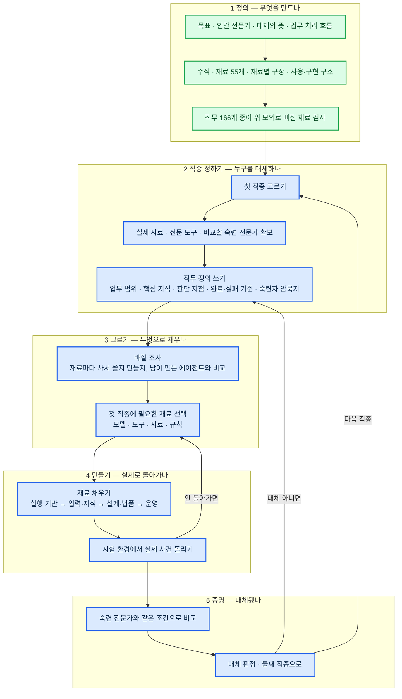

# AI 전문가 에이전트 구축 진행 계획

## 1. 현재 문제

- 지금까지의 전문가 AI 는 필요한 기능과 기술을 그때그때 붙여 가며 만들었음
- 그래서 덕지덕지 붙은 모양이 되었고, 전체적으로 무엇이 필요한지가 안 보임
- 만들고 있는 것이 "20년차 전문가 대체" 라는 목표에 맞는지도 확인할 수 없음
- 그래서 맨 위에서부터 정의 → 설계 → 구축 순서로 단계를 밟아 다시 만듦

## 2. 업무 순서

## 3. 현재 단계

정의 문서 1 의 모든 절이 확정됨 → **1 단계 끝, 2 단계 앞에 있음**

| 단계 | 상태 | 진행 |
|---|---|---:|
| 1 정의 | 목표 · 인간 전문가 · 대체의 뜻 · 업무 처리 흐름 · 수식 · 재료 55개 확정. 직무 166개 종이 모의 끝 | 100% |
| 2 직종 정하기 | 초기 후보만 있음 (세무사 신고·기장) | 0% |
| 3 고르기 | — | 0% |
| 4 만들기 | — | 0% |
| 5 증명 | 평가 기준 문서만 있음 | 10% |

## 4. 일정

| 마감 | 끝낼 것 |
|---|---|
| **9/18(금)** | 2 단계 끝 — 첫 직종 확정, 자료·도구·전문가 확보 가능 여부 확인, 직무 정의 초안 |
| **10/2(금)** | 3 단계 끝 — 바깥 조사·재료 선택 완료. 4 단계 착수 — 실행 기반 연결, 실제 사건 1건 돌려 봄 |
| 10월 이후 | 4 단계 마무리, 5 단계 증명. 날짜는 2 단계에서 확보 결과를 보고 정함 |

9/18 뒤 일할 날은 추석(9/24~27)을 빼면 8일임
