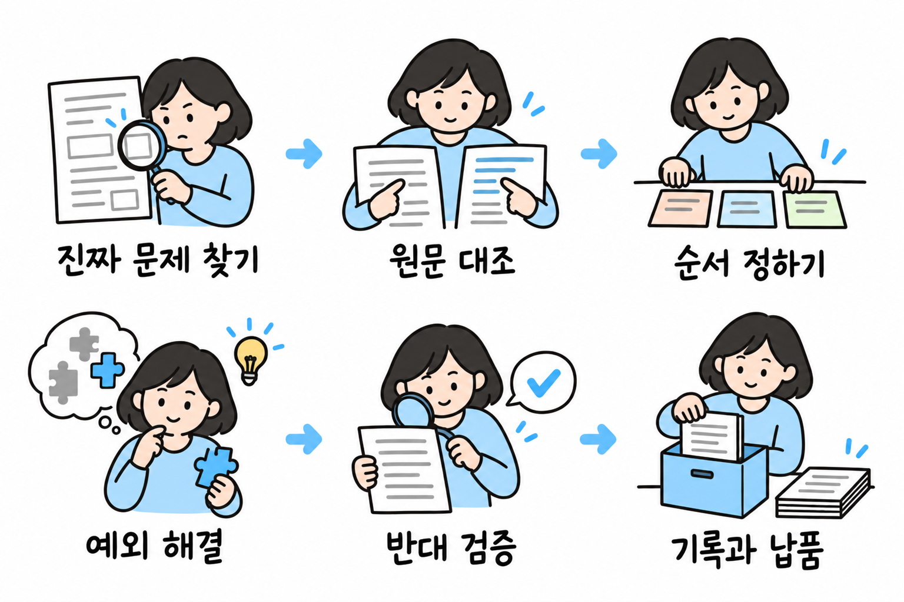

# AI 전문가 에이전트 구축 진행 계획

## 왜 전문가 에이전트가 필요한가

**인간 전문가의 한계**

- 비용이 높음. 표준 요금이 없어 같은 업무도 사무소마다 금액이 다름
- 사람마다 실력 차이가 큼. 사람이 처리해도 틀림 — 미국 회계감사원(GAO) 조사에서 유급 세무 대리인이 작성한 신고서의 60%에 오류가 있었음
- 지역과 시간의 제약이 있음. 전문가가 없는 지역이 많고, 있어도 대기해야 함
- 고령화가 진행 중임. 국내 등록 세무사 14,681명 중 60대 이상이 6,034명(41%), 20대는 100명뿐임 (2022년 3월 기준). 젊은 전문가가 들어오지 않아 앞으로 맡길 전문가 자체가 줄고, 은퇴와 함께 경험도 사라짐

**최신 AI로도 해결되지 않는 것**

- 2026년 9월 OpenAI가 GPT-6 Astra를 공개함. 여러 시간이 걸리는 업무를 사람 개입 없이 수행하며, OpenAI는 AGI 수준이라고까지 말함
- AGI는 특정 분야만이 아니라 사람이 하는 대부분의 지적 업무를 사람 수준으로 해내는 AI를 말함. 그 수준이 되면 분야를 가리지 않고 지식 · 추론 · 장시간 업무 처리를 모델이 해 줌
- 그래서 모델 자체의 한계는 1년 안에 대부분 해소될 것으로 봄. 우리는 20년차 대체라는 목표를 이루는 데 필요한 것 중 모델이 해결해 줄 수 없는 부분에 집중함

| 모델이 해결해 줄 수 없는 것 | 이유 |
|---|---|
| 할루시네이션 | LLM은 다음에 올 말을 확률로 고르는 방식이라, 그럴듯하지만 사실이 아닌 내용을 만들어 냄. 모델이 발전하면 줄지만 확률로 고르는 구조는 그대로라 0이 되지 않음. 전문가 업무는 하나만 틀려도 결과가 뒤집힘 |
| 판단 기준 · 완료 기준 | 그 직종에서 무엇이 완료인지, 무엇을 버리고 무엇을 먼저 하는지는 학습 자료에 없음 |
| 정보가 부족할 때 | 모델은 부족한 정보를 그럴듯한 가정으로 채우고 진행함. 전문가는 부족한 정보를 스스로 찾아 채우고, 찾을 수 없으면 전제를 밝히고 되돌릴 길을 남김. 어떤 정보가 필수이고 어디서 얻는지는 직종마다 정해야 함 |
| 기억 | 모델은 한 번의 대화가 끝나면 잊음. 맡긴 사람의 사정 · 이전 사건 · 진행 중 새로 들어온 정보와 조건을 쌓아 두고 다음에 다시 쓰는 것은 모델 밖의 구조가 함 |
| 개인 최적화 | 같은 직종이라도 맡긴 사람마다 상황 · 선호 · 과거 이력 · 회사 규칙이 다름. 그에 맞춰 일하는 것은 쌓아 둔 기억과 규칙이 함 |
| 검증 · 기록 | 완료 여부를 모델 스스로 판단하게 두면 대체가 아님. 기계가 확인하고 기록하는 장치가 별도로 필요함 |
| 전문 도구 · 외부 연결 | 그 직종이 쓰는 신고 · 조회 · 문서 시스템에 실제로 접속해 조회 · 입력 · 제출하는 연결은 모델 밖에 있음. |
| 숙련자의 경험 요령 | 20년차가 경험으로 익혀 말로 설명하지 않는 요령은 글로 남아 있지 않음. |

이 표가 곧 공통 규칙임. 모델이 바뀌어도 공통 규칙은 더 좋은 모델 위에 그대로 올려 쓸 수 있음

## 달성 목표

**20년차 인간 전문가를 대체할 수 있는 전문 AI 에이전트를 만든다**

- 인간 전문가를 고용하는 대신 전문 AI 에이전트에게 업무를 맡김. 20년차 수준의 전문성과 성과가 있어야 믿고 맡길 수 있음
- 사람은 맡기고 결과만 받음. 중간에 개입하지 않음
- 역할놀이 · 상담 챗봇 · 단순 질의응답 · 검색·요약 수준은 아님

### 왜 20년차인가

여기서 20년차는 나이도 직급도 아니고 **능력 수준에 붙인 이름**임. 재는 항목은 하나임 — 처음 보는 상황을 혼자 판단해 끝까지 처리하는가

- 이 항목이 되어야 맡기고 개입하지 않을 수 있음. 사람이 중간에 확인하고 고쳐 주어야 하면 대체가 아니라 보조임
- 이 능력은 배워서 생기지 않고 겪어야 생김. 처음 보는 상황을 충분히 겪는 데 실무로 20년쯤 걸림. 한국 회사로 치면 45살 안팎, 차장에서 부장 무렵임 — 나이와 직급은 어림잡는 설명일 뿐이고 기준은 능력임
- 그 위로 붙는 것은 더 나은 실무가 아니라 다른 능력임. 조직을 이끌고, 사고를 책임지고, 위험을 나눠 지는 일임. 사람에게는 그것이 성장이지만 우리가 맡기려는 일은 아님. 30년차를 기준으로 삼으면 재지 않을 것을 기준에 넣는 셈임. 30년차인데도 실무가 완숙한 사람이 있다면, 그 사람의 실무 능력이 곧 여기서 말하는 20년차 수준임
- 그 아래는 아직 사람 손이 남음. 아는 범위 안에서는 잘해도 벗어나면 멈춤. 그 수준을 끌어올리는 AI는 이미 많음

그래서 목표는 "20년차와 같은 조건에서 같은 성과"임. 재는 항목이 하나로 정해져 있어 대체 여부를 판정할 수 있음

## 현재 문제

지금까지 만든 전문가 AI는 이 목표에서 출발해 만든 것이 아님

- **기능을 필요할 때마다 덧붙여 만들어 왔음** — 그래서 전체 구조가 없고, 무엇이 더 필요한지 보이지 않음
- **목표에 맞는지 확인할 방법이 없음** — "20년차 전문가 대체"에 얼마나 가까운지 측정할 기준이 없어, 제대로 가고 있는지 알 수 없음
- **시간이 많지 않음** — 만들고 나서 되돌아가는 일을 줄이는 순서로, 한 번에 맞게 진행해야 함
- **틀리면 안 됨** — 전문가를 대체하는 것이므로 산출물이 정교하고 정확해야 함. 설계의 중요한 가정은 시험 환경에서 먼저 확인하고, 실제 납품 전에 오류를 찾아 고치고 검증해야 함

## 업무 수행 철학

위 문제를 되풀이하지 않기 위한 원칙임

- **위에서 아래로** — 기능부터 만들지 않고, 전체를 정의하고 설계한 뒤에 만듦. 그래야 전체 구조가 보이고 무엇이 빠졌는지 알 수 있음
- **목표에서 거꾸로** — "20년차 대체" 판정 기준을 먼저 정하고, 모든 선택은 그 기준에 맞는지로 결정함. 그래야 목표에 맞는지 늘 확인할 수 있음
- **공통을 먼저, 특화는 나중** — 대상 전문가 전체의 업무와 요구를 목록화하고, 공통되는 것을 추려 범용 기반부터 구축한 뒤 직종별 특화를 채움. 이유는 다음 절에 있음
- **필요한 근거를 갖춘 뒤 다음 단계로** — 다음 작업에 필요한 정의·설계·검증 근거가 갖춰졌는지 관문에서 확인함. 자료 확보·섭외·핵심 연결 확인처럼 독립적인 준비는 병행하고, 결함이 나오면 원인이 있는 단계로 돌아가 보완함

## 왜 공통 규칙부터 만드는가

- 전문가는 직종이 달라도 공통 규칙이 있고, 직종마다 특화되는 부분이 있음
  - 공통 규칙은 앞에서 본 "모델이 해결해 줄 수 없는 것"을 어느 직종에나 쓸 수 있게 만든 것임. 재료(에이전트를 이루는 부품 — 모델 · 도구 · 자료 · 규칙 · 기억), 업무 처리 흐름, 검증 기준으로 이루어짐
  - 특화 부분은 그 직종만의 업무 범위 · 핵심 지식 · 판단 기준 · 완료 기준 · 전문 도구 · 숙련자의 경험 요령임
- 직종마다 따로 만들면 직종 수만큼 처음부터 다시 만들어야 함
- 그래서 대상 전문가별 요구를 모두 목록화해 공통부와 특화부를 구분하고, 공통 규칙과 생산 기반을 먼저 만든 뒤 직종별 특화를 채움
- 목표는 특화 에이전트 하나가 아니라, 특화 에이전트를 계속 만들어 내는 공장임

## 전문가 에이전트에게 중요한 것

공통 규칙이 무엇을 담아야 하는지는 20년차 전문가가 어떻게 일하는지에서 나옴. 사실을 틀리지 않는 것(할루시네이션 없음)은 기본일 뿐임. 진짜 중요한 것은 **업무 수행 능력**임. 전문가라면 다음이 되어야 함

- 말한 그대로가 아니라 그 뒤에 있는 진짜 문제를 봄. 있어야 하는데 없는 것과 예외를 먼저 짚음
- 정석이 어디까지 통하는지 알고, 자기가 무엇을 모르는지 앎
- 받은 자료를 그대로 믿지 않음. 틀리기 쉬운 부분을 원문과 대조함
- 실행 전에 결과와 상대의 움직임을 예측함
- 방법·순서·우선순위를 정하고, 하지 않아도 될 일은 제외함
- 정보가 부족해도 결론이 바뀌지 않으면 기다리지 않음. 결론을 바꿀 정보만 골라 확보함
- 되돌릴 수 없는 결정은 구분해 그것만 신중하게 확인함
- 처음 보는 상황에서도 되묻지 않고 원리에서 방법을 찾아 끝까지 처리함
- 받는 사람이 손대지 않고 그대로 쓸 수 있는 수준으로 만듦
- 같은 실수를 되풀이하지 않음. 실패가 생기는 조건을 미리 없앰

이 항목들이 공통 규칙이 채워야 할 능력이고, 마지막 증명 단계에서 20년차와 비교할 기준임

## 업무 순서

| 큰 묶음 | 단계 | 해야 할 일 |
|---|---|---|
| **정의** | ✅ 목표 정의 | 이 프로젝트로 무엇을 왜 만드는지, 어디까지 하면 다 한 것인지 정함 |
| | ✅ 전문가 정의 | 우리가 대신하려는 사람 전문가가 누구이고 어느 수준을 말하는지 정하고, 대상 전문가와 직종별 업무·요구를 목록화함 |
| | ✅ AI 전문가 에이전트 정의 | 만들 대상이 무엇인지, 무엇까지 해내면 그것이라 부를 수 있는지 정함 |
| **설계** | ✅ 업무 처리 흐름 설계 | 전문가가 일을 받아 끝낼 때까지의 흐름을 설계함 |
| | ✅ 구성 개념식 | 전문가가 무엇으로 이루어져 있다고 볼지 식으로 세움 |
| | ✅ 구성 재료 확정 | 식과 전문가별 요구 목록을 대조해 필요한 재료를 뽑고, 각 재료의 주된 책임으로 계통과 경계를 확정함 |
| | ✅ 바깥 대조 | 이미 나와 있는 에이전트와 연구를 조사해 우리 재료 목록과 견줌 |
| | ▶️ 재료별 구상 | 재료마다 무엇을 맡고 무엇을 주고받는지, 다 됐다고 볼 기준은 무엇인지 구상함 |
| | 재료별 기술 구상과 관리 체계 | 재료마다 구현 방법과 자료·코드의 저장·관리 방식을 정함 |
| | 바깥 대조 | 같은 재료를 밖에서는 어떤 기술과 관리 방식으로 만드는지 조사해 우리 방식과 견줌 |
| | 공장 설계 | 재료의 연결과 직종별 교체 자리를 정하고, 특화 입력부터 조립·누락 검사·시험·배포·변경 반영까지 생산 절차를 설계함 |
| | 바깥 대조 | 여러 직종을 찍어내는 밖의 생산 절차를 조사해 우리 공장 설계와 견줌 |
| | 평가 준비 | 직종별 시험 과제·합격 기준·표본·기간·채점 방법과 자원 확보 계획을 정함. 각 시험 전에 실제 자료·도구·계정·비교 전문가·채점자·예산을 확보하고 채점 방법의 신뢰성을 확인함 |
| **개발** | 단일 개발 | 설계한 범용 뼈대를 사내 연동과 분리해 구현하되, 미리 확인한 연결 조건에 맞춰 실제로 돌아가게 만듦 |
| | 단일 테스팅 | 단일 직종의 시험용 입력·설정으로 에이전트 하나의 접수·실행·검증·마무리 경로가 끝까지 연결되는지 시험함 |
| | 복합 개발·테스팅 | 전문가 여럿의 분담·결과 회수·통합을 구현하고, 공유 자료·권한·예산과 실패 복구까지 맞물리는지 시험함 |
| | 사내 시스템 연동·테스팅 | 사내 시스템 연결을 구현하고, 실제 입력·권한·결과 확인·장애 복구가 해당 환경에서 작동하는지 시험함. 실제 기록으로 속도·비용·부하를 재어 최적화함 |
| | 공장 개발 | 특화 입력을 받아 전문가를 조립하고, 누락·충돌 검사·시험·배포·판본 관리를 수행하는 생산 절차를 구현함 |
| | 공장 테스팅 | 서로 다른 직종의 시험용 특화를 같은 절차로 조립함. 누락·충돌 검출, 새 직종 추가·변경·배포, 기존 직종의 회귀 시험을 확인하고 공통부 수정 범위와 추가 작업량·시간을 기록함 |
| **찍어내기** | 만들 전문가 고르기 | 어떤 전문가부터 만들지 기준을 세워 순서를 정함 |
| | 그 직업 뜯어보기 | 앞서 정리한 직종별 요구를 바탕으로 숙련자의 실제 업무를 상세 조사하고, 특화에 필요한 자료·판단 기준·사례·도구를 구체화함 |
| | 특화 채우기 | 뼈대에 그 직업의 지식·규칙·사례를 채우고 필요한 전문 도구 연동과 직무별 검사를 구현함. 실제 제작에서도 공통부 재사용과 추가 작업량을 확인함 |
| | 포장 | 받는 사람이 바로 맡길 수 있는 형태로 묶음 |
| **증명** | 같은 조건으로 겨루기 | 사람 전문가와 같은 조건에서 같은 업무를 시켜 견줌 |
| | 대체 판정 · 다음 전문가 | 대체되었는지 판정하고, 남은 문제를 적고, 다음 전문가로 넘어갈지 정함 |
