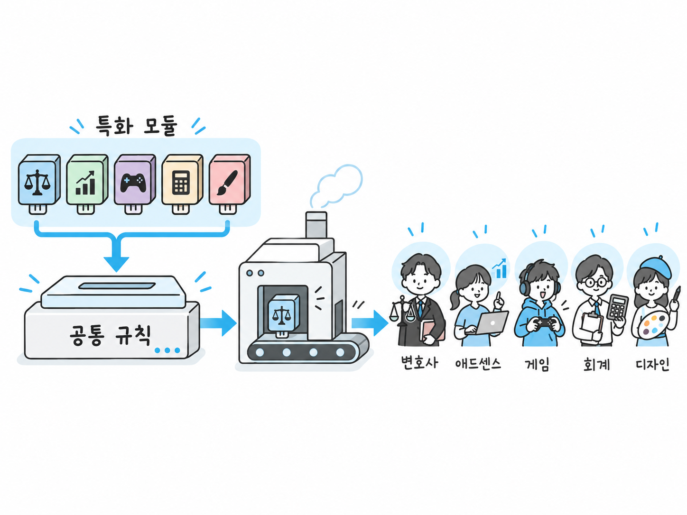
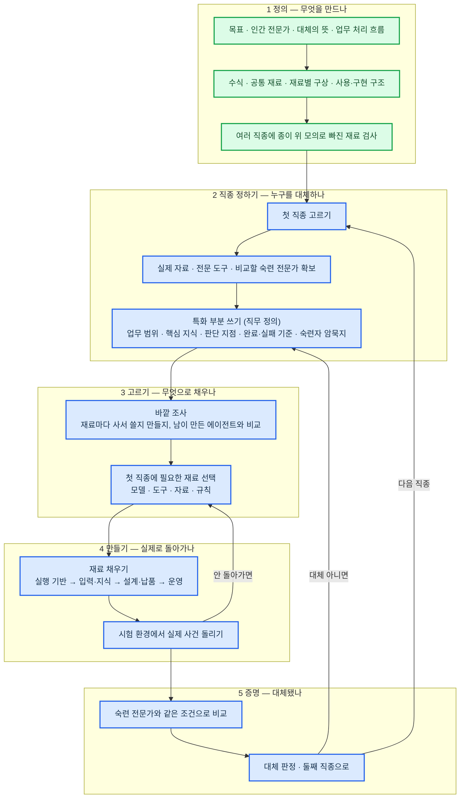

# AI 전문가 에이전트 구축 진행 계획

## 왜 전문가 에이전트가 필요한가

**인간 전문가의 문제**

- 비쌈. 표준 요금이 없어 같은 일도 사무소마다 값이 다름
- 사람마다 실력 차가 큼. 사람이 해도 틀림 — 미국 회계감사원 조사에서 유급 대리인이 만든 신고서의 60%에 오류
- 지역과 시간에 묶임. 전문가가 없는 지역이 많고, 있어도 기다려야 함
- 늙어감. 국내 한 전문직은 60대 이상이 41%, 20대는 1%도 안 됨

**최전선 AI가 있는데도 남는 것**

- 2026년 9월 OpenAI 가 GPT-6 Astra 를 내놓음. 여러 시간짜리 일을 혼자 밀고 가고, AGI 라는 말까지 나옴
- 지식 · 추론 · 긴 일 처리 같은 모델 쪽 한계는 1년 안에 대부분 풀린다고 봄. 그래서 모델이 풀어 줄 것에 기대지 않고, 모델이 아무리 좋아져도 남는 것에 집중함

| 남는 것 | 왜 모델이 좋아져도 안 풀리나 |
|---|---|
| 할루시네이션 | 줄지만 0이 안 됨. 전문가 일은 하나만 틀려도 결과가 뒤집힘. 어디를 무엇과 대조해 확인할지 직종마다 정해 둬야 함 |
| 판단 기준 · 완료 기준 | 이 직종에서 무엇이 "됐다"이고 무엇을 버리고 무엇을 먼저 하는지는 학습 자료에 없음. 20년차 머릿속에만 있음 |
| 묻지 않고 추측함 | 언제 물어야 하고 언제 밀고 가야 하는지는 직종마다 다름. 그 선을 정해 주지 않으면 모델은 추측으로 메움 |
| 중간에 바뀌는 것 | 사건이 진행되며 새로 오는 정보와 제약을 어디에 적고 언제 다시 보게 할지는 모델이 아니라 구조가 정함 |
| 검증 · 기록 | 끝났는지를 모델 스스로 말하게 두면 대체가 아님. 기계가 확인하고 남기는 장치가 따로 있어야 함 |
| 실제 자료 · 전문 도구 | 이 직종이 쓰는 시스템 · 자료 · 서식은 모델 밖에 있음. 연결은 우리가 함 |
| 숙련자 암묵지 | 20년차가 왜 그렇게 하는지는 글로 남아 있지 않음. 뽑아 적는 것은 우리 일임 |

이 표가 곧 공통 규칙임. 모델이 바뀌어도 공통 규칙은 더 좋은 모델 위에 그대로 얹힘

## 달성 목표

**20년차 인간 전문가를 대체할 수 있는 전문 AI 에이전트를 만든다**

- 인간 전문가를 고용하는 대신 전문 AI 에이전트에게 업무를 맡김. 20년차만큼 전문성과 성과가 있어야 믿고 맡길 수 있음
- 사람은 맡기고 결과만 받음. 중간에 손대지 않음
- 역할놀이 · 상담 챗봇 · 단순 질의응답 · 검색·요약 수준은 아님

### 왜 20년차인가

- 맡기고 손을 안 대려면 처음 보는 상황도 스스로 해내야 함. 그게 되는 수준이 20년차임. 초보·8년차와 가장 크게 갈리는 자리임
- 8년차 수준이면 사람이 중간에 확인하고 고쳐 줘야 함. 그건 도우미지 대체가 아님
- 초보를 끌어올리는 AI는 이미 많음. 남은 자리는 20년차를 대체하는 것임
- 기준이 분명해짐. "20년차와 같은 조건에서 같은 성과"로 대체 여부를 잴 수 있음

## 현재 문제

- **기능을 그때그때 덧붙여 만들어 왔음** — 전체 모양이 없어 무엇이 더 필요한지 안 보임
- **목표에 맞는지 확인할 길이 없음** — "20년차 전문가 대체" 에 얼마나 가까운지 잴 기준이 없음
- **시간이 많지 않음** — 되돌아가는 일을 줄이는 순서로, 한 번에 맞게 가야 함
- **틀리면 안 됨** — 전문가를 대체하는 것이라 산출물이 정교하고 정확해야 함. 요구 수준이 높음

## 업무 수행 철학

- **위에서 아래로** — 기능부터 붙이지 않음. 전체를 정의하고 설계한 뒤에 만듦
- **목표에서 거꾸로** — "20년차 대체" 판정 기준을 먼저 정하고, 모든 선택은 그 기준에 걸리는지로 정함
- **공통을 먼저, 특화는 나중** — 공통 규칙을 만들고 직종마다 특화만 갈아 끼움
- **관문을 넘은 것만 다음으로** — 앞 단계가 확정되기 전에 다음 단계를 시작하지 않음

## 왜 공통 규칙부터 만드는가

- 전문가는 직종이 달라도 공통 규칙이 있고, 직종마다 특화로 갈리는 부분이 있음
- 직종마다 따로 만들면 직종 수만큼 처음부터 다시 만들어야 함
- 그래서 공통 규칙을 먼저 만들고, 직종마다 특화 부분만 갈아 끼움
- 목표는 특화 에이전트 하나가 아니라, 특화 에이전트를 찍어내는 공장임

## 전문가 에이전트에게 중요한 것

사실을 안 틀리는 것(할루시네이션 없음)은 기본일 뿐임. 진짜 중요한 것은 **업무 수행 능력**임. 전문가라면 이래야 함

- 말한 그대로가 아니라 말 뒤의 진짜 문제를 봄. 있어야 하는데 없는 것과 예외를 먼저 짚음
- 정석이 어디까지 통하는지 알고, 자기가 무엇을 모르는지 앎
- 받은 자료를 그대로 믿지 않음. 틀리기 쉬운 곳을 원문과 대조함
- 하기 전에 결과와 상대의 움직임을 예측함
- 방법·순서·우선순위를 고르고, 안 해도 될 일은 버림
- 정보가 모자라도 결론이 안 바뀌면 기다리지 않음. 결론을 바꿀 정보만 골라 얻음
- 되돌릴 수 없는 결정은 알아보고 그것만 느리게 확인함
- 처음 보는 상황에서도 되묻지 않고 원리로 길을 만들어 끝까지 해냄
- 받는 사람이 손대지 않고 그대로 쓸 수준으로 만듦
- 자기 결론을 반대편에 서서 공격해 검증함. 멈출 때를 앎
- 같은 실수를 되풀이하지 않음. 실패가 나는 조건을 미리 없앰
- 사람은 다섯 경우에만 부름. 그때도 준비·기록·검증은 다 끝내고 결정만 받음
- 단계마다 끝났는지 사람이 아니라 기계가 확인하고 기록을 남김

## 업무 순서

## 검증은 어떻게

| 무엇을 | 어떻게 | 상태 |
|---|---|---|
| 정의가 맞는가 | 여러 직종에 사건 변화를 넣어 종이 위로 돌려 보고 빠진 재료·순서를 찾음 | 끝남 |
| 실제로 돌아가는가 | 시험 환경에서 실제 사건을 돌리고, 단계마다 미리 정한 완료 조건을 사람이 아니라 기계가 확인하고 기록함 | 만들기 뒤 |
| 대체됐는가 | 숙련 전문가와 같은 입력·자료·권한·기한으로 같은 일을 시키고 결과·성과를 비교함. 사람이 중간에 손댄 횟수를 원인별로 셈 | 증명 단계 |

- 처음 보는 문제를 푸는지 보려고 평가 자료는 봉인해 두고 개발에 쓰지 않음
- 정답이 갈리는 일도 빼지 않음. 허용되는 결론·전제·반대 근거·치명적 누락으로 채점함
- 서류가 깔끔하다, 규정을 지켰다만으로는 합격이 아님. 실제 성과로 판정함

## 현재 단계

정의 문서 1 의 모든 절이 확정됨 → **1 단계 끝, 2 단계 앞에 있음**

| 단계 | 상태 | 진행 |
|---|---|---:|
| 1 정의 | 목표 · 인간 전문가 · 대체의 뜻 · 업무 처리 흐름 · 수식 · 공통 재료 확정. 여러 직종 종이 모의 끝 | 100% |
| 2 직종 정하기 | 후보만 있음, 확정 전 | 0% |
| 3 고르기 | — | 0% |
| 4 만들기 | — | 0% |
| 5 증명 | 평가 기준 문서만 있음 | 10% |

## 일정

| 마감 | 끝낼 것 |
|---|---|
| **9/18(금)** | 2 단계 끝 — 첫 직종 확정, 자료·도구·전문가 확보 가능 여부 확인, 직무 정의 초안 |
| **10/2(금)** | 3 단계 끝 — 바깥 조사·재료 선택 완료. 4 단계 착수 — 실행 기반 연결, 실제 사건을 돌려 봄 |
| 10월 이후 | 4 단계 마무리, 5 단계 증명. 날짜는 2 단계에서 확보 결과를 보고 정함 |

9/18 뒤 일할 날은 추석(9/24~27)을 빼면 8일임
