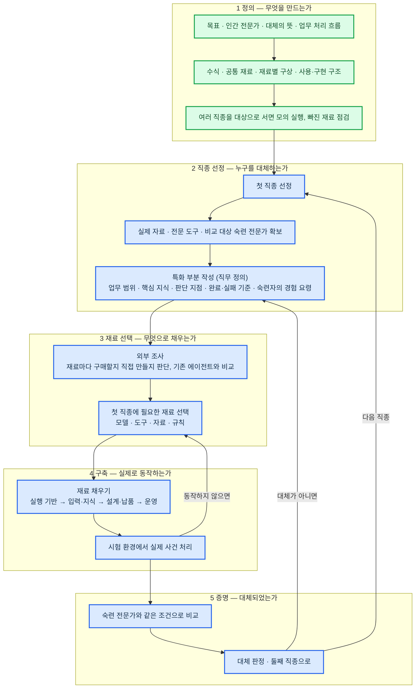

# AI 전문가 에이전트 구축 진행 계획

## 왜 전문가 에이전트가 필요한가

**인간 전문가의 한계**

- 비용이 높음. 표준 요금이 없어 같은 업무도 사무소마다 금액이 다름
- 사람마다 실력 차이가 큼. 사람이 처리해도 틀림 — 미국 회계감사원(GAO) 조사에서 유급 세무 대리인이 작성한 신고서의 60%에 오류가 있었음
- 지역과 시간의 제약이 있음. 전문가가 없는 지역이 많고, 있어도 대기해야 함
- 고령화가 진행 중임. 국내 등록 세무사 14,681명 중 60대 이상이 6,034명(41%), 20대는 100명뿐임 (2022년 3월 기준). 젊은 전문가가 들어오지 않아 앞으로 맡길 전문가 자체가 줄고, 은퇴와 함께 경험도 사라짐

**최신 AI로도 해결되지 않는 것**

- 2026년 9월 OpenAI가 GPT-6 Astra를 공개함. 여러 시간이 걸리는 업무를 사람 개입 없이 수행하며, OpenAI는 AGI 수준이라고까지 말함
- AGI는 특정 분야만이 아니라 사람이 하는 대부분의 지적 업무를 사람 수준으로 해내는 AI를 말함. 그 수준이 되면 분야를 가리지 않고 지식 · 추론 · 장시간 업무 처리를 모델이 해 줌
- 그래서 모델 자체의 한계는 1년 안에 대부분 해소될 것으로 봄. 우리는 20년차 대체라는 목표를 이루는 데 필요한 것 중 모델이 해결해 줄 수 없는 부분에 집중함

| 모델이 해결해 줄 수 없는 것 | 이유 |
|---|---|
| 할루시네이션 | LLM은 다음에 올 말을 확률로 고르는 방식이라, 그럴듯하지만 사실이 아닌 내용을 만들어 냄. 모델이 발전하면 줄지만 확률로 고르는 구조는 그대로라 0이 되지 않음. 전문가 업무는 하나만 틀려도 결과가 뒤집힘 |
| 판단 기준 · 완료 기준 | 그 직종에서 무엇이 완료인지, 무엇을 버리고 무엇을 먼저 하는지는 학습 자료에 없음 |
| 정보가 부족할 때 | 모델은 부족한 정보를 그럴듯한 가정으로 채우고 진행함. 전문가는 부족한 정보를 스스로 찾아 채우고, 찾을 수 없으면 전제를 밝히고 되돌릴 길을 남김. 어떤 정보가 필수이고 어디서 얻는지는 직종마다 정해야 함 |
| 기억 | 모델은 한 번의 대화가 끝나면 잊음. 맡긴 사람의 사정 · 이전 사건 · 진행 중 새로 들어온 정보와 조건을 쌓아 두고 다음에 다시 쓰는 것은 모델 밖의 구조가 함 |
| 개인 최적화 | 같은 직종이라도 맡긴 사람마다 상황 · 선호 · 과거 이력 · 회사 규칙이 다름. 그에 맞춰 일하는 것은 쌓아 둔 기억과 규칙이 함 |
| 검증 · 기록 | 완료 여부를 모델 스스로 판단하게 두면 대체가 아님. 기계가 확인하고 기록하는 장치가 별도로 필요함 |
| 전문 도구 · 외부 연결 | 그 직종이 쓰는 신고 · 조회 · 문서 시스템에 실제로 접속해 조회 · 입력 · 제출하는 연결은 모델 밖에 있음. 우리가 연결해야 함 |
| 숙련자의 경험 요령 | 20년차가 경험으로 익혀 말로 설명하지 않는 요령은 글로 남아 있지 않음. 끌어내어 기록하는 것은 우리 몫임 |

이 표가 곧 공통 규칙임. 모델이 바뀌어도 공통 규칙은 더 좋은 모델 위에 그대로 올려 쓸 수 있음

## 달성 목표

**20년차 인간 전문가를 대체할 수 있는 전문 AI 에이전트를 만든다**

- 인간 전문가를 고용하는 대신 전문 AI 에이전트에게 업무를 맡김. 20년차 수준의 전문성과 성과가 있어야 믿고 맡길 수 있음
- 사람은 맡기고 결과만 받음. 중간에 개입하지 않음
- 역할놀이 · 상담 챗봇 · 단순 질의응답 · 검색·요약 수준은 아님

### 왜 20년차인가

- 맡기고 개입하지 않으려면 처음 보는 상황도 스스로 처리해야 함. 그것이 가능한 수준이 20년차임. 초보·8년차와 가장 크게 갈리는 지점임
- 8년차 수준이면 사람이 중간에 확인하고 고쳐 주어야 함. 그것은 보조이지 대체가 아님
- 초보의 수준을 끌어올리는 AI는 이미 많음. 남은 자리는 20년차 대체임
- 기준이 분명해짐. "20년차와 같은 조건에서 같은 성과"로 대체 여부를 측정할 수 있음

## 현재 문제

- **기능을 필요할 때마다 덧붙여 만들어 왔음** — 전체 구조가 없어 무엇이 더 필요한지 보이지 않음
- **목표에 맞는지 확인할 방법이 없음** — "20년차 전문가 대체"에 얼마나 가까운지 측정할 기준이 없음
- **시간이 많지 않음** — 되돌아가는 일을 줄이는 순서로, 한 번에 맞게 진행해야 함
- **틀리면 안 됨** — 전문가를 대체하는 것이므로 산출물이 정교하고 정확해야 함. 요구 수준이 높음

## 업무 수행 철학

- **위에서 아래로** — 기능부터 만들지 않음. 전체를 정의하고 설계한 뒤에 만듦
- **목표에서 거꾸로** — "20년차 대체" 판정 기준을 먼저 정하고, 모든 선택은 그 기준에 맞는지로 결정함
- **공통을 먼저, 특화는 나중** — 공통 규칙을 만들고 직종마다 특화 부분만 교체함
- **확정된 것만 다음 단계로** — 앞 단계가 확정되기 전에 다음 단계를 시작하지 않음

## 왜 공통 규칙부터 만드는가

- 전문가는 직종이 달라도 공통 규칙이 있고, 직종마다 특화되는 부분이 있음
- 직종마다 따로 만들면 직종 수만큼 처음부터 다시 만들어야 함
- 그래서 공통 규칙을 먼저 만들고, 직종마다 특화 부분만 교체함
- 목표는 특화 에이전트 하나가 아니라, 특화 에이전트를 계속 만들어 내는 공장임

## 전문가 에이전트에게 중요한 것

사실을 틀리지 않는 것(할루시네이션 없음)은 기본일 뿐임. 진짜 중요한 것은 **업무 수행 능력**임. 전문가라면 다음이 되어야 함

- 말한 그대로가 아니라 그 뒤에 있는 진짜 문제를 봄. 있어야 하는데 없는 것과 예외를 먼저 짚음
- 정석이 어디까지 통하는지 알고, 자기가 무엇을 모르는지 앎
- 받은 자료를 그대로 믿지 않음. 틀리기 쉬운 부분을 원문과 대조함
- 실행 전에 결과와 상대의 움직임을 예측함
- 방법·순서·우선순위를 정하고, 하지 않아도 될 일은 제외함
- 정보가 부족해도 결론이 바뀌지 않으면 기다리지 않음. 결론을 바꿀 정보만 골라 확보함
- 되돌릴 수 없는 결정은 구분해 그것만 신중하게 확인함
- 처음 보는 상황에서도 되묻지 않고 원리에서 방법을 찾아 끝까지 처리함
- 받는 사람이 손대지 않고 그대로 쓸 수 있는 수준으로 만듦
- 자기 결론을 반대 입장에서 공격해 검증함. 멈출 때를 앎
- 같은 실수를 되풀이하지 않음. 실패가 생기는 조건을 미리 없앰
- 사람은 다섯 경우에만 부름 — 되돌릴 수 없는 행동 · 승인 조건 · 판단이 서지 않는 것 · 한도 초과 · 자격자 전속 행위. 그때도 준비·기록·검증은 다 마친 뒤 결정만 받음
- 단계마다 완료 여부를 사람이 아니라 기계가 확인하고 기록을 남김

## 업무 순서

## 검증 방법

| 무엇을 | 어떻게 | 시점 |
|---|---|---|
| 정의가 맞는가 | 여러 직종에 사건 변화를 넣어 서면으로 모의 실행하고 빠진 재료·순서를 찾음 | 완료 |
| 실제로 동작하는가 | 시험 환경에서 실제 사건을 처리하고, 단계마다 미리 정한 완료 조건을 사람이 아니라 기계가 확인하고 기록함 | 구축 뒤 |
| 대체되었는가 | 숙련 전문가와 같은 입력·자료·권한·기한으로 같은 업무를 맡기고 결과·성과를 비교함. 사람이 중간에 개입한 횟수를 원인별로 셈 | 증명 단계 |

- 처음 보는 문제를 푸는지 보기 위해 평가 자료는 봉인해 두고 개발에 쓰지 않음
- 정답이 갈리는 업무도 제외하지 않음. 허용되는 결론·전제·반대 근거·치명적 누락으로 채점함
- 서류가 정돈되어 있다, 규정을 지켰다는 것만으로는 합격이 아님. 실제 성과로 판정함

## 현재 단계

정의 문서 1의 모든 절이 확정됨 → **1단계 완료, 2단계 착수 전**

| 단계 | 상태 | 진행 |
|---|---|---:|
| 1 정의 | 목표 · 인간 전문가 · 대체의 뜻 · 업무 처리 흐름 · 수식 · 공통 재료 확정. 여러 직종 서면 모의 실행 완료 | 100% |
| 2 직종 선정 | 후보만 있음, 확정 전 | 0% |
| 3 재료 선택 | — | 0% |
| 4 구축 | — | 0% |
| 5 증명 | 평가 기준 문서만 있음 | 10% |

## 일정

| 기한 | 완료할 것 |
|---|---|
| **9/18(금)** | 2단계 완료 — 첫 직종 확정, 자료·도구·전문가 확보 가능 여부 확인, 특화 부분(직무 정의) 초안 |
| **10/2(금)** | 3단계 완료 — 외부 조사·재료 선택 완료. 4단계 착수 — 실행 기반 연결, 실제 사건 시험 처리 |
| 10월 이후 | 4단계 마무리, 5단계 증명. 날짜는 2단계의 확보 결과를 보고 정함 |

9/18 이후 근무일은 추석(9/24~27)을 제외하면 8일임
