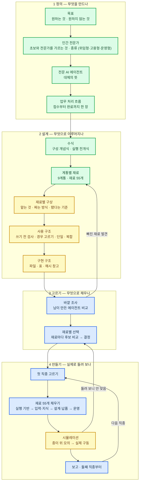

# AI 전문가 에이전트 만드는 흐름

```mermaid
%%{init: {"flowchart": {"wrappingWidth": 640, "curve": "basis", "nodeSpacing": 45, "rankSpacing": 55, "padding": 14, "useMaxWidth": true}, "themeVariables": {"fontSize": "15px"}} }%%
flowchart TB
    subgraph P1["1 정의 — 무엇을 만드나"]
        direction TB
        A1["목표<br/>원하는 것 · 원하지 않는 것"]:::done
        A2["인간 전문가<br/>초보와 전문가를 가르는 것 · 종류 (위임형·고용형·운영형)"]:::done
        A3["전문 AI 에이전트<br/>대체의 뜻"]:::done
        A4["업무 처리 흐름<br/>접수부터 완료까지 한 장"]:::done
        A1 --> A2 --> A3 --> A4
    end
    subgraph P2["2 설계 — 무엇으로 이루어지나"]
        direction TB
        B1["수식<br/>구성 개념식 · 실행 전개식"]:::done
        B2["계통별 재료<br/>9계통 · 재료 55개"]:::done
        B3["재료별 구상<br/>맡는 것 · 짜는 방식 · 됐다는 기준"]:::half
        B4["사용 구조<br/>쓰기 전 검사 · 경우 고르기 · 단일 · 복합"]:::half
        B5["구현 구조<br/>파일 · 표 · 해시 창고"]:::half
        B1 --> B2 --> B3 --> B4 --> B5
    end
    subgraph P3["3 고르기 — 무엇으로 채우나"]
        direction TB
        C1["바깥 조사<br/>남이 만든 에이전트 비교"]:::todo
        C2["재료별 선택<br/>재료마다 후보 비교 → 결정"]:::todo
        C1 --> C2
    end
    subgraph P4["4 만들기 — 실제로 돌려 보나"]
        direction TB
        D1["첫 직종 고르기"]:::todo
        D2["재료 55개 채우기<br/>실행 기반 → 입력·지식 → 설계·납품 → 운영"]:::todo
        D3["시뮬레이션<br/>종이 위 모의 → 실제 구동"]:::half
        D4["보고 · 둘째 직종부터"]:::todo
        D1 --> D2 --> D3 --> D4
    end
    A4 --> B1
    B5 --> C1
    C2 --> D1
    C1 -- "빠진 재료 발견" --> B2
    D3 -- "돌려 보니 안 맞음" --> C2
    D4 -- "다음 직종" --> D1
    classDef done fill:#dcfce7,stroke:#16a34a,stroke-width:2px,color:#14532d
    classDef half fill:#fef9c3,stroke:#ca8a04,stroke-width:2px,color:#713f12
    classDef todo fill:#dbeafe,stroke:#2563eb,stroke-width:2px,color:#17314f
```

초록 끝남 · 노랑 하는 중 · 파랑 앞으로
