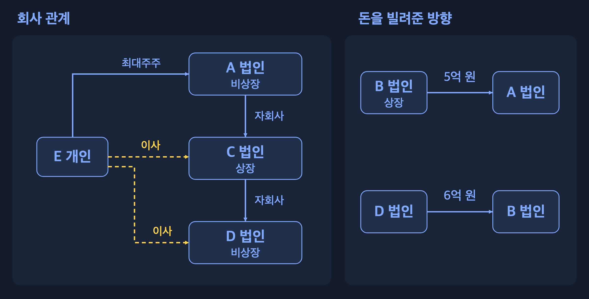

# 법인 간 대여와 E의 책임

## 결론

<strong>본건 대여 및 E의 주주·이사 지위만으로 E의 법률 위반을 인정하기는 어렵다.</strong> 법인 간 금전소비대차나 계열회사 이사 겸직 자체가 일률적으로 금지되는 것은 아니다.

다만 <strong>E가 A 등 제3자의 이익을 도모할 목적으로 D에 대한 임무를 위배하여 대여를 실행하고, 그로 인한 D의 재산상 손해 또는 구체적·현실적 손해발생 위험을 인식·용인하였다면 업무상배임죄가 성립할 수 있다.</strong> 고의가 인정되지 않더라도 주의의무·감시의무 위반과 손해 사이의 인과관계가 인정되면 손해배상책임을 부담한다. 자기거래 승인, 상장회사 신용공여 제한, 조세 및 공시의무 위반 여부는 각 구성요건에 따라 별도로 판단하여야 한다.

<strong>금전소비대차</strong>는 돈을 빌리고 같은 금액을 갚기로 하는 계약입니다. 회사끼리 이런 계약을 했거나 E가 여러 회사와 관계를 맺고 있다는 사실만으로 처벌할 수는 없습니다. E가 D의 이익을 지켜야 할 자리에서 어떤 판단을 했는지가 중요합니다. <strong>범죄로 처벌할 것인지와 D의 손해를 물어줘야 하는지는 다른 문제</strong>입니다.

## 1. 사건 정리

주주는 주식을 가진 회사의 주인이고, 최대주주는 그중 주식을 가장 많이 가진 사람입니다. 이사는 회사 운영의 중요한 일을 결정하고 책임지는 사람입니다. <strong>주주가 가진 것은 주식이지 회사 통장의 돈이 아닙니다.</strong> 그래서 E는 A가 잘되기를 바라면서도, D의 이사 자리에서는 D의 돈을 지켜야 합니다.

상장은 회사 주식을 거래소의 공식 시장에서 사고팔 수 있게 하는 것입니다. 다른 회사를 지배하는 쪽을 모회사, 지배받는 쪽을 자회사라고 합니다. 같은 그룹에 속해도 회사마다 재산의 주인이 다르므로, 한 회사의 돈을 다른 회사가 마음대로 가져다 쓸 수는 없습니다.

## 2. 쟁점별 결론

<table style="color: #82AAFF;"><thead><tr><th style="color: #82AAFF;">쟁점</th><th style="color: #82AAFF;">쟁점별 판단</th></tr></thead><tbody>
<tr><td style="color: #82AAFF;">① E의 배임죄</td><td style="color: #82AAFF;"><strong>E의 지위와 대여 사실만으로는 성립을 인정할 수 없다.</strong> B의 변제능력, 임무위배행위, 이익취득, D의 손해 및 E의 고의를 판단하여야 한다.</td></tr>
<tr><td style="color: #82AAFF;">② 거래 승인·계약 효력</td><td style="color: #82AAFF;"><strong>상법 제398조의 이해상반 거래에 해당하면 중요사실의 사전 공개 및 승인을 요한다.</strong> 제393조에 따른 결의 요부는 각 법인별로 판단한다.</td></tr>
<tr><td style="color: #82AAFF;">③ 상장회사의 자금지원 제한</td><td style="color: #82AAFF;"><strong>비상장 D에는 상법 제542조의9가 직접 적용되지 않는다.</strong> B를 기준으로 한 금지 상대방 해당성 및 C 자신의 신용공여 여부는 별도로 심사한다.</td></tr>
<tr><td style="color: #82AAFF;">④ E의 손해배상</td><td style="color: #82AAFF;"><strong>형사책임이 부정되어도 과실에 기한 손해배상책임이 성립할 수 있다.</strong> 의무 위반·손해·인과관계의 인정이 필요하다.</td></tr>
<tr><td style="color: #82AAFF;">⑤ 회사 세금·E 개인 세금</td><td style="color: #82AAFF;"><strong>차입원금 및 B의 현금 차액 1억 원 자체는 익금으로 볼 수 없다.</strong> 저리 대여, 사외유출, 특정법인 이익 제공 등은 별도의 과세요건에 따라 판단한다.</td></tr>
<tr><td style="color: #82AAFF;">⑥ 공시·회계</td><td style="color: #82AAFF;"><strong>B의 공시의무는 시장별 규모 기준 등에 따른다.</strong> C의 의무는 지주회사 해당성 및 자회사·종속회사 관련 공시사유에 따른다. 대여금의 회수가능성을 회계에 반영하여야 한다.</td></tr>
<tr><td style="color: #82AAFF;">⑦ 부당지원·기업집단 규제</td><td style="color: #82AAFF;"><strong>계열관계·대여액만으로 위반을 인정할 수 없다.</strong> 지원의 유리성·부당성 및 기업집단별 규제 요건을 심사하여야 한다.</td></tr>
<tr><td style="color: #82AAFF;">⑧ 겸직 등 추가 문제</td><td style="color: #82AAFF;"><strong>일반 이사 겸직과 독립이사 결격사유를 구별하여야 한다.</strong> 경업·회사기회 유용·무등록 대부업·미공개중요정보 이용은 개별 요건에 따라 판단한다.</td></tr>
</tbody></table>

## 3. 쟁점별 설명

### ① E는 언제 배임죄로 처벌받는가

<a href="https://www.law.go.kr/LSW//lsSideInfoP.do?docCls=jo&amp;joBrNo=00&amp;joNo=0355&amp;lsiSeq=284025&amp;urlMode=lsScJoRltInfoR" style="color: inherit;">형법 제355조 제2항</a>의 배임죄는 <strong>타인의 사무를 처리하는 자가 그 임무에 위배하는 행위로 재산상 이익을 취득하거나 제3자로 하여금 이를 취득하게 하여 본인에게 재산상 손해를 가한 때</strong> 성립한다. 업무상의 임무에 위배하여 이를 범한 경우 <a href="https://law.go.kr/lsLinkCommonInfo.do?lsJoLnkSeq=1026978703" style="color: inherit;">형법 제356조</a>의 업무상배임죄가 문제 되며, 회사 임원에 대해서는 <a href="https://www.law.go.kr/%EB%B2%95%EB%A0%B9/%EC%83%81%EB%B2%95/%EC%A0%9C622%EC%A1%B0" style="color: inherit;">상법 제622조 제1항</a>의 특별배임죄도 검토한다. E는 D의 이사로서 타인의 사무를 처리하는 지위에 있으나, 그 지위만으로 임무위배행위·이익취득·손해 및 고의가 추인되는 것은 아니다.

<strong>배임은 다른 사람의 돈이나 재산을 맡아 관리하는 사람이, 맡은 일을 저버리고 자신이나 다른 사람에게 이익을 주어 재산의 주인에게 손해를 입히는 범죄입니다.</strong> 단순히 약속을 어기거나 마음을 상하게 한 모든 행동을 뜻하지는 않습니다. 여기서는 E가 D의 돈을 관리할 책임을 맡은 사람이고, 재산의 주인은 D입니다. 법 문장의 ‘타인의 사무를 처리하는 자’는 E, ‘본인’은 D를 가리킵니다. 회사 일을 하면서 저지른 배임이므로 ‘업무상배임’이 문제 되는 것입니다. 상법이 이사 등 회사 임원의 배임을 따로 정한 것이 <strong>특별배임</strong>입니다.

D에게 갚기로 약속한 상대는 B입니다. 따라서 돈을 어디서 마련해 갚을지를 먼저 봅니다. A가 어렵다는 사실과 D의 돈까지 위험해졌다는 사실은 같지 않습니다.

예를 들어 대여 전에 “B는 이미 빚이 많아 6억 원을 갚기 어렵다”는 보고가 올라왔다고 합시다. E가 그 내용을 알고도 “A를 도와야 하니 그냥 빌려줘라”라고 지시하고, 돈을 되찾을 대책도 마련하지 않았다면 D의 이익보다 A의 이익을 앞세운 행동입니다. E가 자기 계좌로 돈을 받지 않았어도 배임이 될 수 있습니다. 법은 <strong>자신뿐 아니라 다른 회사에 부당한 이익을 준 경우</strong>도 다루기 때문입니다.

<a href="https://www.law.go.kr/LSW/precInfoP.do?precSeq=67148" style="color: inherit;">대법원 2003. 10. 10. 선고 2003도3516</a> 판결은 회사의 이사 등이 채무자의 변제능력 상실과 손해발생을 인식하면서 자금을 대여하거나, 상당하고 합리적인 채권회수조치 없이 만연히 대여한 경우의 업무상배임 성립을 판시하였다. 본건에서는 대여 당시 B의 변제능력, 회수조치의 상당성 및 E의 인식을 심리하여야 한다. 금융기관에 관한 대출심사상 주의의무를 일반회사 D에 동일하게 적용할 수는 없다.

<strong>임무위배</strong>는 맡은 일에서 지켜야 할 의무를 어기는 것이고, <strong>고의</strong>는 그 행동과 손해 위험을 알면서도 하거나 받아들이는 것을 말합니다. E가 B의 위험한 사정을 알고 D를 희생시켰는지가 중요합니다. 반대로 당시에는 갚을 근거가 충분했는데 예상하지 못한 사고로 돈을 못 받았다면, 그 결과만으로 E가 범죄를 저질렀다고 할 수는 없습니다. 다만 잘못된 대여로 돈을 잃을 구체적인 위험이 생겼다면, 실제로 돈을 전부 잃을 때까지 기다려야 배임이 되는 것은 아닙니다.

#### “그룹 전체를 위해서였다”는 설명이 통하는가

계열회사 지원의 경영상 필요성만으로 지원회사의 희생이 정당화되는 것은 아니다. <strong>지원으로 인한 D 자신의 이익과 손해발생 위험을 종합적으로 비교하여야 한다.</strong> <a href="https://lx.scourt.go.kr/search/detail/precedent/0/2244601" style="color: inherit;">대법원 2017. 11. 9. 선고 2015도12633</a> 판결은 지원회사의 이익, 자금 여력, 의사결정 절차 및 보상 가능성 등을 고려하여 통합구매 관련 유죄 부분을 파기환송하였다.

여러 회사가 같은 그룹에 속해도 D는 자기 재산을 가진 별도 회사입니다. 가령 A가 문을 닫으면 D도 중요한 거래처를 잃는다면, A를 도와 D의 매출을 지키려는 이유는 있을 수 있습니다. 그래도 D가 지킬 이익과 잃을 수 있는 돈, 더 적은 비용으로 해결할 방법을 비교해야 합니다. 위 판결의 <strong>파기환송</strong>은 앞선 판결의 해당 부분을 깨고 다시 재판하도록 돌려보냈다는 뜻이며, 모든 계열회사 지원을 허용했다는 뜻은 아닙니다.

#### 6억 원을 빌려줬으니 배임액도 6억 원인가

<a href="https://www.law.go.kr/LSW/precInfoP.do?evtNo=2000%EB%8F%8428" style="color: inherit;">대법원 2000. 3. 24. 선고 2000도28</a> 판결에 따르면 부실대출 배임의 재산상 손해 및 제3자의 이득액은 사후 미회수 잔액에 한정되지 않고 대출금 전액으로 평가될 수 있다. <strong>이득액이 5억 원 이상 50억 원 미만인 경우 특정경제범죄 가중처벌 등에 관한 법률 제3조 제1항 제2호의 가중처벌 대상이 된다.</strong> 담보·상환액의 존재만으로 이득액에서 이를 기계적으로 공제할 수 없으며, 원금 회수위험 없이 부당한 이자 감면만 문제 되는 사안과는 구별하여야 한다.

<strong>이득액</strong>은 범행으로 자신이나 다른 사람이 얻은 재산상 이익을 돈으로 계산한 것입니다. “6억 원 중 2억 원을 나중에 돌려받았으니 범죄 금액은 4억 원”이라고 자동으로 줄일 수는 없습니다. 처음부터 돈을 되찾을 만한 근거가 있었는지, 부실한 대여로 돈 전체를 위험에 빠뜨렸는지를 먼저 판단하기 때문입니다. <strong>원금</strong>은 처음 빌려준 돈이고, <strong>담보</strong>는 못 갚을 때 처분하여 돈을 받을 수 있도록 잡아 두는 재산입니다. 담보가 있다는 이유만으로 그 금액을 원금에서 바로 빼는 것도 맞지 않습니다. 다만 원금은 안전하고 이자만 부당하게 깎아준 거래라면 덜 받은 이자 등으로 이익을 계산하는 문제가 됩니다.

처벌 수위와 범죄를 입증하는 기준

<table style="color: #82AAFF;"><thead><tr><th style="color: #82AAFF;">규정</th><th style="color: #82AAFF;">처벌·판단 기준</th></tr></thead><tbody>
<tr><td style="color: #82AAFF;">형법 제355조 · 단순배임</td><td style="color: #82AAFF;">5년 이하의 징역 또는 1,500만 원 이하의 벌금.</td></tr>
<tr><td style="color: #82AAFF;">형법 제356조·상법 제622조 제1항</td><td style="color: #82AAFF;">각각 10년 이하의 징역 또는 3,000만 원 이하의 벌금.</td></tr>
<tr><td style="color: #82AAFF;"><a href="https://www.law.go.kr/LSW//lsSideInfoP.do?docCls=jo&amp;joBrNo=00&amp;joNo=0003&amp;lsiSeq=199773&amp;urlMode=lsScJoRltInfoR" style="color: inherit;">특정경제범죄 가중처벌 등에 관한 법률 제3조 제1항 제2호·제2항</a></td><td style="color: #82AAFF;">이득액 5억 원 이상 50억 원 미만: 3년 이상의 유기징역. 이득액 이하에 상당하는 벌금을 병과할 수 있다.</td></tr>
<tr><td style="color: #82AAFF;"><a href="https://www.law.go.kr/LSW/lsInfoP.do?lsiSeq=281865&amp;efYd=20260701&amp;ancYnChk=0" style="color: inherit;">형사소송법 제307조 제2항</a>·제325조</td><td style="color: #82AAFF;">범죄사실은 합리적인 의심이 없는 정도로 증명되어야 한다. 범죄의 증명이 없는 때에는 무죄를 선고하여야 한다.</td></tr>
<tr><td style="color: #82AAFF;">사후 변제</td><td style="color: #82AAFF;">기수에 이른 배임죄의 성립에는 영향이 없으나, 피해 회복 및 양형에 반영될 수 있다.</td></tr>
<tr><td style="color: #82AAFF;">복수 거래의 이득액 산정</td><td style="color: #82AAFF;">피해 법인, 포괄일죄 여부, 이득의 중복 및 E의 공모 범위를 구별하여 이득액을 산정하여야 한다.</td></tr>
</tbody></table>

<strong>기수</strong>는 범죄의 요건을 갖춘 행위가 완성된 상태이고, <strong>양형</strong>은 형벌의 종류와 정도를 정하는 일입니다. 나중에 돈을 갚아도 이미 성립한 범죄가 사라지지는 않지만 형을 정할 때 고려될 수 있습니다. <strong>포괄일죄</strong>는 여러 행위를 법적으로 하나의 범죄로 묶어 평가하는 경우입니다. 그래서 두 대여를 아무 판단 없이 더해 11억 원의 배임이라고 할 수는 없습니다. <strong>병과</strong>는 징역과 벌금을 함께 부과할 수 있다는 뜻입니다.

E가 대여계약 체결·송금의 직접 실행자가 아니더라도 공모공동정범·교사범·방조범의 요건을 충족하면 형사책임을 부담할 수 있다. <a href="https://www.law.go.kr/%EB%B2%95%EB%A0%B9/%ED%98%95%EB%B2%95/%EC%A0%9C30%EC%A1%B0" style="color: inherit;">형법 제30조</a>·<a href="https://www.law.go.kr/법령/형법/제31조" style="color: inherit;">제31조</a>·<a href="https://www.law.go.kr/법령/형법/제32조" style="color: inherit;">제32조</a> 및 신분범의 공범에 관한 <a href="https://www.law.go.kr/%EB%B2%95%EB%A0%B9/%ED%98%95%EB%B2%95/%EC%A0%9C33%EC%A1%B0" style="color: inherit;">제33조</a>가 적용된다. 주주 지위 또는 보고 수령 사실만으로 공모관계가 인정되는 것은 아니다.

<strong>공모</strong>는 범행을 함께 하기로 뜻을 모으는 것이고, <strong>공동정범</strong>은 역할을 나누어 범죄를 함께 실행하는 사람들입니다. <strong>교사</strong>는 다른 사람이 범죄를 저지르도록 시키는 것, <strong>방조</strong>는 범행을 도와주는 것입니다. D의 이사처럼 특정한 지위가 있어야 직접 범할 수 있는 범죄를 <strong>신분범</strong>이라고 합니다. 그런 지위가 없는 사람도 가담 방식에 따라 처벌될 수 있어, E가 직접 서명했는지만 보고 책임을 정할 수는 없습니다.

대여를 가장하여 보관 중인 회사자금을 불법영득한 경우 형법 제355조 제1항·제356조의 횡령죄, 변제능력·의사 등에 관한 기망으로 자금 교부를 받은 경우 <a href="https://www.law.go.kr/%EB%B2%95%EB%A0%B9/%ED%98%95%EB%B2%95/%EC%A0%9C347%EC%A1%B0" style="color: inherit;">형법 제347조</a>의 사기죄가 문제 된다. 사기죄의 성립에는 기망행위와 처분행위 사이의 인과관계가 필요하므로, 허위 재무자료의 존재만으로 대여 관련 사기죄를 인정할 수는 없다.

<strong>횡령</strong>은 맡아 보관하던 남의 돈이나 재산을 자기 것처럼 빼돌리는 범죄입니다. <strong>사기</strong>는 거짓말 등으로 상대를 속여 돈이나 재산상 이익을 받는 범죄입니다. 법 문장의 <strong>기망</strong>은 속이는 행동, <strong>처분행위</strong>는 속은 사람이 돈을 내주는 등의 행동을 뜻합니다. 빌려준 척 돈을 빼돌렸는지, 불리한 대여로 다른 회사를 도왔는지, 속여서 돈을 받아냈는지를 구별해야 합니다.

### ② 누가 승인해야 하고, 승인 없이 빌려주면 어떻게 되는가

<a href="https://law.go.kr/lsLinkCommonInfo.do?chrClsCd=010202&amp;lsJoLnkSeq=1027000963" style="color: inherit;">상법 제398조</a>에 해당하는 자가 자기 또는 제3자의 계산으로 회사와 거래하려면 <strong>거래에 관한 중요사실을 사전에 공개하고 이사 3분의 2 이상의 승인을 받아야 하며, 거래의 내용과 절차도 공정하여야 한다.</strong> D→B 대여의 형식상 상대방이 B라는 사정만으로 위 조항의 적용이 배제되지는 않는다. E 또는 법정 관계자를 위한 이해상반 거래에 해당하는지를 실질에 따라 판단하여야 한다.

<strong>이해충돌</strong>은 한 사람이 동시에 지켜야 할 두 입장이 부딪치는 것입니다. E는 A의 주식을 많이 가지고 있어 A가 잘되면 이익을 얻을 수 있습니다. 하지만 D의 이사 자리에서는 D를 위해 판단해야 합니다. 상법이 여기서 다루는 <strong>자기거래</strong>는 이사가 자기 이익이나 법이 정한 관계자의 이익이 걸린 거래를 회사와 하는 경우입니다. 이런 거래를 E 혼자 정하면 자기편을 봐줄 수 있으므로, 다른 이사들에게 사정을 알리고 미리 승인받게 합니다.

<strong>사전승인</strong>은 거래하기 전에 허락받는 것이고, <strong>이사회</strong>는 이사들이 모여 회사의 중요한 일을 결정하는 회의입니다. 계약서에 “B에게 빌려준다”고만 적어 보여 주는 것으로 충분하지 않을 수 있습니다. A 지원을 위해 대여들을 묶었는지, E가 얻을 이익이 무엇인지, B가 어떻게 갚을지를 알려야 합니다. 이해관계가 걸린 E는 그 안건의 찬반투표에서 빠져야 합니다. 자기 거래를 자기 표로 승인하는 일을 막으려는 것입니다.

<a href="https://www.law.go.kr/LSW/precInfoP.do?precSeq=185817" style="color: inherit;">대법원 2017. 9. 12. 선고 2015다70044</a> 판결은 이사의 장남에게 계열회사 주식을 매각한 거래에서 이해충돌 및 중요사실 공개 여부를 판단하였다. <a href="https://www.law.go.kr/LSW/precInfoP.do?precSeq=235513" style="color: inherit;">대법원 2023. 6. 29. 선고 2021다291712</a> 판결은 상법 제398조에 따른 사전승인이 없는 거래는 특별한 사정이 없는 한 무효이며, 사후승인만으로 하자가 치유되지 않는다고 판시하였다.

<strong>무효</strong>는 그 계약이 원래 약속한 법적 효력을 갖지 못한다는 뜻입니다. <strong>추인</strong>은 이미 한 일을 나중에 인정해 주는 것이고, <strong>하자의 치유</strong>는 잘못된 절차나 조건이 보완되어 효력 문제가 해소되는 것을 말합니다. 이 사건에서는 뒤늦게 “승인한다”고 적는 것만으로 사전승인 누락을 해결할 수 없다는 점이 중요합니다. 돈이 이미 나갔다면 반환·정산 문제가 생기지만, D의 승인 문제 때문에 B와 A의 별도 계약까지 한꺼번에 없어지는 것은 아닙니다.

승인 대상, 표결 방법, 소규모 회사의 예외

<table style="color: #82AAFF;"><thead><tr><th style="color: #82AAFF;">구분</th><th style="color: #82AAFF;">적용 기준</th></tr></thead><tbody>
<tr><td style="color: #82AAFF;">이사·주요주주</td><td style="color: #82AAFF;">상법 제398조 제1호. 주요주주는 <a href="https://law.go.kr/lsLinkCommonInfo.do?chrClsCd=010202&amp;lsJoLnkSeq=1008158975" style="color: inherit;">상법 제542조의8 제2항 제6호</a>에 따라 의결권 없는 주식을 제외한 발행주식총수의 10% 이상을 자기 계산으로 보유하거나 주요 경영사항에 사실상 영향력을 행사하는 주주이다.</td></tr>
<tr><td style="color: #82AAFF;">배우자·직계존비속</td><td style="color: #82AAFF;">상법 제398조 제2호·제3호. 제1호 해당자의 배우자·직계존비속 및 배우자의 직계존비속.</td></tr>
<tr><td style="color: #82AAFF;">관계회사</td><td style="color: #82AAFF;">상법 제398조 제4호: 제1호~제3호 해당자가 단독·공동으로 의결권 있는 발행주식총수의 50% 이상을 보유하는 회사 및 그 자회사. 제5호: 위 해당자가 제4호의 회사와 합하여 50% 이상을 보유하는 회사.</td></tr>
<tr><td style="color: #82AAFF;">특별이해관계인의 의결권</td><td style="color: #82AAFF;"><a href="https://www.law.go.kr/lsLinkCommonInfo.do?chrClsCd=010202&amp;lsJoLnkSeq=1026992187" style="color: inherit;">상법 제391조 제3항</a>이 준용하는 <a href="https://www.law.go.kr/%EB%B2%95%EB%A0%B9/%EC%83%81%EB%B2%95/%EC%A0%9C368%EC%A1%B0" style="color: inherit;">제368조 제3항</a>·<a href="https://www.law.go.kr/%EB%B2%95%EB%A0%B9/%EC%83%81%EB%B2%95/%EC%A0%9C371%EC%A1%B0" style="color: inherit;">제371조 제2항</a>에 따라 특별이해관계인의 의결권을 제한하고 출석·찬성 정족수를 산정하여야 한다.</td></tr>
<tr><td style="color: #82AAFF;">소규모 주식회사의 특례</td><td style="color: #82AAFF;"><a href="https://www.law.go.kr/%EB%B2%95%EB%A0%B9/%EC%83%81%EB%B2%95/%EC%A0%9C383%EC%A1%B0" style="color: inherit;">상법 제383조 제1항 단서·제4항</a>에 따라 자본금 10억 원 미만이고 이사가 1명 또는 2명인 회사는 제398조의 승인 기관을 주주총회로 한다.</td></tr>
</tbody></table>

<strong>의결권</strong>은 찬반투표를 할 권리이고, <strong>정족수</strong>는 의결에 필요한 최소 참석자·찬성자 수입니다. <strong>직계존비속</strong>은 부모·조부모와 자녀·손자녀처럼 바로 이어지는 위아래 세대입니다. 법이 말하는 주요주주나 관계회사는 이런 사람들과의 관계 및 지분 기준으로 정하므로, “최대주주”라는 이름만으로 모든 조건을 충족하는 것은 아닙니다.

<strong>자본금</strong>은 주식 발행에 따라 정해지는 회사의 기본 자본액이며, 통장 잔액과는 다릅니다. 이사회가 없는 소규모 회사에서는 회사 주인인 주주들이 모이는 <strong>주주총회</strong>가 승인합니다. 누구에게 승인을 받아야 하는지부터 달라지는 것입니다.

A가 상법 제398조 제4호·제5호의 관계회사에 해당하지 않더라도, 거래가 E 자신의 계산에 의한 이해상반 거래로 평가되면 같은 조의 적용 대상이 될 수 있다. 다만 A의 이익 발생만으로 E 자신의 계산에 의한 거래임이 당연히 인정되는 것은 아니다.

#### 이해충돌이 없어도 이사회 승인이 필요한가

중요한 자산의 처분·양도, 대규모 재산의 차입 등 중요한 업무집행은 <a href="https://law.go.kr/LSW/lsLinkCommonInfo.do?chrClsCd=010202&amp;lsJoLnkSeq=1026992105" style="color: inherit;">상법 제393조 제1항</a>에 따른 이사회 결의를 요한다. <strong>D의 대여, B의 차입·대여 및 A의 차입에 관하여 각 법인별 결의 요부를 판단하여야 하며, C의 결의가 D의 결의를 대체하지 않는다.</strong> <a href="https://law.go.kr/LSW/precInfoP.do?precSeq=209125" style="color: inherit;">대법원 2019. 8. 14. 선고 2019다204463</a> 판결은 재산의 가액, 회사의 규모·재산상태, 영업·재산 현황 및 종래 취급 등에 비추어 중요한 업무집행 해당성을 판단하였다.

5억 원이 어떤 회사에는 작은 돈이고, 다른 회사에는 운영자금 대부분일 수 있습니다. 그래서 “몇 억 원이면 무조건 이사회”라고 정하지 않습니다. 회사 재산에 비해 얼마나 큰 거래인지, 평소 하던 업무인지, 회사가 정해 둔 내부 절차는 무엇인지를 봅니다.

자산 2조 원 이상 상장회사에 추가되는 절차

상법 제542조의9 제3항~제5항 및 <a href="https://www.law.go.kr/LSW/lsLinkCommonInfo.do?chrClsCd=010202&amp;lspttninfSeq=75829" style="color: inherit;">상법 시행령 제35조</a> 제4항~제9항은 최근 사업연도 말 자산총액 2조 원 이상인 상장회사의 일정한 이해관계자 거래에 추가적인 이사회 승인·정기주주총회 보고의무를 부과한다. 일반 비금융회사는 단일 거래액이 최근 사업연도 말 자산총액 또는 매출총액의 1% 이상인지, 해당 사업연도 중 특정인과의 거래총액이 같은 기준액의 5% 이상인지 등을 판단한다. 금융회사는 해당 업종별 기준을 적용한다.

### ③ 상장회사는 주요주주에게 돈을 빌려줄 수 없는가

<a href="https://www.law.go.kr/LSW/lsLinkCommonInfo.do?chrClsCd=010202&amp;lsJoLnkSeq=1026974505" style="color: inherit;">상법 제542조의9 제1항</a>은 상장회사가 주요주주 등 법정 상대방에 대하여 또는 그를 위하여 신용공여를 하는 것을 원칙적으로 금지한다. <strong>적용 대상 관계는 신용공여를 하는 상장회사를 기준으로 판단한다.</strong> 같은 조 제2항 및 시행령에 따른 법정 예외의 충족 여부는 별도로 심사하여야 한다.

<strong>신용공여</strong>는 다른 사람이나 회사가 돈을 쓸 수 있도록 빌려주거나, 그 빚을 갚는 책임을 뒷받침하는 일입니다. 직접 대여뿐 아니라 “저 회사가 못 갚으면 우리가 갚겠다”는 <strong>보증</strong>, 회사 재산을 <strong>담보</strong>로 내주는 행위도 포함합니다. 상장회사에는 여러 투자자의 몫이 있으므로, 경영권을 가진 사람이 회사 돈과 재산을 자기편에 몰아주지 못하게 특별한 제한을 두는 것입니다.

<strong>특수관계인</strong>은 가족이나 주식 보유·경영 지배 등으로 법이 정한 관계에 있는 사람과 회사입니다. 일상에서 친하다거나 같은 업종이라는 뜻이 아닙니다.

<table style="color: #82AAFF;"><thead><tr><th style="color: #82AAFF;">회사</th><th style="color: #82AAFF;">이번 거래에 적용하는 방법</th></tr></thead><tbody>
<tr><td style="color: #82AAFF;">D</td><td style="color: #82AAFF;"><strong>비상장회사로서 상법 제542조의9의 직접 적용 대상이 아니다.</strong> 다만 자기거래 승인 및 이사의 선관주의·충실의무 등에 관한 규율은 적용된다.</td></tr>
<tr><td style="color: #82AAFF;">B</td><td style="color: #82AAFF;">A·E 등이 <strong>B를 기준으로</strong> 주요주주 등 금지 상대방에 해당하는지 판단한다. E가 C의 이사라는 사정만으로 B의 대여가 금지되는 것은 아니다.</td></tr>
<tr><td style="color: #82AAFF;">C</td><td style="color: #82AAFF;">C 자신의 대여·보증·담보 제공 등 신용공여가 있는 경우 그 행위를 판단한다. D의 모회사라는 지위만으로 D의 대여를 C의 신용공여로 의제할 수 없다.</td></tr>
</tbody></table>

예를 들어 C가 B에게 “A가 못 갚으면 C가 대신 갚겠다”고 약속했다면, C는 현금을 내보내지 않았어도 A의 빚을 떠안을 수 있습니다. 그래서 계약 이름이 대여인지 보증인지보다 <strong>누가 다른 회사의 빚을 대신 부담하게 되는지</strong>가 중요합니다. B를 중간에 넣어 금지되는 지원을 우회해도 거래의 실제 내용을 봅니다.

지원받는 사람의 범위, 우회거래, 허용되는 예외

금지 대상은 해당 상장회사의 주요주주 및 그 특수관계인, 이사·집행임원·감사 등이다. 상법 제401조의2에 따른 업무집행지시자 등도 법정 범위에 포함되며, 주요주주의 특수관계인 범위는 상법 시행령 제34조 제4항에 따른다.

<strong>업무집행지시자</strong>는 정식 이사가 아니어도 영향력을 이용해 이사에게 회사 일을 시키는 사람 등을 말합니다.

<table style="color: #82AAFF;"><thead><tr><th style="color: #82AAFF;">거래</th><th style="color: #82AAFF;">관련 규정</th></tr></thead><tbody>
<tr><td style="color: #82AAFF;">대여·보증·지원 성격의 증권 매입</td><td style="color: #82AAFF;">상법 제542조의9 제1항.</td></tr>
<tr><td style="color: #82AAFF;">담보 제공·어음 배서·출자 이행 약정</td><td style="color: #82AAFF;">상법 시행령 제35조 제1항 제1호~제3호.</td></tr>
<tr><td style="color: #82AAFF;">제3자를 거친 교차거래·파생상품·신탁 등</td><td style="color: #82AAFF;">상법 시행령 제35조 제1항 제4호 및 <a href="https://www.law.go.kr/LSW/lsLinkCommonInfo.do?lsJoLnkSeq=1026974529" style="color: inherit;">자본시장법 시행령 제38조 제1항 제4호 가목·나목</a>. 제3자와의 교차거래, 파생상품·신탁·연계거래를 통한 금지 회피를 포함한다.</td></tr>
<tr><td style="color: #82AAFF;">채무인수·신용보강</td><td style="color: #82AAFF;">상법 시행령 제35조 제1항 제5호 → 자본시장법 시행령 제38조 제1항 제5호 → <a href="https://www.law.go.kr/LSW/admRulInfoP.do?admRulSeq=2100000285020" style="color: inherit;">금융투자업규정 제3-72조 제1항</a>.</td></tr>
</tbody></table>

<strong>어음</strong>은 정해진 때에 돈을 지급하는 약속 등이 담긴 증서이고, <strong>배서</strong>는 그 권리를 넘기면서 지급 책임도 질 수 있는 행위입니다. <strong>출자 이행 약정</strong>은 투자금을 내겠다는 약속입니다. <strong>교차거래</strong>는 거래를 서로 맞물리게 하는 방식, <strong>파생상품</strong>은 금리·주가 등의 변동에 따라 지급액이 달라지는 금융계약, <strong>신탁</strong>은 재산을 맡겨 관리하게 하는 제도입니다. 이런 이름의 계약을 끼워 넣어도 결국 C가 다른 회사의 돈을 대거나 빚을 부담하게 된다면 자금지원 여부를 따져야 합니다.

상법 제542조의9 제2항 제3호·시행령 제35조 제3항 제1호는 <strong>경영상 목적 달성에 필요하고 적법한 절차를 거친 법인 주요주주에 대한 신용공여</strong>를 허용한다. A가 C의 법인 주요주주에 해당하는 경우에는 위 예외의 적용 가능성을 검토하여야 한다.

다른 관계법인에 대한 같은 항 제2호·제3호의 신용공여는 각 호가 정한 지분비교 요건을 충족하여야 한다. 수혜법인에 대한 회사·자회사 및 법인 주요주주 측의 합산 지분이 개인 주요주주·특수관계인 측의 합산 지분보다 큰지 여부를 법정 합산 범위에 따라 계산한다. 계열관계만으로 예외가 인정되지는 않는다.

지원받는 회사의 주식을 누가 얼마나 갖고 있는지 비교하는 이유는, 회사 간 지원으로 가장 큰 이익을 얻는 쪽이 누구인지 따지기 위해서입니다. A가 C의 주요주주라는 사실만 보지 않고, 다른 수혜법인에 대해서는 법이 정한 사람·회사들의 지분을 합산해 비교합니다.

상법 제542조의9 제2항은 다른 법령상 허용 및 복리후생 목적의 예외도 정한다. 시행령 제35조 제2항의 3억 원 한도는 복리후생 목적의 대여에 관한 것으로서 본건 법인 간 대여의 일반적 허용 한도가 아니다.

#### 금지된 지원도 이사회가 승인하면 괜찮은가

<strong>금지된 신용공여는 이사회 결의 또는 추인으로 유효하게 되지 않는다.</strong> <a href="https://www.law.go.kr/LSW/precInfoP.do?precSeq=226861" style="color: inherit;">대법원 2021. 4. 29. 선고 2017다261943</a> 판결은 주요주주·대표이사의 채무를 보증하고 회사 채권을 담보양도한 사안에서 금지 위반 신용공여의 무효를 판시하였다. 다만 위반 사실에 관하여 선의이며 중대한 과실이 없는 제3자에게는 그 무효를 대항할 수 없다.

거래 승인은 이해관계를 공개하고 정해진 사람들의 판단을 받는 절차입니다. 신용공여 금지는 법이 허용한 예외가 아니면 그 지원 자체를 하지 말라는 규칙입니다. 따라서 <strong>승인 절차를 지켰는지와 애초에 허용되는 거래인지는 별개</strong>입니다. 판결의 ‘선의’는 착한 마음이라는 뜻이 아니라 위반 사실을 몰랐다는 뜻이고, ‘중대한 과실이 없다’는 것은 모르게 된 데 큰 잘못도 없다는 뜻입니다. 이런 거래 상대방을 보호해야 하는 경우에는 회사가 계약의 무효를 내세워 그 상대방의 권리를 부정하지 못할 수 있습니다.

위반 행위자는 <a href="https://www.law.go.kr/%EB%B2%95%EB%A0%B9/%EC%83%81%EB%B2%95/%EC%A0%9C624%EC%A1%B0%EC%9D%982" style="color: inherit;">상법 제624조의2</a>에 따라 5년 이하의 징역 또는 2억 원 이하의 벌금에 처할 수 있고, <a href="https://www.law.go.kr/%EB%B2%95%EB%A0%B9/%EC%83%81%EB%B2%95/%EC%A0%9C634%EC%A1%B0%EC%9D%983" style="color: inherit;">상법 제634조의3</a>의 양벌규정에 따라 법인에도 벌금형이 부과될 수 있다. 금지 대상·신용공여행위 및 고의 등은 입증되어야 하나, 배임죄와 달리 회사의 재산상 손해는 독립된 구성요건이 아니다.

<strong>양벌규정</strong>은 위반한 개인뿐 아니라 일정한 요건 아래 그 법인에도 벌금을 부과할 수 있게 한 규정입니다. 신용공여 금지는 위험한 지원을 미리 막는 규칙이므로, 실제 손실이 발생하지 않았다는 이유만으로 위반 책임이 없어지는 것은 아닙니다.

### ④ 배임죄가 아니어도 E가 돈을 물어줘야 하는가

<strong>형사상 고의가 증명되지 않더라도 이사의 과실에 기한 민사상 손해배상책임은 성립할 수 있다.</strong> <a href="https://www.law.go.kr/LSW//lsSideInfoP.do?docCls=jo&amp;joBrNo=00&amp;joNo=0399&amp;lsiSeq=273629&amp;urlMode=lsScJoRltInfoR" style="color: inherit;">상법 제399조 제1항~제3항</a>에 따라 이사가 고의·과실로 법령·정관에 위반한 행위를 하거나 임무를 해태하여 회사에 손해를 가한 경우에는 손해배상책임을 부담한다.

<strong>형사책임</strong>은 범죄를 저질러 국가의 처벌을 받는 것이고, <strong>손해배상책임</strong>은 자신의 잘못 때문에 생긴 남의 손해를 돈 등으로 물어주는 것입니다. <strong>과실</strong>은 주의를 기울였어야 하는데 그러지 못한 부주의입니다. E가 위험한 보고를 받고도 확인 없이 승인해 D가 손해를 입었다면, 일부러 해치려 했다는 점을 증명하지 못해도 배상할 수 있습니다. 다만 그 부주의 때문에 손해가 생겼다는 연결이 있어야 합니다. 법에서 이를 <strong>인과관계</strong>라고 부릅니다.

이사는 <a href="https://www.law.go.kr/%EB%B2%95%EB%A0%B9/%EC%83%81%EB%B2%95/%EC%A0%9C382%EC%A1%B0" style="color: inherit;">상법 제382조 제2항</a> 및 <a href="https://www.law.go.kr/%EB%B2%95%EB%A0%B9/%EB%AF%BC%EB%B2%95/%EC%A0%9C681%EC%A1%B0" style="color: inherit;">민법 제681조</a>에 따른 선량한 관리자의 주의의무를 부담하고, <a href="https://www.law.go.kr/LSW/lsSideInfoP.do?docCls=jo&amp;joBrNo=03&amp;joNo=0382&amp;lsiSeq=273629&amp;urlMode=lsScJoRltInfoR" style="color: inherit;">상법 제382조의3 제1항·제2항</a>에 따라 회사 및 주주를 위하여 충실하게 직무를 수행하며 전체 주주를 공평하게 대우하여야 한다.

<strong>선량한 관리자의 주의의무</strong>는 이사라는 일을 맡은 사람에게 기대되는 수준으로 신중하게 판단하고 처리할 의무입니다. 줄여서 선관주의의무라고 합니다. <strong>충실의무</strong>는 자기 사정이나 특정 주주의 이익만 앞세우지 않고 회사와 주주를 위해 맡은 일을 성실하게 하는 의무입니다. 돈을 잃은 결과만 보는 것이 아니라, 필요한 정보를 확인하고 회사에 유리한 판단을 했는지를 봅니다.

#### E가 “나는 지시하지 않았다”고 하면 책임이 없어지는가

<strong>대여를 직접 지시하지 않은 이사도 감시의무 위반과 손해 사이의 인과관계가 인정되면 배상책임을 부담할 수 있다.</strong> <a href="https://www.law.go.kr/법령/상법/제393조" style="color: inherit;">상법 제393조 제2항·제3항</a> 및 제399조가 근거이다. <a href="https://www.law.go.kr/LSW/precInfoP.do?precSeq=221751" style="color: inherit;">대법원 2022. 5. 12. 선고 2021다279347</a> 판결은 사외이사에 대해서도 다른 이사의 위법한 업무집행에 대한 감시의무와 합리적인 정보·보고 및 내부통제시스템의 구축·운영에 관한 의무를 인정하였다.

<strong>감시의무</strong>는 다른 이사의 회사 운영이 법에 어긋나지 않는지 살피고 필요한 조치를 할 의무입니다. <strong>내부통제</strong>는 큰돈이 나갈 때 누가 심사하고 누구에게 보고하는지 같은 회사 안의 점검 절차입니다. 모든 이사가 송금을 직접 해야 한다는 뜻은 아닙니다. E가 “B가 못 갚을 수 있다”는 보고를 받고도 묻지도 대응하지 않았다면, 송금 버튼을 누르지 않았다는 말만으로 책임이 없어지지는 않습니다. 다만 감독을 소홀히 했다는 사실과 범죄를 함께 계획했다는 사실은 구별해야 합니다.

찬성 이사, 사실상 지시자, 주주·채권자에 대한 책임

<table style="color: #82AAFF;"><thead><tr><th style="color: #82AAFF;">상황</th><th style="color: #82AAFF;">법률상 책임</th></tr></thead><tbody>
<tr><td style="color: #82AAFF;">결의 찬성 이사</td><td style="color: #82AAFF;">상법 제399조 제2항·제3항. 위법한 결의에 찬성한 이사도 책임을 부담하며, 의사록에 이의가 기재되지 않은 참석 이사는 찬성한 것으로 추정된다. 이는 반증 가능한 민사상 추정으로서 형사상 공모의 추정과는 구별된다.</td></tr>
<tr><td style="color: #82AAFF;">제3자에 대한 직접 손해</td><td style="color: #82AAFF;"><a href="https://www.law.go.kr/%EB%B2%95%EB%A0%B9/%EC%83%81%EB%B2%95/%EC%A0%9C401%EC%A1%B0" style="color: inherit;">상법 제401조</a>에 따라 고의 또는 중대한 과실로 임무를 해태하여 제3자에게 손해를 발생시킨 경우 책임을 부담한다. 회사 손해에 따른 주가 하락만으로 주주의 직접 손해배상청구권이 당연히 인정되는 것은 아니다.</td></tr>
<tr><td style="color: #82AAFF;">업무집행지시자 등</td><td style="color: #82AAFF;"><a href="https://www.law.go.kr/%EB%B2%95%EB%A0%B9/%EC%83%81%EB%B2%95/%EC%A0%9C401%EC%A1%B0%EC%9D%982" style="color: inherit;">상법 제401조의2 제1항·제2항</a>의 업무집행지시자 등 요건을 충족하면 등기이사가 아니더라도 해당 행위에 관하여 이사와 함께 책임질 수 있다. E가 A·B의 업무를 사실상 지시한 경우에도 적용 여부를 판단한다.</td></tr>
<tr><td style="color: #82AAFF;">모·자회사 손해의 중복</td><td style="color: #82AAFF;">동일한 경제적 손해를 중복하여 산정하여서는 안 된다. E의 C 이사로서의 책임에는 C에 대한 별도의 의무 위반 및 손해·인과관계의 인정이 필요하다.</td></tr>
</tbody></table>

<strong>추정</strong>은 일단 그렇게 보되 반대 증거로 뒤집을 수 있다는 뜻입니다. 이사회에 참석하고도 회의 기록인 <strong>의사록</strong>에 반대를 남기지 않으면 찬성한 것으로 볼 수 있습니다. 다만 찬성한 것으로 본다는 민사 규칙과 범죄를 함께 계획했다고 증명하는 것은 다릅니다. <strong>중대한 과실</strong>은 조금만 주의했어도 막을 수 있었는데 크게 부주의했던 경우를 말합니다.

#### 회사가 E에게 배상을 청구하지 않으면 누가 나설 수 있는가

<strong>주주대표소송</strong>은 회사가 이사에게 책임을 묻지 않을 때, 일정한 지분을 가진 주주가 회사를 위해 대신 내는 소송입니다. 이겨서 받는 돈은 주주 개인이 아니라 피해 회사에 돌아갑니다. <strong>다중대표소송</strong>은 일정한 조건 아래 모회사 C의 주주가 자회사 D의 이사를 상대로 D를 위해 소송하는 방식입니다. <strong>유지청구</strong>의 ‘유지’는 현재 상태를 계속한다는 뜻이 아니라 위법한 행위를 멈추게 해 달라는 뜻입니다.

<table style="color: #82AAFF;"><thead><tr><th style="color: #82AAFF;">방법</th><th style="color: #82AAFF;">누가, 어떤 절차로 하는가</th></tr></thead><tbody>
<tr><td style="color: #82AAFF;"><a href="https://www.law.go.kr/%EB%B2%95%EB%A0%B9/%EC%83%81%EB%B2%95/%EC%A0%9C402%EC%A1%B0" style="color: inherit;">위법행위 중지 청구 · 상법 제402조</a></td><td style="color: #82AAFF;">감사 또는 D 발행주식총수의 1% 이상 보유 주주가 청구할 수 있다. 법령·정관 위반행위로 회사에 회복할 수 없는 손해가 생길 염려가 있어야 한다.</td></tr>
<tr><td style="color: #82AAFF;"><a href="https://www.law.go.kr/%EB%B2%95%EB%A0%B9/%EC%83%81%EB%B2%95/%EC%A0%9C403%EC%A1%B0" style="color: inherit;">D 주주의 대표소송 · 상법 제403조</a></td><td style="color: #82AAFF;">D 주식 1% 이상 보유 주주가 이유를 기재한 서면으로 회사에 제소를 청구하고, 회사가 30일 내 제소하지 않으면 대표소송을 제기할 수 있다. 지체로 회복할 수 없는 손해가 생길 우려가 있는 경우에는 즉시 제소할 수 있다.</td></tr>
<tr><td style="color: #82AAFF;"><a href="https://www.law.go.kr/LSW/lsLinkCommonInfo.do?lsJoLnkSeq=1032336999" style="color: inherit;">C 주주의 다중대표소송 · 상법 제406조의2</a></td><td style="color: #82AAFF;">C가 D 주식 50%를 초과 보유하는 모회사이어야 한다. C 주식 1% 이상 보유가 일반 요건이며, <a href="https://law.go.kr/LSW/lsLawLinkInfo.do?chrClsCd=010202&amp;lsJoLnkSeq=900360126" style="color: inherit;">상법 제542조의6 제7항·제10항</a>의 특례는 6개월 계속 보유·0.5% 이상이다. D에 대한 서면 제소청구, 30일 대기 및 긴급 예외가 적용된다.</td></tr>
</tbody></table>

<strong>정관</strong>은 회사의 기본 운영규칙이고, <strong>제소</strong>는 법원에 소송을 내는 것입니다. 주주가 바로 나서기 전에 회사에 문서로 소송을 요구하고 기다리게 하는 것은, 원래 피해자인 회사가 먼저 책임을 물을 기회를 주려는 절차입니다. 다만 기다리는 동안 돌이킬 수 없는 손해가 생길 때에는 예외를 인정합니다.

### ⑤ 회사와 E에게 어떤 세금이 생기는가

#### B에게 남은 1억 원은 이익인가

<strong>차입원금의 수령은 대응하는 반환채무를 수반하므로 그 자체로 익금에 해당하지 않는다.</strong> 본건 두 거래에 따른 B의 현금 차액 1억 원 역시 독립적인 수익 또는 수수료로 볼 수 없다. 이자수익 및 채무면제이익 등은 <a href="https://www.law.go.kr/LSW/lsInfoP.do?lsiSeq=280349&amp;efYd=20260701&amp;ancYnChk=0" style="color: inherit;">법인세법 제15조</a>·<a href="https://www.law.go.kr/%EB%B2%95%EB%A0%B9/%EB%B2%95%EC%9D%B8%EC%84%B8%EB%B2%95%EC%8B%9C%ED%96%89%EB%A0%B9/%EC%A0%9C11%EC%A1%B0" style="color: inherit;">법인세법 시행령 제11조</a>에 따라 구별하여 처리하여야 한다.

<strong>법인세</strong>는 회사가 번 이익에 매기는 세금이고, <strong>익금</strong>은 그 세금을 계산할 때 소득에 더하는 수익 등을 말합니다. B가 빌린 돈은 받은 만큼 갚을 의무도 생기므로 그대로 이익이 되지 않습니다. 통장에 남은 1억 원도 갚아야 할 돈의 일부입니다. 이자·수수료·회수 손실을 제외하고 이번 두 대여의 원금만 계산하면 다음과 같습니다.

<table style="color: #FFD54F;"><thead><tr><th style="color: #FFD54F;">B에게 있는 것</th><th style="color: #FFD54F;">B가 갚아야 하는 것</th><th style="color: #FFD54F;">차이</th></tr></thead><tbody>
<tr><td style="color: #FFD54F;">현금 1억 원 + A에게 받을 돈 5억 원</td><td style="color: #FFD54F;">D에게 갚을 돈 6억 원</td><td style="color: #FFD54F;">6억 원 − 6억 원 = <strong>0원</strong></td></tr>
</tbody></table>

#### 이자를 싸게 받으면 왜 세금을 더 내는가

<strong>특수관계인과의 거래로 법인의 소득에 대한 조세부담을 부당하게 감소시킨 것으로 인정되는 경우, 과세관청은 부당행위계산 부인을 통하여 정상적인 거래를 기준으로 각 사업연도 소득금액을 계산할 수 있다.</strong> <a href="https://www.law.go.kr/LSW/lsInfoP.do?lsiSeq=280349&amp;efYd=20260701&amp;ancYnChk=0" style="color: inherit;">법인세법 제52조 제1항·제2항</a> 및 <a href="https://www.law.go.kr/LSW//lsSideInfoP.do?docCls=jo&amp;joBrNo=00&amp;joNo=0088&amp;lsiSeq=283635&amp;urlMode=lsScJoRltInfoR" style="color: inherit;">법인세법 시행령 제88조</a>가 근거이다.

세법의 특수관계인 범위는 상법과 별도로 정해집니다. 세법상 가까운 상대에게 유리한 거래조건을 주어 회사 세금을 부당하게 줄였다면, 세무서는 정상적인 조건으로 다시 계산할 수 있습니다. 이것이 <strong>부당행위계산 부인</strong>입니다. 대여계약을 없앤다는 뜻이 아니라 세금 계산에서 그 비정상적인 조건을 그대로 인정하지 않는다는 뜻입니다.

세법상 정상 금리가 연 4.6%이고, 6억 원을 1년간 연 1%로 빌려준 거래에 부당행위계산 부인이 적용된다고 가정하면 다음과 같습니다.

<table style="color: #FFD54F;"><thead><tr><th style="color: #FFD54F;">정상적으로 받을 이자</th><th style="color: #FFD54F;">실제로 받기로 한 이자</th><th style="color: #FFD54F;">세금 계산에 더할 소득</th></tr></thead><tbody>
<tr><td style="color: #FFD54F;">6억 원 × 4.6% = <strong>2,760만 원</strong></td><td style="color: #FFD54F;">6억 원 × 1% = <strong>600만 원</strong></td><td style="color: #FFD54F;">2,760만 원 − 600만 원 = <strong>2,160만 원</strong></td></tr>
</tbody></table>

실제로 받지 않았더라도 세금 계산용 소득에 이 차액을 더하는 것이 <strong>인정이자 익금산입</strong>입니다. <strong>2,160만 원 자체가 추가 세금은 아닙니다.</strong> 세금을 매길 소득이 그만큼 늘어난다는 뜻이고, 추가 세금은 D의 다른 이익·손실과 세율까지 반영해 계산합니다. 연 4.6%도 모든 법인 대여에 무조건 적용하는 금리는 아닙니다.

세법상 가까운 관계와 B를 거친 지원의 판단

<a href="https://www.law.go.kr/LSW/lsInfoP.do?lsiSeq=280349&amp;efYd=20260701&amp;ancYnChk=0" style="color: inherit;">법인세법 제2조 제12호</a>·<a href="https://www.law.go.kr/lsLinkCommonInfo.do?chrClsCd=010202&amp;lsJoLnkSeq=1027216419" style="color: inherit;">법인세법 시행령 제2조 제8항</a> 제3호에 따라 E는 이사로 재직하는 C·D와 세법상 특수관계에 해당한다. E와 A 및 각 법인 상호 간 특수관계는 지분·경영지배관계에 따라 개별 판단하여야 하며, 지배관계에는 <a href="https://www.law.go.kr/%EB%B2%95%EB%A0%B9/%EA%B5%AD%EC%84%B8%EA%B8%B0%EB%B3%B8%EB%B2%95%EC%8B%9C%ED%96%89%EB%A0%B9/%EC%A0%9C1%EC%A1%B0%EC%9D%982" style="color: inherit;">국세기본법 시행령 제1조의2 제4항</a>을 적용한다.

법인세법 시행령 제88조 제1항 제6호·제7호·제9호는 무상·저리 대여, 고리 차입 및 이에 준하는 이익 분여 등을 규율하며, 같은 조 제2항은 비특수관계인인 제3자를 통하여 이루어진 거래도 포함한다. <a href="https://www.law.go.kr/lsLinkCommonInfo.do?chrClsCd=010202&amp;lsJoLnkSeq=1029615893" style="color: inherit;">국세기본법 제14조 제1항~제3항</a>에 따라 귀속·거래 내용 및 제3자 또는 다단계 거래를 이용한 부당한 조세혜택을 실질에 따라 판단한다.

B가 독립적인 의사결정에 따라 위험과 이익을 부담하는 경우에는 각 금전소비대차의 실질을 존중하여야 한다. 반면 B가 도관에 불과하고 D가 실질적으로 A를 저리 지원한 경우에는 D→A 거래로 재구성될 수 있다. 제3자 개입 또는 복수 계약의 존재만으로 실질과세 적용 여부가 결정되는 것은 아니다.

<strong>실질과세</strong>는 계약 이름보다 실제로 누구에게 돈과 이익이 돌아갔는지를 보고 세금을 매기는 원칙입니다. <strong>도관</strong>은 여기서 돈을 통과시키기만 하는 형식적인 중간 회사를 말합니다. B가 스스로 심사하고 돈을 못 받을 위험도 부담한다면 진짜 거래 당사자입니다. 반면 B는 이름만 빌려주고 D가 사실상 A를 지원했다면 세금 계산에서도 그 실제 관계를 볼 수 있습니다. <strong>시가</strong>는 이런 세금 계산에 쓰는 정상적인 거래가격이나 금리입니다.

법인세법 시행령 제88조 제3항의 해당 유형에는 시가와 거래가액의 차액이 <strong>3억 원 이상 또는 시가의 5% 이상</strong>인 기준을 적용한다. 이자 거래에서는 정상 이자와 실제 이자의 차액을 비교하여야 하며, 이를 대여원금 3억 원의 허용 한도로 해석할 수 없다. 상법·세법·회계기준상 특수관계자의 범위는 구별하여 판단한다.

적정 금리를 정하는 순서와 4.6%의 적용 조건

<a href="https://www.law.go.kr/LSW//lsSideInfoP.do?docCls=jo&amp;joBrNo=00&amp;joNo=0089&amp;lsiSeq=283635&amp;urlMode=lsScJoRltInfoR" style="color: inherit;">법인세법 시행령 제89조 제3항</a>·<a href="https://www.law.go.kr/LSW//lsSideInfoP.do?docCls=jo&amp;joBrNo=00&amp;joNo=0043&amp;lsiSeq=287787&amp;urlMode=lsScJoRltInfoR" style="color: inherit;">법인세법 시행규칙 제43조</a>에 따른 금전대여의 시가 이자율은 원칙적으로 가중평균차입이자율로 한다. 당좌대출이자율은 가중평균차입이자율의 적용이 불가능한 경우 등 법정 예외 또는 신고 시 선택에 따라 적용한다.

<strong>가중평균차입이자율</strong>은 회사가 외부에서 돈을 빌린 금리를, 빌린 금액이 큰 대출일수록 더 많이 반영해 평균 낸 값입니다. 외부에서 1억 원을 연 3%, 3억 원을 연 5%로 빌렸다면 1년 이자는 300만 원과 1,500만 원입니다. 합계 1,800만 원을 총차입금 4억 원으로 나누면 <strong>4.5%</strong>입니다. 3%와 5%를 단순 평균 낸 4%를 쓰지 않습니다. 여기의 <strong>당좌대출이자율</strong>은 세법이 예외·선택 요건에 따라 사용하도록 정한 연 4.6%의 기준 금리입니다.

<table style="color: #82AAFF;"><thead><tr><th style="color: #82AAFF;">순서·조건</th><th style="color: #82AAFF;">계산 방법과 조문</th></tr></thead><tbody>
<tr><td style="color: #82AAFF;">가중평균차입이자율 산정</td><td style="color: #82AAFF;">시행규칙 제43조 제1항·제6항. 대여 시점의 각 차입금 잔액에 해당 이자율을 곱한 합계액을 총잔액으로 나눈다. 특수관계인 차입금 및 채권자·매입자 불분명 사채·채권·증권 조달액은 제외한다. 변동금리 차입금은 변경된 금리로 재차입한 것으로 계산한다.</td></tr>
<tr><td style="color: #82AAFF;">가중평균차입이자율 적용 불가</td><td style="color: #82AAFF;">시행규칙 제43조 제1항 후단·제2항·제3항. 비특수관계인 차입금이 없거나, 전액이 채권자·매입자 불분명 조달액이거나, 대여법인의 산출금리 또는 대여금리가 차입법인의 가중평균차입이자율보다 높은 경우 해당 대여금에 <strong>연 4.6%</strong>를 적용한다.</td></tr>
<tr><td style="color: #82AAFF;">5년 초과 대여금</td><td style="color: #82AAFF;">시행령 제89조 제3항 제1호의2·시행규칙 제43조 제4항. 대여일에서 사업연도 종료일까지의 기간이 5년을 초과하는 대여금에 연 4.6%를 적용한다. 계약 갱신 시 갱신일, 해당 사업연도 중 상환 시 상환일을 적용한다. 약정 만기만을 기준으로 최초 대여 시부터 적용하지 않는다.</td></tr>
<tr><td style="color: #82AAFF;">당좌대출이자율 선택</td><td style="color: #82AAFF;">시행령 제89조 제3항 제2호·시행규칙 제43조 제5항. 별지 제19호서식 「가지급금 등의 인정이자조정명세서(갑)」를 제출한다. 선택 사업연도 및 그 이후 2개 사업연도에 적용한다.</td></tr>
</tbody></table>

<a href="https://www.law.go.kr/LSW/precInfoP.do?precSeq=237939" style="color: inherit;">대법원 2023. 10. 26. 선고 2023두44443</a> 판결은 당좌대출이자율을 선택한 사업연도와 그 이후 2개 사업연도에 그 이자율을 적용하여야 하고, 재선택 시에도 동일한 적용기간의 구속을 받는다고 판시하였다.

한 해에 유리하다고 4.6% 기준을 선택하고, 다음 해에는 불리하다고 곧바로 다른 금리로 바꿀 수는 없다는 뜻입니다. 선택한 해를 포함한 3개 사업연도에 그 선택이 이어집니다.

#### 이자를 제대로 받아도 세금상 불이익이 있는가

<strong>특수관계인에 대한 업무무관 가지급금 등은 정상 이자 수취 여부와 별개로 지급이자 손금불산입 및 대손금 손금산입 제한의 대상이 될 수 있다.</strong> <a href="https://www.law.go.kr/LSW/lsInfoP.do?lsiSeq=280349&amp;efYd=20260701&amp;ancYnChk=0" style="color: inherit;">법인세법 제28조 제1항 제4호 나목</a>·<a href="https://www.law.go.kr/LSW//lsSideInfoP.do?docCls=jo&amp;joBrNo=00&amp;joNo=0053&amp;lsiSeq=283635&amp;urlMode=lsScJoRltInfoR" style="color: inherit;">법인세법 시행령 제53조</a> 및 <a href="https://www.law.go.kr/LSW/lsInfoP.do?lsiSeq=280349&amp;efYd=20260701&amp;ancYnChk=0" style="color: inherit;">법인세법 제19조의2 제2항 제2호</a>가 적용된다.

<strong>손금</strong>은 회사 소득에서 빼 주는 비용이나 손실이고, <strong>손금불산입</strong>은 실제 지출했어도 세금 계산에서는 비용으로 빼 주지 않는다는 뜻입니다. D가 은행에서 돈을 빌려 은행 이자를 냈더라도, 그 돈을 자기 사업과 관계없이 가까운 상대에게 빌려줬다면 은행 이자 중 일부를 비용으로 인정받지 못할 수 있습니다. 또 못 받아 생긴 손실인 <strong>대손금</strong>도 비용 인정이 제한될 수 있습니다. 그래서 돈을 잃고도 그만큼 세금이 줄지 않는 결과가 생깁니다.

업무무관 대여의 계산과 제외금액

업무무관 가지급금 해당 여부는 계정과목의 명칭이 아닌 자금의 실제 용도에 따라 판단한다. 대여 목적, 외부 차입 내역 및 지급이자를 기초로 시행령 제53조에 따른 손금불산입액을 계산하되, 같은 조 제1항 단서·<a href="https://www.law.go.kr/%EB%B2%95%EB%A0%B9/%EB%B2%95%EC%9D%B8%EC%84%B8%EB%B2%95%EC%8B%9C%ED%96%89%EA%B7%9C%EC%B9%99/%EC%A0%9C28%EC%A1%B0" style="color: inherit;">법인세법 시행규칙 제28조</a>의 제외금액을 반영하여야 한다.

<strong>가지급금</strong>은 지출 내용이나 정산이 확정되지 않은 돈을 장부에 임시로 적는 이름입니다. <strong>계정과목</strong>은 대여금·급여처럼 거래를 분류하는 장부의 항목입니다. 세법은 그 이름만 믿지 않고 실제로 누구에게 무슨 목적으로 돈을 주었는지를 봅니다.

#### A가 빌린 돈 때문에 E 개인에게도 세금이 붙는가

<strong>A의 차입금을 A의 사업에 사용한 사정만으로 E에게 소득세 납세의무가 발생하지 않는다.</strong> 다만 자금이 사외유출되어 E의 개인 채무 변제·소비·투자 등에 귀속된 경우에는 <a href="https://www.law.go.kr/LSW/lsInfoP.do?lsiSeq=280349&amp;efYd=20260701&amp;ancYnChk=0" style="color: inherit;">법인세법 제67조</a>·<a href="https://www.law.go.kr/LSW/lsLinkCommonInfo.do?lsJoLnkSeq=1033247143" style="color: inherit;">법인세법 시행령 제106조 제1항</a>에 따라 귀속자의 지위와 소득의 성질에 맞는 소득처분을 하여야 한다.

<strong>사외유출</strong>은 회사의 돈이나 이익이 회사 밖의 사람에게 넘어간 것이고, <strong>귀속</strong>은 실제로 누구에게 돌아갔는지를 뜻합니다. A가 빌린 돈으로 공장 재료를 사면 회사가 쓴 돈이지만, E의 개인 빚을 갚으면 E가 혜택을 받은 것입니다. 그 이익을 월급 성격의 <strong>상여</strong>로 볼지, 주주에게 나눈 이익인 <strong>배당</strong>으로 볼지 정하는 세법상 처리가 <strong>소득처분</strong>입니다. 회사 명의로 빌렸다는 이유로 개인이 얻은 이익까지 회사 사업비가 되는 것은 아닙니다.

사외유출액의 귀속이 불분명한 경우에는 시행령 제106조에 따른 대표자 상여처분이 문제 된다. 다만 E가 이사라는 사정만으로 대표자 상여처분의 귀속자가 되는 것은 아니다.

#### E가 돈을 직접 받지 않아도 증여세가 생기는 경우

<a href="https://law.go.kr/lsLinkCommonInfo.do?lsJoLnkSeq=1032160653" style="color: inherit;">상속세 및 증여세법 제45조의5</a>·<a href="https://www.law.go.kr/lsLinkCommonInfo.do?lsJoLnkSeq=1031635235" style="color: inherit;">상속세 및 증여세법 시행령 제34조의5</a>는 <strong>특정법인이 지배주주 또는 그 특수관계인과의 법정 거래로 얻은 이익에 관하여 지배주주등의 증여의제이익을 산정하여 과세</strong>하도록 정한다. 특정법인 해당성, 거래 상대방 및 거래유형, 주주별 이익과 금액 기준을 충족하여야 한다.

<strong>증여</strong>는 대가 없이 재산이나 이익을 주는 것이고, <strong>증여세</strong>는 그것을 받은 이익에 매기는 세금입니다. <strong>증여의제</strong>는 돈을 직접 선물받지 않았어도 법에서 증여받은 것으로 취급하는 것입니다. E에게 직접 돈을 주는 대신 E가 지배하는 회사의 이자를 없애 주면 E에게도 이익이 돌아갈 수 있어, 그 회사가 얻은 혜택 중 E의 주식 몫을 계산합니다. 다만 지분율, 혜택을 준 상대와의 관계, 주주별 이익이 법정 기준을 충족해야 합니다.

특정법인을 통한 증여세의 지분·금액 요건

<table style="color: #82AAFF;"><thead><tr><th style="color: #82AAFF;">조건</th><th style="color: #82AAFF;">기준</th></tr></thead><tbody>
<tr><td style="color: #82AAFF;">대상 회사</td><td style="color: #82AAFF;">지배주주등의 주식보유비율이 <strong>30% 이상</strong>인 특정법인. 지배주주 및 직·간접 보유비율은 법 제45조의3·시행령 제34조의3에 따라 산정한다.</td></tr>
<tr><td style="color: #82AAFF;">혜택을 주는 거래</td><td style="color: #82AAFF;">지배주주 또는 그 특수관계인과의 무상·저가 등 법정 거래. 금전 무상·저리 대여이익 및 채무면제이익 등 거래유형별 이익을 구별한다.</td></tr>
<tr><td style="color: #82AAFF;">주주별 이익</td><td style="color: #82AAFF;">시행령 제34조의5 제4항에 따라 거래이익에서 법인세 상당액 등을 반영한 후 주주별 지분율을 적용한다.</td></tr>
<tr><td style="color: #82AAFF;">과세 금액 기준</td><td style="color: #82AAFF;">시행령 제34조의5 제5항의 증여의제이익 <strong>1억 원 이상</strong> 요건 및 <a href="https://www.law.go.kr/%EB%B2%95%EB%A0%B9/%EC%83%81%EC%86%8D%EC%84%B8%EB%B0%8F%EC%A6%9D%EC%97%AC%EC%84%B8%EB%B2%95/%EC%A0%9C43%EC%A1%B0" style="color: inherit;">상속세 및 증여세법 제43조 제2항</a>의 거래 합산 규정을 적용한다.</td></tr>
<tr><td style="color: #82AAFF;">세액의 상한</td><td style="color: #82AAFF;">법 제45조의5 제2항·시행령 제34조의5 제9항·<a href="https://www.law.go.kr/법령/상속세및증여세법시행규칙/제10조의7" style="color: inherit;">상속세 및 증여세법 시행규칙 제10조의7</a>. 직접 증여 시 산출되는 증여세액에서 해당 주주 지분에 대응하는 법인세 상당액을 공제한 금액을 한도로 한다.</td></tr>
</tbody></table>

주식은 E가 직접 가질 수도 있고, E가 지배하는 다른 회사를 통해 가질 수도 있습니다. 그래서 <strong>지배주주</strong>를 찾을 때는 명부에 적힌 이름뿐 아니라 이런 간접 보유와 가족의 지분까지 법정 방식으로 계산합니다. 그 지배주주와 친족의 몫이 합쳐서 30% 이상인 회사가 여기서 말하는 <strong>특정법인</strong>입니다. <strong>법인세 상당액</strong>은 회사가 얻은 해당 혜택에 대응하는 법인세를 계산한 금액입니다. 회사 단계의 세금도 반영한 뒤 주주 몫을 계산하므로, 회사가 받은 혜택 전부를 E 개인의 증여로 그대로 옮기지 않습니다.

대여금의 적정 이자율은 시행령 제34조의5 제7항이 준용하는 법 제41조의4, <a href="https://law.go.kr/lsLinkCommonInfo.do?chrClsCd=010202&amp;lspttninfSeq=75713" style="color: inherit;">상속세 및 증여세법 시행령 제31조의4 제1항 단서</a> 및 <a href="https://www.law.go.kr/%EB%B2%95%EB%A0%B9/%EC%83%81%EC%86%8D%EC%84%B8%EB%B0%8F%EC%A6%9D%EC%97%AC%EC%84%B8%EB%B2%95%EC%8B%9C%ED%96%89%EA%B7%9C%EC%B9%99/%EC%A0%9C10%EC%A1%B0%EC%9D%985" style="color: inherit;">같은 법 시행규칙 제10조의5</a>와 연계하여 판단한다. 법인이 대여한 금전에는 법인세법 시행령 제89조 제3항의 이자율을 적용한다. 개인에 대한 직접 금전대여 이익의 1,000만 원 기준을 특정법인을 통한 증여의제에 그대로 적용하여서는 안 된다.

A가 5억 원을 1년간 무이자로 빌리고, 적용 금리가 4.6%, E 지분이 40%라고 가정하면 A가 아낀 이자는 <strong>2,300만 원</strong>입니다. 그중 E 몫은 <strong>920만 원</strong>입니다. 법인세 상당액을 빼기 전에도 1억 원에 미치지 않습니다. 다른 합산 거래가 없다면 이 예에서는 위 증여세 금액 요건을 충족하지 못합니다. <strong>원금 5억 원 전체를 E가 선물받았다고 계산하는 것이 아닙니다.</strong>

#### 이자를 줄 때 누가 세금을 떼는가

<strong>이자 지급자인 A·B는 <a href="https://www.law.go.kr/LSW/lsInfoP.do?lsiSeq=280349&amp;efYd=20260701&amp;ancYnChk=0" style="color: inherit;">법인세법 제73조 제1항</a>에 따른 원천징수의무를 부담한다.</strong> 다만 <a href="https://www.law.go.kr/%EB%B2%95%EB%A0%B9/%EB%B2%95%EC%9D%B8%EC%84%B8%EB%B2%95%EC%8B%9C%ED%96%89%EB%A0%B9/%EC%A0%9C111%EC%A1%B0" style="color: inherit;">법인세법 시행령 제111조</a>의 원천징수 제외 여부를 판단하여야 한다. 법인지방소득세 특별징수에는 <a href="https://www.law.go.kr/%EB%B2%95%EB%A0%B9/%EC%A7%80%EB%B0%A9%EC%84%B8%EB%B2%95/%EC%A0%9C103%EC%A1%B0%EC%9D%9829" style="color: inherit;">지방세법 제103조의29 제1항</a>을 적용한다.

<strong>원천징수</strong>는 돈을 지급하는 사람이 받을 사람의 세금을 미리 떼어 국가에 내는 방식입니다. B가 D에게 이자를 지급하면 B가 이 일을 맡습니다. 돈을 빌려주는 영업을 하지 않는 회사의 대여 이자를 세법에서는 <strong>비영업대금의 이익</strong>으로 보는 경우가 있습니다. 이 유형이면 국세 25%와 지방세 2.5%를 이자에서 뗍니다. 세전 이자가 1,000만 원이라면 다음처럼 나뉩니다.

<table style="color: #FFD54F;"><thead><tr><th style="color: #FFD54F;">D에게 보내는 돈</th><th style="color: #FFD54F;">국세로 내는 돈</th><th style="color: #FFD54F;">지방세로 내는 돈</th></tr></thead><tbody>
<tr><td style="color: #FFD54F;"><strong>725만 원</strong></td><td style="color: #FFD54F;"><strong>250만 원</strong></td><td style="color: #FFD54F;"><strong>25만 원</strong></td></tr>
</tbody></table>

원천징수의 과세대상은 원금이 아닌 이자소득이다. 일반 원천징수 대상 이자의 국세 세율은 14%, 소득세법 제16조 제1항 제11호의 비영업대금 이익은 25%이며, 지방세 포함 세율은 각각 15.4%·27.5%이다. 금융회사 등에 대한 제외 범위는 법인세법 시행령 제111조에 따른다.

납부기한·지급명세서·실제 지급 전의 세금 처리

원천징수세액은 원칙적으로 지급·징수한 달의 <strong>다음 달 10일</strong>까지 납부하여야 한다. 이자소득 지급명세서 제출의무는 <a href="https://www.law.go.kr/LSW/lsInfoP.do?lsiSeq=280349&amp;efYd=20260701&amp;ancYnChk=0" style="color: inherit;">법인세법 제120조</a>·<a href="https://www.law.go.kr/%EB%B2%95%EB%A0%B9/%EB%B2%95%EC%9D%B8%EC%84%B8%EB%B2%95%EC%8B%9C%ED%96%89%EB%A0%B9/%EC%A0%9C162%EC%A1%B0" style="color: inherit;">법인세법 시행령 제162조</a>에 따른다.

<strong>원천세</strong>는 원천징수하여 납부하는 세금이고, <strong>지급명세서</strong>는 누구에게 얼마를 지급했으며 세금을 얼마나 뗐는지 적어 제출하는 자료입니다. <strong>특별징수</strong>는 이와 같은 방식으로 지방세를 미리 떼는 것을 말합니다.

인정이자 익금산입과 실제 이자 지급에 따른 원천징수는 구별하여야 한다. 다만 세무조정에 따른 상여·배당 등 소득처분에 지급시기의제 규정이 적용되는 경우에는 법정 의제일에 따른 원천징수의무를 판단한다.

<strong>지급시기의제</strong>는 돈을 실제로 건네기 전이라도 세법이 정한 날에 지급한 것으로 취급한다는 뜻입니다. 장부를 세법에 맞게 고치는 <strong>세무조정</strong>과 현금 지급은 원래 다르지만, 상여·배당 등의 처분에 이 규정이 적용되면 실제 송금일까지 세금 처리를 미룰 수는 없습니다.

#### 부가가치세·인지세·세금 누락은 어떻게 되는가

<table style="color: #82AAFF;"><thead><tr><th style="color: #82AAFF;">문제</th><th style="color: #82AAFF;">적용 결과</th></tr></thead><tbody>
<tr><td style="color: #82AAFF;">금융용역의 부가가치세</td><td style="color: #82AAFF;"><a href="https://www.law.go.kr/%EB%B2%95%EB%A0%B9/%EB%B6%80%EA%B0%80%EA%B0%80%EC%B9%98%EC%84%B8%EB%B2%95/%EC%A0%9C26%EC%A1%B0" style="color: inherit;">부가가치세법 제26조 제1항 제11호</a>·<a href="https://www.law.go.kr/%EB%B2%95%EB%A0%B9/%EB%B6%80%EA%B0%80%EA%B0%80%EC%B9%98%EC%84%B8%EB%B2%95%EC%8B%9C%ED%96%89%EB%A0%B9/%EC%A0%9C40%EC%A1%B0" style="color: inherit;">같은 법 시행령 제40조 제1항 제18호·제2항</a>의 금융용역에 해당하는 대여 이자는 면세이다. 주된 사업에 부수하는 대여를 포함한다. 별도 자문·주선 수수료는 용역의 실질에 따라 판단한다.</td></tr>
<tr><td style="color: #82AAFF;">금전소비대차 증서의 인지세</td><td style="color: #82AAFF;">일반 비금융법인 간 단순 금전소비대차 증서는 금융·보험기관과의 금전소비대차 증서에 관한 인지세 과세대상이 아니다. 지정 기관과 거래하는 경우 <a href="https://www.law.go.kr/%EB%B2%95%EB%A0%B9/%EC%9D%B8%EC%A7%80%EC%84%B8%EB%B2%95/%EC%A0%9C3%EC%A1%B0" style="color: inherit;">인지세법 제3조 제1항 제2호</a>·<a href="https://www.law.go.kr/%EB%B2%95%EB%A0%B9/%EC%9D%B8%EC%A7%80%EC%84%B8%EB%B2%95%EC%8B%9C%ED%96%89%EB%A0%B9/%EC%A0%9C2%EC%A1%B0%EC%9D%982" style="color: inherit;">인지세법 시행령 제2조의2</a>를 적용하며, 과세문서의 조건 변경에는 <a href="https://www.law.go.kr/%EB%B2%95%EB%A0%B9/%EC%9D%B8%EC%A7%80%EC%84%B8%EB%B2%95%EC%8B%9C%ED%96%89%EA%B7%9C%EC%B9%99/%EC%A0%9C4%EC%A1%B0" style="color: inherit;">인지세법 시행규칙 제4조</a>를 적용한다.</td></tr>
<tr><td style="color: #82AAFF;">과소신고·납부지연 등</td><td style="color: #82AAFF;"><a href="https://www.law.go.kr/%EB%B2%95%EB%A0%B9/%EA%B5%AD%EC%84%B8%EA%B8%B0%EB%B3%B8%EB%B2%95" style="color: inherit;">국세기본법</a> 제47조의3·제47조의4·제47조의5의 과소신고·납부지연·원천징수납부 등 불성실가산세가 문제 된다.</td></tr>
<tr><td style="color: #82AAFF;">조세포탈</td><td style="color: #82AAFF;"><a href="https://www.law.go.kr/LSW/lsLinkCommonInfo.do?chrClsCd=010202&amp;lsJoLnkSeq=1024562515" style="color: inherit;">조세범 처벌법 제3조 제1항·제6항</a>에 따른 사기나 그 밖의 부정한 행위, 조세포탈 및 고의의 요건을 충족하여야 한다. 세무조정 또는 추징 사실만으로 조세포탈죄가 성립하지 않는다.</td></tr>
<tr><td style="color: #82AAFF;">원천징수 불이행·징수세액 미납</td><td style="color: #82AAFF;">정당한 사유 없는 원천징수 불이행 또는 징수세액 미납은 <a href="https://www.law.go.kr/%EB%B2%95%EB%A0%B9/%EC%A1%B0%EC%84%B8%EB%B2%94%EC%B2%98%EB%B2%8C%EB%B2%95/%EC%A0%9C13%EC%A1%B0" style="color: inherit;">조세범 처벌법 제13조</a>의 적용 대상이 될 수 있다. E의 형사책임은 지시·공모 등 관여행위에 따라 판단한다.</td></tr>
</tbody></table>

<strong>부가가치세</strong>는 물건·서비스 거래에 붙는 세금이며, <strong>면세</strong>는 그 세금을 매기지 않는다는 뜻입니다. 대여 이자의 부가가치세가 면제돼도 이자 수익에 대한 법인세까지 없어지는 것은 아닙니다. <strong>인지세</strong>는 법이 지정한 계약서 등 문서를 만들 때 내는 세금입니다. <strong>가산세</strong>는 신고·납부 의무 위반 때문에 더 내는 세금이고, <strong>조세포탈</strong>은 거짓 장부를 만들거나 소득을 숨기는 등 속이는 방법으로 일부러 세금을 내지 않는 범죄입니다. 단순 실수로 추가 세금을 낸 것과 범죄로 처벌받는 것은 다릅니다.

### ⑥ 투자자에게 알릴 의무와 장부 처리는 무엇인가

<strong>B의 대여·차입 결정이 해당 시장의 수시공시 요건을 충족하면 공시의무가 발생한다.</strong> C의 자회사·종속회사 관련 공시는 지주회사 해당성 및 열거된 공시사유에 따라 판단하여야 한다. <a href="https://rule.krx.co.kr/out/index.do" style="color: inherit;">한국거래소의 시장별 공시규정·시행세칙</a>이 적용된다.

<strong>공시</strong>는 투자자들이 판단할 수 있도록 중요한 회사 정보를 공개하는 것입니다. 큰 거래가 생겼을 때 알리는 것이 <strong>수시공시</strong>, 한 해·반년·분기의 회사 상황을 정기적으로 알리는 것이 <strong>정기보고</strong>입니다. 대여 공시는 회사 크기와 거래액도 비교합니다. 일반 유가증권시장 상장사 B의 <strong>자기자본이 100억 원이면 5억 원 대여는 5%</strong>여서 기준에 닿습니다. 자기자본은 회사 재산에서 빚을 뺀 자기 몫을 기본으로 계산합니다.

시장별 대여·차입·자회사 공시 기준

<table style="color: #82AAFF;"><thead><tr><th style="color: #82AAFF;">거래·시장</th><th style="color: #82AAFF;">공시 기준</th></tr></thead><tbody>
<tr><td style="color: #82AAFF;">B→A 대여 · 유가증권시장</td><td style="color: #82AAFF;">공시규정 제7조 제1항 제2호 다목 (7). 자기자본 <strong>5% 이상</strong>, 대규모법인 <strong>2.5% 이상</strong>.</td></tr>
<tr><td style="color: #82AAFF;">B→A 대여 · 코스닥</td><td style="color: #82AAFF;">공시규정 제6조 제1항 제2호 다목 (5). 자기자본 <strong>10% 이상</strong>, 대기업 <strong>5% 이상</strong>. 최근 6개월 이내 제3자배정 신주 취득자에 대한 대여에는 별도 공시 요건을 적용한다.</td></tr>
<tr><td style="color: #82AAFF;">B가 D에서 6억 원을 단기차입</td><td style="color: #82AAFF;">각 시장 공시규정 제7조·제6조 제1항 제2호 다목 (1). 자기자본 <strong>10% 이상</strong>, 대규모법인·대기업 <strong>5% 이상</strong>. 기존 차입금 상환 목적의 차입 등 규정상 제외를 반영한다.</td></tr>
<tr><td style="color: #82AAFF;">C가 공시규정상 지주회사</td><td style="color: #82AAFF;">유가증권시장 제8조·코스닥 제7조. C 보유 D 주식 가액이 C의 최근 사업연도 말 자산총액의 <strong>10% 이상</strong>이고 D의 대여가 해당 공시 기준에 이르면 원칙적으로 사유 발생 다음 날까지 C가 공시한다. 주식 가액은 최근 결산 장부가액, 연중 편입 시 취득가액에 따른다.</td></tr>
<tr><td style="color: #82AAFF;">C가 일반 지배회사</td><td style="color: #82AAFF;">유가증권시장 제8조의2·코스닥 제6조의2. 종속회사의 부도·회생·주요 자산 거래 등 열거된 사유에 적용한다. D의 단순 대여 사실만으로 C의 즉시 공시의무가 발생하지 않으며, C 자신의 보증·담보 제공·출자는 개별 판단한다.</td></tr>
<tr><td style="color: #82AAFF;">코넥스</td><td style="color: #82AAFF;">코넥스 공시규정 제6조에는 위와 같은 일반 금전대여 비율 항목이 없다. 제6조의 개별 공시사유 및 제7조 자율공시·제8조 조회공시 규정을 적용한다.</td></tr>
</tbody></table>

<strong>지주회사</strong>는 주식 보유를 통해 다른 회사를 지배하는 일을 주된 사업으로 하는 회사입니다. <strong>제3자배정 신주</strong>는 새로 발행하는 주식을 특정 상대에게 배정하는 것이고, <strong>조회공시</strong>는 거래소의 사실 확인 요구에 회사가 답하는 공시입니다. C가 어떤 종류의 회사이고 B가 누구에게 대여했는지에 따라 공시 규칙이 달라지는 이유입니다.

자기자본의 산정·조정 및 대규모법인·대기업 해당성은 각 시장 공시규정 제2조·제3조에 따른다. 거래금액만으로 공시의무를 판단하지 않고 상장시장 및 법인 구분에 따른 기준을 적용하여야 한다.

언제, 무엇을 공시해야 하는가

공시대상인 B의 대여 결정은 원칙적으로 <strong>당일 18시까지</strong> 신고하여야 한다. 유가증권시장 시행세칙 제25조 제5호·코스닥 시행세칙 제23조 제4항·제5조는 불가피한 사유가 있는 경우 다음 거래일 장 개시 전까지 신고하는 예외를 정한다.

코스닥시장에서는 공시대상 대여의 기간 연장 결정도 공시대상에 포함된다. 시행세칙 제6조의2에 따라 대여 상대방의 최대주주·대표이사·감사의견·재무상황, B 및 B의 최대주주·임원과의 관계, 최근 3년간 비일상적 거래내역 등을 기재하여야 한다.

유가증권시장 자산 2조 원 이상 법인에는 공시규정 제48조 제2항·시행세칙 제18조의4의 영문공시의무가 적용된다. 자산 10조 원 이상·외국인지분율 5% 이상 또는 자산 2조 원 이상 10조 원 미만·외국인지분율 30% 이상인 경우 원칙적으로 한글 공시 당일, 오후 공시는 다음 날 오전까지 제출한다. 외국인지분율은 최근 3사업연도 평균을 적용한다. 그 밖의 의무법인 및 제8조의 자회사 공시는 한글 공시 후 3매매거래일 이내에 제출한다.

상장회사 관련 횡령·배임 기소가 있는 경우 매매거래정지가 문제 될 수 있다. 유가증권시장 시행세칙 제16조 제6항·코스닥 제18조 제8항은 공시시한 후 거래소가 관련 풍문·보도 등을 확인한 경우의 절차를 정한다. 다만 상장폐지 기준에 해당하지 않는 것으로 인정되는 경우는 제외된다. <a href="https://kind.krx.co.kr/external/dst/notice/11849/유가증권시장 공시규정 시행세칙 일부개정세칙.pdf" style="color: inherit;">유가증권 개정문</a>·<a href="https://kind.krx.co.kr/external/dst/notice/11848/코스닥시장 공시규정 시행세칙 일부개정세칙_F.pdf" style="color: inherit;">코스닥 개정문</a>에 따른다.

<strong>감사의견</strong>은 외부 회계감사인이 회사의 재무제표를 회계기준에 비추어 평가한 의견입니다. <strong>기소</strong>는 검사가 법원에 형사재판을 요청하는 것이며 유죄 확정과는 다릅니다. <strong>매매거래정지</strong>는 투자자 보호 등을 위해 주식 거래를 일시 멈추는 것이고, <strong>상장폐지</strong>는 거래소 시장에서 거래할 수 있는 지위를 없애는 것입니다.

#### 공시 기준보다 작은 거래라면 장부에도 안 적어도 되는가

<strong>수시공시 기준 미달과 정기보고·회계처리 의무의 면제는 별개이다.</strong> <a href="https://www.law.go.kr/LSW/lsInfoP.do?lsiSeq=283193&amp;efYd=20260804&amp;ancYnChk=0" style="color: inherit;">자본시장법 제159조</a>·제160조의 사업·반기·분기보고서에는 작성기준에 따라 대여금, 특수관계인 거래, 보증 및 우발채무 등을 기재하여야 한다.

<strong>채권</strong>은 돈을 받을 권리이고, <strong>채무</strong>는 갚아야 할 의무입니다. 계약서에 6억 원을 받는다고 적혀 있어도 실제로는 2억 원밖에 못 받을 상황일 수 있습니다. 계속 6억 원을 온전히 받을 재산처럼 적으면 회사가 실제보다 부유해 보입니다. 그래서 예상되는 미회수 손실을 계산해 장부에 반영하는 것이 <strong>기대신용손실</strong>입니다. <strong>우발채무</strong>는 보증한 상대가 돈을 못 갚는 것처럼 특정한 일이 생기면 회사가 부담하게 될 수 있는 채무를 말합니다.

한국채택국제회계기준 적용법인은 제1024호에 따른 특수관계자 공시 및 제1109호에 따른 대여금 평가·기대신용손실 회계처리를 하여야 한다. 대응 국제기준은 <a href="https://www.ifrs.org/issued-standards/list-of-standards/ias-24-related-party-disclosures/" style="color: inherit;">IFRS 재단 IAS 24</a>·<a href="https://www.ifrs.org/issued-standards/list-of-standards/ifrs-9-financial-instruments/" style="color: inherit;">IFRS 9</a>이다. 코넥스 등은 해당 법인의 적용 회계기준에 따라 판단한다.

<strong>재무제표</strong>는 회사가 가진 재산·빚·이익 등을 정리한 회계표입니다. <strong>연결재무제표</strong>는 모회사와 자회사를 한 묶음으로 보여 주는 회계표입니다. 그래도 그 묶음 밖의 B에게 받을 돈은 없어지지 않습니다. B가 C의 연결 범위 밖에 있다면 D의 B에 대한 채권은 C의 연결재무제표에도 남습니다. A가 B에게 갚을 돈과 마음대로 서로 지워서는 안 됩니다. 서로 받을 돈과 갚을 돈을 지워 정산하는 것을 <strong>상계</strong>라고 합니다.

대여금 부실 은폐 또는 허위 재무제표 작성은 <a href="https://www.law.go.kr/%EB%B2%95%EB%A0%B9/%EC%A3%BC%EC%8B%9D%ED%9A%8C%EC%82%AC%EB%93%B1%EC%9D%98%EC%99%B8%EB%B6%80%EA%B0%90%EC%82%AC%EC%97%90%EA%B4%80%ED%95%9C%EB%B2%95%EB%A5%A0" style="color: inherit;">주식회사 등의 외부감사에 관한 법률</a> 제5조·제6조·제39조 및 자본시장법상 허위기재 책임의 대상이 될 수 있다.

### ⑦ 계열회사 지원이면 공정거래법도 위반하는가

<a href="https://www.law.go.kr/법령/독점규제및공정거래에관한법률/제45조" style="color: inherit;">공정거래법 제45조 제1항 제9호</a>·<a href="https://www.law.go.kr/법령/독점규제및공정거래에관한법률시행령/제52조" style="color: inherit;">공정거래법 시행령 제52조·별표 2 제9호</a>·<a href="https://www.law.go.kr/LSW/admRulInfoP.do?admRulSeq=2100000216628" style="color: inherit;">「부당한 지원행위의 심사지침」</a>에 따라 지원행위 및 그 부당성을 판단한다. <strong>계열관계 또는 대여 사실만으로 위반이 인정되는 것은 아니며, 정상조건 대비 유리성, 지원 규모 및 공정거래저해성을 종합하여야 한다.</strong> 위 부당지원 규제는 대기업집단에 한정하여 적용되지 않는다.

<strong>부당지원</strong>은 정상적인 거래보다 유리한 조건 등으로 상대에게 경제적인 도움을 주고, 그 결과 공정한 경쟁을 해치는 것을 말합니다. 다른 회사는 높은 이자를 내는데 A만 계열회사의 도움으로 거의 공짜로 돈을 쓴다면 경쟁에서 특별한 도움을 받습니다. 그렇다고 계열회사끼리 정상 조건으로 거래하는 것까지 금지하지는 않습니다. 저리 대여에서 지원 이익은 대여 원금 전체가 아니라 덜 낸 이자 등으로 계산합니다.

<a href="https://www.law.go.kr/LSW/precInfoP.do?precSeq=126661" style="color: inherit;">대법원 2001두6364</a> 판결은 지원 조건·규모 및 관련 시장의 경쟁에 미치는 영향 등을 종합하여 부당성을 판단하도록 하였다. 공시대상기업집단 등 법정 요건을 충족하는 경우에는 특수관계인에 대한 부당한 이익제공 금지 및 대규모 내부거래 승인·공시의무도 별도로 적용된다.

부당지원의 금리·금액 기준

부당지원 심사지침 Ⅲ.1.파는 정상금리 대비 금리 차이가 <strong>7% 미만</strong>이고 해당 연도 당사자 간 자금거래 총액이 <strong>30억 원 미만</strong>인 경우 지원행위가 성립하지 않는 것으로 판단할 수 있도록 정한다. 같은 지침 Ⅳ는 지원금액 1억 원 이하이고 공정거래저해성이 크지 않은 경우의 예외를 정한다.

여기서 7%는 금리 7%포인트가 아닙니다. 정상금리가 연 5%라면 그 7%는 <strong>0.35%포인트</strong>입니다. 실제 금리가 4.8%라면 차이는 0.2%포인트이고, 정상금리 5%에 대한 비율은 4%입니다. 금리와 거래총액 등 필요한 조건을 함께 충족해야 합니다.

기업집단 지정 시 추가되는 규제

<a href="https://www.law.go.kr/법령/독점규제및공정거래에관한법률/제47조" style="color: inherit;">공정거래법 제47조</a>·<a href="https://www.law.go.kr/법령/독점규제및공정거래에관한법률시행령/제54조" style="color: inherit;">공정거래법 시행령 제54조·별표 3</a>·<a href="https://www.law.go.kr/LSW/admRulInfoP.do?admRulSeq=2100000223610" style="color: inherit;">특수관계인에 대한 부당한 이익제공행위 심사지침</a>은 동일인이 자연인인 공시대상기업집단 소속 국내 회사의 법정 특수관계인 등에 대한 부당한 이익제공을 규율한다.

<strong>공시대상기업집단</strong>은 규모 등 법정 기준에 따라 공정거래위원회가 지정하는 기업집단입니다. <strong>동일인</strong>은 그 기업집단을 지배하는 사람 또는 법인을 가리키는 법률 용어입니다. 이 부당이익 제공 규정은 그 지배자가 개인인 집단에 적용하며, E가 A의 최대주주라는 사실만으로 곧바로 그 동일인이라고 할 수는 없습니다.

<table style="color: #82AAFF;"><thead><tr><th style="color: #82AAFF;">규제</th><th style="color: #82AAFF;">적용 범위·기준</th></tr></thead><tbody>
<tr><td style="color: #82AAFF;">총수 일가에 부당한 이익 제공 금지</td><td style="color: #82AAFF;">공정거래법 제47조 제1항. 상대방은 동일인·친족, 동일인이 단독 또는 친족과 합산하여 주식 20% 이상을 보유한 국내 계열회사, 그 회사가 단독으로 주식 50%를 초과 보유한 국내 계열회사이다. 법정 거래를 통한 동일인·친족에 대한 부당한 이익 귀속을 금지한다.</td></tr>
<tr><td style="color: #82AAFF;">E 자신의 관여</td><td style="color: #82AAFF;">제47조 제4항. E가 동일인·친족에 해당하면서 금지행위를 지시하거나 관여한 경우 책임이 문제 된다. A의 최대주주 지위만으로 동일인·친족 해당성이 인정되지는 않는다.</td></tr>
<tr><td style="color: #82AAFF;">유리한 자금 거래의 제외 기준</td><td style="color: #82AAFF;">해당 심사지침 Ⅳ.1.마. 정상조건과의 차이 7% 미만 및 연간 당사자 간 거래총액 50억 원 미만인 자금거래는 상당히 유리한 조건에서 제외한다. 일반 부당지원 심사지침의 30억 원 기준과 구별한다.</td></tr>
<tr><td style="color: #82AAFF;">대규모 내부거래 승인·공시</td><td style="color: #82AAFF;"><a href="https://www.law.go.kr/법령/독점규제및공정거래에관한법률/제26조" style="color: inherit;">공정거래법 제26조</a>·<a href="https://www.law.go.kr/법령/독점규제및공정거래에관한법률시행령/제33조" style="color: inherit;">공정거래법 시행령 제33조</a>·<a href="https://www.law.go.kr/LSW/admRulInfoP.do?admRulSeq=2100000245370" style="color: inherit;">「대규모내부거래 등에 대한 이사회 의결 및 공시에 관한 규정」</a> 제2조 제3항 제2호·제4조. 공시대상기업집단 소속회사의 특수관계인과의 거래 또는 그를 위한 지원 중 100억 원 이상 또는 자본총계·자본금 중 큰 금액의 5% 이상에 적용한다. 5% 산정액이 5억 원 미만이면 5억 원을 기준으로 한다. 제3자를 통한 간접지원도 포함한다.</td></tr>
</tbody></table>

본건 5억·6억 원의 대여도 자본 대비 기준을 충족하면 대규모 내부거래 승인·공시 대상이 될 수 있다. <strong>대상 거래는 사전 이사회 의결을 거쳐야 하며</strong>, 관련 고시 제3조·제6조에 따라 상장회사는 3영업일, 비상장회사는 7영업일 이내에 공시하여야 한다.

<strong>자본총계</strong>는 장부상 재산에서 빚을 뺀 금액입니다. 내부거래 공시는 거래액이 100억 원에 못 미쳐도 회사 자본에 비해 크면 적용될 수 있습니다. 따라서 5억·6억 원이라는 숫자만 보고 공시 대상에서 제외해서는 안 됩니다.

### ⑧ 겸직과 그 밖의 행동에서 생길 수 있는 문제

<strong>일반 이사의 계열회사 겸직 사실만으로 상법 위반이 성립하지는 않는다.</strong> 독립이사 결격사유, 경업금지 및 회사기회 유용금지 해당 여부는 각각의 법정 요건에 따라 별도로 판단하여야 한다.

<strong>독립이사</strong>는 경영진이나 지배주주에게서 독립해 회사를 감시하도록 두는 이사입니다. <strong>결격사유</strong>는 그 자리에 있을 수 없게 하는 법정 조건입니다. <strong>경업</strong>은 회사와 같은 종류의 사업을 하며 경쟁하는 것이고, <strong>회사기회 유용</strong>은 회사가 할 수 있는 사업기회를 자기나 다른 회사의 이익을 위해 쓰는 것을 말합니다. E가 경쟁하는 두 회사에서 동시에 일하거나 D가 얻을 사업을 A에 넘기면 누구의 이익을 지켰는지 문제가 생깁니다.

<table style="color: #82AAFF;"><thead><tr><th style="color: #82AAFF;">추가로 하는 일·지위</th><th style="color: #82AAFF;">적용되는 제한</th></tr></thead><tbody>
<tr><td style="color: #82AAFF;">E가 C의 독립이사이면서 D의 이사</td><td style="color: #82AAFF;">상법 제382조 제3항 제5호·제542조의8 제2항. D가 법정 자회사에 해당하면 독립이사 결격사유가 문제 된다.</td></tr>
<tr><td style="color: #82AAFF;">경쟁업종 회사의 이사를 겸하거나 경쟁 거래 수행</td><td style="color: #82AAFF;"><a href="https://www.law.go.kr/%EB%B2%95%EB%A0%B9/%EC%83%81%EB%B2%95/%EC%A0%9C397%EC%A1%B0" style="color: inherit;">상법 제397조</a>. 이사회 승인 없이 자기 또는 제3자의 계산으로 동종 영업에 속하는 거래를 하거나 동종 영업회사의 이사가 되는 것은 제한된다.</td></tr>
<tr><td style="color: #82AAFF;">C·D의 사업기회를 자기나 다른 회사에 넘김</td><td style="color: #82AAFF;"><a href="https://law.go.kr/lsLinkCommonInfo.do?chrClsCd=010202&amp;lsJoLnkSeq=1008158985" style="color: inherit;">상법 제397조의2</a>. 직무상 취득하거나 회사 사업과 밀접한 사업기회의 이용에는 이사 3분의 2 이상의 승인을 요한다. 위반으로 회사에 손해가 발생하면 이사·제3자가 얻은 이익을 회사의 손해로 추정한다.</td></tr>
<tr><td style="color: #82AAFF;">계속·반복적 대부 영업</td><td style="color: #82AAFF;"><a href="https://www.law.go.kr/%EB%B2%95%EB%A0%B9/%EB%8C%80%EB%B6%80%EC%97%85%EB%93%B1%EC%9D%98%EB%93%B1%EB%A1%9D%EB%B0%8F%EA%B8%88%EC%9C%B5%EC%9D%B4%EC%9A%A9%EC%9E%90%EB%B3%B4%ED%98%B8%EC%97%90%EA%B4%80%ED%95%9C%EB%B2%95%EB%A5%A0" style="color: inherit;">대부업법</a> 제2조·제3조에 따른 대부업 해당성 및 등록의무를 판단한다. 단발 대여 사실만으로 무등록 영업을 인정할 수 없다.</td></tr>
<tr><td style="color: #82AAFF;">고율 이자·수수료 수취</td><td style="color: #82AAFF;"><a href="https://www.law.go.kr/%EB%B2%95%EB%A0%B9/%EC%9D%B4%EC%9E%90%EC%A0%9C%ED%95%9C%EB%B2%95" style="color: inherit;">이자제한법</a> 제2조·제4조 및 <a href="https://www.law.go.kr/LSW/lsInfoP.do?lsiSeq=230727&amp;efYd=20210707&amp;ancYnChk=0" style="color: inherit;">최고이자율 규정</a>. 일반 금전대차의 최고이자율은 연 20%이다. 수수료 등도 실질에 따라 이자에 산입하며, 금융회사·대부업자에는 해당 업종 법령을 구별하여 적용한다.</td></tr>
<tr><td style="color: #82AAFF;">당사자가 금융회사</td><td style="color: #82AAFF;"><a href="https://www.law.go.kr/%EB%B2%95%EB%A0%B9/%EC%9D%80%ED%96%89%EB%B2%95/%EC%A0%9C35%EC%A1%B0%EC%9D%982" style="color: inherit;">은행법 제35조의2</a>·<a href="https://www.law.go.kr/LSW/lsInfoP.do?lsiSeq=283193&amp;efYd=20260804&amp;ancYnChk=0" style="color: inherit;">자본시장법 제34조</a> 등 업권별 대주주 신용공여 제한을 적용한다.</td></tr>
<tr><td style="color: #82AAFF;">C·D가 A의 빚을 보증하고 규제 기업집단에 해당</td><td style="color: #82AAFF;"><a href="https://www.law.go.kr/%EB%B2%95%EB%A0%B9/%EB%8F%85%EC%A0%90%EA%B7%9C%EC%A0%9C%EB%B0%8F%EA%B3%B5%EC%A0%95%EA%B1%B0%EB%9E%98%EC%97%90%EA%B4%80%ED%95%9C%EB%B2%95%EB%A5%A0/%EC%A0%9C24%EC%A1%B0" style="color: inherit;">공정거래법 제24조</a>의 채무보증 제한 요건을 별도로 판단한다.</td></tr>
<tr><td style="color: #82AAFF;">미공개중요정보 이용</td><td style="color: #82AAFF;"><a href="https://www.law.go.kr/LSW/lsInfoP.do?lsiSeq=283193&amp;efYd=20260804&amp;ancYnChk=0" style="color: inherit;">자본시장법 제174조</a>에 따른 미공개중요정보 이용행위의 금지 대상자·정보·이용행위 등 요건을 심사한다.</td></tr>
</tbody></table>

<strong>미공개중요정보</strong>는 투자 판단에 영향을 줄 수 있지만 아직 일반 투자자에게 공개되지 않은 회사 정보입니다. 업무 때문에 먼저 안 사람이 이를 이용해 주식을 사고팔면 다른 투자자보다 부당하게 유리해질 수 있어 제한합니다. <strong>대부업</strong>은 돈을 빌려주는 일을 영업으로 하는 것이며, 거래 한 건의 존재와 영업으로 계속하려는 활동은 구별합니다.

## 4. 주의사항

<table style="color: #82AAFF;"><thead><tr><th style="color: #82AAFF;">주의할 행동</th><th style="color: #82AAFF;">지켜야 할 점</th></tr></thead><tbody>
<tr><td style="color: #82AAFF;">이사회 의사록의 진정성</td><td style="color: #82AAFF;">실제 의결일·참석자·보고사항·반대의견을 보존하여야 한다. 의사록의 사후 조작으로 사전승인 흠결을 치유할 수 없다.</td></tr>
<tr><td style="color: #82AAFF;">세무상 시가와 거래 공정성</td><td style="color: #82AAFF;">세법상 시가 이자율 충족 여부와 별개로 B의 신용위험·대여기간·담보를 반영한 거래조건의 공정성을 심사하여야 한다.</td></tr>
<tr><td style="color: #82AAFF;">담보 회수가능가액</td><td style="color: #82AAFF;">예상 처분가액에서 선순위 피담보채권 및 집행비용을 공제한 회수가능가액을 평가하고, 등기·계약에 따른 권리순위를 확인하여야 한다.</td></tr>
<tr><td style="color: #82AAFF;">담보·변제조건 변경</td><td style="color: #82AAFF;">기존 계약에 따른 권한을 확인하고, 추가 담보·변제조건 변경은 상대방의 동의 및 담보권 설정 절차를 거쳐야 한다. D의 내부 결의만으로 B의 의무를 추가할 수 없다.</td></tr>
<tr><td style="color: #82AAFF;">개인 방어와 회사 조사</td><td style="color: #82AAFF;">E의 개인적 방어와 D의 피해조사는 이해충돌을 방지하도록 분리하고, 감사 또는 이해관계 없는 이사가 회사의 조사·회수 절차를 수행하도록 한다.</td></tr>
<tr><td style="color: #82AAFF;">증거 작성시점·적용법령</td><td style="color: #82AAFF;">거래 당시 자료와 사후 작성 자료를 구분하여야 한다. 과거 행위의 위법성은 행위 당시 법령 및 개정법 부칙에 따라 판단하며, 형사처벌에는 <a href="https://www.law.go.kr/법령/형법/제1조" style="color: inherit;">형법 제1조</a>를 적용한다.</td></tr>
</tbody></table>

담보를 팔면 4억 원을 받을 수 있어도 은행이 먼저 받을 돈이 3억 원이면 D에게 남을 수 있는 돈은 우선 1억 원입니다. 처분·집행비용까지 들면 더 줄어듭니다. 먼저 받아 갈 권리가 있는 채권을 <strong>선순위 채권</strong>, 담보가 보장하는 채권을 <strong>피담보채권</strong>이라고 합니다. 그래서 담보의 감정가보다 실제로 D에게 돌아올 돈을 계산해야 합니다.

## 5. 앞으로 할 일

<table style="color: #82AAFF;"><thead><tr><th style="color: #82AAFF;">순서</th><th style="color: #82AAFF;">담당과 행동</th></tr></thead><tbody>
<tr><td style="color: #82AAFF;">1. 채권·회수가능성 확정</td><td style="color: #82AAFF;">D의 자금담당자는 계약·송금·변제 내역을 대사하고, B의 자산·현금흐름·기존 채무·담보를 기초로 잔존채권과 회수가능성을 확정한다.</td></tr>
<tr><td style="color: #82AAFF;">2. 관여행위·승인 자료 확보</td><td style="color: #82AAFF;">D의 감사 또는 이해관계 없는 이사는 당시 심사자료·의사록·E의 지시 및 보고 수신 기록을 확보하고, 주주명부 등으로 법인별 지분·지배관계를 확인한다.</td></tr>
<tr><td style="color: #82AAFF;">3. 신규 거래·기한 연장 심사</td><td style="color: #82AAFF;">회수가능성 및 승인 요건 검토 전 신규 대여·기한 연장을 보류한다. 기발생 지급의무는 계약상 이행거절·중단·해지 근거를 우선 검토한다.</td></tr>
<tr><td style="color: #82AAFF;">4. 채권회수 실행</td><td style="color: #82AAFF;">D는 B의 변제능력에 따라 채권회수 방안을 실행한다. 이사의 책임조사와 채권회수는 병행한다.</td></tr>
<tr><td style="color: #82AAFF;">5. 세무·공시·회계 시정</td><td style="color: #82AAFF;">A·B의 세무담당자는 이자 지급·원천징수를 점검하고, B·C의 공시담당자는 실제 의사결정일과 공시 내역을 대조한다. 회계담당자는 회수가능성을 장부에 반영하며, 신고·납부 누락 및 공시 오류를 시정한다.</td></tr>
</tbody></table>

<strong>대사</strong>는 계약서·장부·실제 입출금의 금액과 날짜를 서로 맞춰 보는 작업이고, <strong>잔존채권</strong>은 아직 돌려받지 못한 돈을 받을 권리입니다. 먼저 받을 돈과 회수 방법을 정리해야, 과거 책임 조사와 별개로 돈을 되찾는 일을 진행할 수 있습니다.

### B의 상환 능력에 따른 회수 방법

<table style="color: #82AAFF;"><thead><tr><th style="color: #82AAFF;">B의 상태</th><th style="color: #82AAFF;">D가 할 일</th></tr></thead><tbody>
<tr><td style="color: #82AAFF;">변제능력 충분</td><td style="color: #82AAFF;">약정에 따라 원리금 변제를 청구한다. 계약상 기한의 이익 상실 등 근거 없이 만기 전 이행을 강제할 수 없다.</td></tr>
<tr><td style="color: #82AAFF;">조건 보완으로 회수가능성 확보</td><td style="color: #82AAFF;">추가 담보, 일부 변제 또는 분할상환을 협의한다. 기한 연장 시 증가하는 신용위험과 대가를 재평가하고 필요한 승인을 받아야 한다.</td></tr>
<tr><td style="color: #82AAFF;">연체·재산처분 등 집행곤란 우려</td><td style="color: #82AAFF;">변제청구·담보권 실행의 요건을 심사하여 회수절차를 진행한다. 장래 집행이 불가능하거나 매우 곤란해질 염려가 있는 경우 <a href="https://www.law.go.kr/법령/민사집행법/제276조" style="color: inherit;">민사집행법 제276조</a>·<a href="https://www.law.go.kr/법령/민사집행법/제277조" style="color: inherit;">민사집행법 제277조</a>에 따라 가압류를 신청할 수 있다. 기한 미도래 채권도 보전의 대상이 될 수 있다.</td></tr>
</tbody></table>

<strong>기한의 이익</strong>은 약속한 갚을 날까지 기다려 달라고 할 수 있는 권리입니다. 계약이나 법이 정한 상실 사유가 없다면 D가 마음대로 만기 전 상환을 강제할 수는 없습니다. <strong>담보권 실행</strong>은 정해진 절차에 따라 담보 재산을 처분해 돈을 받는 것입니다.

<strong>가압류</strong>는 나중에 판결을 받아 돈을 받을 수 있도록, 법원에 상대 재산을 임시로 묶어 달라고 신청하는 절차입니다. 상대가 재산을 팔아 치운 뒤에는 이겨도 돈을 못 받을 수 있기 때문입니다. 가압류를 했다고 돈을 받은 것은 아니므로, 실제 상환이나 소송·집행까지 이어 가야 합니다.

