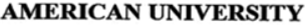

# 20. AMERICAN UNIVERSITY

대법원 2018-06-21 · 2015후1454 · [출처](https://www.law.go.kr/LSW/precInfoP.do?precSeq=198440)

[최종 종합 해설](#easy) · [사용 재료](#materials)

---

## 1. 원문과 단락별 해설

<!-- 원문시작:판례내용 -->

【원고, 피상고인】 어메리칸 유니버시티 (소송대리인 법무법인 한얼 담당변호사 백윤재 외 2인)

미국에 있는 한 대학이 ‘AMERICAN UNIVERSITY’라는 이름을 한국에 서비스표로 등록하려다 거절당한 사건입니다. ‘서비스표’는 누가 제공하는 서비스인지 알아보게 하는 이름이나 표시입니다. 학교는 거절이 잘못됐다며 소송했고 앞선 재판에서 이겼습니다. 이번에는 특허청장이 대법원에 그 판결을 고쳐 달라고 요청했습니다. 이것이 ‘상고’입니다.

【피고, 상고인】 특허청장

‘피고’는 학교가 낸 소송의 상대방인 특허청장입니다. 특허청은 이 사건에서 이름의 등록을 거절한 기관입니다. 이번에는 특허청장이 판결을 고쳐 달라고 했으므로 ‘상고인’입니다.

【원심판결】 특허법원 2015. 7. 24. 선고 2015허642 판결

원심판결은 대법원이 지금 검토하는 바로 앞 재판의 판결입니다. 원문에 그 법원과 날짜가 적혀 있습니다. 뒤에서 원심의 판단이라고 하면 이 판결을 가리킵니다. 대법원은 그 판단에 법을 잘못 해석하거나 적용한 점 등이 있는지 살펴봅니다.

<h4 class="original" style="color: #82AAFF;">【주 문】</h4>

‘주문’은 법원의 결정입니다. 아래의 ‘상고기각’은 특허청장이 앞선 판결을 바꿔 달라고 한 요청을 받아들이지 않는다는 뜻입니다.

상고를 기각한다. 상고비용은 피고가 부담한다.

특허청장이 앞선 판결을 고쳐 달라고 한 상고가 기각됐습니다. 따라서 이 서비스표가 문제 된 등록 거절 사유에 해당하지 않는다는 앞선 판단이 유지됐습니다. 원고인 학교가 상고했다가 진 것으로 읽으면 반대입니다. 다만 이 재판의 결론만으로 실제 등록증이 발급됐는지까지 확인할 수는 없습니다.

【이 유】 상고이유(상고이유서 제출기간이 지난 후에 제출된 상고이유보충서는 상고이유를 보충하는 범위에서)를 판단한다.

여기부터는 바로 앞의 결론을 왜 내렸는지 설명합니다. 상고이유는 앞선 판결이 왜 잘못됐다고 생각하는지 상고한 쪽이 제시한 주장입니다. 당사자의 주장, 앞선 법원의 판단, 대법원의 판단이 차례로 나올 수 있으므로 세 내용을 구별해야 합니다.

1. 가. 현저한 지리적 명칭·그 약어 또는 지도만으로 된 상표 또는 서비스표(이하 이 둘을 줄여 ‘상표’라고만 한다)는 등록을 받을 수 없다[구 상표법(2016. 2. 29. 법률 제14033호로 전부 개정되기 전의 것, 이하 같다) 제6조 제1항 제4호. 현행 상표법 제33조 제1항 제4호도 같은 취지로 규정하고 있다]. 이러한 상표는 그 현저성과 주지성 때문에 상표의 식별력을 인정할 수 없어 특정 개인에게 독점사용권을 부여하지 않으려는 데 입법 취지가 있다. 이에 비추어 보면, 위 규정은 현저한 지리적 명칭 등이 다른 식별력 없는 표장과 결합되어 있는 상표에도 적용될 수 있다. 그러나 그러한 결합으로 본래의 현저한 지리적 명칭 등을 떠나 새로운 관념을 낳거나 새로운 식별력을 형성하는 경우에는 상표로 등록할 수 있다(대법원 2012. 12. 13. 선고 2011후958 판결 등 참조). 현저한 지리적 명칭과 표장이 결합한 상표에 새로운 관념이나 새로운 식별력이 생기는 경우는 다종다양하므로, 구체적인 사안에서 개별적으로 새로운 관념이나 식별력이 생겼는지를 판단하여야 한다.

상표나 서비스표는 이름이나 그림을 보고 어느 회사의 물건인지, 어느 학교의 교육인지 알아보게 하는 표시입니다. 그렇게 구별할 수 있는 힘을 ‘식별력’이라고 합니다. 널리 알려진 지역 이름은 여러 사람이 써야 하므로 보통 한 사람만 독점하도록 등록해 주지 않습니다. 하지만 다른 말과 합쳐져 특정한 제공자를 가리키는 뜻이 생겼다면 달리 볼 수 있습니다. 이 사건에서는 ‘미국의 대학’이라는 설명인지, 특정 대학의 이름인지가 중요합니다.

현저한 지리적 명칭이 대학교를 의미하는 단어와 결합되어 있는 상표에 대해서도 같은 법리가 적용된다. 따라서 이러한 상표가 현저한 지리적 명칭과 대학교라는 단어의 결합으로 본래의 현저한 지리적 명칭을 떠나 새로운 관념을 낳거나 새로운 식별력을 형성한 경우에는 상표등록을 할 수 있다. 이 경우에 현저한 지리적 명칭과 대학교라는 단어의 결합만으로 무조건 새로운 관념이나 식별력이 생긴다고 볼 수는 없다.

지역 이름에 ‘대학교’를 붙인 이름도 마찬가지입니다. 특정 학교를 알아보게 하는 새 의미가 생겼다면 등록할 수 있지만, 두 단어를 붙였다는 이유만으로 무조건 등록되는 것은 아닙니다.

대법원은 종래 이러한 태도를 취하고 있었다고 볼 수 있다. 대법원 2015. 1. 29. 선고 2014후2283 판결은 위 법리를 기초로 “”라는 상표가 구 상표법 제6조 제1항 제4호에 해당하지 않는다고 판단한 원심판결을 유지하였다. 원심은 그 이유의 하나로 위 상표는 현저한 지리적 명칭인 ‘서울’과 ‘대학교’가 결합하여 단순히 ‘서울에 있는 대학교’라는 의미가 아니라 ‘서울특별시 관악구 등에 소재하고 있는 국립종합대학교’라는 새로운 관념을 형성하고 있다는 점을 들고 있다. 대법원판결은 원심판결 이유를 인용하면서 위 조항에 관한 법리를 오해하지 않았다고 판단하고 있는데, 위에서 본 법리에 배치된다고 볼 수 없어 이를 변경할 이유가 없다.

예전 ‘서울대학교’ 사건에서도 사람들은 단순히 서울에 있는 아무 대학이 아니라 특정한 국립대학을 떠올린다고 봤습니다. 그 판결은 지금 설명한 기준과 맞으므로 바꿀 필요가 없습니다.

나. 상표권은 등록국법에 의하여 발생하는 권리로서 등록이 필요한 상표권의 성립이나 유·무효 또는 취소 등을 구하는 소는 일반적으로 등록국 또는 등록이 청구된 국가 법원의 전속관할에 속하고(대법원 2011. 4. 28. 선고 2009다19093 판결 등 참조), 그에 관한 준거법 역시 등록국 또는 등록이 청구된 국가의 법으로 보아야 한다. 따라서 원고가 미국 법인이라고 하더라도 우리나라에서 서비스표를 등록받아 사용하기 위하여 우리나라에 등록출원을 한 이상 그 등록출원의 적법 여부에 관한 준거법은 우리나라 상표법이다.

한국에 상표를 등록하려면 한국 상표법으로 판단합니다. 학교가 미국 법인이라고 해서 이 신청에 미국법을 적용하는 것은 아닙니다.

2. 가. 위 법리와 기록에 비추어 살펴본다.

이제 위 기준을 이 학교의 실제 사정에 적용합니다.

(1) 원고의 이 사건 출원서비스표(출원번호 생략)는 지정서비스업을 ‘대학교육업, 교수업’ 등으로 하여 “”라고 구성되어 있다. 그중 ‘AMERICAN’ 부분은 ‘미국의’ 등의 뜻이 있어 수요자에게 미국을 직감하게 하는 현저한 지리적 명칭에 해당하고, ‘UNIVERSITY’ 부분은 ‘대학’ 또는 ‘대학교’라는 뜻이 있어 이 사건 출원서비스표의 지정서비스업인 ‘대학교육업, 교수업’과의 관계에서 기술적 표장에 해당한다.

‘표장’은 등록하려는 실제 글자나 그림이고, ‘지정서비스업’은 그 이름을 어떤 서비스에 쓸지 신청서에 적은 범위입니다. 여기서는 대학 교육과 가르치는 일 등에 쓰겠다고 했습니다. AMERICAN은 ‘미국의’, UNIVERSITY는 ‘대학교’라는 뜻입니다. 두 단어를 따로 보면 흔한 말이지만, 법원은 합친 전체 이름을 교육 서비스를 찾는 사람들이 어떻게 이해하는지도 살핍니다.

(2) 이 사건 출원서비스표는 원고가 운영하는 대학교(이하 ‘이 사건 대학교’라 한다)의 명칭이기도 하다. 이 사건 대학교는 미국 워싱턴 디시(Washington D.C.)에 위치한 종합대학교로서 1893년 설립된 이래 120년 이상 ‘AMERICAN UNIVERSITY’를 교명으로 사용하고 있다.

하지만 두 단어를 합친 이름은 실제 학교 이름입니다. 워싱턴 D.C.에 있는 이 학교는 1893년부터 120년 넘게 그 이름을 써 왔습니다.

(3) 이 사건 대학교는 50개 이상의 학사학위·석사학위와 10개 이상의 박사학위 과정 등을 개설·운영하고 있고, 도서관, 박물관, 미술관, 방송국, 아시아학센터, 세계평화센터 등의 부속시설을 운영하고 있다. 이 사건 대학교의 재학생 수는 1만여 명에 이르고, 한국 학생도 2008~2009년에 123명이 입학한 것을 비롯하여 매년 꾸준히 입학하고 있다. 이 사건 대학교는 이화여자대학교, 서강대학교, 연세대학교와 해외연수프로그램을 운영하고, 숙명여자대학교, 고려대학교와 공동으로 복수학위과정을 운영하고 있다.

이 학교는 많은 학위 과정과 시설을 운영하고, 학생도 약 1만 명입니다. 한국 학생이 입학하고 한국 대학들과 교류한 사실도 확인했습니다.

(4) 이 사건 대학교는 2003년부터 2012년까지 매년 미화 18,150,000달러 이상을 광고비로 지출하였고, 이 사건 대학교의 웹사이트(www.american.edu) 방문 횟수는 2012년도에 8,500,000회 정도 된다. 이 사건 대학교는 2013년 ‘유에스 뉴스 앤드 월드 리포트’(U.S. News ＆ World Report)가 발표한 미국 대학 순위에서 77위에 올랐고, 특히 국제업무 분야가 유명하여 여러 매체로부터 상위권으로 평가받고 있다.

학교가 광고에 쓴 돈, 홈페이지 방문 수, 대학 평가 등을 확인했습니다. 사람들이 이 학교를 얼마나 알고 있는지 판단할 자료입니다.

(5) 인터넷 포털사이트인 네이버(www.naver.com)에서 ‘AMERICAN UNIVERSITY’를 검색하면, 2013. 6. 17. 기준으로 59,761건의 블로그 검색결과, 22,770건의 카페 검색결과, 5,876건의 지식인 검색결과가 나타난다. 그 대부분은 이 사건 대학교와 관련된 내용으로서 해외유학 등에 관심이 있는 사람들이 이 사건 대학교에 관한 정보 등을 얻기 위하여 ‘AMERICAN UNIVERSITY’를 빈번하게 검색하고 있음을 알 수 있다.

한국 인터넷에서 그 이름을 검색한 결과도 대부분 이 학교 이야기였습니다. 유학에 관심 있는 사람들이 특정 학교를 찾으려고 이 이름을 썼다는 근거입니다.

(6) 이 사건 대학교의 연혁, 학생 수, 대학시설, 국내외에서 알려진 정도, 포털사이트에서 검색되는 ‘AMERICAN UNIVERSITY’의 실제 사용내역 등에 비추어 볼 때, 이 사건 출원서비스표는 지정서비스업인 대학교육업 등과 관련하여 미국 유학준비생 등 수요자에게 원고가 운영하는 이 사건 대학교의 명칭으로서 상당한 정도로 알려져 있다고 볼 수 있다.

수요자는 그 서비스를 이용하려는 사람입니다. 이 사건에서는 한국의 미국 유학준비생 등 해당 교육 서비스에 관심 있는 사람들이 전체 이름을 어떻게 받아들이는지가 중요했습니다. 학교의 오랜 사용, 한국과의 교류, 검색 결과 등을 함께 보면 특정 학교의 이름으로 인식한다고 판단했습니다. 모든 한국인이 이 학교를 알아야만 한다는 뜻은 아닙니다.

(7) 따라서 이 사건 출원서비스표는 현저한 지리적 명칭인 ‘AMERICAN’과 기술적 표장인 ‘UNIVERSITY’가 결합하여 전체로서 새로운 관념을 형성하고 있고 나아가 지정서비스업인 대학교육업 등과 관련하여 새로운 식별력을 형성하고 있으므로, 구 상표법 제6조 제1항 제4호, 제7호에 해당하지 않는다.

따라서 전체 이름은 단순히 ‘미국의 대학’이라는 뜻을 넘어 이 학교를 알아보게 합니다. 대학교육 등에 관한 이번 신청은 문제 된 두 등록 거절 사유에 해당하지 않습니다.

나. 원심의 판결 이유에 부적절한 점이 있으나, 이 사건 출원서비스표가 그 지정서비스업과 관련하여 서비스표로 등록될 수 있다고 본 결론은 옳다. 원심의 판단에 상고이유 주장과 같이 구 상표법 제6조 제1항 제4호, 제7호에 관한 법리를 오해하는 등으로 판결 결과에 영향을 미친 잘못이 없다.

특허법원의 설명에 일부 아쉬운 점은 있어도, 등록을 허용할 수 있다는 결론은 맞습니다. 판결을 뒤집을 정도의 잘못은 없습니다.

3. 그러므로 상고를 기각하고 상고비용은 패소자가 부담하도록 하여, 주문과 같이 판결한다. 이 판결에는 대법관 고영한, 대법관 김창석, 대법관 김신, 대법관 조재연의 별개의견과 대법관 조희대의 별개의견이 있는 외에는 관여 법관의 의견이 일치되었고, 다수의견에 대한 대법관 김소영, 대법관 박상옥, 대법관 김재형, 대법관 박정화의 보충의견과 대법관 고영한, 대법관 김창석, 대법관 김신, 대법관 조재연의 별개의견에 대한 대법관 김창석의 보충의견이 있다.

그래서 특허청장의 상고를 받아들이지 않았습니다. 법관들은 이 결론에는 동의했지만, 왜 등록할 수 있는지에 대해서는 서로 다른 의견과 추가 설명을 냈습니다.

4. 대법관 고영한, 대법관 김창석, 대법관 김신, 대법관 조재연의 별개의견

별개의견은 최종 결론에는 동의하지만 그 이유를 다르게 설명하는 의견입니다. 이 네 법관도 이번 등록 거절 사유에 해당하지 않는다는 결론에는 찬성했습니다. 다만 이름이 결합해 생긴 뜻과 오랫동안 사용해 유명해진 효과를 구별해야 한다고 보았습니다. 그래서 아래 비판을 ‘대법원이 등록 가능성을 부정했다’고 읽으면 안 됩니다. 결론과 이유의 차이를 따로 봐야 합니다.

가. (1) 구 상표법 제6조 제1항 제4호는 현저한 지리적 명칭만으로 된 상표는 등록을 받을 수 없다고 규정하고 있다. 따라서 현저한 지리적 명칭과 식별력이 없는 다른 표장이 결합되어 있는 상표는 등록을 받을 수 없다는 결론이 구 상표법 제6조 제1항 제4호의 문언으로부터 당연히 도출되는 것은 아니다.

이 네 법관은 법 조문이 ‘지역 이름만으로 된 상표’를 금지한다는 점에 주목합니다. 지역 이름에 다른 단어까지 붙인 경우도 모두 금지한다는 말이 조문에 곧바로 쓰여 있는 것은 아니라는 뜻입니다.

확립된 판례에 의하면, 현저한 지리적 명칭에 식별력이 없는 다른 표장이 결합되어 있는 경우 상표등록을 받을 수 없는 것이 원칙이다. 그러나 예외적으로 현저한 지리적 명칭에 식별력이 없는 다른 표장이 결합되어 그러한 결합에 의하여 본래의 현저한 지리적 명칭을 떠나 새로운 관념을 낳거나 새로운 식별력을 형성하는 경우에는 상표등록을 받을 수 있다.

기존 판례도 지역 이름에 흔한 말을 붙이면 원칙적으로 등록할 수 없다고 했습니다. 다만 합친 이름에 새로운 의미나 구별하는 힘이 생기면 예외적으로 등록할 수 있습니다.

그러므로 현저한 지리적 명칭에 대학교를 의미하는 단어가 결합된 표장이 상표로 등록을 받을 수 있는지 여부는 그러한 결합에 의하여 본래의 현저한 지리적 명칭을 떠나 새로운 관념을 낳거나 새로운 식별력을 형성한다고 볼 수 있느냐에 달려있다.

그러므로 핵심은 지역 이름과 ‘대학교’를 합친 결과, 특정 학교를 알아보게 하는 이름이 됐는지입니다.

(2) 그런데 앞서 본 바와 같이 다수의견은 이러한 판단 기준을 전제하면서도, 현저한 지리적 명칭에 대학교를 의미하는 단어가 결합된 표장이 상표로 등록을 받을 수 있는지 여부에 관한 구체적 검토에 이르러서는 그러한 결합에 의하여 본래의 현저한 지리적 명칭을 떠나 새로운 관념을 낳거나 새로운 식별력을 형성한다고 볼 수 있느냐 하는 점에 관하여 살펴보지 아니한다. 오히려 이 사건 출원서비스표가 그 지정서비스업인 대학교육업 등과 관련하여 수요자들에게 원고가 운영하는 이 사건 대학교의 명칭으로서 상당한 정도로 알려져 있다고 볼 수 있느냐 하는 점에 관하여 살펴보고, 이를 근거로 구 상표법 제6조 제1항 제4호의 적용이 배제된다는 결론을 내린다.

네 법관은 다수의견을 비판합니다. 다수의견이 말로는 ‘합쳐진 이름의 의미’를 보겠다고 하면서, 실제로는 학교가 얼마나 유명한지를 중심으로 판단했다는 지적입니다.

그러나 구 상표법 제6조 제1항 제4호의 적용이 배제되는 판단 기준으로서의 식별력은, 현저한 지리적 명칭에 식별력 없는 다른 표장이 결합되어 표장의 구성 자체에 의하여 새로운 식별력이 형성되었느냐 하는 점을 의미하는 것이지, 상표를 사용한 결과 특정인의 상품에 관한 출처를 표시하는 것으로 수요자들이 인식하게 되었느냐 하는 점을 의미하는 것이 아니다. 구 상표법 제6조 제1항 제4호 해당 여부의 판단 기준이 되는 표장의 구성에 의한 식별력은 표장 그 자체의 ‘본질적인 식별력’으로서 같은 조 제2항이 규정하고 있는 ‘사용에 의한 식별력’과 명확히 구분된다. 다수의견은 이 점을 혼동하고 있다.

이름 자체가 처음부터 특정 대상을 가리키는 것과, 오래 써서 사람들이 특정 대상을 떠올리게 된 것은 다릅니다. 네 법관은 다수의견이 이 두 가지를 섞었다고 봅니다.

(3) 구 상표법 제6조 제2항은 “제1항 제4호에 해당하는 상표라도, 상표등록출원 전부터 그 상표를 사용한 결과 수요자 간에 특정인의 상품에 관한 출처를 표시하는 것으로 식별할 수 있게 된 경우에는 그 상표를 사용한 상품에 한정하여 상표등록을 받을 수 있다.”라고 규정함으로써 ‘사용에 의한 식별력’을 인정하여 상표등록을 허용하고 있다. 다수의견의 주장과 같이 이 사건 출원서비스표가 지정서비스업과 관련하여 수요자들에게 원고가 운영하는 대학교의 명칭으로 상당한 정도 알려짐으로써 식별력을 갖게 되었다면, 이는 구 상표법 제6조 제2항이 규정한 ‘사용에 의한 식별력’을 갖게 되었다는 것을 의미한다. 따라서 ‘그 상표를 사용한 상품에 한정하여’ 상표등록을 받을 수 있다는 점도 그 당연한 결과이다.

법에는 오래 사용해서 사람들이 알아보게 된 상표를 등록시키는 별도 규정이 있습니다. 그때는 실제로 그 이름을 쓴 상품에 한해 등록됩니다. 유명해졌다는 이유라면 이 규정으로 판단해야 한다는 주장입니다.

이처럼 다수의견은 구 상표법 제6조 제2항이 규정하는 요건의 충족을 전제로 같은 조항이 규정한 법적 효과를 인정하고 있을 뿐임에도, 같은 요건의 충족을 전제로 구 상표법 제6조 제1항 제4호의 적용이 배제된다고 주장한다. 구 상표법 제6조 제2항이 제1항 제4호의 적용 배제요건을 정하고 있는 것이 아니고 별개의 등록요건을 정하고 있는 것인 이상, 이는 설명하기 어려운 모순이라고 할 수밖에 없다. 다수의견은, 판단 기준으로서 표장의 구성 자체에 의한 ‘본질적인 식별력’이 문제되는 영역에 ‘사용에 의한 식별력’이라는 판단 기준을 혼합함으로써 적용 영역과 법적 효과가 다른 두 규정의 구별을 불가능하게 한다. 그리고 이러한 해석은 사용에 의한 식별력이 인정되는 경우 구 상표법 제6조 제2항에 의해서 상표등록을 받을 수 있는 한편, 제1항에 의해서도 상표등록을 받을 수 있다는 결과를 초래한다. 이는 구 상표법 제6조 제1항과 제2항의 문언에 명백히 어긋나는 것으로 도저히 받아들일 수 없는 해석이다. 또한 다수의견과 같이 ‘사용에 의한 식별력’이라는 판단 기준을 적용하는 한 현저한 지리적 명칭과 대학교를 의미하는 단어의 결합에 의하여 ‘본질적인 식별력’을 가질 수 있다는 다수의견이 전제하는 판단 기준은 실제로 아무런 역할도 하지 못하게 된다.

유명해져서 등록하는 경우와 이름 자체가 구별돼서 등록하는 경우는 조건과 효과가 다릅니다. 둘을 섞으면 별도 규정을 둔 의미가 없어지고, 어느 기준으로 등록됐는지도 흐려진다는 비판입니다.

(4) 구 상표법 제6조 제1항 제4호는 ‘본질적인 식별력’에 관한 것으로서 그 식별력의 유무는 표장의 구성 자체에 의하여 객관적으로 판단하여야 하고, 표장의 사용 상황이나 그에 따른 수요자들의 인식 정도는 같은 조 제2항의 ‘사용에 의한 식별력’ 취득 여부에서 고려하는 것이 조문체계에 부합한다. 즉, 구 상표법 제6조는 표장의 구성 자체에 의하여 ‘본질적인 식별력’이 인정된다면 제1항 제4호의 적용이 배제되어 상표등록이 허용되고, ‘본질적인 식별력’이 인정되지 아니하여 제1항 제4호에 해당하더라도 그 상표가 사용의 과정을 거쳐 수요자들 사이에 특정인의 상품출처표시로 인식되기에 이르렀다면 제2항에 의하여 예외적으로 상표등록이 허용된다는 것으로 이해하여야 한다.

네 법관의 설명은 이렇습니다. 이름 자체가 특정 대상을 구별하면 처음 규정으로 등록하고, 처음에는 구별되지 않았지만 오래 사용해 알려졌다면 다른 규정으로 등록해야 합니다.

그러므로 현저한 지리적 명칭과 대학교를 의미하는 단어의 결합에 의하여 그 구성 자체만으로 본래의 현저한 지리적 명칭을 떠나 ‘본질적인 식별력’을 형성한다면, 구 상표법 제6조 제2항에 의하여 예외적으로 상표등록이 허용되는 경우와는 달리, 더 이상 ‘상표등록출원 전부터 그 상표를 사용한 결과 수요자 간에 특정인의 상품에 관한 출처를 표시하는 것으로 식별할 수 있게 된 경우’에 해당하는지를 살펴볼 필요가 없으며, 지정상품의 범위에 제한을 받지 아니하고 상표등록을 받을 수 있다.

이름 자체만으로 구별된다면, 신청 전에 얼마나 유명해졌는지를 더 증명할 필요가 없다는 주장입니다. 또 이미 그 이름을 사용한 상품에만 등록 범위를 한정할 이유도 없다고 봅니다.

(5) 나아가 현저한 지리적 명칭에 식별력이 없는 ‘대학교’라는 표장이 결합되면 본래의 현저한 지리적 명칭을 떠나 새로운 식별력을 형성하는지 살펴본다.

이제 지역 이름에 ‘대학교’를 붙인 이름이 그 자체로 특정 학교를 구별하게 하는지 살펴봅니다.

예컨대, “제주대학교”라는 명칭은 ‘제주대학교’가 실재하고 있는 한, 법령의 제한으로 인해 같은 명칭을 사용하는 다른 대학교가 존재할 수 없고 장래에도 존재할 수 없다. 그 결과 ‘제주’라는 현저한 지리적 명칭과 ‘대학교’라는 식별력 없는 표장이 결합되어 특정 대학교를 표상하는 명칭이 되고, 수요자들도 당연히 다른 대학교들로부터 그 특정 대학교를 구별하는 명칭으로 인식하게 된다.

네 법관은 ‘제주대학교’를 예로 듭니다. 실제 그 학교가 있고 같은 이름의 다른 대학을 만들기 어렵다면, 사람들은 이 이름으로 특정 학교를 구별한다는 설명입니다.

또한 지리적 명칭과 대학교를 의미하는 단어가 결합하여 대학교 명칭을 구성하는 사례가 국내외에 걸쳐 흔히 존재하므로, 지리적 명칭과 대학교를 의미하는 단어가 결합된 표장에 대해서는 수요자들이 그것을 지리적 의미로 인식한다기보다는 그 구성 부분이 불가분적으로 결합된 전체로서 특정 대학교의 명칭으로 인식하거나 특정인의 상품출처표시로 직감할 가능성이 매우 높다.

지역 이름이 들어간 대학 이름은 흔합니다. 그래서 사람들은 그 말을 지역 설명으로만 듣기보다 하나의 학교 이름으로 알아들을 가능성이 높다고 봅니다.

다시 말해 지리적 명칭과 대학교를 의미하는 단어가 결합된 표장을 대하는 수요자들은 설령 그 표장을 교명으로 하는 대학교를 구체적·개별적으로 알지는 못한다고 하더라도, 그 표장의 구성 자체만으로도 단순히 어느 지역에 있는 대학교를 나타내는 것이 아니라 특정 대학교를 나타내는 것이라고 인식하는 경향이 강하다.

그 학교를 자세히 몰라도, 이름을 들으면 ‘그 지역의 아무 대학’이 아니라 ‘어느 특정 대학의 이름’이라고 생각할 수 있다는 주장입니다.

결국 지리적 명칭과 대학교를 의미하는 단어가 결합된 표장은 그 결합에 의하여, 즉 표장의 구성 자체에 의하여 ‘본질적인 식별력’을 갖는다고 할 수 있다.

따라서 지역 이름과 ‘대학교’를 합친 구조 자체에 특정 학교를 구별하는 힘이 있다고 봅니다.

나. 구 상표법 제6조 제1항 제4호는 현저한 지리적 명칭·그 약어 또는 지도만으로 된 상표는 등록을 받을 수 없다고 규정하고 있다. 이와 같은 상표는 그 현저성과 주지성 때문에 상표의 식별력을 인정할 수 없어 어느 특정 개인에게만 독점사용권을 부여하지 않으려는 데 그 규정의 취지가 있다.

지역 이름의 등록을 막는 이유는 모두가 쓰는 이름을 한 사람만 쓰게 하지 않기 위해서입니다.

따라서 현저한 지리적 명칭이 포함된 표장이라고 하더라도 특정 개인에게 독점을 허용하여도 무방할 만큼 독점적응성이 매우 높고, 경쟁업자의 자유로운 사용을 보장할 필요가 거의 없는 경우라면, 그러한 표장에 대하여 구 상표법 제6조 제1항 제4호에 해당하지 않는다고 해석하더라도 위 규정의 취지에 반하지 않는다.

거꾸로 다른 사람들이 그 이름을 쓸 필요가 거의 없고 한 사람에게 맡겨도 문제가 없다면, 등록을 허용해도 법의 목적에 어긋나지 않는다는 주장입니다.

대학교를 설립하기 위해서는 시설·설비 등 일정한 설립기준을 갖추어 교육부장관의 인가를 받아야 하는 등 그 설립·운영 등에 관한 엄격한 법령의 제한이 있고, 이러한 제한으로 인해 사실상 동일한 명칭을 가진 대학교가 존재하거나 새로 설립될 수 없다.

대학교는 마음대로 만들거나 이름을 정하는 것이 아니라 법의 기준과 허가를 따라야 합니다. 그래서 똑같은 이름의 대학이 여러 개 생기기 어렵다고 봅니다.

그러므로 지리적 명칭과 대학교를 의미하는 단어가 결합된 표장이 대학교 명칭을 구성하는 경우 그 대학교의 운영 주체 이외의 다른 사람이 그 대학교 명칭을 사용해야 할 필요성은 거의 없고, 달리 그 대학교의 운영 주체에게 그 대학교 명칭을 독점적으로 사용하게 하는 것이 공익상 부당하다거나 폐해가 발생한다고 볼 만한 사정도 발견되지 아니한다. 따라서 이러한 표장에 대하여 상표등록을 허용하더라도 구 상표법 제6조 제1항 제4호의 규정 취지에 반한다고 볼 수 없고, 오히려 실질적으로 부합한다고 할 수 있다.

그렇다면 해당 학교가 자기 이름을 상표로 쓰게 해도 다른 사람에게 큰 피해가 없다고 봅니다. 학교 이름의 등록은 지역 이름 독점을 막으려는 법의 목적과도 맞는다는 설명입니다.

다. (1) 다수의견은, 지리적 명칭과 대학교를 의미하는 단어가 결합된 표장에 대하여 그 표장을 교명으로 하는 특정 대학교가 수요자들에게 상당한 정도로 알려져 있는지를 기준으로 상표등록 여부를 판단하고 있다.

다수의견은 그 학교가 사람들에게 상당히 알려져 있는지를 보고 등록 여부를 판단했습니다.

그런데 그러한 판단 기준에 따를 경우 특정 대학교의 알려진 정도에 따라 상표등록 여부가 달라져 부당한 결과를 초래할 수 있고, 외국에서 널리 알려진 대학교라고 하더라도 국내의 수요자들에게 알려지지 않았다는 이유로 상표등록을 거절하게 될 경우 국내외 대학교 간의 형평에도 반하는 문제가 발생할 수 있다.

네 법관은 그러면 해외에서는 유명해도 한국에서는 덜 알려진 학교가 불리해질 수 있다고 비판합니다.

더욱이 국내 대학교 사이에서도 교명에 지리적 명칭이 포함된 대학교와 그렇지 않은 대학교 사이에 상표등록과 관련하여 현저한 차별이 있게 된다. 즉, 지리적 명칭이 포함되지 않은 교명에 대해서는 다른 거절사유가 없는 한 곧바로 상표등록이 허용되는 반면, 지리적 명칭이 포함된 교명에 대해서는 그 교명이 지정상품과 관련하여 실제로 사용되어 수요자들에게 상당한 정도로 알려지기 전까지는 상표등록이 허용되지 않는다. 또한, 상표등록이 허용되는 상품의 범위에 있어서도 지리적 명칭이 포함되지 않은 교명에 대해서는 별다른 제한 없이 상표등록이 허용되는 반면, 지리적 명칭이 포함된 교명은 실제로 사용되어 식별력을 얻은 분야의 상품에 대해서만 상표등록이 허용된다.

지역 이름이 없는 학교는 이름을 곧바로 등록할 수 있는데, 지역 이름이 든 학교만 유명해질 때까지 기다려야 할 수 있습니다. 등록할 수 있는 상품 범위도 달라진다는 지적입니다.

교명에 지리적 명칭이 포함된 대학교와 그렇지 않은 대학교 사이에 존재하는 위와 같은 차별적 취급은 단순히 부당하다는 차원을 넘어서 평등원칙을 위반할 여지가 있다. 헌법 제11조 제1항의 평등원칙은 본질적으로 같은 것을 자의적으로 다르게 취급함을 금지하는 것으로서, 법을 적용할 때에도 합리적인 근거가 없는 차별을 하여서는 아니 된다는 것을 뜻한다(대법원 2007. 10. 29. 선고 2005두14417 전원합의체 판결, 대법원 2016. 5. 24. 선고 2013두14863 판결 등 참조).

정당한 이유 없이 비슷한 대상을 다르게 대우하면 헌법의 평등원칙에 어긋날 수 있습니다. 네 법관은 학교 이름 사이의 차별도 그런 문제를 일으킬 수 있다고 봅니다.

대학교 명칭에 지리적 명칭이 포함된 것과 그렇지 않은 것 사이에는 상표의 기본적 기능인 출처표시 기능이나 자타상품식별력의 측면에서 본질적인 차이가 있다고 보기 어렵다. 그런데 다수의견의 논리대로라면 앞서 본 바와 같이 대학교 명칭에 지리적 명칭이 포함된 것과 그렇지 않은 것 사이에 상표등록의 허용 여부 및 상표등록이 허용되는 상품의 범위 등과 관련하여 현저한 차별이 있게 되는데, 그와 같은 차별을 정당화할 만한 합리적 근거나 이유가 있다고 보기 어려우므로, 이는 평등원칙을 위반하는 해석이다.

어느 학교를 가리키는지 알 수 있다는 점에서는 두 종류의 학교 이름이 비슷합니다. 지역 이름이 들어갔다는 이유로 다르게 대우할 충분한 근거가 없다는 주장입니다.

(2) 또한, 지리적 명칭과 대학교를 의미하는 단어가 결합된 표장에 대하여 구 상표법 제6조 제1항 제4호를 이유로 등록을 거절하는 것은, 직업수행의 자유를 규정한 헌법 제15조와 재산권 보장을 규정한 헌법 제23조를 위반할 여지도 있다.

네 법관은 등록 거절이 직업을 수행할 자유와 재산권까지 침해할 가능성이 있다고 봅니다.

상품의 생산·판매자가 원하는 상표를 등록받아 이를 상품에 표시하여 판매하는 것은 직업을 수행하는 하나의 방법이고, 등록된 상표에 대한 독점적 사용권으로서의 상표권은 헌법상 보호되는 재산권에 속한다.

상표를 붙여 상품을 파는 것은 사업을 하는 방법 중 하나입니다. 등록된 상표를 독점적으로 쓸 권리도 헌법이 보호하는 재산이라는 설명입니다.

구 상표법 제6조 제1항 제4호의 입법 목적은, 현저한 지리적 명칭만으로 된 상표는 그 현저성과 주지성 때문에 상표의 식별력을 인정할 수 없어 어느 특정 개인에게만 독점사용권을 부여하지 않으려는 데 있다. 그런데 앞서 본 바와 같이 지리적 명칭과 대학교를 의미하는 단어가 결합된 표장이 대학교 명칭을 구성하는 경우 그 대학교의 운영 주체 이외의 다른 사람이 그 대학교 명칭을 사용해야 할 필요성은 거의 없고, 달리 그 대학교 명칭을 그 대학교의 운영 주체에게 독점적으로 사용하게 하는 것이 공익상 부당하다고 볼 만한 사정도 발견되지 아니하므로, 대학교 명칭에 대하여 등록을 허용하더라도 구 상표법 제6조 제1항 제4호의 입법 목적에 반한다고 보기 어렵다.

지역 이름을 모두에게 열어 두려는 취지는 이해하지만, 특정 학교의 이름을 다른 사람이 꼭 써야 할 필요는 거의 없다고 봅니다. 그래서 학교의 등록을 막을 이유가 약하다는 주장입니다.

따라서 지리적 명칭과 대학교를 의미하는 단어가 결합된 표장에 대하여 구 상표법 제6조 제1항 제4호를 이유로 등록을 거절하는 것은, 현저한 지리적 명칭만으로 된 상표에 대한 특정인의 독점사용을 방지하고자 하는 구 상표법 제6조 제1항 제4호의 입법 목적에 기여하는 바는 거의 없는 반면, 상표출원인의 직업수행의 자유와 재산권을 합리적 이유 없이 침해하는 것이라고 볼 수 있다.

학교 이름의 등록을 막아도 지역 이름 독점을 막는 데 별 도움이 없고, 오히려 학교의 자유와 재산권만 불필요하게 제한할 수 있다는 뜻입니다.

(3) 어떤 법률규정의 개념이 다의적이고 그 어의의 테두리 안에서 여러 가지 해석이 가능할 때, 헌법을 최고법규로 하는 통일적인 법질서의 형성을 위하여 헌법에 합치되는 해석을 택하여야 하며, 이를 통해 위헌적인 결과가 될 해석은 배제하면서 합헌적이고 긍정적인 면은 살려야 한다(대법원 2005. 1. 27. 선고 2004도7488 판결, 대법원 2011. 4. 14. 선고 2008도6693 판결 등 참조).

법 문장을 여러 뜻으로 읽을 수 있다면, 그중 헌법에 맞는 뜻을 골라야 한다는 원칙을 제시합니다.

다수의견의 논리와 같이 지리적 명칭과 대학교를 의미하는 단어가 결합된 표장에 대하여도 원칙적으로 구 상표법 제6조 제1항 제4호에 해당하는 것으로 보되, 그 표장을 교명으로 하는 특정 대학교가 수요자들에게 상당한 정도로 알려져 있는 경우에만 예외를 인정하여 구 상표법 제6조 제1항 제4호에 해당하지 않는 것으로 해석하게 되면, 앞서 본 바와 같이 헌법상 평등원칙을 위반하거나 직업수행의 자유와 재산권을 침해할 수 있다.

학교가 충분히 유명해져야만 등록할 수 있다고 읽으면 평등이나 자유, 재산권을 해칠 수 있다는 비판을 다시 정리합니다.

반면에 지리적 명칭과 대학교를 의미하는 단어가 결합된 표장에 대하여 그 구성 자체로 새로운 관념이나 새로운 식별력이 형성되었다고 보아 구 상표법 제6조 제1항 제4호에 해당하지 않는 것으로 해석하게 되면, 다수의견의 논리로부터 비롯되는 위헌적인 결과를 회피할 수 있으므로, 합헌적 법률해석의 원칙에 부합한다고 할 수 있다. 법률해석의 목표는 합헌적 해석의 한계 내에서 입법 취지를 실현하는 것이다. 다수의견은 이 점을 놓치고 있는 것으로 보인다.

반대로 학교 이름 자체가 특정 학교를 구별한다고 읽으면 이런 헌법 문제를 피할 수 있다고 봅니다. 네 법관은 이 해석이 더 적절하다고 주장합니다.

(4) 오늘날 대학교는 학문의 전당으로서의 전통적인 역할에 머무르지 않고 산학협력의 활성화 등을 통해 다양한 수익사업을 영위하고 있는데, 대학교의 운영 주체로서는 이러한 대학교의 고유 업무 외의 영역과 관련하여 상표등록을 받아야 할 필요성이 오히려 더 크다고 볼 수 있고, 이러한 이유로 대학교 명칭에 대한 상표출원도 늘어나고 있다.

요즘 대학은 수업뿐 아니라 기업과 함께하는 사업 등 여러 활동을 합니다. 그래서 교육 외의 상품이나 사업에서도 학교 이름을 보호할 필요가 커졌다고 봅니다.

그런데도 구 상표법 제6조 제1항 제4호의 규정을 기계적·형식적으로 적용하는 해석을 함으로써 앞서 본 것처럼 합리적인 근거도 없이 현저한 지리적 명칭을 사용하는 대학교와 그렇지 않은 대학교에 대한 평등한 법적 보호를 거부하는 한편, 상표출원인의 직업수행의 자유와 재산권을 침해하는 상황을 그대로 방치하는 것은 현실적인 시대적 요구에 부합하지 아니하며, 타당한 해석이라고 할 수 없다.

그런 현실을 무시하고 지역 이름이 들어갔다는 이유만으로 등록을 어렵게 만들면, 학교 사이의 불공평과 권리 제한을 그대로 두게 된다는 주장입니다.

라. (1) 현저한 지리적 명칭에 대하여 상표등록을 허용하지 않고 있는 나라는 우리나라와 중국 외에는 거의 찾아보기 어렵다는 점에서 구 상표법 제6조 제1항 제4호는 비교법적으로 볼 때 매우 특이한 입법례에 속한다.

네 법관은 당시 여러 나라의 법을 비교하며, 널리 알려진 지역 이름이라는 이유로 등록을 막는 규정이 드문 편이라고 설명합니다.

전 세계 거의 모든 국가에서는 표장에 현저한 지리적 명칭이 포함되어 있다는 이유만으로 상표등록이 거절되지는 않고, 실제 이 사건 출원서비스표의 표장은 쿠웨이트, 베트남, 일본, 브라질, 우루과이, 유럽, 영국 등 다수의 국가에서 상표 또는 서비스표로 등록이 받아들여졌다. 더욱이 우리나라와 마찬가지로 현저한 지리적 명칭으로 된 상표등록을 허용하지 않는 중국에서조차 이 사건 출원서비스표의 등록이 받아들여졌다.

이 학교 이름은 여러 나라에서 이미 상표로 등록됐고 중국에서도 등록됐다는 사실을 듭니다.

상표 또는 서비스표의 등록적격성의 유무는 각국의 법률제도 등에 따라 달리 판단될 수 있는 문제이기는 하나, 법률해석을 통해 다른 나라들과 균형을 맞출 수 있다면 적극적으로 그와 같이 해석할 필요가 있다. 다른 나라에서는 모두 등록이 허용됨에도 우리나라에서만 등록이 허용되지 않는 방향으로 구 상표법 제6조 제1항 제4호를 기계적·형식적으로 운용하는 것은 국제적인 기준이나 상표법제의 세계적 통일화 흐름에도 동떨어진 것이어서 바람직하지 않다.

나라마다 법은 다르지만, 한국법의 허용 범위 안에서 다른 나라와 균형 있게 해석할 수 있다면 그렇게 하는 편이 좋다는 주장입니다. 외국 등록이 곧 한국 등록을 보장한다는 뜻은 아닙니다.

(2) 현저한 지리적 명칭만으로 된 상표를 식별력 없는 상표의 하나로 규정한 구 상표법 제6조 제1항 제4호에 대하여는 입법론적으로 이를 삭제하는 것이 바람직하다는 견해가 유력하게 제기되어 왔다.

지역 이름의 등록을 제한하는 이 조항을 아예 없애자는 의견도 있었다고 소개합니다.

그런데 우리나라는 예전부터 지리적 명칭을 상표의 구성으로 사용하는 사례가 많았고, 누구나 자유롭게 현저한 지리적 명칭을 사용하도록 보장할 필요가 있는 영역들이 여전히 많이 존재하는 것도 부인할 수 없다.

다만 누구나 지역 이름을 자유롭게 쓸 수 있어야 하는 경우도 많으므로, 제한이 전혀 필요 없다고 보지는 않습니다.

이러한 사정을 고려하면, 구 상표법 제6조 제1항 제4호를 전면적으로 폐지하기보다는, 위 규정이 입법 목적에 부합하는 방향으로 운용될 수 있도록 대학교 명칭 등과 같이 독점적응성이 매우 강한 표장에 대해서는 위 규정에 해당하지 않는 것으로 해석하면서 위 규정 자체는 존치하는 것이 합리적인 대안이 될 수 있다.

그래서 조항을 없애기보다, 특정 학교 이름처럼 독점을 허용해도 문제가 적은 경우를 구분해 등록시키자는 제안입니다.

(3) 이에 대해서는 대학교 명칭 외에도 신문사, 방송사, 은행 등의 명칭에까지 그 논리가 무한정 확장될 가능성이 있다는 지적이 있을 수 있다.

이에 대해서는 같은 논리를 신문사나 방송사, 은행 이름에까지 끝없이 넓힐 수 있다는 반론이 있을 수 있습니다.

그러나 현저한 지리적 명칭이 사용된 표장이 구 상표법 제6조 제1항 제4호에 해당하지 않는다고 인정하기 위해서는, 법령상의 제한 등으로 인하여 사실상 특정인에게 독점적 사용을 허용해도 무방한 것인지, 각 구성 부분이 불가분적으로 결합되어 특정인의 상품출처표시로 인식되는 경향이 강한지 등을 종합적으로 고려하여 그 표장이 새로운 관념을 낳거나 새로운 식별력을 형성하는 정도에 이르렀는지를 개별적으로 살펴보아야 한다.

네 법관은 무조건 허용하자는 것이 아니라고 답합니다. 다른 사람의 사용을 막아도 괜찮은지, 합쳐진 이름이 특정 대상을 구별하는지 등을 이름마다 따져야 한다는 뜻입니다.

이와 같이 판단할 경우 대학교 명칭과 같은 논리에 근거하여 구 상표법 제6조 제1항 제4호에 해당하지 않게 되는 사례가 크게 확장되어 실무상 혼란을 가져오는 문제점은 염려하지 않아도 좋을 것이다.

그렇게 개별적으로 판단하면 예외가 마구 늘어나 혼란이 생길 걱정은 크지 않다고 봅니다.

마. 한편 구 상표법 제6조 제1항 제4호의 규정 취지 등을 고려할 때 실제 존재하는 대학교의 운영 주체에게만 그 대학교 명칭에 대한 독점적인 사용권을 인정할 수 있으므로, 지리적 명칭과 대학교를 의미하는 단어가 결합된 표장에 대해서는 그 표장이 표상하는 대학교가 실제 존재하고 있어야 하고, 그 대학교의 운영 주체에 의하여 상표등록출원이 이루어진 경우에 한하여 상표등록이 허용된다고 봄이 타당하다.

이 의견에서는 학교가 실제로 존재하고, 바로 그 학교의 운영자가 신청해야 등록을 허용할 수 있다고 봅니다.

결국 지리적 명칭과 대학교를 의미하는 단어가 결합된 표장이 실제 특정 대학교의 명칭으로 사용되고, 해당 대학교의 운영 주체가 그 명칭에 대하여 상표등록을 출원하는 경우에는 지리적 명칭과 대학교를 의미하는 단어가 결합하여 전체로서 새로운 관념을 낳거나 새로운 식별력을 형성한다고 볼 수 있으므로, 구 상표법 제6조 제1항 제4호에 해당하지 않는다고 보아야 한다.

실제 학교가 자기 이름을 신청했다면 지역 이름과 ‘대학교’가 합쳐진 전체를 하나의 학교 이름으로 인정하자는 결론입니다.

바. 이러한 법리와 기록에 비추어 살펴본다.

이제 그 해석을 어메리칸 유니버시티에 적용합니다.

이 사건 출원서비스표는 원고가 운영하는 이 사건 대학교의 명칭이기도 한데, 이 사건 대학교는 미국 워싱턴 디시(Washington D.C.)에 위치한 종합대학으로서 1893년 설립된 이래 120년 이상 ‘AMERICAN UNIVERSITY’를 교명으로 계속 사용하고 있다.

이 학교는 실제로 워싱턴 D.C.에 있고 120년 넘게 같은 이름을 써 왔습니다.

따라서 이 사건 대학교를 운영하는 원고에 의하여 출원된 이 사건 출원서비스표는 현저한 지리적 명칭인 ‘AMERICAN’과 대학교를 의미하는 단어인 ‘UNIVERSITY’가 결합하여 전체로서 새로운 관념을 낳거나 새로운 식별력을 형성하고 있으므로, 구 상표법 제6조 제1항 제4호, 제7호에 해당하지 아니한다.

실제 학교의 운영자가 자기 학교 이름을 신청했으므로, 네 법관은 이 이름이 특정 학교를 구별하며 문제 된 거절 사유에도 해당하지 않는다고 봅니다.

결국, 원심의 이유 설시에 부적절한 점이 있으나, 이 사건 출원서비스표의 등록이 허용되어야 한다고 본 결론은 정당하고, 거기에 상고이유 주장과 같이 구 상표법 제6조 제1항 제4호, 제7호에 관한 법리를 오해하는 등으로 판결 결과에 영향을 미친 잘못이 없다.

앞선 법원의 이유 설명에 일부 아쉬운 점이 있어도 등록을 허용할 수 있다는 결론은 맞다는 판단입니다.

사. 이상과 같은 이유로, 상고를 기각하여야 한다는 결론에서는 다수의견과 의견을 같이 하지만 그 구체적인 이유는 달리하므로, 별개의견으로 이를 밝혀 둔다.

네 법관도 특허청장의 상고를 받아들이지 않는 데 동의합니다. 다만 왜 그런 결론을 내리는지는 다수의견과 달라서 따로 썼습니다.

5. 대법관 조희대의 별개의견

여기부터 조희대 법관의 별개의견입니다. 이 법관도 같은 결론에 찬성하지만 또 다른 기준을 제시합니다.

가. 대학교가 고유의 업무인 대학교육업, 교수업 등과 관련하여 대학교 명칭을 상표로 사용하는 경우 수요자들은 대학교 명칭이 특정 대학교를 표상하는 것이라고 인식하는 것이 일반적이고, 이러한 경우 대학교 명칭에 대하여 상표등록을 허용하더라도 공익상 부당하다거나 폐해가 발생한다고 보기 어렵다. 이는 대학교 명칭에 현저한 지리적 명칭이 포함되어 있다고 하여 달리 볼 것이 아니다. 따라서 현저한 지리적 명칭과 대학교를 의미하는 단어가 결합된 표장이 대학교의 고유 업무인 대학교육업, 교수업 등과 관련하여 등록출원된 것이라면, 이러한 표장은 그 자체로 상표등록을 받기에 충분한 본질적인 식별력을 갖춘 것으로 볼 수 있으므로, 구 상표법 제6조 제1항 제4호에 해당하지 않는다고 보아야 한다.

학교가 자기 이름을 교육 서비스에 쓰면 사람들은 그 학교를 떠올립니다. 그래서 교육에 쓰는 학교 이름은 지역 이름이 들어 있어도 그 자체로 등록할 수 있다고 봅니다.

한편 오늘날 대학교는 학문의 전당으로서의 전통적인 역할에 머무르지 않고 다양한 수익사업을 하고 있는데, 대학교의 운영 주체로서는 대학교의 고유 업무 외의 영역과 관련하여서도 상표등록을 받는 것이 필요할 수 있다. 이러한 영역과 관련하여서는 대학교 명칭이 그 자체로 수요자들 사이에서 특정인의 상품출처표시로 인식된다고 볼 근거가 없다. 대학교는 이러한 영역에서는 일반적인 상표출원인과 동등한 지위에 있게 되므로, 상표등록을 받을 수 있는 자격에서 우선적 지위를 누릴 수 없다. 따라서 현저한 지리적 명칭과 대학교를 의미하는 단어가 결합된 표장이 대학교의 고유 업무와 무관한 분야와 관련하여 등록출원된 것이라면, 그 자체로는 여전히 본래의 지리적 의미 등이 남아 있어 식별력을 인정하기 어렵고, 그 표장이 수요자들에게 구체적으로 알려져 특정인의 상품출처표시로 인식되기에 이른 경우에만 예외적으로 상표등록이 가능하다고 보아야 한다.

하지만 학교가 교육과 관계없는 사업에 이름을 쓰면 사정이 다릅니다. 그 분야에서도 사람들이 특정 학교의 상품으로 알아보게 됐는지 확인해야 한다는 주장입니다.

이렇듯 대학교 명칭은 지정상품의 종류나 사용 분야에 따라 식별력의 인정 요건이나 근거가 달라진다고 보아야 하므로, 현저한 지리적 명칭과 대학교를 의미하는 단어가 결합된 표장에 대하여 지정상품의 종류나 사용 분야를 묻지 않고 그 구성 자체로 본질적인 식별력이 인정된다고 할 수는 없다.

결국 이름을 어디에 쓰느냐가 중요합니다. 학교 이름이라는 이유만으로 모든 상품에서 자동으로 구별되는 이름이라고 볼 수는 없다는 뜻입니다.

나. 구 상표법 제7조 제1항 제3호(현행 상표법 제34조 제1항 제3호도 같은 취지로 규정하고 있다)는 제3자가 ‘국가·공공단체 또는 이들의 기관과 공익법인의 영리를 목적으로 하지 아니하는 업무 또는 영리를 목적으로 하지 아니하는 공익사업을 표시하는 표장으로서 저명한 것과 동일 또는 유사한 상표’에 관하여 상표등록을 받을 수 없다고 규정하면서, 해당 국가 등이 등록을 출원한 때에는 예외로 한다고 규정하고 있다. 이처럼 상표등록출원의 주체가 누구인지에 따라 등록 여부를 달리 규정하고 있는데, 같은 항 제1의3호, 제1의4호, 제5호 등에서도 마찬가지로 규정하고 있다.

법에는 특정 공익단체 등의 유명한 이름을 다른 사람이 등록하지 못하게 하되 그 단체 자신은 신청할 수 있게 하는 별도 규정들이 있습니다.

위 규정들을 살펴보면 모두 공익상 견지에서 일정한 등록권자 외에는 상표등록을 허용하지 않는 것들로서 상표법에서 한정적으로 명문화한 것이다. 따라서 이러한 명문의 규정도 없이 대학교 명칭에 관하여 제3자는 상표등록을 받을 수 없게 하고 대학교의 운영 주체는 지정상품의 종류 등과 관계없이 상표등록을 받을 수 있게 하는 것은 전체 상표법 체계와 맞지 않는 것이어서 받아들일 수 없다.

그처럼 신청자를 특별하게 대우하는 경우는 법에 따로 정해져 있습니다. 그런 규정도 없이 모든 대학에 모든 분야의 우선권을 주면 법의 구조와 맞지 않는다고 봅니다.

다. 현저한 지리적 명칭과 대학교를 의미하는 단어가 결합된 이 사건 출원서비스표는 그 지정서비스업을 대학교육업, 교수업 등으로 하여 등록출원된 것이므로, 이 사건 출원서비스표가 그 지정서비스업과 관련하여 서비스표로 등록될 수 있다고 본 원심의 결론은 타당하다.

이번 신청은 대학교육과 교수업 등에 쓰려는 것이므로 등록할 수 있다는 앞선 결론에 동의합니다.

6. 다수의견에 대한 대법관 김소영, 대법관 박상옥, 대법관 김재형, 대법관 박정화의 보충의견

여기부터 다수의견을 지지하는 네 법관의 추가 설명입니다. 앞서 나온 별개의견의 비판에 답합니다.

가. 대법관 고영한, 대법관 김창석, 대법관 김신, 대법관 조재연의 별개의견(이하 ‘제1 별개의견’이라 한다)은 구 상표법 제6조 제1항 제4호의 입법 취지를 고려할 때 대학교 명칭의 경우에는 독점적응성을 인정할 필요가 있다는 이유로, 지리적 명칭과 대학교를 의미하는 단어가 결합된 표장이 실제 특정 대학교의 명칭으로 사용되고 그 대학교의 운영 주체가 그 명칭에 대하여 상표등록을 출원하는 경우에 한하여, 구 상표법 제6조 제1항 제4호에 해당하지 않는다고 보아 그 등록이 가능하다는 것이다.

먼저 반대쪽 주장을 정리합니다. 앞선 네 법관은 실제 학교가 자기 이름을 신청했다면 그 이름을 독점하게 해도 괜찮으므로 등록할 수 있다고 봤습니다.

그러나 이러한 해석은 구 상표법 제6조 제1항 제4호의 입법 취지만을 과도하게 강조한 나머지 법률에 사용된 문언의 통상적인 의미를 벗어나 현저한 지리적 명칭과 결합된 대학교 명칭에 대해서는 일률적으로 구 상표법 제6조 제1항 제4호에 해당하지 않는다고 해석하여 위 규정의 적용 범위를 지나치게 한정하고, 전체 상표법과의 균형을 무너뜨리는 것으로서 동의할 수 없다. 그 구체적인 이유는 다음과 같다.

다수의견 쪽은 그 주장이 법의 목적만 너무 강조해, 학교 이름을 거의 일괄적으로 예외로 만드는 문제가 있다고 반박합니다.

(1) 구 상표법 제6조 제1항 제4호는 현저한 지리적 명칭만으로 된 표장에 대하여 상표등록을 받을 수 없다고 명확히 규정하고 있다. 또한 대법원은 위 규정이 현저한 지리적 명칭만으로 된 표장에만 적용되는 것이 아니고, 현저한 지리적 명칭이 식별력 없는 기술적 표장 등과 결합되어 있는 경우라고 하더라도 그 결합으로 본래의 현저한 지리적 명칭이나 업종표시 또는 기술적 의미 등을 떠나 새로운 관념을 낳는다거나 새로운 식별력을 형성하는 것이 아니라면 여전히 위 규정이 적용된다고 일관되게 해석해 왔다. 즉, 현저한 지리적 명칭과 다른 식별력 없는 부분이 결합된 표장이 구 상표법 제6조 제1항 제4호에 해당하는지는 결국 각 구성 부분의 결합에 의하여 새로운 관념을 낳거나 새로운 식별력을 형성하고 있는지에 따라 결정될 수밖에 없고, 이러한 새로운 관념이나 새로운 식별력의 형성 여부는 표장에 대한 수요자들의 개별적·구체적인 인식을 떠나서는 좀처럼 생각하기 어렵다. 따라서 지리적 명칭과 대학교를 의미하는 단어가 결합된 표장도 그 구성 자체만으로 특정인의 출처표시로 인식되는 것이 아니라, 그 구성 자체로는 본래의 지리적 의미와 기술적 표장으로 식별력이 없으나, 표장에 대한 수요자들의 개별적·구체적인 인식 여하에 따라 새로운 출처가 형성될 수 있는 것으로 보는 것이 합리적이다.

등록할 이름이 특정 대상을 구별하는지는 결국 사람들이 어떻게 받아들이는지를 봐야 합니다. 지역 이름과 ‘대학교’를 붙였다는 구조만으로 그 답이 정해지지는 않는다고 봅니다.

제1 별개의견은 현저한 지리적 명칭에 대학교를 의미하는 단어가 결합된 경우에는 일반 수요자의 인식을 떠나 그 구성 자체만으로 새로운 관념이나 식별력이 생긴다고 주장하면서 본질적인 식별력이란 표현을 쓰고 있으나, 일반 수요자의 인식을 전제하지 않고 표장 그 자체에서 어떠한 새로운 관념이나 새로운 식별력이 형성된다는 것인지 선뜻 이해하기 어렵다.

사람들이 어떻게 이해하는지를 빼고 이름 자체만으로 새 의미가 생긴다고 말하는 것은 설명이 부족하다는 비판입니다.

만약 제1 별개의견이 그러한 표장을 보고 직감적으로 그 의미를 알 수 있는 것을 본질적인 식별력이라고 한다면 현저한 지리적 명칭과 흔히 있는 업종이나 기술적 표장이 결합된 상표에서는 대학교 명칭뿐만 아니라 거의 모든 경우에 본질적인 식별력을 취득하였다고 보아야 할 것이다. 이를테면 ‘단양 학원’이나 ‘영월 박물관’도 현저한 지리적 명칭의 본래 의미나 기술적 표장인 고유 업종으로 인식되지 않고, 이들이 결합되어 하나의 식별력을 형성하므로, 구체적인 수요자의 인식을 떠나 그 자체로 상표등록이 가능하여야 할 것이다. 그렇지만 이러한 결론이 현저한 지리적 명칭에 대한 상표등록을 허용하지 않는 구 상표법 제6조 제1항 제4호의 규정 취지에 맞는지에 대해서는 근본적인 의문을 제기하지 않을 수 없다.

그 논리라면 ‘단양 학원’이나 ‘영월 박물관’도 단어를 붙였다는 이유만으로 등록할 수 있어야 합니다. 다수의견 쪽은 그것이 지역 이름의 독점을 막는 법과 맞는지 의문을 제기합니다.

(2) 제1 별개의견은, 구 상표법 제6조 제1항 제4호의 입법 목적이 특정 개인에게만 현저한 지리적 명칭에 대한 독점사용권을 부여하지 않으려는 데 있음을 고려하면, 그러한 독점으로 인한 폐해가 거의 발생하지 않고 독점적응성이 매우 높은 대학교 명칭에 대하여 그 등록을 허용하더라도 구 상표법 제6조 제1항 제4호의 입법 목적에 반하지 않고, 오히려 이러한 입법 목적에 실질적으로 부합하는 해석이라고 한다.

별개의견은 학교 이름을 독점하게 해도 피해가 적으니 등록을 허용해도 된다고 주장했습니다.

그러나 구 상표법 제6조 제1항 제4호를 해석함에 있어 독점적응성이 하나의 고려 요소는 될 수 있을지언정 유일한 기준이 될 수는 없다. 독점적응성만을 기준으로 판단할 경우 현저한 지리적 명칭과 결합된 신문사, 방송사, 비영리단체 등 독점적응성이 비교적 큰 업종표시가 결합된 경우에까지 무한정 확장될 수 있어 실무상 큰 혼란이 초래될 수 있다.

다수의견 쪽은 독점해도 괜찮은지가 여러 판단 요소 중 하나일 뿐이라고 답합니다. 그것만 기준으로 삼으면 신문사나 방송사 이름까지 예외가 너무 넓어질 수 있다고 봅니다.

나아가 대학교의 경우 대학교의 설립·운영 등에 관한 법령에 따라 대학교의 명칭이 정해지고, 각 대학교의 운영 주체는 그와 같이 정해진 명칭으로 대학교를 운영하므로, 사실상 동일한 명칭을 가진 대학교가 존재하거나 새로 설립되기 어려운 사정이 있기는 하다. 그러나 이는 대학교의 설립·운영 등에 관한 법령에서 규제되는 것으로, 상표법상 상표등록의 허용 여부와 그 궤를 같이하는 것이 아니다. 대학교의 운영 주체가 그 고유 업무와 관련하여 반드시 상표등록을 하여야 하는 것은 아니고, 상표등록을 하지 않았다고 하여 대학교를 운영하는 데 어떠한 지장이 있다고 할 수 없다.

같은 이름의 대학을 여러 개 만들기 어렵다는 교육 관련 규칙과 상표 등록은 별개입니다. 학교는 상표를 등록하지 않아도 운영할 수 있다는 설명입니다.

따라서 대학교의 운영 주체가 그 필요성에 따라 상표등록을 하고자 할 경우에는 일반 상표권자와 동등한 지위에 있다고 보아야 한다. 상표법 영역에서 현저한 지리적 명칭과 결합된 식별력 없는 표장에 대하여 대학교의 명칭이라는 이유만으로 등록을 허용한다면 일반 상표권자들과의 형평성을 저해하게 된다.

따라서 상표를 등록하려는 학교도 다른 신청자와 같은 기준으로 심사해야 합니다. 학교라는 이유만으로 특별히 허용하면 불공평하다고 봅니다.

(3) 제1 별개의견이 지적하는 바와 같이 지리적 명칭과 대학교를 의미하는 단어가 결합된 표장에 대하여 그 표장을 교명으로 하는 특정 대학교가 수요자들에게 어느 정도로 알려져 있는지를 기준으로 상표등록 여부를 판단하게 되면 구 상표법 제6조 제2항과의 경계가 다소 모호해질 수 있고, 경우에 따라서는 다소 부적절한 결론이 도출될 가능성이 있음은 부인하기 어렵다. 그러나 이는 근본적으로 현저한 지리적 명칭에 대하여 상표등록을 받을 수 없다고 규정한 구 상표법 제6조 제1항 제4호로부터 비롯되는 것으로서, 입법으로 해결하지 않는 이상 해석론으로는 어느 정도 불가피한 측면이 있다. 이러한 불합리를 피하기 위하여 개개의 업종이나 기술적 표장이 결합된 사안마다 해석을 달리하기보다는, 오히려 동일한 기준을 유지하면서도 새로운 관념 또는 새로운 식별력 형성에 요구되는 수요자들의 인식 정도를 탄력적이고 유연하게 판단함으로써 구체적인 타당성을 도모하고자 하는 다수의견이 위 규정의 입법 취지에 더 맞는 해석이라고 할 것이다.

다수의견 쪽도 유명해진 정도를 따지는 다른 조항과 경계가 흐려질 수 있다는 점은 인정합니다. 그래도 업종마다 예외를 만들기보다 같은 기준으로 사람들의 인식을 유연하게 살피는 편이 낫다고 봅니다.

(4) 제1 별개의견은 지리적 명칭과 대학교를 의미하는 단어가 결합된 표장에 대해서는 그 표장을 사용하는 대학교가 실제 존재하고, 그 대학교의 운영 주체에 의해 상표등록출원이 이루어진 경우에 한하여, 구 상표법 제6조 제1항 제4호에 해당하지 않는다고 보아 그 상표등록이 허용된다고 한다.

별개의견은 실제 학교가 있고 그 운영자가 신청해야 등록할 수 있다고 조건을 붙였습니다.

그런데 구 상표법 제6조 제1항 각호의 식별력 유무는 표장이 지니고 있는 관념이나 지정상품과의 관계 등을 고려하여 객관적으로 판단하는 것이 일반적이고, 그 출원자가 누구인지에 따라 새로운 관념이나 새로운 식별력 형성 여부가 달라진다고 볼 수 없다. 제1 별개의견에 따르면 ‘춘천 대학교’는 그 구성 자체만으로는 새로운 관념이나 새로운 식별력을 형성했으나 대학교가 존재하지 않고 출원자가 운영 주체가 아니어서 등록이 허용될 수 없다는 것인지, 아니면 그와 같은 이유로 새로운 관념이나 새로운 식별력이 형성되었다고 볼 수 없다는 것인지 불분명하다. 전자라면 출원자를 한정하고 있지 않은 구 상표법 제6조 제1항 제4호에 명백히 반하고(특정한 표장에 대하여 특정 출원자만이 출원이 가능하다고 규정한 구 상표법 제7조 제1항 제3호 등과 같이 상표법에는 출원자를 한정하는 규정이 따로 존재한다), 후자라면 표장의 식별력 유무가 출원자에 따라 달라진다는 것이 되어 논리의 일관성이 없다.

다수의견 쪽은 이름이 사람들을 구별하게 하는지는 이름과 상품의 관계로 판단해야 한다고 반박합니다. 같은 이름인데 신청자가 누구냐에 따라 구별하는 힘이 생기거나 사라진다고 보기는 어렵다는 뜻입니다.

나. 이 사건 출원서비스표는 “”와 같이 영문으로만 구성된 표장이므로, 그 구성 자체로만 볼 때 ‘미국의’라는 지리적 의미와 ‘대학교’라는 기술적 표장의 결합으로서 일반적으로 ‘미국의 대학교’ 또는 ‘미국에 있는 대학교’라는 의미로 인식할 수 있다. 우리나라 수요자들이 이 사건 대학교와 같은 특정한 대학교를 인식하고 있지 않다면, 이 사건 출원서비스표를 대하는 우리나라의 수요자들이 이를 반드시 특정한 대학교의 명칭이나 특정인의 출처표시로 직감할 것이라고 단정할 근거가 없다. 특히 이 사건 출원서비스표는 지리적 명칭 중에서도 특정 주(state)나 도시(city)명 등이 아닌 국가명을 사용한 것으로서 지리적으로 매우 광범위한 영역을 포괄하고 있으므로, 수요자들이 이를 ‘미국의 대학교’ 등과 같이 지리적 의미로 인식할 가능성이 높고, 이와 같이 인식된다면 독점적응성의 측면에서 보더라도 제3자의 자유로운 사용을 보장할 필요성이 그만큼 높다고 볼 수 있다.

‘AMERICAN UNIVERSITY’는 특정 도시가 아니라 미국 전체를 뜻하는 말을 포함합니다. 한국 사람들이 그 학교를 모른다면 그냥 ‘미국의 대학’이라고 이해할 수도 있으므로 이름만 보고 단정하면 안 된다고 봅니다.

따라서 이 사건 출원서비스표가 본래의 지리적 의미가 아니라 이 사건 대학교와 같은 특정한 대학교를 의미하는 것으로 인식되기 위해서는, 우리나라 수요자들의 인식을 기초로 특정 대학교로서의 새로운 관념이나 새로운 식별력을 형성한 것으로 이해하는 다수의견이 보다 합리적인 접근 방식이라고 할 수 있다.

그래서 한국 사람들이 실제로 이 이름을 어느 학교의 이름으로 아는지 확인하는 다수의견의 접근이 더 타당하다고 정리합니다.

이상과 같이 다수의견에 대한 보충의견을 밝힌다.

다수의견을 지지하는 추가 설명은 여기서 끝납니다.

7. 대법관 고영한, 대법관 김창석, 대법관 김신, 대법관 조재연의 별개의견에 대한 대법관 김창석의 보충의견

여기부터 김창석 법관이 앞선 네 법관의 별개의견을 다시 보충합니다.

다수의견에 대한 보충의견이 내세우고 있는 주장 중 위 별개의견에서 언급되지 않은 두 가지 주장에 대하여 살펴본다.

다수의견 쪽이 추가로 제기한 비판 중 두 가지에 답하겠다는 뜻입니다.

가. 구 상표법 제7조 제1항 제3호는 제3자가 ‘국가·공공단체 또는 이들의 기관과 공익법인의 영리를 목적으로 하지 아니하는 업무 또는 영리를 목적으로 하지 아니하는 공익사업을 표시하는 표장으로서 저명한 것과 동일 또는 유사한 상표’에 관하여 상표등록을 받을 수 없다고 규정하면서, 해당 국가 등이 등록을 출원한 때에는 예외로 한다고 규정하고 있다. 이처럼 상표등록출원의 주체가 누구인지에 따라 등록 여부를 달리 규정하고 있고, 그 밖에 같은 항 제1의3호, 제1의4호, 제5호 등에서도 마찬가지로 규정하고 있다.

특정 공익단체 등의 유명한 이름은 다른 사람이 등록할 수 없지만, 그 단체 자신은 신청할 수 있게 한 조항들을 다시 듭니다.

이와 같이 구 상표법 제7조 제1항 제3호 등은 표장 자체가 특정 단체 등을 표상함으로써 ‘본질적인 식별력’을 갖춘 경우 제3자가 상표로서 등록을 하는 것은 허용하지 않는 반면에, 그 특정 단체 등이 상표로서 등록을 하는 것은 허용하고 있다. 결과적으로 현저한 지리적 명칭에 대학교를 의미하는 단어가 결합되어 특정 대학교를 표상하는 경우에 표장 그 자체에 ‘본질적인 식별력’을 인정하여 그 대학교를 운영하는 주체에게만 상표등록을 허용할 수 있다는 위 별개의견과 일치한다. 이는 위 별개의견이 타당함을 뒷받침하는 근거가 될 수 있다. 상표법을 지배하는 근본정신은 구 상표법 제6조 제1항과 제7조 제1항에서 다르지 않기 때문이다.

김창석 법관은 그런 조항들도 결국 이름이 가리키는 주체를 보호하려는 것이라고 봅니다. 실제 학교의 이름은 그 운영자에게 등록을 허용하자는 자신의 의견과 방향이 같다는 주장입니다.

나. ‘AMERICAN UNIVERSITY’라는 표장이 특정 대학교를 표상하는 상표로 사용된 것인지, 아니면 ‘미국의 대학교’라는 의미에서, 또는 상표 외적으로 사용된 것인지는 그 사용된 상황과 태양 등에 비추어 어렵지 않게 판단할 수 있다.

‘AMERICAN UNIVERSITY’를 특정 학교의 상표로 쓴 것인지, 그냥 미국의 대학을 설명하는 말로 쓴 것인지는 사용한 상황을 보면 구별할 수 있다고 봅니다.

특정 대학교를 표상하는 상표로 사용된 것이라면 그 표장이 ‘본질적인 식별력’을 갖는다는 점은 앞서 본 바와 같다. 그 경우 이 사건 대학교의 운영 주체인 원고 이외의 제3자가 ‘AMERICAN UNIVERSITY’라는 표장을 상표로 자유롭게 사용해야 할 필요가 있다고 볼 수 없다. 오히려 원고 이외의 제3자가 ‘AMERICAN UNIVERSITY’라는 표장을 상표로 자유롭게 사용한다면 위 표장으로 제공되는 상품 등의 출처에 관하여 수요자들의 혼동을 초래하는 등의 문제가 발생할 것이다.

특정 학교의 상표로 쓰는 경우라면 다른 사람이 그 이름을 마음대로 쓸 필요가 없다고 봅니다. 오히려 다른 사람이 쓰면 누구의 상품인지 헷갈리게 할 수 있다는 뜻입니다.

이와 달리 제3자가 ‘미국의 대학교’라는 의미에서, 또는 상표 외적으로 사용하는 것이라면 이는 상표로 사용하는 것이 아니므로, 이 사건 표장의 권리범위에 속하지 않음은 당연하다. 따라서 그러한 사용에 어떤 문제가 생긴다고 볼 여지가 없다.

그냥 ‘미국의 대학’이라는 설명으로 쓰는 것은 상표로 쓰는 것이 아닙니다. 그래서 학교에 상표권을 줘도 그런 일상적인 설명까지 막히지는 않는다고 주장합니다.

이상과 같이 다수의견에 대한 보충의견이 내세우고 있는 주장이 타당하지 않다는 점을 지적하고자 한다.

이런 이유로 다수의견 쪽의 추가 비판에 동의할 수 없다고 정리합니다.

대법원장 김명수(재판장) 고영한 김창석(주심) 김신 김소영 조희대 권순일 박상옥 이기택 김재형 조재연 박정화 민유숙

이번 판결에 참여한 대법관들의 이름입니다. 재판장은 진행을 맡고, 주심은 사건 검토를 중심적으로 맡은 법관입니다.

<!-- 원문끝:판례내용 -->

표장 이미지: [공식 첨부 파일](https://www.law.go.kr/LSW/flDownload.do?flSeq=36958970).

---

## 2. 최종 종합 해설

### 누가 무엇을 다퉜나

어메리칸 유니버시티가 AMERICAN UNIVERSITY라는 이름을 교육 관련 서비스에 사용할 서비스표로 등록하려 했습니다. 서비스표는 서비스를 누가 제공하는지 구별하는 표시입니다. 표장은 등록하려는 글자나 도형 등의 실제 표시를 말합니다. 특허청은 등록을 거절했고, 학교가 이를 다투어 앞선 법원에서 유리한 판단을 받자 특허청장이 대법원에 상고했습니다.

### 왜 흔한 말은 마음대로 독점하기 어렵나

상표 등록은 일정한 서비스 등에 그 표시를 사용할 권리를 보호하는 일이므로, 사람들이 널리 써야 할 지역 이름 등을 한 사람에게만 독점시키면 문제가 생길 수 있습니다. 식별력은 소비자가 그 표시를 보고 누구의 서비스인지 구별할 수 있는 힘입니다. 단순히 “미국의 대학교”라는 뜻으로만 읽힌다면 특정 학교를 구별하는 힘이 약할 수 있습니다. 그렇다고 단어 두 개를 각각 사전에서 찾는 것으로 판단이 끝나지는 않습니다.

### 이 이름은 왜 특정 학교 이름으로 인정했나

한국에서 미국 유학을 준비하는 사람이 ‘AMERICAN UNIVERSITY’를 봤을 때 미국에 있는 아무 대학을 떠올리는지, 워싱턴 D.C.의 바로 그 대학을 떠올리는지가 중요했습니다. 법원은 120년 넘게 같은 이름을 써 온 사실, 한국 학생의 입학과 한국 대학과의 교류, 인터넷 검색 결과 등을 함께 살폈습니다. 그 결과 이번 교육 서비스에서는 특정 학교를 알아보게 하는 이름이라고 판단했습니다. 단어를 각각 사전에서 찾아 흔한 뜻이라고 하는 것만으로는 충분하지 않았습니다.

### 학교가 이긴 범위는 어디까지인가

특허청장은 앞선 판결을 바꿔 달라고 했지만 대법원은 받아들이지 않았습니다. 이것이 ‘상고기각’입니다. 따라서 이 학교 이름이 문제 된 등록 거절 사유에 해당하지 않는다는 결론이 유지됐습니다. 모든 지역 이름에 UNIVERSITY를 붙이면 등록된다는 뜻은 아닙니다. 또 이 판결만으로 실제 등록증이 발급됐다고까지 확인할 수는 없습니다. 법관들은 같은 결론에 동의하면서도 학교 이름 자체를 얼마나 특별하게 볼지에는 다른 이유를 제시했습니다.

### 질문으로 확인하기

**지리적 표현에 UNIVERSITY를 붙이면 언제나 등록할 수 있나요? → NO**

어떤 이름인지, 무슨 서비스에 쓰는지, 관련 소비자들이 누구의 서비스라고 알아보는지를 함께 봐야 합니다. 단어를 붙이는 방식 하나로 모든 이름의 등록 여부가 정해지지는 않습니다.

**우리나라에서 그 교육 서비스를 이용할 사람들의 인식을 봐야 하나요? → YES**

미국에서 유명한지만 확인하면 끝나지 않습니다. 이 사건에서는 미국 유학 등을 준비하는 국내 사람들과 관련 기관이 그 표시를 어떻게 받아들이는지가 중요했습니다.

**이 사건에서는 AMERICAN UNIVERSITY가 특정 대학을 가리키는 것으로 인정됐나요? → YES**

법원은 전체 표시, 오랜 사용, 국내의 관련 수요자에게 알려진 정도 등을 함께 보고 다른 교육기관의 서비스와 구별할 수 있다고 판단했습니다.

**미국에 등록돼 있으면 한국에서도 자동으로 등록되나요? → NO**

미국의 등록이나 사용 사실은 참고할 자료가 될 수 있습니다. 그러나 한국에서 등록할 수 있는지는 한국 법의 기준과 국내 인식을 살펴 판단해야 합니다.

---

## 3. 사용 재료와 보완점

### 어떤 재료를 어떻게 쓰나

| 사용할 재료 | 이 사건에서 하는 일 | 남겨야 할 결과 |
|---|---|---|
| 정보·자료 이해 | 등록하려는 이름, 실제 이미지, 사용할 서비스 종류를 확인합니다. | 상표의 실제 그림과 글자, 등록하려는 서비스 종류 |
| 못 찾음·없음 구분 | 그림이 없는 것과 그림을 못 받은 것을 구별합니다. | 누락된 그림을 공식 원본에서 다시 확보한 기록 |
| 업무별 정보 | 국내에서 그 이름이 어느 학교를 뜻하는지에 관한 자료를 모읍니다. | 국내의 관련 사람들이 그 이름으로 특정 학교를 떠올리는지 보여 주는 자료 |
| 기준 적용·판정 | 단어를 따로 떼지 않고 이름 전체와 사용할 서비스를 함께 판단합니다. | 그림과 글자를 합친 전체 표시를 해당 서비스에 쓸 때 등록할 수 있는지 판단한 결과 |
| 결과 검증·재검증 | 실제로 확인한 이미지와 자료만으로 설명했는지 검사합니다. | 확인한 자료와 확보하지 못한 자료를 구분한 설명 |

### 지금 상태와 필요한 변화

| 지금은 어떤 상태인가 | 무엇이 부족한가 | 어떻게 바꿔야 하나 | 바꾸면 어떻게 되나 | 어디까지 끝났나 |
|---|---|---|---|---|
| 「못 찾음·없음 구분」이 현재 79개 재료 안에 있습니다. 이 파일에는 공식 원문에서 확보한 상표 그림도 들어 있습니다. | 앞선 글자 추출에서는 원문에 있던 그림이 빠졌습니다. AI가 이런 누락을 스스로 발견하고 다시 가져오는 실제 시험은 아직입니다. | 추출한 글과 원문 첨부 파일을 대조합니다. 실제 상표 그림, 등록하려는 교육 서비스, 국내 관련 소비자의 인식 자료를 함께 확인합니다. | 독자는 이 파일에서 원래 그림을 볼 수 있습니다. AI도 이름만 보고 그림을 상상하지 않고, 확보한 그림과 해당 서비스의 범위에서 판단하게 됩니다. | 이 파일에 원본 그림 추가? YES. AI가 누락을 찾는 실행 시험 완료? NO. |
| 정의 문서의 재료는 79개입니다. 재료별 연결을 적은 docs/materials.md의 상세 표에는 77개가 있습니다. | 상세 표에서 「못 찾음·없음 구분」과 「보고 주체 확인」 두 재료의 연결이 빠져 있습니다. | 이미 있는 두 재료를 상세 표에 추가하고, 어느 단계에서 누가 확인하는지 연결합니다. | 정의 문서와 상세 표가 같은 79개를 가리킵니다. 필요한 확인이 표에서 빠지는 일을 막습니다. | 재료 79개 있음? YES. 상세 표도 79개로 맞췄나? NO. |
| 자세한 기준과 위험 확인 그림은 꼭 해야 할 검사를 못 하면 통과시키지 않습니다. 하지만 정의 2의 검증 전체 그림에는 확신 점수만 낮추고 채점으로 가는 길이 남아 있습니다. | 그 그림만 따르면 필수 확인이 빠져도 완료로 처리될 여지가 있습니다. 설명과 그림이 서로 맞지 않습니다. | 정의 2의 해당 그림에서도 필수 검사인지 먼저 나눕니다. 필수라면 자료를 더 받거나 대신 확인할 방법을 찾고, 끝내 확인 못 하면 미완료로 남깁니다. | 다른 점수가 높아도 꼭 확인할 조건을 모르면 완료라고 하지 않습니다. 무엇이 부족해서 멈췄는지 설명합니다. | 자세한 기준에 있음? YES. 정의 2의 해당 그림 수정 완료? NO. |

### 이 사건으로 무엇을 시험해야 하나

**시험할 입력**

글자만 뽑은 파일에는 상표 그림 자리를 비워 둡니다. 공식 원문에는 실제 그림을 남겨 둡니다.

**통과하려면**

원문에도 그림이 없다고 단정하거나 비슷한 로고를 만들어 넣으면 안 됩니다. 공식 원문을 확인해서 빠진 그림을 찾아야 합니다.

**실제로 실행해 통과했나? → NO**

위 상황을 AI에 주고 실제 답변과 처리 결과를 확인하는 시험은 아직 하지 않았습니다.

**새 재료가 꼭 필요한가? → NO**

이 사건을 문서로 검토한 범위에서는 기존 79개 재료로 다룰 수 있습니다. 각 재료에 이 사건의 확인 항목을 넣고, 위 표의 순서도·설명·시험을 고쳐야 합니다. 실제로 제대로 처리하는지는 별도 시험이 필요합니다.

*재료 검토 기준: 79개 · 2026-09-18 15:43 보관본 · 실제 실행 시험: 미실시*
